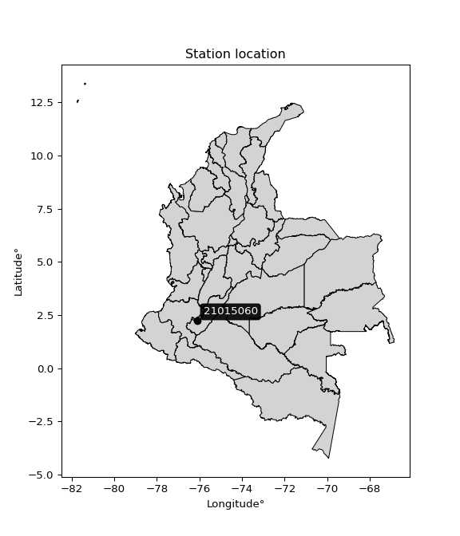

<div align="center">


</div>

# PMP Station (Rain, Pmax24h): 21015060

Probable Maximum Precipitation (PMP) is the greatest amount of rainfall for a specific duration that is meteorologically possible for a given location, acting as a "worst-case" scenario for extreme storms, crucial for designing safety-critical infrastructure like bridges, river deviations, dams, spillways, and nuclear plants to prevent catastrophic failure. PMP is calculated by hydrologists using meteorological data to determine the upper limit of extreme rainfall, often leading to the Probable Maximum Flood (PMF) for flood control design, and is increasingly being studied for climate change impacts. Probable Maximum Precipitation (PMP) is the theoretical upper limit of rainfall, a deterministic estimate for extreme events, while probability distributions (like GEV, Gumbel) describe the likelihood and frequency of various precipitation amounts, including rare ones, showing how often events occur, with PMP representing the extreme end of these distributions, used for critical infrastructure design to ensure safety against the worst conceivable weather, unlike standard statistical forecasts which cover typical probabilities.

The most common probability distributions in hydrology, used for analyzing floods, rainfall, and streamflow, include the Normal, Log-Normal, Gumbel, Gamma (including Log-Pearson Type III), and Generalized Extreme Value (GEV) distributions, often chosen based on the data´s skewness and whether modeling extremes or general conditions, with Gumbel and GEV popular for extreme events like floods, while the Normal distribution serves as a baseline, though often requiring transformations for skewed hydrological data. These distributions help in designing water infrastructure, managing water resources, and forecasting hydrologic events.

> Hydrological data often isn´t perfectly normal (it´s skewed), so different distributions are needed for different applications, such as: **Flood Frequency Analysis**: Using Gumbel, GEV, or Log-Pearson Type III for predicting extreme flood magnitudes and their return periods, **Rainfall Analysis**: Normal for annual totals, but Log-Normal, Weibull, or GEV for intensity or extreme daily rainfall, **Streamflow Modeling**: Gamma and Log-Normal for maximum flows, GEV for minimum flows, and Kappa for daily flows.

<div align="center">

</img>

</div>


## A. General information


### 1. General running parameters

• app_version: _v20260113_. • runtime: _2026-01-17 18:24:04.630693_. • Python version: _3.14.0_. • SciPy version: _1.16.3_. • Pandas version: _2.3.3_. • NumPy version: _2.3.5_. • Stations dataset (station_dataset_file): _dataset/pmax24h_in/automatic_colombia_2003_2025.csv_. • Stations catalog (station_catalog_file): _dataset/CNE.xls_. • Minimum year to eval til year_max (date_min): _1900_. • Maximum year to eval since year_min (date_max): _2025_. • Creates, save and include plots into reports (create_plot): _False_. • Plot only fit distributions with Δo > Δ (plot_only_fit): _True_. • Plot only simple graphs avoiding multiple CDFs and multiple Extreme values plots (plot_only_simple): _True_. • Eval low extreme values, if False, evaluates high extreme values (low_extreme): _False_. • Eval every SciPy distribution as logarithmic (pdist_logarithmic_on): _True_. • Standard deviation normalized (ddof): _1.0_. • Return periods to eval in years (Tr): _[2, 2.33, 5, 10, 15, 20, 25, 50, 75, 100, 200, 250, 500, 750, 1000]_. • Minimum data sample per station, 0 means any (minimum_sample): _5_. • Z-Score maximum threshold to adjust a value, 0 means disable (zscore_max): _3.5_. • Z-Score minimum threshold to adjust a value, 0 means disable (zscore_min): _-2.5_. • Avoid zeros, e.g. rain = 0 (avoid_zeros): _True_. • Avoid null values (avoid_nans): _True_. 

:file_folder:Table: [dataset.csv](../../dataset/pmax24h_in/automatic_colombia_2003_2025.csv)

> Delta Degrees of Freedom (DDOF): is a parameter used in the formulas for calculating variance and standard deviation. When ddof=0, the divisor is $N$ (the total number of observations) and this is used when your data set is the entire population. When ddof=1, the divisor is $N-1$ and this is used when your data set is a sample drawn from a larger population. Using $N-1$ provides an unbiased estimate of the population variance (known as Bessel´s correction).


### 2. Station info and location

|   id |   CODIGO | NOMBRE                    | CATEGORIA         | TECNOLOGIA                | ESTADO     | FECHA_INSTALACION   | FECHA_SUSPENSION   |   ALTITUD |   LATITUD |   LONGITUD | DEPARTAMENTO   | MUNICIPIO   | AREA_OPERATIVA                    | ENTIDAD                                                     | AREA_HIDROGRAFICA   | ZONA_HIDROGRAFICA   | SUBZONA_HIDROGRAFICA   |   CORRIENTE | Catalogo   |   Version |
|-----:|---------:|:--------------------------|:------------------|:--------------------------|:-----------|:--------------------|:-------------------|----------:|----------:|-----------:|:---------------|:------------|:----------------------------------|:------------------------------------------------------------|:--------------------|:--------------------|:-----------------------|------------:|:-----------|----------:|
|    0 | 21015060 | MARENGO  - AUT [21015060] | Agrometeorológica | Automática con Telemetría | Suspendida | 23/07/2005          | 21/02/2024         |      1550 |   2.22111 |   -76.1189 | Huila          | Pitalito    | Area Operativa 04 - Huila-Caquetá | INSTITUTO DE HIDROLOGIA METEOROLOGIA Y ESTUDIOS AMBIENTALES | Magdalena Cauca     | Alto Magdalena      | Río Páez               |         nan | CNE_IDEAM  |  20251226 |

<div align="center">

Dynamic map: [:earth_americas:Google](http://maps.google.com/maps?q=2.221111111,-76.11888889) [:earth_americas:OSM](https://www.openstreetmap.org/#map=18/2.221111111/-76.11888889&layers=P) [:earth_americas:Bing](https://www.bing.com/maps?cp=2.221111111~-76.11888889&lvl=18) [:earth_americas:Apple](https://maps.apple.com/frame?center=2.221111111%2C-76.11888889&span=0.003%2C0.006)

</div>


<div align="center">

```geojson
{
  "type": "Feature",
  "geometry": {
    "type": "Point", 
    "coordinates": [-76.11888889, 2.221111111]
  }, 
  "properties": {
    "Name": "21015060"
  }
}
```

</div>


### 3. Discrete values table and plot

<div align="center">

|               |            0 |             1 |            2 |           3 |           4 |           5 |          6 |           7 |            8 |           9 |          10 |           11 |          12 |          13 |          14 |          15 |          16 |          17 |
|:--------------|-------------:|--------------:|-------------:|------------:|------------:|------------:|-----------:|------------:|-------------:|------------:|------------:|-------------:|------------:|------------:|------------:|------------:|------------:|------------:|
| Date          | 2006         | 2007          | 2008         | 2009        | 2010        | 2011        | 2012       | 2013        | 2014         | 2015        | 2016        | 2017         | 2018        | 2019        | 2020        | 2021        | 2022        | 2024        |
| Value         |   51.3       |   53.4        |   49.3       |   36.5      |   29.7      |   12.7      |   53.0611  |   47.8      |   54.7       |   30.6      |   43.5      |   54.6       |   18.7      |   63        |   34        |   43.3      |   24.2      |   75.8      |
| Value_initial |   51.3       |   53.4        |   49.3       |   36.5      |   29.7      |   12.7      |  232       |   47.8      |   54.7       |   30.6      |   43.5      |   54.6       |   18.7      |   63        |   34        |   43.3      |   24.2      |   75.8      |
| count         |   18         |   18          |   18         |   18        |   18        |   18        |   18       |   18        |   18         |   18        |   18        |   18         |   18        |   18        |   18        |   18        |   18        |   18        |
| mean          |   53.0611    |   53.0611     |   53.0611    |   53.0611   |   53.0611   |   53.0611   |   53.0611  |   53.0611   |   53.0611    |   53.0611   |   53.0611   |   53.0611    |   53.0611   |   53.0611   |   53.0611   |   53.0611   |   53.0611   |   53.0611   |
| std           |   47.4046    |   47.4046     |   47.4046    |   47.4046   |   47.4046   |   47.4046   |   47.4046  |   47.4046   |   47.4046    |   47.4046   |   47.4046   |   47.4046    |   47.4046   |   47.4046   |   47.4046   |   47.4046   |   47.4046   |   47.4046   |
| zscore        |   -0.0371507 |    0.00714887 |   -0.0793407 |   -0.349357 |   -0.492803 |   -0.851418 |    3.77472 |   -0.110983 |    0.0345724 |   -0.473818 |   -0.201692 |    0.0324629 |   -0.724848 |    0.209661 |   -0.402094 |   -0.205911 |   -0.608826 |    0.479677 |


</div>


> The initial value (value_initial) correspond to the initial obtained or null completed value, and value (value) is adjusted only when the initial value is outside the valid range (outlier) definite through the Z-Score value. If Z-Score is active, values out of range or outliers are replaced with the station mean value. A Z-Score (or standard score) measures how many standard deviations a data point is from the mean of a dataset, indicating its relative position; positive scores mean above the mean, negative mean below, and a score of zero is exactly at the mean, allowing for comparison of values from different distributions. It´s calculated using the formula $z=(x–μ)/σ$, where $x$ is the data point, $μ$ is the mean, and $σ$ is the standard deviation, helping identify outliers and understand probability.
>
> <sub>**Note**: In this study, "completing" (filling gaps in) and "extending" (forecasting or lengthening the historical record) rainfall data series are avoided for certain critical analyses because they introduce artificial bias and uncertainty, which can distort the statistics of rare events (extremes), alter day-to-day variability, and compromise the integrity and homogeneity of the original data. Some reasons against Completing/Extending rainfall data are: **Distortion of Extremes and Variability**: The primary issue is that most gap-filling or extension methods rely on averaging or regression with nearby stations, which inherently smooths the data. Rainfall is highly variable in space and time, with a large percentage of zero values and occasional large storms. Infilling methods often underestimate the highest values and overestimate the lowest (zero) values, which severely distorts analyses focused on flood frequency, drought severity, and intensity-duration-frequency (IDF) curves, **Loss of Data Homogeneity**: Infilled or extended data are synthetic estimates, not actual measurements. Combining these estimates with observed data can violate the assumption of data homogeneity, which requires that the data properties do not change over time. Inhomogeneity can lead to incorrect conclusions about long-term trends or changes in climate patterns, **Propagation of Errors**: Errors and biases from the original data (e.g., wind-induced undercatch, instrument errors, site changes) or the data used for imputation can propagate through the analysis, leading to unreliable hydrological models and inaccurate predictions, **Compromised Statistical Integrity**: For statistical analyses, especially those involving the frequency of events, using artificial data can introduce time bias or autocorrelation that doesn´t exist in reality, making it difficult to assess the true probability of events, **Difficulty in Validation**: It is difficult to accurately validate the quality of filled or extended data, especially for past periods where ground-truth measurements are unavailable. The reliability of imputation techniques heavily depends on the density of the surrounding station network and the complexity of the local topography.</sub>


### 4. Active continuous probability distributions from SciPy (80 of 104 available)

A Probability Density Function (PDF) describes the relative likelihood of a continuous random variable falling within a specific range, where the total area under its curve equals 1, and the area over any interval gives the actual probability for that range. Unlike discrete probabilities (like rolling a die), a PDF shows density, not direct probability for a single point (which is zero), with higher points indicating higher likelihood, often visualized as a bell curve for normal distributions.

A log of a probability density function (log-PDF) is simply the logarithm of the PDF´s value, denoted as $log(f(x))$, useful for converting multiplication of probabilities into addition, improving numerical stability with tiny numbers, and connecting to information theory concepts like entropy. Instead of dealing with very small probabilities (e.g., 0.000001), log-PDFs use negative numbers (e.g., $log(0.00001) ≈ -11.51$ that are easier for computers to handle, preventing underflow errors and simplifying complex calculations. In this study, each active probability distribution from SciPy is also evaluated in the $log$ form.

[scipy.stats](https://docs.scipy.org/doc/scipy/reference/stats.html) is a Python´s powerful submodule within the SciPy library for comprehensive statistical analysis, offering over 130 probability distributions (like Normal, Poisson), functions for descriptive stats (mean, variance), hypothesis testing (t-tests, chi-square), random variable generation, and statistical tests, making it essential for data science, modeling, and research. It provides tools to explore, model, and draw conclusions from data efficiently, working seamlessly with NumPy.

<div align="center">

|   id | p_dist           |   n_parameter | fit_method   | label                                                                       | active   | ref                                                                                                      |
|-----:|:-----------------|--------------:|:-------------|:----------------------------------------------------------------------------|:---------|:---------------------------------------------------------------------------------------------------------|
|    0 | alpha            |             3 | MLE          | Alpha                                                                       | True     | [:mortar_board:](https://docs.scipy.org/doc/scipy/reference/generated/scipy.stats.alpha.html)            |
|    1 | anglit           |             2 | MM           | Anglit                                                                      | True     | [:mortar_board:](https://docs.scipy.org/doc/scipy/reference/generated/scipy.stats.anglit.html)           |
|    2 | arcsine          |             2 | MM           | Arcsine                                                                     | True     | [:mortar_board:](https://docs.scipy.org/doc/scipy/reference/generated/scipy.stats.arcsine.html)          |
|    3 | argus            |             3 | MLE          | Argus                                                                       | True     | [:mortar_board:](https://docs.scipy.org/doc/scipy/reference/generated/scipy.stats.argus.html)            |
|    4 | beta             |             4 | MLE          | Beta                                                                        | True     | [:mortar_board:](https://docs.scipy.org/doc/scipy/reference/generated/scipy.stats.beta.html)             |
|    5 | betaprime        |             4 | MLE          | Beta prime                                                                  | True     | [:mortar_board:](https://docs.scipy.org/doc/scipy/reference/generated/scipy.stats.betaprime.html)        |
|    6 | bradford         |             3 | MLE          | Bradford                                                                    | True     | [:mortar_board:](https://docs.scipy.org/doc/scipy/reference/generated/scipy.stats.bradford.html)         |
|    7 | burr             |             4 | MLE          | Burr (Type III)                                                             | True     | [:mortar_board:](https://docs.scipy.org/doc/scipy/reference/generated/scipy.stats.burr.html)             |
|    8 | burr12           |             4 | MLE          | Burr (Type III) 12                                                          | True     | [:mortar_board:](https://docs.scipy.org/doc/scipy/reference/generated/scipy.stats.burr12.html)           |
|    9 | cosine           |             2 | MLE          | Cosine                                                                      | True     | [:mortar_board:](https://docs.scipy.org/doc/scipy/reference/generated/scipy.stats.cosine.html)           |
|   10 | crystalball      |             4 | MLE          | Crystalball                                                                 | True     | [:mortar_board:](https://docs.scipy.org/doc/scipy/reference/generated/scipy.stats.crystalball.html)      |
|   11 | dgamma           |             3 | MLE          | Double gamma                                                                | True     | [:mortar_board:](https://docs.scipy.org/doc/scipy/reference/generated/scipy.stats.dgamma.html)           |
|   12 | dweibull         |             3 | MLE          | Double Weibull                                                              | True     | [:mortar_board:](https://docs.scipy.org/doc/scipy/reference/generated/scipy.stats.dweibull.html)         |
|   13 | erlang           |             3 | MLE          | Erlang                                                                      | True     | [:mortar_board:](https://docs.scipy.org/doc/scipy/reference/generated/scipy.stats.erlang.html)           |
|   14 | exponnorm        |             3 | MLE          | Exponentially modified Normal                                               | True     | [:mortar_board:](https://docs.scipy.org/doc/scipy/reference/generated/scipy.stats.exponnorm.html)        |
|   15 | exponpow         |             3 | MLE          | Exponential power                                                           | True     | [:mortar_board:](https://docs.scipy.org/doc/scipy/reference/generated/scipy.stats.exponpow.html)         |
|   16 | exponweib        |             4 | MLE          | Exponentiated Weibull                                                       | True     | [:mortar_board:](https://docs.scipy.org/doc/scipy/reference/generated/scipy.stats.exponweib.html)        |
|   17 | f                |             4 | MLE          | F                                                                           | True     | [:mortar_board:](https://docs.scipy.org/doc/scipy/reference/generated/scipy.stats.f.html)                |
|   18 | fatiguelife      |             3 | MLE          | Fatigue-life (Birnbaum-Saunders)                                            | True     | [:mortar_board:](https://docs.scipy.org/doc/scipy/reference/generated/scipy.stats.fatiguelife.html)      |
|   19 | foldnorm         |             3 | MM           | Fold Normal                                                                 | True     | [:mortar_board:](https://docs.scipy.org/doc/scipy/reference/generated/scipy.stats.foldnorm.html)         |
|   20 | gamma            |             3 | MLE          | Gamma                                                                       | True     | [:mortar_board:](https://docs.scipy.org/doc/scipy/reference/generated/scipy.stats.gamma.html)            |
|   21 | gausshyper       |             6 | MLE          | Gauss hypergeometric                                                        | True     | [:mortar_board:](https://docs.scipy.org/doc/scipy/reference/generated/scipy.stats.gausshyper.html)       |
|   22 | genexpon         |             5 | MLE          | Generalized exponential                                                     | True     | [:mortar_board:](https://docs.scipy.org/doc/scipy/reference/generated/scipy.stats.genexpon.html)         |
|   23 | genextreme       |             3 | MLE          | Generalized exponential                                                     | True     | [:mortar_board:](https://docs.scipy.org/doc/scipy/reference/generated/scipy.stats.genextreme.html)       |
|   24 | gengamma         |             4 | MLE          | Generalized gamma                                                           | True     | [:mortar_board:](https://docs.scipy.org/doc/scipy/reference/generated/scipy.stats.gengamma.html)         |
|   25 | genhalflogistic  |             3 | MLE          | Generalized half-logistic                                                   | True     | [:mortar_board:](https://docs.scipy.org/doc/scipy/reference/generated/scipy.stats.genhalflogistic.html)  |
|   26 | genlogistic      |             3 | MLE          | Generalized logistic                                                        | True     | [:mortar_board:](https://docs.scipy.org/doc/scipy/reference/generated/scipy.stats.genlogistic.html)      |
|   27 | gennorm          |             3 | MLE          | Generalized Normal                                                          | True     | [:mortar_board:](https://docs.scipy.org/doc/scipy/reference/generated/scipy.stats.gennorm.html)          |
|   28 | genpareto        |             3 | MLE          | Generalized Pareto                                                          | True     | [:mortar_board:](https://docs.scipy.org/doc/scipy/reference/generated/scipy.stats.genpareto.html)        |
|   29 | gompertz         |             3 | MLE          | Gompertz (or truncated Gumbel)                                              | True     | [:mortar_board:](https://docs.scipy.org/doc/scipy/reference/generated/scipy.stats.gompertz.html)         |
|   30 | gumbel_l         |             2 | MM           | Gumbel Left Skew                                                            | True     | [:mortar_board:](https://docs.scipy.org/doc/scipy/reference/generated/scipy.stats.gumbel_l.html)         |
|   31 | gumbel_r         |             2 | MM           | Gumbel Right Skew                                                           | True     | [:mortar_board:](https://docs.scipy.org/doc/scipy/reference/generated/scipy.stats.gumbel_r.html)         |
|   32 | halfgennorm      |             3 | MLE          | Upper half of a generalized normal                                          | True     | [:mortar_board:](https://docs.scipy.org/doc/scipy/reference/generated/scipy.stats.halfgennorm.html)      |
|   33 | halflogistic     |             2 | MM           | Half-logistic                                                               | True     | [:mortar_board:](https://docs.scipy.org/doc/scipy/reference/generated/scipy.stats.halflogistic.html)     |
|   34 | halfnorm         |             2 | MM           | Half Normal                                                                 | True     | [:mortar_board:](https://docs.scipy.org/doc/scipy/reference/generated/scipy.stats.halfnorm.html)         |
|   35 | hypsecant        |             2 | MM           | hyperbolic secant                                                           | True     | [:mortar_board:](https://docs.scipy.org/doc/scipy/reference/generated/scipy.stats.hypsecant.html)        |
|   36 | invgamma         |             3 | MLE          | Inverted gamma                                                              | True     | [:mortar_board:](https://docs.scipy.org/doc/scipy/reference/generated/scipy.stats.invgamma.html)         |
|   37 | invgauss         |             3 | MLE          | Inverse Gaussian                                                            | True     | [:mortar_board:](https://docs.scipy.org/doc/scipy/reference/generated/scipy.stats.invgauss.html)         |
|   38 | invweibull       |             3 | MLE          | Inverted Weibull                                                            | True     | [:mortar_board:](https://docs.scipy.org/doc/scipy/reference/generated/scipy.stats.invweibull.html)       |
|   39 | johnsonsb        |             4 | MLE          | Johnson SB                                                                  | True     | [:mortar_board:](https://docs.scipy.org/doc/scipy/reference/generated/scipy.stats.johnsonsb.html)        |
|   40 | johnsonsu        |             4 | MLE          | Johnson Su                                                                  | True     | [:mortar_board:](https://docs.scipy.org/doc/scipy/reference/generated/scipy.stats.johnsonsu.html)        |
|   41 | kappa3           |             3 | MLE          | Kappa 3                                                                     | True     | [:mortar_board:](https://docs.scipy.org/doc/scipy/reference/generated/scipy.stats.kappa3.html)           |
|   42 | kappa4           |             4 | MLE          | Kappa 4                                                                     | True     | [:mortar_board:](https://docs.scipy.org/doc/scipy/reference/generated/scipy.stats.kappa4.html)           |
|   43 | ksone            |             3 | MLE          | Kolmogorov-Smirnov one-sided test statistic distribution                    | True     | [:mortar_board:](https://docs.scipy.org/doc/scipy/reference/generated/scipy.stats.ksone.html)            |
|   44 | kstwobign        |             2 | MLE          | Limiting distribution of scaled Kolmogorov-Smirnov two-sided test statistic | True     | [:mortar_board:](https://docs.scipy.org/doc/scipy/reference/generated/scipy.stats.kstwobign.html)        |
|   45 | laplace          |             2 | MM           | Laplace                                                                     | True     | [:mortar_board:](https://docs.scipy.org/doc/scipy/reference/generated/scipy.stats.laplace.html)          |
|   46 | levy_l           |             2 | MLE          | Left-skewed Levy                                                            | True     | [:mortar_board:](https://docs.scipy.org/doc/scipy/reference/generated/scipy.stats.levy_l.html)           |
|   47 | loggamma         |             3 | MLE          | Log gamma                                                                   | True     | [:mortar_board:](https://docs.scipy.org/doc/scipy/reference/generated/scipy.stats.loggamma.html)         |
|   48 | logistic         |             2 | MM           | Logistic (or Sech-squared)                                                  | True     | [:mortar_board:](https://docs.scipy.org/doc/scipy/reference/generated/scipy.stats.logistic.html)         |
|   49 | loglaplace       |             3 | MLE          | Log-Laplace                                                                 | True     | [:mortar_board:](https://docs.scipy.org/doc/scipy/reference/generated/scipy.stats.loglaplace.html)       |
|   50 | lomax            |             3 | MLE          | Lomax (Pareto of the second kind)                                           | True     | [:mortar_board:](https://docs.scipy.org/doc/scipy/reference/generated/scipy.stats.lomax.html)            |
|   51 | maxwell          |             2 | MM           | Maxwell                                                                     | True     | [:mortar_board:](https://docs.scipy.org/doc/scipy/reference/generated/scipy.stats.maxwell.html)          |
|   52 | mielke           |             4 | MLE          | Mielke Beta-Kappa / Dagum                                                   | True     | [:mortar_board:](https://docs.scipy.org/doc/scipy/reference/generated/scipy.stats.mielke.html)           |
|   53 | moyal            |             2 | MM           | Moyal                                                                       | True     | [:mortar_board:](https://docs.scipy.org/doc/scipy/reference/generated/scipy.stats.moyal.html)            |
|   54 | nakagami         |             3 | MLE          | Nakagami                                                                    | True     | [:mortar_board:](https://docs.scipy.org/doc/scipy/reference/generated/scipy.stats.nakagami.html)         |
|   55 | ncf              |             5 | MLE          | Non-central F distribution                                                  | True     | [:mortar_board:](https://docs.scipy.org/doc/scipy/reference/generated/scipy.stats.ncf.html)              |
|   56 | nct              |             4 | MLE          | Non-central Student’s t                                                     | True     | [:mortar_board:](https://docs.scipy.org/doc/scipy/reference/generated/scipy.stats.nct.html)              |
|   57 | norm             |             2 | MM           | Normal                                                                      | True     | [:mortar_board:](https://docs.scipy.org/doc/scipy/reference/generated/scipy.stats.norm.html)             |
|   58 | pearson3         |             3 | MM           | Pearson type III                                                            | True     | [:mortar_board:](https://docs.scipy.org/doc/scipy/reference/generated/scipy.stats.pearson3.html)         |
|   59 | powerlaw         |             3 | MLE          | Power-function                                                              | True     | [:mortar_board:](https://docs.scipy.org/doc/scipy/reference/generated/scipy.stats.powerlaw.html)         |
|   60 | rayleigh         |             2 | MM           | Rayleigh                                                                    | True     | [:mortar_board:](https://docs.scipy.org/doc/scipy/reference/generated/scipy.stats.rayleigh.html)         |
|   61 | rdist            |             3 | MLE          | R-distributed (symmetric beta)                                              | True     | [:mortar_board:](https://docs.scipy.org/doc/scipy/reference/generated/scipy.stats.rdist.html)            |
|   62 | rice             |             3 | MLE          | Rice                                                                        | True     | [:mortar_board:](https://docs.scipy.org/doc/scipy/reference/generated/scipy.stats.rice.html)             |
|   63 | semicircular     |             2 | MM           | Semicircular                                                                | True     | [:mortar_board:](https://docs.scipy.org/doc/scipy/reference/generated/scipy.stats.semicircular.html)     |
|   64 | skewnorm         |             3 | MLE          | Skew normal                                                                 | True     | [:mortar_board:](https://docs.scipy.org/doc/scipy/reference/generated/scipy.stats.skewnorm.html)         |
|   65 | t                |             3 | MLE          | Student’s t                                                                 | True     | [:mortar_board:](https://docs.scipy.org/doc/scipy/reference/generated/scipy.stats.t.html)                |
|   66 | trapezoid        |             4 | MLE          | Trapezoid                                                                   | True     | [:mortar_board:](https://docs.scipy.org/doc/scipy/reference/generated/scipy.stats.trapezoid.html)        |
|   67 | triang           |             3 | MLE          | Triangular                                                                  | True     | [:mortar_board:](https://docs.scipy.org/doc/scipy/reference/generated/scipy.stats.triang.html)           |
|   68 | truncexpon       |             3 | MLE          | Truncated exponential                                                       | True     | [:mortar_board:](https://docs.scipy.org/doc/scipy/reference/generated/scipy.stats.truncexpon.html)       |
|   69 | truncnorm        |             4 | MLE          | Truncated normal                                                            | True     | [:mortar_board:](https://docs.scipy.org/doc/scipy/reference/generated/scipy.stats.truncnorm.html)        |
|   70 | truncpareto      |             4 | MLE          | Upper truncated Pareto                                                      | True     | [:mortar_board:](https://docs.scipy.org/doc/scipy/reference/generated/scipy.stats.truncpareto.html)      |
|   71 | truncweibull_min |             5 | MLE          | Doubly truncated Weibull minimum                                            | True     | [:mortar_board:](https://docs.scipy.org/doc/scipy/reference/generated/scipy.stats.truncweibull_min.html) |
|   72 | tukeylambda      |             3 | MLE          | Tukey-Lamdba                                                                | True     | [:mortar_board:](https://docs.scipy.org/doc/scipy/reference/generated/scipy.stats.tukeylambda.html)      |
|   73 | uniform          |             2 | MLE          | Uniform                                                                     | True     | [:mortar_board:](https://docs.scipy.org/doc/scipy/reference/generated/scipy.stats.uniform.html)          |
|   74 | vonmises         |             3 | MLE          | Von Mises                                                                   | True     | [:mortar_board:](https://docs.scipy.org/doc/scipy/reference/generated/scipy.stats.vonmises.html)         |
|   75 | vonmises_line    |             3 | MLE          | Von Mises line                                                              | True     | [:mortar_board:](https://docs.scipy.org/doc/scipy/reference/generated/scipy.stats.vonmises_line.html)    |
|   76 | wald             |             2 | MM           | Wald                                                                        | True     | [:mortar_board:](https://docs.scipy.org/doc/scipy/reference/generated/scipy.stats.wald.html)             |
|   77 | weibull_max      |             3 | MLE          | Weibull maximum                                                             | True     | [:mortar_board:](https://docs.scipy.org/doc/scipy/reference/generated/scipy.stats.weibull_max.html)      |
|   78 | weibull_min      |             3 | MLE          | Weibull minimum                                                             | True     | [:mortar_board:](https://docs.scipy.org/doc/scipy/reference/generated/scipy.stats.weibull_min.html)      |
|   79 | wrapcauchy       |             3 | MLE          | Wrapped  Cauchy                                                             | True     | [:mortar_board:](https://docs.scipy.org/doc/scipy/reference/generated/scipy.stats.wrapcauchy.html)       |

</div>

> **n_parameter:** # arguments & localization & scale.
>
> **Fit methods:** (MLE) maximum likelihood, (MM) L-moments.
>
>**Inactive** (With the only purpose of prevent loops, zero divisions, infinite values, over high estimated values or horizontal trending for recurrence intervals estimations, the follow distributions were disabled.)**:** lognorm, norminvgauss, powernorm, powerlognorm, cauchy, halfcauchy, foldcauchy, skewcauchy, chi2, expon, fisk, genhyperbolic, geninvgauss, gibrat, kstwo, laplace_asymmetric, levy, levy_stable, ncx2, pareto, rel_breitwigner, recipinvgauss, studentized_range, loguniform, 


## B. Probability (PDF) vs. Empirical (EDF) distributions functions

A continuous probability distribution (CPD) describes probabilities for variables that can take any value within a range (like rain any time), unlike discrete variables with specific outcomes (like temperature). It uses a Probability Density Function (PDF), a curve where the total area under it equals 1, and the probability of the variable falling within an interval (a to b) is found by calculating the area under the curve between those points. A key feature is that the probability of hitting any single exact value is zero, so probabilities are always expressed for ranges, e.g., $P(a ≤ X ≤ b)$.

<div align="center">

Distributions parameters from station values
|     |   station | p_dist              |   n |               loc |           scale | shape                  | shape1                 | shape2                 | shape3             |
|----:|----------:|:--------------------|----:|------------------:|----------------:|:-----------------------|:-----------------------|:-----------------------|:-------------------|
|   0 |  21015060 | alpha               |  18 |    -229.942       |  4741.39        | 17.44537946633838      |                        |                        |                    |
|   1 |  21015060 | anglit              |  18 |      43.1201      |    45.7601      |                        |                        |                        |                    |
|   2 |  21015060 | arcsine             |  18 |      20.9984      |    44.2433      |                        |                        |                        |                    |
|   3 |  21015060 | argus               |  18 |       2.72063     |    74.4339      | 3.55770895230518e-06   |                        |                        |                    |
|   4 |  21015060 | beta                |  18 |       9.03922     |    71.5659      | 1.8267089367836387     | 2.0296769527825105     |                        |                    |
|   5 |  21015060 | betaprime           |  18 |    -232.049       | 14731.1         | 310.171511382537       | 16610.20130408415      |                        |                    |
|   6 |  21015060 | bradford            |  18 |      12.7         |    63.1         | 0.7949533570960332     |                        |                        |                    |
|   7 |  21015060 | burr                |  18 |    -117.287       |    50.8355      | 9.835485843939427      | 45202.052142808345     |                        |                    |
|   8 |  21015060 | burr12              |  18 |       0.596683    |   197.688       | 3.0297205137796226     | 75.51112427637514      |                        |                    |
|   9 |  21015060 | cosine              |  18 |      43.207       |    13.7212      |                        |                        |                        |                    |
|  10 |  21015060 | crystalball         |  18 |      43.1201      |    15.6424      | 3293.0014843229433     | 3010.59305896789       |                        |                    |
|  11 |  21015060 | dgamma              |  18 |      45.4524      |     7.3948      | 1.7261468803337916     |                        |                        |                    |
|  12 |  21015060 | dweibull            |  18 |      45.1963      |    14.0187      | 1.3921473448924395     |                        |                        |                    |
|  13 |  21015060 | erlang              |  18 |    -431.87        |     0.516444    | 919.722830067657       |                        |                        |                    |
|  14 |  21015060 | exponnorm           |  18 |      43.0999      |    15.6423      | 0.001285845386348745   |                        |                        |                    |
|  15 |  21015060 | exponpow            |  18 |       9.21533     |    49.0258      | 1.6803925278056824     |                        |                        |                    |
|  16 |  21015060 | exponweib           |  18 |      -3.4933e+08  |     3.4933e+08  | 18.98512755147596      | 7516742.16559443       |                        |                    |
|  17 |  21015060 | f                   |  18 |    -183.932       |   227.005       | 412.45997272745876     | 439800.5318248961      |                        |                    |
|  18 |  21015060 | fatiguelife         |  18 |    -641.551       |   684.5         | 0.02274448091051836    |                        |                        |                    |
|  19 |  21015060 | foldnorm            |  18 |     -68.4493      |    15.529       | 7.186126772056036      |                        |                        |                    |
|  20 |  21015060 | gamma               |  18 |    -421.063       |     0.52937     | 876.8241997231407      |                        |                        |                    |
|  21 |  21015060 | gausshyper          |  18 |       8.17631     |    67.6237      | 1.3392516480288905     | 0.8296874921892982     | 0.8841667226982062     | 0.8579816328922044 |
|  22 |  21015060 | genexpon            |  18 |      12.7         |     2.03011     | 0.05661684192572594    | 0.010874491130587086   | 0.9127899925536265     |                    |
|  23 |  21015060 | genextreme          |  18 |      75.1784      |     3.11313     | 5.008466352099827      |                        |                        |                    |
|  24 |  21015060 | gengamma            |  18 |    -273.805       |    49.4947      | 75.79216293772288      | 2.329111450050301      |                        |                    |
|  25 |  21015060 | genhalflogistic     |  18 |      12.7         |    35.7346      | 0.5343830962058168     |                        |                        |                    |
|  26 |  21015060 | genlogistic         |  18 |      49.3815      |     7.4517      | 0.6383635534924275     |                        |                        |                    |
|  27 |  21015060 | gennorm             |  18 |      42.6158      |    24.5825      | 2.586386876551373      |                        |                        |                    |
|  28 |  21015060 | genpareto           |  18 |      -0.00943146  |   102.5         | -1.352068257073253     |                        |                        |                    |
|  29 |  21015060 | gompertz            |  18 |     -18.0729      |    15.1991      | 0.010926728767448053   |                        |                        |                    |
|  30 |  21015060 | gumbel_l            |  18 |      50.16        |    12.1963      |                        |                        |                        |                    |
|  31 |  21015060 | gumbel_r            |  18 |      36.0802      |    12.1963      |                        |                        |                        |                    |
|  32 |  21015060 | halfgennorm         |  18 |      12.7         |     0.571917    | 0.3151080709602472     |                        |                        |                    |
|  33 |  21015060 | halflogistic        |  18 |      24.5802      |    13.3737      |                        |                        |                        |                    |
|  34 |  21015060 | halfnorm            |  18 |      22.4157      |    25.949       |                        |                        |                        |                    |
|  35 |  21015060 | hypsecant           |  18 |      43.1201      |     9.95823     |                        |                        |                        |                    |
|  36 |  21015060 | invgamma            |  18 |    -121.672       | 17030.1         | 104.4327390651672      |                        |                        |                    |
|  37 |  21015060 | invgauss            |  18 |     -53.6901      |  3267.64        | 0.029493312486162424   |                        |                        |                    |
|  38 |  21015060 | invweibull          |  18 |      -2.08316e+09 |     2.08316e+09 | 137405892.1590318      |                        |                        |                    |
|  39 |  21015060 | johnsonsb           |  18 |      -1.60807     |    91.2426      | 0.06042610598803064    | 1.2767546273455057     |                        |                    |
|  40 |  21015060 | johnsonsu           |  18 | -411419           |     1.55008e+07 | -26310.487262536364    | 991296.6974200844      |                        |                    |
|  41 |  21015060 | kappa3              |  18 |      12.7         |    42.1217      | 10.138152118380379     |                        |                        |                    |
|  42 |  21015060 | kappa4              |  18 |       6.79043     |    69.8075      | 1.0925291486044149     | 1.010100728177576      |                        |                    |
|  43 |  21015060 | ksone               |  18 |       6.39        |    75.72        | 1.0                    |                        |                        |                    |
|  44 |  21015060 | kstwobign           |  18 |     -18.8743      |    70.9929      |                        |                        |                        |                    |
|  45 |  21015060 | laplace             |  18 |      43.1201      |    11.0608      |                        |                        |                        |                    |
|  46 |  21015060 | levy_l              |  18 |      79.0359      |    21.8115      |                        |                        |                        |                    |
|  47 |  21015060 | loggamma            |  18 |    -562.093       |   138.684       | 79.06898501431661      |                        |                        |                    |
|  48 |  21015060 | logistic            |  18 |      43.1201      |     8.62408     |                        |                        |                        |                    |
|  49 |  21015060 | loglaplace          |  18 |      -0.132896    |    43.6329      | 3.0156139358582967     |                        |                        |                    |
|  50 |  21015060 | lomax               |  18 |      12.6994      | 52443.6         | 1742.0276004924672     |                        |                        |                    |
|  51 |  21015060 | maxwell             |  18 |       6.05426     |    23.2275      |                        |                        |                        |                    |
|  52 |  21015060 | mielke              |  18 |  -15081.3         | 14987.5         | 6744156.860936253      | 1026.6620330362423     |                        |                    |
|  53 |  21015060 | moyal               |  18 |      34.1748      |     7.04153     |                        |                        |                        |                    |
|  54 |  21015060 | nakagami            |  18 |      14.4269      |    33.1899      | 1.114848224335295      |                        |                        |                    |
|  55 |  21015060 | ncf                 |  18 |      -0.0359193   |     1.69563e-05 | 4.082426637529717e-06  | 4.190562649614263      | 9.069536634924667      |                    |
|  56 |  21015060 | nct                 |  18 |    -813.943       |    15.5899      | 209064.18537816475     | 54.97536461150156      |                        |                    |
|  57 |  21015060 | norm                |  18 |      43.1201      |    15.6424      |                        |                        |                        |                    |
|  58 |  21015060 | pearson3            |  18 |      43.1201      |    15.6423      | -0.08906366952635414   |                        |                        |                    |
|  59 |  21015060 | powerlaw            |  18 |      12.7         |    63.1         | 0.3475649596985367     |                        |                        |                    |
|  60 |  21015060 | rayleigh            |  18 |      13.1953      |    23.8765      |                        |                        |                        |                    |
|  61 |  21015060 | rdist               |  18 |       7.469       |    36.031       | 1.0455827211807929     |                        |                        |                    |
|  62 |  21015060 | rice                |  18 |       6.1231      |    17.3175      | 1.8384960971124302     |                        |                        |                    |
|  63 |  21015060 | semicircular        |  18 |      43.1201      |    31.2847      |                        |                        |                        |                    |
|  64 |  21015060 | skewnorm            |  18 |      53.5425      |    18.7966      | -0.964126384789687     |                        |                        |                    |
|  65 |  21015060 | t                   |  18 |      43.1202      |    15.6425      | 39924599.211367294     |                        |                        |                    |
|  66 |  21015060 | trapezoid           |  18 |       6.39        |    75.72        | 1.0                    | 1.0                    |                        |                    |
|  67 |  21015060 | triang              |  18 |       4.48536     |    75.8793      | 0.5906040956291525     |                        |                        |                    |
|  68 |  21015060 | truncexpon          |  18 |       8.1889      |    89.9693      | 0.7514906344373704     |                        |                        |                    |
|  69 |  21015060 | truncnorm           |  18 |      43.1201      |    15.6424      | -179.84349053771425    | 1022.3524389797269     |                        |                    |
|  70 |  21015060 | truncpareto         |  18 |      12.7         |     4.29787e-07 | 0.05882354926785539    | 146816886.92307782     |                        |                    |
|  71 |  21015060 | truncweibull_min    |  18 |       7.74235     |   105.373       | 1.4331028386481888     | 1.7739000876008102e-05 | 0.6458707154509571     |                    |
|  72 |  21015060 | tukeylambda         |  18 |       7.38919     |    71.4327      | 1.0441720699989403     |                        |                        |                    |
|  73 |  21015060 | uniform             |  18 |      12.7         |    63.1         |                        |                        |                        |                    |
|  74 |  21015060 | vonmises            |  18 |      -0.961409    |     1           | 0.8225494294688328     |                        |                        |                    |
|  75 |  21015060 | vonmises_line       |  18 |      44.2501      |    10.0427      | 0.5641045826290969     |                        |                        |                    |
|  76 |  21015060 | wald                |  18 |      27.4777      |    15.6423      |                        |                        |                        |                    |
|  77 |  21015060 | weibull_max         |  18 |      75.8         |     1.5182      | 0.26937278118598607    |                        |                        |                    |
|  78 |  21015060 | weibull_min         |  18 |      -4.56468     |    53.1119      | 3.422616317265189      |                        |                        |                    |
|  79 |  21015060 | wrapcauchy          |  18 |      12.7         |    10.043       | 0.00905933987619853    |                        |                        |                    |
|  80 |  21015060 | logalpha            |  18 |      -7.29736     |   260.67        | 23.800380376173734     |                        |                        |                    |
|  81 |  21015060 | loganglit           |  18 |       3.68101     |     1.28349     |                        |                        |                        |                    |
|  82 |  21015060 | logarcsine          |  18 |       3.06056     |     1.2409      |                        |                        |                        |                    |
|  83 |  21015060 | logargus            |  18 |       2.28807     |     2.06575     | 1.6743545083359084     |                        |                        |                    |
|  84 |  21015060 | logbeta             |  18 |     -92.0864      |    96.5375      | 381.6781570497883      | 3.0696519984937787     |                        |                    |
|  85 |  21015060 | logbetaprime        |  18 |      -9.90419     |   343.294       | 945.8286985974423      | 23912.1552944821       |                        |                    |
|  86 |  21015060 | logbradford         |  18 |       2.52585     |     1.83007     | 1.2286758045086904e-05 |                        |                        |                    |
|  87 |  21015060 | logburr             |  18 |      -0.0403363   |     4.14378     | 47.372256407690685     | 0.17467181087345868    |                        |                    |
|  88 |  21015060 | logburr12           |  18 |     -66.2877      |    73.76        | 214.3237695885568      | 44873.37859670188      |                        |                    |
|  89 |  21015060 | logcosine           |  18 |       3.59767     |     0.408036    |                        |                        |                        |                    |
|  90 |  21015060 | logcrystalball      |  18 |       3.68101     |     0.438731    | 274.04107796497624     | 92.78126994429601      |                        |                    |
|  91 |  21015060 | logdgamma           |  18 |       3.81162     |     0.253281    | 1.314285190427541      |                        |                        |                    |
|  92 |  21015060 | logdweibull         |  18 |       3.80495     |     0.349667    | 1.135655476934427      |                        |                        |                    |
|  93 |  21015060 | logerlang           |  18 |      -4.37394     |     0.0257817   | 312.0223364646838      |                        |                        |                    |
|  94 |  21015060 | logexponnorm        |  18 |       3.68067     |     0.438731    | 0.0007859620944696295  |                        |                        |                    |
|  95 |  21015060 | logexponpow         |  18 |       0.337926    |     3.72641     | 7.608492045661285      |                        |                        |                    |
|  96 |  21015060 | logexponweib        |  18 |      -2.56608e+07 |     2.56608e+07 | 19.62575203529963      | 18270897.36334622      |                        |                    |
|  97 |  21015060 | logf                |  18 |    -568.389       |   572.068       | 10335241.908064356     | 5026163.438025395      |                        |                    |
|  98 |  21015060 | logfatiguelife      |  18 |    -245.061       |   248.741       | 0.0017554046245940634  |                        |                        |                    |
|  99 |  21015060 | logfoldnorm         |  18 |       2.98117     |     0.472264    | 1.413685337107757      |                        |                        |                    |
| 100 |  21015060 | loggamma            |  18 |      -3.1115      |     0.0309406   | 219.6181868692699      |                        |                        |                    |
| 101 |  21015060 | loggausshyper       |  18 |       2.53701     |     1.79108     | 1.141035845166725      | 0.7105567780077555     | 1.1704965167028896     | 1.0285288110767898 |
| 102 |  21015060 | loggenexpon         |  18 |       2.5142      |     0.00843051  | 0.0007331293624158785  | 3.9234109284983134     | 2.0852897023770343e-05 |                    |
| 103 |  21015060 | loggenextreme       |  18 |       3.60175     |     0.47742     | 0.6213557747382288     |                        |                        |                    |
| 104 |  21015060 | loggengamma         |  18 |     -10.9781      |     5.51576     | 63.733394332832376     | 4.243321625155978      |                        |                    |
| 105 |  21015060 | loggenhalflogistic  |  18 |       2.49835     |     1.99735     | 1.091598033106882      |                        |                        |                    |
| 106 |  21015060 | loggenlogistic      |  18 |       4.0766      |     0.0914556   | 0.21530841287717972    |                        |                        |                    |
| 107 |  21015060 | loggennorm          |  18 |       3.86703     |     0.273168    | 0.882206448448992      |                        |                        |                    |
| 108 |  21015060 | loggenpareto        |  18 |      -0.00326548  |     9.9508      | -2.2973828353205317    |                        |                        |                    |
| 109 |  21015060 | loggompertz         |  18 |       2.53248     |     0.346793    | 0.021663882622173874   |                        |                        |                    |
| 110 |  21015060 | loggumbel_l         |  18 |       3.87847     |     0.342077    |                        |                        |                        |                    |
| 111 |  21015060 | loggumbel_r         |  18 |       3.48356     |     0.342077    |                        |                        |                        |                    |
| 112 |  21015060 | loghalfgennorm      |  18 |       2.5416      |     1.78945     | 3119.9749942296226     |                        |                        |                    |
| 113 |  21015060 | loghalflogistic     |  18 |       3.16098     |     0.375126    |                        |                        |                        |                    |
| 114 |  21015060 | loghalfnorm         |  18 |       3.10029     |     0.727821    |                        |                        |                        |                    |
| 115 |  21015060 | loghypsecant        |  18 |       3.68101     |     0.279304    |                        |                        |                        |                    |
| 116 |  21015060 | loginvgamma         |  18 |      -7.27069     |  6339.77        | 580.1580883890822      |                        |                        |                    |
| 117 |  21015060 | loginvgauss         |  18 |      -0.930049    |   427.837       | 0.010796398442042464   |                        |                        |                    |
| 118 |  21015060 | loginvweibull       |  18 |      -7.95657e+07 |     7.95657e+07 | 155152127.57572788     |                        |                        |                    |
| 119 |  21015060 | logjohnsonsb        |  18 |      -0.464389    |     5.01407     | -2.724548132665789     | 1.620328207718787      |                        |                    |
| 120 |  21015060 | logjohnsonsu        |  18 |       4.16655     |     0.31602     | 1.4578503067758273     | 1.4246535906139586     |                        |                    |
| 121 |  21015060 | logkappa3           |  18 |       2.54119     |     1.7866      | 18620.919837764333     |                        |                        |                    |
| 122 |  21015060 | logkappa4           |  18 |       2.51505     |     1.95542     | 1.0123060130460777     | 1.0785228190196552     |                        |                    |
| 123 |  21015060 | logksone            |  18 |       2.36295     |     2.1438      | 1.0                    |                        |                        |                    |
| 124 |  21015060 | logkstwobign        |  18 |       1.53928     |     2.46038     |                        |                        |                        |                    |
| 125 |  21015060 | loglaplace          |  18 |       3.68101     |     0.310229    |                        |                        |                        |                    |
| 126 |  21015060 | loglevy_l           |  18 |       4.38412     |     0.373922    |                        |                        |                        |                    |
| 127 |  21015060 | logloggamma         |  18 |       4.0509      |     0.229032    | 0.5800862483713785     |                        |                        |                    |
| 128 |  21015060 | loglogistic         |  18 |       3.68101     |     0.241885    |                        |                        |                        |                    |
| 129 |  21015060 | logloglaplace       |  18 |      -0.0972133   |     3.96424     | 10.949700107276835     |                        |                        |                    |
| 130 |  21015060 | loglomax            |  18 |       2.5416      |    37.7844      | 33.327863789643025     |                        |                        |                    |
| 131 |  21015060 | logmaxwell          |  18 |       2.64137     |     0.651498    |                        |                        |                        |                    |
| 132 |  21015060 | logmielke           |  18 |      -0.101548    |     4.20455     | 8.419507973158838      | 48.03734063290972      |                        |                    |
| 133 |  21015060 | logmoyal            |  18 |       3.43012     |     0.197498    |                        |                        |                        |                    |
| 134 |  21015060 | lognakagami         |  18 |    -299.236       |   302.917       | 118515.97387418908     |                        |                        |                    |
| 135 |  21015060 | logncf              |  18 |      -8.91366     |     9.04939     | 2394.9489451247728     | 3655.467889368804      | 934.9599770595619      |                    |
| 136 |  21015060 | lognct              |  18 |     -24.5783      |     0.395665    | 10035.21411960054      | 71.4172738632085       |                        |                    |
| 137 |  21015060 | lognorm             |  18 |       3.68101     |     0.43873     |                        |                        |                        |                    |
| 138 |  21015060 | logpearson3         |  18 |       3.68101     |     0.438733    | -1.0210516482533571    |                        |                        |                    |
| 139 |  21015060 | logpowerlaw         |  18 |       2.5416      |     1.7865      | 0.41306050549438117    |                        |                        |                    |
| 140 |  21015060 | lograyleigh         |  18 |       2.84168     |     0.669691    |                        |                        |                        |                    |
| 141 |  21015060 | logrdist            |  18 |       3.41246     |     0.915635    | 1.124768830387187      |                        |                        |                    |
| 142 |  21015060 | logrice             |  18 |    -216.798       |     0.438716    | 502.55562195777463     |                        |                        |                    |
| 143 |  21015060 | logsemicircular     |  18 |       3.68101     |     0.877435    |                        |                        |                        |                    |
| 144 |  21015060 | logskewnorm         |  18 |       4.3281      |     0.781767    | -20948293.8832374      |                        |                        |                    |
| 145 |  21015060 | logt                |  18 |       3.74915     |     0.350266    | 4.923267177309272      |                        |                        |                    |
| 146 |  21015060 | logtrapezoid        |  18 |       2.36295     |     2.1438      | 1.0                    | 1.0                    |                        |                    |
| 147 |  21015060 | logtriang           |  18 |       2.33926     |     1.98884     | 0.9999997830668395     |                        |                        |                    |
| 148 |  21015060 | logtruncexpon       |  18 |       2.5416      |     2.14639     | 0.8323258424896269     |                        |                        |                    |
| 149 |  21015060 | logtruncnorm        |  18 |      -0.369991    |     1.52827     | 2.1580991585836733     | 3.0741131343892576     |                        |                    |
| 150 |  21015060 | logtruncpareto      |  18 |       2.5416      |     1.73522e-08 | 0.058823474025717915   | 102955200.505882       |                        |                    |
| 151 |  21015060 | logtruncweibull_min |  18 |       0.547513    |     3.46964     | 7.746862500040272      | 0.05936837000328618    | 1.090164645356242      |                    |
| 152 |  21015060 | logtukeylambda      |  18 |       3.43489     |     1.01678     | 1.138249955808049      |                        |                        |                    |
| 153 |  21015060 | loguniform          |  18 |       2.5416      |     1.7865      |                        |                        |                        |                    |
| 154 |  21015060 | logvonmises         |  18 |      -2.58738     |     1           | 5.797553713985076      |                        |                        |                    |
| 155 |  21015060 | logvonmises_line    |  18 |       6.64409     |     1.40915e-29 | 1.3053444053303576     |                        |                        |                    |
| 156 |  21015060 | logwald             |  18 |       3.24228     |     0.438735    |                        |                        |                        |                    |
| 157 |  21015060 | logweibull_max      |  18 |       4.3701      |     0.768351    | 1.6093030154324417     |                        |                        |                    |
| 158 |  21015060 | logweibull_min      |  18 |      -1.62895e+06 |     1.62895e+06 | 4994462.165938068      |                        |                        |                    |
| 159 |  21015060 | logwrapcauchy       |  18 |       2.5416      |     0.28433     | 0.5                    |                        |                        |                    |

</div>

> **loc** (Location parameter): This shifts the distribution along the x-axis. For many common distributions, like the normal (Gaussian) distribution, loc represents the mean $μ$. For others, like the uniform distribution, it might represent the minimum value, or for the beta distribution, the left end of the support interval.
>
> **scale** (Scale parameter): This determines the width or spread of the distribution. For the normal distribution, scale represents the standard deviation $σ$. For a uniform distribution, it defines the length of the interval (from $loc$ to $loc + scale$).
>
> **shape** (Shape parameters): Refers to parameters that define the specific form of a probability distribution, distinct from its location (loc) and scale (scale). These parameters are required arguments for most distribution functions. For example, a normal (Gaussian) distribution is fully defined by its location (mean) and scale (standard deviation), so it has no specific shape parameters beyond loc and scale. However, other distributions have intrinsic properties that need specification, as Gamma distribution that takes a shape parameter, often named $a$ or $alpha$.


### 0. Cumulative distribution values - CDF (160 evaluated)

Cumulative Distribution Function (CDF), denoted as $F$<sub>$X$</sub>$(x)$, is a function that gives the probability that a random variable $X$ will take a value less than or equal to a specific value, $x$ (i.e., $(P(X≥x)$. It essentially "accumulates" probabilities from a given point up to the far right (positive infinity), providing a complete picture of the distribution´s probabilities for both discrete (like rain) and continuous (like temperature) variables, helping to find probabilities over ranges or above certain values. Each station is evaluated separately ordering the $x$ values ascending, calculating the CDF and PDF values for the activated distributions and their logarithmic forms.

<div align="center">

CDF ordered by x ascending and calculating $log(f(x))$ separately
|   id |   Station |   date |       x |   count |    mean |     std |      zscore |   Value_initial |   station |   m |     alpha |   alpha_pdf |    anglit |   anglit_pdf |   arcsine |   arcsine_pdf |     argus |   argus_pdf |      beta |   beta_pdf |   betaprime |   betaprime_pdf |    bradford |   bradford_pdf |      burr |   burr_pdf |    burr12 |   burr12_pdf |    cosine |   cosine_pdf |   crystalball |   crystalball_pdf |    dgamma |   dgamma_pdf |   dweibull |   dweibull_pdf |    erlang |   erlang_pdf |   exponnorm |   exponnorm_pdf |   exponpow |   exponpow_pdf |   exponweib |   exponweib_pdf |         f |      f_pdf |   fatiguelife |   fatiguelife_pdf |   foldnorm |   foldnorm_pdf |     gamma |   gamma_pdf |   gausshyper |   gausshyper_pdf |    genexpon |   genexpon_pdf |   genextreme |   genextreme_pdf |   gengamma |   gengamma_pdf |   genhalflogistic |   genhalflogistic_pdf |   genlogistic |   genlogistic_pdf |   gennorm |   gennorm_pdf |   genpareto |   genpareto_pdf |   gompertz |   gompertz_pdf |   gumbel_l |   gumbel_l_pdf |   gumbel_r |   gumbel_r_pdf |   halfgennorm |   halfgennorm_pdf |   halflogistic |   halflogistic_pdf |   halfnorm |   halfnorm_pdf |   hypsecant |   hypsecant_pdf |   invgamma |   invgamma_pdf |   invgauss |   invgauss_pdf |   invweibull |   invweibull_pdf |   johnsonsb |   johnsonsb_pdf |   johnsonsu |   johnsonsu_pdf |      kappa3 |   kappa3_pdf |      kappa4 |   kappa4_pdf |     ksone |   ksone_pdf |   kstwobign |   kstwobign_pdf |   laplace |   laplace_pdf |   levy_l |   levy_l_pdf |   loggamma |   loggamma_pdf |   logistic |   logistic_pdf |   loglaplace |   loglaplace_pdf |       lomax |   lomax_pdf |    maxwell |   maxwell_pdf |   mielke |   mielke_pdf |       moyal |   moyal_pdf |   nakagami |   nakagami_pdf |      ncf |    ncf_pdf |       nct |    nct_pdf |      norm |   norm_pdf |   pearson3 |   pearson3_pdf |    powerlaw |   powerlaw_pdf |   rayleigh |   rayleigh_pdf |    rdist |       rdist_pdf |      rice |   rice_pdf |   semicircular |   semicircular_pdf |   skewnorm |   skewnorm_pdf |         t |      t_pdf |   trapezoid |   trapezoid_pdf |    triang |   triang_pdf |   truncexpon |   truncexpon_pdf |   truncnorm |   truncnorm_pdf |   truncpareto |   truncpareto_pdf |   truncweibull_min |   truncweibull_min_pdf |   tukeylambda |   tukeylambda_pdf |   uniform |   uniform_pdf |   vonmises |   vonmises_pdf |   vonmises_line |   vonmises_line_pdf |      wald |   wald_pdf |   weibull_max |   weibull_max_pdf |   weibull_min |   weibull_min_pdf |   wrapcauchy |   wrapcauchy_pdf |   logalpha |   logalpha_pdf |   loganglit |   loganglit_pdf |   logarcsine |   logarcsine_pdf |   logargus |   logargus_pdf |   logbeta |   logbeta_pdf |   logbetaprime |   logbetaprime_pdf |   logbradford |   logbradford_pdf |   logburr |   logburr_pdf |   logburr12 |   logburr12_pdf |   logcosine |   logcosine_pdf |   logcrystalball |   logcrystalball_pdf |   logdgamma |   logdgamma_pdf |   logdweibull |   logdweibull_pdf |   logerlang |   logerlang_pdf |   logexponnorm |   logexponnorm_pdf |   logexponpow |   logexponpow_pdf |   logexponweib |   logexponweib_pdf |       logf |   logf_pdf |   logfatiguelife |   logfatiguelife_pdf |   logfoldnorm |   logfoldnorm_pdf |   loggausshyper |   loggausshyper_pdf |   loggenexpon |   loggenexpon_pdf |   loggenextreme |   loggenextreme_pdf |   loggengamma |   loggengamma_pdf |   loggenhalflogistic |   loggenhalflogistic_pdf |   loggenlogistic |   loggenlogistic_pdf |   loggennorm |   loggennorm_pdf |   loggenpareto |   loggenpareto_pdf |   loggompertz |   loggompertz_pdf |   loggumbel_l |   loggumbel_l_pdf |   loggumbel_r |   loggumbel_r_pdf |   loghalfgennorm |   loghalfgennorm_pdf |   loghalflogistic |   loghalflogistic_pdf |   loghalfnorm |   loghalfnorm_pdf |   loghypsecant |   loghypsecant_pdf |   loginvgamma |   loginvgamma_pdf |   loginvgauss |   loginvgauss_pdf |   loginvweibull |   loginvweibull_pdf |   logjohnsonsb |   logjohnsonsb_pdf |   logjohnsonsu |   logjohnsonsu_pdf |   logkappa3 |   logkappa3_pdf |   logkappa4 |   logkappa4_pdf |   logksone |   logksone_pdf |   logkstwobign |   logkstwobign_pdf |   loglevy_l |   loglevy_l_pdf |   logloggamma |   logloggamma_pdf |   loglogistic |   loglogistic_pdf |   logloglaplace |   logloglaplace_pdf |    loglomax |   loglomax_pdf |   logmaxwell |   logmaxwell_pdf |   logmielke |   logmielke_pdf |    logmoyal |   logmoyal_pdf |   lognakagami |   lognakagami_pdf |     logncf |   logncf_pdf |     lognct |   lognct_pdf |    lognorm |   lognorm_pdf |   logpearson3 |   logpearson3_pdf |   logpowerlaw |   logpowerlaw_pdf |   lograyleigh |   lograyleigh_pdf |   logrdist |   logrdist_pdf |    logrice |   logrice_pdf |   logsemicircular |   logsemicircular_pdf |   logskewnorm |   logskewnorm_pdf |       logt |   logt_pdf |   logtrapezoid |   logtrapezoid_pdf |   logtriang |   logtriang_pdf |   logtruncexpon |   logtruncexpon_pdf |   logtruncnorm |   logtruncnorm_pdf |   logtruncpareto |   logtruncpareto_pdf |   logtruncweibull_min |   logtruncweibull_min_pdf |   logtukeylambda |   logtukeylambda_pdf |   loguniform |   loguniform_pdf |   logvonmises |   logvonmises_pdf |   logvonmises_line |   logvonmises_line_pdf |   logwald |   logwald_pdf |   logweibull_max |   logweibull_max_pdf |   logweibull_min |   logweibull_min_pdf |   logwrapcauchy |   logwrapcauchy_pdf |
|-----:|----------:|-------:|--------:|--------:|--------:|--------:|------------:|----------------:|----------:|----:|----------:|------------:|----------:|-------------:|----------:|--------------:|----------:|------------:|----------:|-----------:|------------:|----------------:|------------:|---------------:|----------:|-----------:|----------:|-------------:|----------:|-------------:|--------------:|------------------:|----------:|-------------:|-----------:|---------------:|----------:|-------------:|------------:|----------------:|-----------:|---------------:|------------:|----------------:|----------:|-----------:|--------------:|------------------:|-----------:|---------------:|----------:|------------:|-------------:|-----------------:|------------:|---------------:|-------------:|-----------------:|-----------:|---------------:|------------------:|----------------------:|--------------:|------------------:|----------:|--------------:|------------:|----------------:|-----------:|---------------:|-----------:|---------------:|-----------:|---------------:|--------------:|------------------:|---------------:|-------------------:|-----------:|---------------:|------------:|----------------:|-----------:|---------------:|-----------:|---------------:|-------------:|-----------------:|------------:|----------------:|------------:|----------------:|------------:|-------------:|------------:|-------------:|----------:|------------:|------------:|----------------:|----------:|--------------:|---------:|-------------:|-----------:|---------------:|-----------:|---------------:|-------------:|-----------------:|------------:|------------:|-----------:|--------------:|---------:|-------------:|------------:|------------:|-----------:|---------------:|---------:|-----------:|----------:|-----------:|----------:|-----------:|-----------:|---------------:|------------:|---------------:|-----------:|---------------:|---------:|----------------:|----------:|-----------:|---------------:|-------------------:|-----------:|---------------:|----------:|-----------:|------------:|----------------:|----------:|-------------:|-------------:|-----------------:|------------:|----------------:|--------------:|------------------:|-------------------:|-----------------------:|--------------:|------------------:|----------:|--------------:|-----------:|---------------:|----------------:|--------------------:|----------:|-----------:|--------------:|------------------:|--------------:|------------------:|-------------:|-----------------:|-----------:|---------------:|------------:|----------------:|-------------:|-----------------:|-----------:|---------------:|----------:|--------------:|---------------:|-------------------:|--------------:|------------------:|----------:|--------------:|------------:|----------------:|------------:|----------------:|-----------------:|---------------------:|------------:|----------------:|--------------:|------------------:|------------:|----------------:|---------------:|-------------------:|--------------:|------------------:|---------------:|-------------------:|-----------:|-----------:|-----------------:|---------------------:|--------------:|------------------:|----------------:|--------------------:|--------------:|------------------:|----------------:|--------------------:|--------------:|------------------:|---------------------:|-------------------------:|-----------------:|---------------------:|-------------:|-----------------:|---------------:|-------------------:|--------------:|------------------:|--------------:|------------------:|--------------:|------------------:|-----------------:|---------------------:|------------------:|----------------------:|--------------:|------------------:|---------------:|-------------------:|--------------:|------------------:|--------------:|------------------:|----------------:|--------------------:|---------------:|-------------------:|---------------:|-------------------:|------------:|----------------:|------------:|----------------:|-----------:|---------------:|---------------:|-------------------:|------------:|----------------:|--------------:|------------------:|--------------:|------------------:|----------------:|--------------------:|------------:|---------------:|-------------:|-----------------:|------------:|----------------:|------------:|---------------:|--------------:|------------------:|-----------:|-------------:|-----------:|-------------:|-----------:|--------------:|--------------:|------------------:|--------------:|------------------:|--------------:|------------------:|-----------:|---------------:|-----------:|--------------:|------------------:|----------------------:|--------------:|------------------:|-----------:|-----------:|---------------:|-------------------:|------------:|----------------:|----------------:|--------------------:|---------------:|-------------------:|-----------------:|---------------------:|----------------------:|--------------------------:|-----------------:|---------------------:|-------------:|-----------------:|--------------:|------------------:|-------------------:|-----------------------:|----------:|--------------:|-----------------:|---------------------:|-----------------:|---------------------:|----------------:|--------------------:|
|    0 |  21015060 |   2011 | 12.7    |      18 | 53.0611 | 47.4046 | -0.851418   |            12.7 |  21015060 |   1 | 0.018072  |  0.0035772  | 0.0144802 |   0.0052211  |  0        |     0         | 0.0268407 |  0.00535481 | 0.0122391 | 0.0059896  |   0.0237077 |      0.00383927 | 4.86538e-07 |      0.0215363 | 0.0121018 | 0.00404199 | 0.0158208 |   0.00392837 | 0.0196887 |   0.00455598 |     0.0259041 |        0.00384917 | 0.022221  |   0.00259984 |  0.0199107 |     0.00274945 | 0.0241902 |   0.00379398 |   0.0259041 |      0.00384918 |  0.0117613 |     0.00567134 |   0.0254196 |      0.00385145 | 0.023283  | 0.00383302 |     0.0234417 |        0.00372188 |  0.0249718 |     0.00376006 | 0.0242963 |  0.00380875 |    0.0298415 |       0.00869619 | 8.88511e-08 |     0.0278886  |    0.0808203 |      0.000643303 |  0.0251967 |     0.00385036 |       2.17544e-11 |            0.013992   |     0.0429799 |        0.00365534 | 0.0238726 |    0.00434738 |    0.126912 |       0.0102336 |  0.0693074 |     0.00506724 |  0.0452972 |    0.0036286   | 0.00111326 |    0.000620738 |   5.30558e-14 |        0.233335   |       0        |         0          |  0         |     0          |   0.0299841 |      0.00300653 |  0.0189339 |     0.00375203 |  0.0176178 |     0.00389369 |    0.0120553 |       0.00351325 |   0.0184331 |      0.00478072 |   0.0259038 |      0.00384913 | 1.39725e-10 |   0.0188916  | 2.49256e-15 |    0.321901  | 0.0833333 |   0.0132066 |   0.0110231 |      0.0040057  | 0.0319558 |    0.0028891  | 0.433635 |   0.00292571 | 0.00435985 |       0.031575 |  0.0285443 |     0.00321536 |    0.0127026 |        0.0409458 | 2.15516e-05 |  0.0332164  | 0.00607853 |    0.00269924 |      nan |          nan | 4.33746e-06 |  6.7856e-06 |  0         |     0          | 0.161919 | 0.0151079  | 0.0259142 | 0.00385141 | 0.0259041 | 0.00384917 |  0.0283249 |     0.00392426 | 1.76859e-06 |    3.46045e+08 |  0         |     0          | 0.547818 |      0.00920347 | 0.0136269 | 0.00423799 |     0.00274622 |         0.00475104 |  0.0295118 |     0.0039328  | 0.0259048 | 0.00384921 |  0.00694444 |      0.00220109 | 0.0198442 |   0.00483142 |    0.0925624 |       0.0200087  |   0.0259041 |      0.00384917 |      0        |  204531           |          0.0300525 |             0.00863307 |      0.538331 |        0.00721812 | 0         |     0.0158479 |    2.79142 |      0.197182  |     2.14365e-10 |          0.00833865 | 0         | 0          |     0.0652722 |       0.000760477 |     0.0211358 |        0.00414545 |  7.29167e-08 |        0.0161371 |  0.0035379 |      0.0285757 |   0         |        0        |     0        |         0        |  0.0121148 |      0.0962145 | 0.0197416 |     0.0610005 |      0.0048992 |          0.0335059 |    0.00860656 |          0.546431 | 0.0199516 |     0.0639409 |   0.0161675 |        0.049934 |  0.00442749 |       0.0582202 |       0.00470121 |            0.0311968 |   0.0065018 |       0.0243076 |    0.00677915 |         0.0262087 |  0.00485129 |       0.0342051 |     0.00470124 |          0.0311969 |     0.0183719 |         0.0634243 |     0.00684701 |          0.0413513 | 0.00481435 |   0.031848 |       0.00447782 |            0.0301512 |      0        |          0        |      0.00129075 |            0.320639 |    0.00281062 |          0.118166 |       0.0176618 |           0.0627465 |     0.004658  |         0.0303552 |             0.010958 |                 0.256362 |        0.0269505 |             0.063448 |    0.0117428 |        0.0306268 |       0.319885 |        0.165709    |   0.000576957 |         0.0640964 |     0.0198788 |         0.0575306 |   1.51935e-07 |       6.97314e-06 |         0        |             0.558934 |         0         |              0        |     0         |          0        |      0.0107684 |          0.0385471 |    0.00397393 |         0.0299761 |    0.00336719 |         0.0284687 |      0.00304874 |           0.0344396 |      0.019186  |          0.0629085 |      0.0303485 |          0.0591211 | 0.000232659 |        0.559428 |  0.00156914 |        0.55429  |  0.0833333 |       0.466462 |     0.00363689 |          0.0503162 |    0.347643 |       0.0881285 |     0.0245196 |         0.0620485 |    0.00891952 |         0.0365462 |      0.00580232 |           0.0240766 | 2.73022e-13 |       0.882054 |    0         |         0        |   0.0200746 |       0.0639458 | 2.48626e-21 |    5.72122e-19 |    0.00477694 |         0.0315964 | 0.00500545 |    0.0345824 | 0.00481703 |    0.0320596 | 0.00470121 |     0.0311968 |     0.018749  |         0.0602487 |   3.58413e-07 |       3.33371e+08 |    0          |          0        |  0.0833039 |    1.05363     | 0.00470022 |      0.031192 |         0         |              0        |     0.0223009 |         0.0749698 | 0.00937227 |  0.0285253 |     0.00694444 |          0.0777437 |   0.0103511 |        0.102311 |     2.16384e-07 |            0.824652 |    0           |           0        |         0        |          5.11932e+06 |             0.0158532 |                 0.0611675 |      7.10543e-15 |             0.972733 |     0        |         0.559755 |       1.00537 |          0.029726 |                  0 |                      0 |  0        |      0        |        0.0176665 |            0.0627556 |        0.0165417 |             0.050296 |        0        |            1.67926  |
|    1 |  21015060 |   2018 | 18.7    |      18 | 53.0611 | 47.4046 | -0.724848   |            18.7 |  21015060 |   2 | 0.0522129 |  0.00818716 | 0.0620477 |   0.0105438  |  0        |     0         | 0.0683276 |  0.00845072 | 0.0678921 | 0.0121461  |   0.0577584 |      0.00781062 | 0.124568    |      0.0200228 | 0.0588811 | 0.0120611  | 0.0525609 |   0.00855805 | 0.0602569 |   0.00912144 |     0.0592441 |        0.00754013 | 0.0444241 |   0.00505255 |  0.0441936 |     0.00563321 | 0.0575816 |   0.00762817 |   0.0592442 |      0.00754014 |  0.0632279 |     0.0111867  |   0.0591102 |      0.0076712  | 0.0574303 | 0.00785275 |     0.0563813 |        0.00755536 |  0.0577355 |     0.0074429  | 0.0578012 |  0.00765093 |    0.0900238 |       0.0110769  | 0.171684    |     0.0272387  |    0.0849374 |      0.000732358 |  0.0587976 |     0.00763377 |       0.0877341   |            0.0152529  |     0.0714539 |        0.00602313 | 0.0631219 |    0.00902427 |    0.189107 |       0.0105034 |  0.105849  |     0.00722467 |  0.0730116 |    0.00576232  | 0.0156386  |    0.00533158  |   0.309864    |        0.0286531  |       0        |         0          |  0         |     0          |   0.0546779 |      0.00546377 |  0.0544344 |     0.00844718 |  0.0555847 |     0.00915093 |    0.0510871 |       0.0100223  |   0.0622128 |      0.00990985 |   0.0592434 |      0.00754004 | 0.11335     |   0.0188916  | 0.114879    |    0.0175338 | 0.162573  |   0.0132066 |   0.0579077 |      0.0120336  | 0.0549711 |    0.0049699  | 0.452326 |   0.00331811 | 0.0455739  |       0.22596  |  0.0556396 |     0.00609268 |    0.0442129 |        0.142517  | 0.180707    |  0.0272115  | 0.0392964  |    0.00877921 |      nan |          nan | 0.00269426  |  0.00188502 |  0.0109778 |     0.00567825 | 0.252801 | 0.014912   | 0.0592733 | 0.00754423 | 0.0592441 | 0.00754013 |  0.0616421 |     0.00743762 | 0.441399    |    0.0255691   |  0.0262261 |     0.00940261 | 0.603972 |      0.00956575 | 0.0525726 | 0.00890384 |     0.0596202  |         0.0127195  |  0.062571  |     0.00733457 | 0.0592449 | 0.00754012 |  0.0264299  |      0.00429405 | 0.0594194 |   0.00836031 |    0.208699  |       0.0187178  |   0.0592441 |      0.00754013 |      0.926611 |       0.00556639  |          0.092422  |             0.0118532  |      0.581648 |        0.00722134 | 0.0950872 |     0.0158479 |    3.72975 |      0.238276  |     0.051731    |          0.00919463 | 0         | 0          |     0.0701785 |       0.000879562 |     0.0575703 |        0.00822092 |  0.0967182   |        0.0160856 |  0.0454372 |      0.23813   |   0.0391252 |        0.302134 |     0        |         0        |  0.0801451 |      0.26085   | 0.0627558 |     0.180478  |      0.0465212 |          0.224887  |    0.220032   |          0.54643  | 0.063355  |     0.176579  |   0.0527523 |        0.158958 |  0.0802225  |       0.363108  |       0.0431586  |            0.208891  |   0.0272669 |       0.0999063 |    0.0292367  |         0.107561  |  0.048135   |       0.234374  |     0.0431587  |          0.208891  |     0.0628639 |         0.18438   |     0.0523089  |          0.233501  | 0.0438377  |   0.211265 |       0.0423332  |            0.207267  |      0        |          0        |      0.188132   |            0.509683 |    0.126107   |          0.49257  |       0.0637353 |           0.195889  |     0.0417414 |         0.201429  |             0.122148 |                 0.322391 |        0.0670145 |             0.157768 |    0.0327274 |        0.0881879 |       0.388438 |        0.1902      |   0.0451586   |         0.18688   |     0.0603294 |         0.170932  |   0.00630755  |       0.0934121   |         0        |             0.558934 |         0         |              0        |     0         |          0        |      0.0429698 |          0.153379  |    0.045063   |         0.229333  |    0.0460634  |         0.242216  |      0.0656009  |           0.348478  |      0.0632744 |          0.183405  |      0.067115  |          0.144925  | 0.216687    |        0.559428 |  0.207669   |        0.531307 |  0.263818  |       0.466462 |     0.0926423  |          0.449393  |    0.387733 |       0.122168  |     0.065185  |         0.164322  |    0.0426581  |         0.168834  |      0.0259571  |           0.093935  | 0.287909    |       0.621736 |    0.0214905 |         0.215894 |   0.063414  |       0.176205  | 0.000370284 |    0.0127111   |    0.043523   |         0.209904  | 0.0479498  |    0.231124  | 0.0441763  |    0.212934  | 0.0431586  |     0.208891  |     0.0621199 |         0.184123  |   0.531583    |       0.567495    |    0.00837308 |          0.192019 |  0.309135  |    0.434908    | 0.0431548  |      0.208883 |         0.0315539 |              0.373157 |     0.0734103 |         0.205537  | 0.0334743  |  0.117818  |     0.0695998  |          0.246122  |   0.0877857 |        0.297949 |     0.291969    |            0.688624 |    0.000611131 |           1.76466  |         0.951966 |          0.0848579   |             0.0613805 |                 0.194354  |      0.22413     |             0.552917 |     0.216581 |         0.559755 |       1.03954 |          0.184776 |                  0 |                      0 |  0        |      0        |        0.0637431 |            0.195894  |        0.0531622 |             0.158587 |        0.37564  |            0.403064 |
|    2 |  21015060 |   2022 | 24.2    |      18 | 53.0611 | 47.4046 | -0.608826   |            24.2 |  21015060 |   3 | 0.112932  |  0.014066   | 0.132074  |   0.0147977  |  0.173389 |     0.0277687 | 0.122271  |  0.0111358  | 0.145989  | 0.0160186  |   0.11409   |      0.0128472  | 0.231291    |      0.018811  | 0.146948  | 0.0195888  | 0.113578  |   0.0137068  | 0.123111  |   0.0137393  |     0.113228  |        0.0122722  | 0.0821361 |   0.00899379 |  0.0864703 |     0.010061   | 0.112541  |   0.012539   |   0.113228  |      0.0122723  |  0.136012  |     0.0151531  |   0.114292  |      0.0125786  | 0.11413   | 0.0129362  |     0.111021  |        0.0125017  |  0.111252  |     0.0122074  | 0.112897  |  0.0125646  |    0.154622  |       0.0123287  | 0.309593    |     0.0229317  |    0.0892355 |      0.000834384 |  0.113586  |     0.0124696  |       0.174756    |            0.016382   |     0.113199  |        0.00937787 | 0.127052  |    0.0142605  |    0.247631 |       0.0107841 |  0.152467  |     0.00983374 |  0.112205  |    0.00866331  | 0.0707409  |    0.0153632   |   0.432994    |        0.0177796  |       0        |         0          |  0.0548199 |     0.0306755  |   0.0945231 |      0.00935307 |  0.116442  |     0.0142394  |  0.12271   |     0.0153361  |    0.126276  |       0.0172355  |   0.129783  |      0.0145762  |   0.113226  |      0.0122721  | 0.217254    |   0.0188916  | 0.208472    |    0.0166099 | 0.235209  |   0.0132066 |   0.144767  |      0.0191652  | 0.0903833 |    0.00817148 | 0.471751 |   0.00376082 | 0.137966   |       0.5056   |  0.100303  |     0.010464   |    0.101505  |        0.327194  | 0.317489    |  0.0226661  | 0.105929   |    0.0154509  |      nan |          nan | 0.042306    |  0.0146408  |  0.0666614 |     0.0145235  | 0.331893 | 0.0137597  | 0.113283  | 0.0122774  | 0.113228  | 0.0122722  |  0.114437  |     0.0119408  | 0.553394    |    0.0167252   |  0.100768  |     0.0173583  | 0.658228 |      0.0102299  | 0.115079  | 0.0139045  |     0.139954   |         0.0162061  |  0.114468  |     0.0117212  | 0.113228  | 0.0122721  |  0.0553231  |      0.00621259 | 0.114297  |   0.0115951  |    0.308564  |       0.0176079  |   0.113228  |      0.0122722  |      0.947929 |       0.00279516  |          0.163039  |             0.0137069  |      0.621379 |        0.00722648 | 0.18225   |     0.0158479 |    4.50883 |      0.307846  |     0.108183    |          0.0116123  | 0         | 0          |     0.0753802 |       0.00101732  |     0.115372  |        0.0129035  |  0.18488     |        0.0159641 |  0.143689  |      0.537266  |   0.151643  |        0.558906 |     0.20628  |         0.849908 |  0.16413   |      0.394769  | 0.128615  |     0.344888  |      0.138279  |          0.502858  |    0.360918   |          0.546429 | 0.126198  |     0.323622  |   0.113288  |        0.328898 |  0.204952   |       0.598148  |       0.129769   |            0.481583  |   0.0694    |       0.248063  |    0.0739341  |         0.259445  |  0.143154   |       0.517144  |     0.12977    |          0.481583  |     0.129107  |         0.34284   |     0.14449    |          0.494851  | 0.131137   |   0.484213 |       0.128762   |            0.482239  |      0.131444 |          0.676125 |      0.319424   |            0.508014 |    0.272642   |          0.625561 |       0.134682  |           0.367104  |     0.125759  |         0.46997   |             0.212725 |                 0.383025 |        0.122964  |             0.289468 |    0.0661937 |        0.183557  |       0.440307 |        0.213377    |   0.114045    |         0.364693  |     0.123854  |         0.338656  |   0.0921688   |       0.642378    |         0        |             0.558934 |         0.0338114 |              1.33136  |     0.0941235 |          1.08863  |      0.107297  |          0.376922  |    0.139637   |         0.519341  |    0.144759   |         0.533908  |      0.192486   |           0.618469  |      0.12955   |          0.344488  |      0.11941   |          0.275758  | 0.360924    |        0.559428 |  0.345173   |        0.53588  |  0.384085  |       0.466462 |     0.238682   |          0.652941  |    0.423657 |       0.159204  |     0.124534  |         0.310863  |    0.114556   |         0.419344  |      0.0635522  |           0.211927  | 0.431018    |       0.493452 |    0.126735  |         0.603973 |   0.126122  |       0.322964  | 0.0637947   |    0.671854    |    0.130348   |         0.481989  | 0.141509   |    0.509259  | 0.131934   |    0.48559   | 0.129769   |     0.481583  |     0.129715  |         0.355048  |   0.65641     |       0.42053     |    0.124049   |          0.673192 |  0.414018  |    0.387343    | 0.129765   |      0.481588 |         0.16114   |              0.599257 |     0.144161  |         0.351313  | 0.0849614  |  0.310702  |     0.147521   |          0.358323  |   0.181411  |        0.428314 |     0.459267    |            0.61068  |    0.380319    |           1.20877  |         0.968482 |          0.0494172   |             0.131778  |                 0.364117  |      0.365295    |             0.543633 |     0.360902 |         0.559755 |       1.11827 |          0.449167 |                  0 |                      0 |  0        |      0        |        0.134689  |            0.367094  |        0.11346   |             0.327348 |        0.450833 |            0.221916 |
|    3 |  21015060 |   2010 | 29.7    |      18 | 53.0611 | 47.4046 | -0.492803   |            29.7 |  21015060 |   4 | 0.207284  |  0.020115   | 0.223259  |   0.0182006  |  0.292513 |     0.0181002 | 0.190445  |  0.0136153  | 0.241768  | 0.0186155  |   0.200003  |      0.0183676  | 0.331742    |      0.0177375 | 0.267699  | 0.0236067  | 0.203284  |   0.0188203  | 0.210764  |   0.0180178  |     0.195465  |        0.0176513  | 0.147592  |   0.0152235  |  0.158366  |     0.016357   | 0.19662   |   0.0180332  |   0.195466  |      0.0176514  |  0.228595  |     0.0183914  |   0.198581  |      0.0180659  | 0.200585  | 0.0184662  |     0.195071  |        0.0180637  |  0.193323  |     0.0176613  | 0.197105  |  0.0180527  |    0.224984  |       0.0132155  | 0.424928    |     0.0191169  |    0.0941653 |      0.000963594 |  0.197107  |     0.0179071  |       0.267764    |            0.0174165  |     0.177283  |        0.0141769  | 0.218978  |    0.0189537  |    0.307805 |       0.0111053 |  0.215191  |     0.0130762  |  0.170415  |    0.0127081   | 0.18502    |    0.0255965   |   0.515371    |        0.0126873  |       0.189109 |         0.0360499  |  0.221071  |     0.0295602  |   0.161849  |      0.0155614  |  0.211033  |     0.0200009  |  0.223294  |     0.0209856  |    0.237004  |       0.0225063  |   0.221045  |      0.0184323  |   0.195463  |      0.0176512  | 0.321157    |   0.0188914  | 0.298281    |    0.0160864 | 0.307845  |   0.0132066 |   0.262671  |      0.0230935  | 0.148608  |    0.0134355  | 0.49389  |   0.0043103  | 0.266094   |       0.737089 |  0.174205  |     0.0166809  |    0.196418  |        0.633139  | 0.431425    |  0.0188803  | 0.207539   |    0.0212031  |      nan |          nan | 0.169436    |  0.0302884  |  0.167915  |     0.0218754  | 0.403607 | 0.0122973  | 0.195547  | 0.0176555  | 0.195465  | 0.0176513  |  0.194332  |     0.0171546  | 0.633919    |    0.0129605   |  0.212518  |     0.0227985  | 0.717498 |      0.0114509  | 0.205603  | 0.0189334  |     0.235535   |         0.0183819  |  0.192971  |     0.0168865  | 0.195465  | 0.0176511  |  0.0947684  |      0.00813113 | 0.186966  |   0.0148299  |    0.402506  |       0.0165637  |   0.195465  |      0.0176513  |      0.96035  |       0.00184786  |          0.242154  |             0.0149844  |      0.661144 |        0.00723394 | 0.269414  |     0.0158479 |    5.28414 |      0.246337  |     0.182572    |          0.0156997  | 0.0204525 | 0.0357135  |     0.0814389 |       0.00119343  |     0.199974  |        0.0178294  |  0.272263    |        0.0158099 |  0.278439  |      0.765986  |   0.281759  |        0.700991 |     0.345267 |         0.580249 |  0.257557  |      0.520752  | 0.218398  |     0.541873  |      0.266315  |          0.740131  |    0.472823   |          0.546428 | 0.20998   |     0.506275  |   0.202239  |        0.55443  |  0.342284   |       0.731198  |       0.254404   |            0.731011  |   0.142614  |       0.491538  |    0.148986   |         0.495062  |  0.273672   |       0.748321  |     0.254405   |          0.731011  |     0.217742  |         0.533187  |     0.268815   |          0.711838  | 0.256176   |   0.732052 |       0.253825   |            0.734486  |      0.281426 |          0.790467 |      0.42337    |            0.50785  |    0.404625   |          0.652137 |       0.228376  |           0.554445  |     0.248314  |         0.723832  |             0.297315 |                 0.445653 |        0.199122  |             0.46852  |    0.117759  |        0.336439  |       0.486453 |        0.238578    |   0.210219    |         0.5868    |     0.21385   |         0.552957  |   0.269774    |       1.03325     |         0        |             0.558934 |         0.297516  |              1.2149   |     0.310565  |          1.01213  |      0.216729  |          0.717379  |    0.271122   |         0.754666  |    0.27734    |         0.747685  |      0.331135   |           0.713657  |      0.218776  |          0.536831  |      0.193747  |          0.46726   | 0.475492    |        0.559428 |  0.455489   |        0.541796 |  0.479614  |       0.466462 |     0.377338   |          0.683687  |    0.460555 |       0.204233  |     0.206691  |         0.505169  |    0.231766   |         0.736097  |      0.123265   |           0.38692   | 0.523384    |       0.411156 |    0.276666  |         0.836494 |   0.209761  |       0.505582  | 0.269725    |    1.21249     |    0.25493    |         0.730002  | 0.270268   |    0.73979   | 0.256999   |    0.730533  | 0.254405   |     0.731011  |     0.222086  |         0.556343  |   0.735627    |       0.357672    |    0.285801   |          0.875009 |  0.491967  |    0.376912    | 0.254403   |      0.731034 |         0.293578  |              0.684811 |     0.230721  |         0.497679  | 0.177156   |  0.612495  |     0.23003    |          0.447444  |   0.279731  |        0.531863 |     0.57855     |            0.555106 |    0.592404    |           0.877038 |         0.9772   |          0.0369009   |             0.224619  |                 0.548758  |      0.476327    |             0.541276 |     0.475537 |         0.559755 |       1.23785 |          0.718122 |                  0 |                      0 |  0.207762 |      2.41801  |        0.22838   |            0.554418  |        0.202     |             0.552093 |        0.491831 |            0.187568 |
|    4 |  21015060 |   2015 | 30.6    |      18 | 53.0611 | 47.4046 | -0.473818   |            30.6 |  21015060 |   5 | 0.225785  |  0.0209895  | 0.239849  |   0.0186622  |  0.308504 |     0.0174534 | 0.202871  |  0.0139971  | 0.258667  | 0.0189325  |   0.216922  |      0.0192238  | 0.347631    |      0.0175734 | 0.289067  | 0.0238596  | 0.220567  |   0.0195805  | 0.227261  |   0.0186373  |     0.211741  |        0.0185138  | 0.161852  |   0.0164747  |  0.173607  |     0.0175154  | 0.213242  |   0.0189002  |   0.211741  |      0.0185139  |  0.245355  |     0.018849   |   0.21523   |      0.0189285  | 0.21759   | 0.0193183  |     0.211726  |        0.0189433  |  0.209614  |     0.0185389  | 0.213744  |  0.0189178  |    0.236934  |       0.0133398  | 0.441879    |     0.0185539  |    0.0950434 |      0.000988049 |  0.213613  |     0.0187702  |       0.283509    |            0.0175708  |     0.190456  |        0.0151012  | 0.236319  |    0.0195749  |    0.317826 |       0.0111624 |  0.227222  |     0.0136612  |  0.182201  |    0.013487    | 0.208615   |    0.0268078   |   0.526519    |        0.0120961  |       0.221336 |         0.0355553  |  0.247541  |     0.0292562  |   0.176417  |      0.0168225  |  0.229405  |     0.0208161  |  0.24252   |     0.0217283  |    0.257509  |       0.0230441  |   0.237872  |      0.0189541  |   0.211739  |      0.0185137  | 0.338159    |   0.0188913  | 0.312728    |    0.0160193 | 0.319731  |   0.0132066 |   0.283595  |      0.0233904  | 0.161205  |    0.0145744  | 0.497815 |   0.00441283 | 0.288513   |       0.764497 |  0.189731  |     0.0178261  |    0.216259  |        0.697093  | 0.448166    |  0.0183241  | 0.226961   |    0.0219477  |      nan |          nan | 0.197413    |  0.0318208  |  0.188029  |     0.0228083  | 0.414564 | 0.0120514  | 0.211826  | 0.0185176  | 0.211741  | 0.0185138  |  0.210156  |     0.0180067  | 0.645388    |    0.0125315   |  0.233316  |     0.0234068  | 0.727931 |      0.0117392  | 0.222984  | 0.0196857  |     0.2522     |         0.0186486  |  0.208555  |     0.0177426  | 0.21174   | 0.0185136  |  0.102228   |      0.00844508 | 0.200551  |   0.0153593  |    0.417339  |       0.0163988  |   0.211741  |      0.0185138  |      0.961968 |       0.00174964  |          0.255716  |             0.0151523  |      0.667655 |        0.0072354  | 0.283677  |     0.0158479 |    5.54467 |      0.305286  |     0.197061    |          0.0165019  | 0.063397  | 0.0574665  |     0.082528  |       0.00122693  |     0.216367  |        0.0185962  |  0.286481    |        0.0157847 |  0.301685  |      0.79091   |   0.302915  |        0.716046 |     0.362355 |         0.565042 |  0.273399  |      0.540688  | 0.235071  |     0.575312  |      0.288846  |          0.768905  |    0.489136   |          0.546428 | 0.225581  |     0.539161  |   0.219384  |        0.594423 |  0.36431    |       0.744108  |       0.276708   |            0.762856  |   0.158008  |       0.540373  |    0.164442   |         0.540896  |  0.296422   |       0.77538   |     0.276708   |          0.762856  |     0.234148  |         0.566146  |     0.29046    |          0.737892  | 0.278506   |   0.763544 |       0.276237   |            0.766667  |      0.305259 |          0.805998 |      0.438537   |            0.508273 |    0.424073   |          0.650582 |       0.245376  |           0.584581  |     0.270424  |         0.757071  |             0.310775 |                 0.456186 |        0.21361   |             0.502501 |    0.128272  |        0.368363  |       0.49364  |        0.242981    |   0.228303    |         0.624907  |     0.230911  |         0.590287  |   0.30099     |       1.05647     |         0        |             0.558934 |         0.333341  |              1.18478  |     0.340525  |          0.994841 |      0.239041  |          0.777639  |    0.294062   |         0.781802  |    0.300007   |         0.770469  |      0.352492   |           0.716724  |      0.23529   |          0.569703  |      0.208246  |          0.504547  | 0.492192    |        0.559428 |  0.471679   |        0.542842 |  0.493539  |       0.466462 |     0.3977     |          0.680173  |    0.466775 |       0.212558  |     0.222296  |         0.540607  |    0.254464   |         0.784307  |      0.13532    |           0.421156  | 0.535497    |       0.400398 |    0.301954  |         0.857072 |   0.225341  |       0.538494  | 0.30614     |    1.22452     |    0.2772     |         0.761618  | 0.292768   |    0.767164  | 0.279274   |    0.761441  | 0.276708   |     0.762857  |     0.239194  |         0.58993   |   0.746196    |       0.350495    |    0.312135   |          0.888533 |  0.503217  |    0.376837    | 0.276707   |      0.762882 |         0.314146  |              0.692958 |     0.245919  |         0.520606  | 0.196239   |  0.666191  |     0.243581   |          0.460435  |   0.295834  |        0.546958 |     0.595007    |            0.547439 |    0.617965    |           0.835714 |         0.978282 |          0.0355759   |             0.241441  |                 0.578292  |      0.492485    |             0.54121  |     0.492247 |         0.559755 |       1.25984 |          0.754522 |                  0 |                      0 |  0.277986 |      2.27257  |        0.245379  |            0.584551  |        0.219074  |             0.592067 |        0.497415 |            0.186683 |
|    5 |  21015060 |   2020 | 34      |      18 | 53.0611 | 47.4046 | -0.402094   |            34   |  21015060 |   6 | 0.302097  |  0.0237382  | 0.305934  |   0.0201399  |  0.364736 |     0.0157937 | 0.252826  |  0.015369   | 0.324751  | 0.0198743  |   0.287378  |      0.022115   | 0.40636     |      0.0169799 | 0.370662  | 0.0239156  | 0.2916    |   0.0221004  | 0.294247  |   0.0206836  |     0.279934  |        0.0215176  | 0.226454  |   0.0216031  |  0.240649  |     0.0218813  | 0.282719  |   0.0218736  |   0.279935  |      0.0215176  |  0.312123  |     0.0203689  |   0.284757  |      0.0218698  | 0.288322  | 0.0221792  |     0.28143   |        0.0219629  |  0.277993  |     0.0216014  | 0.283265  |  0.0218817  |    0.283041  |       0.0137736  | 0.501529    |     0.0165716  |    0.0985727 |      0.00109092  |  0.282647  |     0.0217482  |       0.344175    |            0.0180999  |     0.248089  |        0.0188593  | 0.306256  |    0.0214312  |    0.356162 |       0.011392  |  0.277561  |     0.015973   |  0.233412  |    0.016707    | 0.305451   |    0.029702    |   0.564338    |        0.0102386  |       0.338304 |         0.033108   |  0.344709  |     0.0278319  |   0.242339  |      0.0220518  |  0.304741  |     0.0233395  |  0.320355  |     0.0238731  |    0.338191  |       0.0241842  |   0.30527   |      0.0206062  |   0.279931  |      0.0215174  | 0.402387    |   0.0188896  | 0.366803    |    0.015797  | 0.364633  |   0.0132066 |   0.364045  |      0.0237409  | 0.219219  |    0.0198194  | 0.513525 |   0.00483891 | 0.373304   |       0.838702 |  0.257785  |     0.0221858  |    0.303717  |        0.979009  | 0.507077    |  0.0163668  | 0.305565   |    0.0241122  |      nan |          nan | 0.311305    |  0.034358   |  0.270539  |     0.025502   | 0.45397  | 0.0111331  | 0.280029  | 0.0215191  | 0.279934  | 0.0215176  |  0.276631  |     0.0210302  | 0.6856      |    0.0111874   |  0.31588   |     0.0249662  | 0.770161 |      0.013227   | 0.294327  | 0.0221761  |     0.317077   |         0.0194654  |  0.274202  |     0.0208166  | 0.279933  | 0.0215172  |  0.132957   |      0.00963108 | 0.256172  |   0.017359   |    0.472055  |       0.0157907  |   0.279934  |      0.0215176  |      0.967387 |       0.00145539  |          0.308201  |             0.0156992  |      0.692265 |        0.00724162 | 0.337559  |     0.0158479 |    6.02455 |      0.0634989 |     0.258545    |          0.0196864  | 0.287503  | 0.0630132  |     0.086933  |       0.00136841  |     0.284223  |        0.021242   |  0.339994    |        0.015696  |  0.388656  |      0.852861  |   0.380669  |        0.756612 |     0.419813 |         0.529752 |  0.334192  |      0.614071  | 0.302185  |     0.700167  |      0.374372  |          0.84828   |    0.546708   |          0.546428 | 0.289074  |     0.670091  |   0.289891  |        0.746284 |  0.44451    |       0.774161  |       0.362231   |            0.854535  |   0.22518   |       0.742076  |    0.230922   |         0.727224  |  0.382268   |       0.847666  |     0.362231   |          0.854535  |     0.300304  |         0.691915  |     0.372284   |          0.809597  | 0.364031   |   0.853861 |       0.36221    |            0.85914   |      0.3926   |          0.848057 |      0.492218   |            0.511108 |    0.491946   |          0.635384 |       0.312681  |           0.693382  |     0.355643  |         0.854784  |             0.360932 |                 0.496888 |        0.273646  |             0.642662 |    0.174119  |        0.510382  |       0.520135 |        0.260527    |   0.301529    |         0.766411  |     0.300404  |         0.730631  |   0.413791    |       1.06738     |         0        |             0.558934 |         0.451845  |              1.06076  |     0.441721  |          0.923636 |      0.332122  |          0.984791  |    0.380552   |         0.853154  |    0.384483   |         0.826439  |      0.427812   |           0.70832   |      0.301743  |          0.693519  |      0.269216  |          0.658832  | 0.551134    |        0.559428 |  0.529084   |        0.54697  |  0.542686  |       0.466462 |     0.468226   |          0.655722  |    0.490907 |       0.246941  |     0.286413  |         0.680083  |    0.34539    |         0.934725  |      0.186932   |           0.56487   | 0.575772    |       0.364687 |    0.394858  |         0.898237 |   0.288773  |       0.669612  | 0.433181    |    1.1645      |    0.362553   |         0.852565  | 0.37784    |    0.841393  | 0.364466   |    0.849651  | 0.362231   |     0.854536  |     0.307804  |         0.713353  |   0.781903    |       0.327972    |    0.407044   |          0.905236 |  0.543017  |    0.379403    | 0.362234   |      0.854567 |         0.388375  |              0.714188 |     0.305106  |         0.603225  | 0.276566   |  0.857097  |     0.294508   |          0.506285  |   0.356268  |        0.600231 |     0.651293    |            0.521216 |    0.698837    |           0.702677 |         0.98181  |          0.0315588   |             0.307945  |                 0.684265  |      0.549516    |             0.541521 |     0.551223 |         0.559755 |       1.34537 |          0.863153 |                  0 |                      0 |  0.480738 |      1.58552  |        0.312681  |            0.693343  |        0.289344  |             0.744245 |        0.517207 |            0.190942 |
|    6 |  21015060 |   2009 | 36.5    |      18 | 53.0611 | 47.4046 | -0.349357   |            36.5 |  21015060 |   7 | 0.363234  |  0.0250632  | 0.357341  |   0.0209447  |  0.403261 |     0.0150802 | 0.292426  |  0.0162988  | 0.375036  | 0.0203193  |   0.34481   |      0.0237491  | 0.448291    |      0.0165684 | 0.429683  | 0.0232127  | 0.34869   |   0.0234989  | 0.347469  |   0.02184    |     0.33607   |        0.0233193  | 0.285215  |   0.0253323  |  0.298929  |     0.0246163  | 0.339665  |   0.0236049  |   0.33607   |      0.0233193  |  0.364192  |     0.0212506  |   0.341644  |      0.0235597  | 0.345873  | 0.0237781  |     0.338635  |        0.0237227  |  0.334389  |     0.0234435  | 0.340221  |  0.0236045  |    0.317844  |       0.0140656  | 0.541283    |     0.0152501  |    0.101408  |      0.00117908  |  0.339305  |     0.0235028  |       0.389841    |            0.0184223  |     0.298843  |        0.0217414  | 0.360989  |    0.0222846  |    0.38487  |       0.0115765 |  0.319687  |     0.0177307  |  0.278395  |    0.0193045   | 0.38054    |    0.0301456   |   0.588545    |        0.00916046 |       0.418311 |         0.0308448  |  0.41271   |     0.0265368  |   0.302451  |      0.0260037  |  0.364695  |     0.0245203  |  0.381221  |     0.0247116  |    0.398786  |       0.0241821  |   0.357941  |      0.021481   |   0.336066  |      0.0233191  | 0.449607    |   0.0188853  | 0.406119    |    0.0156585 | 0.397649  |   0.0132066 |   0.422998  |      0.0233412  | 0.274814  |    0.0248457  | 0.526061 |   0.00519722 | 0.433876   |       0.865315 |  0.316993  |     0.0251051  |    0.381765  |        1.23059   | 0.546341    |  0.0150624  | 0.367081   |    0.0249979  |      nan |          nan | 0.396549    |  0.0335319  |  0.335831  |     0.0266077  | 0.480981 | 0.0104798  | 0.336166  | 0.0233188  | 0.33607   | 0.0233193  |  0.331634  |     0.0229095  | 0.712562    |    0.010406    |  0.378946  |     0.0253882  | 0.805288 |      0.0150187  | 0.351568  | 0.0235419  |     0.366299   |         0.0198884  |  0.328753  |     0.0227662  | 0.336067  | 0.0233189  |  0.158125   |      0.0105031  | 0.301407  |   0.0188293  |    0.510988  |       0.0153579  |   0.33607   |      0.0233193  |      0.970816 |       0.00129404  |          0.347866  |             0.0160225  |      0.710376 |        0.00724693 | 0.377179  |     0.0158479 |    6.42736 |      0.30091   |     0.310648    |          0.0219619  | 0.428615  | 0.0498489  |     0.0905028 |       0.00149027  |     0.339386  |        0.0228271  |  0.379164    |        0.0156416 |  0.449873  |      0.869213  |   0.434972  |        0.772509 |     0.456927 |         0.517765 |  0.379588  |      0.665807  | 0.35495   |     0.787203  |      0.43574   |          0.878109  |    0.585478   |          0.546428 | 0.340172  |     0.772181  |   0.346622  |        0.852805 |  0.499718   |       0.780103  |       0.424349   |            0.892912  |   0.283298  |       0.897578  |    0.287533   |         0.870109  |  0.443411   |       0.872402  |     0.424349   |          0.892911  |     0.352601  |         0.782808  |     0.430796   |          0.836667  | 0.426066   |   0.891324 |       0.42466    |            0.89762   |      0.453307 |          0.860735 |      0.528594   |            0.514474 |    0.536427   |          0.617519 |       0.364471  |           0.766101  |     0.417939  |         0.897723  |             0.397267 |                 0.527863 |        0.323197  |             0.756873 |    0.214734  |        0.639954  |       0.539105 |        0.274523    |   0.359337    |         0.862576  |     0.355703  |         0.827972  |   0.488163    |       1.02335     |         0        |             0.558934 |         0.523818  |              0.967162 |     0.505321  |          0.868266 |      0.406007  |          1.09033   |    0.442034   |         0.876372  |    0.443744   |         0.840791  |      0.477419   |           0.688317  |      0.35405   |          0.78118   |      0.320268  |          0.782777  | 0.590826    |        0.559428 |  0.568004   |        0.550192 |  0.575782  |       0.466462 |     0.513902   |          0.630873  |    0.509414 |       0.275615  |     0.338334  |         0.784585  |    0.414344   |         1.00322   |      0.231152   |           0.685078  | 0.600851    |       0.342501 |    0.458727  |         0.898574 |   0.339844  |       0.771931  | 0.512534    |    1.06755     |    0.424517   |         0.890587  | 0.438604   |    0.868036  | 0.426158   |    0.885865  | 0.424349   |     0.892912  |     0.3614    |         0.797094  |   0.804699    |       0.314849    |    0.470894   |          0.891466 |  0.570077  |    0.383747    | 0.424353   |      0.892945 |         0.439362  |              0.722238 |     0.349898  |         0.659346  | 0.341499   |  0.969228  |     0.331525   |          0.537162  |   0.400128  |        0.636106 |     0.687669    |            0.504268 |    0.745839    |           0.623567 |         0.983968 |          0.0293176   |             0.358996  |                 0.754297  |      0.58796     |             0.542217 |     0.590939 |         0.559755 |       1.40848 |          0.911895 |                  0 |                      0 |  0.579705 |      1.22134  |        0.364467  |            0.766058  |        0.345951  |             0.85142  |        0.531067 |            0.200758 |
|    7 |  21015060 |   2021 | 43.3    |      18 | 53.0611 | 47.4046 | -0.205911   |            43.3 |  21015060 |   8 | 0.537061  |  0.0252256  | 0.503932  |   0.0218524  |  0.502589 |     0.0143896 | 0.410838  |  0.0184203  | 0.514739  | 0.0205335  |   0.514088  |      0.0252715  | 0.5574      |      0.015544  | 0.575831  | 0.0194657  | 0.515074  |   0.0247817  | 0.502157  |   0.0231981  |     0.504589  |        0.0255023  | 0.4686    |   0.0225706  |  0.470069  |     0.0213028  | 0.509076  |   0.0254578  |   0.50459   |      0.0255023  |  0.513733  |     0.0223991  |   0.510212  |      0.0252488  | 0.514961  | 0.0251879  |     0.508994  |        0.0256052  |  0.504016  |     0.0256889  | 0.50955   |  0.025435   |    0.416019  |       0.0148008  | 0.634098    |     0.0121645  |    0.110425  |      0.00149478  |  0.508407  |     0.0254781  |       0.517112    |            0.0188984  |     0.470148  |        0.027928   | 0.515669  |    0.0229009  |    0.465506 |       0.0121636 |  0.455948  |     0.0221799  |  0.434364  |    0.0264262   | 0.575085   |    0.0260865   |   0.643009    |        0.00701516 |       0.604288 |         0.0237345  |  0.579076  |     0.0222416  |   0.505751  |      0.0319593  |  0.534056  |     0.0245212  |  0.548794  |     0.0238582  |    0.555963  |       0.0215281  |   0.508179  |      0.0223303  |   0.504585  |      0.0255022  | 0.577863    |   0.0188117  | 0.511518    |    0.0153568 | 0.487454  |   0.0132066 |   0.572978  |      0.0204315  | 0.508068  |    0.0444752  | 0.565345 |   0.00642776 | 0.581631   |       0.844683 |  0.505216  |     0.0289854  |    0.622443  |        1.21702   | 0.638021    |  0.0120169  | 0.53745    |    0.0244197  |      nan |          nan | 0.600896    |  0.0258474  |  0.517677  |     0.026071   | 0.546566 | 0.0088484  | 0.504661  | 0.025496   | 0.504589  | 0.0255023  |  0.498667  |     0.0255112  | 0.777602    |    0.00883227  |  0.548361  |     0.0238498  | 0.970133 |      0.0781398  | 0.517718  | 0.0246498  |     0.503661   |         0.0203489  |  0.495676  |     0.0256265  | 0.504584  | 0.025502   |  0.237611   |      0.0128752  | 0.443045  |   0.0228288  |    0.611573  |       0.0142399  |   0.504589  |      0.0255023  |      0.978499 |       0.000991703 |          0.459067  |             0.0166204  |      0.759714 |        0.00726518 | 0.484945  |     0.0158479 |    7.58505 |      0.298302  |     0.475539    |          0.0257025  | 0.672652  | 0.0250686  |     0.102027  |       0.00193018  |     0.503639  |        0.024861   |  0.485198    |        0.015564  |  0.596159  |      0.824502  |   0.567685  |        0.771955 |     0.544853 |         0.518168 |  0.504261  |      0.793846  | 0.506456  |     0.977979  |      0.586112  |          0.861341  |    0.67883    |          0.546427 | 0.495913  |     1.05802   |   0.512386  |        1.07143  |  0.631074   |       0.746551  |       0.578718   |            0.891551  |   0.461945  |       1.06721   |    0.462701   |         1.10723   |  0.591888   |       0.845761  |     0.578719   |          0.89155   |     0.505016  |         0.995821  |     0.574188   |          0.823618  | 0.580012   |   0.888345 |       0.579757   |            0.895026  |      0.598721 |          0.825553 |      0.617608   |            0.529538 |    0.636914   |          0.554859 |       0.509077  |           0.918942  |     0.573993  |         0.905721  |             0.494779 |                 0.61776  |        0.480264  |             1.09316  |    0.362147  |        1.14396   |       0.589546 |        0.31907     |   0.524075    |         1.0487    |     0.515361  |         1.02623   |   0.647136    |       0.823303    |         0        |             0.558934 |         0.669202  |              0.735977 |     0.641179  |          0.719572 |      0.597736  |          1.08635   |    0.590784   |         0.844951  |    0.585305   |         0.799562  |      0.588676   |           0.608255  |      0.505062  |          0.97977   |      0.482416  |          1.11658   | 0.686399    |        0.559428 |  0.662783   |        0.559898 |  0.655473  |       0.466462 |     0.615375   |          0.554039  |    0.5641   |       0.372519  |     0.494467  |         1.03783   |    0.589101   |         1.00073   |      0.379193   |           1.07417   | 0.655167    |       0.294598 |    0.607025  |         0.82099  |   0.495614  |       1.05868   | 0.670875    |    0.784278    |    0.578463   |         0.889105  | 0.586792   |    0.846805  | 0.579012   |    0.881523  | 0.578719   |     0.891551  |     0.513249  |         0.969478  |   0.856131    |       0.288316    |    0.615936   |          0.793392 |  0.637193  |    0.404787    | 0.578729   |      0.891578 |         0.563119  |              0.72196  |     0.473833  |         0.789698  | 0.52057    |  1.08102   |     0.429645   |          0.611507  |   0.516179  |        0.722487 |     0.770479    |            0.465687 |    0.838127    |           0.463598 |         0.98859  |          0.0250124   |             0.500844  |                 0.897921  |      0.680852    |             0.545726 |     0.686568 |         0.559755 |       1.56751 |          0.923766 |                  0 |                      0 |  0.736834 |      0.681613 |        0.509066  |            0.918899  |        0.511721  |             1.07322  |        0.56933  |            0.256284 |
|    8 |  21015060 |   2016 | 43.5    |      18 | 53.0611 | 47.4046 | -0.201692   |            43.5 |  21015060 |   9 | 0.542099  |  0.025157   | 0.508302  |   0.0218501  |  0.505467 |     0.0143912 | 0.414527  |  0.0184724  | 0.518844  | 0.0205187  |   0.51914   |      0.0252458  | 0.560506    |      0.0155158 | 0.579711  | 0.0193343  | 0.520028  |   0.0247589  | 0.506796  |   0.0231957  |     0.509689  |        0.0254965  | 0.47302   |   0.021604   |  0.474258  |     0.0205735  | 0.514166  |   0.0254412  |   0.50969   |      0.0254965  |  0.518213  |     0.022401   |   0.515259  |      0.0252274  | 0.519996  | 0.0251592  |     0.514113  |        0.0255882  |  0.509153  |     0.0256835  | 0.514635  |  0.0254179  |    0.418982  |       0.0148219  | 0.636523    |     0.0120839  |    0.110725  |      0.00150626  |  0.513502  |     0.0254656  |       0.520892    |            0.0189014  |     0.475743  |        0.0280266  | 0.520249  |    0.0228989  |    0.467941 |       0.0121831 |  0.460395  |     0.02229    |  0.439668  |    0.0266113   | 0.580283   |    0.0258942   |   0.644407    |        0.00696482 |       0.609014 |         0.0235202  |  0.58351   |     0.0221034  |   0.512142  |      0.0319413  |  0.538954  |     0.024454   |  0.553557  |     0.0237723  |    0.560257  |       0.0214101  |   0.512644  |      0.0223212  |   0.509685  |      0.0254964  | 0.581625    |   0.0188063  | 0.514588    |    0.0153492 | 0.490095  |   0.0132066 |   0.577053  |      0.0203203  | 0.516883  |    0.0436782  | 0.566635 |   0.00647098 | 0.585519   |       0.842532 |  0.511012  |     0.0289745  |    0.62801   |        1.19908   | 0.640417    |  0.0119373  | 0.542327   |    0.0243433  |      nan |          nan | 0.606039    |  0.0255807  |  0.522883  |     0.0259867  | 0.548331 | 0.00880402 | 0.50976   | 0.02549    | 0.509689  | 0.0254965  |  0.503771  |     0.0255199  | 0.779365    |    0.0087948   |  0.553121  |     0.0237552  | 1        | 138753          | 0.522645  | 0.0246204  |     0.507731   |         0.0203477  |  0.500803  |     0.0256425  | 0.509684  | 0.0254962  |  0.240193   |      0.0129449  | 0.447622  |   0.0229464  |    0.614418  |       0.0142083  |   0.509689  |      0.0254965  |      0.978696 |       0.000984886 |          0.462392  |             0.0166325  |      0.761167 |        0.00726581 | 0.488114  |     0.0158479 |    7.64308 |      0.28071   |     0.480682    |          0.0257269  | 0.677618  | 0.0245952  |     0.102414  |       0.00194627  |     0.508611  |        0.0248618  |  0.48831     |        0.0155635 |  0.599952  |      0.821812  |   0.57124   |        0.771178 |     0.547243 |         0.518734 |  0.507927  |      0.797264  | 0.510973  |     0.982182  |      0.590076  |          0.85919   |    0.681348   |          0.546427 | 0.500807  |     1.06604   |   0.517333  |        1.07554  |  0.63451    |       0.744741  |       0.582823   |            0.889644  |   0.466823  |       1.04919   |    0.467786   |         1.09926   |  0.59578    |       0.843431  |     0.582823   |          0.889643  |     0.509617  |         1.00081   |     0.577979   |          0.821776  | 0.584101   |   0.886411 |       0.583877   |            0.893061  |      0.60252  |          0.823281 |      0.62005    |            0.530124 |    0.639467   |          0.552865 |       0.51332   |           0.922271  |     0.578163  |         0.903991  |             0.497632 |                 0.620551 |        0.485324  |             1.10279  |    0.367463  |        1.16337   |       0.591019 |        0.320562    |   0.528915    |         1.05192   |     0.520099  |         1.02998   |   0.650916    |       0.81703     |         0        |             0.558934 |         0.67258   |              0.729936 |     0.644485  |          0.715389 |      0.602729  |          1.08081   |    0.594672   |         0.842499  |    0.588984   |         0.797121  |      0.591473   |           0.605678  |      0.509588  |          0.984304  |      0.487581  |          1.12509   | 0.688977    |        0.559428 |  0.665364   |        0.560208 |  0.657623  |       0.466462 |     0.617922   |          0.551758  |    0.565824 |       0.375878  |     0.499263  |         1.04383   |    0.593705   |         0.997249  |      0.384173   |           1.08698   | 0.656522    |       0.293406 |    0.6108    |         0.817634 |   0.500511  |       1.06673   | 0.674472    |    0.776797    |    0.582556   |         0.88721   | 0.590689   |    0.844618  | 0.58307    |    0.879596  | 0.582823   |     0.889644  |     0.517724  |         0.97297   |   0.857458    |       0.287682    |    0.619584   |          0.789765 |  0.63906   |    0.405611    | 0.582833   |      0.88967  |         0.566445  |              0.721569 |     0.47748   |         0.793025  | 0.525549   |  1.07998   |     0.432468   |          0.613512  |   0.519514  |        0.724817 |     0.772623    |            0.464688 |    0.840255    |           0.459826 |         0.988705 |          0.0249133   |             0.504989  |                 0.900972  |      0.683368    |             0.545862 |     0.689147 |         0.559755 |       1.57176 |          0.921927 |                  0 |                      0 |  0.739952 |      0.671657 |        0.513309  |            0.922228  |        0.516676  |             1.07744  |        0.570516 |            0.258651 |
|    9 |  21015060 |   2013 | 47.8    |      18 | 53.0611 | 47.4046 | -0.110983   |            47.8 |  21015060 |  10 | 0.645863  |  0.0228629  | 0.601559  |   0.0213975  |  0.567853 |     0.0147223 | 0.496123  |  0.0194237  | 0.605977  | 0.0199199  |   0.625133  |      0.0237701  | 0.625954    |      0.014933  | 0.656669  | 0.0164539  | 0.624231  |   0.0234544  | 0.60556   |   0.0225546  |     0.6176    |        0.0243877  | 0.535888  |   0.0234126  |  0.545759  |     0.0233109  | 0.621371  |   0.0241246  |   0.617601  |      0.0243877  |  0.613904  |     0.0219442  |   0.621352  |      0.0238299  | 0.625505  | 0.0236368  |     0.621908  |        0.0242472  |  0.617853  |     0.0245609  | 0.621721  |  0.0240934  |    0.4837    |       0.0152826  | 0.68494     |     0.0104742  |    0.117794  |      0.00179653  |  0.620988  |     0.0242269  |       0.602034    |            0.0187762  |     0.598212  |        0.0283324  | 0.618146  |    0.0224978  |    0.521291 |       0.0126449 |  0.560543  |     0.0240889  |  0.561358  |    0.0296379   | 0.68213    |    0.0213949   |   0.672219    |        0.00600888 |       0.700415 |         0.0190456  |  0.672042  |     0.0190555  |   0.644371  |      0.0287327  |  0.63988   |     0.0222694  |  0.650875  |     0.0213151  |    0.646434  |       0.0186027  |   0.607523  |      0.0216628  |   0.617596  |      0.0243877  | 0.662089    |   0.0185745  | 0.580262    |    0.0152012 | 0.546883  |   0.0132066 |   0.659033  |      0.0177691  | 0.672497  |    0.0296093  | 0.596639 |   0.00752735 | 0.662352   |       0.782866 |  0.632431  |     0.026955   |    0.725483  |        0.884883  | 0.68825     |  0.0103485  | 0.642511   |    0.0220671  |      nan |          nan | 0.703919    |  0.0200311  |  0.629648  |     0.0234635  | 0.584213 | 0.00790151 | 0.617638  | 0.0243792  | 0.6176    | 0.0243877  |  0.612431  |     0.024703   | 0.815582    |    0.008076    |  0.650155  |     0.0212359  | 1        |      0          | 0.625945  | 0.0231758  |     0.594877   |         0.0201203  |  0.610283  |     0.0249491  | 0.617594  | 0.0243875  |  0.299081   |      0.0144449  | 0.551729  |   0.0254754  |    0.674077  |       0.0135452  |   0.6176    |      0.0243877  |      0.982646 |       0.000857612 |          0.534374  |             0.0168271  |      0.792441 |        0.00728109 | 0.55626   |     0.0158479 |    8.1394  |      0.142912  |     0.590415    |          0.0248842  | 0.764902  | 0.0166396  |     0.111615  |       0.00235449  |     0.614288  |        0.0240172  |  0.555251    |        0.0155799 |  0.67438   |      0.753285  |   0.642907  |        0.746625 |     0.596921 |         0.537768 |  0.5863    |      0.864544  | 0.606982  |     1.04762   |      0.668435  |          0.798153  |    0.732856   |          0.546427 | 0.608607  |     1.21376   |   0.621565  |        1.12341  |  0.702657   |       0.69816   |       0.664209   |            0.831148  |   0.551002  |       1.09875   |    0.565508   |         1.11619   |  0.672522   |       0.780046  |     0.664209   |          0.831147  |     0.608135  |         1.08169   |     0.653178   |          0.769171  | 0.665165   |   0.827624 |       0.665524   |            0.833218  |      0.677484 |          0.762987 |      0.670677   |            0.545027 |    0.689577   |          0.509597 |       0.603015  |           0.975765  |     0.661033  |         0.847865  |             0.558987 |                 0.683017 |        0.598023  |             1.27861  |    0.5       |        1.72026   |       0.62283  |        0.35607     |   0.630127    |         1.08389   |     0.61982   |         1.07484   |   0.721836    |       0.687821    |         0        |             0.558934 |         0.73572   |              0.611417 |     0.707871  |          0.629404 |      0.69786   |          0.926481  |    0.671222   |         0.777041  |    0.66137    |         0.735075  |      0.645995   |           0.550435  |      0.606141  |          1.05713   |      0.600816  |          1.26341   | 0.741711    |        0.559428 |  0.718494   |        0.56731  |  0.701594  |       0.466462 |     0.667695   |          0.503964  |    0.60488  |       0.45701   |     0.60263   |         1.13937   |    0.683307   |         0.894634  |      0.5        |           1.38106   | 0.683065    |       0.27008  |    0.684292  |         0.738586 |   0.608402  |       1.21497   | 0.740761    |    0.632709    |    0.663731   |         0.829131  | 0.667674   |    0.783914  | 0.663515   |    0.821454  | 0.664209   |     0.831148  |     0.612116  |         1.02202   |   0.883991    |       0.275491    |    0.690282   |          0.708089 |  0.678215  |    0.426498    | 0.664221   |      0.831165 |         0.633942  |              0.709056 |     0.555336  |         0.857688  | 0.624833   |  1.01239   |     0.492234   |          0.654534  |   0.590085  |        0.77248  |     0.815479    |            0.444722 |    0.880146    |           0.388288 |         0.990963 |          0.0230412   |             0.592424  |                 0.949416  |      0.734973    |             0.549254 |     0.741912 |         0.559755 |       1.65615 |          0.861653 |                  0 |                      0 |  0.794812 |      0.502389 |        0.603     |            0.975732  |        0.621191  |             1.12745  |        0.59766  |            0.322738 |
|   10 |  21015060 |   2008 | 49.3    |      18 | 53.0611 | 47.4046 | -0.0793407  |            49.3 |  21015060 |  11 | 0.679348  |  0.0217633  | 0.633415  |   0.0210608  |  0.590123 |     0.0149857 | 0.525451  |  0.0196728  | 0.635616  | 0.019588   |   0.660145  |      0.0228843  | 0.648208    |      0.0147398 | 0.680603  | 0.0154616  | 0.658838  |   0.0226613  | 0.639047  |   0.0220735  |     0.653607  |        0.0235893  | 0.574455  |   0.027363   |  0.582708  |     0.0255974  | 0.656941  |   0.0232722  |   0.653608  |      0.0235893  |  0.646541  |     0.0215503  |   0.656469  |      0.022965   | 0.66031   | 0.0227436  |     0.657652  |        0.0233803  |  0.65411   |     0.0237487  | 0.657243  |  0.0232398  |    0.506749  |       0.0154494  | 0.700266    |     0.00996471 |    0.120581  |      0.00192188  |  0.656727  |     0.0233939  |       0.630101    |            0.0186377  |     0.640196  |        0.0275718  | 0.651632  |    0.0221275  |    0.540394 |       0.0128275 |  0.596925  |     0.0243864  |  0.606203  |    0.0300901   | 0.713005   |    0.0197753   |   0.681016    |        0.00572399 |       0.727876 |         0.0175792  |  0.699817  |     0.0179778  |   0.685958  |      0.0266632  |  0.672524  |     0.0212373  |  0.682057  |     0.020247   |    0.673555  |       0.0175572  |   0.639706  |      0.0212311  |   0.653603  |      0.0235893  | 0.689835    |   0.018411   | 0.603029    |    0.0151555 | 0.566693  |   0.0132066 |   0.684992  |      0.0168411  | 0.714031  |    0.0258543  | 0.608251 |   0.00796256 | 0.686157   |       0.757597 |  0.671856  |     0.025564   |    0.751507  |        0.800996  | 0.703392    |  0.00984559 | 0.674855   |    0.0210424  |      nan |          nan | 0.732623    |  0.0182585  |  0.664006  |     0.0223295  | 0.595845 | 0.00760957 | 0.653632  | 0.0235805  | 0.653607  | 0.0235893  |  0.648974  |     0.0239855  | 0.827531    |    0.00785849  |  0.681231  |     0.0201882  | 1        |      0          | 0.660103  | 0.022342   |     0.624934   |         0.0199483  |  0.647213  |     0.0242547  | 0.653601  | 0.0235891  |  0.321141   |      0.0149681  | 0.590604  |   0.0263576  |    0.694226  |       0.0133213  |   0.653607  |      0.0235893  |      0.983904 |       0.000820442 |          0.559646  |             0.0168674  |      0.803368 |        0.00728725 | 0.580032  |     0.0158479 |    8.49875 |      0.307948  |     0.627132    |          0.0240295  | 0.788319  | 0.0146358  |     0.115277  |       0.00253155  |     0.649834  |        0.0233479  |  0.578633    |        0.0155971 |  0.69724   |      0.726117  |   0.665802  |        0.735043 |     0.613683 |         0.547585 |  0.61333   |      0.884816  | 0.639532  |     1.05823   |      0.692698  |          0.771903  |    0.74974    |          0.546426 | 0.646651  |     1.24667   |   0.656264  |        1.12089  |  0.72394    |       0.679182  |       0.68949    |            0.804699  |   0.585423  |       1.11793   |    0.599611   |         1.08651   |  0.696222   |       0.753587  |     0.68949    |          0.804699  |     0.641797  |         1.09597   |     0.676599   |          0.746432  | 0.690337   |   0.801179 |       0.690861   |            0.806286  |      0.70068  |          0.738065 |      0.687614   |            0.551386 |    0.705092   |          0.494582 |       0.633333  |           0.985994  |     0.686834  |         0.821641  |             0.580444 |                 0.706045 |        0.638147  |             1.31583  |    0.549222  |        1.48625   |       0.634047 |        0.370294    |   0.663547    |         1.07784   |     0.653036  |         1.07366   |   0.742446    |       0.646359    |         0        |             0.558934 |         0.754046  |              0.575027 |     0.726884  |          0.601333 |      0.725548  |          0.865322  |    0.694821   |         0.750116  |    0.683708   |         0.710482  |      0.662713   |           0.531662  |      0.639021  |          1.07006   |      0.640224  |          1.28476   | 0.758997    |        0.559428 |  0.736065   |        0.570013 |  0.716007  |       0.466462 |     0.683021   |          0.488032  |    0.619499 |       0.489874  |     0.6381    |         1.15491   |    0.710282   |         0.850742  |      0.540751   |           1.25869   | 0.691297    |       0.262857 |    0.706663  |         0.709232 |   0.646485  |       1.24797   | 0.759641    |    0.589758    |    0.688952   |         0.802876  | 0.691505   |    0.758196  | 0.688502   |    0.795427  | 0.68949    |     0.804699  |     0.643786  |         1.02683   |   0.892446    |       0.271789    |    0.711713   |          0.678954 |  0.691527  |    0.435374    | 0.689503   |      0.804713 |         0.65576   |              0.703027 |     0.582142  |         0.877231  | 0.655531   |  0.973448  |     0.512665   |          0.66798   |   0.614195  |        0.788103 |     0.829122    |            0.438365 |    0.891813    |           0.367047 |         0.991666 |          0.0224858   |             0.621912  |                 0.958657  |      0.751966    |             0.550656 |     0.759208 |         0.559755 |       1.68235 |          0.833479 |                  0 |                      0 |  0.809646 |      0.458655 |        0.633317  |            0.985965  |        0.656024  |             1.12551  |        0.608073 |            0.352142 |
|   11 |  21015060 |   2006 | 51.3    |      18 | 53.0611 | 47.4046 | -0.0371507  |            51.3 |  21015060 |  12 | 0.721272  |  0.020134   | 0.674973  |   0.0204713  |  0.620564 |     0.0154867 | 0.565069  |  0.0199299  | 0.674271  | 0.0190491  |   0.704535  |      0.0214651  | 0.677437    |      0.0144899 | 0.710234  | 0.0141775  | 0.702914  |   0.021374   | 0.682395  |   0.0212386  |     0.69949   |        0.0222447  | 0.630699  |   0.028295   |  0.634832  |     0.0261734  | 0.702135  |   0.0218765  |   0.699491  |      0.0222447  |  0.688959  |     0.0208314  |   0.701045  |      0.0215689  | 0.704416  | 0.0213223  |     0.70304   |        0.0219622  |  0.700289  |     0.0223802  | 0.702372  |  0.0218441  |    0.537877  |       0.0156806  | 0.719548    |     0.0093237  |    0.124612  |      0.00211488  |  0.702183  |     0.0220154  |       0.667123    |            0.0183667  |     0.693794  |        0.0259131  | 0.695208  |    0.0214018  |    0.566309 |       0.0130923 |  0.645822  |     0.0244416  |  0.666457  |    0.0300275   | 0.750433   |    0.0176655   |   0.692111    |        0.00537618 |       0.761161 |         0.0157262  |  0.734341  |     0.0165488  |   0.736221  |      0.0235592  |  0.713499  |     0.0197135  |  0.721039  |     0.0187189  |    0.707269  |       0.0161575  |   0.681467  |      0.0205006  |   0.699486  |      0.0222448  | 0.726352    |   0.0180815  | 0.633283    |    0.0150988 | 0.593106  |   0.0132066 |   0.717434  |      0.0156026  | 0.761334  |    0.0215776  | 0.624809 |   0.00860846 | 0.715583   |       0.721749 |  0.720813  |     0.0233348  |    0.781403  |        0.704629  | 0.722444    |  0.00921284 | 0.715468   |    0.0195493  |      nan |          nan | 0.766918    |  0.0160715  |  0.707039  |     0.0206819  | 0.610689 | 0.00723819 | 0.699498  | 0.022236   | 0.69949   | 0.0222447  |  0.695736  |     0.0227222  | 0.842976    |    0.00759038  |  0.720139  |     0.018706   | 1        |      0          | 0.703496  | 0.0210138  |     0.664539   |         0.0196413  |  0.69453   |     0.0230035  | 0.699484  | 0.0222446  |  0.351775   |      0.0156658  | 0.641622  |   0.0246607  |    0.720575  |       0.0130284  |   0.69949   |      0.0222447  |      0.985499 |       0.000775501 |          0.593419  |             0.016901   |      0.817951 |        0.00729627 | 0.611727  |     0.0158479 |    8.91852 |      0.0963645 |     0.673767    |          0.0225499  | 0.815284  | 0.0124049  |     0.120605  |       0.00280486  |     0.695415  |        0.022184   |  0.609857    |        0.0156285 |  0.725378  |      0.688598  |   0.694695  |        0.717632 |     0.635762 |         0.563514 |  0.649001  |      0.908782  | 0.681724  |     1.06171   |      0.722662  |          0.734455  |    0.77147    |          0.546426 | 0.696716  |     1.26615   |   0.700523  |        1.10199  |  0.750424   |       0.652335  |       0.720741   |            0.76628   |   0.629211  |       1.07635   |    0.641576   |         1.02077   |  0.725459   |       0.716263  |     0.720741   |          0.766279  |     0.68555   |         1.10195   |     0.705647   |          0.7139    | 0.72145    |   0.762834 |       0.722163   |            0.767241  |      0.729341 |          0.702888 |      0.709725   |            0.560968 |    0.724369   |          0.474828 |       0.6727    |           0.992613  |     0.718759  |         0.783108  |             0.609145 |                 0.737904 |        0.690972  |             1.33451  |    0.603848  |        1.27014   |       0.649177 |        0.391144    |   0.706031    |         1.05616   |     0.695483  |         1.05847   |   0.767113    |       0.59454     |         0        |             0.558934 |         0.776014  |              0.530225 |     0.750084  |          0.565538 |      0.758354  |          0.784432  |    0.723911   |         0.712376  |    0.711293   |         0.676481  |      0.683372   |           0.50733   |      0.681735  |          1.076     |      0.69144   |          1.2855    | 0.781243    |        0.559428 |  0.758807   |        0.573838 |  0.734556  |       0.466462 |     0.70202    |          0.467498  |    0.639913 |       0.538017  |     0.684172  |         1.15894   |    0.742911   |         0.789607  |      0.587951   |           1.11819   | 0.70157     |       0.253852 |    0.734087  |         0.669752 |   0.696603  |       1.26746   | 0.782049    |    0.537846    |    0.720136   |         0.764739  | 0.720942   |    0.721704  | 0.719399   |    0.757748  | 0.720742   |     0.76628   |     0.684583  |         1.02302   |   0.903162    |       0.267218    |    0.73795    |          0.640399 |  0.709098  |    0.448723    | 0.720754   |      0.766289 |         0.683539  |              0.693808 |     0.617504  |         0.900965  | 0.693094   |  0.914216  |     0.539573   |          0.685286  |   0.645935  |        0.80821  |     0.846393    |            0.430319 |    0.90589     |           0.341205 |         0.992547 |          0.0218082   |             0.660182  |                 0.965011  |      0.773903    |             0.552717 |     0.781467 |         0.559755 |       1.71469 |          0.792228 |                  0 |                      0 |  0.826876 |      0.409029 |        0.672684  |            0.992591  |        0.700478  |             1.10714  |        0.622963 |            0.39847  |
|   12 |  21015060 |   2012 | 53.0611 |      18 | 53.0611 | 47.4046 |  3.77472    |           232   |  21015060 |  13 | 0.755385  |  0.0185947  | 0.710472  |   0.0198226  |  0.648356 |     0.0161071 | 0.60031   |  0.0200788  | 0.707334  | 0.0184849  |   0.7411    |      0.0200362  | 0.702766    |      0.0142768 | 0.734242  | 0.0130959  | 0.739419  |   0.0200581  | 0.719024  |   0.0203336  |     0.737456  |        0.0208403  | 0.679582  |   0.0269963  |  0.680306  |     0.025309   | 0.739429  |   0.0204487  |   0.737457  |      0.0208403  |  0.724953  |     0.0200164  |   0.737808  |      0.0201567  | 0.740733  | 0.0198986  |     0.740465  |        0.0205129  |  0.738472  |     0.0209509  | 0.739609  |  0.0204174  |    0.565679  |       0.0158954  | 0.735496    |     0.00879348 |    0.128508  |      0.00231518  |  0.739728  |     0.0205937  |       0.699194    |            0.0180403  |     0.737763  |        0.0239535  | 0.732164  |    0.0205317  |    0.589589 |       0.0133491 |  0.688641  |     0.0241263  |  0.71876   |    0.029252    | 0.779968   |    0.015892    |   0.701329    |        0.00509671 |       0.787499 |         0.0142013  |  0.762391  |     0.0153094  |   0.775227  |      0.020742   |  0.746961  |     0.0182761  |  0.752773  |     0.017314   |    0.73465   |       0.0149425  |   0.716899  |      0.0197173  |   0.737452  |      0.0208405  | 0.757836    |   0.0176473  | 0.659832    |    0.0150527 | 0.616364  |   0.0132066 |   0.74396   |      0.0145249  | 0.796464  |    0.0184016  | 0.640522 |   0.00924875 | 0.739395   |       0.688884 |  0.760005  |     0.0211498  |    0.803939  |        0.631988  | 0.738203    |  0.00868945 | 0.748674   |    0.0181513  |      nan |          nan | 0.793656    |  0.0143208  |  0.742117  |     0.0191452  | 0.623161 | 0.00692758 | 0.737448  | 0.0208321  | 0.737456  | 0.0208403  |  0.734584  |     0.0213605  | 0.856149    |    0.00737263  |  0.751893  |     0.01735    | 1        |      0          | 0.739347  | 0.0196778  |     0.698835   |         0.0192946  |  0.73387   |     0.0216352  | 0.73745   | 0.0208404  |  0.379905   |      0.0162801  | 0.683737  |   0.0231664  |    0.743296  |       0.0127759  |   0.737456  |      0.0208403  |      0.986833 |       0.000739719 |          0.623196  |             0.0169126  |      0.830808 |        0.00730508 | 0.639637  |     0.0158479 |    9.03853 |      0.0691144 |     0.712158    |          0.0210221  | 0.835656  | 0.0107771  |     0.125788  |       0.00308928  |     0.733411  |        0.020933   |  0.63741     |        0.0156633 |  0.748057  |      0.654992  |   0.718637  |        0.70069  |     0.655061 |         0.580565 |  0.679984  |      0.926617  | 0.717465  |     1.05435   |      0.746877  |          0.699971  |    0.789914   |          0.546426 | 0.739338  |     1.25431   |   0.737239  |        1.07126  |  0.77203    |       0.627584  |       0.746008   |            0.73039   |   0.664548  |       1.01498   |    0.67493    |         0.954673  |  0.749066   |       0.682214  |     0.746008   |          0.730389  |     0.722646  |         1.09395   |     0.729242   |          0.683847  | 0.746602   |   0.727062 |       0.747453   |            0.730831  |      0.752529 |          0.670705 |      0.728818   |            0.5706   |    0.740109   |          0.457775 |       0.706207  |           0.991701  |     0.744587  |         0.74678   |             0.63454  |                 0.767177 |        0.735799  |             1.3156   |    0.644134  |        1.12117   |       0.662717 |        0.411637    |   0.741187    |         1.02491   |     0.730809  |         1.03272   |   0.786462    |       0.552264    |         0.799187 |             0.558934 |         0.793296  |              0.494076 |     0.768666  |          0.535577 |      0.783676  |          0.716251  |    0.747383   |         0.67814   |    0.733615   |         0.645968  |      0.700147   |           0.486673  |      0.717983  |          1.06995   |      0.734441  |          1.25778   | 0.800126    |        0.559428 |  0.778236   |        0.577448 |  0.750301  |       0.466462 |     0.717506   |          0.450122  |    0.658849 |       0.584973  |     0.723115  |         1.14584   |    0.768649   |         0.735175  |      0.623874   |           1.01224   | 0.710013    |       0.246457 |    0.756112  |         0.635167 |   0.739267  |       1.25552   | 0.799503    |    0.496772    |    0.745355   |         0.729109  | 0.744743   |    0.688243  | 0.74439    |    0.722638  | 0.746008   |     0.730389  |     0.718921  |         1.01001   |   0.912119    |       0.263498    |    0.759004   |          0.607084 |  0.724464  |    0.462129    | 0.746021   |      0.730395 |         0.706807  |              0.684648 |     0.648235  |         0.919745  | 0.723015   |  0.857943  |     0.562952   |          0.699974  |   0.673503  |        0.825276 |     0.860805    |            0.423604 |    0.917054    |           0.320534 |         0.993274 |          0.0212635   |             0.692771  |                 0.965182  |      0.792593    |             0.554732 |     0.800361 |         0.559755 |       1.74079 |          0.753537 |                  0 |                      0 |  0.840045 |      0.371975 |        0.70619   |            0.991687  |        0.737372  |             1.07661  |        0.637207 |            0.447172 |
|   13 |  21015060 |   2007 | 53.4    |      18 | 53.0611 | 47.4046 |  0.00714887 |            53.4 |  21015060 |  14 | 0.761635  |  0.0182913  | 0.717166  |   0.0196842  |  0.653838 |     0.0162503 | 0.607118  |  0.0200986  | 0.713578  | 0.0183668  |   0.747841  |      0.0197461  | 0.707598    |      0.0142365 | 0.738646  | 0.0128938  | 0.746171  |   0.0197885  | 0.725882  |   0.0201424  |     0.744469  |        0.0205506  | 0.688667  |   0.026616   |  0.688839  |     0.0250444  | 0.746309  |   0.0201568  |   0.74447   |      0.0205505  |  0.731706  |     0.0198404  |   0.744591  |      0.0198695  | 0.747428  | 0.0196101  |     0.747367  |        0.0202167  |  0.745522  |     0.020656   | 0.746479  |  0.0201257  |    0.571073  |       0.0159382  | 0.738459    |     0.00869497 |    0.1293    |      0.0023576   |  0.746657  |     0.020302   |       0.705295    |            0.0179675  |     0.74581   |        0.0235348  | 0.73909   |    0.0203395  |    0.594121 |       0.0134014 |  0.696801  |     0.0240238  |  0.728635  |    0.0290202   | 0.785298   |    0.0155621   |   0.703048    |        0.00504555 |       0.792264 |         0.0139198  |  0.767539  |     0.0150738  |   0.782165  |      0.0202069  |  0.753106  |     0.0179927  |  0.758595  |     0.0170403  |    0.739675  |       0.0147121  |   0.723554  |      0.0195522  |   0.744465  |      0.0205507  | 0.7638      |   0.0175447  | 0.664932    |    0.0150442 | 0.62084   |   0.0132066 |   0.748848  |      0.01432    | 0.802605  |    0.0178463  | 0.643679 |   0.00938053 | 0.743761   |       0.682474 |  0.767099  |     0.0207162  |    0.807921  |        0.61915   | 0.741132    |  0.0085922  | 0.754778   |    0.0178763  |      nan |          nan | 0.798455    |  0.0140028  |  0.748555  |     0.0188436  | 0.625499 | 0.00686953 | 0.744459  | 0.0205424  | 0.744469  | 0.0205506  |  0.741775  |     0.0210756  | 0.858641    |    0.00733252  |  0.757728  |     0.017086   | 1        |      0          | 0.74597   | 0.0194063  |     0.705361   |         0.0192193  |  0.741153  |     0.0213474  | 0.744463  | 0.0205506  |  0.385442   |      0.0163983  | 0.691539  |   0.0228789  |    0.747617  |       0.0127278  |   0.744469  |      0.0205506  |      0.987082 |       0.000733199 |          0.628927  |             0.016913   |      0.833284 |        0.00730688 | 0.645008  |     0.0158479 |    9.06426 |      0.0840852 |     0.71923     |          0.0207124  | 0.83926   | 0.0104944  |     0.126846  |       0.0031496   |     0.74046   |        0.020671   |  0.642719    |        0.0156707 |  0.752207  |      0.64851   |   0.723087  |        0.697276 |     0.658768 |         0.584209 |  0.685893  |      0.929663  | 0.72417   |     1.0518    |      0.751311  |          0.693233  |    0.793392   |          0.546426 | 0.747306  |     1.24853   |   0.744036  |        1.06391  |  0.77601    |       0.622728  |       0.750635   |            0.723331  |   0.670969  |       1.00201   |    0.680967   |         0.941726  |  0.753388   |       0.67559   |     0.750635   |          0.72333   |     0.729601  |         1.09093   |     0.733577   |          0.677964  | 0.751209   |   0.720031 |       0.752084   |            0.723676  |      0.756779 |          0.66443  |      0.732457   |            0.572597 |    0.743013   |          0.454536 |       0.712518  |           0.990796  |     0.749318  |         0.739605  |             0.639443 |                 0.772953 |        0.74415   |             1.30785  |    0.65119   |        1.09574   |       0.665351 |        0.415845    |   0.747689    |         1.01767   |     0.737364  |         1.0265    |   0.789953    |       0.544487    |         0.802746 |             0.558934 |         0.79642   |              0.487455 |     0.772058  |          0.529978 |      0.788196  |          0.703593  |    0.751679   |         0.671497  |    0.737709   |         0.640076  |      0.703233   |           0.482788  |      0.724787  |          1.06754   |      0.742422  |          1.24934   | 0.803688    |        0.559428 |  0.781914   |        0.578173 |  0.753271  |       0.466462 |     0.720361   |          0.446856  |    0.662603 |       0.59454   |     0.730397  |         1.1415    |    0.773297   |         0.724762  |      0.630259   |           0.993505  | 0.711578    |       0.245088 |    0.760135  |         0.628566 |   0.747243  |       1.24971   | 0.802642    |    0.489329    |    0.749975   |         0.722101  | 0.749104   |    0.681717  | 0.748969   |    0.71574   | 0.750636   |     0.723331  |     0.72534   |         1.00649   |   0.913794    |       0.262811    |    0.762849   |          0.600765 |  0.727415  |    0.464908    | 0.750649   |      0.723336 |         0.71116   |              0.682779 |     0.654101  |         0.923138  | 0.728442   |  0.846875  |     0.567417   |          0.702745  |   0.678767  |        0.828495 |     0.863497    |            0.42235  |    0.919083    |           0.31676  |         0.993409 |          0.0211637   |             0.698914  |                 0.964655  |      0.796126    |             0.555144 |     0.803925 |         0.559755 |       1.74556 |          0.745922 |                  0 |                      0 |  0.842392 |      0.365452 |        0.712501  |            0.990783  |        0.744203  |             1.06928  |        0.640087 |            0.457503 |
|   14 |  21015060 |   2017 | 54.6    |      18 | 53.0611 | 47.4046 |  0.0324629  |            54.6 |  21015060 |  15 | 0.782935  |  0.0172061  | 0.740478  |   0.0191596  |  0.673676 |     0.0168331 | 0.631267  |  0.020144   | 0.735357  | 0.0179244  |   0.770906  |      0.0186879  | 0.724597    |      0.0140957 | 0.753696  | 0.0121948  | 0.769328  |   0.0187985  | 0.749629  |   0.0194245  |     0.768496  |        0.0194827  | 0.719702  |   0.0250619  |  0.718246  |     0.0239246  | 0.769861  |   0.0190872  |   0.768496  |      0.0194827  |  0.75512   |     0.0191694  |   0.767809  |      0.0188206  | 0.770334  | 0.0185597  |     0.770981  |        0.0191323  |  0.769664  |     0.0195697  | 0.769994  |  0.0190577  |    0.590292  |       0.0160943  | 0.748688    |     0.00835492 |    0.132225  |      0.00251954  |  0.770382  |     0.0192307  |       0.72669     |            0.017683   |     0.773125  |        0.0219718  | 0.763061  |    0.0195958  |    0.610318 |       0.0135949 |  0.725362  |     0.0235485  |  0.76287   |    0.0279811   | 0.803286   |    0.014427    |   0.708997    |        0.00487071 |       0.808384 |         0.0129552  |  0.785131  |     0.0142488  |   0.805295  |      0.0183555  |  0.774091  |     0.016979   |  0.77846   |     0.0160681  |    0.756845  |       0.013908   |   0.746649  |      0.0189315  |   0.768492  |      0.0194829  | 0.78461     |   0.0171247  | 0.682967    |    0.0150152 | 0.636688  |   0.0132066 |   0.7656    |      0.0136021  | 0.8229    |    0.0160115  | 0.655226 |   0.00987154 | 0.758675   |       0.659651 |  0.791031  |     0.0191674  |    0.8212    |        0.576349  | 0.751239    |  0.00825652 | 0.775641   |    0.0168929  |      nan |          nan | 0.814604    |  0.0129249  |  0.770522  |     0.0177671  | 0.633621 | 0.00666832 | 0.768476  | 0.0194752  | 0.768495  | 0.0194827  |  0.766438  |     0.0200169  | 0.867356    |    0.00719481  |  0.777668  |     0.0161477  | 1        |      0          | 0.768667  | 0.0184145  |     0.728254   |         0.0189297  |  0.766134  |     0.020274   | 0.768489  | 0.0194828  |  0.405371   |      0.0168169  | 0.718383  |   0.0218607  |    0.762789  |       0.0125592  |   0.768495  |      0.0194827  |      0.987949 |       0.000710984 |          0.649222  |             0.0169098  |      0.842056 |        0.00731354 | 0.664025  |     0.0158479 |    9.23067 |      0.212852  |     0.743415    |          0.0195922  | 0.851284  | 0.00956353 |     0.130761  |       0.00338009  |     0.764687  |        0.0196953  |  0.661541    |        0.0156984 |  0.766365  |      0.625603  |   0.738446  |        0.684822 |     0.671903 |         0.598159 |  0.706664  |      0.939371  | 0.74742   |     1.03979   |      0.766452  |          0.669216  |    0.805536   |          0.546426 | 0.774748  |     1.2186    |   0.767363  |        1.03443  |  0.789657   |       0.605341  |       0.766431   |            0.698069  |   0.692716  |       0.954765  |    0.701388   |         0.896027  |  0.768141   |       0.652042  |     0.766431   |          0.698068  |     0.753695  |         1.07635   |     0.748411   |          0.656962  | 0.766932   |   0.694876 |       0.767883   |            0.698086  |      0.771297 |          0.642085 |      0.745264   |            0.58008  |    0.752988   |          0.443189 |       0.734486  |           0.985684  |     0.76547   |         0.713861  |             0.65685  |                 0.793808 |        0.772824  |             1.26972  |    0.674602  |        1.01257   |       0.674764 |        0.431526    |   0.769997    |         0.989091  |     0.759907  |         1.00138   |   0.801756    |       0.517862    |         0.815167 |             0.558934 |         0.807001  |              0.464844 |     0.78362   |          0.510585 |      0.803347  |          0.660139  |    0.766341   |         0.647927  |    0.751703   |         0.619227  |      0.713812   |           0.469267  |      0.74839   |          1.05571   |      0.769791  |          1.21165   | 0.81612     |        0.559428 |  0.794792   |        0.580821 |  0.763637  |       0.466462 |     0.730165   |          0.435491  |    0.676203 |       0.629884  |     0.755555  |         1.12139   |    0.788998   |         0.688263  |      0.651635   |           0.93099   | 0.716972    |       0.240368 |    0.773847  |         0.605388 |   0.77471   |       1.21964   | 0.813234    |    0.464099    |    0.765745   |         0.697017  | 0.763997   |    0.658481  | 0.764603   |    0.691068  | 0.766431   |     0.698068  |     0.747547  |         0.991388  |   0.919608    |       0.260454    |    0.775954   |          0.578667 |  0.73786   |    0.475328    | 0.766445   |      0.698071 |         0.726258  |              0.675892 |     0.674745  |         0.934593  | 0.746826   |  0.807423  |     0.583141   |          0.712416  |   0.697304  |        0.839732 |     0.872835    |            0.417999 |    0.925979    |           0.303892 |         0.993875 |          0.0208224   |             0.72032   |                 0.961388  |      0.80848     |             0.556665 |     0.816364 |         0.559755 |       1.76184 |          0.718665 |                  0 |                      0 |  0.850269 |      0.343747 |        0.734468  |            0.985677  |        0.767649  |             1.03976  |        0.650681 |            0.496824 |
|   15 |  21015060 |   2014 | 54.7    |      18 | 53.0611 | 47.4046 |  0.0345724  |            54.7 |  21015060 |  16 | 0.784651  |  0.0171152  | 0.742391  |   0.0191135  |  0.675362 |     0.0168877 | 0.633281  |  0.020146   | 0.737147  | 0.0178858  |   0.772771  |      0.0185978  | 0.726006    |      0.0140841 | 0.754913  | 0.0121377  | 0.771204  |   0.0187138  | 0.751568  |   0.0193619  |     0.770439  |        0.0193912  | 0.722201  |   0.0249213  |  0.720634  |     0.0238205  | 0.771765  |   0.0189959  |   0.77044   |      0.0193911  |  0.757034  |     0.0191102  |   0.769687  |      0.0187313  | 0.772185  | 0.0184704  |     0.77289   |        0.0190397  |  0.771616  |     0.0194765  | 0.771895  |  0.0189665  |    0.591902  |       0.0161077  | 0.749522    |     0.00832719 |    0.132477  |      0.00253393  |  0.772301  |     0.0191391  |       0.728457    |            0.0176574  |     0.775316  |        0.0218369  | 0.765017  |    0.0195296  |    0.611678 |       0.0136116 |  0.727714  |     0.0235009  |  0.765663  |    0.0278791   | 0.804724   |    0.0143348   |   0.709483    |        0.00485656 |       0.809675 |         0.012877   |  0.786553  |     0.0141807  |   0.807123  |      0.0182049  |  0.775784  |     0.016894   |  0.780063  |     0.0159871  |    0.758233  |       0.0138419  |   0.74854   |      0.0188774  |   0.770435  |      0.0193913  | 0.786321    |   0.0170854  | 0.684469    |    0.0150129 | 0.638008  |   0.0132066 |   0.766957  |      0.0135429  | 0.824494  |    0.0158674  | 0.656216 |   0.00991425 | 0.75988    |       0.657744 |  0.792941  |     0.019038   |    0.822251  |        0.57296   | 0.752064    |  0.00822915 | 0.777326   |    0.0168105  |      nan |          nan | 0.815892    |  0.0128384  |  0.772294  |     0.0176769  | 0.634287 | 0.00665186 | 0.770419  | 0.0193836  | 0.770439  | 0.0193912  |  0.768435  |     0.0199255  | 0.868075    |    0.00718363  |  0.779279  |     0.0160694  | 1        |      0          | 0.770504  | 0.01833    |     0.730146   |         0.0189039  |  0.768157  |     0.0201811  | 0.770433  | 0.0193912  |  0.407055   |      0.0168518  | 0.720565  |   0.0217759  |    0.764045  |       0.0125452  |   0.770439  |      0.0193912  |      0.98802  |       0.000709192 |          0.650913  |             0.0169093  |      0.842788 |        0.00731411 | 0.66561   |     0.0158479 |    9.25269 |      0.227434  |     0.74537     |          0.0194978  | 0.852237  | 0.00949057 |     0.1311    |       0.00340058  |     0.766653  |        0.0196108  |  0.663111    |        0.0157008 |  0.767508  |      0.623699  |   0.739698  |        0.68376  |     0.672998 |         0.5994   |  0.708384  |      0.940101  | 0.749321  |     1.03858   |      0.767674  |          0.667207  |    0.806535   |          0.546426 | 0.776975  |     1.21544   |   0.769254  |        1.03174  |  0.790763   |       0.603881  |       0.767706   |            0.695949  |   0.69446   |       0.950775  |    0.703024   |         0.892246  |  0.769333   |       0.650077  |     0.767707   |          0.695948  |     0.755663  |         1.07485   |     0.749612   |          0.655202  | 0.768202   |   0.692766 |       0.769159   |            0.69594   |      0.77247  |          0.640217 |      0.746326   |            0.580734 |    0.753798   |          0.442252 |       0.736289  |           0.985123  |     0.766775  |         0.711697  |             0.658304 |                 0.795576 |        0.775143  |             1.2658   |    0.676448  |        1.00608   |       0.675555 |        0.432891    |   0.771804    |         0.986509  |     0.761737  |         0.999073  |   0.802702    |       0.515707    |         0.81619  |             0.558934 |         0.80785   |              0.463017 |     0.784552  |          0.508999 |      0.804552  |          0.656619  |    0.767525   |         0.645963  |    0.752834   |         0.617493  |      0.71467    |           0.468158  |      0.750321  |          1.05449   |      0.772005  |          1.20798   | 0.817143    |        0.559428 |  0.795855   |        0.581048 |  0.764491  |       0.466462 |     0.730961   |          0.434559  |    0.677358 |       0.632936  |     0.757606  |         1.11939   |    0.790254   |         0.685253  |      0.653334   |           0.926036  | 0.717411    |       0.239984 |    0.774953  |         0.603472 |   0.776939  |       1.21646   | 0.814081    |    0.462073    |    0.767019   |         0.694912  | 0.7652     |    0.656539  | 0.765865   |    0.688999  | 0.767707   |     0.695948  |     0.74936   |         0.989949  |   0.920084    |       0.260262    |    0.777012   |          0.576846 |  0.738731  |    0.476239    | 0.76772    |      0.695951 |         0.727494  |              0.675299 |     0.676456  |         0.935509  | 0.7483     |  0.804128  |     0.584446   |          0.713212  |   0.698841  |        0.840657 |     0.8736      |            0.417643 |    0.926534    |           0.302853 |         0.993913 |          0.0207948   |             0.722079  |                 0.961019  |      0.809498    |             0.556796 |     0.817389 |         0.559755 |       1.76315 |          0.716378 |                  0 |                      0 |  0.850897 |      0.342031 |        0.736271  |            0.985117  |        0.769549  |             1.03705  |        0.651593 |            0.500303 |
|   16 |  21015060 |   2019 | 63      |      18 | 53.0611 | 47.4046 |  0.209661   |            63   |  21015060 |  17 | 0.896158  |  0.00996629 | 0.881802  |   0.0141102  |  0.855462 |     0.0328042 | 0.798095  |  0.0191483  | 0.869823  | 0.0137959  |   0.895242  |      0.0109804  | 0.83908     |      0.0131826 | 0.837899  | 0.00808433 | 0.89575   |   0.011274   | 0.887429  |   0.0130832  |     0.898119  |        0.0113729  | 0.877626  |   0.0129157  |  0.876057  |     0.0135177  | 0.896746  |   0.0111604  |   0.898119  |      0.0113729  |  0.891063  |     0.0127934  |   0.893438  |      0.0111453  | 0.893966  | 0.010948   |     0.897862  |        0.0111231  |  0.899492  |     0.0113432  | 0.896698  |  0.0111477  |    0.730952  |       0.0175214  | 0.809922    |     0.00631919 |    0.160516  |      0.0045804   |  0.898166  |     0.0112139  |       0.863096    |            0.0144021  |     0.909202  |        0.0107898  | 0.899162  |    0.0123689  |    0.731686 |       0.0155037 |  0.895013  |     0.0156443  |  0.943052  |    0.0133804   | 0.895828   |    0.00808008  |   0.745471    |        0.00387256 |       0.89297  |         0.00757476 |  0.882182  |     0.00905016 |   0.914052  |      0.00852632 |  0.887315  |     0.0101583  |  0.885866  |     0.00971059 |    0.852072  |       0.00899718 |   0.88333   |      0.0132755  |   0.898116  |      0.0113731  | 0.907419    |   0.0113028  | 0.808375    |    0.0148572 | 0.747623  |   0.0132066 |   0.860163  |      0.00907723 | 0.91713   |    0.00749225 | 0.756491 |   0.014698   | 0.842019   |       0.503777 |  0.909304  |     0.00956279 |    0.88727   |        0.363376  | 0.811761    |  0.00624677 | 0.888903   |    0.0102252  |      nan |          nan | 0.897241    |  0.00725615 |  0.88867   |     0.0105526  | 0.684252 | 0.00543564 | 0.898059  | 0.0113712  | 0.898119  | 0.0113729  |  0.899866  |     0.0116756  | 0.924226    |    0.00638626  |  0.886455  |     0.00991972 | 1        |      0          | 0.892437  | 0.0110761  |     0.875368   |         0.0157125  |  0.900954  |     0.0117367  | 0.898114  | 0.0113732  |  0.55894    |      0.019747   | 0.872079  |   0.0147335  |    0.863511  |       0.0114397  |   0.898119  |      0.0113729  |      0.993363 |       0.00058592  |          0.790622  |             0.0167076  |      0.903735 |        0.00737844 | 0.797147  |     0.0158479 |   10.7981  |      0.192225  |     0.876196    |          0.0124328  | 0.911196  | 0.0052223  |     0.169339  |       0.0063286   |     0.897621  |        0.0118197  |  0.794354    |        0.0159289 |  0.845075  |      0.474421  |   0.829731  |        0.585699 |     0.767464 |         0.768854 |  0.843028  |      0.946328  | 0.88416   |     0.831688  |      0.850553  |          0.50466   |    0.88373    |          0.546426 | 0.91755   |     0.70594   |   0.895127  |        0.719628 |  0.867576   |       0.480492  |       0.853901   |            0.522148  |   0.806941  |       0.648108  |    0.80909    |         0.617241  |  0.850116   |       0.492601  |     0.853901   |          0.522148  |     0.89251   |         0.814117  |     0.832146   |          0.511437  | 0.854013   |   0.519968 |       0.855225   |            0.520477  |      0.852333 |          0.488907 |      0.833112   |            0.659219 |    0.811152   |          0.36982  |       0.868925  |           0.86567   |     0.854857  |         0.53262   |             0.781703 |                 0.963172 |        0.918639  |             0.704479 |    0.789317  |        0.62687   |       0.746563 |        0.596418    |   0.892626    |         0.697606  |     0.885571  |         0.725156  |   0.864661    |       0.36757     |         0.895151 |             0.558934 |         0.864049  |              0.337779 |     0.848092  |          0.392748 |      0.879743  |          0.42039   |    0.847788   |         0.489693  |    0.830416   |         0.480453  |      0.774882   |           0.385376  |      0.88671   |          0.832946  |      0.911871  |          0.718745  | 0.896174    |        0.559428 |  0.879445   |        0.604813 |  0.830388  |       0.466462 |     0.787354   |          0.364548  |    0.78711  |       0.94926   |     0.897059  |         0.80411   |    0.871076   |         0.464283  |      0.760788   |           0.617708  | 0.749305    |       0.212135 |    0.849769  |         0.456669 |   0.917577  |       0.705911  | 0.869373    |    0.327733    |    0.853148   |         0.522234  | 0.846978   |    0.499903  | 0.851381   |    0.519578  | 0.853902   |     0.522148  |     0.876904  |         0.784669  |   0.955858    |       0.246531    |    0.848677   |          0.439122 |  0.812667  |    0.586978    | 0.853914   |      0.522136 |         0.81907   |              0.616764 |     0.812969  |         0.992447  | 0.843754   |  0.550072  |     0.689544   |          0.77469   |   0.822647  |        0.912087 |     0.930701    |            0.39104  |    0.964079    |           0.231491 |         0.99671  |          0.0188578   |             0.853617  |                 0.885851  |      0.889058    |             0.571219 |     0.896466 |         0.559755 |       1.85133 |          0.530162 |                  0 |                      0 |  0.89116  |      0.235882 |        0.868909  |            0.865707  |        0.896     |             0.721718 |        0.748146 |            0.924229 |
|   17 |  21015060 |   2024 | 75.8    |      18 | 53.0611 | 47.4046 |  0.479677   |            75.8 |  21015060 |  18 | 0.973662  |  0.00309671 | 0.994933  |   0.00310313 |  1        |     0         | 0.993151  |  0.00751477 | 0.989572  | 0.00432017 |   0.978207  |      0.00306039 | 1           |      0.0119983 | 0.913856  | 0.00419332 | 0.980454  |   0.00301926 | 0.988413  |   0.00324157 |     0.981655  |        0.00287618 | 0.970599  |   0.00340513 |  0.974221  |     0.00347706 | 0.979902  |   0.00296985 |   0.981655  |      0.00287616 |  0.986784  |     0.00297154 |   0.978143  |      0.00314441 | 0.977269  | 0.0031194  |     0.980358  |        0.00292319 |  0.982264  |     0.00281497 | 0.979825  |  0.002974   |    1         |       6.05681    | 0.8758      |     0.00412907 |    0.999348  |      1.88619e+12 |  0.981018  |     0.00289883 |       0.990835    |            0.00452733 |     0.982002  |        0.00235975 | 0.98733   |    0.00260774 |    1        |     139.23      |  0.994735  |     0.00182135 |  0.999721  |    0.000187135 | 0.962218   |    0.00303859  |   0.788056    |        0.00285878 |       0.957499 |         0.00311042 |  0.96034   |     0.00370485 |   0.976097  |      0.00239806 |  0.968727  |     0.0034218  |  0.965426  |     0.00348853 |    0.9335    |       0.00423715 |   0.988055  |      0.00338408 |   0.981654  |      0.00287628 | 0.984761    |   0.00224992 | 0.998458    |    0.0152954 | 0.916667  |   0.0132066 |   0.942944  |      0.00428683 | 0.973949  |    0.00235521 | 0.990575 |   0.0110047  | 0.917087   |       0.313599 |  0.97789   |     0.00250703 |    0.937898  |        0.200181  | 0.876901    |  0.00408409 | 0.970925   |    0.00341271 |      nan |          nan | 0.958495    |  0.00294451 |  0.972054  |     0.00338624 | 0.744368 | 0.00404146 | 0.981614  | 0.00287929 | 0.981655  | 0.00287618 |  0.983935  |     0.00274117 | 1           |    0.00550816  |  0.967855  |     0.00353003 | 1        |      0          | 0.977353  | 0.00318943 |     1          |         0          |  0.984566  |     0.00266999 | 0.981653  | 0.00287637 |  0.840278   |      0.024212   | 0.99116   |   0.00387302 |    1         |       0.00992262 |   0.981655  |      0.00287618 |      1        |       0.000460877 |          1         |             0.0159289  |      1        |        0.0113156  | 1         |     0.0158479 |   12.8393  |      0.160282  |     0.999998    |          0.00833865 | 0.956561  | 0.00231756 |     0.999834  |       3.15289e+09 |     0.983869  |        0.0028352  |  0.999964    |        0.0161371 |  0.915906  |      0.297724  |   0.922969  |        0.415492 |     1        |         0        |  0.991749  |      0.471482  | 0.988277  |     0.258515  |      0.92483   |          0.304909  |    0.984798   |          0.546425 | 0.986329  |     0.141582  |   0.980861  |        0.229784 |  0.940246   |       0.305196  |       0.929881   |            0.306439  |   0.897922  |       0.35893   |    0.897032   |         0.353207  |  0.92294    |       0.30114   |     0.929881   |          0.306439  |     0.987469  |         0.216283  |     0.909437   |          0.328668  | 0.929728   |   0.305717 |       0.9308     |            0.304003  |      0.924826 |          0.300331 |      1          |        13518.1      |    0.871089   |          0.279776 |       0.990743  |           0.353055  |     0.93197   |         0.308415  |             1        |                21.8451   |        0.986746  |             0.13959  |    0.877146  |        0.35188   |       1        |        1.02814e+08 |   0.978052    |         0.243078  |     0.975829  |         0.263038  |   0.918804    |       0.227452    |         0.998532 |             0.555721 |         0.914711  |              0.217664 |     0.908389  |          0.264211 |      0.937437  |          0.222556  |    0.920376   |         0.301592  |    0.903446   |         0.314133  |      0.837094   |           0.290257  |      0.987977  |          0.239366  |      0.984522  |          0.15617   | 0.999648    |        0.558633 |  1          |        7.41905  |  0.916667  |       0.466462 |     0.846938   |          0.281681  |    0.990223 |       0.653655  |     0.987591  |         0.200258  |    0.935546   |         0.249291  |      0.850118   |           0.370858  | 0.785548    |       0.180619 |    0.918006  |         0.287588 |   0.986337  |       0.141524  | 0.917992    |    0.206883    |    0.929245   |         0.307496  | 0.921073   |    0.307266  | 0.927382   |    0.308862  | 0.929881   |     0.306438  |     0.979338  |         0.30292   |   1           |       0.231213    |    0.91484    |          0.282246 |  1         |    1.45515e+06 | 0.92989    |      0.306418 |         0.922522  |              0.490018 |     1         |         1.02062   | 0.919914   |  0.292975  |     0.840278   |          0.855181  |   0.999999  |        1.00561  |     1           |            0.358753 |    1           |           0.160744 |         1        |          0.016797    |             0.998743  |                 0.664436  |      0.999943    |             0.78122  |     1        |         0.559755 |       1.92782 |          0.305765 |                  0 |                      0 |  0.926195 |      0.150491 |        0.990739  |            0.35314   |        0.981513  |             0.226201 |        1        |            1.67926  |


</div>

An Empirical Distribution Function (EDF) is a step-function estimate of a true cumulative distribution function (CDF) based on observed sample data, representing the proportion of data points less than or equal to a given value. It is calculated by ordering your data and jumping up by $1/n$ (where $n$ is sample size) at each unique data point, allowing analysis without assuming an underlying population distribution, and it gets closer to the true CDF as the sample size grows. For the empirical probability calculations, the parameter $m$ correspond to the order number which means the position of the $x$ values in an ascending order list.

The Kolmogorov-Smirnov (K-S) test is a non-parametric statistical test used to determine if a sample data set comes from a specific theoretical distribution (one-sample) or if two different samples come from the same underlying distribution (two-sample), by comparing their cumulative distribution functions (CDFs). It calculates the maximum vertical difference (D statistic) between these functions, with a small p-value indicating a significant difference and rejection of the null hypothesis (that the data/samples match).


### 1. EDF California (1923)

California´s estimates the true probability distribution of water-related data (like rainfall, streamflow) using observed samples, crucial for risk assessment.

<div align="center">


$P=m/n$


</div>


**1.1. Empirical values**

<div align="center">

|                | 0                   | 1                  | 2                   | 3                  | 4                  | 5                  | 6                  | 7                  | 8              | 9                  | 10                 | 11                 | 12                 | 13                 | 14                 | 15                 | 16                 | 17             |
|:---------------|:--------------------|:-------------------|:--------------------|:-------------------|:-------------------|:-------------------|:-------------------|:-------------------|:---------------|:-------------------|:-------------------|:-------------------|:-------------------|:-------------------|:-------------------|:-------------------|:-------------------|:---------------|
| date           | 2011                | 2018               | 2022                | 2010               | 2015               | 2020               | 2009               | 2021               | 2016           | 2013               | 2008               | 2006               | 2012               | 2007               | 2017               | 2014               | 2019               | 2024           |
| x              | 12.7                | 18.7               | 24.2                | 29.7               | 30.6               | 34.0               | 36.5               | 43.3               | 43.5           | 47.8               | 49.3               | 51.3               | 53.06111111111111  | 53.4               | 54.6               | 54.7               | 63.0               | 75.8           |
| m              | 1                   | 2                  | 3                   | 4                  | 5                  | 6                  | 7                  | 8                  | 9              | 10                 | 11                 | 12                 | 13                 | 14                 | 15                 | 16                 | 17                 | 18             |
| empirical_dist | edf_california      | edf_california     | edf_california      | edf_california     | edf_california     | edf_california     | edf_california     | edf_california     | edf_california | edf_california     | edf_california     | edf_california     | edf_california     | edf_california     | edf_california     | edf_california     | edf_california     | edf_california |
| empirical      | 0.05555555555555555 | 0.1111111111111111 | 0.16666666666666666 | 0.2222222222222222 | 0.2777777777777778 | 0.3333333333333333 | 0.3888888888888889 | 0.4444444444444444 | 0.5            | 0.5555555555555556 | 0.6111111111111112 | 0.6666666666666666 | 0.7222222222222222 | 0.7777777777777778 | 0.8333333333333334 | 0.8888888888888888 | 0.9444444444444444 | 1.0            |
| empirical_tr   | 1.0588235294117647  | 1.125              | 1.2                 | 1.2857142857142856 | 1.3846153846153846 | 1.4999999999999998 | 1.6363636363636362 | 1.7999999999999998 | 2.0            | 2.25               | 2.5714285714285716 | 2.9999999999999996 | 3.5999999999999996 | 4.5                | 6.000000000000002  | 8.999999999999996  | 17.999999999999993 | inf            |

</div>


**1.2. Kolmogorov-Smirnov fit test (sorted by Δ)**


<div align="center">

|                | 0                   | 1                   | 2                   | 3                   | 4                   | 5                   | 6                   | 7                   | 8                   | 9                   | 10                  | 11                  | 12                  | 13                  | 14                  | 15                  | 16                  | 17                  | 18                  | 19                  | 20                  | 21                  | 22                  | 23                  | 24                  | 25                  | 26                  | 27                  | 28                  | 29                  | 30                  | 31                  | 32                  | 33                  | 34                  | 35                  | 36                  | 37                  | 38                  | 39                  | 40                  | 41                  | 42                  | 43                  | 44                  | 45                  | 46                  | 47                  | 48                  | 49                  | 50                  | 51                  | 52                  | 53                  | 54                  | 55                  | 56                  | 57                  | 58                  | 59                  | 60                  | 61                  | 62                  | 63                  | 64                  | 65                  | 66                  | 67                  | 68                  | 69                  | 70                  | 71                  | 72                  | 73                  | 74                  | 75                  | 76                  | 77                  | 78                  | 79                  | 80                  | 81                  | 82                  | 83                  | 84                  | 85                  | 86                  | 87                  | 88                  | 89                  | 90                  | 91                  | 92                  | 93                  | 94                  | 95                  | 96                  | 97                  | 98                  | 99                  | 100                 | 101                 | 102                 | 103                 | 104                 | 105                 | 106                 | 107                 | 108                 | 109                 | 110                 | 111                 | 112                 | 113                 | 114                 | 115                 | 116                 | 117                 | 118                 | 119                 | 120                 | 121                 | 122                 | 123                 | 124                 | 125                 | 126                 | 127                 | 128                 | 129                 | 130                 | 131                 | 132                 | 133                 | 134                 | 135                 | 136                 | 137                 | 138                 | 139                 | 140                 | 141                 | 142                 | 143                 | 144                 | 145                 | 146                 | 147                 | 148                 | 149                 | 150                 | 151                 | 152                 | 153                 | 154                 | 155                 | 156                 | 157                 | 158                 | 159                 |
|:---------------|:--------------------|:--------------------|:--------------------|:--------------------|:--------------------|:--------------------|:--------------------|:--------------------|:--------------------|:--------------------|:--------------------|:--------------------|:--------------------|:--------------------|:--------------------|:--------------------|:--------------------|:--------------------|:--------------------|:--------------------|:--------------------|:--------------------|:--------------------|:--------------------|:--------------------|:--------------------|:--------------------|:--------------------|:--------------------|:--------------------|:--------------------|:--------------------|:--------------------|:--------------------|:--------------------|:--------------------|:--------------------|:--------------------|:--------------------|:--------------------|:--------------------|:--------------------|:--------------------|:--------------------|:--------------------|:--------------------|:--------------------|:--------------------|:--------------------|:--------------------|:--------------------|:--------------------|:--------------------|:--------------------|:--------------------|:--------------------|:--------------------|:--------------------|:--------------------|:--------------------|:--------------------|:--------------------|:--------------------|:--------------------|:--------------------|:--------------------|:--------------------|:--------------------|:--------------------|:--------------------|:--------------------|:--------------------|:--------------------|:--------------------|:--------------------|:--------------------|:--------------------|:--------------------|:--------------------|:--------------------|:--------------------|:--------------------|:--------------------|:--------------------|:--------------------|:--------------------|:--------------------|:--------------------|:--------------------|:--------------------|:--------------------|:--------------------|:--------------------|:--------------------|:--------------------|:--------------------|:--------------------|:--------------------|:--------------------|:--------------------|:--------------------|:--------------------|:--------------------|:--------------------|:--------------------|:--------------------|:--------------------|:--------------------|:--------------------|:--------------------|:--------------------|:--------------------|:--------------------|:--------------------|:--------------------|:--------------------|:--------------------|:--------------------|:--------------------|:--------------------|:--------------------|:--------------------|:--------------------|:--------------------|:--------------------|:--------------------|:--------------------|:--------------------|:--------------------|:--------------------|:--------------------|:--------------------|:--------------------|:--------------------|:--------------------|:--------------------|:--------------------|:--------------------|:--------------------|:--------------------|:--------------------|:--------------------|:--------------------|:--------------------|:--------------------|:--------------------|:--------------------|:--------------------|:--------------------|:--------------------|:--------------------|:--------------------|:--------------------|:--------------------|:--------------------|:--------------------|:--------------------|:--------------------|:--------------------|:--------------------|
| station        | 21015060            | 21015060            | 21015060            | 21015060            | 21015060            | 21015060            | 21015060            | 21015060            | 21015060            | 21015060            | 21015060            | 21015060            | 21015060            | 21015060            | 21015060            | 21015060            | 21015060            | 21015060            | 21015060            | 21015060            | 21015060            | 21015060            | 21015060            | 21015060            | 21015060            | 21015060            | 21015060            | 21015060            | 21015060            | 21015060            | 21015060            | 21015060            | 21015060            | 21015060            | 21015060            | 21015060            | 21015060            | 21015060            | 21015060            | 21015060            | 21015060            | 21015060            | 21015060            | 21015060            | 21015060            | 21015060            | 21015060            | 21015060            | 21015060            | 21015060            | 21015060            | 21015060            | 21015060            | 21015060            | 21015060            | 21015060            | 21015060            | 21015060            | 21015060            | 21015060            | 21015060            | 21015060            | 21015060            | 21015060            | 21015060            | 21015060            | 21015060            | 21015060            | 21015060            | 21015060            | 21015060            | 21015060            | 21015060            | 21015060            | 21015060            | 21015060            | 21015060            | 21015060            | 21015060            | 21015060            | 21015060            | 21015060            | 21015060            | 21015060            | 21015060            | 21015060            | 21015060            | 21015060            | 21015060            | 21015060            | 21015060            | 21015060            | 21015060            | 21015060            | 21015060            | 21015060            | 21015060            | 21015060            | 21015060            | 21015060            | 21015060            | 21015060            | 21015060            | 21015060            | 21015060            | 21015060            | 21015060            | 21015060            | 21015060            | 21015060            | 21015060            | 21015060            | 21015060            | 21015060            | 21015060            | 21015060            | 21015060            | 21015060            | 21015060            | 21015060            | 21015060            | 21015060            | 21015060            | 21015060            | 21015060            | 21015060            | 21015060            | 21015060            | 21015060            | 21015060            | 21015060            | 21015060            | 21015060            | 21015060            | 21015060            | 21015060            | 21015060            | 21015060            | 21015060            | 21015060            | 21015060            | 21015060            | 21015060            | 21015060            | 21015060            | 21015060            | 21015060            | 21015060            | 21015060            | 21015060            | 21015060            | 21015060            | 21015060            | 21015060            | 21015060            | 21015060            | 21015060            | 21015060            | 21015060            | 21015060            |
| empirical_dist | edf_california      | edf_california      | edf_california      | edf_california      | edf_california      | edf_california      | edf_california      | edf_california      | edf_california      | edf_california      | edf_california      | edf_california      | edf_california      | edf_california      | edf_california      | edf_california      | edf_california      | edf_california      | edf_california      | edf_california      | edf_california      | edf_california      | edf_california      | edf_california      | edf_california      | edf_california      | edf_california      | edf_california      | edf_california      | edf_california      | edf_california      | edf_california      | edf_california      | edf_california      | edf_california      | edf_california      | edf_california      | edf_california      | edf_california      | edf_california      | edf_california      | edf_california      | edf_california      | edf_california      | edf_california      | edf_california      | edf_california      | edf_california      | edf_california      | edf_california      | edf_california      | edf_california      | edf_california      | edf_california      | edf_california      | edf_california      | edf_california      | edf_california      | edf_california      | edf_california      | edf_california      | edf_california      | edf_california      | edf_california      | edf_california      | edf_california      | edf_california      | edf_california      | edf_california      | edf_california      | edf_california      | edf_california      | edf_california      | edf_california      | edf_california      | edf_california      | edf_california      | edf_california      | edf_california      | edf_california      | edf_california      | edf_california      | edf_california      | edf_california      | edf_california      | edf_california      | edf_california      | edf_california      | edf_california      | edf_california      | edf_california      | edf_california      | edf_california      | edf_california      | edf_california      | edf_california      | edf_california      | edf_california      | edf_california      | edf_california      | edf_california      | edf_california      | edf_california      | edf_california      | edf_california      | edf_california      | edf_california      | edf_california      | edf_california      | edf_california      | edf_california      | edf_california      | edf_california      | edf_california      | edf_california      | edf_california      | edf_california      | edf_california      | edf_california      | edf_california      | edf_california      | edf_california      | edf_california      | edf_california      | edf_california      | edf_california      | edf_california      | edf_california      | edf_california      | edf_california      | edf_california      | edf_california      | edf_california      | edf_california      | edf_california      | edf_california      | edf_california      | edf_california      | edf_california      | edf_california      | edf_california      | edf_california      | edf_california      | edf_california      | edf_california      | edf_california      | edf_california      | edf_california      | edf_california      | edf_california      | edf_california      | edf_california      | edf_california      | edf_california      | edf_california      | edf_california      | edf_california      | edf_california      | edf_california      | edf_california      |
| p_dist         | logistic            | hypsecant           | alpha               | invgauss            | rayleigh            | maxwell             | logburr             | logmielke           | invgamma            | genlogistic         | loggenlogistic      | fatiguelife         | betaprime           | gengamma            | nakagami            | f                   | logjohnsonsu        | laplace             | gamma               | loggompertz         | erlang              | foldnorm            | burr12              | rice                | exponnorm           | crystalball         | truncnorm           | norm                | johnsonsu           | t                   | nct                 | exponweib           | logweibull_min      | logburr12           | pearson3            | skewnorm            | weibull_min         | gumbel_l            | gennorm             | loggumbel_l         | kstwobign           | loggengamma         | gumbel_r            | invweibull          | logloggamma         | exponpow            | logexponpow         | kappa3              | burr                | lognakagami         | logcrystalball      | logexponnorm        | lognorm             | logrice             | lognct              | halfnorm            | logfatiguelife      | logf                | loggamma            | loggamma            | cosine              | logjohnsonsb        | logexponweib        | logpearson3         | logbeta             | johnsonsb           | logt                | loginvgauss         | logbetaprime        | logncf              | vonmises_line       | loglogistic         | loginvgamma         | anglit              | logerlang           | loganglit           | logalpha            | beta                | loggenextreme       | logweibull_max      | loghypsecant        | logfoldnorm         | moyal               | semicircular        | genhalflogistic     | gompertz            | logsemicircular     | logmaxwell          | bradford            | halflogistic        | dgamma              | logtruncweibull_min | dweibull            | triang              | logkstwobign        | lograyleigh         | loginvweibull       | loglaplace          | loglaplace          | truncexpon          | logargus            | logdweibull         | logcosine           | logtriang           | loggenexpon         | logdgamma           | loghalfnorm         | loggausshyper       | loggumbel_r         | genexpon            | kappa4              | lomax               | logskewnorm         | loggennorm          | arcsine             | logarcsine          | uniform             | loghalflogistic     | wrapcauchy          | logmoyal            | wald                | loggenhalflogistic  | logkappa4           | logloglaplace       | truncweibull_min    | logbradford         | ksone               | logkappa3           | loguniform          | logtukeylambda      | argus               | logksone            | ncf                 | logrdist            | genpareto           | loggenpareto        | logwrapcauchy       | loglevy_l           | logwald             | halfgennorm         | gausshyper          | loglomax            | logtrapezoid        | logtruncexpon       | levy_l              | logtruncnorm        | powerlaw            | trapezoid           | tukeylambda         | logpowerlaw         | rdist               | loghalfgennorm      | weibull_max         | genextreme          | truncpareto         | logtruncpareto      | logvonmises_line    | logvonmises         | vonmises            | mielke              |
| delta          | 0.09594793384393085 | 0.10136113244809897 | 0.10423761965563383 | 0.10882627255897226 | 0.10960974057864081 | 0.11156244607608667 | 0.11191369855620614 | 0.11195011297674862 | 0.11310443697444184 | 0.11357338155537844 | 0.11374554929367409 | 0.1159989427220176  | 0.11611837782224133 | 0.1165879131228661  | 0.11659468547082796 | 0.11670355227600582 | 0.11688372512296707 | 0.11694109515691731 | 0.11699367725876786 | 0.11708453400368657 | 0.11712409372701393 | 0.11727298697477939 | 0.11768491109030099 | 0.11838507364050355 | 0.11844879094858907 | 0.11844968989073401 | 0.1184496985980874  | 0.11844970253565645 | 0.1184535181503632  | 0.11845588335040713 | 0.11846998304891487 | 0.11920198098416224 | 0.11933958796965083 | 0.11963511414419903 | 0.12045367875483426 | 0.12073195743393317 | 0.12223623193746946 | 0.12322632492681351 | 0.12387186356503088 | 0.1271517250251487  | 0.12853322206263562 | 0.12954856047911212 | 0.13064092328625765 | 0.13065614482069388 | 0.13128329097681168 | 0.13185521341054673 | 0.13322554489843286 | 0.1334190006812246  | 0.1339758670310831  | 0.13401896736679164 | 0.1342740486066739  | 0.13427427596808772 | 0.134274473711529   | 0.13428412981549698 | 0.13456805184412213 | 0.13463135261098014 | 0.13531225889822274 | 0.13556754233947843 | 0.13718675603784347 | 0.13718675603784347 | 0.13732099482301785 | 0.13856823849490918 | 0.1392771204005413  | 0.13952871540566647 | 0.13956782047480676 | 0.140349128881754   | 0.14058865938174248 | 0.14086006093723857 | 0.1416674620796936  | 0.14234756654580594 | 0.14351902536254102 | 0.14465694934951412 | 0.14633920600288264 | 0.1464974708266945  | 0.14744343104975344 | 0.14919046353258247 | 0.15171416058942033 | 0.15174168994655046 | 0.15260013463097133 | 0.15261784688681568 | 0.1532912540925575  | 0.1542760796704411  | 0.15645138328000208 | 0.15874321990559304 | 0.16043215374538244 | 0.16117488464903573 | 0.16139502321462262 | 0.16258024022743822 | 0.1628829580786938  | 0.16666666666666666 | 0.1666880459017237  | 0.16681009702430838 | 0.16825528826674274 | 0.16832430652021513 | 0.17093007182113285 | 0.17149122494100777 | 0.1742190543537261  | 0.17799880181842032 | 0.17799880181842032 | 0.18028395108242018 | 0.18050520624326172 | 0.18586468517113497 | 0.18662930200560401 | 0.19004750171431606 | 0.1924700040570052  | 0.19442923064168782 | 0.19673442148819065 | 0.2011482547261359  | 0.20269151316096934 | 0.20270608889385677 | 0.20441999878615247 | 0.2092025695972063  | 0.21243306063736034 | 0.2124404885646154  | 0.21352730787298324 | 0.215890725485249   | 0.22327874625814392 | 0.22475787358276034 | 0.2257783158802107  | 0.2264305230129614  | 0.22820733094920465 | 0.23058508065396854 | 0.23326669439290448 | 0.23555525306206637 | 0.23797613190099265 | 0.25060109113640544 | 0.2508804366966014  | 0.2532694068939406  | 0.2533147563498862  | 0.25410523770224736 | 0.2556074748792678  | 0.25739192658786814 | 0.2601928137448839  | 0.2697448075830022  | 0.2772106759269861  | 0.2773272613502623  | 0.2841665761740687  | 0.29208730177801345 | 0.2923892697688464  | 0.29314828941579674 | 0.2969867030233856  | 0.3011619225974512  | 0.30444315925738563 | 0.3563280062664569  | 0.37807991388102713 | 0.3936825365181522  | 0.4116968205509688  | 0.48183410382009056 | 0.4827753341686447  | 0.5134046429342923  | 0.5256882863801171  | 0.6666666666666666  | 0.7751055091923349  | 0.7839282445509355  | 0.8154999108812322  | 0.8408544372978013  | 1.0                 | 1.12306514218959    | 11.839256578665758  | nan                 |
| deltao         | 0.32102346734599996 | 0.32102346734599996 | 0.32102346734599996 | 0.32102346734599996 | 0.32102346734599996 | 0.32102346734599996 | 0.32102346734599996 | 0.32102346734599996 | 0.32102346734599996 | 0.32102346734599996 | 0.32102346734599996 | 0.32102346734599996 | 0.32102346734599996 | 0.32102346734599996 | 0.32102346734599996 | 0.32102346734599996 | 0.32102346734599996 | 0.32102346734599996 | 0.32102346734599996 | 0.32102346734599996 | 0.32102346734599996 | 0.32102346734599996 | 0.32102346734599996 | 0.32102346734599996 | 0.32102346734599996 | 0.32102346734599996 | 0.32102346734599996 | 0.32102346734599996 | 0.32102346734599996 | 0.32102346734599996 | 0.32102346734599996 | 0.32102346734599996 | 0.32102346734599996 | 0.32102346734599996 | 0.32102346734599996 | 0.32102346734599996 | 0.32102346734599996 | 0.32102346734599996 | 0.32102346734599996 | 0.32102346734599996 | 0.32102346734599996 | 0.32102346734599996 | 0.32102346734599996 | 0.32102346734599996 | 0.32102346734599996 | 0.32102346734599996 | 0.32102346734599996 | 0.32102346734599996 | 0.32102346734599996 | 0.32102346734599996 | 0.32102346734599996 | 0.32102346734599996 | 0.32102346734599996 | 0.32102346734599996 | 0.32102346734599996 | 0.32102346734599996 | 0.32102346734599996 | 0.32102346734599996 | 0.32102346734599996 | 0.32102346734599996 | 0.32102346734599996 | 0.32102346734599996 | 0.32102346734599996 | 0.32102346734599996 | 0.32102346734599996 | 0.32102346734599996 | 0.32102346734599996 | 0.32102346734599996 | 0.32102346734599996 | 0.32102346734599996 | 0.32102346734599996 | 0.32102346734599996 | 0.32102346734599996 | 0.32102346734599996 | 0.32102346734599996 | 0.32102346734599996 | 0.32102346734599996 | 0.32102346734599996 | 0.32102346734599996 | 0.32102346734599996 | 0.32102346734599996 | 0.32102346734599996 | 0.32102346734599996 | 0.32102346734599996 | 0.32102346734599996 | 0.32102346734599996 | 0.32102346734599996 | 0.32102346734599996 | 0.32102346734599996 | 0.32102346734599996 | 0.32102346734599996 | 0.32102346734599996 | 0.32102346734599996 | 0.32102346734599996 | 0.32102346734599996 | 0.32102346734599996 | 0.32102346734599996 | 0.32102346734599996 | 0.32102346734599996 | 0.32102346734599996 | 0.32102346734599996 | 0.32102346734599996 | 0.32102346734599996 | 0.32102346734599996 | 0.32102346734599996 | 0.32102346734599996 | 0.32102346734599996 | 0.32102346734599996 | 0.32102346734599996 | 0.32102346734599996 | 0.32102346734599996 | 0.32102346734599996 | 0.32102346734599996 | 0.32102346734599996 | 0.32102346734599996 | 0.32102346734599996 | 0.32102346734599996 | 0.32102346734599996 | 0.32102346734599996 | 0.32102346734599996 | 0.32102346734599996 | 0.32102346734599996 | 0.32102346734599996 | 0.32102346734599996 | 0.32102346734599996 | 0.32102346734599996 | 0.32102346734599996 | 0.32102346734599996 | 0.32102346734599996 | 0.32102346734599996 | 0.32102346734599996 | 0.32102346734599996 | 0.32102346734599996 | 0.32102346734599996 | 0.32102346734599996 | 0.32102346734599996 | 0.32102346734599996 | 0.32102346734599996 | 0.32102346734599996 | 0.32102346734599996 | 0.32102346734599996 | 0.32102346734599996 | 0.32102346734599996 | 0.32102346734599996 | 0.32102346734599996 | 0.32102346734599996 | 0.32102346734599996 | 0.32102346734599996 | 0.32102346734599996 | 0.32102346734599996 | 0.32102346734599996 | 0.32102346734599996 | 0.32102346734599996 | 0.32102346734599996 | 0.32102346734599996 | 0.32102346734599996 | 0.32102346734599996 | 0.32102346734599996 | 0.32102346734599996 | 0.32102346734599996 |
| eval           | Δo > Δ              | Δo > Δ              | Δo > Δ              | Δo > Δ              | Δo > Δ              | Δo > Δ              | Δo > Δ              | Δo > Δ              | Δo > Δ              | Δo > Δ              | Δo > Δ              | Δo > Δ              | Δo > Δ              | Δo > Δ              | Δo > Δ              | Δo > Δ              | Δo > Δ              | Δo > Δ              | Δo > Δ              | Δo > Δ              | Δo > Δ              | Δo > Δ              | Δo > Δ              | Δo > Δ              | Δo > Δ              | Δo > Δ              | Δo > Δ              | Δo > Δ              | Δo > Δ              | Δo > Δ              | Δo > Δ              | Δo > Δ              | Δo > Δ              | Δo > Δ              | Δo > Δ              | Δo > Δ              | Δo > Δ              | Δo > Δ              | Δo > Δ              | Δo > Δ              | Δo > Δ              | Δo > Δ              | Δo > Δ              | Δo > Δ              | Δo > Δ              | Δo > Δ              | Δo > Δ              | Δo > Δ              | Δo > Δ              | Δo > Δ              | Δo > Δ              | Δo > Δ              | Δo > Δ              | Δo > Δ              | Δo > Δ              | Δo > Δ              | Δo > Δ              | Δo > Δ              | Δo > Δ              | Δo > Δ              | Δo > Δ              | Δo > Δ              | Δo > Δ              | Δo > Δ              | Δo > Δ              | Δo > Δ              | Δo > Δ              | Δo > Δ              | Δo > Δ              | Δo > Δ              | Δo > Δ              | Δo > Δ              | Δo > Δ              | Δo > Δ              | Δo > Δ              | Δo > Δ              | Δo > Δ              | Δo > Δ              | Δo > Δ              | Δo > Δ              | Δo > Δ              | Δo > Δ              | Δo > Δ              | Δo > Δ              | Δo > Δ              | Δo > Δ              | Δo > Δ              | Δo > Δ              | Δo > Δ              | Δo > Δ              | Δo > Δ              | Δo > Δ              | Δo > Δ              | Δo > Δ              | Δo > Δ              | Δo > Δ              | Δo > Δ              | Δo > Δ              | Δo > Δ              | Δo > Δ              | Δo > Δ              | Δo > Δ              | Δo > Δ              | Δo > Δ              | Δo > Δ              | Δo > Δ              | Δo > Δ              | Δo > Δ              | Δo > Δ              | Δo > Δ              | Δo > Δ              | Δo > Δ              | Δo > Δ              | Δo > Δ              | Δo > Δ              | Δo > Δ              | Δo > Δ              | Δo > Δ              | Δo > Δ              | Δo > Δ              | Δo > Δ              | Δo > Δ              | Δo > Δ              | Δo > Δ              | Δo > Δ              | Δo > Δ              | Δo > Δ              | Δo > Δ              | Δo > Δ              | Δo > Δ              | Δo > Δ              | Δo > Δ              | Δo > Δ              | Δo > Δ              | Δo > Δ              | Δo > Δ              | Δo > Δ              | Δo > Δ              | Δo > Δ              | Δo > Δ              | Δo > Δ              | Δo > Δ              | Δo > Δ              | Δo <= Δ             | Δo <= Δ             | Δo <= Δ             | Δo <= Δ             | Δo <= Δ             | Δo <= Δ             | Δo <= Δ             | Δo <= Δ             | Δo <= Δ             | Δo <= Δ             | Δo <= Δ             | Δo <= Δ             | Δo <= Δ             | Δo <= Δ             | Δo <= Δ             | Δo <= Δ             | Δo <= Δ             |
| fit            | 1                   | 1                   | 1                   | 1                   | 1                   | 1                   | 1                   | 1                   | 1                   | 1                   | 1                   | 1                   | 1                   | 1                   | 1                   | 1                   | 1                   | 1                   | 1                   | 1                   | 1                   | 1                   | 1                   | 1                   | 1                   | 1                   | 1                   | 1                   | 1                   | 1                   | 1                   | 1                   | 1                   | 1                   | 1                   | 1                   | 1                   | 1                   | 1                   | 1                   | 1                   | 1                   | 1                   | 1                   | 1                   | 1                   | 1                   | 1                   | 1                   | 1                   | 1                   | 1                   | 1                   | 1                   | 1                   | 1                   | 1                   | 1                   | 1                   | 1                   | 1                   | 1                   | 1                   | 1                   | 1                   | 1                   | 1                   | 1                   | 1                   | 1                   | 1                   | 1                   | 1                   | 1                   | 1                   | 1                   | 1                   | 1                   | 1                   | 1                   | 1                   | 1                   | 1                   | 1                   | 1                   | 1                   | 1                   | 1                   | 1                   | 1                   | 1                   | 1                   | 1                   | 1                   | 1                   | 1                   | 1                   | 1                   | 1                   | 1                   | 1                   | 1                   | 1                   | 1                   | 1                   | 1                   | 1                   | 1                   | 1                   | 1                   | 1                   | 1                   | 1                   | 1                   | 1                   | 1                   | 1                   | 1                   | 1                   | 1                   | 1                   | 1                   | 1                   | 1                   | 1                   | 1                   | 1                   | 1                   | 1                   | 1                   | 1                   | 1                   | 1                   | 1                   | 1                   | 1                   | 1                   | 1                   | 1                   | 1                   | 1                   | 1                   | 1                   | 0                   | 0                   | 0                   | 0                   | 0                   | 0                   | 0                   | 0                   | 0                   | 0                   | 0                   | 0                   | 0                   | 0                   | 0                   | 0                   | 0                   |
| n              | 18                  | 18                  | 18                  | 18                  | 18                  | 18                  | 18                  | 18                  | 18                  | 18                  | 18                  | 18                  | 18                  | 18                  | 18                  | 18                  | 18                  | 18                  | 18                  | 18                  | 18                  | 18                  | 18                  | 18                  | 18                  | 18                  | 18                  | 18                  | 18                  | 18                  | 18                  | 18                  | 18                  | 18                  | 18                  | 18                  | 18                  | 18                  | 18                  | 18                  | 18                  | 18                  | 18                  | 18                  | 18                  | 18                  | 18                  | 18                  | 18                  | 18                  | 18                  | 18                  | 18                  | 18                  | 18                  | 18                  | 18                  | 18                  | 18                  | 18                  | 18                  | 18                  | 18                  | 18                  | 18                  | 18                  | 18                  | 18                  | 18                  | 18                  | 18                  | 18                  | 18                  | 18                  | 18                  | 18                  | 18                  | 18                  | 18                  | 18                  | 18                  | 18                  | 18                  | 18                  | 18                  | 18                  | 18                  | 18                  | 18                  | 18                  | 18                  | 18                  | 18                  | 18                  | 18                  | 18                  | 18                  | 18                  | 18                  | 18                  | 18                  | 18                  | 18                  | 18                  | 18                  | 18                  | 18                  | 18                  | 18                  | 18                  | 18                  | 18                  | 18                  | 18                  | 18                  | 18                  | 18                  | 18                  | 18                  | 18                  | 18                  | 18                  | 18                  | 18                  | 18                  | 18                  | 18                  | 18                  | 18                  | 18                  | 18                  | 18                  | 18                  | 18                  | 18                  | 18                  | 18                  | 18                  | 18                  | 18                  | 18                  | 18                  | 18                  | 18                  | 18                  | 18                  | 18                  | 18                  | 18                  | 18                  | 18                  | 18                  | 18                  | 18                  | 18                  | 18                  | 18                  | 18                  | 18                  | 18                  |
| best_fit       | 1                   | 0                   | 0                   | 0                   | 0                   | 0                   | 0                   | 0                   | 0                   | 0                   | 0                   | 0                   | 0                   | 0                   | 0                   | 0                   | 0                   | 0                   | 0                   | 0                   | 0                   | 0                   | 0                   | 0                   | 0                   | 0                   | 0                   | 0                   | 0                   | 0                   | 0                   | 0                   | 0                   | 0                   | 0                   | 0                   | 0                   | 0                   | 0                   | 0                   | 0                   | 0                   | 0                   | 0                   | 0                   | 0                   | 0                   | 0                   | 0                   | 0                   | 0                   | 0                   | 0                   | 0                   | 0                   | 0                   | 0                   | 0                   | 0                   | 0                   | 0                   | 0                   | 0                   | 0                   | 0                   | 0                   | 0                   | 0                   | 0                   | 0                   | 0                   | 0                   | 0                   | 0                   | 0                   | 0                   | 0                   | 0                   | 0                   | 0                   | 0                   | 0                   | 0                   | 0                   | 0                   | 0                   | 0                   | 0                   | 0                   | 0                   | 0                   | 0                   | 0                   | 0                   | 0                   | 0                   | 0                   | 0                   | 0                   | 0                   | 0                   | 0                   | 0                   | 0                   | 0                   | 0                   | 0                   | 0                   | 0                   | 0                   | 0                   | 0                   | 0                   | 0                   | 0                   | 0                   | 0                   | 0                   | 0                   | 0                   | 0                   | 0                   | 0                   | 0                   | 0                   | 0                   | 0                   | 0                   | 0                   | 0                   | 0                   | 0                   | 0                   | 0                   | 0                   | 0                   | 0                   | 0                   | 0                   | 0                   | 0                   | 0                   | 0                   | 0                   | 0                   | 0                   | 0                   | 0                   | 0                   | 0                   | 0                   | 0                   | 0                   | 0                   | 0                   | 0                   | 0                   | 0                   | 0                   | 0                   |
| best_fit_sort  | 1                   | 2                   | 3                   | 4                   | 5                   | 6                   | 7                   | 8                   | 9                   | 10                  | 11                  | 12                  | 13                  | 14                  | 15                  | 16                  | 17                  | 18                  | 19                  | 20                  | 21                  | 22                  | 23                  | 24                  | 25                  | 26                  | 27                  | 28                  | 29                  | 30                  | 31                  | 32                  | 33                  | 34                  | 35                  | 36                  | 37                  | 38                  | 39                  | 40                  | 41                  | 42                  | 43                  | 44                  | 45                  | 46                  | 47                  | 48                  | 49                  | 50                  | 51                  | 52                  | 53                  | 54                  | 55                  | 56                  | 57                  | 58                  | 59                  | 60                  | 61                  | 62                  | 63                  | 64                  | 65                  | 66                  | 67                  | 68                  | 69                  | 70                  | 71                  | 72                  | 73                  | 74                  | 75                  | 76                  | 77                  | 78                  | 79                  | 80                  | 81                  | 82                  | 83                  | 84                  | 85                  | 86                  | 87                  | 88                  | 89                  | 90                  | 91                  | 92                  | 93                  | 94                  | 95                  | 96                  | 97                  | 98                  | 99                  | 100                 | 101                 | 102                 | 103                 | 104                 | 105                 | 106                 | 107                 | 108                 | 109                 | 110                 | 111                 | 112                 | 113                 | 114                 | 115                 | 116                 | 117                 | 118                 | 119                 | 120                 | 121                 | 122                 | 123                 | 124                 | 125                 | 126                 | 127                 | 128                 | 129                 | 130                 | 131                 | 132                 | 133                 | 134                 | 135                 | 136                 | 137                 | 138                 | 139                 | 140                 | 141                 | 142                 | 143                 | 144                 | 145                 | 146                 | 147                 | 148                 | 149                 | 150                 | 151                 | 152                 | 153                 | 154                 | 155                 | 156                 | 157                 | 158                 | 159                 | 160                 |

</div>


**1.3. Best fit**

<div align="center">

|   id |   station | empirical_dist   | p_dist   |     delta |   deltao | eval   |   fit |   n |   best_fit |   best_fit_sort |
|-----:|----------:|:-----------------|:---------|----------:|---------:|:-------|------:|----:|-----------:|----------------:|
|    0 |  21015060 | edf_california   | logistic | 0.0959479 | 0.321023 | Δo > Δ |     1 |  18 |          1 |               1 |

</div>


### 2. EDF Hazen (1930)

Hazen method for plotting positions is a formula used to estimate the empirical cumulative probability distribution of flood events or other hydrological data. This formula often results in biased estimations, particularly when extrapolating to extreme events (high return periods).

<div align="center">


$P=(m-0.5)/n$


</div>


**2.1. Empirical values**

<div align="center">

|                | 0                    | 1                   | 2                  | 3                   | 4                  | 5                  | 6                  | 7                  | 8                  | 9                  | 10                 | 11                 | 12                 | 13        | 14                 | 15                 | 16                 | 17                 |
|:---------------|:---------------------|:--------------------|:-------------------|:--------------------|:-------------------|:-------------------|:-------------------|:-------------------|:-------------------|:-------------------|:-------------------|:-------------------|:-------------------|:----------|:-------------------|:-------------------|:-------------------|:-------------------|
| date           | 2011                 | 2018                | 2022               | 2010                | 2015               | 2020               | 2009               | 2021               | 2016               | 2013               | 2008               | 2006               | 2012               | 2007      | 2017               | 2014               | 2019               | 2024               |
| x              | 12.7                 | 18.7                | 24.2               | 29.7                | 30.6               | 34.0               | 36.5               | 43.3               | 43.5               | 47.8               | 49.3               | 51.3               | 53.06111111111111  | 53.4      | 54.6               | 54.7               | 63.0               | 75.8               |
| m              | 1                    | 2                   | 3                  | 4                   | 5                  | 6                  | 7                  | 8                  | 9                  | 10                 | 11                 | 12                 | 13                 | 14        | 15                 | 16                 | 17                 | 18                 |
| empirical_dist | edf_hazen            | edf_hazen           | edf_hazen          | edf_hazen           | edf_hazen          | edf_hazen          | edf_hazen          | edf_hazen          | edf_hazen          | edf_hazen          | edf_hazen          | edf_hazen          | edf_hazen          | edf_hazen | edf_hazen          | edf_hazen          | edf_hazen          | edf_hazen          |
| empirical      | 0.027777777777777776 | 0.08333333333333333 | 0.1388888888888889 | 0.19444444444444445 | 0.25               | 0.3055555555555556 | 0.3611111111111111 | 0.4166666666666667 | 0.4722222222222222 | 0.5277777777777778 | 0.5833333333333334 | 0.6388888888888888 | 0.6944444444444444 | 0.75      | 0.8055555555555556 | 0.8611111111111112 | 0.9166666666666666 | 0.9722222222222222 |
| empirical_tr   | 1.0285714285714287   | 1.090909090909091   | 1.161290322580645  | 1.2413793103448276  | 1.3333333333333333 | 1.44               | 1.565217391304348  | 1.7142857142857144 | 1.894736842105263  | 2.1176470588235294 | 2.4000000000000004 | 2.7692307692307687 | 3.2727272727272725 | 4.0       | 5.142857142857143  | 7.200000000000003  | 11.999999999999995 | 35.999999999999986 |

</div>


**2.2. Kolmogorov-Smirnov fit test (sorted by Δ)**


<div align="center">

|                | 0                   | 1                   | 2                   | 3                   | 4                   | 5                   | 6                   | 7                   | 8                   | 9                   | 10                  | 11                  | 12                  | 13                  | 14                  | 15                  | 16                  | 17                  | 18                  | 19                  | 20                  | 21                  | 22                  | 23                  | 24                  | 25                  | 26                  | 27                  | 28                  | 29                  | 30                  | 31                  | 32                  | 33                  | 34                  | 35                  | 36                  | 37                  | 38                  | 39                  | 40                  | 41                  | 42                  | 43                  | 44                  | 45                  | 46                  | 47                  | 48                  | 49                  | 50                  | 51                  | 52                  | 53                  | 54                  | 55                  | 56                  | 57                  | 58                  | 59                  | 60                  | 61                  | 62                  | 63                  | 64                  | 65                  | 66                  | 67                  | 68                  | 69                  | 70                  | 71                  | 72                  | 73                  | 74                  | 75                  | 76                  | 77                  | 78                  | 79                  | 80                  | 81                  | 82                  | 83                  | 84                  | 85                  | 86                  | 87                  | 88                  | 89                  | 90                  | 91                  | 92                  | 93                  | 94                  | 95                  | 96                  | 97                  | 98                  | 99                  | 100                 | 101                 | 102                 | 103                 | 104                 | 105                 | 106                 | 107                 | 108                 | 109                 | 110                 | 111                 | 112                 | 113                 | 114                 | 115                 | 116                 | 117                 | 118                 | 119                 | 120                 | 121                 | 122                 | 123                 | 124                 | 125                 | 126                 | 127                 | 128                 | 129                 | 130                 | 131                 | 132                 | 133                 | 134                 | 135                 | 136                 | 137                 | 138                 | 139                 | 140                 | 141                 | 142                 | 143                 | 144                 | 145                 | 146                 | 147                 | 148                 | 149                 | 150                 | 151                 | 152                 | 153                 | 154                 | 155                 | 156                 | 157                 | 158                 | 159                 |
|:---------------|:--------------------|:--------------------|:--------------------|:--------------------|:--------------------|:--------------------|:--------------------|:--------------------|:--------------------|:--------------------|:--------------------|:--------------------|:--------------------|:--------------------|:--------------------|:--------------------|:--------------------|:--------------------|:--------------------|:--------------------|:--------------------|:--------------------|:--------------------|:--------------------|:--------------------|:--------------------|:--------------------|:--------------------|:--------------------|:--------------------|:--------------------|:--------------------|:--------------------|:--------------------|:--------------------|:--------------------|:--------------------|:--------------------|:--------------------|:--------------------|:--------------------|:--------------------|:--------------------|:--------------------|:--------------------|:--------------------|:--------------------|:--------------------|:--------------------|:--------------------|:--------------------|:--------------------|:--------------------|:--------------------|:--------------------|:--------------------|:--------------------|:--------------------|:--------------------|:--------------------|:--------------------|:--------------------|:--------------------|:--------------------|:--------------------|:--------------------|:--------------------|:--------------------|:--------------------|:--------------------|:--------------------|:--------------------|:--------------------|:--------------------|:--------------------|:--------------------|:--------------------|:--------------------|:--------------------|:--------------------|:--------------------|:--------------------|:--------------------|:--------------------|:--------------------|:--------------------|:--------------------|:--------------------|:--------------------|:--------------------|:--------------------|:--------------------|:--------------------|:--------------------|:--------------------|:--------------------|:--------------------|:--------------------|:--------------------|:--------------------|:--------------------|:--------------------|:--------------------|:--------------------|:--------------------|:--------------------|:--------------------|:--------------------|:--------------------|:--------------------|:--------------------|:--------------------|:--------------------|:--------------------|:--------------------|:--------------------|:--------------------|:--------------------|:--------------------|:--------------------|:--------------------|:--------------------|:--------------------|:--------------------|:--------------------|:--------------------|:--------------------|:--------------------|:--------------------|:--------------------|:--------------------|:--------------------|:--------------------|:--------------------|:--------------------|:--------------------|:--------------------|:--------------------|:--------------------|:--------------------|:--------------------|:--------------------|:--------------------|:--------------------|:--------------------|:--------------------|:--------------------|:--------------------|:--------------------|:--------------------|:--------------------|:--------------------|:--------------------|:--------------------|:--------------------|:--------------------|:--------------------|:--------------------|:--------------------|:--------------------|
| station        | 21015060            | 21015060            | 21015060            | 21015060            | 21015060            | 21015060            | 21015060            | 21015060            | 21015060            | 21015060            | 21015060            | 21015060            | 21015060            | 21015060            | 21015060            | 21015060            | 21015060            | 21015060            | 21015060            | 21015060            | 21015060            | 21015060            | 21015060            | 21015060            | 21015060            | 21015060            | 21015060            | 21015060            | 21015060            | 21015060            | 21015060            | 21015060            | 21015060            | 21015060            | 21015060            | 21015060            | 21015060            | 21015060            | 21015060            | 21015060            | 21015060            | 21015060            | 21015060            | 21015060            | 21015060            | 21015060            | 21015060            | 21015060            | 21015060            | 21015060            | 21015060            | 21015060            | 21015060            | 21015060            | 21015060            | 21015060            | 21015060            | 21015060            | 21015060            | 21015060            | 21015060            | 21015060            | 21015060            | 21015060            | 21015060            | 21015060            | 21015060            | 21015060            | 21015060            | 21015060            | 21015060            | 21015060            | 21015060            | 21015060            | 21015060            | 21015060            | 21015060            | 21015060            | 21015060            | 21015060            | 21015060            | 21015060            | 21015060            | 21015060            | 21015060            | 21015060            | 21015060            | 21015060            | 21015060            | 21015060            | 21015060            | 21015060            | 21015060            | 21015060            | 21015060            | 21015060            | 21015060            | 21015060            | 21015060            | 21015060            | 21015060            | 21015060            | 21015060            | 21015060            | 21015060            | 21015060            | 21015060            | 21015060            | 21015060            | 21015060            | 21015060            | 21015060            | 21015060            | 21015060            | 21015060            | 21015060            | 21015060            | 21015060            | 21015060            | 21015060            | 21015060            | 21015060            | 21015060            | 21015060            | 21015060            | 21015060            | 21015060            | 21015060            | 21015060            | 21015060            | 21015060            | 21015060            | 21015060            | 21015060            | 21015060            | 21015060            | 21015060            | 21015060            | 21015060            | 21015060            | 21015060            | 21015060            | 21015060            | 21015060            | 21015060            | 21015060            | 21015060            | 21015060            | 21015060            | 21015060            | 21015060            | 21015060            | 21015060            | 21015060            | 21015060            | 21015060            | 21015060            | 21015060            | 21015060            | 21015060            |
| empirical_dist | edf_hazen           | edf_hazen           | edf_hazen           | edf_hazen           | edf_hazen           | edf_hazen           | edf_hazen           | edf_hazen           | edf_hazen           | edf_hazen           | edf_hazen           | edf_hazen           | edf_hazen           | edf_hazen           | edf_hazen           | edf_hazen           | edf_hazen           | edf_hazen           | edf_hazen           | edf_hazen           | edf_hazen           | edf_hazen           | edf_hazen           | edf_hazen           | edf_hazen           | edf_hazen           | edf_hazen           | edf_hazen           | edf_hazen           | edf_hazen           | edf_hazen           | edf_hazen           | edf_hazen           | edf_hazen           | edf_hazen           | edf_hazen           | edf_hazen           | edf_hazen           | edf_hazen           | edf_hazen           | edf_hazen           | edf_hazen           | edf_hazen           | edf_hazen           | edf_hazen           | edf_hazen           | edf_hazen           | edf_hazen           | edf_hazen           | edf_hazen           | edf_hazen           | edf_hazen           | edf_hazen           | edf_hazen           | edf_hazen           | edf_hazen           | edf_hazen           | edf_hazen           | edf_hazen           | edf_hazen           | edf_hazen           | edf_hazen           | edf_hazen           | edf_hazen           | edf_hazen           | edf_hazen           | edf_hazen           | edf_hazen           | edf_hazen           | edf_hazen           | edf_hazen           | edf_hazen           | edf_hazen           | edf_hazen           | edf_hazen           | edf_hazen           | edf_hazen           | edf_hazen           | edf_hazen           | edf_hazen           | edf_hazen           | edf_hazen           | edf_hazen           | edf_hazen           | edf_hazen           | edf_hazen           | edf_hazen           | edf_hazen           | edf_hazen           | edf_hazen           | edf_hazen           | edf_hazen           | edf_hazen           | edf_hazen           | edf_hazen           | edf_hazen           | edf_hazen           | edf_hazen           | edf_hazen           | edf_hazen           | edf_hazen           | edf_hazen           | edf_hazen           | edf_hazen           | edf_hazen           | edf_hazen           | edf_hazen           | edf_hazen           | edf_hazen           | edf_hazen           | edf_hazen           | edf_hazen           | edf_hazen           | edf_hazen           | edf_hazen           | edf_hazen           | edf_hazen           | edf_hazen           | edf_hazen           | edf_hazen           | edf_hazen           | edf_hazen           | edf_hazen           | edf_hazen           | edf_hazen           | edf_hazen           | edf_hazen           | edf_hazen           | edf_hazen           | edf_hazen           | edf_hazen           | edf_hazen           | edf_hazen           | edf_hazen           | edf_hazen           | edf_hazen           | edf_hazen           | edf_hazen           | edf_hazen           | edf_hazen           | edf_hazen           | edf_hazen           | edf_hazen           | edf_hazen           | edf_hazen           | edf_hazen           | edf_hazen           | edf_hazen           | edf_hazen           | edf_hazen           | edf_hazen           | edf_hazen           | edf_hazen           | edf_hazen           | edf_hazen           | edf_hazen           | edf_hazen           | edf_hazen           | edf_hazen           | edf_hazen           |
| p_dist         | logburr             | logmielke           | genlogistic         | loggenlogistic      | logjohnsonsu        | foldnorm            | exponnorm           | crystalball         | truncnorm           | norm                | johnsonsu           | t                   | nct                 | pearson3            | skewnorm            | gengamma            | exponweib           | erlang              | gamma               | fatiguelife         | weibull_min         | logweibull_min      | gumbel_l            | logburr12           | betaprime           | f                   | burr12              | gennorm             | loggumbel_l         | rice                | nakagami            | logloggamma         | exponpow            | logistic            | logexponpow         | loggompertz         | cosine              | logjohnsonsb        | logpearson3         | logbeta             | johnsonsb           | logt                | vonmises_line       | hypsecant           | invgamma            | anglit              | alpha               | maxwell             | beta                | loggenextreme       | logweibull_max      | semicircular        | rayleigh            | invgauss            | genhalflogistic     | gompertz            | dgamma              | logtruncweibull_min | invweibull          | dweibull            | triang              | bradford            | laplace             | logsemicircular     | loganglit           | logargus            | kstwobign           | loggengamma         | logexponweib        | logdweibull         | gumbel_r            | burr                | kappa3              | lognakagami         | logcrystalball      | logexponnorm        | lognorm             | logrice             | logtriang           | lognct              | halfnorm            | logfatiguelife      | logf                | loggamma            | loggamma            | logdgamma           | loginvgauss         | logbetaprime        | logncf              | loginvweibull       | loglogistic         | loginvgamma         | logerlang           | kappa4              | logalpha            | loghypsecant        | logfoldnorm         | moyal               | logskewnorm         | loggennorm          | arcsine             | halflogistic        | logarcsine          | logmaxwell          | uniform             | wrapcauchy          | logkstwobign        | lograyleigh         | loggenhalflogistic  | loglaplace          | loglaplace          | logloglaplace       | truncexpon          | truncweibull_min    | logcosine           | loggenexpon         | ksone               | loghalfnorm         | argus               | loggausshyper       | loggumbel_r         | genexpon            | ncf                 | lomax               | genpareto           | loghalflogistic     | logmoyal            | wald                | logkappa4           | gausshyper          | logtrapezoid        | logbradford         | logkappa3           | loguniform          | logtukeylambda      | logksone            | logrdist            | loggenpareto        | logwrapcauchy       | loglevy_l           | logwald             | halfgennorm         | loglomax            | logtruncexpon       | levy_l              | logtruncnorm        | powerlaw            | trapezoid           | tukeylambda         | logpowerlaw         | rdist               | loghalfgennorm      | weibull_max         | genextreme          | truncpareto         | logtruncpareto      | logvonmises_line    | logvonmises         | vonmises            | mielke              |
| delta          | 0.08413592077842846 | 0.08417233519897094 | 0.08579560377760076 | 0.08596777151589641 | 0.0891059473451894  | 0.09007553249806677 | 0.09067101317081139 | 0.09067191211295633 | 0.09067192082030973 | 0.09067192475787877 | 0.09067574037258552 | 0.09067810557262945 | 0.0906922052711372  | 0.09267590097705658 | 0.09295417965615549 | 0.09321030941794994 | 0.09357397248109833 | 0.09359326128003387 | 0.0939428795506918  | 0.09413047230748461 | 0.09445845415969178 | 0.09505428987123316 | 0.09544854714903583 | 0.09571913549552918 | 0.09742112862325353 | 0.09829482117110405 | 0.09840747351590445 | 0.09900265178022988 | 0.09937394724737103 | 0.1010515151419556  | 0.1018703192124315  | 0.103505513199034   | 0.10407743563276906 | 0.10465307246256306 | 0.10544776712065518 | 0.10740855986765979 | 0.10954321704524017 | 0.1107904607171315  | 0.11175093762788879 | 0.11179004269702908 | 0.11257135110397631 | 0.1128108816039648  | 0.11574124758476334 | 0.11659346749678168 | 0.11738981992425285 | 0.11871969304891683 | 0.12039409685295394 | 0.12078356516926908 | 0.12396391216877278 | 0.12482235685319365 | 0.124840069109038   | 0.13096544212781536 | 0.13169414081864989 | 0.1321276114805086  | 0.13265437596760477 | 0.13339710687125805 | 0.13891026812394602 | 0.1390323192465307  | 0.13929648314791393 | 0.14047751048896506 | 0.14054652874243745 | 0.14073292657739495 | 0.1447188729346951  | 0.1464520609004683  | 0.15101803061629543 | 0.15272742846548404 | 0.15631099984041336 | 0.15732633825688985 | 0.1575209615844409  | 0.1580869073933573  | 0.15841870106403538 | 0.15916446046430394 | 0.16119677845900232 | 0.16179674514456938 | 0.16205182638445165 | 0.16205205374586545 | 0.16205225148930674 | 0.1620619075932747  | 0.16226972393653838 | 0.16234582962189986 | 0.16240913038875787 | 0.16309003667600047 | 0.16334532011725617 | 0.1649645338156212  | 0.1649645338156212  | 0.16665145286391014 | 0.1686378387150163  | 0.16944523985747134 | 0.17012534432358367 | 0.17200897512036323 | 0.17243472712729185 | 0.17411698378066037 | 0.17522120882753117 | 0.1766422210083748  | 0.17949193836719807 | 0.18106903187033524 | 0.18205385744821884 | 0.1842291610577798  | 0.18465528285958266 | 0.1846627107868377  | 0.18574953009520556 | 0.18762143393420821 | 0.18811294770747133 | 0.19035801800521596 | 0.19550096848036624 | 0.198000538102433   | 0.19870784959891058 | 0.1992690027187855  | 0.20280730287619086 | 0.20577657959619805 | 0.20577657959619805 | 0.2077774752842887  | 0.20806172886019794 | 0.21019835412321497 | 0.21440707978338175 | 0.22024778183478294 | 0.22310265891882375 | 0.22451219926596838 | 0.22782969710149015 | 0.22892603250391366 | 0.23046929093874707 | 0.23048386667163454 | 0.2324150359671061  | 0.23698034737498405 | 0.24943289814920844 | 0.25253565136053807 | 0.25420830079073914 | 0.2559851087269824  | 0.2610444721706823  | 0.2692089252456079  | 0.27666538147960795 | 0.2783788689141832  | 0.2810471846717184  | 0.281092534127664   | 0.28188301548002515 | 0.2851697043656459  | 0.2975225853607799  | 0.3051050391280401  | 0.3119443539518465  | 0.31986507955579124 | 0.3201670475466241  | 0.3209260671935745  | 0.328939700375229   | 0.3841057840442347  | 0.4058576916588049  | 0.42146031429592995 | 0.4394745983287466  | 0.4540563260423129  | 0.5105531119464225  | 0.5411824207120701  | 0.5534660641578948  | 0.6388888888888888  | 0.7473277314145571  | 0.7561504667731577  | 0.84327768865901    | 0.8686322150755791  | 0.9722222222222222  | 1.1508429199673678  | 11.867034356443536  | nan                 |
| deltao         | 0.32102346734599996 | 0.32102346734599996 | 0.32102346734599996 | 0.32102346734599996 | 0.32102346734599996 | 0.32102346734599996 | 0.32102346734599996 | 0.32102346734599996 | 0.32102346734599996 | 0.32102346734599996 | 0.32102346734599996 | 0.32102346734599996 | 0.32102346734599996 | 0.32102346734599996 | 0.32102346734599996 | 0.32102346734599996 | 0.32102346734599996 | 0.32102346734599996 | 0.32102346734599996 | 0.32102346734599996 | 0.32102346734599996 | 0.32102346734599996 | 0.32102346734599996 | 0.32102346734599996 | 0.32102346734599996 | 0.32102346734599996 | 0.32102346734599996 | 0.32102346734599996 | 0.32102346734599996 | 0.32102346734599996 | 0.32102346734599996 | 0.32102346734599996 | 0.32102346734599996 | 0.32102346734599996 | 0.32102346734599996 | 0.32102346734599996 | 0.32102346734599996 | 0.32102346734599996 | 0.32102346734599996 | 0.32102346734599996 | 0.32102346734599996 | 0.32102346734599996 | 0.32102346734599996 | 0.32102346734599996 | 0.32102346734599996 | 0.32102346734599996 | 0.32102346734599996 | 0.32102346734599996 | 0.32102346734599996 | 0.32102346734599996 | 0.32102346734599996 | 0.32102346734599996 | 0.32102346734599996 | 0.32102346734599996 | 0.32102346734599996 | 0.32102346734599996 | 0.32102346734599996 | 0.32102346734599996 | 0.32102346734599996 | 0.32102346734599996 | 0.32102346734599996 | 0.32102346734599996 | 0.32102346734599996 | 0.32102346734599996 | 0.32102346734599996 | 0.32102346734599996 | 0.32102346734599996 | 0.32102346734599996 | 0.32102346734599996 | 0.32102346734599996 | 0.32102346734599996 | 0.32102346734599996 | 0.32102346734599996 | 0.32102346734599996 | 0.32102346734599996 | 0.32102346734599996 | 0.32102346734599996 | 0.32102346734599996 | 0.32102346734599996 | 0.32102346734599996 | 0.32102346734599996 | 0.32102346734599996 | 0.32102346734599996 | 0.32102346734599996 | 0.32102346734599996 | 0.32102346734599996 | 0.32102346734599996 | 0.32102346734599996 | 0.32102346734599996 | 0.32102346734599996 | 0.32102346734599996 | 0.32102346734599996 | 0.32102346734599996 | 0.32102346734599996 | 0.32102346734599996 | 0.32102346734599996 | 0.32102346734599996 | 0.32102346734599996 | 0.32102346734599996 | 0.32102346734599996 | 0.32102346734599996 | 0.32102346734599996 | 0.32102346734599996 | 0.32102346734599996 | 0.32102346734599996 | 0.32102346734599996 | 0.32102346734599996 | 0.32102346734599996 | 0.32102346734599996 | 0.32102346734599996 | 0.32102346734599996 | 0.32102346734599996 | 0.32102346734599996 | 0.32102346734599996 | 0.32102346734599996 | 0.32102346734599996 | 0.32102346734599996 | 0.32102346734599996 | 0.32102346734599996 | 0.32102346734599996 | 0.32102346734599996 | 0.32102346734599996 | 0.32102346734599996 | 0.32102346734599996 | 0.32102346734599996 | 0.32102346734599996 | 0.32102346734599996 | 0.32102346734599996 | 0.32102346734599996 | 0.32102346734599996 | 0.32102346734599996 | 0.32102346734599996 | 0.32102346734599996 | 0.32102346734599996 | 0.32102346734599996 | 0.32102346734599996 | 0.32102346734599996 | 0.32102346734599996 | 0.32102346734599996 | 0.32102346734599996 | 0.32102346734599996 | 0.32102346734599996 | 0.32102346734599996 | 0.32102346734599996 | 0.32102346734599996 | 0.32102346734599996 | 0.32102346734599996 | 0.32102346734599996 | 0.32102346734599996 | 0.32102346734599996 | 0.32102346734599996 | 0.32102346734599996 | 0.32102346734599996 | 0.32102346734599996 | 0.32102346734599996 | 0.32102346734599996 | 0.32102346734599996 | 0.32102346734599996 | 0.32102346734599996 | 0.32102346734599996 |
| eval           | Δo > Δ              | Δo > Δ              | Δo > Δ              | Δo > Δ              | Δo > Δ              | Δo > Δ              | Δo > Δ              | Δo > Δ              | Δo > Δ              | Δo > Δ              | Δo > Δ              | Δo > Δ              | Δo > Δ              | Δo > Δ              | Δo > Δ              | Δo > Δ              | Δo > Δ              | Δo > Δ              | Δo > Δ              | Δo > Δ              | Δo > Δ              | Δo > Δ              | Δo > Δ              | Δo > Δ              | Δo > Δ              | Δo > Δ              | Δo > Δ              | Δo > Δ              | Δo > Δ              | Δo > Δ              | Δo > Δ              | Δo > Δ              | Δo > Δ              | Δo > Δ              | Δo > Δ              | Δo > Δ              | Δo > Δ              | Δo > Δ              | Δo > Δ              | Δo > Δ              | Δo > Δ              | Δo > Δ              | Δo > Δ              | Δo > Δ              | Δo > Δ              | Δo > Δ              | Δo > Δ              | Δo > Δ              | Δo > Δ              | Δo > Δ              | Δo > Δ              | Δo > Δ              | Δo > Δ              | Δo > Δ              | Δo > Δ              | Δo > Δ              | Δo > Δ              | Δo > Δ              | Δo > Δ              | Δo > Δ              | Δo > Δ              | Δo > Δ              | Δo > Δ              | Δo > Δ              | Δo > Δ              | Δo > Δ              | Δo > Δ              | Δo > Δ              | Δo > Δ              | Δo > Δ              | Δo > Δ              | Δo > Δ              | Δo > Δ              | Δo > Δ              | Δo > Δ              | Δo > Δ              | Δo > Δ              | Δo > Δ              | Δo > Δ              | Δo > Δ              | Δo > Δ              | Δo > Δ              | Δo > Δ              | Δo > Δ              | Δo > Δ              | Δo > Δ              | Δo > Δ              | Δo > Δ              | Δo > Δ              | Δo > Δ              | Δo > Δ              | Δo > Δ              | Δo > Δ              | Δo > Δ              | Δo > Δ              | Δo > Δ              | Δo > Δ              | Δo > Δ              | Δo > Δ              | Δo > Δ              | Δo > Δ              | Δo > Δ              | Δo > Δ              | Δo > Δ              | Δo > Δ              | Δo > Δ              | Δo > Δ              | Δo > Δ              | Δo > Δ              | Δo > Δ              | Δo > Δ              | Δo > Δ              | Δo > Δ              | Δo > Δ              | Δo > Δ              | Δo > Δ              | Δo > Δ              | Δo > Δ              | Δo > Δ              | Δo > Δ              | Δo > Δ              | Δo > Δ              | Δo > Δ              | Δo > Δ              | Δo > Δ              | Δo > Δ              | Δo > Δ              | Δo > Δ              | Δo > Δ              | Δo > Δ              | Δo > Δ              | Δo > Δ              | Δo > Δ              | Δo > Δ              | Δo > Δ              | Δo > Δ              | Δo > Δ              | Δo > Δ              | Δo > Δ              | Δo > Δ              | Δo > Δ              | Δo > Δ              | Δo <= Δ             | Δo <= Δ             | Δo <= Δ             | Δo <= Δ             | Δo <= Δ             | Δo <= Δ             | Δo <= Δ             | Δo <= Δ             | Δo <= Δ             | Δo <= Δ             | Δo <= Δ             | Δo <= Δ             | Δo <= Δ             | Δo <= Δ             | Δo <= Δ             | Δo <= Δ             | Δo <= Δ             | Δo <= Δ             |
| fit            | 1                   | 1                   | 1                   | 1                   | 1                   | 1                   | 1                   | 1                   | 1                   | 1                   | 1                   | 1                   | 1                   | 1                   | 1                   | 1                   | 1                   | 1                   | 1                   | 1                   | 1                   | 1                   | 1                   | 1                   | 1                   | 1                   | 1                   | 1                   | 1                   | 1                   | 1                   | 1                   | 1                   | 1                   | 1                   | 1                   | 1                   | 1                   | 1                   | 1                   | 1                   | 1                   | 1                   | 1                   | 1                   | 1                   | 1                   | 1                   | 1                   | 1                   | 1                   | 1                   | 1                   | 1                   | 1                   | 1                   | 1                   | 1                   | 1                   | 1                   | 1                   | 1                   | 1                   | 1                   | 1                   | 1                   | 1                   | 1                   | 1                   | 1                   | 1                   | 1                   | 1                   | 1                   | 1                   | 1                   | 1                   | 1                   | 1                   | 1                   | 1                   | 1                   | 1                   | 1                   | 1                   | 1                   | 1                   | 1                   | 1                   | 1                   | 1                   | 1                   | 1                   | 1                   | 1                   | 1                   | 1                   | 1                   | 1                   | 1                   | 1                   | 1                   | 1                   | 1                   | 1                   | 1                   | 1                   | 1                   | 1                   | 1                   | 1                   | 1                   | 1                   | 1                   | 1                   | 1                   | 1                   | 1                   | 1                   | 1                   | 1                   | 1                   | 1                   | 1                   | 1                   | 1                   | 1                   | 1                   | 1                   | 1                   | 1                   | 1                   | 1                   | 1                   | 1                   | 1                   | 1                   | 1                   | 1                   | 1                   | 1                   | 1                   | 0                   | 0                   | 0                   | 0                   | 0                   | 0                   | 0                   | 0                   | 0                   | 0                   | 0                   | 0                   | 0                   | 0                   | 0                   | 0                   | 0                   | 0                   |
| n              | 18                  | 18                  | 18                  | 18                  | 18                  | 18                  | 18                  | 18                  | 18                  | 18                  | 18                  | 18                  | 18                  | 18                  | 18                  | 18                  | 18                  | 18                  | 18                  | 18                  | 18                  | 18                  | 18                  | 18                  | 18                  | 18                  | 18                  | 18                  | 18                  | 18                  | 18                  | 18                  | 18                  | 18                  | 18                  | 18                  | 18                  | 18                  | 18                  | 18                  | 18                  | 18                  | 18                  | 18                  | 18                  | 18                  | 18                  | 18                  | 18                  | 18                  | 18                  | 18                  | 18                  | 18                  | 18                  | 18                  | 18                  | 18                  | 18                  | 18                  | 18                  | 18                  | 18                  | 18                  | 18                  | 18                  | 18                  | 18                  | 18                  | 18                  | 18                  | 18                  | 18                  | 18                  | 18                  | 18                  | 18                  | 18                  | 18                  | 18                  | 18                  | 18                  | 18                  | 18                  | 18                  | 18                  | 18                  | 18                  | 18                  | 18                  | 18                  | 18                  | 18                  | 18                  | 18                  | 18                  | 18                  | 18                  | 18                  | 18                  | 18                  | 18                  | 18                  | 18                  | 18                  | 18                  | 18                  | 18                  | 18                  | 18                  | 18                  | 18                  | 18                  | 18                  | 18                  | 18                  | 18                  | 18                  | 18                  | 18                  | 18                  | 18                  | 18                  | 18                  | 18                  | 18                  | 18                  | 18                  | 18                  | 18                  | 18                  | 18                  | 18                  | 18                  | 18                  | 18                  | 18                  | 18                  | 18                  | 18                  | 18                  | 18                  | 18                  | 18                  | 18                  | 18                  | 18                  | 18                  | 18                  | 18                  | 18                  | 18                  | 18                  | 18                  | 18                  | 18                  | 18                  | 18                  | 18                  | 18                  |
| best_fit       | 1                   | 0                   | 0                   | 0                   | 0                   | 0                   | 0                   | 0                   | 0                   | 0                   | 0                   | 0                   | 0                   | 0                   | 0                   | 0                   | 0                   | 0                   | 0                   | 0                   | 0                   | 0                   | 0                   | 0                   | 0                   | 0                   | 0                   | 0                   | 0                   | 0                   | 0                   | 0                   | 0                   | 0                   | 0                   | 0                   | 0                   | 0                   | 0                   | 0                   | 0                   | 0                   | 0                   | 0                   | 0                   | 0                   | 0                   | 0                   | 0                   | 0                   | 0                   | 0                   | 0                   | 0                   | 0                   | 0                   | 0                   | 0                   | 0                   | 0                   | 0                   | 0                   | 0                   | 0                   | 0                   | 0                   | 0                   | 0                   | 0                   | 0                   | 0                   | 0                   | 0                   | 0                   | 0                   | 0                   | 0                   | 0                   | 0                   | 0                   | 0                   | 0                   | 0                   | 0                   | 0                   | 0                   | 0                   | 0                   | 0                   | 0                   | 0                   | 0                   | 0                   | 0                   | 0                   | 0                   | 0                   | 0                   | 0                   | 0                   | 0                   | 0                   | 0                   | 0                   | 0                   | 0                   | 0                   | 0                   | 0                   | 0                   | 0                   | 0                   | 0                   | 0                   | 0                   | 0                   | 0                   | 0                   | 0                   | 0                   | 0                   | 0                   | 0                   | 0                   | 0                   | 0                   | 0                   | 0                   | 0                   | 0                   | 0                   | 0                   | 0                   | 0                   | 0                   | 0                   | 0                   | 0                   | 0                   | 0                   | 0                   | 0                   | 0                   | 0                   | 0                   | 0                   | 0                   | 0                   | 0                   | 0                   | 0                   | 0                   | 0                   | 0                   | 0                   | 0                   | 0                   | 0                   | 0                   | 0                   |
| best_fit_sort  | 1                   | 2                   | 3                   | 4                   | 5                   | 6                   | 7                   | 8                   | 9                   | 10                  | 11                  | 12                  | 13                  | 14                  | 15                  | 16                  | 17                  | 18                  | 19                  | 20                  | 21                  | 22                  | 23                  | 24                  | 25                  | 26                  | 27                  | 28                  | 29                  | 30                  | 31                  | 32                  | 33                  | 34                  | 35                  | 36                  | 37                  | 38                  | 39                  | 40                  | 41                  | 42                  | 43                  | 44                  | 45                  | 46                  | 47                  | 48                  | 49                  | 50                  | 51                  | 52                  | 53                  | 54                  | 55                  | 56                  | 57                  | 58                  | 59                  | 60                  | 61                  | 62                  | 63                  | 64                  | 65                  | 66                  | 67                  | 68                  | 69                  | 70                  | 71                  | 72                  | 73                  | 74                  | 75                  | 76                  | 77                  | 78                  | 79                  | 80                  | 81                  | 82                  | 83                  | 84                  | 85                  | 86                  | 87                  | 88                  | 89                  | 90                  | 91                  | 92                  | 93                  | 94                  | 95                  | 96                  | 97                  | 98                  | 99                  | 100                 | 101                 | 102                 | 103                 | 104                 | 105                 | 106                 | 107                 | 108                 | 109                 | 110                 | 111                 | 112                 | 113                 | 114                 | 115                 | 116                 | 117                 | 118                 | 119                 | 120                 | 121                 | 122                 | 123                 | 124                 | 125                 | 126                 | 127                 | 128                 | 129                 | 130                 | 131                 | 132                 | 133                 | 134                 | 135                 | 136                 | 137                 | 138                 | 139                 | 140                 | 141                 | 142                 | 143                 | 144                 | 145                 | 146                 | 147                 | 148                 | 149                 | 150                 | 151                 | 152                 | 153                 | 154                 | 155                 | 156                 | 157                 | 158                 | 159                 | 160                 |

</div>


**2.3. Best fit**

<div align="center">

|   id |   station | empirical_dist   | p_dist   |     delta |   deltao | eval   |   fit |   n |   best_fit |   best_fit_sort |
|-----:|----------:|:-----------------|:---------|----------:|---------:|:-------|------:|----:|-----------:|----------------:|
|    0 |  21015060 | edf_hazen        | logburr  | 0.0841359 | 0.321023 | Δo > Δ |     1 |  18 |          1 |               1 |

</div>


### 3. EDF Weibull (1939)

Weibull plotting position formula is an empirical method used to estimate the non-exceedance probability or plotting position for a set of observed data, is often recommended or widely used in practice, particularly in flood frequency analysis.

<div align="center">


$P=m/(n+1)$


</div>


**3.1. Empirical values**

<div align="center">

|                | 0                   | 1                   | 2                   | 3                   | 4                  | 5                  | 6                  | 7                   | 8                   | 9                  | 10                 | 11                | 12                 | 13                 | 14                 | 15                 | 16                 | 17                 |
|:---------------|:--------------------|:--------------------|:--------------------|:--------------------|:-------------------|:-------------------|:-------------------|:--------------------|:--------------------|:-------------------|:-------------------|:------------------|:-------------------|:-------------------|:-------------------|:-------------------|:-------------------|:-------------------|
| date           | 2011                | 2018                | 2022                | 2010                | 2015               | 2020               | 2009               | 2021                | 2016                | 2013               | 2008               | 2006              | 2012               | 2007               | 2017               | 2014               | 2019               | 2024               |
| x              | 12.7                | 18.7                | 24.2                | 29.7                | 30.6               | 34.0               | 36.5               | 43.3                | 43.5                | 47.8               | 49.3               | 51.3              | 53.06111111111111  | 53.4               | 54.6               | 54.7               | 63.0               | 75.8               |
| m              | 1                   | 2                   | 3                   | 4                   | 5                  | 6                  | 7                  | 8                   | 9                   | 10                 | 11                 | 12                | 13                 | 14                 | 15                 | 16                 | 17                 | 18                 |
| empirical_dist | edf_weibull         | edf_weibull         | edf_weibull         | edf_weibull         | edf_weibull        | edf_weibull        | edf_weibull        | edf_weibull         | edf_weibull         | edf_weibull        | edf_weibull        | edf_weibull       | edf_weibull        | edf_weibull        | edf_weibull        | edf_weibull        | edf_weibull        | edf_weibull        |
| empirical      | 0.05263157894736842 | 0.10526315789473684 | 0.15789473684210525 | 0.21052631578947367 | 0.2631578947368421 | 0.3157894736842105 | 0.3684210526315789 | 0.42105263157894735 | 0.47368421052631576 | 0.5263157894736842 | 0.5789473684210527 | 0.631578947368421 | 0.6842105263157895 | 0.7368421052631579 | 0.7894736842105263 | 0.8421052631578947 | 0.8947368421052632 | 0.9473684210526315 |
| empirical_tr   | 1.0555555555555556  | 1.1176470588235294  | 1.1875              | 1.2666666666666666  | 1.357142857142857  | 1.4615384615384615 | 1.5833333333333335 | 1.7272727272727273  | 1.8999999999999997  | 2.111111111111111  | 2.375              | 2.714285714285714 | 3.166666666666667  | 3.7999999999999994 | 4.75               | 6.333333333333331  | 9.5                | 18.999999999999982 |

</div>


**3.2. Kolmogorov-Smirnov fit test (sorted by Δ)**


<div align="center">

|                | 0                   | 1                   | 2                   | 3                   | 4                   | 5                   | 6                   | 7                   | 8                   | 9                   | 10                  | 11                  | 12                  | 13                  | 14                  | 15                  | 16                  | 17                  | 18                  | 19                  | 20                  | 21                  | 22                  | 23                  | 24                  | 25                  | 26                  | 27                  | 28                  | 29                  | 30                  | 31                  | 32                  | 33                  | 34                  | 35                  | 36                  | 37                  | 38                  | 39                  | 40                  | 41                  | 42                  | 43                  | 44                  | 45                  | 46                  | 47                  | 48                  | 49                  | 50                  | 51                  | 52                  | 53                  | 54                  | 55                  | 56                  | 57                  | 58                  | 59                  | 60                  | 61                  | 62                  | 63                  | 64                  | 65                  | 66                  | 67                  | 68                  | 69                  | 70                  | 71                  | 72                  | 73                  | 74                  | 75                  | 76                  | 77                  | 78                  | 79                  | 80                  | 81                  | 82                  | 83                  | 84                  | 85                  | 86                  | 87                  | 88                  | 89                  | 90                  | 91                  | 92                  | 93                  | 94                  | 95                  | 96                  | 97                  | 98                  | 99                  | 100                 | 101                 | 102                 | 103                 | 104                 | 105                 | 106                 | 107                 | 108                 | 109                 | 110                 | 111                 | 112                 | 113                 | 114                 | 115                 | 116                 | 117                 | 118                 | 119                 | 120                 | 121                 | 122                 | 123                 | 124                 | 125                 | 126                 | 127                 | 128                 | 129                 | 130                 | 131                 | 132                 | 133                 | 134                 | 135                 | 136                 | 137                 | 138                 | 139                 | 140                 | 141                 | 142                 | 143                 | 144                 | 145                 | 146                 | 147                 | 148                 | 149                 | 150                 | 151                 | 152                 | 153                 | 154                 | 155                 | 156                 | 157                 | 158                 | 159                 |
|:---------------|:--------------------|:--------------------|:--------------------|:--------------------|:--------------------|:--------------------|:--------------------|:--------------------|:--------------------|:--------------------|:--------------------|:--------------------|:--------------------|:--------------------|:--------------------|:--------------------|:--------------------|:--------------------|:--------------------|:--------------------|:--------------------|:--------------------|:--------------------|:--------------------|:--------------------|:--------------------|:--------------------|:--------------------|:--------------------|:--------------------|:--------------------|:--------------------|:--------------------|:--------------------|:--------------------|:--------------------|:--------------------|:--------------------|:--------------------|:--------------------|:--------------------|:--------------------|:--------------------|:--------------------|:--------------------|:--------------------|:--------------------|:--------------------|:--------------------|:--------------------|:--------------------|:--------------------|:--------------------|:--------------------|:--------------------|:--------------------|:--------------------|:--------------------|:--------------------|:--------------------|:--------------------|:--------------------|:--------------------|:--------------------|:--------------------|:--------------------|:--------------------|:--------------------|:--------------------|:--------------------|:--------------------|:--------------------|:--------------------|:--------------------|:--------------------|:--------------------|:--------------------|:--------------------|:--------------------|:--------------------|:--------------------|:--------------------|:--------------------|:--------------------|:--------------------|:--------------------|:--------------------|:--------------------|:--------------------|:--------------------|:--------------------|:--------------------|:--------------------|:--------------------|:--------------------|:--------------------|:--------------------|:--------------------|:--------------------|:--------------------|:--------------------|:--------------------|:--------------------|:--------------------|:--------------------|:--------------------|:--------------------|:--------------------|:--------------------|:--------------------|:--------------------|:--------------------|:--------------------|:--------------------|:--------------------|:--------------------|:--------------------|:--------------------|:--------------------|:--------------------|:--------------------|:--------------------|:--------------------|:--------------------|:--------------------|:--------------------|:--------------------|:--------------------|:--------------------|:--------------------|:--------------------|:--------------------|:--------------------|:--------------------|:--------------------|:--------------------|:--------------------|:--------------------|:--------------------|:--------------------|:--------------------|:--------------------|:--------------------|:--------------------|:--------------------|:--------------------|:--------------------|:--------------------|:--------------------|:--------------------|:--------------------|:--------------------|:--------------------|:--------------------|:--------------------|:--------------------|:--------------------|:--------------------|:--------------------|:--------------------|
| station        | 21015060            | 21015060            | 21015060            | 21015060            | 21015060            | 21015060            | 21015060            | 21015060            | 21015060            | 21015060            | 21015060            | 21015060            | 21015060            | 21015060            | 21015060            | 21015060            | 21015060            | 21015060            | 21015060            | 21015060            | 21015060            | 21015060            | 21015060            | 21015060            | 21015060            | 21015060            | 21015060            | 21015060            | 21015060            | 21015060            | 21015060            | 21015060            | 21015060            | 21015060            | 21015060            | 21015060            | 21015060            | 21015060            | 21015060            | 21015060            | 21015060            | 21015060            | 21015060            | 21015060            | 21015060            | 21015060            | 21015060            | 21015060            | 21015060            | 21015060            | 21015060            | 21015060            | 21015060            | 21015060            | 21015060            | 21015060            | 21015060            | 21015060            | 21015060            | 21015060            | 21015060            | 21015060            | 21015060            | 21015060            | 21015060            | 21015060            | 21015060            | 21015060            | 21015060            | 21015060            | 21015060            | 21015060            | 21015060            | 21015060            | 21015060            | 21015060            | 21015060            | 21015060            | 21015060            | 21015060            | 21015060            | 21015060            | 21015060            | 21015060            | 21015060            | 21015060            | 21015060            | 21015060            | 21015060            | 21015060            | 21015060            | 21015060            | 21015060            | 21015060            | 21015060            | 21015060            | 21015060            | 21015060            | 21015060            | 21015060            | 21015060            | 21015060            | 21015060            | 21015060            | 21015060            | 21015060            | 21015060            | 21015060            | 21015060            | 21015060            | 21015060            | 21015060            | 21015060            | 21015060            | 21015060            | 21015060            | 21015060            | 21015060            | 21015060            | 21015060            | 21015060            | 21015060            | 21015060            | 21015060            | 21015060            | 21015060            | 21015060            | 21015060            | 21015060            | 21015060            | 21015060            | 21015060            | 21015060            | 21015060            | 21015060            | 21015060            | 21015060            | 21015060            | 21015060            | 21015060            | 21015060            | 21015060            | 21015060            | 21015060            | 21015060            | 21015060            | 21015060            | 21015060            | 21015060            | 21015060            | 21015060            | 21015060            | 21015060            | 21015060            | 21015060            | 21015060            | 21015060            | 21015060            | 21015060            | 21015060            |
| empirical_dist | edf_weibull         | edf_weibull         | edf_weibull         | edf_weibull         | edf_weibull         | edf_weibull         | edf_weibull         | edf_weibull         | edf_weibull         | edf_weibull         | edf_weibull         | edf_weibull         | edf_weibull         | edf_weibull         | edf_weibull         | edf_weibull         | edf_weibull         | edf_weibull         | edf_weibull         | edf_weibull         | edf_weibull         | edf_weibull         | edf_weibull         | edf_weibull         | edf_weibull         | edf_weibull         | edf_weibull         | edf_weibull         | edf_weibull         | edf_weibull         | edf_weibull         | edf_weibull         | edf_weibull         | edf_weibull         | edf_weibull         | edf_weibull         | edf_weibull         | edf_weibull         | edf_weibull         | edf_weibull         | edf_weibull         | edf_weibull         | edf_weibull         | edf_weibull         | edf_weibull         | edf_weibull         | edf_weibull         | edf_weibull         | edf_weibull         | edf_weibull         | edf_weibull         | edf_weibull         | edf_weibull         | edf_weibull         | edf_weibull         | edf_weibull         | edf_weibull         | edf_weibull         | edf_weibull         | edf_weibull         | edf_weibull         | edf_weibull         | edf_weibull         | edf_weibull         | edf_weibull         | edf_weibull         | edf_weibull         | edf_weibull         | edf_weibull         | edf_weibull         | edf_weibull         | edf_weibull         | edf_weibull         | edf_weibull         | edf_weibull         | edf_weibull         | edf_weibull         | edf_weibull         | edf_weibull         | edf_weibull         | edf_weibull         | edf_weibull         | edf_weibull         | edf_weibull         | edf_weibull         | edf_weibull         | edf_weibull         | edf_weibull         | edf_weibull         | edf_weibull         | edf_weibull         | edf_weibull         | edf_weibull         | edf_weibull         | edf_weibull         | edf_weibull         | edf_weibull         | edf_weibull         | edf_weibull         | edf_weibull         | edf_weibull         | edf_weibull         | edf_weibull         | edf_weibull         | edf_weibull         | edf_weibull         | edf_weibull         | edf_weibull         | edf_weibull         | edf_weibull         | edf_weibull         | edf_weibull         | edf_weibull         | edf_weibull         | edf_weibull         | edf_weibull         | edf_weibull         | edf_weibull         | edf_weibull         | edf_weibull         | edf_weibull         | edf_weibull         | edf_weibull         | edf_weibull         | edf_weibull         | edf_weibull         | edf_weibull         | edf_weibull         | edf_weibull         | edf_weibull         | edf_weibull         | edf_weibull         | edf_weibull         | edf_weibull         | edf_weibull         | edf_weibull         | edf_weibull         | edf_weibull         | edf_weibull         | edf_weibull         | edf_weibull         | edf_weibull         | edf_weibull         | edf_weibull         | edf_weibull         | edf_weibull         | edf_weibull         | edf_weibull         | edf_weibull         | edf_weibull         | edf_weibull         | edf_weibull         | edf_weibull         | edf_weibull         | edf_weibull         | edf_weibull         | edf_weibull         | edf_weibull         | edf_weibull         | edf_weibull         |
| p_dist         | loggenlogistic      | genlogistic         | logjohnsonsu        | logmielke           | logburr             | skewnorm            | logloggamma         | pearson3            | logexponpow         | weibull_min         | gumbel_l            | cosine              | t                   | johnsonsu           | truncnorm           | norm                | crystalball         | exponnorm           | nct                 | foldnorm            | logjohnsonsb        | exponpow            | logpearson3         | logbeta             | johnsonsb           | loggumbel_l         | gennorm             | gengamma            | logweibull_min      | exponweib           | erlang              | logburr12           | gamma               | fatiguelife         | vonmises_line       | burr12              | betaprime           | f                   | logt                | rice                | anglit              | nakagami            | loggompertz         | beta                | loggenextreme       | logweibull_max      | logistic            | semicircular        | invgamma            | genhalflogistic     | gompertz            | maxwell             | hypsecant           | alpha               | dgamma              | logtruncweibull_min | dweibull            | triang              | rayleigh            | invgauss            | logargus            | invweibull          | bradford            | logdweibull         | logsemicircular     | logtriang           | laplace             | loganglit           | logdgamma           | kstwobign           | loggengamma         | logexponweib        | burr                | gumbel_r            | kappa3              | lognakagami         | kappa4              | logcrystalball      | logexponnorm        | lognorm             | logrice             | lognct              | halfnorm            | logfatiguelife      | logf                | loggamma            | loggamma            | loginvgauss         | logbetaprime        | logskewnorm         | loggennorm          | logncf              | arcsine             | loginvweibull       | loglogistic         | logarcsine          | loginvgamma         | logerlang           | logalpha            | uniform             | loghypsecant        | logfoldnorm         | wrapcauchy          | moyal               | halflogistic        | loggenhalflogistic  | logmaxwell          | logloglaplace       | truncweibull_min    | truncexpon          | logkstwobign        | lograyleigh         | loglaplace          | loglaplace          | ksone               | argus               | logcosine           | ncf                 | loggausshyper       | genexpon            | loggenexpon         | loghalfnorm         | lomax               | loggumbel_r         | genpareto           | logkappa4           | loghalflogistic     | logmoyal            | gausshyper          | wald                | logtrapezoid        | logbradford         | logkappa3           | loguniform          | logtukeylambda      | logksone            | logrdist            | loggenpareto        | logwrapcauchy       | loglevy_l           | halfgennorm         | loglomax            | logwald             | logtruncexpon       | levy_l              | logtruncnorm        | powerlaw            | trapezoid           | tukeylambda         | logpowerlaw         | rdist               | loghalfgennorm      | weibull_max         | genextreme          | truncpareto         | logtruncpareto      | logvonmises_line    | logvonmises         | vonmises            | mielke              |
| delta          | 0.07170730427702587 | 0.07270197747009527 | 0.07449999522035722 | 0.08208661004942341 | 0.0822915790164912  | 0.08396709414952441 | 0.08449966524581753 | 0.08611554018238077 | 0.08644191916743871 | 0.08797190062882221 | 0.09002635919915719 | 0.0905373690920237  | 0.09127853067921643 | 0.09128000432340411 | 0.0912843129055142  | 0.09128431371383783 | 0.09128432648349671 | 0.09128525512859542 | 0.09132252714379097 | 0.09153752080216038 | 0.09178461276391503 | 0.09268041672524985 | 0.09274508967467232 | 0.09278419474381261 | 0.09356550315075984 | 0.09430838657674478 | 0.09461668686794922 | 0.09467229772204355 | 0.09487570282730984 | 0.09503596078519194 | 0.09505524958412748 | 0.09524962516846103 | 0.09540486785478541 | 0.09559246061157822 | 0.09673539963154687 | 0.09791511909712047 | 0.09881689020362139 | 0.09918872629515263 | 0.09951726681737183 | 0.09962952500177613 | 0.09971384509570036 | 0.10333230751652511 | 0.10381088427562168 | 0.10495806421555631 | 0.10581650889997718 | 0.10583422115582153 | 0.10611506076665667 | 0.11195959417459889 | 0.11356452827159047 | 0.1136485280143883  | 0.11439125891804158 | 0.11639760025698842 | 0.11805545580087529 | 0.11954749345404381 | 0.11990442017072955 | 0.12002647129331423 | 0.12147166253574859 | 0.12154068078922098 | 0.12730817590636923 | 0.12774164656822795 | 0.13372158051226757 | 0.13491051823563327 | 0.13634696166511429 | 0.13908105944014082 | 0.14206609598818765 | 0.1432638759833219  | 0.1461808612387887  | 0.14663206570401477 | 0.14764560491069367 | 0.1519250349281327  | 0.1529403733446092  | 0.15313499667216024 | 0.15477849555202328 | 0.15581388637810378 | 0.15681081354672166 | 0.15741078023228872 | 0.15763637305515832 | 0.157665861472171   | 0.1576660888335848  | 0.15766628657702608 | 0.15767594268099405 | 0.1579598647096192  | 0.1580231654764772  | 0.1587040717637198  | 0.1589593552049755  | 0.16057856890334055 | 0.16057856890334055 | 0.16425187380273565 | 0.16505927494519068 | 0.1656494349063662  | 0.16565686283362124 | 0.165739379411303   | 0.1667436821419891  | 0.16762301020808257 | 0.1680487622150112  | 0.16910709975425486 | 0.1697310188683797  | 0.1708352439152505  | 0.1751059734549174  | 0.17649512052714977 | 0.17668306695805458 | 0.17766789253593818 | 0.17899469014921654 | 0.17984319614549915 | 0.18323546902192756 | 0.1838014549229744  | 0.1859720530929353  | 0.18877162733107222 | 0.1911925061699985  | 0.19197985751516872 | 0.19432188468662992 | 0.19488303780650484 | 0.2013906146839174  | 0.2013906146839174  | 0.20409681096560728 | 0.20882384914827368 | 0.2100211148711011  | 0.21048521140570264 | 0.21284416115888444 | 0.2144019953266053  | 0.21586181692250228 | 0.22012623435368772 | 0.22089847602995483 | 0.2260833260264664  | 0.23042705019599197 | 0.24496260082565302 | 0.2481496864482574  | 0.24982233587845848 | 0.25020307729239144 | 0.2515991438147017  | 0.2576595335263915  | 0.262296997569154   | 0.2653463385318007  | 0.26551506078307363 | 0.2658011441349959  | 0.2690878330206167  | 0.2814407140157507  | 0.2831752145666366  | 0.29293850599863014 | 0.2950112783862006  | 0.3048441958485453  | 0.31285782903019976 | 0.31578108263434346 | 0.3680239126992054  | 0.3810038904892143  | 0.4170743493836493  | 0.4233927269837173  | 0.4350504780890964  | 0.48569931077683187 | 0.5251005493670409  | 0.5490800992456142  | 0.631578947368421   | 0.7253979068531536  | 0.7342206422117542  | 0.8213478640976065  | 0.8467023905141756  | 0.9473684210526315  | 1.1464569550550872  | 11.891888157613126  | nan                 |
| deltao         | 0.32102346734599996 | 0.32102346734599996 | 0.32102346734599996 | 0.32102346734599996 | 0.32102346734599996 | 0.32102346734599996 | 0.32102346734599996 | 0.32102346734599996 | 0.32102346734599996 | 0.32102346734599996 | 0.32102346734599996 | 0.32102346734599996 | 0.32102346734599996 | 0.32102346734599996 | 0.32102346734599996 | 0.32102346734599996 | 0.32102346734599996 | 0.32102346734599996 | 0.32102346734599996 | 0.32102346734599996 | 0.32102346734599996 | 0.32102346734599996 | 0.32102346734599996 | 0.32102346734599996 | 0.32102346734599996 | 0.32102346734599996 | 0.32102346734599996 | 0.32102346734599996 | 0.32102346734599996 | 0.32102346734599996 | 0.32102346734599996 | 0.32102346734599996 | 0.32102346734599996 | 0.32102346734599996 | 0.32102346734599996 | 0.32102346734599996 | 0.32102346734599996 | 0.32102346734599996 | 0.32102346734599996 | 0.32102346734599996 | 0.32102346734599996 | 0.32102346734599996 | 0.32102346734599996 | 0.32102346734599996 | 0.32102346734599996 | 0.32102346734599996 | 0.32102346734599996 | 0.32102346734599996 | 0.32102346734599996 | 0.32102346734599996 | 0.32102346734599996 | 0.32102346734599996 | 0.32102346734599996 | 0.32102346734599996 | 0.32102346734599996 | 0.32102346734599996 | 0.32102346734599996 | 0.32102346734599996 | 0.32102346734599996 | 0.32102346734599996 | 0.32102346734599996 | 0.32102346734599996 | 0.32102346734599996 | 0.32102346734599996 | 0.32102346734599996 | 0.32102346734599996 | 0.32102346734599996 | 0.32102346734599996 | 0.32102346734599996 | 0.32102346734599996 | 0.32102346734599996 | 0.32102346734599996 | 0.32102346734599996 | 0.32102346734599996 | 0.32102346734599996 | 0.32102346734599996 | 0.32102346734599996 | 0.32102346734599996 | 0.32102346734599996 | 0.32102346734599996 | 0.32102346734599996 | 0.32102346734599996 | 0.32102346734599996 | 0.32102346734599996 | 0.32102346734599996 | 0.32102346734599996 | 0.32102346734599996 | 0.32102346734599996 | 0.32102346734599996 | 0.32102346734599996 | 0.32102346734599996 | 0.32102346734599996 | 0.32102346734599996 | 0.32102346734599996 | 0.32102346734599996 | 0.32102346734599996 | 0.32102346734599996 | 0.32102346734599996 | 0.32102346734599996 | 0.32102346734599996 | 0.32102346734599996 | 0.32102346734599996 | 0.32102346734599996 | 0.32102346734599996 | 0.32102346734599996 | 0.32102346734599996 | 0.32102346734599996 | 0.32102346734599996 | 0.32102346734599996 | 0.32102346734599996 | 0.32102346734599996 | 0.32102346734599996 | 0.32102346734599996 | 0.32102346734599996 | 0.32102346734599996 | 0.32102346734599996 | 0.32102346734599996 | 0.32102346734599996 | 0.32102346734599996 | 0.32102346734599996 | 0.32102346734599996 | 0.32102346734599996 | 0.32102346734599996 | 0.32102346734599996 | 0.32102346734599996 | 0.32102346734599996 | 0.32102346734599996 | 0.32102346734599996 | 0.32102346734599996 | 0.32102346734599996 | 0.32102346734599996 | 0.32102346734599996 | 0.32102346734599996 | 0.32102346734599996 | 0.32102346734599996 | 0.32102346734599996 | 0.32102346734599996 | 0.32102346734599996 | 0.32102346734599996 | 0.32102346734599996 | 0.32102346734599996 | 0.32102346734599996 | 0.32102346734599996 | 0.32102346734599996 | 0.32102346734599996 | 0.32102346734599996 | 0.32102346734599996 | 0.32102346734599996 | 0.32102346734599996 | 0.32102346734599996 | 0.32102346734599996 | 0.32102346734599996 | 0.32102346734599996 | 0.32102346734599996 | 0.32102346734599996 | 0.32102346734599996 | 0.32102346734599996 | 0.32102346734599996 | 0.32102346734599996 | 0.32102346734599996 |
| eval           | Δo > Δ              | Δo > Δ              | Δo > Δ              | Δo > Δ              | Δo > Δ              | Δo > Δ              | Δo > Δ              | Δo > Δ              | Δo > Δ              | Δo > Δ              | Δo > Δ              | Δo > Δ              | Δo > Δ              | Δo > Δ              | Δo > Δ              | Δo > Δ              | Δo > Δ              | Δo > Δ              | Δo > Δ              | Δo > Δ              | Δo > Δ              | Δo > Δ              | Δo > Δ              | Δo > Δ              | Δo > Δ              | Δo > Δ              | Δo > Δ              | Δo > Δ              | Δo > Δ              | Δo > Δ              | Δo > Δ              | Δo > Δ              | Δo > Δ              | Δo > Δ              | Δo > Δ              | Δo > Δ              | Δo > Δ              | Δo > Δ              | Δo > Δ              | Δo > Δ              | Δo > Δ              | Δo > Δ              | Δo > Δ              | Δo > Δ              | Δo > Δ              | Δo > Δ              | Δo > Δ              | Δo > Δ              | Δo > Δ              | Δo > Δ              | Δo > Δ              | Δo > Δ              | Δo > Δ              | Δo > Δ              | Δo > Δ              | Δo > Δ              | Δo > Δ              | Δo > Δ              | Δo > Δ              | Δo > Δ              | Δo > Δ              | Δo > Δ              | Δo > Δ              | Δo > Δ              | Δo > Δ              | Δo > Δ              | Δo > Δ              | Δo > Δ              | Δo > Δ              | Δo > Δ              | Δo > Δ              | Δo > Δ              | Δo > Δ              | Δo > Δ              | Δo > Δ              | Δo > Δ              | Δo > Δ              | Δo > Δ              | Δo > Δ              | Δo > Δ              | Δo > Δ              | Δo > Δ              | Δo > Δ              | Δo > Δ              | Δo > Δ              | Δo > Δ              | Δo > Δ              | Δo > Δ              | Δo > Δ              | Δo > Δ              | Δo > Δ              | Δo > Δ              | Δo > Δ              | Δo > Δ              | Δo > Δ              | Δo > Δ              | Δo > Δ              | Δo > Δ              | Δo > Δ              | Δo > Δ              | Δo > Δ              | Δo > Δ              | Δo > Δ              | Δo > Δ              | Δo > Δ              | Δo > Δ              | Δo > Δ              | Δo > Δ              | Δo > Δ              | Δo > Δ              | Δo > Δ              | Δo > Δ              | Δo > Δ              | Δo > Δ              | Δo > Δ              | Δo > Δ              | Δo > Δ              | Δo > Δ              | Δo > Δ              | Δo > Δ              | Δo > Δ              | Δo > Δ              | Δo > Δ              | Δo > Δ              | Δo > Δ              | Δo > Δ              | Δo > Δ              | Δo > Δ              | Δo > Δ              | Δo > Δ              | Δo > Δ              | Δo > Δ              | Δo > Δ              | Δo > Δ              | Δo > Δ              | Δo > Δ              | Δo > Δ              | Δo > Δ              | Δo > Δ              | Δo > Δ              | Δo > Δ              | Δo > Δ              | Δo > Δ              | Δo <= Δ             | Δo <= Δ             | Δo <= Δ             | Δo <= Δ             | Δo <= Δ             | Δo <= Δ             | Δo <= Δ             | Δo <= Δ             | Δo <= Δ             | Δo <= Δ             | Δo <= Δ             | Δo <= Δ             | Δo <= Δ             | Δo <= Δ             | Δo <= Δ             | Δo <= Δ             | Δo <= Δ             |
| fit            | 1                   | 1                   | 1                   | 1                   | 1                   | 1                   | 1                   | 1                   | 1                   | 1                   | 1                   | 1                   | 1                   | 1                   | 1                   | 1                   | 1                   | 1                   | 1                   | 1                   | 1                   | 1                   | 1                   | 1                   | 1                   | 1                   | 1                   | 1                   | 1                   | 1                   | 1                   | 1                   | 1                   | 1                   | 1                   | 1                   | 1                   | 1                   | 1                   | 1                   | 1                   | 1                   | 1                   | 1                   | 1                   | 1                   | 1                   | 1                   | 1                   | 1                   | 1                   | 1                   | 1                   | 1                   | 1                   | 1                   | 1                   | 1                   | 1                   | 1                   | 1                   | 1                   | 1                   | 1                   | 1                   | 1                   | 1                   | 1                   | 1                   | 1                   | 1                   | 1                   | 1                   | 1                   | 1                   | 1                   | 1                   | 1                   | 1                   | 1                   | 1                   | 1                   | 1                   | 1                   | 1                   | 1                   | 1                   | 1                   | 1                   | 1                   | 1                   | 1                   | 1                   | 1                   | 1                   | 1                   | 1                   | 1                   | 1                   | 1                   | 1                   | 1                   | 1                   | 1                   | 1                   | 1                   | 1                   | 1                   | 1                   | 1                   | 1                   | 1                   | 1                   | 1                   | 1                   | 1                   | 1                   | 1                   | 1                   | 1                   | 1                   | 1                   | 1                   | 1                   | 1                   | 1                   | 1                   | 1                   | 1                   | 1                   | 1                   | 1                   | 1                   | 1                   | 1                   | 1                   | 1                   | 1                   | 1                   | 1                   | 1                   | 1                   | 1                   | 0                   | 0                   | 0                   | 0                   | 0                   | 0                   | 0                   | 0                   | 0                   | 0                   | 0                   | 0                   | 0                   | 0                   | 0                   | 0                   | 0                   |
| n              | 18                  | 18                  | 18                  | 18                  | 18                  | 18                  | 18                  | 18                  | 18                  | 18                  | 18                  | 18                  | 18                  | 18                  | 18                  | 18                  | 18                  | 18                  | 18                  | 18                  | 18                  | 18                  | 18                  | 18                  | 18                  | 18                  | 18                  | 18                  | 18                  | 18                  | 18                  | 18                  | 18                  | 18                  | 18                  | 18                  | 18                  | 18                  | 18                  | 18                  | 18                  | 18                  | 18                  | 18                  | 18                  | 18                  | 18                  | 18                  | 18                  | 18                  | 18                  | 18                  | 18                  | 18                  | 18                  | 18                  | 18                  | 18                  | 18                  | 18                  | 18                  | 18                  | 18                  | 18                  | 18                  | 18                  | 18                  | 18                  | 18                  | 18                  | 18                  | 18                  | 18                  | 18                  | 18                  | 18                  | 18                  | 18                  | 18                  | 18                  | 18                  | 18                  | 18                  | 18                  | 18                  | 18                  | 18                  | 18                  | 18                  | 18                  | 18                  | 18                  | 18                  | 18                  | 18                  | 18                  | 18                  | 18                  | 18                  | 18                  | 18                  | 18                  | 18                  | 18                  | 18                  | 18                  | 18                  | 18                  | 18                  | 18                  | 18                  | 18                  | 18                  | 18                  | 18                  | 18                  | 18                  | 18                  | 18                  | 18                  | 18                  | 18                  | 18                  | 18                  | 18                  | 18                  | 18                  | 18                  | 18                  | 18                  | 18                  | 18                  | 18                  | 18                  | 18                  | 18                  | 18                  | 18                  | 18                  | 18                  | 18                  | 18                  | 18                  | 18                  | 18                  | 18                  | 18                  | 18                  | 18                  | 18                  | 18                  | 18                  | 18                  | 18                  | 18                  | 18                  | 18                  | 18                  | 18                  | 18                  |
| best_fit       | 1                   | 0                   | 0                   | 0                   | 0                   | 0                   | 0                   | 0                   | 0                   | 0                   | 0                   | 0                   | 0                   | 0                   | 0                   | 0                   | 0                   | 0                   | 0                   | 0                   | 0                   | 0                   | 0                   | 0                   | 0                   | 0                   | 0                   | 0                   | 0                   | 0                   | 0                   | 0                   | 0                   | 0                   | 0                   | 0                   | 0                   | 0                   | 0                   | 0                   | 0                   | 0                   | 0                   | 0                   | 0                   | 0                   | 0                   | 0                   | 0                   | 0                   | 0                   | 0                   | 0                   | 0                   | 0                   | 0                   | 0                   | 0                   | 0                   | 0                   | 0                   | 0                   | 0                   | 0                   | 0                   | 0                   | 0                   | 0                   | 0                   | 0                   | 0                   | 0                   | 0                   | 0                   | 0                   | 0                   | 0                   | 0                   | 0                   | 0                   | 0                   | 0                   | 0                   | 0                   | 0                   | 0                   | 0                   | 0                   | 0                   | 0                   | 0                   | 0                   | 0                   | 0                   | 0                   | 0                   | 0                   | 0                   | 0                   | 0                   | 0                   | 0                   | 0                   | 0                   | 0                   | 0                   | 0                   | 0                   | 0                   | 0                   | 0                   | 0                   | 0                   | 0                   | 0                   | 0                   | 0                   | 0                   | 0                   | 0                   | 0                   | 0                   | 0                   | 0                   | 0                   | 0                   | 0                   | 0                   | 0                   | 0                   | 0                   | 0                   | 0                   | 0                   | 0                   | 0                   | 0                   | 0                   | 0                   | 0                   | 0                   | 0                   | 0                   | 0                   | 0                   | 0                   | 0                   | 0                   | 0                   | 0                   | 0                   | 0                   | 0                   | 0                   | 0                   | 0                   | 0                   | 0                   | 0                   | 0                   |
| best_fit_sort  | 1                   | 2                   | 3                   | 4                   | 5                   | 6                   | 7                   | 8                   | 9                   | 10                  | 11                  | 12                  | 13                  | 14                  | 15                  | 16                  | 17                  | 18                  | 19                  | 20                  | 21                  | 22                  | 23                  | 24                  | 25                  | 26                  | 27                  | 28                  | 29                  | 30                  | 31                  | 32                  | 33                  | 34                  | 35                  | 36                  | 37                  | 38                  | 39                  | 40                  | 41                  | 42                  | 43                  | 44                  | 45                  | 46                  | 47                  | 48                  | 49                  | 50                  | 51                  | 52                  | 53                  | 54                  | 55                  | 56                  | 57                  | 58                  | 59                  | 60                  | 61                  | 62                  | 63                  | 64                  | 65                  | 66                  | 67                  | 68                  | 69                  | 70                  | 71                  | 72                  | 73                  | 74                  | 75                  | 76                  | 77                  | 78                  | 79                  | 80                  | 81                  | 82                  | 83                  | 84                  | 85                  | 86                  | 87                  | 88                  | 89                  | 90                  | 91                  | 92                  | 93                  | 94                  | 95                  | 96                  | 97                  | 98                  | 99                  | 100                 | 101                 | 102                 | 103                 | 104                 | 105                 | 106                 | 107                 | 108                 | 109                 | 110                 | 111                 | 112                 | 113                 | 114                 | 115                 | 116                 | 117                 | 118                 | 119                 | 120                 | 121                 | 122                 | 123                 | 124                 | 125                 | 126                 | 127                 | 128                 | 129                 | 130                 | 131                 | 132                 | 133                 | 134                 | 135                 | 136                 | 137                 | 138                 | 139                 | 140                 | 141                 | 142                 | 143                 | 144                 | 145                 | 146                 | 147                 | 148                 | 149                 | 150                 | 151                 | 152                 | 153                 | 154                 | 155                 | 156                 | 157                 | 158                 | 159                 | 160                 |

</div>


**3.3. Best fit**

<div align="center">

|   id |   station | empirical_dist   | p_dist         |     delta |   deltao | eval   |   fit |   n |   best_fit |   best_fit_sort |
|-----:|----------:|:-----------------|:---------------|----------:|---------:|:-------|------:|----:|-----------:|----------------:|
|    0 |  21015060 | edf_weibull      | loggenlogistic | 0.0717073 | 0.321023 | Δo > Δ |     1 |  18 |          1 |               1 |

</div>


### 4. EDF Beard (1943)

The Beard formula (or Beard´s plotting position formula) in hydrology is used to estimate the empirical non-exceedance probability _(P)_ of a flood event (or other extreme hydrological data point) within a given dataset.

<div align="center">


$P=(m-0.31)/(n+0.38)$


</div>


**4.1. Empirical values**

<div align="center">

|                | 0                   | 1                   | 2                   | 3                   | 4                  | 5                   | 6                  | 7                  | 8                   | 9                  | 10                 | 11                 | 12                | 13                 | 14                 | 15                 | 16                 | 17                 |
|:---------------|:--------------------|:--------------------|:--------------------|:--------------------|:-------------------|:--------------------|:-------------------|:-------------------|:--------------------|:-------------------|:-------------------|:-------------------|:------------------|:-------------------|:-------------------|:-------------------|:-------------------|:-------------------|
| date           | 2011                | 2018                | 2022                | 2010                | 2015               | 2020                | 2009               | 2021               | 2016                | 2013               | 2008               | 2006               | 2012              | 2007               | 2017               | 2014               | 2019               | 2024               |
| x              | 12.7                | 18.7                | 24.2                | 29.7                | 30.6               | 34.0                | 36.5               | 43.3               | 43.5                | 47.8               | 49.3               | 51.3               | 53.06111111111111 | 53.4               | 54.6               | 54.7               | 63.0               | 75.8               |
| m              | 1                   | 2                   | 3                   | 4                   | 5                  | 6                   | 7                  | 8                  | 9                   | 10                 | 11                 | 12                 | 13                | 14                 | 15                 | 16                 | 17                 | 18                 |
| empirical_dist | edf_beard           | edf_beard           | edf_beard           | edf_beard           | edf_beard          | edf_beard           | edf_beard          | edf_beard          | edf_beard           | edf_beard          | edf_beard          | edf_beard          | edf_beard         | edf_beard          | edf_beard          | edf_beard          | edf_beard          | edf_beard          |
| empirical      | 0.03754080522306855 | 0.09194776931447225 | 0.14635473340587596 | 0.20076169749727965 | 0.2551686615886834 | 0.30957562568008706 | 0.3639825897714908 | 0.4183895538628945 | 0.47279651795429817 | 0.5272034820457019 | 0.5816104461371056 | 0.6360174102285092 | 0.690424374319913 | 0.7448313384113167 | 0.7992383025027203 | 0.8536452665941241 | 0.9080522306855279 | 0.9624591947769315 |
| empirical_tr   | 1.0390050876201244  | 1.1012582384661473  | 1.17144678138942    | 1.2511912865895167  | 1.3425858290723158 | 1.4483845547675334  | 1.572284003421728  | 1.7193638914873717 | 1.896800825593395   | 2.1150747986191027 | 2.390117035110533  | 2.747384155455904  | 3.230228471001758 | 3.9189765458422174 | 4.981029810298102  | 6.832713754646843  | 10.875739644970428 | 26.637681159420353 |

</div>


**4.2. Kolmogorov-Smirnov fit test (sorted by Δ)**


<div align="center">

|                | 0                   | 1                   | 2                   | 3                   | 4                   | 5                   | 6                   | 7                   | 8                   | 9                   | 10                  | 11                  | 12                  | 13                  | 14                  | 15                  | 16                  | 17                  | 18                  | 19                  | 20                  | 21                  | 22                  | 23                  | 24                  | 25                  | 26                  | 27                  | 28                  | 29                  | 30                  | 31                  | 32                  | 33                  | 34                  | 35                  | 36                  | 37                  | 38                  | 39                  | 40                  | 41                  | 42                  | 43                  | 44                  | 45                  | 46                  | 47                  | 48                  | 49                  | 50                  | 51                  | 52                  | 53                  | 54                  | 55                  | 56                  | 57                  | 58                  | 59                  | 60                  | 61                  | 62                  | 63                  | 64                  | 65                  | 66                  | 67                  | 68                  | 69                  | 70                  | 71                  | 72                  | 73                  | 74                  | 75                  | 76                  | 77                  | 78                  | 79                  | 80                  | 81                  | 82                  | 83                  | 84                  | 85                  | 86                  | 87                  | 88                  | 89                  | 90                  | 91                  | 92                  | 93                  | 94                  | 95                  | 96                  | 97                  | 98                  | 99                  | 100                 | 101                 | 102                 | 103                 | 104                 | 105                 | 106                 | 107                 | 108                 | 109                 | 110                 | 111                 | 112                 | 113                 | 114                 | 115                 | 116                 | 117                 | 118                 | 119                 | 120                 | 121                 | 122                 | 123                 | 124                 | 125                 | 126                 | 127                 | 128                 | 129                 | 130                 | 131                 | 132                 | 133                 | 134                 | 135                 | 136                 | 137                 | 138                 | 139                 | 140                 | 141                 | 142                 | 143                 | 144                 | 145                 | 146                 | 147                 | 148                 | 149                 | 150                 | 151                 | 152                 | 153                 | 154                 | 155                 | 156                 | 157                 | 158                 | 159                 |
|:---------------|:--------------------|:--------------------|:--------------------|:--------------------|:--------------------|:--------------------|:--------------------|:--------------------|:--------------------|:--------------------|:--------------------|:--------------------|:--------------------|:--------------------|:--------------------|:--------------------|:--------------------|:--------------------|:--------------------|:--------------------|:--------------------|:--------------------|:--------------------|:--------------------|:--------------------|:--------------------|:--------------------|:--------------------|:--------------------|:--------------------|:--------------------|:--------------------|:--------------------|:--------------------|:--------------------|:--------------------|:--------------------|:--------------------|:--------------------|:--------------------|:--------------------|:--------------------|:--------------------|:--------------------|:--------------------|:--------------------|:--------------------|:--------------------|:--------------------|:--------------------|:--------------------|:--------------------|:--------------------|:--------------------|:--------------------|:--------------------|:--------------------|:--------------------|:--------------------|:--------------------|:--------------------|:--------------------|:--------------------|:--------------------|:--------------------|:--------------------|:--------------------|:--------------------|:--------------------|:--------------------|:--------------------|:--------------------|:--------------------|:--------------------|:--------------------|:--------------------|:--------------------|:--------------------|:--------------------|:--------------------|:--------------------|:--------------------|:--------------------|:--------------------|:--------------------|:--------------------|:--------------------|:--------------------|:--------------------|:--------------------|:--------------------|:--------------------|:--------------------|:--------------------|:--------------------|:--------------------|:--------------------|:--------------------|:--------------------|:--------------------|:--------------------|:--------------------|:--------------------|:--------------------|:--------------------|:--------------------|:--------------------|:--------------------|:--------------------|:--------------------|:--------------------|:--------------------|:--------------------|:--------------------|:--------------------|:--------------------|:--------------------|:--------------------|:--------------------|:--------------------|:--------------------|:--------------------|:--------------------|:--------------------|:--------------------|:--------------------|:--------------------|:--------------------|:--------------------|:--------------------|:--------------------|:--------------------|:--------------------|:--------------------|:--------------------|:--------------------|:--------------------|:--------------------|:--------------------|:--------------------|:--------------------|:--------------------|:--------------------|:--------------------|:--------------------|:--------------------|:--------------------|:--------------------|:--------------------|:--------------------|:--------------------|:--------------------|:--------------------|:--------------------|:--------------------|:--------------------|:--------------------|:--------------------|:--------------------|:--------------------|
| station        | 21015060            | 21015060            | 21015060            | 21015060            | 21015060            | 21015060            | 21015060            | 21015060            | 21015060            | 21015060            | 21015060            | 21015060            | 21015060            | 21015060            | 21015060            | 21015060            | 21015060            | 21015060            | 21015060            | 21015060            | 21015060            | 21015060            | 21015060            | 21015060            | 21015060            | 21015060            | 21015060            | 21015060            | 21015060            | 21015060            | 21015060            | 21015060            | 21015060            | 21015060            | 21015060            | 21015060            | 21015060            | 21015060            | 21015060            | 21015060            | 21015060            | 21015060            | 21015060            | 21015060            | 21015060            | 21015060            | 21015060            | 21015060            | 21015060            | 21015060            | 21015060            | 21015060            | 21015060            | 21015060            | 21015060            | 21015060            | 21015060            | 21015060            | 21015060            | 21015060            | 21015060            | 21015060            | 21015060            | 21015060            | 21015060            | 21015060            | 21015060            | 21015060            | 21015060            | 21015060            | 21015060            | 21015060            | 21015060            | 21015060            | 21015060            | 21015060            | 21015060            | 21015060            | 21015060            | 21015060            | 21015060            | 21015060            | 21015060            | 21015060            | 21015060            | 21015060            | 21015060            | 21015060            | 21015060            | 21015060            | 21015060            | 21015060            | 21015060            | 21015060            | 21015060            | 21015060            | 21015060            | 21015060            | 21015060            | 21015060            | 21015060            | 21015060            | 21015060            | 21015060            | 21015060            | 21015060            | 21015060            | 21015060            | 21015060            | 21015060            | 21015060            | 21015060            | 21015060            | 21015060            | 21015060            | 21015060            | 21015060            | 21015060            | 21015060            | 21015060            | 21015060            | 21015060            | 21015060            | 21015060            | 21015060            | 21015060            | 21015060            | 21015060            | 21015060            | 21015060            | 21015060            | 21015060            | 21015060            | 21015060            | 21015060            | 21015060            | 21015060            | 21015060            | 21015060            | 21015060            | 21015060            | 21015060            | 21015060            | 21015060            | 21015060            | 21015060            | 21015060            | 21015060            | 21015060            | 21015060            | 21015060            | 21015060            | 21015060            | 21015060            | 21015060            | 21015060            | 21015060            | 21015060            | 21015060            | 21015060            |
| empirical_dist | edf_beard           | edf_beard           | edf_beard           | edf_beard           | edf_beard           | edf_beard           | edf_beard           | edf_beard           | edf_beard           | edf_beard           | edf_beard           | edf_beard           | edf_beard           | edf_beard           | edf_beard           | edf_beard           | edf_beard           | edf_beard           | edf_beard           | edf_beard           | edf_beard           | edf_beard           | edf_beard           | edf_beard           | edf_beard           | edf_beard           | edf_beard           | edf_beard           | edf_beard           | edf_beard           | edf_beard           | edf_beard           | edf_beard           | edf_beard           | edf_beard           | edf_beard           | edf_beard           | edf_beard           | edf_beard           | edf_beard           | edf_beard           | edf_beard           | edf_beard           | edf_beard           | edf_beard           | edf_beard           | edf_beard           | edf_beard           | edf_beard           | edf_beard           | edf_beard           | edf_beard           | edf_beard           | edf_beard           | edf_beard           | edf_beard           | edf_beard           | edf_beard           | edf_beard           | edf_beard           | edf_beard           | edf_beard           | edf_beard           | edf_beard           | edf_beard           | edf_beard           | edf_beard           | edf_beard           | edf_beard           | edf_beard           | edf_beard           | edf_beard           | edf_beard           | edf_beard           | edf_beard           | edf_beard           | edf_beard           | edf_beard           | edf_beard           | edf_beard           | edf_beard           | edf_beard           | edf_beard           | edf_beard           | edf_beard           | edf_beard           | edf_beard           | edf_beard           | edf_beard           | edf_beard           | edf_beard           | edf_beard           | edf_beard           | edf_beard           | edf_beard           | edf_beard           | edf_beard           | edf_beard           | edf_beard           | edf_beard           | edf_beard           | edf_beard           | edf_beard           | edf_beard           | edf_beard           | edf_beard           | edf_beard           | edf_beard           | edf_beard           | edf_beard           | edf_beard           | edf_beard           | edf_beard           | edf_beard           | edf_beard           | edf_beard           | edf_beard           | edf_beard           | edf_beard           | edf_beard           | edf_beard           | edf_beard           | edf_beard           | edf_beard           | edf_beard           | edf_beard           | edf_beard           | edf_beard           | edf_beard           | edf_beard           | edf_beard           | edf_beard           | edf_beard           | edf_beard           | edf_beard           | edf_beard           | edf_beard           | edf_beard           | edf_beard           | edf_beard           | edf_beard           | edf_beard           | edf_beard           | edf_beard           | edf_beard           | edf_beard           | edf_beard           | edf_beard           | edf_beard           | edf_beard           | edf_beard           | edf_beard           | edf_beard           | edf_beard           | edf_beard           | edf_beard           | edf_beard           | edf_beard           | edf_beard           | edf_beard           |
| p_dist         | genlogistic         | loggenlogistic      | logmielke           | logburr             | logjohnsonsu        | pearson3            | skewnorm            | weibull_min         | gumbel_l            | t                   | johnsonsu           | truncnorm           | norm                | crystalball         | exponnorm           | nct                 | foldnorm            | gengamma            | logweibull_min      | exponweib           | erlang              | logburr12           | gamma               | fatiguelife         | logloggamma         | exponpow            | loggumbel_l         | burr12              | gennorm             | betaprime           | logexponpow         | f                   | rice                | cosine              | nakagami            | logjohnsonsb        | logpearson3         | logbeta             | johnsonsb           | logistic            | logt                | loggompertz         | vonmises_line       | anglit              | invgamma            | beta                | hypsecant           | loggenextreme       | logweibull_max      | alpha               | maxwell             | semicircular        | genhalflogistic     | gompertz            | rayleigh            | invgauss            | dgamma              | logtruncweibull_min | dweibull            | triang              | invweibull          | bradford            | logsemicircular     | logargus            | laplace             | loganglit           | logdweibull         | kstwobign           | logtriang           | loggengamma         | logexponweib        | gumbel_r            | burr                | logdgamma           | kappa3              | lognakagami         | logcrystalball      | logexponnorm        | lognorm             | logrice             | lognct              | halfnorm            | logfatiguelife      | logf                | loggamma            | loggamma            | loginvgauss         | logbetaprime        | logncf              | kappa4              | loginvweibull       | loglogistic         | loginvgamma         | logerlang           | logskewnorm         | loggennorm          | logalpha            | arcsine             | loghypsecant        | logfoldnorm         | logarcsine          | moyal               | halflogistic        | uniform             | logmaxwell          | wrapcauchy          | loggenhalflogistic  | logkstwobign        | lograyleigh         | logloglaplace       | truncexpon          | truncweibull_min    | loglaplace          | loglaplace          | logcosine           | ksone               | loggenexpon         | argus               | loggausshyper       | loghalfnorm         | ncf                 | genexpon            | loggumbel_r         | lomax               | genpareto           | loghalflogistic     | logmoyal            | wald                | logkappa4           | gausshyper          | logtrapezoid        | logbradford         | logkappa3           | loguniform          | logtukeylambda      | logksone            | logrdist            | loggenpareto        | logwrapcauchy       | loglevy_l           | halfgennorm         | logwald             | loglomax            | logtruncexpon       | levy_l              | logtruncnorm        | powerlaw            | trapezoid           | tukeylambda         | logpowerlaw         | rdist               | loghalfgennorm      | weibull_max         | genextreme          | truncpareto         | logtruncpareto      | logvonmises_line    | logvonmises         | vonmises            | mielke              |
| delta          | 0.0783297592606137  | 0.07850192699890934 | 0.08119891747740571 | 0.0814038864444735  | 0.08164010282820233 | 0.08522784761036306 | 0.08548833513916843 | 0.0870842080568045  | 0.08798270263204877 | 0.09039083810719872 | 0.0903923117513864  | 0.09039662033349649 | 0.09039662114182012 | 0.09039663391147901 | 0.09039756255657772 | 0.09043483457177326 | 0.09064982823014267 | 0.09378460515002585 | 0.09398801025529213 | 0.09414826821317424 | 0.09416755701210977 | 0.09436193259644332 | 0.09451717528276771 | 0.09470476803956052 | 0.09603966868204694 | 0.09661159111578199 | 0.09697146429279763 | 0.09702742652510277 | 0.09727976458400206 | 0.09792919763160368 | 0.09798192260366811 | 0.09830103372313492 | 0.09932862794572778 | 0.10207737252825311 | 0.1024446149445074  | 0.10332461620014444 | 0.10428509311090173 | 0.10432419818004202 | 0.10510550658698925 | 0.10522736819463896 | 0.10534503708697773 | 0.10568567267143197 | 0.10827540306777628 | 0.11125384853192977 | 0.11566693272802503 | 0.11649806765178572 | 0.11716776322885758 | 0.11735651233620659 | 0.11737422459205094 | 0.11867120965672612 | 0.11906067797304126 | 0.1234995976108283  | 0.1251885314506177  | 0.125931262354271   | 0.12997125362242207 | 0.1304047242842808  | 0.13144442360695896 | 0.13156647472954364 | 0.133011665971978   | 0.13308068422545039 | 0.1375735959516861  | 0.13901003938116713 | 0.1447291737042405  | 0.14526158394849698 | 0.145293168666771   | 0.1492951434200676  | 0.15062106287637023 | 0.15458811264418554 | 0.15480387941955132 | 0.15560345106066203 | 0.15579807438821308 | 0.15669581386780757 | 0.15744157326807612 | 0.15918560834692308 | 0.1594738912627745  | 0.16007385794834156 | 0.16032893918822383 | 0.16032916654963764 | 0.16032936429307892 | 0.1603390203970469  | 0.16062294242567204 | 0.16068624319253005 | 0.16136714947977265 | 0.16162243292102835 | 0.1632416466193934  | 0.1632416466193934  | 0.1669149515187885  | 0.16772235266124352 | 0.16840245712735585 | 0.16917637649138773 | 0.1702860879241354  | 0.17071183993106404 | 0.17239409658443255 | 0.17349832163130335 | 0.1771894383425956  | 0.17719686626985065 | 0.17776905117097025 | 0.1782836855782185  | 0.17934614467410742 | 0.18033097025199102 | 0.18064710319048427 | 0.182506273861552   | 0.1858985467379804  | 0.18803512396337918 | 0.18863513080898814 | 0.19053469358544595 | 0.1953414583592038  | 0.19698496240268276 | 0.19754611552255769 | 0.20031163076730163 | 0.20174447580736274 | 0.2027325096062279  | 0.20405369239997023 | 0.20405369239997023 | 0.21268419258715393 | 0.21563681440183669 | 0.21852489463855512 | 0.22036385258450308 | 0.22260877945107846 | 0.22278931206974056 | 0.22380059998596735 | 0.22416661361879933 | 0.22874640374251926 | 0.23066309432214885 | 0.24196705363222137 | 0.25081276416431025 | 0.2524854135945113  | 0.25426222153075456 | 0.254727219117847   | 0.26174308072862085 | 0.2691995369626209  | 0.272061615861348   | 0.27472993161888315 | 0.27477528107482874 | 0.2755657624271899  | 0.27885245131281067 | 0.29120533230794476 | 0.2964906031469012  | 0.30447850943485943 | 0.31010205211050046 | 0.31460881414073927 | 0.3184441603503963  | 0.32262244732239376 | 0.3777885309913994  | 0.39609466421351414 | 0.41973742709970213 | 0.4331573452759113  | 0.4465904815253258  | 0.5007900845011317  | 0.5348651676592349  | 0.551743176961667   | 0.6360174102285092  | 0.7387132954334183  | 0.7475360307920189  | 0.8346632526778711  | 0.8600177790944402  | 0.9624591947769315  | 1.14912003277114    | 11.876797383888826  | nan                 |
| deltao         | 0.32102346734599996 | 0.32102346734599996 | 0.32102346734599996 | 0.32102346734599996 | 0.32102346734599996 | 0.32102346734599996 | 0.32102346734599996 | 0.32102346734599996 | 0.32102346734599996 | 0.32102346734599996 | 0.32102346734599996 | 0.32102346734599996 | 0.32102346734599996 | 0.32102346734599996 | 0.32102346734599996 | 0.32102346734599996 | 0.32102346734599996 | 0.32102346734599996 | 0.32102346734599996 | 0.32102346734599996 | 0.32102346734599996 | 0.32102346734599996 | 0.32102346734599996 | 0.32102346734599996 | 0.32102346734599996 | 0.32102346734599996 | 0.32102346734599996 | 0.32102346734599996 | 0.32102346734599996 | 0.32102346734599996 | 0.32102346734599996 | 0.32102346734599996 | 0.32102346734599996 | 0.32102346734599996 | 0.32102346734599996 | 0.32102346734599996 | 0.32102346734599996 | 0.32102346734599996 | 0.32102346734599996 | 0.32102346734599996 | 0.32102346734599996 | 0.32102346734599996 | 0.32102346734599996 | 0.32102346734599996 | 0.32102346734599996 | 0.32102346734599996 | 0.32102346734599996 | 0.32102346734599996 | 0.32102346734599996 | 0.32102346734599996 | 0.32102346734599996 | 0.32102346734599996 | 0.32102346734599996 | 0.32102346734599996 | 0.32102346734599996 | 0.32102346734599996 | 0.32102346734599996 | 0.32102346734599996 | 0.32102346734599996 | 0.32102346734599996 | 0.32102346734599996 | 0.32102346734599996 | 0.32102346734599996 | 0.32102346734599996 | 0.32102346734599996 | 0.32102346734599996 | 0.32102346734599996 | 0.32102346734599996 | 0.32102346734599996 | 0.32102346734599996 | 0.32102346734599996 | 0.32102346734599996 | 0.32102346734599996 | 0.32102346734599996 | 0.32102346734599996 | 0.32102346734599996 | 0.32102346734599996 | 0.32102346734599996 | 0.32102346734599996 | 0.32102346734599996 | 0.32102346734599996 | 0.32102346734599996 | 0.32102346734599996 | 0.32102346734599996 | 0.32102346734599996 | 0.32102346734599996 | 0.32102346734599996 | 0.32102346734599996 | 0.32102346734599996 | 0.32102346734599996 | 0.32102346734599996 | 0.32102346734599996 | 0.32102346734599996 | 0.32102346734599996 | 0.32102346734599996 | 0.32102346734599996 | 0.32102346734599996 | 0.32102346734599996 | 0.32102346734599996 | 0.32102346734599996 | 0.32102346734599996 | 0.32102346734599996 | 0.32102346734599996 | 0.32102346734599996 | 0.32102346734599996 | 0.32102346734599996 | 0.32102346734599996 | 0.32102346734599996 | 0.32102346734599996 | 0.32102346734599996 | 0.32102346734599996 | 0.32102346734599996 | 0.32102346734599996 | 0.32102346734599996 | 0.32102346734599996 | 0.32102346734599996 | 0.32102346734599996 | 0.32102346734599996 | 0.32102346734599996 | 0.32102346734599996 | 0.32102346734599996 | 0.32102346734599996 | 0.32102346734599996 | 0.32102346734599996 | 0.32102346734599996 | 0.32102346734599996 | 0.32102346734599996 | 0.32102346734599996 | 0.32102346734599996 | 0.32102346734599996 | 0.32102346734599996 | 0.32102346734599996 | 0.32102346734599996 | 0.32102346734599996 | 0.32102346734599996 | 0.32102346734599996 | 0.32102346734599996 | 0.32102346734599996 | 0.32102346734599996 | 0.32102346734599996 | 0.32102346734599996 | 0.32102346734599996 | 0.32102346734599996 | 0.32102346734599996 | 0.32102346734599996 | 0.32102346734599996 | 0.32102346734599996 | 0.32102346734599996 | 0.32102346734599996 | 0.32102346734599996 | 0.32102346734599996 | 0.32102346734599996 | 0.32102346734599996 | 0.32102346734599996 | 0.32102346734599996 | 0.32102346734599996 | 0.32102346734599996 | 0.32102346734599996 | 0.32102346734599996 | 0.32102346734599996 |
| eval           | Δo > Δ              | Δo > Δ              | Δo > Δ              | Δo > Δ              | Δo > Δ              | Δo > Δ              | Δo > Δ              | Δo > Δ              | Δo > Δ              | Δo > Δ              | Δo > Δ              | Δo > Δ              | Δo > Δ              | Δo > Δ              | Δo > Δ              | Δo > Δ              | Δo > Δ              | Δo > Δ              | Δo > Δ              | Δo > Δ              | Δo > Δ              | Δo > Δ              | Δo > Δ              | Δo > Δ              | Δo > Δ              | Δo > Δ              | Δo > Δ              | Δo > Δ              | Δo > Δ              | Δo > Δ              | Δo > Δ              | Δo > Δ              | Δo > Δ              | Δo > Δ              | Δo > Δ              | Δo > Δ              | Δo > Δ              | Δo > Δ              | Δo > Δ              | Δo > Δ              | Δo > Δ              | Δo > Δ              | Δo > Δ              | Δo > Δ              | Δo > Δ              | Δo > Δ              | Δo > Δ              | Δo > Δ              | Δo > Δ              | Δo > Δ              | Δo > Δ              | Δo > Δ              | Δo > Δ              | Δo > Δ              | Δo > Δ              | Δo > Δ              | Δo > Δ              | Δo > Δ              | Δo > Δ              | Δo > Δ              | Δo > Δ              | Δo > Δ              | Δo > Δ              | Δo > Δ              | Δo > Δ              | Δo > Δ              | Δo > Δ              | Δo > Δ              | Δo > Δ              | Δo > Δ              | Δo > Δ              | Δo > Δ              | Δo > Δ              | Δo > Δ              | Δo > Δ              | Δo > Δ              | Δo > Δ              | Δo > Δ              | Δo > Δ              | Δo > Δ              | Δo > Δ              | Δo > Δ              | Δo > Δ              | Δo > Δ              | Δo > Δ              | Δo > Δ              | Δo > Δ              | Δo > Δ              | Δo > Δ              | Δo > Δ              | Δo > Δ              | Δo > Δ              | Δo > Δ              | Δo > Δ              | Δo > Δ              | Δo > Δ              | Δo > Δ              | Δo > Δ              | Δo > Δ              | Δo > Δ              | Δo > Δ              | Δo > Δ              | Δo > Δ              | Δo > Δ              | Δo > Δ              | Δo > Δ              | Δo > Δ              | Δo > Δ              | Δo > Δ              | Δo > Δ              | Δo > Δ              | Δo > Δ              | Δo > Δ              | Δo > Δ              | Δo > Δ              | Δo > Δ              | Δo > Δ              | Δo > Δ              | Δo > Δ              | Δo > Δ              | Δo > Δ              | Δo > Δ              | Δo > Δ              | Δo > Δ              | Δo > Δ              | Δo > Δ              | Δo > Δ              | Δo > Δ              | Δo > Δ              | Δo > Δ              | Δo > Δ              | Δo > Δ              | Δo > Δ              | Δo > Δ              | Δo > Δ              | Δo > Δ              | Δo > Δ              | Δo > Δ              | Δo > Δ              | Δo > Δ              | Δo > Δ              | Δo > Δ              | Δo <= Δ             | Δo <= Δ             | Δo <= Δ             | Δo <= Δ             | Δo <= Δ             | Δo <= Δ             | Δo <= Δ             | Δo <= Δ             | Δo <= Δ             | Δo <= Δ             | Δo <= Δ             | Δo <= Δ             | Δo <= Δ             | Δo <= Δ             | Δo <= Δ             | Δo <= Δ             | Δo <= Δ             | Δo <= Δ             |
| fit            | 1                   | 1                   | 1                   | 1                   | 1                   | 1                   | 1                   | 1                   | 1                   | 1                   | 1                   | 1                   | 1                   | 1                   | 1                   | 1                   | 1                   | 1                   | 1                   | 1                   | 1                   | 1                   | 1                   | 1                   | 1                   | 1                   | 1                   | 1                   | 1                   | 1                   | 1                   | 1                   | 1                   | 1                   | 1                   | 1                   | 1                   | 1                   | 1                   | 1                   | 1                   | 1                   | 1                   | 1                   | 1                   | 1                   | 1                   | 1                   | 1                   | 1                   | 1                   | 1                   | 1                   | 1                   | 1                   | 1                   | 1                   | 1                   | 1                   | 1                   | 1                   | 1                   | 1                   | 1                   | 1                   | 1                   | 1                   | 1                   | 1                   | 1                   | 1                   | 1                   | 1                   | 1                   | 1                   | 1                   | 1                   | 1                   | 1                   | 1                   | 1                   | 1                   | 1                   | 1                   | 1                   | 1                   | 1                   | 1                   | 1                   | 1                   | 1                   | 1                   | 1                   | 1                   | 1                   | 1                   | 1                   | 1                   | 1                   | 1                   | 1                   | 1                   | 1                   | 1                   | 1                   | 1                   | 1                   | 1                   | 1                   | 1                   | 1                   | 1                   | 1                   | 1                   | 1                   | 1                   | 1                   | 1                   | 1                   | 1                   | 1                   | 1                   | 1                   | 1                   | 1                   | 1                   | 1                   | 1                   | 1                   | 1                   | 1                   | 1                   | 1                   | 1                   | 1                   | 1                   | 1                   | 1                   | 1                   | 1                   | 1                   | 1                   | 0                   | 0                   | 0                   | 0                   | 0                   | 0                   | 0                   | 0                   | 0                   | 0                   | 0                   | 0                   | 0                   | 0                   | 0                   | 0                   | 0                   | 0                   |
| n              | 18                  | 18                  | 18                  | 18                  | 18                  | 18                  | 18                  | 18                  | 18                  | 18                  | 18                  | 18                  | 18                  | 18                  | 18                  | 18                  | 18                  | 18                  | 18                  | 18                  | 18                  | 18                  | 18                  | 18                  | 18                  | 18                  | 18                  | 18                  | 18                  | 18                  | 18                  | 18                  | 18                  | 18                  | 18                  | 18                  | 18                  | 18                  | 18                  | 18                  | 18                  | 18                  | 18                  | 18                  | 18                  | 18                  | 18                  | 18                  | 18                  | 18                  | 18                  | 18                  | 18                  | 18                  | 18                  | 18                  | 18                  | 18                  | 18                  | 18                  | 18                  | 18                  | 18                  | 18                  | 18                  | 18                  | 18                  | 18                  | 18                  | 18                  | 18                  | 18                  | 18                  | 18                  | 18                  | 18                  | 18                  | 18                  | 18                  | 18                  | 18                  | 18                  | 18                  | 18                  | 18                  | 18                  | 18                  | 18                  | 18                  | 18                  | 18                  | 18                  | 18                  | 18                  | 18                  | 18                  | 18                  | 18                  | 18                  | 18                  | 18                  | 18                  | 18                  | 18                  | 18                  | 18                  | 18                  | 18                  | 18                  | 18                  | 18                  | 18                  | 18                  | 18                  | 18                  | 18                  | 18                  | 18                  | 18                  | 18                  | 18                  | 18                  | 18                  | 18                  | 18                  | 18                  | 18                  | 18                  | 18                  | 18                  | 18                  | 18                  | 18                  | 18                  | 18                  | 18                  | 18                  | 18                  | 18                  | 18                  | 18                  | 18                  | 18                  | 18                  | 18                  | 18                  | 18                  | 18                  | 18                  | 18                  | 18                  | 18                  | 18                  | 18                  | 18                  | 18                  | 18                  | 18                  | 18                  | 18                  |
| best_fit       | 1                   | 0                   | 0                   | 0                   | 0                   | 0                   | 0                   | 0                   | 0                   | 0                   | 0                   | 0                   | 0                   | 0                   | 0                   | 0                   | 0                   | 0                   | 0                   | 0                   | 0                   | 0                   | 0                   | 0                   | 0                   | 0                   | 0                   | 0                   | 0                   | 0                   | 0                   | 0                   | 0                   | 0                   | 0                   | 0                   | 0                   | 0                   | 0                   | 0                   | 0                   | 0                   | 0                   | 0                   | 0                   | 0                   | 0                   | 0                   | 0                   | 0                   | 0                   | 0                   | 0                   | 0                   | 0                   | 0                   | 0                   | 0                   | 0                   | 0                   | 0                   | 0                   | 0                   | 0                   | 0                   | 0                   | 0                   | 0                   | 0                   | 0                   | 0                   | 0                   | 0                   | 0                   | 0                   | 0                   | 0                   | 0                   | 0                   | 0                   | 0                   | 0                   | 0                   | 0                   | 0                   | 0                   | 0                   | 0                   | 0                   | 0                   | 0                   | 0                   | 0                   | 0                   | 0                   | 0                   | 0                   | 0                   | 0                   | 0                   | 0                   | 0                   | 0                   | 0                   | 0                   | 0                   | 0                   | 0                   | 0                   | 0                   | 0                   | 0                   | 0                   | 0                   | 0                   | 0                   | 0                   | 0                   | 0                   | 0                   | 0                   | 0                   | 0                   | 0                   | 0                   | 0                   | 0                   | 0                   | 0                   | 0                   | 0                   | 0                   | 0                   | 0                   | 0                   | 0                   | 0                   | 0                   | 0                   | 0                   | 0                   | 0                   | 0                   | 0                   | 0                   | 0                   | 0                   | 0                   | 0                   | 0                   | 0                   | 0                   | 0                   | 0                   | 0                   | 0                   | 0                   | 0                   | 0                   | 0                   |
| best_fit_sort  | 1                   | 2                   | 3                   | 4                   | 5                   | 6                   | 7                   | 8                   | 9                   | 10                  | 11                  | 12                  | 13                  | 14                  | 15                  | 16                  | 17                  | 18                  | 19                  | 20                  | 21                  | 22                  | 23                  | 24                  | 25                  | 26                  | 27                  | 28                  | 29                  | 30                  | 31                  | 32                  | 33                  | 34                  | 35                  | 36                  | 37                  | 38                  | 39                  | 40                  | 41                  | 42                  | 43                  | 44                  | 45                  | 46                  | 47                  | 48                  | 49                  | 50                  | 51                  | 52                  | 53                  | 54                  | 55                  | 56                  | 57                  | 58                  | 59                  | 60                  | 61                  | 62                  | 63                  | 64                  | 65                  | 66                  | 67                  | 68                  | 69                  | 70                  | 71                  | 72                  | 73                  | 74                  | 75                  | 76                  | 77                  | 78                  | 79                  | 80                  | 81                  | 82                  | 83                  | 84                  | 85                  | 86                  | 87                  | 88                  | 89                  | 90                  | 91                  | 92                  | 93                  | 94                  | 95                  | 96                  | 97                  | 98                  | 99                  | 100                 | 101                 | 102                 | 103                 | 104                 | 105                 | 106                 | 107                 | 108                 | 109                 | 110                 | 111                 | 112                 | 113                 | 114                 | 115                 | 116                 | 117                 | 118                 | 119                 | 120                 | 121                 | 122                 | 123                 | 124                 | 125                 | 126                 | 127                 | 128                 | 129                 | 130                 | 131                 | 132                 | 133                 | 134                 | 135                 | 136                 | 137                 | 138                 | 139                 | 140                 | 141                 | 142                 | 143                 | 144                 | 145                 | 146                 | 147                 | 148                 | 149                 | 150                 | 151                 | 152                 | 153                 | 154                 | 155                 | 156                 | 157                 | 158                 | 159                 | 160                 |

</div>


**4.3. Best fit**

<div align="center">

|   id |   station | empirical_dist   | p_dist      |     delta |   deltao | eval   |   fit |   n |   best_fit |   best_fit_sort |
|-----:|----------:|:-----------------|:------------|----------:|---------:|:-------|------:|----:|-----------:|----------------:|
|    0 |  21015060 | edf_beard        | genlogistic | 0.0783298 | 0.321023 | Δo > Δ |     1 |  18 |          1 |               1 |

</div>


### 5. EDF Chegodayev (1955)

The Chegodayev formula is an empirical plotting position formula used in hydrological frequency analysis to estimate the exceedance probability or return period of a specific event from a set of observed data. It is primarily used for plotting observed data points on probability paper to fit a theoretical distribution, particularly for analyzing extreme events like maximum flood flows or rainfall intensities. The constant _b_ value in the generalized plotting position formula is 0.3.

<div align="center">


$P=(m-b)/(n+1-2b)$


</div>


**5.1. Empirical values**

<div align="center">

|                | 0                   | 1                  | 2                   | 3                   | 4                  | 5                  | 6                   | 7                   | 8                   | 9                  | 10                 | 11                 | 12                 | 13                 | 14                 | 15                 | 16                | 17                 |
|:---------------|:--------------------|:-------------------|:--------------------|:--------------------|:-------------------|:-------------------|:--------------------|:--------------------|:--------------------|:-------------------|:-------------------|:-------------------|:-------------------|:-------------------|:-------------------|:-------------------|:------------------|:-------------------|
| date           | 2011                | 2018               | 2022                | 2010                | 2015               | 2020               | 2009                | 2021                | 2016                | 2013               | 2008               | 2006               | 2012               | 2007               | 2017               | 2014               | 2019              | 2024               |
| x              | 12.7                | 18.7               | 24.2                | 29.7                | 30.6               | 34.0               | 36.5                | 43.3                | 43.5                | 47.8               | 49.3               | 51.3               | 53.06111111111111  | 53.4               | 54.6               | 54.7               | 63.0              | 75.8               |
| m              | 1                   | 2                  | 3                   | 4                   | 5                  | 6                  | 7                   | 8                   | 9                   | 10                 | 11                 | 12                 | 13                 | 14                 | 15                 | 16                 | 17                | 18                 |
| empirical_dist | edf_chegodayev      | edf_chegodayev     | edf_chegodayev      | edf_chegodayev      | edf_chegodayev     | edf_chegodayev     | edf_chegodayev      | edf_chegodayev      | edf_chegodayev      | edf_chegodayev     | edf_chegodayev     | edf_chegodayev     | edf_chegodayev     | edf_chegodayev     | edf_chegodayev     | edf_chegodayev     | edf_chegodayev    | edf_chegodayev     |
| empirical      | 0.03804347826086957 | 0.0923913043478261 | 0.14673913043478262 | 0.20108695652173916 | 0.2554347826086957 | 0.3097826086956522 | 0.36413043478260876 | 0.41847826086956524 | 0.47282608695652173 | 0.5271739130434783 | 0.5815217391304348 | 0.6358695652173914 | 0.6902173913043479 | 0.7445652173913043 | 0.7989130434782609 | 0.8532608695652174 | 0.907608695652174 | 0.9619565217391305 |
| empirical_tr   | 1.03954802259887    | 1.1017964071856288 | 1.1719745222929936  | 1.251700680272109   | 1.343065693430657  | 1.4488188976377954 | 1.5726495726495728  | 1.719626168224299   | 1.8969072164948453  | 2.1149425287356323 | 2.38961038961039   | 2.7462686567164183 | 3.228070175438597  | 3.914893617021276  | 4.972972972972973  | 6.814814814814816  | 10.82352941176471 | 26.285714285714324 |

</div>


**5.2. Kolmogorov-Smirnov fit test (sorted by Δ)**


<div align="center">

|                | 0                   | 1                   | 2                   | 3                   | 4                   | 5                   | 6                   | 7                   | 8                   | 9                   | 10                  | 11                  | 12                  | 13                  | 14                  | 15                  | 16                  | 17                  | 18                  | 19                  | 20                  | 21                  | 22                  | 23                  | 24                  | 25                  | 26                  | 27                  | 28                  | 29                  | 30                  | 31                  | 32                  | 33                  | 34                  | 35                  | 36                  | 37                  | 38                  | 39                  | 40                  | 41                  | 42                  | 43                  | 44                  | 45                  | 46                  | 47                  | 48                  | 49                  | 50                  | 51                  | 52                  | 53                  | 54                  | 55                  | 56                  | 57                  | 58                  | 59                  | 60                  | 61                  | 62                  | 63                  | 64                  | 65                  | 66                  | 67                  | 68                  | 69                  | 70                  | 71                  | 72                  | 73                  | 74                  | 75                  | 76                  | 77                  | 78                  | 79                  | 80                  | 81                  | 82                  | 83                  | 84                  | 85                  | 86                  | 87                  | 88                  | 89                  | 90                  | 91                  | 92                  | 93                  | 94                  | 95                  | 96                  | 97                  | 98                  | 99                  | 100                 | 101                 | 102                 | 103                 | 104                 | 105                 | 106                 | 107                 | 108                 | 109                 | 110                 | 111                 | 112                 | 113                 | 114                 | 115                 | 116                 | 117                 | 118                 | 119                 | 120                 | 121                 | 122                 | 123                 | 124                 | 125                 | 126                 | 127                 | 128                 | 129                 | 130                 | 131                 | 132                 | 133                 | 134                 | 135                 | 136                 | 137                 | 138                 | 139                 | 140                 | 141                 | 142                 | 143                 | 144                 | 145                 | 146                 | 147                 | 148                 | 149                 | 150                 | 151                 | 152                 | 153                 | 154                 | 155                 | 156                 | 157                 | 158                 | 159                 |
|:---------------|:--------------------|:--------------------|:--------------------|:--------------------|:--------------------|:--------------------|:--------------------|:--------------------|:--------------------|:--------------------|:--------------------|:--------------------|:--------------------|:--------------------|:--------------------|:--------------------|:--------------------|:--------------------|:--------------------|:--------------------|:--------------------|:--------------------|:--------------------|:--------------------|:--------------------|:--------------------|:--------------------|:--------------------|:--------------------|:--------------------|:--------------------|:--------------------|:--------------------|:--------------------|:--------------------|:--------------------|:--------------------|:--------------------|:--------------------|:--------------------|:--------------------|:--------------------|:--------------------|:--------------------|:--------------------|:--------------------|:--------------------|:--------------------|:--------------------|:--------------------|:--------------------|:--------------------|:--------------------|:--------------------|:--------------------|:--------------------|:--------------------|:--------------------|:--------------------|:--------------------|:--------------------|:--------------------|:--------------------|:--------------------|:--------------------|:--------------------|:--------------------|:--------------------|:--------------------|:--------------------|:--------------------|:--------------------|:--------------------|:--------------------|:--------------------|:--------------------|:--------------------|:--------------------|:--------------------|:--------------------|:--------------------|:--------------------|:--------------------|:--------------------|:--------------------|:--------------------|:--------------------|:--------------------|:--------------------|:--------------------|:--------------------|:--------------------|:--------------------|:--------------------|:--------------------|:--------------------|:--------------------|:--------------------|:--------------------|:--------------------|:--------------------|:--------------------|:--------------------|:--------------------|:--------------------|:--------------------|:--------------------|:--------------------|:--------------------|:--------------------|:--------------------|:--------------------|:--------------------|:--------------------|:--------------------|:--------------------|:--------------------|:--------------------|:--------------------|:--------------------|:--------------------|:--------------------|:--------------------|:--------------------|:--------------------|:--------------------|:--------------------|:--------------------|:--------------------|:--------------------|:--------------------|:--------------------|:--------------------|:--------------------|:--------------------|:--------------------|:--------------------|:--------------------|:--------------------|:--------------------|:--------------------|:--------------------|:--------------------|:--------------------|:--------------------|:--------------------|:--------------------|:--------------------|:--------------------|:--------------------|:--------------------|:--------------------|:--------------------|:--------------------|:--------------------|:--------------------|:--------------------|:--------------------|:--------------------|:--------------------|
| station        | 21015060            | 21015060            | 21015060            | 21015060            | 21015060            | 21015060            | 21015060            | 21015060            | 21015060            | 21015060            | 21015060            | 21015060            | 21015060            | 21015060            | 21015060            | 21015060            | 21015060            | 21015060            | 21015060            | 21015060            | 21015060            | 21015060            | 21015060            | 21015060            | 21015060            | 21015060            | 21015060            | 21015060            | 21015060            | 21015060            | 21015060            | 21015060            | 21015060            | 21015060            | 21015060            | 21015060            | 21015060            | 21015060            | 21015060            | 21015060            | 21015060            | 21015060            | 21015060            | 21015060            | 21015060            | 21015060            | 21015060            | 21015060            | 21015060            | 21015060            | 21015060            | 21015060            | 21015060            | 21015060            | 21015060            | 21015060            | 21015060            | 21015060            | 21015060            | 21015060            | 21015060            | 21015060            | 21015060            | 21015060            | 21015060            | 21015060            | 21015060            | 21015060            | 21015060            | 21015060            | 21015060            | 21015060            | 21015060            | 21015060            | 21015060            | 21015060            | 21015060            | 21015060            | 21015060            | 21015060            | 21015060            | 21015060            | 21015060            | 21015060            | 21015060            | 21015060            | 21015060            | 21015060            | 21015060            | 21015060            | 21015060            | 21015060            | 21015060            | 21015060            | 21015060            | 21015060            | 21015060            | 21015060            | 21015060            | 21015060            | 21015060            | 21015060            | 21015060            | 21015060            | 21015060            | 21015060            | 21015060            | 21015060            | 21015060            | 21015060            | 21015060            | 21015060            | 21015060            | 21015060            | 21015060            | 21015060            | 21015060            | 21015060            | 21015060            | 21015060            | 21015060            | 21015060            | 21015060            | 21015060            | 21015060            | 21015060            | 21015060            | 21015060            | 21015060            | 21015060            | 21015060            | 21015060            | 21015060            | 21015060            | 21015060            | 21015060            | 21015060            | 21015060            | 21015060            | 21015060            | 21015060            | 21015060            | 21015060            | 21015060            | 21015060            | 21015060            | 21015060            | 21015060            | 21015060            | 21015060            | 21015060            | 21015060            | 21015060            | 21015060            | 21015060            | 21015060            | 21015060            | 21015060            | 21015060            | 21015060            |
| empirical_dist | edf_chegodayev      | edf_chegodayev      | edf_chegodayev      | edf_chegodayev      | edf_chegodayev      | edf_chegodayev      | edf_chegodayev      | edf_chegodayev      | edf_chegodayev      | edf_chegodayev      | edf_chegodayev      | edf_chegodayev      | edf_chegodayev      | edf_chegodayev      | edf_chegodayev      | edf_chegodayev      | edf_chegodayev      | edf_chegodayev      | edf_chegodayev      | edf_chegodayev      | edf_chegodayev      | edf_chegodayev      | edf_chegodayev      | edf_chegodayev      | edf_chegodayev      | edf_chegodayev      | edf_chegodayev      | edf_chegodayev      | edf_chegodayev      | edf_chegodayev      | edf_chegodayev      | edf_chegodayev      | edf_chegodayev      | edf_chegodayev      | edf_chegodayev      | edf_chegodayev      | edf_chegodayev      | edf_chegodayev      | edf_chegodayev      | edf_chegodayev      | edf_chegodayev      | edf_chegodayev      | edf_chegodayev      | edf_chegodayev      | edf_chegodayev      | edf_chegodayev      | edf_chegodayev      | edf_chegodayev      | edf_chegodayev      | edf_chegodayev      | edf_chegodayev      | edf_chegodayev      | edf_chegodayev      | edf_chegodayev      | edf_chegodayev      | edf_chegodayev      | edf_chegodayev      | edf_chegodayev      | edf_chegodayev      | edf_chegodayev      | edf_chegodayev      | edf_chegodayev      | edf_chegodayev      | edf_chegodayev      | edf_chegodayev      | edf_chegodayev      | edf_chegodayev      | edf_chegodayev      | edf_chegodayev      | edf_chegodayev      | edf_chegodayev      | edf_chegodayev      | edf_chegodayev      | edf_chegodayev      | edf_chegodayev      | edf_chegodayev      | edf_chegodayev      | edf_chegodayev      | edf_chegodayev      | edf_chegodayev      | edf_chegodayev      | edf_chegodayev      | edf_chegodayev      | edf_chegodayev      | edf_chegodayev      | edf_chegodayev      | edf_chegodayev      | edf_chegodayev      | edf_chegodayev      | edf_chegodayev      | edf_chegodayev      | edf_chegodayev      | edf_chegodayev      | edf_chegodayev      | edf_chegodayev      | edf_chegodayev      | edf_chegodayev      | edf_chegodayev      | edf_chegodayev      | edf_chegodayev      | edf_chegodayev      | edf_chegodayev      | edf_chegodayev      | edf_chegodayev      | edf_chegodayev      | edf_chegodayev      | edf_chegodayev      | edf_chegodayev      | edf_chegodayev      | edf_chegodayev      | edf_chegodayev      | edf_chegodayev      | edf_chegodayev      | edf_chegodayev      | edf_chegodayev      | edf_chegodayev      | edf_chegodayev      | edf_chegodayev      | edf_chegodayev      | edf_chegodayev      | edf_chegodayev      | edf_chegodayev      | edf_chegodayev      | edf_chegodayev      | edf_chegodayev      | edf_chegodayev      | edf_chegodayev      | edf_chegodayev      | edf_chegodayev      | edf_chegodayev      | edf_chegodayev      | edf_chegodayev      | edf_chegodayev      | edf_chegodayev      | edf_chegodayev      | edf_chegodayev      | edf_chegodayev      | edf_chegodayev      | edf_chegodayev      | edf_chegodayev      | edf_chegodayev      | edf_chegodayev      | edf_chegodayev      | edf_chegodayev      | edf_chegodayev      | edf_chegodayev      | edf_chegodayev      | edf_chegodayev      | edf_chegodayev      | edf_chegodayev      | edf_chegodayev      | edf_chegodayev      | edf_chegodayev      | edf_chegodayev      | edf_chegodayev      | edf_chegodayev      | edf_chegodayev      | edf_chegodayev      | edf_chegodayev      | edf_chegodayev      |
| p_dist         | genlogistic         | loggenlogistic      | logmielke           | logjohnsonsu        | logburr             | skewnorm            | pearson3            | weibull_min         | gumbel_l            | t                   | johnsonsu           | truncnorm           | norm                | crystalball         | exponnorm           | nct                 | foldnorm            | gengamma            | logweibull_min      | exponweib           | erlang              | logburr12           | gamma               | fatiguelife         | logloggamma         | exponpow            | loggumbel_l         | burr12              | gennorm             | logexponpow         | betaprime           | f                   | rice                | cosine              | nakagami            | logjohnsonsb        | logpearson3         | logbeta             | johnsonsb           | logt                | logistic            | loggompertz         | vonmises_line       | anglit              | invgamma            | beta                | loggenextreme       | logweibull_max      | hypsecant           | alpha               | maxwell             | semicircular        | genhalflogistic     | gompertz            | rayleigh            | invgauss            | dgamma              | logtruncweibull_min | dweibull            | triang              | invweibull          | bradford            | logsemicircular     | logargus            | laplace             | loganglit           | logdweibull         | logtriang           | kstwobign           | loggengamma         | logexponweib        | gumbel_r            | burr                | logdgamma           | kappa3              | lognakagami         | logcrystalball      | logexponnorm        | lognorm             | logrice             | lognct              | halfnorm            | logfatiguelife      | logf                | loggamma            | loggamma            | loginvgauss         | logbetaprime        | logncf              | kappa4              | loginvweibull       | loglogistic         | loginvgamma         | logerlang           | logskewnorm         | loggennorm          | logalpha            | arcsine             | loghypsecant        | logfoldnorm         | logarcsine          | moyal               | halflogistic        | uniform             | logmaxwell          | wrapcauchy          | loggenhalflogistic  | logkstwobign        | lograyleigh         | logloglaplace       | truncexpon          | truncweibull_min    | loglaplace          | loglaplace          | logcosine           | ksone               | loggenexpon         | argus               | loggausshyper       | loghalfnorm         | ncf                 | genexpon            | loggumbel_r         | lomax               | genpareto           | loghalflogistic     | logmoyal            | wald                | logkappa4           | gausshyper          | logtrapezoid        | logbradford         | logkappa3           | loguniform          | logtukeylambda      | logksone            | logrdist            | loggenpareto        | logwrapcauchy       | loglevy_l           | halfgennorm         | logwald             | loglomax            | logtruncexpon       | levy_l              | logtruncnorm        | powerlaw            | trapezoid           | tukeylambda         | logpowerlaw         | rdist               | loghalfgennorm      | weibull_max         | genextreme          | truncpareto         | logtruncpareto      | logvonmises_line    | logvonmises         | vonmises            | mielke              |
| delta          | 0.077945362231707   | 0.07811752997000265 | 0.08122848647962932 | 0.08125570579929564 | 0.08143345544669711 | 0.08510393811026173 | 0.08525741661258668 | 0.08711377705902812 | 0.08759830560314208 | 0.09042040710942234 | 0.09042188075361002 | 0.09042618933572011 | 0.09042619014404374 | 0.09042620291370262 | 0.09042713155880133 | 0.09046440357399688 | 0.09067939723236629 | 0.09381417415224946 | 0.09401757925751575 | 0.09417783721539785 | 0.09419712601433339 | 0.09439150159866694 | 0.09454674428499132 | 0.09473433704178413 | 0.09565527165314025 | 0.0962271940868753  | 0.09688275728612689 | 0.09705699552732638 | 0.09719105757733132 | 0.09759752557476142 | 0.0979587666338273  | 0.09833060272535854 | 0.09923992093905704 | 0.10169297549934642 | 0.10247418394673102 | 0.10294021917123775 | 0.10390069608199504 | 0.10393980115113532 | 0.10472110955808256 | 0.10496064005807104 | 0.10525693719686258 | 0.10559696566476123 | 0.10789100603886959 | 0.11086945150302308 | 0.11557822572135429 | 0.11611367062287903 | 0.1169721153072999  | 0.11698982756314424 | 0.1171973322310812  | 0.11868936988424972 | 0.11897197096637052 | 0.1231152005819216  | 0.12480413442171101 | 0.1255468653253643  | 0.12988254661575133 | 0.13031601727761005 | 0.13106002657805227 | 0.13118207770063695 | 0.1326272689430713  | 0.1326962871965437  | 0.13748488894501537 | 0.1389213323744964  | 0.14464046669756975 | 0.14487718691959028 | 0.14532273766899462 | 0.14920643641339687 | 0.15023666584746354 | 0.15441948239064462 | 0.1544994056375148  | 0.1555147440539913  | 0.15570936738154234 | 0.15660710686113682 | 0.15735286626140538 | 0.1588012113180164  | 0.15938518425610376 | 0.15998515094167082 | 0.1602402321815531  | 0.1602404595429669  | 0.16024065728640818 | 0.16025031339037615 | 0.1605342354190013  | 0.1605975361858593  | 0.1612784424731019  | 0.1615337259143576  | 0.16315293961272265 | 0.16315293961272265 | 0.16682624451211775 | 0.16763364565457278 | 0.1683137501206851  | 0.16879197946248103 | 0.17019738091746467 | 0.1706231329243933  | 0.1723053895777618  | 0.1734096146246326  | 0.1768050413136889  | 0.17681246924094396 | 0.1776803441642995  | 0.1778992885493118  | 0.17925743766743668 | 0.18024226324532028 | 0.18026270616157758 | 0.18241756685488125 | 0.18580983973130966 | 0.1876507269344725  | 0.1885464238023174  | 0.19015029655653926 | 0.1949570613302971  | 0.19689625539601202 | 0.19745740851588695 | 0.19992723373839494 | 0.20141921678290323 | 0.20234811257732122 | 0.2039649853932995  | 0.2039649853932995  | 0.2125954855804832  | 0.21525241737293    | 0.21843618763188438 | 0.2199794555555964  | 0.22228352042661895 | 0.22270060506306982 | 0.22335706495261343 | 0.22384135459433982 | 0.22865769673584851 | 0.23033783529768934 | 0.24158265660331468 | 0.2507240571576395  | 0.2523967065878406  | 0.2541735145240838  | 0.25440196009338756 | 0.26135868369971416 | 0.2688151399337142  | 0.27173635683688846 | 0.2744046725944237  | 0.2744500220503693  | 0.27524050340273043 | 0.2785271922883512  | 0.2908800732834852  | 0.2960470681135473  | 0.30409411240595274 | 0.30959937907269947 | 0.3142835551162798  | 0.31835545334372556 | 0.3222971882979343  | 0.37746327196693996 | 0.39559199117571314 | 0.4196487200930314  | 0.43283208625145186 | 0.44620608449641913 | 0.5002874114633307  | 0.5345399086347754  | 0.5516544699549963  | 0.6358695652173914  | 0.7382697604000644  | 0.747092495758665   | 0.8342197176445173  | 0.8595742440610864  | 0.9619565217391305  | 1.1490313257644693  | 11.877300056926627  | nan                 |
| deltao         | 0.32102346734599996 | 0.32102346734599996 | 0.32102346734599996 | 0.32102346734599996 | 0.32102346734599996 | 0.32102346734599996 | 0.32102346734599996 | 0.32102346734599996 | 0.32102346734599996 | 0.32102346734599996 | 0.32102346734599996 | 0.32102346734599996 | 0.32102346734599996 | 0.32102346734599996 | 0.32102346734599996 | 0.32102346734599996 | 0.32102346734599996 | 0.32102346734599996 | 0.32102346734599996 | 0.32102346734599996 | 0.32102346734599996 | 0.32102346734599996 | 0.32102346734599996 | 0.32102346734599996 | 0.32102346734599996 | 0.32102346734599996 | 0.32102346734599996 | 0.32102346734599996 | 0.32102346734599996 | 0.32102346734599996 | 0.32102346734599996 | 0.32102346734599996 | 0.32102346734599996 | 0.32102346734599996 | 0.32102346734599996 | 0.32102346734599996 | 0.32102346734599996 | 0.32102346734599996 | 0.32102346734599996 | 0.32102346734599996 | 0.32102346734599996 | 0.32102346734599996 | 0.32102346734599996 | 0.32102346734599996 | 0.32102346734599996 | 0.32102346734599996 | 0.32102346734599996 | 0.32102346734599996 | 0.32102346734599996 | 0.32102346734599996 | 0.32102346734599996 | 0.32102346734599996 | 0.32102346734599996 | 0.32102346734599996 | 0.32102346734599996 | 0.32102346734599996 | 0.32102346734599996 | 0.32102346734599996 | 0.32102346734599996 | 0.32102346734599996 | 0.32102346734599996 | 0.32102346734599996 | 0.32102346734599996 | 0.32102346734599996 | 0.32102346734599996 | 0.32102346734599996 | 0.32102346734599996 | 0.32102346734599996 | 0.32102346734599996 | 0.32102346734599996 | 0.32102346734599996 | 0.32102346734599996 | 0.32102346734599996 | 0.32102346734599996 | 0.32102346734599996 | 0.32102346734599996 | 0.32102346734599996 | 0.32102346734599996 | 0.32102346734599996 | 0.32102346734599996 | 0.32102346734599996 | 0.32102346734599996 | 0.32102346734599996 | 0.32102346734599996 | 0.32102346734599996 | 0.32102346734599996 | 0.32102346734599996 | 0.32102346734599996 | 0.32102346734599996 | 0.32102346734599996 | 0.32102346734599996 | 0.32102346734599996 | 0.32102346734599996 | 0.32102346734599996 | 0.32102346734599996 | 0.32102346734599996 | 0.32102346734599996 | 0.32102346734599996 | 0.32102346734599996 | 0.32102346734599996 | 0.32102346734599996 | 0.32102346734599996 | 0.32102346734599996 | 0.32102346734599996 | 0.32102346734599996 | 0.32102346734599996 | 0.32102346734599996 | 0.32102346734599996 | 0.32102346734599996 | 0.32102346734599996 | 0.32102346734599996 | 0.32102346734599996 | 0.32102346734599996 | 0.32102346734599996 | 0.32102346734599996 | 0.32102346734599996 | 0.32102346734599996 | 0.32102346734599996 | 0.32102346734599996 | 0.32102346734599996 | 0.32102346734599996 | 0.32102346734599996 | 0.32102346734599996 | 0.32102346734599996 | 0.32102346734599996 | 0.32102346734599996 | 0.32102346734599996 | 0.32102346734599996 | 0.32102346734599996 | 0.32102346734599996 | 0.32102346734599996 | 0.32102346734599996 | 0.32102346734599996 | 0.32102346734599996 | 0.32102346734599996 | 0.32102346734599996 | 0.32102346734599996 | 0.32102346734599996 | 0.32102346734599996 | 0.32102346734599996 | 0.32102346734599996 | 0.32102346734599996 | 0.32102346734599996 | 0.32102346734599996 | 0.32102346734599996 | 0.32102346734599996 | 0.32102346734599996 | 0.32102346734599996 | 0.32102346734599996 | 0.32102346734599996 | 0.32102346734599996 | 0.32102346734599996 | 0.32102346734599996 | 0.32102346734599996 | 0.32102346734599996 | 0.32102346734599996 | 0.32102346734599996 | 0.32102346734599996 | 0.32102346734599996 | 0.32102346734599996 |
| eval           | Δo > Δ              | Δo > Δ              | Δo > Δ              | Δo > Δ              | Δo > Δ              | Δo > Δ              | Δo > Δ              | Δo > Δ              | Δo > Δ              | Δo > Δ              | Δo > Δ              | Δo > Δ              | Δo > Δ              | Δo > Δ              | Δo > Δ              | Δo > Δ              | Δo > Δ              | Δo > Δ              | Δo > Δ              | Δo > Δ              | Δo > Δ              | Δo > Δ              | Δo > Δ              | Δo > Δ              | Δo > Δ              | Δo > Δ              | Δo > Δ              | Δo > Δ              | Δo > Δ              | Δo > Δ              | Δo > Δ              | Δo > Δ              | Δo > Δ              | Δo > Δ              | Δo > Δ              | Δo > Δ              | Δo > Δ              | Δo > Δ              | Δo > Δ              | Δo > Δ              | Δo > Δ              | Δo > Δ              | Δo > Δ              | Δo > Δ              | Δo > Δ              | Δo > Δ              | Δo > Δ              | Δo > Δ              | Δo > Δ              | Δo > Δ              | Δo > Δ              | Δo > Δ              | Δo > Δ              | Δo > Δ              | Δo > Δ              | Δo > Δ              | Δo > Δ              | Δo > Δ              | Δo > Δ              | Δo > Δ              | Δo > Δ              | Δo > Δ              | Δo > Δ              | Δo > Δ              | Δo > Δ              | Δo > Δ              | Δo > Δ              | Δo > Δ              | Δo > Δ              | Δo > Δ              | Δo > Δ              | Δo > Δ              | Δo > Δ              | Δo > Δ              | Δo > Δ              | Δo > Δ              | Δo > Δ              | Δo > Δ              | Δo > Δ              | Δo > Δ              | Δo > Δ              | Δo > Δ              | Δo > Δ              | Δo > Δ              | Δo > Δ              | Δo > Δ              | Δo > Δ              | Δo > Δ              | Δo > Δ              | Δo > Δ              | Δo > Δ              | Δo > Δ              | Δo > Δ              | Δo > Δ              | Δo > Δ              | Δo > Δ              | Δo > Δ              | Δo > Δ              | Δo > Δ              | Δo > Δ              | Δo > Δ              | Δo > Δ              | Δo > Δ              | Δo > Δ              | Δo > Δ              | Δo > Δ              | Δo > Δ              | Δo > Δ              | Δo > Δ              | Δo > Δ              | Δo > Δ              | Δo > Δ              | Δo > Δ              | Δo > Δ              | Δo > Δ              | Δo > Δ              | Δo > Δ              | Δo > Δ              | Δo > Δ              | Δo > Δ              | Δo > Δ              | Δo > Δ              | Δo > Δ              | Δo > Δ              | Δo > Δ              | Δo > Δ              | Δo > Δ              | Δo > Δ              | Δo > Δ              | Δo > Δ              | Δo > Δ              | Δo > Δ              | Δo > Δ              | Δo > Δ              | Δo > Δ              | Δo > Δ              | Δo > Δ              | Δo > Δ              | Δo > Δ              | Δo > Δ              | Δo > Δ              | Δo > Δ              | Δo <= Δ             | Δo <= Δ             | Δo <= Δ             | Δo <= Δ             | Δo <= Δ             | Δo <= Δ             | Δo <= Δ             | Δo <= Δ             | Δo <= Δ             | Δo <= Δ             | Δo <= Δ             | Δo <= Δ             | Δo <= Δ             | Δo <= Δ             | Δo <= Δ             | Δo <= Δ             | Δo <= Δ             | Δo <= Δ             |
| fit            | 1                   | 1                   | 1                   | 1                   | 1                   | 1                   | 1                   | 1                   | 1                   | 1                   | 1                   | 1                   | 1                   | 1                   | 1                   | 1                   | 1                   | 1                   | 1                   | 1                   | 1                   | 1                   | 1                   | 1                   | 1                   | 1                   | 1                   | 1                   | 1                   | 1                   | 1                   | 1                   | 1                   | 1                   | 1                   | 1                   | 1                   | 1                   | 1                   | 1                   | 1                   | 1                   | 1                   | 1                   | 1                   | 1                   | 1                   | 1                   | 1                   | 1                   | 1                   | 1                   | 1                   | 1                   | 1                   | 1                   | 1                   | 1                   | 1                   | 1                   | 1                   | 1                   | 1                   | 1                   | 1                   | 1                   | 1                   | 1                   | 1                   | 1                   | 1                   | 1                   | 1                   | 1                   | 1                   | 1                   | 1                   | 1                   | 1                   | 1                   | 1                   | 1                   | 1                   | 1                   | 1                   | 1                   | 1                   | 1                   | 1                   | 1                   | 1                   | 1                   | 1                   | 1                   | 1                   | 1                   | 1                   | 1                   | 1                   | 1                   | 1                   | 1                   | 1                   | 1                   | 1                   | 1                   | 1                   | 1                   | 1                   | 1                   | 1                   | 1                   | 1                   | 1                   | 1                   | 1                   | 1                   | 1                   | 1                   | 1                   | 1                   | 1                   | 1                   | 1                   | 1                   | 1                   | 1                   | 1                   | 1                   | 1                   | 1                   | 1                   | 1                   | 1                   | 1                   | 1                   | 1                   | 1                   | 1                   | 1                   | 1                   | 1                   | 0                   | 0                   | 0                   | 0                   | 0                   | 0                   | 0                   | 0                   | 0                   | 0                   | 0                   | 0                   | 0                   | 0                   | 0                   | 0                   | 0                   | 0                   |
| n              | 18                  | 18                  | 18                  | 18                  | 18                  | 18                  | 18                  | 18                  | 18                  | 18                  | 18                  | 18                  | 18                  | 18                  | 18                  | 18                  | 18                  | 18                  | 18                  | 18                  | 18                  | 18                  | 18                  | 18                  | 18                  | 18                  | 18                  | 18                  | 18                  | 18                  | 18                  | 18                  | 18                  | 18                  | 18                  | 18                  | 18                  | 18                  | 18                  | 18                  | 18                  | 18                  | 18                  | 18                  | 18                  | 18                  | 18                  | 18                  | 18                  | 18                  | 18                  | 18                  | 18                  | 18                  | 18                  | 18                  | 18                  | 18                  | 18                  | 18                  | 18                  | 18                  | 18                  | 18                  | 18                  | 18                  | 18                  | 18                  | 18                  | 18                  | 18                  | 18                  | 18                  | 18                  | 18                  | 18                  | 18                  | 18                  | 18                  | 18                  | 18                  | 18                  | 18                  | 18                  | 18                  | 18                  | 18                  | 18                  | 18                  | 18                  | 18                  | 18                  | 18                  | 18                  | 18                  | 18                  | 18                  | 18                  | 18                  | 18                  | 18                  | 18                  | 18                  | 18                  | 18                  | 18                  | 18                  | 18                  | 18                  | 18                  | 18                  | 18                  | 18                  | 18                  | 18                  | 18                  | 18                  | 18                  | 18                  | 18                  | 18                  | 18                  | 18                  | 18                  | 18                  | 18                  | 18                  | 18                  | 18                  | 18                  | 18                  | 18                  | 18                  | 18                  | 18                  | 18                  | 18                  | 18                  | 18                  | 18                  | 18                  | 18                  | 18                  | 18                  | 18                  | 18                  | 18                  | 18                  | 18                  | 18                  | 18                  | 18                  | 18                  | 18                  | 18                  | 18                  | 18                  | 18                  | 18                  | 18                  |
| best_fit       | 1                   | 0                   | 0                   | 0                   | 0                   | 0                   | 0                   | 0                   | 0                   | 0                   | 0                   | 0                   | 0                   | 0                   | 0                   | 0                   | 0                   | 0                   | 0                   | 0                   | 0                   | 0                   | 0                   | 0                   | 0                   | 0                   | 0                   | 0                   | 0                   | 0                   | 0                   | 0                   | 0                   | 0                   | 0                   | 0                   | 0                   | 0                   | 0                   | 0                   | 0                   | 0                   | 0                   | 0                   | 0                   | 0                   | 0                   | 0                   | 0                   | 0                   | 0                   | 0                   | 0                   | 0                   | 0                   | 0                   | 0                   | 0                   | 0                   | 0                   | 0                   | 0                   | 0                   | 0                   | 0                   | 0                   | 0                   | 0                   | 0                   | 0                   | 0                   | 0                   | 0                   | 0                   | 0                   | 0                   | 0                   | 0                   | 0                   | 0                   | 0                   | 0                   | 0                   | 0                   | 0                   | 0                   | 0                   | 0                   | 0                   | 0                   | 0                   | 0                   | 0                   | 0                   | 0                   | 0                   | 0                   | 0                   | 0                   | 0                   | 0                   | 0                   | 0                   | 0                   | 0                   | 0                   | 0                   | 0                   | 0                   | 0                   | 0                   | 0                   | 0                   | 0                   | 0                   | 0                   | 0                   | 0                   | 0                   | 0                   | 0                   | 0                   | 0                   | 0                   | 0                   | 0                   | 0                   | 0                   | 0                   | 0                   | 0                   | 0                   | 0                   | 0                   | 0                   | 0                   | 0                   | 0                   | 0                   | 0                   | 0                   | 0                   | 0                   | 0                   | 0                   | 0                   | 0                   | 0                   | 0                   | 0                   | 0                   | 0                   | 0                   | 0                   | 0                   | 0                   | 0                   | 0                   | 0                   | 0                   |
| best_fit_sort  | 1                   | 2                   | 3                   | 4                   | 5                   | 6                   | 7                   | 8                   | 9                   | 10                  | 11                  | 12                  | 13                  | 14                  | 15                  | 16                  | 17                  | 18                  | 19                  | 20                  | 21                  | 22                  | 23                  | 24                  | 25                  | 26                  | 27                  | 28                  | 29                  | 30                  | 31                  | 32                  | 33                  | 34                  | 35                  | 36                  | 37                  | 38                  | 39                  | 40                  | 41                  | 42                  | 43                  | 44                  | 45                  | 46                  | 47                  | 48                  | 49                  | 50                  | 51                  | 52                  | 53                  | 54                  | 55                  | 56                  | 57                  | 58                  | 59                  | 60                  | 61                  | 62                  | 63                  | 64                  | 65                  | 66                  | 67                  | 68                  | 69                  | 70                  | 71                  | 72                  | 73                  | 74                  | 75                  | 76                  | 77                  | 78                  | 79                  | 80                  | 81                  | 82                  | 83                  | 84                  | 85                  | 86                  | 87                  | 88                  | 89                  | 90                  | 91                  | 92                  | 93                  | 94                  | 95                  | 96                  | 97                  | 98                  | 99                  | 100                 | 101                 | 102                 | 103                 | 104                 | 105                 | 106                 | 107                 | 108                 | 109                 | 110                 | 111                 | 112                 | 113                 | 114                 | 115                 | 116                 | 117                 | 118                 | 119                 | 120                 | 121                 | 122                 | 123                 | 124                 | 125                 | 126                 | 127                 | 128                 | 129                 | 130                 | 131                 | 132                 | 133                 | 134                 | 135                 | 136                 | 137                 | 138                 | 139                 | 140                 | 141                 | 142                 | 143                 | 144                 | 145                 | 146                 | 147                 | 148                 | 149                 | 150                 | 151                 | 152                 | 153                 | 154                 | 155                 | 156                 | 157                 | 158                 | 159                 | 160                 |

</div>


**5.3. Best fit**

<div align="center">

|   id |   station | empirical_dist   | p_dist      |     delta |   deltao | eval   |   fit |   n |   best_fit |   best_fit_sort |
|-----:|----------:|:-----------------|:------------|----------:|---------:|:-------|------:|----:|-----------:|----------------:|
|    0 |  21015060 | edf_chegodayev   | genlogistic | 0.0779454 | 0.321023 | Δo > Δ |     1 |  18 |          1 |               1 |

</div>


### 6. EDF Blom (1958)

The Blom formula is a specific "plotting position" formula used in hydrology and statistical analysis to estimate the empirical cumulative probability (or non-exceedance probability) of a data series. It is particularly recommended for data that are approximately normally distributed. The constant _a_ is set to 0.375 (or 3/8).

<div align="center">


$P=(m-a)/(n+1-2a)$


</div>


**6.1. Empirical values**

<div align="center">

|                | 0                   | 1                   | 2                   | 3                   | 4                  | 5                  | 6                  | 7                  | 8                  | 9                  | 10                 | 11                 | 12                 | 13                 | 14                 | 15                 | 16                 | 17                 |
|:---------------|:--------------------|:--------------------|:--------------------|:--------------------|:-------------------|:-------------------|:-------------------|:-------------------|:-------------------|:-------------------|:-------------------|:-------------------|:-------------------|:-------------------|:-------------------|:-------------------|:-------------------|:-------------------|
| date           | 2011                | 2018                | 2022                | 2010                | 2015               | 2020               | 2009               | 2021               | 2016               | 2013               | 2008               | 2006               | 2012               | 2007               | 2017               | 2014               | 2019               | 2024               |
| x              | 12.7                | 18.7                | 24.2                | 29.7                | 30.6               | 34.0               | 36.5               | 43.3               | 43.5               | 47.8               | 49.3               | 51.3               | 53.06111111111111  | 53.4               | 54.6               | 54.7               | 63.0               | 75.8               |
| m              | 1                   | 2                   | 3                   | 4                   | 5                  | 6                  | 7                  | 8                  | 9                  | 10                 | 11                 | 12                 | 13                 | 14                 | 15                 | 16                 | 17                 | 18                 |
| empirical_dist | edf_blom            | edf_blom            | edf_blom            | edf_blom            | edf_blom           | edf_blom           | edf_blom           | edf_blom           | edf_blom           | edf_blom           | edf_blom           | edf_blom           | edf_blom           | edf_blom           | edf_blom           | edf_blom           | edf_blom           | edf_blom           |
| empirical      | 0.03424657534246575 | 0.08904109589041095 | 0.14383561643835616 | 0.19863013698630136 | 0.2534246575342466 | 0.3082191780821918 | 0.363013698630137  | 0.4178082191780822 | 0.4726027397260274 | 0.5273972602739726 | 0.5821917808219178 | 0.636986301369863  | 0.6917808219178082 | 0.7465753424657534 | 0.8013698630136986 | 0.8561643835616438 | 0.910958904109589  | 0.9657534246575342 |
| empirical_tr   | 1.0354609929078014  | 1.0977443609022557  | 1.168               | 1.2478632478632479  | 1.3394495412844036 | 1.4455445544554455 | 1.5698924731182795 | 1.7176470588235295 | 1.896103896103896  | 2.1159420289855073 | 2.3934426229508197 | 2.7547169811320753 | 3.2444444444444445 | 3.9459459459459456 | 5.0344827586206895 | 6.952380952380952  | 11.230769230769228 | 29.199999999999978 |

</div>


**6.2. Kolmogorov-Smirnov fit test (sorted by Δ)**


<div align="center">

|                | 0                   | 1                   | 2                   | 3                   | 4                   | 5                   | 6                   | 7                   | 8                   | 9                   | 10                  | 11                  | 12                  | 13                  | 14                  | 15                  | 16                  | 17                  | 18                  | 19                  | 20                  | 21                  | 22                  | 23                  | 24                  | 25                  | 26                  | 27                  | 28                  | 29                  | 30                  | 31                  | 32                  | 33                  | 34                  | 35                  | 36                  | 37                  | 38                  | 39                  | 40                  | 41                  | 42                  | 43                  | 44                  | 45                  | 46                  | 47                  | 48                  | 49                  | 50                  | 51                  | 52                  | 53                  | 54                  | 55                  | 56                  | 57                  | 58                  | 59                  | 60                  | 61                  | 62                  | 63                  | 64                  | 65                  | 66                  | 67                  | 68                  | 69                  | 70                  | 71                  | 72                  | 73                  | 74                  | 75                  | 76                  | 77                  | 78                  | 79                  | 80                  | 81                  | 82                  | 83                  | 84                  | 85                  | 86                  | 87                  | 88                  | 89                  | 90                  | 91                  | 92                  | 93                  | 94                  | 95                  | 96                  | 97                  | 98                  | 99                  | 100                 | 101                 | 102                 | 103                 | 104                 | 105                 | 106                 | 107                 | 108                 | 109                 | 110                 | 111                 | 112                 | 113                 | 114                 | 115                 | 116                 | 117                 | 118                 | 119                 | 120                 | 121                 | 122                 | 123                 | 124                 | 125                 | 126                 | 127                 | 128                 | 129                 | 130                 | 131                 | 132                 | 133                 | 134                 | 135                 | 136                 | 137                 | 138                 | 139                 | 140                 | 141                 | 142                 | 143                 | 144                 | 145                 | 146                 | 147                 | 148                 | 149                 | 150                 | 151                 | 152                 | 153                 | 154                 | 155                 | 156                 | 157                 | 158                 | 159                 |
|:---------------|:--------------------|:--------------------|:--------------------|:--------------------|:--------------------|:--------------------|:--------------------|:--------------------|:--------------------|:--------------------|:--------------------|:--------------------|:--------------------|:--------------------|:--------------------|:--------------------|:--------------------|:--------------------|:--------------------|:--------------------|:--------------------|:--------------------|:--------------------|:--------------------|:--------------------|:--------------------|:--------------------|:--------------------|:--------------------|:--------------------|:--------------------|:--------------------|:--------------------|:--------------------|:--------------------|:--------------------|:--------------------|:--------------------|:--------------------|:--------------------|:--------------------|:--------------------|:--------------------|:--------------------|:--------------------|:--------------------|:--------------------|:--------------------|:--------------------|:--------------------|:--------------------|:--------------------|:--------------------|:--------------------|:--------------------|:--------------------|:--------------------|:--------------------|:--------------------|:--------------------|:--------------------|:--------------------|:--------------------|:--------------------|:--------------------|:--------------------|:--------------------|:--------------------|:--------------------|:--------------------|:--------------------|:--------------------|:--------------------|:--------------------|:--------------------|:--------------------|:--------------------|:--------------------|:--------------------|:--------------------|:--------------------|:--------------------|:--------------------|:--------------------|:--------------------|:--------------------|:--------------------|:--------------------|:--------------------|:--------------------|:--------------------|:--------------------|:--------------------|:--------------------|:--------------------|:--------------------|:--------------------|:--------------------|:--------------------|:--------------------|:--------------------|:--------------------|:--------------------|:--------------------|:--------------------|:--------------------|:--------------------|:--------------------|:--------------------|:--------------------|:--------------------|:--------------------|:--------------------|:--------------------|:--------------------|:--------------------|:--------------------|:--------------------|:--------------------|:--------------------|:--------------------|:--------------------|:--------------------|:--------------------|:--------------------|:--------------------|:--------------------|:--------------------|:--------------------|:--------------------|:--------------------|:--------------------|:--------------------|:--------------------|:--------------------|:--------------------|:--------------------|:--------------------|:--------------------|:--------------------|:--------------------|:--------------------|:--------------------|:--------------------|:--------------------|:--------------------|:--------------------|:--------------------|:--------------------|:--------------------|:--------------------|:--------------------|:--------------------|:--------------------|:--------------------|:--------------------|:--------------------|:--------------------|:--------------------|:--------------------|
| station        | 21015060            | 21015060            | 21015060            | 21015060            | 21015060            | 21015060            | 21015060            | 21015060            | 21015060            | 21015060            | 21015060            | 21015060            | 21015060            | 21015060            | 21015060            | 21015060            | 21015060            | 21015060            | 21015060            | 21015060            | 21015060            | 21015060            | 21015060            | 21015060            | 21015060            | 21015060            | 21015060            | 21015060            | 21015060            | 21015060            | 21015060            | 21015060            | 21015060            | 21015060            | 21015060            | 21015060            | 21015060            | 21015060            | 21015060            | 21015060            | 21015060            | 21015060            | 21015060            | 21015060            | 21015060            | 21015060            | 21015060            | 21015060            | 21015060            | 21015060            | 21015060            | 21015060            | 21015060            | 21015060            | 21015060            | 21015060            | 21015060            | 21015060            | 21015060            | 21015060            | 21015060            | 21015060            | 21015060            | 21015060            | 21015060            | 21015060            | 21015060            | 21015060            | 21015060            | 21015060            | 21015060            | 21015060            | 21015060            | 21015060            | 21015060            | 21015060            | 21015060            | 21015060            | 21015060            | 21015060            | 21015060            | 21015060            | 21015060            | 21015060            | 21015060            | 21015060            | 21015060            | 21015060            | 21015060            | 21015060            | 21015060            | 21015060            | 21015060            | 21015060            | 21015060            | 21015060            | 21015060            | 21015060            | 21015060            | 21015060            | 21015060            | 21015060            | 21015060            | 21015060            | 21015060            | 21015060            | 21015060            | 21015060            | 21015060            | 21015060            | 21015060            | 21015060            | 21015060            | 21015060            | 21015060            | 21015060            | 21015060            | 21015060            | 21015060            | 21015060            | 21015060            | 21015060            | 21015060            | 21015060            | 21015060            | 21015060            | 21015060            | 21015060            | 21015060            | 21015060            | 21015060            | 21015060            | 21015060            | 21015060            | 21015060            | 21015060            | 21015060            | 21015060            | 21015060            | 21015060            | 21015060            | 21015060            | 21015060            | 21015060            | 21015060            | 21015060            | 21015060            | 21015060            | 21015060            | 21015060            | 21015060            | 21015060            | 21015060            | 21015060            | 21015060            | 21015060            | 21015060            | 21015060            | 21015060            | 21015060            |
| empirical_dist | edf_blom            | edf_blom            | edf_blom            | edf_blom            | edf_blom            | edf_blom            | edf_blom            | edf_blom            | edf_blom            | edf_blom            | edf_blom            | edf_blom            | edf_blom            | edf_blom            | edf_blom            | edf_blom            | edf_blom            | edf_blom            | edf_blom            | edf_blom            | edf_blom            | edf_blom            | edf_blom            | edf_blom            | edf_blom            | edf_blom            | edf_blom            | edf_blom            | edf_blom            | edf_blom            | edf_blom            | edf_blom            | edf_blom            | edf_blom            | edf_blom            | edf_blom            | edf_blom            | edf_blom            | edf_blom            | edf_blom            | edf_blom            | edf_blom            | edf_blom            | edf_blom            | edf_blom            | edf_blom            | edf_blom            | edf_blom            | edf_blom            | edf_blom            | edf_blom            | edf_blom            | edf_blom            | edf_blom            | edf_blom            | edf_blom            | edf_blom            | edf_blom            | edf_blom            | edf_blom            | edf_blom            | edf_blom            | edf_blom            | edf_blom            | edf_blom            | edf_blom            | edf_blom            | edf_blom            | edf_blom            | edf_blom            | edf_blom            | edf_blom            | edf_blom            | edf_blom            | edf_blom            | edf_blom            | edf_blom            | edf_blom            | edf_blom            | edf_blom            | edf_blom            | edf_blom            | edf_blom            | edf_blom            | edf_blom            | edf_blom            | edf_blom            | edf_blom            | edf_blom            | edf_blom            | edf_blom            | edf_blom            | edf_blom            | edf_blom            | edf_blom            | edf_blom            | edf_blom            | edf_blom            | edf_blom            | edf_blom            | edf_blom            | edf_blom            | edf_blom            | edf_blom            | edf_blom            | edf_blom            | edf_blom            | edf_blom            | edf_blom            | edf_blom            | edf_blom            | edf_blom            | edf_blom            | edf_blom            | edf_blom            | edf_blom            | edf_blom            | edf_blom            | edf_blom            | edf_blom            | edf_blom            | edf_blom            | edf_blom            | edf_blom            | edf_blom            | edf_blom            | edf_blom            | edf_blom            | edf_blom            | edf_blom            | edf_blom            | edf_blom            | edf_blom            | edf_blom            | edf_blom            | edf_blom            | edf_blom            | edf_blom            | edf_blom            | edf_blom            | edf_blom            | edf_blom            | edf_blom            | edf_blom            | edf_blom            | edf_blom            | edf_blom            | edf_blom            | edf_blom            | edf_blom            | edf_blom            | edf_blom            | edf_blom            | edf_blom            | edf_blom            | edf_blom            | edf_blom            | edf_blom            | edf_blom            | edf_blom            |
| p_dist         | genlogistic         | logmielke           | loggenlogistic      | logburr             | logjohnsonsu        | pearson3            | skewnorm            | weibull_min         | t                   | johnsonsu           | truncnorm           | norm                | crystalball         | exponnorm           | nct                 | foldnorm            | gumbel_l            | gengamma            | logweibull_min      | exponweib           | erlang              | gamma               | fatiguelife         | logburr12           | burr12              | loggumbel_l         | betaprime           | gennorm             | f                   | logloggamma         | exponpow            | rice                | logexponpow         | nakagami            | cosine              | logistic            | logjohnsonsb        | loggompertz         | logpearson3         | logbeta             | johnsonsb           | logt                | vonmises_line       | anglit              | invgamma            | hypsecant           | beta                | alpha               | maxwell             | loggenextreme       | logweibull_max      | semicircular        | genhalflogistic     | gompertz            | rayleigh            | invgauss            | dgamma              | logtruncweibull_min | dweibull            | triang              | invweibull          | bradford            | laplace             | logsemicircular     | logargus            | loganglit           | logdweibull         | kstwobign           | loggengamma         | logexponweib        | gumbel_r            | logtriang           | burr                | kappa3              | lognakagami         | logcrystalball      | logexponnorm        | lognorm             | logrice             | lognct              | halfnorm            | logdgamma           | logfatiguelife      | logf                | loggamma            | loggamma            | loginvgauss         | logbetaprime        | logncf              | loginvweibull       | loglogistic         | kappa4              | loginvgamma         | logerlang           | logalpha            | logskewnorm         | loggennorm          | loghypsecant        | arcsine             | logfoldnorm         | moyal               | logarcsine          | halflogistic        | logmaxwell          | uniform             | wrapcauchy          | logkstwobign        | loggenhalflogistic  | lograyleigh         | logloglaplace       | truncexpon          | loglaplace          | loglaplace          | truncweibull_min    | logcosine           | ksone               | loggenexpon         | argus               | loghalfnorm         | loggausshyper       | genexpon            | ncf                 | loggumbel_r         | lomax               | genpareto           | loghalflogistic     | logmoyal            | wald                | logkappa4           | gausshyper          | logtrapezoid        | logbradford         | logkappa3           | loguniform          | logtukeylambda      | logksone            | logrdist            | loggenpareto        | logwrapcauchy       | loglevy_l           | halfgennorm         | logwald             | loglomax            | logtruncexpon       | levy_l              | logtruncnorm        | powerlaw            | trapezoid           | tukeylambda         | logpowerlaw         | rdist               | loghalfgennorm      | weibull_max         | genextreme          | truncpareto         | logtruncpareto      | logvonmises_line    | logvonmises         | vonmises            | mielke              |
| delta          | 0.08084887622813342 | 0.081005139249135   | 0.08102104396642906 | 0.08121010821620278 | 0.08415921979572205 | 0.08772917342758924 | 0.08800745210668814 | 0.08951172661022444 | 0.09019705987892801 | 0.09019853352311569 | 0.09020284210522578 | 0.09020284291354941 | 0.0902028556832083  | 0.090203784328307   | 0.09024105634350255 | 0.09045605000187196 | 0.09050181959956849 | 0.09359082692175513 | 0.09391273735981764 | 0.09395448998490352 | 0.09397377878383906 | 0.094323397054497   | 0.0945109898112898  | 0.09457758298411367 | 0.09726592100448894 | 0.09755279897760993 | 0.09773541940333297 | 0.09786109926881437 | 0.09810725549486421 | 0.09855878564956666 | 0.09913070808330171 | 0.09990996263054008 | 0.10050103957118783 | 0.10225083671623669 | 0.10459648949577283 | 0.10503358996636825 | 0.10584373316766416 | 0.10626700735624428 | 0.10680421007842145 | 0.10684331514756173 | 0.10762462355450897 | 0.10786415405449745 | 0.110794520035296   | 0.11377296549944949 | 0.11624826741283734 | 0.11697398500058687 | 0.11901718461930544 | 0.11925254434153842 | 0.11964201265785357 | 0.1198756293037263  | 0.11989334155957065 | 0.126018714578348   | 0.12770764841813742 | 0.1284503793217907  | 0.13055258830723437 | 0.1309860589690931  | 0.13396354057447868 | 0.13408559169706336 | 0.13553078293949772 | 0.1355998011929701  | 0.13815493063649842 | 0.13959137406597943 | 0.1450993904385003  | 0.1453105083890528  | 0.1477807009160167  | 0.14987647810487992 | 0.15314017984388995 | 0.15516944732899784 | 0.15618478574547434 | 0.1563794090730254  | 0.15727714855261987 | 0.15732299638707103 | 0.15802290795288843 | 0.1600552259475868  | 0.16065519263315386 | 0.16091027387303614 | 0.16091050123444994 | 0.16091069897789123 | 0.1609203550818592  | 0.16120427711048435 | 0.16126757787734236 | 0.1617047253144428  | 0.16194848416458496 | 0.16220376760584065 | 0.1638229813042057  | 0.1638229813042057  | 0.1674962862036008  | 0.16830368734605583 | 0.16898379181216816 | 0.17086742260894772 | 0.17129317461587634 | 0.17169549345890744 | 0.17297543126924486 | 0.17407965631611566 | 0.17835038585578256 | 0.17970855531011531 | 0.17971598323737037 | 0.17992747935891973 | 0.18080280254573822 | 0.18091230493680333 | 0.1830876085463643  | 0.183166220158004   | 0.1864798814227927  | 0.18921646549380045 | 0.1905542409308989  | 0.19305381055296567 | 0.19756629708749507 | 0.19786057532672352 | 0.19812745020737    | 0.20283074773482135 | 0.20387603631834103 | 0.20463502708478254 | 0.20463502708478254 | 0.20525162657374763 | 0.21326552727196624 | 0.2181559313693564  | 0.21910622932336743 | 0.2228829695520228  | 0.22337064675455287 | 0.22474033996205675 | 0.22629817412977762 | 0.2267072734100285  | 0.22932773842733156 | 0.23279465483312714 | 0.2444861705997411  | 0.25139409884912256 | 0.25306674827932363 | 0.25484355621556687 | 0.2568587796288253  | 0.26426219769614057 | 0.2717186539301406  | 0.2741931763723263  | 0.27686149212986144 | 0.27690684158580703 | 0.2776973229381682  | 0.28098401182378896 | 0.29333689281892306 | 0.2993972765709625  | 0.30699762640237926 | 0.31339628199110325 | 0.31674037465171756 | 0.3190254950352086  | 0.32475400783337205 | 0.3799200915023777  | 0.39938889409411693 | 0.42031876178451444 | 0.4352889057868896  | 0.44910959849284554 | 0.5040843143817345  | 0.5369967281702132  | 0.5523245116464793  | 0.636986301369863   | 0.7416199688574795  | 0.7504427042160801  | 0.8375699261019324  | 0.8629244525185015  | 0.9657534246575342  | 1.1497013674559522  | 11.873503154008224  | nan                 |
| deltao         | 0.32102346734599996 | 0.32102346734599996 | 0.32102346734599996 | 0.32102346734599996 | 0.32102346734599996 | 0.32102346734599996 | 0.32102346734599996 | 0.32102346734599996 | 0.32102346734599996 | 0.32102346734599996 | 0.32102346734599996 | 0.32102346734599996 | 0.32102346734599996 | 0.32102346734599996 | 0.32102346734599996 | 0.32102346734599996 | 0.32102346734599996 | 0.32102346734599996 | 0.32102346734599996 | 0.32102346734599996 | 0.32102346734599996 | 0.32102346734599996 | 0.32102346734599996 | 0.32102346734599996 | 0.32102346734599996 | 0.32102346734599996 | 0.32102346734599996 | 0.32102346734599996 | 0.32102346734599996 | 0.32102346734599996 | 0.32102346734599996 | 0.32102346734599996 | 0.32102346734599996 | 0.32102346734599996 | 0.32102346734599996 | 0.32102346734599996 | 0.32102346734599996 | 0.32102346734599996 | 0.32102346734599996 | 0.32102346734599996 | 0.32102346734599996 | 0.32102346734599996 | 0.32102346734599996 | 0.32102346734599996 | 0.32102346734599996 | 0.32102346734599996 | 0.32102346734599996 | 0.32102346734599996 | 0.32102346734599996 | 0.32102346734599996 | 0.32102346734599996 | 0.32102346734599996 | 0.32102346734599996 | 0.32102346734599996 | 0.32102346734599996 | 0.32102346734599996 | 0.32102346734599996 | 0.32102346734599996 | 0.32102346734599996 | 0.32102346734599996 | 0.32102346734599996 | 0.32102346734599996 | 0.32102346734599996 | 0.32102346734599996 | 0.32102346734599996 | 0.32102346734599996 | 0.32102346734599996 | 0.32102346734599996 | 0.32102346734599996 | 0.32102346734599996 | 0.32102346734599996 | 0.32102346734599996 | 0.32102346734599996 | 0.32102346734599996 | 0.32102346734599996 | 0.32102346734599996 | 0.32102346734599996 | 0.32102346734599996 | 0.32102346734599996 | 0.32102346734599996 | 0.32102346734599996 | 0.32102346734599996 | 0.32102346734599996 | 0.32102346734599996 | 0.32102346734599996 | 0.32102346734599996 | 0.32102346734599996 | 0.32102346734599996 | 0.32102346734599996 | 0.32102346734599996 | 0.32102346734599996 | 0.32102346734599996 | 0.32102346734599996 | 0.32102346734599996 | 0.32102346734599996 | 0.32102346734599996 | 0.32102346734599996 | 0.32102346734599996 | 0.32102346734599996 | 0.32102346734599996 | 0.32102346734599996 | 0.32102346734599996 | 0.32102346734599996 | 0.32102346734599996 | 0.32102346734599996 | 0.32102346734599996 | 0.32102346734599996 | 0.32102346734599996 | 0.32102346734599996 | 0.32102346734599996 | 0.32102346734599996 | 0.32102346734599996 | 0.32102346734599996 | 0.32102346734599996 | 0.32102346734599996 | 0.32102346734599996 | 0.32102346734599996 | 0.32102346734599996 | 0.32102346734599996 | 0.32102346734599996 | 0.32102346734599996 | 0.32102346734599996 | 0.32102346734599996 | 0.32102346734599996 | 0.32102346734599996 | 0.32102346734599996 | 0.32102346734599996 | 0.32102346734599996 | 0.32102346734599996 | 0.32102346734599996 | 0.32102346734599996 | 0.32102346734599996 | 0.32102346734599996 | 0.32102346734599996 | 0.32102346734599996 | 0.32102346734599996 | 0.32102346734599996 | 0.32102346734599996 | 0.32102346734599996 | 0.32102346734599996 | 0.32102346734599996 | 0.32102346734599996 | 0.32102346734599996 | 0.32102346734599996 | 0.32102346734599996 | 0.32102346734599996 | 0.32102346734599996 | 0.32102346734599996 | 0.32102346734599996 | 0.32102346734599996 | 0.32102346734599996 | 0.32102346734599996 | 0.32102346734599996 | 0.32102346734599996 | 0.32102346734599996 | 0.32102346734599996 | 0.32102346734599996 | 0.32102346734599996 | 0.32102346734599996 | 0.32102346734599996 |
| eval           | Δo > Δ              | Δo > Δ              | Δo > Δ              | Δo > Δ              | Δo > Δ              | Δo > Δ              | Δo > Δ              | Δo > Δ              | Δo > Δ              | Δo > Δ              | Δo > Δ              | Δo > Δ              | Δo > Δ              | Δo > Δ              | Δo > Δ              | Δo > Δ              | Δo > Δ              | Δo > Δ              | Δo > Δ              | Δo > Δ              | Δo > Δ              | Δo > Δ              | Δo > Δ              | Δo > Δ              | Δo > Δ              | Δo > Δ              | Δo > Δ              | Δo > Δ              | Δo > Δ              | Δo > Δ              | Δo > Δ              | Δo > Δ              | Δo > Δ              | Δo > Δ              | Δo > Δ              | Δo > Δ              | Δo > Δ              | Δo > Δ              | Δo > Δ              | Δo > Δ              | Δo > Δ              | Δo > Δ              | Δo > Δ              | Δo > Δ              | Δo > Δ              | Δo > Δ              | Δo > Δ              | Δo > Δ              | Δo > Δ              | Δo > Δ              | Δo > Δ              | Δo > Δ              | Δo > Δ              | Δo > Δ              | Δo > Δ              | Δo > Δ              | Δo > Δ              | Δo > Δ              | Δo > Δ              | Δo > Δ              | Δo > Δ              | Δo > Δ              | Δo > Δ              | Δo > Δ              | Δo > Δ              | Δo > Δ              | Δo > Δ              | Δo > Δ              | Δo > Δ              | Δo > Δ              | Δo > Δ              | Δo > Δ              | Δo > Δ              | Δo > Δ              | Δo > Δ              | Δo > Δ              | Δo > Δ              | Δo > Δ              | Δo > Δ              | Δo > Δ              | Δo > Δ              | Δo > Δ              | Δo > Δ              | Δo > Δ              | Δo > Δ              | Δo > Δ              | Δo > Δ              | Δo > Δ              | Δo > Δ              | Δo > Δ              | Δo > Δ              | Δo > Δ              | Δo > Δ              | Δo > Δ              | Δo > Δ              | Δo > Δ              | Δo > Δ              | Δo > Δ              | Δo > Δ              | Δo > Δ              | Δo > Δ              | Δo > Δ              | Δo > Δ              | Δo > Δ              | Δo > Δ              | Δo > Δ              | Δo > Δ              | Δo > Δ              | Δo > Δ              | Δo > Δ              | Δo > Δ              | Δo > Δ              | Δo > Δ              | Δo > Δ              | Δo > Δ              | Δo > Δ              | Δo > Δ              | Δo > Δ              | Δo > Δ              | Δo > Δ              | Δo > Δ              | Δo > Δ              | Δo > Δ              | Δo > Δ              | Δo > Δ              | Δo > Δ              | Δo > Δ              | Δo > Δ              | Δo > Δ              | Δo > Δ              | Δo > Δ              | Δo > Δ              | Δo > Δ              | Δo > Δ              | Δo > Δ              | Δo > Δ              | Δo > Δ              | Δo > Δ              | Δo > Δ              | Δo > Δ              | Δo > Δ              | Δo > Δ              | Δo <= Δ             | Δo <= Δ             | Δo <= Δ             | Δo <= Δ             | Δo <= Δ             | Δo <= Δ             | Δo <= Δ             | Δo <= Δ             | Δo <= Δ             | Δo <= Δ             | Δo <= Δ             | Δo <= Δ             | Δo <= Δ             | Δo <= Δ             | Δo <= Δ             | Δo <= Δ             | Δo <= Δ             | Δo <= Δ             |
| fit            | 1                   | 1                   | 1                   | 1                   | 1                   | 1                   | 1                   | 1                   | 1                   | 1                   | 1                   | 1                   | 1                   | 1                   | 1                   | 1                   | 1                   | 1                   | 1                   | 1                   | 1                   | 1                   | 1                   | 1                   | 1                   | 1                   | 1                   | 1                   | 1                   | 1                   | 1                   | 1                   | 1                   | 1                   | 1                   | 1                   | 1                   | 1                   | 1                   | 1                   | 1                   | 1                   | 1                   | 1                   | 1                   | 1                   | 1                   | 1                   | 1                   | 1                   | 1                   | 1                   | 1                   | 1                   | 1                   | 1                   | 1                   | 1                   | 1                   | 1                   | 1                   | 1                   | 1                   | 1                   | 1                   | 1                   | 1                   | 1                   | 1                   | 1                   | 1                   | 1                   | 1                   | 1                   | 1                   | 1                   | 1                   | 1                   | 1                   | 1                   | 1                   | 1                   | 1                   | 1                   | 1                   | 1                   | 1                   | 1                   | 1                   | 1                   | 1                   | 1                   | 1                   | 1                   | 1                   | 1                   | 1                   | 1                   | 1                   | 1                   | 1                   | 1                   | 1                   | 1                   | 1                   | 1                   | 1                   | 1                   | 1                   | 1                   | 1                   | 1                   | 1                   | 1                   | 1                   | 1                   | 1                   | 1                   | 1                   | 1                   | 1                   | 1                   | 1                   | 1                   | 1                   | 1                   | 1                   | 1                   | 1                   | 1                   | 1                   | 1                   | 1                   | 1                   | 1                   | 1                   | 1                   | 1                   | 1                   | 1                   | 1                   | 1                   | 0                   | 0                   | 0                   | 0                   | 0                   | 0                   | 0                   | 0                   | 0                   | 0                   | 0                   | 0                   | 0                   | 0                   | 0                   | 0                   | 0                   | 0                   |
| n              | 18                  | 18                  | 18                  | 18                  | 18                  | 18                  | 18                  | 18                  | 18                  | 18                  | 18                  | 18                  | 18                  | 18                  | 18                  | 18                  | 18                  | 18                  | 18                  | 18                  | 18                  | 18                  | 18                  | 18                  | 18                  | 18                  | 18                  | 18                  | 18                  | 18                  | 18                  | 18                  | 18                  | 18                  | 18                  | 18                  | 18                  | 18                  | 18                  | 18                  | 18                  | 18                  | 18                  | 18                  | 18                  | 18                  | 18                  | 18                  | 18                  | 18                  | 18                  | 18                  | 18                  | 18                  | 18                  | 18                  | 18                  | 18                  | 18                  | 18                  | 18                  | 18                  | 18                  | 18                  | 18                  | 18                  | 18                  | 18                  | 18                  | 18                  | 18                  | 18                  | 18                  | 18                  | 18                  | 18                  | 18                  | 18                  | 18                  | 18                  | 18                  | 18                  | 18                  | 18                  | 18                  | 18                  | 18                  | 18                  | 18                  | 18                  | 18                  | 18                  | 18                  | 18                  | 18                  | 18                  | 18                  | 18                  | 18                  | 18                  | 18                  | 18                  | 18                  | 18                  | 18                  | 18                  | 18                  | 18                  | 18                  | 18                  | 18                  | 18                  | 18                  | 18                  | 18                  | 18                  | 18                  | 18                  | 18                  | 18                  | 18                  | 18                  | 18                  | 18                  | 18                  | 18                  | 18                  | 18                  | 18                  | 18                  | 18                  | 18                  | 18                  | 18                  | 18                  | 18                  | 18                  | 18                  | 18                  | 18                  | 18                  | 18                  | 18                  | 18                  | 18                  | 18                  | 18                  | 18                  | 18                  | 18                  | 18                  | 18                  | 18                  | 18                  | 18                  | 18                  | 18                  | 18                  | 18                  | 18                  |
| best_fit       | 1                   | 0                   | 0                   | 0                   | 0                   | 0                   | 0                   | 0                   | 0                   | 0                   | 0                   | 0                   | 0                   | 0                   | 0                   | 0                   | 0                   | 0                   | 0                   | 0                   | 0                   | 0                   | 0                   | 0                   | 0                   | 0                   | 0                   | 0                   | 0                   | 0                   | 0                   | 0                   | 0                   | 0                   | 0                   | 0                   | 0                   | 0                   | 0                   | 0                   | 0                   | 0                   | 0                   | 0                   | 0                   | 0                   | 0                   | 0                   | 0                   | 0                   | 0                   | 0                   | 0                   | 0                   | 0                   | 0                   | 0                   | 0                   | 0                   | 0                   | 0                   | 0                   | 0                   | 0                   | 0                   | 0                   | 0                   | 0                   | 0                   | 0                   | 0                   | 0                   | 0                   | 0                   | 0                   | 0                   | 0                   | 0                   | 0                   | 0                   | 0                   | 0                   | 0                   | 0                   | 0                   | 0                   | 0                   | 0                   | 0                   | 0                   | 0                   | 0                   | 0                   | 0                   | 0                   | 0                   | 0                   | 0                   | 0                   | 0                   | 0                   | 0                   | 0                   | 0                   | 0                   | 0                   | 0                   | 0                   | 0                   | 0                   | 0                   | 0                   | 0                   | 0                   | 0                   | 0                   | 0                   | 0                   | 0                   | 0                   | 0                   | 0                   | 0                   | 0                   | 0                   | 0                   | 0                   | 0                   | 0                   | 0                   | 0                   | 0                   | 0                   | 0                   | 0                   | 0                   | 0                   | 0                   | 0                   | 0                   | 0                   | 0                   | 0                   | 0                   | 0                   | 0                   | 0                   | 0                   | 0                   | 0                   | 0                   | 0                   | 0                   | 0                   | 0                   | 0                   | 0                   | 0                   | 0                   | 0                   |
| best_fit_sort  | 1                   | 2                   | 3                   | 4                   | 5                   | 6                   | 7                   | 8                   | 9                   | 10                  | 11                  | 12                  | 13                  | 14                  | 15                  | 16                  | 17                  | 18                  | 19                  | 20                  | 21                  | 22                  | 23                  | 24                  | 25                  | 26                  | 27                  | 28                  | 29                  | 30                  | 31                  | 32                  | 33                  | 34                  | 35                  | 36                  | 37                  | 38                  | 39                  | 40                  | 41                  | 42                  | 43                  | 44                  | 45                  | 46                  | 47                  | 48                  | 49                  | 50                  | 51                  | 52                  | 53                  | 54                  | 55                  | 56                  | 57                  | 58                  | 59                  | 60                  | 61                  | 62                  | 63                  | 64                  | 65                  | 66                  | 67                  | 68                  | 69                  | 70                  | 71                  | 72                  | 73                  | 74                  | 75                  | 76                  | 77                  | 78                  | 79                  | 80                  | 81                  | 82                  | 83                  | 84                  | 85                  | 86                  | 87                  | 88                  | 89                  | 90                  | 91                  | 92                  | 93                  | 94                  | 95                  | 96                  | 97                  | 98                  | 99                  | 100                 | 101                 | 102                 | 103                 | 104                 | 105                 | 106                 | 107                 | 108                 | 109                 | 110                 | 111                 | 112                 | 113                 | 114                 | 115                 | 116                 | 117                 | 118                 | 119                 | 120                 | 121                 | 122                 | 123                 | 124                 | 125                 | 126                 | 127                 | 128                 | 129                 | 130                 | 131                 | 132                 | 133                 | 134                 | 135                 | 136                 | 137                 | 138                 | 139                 | 140                 | 141                 | 142                 | 143                 | 144                 | 145                 | 146                 | 147                 | 148                 | 149                 | 150                 | 151                 | 152                 | 153                 | 154                 | 155                 | 156                 | 157                 | 158                 | 159                 | 160                 |

</div>


**6.3. Best fit**

<div align="center">

|   id |   station | empirical_dist   | p_dist      |     delta |   deltao | eval   |   fit |   n |   best_fit |   best_fit_sort |
|-----:|----------:|:-----------------|:------------|----------:|---------:|:-------|------:|----:|-----------:|----------------:|
|    0 |  21015060 | edf_blom         | genlogistic | 0.0808489 | 0.321023 | Δo > Δ |     1 |  18 |          1 |               1 |

</div>


### 7. EDF Tukey (1962)

In hydrology, the Tukey formula is used as a plotting position formula to estimate the empirical probability or frequency of a flood event (or other hydrological data). The formula parameter is given as _c=0.333_ (or 1/3).

<div align="center">


$P=(m-c)/(n+1-2c)$


</div>


**7.1. Empirical values**

<div align="center">

|                | 0                   | 1                   | 2                   | 3         | 4                  | 5                  | 6                   | 7                   | 8                  | 9                  | 10                 | 11                 | 12                 | 13                 | 14                | 15                 | 16                 | 17                 |
|:---------------|:--------------------|:--------------------|:--------------------|:----------|:-------------------|:-------------------|:--------------------|:--------------------|:-------------------|:-------------------|:-------------------|:-------------------|:-------------------|:-------------------|:------------------|:-------------------|:-------------------|:-------------------|
| date           | 2011                | 2018                | 2022                | 2010      | 2015               | 2020               | 2009                | 2021                | 2016               | 2013               | 2008               | 2006               | 2012               | 2007               | 2017              | 2014               | 2019               | 2024               |
| x              | 12.7                | 18.7                | 24.2                | 29.7      | 30.6               | 34.0               | 36.5                | 43.3                | 43.5               | 47.8               | 49.3               | 51.3               | 53.06111111111111  | 53.4               | 54.6              | 54.7               | 63.0               | 75.8               |
| m              | 1                   | 2                   | 3                   | 4         | 5                  | 6                  | 7                   | 8                   | 9                  | 10                 | 11                 | 12                 | 13                 | 14                 | 15                | 16                 | 17                 | 18                 |
| empirical_dist | edf_tukey           | edf_tukey           | edf_tukey           | edf_tukey | edf_tukey          | edf_tukey          | edf_tukey           | edf_tukey           | edf_tukey          | edf_tukey          | edf_tukey          | edf_tukey          | edf_tukey          | edf_tukey          | edf_tukey         | edf_tukey          | edf_tukey          | edf_tukey          |
| empirical      | 0.03636363636363636 | 0.09090909090909091 | 0.14545454545454545 | 0.2       | 0.2545454545454545 | 0.3090909090909091 | 0.36363636363636365 | 0.41818181818181815 | 0.4727272727272727 | 0.5272727272727272 | 0.5818181818181818 | 0.6363636363636364 | 0.6909090909090909 | 0.7454545454545455 | 0.8               | 0.8545454545454545 | 0.9090909090909091 | 0.9636363636363636 |
| empirical_tr   | 1.0377358490566038  | 1.1                 | 1.1702127659574468  | 1.25      | 1.3414634146341462 | 1.4473684210526316 | 1.5714285714285714  | 1.71875             | 1.8965517241379308 | 2.115384615384615  | 2.391304347826087  | 2.75               | 3.235294117647059  | 3.928571428571429  | 5.000000000000001 | 6.874999999999997  | 10.999999999999996 | 27.49999999999999  |

</div>


**7.2. Kolmogorov-Smirnov fit test (sorted by Δ)**


<div align="center">

|                | 0                   | 1                   | 2                   | 3                   | 4                   | 5                   | 6                   | 7                   | 8                   | 9                   | 10                  | 11                  | 12                  | 13                  | 14                  | 15                  | 16                  | 17                  | 18                  | 19                  | 20                  | 21                  | 22                  | 23                  | 24                  | 25                  | 26                  | 27                  | 28                  | 29                  | 30                  | 31                  | 32                  | 33                  | 34                  | 35                  | 36                  | 37                  | 38                  | 39                  | 40                  | 41                  | 42                  | 43                  | 44                  | 45                  | 46                  | 47                  | 48                  | 49                  | 50                  | 51                  | 52                  | 53                  | 54                  | 55                  | 56                  | 57                  | 58                  | 59                  | 60                  | 61                  | 62                  | 63                  | 64                  | 65                  | 66                  | 67                  | 68                  | 69                  | 70                  | 71                  | 72                  | 73                  | 74                  | 75                  | 76                  | 77                  | 78                  | 79                  | 80                  | 81                  | 82                  | 83                  | 84                  | 85                  | 86                  | 87                  | 88                  | 89                  | 90                  | 91                  | 92                  | 93                  | 94                  | 95                  | 96                  | 97                  | 98                  | 99                  | 100                 | 101                 | 102                 | 103                 | 104                 | 105                 | 106                 | 107                 | 108                 | 109                 | 110                 | 111                 | 112                 | 113                 | 114                 | 115                 | 116                 | 117                 | 118                 | 119                 | 120                 | 121                 | 122                 | 123                 | 124                 | 125                 | 126                 | 127                 | 128                 | 129                 | 130                 | 131                 | 132                 | 133                 | 134                 | 135                 | 136                 | 137                 | 138                 | 139                 | 140                 | 141                 | 142                 | 143                 | 144                 | 145                 | 146                 | 147                 | 148                 | 149                 | 150                 | 151                 | 152                 | 153                 | 154                 | 155                 | 156                 | 157                 | 158                 | 159                 |
|:---------------|:--------------------|:--------------------|:--------------------|:--------------------|:--------------------|:--------------------|:--------------------|:--------------------|:--------------------|:--------------------|:--------------------|:--------------------|:--------------------|:--------------------|:--------------------|:--------------------|:--------------------|:--------------------|:--------------------|:--------------------|:--------------------|:--------------------|:--------------------|:--------------------|:--------------------|:--------------------|:--------------------|:--------------------|:--------------------|:--------------------|:--------------------|:--------------------|:--------------------|:--------------------|:--------------------|:--------------------|:--------------------|:--------------------|:--------------------|:--------------------|:--------------------|:--------------------|:--------------------|:--------------------|:--------------------|:--------------------|:--------------------|:--------------------|:--------------------|:--------------------|:--------------------|:--------------------|:--------------------|:--------------------|:--------------------|:--------------------|:--------------------|:--------------------|:--------------------|:--------------------|:--------------------|:--------------------|:--------------------|:--------------------|:--------------------|:--------------------|:--------------------|:--------------------|:--------------------|:--------------------|:--------------------|:--------------------|:--------------------|:--------------------|:--------------------|:--------------------|:--------------------|:--------------------|:--------------------|:--------------------|:--------------------|:--------------------|:--------------------|:--------------------|:--------------------|:--------------------|:--------------------|:--------------------|:--------------------|:--------------------|:--------------------|:--------------------|:--------------------|:--------------------|:--------------------|:--------------------|:--------------------|:--------------------|:--------------------|:--------------------|:--------------------|:--------------------|:--------------------|:--------------------|:--------------------|:--------------------|:--------------------|:--------------------|:--------------------|:--------------------|:--------------------|:--------------------|:--------------------|:--------------------|:--------------------|:--------------------|:--------------------|:--------------------|:--------------------|:--------------------|:--------------------|:--------------------|:--------------------|:--------------------|:--------------------|:--------------------|:--------------------|:--------------------|:--------------------|:--------------------|:--------------------|:--------------------|:--------------------|:--------------------|:--------------------|:--------------------|:--------------------|:--------------------|:--------------------|:--------------------|:--------------------|:--------------------|:--------------------|:--------------------|:--------------------|:--------------------|:--------------------|:--------------------|:--------------------|:--------------------|:--------------------|:--------------------|:--------------------|:--------------------|:--------------------|:--------------------|:--------------------|:--------------------|:--------------------|:--------------------|
| station        | 21015060            | 21015060            | 21015060            | 21015060            | 21015060            | 21015060            | 21015060            | 21015060            | 21015060            | 21015060            | 21015060            | 21015060            | 21015060            | 21015060            | 21015060            | 21015060            | 21015060            | 21015060            | 21015060            | 21015060            | 21015060            | 21015060            | 21015060            | 21015060            | 21015060            | 21015060            | 21015060            | 21015060            | 21015060            | 21015060            | 21015060            | 21015060            | 21015060            | 21015060            | 21015060            | 21015060            | 21015060            | 21015060            | 21015060            | 21015060            | 21015060            | 21015060            | 21015060            | 21015060            | 21015060            | 21015060            | 21015060            | 21015060            | 21015060            | 21015060            | 21015060            | 21015060            | 21015060            | 21015060            | 21015060            | 21015060            | 21015060            | 21015060            | 21015060            | 21015060            | 21015060            | 21015060            | 21015060            | 21015060            | 21015060            | 21015060            | 21015060            | 21015060            | 21015060            | 21015060            | 21015060            | 21015060            | 21015060            | 21015060            | 21015060            | 21015060            | 21015060            | 21015060            | 21015060            | 21015060            | 21015060            | 21015060            | 21015060            | 21015060            | 21015060            | 21015060            | 21015060            | 21015060            | 21015060            | 21015060            | 21015060            | 21015060            | 21015060            | 21015060            | 21015060            | 21015060            | 21015060            | 21015060            | 21015060            | 21015060            | 21015060            | 21015060            | 21015060            | 21015060            | 21015060            | 21015060            | 21015060            | 21015060            | 21015060            | 21015060            | 21015060            | 21015060            | 21015060            | 21015060            | 21015060            | 21015060            | 21015060            | 21015060            | 21015060            | 21015060            | 21015060            | 21015060            | 21015060            | 21015060            | 21015060            | 21015060            | 21015060            | 21015060            | 21015060            | 21015060            | 21015060            | 21015060            | 21015060            | 21015060            | 21015060            | 21015060            | 21015060            | 21015060            | 21015060            | 21015060            | 21015060            | 21015060            | 21015060            | 21015060            | 21015060            | 21015060            | 21015060            | 21015060            | 21015060            | 21015060            | 21015060            | 21015060            | 21015060            | 21015060            | 21015060            | 21015060            | 21015060            | 21015060            | 21015060            | 21015060            |
| empirical_dist | edf_tukey           | edf_tukey           | edf_tukey           | edf_tukey           | edf_tukey           | edf_tukey           | edf_tukey           | edf_tukey           | edf_tukey           | edf_tukey           | edf_tukey           | edf_tukey           | edf_tukey           | edf_tukey           | edf_tukey           | edf_tukey           | edf_tukey           | edf_tukey           | edf_tukey           | edf_tukey           | edf_tukey           | edf_tukey           | edf_tukey           | edf_tukey           | edf_tukey           | edf_tukey           | edf_tukey           | edf_tukey           | edf_tukey           | edf_tukey           | edf_tukey           | edf_tukey           | edf_tukey           | edf_tukey           | edf_tukey           | edf_tukey           | edf_tukey           | edf_tukey           | edf_tukey           | edf_tukey           | edf_tukey           | edf_tukey           | edf_tukey           | edf_tukey           | edf_tukey           | edf_tukey           | edf_tukey           | edf_tukey           | edf_tukey           | edf_tukey           | edf_tukey           | edf_tukey           | edf_tukey           | edf_tukey           | edf_tukey           | edf_tukey           | edf_tukey           | edf_tukey           | edf_tukey           | edf_tukey           | edf_tukey           | edf_tukey           | edf_tukey           | edf_tukey           | edf_tukey           | edf_tukey           | edf_tukey           | edf_tukey           | edf_tukey           | edf_tukey           | edf_tukey           | edf_tukey           | edf_tukey           | edf_tukey           | edf_tukey           | edf_tukey           | edf_tukey           | edf_tukey           | edf_tukey           | edf_tukey           | edf_tukey           | edf_tukey           | edf_tukey           | edf_tukey           | edf_tukey           | edf_tukey           | edf_tukey           | edf_tukey           | edf_tukey           | edf_tukey           | edf_tukey           | edf_tukey           | edf_tukey           | edf_tukey           | edf_tukey           | edf_tukey           | edf_tukey           | edf_tukey           | edf_tukey           | edf_tukey           | edf_tukey           | edf_tukey           | edf_tukey           | edf_tukey           | edf_tukey           | edf_tukey           | edf_tukey           | edf_tukey           | edf_tukey           | edf_tukey           | edf_tukey           | edf_tukey           | edf_tukey           | edf_tukey           | edf_tukey           | edf_tukey           | edf_tukey           | edf_tukey           | edf_tukey           | edf_tukey           | edf_tukey           | edf_tukey           | edf_tukey           | edf_tukey           | edf_tukey           | edf_tukey           | edf_tukey           | edf_tukey           | edf_tukey           | edf_tukey           | edf_tukey           | edf_tukey           | edf_tukey           | edf_tukey           | edf_tukey           | edf_tukey           | edf_tukey           | edf_tukey           | edf_tukey           | edf_tukey           | edf_tukey           | edf_tukey           | edf_tukey           | edf_tukey           | edf_tukey           | edf_tukey           | edf_tukey           | edf_tukey           | edf_tukey           | edf_tukey           | edf_tukey           | edf_tukey           | edf_tukey           | edf_tukey           | edf_tukey           | edf_tukey           | edf_tukey           | edf_tukey           | edf_tukey           | edf_tukey           |
| p_dist         | genlogistic         | loggenlogistic      | logmielke           | logburr             | logjohnsonsu        | pearson3            | skewnorm            | weibull_min         | gumbel_l            | t                   | johnsonsu           | truncnorm           | norm                | crystalball         | exponnorm           | nct                 | foldnorm            | gengamma            | logweibull_min      | exponweib           | erlang              | logburr12           | gamma               | fatiguelife         | logloggamma         | burr12              | loggumbel_l         | gennorm             | exponpow            | betaprime           | f                   | logexponpow         | rice                | nakagami            | cosine              | logjohnsonsb        | logistic            | logpearson3         | logbeta             | loggompertz         | johnsonsb           | logt                | vonmises_line       | anglit              | invgamma            | hypsecant           | beta                | loggenextreme       | logweibull_max      | alpha               | maxwell             | semicircular        | genhalflogistic     | gompertz            | rayleigh            | invgauss            | dgamma              | logtruncweibull_min | dweibull            | triang              | invweibull          | bradford            | logsemicircular     | laplace             | logargus            | loganglit           | logdweibull         | kstwobign           | logtriang           | loggengamma         | logexponweib        | gumbel_r            | burr                | kappa3              | logdgamma           | lognakagami         | logcrystalball      | logexponnorm        | lognorm             | logrice             | lognct              | halfnorm            | logfatiguelife      | logf                | loggamma            | loggamma            | loginvgauss         | logbetaprime        | logncf              | kappa4              | loginvweibull       | loglogistic         | loginvgamma         | logerlang           | logalpha            | logskewnorm         | loggennorm          | arcsine             | loghypsecant        | logfoldnorm         | logarcsine          | moyal               | halflogistic        | logmaxwell          | uniform             | wrapcauchy          | loggenhalflogistic  | logkstwobign        | lograyleigh         | logloglaplace       | truncexpon          | truncweibull_min    | loglaplace          | loglaplace          | logcosine           | ksone               | loggenexpon         | argus               | loghalfnorm         | loggausshyper       | ncf                 | genexpon            | loggumbel_r         | lomax               | genpareto           | loghalflogistic     | logmoyal            | wald                | logkappa4           | gausshyper          | logtrapezoid        | logbradford         | logkappa3           | loguniform          | logtukeylambda      | logksone            | logrdist            | loggenpareto        | logwrapcauchy       | loglevy_l           | halfgennorm         | logwald             | loglomax            | logtruncexpon       | levy_l              | logtruncnorm        | powerlaw            | trapezoid           | tukeylambda         | logpowerlaw         | rdist               | loghalfgennorm      | weibull_max         | genextreme          | truncpareto         | logtruncpareto      | logvonmises_line    | logvonmises         | vonmises            | mielke              |
| delta          | 0.0792299472119441  | 0.07940211495023974 | 0.08112967225038037 | 0.08133464121744816 | 0.08254029077953273 | 0.08611024441139992 | 0.08638852309049883 | 0.08789279759403512 | 0.08888289058337917 | 0.09032159288017338 | 0.09032306652436106 | 0.09032737510647115 | 0.09032737591479478 | 0.09032738868445367 | 0.09032831732955238 | 0.09036558934474792 | 0.09058058300311733 | 0.09371535992300051 | 0.09391876502826679 | 0.0940790229861489  | 0.09409831178508443 | 0.09429268736941798 | 0.09444793005574237 | 0.09463552281253518 | 0.09693985663337734 | 0.09695818129807743 | 0.09717919997387398 | 0.09748750026507841 | 0.09751177906711239 | 0.09785995240457834 | 0.09823178849610958 | 0.09888211055499851 | 0.09953636362680413 | 0.10237536971748207 | 0.10297756047958351 | 0.10422480415147484 | 0.10515812296761362 | 0.10518528106223213 | 0.10522438613137242 | 0.10589340835250832 | 0.10600569453831965 | 0.10624522503830813 | 0.10917559101910668 | 0.11215403648326017 | 0.11587466840910138 | 0.11709851800183224 | 0.11739825560311612 | 0.11825670028753699 | 0.11827441254338134 | 0.11887894533780247 | 0.11926841365411761 | 0.1243997855621587  | 0.1260887194019481  | 0.1268314503056014  | 0.13017898930349842 | 0.13061245996535714 | 0.13234461155828936 | 0.13246666268087404 | 0.1339118539233084  | 0.13398087217678079 | 0.13778133163276246 | 0.13921777506224348 | 0.14493690938531684 | 0.14522392343974566 | 0.14616177189982738 | 0.14950287910114396 | 0.15152125082770063 | 0.1547958483252619  | 0.15570406737088172 | 0.15581118674173838 | 0.15600581006928943 | 0.1569035495488839  | 0.15764930894915247 | 0.15968162694385085 | 0.16008579629825348 | 0.1602815936294179  | 0.16053667486930018 | 0.16053690223071398 | 0.16053709997415527 | 0.16054675607812324 | 0.1608306781067484  | 0.1608939788736064  | 0.161574885160849   | 0.1618301686021047  | 0.16344938230046974 | 0.16344938230046974 | 0.16712268719986484 | 0.16793008834231987 | 0.1686101928084322  | 0.17007656444271813 | 0.17049382360521176 | 0.17091957561214038 | 0.1726018322655089  | 0.1737060573123797  | 0.1779767868520466  | 0.178089626293926   | 0.17809705422118105 | 0.1791838735295489  | 0.17955388035518377 | 0.18053870593306737 | 0.18154729114181467 | 0.18271400954262834 | 0.18610628241905675 | 0.1888428664900645  | 0.18893531191470958 | 0.19143488153677635 | 0.1962416463105342  | 0.1971926980837591  | 0.19775385120363403 | 0.20121181871863203 | 0.20250617330464238 | 0.2036326975575583  | 0.20426142808104658 | 0.20426142808104658 | 0.21289192826823028 | 0.21653700235316709 | 0.21873263031963147 | 0.22126404053583348 | 0.2229970477508169  | 0.2233704769483581  | 0.22483927839134854 | 0.22492831111607897 | 0.2289541394235956  | 0.2314247918194285  | 0.24286724158355177 | 0.2510204998453866  | 0.25269314927558767 | 0.2544699572118309  | 0.2554889166151267  | 0.26264326867995125 | 0.2700997249139513  | 0.27282331335862764 | 0.2754916291161628  | 0.2755369785721084  | 0.27632745992446955 | 0.27961414881009033 | 0.2919670298052244  | 0.29752928155228253 | 0.30537869738618995 | 0.31127922096993266 | 0.31537051163801894 | 0.31865189603147265 | 0.3233841448196734  | 0.3785502284886791  | 0.39727183307294633 | 0.4199451627807785  | 0.433919042773191   | 0.4474906694766562  | 0.5019672533605639  | 0.5356268651565146  | 0.5519509126427433  | 0.6363636363636364  | 0.7397519738387995  | 0.7485747091974001  | 0.8357019310832524  | 0.8610564574998215  | 0.9636363636363636  | 1.1493277684522163  | 11.875620215029395  | nan                 |
| deltao         | 0.32102346734599996 | 0.32102346734599996 | 0.32102346734599996 | 0.32102346734599996 | 0.32102346734599996 | 0.32102346734599996 | 0.32102346734599996 | 0.32102346734599996 | 0.32102346734599996 | 0.32102346734599996 | 0.32102346734599996 | 0.32102346734599996 | 0.32102346734599996 | 0.32102346734599996 | 0.32102346734599996 | 0.32102346734599996 | 0.32102346734599996 | 0.32102346734599996 | 0.32102346734599996 | 0.32102346734599996 | 0.32102346734599996 | 0.32102346734599996 | 0.32102346734599996 | 0.32102346734599996 | 0.32102346734599996 | 0.32102346734599996 | 0.32102346734599996 | 0.32102346734599996 | 0.32102346734599996 | 0.32102346734599996 | 0.32102346734599996 | 0.32102346734599996 | 0.32102346734599996 | 0.32102346734599996 | 0.32102346734599996 | 0.32102346734599996 | 0.32102346734599996 | 0.32102346734599996 | 0.32102346734599996 | 0.32102346734599996 | 0.32102346734599996 | 0.32102346734599996 | 0.32102346734599996 | 0.32102346734599996 | 0.32102346734599996 | 0.32102346734599996 | 0.32102346734599996 | 0.32102346734599996 | 0.32102346734599996 | 0.32102346734599996 | 0.32102346734599996 | 0.32102346734599996 | 0.32102346734599996 | 0.32102346734599996 | 0.32102346734599996 | 0.32102346734599996 | 0.32102346734599996 | 0.32102346734599996 | 0.32102346734599996 | 0.32102346734599996 | 0.32102346734599996 | 0.32102346734599996 | 0.32102346734599996 | 0.32102346734599996 | 0.32102346734599996 | 0.32102346734599996 | 0.32102346734599996 | 0.32102346734599996 | 0.32102346734599996 | 0.32102346734599996 | 0.32102346734599996 | 0.32102346734599996 | 0.32102346734599996 | 0.32102346734599996 | 0.32102346734599996 | 0.32102346734599996 | 0.32102346734599996 | 0.32102346734599996 | 0.32102346734599996 | 0.32102346734599996 | 0.32102346734599996 | 0.32102346734599996 | 0.32102346734599996 | 0.32102346734599996 | 0.32102346734599996 | 0.32102346734599996 | 0.32102346734599996 | 0.32102346734599996 | 0.32102346734599996 | 0.32102346734599996 | 0.32102346734599996 | 0.32102346734599996 | 0.32102346734599996 | 0.32102346734599996 | 0.32102346734599996 | 0.32102346734599996 | 0.32102346734599996 | 0.32102346734599996 | 0.32102346734599996 | 0.32102346734599996 | 0.32102346734599996 | 0.32102346734599996 | 0.32102346734599996 | 0.32102346734599996 | 0.32102346734599996 | 0.32102346734599996 | 0.32102346734599996 | 0.32102346734599996 | 0.32102346734599996 | 0.32102346734599996 | 0.32102346734599996 | 0.32102346734599996 | 0.32102346734599996 | 0.32102346734599996 | 0.32102346734599996 | 0.32102346734599996 | 0.32102346734599996 | 0.32102346734599996 | 0.32102346734599996 | 0.32102346734599996 | 0.32102346734599996 | 0.32102346734599996 | 0.32102346734599996 | 0.32102346734599996 | 0.32102346734599996 | 0.32102346734599996 | 0.32102346734599996 | 0.32102346734599996 | 0.32102346734599996 | 0.32102346734599996 | 0.32102346734599996 | 0.32102346734599996 | 0.32102346734599996 | 0.32102346734599996 | 0.32102346734599996 | 0.32102346734599996 | 0.32102346734599996 | 0.32102346734599996 | 0.32102346734599996 | 0.32102346734599996 | 0.32102346734599996 | 0.32102346734599996 | 0.32102346734599996 | 0.32102346734599996 | 0.32102346734599996 | 0.32102346734599996 | 0.32102346734599996 | 0.32102346734599996 | 0.32102346734599996 | 0.32102346734599996 | 0.32102346734599996 | 0.32102346734599996 | 0.32102346734599996 | 0.32102346734599996 | 0.32102346734599996 | 0.32102346734599996 | 0.32102346734599996 | 0.32102346734599996 | 0.32102346734599996 | 0.32102346734599996 |
| eval           | Δo > Δ              | Δo > Δ              | Δo > Δ              | Δo > Δ              | Δo > Δ              | Δo > Δ              | Δo > Δ              | Δo > Δ              | Δo > Δ              | Δo > Δ              | Δo > Δ              | Δo > Δ              | Δo > Δ              | Δo > Δ              | Δo > Δ              | Δo > Δ              | Δo > Δ              | Δo > Δ              | Δo > Δ              | Δo > Δ              | Δo > Δ              | Δo > Δ              | Δo > Δ              | Δo > Δ              | Δo > Δ              | Δo > Δ              | Δo > Δ              | Δo > Δ              | Δo > Δ              | Δo > Δ              | Δo > Δ              | Δo > Δ              | Δo > Δ              | Δo > Δ              | Δo > Δ              | Δo > Δ              | Δo > Δ              | Δo > Δ              | Δo > Δ              | Δo > Δ              | Δo > Δ              | Δo > Δ              | Δo > Δ              | Δo > Δ              | Δo > Δ              | Δo > Δ              | Δo > Δ              | Δo > Δ              | Δo > Δ              | Δo > Δ              | Δo > Δ              | Δo > Δ              | Δo > Δ              | Δo > Δ              | Δo > Δ              | Δo > Δ              | Δo > Δ              | Δo > Δ              | Δo > Δ              | Δo > Δ              | Δo > Δ              | Δo > Δ              | Δo > Δ              | Δo > Δ              | Δo > Δ              | Δo > Δ              | Δo > Δ              | Δo > Δ              | Δo > Δ              | Δo > Δ              | Δo > Δ              | Δo > Δ              | Δo > Δ              | Δo > Δ              | Δo > Δ              | Δo > Δ              | Δo > Δ              | Δo > Δ              | Δo > Δ              | Δo > Δ              | Δo > Δ              | Δo > Δ              | Δo > Δ              | Δo > Δ              | Δo > Δ              | Δo > Δ              | Δo > Δ              | Δo > Δ              | Δo > Δ              | Δo > Δ              | Δo > Δ              | Δo > Δ              | Δo > Δ              | Δo > Δ              | Δo > Δ              | Δo > Δ              | Δo > Δ              | Δo > Δ              | Δo > Δ              | Δo > Δ              | Δo > Δ              | Δo > Δ              | Δo > Δ              | Δo > Δ              | Δo > Δ              | Δo > Δ              | Δo > Δ              | Δo > Δ              | Δo > Δ              | Δo > Δ              | Δo > Δ              | Δo > Δ              | Δo > Δ              | Δo > Δ              | Δo > Δ              | Δo > Δ              | Δo > Δ              | Δo > Δ              | Δo > Δ              | Δo > Δ              | Δo > Δ              | Δo > Δ              | Δo > Δ              | Δo > Δ              | Δo > Δ              | Δo > Δ              | Δo > Δ              | Δo > Δ              | Δo > Δ              | Δo > Δ              | Δo > Δ              | Δo > Δ              | Δo > Δ              | Δo > Δ              | Δo > Δ              | Δo > Δ              | Δo > Δ              | Δo > Δ              | Δo > Δ              | Δo > Δ              | Δo > Δ              | Δo > Δ              | Δo <= Δ             | Δo <= Δ             | Δo <= Δ             | Δo <= Δ             | Δo <= Δ             | Δo <= Δ             | Δo <= Δ             | Δo <= Δ             | Δo <= Δ             | Δo <= Δ             | Δo <= Δ             | Δo <= Δ             | Δo <= Δ             | Δo <= Δ             | Δo <= Δ             | Δo <= Δ             | Δo <= Δ             | Δo <= Δ             |
| fit            | 1                   | 1                   | 1                   | 1                   | 1                   | 1                   | 1                   | 1                   | 1                   | 1                   | 1                   | 1                   | 1                   | 1                   | 1                   | 1                   | 1                   | 1                   | 1                   | 1                   | 1                   | 1                   | 1                   | 1                   | 1                   | 1                   | 1                   | 1                   | 1                   | 1                   | 1                   | 1                   | 1                   | 1                   | 1                   | 1                   | 1                   | 1                   | 1                   | 1                   | 1                   | 1                   | 1                   | 1                   | 1                   | 1                   | 1                   | 1                   | 1                   | 1                   | 1                   | 1                   | 1                   | 1                   | 1                   | 1                   | 1                   | 1                   | 1                   | 1                   | 1                   | 1                   | 1                   | 1                   | 1                   | 1                   | 1                   | 1                   | 1                   | 1                   | 1                   | 1                   | 1                   | 1                   | 1                   | 1                   | 1                   | 1                   | 1                   | 1                   | 1                   | 1                   | 1                   | 1                   | 1                   | 1                   | 1                   | 1                   | 1                   | 1                   | 1                   | 1                   | 1                   | 1                   | 1                   | 1                   | 1                   | 1                   | 1                   | 1                   | 1                   | 1                   | 1                   | 1                   | 1                   | 1                   | 1                   | 1                   | 1                   | 1                   | 1                   | 1                   | 1                   | 1                   | 1                   | 1                   | 1                   | 1                   | 1                   | 1                   | 1                   | 1                   | 1                   | 1                   | 1                   | 1                   | 1                   | 1                   | 1                   | 1                   | 1                   | 1                   | 1                   | 1                   | 1                   | 1                   | 1                   | 1                   | 1                   | 1                   | 1                   | 1                   | 0                   | 0                   | 0                   | 0                   | 0                   | 0                   | 0                   | 0                   | 0                   | 0                   | 0                   | 0                   | 0                   | 0                   | 0                   | 0                   | 0                   | 0                   |
| n              | 18                  | 18                  | 18                  | 18                  | 18                  | 18                  | 18                  | 18                  | 18                  | 18                  | 18                  | 18                  | 18                  | 18                  | 18                  | 18                  | 18                  | 18                  | 18                  | 18                  | 18                  | 18                  | 18                  | 18                  | 18                  | 18                  | 18                  | 18                  | 18                  | 18                  | 18                  | 18                  | 18                  | 18                  | 18                  | 18                  | 18                  | 18                  | 18                  | 18                  | 18                  | 18                  | 18                  | 18                  | 18                  | 18                  | 18                  | 18                  | 18                  | 18                  | 18                  | 18                  | 18                  | 18                  | 18                  | 18                  | 18                  | 18                  | 18                  | 18                  | 18                  | 18                  | 18                  | 18                  | 18                  | 18                  | 18                  | 18                  | 18                  | 18                  | 18                  | 18                  | 18                  | 18                  | 18                  | 18                  | 18                  | 18                  | 18                  | 18                  | 18                  | 18                  | 18                  | 18                  | 18                  | 18                  | 18                  | 18                  | 18                  | 18                  | 18                  | 18                  | 18                  | 18                  | 18                  | 18                  | 18                  | 18                  | 18                  | 18                  | 18                  | 18                  | 18                  | 18                  | 18                  | 18                  | 18                  | 18                  | 18                  | 18                  | 18                  | 18                  | 18                  | 18                  | 18                  | 18                  | 18                  | 18                  | 18                  | 18                  | 18                  | 18                  | 18                  | 18                  | 18                  | 18                  | 18                  | 18                  | 18                  | 18                  | 18                  | 18                  | 18                  | 18                  | 18                  | 18                  | 18                  | 18                  | 18                  | 18                  | 18                  | 18                  | 18                  | 18                  | 18                  | 18                  | 18                  | 18                  | 18                  | 18                  | 18                  | 18                  | 18                  | 18                  | 18                  | 18                  | 18                  | 18                  | 18                  | 18                  |
| best_fit       | 1                   | 0                   | 0                   | 0                   | 0                   | 0                   | 0                   | 0                   | 0                   | 0                   | 0                   | 0                   | 0                   | 0                   | 0                   | 0                   | 0                   | 0                   | 0                   | 0                   | 0                   | 0                   | 0                   | 0                   | 0                   | 0                   | 0                   | 0                   | 0                   | 0                   | 0                   | 0                   | 0                   | 0                   | 0                   | 0                   | 0                   | 0                   | 0                   | 0                   | 0                   | 0                   | 0                   | 0                   | 0                   | 0                   | 0                   | 0                   | 0                   | 0                   | 0                   | 0                   | 0                   | 0                   | 0                   | 0                   | 0                   | 0                   | 0                   | 0                   | 0                   | 0                   | 0                   | 0                   | 0                   | 0                   | 0                   | 0                   | 0                   | 0                   | 0                   | 0                   | 0                   | 0                   | 0                   | 0                   | 0                   | 0                   | 0                   | 0                   | 0                   | 0                   | 0                   | 0                   | 0                   | 0                   | 0                   | 0                   | 0                   | 0                   | 0                   | 0                   | 0                   | 0                   | 0                   | 0                   | 0                   | 0                   | 0                   | 0                   | 0                   | 0                   | 0                   | 0                   | 0                   | 0                   | 0                   | 0                   | 0                   | 0                   | 0                   | 0                   | 0                   | 0                   | 0                   | 0                   | 0                   | 0                   | 0                   | 0                   | 0                   | 0                   | 0                   | 0                   | 0                   | 0                   | 0                   | 0                   | 0                   | 0                   | 0                   | 0                   | 0                   | 0                   | 0                   | 0                   | 0                   | 0                   | 0                   | 0                   | 0                   | 0                   | 0                   | 0                   | 0                   | 0                   | 0                   | 0                   | 0                   | 0                   | 0                   | 0                   | 0                   | 0                   | 0                   | 0                   | 0                   | 0                   | 0                   | 0                   |
| best_fit_sort  | 1                   | 2                   | 3                   | 4                   | 5                   | 6                   | 7                   | 8                   | 9                   | 10                  | 11                  | 12                  | 13                  | 14                  | 15                  | 16                  | 17                  | 18                  | 19                  | 20                  | 21                  | 22                  | 23                  | 24                  | 25                  | 26                  | 27                  | 28                  | 29                  | 30                  | 31                  | 32                  | 33                  | 34                  | 35                  | 36                  | 37                  | 38                  | 39                  | 40                  | 41                  | 42                  | 43                  | 44                  | 45                  | 46                  | 47                  | 48                  | 49                  | 50                  | 51                  | 52                  | 53                  | 54                  | 55                  | 56                  | 57                  | 58                  | 59                  | 60                  | 61                  | 62                  | 63                  | 64                  | 65                  | 66                  | 67                  | 68                  | 69                  | 70                  | 71                  | 72                  | 73                  | 74                  | 75                  | 76                  | 77                  | 78                  | 79                  | 80                  | 81                  | 82                  | 83                  | 84                  | 85                  | 86                  | 87                  | 88                  | 89                  | 90                  | 91                  | 92                  | 93                  | 94                  | 95                  | 96                  | 97                  | 98                  | 99                  | 100                 | 101                 | 102                 | 103                 | 104                 | 105                 | 106                 | 107                 | 108                 | 109                 | 110                 | 111                 | 112                 | 113                 | 114                 | 115                 | 116                 | 117                 | 118                 | 119                 | 120                 | 121                 | 122                 | 123                 | 124                 | 125                 | 126                 | 127                 | 128                 | 129                 | 130                 | 131                 | 132                 | 133                 | 134                 | 135                 | 136                 | 137                 | 138                 | 139                 | 140                 | 141                 | 142                 | 143                 | 144                 | 145                 | 146                 | 147                 | 148                 | 149                 | 150                 | 151                 | 152                 | 153                 | 154                 | 155                 | 156                 | 157                 | 158                 | 159                 | 160                 |

</div>


**7.3. Best fit**

<div align="center">

|   id |   station | empirical_dist   | p_dist      |     delta |   deltao | eval   |   fit |   n |   best_fit |   best_fit_sort |
|-----:|----------:|:-----------------|:------------|----------:|---------:|:-------|------:|----:|-----------:|----------------:|
|    0 |  21015060 | edf_tukey        | genlogistic | 0.0792299 | 0.321023 | Δo > Δ |     1 |  18 |          1 |               1 |

</div>


### 8. EDF Gringorten (1963)

Gringorten plotting position formula is essential for estimating the probability and return periods of extreme events like floods and heavy rainfall. The constant _a=0.44_.

<div align="center">


$P=(m-a)/(n+1-2a)$


</div>


**8.1. Empirical values**

<div align="center">

|                | 0                   | 1                   | 2                  | 3                   | 4                  | 5                  | 6                   | 7                  | 8                   | 9                  | 10                 | 11                 | 12                 | 13                 | 14                 | 15                 | 16                 | 17                 |
|:---------------|:--------------------|:--------------------|:-------------------|:--------------------|:-------------------|:-------------------|:--------------------|:-------------------|:--------------------|:-------------------|:-------------------|:-------------------|:-------------------|:-------------------|:-------------------|:-------------------|:-------------------|:-------------------|
| date           | 2011                | 2018                | 2022               | 2010                | 2015               | 2020               | 2009                | 2021               | 2016                | 2013               | 2008               | 2006               | 2012               | 2007               | 2017               | 2014               | 2019               | 2024               |
| x              | 12.7                | 18.7                | 24.2               | 29.7                | 30.6               | 34.0               | 36.5                | 43.3               | 43.5                | 47.8               | 49.3               | 51.3               | 53.06111111111111  | 53.4               | 54.6               | 54.7               | 63.0               | 75.8               |
| m              | 1                   | 2                   | 3                  | 4                   | 5                  | 6                  | 7                   | 8                  | 9                   | 10                 | 11                 | 12                 | 13                 | 14                 | 15                 | 16                 | 17                 | 18                 |
| empirical_dist | edf_gringorten      | edf_gringorten      | edf_gringorten     | edf_gringorten      | edf_gringorten     | edf_gringorten     | edf_gringorten      | edf_gringorten     | edf_gringorten      | edf_gringorten     | edf_gringorten     | edf_gringorten     | edf_gringorten     | edf_gringorten     | edf_gringorten     | edf_gringorten     | edf_gringorten     | edf_gringorten     |
| empirical      | 0.03090507726269316 | 0.08609271523178808 | 0.141280353200883  | 0.19646799116997793 | 0.2516556291390728 | 0.3068432671081677 | 0.36203090507726265 | 0.4172185430463576 | 0.47240618101545256 | 0.5275938189845475 | 0.5827814569536424 | 0.6379690949227373 | 0.6931567328918322 | 0.7483443708609271 | 0.8035320088300221 | 0.8587196467991169 | 0.9139072847682118 | 0.9690949227373067 |
| empirical_tr   | 1.031890660592255   | 1.0942028985507246  | 1.1645244215938304 | 1.2445054945054945  | 1.3362831858407078 | 1.4426751592356688 | 1.5674740484429064  | 1.7159090909090906 | 1.8953974895397487  | 2.1168224299065423 | 2.3968253968253967 | 2.76219512195122   | 3.2589928057553954 | 3.9736842105263146 | 5.089887640449438  | 7.078124999999997  | 11.6153846153846   | 32.35714285714269  |

</div>


**8.2. Kolmogorov-Smirnov fit test (sorted by Δ)**


<div align="center">

|                | 0                   | 1                   | 2                   | 3                   | 4                   | 5                   | 6                   | 7                   | 8                   | 9                   | 10                  | 11                  | 12                  | 13                  | 14                  | 15                  | 16                  | 17                  | 18                  | 19                  | 20                  | 21                  | 22                  | 23                  | 24                  | 25                  | 26                  | 27                  | 28                  | 29                  | 30                  | 31                  | 32                  | 33                  | 34                  | 35                  | 36                  | 37                  | 38                  | 39                  | 40                  | 41                  | 42                  | 43                  | 44                  | 45                  | 46                  | 47                  | 48                  | 49                  | 50                  | 51                  | 52                  | 53                  | 54                  | 55                  | 56                  | 57                  | 58                  | 59                  | 60                  | 61                  | 62                  | 63                  | 64                  | 65                  | 66                  | 67                  | 68                  | 69                  | 70                  | 71                  | 72                  | 73                  | 74                  | 75                  | 76                  | 77                  | 78                  | 79                  | 80                  | 81                  | 82                  | 83                  | 84                  | 85                  | 86                  | 87                  | 88                  | 89                  | 90                  | 91                  | 92                  | 93                  | 94                  | 95                  | 96                  | 97                  | 98                  | 99                  | 100                 | 101                 | 102                 | 103                 | 104                 | 105                 | 106                 | 107                 | 108                 | 109                 | 110                 | 111                 | 112                 | 113                 | 114                 | 115                 | 116                 | 117                 | 118                 | 119                 | 120                 | 121                 | 122                 | 123                 | 124                 | 125                 | 126                 | 127                 | 128                 | 129                 | 130                 | 131                 | 132                 | 133                 | 134                 | 135                 | 136                 | 137                 | 138                 | 139                 | 140                 | 141                 | 142                 | 143                 | 144                 | 145                 | 146                 | 147                 | 148                 | 149                 | 150                 | 151                 | 152                 | 153                 | 154                 | 155                 | 156                 | 157                 | 158                 | 159                 |
|:---------------|:--------------------|:--------------------|:--------------------|:--------------------|:--------------------|:--------------------|:--------------------|:--------------------|:--------------------|:--------------------|:--------------------|:--------------------|:--------------------|:--------------------|:--------------------|:--------------------|:--------------------|:--------------------|:--------------------|:--------------------|:--------------------|:--------------------|:--------------------|:--------------------|:--------------------|:--------------------|:--------------------|:--------------------|:--------------------|:--------------------|:--------------------|:--------------------|:--------------------|:--------------------|:--------------------|:--------------------|:--------------------|:--------------------|:--------------------|:--------------------|:--------------------|:--------------------|:--------------------|:--------------------|:--------------------|:--------------------|:--------------------|:--------------------|:--------------------|:--------------------|:--------------------|:--------------------|:--------------------|:--------------------|:--------------------|:--------------------|:--------------------|:--------------------|:--------------------|:--------------------|:--------------------|:--------------------|:--------------------|:--------------------|:--------------------|:--------------------|:--------------------|:--------------------|:--------------------|:--------------------|:--------------------|:--------------------|:--------------------|:--------------------|:--------------------|:--------------------|:--------------------|:--------------------|:--------------------|:--------------------|:--------------------|:--------------------|:--------------------|:--------------------|:--------------------|:--------------------|:--------------------|:--------------------|:--------------------|:--------------------|:--------------------|:--------------------|:--------------------|:--------------------|:--------------------|:--------------------|:--------------------|:--------------------|:--------------------|:--------------------|:--------------------|:--------------------|:--------------------|:--------------------|:--------------------|:--------------------|:--------------------|:--------------------|:--------------------|:--------------------|:--------------------|:--------------------|:--------------------|:--------------------|:--------------------|:--------------------|:--------------------|:--------------------|:--------------------|:--------------------|:--------------------|:--------------------|:--------------------|:--------------------|:--------------------|:--------------------|:--------------------|:--------------------|:--------------------|:--------------------|:--------------------|:--------------------|:--------------------|:--------------------|:--------------------|:--------------------|:--------------------|:--------------------|:--------------------|:--------------------|:--------------------|:--------------------|:--------------------|:--------------------|:--------------------|:--------------------|:--------------------|:--------------------|:--------------------|:--------------------|:--------------------|:--------------------|:--------------------|:--------------------|:--------------------|:--------------------|:--------------------|:--------------------|:--------------------|:--------------------|
| station        | 21015060            | 21015060            | 21015060            | 21015060            | 21015060            | 21015060            | 21015060            | 21015060            | 21015060            | 21015060            | 21015060            | 21015060            | 21015060            | 21015060            | 21015060            | 21015060            | 21015060            | 21015060            | 21015060            | 21015060            | 21015060            | 21015060            | 21015060            | 21015060            | 21015060            | 21015060            | 21015060            | 21015060            | 21015060            | 21015060            | 21015060            | 21015060            | 21015060            | 21015060            | 21015060            | 21015060            | 21015060            | 21015060            | 21015060            | 21015060            | 21015060            | 21015060            | 21015060            | 21015060            | 21015060            | 21015060            | 21015060            | 21015060            | 21015060            | 21015060            | 21015060            | 21015060            | 21015060            | 21015060            | 21015060            | 21015060            | 21015060            | 21015060            | 21015060            | 21015060            | 21015060            | 21015060            | 21015060            | 21015060            | 21015060            | 21015060            | 21015060            | 21015060            | 21015060            | 21015060            | 21015060            | 21015060            | 21015060            | 21015060            | 21015060            | 21015060            | 21015060            | 21015060            | 21015060            | 21015060            | 21015060            | 21015060            | 21015060            | 21015060            | 21015060            | 21015060            | 21015060            | 21015060            | 21015060            | 21015060            | 21015060            | 21015060            | 21015060            | 21015060            | 21015060            | 21015060            | 21015060            | 21015060            | 21015060            | 21015060            | 21015060            | 21015060            | 21015060            | 21015060            | 21015060            | 21015060            | 21015060            | 21015060            | 21015060            | 21015060            | 21015060            | 21015060            | 21015060            | 21015060            | 21015060            | 21015060            | 21015060            | 21015060            | 21015060            | 21015060            | 21015060            | 21015060            | 21015060            | 21015060            | 21015060            | 21015060            | 21015060            | 21015060            | 21015060            | 21015060            | 21015060            | 21015060            | 21015060            | 21015060            | 21015060            | 21015060            | 21015060            | 21015060            | 21015060            | 21015060            | 21015060            | 21015060            | 21015060            | 21015060            | 21015060            | 21015060            | 21015060            | 21015060            | 21015060            | 21015060            | 21015060            | 21015060            | 21015060            | 21015060            | 21015060            | 21015060            | 21015060            | 21015060            | 21015060            | 21015060            |
| empirical_dist | edf_gringorten      | edf_gringorten      | edf_gringorten      | edf_gringorten      | edf_gringorten      | edf_gringorten      | edf_gringorten      | edf_gringorten      | edf_gringorten      | edf_gringorten      | edf_gringorten      | edf_gringorten      | edf_gringorten      | edf_gringorten      | edf_gringorten      | edf_gringorten      | edf_gringorten      | edf_gringorten      | edf_gringorten      | edf_gringorten      | edf_gringorten      | edf_gringorten      | edf_gringorten      | edf_gringorten      | edf_gringorten      | edf_gringorten      | edf_gringorten      | edf_gringorten      | edf_gringorten      | edf_gringorten      | edf_gringorten      | edf_gringorten      | edf_gringorten      | edf_gringorten      | edf_gringorten      | edf_gringorten      | edf_gringorten      | edf_gringorten      | edf_gringorten      | edf_gringorten      | edf_gringorten      | edf_gringorten      | edf_gringorten      | edf_gringorten      | edf_gringorten      | edf_gringorten      | edf_gringorten      | edf_gringorten      | edf_gringorten      | edf_gringorten      | edf_gringorten      | edf_gringorten      | edf_gringorten      | edf_gringorten      | edf_gringorten      | edf_gringorten      | edf_gringorten      | edf_gringorten      | edf_gringorten      | edf_gringorten      | edf_gringorten      | edf_gringorten      | edf_gringorten      | edf_gringorten      | edf_gringorten      | edf_gringorten      | edf_gringorten      | edf_gringorten      | edf_gringorten      | edf_gringorten      | edf_gringorten      | edf_gringorten      | edf_gringorten      | edf_gringorten      | edf_gringorten      | edf_gringorten      | edf_gringorten      | edf_gringorten      | edf_gringorten      | edf_gringorten      | edf_gringorten      | edf_gringorten      | edf_gringorten      | edf_gringorten      | edf_gringorten      | edf_gringorten      | edf_gringorten      | edf_gringorten      | edf_gringorten      | edf_gringorten      | edf_gringorten      | edf_gringorten      | edf_gringorten      | edf_gringorten      | edf_gringorten      | edf_gringorten      | edf_gringorten      | edf_gringorten      | edf_gringorten      | edf_gringorten      | edf_gringorten      | edf_gringorten      | edf_gringorten      | edf_gringorten      | edf_gringorten      | edf_gringorten      | edf_gringorten      | edf_gringorten      | edf_gringorten      | edf_gringorten      | edf_gringorten      | edf_gringorten      | edf_gringorten      | edf_gringorten      | edf_gringorten      | edf_gringorten      | edf_gringorten      | edf_gringorten      | edf_gringorten      | edf_gringorten      | edf_gringorten      | edf_gringorten      | edf_gringorten      | edf_gringorten      | edf_gringorten      | edf_gringorten      | edf_gringorten      | edf_gringorten      | edf_gringorten      | edf_gringorten      | edf_gringorten      | edf_gringorten      | edf_gringorten      | edf_gringorten      | edf_gringorten      | edf_gringorten      | edf_gringorten      | edf_gringorten      | edf_gringorten      | edf_gringorten      | edf_gringorten      | edf_gringorten      | edf_gringorten      | edf_gringorten      | edf_gringorten      | edf_gringorten      | edf_gringorten      | edf_gringorten      | edf_gringorten      | edf_gringorten      | edf_gringorten      | edf_gringorten      | edf_gringorten      | edf_gringorten      | edf_gringorten      | edf_gringorten      | edf_gringorten      | edf_gringorten      | edf_gringorten      | edf_gringorten      |
| p_dist         | logburr             | logmielke           | genlogistic         | loggenlogistic      | logjohnsonsu        | t                   | johnsonsu           | truncnorm           | norm                | crystalball         | exponnorm           | nct                 | foldnorm            | pearson3            | skewnorm            | weibull_min         | gumbel_l            | gengamma            | exponweib           | erlang              | gamma               | fatiguelife         | logweibull_min      | logburr12           | betaprime           | burr12              | f                   | loggumbel_l         | gennorm             | rice                | logloggamma         | exponpow            | nakagami            | logexponpow         | logistic            | loggompertz         | cosine              | logjohnsonsb        | logpearson3         | logbeta             | johnsonsb           | logt                | vonmises_line       | anglit              | hypsecant           | invgamma            | alpha               | maxwell             | beta                | loggenextreme       | logweibull_max      | semicircular        | genhalflogistic     | gompertz            | rayleigh            | invgauss            | dgamma              | logtruncweibull_min | dweibull            | triang              | invweibull          | bradford            | laplace             | logsemicircular     | logargus            | loganglit           | logdweibull         | kstwobign           | loggengamma         | logexponweib        | gumbel_r            | burr                | logtriang           | kappa3              | lognakagami         | logcrystalball      | logexponnorm        | lognorm             | logrice             | lognct              | halfnorm            | logfatiguelife      | logf                | logdgamma           | loggamma            | loggamma            | loginvgauss         | logbetaprime        | logncf              | loginvweibull       | loglogistic         | loginvgamma         | kappa4              | logerlang           | logalpha            | loghypsecant        | logfoldnorm         | logskewnorm         | loggennorm          | arcsine             | moyal               | logarcsine          | halflogistic        | logmaxwell          | uniform             | wrapcauchy          | logkstwobign        | lograyleigh         | loggenhalflogistic  | loglaplace          | loglaplace          | logloglaplace       | truncexpon          | truncweibull_min    | logcosine           | loggenexpon         | ksone               | loghalfnorm         | argus               | loggausshyper       | genexpon            | ncf                 | loggumbel_r         | lomax               | genpareto           | loghalflogistic     | logmoyal            | wald                | logkappa4           | gausshyper          | logtrapezoid        | logbradford         | logkappa3           | loguniform          | logtukeylambda      | logksone            | logrdist            | loggenpareto        | logwrapcauchy       | loglevy_l           | halfgennorm         | logwald             | loglomax            | logtruncexpon       | levy_l              | logtruncnorm        | powerlaw            | trapezoid           | tukeylambda         | logpowerlaw         | rdist               | loghalfgennorm      | weibull_max         | genextreme          | truncpareto         | logtruncpareto      | logvonmises_line    | logvonmises         | vonmises            | mielke              |
| delta          | 0.08174445646643425 | 0.08178087088697672 | 0.08340413946560654 | 0.08357630720390219 | 0.08671448303319518 | 0.09000050116835312 | 0.0900019748125408  | 0.09000628339465089 | 0.09000628420297452 | 0.0900062969726334  | 0.09000722561773211 | 0.09004449763292766 | 0.09025949129129707 | 0.09028443666506236 | 0.09056271534416127 | 0.09206698984769757 | 0.09305708283704162 | 0.09339426821118024 | 0.09375793127432863 | 0.09377722007326417 | 0.0941268383439221  | 0.09431443110071491 | 0.09450241349154226 | 0.09516725911583829 | 0.09753886069275808 | 0.09785559713621356 | 0.09791069678428932 | 0.09814247510933455 | 0.09845077540053898 | 0.1004996387622647  | 0.10111404888703979 | 0.10168597132077484 | 0.1020542780056618  | 0.10305630280866096 | 0.10483703125579336 | 0.1068566834879689  | 0.10715175273324595 | 0.10839899640513728 | 0.10935947331589457 | 0.10939857838503486 | 0.1101798867919821  | 0.11041941729197058 | 0.11334978327276912 | 0.11632822873692261 | 0.11677742629001198 | 0.11683794354456195 | 0.11984222047326304 | 0.12023168878957818 | 0.12157244785677856 | 0.12243089254119943 | 0.12244860479704378 | 0.12857397781582114 | 0.13026291165561055 | 0.13100564255926384 | 0.131142264438959   | 0.13157573510081771 | 0.1365188038119518  | 0.13664085493453648 | 0.13808604617697084 | 0.13815506443044323 | 0.13874460676822303 | 0.14018105019770405 | 0.1449028317279254  | 0.1459001845207774  | 0.15033596415348982 | 0.15046615423660453 | 0.15569544308136307 | 0.15575912346072246 | 0.15677446187719896 | 0.15696908520475    | 0.1578668246843445  | 0.15861258408461304 | 0.15987825962454416 | 0.16064490207931142 | 0.16124486876487848 | 0.16149995000476075 | 0.16150017736617456 | 0.16150037510961585 | 0.16151003121358382 | 0.16179395324220897 | 0.16185725400906698 | 0.16253816029630958 | 0.16279344373756527 | 0.16425998855191593 | 0.1644126574359303  | 0.1644126574359303  | 0.1680859623353254  | 0.16889336347778044 | 0.16957346794389278 | 0.17145709874067233 | 0.17188285074760096 | 0.17356510740096948 | 0.17425075669638057 | 0.17466933244784028 | 0.17894006198750717 | 0.18051715549064434 | 0.18150198106852794 | 0.18226381854758844 | 0.1822712464748435  | 0.18335806578321134 | 0.18367728467808891 | 0.18572148339547712 | 0.18706955755451732 | 0.18980614162552506 | 0.19310950416837203 | 0.1956090737904388  | 0.19815597321921968 | 0.1987171263390946  | 0.20041583856419665 | 0.20522470321650715 | 0.20522470321650715 | 0.20538601097229447 | 0.20603818213466446 | 0.20780688981122075 | 0.21385520340369085 | 0.21969590545509204 | 0.22071119460682953 | 0.22396032288627749 | 0.22543823278949593 | 0.22690248577838018 | 0.22846031994610105 | 0.2296556540686513  | 0.22991741455905618 | 0.23495680064945057 | 0.24704143383721422 | 0.2519837749808472  | 0.25365642441104824 | 0.2554332323472915  | 0.25902092544514876 | 0.2668174609336137  | 0.27427391716761373 | 0.2763553221886497  | 0.2790236379461849  | 0.2790689874021305  | 0.27985946875449164 | 0.2831461576401124  | 0.29549903863524646 | 0.30234565722958534 | 0.3095528896398524  | 0.3167377800708759  | 0.318902520468041   | 0.3196151711669332  | 0.3269161536496955  | 0.38208223731870117 | 0.40273039217388956 | 0.42090843791623905 | 0.43745105160321307 | 0.45166486173031867 | 0.5074258124615071  | 0.5391588739865366  | 0.552914187778204   | 0.6379690949227373  | 0.7445683495161023  | 0.7533910848747029  | 0.8405183067605553  | 0.8658728331771244  | 0.9690949227373067  | 1.150291043587677   | 11.87016165592845   | nan                 |
| deltao         | 0.32102346734599996 | 0.32102346734599996 | 0.32102346734599996 | 0.32102346734599996 | 0.32102346734599996 | 0.32102346734599996 | 0.32102346734599996 | 0.32102346734599996 | 0.32102346734599996 | 0.32102346734599996 | 0.32102346734599996 | 0.32102346734599996 | 0.32102346734599996 | 0.32102346734599996 | 0.32102346734599996 | 0.32102346734599996 | 0.32102346734599996 | 0.32102346734599996 | 0.32102346734599996 | 0.32102346734599996 | 0.32102346734599996 | 0.32102346734599996 | 0.32102346734599996 | 0.32102346734599996 | 0.32102346734599996 | 0.32102346734599996 | 0.32102346734599996 | 0.32102346734599996 | 0.32102346734599996 | 0.32102346734599996 | 0.32102346734599996 | 0.32102346734599996 | 0.32102346734599996 | 0.32102346734599996 | 0.32102346734599996 | 0.32102346734599996 | 0.32102346734599996 | 0.32102346734599996 | 0.32102346734599996 | 0.32102346734599996 | 0.32102346734599996 | 0.32102346734599996 | 0.32102346734599996 | 0.32102346734599996 | 0.32102346734599996 | 0.32102346734599996 | 0.32102346734599996 | 0.32102346734599996 | 0.32102346734599996 | 0.32102346734599996 | 0.32102346734599996 | 0.32102346734599996 | 0.32102346734599996 | 0.32102346734599996 | 0.32102346734599996 | 0.32102346734599996 | 0.32102346734599996 | 0.32102346734599996 | 0.32102346734599996 | 0.32102346734599996 | 0.32102346734599996 | 0.32102346734599996 | 0.32102346734599996 | 0.32102346734599996 | 0.32102346734599996 | 0.32102346734599996 | 0.32102346734599996 | 0.32102346734599996 | 0.32102346734599996 | 0.32102346734599996 | 0.32102346734599996 | 0.32102346734599996 | 0.32102346734599996 | 0.32102346734599996 | 0.32102346734599996 | 0.32102346734599996 | 0.32102346734599996 | 0.32102346734599996 | 0.32102346734599996 | 0.32102346734599996 | 0.32102346734599996 | 0.32102346734599996 | 0.32102346734599996 | 0.32102346734599996 | 0.32102346734599996 | 0.32102346734599996 | 0.32102346734599996 | 0.32102346734599996 | 0.32102346734599996 | 0.32102346734599996 | 0.32102346734599996 | 0.32102346734599996 | 0.32102346734599996 | 0.32102346734599996 | 0.32102346734599996 | 0.32102346734599996 | 0.32102346734599996 | 0.32102346734599996 | 0.32102346734599996 | 0.32102346734599996 | 0.32102346734599996 | 0.32102346734599996 | 0.32102346734599996 | 0.32102346734599996 | 0.32102346734599996 | 0.32102346734599996 | 0.32102346734599996 | 0.32102346734599996 | 0.32102346734599996 | 0.32102346734599996 | 0.32102346734599996 | 0.32102346734599996 | 0.32102346734599996 | 0.32102346734599996 | 0.32102346734599996 | 0.32102346734599996 | 0.32102346734599996 | 0.32102346734599996 | 0.32102346734599996 | 0.32102346734599996 | 0.32102346734599996 | 0.32102346734599996 | 0.32102346734599996 | 0.32102346734599996 | 0.32102346734599996 | 0.32102346734599996 | 0.32102346734599996 | 0.32102346734599996 | 0.32102346734599996 | 0.32102346734599996 | 0.32102346734599996 | 0.32102346734599996 | 0.32102346734599996 | 0.32102346734599996 | 0.32102346734599996 | 0.32102346734599996 | 0.32102346734599996 | 0.32102346734599996 | 0.32102346734599996 | 0.32102346734599996 | 0.32102346734599996 | 0.32102346734599996 | 0.32102346734599996 | 0.32102346734599996 | 0.32102346734599996 | 0.32102346734599996 | 0.32102346734599996 | 0.32102346734599996 | 0.32102346734599996 | 0.32102346734599996 | 0.32102346734599996 | 0.32102346734599996 | 0.32102346734599996 | 0.32102346734599996 | 0.32102346734599996 | 0.32102346734599996 | 0.32102346734599996 | 0.32102346734599996 | 0.32102346734599996 | 0.32102346734599996 |
| eval           | Δo > Δ              | Δo > Δ              | Δo > Δ              | Δo > Δ              | Δo > Δ              | Δo > Δ              | Δo > Δ              | Δo > Δ              | Δo > Δ              | Δo > Δ              | Δo > Δ              | Δo > Δ              | Δo > Δ              | Δo > Δ              | Δo > Δ              | Δo > Δ              | Δo > Δ              | Δo > Δ              | Δo > Δ              | Δo > Δ              | Δo > Δ              | Δo > Δ              | Δo > Δ              | Δo > Δ              | Δo > Δ              | Δo > Δ              | Δo > Δ              | Δo > Δ              | Δo > Δ              | Δo > Δ              | Δo > Δ              | Δo > Δ              | Δo > Δ              | Δo > Δ              | Δo > Δ              | Δo > Δ              | Δo > Δ              | Δo > Δ              | Δo > Δ              | Δo > Δ              | Δo > Δ              | Δo > Δ              | Δo > Δ              | Δo > Δ              | Δo > Δ              | Δo > Δ              | Δo > Δ              | Δo > Δ              | Δo > Δ              | Δo > Δ              | Δo > Δ              | Δo > Δ              | Δo > Δ              | Δo > Δ              | Δo > Δ              | Δo > Δ              | Δo > Δ              | Δo > Δ              | Δo > Δ              | Δo > Δ              | Δo > Δ              | Δo > Δ              | Δo > Δ              | Δo > Δ              | Δo > Δ              | Δo > Δ              | Δo > Δ              | Δo > Δ              | Δo > Δ              | Δo > Δ              | Δo > Δ              | Δo > Δ              | Δo > Δ              | Δo > Δ              | Δo > Δ              | Δo > Δ              | Δo > Δ              | Δo > Δ              | Δo > Δ              | Δo > Δ              | Δo > Δ              | Δo > Δ              | Δo > Δ              | Δo > Δ              | Δo > Δ              | Δo > Δ              | Δo > Δ              | Δo > Δ              | Δo > Δ              | Δo > Δ              | Δo > Δ              | Δo > Δ              | Δo > Δ              | Δo > Δ              | Δo > Δ              | Δo > Δ              | Δo > Δ              | Δo > Δ              | Δo > Δ              | Δo > Δ              | Δo > Δ              | Δo > Δ              | Δo > Δ              | Δo > Δ              | Δo > Δ              | Δo > Δ              | Δo > Δ              | Δo > Δ              | Δo > Δ              | Δo > Δ              | Δo > Δ              | Δo > Δ              | Δo > Δ              | Δo > Δ              | Δo > Δ              | Δo > Δ              | Δo > Δ              | Δo > Δ              | Δo > Δ              | Δo > Δ              | Δo > Δ              | Δo > Δ              | Δo > Δ              | Δo > Δ              | Δo > Δ              | Δo > Δ              | Δo > Δ              | Δo > Δ              | Δo > Δ              | Δo > Δ              | Δo > Δ              | Δo > Δ              | Δo > Δ              | Δo > Δ              | Δo > Δ              | Δo > Δ              | Δo > Δ              | Δo > Δ              | Δo > Δ              | Δo > Δ              | Δo > Δ              | Δo > Δ              | Δo <= Δ             | Δo <= Δ             | Δo <= Δ             | Δo <= Δ             | Δo <= Δ             | Δo <= Δ             | Δo <= Δ             | Δo <= Δ             | Δo <= Δ             | Δo <= Δ             | Δo <= Δ             | Δo <= Δ             | Δo <= Δ             | Δo <= Δ             | Δo <= Δ             | Δo <= Δ             | Δo <= Δ             | Δo <= Δ             |
| fit            | 1                   | 1                   | 1                   | 1                   | 1                   | 1                   | 1                   | 1                   | 1                   | 1                   | 1                   | 1                   | 1                   | 1                   | 1                   | 1                   | 1                   | 1                   | 1                   | 1                   | 1                   | 1                   | 1                   | 1                   | 1                   | 1                   | 1                   | 1                   | 1                   | 1                   | 1                   | 1                   | 1                   | 1                   | 1                   | 1                   | 1                   | 1                   | 1                   | 1                   | 1                   | 1                   | 1                   | 1                   | 1                   | 1                   | 1                   | 1                   | 1                   | 1                   | 1                   | 1                   | 1                   | 1                   | 1                   | 1                   | 1                   | 1                   | 1                   | 1                   | 1                   | 1                   | 1                   | 1                   | 1                   | 1                   | 1                   | 1                   | 1                   | 1                   | 1                   | 1                   | 1                   | 1                   | 1                   | 1                   | 1                   | 1                   | 1                   | 1                   | 1                   | 1                   | 1                   | 1                   | 1                   | 1                   | 1                   | 1                   | 1                   | 1                   | 1                   | 1                   | 1                   | 1                   | 1                   | 1                   | 1                   | 1                   | 1                   | 1                   | 1                   | 1                   | 1                   | 1                   | 1                   | 1                   | 1                   | 1                   | 1                   | 1                   | 1                   | 1                   | 1                   | 1                   | 1                   | 1                   | 1                   | 1                   | 1                   | 1                   | 1                   | 1                   | 1                   | 1                   | 1                   | 1                   | 1                   | 1                   | 1                   | 1                   | 1                   | 1                   | 1                   | 1                   | 1                   | 1                   | 1                   | 1                   | 1                   | 1                   | 1                   | 1                   | 0                   | 0                   | 0                   | 0                   | 0                   | 0                   | 0                   | 0                   | 0                   | 0                   | 0                   | 0                   | 0                   | 0                   | 0                   | 0                   | 0                   | 0                   |
| n              | 18                  | 18                  | 18                  | 18                  | 18                  | 18                  | 18                  | 18                  | 18                  | 18                  | 18                  | 18                  | 18                  | 18                  | 18                  | 18                  | 18                  | 18                  | 18                  | 18                  | 18                  | 18                  | 18                  | 18                  | 18                  | 18                  | 18                  | 18                  | 18                  | 18                  | 18                  | 18                  | 18                  | 18                  | 18                  | 18                  | 18                  | 18                  | 18                  | 18                  | 18                  | 18                  | 18                  | 18                  | 18                  | 18                  | 18                  | 18                  | 18                  | 18                  | 18                  | 18                  | 18                  | 18                  | 18                  | 18                  | 18                  | 18                  | 18                  | 18                  | 18                  | 18                  | 18                  | 18                  | 18                  | 18                  | 18                  | 18                  | 18                  | 18                  | 18                  | 18                  | 18                  | 18                  | 18                  | 18                  | 18                  | 18                  | 18                  | 18                  | 18                  | 18                  | 18                  | 18                  | 18                  | 18                  | 18                  | 18                  | 18                  | 18                  | 18                  | 18                  | 18                  | 18                  | 18                  | 18                  | 18                  | 18                  | 18                  | 18                  | 18                  | 18                  | 18                  | 18                  | 18                  | 18                  | 18                  | 18                  | 18                  | 18                  | 18                  | 18                  | 18                  | 18                  | 18                  | 18                  | 18                  | 18                  | 18                  | 18                  | 18                  | 18                  | 18                  | 18                  | 18                  | 18                  | 18                  | 18                  | 18                  | 18                  | 18                  | 18                  | 18                  | 18                  | 18                  | 18                  | 18                  | 18                  | 18                  | 18                  | 18                  | 18                  | 18                  | 18                  | 18                  | 18                  | 18                  | 18                  | 18                  | 18                  | 18                  | 18                  | 18                  | 18                  | 18                  | 18                  | 18                  | 18                  | 18                  | 18                  |
| best_fit       | 1                   | 0                   | 0                   | 0                   | 0                   | 0                   | 0                   | 0                   | 0                   | 0                   | 0                   | 0                   | 0                   | 0                   | 0                   | 0                   | 0                   | 0                   | 0                   | 0                   | 0                   | 0                   | 0                   | 0                   | 0                   | 0                   | 0                   | 0                   | 0                   | 0                   | 0                   | 0                   | 0                   | 0                   | 0                   | 0                   | 0                   | 0                   | 0                   | 0                   | 0                   | 0                   | 0                   | 0                   | 0                   | 0                   | 0                   | 0                   | 0                   | 0                   | 0                   | 0                   | 0                   | 0                   | 0                   | 0                   | 0                   | 0                   | 0                   | 0                   | 0                   | 0                   | 0                   | 0                   | 0                   | 0                   | 0                   | 0                   | 0                   | 0                   | 0                   | 0                   | 0                   | 0                   | 0                   | 0                   | 0                   | 0                   | 0                   | 0                   | 0                   | 0                   | 0                   | 0                   | 0                   | 0                   | 0                   | 0                   | 0                   | 0                   | 0                   | 0                   | 0                   | 0                   | 0                   | 0                   | 0                   | 0                   | 0                   | 0                   | 0                   | 0                   | 0                   | 0                   | 0                   | 0                   | 0                   | 0                   | 0                   | 0                   | 0                   | 0                   | 0                   | 0                   | 0                   | 0                   | 0                   | 0                   | 0                   | 0                   | 0                   | 0                   | 0                   | 0                   | 0                   | 0                   | 0                   | 0                   | 0                   | 0                   | 0                   | 0                   | 0                   | 0                   | 0                   | 0                   | 0                   | 0                   | 0                   | 0                   | 0                   | 0                   | 0                   | 0                   | 0                   | 0                   | 0                   | 0                   | 0                   | 0                   | 0                   | 0                   | 0                   | 0                   | 0                   | 0                   | 0                   | 0                   | 0                   | 0                   |
| best_fit_sort  | 1                   | 2                   | 3                   | 4                   | 5                   | 6                   | 7                   | 8                   | 9                   | 10                  | 11                  | 12                  | 13                  | 14                  | 15                  | 16                  | 17                  | 18                  | 19                  | 20                  | 21                  | 22                  | 23                  | 24                  | 25                  | 26                  | 27                  | 28                  | 29                  | 30                  | 31                  | 32                  | 33                  | 34                  | 35                  | 36                  | 37                  | 38                  | 39                  | 40                  | 41                  | 42                  | 43                  | 44                  | 45                  | 46                  | 47                  | 48                  | 49                  | 50                  | 51                  | 52                  | 53                  | 54                  | 55                  | 56                  | 57                  | 58                  | 59                  | 60                  | 61                  | 62                  | 63                  | 64                  | 65                  | 66                  | 67                  | 68                  | 69                  | 70                  | 71                  | 72                  | 73                  | 74                  | 75                  | 76                  | 77                  | 78                  | 79                  | 80                  | 81                  | 82                  | 83                  | 84                  | 85                  | 86                  | 87                  | 88                  | 89                  | 90                  | 91                  | 92                  | 93                  | 94                  | 95                  | 96                  | 97                  | 98                  | 99                  | 100                 | 101                 | 102                 | 103                 | 104                 | 105                 | 106                 | 107                 | 108                 | 109                 | 110                 | 111                 | 112                 | 113                 | 114                 | 115                 | 116                 | 117                 | 118                 | 119                 | 120                 | 121                 | 122                 | 123                 | 124                 | 125                 | 126                 | 127                 | 128                 | 129                 | 130                 | 131                 | 132                 | 133                 | 134                 | 135                 | 136                 | 137                 | 138                 | 139                 | 140                 | 141                 | 142                 | 143                 | 144                 | 145                 | 146                 | 147                 | 148                 | 149                 | 150                 | 151                 | 152                 | 153                 | 154                 | 155                 | 156                 | 157                 | 158                 | 159                 | 160                 |

</div>


**8.3. Best fit**

<div align="center">

|   id |   station | empirical_dist   | p_dist   |     delta |   deltao | eval   |   fit |   n |   best_fit |   best_fit_sort |
|-----:|----------:|:-----------------|:---------|----------:|---------:|:-------|------:|----:|-----------:|----------------:|
|    0 |  21015060 | edf_gringorten   | logburr  | 0.0817445 | 0.321023 | Δo > Δ |     1 |  18 |          1 |               1 |

</div>


### 9. EDF Filliben (1975)

The specific values of the constants (0.3175) (often denoted as $alpha$) and (0.365) are derived from a method proposed by James J. Filliben in a 1975 paper. This particular formula is the mean value of the $i$-th order statistic of the normal distribution and is considered a robust and effective plotting position formula for the normal probability plot correlation coefficient test for normality.

<div align="center">


$P=(m-0.3175)/(n+0.365)$


</div>


**9.1. Empirical values**

<div align="center">

|                | 0                  | 1                  | 2                   | 3                   | 4                   | 5                  | 6                   | 7                  | 8                   | 9                  | 10                | 11                 | 12                 | 13                 | 14                 | 15                 | 16                 | 17                 |
|:---------------|:-------------------|:-------------------|:--------------------|:--------------------|:--------------------|:-------------------|:--------------------|:-------------------|:--------------------|:-------------------|:------------------|:-------------------|:-------------------|:-------------------|:-------------------|:-------------------|:-------------------|:-------------------|
| date           | 2011               | 2018               | 2022                | 2010                | 2015                | 2020               | 2009                | 2021               | 2016                | 2013               | 2008              | 2006               | 2012               | 2007               | 2017               | 2014               | 2019               | 2024               |
| x              | 12.7               | 18.7               | 24.2                | 29.7                | 30.6                | 34.0               | 36.5                | 43.3               | 43.5                | 47.8               | 49.3              | 51.3               | 53.06111111111111  | 53.4               | 54.6               | 54.7               | 63.0               | 75.8               |
| m              | 1                  | 2                  | 3                   | 4                   | 5                   | 6                  | 7                   | 8                  | 9                   | 10                 | 11                | 12                 | 13                 | 14                 | 15                 | 16                 | 17                 | 18                 |
| empirical_dist | edf_filliben       | edf_filliben       | edf_filliben        | edf_filliben        | edf_filliben        | edf_filliben       | edf_filliben        | edf_filliben       | edf_filliben        | edf_filliben       | edf_filliben      | edf_filliben       | edf_filliben       | edf_filliben       | edf_filliben       | edf_filliben       | edf_filliben       | edf_filliben       |
| empirical      | 0.0371630819493602 | 0.0916144840729649 | 0.14606588619656957 | 0.20051728832017426 | 0.25496869044377896 | 0.3094200925673836 | 0.36387149469098834 | 0.418322896814593  | 0.47277429893819767 | 0.5272257010618023 | 0.581677103185407 | 0.6361285053090118 | 0.6905799074326164 | 0.7450313095562211 | 0.7994827116798258 | 0.8539341138034304 | 0.9083855159270352 | 0.96283691805064   |
| empirical_tr   | 1.03859748338753   | 1.100854188520905  | 1.1710505340347521  | 1.2508087859696917  | 1.3422254704915038  | 1.4480583481174847 | 1.5720094157928526  | 1.7191668616896794 | 1.8967208882003614  | 2.1151742009789807 | 2.390497884803124 | 2.7482229704451933 | 3.2318521777386717 | 3.9220501868659907 | 4.987101154107265  | 6.846225535880707  | 10.915304606240722 | 26.908424908425033 |

</div>


**9.2. Kolmogorov-Smirnov fit test (sorted by Δ)**


<div align="center">

|                | 0                   | 1                   | 2                   | 3                   | 4                   | 5                   | 6                   | 7                   | 8                   | 9                   | 10                  | 11                  | 12                  | 13                  | 14                  | 15                  | 16                  | 17                  | 18                  | 19                  | 20                  | 21                  | 22                  | 23                  | 24                  | 25                  | 26                  | 27                  | 28                  | 29                  | 30                  | 31                  | 32                  | 33                  | 34                  | 35                  | 36                  | 37                  | 38                  | 39                  | 40                  | 41                  | 42                  | 43                  | 44                  | 45                  | 46                  | 47                  | 48                  | 49                  | 50                  | 51                  | 52                  | 53                  | 54                  | 55                  | 56                  | 57                  | 58                  | 59                  | 60                  | 61                  | 62                  | 63                  | 64                  | 65                  | 66                  | 67                  | 68                  | 69                  | 70                  | 71                  | 72                  | 73                  | 74                  | 75                  | 76                  | 77                  | 78                  | 79                  | 80                  | 81                  | 82                  | 83                  | 84                  | 85                  | 86                  | 87                  | 88                  | 89                  | 90                  | 91                  | 92                  | 93                  | 94                  | 95                  | 96                  | 97                  | 98                  | 99                  | 100                 | 101                 | 102                 | 103                 | 104                 | 105                 | 106                 | 107                 | 108                 | 109                 | 110                 | 111                 | 112                 | 113                 | 114                 | 115                 | 116                 | 117                 | 118                 | 119                 | 120                 | 121                 | 122                 | 123                 | 124                 | 125                 | 126                 | 127                 | 128                 | 129                 | 130                 | 131                 | 132                 | 133                 | 134                 | 135                 | 136                 | 137                 | 138                 | 139                 | 140                 | 141                 | 142                 | 143                 | 144                 | 145                 | 146                 | 147                 | 148                 | 149                 | 150                 | 151                 | 152                 | 153                 | 154                 | 155                 | 156                 | 157                 | 158                 | 159                 |
|:---------------|:--------------------|:--------------------|:--------------------|:--------------------|:--------------------|:--------------------|:--------------------|:--------------------|:--------------------|:--------------------|:--------------------|:--------------------|:--------------------|:--------------------|:--------------------|:--------------------|:--------------------|:--------------------|:--------------------|:--------------------|:--------------------|:--------------------|:--------------------|:--------------------|:--------------------|:--------------------|:--------------------|:--------------------|:--------------------|:--------------------|:--------------------|:--------------------|:--------------------|:--------------------|:--------------------|:--------------------|:--------------------|:--------------------|:--------------------|:--------------------|:--------------------|:--------------------|:--------------------|:--------------------|:--------------------|:--------------------|:--------------------|:--------------------|:--------------------|:--------------------|:--------------------|:--------------------|:--------------------|:--------------------|:--------------------|:--------------------|:--------------------|:--------------------|:--------------------|:--------------------|:--------------------|:--------------------|:--------------------|:--------------------|:--------------------|:--------------------|:--------------------|:--------------------|:--------------------|:--------------------|:--------------------|:--------------------|:--------------------|:--------------------|:--------------------|:--------------------|:--------------------|:--------------------|:--------------------|:--------------------|:--------------------|:--------------------|:--------------------|:--------------------|:--------------------|:--------------------|:--------------------|:--------------------|:--------------------|:--------------------|:--------------------|:--------------------|:--------------------|:--------------------|:--------------------|:--------------------|:--------------------|:--------------------|:--------------------|:--------------------|:--------------------|:--------------------|:--------------------|:--------------------|:--------------------|:--------------------|:--------------------|:--------------------|:--------------------|:--------------------|:--------------------|:--------------------|:--------------------|:--------------------|:--------------------|:--------------------|:--------------------|:--------------------|:--------------------|:--------------------|:--------------------|:--------------------|:--------------------|:--------------------|:--------------------|:--------------------|:--------------------|:--------------------|:--------------------|:--------------------|:--------------------|:--------------------|:--------------------|:--------------------|:--------------------|:--------------------|:--------------------|:--------------------|:--------------------|:--------------------|:--------------------|:--------------------|:--------------------|:--------------------|:--------------------|:--------------------|:--------------------|:--------------------|:--------------------|:--------------------|:--------------------|:--------------------|:--------------------|:--------------------|:--------------------|:--------------------|:--------------------|:--------------------|:--------------------|:--------------------|
| station        | 21015060            | 21015060            | 21015060            | 21015060            | 21015060            | 21015060            | 21015060            | 21015060            | 21015060            | 21015060            | 21015060            | 21015060            | 21015060            | 21015060            | 21015060            | 21015060            | 21015060            | 21015060            | 21015060            | 21015060            | 21015060            | 21015060            | 21015060            | 21015060            | 21015060            | 21015060            | 21015060            | 21015060            | 21015060            | 21015060            | 21015060            | 21015060            | 21015060            | 21015060            | 21015060            | 21015060            | 21015060            | 21015060            | 21015060            | 21015060            | 21015060            | 21015060            | 21015060            | 21015060            | 21015060            | 21015060            | 21015060            | 21015060            | 21015060            | 21015060            | 21015060            | 21015060            | 21015060            | 21015060            | 21015060            | 21015060            | 21015060            | 21015060            | 21015060            | 21015060            | 21015060            | 21015060            | 21015060            | 21015060            | 21015060            | 21015060            | 21015060            | 21015060            | 21015060            | 21015060            | 21015060            | 21015060            | 21015060            | 21015060            | 21015060            | 21015060            | 21015060            | 21015060            | 21015060            | 21015060            | 21015060            | 21015060            | 21015060            | 21015060            | 21015060            | 21015060            | 21015060            | 21015060            | 21015060            | 21015060            | 21015060            | 21015060            | 21015060            | 21015060            | 21015060            | 21015060            | 21015060            | 21015060            | 21015060            | 21015060            | 21015060            | 21015060            | 21015060            | 21015060            | 21015060            | 21015060            | 21015060            | 21015060            | 21015060            | 21015060            | 21015060            | 21015060            | 21015060            | 21015060            | 21015060            | 21015060            | 21015060            | 21015060            | 21015060            | 21015060            | 21015060            | 21015060            | 21015060            | 21015060            | 21015060            | 21015060            | 21015060            | 21015060            | 21015060            | 21015060            | 21015060            | 21015060            | 21015060            | 21015060            | 21015060            | 21015060            | 21015060            | 21015060            | 21015060            | 21015060            | 21015060            | 21015060            | 21015060            | 21015060            | 21015060            | 21015060            | 21015060            | 21015060            | 21015060            | 21015060            | 21015060            | 21015060            | 21015060            | 21015060            | 21015060            | 21015060            | 21015060            | 21015060            | 21015060            | 21015060            |
| empirical_dist | edf_filliben        | edf_filliben        | edf_filliben        | edf_filliben        | edf_filliben        | edf_filliben        | edf_filliben        | edf_filliben        | edf_filliben        | edf_filliben        | edf_filliben        | edf_filliben        | edf_filliben        | edf_filliben        | edf_filliben        | edf_filliben        | edf_filliben        | edf_filliben        | edf_filliben        | edf_filliben        | edf_filliben        | edf_filliben        | edf_filliben        | edf_filliben        | edf_filliben        | edf_filliben        | edf_filliben        | edf_filliben        | edf_filliben        | edf_filliben        | edf_filliben        | edf_filliben        | edf_filliben        | edf_filliben        | edf_filliben        | edf_filliben        | edf_filliben        | edf_filliben        | edf_filliben        | edf_filliben        | edf_filliben        | edf_filliben        | edf_filliben        | edf_filliben        | edf_filliben        | edf_filliben        | edf_filliben        | edf_filliben        | edf_filliben        | edf_filliben        | edf_filliben        | edf_filliben        | edf_filliben        | edf_filliben        | edf_filliben        | edf_filliben        | edf_filliben        | edf_filliben        | edf_filliben        | edf_filliben        | edf_filliben        | edf_filliben        | edf_filliben        | edf_filliben        | edf_filliben        | edf_filliben        | edf_filliben        | edf_filliben        | edf_filliben        | edf_filliben        | edf_filliben        | edf_filliben        | edf_filliben        | edf_filliben        | edf_filliben        | edf_filliben        | edf_filliben        | edf_filliben        | edf_filliben        | edf_filliben        | edf_filliben        | edf_filliben        | edf_filliben        | edf_filliben        | edf_filliben        | edf_filliben        | edf_filliben        | edf_filliben        | edf_filliben        | edf_filliben        | edf_filliben        | edf_filliben        | edf_filliben        | edf_filliben        | edf_filliben        | edf_filliben        | edf_filliben        | edf_filliben        | edf_filliben        | edf_filliben        | edf_filliben        | edf_filliben        | edf_filliben        | edf_filliben        | edf_filliben        | edf_filliben        | edf_filliben        | edf_filliben        | edf_filliben        | edf_filliben        | edf_filliben        | edf_filliben        | edf_filliben        | edf_filliben        | edf_filliben        | edf_filliben        | edf_filliben        | edf_filliben        | edf_filliben        | edf_filliben        | edf_filliben        | edf_filliben        | edf_filliben        | edf_filliben        | edf_filliben        | edf_filliben        | edf_filliben        | edf_filliben        | edf_filliben        | edf_filliben        | edf_filliben        | edf_filliben        | edf_filliben        | edf_filliben        | edf_filliben        | edf_filliben        | edf_filliben        | edf_filliben        | edf_filliben        | edf_filliben        | edf_filliben        | edf_filliben        | edf_filliben        | edf_filliben        | edf_filliben        | edf_filliben        | edf_filliben        | edf_filliben        | edf_filliben        | edf_filliben        | edf_filliben        | edf_filliben        | edf_filliben        | edf_filliben        | edf_filliben        | edf_filliben        | edf_filliben        | edf_filliben        | edf_filliben        | edf_filliben        |
| p_dist         | genlogistic         | loggenlogistic      | logmielke           | logburr             | logjohnsonsu        | pearson3            | skewnorm            | weibull_min         | gumbel_l            | t                   | johnsonsu           | truncnorm           | norm                | crystalball         | exponnorm           | nct                 | foldnorm            | gengamma            | logweibull_min      | exponweib           | erlang              | logburr12           | gamma               | fatiguelife         | logloggamma         | exponpow            | burr12              | loggumbel_l         | gennorm             | betaprime           | logexponpow         | f                   | rice                | cosine              | nakagami            | logjohnsonsb        | logpearson3         | logbeta             | logistic            | johnsonsb           | logt                | loggompertz         | vonmises_line       | anglit              | invgamma            | beta                | hypsecant           | loggenextreme       | logweibull_max      | alpha               | maxwell             | semicircular        | genhalflogistic     | gompertz            | rayleigh            | invgauss            | dgamma              | logtruncweibull_min | dweibull            | triang              | invweibull          | bradford            | logsemicircular     | laplace             | logargus            | loganglit           | logdweibull         | kstwobign           | logtriang           | loggengamma         | logexponweib        | gumbel_r            | burr                | logdgamma           | kappa3              | lognakagami         | logcrystalball      | logexponnorm        | lognorm             | logrice             | lognct              | halfnorm            | logfatiguelife      | logf                | loggamma            | loggamma            | loginvgauss         | logbetaprime        | logncf              | kappa4              | loginvweibull       | loglogistic         | loginvgamma         | logerlang           | logskewnorm         | loggennorm          | logalpha            | arcsine             | loghypsecant        | logfoldnorm         | logarcsine          | moyal               | halflogistic        | uniform             | logmaxwell          | wrapcauchy          | loggenhalflogistic  | logkstwobign        | lograyleigh         | logloglaplace       | truncexpon          | truncweibull_min    | loglaplace          | loglaplace          | logcosine           | ksone               | loggenexpon         | argus               | loggausshyper       | loghalfnorm         | ncf                 | genexpon            | loggumbel_r         | lomax               | genpareto           | loghalflogistic     | logmoyal            | wald                | logkappa4           | gausshyper          | logtrapezoid        | logbradford         | logkappa3           | loguniform          | logtukeylambda      | logksone            | logrdist            | loggenpareto        | logwrapcauchy       | loglevy_l           | halfgennorm         | logwald             | loglomax            | logtruncexpon       | levy_l              | logtruncnorm        | powerlaw            | trapezoid           | tukeylambda         | logpowerlaw         | rdist               | loghalfgennorm      | weibull_max         | genextreme          | truncpareto         | logtruncpareto      | logvonmises_line    | logvonmises         | vonmises            | mielke              |
| delta          | 0.07861860646992003 | 0.07879077420821567 | 0.08117669846130526 | 0.08138166742837305 | 0.08192895003750866 | 0.08549890366937585 | 0.08577718234847476 | 0.08728145685201105 | 0.0882715498413551  | 0.09036861909109828 | 0.09037009273528596 | 0.09037440131739605 | 0.09037440212571968 | 0.09037441489537856 | 0.09037534354047727 | 0.09041261555567282 | 0.09062760921404223 | 0.0937623861339254  | 0.09396579123919169 | 0.09412604919707379 | 0.09414533799600933 | 0.09433971358034288 | 0.09449495626666726 | 0.09468254902346007 | 0.09632851589135327 | 0.09690043832508832 | 0.09700520750900232 | 0.09703812134109913 | 0.09734642163230356 | 0.09790697861550324 | 0.09827076981297445 | 0.09827881470703448 | 0.09939528499402928 | 0.10236621973755944 | 0.10242239592840696 | 0.10361346340945077 | 0.10457394032020806 | 0.10461304538934835 | 0.10520514917853852 | 0.10539435379629558 | 0.10563388429628406 | 0.10575232971973347 | 0.10856425027708261 | 0.1115426957412361  | 0.11573358977632653 | 0.11678691486109205 | 0.11714554421275714 | 0.11764535954551292 | 0.11766307180135727 | 0.11873786670502762 | 0.11912733502134276 | 0.12378844482013462 | 0.12547737865992403 | 0.12622010956357732 | 0.13003791067072357 | 0.1304713813325823  | 0.1317332708162653  | 0.13185532193884997 | 0.13330051318128433 | 0.13336953143475672 | 0.1376402529999876  | 0.13907669642946863 | 0.144795830752542   | 0.14527094965067056 | 0.1455504311578033  | 0.1493618004683691  | 0.15090991008567656 | 0.15465476969248704 | 0.15509272662885765 | 0.15567010810896353 | 0.15586473143651458 | 0.15676247091610906 | 0.15750823031637762 | 0.1594744555562294  | 0.159540548311076   | 0.16014051499664306 | 0.16039559623652533 | 0.16039582359793914 | 0.16039602134138042 | 0.1604056774453484  | 0.16068959947397354 | 0.16075290024083155 | 0.16143380652807415 | 0.16168908996932985 | 0.1633083036676949  | 0.1633083036676949  | 0.16698160856709    | 0.16778900970954502 | 0.16846911417565735 | 0.16946522370069406 | 0.1703527449724369  | 0.17077849697936553 | 0.17246075363273405 | 0.17356497867960485 | 0.17747828555190193 | 0.17748571347915698 | 0.17783570821927175 | 0.17857253278752483 | 0.17941280172240892 | 0.18039762730029252 | 0.1809359503997906  | 0.1825729309098535  | 0.1859652037862819  | 0.1883239711726855  | 0.18870178785728964 | 0.19082354079475228 | 0.19563030556851013 | 0.19705161945098426 | 0.19761277257085919 | 0.20060047797660796 | 0.20198888498446813 | 0.20302135681553424 | 0.20412034944827173 | 0.20412034944827173 | 0.21275084963545543 | 0.21592566161114302 | 0.21859155168685662 | 0.22065269979380941 | 0.22285318862818385 | 0.22285596911804206 | 0.22413388522747468 | 0.22441102279590472 | 0.22881306079082075 | 0.23090750349925424 | 0.2422559008415277  | 0.25087942121261175 | 0.2525520706428128  | 0.25432887857905606 | 0.25497162829495246 | 0.2620319279379272  | 0.2694883841719272  | 0.27230602503845336 | 0.2749743407959886  | 0.2750196902519342  | 0.27581017160429533 | 0.2790968604899161  | 0.2914497414850501  | 0.2968238883884085  | 0.3047673566441658  | 0.31047977538420884 | 0.3148532233178447  | 0.3185108173986978  | 0.3228668564994992  | 0.37803294016850486 | 0.3964723874872225  | 0.41980408414800363 | 0.43340175445301676 | 0.44687932873463215 | 0.50116780777484    | 0.5351095768363403  | 0.5518098340099685  | 0.6361285053090118  | 0.7390465806749257  | 0.7478693160335262  | 0.8349965379193784  | 0.8603510643359475  | 0.96283691805064    | 1.1491866898194414  | 11.876419660615118  | nan                 |
| deltao         | 0.32102346734599996 | 0.32102346734599996 | 0.32102346734599996 | 0.32102346734599996 | 0.32102346734599996 | 0.32102346734599996 | 0.32102346734599996 | 0.32102346734599996 | 0.32102346734599996 | 0.32102346734599996 | 0.32102346734599996 | 0.32102346734599996 | 0.32102346734599996 | 0.32102346734599996 | 0.32102346734599996 | 0.32102346734599996 | 0.32102346734599996 | 0.32102346734599996 | 0.32102346734599996 | 0.32102346734599996 | 0.32102346734599996 | 0.32102346734599996 | 0.32102346734599996 | 0.32102346734599996 | 0.32102346734599996 | 0.32102346734599996 | 0.32102346734599996 | 0.32102346734599996 | 0.32102346734599996 | 0.32102346734599996 | 0.32102346734599996 | 0.32102346734599996 | 0.32102346734599996 | 0.32102346734599996 | 0.32102346734599996 | 0.32102346734599996 | 0.32102346734599996 | 0.32102346734599996 | 0.32102346734599996 | 0.32102346734599996 | 0.32102346734599996 | 0.32102346734599996 | 0.32102346734599996 | 0.32102346734599996 | 0.32102346734599996 | 0.32102346734599996 | 0.32102346734599996 | 0.32102346734599996 | 0.32102346734599996 | 0.32102346734599996 | 0.32102346734599996 | 0.32102346734599996 | 0.32102346734599996 | 0.32102346734599996 | 0.32102346734599996 | 0.32102346734599996 | 0.32102346734599996 | 0.32102346734599996 | 0.32102346734599996 | 0.32102346734599996 | 0.32102346734599996 | 0.32102346734599996 | 0.32102346734599996 | 0.32102346734599996 | 0.32102346734599996 | 0.32102346734599996 | 0.32102346734599996 | 0.32102346734599996 | 0.32102346734599996 | 0.32102346734599996 | 0.32102346734599996 | 0.32102346734599996 | 0.32102346734599996 | 0.32102346734599996 | 0.32102346734599996 | 0.32102346734599996 | 0.32102346734599996 | 0.32102346734599996 | 0.32102346734599996 | 0.32102346734599996 | 0.32102346734599996 | 0.32102346734599996 | 0.32102346734599996 | 0.32102346734599996 | 0.32102346734599996 | 0.32102346734599996 | 0.32102346734599996 | 0.32102346734599996 | 0.32102346734599996 | 0.32102346734599996 | 0.32102346734599996 | 0.32102346734599996 | 0.32102346734599996 | 0.32102346734599996 | 0.32102346734599996 | 0.32102346734599996 | 0.32102346734599996 | 0.32102346734599996 | 0.32102346734599996 | 0.32102346734599996 | 0.32102346734599996 | 0.32102346734599996 | 0.32102346734599996 | 0.32102346734599996 | 0.32102346734599996 | 0.32102346734599996 | 0.32102346734599996 | 0.32102346734599996 | 0.32102346734599996 | 0.32102346734599996 | 0.32102346734599996 | 0.32102346734599996 | 0.32102346734599996 | 0.32102346734599996 | 0.32102346734599996 | 0.32102346734599996 | 0.32102346734599996 | 0.32102346734599996 | 0.32102346734599996 | 0.32102346734599996 | 0.32102346734599996 | 0.32102346734599996 | 0.32102346734599996 | 0.32102346734599996 | 0.32102346734599996 | 0.32102346734599996 | 0.32102346734599996 | 0.32102346734599996 | 0.32102346734599996 | 0.32102346734599996 | 0.32102346734599996 | 0.32102346734599996 | 0.32102346734599996 | 0.32102346734599996 | 0.32102346734599996 | 0.32102346734599996 | 0.32102346734599996 | 0.32102346734599996 | 0.32102346734599996 | 0.32102346734599996 | 0.32102346734599996 | 0.32102346734599996 | 0.32102346734599996 | 0.32102346734599996 | 0.32102346734599996 | 0.32102346734599996 | 0.32102346734599996 | 0.32102346734599996 | 0.32102346734599996 | 0.32102346734599996 | 0.32102346734599996 | 0.32102346734599996 | 0.32102346734599996 | 0.32102346734599996 | 0.32102346734599996 | 0.32102346734599996 | 0.32102346734599996 | 0.32102346734599996 | 0.32102346734599996 | 0.32102346734599996 |
| eval           | Δo > Δ              | Δo > Δ              | Δo > Δ              | Δo > Δ              | Δo > Δ              | Δo > Δ              | Δo > Δ              | Δo > Δ              | Δo > Δ              | Δo > Δ              | Δo > Δ              | Δo > Δ              | Δo > Δ              | Δo > Δ              | Δo > Δ              | Δo > Δ              | Δo > Δ              | Δo > Δ              | Δo > Δ              | Δo > Δ              | Δo > Δ              | Δo > Δ              | Δo > Δ              | Δo > Δ              | Δo > Δ              | Δo > Δ              | Δo > Δ              | Δo > Δ              | Δo > Δ              | Δo > Δ              | Δo > Δ              | Δo > Δ              | Δo > Δ              | Δo > Δ              | Δo > Δ              | Δo > Δ              | Δo > Δ              | Δo > Δ              | Δo > Δ              | Δo > Δ              | Δo > Δ              | Δo > Δ              | Δo > Δ              | Δo > Δ              | Δo > Δ              | Δo > Δ              | Δo > Δ              | Δo > Δ              | Δo > Δ              | Δo > Δ              | Δo > Δ              | Δo > Δ              | Δo > Δ              | Δo > Δ              | Δo > Δ              | Δo > Δ              | Δo > Δ              | Δo > Δ              | Δo > Δ              | Δo > Δ              | Δo > Δ              | Δo > Δ              | Δo > Δ              | Δo > Δ              | Δo > Δ              | Δo > Δ              | Δo > Δ              | Δo > Δ              | Δo > Δ              | Δo > Δ              | Δo > Δ              | Δo > Δ              | Δo > Δ              | Δo > Δ              | Δo > Δ              | Δo > Δ              | Δo > Δ              | Δo > Δ              | Δo > Δ              | Δo > Δ              | Δo > Δ              | Δo > Δ              | Δo > Δ              | Δo > Δ              | Δo > Δ              | Δo > Δ              | Δo > Δ              | Δo > Δ              | Δo > Δ              | Δo > Δ              | Δo > Δ              | Δo > Δ              | Δo > Δ              | Δo > Δ              | Δo > Δ              | Δo > Δ              | Δo > Δ              | Δo > Δ              | Δo > Δ              | Δo > Δ              | Δo > Δ              | Δo > Δ              | Δo > Δ              | Δo > Δ              | Δo > Δ              | Δo > Δ              | Δo > Δ              | Δo > Δ              | Δo > Δ              | Δo > Δ              | Δo > Δ              | Δo > Δ              | Δo > Δ              | Δo > Δ              | Δo > Δ              | Δo > Δ              | Δo > Δ              | Δo > Δ              | Δo > Δ              | Δo > Δ              | Δo > Δ              | Δo > Δ              | Δo > Δ              | Δo > Δ              | Δo > Δ              | Δo > Δ              | Δo > Δ              | Δo > Δ              | Δo > Δ              | Δo > Δ              | Δo > Δ              | Δo > Δ              | Δo > Δ              | Δo > Δ              | Δo > Δ              | Δo > Δ              | Δo > Δ              | Δo > Δ              | Δo > Δ              | Δo > Δ              | Δo > Δ              | Δo > Δ              | Δo <= Δ             | Δo <= Δ             | Δo <= Δ             | Δo <= Δ             | Δo <= Δ             | Δo <= Δ             | Δo <= Δ             | Δo <= Δ             | Δo <= Δ             | Δo <= Δ             | Δo <= Δ             | Δo <= Δ             | Δo <= Δ             | Δo <= Δ             | Δo <= Δ             | Δo <= Δ             | Δo <= Δ             | Δo <= Δ             |
| fit            | 1                   | 1                   | 1                   | 1                   | 1                   | 1                   | 1                   | 1                   | 1                   | 1                   | 1                   | 1                   | 1                   | 1                   | 1                   | 1                   | 1                   | 1                   | 1                   | 1                   | 1                   | 1                   | 1                   | 1                   | 1                   | 1                   | 1                   | 1                   | 1                   | 1                   | 1                   | 1                   | 1                   | 1                   | 1                   | 1                   | 1                   | 1                   | 1                   | 1                   | 1                   | 1                   | 1                   | 1                   | 1                   | 1                   | 1                   | 1                   | 1                   | 1                   | 1                   | 1                   | 1                   | 1                   | 1                   | 1                   | 1                   | 1                   | 1                   | 1                   | 1                   | 1                   | 1                   | 1                   | 1                   | 1                   | 1                   | 1                   | 1                   | 1                   | 1                   | 1                   | 1                   | 1                   | 1                   | 1                   | 1                   | 1                   | 1                   | 1                   | 1                   | 1                   | 1                   | 1                   | 1                   | 1                   | 1                   | 1                   | 1                   | 1                   | 1                   | 1                   | 1                   | 1                   | 1                   | 1                   | 1                   | 1                   | 1                   | 1                   | 1                   | 1                   | 1                   | 1                   | 1                   | 1                   | 1                   | 1                   | 1                   | 1                   | 1                   | 1                   | 1                   | 1                   | 1                   | 1                   | 1                   | 1                   | 1                   | 1                   | 1                   | 1                   | 1                   | 1                   | 1                   | 1                   | 1                   | 1                   | 1                   | 1                   | 1                   | 1                   | 1                   | 1                   | 1                   | 1                   | 1                   | 1                   | 1                   | 1                   | 1                   | 1                   | 0                   | 0                   | 0                   | 0                   | 0                   | 0                   | 0                   | 0                   | 0                   | 0                   | 0                   | 0                   | 0                   | 0                   | 0                   | 0                   | 0                   | 0                   |
| n              | 18                  | 18                  | 18                  | 18                  | 18                  | 18                  | 18                  | 18                  | 18                  | 18                  | 18                  | 18                  | 18                  | 18                  | 18                  | 18                  | 18                  | 18                  | 18                  | 18                  | 18                  | 18                  | 18                  | 18                  | 18                  | 18                  | 18                  | 18                  | 18                  | 18                  | 18                  | 18                  | 18                  | 18                  | 18                  | 18                  | 18                  | 18                  | 18                  | 18                  | 18                  | 18                  | 18                  | 18                  | 18                  | 18                  | 18                  | 18                  | 18                  | 18                  | 18                  | 18                  | 18                  | 18                  | 18                  | 18                  | 18                  | 18                  | 18                  | 18                  | 18                  | 18                  | 18                  | 18                  | 18                  | 18                  | 18                  | 18                  | 18                  | 18                  | 18                  | 18                  | 18                  | 18                  | 18                  | 18                  | 18                  | 18                  | 18                  | 18                  | 18                  | 18                  | 18                  | 18                  | 18                  | 18                  | 18                  | 18                  | 18                  | 18                  | 18                  | 18                  | 18                  | 18                  | 18                  | 18                  | 18                  | 18                  | 18                  | 18                  | 18                  | 18                  | 18                  | 18                  | 18                  | 18                  | 18                  | 18                  | 18                  | 18                  | 18                  | 18                  | 18                  | 18                  | 18                  | 18                  | 18                  | 18                  | 18                  | 18                  | 18                  | 18                  | 18                  | 18                  | 18                  | 18                  | 18                  | 18                  | 18                  | 18                  | 18                  | 18                  | 18                  | 18                  | 18                  | 18                  | 18                  | 18                  | 18                  | 18                  | 18                  | 18                  | 18                  | 18                  | 18                  | 18                  | 18                  | 18                  | 18                  | 18                  | 18                  | 18                  | 18                  | 18                  | 18                  | 18                  | 18                  | 18                  | 18                  | 18                  |
| best_fit       | 1                   | 0                   | 0                   | 0                   | 0                   | 0                   | 0                   | 0                   | 0                   | 0                   | 0                   | 0                   | 0                   | 0                   | 0                   | 0                   | 0                   | 0                   | 0                   | 0                   | 0                   | 0                   | 0                   | 0                   | 0                   | 0                   | 0                   | 0                   | 0                   | 0                   | 0                   | 0                   | 0                   | 0                   | 0                   | 0                   | 0                   | 0                   | 0                   | 0                   | 0                   | 0                   | 0                   | 0                   | 0                   | 0                   | 0                   | 0                   | 0                   | 0                   | 0                   | 0                   | 0                   | 0                   | 0                   | 0                   | 0                   | 0                   | 0                   | 0                   | 0                   | 0                   | 0                   | 0                   | 0                   | 0                   | 0                   | 0                   | 0                   | 0                   | 0                   | 0                   | 0                   | 0                   | 0                   | 0                   | 0                   | 0                   | 0                   | 0                   | 0                   | 0                   | 0                   | 0                   | 0                   | 0                   | 0                   | 0                   | 0                   | 0                   | 0                   | 0                   | 0                   | 0                   | 0                   | 0                   | 0                   | 0                   | 0                   | 0                   | 0                   | 0                   | 0                   | 0                   | 0                   | 0                   | 0                   | 0                   | 0                   | 0                   | 0                   | 0                   | 0                   | 0                   | 0                   | 0                   | 0                   | 0                   | 0                   | 0                   | 0                   | 0                   | 0                   | 0                   | 0                   | 0                   | 0                   | 0                   | 0                   | 0                   | 0                   | 0                   | 0                   | 0                   | 0                   | 0                   | 0                   | 0                   | 0                   | 0                   | 0                   | 0                   | 0                   | 0                   | 0                   | 0                   | 0                   | 0                   | 0                   | 0                   | 0                   | 0                   | 0                   | 0                   | 0                   | 0                   | 0                   | 0                   | 0                   | 0                   |
| best_fit_sort  | 1                   | 2                   | 3                   | 4                   | 5                   | 6                   | 7                   | 8                   | 9                   | 10                  | 11                  | 12                  | 13                  | 14                  | 15                  | 16                  | 17                  | 18                  | 19                  | 20                  | 21                  | 22                  | 23                  | 24                  | 25                  | 26                  | 27                  | 28                  | 29                  | 30                  | 31                  | 32                  | 33                  | 34                  | 35                  | 36                  | 37                  | 38                  | 39                  | 40                  | 41                  | 42                  | 43                  | 44                  | 45                  | 46                  | 47                  | 48                  | 49                  | 50                  | 51                  | 52                  | 53                  | 54                  | 55                  | 56                  | 57                  | 58                  | 59                  | 60                  | 61                  | 62                  | 63                  | 64                  | 65                  | 66                  | 67                  | 68                  | 69                  | 70                  | 71                  | 72                  | 73                  | 74                  | 75                  | 76                  | 77                  | 78                  | 79                  | 80                  | 81                  | 82                  | 83                  | 84                  | 85                  | 86                  | 87                  | 88                  | 89                  | 90                  | 91                  | 92                  | 93                  | 94                  | 95                  | 96                  | 97                  | 98                  | 99                  | 100                 | 101                 | 102                 | 103                 | 104                 | 105                 | 106                 | 107                 | 108                 | 109                 | 110                 | 111                 | 112                 | 113                 | 114                 | 115                 | 116                 | 117                 | 118                 | 119                 | 120                 | 121                 | 122                 | 123                 | 124                 | 125                 | 126                 | 127                 | 128                 | 129                 | 130                 | 131                 | 132                 | 133                 | 134                 | 135                 | 136                 | 137                 | 138                 | 139                 | 140                 | 141                 | 142                 | 143                 | 144                 | 145                 | 146                 | 147                 | 148                 | 149                 | 150                 | 151                 | 152                 | 153                 | 154                 | 155                 | 156                 | 157                 | 158                 | 159                 | 160                 |

</div>


**9.3. Best fit**

<div align="center">

|   id |   station | empirical_dist   | p_dist      |     delta |   deltao | eval   |   fit |   n |   best_fit |   best_fit_sort |
|-----:|----------:|:-----------------|:------------|----------:|---------:|:-------|------:|----:|-----------:|----------------:|
|    0 |  21015060 | edf_filliben     | genlogistic | 0.0786186 | 0.321023 | Δo > Δ |     1 |  18 |          1 |               1 |

</div>


### 10. EDF Jenkinson (1977)

The Jenkinson formula in hydrology is an empirical plotting position formula used to estimate the non-exceedance probability _(P)_ or return period _(T)_ of a given ordered observation within a sample. It is a widely used method in the frequency analysis of extreme events such as floods and rainfall, as it provides a distribution-free way to plot data. _a≈0.31_ and _b≈0.38_ are constants derived to approximate the median of the probability distribution for the given rank.

<div align="center">


$P=(m-a)/(n+b)$


</div>


**10.1. Empirical values**

<div align="center">

|                | 0                   | 1                   | 2                   | 3                   | 4                  | 5                   | 6                  | 7                  | 8                   | 9                  | 10                 | 11                 | 12                | 13                 | 14                 | 15                 | 16                 | 17                 |
|:---------------|:--------------------|:--------------------|:--------------------|:--------------------|:-------------------|:--------------------|:-------------------|:-------------------|:--------------------|:-------------------|:-------------------|:-------------------|:------------------|:-------------------|:-------------------|:-------------------|:-------------------|:-------------------|
| date           | 2011                | 2018                | 2022                | 2010                | 2015               | 2020                | 2009               | 2021               | 2016                | 2013               | 2008               | 2006               | 2012              | 2007               | 2017               | 2014               | 2019               | 2024               |
| x              | 12.7                | 18.7                | 24.2                | 29.7                | 30.6               | 34.0                | 36.5               | 43.3               | 43.5                | 47.8               | 49.3               | 51.3               | 53.06111111111111 | 53.4               | 54.6               | 54.7               | 63.0               | 75.8               |
| m              | 1                   | 2                   | 3                   | 4                   | 5                  | 6                   | 7                  | 8                  | 9                   | 10                 | 11                 | 12                 | 13                | 14                 | 15                 | 16                 | 17                 | 18                 |
| empirical_dist | edf_jenkinson       | edf_jenkinson       | edf_jenkinson       | edf_jenkinson       | edf_jenkinson      | edf_jenkinson       | edf_jenkinson      | edf_jenkinson      | edf_jenkinson       | edf_jenkinson      | edf_jenkinson      | edf_jenkinson      | edf_jenkinson     | edf_jenkinson      | edf_jenkinson      | edf_jenkinson      | edf_jenkinson      | edf_jenkinson      |
| empirical      | 0.03754080522306855 | 0.09194776931447225 | 0.14635473340587596 | 0.20076169749727965 | 0.2551686615886834 | 0.30957562568008706 | 0.3639825897714908 | 0.4183895538628945 | 0.47279651795429817 | 0.5272034820457019 | 0.5816104461371056 | 0.6360174102285092 | 0.690424374319913 | 0.7448313384113167 | 0.7992383025027203 | 0.8536452665941241 | 0.9080522306855279 | 0.9624591947769315 |
| empirical_tr   | 1.0390050876201244  | 1.1012582384661473  | 1.17144678138942    | 1.2511912865895167  | 1.3425858290723158 | 1.4483845547675334  | 1.572284003421728  | 1.7193638914873717 | 1.896800825593395   | 2.1150747986191027 | 2.390117035110533  | 2.747384155455904  | 3.230228471001758 | 3.9189765458422174 | 4.981029810298102  | 6.832713754646843  | 10.875739644970428 | 26.637681159420353 |

</div>


**10.2. Kolmogorov-Smirnov fit test (sorted by Δ)**


<div align="center">

|                | 0                   | 1                   | 2                   | 3                   | 4                   | 5                   | 6                   | 7                   | 8                   | 9                   | 10                  | 11                  | 12                  | 13                  | 14                  | 15                  | 16                  | 17                  | 18                  | 19                  | 20                  | 21                  | 22                  | 23                  | 24                  | 25                  | 26                  | 27                  | 28                  | 29                  | 30                  | 31                  | 32                  | 33                  | 34                  | 35                  | 36                  | 37                  | 38                  | 39                  | 40                  | 41                  | 42                  | 43                  | 44                  | 45                  | 46                  | 47                  | 48                  | 49                  | 50                  | 51                  | 52                  | 53                  | 54                  | 55                  | 56                  | 57                  | 58                  | 59                  | 60                  | 61                  | 62                  | 63                  | 64                  | 65                  | 66                  | 67                  | 68                  | 69                  | 70                  | 71                  | 72                  | 73                  | 74                  | 75                  | 76                  | 77                  | 78                  | 79                  | 80                  | 81                  | 82                  | 83                  | 84                  | 85                  | 86                  | 87                  | 88                  | 89                  | 90                  | 91                  | 92                  | 93                  | 94                  | 95                  | 96                  | 97                  | 98                  | 99                  | 100                 | 101                 | 102                 | 103                 | 104                 | 105                 | 106                 | 107                 | 108                 | 109                 | 110                 | 111                 | 112                 | 113                 | 114                 | 115                 | 116                 | 117                 | 118                 | 119                 | 120                 | 121                 | 122                 | 123                 | 124                 | 125                 | 126                 | 127                 | 128                 | 129                 | 130                 | 131                 | 132                 | 133                 | 134                 | 135                 | 136                 | 137                 | 138                 | 139                 | 140                 | 141                 | 142                 | 143                 | 144                 | 145                 | 146                 | 147                 | 148                 | 149                 | 150                 | 151                 | 152                 | 153                 | 154                 | 155                 | 156                 | 157                 | 158                 | 159                 |
|:---------------|:--------------------|:--------------------|:--------------------|:--------------------|:--------------------|:--------------------|:--------------------|:--------------------|:--------------------|:--------------------|:--------------------|:--------------------|:--------------------|:--------------------|:--------------------|:--------------------|:--------------------|:--------------------|:--------------------|:--------------------|:--------------------|:--------------------|:--------------------|:--------------------|:--------------------|:--------------------|:--------------------|:--------------------|:--------------------|:--------------------|:--------------------|:--------------------|:--------------------|:--------------------|:--------------------|:--------------------|:--------------------|:--------------------|:--------------------|:--------------------|:--------------------|:--------------------|:--------------------|:--------------------|:--------------------|:--------------------|:--------------------|:--------------------|:--------------------|:--------------------|:--------------------|:--------------------|:--------------------|:--------------------|:--------------------|:--------------------|:--------------------|:--------------------|:--------------------|:--------------------|:--------------------|:--------------------|:--------------------|:--------------------|:--------------------|:--------------------|:--------------------|:--------------------|:--------------------|:--------------------|:--------------------|:--------------------|:--------------------|:--------------------|:--------------------|:--------------------|:--------------------|:--------------------|:--------------------|:--------------------|:--------------------|:--------------------|:--------------------|:--------------------|:--------------------|:--------------------|:--------------------|:--------------------|:--------------------|:--------------------|:--------------------|:--------------------|:--------------------|:--------------------|:--------------------|:--------------------|:--------------------|:--------------------|:--------------------|:--------------------|:--------------------|:--------------------|:--------------------|:--------------------|:--------------------|:--------------------|:--------------------|:--------------------|:--------------------|:--------------------|:--------------------|:--------------------|:--------------------|:--------------------|:--------------------|:--------------------|:--------------------|:--------------------|:--------------------|:--------------------|:--------------------|:--------------------|:--------------------|:--------------------|:--------------------|:--------------------|:--------------------|:--------------------|:--------------------|:--------------------|:--------------------|:--------------------|:--------------------|:--------------------|:--------------------|:--------------------|:--------------------|:--------------------|:--------------------|:--------------------|:--------------------|:--------------------|:--------------------|:--------------------|:--------------------|:--------------------|:--------------------|:--------------------|:--------------------|:--------------------|:--------------------|:--------------------|:--------------------|:--------------------|:--------------------|:--------------------|:--------------------|:--------------------|:--------------------|:--------------------|
| station        | 21015060            | 21015060            | 21015060            | 21015060            | 21015060            | 21015060            | 21015060            | 21015060            | 21015060            | 21015060            | 21015060            | 21015060            | 21015060            | 21015060            | 21015060            | 21015060            | 21015060            | 21015060            | 21015060            | 21015060            | 21015060            | 21015060            | 21015060            | 21015060            | 21015060            | 21015060            | 21015060            | 21015060            | 21015060            | 21015060            | 21015060            | 21015060            | 21015060            | 21015060            | 21015060            | 21015060            | 21015060            | 21015060            | 21015060            | 21015060            | 21015060            | 21015060            | 21015060            | 21015060            | 21015060            | 21015060            | 21015060            | 21015060            | 21015060            | 21015060            | 21015060            | 21015060            | 21015060            | 21015060            | 21015060            | 21015060            | 21015060            | 21015060            | 21015060            | 21015060            | 21015060            | 21015060            | 21015060            | 21015060            | 21015060            | 21015060            | 21015060            | 21015060            | 21015060            | 21015060            | 21015060            | 21015060            | 21015060            | 21015060            | 21015060            | 21015060            | 21015060            | 21015060            | 21015060            | 21015060            | 21015060            | 21015060            | 21015060            | 21015060            | 21015060            | 21015060            | 21015060            | 21015060            | 21015060            | 21015060            | 21015060            | 21015060            | 21015060            | 21015060            | 21015060            | 21015060            | 21015060            | 21015060            | 21015060            | 21015060            | 21015060            | 21015060            | 21015060            | 21015060            | 21015060            | 21015060            | 21015060            | 21015060            | 21015060            | 21015060            | 21015060            | 21015060            | 21015060            | 21015060            | 21015060            | 21015060            | 21015060            | 21015060            | 21015060            | 21015060            | 21015060            | 21015060            | 21015060            | 21015060            | 21015060            | 21015060            | 21015060            | 21015060            | 21015060            | 21015060            | 21015060            | 21015060            | 21015060            | 21015060            | 21015060            | 21015060            | 21015060            | 21015060            | 21015060            | 21015060            | 21015060            | 21015060            | 21015060            | 21015060            | 21015060            | 21015060            | 21015060            | 21015060            | 21015060            | 21015060            | 21015060            | 21015060            | 21015060            | 21015060            | 21015060            | 21015060            | 21015060            | 21015060            | 21015060            | 21015060            |
| empirical_dist | edf_jenkinson       | edf_jenkinson       | edf_jenkinson       | edf_jenkinson       | edf_jenkinson       | edf_jenkinson       | edf_jenkinson       | edf_jenkinson       | edf_jenkinson       | edf_jenkinson       | edf_jenkinson       | edf_jenkinson       | edf_jenkinson       | edf_jenkinson       | edf_jenkinson       | edf_jenkinson       | edf_jenkinson       | edf_jenkinson       | edf_jenkinson       | edf_jenkinson       | edf_jenkinson       | edf_jenkinson       | edf_jenkinson       | edf_jenkinson       | edf_jenkinson       | edf_jenkinson       | edf_jenkinson       | edf_jenkinson       | edf_jenkinson       | edf_jenkinson       | edf_jenkinson       | edf_jenkinson       | edf_jenkinson       | edf_jenkinson       | edf_jenkinson       | edf_jenkinson       | edf_jenkinson       | edf_jenkinson       | edf_jenkinson       | edf_jenkinson       | edf_jenkinson       | edf_jenkinson       | edf_jenkinson       | edf_jenkinson       | edf_jenkinson       | edf_jenkinson       | edf_jenkinson       | edf_jenkinson       | edf_jenkinson       | edf_jenkinson       | edf_jenkinson       | edf_jenkinson       | edf_jenkinson       | edf_jenkinson       | edf_jenkinson       | edf_jenkinson       | edf_jenkinson       | edf_jenkinson       | edf_jenkinson       | edf_jenkinson       | edf_jenkinson       | edf_jenkinson       | edf_jenkinson       | edf_jenkinson       | edf_jenkinson       | edf_jenkinson       | edf_jenkinson       | edf_jenkinson       | edf_jenkinson       | edf_jenkinson       | edf_jenkinson       | edf_jenkinson       | edf_jenkinson       | edf_jenkinson       | edf_jenkinson       | edf_jenkinson       | edf_jenkinson       | edf_jenkinson       | edf_jenkinson       | edf_jenkinson       | edf_jenkinson       | edf_jenkinson       | edf_jenkinson       | edf_jenkinson       | edf_jenkinson       | edf_jenkinson       | edf_jenkinson       | edf_jenkinson       | edf_jenkinson       | edf_jenkinson       | edf_jenkinson       | edf_jenkinson       | edf_jenkinson       | edf_jenkinson       | edf_jenkinson       | edf_jenkinson       | edf_jenkinson       | edf_jenkinson       | edf_jenkinson       | edf_jenkinson       | edf_jenkinson       | edf_jenkinson       | edf_jenkinson       | edf_jenkinson       | edf_jenkinson       | edf_jenkinson       | edf_jenkinson       | edf_jenkinson       | edf_jenkinson       | edf_jenkinson       | edf_jenkinson       | edf_jenkinson       | edf_jenkinson       | edf_jenkinson       | edf_jenkinson       | edf_jenkinson       | edf_jenkinson       | edf_jenkinson       | edf_jenkinson       | edf_jenkinson       | edf_jenkinson       | edf_jenkinson       | edf_jenkinson       | edf_jenkinson       | edf_jenkinson       | edf_jenkinson       | edf_jenkinson       | edf_jenkinson       | edf_jenkinson       | edf_jenkinson       | edf_jenkinson       | edf_jenkinson       | edf_jenkinson       | edf_jenkinson       | edf_jenkinson       | edf_jenkinson       | edf_jenkinson       | edf_jenkinson       | edf_jenkinson       | edf_jenkinson       | edf_jenkinson       | edf_jenkinson       | edf_jenkinson       | edf_jenkinson       | edf_jenkinson       | edf_jenkinson       | edf_jenkinson       | edf_jenkinson       | edf_jenkinson       | edf_jenkinson       | edf_jenkinson       | edf_jenkinson       | edf_jenkinson       | edf_jenkinson       | edf_jenkinson       | edf_jenkinson       | edf_jenkinson       | edf_jenkinson       | edf_jenkinson       | edf_jenkinson       |
| p_dist         | genlogistic         | loggenlogistic      | logmielke           | logburr             | logjohnsonsu        | pearson3            | skewnorm            | weibull_min         | gumbel_l            | t                   | johnsonsu           | truncnorm           | norm                | crystalball         | exponnorm           | nct                 | foldnorm            | gengamma            | logweibull_min      | exponweib           | erlang              | logburr12           | gamma               | fatiguelife         | logloggamma         | exponpow            | loggumbel_l         | burr12              | gennorm             | betaprime           | logexponpow         | f                   | rice                | cosine              | nakagami            | logjohnsonsb        | logpearson3         | logbeta             | johnsonsb           | logistic            | logt                | loggompertz         | vonmises_line       | anglit              | invgamma            | beta                | hypsecant           | loggenextreme       | logweibull_max      | alpha               | maxwell             | semicircular        | genhalflogistic     | gompertz            | rayleigh            | invgauss            | dgamma              | logtruncweibull_min | dweibull            | triang              | invweibull          | bradford            | logsemicircular     | logargus            | laplace             | loganglit           | logdweibull         | kstwobign           | logtriang           | loggengamma         | logexponweib        | gumbel_r            | burr                | logdgamma           | kappa3              | lognakagami         | logcrystalball      | logexponnorm        | lognorm             | logrice             | lognct              | halfnorm            | logfatiguelife      | logf                | loggamma            | loggamma            | loginvgauss         | logbetaprime        | logncf              | kappa4              | loginvweibull       | loglogistic         | loginvgamma         | logerlang           | logskewnorm         | loggennorm          | logalpha            | arcsine             | loghypsecant        | logfoldnorm         | logarcsine          | moyal               | halflogistic        | uniform             | logmaxwell          | wrapcauchy          | loggenhalflogistic  | logkstwobign        | lograyleigh         | logloglaplace       | truncexpon          | truncweibull_min    | loglaplace          | loglaplace          | logcosine           | ksone               | loggenexpon         | argus               | loggausshyper       | loghalfnorm         | ncf                 | genexpon            | loggumbel_r         | lomax               | genpareto           | loghalflogistic     | logmoyal            | wald                | logkappa4           | gausshyper          | logtrapezoid        | logbradford         | logkappa3           | loguniform          | logtukeylambda      | logksone            | logrdist            | loggenpareto        | logwrapcauchy       | loglevy_l           | halfgennorm         | logwald             | loglomax            | logtruncexpon       | levy_l              | logtruncnorm        | powerlaw            | trapezoid           | tukeylambda         | logpowerlaw         | rdist               | loghalfgennorm      | weibull_max         | genextreme          | truncpareto         | logtruncpareto      | logvonmises_line    | logvonmises         | vonmises            | mielke              |
| delta          | 0.0783297592606137  | 0.07850192699890934 | 0.08119891747740571 | 0.0814038864444735  | 0.08164010282820233 | 0.08522784761036306 | 0.08548833513916843 | 0.0870842080568045  | 0.08798270263204877 | 0.09039083810719872 | 0.0903923117513864  | 0.09039662033349649 | 0.09039662114182012 | 0.09039663391147901 | 0.09039756255657772 | 0.09043483457177326 | 0.09064982823014267 | 0.09378460515002585 | 0.09398801025529213 | 0.09414826821317424 | 0.09416755701210977 | 0.09436193259644332 | 0.09451717528276771 | 0.09470476803956052 | 0.09603966868204694 | 0.09661159111578199 | 0.09697146429279763 | 0.09702742652510277 | 0.09727976458400206 | 0.09792919763160368 | 0.09798192260366811 | 0.09830103372313492 | 0.09932862794572778 | 0.10207737252825311 | 0.1024446149445074  | 0.10332461620014444 | 0.10428509311090173 | 0.10432419818004202 | 0.10510550658698925 | 0.10522736819463896 | 0.10534503708697773 | 0.10568567267143197 | 0.10827540306777628 | 0.11125384853192977 | 0.11566693272802503 | 0.11649806765178572 | 0.11716776322885758 | 0.11735651233620659 | 0.11737422459205094 | 0.11867120965672612 | 0.11906067797304126 | 0.1234995976108283  | 0.1251885314506177  | 0.125931262354271   | 0.12997125362242207 | 0.1304047242842808  | 0.13144442360695896 | 0.13156647472954364 | 0.133011665971978   | 0.13308068422545039 | 0.1375735959516861  | 0.13901003938116713 | 0.1447291737042405  | 0.14526158394849698 | 0.145293168666771   | 0.1492951434200676  | 0.15062106287637023 | 0.15458811264418554 | 0.15480387941955132 | 0.15560345106066203 | 0.15579807438821308 | 0.15669581386780757 | 0.15744157326807612 | 0.15918560834692308 | 0.1594738912627745  | 0.16007385794834156 | 0.16032893918822383 | 0.16032916654963764 | 0.16032936429307892 | 0.1603390203970469  | 0.16062294242567204 | 0.16068624319253005 | 0.16136714947977265 | 0.16162243292102835 | 0.1632416466193934  | 0.1632416466193934  | 0.1669149515187885  | 0.16772235266124352 | 0.16840245712735585 | 0.16917637649138773 | 0.1702860879241354  | 0.17071183993106404 | 0.17239409658443255 | 0.17349832163130335 | 0.1771894383425956  | 0.17719686626985065 | 0.17776905117097025 | 0.1782836855782185  | 0.17934614467410742 | 0.18033097025199102 | 0.18064710319048427 | 0.182506273861552   | 0.1858985467379804  | 0.18803512396337918 | 0.18863513080898814 | 0.19053469358544595 | 0.1953414583592038  | 0.19698496240268276 | 0.19754611552255769 | 0.20031163076730163 | 0.20174447580736274 | 0.2027325096062279  | 0.20405369239997023 | 0.20405369239997023 | 0.21268419258715393 | 0.21563681440183669 | 0.21852489463855512 | 0.22036385258450308 | 0.22260877945107846 | 0.22278931206974056 | 0.22380059998596735 | 0.22416661361879933 | 0.22874640374251926 | 0.23066309432214885 | 0.24196705363222137 | 0.25081276416431025 | 0.2524854135945113  | 0.25426222153075456 | 0.254727219117847   | 0.26174308072862085 | 0.2691995369626209  | 0.272061615861348   | 0.27472993161888315 | 0.27477528107482874 | 0.2755657624271899  | 0.27885245131281067 | 0.29120533230794476 | 0.2964906031469012  | 0.30447850943485943 | 0.31010205211050046 | 0.31460881414073927 | 0.3184441603503963  | 0.32262244732239376 | 0.3777885309913994  | 0.39609466421351414 | 0.41973742709970213 | 0.4331573452759113  | 0.4465904815253258  | 0.5007900845011317  | 0.5348651676592349  | 0.551743176961667   | 0.6360174102285092  | 0.7387132954334183  | 0.7475360307920189  | 0.8346632526778711  | 0.8600177790944402  | 0.9624591947769315  | 1.14912003277114    | 11.876797383888826  | nan                 |
| deltao         | 0.32102346734599996 | 0.32102346734599996 | 0.32102346734599996 | 0.32102346734599996 | 0.32102346734599996 | 0.32102346734599996 | 0.32102346734599996 | 0.32102346734599996 | 0.32102346734599996 | 0.32102346734599996 | 0.32102346734599996 | 0.32102346734599996 | 0.32102346734599996 | 0.32102346734599996 | 0.32102346734599996 | 0.32102346734599996 | 0.32102346734599996 | 0.32102346734599996 | 0.32102346734599996 | 0.32102346734599996 | 0.32102346734599996 | 0.32102346734599996 | 0.32102346734599996 | 0.32102346734599996 | 0.32102346734599996 | 0.32102346734599996 | 0.32102346734599996 | 0.32102346734599996 | 0.32102346734599996 | 0.32102346734599996 | 0.32102346734599996 | 0.32102346734599996 | 0.32102346734599996 | 0.32102346734599996 | 0.32102346734599996 | 0.32102346734599996 | 0.32102346734599996 | 0.32102346734599996 | 0.32102346734599996 | 0.32102346734599996 | 0.32102346734599996 | 0.32102346734599996 | 0.32102346734599996 | 0.32102346734599996 | 0.32102346734599996 | 0.32102346734599996 | 0.32102346734599996 | 0.32102346734599996 | 0.32102346734599996 | 0.32102346734599996 | 0.32102346734599996 | 0.32102346734599996 | 0.32102346734599996 | 0.32102346734599996 | 0.32102346734599996 | 0.32102346734599996 | 0.32102346734599996 | 0.32102346734599996 | 0.32102346734599996 | 0.32102346734599996 | 0.32102346734599996 | 0.32102346734599996 | 0.32102346734599996 | 0.32102346734599996 | 0.32102346734599996 | 0.32102346734599996 | 0.32102346734599996 | 0.32102346734599996 | 0.32102346734599996 | 0.32102346734599996 | 0.32102346734599996 | 0.32102346734599996 | 0.32102346734599996 | 0.32102346734599996 | 0.32102346734599996 | 0.32102346734599996 | 0.32102346734599996 | 0.32102346734599996 | 0.32102346734599996 | 0.32102346734599996 | 0.32102346734599996 | 0.32102346734599996 | 0.32102346734599996 | 0.32102346734599996 | 0.32102346734599996 | 0.32102346734599996 | 0.32102346734599996 | 0.32102346734599996 | 0.32102346734599996 | 0.32102346734599996 | 0.32102346734599996 | 0.32102346734599996 | 0.32102346734599996 | 0.32102346734599996 | 0.32102346734599996 | 0.32102346734599996 | 0.32102346734599996 | 0.32102346734599996 | 0.32102346734599996 | 0.32102346734599996 | 0.32102346734599996 | 0.32102346734599996 | 0.32102346734599996 | 0.32102346734599996 | 0.32102346734599996 | 0.32102346734599996 | 0.32102346734599996 | 0.32102346734599996 | 0.32102346734599996 | 0.32102346734599996 | 0.32102346734599996 | 0.32102346734599996 | 0.32102346734599996 | 0.32102346734599996 | 0.32102346734599996 | 0.32102346734599996 | 0.32102346734599996 | 0.32102346734599996 | 0.32102346734599996 | 0.32102346734599996 | 0.32102346734599996 | 0.32102346734599996 | 0.32102346734599996 | 0.32102346734599996 | 0.32102346734599996 | 0.32102346734599996 | 0.32102346734599996 | 0.32102346734599996 | 0.32102346734599996 | 0.32102346734599996 | 0.32102346734599996 | 0.32102346734599996 | 0.32102346734599996 | 0.32102346734599996 | 0.32102346734599996 | 0.32102346734599996 | 0.32102346734599996 | 0.32102346734599996 | 0.32102346734599996 | 0.32102346734599996 | 0.32102346734599996 | 0.32102346734599996 | 0.32102346734599996 | 0.32102346734599996 | 0.32102346734599996 | 0.32102346734599996 | 0.32102346734599996 | 0.32102346734599996 | 0.32102346734599996 | 0.32102346734599996 | 0.32102346734599996 | 0.32102346734599996 | 0.32102346734599996 | 0.32102346734599996 | 0.32102346734599996 | 0.32102346734599996 | 0.32102346734599996 | 0.32102346734599996 | 0.32102346734599996 | 0.32102346734599996 |
| eval           | Δo > Δ              | Δo > Δ              | Δo > Δ              | Δo > Δ              | Δo > Δ              | Δo > Δ              | Δo > Δ              | Δo > Δ              | Δo > Δ              | Δo > Δ              | Δo > Δ              | Δo > Δ              | Δo > Δ              | Δo > Δ              | Δo > Δ              | Δo > Δ              | Δo > Δ              | Δo > Δ              | Δo > Δ              | Δo > Δ              | Δo > Δ              | Δo > Δ              | Δo > Δ              | Δo > Δ              | Δo > Δ              | Δo > Δ              | Δo > Δ              | Δo > Δ              | Δo > Δ              | Δo > Δ              | Δo > Δ              | Δo > Δ              | Δo > Δ              | Δo > Δ              | Δo > Δ              | Δo > Δ              | Δo > Δ              | Δo > Δ              | Δo > Δ              | Δo > Δ              | Δo > Δ              | Δo > Δ              | Δo > Δ              | Δo > Δ              | Δo > Δ              | Δo > Δ              | Δo > Δ              | Δo > Δ              | Δo > Δ              | Δo > Δ              | Δo > Δ              | Δo > Δ              | Δo > Δ              | Δo > Δ              | Δo > Δ              | Δo > Δ              | Δo > Δ              | Δo > Δ              | Δo > Δ              | Δo > Δ              | Δo > Δ              | Δo > Δ              | Δo > Δ              | Δo > Δ              | Δo > Δ              | Δo > Δ              | Δo > Δ              | Δo > Δ              | Δo > Δ              | Δo > Δ              | Δo > Δ              | Δo > Δ              | Δo > Δ              | Δo > Δ              | Δo > Δ              | Δo > Δ              | Δo > Δ              | Δo > Δ              | Δo > Δ              | Δo > Δ              | Δo > Δ              | Δo > Δ              | Δo > Δ              | Δo > Δ              | Δo > Δ              | Δo > Δ              | Δo > Δ              | Δo > Δ              | Δo > Δ              | Δo > Δ              | Δo > Δ              | Δo > Δ              | Δo > Δ              | Δo > Δ              | Δo > Δ              | Δo > Δ              | Δo > Δ              | Δo > Δ              | Δo > Δ              | Δo > Δ              | Δo > Δ              | Δo > Δ              | Δo > Δ              | Δo > Δ              | Δo > Δ              | Δo > Δ              | Δo > Δ              | Δo > Δ              | Δo > Δ              | Δo > Δ              | Δo > Δ              | Δo > Δ              | Δo > Δ              | Δo > Δ              | Δo > Δ              | Δo > Δ              | Δo > Δ              | Δo > Δ              | Δo > Δ              | Δo > Δ              | Δo > Δ              | Δo > Δ              | Δo > Δ              | Δo > Δ              | Δo > Δ              | Δo > Δ              | Δo > Δ              | Δo > Δ              | Δo > Δ              | Δo > Δ              | Δo > Δ              | Δo > Δ              | Δo > Δ              | Δo > Δ              | Δo > Δ              | Δo > Δ              | Δo > Δ              | Δo > Δ              | Δo > Δ              | Δo > Δ              | Δo > Δ              | Δo > Δ              | Δo <= Δ             | Δo <= Δ             | Δo <= Δ             | Δo <= Δ             | Δo <= Δ             | Δo <= Δ             | Δo <= Δ             | Δo <= Δ             | Δo <= Δ             | Δo <= Δ             | Δo <= Δ             | Δo <= Δ             | Δo <= Δ             | Δo <= Δ             | Δo <= Δ             | Δo <= Δ             | Δo <= Δ             | Δo <= Δ             |
| fit            | 1                   | 1                   | 1                   | 1                   | 1                   | 1                   | 1                   | 1                   | 1                   | 1                   | 1                   | 1                   | 1                   | 1                   | 1                   | 1                   | 1                   | 1                   | 1                   | 1                   | 1                   | 1                   | 1                   | 1                   | 1                   | 1                   | 1                   | 1                   | 1                   | 1                   | 1                   | 1                   | 1                   | 1                   | 1                   | 1                   | 1                   | 1                   | 1                   | 1                   | 1                   | 1                   | 1                   | 1                   | 1                   | 1                   | 1                   | 1                   | 1                   | 1                   | 1                   | 1                   | 1                   | 1                   | 1                   | 1                   | 1                   | 1                   | 1                   | 1                   | 1                   | 1                   | 1                   | 1                   | 1                   | 1                   | 1                   | 1                   | 1                   | 1                   | 1                   | 1                   | 1                   | 1                   | 1                   | 1                   | 1                   | 1                   | 1                   | 1                   | 1                   | 1                   | 1                   | 1                   | 1                   | 1                   | 1                   | 1                   | 1                   | 1                   | 1                   | 1                   | 1                   | 1                   | 1                   | 1                   | 1                   | 1                   | 1                   | 1                   | 1                   | 1                   | 1                   | 1                   | 1                   | 1                   | 1                   | 1                   | 1                   | 1                   | 1                   | 1                   | 1                   | 1                   | 1                   | 1                   | 1                   | 1                   | 1                   | 1                   | 1                   | 1                   | 1                   | 1                   | 1                   | 1                   | 1                   | 1                   | 1                   | 1                   | 1                   | 1                   | 1                   | 1                   | 1                   | 1                   | 1                   | 1                   | 1                   | 1                   | 1                   | 1                   | 0                   | 0                   | 0                   | 0                   | 0                   | 0                   | 0                   | 0                   | 0                   | 0                   | 0                   | 0                   | 0                   | 0                   | 0                   | 0                   | 0                   | 0                   |
| n              | 18                  | 18                  | 18                  | 18                  | 18                  | 18                  | 18                  | 18                  | 18                  | 18                  | 18                  | 18                  | 18                  | 18                  | 18                  | 18                  | 18                  | 18                  | 18                  | 18                  | 18                  | 18                  | 18                  | 18                  | 18                  | 18                  | 18                  | 18                  | 18                  | 18                  | 18                  | 18                  | 18                  | 18                  | 18                  | 18                  | 18                  | 18                  | 18                  | 18                  | 18                  | 18                  | 18                  | 18                  | 18                  | 18                  | 18                  | 18                  | 18                  | 18                  | 18                  | 18                  | 18                  | 18                  | 18                  | 18                  | 18                  | 18                  | 18                  | 18                  | 18                  | 18                  | 18                  | 18                  | 18                  | 18                  | 18                  | 18                  | 18                  | 18                  | 18                  | 18                  | 18                  | 18                  | 18                  | 18                  | 18                  | 18                  | 18                  | 18                  | 18                  | 18                  | 18                  | 18                  | 18                  | 18                  | 18                  | 18                  | 18                  | 18                  | 18                  | 18                  | 18                  | 18                  | 18                  | 18                  | 18                  | 18                  | 18                  | 18                  | 18                  | 18                  | 18                  | 18                  | 18                  | 18                  | 18                  | 18                  | 18                  | 18                  | 18                  | 18                  | 18                  | 18                  | 18                  | 18                  | 18                  | 18                  | 18                  | 18                  | 18                  | 18                  | 18                  | 18                  | 18                  | 18                  | 18                  | 18                  | 18                  | 18                  | 18                  | 18                  | 18                  | 18                  | 18                  | 18                  | 18                  | 18                  | 18                  | 18                  | 18                  | 18                  | 18                  | 18                  | 18                  | 18                  | 18                  | 18                  | 18                  | 18                  | 18                  | 18                  | 18                  | 18                  | 18                  | 18                  | 18                  | 18                  | 18                  | 18                  |
| best_fit       | 1                   | 0                   | 0                   | 0                   | 0                   | 0                   | 0                   | 0                   | 0                   | 0                   | 0                   | 0                   | 0                   | 0                   | 0                   | 0                   | 0                   | 0                   | 0                   | 0                   | 0                   | 0                   | 0                   | 0                   | 0                   | 0                   | 0                   | 0                   | 0                   | 0                   | 0                   | 0                   | 0                   | 0                   | 0                   | 0                   | 0                   | 0                   | 0                   | 0                   | 0                   | 0                   | 0                   | 0                   | 0                   | 0                   | 0                   | 0                   | 0                   | 0                   | 0                   | 0                   | 0                   | 0                   | 0                   | 0                   | 0                   | 0                   | 0                   | 0                   | 0                   | 0                   | 0                   | 0                   | 0                   | 0                   | 0                   | 0                   | 0                   | 0                   | 0                   | 0                   | 0                   | 0                   | 0                   | 0                   | 0                   | 0                   | 0                   | 0                   | 0                   | 0                   | 0                   | 0                   | 0                   | 0                   | 0                   | 0                   | 0                   | 0                   | 0                   | 0                   | 0                   | 0                   | 0                   | 0                   | 0                   | 0                   | 0                   | 0                   | 0                   | 0                   | 0                   | 0                   | 0                   | 0                   | 0                   | 0                   | 0                   | 0                   | 0                   | 0                   | 0                   | 0                   | 0                   | 0                   | 0                   | 0                   | 0                   | 0                   | 0                   | 0                   | 0                   | 0                   | 0                   | 0                   | 0                   | 0                   | 0                   | 0                   | 0                   | 0                   | 0                   | 0                   | 0                   | 0                   | 0                   | 0                   | 0                   | 0                   | 0                   | 0                   | 0                   | 0                   | 0                   | 0                   | 0                   | 0                   | 0                   | 0                   | 0                   | 0                   | 0                   | 0                   | 0                   | 0                   | 0                   | 0                   | 0                   | 0                   |
| best_fit_sort  | 1                   | 2                   | 3                   | 4                   | 5                   | 6                   | 7                   | 8                   | 9                   | 10                  | 11                  | 12                  | 13                  | 14                  | 15                  | 16                  | 17                  | 18                  | 19                  | 20                  | 21                  | 22                  | 23                  | 24                  | 25                  | 26                  | 27                  | 28                  | 29                  | 30                  | 31                  | 32                  | 33                  | 34                  | 35                  | 36                  | 37                  | 38                  | 39                  | 40                  | 41                  | 42                  | 43                  | 44                  | 45                  | 46                  | 47                  | 48                  | 49                  | 50                  | 51                  | 52                  | 53                  | 54                  | 55                  | 56                  | 57                  | 58                  | 59                  | 60                  | 61                  | 62                  | 63                  | 64                  | 65                  | 66                  | 67                  | 68                  | 69                  | 70                  | 71                  | 72                  | 73                  | 74                  | 75                  | 76                  | 77                  | 78                  | 79                  | 80                  | 81                  | 82                  | 83                  | 84                  | 85                  | 86                  | 87                  | 88                  | 89                  | 90                  | 91                  | 92                  | 93                  | 94                  | 95                  | 96                  | 97                  | 98                  | 99                  | 100                 | 101                 | 102                 | 103                 | 104                 | 105                 | 106                 | 107                 | 108                 | 109                 | 110                 | 111                 | 112                 | 113                 | 114                 | 115                 | 116                 | 117                 | 118                 | 119                 | 120                 | 121                 | 122                 | 123                 | 124                 | 125                 | 126                 | 127                 | 128                 | 129                 | 130                 | 131                 | 132                 | 133                 | 134                 | 135                 | 136                 | 137                 | 138                 | 139                 | 140                 | 141                 | 142                 | 143                 | 144                 | 145                 | 146                 | 147                 | 148                 | 149                 | 150                 | 151                 | 152                 | 153                 | 154                 | 155                 | 156                 | 157                 | 158                 | 159                 | 160                 |

</div>


**10.3. Best fit**

<div align="center">

|   id |   station | empirical_dist   | p_dist      |     delta |   deltao | eval   |   fit |   n |   best_fit |   best_fit_sort |
|-----:|----------:|:-----------------|:------------|----------:|---------:|:-------|------:|----:|-----------:|----------------:|
|    0 |  21015060 | edf_jenkinson    | genlogistic | 0.0783298 | 0.321023 | Δo > Δ |     1 |  18 |          1 |               1 |

</div>


### 11. EDF Cunnane (1978)

Cunnane´s work in statistical hydrology has focused on the performance and evaluation of different probability distributions (such as GEV, Gumbel, Lognormal) for flood frequency estimation. _b_ is a constant, typically set to 0.4.

<div align="center">


$P=(m-b)/(n+1-2b)$


</div>


**11.1. Empirical values**

<div align="center">

|                | 0                   | 1                   | 2                   | 3                   | 4                   | 5                  | 6                  | 7                  | 8                  | 9                  | 10                 | 11                 | 12                 | 13                 | 14                 | 15                 | 16                 | 17                 |
|:---------------|:--------------------|:--------------------|:--------------------|:--------------------|:--------------------|:-------------------|:-------------------|:-------------------|:-------------------|:-------------------|:-------------------|:-------------------|:-------------------|:-------------------|:-------------------|:-------------------|:-------------------|:-------------------|
| date           | 2011                | 2018                | 2022                | 2010                | 2015                | 2020               | 2009               | 2021               | 2016               | 2013               | 2008               | 2006               | 2012               | 2007               | 2017               | 2014               | 2019               | 2024               |
| x              | 12.7                | 18.7                | 24.2                | 29.7                | 30.6                | 34.0               | 36.5               | 43.3               | 43.5               | 47.8               | 49.3               | 51.3               | 53.06111111111111  | 53.4               | 54.6               | 54.7               | 63.0               | 75.8               |
| m              | 1                   | 2                   | 3                   | 4                   | 5                   | 6                  | 7                  | 8                  | 9                  | 10                 | 11                 | 12                 | 13                 | 14                 | 15                 | 16                 | 17                 | 18                 |
| empirical_dist | edf_cunnane         | edf_cunnane         | edf_cunnane         | edf_cunnane         | edf_cunnane         | edf_cunnane        | edf_cunnane        | edf_cunnane        | edf_cunnane        | edf_cunnane        | edf_cunnane        | edf_cunnane        | edf_cunnane        | edf_cunnane        | edf_cunnane        | edf_cunnane        | edf_cunnane        | edf_cunnane        |
| empirical      | 0.03296703296703297 | 0.08791208791208792 | 0.14285714285714288 | 0.19780219780219782 | 0.25274725274725274 | 0.3076923076923077 | 0.3626373626373626 | 0.4175824175824176 | 0.4725274725274725 | 0.5274725274725275 | 0.5824175824175825 | 0.6373626373626373 | 0.6923076923076923 | 0.7472527472527473 | 0.8021978021978022 | 0.8571428571428572 | 0.9120879120879122 | 0.9670329670329672 |
| empirical_tr   | 1.0340909090909092  | 1.0963855421686748  | 1.1666666666666667  | 1.2465753424657533  | 1.338235294117647   | 1.4444444444444444 | 1.5689655172413794 | 1.716981132075472  | 1.8958333333333333 | 2.116279069767442  | 2.3947368421052633 | 2.7575757575757573 | 3.25               | 3.956521739130435  | 5.055555555555556  | 7.0000000000000036 | 11.375000000000012 | 30.333333333333442 |

</div>


**11.2. Kolmogorov-Smirnov fit test (sorted by Δ)**


<div align="center">

|                | 0                   | 1                   | 2                   | 3                   | 4                   | 5                   | 6                   | 7                   | 8                   | 9                   | 10                  | 11                  | 12                  | 13                  | 14                  | 15                  | 16                  | 17                  | 18                  | 19                  | 20                  | 21                  | 22                  | 23                  | 24                  | 25                  | 26                  | 27                  | 28                  | 29                  | 30                  | 31                  | 32                  | 33                  | 34                  | 35                  | 36                  | 37                  | 38                  | 39                  | 40                  | 41                  | 42                  | 43                  | 44                  | 45                  | 46                  | 47                  | 48                  | 49                  | 50                  | 51                  | 52                  | 53                  | 54                  | 55                  | 56                  | 57                  | 58                  | 59                  | 60                  | 61                  | 62                  | 63                  | 64                  | 65                  | 66                  | 67                  | 68                  | 69                  | 70                  | 71                  | 72                  | 73                  | 74                  | 75                  | 76                  | 77                  | 78                  | 79                  | 80                  | 81                  | 82                  | 83                  | 84                  | 85                  | 86                  | 87                  | 88                  | 89                  | 90                  | 91                  | 92                  | 93                  | 94                  | 95                  | 96                  | 97                  | 98                  | 99                  | 100                 | 101                 | 102                 | 103                 | 104                 | 105                 | 106                 | 107                 | 108                 | 109                 | 110                 | 111                 | 112                 | 113                 | 114                 | 115                 | 116                 | 117                 | 118                 | 119                 | 120                 | 121                 | 122                 | 123                 | 124                 | 125                 | 126                 | 127                 | 128                 | 129                 | 130                 | 131                 | 132                 | 133                 | 134                 | 135                 | 136                 | 137                 | 138                 | 139                 | 140                 | 141                 | 142                 | 143                 | 144                 | 145                 | 146                 | 147                 | 148                 | 149                 | 150                 | 151                 | 152                 | 153                 | 154                 | 155                 | 156                 | 157                 | 158                 | 159                 |
|:---------------|:--------------------|:--------------------|:--------------------|:--------------------|:--------------------|:--------------------|:--------------------|:--------------------|:--------------------|:--------------------|:--------------------|:--------------------|:--------------------|:--------------------|:--------------------|:--------------------|:--------------------|:--------------------|:--------------------|:--------------------|:--------------------|:--------------------|:--------------------|:--------------------|:--------------------|:--------------------|:--------------------|:--------------------|:--------------------|:--------------------|:--------------------|:--------------------|:--------------------|:--------------------|:--------------------|:--------------------|:--------------------|:--------------------|:--------------------|:--------------------|:--------------------|:--------------------|:--------------------|:--------------------|:--------------------|:--------------------|:--------------------|:--------------------|:--------------------|:--------------------|:--------------------|:--------------------|:--------------------|:--------------------|:--------------------|:--------------------|:--------------------|:--------------------|:--------------------|:--------------------|:--------------------|:--------------------|:--------------------|:--------------------|:--------------------|:--------------------|:--------------------|:--------------------|:--------------------|:--------------------|:--------------------|:--------------------|:--------------------|:--------------------|:--------------------|:--------------------|:--------------------|:--------------------|:--------------------|:--------------------|:--------------------|:--------------------|:--------------------|:--------------------|:--------------------|:--------------------|:--------------------|:--------------------|:--------------------|:--------------------|:--------------------|:--------------------|:--------------------|:--------------------|:--------------------|:--------------------|:--------------------|:--------------------|:--------------------|:--------------------|:--------------------|:--------------------|:--------------------|:--------------------|:--------------------|:--------------------|:--------------------|:--------------------|:--------------------|:--------------------|:--------------------|:--------------------|:--------------------|:--------------------|:--------------------|:--------------------|:--------------------|:--------------------|:--------------------|:--------------------|:--------------------|:--------------------|:--------------------|:--------------------|:--------------------|:--------------------|:--------------------|:--------------------|:--------------------|:--------------------|:--------------------|:--------------------|:--------------------|:--------------------|:--------------------|:--------------------|:--------------------|:--------------------|:--------------------|:--------------------|:--------------------|:--------------------|:--------------------|:--------------------|:--------------------|:--------------------|:--------------------|:--------------------|:--------------------|:--------------------|:--------------------|:--------------------|:--------------------|:--------------------|:--------------------|:--------------------|:--------------------|:--------------------|:--------------------|:--------------------|
| station        | 21015060            | 21015060            | 21015060            | 21015060            | 21015060            | 21015060            | 21015060            | 21015060            | 21015060            | 21015060            | 21015060            | 21015060            | 21015060            | 21015060            | 21015060            | 21015060            | 21015060            | 21015060            | 21015060            | 21015060            | 21015060            | 21015060            | 21015060            | 21015060            | 21015060            | 21015060            | 21015060            | 21015060            | 21015060            | 21015060            | 21015060            | 21015060            | 21015060            | 21015060            | 21015060            | 21015060            | 21015060            | 21015060            | 21015060            | 21015060            | 21015060            | 21015060            | 21015060            | 21015060            | 21015060            | 21015060            | 21015060            | 21015060            | 21015060            | 21015060            | 21015060            | 21015060            | 21015060            | 21015060            | 21015060            | 21015060            | 21015060            | 21015060            | 21015060            | 21015060            | 21015060            | 21015060            | 21015060            | 21015060            | 21015060            | 21015060            | 21015060            | 21015060            | 21015060            | 21015060            | 21015060            | 21015060            | 21015060            | 21015060            | 21015060            | 21015060            | 21015060            | 21015060            | 21015060            | 21015060            | 21015060            | 21015060            | 21015060            | 21015060            | 21015060            | 21015060            | 21015060            | 21015060            | 21015060            | 21015060            | 21015060            | 21015060            | 21015060            | 21015060            | 21015060            | 21015060            | 21015060            | 21015060            | 21015060            | 21015060            | 21015060            | 21015060            | 21015060            | 21015060            | 21015060            | 21015060            | 21015060            | 21015060            | 21015060            | 21015060            | 21015060            | 21015060            | 21015060            | 21015060            | 21015060            | 21015060            | 21015060            | 21015060            | 21015060            | 21015060            | 21015060            | 21015060            | 21015060            | 21015060            | 21015060            | 21015060            | 21015060            | 21015060            | 21015060            | 21015060            | 21015060            | 21015060            | 21015060            | 21015060            | 21015060            | 21015060            | 21015060            | 21015060            | 21015060            | 21015060            | 21015060            | 21015060            | 21015060            | 21015060            | 21015060            | 21015060            | 21015060            | 21015060            | 21015060            | 21015060            | 21015060            | 21015060            | 21015060            | 21015060            | 21015060            | 21015060            | 21015060            | 21015060            | 21015060            | 21015060            |
| empirical_dist | edf_cunnane         | edf_cunnane         | edf_cunnane         | edf_cunnane         | edf_cunnane         | edf_cunnane         | edf_cunnane         | edf_cunnane         | edf_cunnane         | edf_cunnane         | edf_cunnane         | edf_cunnane         | edf_cunnane         | edf_cunnane         | edf_cunnane         | edf_cunnane         | edf_cunnane         | edf_cunnane         | edf_cunnane         | edf_cunnane         | edf_cunnane         | edf_cunnane         | edf_cunnane         | edf_cunnane         | edf_cunnane         | edf_cunnane         | edf_cunnane         | edf_cunnane         | edf_cunnane         | edf_cunnane         | edf_cunnane         | edf_cunnane         | edf_cunnane         | edf_cunnane         | edf_cunnane         | edf_cunnane         | edf_cunnane         | edf_cunnane         | edf_cunnane         | edf_cunnane         | edf_cunnane         | edf_cunnane         | edf_cunnane         | edf_cunnane         | edf_cunnane         | edf_cunnane         | edf_cunnane         | edf_cunnane         | edf_cunnane         | edf_cunnane         | edf_cunnane         | edf_cunnane         | edf_cunnane         | edf_cunnane         | edf_cunnane         | edf_cunnane         | edf_cunnane         | edf_cunnane         | edf_cunnane         | edf_cunnane         | edf_cunnane         | edf_cunnane         | edf_cunnane         | edf_cunnane         | edf_cunnane         | edf_cunnane         | edf_cunnane         | edf_cunnane         | edf_cunnane         | edf_cunnane         | edf_cunnane         | edf_cunnane         | edf_cunnane         | edf_cunnane         | edf_cunnane         | edf_cunnane         | edf_cunnane         | edf_cunnane         | edf_cunnane         | edf_cunnane         | edf_cunnane         | edf_cunnane         | edf_cunnane         | edf_cunnane         | edf_cunnane         | edf_cunnane         | edf_cunnane         | edf_cunnane         | edf_cunnane         | edf_cunnane         | edf_cunnane         | edf_cunnane         | edf_cunnane         | edf_cunnane         | edf_cunnane         | edf_cunnane         | edf_cunnane         | edf_cunnane         | edf_cunnane         | edf_cunnane         | edf_cunnane         | edf_cunnane         | edf_cunnane         | edf_cunnane         | edf_cunnane         | edf_cunnane         | edf_cunnane         | edf_cunnane         | edf_cunnane         | edf_cunnane         | edf_cunnane         | edf_cunnane         | edf_cunnane         | edf_cunnane         | edf_cunnane         | edf_cunnane         | edf_cunnane         | edf_cunnane         | edf_cunnane         | edf_cunnane         | edf_cunnane         | edf_cunnane         | edf_cunnane         | edf_cunnane         | edf_cunnane         | edf_cunnane         | edf_cunnane         | edf_cunnane         | edf_cunnane         | edf_cunnane         | edf_cunnane         | edf_cunnane         | edf_cunnane         | edf_cunnane         | edf_cunnane         | edf_cunnane         | edf_cunnane         | edf_cunnane         | edf_cunnane         | edf_cunnane         | edf_cunnane         | edf_cunnane         | edf_cunnane         | edf_cunnane         | edf_cunnane         | edf_cunnane         | edf_cunnane         | edf_cunnane         | edf_cunnane         | edf_cunnane         | edf_cunnane         | edf_cunnane         | edf_cunnane         | edf_cunnane         | edf_cunnane         | edf_cunnane         | edf_cunnane         | edf_cunnane         | edf_cunnane         | edf_cunnane         |
| p_dist         | logmielke           | logburr             | genlogistic         | loggenlogistic      | logjohnsonsu        | pearson3            | skewnorm            | t                   | johnsonsu           | truncnorm           | norm                | crystalball         | exponnorm           | nct                 | foldnorm            | weibull_min         | gumbel_l            | gengamma            | exponweib           | erlang              | logweibull_min      | gamma               | fatiguelife         | logburr12           | burr12              | betaprime           | loggumbel_l         | f                   | gennorm             | logloggamma         | exponpow            | rice                | logexponpow         | nakagami            | logistic            | cosine              | loggompertz         | logjohnsonsb        | logpearson3         | logbeta             | johnsonsb           | logt                | vonmises_line       | anglit              | invgamma            | hypsecant           | alpha               | maxwell             | beta                | loggenextreme       | logweibull_max      | semicircular        | genhalflogistic     | gompertz            | rayleigh            | invgauss            | dgamma              | logtruncweibull_min | dweibull            | triang              | invweibull          | bradford            | laplace             | logsemicircular     | logargus            | loganglit           | logdweibull         | kstwobign           | loggengamma         | logexponweib        | gumbel_r            | burr                | logtriang           | kappa3              | lognakagami         | logcrystalball      | logexponnorm        | lognorm             | logrice             | lognct              | halfnorm            | logfatiguelife      | logf                | logdgamma           | loggamma            | loggamma            | loginvgauss         | logbetaprime        | logncf              | loginvweibull       | loglogistic         | kappa4              | loginvgamma         | logerlang           | logalpha            | loghypsecant        | logskewnorm         | loggennorm          | logfoldnorm         | arcsine             | moyal               | logarcsine          | halflogistic        | logmaxwell          | uniform             | wrapcauchy          | logkstwobign        | lograyleigh         | loggenhalflogistic  | logloglaplace       | truncexpon          | loglaplace          | loglaplace          | truncweibull_min    | logcosine           | ksone               | loggenexpon         | loghalfnorm         | argus               | loggausshyper       | genexpon            | ncf                 | loggumbel_r         | lomax               | genpareto           | loghalflogistic     | logmoyal            | wald                | logkappa4           | gausshyper          | logtrapezoid        | logbradford         | logkappa3           | loguniform          | logtukeylambda      | logksone            | logrdist            | loggenpareto        | logwrapcauchy       | loglevy_l           | halfgennorm         | logwald             | loglomax            | logtruncexpon       | levy_l              | logtruncnorm        | powerlaw            | trapezoid           | tukeylambda         | logpowerlaw         | rdist               | loghalfgennorm      | weibull_max         | genextreme          | truncpareto         | logtruncpareto      | logvonmises_line    | logvonmises         | vonmises            | mielke              |
| delta          | 0.08092987205058011 | 0.0811348410176479  | 0.0818273498093468  | 0.08199951754764245 | 0.08513769337693544 | 0.08870764700880263 | 0.08898592568790153 | 0.09012179268037313 | 0.0901232663245608  | 0.0901275749066709  | 0.09012757571499452 | 0.09012758848465341 | 0.09012851712975212 | 0.09016578914494766 | 0.09038078280331707 | 0.09049020019143783 | 0.09148029318078188 | 0.09351555972320025 | 0.09387922278634864 | 0.09389851158528417 | 0.09413853895548224 | 0.09424812985594211 | 0.09443572261273492 | 0.09480338457977827 | 0.09749172260015354 | 0.09766015220477808 | 0.09777860057327453 | 0.09803198829630932 | 0.09808690086447897 | 0.09953725923078005 | 0.1001091816645151  | 0.10013576422620468 | 0.10147951315240122 | 0.10217556951768181 | 0.10495832276781336 | 0.10557496307698622 | 0.10649280895190888 | 0.10682220674887755 | 0.10778268365963484 | 0.10782178872877513 | 0.10860309713572236 | 0.10884262763571084 | 0.11177299361650939 | 0.11475143908066288 | 0.11647406900850193 | 0.11689871780203198 | 0.11947834593720302 | 0.11986781425351817 | 0.11999565820051883 | 0.1208541028849397  | 0.12087181514078404 | 0.1269971881595614  | 0.1286861219993508  | 0.1294288529030041  | 0.13077838990289897 | 0.1312118605647577  | 0.13494201415569207 | 0.13506406527827675 | 0.1365092565207111  | 0.1365782747741835  | 0.13838073223216302 | 0.13981717566164403 | 0.1450241232399454  | 0.1455363099847174  | 0.14875917449723008 | 0.15010227970054452 | 0.15411865342510334 | 0.15539524892466244 | 0.15641058734113894 | 0.15660521066869    | 0.15750295014828447 | 0.15824870954855302 | 0.15830146996828443 | 0.1602810275432514  | 0.16088099422881846 | 0.16113607546870073 | 0.16113630283011454 | 0.16113650057355583 | 0.1611461566775238  | 0.16143007870614895 | 0.16149337947300696 | 0.16217428576024956 | 0.16242956920150525 | 0.1626831988956562  | 0.1640487828998703  | 0.1640487828998703  | 0.1677220877992654  | 0.16852948894172043 | 0.16920959340783276 | 0.17109322420461232 | 0.17151897621154094 | 0.17267396704012083 | 0.17320123286490946 | 0.17430545791178026 | 0.17857618745144715 | 0.18015328095458433 | 0.1806870288913287  | 0.18069445681858376 | 0.18113810653246792 | 0.1817812761269516  | 0.1833134101420289  | 0.18414469373921738 | 0.1867056830184573  | 0.18944226708946504 | 0.1915327145121123  | 0.19403228413417906 | 0.19779209868315967 | 0.1983532518030346  | 0.1988390489079369  | 0.20380922131603474 | 0.20470397550244457 | 0.20486082868044714 | 0.20486082868044714 | 0.20623010015496102 | 0.21349132886763084 | 0.2191344049505698  | 0.21933203091903203 | 0.22359644835021747 | 0.2238614431332362  | 0.2255682791461603  | 0.22712611331388116 | 0.22783628138835166 | 0.22955354002299616 | 0.23362259401723068 | 0.24546464418095448 | 0.25161990044478716 | 0.2532925498749882  | 0.25506935781123147 | 0.25768671881292887 | 0.26524067127735396 | 0.272697127511354   | 0.27502111555642983 | 0.277689431313965   | 0.2777347807699106  | 0.27852526212227174 | 0.2818119510078925  | 0.29416483200302657 | 0.3005262845492855  | 0.30797609998359254 | 0.31467582436653607 | 0.3175683138358211  | 0.3192512966308732  | 0.3255819470174756  | 0.3807480306864813  | 0.40066843646954975 | 0.42054456338017904 | 0.4361168449709932  | 0.45008807207405893 | 0.5053638567571673  | 0.5378246673543168  | 0.5525503132421439  | 0.6373626373626373  | 0.7427489768358027  | 0.7515717121944032  | 0.8386989340802554  | 0.8640534604968245  | 0.9670329670329672  | 1.1499271690516168  | 11.87222361163279   | nan                 |
| deltao         | 0.32102346734599996 | 0.32102346734599996 | 0.32102346734599996 | 0.32102346734599996 | 0.32102346734599996 | 0.32102346734599996 | 0.32102346734599996 | 0.32102346734599996 | 0.32102346734599996 | 0.32102346734599996 | 0.32102346734599996 | 0.32102346734599996 | 0.32102346734599996 | 0.32102346734599996 | 0.32102346734599996 | 0.32102346734599996 | 0.32102346734599996 | 0.32102346734599996 | 0.32102346734599996 | 0.32102346734599996 | 0.32102346734599996 | 0.32102346734599996 | 0.32102346734599996 | 0.32102346734599996 | 0.32102346734599996 | 0.32102346734599996 | 0.32102346734599996 | 0.32102346734599996 | 0.32102346734599996 | 0.32102346734599996 | 0.32102346734599996 | 0.32102346734599996 | 0.32102346734599996 | 0.32102346734599996 | 0.32102346734599996 | 0.32102346734599996 | 0.32102346734599996 | 0.32102346734599996 | 0.32102346734599996 | 0.32102346734599996 | 0.32102346734599996 | 0.32102346734599996 | 0.32102346734599996 | 0.32102346734599996 | 0.32102346734599996 | 0.32102346734599996 | 0.32102346734599996 | 0.32102346734599996 | 0.32102346734599996 | 0.32102346734599996 | 0.32102346734599996 | 0.32102346734599996 | 0.32102346734599996 | 0.32102346734599996 | 0.32102346734599996 | 0.32102346734599996 | 0.32102346734599996 | 0.32102346734599996 | 0.32102346734599996 | 0.32102346734599996 | 0.32102346734599996 | 0.32102346734599996 | 0.32102346734599996 | 0.32102346734599996 | 0.32102346734599996 | 0.32102346734599996 | 0.32102346734599996 | 0.32102346734599996 | 0.32102346734599996 | 0.32102346734599996 | 0.32102346734599996 | 0.32102346734599996 | 0.32102346734599996 | 0.32102346734599996 | 0.32102346734599996 | 0.32102346734599996 | 0.32102346734599996 | 0.32102346734599996 | 0.32102346734599996 | 0.32102346734599996 | 0.32102346734599996 | 0.32102346734599996 | 0.32102346734599996 | 0.32102346734599996 | 0.32102346734599996 | 0.32102346734599996 | 0.32102346734599996 | 0.32102346734599996 | 0.32102346734599996 | 0.32102346734599996 | 0.32102346734599996 | 0.32102346734599996 | 0.32102346734599996 | 0.32102346734599996 | 0.32102346734599996 | 0.32102346734599996 | 0.32102346734599996 | 0.32102346734599996 | 0.32102346734599996 | 0.32102346734599996 | 0.32102346734599996 | 0.32102346734599996 | 0.32102346734599996 | 0.32102346734599996 | 0.32102346734599996 | 0.32102346734599996 | 0.32102346734599996 | 0.32102346734599996 | 0.32102346734599996 | 0.32102346734599996 | 0.32102346734599996 | 0.32102346734599996 | 0.32102346734599996 | 0.32102346734599996 | 0.32102346734599996 | 0.32102346734599996 | 0.32102346734599996 | 0.32102346734599996 | 0.32102346734599996 | 0.32102346734599996 | 0.32102346734599996 | 0.32102346734599996 | 0.32102346734599996 | 0.32102346734599996 | 0.32102346734599996 | 0.32102346734599996 | 0.32102346734599996 | 0.32102346734599996 | 0.32102346734599996 | 0.32102346734599996 | 0.32102346734599996 | 0.32102346734599996 | 0.32102346734599996 | 0.32102346734599996 | 0.32102346734599996 | 0.32102346734599996 | 0.32102346734599996 | 0.32102346734599996 | 0.32102346734599996 | 0.32102346734599996 | 0.32102346734599996 | 0.32102346734599996 | 0.32102346734599996 | 0.32102346734599996 | 0.32102346734599996 | 0.32102346734599996 | 0.32102346734599996 | 0.32102346734599996 | 0.32102346734599996 | 0.32102346734599996 | 0.32102346734599996 | 0.32102346734599996 | 0.32102346734599996 | 0.32102346734599996 | 0.32102346734599996 | 0.32102346734599996 | 0.32102346734599996 | 0.32102346734599996 | 0.32102346734599996 | 0.32102346734599996 |
| eval           | Δo > Δ              | Δo > Δ              | Δo > Δ              | Δo > Δ              | Δo > Δ              | Δo > Δ              | Δo > Δ              | Δo > Δ              | Δo > Δ              | Δo > Δ              | Δo > Δ              | Δo > Δ              | Δo > Δ              | Δo > Δ              | Δo > Δ              | Δo > Δ              | Δo > Δ              | Δo > Δ              | Δo > Δ              | Δo > Δ              | Δo > Δ              | Δo > Δ              | Δo > Δ              | Δo > Δ              | Δo > Δ              | Δo > Δ              | Δo > Δ              | Δo > Δ              | Δo > Δ              | Δo > Δ              | Δo > Δ              | Δo > Δ              | Δo > Δ              | Δo > Δ              | Δo > Δ              | Δo > Δ              | Δo > Δ              | Δo > Δ              | Δo > Δ              | Δo > Δ              | Δo > Δ              | Δo > Δ              | Δo > Δ              | Δo > Δ              | Δo > Δ              | Δo > Δ              | Δo > Δ              | Δo > Δ              | Δo > Δ              | Δo > Δ              | Δo > Δ              | Δo > Δ              | Δo > Δ              | Δo > Δ              | Δo > Δ              | Δo > Δ              | Δo > Δ              | Δo > Δ              | Δo > Δ              | Δo > Δ              | Δo > Δ              | Δo > Δ              | Δo > Δ              | Δo > Δ              | Δo > Δ              | Δo > Δ              | Δo > Δ              | Δo > Δ              | Δo > Δ              | Δo > Δ              | Δo > Δ              | Δo > Δ              | Δo > Δ              | Δo > Δ              | Δo > Δ              | Δo > Δ              | Δo > Δ              | Δo > Δ              | Δo > Δ              | Δo > Δ              | Δo > Δ              | Δo > Δ              | Δo > Δ              | Δo > Δ              | Δo > Δ              | Δo > Δ              | Δo > Δ              | Δo > Δ              | Δo > Δ              | Δo > Δ              | Δo > Δ              | Δo > Δ              | Δo > Δ              | Δo > Δ              | Δo > Δ              | Δo > Δ              | Δo > Δ              | Δo > Δ              | Δo > Δ              | Δo > Δ              | Δo > Δ              | Δo > Δ              | Δo > Δ              | Δo > Δ              | Δo > Δ              | Δo > Δ              | Δo > Δ              | Δo > Δ              | Δo > Δ              | Δo > Δ              | Δo > Δ              | Δo > Δ              | Δo > Δ              | Δo > Δ              | Δo > Δ              | Δo > Δ              | Δo > Δ              | Δo > Δ              | Δo > Δ              | Δo > Δ              | Δo > Δ              | Δo > Δ              | Δo > Δ              | Δo > Δ              | Δo > Δ              | Δo > Δ              | Δo > Δ              | Δo > Δ              | Δo > Δ              | Δo > Δ              | Δo > Δ              | Δo > Δ              | Δo > Δ              | Δo > Δ              | Δo > Δ              | Δo > Δ              | Δo > Δ              | Δo > Δ              | Δo > Δ              | Δo > Δ              | Δo > Δ              | Δo > Δ              | Δo <= Δ             | Δo <= Δ             | Δo <= Δ             | Δo <= Δ             | Δo <= Δ             | Δo <= Δ             | Δo <= Δ             | Δo <= Δ             | Δo <= Δ             | Δo <= Δ             | Δo <= Δ             | Δo <= Δ             | Δo <= Δ             | Δo <= Δ             | Δo <= Δ             | Δo <= Δ             | Δo <= Δ             | Δo <= Δ             |
| fit            | 1                   | 1                   | 1                   | 1                   | 1                   | 1                   | 1                   | 1                   | 1                   | 1                   | 1                   | 1                   | 1                   | 1                   | 1                   | 1                   | 1                   | 1                   | 1                   | 1                   | 1                   | 1                   | 1                   | 1                   | 1                   | 1                   | 1                   | 1                   | 1                   | 1                   | 1                   | 1                   | 1                   | 1                   | 1                   | 1                   | 1                   | 1                   | 1                   | 1                   | 1                   | 1                   | 1                   | 1                   | 1                   | 1                   | 1                   | 1                   | 1                   | 1                   | 1                   | 1                   | 1                   | 1                   | 1                   | 1                   | 1                   | 1                   | 1                   | 1                   | 1                   | 1                   | 1                   | 1                   | 1                   | 1                   | 1                   | 1                   | 1                   | 1                   | 1                   | 1                   | 1                   | 1                   | 1                   | 1                   | 1                   | 1                   | 1                   | 1                   | 1                   | 1                   | 1                   | 1                   | 1                   | 1                   | 1                   | 1                   | 1                   | 1                   | 1                   | 1                   | 1                   | 1                   | 1                   | 1                   | 1                   | 1                   | 1                   | 1                   | 1                   | 1                   | 1                   | 1                   | 1                   | 1                   | 1                   | 1                   | 1                   | 1                   | 1                   | 1                   | 1                   | 1                   | 1                   | 1                   | 1                   | 1                   | 1                   | 1                   | 1                   | 1                   | 1                   | 1                   | 1                   | 1                   | 1                   | 1                   | 1                   | 1                   | 1                   | 1                   | 1                   | 1                   | 1                   | 1                   | 1                   | 1                   | 1                   | 1                   | 1                   | 1                   | 0                   | 0                   | 0                   | 0                   | 0                   | 0                   | 0                   | 0                   | 0                   | 0                   | 0                   | 0                   | 0                   | 0                   | 0                   | 0                   | 0                   | 0                   |
| n              | 18                  | 18                  | 18                  | 18                  | 18                  | 18                  | 18                  | 18                  | 18                  | 18                  | 18                  | 18                  | 18                  | 18                  | 18                  | 18                  | 18                  | 18                  | 18                  | 18                  | 18                  | 18                  | 18                  | 18                  | 18                  | 18                  | 18                  | 18                  | 18                  | 18                  | 18                  | 18                  | 18                  | 18                  | 18                  | 18                  | 18                  | 18                  | 18                  | 18                  | 18                  | 18                  | 18                  | 18                  | 18                  | 18                  | 18                  | 18                  | 18                  | 18                  | 18                  | 18                  | 18                  | 18                  | 18                  | 18                  | 18                  | 18                  | 18                  | 18                  | 18                  | 18                  | 18                  | 18                  | 18                  | 18                  | 18                  | 18                  | 18                  | 18                  | 18                  | 18                  | 18                  | 18                  | 18                  | 18                  | 18                  | 18                  | 18                  | 18                  | 18                  | 18                  | 18                  | 18                  | 18                  | 18                  | 18                  | 18                  | 18                  | 18                  | 18                  | 18                  | 18                  | 18                  | 18                  | 18                  | 18                  | 18                  | 18                  | 18                  | 18                  | 18                  | 18                  | 18                  | 18                  | 18                  | 18                  | 18                  | 18                  | 18                  | 18                  | 18                  | 18                  | 18                  | 18                  | 18                  | 18                  | 18                  | 18                  | 18                  | 18                  | 18                  | 18                  | 18                  | 18                  | 18                  | 18                  | 18                  | 18                  | 18                  | 18                  | 18                  | 18                  | 18                  | 18                  | 18                  | 18                  | 18                  | 18                  | 18                  | 18                  | 18                  | 18                  | 18                  | 18                  | 18                  | 18                  | 18                  | 18                  | 18                  | 18                  | 18                  | 18                  | 18                  | 18                  | 18                  | 18                  | 18                  | 18                  | 18                  |
| best_fit       | 1                   | 0                   | 0                   | 0                   | 0                   | 0                   | 0                   | 0                   | 0                   | 0                   | 0                   | 0                   | 0                   | 0                   | 0                   | 0                   | 0                   | 0                   | 0                   | 0                   | 0                   | 0                   | 0                   | 0                   | 0                   | 0                   | 0                   | 0                   | 0                   | 0                   | 0                   | 0                   | 0                   | 0                   | 0                   | 0                   | 0                   | 0                   | 0                   | 0                   | 0                   | 0                   | 0                   | 0                   | 0                   | 0                   | 0                   | 0                   | 0                   | 0                   | 0                   | 0                   | 0                   | 0                   | 0                   | 0                   | 0                   | 0                   | 0                   | 0                   | 0                   | 0                   | 0                   | 0                   | 0                   | 0                   | 0                   | 0                   | 0                   | 0                   | 0                   | 0                   | 0                   | 0                   | 0                   | 0                   | 0                   | 0                   | 0                   | 0                   | 0                   | 0                   | 0                   | 0                   | 0                   | 0                   | 0                   | 0                   | 0                   | 0                   | 0                   | 0                   | 0                   | 0                   | 0                   | 0                   | 0                   | 0                   | 0                   | 0                   | 0                   | 0                   | 0                   | 0                   | 0                   | 0                   | 0                   | 0                   | 0                   | 0                   | 0                   | 0                   | 0                   | 0                   | 0                   | 0                   | 0                   | 0                   | 0                   | 0                   | 0                   | 0                   | 0                   | 0                   | 0                   | 0                   | 0                   | 0                   | 0                   | 0                   | 0                   | 0                   | 0                   | 0                   | 0                   | 0                   | 0                   | 0                   | 0                   | 0                   | 0                   | 0                   | 0                   | 0                   | 0                   | 0                   | 0                   | 0                   | 0                   | 0                   | 0                   | 0                   | 0                   | 0                   | 0                   | 0                   | 0                   | 0                   | 0                   | 0                   |
| best_fit_sort  | 1                   | 2                   | 3                   | 4                   | 5                   | 6                   | 7                   | 8                   | 9                   | 10                  | 11                  | 12                  | 13                  | 14                  | 15                  | 16                  | 17                  | 18                  | 19                  | 20                  | 21                  | 22                  | 23                  | 24                  | 25                  | 26                  | 27                  | 28                  | 29                  | 30                  | 31                  | 32                  | 33                  | 34                  | 35                  | 36                  | 37                  | 38                  | 39                  | 40                  | 41                  | 42                  | 43                  | 44                  | 45                  | 46                  | 47                  | 48                  | 49                  | 50                  | 51                  | 52                  | 53                  | 54                  | 55                  | 56                  | 57                  | 58                  | 59                  | 60                  | 61                  | 62                  | 63                  | 64                  | 65                  | 66                  | 67                  | 68                  | 69                  | 70                  | 71                  | 72                  | 73                  | 74                  | 75                  | 76                  | 77                  | 78                  | 79                  | 80                  | 81                  | 82                  | 83                  | 84                  | 85                  | 86                  | 87                  | 88                  | 89                  | 90                  | 91                  | 92                  | 93                  | 94                  | 95                  | 96                  | 97                  | 98                  | 99                  | 100                 | 101                 | 102                 | 103                 | 104                 | 105                 | 106                 | 107                 | 108                 | 109                 | 110                 | 111                 | 112                 | 113                 | 114                 | 115                 | 116                 | 117                 | 118                 | 119                 | 120                 | 121                 | 122                 | 123                 | 124                 | 125                 | 126                 | 127                 | 128                 | 129                 | 130                 | 131                 | 132                 | 133                 | 134                 | 135                 | 136                 | 137                 | 138                 | 139                 | 140                 | 141                 | 142                 | 143                 | 144                 | 145                 | 146                 | 147                 | 148                 | 149                 | 150                 | 151                 | 152                 | 153                 | 154                 | 155                 | 156                 | 157                 | 158                 | 159                 | 160                 |

</div>


**11.3. Best fit**

<div align="center">

|   id |   station | empirical_dist   | p_dist    |     delta |   deltao | eval   |   fit |   n |   best_fit |   best_fit_sort |
|-----:|----------:|:-----------------|:----------|----------:|---------:|:-------|------:|----:|-----------:|----------------:|
|    0 |  21015060 | edf_cunnane      | logmielke | 0.0809299 | 0.321023 | Δo > Δ |     1 |  18 |          1 |               1 |

</div>


### 12. EDF Adamowski (1981)

The Adamowski formula in hydrology refers to a specific plotting position formula used for estimating the non-parametric empirical distribution of hydrological events (like flood peaks) to calculate their return periods. This formula provides an alternative to traditional parametric methods (like the Gumbel or Log Pearson Type III distributions). 

<div align="center">


$P=(m-0.25)/(n+0.5)$


</div>


**12.1. Empirical values**

<div align="center">

|                | 0                   | 1                  | 2                   | 3                   | 4                   | 5                  | 6                   | 7                  | 8                   | 9                 | 10                | 11                 | 12                 | 13                 | 14                 | 15                 | 16                 | 17                 |
|:---------------|:--------------------|:-------------------|:--------------------|:--------------------|:--------------------|:-------------------|:--------------------|:-------------------|:--------------------|:------------------|:------------------|:-------------------|:-------------------|:-------------------|:-------------------|:-------------------|:-------------------|:-------------------|
| date           | 2011                | 2018               | 2022                | 2010                | 2015                | 2020               | 2009                | 2021               | 2016                | 2013              | 2008              | 2006               | 2012               | 2007               | 2017               | 2014               | 2019               | 2024               |
| x              | 12.7                | 18.7               | 24.2                | 29.7                | 30.6                | 34.0               | 36.5                | 43.3               | 43.5                | 47.8              | 49.3              | 51.3               | 53.06111111111111  | 53.4               | 54.6               | 54.7               | 63.0               | 75.8               |
| m              | 1                   | 2                  | 3                   | 4                   | 5                   | 6                  | 7                   | 8                  | 9                   | 10                | 11                | 12                 | 13                 | 14                 | 15                 | 16                 | 17                 | 18                 |
| empirical_dist | edf_adamowski       | edf_adamowski      | edf_adamowski       | edf_adamowski       | edf_adamowski       | edf_adamowski      | edf_adamowski       | edf_adamowski      | edf_adamowski       | edf_adamowski     | edf_adamowski     | edf_adamowski      | edf_adamowski      | edf_adamowski      | edf_adamowski      | edf_adamowski      | edf_adamowski      | edf_adamowski      |
| empirical      | 0.04054054054054054 | 0.0945945945945946 | 0.14864864864864866 | 0.20270270270270271 | 0.25675675675675674 | 0.3108108108108108 | 0.36486486486486486 | 0.4189189189189189 | 0.47297297297297297 | 0.527027027027027 | 0.581081081081081 | 0.6351351351351351 | 0.6891891891891891 | 0.7432432432432432 | 0.7972972972972973 | 0.8513513513513513 | 0.9054054054054054 | 0.9594594594594594 |
| empirical_tr   | 1.0422535211267605  | 1.1044776119402986 | 1.1746031746031746  | 1.2542372881355932  | 1.3454545454545455  | 1.4509803921568627 | 1.574468085106383   | 1.7209302325581393 | 1.8974358974358976  | 2.114285714285714 | 2.387096774193548 | 2.7407407407407405 | 3.2173913043478257 | 3.8947368421052624 | 4.933333333333333  | 6.727272727272726  | 10.571428571428568 | 24.66666666666665  |

</div>


**12.2. Kolmogorov-Smirnov fit test (sorted by Δ)**


<div align="center">

|                | 0                   | 1                   | 2                   | 3                   | 4                   | 5                   | 6                   | 7                   | 8                   | 9                   | 10                  | 11                  | 12                  | 13                  | 14                  | 15                  | 16                  | 17                  | 18                  | 19                  | 20                  | 21                  | 22                  | 23                  | 24                  | 25                  | 26                  | 27                  | 28                  | 29                  | 30                  | 31                  | 32                  | 33                  | 34                  | 35                  | 36                  | 37                  | 38                  | 39                  | 40                  | 41                  | 42                  | 43                  | 44                  | 45                  | 46                  | 47                  | 48                  | 49                  | 50                  | 51                  | 52                  | 53                  | 54                  | 55                  | 56                  | 57                  | 58                  | 59                  | 60                  | 61                  | 62                  | 63                  | 64                  | 65                  | 66                  | 67                  | 68                  | 69                  | 70                  | 71                  | 72                  | 73                  | 74                  | 75                  | 76                  | 77                  | 78                  | 79                  | 80                  | 81                  | 82                  | 83                  | 84                  | 85                  | 86                  | 87                  | 88                  | 89                  | 90                  | 91                  | 92                  | 93                  | 94                  | 95                  | 96                  | 97                  | 98                  | 99                  | 100                 | 101                 | 102                 | 103                 | 104                 | 105                 | 106                 | 107                 | 108                 | 109                 | 110                 | 111                 | 112                 | 113                 | 114                 | 115                 | 116                 | 117                 | 118                 | 119                 | 120                 | 121                 | 122                 | 123                 | 124                 | 125                 | 126                 | 127                 | 128                 | 129                 | 130                 | 131                 | 132                 | 133                 | 134                 | 135                 | 136                 | 137                 | 138                 | 139                 | 140                 | 141                 | 142                 | 143                 | 144                 | 145                 | 146                 | 147                 | 148                 | 149                 | 150                 | 151                 | 152                 | 153                 | 154                 | 155                 | 156                 | 157                 | 158                 | 159                 |
|:---------------|:--------------------|:--------------------|:--------------------|:--------------------|:--------------------|:--------------------|:--------------------|:--------------------|:--------------------|:--------------------|:--------------------|:--------------------|:--------------------|:--------------------|:--------------------|:--------------------|:--------------------|:--------------------|:--------------------|:--------------------|:--------------------|:--------------------|:--------------------|:--------------------|:--------------------|:--------------------|:--------------------|:--------------------|:--------------------|:--------------------|:--------------------|:--------------------|:--------------------|:--------------------|:--------------------|:--------------------|:--------------------|:--------------------|:--------------------|:--------------------|:--------------------|:--------------------|:--------------------|:--------------------|:--------------------|:--------------------|:--------------------|:--------------------|:--------------------|:--------------------|:--------------------|:--------------------|:--------------------|:--------------------|:--------------------|:--------------------|:--------------------|:--------------------|:--------------------|:--------------------|:--------------------|:--------------------|:--------------------|:--------------------|:--------------------|:--------------------|:--------------------|:--------------------|:--------------------|:--------------------|:--------------------|:--------------------|:--------------------|:--------------------|:--------------------|:--------------------|:--------------------|:--------------------|:--------------------|:--------------------|:--------------------|:--------------------|:--------------------|:--------------------|:--------------------|:--------------------|:--------------------|:--------------------|:--------------------|:--------------------|:--------------------|:--------------------|:--------------------|:--------------------|:--------------------|:--------------------|:--------------------|:--------------------|:--------------------|:--------------------|:--------------------|:--------------------|:--------------------|:--------------------|:--------------------|:--------------------|:--------------------|:--------------------|:--------------------|:--------------------|:--------------------|:--------------------|:--------------------|:--------------------|:--------------------|:--------------------|:--------------------|:--------------------|:--------------------|:--------------------|:--------------------|:--------------------|:--------------------|:--------------------|:--------------------|:--------------------|:--------------------|:--------------------|:--------------------|:--------------------|:--------------------|:--------------------|:--------------------|:--------------------|:--------------------|:--------------------|:--------------------|:--------------------|:--------------------|:--------------------|:--------------------|:--------------------|:--------------------|:--------------------|:--------------------|:--------------------|:--------------------|:--------------------|:--------------------|:--------------------|:--------------------|:--------------------|:--------------------|:--------------------|:--------------------|:--------------------|:--------------------|:--------------------|:--------------------|:--------------------|
| station        | 21015060            | 21015060            | 21015060            | 21015060            | 21015060            | 21015060            | 21015060            | 21015060            | 21015060            | 21015060            | 21015060            | 21015060            | 21015060            | 21015060            | 21015060            | 21015060            | 21015060            | 21015060            | 21015060            | 21015060            | 21015060            | 21015060            | 21015060            | 21015060            | 21015060            | 21015060            | 21015060            | 21015060            | 21015060            | 21015060            | 21015060            | 21015060            | 21015060            | 21015060            | 21015060            | 21015060            | 21015060            | 21015060            | 21015060            | 21015060            | 21015060            | 21015060            | 21015060            | 21015060            | 21015060            | 21015060            | 21015060            | 21015060            | 21015060            | 21015060            | 21015060            | 21015060            | 21015060            | 21015060            | 21015060            | 21015060            | 21015060            | 21015060            | 21015060            | 21015060            | 21015060            | 21015060            | 21015060            | 21015060            | 21015060            | 21015060            | 21015060            | 21015060            | 21015060            | 21015060            | 21015060            | 21015060            | 21015060            | 21015060            | 21015060            | 21015060            | 21015060            | 21015060            | 21015060            | 21015060            | 21015060            | 21015060            | 21015060            | 21015060            | 21015060            | 21015060            | 21015060            | 21015060            | 21015060            | 21015060            | 21015060            | 21015060            | 21015060            | 21015060            | 21015060            | 21015060            | 21015060            | 21015060            | 21015060            | 21015060            | 21015060            | 21015060            | 21015060            | 21015060            | 21015060            | 21015060            | 21015060            | 21015060            | 21015060            | 21015060            | 21015060            | 21015060            | 21015060            | 21015060            | 21015060            | 21015060            | 21015060            | 21015060            | 21015060            | 21015060            | 21015060            | 21015060            | 21015060            | 21015060            | 21015060            | 21015060            | 21015060            | 21015060            | 21015060            | 21015060            | 21015060            | 21015060            | 21015060            | 21015060            | 21015060            | 21015060            | 21015060            | 21015060            | 21015060            | 21015060            | 21015060            | 21015060            | 21015060            | 21015060            | 21015060            | 21015060            | 21015060            | 21015060            | 21015060            | 21015060            | 21015060            | 21015060            | 21015060            | 21015060            | 21015060            | 21015060            | 21015060            | 21015060            | 21015060            | 21015060            |
| empirical_dist | edf_adamowski       | edf_adamowski       | edf_adamowski       | edf_adamowski       | edf_adamowski       | edf_adamowski       | edf_adamowski       | edf_adamowski       | edf_adamowski       | edf_adamowski       | edf_adamowski       | edf_adamowski       | edf_adamowski       | edf_adamowski       | edf_adamowski       | edf_adamowski       | edf_adamowski       | edf_adamowski       | edf_adamowski       | edf_adamowski       | edf_adamowski       | edf_adamowski       | edf_adamowski       | edf_adamowski       | edf_adamowski       | edf_adamowski       | edf_adamowski       | edf_adamowski       | edf_adamowski       | edf_adamowski       | edf_adamowski       | edf_adamowski       | edf_adamowski       | edf_adamowski       | edf_adamowski       | edf_adamowski       | edf_adamowski       | edf_adamowski       | edf_adamowski       | edf_adamowski       | edf_adamowski       | edf_adamowski       | edf_adamowski       | edf_adamowski       | edf_adamowski       | edf_adamowski       | edf_adamowski       | edf_adamowski       | edf_adamowski       | edf_adamowski       | edf_adamowski       | edf_adamowski       | edf_adamowski       | edf_adamowski       | edf_adamowski       | edf_adamowski       | edf_adamowski       | edf_adamowski       | edf_adamowski       | edf_adamowski       | edf_adamowski       | edf_adamowski       | edf_adamowski       | edf_adamowski       | edf_adamowski       | edf_adamowski       | edf_adamowski       | edf_adamowski       | edf_adamowski       | edf_adamowski       | edf_adamowski       | edf_adamowski       | edf_adamowski       | edf_adamowski       | edf_adamowski       | edf_adamowski       | edf_adamowski       | edf_adamowski       | edf_adamowski       | edf_adamowski       | edf_adamowski       | edf_adamowski       | edf_adamowski       | edf_adamowski       | edf_adamowski       | edf_adamowski       | edf_adamowski       | edf_adamowski       | edf_adamowski       | edf_adamowski       | edf_adamowski       | edf_adamowski       | edf_adamowski       | edf_adamowski       | edf_adamowski       | edf_adamowski       | edf_adamowski       | edf_adamowski       | edf_adamowski       | edf_adamowski       | edf_adamowski       | edf_adamowski       | edf_adamowski       | edf_adamowski       | edf_adamowski       | edf_adamowski       | edf_adamowski       | edf_adamowski       | edf_adamowski       | edf_adamowski       | edf_adamowski       | edf_adamowski       | edf_adamowski       | edf_adamowski       | edf_adamowski       | edf_adamowski       | edf_adamowski       | edf_adamowski       | edf_adamowski       | edf_adamowski       | edf_adamowski       | edf_adamowski       | edf_adamowski       | edf_adamowski       | edf_adamowski       | edf_adamowski       | edf_adamowski       | edf_adamowski       | edf_adamowski       | edf_adamowski       | edf_adamowski       | edf_adamowski       | edf_adamowski       | edf_adamowski       | edf_adamowski       | edf_adamowski       | edf_adamowski       | edf_adamowski       | edf_adamowski       | edf_adamowski       | edf_adamowski       | edf_adamowski       | edf_adamowski       | edf_adamowski       | edf_adamowski       | edf_adamowski       | edf_adamowski       | edf_adamowski       | edf_adamowski       | edf_adamowski       | edf_adamowski       | edf_adamowski       | edf_adamowski       | edf_adamowski       | edf_adamowski       | edf_adamowski       | edf_adamowski       | edf_adamowski       | edf_adamowski       | edf_adamowski       |
| p_dist         | genlogistic         | loggenlogistic      | logjohnsonsu        | logmielke           | logburr             | skewnorm            | pearson3            | gumbel_l            | weibull_min         | t                   | johnsonsu           | truncnorm           | norm                | crystalball         | exponnorm           | nct                 | foldnorm            | logloggamma         | gengamma            | logweibull_min      | exponweib           | erlang              | logburr12           | gamma               | exponpow            | fatiguelife         | logexponpow         | loggumbel_l         | gennorm             | burr12              | betaprime           | f                   | rice                | cosine              | logjohnsonsb        | logpearson3         | logbeta             | nakagami            | johnsonsb           | logt                | loggompertz         | logistic            | vonmises_line       | anglit              | beta                | loggenextreme       | logweibull_max      | invgamma            | hypsecant           | maxwell             | alpha               | semicircular        | genhalflogistic     | gompertz            | dgamma              | logtruncweibull_min | rayleigh            | invgauss            | dweibull            | triang              | invweibull          | bradford            | logargus            | logsemicircular     | laplace             | logdweibull         | loganglit           | logtriang           | kstwobign           | loggengamma         | logexponweib        | gumbel_r            | logdgamma           | burr                | kappa3              | lognakagami         | logcrystalball      | logexponnorm        | lognorm             | logrice             | lognct              | halfnorm            | logfatiguelife      | logf                | loggamma            | loggamma            | loginvgauss         | kappa4              | logbetaprime        | logncf              | loginvweibull       | loglogistic         | loginvgamma         | logerlang           | logskewnorm         | loggennorm          | arcsine             | logalpha            | logarcsine          | loghypsecant        | logfoldnorm         | moyal               | halflogistic        | uniform             | logmaxwell          | wrapcauchy          | loggenhalflogistic  | logkstwobign        | lograyleigh         | logloglaplace       | truncexpon          | truncweibull_min    | loglaplace          | loglaplace          | logcosine           | ksone               | loggenexpon         | argus               | loggausshyper       | ncf                 | genexpon            | loghalfnorm         | loggumbel_r         | lomax               | genpareto           | loghalflogistic     | logmoyal            | logkappa4           | wald                | gausshyper          | logtrapezoid        | logbradford         | logkappa3           | loguniform          | logtukeylambda      | logksone            | logrdist            | loggenpareto        | logwrapcauchy       | loglevy_l           | halfgennorm         | logwald             | loglomax            | logtruncexpon       | levy_l              | logtruncnorm        | powerlaw            | trapezoid           | tukeylambda         | logpowerlaw         | rdist               | loghalfgennorm      | weibull_max         | genextreme          | truncpareto         | logtruncpareto      | logvonmises_line    | logvonmises         | vonmises            | mielke              |
| delta          | 0.07603584401784091 | 0.07620801175613656 | 0.07934618758542955 | 0.08137537249608062 | 0.08158034146314841 | 0.08325585659618162 | 0.08540430262903798 | 0.08647017143244312 | 0.08726066307547942 | 0.09056729312587364 | 0.09056876677006132 | 0.0905730753521714  | 0.09057307616049504 | 0.09057308893015392 | 0.09057401757525263 | 0.09061128959044817 | 0.09082628324881759 | 0.09374575343927416 | 0.09396106016870076 | 0.09416446527396705 | 0.09432472323184915 | 0.09434401203078469 | 0.09453838761511824 | 0.09469363030144262 | 0.09481412938527828 | 0.09488122305823543 | 0.09568800736089533 | 0.09644209923677322 | 0.09675039952797765 | 0.09720388154377768 | 0.0981056526502786  | 0.09847748874180984 | 0.09891828744843334 | 0.09978345728548033 | 0.10103070095737166 | 0.10199117786812895 | 0.10203028293726923 | 0.10262106996318232 | 0.10281159134421647 | 0.10305112184420495 | 0.10515630761540756 | 0.10540382321331387 | 0.1059814878250035  | 0.10895993328915698 | 0.11420415240901294 | 0.1150625970934338  | 0.11508030934927815 | 0.11513756767200062 | 0.1173442182475325  | 0.11853131291701685 | 0.11883625590070102 | 0.12120568236805551 | 0.12289461620784492 | 0.12363734711149821 | 0.12915050836418618 | 0.12927255948677085 | 0.12944188856639766 | 0.12987535922825638 | 0.13071775072920522 | 0.1307867689826776  | 0.1370442308956617  | 0.13848067432514272 | 0.1429676687057242  | 0.14419980864821608 | 0.14546962368544591 | 0.14832714763359744 | 0.1487657783640432  | 0.15250996417677853 | 0.15405874758816113 | 0.15507408600463762 | 0.15526870933218867 | 0.15616644881178315 | 0.1568916931041503  | 0.1569122082120517  | 0.1589445262067501  | 0.15954449289231715 | 0.15979957413219942 | 0.15979980149361322 | 0.1597999992370545  | 0.15980965534102248 | 0.16009357736964763 | 0.16015687813650564 | 0.16083778442374824 | 0.16109306786500394 | 0.16271228156336898 | 0.16271228156336898 | 0.16638558646276408 | 0.16688246124861494 | 0.1671929876052191  | 0.16787309207133144 | 0.169756722868111   | 0.17018247487503962 | 0.17186473152840814 | 0.17296895657527894 | 0.1748955230998228  | 0.17490295102707787 | 0.17598977033544572 | 0.17723968611494584 | 0.1783531879477115  | 0.178816779618083   | 0.1798016051959666  | 0.18197690880552758 | 0.18536918168195599 | 0.1857412087206064  | 0.18810576575296373 | 0.18824077834267317 | 0.19304754311643102 | 0.19645559734665835 | 0.19701675046653327 | 0.19801771552452885 | 0.19980347060193968 | 0.20043859436345512 | 0.20352432734394582 | 0.20352432734394582 | 0.21215482753112952 | 0.2133428991590639  | 0.2179955295825307  | 0.2180699373417303  | 0.2206677742456554  | 0.22115377470584485 | 0.22222560841337627 | 0.22225994701371615 | 0.22821703868649484 | 0.22872208911672579 | 0.2396731383894486  | 0.25028339910828584 | 0.2519560485384869  | 0.25278621391242395 | 0.25373285647473015 | 0.25944916548584807 | 0.2669056217198481  | 0.27012061065592496 | 0.2727889264134601  | 0.2728342758694057  | 0.2736247572217668  | 0.2769114461073876  | 0.2892643271025217  | 0.29384377786677884 | 0.30218459419208676 | 0.30710231679302846 | 0.3126678089353162  | 0.3179147952943719  | 0.3206814421169707  | 0.37584752578597636 | 0.39309492889604214 | 0.4192080620436777  | 0.43121634007048826 | 0.44429656628255304 | 0.4977903491836597  | 0.5329241624538118  | 0.5512138119056427  | 0.6351351351351351  | 0.7360664701532958  | 0.7448892055118964  | 0.8320164273977487  | 0.8573709538143178  | 0.9594594594594594  | 1.1485906677151156  | 11.879797119206298  | nan                 |
| deltao         | 0.32102346734599996 | 0.32102346734599996 | 0.32102346734599996 | 0.32102346734599996 | 0.32102346734599996 | 0.32102346734599996 | 0.32102346734599996 | 0.32102346734599996 | 0.32102346734599996 | 0.32102346734599996 | 0.32102346734599996 | 0.32102346734599996 | 0.32102346734599996 | 0.32102346734599996 | 0.32102346734599996 | 0.32102346734599996 | 0.32102346734599996 | 0.32102346734599996 | 0.32102346734599996 | 0.32102346734599996 | 0.32102346734599996 | 0.32102346734599996 | 0.32102346734599996 | 0.32102346734599996 | 0.32102346734599996 | 0.32102346734599996 | 0.32102346734599996 | 0.32102346734599996 | 0.32102346734599996 | 0.32102346734599996 | 0.32102346734599996 | 0.32102346734599996 | 0.32102346734599996 | 0.32102346734599996 | 0.32102346734599996 | 0.32102346734599996 | 0.32102346734599996 | 0.32102346734599996 | 0.32102346734599996 | 0.32102346734599996 | 0.32102346734599996 | 0.32102346734599996 | 0.32102346734599996 | 0.32102346734599996 | 0.32102346734599996 | 0.32102346734599996 | 0.32102346734599996 | 0.32102346734599996 | 0.32102346734599996 | 0.32102346734599996 | 0.32102346734599996 | 0.32102346734599996 | 0.32102346734599996 | 0.32102346734599996 | 0.32102346734599996 | 0.32102346734599996 | 0.32102346734599996 | 0.32102346734599996 | 0.32102346734599996 | 0.32102346734599996 | 0.32102346734599996 | 0.32102346734599996 | 0.32102346734599996 | 0.32102346734599996 | 0.32102346734599996 | 0.32102346734599996 | 0.32102346734599996 | 0.32102346734599996 | 0.32102346734599996 | 0.32102346734599996 | 0.32102346734599996 | 0.32102346734599996 | 0.32102346734599996 | 0.32102346734599996 | 0.32102346734599996 | 0.32102346734599996 | 0.32102346734599996 | 0.32102346734599996 | 0.32102346734599996 | 0.32102346734599996 | 0.32102346734599996 | 0.32102346734599996 | 0.32102346734599996 | 0.32102346734599996 | 0.32102346734599996 | 0.32102346734599996 | 0.32102346734599996 | 0.32102346734599996 | 0.32102346734599996 | 0.32102346734599996 | 0.32102346734599996 | 0.32102346734599996 | 0.32102346734599996 | 0.32102346734599996 | 0.32102346734599996 | 0.32102346734599996 | 0.32102346734599996 | 0.32102346734599996 | 0.32102346734599996 | 0.32102346734599996 | 0.32102346734599996 | 0.32102346734599996 | 0.32102346734599996 | 0.32102346734599996 | 0.32102346734599996 | 0.32102346734599996 | 0.32102346734599996 | 0.32102346734599996 | 0.32102346734599996 | 0.32102346734599996 | 0.32102346734599996 | 0.32102346734599996 | 0.32102346734599996 | 0.32102346734599996 | 0.32102346734599996 | 0.32102346734599996 | 0.32102346734599996 | 0.32102346734599996 | 0.32102346734599996 | 0.32102346734599996 | 0.32102346734599996 | 0.32102346734599996 | 0.32102346734599996 | 0.32102346734599996 | 0.32102346734599996 | 0.32102346734599996 | 0.32102346734599996 | 0.32102346734599996 | 0.32102346734599996 | 0.32102346734599996 | 0.32102346734599996 | 0.32102346734599996 | 0.32102346734599996 | 0.32102346734599996 | 0.32102346734599996 | 0.32102346734599996 | 0.32102346734599996 | 0.32102346734599996 | 0.32102346734599996 | 0.32102346734599996 | 0.32102346734599996 | 0.32102346734599996 | 0.32102346734599996 | 0.32102346734599996 | 0.32102346734599996 | 0.32102346734599996 | 0.32102346734599996 | 0.32102346734599996 | 0.32102346734599996 | 0.32102346734599996 | 0.32102346734599996 | 0.32102346734599996 | 0.32102346734599996 | 0.32102346734599996 | 0.32102346734599996 | 0.32102346734599996 | 0.32102346734599996 | 0.32102346734599996 | 0.32102346734599996 | 0.32102346734599996 |
| eval           | Δo > Δ              | Δo > Δ              | Δo > Δ              | Δo > Δ              | Δo > Δ              | Δo > Δ              | Δo > Δ              | Δo > Δ              | Δo > Δ              | Δo > Δ              | Δo > Δ              | Δo > Δ              | Δo > Δ              | Δo > Δ              | Δo > Δ              | Δo > Δ              | Δo > Δ              | Δo > Δ              | Δo > Δ              | Δo > Δ              | Δo > Δ              | Δo > Δ              | Δo > Δ              | Δo > Δ              | Δo > Δ              | Δo > Δ              | Δo > Δ              | Δo > Δ              | Δo > Δ              | Δo > Δ              | Δo > Δ              | Δo > Δ              | Δo > Δ              | Δo > Δ              | Δo > Δ              | Δo > Δ              | Δo > Δ              | Δo > Δ              | Δo > Δ              | Δo > Δ              | Δo > Δ              | Δo > Δ              | Δo > Δ              | Δo > Δ              | Δo > Δ              | Δo > Δ              | Δo > Δ              | Δo > Δ              | Δo > Δ              | Δo > Δ              | Δo > Δ              | Δo > Δ              | Δo > Δ              | Δo > Δ              | Δo > Δ              | Δo > Δ              | Δo > Δ              | Δo > Δ              | Δo > Δ              | Δo > Δ              | Δo > Δ              | Δo > Δ              | Δo > Δ              | Δo > Δ              | Δo > Δ              | Δo > Δ              | Δo > Δ              | Δo > Δ              | Δo > Δ              | Δo > Δ              | Δo > Δ              | Δo > Δ              | Δo > Δ              | Δo > Δ              | Δo > Δ              | Δo > Δ              | Δo > Δ              | Δo > Δ              | Δo > Δ              | Δo > Δ              | Δo > Δ              | Δo > Δ              | Δo > Δ              | Δo > Δ              | Δo > Δ              | Δo > Δ              | Δo > Δ              | Δo > Δ              | Δo > Δ              | Δo > Δ              | Δo > Δ              | Δo > Δ              | Δo > Δ              | Δo > Δ              | Δo > Δ              | Δo > Δ              | Δo > Δ              | Δo > Δ              | Δo > Δ              | Δo > Δ              | Δo > Δ              | Δo > Δ              | Δo > Δ              | Δo > Δ              | Δo > Δ              | Δo > Δ              | Δo > Δ              | Δo > Δ              | Δo > Δ              | Δo > Δ              | Δo > Δ              | Δo > Δ              | Δo > Δ              | Δo > Δ              | Δo > Δ              | Δo > Δ              | Δo > Δ              | Δo > Δ              | Δo > Δ              | Δo > Δ              | Δo > Δ              | Δo > Δ              | Δo > Δ              | Δo > Δ              | Δo > Δ              | Δo > Δ              | Δo > Δ              | Δo > Δ              | Δo > Δ              | Δo > Δ              | Δo > Δ              | Δo > Δ              | Δo > Δ              | Δo > Δ              | Δo > Δ              | Δo > Δ              | Δo > Δ              | Δo > Δ              | Δo > Δ              | Δo > Δ              | Δo > Δ              | Δo > Δ              | Δo > Δ              | Δo <= Δ             | Δo <= Δ             | Δo <= Δ             | Δo <= Δ             | Δo <= Δ             | Δo <= Δ             | Δo <= Δ             | Δo <= Δ             | Δo <= Δ             | Δo <= Δ             | Δo <= Δ             | Δo <= Δ             | Δo <= Δ             | Δo <= Δ             | Δo <= Δ             | Δo <= Δ             | Δo <= Δ             |
| fit            | 1                   | 1                   | 1                   | 1                   | 1                   | 1                   | 1                   | 1                   | 1                   | 1                   | 1                   | 1                   | 1                   | 1                   | 1                   | 1                   | 1                   | 1                   | 1                   | 1                   | 1                   | 1                   | 1                   | 1                   | 1                   | 1                   | 1                   | 1                   | 1                   | 1                   | 1                   | 1                   | 1                   | 1                   | 1                   | 1                   | 1                   | 1                   | 1                   | 1                   | 1                   | 1                   | 1                   | 1                   | 1                   | 1                   | 1                   | 1                   | 1                   | 1                   | 1                   | 1                   | 1                   | 1                   | 1                   | 1                   | 1                   | 1                   | 1                   | 1                   | 1                   | 1                   | 1                   | 1                   | 1                   | 1                   | 1                   | 1                   | 1                   | 1                   | 1                   | 1                   | 1                   | 1                   | 1                   | 1                   | 1                   | 1                   | 1                   | 1                   | 1                   | 1                   | 1                   | 1                   | 1                   | 1                   | 1                   | 1                   | 1                   | 1                   | 1                   | 1                   | 1                   | 1                   | 1                   | 1                   | 1                   | 1                   | 1                   | 1                   | 1                   | 1                   | 1                   | 1                   | 1                   | 1                   | 1                   | 1                   | 1                   | 1                   | 1                   | 1                   | 1                   | 1                   | 1                   | 1                   | 1                   | 1                   | 1                   | 1                   | 1                   | 1                   | 1                   | 1                   | 1                   | 1                   | 1                   | 1                   | 1                   | 1                   | 1                   | 1                   | 1                   | 1                   | 1                   | 1                   | 1                   | 1                   | 1                   | 1                   | 1                   | 1                   | 1                   | 0                   | 0                   | 0                   | 0                   | 0                   | 0                   | 0                   | 0                   | 0                   | 0                   | 0                   | 0                   | 0                   | 0                   | 0                   | 0                   | 0                   |
| n              | 18                  | 18                  | 18                  | 18                  | 18                  | 18                  | 18                  | 18                  | 18                  | 18                  | 18                  | 18                  | 18                  | 18                  | 18                  | 18                  | 18                  | 18                  | 18                  | 18                  | 18                  | 18                  | 18                  | 18                  | 18                  | 18                  | 18                  | 18                  | 18                  | 18                  | 18                  | 18                  | 18                  | 18                  | 18                  | 18                  | 18                  | 18                  | 18                  | 18                  | 18                  | 18                  | 18                  | 18                  | 18                  | 18                  | 18                  | 18                  | 18                  | 18                  | 18                  | 18                  | 18                  | 18                  | 18                  | 18                  | 18                  | 18                  | 18                  | 18                  | 18                  | 18                  | 18                  | 18                  | 18                  | 18                  | 18                  | 18                  | 18                  | 18                  | 18                  | 18                  | 18                  | 18                  | 18                  | 18                  | 18                  | 18                  | 18                  | 18                  | 18                  | 18                  | 18                  | 18                  | 18                  | 18                  | 18                  | 18                  | 18                  | 18                  | 18                  | 18                  | 18                  | 18                  | 18                  | 18                  | 18                  | 18                  | 18                  | 18                  | 18                  | 18                  | 18                  | 18                  | 18                  | 18                  | 18                  | 18                  | 18                  | 18                  | 18                  | 18                  | 18                  | 18                  | 18                  | 18                  | 18                  | 18                  | 18                  | 18                  | 18                  | 18                  | 18                  | 18                  | 18                  | 18                  | 18                  | 18                  | 18                  | 18                  | 18                  | 18                  | 18                  | 18                  | 18                  | 18                  | 18                  | 18                  | 18                  | 18                  | 18                  | 18                  | 18                  | 18                  | 18                  | 18                  | 18                  | 18                  | 18                  | 18                  | 18                  | 18                  | 18                  | 18                  | 18                  | 18                  | 18                  | 18                  | 18                  | 18                  |
| best_fit       | 1                   | 0                   | 0                   | 0                   | 0                   | 0                   | 0                   | 0                   | 0                   | 0                   | 0                   | 0                   | 0                   | 0                   | 0                   | 0                   | 0                   | 0                   | 0                   | 0                   | 0                   | 0                   | 0                   | 0                   | 0                   | 0                   | 0                   | 0                   | 0                   | 0                   | 0                   | 0                   | 0                   | 0                   | 0                   | 0                   | 0                   | 0                   | 0                   | 0                   | 0                   | 0                   | 0                   | 0                   | 0                   | 0                   | 0                   | 0                   | 0                   | 0                   | 0                   | 0                   | 0                   | 0                   | 0                   | 0                   | 0                   | 0                   | 0                   | 0                   | 0                   | 0                   | 0                   | 0                   | 0                   | 0                   | 0                   | 0                   | 0                   | 0                   | 0                   | 0                   | 0                   | 0                   | 0                   | 0                   | 0                   | 0                   | 0                   | 0                   | 0                   | 0                   | 0                   | 0                   | 0                   | 0                   | 0                   | 0                   | 0                   | 0                   | 0                   | 0                   | 0                   | 0                   | 0                   | 0                   | 0                   | 0                   | 0                   | 0                   | 0                   | 0                   | 0                   | 0                   | 0                   | 0                   | 0                   | 0                   | 0                   | 0                   | 0                   | 0                   | 0                   | 0                   | 0                   | 0                   | 0                   | 0                   | 0                   | 0                   | 0                   | 0                   | 0                   | 0                   | 0                   | 0                   | 0                   | 0                   | 0                   | 0                   | 0                   | 0                   | 0                   | 0                   | 0                   | 0                   | 0                   | 0                   | 0                   | 0                   | 0                   | 0                   | 0                   | 0                   | 0                   | 0                   | 0                   | 0                   | 0                   | 0                   | 0                   | 0                   | 0                   | 0                   | 0                   | 0                   | 0                   | 0                   | 0                   | 0                   |
| best_fit_sort  | 1                   | 2                   | 3                   | 4                   | 5                   | 6                   | 7                   | 8                   | 9                   | 10                  | 11                  | 12                  | 13                  | 14                  | 15                  | 16                  | 17                  | 18                  | 19                  | 20                  | 21                  | 22                  | 23                  | 24                  | 25                  | 26                  | 27                  | 28                  | 29                  | 30                  | 31                  | 32                  | 33                  | 34                  | 35                  | 36                  | 37                  | 38                  | 39                  | 40                  | 41                  | 42                  | 43                  | 44                  | 45                  | 46                  | 47                  | 48                  | 49                  | 50                  | 51                  | 52                  | 53                  | 54                  | 55                  | 56                  | 57                  | 58                  | 59                  | 60                  | 61                  | 62                  | 63                  | 64                  | 65                  | 66                  | 67                  | 68                  | 69                  | 70                  | 71                  | 72                  | 73                  | 74                  | 75                  | 76                  | 77                  | 78                  | 79                  | 80                  | 81                  | 82                  | 83                  | 84                  | 85                  | 86                  | 87                  | 88                  | 89                  | 90                  | 91                  | 92                  | 93                  | 94                  | 95                  | 96                  | 97                  | 98                  | 99                  | 100                 | 101                 | 102                 | 103                 | 104                 | 105                 | 106                 | 107                 | 108                 | 109                 | 110                 | 111                 | 112                 | 113                 | 114                 | 115                 | 116                 | 117                 | 118                 | 119                 | 120                 | 121                 | 122                 | 123                 | 124                 | 125                 | 126                 | 127                 | 128                 | 129                 | 130                 | 131                 | 132                 | 133                 | 134                 | 135                 | 136                 | 137                 | 138                 | 139                 | 140                 | 141                 | 142                 | 143                 | 144                 | 145                 | 146                 | 147                 | 148                 | 149                 | 150                 | 151                 | 152                 | 153                 | 154                 | 155                 | 156                 | 157                 | 158                 | 159                 | 160                 |

</div>


**12.3. Best fit**

<div align="center">

|   id |   station | empirical_dist   | p_dist      |     delta |   deltao | eval   |   fit |   n |   best_fit |   best_fit_sort |
|-----:|----------:|:-----------------|:------------|----------:|---------:|:-------|------:|----:|-----------:|----------------:|
|    0 |  21015060 | edf_adamowski    | genlogistic | 0.0760358 | 0.321023 | Δo > Δ |     1 |  18 |          1 |               1 |

</div>


## C. Best fit & Estimate extreme values for specific return periods - Tr

Best fit in probability distribution analysis means finding the theoretical distribution (like Normal, Poisson, Exponential) that most accurately mirrors your real-world data´s patterns (shape, center, spread) for better predictions, using methods like visual checks (Q-Q plots), goodness-of-fit tests (Kolmogorov-Smirnov, Chi-Squared), and information criteria (AIC) to score and select the simplest, most representative model.


### 1. Best fit (ordered by delta Δ)

:file_folder:Table: [bestfit_21015060.csv](table/bestfit_21015060.csv)

<div align="center">

|   id |   station | empirical_dist   | p_dist         |     delta |   deltao | eval   |   fit |   n |   best_fit |   best_fit_sort |
|-----:|----------:|:-----------------|:---------------|----------:|---------:|:-------|------:|----:|-----------:|----------------:|
|    0 |  21015060 | edf_weibull      | loggenlogistic | 0.0717073 | 0.321023 | Δo > Δ |     1 |  18 |          1 |               1 |
|    1 |  21015060 | edf_adamowski    | genlogistic    | 0.0760358 | 0.321023 | Δo > Δ |     1 |  18 |          1 |               2 |
|    2 |  21015060 | edf_chegodayev   | genlogistic    | 0.0779454 | 0.321023 | Δo > Δ |     1 |  18 |          1 |               3 |
|    3 |  21015060 | edf_jenkinson    | genlogistic    | 0.0783298 | 0.321023 | Δo > Δ |     1 |  18 |          1 |               4 |
|    4 |  21015060 | edf_beard        | genlogistic    | 0.0783298 | 0.321023 | Δo > Δ |     1 |  18 |          1 |               5 |
|    5 |  21015060 | edf_filliben     | genlogistic    | 0.0786186 | 0.321023 | Δo > Δ |     1 |  18 |          1 |               6 |
|    6 |  21015060 | edf_tukey        | genlogistic    | 0.0792299 | 0.321023 | Δo > Δ |     1 |  18 |          1 |               7 |
|    7 |  21015060 | edf_blom         | genlogistic    | 0.0808489 | 0.321023 | Δo > Δ |     1 |  18 |          1 |               8 |
|    8 |  21015060 | edf_cunnane      | logmielke      | 0.0809299 | 0.321023 | Δo > Δ |     1 |  18 |          1 |               9 |
|    9 |  21015060 | edf_gringorten   | logburr        | 0.0817445 | 0.321023 | Δo > Δ |     1 |  18 |          1 |              10 |
|   10 |  21015060 | edf_hazen        | logburr        | 0.0841359 | 0.321023 | Δo > Δ |     1 |  18 |          1 |              11 |
|   11 |  21015060 | edf_california   | logistic       | 0.0959479 | 0.321023 | Δo > Δ |     1 |  18 |          1 |              12 |

</div>


### 2. Extreme values and % difference analysis

In hydrology, a return period (or recurrence interval $Tr$) is the statistical average time between extreme events like floods or droughts of a specific magnitude, indicating how rare an event is, with a 100-year flood, for example, having a 1% chance of occurring in any given year, not that it happens exactly every century. It is a key tool for infrastructure design (like bridges or dams) and risk assessment, calculated from historical data to determine the probability of future events, although it is important to remember it is statistical average, and events can cluster or be missed.

The extreme value porcentage difference is evaluated as $pdiff = 1 - (ETrBf / ETr) * 100$, where _ETrBf_ correspond to the bestfit extreme value for a specific recurrence interval and _ETr_ correspond to the extreme value for one of the most used PDFsused in hydrology.

> risk_rate: assuming the return period as the project useful life.

:file_folder:Table: [extreme_21015060.csv](table/extreme_21015060.csv), all PDFs.  
:file_folder:Table: [extremepdiff_21015060.csv](table/extremepdiff_21015060.csv), % difference between bestfit and most used PDFs in Hydrology.

<div align="center">

Extreme values table for only best fit PDFs
|   id |      tr |   prob_l |     prob_g |    alpha |   anglit |   arcsine |   argus |    beta |   betaprime |   bradford |     burr |   burr12 |   cosine |   crystalball |   dgamma |   dweibull |   erlang |   exponnorm |   exponpow |   exponweib |       f |   fatiguelife |   foldnorm |   gamma |   gausshyper |   genexpon |   genextreme |   gengamma |   genhalflogistic |   genlogistic |   gennorm |   genpareto |   gompertz |   gumbel_l |   gumbel_r |   halfgennorm |   halflogistic |   halfnorm |   hypsecant |   invgamma |   invgauss |   invweibull |   johnsonsb |   johnsonsu |   kappa3 |   kappa4 |   ksone |   kstwobign |   laplace |   levy_l |   loggamma |   logistic |   loglaplace |    lomax |   maxwell |   mielke |    moyal |   nakagami |       ncf |     nct |    norm |   pearson3 |   powerlaw |   rayleigh |   rdist |    rice |   semicircular |   skewnorm |       t |   trapezoid |   triang |   truncexpon |   truncnorm |   truncpareto |   truncweibull_min |   tukeylambda |   uniform |   vonmises |   vonmises_line |     wald |   weibull_max |   weibull_min |   wrapcauchy |   logalpha |   loganglit |   logarcsine |   logargus |   logbeta |   logbetaprime |   logbradford |   logburr |   logburr12 |   logcosine |   logcrystalball |   logdgamma |   logdweibull |   logerlang |   logexponnorm |   logexponpow |   logexponweib |     logf |   logfatiguelife |   logfoldnorm |   loggausshyper |   loggenexpon |   loggenextreme |   loggengamma |   loggenhalflogistic |   loggenlogistic |   loggennorm |   loggenpareto |   loggompertz |   loggumbel_l |   loggumbel_r |   loghalfgennorm |   loghalflogistic |   loghalfnorm |   loghypsecant |   loginvgamma |   loginvgauss |   loginvweibull |   logjohnsonsb |   logjohnsonsu |   logkappa3 |   logkappa4 |   logksone |   logkstwobign |   loglevy_l |   logloggamma |   loglogistic |   logloglaplace |   loglomax |   logmaxwell |   logmielke |   logmoyal |   lognakagami |   logncf |   lognct |   lognorm |   logpearson3 |   logpowerlaw |   lograyleigh |   logrdist |   logrice |   logsemicircular |   logskewnorm |     logt |   logtrapezoid |   logtriang |   logtruncexpon |   logtruncnorm |   logtruncpareto |   logtruncweibull_min |   logtukeylambda |   loguniform |   logvonmises |   logvonmises_line |   logwald |   logweibull_max |   logweibull_min |   logwrapcauchy |   station |   n |   risk_rate |
|-----:|--------:|---------:|-----------:|---------:|---------:|----------:|--------:|--------:|------------:|-----------:|---------:|---------:|---------:|--------------:|---------:|-----------:|---------:|------------:|-----------:|------------:|--------:|--------------:|-----------:|--------:|-------------:|-----------:|-------------:|-----------:|------------------:|--------------:|----------:|------------:|-----------:|-----------:|-----------:|--------------:|---------------:|-----------:|------------:|-----------:|-----------:|-------------:|------------:|------------:|---------:|---------:|--------:|------------:|----------:|---------:|-----------:|-----------:|-------------:|---------:|----------:|---------:|---------:|-----------:|----------:|--------:|--------:|-----------:|-----------:|-----------:|--------:|--------:|---------------:|-----------:|--------:|------------:|---------:|-------------:|------------:|--------------:|-------------------:|--------------:|----------:|-----------:|----------------:|---------:|--------------:|--------------:|-------------:|-----------:|------------:|-------------:|-----------:|----------:|---------------:|--------------:|----------:|------------:|------------:|-----------------:|------------:|--------------:|------------:|---------------:|--------------:|---------------:|---------:|-----------------:|--------------:|----------------:|--------------:|----------------:|--------------:|---------------------:|-----------------:|-------------:|---------------:|--------------:|--------------:|--------------:|-----------------:|------------------:|--------------:|---------------:|--------------:|--------------:|----------------:|---------------:|---------------:|------------:|------------:|-----------:|---------------:|------------:|--------------:|--------------:|----------------:|-----------:|-------------:|------------:|-----------:|--------------:|---------:|---------:|----------:|--------------:|--------------:|--------------:|-----------:|----------:|------------------:|--------------:|---------:|---------------:|------------:|----------------:|---------------:|-----------------:|----------------------:|-----------------:|-------------:|--------------:|-------------------:|----------:|-----------------:|-----------------:|----------------:|----------:|----:|------------:|
|    0 |    2    | 0.5      | 0.5        |  41.8429 |  43.1201 |   43.1201 | 47.9994 | 42.583  |     42.7432 |    39.6686 |  39.6233 |  42.6924 |  43.207  |       43.1201 |  45.4524 |    45.1963 |  42.9436 |     43.12   |    42.6867 |     42.8958 | 42.7068 |       42.9489 |    43.1437 | 42.9247 |      48.8625 |    33.9079 |      75.7009 |    42.9701 |           42.3941 |       44.3599 |   42.6158 |     46.1032 |    45.2417 |    45.6899 |    40.5503 |       28.5271 |        39.2727 |    39.9181 |     43.1201 |    41.9222 |    41.2863 |      40.7814 |     42.9338 |     43.1202 |  39.1691 |  42.5507 | 44.25   |     39.8775 |   43.1201 |  31.0919 |    39.3821 |    43.1201 |      39.6866 |  33.5706 |   41.7822 |  40.4587 |  39.7207 |    42.6254 |   38.3565 | 43.1172 | 43.1201 |    43.3522 |    21.2885 |    41.3077 |  7.469  | 42.5824 |        43.1201 |    43.4687 | 43.1202 |     59.9321 |  45.7195 |      35.7874 |     43.1201 |       12.7004 |            45.7528 |       7.38919 |   44.25   |  -0.961409 |         44.2501 |  38.0495 |       75.4106 |       43.1536 |      44.2511 |    38.6668 |     39.6866 |      39.6866 |    43.0676 |   43.0142 |        39.2515 |       31.2145 |   43.4671 |     42.7998 |     36.5132 |          39.6866 |     45.2237 |       44.9228 |     38.9358 |        39.6866 |       43.0818 |        39.6244 |  39.6175 |          39.6565 |       38.5337 |         34.5213 |       34.4347 |         42.8727 |       39.9372 |              43.666  |          44.0756 |      47.8    |        31.4048 |       42.3091 |       42.6527 |       36.9268 |          12.7    |           35.6266 |       36.2777 |        39.6866 |       38.988  |       39.0276 |         37.7284 |        43.0763 |        43.9786 |     12.6947 |     32.2359 |    31.0268 |        35.7096 |     35.2405 |       43.5307 |       39.6866 |         47.8    |    28.097  |      38.2249 |     43.4792 |    36.0774 |       39.6882 |  39.1604 |  39.6367 |   39.6866 |       42.709  |       17.729  |       37.7196 |    30.3399 |   39.6863 |           39.6866 |       44.7372 |  42.4848 |        48.3683 |     42.3336 |         25.8966 |        26.9441 |          12.7002 |               43.2593 |          31.0279 |      31.0268 |     0.075217  |             768.23 |   34.4253 |          42.8732 |          42.8274 |         31.0268 |  21015060 |  18 |    0.75     |
|    1 |    2.33 | 0.570815 | 0.429185   |  44.6517 |  46.3715 |   48.001  | 51.5881 | 46.049  |     45.5644 |    44.1665 |  43.0434 |  45.567  |  46.2724 |       45.9114 |  49.1665 |    48.8312 |  45.7435 |     45.9114 |    45.8525 |     45.7209 | 45.538  |       45.7328 |    45.9148 | 45.727  |      53.3838 |    38.5017 |      75.7657 |    45.7658 |           46.1419 |       46.8378 |   45.7118 |     51.6436 |    48.2255 |    48.1184 |    43.1368 |       34.642  |        41.9321 |    42.9307 |     45.354  |    44.8164 |    44.2311 |      43.9966 |     46.1204 |     45.9116 |  42.9254 |  47.179  | 49.6121 |     43.1943 |   44.8093 |  44.1392 |    42.7509 |    45.5795 |      41.6121 |  38.1703 |   44.6823 |  43.5829 |  42.1691 |    45.3771 |   46.1396 | 45.9093 | 45.9114 |    46.1352 |    25.2727 |    44.2507 | 15.1846 | 45.4734 |        46.6073 |    46.2345 | 45.9117 |     63.5982 |  48.5428 |      40.4824 |     45.9114 |       12.7015 |            49.9619 |      17.1998  |   48.7185 |  -0.729763 |         47.0179 |  39.8798 |       75.6228 |       46.0121 |      48.7987 |    42.0021 |     43.476  |      45.509  |    46.9455 |   46.1643 |        42.5412 |       35.5336 |   46.3087 |     45.6791 |     39.998  |          42.9186 |     48.6605 |       48.0281 |     42.2416 |        42.9186 |       46.1618 |        43.1232 |  42.8551 |          42.8705 |       41.8737 |         39.6049 |       38.6211 |         46.2368 |       43.1485 |              48.6273 |          46.7805 |      50.0441 |        40.7601 |       45.2477 |       45.6592 |       39.7052 |          12.7    |           38.3858 |       39.4763 |        42.2528 |       42.2955 |       42.5268 |         42.063  |        46.2144 |        46.6671 |     12.6947 |     36.6869 |    36.1134 |        40.0596 |     44.074  |       46.4717 |       42.5208 |         50.5369 |    33.5438 |      41.4642 |     46.3182 |    38.6421 |       42.9298 |  42.4946 |  42.9001 |   42.9186 |       45.8942 |       20.112  |       40.9653 |    36.5703 |   42.9181 |           43.7644 |       48.6647 |  45.3768 |        53.6585 |     46.6127 |         29.2904 |        28.9916 |          12.7007 |               46.7194 |          35.3635 |      35.2111 |     0.0811504 |             768.23 |   36.2387 |          46.2375 |          45.7011 |         43.5503 |  21015060 |  18 |    0.729209 |
|    2 |    5    | 0.8      | 0.2        |  55.6193 |  57.8434 |   61.0168 | 63.0996 | 58.372  |     56.2209 |    60.0691 |  58.7887 |  56.2977 |  57.3187 |       56.285  |  58.1886 |    58.3617 |  56.2447 |     56.2849 |    57.0389 |     56.3872 | 56.266  |       56.1778 |    56.2132 | 56.2397 |      66.8331 |    61.4695 |      75.7997 |    56.2022 |           58.9024 |       55.8737 |   56.5533 |     67.1966 |    57.9105 |    55.964  |    54.3739 |       80.179  |        53.9652 |    55.6708 |     54.3149 |    56.1893 |    55.9891 |      57.9649 |     57.5504 |     56.2852 |  55.5086 |  62.4364 | 66.966  |     57.2833 |   53.255  |  65.7554 |    58.3356 |    55.0756 |      52.7347 |  61.1737 |   56.0967 |  57.1628 |  53.5107 |    56.3356 |   92.1592 | 56.2868 | 56.285  |    56.3481 |    45.905  |    56.0327 | 36.1442 | 56.3749 |        58.5078 |    56.3417 | 56.2853 |     74.116  |  58.6522 |      57.6127 |     56.285  |       12.8958 |            63.5617 |      48.8378  |   63.18   |   0.177845 |         57.7229 |  50.1261 |       75.7942 |       56.47   |      63.3544 |    57.7701 |     59.9779 |      65.5601 |    60.2205 |   57.4934 |        57.5388 |       54.0497 |   55.7628 |     56.3954 |     55.552  |          57.4123 |     62.3394 |       62.0975 |     57.4589 |        57.4123 |       57.0515 |        59.3738 |  57.3809 |          57.2834 |       57.1956 |         59.8214 |       61.1654 |         58.4136 |       57.4302 |              64.1905 |          55.806  |      64.1139 |        68.0841 |       56.323  |       56.8977 |       54.4159 |          53.1383 |           53.7967 |       56.4319 |        54.3259 |       57.6546 |       59.3488 |         67.4685 |        57.3931 |        56.0116 |     12.6947 |     55.0913 |    59.0266 |        65.2774 |     63.8441 |       56.8618 |       55.4974 |         67.5613 |    82.3539 |      57.1104 |     55.7637 |    53.1143 |       57.478  |  57.8244 |  57.6078 |   57.4123 |       57.6475 |       35.9616 |       57.0077 |    61.6253 |   57.4111 |           61.1048 |       62.1804 |  58.6561 |        72.2709 |     61.4443 |         46.1778 |        40.0988 |          12.7822 |               59.3894 |          53.7738 |      53.0269 |     0.107822  |             768.23 |   48.304  |          58.4147 |          56.3694 |         66.2199 |  21015060 |  18 |    0.67232  |
|    3 |   10    | 0.9      | 0.1        |  63.3914 |  64.3366 |   64.159  | 68.6506 | 65.3057 |     63.4409 |    67.7046 |  72.7487 |  63.3826 |  63.9925 |       63.1665 |  64.8932 |    64.928  |  63.295  |     63.1665 |    63.7161 |     63.6026 | 63.5633 |       63.1938 |    63.0448 | 63.2998 |      71.9018 |    82.319  |      75.8    |    63.1646 |           65.7066 |       62.1825 |   63.0679 |     72.4298 |    63.3231 |    60.3321 |    63.5263 |      145.255  |        63.9582 |    65.0981 |     61.4704 |    64.3089 |    64.5349 |      69.3418 |     64.3061 |     63.1668 |  62.3604 |  69.1803 | 74.538  |     68.0102 |   60.9218 |  70.9741 |    72.058  |    62.0691 |      65.386  |  82.0643 |   64.1296 |  68.2323 |  63.3854 |    64.1187 |  149.237  | 63.1719 | 63.1665 |    63.0115 |    59.2991 |    64.4335 | 41.4981 | 63.7012 |        64.6142 |    62.919  | 63.167  |     78.2243 |  65.0116 |      66.2476 |     63.1665 |       15.4541 |            69.6099 |      62.4935  |   69.49   |   0.855225 |         65.0177 |  60.9998 |       75.7996 |       63.2029 |      69.5982 |    72.1164 |     71.9592 |      71.6    |    67.0034 |   64.2466 |        70.4791 |       64.9041 |   61.5587 |     63.4338 |     67.7471 |          69.6352 |     76.2445 |       76.4483 |     70.7662 |        69.6352 |       63.5922 |        73.7328 |  69.6465 |          69.4399 |       70.3926 |         69.1896 |       84.9195 |         65.3855 |       69.3345 |              70.4259 |          61.4777 |      81.4828 |        74.1625 |       63.6829 |       64.3134 |       70.3413 |          63.5489 |           71.2013 |       73.5123 |        66.3999 |       71.2648 |       74.9845 |         99.1365 |        64.0397 |        62.0132 |     12.6947 |     65.1626 |    73.1395 |        94.6707 |     69.8193 |       63.2325 |       67.5244 |         89.542  |   189.497  |      71.5428 |     61.5568 |    70.0638 |       69.7593 |  71.2082 |  70.0973 |   69.6351 |       64.9674 |       50.698  |       72.1548 |    71.2578 |   69.6332 |           72.5195 |       68.7077 |  71.3296 |        81.1854 |     68.4455 |         58.3247 |        50.4357 |          13.8294 |               66.4878 |          64.2153 |      63.399  |     0.130727  |             768.23 |   65.5295 |          65.3867 |          63.354  |         71.2894 |  21015060 |  18 |    0.651322 |
|    4 |   15    | 0.933333 | 0.0666667  |  67.4302 |  67.1094 |   64.7583 | 70.761  | 68.2365 |     67.0891 |    70.3506 |  81.1078 |  66.8945 |  67.0325 |       66.6006 |  68.5961 |    68.384  |  66.8384 |     66.6005 |    66.8008 |     67.2346 | 67.2592 |       66.721  |    66.454  | 66.8487 |      73.4069 |    94.5153 |      75.8    |    66.6502 |           68.5107 |       65.5545 |   66.1464 |     73.8521 |    65.7776 |    62.3102 |    68.69   |      194.957  |        69.6133 |    70.004  |     65.554  |    68.5452 |    69.0334 |      75.7606 |     67.3293 |     66.6008 |  65.5679 |  71.4311 | 77.062  |     73.7049 |   65.4065 |  72.5506 |    80.1914 |    65.8795 |      74.1504 |  94.2884 |   68.2511 |  74.4811 |  69.1162 |    68.1241 |  192.08   | 66.608  | 66.6006 |    66.3035 |    64.4393 |    68.7619 | 42.5739 | 67.3769 |        66.9954 |    66.1693 | 66.601  |     79.5425 |  67.829  |      69.3204 |     66.6006 |       20.0466 |            71.655  |      66.9985  |   71.5933 |   1.19753  |         68.2191 |  67.9824 |       75.7999 |       66.4917 |      71.6688 |    80.8214 |     77.7788 |      72.8137 |    69.6366 |   67.2816 |        78.0465 |       68.9867 |   64.5436 |     66.9084 |     74.157  |          76.6758 |     85.4663 |       85.8783 |     78.6178 |        76.6758 |       66.6301 |        82.2323 |  76.7176 |          76.4436 |       78.0805 |         71.9681 |      100.568  |         68.3201 |       76.1385 |              72.3669 |          64.4338 |      94.1728 |        75.1506 |       67.3351 |       67.9826 |       81.3035 |          67.4541 |           83.4407 |       84.3568 |        74.4577 |       79.3713 |       84.5973 |        123.177  |        67.0574 |        65.1145 |     12.6947 |     68.7465 |    78.5573 |       115.326  |     71.732  |       66.2576 |       75.1406 |        106.477  |   311.048  |      80.3105 |     64.541  |    82.2811 |       76.838  |  79.0968 |  77.3242 |   76.6757 |       68.3676 |       57.5867 |       81.4687 |    73.5453 |   76.6734 |           77.5282 |       71.0016 |  79.699  |        84.2725 |     70.8568 |         63.4263 |        55.9692 |          15.8475 |               69.2792 |          68.0163 |      67.2891 |     0.144215  |             768.23 |   79.7062 |          68.3212 |          66.7957 |         72.8116 |  21015060 |  18 |    0.644736 |
|    5 |   20    | 0.95     | 0.05       |  70.136  |  68.7405 |   64.9693 | 71.9193 | 69.9495 |     69.4946 |    71.6931 |  87.1785 |  69.1843 |  68.902  |       68.8494 |  71.1621 |    70.717  |  69.168  |     68.8494 |    68.7327 |     69.6202 | 69.6992 |       69.0405 |    68.6865 | 69.1822 |      74.1075 |   103.169  |      75.8    |    68.9367 |           70.1302 |       67.8685 |   68.1085 |     74.4798 |    67.3063 |    63.5416 |    72.3055 |      235.825  |        73.5755 |    73.2749 |     68.4348 |    71.3888 |    72.0662 |      80.2549 |     69.1719 |     68.8497 |  67.6696 |  72.5553 | 78.324  |     77.5411 |   68.5885 |  73.358  |    86.0565 |    68.5131 |      81.0724 | 102.963  |   70.9865 |  78.858  |  73.1748 |    70.7853 |  227.796  | 68.8584 | 68.8494 |    68.4474 |    67.1423 |    71.6389 | 42.9649 | 69.7899 |        68.3162 |    68.2875 | 68.8499 |     80.1927 |  69.5084 |      70.8971 |     68.8494 |       24.9668 |            72.6841 |      69.2358  |   72.645  |   1.40542  |         69.989  |  73.1858 |       75.8    |       68.6189 |      72.7029 |    87.1906 |     81.4198 |      73.246  |    71.0937 |   69.1323 |        83.46   |       71.1233 |   66.5894 |     69.1681 |     78.3965 |          81.6679 |     92.584  |       93.1058 |     84.2644 |        81.6679 |       68.5387 |        88.3435 |  81.7338 |          81.4103 |       83.5652 |         73.2154 |      112.536  |         70.0177 |       80.9407 |              73.2997 |          66.4656 |     104.533  |        75.464  |       69.7159 |       70.3715 |       89.9808 |          69.4958 |           93.249  |       92.4619 |        80.7236 |       85.2352 |       91.683  |        143.401  |        68.9183 |        67.2324 |     12.6947 |     70.5606 |    81.4149 |       131.724  |     72.7318 |       68.1853 |       80.9012 |        120.879  |   443.739  |      86.7146 |     66.5864 |    92.2015 |       81.859  |  84.7667 |  82.4622 |   81.6679 |       70.484  |       61.5269 |       88.3153 |    74.4375 |   81.6652 |           80.454  |       72.1737 |  86.2618 |        85.8383 |     72.0774 |         66.2255 |        59.4789 |          18.285  |               70.7894 |          69.9647 |      69.3228 |     0.153941  |             768.23 |   92.2307 |          70.0188 |          69.0317 |         73.5602 |  21015060 |  18 |    0.641514 |
|    6 |   25    | 0.96     | 0.04       |  72.1595 |  69.8458 |   65.0673 | 72.6663 | 71.1054 |     71.2737 |    72.5049 |  91.9808 |  70.8647 |  70.2131 |       70.5049 |  73.1249 |    72.4703 |  70.8875 |     70.5048 |    70.1114 |     71.3783 | 71.5054 |       70.7527 |    70.33   | 70.9046 |      74.5063 |   109.881  |      75.8    |    70.6219 |           71.2142 |       69.6318 |   69.5278 |     74.8236 |    68.3944 |    64.4178 |    75.0904 |      270.879  |        76.6281 |    75.7085 |     70.6643 |    73.5182 |    74.3435 |      83.7167 |     70.4576 |     70.5052 |  69.2398 |  73.229  | 79.0812 |     80.4145 |   71.0567 |  73.8647 |    90.6717 |    70.5279 |      86.8835 | 109.693  |   73.0172 |  82.2301 |  76.3207 |    72.7621 |  259.026  | 70.515  | 70.5049 |    70.0196 |    68.8075 |    73.7765 | 43.1505 | 71.5689 |        69.1731 |    69.8419 | 70.5054 |     80.5801 |  70.6546 |      71.8565 |     70.5049 |       29.5118 |            73.3037 |      70.5715  |   73.276  |   1.54356  |         71.1007 |  77.3536 |       75.8    |       70.1713 |      73.323  |    92.256  |     83.9836 |      73.4474 |    72.0376 |   70.4224 |        87.6959 |       72.4369 |   68.1588 |     70.8231 |     81.5134 |          85.5493 |     98.4656 |       99.0456 |     88.6993 |        85.5493 |       69.9038 |        93.1375 |  85.6351 |          85.2724 |       87.8476 |         73.9006 |      122.342  |         71.1507 |       84.6623 |              73.8439 |          68.0246 |     113.447  |        75.5986 |       71.4624 |       72.1223 |       97.2909 |          70.7503 |          101.585  |       98.9936 |        85.9325 |       89.8603 |       97.3474 |        161.215  |        70.2289 |        68.8528 |     12.6947 |     71.6497 |    83.1791 |       145.517  |     73.3663 |       69.5784 |       85.6043 |        133.687  |   585.778  |      91.7971 |     68.1556 |   100.706  |       85.7639 |  89.2179 |  86.4646 |   85.5493 |       71.9816 |       64.0706 |       93.7722 |    74.8802 |   85.5463 |           82.4109 |       72.8855 |  91.7909 |        86.7851 |     72.8146 |         67.9927 |        61.9179 |          20.8358 |               71.7391 |          71.1446 |      70.5724 |     0.161609  |             768.23 |  103.668  |          71.1517 |          70.6684 |         74.0075 |  21015060 |  18 |    0.639603 |
|    7 |   50    | 0.98     | 0.02       |  78.1079 |  72.5667 |   65.198  | 74.3599 | 73.9321 |     76.4076 |    74.1428 | 107.495  |  75.6511 |  73.6461 |       75.2455 |  79.1034 |    77.6601 |  75.8331 |     75.2455 |    73.8626 |     76.4127 | 76.7245 |       75.6784 |    75.0362 | 75.8592 |      75.2387 |   130.73   |      75.8    |    75.4566 |           73.8322 |       74.9947 |   73.486  |     75.4175 |    71.3494 |    66.7964 |    83.6694 |      399.557  |        86.0338 |    82.7822 |     77.5766 |    79.7905 |    81.0784 |      94.3807 |     73.8068 |     75.2458 |  73.9624 |  74.5724 | 80.5956 |     88.8523 |   78.7234 |  75.0056 |   105.442  |    76.6834 |     107.727  | 130.603  |   78.9066 |  92.6228 |  86.0867 |    78.4991 |  379.991  | 75.2592 | 75.2455 |    74.4935 |    72.2368 |    79.9814 | 43.4071 | 76.6744 |        71.1305 |    74.2717 | 75.2461 |     81.349  |  73.4986 |      73.8066 |     75.2455 |       44.8541 |            74.5482 |      73.2209  |   74.538  |   1.8487   |         73.4144 |  90.9616 |       75.8    |       74.5535 |      74.5628 |   108.779  |     90.6439 |      73.7173 |    74.1897 |   73.7673 |       101.119  |       75.1373 |   73.0504 |     75.521  |     90.2747 |          97.7151 |    118.993  |      119.556  |    102.845  |        97.7151 |       73.6315 |       108.359  |  97.8705 |          97.3802 |      101.364  |         75.0766 |      155.93   |         73.8535 |       96.261  |              74.8859 |          72.8704 |     146.917  |        75.759  |       76.4313 |       77.0979 |      123.757  |          73.3278 |          132.254  |      120.718  |       104.317  |      104.725  |      115.985  |        231.241  |        73.7035 |        73.8936 |     73.184  |     73.8054 |    86.823  |       194.946  |     74.8154 |       73.4507 |      101.736  |        185.263  |  1404.62   |     108.285  |     73.0466 |   132.439  |       98.0085 | 103.406  |  99.0506 |   97.715  |       75.9675 |       69.6041 |      111.598  |    75.5303 |   97.7112 |           87.0618 |       74.3289 | 112.125  |        88.6948 |     74.2999 |         71.7409 |        67.8272 |          32.1604 |               73.7517 |          73.5128 |      73.1395 |     0.186328  |             768.23 |  151.846  |          73.8544 |          75.3094 |         74.9015 |  21015060 |  18 |    0.63583  |
|    8 |   75    | 0.986667 | 0.0133333  |  81.3972 |  73.7642 |   65.2223 | 75.0316 | 75.1677 |     79.1863 |    74.6931 | 117.036  |  78.2037 |  75.2856 |       77.7892 |  82.536  |    80.548  |  78.5001 |     77.7891 |    75.7608 |     79.1072 | 79.5537 |       78.3352 |    77.5615 | 78.5313 |      75.4557 |   142.926  |      75.8    |    78.0562 |           74.9584 |       78.081  |   75.551  |     75.5789 |    72.8444 |    67.9991 |    88.6557 |      489.556  |        91.5013 |    86.6328 |     81.6162 |    83.266  |    84.8252 |     100.579  |     75.4044 |     77.7895 |  76.7062 |  75.0182 | 81.1004 |     93.4947 |   83.2082 |  75.4744 |   114.428  |    80.2387 |     122.167  | 142.838  |   82.1086 |  98.6667 |  91.7977 |    81.6197 |  471.554  | 77.8049 | 77.7892 |    76.8769 |    73.4095 |    83.3572 | 43.4572 | 79.42   |        71.9125 |    76.6365 | 77.7898 |     81.6035 |  74.7585 |      74.4662 |     77.7892 |       52.8375 |            74.9646 |      74.0941  |   74.9587 |   1.95736  |         74.205  |  99.3353 |       75.8    |       76.8663 |      74.976  |   119.06   |     93.7401 |      73.7675 |    75.0476 |   75.3468 |       109.193  |       76.0596 |   75.9833 |     78.0158 |     94.785  |         104.941  |    132.789  |      133.164  |    111.418  |       104.941  |       75.5256 |       117.507  | 105.143  |         104.574  |      109.455  |         75.39   |      177.933  |         74.9891 |      103.105  |              75.2137 |          75.7571 |     171.372  |        75.7838 |       79.0763 |       79.7432 |      142.335  |          74.2076 |          154.175  |      134.486  |       116.832  |      113.814  |      127.692  |        285.182  |        75.4001 |        76.9282 |     74.0613 |     74.5058 |    88.0728 |       228.974  |     75.4192 |       75.4603 |      112.404  |        226.428  |  2362.82   |     118.461  |     75.9788 |   155.447  |      105.285  | 111.998  | 106.555  |  104.941  |       77.9127 |       71.5915 |      122.681  |    75.6687 |  104.937  |           88.9922 |       74.8162 | 126.925  |        89.3363 |     74.7983 |         73.0578 |        70.2004 |          40.1956 |               74.4606 |          74.2968 |      74.0158 |     0.201573  |             768.23 |  192.046  |          74.9899 |          77.7711 |         75.2002 |  21015060 |  18 |    0.634587 |
|    9 |  100    | 0.99     | 0.01       |  83.6621 |  74.4763 |   65.2308 | 75.4066 | 75.9001 |     81.0752 |    74.969  | 124.032  |  79.9241 |  76.3131 |       79.5096 |  84.9488 |    82.5418 |  80.3091 |     79.5095 |    77.0016 |     80.9243 | 81.4786 |       80.1377 |    79.2694 | 80.3439 |      75.5565 |   151.58   |      75.8    |    79.8165 |           75.6192 |       80.257  |   76.9265 |     75.6502 |    73.8224 |    68.7859 |    92.1849 |      560.402  |        95.3711 |    89.256  |     84.4816 |    85.6617 |    87.413  |     104.966  |     76.4087 |     79.5099 |  78.6727 |  75.2405 | 81.3528 |     96.6755 |   86.3902 |  75.7485 |   120.974  |    82.7487 |     133.572  | 151.521  |   84.2896 | 102.946  |  95.8495 |    83.7457 |  548.103  | 79.5268 | 79.5096 |    78.4822 |    74.0015 |    85.657  | 43.4753 | 81.2792 |        72.3504 |    78.2316 | 79.5102 |     81.7304 |  75.5096 |      74.7978 |     79.5096 |       57.5933 |            75.1732 |      74.5276  |   75.169  |   2.01257  |         74.6026 | 105.441  |       75.8    |       78.4156 |      75.1825 |   126.657  |     95.6311 |      73.785  |    75.5276 |   76.3307 |       115.034  |       76.525  |   78.1164 |     79.6927 |     97.726  |         110.129  |    143.484  |      143.621  |    117.649  |       110.129  |       76.7666 |       124.11   | 110.366  |         109.739  |      115.291  |         75.5262 |      194.678  |         75.643  |      107.999  |              75.372  |          77.845  |     191.366  |        75.7917 |       80.8564 |       81.5224 |      157.144  |          74.6515 |          171.852  |      144.754  |       126.609  |      120.458  |      136.392  |        330.802  |        76.4828 |        79.1515 |     74.5039 |     74.8488 |    88.7044 |       255.659  |     75.7743 |       76.794  |      120.603  |        262.268  |  3430.56   |     125.934  |     78.1114 |   174.155  |      110.511  | 118.24   | 111.954  |  110.129  |       79.1496 |       72.6138 |      130.856  |    75.7212 |  110.124  |           90.0919 |       75.0609 | 139.141  |        89.658  |     75.0481 |         73.7295 |        71.4837 |          45.8753 |               74.8229 |          74.6853 |      74.4579 |     0.212814  |             768.23 |  227.915  |          75.6437 |          79.4246 |         75.3498 |  21015060 |  18 |    0.633968 |
|   10 |  200    | 0.995    | 0.005      |  88.9237 |  75.8215 |   65.239  | 76.0582 | 77.2795 |     85.3884 |    75.3839 | 141.719  |  83.8088 |  78.4025 |       83.4121 |  90.6989 |    87.1845 |  84.4283 |     83.412  |    79.694  |     85.0228 | 85.8794 |       84.2429 |    83.1436 | 84.4718 |      75.6944 |   172.429  |      75.8    |    83.8158 |           76.846  |       85.4704 |   79.9887 |     75.7413 |    75.9488 |    70.4959 |   100.669  |      756.294  |       104.675  |    95.2555 |     91.3848 |    91.2345 |    93.4461 |     115.513  |     78.4689 |     83.4124 |  83.5391 |  75.5724 | 81.7314 |    104.002  |   94.057  |  76.2677 |   137.378  |    88.7699 |     165.616  | 172.448  |   89.2794 | 113.238  | 105.611  |    88.61   |  781.942  | 83.4328 | 83.4121 |    82.1032 |    74.8965 |    90.9192 | 43.4934 | 85.5023 |        73.1138 |    81.8373 | 83.4127 |     81.9205 |  76.9316 |      75.2975 |     83.4121 |       65.8784 |            75.4863 |      75.1722  |   75.4845 |   2.09614  |         75.2008 | 120.648  |       75.8    |       81.8856 |      75.4924 |   146.082  |     99.3084 |      73.802  |    76.3637 |   78.3165 |       129.531  |       77.2285 |   83.4826 |     83.4648 |    103.991  |         122.868  |    172.742  |      171.864  |    133.212  |       122.868  |       79.4679 |       140.402  | 123.197  |         122.427  |      129.707  |         75.6966 |      239.17   |         76.8222 |      119.95   |              75.5994 |          83.0479 |     250.519  |        75.7983 |       84.8671 |       85.5277 |      199.365  |          75.3223 |          223.093  |      171.282  |       153.657  |      137.182  |      158.804  |        472.611  |        78.7514 |        84.8424 |     75.1728 |     75.3481 |    89.6604 |       329.555  |     76.4519 |       79.746  |      142.791  |        379.812  |  8537.35   |     144.852  |     83.4755 |   229.005  |      123.347  | 133.82   | 125.255  |  122.868  |       81.7181 |       74.1841 |      151.667  |    75.777  |  122.862  |           92.0417 |       75.4296 | 176.42   |        90.1416 |     75.4236 |         74.7543 |        73.547  |          57.6927 |               75.3768 |          75.2594 |      75.1259 |     0.241604  |             768.23 |  349.153  |          76.8228 |          83.141  |         75.5746 |  21015060 |  18 |    0.633042 |
|   11 |  250    | 0.996    | 0.004      |  90.5671 |  76.1639 |   65.2399 | 76.2108 | 77.6298 |     86.7144 |    75.467  | 147.676  |  84.9913 |  78.9752 |       84.6047 |  92.5338 |    88.6362 |  85.6915 |     84.6046 |    80.4845 |     86.2672 | 87.2337 |       85.5019 |    84.3275 | 85.7377 |      75.7193 |   179.141  |      75.8    |    85.0396 |           77.1529 |       87.1428 |   80.9094 |     75.7566 |    76.5745 |    70.9991 |   103.397  |      827.289  |       107.666  |    97.1013 |     93.6069 |    92.9769 |    95.3356 |     118.903  |     79.041  |     84.605  |  85.1558 |  75.6384 | 81.8071 |    106.269  |   96.5251 |  76.4028 |   142.86   |    90.703  |     177.487  | 179.186  |   90.8154 | 116.548  | 108.754  |    90.1074 |  875.211  | 84.6266 | 84.6047 |    83.2041 |    75.0765 |    92.539  | 43.4957 | 86.7944 |        73.2929 |    82.936  | 84.6053 |     81.9584 |  77.2941 |      75.3978 |     84.6047 |       67.7218 |            75.549  |      75.2999  |   75.5476 |   2.11292  |         75.3206 | 125.679  |       75.8    |       82.9339 |      75.5544 |   152.695  |    100.267  |      73.804  |    76.5597 |   78.8574 |       134.333  |       77.3699 |   85.2886 |     84.6088 |    105.777  |         127.047  |    183.328  |      181.961  |    138.397  |       127.047  |       80.2632 |       145.761  | 127.409  |         126.59   |      134.462  |         75.7245 |      254.816  |         77.1078 |      123.851  |              75.6428 |          84.7822 |     273.477  |        75.799  |       86.0851 |       86.7432 |      215.215  |          75.4572 |          242.617  |      180.383  |       163.539  |      142.795  |      166.484  |        530.046  |        79.3946 |        86.7986 |     75.3073 |     75.4445 |    89.8528 |       356.495  |     76.6292 |       80.6288 |      150.747  |        430.077  | 11496.2    |     151.229  |     85.2806 |   250.106  |      127.56   | 139.009  | 129.632  |  127.047  |       82.4376 |       74.5036 |      158.717  |    75.7845 |  127.041  |           92.5052 |       75.5035 | 191.477  |        90.2385 |     75.4988 |         74.9617 |        73.9815 |          60.7012 |               75.4891 |          75.3722 |      75.2603 |     0.251461  |             768.23 |  402.068  |          77.1085 |          84.2672 |         75.6197 |  21015060 |  18 |    0.632858 |
|   12 |  500    | 0.998    | 0.002      |  95.5416 |  77.0128 |   65.2413 | 76.5614 | 78.4977 |     90.6687 |    75.6334 | 167.052  |  88.4854 |  80.4995 |       88.1413 |  98.1923 |    93.0303 |  89.4495 |     88.1412 |    82.7449 |     89.9305 | 91.2763 |       89.2485 |    87.8385 | 89.5041 |      75.765  |   199.991  |      75.8    |    88.6735 |           77.9023 |       92.3271 |   83.6019 |     75.783  |    78.3686 |    72.4414 |   111.863  |     1073.92   |       116.949  |   102.604  |    100.51   |    98.2557 |   101.067  |     129.427  |     80.5898 |     88.1416 |  90.3688 |  75.77   | 81.9586 |    113.063  |  104.192  |  76.7518 |   160.553  |    96.6981 |     220.067  | 200.124  |   95.3989 | 126.828  | 118.516  |    94.5754 | 1237.15   | 88.1667 | 88.1413 |    86.4536 |    75.4376 |    97.3721 | 43.4989 | 90.6299 |        73.7052 |    86.186  | 88.142  |     82.0342 |  78.1934 |      75.5987 |     88.1413 |       71.6145 |            75.6745 |      75.5532  |   75.6738 |   2.14654  |         75.5604 | 141.676  |       75.8    |       86.01   |      75.6783 |   174.45   |    102.683  |      73.8067 |    77.0108 |   80.2901 |       149.701  |       77.6536 |   91.1783 |     87.9771 |    110.682  |         140.296  |    220.378  |      216.844  |    155.085  |       140.296  |       82.5429 |       162.757  | 140.768  |         139.792  |      149.614  |         75.7715 |      307.857  |         77.7833 |      136.157  |              75.7263 |          90.3776 |     360.093  |        75.7998 |       89.6754 |       90.3243 |      272.896  |          75.7277 |          314.782  |      210.488  |       198.473  |      160.993  |      191.904  |        756.68   |        81.1709 |        93.3595 |     75.577  |     75.6315 |    90.2389 |       451.147  |     77.089  |       83.1957 |      178.35   |        643.288  | 29346.1    |     171.976  |     91.1665 |   328.875  |      140.919  | 155.699  | 143.544  |  140.295  |       84.3949 |       75.1481 |      181.759  |    75.7955 |  140.288  |           93.5813 |       75.6516 | 251.912  |        90.4324 |     75.6494 |         75.3791 |        74.8742 |          67.5676 |               75.7154 |          75.5942 |      75.5297 |     0.284275  |             768.23 |  629.742  |          77.7839 |          87.5809 |         75.7098 |  21015060 |  18 |    0.632489 |
|   13 |  750    | 0.998667 | 0.00133333 |  98.3723 |  77.3887 |   65.2415 | 76.7023 | 78.8819 |     92.8795 |    75.6889 | 179.029  |  90.4188 |  81.2381 |       90.1059 | 101.477  |    95.5282 |  91.5449 |     90.1058 |    83.9489 |     91.9455 | 93.5391 |       91.3379 |    89.7889 | 91.6044 |      75.7785 |   212.187  |      75.8    |    90.695  |           78.2275 |       95.3549 |   85.0745 |     75.7902 |    79.3276 |    73.2122 |   116.812  |     1237.36   |       122.376  |   105.679  |    104.547  |   101.262  |   104.334  |     135.579  |     81.3603 |     90.1062 |  93.5678 |  75.8136 | 82.009  |    116.88   |  108.677  |  76.9174 |   171.394  |   100.201  |     249.565  | 212.375  |   97.9624 | 132.84   | 124.226  |    97.0741 | 1511.47   | 90.1334 | 90.1059 |    88.2488 |    75.5582 |   100.075  | 43.4995 | 92.7628 |        73.8712 |    87.9863 | 90.1067 |     82.0595 |  78.5919 |      75.6657 |     90.1059 |       72.976  |            75.7163 |      75.6367  |   75.7159 |   2.15775  |         75.6403 | 151.268  |       75.8    |       87.6981 |      75.7196 |   188.083  |    103.771  |      73.8072 |    77.1923 |   80.981  |       159.023  |       77.7484 |   94.8383 |     89.8327 |    113.14   |         148.243  |    245.33   |      239.976  |    165.276  |       148.243  |       83.7607 |       172.939  | 148.785  |         147.714  |      158.756  |         75.7839 |      342.198  |         78.0642 |      143.496  |              75.7527 |          93.8081 |     423.748  |        75.7999 |       91.6559 |       92.2984 |      313.533  |          75.8184 |          366.539  |      229.444  |       222.272  |      172.203  |      207.944  |        931.73   |        82.0767 |        97.5966 |     75.6671 |     75.6911 |    90.3679 |       514.953  |     77.3081 |       84.5902 |      196.76   |        824.029  | 51236.6    |     184.797  |     94.8234 |   385.999  |      148.937  | 165.884  | 151.917  |  148.243  |       85.3709 |       75.3646 |      196.073  |    75.7978 |  148.235  |           94.0179 |       75.7011 | 300.433  |        90.4971 |     75.6996 |         75.519  |        75.179  |          70.1444 |               75.7913 |          75.6666 |      75.6197 |     0.305265  |             768.23 |  824.133  |          78.0647 |          89.4051 |         75.7398 |  21015060 |  18 |    0.632366 |
|   14 | 1000    | 0.999    | 0.001      | 100.35   |  77.6127 |   65.2416 | 76.7814 | 79.111  |     94.4076 |    75.7167 | 187.829  |  91.747  |  81.704  |       91.4586 | 103.798  |    97.2713 |  92.9908 |     91.4585 |    84.7575 |     93.3237 | 95.104  |       92.7799 |    91.1317 | 93.0538 |      75.7848 |   220.84   |      75.8    |    92.0881 |           78.419  |       97.5018 |   86.0794 |     75.7933 |    79.9731 |    73.731  |   120.323  |     1362.29   |       126.225  |   107.802  |    107.412  |   103.364  |   106.619  |     139.943  |     81.856  |     91.4589 |  95.9107 |  75.8354 | 82.0343 |    119.525  |  111.859  |  77.0214 |   179.316  |   102.684  |     272.862  | 221.07   |   99.7343 | 137.106  | 128.277  |    98.8009 | 1740.93   | 91.4875 | 91.4586 |    89.4807 |    75.6186 |   101.942  | 43.4997 | 94.2323 |        73.9645 |    89.2239 | 91.4593 |     82.0721 |  78.8294 |      75.6993 |     91.4586 |       73.6692 |            75.7372 |      75.6781  |   75.7369 |   2.16336  |         75.6803 | 158.167  |       75.8    |       88.852  |      75.7403 |   198.188  |    104.425  |      73.8074 |    77.2942 |   81.4157 |       165.793  |       77.7959 |   97.5395 |     91.104  |    114.718  |         153.975  |    264.687  |      257.74   |    172.707  |       153.976  |       84.5799 |       180.268  | 154.57   |         153.429  |      165.374  |         75.7893 |      368.145  |         78.2251 |      148.771  |              75.7654 |          96.3173 |     475.99   |        75.8    |       93.0136 |       93.6513 |      345.977  |          75.8644 |          408.334  |      243.522  |       240.868  |      180.423  |      219.884  |       1079.94   |        82.6683 |       100.811  |     75.7122 |     75.7201 |    90.4325 |       564.376  |     77.4461 |       85.5378 |      210.957  |        987.853  | 76400.8    |     194.213  |     97.522  |   432.451  |      154.721  | 173.309  | 157.969  |  153.975  |       85.9981 |       75.4731 |      206.618  |    75.7987 |  153.967  |           94.2641 |       75.7258 | 343.118  |        90.5295 |     75.7247 |         75.5891 |        75.3328 |          71.4931 |               75.8293 |          75.7023 |      75.6647 |     0.321104  |             768.23 | 1000.09   |          78.2255 |          90.6541 |         75.7549 |  21015060 |  18 |    0.632305 |


</div>


<sub>**APP DISCLAIMER**: NO WARRANTY - This software is provided by [github.com/rcfdtools](https://github.com/rcfdtools) "as is", without any express or implied warranty, including warranties of merchantability, fitness for a particular purpose, or non-infringement. There is no guarantee that the software will be error-free or operate without interruption. LIMITATION OF LIABILITY - Neither the authors nor copyright holders will be liable for claims or damages arising from the software or its use. You are responsible for determining if the software is appropriate for your use and assume all associated risks, including errors, legal compliance, and data loss. NO PROFESSIONAL ADVICE - The software provides general information and does not offer professional advice. It should not replace consultation with professional advisors.</sub>