<div align="center">


</div>

# PMP Station (Rain, Pmax24h): 21015070

Probable Maximum Precipitation (PMP) is the greatest amount of rainfall for a specific duration that is meteorologically possible for a given location, acting as a "worst-case" scenario for extreme storms, crucial for designing safety-critical infrastructure like bridges, river deviations, dams, spillways, and nuclear plants to prevent catastrophic failure. PMP is calculated by hydrologists using meteorological data to determine the upper limit of extreme rainfall, often leading to the Probable Maximum Flood (PMF) for flood control design, and is increasingly being studied for climate change impacts. Probable Maximum Precipitation (PMP) is the theoretical upper limit of rainfall, a deterministic estimate for extreme events, while probability distributions (like GEV, Gumbel) describe the likelihood and frequency of various precipitation amounts, including rare ones, showing how often events occur, with PMP representing the extreme end of these distributions, used for critical infrastructure design to ensure safety against the worst conceivable weather, unlike standard statistical forecasts which cover typical probabilities.

The most common probability distributions in hydrology, used for analyzing floods, rainfall, and streamflow, include the Normal, Log-Normal, Gumbel, Gamma (including Log-Pearson Type III), and Generalized Extreme Value (GEV) distributions, often chosen based on the data´s skewness and whether modeling extremes or general conditions, with Gumbel and GEV popular for extreme events like floods, while the Normal distribution serves as a baseline, though often requiring transformations for skewed hydrological data. These distributions help in designing water infrastructure, managing water resources, and forecasting hydrologic events.

> Hydrological data often isn´t perfectly normal (it´s skewed), so different distributions are needed for different applications, such as: **Flood Frequency Analysis**: Using Gumbel, GEV, or Log-Pearson Type III for predicting extreme flood magnitudes and their return periods, **Rainfall Analysis**: Normal for annual totals, but Log-Normal, Weibull, or GEV for intensity or extreme daily rainfall, **Streamflow Modeling**: Gamma and Log-Normal for maximum flows, GEV for minimum flows, and Kappa for daily flows.

<div align="center">

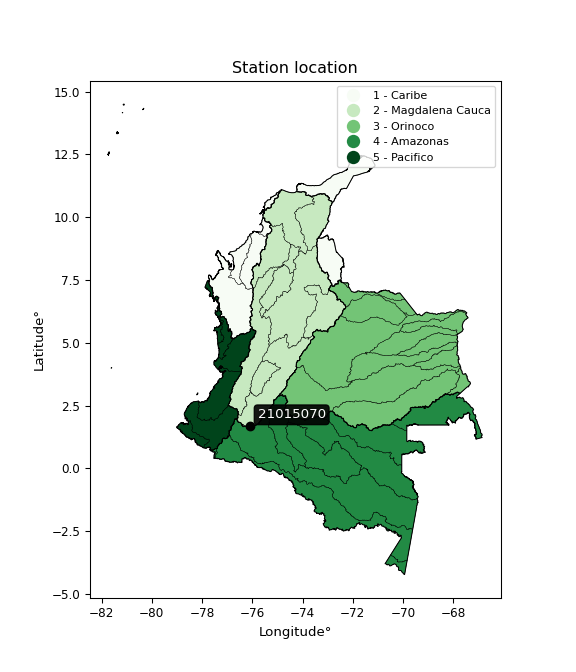</img>

</div>


## A. General information


### 1. General running parameters

• app_version: _v20260103_. • runtime: _2026-01-05 16:20:51.132608_. • Python version: _3.14.0_. • SciPy version: _1.16.3_. • Pandas version: _2.3.3_. • NumPy version: _2.3.5_. • Stations dataset (station_dataset_file): _dataset/pmax24h_in/automatic_colombia_2003_2024.csv_. • Stations catalog (station_catalog_file): _dataset/CNE.xls_. • Minimum year to eval til year_max (date_min): _1900_. • Maximum year to eval since year_min (date_max): _2024_. • Creates, save and include plots into reports (create_plot): _True_. • Plot only fit distributions with Δo > Δ (plot_only_fit): _True_. • Plot only simple graphs avoiding multiple CDFs and multiple Extreme values plots (plot_only_simple): _True_. • Eval low extreme values, if False, evaluates high extreme values (low_extreme): _False_. • Eval every SciPy distribution as logarithmic (pdist_logarithmic_on): _True_. • Standard deviation normalized (ddof): _1.0_. • Return periods to eval in years (Tr): _[2, 2.33, 5, 10, 15, 20, 25, 50, 75, 100, 200, 250, 500, 750, 1000]_. • Minimum data sample per station, 0 means any (minimum_sample): _5_. • Z-Score maximum threshold to adjust a value, 0 means disable (zscore_max): _3.5_. • Z-Score minimum threshold to adjust a value, 0 means disable (zscore_min): _-2.5_. • Avoid zeros, e.g. rain = 0 (avoid_zeros): _True_. • Avoid null values (avoid_nans): _True_. 

[:file_folder:Dataset file](../../dataset/pmax24h_in/automatic_colombia_2003_2024.csv)

> Delta Degrees of Freedom (DDOF): is a parameter used in the formulas for calculating variance and standard deviation. When ddof=0, the divisor is $N$ (the total number of observations) and this is used when your data set is the entire population. When ddof=1, the divisor is $N-1$ and this is used when your data set is a sample drawn from a larger population. Using $N-1$ provides an unbiased estimate of the population variance (known as Bessel´s correction).


### 2. Station info and location

|   id |   CODIGO | NOMBRE                          | CATEGORIA               | TECNOLOGIA                | ESTADO           | FECHA_INSTALACION   |   FECHA_SUSPENSION |   ALTITUD |   LATITUD |   LONGITUD | DEPARTAMENTO   | MUNICIPIO   | AREA_OPERATIVA                    | ENTIDAD                                                     | AREA_HIDROGRAFICA   | ZONA_HIDROGRAFICA   | SUBZONA_HIDROGRAFICA   |   CORRIENTE | Catalogo   |   Version |
|-----:|---------:|:--------------------------------|:------------------------|:--------------------------|:-----------------|:--------------------|-------------------:|----------:|----------:|-----------:|:---------------|:------------|:----------------------------------|:------------------------------------------------------------|:--------------------|:--------------------|:-----------------------|------------:|:-----------|----------:|
|    0 | 21015070 | LOS GUACHAROS  - AUT [21015070] | Climatológica Principal | Automática con Telemetría | En Mantenimiento | 25/07/2005          |                nan |      1590 |   1.67583 |   -76.1068 | Huila          | Palestina   | Area Operativa 04 - Huila-Caquetá | INSTITUTO DE HIDROLOGIA METEOROLOGIA Y ESTUDIOS AMBIENTALES | Magdalena Cauca     | Alto Magdalena      | Alto Magdalena         |         nan | CNE_IDEAM  |  20251226 |

<div align="center">

Dynamic map: [:earth_americas:Google](http://maps.google.com/maps?q=1.675833,-76.106841) [:earth_americas:OSM](https://www.openstreetmap.org/#map=18/1.675833/-76.106841&layers=P) [:earth_americas:Bing](https://www.bing.com/maps?cp=1.675833~-76.106841&lvl=18) [:earth_americas:Apple](https://maps.apple.com/frame?center=1.675833%2C-76.106841&span=0.003%2C0.006)

</div>


<div align="center">

```geojson
{
  "type": "Feature",
  "geometry": {
    "type": "Point", 
    "coordinates": [-76.106841, 1.675833]
  }, 
  "properties": {
    "Name": "21015070"
  }
}
```

</div>


### 3. Discrete values table and plot

<div align="center">

|               |           0 |            1 |          2 |           3 |           4 |           5 |           6 |          7 |          8 |           9 |          10 |          11 |          12 |          13 |          14 |         15 |         16 |          17 |          18 |
|:--------------|------------:|-------------:|-----------:|------------:|------------:|------------:|------------:|-----------:|-----------:|------------:|------------:|------------:|------------:|------------:|------------:|-----------:|-----------:|------------:|------------:|
| Date          | 2005        | 2006         | 2007       | 2008        | 2009        | 2010        | 2011        | 2012       | 2013       | 2014        | 2015        | 2016        | 2017        | 2018        | 2019        | 2020       | 2021       | 2022        | 2023        |
| Value         |   40.4      |   52.8       |   60.6     |   58.2      |   43.6      |   51        |   55.5      |   87.3     |   35.3     |   62.7      |   40.6      |   48.4      |   51.4      |   62        |   61.2      |   28.6     |   87.2     |   41.9      |   46.7      |
| Value_initial |   40.4      |   52.8       |   60.6     |   58.2      |   43.6      |   51        |   55.5      |   87.3     |   35.3     |   62.7      |   40.6      |   48.4      |   51.4      |   62        |   61.2      |   28.6     |   87.2     |   41.9      |   46.7      |
| count         |   19        |   19         |   19       |   19        |   19        |   19        |   19        |   19       |   19       |   19        |   19        |   19        |   19        |   19        |   19        |   19       |   19       |   19        |   19        |
| mean          |   53.4421   |   53.4421    |   53.4421  |   53.4421   |   53.4421   |   53.4421   |   53.4421   |   53.4421  |   53.4421  |   53.4421   |   53.4421   |   53.4421   |   53.4421   |   53.4421   |   53.4421   |   53.4421  |   53.4421  |   53.4421   |   53.4421   |
| std           |   15.2315   |   15.2315    |   15.2315  |   15.2315   |   15.2315   |   15.2315   |   15.2315   |   15.2315  |   15.2315  |   15.2315   |   15.2315   |   15.2315   |   15.2315   |   15.2315   |   15.2315   |   15.2315  |   15.2315  |   15.2315   |   15.2315   |
| zscore        |   -0.856258 |   -0.0421563 |    0.46994 |    0.312372 |   -0.646167 |   -0.160332 |    0.135108 |    2.22288 |   -1.19109 |    0.607812 |   -0.843127 |   -0.331031 |   -0.134071 |    0.561854 |    0.509332 |   -1.63097 |    2.21632 |   -0.757778 |   -0.442642 |


</div>


<div align="center">

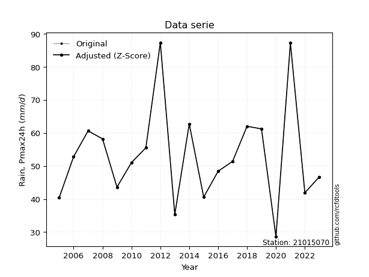</img>

</div>


> The initial value (value_initial) correspond to the initial obtained or null completed value, and value (value) is adjusted only when the initial value is outside the valid range (outlier) definite through the Z-Score value. If Z-Score is active, values out of range or outliers are replaced with the station mean value. A Z-Score (or standard score) measures how many standard deviations a data point is from the mean of a dataset, indicating its relative position; positive scores mean above the mean, negative mean below, and a score of zero is exactly at the mean, allowing for comparison of values from different distributions. It´s calculated using the formula $z=(x–μ)/σ$, where $x$ is the data point, $μ$ is the mean, and $σ$ is the standard deviation, helping identify outliers and understand probability.
>
> <sub>**Note**: In this study, "completing" (filling gaps in) and "extending" (forecasting or lengthening the historical record) rainfall data series are avoided for certain critical analyses because they introduce artificial bias and uncertainty, which can distort the statistics of rare events (extremes), alter day-to-day variability, and compromise the integrity and homogeneity of the original data. Some reasons against Completing/Extending rainfall data are: **Distortion of Extremes and Variability**: The primary issue is that most gap-filling or extension methods rely on averaging or regression with nearby stations, which inherently smooths the data. Rainfall is highly variable in space and time, with a large percentage of zero values and occasional large storms. Infilling methods often underestimate the highest values and overestimate the lowest (zero) values, which severely distorts analyses focused on flood frequency, drought severity, and intensity-duration-frequency (IDF) curves, **Loss of Data Homogeneity**: Infilled or extended data are synthetic estimates, not actual measurements. Combining these estimates with observed data can violate the assumption of data homogeneity, which requires that the data properties do not change over time. Inhomogeneity can lead to incorrect conclusions about long-term trends or changes in climate patterns, **Propagation of Errors**: Errors and biases from the original data (e.g., wind-induced undercatch, instrument errors, site changes) or the data used for imputation can propagate through the analysis, leading to unreliable hydrological models and inaccurate predictions, **Compromised Statistical Integrity**: For statistical analyses, especially those involving the frequency of events, using artificial data can introduce time bias or autocorrelation that doesn´t exist in reality, making it difficult to assess the true probability of events, **Difficulty in Validation**: It is difficult to accurately validate the quality of filled or extended data, especially for past periods where ground-truth measurements are unavailable. The reliability of imputation techniques heavily depends on the density of the surrounding station network and the complexity of the local topography.</sub>


### 4. Active continuous probability distributions from SciPy (44 of 104 available)

A Probability Density Function (PDF) describes the relative likelihood of a continuous random variable falling within a specific range, where the total area under its curve equals 1, and the area over any interval gives the actual probability for that range. Unlike discrete probabilities (like rolling a die), a PDF shows density, not direct probability for a single point (which is zero), with higher points indicating higher likelihood, often visualized as a bell curve for normal distributions.

A log of a probability density function (log-PDF) is simply the logarithm of the PDF´s value, denoted as $log(f(x))$, useful for converting multiplication of probabilities into addition, improving numerical stability with tiny numbers, and connecting to information theory concepts like entropy. Instead of dealing with very small probabilities (e.g., 0.000001), log-PDFs use negative numbers (e.g., $log(0.00001) ≈ -11.51$ that are easier for computers to handle, preventing underflow errors and simplifying complex calculations. In this study, each active probability distribution from SciPy is also evaluated in the $log$ form.

[scipy.stats](https://docs.scipy.org/doc/scipy/reference/stats.html) is a Python´s powerful submodule within the SciPy library for comprehensive statistical analysis, offering over 130 probability distributions (like Normal, Poisson), functions for descriptive stats (mean, variance), hypothesis testing (t-tests, chi-square), random variable generation, and statistical tests, making it essential for data science, modeling, and research. It provides tools to explore, model, and draw conclusions from data efficiently, working seamlessly with NumPy.

<div align="center">

|   id | p_dist             |   n_parameter | fit_method   | label                                                                       | active   | ref                                                                                                        |
|-----:|:-------------------|--------------:|:-------------|:----------------------------------------------------------------------------|:---------|:-----------------------------------------------------------------------------------------------------------|
|    0 | alpha              |             3 | MLE          | Alpha                                                                       | True     | [:mortar_board:](https://docs.scipy.org/doc/scipy/reference/generated/scipy.stats.alpha.html)              |
|    1 | betaprime          |             4 | MLE          | Beta prime                                                                  | True     | [:mortar_board:](https://docs.scipy.org/doc/scipy/reference/generated/scipy.stats.betaprime.html)          |
|    2 | chi2               |             3 | MLE          | Chi²                                                                        | True     | [:mortar_board:](https://docs.scipy.org/doc/scipy/reference/generated/scipy.stats.chi2.html)               |
|    3 | crystalball        |             4 | MLE          | Crystalball                                                                 | True     | [:mortar_board:](https://docs.scipy.org/doc/scipy/reference/generated/scipy.stats.crystalball.html)        |
|    4 | erlang             |             3 | MLE          | Erlang                                                                      | True     | [:mortar_board:](https://docs.scipy.org/doc/scipy/reference/generated/scipy.stats.erlang.html)             |
|    5 | expon              |             2 | MLE          | Exponential                                                                 | True     | [:mortar_board:](https://docs.scipy.org/doc/scipy/reference/generated/scipy.stats.expon.html)              |
|    6 | exponnorm          |             3 | MLE          | Exponentially modified Normal                                               | True     | [:mortar_board:](https://docs.scipy.org/doc/scipy/reference/generated/scipy.stats.exponnorm.html)          |
|    7 | f                  |             4 | MLE          | F                                                                           | True     | [:mortar_board:](https://docs.scipy.org/doc/scipy/reference/generated/scipy.stats.f.html)                  |
|    8 | fatiguelife        |             3 | MLE          | Fatigue-life (Birnbaum-Saunders)                                            | True     | [:mortar_board:](https://docs.scipy.org/doc/scipy/reference/generated/scipy.stats.fatiguelife.html)        |
|    9 | fisk               |             3 | MLE          | Fisk                                                                        | True     | [:mortar_board:](https://docs.scipy.org/doc/scipy/reference/generated/scipy.stats.fisk.html)               |
|   10 | gamma              |             3 | MLE          | Gamma                                                                       | True     | [:mortar_board:](https://docs.scipy.org/doc/scipy/reference/generated/scipy.stats.gamma.html)              |
|   11 | genexpon           |             5 | MLE          | Generalized exponential                                                     | True     | [:mortar_board:](https://docs.scipy.org/doc/scipy/reference/generated/scipy.stats.genexpon.html)           |
|   12 | genlogistic        |             3 | MLE          | Generalized logistic                                                        | True     | [:mortar_board:](https://docs.scipy.org/doc/scipy/reference/generated/scipy.stats.genlogistic.html)        |
|   13 | gibrat             |             2 | MM           | Gibrat                                                                      | True     | [:mortar_board:](https://docs.scipy.org/doc/scipy/reference/generated/scipy.stats.gibrat.html)             |
|   14 | gompertz           |             3 | MLE          | Gompertz (or truncated Gumbel)                                              | True     | [:mortar_board:](https://docs.scipy.org/doc/scipy/reference/generated/scipy.stats.gompertz.html)           |
|   15 | gumbel_l           |             2 | MM           | Gumbel Left Skew                                                            | True     | [:mortar_board:](https://docs.scipy.org/doc/scipy/reference/generated/scipy.stats.gumbel_l.html)           |
|   16 | gumbel_r           |             2 | MM           | Gumbel Right Skew                                                           | True     | [:mortar_board:](https://docs.scipy.org/doc/scipy/reference/generated/scipy.stats.gumbel_r.html)           |
|   17 | halflogistic       |             2 | MM           | Half-logistic                                                               | True     | [:mortar_board:](https://docs.scipy.org/doc/scipy/reference/generated/scipy.stats.halflogistic.html)       |
|   18 | halfnorm           |             2 | MM           | Half Normal                                                                 | True     | [:mortar_board:](https://docs.scipy.org/doc/scipy/reference/generated/scipy.stats.halfnorm.html)           |
|   19 | hypsecant          |             2 | MM           | hyperbolic secant                                                           | True     | [:mortar_board:](https://docs.scipy.org/doc/scipy/reference/generated/scipy.stats.hypsecant.html)          |
|   20 | invgamma           |             3 | MLE          | Inverted gamma                                                              | True     | [:mortar_board:](https://docs.scipy.org/doc/scipy/reference/generated/scipy.stats.invgamma.html)           |
|   21 | invgauss           |             3 | MLE          | Inverse Gaussian                                                            | True     | [:mortar_board:](https://docs.scipy.org/doc/scipy/reference/generated/scipy.stats.invgauss.html)           |
|   22 | invweibull         |             3 | MLE          | Inverted Weibull                                                            | True     | [:mortar_board:](https://docs.scipy.org/doc/scipy/reference/generated/scipy.stats.invweibull.html)         |
|   23 | johnsonsu          |             4 | MLE          | Johnson Su                                                                  | True     | [:mortar_board:](https://docs.scipy.org/doc/scipy/reference/generated/scipy.stats.johnsonsu.html)          |
|   24 | kstwobign          |             2 | MLE          | Limiting distribution of scaled Kolmogorov-Smirnov two-sided test statistic | True     | [:mortar_board:](https://docs.scipy.org/doc/scipy/reference/generated/scipy.stats.kstwobign.html)          |
|   25 | laplace            |             2 | MM           | Laplace                                                                     | True     | [:mortar_board:](https://docs.scipy.org/doc/scipy/reference/generated/scipy.stats.laplace.html)            |
|   26 | laplace_asymmetric |             3 | MLE          | Asymmetric Laplace                                                          | True     | [:mortar_board:](https://docs.scipy.org/doc/scipy/reference/generated/scipy.stats.laplace_asymmetric.html) |
|   27 | loggamma           |             3 | MLE          | Log gamma                                                                   | True     | [:mortar_board:](https://docs.scipy.org/doc/scipy/reference/generated/scipy.stats.loggamma.html)           |
|   28 | logistic           |             2 | MM           | Logistic (or Sech-squared)                                                  | True     | [:mortar_board:](https://docs.scipy.org/doc/scipy/reference/generated/scipy.stats.logistic.html)           |
|   29 | lognorm            |             3 | MLE          | Log Normal                                                                  | True     | [:mortar_board:](https://docs.scipy.org/doc/scipy/reference/generated/scipy.stats.lognorm.html)            |
|   30 | maxwell            |             2 | MM           | Maxwell                                                                     | True     | [:mortar_board:](https://docs.scipy.org/doc/scipy/reference/generated/scipy.stats.maxwell.html)            |
|   31 | mielke             |             4 | MLE          | Mielke Beta-Kappa / Dagum                                                   | True     | [:mortar_board:](https://docs.scipy.org/doc/scipy/reference/generated/scipy.stats.mielke.html)             |
|   32 | moyal              |             2 | MM           | Moyal                                                                       | True     | [:mortar_board:](https://docs.scipy.org/doc/scipy/reference/generated/scipy.stats.moyal.html)              |
|   33 | nakagami           |             3 | MLE          | Nakagami                                                                    | True     | [:mortar_board:](https://docs.scipy.org/doc/scipy/reference/generated/scipy.stats.nakagami.html)           |
|   34 | ncf                |             5 | MLE          | Non-central F distribution                                                  | True     | [:mortar_board:](https://docs.scipy.org/doc/scipy/reference/generated/scipy.stats.ncf.html)                |
|   35 | nct                |             4 | MLE          | Non-central Student’s t                                                     | True     | [:mortar_board:](https://docs.scipy.org/doc/scipy/reference/generated/scipy.stats.nct.html)                |
|   36 | norm               |             2 | MM           | Normal                                                                      | True     | [:mortar_board:](https://docs.scipy.org/doc/scipy/reference/generated/scipy.stats.norm.html)               |
|   37 | pearson3           |             3 | MM           | Pearson type III                                                            | True     | [:mortar_board:](https://docs.scipy.org/doc/scipy/reference/generated/scipy.stats.pearson3.html)           |
|   38 | rayleigh           |             2 | MM           | Rayleigh                                                                    | True     | [:mortar_board:](https://docs.scipy.org/doc/scipy/reference/generated/scipy.stats.rayleigh.html)           |
|   39 | rice               |             3 | MLE          | Rice                                                                        | True     | [:mortar_board:](https://docs.scipy.org/doc/scipy/reference/generated/scipy.stats.rice.html)               |
|   40 | t                  |             3 | MLE          | Student’s t                                                                 | True     | [:mortar_board:](https://docs.scipy.org/doc/scipy/reference/generated/scipy.stats.t.html)                  |
|   41 | truncnorm          |             4 | MLE          | Truncated normal                                                            | True     | [:mortar_board:](https://docs.scipy.org/doc/scipy/reference/generated/scipy.stats.truncnorm.html)          |
|   42 | wald               |             2 | MM           | Wald                                                                        | True     | [:mortar_board:](https://docs.scipy.org/doc/scipy/reference/generated/scipy.stats.wald.html)               |
|   43 | weibull_min        |             3 | MLE          | Weibull minimum                                                             | True     | [:mortar_board:](https://docs.scipy.org/doc/scipy/reference/generated/scipy.stats.weibull_min.html)        |

</div>

> **n_parameter:** # arguments & localization & scale.
>
> **Fit methods:** (MLE) maximum likelihood, (MM) L-moments.
>
>**Inactive** (With the only purpose of prevent loops, zero divisions, infinite values, over high estimated values or horizontal trending for recurrence intervals estimations, the follow distributions were disabled.)**:** foldnorm, gennorm, norminvgauss, powernorm, powerlognorm, skewnorm, genextreme, anglit, arcsine, argus, beta, bradford, burr, burr12, cauchy, cosine, halfcauchy, foldcauchy, skewcauchy, wrapcauchy, dgamma, gengamma, exponweib, exponpow, truncexpon, gausshyper, genhalflogistic, genhyperbolic, geninvgauss, halfgennorm, johnsonsb, kappa4, kappa3, ksone, kstwo, loglaplace, levy, levy_l, levy_stable, ncx2, pareto, genpareto, truncpareto, lomax, powerlaw, rdist, rel_breitwigner, recipinvgauss, semicircular, studentized_range, trapezoid, triang, truncweibull_min, tukeylambda, uniform, loguniform, vonmises, vonmises_line, weibull_max, dweibull, 


## B. Probability (PDF) vs. Empirical (EDF) distributions functions

A continuous probability distribution (CPD) describes probabilities for variables that can take any value within a range (like rain any time), unlike discrete variables with specific outcomes (like temperature). It uses a Probability Density Function (PDF), a curve where the total area under it equals 1, and the probability of the variable falling within an interval (a to b) is found by calculating the area under the curve between those points. A key feature is that the probability of hitting any single exact value is zero, so probabilities are always expressed for ranges, e.g., $P(a ≤ X ≤ b)$.

<div align="center">

Distributions parameters from station values
|    |   station | p_dist                |   n |              loc |           scale | shape                  | shape1                 | shape2                | shape3   |
|---:|----------:|:----------------------|----:|-----------------:|----------------:|:-----------------------|:-----------------------|:----------------------|:---------|
|  0 |  21015070 | alpha                 |  19 |    -45.2187      |   682.813       | 7.068115077886513      |                        |                       |          |
|  1 |  21015070 | betaprime             |  19 |     -0.240656    |    34.2906      | 35.01983739348956      | 23.368941768919065     |                       |          |
|  2 |  21015070 | chi2                  |  19 |     28.6         |     1.71269     | 0.3775371464064472     |                        |                       |          |
|  3 |  21015070 | crystalball           |  19 |     53.4421      |    14.8253      | 119094.48810789945     | 51234.81280134614      |                       |          |
|  4 |  21015070 | erlang                |  19 |     16.9461      |     5.98184     | 6.101126531173986      |                        |                       |          |
|  5 |  21015070 | expon                 |  19 |     28.6         |    24.8421      |                        |                        |                       |          |
|  6 |  21015070 | exponnorm             |  19 |     41.1134      |     8.52289     | 1.4465433924070106     |                        |                       |          |
|  7 |  21015070 | f                     |  19 |     -0.618746    |    51.7371      | 73.29156191705658      | 46.50644508016586      |                       |          |
|  8 |  21015070 | fatiguelife           |  19 |      2.02273     |    49.4096      | 0.2852284658725714     |                        |                       |          |
|  9 |  21015070 | fisk                  |  19 |      6.32887     |    44.9869      | 5.743086630394517      |                        |                       |          |
| 10 |  21015070 | gamma                 |  19 |     16.9462      |     5.98184     | 6.101115711778261      |                        |                       |          |
| 11 |  21015070 | genexpon              |  19 |     28.5999      |     1.63971     | 0.06594386708877341    | 3.8191920994389816e-07 | 2.2613738841395863    |          |
| 12 |  21015070 | genlogistic           |  19 |     25.4087      |    11.1365      | 7.449171996147376      |                        |                       |          |
| 13 |  21015070 | gibrat                |  19 |     42.1323      |     6.85974     |                        |                        |                       |          |
| 14 |  21015070 | gompertz              |  19 |    -92.9313      |    16.893       | 0.00010770791372626635 |                        |                       |          |
| 15 |  21015070 | gumbel_l              |  19 |     60.1143      |    11.5592      |                        |                        |                       |          |
| 16 |  21015070 | gumbel_r              |  19 |     46.7699      |    11.5592      |                        |                        |                       |          |
| 17 |  21015070 | halflogistic          |  19 |     35.8707      |    12.6751      |                        |                        |                       |          |
| 18 |  21015070 | halfnorm              |  19 |     33.8192      |    24.5936      |                        |                        |                       |          |
| 19 |  21015070 | hypsecant             |  19 |     53.4421      |     9.43806     |                        |                        |                       |          |
| 20 |  21015070 | invgamma              |  19 |    -12.9231      |  1388.02        | 21.914452877473348     |                        |                       |          |
| 21 |  21015070 | invgauss              |  19 |      1.60367     |   636.217       | 0.08145927600563185    |                        |                       |          |
| 22 |  21015070 | invweibull            |  19 |     -5.27806e+08 |     5.27806e+08 | 44213268.93582053      |                        |                       |          |
| 23 |  21015070 | johnsonsu             |  19 |      7.06619     |    13.4837      | -6.355014330192525     | 3.3345308833846357     |                       |          |
| 24 |  21015070 | kstwobign             |  19 |      2.58917     |    58.6112      |                        |                        |                       |          |
| 25 |  21015070 | laplace               |  19 |     53.4421      |    10.4831      |                        |                        |                       |          |
| 26 |  21015070 | laplace_asymmetric    |  19 |     51           |    10.9226      | 0.894434721262465      |                        |                       |          |
| 27 |  21015070 | loggamma              |  19 |  -3960.6         |   555.461       | 1376.0420606377938     |                        |                       |          |
| 28 |  21015070 | logistic              |  19 |     53.4421      |     8.1736      |                        |                        |                       |          |
| 29 |  21015070 | lognorm               |  19 |      2.60109     |    48.805       | 0.28585752822297333    |                        |                       |          |
| 30 |  21015070 | maxwell               |  19 |     18.3124      |    22.0143      |                        |                        |                       |          |
| 31 |  21015070 | mielke                |  19 |     -0.15594     |    50.3992      | 7.051226635832142      | 6.3788455589499495     |                       |          |
| 32 |  21015070 | moyal                 |  19 |     44.9641      |     6.67372     |                        |                        |                       |          |
| 33 |  21015070 | nakagami              |  19 |     35.3         |    22.0305      | 0.4713258402997815     |                        |                       |          |
| 34 |  21015070 | ncf                   |  19 |     -0.0191689   |     1.21821e-05 | 1.4164802318307605e-06 | 10.819269165181268     | 5.205816393548652     |          |
| 35 |  21015070 | nct                   |  19 |     -0.181407    |     8.24859     | 12.322286939907608     | 6.096459082655638      |                       |          |
| 36 |  21015070 | norm                  |  19 |     53.4421      |    14.8253      |                        |                        |                       |          |
| 37 |  21015070 | pearson3              |  19 |     53.4421      |    14.8253      | 0.8248354521994317     |                        |                       |          |
| 38 |  21015070 | rayleigh              |  19 |     25.0805      |    22.6293      |                        |                        |                       |          |
| 39 |  21015070 | rice                  |  19 |     25.2807      |    22.5039      | 0.0019218596372018787  |                        |                       |          |
| 40 |  21015070 | t                     |  19 |     52.8119      |    14.1851      | 16.957202752349943     |                        |                       |          |
| 41 |  21015070 | truncnorm             |  19 |     53.4421      |    14.8253      | -505.486802328029      | 654.3936552196964      |                       |          |
| 42 |  21015070 | wald                  |  19 |     38.6168      |    14.8253      |                        |                        |                       |          |
| 43 |  21015070 | weibull_min           |  19 |     25.6648      |    31.2788      | 1.941397880127715      |                        |                       |          |
| 44 |  21015070 | logalpha              |  19 |     -3.91621     |   225.453       | 28.731848826761137     |                        |                       |          |
| 45 |  21015070 | logbetaprime          |  19 |     -3.80758     |    35.8895      | 734.2827956368315      | 3411.8096474975127     |                       |          |
| 46 |  21015070 | logchi2               |  19 |      3.35341     |     0.954801    | 1.113399166119667      |                        |                       |          |
| 47 |  21015070 | logcrystalball        |  19 |      3.94175     |     0.270901    | 3641.914710832983      | 104.62236063375325     |                       |          |
| 48 |  21015070 | logerlang             |  19 |     -7.35389     |     0.00649691  | 1738.617126419985      |                        |                       |          |
| 49 |  21015070 | logexpon              |  19 |      3.35341     |     0.588341    |                        |                        |                       |          |
| 50 |  21015070 | logexponnorm          |  19 |      3.87879     |     0.263497    | 0.2389353416569478     |                        |                       |          |
| 51 |  21015070 | logf                  |  19 |    -16.3824      |    20.3213      | 58895.59127652444      | 13922.077526226029     |                       |          |
| 52 |  21015070 | logfatiguelife        |  19 |    -12.31        |    16.2495      | 0.016667334980738385   |                        |                       |          |
| 53 |  21015070 | logfisk               |  19 |     -9.2378      |    13.1768      | 86.70605479533208      |                        |                       |          |
| 54 |  21015070 | loggamma              |  19 |     -7.35361     |     0.00649708  | 1738.5283624088597     |                        |                       |          |
| 55 |  21015070 | loggenexpon           |  19 |      3.31652     |     0.0175923   | 0.0014466574490670991  | 3.6190854558950143     | 0.0003524654057680207 |          |
| 56 |  21015070 | loggenlogistic        |  19 |      3.91764     |     0.157078    | 1.1016071884457863     |                        |                       |          |
| 57 |  21015070 | loggibrat             |  19 |      3.73511     |     0.125334    |                        |                        |                       |          |
| 58 |  21015070 | loggompertz           |  19 |      3.35164     |     0.333537    | 0.13935645048882947    |                        |                       |          |
| 59 |  21015070 | loggumbel_l           |  19 |      4.06367     |     0.21122     |                        |                        |                       |          |
| 60 |  21015070 | loggumbel_r           |  19 |      3.81983     |     0.21122     |                        |                        |                       |          |
| 61 |  21015070 | loghalflogistic       |  19 |      3.62068     |     0.231603    |                        |                        |                       |          |
| 62 |  21015070 | loghalfnorm           |  19 |      3.58316     |     0.449422    |                        |                        |                       |          |
| 63 |  21015070 | loghypsecant          |  19 |      3.94175     |     0.172461    |                        |                        |                       |          |
| 64 |  21015070 | loginvgamma           |  19 |     -0.294663    |  1016.01        | 240.95707849621056     |                        |                       |          |
| 65 |  21015070 | loginvgauss           |  19 |      1.92953     |   102.968       | 0.019547356364210247   |                        |                       |          |
| 66 |  21015070 | loginvweibull         |  19 | -74577.7         | 74581.5         | 279965.95535499835     |                        |                       |          |
| 67 |  21015070 | logjohnsonsu          |  19 |      1.38765     |     5.8876      | -9.978629962464552     | 23.708256894869635     |                       |          |
| 68 |  21015070 | logkstwobign          |  19 |      2.82157     |     1.28856     |                        |                        |                       |          |
| 69 |  21015070 | loglaplace            |  19 |      3.94175     |     0.191556    |                        |                        |                       |          |
| 70 |  21015070 | loglaplace_asymmetric |  19 |      3.93964     |     0.209703    | 0.9950965892796664     |                        |                       |          |
| 71 |  21015070 | logloggamma           |  19 |    -69.6769      |    10.1658      | 1397.0858591353367     |                        |                       |          |
| 72 |  21015070 | loglogistic           |  19 |      3.94175     |     0.149355    |                        |                        |                       |          |
| 73 |  21015070 | loglognorm            |  19 |    -12.9328      |    16.8724      | 0.016052728319787893   |                        |                       |          |
| 74 |  21015070 | logmaxwell            |  19 |      3.29983     |     0.402264    |                        |                        |                       |          |
| 75 |  21015070 | logmielke             |  19 |     -0.0559704   |     4.02831     | 23.74037983310239      | 27.87451428653322      |                       |          |
| 76 |  21015070 | logmoyal              |  19 |      3.78683     |     0.121948    |                        |                        |                       |          |
| 77 |  21015070 | lognakagami           |  19 |     -1.86364     |     5.81171     | 114.93736454474092     |                        |                       |          |
| 78 |  21015070 | logncf                |  19 |    -10.9797      |     5.93193     | 10299.867833563883     | 9667.794159190718      | 15603.382713087172    |          |
| 79 |  21015070 | lognct                |  19 |     -5.22717     |     0.0809341   | 549.8212958360414      | 113.14751164962695     |                       |          |
| 80 |  21015070 | lognorm               |  19 |      3.94175     |     0.270901    |                        |                        |                       |          |
| 81 |  21015070 | logpearson3           |  19 |      3.94175     |     0.270901    | 0.04867930318930376    |                        |                       |          |
| 82 |  21015070 | lograyleigh           |  19 |      3.42354     |     0.413469    |                        |                        |                       |          |
| 83 |  21015070 | logrice               |  19 |      3.2183      |     0.289214    | 2.265942287743955      |                        |                       |          |
| 84 |  21015070 | logt                  |  19 |      3.94162     |     0.268353    | 106.25810210477565     |                        |                       |          |
| 85 |  21015070 | logtruncnorm          |  19 |     -0.120222    |     1.59465     | 2.1783054704411997     | 7.7673533025306        |                       |          |
| 86 |  21015070 | logwald               |  19 |      3.67084     |     0.270911    |                        |                        |                       |          |
| 87 |  21015070 | logweibull_min        |  19 |      3.09465     |     0.941513    | 3.4335268561045567     |                        |                       |          |

</div>

> **loc** (Location parameter): This shifts the distribution along the x-axis. For many common distributions, like the normal (Gaussian) distribution, loc represents the mean $μ$. For others, like the uniform distribution, it might represent the minimum value, or for the beta distribution, the left end of the support interval.
>
> **scale** (Scale parameter): This determines the width or spread of the distribution. For the normal distribution, scale represents the standard deviation $σ$. For a uniform distribution, it defines the length of the interval (from $loc$ to $loc + scale$).
>
> **shape** (Shape parameters): Refers to parameters that define the specific form of a probability distribution, distinct from its location (loc) and scale (scale). These parameters are required arguments for most distribution functions. For example, a normal (Gaussian) distribution is fully defined by its location (mean) and scale (standard deviation), so it has no specific shape parameters beyond loc and scale. However, other distributions have intrinsic properties that need specification, as Gamma distribution that takes a shape parameter, often named $a$ or $alpha$.


### 0. Cumulative distribution values - CDF (88 evaluated)

Cumulative Distribution Function (CDF), denoted as $F$<sub>$X$</sub>$(x)$, is a function that gives the probability that a random variable $X$ will take a value less than or equal to a specific value, $x$ (i.e., $(P(X≥x)$. It essentially "accumulates" probabilities from a given point up to the far right (positive infinity), providing a complete picture of the distribution´s probabilities for both discrete (like rain) and continuous (like temperature) variables, helping to find probabilities over ranges or above certain values. Each station is evaluated separately ordering the $x$ values ascending, calculating the CDF and PDF values for the activated distributions and their logarithmic forms.

<div align="center">

CDF ordered by x ascending and calculating $log(f(x))$ separately
|   id |   Station |   date |    x |   count |    mean |     std |     zscore |   Value_initial |   station |   m |     alpha |   alpha_pdf |   betaprime |   betaprime_pdf |     chi2 |    chi2_pdf |   crystalball |   crystalball_pdf |    erlang |   erlang_pdf |    expon |   expon_pdf |   exponnorm |   exponnorm_pdf |         f |      f_pdf |   fatiguelife |   fatiguelife_pdf |      fisk |   fisk_pdf |     gamma |   gamma_pdf |    genexpon |   genexpon_pdf |   genlogistic |   genlogistic_pdf |    gibrat |   gibrat_pdf |   gompertz |   gompertz_pdf |   gumbel_l |   gumbel_l_pdf |   gumbel_r |   gumbel_r_pdf |   halflogistic |   halflogistic_pdf |   halfnorm |   halfnorm_pdf |   hypsecant |   hypsecant_pdf |   invgamma |   invgamma_pdf |   invgauss |   invgauss_pdf |   invweibull |   invweibull_pdf |   johnsonsu |   johnsonsu_pdf |   kstwobign |   kstwobign_pdf |   laplace |   laplace_pdf |   laplace_asymmetric |   laplace_asymmetric_pdf |   loggamma |   loggamma_pdf |   logistic |   logistic_pdf |   lognorm |   lognorm_pdf |   maxwell |   maxwell_pdf |    mielke |   mielke_pdf |       moyal |   moyal_pdf |   nakagami |   nakagami_pdf |      ncf |    ncf_pdf |       nct |    nct_pdf |      norm |   norm_pdf |   pearson3 |   pearson3_pdf |   rayleigh |   rayleigh_pdf |      rice |   rice_pdf |         t |      t_pdf |   truncnorm |   truncnorm_pdf |      wald |   wald_pdf |   weibull_min |   weibull_min_pdf |   logalpha |   logalpha_pdf |   logbetaprime |   logbetaprime_pdf |     logchi2 |   logchi2_pdf |   logcrystalball |   logcrystalball_pdf |   logerlang |   logerlang_pdf |   logexpon |   logexpon_pdf |   logexponnorm |   logexponnorm_pdf |      logf |   logf_pdf |   logfatiguelife |   logfatiguelife_pdf |   logfisk |   logfisk_pdf |   loggenexpon |   loggenexpon_pdf |   loggenlogistic |   loggenlogistic_pdf |   loggibrat |   loggibrat_pdf |   loggompertz |   loggompertz_pdf |   loggumbel_l |   loggumbel_l_pdf |   loggumbel_r |   loggumbel_r_pdf |   loghalflogistic |   loghalflogistic_pdf |   loghalfnorm |   loghalfnorm_pdf |   loghypsecant |   loghypsecant_pdf |   loginvgamma |   loginvgamma_pdf |   loginvgauss |   loginvgauss_pdf |   loginvweibull |   loginvweibull_pdf |   logjohnsonsu |   logjohnsonsu_pdf |   logkstwobign |   logkstwobign_pdf |   loglaplace |   loglaplace_pdf |   loglaplace_asymmetric |   loglaplace_asymmetric_pdf |   logloggamma |   logloggamma_pdf |   loglogistic |   loglogistic_pdf |   loglognorm |   loglognorm_pdf |   logmaxwell |   logmaxwell_pdf |   logmielke |   logmielke_pdf |    logmoyal |   logmoyal_pdf |   lognakagami |   lognakagami_pdf |    logncf |   logncf_pdf |    lognct |   lognct_pdf |   logpearson3 |   logpearson3_pdf |   lograyleigh |   lograyleigh_pdf |    logrice |   logrice_pdf |      logt |   logt_pdf |   logtruncnorm |   logtruncnorm_pdf |    logwald |   logwald_pdf |   logweibull_min |   logweibull_min_pdf |
|-----:|----------:|-------:|-----:|--------:|--------:|--------:|-----------:|----------------:|----------:|----:|----------:|------------:|------------:|----------------:|---------:|------------:|--------------:|------------------:|----------:|-------------:|---------:|------------:|------------:|----------------:|----------:|-----------:|--------------:|------------------:|----------:|-----------:|----------:|------------:|------------:|---------------:|--------------:|------------------:|----------:|-------------:|-----------:|---------------:|-----------:|---------------:|-----------:|---------------:|---------------:|-------------------:|-----------:|---------------:|------------:|----------------:|-----------:|---------------:|-----------:|---------------:|-------------:|-----------------:|------------:|----------------:|------------:|----------------:|----------:|--------------:|---------------------:|-------------------------:|-----------:|---------------:|-----------:|---------------:|----------:|--------------:|----------:|--------------:|----------:|-------------:|------------:|------------:|-----------:|---------------:|---------:|-----------:|----------:|-----------:|----------:|-----------:|-----------:|---------------:|-----------:|---------------:|----------:|-----------:|----------:|-----------:|------------:|----------------:|----------:|-----------:|--------------:|------------------:|-----------:|---------------:|---------------:|-------------------:|------------:|--------------:|-----------------:|---------------------:|------------:|----------------:|-----------:|---------------:|---------------:|-------------------:|----------:|-----------:|-----------------:|---------------------:|----------:|--------------:|--------------:|------------------:|-----------------:|---------------------:|------------:|----------------:|--------------:|------------------:|--------------:|------------------:|--------------:|------------------:|------------------:|----------------------:|--------------:|------------------:|---------------:|-------------------:|--------------:|------------------:|--------------:|------------------:|----------------:|--------------------:|---------------:|-------------------:|---------------:|-------------------:|-------------:|-----------------:|------------------------:|----------------------------:|--------------:|------------------:|--------------:|------------------:|-------------:|-----------------:|-------------:|-----------------:|------------:|----------------:|------------:|---------------:|--------------:|------------------:|----------:|-------------:|----------:|-------------:|--------------:|------------------:|--------------:|------------------:|-----------:|--------------:|----------:|-----------:|---------------:|-------------------:|-----------:|--------------:|-----------------:|---------------------:|
|    0 |  21015070 |   2020 | 28.6 |      19 | 53.4421 | 15.2315 | -1.63097   |            28.6 |  21015070 |   1 | 0.0145636 |  0.00462638 |   0.0139828 |      0.00469115 | 0.001611 | 8.55984e+10 |     0.0469025 |        0.00660989 | 0.0129987 |   0.00501213 | 0        |  0.0402542  |   0.0170427 |      0.00437849 | 0.0139901 | 0.00468984 |     0.0135872 |        0.00480997 | 0.0173298 | 0.00439141 | 0.0129986 |  0.00501211 | 3.65761e-06 |     0.0402166  |     0.0154177 |        0.0044226  | 0         |   0          |   0.133527 |     0.00735689 |  0.0633625 |    0.00530411  |  0.0081008 |     0.00337495 |       0        |         0          |   0        |     0          |   0.0457107 |      0.0048266  |  0.0140938 |     0.00467503 |  0.0135662 |     0.00479885 |    0.0110809 |       0.00417937 |   0.0140642 |      0.00470221 |   0.0107504 |      0.00476472 | 0.0467525 |    0.00445982 |            0.0448807 |               0.00459391 |  0.0138091 |       0.134919 |  0.0456813 |     0.00533357 | 0.0149355 |      0.139278 | 0.0254314 |    0.00709631 | 0.018554  |   0.00442616 | 0.000655372 | 0.000613106 | 0          |     0          | 0.411672 | 0.0106724  | 0.0148597 | 0.00453661 | 0.0469025 | 0.00660989 |  0.0126619 |     0.00500231 |  0.0120218 |     0.00679028 | 0.0108189 | 0.00648342 | 0.0530459 | 0.00667494 |   0.0469025 |      0.00660989 | 0         | 0          |     0.0100647 |        0.00662338 |  0.0112681 |       0.126162 |       0.033138 |           0.249431 | 2.22724e-09 |   2.79201e+06 |        0.0149355 |             0.139277 |   0.0138091 |        0.134919 |   0        |       1.69969  |      0.0144524 |           0.137063 | 0.0138087 |   0.134884 |        0.013763  |             0.134721 | 0.0190495 |      0.12868  |     0.0058188 |          0.232833 |        0.0185559 |             0.126647 |  0          |     0           |   0.000741606 |          0.419726 |     0.03405   |         0.15843   |   0.000111719 |        0.00481292 |          0        |              0        |      0        |          0        |      0.0209966 |           0.121659 |     0.0100416 |          0.119503 |    0.00766206 |          0.107875 |      0.00420592 |           0.0863824 |      0.0137964 |           0.134596 |     0.00434754 |           0.110226 |    0.0231785 |         0.121001 |               0.0299752 |                    0.143646 |     0.0159619 |          0.144062 |     0.0190921 |          0.125389 |    0.0138086 |         0.134891 |  0.000625131 |         0.034878 |   0.0189039 |        0.130386 | 3.36833e-09 |    4.95907e-07 |     0.0138158 |          0.135081 | 0.0137095 |     0.134846 | 0.0166905 |     0.159596 |     0.0137924 |          0.134852 |     0         |          0        | 0.00907553 |      0.144529 | 0.0152831 |   0.138412 |    5.17289e-10 |           1.58784  | 0          |      0        |        0.0117888 |             0.155501 |
|    1 |  21015070 |   2013 | 35.3 |      19 | 53.4421 | 15.2315 | -1.19109   |            35.3 |  21015070 |   2 | 0.0789641 |  0.0155038  |   0.0799647 |      0.0158425  | 0.987202 | 0.00490924  |     0.110527  |        0.012727   | 0.0835312 |   0.0165891  | 0.236394 |  0.0307384  |   0.074995  |      0.0139995  | 0.0799488 | 0.0158382  |     0.0815321 |        0.0162002  | 0.0739619 | 0.0135774  | 0.0835311 |  0.0165891  | 0.236206    |     0.0307175  |     0.076777  |        0.0149694  | 0         |   0          |   0.19196  |     0.0102005  |  0.110298  |    0.00899524  |  0.0673826 |     0.0157239  |       0        |         0          |   0.048011 |     0.032384   |   0.0924694 |      0.00966027 |  0.0797628 |     0.0157818  |  0.081455  |     0.0162042  |    0.0766364 |       0.0164901  |   0.0802084 |      0.0158752  |   0.0855469 |      0.0181019  | 0.0885879 |    0.00845058 |            0.0891043 |               0.00912057 |  0.0803537 |       0.563261 |  0.0980044 |     0.0108152  | 0.081531  |      0.556697 | 0.10253   |    0.0160246  | 0.0749244 |   0.0134711  | 0.0391366   | 0.0146907   | 1.9758e-15 |     0.262122   | 0.479878 | 0.00967763 | 0.0780645 | 0.0153074  | 0.110527  | 0.012727   |  0.083701  |     0.016735   |  0.0969467 |     0.0180219  | 0.0943589 | 0.0179175  | 0.11692   | 0.0127962  |   0.110527  |      0.012727   | 0         | 0          |     0.0966718 |        0.018505   |  0.0794832 |       0.596109 |       0.128416 |           0.692368 | 0.316854    |   0.780353    |        0.081531  |             0.556697 |   0.0803535 |        0.56326  |   0.300749 |       1.18851  |      0.08086   |           0.558479 | 0.0803398 |   0.563194 |        0.0803025 |             0.563548 | 0.0755731 |      0.473175 |     0.136039  |          0.9497   |        0.0749369 |             0.475526 |  0          |     0           |   0.116592    |          0.697442 |     0.0895705 |         0.404476  |   0.0347581   |        0.552808   |          0        |              0        |      0        |          0        |      0.0708814 |           0.407612 |     0.0779108 |          0.603869 |    0.0768888  |          0.636383 |      0.0835034  |           0.778275  |      0.0802299 |           0.562739 |     0.105718   |           0.91643  |    0.0695466 |         0.363062 |               0.0821876 |                    0.393856 |     0.0832266 |          0.556176 |     0.0737835 |          0.457563 |    0.0803428 |         0.56321  |  0.0662105   |         0.689018 |   0.075749  |        0.47278  | 0.0126121   |    0.363477    |     0.0804127 |          0.563483 | 0.0804639 |     0.565645 | 0.0912264 |     0.607398 |     0.0803358 |          0.563359 |     0.0559761 |          0.774962 | 0.081338   |      0.600103 | 0.0810822 |   0.550659 |    0.28967     |           1.18075  | 0          |      0        |        0.0874703 |             0.611195 |
|    2 |  21015070 |   2005 | 40.4 |      19 | 53.4421 | 15.2315 | -0.856258  |            40.4 |  21015070 |   3 | 0.18222   |  0.0246299  |   0.184539  |      0.0247466  | 0.997993 | 0.000699832 |     0.189505  |        0.0182749  | 0.190136  |   0.0247034  | 0.378115 |  0.0250335  |   0.171742  |      0.0239202  | 0.184509  | 0.0247459  |     0.187205  |        0.0247615  | 0.168524  | 0.0236195  | 0.190136  |  0.0247034  | 0.377844    |     0.0250213  |     0.178526  |        0.0246594  | 0         |   0          |   0.250463 |     0.0127966  |  0.166133  |    0.0131062   |  0.176381  |     0.0264759  |       0.176793 |         0.0382144  |   0.210978 |     0.0313019  |   0.156623  |      0.0159333  |  0.184125  |     0.0247336  |  0.187238  |     0.0248     |    0.187194  |       0.0262751  |   0.184884  |      0.024744   |   0.200459  |      0.0261308  | 0.144098  |    0.0137458  |            0.15018   |               0.0153722  |  0.185338  |       1.00086  |  0.168592  |     0.017149   | 0.184938  |      0.985136 | 0.200362  |    0.0220561  | 0.168825  |   0.0234811  | 0.159226    | 0.0312432   | 0.197813   |     0.0359392  | 0.527257 | 0.00890313 | 0.180809  | 0.0246537  | 0.189505  | 0.0182749  |  0.191077  |     0.0248373  |  0.20479   |     0.0237895  | 0.202036  | 0.0238231  | 0.1969    | 0.0186415  |   0.189505  |      0.0182749  | 0.010168  | 0.0258499  |     0.207003  |        0.0242325  |  0.190941  |       1.05824  |       0.244585 |           1.0221   | 0.40743     |   0.583748    |        0.184938  |             0.985136 |   0.185338  |        1.00086  |   0.44407  |       0.94491  |      0.184859  |           0.991949 | 0.185321  |   1.0009   |        0.185361  |             1.00163  | 0.168701  |      0.939948 |     0.282424  |          1.1854   |        0.168826  |             0.948465 |  0          |     0           |   0.225305    |          0.916621 |     0.162862  |         0.704548  |   0.169768    |        1.42531    |          0.167138 |              2.09856  |      0.203109 |          1.71752  |      0.152658  |           0.851633 |     0.191397  |          1.07889  |    0.196175   |          1.12378  |      0.224007   |           1.25803   |      0.185193  |           1.00119  |     0.257099   |           1.26707  |    0.140678  |         0.734398 |               0.156913  |                    0.75195  |     0.186039  |          0.976944 |     0.164318  |          0.919402 |    0.185325  |         1.00089  |  0.19484     |         1.19321  |   0.168393  |        0.933227 | 0.151433    |    1.67724     |     0.1854    |          1.00062  | 0.185857  |     1.00414  | 0.200611  |     1.01422  |     0.185344  |          1.0011   |     0.1988    |          1.29015  | 0.190684   |      1.02408  | 0.183824  |   0.982764 |    0.434236    |           0.967601 | 0.00485168 |      0.906094 |        0.195895  |             0.996301 |
|    3 |  21015070 |   2015 | 40.6 |      19 | 53.4421 | 15.2315 | -0.843127  |            40.6 |  21015070 |   4 | 0.187175  |  0.0249277  |   0.189517  |      0.0250295  | 0.998128 | 0.0006512   |     0.193182  |        0.0184914  | 0.195101  |   0.0249487  | 0.383102 |  0.0248328  |   0.176563  |      0.0242865  | 0.189486  | 0.025029   |     0.192184  |        0.0250259  | 0.173287  | 0.024007   | 0.195101  |  0.0249487  | 0.382828    |     0.0248208  |     0.18349   |        0.0249859  | 0         |   0          |   0.253033 |     0.0129046  |  0.168773  |    0.0132928   |  0.181709  |     0.0268078  |       0.184425 |         0.0381057  |   0.217231 |     0.0312328  |   0.15984   |      0.0162329  |  0.189101  |     0.0250193  |  0.192225  |     0.0250656  |    0.192479  |       0.0265679  |   0.189861  |      0.0250246  |   0.205706  |      0.0263369  | 0.146874  |    0.0140106  |            0.153286  |               0.0156901  |  0.190321  |       1.01709  |  0.17205   |     0.0174279  | 0.189843  |      1.0012   | 0.204793  |    0.0222526  | 0.17356   |   0.023869   | 0.16552     | 0.0316921   | 0.204986   |     0.0357877  | 0.529035 | 0.00887293 | 0.185771  | 0.0249621  | 0.193182  | 0.0184914  |  0.196069  |     0.0250797  |  0.209564  |     0.0239553  | 0.206818  | 0.0239936  | 0.200651  | 0.0188743  |   0.193182  |      0.0184914  | 0.0160862 | 0.0332921  |     0.211866  |        0.0243915  |  0.196207  |       1.07455  |       0.249659 |           1.03286  | 0.4103      |   0.578588    |        0.189843  |             1.0012   |   0.19032   |        1.01709  |   0.448717 |       0.937012 |      0.189797  |           1.00816  | 0.190304  |   1.01713  |        0.190347  |             1.01787  | 0.173393  |      0.96027  |     0.28829   |          1.19008  |        0.17356   |             0.968906 |  0          |     0           |   0.229852    |          0.924833 |     0.166375  |         0.718188  |   0.17687     |        1.45061    |          0.177482 |              2.09086  |      0.211579 |          1.71257  |      0.156918  |           0.873467 |     0.196766  |          1.09542  |    0.201764   |          1.13968  |      0.230248   |           1.26933   |      0.190177  |           1.01747  |     0.263371   |           1.27297  |    0.144352  |         0.753577 |               0.16067   |                    0.769957 |     0.190902  |          0.992778 |     0.168909  |          0.939897 |    0.190308  |         1.01712  |  0.200769    |         1.20804  |   0.173052  |        0.95339  | 0.159803    |    1.71213     |     0.190381  |          1.01683  | 0.190856  |     1.02035  | 0.205655  |     1.02848  |     0.190328  |          1.01733  |     0.205202  |          1.3028   | 0.195779   |      1.03933  | 0.188718  |   0.999124 |    0.438997    |           0.960447 | 0.0106659  |      1.45374  |        0.200849  |             1.00997  |
|    4 |  21015070 |   2022 | 41.9 |      19 | 53.4421 | 15.2315 | -0.757778  |            41.9 |  21015070 |   5 | 0.220761  |  0.0266912  |   0.22317   |      0.026693   | 0.998806 | 0.000409877 |     0.218125  |        0.0198741  | 0.228494  |   0.026375   | 0.414554 |  0.0235667  |   0.209624  |      0.0265351  | 0.22314   | 0.0266938  |     0.225755  |        0.0265699  | 0.206085  | 0.0264161  | 0.228494  |  0.026375   | 0.414266    |     0.0235565  |     0.217271  |        0.0269301  | 0         |   0          |   0.27027  |     0.0136153  |  0.186863  |    0.0145513   |  0.21785   |     0.028721   |       0.233456 |         0.0372974  |   0.25752  |     0.0307379  |   0.182251  |      0.0182724  |  0.222752  |     0.0267004  |  0.225851  |     0.0266158  |    0.228149  |       0.0282423  |   0.223497  |      0.0266722  |   0.240716  |      0.0274635  | 0.166265  |    0.0158604  |            0.175103  |               0.0179232  |  0.22398   |       1.1179   |  0.1959    |     0.0192722  | 0.222991  |      1.10147  | 0.234509  |    0.0234369  | 0.206182  |   0.0262834  | 0.208374    | 0.034085    | 0.250876   |     0.0348133  | 0.540443 | 0.00867739 | 0.219445  | 0.0267918  | 0.218125  | 0.0198741  |  0.229618  |     0.0264835  |  0.241354  |     0.0249179  | 0.238676  | 0.0249842  | 0.226163  | 0.0203669  |   0.218125  |      0.0198741  | 0.0839155 | 0.0657117  |     0.24419   |        0.0253031  |  0.231665  |       1.17404  |       0.283249 |           1.09741  | 0.428041    |   0.547795    |        0.222991  |             1.10147  |   0.22398   |        1.1179   |   0.477472 |       0.888137 |      0.223177  |           1.10914  | 0.223965  |   1.11798  |        0.224032  |             1.11873  | 0.20573   |      1.09212  |     0.326197  |          1.21352  |        0.206176  |             1.10108  |  2.6816e-11 |     1.01393e-06 |   0.259823    |          0.97693  |     0.190433  |         0.809701  |   0.224876    |        1.58868    |          0.242496 |              2.03192  |      0.265006 |          1.67651  |      0.186745  |           1.02177  |     0.232896  |          1.19563  |    0.239205   |          1.23401  |      0.271246   |           1.32849   |      0.223853  |           1.11855  |     0.303963   |           1.29976  |    0.170169  |         0.888351 |               0.186866  |                    0.895492 |     0.223763  |          1.09173  |     0.200631  |          1.0738   |    0.223969  |         1.11796  |  0.240236    |         1.29371  |   0.20516   |        1.08465  | 0.216709    |    1.88427     |     0.224031  |          1.11751  | 0.224615  |     1.12092  | 0.239463  |     1.11565  |     0.223995  |          1.11815  |     0.247411  |          1.37236  | 0.230034   |      1.13329  | 0.221832  |   1.10143  |    0.46856     |           0.915809 | 0.100282   |      3.74423  |        0.234026  |             1.09449  |
|    5 |  21015070 |   2009 | 43.6 |      19 | 53.4421 | 15.2315 | -0.646167  |            43.6 |  21015070 |   6 | 0.267757  |  0.0284995  |   0.270058  |      0.0283712  | 0.99933  | 0.000226327 |     0.253386  |        0.0215876  | 0.274603  |   0.0277828  | 0.453277 |  0.0220079  |   0.256932  |      0.0290242  | 0.27003   | 0.0283736  |     0.272308  |        0.0281043  | 0.253398  | 0.0291518  | 0.274603  |  0.0277828  | 0.452974    |     0.0219998  |     0.264851  |        0.0289394  | 0.0615402 |   0.0827877  |   0.294219 |     0.0145626  |  0.21308   |    0.0163132   |  0.268334  |     0.0305383  |       0.295792 |         0.035996   |   0.309145 |     0.029976   |   0.21573   |      0.0211473  |  0.269671  |     0.0284002  |  0.272487  |     0.0281553  |    0.27759   |       0.0298015  |   0.270332  |      0.0283295  |   0.288281  |      0.0283966  | 0.195537  |    0.0186527  |            0.208384  |               0.0213298  |  0.270808  |       1.23453  |  0.230741  |     0.0217162  | 0.269171  |      1.21866  | 0.27549   |    0.024724   | 0.253279  |   0.0290315  | 0.268034    | 0.0358537   | 0.308968   |     0.0335239  | 0.554978 | 0.00842392 | 0.266677  | 0.0286734  | 0.253386  | 0.0215876  |  0.275882  |     0.027856   |  0.284575  |     0.0258733  | 0.282037  | 0.0259713  | 0.262387  | 0.0222273  |   0.253386  |      0.0215876  | 0.204374  | 0.0716851  |     0.288     |        0.0261791  |  0.280617  |       1.2843   |       0.328324 |           1.16685  | 0.449129    |   0.513451    |        0.269171  |             1.21866  |   0.270808  |        1.23453  |   0.511627 |       0.830084 |      0.269673  |           1.22674  | 0.270798  |   1.23465  |        0.270894  |             1.23537  | 0.252475  |      1.25754  |     0.374796  |          1.22758  |        0.253265  |             1.26558  |  0.126439   |     5.19426     |   0.299959    |          1.04097  |     0.225103  |         0.935601  |   0.290514    |        1.70015    |          0.32147  |              1.93576  |      0.33061  |          1.62068  |      0.231407  |           1.22669  |     0.282697  |          1.30513  |    0.290315   |          1.33185  |      0.325047   |           1.37121   |      0.270713  |           1.23549  |     0.355922   |           1.30884  |    0.209435  |         1.09334  |               0.226101  |                    1.08351  |     0.269534  |          1.20791  |     0.246741  |          1.24441  |    0.2708    |         1.23463  |  0.293452    |         1.37767  |   0.251615  |        1.2507   | 0.29397     |    1.97944     |     0.27084   |          1.23398  | 0.271552  |     1.23695  | 0.285827  |     1.21316  |     0.270833  |          1.23477  |     0.30329   |          1.43255  | 0.277286   |      1.2403   | 0.268068  |   1.22149  |    0.503903    |           0.861949 | 0.255109   |      3.77307  |        0.279534  |             1.19197  |
|    6 |  21015070 |   2023 | 46.7 |      19 | 53.4421 | 15.2315 | -0.442642  |            46.7 |  21015070 |   7 | 0.359297  |  0.0302141  |   0.360886  |      0.0298981  | 0.999762 | 7.86159e-05 |     0.324637  |        0.024266   | 0.363063  |   0.0290039  | 0.517417 |  0.019426   |   0.351856  |      0.031801   | 0.360869  | 0.0299025  |     0.361996  |        0.0294512  | 0.34939   | 0.0323374  | 0.363063  |  0.029004   | 0.517093    |     0.0194211  |     0.358119  |        0.0308469  | 0.342129  |   0.0804085  |   0.342071 |     0.0163096  |  0.268995  |    0.0198153   |  0.365653  |     0.031825   |       0.402969 |         0.0330418  |   0.399544 |     0.0282848  |   0.289802  |      0.026636   |  0.360637  |     0.0299549  |  0.362337  |     0.0295019  |    0.372133  |       0.0308145  |   0.36098   |      0.0298265  |   0.377209  |      0.0287004  | 0.262819  |    0.0250708  |            0.286201  |               0.029295   |  0.361362  |       1.39085  |  0.304732  |     0.0259213  | 0.358762  |      1.37937  | 0.354771  |    0.0262425  | 0.34895   |   0.0322531  | 0.379919    | 0.0356982   | 0.409075   |     0.0310237  | 0.580386 | 0.00797009 | 0.35889   | 0.0304598  | 0.324637  | 0.024266   |  0.36446   |     0.0290073  |  0.366422  |     0.0267488  | 0.364259  | 0.0268886  | 0.335995  | 0.0251317  |   0.324637  |      0.024266   | 0.403382  | 0.0552928  |     0.370547  |        0.0268919  |  0.373897  |       1.41839  |       0.411549 |           1.2474   | 0.482615    |   0.463258    |        0.358762  |             1.37937  |   0.361362  |        1.39085  |   0.565441 |       0.738617 |      0.359799  |           1.38653  | 0.361361  |   1.39102  |        0.3615    |             1.39152  | 0.34774   |      1.50337  |     0.458912  |          1.2141   |        0.348925  |             1.50613  |  0.443152   |     3.63495     |   0.375018    |          1.14187  |     0.297443  |         1.17424   |   0.409447    |        1.73096    |          0.447501 |              1.72654  |      0.437963 |          1.50066  |      0.328131  |           1.58312  |     0.377249  |          1.43375  |    0.385797   |          1.43312  |      0.419635   |           1.36789   |      0.361347  |           1.39216  |     0.444871   |           1.27128  |    0.299762  |         1.56488  |               0.314235  |                    1.50586  |     0.358378  |          1.36883  |     0.341599  |          1.50587  |    0.361361  |         1.39098  |  0.3912      |         1.45367  |   0.346563  |        1.50182  | 0.428435    |    1.89333     |     0.361349  |          1.39013  | 0.362218  |     1.39159  | 0.373741  |     1.33578  |     0.3614    |          1.39102  |     0.403345  |          1.46654  | 0.367651   |      1.37984  | 0.35802   |   1.38689  |    0.560082    |           0.775146 | 0.474248   |      2.6066   |        0.366272  |             1.32495  |
|    7 |  21015070 |   2016 | 48.4 |      19 | 53.4421 | 15.2315 | -0.331031  |            48.4 |  21015070 |   8 | 0.410816  |  0.0303006  |   0.411813  |      0.029926   | 0.999864 | 4.44985e-05 |     0.36689   |        0.0253974  | 0.412415  |   0.0289819  | 0.549336 |  0.0181411  |   0.406391  |      0.032227   | 0.411804  | 0.0299308  |     0.412123  |        0.0294388  | 0.40496   | 0.0328942  | 0.412415  |  0.0289819  | 0.549006    |     0.0181376  |     0.410723  |        0.0309335  | 0.46404   |   0.0633917  |   0.370603 |     0.0172542  |  0.304398  |    0.021843    |  0.419591  |     0.031525   |       0.457583 |         0.0311878  |   0.44673  |     0.027214   |   0.337505  |      0.0294262  |  0.411667  |     0.0299897  |  0.412546  |     0.0294844  |    0.424307  |       0.0304713  |   0.411777  |      0.0298459  |   0.42566   |      0.0282367  | 0.30909   |    0.0294847  |            0.340598  |               0.034863   |  0.412076  |       1.44202  |  0.350492  |     0.0278515  | 0.409131  |      1.43428  | 0.39974   |    0.0266061  | 0.404399  |   0.032836   | 0.439498    | 0.0342751   | 0.460578   |     0.0295574  | 0.593728 | 0.00772672 | 0.410832  | 0.0305486  | 0.36689   | 0.0253974  |  0.413788  |     0.0289499  |  0.411963  |     0.0267782  | 0.410051  | 0.0269323  | 0.379786  | 0.0263329  |   0.36689   |      0.0253974  | 0.489271  | 0.0459862  |     0.416255  |        0.0268322  |  0.425324  |       1.45397  |       0.456544 |           1.26673  | 0.49877     |   0.440697    |        0.40913   |             1.43428  |   0.412076  |        1.44203  |   0.591064 |       0.695066 |      0.410402  |           1.44015  | 0.412082  |   1.4422   |        0.412237  |             1.44254  | 0.403159  |      1.59052  |     0.501927  |          1.19019  |        0.404373  |             1.58926  |  0.55628    |     2.73538     |   0.416663    |          1.18639  |     0.341734  |         1.30315   |   0.470533    |        1.67943    |          0.507059 |              1.6038   |      0.490347 |          1.42848  |      0.387525  |           1.73167  |     0.429147  |          1.46488  |    0.437398   |          1.44899  |      0.467994   |           1.33391   |      0.412109  |           1.44337  |     0.489647   |           1.23135  |    0.361278  |         1.88602  |               0.372967  |                    1.78731  |     0.408388  |          1.4249   |     0.397288  |          1.60322  |    0.412081  |         1.44216  |  0.443329    |         1.45832  |   0.402001  |        1.59322  | 0.494044    |    1.77076     |     0.412037  |          1.4413   | 0.41294   |     1.44169  | 0.422204  |     1.37156  |     0.41212   |          1.44214  |     0.455584  |          1.45201  | 0.417833   |      1.42345  | 0.408691  |   1.44358  |    0.587038    |           0.732939 | 0.558146   |      2.10507  |        0.414525  |             1.37114  |
|    8 |  21015070 |   2010 | 51   |      19 | 53.4421 | 15.2315 | -0.160332  |            51   |  21015070 |   9 | 0.488687  |  0.0294116  |   0.488664  |      0.0290149  | 0.999942 | 1.88465e-05 |     0.43458   |        0.026547   | 0.486867  |   0.0281392  | 0.594119 |  0.0163384  |   0.489501  |      0.0314287  | 0.488668  | 0.0290195  |     0.48771   |        0.0285444  | 0.489889  | 0.0321278  | 0.486867  |  0.0281392  | 0.593782    |     0.0163369  |     0.490114  |        0.0299286  | 0.601312  |   0.0435296  |   0.417279 |     0.0186326  |  0.365256  |    0.0249595   |  0.499804  |     0.0299876  |       0.534778 |         0.0281659  |   0.515189 |     0.0254182  |   0.418541  |      0.0326278  |  0.488686  |     0.029078   |  0.488236  |     0.0285775  |    0.501819  |       0.0289848  |   0.488416  |      0.0289345  |   0.497468  |      0.0268896  | 0.396094  |    0.0377842  |            0.444449  |               0.045493   |  0.488575  |       1.47289  |  0.425856  |     0.0299137  | 0.485391  |      1.47166  | 0.468984  |    0.0265363  | 0.489235  |   0.032116   | 0.524636    | 0.0310636   | 0.53439    |     0.0272004  | 0.613342 | 0.00736319 | 0.489308  | 0.0296215  | 0.43458   | 0.026547   |  0.488096  |     0.0280632  |  0.48106   |     0.0262665  | 0.479564  | 0.0264308  | 0.449931  | 0.0274745  |   0.43458   |      0.026547   | 0.593378  | 0.0346823  |     0.485325  |        0.026196   |  0.501807  |       1.46029  |       0.522946 |           1.26543  | 0.52104     |   0.411135    |        0.485391  |             1.47166  |   0.488575  |        1.47289  |   0.625864 |       0.635917 |      0.486902  |           1.47483  | 0.48859   |   1.47305  |        0.488755  |             1.47311  | 0.488219  |      1.64503  |     0.562913  |          1.13762  |        0.489212  |             1.63805  |  0.673927   |     1.83207     |   0.480148    |          1.23686  |     0.414737  |         1.48434   |   0.555179    |        1.54674    |          0.586115 |              1.41723  |      0.562137 |          1.31398  |      0.481697  |           1.84264  |     0.506008  |          1.46373  |    0.512885   |          1.4278   |      0.535855   |           1.25496   |      0.488675  |           1.47408  |     0.552171   |           1.1556   |    0.47476   |         2.47844  |               0.479259  |                    2.29668  |     0.484225  |          1.46503  |     0.483398  |          1.67201  |    0.488586  |         1.47301  |  0.518965    |         1.42508  |   0.487366  |        1.65372  | 0.581059    |    1.55032     |     0.488501  |          1.47227  | 0.489379  |     1.47093  | 0.494542  |     1.38567  |     0.488622  |          1.4729   |     0.530274  |          1.39657  | 0.493128   |      1.44609  | 0.485477  |   1.48214  |    0.623847    |           0.674668 | 0.653082   |      1.55627  |        0.487336  |             1.40481  |
|    9 |  21015070 |   2017 | 51.4 |      19 | 53.4421 | 15.2315 | -0.134071  |            51.4 |  21015070 |  10 | 0.500406  |  0.0291803  |   0.500225  |      0.0287868  | 0.999949 | 1.65303e-05 |     0.445221  |        0.0266555  | 0.498082  |   0.0279345  | 0.600602 |  0.0160775  |   0.502021  |      0.0311671  | 0.500231  | 0.0287914  |     0.499085  |        0.0283262  | 0.502687  | 0.0318548  | 0.498082  |  0.0279345  | 0.600264    |     0.0160762  |     0.502035  |        0.0296705  | 0.618241  |   0.0411417  |   0.424772 |     0.0188337  |  0.375333  |    0.0254281   |  0.511734  |     0.0296591  |       0.545949 |         0.0276897  |   0.525299 |     0.0251277  |   0.431659  |      0.0329518  |  0.500272  |     0.0288489  |  0.499624  |     0.0283571  |    0.513351  |       0.0286738  |   0.499945  |      0.0287077  |   0.508172  |      0.0266285  | 0.411499  |    0.0392538  |            0.462351  |               0.044027   |  0.500083  |       1.47281  |  0.437863  |     0.0301139  | 0.496893  |      1.47261  | 0.479585  |    0.0264616  | 0.502029  |   0.0318504  | 0.536949    | 0.0305035   | 0.545195   |     0.0268278  | 0.616276 | 0.00730825 | 0.501109  | 0.0293809  | 0.445221  | 0.0266555  |  0.49928   |     0.0278531  |  0.49154   |     0.0261332  | 0.49011   | 0.0262979  | 0.46094   | 0.0275678  |   0.445221  |      0.0266555  | 0.60696   | 0.033241   |     0.495774  |        0.0260455  |  0.513202  |       1.45661  |       0.532821 |           1.26224  | 0.524236    |   0.407029    |        0.496893  |             1.47261  |   0.500083  |        1.47282  |   0.630799 |       0.627529 |      0.498427  |           1.47531  | 0.500099  |   1.47297  |        0.500264  |             1.47299  | 0.501072  |      1.64496  |     0.571764  |          1.1282   |        0.502008  |             1.63726  |  0.687837   |     1.73011     |   0.489834    |          1.24258  |     0.426432  |         1.50949   |   0.56717     |        1.52277    |          0.597078 |              1.38923  |      0.572333 |          1.29619  |      0.496106  |           1.84556  |     0.517425  |          1.4589   |    0.524011   |          1.4204   |      0.545605   |           1.24086   |      0.500192  |           1.47396  |     0.56115    |           1.14296  |    0.494523  |         2.58162  |               0.497542  |                    2.3843   |     0.495677  |          1.46646  |     0.496469  |          1.67378  |    0.500095  |         1.47293  |  0.530065    |         1.41637  |   0.500289  |        1.65436  | 0.593035    |    1.5157      |     0.500003  |          1.47222  | 0.50087   |     1.47063  | 0.505361  |     1.38383  |     0.50013   |          1.47281  |     0.541141  |          1.38523  | 0.504422   |      1.44513  | 0.497061  |   1.4831   |    0.629085    |           0.666314 | 0.664979   |      1.48991  |        0.498317  |             1.40615  |
|   10 |  21015070 |   2006 | 52.8 |      19 | 53.4421 | 15.2315 | -0.0421563 |            52.8 |  21015070 |  11 | 0.540605  |  0.0282057  |   0.539887  |      0.0278357  | 0.999967 | 1.0466e-05  |     0.482727  |        0.0268844  | 0.536619  |   0.0270855  | 0.622488 |  0.0151965  |   0.544886  |      0.0300078  | 0.539899  | 0.0278399  |     0.538133  |        0.0274219  | 0.546471  | 0.0306291  | 0.536619  |  0.0270856  | 0.622149    |     0.015196   |     0.542848  |        0.0285911  | 0.670593  |   0.0339237  |   0.451616 |     0.0195062  |  0.412055  |    0.0270148   |  0.552374  |     0.0283627  |       0.583543 |         0.0260147  |   0.559753 |     0.0240867  |   0.478361  |      0.0336483  |  0.540018  |     0.0278922  |  0.538709  |     0.0274446  |    0.552663  |       0.0274536  |   0.539501  |      0.0277634  |   0.544766  |      0.0256279  | 0.470293  |    0.0448622  |            0.520587  |               0.0392582  |  0.539565  |       1.46325  |  0.48037   |     0.0305391  | 0.536417  |      1.46651  | 0.516382  |    0.0260748  | 0.545826  |   0.0306509  | 0.578244    | 0.0284749   | 0.581833   |     0.0255075  | 0.626375 | 0.00711814 | 0.541563  | 0.0283695  | 0.482727  | 0.0268844  |  0.537691  |     0.0269881  |  0.527746  |     0.0255634  | 0.526546  | 0.0257275  | 0.49967   | 0.0277128  |   0.482727  |      0.0268844  | 0.650247  | 0.0287293  |     0.531817  |        0.0254202  |  0.552087  |       1.43513  |       0.566535 |           1.24548  | 0.534989    |   0.393445    |        0.536417  |             1.46651  |   0.539565  |        1.46325  |   0.647283 |       0.599511 |      0.538001  |           1.46755  | 0.539585  |   1.46338  |        0.539749  |             1.46325  | 0.545109  |      1.62826  |     0.60162   |          1.09311  |        0.54581   |             1.61856  |  0.73012    |     1.42856     |   0.523449    |          1.25809  |     0.468099  |         1.58975   |   0.606927    |        1.43484    |          0.633122 |              1.2935   |      0.606333 |          1.23394  |      0.545549  |           1.82683  |     0.556319  |          1.43358  |    0.561763   |          1.38736  |      0.578264   |           1.18894   |      0.539702  |           1.4642   |     0.591261   |           1.09754  |    0.560634  |         2.29367  |               0.557699  |                    2.09884  |     0.53506   |          1.46217  |     0.541356  |          1.66241  |    0.53958   |         1.46335  |  0.567657    |         1.37975  |   0.544606  |        1.63952  | 0.632163    |    1.39646     |     0.539471  |          1.46275  | 0.540284  |     1.46031  | 0.542388  |     1.36987  |     0.539612  |          1.46319  |     0.57779   |          1.34097  | 0.543128   |      1.43329  | 0.536864  |   1.47671  |    0.646611    |           0.63824  | 0.702203   |      1.28658  |        0.536091  |             1.40321  |
|   11 |  21015070 |   2011 | 55.5 |      19 | 53.4421 | 15.2315 |  0.135108  |            55.5 |  21015070 |  12 | 0.613595  |  0.0257569  |   0.611985  |      0.0254724  | 0.999986 | 4.36709e-06 |     0.5552    |        0.0266516  | 0.607024  |   0.0249782  | 0.661367 |  0.0136314  |   0.62198   |      0.0269544  | 0.612006  | 0.0254752  |     0.609278  |        0.0251868  | 0.624986  | 0.0273749  | 0.607024  |  0.0249782  | 0.661029    |     0.0136324  |     0.616582  |        0.0259224  | 0.747669  |   0.023889   |   0.505852 |     0.0206233  |  0.488735  |    0.0296725   |  0.625068  |     0.0254097  |       0.649438 |         0.0228097  |   0.621986 |     0.0219969  |   0.568861  |      0.0329401  |  0.612247  |     0.0255129  |  0.609893  |     0.0251931  |    0.623148  |       0.024689   |   0.611429  |      0.0254209  |   0.611044  |      0.0234185  | 0.58912   |    0.0391947  |            0.615684  |               0.0314709  |  0.611371  |       1.40867  |  0.562613  |     0.0301066  | 0.608537  |      1.41781  | 0.585242  |    0.0248302  | 0.624463  |   0.0274419  | 0.649732    | 0.0244874   | 0.647215   |     0.0229174  | 0.645109 | 0.00676144 | 0.614889  | 0.0258403  | 0.5552    | 0.0266516  |  0.607805  |     0.0248628  |  0.594854  |     0.024067   | 0.594087  | 0.0242215  | 0.574025  | 0.0271914  |   0.5552    |      0.0266516  | 0.71817   | 0.0219561  |     0.59842   |        0.0238407  |  0.622004  |       1.36197  |       0.627433 |           1.19209  | 0.554023    |   0.370242    |        0.608537  |             1.41781  |   0.611371  |        1.40867  |   0.67595  |       0.550786 |      0.610094  |           1.4157   | 0.611397  |   1.40875  |        0.611548  |             1.40838  | 0.62429   |      1.53439  |     0.654323  |          1.0186   |        0.624458  |             1.52326  |  0.790555   |     1.02303     |   0.58654     |          1.26758  |     0.550412  |         1.70159   |   0.674132    |        1.25854    |          0.693297 |              1.12119  |      0.664931 |          1.11561  |      0.633645  |           1.68539  |     0.625995  |          1.35404  |    0.628876   |          1.29867  |      0.634948   |           1.0826    |      0.611545  |           1.40917  |     0.643777   |           1.00758  |    0.661345  |         1.76792  |               0.650908  |                    1.65654  |     0.607051  |          1.41699  |     0.622392  |          1.57356  |    0.61139   |         1.40873  |  0.634294    |         1.28791  |   0.624378  |        1.54619  | 0.696417    |    1.18284     |     0.611258  |          1.40843  | 0.611914  |     1.40464  | 0.609473  |     1.31432  |     0.611413  |          1.40853  |     0.64225   |          1.2406   | 0.613396   |      1.37761  | 0.609453  |   1.42618  |    0.677195    |           0.588793 | 0.758637   |      0.992293 |        0.60533   |             1.36682  |
|   12 |  21015070 |   2008 | 58.2 |      19 | 53.4421 | 15.2315 |  0.312372  |            58.2 |  21015070 |  13 | 0.679283  |  0.0228518  |   0.677054  |      0.0226801  | 0.999994 | 1.83725e-06 |     0.625869  |        0.0255589  | 0.671136  |   0.0224642  | 0.696242 |  0.0122275  |   0.689925  |      0.0233262  | 0.677081  | 0.0226816  |     0.673775  |        0.0225428  | 0.693762  | 0.0235228  | 0.671136  |  0.0224642  | 0.695909    |     0.0122296  |     0.682444  |        0.0228232  | 0.802655  |   0.0172841  |   0.562688 |     0.0214143  |  0.571464  |    0.031415    |  0.689345  |     0.0221854  |       0.706837 |         0.0197388  |   0.678483 |     0.0198478  |   0.654071  |      0.029852   |  0.6774    |     0.022702   |  0.674387  |     0.0225344  |    0.685757  |       0.0216699  |   0.676394  |      0.0226549  |   0.671049  |      0.021011   | 0.682416  |    0.030295   |            0.691918  |               0.0252283  |  0.676248  |       1.317    |  0.641552  |     0.0281349  | 0.673954  |      1.33033  | 0.64998   |    0.023047   | 0.693466  |   0.0236211  | 0.710663    | 0.0207011   | 0.705582   |     0.0203217  | 0.662899 | 0.00641833 | 0.680697  | 0.0228596  | 0.625869  | 0.0255589  |  0.671599  |     0.0223462  |  0.65734   |     0.0221618  | 0.656967  | 0.0222982  | 0.645611  | 0.0256828  |   0.625869  |      0.0255589  | 0.77048   | 0.0170473  |     0.660219  |        0.0218859  |  0.68436   |       1.25874  |       0.682375 |           1.11771  | 0.571127    |   0.350236    |        0.673954  |             1.33033  |   0.676248  |        1.317    |   0.701085 |       0.508064 |      0.675345  |           1.32555  | 0.676275  |   1.31701  |        0.676404  |             1.31647  | 0.69381   |      1.38476  |     0.700849  |          0.939229 |        0.693471  |             1.37496  |  0.832576   |     0.762165    |   0.646442    |          1.24984  |     0.6325    |         1.74168   |   0.729853    |        1.08815    |          0.742858 |              0.967521 |      0.715224 |          1.00193  |      0.70865   |           1.46317  |     0.68786   |          1.24627  |    0.688036   |          1.18882  |      0.683841   |           0.97554   |      0.676434  |           1.317    |     0.689532   |           0.9186   |    0.735722  |         1.37964  |               0.721359  |                    1.32223  |     0.672505  |          1.33263  |     0.693762  |          1.42249  |    0.676269  |         1.31701  |  0.69294     |         1.1783   |   0.694404  |        1.39381  | 0.748124    |    0.997709    |     0.67613   |          1.31702  | 0.676583  |     1.31239  | 0.670016  |     1.2302   |     0.676281  |          1.3168   |     0.69858   |          1.12901  | 0.676842   |      1.28833  | 0.675202  |   1.33575  |    0.704106    |           0.544767 | 0.80063    |      0.785651 |        0.668719  |             1.29654  |
|   13 |  21015070 |   2007 | 60.6 |      19 | 53.4421 | 15.2315 |  0.46994   |            60.6 |  21015070 |  14 | 0.730868  |  0.0201298  |   0.72835   |      0.0200598  | 0.999997 | 8.55879e-07 |     0.685387  |        0.023949   | 0.722191  |   0.0200687  | 0.724216 |  0.0111015  |   0.741935  |      0.0200304  | 0.728379  | 0.0200601  |     0.724894  |        0.0200471  | 0.746026  | 0.0200503  | 0.722191  |  0.0200687  | 0.723888    |     0.0111044  |     0.733801  |        0.0199767  | 0.838999  |   0.0132288  |   0.614568 |     0.0217551  |  0.647575  |    0.0317971   |  0.739142  |     0.019328   |       0.751115 |         0.0171922  |   0.723816 |     0.0179321  |   0.721123  |      0.0259105  |  0.72873   |     0.0200661  |  0.725473  |     0.0200284  |    0.734527  |       0.0189838  |   0.727658  |      0.0200578  |   0.718857  |      0.0188304  | 0.747401  |    0.0240959  |            0.746887  |               0.0207269  |  0.727463  |       1.21461  |  0.705937  |     0.0253976  | 0.725755  |      1.23004  | 0.703048  |    0.0211347  | 0.745984  |   0.0201618  | 0.756625    | 0.0176575   | 0.751626   |     0.0180589  | 0.677948 | 0.00612508 | 0.732233  | 0.0200848  | 0.685387  | 0.023949   |  0.722378  |     0.0199585  |  0.708251  |     0.0202364  | 0.708181  | 0.0203521  | 0.704931  | 0.0236577  |   0.685387  |      0.023949   | 0.807297  | 0.0137765  |     0.710443  |        0.0199433  |  0.733117  |       1.15207  |       0.726011 |           1.04007  | 0.58496     |   0.334596    |        0.725755  |             1.23004  |   0.727463  |        1.21461  |   0.720927 |       0.47434  |      0.726917  |           1.22353  | 0.72749   |   1.21457  |        0.727595  |             1.21394  | 0.746683  |      1.22921  |     0.737366  |          0.867654 |        0.745997  |             1.22196  |  0.86       |     0.602885    |   0.696256    |          1.21204  |     0.702425  |         1.70764   |   0.770992    |        0.949328   |          0.779488 |              0.847134 |      0.753774 |          0.906382 |      0.763465  |           1.24875  |     0.73606   |          1.13722  |    0.733962   |          1.08274  |      0.721414   |           0.884293  |      0.727641  |           1.21421  |     0.725117   |           0.842757 |    0.785985  |         1.11725  |               0.769979  |                    1.09151  |     0.724444  |          1.23448  |     0.748066  |          1.26184  |    0.727483  |         1.21458  |  0.738471    |         1.0739   |   0.747567  |        1.23441  | 0.785557    |    0.857756    |     0.72735   |          1.21485  | 0.727609  |     1.20992  | 0.717951  |     1.13981  |     0.727487  |          1.21438  |     0.742152  |          1.02676  | 0.726976   |      1.19004  | 0.727162  |   1.23246  |    0.725402    |           0.50956  | 0.829536   |      0.650192 |        0.719483  |             1.2126   |
|   14 |  21015070 |   2019 | 61.2 |      19 | 53.4421 | 15.2315 |  0.509332  |            61.2 |  21015070 |  15 | 0.742742  |  0.0194499  |   0.740189  |      0.0194037  | 0.999998 | 7.07613e-07 |     0.699613  |        0.0234664  | 0.73405   |   0.0194626  | 0.730797 |  0.0108366  |   0.753712  |      0.0192291  | 0.740218  | 0.0194038  |     0.736734  |        0.0194193  | 0.757803  | 0.01921    | 0.734051  |  0.0194626  | 0.730471    |     0.0108397  |     0.745575  |        0.0192738  | 0.846687  |   0.0124068  |   0.627629 |     0.0217778  |  0.666623  |    0.0316811   |  0.75053   |     0.0186331  |       0.761248 |         0.0165877  |   0.734432 |     0.0174568  |   0.736351  |      0.0248484  |  0.740572  |     0.0194065  |  0.737301  |     0.0193986  |    0.74572   |       0.0183283  |   0.739497  |      0.0194072  |   0.729993  |      0.0182895  | 0.761453  |    0.0227555  |            0.759023  |               0.0197332  |  0.739294  |       1.18698  |  0.720942  |     0.0246139  | 0.73774   |      1.2027   | 0.715575  |    0.0206222  | 0.757829  |   0.0193227  | 0.767007    | 0.0169512   | 0.762294   |     0.0175045  | 0.681602 | 0.00605351 | 0.744077  | 0.0193943  | 0.699613  | 0.0234664  |  0.734173  |     0.0193554  |  0.720242  |     0.0197325  | 0.72024   | 0.0198425  | 0.718951  | 0.0230722  |   0.699613  |      0.0234664  | 0.815352  | 0.0130827  |     0.722258  |        0.0194387  |  0.744331  |       1.12418  |       0.736157 |           1.01955  | 0.588239    |   0.330956    |        0.73774   |             1.2027   |   0.739294  |        1.18698  |   0.725561 |       0.466462 |      0.738835  |           1.19585  | 0.739321  |   1.18693  |        0.73942   |             1.18629  | 0.758597  |      1.18921  |     0.745827  |          0.849862 |        0.757843  |             1.18269  |  0.865778   |     0.570544    |   0.708137    |          1.19955  |     0.719159  |         1.68856   |   0.780185    |        0.916867   |          0.787697 |              0.819361 |      0.762591 |          0.88342  |      0.77551   |           1.19644  |     0.747126  |          1.10895  |    0.744496   |          1.05577  |      0.730018   |           0.862349  |      0.739468  |           1.18649  |     0.73333    |           0.824432 |    0.796714  |         1.06124  |               0.780485  |                    1.04166  |     0.736475  |          1.20756  |     0.760293  |          1.22023  |    0.739314  |         1.18694  |  0.748921    |         1.04746  |   0.759527  |        1.1934   | 0.793851    |    0.826168    |     0.739184  |          1.18726  | 0.739394  |     1.18232  | 0.729063  |     1.11573  |     0.739317  |          1.18674  |     0.752142  |          1.00126  | 0.738571   |      1.16362  | 0.739167  |   1.20437  |    0.730382    |           0.501278 | 0.835799   |      0.621613 |        0.731316  |             1.18922  |
|   15 |  21015070 |   2018 | 62   |      19 | 53.4421 | 15.2315 |  0.561854  |            62   |  21015070 |  16 | 0.757941  |  0.0185508  |   0.755364  |      0.0185349  | 0.999998 | 5.49319e-07 |     0.718115  |        0.0227798  | 0.749298  |   0.0186556  | 0.739328 |  0.0104932  |   0.768676  |      0.0181847  | 0.755393  | 0.0185346  |     0.751936  |        0.0185858  | 0.772732  | 0.0181169  | 0.749298  |  0.0186556  | 0.739004    |     0.0104965  |     0.760623  |        0.018349   | 0.856205  |   0.0114077  |   0.64505  |     0.0217657  |  0.691859  |    0.0313813   |  0.765072  |     0.017724   |       0.774203 |         0.015803   |   0.748146 |     0.016827   |   0.755659  |      0.0234203  |  0.755747  |     0.0185333  |  0.752485  |     0.0185626  |    0.760038  |       0.0174694  |   0.754678  |      0.0185452  |   0.744338  |      0.0175743  | 0.77898   |    0.0210835  |            0.774303  |               0.0184819  |  0.754466  |       1.14925  |  0.740202  |     0.0235274  | 0.753118  |      1.16522  | 0.731795  |    0.019923   | 0.772848  |   0.01823    | 0.780202    | 0.0160444   | 0.776005   |     0.0167743  | 0.686407 | 0.00595918 | 0.759227  | 0.0184828  | 0.718115  | 0.0227798  |  0.749336  |     0.018553   |  0.735756  |     0.019051   | 0.735839  | 0.0191534  | 0.737084  | 0.0222524  |   0.718115  |      0.0227798  | 0.82547   | 0.0122231  |     0.737537  |        0.0187584  |  0.758688  |       1.08656  |       0.749218 |           0.991715 | 0.592506    |   0.326255    |        0.753118  |             1.16522  |   0.754466  |        1.14925  |   0.731553 |       0.456278 |      0.754122  |           1.158    | 0.754492  |   1.14919  |        0.754583  |             1.14854  | 0.773696  |      1.13591  |     0.756711  |          0.826283 |        0.772863  |             1.13038  |  0.872929   |     0.531154    |   0.723598    |          1.18111  |     0.74089   |         1.6567    |   0.791819    |        0.875048   |          0.798106 |              0.783727 |      0.773869 |          0.853411 |      0.790605  |           1.12847  |     0.761282  |          1.07098  |    0.757975   |          1.01979  |      0.741031   |           0.833707  |      0.754633  |           1.14865  |     0.743881   |           0.800433 |    0.81004   |         0.99167  |               0.793605  |                    0.979399 |     0.75192   |          1.17058  |     0.775781  |          1.16464  |    0.754486  |         1.1492   |  0.762296    |         1.01221  |   0.774672  |        1.13876  | 0.804318    |    0.786032    |     0.75436   |          1.1496   | 0.754507  |     1.14468  | 0.743342  |     1.08299  |     0.754486  |          1.14902  |     0.764927  |          0.967472 | 0.75345    |      1.12758  | 0.75456   |   1.16591  |    0.736822    |           0.490537 | 0.84364    |      0.586241 |        0.746552  |             1.15688  |
|   16 |  21015070 |   2014 | 62.7 |      19 | 53.4421 | 15.2315 |  0.607812  |            62.7 |  21015070 |  17 | 0.770654  |  0.0177741  |   0.768074  |      0.0177831  | 0.999999 | 4.40318e-07 |     0.73384   |        0.0221426  | 0.76211   |   0.0179533  | 0.74657  |  0.0102016  |   0.781093  |      0.0172969  | 0.768103  | 0.0177826  |     0.764692  |        0.0178627  | 0.785087  | 0.0171897  | 0.76211   |  0.0179533  | 0.74625     |     0.0102051  |     0.773189  |        0.0175543  | 0.863909  |   0.0106147  |   0.66027  |     0.0217138  |  0.713692  |    0.030978    |  0.777205  |     0.0169471  |       0.78503  |         0.015137   |   0.759733 |     0.0162804  |   0.771617  |      0.0221748  |  0.768455  |     0.0177779  |  0.765225  |     0.0178376  |    0.772008  |       0.0167339  |   0.767398  |      0.0177991  |   0.756423  |      0.0169555  | 0.793257  |    0.0197217  |            0.786877  |               0.0174523  |  0.767181  |       1.11561  |  0.756329  |     0.0225476  | 0.766012  |      1.13166  | 0.745523  |    0.0192991  | 0.785282  |   0.0173022  | 0.791165    | 0.0152838   | 0.787526   |     0.0161447  | 0.69055  | 0.00587766 | 0.771889  | 0.0176969  | 0.73384   | 0.0221426  |  0.762078  |     0.0178552  |  0.748881  |     0.0184481  | 0.749033  | 0.0185437  | 0.7524    | 0.0215037  |   0.73384   |      0.0221426  | 0.833779  | 0.0115269  |     0.750458  |        0.0181582  |  0.770701  |       1.05341  |       0.760214 |           0.96702  | 0.596147    |   0.322278    |        0.766012  |             1.13166  |   0.767181  |        1.11561  |   0.736627 |       0.447654 |      0.766934  |           1.12418  | 0.767206  |   1.11553  |        0.767289  |             1.11488  | 0.786189  |      1.08962  |     0.765873  |          0.805825 |        0.785299  |             1.08494  |  0.878714   |     0.499805    |   0.736761    |          1.16337  |     0.759306  |         1.62297   |   0.801445    |        0.839838   |          0.806736 |              0.753826 |      0.783306 |          0.827734 |      0.80295   |           1.07099  |     0.773119  |          1.03763  |    0.769248   |          0.988422 |      0.750254   |           0.809249  |      0.76734   |           1.11492  |     0.752752   |           0.779858 |    0.820853  |         0.935219 |               0.804313  |                    0.928587 |     0.764876  |          1.1374   |     0.788585  |          1.11626  |    0.7672    |         1.11555  |  0.773488    |         0.981476 |   0.787191  |        1.09134  | 0.812955    |    0.752699    |     0.767079  |          1.116    | 0.76717   |     1.11114  | 0.755338  |     1.05391  |     0.767198  |          1.11537  |     0.775624  |          0.93818  | 0.76593    |      1.09547  | 0.767458  |   1.13152  |    0.742278    |           0.481412 | 0.850059   |      0.557621 |        0.759377  |             1.12763  |
|   17 |  21015070 |   2021 | 87.2 |      19 | 53.4421 | 15.2315 |  2.21632   |            87.2 |  21015070 |  18 | 0.972039  |  0.00249906 |   0.97251   |      0.00256396 | 1        | 2.2219e-10  |     0.988608  |        0.00201376 | 0.973969  |   0.00266341 | 0.905476 |  0.003805   |   0.969778  |      0.00245131 | 0.972504  | 0.00256341 |     0.973382  |        0.00262988 | 0.966697  | 0.00228625 | 0.973969  |  0.00266341 | 0.90527     |     0.00380977 |     0.97147   |        0.00252002 | 0.970116  |   0.00150494 |   0.989991 |     0.00272813 |  0.99997   |    2.702e-05   |  0.970185  |     0.00254049 |       0.965739 |         0.00265671 |   0.970032 |     0.00307687 |   0.982201  |      0.00188487 |  0.972447  |     0.00255637 |  0.973359  |     0.0026225  |    0.967312  |       0.00269298 |   0.97273   |      0.00257908 |   0.969031  |      0.00305098 | 0.980027  |    0.00190525 |            0.971337  |               0.00234717 |  0.972693  |       0.225335 |  0.984173  |     0.00190566 | 0.974013  |      0.222851 | 0.979581  |    0.00265334 | 0.967913  |   0.00227136 | 0.966306    | 0.00252287  | 0.979802   |     0.00235894 | 0.804416 | 0.00359479 | 0.971685  | 0.00249248 | 0.988608  | 0.00201376 |  0.97344   |     0.0026866  |  0.976896  |     0.00280263 | 0.977299  | 0.00277559 | 0.986595  | 0.00191586 |   0.988608  |      0.00201376 | 0.962811  | 0.00205642 |     0.975762  |        0.0028445  |  0.967285  |       0.234422 |       0.957025 |           0.275284 | 0.686353    |   0.232102    |        0.974013  |             0.222851 |   0.972693  |        0.225335 |   0.849654 |       0.255542 |      0.973309  |           0.223062 | 0.972683  |   0.225304 |        0.972651  |             0.225323 | 0.968147  |      0.195088 |     0.939627  |          0.288263 |        0.967915  |             0.198006 |  0.961327   |     0.114366    |   0.978146    |          0.259643 |     0.998873  |         0.036209  |   0.954625    |        0.209874   |          0.949796 |              0.211324 |      0.951081 |          0.255366 |      0.969951  |           0.173975 |     0.966514  |          0.233246 |    0.95886    |          0.250614 |      0.92007    |           0.287716  |      0.972592  |           0.225198 |     0.923687   |           0.302673 |    0.967982  |         0.167145 |               0.959092  |                    0.194119 |     0.974365  |          0.223267 |     0.971387  |          0.186096 |    0.972685  |         0.225312 |  0.962192    |         0.246427 |   0.967684  |        0.192125 | 0.951205    |    0.199816    |     0.972736  |          0.225436 | 0.972223  |     0.226648 | 0.961512  |     0.265469 |     0.972673  |          0.225371 |     0.958902  |          0.251136 | 0.971031   |      0.233374 | 0.973828  |   0.219841 |    0.863536    |           0.271224 | 0.950891   |      0.153541 |        0.9742    |             0.235876 |
|   18 |  21015070 |   2012 | 87.3 |      19 | 53.4421 | 15.2315 |  2.22288   |            87.3 |  21015070 |  19 | 0.972288  |  0.00247678 |   0.972765  |      0.00254083 | 1        | 2.15499e-10 |     0.988808  |        0.00198302 | 0.974234  |   0.00263833 | 0.905855 |  0.00378972 |   0.970023  |      0.00243151 | 0.972759  | 0.00254029 |     0.973643  |        0.0026056  | 0.966925  | 0.00226835 | 0.974234  |  0.00263833 | 0.90565     |     0.00379448 |     0.971721  |        0.00249822 | 0.970266  |   0.00149536 |   0.990261 |     0.00267032 |  0.999973  |    2.48968e-05 |  0.970438  |     0.00251926 |       0.966004 |         0.00263654 |   0.970338 |     0.00304981 |   0.982389  |      0.00186503 |  0.972701  |     0.00253336 |  0.97362   |     0.00259833 |    0.96758   |       0.00267125 |   0.972987  |      0.0025557  |   0.969335  |      0.00302463 | 0.980217  |    0.00188716 |            0.971571  |               0.00232803 |  0.97295   |       0.223549 |  0.984363  |     0.00188321 | 0.974268  |      0.221024 | 0.979845  |    0.00262347 | 0.968139  |   0.00225327 | 0.966557    | 0.00250408  | 0.980037   |     0.002335   | 0.804775 | 0.00358754 | 0.971933  | 0.00247052 | 0.988808  | 0.00198302 |  0.973707  |     0.00266157 |  0.977175  |     0.00277327 | 0.977575  | 0.00274626 | 0.986786  | 0.00189027 |   0.988808  |      0.00198302 | 0.963016  | 0.00204383 |     0.976045  |        0.00281559 |  0.967553  |       0.232775 |       0.957339 |           0.273625 | 0.686619    |   0.231857    |        0.974268  |             0.221024 |   0.97295   |        0.223548 |   0.849946 |       0.255045 |      0.973564  |           0.221265 | 0.97294   |   0.223518 |        0.972908  |             0.223539 | 0.96837   |      0.193751 |     0.939957  |          0.286966 |        0.968141  |             0.196654 |  0.961457   |     0.113872    |   0.978442    |          0.257007 |     0.998914  |         0.0350858 |   0.954865    |        0.20879    |          0.950038 |              0.210333 |      0.951372 |          0.254086 |      0.97015   |           0.172828 |     0.966781  |          0.231643 |    0.959146   |          0.249092 |      0.920399   |           0.286584  |      0.972849  |           0.223416 |     0.924034   |           0.301511 |    0.968173  |         0.166148 |               0.959314  |                    0.193066 |     0.974619  |          0.221416 |     0.971599  |          0.184754 |    0.972942  |         0.223526 |  0.962474    |         0.244875 |   0.967904  |        0.190818 | 0.951433    |    0.198883    |     0.972994  |          0.223647 | 0.972482  |     0.224869 | 0.961815  |     0.263714 |     0.97293   |          0.223585 |     0.959189  |          0.249656 | 0.971297   |      0.231582 | 0.974079  |   0.218051 |    0.863847    |           0.270664 | 0.951067   |      0.152925 |        0.974469  |             0.23389  |


</div>

An Empirical Distribution Function (EDF) is a step-function estimate of a true cumulative distribution function (CDF) based on observed sample data, representing the proportion of data points less than or equal to a given value. It is calculated by ordering your data and jumping up by $1/n$ (where $n$ is sample size) at each unique data point, allowing analysis without assuming an underlying population distribution, and it gets closer to the true CDF as the sample size grows. For the empirical probability calculations, the parameter $m$ correspond to the order number which means the position of the $x$ values in an ascending order list.

The Kolmogorov-Smirnov (K-S) test is a non-parametric statistical test used to determine if a sample data set comes from a specific theoretical distribution (one-sample) or if two different samples come from the same underlying distribution (two-sample), by comparing their cumulative distribution functions (CDFs). It calculates the maximum vertical difference (D statistic) between these functions, with a small p-value indicating a significant difference and rejection of the null hypothesis (that the data/samples match).


### 1. EDF California (1923)

California´s estimates the true probability distribution of water-related data (like rainfall, streamflow) using observed samples, crucial for risk assessment.

<div align="center">


$P=m/n$


</div>


**1.1. Empirical values**

<div align="center">

|                | 0                   | 1                   | 2                   | 3                   | 4                  | 5                  | 6                  | 7                   | 8                   | 9                  | 10                 | 11                | 12                 | 13                 | 14                 | 15                 | 16                 | 17                 | 18             |
|:---------------|:--------------------|:--------------------|:--------------------|:--------------------|:-------------------|:-------------------|:-------------------|:--------------------|:--------------------|:-------------------|:-------------------|:------------------|:-------------------|:-------------------|:-------------------|:-------------------|:-------------------|:-------------------|:---------------|
| date           | 2020                | 2013                | 2005                | 2015                | 2022               | 2009               | 2023               | 2016                | 2010                | 2017               | 2006               | 2011              | 2008               | 2007               | 2019               | 2018               | 2014               | 2021               | 2012           |
| x              | 28.6                | 35.3                | 40.4                | 40.6                | 41.9               | 43.6               | 46.7               | 48.4                | 51.0                | 51.4               | 52.8               | 55.5              | 58.2               | 60.6               | 61.2               | 62.0               | 62.7               | 87.2               | 87.3           |
| m              | 1                   | 2                   | 3                   | 4                   | 5                  | 6                  | 7                  | 8                   | 9                   | 10                 | 11                 | 12                | 13                 | 14                 | 15                 | 16                 | 17                 | 18                 | 19             |
| empirical_dist | edf_california      | edf_california      | edf_california      | edf_california      | edf_california     | edf_california     | edf_california     | edf_california      | edf_california      | edf_california     | edf_california     | edf_california    | edf_california     | edf_california     | edf_california     | edf_california     | edf_california     | edf_california     | edf_california |
| empirical      | 0.05263157894736842 | 0.10526315789473684 | 0.15789473684210525 | 0.21052631578947367 | 0.2631578947368421 | 0.3157894736842105 | 0.3684210526315789 | 0.42105263157894735 | 0.47368421052631576 | 0.5263157894736842 | 0.5789473684210527 | 0.631578947368421 | 0.6842105263157895 | 0.7368421052631579 | 0.7894736842105263 | 0.8421052631578947 | 0.8947368421052632 | 0.9473684210526315 | 1.0            |
| empirical_tr   | 1.0555555555555556  | 1.1176470588235294  | 1.1875              | 1.2666666666666666  | 1.357142857142857  | 1.4615384615384615 | 1.5833333333333335 | 1.7272727272727273  | 1.8999999999999997  | 2.111111111111111  | 2.375              | 2.714285714285714 | 3.166666666666667  | 3.7999999999999994 | 4.75               | 6.333333333333331  | 9.5                | 18.999999999999982 | inf            |

</div>


**1.2. Kolmogorov-Smirnov fit test (sorted by Δ)**


<div align="center">

|                | 0                     | 1                   | 2                   | 3                   | 4                   | 5                   | 6                   | 7                   | 8                   | 9                   | 10                  | 11                  | 12                  | 13                  | 14                  | 15                  | 16                  | 17                  | 18                  | 19                  | 20                  | 21                  | 22                  | 23                  | 24                  | 25                  | 26                  | 27                  | 28                  | 29                  | 30                  | 31                  | 32                  | 33                  | 34                  | 35                  | 36                  | 37                  | 38                  | 39                  | 40                  | 41                  | 42                  | 43                  | 44                  | 45                  | 46                  | 47                  | 48                  | 49                  | 50                  | 51                  | 52                  | 53                  | 54                  | 55                  | 56                  | 57                  | 58                  | 59                  | 60                  | 61                  | 62                  | 63                  | 64                  | 65                  | 66                  | 67                  | 68                  | 69                  | 70                  | 71                  | 72                  | 73                  | 74                  | 75                  | 76                  | 77                  | 78                  | 79                  | 80                  | 81                  | 82                  | 83                  | 84                  | 85                  | 86                  | 87                  |
|:---------------|:----------------------|:--------------------|:--------------------|:--------------------|:--------------------|:--------------------|:--------------------|:--------------------|:--------------------|:--------------------|:--------------------|:--------------------|:--------------------|:--------------------|:--------------------|:--------------------|:--------------------|:--------------------|:--------------------|:--------------------|:--------------------|:--------------------|:--------------------|:--------------------|:--------------------|:--------------------|:--------------------|:--------------------|:--------------------|:--------------------|:--------------------|:--------------------|:--------------------|:--------------------|:--------------------|:--------------------|:--------------------|:--------------------|:--------------------|:--------------------|:--------------------|:--------------------|:--------------------|:--------------------|:--------------------|:--------------------|:--------------------|:--------------------|:--------------------|:--------------------|:--------------------|:--------------------|:--------------------|:--------------------|:--------------------|:--------------------|:--------------------|:--------------------|:--------------------|:--------------------|:--------------------|:--------------------|:--------------------|:--------------------|:--------------------|:--------------------|:--------------------|:--------------------|:--------------------|:--------------------|:--------------------|:--------------------|:--------------------|:--------------------|:--------------------|:--------------------|:--------------------|:--------------------|:--------------------|:--------------------|:--------------------|:--------------------|:--------------------|:--------------------|:--------------------|:--------------------|:--------------------|:--------------------|
| station        | 21015070              | 21015070            | 21015070            | 21015070            | 21015070            | 21015070            | 21015070            | 21015070            | 21015070            | 21015070            | 21015070            | 21015070            | 21015070            | 21015070            | 21015070            | 21015070            | 21015070            | 21015070            | 21015070            | 21015070            | 21015070            | 21015070            | 21015070            | 21015070            | 21015070            | 21015070            | 21015070            | 21015070            | 21015070            | 21015070            | 21015070            | 21015070            | 21015070            | 21015070            | 21015070            | 21015070            | 21015070            | 21015070            | 21015070            | 21015070            | 21015070            | 21015070            | 21015070            | 21015070            | 21015070            | 21015070            | 21015070            | 21015070            | 21015070            | 21015070            | 21015070            | 21015070            | 21015070            | 21015070            | 21015070            | 21015070            | 21015070            | 21015070            | 21015070            | 21015070            | 21015070            | 21015070            | 21015070            | 21015070            | 21015070            | 21015070            | 21015070            | 21015070            | 21015070            | 21015070            | 21015070            | 21015070            | 21015070            | 21015070            | 21015070            | 21015070            | 21015070            | 21015070            | 21015070            | 21015070            | 21015070            | 21015070            | 21015070            | 21015070            | 21015070            | 21015070            | 21015070            | 21015070            |
| empirical_dist | edf_california        | edf_california      | edf_california      | edf_california      | edf_california      | edf_california      | edf_california      | edf_california      | edf_california      | edf_california      | edf_california      | edf_california      | edf_california      | edf_california      | edf_california      | edf_california      | edf_california      | edf_california      | edf_california      | edf_california      | edf_california      | edf_california      | edf_california      | edf_california      | edf_california      | edf_california      | edf_california      | edf_california      | edf_california      | edf_california      | edf_california      | edf_california      | edf_california      | edf_california      | edf_california      | edf_california      | edf_california      | edf_california      | edf_california      | edf_california      | edf_california      | edf_california      | edf_california      | edf_california      | edf_california      | edf_california      | edf_california      | edf_california      | edf_california      | edf_california      | edf_california      | edf_california      | edf_california      | edf_california      | edf_california      | edf_california      | edf_california      | edf_california      | edf_california      | edf_california      | edf_california      | edf_california      | edf_california      | edf_california      | edf_california      | edf_california      | edf_california      | edf_california      | edf_california      | edf_california      | edf_california      | edf_california      | edf_california      | edf_california      | edf_california      | edf_california      | edf_california      | edf_california      | edf_california      | edf_california      | edf_california      | edf_california      | edf_california      | edf_california      | edf_california      | edf_california      | edf_california      | edf_california      |
| p_dist         | loglaplace_asymmetric | loghypsecant        | loggumbel_r         | moyal               | loglogistic         | loglaplace          | nakagami            | logmoyal            | logmielke           | laplace_asymmetric  | logfisk             | loggenlogistic      | mielke              | fisk                | halflogistic        | loghalfnorm         | loghalflogistic     | exponnorm           | gumbel_r            | lograyleigh         | laplace             | logmaxwell          | genlogistic         | loginvgamma         | invweibull          | nct                 | hypsecant           | logalpha            | alpha               | loginvgauss         | invgamma            | f                   | betaprime           | logt                | johnsonsu           | logjohnsonsu        | logfatiguelife      | logf                | loglognorm          | logpearson3         | logerlang           | loggamma            | loggamma            | logncf              | lognakagami         | logexponnorm        | lognorm             | lognorm             | logcrystalball      | logrice             | loggenexpon         | invgauss            | logloggamma         | fatiguelife         | gamma               | erlang              | pearson3            | logbetaprime        | halfnorm            | logweibull_min      | loggumbel_l         | kstwobign           | logistic            | lognct              | logkstwobign        | t                   | weibull_min         | loginvweibull       | rice                | rayleigh            | maxwell             | loggompertz         | truncnorm           | norm                | crystalball         | gumbel_l            | wald                | logwald             | genexpon            | expon               | gompertz            | loggibrat           | gibrat              | logtruncnorm        | logexpon            | logchi2             | ncf                 | chi2                |
| delta          | 0.09042357973422777   | 0.09178641859144654 | 0.09329164954167868 | 0.10357138092238816 | 0.10615230428906008 | 0.10635453145804574 | 0.10721042067048481 | 0.10737447348458534 | 0.1075461258668079  | 0.10786009349259851 | 0.10854809434574297 | 0.10943766886118123 | 0.10945435174465712 | 0.10964968410416243 | 0.10970636341109175 | 0.11143111522062243 | 0.11243084097072648 | 0.11364391177541366 | 0.11753136994436975 | 0.11911266327093972 | 0.12025253194660146 | 0.12124889383017379 | 0.12154822028523715 | 0.12161754126998137 | 0.12272899316525687 | 0.12284768564808679 | 0.12312034048509779 | 0.12403593112697908 | 0.12408253386973656 | 0.1254887828033765  | 0.12628163436825712 | 0.12663345428919492 | 0.12666243502612706 | 0.12727898648071112 | 0.1273392534526261  | 0.127396683483477   | 0.12744760935671462 | 0.1275307768907823  | 0.1275370169200175  | 0.12753928534656278 | 0.12755595909415107 | 0.12755603653144187 | 0.12755603653144187 | 0.12756643919520005 | 0.1276578622200687  | 0.1278028222146952  | 0.12872449525376817 | 0.12872449525376817 | 0.12872455041212572 | 0.12880646329033663 | 0.12886380048861368 | 0.12951193747857315 | 0.1298604638555242  | 0.13004445074479531 | 0.13262639433591272 | 0.13262649288939377 | 0.132658503168249   | 0.13452274166140654 | 0.13500388031152122 | 0.13535948104448947 | 0.13543105888175622 | 0.13831398175296772 | 0.1384077742098866  | 0.13939896506541782 | 0.1419850396653578  | 0.14233709870887068 | 0.14427864222092412 | 0.14448296989821363 | 0.1457035846401219  | 0.14585573665935858 | 0.14921385390911668 | 0.1579762747013529  | 0.16089725475093408 | 0.16089730415353665 | 0.16089730900187593 | 0.18104437548414076 | 0.19444008909361205 | 0.1998604217910101  | 0.21994920847605443 | 0.22022020669287456 | 0.23446658756367877 | 0.2631578947100261  | 0.2631578947368421  | 0.2763413628210331  | 0.28617560306351547 | 0.3133812326147649  | 0.3746152331963003  | 0.8819386487335895  |
| deltao         | 0.31564497164100014   | 0.31564497164100014 | 0.31564497164100014 | 0.31564497164100014 | 0.31564497164100014 | 0.31564497164100014 | 0.31564497164100014 | 0.31564497164100014 | 0.31564497164100014 | 0.31564497164100014 | 0.31564497164100014 | 0.31564497164100014 | 0.31564497164100014 | 0.31564497164100014 | 0.31564497164100014 | 0.31564497164100014 | 0.31564497164100014 | 0.31564497164100014 | 0.31564497164100014 | 0.31564497164100014 | 0.31564497164100014 | 0.31564497164100014 | 0.31564497164100014 | 0.31564497164100014 | 0.31564497164100014 | 0.31564497164100014 | 0.31564497164100014 | 0.31564497164100014 | 0.31564497164100014 | 0.31564497164100014 | 0.31564497164100014 | 0.31564497164100014 | 0.31564497164100014 | 0.31564497164100014 | 0.31564497164100014 | 0.31564497164100014 | 0.31564497164100014 | 0.31564497164100014 | 0.31564497164100014 | 0.31564497164100014 | 0.31564497164100014 | 0.31564497164100014 | 0.31564497164100014 | 0.31564497164100014 | 0.31564497164100014 | 0.31564497164100014 | 0.31564497164100014 | 0.31564497164100014 | 0.31564497164100014 | 0.31564497164100014 | 0.31564497164100014 | 0.31564497164100014 | 0.31564497164100014 | 0.31564497164100014 | 0.31564497164100014 | 0.31564497164100014 | 0.31564497164100014 | 0.31564497164100014 | 0.31564497164100014 | 0.31564497164100014 | 0.31564497164100014 | 0.31564497164100014 | 0.31564497164100014 | 0.31564497164100014 | 0.31564497164100014 | 0.31564497164100014 | 0.31564497164100014 | 0.31564497164100014 | 0.31564497164100014 | 0.31564497164100014 | 0.31564497164100014 | 0.31564497164100014 | 0.31564497164100014 | 0.31564497164100014 | 0.31564497164100014 | 0.31564497164100014 | 0.31564497164100014 | 0.31564497164100014 | 0.31564497164100014 | 0.31564497164100014 | 0.31564497164100014 | 0.31564497164100014 | 0.31564497164100014 | 0.31564497164100014 | 0.31564497164100014 | 0.31564497164100014 | 0.31564497164100014 | 0.31564497164100014 |
| eval           | Δo > Δ                | Δo > Δ              | Δo > Δ              | Δo > Δ              | Δo > Δ              | Δo > Δ              | Δo > Δ              | Δo > Δ              | Δo > Δ              | Δo > Δ              | Δo > Δ              | Δo > Δ              | Δo > Δ              | Δo > Δ              | Δo > Δ              | Δo > Δ              | Δo > Δ              | Δo > Δ              | Δo > Δ              | Δo > Δ              | Δo > Δ              | Δo > Δ              | Δo > Δ              | Δo > Δ              | Δo > Δ              | Δo > Δ              | Δo > Δ              | Δo > Δ              | Δo > Δ              | Δo > Δ              | Δo > Δ              | Δo > Δ              | Δo > Δ              | Δo > Δ              | Δo > Δ              | Δo > Δ              | Δo > Δ              | Δo > Δ              | Δo > Δ              | Δo > Δ              | Δo > Δ              | Δo > Δ              | Δo > Δ              | Δo > Δ              | Δo > Δ              | Δo > Δ              | Δo > Δ              | Δo > Δ              | Δo > Δ              | Δo > Δ              | Δo > Δ              | Δo > Δ              | Δo > Δ              | Δo > Δ              | Δo > Δ              | Δo > Δ              | Δo > Δ              | Δo > Δ              | Δo > Δ              | Δo > Δ              | Δo > Δ              | Δo > Δ              | Δo > Δ              | Δo > Δ              | Δo > Δ              | Δo > Δ              | Δo > Δ              | Δo > Δ              | Δo > Δ              | Δo > Δ              | Δo > Δ              | Δo > Δ              | Δo > Δ              | Δo > Δ              | Δo > Δ              | Δo > Δ              | Δo > Δ              | Δo > Δ              | Δo > Δ              | Δo > Δ              | Δo > Δ              | Δo > Δ              | Δo > Δ              | Δo > Δ              | Δo > Δ              | Δo > Δ              | Δo <= Δ             | Δo <= Δ             |
| fit            | 1                     | 1                   | 1                   | 1                   | 1                   | 1                   | 1                   | 1                   | 1                   | 1                   | 1                   | 1                   | 1                   | 1                   | 1                   | 1                   | 1                   | 1                   | 1                   | 1                   | 1                   | 1                   | 1                   | 1                   | 1                   | 1                   | 1                   | 1                   | 1                   | 1                   | 1                   | 1                   | 1                   | 1                   | 1                   | 1                   | 1                   | 1                   | 1                   | 1                   | 1                   | 1                   | 1                   | 1                   | 1                   | 1                   | 1                   | 1                   | 1                   | 1                   | 1                   | 1                   | 1                   | 1                   | 1                   | 1                   | 1                   | 1                   | 1                   | 1                   | 1                   | 1                   | 1                   | 1                   | 1                   | 1                   | 1                   | 1                   | 1                   | 1                   | 1                   | 1                   | 1                   | 1                   | 1                   | 1                   | 1                   | 1                   | 1                   | 1                   | 1                   | 1                   | 1                   | 1                   | 1                   | 1                   | 0                   | 0                   |
| n              | 19                    | 19                  | 19                  | 19                  | 19                  | 19                  | 19                  | 19                  | 19                  | 19                  | 19                  | 19                  | 19                  | 19                  | 19                  | 19                  | 19                  | 19                  | 19                  | 19                  | 19                  | 19                  | 19                  | 19                  | 19                  | 19                  | 19                  | 19                  | 19                  | 19                  | 19                  | 19                  | 19                  | 19                  | 19                  | 19                  | 19                  | 19                  | 19                  | 19                  | 19                  | 19                  | 19                  | 19                  | 19                  | 19                  | 19                  | 19                  | 19                  | 19                  | 19                  | 19                  | 19                  | 19                  | 19                  | 19                  | 19                  | 19                  | 19                  | 19                  | 19                  | 19                  | 19                  | 19                  | 19                  | 19                  | 19                  | 19                  | 19                  | 19                  | 19                  | 19                  | 19                  | 19                  | 19                  | 19                  | 19                  | 19                  | 19                  | 19                  | 19                  | 19                  | 19                  | 19                  | 19                  | 19                  | 19                  | 19                  |
| best_fit       | 1                     | 0                   | 0                   | 0                   | 0                   | 0                   | 0                   | 0                   | 0                   | 0                   | 0                   | 0                   | 0                   | 0                   | 0                   | 0                   | 0                   | 0                   | 0                   | 0                   | 0                   | 0                   | 0                   | 0                   | 0                   | 0                   | 0                   | 0                   | 0                   | 0                   | 0                   | 0                   | 0                   | 0                   | 0                   | 0                   | 0                   | 0                   | 0                   | 0                   | 0                   | 0                   | 0                   | 0                   | 0                   | 0                   | 0                   | 0                   | 0                   | 0                   | 0                   | 0                   | 0                   | 0                   | 0                   | 0                   | 0                   | 0                   | 0                   | 0                   | 0                   | 0                   | 0                   | 0                   | 0                   | 0                   | 0                   | 0                   | 0                   | 0                   | 0                   | 0                   | 0                   | 0                   | 0                   | 0                   | 0                   | 0                   | 0                   | 0                   | 0                   | 0                   | 0                   | 0                   | 0                   | 0                   | 0                   | 0                   |
| best_fit_sort  | 1                     | 2                   | 3                   | 4                   | 5                   | 6                   | 7                   | 8                   | 9                   | 10                  | 11                  | 12                  | 13                  | 14                  | 15                  | 16                  | 17                  | 18                  | 19                  | 20                  | 21                  | 22                  | 23                  | 24                  | 25                  | 26                  | 27                  | 28                  | 29                  | 30                  | 31                  | 32                  | 33                  | 34                  | 35                  | 36                  | 37                  | 38                  | 39                  | 40                  | 41                  | 42                  | 43                  | 44                  | 45                  | 46                  | 47                  | 48                  | 49                  | 50                  | 51                  | 52                  | 53                  | 54                  | 55                  | 56                  | 57                  | 58                  | 59                  | 60                  | 61                  | 62                  | 63                  | 64                  | 65                  | 66                  | 67                  | 68                  | 69                  | 70                  | 71                  | 72                  | 73                  | 74                  | 75                  | 76                  | 77                  | 78                  | 79                  | 80                  | 81                  | 82                  | 83                  | 84                  | 85                  | 86                  | 87                  | 88                  |

</div>


**1.3. Best fit**

<div align="center">

|   id |   station | empirical_dist   | p_dist                |     delta |   deltao | eval   |   fit |   n |   best_fit |   best_fit_sort |
|-----:|----------:|:-----------------|:----------------------|----------:|---------:|:-------|------:|----:|-----------:|----------------:|
|    0 |  21015070 | edf_california   | loglaplace_asymmetric | 0.0904236 | 0.315645 | Δo > Δ |     1 |  19 |          1 |               1 |

</div>


<div align="center">

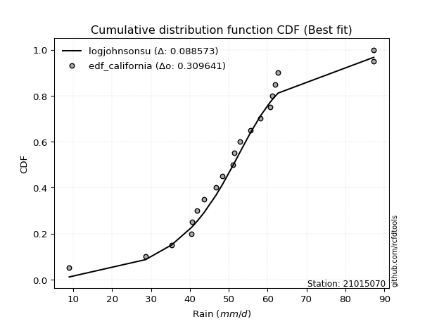</img>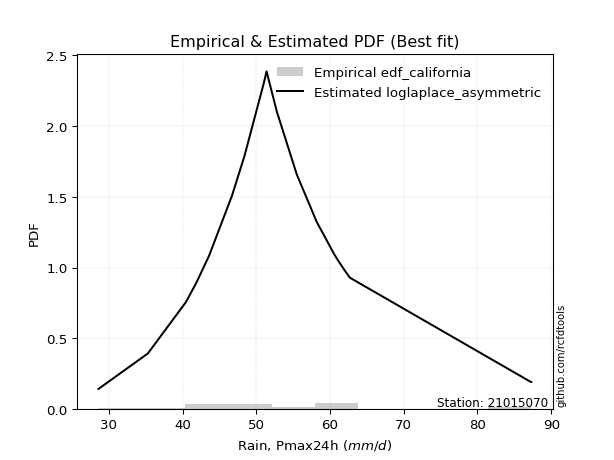</img>

</div>


### 2. EDF Hazen (1930)

Hazen method for plotting positions is a formula used to estimate the empirical cumulative probability distribution of flood events or other hydrological data. This formula often results in biased estimations, particularly when extrapolating to extreme events (high return periods).

<div align="center">


$P=(m-0.5)/n$


</div>


**2.1. Empirical values**

<div align="center">

|                | 0                   | 1                   | 2                   | 3                   | 4                   | 5                  | 6                   | 7                   | 8                  | 9         | 10                 | 11                 | 12                 | 13                 | 14                 | 15                 | 16                | 17                 | 18                 |
|:---------------|:--------------------|:--------------------|:--------------------|:--------------------|:--------------------|:-------------------|:--------------------|:--------------------|:-------------------|:----------|:-------------------|:-------------------|:-------------------|:-------------------|:-------------------|:-------------------|:------------------|:-------------------|:-------------------|
| date           | 2020                | 2013                | 2005                | 2015                | 2022                | 2009               | 2023                | 2016                | 2010               | 2017      | 2006               | 2011               | 2008               | 2007               | 2019               | 2018               | 2014              | 2021               | 2012               |
| x              | 28.6                | 35.3                | 40.4                | 40.6                | 41.9                | 43.6               | 46.7                | 48.4                | 51.0               | 51.4      | 52.8               | 55.5               | 58.2               | 60.6               | 61.2               | 62.0               | 62.7              | 87.2               | 87.3               |
| m              | 1                   | 2                   | 3                   | 4                   | 5                   | 6                  | 7                   | 8                   | 9                  | 10        | 11                 | 12                 | 13                 | 14                 | 15                 | 16                 | 17                | 18                 | 19                 |
| empirical_dist | edf_hazen           | edf_hazen           | edf_hazen           | edf_hazen           | edf_hazen           | edf_hazen          | edf_hazen           | edf_hazen           | edf_hazen          | edf_hazen | edf_hazen          | edf_hazen          | edf_hazen          | edf_hazen          | edf_hazen          | edf_hazen          | edf_hazen         | edf_hazen          | edf_hazen          |
| empirical      | 0.02631578947368421 | 0.07894736842105263 | 0.13157894736842105 | 0.18421052631578946 | 0.23684210526315788 | 0.2894736842105263 | 0.34210526315789475 | 0.39473684210526316 | 0.4473684210526316 | 0.5       | 0.5526315789473685 | 0.6052631578947368 | 0.6578947368421053 | 0.7105263157894737 | 0.7631578947368421 | 0.8157894736842105 | 0.868421052631579 | 0.9210526315789473 | 0.9736842105263158 |
| empirical_tr   | 1.027027027027027   | 1.0857142857142856  | 1.1515151515151514  | 1.2258064516129032  | 1.3103448275862069  | 1.4074074074074074 | 1.5199999999999998  | 1.6521739130434783  | 1.8095238095238098 | 2.0       | 2.235294117647059  | 2.533333333333333  | 2.9230769230769234 | 3.4545454545454546 | 4.222222222222223  | 5.428571428571428  | 7.600000000000002 | 12.666666666666663 | 38.00000000000004  |

</div>


**2.2. Kolmogorov-Smirnov fit test (sorted by Δ)**


<div align="center">

|                | 0                     | 1                   | 2                   | 3                   | 4                   | 5                   | 6                   | 7                   | 8                   | 9                   | 10                  | 11                  | 12                  | 13                  | 14                  | 15                  | 16                  | 17                  | 18                  | 19                  | 20                  | 21                  | 22                  | 23                  | 24                  | 25                  | 26                  | 27                  | 28                  | 29                  | 30                  | 31                  | 32                  | 33                  | 34                  | 35                  | 36                  | 37                  | 38                  | 39                  | 40                  | 41                  | 42                  | 43                  | 44                  | 45                  | 46                  | 47                  | 48                  | 49                  | 50                  | 51                  | 52                  | 53                  | 54                  | 55                  | 56                  | 57                  | 58                  | 59                  | 60                  | 61                  | 62                  | 63                  | 64                  | 65                  | 66                  | 67                  | 68                  | 69                  | 70                  | 71                  | 72                  | 73                  | 74                  | 75                  | 76                  | 77                  | 78                  | 79                  | 80                  | 81                  | 82                  | 83                  | 84                  | 85                  | 86                  | 87                  |
|:---------------|:----------------------|:--------------------|:--------------------|:--------------------|:--------------------|:--------------------|:--------------------|:--------------------|:--------------------|:--------------------|:--------------------|:--------------------|:--------------------|:--------------------|:--------------------|:--------------------|:--------------------|:--------------------|:--------------------|:--------------------|:--------------------|:--------------------|:--------------------|:--------------------|:--------------------|:--------------------|:--------------------|:--------------------|:--------------------|:--------------------|:--------------------|:--------------------|:--------------------|:--------------------|:--------------------|:--------------------|:--------------------|:--------------------|:--------------------|:--------------------|:--------------------|:--------------------|:--------------------|:--------------------|:--------------------|:--------------------|:--------------------|:--------------------|:--------------------|:--------------------|:--------------------|:--------------------|:--------------------|:--------------------|:--------------------|:--------------------|:--------------------|:--------------------|:--------------------|:--------------------|:--------------------|:--------------------|:--------------------|:--------------------|:--------------------|:--------------------|:--------------------|:--------------------|:--------------------|:--------------------|:--------------------|:--------------------|:--------------------|:--------------------|:--------------------|:--------------------|:--------------------|:--------------------|:--------------------|:--------------------|:--------------------|:--------------------|:--------------------|:--------------------|:--------------------|:--------------------|:--------------------|:--------------------|
| station        | 21015070              | 21015070            | 21015070            | 21015070            | 21015070            | 21015070            | 21015070            | 21015070            | 21015070            | 21015070            | 21015070            | 21015070            | 21015070            | 21015070            | 21015070            | 21015070            | 21015070            | 21015070            | 21015070            | 21015070            | 21015070            | 21015070            | 21015070            | 21015070            | 21015070            | 21015070            | 21015070            | 21015070            | 21015070            | 21015070            | 21015070            | 21015070            | 21015070            | 21015070            | 21015070            | 21015070            | 21015070            | 21015070            | 21015070            | 21015070            | 21015070            | 21015070            | 21015070            | 21015070            | 21015070            | 21015070            | 21015070            | 21015070            | 21015070            | 21015070            | 21015070            | 21015070            | 21015070            | 21015070            | 21015070            | 21015070            | 21015070            | 21015070            | 21015070            | 21015070            | 21015070            | 21015070            | 21015070            | 21015070            | 21015070            | 21015070            | 21015070            | 21015070            | 21015070            | 21015070            | 21015070            | 21015070            | 21015070            | 21015070            | 21015070            | 21015070            | 21015070            | 21015070            | 21015070            | 21015070            | 21015070            | 21015070            | 21015070            | 21015070            | 21015070            | 21015070            | 21015070            | 21015070            |
| empirical_dist | edf_hazen             | edf_hazen           | edf_hazen           | edf_hazen           | edf_hazen           | edf_hazen           | edf_hazen           | edf_hazen           | edf_hazen           | edf_hazen           | edf_hazen           | edf_hazen           | edf_hazen           | edf_hazen           | edf_hazen           | edf_hazen           | edf_hazen           | edf_hazen           | edf_hazen           | edf_hazen           | edf_hazen           | edf_hazen           | edf_hazen           | edf_hazen           | edf_hazen           | edf_hazen           | edf_hazen           | edf_hazen           | edf_hazen           | edf_hazen           | edf_hazen           | edf_hazen           | edf_hazen           | edf_hazen           | edf_hazen           | edf_hazen           | edf_hazen           | edf_hazen           | edf_hazen           | edf_hazen           | edf_hazen           | edf_hazen           | edf_hazen           | edf_hazen           | edf_hazen           | edf_hazen           | edf_hazen           | edf_hazen           | edf_hazen           | edf_hazen           | edf_hazen           | edf_hazen           | edf_hazen           | edf_hazen           | edf_hazen           | edf_hazen           | edf_hazen           | edf_hazen           | edf_hazen           | edf_hazen           | edf_hazen           | edf_hazen           | edf_hazen           | edf_hazen           | edf_hazen           | edf_hazen           | edf_hazen           | edf_hazen           | edf_hazen           | edf_hazen           | edf_hazen           | edf_hazen           | edf_hazen           | edf_hazen           | edf_hazen           | edf_hazen           | edf_hazen           | edf_hazen           | edf_hazen           | edf_hazen           | edf_hazen           | edf_hazen           | edf_hazen           | edf_hazen           | edf_hazen           | edf_hazen           | edf_hazen           | edf_hazen           |
| p_dist         | loglaplace_asymmetric | loghypsecant        | moyal               | loglogistic         | loglaplace          | logmielke           | laplace_asymmetric  | logfisk             | loggenlogistic      | mielke              | fisk                | nakagami            | exponnorm           | halflogistic        | gumbel_r            | lograyleigh         | laplace             | logmaxwell          | genlogistic         | loginvgamma         | invweibull          | nct                 | hypsecant           | logalpha            | alpha               | loginvgauss         | invgamma            | f                   | betaprime           | logt                | johnsonsu           | logjohnsonsu        | logfatiguelife      | logf                | loglognorm          | logpearson3         | logerlang           | loggamma            | loggamma            | logncf              | lognakagami         | logexponnorm        | lognorm             | lognorm             | logcrystalball      | logrice             | invgauss            | logloggamma         | fatiguelife         | gamma               | erlang              | pearson3            | loggumbel_r         | halfnorm            | logweibull_min      | loggumbel_l         | kstwobign           | logistic            | logbetaprime        | lognct              | loghalfnorm         | t                   | weibull_min         | loginvweibull       | rice                | rayleigh            | maxwell             | logkstwobign        | loggompertz         | logmoyal            | truncnorm           | norm                | crystalball         | loghalflogistic     | loggenexpon         | gumbel_l            | wald                | logwald             | gompertz            | loggibrat           | gibrat              | genexpon            | expon               | logchi2             | logtruncnorm        | logexpon            | ncf                 | chi2                |
| delta          | 0.06410779026054358   | 0.06547062911776236 | 0.0772671841029135  | 0.0798365148153759  | 0.08003874198436156 | 0.08123033639312371 | 0.08154430401891433 | 0.08223230487205879 | 0.08312187938749704 | 0.08313856227097294 | 0.08333389463047824 | 0.08702123764822484 | 0.08732812230172948 | 0.08740928230313333 | 0.09121558047068556 | 0.09279687379725554 | 0.09393674247291728 | 0.0949331043564896  | 0.09523243081155297 | 0.09530175179629718 | 0.09641320369157269 | 0.09653189617440261 | 0.09680455101141361 | 0.0977201416532949  | 0.09776674439605237 | 0.09917299332969232 | 0.09996584489457294 | 0.10031766481551074 | 0.10034664555244288 | 0.10096319700702694 | 0.10102346397894191 | 0.10108089400979281 | 0.10113181988303044 | 0.10121498741709811 | 0.10122122744633333 | 0.1012234958728786  | 0.10124016962046689 | 0.10124024705775769 | 0.10124024705775769 | 0.10125064972151587 | 0.10134207274638452 | 0.10148703274101101 | 0.10240870578008399 | 0.10240870578008399 | 0.10240876093844153 | 0.10249067381665244 | 0.10319614800488897 | 0.10354467438184001 | 0.10372866127111113 | 0.10631060486222854 | 0.10631070341570958 | 0.10634271369456483 | 0.10781100235673008 | 0.10868809083783704 | 0.10904369157080529 | 0.10911526940807204 | 0.11199819227928354 | 0.11209198473620241 | 0.11300579332089772 | 0.11308317559173364 | 0.11476885991295832 | 0.1160213092351865  | 0.11796285274723994 | 0.11816718042452945 | 0.11938779516643772 | 0.1195399471856744  | 0.1228980644354325  | 0.12552002738315013 | 0.1316604852276687  | 0.13369026295826952 | 0.1345814652772499  | 0.13458151467985247 | 0.13458151952819175 | 0.13874663044441066 | 0.15084536967202902 | 0.15472858601045658 | 0.16812429961992784 | 0.20571368444195332 | 0.2081507980899946  | 0.23684210523634186 | 0.23684210526315788 | 0.24626499794973863 | 0.24653599616655877 | 0.28706544314108073 | 0.30265715229471735 | 0.3124913925371997  | 0.4009310226699845  | 0.9082544382072737  |
| deltao         | 0.31564497164100014   | 0.31564497164100014 | 0.31564497164100014 | 0.31564497164100014 | 0.31564497164100014 | 0.31564497164100014 | 0.31564497164100014 | 0.31564497164100014 | 0.31564497164100014 | 0.31564497164100014 | 0.31564497164100014 | 0.31564497164100014 | 0.31564497164100014 | 0.31564497164100014 | 0.31564497164100014 | 0.31564497164100014 | 0.31564497164100014 | 0.31564497164100014 | 0.31564497164100014 | 0.31564497164100014 | 0.31564497164100014 | 0.31564497164100014 | 0.31564497164100014 | 0.31564497164100014 | 0.31564497164100014 | 0.31564497164100014 | 0.31564497164100014 | 0.31564497164100014 | 0.31564497164100014 | 0.31564497164100014 | 0.31564497164100014 | 0.31564497164100014 | 0.31564497164100014 | 0.31564497164100014 | 0.31564497164100014 | 0.31564497164100014 | 0.31564497164100014 | 0.31564497164100014 | 0.31564497164100014 | 0.31564497164100014 | 0.31564497164100014 | 0.31564497164100014 | 0.31564497164100014 | 0.31564497164100014 | 0.31564497164100014 | 0.31564497164100014 | 0.31564497164100014 | 0.31564497164100014 | 0.31564497164100014 | 0.31564497164100014 | 0.31564497164100014 | 0.31564497164100014 | 0.31564497164100014 | 0.31564497164100014 | 0.31564497164100014 | 0.31564497164100014 | 0.31564497164100014 | 0.31564497164100014 | 0.31564497164100014 | 0.31564497164100014 | 0.31564497164100014 | 0.31564497164100014 | 0.31564497164100014 | 0.31564497164100014 | 0.31564497164100014 | 0.31564497164100014 | 0.31564497164100014 | 0.31564497164100014 | 0.31564497164100014 | 0.31564497164100014 | 0.31564497164100014 | 0.31564497164100014 | 0.31564497164100014 | 0.31564497164100014 | 0.31564497164100014 | 0.31564497164100014 | 0.31564497164100014 | 0.31564497164100014 | 0.31564497164100014 | 0.31564497164100014 | 0.31564497164100014 | 0.31564497164100014 | 0.31564497164100014 | 0.31564497164100014 | 0.31564497164100014 | 0.31564497164100014 | 0.31564497164100014 | 0.31564497164100014 |
| eval           | Δo > Δ                | Δo > Δ              | Δo > Δ              | Δo > Δ              | Δo > Δ              | Δo > Δ              | Δo > Δ              | Δo > Δ              | Δo > Δ              | Δo > Δ              | Δo > Δ              | Δo > Δ              | Δo > Δ              | Δo > Δ              | Δo > Δ              | Δo > Δ              | Δo > Δ              | Δo > Δ              | Δo > Δ              | Δo > Δ              | Δo > Δ              | Δo > Δ              | Δo > Δ              | Δo > Δ              | Δo > Δ              | Δo > Δ              | Δo > Δ              | Δo > Δ              | Δo > Δ              | Δo > Δ              | Δo > Δ              | Δo > Δ              | Δo > Δ              | Δo > Δ              | Δo > Δ              | Δo > Δ              | Δo > Δ              | Δo > Δ              | Δo > Δ              | Δo > Δ              | Δo > Δ              | Δo > Δ              | Δo > Δ              | Δo > Δ              | Δo > Δ              | Δo > Δ              | Δo > Δ              | Δo > Δ              | Δo > Δ              | Δo > Δ              | Δo > Δ              | Δo > Δ              | Δo > Δ              | Δo > Δ              | Δo > Δ              | Δo > Δ              | Δo > Δ              | Δo > Δ              | Δo > Δ              | Δo > Δ              | Δo > Δ              | Δo > Δ              | Δo > Δ              | Δo > Δ              | Δo > Δ              | Δo > Δ              | Δo > Δ              | Δo > Δ              | Δo > Δ              | Δo > Δ              | Δo > Δ              | Δo > Δ              | Δo > Δ              | Δo > Δ              | Δo > Δ              | Δo > Δ              | Δo > Δ              | Δo > Δ              | Δo > Δ              | Δo > Δ              | Δo > Δ              | Δo > Δ              | Δo > Δ              | Δo > Δ              | Δo > Δ              | Δo > Δ              | Δo <= Δ             | Δo <= Δ             |
| fit            | 1                     | 1                   | 1                   | 1                   | 1                   | 1                   | 1                   | 1                   | 1                   | 1                   | 1                   | 1                   | 1                   | 1                   | 1                   | 1                   | 1                   | 1                   | 1                   | 1                   | 1                   | 1                   | 1                   | 1                   | 1                   | 1                   | 1                   | 1                   | 1                   | 1                   | 1                   | 1                   | 1                   | 1                   | 1                   | 1                   | 1                   | 1                   | 1                   | 1                   | 1                   | 1                   | 1                   | 1                   | 1                   | 1                   | 1                   | 1                   | 1                   | 1                   | 1                   | 1                   | 1                   | 1                   | 1                   | 1                   | 1                   | 1                   | 1                   | 1                   | 1                   | 1                   | 1                   | 1                   | 1                   | 1                   | 1                   | 1                   | 1                   | 1                   | 1                   | 1                   | 1                   | 1                   | 1                   | 1                   | 1                   | 1                   | 1                   | 1                   | 1                   | 1                   | 1                   | 1                   | 1                   | 1                   | 0                   | 0                   |
| n              | 19                    | 19                  | 19                  | 19                  | 19                  | 19                  | 19                  | 19                  | 19                  | 19                  | 19                  | 19                  | 19                  | 19                  | 19                  | 19                  | 19                  | 19                  | 19                  | 19                  | 19                  | 19                  | 19                  | 19                  | 19                  | 19                  | 19                  | 19                  | 19                  | 19                  | 19                  | 19                  | 19                  | 19                  | 19                  | 19                  | 19                  | 19                  | 19                  | 19                  | 19                  | 19                  | 19                  | 19                  | 19                  | 19                  | 19                  | 19                  | 19                  | 19                  | 19                  | 19                  | 19                  | 19                  | 19                  | 19                  | 19                  | 19                  | 19                  | 19                  | 19                  | 19                  | 19                  | 19                  | 19                  | 19                  | 19                  | 19                  | 19                  | 19                  | 19                  | 19                  | 19                  | 19                  | 19                  | 19                  | 19                  | 19                  | 19                  | 19                  | 19                  | 19                  | 19                  | 19                  | 19                  | 19                  | 19                  | 19                  |
| best_fit       | 1                     | 0                   | 0                   | 0                   | 0                   | 0                   | 0                   | 0                   | 0                   | 0                   | 0                   | 0                   | 0                   | 0                   | 0                   | 0                   | 0                   | 0                   | 0                   | 0                   | 0                   | 0                   | 0                   | 0                   | 0                   | 0                   | 0                   | 0                   | 0                   | 0                   | 0                   | 0                   | 0                   | 0                   | 0                   | 0                   | 0                   | 0                   | 0                   | 0                   | 0                   | 0                   | 0                   | 0                   | 0                   | 0                   | 0                   | 0                   | 0                   | 0                   | 0                   | 0                   | 0                   | 0                   | 0                   | 0                   | 0                   | 0                   | 0                   | 0                   | 0                   | 0                   | 0                   | 0                   | 0                   | 0                   | 0                   | 0                   | 0                   | 0                   | 0                   | 0                   | 0                   | 0                   | 0                   | 0                   | 0                   | 0                   | 0                   | 0                   | 0                   | 0                   | 0                   | 0                   | 0                   | 0                   | 0                   | 0                   |
| best_fit_sort  | 1                     | 2                   | 3                   | 4                   | 5                   | 6                   | 7                   | 8                   | 9                   | 10                  | 11                  | 12                  | 13                  | 14                  | 15                  | 16                  | 17                  | 18                  | 19                  | 20                  | 21                  | 22                  | 23                  | 24                  | 25                  | 26                  | 27                  | 28                  | 29                  | 30                  | 31                  | 32                  | 33                  | 34                  | 35                  | 36                  | 37                  | 38                  | 39                  | 40                  | 41                  | 42                  | 43                  | 44                  | 45                  | 46                  | 47                  | 48                  | 49                  | 50                  | 51                  | 52                  | 53                  | 54                  | 55                  | 56                  | 57                  | 58                  | 59                  | 60                  | 61                  | 62                  | 63                  | 64                  | 65                  | 66                  | 67                  | 68                  | 69                  | 70                  | 71                  | 72                  | 73                  | 74                  | 75                  | 76                  | 77                  | 78                  | 79                  | 80                  | 81                  | 82                  | 83                  | 84                  | 85                  | 86                  | 87                  | 88                  |

</div>


**2.3. Best fit**

<div align="center">

|   id |   station | empirical_dist   | p_dist                |     delta |   deltao | eval   |   fit |   n |   best_fit |   best_fit_sort |
|-----:|----------:|:-----------------|:----------------------|----------:|---------:|:-------|------:|----:|-----------:|----------------:|
|    0 |  21015070 | edf_hazen        | loglaplace_asymmetric | 0.0641078 | 0.315645 | Δo > Δ |     1 |  19 |          1 |               1 |

</div>


<div align="center">

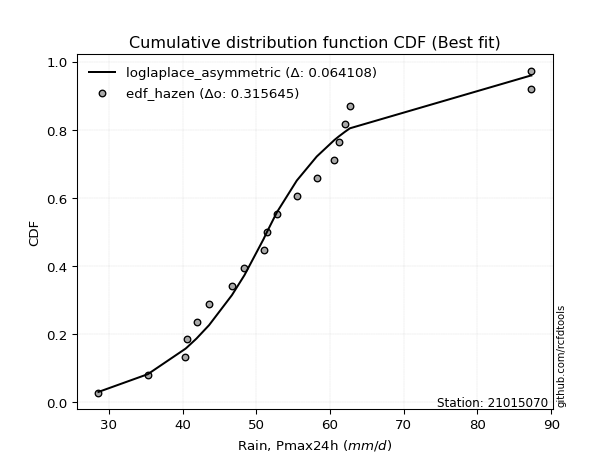</img></img>

</div>


### 3. EDF Weibull (1939)

Weibull plotting position formula is an empirical method used to estimate the non-exceedance probability or plotting position for a set of observed data, is often recommended or widely used in practice, particularly in flood frequency analysis.

<div align="center">


$P=m/(n+1)$


</div>


**3.1. Empirical values**

<div align="center">

|                | 0                  | 1                  | 2                  | 3           | 4                  | 5                  | 6                  | 7                  | 8                  | 9           | 10                 | 11          | 12                | 13                | 14          | 15                | 16                | 17                 | 18                 |
|:---------------|:-------------------|:-------------------|:-------------------|:------------|:-------------------|:-------------------|:-------------------|:-------------------|:-------------------|:------------|:-------------------|:------------|:------------------|:------------------|:------------|:------------------|:------------------|:-------------------|:-------------------|
| date           | 2020               | 2013               | 2005               | 2015        | 2022               | 2009               | 2023               | 2016               | 2010               | 2017        | 2006               | 2011        | 2008              | 2007              | 2019        | 2018              | 2014              | 2021               | 2012               |
| x              | 28.6               | 35.3               | 40.4               | 40.6        | 41.9               | 43.6               | 46.7               | 48.4               | 51.0               | 51.4        | 52.8               | 55.5        | 58.2              | 60.6              | 61.2        | 62.0              | 62.7              | 87.2               | 87.3               |
| m              | 1                  | 2                  | 3                  | 4           | 5                  | 6                  | 7                  | 8                  | 9                  | 10          | 11                 | 12          | 13                | 14                | 15          | 16                | 17                | 18                 | 19                 |
| empirical_dist | edf_weibull        | edf_weibull        | edf_weibull        | edf_weibull | edf_weibull        | edf_weibull        | edf_weibull        | edf_weibull        | edf_weibull        | edf_weibull | edf_weibull        | edf_weibull | edf_weibull       | edf_weibull       | edf_weibull | edf_weibull       | edf_weibull       | edf_weibull        | edf_weibull        |
| empirical      | 0.05               | 0.1                | 0.15               | 0.2         | 0.25               | 0.3                | 0.35               | 0.4                | 0.45               | 0.5         | 0.55               | 0.6         | 0.65              | 0.7               | 0.75        | 0.8               | 0.85              | 0.9                | 0.95               |
| empirical_tr   | 1.0526315789473684 | 1.1111111111111112 | 1.1764705882352942 | 1.25        | 1.3333333333333333 | 1.4285714285714286 | 1.5384615384615383 | 1.6666666666666667 | 1.8181818181818181 | 2.0         | 2.2222222222222223 | 2.5         | 2.857142857142857 | 3.333333333333333 | 4.0         | 5.000000000000001 | 6.666666666666666 | 10.000000000000002 | 19.999999999999982 |

</div>


**3.2. Kolmogorov-Smirnov fit test (sorted by Δ)**


<div align="center">

|                | 0                   | 1                   | 2                   | 3                   | 4                   | 5                   | 6                   | 7                   | 8                   | 9                     | 10                  | 11                  | 12                  | 13                  | 14                  | 15                  | 16                  | 17                  | 18                  | 19                  | 20                  | 21                  | 22                  | 23                  | 24                  | 25                  | 26                  | 27                  | 28                  | 29                  | 30                  | 31                  | 32                  | 33                  | 34                  | 35                  | 36                  | 37                  | 38                  | 39                  | 40                  | 41                  | 42                  | 43                  | 44                  | 45                  | 46                  | 47                  | 48                  | 49                  | 50                  | 51                  | 52                  | 53                  | 54                  | 55                  | 56                  | 57                  | 58                  | 59                  | 60                  | 61                  | 62                  | 63                  | 64                  | 65                  | 66                  | 67                  | 68                  | 69                  | 70                  | 71                  | 72                  | 73                  | 74                  | 75                  | 76                  | 77                  | 78                  | 79                  | 80                  | 81                  | 82                  | 83                  | 84                  | 85                  | 86                  | 87                  |
|:---------------|:--------------------|:--------------------|:--------------------|:--------------------|:--------------------|:--------------------|:--------------------|:--------------------|:--------------------|:----------------------|:--------------------|:--------------------|:--------------------|:--------------------|:--------------------|:--------------------|:--------------------|:--------------------|:--------------------|:--------------------|:--------------------|:--------------------|:--------------------|:--------------------|:--------------------|:--------------------|:--------------------|:--------------------|:--------------------|:--------------------|:--------------------|:--------------------|:--------------------|:--------------------|:--------------------|:--------------------|:--------------------|:--------------------|:--------------------|:--------------------|:--------------------|:--------------------|:--------------------|:--------------------|:--------------------|:--------------------|:--------------------|:--------------------|:--------------------|:--------------------|:--------------------|:--------------------|:--------------------|:--------------------|:--------------------|:--------------------|:--------------------|:--------------------|:--------------------|:--------------------|:--------------------|:--------------------|:--------------------|:--------------------|:--------------------|:--------------------|:--------------------|:--------------------|:--------------------|:--------------------|:--------------------|:--------------------|:--------------------|:--------------------|:--------------------|:--------------------|:--------------------|:--------------------|:--------------------|:--------------------|:--------------------|:--------------------|:--------------------|:--------------------|:--------------------|:--------------------|:--------------------|:--------------------|
| station        | 21015070            | 21015070            | 21015070            | 21015070            | 21015070            | 21015070            | 21015070            | 21015070            | 21015070            | 21015070              | 21015070            | 21015070            | 21015070            | 21015070            | 21015070            | 21015070            | 21015070            | 21015070            | 21015070            | 21015070            | 21015070            | 21015070            | 21015070            | 21015070            | 21015070            | 21015070            | 21015070            | 21015070            | 21015070            | 21015070            | 21015070            | 21015070            | 21015070            | 21015070            | 21015070            | 21015070            | 21015070            | 21015070            | 21015070            | 21015070            | 21015070            | 21015070            | 21015070            | 21015070            | 21015070            | 21015070            | 21015070            | 21015070            | 21015070            | 21015070            | 21015070            | 21015070            | 21015070            | 21015070            | 21015070            | 21015070            | 21015070            | 21015070            | 21015070            | 21015070            | 21015070            | 21015070            | 21015070            | 21015070            | 21015070            | 21015070            | 21015070            | 21015070            | 21015070            | 21015070            | 21015070            | 21015070            | 21015070            | 21015070            | 21015070            | 21015070            | 21015070            | 21015070            | 21015070            | 21015070            | 21015070            | 21015070            | 21015070            | 21015070            | 21015070            | 21015070            | 21015070            | 21015070            |
| empirical_dist | edf_weibull         | edf_weibull         | edf_weibull         | edf_weibull         | edf_weibull         | edf_weibull         | edf_weibull         | edf_weibull         | edf_weibull         | edf_weibull           | edf_weibull         | edf_weibull         | edf_weibull         | edf_weibull         | edf_weibull         | edf_weibull         | edf_weibull         | edf_weibull         | edf_weibull         | edf_weibull         | edf_weibull         | edf_weibull         | edf_weibull         | edf_weibull         | edf_weibull         | edf_weibull         | edf_weibull         | edf_weibull         | edf_weibull         | edf_weibull         | edf_weibull         | edf_weibull         | edf_weibull         | edf_weibull         | edf_weibull         | edf_weibull         | edf_weibull         | edf_weibull         | edf_weibull         | edf_weibull         | edf_weibull         | edf_weibull         | edf_weibull         | edf_weibull         | edf_weibull         | edf_weibull         | edf_weibull         | edf_weibull         | edf_weibull         | edf_weibull         | edf_weibull         | edf_weibull         | edf_weibull         | edf_weibull         | edf_weibull         | edf_weibull         | edf_weibull         | edf_weibull         | edf_weibull         | edf_weibull         | edf_weibull         | edf_weibull         | edf_weibull         | edf_weibull         | edf_weibull         | edf_weibull         | edf_weibull         | edf_weibull         | edf_weibull         | edf_weibull         | edf_weibull         | edf_weibull         | edf_weibull         | edf_weibull         | edf_weibull         | edf_weibull         | edf_weibull         | edf_weibull         | edf_weibull         | edf_weibull         | edf_weibull         | edf_weibull         | edf_weibull         | edf_weibull         | edf_weibull         | edf_weibull         | edf_weibull         | edf_weibull         |
| p_dist         | fisk                | logmielke           | mielke              | loggenlogistic      | logfisk             | exponnorm           | loghypsecant        | loglogistic         | gumbel_r            | loglaplace_asymmetric | moyal               | logmaxwell          | genlogistic         | loginvgamma         | invweibull          | nct                 | logalpha            | alpha               | lograyleigh         | loginvgauss         | invgamma            | f                   | betaprime           | logt                | johnsonsu           | logjohnsonsu        | logfatiguelife      | logf                | loglognorm          | logpearson3         | logerlang           | loggamma            | loggamma            | logncf              | lognakagami         | logexponnorm        | lognorm             | lognorm             | logcrystalball      | logrice             | hypsecant           | invgauss            | logloggamma         | fatiguelife         | gamma               | erlang              | pearson3            | halfnorm            | loglaplace          | logweibull_min      | laplace_asymmetric  | kstwobign           | logistic            | logbetaprime        | lognct              | t                   | loggumbel_l         | weibull_min         | loginvweibull       | nakagami            | halflogistic        | rice                | rayleigh            | laplace             | maxwell             | loggumbel_r         | logkstwobign        | loghalfnorm         | loggompertz         | truncnorm           | norm                | crystalball         | logmoyal            | loggenexpon         | loghalflogistic     | gumbel_l            | wald                | gompertz            | logwald             | genexpon            | expon               | loggibrat           | gibrat              | logchi2             | logtruncnorm        | logexpon            | ncf                 | chi2                |
| delta          | 0.06669710111122729 | 0.0676841176641173  | 0.06791303361696321 | 0.06791465797474394 | 0.0681469934820248  | 0.06977837531383091 | 0.06995149835451753 | 0.07138684561155362 | 0.07279452783910656 | 0.07389862833073374   | 0.07463560515554507 | 0.0765120517249106  | 0.07681137817997397 | 0.07688069916471818 | 0.07799215105999369 | 0.0781108435428236  | 0.0792990890217159  | 0.07934569176447337 | 0.0802744343204404  | 0.08075194069811331 | 0.08154479226299394 | 0.08189661218393174 | 0.08192559292086388 | 0.08254214437544793 | 0.0826024113473629  | 0.0826598413782138  | 0.08271076725145143 | 0.08279393478551911 | 0.08280017481475432 | 0.0828024432412996  | 0.08281911698888789 | 0.08281919442617869 | 0.08281919442617869 | 0.08282959708993687 | 0.08292102011480551 | 0.083065980109432   | 0.08398765314850498 | 0.08398765314850498 | 0.08398770830686253 | 0.08406962118507344 | 0.08427040675082695 | 0.08477509537330996 | 0.085123621750261   | 0.08530760863953213 | 0.08788955223064954 | 0.08788965078413058 | 0.08792166106298582 | 0.09026703820625803 | 0.09056505777383522 | 0.09062263893922629 | 0.09161601294970098 | 0.09357713964770453 | 0.0936709321046234  | 0.09458474068931877 | 0.09466212296015464 | 0.0976002566036075  | 0.09887338449420824 | 0.09954180011566094 | 0.09974612779295045 | 0.09999999999999803 | 0.1                 | 0.10096674253485871 | 0.1011188945540954  | 0.10446305826239094 | 0.10447701180385349 | 0.10517942340936165 | 0.10709897475157118 | 0.11213728096558989 | 0.1132394325960897  | 0.1161604126456709  | 0.11616046204827346 | 0.11616046689661275 | 0.1310586840109011  | 0.13242431704045007 | 0.13611505149704223 | 0.1379453398582018  | 0.18391377330413838 | 0.1897297454584156  | 0.20308210549458489 | 0.22784394531815969 | 0.22811494353497982 | 0.24999999997318398 | 0.25                | 0.26338123261476487 | 0.28423609966313834 | 0.2940703399056207  | 0.37987839109103716 | 0.8872018066283264  |
| deltao         | 0.31564497164100014 | 0.31564497164100014 | 0.31564497164100014 | 0.31564497164100014 | 0.31564497164100014 | 0.31564497164100014 | 0.31564497164100014 | 0.31564497164100014 | 0.31564497164100014 | 0.31564497164100014   | 0.31564497164100014 | 0.31564497164100014 | 0.31564497164100014 | 0.31564497164100014 | 0.31564497164100014 | 0.31564497164100014 | 0.31564497164100014 | 0.31564497164100014 | 0.31564497164100014 | 0.31564497164100014 | 0.31564497164100014 | 0.31564497164100014 | 0.31564497164100014 | 0.31564497164100014 | 0.31564497164100014 | 0.31564497164100014 | 0.31564497164100014 | 0.31564497164100014 | 0.31564497164100014 | 0.31564497164100014 | 0.31564497164100014 | 0.31564497164100014 | 0.31564497164100014 | 0.31564497164100014 | 0.31564497164100014 | 0.31564497164100014 | 0.31564497164100014 | 0.31564497164100014 | 0.31564497164100014 | 0.31564497164100014 | 0.31564497164100014 | 0.31564497164100014 | 0.31564497164100014 | 0.31564497164100014 | 0.31564497164100014 | 0.31564497164100014 | 0.31564497164100014 | 0.31564497164100014 | 0.31564497164100014 | 0.31564497164100014 | 0.31564497164100014 | 0.31564497164100014 | 0.31564497164100014 | 0.31564497164100014 | 0.31564497164100014 | 0.31564497164100014 | 0.31564497164100014 | 0.31564497164100014 | 0.31564497164100014 | 0.31564497164100014 | 0.31564497164100014 | 0.31564497164100014 | 0.31564497164100014 | 0.31564497164100014 | 0.31564497164100014 | 0.31564497164100014 | 0.31564497164100014 | 0.31564497164100014 | 0.31564497164100014 | 0.31564497164100014 | 0.31564497164100014 | 0.31564497164100014 | 0.31564497164100014 | 0.31564497164100014 | 0.31564497164100014 | 0.31564497164100014 | 0.31564497164100014 | 0.31564497164100014 | 0.31564497164100014 | 0.31564497164100014 | 0.31564497164100014 | 0.31564497164100014 | 0.31564497164100014 | 0.31564497164100014 | 0.31564497164100014 | 0.31564497164100014 | 0.31564497164100014 | 0.31564497164100014 |
| eval           | Δo > Δ              | Δo > Δ              | Δo > Δ              | Δo > Δ              | Δo > Δ              | Δo > Δ              | Δo > Δ              | Δo > Δ              | Δo > Δ              | Δo > Δ                | Δo > Δ              | Δo > Δ              | Δo > Δ              | Δo > Δ              | Δo > Δ              | Δo > Δ              | Δo > Δ              | Δo > Δ              | Δo > Δ              | Δo > Δ              | Δo > Δ              | Δo > Δ              | Δo > Δ              | Δo > Δ              | Δo > Δ              | Δo > Δ              | Δo > Δ              | Δo > Δ              | Δo > Δ              | Δo > Δ              | Δo > Δ              | Δo > Δ              | Δo > Δ              | Δo > Δ              | Δo > Δ              | Δo > Δ              | Δo > Δ              | Δo > Δ              | Δo > Δ              | Δo > Δ              | Δo > Δ              | Δo > Δ              | Δo > Δ              | Δo > Δ              | Δo > Δ              | Δo > Δ              | Δo > Δ              | Δo > Δ              | Δo > Δ              | Δo > Δ              | Δo > Δ              | Δo > Δ              | Δo > Δ              | Δo > Δ              | Δo > Δ              | Δo > Δ              | Δo > Δ              | Δo > Δ              | Δo > Δ              | Δo > Δ              | Δo > Δ              | Δo > Δ              | Δo > Δ              | Δo > Δ              | Δo > Δ              | Δo > Δ              | Δo > Δ              | Δo > Δ              | Δo > Δ              | Δo > Δ              | Δo > Δ              | Δo > Δ              | Δo > Δ              | Δo > Δ              | Δo > Δ              | Δo > Δ              | Δo > Δ              | Δo > Δ              | Δo > Δ              | Δo > Δ              | Δo > Δ              | Δo > Δ              | Δo > Δ              | Δo > Δ              | Δo > Δ              | Δo > Δ              | Δo <= Δ             | Δo <= Δ             |
| fit            | 1                   | 1                   | 1                   | 1                   | 1                   | 1                   | 1                   | 1                   | 1                   | 1                     | 1                   | 1                   | 1                   | 1                   | 1                   | 1                   | 1                   | 1                   | 1                   | 1                   | 1                   | 1                   | 1                   | 1                   | 1                   | 1                   | 1                   | 1                   | 1                   | 1                   | 1                   | 1                   | 1                   | 1                   | 1                   | 1                   | 1                   | 1                   | 1                   | 1                   | 1                   | 1                   | 1                   | 1                   | 1                   | 1                   | 1                   | 1                   | 1                   | 1                   | 1                   | 1                   | 1                   | 1                   | 1                   | 1                   | 1                   | 1                   | 1                   | 1                   | 1                   | 1                   | 1                   | 1                   | 1                   | 1                   | 1                   | 1                   | 1                   | 1                   | 1                   | 1                   | 1                   | 1                   | 1                   | 1                   | 1                   | 1                   | 1                   | 1                   | 1                   | 1                   | 1                   | 1                   | 1                   | 1                   | 0                   | 0                   |
| n              | 19                  | 19                  | 19                  | 19                  | 19                  | 19                  | 19                  | 19                  | 19                  | 19                    | 19                  | 19                  | 19                  | 19                  | 19                  | 19                  | 19                  | 19                  | 19                  | 19                  | 19                  | 19                  | 19                  | 19                  | 19                  | 19                  | 19                  | 19                  | 19                  | 19                  | 19                  | 19                  | 19                  | 19                  | 19                  | 19                  | 19                  | 19                  | 19                  | 19                  | 19                  | 19                  | 19                  | 19                  | 19                  | 19                  | 19                  | 19                  | 19                  | 19                  | 19                  | 19                  | 19                  | 19                  | 19                  | 19                  | 19                  | 19                  | 19                  | 19                  | 19                  | 19                  | 19                  | 19                  | 19                  | 19                  | 19                  | 19                  | 19                  | 19                  | 19                  | 19                  | 19                  | 19                  | 19                  | 19                  | 19                  | 19                  | 19                  | 19                  | 19                  | 19                  | 19                  | 19                  | 19                  | 19                  | 19                  | 19                  |
| best_fit       | 1                   | 0                   | 0                   | 0                   | 0                   | 0                   | 0                   | 0                   | 0                   | 0                     | 0                   | 0                   | 0                   | 0                   | 0                   | 0                   | 0                   | 0                   | 0                   | 0                   | 0                   | 0                   | 0                   | 0                   | 0                   | 0                   | 0                   | 0                   | 0                   | 0                   | 0                   | 0                   | 0                   | 0                   | 0                   | 0                   | 0                   | 0                   | 0                   | 0                   | 0                   | 0                   | 0                   | 0                   | 0                   | 0                   | 0                   | 0                   | 0                   | 0                   | 0                   | 0                   | 0                   | 0                   | 0                   | 0                   | 0                   | 0                   | 0                   | 0                   | 0                   | 0                   | 0                   | 0                   | 0                   | 0                   | 0                   | 0                   | 0                   | 0                   | 0                   | 0                   | 0                   | 0                   | 0                   | 0                   | 0                   | 0                   | 0                   | 0                   | 0                   | 0                   | 0                   | 0                   | 0                   | 0                   | 0                   | 0                   |
| best_fit_sort  | 1                   | 2                   | 3                   | 4                   | 5                   | 6                   | 7                   | 8                   | 9                   | 10                    | 11                  | 12                  | 13                  | 14                  | 15                  | 16                  | 17                  | 18                  | 19                  | 20                  | 21                  | 22                  | 23                  | 24                  | 25                  | 26                  | 27                  | 28                  | 29                  | 30                  | 31                  | 32                  | 33                  | 34                  | 35                  | 36                  | 37                  | 38                  | 39                  | 40                  | 41                  | 42                  | 43                  | 44                  | 45                  | 46                  | 47                  | 48                  | 49                  | 50                  | 51                  | 52                  | 53                  | 54                  | 55                  | 56                  | 57                  | 58                  | 59                  | 60                  | 61                  | 62                  | 63                  | 64                  | 65                  | 66                  | 67                  | 68                  | 69                  | 70                  | 71                  | 72                  | 73                  | 74                  | 75                  | 76                  | 77                  | 78                  | 79                  | 80                  | 81                  | 82                  | 83                  | 84                  | 85                  | 86                  | 87                  | 88                  |

</div>


**3.3. Best fit**

<div align="center">

|   id |   station | empirical_dist   | p_dist   |     delta |   deltao | eval   |   fit |   n |   best_fit |   best_fit_sort |
|-----:|----------:|:-----------------|:---------|----------:|---------:|:-------|------:|----:|-----------:|----------------:|
|    0 |  21015070 | edf_weibull      | fisk     | 0.0666971 | 0.315645 | Δo > Δ |     1 |  19 |          1 |               1 |

</div>


<div align="center">

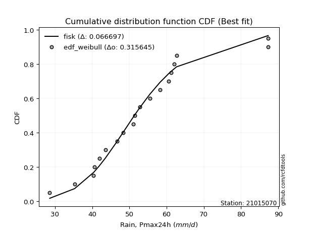</img>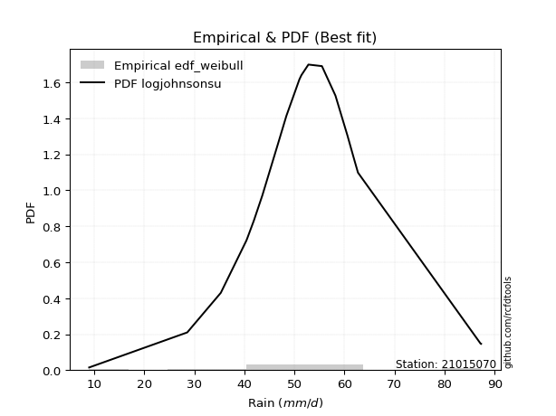</img>

</div>


### 4. EDF Beard (1943)

The Beard formula (or Beard´s plotting position formula) in hydrology is used to estimate the empirical non-exceedance probability _(P)_ of a flood event (or other extreme hydrological data point) within a given dataset.

<div align="center">


$P=(m-0.31)/(n+0.38)$


</div>


**4.1. Empirical values**

<div align="center">

|                | 0                   | 1                   | 2                  | 3                   | 4                   | 5                   | 6                  | 7                  | 8                  | 9         | 10                 | 11                 | 12                 | 13                 | 14                 | 15                 | 16                 | 17                 | 18                 |
|:---------------|:--------------------|:--------------------|:-------------------|:--------------------|:--------------------|:--------------------|:-------------------|:-------------------|:-------------------|:----------|:-------------------|:-------------------|:-------------------|:-------------------|:-------------------|:-------------------|:-------------------|:-------------------|:-------------------|
| date           | 2020                | 2013                | 2005               | 2015                | 2022                | 2009                | 2023               | 2016               | 2010               | 2017      | 2006               | 2011               | 2008               | 2007               | 2019               | 2018               | 2014               | 2021               | 2012               |
| x              | 28.6                | 35.3                | 40.4               | 40.6                | 41.9                | 43.6                | 46.7               | 48.4               | 51.0               | 51.4      | 52.8               | 55.5               | 58.2               | 60.6               | 61.2               | 62.0               | 62.7               | 87.2               | 87.3               |
| m              | 1                   | 2                   | 3                  | 4                   | 5                   | 6                   | 7                  | 8                  | 9                  | 10        | 11                 | 12                 | 13                 | 14                 | 15                 | 16                 | 17                 | 18                 | 19                 |
| empirical_dist | edf_beard           | edf_beard           | edf_beard          | edf_beard           | edf_beard           | edf_beard           | edf_beard          | edf_beard          | edf_beard          | edf_beard | edf_beard          | edf_beard          | edf_beard          | edf_beard          | edf_beard          | edf_beard          | edf_beard          | edf_beard          | edf_beard          |
| empirical      | 0.03560371517027864 | 0.08720330237358101 | 0.1388028895768834 | 0.19040247678018576 | 0.24200206398348817 | 0.29360165118679055 | 0.3452012383900929 | 0.3968008255933953 | 0.4484004127966976 | 0.5       | 0.5515995872033024 | 0.6031991744066048 | 0.6547987616099071 | 0.7063983488132095 | 0.7579979360165119 | 0.8095975232198143 | 0.8611971104231168 | 0.9127966976264191 | 0.9643962848297215 |
| empirical_tr   | 1.0369181380417336  | 1.0955342001130581  | 1.1611743559017376 | 1.2351816443594645  | 1.3192648059904697  | 1.4156318480642804  | 1.5271867612293144 | 1.6578272027373824 | 1.812909260991581  | 2.0       | 2.230149597238205  | 2.5201560468140443 | 2.896860986547085  | 3.40597539543058   | 4.132196162046909  | 5.252032520325204  | 7.204460966542758  | 11.467455621301793 | 28.086956521739243 |

</div>


**4.2. Kolmogorov-Smirnov fit test (sorted by Δ)**


<div align="center">

|                | 0                   | 1                     | 2                   | 3                   | 4                   | 5                   | 6                   | 7                   | 8                   | 9                   | 10                  | 11                  | 12                  | 13                  | 14                  | 15                  | 16                  | 17                  | 18                  | 19                  | 20                  | 21                  | 22                  | 23                  | 24                  | 25                  | 26                  | 27                  | 28                  | 29                  | 30                  | 31                  | 32                  | 33                  | 34                  | 35                  | 36                  | 37                  | 38                  | 39                  | 40                  | 41                  | 42                  | 43                  | 44                  | 45                  | 46                  | 47                  | 48                  | 49                  | 50                  | 51                  | 52                  | 53                  | 54                  | 55                  | 56                  | 57                  | 58                  | 59                  | 60                  | 61                  | 62                  | 63                  | 64                  | 65                  | 66                  | 67                  | 68                  | 69                  | 70                  | 71                  | 72                  | 73                  | 74                  | 75                  | 76                  | 77                  | 78                  | 79                  | 80                  | 81                  | 82                  | 83                  | 84                  | 85                  | 86                  | 87                  |
|:---------------|:--------------------|:----------------------|:--------------------|:--------------------|:--------------------|:--------------------|:--------------------|:--------------------|:--------------------|:--------------------|:--------------------|:--------------------|:--------------------|:--------------------|:--------------------|:--------------------|:--------------------|:--------------------|:--------------------|:--------------------|:--------------------|:--------------------|:--------------------|:--------------------|:--------------------|:--------------------|:--------------------|:--------------------|:--------------------|:--------------------|:--------------------|:--------------------|:--------------------|:--------------------|:--------------------|:--------------------|:--------------------|:--------------------|:--------------------|:--------------------|:--------------------|:--------------------|:--------------------|:--------------------|:--------------------|:--------------------|:--------------------|:--------------------|:--------------------|:--------------------|:--------------------|:--------------------|:--------------------|:--------------------|:--------------------|:--------------------|:--------------------|:--------------------|:--------------------|:--------------------|:--------------------|:--------------------|:--------------------|:--------------------|:--------------------|:--------------------|:--------------------|:--------------------|:--------------------|:--------------------|:--------------------|:--------------------|:--------------------|:--------------------|:--------------------|:--------------------|:--------------------|:--------------------|:--------------------|:--------------------|:--------------------|:--------------------|:--------------------|:--------------------|:--------------------|:--------------------|:--------------------|:--------------------|
| station        | 21015070            | 21015070              | 21015070            | 21015070            | 21015070            | 21015070            | 21015070            | 21015070            | 21015070            | 21015070            | 21015070            | 21015070            | 21015070            | 21015070            | 21015070            | 21015070            | 21015070            | 21015070            | 21015070            | 21015070            | 21015070            | 21015070            | 21015070            | 21015070            | 21015070            | 21015070            | 21015070            | 21015070            | 21015070            | 21015070            | 21015070            | 21015070            | 21015070            | 21015070            | 21015070            | 21015070            | 21015070            | 21015070            | 21015070            | 21015070            | 21015070            | 21015070            | 21015070            | 21015070            | 21015070            | 21015070            | 21015070            | 21015070            | 21015070            | 21015070            | 21015070            | 21015070            | 21015070            | 21015070            | 21015070            | 21015070            | 21015070            | 21015070            | 21015070            | 21015070            | 21015070            | 21015070            | 21015070            | 21015070            | 21015070            | 21015070            | 21015070            | 21015070            | 21015070            | 21015070            | 21015070            | 21015070            | 21015070            | 21015070            | 21015070            | 21015070            | 21015070            | 21015070            | 21015070            | 21015070            | 21015070            | 21015070            | 21015070            | 21015070            | 21015070            | 21015070            | 21015070            | 21015070            |
| empirical_dist | edf_beard           | edf_beard             | edf_beard           | edf_beard           | edf_beard           | edf_beard           | edf_beard           | edf_beard           | edf_beard           | edf_beard           | edf_beard           | edf_beard           | edf_beard           | edf_beard           | edf_beard           | edf_beard           | edf_beard           | edf_beard           | edf_beard           | edf_beard           | edf_beard           | edf_beard           | edf_beard           | edf_beard           | edf_beard           | edf_beard           | edf_beard           | edf_beard           | edf_beard           | edf_beard           | edf_beard           | edf_beard           | edf_beard           | edf_beard           | edf_beard           | edf_beard           | edf_beard           | edf_beard           | edf_beard           | edf_beard           | edf_beard           | edf_beard           | edf_beard           | edf_beard           | edf_beard           | edf_beard           | edf_beard           | edf_beard           | edf_beard           | edf_beard           | edf_beard           | edf_beard           | edf_beard           | edf_beard           | edf_beard           | edf_beard           | edf_beard           | edf_beard           | edf_beard           | edf_beard           | edf_beard           | edf_beard           | edf_beard           | edf_beard           | edf_beard           | edf_beard           | edf_beard           | edf_beard           | edf_beard           | edf_beard           | edf_beard           | edf_beard           | edf_beard           | edf_beard           | edf_beard           | edf_beard           | edf_beard           | edf_beard           | edf_beard           | edf_beard           | edf_beard           | edf_beard           | edf_beard           | edf_beard           | edf_beard           | edf_beard           | edf_beard           | edf_beard           |
| p_dist         | loghypsecant        | loglaplace_asymmetric | loglogistic         | logmielke           | logfisk             | loggenlogistic      | mielke              | fisk                | moyal               | exponnorm           | gumbel_r            | loglaplace          | laplace_asymmetric  | lograyleigh         | nakagami            | halflogistic        | logmaxwell          | genlogistic         | loginvgamma         | invweibull          | nct                 | hypsecant           | logalpha            | alpha               | loginvgauss         | invgamma            | f                   | betaprime           | logt                | johnsonsu           | logjohnsonsu        | logfatiguelife      | logf                | loglognorm          | logpearson3         | logerlang           | loggamma            | loggamma            | logncf              | lognakagami         | logexponnorm        | lognorm             | lognorm             | logcrystalball      | logrice             | invgauss            | logloggamma         | fatiguelife         | laplace             | gamma               | erlang              | pearson3            | halfnorm            | logweibull_min      | loggumbel_l         | kstwobign           | logistic            | logbetaprime        | lognct              | loggumbel_r         | t                   | weibull_min         | loginvweibull       | rice                | rayleigh            | loghalfnorm         | maxwell             | logkstwobign        | loggompertz         | truncnorm           | norm                | crystalball         | logmoyal            | loghalflogistic     | loggenexpon         | gumbel_l            | wald                | gompertz            | logwald             | genexpon            | expon               | loggibrat           | gibrat              | logchi2             | logtruncnorm        | logexpon            | ncf                 | chi2                |
| delta          | 0.06219505587586113 | 0.0675002795175243    | 0.07261257260691367 | 0.07400639418466148 | 0.07500836266359656 | 0.07589793717903481 | 0.07591462006251071 | 0.07610995242201601 | 0.07623519235884746 | 0.08010418009326725 | 0.08399163826222333 | 0.08416670896062578 | 0.08521766413649154 | 0.08557293158879331 | 0.08720330237357904 | 0.08720330237358101 | 0.08770916214802738 | 0.08800848860309074 | 0.08807780958783495 | 0.08918926148311046 | 0.08930795396594038 | 0.08958060880295138 | 0.09049619944483267 | 0.09054280218759014 | 0.09194905112123009 | 0.09274190268611071 | 0.09309372260704851 | 0.09312270334398065 | 0.09373925479856471 | 0.09379952177047968 | 0.09385695180133058 | 0.09390787767456821 | 0.09399104520863588 | 0.0939972852378711  | 0.09399955366441637 | 0.09401622741200466 | 0.09401630484929546 | 0.09401630484929546 | 0.09402670751305364 | 0.09411813053792228 | 0.09426309053254878 | 0.09518476357162176 | 0.09518476357162176 | 0.0951848187299793  | 0.09526673160819021 | 0.09597220579642673 | 0.09632073217337778 | 0.0965047190626489  | 0.0980647094491815  | 0.09908666265376631 | 0.09908676120724735 | 0.0991187714861026  | 0.1014641486293748  | 0.10181974936234306 | 0.1018913271996098  | 0.1047742500708213  | 0.10486804252774018 | 0.10578185111243538 | 0.10585923338327141 | 0.10677901061266404 | 0.10879736702672427 | 0.11073891053877771 | 0.11094323821606722 | 0.11216385295797549 | 0.11231600497721217 | 0.11373686816889228 | 0.11567412222697027 | 0.11829608517468779 | 0.12443654301920648 | 0.12735752306878767 | 0.12735757247139023 | 0.12735757731972952 | 0.13265827121420348 | 0.13771463870034462 | 0.14362142746356668 | 0.14750464380199435 | 0.17431625008432414 | 0.20092685588153236 | 0.20468169269788727 | 0.2390410557412763  | 0.23931205395809643 | 0.24200206395667215 | 0.24200206398348817 | 0.2777775174444864  | 0.295433210086255   | 0.30526745032873737 | 0.39267508871745616 | 0.8999985042547454  |
| deltao         | 0.31564497164100014 | 0.31564497164100014   | 0.31564497164100014 | 0.31564497164100014 | 0.31564497164100014 | 0.31564497164100014 | 0.31564497164100014 | 0.31564497164100014 | 0.31564497164100014 | 0.31564497164100014 | 0.31564497164100014 | 0.31564497164100014 | 0.31564497164100014 | 0.31564497164100014 | 0.31564497164100014 | 0.31564497164100014 | 0.31564497164100014 | 0.31564497164100014 | 0.31564497164100014 | 0.31564497164100014 | 0.31564497164100014 | 0.31564497164100014 | 0.31564497164100014 | 0.31564497164100014 | 0.31564497164100014 | 0.31564497164100014 | 0.31564497164100014 | 0.31564497164100014 | 0.31564497164100014 | 0.31564497164100014 | 0.31564497164100014 | 0.31564497164100014 | 0.31564497164100014 | 0.31564497164100014 | 0.31564497164100014 | 0.31564497164100014 | 0.31564497164100014 | 0.31564497164100014 | 0.31564497164100014 | 0.31564497164100014 | 0.31564497164100014 | 0.31564497164100014 | 0.31564497164100014 | 0.31564497164100014 | 0.31564497164100014 | 0.31564497164100014 | 0.31564497164100014 | 0.31564497164100014 | 0.31564497164100014 | 0.31564497164100014 | 0.31564497164100014 | 0.31564497164100014 | 0.31564497164100014 | 0.31564497164100014 | 0.31564497164100014 | 0.31564497164100014 | 0.31564497164100014 | 0.31564497164100014 | 0.31564497164100014 | 0.31564497164100014 | 0.31564497164100014 | 0.31564497164100014 | 0.31564497164100014 | 0.31564497164100014 | 0.31564497164100014 | 0.31564497164100014 | 0.31564497164100014 | 0.31564497164100014 | 0.31564497164100014 | 0.31564497164100014 | 0.31564497164100014 | 0.31564497164100014 | 0.31564497164100014 | 0.31564497164100014 | 0.31564497164100014 | 0.31564497164100014 | 0.31564497164100014 | 0.31564497164100014 | 0.31564497164100014 | 0.31564497164100014 | 0.31564497164100014 | 0.31564497164100014 | 0.31564497164100014 | 0.31564497164100014 | 0.31564497164100014 | 0.31564497164100014 | 0.31564497164100014 | 0.31564497164100014 |
| eval           | Δo > Δ              | Δo > Δ                | Δo > Δ              | Δo > Δ              | Δo > Δ              | Δo > Δ              | Δo > Δ              | Δo > Δ              | Δo > Δ              | Δo > Δ              | Δo > Δ              | Δo > Δ              | Δo > Δ              | Δo > Δ              | Δo > Δ              | Δo > Δ              | Δo > Δ              | Δo > Δ              | Δo > Δ              | Δo > Δ              | Δo > Δ              | Δo > Δ              | Δo > Δ              | Δo > Δ              | Δo > Δ              | Δo > Δ              | Δo > Δ              | Δo > Δ              | Δo > Δ              | Δo > Δ              | Δo > Δ              | Δo > Δ              | Δo > Δ              | Δo > Δ              | Δo > Δ              | Δo > Δ              | Δo > Δ              | Δo > Δ              | Δo > Δ              | Δo > Δ              | Δo > Δ              | Δo > Δ              | Δo > Δ              | Δo > Δ              | Δo > Δ              | Δo > Δ              | Δo > Δ              | Δo > Δ              | Δo > Δ              | Δo > Δ              | Δo > Δ              | Δo > Δ              | Δo > Δ              | Δo > Δ              | Δo > Δ              | Δo > Δ              | Δo > Δ              | Δo > Δ              | Δo > Δ              | Δo > Δ              | Δo > Δ              | Δo > Δ              | Δo > Δ              | Δo > Δ              | Δo > Δ              | Δo > Δ              | Δo > Δ              | Δo > Δ              | Δo > Δ              | Δo > Δ              | Δo > Δ              | Δo > Δ              | Δo > Δ              | Δo > Δ              | Δo > Δ              | Δo > Δ              | Δo > Δ              | Δo > Δ              | Δo > Δ              | Δo > Δ              | Δo > Δ              | Δo > Δ              | Δo > Δ              | Δo > Δ              | Δo > Δ              | Δo > Δ              | Δo <= Δ             | Δo <= Δ             |
| fit            | 1                   | 1                     | 1                   | 1                   | 1                   | 1                   | 1                   | 1                   | 1                   | 1                   | 1                   | 1                   | 1                   | 1                   | 1                   | 1                   | 1                   | 1                   | 1                   | 1                   | 1                   | 1                   | 1                   | 1                   | 1                   | 1                   | 1                   | 1                   | 1                   | 1                   | 1                   | 1                   | 1                   | 1                   | 1                   | 1                   | 1                   | 1                   | 1                   | 1                   | 1                   | 1                   | 1                   | 1                   | 1                   | 1                   | 1                   | 1                   | 1                   | 1                   | 1                   | 1                   | 1                   | 1                   | 1                   | 1                   | 1                   | 1                   | 1                   | 1                   | 1                   | 1                   | 1                   | 1                   | 1                   | 1                   | 1                   | 1                   | 1                   | 1                   | 1                   | 1                   | 1                   | 1                   | 1                   | 1                   | 1                   | 1                   | 1                   | 1                   | 1                   | 1                   | 1                   | 1                   | 1                   | 1                   | 0                   | 0                   |
| n              | 19                  | 19                    | 19                  | 19                  | 19                  | 19                  | 19                  | 19                  | 19                  | 19                  | 19                  | 19                  | 19                  | 19                  | 19                  | 19                  | 19                  | 19                  | 19                  | 19                  | 19                  | 19                  | 19                  | 19                  | 19                  | 19                  | 19                  | 19                  | 19                  | 19                  | 19                  | 19                  | 19                  | 19                  | 19                  | 19                  | 19                  | 19                  | 19                  | 19                  | 19                  | 19                  | 19                  | 19                  | 19                  | 19                  | 19                  | 19                  | 19                  | 19                  | 19                  | 19                  | 19                  | 19                  | 19                  | 19                  | 19                  | 19                  | 19                  | 19                  | 19                  | 19                  | 19                  | 19                  | 19                  | 19                  | 19                  | 19                  | 19                  | 19                  | 19                  | 19                  | 19                  | 19                  | 19                  | 19                  | 19                  | 19                  | 19                  | 19                  | 19                  | 19                  | 19                  | 19                  | 19                  | 19                  | 19                  | 19                  |
| best_fit       | 1                   | 0                     | 0                   | 0                   | 0                   | 0                   | 0                   | 0                   | 0                   | 0                   | 0                   | 0                   | 0                   | 0                   | 0                   | 0                   | 0                   | 0                   | 0                   | 0                   | 0                   | 0                   | 0                   | 0                   | 0                   | 0                   | 0                   | 0                   | 0                   | 0                   | 0                   | 0                   | 0                   | 0                   | 0                   | 0                   | 0                   | 0                   | 0                   | 0                   | 0                   | 0                   | 0                   | 0                   | 0                   | 0                   | 0                   | 0                   | 0                   | 0                   | 0                   | 0                   | 0                   | 0                   | 0                   | 0                   | 0                   | 0                   | 0                   | 0                   | 0                   | 0                   | 0                   | 0                   | 0                   | 0                   | 0                   | 0                   | 0                   | 0                   | 0                   | 0                   | 0                   | 0                   | 0                   | 0                   | 0                   | 0                   | 0                   | 0                   | 0                   | 0                   | 0                   | 0                   | 0                   | 0                   | 0                   | 0                   |
| best_fit_sort  | 1                   | 2                     | 3                   | 4                   | 5                   | 6                   | 7                   | 8                   | 9                   | 10                  | 11                  | 12                  | 13                  | 14                  | 15                  | 16                  | 17                  | 18                  | 19                  | 20                  | 21                  | 22                  | 23                  | 24                  | 25                  | 26                  | 27                  | 28                  | 29                  | 30                  | 31                  | 32                  | 33                  | 34                  | 35                  | 36                  | 37                  | 38                  | 39                  | 40                  | 41                  | 42                  | 43                  | 44                  | 45                  | 46                  | 47                  | 48                  | 49                  | 50                  | 51                  | 52                  | 53                  | 54                  | 55                  | 56                  | 57                  | 58                  | 59                  | 60                  | 61                  | 62                  | 63                  | 64                  | 65                  | 66                  | 67                  | 68                  | 69                  | 70                  | 71                  | 72                  | 73                  | 74                  | 75                  | 76                  | 77                  | 78                  | 79                  | 80                  | 81                  | 82                  | 83                  | 84                  | 85                  | 86                  | 87                  | 88                  |

</div>


**4.3. Best fit**

<div align="center">

|   id |   station | empirical_dist   | p_dist       |     delta |   deltao | eval   |   fit |   n |   best_fit |   best_fit_sort |
|-----:|----------:|:-----------------|:-------------|----------:|---------:|:-------|------:|----:|-----------:|----------------:|
|    0 |  21015070 | edf_beard        | loghypsecant | 0.0621951 | 0.315645 | Δo > Δ |     1 |  19 |          1 |               1 |

</div>


<div align="center">

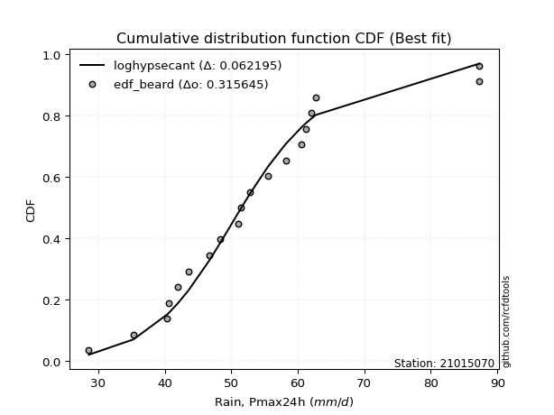</img></img>

</div>


### 5. EDF Chegodayev (1955)

The Chegodayev formula is an empirical plotting position formula used in hydrological frequency analysis to estimate the exceedance probability or return period of a specific event from a set of observed data. It is primarily used for plotting observed data points on probability paper to fit a theoretical distribution, particularly for analyzing extreme events like maximum flood flows or rainfall intensities. The constant _b_ value in the generalized plotting position formula is 0.3.

<div align="center">


$P=(m-b)/(n+1-2b)$


</div>


**5.1. Empirical values**

<div align="center">

|                | 0                   | 1                   | 2                  | 3                  | 4                   | 5                   | 6                  | 7                  | 8                  | 9              | 10                 | 11                 | 12                 | 13                 | 14                 | 15                 | 16                 | 17                 | 18                 |
|:---------------|:--------------------|:--------------------|:-------------------|:-------------------|:--------------------|:--------------------|:-------------------|:-------------------|:-------------------|:---------------|:-------------------|:-------------------|:-------------------|:-------------------|:-------------------|:-------------------|:-------------------|:-------------------|:-------------------|
| date           | 2020                | 2013                | 2005               | 2015               | 2022                | 2009                | 2023               | 2016               | 2010               | 2017           | 2006               | 2011               | 2008               | 2007               | 2019               | 2018               | 2014               | 2021               | 2012               |
| x              | 28.6                | 35.3                | 40.4               | 40.6               | 41.9                | 43.6                | 46.7               | 48.4               | 51.0               | 51.4           | 52.8               | 55.5               | 58.2               | 60.6               | 61.2               | 62.0               | 62.7               | 87.2               | 87.3               |
| m              | 1                   | 2                   | 3                  | 4                  | 5                   | 6                   | 7                  | 8                  | 9                  | 10             | 11                 | 12                 | 13                 | 14                 | 15                 | 16                 | 17                 | 18                 | 19                 |
| empirical_dist | edf_chegodayev      | edf_chegodayev      | edf_chegodayev     | edf_chegodayev     | edf_chegodayev      | edf_chegodayev      | edf_chegodayev     | edf_chegodayev     | edf_chegodayev     | edf_chegodayev | edf_chegodayev     | edf_chegodayev     | edf_chegodayev     | edf_chegodayev     | edf_chegodayev     | edf_chegodayev     | edf_chegodayev     | edf_chegodayev     | edf_chegodayev     |
| empirical      | 0.03608247422680413 | 0.08762886597938145 | 0.1391752577319588 | 0.1907216494845361 | 0.24226804123711343 | 0.29381443298969073 | 0.3453608247422681 | 0.3969072164948454 | 0.4484536082474227 | 0.5            | 0.5515463917525774 | 0.6030927835051546 | 0.654639175257732  | 0.7061855670103093 | 0.7577319587628866 | 0.8092783505154639 | 0.8608247422680413 | 0.9123711340206185 | 0.9639175257731959 |
| empirical_tr   | 1.0374331550802138  | 1.096045197740113   | 1.1616766467065869 | 1.2356687898089171 | 1.3197278911564627  | 1.416058394160584   | 1.5275590551181104 | 1.6581196581196582 | 1.8130841121495327 | 2.0            | 2.2298850574712645 | 2.519480519480519  | 2.8955223880597014 | 3.403508771929825  | 4.127659574468085  | 5.243243243243244  | 7.185185185185188  | 11.41176470588235  | 27.714285714285726 |

</div>


**5.2. Kolmogorov-Smirnov fit test (sorted by Δ)**


<div align="center">

|                | 0                   | 1                     | 2                   | 3                   | 4                   | 5                   | 6                   | 7                   | 8                   | 9                   | 10                  | 11                  | 12                  | 13                  | 14                  | 15                  | 16                  | 17                  | 18                  | 19                  | 20                  | 21                  | 22                  | 23                  | 24                  | 25                  | 26                  | 27                  | 28                  | 29                  | 30                  | 31                  | 32                  | 33                  | 34                  | 35                  | 36                  | 37                  | 38                  | 39                  | 40                  | 41                  | 42                  | 43                  | 44                  | 45                  | 46                  | 47                  | 48                  | 49                  | 50                  | 51                  | 52                  | 53                  | 54                  | 55                  | 56                  | 57                  | 58                  | 59                  | 60                  | 61                  | 62                  | 63                  | 64                  | 65                  | 66                  | 67                  | 68                  | 69                  | 70                  | 71                  | 72                  | 73                  | 74                  | 75                  | 76                  | 77                  | 78                  | 79                  | 80                  | 81                  | 82                  | 83                  | 84                  | 85                  | 86                  | 87                  |
|:---------------|:--------------------|:----------------------|:--------------------|:--------------------|:--------------------|:--------------------|:--------------------|:--------------------|:--------------------|:--------------------|:--------------------|:--------------------|:--------------------|:--------------------|:--------------------|:--------------------|:--------------------|:--------------------|:--------------------|:--------------------|:--------------------|:--------------------|:--------------------|:--------------------|:--------------------|:--------------------|:--------------------|:--------------------|:--------------------|:--------------------|:--------------------|:--------------------|:--------------------|:--------------------|:--------------------|:--------------------|:--------------------|:--------------------|:--------------------|:--------------------|:--------------------|:--------------------|:--------------------|:--------------------|:--------------------|:--------------------|:--------------------|:--------------------|:--------------------|:--------------------|:--------------------|:--------------------|:--------------------|:--------------------|:--------------------|:--------------------|:--------------------|:--------------------|:--------------------|:--------------------|:--------------------|:--------------------|:--------------------|:--------------------|:--------------------|:--------------------|:--------------------|:--------------------|:--------------------|:--------------------|:--------------------|:--------------------|:--------------------|:--------------------|:--------------------|:--------------------|:--------------------|:--------------------|:--------------------|:--------------------|:--------------------|:--------------------|:--------------------|:--------------------|:--------------------|:--------------------|:--------------------|:--------------------|
| station        | 21015070            | 21015070              | 21015070            | 21015070            | 21015070            | 21015070            | 21015070            | 21015070            | 21015070            | 21015070            | 21015070            | 21015070            | 21015070            | 21015070            | 21015070            | 21015070            | 21015070            | 21015070            | 21015070            | 21015070            | 21015070            | 21015070            | 21015070            | 21015070            | 21015070            | 21015070            | 21015070            | 21015070            | 21015070            | 21015070            | 21015070            | 21015070            | 21015070            | 21015070            | 21015070            | 21015070            | 21015070            | 21015070            | 21015070            | 21015070            | 21015070            | 21015070            | 21015070            | 21015070            | 21015070            | 21015070            | 21015070            | 21015070            | 21015070            | 21015070            | 21015070            | 21015070            | 21015070            | 21015070            | 21015070            | 21015070            | 21015070            | 21015070            | 21015070            | 21015070            | 21015070            | 21015070            | 21015070            | 21015070            | 21015070            | 21015070            | 21015070            | 21015070            | 21015070            | 21015070            | 21015070            | 21015070            | 21015070            | 21015070            | 21015070            | 21015070            | 21015070            | 21015070            | 21015070            | 21015070            | 21015070            | 21015070            | 21015070            | 21015070            | 21015070            | 21015070            | 21015070            | 21015070            |
| empirical_dist | edf_chegodayev      | edf_chegodayev        | edf_chegodayev      | edf_chegodayev      | edf_chegodayev      | edf_chegodayev      | edf_chegodayev      | edf_chegodayev      | edf_chegodayev      | edf_chegodayev      | edf_chegodayev      | edf_chegodayev      | edf_chegodayev      | edf_chegodayev      | edf_chegodayev      | edf_chegodayev      | edf_chegodayev      | edf_chegodayev      | edf_chegodayev      | edf_chegodayev      | edf_chegodayev      | edf_chegodayev      | edf_chegodayev      | edf_chegodayev      | edf_chegodayev      | edf_chegodayev      | edf_chegodayev      | edf_chegodayev      | edf_chegodayev      | edf_chegodayev      | edf_chegodayev      | edf_chegodayev      | edf_chegodayev      | edf_chegodayev      | edf_chegodayev      | edf_chegodayev      | edf_chegodayev      | edf_chegodayev      | edf_chegodayev      | edf_chegodayev      | edf_chegodayev      | edf_chegodayev      | edf_chegodayev      | edf_chegodayev      | edf_chegodayev      | edf_chegodayev      | edf_chegodayev      | edf_chegodayev      | edf_chegodayev      | edf_chegodayev      | edf_chegodayev      | edf_chegodayev      | edf_chegodayev      | edf_chegodayev      | edf_chegodayev      | edf_chegodayev      | edf_chegodayev      | edf_chegodayev      | edf_chegodayev      | edf_chegodayev      | edf_chegodayev      | edf_chegodayev      | edf_chegodayev      | edf_chegodayev      | edf_chegodayev      | edf_chegodayev      | edf_chegodayev      | edf_chegodayev      | edf_chegodayev      | edf_chegodayev      | edf_chegodayev      | edf_chegodayev      | edf_chegodayev      | edf_chegodayev      | edf_chegodayev      | edf_chegodayev      | edf_chegodayev      | edf_chegodayev      | edf_chegodayev      | edf_chegodayev      | edf_chegodayev      | edf_chegodayev      | edf_chegodayev      | edf_chegodayev      | edf_chegodayev      | edf_chegodayev      | edf_chegodayev      | edf_chegodayev      |
| p_dist         | loghypsecant        | loglaplace_asymmetric | loglogistic         | logmielke           | logfisk             | loggenlogistic      | mielke              | fisk                | moyal               | exponnorm           | gumbel_r            | loglaplace          | lograyleigh         | laplace_asymmetric  | logmaxwell          | nakagami            | halflogistic        | genlogistic         | loginvgamma         | invweibull          | nct                 | hypsecant           | logalpha            | alpha               | loginvgauss         | invgamma            | f                   | betaprime           | logt                | johnsonsu           | logjohnsonsu        | logfatiguelife      | logf                | loglognorm          | logpearson3         | logerlang           | loggamma            | loggamma            | logncf              | lognakagami         | logexponnorm        | lognorm             | lognorm             | logcrystalball      | logrice             | invgauss            | logloggamma         | fatiguelife         | laplace             | gamma               | erlang              | pearson3            | halfnorm            | logweibull_min      | loggumbel_l         | kstwobign           | logistic            | logbetaprime        | lognct              | loggumbel_r         | t                   | weibull_min         | loginvweibull       | rice                | rayleigh            | loghalfnorm         | maxwell             | logkstwobign        | loggompertz         | truncnorm           | norm                | crystalball         | logmoyal            | loghalflogistic     | loggenexpon         | gumbel_l            | wald                | gompertz            | logwald             | genexpon            | expon               | loggibrat           | gibrat              | logchi2             | logtruncnorm        | logexpon            | ncf                 | chi2                |
| delta          | 0.06240783767876132 | 0.06771306132042448   | 0.07224020445183821 | 0.07363402602958602 | 0.0746359945085211  | 0.07552556902395935 | 0.07554225190743524 | 0.07573758426694055 | 0.07618199690812238 | 0.07973181193819179 | 0.08361927010714787 | 0.08437949076352597 | 0.08520056343371785 | 0.08543044593939172 | 0.08733679399295191 | 0.08762886597937948 | 0.08762886597938145 | 0.08763612044801528 | 0.08770544143275949 | 0.088816893328035   | 0.08893558581086491 | 0.08920824064787591 | 0.0901238312897572  | 0.09017043403251468 | 0.09157668296615462 | 0.09236953453103525 | 0.09272135445197305 | 0.09275033518890519 | 0.09336688664348924 | 0.09342715361540421 | 0.09348458364625511 | 0.09353550951949274 | 0.09361867705356042 | 0.09362491708279563 | 0.0936271855093409  | 0.0936438592569292  | 0.09364393669422    | 0.09364393669422    | 0.09365433935797818 | 0.09374576238284682 | 0.09389072237747331 | 0.09481239541654629 | 0.09481239541654629 | 0.09481245057490384 | 0.09489436345311475 | 0.09559983764135127 | 0.09594836401830231 | 0.09613235090757344 | 0.09827749125208168 | 0.09871429449869085 | 0.09871439305217189 | 0.09874640333102713 | 0.10109178047429934 | 0.1014473812072676  | 0.10151895904453434 | 0.10440188191574584 | 0.10449567437266472 | 0.10540948295735997 | 0.10548686522819595 | 0.10672581516193896 | 0.1084249988716488  | 0.11036654238370225 | 0.11057087006099175 | 0.11179148480290002 | 0.1119436368221367  | 0.1136836727181672  | 0.1153017540718948  | 0.11792371701961238 | 0.12406417486413102 | 0.1269851549137122  | 0.12698520431631477 | 0.12698520916465406 | 0.1326050757634784  | 0.13766144324961954 | 0.14324905930849127 | 0.1471322756469189  | 0.17463542278867447 | 0.2005544877264569  | 0.2046284972471622  | 0.23866868758620088 | 0.23893968580302102 | 0.2422680412102974  | 0.24226804123711343 | 0.2772987583879608  | 0.29506084193117954 | 0.3048950821736619  | 0.3922495251116557  | 0.8995729406489449  |
| deltao         | 0.31564497164100014 | 0.31564497164100014   | 0.31564497164100014 | 0.31564497164100014 | 0.31564497164100014 | 0.31564497164100014 | 0.31564497164100014 | 0.31564497164100014 | 0.31564497164100014 | 0.31564497164100014 | 0.31564497164100014 | 0.31564497164100014 | 0.31564497164100014 | 0.31564497164100014 | 0.31564497164100014 | 0.31564497164100014 | 0.31564497164100014 | 0.31564497164100014 | 0.31564497164100014 | 0.31564497164100014 | 0.31564497164100014 | 0.31564497164100014 | 0.31564497164100014 | 0.31564497164100014 | 0.31564497164100014 | 0.31564497164100014 | 0.31564497164100014 | 0.31564497164100014 | 0.31564497164100014 | 0.31564497164100014 | 0.31564497164100014 | 0.31564497164100014 | 0.31564497164100014 | 0.31564497164100014 | 0.31564497164100014 | 0.31564497164100014 | 0.31564497164100014 | 0.31564497164100014 | 0.31564497164100014 | 0.31564497164100014 | 0.31564497164100014 | 0.31564497164100014 | 0.31564497164100014 | 0.31564497164100014 | 0.31564497164100014 | 0.31564497164100014 | 0.31564497164100014 | 0.31564497164100014 | 0.31564497164100014 | 0.31564497164100014 | 0.31564497164100014 | 0.31564497164100014 | 0.31564497164100014 | 0.31564497164100014 | 0.31564497164100014 | 0.31564497164100014 | 0.31564497164100014 | 0.31564497164100014 | 0.31564497164100014 | 0.31564497164100014 | 0.31564497164100014 | 0.31564497164100014 | 0.31564497164100014 | 0.31564497164100014 | 0.31564497164100014 | 0.31564497164100014 | 0.31564497164100014 | 0.31564497164100014 | 0.31564497164100014 | 0.31564497164100014 | 0.31564497164100014 | 0.31564497164100014 | 0.31564497164100014 | 0.31564497164100014 | 0.31564497164100014 | 0.31564497164100014 | 0.31564497164100014 | 0.31564497164100014 | 0.31564497164100014 | 0.31564497164100014 | 0.31564497164100014 | 0.31564497164100014 | 0.31564497164100014 | 0.31564497164100014 | 0.31564497164100014 | 0.31564497164100014 | 0.31564497164100014 | 0.31564497164100014 |
| eval           | Δo > Δ              | Δo > Δ                | Δo > Δ              | Δo > Δ              | Δo > Δ              | Δo > Δ              | Δo > Δ              | Δo > Δ              | Δo > Δ              | Δo > Δ              | Δo > Δ              | Δo > Δ              | Δo > Δ              | Δo > Δ              | Δo > Δ              | Δo > Δ              | Δo > Δ              | Δo > Δ              | Δo > Δ              | Δo > Δ              | Δo > Δ              | Δo > Δ              | Δo > Δ              | Δo > Δ              | Δo > Δ              | Δo > Δ              | Δo > Δ              | Δo > Δ              | Δo > Δ              | Δo > Δ              | Δo > Δ              | Δo > Δ              | Δo > Δ              | Δo > Δ              | Δo > Δ              | Δo > Δ              | Δo > Δ              | Δo > Δ              | Δo > Δ              | Δo > Δ              | Δo > Δ              | Δo > Δ              | Δo > Δ              | Δo > Δ              | Δo > Δ              | Δo > Δ              | Δo > Δ              | Δo > Δ              | Δo > Δ              | Δo > Δ              | Δo > Δ              | Δo > Δ              | Δo > Δ              | Δo > Δ              | Δo > Δ              | Δo > Δ              | Δo > Δ              | Δo > Δ              | Δo > Δ              | Δo > Δ              | Δo > Δ              | Δo > Δ              | Δo > Δ              | Δo > Δ              | Δo > Δ              | Δo > Δ              | Δo > Δ              | Δo > Δ              | Δo > Δ              | Δo > Δ              | Δo > Δ              | Δo > Δ              | Δo > Δ              | Δo > Δ              | Δo > Δ              | Δo > Δ              | Δo > Δ              | Δo > Δ              | Δo > Δ              | Δo > Δ              | Δo > Δ              | Δo > Δ              | Δo > Δ              | Δo > Δ              | Δo > Δ              | Δo > Δ              | Δo <= Δ             | Δo <= Δ             |
| fit            | 1                   | 1                     | 1                   | 1                   | 1                   | 1                   | 1                   | 1                   | 1                   | 1                   | 1                   | 1                   | 1                   | 1                   | 1                   | 1                   | 1                   | 1                   | 1                   | 1                   | 1                   | 1                   | 1                   | 1                   | 1                   | 1                   | 1                   | 1                   | 1                   | 1                   | 1                   | 1                   | 1                   | 1                   | 1                   | 1                   | 1                   | 1                   | 1                   | 1                   | 1                   | 1                   | 1                   | 1                   | 1                   | 1                   | 1                   | 1                   | 1                   | 1                   | 1                   | 1                   | 1                   | 1                   | 1                   | 1                   | 1                   | 1                   | 1                   | 1                   | 1                   | 1                   | 1                   | 1                   | 1                   | 1                   | 1                   | 1                   | 1                   | 1                   | 1                   | 1                   | 1                   | 1                   | 1                   | 1                   | 1                   | 1                   | 1                   | 1                   | 1                   | 1                   | 1                   | 1                   | 1                   | 1                   | 0                   | 0                   |
| n              | 19                  | 19                    | 19                  | 19                  | 19                  | 19                  | 19                  | 19                  | 19                  | 19                  | 19                  | 19                  | 19                  | 19                  | 19                  | 19                  | 19                  | 19                  | 19                  | 19                  | 19                  | 19                  | 19                  | 19                  | 19                  | 19                  | 19                  | 19                  | 19                  | 19                  | 19                  | 19                  | 19                  | 19                  | 19                  | 19                  | 19                  | 19                  | 19                  | 19                  | 19                  | 19                  | 19                  | 19                  | 19                  | 19                  | 19                  | 19                  | 19                  | 19                  | 19                  | 19                  | 19                  | 19                  | 19                  | 19                  | 19                  | 19                  | 19                  | 19                  | 19                  | 19                  | 19                  | 19                  | 19                  | 19                  | 19                  | 19                  | 19                  | 19                  | 19                  | 19                  | 19                  | 19                  | 19                  | 19                  | 19                  | 19                  | 19                  | 19                  | 19                  | 19                  | 19                  | 19                  | 19                  | 19                  | 19                  | 19                  |
| best_fit       | 1                   | 0                     | 0                   | 0                   | 0                   | 0                   | 0                   | 0                   | 0                   | 0                   | 0                   | 0                   | 0                   | 0                   | 0                   | 0                   | 0                   | 0                   | 0                   | 0                   | 0                   | 0                   | 0                   | 0                   | 0                   | 0                   | 0                   | 0                   | 0                   | 0                   | 0                   | 0                   | 0                   | 0                   | 0                   | 0                   | 0                   | 0                   | 0                   | 0                   | 0                   | 0                   | 0                   | 0                   | 0                   | 0                   | 0                   | 0                   | 0                   | 0                   | 0                   | 0                   | 0                   | 0                   | 0                   | 0                   | 0                   | 0                   | 0                   | 0                   | 0                   | 0                   | 0                   | 0                   | 0                   | 0                   | 0                   | 0                   | 0                   | 0                   | 0                   | 0                   | 0                   | 0                   | 0                   | 0                   | 0                   | 0                   | 0                   | 0                   | 0                   | 0                   | 0                   | 0                   | 0                   | 0                   | 0                   | 0                   |
| best_fit_sort  | 1                   | 2                     | 3                   | 4                   | 5                   | 6                   | 7                   | 8                   | 9                   | 10                  | 11                  | 12                  | 13                  | 14                  | 15                  | 16                  | 17                  | 18                  | 19                  | 20                  | 21                  | 22                  | 23                  | 24                  | 25                  | 26                  | 27                  | 28                  | 29                  | 30                  | 31                  | 32                  | 33                  | 34                  | 35                  | 36                  | 37                  | 38                  | 39                  | 40                  | 41                  | 42                  | 43                  | 44                  | 45                  | 46                  | 47                  | 48                  | 49                  | 50                  | 51                  | 52                  | 53                  | 54                  | 55                  | 56                  | 57                  | 58                  | 59                  | 60                  | 61                  | 62                  | 63                  | 64                  | 65                  | 66                  | 67                  | 68                  | 69                  | 70                  | 71                  | 72                  | 73                  | 74                  | 75                  | 76                  | 77                  | 78                  | 79                  | 80                  | 81                  | 82                  | 83                  | 84                  | 85                  | 86                  | 87                  | 88                  |

</div>


**5.3. Best fit**

<div align="center">

|   id |   station | empirical_dist   | p_dist       |     delta |   deltao | eval   |   fit |   n |   best_fit |   best_fit_sort |
|-----:|----------:|:-----------------|:-------------|----------:|---------:|:-------|------:|----:|-----------:|----------------:|
|    0 |  21015070 | edf_chegodayev   | loghypsecant | 0.0624078 | 0.315645 | Δo > Δ |     1 |  19 |          1 |               1 |

</div>


<div align="center">

</img>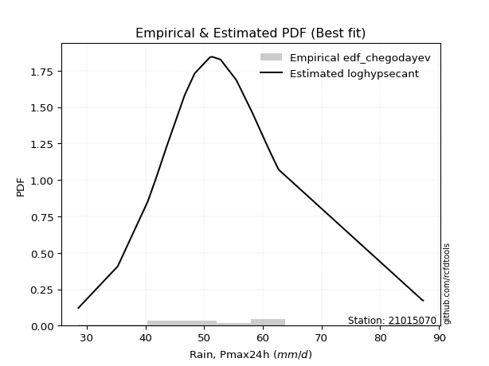</img>

</div>


### 6. EDF Blom (1958)

The Blom formula is a specific "plotting position" formula used in hydrology and statistical analysis to estimate the empirical cumulative probability (or non-exceedance probability) of a data series. It is particularly recommended for data that are approximately normally distributed. The constant _a_ is set to 0.375 (or 3/8).

<div align="center">


$P=(m-a)/(n+1-2a)$


</div>


**6.1. Empirical values**

<div align="center">

|                | 0                    | 1                   | 2                   | 3                   | 4                   | 5                  | 6                   | 7                  | 8                   | 9        | 10                 | 11                 | 12                 | 13                 | 14                 | 15                 | 16                 | 17                 | 18                 |
|:---------------|:---------------------|:--------------------|:--------------------|:--------------------|:--------------------|:-------------------|:--------------------|:-------------------|:--------------------|:---------|:-------------------|:-------------------|:-------------------|:-------------------|:-------------------|:-------------------|:-------------------|:-------------------|:-------------------|
| date           | 2020                 | 2013                | 2005                | 2015                | 2022                | 2009               | 2023                | 2016               | 2010                | 2017     | 2006               | 2011               | 2008               | 2007               | 2019               | 2018               | 2014               | 2021               | 2012               |
| x              | 28.6                 | 35.3                | 40.4                | 40.6                | 41.9                | 43.6               | 46.7                | 48.4               | 51.0                | 51.4     | 52.8               | 55.5               | 58.2               | 60.6               | 61.2               | 62.0               | 62.7               | 87.2               | 87.3               |
| m              | 1                    | 2                   | 3                   | 4                   | 5                   | 6                  | 7                   | 8                  | 9                   | 10       | 11                 | 12                 | 13                 | 14                 | 15                 | 16                 | 17                 | 18                 | 19                 |
| empirical_dist | edf_blom             | edf_blom            | edf_blom            | edf_blom            | edf_blom            | edf_blom           | edf_blom            | edf_blom           | edf_blom            | edf_blom | edf_blom           | edf_blom           | edf_blom           | edf_blom           | edf_blom           | edf_blom           | edf_blom           | edf_blom           | edf_blom           |
| empirical      | 0.032467532467532464 | 0.08441558441558442 | 0.13636363636363635 | 0.18831168831168832 | 0.24025974025974026 | 0.2922077922077922 | 0.34415584415584416 | 0.3961038961038961 | 0.44805194805194803 | 0.5      | 0.551948051948052  | 0.6038961038961039 | 0.6558441558441559 | 0.7077922077922078 | 0.7597402597402597 | 0.8116883116883117 | 0.8636363636363636 | 0.9155844155844156 | 0.9675324675324676 |
| empirical_tr   | 1.0335570469798658   | 1.0921985815602837  | 1.1578947368421053  | 1.232               | 1.3162393162393162  | 1.4128440366972477 | 1.5247524752475246  | 1.6559139784946235 | 1.811764705882353   | 2.0      | 2.2318840579710146 | 2.5245901639344264 | 2.905660377358491  | 3.4222222222222216 | 4.162162162162161  | 5.310344827586206  | 7.333333333333334  | 11.84615384615385  | 30.800000000000043 |

</div>


**6.2. Kolmogorov-Smirnov fit test (sorted by Δ)**


<div align="center">

|                | 0                   | 1                     | 2                   | 3                   | 4                   | 5                   | 6                   | 7                   | 8                   | 9                   | 10                  | 11                  | 12                  | 13                  | 14                  | 15                  | 16                  | 17                  | 18                  | 19                  | 20                  | 21                  | 22                  | 23                  | 24                  | 25                  | 26                  | 27                  | 28                  | 29                  | 30                  | 31                  | 32                  | 33                  | 34                  | 35                  | 36                  | 37                  | 38                  | 39                  | 40                  | 41                  | 42                  | 43                  | 44                  | 45                  | 46                  | 47                  | 48                  | 49                  | 50                  | 51                  | 52                  | 53                  | 54                  | 55                  | 56                  | 57                  | 58                  | 59                  | 60                  | 61                  | 62                  | 63                  | 64                  | 65                  | 66                  | 67                  | 68                  | 69                  | 70                  | 71                  | 72                  | 73                  | 74                  | 75                  | 76                  | 77                  | 78                  | 79                  | 80                  | 81                  | 82                  | 83                  | 84                  | 85                  | 86                  | 87                  |
|:---------------|:--------------------|:----------------------|:--------------------|:--------------------|:--------------------|:--------------------|:--------------------|:--------------------|:--------------------|:--------------------|:--------------------|:--------------------|:--------------------|:--------------------|:--------------------|:--------------------|:--------------------|:--------------------|:--------------------|:--------------------|:--------------------|:--------------------|:--------------------|:--------------------|:--------------------|:--------------------|:--------------------|:--------------------|:--------------------|:--------------------|:--------------------|:--------------------|:--------------------|:--------------------|:--------------------|:--------------------|:--------------------|:--------------------|:--------------------|:--------------------|:--------------------|:--------------------|:--------------------|:--------------------|:--------------------|:--------------------|:--------------------|:--------------------|:--------------------|:--------------------|:--------------------|:--------------------|:--------------------|:--------------------|:--------------------|:--------------------|:--------------------|:--------------------|:--------------------|:--------------------|:--------------------|:--------------------|:--------------------|:--------------------|:--------------------|:--------------------|:--------------------|:--------------------|:--------------------|:--------------------|:--------------------|:--------------------|:--------------------|:--------------------|:--------------------|:--------------------|:--------------------|:--------------------|:--------------------|:--------------------|:--------------------|:--------------------|:--------------------|:--------------------|:--------------------|:--------------------|:--------------------|:--------------------|
| station        | 21015070            | 21015070              | 21015070            | 21015070            | 21015070            | 21015070            | 21015070            | 21015070            | 21015070            | 21015070            | 21015070            | 21015070            | 21015070            | 21015070            | 21015070            | 21015070            | 21015070            | 21015070            | 21015070            | 21015070            | 21015070            | 21015070            | 21015070            | 21015070            | 21015070            | 21015070            | 21015070            | 21015070            | 21015070            | 21015070            | 21015070            | 21015070            | 21015070            | 21015070            | 21015070            | 21015070            | 21015070            | 21015070            | 21015070            | 21015070            | 21015070            | 21015070            | 21015070            | 21015070            | 21015070            | 21015070            | 21015070            | 21015070            | 21015070            | 21015070            | 21015070            | 21015070            | 21015070            | 21015070            | 21015070            | 21015070            | 21015070            | 21015070            | 21015070            | 21015070            | 21015070            | 21015070            | 21015070            | 21015070            | 21015070            | 21015070            | 21015070            | 21015070            | 21015070            | 21015070            | 21015070            | 21015070            | 21015070            | 21015070            | 21015070            | 21015070            | 21015070            | 21015070            | 21015070            | 21015070            | 21015070            | 21015070            | 21015070            | 21015070            | 21015070            | 21015070            | 21015070            | 21015070            |
| empirical_dist | edf_blom            | edf_blom              | edf_blom            | edf_blom            | edf_blom            | edf_blom            | edf_blom            | edf_blom            | edf_blom            | edf_blom            | edf_blom            | edf_blom            | edf_blom            | edf_blom            | edf_blom            | edf_blom            | edf_blom            | edf_blom            | edf_blom            | edf_blom            | edf_blom            | edf_blom            | edf_blom            | edf_blom            | edf_blom            | edf_blom            | edf_blom            | edf_blom            | edf_blom            | edf_blom            | edf_blom            | edf_blom            | edf_blom            | edf_blom            | edf_blom            | edf_blom            | edf_blom            | edf_blom            | edf_blom            | edf_blom            | edf_blom            | edf_blom            | edf_blom            | edf_blom            | edf_blom            | edf_blom            | edf_blom            | edf_blom            | edf_blom            | edf_blom            | edf_blom            | edf_blom            | edf_blom            | edf_blom            | edf_blom            | edf_blom            | edf_blom            | edf_blom            | edf_blom            | edf_blom            | edf_blom            | edf_blom            | edf_blom            | edf_blom            | edf_blom            | edf_blom            | edf_blom            | edf_blom            | edf_blom            | edf_blom            | edf_blom            | edf_blom            | edf_blom            | edf_blom            | edf_blom            | edf_blom            | edf_blom            | edf_blom            | edf_blom            | edf_blom            | edf_blom            | edf_blom            | edf_blom            | edf_blom            | edf_blom            | edf_blom            | edf_blom            | edf_blom            |
| p_dist         | loghypsecant        | loglaplace_asymmetric | loglogistic         | logmielke           | moyal               | logfisk             | loggenlogistic      | mielke              | fisk                | exponnorm           | loglaplace          | laplace_asymmetric  | nakagami            | gumbel_r            | halflogistic        | lograyleigh         | logmaxwell          | genlogistic         | loginvgamma         | invweibull          | nct                 | hypsecant           | logalpha            | alpha               | loginvgauss         | invgamma            | f                   | betaprime           | logt                | johnsonsu           | logjohnsonsu        | logfatiguelife      | logf                | loglognorm          | logpearson3         | logerlang           | loggamma            | loggamma            | logncf              | lognakagami         | laplace             | logexponnorm        | lognorm             | lognorm             | logcrystalball      | logrice             | invgauss            | logloggamma         | fatiguelife         | gamma               | erlang              | pearson3            | halfnorm            | logweibull_min      | loggumbel_l         | loggumbel_r         | kstwobign           | logistic            | logbetaprime        | lognct              | t                   | weibull_min         | loginvweibull       | loghalfnorm         | rice                | rayleigh            | maxwell             | logkstwobign        | loggompertz         | truncnorm           | norm                | crystalball         | logmoyal            | loghalflogistic     | loggenexpon         | gumbel_l            | wald                | gompertz            | logwald             | loggibrat           | gibrat              | genexpon            | expon               | logchi2             | logtruncnorm        | logexpon            | ncf                 | chi2                |
| delta          | 0.06080119689686278 | 0.06610642053852595   | 0.07505182582016057 | 0.07644564739790838 | 0.07658365710359705 | 0.07744761587684346 | 0.07833719039228171 | 0.0783538732757576  | 0.07854920563526291 | 0.08254343330651415 | 0.08277284998162743 | 0.08382380515749319 | 0.08633771064890838 | 0.08643089147547023 | 0.08672575530381688 | 0.0880121848020402  | 0.09014841536127427 | 0.09044774181633763 | 0.09051706280108185 | 0.09162851469635735 | 0.09174720717918727 | 0.09201986201619827 | 0.09293545265807956 | 0.09298205540083704 | 0.09438830433447698 | 0.0951811558993576  | 0.09553297582029541 | 0.09556195655722755 | 0.0961785080118116  | 0.09623877498372657 | 0.09629620501457747 | 0.0963471308878151  | 0.09643029842188278 | 0.09643653845111799 | 0.09643880687766326 | 0.09645548062525156 | 0.09645555806254236 | 0.09645555806254236 | 0.09646596072630054 | 0.09655738375116918 | 0.09667085047018315 | 0.09670234374579567 | 0.09762401678486865 | 0.09762401678486865 | 0.0976240719432262  | 0.09770598482143711 | 0.09841145900967363 | 0.09875998538662467 | 0.0989439722758958  | 0.1015259158670132  | 0.10152601442049425 | 0.10155802469934949 | 0.1039034018426217  | 0.10425900257558995 | 0.1043305804128567  | 0.10712747535741363 | 0.1072135032840682  | 0.10730729574098707 | 0.10822110432568241 | 0.1082984865965183  | 0.11123662023997116 | 0.11317816375202461 | 0.11338249142931411 | 0.11408533291364187 | 0.11460310617122238 | 0.11475525819045906 | 0.11811337544021716 | 0.12073533838793482 | 0.12687579623245338 | 0.12979677628203456 | 0.12979682568463713 | 0.12979683053297641 | 0.13300673595895307 | 0.1380631034450942  | 0.14606068067681371 | 0.14994389701524125 | 0.1722254616158267  | 0.20336610909477926 | 0.20503015744263686 | 0.24025974023292423 | 0.24025974025974026 | 0.24148030895452333 | 0.24175130717134347 | 0.2809137001472325  | 0.297872463299502   | 0.30770670354198437 | 0.39546280667545275 | 0.902786222212742   |
| deltao         | 0.31564497164100014 | 0.31564497164100014   | 0.31564497164100014 | 0.31564497164100014 | 0.31564497164100014 | 0.31564497164100014 | 0.31564497164100014 | 0.31564497164100014 | 0.31564497164100014 | 0.31564497164100014 | 0.31564497164100014 | 0.31564497164100014 | 0.31564497164100014 | 0.31564497164100014 | 0.31564497164100014 | 0.31564497164100014 | 0.31564497164100014 | 0.31564497164100014 | 0.31564497164100014 | 0.31564497164100014 | 0.31564497164100014 | 0.31564497164100014 | 0.31564497164100014 | 0.31564497164100014 | 0.31564497164100014 | 0.31564497164100014 | 0.31564497164100014 | 0.31564497164100014 | 0.31564497164100014 | 0.31564497164100014 | 0.31564497164100014 | 0.31564497164100014 | 0.31564497164100014 | 0.31564497164100014 | 0.31564497164100014 | 0.31564497164100014 | 0.31564497164100014 | 0.31564497164100014 | 0.31564497164100014 | 0.31564497164100014 | 0.31564497164100014 | 0.31564497164100014 | 0.31564497164100014 | 0.31564497164100014 | 0.31564497164100014 | 0.31564497164100014 | 0.31564497164100014 | 0.31564497164100014 | 0.31564497164100014 | 0.31564497164100014 | 0.31564497164100014 | 0.31564497164100014 | 0.31564497164100014 | 0.31564497164100014 | 0.31564497164100014 | 0.31564497164100014 | 0.31564497164100014 | 0.31564497164100014 | 0.31564497164100014 | 0.31564497164100014 | 0.31564497164100014 | 0.31564497164100014 | 0.31564497164100014 | 0.31564497164100014 | 0.31564497164100014 | 0.31564497164100014 | 0.31564497164100014 | 0.31564497164100014 | 0.31564497164100014 | 0.31564497164100014 | 0.31564497164100014 | 0.31564497164100014 | 0.31564497164100014 | 0.31564497164100014 | 0.31564497164100014 | 0.31564497164100014 | 0.31564497164100014 | 0.31564497164100014 | 0.31564497164100014 | 0.31564497164100014 | 0.31564497164100014 | 0.31564497164100014 | 0.31564497164100014 | 0.31564497164100014 | 0.31564497164100014 | 0.31564497164100014 | 0.31564497164100014 | 0.31564497164100014 |
| eval           | Δo > Δ              | Δo > Δ                | Δo > Δ              | Δo > Δ              | Δo > Δ              | Δo > Δ              | Δo > Δ              | Δo > Δ              | Δo > Δ              | Δo > Δ              | Δo > Δ              | Δo > Δ              | Δo > Δ              | Δo > Δ              | Δo > Δ              | Δo > Δ              | Δo > Δ              | Δo > Δ              | Δo > Δ              | Δo > Δ              | Δo > Δ              | Δo > Δ              | Δo > Δ              | Δo > Δ              | Δo > Δ              | Δo > Δ              | Δo > Δ              | Δo > Δ              | Δo > Δ              | Δo > Δ              | Δo > Δ              | Δo > Δ              | Δo > Δ              | Δo > Δ              | Δo > Δ              | Δo > Δ              | Δo > Δ              | Δo > Δ              | Δo > Δ              | Δo > Δ              | Δo > Δ              | Δo > Δ              | Δo > Δ              | Δo > Δ              | Δo > Δ              | Δo > Δ              | Δo > Δ              | Δo > Δ              | Δo > Δ              | Δo > Δ              | Δo > Δ              | Δo > Δ              | Δo > Δ              | Δo > Δ              | Δo > Δ              | Δo > Δ              | Δo > Δ              | Δo > Δ              | Δo > Δ              | Δo > Δ              | Δo > Δ              | Δo > Δ              | Δo > Δ              | Δo > Δ              | Δo > Δ              | Δo > Δ              | Δo > Δ              | Δo > Δ              | Δo > Δ              | Δo > Δ              | Δo > Δ              | Δo > Δ              | Δo > Δ              | Δo > Δ              | Δo > Δ              | Δo > Δ              | Δo > Δ              | Δo > Δ              | Δo > Δ              | Δo > Δ              | Δo > Δ              | Δo > Δ              | Δo > Δ              | Δo > Δ              | Δo > Δ              | Δo > Δ              | Δo <= Δ             | Δo <= Δ             |
| fit            | 1                   | 1                     | 1                   | 1                   | 1                   | 1                   | 1                   | 1                   | 1                   | 1                   | 1                   | 1                   | 1                   | 1                   | 1                   | 1                   | 1                   | 1                   | 1                   | 1                   | 1                   | 1                   | 1                   | 1                   | 1                   | 1                   | 1                   | 1                   | 1                   | 1                   | 1                   | 1                   | 1                   | 1                   | 1                   | 1                   | 1                   | 1                   | 1                   | 1                   | 1                   | 1                   | 1                   | 1                   | 1                   | 1                   | 1                   | 1                   | 1                   | 1                   | 1                   | 1                   | 1                   | 1                   | 1                   | 1                   | 1                   | 1                   | 1                   | 1                   | 1                   | 1                   | 1                   | 1                   | 1                   | 1                   | 1                   | 1                   | 1                   | 1                   | 1                   | 1                   | 1                   | 1                   | 1                   | 1                   | 1                   | 1                   | 1                   | 1                   | 1                   | 1                   | 1                   | 1                   | 1                   | 1                   | 0                   | 0                   |
| n              | 19                  | 19                    | 19                  | 19                  | 19                  | 19                  | 19                  | 19                  | 19                  | 19                  | 19                  | 19                  | 19                  | 19                  | 19                  | 19                  | 19                  | 19                  | 19                  | 19                  | 19                  | 19                  | 19                  | 19                  | 19                  | 19                  | 19                  | 19                  | 19                  | 19                  | 19                  | 19                  | 19                  | 19                  | 19                  | 19                  | 19                  | 19                  | 19                  | 19                  | 19                  | 19                  | 19                  | 19                  | 19                  | 19                  | 19                  | 19                  | 19                  | 19                  | 19                  | 19                  | 19                  | 19                  | 19                  | 19                  | 19                  | 19                  | 19                  | 19                  | 19                  | 19                  | 19                  | 19                  | 19                  | 19                  | 19                  | 19                  | 19                  | 19                  | 19                  | 19                  | 19                  | 19                  | 19                  | 19                  | 19                  | 19                  | 19                  | 19                  | 19                  | 19                  | 19                  | 19                  | 19                  | 19                  | 19                  | 19                  |
| best_fit       | 1                   | 0                     | 0                   | 0                   | 0                   | 0                   | 0                   | 0                   | 0                   | 0                   | 0                   | 0                   | 0                   | 0                   | 0                   | 0                   | 0                   | 0                   | 0                   | 0                   | 0                   | 0                   | 0                   | 0                   | 0                   | 0                   | 0                   | 0                   | 0                   | 0                   | 0                   | 0                   | 0                   | 0                   | 0                   | 0                   | 0                   | 0                   | 0                   | 0                   | 0                   | 0                   | 0                   | 0                   | 0                   | 0                   | 0                   | 0                   | 0                   | 0                   | 0                   | 0                   | 0                   | 0                   | 0                   | 0                   | 0                   | 0                   | 0                   | 0                   | 0                   | 0                   | 0                   | 0                   | 0                   | 0                   | 0                   | 0                   | 0                   | 0                   | 0                   | 0                   | 0                   | 0                   | 0                   | 0                   | 0                   | 0                   | 0                   | 0                   | 0                   | 0                   | 0                   | 0                   | 0                   | 0                   | 0                   | 0                   |
| best_fit_sort  | 1                   | 2                     | 3                   | 4                   | 5                   | 6                   | 7                   | 8                   | 9                   | 10                  | 11                  | 12                  | 13                  | 14                  | 15                  | 16                  | 17                  | 18                  | 19                  | 20                  | 21                  | 22                  | 23                  | 24                  | 25                  | 26                  | 27                  | 28                  | 29                  | 30                  | 31                  | 32                  | 33                  | 34                  | 35                  | 36                  | 37                  | 38                  | 39                  | 40                  | 41                  | 42                  | 43                  | 44                  | 45                  | 46                  | 47                  | 48                  | 49                  | 50                  | 51                  | 52                  | 53                  | 54                  | 55                  | 56                  | 57                  | 58                  | 59                  | 60                  | 61                  | 62                  | 63                  | 64                  | 65                  | 66                  | 67                  | 68                  | 69                  | 70                  | 71                  | 72                  | 73                  | 74                  | 75                  | 76                  | 77                  | 78                  | 79                  | 80                  | 81                  | 82                  | 83                  | 84                  | 85                  | 86                  | 87                  | 88                  |

</div>


**6.3. Best fit**

<div align="center">

|   id |   station | empirical_dist   | p_dist       |     delta |   deltao | eval   |   fit |   n |   best_fit |   best_fit_sort |
|-----:|----------:|:-----------------|:-------------|----------:|---------:|:-------|------:|----:|-----------:|----------------:|
|    0 |  21015070 | edf_blom         | loghypsecant | 0.0608012 | 0.315645 | Δo > Δ |     1 |  19 |          1 |               1 |

</div>


<div align="center">

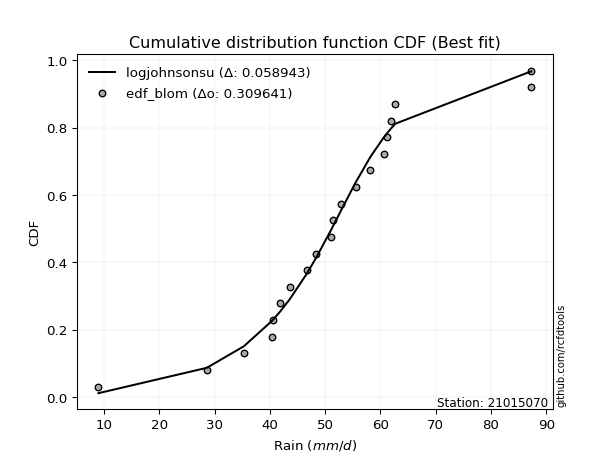</img></img>

</div>


### 7. EDF Tukey (1962)

In hydrology, the Tukey formula is used as a plotting position formula to estimate the empirical probability or frequency of a flood event (or other hydrological data). The formula parameter is given as _c=0.333_ (or 1/3).

<div align="center">


$P=(m-c)/(n+1-2c)$


</div>


**7.1. Empirical values**

<div align="center">

|                | 0                    | 1                   | 2                   | 3                  | 4                  | 5                   | 6                  | 7                   | 8                  | 9         | 10                 | 11                 | 12                 | 13                 | 14                 | 15                 | 16                 | 17                 | 18                 |
|:---------------|:---------------------|:--------------------|:--------------------|:-------------------|:-------------------|:--------------------|:-------------------|:--------------------|:-------------------|:----------|:-------------------|:-------------------|:-------------------|:-------------------|:-------------------|:-------------------|:-------------------|:-------------------|:-------------------|
| date           | 2020                 | 2013                | 2005                | 2015               | 2022               | 2009                | 2023               | 2016                | 2010               | 2017      | 2006               | 2011               | 2008               | 2007               | 2019               | 2018               | 2014               | 2021               | 2012               |
| x              | 28.6                 | 35.3                | 40.4                | 40.6               | 41.9               | 43.6                | 46.7               | 48.4                | 51.0               | 51.4      | 52.8               | 55.5               | 58.2               | 60.6               | 61.2               | 62.0               | 62.7               | 87.2               | 87.3               |
| m              | 1                    | 2                   | 3                   | 4                  | 5                  | 6                   | 7                  | 8                   | 9                  | 10        | 11                 | 12                 | 13                 | 14                 | 15                 | 16                 | 17                 | 18                 | 19                 |
| empirical_dist | edf_tukey            | edf_tukey           | edf_tukey           | edf_tukey          | edf_tukey          | edf_tukey           | edf_tukey          | edf_tukey           | edf_tukey          | edf_tukey | edf_tukey          | edf_tukey          | edf_tukey          | edf_tukey          | edf_tukey          | edf_tukey          | edf_tukey          | edf_tukey          | edf_tukey          |
| empirical      | 0.034482758620689655 | 0.08620689655172414 | 0.13793103448275862 | 0.1896551724137931 | 0.2413793103448276 | 0.29310344827586204 | 0.3448275862068966 | 0.39655172413793105 | 0.4482758620689655 | 0.5       | 0.5517241379310345 | 0.603448275862069  | 0.6551724137931034 | 0.7068965517241379 | 0.7586206896551724 | 0.8103448275862069 | 0.8620689655172413 | 0.9137931034482759 | 0.9655172413793104 |
| empirical_tr   | 1.0357142857142856   | 1.0943396226415094  | 1.1600000000000001  | 1.2340425531914894 | 1.3181818181818183 | 1.4146341463414636  | 1.5263157894736843 | 1.6571428571428573  | 1.8125             | 2.0       | 2.230769230769231  | 2.5217391304347827 | 2.9                | 3.4117647058823524 | 4.142857142857142  | 5.272727272727272  | 7.249999999999997  | 11.600000000000007 | 29.000000000000036 |

</div>


**7.2. Kolmogorov-Smirnov fit test (sorted by Δ)**


<div align="center">

|                | 0                   | 1                     | 2                   | 3                   | 4                   | 5                   | 6                   | 7                   | 8                   | 9                   | 10                  | 11                  | 12                  | 13                  | 14                  | 15                  | 16                  | 17                  | 18                  | 19                  | 20                  | 21                  | 22                  | 23                  | 24                  | 25                  | 26                  | 27                  | 28                  | 29                  | 30                  | 31                  | 32                  | 33                  | 34                  | 35                  | 36                  | 37                  | 38                  | 39                  | 40                  | 41                  | 42                  | 43                  | 44                  | 45                  | 46                  | 47                  | 48                  | 49                  | 50                  | 51                  | 52                  | 53                  | 54                  | 55                  | 56                  | 57                  | 58                  | 59                  | 60                  | 61                  | 62                  | 63                  | 64                  | 65                  | 66                  | 67                  | 68                  | 69                  | 70                  | 71                  | 72                  | 73                  | 74                  | 75                  | 76                  | 77                  | 78                  | 79                  | 80                  | 81                  | 82                  | 83                  | 84                  | 85                  | 86                  | 87                  |
|:---------------|:--------------------|:----------------------|:--------------------|:--------------------|:--------------------|:--------------------|:--------------------|:--------------------|:--------------------|:--------------------|:--------------------|:--------------------|:--------------------|:--------------------|:--------------------|:--------------------|:--------------------|:--------------------|:--------------------|:--------------------|:--------------------|:--------------------|:--------------------|:--------------------|:--------------------|:--------------------|:--------------------|:--------------------|:--------------------|:--------------------|:--------------------|:--------------------|:--------------------|:--------------------|:--------------------|:--------------------|:--------------------|:--------------------|:--------------------|:--------------------|:--------------------|:--------------------|:--------------------|:--------------------|:--------------------|:--------------------|:--------------------|:--------------------|:--------------------|:--------------------|:--------------------|:--------------------|:--------------------|:--------------------|:--------------------|:--------------------|:--------------------|:--------------------|:--------------------|:--------------------|:--------------------|:--------------------|:--------------------|:--------------------|:--------------------|:--------------------|:--------------------|:--------------------|:--------------------|:--------------------|:--------------------|:--------------------|:--------------------|:--------------------|:--------------------|:--------------------|:--------------------|:--------------------|:--------------------|:--------------------|:--------------------|:--------------------|:--------------------|:--------------------|:--------------------|:--------------------|:--------------------|:--------------------|
| station        | 21015070            | 21015070              | 21015070            | 21015070            | 21015070            | 21015070            | 21015070            | 21015070            | 21015070            | 21015070            | 21015070            | 21015070            | 21015070            | 21015070            | 21015070            | 21015070            | 21015070            | 21015070            | 21015070            | 21015070            | 21015070            | 21015070            | 21015070            | 21015070            | 21015070            | 21015070            | 21015070            | 21015070            | 21015070            | 21015070            | 21015070            | 21015070            | 21015070            | 21015070            | 21015070            | 21015070            | 21015070            | 21015070            | 21015070            | 21015070            | 21015070            | 21015070            | 21015070            | 21015070            | 21015070            | 21015070            | 21015070            | 21015070            | 21015070            | 21015070            | 21015070            | 21015070            | 21015070            | 21015070            | 21015070            | 21015070            | 21015070            | 21015070            | 21015070            | 21015070            | 21015070            | 21015070            | 21015070            | 21015070            | 21015070            | 21015070            | 21015070            | 21015070            | 21015070            | 21015070            | 21015070            | 21015070            | 21015070            | 21015070            | 21015070            | 21015070            | 21015070            | 21015070            | 21015070            | 21015070            | 21015070            | 21015070            | 21015070            | 21015070            | 21015070            | 21015070            | 21015070            | 21015070            |
| empirical_dist | edf_tukey           | edf_tukey             | edf_tukey           | edf_tukey           | edf_tukey           | edf_tukey           | edf_tukey           | edf_tukey           | edf_tukey           | edf_tukey           | edf_tukey           | edf_tukey           | edf_tukey           | edf_tukey           | edf_tukey           | edf_tukey           | edf_tukey           | edf_tukey           | edf_tukey           | edf_tukey           | edf_tukey           | edf_tukey           | edf_tukey           | edf_tukey           | edf_tukey           | edf_tukey           | edf_tukey           | edf_tukey           | edf_tukey           | edf_tukey           | edf_tukey           | edf_tukey           | edf_tukey           | edf_tukey           | edf_tukey           | edf_tukey           | edf_tukey           | edf_tukey           | edf_tukey           | edf_tukey           | edf_tukey           | edf_tukey           | edf_tukey           | edf_tukey           | edf_tukey           | edf_tukey           | edf_tukey           | edf_tukey           | edf_tukey           | edf_tukey           | edf_tukey           | edf_tukey           | edf_tukey           | edf_tukey           | edf_tukey           | edf_tukey           | edf_tukey           | edf_tukey           | edf_tukey           | edf_tukey           | edf_tukey           | edf_tukey           | edf_tukey           | edf_tukey           | edf_tukey           | edf_tukey           | edf_tukey           | edf_tukey           | edf_tukey           | edf_tukey           | edf_tukey           | edf_tukey           | edf_tukey           | edf_tukey           | edf_tukey           | edf_tukey           | edf_tukey           | edf_tukey           | edf_tukey           | edf_tukey           | edf_tukey           | edf_tukey           | edf_tukey           | edf_tukey           | edf_tukey           | edf_tukey           | edf_tukey           | edf_tukey           |
| p_dist         | loghypsecant        | loglaplace_asymmetric | loglogistic         | logmielke           | logfisk             | moyal               | loggenlogistic      | mielke              | fisk                | exponnorm           | loglaplace          | laplace_asymmetric  | gumbel_r            | nakagami            | lograyleigh         | halflogistic        | logmaxwell          | genlogistic         | loginvgamma         | invweibull          | nct                 | hypsecant           | logalpha            | alpha               | loginvgauss         | invgamma            | f                   | betaprime           | logt                | johnsonsu           | logjohnsonsu        | logfatiguelife      | logf                | loglognorm          | logpearson3         | logerlang           | loggamma            | loggamma            | logncf              | lognakagami         | logexponnorm        | lognorm             | lognorm             | logcrystalball      | logrice             | invgauss            | logloggamma         | fatiguelife         | laplace             | gamma               | erlang              | pearson3            | halfnorm            | logweibull_min      | loggumbel_l         | kstwobign           | logistic            | logbetaprime        | lognct              | loggumbel_r         | t                   | weibull_min         | loginvweibull       | rice                | rayleigh            | loghalfnorm         | maxwell             | logkstwobign        | loggompertz         | truncnorm           | norm                | crystalball         | logmoyal            | loghalflogistic     | loggenexpon         | gumbel_l            | wald                | gompertz            | logwald             | genexpon            | expon               | loggibrat           | gibrat              | logchi2             | logtruncnorm        | logexpon            | ncf                 | chi2                |
| delta          | 0.06169685296493263 | 0.0670020766065958    | 0.07348442770103825 | 0.07487824927878606 | 0.07588021775772114 | 0.07635974308657956 | 0.07676979227315939 | 0.07678647515663528 | 0.07698180751614059 | 0.08097603518739183 | 0.08366850604969728 | 0.08471946122556304 | 0.08486349335634791 | 0.08620689655172217 | 0.08644478668291788 | 0.08650184128679939 | 0.08858101724215195 | 0.08888034369721531 | 0.08894966468195953 | 0.09006111657723503 | 0.09017980906006495 | 0.09045246389707595 | 0.09136805453895724 | 0.09141465728171472 | 0.09282090621535466 | 0.09361375778023528 | 0.09396557770117309 | 0.09399455843810522 | 0.09461110989268928 | 0.09467137686460425 | 0.09472880689545515 | 0.09477973276869278 | 0.09486290030276046 | 0.09486914033199567 | 0.09487140875854094 | 0.09488808250612923 | 0.09488815994342004 | 0.09488815994342004 | 0.09489856260717822 | 0.09498998563204686 | 0.09513494562667335 | 0.09605661866574633 | 0.09605661866574633 | 0.09605667382410388 | 0.09613858670231479 | 0.09684406089055131 | 0.09719258726750235 | 0.09737657415677348 | 0.097566506538253   | 0.09995851774789088 | 0.09995861630137193 | 0.09999062658022717 | 0.10233600372349938 | 0.10269160445646763 | 0.10276318229373438 | 0.10564610516494588 | 0.10573989762186475 | 0.10665370620656014 | 0.10673108847739599 | 0.10690356134039614 | 0.10966922212084884 | 0.11161076563290229 | 0.1118150933101918  | 0.11303570805210006 | 0.11318786007133674 | 0.11386141889662438 | 0.11654597732109484 | 0.11916794026881256 | 0.12530839811333105 | 0.12822937816291224 | 0.1282294275655148  | 0.1282294324138541  | 0.13278282194193558 | 0.1378391894280767  | 0.14449328255769145 | 0.14837649889611892 | 0.17356894571793147 | 0.20179871097565694 | 0.20480624342561937 | 0.23991291083540106 | 0.2401839090522212  | 0.24137931031801158 | 0.2413793103448276  | 0.2788984739940753  | 0.29630506518037975 | 0.3061393054228621  | 0.393671494539313   | 0.9009949100766022  |
| deltao         | 0.31564497164100014 | 0.31564497164100014   | 0.31564497164100014 | 0.31564497164100014 | 0.31564497164100014 | 0.31564497164100014 | 0.31564497164100014 | 0.31564497164100014 | 0.31564497164100014 | 0.31564497164100014 | 0.31564497164100014 | 0.31564497164100014 | 0.31564497164100014 | 0.31564497164100014 | 0.31564497164100014 | 0.31564497164100014 | 0.31564497164100014 | 0.31564497164100014 | 0.31564497164100014 | 0.31564497164100014 | 0.31564497164100014 | 0.31564497164100014 | 0.31564497164100014 | 0.31564497164100014 | 0.31564497164100014 | 0.31564497164100014 | 0.31564497164100014 | 0.31564497164100014 | 0.31564497164100014 | 0.31564497164100014 | 0.31564497164100014 | 0.31564497164100014 | 0.31564497164100014 | 0.31564497164100014 | 0.31564497164100014 | 0.31564497164100014 | 0.31564497164100014 | 0.31564497164100014 | 0.31564497164100014 | 0.31564497164100014 | 0.31564497164100014 | 0.31564497164100014 | 0.31564497164100014 | 0.31564497164100014 | 0.31564497164100014 | 0.31564497164100014 | 0.31564497164100014 | 0.31564497164100014 | 0.31564497164100014 | 0.31564497164100014 | 0.31564497164100014 | 0.31564497164100014 | 0.31564497164100014 | 0.31564497164100014 | 0.31564497164100014 | 0.31564497164100014 | 0.31564497164100014 | 0.31564497164100014 | 0.31564497164100014 | 0.31564497164100014 | 0.31564497164100014 | 0.31564497164100014 | 0.31564497164100014 | 0.31564497164100014 | 0.31564497164100014 | 0.31564497164100014 | 0.31564497164100014 | 0.31564497164100014 | 0.31564497164100014 | 0.31564497164100014 | 0.31564497164100014 | 0.31564497164100014 | 0.31564497164100014 | 0.31564497164100014 | 0.31564497164100014 | 0.31564497164100014 | 0.31564497164100014 | 0.31564497164100014 | 0.31564497164100014 | 0.31564497164100014 | 0.31564497164100014 | 0.31564497164100014 | 0.31564497164100014 | 0.31564497164100014 | 0.31564497164100014 | 0.31564497164100014 | 0.31564497164100014 | 0.31564497164100014 |
| eval           | Δo > Δ              | Δo > Δ                | Δo > Δ              | Δo > Δ              | Δo > Δ              | Δo > Δ              | Δo > Δ              | Δo > Δ              | Δo > Δ              | Δo > Δ              | Δo > Δ              | Δo > Δ              | Δo > Δ              | Δo > Δ              | Δo > Δ              | Δo > Δ              | Δo > Δ              | Δo > Δ              | Δo > Δ              | Δo > Δ              | Δo > Δ              | Δo > Δ              | Δo > Δ              | Δo > Δ              | Δo > Δ              | Δo > Δ              | Δo > Δ              | Δo > Δ              | Δo > Δ              | Δo > Δ              | Δo > Δ              | Δo > Δ              | Δo > Δ              | Δo > Δ              | Δo > Δ              | Δo > Δ              | Δo > Δ              | Δo > Δ              | Δo > Δ              | Δo > Δ              | Δo > Δ              | Δo > Δ              | Δo > Δ              | Δo > Δ              | Δo > Δ              | Δo > Δ              | Δo > Δ              | Δo > Δ              | Δo > Δ              | Δo > Δ              | Δo > Δ              | Δo > Δ              | Δo > Δ              | Δo > Δ              | Δo > Δ              | Δo > Δ              | Δo > Δ              | Δo > Δ              | Δo > Δ              | Δo > Δ              | Δo > Δ              | Δo > Δ              | Δo > Δ              | Δo > Δ              | Δo > Δ              | Δo > Δ              | Δo > Δ              | Δo > Δ              | Δo > Δ              | Δo > Δ              | Δo > Δ              | Δo > Δ              | Δo > Δ              | Δo > Δ              | Δo > Δ              | Δo > Δ              | Δo > Δ              | Δo > Δ              | Δo > Δ              | Δo > Δ              | Δo > Δ              | Δo > Δ              | Δo > Δ              | Δo > Δ              | Δo > Δ              | Δo > Δ              | Δo <= Δ             | Δo <= Δ             |
| fit            | 1                   | 1                     | 1                   | 1                   | 1                   | 1                   | 1                   | 1                   | 1                   | 1                   | 1                   | 1                   | 1                   | 1                   | 1                   | 1                   | 1                   | 1                   | 1                   | 1                   | 1                   | 1                   | 1                   | 1                   | 1                   | 1                   | 1                   | 1                   | 1                   | 1                   | 1                   | 1                   | 1                   | 1                   | 1                   | 1                   | 1                   | 1                   | 1                   | 1                   | 1                   | 1                   | 1                   | 1                   | 1                   | 1                   | 1                   | 1                   | 1                   | 1                   | 1                   | 1                   | 1                   | 1                   | 1                   | 1                   | 1                   | 1                   | 1                   | 1                   | 1                   | 1                   | 1                   | 1                   | 1                   | 1                   | 1                   | 1                   | 1                   | 1                   | 1                   | 1                   | 1                   | 1                   | 1                   | 1                   | 1                   | 1                   | 1                   | 1                   | 1                   | 1                   | 1                   | 1                   | 1                   | 1                   | 0                   | 0                   |
| n              | 19                  | 19                    | 19                  | 19                  | 19                  | 19                  | 19                  | 19                  | 19                  | 19                  | 19                  | 19                  | 19                  | 19                  | 19                  | 19                  | 19                  | 19                  | 19                  | 19                  | 19                  | 19                  | 19                  | 19                  | 19                  | 19                  | 19                  | 19                  | 19                  | 19                  | 19                  | 19                  | 19                  | 19                  | 19                  | 19                  | 19                  | 19                  | 19                  | 19                  | 19                  | 19                  | 19                  | 19                  | 19                  | 19                  | 19                  | 19                  | 19                  | 19                  | 19                  | 19                  | 19                  | 19                  | 19                  | 19                  | 19                  | 19                  | 19                  | 19                  | 19                  | 19                  | 19                  | 19                  | 19                  | 19                  | 19                  | 19                  | 19                  | 19                  | 19                  | 19                  | 19                  | 19                  | 19                  | 19                  | 19                  | 19                  | 19                  | 19                  | 19                  | 19                  | 19                  | 19                  | 19                  | 19                  | 19                  | 19                  |
| best_fit       | 1                   | 0                     | 0                   | 0                   | 0                   | 0                   | 0                   | 0                   | 0                   | 0                   | 0                   | 0                   | 0                   | 0                   | 0                   | 0                   | 0                   | 0                   | 0                   | 0                   | 0                   | 0                   | 0                   | 0                   | 0                   | 0                   | 0                   | 0                   | 0                   | 0                   | 0                   | 0                   | 0                   | 0                   | 0                   | 0                   | 0                   | 0                   | 0                   | 0                   | 0                   | 0                   | 0                   | 0                   | 0                   | 0                   | 0                   | 0                   | 0                   | 0                   | 0                   | 0                   | 0                   | 0                   | 0                   | 0                   | 0                   | 0                   | 0                   | 0                   | 0                   | 0                   | 0                   | 0                   | 0                   | 0                   | 0                   | 0                   | 0                   | 0                   | 0                   | 0                   | 0                   | 0                   | 0                   | 0                   | 0                   | 0                   | 0                   | 0                   | 0                   | 0                   | 0                   | 0                   | 0                   | 0                   | 0                   | 0                   |
| best_fit_sort  | 1                   | 2                     | 3                   | 4                   | 5                   | 6                   | 7                   | 8                   | 9                   | 10                  | 11                  | 12                  | 13                  | 14                  | 15                  | 16                  | 17                  | 18                  | 19                  | 20                  | 21                  | 22                  | 23                  | 24                  | 25                  | 26                  | 27                  | 28                  | 29                  | 30                  | 31                  | 32                  | 33                  | 34                  | 35                  | 36                  | 37                  | 38                  | 39                  | 40                  | 41                  | 42                  | 43                  | 44                  | 45                  | 46                  | 47                  | 48                  | 49                  | 50                  | 51                  | 52                  | 53                  | 54                  | 55                  | 56                  | 57                  | 58                  | 59                  | 60                  | 61                  | 62                  | 63                  | 64                  | 65                  | 66                  | 67                  | 68                  | 69                  | 70                  | 71                  | 72                  | 73                  | 74                  | 75                  | 76                  | 77                  | 78                  | 79                  | 80                  | 81                  | 82                  | 83                  | 84                  | 85                  | 86                  | 87                  | 88                  |

</div>


**7.3. Best fit**

<div align="center">

|   id |   station | empirical_dist   | p_dist       |     delta |   deltao | eval   |   fit |   n |   best_fit |   best_fit_sort |
|-----:|----------:|:-----------------|:-------------|----------:|---------:|:-------|------:|----:|-----------:|----------------:|
|    0 |  21015070 | edf_tukey        | loghypsecant | 0.0616969 | 0.315645 | Δo > Δ |     1 |  19 |          1 |               1 |

</div>


<div align="center">

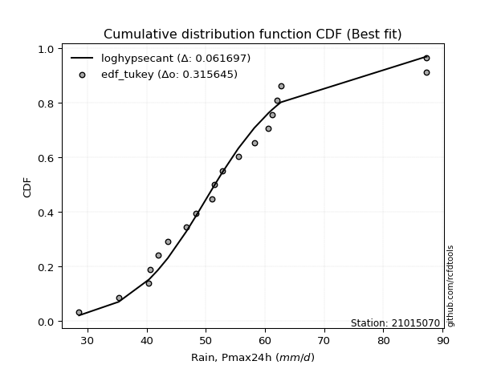</img></img>

</div>


### 8. EDF Gringorten (1963)

Gringorten plotting position formula is essential for estimating the probability and return periods of extreme events like floods and heavy rainfall. The constant _a=0.44_.

<div align="center">


$P=(m-a)/(n+1-2a)$


</div>


**8.1. Empirical values**

<div align="center">

|                | 0                    | 1                   | 2                   | 3                   | 4                   | 5                   | 6                  | 7                  | 8                  | 9              | 10                 | 11                | 12                 | 13                 | 14                 | 15                 | 16                 | 17                 | 18                 |
|:---------------|:---------------------|:--------------------|:--------------------|:--------------------|:--------------------|:--------------------|:-------------------|:-------------------|:-------------------|:---------------|:-------------------|:------------------|:-------------------|:-------------------|:-------------------|:-------------------|:-------------------|:-------------------|:-------------------|
| date           | 2020                 | 2013                | 2005                | 2015                | 2022                | 2009                | 2023               | 2016               | 2010               | 2017           | 2006               | 2011              | 2008               | 2007               | 2019               | 2018               | 2014               | 2021               | 2012               |
| x              | 28.6                 | 35.3                | 40.4                | 40.6                | 41.9                | 43.6                | 46.7               | 48.4               | 51.0               | 51.4           | 52.8               | 55.5              | 58.2               | 60.6               | 61.2               | 62.0               | 62.7               | 87.2               | 87.3               |
| m              | 1                    | 2                   | 3                   | 4                   | 5                   | 6                   | 7                  | 8                  | 9                  | 10             | 11                 | 12                | 13                 | 14                 | 15                 | 16                 | 17                 | 18                 | 19                 |
| empirical_dist | edf_gringorten       | edf_gringorten      | edf_gringorten      | edf_gringorten      | edf_gringorten      | edf_gringorten      | edf_gringorten     | edf_gringorten     | edf_gringorten     | edf_gringorten | edf_gringorten     | edf_gringorten    | edf_gringorten     | edf_gringorten     | edf_gringorten     | edf_gringorten     | edf_gringorten     | edf_gringorten     | edf_gringorten     |
| empirical      | 0.029288702928870293 | 0.08158995815899582 | 0.13389121338912133 | 0.18619246861924685 | 0.23849372384937234 | 0.29079497907949786 | 0.3430962343096234 | 0.3953974895397489 | 0.4476987447698745 | 0.5            | 0.5523012552301255 | 0.604602510460251 | 0.6569037656903766 | 0.7092050209205021 | 0.7615062761506276 | 0.8138075313807531 | 0.8661087866108785 | 0.918410041841004  | 0.9707112970711296 |
| empirical_tr   | 1.0301724137931034   | 1.0888382687927107  | 1.1545893719806763  | 1.2287917737789202  | 1.313186813186813   | 1.4100294985250739  | 1.522292993630573  | 1.6539792387543253 | 1.8106060606060606 | 2.0            | 2.2336448598130842 | 2.529100529100529 | 2.9146341463414633 | 3.4388489208633093 | 4.192982456140351  | 5.370786516853932  | 7.468749999999993  | 12.256410256410238 | 34.14285714285699  |

</div>


**8.2. Kolmogorov-Smirnov fit test (sorted by Δ)**


<div align="center">

|                | 0                   | 1                     | 2                   | 3                   | 4                   | 5                   | 6                   | 7                   | 8                   | 9                   | 10                  | 11                  | 12                  | 13                  | 14                  | 15                  | 16                  | 17                  | 18                  | 19                  | 20                  | 21                  | 22                  | 23                  | 24                  | 25                  | 26                  | 27                  | 28                  | 29                  | 30                  | 31                  | 32                  | 33                  | 34                  | 35                  | 36                  | 37                  | 38                  | 39                  | 40                  | 41                  | 42                  | 43                  | 44                  | 45                  | 46                  | 47                  | 48                  | 49                  | 50                  | 51                  | 52                  | 53                  | 54                  | 55                  | 56                  | 57                  | 58                  | 59                  | 60                  | 61                  | 62                  | 63                  | 64                  | 65                  | 66                  | 67                  | 68                  | 69                  | 70                  | 71                  | 72                  | 73                  | 74                  | 75                  | 76                  | 77                  | 78                  | 79                  | 80                  | 81                  | 82                  | 83                  | 84                  | 85                  | 86                  | 87                  |
|:---------------|:--------------------|:----------------------|:--------------------|:--------------------|:--------------------|:--------------------|:--------------------|:--------------------|:--------------------|:--------------------|:--------------------|:--------------------|:--------------------|:--------------------|:--------------------|:--------------------|:--------------------|:--------------------|:--------------------|:--------------------|:--------------------|:--------------------|:--------------------|:--------------------|:--------------------|:--------------------|:--------------------|:--------------------|:--------------------|:--------------------|:--------------------|:--------------------|:--------------------|:--------------------|:--------------------|:--------------------|:--------------------|:--------------------|:--------------------|:--------------------|:--------------------|:--------------------|:--------------------|:--------------------|:--------------------|:--------------------|:--------------------|:--------------------|:--------------------|:--------------------|:--------------------|:--------------------|:--------------------|:--------------------|:--------------------|:--------------------|:--------------------|:--------------------|:--------------------|:--------------------|:--------------------|:--------------------|:--------------------|:--------------------|:--------------------|:--------------------|:--------------------|:--------------------|:--------------------|:--------------------|:--------------------|:--------------------|:--------------------|:--------------------|:--------------------|:--------------------|:--------------------|:--------------------|:--------------------|:--------------------|:--------------------|:--------------------|:--------------------|:--------------------|:--------------------|:--------------------|:--------------------|:--------------------|
| station        | 21015070            | 21015070              | 21015070            | 21015070            | 21015070            | 21015070            | 21015070            | 21015070            | 21015070            | 21015070            | 21015070            | 21015070            | 21015070            | 21015070            | 21015070            | 21015070            | 21015070            | 21015070            | 21015070            | 21015070            | 21015070            | 21015070            | 21015070            | 21015070            | 21015070            | 21015070            | 21015070            | 21015070            | 21015070            | 21015070            | 21015070            | 21015070            | 21015070            | 21015070            | 21015070            | 21015070            | 21015070            | 21015070            | 21015070            | 21015070            | 21015070            | 21015070            | 21015070            | 21015070            | 21015070            | 21015070            | 21015070            | 21015070            | 21015070            | 21015070            | 21015070            | 21015070            | 21015070            | 21015070            | 21015070            | 21015070            | 21015070            | 21015070            | 21015070            | 21015070            | 21015070            | 21015070            | 21015070            | 21015070            | 21015070            | 21015070            | 21015070            | 21015070            | 21015070            | 21015070            | 21015070            | 21015070            | 21015070            | 21015070            | 21015070            | 21015070            | 21015070            | 21015070            | 21015070            | 21015070            | 21015070            | 21015070            | 21015070            | 21015070            | 21015070            | 21015070            | 21015070            | 21015070            |
| empirical_dist | edf_gringorten      | edf_gringorten        | edf_gringorten      | edf_gringorten      | edf_gringorten      | edf_gringorten      | edf_gringorten      | edf_gringorten      | edf_gringorten      | edf_gringorten      | edf_gringorten      | edf_gringorten      | edf_gringorten      | edf_gringorten      | edf_gringorten      | edf_gringorten      | edf_gringorten      | edf_gringorten      | edf_gringorten      | edf_gringorten      | edf_gringorten      | edf_gringorten      | edf_gringorten      | edf_gringorten      | edf_gringorten      | edf_gringorten      | edf_gringorten      | edf_gringorten      | edf_gringorten      | edf_gringorten      | edf_gringorten      | edf_gringorten      | edf_gringorten      | edf_gringorten      | edf_gringorten      | edf_gringorten      | edf_gringorten      | edf_gringorten      | edf_gringorten      | edf_gringorten      | edf_gringorten      | edf_gringorten      | edf_gringorten      | edf_gringorten      | edf_gringorten      | edf_gringorten      | edf_gringorten      | edf_gringorten      | edf_gringorten      | edf_gringorten      | edf_gringorten      | edf_gringorten      | edf_gringorten      | edf_gringorten      | edf_gringorten      | edf_gringorten      | edf_gringorten      | edf_gringorten      | edf_gringorten      | edf_gringorten      | edf_gringorten      | edf_gringorten      | edf_gringorten      | edf_gringorten      | edf_gringorten      | edf_gringorten      | edf_gringorten      | edf_gringorten      | edf_gringorten      | edf_gringorten      | edf_gringorten      | edf_gringorten      | edf_gringorten      | edf_gringorten      | edf_gringorten      | edf_gringorten      | edf_gringorten      | edf_gringorten      | edf_gringorten      | edf_gringorten      | edf_gringorten      | edf_gringorten      | edf_gringorten      | edf_gringorten      | edf_gringorten      | edf_gringorten      | edf_gringorten      | edf_gringorten      |
| p_dist         | loghypsecant        | loglaplace_asymmetric | moyal               | loglogistic         | logmielke           | logfisk             | loggenlogistic      | mielke              | fisk                | loglaplace          | laplace_asymmetric  | exponnorm           | nakagami            | halflogistic        | gumbel_r            | lograyleigh         | logmaxwell          | genlogistic         | loginvgamma         | invweibull          | nct                 | hypsecant           | laplace             | logalpha            | alpha               | loginvgauss         | invgamma            | f                   | betaprime           | logt                | johnsonsu           | logjohnsonsu        | logfatiguelife      | logf                | loglognorm          | logpearson3         | logerlang           | loggamma            | loggamma            | logncf              | lognakagami         | logexponnorm        | lognorm             | lognorm             | logcrystalball      | logrice             | invgauss            | logloggamma         | fatiguelife         | gamma               | erlang              | pearson3            | halfnorm            | logweibull_min      | loggumbel_l         | loggumbel_r         | kstwobign           | logistic            | logbetaprime        | lognct              | t                   | loghalfnorm         | weibull_min         | loginvweibull       | rice                | rayleigh            | maxwell             | logkstwobign        | loggompertz         | truncnorm           | norm                | crystalball         | logmoyal            | loghalflogistic     | loggenexpon         | gumbel_l            | wald                | logwald             | gompertz            | loggibrat           | gibrat              | genexpon            | expon               | logchi2             | logtruncnorm        | logexpon            | ncf                 | chi2                |
| delta          | 0.06315836309706191 | 0.06469360741023161   | 0.0769368603856706  | 0.07752424879467545 | 0.07891807037242327 | 0.07992003885135834 | 0.0808096133667966  | 0.08082629625027249 | 0.0810216286097778  | 0.0813600368533331  | 0.08241099202919885 | 0.08501585628102903 | 0.08669091393098194 | 0.08707895858589043 | 0.08890331444998512 | 0.09048460777655509 | 0.09262083833578916 | 0.09292016479085252 | 0.09298948577559674 | 0.09410093767087224 | 0.09421963015370216 | 0.09449228499071316 | 0.09525803734188881 | 0.09540787563259445 | 0.09545447837535193 | 0.09686072730899187 | 0.09765357887387249 | 0.0980053987948103  | 0.09803437953174243 | 0.09865093098632649 | 0.09871119795824146 | 0.09876862798909236 | 0.09881955386232999 | 0.09890272139639766 | 0.09890896142563288 | 0.09891122985217815 | 0.09892790359976644 | 0.09892798103705724 | 0.09892798103705724 | 0.09893838370081542 | 0.09902980672568407 | 0.09917476672031056 | 0.10009643975938354 | 0.10009643975938354 | 0.10009649491774109 | 0.100178407795952   | 0.10088388198418852 | 0.10123240836113956 | 0.10141639525041068 | 0.10399833884152809 | 0.10399843739500914 | 0.10403044767386438 | 0.10637582481713659 | 0.10673142555010484 | 0.10680300338737159 | 0.10748067863948718 | 0.10968592625858309 | 0.10977971871550196 | 0.11069352730019744 | 0.1107709095710332  | 0.11370904321448605 | 0.11443853619571542 | 0.1156505867265395  | 0.115854914403829   | 0.11707552914573727 | 0.11722768116497395 | 0.12058579841473205 | 0.12320776136244985 | 0.12934821920696826 | 0.13226919925654945 | 0.13226924865915202 | 0.1322692535074913  | 0.13335993924102663 | 0.13841630672716776 | 0.14853310365132874 | 0.15241631998975613 | 0.17010624192338522 | 0.20538336072471042 | 0.20583853206929414 | 0.23849372382255632 | 0.23849372384937234 | 0.24395273192903835 | 0.2442237301458585  | 0.2840925296858945  | 0.300344886274017   | 0.31017912651649937 | 0.3982884329320413  | 0.9056118484693305  |
| deltao         | 0.31564497164100014 | 0.31564497164100014   | 0.31564497164100014 | 0.31564497164100014 | 0.31564497164100014 | 0.31564497164100014 | 0.31564497164100014 | 0.31564497164100014 | 0.31564497164100014 | 0.31564497164100014 | 0.31564497164100014 | 0.31564497164100014 | 0.31564497164100014 | 0.31564497164100014 | 0.31564497164100014 | 0.31564497164100014 | 0.31564497164100014 | 0.31564497164100014 | 0.31564497164100014 | 0.31564497164100014 | 0.31564497164100014 | 0.31564497164100014 | 0.31564497164100014 | 0.31564497164100014 | 0.31564497164100014 | 0.31564497164100014 | 0.31564497164100014 | 0.31564497164100014 | 0.31564497164100014 | 0.31564497164100014 | 0.31564497164100014 | 0.31564497164100014 | 0.31564497164100014 | 0.31564497164100014 | 0.31564497164100014 | 0.31564497164100014 | 0.31564497164100014 | 0.31564497164100014 | 0.31564497164100014 | 0.31564497164100014 | 0.31564497164100014 | 0.31564497164100014 | 0.31564497164100014 | 0.31564497164100014 | 0.31564497164100014 | 0.31564497164100014 | 0.31564497164100014 | 0.31564497164100014 | 0.31564497164100014 | 0.31564497164100014 | 0.31564497164100014 | 0.31564497164100014 | 0.31564497164100014 | 0.31564497164100014 | 0.31564497164100014 | 0.31564497164100014 | 0.31564497164100014 | 0.31564497164100014 | 0.31564497164100014 | 0.31564497164100014 | 0.31564497164100014 | 0.31564497164100014 | 0.31564497164100014 | 0.31564497164100014 | 0.31564497164100014 | 0.31564497164100014 | 0.31564497164100014 | 0.31564497164100014 | 0.31564497164100014 | 0.31564497164100014 | 0.31564497164100014 | 0.31564497164100014 | 0.31564497164100014 | 0.31564497164100014 | 0.31564497164100014 | 0.31564497164100014 | 0.31564497164100014 | 0.31564497164100014 | 0.31564497164100014 | 0.31564497164100014 | 0.31564497164100014 | 0.31564497164100014 | 0.31564497164100014 | 0.31564497164100014 | 0.31564497164100014 | 0.31564497164100014 | 0.31564497164100014 | 0.31564497164100014 |
| eval           | Δo > Δ              | Δo > Δ                | Δo > Δ              | Δo > Δ              | Δo > Δ              | Δo > Δ              | Δo > Δ              | Δo > Δ              | Δo > Δ              | Δo > Δ              | Δo > Δ              | Δo > Δ              | Δo > Δ              | Δo > Δ              | Δo > Δ              | Δo > Δ              | Δo > Δ              | Δo > Δ              | Δo > Δ              | Δo > Δ              | Δo > Δ              | Δo > Δ              | Δo > Δ              | Δo > Δ              | Δo > Δ              | Δo > Δ              | Δo > Δ              | Δo > Δ              | Δo > Δ              | Δo > Δ              | Δo > Δ              | Δo > Δ              | Δo > Δ              | Δo > Δ              | Δo > Δ              | Δo > Δ              | Δo > Δ              | Δo > Δ              | Δo > Δ              | Δo > Δ              | Δo > Δ              | Δo > Δ              | Δo > Δ              | Δo > Δ              | Δo > Δ              | Δo > Δ              | Δo > Δ              | Δo > Δ              | Δo > Δ              | Δo > Δ              | Δo > Δ              | Δo > Δ              | Δo > Δ              | Δo > Δ              | Δo > Δ              | Δo > Δ              | Δo > Δ              | Δo > Δ              | Δo > Δ              | Δo > Δ              | Δo > Δ              | Δo > Δ              | Δo > Δ              | Δo > Δ              | Δo > Δ              | Δo > Δ              | Δo > Δ              | Δo > Δ              | Δo > Δ              | Δo > Δ              | Δo > Δ              | Δo > Δ              | Δo > Δ              | Δo > Δ              | Δo > Δ              | Δo > Δ              | Δo > Δ              | Δo > Δ              | Δo > Δ              | Δo > Δ              | Δo > Δ              | Δo > Δ              | Δo > Δ              | Δo > Δ              | Δo > Δ              | Δo > Δ              | Δo <= Δ             | Δo <= Δ             |
| fit            | 1                   | 1                     | 1                   | 1                   | 1                   | 1                   | 1                   | 1                   | 1                   | 1                   | 1                   | 1                   | 1                   | 1                   | 1                   | 1                   | 1                   | 1                   | 1                   | 1                   | 1                   | 1                   | 1                   | 1                   | 1                   | 1                   | 1                   | 1                   | 1                   | 1                   | 1                   | 1                   | 1                   | 1                   | 1                   | 1                   | 1                   | 1                   | 1                   | 1                   | 1                   | 1                   | 1                   | 1                   | 1                   | 1                   | 1                   | 1                   | 1                   | 1                   | 1                   | 1                   | 1                   | 1                   | 1                   | 1                   | 1                   | 1                   | 1                   | 1                   | 1                   | 1                   | 1                   | 1                   | 1                   | 1                   | 1                   | 1                   | 1                   | 1                   | 1                   | 1                   | 1                   | 1                   | 1                   | 1                   | 1                   | 1                   | 1                   | 1                   | 1                   | 1                   | 1                   | 1                   | 1                   | 1                   | 0                   | 0                   |
| n              | 19                  | 19                    | 19                  | 19                  | 19                  | 19                  | 19                  | 19                  | 19                  | 19                  | 19                  | 19                  | 19                  | 19                  | 19                  | 19                  | 19                  | 19                  | 19                  | 19                  | 19                  | 19                  | 19                  | 19                  | 19                  | 19                  | 19                  | 19                  | 19                  | 19                  | 19                  | 19                  | 19                  | 19                  | 19                  | 19                  | 19                  | 19                  | 19                  | 19                  | 19                  | 19                  | 19                  | 19                  | 19                  | 19                  | 19                  | 19                  | 19                  | 19                  | 19                  | 19                  | 19                  | 19                  | 19                  | 19                  | 19                  | 19                  | 19                  | 19                  | 19                  | 19                  | 19                  | 19                  | 19                  | 19                  | 19                  | 19                  | 19                  | 19                  | 19                  | 19                  | 19                  | 19                  | 19                  | 19                  | 19                  | 19                  | 19                  | 19                  | 19                  | 19                  | 19                  | 19                  | 19                  | 19                  | 19                  | 19                  |
| best_fit       | 1                   | 0                     | 0                   | 0                   | 0                   | 0                   | 0                   | 0                   | 0                   | 0                   | 0                   | 0                   | 0                   | 0                   | 0                   | 0                   | 0                   | 0                   | 0                   | 0                   | 0                   | 0                   | 0                   | 0                   | 0                   | 0                   | 0                   | 0                   | 0                   | 0                   | 0                   | 0                   | 0                   | 0                   | 0                   | 0                   | 0                   | 0                   | 0                   | 0                   | 0                   | 0                   | 0                   | 0                   | 0                   | 0                   | 0                   | 0                   | 0                   | 0                   | 0                   | 0                   | 0                   | 0                   | 0                   | 0                   | 0                   | 0                   | 0                   | 0                   | 0                   | 0                   | 0                   | 0                   | 0                   | 0                   | 0                   | 0                   | 0                   | 0                   | 0                   | 0                   | 0                   | 0                   | 0                   | 0                   | 0                   | 0                   | 0                   | 0                   | 0                   | 0                   | 0                   | 0                   | 0                   | 0                   | 0                   | 0                   |
| best_fit_sort  | 1                   | 2                     | 3                   | 4                   | 5                   | 6                   | 7                   | 8                   | 9                   | 10                  | 11                  | 12                  | 13                  | 14                  | 15                  | 16                  | 17                  | 18                  | 19                  | 20                  | 21                  | 22                  | 23                  | 24                  | 25                  | 26                  | 27                  | 28                  | 29                  | 30                  | 31                  | 32                  | 33                  | 34                  | 35                  | 36                  | 37                  | 38                  | 39                  | 40                  | 41                  | 42                  | 43                  | 44                  | 45                  | 46                  | 47                  | 48                  | 49                  | 50                  | 51                  | 52                  | 53                  | 54                  | 55                  | 56                  | 57                  | 58                  | 59                  | 60                  | 61                  | 62                  | 63                  | 64                  | 65                  | 66                  | 67                  | 68                  | 69                  | 70                  | 71                  | 72                  | 73                  | 74                  | 75                  | 76                  | 77                  | 78                  | 79                  | 80                  | 81                  | 82                  | 83                  | 84                  | 85                  | 86                  | 87                  | 88                  |

</div>


**8.3. Best fit**

<div align="center">

|   id |   station | empirical_dist   | p_dist       |     delta |   deltao | eval   |   fit |   n |   best_fit |   best_fit_sort |
|-----:|----------:|:-----------------|:-------------|----------:|---------:|:-------|------:|----:|-----------:|----------------:|
|    0 |  21015070 | edf_gringorten   | loghypsecant | 0.0631584 | 0.315645 | Δo > Δ |     1 |  19 |          1 |               1 |

</div>


<div align="center">

</img></img>

</div>


### 9. EDF Filliben (1975)

The specific values of the constants (0.3175) (often denoted as $alpha$) and (0.365) are derived from a method proposed by James J. Filliben in a 1975 paper. This particular formula is the mean value of the $i$-th order statistic of the normal distribution and is considered a robust and effective plotting position formula for the normal probability plot correlation coefficient test for normality.

<div align="center">


$P=(m-0.3175)/(n+0.365)$


</div>


**9.1. Empirical values**

<div align="center">

|                | 0                   | 1                   | 2                  | 3                   | 4                   | 5                  | 6                  | 7                  | 8                  | 9            | 10                 | 11                 | 12                 | 13                 | 14                 | 15                 | 16                | 17                 | 18                 |
|:---------------|:--------------------|:--------------------|:-------------------|:--------------------|:--------------------|:-------------------|:-------------------|:-------------------|:-------------------|:-------------|:-------------------|:-------------------|:-------------------|:-------------------|:-------------------|:-------------------|:------------------|:-------------------|:-------------------|
| date           | 2020                | 2013                | 2005               | 2015                | 2022                | 2009               | 2023               | 2016               | 2010               | 2017         | 2006               | 2011               | 2008               | 2007               | 2019               | 2018               | 2014              | 2021               | 2012               |
| x              | 28.6                | 35.3                | 40.4               | 40.6                | 41.9                | 43.6               | 46.7               | 48.4               | 51.0               | 51.4         | 52.8               | 55.5               | 58.2               | 60.6               | 61.2               | 62.0               | 62.7              | 87.2               | 87.3               |
| m              | 1                   | 2                   | 3                  | 4                   | 5                   | 6                  | 7                  | 8                  | 9                  | 10           | 11                 | 12                 | 13                 | 14                 | 15                 | 16                 | 17                | 18                 | 19                 |
| empirical_dist | edf_filliben        | edf_filliben        | edf_filliben       | edf_filliben        | edf_filliben        | edf_filliben       | edf_filliben       | edf_filliben       | edf_filliben       | edf_filliben | edf_filliben       | edf_filliben       | edf_filliben       | edf_filliben       | edf_filliben       | edf_filliben       | edf_filliben      | edf_filliben       | edf_filliben       |
| empirical      | 0.03524399690162665 | 0.08688355280144593 | 0.1385231087012652 | 0.19016266460108444 | 0.24180222050090372 | 0.293441776400723  | 0.3450813323005423 | 0.3967208882003615 | 0.4483604441001807 | 0.5          | 0.5516395558998193 | 0.6032791117996386 | 0.6549186676994578 | 0.7065582235992771 | 0.7581977794990963 | 0.8098373353989156 | 0.861476891298735 | 0.9131164471985542 | 0.9647560030983735 |
| empirical_tr   | 1.0365315134484143  | 1.0951505726000283  | 1.1607972426195114 | 1.2348158775705405  | 1.3189170781542654  | 1.4153115293257812 | 1.5269071555292728 | 1.6576075326342818 | 1.8127779077931194 | 2.0          | 2.2303484019579614 | 2.5206638464041657 | 2.8978675645342316 | 3.407831060272768  | 4.135611318739989  | 5.258655804480651  | 7.219012115563846 | 11.509658246656779 | 28.373626373626497 |

</div>


**9.2. Kolmogorov-Smirnov fit test (sorted by Δ)**


<div align="center">

|                | 0                    | 1                     | 2                   | 3                   | 4                   | 5                   | 6                   | 7                   | 8                   | 9                   | 10                  | 11                  | 12                  | 13                  | 14                  | 15                  | 16                  | 17                  | 18                  | 19                  | 20                  | 21                  | 22                  | 23                  | 24                  | 25                  | 26                  | 27                  | 28                  | 29                  | 30                  | 31                  | 32                  | 33                  | 34                  | 35                  | 36                  | 37                  | 38                  | 39                  | 40                  | 41                  | 42                  | 43                  | 44                  | 45                  | 46                  | 47                  | 48                  | 49                  | 50                  | 51                  | 52                  | 53                  | 54                  | 55                  | 56                  | 57                  | 58                  | 59                  | 60                  | 61                  | 62                  | 63                  | 64                  | 65                  | 66                  | 67                  | 68                  | 69                  | 70                  | 71                  | 72                  | 73                  | 74                  | 75                  | 76                  | 77                  | 78                  | 79                  | 80                  | 81                  | 82                  | 83                  | 84                  | 85                  | 86                  | 87                  |
|:---------------|:---------------------|:----------------------|:--------------------|:--------------------|:--------------------|:--------------------|:--------------------|:--------------------|:--------------------|:--------------------|:--------------------|:--------------------|:--------------------|:--------------------|:--------------------|:--------------------|:--------------------|:--------------------|:--------------------|:--------------------|:--------------------|:--------------------|:--------------------|:--------------------|:--------------------|:--------------------|:--------------------|:--------------------|:--------------------|:--------------------|:--------------------|:--------------------|:--------------------|:--------------------|:--------------------|:--------------------|:--------------------|:--------------------|:--------------------|:--------------------|:--------------------|:--------------------|:--------------------|:--------------------|:--------------------|:--------------------|:--------------------|:--------------------|:--------------------|:--------------------|:--------------------|:--------------------|:--------------------|:--------------------|:--------------------|:--------------------|:--------------------|:--------------------|:--------------------|:--------------------|:--------------------|:--------------------|:--------------------|:--------------------|:--------------------|:--------------------|:--------------------|:--------------------|:--------------------|:--------------------|:--------------------|:--------------------|:--------------------|:--------------------|:--------------------|:--------------------|:--------------------|:--------------------|:--------------------|:--------------------|:--------------------|:--------------------|:--------------------|:--------------------|:--------------------|:--------------------|:--------------------|:--------------------|
| station        | 21015070             | 21015070              | 21015070            | 21015070            | 21015070            | 21015070            | 21015070            | 21015070            | 21015070            | 21015070            | 21015070            | 21015070            | 21015070            | 21015070            | 21015070            | 21015070            | 21015070            | 21015070            | 21015070            | 21015070            | 21015070            | 21015070            | 21015070            | 21015070            | 21015070            | 21015070            | 21015070            | 21015070            | 21015070            | 21015070            | 21015070            | 21015070            | 21015070            | 21015070            | 21015070            | 21015070            | 21015070            | 21015070            | 21015070            | 21015070            | 21015070            | 21015070            | 21015070            | 21015070            | 21015070            | 21015070            | 21015070            | 21015070            | 21015070            | 21015070            | 21015070            | 21015070            | 21015070            | 21015070            | 21015070            | 21015070            | 21015070            | 21015070            | 21015070            | 21015070            | 21015070            | 21015070            | 21015070            | 21015070            | 21015070            | 21015070            | 21015070            | 21015070            | 21015070            | 21015070            | 21015070            | 21015070            | 21015070            | 21015070            | 21015070            | 21015070            | 21015070            | 21015070            | 21015070            | 21015070            | 21015070            | 21015070            | 21015070            | 21015070            | 21015070            | 21015070            | 21015070            | 21015070            |
| empirical_dist | edf_filliben         | edf_filliben          | edf_filliben        | edf_filliben        | edf_filliben        | edf_filliben        | edf_filliben        | edf_filliben        | edf_filliben        | edf_filliben        | edf_filliben        | edf_filliben        | edf_filliben        | edf_filliben        | edf_filliben        | edf_filliben        | edf_filliben        | edf_filliben        | edf_filliben        | edf_filliben        | edf_filliben        | edf_filliben        | edf_filliben        | edf_filliben        | edf_filliben        | edf_filliben        | edf_filliben        | edf_filliben        | edf_filliben        | edf_filliben        | edf_filliben        | edf_filliben        | edf_filliben        | edf_filliben        | edf_filliben        | edf_filliben        | edf_filliben        | edf_filliben        | edf_filliben        | edf_filliben        | edf_filliben        | edf_filliben        | edf_filliben        | edf_filliben        | edf_filliben        | edf_filliben        | edf_filliben        | edf_filliben        | edf_filliben        | edf_filliben        | edf_filliben        | edf_filliben        | edf_filliben        | edf_filliben        | edf_filliben        | edf_filliben        | edf_filliben        | edf_filliben        | edf_filliben        | edf_filliben        | edf_filliben        | edf_filliben        | edf_filliben        | edf_filliben        | edf_filliben        | edf_filliben        | edf_filliben        | edf_filliben        | edf_filliben        | edf_filliben        | edf_filliben        | edf_filliben        | edf_filliben        | edf_filliben        | edf_filliben        | edf_filliben        | edf_filliben        | edf_filliben        | edf_filliben        | edf_filliben        | edf_filliben        | edf_filliben        | edf_filliben        | edf_filliben        | edf_filliben        | edf_filliben        | edf_filliben        | edf_filliben        |
| p_dist         | loghypsecant         | loglaplace_asymmetric | loglogistic         | logmielke           | logfisk             | loggenlogistic      | mielke              | moyal               | fisk                | exponnorm           | loglaplace          | gumbel_r            | laplace_asymmetric  | lograyleigh         | nakagami            | halflogistic        | logmaxwell          | genlogistic         | loginvgamma         | invweibull          | nct                 | hypsecant           | logalpha            | alpha               | loginvgauss         | invgamma            | f                   | betaprime           | logt                | johnsonsu           | logjohnsonsu        | logfatiguelife      | logf                | loglognorm          | logpearson3         | logerlang           | loggamma            | loggamma            | logncf              | lognakagami         | logexponnorm        | lognorm             | lognorm             | logcrystalball      | logrice             | invgauss            | logloggamma         | fatiguelife         | laplace             | gamma               | erlang              | pearson3            | halfnorm            | logweibull_min      | loggumbel_l         | kstwobign           | logistic            | logbetaprime        | lognct              | loggumbel_r         | t                   | weibull_min         | loginvweibull       | rice                | rayleigh            | loghalfnorm         | maxwell             | logkstwobign        | loggompertz         | truncnorm           | norm                | crystalball         | logmoyal            | loghalflogistic     | loggenexpon         | gumbel_l            | wald                | gompertz            | logwald             | genexpon            | expon               | loggibrat           | gibrat              | logchi2             | logtruncnorm        | logexpon            | ncf                 | chi2                |
| delta          | 0.062035181089793584 | 0.06734040473145675   | 0.07289235348253187 | 0.07428617506027968 | 0.07528814353921476 | 0.07617771805465301 | 0.0761944009381289  | 0.07627516105536436 | 0.07638973329763421 | 0.08038396096888545 | 0.08400683417455823 | 0.08427141913784153 | 0.08505778935042399 | 0.08585271246441151 | 0.08688355280144396 | 0.08688355280144593 | 0.08798894302364557 | 0.08828826947870894 | 0.08835759046345315 | 0.08946904235872866 | 0.08958773484155858 | 0.08986038967856957 | 0.09077598032045087 | 0.09082258306320834 | 0.09222883199684828 | 0.09302168356172891 | 0.09337350348266671 | 0.09340248421959885 | 0.0940190356741829  | 0.09407930264609787 | 0.09413673267694878 | 0.0941876585501864  | 0.09427082608425408 | 0.0942770661134893  | 0.09427933454003457 | 0.09429600828762286 | 0.09429608572491366 | 0.09429608572491366 | 0.09430648838867184 | 0.09439791141354048 | 0.09454287140816697 | 0.09546454444723995 | 0.09546454444723995 | 0.0954645996055975  | 0.09554651248380841 | 0.09625198667204493 | 0.09660051304899597 | 0.0967844999382671  | 0.09790483466311395 | 0.09936644352938451 | 0.09936654208286555 | 0.0993985523617208  | 0.101743929504993   | 0.10209953023796126 | 0.102171108075228   | 0.1050540309464395  | 0.10514782340335838 | 0.10606163198805357 | 0.10613901425888961 | 0.10681897930918094 | 0.10907714790234246 | 0.11101869141439591 | 0.11122301909168542 | 0.11244363383359368 | 0.11259578585283037 | 0.11377683686540918 | 0.11595390310258846 | 0.11857586605030598 | 0.12471632389482468 | 0.12763730394440587 | 0.12763735334700843 | 0.12763735819534772 | 0.13269823991072038 | 0.13775460739686152 | 0.14390120833918488 | 0.14778442467761255 | 0.17407643790522281 | 0.20120663675715056 | 0.20472166139440418 | 0.2393208366168945  | 0.23959183483371463 | 0.2418022204740877  | 0.24180222050090372 | 0.2781372357131384  | 0.2957129909618732  | 0.30554723120435556 | 0.3929948382895912  | 0.9003182538268805  |
| deltao         | 0.31564497164100014  | 0.31564497164100014   | 0.31564497164100014 | 0.31564497164100014 | 0.31564497164100014 | 0.31564497164100014 | 0.31564497164100014 | 0.31564497164100014 | 0.31564497164100014 | 0.31564497164100014 | 0.31564497164100014 | 0.31564497164100014 | 0.31564497164100014 | 0.31564497164100014 | 0.31564497164100014 | 0.31564497164100014 | 0.31564497164100014 | 0.31564497164100014 | 0.31564497164100014 | 0.31564497164100014 | 0.31564497164100014 | 0.31564497164100014 | 0.31564497164100014 | 0.31564497164100014 | 0.31564497164100014 | 0.31564497164100014 | 0.31564497164100014 | 0.31564497164100014 | 0.31564497164100014 | 0.31564497164100014 | 0.31564497164100014 | 0.31564497164100014 | 0.31564497164100014 | 0.31564497164100014 | 0.31564497164100014 | 0.31564497164100014 | 0.31564497164100014 | 0.31564497164100014 | 0.31564497164100014 | 0.31564497164100014 | 0.31564497164100014 | 0.31564497164100014 | 0.31564497164100014 | 0.31564497164100014 | 0.31564497164100014 | 0.31564497164100014 | 0.31564497164100014 | 0.31564497164100014 | 0.31564497164100014 | 0.31564497164100014 | 0.31564497164100014 | 0.31564497164100014 | 0.31564497164100014 | 0.31564497164100014 | 0.31564497164100014 | 0.31564497164100014 | 0.31564497164100014 | 0.31564497164100014 | 0.31564497164100014 | 0.31564497164100014 | 0.31564497164100014 | 0.31564497164100014 | 0.31564497164100014 | 0.31564497164100014 | 0.31564497164100014 | 0.31564497164100014 | 0.31564497164100014 | 0.31564497164100014 | 0.31564497164100014 | 0.31564497164100014 | 0.31564497164100014 | 0.31564497164100014 | 0.31564497164100014 | 0.31564497164100014 | 0.31564497164100014 | 0.31564497164100014 | 0.31564497164100014 | 0.31564497164100014 | 0.31564497164100014 | 0.31564497164100014 | 0.31564497164100014 | 0.31564497164100014 | 0.31564497164100014 | 0.31564497164100014 | 0.31564497164100014 | 0.31564497164100014 | 0.31564497164100014 | 0.31564497164100014 |
| eval           | Δo > Δ               | Δo > Δ                | Δo > Δ              | Δo > Δ              | Δo > Δ              | Δo > Δ              | Δo > Δ              | Δo > Δ              | Δo > Δ              | Δo > Δ              | Δo > Δ              | Δo > Δ              | Δo > Δ              | Δo > Δ              | Δo > Δ              | Δo > Δ              | Δo > Δ              | Δo > Δ              | Δo > Δ              | Δo > Δ              | Δo > Δ              | Δo > Δ              | Δo > Δ              | Δo > Δ              | Δo > Δ              | Δo > Δ              | Δo > Δ              | Δo > Δ              | Δo > Δ              | Δo > Δ              | Δo > Δ              | Δo > Δ              | Δo > Δ              | Δo > Δ              | Δo > Δ              | Δo > Δ              | Δo > Δ              | Δo > Δ              | Δo > Δ              | Δo > Δ              | Δo > Δ              | Δo > Δ              | Δo > Δ              | Δo > Δ              | Δo > Δ              | Δo > Δ              | Δo > Δ              | Δo > Δ              | Δo > Δ              | Δo > Δ              | Δo > Δ              | Δo > Δ              | Δo > Δ              | Δo > Δ              | Δo > Δ              | Δo > Δ              | Δo > Δ              | Δo > Δ              | Δo > Δ              | Δo > Δ              | Δo > Δ              | Δo > Δ              | Δo > Δ              | Δo > Δ              | Δo > Δ              | Δo > Δ              | Δo > Δ              | Δo > Δ              | Δo > Δ              | Δo > Δ              | Δo > Δ              | Δo > Δ              | Δo > Δ              | Δo > Δ              | Δo > Δ              | Δo > Δ              | Δo > Δ              | Δo > Δ              | Δo > Δ              | Δo > Δ              | Δo > Δ              | Δo > Δ              | Δo > Δ              | Δo > Δ              | Δo > Δ              | Δo > Δ              | Δo <= Δ             | Δo <= Δ             |
| fit            | 1                    | 1                     | 1                   | 1                   | 1                   | 1                   | 1                   | 1                   | 1                   | 1                   | 1                   | 1                   | 1                   | 1                   | 1                   | 1                   | 1                   | 1                   | 1                   | 1                   | 1                   | 1                   | 1                   | 1                   | 1                   | 1                   | 1                   | 1                   | 1                   | 1                   | 1                   | 1                   | 1                   | 1                   | 1                   | 1                   | 1                   | 1                   | 1                   | 1                   | 1                   | 1                   | 1                   | 1                   | 1                   | 1                   | 1                   | 1                   | 1                   | 1                   | 1                   | 1                   | 1                   | 1                   | 1                   | 1                   | 1                   | 1                   | 1                   | 1                   | 1                   | 1                   | 1                   | 1                   | 1                   | 1                   | 1                   | 1                   | 1                   | 1                   | 1                   | 1                   | 1                   | 1                   | 1                   | 1                   | 1                   | 1                   | 1                   | 1                   | 1                   | 1                   | 1                   | 1                   | 1                   | 1                   | 0                   | 0                   |
| n              | 19                   | 19                    | 19                  | 19                  | 19                  | 19                  | 19                  | 19                  | 19                  | 19                  | 19                  | 19                  | 19                  | 19                  | 19                  | 19                  | 19                  | 19                  | 19                  | 19                  | 19                  | 19                  | 19                  | 19                  | 19                  | 19                  | 19                  | 19                  | 19                  | 19                  | 19                  | 19                  | 19                  | 19                  | 19                  | 19                  | 19                  | 19                  | 19                  | 19                  | 19                  | 19                  | 19                  | 19                  | 19                  | 19                  | 19                  | 19                  | 19                  | 19                  | 19                  | 19                  | 19                  | 19                  | 19                  | 19                  | 19                  | 19                  | 19                  | 19                  | 19                  | 19                  | 19                  | 19                  | 19                  | 19                  | 19                  | 19                  | 19                  | 19                  | 19                  | 19                  | 19                  | 19                  | 19                  | 19                  | 19                  | 19                  | 19                  | 19                  | 19                  | 19                  | 19                  | 19                  | 19                  | 19                  | 19                  | 19                  |
| best_fit       | 1                    | 0                     | 0                   | 0                   | 0                   | 0                   | 0                   | 0                   | 0                   | 0                   | 0                   | 0                   | 0                   | 0                   | 0                   | 0                   | 0                   | 0                   | 0                   | 0                   | 0                   | 0                   | 0                   | 0                   | 0                   | 0                   | 0                   | 0                   | 0                   | 0                   | 0                   | 0                   | 0                   | 0                   | 0                   | 0                   | 0                   | 0                   | 0                   | 0                   | 0                   | 0                   | 0                   | 0                   | 0                   | 0                   | 0                   | 0                   | 0                   | 0                   | 0                   | 0                   | 0                   | 0                   | 0                   | 0                   | 0                   | 0                   | 0                   | 0                   | 0                   | 0                   | 0                   | 0                   | 0                   | 0                   | 0                   | 0                   | 0                   | 0                   | 0                   | 0                   | 0                   | 0                   | 0                   | 0                   | 0                   | 0                   | 0                   | 0                   | 0                   | 0                   | 0                   | 0                   | 0                   | 0                   | 0                   | 0                   |
| best_fit_sort  | 1                    | 2                     | 3                   | 4                   | 5                   | 6                   | 7                   | 8                   | 9                   | 10                  | 11                  | 12                  | 13                  | 14                  | 15                  | 16                  | 17                  | 18                  | 19                  | 20                  | 21                  | 22                  | 23                  | 24                  | 25                  | 26                  | 27                  | 28                  | 29                  | 30                  | 31                  | 32                  | 33                  | 34                  | 35                  | 36                  | 37                  | 38                  | 39                  | 40                  | 41                  | 42                  | 43                  | 44                  | 45                  | 46                  | 47                  | 48                  | 49                  | 50                  | 51                  | 52                  | 53                  | 54                  | 55                  | 56                  | 57                  | 58                  | 59                  | 60                  | 61                  | 62                  | 63                  | 64                  | 65                  | 66                  | 67                  | 68                  | 69                  | 70                  | 71                  | 72                  | 73                  | 74                  | 75                  | 76                  | 77                  | 78                  | 79                  | 80                  | 81                  | 82                  | 83                  | 84                  | 85                  | 86                  | 87                  | 88                  |

</div>


**9.3. Best fit**

<div align="center">

|   id |   station | empirical_dist   | p_dist       |     delta |   deltao | eval   |   fit |   n |   best_fit |   best_fit_sort |
|-----:|----------:|:-----------------|:-------------|----------:|---------:|:-------|------:|----:|-----------:|----------------:|
|    0 |  21015070 | edf_filliben     | loghypsecant | 0.0620352 | 0.315645 | Δo > Δ |     1 |  19 |          1 |               1 |

</div>


<div align="center">

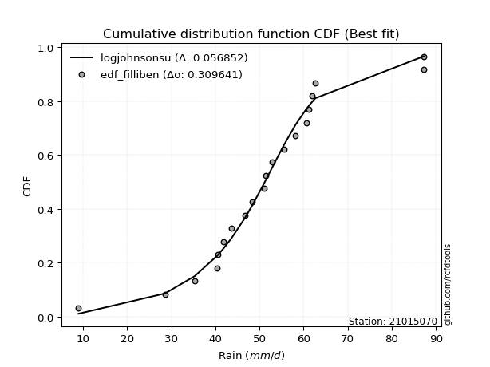</img></img>

</div>


### 10. EDF Jenkinson (1977)

The Jenkinson formula in hydrology is an empirical plotting position formula used to estimate the non-exceedance probability _(P)_ or return period _(T)_ of a given ordered observation within a sample. It is a widely used method in the frequency analysis of extreme events such as floods and rainfall, as it provides a distribution-free way to plot data. _a≈0.31_ and _b≈0.38_ are constants derived to approximate the median of the probability distribution for the given rank.

<div align="center">


$P=(m-a)/(n+b)$


</div>


**10.1. Empirical values**

<div align="center">

|                | 0                   | 1                   | 2                  | 3                   | 4                   | 5                   | 6                  | 7                  | 8                  | 9             | 10                 | 11                 | 12                 | 13                 | 14                 | 15                 | 16                 | 17                 | 18                 |
|:---------------|:--------------------|:--------------------|:-------------------|:--------------------|:--------------------|:--------------------|:-------------------|:-------------------|:-------------------|:--------------|:-------------------|:-------------------|:-------------------|:-------------------|:-------------------|:-------------------|:-------------------|:-------------------|:-------------------|
| date           | 2020                | 2013                | 2005               | 2015                | 2022                | 2009                | 2023               | 2016               | 2010               | 2017          | 2006               | 2011               | 2008               | 2007               | 2019               | 2018               | 2014               | 2021               | 2012               |
| x              | 28.6                | 35.3                | 40.4               | 40.6                | 41.9                | 43.6                | 46.7               | 48.4               | 51.0               | 51.4          | 52.8               | 55.5               | 58.2               | 60.6               | 61.2               | 62.0               | 62.7               | 87.2               | 87.3               |
| m              | 1                   | 2                   | 3                  | 4                   | 5                   | 6                   | 7                  | 8                  | 9                  | 10            | 11                 | 12                 | 13                 | 14                 | 15                 | 16                 | 17                 | 18                 | 19                 |
| empirical_dist | edf_jenkinson       | edf_jenkinson       | edf_jenkinson      | edf_jenkinson       | edf_jenkinson       | edf_jenkinson       | edf_jenkinson      | edf_jenkinson      | edf_jenkinson      | edf_jenkinson | edf_jenkinson      | edf_jenkinson      | edf_jenkinson      | edf_jenkinson      | edf_jenkinson      | edf_jenkinson      | edf_jenkinson      | edf_jenkinson      | edf_jenkinson      |
| empirical      | 0.03560371517027864 | 0.08720330237358101 | 0.1388028895768834 | 0.19040247678018576 | 0.24200206398348817 | 0.29360165118679055 | 0.3452012383900929 | 0.3968008255933953 | 0.4484004127966976 | 0.5           | 0.5515995872033024 | 0.6031991744066048 | 0.6547987616099071 | 0.7063983488132095 | 0.7579979360165119 | 0.8095975232198143 | 0.8611971104231168 | 0.9127966976264191 | 0.9643962848297215 |
| empirical_tr   | 1.0369181380417336  | 1.0955342001130581  | 1.1611743559017376 | 1.2351816443594645  | 1.3192648059904697  | 1.4156318480642804  | 1.5271867612293144 | 1.6578272027373824 | 1.812909260991581  | 2.0           | 2.230149597238205  | 2.5201560468140443 | 2.896860986547085  | 3.40597539543058   | 4.132196162046909  | 5.252032520325204  | 7.204460966542758  | 11.467455621301793 | 28.086956521739243 |

</div>


**10.2. Kolmogorov-Smirnov fit test (sorted by Δ)**


<div align="center">

|                | 0                   | 1                     | 2                   | 3                   | 4                   | 5                   | 6                   | 7                   | 8                   | 9                   | 10                  | 11                  | 12                  | 13                  | 14                  | 15                  | 16                  | 17                  | 18                  | 19                  | 20                  | 21                  | 22                  | 23                  | 24                  | 25                  | 26                  | 27                  | 28                  | 29                  | 30                  | 31                  | 32                  | 33                  | 34                  | 35                  | 36                  | 37                  | 38                  | 39                  | 40                  | 41                  | 42                  | 43                  | 44                  | 45                  | 46                  | 47                  | 48                  | 49                  | 50                  | 51                  | 52                  | 53                  | 54                  | 55                  | 56                  | 57                  | 58                  | 59                  | 60                  | 61                  | 62                  | 63                  | 64                  | 65                  | 66                  | 67                  | 68                  | 69                  | 70                  | 71                  | 72                  | 73                  | 74                  | 75                  | 76                  | 77                  | 78                  | 79                  | 80                  | 81                  | 82                  | 83                  | 84                  | 85                  | 86                  | 87                  |
|:---------------|:--------------------|:----------------------|:--------------------|:--------------------|:--------------------|:--------------------|:--------------------|:--------------------|:--------------------|:--------------------|:--------------------|:--------------------|:--------------------|:--------------------|:--------------------|:--------------------|:--------------------|:--------------------|:--------------------|:--------------------|:--------------------|:--------------------|:--------------------|:--------------------|:--------------------|:--------------------|:--------------------|:--------------------|:--------------------|:--------------------|:--------------------|:--------------------|:--------------------|:--------------------|:--------------------|:--------------------|:--------------------|:--------------------|:--------------------|:--------------------|:--------------------|:--------------------|:--------------------|:--------------------|:--------------------|:--------------------|:--------------------|:--------------------|:--------------------|:--------------------|:--------------------|:--------------------|:--------------------|:--------------------|:--------------------|:--------------------|:--------------------|:--------------------|:--------------------|:--------------------|:--------------------|:--------------------|:--------------------|:--------------------|:--------------------|:--------------------|:--------------------|:--------------------|:--------------------|:--------------------|:--------------------|:--------------------|:--------------------|:--------------------|:--------------------|:--------------------|:--------------------|:--------------------|:--------------------|:--------------------|:--------------------|:--------------------|:--------------------|:--------------------|:--------------------|:--------------------|:--------------------|:--------------------|
| station        | 21015070            | 21015070              | 21015070            | 21015070            | 21015070            | 21015070            | 21015070            | 21015070            | 21015070            | 21015070            | 21015070            | 21015070            | 21015070            | 21015070            | 21015070            | 21015070            | 21015070            | 21015070            | 21015070            | 21015070            | 21015070            | 21015070            | 21015070            | 21015070            | 21015070            | 21015070            | 21015070            | 21015070            | 21015070            | 21015070            | 21015070            | 21015070            | 21015070            | 21015070            | 21015070            | 21015070            | 21015070            | 21015070            | 21015070            | 21015070            | 21015070            | 21015070            | 21015070            | 21015070            | 21015070            | 21015070            | 21015070            | 21015070            | 21015070            | 21015070            | 21015070            | 21015070            | 21015070            | 21015070            | 21015070            | 21015070            | 21015070            | 21015070            | 21015070            | 21015070            | 21015070            | 21015070            | 21015070            | 21015070            | 21015070            | 21015070            | 21015070            | 21015070            | 21015070            | 21015070            | 21015070            | 21015070            | 21015070            | 21015070            | 21015070            | 21015070            | 21015070            | 21015070            | 21015070            | 21015070            | 21015070            | 21015070            | 21015070            | 21015070            | 21015070            | 21015070            | 21015070            | 21015070            |
| empirical_dist | edf_jenkinson       | edf_jenkinson         | edf_jenkinson       | edf_jenkinson       | edf_jenkinson       | edf_jenkinson       | edf_jenkinson       | edf_jenkinson       | edf_jenkinson       | edf_jenkinson       | edf_jenkinson       | edf_jenkinson       | edf_jenkinson       | edf_jenkinson       | edf_jenkinson       | edf_jenkinson       | edf_jenkinson       | edf_jenkinson       | edf_jenkinson       | edf_jenkinson       | edf_jenkinson       | edf_jenkinson       | edf_jenkinson       | edf_jenkinson       | edf_jenkinson       | edf_jenkinson       | edf_jenkinson       | edf_jenkinson       | edf_jenkinson       | edf_jenkinson       | edf_jenkinson       | edf_jenkinson       | edf_jenkinson       | edf_jenkinson       | edf_jenkinson       | edf_jenkinson       | edf_jenkinson       | edf_jenkinson       | edf_jenkinson       | edf_jenkinson       | edf_jenkinson       | edf_jenkinson       | edf_jenkinson       | edf_jenkinson       | edf_jenkinson       | edf_jenkinson       | edf_jenkinson       | edf_jenkinson       | edf_jenkinson       | edf_jenkinson       | edf_jenkinson       | edf_jenkinson       | edf_jenkinson       | edf_jenkinson       | edf_jenkinson       | edf_jenkinson       | edf_jenkinson       | edf_jenkinson       | edf_jenkinson       | edf_jenkinson       | edf_jenkinson       | edf_jenkinson       | edf_jenkinson       | edf_jenkinson       | edf_jenkinson       | edf_jenkinson       | edf_jenkinson       | edf_jenkinson       | edf_jenkinson       | edf_jenkinson       | edf_jenkinson       | edf_jenkinson       | edf_jenkinson       | edf_jenkinson       | edf_jenkinson       | edf_jenkinson       | edf_jenkinson       | edf_jenkinson       | edf_jenkinson       | edf_jenkinson       | edf_jenkinson       | edf_jenkinson       | edf_jenkinson       | edf_jenkinson       | edf_jenkinson       | edf_jenkinson       | edf_jenkinson       | edf_jenkinson       |
| p_dist         | loghypsecant        | loglaplace_asymmetric | loglogistic         | logmielke           | logfisk             | loggenlogistic      | mielke              | fisk                | moyal               | exponnorm           | gumbel_r            | loglaplace          | laplace_asymmetric  | lograyleigh         | nakagami            | halflogistic        | logmaxwell          | genlogistic         | loginvgamma         | invweibull          | nct                 | hypsecant           | logalpha            | alpha               | loginvgauss         | invgamma            | f                   | betaprime           | logt                | johnsonsu           | logjohnsonsu        | logfatiguelife      | logf                | loglognorm          | logpearson3         | logerlang           | loggamma            | loggamma            | logncf              | lognakagami         | logexponnorm        | lognorm             | lognorm             | logcrystalball      | logrice             | invgauss            | logloggamma         | fatiguelife         | laplace             | gamma               | erlang              | pearson3            | halfnorm            | logweibull_min      | loggumbel_l         | kstwobign           | logistic            | logbetaprime        | lognct              | loggumbel_r         | t                   | weibull_min         | loginvweibull       | rice                | rayleigh            | loghalfnorm         | maxwell             | logkstwobign        | loggompertz         | truncnorm           | norm                | crystalball         | logmoyal            | loghalflogistic     | loggenexpon         | gumbel_l            | wald                | gompertz            | logwald             | genexpon            | expon               | loggibrat           | gibrat              | logchi2             | logtruncnorm        | logexpon            | ncf                 | chi2                |
| delta          | 0.06219505587586113 | 0.0675002795175243    | 0.07261257260691367 | 0.07400639418466148 | 0.07500836266359656 | 0.07589793717903481 | 0.07591462006251071 | 0.07610995242201601 | 0.07623519235884746 | 0.08010418009326725 | 0.08399163826222333 | 0.08416670896062578 | 0.08521766413649154 | 0.08557293158879331 | 0.08720330237357904 | 0.08720330237358101 | 0.08770916214802738 | 0.08800848860309074 | 0.08807780958783495 | 0.08918926148311046 | 0.08930795396594038 | 0.08958060880295138 | 0.09049619944483267 | 0.09054280218759014 | 0.09194905112123009 | 0.09274190268611071 | 0.09309372260704851 | 0.09312270334398065 | 0.09373925479856471 | 0.09379952177047968 | 0.09385695180133058 | 0.09390787767456821 | 0.09399104520863588 | 0.0939972852378711  | 0.09399955366441637 | 0.09401622741200466 | 0.09401630484929546 | 0.09401630484929546 | 0.09402670751305364 | 0.09411813053792228 | 0.09426309053254878 | 0.09518476357162176 | 0.09518476357162176 | 0.0951848187299793  | 0.09526673160819021 | 0.09597220579642673 | 0.09632073217337778 | 0.0965047190626489  | 0.0980647094491815  | 0.09908666265376631 | 0.09908676120724735 | 0.0991187714861026  | 0.1014641486293748  | 0.10181974936234306 | 0.1018913271996098  | 0.1047742500708213  | 0.10486804252774018 | 0.10578185111243538 | 0.10585923338327141 | 0.10677901061266404 | 0.10879736702672427 | 0.11073891053877771 | 0.11094323821606722 | 0.11216385295797549 | 0.11231600497721217 | 0.11373686816889228 | 0.11567412222697027 | 0.11829608517468779 | 0.12443654301920648 | 0.12735752306878767 | 0.12735757247139023 | 0.12735757731972952 | 0.13265827121420348 | 0.13771463870034462 | 0.14362142746356668 | 0.14750464380199435 | 0.17431625008432414 | 0.20092685588153236 | 0.20468169269788727 | 0.2390410557412763  | 0.23931205395809643 | 0.24200206395667215 | 0.24200206398348817 | 0.2777775174444864  | 0.295433210086255   | 0.30526745032873737 | 0.39267508871745616 | 0.8999985042547454  |
| deltao         | 0.31564497164100014 | 0.31564497164100014   | 0.31564497164100014 | 0.31564497164100014 | 0.31564497164100014 | 0.31564497164100014 | 0.31564497164100014 | 0.31564497164100014 | 0.31564497164100014 | 0.31564497164100014 | 0.31564497164100014 | 0.31564497164100014 | 0.31564497164100014 | 0.31564497164100014 | 0.31564497164100014 | 0.31564497164100014 | 0.31564497164100014 | 0.31564497164100014 | 0.31564497164100014 | 0.31564497164100014 | 0.31564497164100014 | 0.31564497164100014 | 0.31564497164100014 | 0.31564497164100014 | 0.31564497164100014 | 0.31564497164100014 | 0.31564497164100014 | 0.31564497164100014 | 0.31564497164100014 | 0.31564497164100014 | 0.31564497164100014 | 0.31564497164100014 | 0.31564497164100014 | 0.31564497164100014 | 0.31564497164100014 | 0.31564497164100014 | 0.31564497164100014 | 0.31564497164100014 | 0.31564497164100014 | 0.31564497164100014 | 0.31564497164100014 | 0.31564497164100014 | 0.31564497164100014 | 0.31564497164100014 | 0.31564497164100014 | 0.31564497164100014 | 0.31564497164100014 | 0.31564497164100014 | 0.31564497164100014 | 0.31564497164100014 | 0.31564497164100014 | 0.31564497164100014 | 0.31564497164100014 | 0.31564497164100014 | 0.31564497164100014 | 0.31564497164100014 | 0.31564497164100014 | 0.31564497164100014 | 0.31564497164100014 | 0.31564497164100014 | 0.31564497164100014 | 0.31564497164100014 | 0.31564497164100014 | 0.31564497164100014 | 0.31564497164100014 | 0.31564497164100014 | 0.31564497164100014 | 0.31564497164100014 | 0.31564497164100014 | 0.31564497164100014 | 0.31564497164100014 | 0.31564497164100014 | 0.31564497164100014 | 0.31564497164100014 | 0.31564497164100014 | 0.31564497164100014 | 0.31564497164100014 | 0.31564497164100014 | 0.31564497164100014 | 0.31564497164100014 | 0.31564497164100014 | 0.31564497164100014 | 0.31564497164100014 | 0.31564497164100014 | 0.31564497164100014 | 0.31564497164100014 | 0.31564497164100014 | 0.31564497164100014 |
| eval           | Δo > Δ              | Δo > Δ                | Δo > Δ              | Δo > Δ              | Δo > Δ              | Δo > Δ              | Δo > Δ              | Δo > Δ              | Δo > Δ              | Δo > Δ              | Δo > Δ              | Δo > Δ              | Δo > Δ              | Δo > Δ              | Δo > Δ              | Δo > Δ              | Δo > Δ              | Δo > Δ              | Δo > Δ              | Δo > Δ              | Δo > Δ              | Δo > Δ              | Δo > Δ              | Δo > Δ              | Δo > Δ              | Δo > Δ              | Δo > Δ              | Δo > Δ              | Δo > Δ              | Δo > Δ              | Δo > Δ              | Δo > Δ              | Δo > Δ              | Δo > Δ              | Δo > Δ              | Δo > Δ              | Δo > Δ              | Δo > Δ              | Δo > Δ              | Δo > Δ              | Δo > Δ              | Δo > Δ              | Δo > Δ              | Δo > Δ              | Δo > Δ              | Δo > Δ              | Δo > Δ              | Δo > Δ              | Δo > Δ              | Δo > Δ              | Δo > Δ              | Δo > Δ              | Δo > Δ              | Δo > Δ              | Δo > Δ              | Δo > Δ              | Δo > Δ              | Δo > Δ              | Δo > Δ              | Δo > Δ              | Δo > Δ              | Δo > Δ              | Δo > Δ              | Δo > Δ              | Δo > Δ              | Δo > Δ              | Δo > Δ              | Δo > Δ              | Δo > Δ              | Δo > Δ              | Δo > Δ              | Δo > Δ              | Δo > Δ              | Δo > Δ              | Δo > Δ              | Δo > Δ              | Δo > Δ              | Δo > Δ              | Δo > Δ              | Δo > Δ              | Δo > Δ              | Δo > Δ              | Δo > Δ              | Δo > Δ              | Δo > Δ              | Δo > Δ              | Δo <= Δ             | Δo <= Δ             |
| fit            | 1                   | 1                     | 1                   | 1                   | 1                   | 1                   | 1                   | 1                   | 1                   | 1                   | 1                   | 1                   | 1                   | 1                   | 1                   | 1                   | 1                   | 1                   | 1                   | 1                   | 1                   | 1                   | 1                   | 1                   | 1                   | 1                   | 1                   | 1                   | 1                   | 1                   | 1                   | 1                   | 1                   | 1                   | 1                   | 1                   | 1                   | 1                   | 1                   | 1                   | 1                   | 1                   | 1                   | 1                   | 1                   | 1                   | 1                   | 1                   | 1                   | 1                   | 1                   | 1                   | 1                   | 1                   | 1                   | 1                   | 1                   | 1                   | 1                   | 1                   | 1                   | 1                   | 1                   | 1                   | 1                   | 1                   | 1                   | 1                   | 1                   | 1                   | 1                   | 1                   | 1                   | 1                   | 1                   | 1                   | 1                   | 1                   | 1                   | 1                   | 1                   | 1                   | 1                   | 1                   | 1                   | 1                   | 0                   | 0                   |
| n              | 19                  | 19                    | 19                  | 19                  | 19                  | 19                  | 19                  | 19                  | 19                  | 19                  | 19                  | 19                  | 19                  | 19                  | 19                  | 19                  | 19                  | 19                  | 19                  | 19                  | 19                  | 19                  | 19                  | 19                  | 19                  | 19                  | 19                  | 19                  | 19                  | 19                  | 19                  | 19                  | 19                  | 19                  | 19                  | 19                  | 19                  | 19                  | 19                  | 19                  | 19                  | 19                  | 19                  | 19                  | 19                  | 19                  | 19                  | 19                  | 19                  | 19                  | 19                  | 19                  | 19                  | 19                  | 19                  | 19                  | 19                  | 19                  | 19                  | 19                  | 19                  | 19                  | 19                  | 19                  | 19                  | 19                  | 19                  | 19                  | 19                  | 19                  | 19                  | 19                  | 19                  | 19                  | 19                  | 19                  | 19                  | 19                  | 19                  | 19                  | 19                  | 19                  | 19                  | 19                  | 19                  | 19                  | 19                  | 19                  |
| best_fit       | 1                   | 0                     | 0                   | 0                   | 0                   | 0                   | 0                   | 0                   | 0                   | 0                   | 0                   | 0                   | 0                   | 0                   | 0                   | 0                   | 0                   | 0                   | 0                   | 0                   | 0                   | 0                   | 0                   | 0                   | 0                   | 0                   | 0                   | 0                   | 0                   | 0                   | 0                   | 0                   | 0                   | 0                   | 0                   | 0                   | 0                   | 0                   | 0                   | 0                   | 0                   | 0                   | 0                   | 0                   | 0                   | 0                   | 0                   | 0                   | 0                   | 0                   | 0                   | 0                   | 0                   | 0                   | 0                   | 0                   | 0                   | 0                   | 0                   | 0                   | 0                   | 0                   | 0                   | 0                   | 0                   | 0                   | 0                   | 0                   | 0                   | 0                   | 0                   | 0                   | 0                   | 0                   | 0                   | 0                   | 0                   | 0                   | 0                   | 0                   | 0                   | 0                   | 0                   | 0                   | 0                   | 0                   | 0                   | 0                   |
| best_fit_sort  | 1                   | 2                     | 3                   | 4                   | 5                   | 6                   | 7                   | 8                   | 9                   | 10                  | 11                  | 12                  | 13                  | 14                  | 15                  | 16                  | 17                  | 18                  | 19                  | 20                  | 21                  | 22                  | 23                  | 24                  | 25                  | 26                  | 27                  | 28                  | 29                  | 30                  | 31                  | 32                  | 33                  | 34                  | 35                  | 36                  | 37                  | 38                  | 39                  | 40                  | 41                  | 42                  | 43                  | 44                  | 45                  | 46                  | 47                  | 48                  | 49                  | 50                  | 51                  | 52                  | 53                  | 54                  | 55                  | 56                  | 57                  | 58                  | 59                  | 60                  | 61                  | 62                  | 63                  | 64                  | 65                  | 66                  | 67                  | 68                  | 69                  | 70                  | 71                  | 72                  | 73                  | 74                  | 75                  | 76                  | 77                  | 78                  | 79                  | 80                  | 81                  | 82                  | 83                  | 84                  | 85                  | 86                  | 87                  | 88                  |

</div>


**10.3. Best fit**

<div align="center">

|   id |   station | empirical_dist   | p_dist       |     delta |   deltao | eval   |   fit |   n |   best_fit |   best_fit_sort |
|-----:|----------:|:-----------------|:-------------|----------:|---------:|:-------|------:|----:|-----------:|----------------:|
|    0 |  21015070 | edf_jenkinson    | loghypsecant | 0.0621951 | 0.315645 | Δo > Δ |     1 |  19 |          1 |               1 |

</div>


<div align="center">

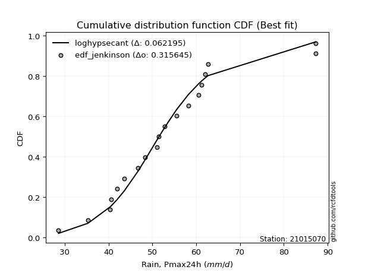</img>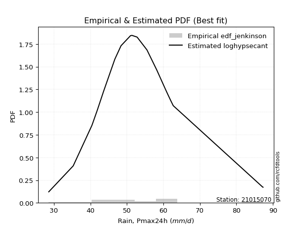</img>

</div>


### 11. EDF Cunnane (1978)

Cunnane´s work in statistical hydrology has focused on the performance and evaluation of different probability distributions (such as GEV, Gumbel, Lognormal) for flood frequency estimation. _b_ is a constant, typically set to 0.4.

<div align="center">


$P=(m-b)/(n+1-2b)$


</div>


**11.1. Empirical values**

<div align="center">

|                | 0                 | 1                   | 2                   | 3                  | 4                   | 5                  | 6                  | 7                  | 8                  | 9           | 10                 | 11                 | 12                | 13                 | 14                 | 15                | 16                 | 17                 | 18                 |
|:---------------|:------------------|:--------------------|:--------------------|:-------------------|:--------------------|:-------------------|:-------------------|:-------------------|:-------------------|:------------|:-------------------|:-------------------|:------------------|:-------------------|:-------------------|:------------------|:-------------------|:-------------------|:-------------------|
| date           | 2020              | 2013                | 2005                | 2015               | 2022                | 2009               | 2023               | 2016               | 2010               | 2017        | 2006               | 2011               | 2008              | 2007               | 2019               | 2018              | 2014               | 2021               | 2012               |
| x              | 28.6              | 35.3                | 40.4                | 40.6               | 41.9                | 43.6               | 46.7               | 48.4               | 51.0               | 51.4        | 52.8               | 55.5               | 58.2              | 60.6               | 61.2               | 62.0              | 62.7               | 87.2               | 87.3               |
| m              | 1                 | 2                   | 3                   | 4                  | 5                   | 6                  | 7                  | 8                  | 9                  | 10          | 11                 | 12                 | 13                | 14                 | 15                 | 16                | 17                 | 18                 | 19                 |
| empirical_dist | edf_cunnane       | edf_cunnane         | edf_cunnane         | edf_cunnane        | edf_cunnane         | edf_cunnane        | edf_cunnane        | edf_cunnane        | edf_cunnane        | edf_cunnane | edf_cunnane        | edf_cunnane        | edf_cunnane       | edf_cunnane        | edf_cunnane        | edf_cunnane       | edf_cunnane        | edf_cunnane        | edf_cunnane        |
| empirical      | 0.03125           | 0.08333333333333334 | 0.13541666666666669 | 0.1875             | 0.23958333333333331 | 0.2916666666666667 | 0.34375            | 0.3958333333333333 | 0.4479166666666667 | 0.5         | 0.5520833333333334 | 0.6041666666666666 | 0.65625           | 0.7083333333333334 | 0.7604166666666666 | 0.8125            | 0.8645833333333335 | 0.9166666666666667 | 0.9687500000000001 |
| empirical_tr   | 1.032258064516129 | 1.090909090909091   | 1.1566265060240966  | 1.2307692307692308 | 1.3150684931506849  | 1.411764705882353  | 1.5238095238095237 | 1.6551724137931032 | 1.8113207547169814 | 2.0         | 2.2325581395348837 | 2.526315789473684  | 2.909090909090909 | 3.428571428571429  | 4.17391304347826   | 5.333333333333333 | 7.384615384615393  | 12.00000000000001  | 32.000000000000114 |

</div>


**11.2. Kolmogorov-Smirnov fit test (sorted by Δ)**


<div align="center">

|                | 0                   | 1                     | 2                   | 3                   | 4                   | 5                   | 6                   | 7                   | 8                   | 9                   | 10                  | 11                  | 12                  | 13                  | 14                  | 15                  | 16                  | 17                  | 18                  | 19                  | 20                  | 21                  | 22                  | 23                  | 24                  | 25                  | 26                  | 27                  | 28                  | 29                  | 30                  | 31                  | 32                  | 33                  | 34                  | 35                  | 36                  | 37                  | 38                  | 39                  | 40                  | 41                  | 42                  | 43                  | 44                  | 45                  | 46                  | 47                  | 48                  | 49                  | 50                  | 51                  | 52                  | 53                  | 54                  | 55                  | 56                  | 57                  | 58                  | 59                  | 60                  | 61                  | 62                  | 63                  | 64                  | 65                  | 66                  | 67                  | 68                  | 69                  | 70                  | 71                  | 72                  | 73                  | 74                  | 75                  | 76                  | 77                  | 78                  | 79                  | 80                  | 81                  | 82                  | 83                  | 84                  | 85                  | 86                  | 87                  |
|:---------------|:--------------------|:----------------------|:--------------------|:--------------------|:--------------------|:--------------------|:--------------------|:--------------------|:--------------------|:--------------------|:--------------------|:--------------------|:--------------------|:--------------------|:--------------------|:--------------------|:--------------------|:--------------------|:--------------------|:--------------------|:--------------------|:--------------------|:--------------------|:--------------------|:--------------------|:--------------------|:--------------------|:--------------------|:--------------------|:--------------------|:--------------------|:--------------------|:--------------------|:--------------------|:--------------------|:--------------------|:--------------------|:--------------------|:--------------------|:--------------------|:--------------------|:--------------------|:--------------------|:--------------------|:--------------------|:--------------------|:--------------------|:--------------------|:--------------------|:--------------------|:--------------------|:--------------------|:--------------------|:--------------------|:--------------------|:--------------------|:--------------------|:--------------------|:--------------------|:--------------------|:--------------------|:--------------------|:--------------------|:--------------------|:--------------------|:--------------------|:--------------------|:--------------------|:--------------------|:--------------------|:--------------------|:--------------------|:--------------------|:--------------------|:--------------------|:--------------------|:--------------------|:--------------------|:--------------------|:--------------------|:--------------------|:--------------------|:--------------------|:--------------------|:--------------------|:--------------------|:--------------------|:--------------------|
| station        | 21015070            | 21015070              | 21015070            | 21015070            | 21015070            | 21015070            | 21015070            | 21015070            | 21015070            | 21015070            | 21015070            | 21015070            | 21015070            | 21015070            | 21015070            | 21015070            | 21015070            | 21015070            | 21015070            | 21015070            | 21015070            | 21015070            | 21015070            | 21015070            | 21015070            | 21015070            | 21015070            | 21015070            | 21015070            | 21015070            | 21015070            | 21015070            | 21015070            | 21015070            | 21015070            | 21015070            | 21015070            | 21015070            | 21015070            | 21015070            | 21015070            | 21015070            | 21015070            | 21015070            | 21015070            | 21015070            | 21015070            | 21015070            | 21015070            | 21015070            | 21015070            | 21015070            | 21015070            | 21015070            | 21015070            | 21015070            | 21015070            | 21015070            | 21015070            | 21015070            | 21015070            | 21015070            | 21015070            | 21015070            | 21015070            | 21015070            | 21015070            | 21015070            | 21015070            | 21015070            | 21015070            | 21015070            | 21015070            | 21015070            | 21015070            | 21015070            | 21015070            | 21015070            | 21015070            | 21015070            | 21015070            | 21015070            | 21015070            | 21015070            | 21015070            | 21015070            | 21015070            | 21015070            |
| empirical_dist | edf_cunnane         | edf_cunnane           | edf_cunnane         | edf_cunnane         | edf_cunnane         | edf_cunnane         | edf_cunnane         | edf_cunnane         | edf_cunnane         | edf_cunnane         | edf_cunnane         | edf_cunnane         | edf_cunnane         | edf_cunnane         | edf_cunnane         | edf_cunnane         | edf_cunnane         | edf_cunnane         | edf_cunnane         | edf_cunnane         | edf_cunnane         | edf_cunnane         | edf_cunnane         | edf_cunnane         | edf_cunnane         | edf_cunnane         | edf_cunnane         | edf_cunnane         | edf_cunnane         | edf_cunnane         | edf_cunnane         | edf_cunnane         | edf_cunnane         | edf_cunnane         | edf_cunnane         | edf_cunnane         | edf_cunnane         | edf_cunnane         | edf_cunnane         | edf_cunnane         | edf_cunnane         | edf_cunnane         | edf_cunnane         | edf_cunnane         | edf_cunnane         | edf_cunnane         | edf_cunnane         | edf_cunnane         | edf_cunnane         | edf_cunnane         | edf_cunnane         | edf_cunnane         | edf_cunnane         | edf_cunnane         | edf_cunnane         | edf_cunnane         | edf_cunnane         | edf_cunnane         | edf_cunnane         | edf_cunnane         | edf_cunnane         | edf_cunnane         | edf_cunnane         | edf_cunnane         | edf_cunnane         | edf_cunnane         | edf_cunnane         | edf_cunnane         | edf_cunnane         | edf_cunnane         | edf_cunnane         | edf_cunnane         | edf_cunnane         | edf_cunnane         | edf_cunnane         | edf_cunnane         | edf_cunnane         | edf_cunnane         | edf_cunnane         | edf_cunnane         | edf_cunnane         | edf_cunnane         | edf_cunnane         | edf_cunnane         | edf_cunnane         | edf_cunnane         | edf_cunnane         | edf_cunnane         |
| p_dist         | loghypsecant        | loglaplace_asymmetric | loglogistic         | moyal               | logmielke           | logfisk             | loggenlogistic      | mielke              | fisk                | loglaplace          | laplace_asymmetric  | exponnorm           | nakagami            | halflogistic        | gumbel_r            | lograyleigh         | logmaxwell          | genlogistic         | loginvgamma         | invweibull          | nct                 | hypsecant           | logalpha            | alpha               | loginvgauss         | invgamma            | laplace             | f                   | betaprime           | logt                | johnsonsu           | logjohnsonsu        | logfatiguelife      | logf                | loglognorm          | logpearson3         | logerlang           | loggamma            | loggamma            | logncf              | lognakagami         | logexponnorm        | lognorm             | lognorm             | logcrystalball      | logrice             | invgauss            | logloggamma         | fatiguelife         | gamma               | erlang              | pearson3            | halfnorm            | logweibull_min      | loggumbel_l         | loggumbel_r         | kstwobign           | logistic            | logbetaprime        | lognct              | t                   | weibull_min         | loghalfnorm         | loginvweibull       | rice                | rayleigh            | maxwell             | logkstwobign        | loggompertz         | truncnorm           | norm                | crystalball         | logmoyal            | loghalflogistic     | loggenexpon         | gumbel_l            | wald                | gompertz            | logwald             | loggibrat           | gibrat              | genexpon            | expon               | logchi2             | logtruncnorm        | logexpon            | ncf                 | chi2                |
| delta          | 0.06163290981951686 | 0.06556529499740044   | 0.0759987955171304  | 0.0767189384888784  | 0.07739261709487821 | 0.07839458557381329 | 0.07928416008925154 | 0.07930084297272744 | 0.07949617533223274 | 0.08223172444050192 | 0.08328267961636768 | 0.08349040300348398 | 0.08647299203418973 | 0.08686103668909823 | 0.08737786117244006 | 0.08895915449901004 | 0.0910953850582441  | 0.09139471151330747 | 0.09146403249805168 | 0.09257548439332719 | 0.09269417687615711 | 0.09296683171316811 | 0.0938824223550494  | 0.09392902509780687 | 0.09533527403144682 | 0.09612812559632744 | 0.09612972492905764 | 0.09647994551726524 | 0.09650892625419738 | 0.09712547770878144 | 0.0971857446806964  | 0.09724317471154731 | 0.09729410058478494 | 0.09737726811885261 | 0.09738350814808783 | 0.0973857765746331  | 0.09740245032222139 | 0.09740252775951219 | 0.09740252775951219 | 0.09741293042327037 | 0.09750435344813901 | 0.0976493134427655  | 0.09857098648183849 | 0.09857098648183849 | 0.09857104164019603 | 0.09865295451840694 | 0.09935842870664346 | 0.0997069550835945  | 0.09989094197286563 | 0.10247288556398304 | 0.10247298411746408 | 0.10250499439631933 | 0.10485037153959154 | 0.10520597227255979 | 0.10527755010982653 | 0.10726275674269498 | 0.10816047298103804 | 0.10825426543795691 | 0.10916807402265208 | 0.10924545629348814 | 0.112183589936941   | 0.11412513344899444 | 0.11422061429892322 | 0.11432946112628395 | 0.11555007586819221 | 0.1157022278874289  | 0.119060345137187   | 0.12168230808490449 | 0.1278227659294232  | 0.1307437459790044  | 0.13074379538160696 | 0.13074380022994625 | 0.13314201734423442 | 0.13819838483037555 | 0.14700765037378338 | 0.15089086671221108 | 0.17141377330413837 | 0.2043130787917491  | 0.2051654388279182  | 0.2395833333065173  | 0.23958333333333331 | 0.242427278651493   | 0.24269827686831313 | 0.282131232614765   | 0.2988194329964717  | 0.30865367323895404 | 0.39654505775770377 | 0.903868473294993   |
| deltao         | 0.31564497164100014 | 0.31564497164100014   | 0.31564497164100014 | 0.31564497164100014 | 0.31564497164100014 | 0.31564497164100014 | 0.31564497164100014 | 0.31564497164100014 | 0.31564497164100014 | 0.31564497164100014 | 0.31564497164100014 | 0.31564497164100014 | 0.31564497164100014 | 0.31564497164100014 | 0.31564497164100014 | 0.31564497164100014 | 0.31564497164100014 | 0.31564497164100014 | 0.31564497164100014 | 0.31564497164100014 | 0.31564497164100014 | 0.31564497164100014 | 0.31564497164100014 | 0.31564497164100014 | 0.31564497164100014 | 0.31564497164100014 | 0.31564497164100014 | 0.31564497164100014 | 0.31564497164100014 | 0.31564497164100014 | 0.31564497164100014 | 0.31564497164100014 | 0.31564497164100014 | 0.31564497164100014 | 0.31564497164100014 | 0.31564497164100014 | 0.31564497164100014 | 0.31564497164100014 | 0.31564497164100014 | 0.31564497164100014 | 0.31564497164100014 | 0.31564497164100014 | 0.31564497164100014 | 0.31564497164100014 | 0.31564497164100014 | 0.31564497164100014 | 0.31564497164100014 | 0.31564497164100014 | 0.31564497164100014 | 0.31564497164100014 | 0.31564497164100014 | 0.31564497164100014 | 0.31564497164100014 | 0.31564497164100014 | 0.31564497164100014 | 0.31564497164100014 | 0.31564497164100014 | 0.31564497164100014 | 0.31564497164100014 | 0.31564497164100014 | 0.31564497164100014 | 0.31564497164100014 | 0.31564497164100014 | 0.31564497164100014 | 0.31564497164100014 | 0.31564497164100014 | 0.31564497164100014 | 0.31564497164100014 | 0.31564497164100014 | 0.31564497164100014 | 0.31564497164100014 | 0.31564497164100014 | 0.31564497164100014 | 0.31564497164100014 | 0.31564497164100014 | 0.31564497164100014 | 0.31564497164100014 | 0.31564497164100014 | 0.31564497164100014 | 0.31564497164100014 | 0.31564497164100014 | 0.31564497164100014 | 0.31564497164100014 | 0.31564497164100014 | 0.31564497164100014 | 0.31564497164100014 | 0.31564497164100014 | 0.31564497164100014 |
| eval           | Δo > Δ              | Δo > Δ                | Δo > Δ              | Δo > Δ              | Δo > Δ              | Δo > Δ              | Δo > Δ              | Δo > Δ              | Δo > Δ              | Δo > Δ              | Δo > Δ              | Δo > Δ              | Δo > Δ              | Δo > Δ              | Δo > Δ              | Δo > Δ              | Δo > Δ              | Δo > Δ              | Δo > Δ              | Δo > Δ              | Δo > Δ              | Δo > Δ              | Δo > Δ              | Δo > Δ              | Δo > Δ              | Δo > Δ              | Δo > Δ              | Δo > Δ              | Δo > Δ              | Δo > Δ              | Δo > Δ              | Δo > Δ              | Δo > Δ              | Δo > Δ              | Δo > Δ              | Δo > Δ              | Δo > Δ              | Δo > Δ              | Δo > Δ              | Δo > Δ              | Δo > Δ              | Δo > Δ              | Δo > Δ              | Δo > Δ              | Δo > Δ              | Δo > Δ              | Δo > Δ              | Δo > Δ              | Δo > Δ              | Δo > Δ              | Δo > Δ              | Δo > Δ              | Δo > Δ              | Δo > Δ              | Δo > Δ              | Δo > Δ              | Δo > Δ              | Δo > Δ              | Δo > Δ              | Δo > Δ              | Δo > Δ              | Δo > Δ              | Δo > Δ              | Δo > Δ              | Δo > Δ              | Δo > Δ              | Δo > Δ              | Δo > Δ              | Δo > Δ              | Δo > Δ              | Δo > Δ              | Δo > Δ              | Δo > Δ              | Δo > Δ              | Δo > Δ              | Δo > Δ              | Δo > Δ              | Δo > Δ              | Δo > Δ              | Δo > Δ              | Δo > Δ              | Δo > Δ              | Δo > Δ              | Δo > Δ              | Δo > Δ              | Δo > Δ              | Δo <= Δ             | Δo <= Δ             |
| fit            | 1                   | 1                     | 1                   | 1                   | 1                   | 1                   | 1                   | 1                   | 1                   | 1                   | 1                   | 1                   | 1                   | 1                   | 1                   | 1                   | 1                   | 1                   | 1                   | 1                   | 1                   | 1                   | 1                   | 1                   | 1                   | 1                   | 1                   | 1                   | 1                   | 1                   | 1                   | 1                   | 1                   | 1                   | 1                   | 1                   | 1                   | 1                   | 1                   | 1                   | 1                   | 1                   | 1                   | 1                   | 1                   | 1                   | 1                   | 1                   | 1                   | 1                   | 1                   | 1                   | 1                   | 1                   | 1                   | 1                   | 1                   | 1                   | 1                   | 1                   | 1                   | 1                   | 1                   | 1                   | 1                   | 1                   | 1                   | 1                   | 1                   | 1                   | 1                   | 1                   | 1                   | 1                   | 1                   | 1                   | 1                   | 1                   | 1                   | 1                   | 1                   | 1                   | 1                   | 1                   | 1                   | 1                   | 0                   | 0                   |
| n              | 19                  | 19                    | 19                  | 19                  | 19                  | 19                  | 19                  | 19                  | 19                  | 19                  | 19                  | 19                  | 19                  | 19                  | 19                  | 19                  | 19                  | 19                  | 19                  | 19                  | 19                  | 19                  | 19                  | 19                  | 19                  | 19                  | 19                  | 19                  | 19                  | 19                  | 19                  | 19                  | 19                  | 19                  | 19                  | 19                  | 19                  | 19                  | 19                  | 19                  | 19                  | 19                  | 19                  | 19                  | 19                  | 19                  | 19                  | 19                  | 19                  | 19                  | 19                  | 19                  | 19                  | 19                  | 19                  | 19                  | 19                  | 19                  | 19                  | 19                  | 19                  | 19                  | 19                  | 19                  | 19                  | 19                  | 19                  | 19                  | 19                  | 19                  | 19                  | 19                  | 19                  | 19                  | 19                  | 19                  | 19                  | 19                  | 19                  | 19                  | 19                  | 19                  | 19                  | 19                  | 19                  | 19                  | 19                  | 19                  |
| best_fit       | 1                   | 0                     | 0                   | 0                   | 0                   | 0                   | 0                   | 0                   | 0                   | 0                   | 0                   | 0                   | 0                   | 0                   | 0                   | 0                   | 0                   | 0                   | 0                   | 0                   | 0                   | 0                   | 0                   | 0                   | 0                   | 0                   | 0                   | 0                   | 0                   | 0                   | 0                   | 0                   | 0                   | 0                   | 0                   | 0                   | 0                   | 0                   | 0                   | 0                   | 0                   | 0                   | 0                   | 0                   | 0                   | 0                   | 0                   | 0                   | 0                   | 0                   | 0                   | 0                   | 0                   | 0                   | 0                   | 0                   | 0                   | 0                   | 0                   | 0                   | 0                   | 0                   | 0                   | 0                   | 0                   | 0                   | 0                   | 0                   | 0                   | 0                   | 0                   | 0                   | 0                   | 0                   | 0                   | 0                   | 0                   | 0                   | 0                   | 0                   | 0                   | 0                   | 0                   | 0                   | 0                   | 0                   | 0                   | 0                   |
| best_fit_sort  | 1                   | 2                     | 3                   | 4                   | 5                   | 6                   | 7                   | 8                   | 9                   | 10                  | 11                  | 12                  | 13                  | 14                  | 15                  | 16                  | 17                  | 18                  | 19                  | 20                  | 21                  | 22                  | 23                  | 24                  | 25                  | 26                  | 27                  | 28                  | 29                  | 30                  | 31                  | 32                  | 33                  | 34                  | 35                  | 36                  | 37                  | 38                  | 39                  | 40                  | 41                  | 42                  | 43                  | 44                  | 45                  | 46                  | 47                  | 48                  | 49                  | 50                  | 51                  | 52                  | 53                  | 54                  | 55                  | 56                  | 57                  | 58                  | 59                  | 60                  | 61                  | 62                  | 63                  | 64                  | 65                  | 66                  | 67                  | 68                  | 69                  | 70                  | 71                  | 72                  | 73                  | 74                  | 75                  | 76                  | 77                  | 78                  | 79                  | 80                  | 81                  | 82                  | 83                  | 84                  | 85                  | 86                  | 87                  | 88                  |

</div>


**11.3. Best fit**

<div align="center">

|   id |   station | empirical_dist   | p_dist       |     delta |   deltao | eval   |   fit |   n |   best_fit |   best_fit_sort |
|-----:|----------:|:-----------------|:-------------|----------:|---------:|:-------|------:|----:|-----------:|----------------:|
|    0 |  21015070 | edf_cunnane      | loghypsecant | 0.0616329 | 0.315645 | Δo > Δ |     1 |  19 |          1 |               1 |

</div>


<div align="center">

</img></img>

</div>


### 12. EDF Adamowski (1981)

The Adamowski formula in hydrology refers to a specific plotting position formula used for estimating the non-parametric empirical distribution of hydrological events (like flood peaks) to calculate their return periods. This formula provides an alternative to traditional parametric methods (like the Gumbel or Log Pearson Type III distributions). 

<div align="center">


$P=(m-0.25)/(n+0.5)$


</div>


**12.1. Empirical values**

<div align="center">

|                | 0                    | 1                   | 2                   | 3                   | 4                   | 5                  | 6                   | 7                  | 8                   | 9             | 10                 | 11                 | 12                 | 13                 | 14                 | 15                 | 16                 | 17                 | 18                 |
|:---------------|:---------------------|:--------------------|:--------------------|:--------------------|:--------------------|:-------------------|:--------------------|:-------------------|:--------------------|:--------------|:-------------------|:-------------------|:-------------------|:-------------------|:-------------------|:-------------------|:-------------------|:-------------------|:-------------------|
| date           | 2020                 | 2013                | 2005                | 2015                | 2022                | 2009               | 2023                | 2016               | 2010                | 2017          | 2006               | 2011               | 2008               | 2007               | 2019               | 2018               | 2014               | 2021               | 2012               |
| x              | 28.6                 | 35.3                | 40.4                | 40.6                | 41.9                | 43.6               | 46.7                | 48.4               | 51.0                | 51.4          | 52.8               | 55.5               | 58.2               | 60.6               | 61.2               | 62.0               | 62.7               | 87.2               | 87.3               |
| m              | 1                    | 2                   | 3                   | 4                   | 5                   | 6                  | 7                   | 8                  | 9                   | 10            | 11                 | 12                 | 13                 | 14                 | 15                 | 16                 | 17                 | 18                 | 19                 |
| empirical_dist | edf_adamowski        | edf_adamowski       | edf_adamowski       | edf_adamowski       | edf_adamowski       | edf_adamowski      | edf_adamowski       | edf_adamowski      | edf_adamowski       | edf_adamowski | edf_adamowski      | edf_adamowski      | edf_adamowski      | edf_adamowski      | edf_adamowski      | edf_adamowski      | edf_adamowski      | edf_adamowski      | edf_adamowski      |
| empirical      | 0.038461538461538464 | 0.08974358974358974 | 0.14102564102564102 | 0.19230769230769232 | 0.24358974358974358 | 0.2948717948717949 | 0.34615384615384615 | 0.3974358974358974 | 0.44871794871794873 | 0.5           | 0.5512820512820513 | 0.6025641025641025 | 0.6538461538461539 | 0.7051282051282052 | 0.7564102564102564 | 0.8076923076923077 | 0.8589743589743589 | 0.9102564102564102 | 0.9615384615384616 |
| empirical_tr   | 1.04                 | 1.0985915492957747  | 1.164179104477612   | 1.2380952380952381  | 1.3220338983050848  | 1.4181818181818182 | 1.5294117647058822  | 1.6595744680851061 | 1.813953488372093   | 2.0           | 2.2285714285714286 | 2.5161290322580645 | 2.888888888888889  | 3.3913043478260874 | 4.105263157894736  | 5.2                | 7.090909090909088  | 11.14285714285714  | 26.000000000000018 |

</div>


**12.2. Kolmogorov-Smirnov fit test (sorted by Δ)**


<div align="center">

|                | 0                   | 1                     | 2                   | 3                   | 4                   | 5                   | 6                   | 7                   | 8                   | 9                   | 10                  | 11                  | 12                  | 13                  | 14                  | 15                  | 16                  | 17                  | 18                  | 19                  | 20                  | 21                  | 22                  | 23                  | 24                  | 25                  | 26                  | 27                  | 28                  | 29                  | 30                  | 31                  | 32                  | 33                  | 34                  | 35                  | 36                  | 37                  | 38                  | 39                  | 40                  | 41                  | 42                  | 43                  | 44                  | 45                  | 46                  | 47                  | 48                  | 49                  | 50                  | 51                  | 52                  | 53                  | 54                  | 55                  | 56                  | 57                  | 58                  | 59                  | 60                  | 61                  | 62                  | 63                  | 64                  | 65                  | 66                  | 67                  | 68                  | 69                  | 70                  | 71                  | 72                  | 73                  | 74                  | 75                  | 76                  | 77                  | 78                  | 79                  | 80                  | 81                  | 82                  | 83                  | 84                  | 85                  | 86                  | 87                  |
|:---------------|:--------------------|:----------------------|:--------------------|:--------------------|:--------------------|:--------------------|:--------------------|:--------------------|:--------------------|:--------------------|:--------------------|:--------------------|:--------------------|:--------------------|:--------------------|:--------------------|:--------------------|:--------------------|:--------------------|:--------------------|:--------------------|:--------------------|:--------------------|:--------------------|:--------------------|:--------------------|:--------------------|:--------------------|:--------------------|:--------------------|:--------------------|:--------------------|:--------------------|:--------------------|:--------------------|:--------------------|:--------------------|:--------------------|:--------------------|:--------------------|:--------------------|:--------------------|:--------------------|:--------------------|:--------------------|:--------------------|:--------------------|:--------------------|:--------------------|:--------------------|:--------------------|:--------------------|:--------------------|:--------------------|:--------------------|:--------------------|:--------------------|:--------------------|:--------------------|:--------------------|:--------------------|:--------------------|:--------------------|:--------------------|:--------------------|:--------------------|:--------------------|:--------------------|:--------------------|:--------------------|:--------------------|:--------------------|:--------------------|:--------------------|:--------------------|:--------------------|:--------------------|:--------------------|:--------------------|:--------------------|:--------------------|:--------------------|:--------------------|:--------------------|:--------------------|:--------------------|:--------------------|:--------------------|
| station        | 21015070            | 21015070              | 21015070            | 21015070            | 21015070            | 21015070            | 21015070            | 21015070            | 21015070            | 21015070            | 21015070            | 21015070            | 21015070            | 21015070            | 21015070            | 21015070            | 21015070            | 21015070            | 21015070            | 21015070            | 21015070            | 21015070            | 21015070            | 21015070            | 21015070            | 21015070            | 21015070            | 21015070            | 21015070            | 21015070            | 21015070            | 21015070            | 21015070            | 21015070            | 21015070            | 21015070            | 21015070            | 21015070            | 21015070            | 21015070            | 21015070            | 21015070            | 21015070            | 21015070            | 21015070            | 21015070            | 21015070            | 21015070            | 21015070            | 21015070            | 21015070            | 21015070            | 21015070            | 21015070            | 21015070            | 21015070            | 21015070            | 21015070            | 21015070            | 21015070            | 21015070            | 21015070            | 21015070            | 21015070            | 21015070            | 21015070            | 21015070            | 21015070            | 21015070            | 21015070            | 21015070            | 21015070            | 21015070            | 21015070            | 21015070            | 21015070            | 21015070            | 21015070            | 21015070            | 21015070            | 21015070            | 21015070            | 21015070            | 21015070            | 21015070            | 21015070            | 21015070            | 21015070            |
| empirical_dist | edf_adamowski       | edf_adamowski         | edf_adamowski       | edf_adamowski       | edf_adamowski       | edf_adamowski       | edf_adamowski       | edf_adamowski       | edf_adamowski       | edf_adamowski       | edf_adamowski       | edf_adamowski       | edf_adamowski       | edf_adamowski       | edf_adamowski       | edf_adamowski       | edf_adamowski       | edf_adamowski       | edf_adamowski       | edf_adamowski       | edf_adamowski       | edf_adamowski       | edf_adamowski       | edf_adamowski       | edf_adamowski       | edf_adamowski       | edf_adamowski       | edf_adamowski       | edf_adamowski       | edf_adamowski       | edf_adamowski       | edf_adamowski       | edf_adamowski       | edf_adamowski       | edf_adamowski       | edf_adamowski       | edf_adamowski       | edf_adamowski       | edf_adamowski       | edf_adamowski       | edf_adamowski       | edf_adamowski       | edf_adamowski       | edf_adamowski       | edf_adamowski       | edf_adamowski       | edf_adamowski       | edf_adamowski       | edf_adamowski       | edf_adamowski       | edf_adamowski       | edf_adamowski       | edf_adamowski       | edf_adamowski       | edf_adamowski       | edf_adamowski       | edf_adamowski       | edf_adamowski       | edf_adamowski       | edf_adamowski       | edf_adamowski       | edf_adamowski       | edf_adamowski       | edf_adamowski       | edf_adamowski       | edf_adamowski       | edf_adamowski       | edf_adamowski       | edf_adamowski       | edf_adamowski       | edf_adamowski       | edf_adamowski       | edf_adamowski       | edf_adamowski       | edf_adamowski       | edf_adamowski       | edf_adamowski       | edf_adamowski       | edf_adamowski       | edf_adamowski       | edf_adamowski       | edf_adamowski       | edf_adamowski       | edf_adamowski       | edf_adamowski       | edf_adamowski       | edf_adamowski       | edf_adamowski       |
| p_dist         | loghypsecant        | loglaplace_asymmetric | loglogistic         | logmielke           | logfisk             | loggenlogistic      | mielke              | fisk                | moyal               | exponnorm           | gumbel_r            | lograyleigh         | loglaplace          | logmaxwell          | genlogistic         | loginvgamma         | laplace_asymmetric  | invweibull          | nct                 | hypsecant           | logalpha            | alpha               | loginvgauss         | nakagami            | halflogistic        | invgamma            | f                   | betaprime           | logt                | johnsonsu           | logjohnsonsu        | logfatiguelife      | logf                | loglognorm          | logpearson3         | logerlang           | loggamma            | loggamma            | logncf              | lognakagami         | logexponnorm        | lognorm             | lognorm             | logcrystalball      | logrice             | invgauss            | logloggamma         | fatiguelife         | gamma               | erlang              | pearson3            | halfnorm            | laplace             | logweibull_min      | loggumbel_l         | kstwobign           | logistic            | logbetaprime        | lognct              | loggumbel_r         | t                   | weibull_min         | loginvweibull       | rice                | rayleigh            | loghalfnorm         | maxwell             | logkstwobign        | loggompertz         | truncnorm           | norm                | crystalball         | logmoyal            | loghalflogistic     | loggenexpon         | gumbel_l            | wald                | gompertz            | logwald             | genexpon            | expon               | loggibrat           | gibrat              | logchi2             | logtruncnorm        | logexpon            | ncf                 | chi2                |
| delta          | 0.06346519956086547 | 0.06877042320252863   | 0.07038982115815584 | 0.07178364273590365 | 0.07278561121483873 | 0.07367518573027698 | 0.07369186861375288 | 0.07388720097325818 | 0.07591765643759635 | 0.07788142864450942 | 0.0817688868134655  | 0.08335018014003548 | 0.08543685264563011 | 0.08548641069926954 | 0.08578573715433291 | 0.08585505813907712 | 0.08648780782149587 | 0.08696651003435263 | 0.08708520251718255 | 0.08735785735419355 | 0.08827344799607484 | 0.08832005073883231 | 0.08972629967247225 | 0.08974358974358777 | 0.08974358974358974 | 0.09051915123735288 | 0.09087097115829068 | 0.09089995189522282 | 0.09151650334980688 | 0.09157677032172185 | 0.09163420035257275 | 0.09168512622581038 | 0.09176829375987805 | 0.09177453378911327 | 0.09177680221565854 | 0.09179347596324683 | 0.09179355340053763 | 0.09179355340053763 | 0.09180395606429581 | 0.09189537908916445 | 0.09204033908379095 | 0.09296201212286392 | 0.09296201212286392 | 0.09296206728122147 | 0.09304398015943238 | 0.0937494543476689  | 0.09409798072461995 | 0.09428196761389107 | 0.09686391120500848 | 0.09686400975848952 | 0.09689602003734477 | 0.09924139718061697 | 0.09933485313418583 | 0.09959699791358523 | 0.09966857575085197 | 0.10255149862206347 | 0.10264529107898235 | 0.10355909966367774 | 0.10363648193451358 | 0.10646147469141293 | 0.10657461557796644 | 0.10851615909001988 | 0.10872048676730939 | 0.10994110150921765 | 0.11009325352845434 | 0.11341933224764117 | 0.11345137077821243 | 0.11607333372593015 | 0.12221379157044865 | 0.12513477162002984 | 0.1251348210226324  | 0.1251348258709717  | 0.13234073529295237 | 0.1373971027790935  | 0.14139867601480904 | 0.14528189235323652 | 0.1762214656118307  | 0.19870410443277453 | 0.20436415677663616 | 0.23681830429251866 | 0.2370893025093388  | 0.24358974356292756 | 0.24358974358974358 | 0.2749196941532265  | 0.29321045863749734 | 0.3030446988799797  | 0.3901348013474474  | 0.8974582168847366  |
| deltao         | 0.31564497164100014 | 0.31564497164100014   | 0.31564497164100014 | 0.31564497164100014 | 0.31564497164100014 | 0.31564497164100014 | 0.31564497164100014 | 0.31564497164100014 | 0.31564497164100014 | 0.31564497164100014 | 0.31564497164100014 | 0.31564497164100014 | 0.31564497164100014 | 0.31564497164100014 | 0.31564497164100014 | 0.31564497164100014 | 0.31564497164100014 | 0.31564497164100014 | 0.31564497164100014 | 0.31564497164100014 | 0.31564497164100014 | 0.31564497164100014 | 0.31564497164100014 | 0.31564497164100014 | 0.31564497164100014 | 0.31564497164100014 | 0.31564497164100014 | 0.31564497164100014 | 0.31564497164100014 | 0.31564497164100014 | 0.31564497164100014 | 0.31564497164100014 | 0.31564497164100014 | 0.31564497164100014 | 0.31564497164100014 | 0.31564497164100014 | 0.31564497164100014 | 0.31564497164100014 | 0.31564497164100014 | 0.31564497164100014 | 0.31564497164100014 | 0.31564497164100014 | 0.31564497164100014 | 0.31564497164100014 | 0.31564497164100014 | 0.31564497164100014 | 0.31564497164100014 | 0.31564497164100014 | 0.31564497164100014 | 0.31564497164100014 | 0.31564497164100014 | 0.31564497164100014 | 0.31564497164100014 | 0.31564497164100014 | 0.31564497164100014 | 0.31564497164100014 | 0.31564497164100014 | 0.31564497164100014 | 0.31564497164100014 | 0.31564497164100014 | 0.31564497164100014 | 0.31564497164100014 | 0.31564497164100014 | 0.31564497164100014 | 0.31564497164100014 | 0.31564497164100014 | 0.31564497164100014 | 0.31564497164100014 | 0.31564497164100014 | 0.31564497164100014 | 0.31564497164100014 | 0.31564497164100014 | 0.31564497164100014 | 0.31564497164100014 | 0.31564497164100014 | 0.31564497164100014 | 0.31564497164100014 | 0.31564497164100014 | 0.31564497164100014 | 0.31564497164100014 | 0.31564497164100014 | 0.31564497164100014 | 0.31564497164100014 | 0.31564497164100014 | 0.31564497164100014 | 0.31564497164100014 | 0.31564497164100014 | 0.31564497164100014 |
| eval           | Δo > Δ              | Δo > Δ                | Δo > Δ              | Δo > Δ              | Δo > Δ              | Δo > Δ              | Δo > Δ              | Δo > Δ              | Δo > Δ              | Δo > Δ              | Δo > Δ              | Δo > Δ              | Δo > Δ              | Δo > Δ              | Δo > Δ              | Δo > Δ              | Δo > Δ              | Δo > Δ              | Δo > Δ              | Δo > Δ              | Δo > Δ              | Δo > Δ              | Δo > Δ              | Δo > Δ              | Δo > Δ              | Δo > Δ              | Δo > Δ              | Δo > Δ              | Δo > Δ              | Δo > Δ              | Δo > Δ              | Δo > Δ              | Δo > Δ              | Δo > Δ              | Δo > Δ              | Δo > Δ              | Δo > Δ              | Δo > Δ              | Δo > Δ              | Δo > Δ              | Δo > Δ              | Δo > Δ              | Δo > Δ              | Δo > Δ              | Δo > Δ              | Δo > Δ              | Δo > Δ              | Δo > Δ              | Δo > Δ              | Δo > Δ              | Δo > Δ              | Δo > Δ              | Δo > Δ              | Δo > Δ              | Δo > Δ              | Δo > Δ              | Δo > Δ              | Δo > Δ              | Δo > Δ              | Δo > Δ              | Δo > Δ              | Δo > Δ              | Δo > Δ              | Δo > Δ              | Δo > Δ              | Δo > Δ              | Δo > Δ              | Δo > Δ              | Δo > Δ              | Δo > Δ              | Δo > Δ              | Δo > Δ              | Δo > Δ              | Δo > Δ              | Δo > Δ              | Δo > Δ              | Δo > Δ              | Δo > Δ              | Δo > Δ              | Δo > Δ              | Δo > Δ              | Δo > Δ              | Δo > Δ              | Δo > Δ              | Δo > Δ              | Δo > Δ              | Δo <= Δ             | Δo <= Δ             |
| fit            | 1                   | 1                     | 1                   | 1                   | 1                   | 1                   | 1                   | 1                   | 1                   | 1                   | 1                   | 1                   | 1                   | 1                   | 1                   | 1                   | 1                   | 1                   | 1                   | 1                   | 1                   | 1                   | 1                   | 1                   | 1                   | 1                   | 1                   | 1                   | 1                   | 1                   | 1                   | 1                   | 1                   | 1                   | 1                   | 1                   | 1                   | 1                   | 1                   | 1                   | 1                   | 1                   | 1                   | 1                   | 1                   | 1                   | 1                   | 1                   | 1                   | 1                   | 1                   | 1                   | 1                   | 1                   | 1                   | 1                   | 1                   | 1                   | 1                   | 1                   | 1                   | 1                   | 1                   | 1                   | 1                   | 1                   | 1                   | 1                   | 1                   | 1                   | 1                   | 1                   | 1                   | 1                   | 1                   | 1                   | 1                   | 1                   | 1                   | 1                   | 1                   | 1                   | 1                   | 1                   | 1                   | 1                   | 0                   | 0                   |
| n              | 19                  | 19                    | 19                  | 19                  | 19                  | 19                  | 19                  | 19                  | 19                  | 19                  | 19                  | 19                  | 19                  | 19                  | 19                  | 19                  | 19                  | 19                  | 19                  | 19                  | 19                  | 19                  | 19                  | 19                  | 19                  | 19                  | 19                  | 19                  | 19                  | 19                  | 19                  | 19                  | 19                  | 19                  | 19                  | 19                  | 19                  | 19                  | 19                  | 19                  | 19                  | 19                  | 19                  | 19                  | 19                  | 19                  | 19                  | 19                  | 19                  | 19                  | 19                  | 19                  | 19                  | 19                  | 19                  | 19                  | 19                  | 19                  | 19                  | 19                  | 19                  | 19                  | 19                  | 19                  | 19                  | 19                  | 19                  | 19                  | 19                  | 19                  | 19                  | 19                  | 19                  | 19                  | 19                  | 19                  | 19                  | 19                  | 19                  | 19                  | 19                  | 19                  | 19                  | 19                  | 19                  | 19                  | 19                  | 19                  |
| best_fit       | 1                   | 0                     | 0                   | 0                   | 0                   | 0                   | 0                   | 0                   | 0                   | 0                   | 0                   | 0                   | 0                   | 0                   | 0                   | 0                   | 0                   | 0                   | 0                   | 0                   | 0                   | 0                   | 0                   | 0                   | 0                   | 0                   | 0                   | 0                   | 0                   | 0                   | 0                   | 0                   | 0                   | 0                   | 0                   | 0                   | 0                   | 0                   | 0                   | 0                   | 0                   | 0                   | 0                   | 0                   | 0                   | 0                   | 0                   | 0                   | 0                   | 0                   | 0                   | 0                   | 0                   | 0                   | 0                   | 0                   | 0                   | 0                   | 0                   | 0                   | 0                   | 0                   | 0                   | 0                   | 0                   | 0                   | 0                   | 0                   | 0                   | 0                   | 0                   | 0                   | 0                   | 0                   | 0                   | 0                   | 0                   | 0                   | 0                   | 0                   | 0                   | 0                   | 0                   | 0                   | 0                   | 0                   | 0                   | 0                   |
| best_fit_sort  | 1                   | 2                     | 3                   | 4                   | 5                   | 6                   | 7                   | 8                   | 9                   | 10                  | 11                  | 12                  | 13                  | 14                  | 15                  | 16                  | 17                  | 18                  | 19                  | 20                  | 21                  | 22                  | 23                  | 24                  | 25                  | 26                  | 27                  | 28                  | 29                  | 30                  | 31                  | 32                  | 33                  | 34                  | 35                  | 36                  | 37                  | 38                  | 39                  | 40                  | 41                  | 42                  | 43                  | 44                  | 45                  | 46                  | 47                  | 48                  | 49                  | 50                  | 51                  | 52                  | 53                  | 54                  | 55                  | 56                  | 57                  | 58                  | 59                  | 60                  | 61                  | 62                  | 63                  | 64                  | 65                  | 66                  | 67                  | 68                  | 69                  | 70                  | 71                  | 72                  | 73                  | 74                  | 75                  | 76                  | 77                  | 78                  | 79                  | 80                  | 81                  | 82                  | 83                  | 84                  | 85                  | 86                  | 87                  | 88                  |

</div>


**12.3. Best fit**

<div align="center">

|   id |   station | empirical_dist   | p_dist       |     delta |   deltao | eval   |   fit |   n |   best_fit |   best_fit_sort |
|-----:|----------:|:-----------------|:-------------|----------:|---------:|:-------|------:|----:|-----------:|----------------:|
|    0 |  21015070 | edf_adamowski    | loghypsecant | 0.0634652 | 0.315645 | Δo > Δ |     1 |  19 |          1 |               1 |

</div>


<div align="center">

</img>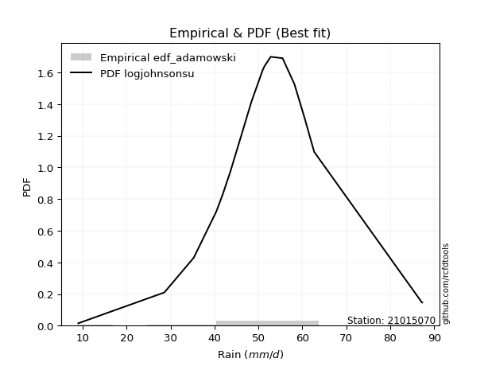</img>

</div>


## C. Best fit & Estimate extreme values for specific return periods - Tr

Best fit in probability distribution analysis means finding the theoretical distribution (like Normal, Poisson, Exponential) that most accurately mirrors your real-world data´s patterns (shape, center, spread) for better predictions, using methods like visual checks (Q-Q plots), goodness-of-fit tests (Kolmogorov-Smirnov, Chi-Squared), and information criteria (AIC) to score and select the simplest, most representative model.


### 1. Best fit (ordered by delta Δ)

<div align="center">

|   id |   station | empirical_dist   | p_dist                |     delta |   deltao | eval   |   fit |   n |   best_fit |   best_fit_sort |
|-----:|----------:|:-----------------|:----------------------|----------:|---------:|:-------|------:|----:|-----------:|----------------:|
|    0 |  21015070 | edf_blom         | loghypsecant          | 0.0608012 | 0.315645 | Δo > Δ |     1 |  19 |          1 |               1 |
|    1 |  21015070 | edf_cunnane      | loghypsecant          | 0.0616329 | 0.315645 | Δo > Δ |     1 |  19 |          1 |               2 |
|    2 |  21015070 | edf_tukey        | loghypsecant          | 0.0616969 | 0.315645 | Δo > Δ |     1 |  19 |          1 |               3 |
|    3 |  21015070 | edf_filliben     | loghypsecant          | 0.0620352 | 0.315645 | Δo > Δ |     1 |  19 |          1 |               4 |
|    4 |  21015070 | edf_jenkinson    | loghypsecant          | 0.0621951 | 0.315645 | Δo > Δ |     1 |  19 |          1 |               5 |
|    5 |  21015070 | edf_beard        | loghypsecant          | 0.0621951 | 0.315645 | Δo > Δ |     1 |  19 |          1 |               6 |
|    6 |  21015070 | edf_chegodayev   | loghypsecant          | 0.0624078 | 0.315645 | Δo > Δ |     1 |  19 |          1 |               7 |
|    7 |  21015070 | edf_gringorten   | loghypsecant          | 0.0631584 | 0.315645 | Δo > Δ |     1 |  19 |          1 |               8 |
|    8 |  21015070 | edf_adamowski    | loghypsecant          | 0.0634652 | 0.315645 | Δo > Δ |     1 |  19 |          1 |               9 |
|    9 |  21015070 | edf_hazen        | loglaplace_asymmetric | 0.0641078 | 0.315645 | Δo > Δ |     1 |  19 |          1 |              10 |
|   10 |  21015070 | edf_weibull      | fisk                  | 0.0666971 | 0.315645 | Δo > Δ |     1 |  19 |          1 |              11 |
|   11 |  21015070 | edf_california   | loglaplace_asymmetric | 0.0904236 | 0.315645 | Δo > Δ |     1 |  19 |          1 |              12 |

</div>

:file_folder:Tables: [bestfit_21015070.csv](table/bestfit_21015070.csv) | [extreme_21015070.csv](table/extreme_21015070.csv)


### 2. Extreme values

In hydrology, a return period (or recurrence interval $Tr$) is the statistical average time between extreme events like floods or droughts of a specific magnitude, indicating how rare an event is, with a 100-year flood, for example, having a 1% chance of occurring in any given year, not that it happens exactly every century. It is a key tool for infrastructure design (like bridges or dams) and risk assessment, calculated from historical data to determine the probability of future events, although it is important to remember it is statistical average, and events can cluster or be missed.

> risk_rate: assuming the return period as the project useful life.

|   id |      tr |   prob_l |     prob_g |    alpha |   betaprime |    chi2 |   crystalball |   erlang |    expon |   exponnorm |        f |   fatiguelife |     fisk |    gamma |   genexpon |   genlogistic |   gibrat |   gompertz |   gumbel_l |   gumbel_r |   halflogistic |   halfnorm |   hypsecant |   invgamma |   invgauss |   invweibull |   johnsonsu |   kstwobign |   laplace |   laplace_asymmetric |   loggamma |   logistic |   lognorm |   maxwell |   mielke |    moyal |   nakagami |      ncf |      nct |    norm |   pearson3 |   rayleigh |     rice |        t |   truncnorm |     wald |   weibull_min |   logalpha |   logbetaprime |          logchi2 |   logcrystalball |   logerlang |   logexpon |   logexponnorm |     logf |   logfatiguelife |   logfisk |   loggenexpon |   loggenlogistic |   loggibrat |   loggompertz |   loggumbel_l |   loggumbel_r |   loghalflogistic |   loghalfnorm |   loghypsecant |   loginvgamma |   loginvgauss |   loginvweibull |   logjohnsonsu |   logkstwobign |   loglaplace |   loglaplace_asymmetric |   logloggamma |   loglogistic |   loglognorm |   logmaxwell |   logmielke |   logmoyal |   lognakagami |   logncf |   lognct |   logpearson3 |   lograyleigh |   logrice |     logt |   logtruncnorm |   logwald |   logweibull_min |   station |   n |   risk_rate |
|-----:|--------:|---------:|-----------:|---------:|------------:|--------:|--------------:|---------:|---------:|------------:|---------:|--------------:|---------:|---------:|-----------:|--------------:|---------:|-----------:|-----------:|-----------:|---------------:|-----------:|------------:|-----------:|-----------:|-------------:|------------:|------------:|----------:|---------------------:|-----------:|-----------:|----------:|----------:|---------:|---------:|-----------:|---------:|---------:|--------:|-----------:|-----------:|---------:|---------:|------------:|---------:|--------------:|-----------:|---------------:|-----------------:|-----------------:|------------:|-----------:|---------------:|---------:|-----------------:|----------:|--------------:|-----------------:|------------:|--------------:|--------------:|--------------:|------------------:|--------------:|---------------:|--------------:|--------------:|----------------:|---------------:|---------------:|-------------:|------------------------:|--------------:|--------------:|-------------:|-------------:|------------:|-----------:|--------------:|---------:|---------:|--------------:|--------------:|----------:|---------:|---------------:|----------:|-----------------:|----------:|----:|------------:|
|    0 |    2    | 0.5      | 0.5        |  51.3861 |     51.3922 | 28.6572 |       53.4421 |  51.4687 |  45.8192 |     51.3352 |  51.392  |       51.4323 |  51.3157 |  51.4687 |    45.8351 |       51.3315 |  48.992  |    55.2155 |    55.8777 |    51.0065 |        49.7957 |    50.4074 |     53.4421 |    51.3906 |    51.4133 |      50.9373 |     51.4019 |     51.0943 |   53.4421 |              52.2865 |    51.3971 |    53.4421 |   51.5086 |   52.1742 |  51.3363 |  50.2203 |    49.7617 |  37.4143 |  51.3623 | 53.4421 |    51.4259 |    51.7244 |  51.7771 |  52.8119 |     53.4421 |  48.6363 |       51.5625 |    50.9369 |        50.0854 |     48.5356      |          51.5086 |     51.3971 |    43.0006 |        51.4548 |  51.3966 |          51.3908 |   51.3665 |       48.3217 |          51.337  |     47.4864 |       51.8213 |       53.8527 |       49.2664 |           48.1884 |       48.7298 |        51.5086 |       50.7913 |       50.543  |         49.5897 |        51.3933 |        48.8105 |      51.5086 |                 51.4531 |       51.5517 |       51.5086 |      51.3967 |      50.3289 |     51.391  |    48.5637 |       51.3999 |  51.3696 |  51.2013 |       51.3955 |       49.9172 |   51.243  |  51.502  |        43.4037 |   47.178  |          51.4616 |  21015070 |  19 |    0.75     |
|    1 |    2.33 | 0.570815 | 0.429185   |  53.8883 |     53.9293 | 28.7171 |       56.0877 |  54.0842 |  49.6131 |     53.6769 |  53.9287 |       54.012  |  53.606  |  54.0842 |    49.6325 |       53.7937 |  50.3322 |    58.5788 |    58.1794 |    53.458  |        52.3162 |    53.2626 |     55.5594 |    53.9222 |    53.9894 |      53.469  |     53.9466 |     53.8326 |   55.0431 |              54.1515 |    53.9462 |    55.773  |   54.0598 |   54.9227 |  53.6269 |  52.5409 |    52.3715 |  45.512  |  53.8475 | 56.0877 |    54.0481 |    54.5137 |  54.5508 |  55.3821 |     56.0877 |  50.3711 |       54.3597 |    53.4972 |        52.982  |     58.1482      |          54.0598 |     53.9462 |    47.0432 |        54.0005 |  53.9454 |          53.9394 |   53.6455 |       51.3568 |          53.6273 |     48.6635 |       54.8159 |       56.166  |       51.5235 |           50.4596 |       51.3399 |        53.5404 |       53.339  |       53.1468 |         52.472  |        53.9404 |        51.8392 |      53.0377 |                 53.136  |       54.1136 |       53.7499 |      53.9456 |      52.9212 |     53.656  |    50.6672 |       53.9501 |  53.9219 |  53.9144 |       53.9446 |       52.527  |   53.8355 |  54.0346 |        47.3583 |   48.6975 |          54.1284 |  21015070 |  19 |    0.729209 |
|    2 |    5    | 0.8      | 0.2        |  64.4439 |     64.6023 | 29.4254 |       65.9194 |  64.9498 |  68.5818 |     63.8391 |  64.6006 |       64.8021 |  63.5977 |  64.9498 |    68.6187 |       64.3088 |  58.0478 |    69.4446 |    65.6151 |    64.1081 |        63.7207 |    65.3372 |     64.0522 |    64.5793 |    64.7719 |      64.4678 |     64.6424 |     65.4643 |   63.0476 |              63.4761 |    64.6565 |    64.7731 |   64.6989 |   65.7409 |  63.5794 |  63.29   |    63.4898 |  85.9866 |  64.3755 | 65.9194 |    64.9648 |    65.6802 |  65.6555 |  65.0584 |     65.9194 |  60.0822 |       65.6323 |    64.5458 |        65.4779 |    164.818       |          64.6989 |     64.6565 |    73.7223 |        64.6561 |  64.6551 |          64.6511 |   63.5201 |       65.5599 |          63.5783 |     56.0307 |       66.3781 |       64.3402 |       62.5925 |           62.1507 |       64.015  |        62.5286 |       64.4134 |       64.7793 |         67.0691 |        64.6479 |        66.9448 |      61.3913 |                 62.4126 |       64.7577 |       63.3578 |      64.6554 |      64.4882 |     63.458  |    61.6638 |       64.6621 |  64.6655 |  65.5825 |       64.6559 |       64.4156 |   64.773  |  64.6109 |        71.6913 |   58.1534 |          65.1132 |  21015070 |  19 |    0.67232  |
|    3 |   10    | 0.9      | 0.1        |  72.7812 |     72.9379 | 30.5537 |       72.4415 |  73.1922 |  85.8011 |     72.4444 |  72.9364 |       73.0934 |  72.2828 |  73.1922 |    85.8539 |       72.7543 |  66.8426 |    75.4945 |    69.755  |    72.7824 |        73.1918 |    74.2721 |     70.8339 |    72.9172 |    73.068  |      73.4262 |     72.9685 |     74.3204 |   70.3139 |              71.9407 |    72.987  |    71.4013 |   72.8878 |   73.3542 |  72.1525 |  72.6488 |    71.7557 | 125.14   |  72.7509 | 72.4415 |    73.2652 |    73.6422 |  73.5734 |  71.7279 |     72.4415 |  70.3879 |       73.7293 |    73.4736 |        75.5408 |    475.591       |          72.8878 |     72.987  |   110.843  |        72.9107 |  72.9863 |          72.9866 |   72.0361 |       78.0482 |          72.1505 |     65.7981 |       74.1971 |       69.3962 |       73.3433 |           73.893  |       75.3689 |        70.7779 |       73.4514 |       74.6261 |         81.9111 |        72.9861 |        81.3343 |      70.1086 |                 72.2287 |       72.9073 |       71.5156 |      72.9865 |      74.1136 |     71.969  |    73.1645 |       72.9891 |  73.044  |  74.9543 |       72.9885 |       74.5025 |   73.2994 |  72.7973 |       101.743  |   70.2041 |          73.3344 |  21015070 |  19 |    0.651322 |
|    4 |   15    | 0.933333 | 0.0666667  |  77.4344 |     77.5343 | 31.3602 |       75.6961 |  77.6248 |  95.8737 |     77.4458 |  77.5335 |       77.5952 |  77.5571 |  77.6248 |    95.9358 |       77.4966 |  72.9089 |    78.2343 |    71.6299 |    77.6764 |        78.5515 |    78.9218 |     74.7042 |    77.5221 |    77.5771 |      78.4805 |     77.5432 |     79.0219 |   74.5644 |              76.8921 |    77.5618 |    75.0127 |   77.3541 |   77.2605 |  77.3168 |  78.0803 |    76.0621 | 149.779  |  77.4474 | 75.6961 |    77.7342 |    77.7446 |  77.653  |  75.1777 |     75.6961 |  77.0058 |       77.9175 |    78.5033 |        81.1876 |    909.995       |          77.3541 |     77.5618 |   140.705  |        77.4359 |  77.562  |          77.5656 |   77.1855 |       85.3918 |          77.3148 |     73.5104 |       78.0978 |       71.8149 |       80.2045 |           81.496  |       82.0527 |        75.9646 |       78.5764 |       80.3408 |         91.6909 |        77.5698 |        90.191  |      75.7709 |                 78.6718 |       77.3367 |       76.3941 |      77.562  |      79.5971 |     77.1666 |    80.7985 |       77.5597 |  77.6532 |  80.2095 |       77.5649 |       80.3015 |   77.9819 |  77.2887 |       123.648  |   79.2288 |          77.7187 |  21015070 |  19 |    0.644736 |
|    5 |   20    | 0.95     | 0.05       |  80.6859 |     80.7178 | 31.9811 |       77.8275 |  80.645  | 103.02   |     80.9929 |  80.7177 |       80.6803 |  81.4471 |  80.645  |   103.089  |       80.8112 |  77.6675 |    79.9398 |    72.7969 |    81.1031 |        82.3067 |    82.0218 |     77.4345 |    80.7147 |    80.6691 |      82.0193 |     80.7034 |     82.189  |   77.5802 |              80.4052 |    80.7212 |    77.5088 |   80.4262 |   79.8529 |  81.105  |  81.9269 |    78.9342 | 168.192  |  80.737  | 77.8275 |    80.7812 |    80.4713 |  80.3646 |  77.4919 |     77.8275 |  81.9375 |       80.7067 |    82.0299 |        85.1355 |   1455.63        |          80.4262 |     80.7212 |   166.654  |        80.5591 |  80.7224 |          80.7286 |   80.9749 |       90.654  |          81.1033 |     80.1878 |       80.6456 |       73.3627 |       85.387  |           87.2842 |       86.8352 |        79.8507 |       82.1836 |       84.4174 |         99.2255 |        80.7375 |        96.6946 |      80.0636 |                 83.5888 |       80.3772 |       79.9591 |      80.7221 |      83.4585 |     81.0211 |    86.6821 |       80.7152 |  80.8397 |  83.8832 |       80.7257 |       84.4036 |   81.2145 |  80.3911 |       141.441  |   86.7004 |          80.6927 |  21015070 |  19 |    0.641514 |
|    6 |   25    | 0.96     | 0.04       |  83.1918 |     83.154  | 32.4859 |       79.3965 |  82.9283 | 108.564  |     83.744  |  83.1547 |       83.0222 |  84.5657 |  82.9283 |   108.638  |       83.3619 |  81.6345 |    81.1534 |    73.6274 |    83.7425 |        85.1999 |    84.3283 |     79.5476 |    83.16   |    83.0173 |      84.7452 |     83.1169 |     84.5613 |   79.9194 |              83.1302 |    83.1337 |    79.4183 |   82.7654 |   81.7776 |  84.1296 |  84.9085 |    81.0714 | 183.059  |  83.276  | 79.3965 |    83.0856 |    82.4972 |  82.3793 |  79.2269 |     79.3965 |  85.8876 |       82.7817 |    84.7522 |        88.176  |   2104.87        |          82.7654 |     83.1337 |   190.034  |        82.9433 |  83.1357 |          83.1441 |   84.0085 |       94.7741 |          84.1282 |     86.2157 |       82.5164 |       74.4845 |       89.6061 |           92.0227 |       90.5734 |        82.9941 |       84.9756 |       87.6026 |        105.449  |        83.1576 |       101.871  |      83.5601 |                 87.6134 |       82.689  |       82.7983 |      83.1352 |      86.4459 |     84.1261 |    91.5357 |       83.1241 |  83.2746 |  86.7127 |       83.1393 |       87.5864 |   83.682  |  82.7611 |       156.662  |   93.1901 |          82.9346 |  21015070 |  19 |    0.639603 |
|    7 |   50    | 0.98     | 0.02       |  90.9528 |     90.5968 | 34.1575 |       83.8895 |  89.7514 | 125.783  |     92.2896 |  90.6004 |       90.0692 |  94.9193 |  89.7513 |   125.873  |       91.2108 |  95.6182 |    84.4478 |    75.8817 |    91.8733 |        94.1143 |    91.0325 |     86.0989 |    90.6408 |    90.089  |      93.1422 |     90.4606 |     91.5274 |   87.1857 |              91.5948 |    90.4731 |    85.2523 |   89.8471 |   87.3594 |  94.094  |  94.1644 |    87.2843 | 232.86   |  91.1557 | 83.8895 |    89.976  |    88.378  |  88.2275 |  84.3638 |     83.8895 |  98.7848 |       88.8175 |    93.1914 |        97.5605 |   6752.65        |          89.8471 |     90.473  |   285.72   |        90.1964 |  90.4786 |          90.4945 |   94.0573 |      107.834  |          94.0953 |    111.313  |       87.8458 |       77.6168 |      103.959  |          108.302  |      102.378  |        93.5486 |       93.6711 |       97.6842 |        127.181  |        90.527  |       118.731  |      95.4251 |                101.393  |       89.6703 |       92.1126 |      90.4772 |      95.7283 |     94.5406 |   108.404  |       90.4491 |  90.6917 |  95.4487 |       90.4825 |       97.5219 |   91.1821 |  89.9809 |       212.931  |  117.957  |          89.6037 |  21015070 |  19 |    0.63583  |
|    8 |   75    | 0.986667 | 0.0133333  |  95.5168 |     94.8964 | 35.1934 |       86.3003 |  93.5883 | 135.855  |     97.2885 |  94.9022 |       94.0638 | 101.512  |  93.5883 |   135.955  |       95.769  | 105.063  |    86.1137 |    77.0216 |    96.5992 |        99.2962 |    94.682  |     89.9274 |    94.9699 |    94.1014 |      98.0229 |     94.6811 |     95.3602 |   91.4363 |              96.5462 |    94.6904 |    88.6218 |   93.8936 |   90.3941 | 100.381  |  99.5771 |    90.6664 | 264.811  |  95.7964 | 86.3003 |    93.8533 |    91.5774 |  91.4092 |  87.2374 |     86.3003 | 106.721  |       92.1084 |    98.1486 |       103.042  |  13506.4         |          93.8936 |     94.6904 |   362.695  |        94.3663 |  94.6985 |          94.7194 |  100.442  |      115.685  |         100.385  |    132.279  |       90.6855 |       79.2505 |      113.336  |          119.058  |      109.439  |       100.327  |       98.8064 |      103.748  |        141.815  |        94.7667 |       129.169  |     103.132  |                110.438  |       93.6477 |       97.9623 |      94.6965 |     101.187  |    101.265  |   119.674  |       94.6558 |  94.9601 | 100.555  |       94.7024 |      103.393  |   95.4865 |  94.139  |       253.078  |  136.366  |          93.3366 |  21015070 |  19 |    0.634587 |
|    9 |  100    | 0.99     | 0.01       |  98.7811 |     97.9346 | 35.9491 |       87.9309 |  96.2538 | 143.002  |    100.835  |  97.9423 |       96.852  | 106.46   |  96.2538 |   143.108  |       98.9941 | 112.379  |    87.2034 |    77.7673 |    99.9441 |       102.964  |    97.1682 |     92.6431 |    98.0323 |    96.9038 |     101.477  |     97.6532 |     97.9862 |   94.452  |             100.059  |    97.6602 |    91.0008 |   96.7332 |   92.4612 | 105.072  | 103.417  |    92.9703 | 288.878  |  99.1166 | 87.9309 |    96.5479 |    93.7571 |  93.5768 |  89.2334 |     87.9308 | 112.508  |       94.3532 |   101.687  |       106.941  |  22178.8         |          96.7332 |     97.6601 |   429.584  |        97.3046 |  97.6704 |          97.695  |  105.23   |      121.362  |         105.079  |    151.198  |       92.5973 |       80.3377 |      120.479  |          127.31   |      114.525  |       105.432  |      102.484  |      108.14   |        153.18   |        97.7545 |       136.846  |     108.975  |                117.34   |       96.4341 |      102.315  |      97.6679 |     105.082  |    106.362  |   128.373  |       97.617  |  97.9685 | 104.188  |       97.6741 |      107.594  |   98.5149 |  97.0724 |       285.283  |  151.575  |          95.9235 |  21015070 |  19 |    0.633968 |
|   10 |  200    | 0.995    | 0.005      | 106.778  |    105.242  | 37.8277 |       91.6295 | 102.512  | 160.221  |    109.381  | 105.256  |      103.441  | 119.404  | 102.512  |   160.343  |      106.745  | 132.284  |    89.5719 |    79.388  |   107.985  |       111.781  |   102.854  |     99.1857 |   105.41   |   103.531  |     109.782  |    104.765  |    104.035  |  101.718  |             108.524  |   104.767  |    96.7075 |  103.497  |   97.1903 | 117.239  | 112.669  |    98.2393 | 352.112  | 107.246  | 91.6295 |   102.878  |    98.7444 |  98.5365 |  93.9363 |     91.6295 | 126.921  |       99.4974 |   110.315  |       116.394  |  74131.8         |         103.497  |    104.767  |   645.887  |       104.347  | 104.783  |         104.818  |  117.74   |      135.427  |         117.254  |    217.517  |       96.906  |       82.7525 |      139.548  |          149.566  |      127.066  |       118.821  |      111.491  |      119.06   |        184.368  |       104.912  |       156.308  |     124.449  |                135.795  |      103.055  |      113.56   |     104.779  |     114.566  |    119.906  |   152.018  |      104.7    | 105.177  | 113.008  |      104.786  |      117.859  |  105.752  | 104.113  |       377.442  |  197.248  |         101.98   |  21015070 |  19 |    0.633042 |
|   11 |  250    | 0.996    | 0.004      | 109.402  |    107.598  | 38.4473 |       92.7598 | 104.484  | 165.765  |    112.132  | 107.613  |      105.528  | 123.905  | 104.484  |   165.892  |      109.236  | 139.427  |    90.2688 |    79.8648 |   110.571  |       114.616  |   104.604  |    101.292  |   107.791  |   105.633  |     112.452  |    107.046  |    105.906  |  104.058  |             111.249  |   107.046  |    98.5396 |  105.657  |   98.6461 | 121.437  | 115.648  |    99.8601 | 374.181  | 109.911  | 92.7598 |   104.873  |   100.28   | 100.063  |  95.4265 |     92.7598 | 131.689  |      101.083  |   113.13   |       119.463  | 109656           |         105.657  |    107.046  |   736.5    |       106.609  | 107.065  |         107.102  |  122.087  |      140.079  |         121.455  |    247.836  |       98.2146 |       83.4767 |      146.299  |          157.517  |      131.193  |       123.483  |      114.442  |      122.687  |        195.687  |       107.21   |       162.874  |     129.884  |                142.333  |      105.164  |      117.426  |     107.06   |     117.655  |    124.689  |   160.521  |      106.97   | 107.491  | 115.873  |      107.067  |      121.211  |  108.07   | 106.378  |       412.035  |  215.206  |         103.884  |  21015070 |  19 |    0.632858 |
|   12 |  500    | 0.998    | 0.002      | 117.746  |    114.942  | 40.4096 |       96.1116 | 110.496  | 182.984  |    120.678  | 114.964  |      111.928  | 139.033  | 110.496  |   183.127  |      116.968  | 164.109  |    92.2665 |    81.2318 |   118.594  |       123.415  |   109.819  |    107.834  |   115.227  |   112.079  |     120.738  |    114.122  |    111.516  |  111.324  |             119.713  |   114.118  |   104.221  |  112.33   |  102.99   | 135.435  | 124.899  |   104.692  | 448.64   | 118.362  | 96.1116 |   110.958  |   104.86   | 104.618  | 100.008  |     96.1116 | 146.851  |      105.82   |   122.014  |       129.093  | 372901           |         112.33   |    114.118  |  1107.34   |       113.645  | 114.144  |         114.193  |  136.697  |      154.936  |         135.466  |    389.064  |      102.072  |       85.5881 |      169.401  |          184.99   |      144.312  |       139.163  |      123.793  |      134.334  |        235.436  |       114.348  |       184.252  |     148.326  |                164.719  |      111.668  |      130.273  |     114.138  |     127.375  |    141.053  |   190.087  |      114.01   | 114.68   | 124.878  |      114.145  |      131.793  |  115.253  | 113.432  |       537.327  |  283.909  |         109.677  |  21015070 |  19 |    0.632489 |
|   13 |  750    | 0.998667 | 0.00133333 | 122.782  |    119.268  | 41.58   |       97.9737 | 113.943  | 193.057  |    125.676  | 119.295  |      115.619  | 148.758  | 113.943  |   193.209  |      121.488  | 180.433  |    93.3342 |    81.9624 |   123.285  |       128.558  |   112.733  |    111.661  |   119.615  |   115.8    |     125.583  |    118.263  |    114.667  |  115.574  |             124.665  |   118.258  |   107.541  |  116.218  |  105.42   | 144.347  | 130.311  |   107.391  | 496.712  | 123.444  | 97.9737 |   114.448  |   107.422  | 107.166  | 102.668  |     97.9737 | 155.941  |      108.472  |   127.32   |       134.807  | 766681           |         116.218  |    118.257  |  1405.67   |       117.778  | 118.29   |         118.345  |  146.091  |      163.926  |         144.389  |    524.262  |      104.2    |       86.7384 |      184.561  |          203.22   |      152.204  |       149.242  |      129.404  |      141.432  |        262.314  |       118.532  |       197.469  |     160.306  |                179.413  |      115.447  |      138.42   |     118.282  |     133.157  |    151.806  |   209.845  |      118.129  | 118.895  | 130.228  |      118.288  |      138.108  |  119.45   | 117.579  |       624.785  |  335.214  |         112.992  |  21015070 |  19 |    0.632366 |
|   14 | 1000    | 0.999    | 0.001      | 126.434  |    122.355  | 42.4192 |       99.2556 | 116.361  | 200.203  |    129.223  | 122.385  |      118.218  | 156.082  | 116.361  |   200.362  |      124.694  | 192.924  |    94.0528 |    82.4541 |   126.612  |       132.207  |   114.745  |    114.376  |   122.75   |   118.422  |     129.019  |    121.205  |    116.85   |  118.59   |             128.178  |   121.2    |   109.895  |  118.973  |  107.099  | 151.021  | 134.151  |   109.255  | 533.027  | 127.117  | 99.2556 |   116.896  |   109.192  | 108.926  | 104.55   |     99.2556 | 162.48   |      110.307  |   131.139  |       138.901  |      1.28091e+06 |         118.973  |    121.2    |  1664.91   |       120.722  | 121.236  |         121.296  |  153.17   |      170.444  |         151.071  |    658.673  |      105.659  |       87.5212 |      196.131  |          217.229  |      157.905  |       156.833  |      133.454  |      146.604  |        283.221  |       121.508  |       207.178  |     169.388  |                190.626  |      118.121  |      144.504  |     121.227  |     137.307  |    160.029  |   225.098  |      121.056  | 121.892  | 134.065  |      121.233  |      142.647  |  122.43   | 120.536  |       694.036  |  377.761  |         115.316  |  21015070 |  19 |    0.632305 |

<div align="center">

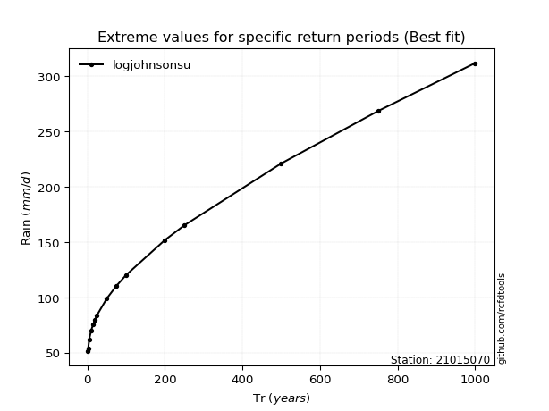</img>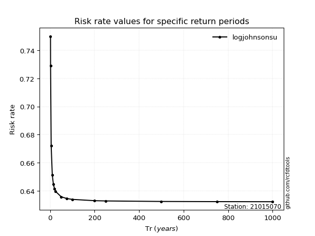</img>

</div>


<sub>**APP DISCLAIMER**: NO WARRANTY - This software is provided by [github.com/rcfdtools](https://github.com/rcfdtools) "as is", without any express or implied warranty, including warranties of merchantability, fitness for a particular purpose, or non-infringement. There is no guarantee that the software will be error-free or operate without interruption. LIMITATION OF LIABILITY - Neither the authors nor copyright holders will be liable for claims or damages arising from the software or its use. You are responsible for determining if the software is appropriate for your use and assume all associated risks, including errors, legal compliance, and data loss. NO PROFESSIONAL ADVICE - The software provides general information and does not offer professional advice. It should not replace consultation with professional advisors.</sub>