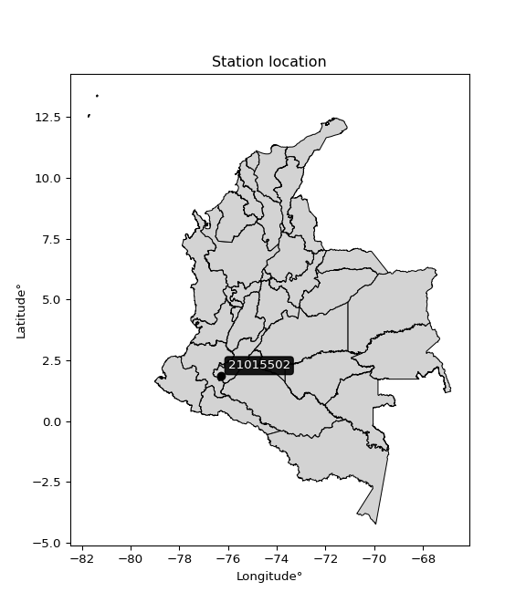

<div align="center">


</div>

# PMP Station (Rain, Pmax24h): 21015502

Probable Maximum Precipitation (PMP) is the greatest amount of rainfall for a specific duration that is meteorologically possible for a given location, acting as a "worst-case" scenario for extreme storms, crucial for designing safety-critical infrastructure like bridges, river deviations, dams, spillways, and nuclear plants to prevent catastrophic failure. PMP is calculated by hydrologists using meteorological data to determine the upper limit of extreme rainfall, often leading to the Probable Maximum Flood (PMF) for flood control design, and is increasingly being studied for climate change impacts. Probable Maximum Precipitation (PMP) is the theoretical upper limit of rainfall, a deterministic estimate for extreme events, while probability distributions (like GEV, Gumbel) describe the likelihood and frequency of various precipitation amounts, including rare ones, showing how often events occur, with PMP representing the extreme end of these distributions, used for critical infrastructure design to ensure safety against the worst conceivable weather, unlike standard statistical forecasts which cover typical probabilities.

The most common probability distributions in hydrology, used for analyzing floods, rainfall, and streamflow, include the Normal, Log-Normal, Gumbel, Gamma (including Log-Pearson Type III), and Generalized Extreme Value (GEV) distributions, often chosen based on the data´s skewness and whether modeling extremes or general conditions, with Gumbel and GEV popular for extreme events like floods, while the Normal distribution serves as a baseline, though often requiring transformations for skewed hydrological data. These distributions help in designing water infrastructure, managing water resources, and forecasting hydrologic events.

> Hydrological data often isn´t perfectly normal (it´s skewed), so different distributions are needed for different applications, such as: **Flood Frequency Analysis**: Using Gumbel, GEV, or Log-Pearson Type III for predicting extreme flood magnitudes and their return periods, **Rainfall Analysis**: Normal for annual totals, but Log-Normal, Weibull, or GEV for intensity or extreme daily rainfall, **Streamflow Modeling**: Gamma and Log-Normal for maximum flows, GEV for minimum flows, and Kappa for daily flows.

<div align="center">

</img>

</div>


## A. General information


### 1. General running parameters

• app_version: _v20260108_. • runtime: _2026-01-08 13:24:42.400241_. • Python version: _3.14.0_. • SciPy version: _1.16.3_. • Pandas version: _2.3.3_. • NumPy version: _2.3.5_. • Stations dataset (station_dataset_file): _dataset/pmax24h_in/automatic_colombia_2003_2024.csv_. • Stations catalog (station_catalog_file): _dataset/CNE.xls_. • Minimum year to eval til year_max (date_min): _1900_. • Maximum year to eval since year_min (date_max): _2024_. • Creates, save and include plots into reports (create_plot): _False_. • Plot only fit distributions with Δo > Δ (plot_only_fit): _True_. • Plot only simple graphs avoiding multiple CDFs and multiple Extreme values plots (plot_only_simple): _True_. • Eval low extreme values, if False, evaluates high extreme values (low_extreme): _False_. • Eval every SciPy distribution as logarithmic (pdist_logarithmic_on): _True_. • Standard deviation normalized (ddof): _1.0_. • Return periods to eval in years (Tr): _[2, 2.33, 5, 10, 15, 20, 25, 50, 75, 100, 200, 250, 500, 750, 1000]_. • Minimum data sample per station, 0 means any (minimum_sample): _5_. • Z-Score maximum threshold to adjust a value, 0 means disable (zscore_max): _3.5_. • Z-Score minimum threshold to adjust a value, 0 means disable (zscore_min): _-2.5_. • Avoid zeros, e.g. rain = 0 (avoid_zeros): _True_. • Avoid null values (avoid_nans): _True_. 

:file_folder:Table: [dataset.csv](../../dataset/pmax24h_in/automatic_colombia_2003_2024.csv)

> Delta Degrees of Freedom (DDOF): is a parameter used in the formulas for calculating variance and standard deviation. When ddof=0, the divisor is $N$ (the total number of observations) and this is used when your data set is the entire population. When ddof=1, the divisor is $N-1$ and this is used when your data set is a sample drawn from a larger population. Using $N-1$ provides an unbiased estimate of the population variance (known as Bessel´s correction).


### 2. Station info and location

|   id |   CODIGO | NOMBRE                         | CATEGORIA               | TECNOLOGIA                | ESTADO   | FECHA_INSTALACION   |   FECHA_SUSPENSION |   ALTITUD |   LATITUD |   LONGITUD | DEPARTAMENTO   | MUNICIPIO   | AREA_OPERATIVA                    | ENTIDAD                                    | AREA_HIDROGRAFICA   | ZONA_HIDROGRAFICA   | SUBZONA_HIDROGRAFICA   |   CORRIENTE | Catalogo   |   Version |
|-----:|---------:|:-------------------------------|:------------------------|:--------------------------|:---------|:--------------------|-------------------:|----------:|----------:|-----------:|:---------------|:------------|:----------------------------------|:-------------------------------------------|:--------------------|:--------------------|:-----------------------|------------:|:-----------|----------:|
|    0 | 21015502 | SAN AGUSTIN  - AUT  [21015502] | Climatológica Principal | Automática con Telemetría | Activa   | 17/07/2013          |                nan |      1882 |   1.85142 |   -76.3043 | Huila          | San Agustín | Area Operativa 04 - Huila-Caquetá | CENTRO NACIONAL DE INVESTIGACIONES DE CAFE | Magdalena Cauca     | Alto Magdalena      | Alto Magdalena         |         nan | CNE_OE     |  20251226 |

<div align="center">

Dynamic map: [:earth_americas:Google](http://maps.google.com/maps?q=1.851416667,-76.30433056) [:earth_americas:OSM](https://www.openstreetmap.org/#map=18/1.851416667/-76.30433056&layers=P) [:earth_americas:Bing](https://www.bing.com/maps?cp=1.851416667~-76.30433056&lvl=18) [:earth_americas:Apple](https://maps.apple.com/frame?center=1.851416667%2C-76.30433056&span=0.003%2C0.006)

</div>


<div align="center">

```geojson
{
  "type": "Feature",
  "geometry": {
    "type": "Point", 
    "coordinates": [-76.30433056, 1.851416667]
  }, 
  "properties": {
    "Name": "21015502"
  }
}
```

</div>


### 3. Discrete values table and plot

<div align="center">

|               |            0 |          1 |           2 |          3 |           4 |          5 |           6 |            7 |
|:--------------|-------------:|-----------:|------------:|-----------:|------------:|-----------:|------------:|-------------:|
| Date          | 2016         | 2017       | 2018        | 2019       | 2020        | 2021       | 2022        | 2023         |
| Value         |   38.8       |   57.1     |   31.9      |   46.8     |   37.2      |   26.2     |   33.7      |   39.8       |
| Value_initial |   38.8       |   57.1     |   31.9      |   46.8     |   37.2      |   26.2     |   33.7      |   39.8       |
| count         |    8         |    8       |    8        |    8       |    8        |    8       |    8        |    8         |
| mean          |   38.9375    |   38.9375  |   38.9375   |   38.9375  |   38.9375   |   38.9375  |   38.9375   |   38.9375    |
| std           |    9.522     |    9.522   |    9.522    |    9.522   |    9.522    |    9.522   |    9.522    |    9.522     |
| zscore        |   -0.0144403 |    1.90743 |   -0.739078 |    0.82572 |   -0.182472 |   -1.33769 |   -0.550042 |    0.0905798 |


</div>


> The initial value (value_initial) correspond to the initial obtained or null completed value, and value (value) is adjusted only when the initial value is outside the valid range (outlier) definite through the Z-Score value. If Z-Score is active, values out of range or outliers are replaced with the station mean value. A Z-Score (or standard score) measures how many standard deviations a data point is from the mean of a dataset, indicating its relative position; positive scores mean above the mean, negative mean below, and a score of zero is exactly at the mean, allowing for comparison of values from different distributions. It´s calculated using the formula $z=(x–μ)/σ$, where $x$ is the data point, $μ$ is the mean, and $σ$ is the standard deviation, helping identify outliers and understand probability.
>
> <sub>**Note**: In this study, "completing" (filling gaps in) and "extending" (forecasting or lengthening the historical record) rainfall data series are avoided for certain critical analyses because they introduce artificial bias and uncertainty, which can distort the statistics of rare events (extremes), alter day-to-day variability, and compromise the integrity and homogeneity of the original data. Some reasons against Completing/Extending rainfall data are: **Distortion of Extremes and Variability**: The primary issue is that most gap-filling or extension methods rely on averaging or regression with nearby stations, which inherently smooths the data. Rainfall is highly variable in space and time, with a large percentage of zero values and occasional large storms. Infilling methods often underestimate the highest values and overestimate the lowest (zero) values, which severely distorts analyses focused on flood frequency, drought severity, and intensity-duration-frequency (IDF) curves, **Loss of Data Homogeneity**: Infilled or extended data are synthetic estimates, not actual measurements. Combining these estimates with observed data can violate the assumption of data homogeneity, which requires that the data properties do not change over time. Inhomogeneity can lead to incorrect conclusions about long-term trends or changes in climate patterns, **Propagation of Errors**: Errors and biases from the original data (e.g., wind-induced undercatch, instrument errors, site changes) or the data used for imputation can propagate through the analysis, leading to unreliable hydrological models and inaccurate predictions, **Compromised Statistical Integrity**: For statistical analyses, especially those involving the frequency of events, using artificial data can introduce time bias or autocorrelation that doesn´t exist in reality, making it difficult to assess the true probability of events, **Difficulty in Validation**: It is difficult to accurately validate the quality of filled or extended data, especially for past periods where ground-truth measurements are unavailable. The reliability of imputation techniques heavily depends on the density of the surrounding station network and the complexity of the local topography.</sub>


### 4. Active continuous probability distributions from SciPy (43 of 104 available)

A Probability Density Function (PDF) describes the relative likelihood of a continuous random variable falling within a specific range, where the total area under its curve equals 1, and the area over any interval gives the actual probability for that range. Unlike discrete probabilities (like rolling a die), a PDF shows density, not direct probability for a single point (which is zero), with higher points indicating higher likelihood, often visualized as a bell curve for normal distributions.

A log of a probability density function (log-PDF) is simply the logarithm of the PDF´s value, denoted as $log(f(x))$, useful for converting multiplication of probabilities into addition, improving numerical stability with tiny numbers, and connecting to information theory concepts like entropy. Instead of dealing with very small probabilities (e.g., 0.000001), log-PDFs use negative numbers (e.g., $log(0.00001) ≈ -11.51$ that are easier for computers to handle, preventing underflow errors and simplifying complex calculations. In this study, each active probability distribution from SciPy is also evaluated in the $log$ form.

[scipy.stats](https://docs.scipy.org/doc/scipy/reference/stats.html) is a Python´s powerful submodule within the SciPy library for comprehensive statistical analysis, offering over 130 probability distributions (like Normal, Poisson), functions for descriptive stats (mean, variance), hypothesis testing (t-tests, chi-square), random variable generation, and statistical tests, making it essential for data science, modeling, and research. It provides tools to explore, model, and draw conclusions from data efficiently, working seamlessly with NumPy.

<div align="center">

|   id | p_dist             |   n_parameter | fit_method   | label                                                                       | active   | ref                                                                                                        |
|-----:|:-------------------|--------------:|:-------------|:----------------------------------------------------------------------------|:---------|:-----------------------------------------------------------------------------------------------------------|
|    0 | alpha              |             3 | MLE          | Alpha                                                                       | True     | [:mortar_board:](https://docs.scipy.org/doc/scipy/reference/generated/scipy.stats.alpha.html)              |
|    1 | betaprime          |             4 | MLE          | Beta prime                                                                  | True     | [:mortar_board:](https://docs.scipy.org/doc/scipy/reference/generated/scipy.stats.betaprime.html)          |
|    2 | chi2               |             3 | MLE          | Chi²                                                                        | True     | [:mortar_board:](https://docs.scipy.org/doc/scipy/reference/generated/scipy.stats.chi2.html)               |
|    3 | crystalball        |             4 | MLE          | Crystalball                                                                 | True     | [:mortar_board:](https://docs.scipy.org/doc/scipy/reference/generated/scipy.stats.crystalball.html)        |
|    4 | erlang             |             3 | MLE          | Erlang                                                                      | True     | [:mortar_board:](https://docs.scipy.org/doc/scipy/reference/generated/scipy.stats.erlang.html)             |
|    5 | expon              |             2 | MLE          | Exponential                                                                 | True     | [:mortar_board:](https://docs.scipy.org/doc/scipy/reference/generated/scipy.stats.expon.html)              |
|    6 | exponnorm          |             3 | MLE          | Exponentially modified Normal                                               | True     | [:mortar_board:](https://docs.scipy.org/doc/scipy/reference/generated/scipy.stats.exponnorm.html)          |
|    7 | f                  |             4 | MLE          | F                                                                           | True     | [:mortar_board:](https://docs.scipy.org/doc/scipy/reference/generated/scipy.stats.f.html)                  |
|    8 | fatiguelife        |             3 | MLE          | Fatigue-life (Birnbaum-Saunders)                                            | True     | [:mortar_board:](https://docs.scipy.org/doc/scipy/reference/generated/scipy.stats.fatiguelife.html)        |
|    9 | fisk               |             3 | MLE          | Fisk                                                                        | True     | [:mortar_board:](https://docs.scipy.org/doc/scipy/reference/generated/scipy.stats.fisk.html)               |
|   10 | gamma              |             3 | MLE          | Gamma                                                                       | True     | [:mortar_board:](https://docs.scipy.org/doc/scipy/reference/generated/scipy.stats.gamma.html)              |
|   11 | genexpon           |             5 | MLE          | Generalized exponential                                                     | True     | [:mortar_board:](https://docs.scipy.org/doc/scipy/reference/generated/scipy.stats.genexpon.html)           |
|   12 | genlogistic        |             3 | MLE          | Generalized logistic                                                        | True     | [:mortar_board:](https://docs.scipy.org/doc/scipy/reference/generated/scipy.stats.genlogistic.html)        |
|   13 | gibrat             |             2 | MM           | Gibrat                                                                      | True     | [:mortar_board:](https://docs.scipy.org/doc/scipy/reference/generated/scipy.stats.gibrat.html)             |
|   14 | gompertz           |             3 | MLE          | Gompertz (or truncated Gumbel)                                              | True     | [:mortar_board:](https://docs.scipy.org/doc/scipy/reference/generated/scipy.stats.gompertz.html)           |
|   15 | gumbel_l           |             2 | MM           | Gumbel Left Skew                                                            | True     | [:mortar_board:](https://docs.scipy.org/doc/scipy/reference/generated/scipy.stats.gumbel_l.html)           |
|   16 | gumbel_r           |             2 | MM           | Gumbel Right Skew                                                           | True     | [:mortar_board:](https://docs.scipy.org/doc/scipy/reference/generated/scipy.stats.gumbel_r.html)           |
|   17 | halflogistic       |             2 | MM           | Half-logistic                                                               | True     | [:mortar_board:](https://docs.scipy.org/doc/scipy/reference/generated/scipy.stats.halflogistic.html)       |
|   18 | halfnorm           |             2 | MM           | Half Normal                                                                 | True     | [:mortar_board:](https://docs.scipy.org/doc/scipy/reference/generated/scipy.stats.halfnorm.html)           |
|   19 | hypsecant          |             2 | MM           | hyperbolic secant                                                           | True     | [:mortar_board:](https://docs.scipy.org/doc/scipy/reference/generated/scipy.stats.hypsecant.html)          |
|   20 | invgamma           |             3 | MLE          | Inverted gamma                                                              | True     | [:mortar_board:](https://docs.scipy.org/doc/scipy/reference/generated/scipy.stats.invgamma.html)           |
|   21 | invgauss           |             3 | MLE          | Inverse Gaussian                                                            | True     | [:mortar_board:](https://docs.scipy.org/doc/scipy/reference/generated/scipy.stats.invgauss.html)           |
|   22 | invweibull         |             3 | MLE          | Inverted Weibull                                                            | True     | [:mortar_board:](https://docs.scipy.org/doc/scipy/reference/generated/scipy.stats.invweibull.html)         |
|   23 | kstwobign          |             2 | MLE          | Limiting distribution of scaled Kolmogorov-Smirnov two-sided test statistic | True     | [:mortar_board:](https://docs.scipy.org/doc/scipy/reference/generated/scipy.stats.kstwobign.html)          |
|   24 | laplace            |             2 | MM           | Laplace                                                                     | True     | [:mortar_board:](https://docs.scipy.org/doc/scipy/reference/generated/scipy.stats.laplace.html)            |
|   25 | laplace_asymmetric |             3 | MLE          | Asymmetric Laplace                                                          | True     | [:mortar_board:](https://docs.scipy.org/doc/scipy/reference/generated/scipy.stats.laplace_asymmetric.html) |
|   26 | loggamma           |             3 | MLE          | Log gamma                                                                   | True     | [:mortar_board:](https://docs.scipy.org/doc/scipy/reference/generated/scipy.stats.loggamma.html)           |
|   27 | logistic           |             2 | MM           | Logistic (or Sech-squared)                                                  | True     | [:mortar_board:](https://docs.scipy.org/doc/scipy/reference/generated/scipy.stats.logistic.html)           |
|   28 | lognorm            |             3 | MLE          | Log Normal                                                                  | True     | [:mortar_board:](https://docs.scipy.org/doc/scipy/reference/generated/scipy.stats.lognorm.html)            |
|   29 | maxwell            |             2 | MM           | Maxwell                                                                     | True     | [:mortar_board:](https://docs.scipy.org/doc/scipy/reference/generated/scipy.stats.maxwell.html)            |
|   30 | mielke             |             4 | MLE          | Mielke Beta-Kappa / Dagum                                                   | True     | [:mortar_board:](https://docs.scipy.org/doc/scipy/reference/generated/scipy.stats.mielke.html)             |
|   31 | moyal              |             2 | MM           | Moyal                                                                       | True     | [:mortar_board:](https://docs.scipy.org/doc/scipy/reference/generated/scipy.stats.moyal.html)              |
|   32 | nakagami           |             3 | MLE          | Nakagami                                                                    | True     | [:mortar_board:](https://docs.scipy.org/doc/scipy/reference/generated/scipy.stats.nakagami.html)           |
|   33 | ncf                |             5 | MLE          | Non-central F distribution                                                  | True     | [:mortar_board:](https://docs.scipy.org/doc/scipy/reference/generated/scipy.stats.ncf.html)                |
|   34 | nct                |             4 | MLE          | Non-central Student’s t                                                     | True     | [:mortar_board:](https://docs.scipy.org/doc/scipy/reference/generated/scipy.stats.nct.html)                |
|   35 | norm               |             2 | MM           | Normal                                                                      | True     | [:mortar_board:](https://docs.scipy.org/doc/scipy/reference/generated/scipy.stats.norm.html)               |
|   36 | pearson3           |             3 | MM           | Pearson type III                                                            | True     | [:mortar_board:](https://docs.scipy.org/doc/scipy/reference/generated/scipy.stats.pearson3.html)           |
|   37 | rayleigh           |             2 | MM           | Rayleigh                                                                    | True     | [:mortar_board:](https://docs.scipy.org/doc/scipy/reference/generated/scipy.stats.rayleigh.html)           |
|   38 | rice               |             3 | MLE          | Rice                                                                        | True     | [:mortar_board:](https://docs.scipy.org/doc/scipy/reference/generated/scipy.stats.rice.html)               |
|   39 | t                  |             3 | MLE          | Student’s t                                                                 | True     | [:mortar_board:](https://docs.scipy.org/doc/scipy/reference/generated/scipy.stats.t.html)                  |
|   40 | truncnorm          |             4 | MLE          | Truncated normal                                                            | True     | [:mortar_board:](https://docs.scipy.org/doc/scipy/reference/generated/scipy.stats.truncnorm.html)          |
|   41 | wald               |             2 | MM           | Wald                                                                        | True     | [:mortar_board:](https://docs.scipy.org/doc/scipy/reference/generated/scipy.stats.wald.html)               |
|   42 | weibull_min        |             3 | MLE          | Weibull minimum                                                             | True     | [:mortar_board:](https://docs.scipy.org/doc/scipy/reference/generated/scipy.stats.weibull_min.html)        |

</div>

> **n_parameter:** # arguments & localization & scale.
>
> **Fit methods:** (MLE) maximum likelihood, (MM) L-moments.
>
>**Inactive** (With the only purpose of prevent loops, zero divisions, infinite values, over high estimated values or horizontal trending for recurrence intervals estimations, the follow distributions were disabled.)**:** foldnorm, gennorm, norminvgauss, powernorm, powerlognorm, skewnorm, genextreme, anglit, arcsine, argus, beta, bradford, burr, burr12, cauchy, cosine, halfcauchy, foldcauchy, skewcauchy, wrapcauchy, dgamma, gengamma, exponweib, exponpow, truncexpon, gausshyper, genhalflogistic, genhyperbolic, geninvgauss, halfgennorm, johnsonsb, johnsonsu, kappa4, kappa3, ksone, kstwo, loglaplace, levy, levy_l, levy_stable, ncx2, pareto, genpareto, truncpareto, lomax, powerlaw, rdist, rel_breitwigner, recipinvgauss, semicircular, studentized_range, trapezoid, triang, truncweibull_min, tukeylambda, uniform, loguniform, vonmises, vonmises_line, weibull_max, dweibull, 


## B. Probability (PDF) vs. Empirical (EDF) distributions functions

A continuous probability distribution (CPD) describes probabilities for variables that can take any value within a range (like rain any time), unlike discrete variables with specific outcomes (like temperature). It uses a Probability Density Function (PDF), a curve where the total area under it equals 1, and the probability of the variable falling within an interval (a to b) is found by calculating the area under the curve between those points. A key feature is that the probability of hitting any single exact value is zero, so probabilities are always expressed for ranges, e.g., $P(a ≤ X ≤ b)$.

<div align="center">

Distributions parameters from station values
|    |   station | p_dist                |   n |             loc |          scale | shape                  | shape1                 | shape2                | shape3   |
|---:|----------:|:----------------------|----:|----------------:|---------------:|:-----------------------|:-----------------------|:----------------------|:---------|
|  0 |  21015502 | alpha                 |   8 |   -15.0683      |  337.595       | 6.412986214140209      |                        |                       |          |
|  1 |  21015502 | betaprime             |   8 |    -1.23161     |    3.37182     | 273.7403377956482      | 23.98416314424832      |                       |          |
|  2 |  21015502 | chi2                  |   8 |    26.2         |    1.92597     | 0.3951156305679659     |                        |                       |          |
|  3 |  21015502 | crystalball           |   8 |    38.9375      |    8.90701     | 3544.3203258948474     | 2289.125246059969      |                       |          |
|  4 |  21015502 | erlang                |   8 |    21.8657      |    5.01244     | 3.405890454769664      |                        |                       |          |
|  5 |  21015502 | expon                 |   8 |    26.2         |   12.7375      |                        |                        |                       |          |
|  6 |  21015502 | exponnorm             |   8 |    30.8479      |    4.6626      | 1.734993359450832      |                        |                       |          |
|  7 |  21015502 | f                     |   8 |     8.50491     |   28.6087      | 89.58347102323495      | 33.823280689560605     |                       |          |
|  8 |  21015502 | fatiguelife           |   8 |    26.2         |    3.01575e-05 | 703.4683558658471      |                        |                       |          |
|  9 |  21015502 | fisk                  |   8 |    14.9765      |   22.4742      | 4.677670604967886      |                        |                       |          |
| 10 |  21015502 | gamma                 |   8 |    21.8657      |    5.01246     | 3.4058742344044894     |                        |                       |          |
| 11 |  21015502 | genexpon              |   8 |    26.2         |    2.6324      | 0.2066247812811962     | 0.00015345852438887833 | 1.3979283699037888    |          |
| 12 |  21015502 | genlogistic           |   8 |    -4.01494     |    7.17474     | 224.36258337796866     |                        |                       |          |
| 13 |  21015502 | gibrat                |   8 |    32.1426      |    4.12132     |                        |                        |                       |          |
| 14 |  21015502 | gompertz              |   8 |    37.1993      |    7.84383     | 0.3228948610930241     |                        |                       |          |
| 15 |  21015502 | gumbel_l              |   8 |    42.9461      |    6.94477     |                        |                        |                       |          |
| 16 |  21015502 | gumbel_r              |   8 |    34.9289      |    6.94477     |                        |                        |                       |          |
| 17 |  21015502 | halflogistic          |   8 |    28.3806      |    7.61516     |                        |                        |                       |          |
| 18 |  21015502 | halfnorm              |   8 |    27.1481      |   14.7758      |                        |                        |                       |          |
| 19 |  21015502 | hypsecant             |   8 |    38.9375      |    5.67038     |                        |                        |                       |          |
| 20 |  21015502 | invgamma              |   8 |     3.87371     |  551.42        | 16.718705935007396     |                        |                       |          |
| 21 |  21015502 | invgauss              |   8 |    12.6588      |  218.848       | 0.1200772029103471     |                        |                       |          |
| 22 |  21015502 | invweibull            |   8 |    -3.10716e+08 |    3.10716e+08 | 43312088.811960146     |                        |                       |          |
| 23 |  21015502 | kstwobign             |   8 |     9.07462     |   34.3455      |                        |                        |                       |          |
| 24 |  21015502 | laplace               |   8 |    38.9375      |    6.29821     |                        |                        |                       |          |
| 25 |  21015502 | laplace_asymmetric    |   8 |    37.2         |    6.51734     | 0.8753871139572854     |                        |                       |          |
| 26 |  21015502 | loggamma              |   8 | -2669.37        |  365.546       | 1651.474709422359      |                        |                       |          |
| 27 |  21015502 | logistic              |   8 |    38.9375      |    4.91069     |                        |                        |                       |          |
| 28 |  21015502 | lognorm               |   8 |    26.2         |    0.14374     | 11.852511722064184     |                        |                       |          |
| 29 |  21015502 | maxwell               |   8 |    17.8316      |   13.2261      |                        |                        |                       |          |
| 30 |  21015502 | mielke                |   8 |    -0.0306933   |   33.4332      | 12.062404872675446     | 6.682810887308413      |                       |          |
| 31 |  21015502 | moyal                 |   8 |    33.8439      |    4.00956     |                        |                        |                       |          |
| 32 |  21015502 | nakagami              |   8 |    31.9         |   11.8384      | 0.2986805844002445     |                        |                       |          |
| 33 |  21015502 | ncf                   |   8 |     0.00487842  |    3.65805e-05 | 3.5548376559894736e-06 | 2.743754452902845      | 2.609392728573204     |          |
| 34 |  21015502 | nct                   |   8 |    -0.0423514   |    2.44659     | 11.982862115305132     | 14.920194489617877     |                       |          |
| 35 |  21015502 | norm                  |   8 |    38.9375      |    8.90701     |                        |                        |                       |          |
| 36 |  21015502 | pearson3              |   8 |    38.9375      |    8.90702     | 0.692364066741834      |                        |                       |          |
| 37 |  21015502 | rayleigh              |   8 |    21.8979      |   13.5957      |                        |                        |                       |          |
| 38 |  21015502 | rice                  |   8 |    22.8269      |   13.017       | 0.0013454678502264118  |                        |                       |          |
| 39 |  21015502 | t                     |   8 |    38.9375      |    8.90699     | 482604.6319893043      |                        |                       |          |
| 40 |  21015502 | truncnorm             |   8 |    30.8229      |   13.5273      | -0.3417475423765277    | 2.72955902225237       |                       |          |
| 41 |  21015502 | wald                  |   8 |    30.0305      |    8.90699     |                        |                        |                       |          |
| 42 |  21015502 | weibull_min           |   8 |    24.778       |   15.6942      | 1.5702988268540548     |                        |                       |          |
| 43 |  21015502 | logalpha              |   8 |    -1.02482     |   98.0165      | 21.0734624705605       |                        |                       |          |
| 44 |  21015502 | logbetaprime          |   8 |     1.58151     |   74.0104      | 88.4876982211874       | 3188.5819357856435     |                       |          |
| 45 |  21015502 | logchi2               |   8 |     3.26576     |    0.921758    | 1.1338889701657329     |                        |                       |          |
| 46 |  21015502 | logcrystalball        |   8 |     3.63689     |    0.222355    | 8.429282416829546      | 1.0341758695609482     |                       |          |
| 47 |  21015502 | logerlang             |   8 |     2.29721     |    0.0371442   | 36.06709077230817      |                        |                       |          |
| 48 |  21015502 | logexpon              |   8 |     3.26576     |    0.371134    |                        |                        |                       |          |
| 49 |  21015502 | logexponnorm          |   8 |     3.55232     |    0.205971    | 0.410615386232783      |                        |                       |          |
| 50 |  21015502 | logf                  |   8 |     1.06865     |    2.55451     | 950.8378313492899      | 373.6225502380539      |                       |          |
| 51 |  21015502 | logfatiguelife        |   8 |     1.52664     |    2.09858     | 0.10549432057067284    |                        |                       |          |
| 52 |  21015502 | logfisk               |   8 |     1.77904     |    1.84531     | 14.57986161107764      |                        |                       |          |
| 53 |  21015502 | loggamma              |   8 |     2.29721     |    0.0371441   | 36.0671650552825       |                        |                       |          |
| 54 |  21015502 | loggenexpon           |   8 |     3.2635      |    0.00787586  | 0.007930207419182465   | 4.2852396819795295     | 9.565663389899748e-05 |          |
| 55 |  21015502 | loggenlogistic        |   8 |     3.50889     |    0.149722    | 1.8028252505318667     |                        |                       |          |
| 56 |  21015502 | loggibrat             |   8 |     3.46726     |    0.102888    |                        |                        |                       |          |
| 57 |  21015502 | loggompertz           |   8 |     3.26576     |    0.342682    | 0.37510783748486       |                        |                       |          |
| 58 |  21015502 | loggumbel_l           |   8 |     3.73696     |    0.173369    |                        |                        |                       |          |
| 59 |  21015502 | loggumbel_r           |   8 |     3.53682     |    0.173369    |                        |                        |                       |          |
| 60 |  21015502 | loghalflogistic       |   8 |     3.37336     |    0.190099    |                        |                        |                       |          |
| 61 |  21015502 | loghalfnorm           |   8 |     3.34255     |    0.368907    |                        |                        |                       |          |
| 62 |  21015502 | loghypsecant          |   8 |     3.63689     |    0.141555    |                        |                        |                       |          |
| 63 |  21015502 | loginvgamma           |   8 |     0.65619     |  536.465       | 180.97878989124368     |                        |                       |          |
| 64 |  21015502 | loginvgauss           |   8 |     2.18911     |   59.0472      | 0.02448892056384412    |                        |                       |          |
| 65 |  21015502 | loginvweibull         |   8 |    -1.30033e+07 |    1.30033e+07 | 64174463.53035803      |                        |                       |          |
| 66 |  21015502 | logkstwobign          |   8 |     2.8033      |    0.95605     |                        |                        |                       |          |
| 67 |  21015502 | loglaplace            |   8 |     3.63689     |    0.157229    |                        |                        |                       |          |
| 68 |  21015502 | loglaplace_asymmetric |   8 |     3.65842     |    0.170321    | 1.0653310855122489     |                        |                       |          |
| 69 |  21015502 | logloggamma           |   8 |   -49.2606      |    7.53197     | 1122.6740278873972     |                        |                       |          |
| 70 |  21015502 | loglogistic           |   8 |     3.63689     |    0.122591    |                        |                        |                       |          |
| 71 |  21015502 | loglognorm            |   8 |     3.26576     |    0.00524458  | 11.383911520263615     |                        |                       |          |
| 72 |  21015502 | logmaxwell            |   8 |     3.11001     |    0.330178    |                        |                        |                       |          |
| 73 |  21015502 | logmielke             |   8 | -7060.05        | 7063.6         | 75567.79062017592      | 50245.475176107924     |                       |          |
| 74 |  21015502 | logmoyal              |   8 |     3.50974     |    0.100095    |                        |                        |                       |          |
| 75 |  21015502 | lognakagami           |   8 |     3.1568      |    0.529083    | 1.1762571143520892     |                        |                       |          |
| 76 |  21015502 | logncf                |   8 |    -3.3671      |    6.94271     | 628.7316121788558      | 1213.7320748551372     | 5.581196415802073     |          |
| 77 |  21015502 | lognct                |   8 |    -0.612237    |    0.04926     | 194.3036848010109      | 85.92470471880631      |                       |          |
| 78 |  21015502 | lognorm               |   8 |     3.63689     |    0.222355    |                        |                        |                       |          |
| 79 |  21015502 | logpearson3           |   8 |     3.63689     |    0.222355    | 0.2158687695806454     |                        |                       |          |
| 80 |  21015502 | lograyleigh           |   8 |     3.21152     |    0.339402    |                        |                        |                       |          |
| 81 |  21015502 | logrice               |   8 |     3.16293     |    0.258268    | 1.4522316449733623     |                        |                       |          |
| 82 |  21015502 | logt                  |   8 |     3.63689     |    0.222354    | 2092221253.7466974     |                        |                       |          |
| 83 |  21015502 | logtruncnorm          |   8 |    -0.0319546   |    0.917347    | 3.809407430291219      | 4.842224077205367      |                       |          |
| 84 |  21015502 | logwald               |   8 |     3.41456     |    0.222333    |                        |                        |                       |          |
| 85 |  21015502 | logweibull_min        |   8 |     3.13021     |    0.571189    | 2.440317034067041      |                        |                       |          |

</div>

> **loc** (Location parameter): This shifts the distribution along the x-axis. For many common distributions, like the normal (Gaussian) distribution, loc represents the mean $μ$. For others, like the uniform distribution, it might represent the minimum value, or for the beta distribution, the left end of the support interval.
>
> **scale** (Scale parameter): This determines the width or spread of the distribution. For the normal distribution, scale represents the standard deviation $σ$. For a uniform distribution, it defines the length of the interval (from $loc$ to $loc + scale$).
>
> **shape** (Shape parameters): Refers to parameters that define the specific form of a probability distribution, distinct from its location (loc) and scale (scale). These parameters are required arguments for most distribution functions. For example, a normal (Gaussian) distribution is fully defined by its location (mean) and scale (standard deviation), so it has no specific shape parameters beyond loc and scale. However, other distributions have intrinsic properties that need specification, as Gamma distribution that takes a shape parameter, often named $a$ or $alpha$.


### 0. Cumulative distribution values - CDF (86 evaluated)

Cumulative Distribution Function (CDF), denoted as $F$<sub>$X$</sub>$(x)$, is a function that gives the probability that a random variable $X$ will take a value less than or equal to a specific value, $x$ (i.e., $(P(X≥x)$. It essentially "accumulates" probabilities from a given point up to the far right (positive infinity), providing a complete picture of the distribution´s probabilities for both discrete (like rain) and continuous (like temperature) variables, helping to find probabilities over ranges or above certain values. Each station is evaluated separately ordering the $x$ values ascending, calculating the CDF and PDF values for the activated distributions and their logarithmic forms.

<div align="center">

CDF ordered by x ascending and calculating $log(f(x))$ separately
|   id |   Station |   date |    x |   count |    mean |   std |     zscore |   Value_initial |   station |   m |     alpha |   alpha_pdf |   betaprime |   betaprime_pdf |       chi2 |    chi2_pdf |   crystalball |   crystalball_pdf |    erlang |   erlang_pdf |    expon |   expon_pdf |   exponnorm |   exponnorm_pdf |         f |      f_pdf |   fatiguelife |   fatiguelife_pdf |      fisk |   fisk_pdf |     gamma |   gamma_pdf |    genexpon |   genexpon_pdf |   genlogistic |   genlogistic_pdf |   gibrat |   gibrat_pdf |    gompertz |   gompertz_pdf |   gumbel_l |   gumbel_l_pdf |   gumbel_r |   gumbel_r_pdf |   halflogistic |   halflogistic_pdf |   halfnorm |   halfnorm_pdf |   hypsecant |   hypsecant_pdf |   invgamma |   invgamma_pdf |   invgauss |   invgauss_pdf |   invweibull |   invweibull_pdf |   kstwobign |   kstwobign_pdf |   laplace |   laplace_pdf |   laplace_asymmetric |   laplace_asymmetric_pdf |   loggamma |   loggamma_pdf |   logistic |   logistic_pdf |   lognorm |   lognorm_pdf |   maxwell |   maxwell_pdf |    mielke |   mielke_pdf |      moyal |   moyal_pdf |    nakagami |   nakagami_pdf |      ncf |    ncf_pdf |       nct |    nct_pdf |      norm |   norm_pdf |   pearson3 |   pearson3_pdf |   rayleigh |   rayleigh_pdf |      rice |   rice_pdf |        t |      t_pdf |   truncnorm |   truncnorm_pdf |      wald |   wald_pdf |   weibull_min |   weibull_min_pdf |   logalpha |   logalpha_pdf |   logbetaprime |   logbetaprime_pdf |     logchi2 |   logchi2_pdf |   logcrystalball |   logcrystalball_pdf |   logerlang |   logerlang_pdf |   logexpon |   logexpon_pdf |   logexponnorm |   logexponnorm_pdf |      logf |   logf_pdf |   logfatiguelife |   logfatiguelife_pdf |   logfisk |   logfisk_pdf |   loggenexpon |   loggenexpon_pdf |   loggenlogistic |   loggenlogistic_pdf |   loggibrat |   loggibrat_pdf |   loggompertz |   loggompertz_pdf |   loggumbel_l |   loggumbel_l_pdf |   loggumbel_r |   loggumbel_r_pdf |   loghalflogistic |   loghalflogistic_pdf |   loghalfnorm |   loghalfnorm_pdf |   loghypsecant |   loghypsecant_pdf |   loginvgamma |   loginvgamma_pdf |   loginvgauss |   loginvgauss_pdf |   loginvweibull |   loginvweibull_pdf |   logkstwobign |   logkstwobign_pdf |   loglaplace |   loglaplace_pdf |   loglaplace_asymmetric |   loglaplace_asymmetric_pdf |   logloggamma |   logloggamma_pdf |   loglogistic |   loglogistic_pdf |   loglognorm |   loglognorm_pdf |   logmaxwell |   logmaxwell_pdf |   logmielke |   logmielke_pdf |    logmoyal |   logmoyal_pdf |   lognakagami |   lognakagami_pdf |   logncf |   logncf_pdf |    lognct |   lognct_pdf |   logpearson3 |   logpearson3_pdf |   lograyleigh |   lograyleigh_pdf |   logrice |   logrice_pdf |      logt |   logt_pdf |   logtruncnorm |   logtruncnorm_pdf |   logwald |   logwald_pdf |   logweibull_min |   logweibull_min_pdf |
|-----:|----------:|-------:|-----:|--------:|--------:|------:|-----------:|----------------:|----------:|----:|----------:|------------:|------------:|----------------:|-----------:|------------:|--------------:|------------------:|----------:|-------------:|---------:|------------:|------------:|----------------:|----------:|-----------:|--------------:|------------------:|----------:|-----------:|----------:|------------:|------------:|---------------:|--------------:|------------------:|---------:|-------------:|------------:|---------------:|-----------:|---------------:|-----------:|---------------:|---------------:|-------------------:|-----------:|---------------:|------------:|----------------:|-----------:|---------------:|-----------:|---------------:|-------------:|-----------------:|------------:|----------------:|----------:|--------------:|---------------------:|-------------------------:|-----------:|---------------:|-----------:|---------------:|----------:|--------------:|----------:|--------------:|----------:|-------------:|-----------:|------------:|------------:|---------------:|---------:|-----------:|----------:|-----------:|----------:|-----------:|-----------:|---------------:|-----------:|---------------:|----------:|-----------:|---------:|-----------:|------------:|----------------:|----------:|-----------:|--------------:|------------------:|-----------:|---------------:|---------------:|-------------------:|------------:|--------------:|-----------------:|---------------------:|------------:|----------------:|-----------:|---------------:|---------------:|-------------------:|----------:|-----------:|-----------------:|---------------------:|----------:|--------------:|--------------:|------------------:|-----------------:|---------------------:|------------:|----------------:|--------------:|------------------:|--------------:|------------------:|--------------:|------------------:|------------------:|----------------------:|--------------:|------------------:|---------------:|-------------------:|--------------:|------------------:|--------------:|------------------:|----------------:|--------------------:|---------------:|-------------------:|-------------:|-----------------:|------------------------:|----------------------------:|--------------:|------------------:|--------------:|------------------:|-------------:|-----------------:|-------------:|-----------------:|------------:|----------------:|------------:|---------------:|--------------:|------------------:|---------:|-------------:|----------:|-------------:|--------------:|------------------:|--------------:|------------------:|----------:|--------------:|----------:|-----------:|---------------:|-------------------:|----------:|--------------:|-----------------:|---------------------:|
|    0 |  21015502 |   2021 | 26.2 |       8 | 38.9375 | 9.522 | -1.33769   |            26.2 |  21015502 |   1 | 0.0385726 |  0.0165842  |   0.0423442 |      0.0169495  | 0.00116537 | 6.48034e+10 |     0.0763509 |        0.0161102  | 0.0309644 |   0.0197425  | 0        |  0.0785083  |   0.0381229 |      0.0149941  | 0.0380017 | 0.0173156  |      0.204765 |       1.30679e+09 | 0.0373991 | 0.0150041  | 0.0309645 |  0.0197426  | 2.28847e-08 |     0.078493   |     0.0368009 |         0.0168139 | 0        |   0          | 0           |      0         |  0.0857908 |    0.0118076   |  0.0297625 |     0.0150618  |       0        |          0         |   0        |     0          |   0.0670969 |      0.0117454  |  0.0371168 |     0.0169539  |  0.0352355 |     0.0177409  |    0.0362723 |       0.0167697  |   0.0351791 |      0.0183324  | 0.0661687 |     0.010506  |            0.0630938 |               0.011059   |  0.0366198 |       0.447236 |  0.0695366 |     0.0131756  | 0.0475481 |      0.445563 | 0.0598252 |    0.0197693  | 0.0386937 |   0.0148574  | 0.00948613 |  0.00892517 | 0           |     0          | 0.577091 | 0.00753706 | 0.0365664 | 0.0167184  | 0.0763509 | 0.0161102  |  0.0493525 |     0.0182553  |  0.0488327 |      0.0221381 | 0.0330166 | 0.0192497  | 0.076351 | 0.0161102  | 1.94227e-11 |      0.0441177  | 0         | 0          |     0.0227739 |        0.0248603  |  0.0382708 |       0.442608 |      0.0400174 |           0.446288 | 1.56987e-09 |   2.00416e+06 |        0.0475481 |             0.445563 |   0.0366198 |        0.447236 |   0        |       2.69445  |       0.044748 |           0.441336 | 0.0378802 |   0.443469 |        0.0372467 |             0.445135 | 0.0410799 |      0.386309 |    0.00229421 |          1.01952  |        0.0386999 |             0.389255 |    0        |        0        |   5.79997e-10 |          1.09462  |     0.0638798 |         0.356433  |    0.00843395 |          0.232315 |          0        |              0        |      0        |          0        |       0.046182 |           0.325103 |     0.0378586 |          0.44334  |     0.0344001 |          0.458556 |       0.0260835 |            0.469403 |      0.0265832 |           0.548693 |    0.0471878 |         0.300122 |               0.0610599 |                    0.336514 |     0.0504164 |          0.454282 |     0.0462022 |          0.359469 |   0.00409569 |      2.39354e+12 |    0.0261266 |         0.481119 |   0.0401391 |        0.378805 | 0.000717278 |      0.0441334 |     0.0263179 |          0.5553   | 0.219367 |     0.637388 | 0.0393371 |     0.44384  |     0.0405062 |          0.447318 |     0.0126903 |          0.464916 | 0.0276565 |      0.538471 | 0.0475477 |   0.445561 |    0           |           0        | 0         |      0        |        0.0294532 |             0.522349 |
|    1 |  21015502 |   2018 | 31.9 |       8 | 38.9375 | 9.522 | -0.739078  |            31.9 |  21015502 |   2 | 0.219251  |  0.0452235  |   0.218717  |      0.0435391  | 0.974276   | 0.00928015  |     0.214732  |        0.0327808  | 0.238086  |   0.0477135  | 0.360774 |  0.0501846  |   0.213044  |      0.0465064  | 0.225087  | 0.0460121  |      0.731714 |       0.0178676   | 0.209673  | 0.0458025  | 0.238087  |  0.0477135  | 0.360864    |     0.0502032  |     0.223563  |         0.0465237 | 0        |   0          | 0           |      0         |  0.184382  |    0.0239361   |  0.212945  |     0.0474266  |       0.227048 |          0.0622738 |   0.252243 |     0.051278   |   0.179142  |      0.0299511  |  0.222182  |     0.0458233  |  0.227407  |     0.0465053  |    0.223479  |       0.0466789  |   0.230906  |      0.0463986  | 0.163568  |     0.0259705 |            0.171351  |               0.0300341  |  0.223075  |       1.46786  |  0.192617  |     0.0316687  | 0.216571  |      1.31963  | 0.230503  |    0.0387654  | 0.212319  |   0.0462172  | 0.202552   |  0.0562949  | 4.14437e-10 | 69684.3        | 0.616712 | 0.00640553 | 0.221764  | 0.0461988  | 0.214732  | 0.0327808  |  0.224268  |     0.0415749  |  0.237091  |      0.0412824 | 0.215663  | 0.0419986  | 0.214733 | 0.0327808  | 0.262404    |      0.0466227  | 0.0728486 | 0.105277   |     0.251124  |        0.0477486  |  0.220944  |       1.44477  |      0.220644  |           1.4227   | 0.304192    |   0.817983    |        0.216571  |             1.31963  |   0.223075  |        1.46786  |   0.411626 |       1.58534  |       0.21688  |           1.35619  | 0.221403  |   1.4503   |        0.222216  |             1.4593   | 0.207938  |      1.42631  |    0.282063   |          1.66641  |        0.212311  |             1.47423  |    0        |        0        |   0.25258     |          1.45312  |     0.185726  |         0.964989  |    0.215605   |          1.90809  |          0.230514 |              2.49045  |      0.255156 |          2.05127  |       0.180825 |           1.20981  |     0.221394  |          1.45061  |     0.230562  |          1.53362  |       0.251515  |            1.71329  |      0.271546  |           1.72506  |    0.165027  |         1.0496   |               0.180678  |                    0.995757 |     0.218947  |          1.30328  |     0.194395  |          1.27747  |   0.624929   |      0.169227    |    0.232676  |         1.55819  |   0.207577  |        1.44003  | 0.205709    |      2.2647    |     0.249272  |          1.59115  | 0.36115  |     0.786817 | 0.220421  |     1.42948  |     0.220401  |          1.41379  |     0.239404  |          1.65788  | 0.230855  |      1.47394  | 0.216571  |   1.31963  |    5.17066e-05 |           4.44943  | 0.0787302 |      4.3096   |        0.234197  |             1.50016  |
|    2 |  21015502 |   2022 | 33.7 |       8 | 38.9375 | 9.522 | -0.550042  |            33.7 |  21015502 |   3 | 0.305225  |  0.0497366  |   0.301592  |      0.048056   | 0.986295   | 0.00466627  |     0.278259  |        0.0376787  | 0.326096  |   0.049554   | 0.445014 |  0.043571   |   0.302992  |      0.0527392  | 0.311907  | 0.0498792  |      0.760808 |       0.014665    | 0.298574  | 0.0523212  | 0.326096  |  0.0495539  | 0.445133    |     0.0435849  |     0.311446  |         0.0505061 | 0.165238 |   0.159538   | 0           |      0         |  0.232113  |    0.0292031   |  0.303137  |     0.052099   |       0.33572  |          0.0582583 |   0.342538 |     0.0489433  |   0.240625  |      0.0385076  |  0.308816  |     0.0498608  |  0.314534  |     0.0497348  |    0.311635  |       0.0506478  |   0.317201  |      0.0489442  | 0.217679  |     0.0345621 |            0.234913  |               0.0411752  |  0.30993   |       1.68202  |  0.25606   |     0.0387915  | 0.295648  |      1.5533   | 0.303687  |    0.0422796  | 0.301652  |   0.0523405  | 0.308627   |  0.0603287  | 0.251648    |     0.0830707  | 0.62796  | 0.00609568 | 0.309193  | 0.0503442  | 0.278259  | 0.0376787  |  0.303039  |     0.0455573  |  0.313935  |      0.0438052 | 0.294509  | 0.0452711  | 0.27826  | 0.0376787  | 0.345637    |      0.0457247  | 0.282576  | 0.111331   |     0.33764   |        0.0480236  |  0.306761  |       1.66826  |      0.305267  |           1.64798  | 0.346076    |   0.713762    |        0.295648  |             1.5533   |   0.30993   |        1.68202  |   0.492519 |       1.36738  |       0.298104 |           1.59353  | 0.307475  |   1.67181  |        0.308696  |             1.67727  | 0.295334  |      1.74536  |    0.374193   |          1.67895  |        0.30164   |             1.76383  |    0.236724 |        6.14165  |   0.334269    |          1.51915  |     0.245717  |         1.22685   |    0.326962   |          2.1083   |          0.361934 |              2.28566  |      0.364672 |          1.93279  |       0.258649 |           1.63266  |     0.307486  |          1.67219  |     0.320571  |          1.72848  |       0.348993  |            1.81314  |      0.367824  |           1.76214  |    0.233979  |         1.48815  |               0.244506  |                    1.34752  |     0.296953  |          1.53121  |     0.274097  |          1.62302  |   0.633094   |      0.131389    |    0.323062  |         1.71865  |   0.295684  |        1.75631  | 0.336064    |      2.41388   |     0.340192  |          1.70576  | 0.404979 |     0.808427 | 0.305419  |     1.65442  |     0.304489  |          1.63769  |     0.333943  |          1.7692   | 0.316579  |      1.63788  | 0.295647  |   1.5533   |    0.218329    |           3.53615  | 0.331543  |      4.17156  |        0.321216  |             1.65713  |
|    3 |  21015502 |   2020 | 37.2 |       8 | 38.9375 | 9.522 | -0.182472  |            37.2 |  21015502 |   4 | 0.481698  |  0.049246   |   0.473693  |      0.0485755  | 0.995654   | 0.0013832   |     0.422669  |        0.0439456  | 0.495462  |   0.045977   | 0.578355 |  0.0331026  |   0.491303  |      0.0521849  | 0.487     | 0.0484456  |      0.804699 |       0.0107694   | 0.486883  | 0.0525846  | 0.495463  |  0.0459769  | 0.578508    |     0.0331087  |     0.488253  |         0.0487099 | 0.581089 |   0.0772477  | 2.88301e-05 |      0.0411679 |  0.354147  |    0.0406574   |  0.486235  |     0.050485   |       0.521986 |          0.0477686 |   0.503681 |     0.0428444  |   0.403956  |      0.0535995  |  0.484306  |     0.0486598  |  0.487616  |     0.0476072  |    0.488805  |       0.0487716  |   0.486271  |      0.0463264  | 0.379455  |     0.0602481 |            0.433846  |               0.0760439  |  0.485186  |       1.80433  |  0.412456  |     0.0493487  | 0.463121  |      1.7865   | 0.457031  |    0.0442752  | 0.488479  |   0.0518501  | 0.510522   |  0.0527268  | 0.473944    |     0.0510046  | 0.648317 | 0.0055487  | 0.486197  | 0.0489732  | 0.422669  | 0.0439456  |  0.466814  |     0.0466179  |  0.469212  |      0.0439412 | 0.456433  | 0.0461084  | 0.422669 | 0.0439456  | 0.499653    |      0.0418519  | 0.577393  | 0.0605728  |     0.499771  |        0.0438024  |  0.481799  |       1.81347  |      0.479056  |           1.81072  | 0.409838    |   0.586141    |        0.463121  |             1.7865   |   0.485186  |        1.80433  |   0.61114  |       1.04776  |       0.468946 |           1.80942  | 0.482601  |   1.81167  |        0.483919  |             1.80822  | 0.4841    |      1.98189  |    0.535112   |          1.54968  |        0.48847   |             1.92891  |    0.644543 |        2.49893  |   0.487381    |          1.56072  |     0.392621  |         1.74679   |    0.531399   |          1.9379   |          0.56422  |              1.7929   |      0.541967 |          1.64226  |       0.453875 |           2.22509  |     0.482645  |          1.81192  |     0.497588  |          1.79169  |       0.523914  |            1.67143  |      0.535257  |           1.58803  |    0.438643  |         2.78985  |               0.421495  |                    2.32295  |     0.462139  |          1.76483  |     0.45812   |          2.025    |   0.64399    |      0.0933855   |    0.497253  |         1.75355  |   0.484911  |        1.98163  | 0.557056    |      1.96979   |     0.509911  |          1.68359  | 0.485768 |     0.821098 | 0.479578  |     1.81082  |     0.477326  |          1.80273  |     0.508957  |          1.72553  | 0.485401  |      1.73306  | 0.46312   |   1.7865   |    0.503576    |           2.31745  | 0.628447  |      2.06609  |        0.490644  |             1.72501  |
|    4 |  21015502 |   2016 | 38.8 |       8 | 38.9375 | 9.522 | -0.0144403 |            38.8 |  21015502 |   5 | 0.558019  |  0.0459212  |   0.549426  |      0.0458509  | 0.997374   | 0.000818773 |     0.493842  |        0.0447844  | 0.566285  |   0.0424241  | 0.628128 |  0.0291951  |   0.57133   |      0.0475452  | 0.561905  | 0.0449827  |      0.820911 |       0.00953721  | 0.567761  | 0.0481852  | 0.566285  |  0.042424   | 0.628288    |     0.0291984  |     0.56338   |         0.0449988 | 0.684229 |   0.0534155  | 0.0704909   |      0.046926  |  0.423311  |    0.0457092   |  0.564008  |     0.0465098  |       0.594191 |          0.042477  |   0.569642 |     0.039569   |   0.492282  |      0.0561191  |  0.559593  |     0.0452388  |  0.561162  |     0.0441513  |    0.564002  |       0.0450247  |   0.557888  |      0.0430552  | 0.489202  |     0.0776733 |            0.54333   |               0.0613383  |  0.560192  |       1.74798  |  0.493     |     0.0508993  | 0.538563  |      1.78578  | 0.527127  |    0.0431509  | 0.568159  |   0.0474607  | 0.589885   |  0.0463786  | 0.549698    |     0.0439957  | 0.657011 | 0.00532073 | 0.561855  | 0.0453868  | 0.493842  | 0.0447844  |  0.539945  |     0.0445777  |  0.538269  |      0.0422211 | 0.528991  | 0.0444012  | 0.493842 | 0.0447844  | 0.564634    |      0.0393062  | 0.661871  | 0.0458418  |     0.567359  |        0.0405943  |  0.557353  |       1.7644   |      0.554696  |           1.77113  | 0.433643    |   0.545438    |        0.538563  |             1.78578  |   0.560192  |        1.74798  |   0.652852 |       0.935372 |       0.545051 |           1.7939   | 0.558039  |   1.76078  |        0.559147  |             1.75446  | 0.566304  |      1.90534  |    0.598347   |          1.45015  |        0.568153  |             1.84158  |    0.732196 |        1.7226   |   0.552753    |          1.53974  |     0.470429  |         1.94176   |    0.609023   |          1.74203  |          0.635009 |              1.56962  |      0.608136 |          1.49907  |       0.548221 |           2.2229   |     0.558091  |          1.7609   |     0.571559  |          1.71227  |       0.591484  |            1.53289  |      0.599528  |           1.46136  |    0.563978  |         2.77317  |               0.531601  |                    2.92976  |     0.536756  |          1.76858  |     0.543788  |          2.02367  |   0.647697   |      0.0830599   |    0.569675  |         1.67821  |   0.567108  |        1.9061   | 0.634202    |      1.69347   |     0.579162  |          1.59912  | 0.520263 |     0.816162 | 0.555146  |     1.76762  |     0.55268   |          1.76566  |     0.579749  |          1.6304   | 0.557633  |      1.68933  | 0.538563  |   1.78579  |    0.592747    |           1.9287   | 0.70408   |      1.55542  |        0.562306  |             1.67075  |
|    5 |  21015502 |   2023 | 39.8 |       8 | 38.9375 | 9.522 |  0.0905798 |            39.8 |  21015502 |   6 | 0.602633  |  0.0432478  |   0.594144  |      0.0435179  | 0.998075   | 0.00059402  |     0.538571  |        0.0445802  | 0.607459  |   0.0398949  | 0.656206 |  0.0269907  |   0.617102  |      0.0439414  | 0.605576  | 0.0423087  |      0.830113 |       0.00887743  | 0.614214  | 0.0446512  | 0.607459  |  0.0398948  | 0.656369    |     0.0269926  |     0.606997  |         0.042189  | 0.732206 |   0.0430023  | 0.119216    |      0.0505123 |  0.470438  |    0.0484746   |  0.609031  |     0.0434874  |       0.635016 |          0.039182  |   0.608144 |     0.0374268  |   0.548231  |      0.0554924  |  0.603525  |     0.0425731  |  0.604037  |     0.0415578  |    0.607635  |       0.0421964  |   0.599765  |      0.0406644  | 0.56399   |     0.0692276 |            0.600728  |               0.0536289  |  0.603934  |       1.68688  |  0.543797  |     0.0505187  | 0.583656  |      1.75458  | 0.569682  |    0.0418946  | 0.613936  |   0.0440345  | 0.63421    |  0.0422752  | 0.591843    |     0.0403688  | 0.662263 | 0.00518469 | 0.605882  | 0.0426169  | 0.538571  | 0.0445802  |  0.583621  |     0.0427101  |  0.579756  |      0.0407011 | 0.572626  | 0.04281    | 0.538571 | 0.0445802  | 0.603061    |      0.0375268  | 0.704086  | 0.038825   |     0.606851  |        0.0383669  |  0.601553  |       1.70618  |      0.599134  |           1.7181   | 0.44724     |   0.52353     |        0.583656  |             1.75458  |   0.603934  |        1.68688  |   0.675856 |       0.873388 |       0.590227 |           1.75296  | 0.602136  |   1.70181  |        0.603068  |             1.69434  | 0.613696  |      1.8146   |    0.634384   |          1.38122  |        0.613933  |             1.75267  |    0.771695 |        1.39604  |   0.591632    |          1.51427  |     0.521064  |         2.03373   |    0.65168    |          1.60957  |          0.673267 |              1.43797  |      0.645148 |          1.40974  |       0.603741 |           2.13029  |     0.60219   |          1.70184  |     0.614247  |          1.64022  |       0.6293    |            1.43842  |      0.635661  |           1.37791  |    0.629131  |         2.35879  |               0.600523  |                    2.49866  |     0.581455  |          1.74093  |     0.594639  |          1.96625  |   0.649743   |      0.0778407   |    0.611566  |         1.61197  |   0.614551  |        1.81814  | 0.675199    |      1.52971   |     0.619019  |          1.53171  | 0.540961 |     0.81028  | 0.599468  |     1.71259  |     0.597     |          1.71437  |     0.620323  |          1.55686  | 0.60003   |      1.64022  | 0.583656  |   1.75458  |    0.639181    |           1.72438  | 0.740583  |      1.32142  |        0.604167  |             1.6169   |
|    6 |  21015502 |   2019 | 46.8 |       8 | 38.9375 | 9.522 |  0.82572   |            46.8 |  21015502 |   7 | 0.830545  |  0.0222729  |   0.828392  |      0.0233582  | 0.999764   | 6.91624e-05 |     0.811309  |        0.0303371  | 0.821728  |   0.0218136  | 0.801561 |  0.0155791  |   0.835715  |      0.0202697  | 0.829176  | 0.0220527  |      0.879977 |       0.0057052   | 0.835767  | 0.0201757  | 0.821727  |  0.0218136  | 0.801715    |     0.0155756  |     0.828353  |         0.0217327 | 0.897739 |   0.0121701  | 0.539376    |      0.0644833 |  0.824799  |    0.0439423   |  0.834451  |     0.0217458  |       0.836496 |          0.0197156 |   0.816483 |     0.0222985  |   0.844086  |      0.0264098  |  0.828648  |     0.0221965  |  0.825668  |     0.0222054  |    0.828807  |       0.021693   |   0.821035  |      0.0228446  | 0.856514  |     0.022782  |            0.844067  |               0.0209444  |  0.828183  |       1.03673  |  0.832172  |     0.0284404  | 0.826364  |      1.15355  | 0.812731  |    0.0262908  | 0.834835  |   0.0204654  | 0.842449   |  0.0193895  | 0.80557     |     0.0222524  | 0.695532 | 0.0043537  | 0.829652  | 0.0218944  | 0.811309  | 0.0303371  |  0.820984  |     0.024544   |  0.813145  |      0.0251733 | 0.816562  | 0.0259532  | 0.81131  | 0.030337   | 0.816654    |      0.0232838  | 0.871697  | 0.0140969  |     0.817723  |        0.0221246  |  0.828889  |       1.04988  |      0.829713  |           1.0703   | 0.522731    |   0.416082    |        0.826364  |             1.15355  |   0.828183  |        1.03673  |   0.790517 |       0.564441 |       0.828731 |           1.11416  | 0.82874   |   1.04664  |        0.828471  |             1.04152  | 0.839302  |      0.951424 |    0.818131   |          0.880602 |        0.834841  |             0.957785 |    0.903695 |        0.450907 |   0.810558    |          1.12708  |     0.84654   |         1.65907   |    0.845195   |          0.819933 |          0.846262 |              0.746563 |      0.827558 |          0.852678 |       0.85701  |           0.976501 |     0.828766  |          1.04635  |     0.829099  |          0.984437 |       0.812053  |            0.834361 |      0.814752  |           0.843181 |    0.867657  |         0.841724 |               0.854995  |                    0.906985 |     0.823903  |          1.16181  |     0.846158  |          1.06187  |   0.660341   |      0.0554611   |    0.825788  |         1.00158  |   0.842451  |        0.970938 | 0.852026    |      0.730636  |     0.822763  |          0.96172  | 0.666516 |     0.727583 | 0.828684  |     1.06224  |     0.827814  |          1.07575  |     0.825654  |          0.960112 | 0.823502  |      1.06491  | 0.826365  |   1.15355  |    0.837884    |           0.830172 | 0.878654  |      0.528823 |        0.823388  |             1.04412  |
|    7 |  21015502 |   2017 | 57.1 |       8 | 38.9375 | 9.522 |  1.90743   |            57.1 |  21015502 |   8 | 0.958639  |  0.00573945 |   0.962577  |      0.00584421 | 0.999988   | 3.44567e-06 |     0.979281  |        0.00560111 | 0.954479  |   0.00642081 | 0.911602 |  0.00693997 |   0.953998  |      0.00568656 | 0.957903  | 0.00589107 |      0.924913 |       0.00329882  | 0.949726  | 0.00530209 | 0.954479  |  0.00642083 | 0.91171     |     0.00693531 |     0.956161  |         0.0059736 | 0.964148 |   0.00315772 | 0.976705    |      0.0121242 |  0.999536  |    0.000512787 |  0.959763  |     0.00567575 |       0.954994 |          0.0057771 |   0.957347 |     0.00692006 |   0.974143  |      0.00455497 |  0.957997  |     0.00590048 |  0.957524  |     0.00614466 |    0.956307  |       0.00595552 |   0.959939  |      0.00652383 | 0.972038  |     0.0044397 |            0.960906  |               0.00525096 |  0.957695  |       0.339006 |  0.975839  |     0.00480119 | 0.96671   |      0.333484 | 0.968145  |    0.00648017 | 0.951612  |   0.00544573 | 0.956123   |  0.00546597 | 0.948978    |     0.00746804 | 0.735372 | 0.00343273 | 0.956983  | 0.00583598 | 0.979281  | 0.00560111 |  0.964339  |     0.00619819 |  0.964987  |      0.0066681 | 0.968764  | 0.00631801 | 0.979281 | 0.00560108 | 0.963737    |      0.00708908 | 0.954702  | 0.00426542 |     0.955378  |        0.00674107 |  0.959017  |       0.335183 |      0.961597  |           0.332615 | 0.596241    |   0.328752    |        0.96671   |             0.333484 |   0.957695  |        0.339006 |   0.877432 |       0.330251 |       0.96391  |           0.327395 | 0.958706  |   0.336063 |        0.9582    |             0.337574 | 0.952247  |      0.29261  |    0.939029   |          0.374708 |        0.951614  |             0.310927 |    0.957749 |        0.155981 |   0.961917    |          0.404864 |     0.997271  |         0.0929193 |    0.948006   |          0.291965 |          0.943173 |              0.290438 |      0.94304  |          0.353293 |       0.964359 |           0.251255 |     0.958689  |          0.335983 |     0.953588  |          0.338139 |       0.924963  |            0.356071 |      0.931401  |           0.372659 |    0.962654  |         0.237527 |               0.958214  |                    0.261362 |     0.966174  |          0.3403   |     0.965358  |          0.272796 |   0.669775   |      0.0408462   |    0.954311  |         0.352006 |   0.957449  |        0.291887 | 0.944943    |      0.274587  |     0.949255  |          0.362677 | 0.794873 |     0.554922 | 0.960065  |     0.335336 |     0.960894  |          0.337509 |     0.950901  |          0.355172 | 0.958828  |      0.355411 | 0.966711  |   0.333482 |    0.945346    |           0.324237 | 0.94613   |      0.207634 |        0.957338  |             0.359069 |


</div>

An Empirical Distribution Function (EDF) is a step-function estimate of a true cumulative distribution function (CDF) based on observed sample data, representing the proportion of data points less than or equal to a given value. It is calculated by ordering your data and jumping up by $1/n$ (where $n$ is sample size) at each unique data point, allowing analysis without assuming an underlying population distribution, and it gets closer to the true CDF as the sample size grows. For the empirical probability calculations, the parameter $m$ correspond to the order number which means the position of the $x$ values in an ascending order list.

The Kolmogorov-Smirnov (K-S) test is a non-parametric statistical test used to determine if a sample data set comes from a specific theoretical distribution (one-sample) or if two different samples come from the same underlying distribution (two-sample), by comparing their cumulative distribution functions (CDFs). It calculates the maximum vertical difference (D statistic) between these functions, with a small p-value indicating a significant difference and rejection of the null hypothesis (that the data/samples match).


### 1. EDF California (1923)

California´s estimates the true probability distribution of water-related data (like rainfall, streamflow) using observed samples, crucial for risk assessment.

<div align="center">


$P=m/n$


</div>


**1.1. Empirical values**

<div align="center">

|                | 0                  | 1                  | 2              | 3              | 4                  | 5              | 6              | 7              |
|:---------------|:-------------------|:-------------------|:---------------|:---------------|:-------------------|:---------------|:---------------|:---------------|
| date           | 2021               | 2018               | 2022           | 2020           | 2016               | 2023           | 2019           | 2017           |
| x              | 26.2               | 31.9               | 33.7           | 37.2           | 38.8               | 39.8           | 46.8           | 57.1           |
| m              | 1                  | 2                  | 3              | 4              | 5                  | 6              | 7              | 8              |
| empirical_dist | edf_california     | edf_california     | edf_california | edf_california | edf_california     | edf_california | edf_california | edf_california |
| empirical      | 0.125              | 0.25               | 0.375          | 0.5            | 0.625              | 0.75           | 0.875          | 1.0            |
| empirical_tr   | 1.1428571428571428 | 1.3333333333333333 | 1.6            | 2.0            | 2.6666666666666665 | 4.0            | 8.0            | inf            |

</div>


**1.2. Kolmogorov-Smirnov fit test (sorted by Δ)**


<div align="center">

|                | 0                   | 1                  | 2                   | 3                   | 4                   | 5                   | 6                   | 7                  | 8                  | 9                  | 10                 | 11                  | 12                 | 13                  | 14                  | 15                 | 16                  | 17                  | 18                  | 19                  | 20                  | 21                 | 22                  | 23                  | 24                  | 25                 | 26                  | 27                  | 28                 | 29                  | 30                  | 31                  | 32                  | 33                  | 34                  | 35                  | 36                 | 37                  | 38                  | 39                  | 40                  | 41                 | 42                  | 43                  | 44                  | 45                    | 46                 | 47                 | 48                 | 49                  | 50                  | 51                  | 52                 | 53                  | 54                 | 55                 | 56                  | 57                  | 58                  | 59                  | 60                  | 61                  | 62                 | 63                 | 64                  | 65                  | 66                 | 67                  | 68                  | 69                  | 70                  | 71                  | 72                  | 73                 | 74                  | 75                  | 76                 | 77                 | 78                 | 79                 | 80                  | 81                  | 82                  | 83                  | 84                 | 85                 |
|:---------------|:--------------------|:-------------------|:--------------------|:--------------------|:--------------------|:--------------------|:--------------------|:-------------------|:-------------------|:-------------------|:-------------------|:--------------------|:-------------------|:--------------------|:--------------------|:-------------------|:--------------------|:--------------------|:--------------------|:--------------------|:--------------------|:-------------------|:--------------------|:--------------------|:--------------------|:-------------------|:--------------------|:--------------------|:-------------------|:--------------------|:--------------------|:--------------------|:--------------------|:--------------------|:--------------------|:--------------------|:-------------------|:--------------------|:--------------------|:--------------------|:--------------------|:-------------------|:--------------------|:--------------------|:--------------------|:----------------------|:-------------------|:-------------------|:-------------------|:--------------------|:--------------------|:--------------------|:-------------------|:--------------------|:-------------------|:-------------------|:--------------------|:--------------------|:--------------------|:--------------------|:--------------------|:--------------------|:-------------------|:-------------------|:--------------------|:--------------------|:-------------------|:--------------------|:--------------------|:--------------------|:--------------------|:--------------------|:--------------------|:-------------------|:--------------------|:--------------------|:-------------------|:-------------------|:-------------------|:-------------------|:--------------------|:--------------------|:--------------------|:--------------------|:-------------------|:-------------------|
| station        | 21015502            | 21015502           | 21015502            | 21015502            | 21015502            | 21015502            | 21015502            | 21015502           | 21015502           | 21015502           | 21015502           | 21015502            | 21015502           | 21015502            | 21015502            | 21015502           | 21015502            | 21015502            | 21015502            | 21015502            | 21015502            | 21015502           | 21015502            | 21015502            | 21015502            | 21015502           | 21015502            | 21015502            | 21015502           | 21015502            | 21015502            | 21015502            | 21015502            | 21015502            | 21015502            | 21015502            | 21015502           | 21015502            | 21015502            | 21015502            | 21015502            | 21015502           | 21015502            | 21015502            | 21015502            | 21015502              | 21015502           | 21015502           | 21015502           | 21015502            | 21015502            | 21015502            | 21015502           | 21015502            | 21015502           | 21015502           | 21015502            | 21015502            | 21015502            | 21015502            | 21015502            | 21015502            | 21015502           | 21015502           | 21015502            | 21015502            | 21015502           | 21015502            | 21015502            | 21015502            | 21015502            | 21015502            | 21015502            | 21015502           | 21015502            | 21015502            | 21015502           | 21015502           | 21015502           | 21015502           | 21015502            | 21015502            | 21015502            | 21015502            | 21015502           | 21015502           |
| empirical_dist | edf_california      | edf_california     | edf_california      | edf_california      | edf_california      | edf_california      | edf_california      | edf_california     | edf_california     | edf_california     | edf_california     | edf_california      | edf_california     | edf_california      | edf_california      | edf_california     | edf_california      | edf_california      | edf_california      | edf_california      | edf_california      | edf_california     | edf_california      | edf_california      | edf_california      | edf_california     | edf_california      | edf_california      | edf_california     | edf_california      | edf_california      | edf_california      | edf_california      | edf_california      | edf_california      | edf_california      | edf_california     | edf_california      | edf_california      | edf_california      | edf_california      | edf_california     | edf_california      | edf_california      | edf_california      | edf_california        | edf_california     | edf_california     | edf_california     | edf_california      | edf_california      | edf_california      | edf_california     | edf_california      | edf_california     | edf_california     | edf_california      | edf_california      | edf_california      | edf_california      | edf_california      | edf_california      | edf_california     | edf_california     | edf_california      | edf_california      | edf_california     | edf_california      | edf_california      | edf_california      | edf_california      | edf_california      | edf_california      | edf_california     | edf_california      | edf_california      | edf_california     | edf_california     | edf_california     | edf_california     | edf_california      | edf_california      | edf_california      | edf_california      | edf_california     | edf_california     |
| p_dist         | logkstwobign        | moyal              | loggumbel_r         | loginvweibull       | loggenexpon         | logmoyal            | genexpon            | loghalflogistic    | halflogistic       | loghalfnorm        | expon              | lograyleigh         | lognakagami        | exponnorm           | logmielke           | loginvgauss        | fisk                | mielke              | loggenlogistic      | logfisk             | logmaxwell          | gumbel_r           | loglaplace          | halfnorm            | invweibull          | erlang             | gamma               | genlogistic         | weibull_min        | nct                 | f                   | logweibull_min      | invgauss            | logerlang           | loggamma            | loggamma            | loghypsecant       | invgamma            | logfatiguelife      | truncnorm           | alpha               | loginvgamma        | logf                | logalpha            | laplace_asymmetric  | loglaplace_asymmetric | logrice            | kstwobign          | lognct             | logbetaprime        | logpearson3         | loglogistic         | betaprime          | loggompertz         | logexponnorm       | logexpon           | logt                | lognorm             | lognorm             | logcrystalball      | pearson3            | logloggamma         | rayleigh           | logwald            | wald                | rice                | maxwell            | laplace             | hypsecant           | logistic            | logncf              | t                   | norm                | crystalball        | loggumbel_l         | logtruncnorm        | nakagami           | gibrat             | loggibrat          | gumbel_l           | loglognorm          | logchi2             | ncf                 | fatiguelife         | gompertz           | chi2               |
| delta          | 0.11433929581423574 | 0.1157902199291595 | 0.11656605166781078 | 0.12069957911572171 | 0.12270579005193663 | 0.12428272150491108 | 0.12499997711532439 | 0.125              | 0.125              | 0.125              | 0.125              | 0.12967661305678124 | 0.1309809147918899 | 0.13289784351205491 | 0.13544891446033058 | 0.1357527231013108 | 0.13578578183861345 | 0.13606413425945674 | 0.13606715722965912 | 0.13630446762397108 | 0.13843368368929676 | 0.1409687333315992 | 0.14102059518154808 | 0.14185574325529504 | 0.14236528201887388 | 0.1425412897456444 | 0.14254142803558878 | 0.14300308101590775 | 0.1431493267608891 | 0.14411802678504038 | 0.14442420815419377 | 0.14583330055610022 | 0.14596257300527782 | 0.14606571348184605 | 0.14606580040760386 | 0.14606580040760386 | 0.1462592793857148 | 0.14647500315249662 | 0.14693228646991174 | 0.14693891046585694 | 0.14736663586375964 | 0.1478098208089894 | 0.14786371671777987 | 0.14844748144116238 | 0.14927240279940124 | 0.14947701915893785   | 0.1499698999400143 | 0.1502353911184351 | 0.1505315369848752 | 0.15086561300303458 | 0.15299950065458434 | 0.15536149147291856 | 0.1558564961886928 | 0.15836843933864753 | 0.1597730124059903 | 0.1616259509298641 | 0.16634385410654295 | 0.16634409449545173 | 0.16634409449545173 | 0.16634409894327273 | 0.16637895690404947 | 0.16854461506692886 | 0.1702439537275826 | 0.171269828627168  | 0.17715137220297117 | 0.17737366264907972 | 0.1803175760325415 | 0.18600965166530592 | 0.20176870942787672 | 0.20620324477995533 | 0.20903868932373582 | 0.21142856331443838 | 0.21142917807305905 | 0.2114291848085642 | 0.22893638018509266 | 0.24994829343607047 | 0.2499999995855633 | 0.25               | 0.25               | 0.2795622815562884 | 0.37492895938819437 | 0.40375909732219384 | 0.45209145042237975 | 0.48171432949330206 | 0.6307841058076451 | 0.7242763026258159 |
| deltao         | 0.4472608134160001  | 0.4472608134160001 | 0.4472608134160001  | 0.4472608134160001  | 0.4472608134160001  | 0.4472608134160001  | 0.4472608134160001  | 0.4472608134160001 | 0.4472608134160001 | 0.4472608134160001 | 0.4472608134160001 | 0.4472608134160001  | 0.4472608134160001 | 0.4472608134160001  | 0.4472608134160001  | 0.4472608134160001 | 0.4472608134160001  | 0.4472608134160001  | 0.4472608134160001  | 0.4472608134160001  | 0.4472608134160001  | 0.4472608134160001 | 0.4472608134160001  | 0.4472608134160001  | 0.4472608134160001  | 0.4472608134160001 | 0.4472608134160001  | 0.4472608134160001  | 0.4472608134160001 | 0.4472608134160001  | 0.4472608134160001  | 0.4472608134160001  | 0.4472608134160001  | 0.4472608134160001  | 0.4472608134160001  | 0.4472608134160001  | 0.4472608134160001 | 0.4472608134160001  | 0.4472608134160001  | 0.4472608134160001  | 0.4472608134160001  | 0.4472608134160001 | 0.4472608134160001  | 0.4472608134160001  | 0.4472608134160001  | 0.4472608134160001    | 0.4472608134160001 | 0.4472608134160001 | 0.4472608134160001 | 0.4472608134160001  | 0.4472608134160001  | 0.4472608134160001  | 0.4472608134160001 | 0.4472608134160001  | 0.4472608134160001 | 0.4472608134160001 | 0.4472608134160001  | 0.4472608134160001  | 0.4472608134160001  | 0.4472608134160001  | 0.4472608134160001  | 0.4472608134160001  | 0.4472608134160001 | 0.4472608134160001 | 0.4472608134160001  | 0.4472608134160001  | 0.4472608134160001 | 0.4472608134160001  | 0.4472608134160001  | 0.4472608134160001  | 0.4472608134160001  | 0.4472608134160001  | 0.4472608134160001  | 0.4472608134160001 | 0.4472608134160001  | 0.4472608134160001  | 0.4472608134160001 | 0.4472608134160001 | 0.4472608134160001 | 0.4472608134160001 | 0.4472608134160001  | 0.4472608134160001  | 0.4472608134160001  | 0.4472608134160001  | 0.4472608134160001 | 0.4472608134160001 |
| eval           | Δo > Δ              | Δo > Δ             | Δo > Δ              | Δo > Δ              | Δo > Δ              | Δo > Δ              | Δo > Δ              | Δo > Δ             | Δo > Δ             | Δo > Δ             | Δo > Δ             | Δo > Δ              | Δo > Δ             | Δo > Δ              | Δo > Δ              | Δo > Δ             | Δo > Δ              | Δo > Δ              | Δo > Δ              | Δo > Δ              | Δo > Δ              | Δo > Δ             | Δo > Δ              | Δo > Δ              | Δo > Δ              | Δo > Δ             | Δo > Δ              | Δo > Δ              | Δo > Δ             | Δo > Δ              | Δo > Δ              | Δo > Δ              | Δo > Δ              | Δo > Δ              | Δo > Δ              | Δo > Δ              | Δo > Δ             | Δo > Δ              | Δo > Δ              | Δo > Δ              | Δo > Δ              | Δo > Δ             | Δo > Δ              | Δo > Δ              | Δo > Δ              | Δo > Δ                | Δo > Δ             | Δo > Δ             | Δo > Δ             | Δo > Δ              | Δo > Δ              | Δo > Δ              | Δo > Δ             | Δo > Δ              | Δo > Δ             | Δo > Δ             | Δo > Δ              | Δo > Δ              | Δo > Δ              | Δo > Δ              | Δo > Δ              | Δo > Δ              | Δo > Δ             | Δo > Δ             | Δo > Δ              | Δo > Δ              | Δo > Δ             | Δo > Δ              | Δo > Δ              | Δo > Δ              | Δo > Δ              | Δo > Δ              | Δo > Δ              | Δo > Δ             | Δo > Δ              | Δo > Δ              | Δo > Δ             | Δo > Δ             | Δo > Δ             | Δo > Δ             | Δo > Δ              | Δo > Δ              | Δo <= Δ             | Δo <= Δ             | Δo <= Δ            | Δo <= Δ            |
| fit            | 1                   | 1                  | 1                   | 1                   | 1                   | 1                   | 1                   | 1                  | 1                  | 1                  | 1                  | 1                   | 1                  | 1                   | 1                   | 1                  | 1                   | 1                   | 1                   | 1                   | 1                   | 1                  | 1                   | 1                   | 1                   | 1                  | 1                   | 1                   | 1                  | 1                   | 1                   | 1                   | 1                   | 1                   | 1                   | 1                   | 1                  | 1                   | 1                   | 1                   | 1                   | 1                  | 1                   | 1                   | 1                   | 1                     | 1                  | 1                  | 1                  | 1                   | 1                   | 1                   | 1                  | 1                   | 1                  | 1                  | 1                   | 1                   | 1                   | 1                   | 1                   | 1                   | 1                  | 1                  | 1                   | 1                   | 1                  | 1                   | 1                   | 1                   | 1                   | 1                   | 1                   | 1                  | 1                   | 1                   | 1                  | 1                  | 1                  | 1                  | 1                   | 1                   | 0                   | 0                   | 0                  | 0                  |
| n              | 8                   | 8                  | 8                   | 8                   | 8                   | 8                   | 8                   | 8                  | 8                  | 8                  | 8                  | 8                   | 8                  | 8                   | 8                   | 8                  | 8                   | 8                   | 8                   | 8                   | 8                   | 8                  | 8                   | 8                   | 8                   | 8                  | 8                   | 8                   | 8                  | 8                   | 8                   | 8                   | 8                   | 8                   | 8                   | 8                   | 8                  | 8                   | 8                   | 8                   | 8                   | 8                  | 8                   | 8                   | 8                   | 8                     | 8                  | 8                  | 8                  | 8                   | 8                   | 8                   | 8                  | 8                   | 8                  | 8                  | 8                   | 8                   | 8                   | 8                   | 8                   | 8                   | 8                  | 8                  | 8                   | 8                   | 8                  | 8                   | 8                   | 8                   | 8                   | 8                   | 8                   | 8                  | 8                   | 8                   | 8                  | 8                  | 8                  | 8                  | 8                   | 8                   | 8                   | 8                   | 8                  | 8                  |
| best_fit       | 1                   | 0                  | 0                   | 0                   | 0                   | 0                   | 0                   | 0                  | 0                  | 0                  | 0                  | 0                   | 0                  | 0                   | 0                   | 0                  | 0                   | 0                   | 0                   | 0                   | 0                   | 0                  | 0                   | 0                   | 0                   | 0                  | 0                   | 0                   | 0                  | 0                   | 0                   | 0                   | 0                   | 0                   | 0                   | 0                   | 0                  | 0                   | 0                   | 0                   | 0                   | 0                  | 0                   | 0                   | 0                   | 0                     | 0                  | 0                  | 0                  | 0                   | 0                   | 0                   | 0                  | 0                   | 0                  | 0                  | 0                   | 0                   | 0                   | 0                   | 0                   | 0                   | 0                  | 0                  | 0                   | 0                   | 0                  | 0                   | 0                   | 0                   | 0                   | 0                   | 0                   | 0                  | 0                   | 0                   | 0                  | 0                  | 0                  | 0                  | 0                   | 0                   | 0                   | 0                   | 0                  | 0                  |
| best_fit_sort  | 1                   | 2                  | 3                   | 4                   | 5                   | 6                   | 7                   | 8                  | 9                  | 10                 | 11                 | 12                  | 13                 | 14                  | 15                  | 16                 | 17                  | 18                  | 19                  | 20                  | 21                  | 22                 | 23                  | 24                  | 25                  | 26                 | 27                  | 28                  | 29                 | 30                  | 31                  | 32                  | 33                  | 34                  | 35                  | 36                  | 37                 | 38                  | 39                  | 40                  | 41                  | 42                 | 43                  | 44                  | 45                  | 46                    | 47                 | 48                 | 49                 | 50                  | 51                  | 52                  | 53                 | 54                  | 55                 | 56                 | 57                  | 58                  | 59                  | 60                  | 61                  | 62                  | 63                 | 64                 | 65                  | 66                  | 67                 | 68                  | 69                  | 70                  | 71                  | 72                  | 73                  | 74                 | 75                  | 76                  | 77                 | 78                 | 79                 | 80                 | 81                  | 82                  | 83                  | 84                  | 85                 | 86                 |

</div>


<div align="center">

</img>

</div>


**1.3. Best fit**

<div align="center">

|   id |   station | empirical_dist   | p_dist       |    delta |   deltao | eval   |   fit |   n |   best_fit |   best_fit_sort |
|-----:|----------:|:-----------------|:-------------|---------:|---------:|:-------|------:|----:|-----------:|----------------:|
|    0 |  21015502 | edf_california   | logkstwobign | 0.114339 | 0.447261 | Δo > Δ |     1 |   8 |          1 |               1 |

</div>


### 2. EDF Hazen (1930)

Hazen method for plotting positions is a formula used to estimate the empirical cumulative probability distribution of flood events or other hydrological data. This formula often results in biased estimations, particularly when extrapolating to extreme events (high return periods).

<div align="center">


$P=(m-0.5)/n$


</div>


**2.1. Empirical values**

<div align="center">

|                | 0                  | 1                  | 2                  | 3                  | 4                  | 5         | 6                 | 7         |
|:---------------|:-------------------|:-------------------|:-------------------|:-------------------|:-------------------|:----------|:------------------|:----------|
| date           | 2021               | 2018               | 2022               | 2020               | 2016               | 2023      | 2019              | 2017      |
| x              | 26.2               | 31.9               | 33.7               | 37.2               | 38.8               | 39.8      | 46.8              | 57.1      |
| m              | 1                  | 2                  | 3                  | 4                  | 5                  | 6         | 7                 | 8         |
| empirical_dist | edf_hazen          | edf_hazen          | edf_hazen          | edf_hazen          | edf_hazen          | edf_hazen | edf_hazen         | edf_hazen |
| empirical      | 0.0625             | 0.1875             | 0.3125             | 0.4375             | 0.5625             | 0.6875    | 0.8125            | 0.9375    |
| empirical_tr   | 1.0666666666666667 | 1.2307692307692308 | 1.4545454545454546 | 1.7777777777777777 | 2.2857142857142856 | 3.2       | 5.333333333333333 | 16.0      |

</div>


**2.2. Kolmogorov-Smirnov fit test (sorted by Δ)**


<div align="center">

|                | 0                   | 1                   | 2                   | 3                   | 4                   | 5                   | 6                   | 7                   | 8                   | 9                   | 10                  | 11                 | 12                  | 13                  | 14                  | 15                 | 16                  | 17                  | 18                 | 19                  | 20                  | 21                  | 22                  | 23                  | 24                  | 25                  | 26                  | 27                  | 28                  | 29                  | 30                  | 31                  | 32                  | 33                  | 34                  | 35                  | 36                  | 37                    | 38                 | 39                  | 40                 | 41                  | 42                  | 43                  | 44                 | 45                  | 46                  | 47                  | 48                  | 49                 | 50                  | 51                  | 52                  | 53                  | 54                  | 55                  | 56                  | 57                  | 58                  | 59                 | 60                  | 61                  | 62                 | 63                  | 64                 | 65                  | 66                  | 67                  | 68                 | 69                  | 70                 | 71                  | 72                  | 73                  | 74                 | 75                 | 76                  | 77                  | 78                  | 79                 | 80                  | 81                  | 82                 | 83                 | 84                 | 85                 |
|:---------------|:--------------------|:--------------------|:--------------------|:--------------------|:--------------------|:--------------------|:--------------------|:--------------------|:--------------------|:--------------------|:--------------------|:-------------------|:--------------------|:--------------------|:--------------------|:-------------------|:--------------------|:--------------------|:-------------------|:--------------------|:--------------------|:--------------------|:--------------------|:--------------------|:--------------------|:--------------------|:--------------------|:--------------------|:--------------------|:--------------------|:--------------------|:--------------------|:--------------------|:--------------------|:--------------------|:--------------------|:--------------------|:----------------------|:-------------------|:--------------------|:-------------------|:--------------------|:--------------------|:--------------------|:-------------------|:--------------------|:--------------------|:--------------------|:--------------------|:-------------------|:--------------------|:--------------------|:--------------------|:--------------------|:--------------------|:--------------------|:--------------------|:--------------------|:--------------------|:-------------------|:--------------------|:--------------------|:-------------------|:--------------------|:-------------------|:--------------------|:--------------------|:--------------------|:-------------------|:--------------------|:-------------------|:--------------------|:--------------------|:--------------------|:-------------------|:-------------------|:--------------------|:--------------------|:--------------------|:-------------------|:--------------------|:--------------------|:-------------------|:-------------------|:-------------------|:-------------------|
| station        | 21015502            | 21015502            | 21015502            | 21015502            | 21015502            | 21015502            | 21015502            | 21015502            | 21015502            | 21015502            | 21015502            | 21015502           | 21015502            | 21015502            | 21015502            | 21015502           | 21015502            | 21015502            | 21015502           | 21015502            | 21015502            | 21015502            | 21015502            | 21015502            | 21015502            | 21015502            | 21015502            | 21015502            | 21015502            | 21015502            | 21015502            | 21015502            | 21015502            | 21015502            | 21015502            | 21015502            | 21015502            | 21015502              | 21015502           | 21015502            | 21015502           | 21015502            | 21015502            | 21015502            | 21015502           | 21015502            | 21015502            | 21015502            | 21015502            | 21015502           | 21015502            | 21015502            | 21015502            | 21015502            | 21015502            | 21015502            | 21015502            | 21015502            | 21015502            | 21015502           | 21015502            | 21015502            | 21015502           | 21015502            | 21015502           | 21015502            | 21015502            | 21015502            | 21015502           | 21015502            | 21015502           | 21015502            | 21015502            | 21015502            | 21015502           | 21015502           | 21015502            | 21015502            | 21015502            | 21015502           | 21015502            | 21015502            | 21015502           | 21015502           | 21015502           | 21015502           |
| empirical_dist | edf_hazen           | edf_hazen           | edf_hazen           | edf_hazen           | edf_hazen           | edf_hazen           | edf_hazen           | edf_hazen           | edf_hazen           | edf_hazen           | edf_hazen           | edf_hazen          | edf_hazen           | edf_hazen           | edf_hazen           | edf_hazen          | edf_hazen           | edf_hazen           | edf_hazen          | edf_hazen           | edf_hazen           | edf_hazen           | edf_hazen           | edf_hazen           | edf_hazen           | edf_hazen           | edf_hazen           | edf_hazen           | edf_hazen           | edf_hazen           | edf_hazen           | edf_hazen           | edf_hazen           | edf_hazen           | edf_hazen           | edf_hazen           | edf_hazen           | edf_hazen             | edf_hazen          | edf_hazen           | edf_hazen          | edf_hazen           | edf_hazen           | edf_hazen           | edf_hazen          | edf_hazen           | edf_hazen           | edf_hazen           | edf_hazen           | edf_hazen          | edf_hazen           | edf_hazen           | edf_hazen           | edf_hazen           | edf_hazen           | edf_hazen           | edf_hazen           | edf_hazen           | edf_hazen           | edf_hazen          | edf_hazen           | edf_hazen           | edf_hazen          | edf_hazen           | edf_hazen          | edf_hazen           | edf_hazen           | edf_hazen           | edf_hazen          | edf_hazen           | edf_hazen          | edf_hazen           | edf_hazen           | edf_hazen           | edf_hazen          | edf_hazen          | edf_hazen           | edf_hazen           | edf_hazen           | edf_hazen          | edf_hazen           | edf_hazen           | edf_hazen          | edf_hazen          | edf_hazen          | edf_hazen          |
| p_dist         | exponnorm           | lograyleigh         | lognakagami         | logmielke           | moyal               | loginvgauss         | fisk                | mielke              | loggenlogistic      | logfisk             | logmaxwell          | gumbel_r           | loglaplace          | halfnorm            | invweibull          | erlang             | gamma               | genlogistic         | weibull_min        | nct                 | f                   | logweibull_min      | invgauss            | logerlang           | loggamma            | loggamma            | loghypsecant        | invgamma            | logfatiguelife      | truncnorm           | halflogistic        | alpha               | loginvgamma         | logf                | logalpha            | loginvweibull       | laplace_asymmetric  | loglaplace_asymmetric | logrice            | kstwobign           | lognct             | logbetaprime        | logpearson3         | loglogistic         | betaprime          | loggumbel_r         | loggompertz         | logexponnorm        | loggenexpon         | logkstwobign       | logt                | lognorm             | lognorm             | logcrystalball      | pearson3            | loghalfnorm         | logloggamma         | rayleigh            | rice                | maxwell            | logmoyal            | laplace             | loghalflogistic    | hypsecant           | wald               | logistic            | t                   | norm                | crystalball        | loggumbel_l         | expon              | genexpon            | logncf              | logtruncnorm        | nakagami           | gibrat             | logwald             | loggibrat           | gumbel_l            | logexpon           | logchi2             | loglognorm          | ncf                | fatiguelife        | gompertz           | chi2               |
| delta          | 0.07039784351205491 | 0.07145749277559077 | 0.07241094163239292 | 0.07294891446033058 | 0.07302190000948028 | 0.07325272310131081 | 0.07328578183861345 | 0.07356413425945674 | 0.07356715722965912 | 0.07380446762397108 | 0.07593368368929676 | 0.0784687333315992 | 0.07852059518154808 | 0.07935574325529504 | 0.07986528201887388 | 0.0800412897456444 | 0.08004142803558878 | 0.08050308101590775 | 0.0806493267608891 | 0.08161802678504038 | 0.08192420815419377 | 0.08333330055610022 | 0.08346257300527782 | 0.08356571348184605 | 0.08356580040760386 | 0.08356580040760386 | 0.08375927938571481 | 0.08397500315249662 | 0.08443228646991174 | 0.08443891046585694 | 0.08448585686258192 | 0.08486663586375964 | 0.08530982080898941 | 0.08536371671777987 | 0.08594748144116238 | 0.08641446985153522 | 0.08677240279940124 | 0.08697701915893785   | 0.0874698999400143 | 0.08773539111843509 | 0.0880315369848752 | 0.08836561300303458 | 0.09049950065458434 | 0.09286149147291856 | 0.0933564961886928 | 0.09389915678412042 | 0.09586843933864753 | 0.09727301240599029 | 0.09761153324091532 | 0.0977567018887282 | 0.10384385410654295 | 0.10384409449545173 | 0.10384409449545173 | 0.10384409894327273 | 0.10387895690404947 | 0.10446666953048289 | 0.10604461506692886 | 0.10774395372758261 | 0.11487366264907972 | 0.1178175760325415 | 0.11955613782648777 | 0.12350965166530592 | 0.1267204869299231 | 0.13926870942787672 | 0.1398932963732673 | 0.14370324477995533 | 0.14892856331443838 | 0.14892917807305905 | 0.1489291848085642 | 0.16643638018509266 | 0.1732742154842128 | 0.17336405273441063 | 0.17364962616929536 | 0.18744829343607047 | 0.1874999995855633 | 0.1875             | 0.19094686968800845 | 0.20704279271842374 | 0.21706228155628837 | 0.2241259509298641 | 0.34125909732219384 | 0.43742895938819437 | 0.5145914504223797 | 0.5442143294933021 | 0.5682841058076451 | 0.7867763026258159 |
| deltao         | 0.4472608134160001  | 0.4472608134160001  | 0.4472608134160001  | 0.4472608134160001  | 0.4472608134160001  | 0.4472608134160001  | 0.4472608134160001  | 0.4472608134160001  | 0.4472608134160001  | 0.4472608134160001  | 0.4472608134160001  | 0.4472608134160001 | 0.4472608134160001  | 0.4472608134160001  | 0.4472608134160001  | 0.4472608134160001 | 0.4472608134160001  | 0.4472608134160001  | 0.4472608134160001 | 0.4472608134160001  | 0.4472608134160001  | 0.4472608134160001  | 0.4472608134160001  | 0.4472608134160001  | 0.4472608134160001  | 0.4472608134160001  | 0.4472608134160001  | 0.4472608134160001  | 0.4472608134160001  | 0.4472608134160001  | 0.4472608134160001  | 0.4472608134160001  | 0.4472608134160001  | 0.4472608134160001  | 0.4472608134160001  | 0.4472608134160001  | 0.4472608134160001  | 0.4472608134160001    | 0.4472608134160001 | 0.4472608134160001  | 0.4472608134160001 | 0.4472608134160001  | 0.4472608134160001  | 0.4472608134160001  | 0.4472608134160001 | 0.4472608134160001  | 0.4472608134160001  | 0.4472608134160001  | 0.4472608134160001  | 0.4472608134160001 | 0.4472608134160001  | 0.4472608134160001  | 0.4472608134160001  | 0.4472608134160001  | 0.4472608134160001  | 0.4472608134160001  | 0.4472608134160001  | 0.4472608134160001  | 0.4472608134160001  | 0.4472608134160001 | 0.4472608134160001  | 0.4472608134160001  | 0.4472608134160001 | 0.4472608134160001  | 0.4472608134160001 | 0.4472608134160001  | 0.4472608134160001  | 0.4472608134160001  | 0.4472608134160001 | 0.4472608134160001  | 0.4472608134160001 | 0.4472608134160001  | 0.4472608134160001  | 0.4472608134160001  | 0.4472608134160001 | 0.4472608134160001 | 0.4472608134160001  | 0.4472608134160001  | 0.4472608134160001  | 0.4472608134160001 | 0.4472608134160001  | 0.4472608134160001  | 0.4472608134160001 | 0.4472608134160001 | 0.4472608134160001 | 0.4472608134160001 |
| eval           | Δo > Δ              | Δo > Δ              | Δo > Δ              | Δo > Δ              | Δo > Δ              | Δo > Δ              | Δo > Δ              | Δo > Δ              | Δo > Δ              | Δo > Δ              | Δo > Δ              | Δo > Δ             | Δo > Δ              | Δo > Δ              | Δo > Δ              | Δo > Δ             | Δo > Δ              | Δo > Δ              | Δo > Δ             | Δo > Δ              | Δo > Δ              | Δo > Δ              | Δo > Δ              | Δo > Δ              | Δo > Δ              | Δo > Δ              | Δo > Δ              | Δo > Δ              | Δo > Δ              | Δo > Δ              | Δo > Δ              | Δo > Δ              | Δo > Δ              | Δo > Δ              | Δo > Δ              | Δo > Δ              | Δo > Δ              | Δo > Δ                | Δo > Δ             | Δo > Δ              | Δo > Δ             | Δo > Δ              | Δo > Δ              | Δo > Δ              | Δo > Δ             | Δo > Δ              | Δo > Δ              | Δo > Δ              | Δo > Δ              | Δo > Δ             | Δo > Δ              | Δo > Δ              | Δo > Δ              | Δo > Δ              | Δo > Δ              | Δo > Δ              | Δo > Δ              | Δo > Δ              | Δo > Δ              | Δo > Δ             | Δo > Δ              | Δo > Δ              | Δo > Δ             | Δo > Δ              | Δo > Δ             | Δo > Δ              | Δo > Δ              | Δo > Δ              | Δo > Δ             | Δo > Δ              | Δo > Δ             | Δo > Δ              | Δo > Δ              | Δo > Δ              | Δo > Δ             | Δo > Δ             | Δo > Δ              | Δo > Δ              | Δo > Δ              | Δo > Δ             | Δo > Δ              | Δo > Δ              | Δo <= Δ            | Δo <= Δ            | Δo <= Δ            | Δo <= Δ            |
| fit            | 1                   | 1                   | 1                   | 1                   | 1                   | 1                   | 1                   | 1                   | 1                   | 1                   | 1                   | 1                  | 1                   | 1                   | 1                   | 1                  | 1                   | 1                   | 1                  | 1                   | 1                   | 1                   | 1                   | 1                   | 1                   | 1                   | 1                   | 1                   | 1                   | 1                   | 1                   | 1                   | 1                   | 1                   | 1                   | 1                   | 1                   | 1                     | 1                  | 1                   | 1                  | 1                   | 1                   | 1                   | 1                  | 1                   | 1                   | 1                   | 1                   | 1                  | 1                   | 1                   | 1                   | 1                   | 1                   | 1                   | 1                   | 1                   | 1                   | 1                  | 1                   | 1                   | 1                  | 1                   | 1                  | 1                   | 1                   | 1                   | 1                  | 1                   | 1                  | 1                   | 1                   | 1                   | 1                  | 1                  | 1                   | 1                   | 1                   | 1                  | 1                   | 1                   | 0                  | 0                  | 0                  | 0                  |
| n              | 8                   | 8                   | 8                   | 8                   | 8                   | 8                   | 8                   | 8                   | 8                   | 8                   | 8                   | 8                  | 8                   | 8                   | 8                   | 8                  | 8                   | 8                   | 8                  | 8                   | 8                   | 8                   | 8                   | 8                   | 8                   | 8                   | 8                   | 8                   | 8                   | 8                   | 8                   | 8                   | 8                   | 8                   | 8                   | 8                   | 8                   | 8                     | 8                  | 8                   | 8                  | 8                   | 8                   | 8                   | 8                  | 8                   | 8                   | 8                   | 8                   | 8                  | 8                   | 8                   | 8                   | 8                   | 8                   | 8                   | 8                   | 8                   | 8                   | 8                  | 8                   | 8                   | 8                  | 8                   | 8                  | 8                   | 8                   | 8                   | 8                  | 8                   | 8                  | 8                   | 8                   | 8                   | 8                  | 8                  | 8                   | 8                   | 8                   | 8                  | 8                   | 8                   | 8                  | 8                  | 8                  | 8                  |
| best_fit       | 1                   | 0                   | 0                   | 0                   | 0                   | 0                   | 0                   | 0                   | 0                   | 0                   | 0                   | 0                  | 0                   | 0                   | 0                   | 0                  | 0                   | 0                   | 0                  | 0                   | 0                   | 0                   | 0                   | 0                   | 0                   | 0                   | 0                   | 0                   | 0                   | 0                   | 0                   | 0                   | 0                   | 0                   | 0                   | 0                   | 0                   | 0                     | 0                  | 0                   | 0                  | 0                   | 0                   | 0                   | 0                  | 0                   | 0                   | 0                   | 0                   | 0                  | 0                   | 0                   | 0                   | 0                   | 0                   | 0                   | 0                   | 0                   | 0                   | 0                  | 0                   | 0                   | 0                  | 0                   | 0                  | 0                   | 0                   | 0                   | 0                  | 0                   | 0                  | 0                   | 0                   | 0                   | 0                  | 0                  | 0                   | 0                   | 0                   | 0                  | 0                   | 0                   | 0                  | 0                  | 0                  | 0                  |
| best_fit_sort  | 1                   | 2                   | 3                   | 4                   | 5                   | 6                   | 7                   | 8                   | 9                   | 10                  | 11                  | 12                 | 13                  | 14                  | 15                  | 16                 | 17                  | 18                  | 19                 | 20                  | 21                  | 22                  | 23                  | 24                  | 25                  | 26                  | 27                  | 28                  | 29                  | 30                  | 31                  | 32                  | 33                  | 34                  | 35                  | 36                  | 37                  | 38                    | 39                 | 40                  | 41                 | 42                  | 43                  | 44                  | 45                 | 46                  | 47                  | 48                  | 49                  | 50                 | 51                  | 52                  | 53                  | 54                  | 55                  | 56                  | 57                  | 58                  | 59                  | 60                 | 61                  | 62                  | 63                 | 64                  | 65                 | 66                  | 67                  | 68                  | 69                 | 70                  | 71                 | 72                  | 73                  | 74                  | 75                 | 76                 | 77                  | 78                  | 79                  | 80                 | 81                  | 82                  | 83                 | 84                 | 85                 | 86                 |

</div>


<div align="center">

</img>

</div>


**2.3. Best fit**

<div align="center">

|   id |   station | empirical_dist   | p_dist    |     delta |   deltao | eval   |   fit |   n |   best_fit |   best_fit_sort |
|-----:|----------:|:-----------------|:----------|----------:|---------:|:-------|------:|----:|-----------:|----------------:|
|    0 |  21015502 | edf_hazen        | exponnorm | 0.0703978 | 0.447261 | Δo > Δ |     1 |   8 |          1 |               1 |

</div>


### 3. EDF Weibull (1939)

Weibull plotting position formula is an empirical method used to estimate the non-exceedance probability or plotting position for a set of observed data, is often recommended or widely used in practice, particularly in flood frequency analysis.

<div align="center">


$P=m/(n+1)$


</div>


**3.1. Empirical values**

<div align="center">

|                | 0                  | 1                  | 2                  | 3                  | 4                  | 5                  | 6                  | 7                  |
|:---------------|:-------------------|:-------------------|:-------------------|:-------------------|:-------------------|:-------------------|:-------------------|:-------------------|
| date           | 2021               | 2018               | 2022               | 2020               | 2016               | 2023               | 2019               | 2017               |
| x              | 26.2               | 31.9               | 33.7               | 37.2               | 38.8               | 39.8               | 46.8               | 57.1               |
| m              | 1                  | 2                  | 3                  | 4                  | 5                  | 6                  | 7                  | 8                  |
| empirical_dist | edf_weibull        | edf_weibull        | edf_weibull        | edf_weibull        | edf_weibull        | edf_weibull        | edf_weibull        | edf_weibull        |
| empirical      | 0.1111111111111111 | 0.2222222222222222 | 0.3333333333333333 | 0.4444444444444444 | 0.5555555555555556 | 0.6666666666666666 | 0.7777777777777778 | 0.8888888888888888 |
| empirical_tr   | 1.125              | 1.2857142857142856 | 1.4999999999999998 | 1.7999999999999998 | 2.25               | 2.9999999999999996 | 4.5                | 8.999999999999996  |

</div>


**3.2. Kolmogorov-Smirnov fit test (sorted by Δ)**


<div align="center">

|                | 0                   | 1                   | 2                  | 3                   | 4                   | 5                   | 6                   | 7                   | 8                   | 9                   | 10                  | 11                  | 12                  | 13                  | 14                  | 15                  | 16                 | 17                  | 18                  | 19                  | 20                  | 21                  | 22                 | 23                  | 24                  | 25                  | 26                  | 27                  | 28                  | 29                 | 30                 | 31                  | 32                  | 33                  | 34                  | 35                  | 36                  | 37                 | 38                  | 39                  | 40                  | 41                 | 42                  | 43                  | 44                  | 45                    | 46                  | 47                  | 48                  | 49                 | 50                  | 51                 | 52                  | 53                  | 54                  | 55                  | 56                  | 57                 | 58                 | 59                 | 60                  | 61                 | 62                  | 63                  | 64                  | 65                 | 66                  | 67                  | 68                  | 69                  | 70                  | 71                 | 72                  | 73                  | 74                  | 75                 | 76                  | 77                 | 78                 | 79                 | 80                 | 81                  | 82                  | 83                 | 84                 | 85                 |
|:---------------|:--------------------|:--------------------|:-------------------|:--------------------|:--------------------|:--------------------|:--------------------|:--------------------|:--------------------|:--------------------|:--------------------|:--------------------|:--------------------|:--------------------|:--------------------|:--------------------|:-------------------|:--------------------|:--------------------|:--------------------|:--------------------|:--------------------|:-------------------|:--------------------|:--------------------|:--------------------|:--------------------|:--------------------|:--------------------|:-------------------|:-------------------|:--------------------|:--------------------|:--------------------|:--------------------|:--------------------|:--------------------|:-------------------|:--------------------|:--------------------|:--------------------|:-------------------|:--------------------|:--------------------|:--------------------|:----------------------|:--------------------|:--------------------|:--------------------|:-------------------|:--------------------|:-------------------|:--------------------|:--------------------|:--------------------|:--------------------|:--------------------|:-------------------|:-------------------|:-------------------|:--------------------|:-------------------|:--------------------|:--------------------|:--------------------|:-------------------|:--------------------|:--------------------|:--------------------|:--------------------|:--------------------|:-------------------|:--------------------|:--------------------|:--------------------|:-------------------|:--------------------|:-------------------|:-------------------|:-------------------|:-------------------|:--------------------|:--------------------|:-------------------|:-------------------|:-------------------|
| station        | 21015502            | 21015502            | 21015502           | 21015502            | 21015502            | 21015502            | 21015502            | 21015502            | 21015502            | 21015502            | 21015502            | 21015502            | 21015502            | 21015502            | 21015502            | 21015502            | 21015502           | 21015502            | 21015502            | 21015502            | 21015502            | 21015502            | 21015502           | 21015502            | 21015502            | 21015502            | 21015502            | 21015502            | 21015502            | 21015502           | 21015502           | 21015502            | 21015502            | 21015502            | 21015502            | 21015502            | 21015502            | 21015502           | 21015502            | 21015502            | 21015502            | 21015502           | 21015502            | 21015502            | 21015502            | 21015502              | 21015502            | 21015502            | 21015502            | 21015502           | 21015502            | 21015502           | 21015502            | 21015502            | 21015502            | 21015502            | 21015502            | 21015502           | 21015502           | 21015502           | 21015502            | 21015502           | 21015502            | 21015502            | 21015502            | 21015502           | 21015502            | 21015502            | 21015502            | 21015502            | 21015502            | 21015502           | 21015502            | 21015502            | 21015502            | 21015502           | 21015502            | 21015502           | 21015502           | 21015502           | 21015502           | 21015502            | 21015502            | 21015502           | 21015502           | 21015502           |
| empirical_dist | edf_weibull         | edf_weibull         | edf_weibull        | edf_weibull         | edf_weibull         | edf_weibull         | edf_weibull         | edf_weibull         | edf_weibull         | edf_weibull         | edf_weibull         | edf_weibull         | edf_weibull         | edf_weibull         | edf_weibull         | edf_weibull         | edf_weibull        | edf_weibull         | edf_weibull         | edf_weibull         | edf_weibull         | edf_weibull         | edf_weibull        | edf_weibull         | edf_weibull         | edf_weibull         | edf_weibull         | edf_weibull         | edf_weibull         | edf_weibull        | edf_weibull        | edf_weibull         | edf_weibull         | edf_weibull         | edf_weibull         | edf_weibull         | edf_weibull         | edf_weibull        | edf_weibull         | edf_weibull         | edf_weibull         | edf_weibull        | edf_weibull         | edf_weibull         | edf_weibull         | edf_weibull           | edf_weibull         | edf_weibull         | edf_weibull         | edf_weibull        | edf_weibull         | edf_weibull        | edf_weibull         | edf_weibull         | edf_weibull         | edf_weibull         | edf_weibull         | edf_weibull        | edf_weibull        | edf_weibull        | edf_weibull         | edf_weibull        | edf_weibull         | edf_weibull         | edf_weibull         | edf_weibull        | edf_weibull         | edf_weibull         | edf_weibull         | edf_weibull         | edf_weibull         | edf_weibull        | edf_weibull         | edf_weibull         | edf_weibull         | edf_weibull        | edf_weibull         | edf_weibull        | edf_weibull        | edf_weibull        | edf_weibull        | edf_weibull         | edf_weibull         | edf_weibull        | edf_weibull        | edf_weibull        |
| p_dist         | logfisk             | logmielke           | lognct             | logpearson3         | loggenlogistic      | mielke              | alpha               | logbetaprime        | logalpha            | exponnorm           | f                   | logf                | loginvgamma         | betaprime           | fisk                | logfatiguelife      | invgamma           | genlogistic         | loggamma            | loggamma            | logerlang           | nct                 | invweibull         | invgauss            | kstwobign           | logexponnorm        | loglogistic         | loginvgauss         | loghypsecant        | gamma              | erlang             | gumbel_r            | logweibull_min      | logt                | lognorm             | lognorm             | logcrystalball      | pearson3           | logrice             | lognakagami         | logmaxwell          | loginvweibull      | logloggamma         | rayleigh            | weibull_min         | loglaplace_asymmetric | logkstwobign        | rice                | maxwell             | laplace_asymmetric | lograyleigh         | loglaplace         | moyal               | loggumbel_r         | loggenexpon         | loggompertz         | truncnorm           | halflogistic       | halfnorm           | loghalfnorm        | logmoyal            | laplace            | hypsecant           | loghalflogistic     | logistic            | t                  | norm                | crystalball         | expon               | genexpon            | logncf              | loggumbel_l        | wald                | logwald             | logexpon            | gumbel_l           | logtruncnorm        | nakagami           | loggibrat          | gibrat             | logchi2            | loglognorm          | ncf                 | fatiguelife        | gompertz           | chi2               |
| delta          | 0.07003123396455949 | 0.07097199437943763 | 0.0717739684040263 | 0.07200555664065345 | 0.07241120415120786 | 0.07241745364025137 | 0.07253847028736843 | 0.07270774604057606 | 0.07284027450648904 | 0.07298817573350481 | 0.07310942338122155 | 0.07323095281648348 | 0.07325253542241617 | 0.07368832537829406 | 0.07371198846624902 | 0.07386441673053523 | 0.0739942636829494 | 0.07431023782515361 | 0.07449128944689036 | 0.07449128944689036 | 0.07449132351449964 | 0.07454471826393089 | 0.0748388509949926 | 0.07587557437710984 | 0.07593203271534618 | 0.07643967907265692 | 0.07646877031143917 | 0.07671097735896472 | 0.07923231567354139 | 0.080146606472854  | 0.080146724050978  | 0.08134860105792993 | 0.08165790999782749 | 0.08301052077320958 | 0.08301076116211836 | 0.08301076116211836 | 0.08301076560993936 | 0.0830456235707161 | 0.08345459248827537 | 0.08479316464345597 | 0.08498453736025025 | 0.0850275857709602 | 0.08521128173359549 | 0.08691062039424924 | 0.08833722949325248 | 0.08882739551206731   | 0.09081225744428378 | 0.09404032931574635 | 0.09698424269920813 | 0.0984208154563623 | 0.09842082818268787 | 0.0993539285148814 | 0.10162498463225843 | 0.10267716277892189 | 0.10881690116304774 | 0.11111111053111417 | 0.11111111109168839 | 0.1111111111111111 | 0.1111111111111111 | 0.1111111111111111 | 0.11261169338204335 | 0.1156541528403679 | 0.11843537609454335 | 0.11977604248547868 | 0.12286991144662196 | 0.128095229981105  | 0.12809584473972568 | 0.12809585147523084 | 0.13855199326199058 | 0.13864183051218842 | 0.13892740394707315 | 0.1456030468517593 | 0.14937359442519338 | 0.18400242524356403 | 0.18940372870764188 | 0.196228948222955  | 0.22217051565829268 | 0.2222222218077855 | 0.2222222222222222 | 0.2222222222222222 | 0.2926479862110827 | 0.40270673716597216 | 0.46598033931126864 | 0.5094921072710799 | 0.5474507724743117 | 0.7520540804035937 |
| deltao         | 0.4472608134160001  | 0.4472608134160001  | 0.4472608134160001 | 0.4472608134160001  | 0.4472608134160001  | 0.4472608134160001  | 0.4472608134160001  | 0.4472608134160001  | 0.4472608134160001  | 0.4472608134160001  | 0.4472608134160001  | 0.4472608134160001  | 0.4472608134160001  | 0.4472608134160001  | 0.4472608134160001  | 0.4472608134160001  | 0.4472608134160001 | 0.4472608134160001  | 0.4472608134160001  | 0.4472608134160001  | 0.4472608134160001  | 0.4472608134160001  | 0.4472608134160001 | 0.4472608134160001  | 0.4472608134160001  | 0.4472608134160001  | 0.4472608134160001  | 0.4472608134160001  | 0.4472608134160001  | 0.4472608134160001 | 0.4472608134160001 | 0.4472608134160001  | 0.4472608134160001  | 0.4472608134160001  | 0.4472608134160001  | 0.4472608134160001  | 0.4472608134160001  | 0.4472608134160001 | 0.4472608134160001  | 0.4472608134160001  | 0.4472608134160001  | 0.4472608134160001 | 0.4472608134160001  | 0.4472608134160001  | 0.4472608134160001  | 0.4472608134160001    | 0.4472608134160001  | 0.4472608134160001  | 0.4472608134160001  | 0.4472608134160001 | 0.4472608134160001  | 0.4472608134160001 | 0.4472608134160001  | 0.4472608134160001  | 0.4472608134160001  | 0.4472608134160001  | 0.4472608134160001  | 0.4472608134160001 | 0.4472608134160001 | 0.4472608134160001 | 0.4472608134160001  | 0.4472608134160001 | 0.4472608134160001  | 0.4472608134160001  | 0.4472608134160001  | 0.4472608134160001 | 0.4472608134160001  | 0.4472608134160001  | 0.4472608134160001  | 0.4472608134160001  | 0.4472608134160001  | 0.4472608134160001 | 0.4472608134160001  | 0.4472608134160001  | 0.4472608134160001  | 0.4472608134160001 | 0.4472608134160001  | 0.4472608134160001 | 0.4472608134160001 | 0.4472608134160001 | 0.4472608134160001 | 0.4472608134160001  | 0.4472608134160001  | 0.4472608134160001 | 0.4472608134160001 | 0.4472608134160001 |
| eval           | Δo > Δ              | Δo > Δ              | Δo > Δ             | Δo > Δ              | Δo > Δ              | Δo > Δ              | Δo > Δ              | Δo > Δ              | Δo > Δ              | Δo > Δ              | Δo > Δ              | Δo > Δ              | Δo > Δ              | Δo > Δ              | Δo > Δ              | Δo > Δ              | Δo > Δ             | Δo > Δ              | Δo > Δ              | Δo > Δ              | Δo > Δ              | Δo > Δ              | Δo > Δ             | Δo > Δ              | Δo > Δ              | Δo > Δ              | Δo > Δ              | Δo > Δ              | Δo > Δ              | Δo > Δ             | Δo > Δ             | Δo > Δ              | Δo > Δ              | Δo > Δ              | Δo > Δ              | Δo > Δ              | Δo > Δ              | Δo > Δ             | Δo > Δ              | Δo > Δ              | Δo > Δ              | Δo > Δ             | Δo > Δ              | Δo > Δ              | Δo > Δ              | Δo > Δ                | Δo > Δ              | Δo > Δ              | Δo > Δ              | Δo > Δ             | Δo > Δ              | Δo > Δ             | Δo > Δ              | Δo > Δ              | Δo > Δ              | Δo > Δ              | Δo > Δ              | Δo > Δ             | Δo > Δ             | Δo > Δ             | Δo > Δ              | Δo > Δ             | Δo > Δ              | Δo > Δ              | Δo > Δ              | Δo > Δ             | Δo > Δ              | Δo > Δ              | Δo > Δ              | Δo > Δ              | Δo > Δ              | Δo > Δ             | Δo > Δ              | Δo > Δ              | Δo > Δ              | Δo > Δ             | Δo > Δ              | Δo > Δ             | Δo > Δ             | Δo > Δ             | Δo > Δ             | Δo > Δ              | Δo <= Δ             | Δo <= Δ            | Δo <= Δ            | Δo <= Δ            |
| fit            | 1                   | 1                   | 1                  | 1                   | 1                   | 1                   | 1                   | 1                   | 1                   | 1                   | 1                   | 1                   | 1                   | 1                   | 1                   | 1                   | 1                  | 1                   | 1                   | 1                   | 1                   | 1                   | 1                  | 1                   | 1                   | 1                   | 1                   | 1                   | 1                   | 1                  | 1                  | 1                   | 1                   | 1                   | 1                   | 1                   | 1                   | 1                  | 1                   | 1                   | 1                   | 1                  | 1                   | 1                   | 1                   | 1                     | 1                   | 1                   | 1                   | 1                  | 1                   | 1                  | 1                   | 1                   | 1                   | 1                   | 1                   | 1                  | 1                  | 1                  | 1                   | 1                  | 1                   | 1                   | 1                   | 1                  | 1                   | 1                   | 1                   | 1                   | 1                   | 1                  | 1                   | 1                   | 1                   | 1                  | 1                   | 1                  | 1                  | 1                  | 1                  | 1                   | 0                   | 0                  | 0                  | 0                  |
| n              | 8                   | 8                   | 8                  | 8                   | 8                   | 8                   | 8                   | 8                   | 8                   | 8                   | 8                   | 8                   | 8                   | 8                   | 8                   | 8                   | 8                  | 8                   | 8                   | 8                   | 8                   | 8                   | 8                  | 8                   | 8                   | 8                   | 8                   | 8                   | 8                   | 8                  | 8                  | 8                   | 8                   | 8                   | 8                   | 8                   | 8                   | 8                  | 8                   | 8                   | 8                   | 8                  | 8                   | 8                   | 8                   | 8                     | 8                   | 8                   | 8                   | 8                  | 8                   | 8                  | 8                   | 8                   | 8                   | 8                   | 8                   | 8                  | 8                  | 8                  | 8                   | 8                  | 8                   | 8                   | 8                   | 8                  | 8                   | 8                   | 8                   | 8                   | 8                   | 8                  | 8                   | 8                   | 8                   | 8                  | 8                   | 8                  | 8                  | 8                  | 8                  | 8                   | 8                   | 8                  | 8                  | 8                  |
| best_fit       | 1                   | 0                   | 0                  | 0                   | 0                   | 0                   | 0                   | 0                   | 0                   | 0                   | 0                   | 0                   | 0                   | 0                   | 0                   | 0                   | 0                  | 0                   | 0                   | 0                   | 0                   | 0                   | 0                  | 0                   | 0                   | 0                   | 0                   | 0                   | 0                   | 0                  | 0                  | 0                   | 0                   | 0                   | 0                   | 0                   | 0                   | 0                  | 0                   | 0                   | 0                   | 0                  | 0                   | 0                   | 0                   | 0                     | 0                   | 0                   | 0                   | 0                  | 0                   | 0                  | 0                   | 0                   | 0                   | 0                   | 0                   | 0                  | 0                  | 0                  | 0                   | 0                  | 0                   | 0                   | 0                   | 0                  | 0                   | 0                   | 0                   | 0                   | 0                   | 0                  | 0                   | 0                   | 0                   | 0                  | 0                   | 0                  | 0                  | 0                  | 0                  | 0                   | 0                   | 0                  | 0                  | 0                  |
| best_fit_sort  | 1                   | 2                   | 3                  | 4                   | 5                   | 6                   | 7                   | 8                   | 9                   | 10                  | 11                  | 12                  | 13                  | 14                  | 15                  | 16                  | 17                 | 18                  | 19                  | 20                  | 21                  | 22                  | 23                 | 24                  | 25                  | 26                  | 27                  | 28                  | 29                  | 30                 | 31                 | 32                  | 33                  | 34                  | 35                  | 36                  | 37                  | 38                 | 39                  | 40                  | 41                  | 42                 | 43                  | 44                  | 45                  | 46                    | 47                  | 48                  | 49                  | 50                 | 51                  | 52                 | 53                  | 54                  | 55                  | 56                  | 57                  | 58                 | 59                 | 60                 | 61                  | 62                 | 63                  | 64                  | 65                  | 66                 | 67                  | 68                  | 69                  | 70                  | 71                  | 72                 | 73                  | 74                  | 75                  | 76                 | 77                  | 78                 | 79                 | 80                 | 81                 | 82                  | 83                  | 84                 | 85                 | 86                 |

</div>


<div align="center">

</img>

</div>


**3.3. Best fit**

<div align="center">

|   id |   station | empirical_dist   | p_dist   |     delta |   deltao | eval   |   fit |   n |   best_fit |   best_fit_sort |
|-----:|----------:|:-----------------|:---------|----------:|---------:|:-------|------:|----:|-----------:|----------------:|
|    0 |  21015502 | edf_weibull      | logfisk  | 0.0700312 | 0.447261 | Δo > Δ |     1 |   8 |          1 |               1 |

</div>


### 4. EDF Beard (1943)

The Beard formula (or Beard´s plotting position formula) in hydrology is used to estimate the empirical non-exceedance probability _(P)_ of a flood event (or other extreme hydrological data point) within a given dataset.

<div align="center">


$P=(m-0.31)/(n+0.38)$


</div>


**4.1. Empirical values**

<div align="center">

|                | 0                   | 1                   | 2                  | 3                   | 4                  | 5                  | 6                  | 7                  |
|:---------------|:--------------------|:--------------------|:-------------------|:--------------------|:-------------------|:-------------------|:-------------------|:-------------------|
| date           | 2021                | 2018                | 2022               | 2020                | 2016               | 2023               | 2019               | 2017               |
| x              | 26.2                | 31.9                | 33.7               | 37.2                | 38.8               | 39.8               | 46.8               | 57.1               |
| m              | 1                   | 2                   | 3                  | 4                   | 5                  | 6                  | 7                  | 8                  |
| empirical_dist | edf_beard           | edf_beard           | edf_beard          | edf_beard           | edf_beard          | edf_beard          | edf_beard          | edf_beard          |
| empirical      | 0.08233890214797135 | 0.20167064439140808 | 0.3210023866348448 | 0.44033412887828155 | 0.5596658711217184 | 0.6789976133651551 | 0.7983293556085919 | 0.9176610978520287 |
| empirical_tr   | 1.0897269180754225  | 1.2526158445440956  | 1.4727592267135323 | 1.7867803837953091  | 2.2710027100271004 | 3.115241635687732  | 4.958579881656804  | 12.144927536231886 |

</div>


**4.2. Kolmogorov-Smirnov fit test (sorted by Δ)**


<div align="center">

|                | 0                   | 1                   | 2                   | 3                   | 4                   | 5                   | 6                   | 7                   | 8                   | 9                   | 10                  | 11                  | 12                  | 13                  | 14                  | 15                  | 16                  | 17                  | 18                  | 19                 | 20                  | 21                  | 22                  | 23                  | 24                  | 25                  | 26                  | 27                  | 28                  | 29                  | 30                  | 31                    | 32                  | 33                  | 34                  | 35                  | 36                  | 37                  | 38                  | 39                  | 40                  | 41                  | 42                  | 43                 | 44                 | 45                 | 46                  | 47                  | 48                  | 49                  | 50                  | 51                 | 52                 | 53                 | 54                  | 55                  | 56                  | 57                  | 58                 | 59                  | 60                  | 61                  | 62                  | 63                 | 64                 | 65                  | 66                  | 67                  | 68                  | 69                  | 70                 | 71                  | 72                  | 73                 | 74                  | 75                  | 76                  | 77                 | 78                  | 79                 | 80                 | 81                 | 82                 | 83                 | 84                 | 85                 |
|:---------------|:--------------------|:--------------------|:--------------------|:--------------------|:--------------------|:--------------------|:--------------------|:--------------------|:--------------------|:--------------------|:--------------------|:--------------------|:--------------------|:--------------------|:--------------------|:--------------------|:--------------------|:--------------------|:--------------------|:-------------------|:--------------------|:--------------------|:--------------------|:--------------------|:--------------------|:--------------------|:--------------------|:--------------------|:--------------------|:--------------------|:--------------------|:----------------------|:--------------------|:--------------------|:--------------------|:--------------------|:--------------------|:--------------------|:--------------------|:--------------------|:--------------------|:--------------------|:--------------------|:-------------------|:-------------------|:-------------------|:--------------------|:--------------------|:--------------------|:--------------------|:--------------------|:-------------------|:-------------------|:-------------------|:--------------------|:--------------------|:--------------------|:--------------------|:-------------------|:--------------------|:--------------------|:--------------------|:--------------------|:-------------------|:-------------------|:--------------------|:--------------------|:--------------------|:--------------------|:--------------------|:-------------------|:--------------------|:--------------------|:-------------------|:--------------------|:--------------------|:--------------------|:-------------------|:--------------------|:-------------------|:-------------------|:-------------------|:-------------------|:-------------------|:-------------------|:-------------------|
| station        | 21015502            | 21015502            | 21015502            | 21015502            | 21015502            | 21015502            | 21015502            | 21015502            | 21015502            | 21015502            | 21015502            | 21015502            | 21015502            | 21015502            | 21015502            | 21015502            | 21015502            | 21015502            | 21015502            | 21015502           | 21015502            | 21015502            | 21015502            | 21015502            | 21015502            | 21015502            | 21015502            | 21015502            | 21015502            | 21015502            | 21015502            | 21015502              | 21015502            | 21015502            | 21015502            | 21015502            | 21015502            | 21015502            | 21015502            | 21015502            | 21015502            | 21015502            | 21015502            | 21015502           | 21015502           | 21015502           | 21015502            | 21015502            | 21015502            | 21015502            | 21015502            | 21015502           | 21015502           | 21015502           | 21015502            | 21015502            | 21015502            | 21015502            | 21015502           | 21015502            | 21015502            | 21015502            | 21015502            | 21015502           | 21015502           | 21015502            | 21015502            | 21015502            | 21015502            | 21015502            | 21015502           | 21015502            | 21015502            | 21015502           | 21015502            | 21015502            | 21015502            | 21015502           | 21015502            | 21015502           | 21015502           | 21015502           | 21015502           | 21015502           | 21015502           | 21015502           |
| empirical_dist | edf_beard           | edf_beard           | edf_beard           | edf_beard           | edf_beard           | edf_beard           | edf_beard           | edf_beard           | edf_beard           | edf_beard           | edf_beard           | edf_beard           | edf_beard           | edf_beard           | edf_beard           | edf_beard           | edf_beard           | edf_beard           | edf_beard           | edf_beard          | edf_beard           | edf_beard           | edf_beard           | edf_beard           | edf_beard           | edf_beard           | edf_beard           | edf_beard           | edf_beard           | edf_beard           | edf_beard           | edf_beard             | edf_beard           | edf_beard           | edf_beard           | edf_beard           | edf_beard           | edf_beard           | edf_beard           | edf_beard           | edf_beard           | edf_beard           | edf_beard           | edf_beard          | edf_beard          | edf_beard          | edf_beard           | edf_beard           | edf_beard           | edf_beard           | edf_beard           | edf_beard          | edf_beard          | edf_beard          | edf_beard           | edf_beard           | edf_beard           | edf_beard           | edf_beard          | edf_beard           | edf_beard           | edf_beard           | edf_beard           | edf_beard          | edf_beard          | edf_beard           | edf_beard           | edf_beard           | edf_beard           | edf_beard           | edf_beard          | edf_beard           | edf_beard           | edf_beard          | edf_beard           | edf_beard           | edf_beard           | edf_beard          | edf_beard           | edf_beard          | edf_beard          | edf_beard          | edf_beard          | edf_beard          | edf_beard          | edf_beard          |
| p_dist         | exponnorm           | logmielke           | loginvgauss         | fisk                | mielke              | loggenlogistic      | logfisk             | logmaxwell          | lognakagami         | lograyleigh         | gumbel_r            | invweibull          | erlang              | gamma               | genlogistic         | weibull_min         | moyal               | nct                 | f                   | logweibull_min     | invgauss            | logerlang           | loggamma            | loggamma            | loghypsecant        | invgamma            | logfatiguelife      | alpha               | loginvgamma         | logf                | logalpha            | loglaplace_asymmetric | logrice             | kstwobign           | lognct              | logbetaprime        | logpearson3         | truncnorm           | halfnorm            | halflogistic        | loginvweibull       | loglogistic         | betaprime           | laplace_asymmetric | loglaplace         | loggompertz        | logexponnorm        | loggumbel_r         | loggenexpon         | logkstwobign        | logt                | lognorm            | lognorm            | logcrystalball     | pearson3            | logloggamma         | rayleigh            | loghalfnorm         | rice               | maxwell             | laplace             | logmoyal            | loghalflogistic     | hypsecant          | logistic           | wald                | t                   | norm                | crystalball         | loggumbel_l         | expon              | genexpon            | logncf              | logwald            | logtruncnorm        | nakagami            | gibrat              | loggibrat          | gumbel_l            | logexpon           | logchi2            | loglognorm         | ncf                | fatiguelife        | gompertz           | chi2               |
| delta          | 0.06189545687720999 | 0.06444652782548566 | 0.06475033646646589 | 0.06478339520376852 | 0.06506174762461181 | 0.06506477059481419 | 0.06530208098912615 | 0.06743129705445183 | 0.06957681275411137 | 0.06964861921954811 | 0.06996634669675428 | 0.07136289538402896 | 0.07153890311079947 | 0.07153904140074385 | 0.07200069438106282 | 0.07214694012604417 | 0.07285277566911867 | 0.07311564015019545 | 0.07342182151934884 | 0.0748309139212553 | 0.07496018637043289 | 0.07506332684700112 | 0.07506341377275894 | 0.07506341377275894 | 0.07525689275086989 | 0.07547261651765169 | 0.07592989983506682 | 0.07636424922891472 | 0.07680743417414448 | 0.07686133008293494 | 0.07744509480631745 | 0.07847463252409292   | 0.07896751330516938 | 0.07923300448359016 | 0.07952915035003028 | 0.07986322636818965 | 0.08199711401973941 | 0.08233890212854864 | 0.08233890214797135 | 0.08233890214797135 | 0.08358034097325368 | 0.08435910483807363 | 0.08485410955384787 | 0.0860898687578738 | 0.0870229818163929 | 0.0873660527038026 | 0.08877062577114536 | 0.09106502790583887 | 0.09477740436263377 | 0.09492257301044665 | 0.09534146747169803 | 0.0953417078606068 | 0.0953417078606068 | 0.0953417123084278 | 0.09537657026920454 | 0.09754222843208393 | 0.09924156709273768 | 0.10163254065220134 | 0.1063712760142348 | 0.10931518939769658 | 0.11500726503046099 | 0.11672200894820622 | 0.12388635805164155 | 0.1307663227930318 | 0.1352008581451104 | 0.13705916749498576 | 0.14042617667959345 | 0.14042679143821413 | 0.14042679817371928 | 0.15793399355024773 | 0.1591035710928047 | 0.15919340834300255 | 0.15947898177788727 | 0.1881127408097269 | 0.20161893782747856 | 0.20167064397697138 | 0.20167064439140808 | 0.2042086638401422 | 0.20855989492144344 | 0.209955306538456  | 0.3214201951742225 | 0.4232583149967863 | 0.4947525482744084 | 0.5300436851018939 | 0.5597817191728002 | 0.7726056582344079 |
| deltao         | 0.4472608134160001  | 0.4472608134160001  | 0.4472608134160001  | 0.4472608134160001  | 0.4472608134160001  | 0.4472608134160001  | 0.4472608134160001  | 0.4472608134160001  | 0.4472608134160001  | 0.4472608134160001  | 0.4472608134160001  | 0.4472608134160001  | 0.4472608134160001  | 0.4472608134160001  | 0.4472608134160001  | 0.4472608134160001  | 0.4472608134160001  | 0.4472608134160001  | 0.4472608134160001  | 0.4472608134160001 | 0.4472608134160001  | 0.4472608134160001  | 0.4472608134160001  | 0.4472608134160001  | 0.4472608134160001  | 0.4472608134160001  | 0.4472608134160001  | 0.4472608134160001  | 0.4472608134160001  | 0.4472608134160001  | 0.4472608134160001  | 0.4472608134160001    | 0.4472608134160001  | 0.4472608134160001  | 0.4472608134160001  | 0.4472608134160001  | 0.4472608134160001  | 0.4472608134160001  | 0.4472608134160001  | 0.4472608134160001  | 0.4472608134160001  | 0.4472608134160001  | 0.4472608134160001  | 0.4472608134160001 | 0.4472608134160001 | 0.4472608134160001 | 0.4472608134160001  | 0.4472608134160001  | 0.4472608134160001  | 0.4472608134160001  | 0.4472608134160001  | 0.4472608134160001 | 0.4472608134160001 | 0.4472608134160001 | 0.4472608134160001  | 0.4472608134160001  | 0.4472608134160001  | 0.4472608134160001  | 0.4472608134160001 | 0.4472608134160001  | 0.4472608134160001  | 0.4472608134160001  | 0.4472608134160001  | 0.4472608134160001 | 0.4472608134160001 | 0.4472608134160001  | 0.4472608134160001  | 0.4472608134160001  | 0.4472608134160001  | 0.4472608134160001  | 0.4472608134160001 | 0.4472608134160001  | 0.4472608134160001  | 0.4472608134160001 | 0.4472608134160001  | 0.4472608134160001  | 0.4472608134160001  | 0.4472608134160001 | 0.4472608134160001  | 0.4472608134160001 | 0.4472608134160001 | 0.4472608134160001 | 0.4472608134160001 | 0.4472608134160001 | 0.4472608134160001 | 0.4472608134160001 |
| eval           | Δo > Δ              | Δo > Δ              | Δo > Δ              | Δo > Δ              | Δo > Δ              | Δo > Δ              | Δo > Δ              | Δo > Δ              | Δo > Δ              | Δo > Δ              | Δo > Δ              | Δo > Δ              | Δo > Δ              | Δo > Δ              | Δo > Δ              | Δo > Δ              | Δo > Δ              | Δo > Δ              | Δo > Δ              | Δo > Δ             | Δo > Δ              | Δo > Δ              | Δo > Δ              | Δo > Δ              | Δo > Δ              | Δo > Δ              | Δo > Δ              | Δo > Δ              | Δo > Δ              | Δo > Δ              | Δo > Δ              | Δo > Δ                | Δo > Δ              | Δo > Δ              | Δo > Δ              | Δo > Δ              | Δo > Δ              | Δo > Δ              | Δo > Δ              | Δo > Δ              | Δo > Δ              | Δo > Δ              | Δo > Δ              | Δo > Δ             | Δo > Δ             | Δo > Δ             | Δo > Δ              | Δo > Δ              | Δo > Δ              | Δo > Δ              | Δo > Δ              | Δo > Δ             | Δo > Δ             | Δo > Δ             | Δo > Δ              | Δo > Δ              | Δo > Δ              | Δo > Δ              | Δo > Δ             | Δo > Δ              | Δo > Δ              | Δo > Δ              | Δo > Δ              | Δo > Δ             | Δo > Δ             | Δo > Δ              | Δo > Δ              | Δo > Δ              | Δo > Δ              | Δo > Δ              | Δo > Δ             | Δo > Δ              | Δo > Δ              | Δo > Δ             | Δo > Δ              | Δo > Δ              | Δo > Δ              | Δo > Δ             | Δo > Δ              | Δo > Δ             | Δo > Δ             | Δo > Δ             | Δo <= Δ            | Δo <= Δ            | Δo <= Δ            | Δo <= Δ            |
| fit            | 1                   | 1                   | 1                   | 1                   | 1                   | 1                   | 1                   | 1                   | 1                   | 1                   | 1                   | 1                   | 1                   | 1                   | 1                   | 1                   | 1                   | 1                   | 1                   | 1                  | 1                   | 1                   | 1                   | 1                   | 1                   | 1                   | 1                   | 1                   | 1                   | 1                   | 1                   | 1                     | 1                   | 1                   | 1                   | 1                   | 1                   | 1                   | 1                   | 1                   | 1                   | 1                   | 1                   | 1                  | 1                  | 1                  | 1                   | 1                   | 1                   | 1                   | 1                   | 1                  | 1                  | 1                  | 1                   | 1                   | 1                   | 1                   | 1                  | 1                   | 1                   | 1                   | 1                   | 1                  | 1                  | 1                   | 1                   | 1                   | 1                   | 1                   | 1                  | 1                   | 1                   | 1                  | 1                   | 1                   | 1                   | 1                  | 1                   | 1                  | 1                  | 1                  | 0                  | 0                  | 0                  | 0                  |
| n              | 8                   | 8                   | 8                   | 8                   | 8                   | 8                   | 8                   | 8                   | 8                   | 8                   | 8                   | 8                   | 8                   | 8                   | 8                   | 8                   | 8                   | 8                   | 8                   | 8                  | 8                   | 8                   | 8                   | 8                   | 8                   | 8                   | 8                   | 8                   | 8                   | 8                   | 8                   | 8                     | 8                   | 8                   | 8                   | 8                   | 8                   | 8                   | 8                   | 8                   | 8                   | 8                   | 8                   | 8                  | 8                  | 8                  | 8                   | 8                   | 8                   | 8                   | 8                   | 8                  | 8                  | 8                  | 8                   | 8                   | 8                   | 8                   | 8                  | 8                   | 8                   | 8                   | 8                   | 8                  | 8                  | 8                   | 8                   | 8                   | 8                   | 8                   | 8                  | 8                   | 8                   | 8                  | 8                   | 8                   | 8                   | 8                  | 8                   | 8                  | 8                  | 8                  | 8                  | 8                  | 8                  | 8                  |
| best_fit       | 1                   | 0                   | 0                   | 0                   | 0                   | 0                   | 0                   | 0                   | 0                   | 0                   | 0                   | 0                   | 0                   | 0                   | 0                   | 0                   | 0                   | 0                   | 0                   | 0                  | 0                   | 0                   | 0                   | 0                   | 0                   | 0                   | 0                   | 0                   | 0                   | 0                   | 0                   | 0                     | 0                   | 0                   | 0                   | 0                   | 0                   | 0                   | 0                   | 0                   | 0                   | 0                   | 0                   | 0                  | 0                  | 0                  | 0                   | 0                   | 0                   | 0                   | 0                   | 0                  | 0                  | 0                  | 0                   | 0                   | 0                   | 0                   | 0                  | 0                   | 0                   | 0                   | 0                   | 0                  | 0                  | 0                   | 0                   | 0                   | 0                   | 0                   | 0                  | 0                   | 0                   | 0                  | 0                   | 0                   | 0                   | 0                  | 0                   | 0                  | 0                  | 0                  | 0                  | 0                  | 0                  | 0                  |
| best_fit_sort  | 1                   | 2                   | 3                   | 4                   | 5                   | 6                   | 7                   | 8                   | 9                   | 10                  | 11                  | 12                  | 13                  | 14                  | 15                  | 16                  | 17                  | 18                  | 19                  | 20                 | 21                  | 22                  | 23                  | 24                  | 25                  | 26                  | 27                  | 28                  | 29                  | 30                  | 31                  | 32                    | 33                  | 34                  | 35                  | 36                  | 37                  | 38                  | 39                  | 40                  | 41                  | 42                  | 43                  | 44                 | 45                 | 46                 | 47                  | 48                  | 49                  | 50                  | 51                  | 52                 | 53                 | 54                 | 55                  | 56                  | 57                  | 58                  | 59                 | 60                  | 61                  | 62                  | 63                  | 64                 | 65                 | 66                  | 67                  | 68                  | 69                  | 70                  | 71                 | 72                  | 73                  | 74                 | 75                  | 76                  | 77                  | 78                 | 79                  | 80                 | 81                 | 82                 | 83                 | 84                 | 85                 | 86                 |

</div>


<div align="center">

</img>

</div>


**4.3. Best fit**

<div align="center">

|   id |   station | empirical_dist   | p_dist    |     delta |   deltao | eval   |   fit |   n |   best_fit |   best_fit_sort |
|-----:|----------:|:-----------------|:----------|----------:|---------:|:-------|------:|----:|-----------:|----------------:|
|    0 |  21015502 | edf_beard        | exponnorm | 0.0618955 | 0.447261 | Δo > Δ |     1 |   8 |          1 |               1 |

</div>


### 5. EDF Chegodayev (1955)

The Chegodayev formula is an empirical plotting position formula used in hydrological frequency analysis to estimate the exceedance probability or return period of a specific event from a set of observed data. It is primarily used for plotting observed data points on probability paper to fit a theoretical distribution, particularly for analyzing extreme events like maximum flood flows or rainfall intensities. The constant _b_ value in the generalized plotting position formula is 0.3.

<div align="center">


$P=(m-b)/(n+1-2b)$


</div>


**5.1. Empirical values**

<div align="center">

|                | 0                   | 1                   | 2                   | 3                   | 4                  | 5                  | 6                  | 7                  |
|:---------------|:--------------------|:--------------------|:--------------------|:--------------------|:-------------------|:-------------------|:-------------------|:-------------------|
| date           | 2021                | 2018                | 2022                | 2020                | 2016               | 2023               | 2019               | 2017               |
| x              | 26.2                | 31.9                | 33.7                | 37.2                | 38.8               | 39.8               | 46.8               | 57.1               |
| m              | 1                   | 2                   | 3                   | 4                   | 5                  | 6                  | 7                  | 8                  |
| empirical_dist | edf_chegodayev      | edf_chegodayev      | edf_chegodayev      | edf_chegodayev      | edf_chegodayev     | edf_chegodayev     | edf_chegodayev     | edf_chegodayev     |
| empirical      | 0.08333333333333333 | 0.20238095238095236 | 0.32142857142857145 | 0.44047619047619047 | 0.5595238095238095 | 0.6785714285714286 | 0.7976190476190476 | 0.9166666666666666 |
| empirical_tr   | 1.090909090909091   | 1.253731343283582   | 1.4736842105263157  | 1.7872340425531914  | 2.27027027027027   | 3.1111111111111116 | 4.941176470588234  | 11.999999999999995 |

</div>


**5.2. Kolmogorov-Smirnov fit test (sorted by Δ)**


<div align="center">

|                | 0                   | 1                   | 2                   | 3                   | 4                   | 5                   | 6                   | 7                   | 8                   | 9                   | 10                  | 11                  | 12                 | 13                  | 14                  | 15                 | 16                  | 17                  | 18                  | 19                  | 20                  | 21                  | 22                  | 23                  | 24                  | 25                  | 26                  | 27                  | 28                  | 29                  | 30                  | 31                    | 32                  | 33                 | 34                 | 35                  | 36                  | 37                  | 38                  | 39                  | 40                  | 41                  | 42                 | 43                  | 44                  | 45                  | 46                  | 47                  | 48                  | 49                  | 50                  | 51                  | 52                  | 53                  | 54                  | 55                  | 56                  | 57                  | 58                  | 59                  | 60                  | 61                  | 62                  | 63                  | 64                  | 65                  | 66                  | 67                  | 68                 | 69                  | 70                  | 71                  | 72                 | 73                  | 74                  | 75                  | 76                  | 77                  | 78                  | 79                  | 80                  | 81                  | 82                  | 83                 | 84                 | 85                 |
|:---------------|:--------------------|:--------------------|:--------------------|:--------------------|:--------------------|:--------------------|:--------------------|:--------------------|:--------------------|:--------------------|:--------------------|:--------------------|:-------------------|:--------------------|:--------------------|:-------------------|:--------------------|:--------------------|:--------------------|:--------------------|:--------------------|:--------------------|:--------------------|:--------------------|:--------------------|:--------------------|:--------------------|:--------------------|:--------------------|:--------------------|:--------------------|:----------------------|:--------------------|:-------------------|:-------------------|:--------------------|:--------------------|:--------------------|:--------------------|:--------------------|:--------------------|:--------------------|:-------------------|:--------------------|:--------------------|:--------------------|:--------------------|:--------------------|:--------------------|:--------------------|:--------------------|:--------------------|:--------------------|:--------------------|:--------------------|:--------------------|:--------------------|:--------------------|:--------------------|:--------------------|:--------------------|:--------------------|:--------------------|:--------------------|:--------------------|:--------------------|:--------------------|:--------------------|:-------------------|:--------------------|:--------------------|:--------------------|:-------------------|:--------------------|:--------------------|:--------------------|:--------------------|:--------------------|:--------------------|:--------------------|:--------------------|:--------------------|:--------------------|:-------------------|:-------------------|:-------------------|
| station        | 21015502            | 21015502            | 21015502            | 21015502            | 21015502            | 21015502            | 21015502            | 21015502            | 21015502            | 21015502            | 21015502            | 21015502            | 21015502           | 21015502            | 21015502            | 21015502           | 21015502            | 21015502            | 21015502            | 21015502            | 21015502            | 21015502            | 21015502            | 21015502            | 21015502            | 21015502            | 21015502            | 21015502            | 21015502            | 21015502            | 21015502            | 21015502              | 21015502            | 21015502           | 21015502           | 21015502            | 21015502            | 21015502            | 21015502            | 21015502            | 21015502            | 21015502            | 21015502           | 21015502            | 21015502            | 21015502            | 21015502            | 21015502            | 21015502            | 21015502            | 21015502            | 21015502            | 21015502            | 21015502            | 21015502            | 21015502            | 21015502            | 21015502            | 21015502            | 21015502            | 21015502            | 21015502            | 21015502            | 21015502            | 21015502            | 21015502            | 21015502            | 21015502            | 21015502           | 21015502            | 21015502            | 21015502            | 21015502           | 21015502            | 21015502            | 21015502            | 21015502            | 21015502            | 21015502            | 21015502            | 21015502            | 21015502            | 21015502            | 21015502           | 21015502           | 21015502           |
| empirical_dist | edf_chegodayev      | edf_chegodayev      | edf_chegodayev      | edf_chegodayev      | edf_chegodayev      | edf_chegodayev      | edf_chegodayev      | edf_chegodayev      | edf_chegodayev      | edf_chegodayev      | edf_chegodayev      | edf_chegodayev      | edf_chegodayev     | edf_chegodayev      | edf_chegodayev      | edf_chegodayev     | edf_chegodayev      | edf_chegodayev      | edf_chegodayev      | edf_chegodayev      | edf_chegodayev      | edf_chegodayev      | edf_chegodayev      | edf_chegodayev      | edf_chegodayev      | edf_chegodayev      | edf_chegodayev      | edf_chegodayev      | edf_chegodayev      | edf_chegodayev      | edf_chegodayev      | edf_chegodayev        | edf_chegodayev      | edf_chegodayev     | edf_chegodayev     | edf_chegodayev      | edf_chegodayev      | edf_chegodayev      | edf_chegodayev      | edf_chegodayev      | edf_chegodayev      | edf_chegodayev      | edf_chegodayev     | edf_chegodayev      | edf_chegodayev      | edf_chegodayev      | edf_chegodayev      | edf_chegodayev      | edf_chegodayev      | edf_chegodayev      | edf_chegodayev      | edf_chegodayev      | edf_chegodayev      | edf_chegodayev      | edf_chegodayev      | edf_chegodayev      | edf_chegodayev      | edf_chegodayev      | edf_chegodayev      | edf_chegodayev      | edf_chegodayev      | edf_chegodayev      | edf_chegodayev      | edf_chegodayev      | edf_chegodayev      | edf_chegodayev      | edf_chegodayev      | edf_chegodayev      | edf_chegodayev     | edf_chegodayev      | edf_chegodayev      | edf_chegodayev      | edf_chegodayev     | edf_chegodayev      | edf_chegodayev      | edf_chegodayev      | edf_chegodayev      | edf_chegodayev      | edf_chegodayev      | edf_chegodayev      | edf_chegodayev      | edf_chegodayev      | edf_chegodayev      | edf_chegodayev     | edf_chegodayev     | edf_chegodayev     |
| p_dist         | exponnorm           | logmielke           | loginvgauss         | fisk                | mielke              | loggenlogistic      | logfisk             | logmaxwell          | lognakagami         | gumbel_r            | lograyleigh         | invweibull          | erlang             | gamma               | genlogistic         | weibull_min        | nct                 | f                   | moyal               | logweibull_min      | invgauss            | logerlang           | loggamma            | loggamma            | loghypsecant        | invgamma            | logfatiguelife      | alpha               | loginvgamma         | logf                | logalpha            | loglaplace_asymmetric | logrice             | kstwobign          | lognct             | logbetaprime        | logpearson3         | truncnorm           | halfnorm            | halflogistic        | loginvweibull       | loglogistic         | betaprime          | laplace_asymmetric  | loggompertz         | loglaplace          | logexponnorm        | loggumbel_r         | loggenexpon         | logkstwobign        | logt                | lognorm             | lognorm             | logcrystalball      | pearson3            | logloggamma         | rayleigh            | loghalfnorm         | rice                | maxwell             | laplace             | logmoyal            | loghalflogistic     | hypsecant           | logistic            | wald                | t                   | norm                | crystalball        | loggumbel_l         | expon               | genexpon            | logncf             | logwald             | logtruncnorm        | nakagami            | gibrat              | loggibrat           | gumbel_l            | logexpon            | logchi2             | loglognorm          | ncf                 | fatiguelife        | gompertz           | chi2               |
| delta          | 0.06146927208348352 | 0.06402034303175919 | 0.06432415167273942 | 0.06435721041004205 | 0.06463556283088534 | 0.06463858580108772 | 0.06487589619539968 | 0.06700511226072536 | 0.06943475115620246 | 0.06954016190302781 | 0.07064305040491009 | 0.07093671059030249 | 0.071112718317073  | 0.07111285660701738 | 0.07157450958733635 | 0.0717207553323177 | 0.07268945535646898 | 0.07299563672562237 | 0.07384720685448065 | 0.07440472912752882 | 0.07453400157670642 | 0.07463714205327465 | 0.07463722897903247 | 0.07463722897903247 | 0.07483070795714342 | 0.07504643172392522 | 0.07550371504134035 | 0.07593806443518825 | 0.07638124938041801 | 0.07643514528920847 | 0.07701891001259098 | 0.07804844773036645   | 0.07854132851144291 | 0.0788068196898637 | 0.0791029655563038 | 0.07943704157446319 | 0.08157092922601294 | 0.08333333331391062 | 0.08333333333333333 | 0.08333333333333333 | 0.08343827937534476 | 0.08393292004434716 | 0.0844279247601214 | 0.08651605355160044 | 0.08693986791007613 | 0.08744916661011953 | 0.08834444097741889 | 0.09092296630792995 | 0.09463534276472485 | 0.09478051141253774 | 0.09491528267797156 | 0.09491552306688034 | 0.09491552306688034 | 0.09491552751470134 | 0.09495038547547807 | 0.09711604363835746 | 0.09881538229901121 | 0.10149047905429243 | 0.10594509122050833 | 0.10888900460397011 | 0.11458108023673452 | 0.11657994735029731 | 0.12374429645373264 | 0.13034013799930533 | 0.13477467335138393 | 0.13691710589707684 | 0.13999999188586698 | 0.14000060664448766 | 0.1400006133799928 | 0.15750780875652126 | 0.15839326310326043 | 0.15848310035345828 | 0.158768673788343  | 0.18797067921181798 | 0.20232924581702283 | 0.20238095196651565 | 0.20238095238095236 | 0.20406660224223327 | 0.20813371012771698 | 0.20924499854891174 | 0.32042576398886047 | 0.42254800700724204 | 0.49375811708904643 | 0.5293333771123497 | 0.5593555343790737 | 0.7718953502448636 |
| deltao         | 0.4472608134160001  | 0.4472608134160001  | 0.4472608134160001  | 0.4472608134160001  | 0.4472608134160001  | 0.4472608134160001  | 0.4472608134160001  | 0.4472608134160001  | 0.4472608134160001  | 0.4472608134160001  | 0.4472608134160001  | 0.4472608134160001  | 0.4472608134160001 | 0.4472608134160001  | 0.4472608134160001  | 0.4472608134160001 | 0.4472608134160001  | 0.4472608134160001  | 0.4472608134160001  | 0.4472608134160001  | 0.4472608134160001  | 0.4472608134160001  | 0.4472608134160001  | 0.4472608134160001  | 0.4472608134160001  | 0.4472608134160001  | 0.4472608134160001  | 0.4472608134160001  | 0.4472608134160001  | 0.4472608134160001  | 0.4472608134160001  | 0.4472608134160001    | 0.4472608134160001  | 0.4472608134160001 | 0.4472608134160001 | 0.4472608134160001  | 0.4472608134160001  | 0.4472608134160001  | 0.4472608134160001  | 0.4472608134160001  | 0.4472608134160001  | 0.4472608134160001  | 0.4472608134160001 | 0.4472608134160001  | 0.4472608134160001  | 0.4472608134160001  | 0.4472608134160001  | 0.4472608134160001  | 0.4472608134160001  | 0.4472608134160001  | 0.4472608134160001  | 0.4472608134160001  | 0.4472608134160001  | 0.4472608134160001  | 0.4472608134160001  | 0.4472608134160001  | 0.4472608134160001  | 0.4472608134160001  | 0.4472608134160001  | 0.4472608134160001  | 0.4472608134160001  | 0.4472608134160001  | 0.4472608134160001  | 0.4472608134160001  | 0.4472608134160001  | 0.4472608134160001  | 0.4472608134160001  | 0.4472608134160001  | 0.4472608134160001 | 0.4472608134160001  | 0.4472608134160001  | 0.4472608134160001  | 0.4472608134160001 | 0.4472608134160001  | 0.4472608134160001  | 0.4472608134160001  | 0.4472608134160001  | 0.4472608134160001  | 0.4472608134160001  | 0.4472608134160001  | 0.4472608134160001  | 0.4472608134160001  | 0.4472608134160001  | 0.4472608134160001 | 0.4472608134160001 | 0.4472608134160001 |
| eval           | Δo > Δ              | Δo > Δ              | Δo > Δ              | Δo > Δ              | Δo > Δ              | Δo > Δ              | Δo > Δ              | Δo > Δ              | Δo > Δ              | Δo > Δ              | Δo > Δ              | Δo > Δ              | Δo > Δ             | Δo > Δ              | Δo > Δ              | Δo > Δ             | Δo > Δ              | Δo > Δ              | Δo > Δ              | Δo > Δ              | Δo > Δ              | Δo > Δ              | Δo > Δ              | Δo > Δ              | Δo > Δ              | Δo > Δ              | Δo > Δ              | Δo > Δ              | Δo > Δ              | Δo > Δ              | Δo > Δ              | Δo > Δ                | Δo > Δ              | Δo > Δ             | Δo > Δ             | Δo > Δ              | Δo > Δ              | Δo > Δ              | Δo > Δ              | Δo > Δ              | Δo > Δ              | Δo > Δ              | Δo > Δ             | Δo > Δ              | Δo > Δ              | Δo > Δ              | Δo > Δ              | Δo > Δ              | Δo > Δ              | Δo > Δ              | Δo > Δ              | Δo > Δ              | Δo > Δ              | Δo > Δ              | Δo > Δ              | Δo > Δ              | Δo > Δ              | Δo > Δ              | Δo > Δ              | Δo > Δ              | Δo > Δ              | Δo > Δ              | Δo > Δ              | Δo > Δ              | Δo > Δ              | Δo > Δ              | Δo > Δ              | Δo > Δ              | Δo > Δ             | Δo > Δ              | Δo > Δ              | Δo > Δ              | Δo > Δ             | Δo > Δ              | Δo > Δ              | Δo > Δ              | Δo > Δ              | Δo > Δ              | Δo > Δ              | Δo > Δ              | Δo > Δ              | Δo > Δ              | Δo <= Δ             | Δo <= Δ            | Δo <= Δ            | Δo <= Δ            |
| fit            | 1                   | 1                   | 1                   | 1                   | 1                   | 1                   | 1                   | 1                   | 1                   | 1                   | 1                   | 1                   | 1                  | 1                   | 1                   | 1                  | 1                   | 1                   | 1                   | 1                   | 1                   | 1                   | 1                   | 1                   | 1                   | 1                   | 1                   | 1                   | 1                   | 1                   | 1                   | 1                     | 1                   | 1                  | 1                  | 1                   | 1                   | 1                   | 1                   | 1                   | 1                   | 1                   | 1                  | 1                   | 1                   | 1                   | 1                   | 1                   | 1                   | 1                   | 1                   | 1                   | 1                   | 1                   | 1                   | 1                   | 1                   | 1                   | 1                   | 1                   | 1                   | 1                   | 1                   | 1                   | 1                   | 1                   | 1                   | 1                   | 1                  | 1                   | 1                   | 1                   | 1                  | 1                   | 1                   | 1                   | 1                   | 1                   | 1                   | 1                   | 1                   | 1                   | 0                   | 0                  | 0                  | 0                  |
| n              | 8                   | 8                   | 8                   | 8                   | 8                   | 8                   | 8                   | 8                   | 8                   | 8                   | 8                   | 8                   | 8                  | 8                   | 8                   | 8                  | 8                   | 8                   | 8                   | 8                   | 8                   | 8                   | 8                   | 8                   | 8                   | 8                   | 8                   | 8                   | 8                   | 8                   | 8                   | 8                     | 8                   | 8                  | 8                  | 8                   | 8                   | 8                   | 8                   | 8                   | 8                   | 8                   | 8                  | 8                   | 8                   | 8                   | 8                   | 8                   | 8                   | 8                   | 8                   | 8                   | 8                   | 8                   | 8                   | 8                   | 8                   | 8                   | 8                   | 8                   | 8                   | 8                   | 8                   | 8                   | 8                   | 8                   | 8                   | 8                   | 8                  | 8                   | 8                   | 8                   | 8                  | 8                   | 8                   | 8                   | 8                   | 8                   | 8                   | 8                   | 8                   | 8                   | 8                   | 8                  | 8                  | 8                  |
| best_fit       | 1                   | 0                   | 0                   | 0                   | 0                   | 0                   | 0                   | 0                   | 0                   | 0                   | 0                   | 0                   | 0                  | 0                   | 0                   | 0                  | 0                   | 0                   | 0                   | 0                   | 0                   | 0                   | 0                   | 0                   | 0                   | 0                   | 0                   | 0                   | 0                   | 0                   | 0                   | 0                     | 0                   | 0                  | 0                  | 0                   | 0                   | 0                   | 0                   | 0                   | 0                   | 0                   | 0                  | 0                   | 0                   | 0                   | 0                   | 0                   | 0                   | 0                   | 0                   | 0                   | 0                   | 0                   | 0                   | 0                   | 0                   | 0                   | 0                   | 0                   | 0                   | 0                   | 0                   | 0                   | 0                   | 0                   | 0                   | 0                   | 0                  | 0                   | 0                   | 0                   | 0                  | 0                   | 0                   | 0                   | 0                   | 0                   | 0                   | 0                   | 0                   | 0                   | 0                   | 0                  | 0                  | 0                  |
| best_fit_sort  | 1                   | 2                   | 3                   | 4                   | 5                   | 6                   | 7                   | 8                   | 9                   | 10                  | 11                  | 12                  | 13                 | 14                  | 15                  | 16                 | 17                  | 18                  | 19                  | 20                  | 21                  | 22                  | 23                  | 24                  | 25                  | 26                  | 27                  | 28                  | 29                  | 30                  | 31                  | 32                    | 33                  | 34                 | 35                 | 36                  | 37                  | 38                  | 39                  | 40                  | 41                  | 42                  | 43                 | 44                  | 45                  | 46                  | 47                  | 48                  | 49                  | 50                  | 51                  | 52                  | 53                  | 54                  | 55                  | 56                  | 57                  | 58                  | 59                  | 60                  | 61                  | 62                  | 63                  | 64                  | 65                  | 66                  | 67                  | 68                  | 69                 | 70                  | 71                  | 72                  | 73                 | 74                  | 75                  | 76                  | 77                  | 78                  | 79                  | 80                  | 81                  | 82                  | 83                  | 84                 | 85                 | 86                 |

</div>


<div align="center">

</img>

</div>


**5.3. Best fit**

<div align="center">

|   id |   station | empirical_dist   | p_dist    |     delta |   deltao | eval   |   fit |   n |   best_fit |   best_fit_sort |
|-----:|----------:|:-----------------|:----------|----------:|---------:|:-------|------:|----:|-----------:|----------------:|
|    0 |  21015502 | edf_chegodayev   | exponnorm | 0.0614693 | 0.447261 | Δo > Δ |     1 |   8 |          1 |               1 |

</div>


### 6. EDF Blom (1958)

The Blom formula is a specific "plotting position" formula used in hydrology and statistical analysis to estimate the empirical cumulative probability (or non-exceedance probability) of a data series. It is particularly recommended for data that are approximately normally distributed. The constant _a_ is set to 0.375 (or 3/8).

<div align="center">


$P=(m-a)/(n+1-2a)$


</div>


**6.1. Empirical values**

<div align="center">

|                | 0                   | 1                   | 2                  | 3                  | 4                  | 5                  | 6                 | 7                  |
|:---------------|:--------------------|:--------------------|:-------------------|:-------------------|:-------------------|:-------------------|:------------------|:-------------------|
| date           | 2021                | 2018                | 2022               | 2020               | 2016               | 2023               | 2019              | 2017               |
| x              | 26.2                | 31.9                | 33.7               | 37.2               | 38.8               | 39.8               | 46.8              | 57.1               |
| m              | 1                   | 2                   | 3                  | 4                  | 5                  | 6                  | 7                 | 8                  |
| empirical_dist | edf_blom            | edf_blom            | edf_blom           | edf_blom           | edf_blom           | edf_blom           | edf_blom          | edf_blom           |
| empirical      | 0.07575757575757576 | 0.19696969696969696 | 0.3181818181818182 | 0.4393939393939394 | 0.5606060606060606 | 0.6818181818181818 | 0.803030303030303 | 0.9242424242424242 |
| empirical_tr   | 1.0819672131147542  | 1.2452830188679247  | 1.4666666666666666 | 1.783783783783784  | 2.275862068965517  | 3.1428571428571423 | 5.076923076923076 | 13.199999999999992 |

</div>


**6.2. Kolmogorov-Smirnov fit test (sorted by Δ)**


<div align="center">

|                | 0                   | 1                   | 2                   | 3                   | 4                  | 5                   | 6                   | 7                   | 8                   | 9                   | 10                  | 11                  | 12                  | 13                  | 14                  | 15                  | 16                  | 17                  | 18                  | 19                  | 20                  | 21                  | 22                  | 23                  | 24                  | 25                  | 26                  | 27                  | 28                  | 29                  | 30                  | 31                  | 32                  | 33                    | 34                  | 35                  | 36                  | 37                  | 38                  | 39                  | 40                  | 41                  | 42                  | 43                  | 44                  | 45                 | 46                  | 47                  | 48                  | 49                  | 50                  | 51                 | 52                 | 53                 | 54                  | 55                  | 56                  | 57                 | 58                  | 59                  | 60                  | 61                  | 62                  | 63                 | 64                  | 65                 | 66                  | 67                  | 68                  | 69                  | 70                  | 71                  | 72                 | 73                  | 74                  | 75                  | 76                  | 77                  | 78                  | 79                  | 80                  | 81                 | 82                 | 83                 | 84                 | 85                 |
|:---------------|:--------------------|:--------------------|:--------------------|:--------------------|:-------------------|:--------------------|:--------------------|:--------------------|:--------------------|:--------------------|:--------------------|:--------------------|:--------------------|:--------------------|:--------------------|:--------------------|:--------------------|:--------------------|:--------------------|:--------------------|:--------------------|:--------------------|:--------------------|:--------------------|:--------------------|:--------------------|:--------------------|:--------------------|:--------------------|:--------------------|:--------------------|:--------------------|:--------------------|:----------------------|:--------------------|:--------------------|:--------------------|:--------------------|:--------------------|:--------------------|:--------------------|:--------------------|:--------------------|:--------------------|:--------------------|:-------------------|:--------------------|:--------------------|:--------------------|:--------------------|:--------------------|:-------------------|:-------------------|:-------------------|:--------------------|:--------------------|:--------------------|:-------------------|:--------------------|:--------------------|:--------------------|:--------------------|:--------------------|:-------------------|:--------------------|:-------------------|:--------------------|:--------------------|:--------------------|:--------------------|:--------------------|:--------------------|:-------------------|:--------------------|:--------------------|:--------------------|:--------------------|:--------------------|:--------------------|:--------------------|:--------------------|:-------------------|:-------------------|:-------------------|:-------------------|:-------------------|
| station        | 21015502            | 21015502            | 21015502            | 21015502            | 21015502           | 21015502            | 21015502            | 21015502            | 21015502            | 21015502            | 21015502            | 21015502            | 21015502            | 21015502            | 21015502            | 21015502            | 21015502            | 21015502            | 21015502            | 21015502            | 21015502            | 21015502            | 21015502            | 21015502            | 21015502            | 21015502            | 21015502            | 21015502            | 21015502            | 21015502            | 21015502            | 21015502            | 21015502            | 21015502              | 21015502            | 21015502            | 21015502            | 21015502            | 21015502            | 21015502            | 21015502            | 21015502            | 21015502            | 21015502            | 21015502            | 21015502           | 21015502            | 21015502            | 21015502            | 21015502            | 21015502            | 21015502           | 21015502           | 21015502           | 21015502            | 21015502            | 21015502            | 21015502           | 21015502            | 21015502            | 21015502            | 21015502            | 21015502            | 21015502           | 21015502            | 21015502           | 21015502            | 21015502            | 21015502            | 21015502            | 21015502            | 21015502            | 21015502           | 21015502            | 21015502            | 21015502            | 21015502            | 21015502            | 21015502            | 21015502            | 21015502            | 21015502           | 21015502           | 21015502           | 21015502           | 21015502           |
| empirical_dist | edf_blom            | edf_blom            | edf_blom            | edf_blom            | edf_blom           | edf_blom            | edf_blom            | edf_blom            | edf_blom            | edf_blom            | edf_blom            | edf_blom            | edf_blom            | edf_blom            | edf_blom            | edf_blom            | edf_blom            | edf_blom            | edf_blom            | edf_blom            | edf_blom            | edf_blom            | edf_blom            | edf_blom            | edf_blom            | edf_blom            | edf_blom            | edf_blom            | edf_blom            | edf_blom            | edf_blom            | edf_blom            | edf_blom            | edf_blom              | edf_blom            | edf_blom            | edf_blom            | edf_blom            | edf_blom            | edf_blom            | edf_blom            | edf_blom            | edf_blom            | edf_blom            | edf_blom            | edf_blom           | edf_blom            | edf_blom            | edf_blom            | edf_blom            | edf_blom            | edf_blom           | edf_blom           | edf_blom           | edf_blom            | edf_blom            | edf_blom            | edf_blom           | edf_blom            | edf_blom            | edf_blom            | edf_blom            | edf_blom            | edf_blom           | edf_blom            | edf_blom           | edf_blom            | edf_blom            | edf_blom            | edf_blom            | edf_blom            | edf_blom            | edf_blom           | edf_blom            | edf_blom            | edf_blom            | edf_blom            | edf_blom            | edf_blom            | edf_blom            | edf_blom            | edf_blom           | edf_blom           | edf_blom           | edf_blom           | edf_blom           |
| p_dist         | exponnorm           | logmielke           | loginvgauss         | fisk                | mielke             | loggenlogistic      | logfisk             | lograyleigh         | logmaxwell          | lognakagami         | moyal               | gumbel_r            | invweibull          | erlang              | gamma               | genlogistic         | weibull_min         | halfnorm            | nct                 | f                   | logweibull_min      | invgauss            | logerlang           | loggamma            | loggamma            | loghypsecant        | invgamma            | logfatiguelife      | truncnorm           | alpha               | loginvgamma         | logf                | logalpha            | loglaplace_asymmetric | logrice             | kstwobign           | lognct              | halflogistic        | logbetaprime        | laplace_asymmetric  | loglaplace          | loginvweibull       | logpearson3         | loglogistic         | betaprime           | loggompertz        | logexponnorm        | loggumbel_r         | loggenexpon         | logkstwobign        | logt                | lognorm            | lognorm            | logcrystalball     | pearson3            | logloggamma         | rayleigh            | loghalfnorm        | rice                | maxwell             | logmoyal            | laplace             | loghalflogistic     | hypsecant          | wald                | logistic           | t                   | norm                | crystalball         | loggumbel_l         | expon               | genexpon            | logncf             | logwald             | logtruncnorm        | nakagami            | gibrat              | loggibrat           | gumbel_l            | logexpon            | logchi2             | loglognorm         | ncf                | fatiguelife        | gompertz           | chi2               |
| delta          | 0.06471602533023668 | 0.06726709627851235 | 0.06757090491949258 | 0.06760396365679522 | 0.0678823160776385 | 0.06788533904784089 | 0.06812264944215285 | 0.06956355338165138 | 0.07025186550747853 | 0.07051700223845353 | 0.07112796061554089 | 0.07278691514978097 | 0.07418346383705565 | 0.07435947156382616 | 0.07435960985377055 | 0.07482126283408952 | 0.07496750857907086 | 0.07575757575757576 | 0.07593620860322214 | 0.07624238997237553 | 0.07765148237428199 | 0.07778075482345959 | 0.07788389530002782 | 0.07788398222578563 | 0.07788398222578563 | 0.07807746120389658 | 0.07829318497067839 | 0.07875046828809351 | 0.07875709228403871 | 0.07918481768194141 | 0.07962800262717118 | 0.07968189853596164 | 0.08026566325934414 | 0.08129520097711962   | 0.08178808175819607 | 0.08205357293661686 | 0.08234971880305697 | 0.08259191746864253 | 0.08268379482121635 | 0.08326930030484717 | 0.08420241336336626 | 0.08452053045759583 | 0.08481768247276611 | 0.08717967329110032 | 0.08767467800687456 | 0.0901866211568293 | 0.09159119422417206 | 0.09200521739018103 | 0.09571759384697592 | 0.09586276249478881 | 0.09816203592472472 | 0.0981622763136335 | 0.0981622763136335 | 0.0981622807614545 | 0.09819713872223124 | 0.10036279688511063 | 0.10206213554576438 | 0.1025727301365435 | 0.10919184446726149 | 0.11213575785072327 | 0.11766219843254838 | 0.11782783348348769 | 0.12482654753598371 | 0.1335868912460585 | 0.13799935697932791 | 0.1380214265981371 | 0.14324674513262015 | 0.14324735989124082 | 0.14324736662674598 | 0.16075456200327443 | 0.16380451851451583 | 0.16389435576471367 | 0.1641799291995984 | 0.18905293029406905 | 0.19691799040576743 | 0.19696969655526025 | 0.19696969696969696 | 0.20514885332448435 | 0.21138046337447014 | 0.21465625396016713 | 0.32800152156461804 | 0.4279592624184974 | 0.501333874664804  | 0.5347446325236052 | 0.5626022876258269 | 0.7773066056561189 |
| deltao         | 0.4472608134160001  | 0.4472608134160001  | 0.4472608134160001  | 0.4472608134160001  | 0.4472608134160001 | 0.4472608134160001  | 0.4472608134160001  | 0.4472608134160001  | 0.4472608134160001  | 0.4472608134160001  | 0.4472608134160001  | 0.4472608134160001  | 0.4472608134160001  | 0.4472608134160001  | 0.4472608134160001  | 0.4472608134160001  | 0.4472608134160001  | 0.4472608134160001  | 0.4472608134160001  | 0.4472608134160001  | 0.4472608134160001  | 0.4472608134160001  | 0.4472608134160001  | 0.4472608134160001  | 0.4472608134160001  | 0.4472608134160001  | 0.4472608134160001  | 0.4472608134160001  | 0.4472608134160001  | 0.4472608134160001  | 0.4472608134160001  | 0.4472608134160001  | 0.4472608134160001  | 0.4472608134160001    | 0.4472608134160001  | 0.4472608134160001  | 0.4472608134160001  | 0.4472608134160001  | 0.4472608134160001  | 0.4472608134160001  | 0.4472608134160001  | 0.4472608134160001  | 0.4472608134160001  | 0.4472608134160001  | 0.4472608134160001  | 0.4472608134160001 | 0.4472608134160001  | 0.4472608134160001  | 0.4472608134160001  | 0.4472608134160001  | 0.4472608134160001  | 0.4472608134160001 | 0.4472608134160001 | 0.4472608134160001 | 0.4472608134160001  | 0.4472608134160001  | 0.4472608134160001  | 0.4472608134160001 | 0.4472608134160001  | 0.4472608134160001  | 0.4472608134160001  | 0.4472608134160001  | 0.4472608134160001  | 0.4472608134160001 | 0.4472608134160001  | 0.4472608134160001 | 0.4472608134160001  | 0.4472608134160001  | 0.4472608134160001  | 0.4472608134160001  | 0.4472608134160001  | 0.4472608134160001  | 0.4472608134160001 | 0.4472608134160001  | 0.4472608134160001  | 0.4472608134160001  | 0.4472608134160001  | 0.4472608134160001  | 0.4472608134160001  | 0.4472608134160001  | 0.4472608134160001  | 0.4472608134160001 | 0.4472608134160001 | 0.4472608134160001 | 0.4472608134160001 | 0.4472608134160001 |
| eval           | Δo > Δ              | Δo > Δ              | Δo > Δ              | Δo > Δ              | Δo > Δ             | Δo > Δ              | Δo > Δ              | Δo > Δ              | Δo > Δ              | Δo > Δ              | Δo > Δ              | Δo > Δ              | Δo > Δ              | Δo > Δ              | Δo > Δ              | Δo > Δ              | Δo > Δ              | Δo > Δ              | Δo > Δ              | Δo > Δ              | Δo > Δ              | Δo > Δ              | Δo > Δ              | Δo > Δ              | Δo > Δ              | Δo > Δ              | Δo > Δ              | Δo > Δ              | Δo > Δ              | Δo > Δ              | Δo > Δ              | Δo > Δ              | Δo > Δ              | Δo > Δ                | Δo > Δ              | Δo > Δ              | Δo > Δ              | Δo > Δ              | Δo > Δ              | Δo > Δ              | Δo > Δ              | Δo > Δ              | Δo > Δ              | Δo > Δ              | Δo > Δ              | Δo > Δ             | Δo > Δ              | Δo > Δ              | Δo > Δ              | Δo > Δ              | Δo > Δ              | Δo > Δ             | Δo > Δ             | Δo > Δ             | Δo > Δ              | Δo > Δ              | Δo > Δ              | Δo > Δ             | Δo > Δ              | Δo > Δ              | Δo > Δ              | Δo > Δ              | Δo > Δ              | Δo > Δ             | Δo > Δ              | Δo > Δ             | Δo > Δ              | Δo > Δ              | Δo > Δ              | Δo > Δ              | Δo > Δ              | Δo > Δ              | Δo > Δ             | Δo > Δ              | Δo > Δ              | Δo > Δ              | Δo > Δ              | Δo > Δ              | Δo > Δ              | Δo > Δ              | Δo > Δ              | Δo > Δ             | Δo <= Δ            | Δo <= Δ            | Δo <= Δ            | Δo <= Δ            |
| fit            | 1                   | 1                   | 1                   | 1                   | 1                  | 1                   | 1                   | 1                   | 1                   | 1                   | 1                   | 1                   | 1                   | 1                   | 1                   | 1                   | 1                   | 1                   | 1                   | 1                   | 1                   | 1                   | 1                   | 1                   | 1                   | 1                   | 1                   | 1                   | 1                   | 1                   | 1                   | 1                   | 1                   | 1                     | 1                   | 1                   | 1                   | 1                   | 1                   | 1                   | 1                   | 1                   | 1                   | 1                   | 1                   | 1                  | 1                   | 1                   | 1                   | 1                   | 1                   | 1                  | 1                  | 1                  | 1                   | 1                   | 1                   | 1                  | 1                   | 1                   | 1                   | 1                   | 1                   | 1                  | 1                   | 1                  | 1                   | 1                   | 1                   | 1                   | 1                   | 1                   | 1                  | 1                   | 1                   | 1                   | 1                   | 1                   | 1                   | 1                   | 1                   | 1                  | 0                  | 0                  | 0                  | 0                  |
| n              | 8                   | 8                   | 8                   | 8                   | 8                  | 8                   | 8                   | 8                   | 8                   | 8                   | 8                   | 8                   | 8                   | 8                   | 8                   | 8                   | 8                   | 8                   | 8                   | 8                   | 8                   | 8                   | 8                   | 8                   | 8                   | 8                   | 8                   | 8                   | 8                   | 8                   | 8                   | 8                   | 8                   | 8                     | 8                   | 8                   | 8                   | 8                   | 8                   | 8                   | 8                   | 8                   | 8                   | 8                   | 8                   | 8                  | 8                   | 8                   | 8                   | 8                   | 8                   | 8                  | 8                  | 8                  | 8                   | 8                   | 8                   | 8                  | 8                   | 8                   | 8                   | 8                   | 8                   | 8                  | 8                   | 8                  | 8                   | 8                   | 8                   | 8                   | 8                   | 8                   | 8                  | 8                   | 8                   | 8                   | 8                   | 8                   | 8                   | 8                   | 8                   | 8                  | 8                  | 8                  | 8                  | 8                  |
| best_fit       | 1                   | 0                   | 0                   | 0                   | 0                  | 0                   | 0                   | 0                   | 0                   | 0                   | 0                   | 0                   | 0                   | 0                   | 0                   | 0                   | 0                   | 0                   | 0                   | 0                   | 0                   | 0                   | 0                   | 0                   | 0                   | 0                   | 0                   | 0                   | 0                   | 0                   | 0                   | 0                   | 0                   | 0                     | 0                   | 0                   | 0                   | 0                   | 0                   | 0                   | 0                   | 0                   | 0                   | 0                   | 0                   | 0                  | 0                   | 0                   | 0                   | 0                   | 0                   | 0                  | 0                  | 0                  | 0                   | 0                   | 0                   | 0                  | 0                   | 0                   | 0                   | 0                   | 0                   | 0                  | 0                   | 0                  | 0                   | 0                   | 0                   | 0                   | 0                   | 0                   | 0                  | 0                   | 0                   | 0                   | 0                   | 0                   | 0                   | 0                   | 0                   | 0                  | 0                  | 0                  | 0                  | 0                  |
| best_fit_sort  | 1                   | 2                   | 3                   | 4                   | 5                  | 6                   | 7                   | 8                   | 9                   | 10                  | 11                  | 12                  | 13                  | 14                  | 15                  | 16                  | 17                  | 18                  | 19                  | 20                  | 21                  | 22                  | 23                  | 24                  | 25                  | 26                  | 27                  | 28                  | 29                  | 30                  | 31                  | 32                  | 33                  | 34                    | 35                  | 36                  | 37                  | 38                  | 39                  | 40                  | 41                  | 42                  | 43                  | 44                  | 45                  | 46                 | 47                  | 48                  | 49                  | 50                  | 51                  | 52                 | 53                 | 54                 | 55                  | 56                  | 57                  | 58                 | 59                  | 60                  | 61                  | 62                  | 63                  | 64                 | 65                  | 66                 | 67                  | 68                  | 69                  | 70                  | 71                  | 72                  | 73                 | 74                  | 75                  | 76                  | 77                  | 78                  | 79                  | 80                  | 81                  | 82                 | 83                 | 84                 | 85                 | 86                 |

</div>


<div align="center">

</img>

</div>


**6.3. Best fit**

<div align="center">

|   id |   station | empirical_dist   | p_dist    |    delta |   deltao | eval   |   fit |   n |   best_fit |   best_fit_sort |
|-----:|----------:|:-----------------|:----------|---------:|---------:|:-------|------:|----:|-----------:|----------------:|
|    0 |  21015502 | edf_blom         | exponnorm | 0.064716 | 0.447261 | Δo > Δ |     1 |   8 |          1 |               1 |

</div>


### 7. EDF Tukey (1962)

In hydrology, the Tukey formula is used as a plotting position formula to estimate the empirical probability or frequency of a flood event (or other hydrological data). The formula parameter is given as _c=0.333_ (or 1/3).

<div align="center">


$P=(m-c)/(n+1-2c)$


</div>


**7.1. Empirical values**

<div align="center">

|                | 0                  | 1         | 2                  | 3                  | 4                 | 5                  | 6                 | 7                  |
|:---------------|:-------------------|:----------|:-------------------|:-------------------|:------------------|:-------------------|:------------------|:-------------------|
| date           | 2021               | 2018      | 2022               | 2020               | 2016              | 2023               | 2019              | 2017               |
| x              | 26.2               | 31.9      | 33.7               | 37.2               | 38.8              | 39.8               | 46.8              | 57.1               |
| m              | 1                  | 2         | 3                  | 4                  | 5                 | 6                  | 7                 | 8                  |
| empirical_dist | edf_tukey          | edf_tukey | edf_tukey          | edf_tukey          | edf_tukey         | edf_tukey          | edf_tukey         | edf_tukey          |
| empirical      | 0.08               | 0.2       | 0.32               | 0.44               | 0.56              | 0.68               | 0.8               | 0.92               |
| empirical_tr   | 1.0869565217391304 | 1.25      | 1.4705882352941178 | 1.7857142857142856 | 2.272727272727273 | 3.1250000000000004 | 5.000000000000001 | 12.500000000000007 |

</div>


**7.2. Kolmogorov-Smirnov fit test (sorted by Δ)**


<div align="center">

|                | 0                   | 1                   | 2                   | 3                  | 4                   | 5                   | 6                   | 7                   | 8                   | 9                   | 10                  | 11                  | 12                  | 13                  | 14                  | 15                 | 16                  | 17                  | 18                  | 19                  | 20                  | 21                 | 22                  | 23                  | 24                  | 25                  | 26                  | 27                  | 28                  | 29                  | 30                  | 31                    | 32                  | 33                  | 34                 | 35                  | 36                  | 37                  | 38                  | 39                  | 40                  | 41                 | 42                 | 43                  | 44                  | 45                  | 46                  | 47                  | 48                  | 49                 | 50                 | 51                  | 52                  | 53                  | 54                  | 55                  | 56                  | 57                  | 58                  | 59                  | 60                  | 61                  | 62                 | 63                  | 64                  | 65                 | 66                  | 67                 | 68                  | 69                 | 70                  | 71                  | 72                  | 73                  | 74                  | 75                 | 76                 | 77                  | 78                  | 79                  | 80                 | 81                  | 82                  | 83                 | 84                 | 85                 |
|:---------------|:--------------------|:--------------------|:--------------------|:-------------------|:--------------------|:--------------------|:--------------------|:--------------------|:--------------------|:--------------------|:--------------------|:--------------------|:--------------------|:--------------------|:--------------------|:-------------------|:--------------------|:--------------------|:--------------------|:--------------------|:--------------------|:-------------------|:--------------------|:--------------------|:--------------------|:--------------------|:--------------------|:--------------------|:--------------------|:--------------------|:--------------------|:----------------------|:--------------------|:--------------------|:-------------------|:--------------------|:--------------------|:--------------------|:--------------------|:--------------------|:--------------------|:-------------------|:-------------------|:--------------------|:--------------------|:--------------------|:--------------------|:--------------------|:--------------------|:-------------------|:-------------------|:--------------------|:--------------------|:--------------------|:--------------------|:--------------------|:--------------------|:--------------------|:--------------------|:--------------------|:--------------------|:--------------------|:-------------------|:--------------------|:--------------------|:-------------------|:--------------------|:-------------------|:--------------------|:-------------------|:--------------------|:--------------------|:--------------------|:--------------------|:--------------------|:-------------------|:-------------------|:--------------------|:--------------------|:--------------------|:-------------------|:--------------------|:--------------------|:-------------------|:-------------------|:-------------------|
| station        | 21015502            | 21015502            | 21015502            | 21015502           | 21015502            | 21015502            | 21015502            | 21015502            | 21015502            | 21015502            | 21015502            | 21015502            | 21015502            | 21015502            | 21015502            | 21015502           | 21015502            | 21015502            | 21015502            | 21015502            | 21015502            | 21015502           | 21015502            | 21015502            | 21015502            | 21015502            | 21015502            | 21015502            | 21015502            | 21015502            | 21015502            | 21015502              | 21015502            | 21015502            | 21015502           | 21015502            | 21015502            | 21015502            | 21015502            | 21015502            | 21015502            | 21015502           | 21015502           | 21015502            | 21015502            | 21015502            | 21015502            | 21015502            | 21015502            | 21015502           | 21015502           | 21015502            | 21015502            | 21015502            | 21015502            | 21015502            | 21015502            | 21015502            | 21015502            | 21015502            | 21015502            | 21015502            | 21015502           | 21015502            | 21015502            | 21015502           | 21015502            | 21015502           | 21015502            | 21015502           | 21015502            | 21015502            | 21015502            | 21015502            | 21015502            | 21015502           | 21015502           | 21015502            | 21015502            | 21015502            | 21015502           | 21015502            | 21015502            | 21015502           | 21015502           | 21015502           |
| empirical_dist | edf_tukey           | edf_tukey           | edf_tukey           | edf_tukey          | edf_tukey           | edf_tukey           | edf_tukey           | edf_tukey           | edf_tukey           | edf_tukey           | edf_tukey           | edf_tukey           | edf_tukey           | edf_tukey           | edf_tukey           | edf_tukey          | edf_tukey           | edf_tukey           | edf_tukey           | edf_tukey           | edf_tukey           | edf_tukey          | edf_tukey           | edf_tukey           | edf_tukey           | edf_tukey           | edf_tukey           | edf_tukey           | edf_tukey           | edf_tukey           | edf_tukey           | edf_tukey             | edf_tukey           | edf_tukey           | edf_tukey          | edf_tukey           | edf_tukey           | edf_tukey           | edf_tukey           | edf_tukey           | edf_tukey           | edf_tukey          | edf_tukey          | edf_tukey           | edf_tukey           | edf_tukey           | edf_tukey           | edf_tukey           | edf_tukey           | edf_tukey          | edf_tukey          | edf_tukey           | edf_tukey           | edf_tukey           | edf_tukey           | edf_tukey           | edf_tukey           | edf_tukey           | edf_tukey           | edf_tukey           | edf_tukey           | edf_tukey           | edf_tukey          | edf_tukey           | edf_tukey           | edf_tukey          | edf_tukey           | edf_tukey          | edf_tukey           | edf_tukey          | edf_tukey           | edf_tukey           | edf_tukey           | edf_tukey           | edf_tukey           | edf_tukey          | edf_tukey          | edf_tukey           | edf_tukey           | edf_tukey           | edf_tukey          | edf_tukey           | edf_tukey           | edf_tukey          | edf_tukey          | edf_tukey          |
| p_dist         | exponnorm           | logmielke           | loginvgauss         | fisk               | mielke              | loggenlogistic      | logfisk             | logmaxwell          | lograyleigh         | lognakagami         | moyal               | gumbel_r            | invweibull          | erlang              | gamma               | genlogistic        | weibull_min         | nct                 | f                   | logweibull_min      | invgauss            | logerlang          | loggamma            | loggamma            | loghypsecant        | invgamma            | logfatiguelife      | alpha               | loginvgamma         | logf                | logalpha            | loglaplace_asymmetric | logrice             | truncnorm           | halfnorm           | kstwobign           | lognct              | logbetaprime        | halflogistic        | logpearson3         | loginvweibull       | laplace_asymmetric | loglogistic        | betaprime           | loglaplace          | loggompertz         | logexponnorm        | loggumbel_r         | loggenexpon         | logkstwobign       | logt               | lognorm             | lognorm             | logcrystalball      | pearson3            | logloggamma         | rayleigh            | loghalfnorm         | rice                | maxwell             | laplace             | logmoyal            | loghalflogistic    | hypsecant           | logistic            | wald               | t                   | norm               | crystalball         | loggumbel_l        | expon               | genexpon            | logncf              | logwald             | logtruncnorm        | nakagami           | gibrat             | loggibrat           | gumbel_l            | logexpon            | logchi2            | loglognorm          | ncf                 | fatiguelife        | gompertz           | chi2               |
| delta          | 0.06289784351205496 | 0.06544891446033063 | 0.06575272310131086 | 0.0657857818386135 | 0.06606413425945679 | 0.06606715722965917 | 0.06630446762397113 | 0.06843368368929681 | 0.06895749277559077 | 0.06991094163239292 | 0.07052190000948028 | 0.07096873333159925 | 0.07236528201887393 | 0.07254128974564444 | 0.07254142803558883 | 0.0730030810159078 | 0.07314932676088914 | 0.07411802678504043 | 0.07442420815419382 | 0.07583330055610027 | 0.07596257300527787 | 0.0760657134818461 | 0.07606580040760391 | 0.07606580040760391 | 0.07625927938571486 | 0.07647500315249667 | 0.07693228646991179 | 0.07736663586375969 | 0.07780982080898946 | 0.07786371671777992 | 0.07844748144116243 | 0.0794770191589379    | 0.07996989994001436 | 0.07999999998057729 | 0.08               | 0.08023539111843514 | 0.08053153698487525 | 0.08086561300303463 | 0.08198585686258192 | 0.08299950065458439 | 0.08391446985153522 | 0.085087482123029  | 0.0853614914729186 | 0.08585649618869284 | 0.08602059518154809 | 0.08836843933864758 | 0.08977301240599034 | 0.09139915678412042 | 0.09511153324091531 | 0.0952567018887282 | 0.096343854106543  | 0.09634409449545178 | 0.09634409449545178 | 0.09634409894327278 | 0.09637895690404952 | 0.09854461506692891 | 0.10024395372758266 | 0.10196666953048289 | 0.10737366264907977 | 0.11031757603254155 | 0.11600965166530597 | 0.11705613782648777 | 0.1242204869299231 | 0.13176870942787677 | 0.13620324477995538 | 0.1373932963732673 | 0.14142856331443843 | 0.1414291780730591 | 0.14142918480856426 | 0.1589363801850927 | 0.16077421548421278 | 0.16086405273441062 | 0.16114962616929535 | 0.18844686968800844 | 0.19994829343607048 | 0.1999999995855633 | 0.2                | 0.20454279271842374 | 0.20956228155628842 | 0.21162595092986408 | 0.3237590973221939 | 0.42492895938819436 | 0.49709145042237973 | 0.531714329493302  | 0.5607841058076452 | 0.7742763026258159 |
| deltao         | 0.4472608134160001  | 0.4472608134160001  | 0.4472608134160001  | 0.4472608134160001 | 0.4472608134160001  | 0.4472608134160001  | 0.4472608134160001  | 0.4472608134160001  | 0.4472608134160001  | 0.4472608134160001  | 0.4472608134160001  | 0.4472608134160001  | 0.4472608134160001  | 0.4472608134160001  | 0.4472608134160001  | 0.4472608134160001 | 0.4472608134160001  | 0.4472608134160001  | 0.4472608134160001  | 0.4472608134160001  | 0.4472608134160001  | 0.4472608134160001 | 0.4472608134160001  | 0.4472608134160001  | 0.4472608134160001  | 0.4472608134160001  | 0.4472608134160001  | 0.4472608134160001  | 0.4472608134160001  | 0.4472608134160001  | 0.4472608134160001  | 0.4472608134160001    | 0.4472608134160001  | 0.4472608134160001  | 0.4472608134160001 | 0.4472608134160001  | 0.4472608134160001  | 0.4472608134160001  | 0.4472608134160001  | 0.4472608134160001  | 0.4472608134160001  | 0.4472608134160001 | 0.4472608134160001 | 0.4472608134160001  | 0.4472608134160001  | 0.4472608134160001  | 0.4472608134160001  | 0.4472608134160001  | 0.4472608134160001  | 0.4472608134160001 | 0.4472608134160001 | 0.4472608134160001  | 0.4472608134160001  | 0.4472608134160001  | 0.4472608134160001  | 0.4472608134160001  | 0.4472608134160001  | 0.4472608134160001  | 0.4472608134160001  | 0.4472608134160001  | 0.4472608134160001  | 0.4472608134160001  | 0.4472608134160001 | 0.4472608134160001  | 0.4472608134160001  | 0.4472608134160001 | 0.4472608134160001  | 0.4472608134160001 | 0.4472608134160001  | 0.4472608134160001 | 0.4472608134160001  | 0.4472608134160001  | 0.4472608134160001  | 0.4472608134160001  | 0.4472608134160001  | 0.4472608134160001 | 0.4472608134160001 | 0.4472608134160001  | 0.4472608134160001  | 0.4472608134160001  | 0.4472608134160001 | 0.4472608134160001  | 0.4472608134160001  | 0.4472608134160001 | 0.4472608134160001 | 0.4472608134160001 |
| eval           | Δo > Δ              | Δo > Δ              | Δo > Δ              | Δo > Δ             | Δo > Δ              | Δo > Δ              | Δo > Δ              | Δo > Δ              | Δo > Δ              | Δo > Δ              | Δo > Δ              | Δo > Δ              | Δo > Δ              | Δo > Δ              | Δo > Δ              | Δo > Δ             | Δo > Δ              | Δo > Δ              | Δo > Δ              | Δo > Δ              | Δo > Δ              | Δo > Δ             | Δo > Δ              | Δo > Δ              | Δo > Δ              | Δo > Δ              | Δo > Δ              | Δo > Δ              | Δo > Δ              | Δo > Δ              | Δo > Δ              | Δo > Δ                | Δo > Δ              | Δo > Δ              | Δo > Δ             | Δo > Δ              | Δo > Δ              | Δo > Δ              | Δo > Δ              | Δo > Δ              | Δo > Δ              | Δo > Δ             | Δo > Δ             | Δo > Δ              | Δo > Δ              | Δo > Δ              | Δo > Δ              | Δo > Δ              | Δo > Δ              | Δo > Δ             | Δo > Δ             | Δo > Δ              | Δo > Δ              | Δo > Δ              | Δo > Δ              | Δo > Δ              | Δo > Δ              | Δo > Δ              | Δo > Δ              | Δo > Δ              | Δo > Δ              | Δo > Δ              | Δo > Δ             | Δo > Δ              | Δo > Δ              | Δo > Δ             | Δo > Δ              | Δo > Δ             | Δo > Δ              | Δo > Δ             | Δo > Δ              | Δo > Δ              | Δo > Δ              | Δo > Δ              | Δo > Δ              | Δo > Δ             | Δo > Δ             | Δo > Δ              | Δo > Δ              | Δo > Δ              | Δo > Δ             | Δo > Δ              | Δo <= Δ             | Δo <= Δ            | Δo <= Δ            | Δo <= Δ            |
| fit            | 1                   | 1                   | 1                   | 1                  | 1                   | 1                   | 1                   | 1                   | 1                   | 1                   | 1                   | 1                   | 1                   | 1                   | 1                   | 1                  | 1                   | 1                   | 1                   | 1                   | 1                   | 1                  | 1                   | 1                   | 1                   | 1                   | 1                   | 1                   | 1                   | 1                   | 1                   | 1                     | 1                   | 1                   | 1                  | 1                   | 1                   | 1                   | 1                   | 1                   | 1                   | 1                  | 1                  | 1                   | 1                   | 1                   | 1                   | 1                   | 1                   | 1                  | 1                  | 1                   | 1                   | 1                   | 1                   | 1                   | 1                   | 1                   | 1                   | 1                   | 1                   | 1                   | 1                  | 1                   | 1                   | 1                  | 1                   | 1                  | 1                   | 1                  | 1                   | 1                   | 1                   | 1                   | 1                   | 1                  | 1                  | 1                   | 1                   | 1                   | 1                  | 1                   | 0                   | 0                  | 0                  | 0                  |
| n              | 8                   | 8                   | 8                   | 8                  | 8                   | 8                   | 8                   | 8                   | 8                   | 8                   | 8                   | 8                   | 8                   | 8                   | 8                   | 8                  | 8                   | 8                   | 8                   | 8                   | 8                   | 8                  | 8                   | 8                   | 8                   | 8                   | 8                   | 8                   | 8                   | 8                   | 8                   | 8                     | 8                   | 8                   | 8                  | 8                   | 8                   | 8                   | 8                   | 8                   | 8                   | 8                  | 8                  | 8                   | 8                   | 8                   | 8                   | 8                   | 8                   | 8                  | 8                  | 8                   | 8                   | 8                   | 8                   | 8                   | 8                   | 8                   | 8                   | 8                   | 8                   | 8                   | 8                  | 8                   | 8                   | 8                  | 8                   | 8                  | 8                   | 8                  | 8                   | 8                   | 8                   | 8                   | 8                   | 8                  | 8                  | 8                   | 8                   | 8                   | 8                  | 8                   | 8                   | 8                  | 8                  | 8                  |
| best_fit       | 1                   | 0                   | 0                   | 0                  | 0                   | 0                   | 0                   | 0                   | 0                   | 0                   | 0                   | 0                   | 0                   | 0                   | 0                   | 0                  | 0                   | 0                   | 0                   | 0                   | 0                   | 0                  | 0                   | 0                   | 0                   | 0                   | 0                   | 0                   | 0                   | 0                   | 0                   | 0                     | 0                   | 0                   | 0                  | 0                   | 0                   | 0                   | 0                   | 0                   | 0                   | 0                  | 0                  | 0                   | 0                   | 0                   | 0                   | 0                   | 0                   | 0                  | 0                  | 0                   | 0                   | 0                   | 0                   | 0                   | 0                   | 0                   | 0                   | 0                   | 0                   | 0                   | 0                  | 0                   | 0                   | 0                  | 0                   | 0                  | 0                   | 0                  | 0                   | 0                   | 0                   | 0                   | 0                   | 0                  | 0                  | 0                   | 0                   | 0                   | 0                  | 0                   | 0                   | 0                  | 0                  | 0                  |
| best_fit_sort  | 1                   | 2                   | 3                   | 4                  | 5                   | 6                   | 7                   | 8                   | 9                   | 10                  | 11                  | 12                  | 13                  | 14                  | 15                  | 16                 | 17                  | 18                  | 19                  | 20                  | 21                  | 22                 | 23                  | 24                  | 25                  | 26                  | 27                  | 28                  | 29                  | 30                  | 31                  | 32                    | 33                  | 34                  | 35                 | 36                  | 37                  | 38                  | 39                  | 40                  | 41                  | 42                 | 43                 | 44                  | 45                  | 46                  | 47                  | 48                  | 49                  | 50                 | 51                 | 52                  | 53                  | 54                  | 55                  | 56                  | 57                  | 58                  | 59                  | 60                  | 61                  | 62                  | 63                 | 64                  | 65                  | 66                 | 67                  | 68                 | 69                  | 70                 | 71                  | 72                  | 73                  | 74                  | 75                  | 76                 | 77                 | 78                  | 79                  | 80                  | 81                 | 82                  | 83                  | 84                 | 85                 | 86                 |

</div>


<div align="center">

</img>

</div>


**7.3. Best fit**

<div align="center">

|   id |   station | empirical_dist   | p_dist    |     delta |   deltao | eval   |   fit |   n |   best_fit |   best_fit_sort |
|-----:|----------:|:-----------------|:----------|----------:|---------:|:-------|------:|----:|-----------:|----------------:|
|    0 |  21015502 | edf_tukey        | exponnorm | 0.0628978 | 0.447261 | Δo > Δ |     1 |   8 |          1 |               1 |

</div>


### 8. EDF Gringorten (1963)

Gringorten plotting position formula is essential for estimating the probability and return periods of extreme events like floods and heavy rainfall. The constant _a=0.44_.

<div align="center">


$P=(m-a)/(n+1-2a)$


</div>


**8.1. Empirical values**

<div align="center">

|                | 0                   | 1                   | 2                  | 3                  | 4                  | 5                  | 6                  | 7                  |
|:---------------|:--------------------|:--------------------|:-------------------|:-------------------|:-------------------|:-------------------|:-------------------|:-------------------|
| date           | 2021                | 2018                | 2022               | 2020               | 2016               | 2023               | 2019               | 2017               |
| x              | 26.2                | 31.9                | 33.7               | 37.2               | 38.8               | 39.8               | 46.8               | 57.1               |
| m              | 1                   | 2                   | 3                  | 4                  | 5                  | 6                  | 7                  | 8                  |
| empirical_dist | edf_gringorten      | edf_gringorten      | edf_gringorten     | edf_gringorten     | edf_gringorten     | edf_gringorten     | edf_gringorten     | edf_gringorten     |
| empirical      | 0.06896551724137932 | 0.19211822660098524 | 0.3152709359605912 | 0.4384236453201971 | 0.5615763546798029 | 0.6847290640394089 | 0.8078817733990148 | 0.9310344827586208 |
| empirical_tr   | 1.0740740740740742  | 1.2378048780487805  | 1.460431654676259  | 1.780701754385965  | 2.2808988764044944 | 3.1718750000000004 | 5.205128205128205  | 14.500000000000018 |

</div>


**8.2. Kolmogorov-Smirnov fit test (sorted by Δ)**


<div align="center">

|                | 0                   | 1                  | 2                   | 3                   | 4                   | 5                   | 6                   | 7                  | 8                  | 9                   | 10                  | 11                  | 12                  | 13                 | 14                  | 15                 | 16                  | 17                  | 18                 | 19                  | 20                  | 21                  | 22                  | 23                  | 24                  | 25                  | 26                  | 27                  | 28                  | 29                  | 30                  | 31                  | 32                  | 33                 | 34                 | 35                  | 36                    | 37                  | 38                  | 39                  | 40                 | 41                 | 42                  | 43                  | 44                  | 45                 | 46                  | 47                  | 48                 | 49                  | 50                  | 51                  | 52                  | 53                  | 54                  | 55                  | 56                  | 57                  | 58                  | 59                  | 60                  | 61                  | 62                  | 63                  | 64                 | 65                  | 66                 | 67                  | 68                  | 69                  | 70                  | 71                 | 72                  | 73                  | 74                 | 75                  | 76                  | 77                  | 78                 | 79                  | 80                 | 81                  | 82                 | 83                 | 84                 | 85                 |
|:---------------|:--------------------|:-------------------|:--------------------|:--------------------|:--------------------|:--------------------|:--------------------|:-------------------|:-------------------|:--------------------|:--------------------|:--------------------|:--------------------|:-------------------|:--------------------|:-------------------|:--------------------|:--------------------|:-------------------|:--------------------|:--------------------|:--------------------|:--------------------|:--------------------|:--------------------|:--------------------|:--------------------|:--------------------|:--------------------|:--------------------|:--------------------|:--------------------|:--------------------|:-------------------|:-------------------|:--------------------|:----------------------|:--------------------|:--------------------|:--------------------|:-------------------|:-------------------|:--------------------|:--------------------|:--------------------|:-------------------|:--------------------|:--------------------|:-------------------|:--------------------|:--------------------|:--------------------|:--------------------|:--------------------|:--------------------|:--------------------|:--------------------|:--------------------|:--------------------|:--------------------|:--------------------|:--------------------|:--------------------|:--------------------|:-------------------|:--------------------|:-------------------|:--------------------|:--------------------|:--------------------|:--------------------|:-------------------|:--------------------|:--------------------|:-------------------|:--------------------|:--------------------|:--------------------|:-------------------|:--------------------|:-------------------|:--------------------|:-------------------|:-------------------|:-------------------|:-------------------|
| station        | 21015502            | 21015502           | 21015502            | 21015502            | 21015502            | 21015502            | 21015502            | 21015502           | 21015502           | 21015502            | 21015502            | 21015502            | 21015502            | 21015502           | 21015502            | 21015502           | 21015502            | 21015502            | 21015502           | 21015502            | 21015502            | 21015502            | 21015502            | 21015502            | 21015502            | 21015502            | 21015502            | 21015502            | 21015502            | 21015502            | 21015502            | 21015502            | 21015502            | 21015502           | 21015502           | 21015502            | 21015502              | 21015502            | 21015502            | 21015502            | 21015502           | 21015502           | 21015502            | 21015502            | 21015502            | 21015502           | 21015502            | 21015502            | 21015502           | 21015502            | 21015502            | 21015502            | 21015502            | 21015502            | 21015502            | 21015502            | 21015502            | 21015502            | 21015502            | 21015502            | 21015502            | 21015502            | 21015502            | 21015502            | 21015502           | 21015502            | 21015502           | 21015502            | 21015502            | 21015502            | 21015502            | 21015502           | 21015502            | 21015502            | 21015502           | 21015502            | 21015502            | 21015502            | 21015502           | 21015502            | 21015502           | 21015502            | 21015502           | 21015502           | 21015502           | 21015502           |
| empirical_dist | edf_gringorten      | edf_gringorten     | edf_gringorten      | edf_gringorten      | edf_gringorten      | edf_gringorten      | edf_gringorten      | edf_gringorten     | edf_gringorten     | edf_gringorten      | edf_gringorten      | edf_gringorten      | edf_gringorten      | edf_gringorten     | edf_gringorten      | edf_gringorten     | edf_gringorten      | edf_gringorten      | edf_gringorten     | edf_gringorten      | edf_gringorten      | edf_gringorten      | edf_gringorten      | edf_gringorten      | edf_gringorten      | edf_gringorten      | edf_gringorten      | edf_gringorten      | edf_gringorten      | edf_gringorten      | edf_gringorten      | edf_gringorten      | edf_gringorten      | edf_gringorten     | edf_gringorten     | edf_gringorten      | edf_gringorten        | edf_gringorten      | edf_gringorten      | edf_gringorten      | edf_gringorten     | edf_gringorten     | edf_gringorten      | edf_gringorten      | edf_gringorten      | edf_gringorten     | edf_gringorten      | edf_gringorten      | edf_gringorten     | edf_gringorten      | edf_gringorten      | edf_gringorten      | edf_gringorten      | edf_gringorten      | edf_gringorten      | edf_gringorten      | edf_gringorten      | edf_gringorten      | edf_gringorten      | edf_gringorten      | edf_gringorten      | edf_gringorten      | edf_gringorten      | edf_gringorten      | edf_gringorten     | edf_gringorten      | edf_gringorten     | edf_gringorten      | edf_gringorten      | edf_gringorten      | edf_gringorten      | edf_gringorten     | edf_gringorten      | edf_gringorten      | edf_gringorten     | edf_gringorten      | edf_gringorten      | edf_gringorten      | edf_gringorten     | edf_gringorten      | edf_gringorten     | edf_gringorten      | edf_gringorten     | edf_gringorten     | edf_gringorten     | edf_gringorten     |
| p_dist         | exponnorm           | logmielke          | loginvgauss         | fisk                | lograyleigh         | mielke              | loggenlogistic      | logfisk            | lognakagami        | moyal               | logmaxwell          | gumbel_r            | halfnorm            | invweibull         | erlang              | gamma              | genlogistic         | weibull_min         | nct                | f                   | logweibull_min      | invgauss            | logerlang           | loggamma            | loggamma            | loghypsecant        | invgamma            | loglaplace          | logfatiguelife      | truncnorm           | alpha               | loginvgamma         | logf                | logalpha           | halflogistic       | laplace_asymmetric  | loglaplace_asymmetric | logrice             | kstwobign           | lognct              | loginvweibull      | logbetaprime       | logpearson3         | loglogistic         | betaprime           | loggumbel_r        | loggompertz         | logexponnorm        | loggenexpon        | logkstwobign        | logt                | lognorm             | lognorm             | logcrystalball      | pearson3            | logloggamma         | loghalfnorm         | rayleigh            | rice                | maxwell             | logmoyal            | laplace             | loghalflogistic     | hypsecant           | wald               | logistic            | t                  | norm                | crystalball         | loggumbel_l         | expon               | genexpon           | logncf              | logwald             | logtruncnorm       | nakagami            | gibrat              | loggibrat           | gumbel_l           | logexpon            | logchi2            | loglognorm          | ncf                | fatiguelife        | gompertz           | chi2               |
| delta          | 0.06762690755146383 | 0.0701779784997395 | 0.07048178714071973 | 0.07051484587802237 | 0.07053384745539365 | 0.07079319829886566 | 0.07079622126906804 | 0.07103353166338   | 0.0714872963121958 | 0.07209825468928316 | 0.07316274772870568 | 0.07569779737100812 | 0.07658480729470396 | 0.0770943460582828 | 0.07727035378505331 | 0.0772704920749977 | 0.07773214505531667 | 0.07787839080029801 | 0.0788470908244493 | 0.07915327219360269 | 0.08056236459550914 | 0.08069163704468674 | 0.08079477752125497 | 0.08079486444701278 | 0.08079486444701278 | 0.08098834342512373 | 0.08120406719190554 | 0.08129153114213927 | 0.08166135050932066 | 0.08166797450526586 | 0.08209569990316856 | 0.08253888484839833 | 0.08259278075718879 | 0.0831765454805713 | 0.0835622115423848 | 0.08400146683881016 | 0.08420608319834677   | 0.08469896397942323 | 0.08496445515784401 | 0.08526060102428412 | 0.0854908245313381 | 0.0855946770424435 | 0.08772856469399326 | 0.09009055551232747 | 0.09058556022810171 | 0.0929755114639233 | 0.09309750337805645 | 0.09450207644539921 | 0.0966878879207182 | 0.09683305656853108 | 0.10107291814595187 | 0.10107315853486065 | 0.10107315853486065 | 0.10107316298268165 | 0.10110802094345839 | 0.10327367910633778 | 0.10354302421028577 | 0.10497301776699153 | 0.11210272668848864 | 0.11504664007195042 | 0.11863249250629065 | 0.12073871570471484 | 0.12579684160972598 | 0.13649777346728564 | 0.1389696510530702 | 0.14093230881936425 | 0.1461576273538473 | 0.14615824211246797 | 0.14615824884797313 | 0.16366544422450158 | 0.16865598888322755 | 0.1687458261334254 | 0.16903139956831012 | 0.19002322436781133 | 0.1920665200370557 | 0.19211822618654853 | 0.19211822660098524 | 0.20611914739822662 | 0.2142913455956973 | 0.21950772432887886 | 0.3347935800808146 | 0.43281073278720916 | 0.5081259331810004 | 0.5395961028923169 | 0.565513169847054  | 0.7821580760248307 |
| deltao         | 0.4472608134160001  | 0.4472608134160001 | 0.4472608134160001  | 0.4472608134160001  | 0.4472608134160001  | 0.4472608134160001  | 0.4472608134160001  | 0.4472608134160001 | 0.4472608134160001 | 0.4472608134160001  | 0.4472608134160001  | 0.4472608134160001  | 0.4472608134160001  | 0.4472608134160001 | 0.4472608134160001  | 0.4472608134160001 | 0.4472608134160001  | 0.4472608134160001  | 0.4472608134160001 | 0.4472608134160001  | 0.4472608134160001  | 0.4472608134160001  | 0.4472608134160001  | 0.4472608134160001  | 0.4472608134160001  | 0.4472608134160001  | 0.4472608134160001  | 0.4472608134160001  | 0.4472608134160001  | 0.4472608134160001  | 0.4472608134160001  | 0.4472608134160001  | 0.4472608134160001  | 0.4472608134160001 | 0.4472608134160001 | 0.4472608134160001  | 0.4472608134160001    | 0.4472608134160001  | 0.4472608134160001  | 0.4472608134160001  | 0.4472608134160001 | 0.4472608134160001 | 0.4472608134160001  | 0.4472608134160001  | 0.4472608134160001  | 0.4472608134160001 | 0.4472608134160001  | 0.4472608134160001  | 0.4472608134160001 | 0.4472608134160001  | 0.4472608134160001  | 0.4472608134160001  | 0.4472608134160001  | 0.4472608134160001  | 0.4472608134160001  | 0.4472608134160001  | 0.4472608134160001  | 0.4472608134160001  | 0.4472608134160001  | 0.4472608134160001  | 0.4472608134160001  | 0.4472608134160001  | 0.4472608134160001  | 0.4472608134160001  | 0.4472608134160001 | 0.4472608134160001  | 0.4472608134160001 | 0.4472608134160001  | 0.4472608134160001  | 0.4472608134160001  | 0.4472608134160001  | 0.4472608134160001 | 0.4472608134160001  | 0.4472608134160001  | 0.4472608134160001 | 0.4472608134160001  | 0.4472608134160001  | 0.4472608134160001  | 0.4472608134160001 | 0.4472608134160001  | 0.4472608134160001 | 0.4472608134160001  | 0.4472608134160001 | 0.4472608134160001 | 0.4472608134160001 | 0.4472608134160001 |
| eval           | Δo > Δ              | Δo > Δ             | Δo > Δ              | Δo > Δ              | Δo > Δ              | Δo > Δ              | Δo > Δ              | Δo > Δ             | Δo > Δ             | Δo > Δ              | Δo > Δ              | Δo > Δ              | Δo > Δ              | Δo > Δ             | Δo > Δ              | Δo > Δ             | Δo > Δ              | Δo > Δ              | Δo > Δ             | Δo > Δ              | Δo > Δ              | Δo > Δ              | Δo > Δ              | Δo > Δ              | Δo > Δ              | Δo > Δ              | Δo > Δ              | Δo > Δ              | Δo > Δ              | Δo > Δ              | Δo > Δ              | Δo > Δ              | Δo > Δ              | Δo > Δ             | Δo > Δ             | Δo > Δ              | Δo > Δ                | Δo > Δ              | Δo > Δ              | Δo > Δ              | Δo > Δ             | Δo > Δ             | Δo > Δ              | Δo > Δ              | Δo > Δ              | Δo > Δ             | Δo > Δ              | Δo > Δ              | Δo > Δ             | Δo > Δ              | Δo > Δ              | Δo > Δ              | Δo > Δ              | Δo > Δ              | Δo > Δ              | Δo > Δ              | Δo > Δ              | Δo > Δ              | Δo > Δ              | Δo > Δ              | Δo > Δ              | Δo > Δ              | Δo > Δ              | Δo > Δ              | Δo > Δ             | Δo > Δ              | Δo > Δ             | Δo > Δ              | Δo > Δ              | Δo > Δ              | Δo > Δ              | Δo > Δ             | Δo > Δ              | Δo > Δ              | Δo > Δ             | Δo > Δ              | Δo > Δ              | Δo > Δ              | Δo > Δ             | Δo > Δ              | Δo > Δ             | Δo > Δ              | Δo <= Δ            | Δo <= Δ            | Δo <= Δ            | Δo <= Δ            |
| fit            | 1                   | 1                  | 1                   | 1                   | 1                   | 1                   | 1                   | 1                  | 1                  | 1                   | 1                   | 1                   | 1                   | 1                  | 1                   | 1                  | 1                   | 1                   | 1                  | 1                   | 1                   | 1                   | 1                   | 1                   | 1                   | 1                   | 1                   | 1                   | 1                   | 1                   | 1                   | 1                   | 1                   | 1                  | 1                  | 1                   | 1                     | 1                   | 1                   | 1                   | 1                  | 1                  | 1                   | 1                   | 1                   | 1                  | 1                   | 1                   | 1                  | 1                   | 1                   | 1                   | 1                   | 1                   | 1                   | 1                   | 1                   | 1                   | 1                   | 1                   | 1                   | 1                   | 1                   | 1                   | 1                  | 1                   | 1                  | 1                   | 1                   | 1                   | 1                   | 1                  | 1                   | 1                   | 1                  | 1                   | 1                   | 1                   | 1                  | 1                   | 1                  | 1                   | 0                  | 0                  | 0                  | 0                  |
| n              | 8                   | 8                  | 8                   | 8                   | 8                   | 8                   | 8                   | 8                  | 8                  | 8                   | 8                   | 8                   | 8                   | 8                  | 8                   | 8                  | 8                   | 8                   | 8                  | 8                   | 8                   | 8                   | 8                   | 8                   | 8                   | 8                   | 8                   | 8                   | 8                   | 8                   | 8                   | 8                   | 8                   | 8                  | 8                  | 8                   | 8                     | 8                   | 8                   | 8                   | 8                  | 8                  | 8                   | 8                   | 8                   | 8                  | 8                   | 8                   | 8                  | 8                   | 8                   | 8                   | 8                   | 8                   | 8                   | 8                   | 8                   | 8                   | 8                   | 8                   | 8                   | 8                   | 8                   | 8                   | 8                  | 8                   | 8                  | 8                   | 8                   | 8                   | 8                   | 8                  | 8                   | 8                   | 8                  | 8                   | 8                   | 8                   | 8                  | 8                   | 8                  | 8                   | 8                  | 8                  | 8                  | 8                  |
| best_fit       | 1                   | 0                  | 0                   | 0                   | 0                   | 0                   | 0                   | 0                  | 0                  | 0                   | 0                   | 0                   | 0                   | 0                  | 0                   | 0                  | 0                   | 0                   | 0                  | 0                   | 0                   | 0                   | 0                   | 0                   | 0                   | 0                   | 0                   | 0                   | 0                   | 0                   | 0                   | 0                   | 0                   | 0                  | 0                  | 0                   | 0                     | 0                   | 0                   | 0                   | 0                  | 0                  | 0                   | 0                   | 0                   | 0                  | 0                   | 0                   | 0                  | 0                   | 0                   | 0                   | 0                   | 0                   | 0                   | 0                   | 0                   | 0                   | 0                   | 0                   | 0                   | 0                   | 0                   | 0                   | 0                  | 0                   | 0                  | 0                   | 0                   | 0                   | 0                   | 0                  | 0                   | 0                   | 0                  | 0                   | 0                   | 0                   | 0                  | 0                   | 0                  | 0                   | 0                  | 0                  | 0                  | 0                  |
| best_fit_sort  | 1                   | 2                  | 3                   | 4                   | 5                   | 6                   | 7                   | 8                  | 9                  | 10                  | 11                  | 12                  | 13                  | 14                 | 15                  | 16                 | 17                  | 18                  | 19                 | 20                  | 21                  | 22                  | 23                  | 24                  | 25                  | 26                  | 27                  | 28                  | 29                  | 30                  | 31                  | 32                  | 33                  | 34                 | 35                 | 36                  | 37                    | 38                  | 39                  | 40                  | 41                 | 42                 | 43                  | 44                  | 45                  | 46                 | 47                  | 48                  | 49                 | 50                  | 51                  | 52                  | 53                  | 54                  | 55                  | 56                  | 57                  | 58                  | 59                  | 60                  | 61                  | 62                  | 63                  | 64                  | 65                 | 66                  | 67                 | 68                  | 69                  | 70                  | 71                  | 72                 | 73                  | 74                  | 75                 | 76                  | 77                  | 78                  | 79                 | 80                  | 81                 | 82                  | 83                 | 84                 | 85                 | 86                 |

</div>


<div align="center">

</img>

</div>


**8.3. Best fit**

<div align="center">

|   id |   station | empirical_dist   | p_dist    |     delta |   deltao | eval   |   fit |   n |   best_fit |   best_fit_sort |
|-----:|----------:|:-----------------|:----------|----------:|---------:|:-------|------:|----:|-----------:|----------------:|
|    0 |  21015502 | edf_gringorten   | exponnorm | 0.0676269 | 0.447261 | Δo > Δ |     1 |   8 |          1 |               1 |

</div>


### 9. EDF Filliben (1975)

The specific values of the constants (0.3175) (often denoted as $alpha$) and (0.365) are derived from a method proposed by James J. Filliben in a 1975 paper. This particular formula is the mean value of the $i$-th order statistic of the normal distribution and is considered a robust and effective plotting position formula for the normal probability plot correlation coefficient test for normality.

<div align="center">


$P=(m-0.3175)/(n+0.365)$


</div>


**9.1. Empirical values**

<div align="center">

|                | 0                  | 1                   | 2                  | 3                   | 4                  | 5                  | 6                  | 7                  |
|:---------------|:-------------------|:--------------------|:-------------------|:--------------------|:-------------------|:-------------------|:-------------------|:-------------------|
| date           | 2021               | 2018                | 2022               | 2020                | 2016               | 2023               | 2019               | 2017               |
| x              | 26.2               | 31.9                | 33.7               | 37.2                | 38.8               | 39.8               | 46.8               | 57.1               |
| m              | 1                  | 2                   | 3                  | 4                   | 5                  | 6                  | 7                  | 8                  |
| empirical_dist | edf_filliben       | edf_filliben        | edf_filliben       | edf_filliben        | edf_filliben       | edf_filliben       | edf_filliben       | edf_filliben       |
| empirical      | 0.0815899581589958 | 0.20113568439928273 | 0.3206814106395696 | 0.44022713687985654 | 0.5597728631201434 | 0.6793185893604303 | 0.7988643156007172 | 0.9184100418410042 |
| empirical_tr   | 1.0888382687927107 | 1.2517770295548074  | 1.4720633523977125 | 1.7864388681260008  | 2.271554650373387  | 3.118359739049394  | 4.971768202080237  | 12.256410256410254 |

</div>


**9.2. Kolmogorov-Smirnov fit test (sorted by Δ)**


<div align="center">

|                | 0                   | 1                   | 2                   | 3                   | 4                   | 5                   | 6                  | 7                   | 8                   | 9                   | 10                  | 11                  | 12                  | 13                 | 14                  | 15                  | 16                  | 17                 | 18                  | 19                  | 20                  | 21                  | 22                  | 23                  | 24                  | 25                  | 26                  | 27                  | 28                  | 29                 | 30                 | 31                    | 32                  | 33                  | 34                  | 35                  | 36                 | 37                 | 38                  | 39                  | 40                  | 41                  | 42                  | 43                  | 44                 | 45                  | 46                  | 47                  | 48                  | 49                  | 50                  | 51                  | 52                  | 53                  | 54                 | 55                  | 56                  | 57                  | 58                  | 59                  | 60                  | 61                  | 62                  | 63                  | 64                  | 65                  | 66                 | 67                  | 68                  | 69                  | 70                  | 71                 | 72                  | 73                 | 74                 | 75                  | 76                  | 77                 | 78                 | 79                  | 80                 | 81                 | 82                 | 83                 | 84                 | 85                 |
|:---------------|:--------------------|:--------------------|:--------------------|:--------------------|:--------------------|:--------------------|:-------------------|:--------------------|:--------------------|:--------------------|:--------------------|:--------------------|:--------------------|:-------------------|:--------------------|:--------------------|:--------------------|:-------------------|:--------------------|:--------------------|:--------------------|:--------------------|:--------------------|:--------------------|:--------------------|:--------------------|:--------------------|:--------------------|:--------------------|:-------------------|:-------------------|:----------------------|:--------------------|:--------------------|:--------------------|:--------------------|:-------------------|:-------------------|:--------------------|:--------------------|:--------------------|:--------------------|:--------------------|:--------------------|:-------------------|:--------------------|:--------------------|:--------------------|:--------------------|:--------------------|:--------------------|:--------------------|:--------------------|:--------------------|:-------------------|:--------------------|:--------------------|:--------------------|:--------------------|:--------------------|:--------------------|:--------------------|:--------------------|:--------------------|:--------------------|:--------------------|:-------------------|:--------------------|:--------------------|:--------------------|:--------------------|:-------------------|:--------------------|:-------------------|:-------------------|:--------------------|:--------------------|:-------------------|:-------------------|:--------------------|:-------------------|:-------------------|:-------------------|:-------------------|:-------------------|:-------------------|
| station        | 21015502            | 21015502            | 21015502            | 21015502            | 21015502            | 21015502            | 21015502           | 21015502            | 21015502            | 21015502            | 21015502            | 21015502            | 21015502            | 21015502           | 21015502            | 21015502            | 21015502            | 21015502           | 21015502            | 21015502            | 21015502            | 21015502            | 21015502            | 21015502            | 21015502            | 21015502            | 21015502            | 21015502            | 21015502            | 21015502           | 21015502           | 21015502              | 21015502            | 21015502            | 21015502            | 21015502            | 21015502           | 21015502           | 21015502            | 21015502            | 21015502            | 21015502            | 21015502            | 21015502            | 21015502           | 21015502            | 21015502            | 21015502            | 21015502            | 21015502            | 21015502            | 21015502            | 21015502            | 21015502            | 21015502           | 21015502            | 21015502            | 21015502            | 21015502            | 21015502            | 21015502            | 21015502            | 21015502            | 21015502            | 21015502            | 21015502            | 21015502           | 21015502            | 21015502            | 21015502            | 21015502            | 21015502           | 21015502            | 21015502           | 21015502           | 21015502            | 21015502            | 21015502           | 21015502           | 21015502            | 21015502           | 21015502           | 21015502           | 21015502           | 21015502           | 21015502           |
| empirical_dist | edf_filliben        | edf_filliben        | edf_filliben        | edf_filliben        | edf_filliben        | edf_filliben        | edf_filliben       | edf_filliben        | edf_filliben        | edf_filliben        | edf_filliben        | edf_filliben        | edf_filliben        | edf_filliben       | edf_filliben        | edf_filliben        | edf_filliben        | edf_filliben       | edf_filliben        | edf_filliben        | edf_filliben        | edf_filliben        | edf_filliben        | edf_filliben        | edf_filliben        | edf_filliben        | edf_filliben        | edf_filliben        | edf_filliben        | edf_filliben       | edf_filliben       | edf_filliben          | edf_filliben        | edf_filliben        | edf_filliben        | edf_filliben        | edf_filliben       | edf_filliben       | edf_filliben        | edf_filliben        | edf_filliben        | edf_filliben        | edf_filliben        | edf_filliben        | edf_filliben       | edf_filliben        | edf_filliben        | edf_filliben        | edf_filliben        | edf_filliben        | edf_filliben        | edf_filliben        | edf_filliben        | edf_filliben        | edf_filliben       | edf_filliben        | edf_filliben        | edf_filliben        | edf_filliben        | edf_filliben        | edf_filliben        | edf_filliben        | edf_filliben        | edf_filliben        | edf_filliben        | edf_filliben        | edf_filliben       | edf_filliben        | edf_filliben        | edf_filliben        | edf_filliben        | edf_filliben       | edf_filliben        | edf_filliben       | edf_filliben       | edf_filliben        | edf_filliben        | edf_filliben       | edf_filliben       | edf_filliben        | edf_filliben       | edf_filliben       | edf_filliben       | edf_filliben       | edf_filliben       | edf_filliben       |
| p_dist         | exponnorm           | logmielke           | loginvgauss         | fisk                | mielke              | loggenlogistic      | logfisk            | logmaxwell          | lograyleigh         | lognakagami         | gumbel_r            | invweibull          | erlang              | gamma              | moyal               | genlogistic         | weibull_min         | nct                | f                   | logweibull_min      | invgauss            | logerlang           | loggamma            | loggamma            | loghypsecant        | invgamma            | logfatiguelife      | alpha               | loginvgamma         | logf               | logalpha           | loglaplace_asymmetric | logrice             | kstwobign           | lognct              | logbetaprime        | truncnorm          | halfnorm           | halflogistic        | logpearson3         | loginvweibull       | loglogistic         | betaprime           | laplace_asymmetric  | loglaplace         | loggompertz         | logexponnorm        | loggumbel_r         | loggenexpon         | logkstwobign        | logt                | lognorm             | lognorm             | logcrystalball      | pearson3           | logloggamma         | rayleigh            | loghalfnorm         | rice                | maxwell             | laplace             | logmoyal            | loghalflogistic     | hypsecant           | logistic            | wald                | t                  | norm                | crystalball         | loggumbel_l         | expon               | genexpon           | logncf              | logwald            | logtruncnorm       | nakagami            | gibrat              | loggibrat          | gumbel_l           | logexpon            | logchi2            | loglognorm         | ncf                | fatiguelife        | gompertz           | chi2               |
| delta          | 0.06221643287248524 | 0.06476750382076091 | 0.06507131246174114 | 0.06510437119904378 | 0.06538272361988706 | 0.06538574659008944 | 0.0656230569844014 | 0.06775227304972709 | 0.06889967523057257 | 0.06968380475253638 | 0.07028732269202953 | 0.07168387137930421 | 0.07185987910607472 | 0.0718600173960191 | 0.07210383168014313 | 0.07232167037633808 | 0.07246791612131942 | 0.0734366161454707 | 0.07374279751462409 | 0.07515188991653055 | 0.07528116236570814 | 0.07538430284227637 | 0.07538438976803419 | 0.07538438976803419 | 0.07557786874614514 | 0.07579359251292694 | 0.07625087583034207 | 0.07668522522418997 | 0.07712841016941974 | 0.0771823060782102 | 0.0777660708015927 | 0.07879560851936818   | 0.07928848930044463 | 0.07955398047886542 | 0.07985012634530553 | 0.08018420236346491 | 0.0815899581395731 | 0.0815899581589958 | 0.08175871998272538 | 0.08231809001501467 | 0.08368733297167869 | 0.08468008083334888 | 0.08517508554912312 | 0.08576889276259861 | 0.0867020058211177 | 0.08768702869907785 | 0.08909160176642061 | 0.09117201990426388 | 0.09488439636105878 | 0.09502956500887166 | 0.09566244346697328 | 0.09566268385588206 | 0.09566268385588206 | 0.09566268830370306 | 0.0956975462644798 | 0.09786320442735919 | 0.09956254308801293 | 0.10173953265062635 | 0.10669225200951005 | 0.10963616539297183 | 0.11532824102573624 | 0.11682900094663123 | 0.12399335005006656 | 0.13108729878830705 | 0.13552183414038566 | 0.13716615949341077 | 0.1407471526748687 | 0.14074776743348938 | 0.14074777416899453 | 0.15825496954552298 | 0.15963853108493006 | 0.1597283683351279 | 0.16001394177001263 | 0.1882197328081519 | 0.2010839778353532 | 0.20113568398484602 | 0.20113568439928273 | 0.2043156558385672 | 0.2088808709167187 | 0.21049026653058137 | 0.322169139163198  | 0.4237932749889116 | 0.4955014922633839 | 0.5305786450940193 | 0.5601026951680754 | 0.7731406182265331 |
| deltao         | 0.4472608134160001  | 0.4472608134160001  | 0.4472608134160001  | 0.4472608134160001  | 0.4472608134160001  | 0.4472608134160001  | 0.4472608134160001 | 0.4472608134160001  | 0.4472608134160001  | 0.4472608134160001  | 0.4472608134160001  | 0.4472608134160001  | 0.4472608134160001  | 0.4472608134160001 | 0.4472608134160001  | 0.4472608134160001  | 0.4472608134160001  | 0.4472608134160001 | 0.4472608134160001  | 0.4472608134160001  | 0.4472608134160001  | 0.4472608134160001  | 0.4472608134160001  | 0.4472608134160001  | 0.4472608134160001  | 0.4472608134160001  | 0.4472608134160001  | 0.4472608134160001  | 0.4472608134160001  | 0.4472608134160001 | 0.4472608134160001 | 0.4472608134160001    | 0.4472608134160001  | 0.4472608134160001  | 0.4472608134160001  | 0.4472608134160001  | 0.4472608134160001 | 0.4472608134160001 | 0.4472608134160001  | 0.4472608134160001  | 0.4472608134160001  | 0.4472608134160001  | 0.4472608134160001  | 0.4472608134160001  | 0.4472608134160001 | 0.4472608134160001  | 0.4472608134160001  | 0.4472608134160001  | 0.4472608134160001  | 0.4472608134160001  | 0.4472608134160001  | 0.4472608134160001  | 0.4472608134160001  | 0.4472608134160001  | 0.4472608134160001 | 0.4472608134160001  | 0.4472608134160001  | 0.4472608134160001  | 0.4472608134160001  | 0.4472608134160001  | 0.4472608134160001  | 0.4472608134160001  | 0.4472608134160001  | 0.4472608134160001  | 0.4472608134160001  | 0.4472608134160001  | 0.4472608134160001 | 0.4472608134160001  | 0.4472608134160001  | 0.4472608134160001  | 0.4472608134160001  | 0.4472608134160001 | 0.4472608134160001  | 0.4472608134160001 | 0.4472608134160001 | 0.4472608134160001  | 0.4472608134160001  | 0.4472608134160001 | 0.4472608134160001 | 0.4472608134160001  | 0.4472608134160001 | 0.4472608134160001 | 0.4472608134160001 | 0.4472608134160001 | 0.4472608134160001 | 0.4472608134160001 |
| eval           | Δo > Δ              | Δo > Δ              | Δo > Δ              | Δo > Δ              | Δo > Δ              | Δo > Δ              | Δo > Δ             | Δo > Δ              | Δo > Δ              | Δo > Δ              | Δo > Δ              | Δo > Δ              | Δo > Δ              | Δo > Δ             | Δo > Δ              | Δo > Δ              | Δo > Δ              | Δo > Δ             | Δo > Δ              | Δo > Δ              | Δo > Δ              | Δo > Δ              | Δo > Δ              | Δo > Δ              | Δo > Δ              | Δo > Δ              | Δo > Δ              | Δo > Δ              | Δo > Δ              | Δo > Δ             | Δo > Δ             | Δo > Δ                | Δo > Δ              | Δo > Δ              | Δo > Δ              | Δo > Δ              | Δo > Δ             | Δo > Δ             | Δo > Δ              | Δo > Δ              | Δo > Δ              | Δo > Δ              | Δo > Δ              | Δo > Δ              | Δo > Δ             | Δo > Δ              | Δo > Δ              | Δo > Δ              | Δo > Δ              | Δo > Δ              | Δo > Δ              | Δo > Δ              | Δo > Δ              | Δo > Δ              | Δo > Δ             | Δo > Δ              | Δo > Δ              | Δo > Δ              | Δo > Δ              | Δo > Δ              | Δo > Δ              | Δo > Δ              | Δo > Δ              | Δo > Δ              | Δo > Δ              | Δo > Δ              | Δo > Δ             | Δo > Δ              | Δo > Δ              | Δo > Δ              | Δo > Δ              | Δo > Δ             | Δo > Δ              | Δo > Δ             | Δo > Δ             | Δo > Δ              | Δo > Δ              | Δo > Δ             | Δo > Δ             | Δo > Δ              | Δo > Δ             | Δo > Δ             | Δo <= Δ            | Δo <= Δ            | Δo <= Δ            | Δo <= Δ            |
| fit            | 1                   | 1                   | 1                   | 1                   | 1                   | 1                   | 1                  | 1                   | 1                   | 1                   | 1                   | 1                   | 1                   | 1                  | 1                   | 1                   | 1                   | 1                  | 1                   | 1                   | 1                   | 1                   | 1                   | 1                   | 1                   | 1                   | 1                   | 1                   | 1                   | 1                  | 1                  | 1                     | 1                   | 1                   | 1                   | 1                   | 1                  | 1                  | 1                   | 1                   | 1                   | 1                   | 1                   | 1                   | 1                  | 1                   | 1                   | 1                   | 1                   | 1                   | 1                   | 1                   | 1                   | 1                   | 1                  | 1                   | 1                   | 1                   | 1                   | 1                   | 1                   | 1                   | 1                   | 1                   | 1                   | 1                   | 1                  | 1                   | 1                   | 1                   | 1                   | 1                  | 1                   | 1                  | 1                  | 1                   | 1                   | 1                  | 1                  | 1                   | 1                  | 1                  | 0                  | 0                  | 0                  | 0                  |
| n              | 8                   | 8                   | 8                   | 8                   | 8                   | 8                   | 8                  | 8                   | 8                   | 8                   | 8                   | 8                   | 8                   | 8                  | 8                   | 8                   | 8                   | 8                  | 8                   | 8                   | 8                   | 8                   | 8                   | 8                   | 8                   | 8                   | 8                   | 8                   | 8                   | 8                  | 8                  | 8                     | 8                   | 8                   | 8                   | 8                   | 8                  | 8                  | 8                   | 8                   | 8                   | 8                   | 8                   | 8                   | 8                  | 8                   | 8                   | 8                   | 8                   | 8                   | 8                   | 8                   | 8                   | 8                   | 8                  | 8                   | 8                   | 8                   | 8                   | 8                   | 8                   | 8                   | 8                   | 8                   | 8                   | 8                   | 8                  | 8                   | 8                   | 8                   | 8                   | 8                  | 8                   | 8                  | 8                  | 8                   | 8                   | 8                  | 8                  | 8                   | 8                  | 8                  | 8                  | 8                  | 8                  | 8                  |
| best_fit       | 1                   | 0                   | 0                   | 0                   | 0                   | 0                   | 0                  | 0                   | 0                   | 0                   | 0                   | 0                   | 0                   | 0                  | 0                   | 0                   | 0                   | 0                  | 0                   | 0                   | 0                   | 0                   | 0                   | 0                   | 0                   | 0                   | 0                   | 0                   | 0                   | 0                  | 0                  | 0                     | 0                   | 0                   | 0                   | 0                   | 0                  | 0                  | 0                   | 0                   | 0                   | 0                   | 0                   | 0                   | 0                  | 0                   | 0                   | 0                   | 0                   | 0                   | 0                   | 0                   | 0                   | 0                   | 0                  | 0                   | 0                   | 0                   | 0                   | 0                   | 0                   | 0                   | 0                   | 0                   | 0                   | 0                   | 0                  | 0                   | 0                   | 0                   | 0                   | 0                  | 0                   | 0                  | 0                  | 0                   | 0                   | 0                  | 0                  | 0                   | 0                  | 0                  | 0                  | 0                  | 0                  | 0                  |
| best_fit_sort  | 1                   | 2                   | 3                   | 4                   | 5                   | 6                   | 7                  | 8                   | 9                   | 10                  | 11                  | 12                  | 13                  | 14                 | 15                  | 16                  | 17                  | 18                 | 19                  | 20                  | 21                  | 22                  | 23                  | 24                  | 25                  | 26                  | 27                  | 28                  | 29                  | 30                 | 31                 | 32                    | 33                  | 34                  | 35                  | 36                  | 37                 | 38                 | 39                  | 40                  | 41                  | 42                  | 43                  | 44                  | 45                 | 46                  | 47                  | 48                  | 49                  | 50                  | 51                  | 52                  | 53                  | 54                  | 55                 | 56                  | 57                  | 58                  | 59                  | 60                  | 61                  | 62                  | 63                  | 64                  | 65                  | 66                  | 67                 | 68                  | 69                  | 70                  | 71                  | 72                 | 73                  | 74                 | 75                 | 76                  | 77                  | 78                 | 79                 | 80                  | 81                 | 82                 | 83                 | 84                 | 85                 | 86                 |

</div>


<div align="center">

</img>

</div>


**9.3. Best fit**

<div align="center">

|   id |   station | empirical_dist   | p_dist    |     delta |   deltao | eval   |   fit |   n |   best_fit |   best_fit_sort |
|-----:|----------:|:-----------------|:----------|----------:|---------:|:-------|------:|----:|-----------:|----------------:|
|    0 |  21015502 | edf_filliben     | exponnorm | 0.0622164 | 0.447261 | Δo > Δ |     1 |   8 |          1 |               1 |

</div>


### 10. EDF Jenkinson (1977)

The Jenkinson formula in hydrology is an empirical plotting position formula used to estimate the non-exceedance probability _(P)_ or return period _(T)_ of a given ordered observation within a sample. It is a widely used method in the frequency analysis of extreme events such as floods and rainfall, as it provides a distribution-free way to plot data. _a≈0.31_ and _b≈0.38_ are constants derived to approximate the median of the probability distribution for the given rank.

<div align="center">


$P=(m-a)/(n+b)$


</div>


**10.1. Empirical values**

<div align="center">

|                | 0                   | 1                   | 2                  | 3                   | 4                  | 5                  | 6                  | 7                  |
|:---------------|:--------------------|:--------------------|:-------------------|:--------------------|:-------------------|:-------------------|:-------------------|:-------------------|
| date           | 2021                | 2018                | 2022               | 2020                | 2016               | 2023               | 2019               | 2017               |
| x              | 26.2                | 31.9                | 33.7               | 37.2                | 38.8               | 39.8               | 46.8               | 57.1               |
| m              | 1                   | 2                   | 3                  | 4                   | 5                  | 6                  | 7                  | 8                  |
| empirical_dist | edf_jenkinson       | edf_jenkinson       | edf_jenkinson      | edf_jenkinson       | edf_jenkinson      | edf_jenkinson      | edf_jenkinson      | edf_jenkinson      |
| empirical      | 0.08233890214797135 | 0.20167064439140808 | 0.3210023866348448 | 0.44033412887828155 | 0.5596658711217184 | 0.6789976133651551 | 0.7983293556085919 | 0.9176610978520287 |
| empirical_tr   | 1.0897269180754225  | 1.2526158445440956  | 1.4727592267135323 | 1.7867803837953091  | 2.2710027100271004 | 3.115241635687732  | 4.958579881656804  | 12.144927536231886 |

</div>


**10.2. Kolmogorov-Smirnov fit test (sorted by Δ)**


<div align="center">

|                | 0                   | 1                   | 2                   | 3                   | 4                   | 5                   | 6                   | 7                   | 8                   | 9                   | 10                  | 11                  | 12                  | 13                  | 14                  | 15                  | 16                  | 17                  | 18                  | 19                 | 20                  | 21                  | 22                  | 23                  | 24                  | 25                  | 26                  | 27                  | 28                  | 29                  | 30                  | 31                    | 32                  | 33                  | 34                  | 35                  | 36                  | 37                  | 38                  | 39                  | 40                  | 41                  | 42                  | 43                 | 44                 | 45                 | 46                  | 47                  | 48                  | 49                  | 50                  | 51                 | 52                 | 53                 | 54                  | 55                  | 56                  | 57                  | 58                 | 59                  | 60                  | 61                  | 62                  | 63                 | 64                 | 65                  | 66                  | 67                  | 68                  | 69                  | 70                 | 71                  | 72                  | 73                 | 74                  | 75                  | 76                  | 77                 | 78                  | 79                 | 80                 | 81                 | 82                 | 83                 | 84                 | 85                 |
|:---------------|:--------------------|:--------------------|:--------------------|:--------------------|:--------------------|:--------------------|:--------------------|:--------------------|:--------------------|:--------------------|:--------------------|:--------------------|:--------------------|:--------------------|:--------------------|:--------------------|:--------------------|:--------------------|:--------------------|:-------------------|:--------------------|:--------------------|:--------------------|:--------------------|:--------------------|:--------------------|:--------------------|:--------------------|:--------------------|:--------------------|:--------------------|:----------------------|:--------------------|:--------------------|:--------------------|:--------------------|:--------------------|:--------------------|:--------------------|:--------------------|:--------------------|:--------------------|:--------------------|:-------------------|:-------------------|:-------------------|:--------------------|:--------------------|:--------------------|:--------------------|:--------------------|:-------------------|:-------------------|:-------------------|:--------------------|:--------------------|:--------------------|:--------------------|:-------------------|:--------------------|:--------------------|:--------------------|:--------------------|:-------------------|:-------------------|:--------------------|:--------------------|:--------------------|:--------------------|:--------------------|:-------------------|:--------------------|:--------------------|:-------------------|:--------------------|:--------------------|:--------------------|:-------------------|:--------------------|:-------------------|:-------------------|:-------------------|:-------------------|:-------------------|:-------------------|:-------------------|
| station        | 21015502            | 21015502            | 21015502            | 21015502            | 21015502            | 21015502            | 21015502            | 21015502            | 21015502            | 21015502            | 21015502            | 21015502            | 21015502            | 21015502            | 21015502            | 21015502            | 21015502            | 21015502            | 21015502            | 21015502           | 21015502            | 21015502            | 21015502            | 21015502            | 21015502            | 21015502            | 21015502            | 21015502            | 21015502            | 21015502            | 21015502            | 21015502              | 21015502            | 21015502            | 21015502            | 21015502            | 21015502            | 21015502            | 21015502            | 21015502            | 21015502            | 21015502            | 21015502            | 21015502           | 21015502           | 21015502           | 21015502            | 21015502            | 21015502            | 21015502            | 21015502            | 21015502           | 21015502           | 21015502           | 21015502            | 21015502            | 21015502            | 21015502            | 21015502           | 21015502            | 21015502            | 21015502            | 21015502            | 21015502           | 21015502           | 21015502            | 21015502            | 21015502            | 21015502            | 21015502            | 21015502           | 21015502            | 21015502            | 21015502           | 21015502            | 21015502            | 21015502            | 21015502           | 21015502            | 21015502           | 21015502           | 21015502           | 21015502           | 21015502           | 21015502           | 21015502           |
| empirical_dist | edf_jenkinson       | edf_jenkinson       | edf_jenkinson       | edf_jenkinson       | edf_jenkinson       | edf_jenkinson       | edf_jenkinson       | edf_jenkinson       | edf_jenkinson       | edf_jenkinson       | edf_jenkinson       | edf_jenkinson       | edf_jenkinson       | edf_jenkinson       | edf_jenkinson       | edf_jenkinson       | edf_jenkinson       | edf_jenkinson       | edf_jenkinson       | edf_jenkinson      | edf_jenkinson       | edf_jenkinson       | edf_jenkinson       | edf_jenkinson       | edf_jenkinson       | edf_jenkinson       | edf_jenkinson       | edf_jenkinson       | edf_jenkinson       | edf_jenkinson       | edf_jenkinson       | edf_jenkinson         | edf_jenkinson       | edf_jenkinson       | edf_jenkinson       | edf_jenkinson       | edf_jenkinson       | edf_jenkinson       | edf_jenkinson       | edf_jenkinson       | edf_jenkinson       | edf_jenkinson       | edf_jenkinson       | edf_jenkinson      | edf_jenkinson      | edf_jenkinson      | edf_jenkinson       | edf_jenkinson       | edf_jenkinson       | edf_jenkinson       | edf_jenkinson       | edf_jenkinson      | edf_jenkinson      | edf_jenkinson      | edf_jenkinson       | edf_jenkinson       | edf_jenkinson       | edf_jenkinson       | edf_jenkinson      | edf_jenkinson       | edf_jenkinson       | edf_jenkinson       | edf_jenkinson       | edf_jenkinson      | edf_jenkinson      | edf_jenkinson       | edf_jenkinson       | edf_jenkinson       | edf_jenkinson       | edf_jenkinson       | edf_jenkinson      | edf_jenkinson       | edf_jenkinson       | edf_jenkinson      | edf_jenkinson       | edf_jenkinson       | edf_jenkinson       | edf_jenkinson      | edf_jenkinson       | edf_jenkinson      | edf_jenkinson      | edf_jenkinson      | edf_jenkinson      | edf_jenkinson      | edf_jenkinson      | edf_jenkinson      |
| p_dist         | exponnorm           | logmielke           | loginvgauss         | fisk                | mielke              | loggenlogistic      | logfisk             | logmaxwell          | lognakagami         | lograyleigh         | gumbel_r            | invweibull          | erlang              | gamma               | genlogistic         | weibull_min         | moyal               | nct                 | f                   | logweibull_min     | invgauss            | logerlang           | loggamma            | loggamma            | loghypsecant        | invgamma            | logfatiguelife      | alpha               | loginvgamma         | logf                | logalpha            | loglaplace_asymmetric | logrice             | kstwobign           | lognct              | logbetaprime        | logpearson3         | truncnorm           | halfnorm            | halflogistic        | loginvweibull       | loglogistic         | betaprime           | laplace_asymmetric | loglaplace         | loggompertz        | logexponnorm        | loggumbel_r         | loggenexpon         | logkstwobign        | logt                | lognorm            | lognorm            | logcrystalball     | pearson3            | logloggamma         | rayleigh            | loghalfnorm         | rice               | maxwell             | laplace             | logmoyal            | loghalflogistic     | hypsecant          | logistic           | wald                | t                   | norm                | crystalball         | loggumbel_l         | expon              | genexpon            | logncf              | logwald            | logtruncnorm        | nakagami            | gibrat              | loggibrat          | gumbel_l            | logexpon           | logchi2            | loglognorm         | ncf                | fatiguelife        | gompertz           | chi2               |
| delta          | 0.06189545687720999 | 0.06444652782548566 | 0.06475033646646589 | 0.06478339520376852 | 0.06506174762461181 | 0.06506477059481419 | 0.06530208098912615 | 0.06743129705445183 | 0.06957681275411137 | 0.06964861921954811 | 0.06996634669675428 | 0.07136289538402896 | 0.07153890311079947 | 0.07153904140074385 | 0.07200069438106282 | 0.07214694012604417 | 0.07285277566911867 | 0.07311564015019545 | 0.07342182151934884 | 0.0748309139212553 | 0.07496018637043289 | 0.07506332684700112 | 0.07506341377275894 | 0.07506341377275894 | 0.07525689275086989 | 0.07547261651765169 | 0.07592989983506682 | 0.07636424922891472 | 0.07680743417414448 | 0.07686133008293494 | 0.07744509480631745 | 0.07847463252409292   | 0.07896751330516938 | 0.07923300448359016 | 0.07952915035003028 | 0.07986322636818965 | 0.08199711401973941 | 0.08233890212854864 | 0.08233890214797135 | 0.08233890214797135 | 0.08358034097325368 | 0.08435910483807363 | 0.08485410955384787 | 0.0860898687578738 | 0.0870229818163929 | 0.0873660527038026 | 0.08877062577114536 | 0.09106502790583887 | 0.09477740436263377 | 0.09492257301044665 | 0.09534146747169803 | 0.0953417078606068 | 0.0953417078606068 | 0.0953417123084278 | 0.09537657026920454 | 0.09754222843208393 | 0.09924156709273768 | 0.10163254065220134 | 0.1063712760142348 | 0.10931518939769658 | 0.11500726503046099 | 0.11672200894820622 | 0.12388635805164155 | 0.1307663227930318 | 0.1352008581451104 | 0.13705916749498576 | 0.14042617667959345 | 0.14042679143821413 | 0.14042679817371928 | 0.15793399355024773 | 0.1591035710928047 | 0.15919340834300255 | 0.15947898177788727 | 0.1881127408097269 | 0.20161893782747856 | 0.20167064397697138 | 0.20167064439140808 | 0.2042086638401422 | 0.20855989492144344 | 0.209955306538456  | 0.3214201951742225 | 0.4232583149967863 | 0.4947525482744084 | 0.5300436851018939 | 0.5597817191728002 | 0.7726056582344079 |
| deltao         | 0.4472608134160001  | 0.4472608134160001  | 0.4472608134160001  | 0.4472608134160001  | 0.4472608134160001  | 0.4472608134160001  | 0.4472608134160001  | 0.4472608134160001  | 0.4472608134160001  | 0.4472608134160001  | 0.4472608134160001  | 0.4472608134160001  | 0.4472608134160001  | 0.4472608134160001  | 0.4472608134160001  | 0.4472608134160001  | 0.4472608134160001  | 0.4472608134160001  | 0.4472608134160001  | 0.4472608134160001 | 0.4472608134160001  | 0.4472608134160001  | 0.4472608134160001  | 0.4472608134160001  | 0.4472608134160001  | 0.4472608134160001  | 0.4472608134160001  | 0.4472608134160001  | 0.4472608134160001  | 0.4472608134160001  | 0.4472608134160001  | 0.4472608134160001    | 0.4472608134160001  | 0.4472608134160001  | 0.4472608134160001  | 0.4472608134160001  | 0.4472608134160001  | 0.4472608134160001  | 0.4472608134160001  | 0.4472608134160001  | 0.4472608134160001  | 0.4472608134160001  | 0.4472608134160001  | 0.4472608134160001 | 0.4472608134160001 | 0.4472608134160001 | 0.4472608134160001  | 0.4472608134160001  | 0.4472608134160001  | 0.4472608134160001  | 0.4472608134160001  | 0.4472608134160001 | 0.4472608134160001 | 0.4472608134160001 | 0.4472608134160001  | 0.4472608134160001  | 0.4472608134160001  | 0.4472608134160001  | 0.4472608134160001 | 0.4472608134160001  | 0.4472608134160001  | 0.4472608134160001  | 0.4472608134160001  | 0.4472608134160001 | 0.4472608134160001 | 0.4472608134160001  | 0.4472608134160001  | 0.4472608134160001  | 0.4472608134160001  | 0.4472608134160001  | 0.4472608134160001 | 0.4472608134160001  | 0.4472608134160001  | 0.4472608134160001 | 0.4472608134160001  | 0.4472608134160001  | 0.4472608134160001  | 0.4472608134160001 | 0.4472608134160001  | 0.4472608134160001 | 0.4472608134160001 | 0.4472608134160001 | 0.4472608134160001 | 0.4472608134160001 | 0.4472608134160001 | 0.4472608134160001 |
| eval           | Δo > Δ              | Δo > Δ              | Δo > Δ              | Δo > Δ              | Δo > Δ              | Δo > Δ              | Δo > Δ              | Δo > Δ              | Δo > Δ              | Δo > Δ              | Δo > Δ              | Δo > Δ              | Δo > Δ              | Δo > Δ              | Δo > Δ              | Δo > Δ              | Δo > Δ              | Δo > Δ              | Δo > Δ              | Δo > Δ             | Δo > Δ              | Δo > Δ              | Δo > Δ              | Δo > Δ              | Δo > Δ              | Δo > Δ              | Δo > Δ              | Δo > Δ              | Δo > Δ              | Δo > Δ              | Δo > Δ              | Δo > Δ                | Δo > Δ              | Δo > Δ              | Δo > Δ              | Δo > Δ              | Δo > Δ              | Δo > Δ              | Δo > Δ              | Δo > Δ              | Δo > Δ              | Δo > Δ              | Δo > Δ              | Δo > Δ             | Δo > Δ             | Δo > Δ             | Δo > Δ              | Δo > Δ              | Δo > Δ              | Δo > Δ              | Δo > Δ              | Δo > Δ             | Δo > Δ             | Δo > Δ             | Δo > Δ              | Δo > Δ              | Δo > Δ              | Δo > Δ              | Δo > Δ             | Δo > Δ              | Δo > Δ              | Δo > Δ              | Δo > Δ              | Δo > Δ             | Δo > Δ             | Δo > Δ              | Δo > Δ              | Δo > Δ              | Δo > Δ              | Δo > Δ              | Δo > Δ             | Δo > Δ              | Δo > Δ              | Δo > Δ             | Δo > Δ              | Δo > Δ              | Δo > Δ              | Δo > Δ             | Δo > Δ              | Δo > Δ             | Δo > Δ             | Δo > Δ             | Δo <= Δ            | Δo <= Δ            | Δo <= Δ            | Δo <= Δ            |
| fit            | 1                   | 1                   | 1                   | 1                   | 1                   | 1                   | 1                   | 1                   | 1                   | 1                   | 1                   | 1                   | 1                   | 1                   | 1                   | 1                   | 1                   | 1                   | 1                   | 1                  | 1                   | 1                   | 1                   | 1                   | 1                   | 1                   | 1                   | 1                   | 1                   | 1                   | 1                   | 1                     | 1                   | 1                   | 1                   | 1                   | 1                   | 1                   | 1                   | 1                   | 1                   | 1                   | 1                   | 1                  | 1                  | 1                  | 1                   | 1                   | 1                   | 1                   | 1                   | 1                  | 1                  | 1                  | 1                   | 1                   | 1                   | 1                   | 1                  | 1                   | 1                   | 1                   | 1                   | 1                  | 1                  | 1                   | 1                   | 1                   | 1                   | 1                   | 1                  | 1                   | 1                   | 1                  | 1                   | 1                   | 1                   | 1                  | 1                   | 1                  | 1                  | 1                  | 0                  | 0                  | 0                  | 0                  |
| n              | 8                   | 8                   | 8                   | 8                   | 8                   | 8                   | 8                   | 8                   | 8                   | 8                   | 8                   | 8                   | 8                   | 8                   | 8                   | 8                   | 8                   | 8                   | 8                   | 8                  | 8                   | 8                   | 8                   | 8                   | 8                   | 8                   | 8                   | 8                   | 8                   | 8                   | 8                   | 8                     | 8                   | 8                   | 8                   | 8                   | 8                   | 8                   | 8                   | 8                   | 8                   | 8                   | 8                   | 8                  | 8                  | 8                  | 8                   | 8                   | 8                   | 8                   | 8                   | 8                  | 8                  | 8                  | 8                   | 8                   | 8                   | 8                   | 8                  | 8                   | 8                   | 8                   | 8                   | 8                  | 8                  | 8                   | 8                   | 8                   | 8                   | 8                   | 8                  | 8                   | 8                   | 8                  | 8                   | 8                   | 8                   | 8                  | 8                   | 8                  | 8                  | 8                  | 8                  | 8                  | 8                  | 8                  |
| best_fit       | 1                   | 0                   | 0                   | 0                   | 0                   | 0                   | 0                   | 0                   | 0                   | 0                   | 0                   | 0                   | 0                   | 0                   | 0                   | 0                   | 0                   | 0                   | 0                   | 0                  | 0                   | 0                   | 0                   | 0                   | 0                   | 0                   | 0                   | 0                   | 0                   | 0                   | 0                   | 0                     | 0                   | 0                   | 0                   | 0                   | 0                   | 0                   | 0                   | 0                   | 0                   | 0                   | 0                   | 0                  | 0                  | 0                  | 0                   | 0                   | 0                   | 0                   | 0                   | 0                  | 0                  | 0                  | 0                   | 0                   | 0                   | 0                   | 0                  | 0                   | 0                   | 0                   | 0                   | 0                  | 0                  | 0                   | 0                   | 0                   | 0                   | 0                   | 0                  | 0                   | 0                   | 0                  | 0                   | 0                   | 0                   | 0                  | 0                   | 0                  | 0                  | 0                  | 0                  | 0                  | 0                  | 0                  |
| best_fit_sort  | 1                   | 2                   | 3                   | 4                   | 5                   | 6                   | 7                   | 8                   | 9                   | 10                  | 11                  | 12                  | 13                  | 14                  | 15                  | 16                  | 17                  | 18                  | 19                  | 20                 | 21                  | 22                  | 23                  | 24                  | 25                  | 26                  | 27                  | 28                  | 29                  | 30                  | 31                  | 32                    | 33                  | 34                  | 35                  | 36                  | 37                  | 38                  | 39                  | 40                  | 41                  | 42                  | 43                  | 44                 | 45                 | 46                 | 47                  | 48                  | 49                  | 50                  | 51                  | 52                 | 53                 | 54                 | 55                  | 56                  | 57                  | 58                  | 59                 | 60                  | 61                  | 62                  | 63                  | 64                 | 65                 | 66                  | 67                  | 68                  | 69                  | 70                  | 71                 | 72                  | 73                  | 74                 | 75                  | 76                  | 77                  | 78                 | 79                  | 80                 | 81                 | 82                 | 83                 | 84                 | 85                 | 86                 |

</div>


<div align="center">

</img>

</div>


**10.3. Best fit**

<div align="center">

|   id |   station | empirical_dist   | p_dist    |     delta |   deltao | eval   |   fit |   n |   best_fit |   best_fit_sort |
|-----:|----------:|:-----------------|:----------|----------:|---------:|:-------|------:|----:|-----------:|----------------:|
|    0 |  21015502 | edf_jenkinson    | exponnorm | 0.0618955 | 0.447261 | Δo > Δ |     1 |   8 |          1 |               1 |

</div>


### 11. EDF Cunnane (1978)

Cunnane´s work in statistical hydrology has focused on the performance and evaluation of different probability distributions (such as GEV, Gumbel, Lognormal) for flood frequency estimation. _b_ is a constant, typically set to 0.4.

<div align="center">


$P=(m-b)/(n+1-2b)$


</div>


**11.1. Empirical values**

<div align="center">

|                | 0                   | 1                   | 2                  | 3                  | 4                  | 5                  | 6                  | 7                  |
|:---------------|:--------------------|:--------------------|:-------------------|:-------------------|:-------------------|:-------------------|:-------------------|:-------------------|
| date           | 2021                | 2018                | 2022               | 2020               | 2016               | 2023               | 2019               | 2017               |
| x              | 26.2                | 31.9                | 33.7               | 37.2               | 38.8               | 39.8               | 46.8               | 57.1               |
| m              | 1                   | 2                   | 3                  | 4                  | 5                  | 6                  | 7                  | 8                  |
| empirical_dist | edf_cunnane         | edf_cunnane         | edf_cunnane        | edf_cunnane        | edf_cunnane        | edf_cunnane        | edf_cunnane        | edf_cunnane        |
| empirical      | 0.07317073170731708 | 0.19512195121951223 | 0.3170731707317074 | 0.4390243902439025 | 0.5609756097560976 | 0.6829268292682927 | 0.8048780487804879 | 0.926829268292683  |
| empirical_tr   | 1.0789473684210527  | 1.2424242424242424  | 1.4642857142857144 | 1.782608695652174  | 2.277777777777778  | 3.153846153846154  | 5.125000000000001  | 13.666666666666675 |

</div>


**11.2. Kolmogorov-Smirnov fit test (sorted by Δ)**


<div align="center">

|                | 0                   | 1                   | 2                   | 3                   | 4                   | 5                   | 6                   | 7                   | 8                   | 9                  | 10                  | 11                  | 12                  | 13                  | 14                  | 15                  | 16                  | 17                  | 18                  | 19                 | 20                  | 21                  | 22                  | 23                 | 24                 | 25                  | 26                  | 27                  | 28                  | 29                  | 30                  | 31                 | 32                  | 33                  | 34                    | 35                  | 36                  | 37                  | 38                  | 39                  | 40                  | 41                  | 42                  | 43                  | 44                  | 45                  | 46                  | 47                  | 48                  | 49                  | 50                  | 51                  | 52                  | 53                  | 54                 | 55                 | 56                 | 57                  | 58                  | 59                  | 60                  | 61                  | 62                 | 63                  | 64                 | 65                  | 66                 | 67                 | 68                  | 69                 | 70                  | 71                 | 72                  | 73                  | 74                 | 75                  | 76                  | 77                  | 78                 | 79                  | 80                 | 81                 | 82                 | 83                 | 84                 | 85                 |
|:---------------|:--------------------|:--------------------|:--------------------|:--------------------|:--------------------|:--------------------|:--------------------|:--------------------|:--------------------|:-------------------|:--------------------|:--------------------|:--------------------|:--------------------|:--------------------|:--------------------|:--------------------|:--------------------|:--------------------|:-------------------|:--------------------|:--------------------|:--------------------|:-------------------|:-------------------|:--------------------|:--------------------|:--------------------|:--------------------|:--------------------|:--------------------|:-------------------|:--------------------|:--------------------|:----------------------|:--------------------|:--------------------|:--------------------|:--------------------|:--------------------|:--------------------|:--------------------|:--------------------|:--------------------|:--------------------|:--------------------|:--------------------|:--------------------|:--------------------|:--------------------|:--------------------|:--------------------|:--------------------|:--------------------|:-------------------|:-------------------|:-------------------|:--------------------|:--------------------|:--------------------|:--------------------|:--------------------|:-------------------|:--------------------|:-------------------|:--------------------|:-------------------|:-------------------|:--------------------|:-------------------|:--------------------|:-------------------|:--------------------|:--------------------|:-------------------|:--------------------|:--------------------|:--------------------|:-------------------|:--------------------|:-------------------|:-------------------|:-------------------|:-------------------|:-------------------|:-------------------|
| station        | 21015502            | 21015502            | 21015502            | 21015502            | 21015502            | 21015502            | 21015502            | 21015502            | 21015502            | 21015502           | 21015502            | 21015502            | 21015502            | 21015502            | 21015502            | 21015502            | 21015502            | 21015502            | 21015502            | 21015502           | 21015502            | 21015502            | 21015502            | 21015502           | 21015502           | 21015502            | 21015502            | 21015502            | 21015502            | 21015502            | 21015502            | 21015502           | 21015502            | 21015502            | 21015502              | 21015502            | 21015502            | 21015502            | 21015502            | 21015502            | 21015502            | 21015502            | 21015502            | 21015502            | 21015502            | 21015502            | 21015502            | 21015502            | 21015502            | 21015502            | 21015502            | 21015502            | 21015502            | 21015502            | 21015502           | 21015502           | 21015502           | 21015502            | 21015502            | 21015502            | 21015502            | 21015502            | 21015502           | 21015502            | 21015502           | 21015502            | 21015502           | 21015502           | 21015502            | 21015502           | 21015502            | 21015502           | 21015502            | 21015502            | 21015502           | 21015502            | 21015502            | 21015502            | 21015502           | 21015502            | 21015502           | 21015502           | 21015502           | 21015502           | 21015502           | 21015502           |
| empirical_dist | edf_cunnane         | edf_cunnane         | edf_cunnane         | edf_cunnane         | edf_cunnane         | edf_cunnane         | edf_cunnane         | edf_cunnane         | edf_cunnane         | edf_cunnane        | edf_cunnane         | edf_cunnane         | edf_cunnane         | edf_cunnane         | edf_cunnane         | edf_cunnane         | edf_cunnane         | edf_cunnane         | edf_cunnane         | edf_cunnane        | edf_cunnane         | edf_cunnane         | edf_cunnane         | edf_cunnane        | edf_cunnane        | edf_cunnane         | edf_cunnane         | edf_cunnane         | edf_cunnane         | edf_cunnane         | edf_cunnane         | edf_cunnane        | edf_cunnane         | edf_cunnane         | edf_cunnane           | edf_cunnane         | edf_cunnane         | edf_cunnane         | edf_cunnane         | edf_cunnane         | edf_cunnane         | edf_cunnane         | edf_cunnane         | edf_cunnane         | edf_cunnane         | edf_cunnane         | edf_cunnane         | edf_cunnane         | edf_cunnane         | edf_cunnane         | edf_cunnane         | edf_cunnane         | edf_cunnane         | edf_cunnane         | edf_cunnane        | edf_cunnane        | edf_cunnane        | edf_cunnane         | edf_cunnane         | edf_cunnane         | edf_cunnane         | edf_cunnane         | edf_cunnane        | edf_cunnane         | edf_cunnane        | edf_cunnane         | edf_cunnane        | edf_cunnane        | edf_cunnane         | edf_cunnane        | edf_cunnane         | edf_cunnane        | edf_cunnane         | edf_cunnane         | edf_cunnane        | edf_cunnane         | edf_cunnane         | edf_cunnane         | edf_cunnane        | edf_cunnane         | edf_cunnane        | edf_cunnane        | edf_cunnane        | edf_cunnane        | edf_cunnane        | edf_cunnane        |
| p_dist         | exponnorm           | logmielke           | loginvgauss         | fisk                | mielke              | loggenlogistic      | logfisk             | lograyleigh         | lognakagami         | logmaxwell         | moyal               | gumbel_r            | halfnorm            | invweibull          | erlang              | gamma               | genlogistic         | weibull_min         | nct                 | f                  | logweibull_min      | invgauss            | logerlang           | loggamma           | loggamma           | loghypsecant        | invgamma            | logfatiguelife      | truncnorm           | alpha               | loginvgamma         | logf               | logalpha            | laplace_asymmetric  | loglaplace_asymmetric | logrice             | halflogistic        | loglaplace          | kstwobign           | lognct              | logbetaprime        | loginvweibull       | logpearson3         | loglogistic         | betaprime           | loggompertz         | loggumbel_r         | logexponnorm        | loggenexpon         | logkstwobign        | logt                | lognorm             | lognorm             | logcrystalball      | pearson3           | logloggamma        | loghalfnorm        | rayleigh            | rice                | maxwell             | logmoyal            | laplace             | loghalflogistic    | hypsecant           | wald               | logistic            | t                  | norm               | crystalball         | loggumbel_l        | expon               | genexpon           | logncf              | logwald             | logtruncnorm       | nakagami            | gibrat              | loggibrat           | gumbel_l           | logexpon            | logchi2            | loglognorm         | ncf                | fatiguelife        | gompertz           | chi2               |
| delta          | 0.06582467278034765 | 0.06837574372862332 | 0.06867955236960355 | 0.06871261110690619 | 0.06899096352774947 | 0.06899398649795185 | 0.06923129689226382 | 0.06993310253168827 | 0.07088655138849043 | 0.0713605129575895 | 0.07149750976557778 | 0.07389556259989194 | 0.07478257252358778 | 0.07529211128716662 | 0.07546811901393713 | 0.07546825730388151 | 0.07592991028420049 | 0.07607615602918183 | 0.07704485605333311 | 0.0773510374224865 | 0.07876012982439295 | 0.07888940227357055 | 0.07899254275013878 | 0.0789926296758966 | 0.0789926296758966 | 0.07918610865400755 | 0.07940183242078935 | 0.07985911573820448 | 0.07986573973414968 | 0.08029346513205238 | 0.08073665007728215 | 0.0807905459860726 | 0.08137431070945511 | 0.08219923206769397 | 0.08240384842723059   | 0.08289672920830704 | 0.08296146661867942 | 0.08309376591325546 | 0.08316222038672783 | 0.08345836625316794 | 0.08379244227132732 | 0.08489007960763273 | 0.08592632992287708 | 0.08828832074121129 | 0.08878332545698553 | 0.09129526860694026 | 0.09237476654021792 | 0.09269984167428302 | 0.09608714299701282 | 0.09623231164482571 | 0.09927068337483569 | 0.09927092376374447 | 0.09927092376374447 | 0.09927092821156547 | 0.0993057861723422 | 0.1014714443352216 | 0.1029422792865804 | 0.10317078299587534 | 0.11030049191737246 | 0.11324440530083424 | 0.11803174758258528 | 0.11893648093359865 | 0.1251960966860206 | 0.13469553869616946 | 0.1383689061293648 | 0.13913007404824806 | 0.1443553925827311 | 0.1443560073413518 | 0.14435601407685694 | 0.1618632094533854 | 0.16565226426470056 | 0.1657421015148984 | 0.16602767494978313 | 0.18942247944410595 | 0.1950702446555827 | 0.19512195080507552 | 0.19512195121951223 | 0.20551840247452124 | 0.2124891108245811 | 0.21650399971035186 | 0.3305883656148768 | 0.4298070081686821 | 0.5039207187150627 | 0.5365923782737898 | 0.5637109350759378 | 0.7791543514063036 |
| deltao         | 0.4472608134160001  | 0.4472608134160001  | 0.4472608134160001  | 0.4472608134160001  | 0.4472608134160001  | 0.4472608134160001  | 0.4472608134160001  | 0.4472608134160001  | 0.4472608134160001  | 0.4472608134160001 | 0.4472608134160001  | 0.4472608134160001  | 0.4472608134160001  | 0.4472608134160001  | 0.4472608134160001  | 0.4472608134160001  | 0.4472608134160001  | 0.4472608134160001  | 0.4472608134160001  | 0.4472608134160001 | 0.4472608134160001  | 0.4472608134160001  | 0.4472608134160001  | 0.4472608134160001 | 0.4472608134160001 | 0.4472608134160001  | 0.4472608134160001  | 0.4472608134160001  | 0.4472608134160001  | 0.4472608134160001  | 0.4472608134160001  | 0.4472608134160001 | 0.4472608134160001  | 0.4472608134160001  | 0.4472608134160001    | 0.4472608134160001  | 0.4472608134160001  | 0.4472608134160001  | 0.4472608134160001  | 0.4472608134160001  | 0.4472608134160001  | 0.4472608134160001  | 0.4472608134160001  | 0.4472608134160001  | 0.4472608134160001  | 0.4472608134160001  | 0.4472608134160001  | 0.4472608134160001  | 0.4472608134160001  | 0.4472608134160001  | 0.4472608134160001  | 0.4472608134160001  | 0.4472608134160001  | 0.4472608134160001  | 0.4472608134160001 | 0.4472608134160001 | 0.4472608134160001 | 0.4472608134160001  | 0.4472608134160001  | 0.4472608134160001  | 0.4472608134160001  | 0.4472608134160001  | 0.4472608134160001 | 0.4472608134160001  | 0.4472608134160001 | 0.4472608134160001  | 0.4472608134160001 | 0.4472608134160001 | 0.4472608134160001  | 0.4472608134160001 | 0.4472608134160001  | 0.4472608134160001 | 0.4472608134160001  | 0.4472608134160001  | 0.4472608134160001 | 0.4472608134160001  | 0.4472608134160001  | 0.4472608134160001  | 0.4472608134160001 | 0.4472608134160001  | 0.4472608134160001 | 0.4472608134160001 | 0.4472608134160001 | 0.4472608134160001 | 0.4472608134160001 | 0.4472608134160001 |
| eval           | Δo > Δ              | Δo > Δ              | Δo > Δ              | Δo > Δ              | Δo > Δ              | Δo > Δ              | Δo > Δ              | Δo > Δ              | Δo > Δ              | Δo > Δ             | Δo > Δ              | Δo > Δ              | Δo > Δ              | Δo > Δ              | Δo > Δ              | Δo > Δ              | Δo > Δ              | Δo > Δ              | Δo > Δ              | Δo > Δ             | Δo > Δ              | Δo > Δ              | Δo > Δ              | Δo > Δ             | Δo > Δ             | Δo > Δ              | Δo > Δ              | Δo > Δ              | Δo > Δ              | Δo > Δ              | Δo > Δ              | Δo > Δ             | Δo > Δ              | Δo > Δ              | Δo > Δ                | Δo > Δ              | Δo > Δ              | Δo > Δ              | Δo > Δ              | Δo > Δ              | Δo > Δ              | Δo > Δ              | Δo > Δ              | Δo > Δ              | Δo > Δ              | Δo > Δ              | Δo > Δ              | Δo > Δ              | Δo > Δ              | Δo > Δ              | Δo > Δ              | Δo > Δ              | Δo > Δ              | Δo > Δ              | Δo > Δ             | Δo > Δ             | Δo > Δ             | Δo > Δ              | Δo > Δ              | Δo > Δ              | Δo > Δ              | Δo > Δ              | Δo > Δ             | Δo > Δ              | Δo > Δ             | Δo > Δ              | Δo > Δ             | Δo > Δ             | Δo > Δ              | Δo > Δ             | Δo > Δ              | Δo > Δ             | Δo > Δ              | Δo > Δ              | Δo > Δ             | Δo > Δ              | Δo > Δ              | Δo > Δ              | Δo > Δ             | Δo > Δ              | Δo > Δ             | Δo > Δ             | Δo <= Δ            | Δo <= Δ            | Δo <= Δ            | Δo <= Δ            |
| fit            | 1                   | 1                   | 1                   | 1                   | 1                   | 1                   | 1                   | 1                   | 1                   | 1                  | 1                   | 1                   | 1                   | 1                   | 1                   | 1                   | 1                   | 1                   | 1                   | 1                  | 1                   | 1                   | 1                   | 1                  | 1                  | 1                   | 1                   | 1                   | 1                   | 1                   | 1                   | 1                  | 1                   | 1                   | 1                     | 1                   | 1                   | 1                   | 1                   | 1                   | 1                   | 1                   | 1                   | 1                   | 1                   | 1                   | 1                   | 1                   | 1                   | 1                   | 1                   | 1                   | 1                   | 1                   | 1                  | 1                  | 1                  | 1                   | 1                   | 1                   | 1                   | 1                   | 1                  | 1                   | 1                  | 1                   | 1                  | 1                  | 1                   | 1                  | 1                   | 1                  | 1                   | 1                   | 1                  | 1                   | 1                   | 1                   | 1                  | 1                   | 1                  | 1                  | 0                  | 0                  | 0                  | 0                  |
| n              | 8                   | 8                   | 8                   | 8                   | 8                   | 8                   | 8                   | 8                   | 8                   | 8                  | 8                   | 8                   | 8                   | 8                   | 8                   | 8                   | 8                   | 8                   | 8                   | 8                  | 8                   | 8                   | 8                   | 8                  | 8                  | 8                   | 8                   | 8                   | 8                   | 8                   | 8                   | 8                  | 8                   | 8                   | 8                     | 8                   | 8                   | 8                   | 8                   | 8                   | 8                   | 8                   | 8                   | 8                   | 8                   | 8                   | 8                   | 8                   | 8                   | 8                   | 8                   | 8                   | 8                   | 8                   | 8                  | 8                  | 8                  | 8                   | 8                   | 8                   | 8                   | 8                   | 8                  | 8                   | 8                  | 8                   | 8                  | 8                  | 8                   | 8                  | 8                   | 8                  | 8                   | 8                   | 8                  | 8                   | 8                   | 8                   | 8                  | 8                   | 8                  | 8                  | 8                  | 8                  | 8                  | 8                  |
| best_fit       | 1                   | 0                   | 0                   | 0                   | 0                   | 0                   | 0                   | 0                   | 0                   | 0                  | 0                   | 0                   | 0                   | 0                   | 0                   | 0                   | 0                   | 0                   | 0                   | 0                  | 0                   | 0                   | 0                   | 0                  | 0                  | 0                   | 0                   | 0                   | 0                   | 0                   | 0                   | 0                  | 0                   | 0                   | 0                     | 0                   | 0                   | 0                   | 0                   | 0                   | 0                   | 0                   | 0                   | 0                   | 0                   | 0                   | 0                   | 0                   | 0                   | 0                   | 0                   | 0                   | 0                   | 0                   | 0                  | 0                  | 0                  | 0                   | 0                   | 0                   | 0                   | 0                   | 0                  | 0                   | 0                  | 0                   | 0                  | 0                  | 0                   | 0                  | 0                   | 0                  | 0                   | 0                   | 0                  | 0                   | 0                   | 0                   | 0                  | 0                   | 0                  | 0                  | 0                  | 0                  | 0                  | 0                  |
| best_fit_sort  | 1                   | 2                   | 3                   | 4                   | 5                   | 6                   | 7                   | 8                   | 9                   | 10                 | 11                  | 12                  | 13                  | 14                  | 15                  | 16                  | 17                  | 18                  | 19                  | 20                 | 21                  | 22                  | 23                  | 24                 | 25                 | 26                  | 27                  | 28                  | 29                  | 30                  | 31                  | 32                 | 33                  | 34                  | 35                    | 36                  | 37                  | 38                  | 39                  | 40                  | 41                  | 42                  | 43                  | 44                  | 45                  | 46                  | 47                  | 48                  | 49                  | 50                  | 51                  | 52                  | 53                  | 54                  | 55                 | 56                 | 57                 | 58                  | 59                  | 60                  | 61                  | 62                  | 63                 | 64                  | 65                 | 66                  | 67                 | 68                 | 69                  | 70                 | 71                  | 72                 | 73                  | 74                  | 75                 | 76                  | 77                  | 78                  | 79                 | 80                  | 81                 | 82                 | 83                 | 84                 | 85                 | 86                 |

</div>


<div align="center">

</img>

</div>


**11.3. Best fit**

<div align="center">

|   id |   station | empirical_dist   | p_dist    |     delta |   deltao | eval   |   fit |   n |   best_fit |   best_fit_sort |
|-----:|----------:|:-----------------|:----------|----------:|---------:|:-------|------:|----:|-----------:|----------------:|
|    0 |  21015502 | edf_cunnane      | exponnorm | 0.0658247 | 0.447261 | Δo > Δ |     1 |   8 |          1 |               1 |

</div>


### 12. EDF Adamowski (1981)

The Adamowski formula in hydrology refers to a specific plotting position formula used for estimating the non-parametric empirical distribution of hydrological events (like flood peaks) to calculate their return periods. This formula provides an alternative to traditional parametric methods (like the Gumbel or Log Pearson Type III distributions). 

<div align="center">


$P=(m-0.25)/(n+0.5)$


</div>


**12.1. Empirical values**

<div align="center">

|                | 0                   | 1                   | 2                  | 3                  | 4                  | 5                  | 6                  | 7                  |
|:---------------|:--------------------|:--------------------|:-------------------|:-------------------|:-------------------|:-------------------|:-------------------|:-------------------|
| date           | 2021                | 2018                | 2022               | 2020               | 2016               | 2023               | 2019               | 2017               |
| x              | 26.2                | 31.9                | 33.7               | 37.2               | 38.8               | 39.8               | 46.8               | 57.1               |
| m              | 1                   | 2                   | 3                  | 4                  | 5                  | 6                  | 7                  | 8                  |
| empirical_dist | edf_adamowski       | edf_adamowski       | edf_adamowski      | edf_adamowski      | edf_adamowski      | edf_adamowski      | edf_adamowski      | edf_adamowski      |
| empirical      | 0.08823529411764706 | 0.20588235294117646 | 0.3235294117647059 | 0.4411764705882353 | 0.5588235294117647 | 0.6764705882352942 | 0.7941176470588235 | 0.9117647058823529 |
| empirical_tr   | 1.096774193548387   | 1.259259259259259   | 1.4782608695652173 | 1.7894736842105263 | 2.2666666666666666 | 3.0909090909090913 | 4.857142857142856  | 11.33333333333333  |

</div>


**12.2. Kolmogorov-Smirnov fit test (sorted by Δ)**


<div align="center">

|                | 0                   | 1                   | 2                   | 3                   | 4                  | 5                   | 6                   | 7                   | 8                   | 9                   | 10                  | 11                  | 12                  | 13                  | 14                  | 15                  | 16                  | 17                  | 18                  | 19                 | 20                  | 21                  | 22                  | 23                  | 24                 | 25                 | 26                  | 27                  | 28                  | 29                  | 30                  | 31                  | 32                  | 33                  | 34                  | 35                    | 36                 | 37                  | 38                  | 39                  | 40                  | 41                  | 42                  | 43                  | 44                  | 45                  | 46                  | 47                  | 48                  | 49                  | 50                  | 51                  | 52                  | 53                  | 54                  | 55                  | 56                  | 57                  | 58                  | 59                  | 60                  | 61                  | 62                  | 63                  | 64                 | 65                  | 66                  | 67                 | 68                  | 69                  | 70                  | 71                 | 72                  | 73                  | 74                  | 75                  | 76                  | 77                  | 78                  | 79                  | 80                  | 81                 | 82                  | 83                 | 84                 | 85                 |
|:---------------|:--------------------|:--------------------|:--------------------|:--------------------|:-------------------|:--------------------|:--------------------|:--------------------|:--------------------|:--------------------|:--------------------|:--------------------|:--------------------|:--------------------|:--------------------|:--------------------|:--------------------|:--------------------|:--------------------|:-------------------|:--------------------|:--------------------|:--------------------|:--------------------|:-------------------|:-------------------|:--------------------|:--------------------|:--------------------|:--------------------|:--------------------|:--------------------|:--------------------|:--------------------|:--------------------|:----------------------|:-------------------|:--------------------|:--------------------|:--------------------|:--------------------|:--------------------|:--------------------|:--------------------|:--------------------|:--------------------|:--------------------|:--------------------|:--------------------|:--------------------|:--------------------|:--------------------|:--------------------|:--------------------|:--------------------|:--------------------|:--------------------|:--------------------|:--------------------|:--------------------|:--------------------|:--------------------|:--------------------|:--------------------|:-------------------|:--------------------|:--------------------|:-------------------|:--------------------|:--------------------|:--------------------|:-------------------|:--------------------|:--------------------|:--------------------|:--------------------|:--------------------|:--------------------|:--------------------|:--------------------|:--------------------|:-------------------|:--------------------|:-------------------|:-------------------|:-------------------|
| station        | 21015502            | 21015502            | 21015502            | 21015502            | 21015502           | 21015502            | 21015502            | 21015502            | 21015502            | 21015502            | 21015502            | 21015502            | 21015502            | 21015502            | 21015502            | 21015502            | 21015502            | 21015502            | 21015502            | 21015502           | 21015502            | 21015502            | 21015502            | 21015502            | 21015502           | 21015502           | 21015502            | 21015502            | 21015502            | 21015502            | 21015502            | 21015502            | 21015502            | 21015502            | 21015502            | 21015502              | 21015502           | 21015502            | 21015502            | 21015502            | 21015502            | 21015502            | 21015502            | 21015502            | 21015502            | 21015502            | 21015502            | 21015502            | 21015502            | 21015502            | 21015502            | 21015502            | 21015502            | 21015502            | 21015502            | 21015502            | 21015502            | 21015502            | 21015502            | 21015502            | 21015502            | 21015502            | 21015502            | 21015502            | 21015502           | 21015502            | 21015502            | 21015502           | 21015502            | 21015502            | 21015502            | 21015502           | 21015502            | 21015502            | 21015502            | 21015502            | 21015502            | 21015502            | 21015502            | 21015502            | 21015502            | 21015502           | 21015502            | 21015502           | 21015502           | 21015502           |
| empirical_dist | edf_adamowski       | edf_adamowski       | edf_adamowski       | edf_adamowski       | edf_adamowski      | edf_adamowski       | edf_adamowski       | edf_adamowski       | edf_adamowski       | edf_adamowski       | edf_adamowski       | edf_adamowski       | edf_adamowski       | edf_adamowski       | edf_adamowski       | edf_adamowski       | edf_adamowski       | edf_adamowski       | edf_adamowski       | edf_adamowski      | edf_adamowski       | edf_adamowski       | edf_adamowski       | edf_adamowski       | edf_adamowski      | edf_adamowski      | edf_adamowski       | edf_adamowski       | edf_adamowski       | edf_adamowski       | edf_adamowski       | edf_adamowski       | edf_adamowski       | edf_adamowski       | edf_adamowski       | edf_adamowski         | edf_adamowski      | edf_adamowski       | edf_adamowski       | edf_adamowski       | edf_adamowski       | edf_adamowski       | edf_adamowski       | edf_adamowski       | edf_adamowski       | edf_adamowski       | edf_adamowski       | edf_adamowski       | edf_adamowski       | edf_adamowski       | edf_adamowski       | edf_adamowski       | edf_adamowski       | edf_adamowski       | edf_adamowski       | edf_adamowski       | edf_adamowski       | edf_adamowski       | edf_adamowski       | edf_adamowski       | edf_adamowski       | edf_adamowski       | edf_adamowski       | edf_adamowski       | edf_adamowski      | edf_adamowski       | edf_adamowski       | edf_adamowski      | edf_adamowski       | edf_adamowski       | edf_adamowski       | edf_adamowski      | edf_adamowski       | edf_adamowski       | edf_adamowski       | edf_adamowski       | edf_adamowski       | edf_adamowski       | edf_adamowski       | edf_adamowski       | edf_adamowski       | edf_adamowski      | edf_adamowski       | edf_adamowski      | edf_adamowski      | edf_adamowski      |
| p_dist         | exponnorm           | logmielke           | loginvgauss         | fisk                | mielke             | loggenlogistic      | logfisk             | logmaxwell          | gumbel_r            | lognakagami         | invweibull          | erlang              | gamma               | genlogistic         | weibull_min         | nct                 | f                   | logweibull_min      | invgauss            | logerlang          | loggamma            | loggamma            | loghypsecant        | invgamma            | logfatiguelife     | alpha              | loginvgamma         | logf                | logalpha            | lograyleigh         | logrice             | kstwobign           | lognct              | logbetaprime        | moyal               | loglaplace_asymmetric | logpearson3        | loglogistic         | betaprime           | loginvweibull       | logexponnorm        | loggompertz         | truncnorm           | halflogistic        | halfnorm            | laplace_asymmetric  | loglaplace          | loggumbel_r         | logt                | lognorm             | lognorm             | logcrystalball      | pearson3            | loggenexpon         | logkstwobign        | logloggamma         | rayleigh            | loghalfnorm         | rice                | maxwell             | laplace             | logmoyal            | loghalflogistic     | hypsecant           | logistic           | wald                | t                   | norm               | crystalball         | expon               | genexpon            | logncf             | loggumbel_l         | logwald             | logexpon            | logtruncnorm        | nakagami            | gibrat              | loggibrat           | gumbel_l            | logchi2             | loglognorm         | ncf                 | fatiguelife        | gompertz           | chi2               |
| delta          | 0.05936843174734907 | 0.06191950269562474 | 0.06222331133660497 | 0.06225637007390761 | 0.0625347224947509 | 0.06253774546495328 | 0.06277505585926524 | 0.06490427192459092 | 0.06743932156689336 | 0.06873447104415764 | 0.06883587025416804 | 0.06901187798093855 | 0.06901201627088294 | 0.06947366925120191 | 0.06961991499618325 | 0.07058861502033453 | 0.07089479638948792 | 0.07230388879139438 | 0.07243316124057197 | 0.0725363017171402 | 0.07253638864289802 | 0.07253638864289802 | 0.07272986762100897 | 0.07294559138779078 | 0.0734028747052059 | 0.0738372240990538 | 0.07428040904428357 | 0.07433430495307403 | 0.07491806967645653 | 0.07554501118922383 | 0.07644048817530846 | 0.07670597935372925 | 0.07700212522016936 | 0.07733620123832874 | 0.07874916763879439 | 0.07902347394343989   | 0.0794700888898785 | 0.08183207970821271 | 0.08232708442398695 | 0.08273799926329994 | 0.08624360064128445 | 0.08823529353765013 | 0.08823529409822435 | 0.08823529411764706 | 0.08823529411764706 | 0.08861689388773489 | 0.08955000694625398 | 0.09022268619588514 | 0.09281444234183711 | 0.09281468273074589 | 0.09281468273074589 | 0.09281468717856689 | 0.09284954513934363 | 0.09393506265268003 | 0.09408023130049292 | 0.09501520330222302 | 0.09671454196287677 | 0.10079019894224761 | 0.10384425088437388 | 0.10678816426783566 | 0.11248023990060008 | 0.11587966723825249 | 0.12304401634168782 | 0.12823929766317088 | 0.1326738330152495 | 0.13621682578503203 | 0.13789915154973253 | 0.1378997663083532 | 0.13789977304385836 | 0.15489186254303633 | 0.15498169979323417 | 0.1552672732281189 | 0.15540696842038682 | 0.18727039909977317 | 0.20574359798868763 | 0.20583064637724693 | 0.20588235252673975 | 0.20588235294117646 | 0.20588235294117646 | 0.20603286979158253 | 0.31552380320454676 | 0.4190466064470179 | 0.48885615630473267 | 0.5258319765521255 | 0.5572546940429393 | 0.7683939496846395 |
| deltao         | 0.4472608134160001  | 0.4472608134160001  | 0.4472608134160001  | 0.4472608134160001  | 0.4472608134160001 | 0.4472608134160001  | 0.4472608134160001  | 0.4472608134160001  | 0.4472608134160001  | 0.4472608134160001  | 0.4472608134160001  | 0.4472608134160001  | 0.4472608134160001  | 0.4472608134160001  | 0.4472608134160001  | 0.4472608134160001  | 0.4472608134160001  | 0.4472608134160001  | 0.4472608134160001  | 0.4472608134160001 | 0.4472608134160001  | 0.4472608134160001  | 0.4472608134160001  | 0.4472608134160001  | 0.4472608134160001 | 0.4472608134160001 | 0.4472608134160001  | 0.4472608134160001  | 0.4472608134160001  | 0.4472608134160001  | 0.4472608134160001  | 0.4472608134160001  | 0.4472608134160001  | 0.4472608134160001  | 0.4472608134160001  | 0.4472608134160001    | 0.4472608134160001 | 0.4472608134160001  | 0.4472608134160001  | 0.4472608134160001  | 0.4472608134160001  | 0.4472608134160001  | 0.4472608134160001  | 0.4472608134160001  | 0.4472608134160001  | 0.4472608134160001  | 0.4472608134160001  | 0.4472608134160001  | 0.4472608134160001  | 0.4472608134160001  | 0.4472608134160001  | 0.4472608134160001  | 0.4472608134160001  | 0.4472608134160001  | 0.4472608134160001  | 0.4472608134160001  | 0.4472608134160001  | 0.4472608134160001  | 0.4472608134160001  | 0.4472608134160001  | 0.4472608134160001  | 0.4472608134160001  | 0.4472608134160001  | 0.4472608134160001  | 0.4472608134160001 | 0.4472608134160001  | 0.4472608134160001  | 0.4472608134160001 | 0.4472608134160001  | 0.4472608134160001  | 0.4472608134160001  | 0.4472608134160001 | 0.4472608134160001  | 0.4472608134160001  | 0.4472608134160001  | 0.4472608134160001  | 0.4472608134160001  | 0.4472608134160001  | 0.4472608134160001  | 0.4472608134160001  | 0.4472608134160001  | 0.4472608134160001 | 0.4472608134160001  | 0.4472608134160001 | 0.4472608134160001 | 0.4472608134160001 |
| eval           | Δo > Δ              | Δo > Δ              | Δo > Δ              | Δo > Δ              | Δo > Δ             | Δo > Δ              | Δo > Δ              | Δo > Δ              | Δo > Δ              | Δo > Δ              | Δo > Δ              | Δo > Δ              | Δo > Δ              | Δo > Δ              | Δo > Δ              | Δo > Δ              | Δo > Δ              | Δo > Δ              | Δo > Δ              | Δo > Δ             | Δo > Δ              | Δo > Δ              | Δo > Δ              | Δo > Δ              | Δo > Δ             | Δo > Δ             | Δo > Δ              | Δo > Δ              | Δo > Δ              | Δo > Δ              | Δo > Δ              | Δo > Δ              | Δo > Δ              | Δo > Δ              | Δo > Δ              | Δo > Δ                | Δo > Δ             | Δo > Δ              | Δo > Δ              | Δo > Δ              | Δo > Δ              | Δo > Δ              | Δo > Δ              | Δo > Δ              | Δo > Δ              | Δo > Δ              | Δo > Δ              | Δo > Δ              | Δo > Δ              | Δo > Δ              | Δo > Δ              | Δo > Δ              | Δo > Δ              | Δo > Δ              | Δo > Δ              | Δo > Δ              | Δo > Δ              | Δo > Δ              | Δo > Δ              | Δo > Δ              | Δo > Δ              | Δo > Δ              | Δo > Δ              | Δo > Δ              | Δo > Δ             | Δo > Δ              | Δo > Δ              | Δo > Δ             | Δo > Δ              | Δo > Δ              | Δo > Δ              | Δo > Δ             | Δo > Δ              | Δo > Δ              | Δo > Δ              | Δo > Δ              | Δo > Δ              | Δo > Δ              | Δo > Δ              | Δo > Δ              | Δo > Δ              | Δo > Δ             | Δo <= Δ             | Δo <= Δ            | Δo <= Δ            | Δo <= Δ            |
| fit            | 1                   | 1                   | 1                   | 1                   | 1                  | 1                   | 1                   | 1                   | 1                   | 1                   | 1                   | 1                   | 1                   | 1                   | 1                   | 1                   | 1                   | 1                   | 1                   | 1                  | 1                   | 1                   | 1                   | 1                   | 1                  | 1                  | 1                   | 1                   | 1                   | 1                   | 1                   | 1                   | 1                   | 1                   | 1                   | 1                     | 1                  | 1                   | 1                   | 1                   | 1                   | 1                   | 1                   | 1                   | 1                   | 1                   | 1                   | 1                   | 1                   | 1                   | 1                   | 1                   | 1                   | 1                   | 1                   | 1                   | 1                   | 1                   | 1                   | 1                   | 1                   | 1                   | 1                   | 1                   | 1                  | 1                   | 1                   | 1                  | 1                   | 1                   | 1                   | 1                  | 1                   | 1                   | 1                   | 1                   | 1                   | 1                   | 1                   | 1                   | 1                   | 1                  | 0                   | 0                  | 0                  | 0                  |
| n              | 8                   | 8                   | 8                   | 8                   | 8                  | 8                   | 8                   | 8                   | 8                   | 8                   | 8                   | 8                   | 8                   | 8                   | 8                   | 8                   | 8                   | 8                   | 8                   | 8                  | 8                   | 8                   | 8                   | 8                   | 8                  | 8                  | 8                   | 8                   | 8                   | 8                   | 8                   | 8                   | 8                   | 8                   | 8                   | 8                     | 8                  | 8                   | 8                   | 8                   | 8                   | 8                   | 8                   | 8                   | 8                   | 8                   | 8                   | 8                   | 8                   | 8                   | 8                   | 8                   | 8                   | 8                   | 8                   | 8                   | 8                   | 8                   | 8                   | 8                   | 8                   | 8                   | 8                   | 8                   | 8                  | 8                   | 8                   | 8                  | 8                   | 8                   | 8                   | 8                  | 8                   | 8                   | 8                   | 8                   | 8                   | 8                   | 8                   | 8                   | 8                   | 8                  | 8                   | 8                  | 8                  | 8                  |
| best_fit       | 1                   | 0                   | 0                   | 0                   | 0                  | 0                   | 0                   | 0                   | 0                   | 0                   | 0                   | 0                   | 0                   | 0                   | 0                   | 0                   | 0                   | 0                   | 0                   | 0                  | 0                   | 0                   | 0                   | 0                   | 0                  | 0                  | 0                   | 0                   | 0                   | 0                   | 0                   | 0                   | 0                   | 0                   | 0                   | 0                     | 0                  | 0                   | 0                   | 0                   | 0                   | 0                   | 0                   | 0                   | 0                   | 0                   | 0                   | 0                   | 0                   | 0                   | 0                   | 0                   | 0                   | 0                   | 0                   | 0                   | 0                   | 0                   | 0                   | 0                   | 0                   | 0                   | 0                   | 0                   | 0                  | 0                   | 0                   | 0                  | 0                   | 0                   | 0                   | 0                  | 0                   | 0                   | 0                   | 0                   | 0                   | 0                   | 0                   | 0                   | 0                   | 0                  | 0                   | 0                  | 0                  | 0                  |
| best_fit_sort  | 1                   | 2                   | 3                   | 4                   | 5                  | 6                   | 7                   | 8                   | 9                   | 10                  | 11                  | 12                  | 13                  | 14                  | 15                  | 16                  | 17                  | 18                  | 19                  | 20                 | 21                  | 22                  | 23                  | 24                  | 25                 | 26                 | 27                  | 28                  | 29                  | 30                  | 31                  | 32                  | 33                  | 34                  | 35                  | 36                    | 37                 | 38                  | 39                  | 40                  | 41                  | 42                  | 43                  | 44                  | 45                  | 46                  | 47                  | 48                  | 49                  | 50                  | 51                  | 52                  | 53                  | 54                  | 55                  | 56                  | 57                  | 58                  | 59                  | 60                  | 61                  | 62                  | 63                  | 64                  | 65                 | 66                  | 67                  | 68                 | 69                  | 70                  | 71                  | 72                 | 73                  | 74                  | 75                  | 76                  | 77                  | 78                  | 79                  | 80                  | 81                  | 82                 | 83                  | 84                 | 85                 | 86                 |

</div>


<div align="center">

</img>

</div>


**12.3. Best fit**

<div align="center">

|   id |   station | empirical_dist   | p_dist    |     delta |   deltao | eval   |   fit |   n |   best_fit |   best_fit_sort |
|-----:|----------:|:-----------------|:----------|----------:|---------:|:-------|------:|----:|-----------:|----------------:|
|    0 |  21015502 | edf_adamowski    | exponnorm | 0.0593684 | 0.447261 | Δo > Δ |     1 |   8 |          1 |               1 |

</div>


## C. Best fit & Estimate extreme values for specific return periods - Tr

Best fit in probability distribution analysis means finding the theoretical distribution (like Normal, Poisson, Exponential) that most accurately mirrors your real-world data´s patterns (shape, center, spread) for better predictions, using methods like visual checks (Q-Q plots), goodness-of-fit tests (Kolmogorov-Smirnov, Chi-Squared), and information criteria (AIC) to score and select the simplest, most representative model.


### 1. Best fit (ordered by delta Δ)

:file_folder:Table: [bestfit_21015502.csv](table/bestfit_21015502.csv)

<div align="center">

|   id |   station | empirical_dist   | p_dist       |     delta |   deltao | eval   |   fit |   n |   best_fit |   best_fit_sort |
|-----:|----------:|:-----------------|:-------------|----------:|---------:|:-------|------:|----:|-----------:|----------------:|
|    0 |  21015502 | edf_adamowski    | exponnorm    | 0.0593684 | 0.447261 | Δo > Δ |     1 |   8 |          1 |               1 |
|    1 |  21015502 | edf_chegodayev   | exponnorm    | 0.0614693 | 0.447261 | Δo > Δ |     1 |   8 |          1 |               2 |
|    2 |  21015502 | edf_jenkinson    | exponnorm    | 0.0618955 | 0.447261 | Δo > Δ |     1 |   8 |          1 |               3 |
|    3 |  21015502 | edf_beard        | exponnorm    | 0.0618955 | 0.447261 | Δo > Δ |     1 |   8 |          1 |               4 |
|    4 |  21015502 | edf_filliben     | exponnorm    | 0.0622164 | 0.447261 | Δo > Δ |     1 |   8 |          1 |               5 |
|    5 |  21015502 | edf_tukey        | exponnorm    | 0.0628978 | 0.447261 | Δo > Δ |     1 |   8 |          1 |               6 |
|    6 |  21015502 | edf_blom         | exponnorm    | 0.064716  | 0.447261 | Δo > Δ |     1 |   8 |          1 |               7 |
|    7 |  21015502 | edf_cunnane      | exponnorm    | 0.0658247 | 0.447261 | Δo > Δ |     1 |   8 |          1 |               8 |
|    8 |  21015502 | edf_gringorten   | exponnorm    | 0.0676269 | 0.447261 | Δo > Δ |     1 |   8 |          1 |               9 |
|    9 |  21015502 | edf_weibull      | logfisk      | 0.0700312 | 0.447261 | Δo > Δ |     1 |   8 |          1 |              10 |
|   10 |  21015502 | edf_hazen        | exponnorm    | 0.0703978 | 0.447261 | Δo > Δ |     1 |   8 |          1 |              11 |
|   11 |  21015502 | edf_california   | logkstwobign | 0.114339  | 0.447261 | Δo > Δ |     1 |   8 |          1 |              12 |

</div>


### 2. Extreme values and % difference analysis

In hydrology, a return period (or recurrence interval $Tr$) is the statistical average time between extreme events like floods or droughts of a specific magnitude, indicating how rare an event is, with a 100-year flood, for example, having a 1% chance of occurring in any given year, not that it happens exactly every century. It is a key tool for infrastructure design (like bridges or dams) and risk assessment, calculated from historical data to determine the probability of future events, although it is important to remember it is statistical average, and events can cluster or be missed.

> risk_rate: assuming the return period as the project useful life.

:file_folder:Table: [extreme_21015502.csv](table/extreme_21015502.csv), all PDFs.  
:file_folder:Table: [extremepdiff_21015502.csv](table/extremepdiff_21015502.csv), % difference between bestfit and most used PDFs in Hydrology.

<div align="center">

Extreme values table for only best fit PDFs
|   id |      tr |   prob_l |     prob_g |   alpha |   betaprime |    chi2 |   crystalball |   erlang |    expon |   exponnorm |       f |   fatiguelife |     fisk |   gamma |   genexpon |   genlogistic |   gibrat |   gompertz |   gumbel_l |   gumbel_r |   halflogistic |   halfnorm |   hypsecant |   invgamma |   invgauss |   invweibull |   kstwobign |   laplace |   laplace_asymmetric |   loggamma |   logistic |   lognorm |   maxwell |   mielke |   moyal |   nakagami |       ncf |     nct |    norm |   pearson3 |   rayleigh |    rice |       t |   truncnorm |     wald |   weibull_min |   logalpha |   logbetaprime |     logchi2 |   logcrystalball |   logerlang |   logexpon |   logexponnorm |    logf |   logfatiguelife |   logfisk |   loggenexpon |   loggenlogistic |   loggibrat |   loggompertz |   loggumbel_l |   loggumbel_r |   loghalflogistic |   loghalfnorm |   loghypsecant |   loginvgamma |   loginvgauss |   loginvweibull |   logkstwobign |   loglaplace |   loglaplace_asymmetric |   logloggamma |   loglogistic |    loglognorm |   logmaxwell |   logmielke |   logmoyal |   lognakagami |   logncf |   lognct |   logpearson3 |   lograyleigh |   logrice |    logt |   logtruncnorm |   logwald |   logweibull_min |   station |   n |   risk_rate |
|-----:|--------:|---------:|-----------:|--------:|------------:|--------:|--------------:|---------:|---------:|------------:|--------:|--------------:|---------:|--------:|-----------:|--------------:|---------:|-----------:|-----------:|-----------:|---------------:|-----------:|------------:|-----------:|-----------:|-------------:|------------:|----------:|---------------------:|-----------:|-----------:|----------:|----------:|---------:|--------:|-----------:|----------:|--------:|--------:|-----------:|-----------:|--------:|--------:|------------:|---------:|--------------:|-----------:|---------------:|------------:|-----------------:|------------:|-----------:|---------------:|--------:|-----------------:|----------:|--------------:|-----------------:|------------:|--------------:|--------------:|--------------:|------------------:|--------------:|---------------:|--------------:|--------------:|----------------:|---------------:|-------------:|------------------------:|--------------:|--------------:|--------------:|-------------:|------------:|-----------:|--------------:|---------:|---------:|--------------:|--------------:|----------:|--------:|---------------:|----------:|-----------------:|----------:|----:|------------:|
|    0 |    2    | 0.5      | 0.5        | 37.574  |     37.7457 | 26.2764 |       38.9375 |  37.2989 |  35.029  |     37.3673 | 37.4697 |       26.2    |  37.4507 | 37.2989 |    35.0255 |       37.4423 |  36.2639 |    46.191  |    40.4008 |    37.4742 |        36.7468 |    37.1142 |     38.9375 |    37.5244 |    37.4615 |      37.4306 |     37.4981 |   38.9375 |              38.1251 |    37.5072 |    38.9375 |   37.9737 |   38.1757 |  37.4233 | 37.0018 |    37.7239 |   17.2832 | 37.4834 | 38.9375 |    37.9173 |    37.9055 | 38.1533 | 38.9375 |     37.2083 |  36.0502 |       37.2052 |    37.5758 |        37.6332 |     44.3948 |          37.9737 |     37.5072 |    33.8863 |        37.8433 | 37.5595 |          37.5328 |   37.5001 |       36.3784 |          37.4234 |     35.5219 |       37.5022 |       39.3865 |       36.6116 |           35.9528 |       36.2838 |        37.9737 |       37.5586 |       37.2501 |         36.6777 |        36.3977 |      37.9737 |                 38.3709 |       38.0038 |       37.9737 |  26.3378      |      37.2584 |     37.4848 |    36.1823 |       36.9822 |  37.8509 |  37.6224 |       37.6713 |       37.0079 |   37.5151 | 37.9737 |        37.1428 |   35.3332 |          37.4026 |  21015502 |   8 |    0.75     |
|    1 |    2.33 | 0.570815 | 0.429185   | 39.0808 |     39.2718 | 26.3518 |       40.527  |  38.9071 |  36.9742 |     38.7892 | 38.9992 |       26.6753 |  38.8635 | 38.9071 |    36.9697 |       38.9661 |  37.0691 |    47.2894 |    41.7836 |    38.947  |        38.261  |    38.8297 |     40.2095 |    39.0498 |    39.02   |      38.952  |     39.1027 |   39.8994 |              39.2621 |    39.0374 |    40.3379 |   39.5107 |   39.8271 |  38.8561 | 38.396  |    39.2903 |   25.3773 | 38.9986 | 40.527  |    39.5023 |    39.5813 | 39.7577 | 40.5269 |     38.9578 |  37.0924 |       38.8853 |    39.0985 |        39.1564 |     53.0176 |          39.5107 |     39.0374 |    35.8624 |        39.3643 | 39.0837 |          39.0599 |   38.8921 |       38.0819 |          38.8562 |     36.2431 |       39.2594 |       40.7699 |       37.9827 |           37.3378 |       37.8716 |        39.1989 |       39.0826 |       38.7832 |         38.2882 |        38.0603 |      38.8965 |                 39.3462 |       39.5581 |       39.3247 |  27.269       |      38.8264 |     38.8757 |    37.4638 |       38.5988 |  41.3047 |  39.1471 |       39.2026 |       38.5889 |   39.1051 | 39.5107 |        38.3718 |   36.2645 |          38.9987 |  21015502 |   8 |    0.729209 |
|    2 |    5    | 0.8      | 0.2        | 45.5263 |     45.66   | 27.1963 |       46.4338 |  45.8512 |  46.7002 |     45.2034 | 45.5658 |       36.7711 |  45.2034 | 45.8513 |    46.6904 |       45.5819 |  41.7046 |    51.2331 |    46.251  |    45.3456 |        45.1129 |    46.0841 |     45.312  |    45.5943 |    45.7101 |      45.5617 |     45.9188 |   44.7085 |              44.947  |    45.61   |    45.7452 |   45.7884 |   46.3266 |  45.2563 | 44.8541 |    46.5525 |   80.9616 | 45.54   | 46.4338 |    45.9809 |    46.2901 | 46.1811 | 46.4338 |     46.1059 |  42.9268 |       46.0278 |    45.5971 |        45.5868 |    146.659  |          45.7884 |     45.61   |    47.6116 |        45.6684 | 45.5992 |          45.604  |   45.0788 |       45.8781 |          45.2561 |     40.6897 |       46.3696 |       45.58   |       44.5613 |           44.3029 |       45.3913 |        44.5239 |       45.598  |       45.5132 |         46.1468 |        46.0122 |      43.8581 |                 44.4549 |       45.8838 |       45.008  |   2.58863e+34 |      45.6661 |     44.9863 |    44.0179 |       45.7506 |  57.6343 |  45.6178 |       45.6645 |       45.6245 |   45.819  | 45.7884 |        44.9006 |   41.9499 |          45.8046 |  21015502 |   8 |    0.67232  |
|    3 |   10    | 0.9      | 0.1        | 50.7212 |     50.6203 | 28.5014 |       50.3523 |  51.3415 |  55.5292 |     50.8184 | 50.8383 |       50.7108 |  50.9253 | 51.3415 |    55.5145 |       50.9679 |  46.9885 |    53.6376 |    48.7383 |    50.5572 |        50.803  |    51.4521 |     49.3865 |    50.8466 |    51.0127 |      50.9452 |     51.1083 |   49.0741 |              50.1075 |    50.8837 |    49.7274 |   50.4939 |   50.9007 |  50.89   | 50.4769 |    52.2364 |  165.332  | 50.8548 | 50.3523 |    50.8073 |    51.0737 | 50.761  | 50.3523 |     51.1747 |  49.1185 |       51.4716 |    50.7814 |        50.6304 |    410.981  |          50.4939 |     50.8837 |    61.5794 |        50.523  | 50.8047 |          50.844  |   50.627  |       52.4842 |          50.8896 |     46.4273 |       51.3826 |       48.4998 |       50.7528 |           51.0648 |       51.9014 |        49.291  |       50.8046 |       51.08   |         53.7252 |        53.163  |      48.9081 |                 49.6646 |       50.6015 |       49.7123 | inf           |      51.1899 |     50.2728 |    50.6512 |       51.61   |  72.4445 |  50.7368 |       50.7289 |       51.4115 |   51.019  | 50.4939 |        51.3059 |   48.9612 |          51.1171 |  21015502 |   8 |    0.651322 |
|    4 |   15    | 0.933333 | 0.0666667  | 53.6616 |     53.3468 | 29.4251 |       52.3077 |  54.3564 |  60.6938 |     54.0986 | 53.7978 |       59.8277 |  54.4864 | 54.3565 |    60.6763 |       54.0062 |  50.6331 |    54.764  |    49.8647 |    53.4975 |        54.0231 |    54.2457 |     51.7117 |    53.7946 |    53.9419 |      53.9825 |     53.8634 |   51.6278 |              53.1263 |    53.8402 |    51.8971 |   53.0199 |   53.2475 |  54.3029 | 53.7401 |    55.2331 |  238.239  | 53.8683 | 52.3077 |    53.3784 |    53.5384 | 53.1208 | 52.3077 |     53.7274 |  53.0945 |       54.3762 |    53.682  |        53.418  |    771.586  |          53.0199 |     53.8401 |    71.5795 |        53.1895 | 53.7188 |          53.7795 |   54.0817 |       56.2698 |          54.3025 |     50.8497 |       53.9262 |       49.883  |       54.6183 |           55.3391 |       55.6505 |        52.2369 |       53.7198 |       54.2642 |         58.5377 |        57.4005 |      52.1276 |                 52.9908 |       53.1257 |       52.4792 | inf           |      54.2786 |     53.4477 |    54.9501 |       54.9101 |  81.3949 |  53.5841 |       53.5264 |       54.6741 |   53.8561 | 53.0198 |        55.1867 |   54.0699 |          54.0207 |  21015502 |   8 |    0.644736 |
|    5 |   20    | 0.95     | 0.05       | 55.734  |     55.2319 | 30.1336 |       53.5882 |  56.4324 |  64.3581 |     56.4258 | 55.8686 |       66.5775 |  57.1518 | 56.4324 |    64.3387 |       56.1334 |  53.4921 |    55.4753 |    50.5658 |    55.5562 |        56.2793 |    56.1081 |     53.3521 |    55.8575 |    55.9676 |      56.1092 |     55.7193 |   53.4397 |              55.2681 |    55.907  |    53.3967 |   54.7422 |   54.8051 |  56.8093 | 56.0512 |    57.2381 |  304.653  | 55.9912 | 53.5882 |    55.1218 |    55.1766 | 54.6893 | 53.5882 |     55.386  |  56.0574 |       56.3417 |    55.7087 |        55.3509 |   1216.99   |          54.7422 |     55.907  |    79.6448 |        55.0364 | 55.7551 |          55.831  |   56.6734 |       58.9416 |          56.8089 |     54.6117 |       55.6002 |       50.7638 |       57.4987 |           58.5452 |       58.2994 |        54.4205 |       55.7571 |       56.5166 |         62.1616 |        60.4438 |      54.5395 |                 55.4849 |       54.8434 |       54.4811 | inf           |      56.4306 |     55.7687 |    58.2136 |       57.2181 |  87.9236 |  55.5663 |       55.4656 |       56.9564 |   55.8066 | 54.7421 |        57.9559 |   58.2204 |          56.0172 |  21015502 |   8 |    0.641514 |
|    6 |   25    | 0.96     | 0.04       | 57.3412 |     56.6729 | 30.7084 |       54.5309 |  58.0126 |  67.2004 |     58.2309 | 57.465  |       71.9406 |  59.3117 | 58.0126 |    67.1794 |       57.7718 |  55.8754 |    55.9857 |    51.0648 |    57.1419 |        58.0175 |    57.4939 |     54.6216 |    57.4478 |    57.5146 |      57.7472 |     57.1094 |   54.8451 |              56.9294 |    57.4989 |    54.5439 |   56.0457 |   55.9614 |  58.8106 | 57.8425 |    58.732  |  366.638  | 57.636  | 54.5309 |    56.4356 |    56.3938 | 55.8547 | 54.5309 |     56.5917 |  58.4306 |       57.8193 |    57.2695 |        56.8312 |   1740.2    |          56.0457 |     57.4989 |    86.5215 |        56.4515 | 57.3234 |          57.4111 |   58.7787 |       61.0111 |          58.8103 |     57.9597 |       56.835  |       51.4001 |       59.8206 |           61.1415 |       60.3517 |        56.1728 |       57.3264 |       58.2663 |         65.1052 |        62.8286 |      56.487  |                 57.5001 |       56.1417 |       56.0639 | inf           |      58.0833 |     57.6164 |    60.8759 |       58.9949 |  93.1032 |  57.0889 |       56.9503 |       58.7136 |   57.2909 | 56.0456 |        60.0899 |   61.7736 |          57.5361 |  21015502 |   8 |    0.639603 |
|    7 |   50    | 0.98     | 0.02       | 62.3752 |     61.0671 | 32.6069 |       57.2303 |  62.7846 |  76.0294 |     63.8382 | 62.4027 |       89.1477 |  66.6202 | 62.7846 |    76.0035 |       62.8189 |  64.2768 |    57.3877 |    52.4192 |    62.0269 |        63.3732 |    61.5218 |     58.5576 |    62.3675 |    62.2149 |      62.7934 |     61.1915 |   59.2106 |              62.09   |    62.4153 |    58.049  |   59.9526 |   59.315  |  65.3977 | 63.4034 |    63.0792 |  637.971  | 62.771  | 57.2303 |    60.3422 |    59.927  | 59.2375 | 57.2303 |     59.905  |  66.1793 |       62.1885 |    62.0906 |        61.3589 |   5385.03   |          59.9526 |     62.4153 |   111.904  |        60.7941 | 62.1675 |          62.2904 |   65.9513 |       67.4514 |          65.398  |     71.485  |       60.3757 |       53.1676 |       67.5791 |           69.8876 |       66.7366 |        61.9725 |       62.1743 |       63.7492 |         75.0782 |        70.3892 |      62.9911 |                 64.2386 |       60.0239 |       61.1906 | inf           |      63.1553 |     63.6671 |    69.9416 |       64.4694 | 109.917  |  61.7706 |       61.4894 |       64.1276 |   61.7793 | 59.9525 |        66.4324 |   74.9554 |          62.1243 |  21015502 |   8 |    0.63583  |
|    8 |   75    | 0.986667 | 0.0133333  | 65.3761 |     63.6004 | 33.7807 |       58.6787 |  65.4979 |  81.194  |     67.1182 | 65.2961 |       99.5106 |  71.3782 | 65.498  |    81.1653 |       65.7523 |  69.9512 |    58.1049 |    53.1041 |    64.8663 |        66.4865 |    63.7144 |     60.8578 |    65.2509 |    64.9069 |      65.7264 |     63.4374 |   61.7644 |              65.1087 |    65.2902 |    60.0734 |   62.16   |   61.1382 |  69.5451 | 66.6554 |    65.4459 |  873.145  | 65.8145 | 58.6787 |    62.5274 |    61.8492 | 61.0779 | 58.6787 |     61.5412 |  70.9474 |       64.6134 |    64.9122 |        63.9775 |  10538.5    |          62.16   |     65.2902 |   130.077  |        63.3244 | 65.0018 |          65.1438 |   70.6705 |       71.2431 |          69.5458 |     82.3639 |       62.2746 |       54.0845 |       72.543  |           75.5357 |       70.4918 |        65.6352 |       65.0113 |       67.0101 |         81.5628 |        74.9303 |      67.1375 |                 68.5407 |       62.2113 |       64.3625 | inf           |      66.0963 |     67.4555 |    75.8564 |       67.6575 | 120.314  |  64.4956 |       64.113  |       67.2798 |   64.3396 | 62.16   |        69.767  |   84.4293 |          64.737  |  21015502 |   8 |    0.634587 |
|    9 |  100    | 0.99     | 0.01       | 67.5411 |     65.3885 | 34.6362 |       59.6583 |  67.3943 |  84.8584 |     69.4455 | 67.3584 |      106.967  |  74.9991 | 67.3944 |    84.8277 |       67.8285 |  74.3469 |    58.5767 |    53.552  |    66.8758 |        68.69   |    65.208  |     62.4894 |    67.3063 |    66.7969 |      67.8023 |     64.9762 |   63.5762 |              67.2505 |    67.3364 |    61.5027 |   63.6989 |   62.3801 |  72.6341 | 68.9625 |    67.0576 | 1087.56   | 67.9997 | 59.6583 |    64.041  |    63.1587 | 62.3317 | 59.6583 |     62.564  |  74.4238 |       66.2838 |    66.9221 |        65.8289 |  17035      |          63.6989 |     67.3364 |   144.734  |        65.1257 | 67.0204 |          67.1751 |   74.2927 |       73.9502 |          72.6353 |     91.9169 |       63.5574 |       54.6927 |       76.2751 |           79.807  |       73.1702 |        68.3639 |       67.0322 |       69.3553 |         86.4879 |        78.2097 |      70.244  |                 71.7668 |       63.7337 |       66.7005 | inf           |      68.1776 |     70.2675 |    80.3537 |       69.9191 | 127.965  |  66.43   |       65.9674 |       69.5157 |   66.1344 | 63.6989 |        71.8894 |   92.0831 |          66.566  |  21015502 |   8 |    0.633968 |
|   10 |  200    | 0.995    | 0.005      | 72.9121 |     69.6829 | 36.7608 |       61.8804 |  71.8811 |  93.6873 |     75.0527 | 72.3779 |      125.219  |  84.6611 | 71.8812 |    93.6518 |       72.8198 |  86.3058 |    59.6089 |    54.5258 |    71.7071 |        73.9875 |    68.6243 |     66.4202 |    72.3104 |    71.2961 |      72.7929 |     68.5205 |   67.9418 |              72.4111 |    72.306  |    64.9313 |   67.3324 |   65.2214 |  80.6229 | 74.5211 |    70.7407 | 1832.63   | 73.3748 | 61.8804 |    67.5819 |    66.1551 | 65.2005 | 61.8805 |     64.5538 |  83.0832 |       70.1603 |    71.8116 |        70.2852 |  54779.3    |          67.3324 |     72.306  |   187.194  |        69.5157 | 71.9285 |          72.11   |   84.1048 |       80.5449 |          80.6256 |    123.896  |       66.4598 |       56.0385 |       86.0521 |           91.0907 |       79.685  |        75.4124 |       71.9467 |       75.1336 |         99.5802 |        86.3192 |      78.3321 |                 80.1772 |       67.3202 |       72.6609 | inf           |      73.189  |     77.5058 |    92.3146 |       75.3823 | 147.405  |  71.1128 |       70.4286 |       74.915  |   70.4023 | 67.3323 |        76.0209 |  114.302  |          70.9058 |  21015502 |   8 |    0.633042 |
|   11 |  250    | 0.996    | 0.004      | 74.6956 |     71.065  | 37.4609 |       62.5595 |  73.3038 |  96.5296 |     76.8579 | 74.013  |      131.168  |  88.0816 | 73.3039 |    96.4925 |       74.4244 |  90.5968 |    59.9143 |    54.8123 |    73.2602 |        75.6906 |    69.6752 |     67.6856 |    73.9408 |    72.7308 |      74.3973 |     69.6174 |   69.3472 |              74.0724 |    73.9215 |    66.032  |   68.4836 |   66.096  |  83.3712 | 76.3105 |    71.8727 | 2164.4    | 75.1432 | 62.5595 |    68.6939 |    67.0775 | 66.0836 | 62.5596 |     65.0552 |  85.948  |       71.3684 |    73.4038 |        71.722  |  80012.1    |          68.4836 |     73.9215 |   203.357  |        70.951  | 73.5261 |          73.7148 |   87.6338 |       82.6928 |          83.3745 |    137.905  |       67.3443 |       56.4407 |       89.4542 |           95.0468 |       81.8036 |        77.8326 |       73.5465 |       77.0367 |        104.197  |        88.9954 |      81.1292 |                 83.0892 |       68.4541 |       74.6852 | inf           |      74.8046 |     79.9853 |    96.532  |       77.1485 | 153.983  |  72.6309 |       71.8664 |       76.66   |   71.7631 | 68.4835 |        77.0473 |  122.775  |          72.2865 |  21015502 |   8 |    0.632858 |
|   12 |  500    | 0.998    | 0.002      | 80.4371 |     75.3699 | 39.6769 |       64.5733 |  77.6665 | 105.359  |     82.4651 | 79.1656 |      149.828  |  99.7946 | 77.6666 |   105.317  |       79.4048 | 105.426  |    60.7934 |    55.6335 |    78.0809 |        80.9767 |    72.8088 |     71.616  |    79.0801 |    77.1537 |      79.3771 |     72.9045 |   73.7128 |              79.2329 |    79.0012 |    69.4457 |   72.0144 |   68.7059 |  92.5078 | 81.869  |    75.2444 | 3617.35   | 80.7726 | 64.5733 |    72.0748 |    69.8295 | 68.7186 | 64.5734 |     66.2272 |  95.057  |       75.0126 |    78.421  |        76.2043 | 261488      |          72.0144 |     79.0012 |   263.015  |        75.5029 | 78.5567 |          78.763  |   99.9561 |       89.4534 |          92.5135 |    199.692  |       69.9586 |       57.6099 |      100.894  |          108.454  |       88.4605 |        85.8568 |       78.5855 |       83.0987 |        119.933  |        97.5227 |      90.4706 |                 92.8265 |       71.9249 |       81.3288 | inf           |      79.8407 |     88.1936 |   110.901  |       82.6684 | 175.484  |  77.3924 |       76.3495 |       82.1118 |   75.9611 | 72.0143 |        79.3943 |  154.12   |          76.536  |  21015502 |   8 |    0.632489 |
|   13 |  750    | 0.998667 | 0.00133333 | 83.9555 |     77.9021 | 40.9979 |       65.692  |  80.1833 | 110.523  |     85.7452 | 82.2381 |      160.853  | 107.488  | 80.1835 |   110.478  |       82.3163 | 115.233  |    61.2654 |    56.0725 |    80.8991 |        84.0669 |    74.5593 |     73.9152 |    82.1455 |    79.7211 |      82.2882 |     74.7511 |   76.2665 |              82.2517 |    82.0219 |    71.4401 |   74.0539 |   70.1656 |  98.3038 | 85.1205 |    77.1257 | 4876.97   | 84.1705 | 65.692  |    74.0071 |    71.3684 | 70.192  | 65.6921 |     66.6849 | 100.519  |       77.0758 |    81.4129 |        78.8454 | 525102      |          74.0539 |     82.0218 |   305.727  |        78.2449 | 81.5543 |          81.7667 |  108.261  |       93.4753 |          98.3114 |    255.088  |       71.4048 |       58.2446 |      108.248  |          117.152  |       92.4125 |        90.9288 |       81.5886 |       86.7587 |        130.211  |       102.667  |      96.426  |                 99.0433 |       73.925  |       85.4805 | inf           |      82.8038 |     93.3748 |   120.278  |       85.9259 | 188.851  |  80.2164 |       78.9896 |       85.3277 |   78.4022 | 74.0538 |        80.2844 |  176.631  |          78.9998 |  21015502 |   8 |    0.632366 |
|   14 | 1000    | 0.999    | 0.001      | 86.5326 |     79.7074 | 41.9447 |       66.4622 |  81.9552 | 114.188  |     88.0724 | 84.4469 |      168.717  | 113.363  | 81.9553 |   114.141  |       84.3815 | 122.738  |    61.5839 |    56.3679 |    82.8982 |        86.2589 |    75.7683 |     75.5464 |    84.3498 |    81.5354 |      84.3532 |     76.0304 |   78.0784 |              84.3935 |    84.1896 |    72.8544 |   75.4916 |   71.1746 | 102.633  | 87.4274 |    78.4239 | 6025.45   | 86.6325 | 66.4622 |    75.36   |    72.4319 | 71.2102 | 66.4623 |     66.9301 | 104.447  |       78.5118 |    83.5644 |        80.7301 | 862656      |          75.4916 |     84.1896 |   340.175  |        80.2317 | 83.7084 |          83.9231 |  114.723  |       96.3612 |         102.642  |    307.652  |       72.3978 |       58.6757 |      113.787  |          123.741  |       95.2444 |        94.7081 |       83.7471 |       89.4103 |        138.031  |       106.389  |     100.888  |                103.705  |       75.3328 |       88.5526 | inf           |      84.9158 |     97.2329 |   127.408  |       88.2519 | 198.708  |  82.2401 |       80.8729 |       87.6234 |   80.1299 | 75.4915 |        80.7537 |  194.83   |          80.7402 |  21015502 |   8 |    0.632305 |


</div>


<div align="center">

</img>

</div>


<sub>**APP DISCLAIMER**: NO WARRANTY - This software is provided by [github.com/rcfdtools](https://github.com/rcfdtools) "as is", without any express or implied warranty, including warranties of merchantability, fitness for a particular purpose, or non-infringement. There is no guarantee that the software will be error-free or operate without interruption. LIMITATION OF LIABILITY - Neither the authors nor copyright holders will be liable for claims or damages arising from the software or its use. You are responsible for determining if the software is appropriate for your use and assume all associated risks, including errors, legal compliance, and data loss. NO PROFESSIONAL ADVICE - The software provides general information and does not offer professional advice. It should not replace consultation with professional advisors.</sub>