<div align="center">


</div>

# PMax24h Station (Rain): 21017030

Maximum Precipitation in 24 hours (PMax24h) is the greatest amount of rainfall for a specific duration that is meteorologically possible for a given location, acting as a "worst-case" scenario for extreme storms, crucial for designing safety-critical infrastructure like bridges, river deviations, dams, spillways, and nuclear plants to prevent catastrophic failure. The PMax24h is related with the Probable Maximum Precipitation (PMP) and it is calculated by hydrologists using meteorological data to determine the upper limit of extreme rainfall, often leading to the Probable Maximum Flood (PMF) for flood control design, and is increasingly being studied for climate change impacts. Probable Maximum Precipitation (PMP) is the theoretical upper limit of rainfall, a deterministic estimate for extreme events, while probability distributions (like GEV, Gumbel) describe the likelihood and frequency of various precipitation amounts, including rare ones, showing how often events occur, with PMP representing the extreme end of these distributions, used for critical infrastructure design to ensure safety against the worst conceivable weather, unlike standard statistical forecasts which cover typical probabilities.

The most common probability distributions in hydrology, used for analyzing floods, rainfall, and streamflow, include the Normal, Log-Normal, Gumbel, Gamma (including Log-Pearson Type III), and Generalized Extreme Value (GEV) distributions, often chosen based on the data´s skewness and whether modeling extremes or general conditions, with Gumbel and GEV popular for extreme events like floods, while the Normal distribution serves as a baseline, though often requiring transformations for skewed hydrological data. These distributions help in designing water infrastructure, managing water resources, and forecasting hydrologic events.

> Hydrological data often isn´t perfectly normal (it´s skewed), so different distributions are needed for different applications, such as: **Flood Frequency Analysis**: Using Gumbel, GEV, or Log-Pearson Type III for predicting extreme flood magnitudes and their return periods, **Rainfall Analysis**: Normal for annual totals, but Log-Normal, Weibull, or GEV for intensity or extreme daily rainfall, **Streamflow Modeling**: Gamma and Log-Normal for maximum flows, GEV for minimum flows, and Kappa for daily flows.

<div align="center">

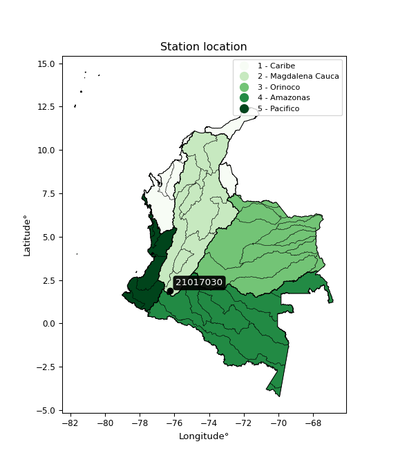</img>

</div>


## A. General information


### 1. General running parameters

• app_version: _v20260312_. • runtime: _2026-03-12 07:15:23.203550_. • Python version: _3.14.0_. • SciPy version: _1.16.3_. • Pandas version: _2.3.3_. • NumPy version: _2.3.5_. • Stations dataset (station_dataset_file): _dataset/pmax24h_in/automatic_colombia_2003_2025.csv_. • Stations catalog (station_catalog_file): _dataset/CNE.xls_. • Minimum year to eval til year_max (date_min): _1900_. • Maximum year to eval since year_min (date_max): _2025_. • Creates, save and include plots into reports (create_plot): _True_. • Plot only fit distributions with Δo > Δ (plot_only_fit): _True_. • Plot only simple graphs avoiding multiple CDFs and multiple Extreme values plots (plot_only_simple): _True_. • Eval low extreme values, if False, evaluates high extreme values (low_extreme): _False_. • Eval every SciPy distribution as logarithmic (pdist_logarithmic_on): _True_. • Standard deviation normalized (ddof): _1.0_. • Return periods to eval in years (Tr): _[2, 2.33, 5, 10, 15, 20, 25, 50, 75, 100, 200, 250, 500, 750, 1000]_. • Minimum data sample per station, 0 means any (minimum_sample): _5_. • Z-Score maximum threshold to adjust a value, 0 means disable (zscore_max): _3.5_. • Z-Score minimum threshold to adjust a value, 0 means disable (zscore_min): _-2.5_. • Avoid zeros, e.g. rain = 0 (avoid_zeros): _True_. • Avoid null values (avoid_nans): _True_. 

:file_folder:Table: [dataset.csv](../../dataset/pmax24h_in/automatic_colombia_2003_2025.csv)

> Delta Degrees of Freedom (DDOF): is a parameter used in the formulas for calculating variance and standard deviation. When ddof=0, the divisor is $N$ (the total number of observations) and this is used when your data set is the entire population. When ddof=1, the divisor is $N-1$ and this is used when your data set is a sample drawn from a larger population. Using $N-1$ provides an unbiased estimate of the population variance (known as Bessel´s correction).


### 2. Station info and location

|   id |   CODIGO | NOMBRE                                  | CATEGORIA    | TECNOLOGIA                              | ESTADO           | FECHA_INSTALACION   |   FECHA_SUSPENSION |   ALTITUD |   LATITUD |   LONGITUD | DEPARTAMENTO   | MUNICIPIO   | AREA_OPERATIVA                    | ENTIDAD                                                     | AREA_HIDROGRAFICA   | ZONA_HIDROGRAFICA   | SUBZONA_HIDROGRAFICA   | CORRIENTE   | Catalogo   |   Version |
|-----:|---------:|:----------------------------------------|:-------------|:----------------------------------------|:-----------------|:--------------------|-------------------:|----------:|----------:|-----------:|:---------------|:------------|:----------------------------------|:------------------------------------------------------------|:--------------------|:--------------------|:-----------------------|:------------|:-----------|----------:|
|    0 | 21017030 | CASCADA SIMON BOLIVAR  - AUT [21017030] | Limnigráfica | Automática con Telemetría, Convencional | En Mantenimiento | 15/04/1971          |                nan |      1272 |    1.8735 |   -76.2317 | Huila          | Isnos       | Area Operativa 04 - Huila-Caquetá | INSTITUTO DE HIDROLOGIA METEOROLOGIA Y ESTUDIOS AMBIENTALES | Magdalena Cauca     | Alto Magdalena      | Alto Magdalena         | Magdalena   | CNE_IDEAM  |  20251226 |

<div align="center">

Dynamic map: [:earth_americas:Google](http://maps.google.com/maps?q=1.8735,-76.23172222) [:earth_americas:OSM](https://www.openstreetmap.org/#map=18/1.8735/-76.23172222&layers=P) [:earth_americas:Bing](https://www.bing.com/maps?cp=1.8735~-76.23172222&lvl=18) [:earth_americas:Apple](https://maps.apple.com/frame?center=1.8735%2C-76.23172222&span=0.003%2C0.006)

</div>


<div align="center">

```geojson
{
  "type": "Feature",
  "geometry": {
    "type": "Point", 
    "coordinates": [-76.23172222, 1.8735]
  }, 
  "properties": {
    "Name": "21017030"
  }
}
```

</div>


### 3. Discrete values table and plot

<div align="center">

|               |            0 |          1 |           2 |           3 |           4 |          5 |           6 |
|:--------------|-------------:|-----------:|------------:|------------:|------------:|-----------:|------------:|
| Date          | 2019         | 2020       | 2021        | 2022        | 2023        | 2024       | 2025        |
| Value         |   54.2       |   38.8     |   44.4      |   20.4      |   20        |  198.8     |   42.6      |
| Value_initial |   54.2       |   38.8     |   44.4      |   20.4      |   20        |  198.8     |   42.6      |
| count         |    7         |    7       |    7        |    7        |    7        |    7       |    7        |
| mean          |   59.8857    |   59.8857  |   59.8857   |   59.8857   |   59.8857   |   59.8857  |   59.8857   |
| std           |   62.5336    |   62.5336  |   62.5336   |   62.5336   |   62.5336   |   62.5336  |   62.5336   |
| zscore        |   -0.0909225 |   -0.33719 |   -0.247638 |   -0.631432 |   -0.637829 |    2.22143 |   -0.276423 |


</div>


<div align="center">

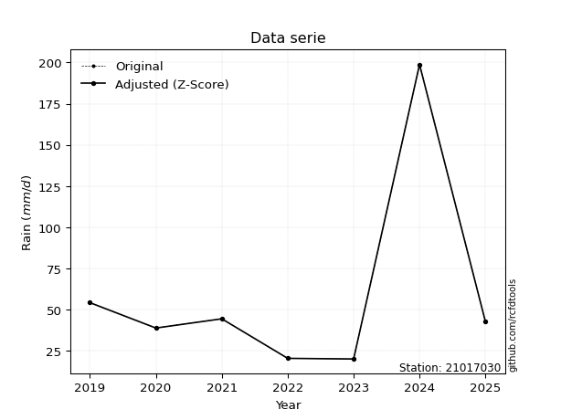</img>

</div>


> The initial value (value_initial) correspond to the initial obtained or null completed value, and value (value) is adjusted only when the initial value is outside the valid range (outlier) definite through the Z-Score value. If Z-Score is active, values out of range or outliers are replaced with the station mean value. A Z-Score (or standard score) measures how many standard deviations a data point is from the mean of a dataset, indicating its relative position; positive scores mean above the mean, negative mean below, and a score of zero is exactly at the mean, allowing for comparison of values from different distributions. It´s calculated using the formula $z=(x–μ)/σ$, where $x$ is the data point, $μ$ is the mean, and $σ$ is the standard deviation, helping identify outliers and understand probability.
>
> <sub>**Note**: In this study, "completing" (filling gaps in) and "extending" (forecasting or lengthening the historical record) rainfall data series are avoided for certain critical analyses because they introduce artificial bias and uncertainty, which can distort the statistics of rare events (extremes), alter day-to-day variability, and compromise the integrity and homogeneity of the original data. Some reasons against Completing/Extending rainfall data are: **Distortion of Extremes and Variability**: The primary issue is that most gap-filling or extension methods rely on averaging or regression with nearby stations, which inherently smooths the data. Rainfall is highly variable in space and time, with a large percentage of zero values and occasional large storms. Infilling methods often underestimate the highest values and overestimate the lowest (zero) values, which severely distorts analyses focused on flood frequency, drought severity, and intensity-duration-frequency (IDF) curves, **Loss of Data Homogeneity**: Infilled or extended data are synthetic estimates, not actual measurements. Combining these estimates with observed data can violate the assumption of data homogeneity, which requires that the data properties do not change over time. Inhomogeneity can lead to incorrect conclusions about long-term trends or changes in climate patterns, **Propagation of Errors**: Errors and biases from the original data (e.g., wind-induced undercatch, instrument errors, site changes) or the data used for imputation can propagate through the analysis, leading to unreliable hydrological models and inaccurate predictions, **Compromised Statistical Integrity**: For statistical analyses, especially those involving the frequency of events, using artificial data can introduce time bias or autocorrelation that doesn´t exist in reality, making it difficult to assess the true probability of events, **Difficulty in Validation**: It is difficult to accurately validate the quality of filled or extended data, especially for past periods where ground-truth measurements are unavailable. The reliability of imputation techniques heavily depends on the density of the surrounding station network and the complexity of the local topography.</sub>


### 4. Active continuous probability distributions from SciPy (80 of 104 available)

A Probability Density Function (PDF) describes the relative likelihood of a continuous random variable falling within a specific range, where the total area under its curve equals 1, and the area over any interval gives the actual probability for that range. Unlike discrete probabilities (like rolling a die), a PDF shows density, not direct probability for a single point (which is zero), with higher points indicating higher likelihood, often visualized as a bell curve for normal distributions.

A log of a probability density function (log-PDF) is simply the logarithm of the PDF´s value, denoted as $log(f(x))$, useful for converting multiplication of probabilities into addition, improving numerical stability with tiny numbers, and connecting to information theory concepts like entropy. Instead of dealing with very small probabilities (e.g., 0.000001), log-PDFs use negative numbers (e.g., $log(0.00001) ≈ -11.51$ that are easier for computers to handle, preventing underflow errors and simplifying complex calculations. In this study, each active probability distribution from SciPy is also evaluated in the $log$ form.

[scipy.stats](https://docs.scipy.org/doc/scipy/reference/stats.html) is a Python´s powerful submodule within the SciPy library for comprehensive statistical analysis, offering over 130 probability distributions (like Normal, Poisson, etc.), functions for descriptive stats (mean, variance), hypothesis testing (t-tests, chi-square), random variable generation, and statistical tests, making it essential for data science, modeling, and research. It provides tools to explore, model, and draw conclusions from data efficiently, working seamlessly with [NumPy](https://numpy.org/).

<div align="center">

|   id | p_dist           |   n_parameter | fit_method   | label                                                                       | active   | ref                                                                                                      |
|-----:|:-----------------|--------------:|:-------------|:----------------------------------------------------------------------------|:---------|:---------------------------------------------------------------------------------------------------------|
|    0 | alpha            |             3 | MLE          | Alpha                                                                       | True     | [:mortar_board:](https://docs.scipy.org/doc/scipy/reference/generated/scipy.stats.alpha.html)            |
|    1 | anglit           |             2 | MM           | Anglit                                                                      | True     | [:mortar_board:](https://docs.scipy.org/doc/scipy/reference/generated/scipy.stats.anglit.html)           |
|    2 | arcsine          |             2 | MM           | Arcsine                                                                     | True     | [:mortar_board:](https://docs.scipy.org/doc/scipy/reference/generated/scipy.stats.arcsine.html)          |
|    3 | argus            |             3 | MLE          | Argus                                                                       | True     | [:mortar_board:](https://docs.scipy.org/doc/scipy/reference/generated/scipy.stats.argus.html)            |
|    4 | beta             |             4 | MLE          | Beta                                                                        | True     | [:mortar_board:](https://docs.scipy.org/doc/scipy/reference/generated/scipy.stats.beta.html)             |
|    5 | betaprime        |             4 | MLE          | Beta prime                                                                  | True     | [:mortar_board:](https://docs.scipy.org/doc/scipy/reference/generated/scipy.stats.betaprime.html)        |
|    6 | bradford         |             3 | MLE          | Bradford                                                                    | True     | [:mortar_board:](https://docs.scipy.org/doc/scipy/reference/generated/scipy.stats.bradford.html)         |
|    7 | burr             |             4 | MLE          | Burr (Type III)                                                             | True     | [:mortar_board:](https://docs.scipy.org/doc/scipy/reference/generated/scipy.stats.burr.html)             |
|    8 | burr12           |             4 | MLE          | Burr (Type III) 12                                                          | True     | [:mortar_board:](https://docs.scipy.org/doc/scipy/reference/generated/scipy.stats.burr12.html)           |
|    9 | cosine           |             2 | MLE          | Cosine                                                                      | True     | [:mortar_board:](https://docs.scipy.org/doc/scipy/reference/generated/scipy.stats.cosine.html)           |
|   10 | crystalball      |             4 | MLE          | Crystalball                                                                 | True     | [:mortar_board:](https://docs.scipy.org/doc/scipy/reference/generated/scipy.stats.crystalball.html)      |
|   11 | dgamma           |             3 | MLE          | Double gamma                                                                | True     | [:mortar_board:](https://docs.scipy.org/doc/scipy/reference/generated/scipy.stats.dgamma.html)           |
|   12 | dweibull         |             3 | MLE          | Double Weibull                                                              | True     | [:mortar_board:](https://docs.scipy.org/doc/scipy/reference/generated/scipy.stats.dweibull.html)         |
|   13 | erlang           |             3 | MLE          | Erlang                                                                      | True     | [:mortar_board:](https://docs.scipy.org/doc/scipy/reference/generated/scipy.stats.erlang.html)           |
|   14 | exponnorm        |             3 | MLE          | Exponentially modified Normal                                               | True     | [:mortar_board:](https://docs.scipy.org/doc/scipy/reference/generated/scipy.stats.exponnorm.html)        |
|   15 | exponpow         |             3 | MLE          | Exponential power                                                           | True     | [:mortar_board:](https://docs.scipy.org/doc/scipy/reference/generated/scipy.stats.exponpow.html)         |
|   16 | exponweib        |             4 | MLE          | Exponentiated Weibull                                                       | True     | [:mortar_board:](https://docs.scipy.org/doc/scipy/reference/generated/scipy.stats.exponweib.html)        |
|   17 | f                |             4 | MLE          | F                                                                           | True     | [:mortar_board:](https://docs.scipy.org/doc/scipy/reference/generated/scipy.stats.f.html)                |
|   18 | fatiguelife      |             3 | MLE          | Fatigue-life (Birnbaum-Saunders)                                            | True     | [:mortar_board:](https://docs.scipy.org/doc/scipy/reference/generated/scipy.stats.fatiguelife.html)      |
|   19 | foldnorm         |             3 | MM           | Fold Normal                                                                 | True     | [:mortar_board:](https://docs.scipy.org/doc/scipy/reference/generated/scipy.stats.foldnorm.html)         |
|   20 | gamma            |             3 | MLE          | Gamma                                                                       | True     | [:mortar_board:](https://docs.scipy.org/doc/scipy/reference/generated/scipy.stats.gamma.html)            |
|   21 | gausshyper       |             6 | MLE          | Gauss hypergeometric                                                        | True     | [:mortar_board:](https://docs.scipy.org/doc/scipy/reference/generated/scipy.stats.gausshyper.html)       |
|   22 | genexpon         |             5 | MLE          | Generalized exponential                                                     | True     | [:mortar_board:](https://docs.scipy.org/doc/scipy/reference/generated/scipy.stats.genexpon.html)         |
|   23 | genextreme       |             3 | MLE          | Generalized exponential                                                     | True     | [:mortar_board:](https://docs.scipy.org/doc/scipy/reference/generated/scipy.stats.genextreme.html)       |
|   24 | gengamma         |             4 | MLE          | Generalized gamma                                                           | True     | [:mortar_board:](https://docs.scipy.org/doc/scipy/reference/generated/scipy.stats.gengamma.html)         |
|   25 | genhalflogistic  |             3 | MLE          | Generalized half-logistic                                                   | True     | [:mortar_board:](https://docs.scipy.org/doc/scipy/reference/generated/scipy.stats.genhalflogistic.html)  |
|   26 | genlogistic      |             3 | MLE          | Generalized logistic                                                        | True     | [:mortar_board:](https://docs.scipy.org/doc/scipy/reference/generated/scipy.stats.genlogistic.html)      |
|   27 | gennorm          |             3 | MLE          | Generalized Normal                                                          | True     | [:mortar_board:](https://docs.scipy.org/doc/scipy/reference/generated/scipy.stats.gennorm.html)          |
|   28 | genpareto        |             3 | MLE          | Generalized Pareto                                                          | True     | [:mortar_board:](https://docs.scipy.org/doc/scipy/reference/generated/scipy.stats.genpareto.html)        |
|   29 | gompertz         |             3 | MLE          | Gompertz (or truncated Gumbel)                                              | True     | [:mortar_board:](https://docs.scipy.org/doc/scipy/reference/generated/scipy.stats.gompertz.html)         |
|   30 | gumbel_l         |             2 | MM           | Gumbel Left Skew                                                            | True     | [:mortar_board:](https://docs.scipy.org/doc/scipy/reference/generated/scipy.stats.gumbel_l.html)         |
|   31 | gumbel_r         |             2 | MM           | Gumbel Right Skew                                                           | True     | [:mortar_board:](https://docs.scipy.org/doc/scipy/reference/generated/scipy.stats.gumbel_r.html)         |
|   32 | halfgennorm      |             3 | MLE          | Upper half of a generalized normal                                          | True     | [:mortar_board:](https://docs.scipy.org/doc/scipy/reference/generated/scipy.stats.halfgennorm.html)      |
|   33 | halflogistic     |             2 | MM           | Half-logistic                                                               | True     | [:mortar_board:](https://docs.scipy.org/doc/scipy/reference/generated/scipy.stats.halflogistic.html)     |
|   34 | halfnorm         |             2 | MM           | Half Normal                                                                 | True     | [:mortar_board:](https://docs.scipy.org/doc/scipy/reference/generated/scipy.stats.halfnorm.html)         |
|   35 | hypsecant        |             2 | MM           | hyperbolic secant                                                           | True     | [:mortar_board:](https://docs.scipy.org/doc/scipy/reference/generated/scipy.stats.hypsecant.html)        |
|   36 | invgamma         |             3 | MLE          | Inverted gamma                                                              | True     | [:mortar_board:](https://docs.scipy.org/doc/scipy/reference/generated/scipy.stats.invgamma.html)         |
|   37 | invgauss         |             3 | MLE          | Inverse Gaussian                                                            | True     | [:mortar_board:](https://docs.scipy.org/doc/scipy/reference/generated/scipy.stats.invgauss.html)         |
|   38 | invweibull       |             3 | MLE          | Inverted Weibull                                                            | True     | [:mortar_board:](https://docs.scipy.org/doc/scipy/reference/generated/scipy.stats.invweibull.html)       |
|   39 | johnsonsb        |             4 | MLE          | Johnson SB                                                                  | True     | [:mortar_board:](https://docs.scipy.org/doc/scipy/reference/generated/scipy.stats.johnsonsb.html)        |
|   40 | johnsonsu        |             4 | MLE          | Johnson Su                                                                  | True     | [:mortar_board:](https://docs.scipy.org/doc/scipy/reference/generated/scipy.stats.johnsonsu.html)        |
|   41 | kappa3           |             3 | MLE          | Kappa 3                                                                     | True     | [:mortar_board:](https://docs.scipy.org/doc/scipy/reference/generated/scipy.stats.kappa3.html)           |
|   42 | kappa4           |             4 | MLE          | Kappa 4                                                                     | True     | [:mortar_board:](https://docs.scipy.org/doc/scipy/reference/generated/scipy.stats.kappa4.html)           |
|   43 | ksone            |             3 | MLE          | Kolmogorov-Smirnov one-sided test statistic distribution                    | True     | [:mortar_board:](https://docs.scipy.org/doc/scipy/reference/generated/scipy.stats.ksone.html)            |
|   44 | kstwobign        |             2 | MLE          | Limiting distribution of scaled Kolmogorov-Smirnov two-sided test statistic | True     | [:mortar_board:](https://docs.scipy.org/doc/scipy/reference/generated/scipy.stats.kstwobign.html)        |
|   45 | laplace          |             2 | MM           | Laplace                                                                     | True     | [:mortar_board:](https://docs.scipy.org/doc/scipy/reference/generated/scipy.stats.laplace.html)          |
|   46 | levy_l           |             2 | MLE          | Left-skewed Levy                                                            | True     | [:mortar_board:](https://docs.scipy.org/doc/scipy/reference/generated/scipy.stats.levy_l.html)           |
|   47 | loggamma         |             3 | MLE          | Log gamma                                                                   | True     | [:mortar_board:](https://docs.scipy.org/doc/scipy/reference/generated/scipy.stats.loggamma.html)         |
|   48 | logistic         |             2 | MM           | Logistic (or Sech-squared)                                                  | True     | [:mortar_board:](https://docs.scipy.org/doc/scipy/reference/generated/scipy.stats.logistic.html)         |
|   49 | loglaplace       |             3 | MLE          | Log-Laplace                                                                 | True     | [:mortar_board:](https://docs.scipy.org/doc/scipy/reference/generated/scipy.stats.loglaplace.html)       |
|   50 | lomax            |             3 | MLE          | Lomax (Pareto of the second kind)                                           | True     | [:mortar_board:](https://docs.scipy.org/doc/scipy/reference/generated/scipy.stats.lomax.html)            |
|   51 | maxwell          |             2 | MM           | Maxwell                                                                     | True     | [:mortar_board:](https://docs.scipy.org/doc/scipy/reference/generated/scipy.stats.maxwell.html)          |
|   52 | mielke           |             4 | MLE          | Mielke Beta-Kappa / Dagum                                                   | True     | [:mortar_board:](https://docs.scipy.org/doc/scipy/reference/generated/scipy.stats.mielke.html)           |
|   53 | moyal            |             2 | MM           | Moyal                                                                       | True     | [:mortar_board:](https://docs.scipy.org/doc/scipy/reference/generated/scipy.stats.moyal.html)            |
|   54 | nakagami         |             3 | MLE          | Nakagami                                                                    | True     | [:mortar_board:](https://docs.scipy.org/doc/scipy/reference/generated/scipy.stats.nakagami.html)         |
|   55 | ncf              |             5 | MLE          | Non-central F distribution                                                  | True     | [:mortar_board:](https://docs.scipy.org/doc/scipy/reference/generated/scipy.stats.ncf.html)              |
|   56 | nct              |             4 | MLE          | Non-central Student’s t                                                     | True     | [:mortar_board:](https://docs.scipy.org/doc/scipy/reference/generated/scipy.stats.nct.html)              |
|   57 | norm             |             2 | MM           | Normal                                                                      | True     | [:mortar_board:](https://docs.scipy.org/doc/scipy/reference/generated/scipy.stats.norm.html)             |
|   58 | pearson3         |             3 | MM           | Pearson type III                                                            | True     | [:mortar_board:](https://docs.scipy.org/doc/scipy/reference/generated/scipy.stats.pearson3.html)         |
|   59 | powerlaw         |             3 | MLE          | Power-function                                                              | True     | [:mortar_board:](https://docs.scipy.org/doc/scipy/reference/generated/scipy.stats.powerlaw.html)         |
|   60 | rayleigh         |             2 | MM           | Rayleigh                                                                    | True     | [:mortar_board:](https://docs.scipy.org/doc/scipy/reference/generated/scipy.stats.rayleigh.html)         |
|   61 | rdist            |             3 | MLE          | R-distributed (symmetric beta)                                              | True     | [:mortar_board:](https://docs.scipy.org/doc/scipy/reference/generated/scipy.stats.rdist.html)            |
|   62 | rice             |             3 | MLE          | Rice                                                                        | True     | [:mortar_board:](https://docs.scipy.org/doc/scipy/reference/generated/scipy.stats.rice.html)             |
|   63 | semicircular     |             2 | MM           | Semicircular                                                                | True     | [:mortar_board:](https://docs.scipy.org/doc/scipy/reference/generated/scipy.stats.semicircular.html)     |
|   64 | skewnorm         |             3 | MLE          | Skew normal                                                                 | True     | [:mortar_board:](https://docs.scipy.org/doc/scipy/reference/generated/scipy.stats.skewnorm.html)         |
|   65 | t                |             3 | MLE          | Student’s t                                                                 | True     | [:mortar_board:](https://docs.scipy.org/doc/scipy/reference/generated/scipy.stats.t.html)                |
|   66 | trapezoid        |             4 | MLE          | Trapezoid                                                                   | True     | [:mortar_board:](https://docs.scipy.org/doc/scipy/reference/generated/scipy.stats.trapezoid.html)        |
|   67 | triang           |             3 | MLE          | Triangular                                                                  | True     | [:mortar_board:](https://docs.scipy.org/doc/scipy/reference/generated/scipy.stats.triang.html)           |
|   68 | truncexpon       |             3 | MLE          | Truncated exponential                                                       | True     | [:mortar_board:](https://docs.scipy.org/doc/scipy/reference/generated/scipy.stats.truncexpon.html)       |
|   69 | truncnorm        |             4 | MLE          | Truncated normal                                                            | True     | [:mortar_board:](https://docs.scipy.org/doc/scipy/reference/generated/scipy.stats.truncnorm.html)        |
|   70 | truncpareto      |             4 | MLE          | Upper truncated Pareto                                                      | True     | [:mortar_board:](https://docs.scipy.org/doc/scipy/reference/generated/scipy.stats.truncpareto.html)      |
|   71 | truncweibull_min |             5 | MLE          | Doubly truncated Weibull minimum                                            | True     | [:mortar_board:](https://docs.scipy.org/doc/scipy/reference/generated/scipy.stats.truncweibull_min.html) |
|   72 | tukeylambda      |             3 | MLE          | Tukey-Lamdba                                                                | True     | [:mortar_board:](https://docs.scipy.org/doc/scipy/reference/generated/scipy.stats.tukeylambda.html)      |
|   73 | uniform          |             2 | MLE          | Uniform                                                                     | True     | [:mortar_board:](https://docs.scipy.org/doc/scipy/reference/generated/scipy.stats.uniform.html)          |
|   74 | vonmises         |             3 | MLE          | Von Mises                                                                   | True     | [:mortar_board:](https://docs.scipy.org/doc/scipy/reference/generated/scipy.stats.vonmises.html)         |
|   75 | vonmises_line    |             3 | MLE          | Von Mises line                                                              | True     | [:mortar_board:](https://docs.scipy.org/doc/scipy/reference/generated/scipy.stats.vonmises_line.html)    |
|   76 | wald             |             2 | MM           | Wald                                                                        | True     | [:mortar_board:](https://docs.scipy.org/doc/scipy/reference/generated/scipy.stats.wald.html)             |
|   77 | weibull_max      |             3 | MLE          | Weibull maximum                                                             | True     | [:mortar_board:](https://docs.scipy.org/doc/scipy/reference/generated/scipy.stats.weibull_max.html)      |
|   78 | weibull_min      |             3 | MLE          | Weibull minimum                                                             | True     | [:mortar_board:](https://docs.scipy.org/doc/scipy/reference/generated/scipy.stats.weibull_min.html)      |
|   79 | wrapcauchy       |             3 | MLE          | Wrapped  Cauchy                                                             | True     | [:mortar_board:](https://docs.scipy.org/doc/scipy/reference/generated/scipy.stats.wrapcauchy.html)       |

</div>

> **n_parameter:** # arguments & localization & scale.
>
> **Fit methods:** (MLE) maximum likelihood, (MM) L-moments.
>
>**Inactive** (With the only purpose of prevent loops, zero divisions, infinite values, over high estimated values or horizontal trending for recurrence intervals estimations, the follow distributions were disabled.)**:** lognorm, norminvgauss, powernorm, powerlognorm, cauchy, halfcauchy, foldcauchy, skewcauchy, chi2, expon, fisk, genhyperbolic, geninvgauss, gibrat, kstwo, laplace_asymmetric, levy, levy_stable, ncx2, pareto, rel_breitwigner, recipinvgauss, studentized_range, loguniform, 


## B. Probability (PDF) vs. Empirical (EDF) distributions functions

A continuous probability distribution (CPD) describes probabilities for variables that can take any value within a range (like rain any time), unlike discrete variables with specific outcomes (like temperature). It uses a Probability Density Function (PDF), a curve where the total area under it equals 1, and the probability of the variable falling within an interval (a to b) is found by calculating the area under the curve between those points. A key feature is that the probability of hitting any single exact value is zero, so probabilities are always expressed for ranges, e.g., $P(a ≤ X ≤ b)$.

<div align="center">

Distributions parameters from station values
|     |   station | p_dist              |   n |             loc |          scale | shape                 | shape1                 | shape2                 | shape3            |
|----:|----------:|:--------------------|----:|----------------:|---------------:|:----------------------|:-----------------------|:-----------------------|:------------------|
|   0 |  21017030 | alpha               |   7 |     10.979      |   16.0103      | 5.690725266176917e-09 |                        |                        |                   |
|   1 |  21017030 | anglit              |   7 |     59.8857     |  169.366       |                       |                        |                        |                   |
|   2 |  21017030 | arcsine             |   7 |    -21.9899     |  163.751       |                       |                        |                        |                   |
|   3 |  21017030 | argus               |   7 |    -78.6734     |  288.088       | 8.207435007578466e-07 |                        |                        |                   |
|   4 |  21017030 | beta                |   7 |      2.09529    |  196.705       | 0.04859808133040477   | 0.23032971276103315    |                        |                   |
|   5 |  21017030 | betaprime           |   7 |      0.211725   |    0.405774    | 231.83998426358778    | 2.6332285362866656     |                        |                   |
|   6 |  21017030 | bradford            |   7 |     -0.929341   |  199.729       | 1.8982483628599933    |                        |                        |                   |
|   7 |  21017030 | burr                |   7 |      4.52131    |    0.562738    | 1.6073413715558482    | 508.6033507319189      |                        |                   |
|   8 |  21017030 | burr12              |   7 |     -0.804914   |   20.5713      | 312.34332067375567    | 0.004084696264652439   |                        |                   |
|   9 |  21017030 | cosine              |   7 |     74.8234     |   53.7271      |                       |                        |                        |                   |
|  10 |  21017030 | crystalball         |   7 |     59.8857     |   57.8949      | 279.5811671656245     | 11630.51942291144      |                        |                   |
|  11 |  21017030 | dgamma              |   7 |     42.6        |   45.3679      | 0.5676371145296495    |                        |                        |                   |
|  12 |  21017030 | dweibull            |   7 |     42.6        |   44.2357      | 0.711651922008262     |                        |                        |                   |
|  13 |  21017030 | erlang              |   7 |     20          |   69.9464      | 0.414478906647126     |                        |                        |                   |
|  14 |  21017030 | exponnorm           |   7 |     19.9511     |    0.0152576   | 2601.726823311302     |                        |                        |                   |
|  15 |  21017030 | exponpow            |   7 |     20          |   82.9983      | 0.529309645148087     |                        |                        |                   |
|  16 |  21017030 | exponweib           |   7 |     19.9244     |    3.12481e-07 | 108.03207220006692    | 0.09707438971614812    |                        |                   |
|  17 |  21017030 | f                   |   7 |     20          |   20.7842      | 0.8532888116793056    | 2.06632623937526       |                        |                   |
|  18 |  21017030 | fatiguelife         |   7 |     20          |    0.000115593 | 534.8556796964666     |                        |                        |                   |
|  19 |  21017030 | foldnorm            |   7 |    -23.9439     |  103.664       | 0.0020733833753070214 |                        |                        |                   |
|  20 |  21017030 | gamma               |   7 |     20          |   65.1558      | 0.564174385232151     |                        |                        |                   |
|  21 |  21017030 | gausshyper          |   7 |      2.25785    |  196.542       | 0.9015404015424695    | 0.8335550519085317     | 1.3944720191259625     | 1.11972546837216  |
|  22 |  21017030 | genexpon            |   7 |     20          |  136.836       | 3.4306747022837882    | 2.072376012736059e-11  | 5.698698130735897      |                   |
|  23 |  21017030 | genextreme          |   7 |     22.3457     |   13.1859      | -5.621069722256502    |                        |                        |                   |
|  24 |  21017030 | gengamma            |   7 |     20          |    0.332697    | 3.0915327486572552    | 0.22715659992748477    |                        |                   |
|  25 |  21017030 | genhalflogistic     |   7 |      2.08816    |  208.701       | 1.060948165234811     |                        |                        |                   |
|  26 |  21017030 | genlogistic         |   7 |   -193.015      |   28.6009      | 3256.5402910434104    |                        |                        |                   |
|  27 |  21017030 | gennorm             |   7 |     42.6        |    0.838262    | 0.3756036360053242    |                        |                        |                   |
|  28 |  21017030 | genpareto           |   7 |     20          |    6.83427     | 1.8808864063491413    |                        |                        |                   |
|  29 |  21017030 | gompertz            |   7 |     20          |    1.53491e+12 | 43472512981.2632      |                        |                        |                   |
|  30 |  21017030 | gumbel_l            |   7 |     85.9415     |   45.1404      |                       |                        |                        |                   |
|  31 |  21017030 | gumbel_r            |   7 |     33.8299     |   45.1404      |                       |                        |                        |                   |
|  32 |  21017030 | halfgennorm         |   7 |     20          |    0.000434027 | 0.17692069142717248   |                        |                        |                   |
|  33 |  21017030 | halflogistic        |   7 |     -8.73316    |   49.4981      |                       |                        |                        |                   |
|  34 |  21017030 | halfnorm            |   7 |    -16.7444     |   96.0416      |                       |                        |                        |                   |
|  35 |  21017030 | hypsecant           |   7 |     59.8857     |   36.857       |                       |                        |                        |                   |
|  36 |  21017030 | invgamma            |   7 |     14.7864     |   14.2663      | 1.0437103254085507    |                        |                        |                   |
|  37 |  21017030 | invgauss            |   7 |     17.7391     |    8.63997     | 4.878100238668022     |                        |                        |                   |
|  38 |  21017030 | invweibull          |   7 |     20          |    0.214543    | 0.11522487292604439   |                        |                        |                   |
|  39 |  21017030 | johnsonsb           |   7 |     20          |  448.468       | 0.7701899475756332    | 0.14188401053075267    |                        |                   |
|  40 |  21017030 | johnsonsu           |   7 |     42.0256     |    3.31707     | -0.08294755479961352  | 0.4235071395668152     |                        |                   |
|  41 |  21017030 | kappa3              |   7 |     20          |    8.65746     | 0.25827638389339325   |                        |                        |                   |
|  42 |  21017030 | kappa4              |   7 |      2.09841    |  197.59        | 1.0995563931272485    | 0.986462543001364      |                        |                   |
|  43 |  21017030 | ksone               |   7 |      2.12       |  214.56        | 1.0                   |                        |                        |                   |
|  44 |  21017030 | kstwobign           |   7 |    -79.9078     |  164.674       |                       |                        |                        |                   |
|  45 |  21017030 | laplace             |   7 |     59.8857     |   40.9379      |                       |                        |                        |                   |
|  46 |  21017030 | levy_l              |   7 |    215.665      |   75.2761      |                       |                        |                        |                   |
|  47 |  21017030 | loggamma            |   7 | -25305.1        | 3183.09        | 2889.6813411540343    |                        |                        |                   |
|  48 |  21017030 | logistic            |   7 |     59.8857     |   31.9191      |                       |                        |                        |                   |
|  49 |  21017030 | loglaplace          |   7 |     -0.120372   |   42.7204      | 2.059385144393106     |                        |                        |                   |
|  50 |  21017030 | lomax               |   7 |     20          |    2.98988e+08 | 5145179.651618687     |                        |                        |                   |
|  51 |  21017030 | maxwell             |   7 |    -77.3008     |   85.9689      |                       |                        |                        |                   |
|  52 |  21017030 | mielke              |   7 |     -0.420701   |    3.14443     | 166.38182420312506    | 1.908858811081192      |                        |                   |
|  53 |  21017030 | moyal               |   7 |     26.7777     |   26.0618      |                       |                        |                        |                   |
|  54 |  21017030 | nakagami            |   7 |     20          |  114.428       | 0.14133988294505334   |                        |                        |                   |
|  55 |  21017030 | ncf                 |   7 |     -0.683479   |    0.00093674  | 0.0070358408482654525 | 5.515579792300981      | 280.30812263896127     |                   |
|  56 |  21017030 | nct                 |   7 |     -0.142562   |    0.82903     | 1.7804807825714386    | 38.41849956332506      |                        |                   |
|  57 |  21017030 | norm                |   7 |     59.8857     |   57.8949      |                       |                        |                        |                   |
|  58 |  21017030 | pearson3            |   7 |     59.8857     |   57.8949      | 1.8678193296173773    |                        |                        |                   |
|  59 |  21017030 | powerlaw            |   7 |     20          |  178.8         | 0.13326645382314578   |                        |                        |                   |
|  60 |  21017030 | rayleigh            |   7 |    -50.8705     |   88.3707      |                       |                        |                        |                   |
|  61 |  21017030 | rdist               |   7 |      3.75617    |   50.4438      | 1.2601897060972842    |                        |                        |                   |
|  62 |  21017030 | rice                |   7 |    -20.8099     |   70.2268      | 0.0006301828900643184 |                        |                        |                   |
|  63 |  21017030 | semicircular        |   7 |     59.8857     |  115.79        |                       |                        |                        |                   |
|  64 |  21017030 | skewnorm            |   7 |     20          |   70.3056      | 34904691.52622166     |                        |                        |                   |
|  65 |  21017030 | t                   |   7 |     41.7822     |    7.25281     | 0.7587305017576591    |                        |                        |                   |
|  66 |  21017030 | trapezoid           |   7 |      2.12       |  214.56        | 1.0                   | 1.0                    |                        |                   |
|  67 |  21017030 | triang              |   7 |    -53.474      |  404.843       | 0.2279253216773625    |                        |                        |                   |
|  68 |  21017030 | truncexpon          |   7 |      2.27897    |  170.064       | 1.1555733296494566    |                        |                        |                   |
|  69 |  21017030 | truncnorm           |   7 | -23315.4        | 1166.73        | 20.000697135078436    | 20.153950441646952     |                        |                   |
|  70 |  21017030 | truncpareto         |   7 |     -4.89455    |   24.8945      | 1.0361896487746907    | 8.182298740574153      |                        |                   |
|  71 |  21017030 | truncweibull_min    |   7 |     16.1681     |  104.574       | 1.806218949990801e-05 | 0.0366433165276171     | 1.7464385002584146     |                   |
|  72 |  21017030 | tukeylambda         |   7 |      3.51113    |   65.2343      | 1.286955567056581     |                        |                        |                   |
|  73 |  21017030 | uniform             |   7 |     20          |  178.8         |                       |                        |                        |                   |
|  74 |  21017030 | vonmises            |   7 |      0.858253   |    1           | 0.28404352693340557   |                        |                        |                   |
|  75 |  21017030 | vonmises_line       |   7 |     45.3917     |   48.8314      | 1.8591016938246305    |                        |                        |                   |
|  76 |  21017030 | wald                |   7 |      1.99085    |   57.8949      |                       |                        |                        |                   |
|  77 |  21017030 | weibull_max         |   7 |    198.8        |    1.59316     | 0.20768594982901684   |                        |                        |                   |
|  78 |  21017030 | weibull_min         |   7 |     20          |   15.8972      | 0.6296018302508446    |                        |                        |                   |
|  79 |  21017030 | wrapcauchy          |   7 |     20          |   28.4569      | 0.7138846742645919    |                        |                        |                   |
|  80 |  21017030 | logalpha            |   7 |      0.995363   |   11.5717      | 4.3922154197511585    |                        |                        |                   |
|  81 |  21017030 | loganglit           |   7 |      3.78568    |    2.0825      |                       |                        |                        |                   |
|  82 |  21017030 | logarcsine          |   7 |      2.77895    |    2.01346     |                       |                        |                        |                   |
|  83 |  21017030 | logargus            |   7 |      2.10597    |    3.31231     | 9.824427976391e-05    |                        |                        |                   |
|  84 |  21017030 | logbeta             |   7 |      2.99573    |    3.62166     | 0.7582435197333492    | 2.537264655096162      |                        |                   |
|  85 |  21017030 | logbetaprime        |   7 |     -0.718803   |    1.98018     | 143.33569871718532    | 64.02818976301722      |                        |                   |
|  86 |  21017030 | logbradford         |   7 |      2.99563    |    2.29667     | 1351.654817142452     |                        |                        |                   |
|  87 |  21017030 | logburr             |   7 |     -0.971043   |    2.19573     | 8.768002154365128     | 449.11351092192854     |                        |                   |
|  88 |  21017030 | logburr12           |   7 |      2.99573    |    1.13922     | 0.3082155599043257    | 2.0826590133964418     |                        |                   |
|  89 |  21017030 | logcosine           |   7 |      3.89489    |    0.62963     |                       |                        |                        |                   |
|  90 |  21017030 | logcrystalball      |   7 |      3.78568    |    0.711868    | 311.75469895342724    | 595.2108942933343      |                        |                   |
|  91 |  21017030 | logdgamma           |   7 |      3.75185    |    0.542983    | 0.8343896847411272    |                        |                        |                   |
|  92 |  21017030 | logdweibull         |   7 |      3.79324    |    0.478536    | 0.828685154984631     |                        |                        |                   |
|  93 |  21017030 | logerlang           |   7 |      2.99573    |    0.334324    | 0.617288302179958     |                        |                        |                   |
|  94 |  21017030 | logexponnorm        |   7 |      3.15098    |    0.337769    | 1.8790992065753425    |                        |                        |                   |
|  95 |  21017030 | logexponpow         |   7 |      2.99573    |    2.23381     | 0.17740386310539563   |                        |                        |                   |
|  96 |  21017030 | logexponweib        |   7 |      2.99573    |    1.70972     | 0.14320098010400423   | 1.0860028270603237     |                        |                   |
|  97 |  21017030 | logf                |   7 |      2.12573    |    1.40866     | 442.83319960149913    | 12.761064841582964     |                        |                   |
|  98 |  21017030 | logfatiguelife      |   7 |      2.99573    |    6.11791e-07 | 987.1072256203586     |                        |                        |                   |
|  99 |  21017030 | logfoldnorm         |   7 |      2.73057    |    0.8977      | 1.0110603016185675    |                        |                        |                   |
| 100 |  21017030 | loggamma            |   7 |      2.99573    |    0.782424    | 0.18545302268299418   |                        |                        |                   |
| 101 |  21017030 | loggausshyper       |   7 |      2.99573    |    2.29657     | 0.608623654843651     | 0.8839970045321408     | 0.9633657377476561     | 1.235233729634792 |
| 102 |  21017030 | loggenexpon         |   7 |      2.99506    |    0.0628928   | 0.07035670743106315   | 1.9857449001076906     | 0.00040980629695795646 |                   |
| 103 |  21017030 | loggenextreme       |   7 |      3.43294    |    0.501751    | -0.1199907476144543   |                        |                        |                   |
| 104 |  21017030 | loggengamma         |   7 |      2.99573    |    1.24019     | 0.8742575853024925    | 0.882478117704065      |                        |                   |
| 105 |  21017030 | loggenhalflogistic  |   7 |      2.78896    |    2.64751     | 1.057592529450016     |                        |                        |                   |
| 106 |  21017030 | loggenlogistic      |   7 |     -0.0915471  |    0.530164    | 822.0064288227929     |                        |                        |                   |
| 107 |  21017030 | loggennorm          |   7 |      3.75185    |    0.0009412   | 0.25536447034485144   |                        |                        |                   |
| 108 |  21017030 | loggenpareto        |   7 |      0.00349645 |   12.4013      | -2.3448176678109576   |                        |                        |                   |
| 109 |  21017030 | loggompertz         |   7 |      2.99573    |    5.01538     | 5.461986780567524     |                        |                        |                   |
| 110 |  21017030 | loggumbel_l         |   7 |      4.10606    |    0.555041    |                       |                        |                        |                   |
| 111 |  21017030 | loggumbel_r         |   7 |      3.4653     |    0.555041    |                       |                        |                        |                   |
| 112 |  21017030 | loghalfgennorm      |   7 |      2.99573    |    0.000624279 | 0.23208146810102137   |                        |                        |                   |
| 113 |  21017030 | loghalflogistic     |   7 |      2.94195    |    0.608621    |                       |                        |                        |                   |
| 114 |  21017030 | loghalfnorm         |   7 |      2.84345    |    1.18091     |                       |                        |                        |                   |
| 115 |  21017030 | loghypsecant        |   7 |      3.78568    |    0.453189    |                       |                        |                        |                   |
| 116 |  21017030 | loginvgamma         |   7 |      2.10586    |    9.09096     | 6.378153595954053     |                        |                        |                   |
| 117 |  21017030 | loginvgauss         |   7 |      2.66295    |    1.97384     | 0.5688005122331381    |                        |                        |                   |
| 118 |  21017030 | loginvweibull       |   7 |     -0.749431   |    4.18239     | 8.335506080301997     |                        |                        |                   |
| 119 |  21017030 | logjohnsonsb        |   7 |      2.99573    |    7.76802     | 0.8122705592520345    | 0.0852810878631653     |                        |                   |
| 120 |  21017030 | logjohnsonsu        |   7 |      3.75675    |    0.0979565   | 0.06734069482787039   | 0.4813658639463608     |                        |                   |
| 121 |  21017030 | logkappa3           |   7 |      2.99573    |    2.57674     | 45.179355738258934    |                        |                        |                   |
| 122 |  21017030 | logkappa4           |   7 |      2.7061     |    2.72113     | 1.1194445589316862    | 1.0446557473279572     |                        |                   |
| 123 |  21017030 | logksone            |   7 |      2.76608    |    2.75588     | 1.0                   |                        |                        |                   |
| 124 |  21017030 | logkstwobign        |   7 |      1.57198    |    2.55158     |                       |                        |                        |                   |
| 125 |  21017030 | loglaplace          |   7 |      3.78568    |    0.503366    |                       |                        |                        |                   |
| 126 |  21017030 | loglevy_l           |   7 |      5.4692     |    0.788859    |                       |                        |                        |                   |
| 127 |  21017030 | logloggamma         |   7 |   -169.889      |   24.6107      | 1161.3632703937226    |                        |                        |                   |
| 128 |  21017030 | loglogistic         |   7 |      3.78568    |    0.392473    |                       |                        |                        |                   |
| 129 |  21017030 | logloglaplace       |   7 |      2.99573    |    0.766936    | 0.6308049643331957    |                        |                        |                   |
| 130 |  21017030 | loglomax            |   7 |      2.99573    |   14.8193      | 19.509884738742542    |                        |                        |                   |
| 131 |  21017030 | logmaxwell          |   7 |      2.09885    |    1.05706     |                       |                        |                        |                   |
| 132 |  21017030 | logmielke           |   7 |     -0.133845   |    1.79261     | 958.0725754927194     | 7.138481295032168      |                        |                   |
| 133 |  21017030 | logmoyal            |   7 |      3.37859    |    0.320453    |                       |                        |                        |                   |
| 134 |  21017030 | lognakagami         |   7 |      2.99573    |    1.58845     | 0.07268619010267957   |                        |                        |                   |
| 135 |  21017030 | logncf              |   7 |     -1.18131    |    4.9131      | 237.23083591890878    | 183.86455306385534     | 2.9422930962779466e-08 |                   |
| 136 |  21017030 | lognct              |   7 |     -0.177877   |    0.0898042   | 19.299021180961077    | 42.362808473236655     |                        |                   |
| 137 |  21017030 | lognorm             |   7 |      3.78568    |    0.711868    |                       |                        |                        |                   |
| 138 |  21017030 | logpearson3         |   7 |      3.78568    |    0.711867    | 0.9808717874688586    |                        |                        |                   |
| 139 |  21017030 | logpowerlaw         |   7 |      2.99573    |    2.29657     | 0.15493147997642426   |                        |                        |                   |
| 140 |  21017030 | lograyleigh         |   7 |      2.42384    |    1.08659     |                       |                        |                        |                   |
| 141 |  21017030 | logrdist            |   7 |      4.17468    |    1.17895     | 1.1257132540969215    |                        |                        |                   |
| 142 |  21017030 | logrice             |   7 |      2.60043    |    0.977642    | 0.0004645057339238638 |                        |                        |                   |
| 143 |  21017030 | logsemicircular     |   7 |      3.78568    |    1.42371     |                       |                        |                        |                   |
| 144 |  21017030 | logskewnorm         |   7 |      2.99573    |    1.06342     | 28686644.904938653    |                        |                        |                   |
| 145 |  21017030 | logt                |   7 |      3.6769     |    0.428841    | 2.277597905179765     |                        |                        |                   |
| 146 |  21017030 | logtrapezoid        |   7 |      2.76608    |    2.75588     | 1.0                   | 1.0                    |                        |                   |
| 147 |  21017030 | logtriang           |   7 |      2.49224    |    3.19505     | 0.36499699137073216   |                        |                        |                   |
| 148 |  21017030 | logtruncexpon       |   7 |      2.99572    |    2.36193     | 0.9723429848226568    |                        |                        |                   |
| 149 |  21017030 | logtruncnorm        |   7 |     -0.210903   |    1.33026     | 2.9086908508978553    | 4.99741390470625       |                        |                   |
| 150 |  21017030 | logtruncpareto      |   7 |      2.99512    |    0.000611628 | 3.383800221204702e-05 | 3755.842098376814      |                        |                   |
| 151 |  21017030 | logtruncweibull_min |   7 |      2.99573    |    3.56649     | 0.24116381492315614   | 1.2367590407006712e-16 | 0.661799726949789      |                   |
| 152 |  21017030 | logtukeylambda      |   7 |      4.14404    |    1.32197     | 1.151239263547152     |                        |                        |                   |
| 153 |  21017030 | loguniform          |   7 |      2.99573    |    2.29657     |                       |                        |                        |                   |
| 154 |  21017030 | logvonmises         |   7 |     -2.56271    |    1           | 2.657111900515204     |                        |                        |                   |
| 155 |  21017030 | logvonmises_line    |   7 |      3.67695    |    0.514182    | 1.0933092269673184    |                        |                        |                   |
| 156 |  21017030 | logwald             |   7 |      3.0738     |    0.711881    |                       |                        |                        |                   |
| 157 |  21017030 | logweibull_max      |   7 |      5.2923     |    2.41077     | 0.637575111269042     |                        |                        |                   |
| 158 |  21017030 | logweibull_min      |   7 |      2.99573    |    0.672486    | 0.1890406094186404    |                        |                        |                   |
| 159 |  21017030 | logwrapcauchy       |   7 |      2.99573    |    0.36551     | 0.18539983209721544   |                        |                        |                   |

</div>

> **loc** (Location parameter): This shifts the distribution along the x-axis. For many common distributions, like the normal (Gaussian) distribution, loc represents the mean $μ$. For others, like the uniform distribution, it might represent the minimum value, or for the beta distribution, the left end of the support interval.
>
> **scale** (Scale parameter): This determines the width or spread of the distribution. For the normal distribution, scale represents the standard deviation $σ$. For a uniform distribution, it defines the length of the interval (from $loc$ to $loc + scale$).
>
> **shape** (Shape parameters): Refers to parameters that define the specific form of a probability distribution, distinct from its location (loc) and scale (scale). These parameters are required arguments for most distribution functions. For example, a normal (Gaussian) distribution is fully defined by its location (mean) and scale (standard deviation), so it has no specific shape parameters beyond loc and scale. However, other distributions have intrinsic properties that need specification, as Gamma distribution that takes a shape parameter, often named $a$ or $alpha$.


### 0. Cumulative distribution values - CDF (160 evaluated)

Cumulative Distribution Function (CDF), denoted as $F$<sub>$X$</sub>$(x)$, is a function that gives the probability that a random variable $X$ will take a value less than or equal to a specific value, $x$ (i.e., $(P(X≥x)$. It essentially "accumulates" probabilities from a given point up to the far right (positive infinity), providing a complete picture of the distribution´s probabilities for both discrete (like rain) and continuous (like temperature) variables, helping to find probabilities over ranges or above certain values. Each station is evaluated separately ordering the $x$ values ascending, calculating the CDF and PDF values for the activated distributions and their logarithmic forms.

<div align="center">

CDF ordered by x ascending and calculating $log(f(x))$ separately
|   id |   Station |   date |     x |   count |    mean |     std |     zscore |   Value_initial |   station |   m |     alpha |   alpha_pdf |   anglit |   anglit_pdf |   arcsine |   arcsine_pdf |    argus |   argus_pdf |     beta |    beta_pdf |   betaprime |   betaprime_pdf |   bradford |   bradford_pdf |      burr |   burr_pdf |    burr12 |   burr12_pdf |   cosine |   cosine_pdf |   crystalball |   crystalball_pdf |   dgamma |     dgamma_pdf |   dweibull |   dweibull_pdf |      erlang |   erlang_pdf |   exponnorm |   exponnorm_pdf |    exponpow |     exponpow_pdf |   exponweib |   exponweib_pdf |           f |          f_pdf |   fatiguelife |   fatiguelife_pdf |   foldnorm |   foldnorm_pdf |       gamma |        gamma_pdf |   gausshyper |   gausshyper_pdf |    genexpon |   genexpon_pdf |   genextreme |   genextreme_pdf |    gengamma |   gengamma_pdf |   genhalflogistic |   genhalflogistic_pdf |   genlogistic |   genlogistic_pdf |   gennorm |   gennorm_pdf |   genpareto |   genpareto_pdf |    gompertz |   gompertz_pdf |   gumbel_l |   gumbel_l_pdf |   gumbel_r |   gumbel_r_pdf |   halfgennorm |   halfgennorm_pdf |   halflogistic |   halflogistic_pdf |   halfnorm |   halfnorm_pdf |   hypsecant |   hypsecant_pdf |   invgamma |   invgamma_pdf |   invgauss |   invgauss_pdf |   invweibull |   invweibull_pdf |   johnsonsb |   johnsonsb_pdf |   johnsonsu |   johnsonsu_pdf |   kappa3 |   kappa3_pdf |      kappa4 |   kappa4_pdf |     ksone |   ksone_pdf |   kstwobign |   kstwobign_pdf |   laplace |   laplace_pdf |   levy_l |   levy_l_pdf |   loggamma |   loggamma_pdf |   logistic |   logistic_pdf |   loglaplace |   loglaplace_pdf |       lomax |   lomax_pdf |   maxwell |   maxwell_pdf |    mielke |   mielke_pdf |    moyal |   moyal_pdf |    nakagami |   nakagami_pdf |      ncf |     ncf_pdf |       nct |     nct_pdf |     norm |   norm_pdf |   pearson3 |   pearson3_pdf |   powerlaw |   powerlaw_pdf |   rayleigh |   rayleigh_pdf |    rdist |     rdist_pdf |     rice |    rice_pdf |   semicircular |   semicircular_pdf |   skewnorm |   skewnorm_pdf |        t |       t_pdf |   trapezoid |   trapezoid_pdf |   triang |   triang_pdf |   truncexpon |   truncexpon_pdf |   truncnorm |   truncnorm_pdf |   truncpareto |   truncpareto_pdf |   truncweibull_min |   truncweibull_min_pdf |   tukeylambda |   tukeylambda_pdf |    uniform |   uniform_pdf |   vonmises |   vonmises_pdf |   vonmises_line |   vonmises_line_pdf |     wald |    wald_pdf |   weibull_max |   weibull_max_pdf |   weibull_min |   weibull_min_pdf |   wrapcauchy |   wrapcauchy_pdf |   logalpha |   logalpha_pdf |   loganglit |   loganglit_pdf |   logarcsine |   logarcsine_pdf |   logargus |   logargus_pdf |     logbeta |   logbeta_pdf |   logbetaprime |   logbetaprime_pdf |   logbradford |   logbradford_pdf |   logburr |   logburr_pdf |   logburr12 |   logburr12_pdf |   logcosine |   logcosine_pdf |   logcrystalball |   logcrystalball_pdf |   logdgamma |   logdgamma_pdf |   logdweibull |   logdweibull_pdf |   logerlang |   logerlang_pdf |   logexponnorm |   logexponnorm_pdf |   logexponpow |   logexponpow_pdf |   logexponweib |   logexponweib_pdf |      logf |   logf_pdf |   logfatiguelife |   logfatiguelife_pdf |   logfoldnorm |   logfoldnorm_pdf |   loggausshyper |   loggausshyper_pdf |   loggenexpon |   loggenexpon_pdf |   loggenextreme |   loggenextreme_pdf |   loggengamma |   loggengamma_pdf |   loggenhalflogistic |   loggenhalflogistic_pdf |   loggenlogistic |   loggenlogistic_pdf |   loggennorm |   loggennorm_pdf |   loggenpareto |   loggenpareto_pdf |   loggompertz |   loggompertz_pdf |   loggumbel_l |   loggumbel_l_pdf |   loggumbel_r |   loggumbel_r_pdf |   loghalfgennorm |   loghalfgennorm_pdf |   loghalflogistic |   loghalflogistic_pdf |   loghalfnorm |   loghalfnorm_pdf |   loghypsecant |   loghypsecant_pdf |   loginvgamma |   loginvgamma_pdf |   loginvgauss |   loginvgauss_pdf |   loginvweibull |   loginvweibull_pdf |   logjohnsonsb |   logjohnsonsb_pdf |   logjohnsonsu |   logjohnsonsu_pdf |   logkappa3 |   logkappa3_pdf |   logkappa4 |   logkappa4_pdf |   logksone |   logksone_pdf |   logkstwobign |   logkstwobign_pdf |   loglevy_l |   loglevy_l_pdf |   logloggamma |   logloggamma_pdf |   loglogistic |   loglogistic_pdf |   logloglaplace |   logloglaplace_pdf |   loglomax |   loglomax_pdf |   logmaxwell |   logmaxwell_pdf |   logmielke |   logmielke_pdf |   logmoyal |   logmoyal_pdf |   lognakagami |   lognakagami_pdf |   logncf |   logncf_pdf |    lognct |   lognct_pdf |   lognorm |   lognorm_pdf |   logpearson3 |   logpearson3_pdf |   logpowerlaw |   logpowerlaw_pdf |   lograyleigh |   lograyleigh_pdf |    logrdist |   logrdist_pdf |   logrice |   logrice_pdf |   logsemicircular |   logsemicircular_pdf |   logskewnorm |   logskewnorm_pdf |     logt |   logt_pdf |   logtrapezoid |   logtrapezoid_pdf |   logtriang |   logtriang_pdf |   logtruncexpon |   logtruncexpon_pdf |   logtruncnorm |   logtruncnorm_pdf |   logtruncpareto |   logtruncpareto_pdf |   logtruncweibull_min |   logtruncweibull_min_pdf |   logtukeylambda |   logtukeylambda_pdf |   loguniform |   loguniform_pdf |   logvonmises |   logvonmises_pdf |   logvonmises_line |   logvonmises_line_pdf |   logwald |   logwald_pdf |   logweibull_max |   logweibull_max_pdf |   logweibull_min |   logweibull_min_pdf |   logwrapcauchy |   logwrapcauchy_pdf |
|-----:|----------:|-------:|------:|--------:|--------:|--------:|-----------:|----------------:|----------:|----:|----------:|------------:|---------:|-------------:|----------:|--------------:|---------:|------------:|---------:|------------:|------------:|----------------:|-----------:|---------------:|----------:|-----------:|----------:|-------------:|---------:|-------------:|--------------:|------------------:|---------:|---------------:|-----------:|---------------:|------------:|-------------:|------------:|----------------:|------------:|-----------------:|------------:|----------------:|------------:|---------------:|--------------:|------------------:|-----------:|---------------:|------------:|-----------------:|-------------:|-----------------:|------------:|---------------:|-------------:|-----------------:|------------:|---------------:|------------------:|----------------------:|--------------:|------------------:|----------:|--------------:|------------:|----------------:|------------:|---------------:|-----------:|---------------:|-----------:|---------------:|--------------:|------------------:|---------------:|-------------------:|-----------:|---------------:|------------:|----------------:|-----------:|---------------:|-----------:|---------------:|-------------:|-----------------:|------------:|----------------:|------------:|----------------:|---------:|-------------:|------------:|-------------:|----------:|------------:|------------:|----------------:|----------:|--------------:|---------:|-------------:|-----------:|---------------:|-----------:|---------------:|-------------:|-----------------:|------------:|------------:|----------:|--------------:|----------:|-------------:|---------:|------------:|------------:|---------------:|---------:|------------:|----------:|------------:|---------:|-----------:|-----------:|---------------:|-----------:|---------------:|-----------:|---------------:|---------:|--------------:|---------:|------------:|---------------:|-------------------:|-----------:|---------------:|---------:|------------:|------------:|----------------:|---------:|-------------:|-------------:|-----------------:|------------:|----------------:|--------------:|------------------:|-------------------:|-----------------------:|--------------:|------------------:|-----------:|--------------:|-----------:|---------------:|----------------:|--------------------:|---------:|------------:|--------------:|------------------:|--------------:|------------------:|-------------:|-----------------:|-----------:|---------------:|------------:|----------------:|-------------:|-----------------:|-----------:|---------------:|------------:|--------------:|---------------:|-------------------:|--------------:|------------------:|----------:|--------------:|------------:|----------------:|------------:|----------------:|-----------------:|---------------------:|------------:|----------------:|--------------:|------------------:|------------:|----------------:|---------------:|-------------------:|--------------:|------------------:|---------------:|-------------------:|----------:|-----------:|-----------------:|---------------------:|--------------:|------------------:|----------------:|--------------------:|--------------:|------------------:|----------------:|--------------------:|--------------:|------------------:|---------------------:|-------------------------:|-----------------:|---------------------:|-------------:|-----------------:|---------------:|-------------------:|--------------:|------------------:|--------------:|------------------:|--------------:|------------------:|-----------------:|---------------------:|------------------:|----------------------:|--------------:|------------------:|---------------:|-------------------:|--------------:|------------------:|--------------:|------------------:|----------------:|--------------------:|---------------:|-------------------:|---------------:|-------------------:|------------:|----------------:|------------:|----------------:|-----------:|---------------:|---------------:|-------------------:|------------:|----------------:|--------------:|------------------:|--------------:|------------------:|----------------:|--------------------:|-----------:|---------------:|-------------:|-----------------:|------------:|----------------:|-----------:|---------------:|--------------:|------------------:|---------:|-------------:|----------:|-------------:|----------:|--------------:|--------------:|------------------:|--------------:|------------------:|--------------:|------------------:|------------:|---------------:|----------:|--------------:|------------------:|----------------------:|--------------:|------------------:|---------:|-----------:|---------------:|-------------------:|------------:|----------------:|----------------:|--------------------:|---------------:|-------------------:|-----------------:|---------------------:|----------------------:|--------------------------:|-----------------:|---------------------:|-------------:|-----------------:|--------------:|------------------:|-------------------:|-----------------------:|----------:|--------------:|-----------------:|---------------------:|-----------------:|---------------------:|----------------:|--------------------:|
|    0 |  21017030 |   2023 |  20   |       7 | 59.8857 | 62.5336 | -0.637829  |            20   |  21017030 |   1 | 0.0759343 | 0.0324974   | 0.273111 |   0.00526148 |  0.338037 |    0.00445167 | 0.170704 |  0.00335099 | 0.748886 | 0.00218021  |    0.106355 |     0.0180847   |   0.170487 |     0.00744968 | 0.0850773 | 0.0217176  | 0.0144215 |   0.0587139  | 0.201946 |   0.00451162 |      0.245433 |       0.00543508  | 0.180824 |     0.00577127 |   0.268955 |    0.0052514   | 1.98922e-07 |  2.32073e+07 |  0.00123205 |     0.0251435   | 2.16766e-09 | 322954           |   0.0195872 |     0.335724    | 9.06366e-05 | 2393.7         |     0.0405506 |       5.72266e+08 |   0.328365 |    0.0070354   | 7.50288e-10 | 119146           |     0.158994 |       0.0075952  | 2.39273e-12 |     0.0250714  |   0.00148535 |      27.5058     | 2.28843e-11 | 4522.78        |         0.0449634 |            0.00263045 |      0.15002  |       0.00994735  |  0.130293 |   0.0047592   | 4.87296e-12 |     0.146321    | 2.55338e-12 |    0.0283226   |   0.207093 |    0.00407602  |   0.257048 |    0.00773581  |      0        |       6.07972     |       0.282361 |        0.00929605  |   0.297975 |    0.0077214   |    0.207993 |     0.00525014  |  0.0702101 |    0.0363955   |  0.0618607 |    0.0623109   |  0.000376235 |  96718           |  7.2953e-07 |     1.45951e+08 |    0.118875 |     0.00377828  | 0        | 21.8229      | 3.09012e-15 |   0.140683   | 0.0833333 |   0.0046607 |    0.144712 |     0.00826102  |  0.188728 |    0.00461012 | 0.464912 |   0.00104335 | 0.00161355 |    6.73822e+11 |   0.222772 |    0.00542447  |     0.104092 |        0.206792  | 1.65875e-08 | 0.0172086   |  0.266351 |   0.00626589  | 0.0891803 |  0.0198728   | 0.25476  | 0.00911453  | 1.74652e-05 |    1.38966e+09 | 0.108683 | 0.0174535   | 0.0891091 | 0.0203074   | 0.245433 | 0.00543508 |   0.270932 |    0.0115381   | 0.00594579 |    2.23033e+11 |   0.274995 |    0.00657946  | 0.621518 |    0.00768729 | 0.155363 | 0.00698925  |       0.285123 |         0.00516158 | 0          |    0.0113488   | 0.132153 | 0.00437274  |  0.00694444 |     0.000776783 | 0.144511 |   0.00393367 |     0.144437 |       0.00773331 | 2.29184e-05 |     0.0180088   |   2.84402e-07 |        0.0469397  |        1.24618e-08 |             0.0675356  |      0.654711 |        0.00944756 | 0          |    0.00559284 |    3.56031 |       0.204755 |        0.263095 |         0.00790509  | 0.177599 | 0.018521    |     0.0695646 |       0.000215381 |    1.4004e-10 |   24817.5         |  4.25885e-08 |       0.0335022  |  0.081876  |      0.437511  |    0.156027 |       0.348506  |     0.212834 |         0.510039 |   0.106262 |       0.234354 | 1.83031e-12 |   3125.1      |       0.113803 |          0.351897  |    0.00839593 |        76.8338    | 0.0815857 |     0.450676  | 0.000446365 |     9.66279e+07 |    0.115179 |        0.288731 |         0.133568 |            0.302772  |   0.0965776 |       0.192041  |      0.108601 |         0.172309  | 7.32294e-10 |      1.0179e+06 |      0.0865179 |          0.372421  |    0.00163863 |       6.54594e+11 |     0.00376879 |         1.3198e+12 | 0.0781184 |   0.485698 |        0.0571563 |          3.59556e+11 |      0.141392 |         0.5333    |     3.47051e-10 |       477479        |   0.000750836 |         1.11797   |       0.0812522 |           0.453958  |    1.2706e-12 |       2207.4      |            0.0407345 |                 0.205519 |        0.0882242 |            0.403425  |    0.0941354 |        0.100717  |       0.299355 |        0.13011     |   1.55972e-12 |         1.08905   |      0.126525 |        0.212885   |     0.0972638 |         0.40836   |      8.22536e-08 |            39.3265   |         0.0441536 |             0.819927  |      0.102607 |         0.670055  |       0.110279 |          0.238501  |     0.078119  |         0.48571   |     0.0700984 |         0.672543  |       0.0812452 |           0.453923  |     0.00872027 |        4.54032e+12 |       0.10471  |          0.113846  | 3.05721e-14 |        0.356696 | 5.59452e-15 |       18.6119   |  0.0833333 |        0.36286 |      0.08543   |          0.415514  |    0.427748 |       0.0776597 |      0.137012 |          0.30043  |      0.117871 |         0.26493   |      5.5287e-09 |       18653.7       | 1.8251e-11 |      1.31652   |     0.131484 |         0.379126 |   0.0828893 |        0.466486 |  0.0691669 |      0.433921  |    0.00470534 |       1.54029e+12 | 0.119823 |    0.345683  | 0.0994584 |    0.379903  |  0.133568 |     0.302772  |      0.106728 |         0.44153   |    0.00367678 |       1.28273e+12 |      0.129342 |         0.421725  | 7.00497e-10 |    1.50615e+06 | 0.0784937 |     0.381123  |          0.16584  |              0.37201  |     0         |         0.750301  | 0.119007 |  0.246358  |     0.00694444 |          0.0604767 |   0.0680372 |        0.27026  |     8.38814e-06 |            0.68089  |    0           |          0         |      1.02863e-06 |          198.661     |           4.00452e-07 |               1.33139e+11 |      7.10543e-15 |             0.751001 |   0          |         0.435433 |       1.14027 |         0.313208  |           0.133978 |              0.305565  |  0        |     0         |         0.37926  |             0.102083 |       0.00134906 |          5.73881e+11 |     3.93171e-07 |            0.633638 |
|    1 |  21017030 |   2022 |  20.4 |       7 | 59.8857 | 62.5336 | -0.631432  |            20.4 |  21017030 |   2 | 0.089239  | 0.0339635   | 0.275218 |   0.00527408 |  0.339814 |    0.00443791 | 0.172047 |  0.00336276 | 0.74975  | 0.00213855  |    0.113665 |     0.0184622   |   0.173462 |     0.00742614 | 0.0939104 | 0.0224339  | 0.0379656 |   0.0578779  | 0.203755 |   0.00453037 |      0.247612 |       0.00546088  | 0.183152 |     0.00586751 |   0.271069 |    0.00532001  | 0.132436    |  0.136676    |  0.0112456  |     0.0249081   | 0.059337    |      0.0784249   |   0.130983  |     0.218485    | 0.128917    |    0.136395    |     0.543776  |       0.0545315   |   0.331177 |    0.00702385  | 0.0633524   |      0.0890044   |     0.162025 |       0.00755955 | 0.00997843  |     0.0248212  |   0.254157   |       0.154815   | 0.0784301   |    0.104514    |         0.0460167 |            0.00263609 |      0.154023 |       0.0100711   |  0.132218 |   0.00487012  | 0.054012    |     0.124691    | 0.0112651   |    0.0280035   |   0.208729 |    0.00410381  |   0.260147 |    0.00776001  |      0.158538 |       0.214219    |       0.286075 |        0.00927472  |   0.301061 |    0.00770904  |    0.210102 |     0.00529546  |  0.0851145 |    0.0380291   |  0.0874288 |    0.0649775   |  0.394264    |      0.105706    |  0.410596   |     0.138064    |    0.120406 |     0.00388147  | 0.173769 |  0.157973    | 0.0038651   |   0.00878774 | 0.0851976 |   0.0046607 |    0.148032 |     0.0083381   |  0.190581 |    0.00465539 | 0.46533  |   0.00104614 | 0.546217   |    5.00721     |   0.224949 |    0.00546215  |     0.108269 |        0.21509   | 0.00685984  | 0.0170906   |  0.268861 |   0.00628426  | 0.0972575 |  0.020504    | 0.25841  | 0.00913464  | 0.163775    |    0.11574     | 0.115735 | 0.0178006   | 0.0973616 | 0.0209452   | 0.247612 | 0.00546088 |   0.275536 |    0.0114831   | 0.443407   |    0.147728    |   0.27763  |    0.00659255  | 0.624596 |    0.00770376 | 0.158167 | 0.00703432  |       0.287189 |         0.00516851 | 0.00453964 |    0.0113486   | 0.133929 | 0.00450601  |  0.00725863 |     0.000794161 | 0.146089 |   0.00395508 |     0.147527 |       0.00771514 | 0.00720178  |     0.0178857   |   0.0184739   |        0.0454406  |        0.0256953   |             0.0611522  |      0.658491 |        0.00945257 | 0.00223714 |    0.00559284 |    3.64033 |       0.194121 |        0.266269 |         0.00796471  | 0.185002 | 0.0184936   |     0.0696509 |       0.000216031 |    0.0937357  |       0.140399    |  0.0133932   |       0.0334445  |  0.0907979 |      0.463477  |    0.16299  |       0.354725  |     0.22274  |         0.49094  |   0.11095  |       0.23915  | 0.0407762   |      1.55384  |       0.120903 |          0.365148  |    0.352702   |         6.41896   | 0.0907797 |     0.477769  | 0.408538    |     4.2731      |    0.120974 |        0.296581 |         0.139656 |            0.312144  |   0.100459  |       0.200052  |      0.112075 |         0.178588  | 0.190748    |      5.73126    |      0.0941067 |          0.394053  |    0.417828   |       3.47537     |     0.499624   |         3.90825    | 0.0880361 |   0.515732 |        0.572309  |          1.80573     |      0.151953 |         0.533267  |     0.0704401   |            2.1526   |   0.0226856   |         1.09741   |       0.0905148 |           0.481414  |    0.0425931  |          1.63655  |            0.0448212 |                 0.207234 |        0.0964252 |            0.424806  |    0.0961673 |        0.104541  |       0.301937 |        0.130758    |   0.0213768   |         1.06998   |      0.130806 |        0.219536   |     0.105541  |         0.427582  |      0.143898    |             4.45816  |         0.0603772 |             0.818534  |      0.115861 |         0.668514  |       0.1151   |          0.248479  |     0.0880369 |         0.515747  |     0.0838707 |         0.717249  |       0.0905072 |           0.481378  |     0.619129   |        1.64508     |       0.107011 |          0.118687  | 0.00706352  |        0.356696 | 0.0136742   |        0.616957 |  0.0905189 |        0.36286 |      0.0938644 |          0.436233  |    0.429294 |       0.0785007 |      0.14305  |          0.309447 |      0.12322  |         0.275271  |      0.0497999  |           1.58636   | 0.0257166  |      1.28095   |     0.139097 |         0.389739 |   0.0924049 |        0.494416 |  0.0780634 |      0.464482  |    0.453749   |       3.33096     | 0.126789 |    0.357912  | 0.10715   |    0.396885  |  0.139656 |     0.312144  |      0.115634 |         0.457902  |    0.478813   |       3.74613     |      0.137797 |         0.432091  | 0.0454726   |    1.29554     | 0.0861976 |     0.39687   |          0.173247 |              0.376084 |     0.0148572 |         0.750171  | 0.12401  |  0.259017  |     0.00819368 |          0.0656915 |   0.0734943 |        0.280889 |     0.0134354   |            0.675205 |    0           |          0         |      0.426208    |            5.9514    |           0.417251    |               4.39243     |      0.0104395   |             0.504296 |   0.00862271 |         0.435433 |       1.14658 |         0.324199  |           0.140154 |              0.318237  |  0        |     0         |         0.381291 |             0.102952 |       0.401635   |          2.93349     |     0.0125447   |            0.633119 |
|    2 |  21017030 |   2020 |  38.8 |       7 | 59.8857 | 62.5336 | -0.33719   |            38.8 |  21017030 |   3 | 0.564969  | 0.0139856   | 0.376784 |   0.0057223  |  0.41709  |    0.00402344 | 0.238738 |  0.00387722 | 0.778491 | 0.00119958  |    0.467326 |     0.0160431   |   0.301038 |     0.00648344 | 0.502702  | 0.0162008  | 0.566447  |   0.0139664  | 0.294394 |   0.00528329 |      0.357852 |       0.00644861  | 0.366623 |     0.0188811  |   0.420007 |    0.0137128   | 0.606588    |  0.0110255   |  0.37801    |     0.0156688   | 0.438541    |      0.0113607   |   0.694464  |     0.00742618  | 0.582259    |    0.00954758  |     0.774577  |       0.00602072  |   0.454993 |    0.00640855  | 0.504059    |      0.0125321   |     0.288831 |       0.00633077 | 0.375836    |     0.0156487  |   0.501296   |       0.00327579 | 0.433874    |    0.00773198  |         0.0970434 |            0.00291774 |      0.374102 |       0.0128588   |  0.330745 |   0.0255963   | 0.620088    |     0.00900374  | 0.412844    |    0.0166298   |   0.296669 |    0.00548337  |   0.408304 |    0.00810217  |      0.699054 |       0.00817389  |       0.446365 |        0.00808878  |   0.436963 |    0.00702831  |    0.327087 |     0.00739313  |  0.573223  |    0.0136707   |  0.628046  |    0.0115253   |  0.550321    |      0.00201448  |  0.627868   |     0.00297973  |    0.327114 |     0.0330316   | 0.47591  |  0.00441759  | 0.128109    |   0.00619262 | 0.170955  |   0.0046607 |    0.323721 |     0.0102216   |  0.29873  |    0.00729717 | 0.485851 |   0.00118947 | 0.938872   |    0.126156    |   0.340605 |    0.00703633  |     0.388305 |        0.771416  | 0.276404    | 0.0124521   |  0.39024  |   0.00680054  | 0.495445  |  0.0168666   | 0.427185 | 0.00886812  | 0.486084    |    0.00728444  | 0.459852 | 0.015903    | 0.49567   | 0.0165623   | 0.357852 | 0.00644861 |   0.463053 |    0.00891852  | 0.740692   |    0.0052505   |   0.40239  |    0.006862    | 0.778389 |    0.00941999 | 0.302497 | 0.00843062  |       0.384713 |         0.00540614 | 0.210842   |    0.0109502   | 0.38372  | 0.0346881   |  0.0292254  |     0.00159354  | 0.227925 |   0.00494019 |     0.282075 |       0.00692398 | 0.289437    |     0.0130456   |   0.498166    |        0.0149297  |        0.459613    |             0.0114348  |      0.835845 |        0.00992029 | 0.105145   |    0.00559284 |    6.55014 |       0.205518 |        0.433752 |         0.00993755  | 0.47251  | 0.012246    |     0.0739251 |       0.000249941 |    0.670892   |       0.0122491   |  0.355779    |       0.00717435 |  0.518725  |      0.650234  |    0.439043 |       0.476611  |     0.459654 |         0.318738 |   0.310689 |       0.374987 | 0.517301    |      0.491551 |       0.458894 |          0.603291  |    0.827883   |         0.20873   | 0.523051  |     0.641544  | 0.721113    |     0.123819    |    0.381849 |        0.487932 |         0.429059 |            0.551532  |   0.386693  |       0.920071  |      0.352338 |         0.758029  | 0.936051    |      0.2186     |      0.501523  |          0.68059   |    0.710358   |       0.139948    |     0.841799   |         0.164358   | 0.531691  |   0.626186 |        0.854141  |          0.182039    |      0.48854  |         0.499244  |     0.541386    |            0.426459 |   0.544921    |         0.571058  |       0.524387  |           0.64013   |    0.501725   |          0.4237   |            0.199024  |                 0.277894 |        0.4984    |            0.654355  |    0.288523  |        0.987678  |       0.394045 |        0.158165    |   0.537704    |         0.574581  |      0.360085 |        0.514684   |     0.493543  |         0.627905  |      0.688822    |             0.269106 |         0.528888  |             0.591729  |      0.509882 |         0.532478  |       0.411768 |          0.675567  |     0.531701  |         0.626178  |     0.569401  |         0.557178  |       0.524371  |           0.640144  |     0.729055   |        0.0466005   |       0.360086 |          1.29759   | 0.236378    |        0.356696 | 0.316508    |        0.429908 |  0.323797  |        0.36286 |      0.484376  |          0.624538  |    0.490769 |       0.116953  |      0.427775 |          0.54231  |      0.41964  |         0.620532  |      0.45598    |           0.434042  | 0.574076   |      0.536734  |     0.463456 |         0.553316 | nan         |      nan        |  0.518138  |      0.652897  |    0.755226   |       0.163729    | 0.454597 |    0.589038  | 0.478161  |    0.632961  |  0.429059 |     0.551533  |      0.492511 |         0.591969  |    0.824846   |       0.192843    |      0.475584 |         0.548354  | 0.344207    |    0.321388    | 0.443206  |     0.616333  |          0.44317  |              0.445366 |     0.466826  |         0.617887  | 0.48456  |  0.834935  |     0.104844   |          0.234986  |   0.364997  |        0.625968 |     0.393454    |            0.514312 |    4.96246e-08 |          2.4047    |      0.849101    |            0.183144  |           0.816734    |               0.209172    |      0.295259    |             0.424974 |   0.288556   |         0.435433 |       1.46217 |         0.607626  |           0.487056 |              0.69825   |  0.586075 |     0.738509  |         0.458244 |             0.13954  |       0.6311     |          0.104942    |     0.342874    |            0.374304 |
|    3 |  21017030 |   2025 |  42.6 |       7 | 59.8857 | 62.5336 | -0.276423  |            42.6 |  21017030 |   4 | 0.612632  | 0.0112388   | 0.398646 |   0.00578181 |  0.432288 |    0.00397737 | 0.253661 |  0.00397632 | 0.782879 | 0.00111265  |    0.524749 |     0.0141947   |   0.325358 |     0.00631781 | 0.559401  | 0.0137086  | 0.614275  |   0.0113379  | 0.314711 |   0.00540756 |      0.382634 |       0.00659041  | 0.5      | 47899.2        |   0.5      |  288.195       | 0.645201    |  0.00937543  |  0.434791   |     0.0142384   | 0.479265    |      0.0101234   |   0.719561  |     0.00588435  | 0.615338    |    0.00794563  |     0.795797  |       0.00518464  |   0.479072 |    0.00626372  | 0.548475    |      0.0109106   |     0.312521 |       0.00614056 | 0.432556    |     0.0142266  |   0.512575   |       0.00269653 | 0.460947    |    0.0065783   |         0.108252  |            0.00298178 |      0.422775 |       0.0127243   |  0.5      |   0.149352    | 0.650416    |     0.00708488  | 0.472755    |    0.0149329   |   0.318076 |    0.00578341  |   0.438926 |    0.00800662  |      0.726874 |       0.00656699  |       0.47657  |        0.00780718  |   0.463361 |    0.00686393  |    0.355904 |     0.00776644  |  0.619797  |    0.0109812   |  0.667132  |    0.00918748  |  0.557263    |      0.00166129  |  0.638178   |     0.00247766  |    0.496024 |     0.0501854   | 0.491141 |  0.00364586  | 0.151436    |   0.00608838 | 0.188665  |   0.0046607 |    0.362626 |     0.0102364   |  0.327787 |    0.00800695 | 0.490434 |   0.00122314 | 0.949405   |    0.100551    |   0.367828 |    0.00728499  |     0.467504 |        0.928756  | 0.322208    | 0.0116639   |  0.416139 |   0.00682603  | 0.554862  |  0.0144529   | 0.460398 | 0.00860487  | 0.511942    |    0.00637248  | 0.516969 | 0.0141672   | 0.55392   | 0.0141482   | 0.382634 | 0.00659041 |   0.495995 |    0.00842216  | 0.759088   |    0.00447615  |   0.428434 |    0.00684108  | 0.815726 |    0.010294   | 0.334783 | 0.00855293  |       0.405316 |         0.00543646 | 0.252134   |    0.0107773   | 0.533694 | 0.0407999   |  0.0355945  |     0.00175862  | 0.246584 |   0.00488013 |     0.308095 |       0.00677098 | 0.337429    |     0.0122221   |   0.550282    |        0.0125982  |        0.49978     |             0.00979089 |      0.873909 |        0.0101247  | 0.126398   |    0.00559284 |    7.10984 |       0.130775 |        0.471813 |         0.0100764   | 0.51665  | 0.0110077   |     0.0748901 |       0.000258072 |    0.712906   |       0.00998108  |  0.37941     |       0.00538861 |  0.577007  |      0.596217  |    0.48376  |       0.479939  |     0.489302 |         0.31636  |   0.346463 |       0.390556 | 0.561403    |      0.453209 |       0.514815 |          0.591836  |    0.846131   |         0.182999  | 0.58043   |     0.585824  | 0.731844    |     0.106645    |    0.427999 |        0.499056 |         0.48105  |            0.559784  |   0.5       |     257.392     |      0.438373 |         1.15462   | 0.953438    |      0.157164   |      0.562828  |          0.629506  |    0.722588   |       0.122574    |     0.856082   |         0.142267   | 0.587465  |   0.567288 |        0.869967  |          0.157575    |      0.534546 |         0.485035  |     0.579655    |            0.393735 |   0.59563     |         0.515163  |       0.581598  |           0.583707  |    0.539361   |          0.382943 |            0.225607  |                 0.291285 |        0.557732  |            0.61402   |    0.5       |       25.0801    |       0.409073 |        0.163598    |   0.588837    |         0.520637  |      0.410372 |        0.561182   |     0.550603  |         0.59197   |      0.712065    |             0.230097 |         0.581918  |             0.543335  |      0.55825  |         0.502607  |       0.476263 |          0.700426  |     0.587474  |         0.567274  |     0.618408  |         0.492863  |       0.581583  |           0.583724  |     0.733139   |        0.0410718   |       0.517259 |          1.95615   | 0.269706    |        0.356696 | 0.356436    |        0.424906 |  0.3577    |        0.36286 |      0.541224  |          0.591074  |    0.502071 |       0.125134  |      0.478935 |          0.551299 |      0.478467 |         0.635805  |      0.495541   |           0.413412  | 0.621251   |      0.474422  |     0.514756 |         0.543474 | nan         |      nan        |  0.576466  |      0.594929  |    0.769649   |       0.145718    | 0.509344 |    0.581032  | 0.536175  |    0.606952  |  0.481051 |     0.559784  |      0.546464 |         0.561779  |    0.841875   |       0.172502    |      0.526151 |         0.532978  | 0.373725    |    0.310994    | 0.500203  |     0.6021    |          0.484875 |              0.447029 |     0.522934  |         0.582712  | 0.562215 |  0.817991  |     0.127949   |          0.25959   |   0.422137  |        0.597141 |     0.44057     |            0.494364 |    0.203057    |          1.95552   |      0.86511     |            0.16053   |           0.835113    |               0.185218    |      0.334876    |             0.423139 |   0.32924    |         0.435433 |       1.51916 |         0.609943  |           0.552138 |              0.690701  |  0.648448 |     0.602151  |         0.471612 |             0.146709 |       0.640272   |          0.091952    |     0.376522    |            0.347075 |
|    4 |  21017030 |   2021 |  44.4 |       7 | 59.8857 | 62.5336 | -0.247638  |            44.4 |  21017030 |   5 | 0.631903  | 0.0101969   | 0.409075 |   0.00580594 |  0.439431 |    0.00395918 | 0.26086  |  0.00402232 | 0.784849 | 0.00107713  |    0.549544 |     0.0133612   |   0.336662 |     0.00624227 | 0.583128  | 0.0126698  | 0.633762  |   0.0103364  | 0.324494 |   0.0054622  |      0.39455  |       0.00664866  | 0.588655 |     0.0272571  |   0.548682 |    0.0182779   | 0.66149     |  0.00873631  |  0.459847   |     0.0136072   | 0.497035    |      0.00962965  |   0.729643  |     0.00533333  | 0.629081    |    0.00733819  |     0.804828  |       0.00485577  |   0.490283 |    0.00619336  | 0.567522    |      0.0102647   |     0.323497 |       0.0060555  | 0.457595    |     0.0135989  |   0.517235   |       0.00248619 | 0.472387    |    0.00614217  |         0.113647  |            0.00301289 |      0.445566 |       0.0125925   |  0.606293 |   0.0394159   | 0.662535    |     0.00640012  | 0.498961    |    0.0141907   |   0.328614 |    0.00592567  |   0.453284 |    0.00794531  |      0.738154 |       0.00598235  |       0.490501 |        0.0076711   |   0.475644 |    0.00678371  |    0.37003  |     0.00792637  |  0.638628  |    0.00996628  |  0.682882  |    0.008334    |  0.560135    |      0.00153307  |  0.642469   |     0.00229514  |    0.578842 |     0.0406058   | 0.497443 |  0.00336427  | 0.162356    |   0.00604538 | 0.197054  |   0.0046607 |    0.381028 |     0.0102073   |  0.342521 |    0.00836686 | 0.492651 |   0.00123963 | 0.953372   |    0.0913195   |   0.381036 |    0.00738891  |     0.507453 |        0.978507  | 0.342882    | 0.0113081   |  0.428429 |   0.00682863  | 0.579933  |  0.0134149   | 0.475763 | 0.00846532  | 0.523094    |    0.00602613  | 0.541752 | 0.0133743   | 0.57845   | 0.0131196   | 0.39455  | 0.00664866 |   0.510948 |    0.00819365  | 0.76688    |    0.0041885   |   0.440732 |    0.00682279  | 0.834757 |    0.010876   | 0.350215 | 0.00859167  |       0.415113 |         0.00544868 | 0.271451   |    0.0106855   | 0.603398 | 0.0360155   |  0.0388305  |     0.00183682  | 0.255343 |   0.00485168 |     0.320218 |       0.00669969 | 0.359093    |     0.0118504   |   0.572116    |        0.0116792  |        0.51683     |             0.00916665 |      0.892243 |        0.0102505  | 0.136465   |    0.00559284 |    7.40953 |       0.20169  |        0.489979 |         0.0101032   | 0.535973 | 0.0104672   |     0.0753583 |       0.000262081 |    0.730081   |       0.00912136  |  0.388533    |       0.00476692 |  0.601155  |      0.57067   |    0.50363  |       0.48018   |     0.50239  |         0.31619  |   0.362761 |       0.39702  | 0.579832    |      0.437513 |       0.539139 |          0.583293  |    0.853505   |         0.173524  | 0.604141  |     0.559994  | 0.736125    |     0.100365    |    0.448723 |        0.502264 |         0.504236 |            0.560385  |   0.559931  |       1.15883   |      0.5      |       325.631     | 0.959495    |      0.136062   |      0.588347  |          0.603486  |    0.727526   |       0.116136    |     0.861796   |         0.134011   | 0.610394  |   0.540837 |        0.876292  |          0.148197    |      0.554471 |         0.477795  |     0.595683    |            0.381022 |   0.616465    |         0.491868  |       0.605217  |           0.55767   |    0.55487    |          0.366719 |            0.23779   |                 0.297546 |        0.582721  |            0.593388  |    0.642874  |        1.81311   |       0.415896 |        0.166174    |   0.609913    |         0.498042  |      0.433998 |        0.580398   |     0.574724  |         0.573506  |      0.721284    |             0.215694 |         0.60396   |             0.521862  |      0.578768 |         0.488938  |       0.505309 |          0.70228   |     0.610403  |         0.540821  |     0.638253  |         0.466408  |       0.605202  |           0.557688  |     0.734797   |        0.0390483   |       0.595893 |          1.7838    | 0.284468    |        0.356696 | 0.37398     |        0.422961 |  0.372717  |        0.36286 |      0.56534   |          0.57415   |    0.50733  |       0.129064  |      0.501779 |          0.552373 |      0.504815 |         0.636927  |      0.512178   |           0.385853  | 0.640361   |      0.449292  |     0.537112 |         0.536705 | nan         |      nan        |  0.600538  |      0.568367  |    0.775538   |       0.138973    | 0.533254 |    0.574145  | 0.560993  |    0.592113  |  0.504236 |     0.560385  |      0.569399 |         0.54644   |    0.848854   |       0.164907    |      0.548031 |         0.52421   | 0.386518    |    0.30733     | 0.524936  |     0.592875  |          0.503379 |              0.447149 |     0.546713  |         0.56638   | 0.595595 |  0.79359   |     0.138918   |          0.270489  |   0.446585  |        0.584372 |     0.460851    |            0.485777 |    0.280338    |          1.78158   |      0.871578    |            0.152206  |           0.842591    |               0.176302    |      0.352374    |             0.422484 |   0.347261   |         0.435433 |       1.54434 |         0.606462  |           0.580508 |              0.679559  |  0.672302 |     0.55157   |         0.477753 |             0.150093 |       0.643976   |          0.0871561   |     0.390676    |            0.337147 |
|    5 |  21017030 |   2019 |  54.2 |       7 | 59.8857 | 62.5336 | -0.0909225 |            54.2 |  21017030 |   6 | 0.711062  | 0.0063849   | 0.466455 |   0.00589108 |  0.477878 |    0.00389713 | 0.301467 |  0.00426158 | 0.794626 | 0.000929175 |    0.660621 |     0.00950859  |   0.395927 |     0.00586076 | 0.684599  | 0.00839001 | 0.71487   |   0.00661353 | 0.379304 |   0.005709   |      0.460884 |       0.00685766  | 0.736749 |     0.00981308 |   0.66003  |    0.00804557  | 0.733742    |  0.00623192  |  0.578013   |     0.0106305   | 0.580666    |      0.00758694  |   0.771402  |     0.00342476  | 0.688658    |    0.00505117  |     0.845417  |       0.00353659  |   0.549039 |    0.0057932   | 0.654171    |      0.00762286  |     0.380745 |       0.00564001 | 0.575754    |     0.0106364  |   0.537501   |       0.00173581 | 0.523712    |    0.00449591  |         0.144035  |            0.00319156 |      0.563323 |       0.0113026   |  0.793175 |   0.0102146   | 0.712256    |     0.00404359  | 0.620398    |    0.0107513   |   0.390437 |    0.00668451  |   0.528969 |    0.00746251  |      0.785421 |       0.00390636  |       0.561974 |        0.00691124  |   0.539901 |    0.00632402  |    0.45109  |     0.00853459  |  0.716117  |    0.00626352  |  0.748003  |    0.00531482  |  0.57266     |      0.00107556  |  0.661401   |     0.001643    |    0.77903  |     0.00996289  | 0.524901 |  0.00235365  | 0.22063     |   0.00585843 | 0.242729  |   0.0046607 |    0.479072 |     0.00971786  |  0.435163 |    0.0106299  | 0.505263 |   0.00133624 | 0.968079   |    0.0590065   |   0.455585 |    0.0077705   |     0.668584 |        0.6584    | 0.44486     | 0.0095532   |  0.495056 |   0.00674058  | 0.688039  |  0.00897151  | 0.554584 | 0.00759629  | 0.575041    |    0.00470069  | 0.653647 | 0.00963795  | 0.684075  | 0.00876571  | 0.460884 | 0.00685766 |   0.58543  |    0.0070296   | 0.802175   |    0.00312582  |   0.506795 |    0.00663578  | 1        | 2727.81       | 0.434717 | 0.00859763  |       0.468752 |         0.00549144 | 0.373351   |    0.0100825   | 0.804932 | 0.010302    |  0.0589175  |     0.00226258  | 0.30213  |   0.00469679 |     0.384019 |       0.00632453 | 0.465985    |     0.0100157   |   0.667288    |        0.00807359 |        0.593943    |             0.0068046  |      1        |        0.0153275  | 0.191275   |    0.00559284 |    8.99233 |       0.117492 |        0.588138 |         0.00980673  | 0.625855 | 0.00800364  |     0.0780404 |       0.000285883 |    0.802069   |       0.00590235  |  0.423959    |       0.0027572  |  0.702478  |      0.446164  |    0.598747 |       0.470735  |     0.56592  |         0.323085 |   0.444756 |       0.424027 | 0.660186    |      0.370391 |       0.649577 |          0.518423  |    0.884401   |         0.138873  | 0.703418  |     0.436955  | 0.753702    |     0.0776623   |    0.54934  |        0.502508 |         0.614392 |            0.537217  |   0.722269  |       0.599561  |      0.691903 |         0.61984   | 0.979136    |      0.0687951  |      0.69541   |          0.469886  |    0.74815    |       0.0923963   |     0.885239   |         0.103203   | 0.705896  |   0.419204 |        0.902031  |          0.11213     |      0.645709 |         0.435019  |     0.666418    |            0.331068 |   0.704229    |         0.39138   |       0.703984  |           0.434332  |    0.621124   |          0.300707 |            0.300371  |                 0.330956 |        0.690206  |            0.48258   |    0.803237  |        0.407659  |       0.450399 |        0.180353    |   0.699153    |         0.399688  |      0.557468 |        0.64999    |     0.67931   |         0.473252  |      0.758662    |             0.163079 |         0.697905  |             0.421386  |      0.669533 |         0.420793  |       0.640586 |          0.634979  |     0.7059    |         0.419184  |     0.719835  |         0.356422  |       0.703974  |           0.434351  |     0.741797   |        0.0317183   |       0.800565 |          0.526649  | 0.355608    |        0.356696 | 0.457536    |        0.415389 |  0.445087  |        0.36286 |      0.670924  |          0.48276   |    0.535183 |       0.151194  |      0.610637 |          0.532435 |      0.628883 |         0.594663  |      0.576247   |           0.268124  | 0.719234   |      0.346333  |     0.639607 |         0.486762 | nan         |      nan        |  0.701277  |      0.443679  |    0.800562   |       0.11366     | 0.642671 |    0.517188  | 0.670493  |    0.501902  |  0.614392 |     0.537217  |      0.670217 |         0.462531  |    0.878723   |       0.136558    |      0.647359 |         0.468573  | 0.446518    |    0.295932    | 0.63724   |     0.528416  |          0.592233 |              0.442404 |     0.651496  |         0.483488  | 0.735048 |  0.589168  |     0.198102   |          0.323009  |   0.556997  |        0.522838 |     0.553758    |            0.446442 |    0.565347    |          1.12185   |      0.898674    |            0.121775  |           0.874221    |               0.143205    |      0.436404    |             0.420464 |   0.434104   |         0.435433 |       1.66097 |         0.553818  |           0.706597 |              0.572244  |  0.7627   |     0.369831  |         0.509465 |             0.168556 |       0.659476   |          0.0695592   |     0.454374    |            0.306051 |
|    6 |  21017030 |   2024 | 198.8 |       7 | 59.8857 | 62.5336 |  2.22143   |           198.8 |  21017030 |   7 | 0.932069  | 0.000360807 | 1        |   0          |  1        |    0          | 0.980546 |  0.00269751 | 0.999963 | 3.94555e+08 |    0.974032 |     0.000300331 |   1        |     0.0030817  | 0.958545  | 0.00033575 | 0.944935  |   0.00035196 | 0.985135 |   0.00097202 |      0.99179  |       0.000387349 | 0.994584 |     0.00013163 |   0.957036 |    0.000480404 | 0.982247    |  0.000299366 |  0.988951   |     0.000278328 | 0.9694      |      0.000610119 |   0.913198  |     0.000318822 | 0.905822    |    0.000456385 |     0.989972  |       0.000173726 |   0.968342 |    0.000765178 | 0.976668    |      0.000402919 |     1        |       1.07091    | 0.988698    |     0.00028336 |   0.629665   |       0.0002898  | 0.77038     |    0.000744078 |         1         |            0.0790764  |      0.996349 |       0.000127411 |  0.991191 |   0.000120331 | 0.875331    |     0.000363322 | 0.99368     |    0.000178992 |   0.999995 |    1.37906e-06 |   0.97446  |    0.000558506 |      0.943888 |       0.000321074 |       0.97024  |        0.000592284 |   0.975186 |    0.000669505 |    0.985313 |     0.000398355 |  0.934606  |    0.000357017 |  0.950567  |    0.000371418 |  0.630824    |      0.000187297 |  0.761733   |     0.000408631 |    0.967378 |     0.000196952 | 0.648943 |  0.000383525 | 0.982976    |   0.00479761 | 0.916667  |   0.0046607 |    0.993499 |     0.000267253 |  0.983201 |    0.00041035 | 0.965373 |   0.00536454 | 0.99637    |    0.0056798   |   0.987284 |    0.000393326 |     0.974934 |        0.0497972 | 0.953898    | 0.000793348 |  0.983927 |   0.000551142 | 0.968809  |  0.000294093 | 0.970586 | 0.000564054 | 0.883319    |    0.00102918  | 0.974604 | 0.000302826 | 0.96432   | 0.000315478 | 0.99179  | 0.00038735 |   0.967379 |    0.000584008 | 1          |    0.000745338 |   0.98152  |    0.000590822 | 1        |    0          | 0.992475 | 0.000335077 |       1        |         0          | 0.989015   |    0.000447186 | 0.9699   | 0.000145297 |  0.840278   |     0.00854462  | 0.81605  |   0.00241137 |     1        |       0.00270247 | 0.999997    |     0.000830296 |   1           |        0.00064976 |        1           |             0.00141702 |      1        |        0          | 1          |    0.00559284 |   32.0025  |       0.117429 |        1        |         0.000245374 | 0.966343 | 0.000471415 |     0.998606  |       1.01802e+10 |    0.989839   |       0.000164194 |  0.999997    |       0.0335022  |  0.955365  |      0.0590234 |    0.99617  |       0.0593252 |     1        |         0        |   0.979617 |       0.237999 | 0.946613    |      0.10586  |       0.97516  |          0.0615451 |    1          |         0.0603469 | 0.95523   |     0.0612454 | 0.813763    |     0.0288285   |    0.980065 |        0.100077 |         0.982846 |            0.0596826 |   0.979095  |       0.0402612 |      0.961962 |         0.0541675 | 0.999674    |      0.00102477 |      0.960527  |          0.0621913 |    0.823018   |       0.0375302   |     0.959248   |         0.0301736  | 0.950791  |   0.062627 |        0.975165  |          0.0248374   |      0.96725  |         0.0816357 |     1           |           10.1942   |   0.9554      |         0.0708146 |       0.954454  |           0.0613808 |    0.854474   |          0.10127  |            1         |                 5.58496  |        0.968547  |            0.0583824 |    0.951532  |        0.0335352 |       1        |        1.14007e+08 |   0.958084    |         0.0721587 |      0.999792 |        0.00318323 |     0.963491  |         0.0645624 |      0.875384    |             0.04993  |         0.958804  |             0.0662927 |      0.961892 |         0.0786948 |       0.977097 |          0.0504933 |     0.950784  |         0.0626273 |     0.941215  |         0.0668716 |       0.954456  |           0.0613823 |     0.769814   |        0.0160158   |       0.95785  |          0.0281284 | 0.819174    |        0.356652 | 0.991169    |        0.454405 |  0.916667  |        0.36286 |      0.971523  |          0.0650905 |    0.965289 |       0.512252  |      0.982195 |          0.061979 |      0.978934 |         0.0525454 |      0.749675   |           0.0687576 | 0.939849   |      0.0685647 |     0.972348 |         0.071829 | nan         |      nan        |  0.959731  |      0.0627787 |    0.896589   |       0.0492417   | 0.975137 |    0.0635605 | 0.970483  |    0.0603615 |  0.982846 |     0.0596825 |      0.964072 |         0.0694973 |    1          |       0.0674622   |      0.969329 |         0.0745142 | 0.913841    |    0.796598    | 0.97742   |     0.0635948 |          1        |              0        |     0.969197  |         0.0728587 | 0.97404  |  0.0326793 |     0.840278   |          0.665244  |   0.975932  |        0.121866 |     0.999993    |            0.257514 |    0.990461    |          0.0317639 |      1           |            0.0528796 |           0.995942    |               0.0645296   |      0.999972    |             0.627655 |   1          |         0.435433 |       1.98238 |         0.0427266 |           1        |              0.0784662 |  0.957534 |     0.0496509 |         1        |        103733        |       0.716727   |          0.0294113   |     1           |            0.633638 |


</div>

An Empirical Distribution Function (EDF) is a step-function estimate of a true cumulative distribution function (CDF) based on observed sample data, representing the proportion of data points less than or equal to a given value. It is calculated by ordering your data and jumping up by $1/n$ (where $n$ is sample size) at each unique data point, allowing analysis without assuming an underlying population distribution, and it gets closer to the true CDF as the sample size grows. For the empirical probability calculations, the parameter $m$ correspond to the order number which means the position of the $x$ values in an ascending order list.

The Kolmogorov-Smirnov (K-S) test is a non-parametric statistical test used to determine if a sample data set comes from a specific theoretical distribution (one-sample) or if two different samples come from the same underlying distribution (two-sample), by comparing their cumulative distribution functions (CDFs). It calculates the maximum vertical difference (D statistic) between these functions, with a small p-value indicating a significant difference and rejection of the null hypothesis (that the data/samples match).


### 1. EDF California (1923)

California´s estimates the true probability distribution of water-related data (like rainfall, streamflow) using observed samples, crucial for risk assessment.

<div align="center">


$P=m/n$


</div>


**1.1. Empirical values**

<div align="center">

|                | 0                   | 1                  | 2                   | 3                  | 4                  | 5                  | 6              |
|:---------------|:--------------------|:-------------------|:--------------------|:-------------------|:-------------------|:-------------------|:---------------|
| date           | 2023                | 2022               | 2020                | 2025               | 2021               | 2019               | 2024           |
| x              | 20.0                | 20.4               | 38.8                | 42.6               | 44.4               | 54.2               | 198.8          |
| m              | 1                   | 2                  | 3                   | 4                  | 5                  | 6                  | 7              |
| empirical_dist | edf_california      | edf_california     | edf_california      | edf_california     | edf_california     | edf_california     | edf_california |
| empirical      | 0.14285714285714285 | 0.2857142857142857 | 0.42857142857142855 | 0.5714285714285714 | 0.7142857142857143 | 0.8571428571428571 | 1.0            |
| empirical_tr   | 1.1666666666666665  | 1.4                | 1.75                | 2.333333333333333  | 3.5                | 6.999999999999997  | inf            |

</div>


**1.2. Kolmogorov-Smirnov fit test (sorted by Δ)**


<div align="center">

|                | 0                   | 1                   | 2                   | 3                   | 4                   | 5                   | 6                   | 7                   | 8                   | 9                   | 10                  | 11                  | 12                  | 13                  | 14                  | 15                  | 16                  | 17                  | 18                  | 19                  | 20                  | 21                  | 22                  | 23                  | 24                  | 25                  | 26                  | 27                  | 28                  | 29                  | 30                  | 31                  | 32                  | 33                  | 34                  | 35                  | 36                  | 37                  | 38                  | 39                  | 40                  | 41                  | 42                  | 43                  | 44                  | 45                  | 46                  | 47                  | 48                  | 49                  | 50                  | 51                  | 52                  | 53                  | 54                  | 55                  | 56                  | 57                  | 58                  | 59                  | 60                  | 61                  | 62                  | 63                  | 64                  | 65                  | 66                  | 67                  | 68                  | 69                  | 70                  | 71                  | 72                  | 73                  | 74                  | 75                  | 76                  | 77                  | 78                  | 79                  | 80                  | 81                  | 82                  | 83                  | 84                  | 85                  | 86                  | 87                  | 88                  | 89                  | 90                  | 91                  | 92                  | 93                  | 94                  | 95                  | 96                  | 97                  | 98                  | 99                  | 100                 | 101                 | 102                 | 103                 | 104                 | 105                 | 106                 | 107                 | 108                 | 109                 | 110                 | 111                 | 112                 | 113                 | 114                 | 115                 | 116                 | 117                 | 118                 | 119                 | 120                 | 121                 | 122                 | 123                 | 124                 | 125                 | 126                 | 127                 | 128                 | 129                 | 130                 | 131                 | 132                 | 133                 | 134                 | 135                 | 136                 | 137                 | 138                 | 139                 | 140                 | 141                 | 142                 | 143                 | 144                 | 145                 | 146                 | 147                 | 148                 | 149                 | 150                 | 151                 | 152                 | 153                 | 154                 | 155                 | 156                 | 157                 | 158                 | 159                 |
|:---------------|:--------------------|:--------------------|:--------------------|:--------------------|:--------------------|:--------------------|:--------------------|:--------------------|:--------------------|:--------------------|:--------------------|:--------------------|:--------------------|:--------------------|:--------------------|:--------------------|:--------------------|:--------------------|:--------------------|:--------------------|:--------------------|:--------------------|:--------------------|:--------------------|:--------------------|:--------------------|:--------------------|:--------------------|:--------------------|:--------------------|:--------------------|:--------------------|:--------------------|:--------------------|:--------------------|:--------------------|:--------------------|:--------------------|:--------------------|:--------------------|:--------------------|:--------------------|:--------------------|:--------------------|:--------------------|:--------------------|:--------------------|:--------------------|:--------------------|:--------------------|:--------------------|:--------------------|:--------------------|:--------------------|:--------------------|:--------------------|:--------------------|:--------------------|:--------------------|:--------------------|:--------------------|:--------------------|:--------------------|:--------------------|:--------------------|:--------------------|:--------------------|:--------------------|:--------------------|:--------------------|:--------------------|:--------------------|:--------------------|:--------------------|:--------------------|:--------------------|:--------------------|:--------------------|:--------------------|:--------------------|:--------------------|:--------------------|:--------------------|:--------------------|:--------------------|:--------------------|:--------------------|:--------------------|:--------------------|:--------------------|:--------------------|:--------------------|:--------------------|:--------------------|:--------------------|:--------------------|:--------------------|:--------------------|:--------------------|:--------------------|:--------------------|:--------------------|:--------------------|:--------------------|:--------------------|:--------------------|:--------------------|:--------------------|:--------------------|:--------------------|:--------------------|:--------------------|:--------------------|:--------------------|:--------------------|:--------------------|:--------------------|:--------------------|:--------------------|:--------------------|:--------------------|:--------------------|:--------------------|:--------------------|:--------------------|:--------------------|:--------------------|:--------------------|:--------------------|:--------------------|:--------------------|:--------------------|:--------------------|:--------------------|:--------------------|:--------------------|:--------------------|:--------------------|:--------------------|:--------------------|:--------------------|:--------------------|:--------------------|:--------------------|:--------------------|:--------------------|:--------------------|:--------------------|:--------------------|:--------------------|:--------------------|:--------------------|:--------------------|:--------------------|:--------------------|:--------------------|:--------------------|:--------------------|:--------------------|:--------------------|
| station        | 21017030            | 21017030            | 21017030            | 21017030            | 21017030            | 21017030            | 21017030            | 21017030            | 21017030            | 21017030            | 21017030            | 21017030            | 21017030            | 21017030            | 21017030            | 21017030            | 21017030            | 21017030            | 21017030            | 21017030            | 21017030            | 21017030            | 21017030            | 21017030            | 21017030            | 21017030            | 21017030            | 21017030            | 21017030            | 21017030            | 21017030            | 21017030            | 21017030            | 21017030            | 21017030            | 21017030            | 21017030            | 21017030            | 21017030            | 21017030            | 21017030            | 21017030            | 21017030            | 21017030            | 21017030            | 21017030            | 21017030            | 21017030            | 21017030            | 21017030            | 21017030            | 21017030            | 21017030            | 21017030            | 21017030            | 21017030            | 21017030            | 21017030            | 21017030            | 21017030            | 21017030            | 21017030            | 21017030            | 21017030            | 21017030            | 21017030            | 21017030            | 21017030            | 21017030            | 21017030            | 21017030            | 21017030            | 21017030            | 21017030            | 21017030            | 21017030            | 21017030            | 21017030            | 21017030            | 21017030            | 21017030            | 21017030            | 21017030            | 21017030            | 21017030            | 21017030            | 21017030            | 21017030            | 21017030            | 21017030            | 21017030            | 21017030            | 21017030            | 21017030            | 21017030            | 21017030            | 21017030            | 21017030            | 21017030            | 21017030            | 21017030            | 21017030            | 21017030            | 21017030            | 21017030            | 21017030            | 21017030            | 21017030            | 21017030            | 21017030            | 21017030            | 21017030            | 21017030            | 21017030            | 21017030            | 21017030            | 21017030            | 21017030            | 21017030            | 21017030            | 21017030            | 21017030            | 21017030            | 21017030            | 21017030            | 21017030            | 21017030            | 21017030            | 21017030            | 21017030            | 21017030            | 21017030            | 21017030            | 21017030            | 21017030            | 21017030            | 21017030            | 21017030            | 21017030            | 21017030            | 21017030            | 21017030            | 21017030            | 21017030            | 21017030            | 21017030            | 21017030            | 21017030            | 21017030            | 21017030            | 21017030            | 21017030            | 21017030            | 21017030            | 21017030            | 21017030            | 21017030            | 21017030            | 21017030            | 21017030            |
| empirical_dist | edf_california      | edf_california      | edf_california      | edf_california      | edf_california      | edf_california      | edf_california      | edf_california      | edf_california      | edf_california      | edf_california      | edf_california      | edf_california      | edf_california      | edf_california      | edf_california      | edf_california      | edf_california      | edf_california      | edf_california      | edf_california      | edf_california      | edf_california      | edf_california      | edf_california      | edf_california      | edf_california      | edf_california      | edf_california      | edf_california      | edf_california      | edf_california      | edf_california      | edf_california      | edf_california      | edf_california      | edf_california      | edf_california      | edf_california      | edf_california      | edf_california      | edf_california      | edf_california      | edf_california      | edf_california      | edf_california      | edf_california      | edf_california      | edf_california      | edf_california      | edf_california      | edf_california      | edf_california      | edf_california      | edf_california      | edf_california      | edf_california      | edf_california      | edf_california      | edf_california      | edf_california      | edf_california      | edf_california      | edf_california      | edf_california      | edf_california      | edf_california      | edf_california      | edf_california      | edf_california      | edf_california      | edf_california      | edf_california      | edf_california      | edf_california      | edf_california      | edf_california      | edf_california      | edf_california      | edf_california      | edf_california      | edf_california      | edf_california      | edf_california      | edf_california      | edf_california      | edf_california      | edf_california      | edf_california      | edf_california      | edf_california      | edf_california      | edf_california      | edf_california      | edf_california      | edf_california      | edf_california      | edf_california      | edf_california      | edf_california      | edf_california      | edf_california      | edf_california      | edf_california      | edf_california      | edf_california      | edf_california      | edf_california      | edf_california      | edf_california      | edf_california      | edf_california      | edf_california      | edf_california      | edf_california      | edf_california      | edf_california      | edf_california      | edf_california      | edf_california      | edf_california      | edf_california      | edf_california      | edf_california      | edf_california      | edf_california      | edf_california      | edf_california      | edf_california      | edf_california      | edf_california      | edf_california      | edf_california      | edf_california      | edf_california      | edf_california      | edf_california      | edf_california      | edf_california      | edf_california      | edf_california      | edf_california      | edf_california      | edf_california      | edf_california      | edf_california      | edf_california      | edf_california      | edf_california      | edf_california      | edf_california      | edf_california      | edf_california      | edf_california      | edf_california      | edf_california      | edf_california      | edf_california      | edf_california      | edf_california      |
| p_dist         | dgamma              | logvonmises_line    | t                   | gennorm             | logt                | johnsonsu           | f                   | erlang              | logjohnsonsu        | loggumbel_r         | logdgamma           | lognct              | logpearson3         | loghalfnorm         | nct                 | mielke              | loggenlogistic      | loggennorm          | logexponnorm        | burr                | logkstwobign        | logmielke           | logalpha            | logburr             | loggenextreme       | loginvweibull       | alpha               | betaprime           | dweibull            | loginvgamma         | logf                | invgauss            | invgamma            | loginvgauss         | ncf                 | loglaplace          | loglaplace          | logbetaprime        | logmoyal            | lograyleigh         | logfoldnorm         | logdweibull         | logncf              | loggausshyper       | loghypsecant        | logmaxwell          | logrice             | gamma               | loghalflogistic     | loglogistic         | wald                | genpareto           | johnsonsb           | weibull_min         | lognorm             | logcrystalball      | loggengamma         | logbeta             | logloggamma         | burr12              | loganglit           | loglomax            | loghalfgennorm      | loggenexpon         | truncweibull_min    | loggompertz         | logsemicircular     | exponweib           | truncpareto         | vonmises_line       | halfgennorm         | logskewnorm         | pearson3            | gompertz            | exponpow            | exponnorm           | logloglaplace       | genexpon            | logexponpow         | nakagami            | logweibull_min      | logwald             | logarcsine          | logburr12           | genlogistic         | halflogistic        | loggumbel_l         | logtriang           | moyal               | logtruncexpon       | logcosine           | foldnorm            | powerlaw            | halfnorm            | loglevy_l           | lognakagami         | gumbel_r            | logjohnsonsb        | gengamma            | fatiguelife         | logweibull_max      | rayleigh            | kappa3              | levy_l              | maxwell             | invweibull          | genextreme          | kstwobign           | arcsine             | logtruncweibull_min | semicircular        | anglit              | truncnorm           | crystalball         | norm                | logpowerlaw         | logbradford         | logkappa4           | logistic            | logwrapcauchy       | hypsecant           | loggenpareto        | logrdist            | logksone            | lomax               | logargus            | logexponweib        | logtruncpareto      | logtukeylambda      | laplace             | rice                | loguniform          | logfatiguelife      | wrapcauchy          | logtruncnorm        | bradford            | gumbel_l            | truncexpon          | gausshyper          | cosine              | rdist               | skewnorm            | logkappa3           | logerlang           | loggamma            | loggamma            | tukeylambda         | triang              | argus               | loggenhalflogistic  | beta                | ksone               | kappa4              | logtrapezoid        | uniform             | genhalflogistic     | weibull_max         | trapezoid           | logvonmises         | vonmises            |
| delta          | 0.12563057696182456 | 0.15054635631403646 | 0.15178574148707324 | 0.15349588735095435 | 0.16170419574584993 | 0.1653078876054827  | 0.16848522664030663 | 0.17801652031110166 | 0.17870290106361286 | 0.18017297244777783 | 0.18525500525612662 | 0.18664935800226978 | 0.1869259632304333  | 0.18761018564586707 | 0.18835264484301284 | 0.18845673796694412 | 0.18928905297487983 | 0.1895469585530123  | 0.19160759290969664 | 0.1918038374410861  | 0.19184989644738268 | 0.1933093568933127  | 0.19491641074955704 | 0.19493457680465426 | 0.19519945802882238 | 0.19520710576591666 | 0.19647526142119953 | 0.19652223661937185 | 0.19711301844402207 | 0.1976774014162663  | 0.19767822681328462 | 0.19947480132186562 | 0.20059977906391482 | 0.20184357719917118 | 0.20349607843381023 | 0.20683309172972708 | 0.20683309172972708 | 0.20756573008782053 | 0.207650929378135   | 0.20978356747803362 | 0.2114342244017694  | 0.21428571428553977 | 0.21447193444155788 | 0.2152741718756762  | 0.21655709388002364 | 0.21753615083934263 | 0.2199028705011401  | 0.22236185810949    | 0.22533707694563718 | 0.2282601951972294  | 0.2312879440128065  | 0.23170223577901805 | 0.23826749314632711 | 0.2423203929758005  | 0.24275057670978362 | 0.24275066436054016 | 0.24312121874685627 | 0.24493811095621973 | 0.2465056907719113  | 0.24774868668352745 | 0.25839605448047265 | 0.2599976849642786  | 0.2602505244053553  | 0.2630286430062862  | 0.2632000348605058  | 0.26433744490102157 | 0.26490954250656396 | 0.26589223029079573 | 0.2672403634851169  | 0.26900460927954906 | 0.27048287205149885 | 0.27085705140313443 | 0.2717130859968778  | 0.27444919431085807 | 0.27647656726755476 | 0.2791303454507149  | 0.28089580910445733 | 0.2813890989795893  | 0.28178693527060733 | 0.282102203723376   | 0.28327315343771164 | 0.2857142857142857  | 0.291223341700075   | 0.29254193937868483 | 0.29381974652194764 | 0.295169025087785   | 0.29967457377959894 | 0.3001455346851203  | 0.30255869596455    | 0.3033851299289202  | 0.30780270083613304 | 0.308103419735961   | 0.3121202522190763  | 0.3172417445883289  | 0.3219602656312456  | 0.32665485361532115 | 0.3281738979488963  | 0.33341445005029535 | 0.333430445291804   | 0.3460050979516512  | 0.3476774362719891  | 0.3503477840595913  | 0.35105663045760815 | 0.35188008682882976 | 0.3620868160821579  | 0.36917607624870885 | 0.37033482365367354 | 0.37807101247599334 | 0.3792652068894226  | 0.388163057422735   | 0.38839080682796895 | 0.39068822075453646 | 0.39115776525251456 | 0.39625911112553536 | 0.39625912260677076 | 0.39627410976341376 | 0.39931170882712513 | 0.3996072007301297  | 0.40155768783910184 | 0.4027693142310951  | 0.4060530372569498  | 0.4067436685267412  | 0.41062437877937313 | 0.41205629753767936 | 0.4122824600485919  | 0.41238691906392    | 0.41322710892573095 | 0.42052913854679647 | 0.4207385622667944  | 0.42197944675310606 | 0.4224255234131413  | 0.42303898561664377 | 0.42556919572290314 | 0.4331837441789565  | 0.43394773876184667 | 0.46121547896505843 | 0.4667059960601817  | 0.4731238017515211  | 0.4763983270574304  | 0.47783868575404653 | 0.47866089200608813 | 0.48379230074710955 | 0.5015351904004095  | 0.5074793437713268  | 0.5103003534569552  | 0.5103003534569552  | 0.5118535139985343  | 0.5550128312011207  | 0.5556761237194091  | 0.5567719727436848  | 0.6060292756435162  | 0.6144135506551613  | 0.6365124566092077  | 0.6590408116016837  | 0.6658676893576222  | 0.713107386759477   | 0.7791024202469882  | 0.7982253409148593  | 1.0335954035021702  | 31.002514032425005  |
| deltao         | 0.48442053926100004 | 0.48442053926100004 | 0.48442053926100004 | 0.48442053926100004 | 0.48442053926100004 | 0.48442053926100004 | 0.48442053926100004 | 0.48442053926100004 | 0.48442053926100004 | 0.48442053926100004 | 0.48442053926100004 | 0.48442053926100004 | 0.48442053926100004 | 0.48442053926100004 | 0.48442053926100004 | 0.48442053926100004 | 0.48442053926100004 | 0.48442053926100004 | 0.48442053926100004 | 0.48442053926100004 | 0.48442053926100004 | 0.48442053926100004 | 0.48442053926100004 | 0.48442053926100004 | 0.48442053926100004 | 0.48442053926100004 | 0.48442053926100004 | 0.48442053926100004 | 0.48442053926100004 | 0.48442053926100004 | 0.48442053926100004 | 0.48442053926100004 | 0.48442053926100004 | 0.48442053926100004 | 0.48442053926100004 | 0.48442053926100004 | 0.48442053926100004 | 0.48442053926100004 | 0.48442053926100004 | 0.48442053926100004 | 0.48442053926100004 | 0.48442053926100004 | 0.48442053926100004 | 0.48442053926100004 | 0.48442053926100004 | 0.48442053926100004 | 0.48442053926100004 | 0.48442053926100004 | 0.48442053926100004 | 0.48442053926100004 | 0.48442053926100004 | 0.48442053926100004 | 0.48442053926100004 | 0.48442053926100004 | 0.48442053926100004 | 0.48442053926100004 | 0.48442053926100004 | 0.48442053926100004 | 0.48442053926100004 | 0.48442053926100004 | 0.48442053926100004 | 0.48442053926100004 | 0.48442053926100004 | 0.48442053926100004 | 0.48442053926100004 | 0.48442053926100004 | 0.48442053926100004 | 0.48442053926100004 | 0.48442053926100004 | 0.48442053926100004 | 0.48442053926100004 | 0.48442053926100004 | 0.48442053926100004 | 0.48442053926100004 | 0.48442053926100004 | 0.48442053926100004 | 0.48442053926100004 | 0.48442053926100004 | 0.48442053926100004 | 0.48442053926100004 | 0.48442053926100004 | 0.48442053926100004 | 0.48442053926100004 | 0.48442053926100004 | 0.48442053926100004 | 0.48442053926100004 | 0.48442053926100004 | 0.48442053926100004 | 0.48442053926100004 | 0.48442053926100004 | 0.48442053926100004 | 0.48442053926100004 | 0.48442053926100004 | 0.48442053926100004 | 0.48442053926100004 | 0.48442053926100004 | 0.48442053926100004 | 0.48442053926100004 | 0.48442053926100004 | 0.48442053926100004 | 0.48442053926100004 | 0.48442053926100004 | 0.48442053926100004 | 0.48442053926100004 | 0.48442053926100004 | 0.48442053926100004 | 0.48442053926100004 | 0.48442053926100004 | 0.48442053926100004 | 0.48442053926100004 | 0.48442053926100004 | 0.48442053926100004 | 0.48442053926100004 | 0.48442053926100004 | 0.48442053926100004 | 0.48442053926100004 | 0.48442053926100004 | 0.48442053926100004 | 0.48442053926100004 | 0.48442053926100004 | 0.48442053926100004 | 0.48442053926100004 | 0.48442053926100004 | 0.48442053926100004 | 0.48442053926100004 | 0.48442053926100004 | 0.48442053926100004 | 0.48442053926100004 | 0.48442053926100004 | 0.48442053926100004 | 0.48442053926100004 | 0.48442053926100004 | 0.48442053926100004 | 0.48442053926100004 | 0.48442053926100004 | 0.48442053926100004 | 0.48442053926100004 | 0.48442053926100004 | 0.48442053926100004 | 0.48442053926100004 | 0.48442053926100004 | 0.48442053926100004 | 0.48442053926100004 | 0.48442053926100004 | 0.48442053926100004 | 0.48442053926100004 | 0.48442053926100004 | 0.48442053926100004 | 0.48442053926100004 | 0.48442053926100004 | 0.48442053926100004 | 0.48442053926100004 | 0.48442053926100004 | 0.48442053926100004 | 0.48442053926100004 | 0.48442053926100004 | 0.48442053926100004 | 0.48442053926100004 | 0.48442053926100004 | 0.48442053926100004 |
| eval           | Δo > Δ              | Δo > Δ              | Δo > Δ              | Δo > Δ              | Δo > Δ              | Δo > Δ              | Δo > Δ              | Δo > Δ              | Δo > Δ              | Δo > Δ              | Δo > Δ              | Δo > Δ              | Δo > Δ              | Δo > Δ              | Δo > Δ              | Δo > Δ              | Δo > Δ              | Δo > Δ              | Δo > Δ              | Δo > Δ              | Δo > Δ              | Δo > Δ              | Δo > Δ              | Δo > Δ              | Δo > Δ              | Δo > Δ              | Δo > Δ              | Δo > Δ              | Δo > Δ              | Δo > Δ              | Δo > Δ              | Δo > Δ              | Δo > Δ              | Δo > Δ              | Δo > Δ              | Δo > Δ              | Δo > Δ              | Δo > Δ              | Δo > Δ              | Δo > Δ              | Δo > Δ              | Δo > Δ              | Δo > Δ              | Δo > Δ              | Δo > Δ              | Δo > Δ              | Δo > Δ              | Δo > Δ              | Δo > Δ              | Δo > Δ              | Δo > Δ              | Δo > Δ              | Δo > Δ              | Δo > Δ              | Δo > Δ              | Δo > Δ              | Δo > Δ              | Δo > Δ              | Δo > Δ              | Δo > Δ              | Δo > Δ              | Δo > Δ              | Δo > Δ              | Δo > Δ              | Δo > Δ              | Δo > Δ              | Δo > Δ              | Δo > Δ              | Δo > Δ              | Δo > Δ              | Δo > Δ              | Δo > Δ              | Δo > Δ              | Δo > Δ              | Δo > Δ              | Δo > Δ              | Δo > Δ              | Δo > Δ              | Δo > Δ              | Δo > Δ              | Δo > Δ              | Δo > Δ              | Δo > Δ              | Δo > Δ              | Δo > Δ              | Δo > Δ              | Δo > Δ              | Δo > Δ              | Δo > Δ              | Δo > Δ              | Δo > Δ              | Δo > Δ              | Δo > Δ              | Δo > Δ              | Δo > Δ              | Δo > Δ              | Δo > Δ              | Δo > Δ              | Δo > Δ              | Δo > Δ              | Δo > Δ              | Δo > Δ              | Δo > Δ              | Δo > Δ              | Δo > Δ              | Δo > Δ              | Δo > Δ              | Δo > Δ              | Δo > Δ              | Δo > Δ              | Δo > Δ              | Δo > Δ              | Δo > Δ              | Δo > Δ              | Δo > Δ              | Δo > Δ              | Δo > Δ              | Δo > Δ              | Δo > Δ              | Δo > Δ              | Δo > Δ              | Δo > Δ              | Δo > Δ              | Δo > Δ              | Δo > Δ              | Δo > Δ              | Δo > Δ              | Δo > Δ              | Δo > Δ              | Δo > Δ              | Δo > Δ              | Δo > Δ              | Δo > Δ              | Δo > Δ              | Δo > Δ              | Δo > Δ              | Δo > Δ              | Δo > Δ              | Δo > Δ              | Δo > Δ              | Δo > Δ              | Δo > Δ              | Δo <= Δ             | Δo <= Δ             | Δo <= Δ             | Δo <= Δ             | Δo <= Δ             | Δo <= Δ             | Δo <= Δ             | Δo <= Δ             | Δo <= Δ             | Δo <= Δ             | Δo <= Δ             | Δo <= Δ             | Δo <= Δ             | Δo <= Δ             | Δo <= Δ             | Δo <= Δ             | Δo <= Δ             | Δo <= Δ             |
| fit            | 1                   | 1                   | 1                   | 1                   | 1                   | 1                   | 1                   | 1                   | 1                   | 1                   | 1                   | 1                   | 1                   | 1                   | 1                   | 1                   | 1                   | 1                   | 1                   | 1                   | 1                   | 1                   | 1                   | 1                   | 1                   | 1                   | 1                   | 1                   | 1                   | 1                   | 1                   | 1                   | 1                   | 1                   | 1                   | 1                   | 1                   | 1                   | 1                   | 1                   | 1                   | 1                   | 1                   | 1                   | 1                   | 1                   | 1                   | 1                   | 1                   | 1                   | 1                   | 1                   | 1                   | 1                   | 1                   | 1                   | 1                   | 1                   | 1                   | 1                   | 1                   | 1                   | 1                   | 1                   | 1                   | 1                   | 1                   | 1                   | 1                   | 1                   | 1                   | 1                   | 1                   | 1                   | 1                   | 1                   | 1                   | 1                   | 1                   | 1                   | 1                   | 1                   | 1                   | 1                   | 1                   | 1                   | 1                   | 1                   | 1                   | 1                   | 1                   | 1                   | 1                   | 1                   | 1                   | 1                   | 1                   | 1                   | 1                   | 1                   | 1                   | 1                   | 1                   | 1                   | 1                   | 1                   | 1                   | 1                   | 1                   | 1                   | 1                   | 1                   | 1                   | 1                   | 1                   | 1                   | 1                   | 1                   | 1                   | 1                   | 1                   | 1                   | 1                   | 1                   | 1                   | 1                   | 1                   | 1                   | 1                   | 1                   | 1                   | 1                   | 1                   | 1                   | 1                   | 1                   | 1                   | 1                   | 1                   | 1                   | 1                   | 1                   | 0                   | 0                   | 0                   | 0                   | 0                   | 0                   | 0                   | 0                   | 0                   | 0                   | 0                   | 0                   | 0                   | 0                   | 0                   | 0                   | 0                   | 0                   |
| n              | 7                   | 7                   | 7                   | 7                   | 7                   | 7                   | 7                   | 7                   | 7                   | 7                   | 7                   | 7                   | 7                   | 7                   | 7                   | 7                   | 7                   | 7                   | 7                   | 7                   | 7                   | 7                   | 7                   | 7                   | 7                   | 7                   | 7                   | 7                   | 7                   | 7                   | 7                   | 7                   | 7                   | 7                   | 7                   | 7                   | 7                   | 7                   | 7                   | 7                   | 7                   | 7                   | 7                   | 7                   | 7                   | 7                   | 7                   | 7                   | 7                   | 7                   | 7                   | 7                   | 7                   | 7                   | 7                   | 7                   | 7                   | 7                   | 7                   | 7                   | 7                   | 7                   | 7                   | 7                   | 7                   | 7                   | 7                   | 7                   | 7                   | 7                   | 7                   | 7                   | 7                   | 7                   | 7                   | 7                   | 7                   | 7                   | 7                   | 7                   | 7                   | 7                   | 7                   | 7                   | 7                   | 7                   | 7                   | 7                   | 7                   | 7                   | 7                   | 7                   | 7                   | 7                   | 7                   | 7                   | 7                   | 7                   | 7                   | 7                   | 7                   | 7                   | 7                   | 7                   | 7                   | 7                   | 7                   | 7                   | 7                   | 7                   | 7                   | 7                   | 7                   | 7                   | 7                   | 7                   | 7                   | 7                   | 7                   | 7                   | 7                   | 7                   | 7                   | 7                   | 7                   | 7                   | 7                   | 7                   | 7                   | 7                   | 7                   | 7                   | 7                   | 7                   | 7                   | 7                   | 7                   | 7                   | 7                   | 7                   | 7                   | 7                   | 7                   | 7                   | 7                   | 7                   | 7                   | 7                   | 7                   | 7                   | 7                   | 7                   | 7                   | 7                   | 7                   | 7                   | 7                   | 7                   | 7                   | 7                   |
| best_fit       | 1                   | 0                   | 0                   | 0                   | 0                   | 0                   | 0                   | 0                   | 0                   | 0                   | 0                   | 0                   | 0                   | 0                   | 0                   | 0                   | 0                   | 0                   | 0                   | 0                   | 0                   | 0                   | 0                   | 0                   | 0                   | 0                   | 0                   | 0                   | 0                   | 0                   | 0                   | 0                   | 0                   | 0                   | 0                   | 0                   | 0                   | 0                   | 0                   | 0                   | 0                   | 0                   | 0                   | 0                   | 0                   | 0                   | 0                   | 0                   | 0                   | 0                   | 0                   | 0                   | 0                   | 0                   | 0                   | 0                   | 0                   | 0                   | 0                   | 0                   | 0                   | 0                   | 0                   | 0                   | 0                   | 0                   | 0                   | 0                   | 0                   | 0                   | 0                   | 0                   | 0                   | 0                   | 0                   | 0                   | 0                   | 0                   | 0                   | 0                   | 0                   | 0                   | 0                   | 0                   | 0                   | 0                   | 0                   | 0                   | 0                   | 0                   | 0                   | 0                   | 0                   | 0                   | 0                   | 0                   | 0                   | 0                   | 0                   | 0                   | 0                   | 0                   | 0                   | 0                   | 0                   | 0                   | 0                   | 0                   | 0                   | 0                   | 0                   | 0                   | 0                   | 0                   | 0                   | 0                   | 0                   | 0                   | 0                   | 0                   | 0                   | 0                   | 0                   | 0                   | 0                   | 0                   | 0                   | 0                   | 0                   | 0                   | 0                   | 0                   | 0                   | 0                   | 0                   | 0                   | 0                   | 0                   | 0                   | 0                   | 0                   | 0                   | 0                   | 0                   | 0                   | 0                   | 0                   | 0                   | 0                   | 0                   | 0                   | 0                   | 0                   | 0                   | 0                   | 0                   | 0                   | 0                   | 0                   | 0                   |
| best_fit_sort  | 1                   | 2                   | 3                   | 4                   | 5                   | 6                   | 7                   | 8                   | 9                   | 10                  | 11                  | 12                  | 13                  | 14                  | 15                  | 16                  | 17                  | 18                  | 19                  | 20                  | 21                  | 22                  | 23                  | 24                  | 25                  | 26                  | 27                  | 28                  | 29                  | 30                  | 31                  | 32                  | 33                  | 34                  | 35                  | 36                  | 37                  | 38                  | 39                  | 40                  | 41                  | 42                  | 43                  | 44                  | 45                  | 46                  | 47                  | 48                  | 49                  | 50                  | 51                  | 52                  | 53                  | 54                  | 55                  | 56                  | 57                  | 58                  | 59                  | 60                  | 61                  | 62                  | 63                  | 64                  | 65                  | 66                  | 67                  | 68                  | 69                  | 70                  | 71                  | 72                  | 73                  | 74                  | 75                  | 76                  | 77                  | 78                  | 79                  | 80                  | 81                  | 82                  | 83                  | 84                  | 85                  | 86                  | 87                  | 88                  | 89                  | 90                  | 91                  | 92                  | 93                  | 94                  | 95                  | 96                  | 97                  | 98                  | 99                  | 100                 | 101                 | 102                 | 103                 | 104                 | 105                 | 106                 | 107                 | 108                 | 109                 | 110                 | 111                 | 112                 | 113                 | 114                 | 115                 | 116                 | 117                 | 118                 | 119                 | 120                 | 121                 | 122                 | 123                 | 124                 | 125                 | 126                 | 127                 | 128                 | 129                 | 130                 | 131                 | 132                 | 133                 | 134                 | 135                 | 136                 | 137                 | 138                 | 139                 | 140                 | 141                 | 142                 | 143                 | 144                 | 145                 | 146                 | 147                 | 148                 | 149                 | 150                 | 151                 | 152                 | 153                 | 154                 | 155                 | 156                 | 157                 | 158                 | 159                 | 160                 |

</div>


**1.3. Best fit**

<div align="center">

|   id |   station | empirical_dist   | p_dist   |    delta |   deltao | eval   |   fit |   n |   best_fit |   best_fit_sort |
|-----:|----------:|:-----------------|:---------|---------:|---------:|:-------|------:|----:|-----------:|----------------:|
|    0 |  21017030 | edf_california   | dgamma   | 0.125631 | 0.484421 | Δo > Δ |     1 |   7 |          1 |               1 |

</div>


<div align="center">

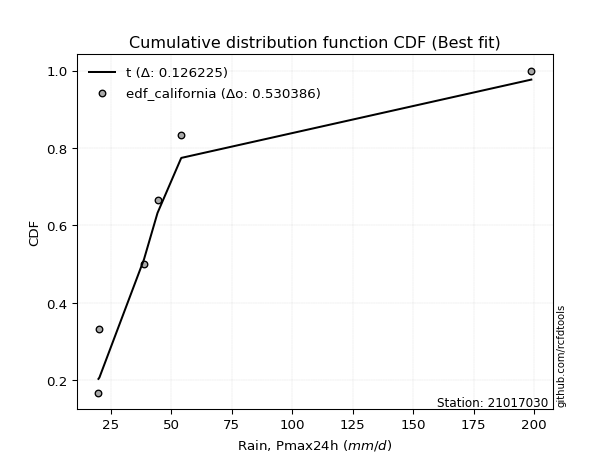</img>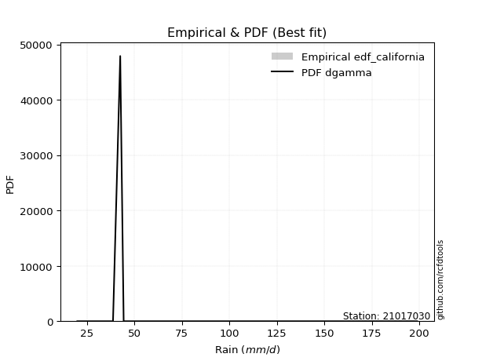</img>

</div>


### 2. EDF Hazen (1930)

Hazen method for plotting positions is a formula used to estimate the empirical cumulative probability distribution of flood events or other hydrological data. This formula often results in biased estimations, particularly when extrapolating to extreme events (high return periods).

<div align="center">


$P=(m-0.5)/n$


</div>


**2.1. Empirical values**

<div align="center">

|                | 0                   | 1                   | 2                   | 3         | 4                  | 5                  | 6                  |
|:---------------|:--------------------|:--------------------|:--------------------|:----------|:-------------------|:-------------------|:-------------------|
| date           | 2023                | 2022                | 2020                | 2025      | 2021               | 2019               | 2024               |
| x              | 20.0                | 20.4                | 38.8                | 42.6      | 44.4               | 54.2               | 198.8              |
| m              | 1                   | 2                   | 3                   | 4         | 5                  | 6                  | 7                  |
| empirical_dist | edf_hazen           | edf_hazen           | edf_hazen           | edf_hazen | edf_hazen          | edf_hazen          | edf_hazen          |
| empirical      | 0.07142857142857142 | 0.21428571428571427 | 0.35714285714285715 | 0.5       | 0.6428571428571429 | 0.7857142857142857 | 0.9285714285714286 |
| empirical_tr   | 1.0769230769230769  | 1.2727272727272727  | 1.5555555555555558  | 2.0       | 2.8000000000000003 | 4.666666666666666  | 14.000000000000007 |

</div>


**2.2. Kolmogorov-Smirnov fit test (sorted by Δ)**


<div align="center">

|                | 0                   | 1                   | 2                   | 3                   | 4                   | 5                   | 6                   | 7                   | 8                   | 9                   | 10                  | 11                  | 12                  | 13                  | 14                  | 15                  | 16                  | 17                  | 18                  | 19                  | 20                  | 21                  | 22                  | 23                  | 24                  | 25                  | 26                  | 27                  | 28                  | 29                  | 30                  | 31                  | 32                  | 33                  | 34                  | 35                  | 36                  | 37                  | 38                  | 39                  | 40                  | 41                  | 42                  | 43                  | 44                  | 45                  | 46                  | 47                  | 48                  | 49                  | 50                  | 51                  | 52                  | 53                  | 54                  | 55                  | 56                  | 57                  | 58                  | 59                  | 60                  | 61                  | 62                  | 63                  | 64                  | 65                  | 66                  | 67                  | 68                  | 69                  | 70                  | 71                  | 72                  | 73                  | 74                  | 75                  | 76                  | 77                  | 78                  | 79                  | 80                  | 81                  | 82                  | 83                  | 84                  | 85                  | 86                  | 87                  | 88                  | 89                  | 90                  | 91                  | 92                  | 93                  | 94                  | 95                  | 96                  | 97                  | 98                  | 99                  | 100                 | 101                 | 102                 | 103                 | 104                 | 105                 | 106                 | 107                 | 108                 | 109                 | 110                 | 111                 | 112                 | 113                 | 114                 | 115                 | 116                 | 117                 | 118                 | 119                 | 120                 | 121                 | 122                 | 123                 | 124                 | 125                 | 126                 | 127                 | 128                 | 129                 | 130                 | 131                 | 132                 | 133                 | 134                 | 135                 | 136                 | 137                 | 138                 | 139                 | 140                 | 141                 | 142                 | 143                 | 144                 | 145                 | 146                 | 147                 | 148                 | 149                 | 150                 | 151                 | 152                 | 153                 | 154                 | 155                 | 156                 | 157                 | 158                 | 159                 |
|:---------------|:--------------------|:--------------------|:--------------------|:--------------------|:--------------------|:--------------------|:--------------------|:--------------------|:--------------------|:--------------------|:--------------------|:--------------------|:--------------------|:--------------------|:--------------------|:--------------------|:--------------------|:--------------------|:--------------------|:--------------------|:--------------------|:--------------------|:--------------------|:--------------------|:--------------------|:--------------------|:--------------------|:--------------------|:--------------------|:--------------------|:--------------------|:--------------------|:--------------------|:--------------------|:--------------------|:--------------------|:--------------------|:--------------------|:--------------------|:--------------------|:--------------------|:--------------------|:--------------------|:--------------------|:--------------------|:--------------------|:--------------------|:--------------------|:--------------------|:--------------------|:--------------------|:--------------------|:--------------------|:--------------------|:--------------------|:--------------------|:--------------------|:--------------------|:--------------------|:--------------------|:--------------------|:--------------------|:--------------------|:--------------------|:--------------------|:--------------------|:--------------------|:--------------------|:--------------------|:--------------------|:--------------------|:--------------------|:--------------------|:--------------------|:--------------------|:--------------------|:--------------------|:--------------------|:--------------------|:--------------------|:--------------------|:--------------------|:--------------------|:--------------------|:--------------------|:--------------------|:--------------------|:--------------------|:--------------------|:--------------------|:--------------------|:--------------------|:--------------------|:--------------------|:--------------------|:--------------------|:--------------------|:--------------------|:--------------------|:--------------------|:--------------------|:--------------------|:--------------------|:--------------------|:--------------------|:--------------------|:--------------------|:--------------------|:--------------------|:--------------------|:--------------------|:--------------------|:--------------------|:--------------------|:--------------------|:--------------------|:--------------------|:--------------------|:--------------------|:--------------------|:--------------------|:--------------------|:--------------------|:--------------------|:--------------------|:--------------------|:--------------------|:--------------------|:--------------------|:--------------------|:--------------------|:--------------------|:--------------------|:--------------------|:--------------------|:--------------------|:--------------------|:--------------------|:--------------------|:--------------------|:--------------------|:--------------------|:--------------------|:--------------------|:--------------------|:--------------------|:--------------------|:--------------------|:--------------------|:--------------------|:--------------------|:--------------------|:--------------------|:--------------------|:--------------------|:--------------------|:--------------------|:--------------------|:--------------------|:--------------------|
| station        | 21017030            | 21017030            | 21017030            | 21017030            | 21017030            | 21017030            | 21017030            | 21017030            | 21017030            | 21017030            | 21017030            | 21017030            | 21017030            | 21017030            | 21017030            | 21017030            | 21017030            | 21017030            | 21017030            | 21017030            | 21017030            | 21017030            | 21017030            | 21017030            | 21017030            | 21017030            | 21017030            | 21017030            | 21017030            | 21017030            | 21017030            | 21017030            | 21017030            | 21017030            | 21017030            | 21017030            | 21017030            | 21017030            | 21017030            | 21017030            | 21017030            | 21017030            | 21017030            | 21017030            | 21017030            | 21017030            | 21017030            | 21017030            | 21017030            | 21017030            | 21017030            | 21017030            | 21017030            | 21017030            | 21017030            | 21017030            | 21017030            | 21017030            | 21017030            | 21017030            | 21017030            | 21017030            | 21017030            | 21017030            | 21017030            | 21017030            | 21017030            | 21017030            | 21017030            | 21017030            | 21017030            | 21017030            | 21017030            | 21017030            | 21017030            | 21017030            | 21017030            | 21017030            | 21017030            | 21017030            | 21017030            | 21017030            | 21017030            | 21017030            | 21017030            | 21017030            | 21017030            | 21017030            | 21017030            | 21017030            | 21017030            | 21017030            | 21017030            | 21017030            | 21017030            | 21017030            | 21017030            | 21017030            | 21017030            | 21017030            | 21017030            | 21017030            | 21017030            | 21017030            | 21017030            | 21017030            | 21017030            | 21017030            | 21017030            | 21017030            | 21017030            | 21017030            | 21017030            | 21017030            | 21017030            | 21017030            | 21017030            | 21017030            | 21017030            | 21017030            | 21017030            | 21017030            | 21017030            | 21017030            | 21017030            | 21017030            | 21017030            | 21017030            | 21017030            | 21017030            | 21017030            | 21017030            | 21017030            | 21017030            | 21017030            | 21017030            | 21017030            | 21017030            | 21017030            | 21017030            | 21017030            | 21017030            | 21017030            | 21017030            | 21017030            | 21017030            | 21017030            | 21017030            | 21017030            | 21017030            | 21017030            | 21017030            | 21017030            | 21017030            | 21017030            | 21017030            | 21017030            | 21017030            | 21017030            | 21017030            |
| empirical_dist | edf_hazen           | edf_hazen           | edf_hazen           | edf_hazen           | edf_hazen           | edf_hazen           | edf_hazen           | edf_hazen           | edf_hazen           | edf_hazen           | edf_hazen           | edf_hazen           | edf_hazen           | edf_hazen           | edf_hazen           | edf_hazen           | edf_hazen           | edf_hazen           | edf_hazen           | edf_hazen           | edf_hazen           | edf_hazen           | edf_hazen           | edf_hazen           | edf_hazen           | edf_hazen           | edf_hazen           | edf_hazen           | edf_hazen           | edf_hazen           | edf_hazen           | edf_hazen           | edf_hazen           | edf_hazen           | edf_hazen           | edf_hazen           | edf_hazen           | edf_hazen           | edf_hazen           | edf_hazen           | edf_hazen           | edf_hazen           | edf_hazen           | edf_hazen           | edf_hazen           | edf_hazen           | edf_hazen           | edf_hazen           | edf_hazen           | edf_hazen           | edf_hazen           | edf_hazen           | edf_hazen           | edf_hazen           | edf_hazen           | edf_hazen           | edf_hazen           | edf_hazen           | edf_hazen           | edf_hazen           | edf_hazen           | edf_hazen           | edf_hazen           | edf_hazen           | edf_hazen           | edf_hazen           | edf_hazen           | edf_hazen           | edf_hazen           | edf_hazen           | edf_hazen           | edf_hazen           | edf_hazen           | edf_hazen           | edf_hazen           | edf_hazen           | edf_hazen           | edf_hazen           | edf_hazen           | edf_hazen           | edf_hazen           | edf_hazen           | edf_hazen           | edf_hazen           | edf_hazen           | edf_hazen           | edf_hazen           | edf_hazen           | edf_hazen           | edf_hazen           | edf_hazen           | edf_hazen           | edf_hazen           | edf_hazen           | edf_hazen           | edf_hazen           | edf_hazen           | edf_hazen           | edf_hazen           | edf_hazen           | edf_hazen           | edf_hazen           | edf_hazen           | edf_hazen           | edf_hazen           | edf_hazen           | edf_hazen           | edf_hazen           | edf_hazen           | edf_hazen           | edf_hazen           | edf_hazen           | edf_hazen           | edf_hazen           | edf_hazen           | edf_hazen           | edf_hazen           | edf_hazen           | edf_hazen           | edf_hazen           | edf_hazen           | edf_hazen           | edf_hazen           | edf_hazen           | edf_hazen           | edf_hazen           | edf_hazen           | edf_hazen           | edf_hazen           | edf_hazen           | edf_hazen           | edf_hazen           | edf_hazen           | edf_hazen           | edf_hazen           | edf_hazen           | edf_hazen           | edf_hazen           | edf_hazen           | edf_hazen           | edf_hazen           | edf_hazen           | edf_hazen           | edf_hazen           | edf_hazen           | edf_hazen           | edf_hazen           | edf_hazen           | edf_hazen           | edf_hazen           | edf_hazen           | edf_hazen           | edf_hazen           | edf_hazen           | edf_hazen           | edf_hazen           | edf_hazen           | edf_hazen           | edf_hazen           | edf_hazen           |
| p_dist         | t                   | gennorm             | johnsonsu           | logjohnsonsu        | dgamma              | logdgamma           | loggennorm          | lognct              | logmielke           | betaprime           | logkstwobign        | logt                | logvonmises_line    | ncf                 | logpearson3         | loglaplace          | loglaplace          | logbetaprime        | loggumbel_r         | mielke              | lograyleigh         | nct                 | logfoldnorm         | loggenlogistic      | logdweibull         | logncf              | logexponnorm        | loghypsecant        | burr                | logmaxwell          | logrice             | gamma               | loghalfnorm         | loglogistic         | wald                | logmoyal            | logalpha            | logburr             | loginvweibull       | loggenextreme       | lognorm             | logcrystalball      | loggengamma         | loghalflogistic     | logbeta             | logf                | loginvgamma         | logloggamma         | loggausshyper       | loganglit           | loggenexpon         | truncweibull_min    | loggompertz         | logsemicircular     | truncpareto         | dweibull            | vonmises_line       | logskewnorm         | pearson3            | gompertz            | exponpow            | exponnorm           | alpha               | burr12              | logloglaplace       | genexpon            | nakagami            | loginvgauss         | invgamma            | loglomax            | logarcsine          | genlogistic         | halflogistic        | f                   | loggumbel_l         | logtriang           | logwald             | moyal               | logtruncexpon       | logcosine           | halfnorm            | erlang              | gumbel_r            | foldnorm            | gengamma            | genpareto           | johnsonsb           | invgauss            | logweibull_min      | rayleigh            | kappa3              | maxwell             | invweibull          | genextreme          | kstwobign           | logweibull_max      | arcsine             | weibull_min         | semicircular        | anglit              | truncnorm           | crystalball         | norm                | logkappa4           | logistic            | logwrapcauchy       | loghalfgennorm      | hypsecant           | loggenpareto        | exponweib           | logrdist            | logksone            | lomax               | logargus            | halfgennorm         | logtukeylambda      | laplace             | rice                | loguniform          | logexponpow         | loglevy_l           | wrapcauchy          | logtruncnorm        | logburr12           | powerlaw            | bradford            | levy_l              | gumbel_l            | lognakagami         | truncexpon          | logjohnsonsb        | gausshyper          | cosine              | skewnorm            | fatiguelife         | logkappa3           | logtruncweibull_min | logpowerlaw         | logbradford         | triang              | argus               | logexponweib        | loggenhalflogistic  | logtruncpareto      | logfatiguelife      | ksone               | rdist               | kappa4              | logerlang           | loggamma            | loggamma            | tukeylambda         | logtrapezoid        | uniform             | genhalflogistic     | beta                | weibull_max         | trapezoid           | logvonmises         | vonmises            |
| delta          | 0.08035717005850182 | 0.08206731592238292 | 0.09387931617691128 | 0.10727432963504144 | 0.10939559908541074 | 0.1138264338275552  | 0.11811838712444087 | 0.12101845185116739 | 0.12188078546474125 | 0.12509366519080045 | 0.1272333711825278  | 0.12741760424307397 | 0.1299128820479763  | 0.13206750700523884 | 0.13536771079850857 | 0.13540452030115568 | 0.13540452030115568 | 0.13613715865924914 | 0.13640052249092138 | 0.13830171170283917 | 0.13835499604946222 | 0.13852754198686917 | 0.140005652973198   | 0.1412568770325075  | 0.14285714285696838 | 0.14304336301298648 | 0.14438006441153922 | 0.14512852245145225 | 0.14555956483126536 | 0.14610757941077124 | 0.1484742990725687  | 0.15093328668091854 | 0.1527388541722517  | 0.156831623768658   | 0.1598593725842351  | 0.160995527960005   | 0.16158218321813705 | 0.16590859246536965 | 0.16722780983986746 | 0.1672443972713364  | 0.17132200528121222 | 0.17132209293196876 | 0.17169264731828485 | 0.17174473795804474 | 0.1735095395276483  | 0.17454803007840242 | 0.17455815724476148 | 0.17507711934333992 | 0.18424268956708395 | 0.18696748305190125 | 0.1916000715777148  | 0.1917714634319344  | 0.19290887347245012 | 0.19348097107799256 | 0.1958117920565455  | 0.19752643638903686 | 0.19757603785097766 | 0.199428479974563   | 0.20028451456830643 | 0.20302062288228662 | 0.20504799583898337 | 0.20770177402214351 | 0.20782630964272125 | 0.20930364553774433 | 0.20946723767588593 | 0.2099605275510179  | 0.21067363229480462 | 0.2122583236370877  | 0.2160803359057369  | 0.2169332554905003  | 0.21979477027150363 | 0.22239117509337625 | 0.22374045365921358 | 0.22511632961089817 | 0.22824600235102754 | 0.2287169632565489  | 0.22893181758490072 | 0.2311301245359786  | 0.2319565585003488  | 0.23637412940756164 | 0.24581317315975748 | 0.24944509173967305 | 0.2567453265203249  | 0.256936114048095   | 0.2620018738632326  | 0.2629449065505128  | 0.2707254885554215  | 0.270903372750437   | 0.2739569499015407  | 0.27891921263101993 | 0.27962805902903676 | 0.29065824465358653 | 0.29774750482013745 | 0.29890625222510214 | 0.30664244104742194 | 0.3078319114492396  | 0.3078366354608512  | 0.3137489644043719  | 0.31696223539939755 | 0.31925964932596507 | 0.31972919382394316 | 0.32483053969696396 | 0.32483055117819937 | 0.3281786293015583  | 0.33012911641053044 | 0.3313407428025237  | 0.3316790958339267  | 0.3346244658283784  | 0.3353150970981698  | 0.3373208017193671  | 0.33919580735080174 | 0.34062772610910796 | 0.34085388862002053 | 0.3409583476353486  | 0.34191144348007024 | 0.349309990838223   | 0.35055087532453466 | 0.3509969519845699  | 0.3516104141880724  | 0.3532155066991787  | 0.35631907285632036 | 0.3617551727503851  | 0.36251916733327527 | 0.36397051080725623 | 0.3835488236476477  | 0.38978690753648704 | 0.3934832337939178  | 0.3952774246316103  | 0.39808342504389255 | 0.4016952303229497  | 0.40484302147886675 | 0.404969755628859   | 0.40641011432547514 | 0.41236372931853815 | 0.4174336693802226  | 0.4301066189718381  | 0.4595916288513064  | 0.46770268119198516 | 0.47074028025569653 | 0.48358425977254926 | 0.4842475522908377  | 0.48465568035430234 | 0.4853434013151134  | 0.49195770997536786 | 0.49699776715147453 | 0.54298497922659    | 0.5500894634346596  | 0.5650838851806363  | 0.5789079151998981  | 0.5817289248855266  | 0.5817289248855266  | 0.5832820854271057  | 0.5876122401731123  | 0.5944391179290508  | 0.6416788153309056  | 0.6774578470720876  | 0.7076738488184168  | 0.7267967694862879  | 1.1050239749307416  | 31.073942603853578  |
| deltao         | 0.48442053926100004 | 0.48442053926100004 | 0.48442053926100004 | 0.48442053926100004 | 0.48442053926100004 | 0.48442053926100004 | 0.48442053926100004 | 0.48442053926100004 | 0.48442053926100004 | 0.48442053926100004 | 0.48442053926100004 | 0.48442053926100004 | 0.48442053926100004 | 0.48442053926100004 | 0.48442053926100004 | 0.48442053926100004 | 0.48442053926100004 | 0.48442053926100004 | 0.48442053926100004 | 0.48442053926100004 | 0.48442053926100004 | 0.48442053926100004 | 0.48442053926100004 | 0.48442053926100004 | 0.48442053926100004 | 0.48442053926100004 | 0.48442053926100004 | 0.48442053926100004 | 0.48442053926100004 | 0.48442053926100004 | 0.48442053926100004 | 0.48442053926100004 | 0.48442053926100004 | 0.48442053926100004 | 0.48442053926100004 | 0.48442053926100004 | 0.48442053926100004 | 0.48442053926100004 | 0.48442053926100004 | 0.48442053926100004 | 0.48442053926100004 | 0.48442053926100004 | 0.48442053926100004 | 0.48442053926100004 | 0.48442053926100004 | 0.48442053926100004 | 0.48442053926100004 | 0.48442053926100004 | 0.48442053926100004 | 0.48442053926100004 | 0.48442053926100004 | 0.48442053926100004 | 0.48442053926100004 | 0.48442053926100004 | 0.48442053926100004 | 0.48442053926100004 | 0.48442053926100004 | 0.48442053926100004 | 0.48442053926100004 | 0.48442053926100004 | 0.48442053926100004 | 0.48442053926100004 | 0.48442053926100004 | 0.48442053926100004 | 0.48442053926100004 | 0.48442053926100004 | 0.48442053926100004 | 0.48442053926100004 | 0.48442053926100004 | 0.48442053926100004 | 0.48442053926100004 | 0.48442053926100004 | 0.48442053926100004 | 0.48442053926100004 | 0.48442053926100004 | 0.48442053926100004 | 0.48442053926100004 | 0.48442053926100004 | 0.48442053926100004 | 0.48442053926100004 | 0.48442053926100004 | 0.48442053926100004 | 0.48442053926100004 | 0.48442053926100004 | 0.48442053926100004 | 0.48442053926100004 | 0.48442053926100004 | 0.48442053926100004 | 0.48442053926100004 | 0.48442053926100004 | 0.48442053926100004 | 0.48442053926100004 | 0.48442053926100004 | 0.48442053926100004 | 0.48442053926100004 | 0.48442053926100004 | 0.48442053926100004 | 0.48442053926100004 | 0.48442053926100004 | 0.48442053926100004 | 0.48442053926100004 | 0.48442053926100004 | 0.48442053926100004 | 0.48442053926100004 | 0.48442053926100004 | 0.48442053926100004 | 0.48442053926100004 | 0.48442053926100004 | 0.48442053926100004 | 0.48442053926100004 | 0.48442053926100004 | 0.48442053926100004 | 0.48442053926100004 | 0.48442053926100004 | 0.48442053926100004 | 0.48442053926100004 | 0.48442053926100004 | 0.48442053926100004 | 0.48442053926100004 | 0.48442053926100004 | 0.48442053926100004 | 0.48442053926100004 | 0.48442053926100004 | 0.48442053926100004 | 0.48442053926100004 | 0.48442053926100004 | 0.48442053926100004 | 0.48442053926100004 | 0.48442053926100004 | 0.48442053926100004 | 0.48442053926100004 | 0.48442053926100004 | 0.48442053926100004 | 0.48442053926100004 | 0.48442053926100004 | 0.48442053926100004 | 0.48442053926100004 | 0.48442053926100004 | 0.48442053926100004 | 0.48442053926100004 | 0.48442053926100004 | 0.48442053926100004 | 0.48442053926100004 | 0.48442053926100004 | 0.48442053926100004 | 0.48442053926100004 | 0.48442053926100004 | 0.48442053926100004 | 0.48442053926100004 | 0.48442053926100004 | 0.48442053926100004 | 0.48442053926100004 | 0.48442053926100004 | 0.48442053926100004 | 0.48442053926100004 | 0.48442053926100004 | 0.48442053926100004 | 0.48442053926100004 | 0.48442053926100004 | 0.48442053926100004 |
| eval           | Δo > Δ              | Δo > Δ              | Δo > Δ              | Δo > Δ              | Δo > Δ              | Δo > Δ              | Δo > Δ              | Δo > Δ              | Δo > Δ              | Δo > Δ              | Δo > Δ              | Δo > Δ              | Δo > Δ              | Δo > Δ              | Δo > Δ              | Δo > Δ              | Δo > Δ              | Δo > Δ              | Δo > Δ              | Δo > Δ              | Δo > Δ              | Δo > Δ              | Δo > Δ              | Δo > Δ              | Δo > Δ              | Δo > Δ              | Δo > Δ              | Δo > Δ              | Δo > Δ              | Δo > Δ              | Δo > Δ              | Δo > Δ              | Δo > Δ              | Δo > Δ              | Δo > Δ              | Δo > Δ              | Δo > Δ              | Δo > Δ              | Δo > Δ              | Δo > Δ              | Δo > Δ              | Δo > Δ              | Δo > Δ              | Δo > Δ              | Δo > Δ              | Δo > Δ              | Δo > Δ              | Δo > Δ              | Δo > Δ              | Δo > Δ              | Δo > Δ              | Δo > Δ              | Δo > Δ              | Δo > Δ              | Δo > Δ              | Δo > Δ              | Δo > Δ              | Δo > Δ              | Δo > Δ              | Δo > Δ              | Δo > Δ              | Δo > Δ              | Δo > Δ              | Δo > Δ              | Δo > Δ              | Δo > Δ              | Δo > Δ              | Δo > Δ              | Δo > Δ              | Δo > Δ              | Δo > Δ              | Δo > Δ              | Δo > Δ              | Δo > Δ              | Δo > Δ              | Δo > Δ              | Δo > Δ              | Δo > Δ              | Δo > Δ              | Δo > Δ              | Δo > Δ              | Δo > Δ              | Δo > Δ              | Δo > Δ              | Δo > Δ              | Δo > Δ              | Δo > Δ              | Δo > Δ              | Δo > Δ              | Δo > Δ              | Δo > Δ              | Δo > Δ              | Δo > Δ              | Δo > Δ              | Δo > Δ              | Δo > Δ              | Δo > Δ              | Δo > Δ              | Δo > Δ              | Δo > Δ              | Δo > Δ              | Δo > Δ              | Δo > Δ              | Δo > Δ              | Δo > Δ              | Δo > Δ              | Δo > Δ              | Δo > Δ              | Δo > Δ              | Δo > Δ              | Δo > Δ              | Δo > Δ              | Δo > Δ              | Δo > Δ              | Δo > Δ              | Δo > Δ              | Δo > Δ              | Δo > Δ              | Δo > Δ              | Δo > Δ              | Δo > Δ              | Δo > Δ              | Δo > Δ              | Δo > Δ              | Δo > Δ              | Δo > Δ              | Δo > Δ              | Δo > Δ              | Δo > Δ              | Δo > Δ              | Δo > Δ              | Δo > Δ              | Δo > Δ              | Δo > Δ              | Δo > Δ              | Δo > Δ              | Δo > Δ              | Δo > Δ              | Δo > Δ              | Δo > Δ              | Δo > Δ              | Δo <= Δ             | Δo <= Δ             | Δo <= Δ             | Δo <= Δ             | Δo <= Δ             | Δo <= Δ             | Δo <= Δ             | Δo <= Δ             | Δo <= Δ             | Δo <= Δ             | Δo <= Δ             | Δo <= Δ             | Δo <= Δ             | Δo <= Δ             | Δo <= Δ             | Δo <= Δ             | Δo <= Δ             | Δo <= Δ             | Δo <= Δ             |
| fit            | 1                   | 1                   | 1                   | 1                   | 1                   | 1                   | 1                   | 1                   | 1                   | 1                   | 1                   | 1                   | 1                   | 1                   | 1                   | 1                   | 1                   | 1                   | 1                   | 1                   | 1                   | 1                   | 1                   | 1                   | 1                   | 1                   | 1                   | 1                   | 1                   | 1                   | 1                   | 1                   | 1                   | 1                   | 1                   | 1                   | 1                   | 1                   | 1                   | 1                   | 1                   | 1                   | 1                   | 1                   | 1                   | 1                   | 1                   | 1                   | 1                   | 1                   | 1                   | 1                   | 1                   | 1                   | 1                   | 1                   | 1                   | 1                   | 1                   | 1                   | 1                   | 1                   | 1                   | 1                   | 1                   | 1                   | 1                   | 1                   | 1                   | 1                   | 1                   | 1                   | 1                   | 1                   | 1                   | 1                   | 1                   | 1                   | 1                   | 1                   | 1                   | 1                   | 1                   | 1                   | 1                   | 1                   | 1                   | 1                   | 1                   | 1                   | 1                   | 1                   | 1                   | 1                   | 1                   | 1                   | 1                   | 1                   | 1                   | 1                   | 1                   | 1                   | 1                   | 1                   | 1                   | 1                   | 1                   | 1                   | 1                   | 1                   | 1                   | 1                   | 1                   | 1                   | 1                   | 1                   | 1                   | 1                   | 1                   | 1                   | 1                   | 1                   | 1                   | 1                   | 1                   | 1                   | 1                   | 1                   | 1                   | 1                   | 1                   | 1                   | 1                   | 1                   | 1                   | 1                   | 1                   | 1                   | 1                   | 1                   | 1                   | 0                   | 0                   | 0                   | 0                   | 0                   | 0                   | 0                   | 0                   | 0                   | 0                   | 0                   | 0                   | 0                   | 0                   | 0                   | 0                   | 0                   | 0                   | 0                   |
| n              | 7                   | 7                   | 7                   | 7                   | 7                   | 7                   | 7                   | 7                   | 7                   | 7                   | 7                   | 7                   | 7                   | 7                   | 7                   | 7                   | 7                   | 7                   | 7                   | 7                   | 7                   | 7                   | 7                   | 7                   | 7                   | 7                   | 7                   | 7                   | 7                   | 7                   | 7                   | 7                   | 7                   | 7                   | 7                   | 7                   | 7                   | 7                   | 7                   | 7                   | 7                   | 7                   | 7                   | 7                   | 7                   | 7                   | 7                   | 7                   | 7                   | 7                   | 7                   | 7                   | 7                   | 7                   | 7                   | 7                   | 7                   | 7                   | 7                   | 7                   | 7                   | 7                   | 7                   | 7                   | 7                   | 7                   | 7                   | 7                   | 7                   | 7                   | 7                   | 7                   | 7                   | 7                   | 7                   | 7                   | 7                   | 7                   | 7                   | 7                   | 7                   | 7                   | 7                   | 7                   | 7                   | 7                   | 7                   | 7                   | 7                   | 7                   | 7                   | 7                   | 7                   | 7                   | 7                   | 7                   | 7                   | 7                   | 7                   | 7                   | 7                   | 7                   | 7                   | 7                   | 7                   | 7                   | 7                   | 7                   | 7                   | 7                   | 7                   | 7                   | 7                   | 7                   | 7                   | 7                   | 7                   | 7                   | 7                   | 7                   | 7                   | 7                   | 7                   | 7                   | 7                   | 7                   | 7                   | 7                   | 7                   | 7                   | 7                   | 7                   | 7                   | 7                   | 7                   | 7                   | 7                   | 7                   | 7                   | 7                   | 7                   | 7                   | 7                   | 7                   | 7                   | 7                   | 7                   | 7                   | 7                   | 7                   | 7                   | 7                   | 7                   | 7                   | 7                   | 7                   | 7                   | 7                   | 7                   | 7                   |
| best_fit       | 1                   | 0                   | 0                   | 0                   | 0                   | 0                   | 0                   | 0                   | 0                   | 0                   | 0                   | 0                   | 0                   | 0                   | 0                   | 0                   | 0                   | 0                   | 0                   | 0                   | 0                   | 0                   | 0                   | 0                   | 0                   | 0                   | 0                   | 0                   | 0                   | 0                   | 0                   | 0                   | 0                   | 0                   | 0                   | 0                   | 0                   | 0                   | 0                   | 0                   | 0                   | 0                   | 0                   | 0                   | 0                   | 0                   | 0                   | 0                   | 0                   | 0                   | 0                   | 0                   | 0                   | 0                   | 0                   | 0                   | 0                   | 0                   | 0                   | 0                   | 0                   | 0                   | 0                   | 0                   | 0                   | 0                   | 0                   | 0                   | 0                   | 0                   | 0                   | 0                   | 0                   | 0                   | 0                   | 0                   | 0                   | 0                   | 0                   | 0                   | 0                   | 0                   | 0                   | 0                   | 0                   | 0                   | 0                   | 0                   | 0                   | 0                   | 0                   | 0                   | 0                   | 0                   | 0                   | 0                   | 0                   | 0                   | 0                   | 0                   | 0                   | 0                   | 0                   | 0                   | 0                   | 0                   | 0                   | 0                   | 0                   | 0                   | 0                   | 0                   | 0                   | 0                   | 0                   | 0                   | 0                   | 0                   | 0                   | 0                   | 0                   | 0                   | 0                   | 0                   | 0                   | 0                   | 0                   | 0                   | 0                   | 0                   | 0                   | 0                   | 0                   | 0                   | 0                   | 0                   | 0                   | 0                   | 0                   | 0                   | 0                   | 0                   | 0                   | 0                   | 0                   | 0                   | 0                   | 0                   | 0                   | 0                   | 0                   | 0                   | 0                   | 0                   | 0                   | 0                   | 0                   | 0                   | 0                   | 0                   |
| best_fit_sort  | 1                   | 2                   | 3                   | 4                   | 5                   | 6                   | 7                   | 8                   | 9                   | 10                  | 11                  | 12                  | 13                  | 14                  | 15                  | 16                  | 17                  | 18                  | 19                  | 20                  | 21                  | 22                  | 23                  | 24                  | 25                  | 26                  | 27                  | 28                  | 29                  | 30                  | 31                  | 32                  | 33                  | 34                  | 35                  | 36                  | 37                  | 38                  | 39                  | 40                  | 41                  | 42                  | 43                  | 44                  | 45                  | 46                  | 47                  | 48                  | 49                  | 50                  | 51                  | 52                  | 53                  | 54                  | 55                  | 56                  | 57                  | 58                  | 59                  | 60                  | 61                  | 62                  | 63                  | 64                  | 65                  | 66                  | 67                  | 68                  | 69                  | 70                  | 71                  | 72                  | 73                  | 74                  | 75                  | 76                  | 77                  | 78                  | 79                  | 80                  | 81                  | 82                  | 83                  | 84                  | 85                  | 86                  | 87                  | 88                  | 89                  | 90                  | 91                  | 92                  | 93                  | 94                  | 95                  | 96                  | 97                  | 98                  | 99                  | 100                 | 101                 | 102                 | 103                 | 104                 | 105                 | 106                 | 107                 | 108                 | 109                 | 110                 | 111                 | 112                 | 113                 | 114                 | 115                 | 116                 | 117                 | 118                 | 119                 | 120                 | 121                 | 122                 | 123                 | 124                 | 125                 | 126                 | 127                 | 128                 | 129                 | 130                 | 131                 | 132                 | 133                 | 134                 | 135                 | 136                 | 137                 | 138                 | 139                 | 140                 | 141                 | 142                 | 143                 | 144                 | 145                 | 146                 | 147                 | 148                 | 149                 | 150                 | 151                 | 152                 | 153                 | 154                 | 155                 | 156                 | 157                 | 158                 | 159                 | 160                 |

</div>


**2.3. Best fit**

<div align="center">

|   id |   station | empirical_dist   | p_dist   |     delta |   deltao | eval   |   fit |   n |   best_fit |   best_fit_sort |
|-----:|----------:|:-----------------|:---------|----------:|---------:|:-------|------:|----:|-----------:|----------------:|
|    0 |  21017030 | edf_hazen        | t        | 0.0803572 | 0.484421 | Δo > Δ |     1 |   7 |          1 |               1 |

</div>


<div align="center">

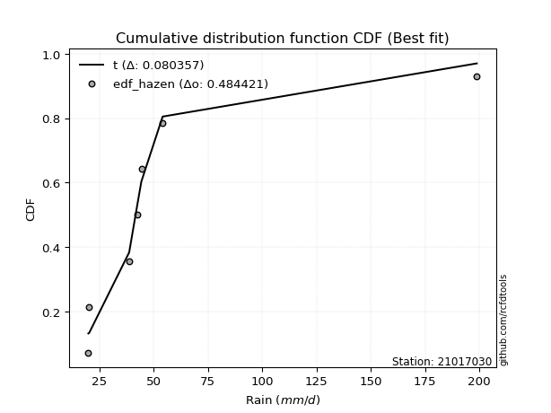</img>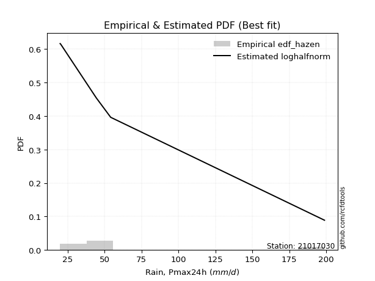</img>

</div>


### 3. EDF Weibull (1939)

Weibull plotting position formula is an empirical method used to estimate the non-exceedance probability or plotting position for a set of observed data, is often recommended or widely used in practice, particularly in flood frequency analysis.

<div align="center">


$P=m/(n+1)$


</div>


**3.1. Empirical values**

<div align="center">

|                | 0                  | 1                  | 2           | 3           | 4                  | 5           | 6           |
|:---------------|:-------------------|:-------------------|:------------|:------------|:-------------------|:------------|:------------|
| date           | 2023               | 2022               | 2020        | 2025        | 2021               | 2019        | 2024        |
| x              | 20.0               | 20.4               | 38.8        | 42.6        | 44.4               | 54.2        | 198.8       |
| m              | 1                  | 2                  | 3           | 4           | 5                  | 6           | 7           |
| empirical_dist | edf_weibull        | edf_weibull        | edf_weibull | edf_weibull | edf_weibull        | edf_weibull | edf_weibull |
| empirical      | 0.125              | 0.25               | 0.375       | 0.5         | 0.625              | 0.75        | 0.875       |
| empirical_tr   | 1.1428571428571428 | 1.3333333333333333 | 1.6         | 2.0         | 2.6666666666666665 | 4.0         | 8.0         |

</div>


**3.2. Kolmogorov-Smirnov fit test (sorted by Δ)**


<div align="center">

|                | 0                   | 1                   | 2                   | 3                   | 4                   | 5                   | 6                   | 7                   | 8                   | 9                   | 10                  | 11                  | 12                  | 13                  | 14                  | 15                  | 16                  | 17                  | 18                  | 19                  | 20                  | 21                  | 22                  | 23                  | 24                  | 25                  | 26                  | 27                  | 28                  | 29                  | 30                  | 31                  | 32                  | 33                  | 34                  | 35                  | 36                  | 37                  | 38                  | 39                  | 40                  | 41                  | 42                  | 43                  | 44                  | 45                  | 46                  | 47                  | 48                  | 49                  | 50                  | 51                  | 52                  | 53                  | 54                  | 55                  | 56                  | 57                  | 58                  | 59                  | 60                  | 61                  | 62                  | 63                  | 64                  | 65                  | 66                  | 67                  | 68                  | 69                  | 70                  | 71                  | 72                  | 73                  | 74                  | 75                  | 76                  | 77                  | 78                  | 79                  | 80                  | 81                  | 82                  | 83                  | 84                  | 85                  | 86                  | 87                  | 88                  | 89                  | 90                  | 91                  | 92                  | 93                  | 94                  | 95                  | 96                  | 97                  | 98                  | 99                  | 100                 | 101                 | 102                 | 103                 | 104                 | 105                 | 106                 | 107                 | 108                 | 109                 | 110                 | 111                 | 112                 | 113                 | 114                 | 115                 | 116                 | 117                 | 118                 | 119                 | 120                 | 121                 | 122                 | 123                 | 124                 | 125                 | 126                 | 127                 | 128                 | 129                 | 130                 | 131                 | 132                 | 133                 | 134                 | 135                 | 136                 | 137                 | 138                 | 139                 | 140                 | 141                 | 142                 | 143                 | 144                 | 145                 | 146                 | 147                 | 148                 | 149                 | 150                 | 151                 | 152                 | 153                 | 154                 | 155                 | 156                 | 157                 | 158                 | 159                 |
|:---------------|:--------------------|:--------------------|:--------------------|:--------------------|:--------------------|:--------------------|:--------------------|:--------------------|:--------------------|:--------------------|:--------------------|:--------------------|:--------------------|:--------------------|:--------------------|:--------------------|:--------------------|:--------------------|:--------------------|:--------------------|:--------------------|:--------------------|:--------------------|:--------------------|:--------------------|:--------------------|:--------------------|:--------------------|:--------------------|:--------------------|:--------------------|:--------------------|:--------------------|:--------------------|:--------------------|:--------------------|:--------------------|:--------------------|:--------------------|:--------------------|:--------------------|:--------------------|:--------------------|:--------------------|:--------------------|:--------------------|:--------------------|:--------------------|:--------------------|:--------------------|:--------------------|:--------------------|:--------------------|:--------------------|:--------------------|:--------------------|:--------------------|:--------------------|:--------------------|:--------------------|:--------------------|:--------------------|:--------------------|:--------------------|:--------------------|:--------------------|:--------------------|:--------------------|:--------------------|:--------------------|:--------------------|:--------------------|:--------------------|:--------------------|:--------------------|:--------------------|:--------------------|:--------------------|:--------------------|:--------------------|:--------------------|:--------------------|:--------------------|:--------------------|:--------------------|:--------------------|:--------------------|:--------------------|:--------------------|:--------------------|:--------------------|:--------------------|:--------------------|:--------------------|:--------------------|:--------------------|:--------------------|:--------------------|:--------------------|:--------------------|:--------------------|:--------------------|:--------------------|:--------------------|:--------------------|:--------------------|:--------------------|:--------------------|:--------------------|:--------------------|:--------------------|:--------------------|:--------------------|:--------------------|:--------------------|:--------------------|:--------------------|:--------------------|:--------------------|:--------------------|:--------------------|:--------------------|:--------------------|:--------------------|:--------------------|:--------------------|:--------------------|:--------------------|:--------------------|:--------------------|:--------------------|:--------------------|:--------------------|:--------------------|:--------------------|:--------------------|:--------------------|:--------------------|:--------------------|:--------------------|:--------------------|:--------------------|:--------------------|:--------------------|:--------------------|:--------------------|:--------------------|:--------------------|:--------------------|:--------------------|:--------------------|:--------------------|:--------------------|:--------------------|:--------------------|:--------------------|:--------------------|:--------------------|:--------------------|:--------------------|
| station        | 21017030            | 21017030            | 21017030            | 21017030            | 21017030            | 21017030            | 21017030            | 21017030            | 21017030            | 21017030            | 21017030            | 21017030            | 21017030            | 21017030            | 21017030            | 21017030            | 21017030            | 21017030            | 21017030            | 21017030            | 21017030            | 21017030            | 21017030            | 21017030            | 21017030            | 21017030            | 21017030            | 21017030            | 21017030            | 21017030            | 21017030            | 21017030            | 21017030            | 21017030            | 21017030            | 21017030            | 21017030            | 21017030            | 21017030            | 21017030            | 21017030            | 21017030            | 21017030            | 21017030            | 21017030            | 21017030            | 21017030            | 21017030            | 21017030            | 21017030            | 21017030            | 21017030            | 21017030            | 21017030            | 21017030            | 21017030            | 21017030            | 21017030            | 21017030            | 21017030            | 21017030            | 21017030            | 21017030            | 21017030            | 21017030            | 21017030            | 21017030            | 21017030            | 21017030            | 21017030            | 21017030            | 21017030            | 21017030            | 21017030            | 21017030            | 21017030            | 21017030            | 21017030            | 21017030            | 21017030            | 21017030            | 21017030            | 21017030            | 21017030            | 21017030            | 21017030            | 21017030            | 21017030            | 21017030            | 21017030            | 21017030            | 21017030            | 21017030            | 21017030            | 21017030            | 21017030            | 21017030            | 21017030            | 21017030            | 21017030            | 21017030            | 21017030            | 21017030            | 21017030            | 21017030            | 21017030            | 21017030            | 21017030            | 21017030            | 21017030            | 21017030            | 21017030            | 21017030            | 21017030            | 21017030            | 21017030            | 21017030            | 21017030            | 21017030            | 21017030            | 21017030            | 21017030            | 21017030            | 21017030            | 21017030            | 21017030            | 21017030            | 21017030            | 21017030            | 21017030            | 21017030            | 21017030            | 21017030            | 21017030            | 21017030            | 21017030            | 21017030            | 21017030            | 21017030            | 21017030            | 21017030            | 21017030            | 21017030            | 21017030            | 21017030            | 21017030            | 21017030            | 21017030            | 21017030            | 21017030            | 21017030            | 21017030            | 21017030            | 21017030            | 21017030            | 21017030            | 21017030            | 21017030            | 21017030            | 21017030            |
| empirical_dist | edf_weibull         | edf_weibull         | edf_weibull         | edf_weibull         | edf_weibull         | edf_weibull         | edf_weibull         | edf_weibull         | edf_weibull         | edf_weibull         | edf_weibull         | edf_weibull         | edf_weibull         | edf_weibull         | edf_weibull         | edf_weibull         | edf_weibull         | edf_weibull         | edf_weibull         | edf_weibull         | edf_weibull         | edf_weibull         | edf_weibull         | edf_weibull         | edf_weibull         | edf_weibull         | edf_weibull         | edf_weibull         | edf_weibull         | edf_weibull         | edf_weibull         | edf_weibull         | edf_weibull         | edf_weibull         | edf_weibull         | edf_weibull         | edf_weibull         | edf_weibull         | edf_weibull         | edf_weibull         | edf_weibull         | edf_weibull         | edf_weibull         | edf_weibull         | edf_weibull         | edf_weibull         | edf_weibull         | edf_weibull         | edf_weibull         | edf_weibull         | edf_weibull         | edf_weibull         | edf_weibull         | edf_weibull         | edf_weibull         | edf_weibull         | edf_weibull         | edf_weibull         | edf_weibull         | edf_weibull         | edf_weibull         | edf_weibull         | edf_weibull         | edf_weibull         | edf_weibull         | edf_weibull         | edf_weibull         | edf_weibull         | edf_weibull         | edf_weibull         | edf_weibull         | edf_weibull         | edf_weibull         | edf_weibull         | edf_weibull         | edf_weibull         | edf_weibull         | edf_weibull         | edf_weibull         | edf_weibull         | edf_weibull         | edf_weibull         | edf_weibull         | edf_weibull         | edf_weibull         | edf_weibull         | edf_weibull         | edf_weibull         | edf_weibull         | edf_weibull         | edf_weibull         | edf_weibull         | edf_weibull         | edf_weibull         | edf_weibull         | edf_weibull         | edf_weibull         | edf_weibull         | edf_weibull         | edf_weibull         | edf_weibull         | edf_weibull         | edf_weibull         | edf_weibull         | edf_weibull         | edf_weibull         | edf_weibull         | edf_weibull         | edf_weibull         | edf_weibull         | edf_weibull         | edf_weibull         | edf_weibull         | edf_weibull         | edf_weibull         | edf_weibull         | edf_weibull         | edf_weibull         | edf_weibull         | edf_weibull         | edf_weibull         | edf_weibull         | edf_weibull         | edf_weibull         | edf_weibull         | edf_weibull         | edf_weibull         | edf_weibull         | edf_weibull         | edf_weibull         | edf_weibull         | edf_weibull         | edf_weibull         | edf_weibull         | edf_weibull         | edf_weibull         | edf_weibull         | edf_weibull         | edf_weibull         | edf_weibull         | edf_weibull         | edf_weibull         | edf_weibull         | edf_weibull         | edf_weibull         | edf_weibull         | edf_weibull         | edf_weibull         | edf_weibull         | edf_weibull         | edf_weibull         | edf_weibull         | edf_weibull         | edf_weibull         | edf_weibull         | edf_weibull         | edf_weibull         | edf_weibull         | edf_weibull         | edf_weibull         |
| p_dist         | logmaxwell          | lograyleigh         | logfoldnorm         | t                   | gennorm             | dgamma              | logncf              | wald                | logvonmises_line    | logt                | loglogistic         | logbetaprime        | johnsonsu           | ncf                 | logpearson3         | loghalfnorm         | loghypsecant        | lognorm             | logcrystalball      | betaprime           | logdweibull         | logloggamma         | loglaplace          | loglaplace          | lognct              | logjohnsonsu        | dweibull            | loggumbel_r         | logdgamma           | loganglit           | nct                 | mielke              | loggenlogistic      | loggennorm          | logexponnorm        | burr                | logkstwobign        | logmielke           | logsemicircular     | logalpha            | logburr             | loggenextreme       | loginvweibull       | vonmises_line       | loginvgamma         | logf                | logrice             | pearson3            | logmoyal            | nakagami            | loggausshyper       | logarcsine          | gamma               | genlogistic         | halflogistic        | loghalflogistic     | alpha               | exponpow            | loggumbel_l         | logtriang           | loginvgauss         | moyal               | invgamma            | logloglaplace       | logcosine           | foldnorm            | f                   | loggengamma         | logbeta             | halfnorm            | burr12              | gumbel_r            | loglomax            | truncweibull_min    | kappa3              | gengamma            | loggenexpon         | loggompertz         | truncpareto         | erlang              | logskewnorm         | logtruncexpon       | gompertz            | exponnorm           | genexpon            | rayleigh            | invweibull          | genpareto           | genextreme          | logwald             | johnsonsb           | invgauss            | logweibull_max      | maxwell             | logweibull_min      | kstwobign           | arcsine             | semicircular        | anglit              | truncnorm           | crystalball         | norm                | logkappa4           | logistic            | logwrapcauchy       | weibull_min         | hypsecant           | loggenpareto        | loglevy_l           | logrdist            | logksone            | lomax               | logargus            | logtukeylambda      | loghalfgennorm      | laplace             | rice                | loguniform          | exponweib           | halfgennorm         | wrapcauchy          | logexponpow         | levy_l              | logburr12           | bradford            | gumbel_l            | powerlaw            | truncexpon          | logjohnsonsb        | gausshyper          | cosine              | logtruncnorm        | skewnorm            | lognakagami         | logkappa3           | fatiguelife         | logtruncweibull_min | triang              | argus               | loggenhalflogistic  | logpowerlaw         | logbradford         | logexponweib        | logtruncpareto      | logfatiguelife      | rdist               | ksone               | kappa4              | tukeylambda         | logtrapezoid        | uniform             | logerlang           | loggamma            | loggamma            | genhalflogistic     | beta                | weibull_max         | trapezoid           | logvonmises         | vonmises            |
| delta          | 0.11090250321109799 | 0.11220319423014702 | 0.11354038770659475 | 0.11607145577278755 | 0.11778160163666865 | 0.11958393067404316 | 0.12321054926291328 | 0.1241450868699494  | 0.12499999986251242 | 0.12598991003156423 | 0.12678032244199094 | 0.1290972659042947  | 0.129593601891197   | 0.13426511733037308 | 0.13436559925510216 | 0.13488171131510884 | 0.13489996422849382 | 0.13560771956692652 | 0.13560780721768306 | 0.13633489011895483 | 0.1379254302226821  | 0.13936283362905422 | 0.14173102456961867 | 0.14173102456961867 | 0.14285008553336043 | 0.14298861534932716 | 0.14395500781760828 | 0.14445868673349213 | 0.14954071954184092 | 0.15125319733761555 | 0.15263835912872714 | 0.15274245225265842 | 0.15357476726059413 | 0.1538326728387266  | 0.15589330719541095 | 0.1560895517268004  | 0.15613561073309698 | 0.157595071179027   | 0.15776668536370686 | 0.15920212503527134 | 0.15922029109036856 | 0.15948517231453668 | 0.15949282005163096 | 0.16186175213669196 | 0.1619631157019806  | 0.16196394109899892 | 0.1638024313356654  | 0.16457022885402073 | 0.1719366436638493  | 0.17495934658051893 | 0.17955988616139051 | 0.18408048455721793 | 0.1866475723952043  | 0.18667688937909055 | 0.18802616794492788 | 0.18962279123135148 | 0.1899691667855784  | 0.19066295914126166 | 0.19253171663674185 | 0.1930026775422632  | 0.19440118077994484 | 0.1954158388216929  | 0.19822319304859404 | 0.2002000642588827  | 0.20065984369327594 | 0.20336468547666642 | 0.20725918675375532 | 0.20740693303257057 | 0.20922382524193403 | 0.21009888744547178 | 0.21203440096924175 | 0.2210310408060392  | 0.2242833992499929  | 0.22430465316610534 | 0.22605663045760815 | 0.2262875881489469  | 0.2273143572920005  | 0.22862315918673584 | 0.23152607777083123 | 0.2315879488825302  | 0.23514276568884873 | 0.2365645615553767  | 0.23873490859657234 | 0.23875439457738656 | 0.24002156581591733 | 0.24320492691673423 | 0.24417607624870885 | 0.24508776369336993 | 0.24533482365367354 | 0.25                | 0.25286834569827865 | 0.2530462298932942  | 0.254260482877811   | 0.25494395893930083 | 0.25609980704439783 | 0.27092815533313624 | 0.2721223497465655  | 0.28124794968511185 | 0.28354536361167937 | 0.28401490810965746 | 0.28911625398267826 | 0.28911626546391367 | 0.2924643435872726  | 0.29441483069624474 | 0.295626457088238   | 0.29589182154722904 | 0.2989101801140927  | 0.2996008113838841  | 0.30274764428489176 | 0.30348152163651604 | 0.30491344039482227 | 0.30513960290573483 | 0.3052440619210629  | 0.3135957051239373  | 0.31382195297678384 | 0.31483658961024896 | 0.31528266627028423 | 0.3158961284737867  | 0.3194636588622243  | 0.3240543006229274  | 0.3260408870360994  | 0.3353583638420359  | 0.3399118052224892  | 0.3461133679501134  | 0.35407262182220134 | 0.3595631389173246  | 0.36569168079050485 | 0.365980944608664   | 0.36912873576458105 | 0.3692554699145733  | 0.37069582861118944 | 0.3749999503754198  | 0.37664944360425245 | 0.3802262821867497  | 0.3943923332575524  | 0.39957652652307973 | 0.44173448599416354 | 0.44786997405826356 | 0.448533266576552   | 0.4496291156008277  | 0.4498455383348423  | 0.4528831373985537  | 0.4667985374971595  | 0.474100567118225   | 0.4791406242943317  | 0.496518034863231   | 0.5072706935123042  | 0.5293695994663506  | 0.5297106568556771  | 0.5518979544588265  | 0.5587248322147651  | 0.5610507723427552  | 0.5638717820283838  | 0.5638717820283838  | 0.6059645296166201  | 0.623886418500659   | 0.6719595631041311  | 0.6910824837720022  | 1.1073803534499385  | 31.127514032425005  |
| deltao         | 0.48442053926100004 | 0.48442053926100004 | 0.48442053926100004 | 0.48442053926100004 | 0.48442053926100004 | 0.48442053926100004 | 0.48442053926100004 | 0.48442053926100004 | 0.48442053926100004 | 0.48442053926100004 | 0.48442053926100004 | 0.48442053926100004 | 0.48442053926100004 | 0.48442053926100004 | 0.48442053926100004 | 0.48442053926100004 | 0.48442053926100004 | 0.48442053926100004 | 0.48442053926100004 | 0.48442053926100004 | 0.48442053926100004 | 0.48442053926100004 | 0.48442053926100004 | 0.48442053926100004 | 0.48442053926100004 | 0.48442053926100004 | 0.48442053926100004 | 0.48442053926100004 | 0.48442053926100004 | 0.48442053926100004 | 0.48442053926100004 | 0.48442053926100004 | 0.48442053926100004 | 0.48442053926100004 | 0.48442053926100004 | 0.48442053926100004 | 0.48442053926100004 | 0.48442053926100004 | 0.48442053926100004 | 0.48442053926100004 | 0.48442053926100004 | 0.48442053926100004 | 0.48442053926100004 | 0.48442053926100004 | 0.48442053926100004 | 0.48442053926100004 | 0.48442053926100004 | 0.48442053926100004 | 0.48442053926100004 | 0.48442053926100004 | 0.48442053926100004 | 0.48442053926100004 | 0.48442053926100004 | 0.48442053926100004 | 0.48442053926100004 | 0.48442053926100004 | 0.48442053926100004 | 0.48442053926100004 | 0.48442053926100004 | 0.48442053926100004 | 0.48442053926100004 | 0.48442053926100004 | 0.48442053926100004 | 0.48442053926100004 | 0.48442053926100004 | 0.48442053926100004 | 0.48442053926100004 | 0.48442053926100004 | 0.48442053926100004 | 0.48442053926100004 | 0.48442053926100004 | 0.48442053926100004 | 0.48442053926100004 | 0.48442053926100004 | 0.48442053926100004 | 0.48442053926100004 | 0.48442053926100004 | 0.48442053926100004 | 0.48442053926100004 | 0.48442053926100004 | 0.48442053926100004 | 0.48442053926100004 | 0.48442053926100004 | 0.48442053926100004 | 0.48442053926100004 | 0.48442053926100004 | 0.48442053926100004 | 0.48442053926100004 | 0.48442053926100004 | 0.48442053926100004 | 0.48442053926100004 | 0.48442053926100004 | 0.48442053926100004 | 0.48442053926100004 | 0.48442053926100004 | 0.48442053926100004 | 0.48442053926100004 | 0.48442053926100004 | 0.48442053926100004 | 0.48442053926100004 | 0.48442053926100004 | 0.48442053926100004 | 0.48442053926100004 | 0.48442053926100004 | 0.48442053926100004 | 0.48442053926100004 | 0.48442053926100004 | 0.48442053926100004 | 0.48442053926100004 | 0.48442053926100004 | 0.48442053926100004 | 0.48442053926100004 | 0.48442053926100004 | 0.48442053926100004 | 0.48442053926100004 | 0.48442053926100004 | 0.48442053926100004 | 0.48442053926100004 | 0.48442053926100004 | 0.48442053926100004 | 0.48442053926100004 | 0.48442053926100004 | 0.48442053926100004 | 0.48442053926100004 | 0.48442053926100004 | 0.48442053926100004 | 0.48442053926100004 | 0.48442053926100004 | 0.48442053926100004 | 0.48442053926100004 | 0.48442053926100004 | 0.48442053926100004 | 0.48442053926100004 | 0.48442053926100004 | 0.48442053926100004 | 0.48442053926100004 | 0.48442053926100004 | 0.48442053926100004 | 0.48442053926100004 | 0.48442053926100004 | 0.48442053926100004 | 0.48442053926100004 | 0.48442053926100004 | 0.48442053926100004 | 0.48442053926100004 | 0.48442053926100004 | 0.48442053926100004 | 0.48442053926100004 | 0.48442053926100004 | 0.48442053926100004 | 0.48442053926100004 | 0.48442053926100004 | 0.48442053926100004 | 0.48442053926100004 | 0.48442053926100004 | 0.48442053926100004 | 0.48442053926100004 | 0.48442053926100004 | 0.48442053926100004 | 0.48442053926100004 |
| eval           | Δo > Δ              | Δo > Δ              | Δo > Δ              | Δo > Δ              | Δo > Δ              | Δo > Δ              | Δo > Δ              | Δo > Δ              | Δo > Δ              | Δo > Δ              | Δo > Δ              | Δo > Δ              | Δo > Δ              | Δo > Δ              | Δo > Δ              | Δo > Δ              | Δo > Δ              | Δo > Δ              | Δo > Δ              | Δo > Δ              | Δo > Δ              | Δo > Δ              | Δo > Δ              | Δo > Δ              | Δo > Δ              | Δo > Δ              | Δo > Δ              | Δo > Δ              | Δo > Δ              | Δo > Δ              | Δo > Δ              | Δo > Δ              | Δo > Δ              | Δo > Δ              | Δo > Δ              | Δo > Δ              | Δo > Δ              | Δo > Δ              | Δo > Δ              | Δo > Δ              | Δo > Δ              | Δo > Δ              | Δo > Δ              | Δo > Δ              | Δo > Δ              | Δo > Δ              | Δo > Δ              | Δo > Δ              | Δo > Δ              | Δo > Δ              | Δo > Δ              | Δo > Δ              | Δo > Δ              | Δo > Δ              | Δo > Δ              | Δo > Δ              | Δo > Δ              | Δo > Δ              | Δo > Δ              | Δo > Δ              | Δo > Δ              | Δo > Δ              | Δo > Δ              | Δo > Δ              | Δo > Δ              | Δo > Δ              | Δo > Δ              | Δo > Δ              | Δo > Δ              | Δo > Δ              | Δo > Δ              | Δo > Δ              | Δo > Δ              | Δo > Δ              | Δo > Δ              | Δo > Δ              | Δo > Δ              | Δo > Δ              | Δo > Δ              | Δo > Δ              | Δo > Δ              | Δo > Δ              | Δo > Δ              | Δo > Δ              | Δo > Δ              | Δo > Δ              | Δo > Δ              | Δo > Δ              | Δo > Δ              | Δo > Δ              | Δo > Δ              | Δo > Δ              | Δo > Δ              | Δo > Δ              | Δo > Δ              | Δo > Δ              | Δo > Δ              | Δo > Δ              | Δo > Δ              | Δo > Δ              | Δo > Δ              | Δo > Δ              | Δo > Δ              | Δo > Δ              | Δo > Δ              | Δo > Δ              | Δo > Δ              | Δo > Δ              | Δo > Δ              | Δo > Δ              | Δo > Δ              | Δo > Δ              | Δo > Δ              | Δo > Δ              | Δo > Δ              | Δo > Δ              | Δo > Δ              | Δo > Δ              | Δo > Δ              | Δo > Δ              | Δo > Δ              | Δo > Δ              | Δo > Δ              | Δo > Δ              | Δo > Δ              | Δo > Δ              | Δo > Δ              | Δo > Δ              | Δo > Δ              | Δo > Δ              | Δo > Δ              | Δo > Δ              | Δo > Δ              | Δo > Δ              | Δo > Δ              | Δo > Δ              | Δo > Δ              | Δo > Δ              | Δo > Δ              | Δo > Δ              | Δo > Δ              | Δo > Δ              | Δo > Δ              | Δo > Δ              | Δo > Δ              | Δo <= Δ             | Δo <= Δ             | Δo <= Δ             | Δo <= Δ             | Δo <= Δ             | Δo <= Δ             | Δo <= Δ             | Δo <= Δ             | Δo <= Δ             | Δo <= Δ             | Δo <= Δ             | Δo <= Δ             | Δo <= Δ             | Δo <= Δ             | Δo <= Δ             |
| fit            | 1                   | 1                   | 1                   | 1                   | 1                   | 1                   | 1                   | 1                   | 1                   | 1                   | 1                   | 1                   | 1                   | 1                   | 1                   | 1                   | 1                   | 1                   | 1                   | 1                   | 1                   | 1                   | 1                   | 1                   | 1                   | 1                   | 1                   | 1                   | 1                   | 1                   | 1                   | 1                   | 1                   | 1                   | 1                   | 1                   | 1                   | 1                   | 1                   | 1                   | 1                   | 1                   | 1                   | 1                   | 1                   | 1                   | 1                   | 1                   | 1                   | 1                   | 1                   | 1                   | 1                   | 1                   | 1                   | 1                   | 1                   | 1                   | 1                   | 1                   | 1                   | 1                   | 1                   | 1                   | 1                   | 1                   | 1                   | 1                   | 1                   | 1                   | 1                   | 1                   | 1                   | 1                   | 1                   | 1                   | 1                   | 1                   | 1                   | 1                   | 1                   | 1                   | 1                   | 1                   | 1                   | 1                   | 1                   | 1                   | 1                   | 1                   | 1                   | 1                   | 1                   | 1                   | 1                   | 1                   | 1                   | 1                   | 1                   | 1                   | 1                   | 1                   | 1                   | 1                   | 1                   | 1                   | 1                   | 1                   | 1                   | 1                   | 1                   | 1                   | 1                   | 1                   | 1                   | 1                   | 1                   | 1                   | 1                   | 1                   | 1                   | 1                   | 1                   | 1                   | 1                   | 1                   | 1                   | 1                   | 1                   | 1                   | 1                   | 1                   | 1                   | 1                   | 1                   | 1                   | 1                   | 1                   | 1                   | 1                   | 1                   | 1                   | 1                   | 1                   | 1                   | 0                   | 0                   | 0                   | 0                   | 0                   | 0                   | 0                   | 0                   | 0                   | 0                   | 0                   | 0                   | 0                   | 0                   | 0                   |
| n              | 7                   | 7                   | 7                   | 7                   | 7                   | 7                   | 7                   | 7                   | 7                   | 7                   | 7                   | 7                   | 7                   | 7                   | 7                   | 7                   | 7                   | 7                   | 7                   | 7                   | 7                   | 7                   | 7                   | 7                   | 7                   | 7                   | 7                   | 7                   | 7                   | 7                   | 7                   | 7                   | 7                   | 7                   | 7                   | 7                   | 7                   | 7                   | 7                   | 7                   | 7                   | 7                   | 7                   | 7                   | 7                   | 7                   | 7                   | 7                   | 7                   | 7                   | 7                   | 7                   | 7                   | 7                   | 7                   | 7                   | 7                   | 7                   | 7                   | 7                   | 7                   | 7                   | 7                   | 7                   | 7                   | 7                   | 7                   | 7                   | 7                   | 7                   | 7                   | 7                   | 7                   | 7                   | 7                   | 7                   | 7                   | 7                   | 7                   | 7                   | 7                   | 7                   | 7                   | 7                   | 7                   | 7                   | 7                   | 7                   | 7                   | 7                   | 7                   | 7                   | 7                   | 7                   | 7                   | 7                   | 7                   | 7                   | 7                   | 7                   | 7                   | 7                   | 7                   | 7                   | 7                   | 7                   | 7                   | 7                   | 7                   | 7                   | 7                   | 7                   | 7                   | 7                   | 7                   | 7                   | 7                   | 7                   | 7                   | 7                   | 7                   | 7                   | 7                   | 7                   | 7                   | 7                   | 7                   | 7                   | 7                   | 7                   | 7                   | 7                   | 7                   | 7                   | 7                   | 7                   | 7                   | 7                   | 7                   | 7                   | 7                   | 7                   | 7                   | 7                   | 7                   | 7                   | 7                   | 7                   | 7                   | 7                   | 7                   | 7                   | 7                   | 7                   | 7                   | 7                   | 7                   | 7                   | 7                   | 7                   |
| best_fit       | 1                   | 0                   | 0                   | 0                   | 0                   | 0                   | 0                   | 0                   | 0                   | 0                   | 0                   | 0                   | 0                   | 0                   | 0                   | 0                   | 0                   | 0                   | 0                   | 0                   | 0                   | 0                   | 0                   | 0                   | 0                   | 0                   | 0                   | 0                   | 0                   | 0                   | 0                   | 0                   | 0                   | 0                   | 0                   | 0                   | 0                   | 0                   | 0                   | 0                   | 0                   | 0                   | 0                   | 0                   | 0                   | 0                   | 0                   | 0                   | 0                   | 0                   | 0                   | 0                   | 0                   | 0                   | 0                   | 0                   | 0                   | 0                   | 0                   | 0                   | 0                   | 0                   | 0                   | 0                   | 0                   | 0                   | 0                   | 0                   | 0                   | 0                   | 0                   | 0                   | 0                   | 0                   | 0                   | 0                   | 0                   | 0                   | 0                   | 0                   | 0                   | 0                   | 0                   | 0                   | 0                   | 0                   | 0                   | 0                   | 0                   | 0                   | 0                   | 0                   | 0                   | 0                   | 0                   | 0                   | 0                   | 0                   | 0                   | 0                   | 0                   | 0                   | 0                   | 0                   | 0                   | 0                   | 0                   | 0                   | 0                   | 0                   | 0                   | 0                   | 0                   | 0                   | 0                   | 0                   | 0                   | 0                   | 0                   | 0                   | 0                   | 0                   | 0                   | 0                   | 0                   | 0                   | 0                   | 0                   | 0                   | 0                   | 0                   | 0                   | 0                   | 0                   | 0                   | 0                   | 0                   | 0                   | 0                   | 0                   | 0                   | 0                   | 0                   | 0                   | 0                   | 0                   | 0                   | 0                   | 0                   | 0                   | 0                   | 0                   | 0                   | 0                   | 0                   | 0                   | 0                   | 0                   | 0                   | 0                   |
| best_fit_sort  | 1                   | 2                   | 3                   | 4                   | 5                   | 6                   | 7                   | 8                   | 9                   | 10                  | 11                  | 12                  | 13                  | 14                  | 15                  | 16                  | 17                  | 18                  | 19                  | 20                  | 21                  | 22                  | 23                  | 24                  | 25                  | 26                  | 27                  | 28                  | 29                  | 30                  | 31                  | 32                  | 33                  | 34                  | 35                  | 36                  | 37                  | 38                  | 39                  | 40                  | 41                  | 42                  | 43                  | 44                  | 45                  | 46                  | 47                  | 48                  | 49                  | 50                  | 51                  | 52                  | 53                  | 54                  | 55                  | 56                  | 57                  | 58                  | 59                  | 60                  | 61                  | 62                  | 63                  | 64                  | 65                  | 66                  | 67                  | 68                  | 69                  | 70                  | 71                  | 72                  | 73                  | 74                  | 75                  | 76                  | 77                  | 78                  | 79                  | 80                  | 81                  | 82                  | 83                  | 84                  | 85                  | 86                  | 87                  | 88                  | 89                  | 90                  | 91                  | 92                  | 93                  | 94                  | 95                  | 96                  | 97                  | 98                  | 99                  | 100                 | 101                 | 102                 | 103                 | 104                 | 105                 | 106                 | 107                 | 108                 | 109                 | 110                 | 111                 | 112                 | 113                 | 114                 | 115                 | 116                 | 117                 | 118                 | 119                 | 120                 | 121                 | 122                 | 123                 | 124                 | 125                 | 126                 | 127                 | 128                 | 129                 | 130                 | 131                 | 132                 | 133                 | 134                 | 135                 | 136                 | 137                 | 138                 | 139                 | 140                 | 141                 | 142                 | 143                 | 144                 | 145                 | 146                 | 147                 | 148                 | 149                 | 150                 | 151                 | 152                 | 153                 | 154                 | 155                 | 156                 | 157                 | 158                 | 159                 | 160                 |

</div>


**3.3. Best fit**

<div align="center">

|   id |   station | empirical_dist   | p_dist     |    delta |   deltao | eval   |   fit |   n |   best_fit |   best_fit_sort |
|-----:|----------:|:-----------------|:-----------|---------:|---------:|:-------|------:|----:|-----------:|----------------:|
|    0 |  21017030 | edf_weibull      | logmaxwell | 0.110903 | 0.484421 | Δo > Δ |     1 |   7 |          1 |               1 |

</div>


<div align="center">

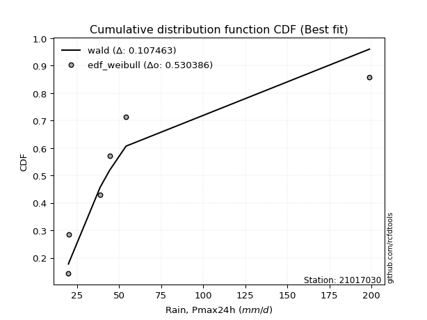</img>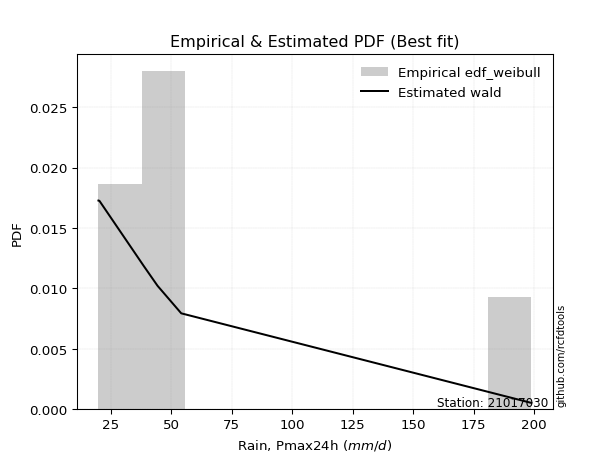</img>

</div>


### 4. EDF Beard (1943)

The Beard formula (or Beard´s plotting position formula) in hydrology is used to estimate the empirical non-exceedance probability _(P)_ of a flood event (or other extreme hydrological data point) within a given dataset.

<div align="center">


$P=(m-0.31)/(n+0.38)$


</div>


**4.1. Empirical values**

<div align="center">

|                | 0                   | 1                   | 2                   | 3         | 4                  | 5                  | 6                  |
|:---------------|:--------------------|:--------------------|:--------------------|:----------|:-------------------|:-------------------|:-------------------|
| date           | 2023                | 2022                | 2020                | 2025      | 2021               | 2019               | 2024               |
| x              | 20.0                | 20.4                | 38.8                | 42.6      | 44.4               | 54.2               | 198.8              |
| m              | 1                   | 2                   | 3                   | 4         | 5                  | 6                  | 7                  |
| empirical_dist | edf_beard           | edf_beard           | edf_beard           | edf_beard | edf_beard          | edf_beard          | edf_beard          |
| empirical      | 0.09349593495934959 | 0.22899728997289973 | 0.36449864498644985 | 0.5       | 0.6355013550135502 | 0.7710027100271003 | 0.9065040650406505 |
| empirical_tr   | 1.1031390134529149  | 1.29701230228471    | 1.5735607675906182  | 2.0       | 2.743494423791822  | 4.366863905325444  | 10.695652173913055 |

</div>


**4.2. Kolmogorov-Smirnov fit test (sorted by Δ)**


<div align="center">

|                | 0                   | 1                   | 2                   | 3                   | 4                   | 5                   | 6                   | 7                   | 8                   | 9                   | 10                  | 11                  | 12                  | 13                  | 14                  | 15                  | 16                  | 17                  | 18                  | 19                  | 20                  | 21                  | 22                  | 23                  | 24                  | 25                  | 26                  | 27                  | 28                  | 29                  | 30                  | 31                  | 32                  | 33                  | 34                  | 35                  | 36                  | 37                  | 38                  | 39                  | 40                  | 41                  | 42                  | 43                  | 44                  | 45                  | 46                  | 47                  | 48                  | 49                  | 50                  | 51                  | 52                  | 53                  | 54                  | 55                  | 56                  | 57                  | 58                  | 59                  | 60                  | 61                  | 62                  | 63                  | 64                  | 65                  | 66                  | 67                  | 68                  | 69                  | 70                  | 71                  | 72                  | 73                  | 74                  | 75                  | 76                  | 77                  | 78                  | 79                  | 80                  | 81                  | 82                  | 83                  | 84                  | 85                  | 86                  | 87                  | 88                  | 89                  | 90                  | 91                  | 92                  | 93                  | 94                  | 95                  | 96                  | 97                  | 98                  | 99                  | 100                 | 101                 | 102                 | 103                 | 104                 | 105                 | 106                 | 107                 | 108                 | 109                 | 110                 | 111                 | 112                 | 113                 | 114                 | 115                 | 116                 | 117                 | 118                 | 119                 | 120                 | 121                 | 122                 | 123                 | 124                 | 125                 | 126                 | 127                 | 128                 | 129                 | 130                 | 131                 | 132                 | 133                 | 134                 | 135                 | 136                 | 137                 | 138                 | 139                 | 140                 | 141                 | 142                 | 143                 | 144                 | 145                 | 146                 | 147                 | 148                 | 149                 | 150                 | 151                 | 152                 | 153                 | 154                 | 155                 | 156                 | 157                 | 158                 | 159                 |
|:---------------|:--------------------|:--------------------|:--------------------|:--------------------|:--------------------|:--------------------|:--------------------|:--------------------|:--------------------|:--------------------|:--------------------|:--------------------|:--------------------|:--------------------|:--------------------|:--------------------|:--------------------|:--------------------|:--------------------|:--------------------|:--------------------|:--------------------|:--------------------|:--------------------|:--------------------|:--------------------|:--------------------|:--------------------|:--------------------|:--------------------|:--------------------|:--------------------|:--------------------|:--------------------|:--------------------|:--------------------|:--------------------|:--------------------|:--------------------|:--------------------|:--------------------|:--------------------|:--------------------|:--------------------|:--------------------|:--------------------|:--------------------|:--------------------|:--------------------|:--------------------|:--------------------|:--------------------|:--------------------|:--------------------|:--------------------|:--------------------|:--------------------|:--------------------|:--------------------|:--------------------|:--------------------|:--------------------|:--------------------|:--------------------|:--------------------|:--------------------|:--------------------|:--------------------|:--------------------|:--------------------|:--------------------|:--------------------|:--------------------|:--------------------|:--------------------|:--------------------|:--------------------|:--------------------|:--------------------|:--------------------|:--------------------|:--------------------|:--------------------|:--------------------|:--------------------|:--------------------|:--------------------|:--------------------|:--------------------|:--------------------|:--------------------|:--------------------|:--------------------|:--------------------|:--------------------|:--------------------|:--------------------|:--------------------|:--------------------|:--------------------|:--------------------|:--------------------|:--------------------|:--------------------|:--------------------|:--------------------|:--------------------|:--------------------|:--------------------|:--------------------|:--------------------|:--------------------|:--------------------|:--------------------|:--------------------|:--------------------|:--------------------|:--------------------|:--------------------|:--------------------|:--------------------|:--------------------|:--------------------|:--------------------|:--------------------|:--------------------|:--------------------|:--------------------|:--------------------|:--------------------|:--------------------|:--------------------|:--------------------|:--------------------|:--------------------|:--------------------|:--------------------|:--------------------|:--------------------|:--------------------|:--------------------|:--------------------|:--------------------|:--------------------|:--------------------|:--------------------|:--------------------|:--------------------|:--------------------|:--------------------|:--------------------|:--------------------|:--------------------|:--------------------|:--------------------|:--------------------|:--------------------|:--------------------|:--------------------|:--------------------|
| station        | 21017030            | 21017030            | 21017030            | 21017030            | 21017030            | 21017030            | 21017030            | 21017030            | 21017030            | 21017030            | 21017030            | 21017030            | 21017030            | 21017030            | 21017030            | 21017030            | 21017030            | 21017030            | 21017030            | 21017030            | 21017030            | 21017030            | 21017030            | 21017030            | 21017030            | 21017030            | 21017030            | 21017030            | 21017030            | 21017030            | 21017030            | 21017030            | 21017030            | 21017030            | 21017030            | 21017030            | 21017030            | 21017030            | 21017030            | 21017030            | 21017030            | 21017030            | 21017030            | 21017030            | 21017030            | 21017030            | 21017030            | 21017030            | 21017030            | 21017030            | 21017030            | 21017030            | 21017030            | 21017030            | 21017030            | 21017030            | 21017030            | 21017030            | 21017030            | 21017030            | 21017030            | 21017030            | 21017030            | 21017030            | 21017030            | 21017030            | 21017030            | 21017030            | 21017030            | 21017030            | 21017030            | 21017030            | 21017030            | 21017030            | 21017030            | 21017030            | 21017030            | 21017030            | 21017030            | 21017030            | 21017030            | 21017030            | 21017030            | 21017030            | 21017030            | 21017030            | 21017030            | 21017030            | 21017030            | 21017030            | 21017030            | 21017030            | 21017030            | 21017030            | 21017030            | 21017030            | 21017030            | 21017030            | 21017030            | 21017030            | 21017030            | 21017030            | 21017030            | 21017030            | 21017030            | 21017030            | 21017030            | 21017030            | 21017030            | 21017030            | 21017030            | 21017030            | 21017030            | 21017030            | 21017030            | 21017030            | 21017030            | 21017030            | 21017030            | 21017030            | 21017030            | 21017030            | 21017030            | 21017030            | 21017030            | 21017030            | 21017030            | 21017030            | 21017030            | 21017030            | 21017030            | 21017030            | 21017030            | 21017030            | 21017030            | 21017030            | 21017030            | 21017030            | 21017030            | 21017030            | 21017030            | 21017030            | 21017030            | 21017030            | 21017030            | 21017030            | 21017030            | 21017030            | 21017030            | 21017030            | 21017030            | 21017030            | 21017030            | 21017030            | 21017030            | 21017030            | 21017030            | 21017030            | 21017030            | 21017030            |
| empirical_dist | edf_beard           | edf_beard           | edf_beard           | edf_beard           | edf_beard           | edf_beard           | edf_beard           | edf_beard           | edf_beard           | edf_beard           | edf_beard           | edf_beard           | edf_beard           | edf_beard           | edf_beard           | edf_beard           | edf_beard           | edf_beard           | edf_beard           | edf_beard           | edf_beard           | edf_beard           | edf_beard           | edf_beard           | edf_beard           | edf_beard           | edf_beard           | edf_beard           | edf_beard           | edf_beard           | edf_beard           | edf_beard           | edf_beard           | edf_beard           | edf_beard           | edf_beard           | edf_beard           | edf_beard           | edf_beard           | edf_beard           | edf_beard           | edf_beard           | edf_beard           | edf_beard           | edf_beard           | edf_beard           | edf_beard           | edf_beard           | edf_beard           | edf_beard           | edf_beard           | edf_beard           | edf_beard           | edf_beard           | edf_beard           | edf_beard           | edf_beard           | edf_beard           | edf_beard           | edf_beard           | edf_beard           | edf_beard           | edf_beard           | edf_beard           | edf_beard           | edf_beard           | edf_beard           | edf_beard           | edf_beard           | edf_beard           | edf_beard           | edf_beard           | edf_beard           | edf_beard           | edf_beard           | edf_beard           | edf_beard           | edf_beard           | edf_beard           | edf_beard           | edf_beard           | edf_beard           | edf_beard           | edf_beard           | edf_beard           | edf_beard           | edf_beard           | edf_beard           | edf_beard           | edf_beard           | edf_beard           | edf_beard           | edf_beard           | edf_beard           | edf_beard           | edf_beard           | edf_beard           | edf_beard           | edf_beard           | edf_beard           | edf_beard           | edf_beard           | edf_beard           | edf_beard           | edf_beard           | edf_beard           | edf_beard           | edf_beard           | edf_beard           | edf_beard           | edf_beard           | edf_beard           | edf_beard           | edf_beard           | edf_beard           | edf_beard           | edf_beard           | edf_beard           | edf_beard           | edf_beard           | edf_beard           | edf_beard           | edf_beard           | edf_beard           | edf_beard           | edf_beard           | edf_beard           | edf_beard           | edf_beard           | edf_beard           | edf_beard           | edf_beard           | edf_beard           | edf_beard           | edf_beard           | edf_beard           | edf_beard           | edf_beard           | edf_beard           | edf_beard           | edf_beard           | edf_beard           | edf_beard           | edf_beard           | edf_beard           | edf_beard           | edf_beard           | edf_beard           | edf_beard           | edf_beard           | edf_beard           | edf_beard           | edf_beard           | edf_beard           | edf_beard           | edf_beard           | edf_beard           | edf_beard           | edf_beard           | edf_beard           |
| p_dist         | dgamma              | t                   | gennorm             | johnsonsu           | betaprime           | ncf                 | logt                | logbetaprime        | lognct              | logjohnsonsu        | logvonmises_line    | lograyleigh         | logfoldnorm         | logpearson3         | loglaplace          | loglaplace          | logncf              | logdgamma           | loggumbel_r         | loghypsecant        | logmaxwell          | nct                 | mielke              | loggennorm          | loggenlogistic      | logkstwobign        | logdweibull         | logmielke           | logexponnorm        | burr                | loglogistic         | logrice             | wald                | loghalfnorm         | logmoyal            | logalpha            | lognorm             | logcrystalball      | logburr             | loginvweibull       | loggenextreme       | logloggamma         | gamma               | logf                | loginvgamma         | loghalflogistic     | loganglit           | dweibull            | loggausshyper       | logsemicircular     | vonmises_line       | pearson3            | loggengamma         | logbeta             | exponpow            | logloglaplace       | nakagami            | alpha               | burr12              | truncweibull_min    | loginvgauss         | logarcsine          | loggenexpon         | loggompertz         | genlogistic         | invgamma            | halflogistic        | loglomax            | truncpareto         | loggumbel_l         | logtriang           | logskewnorm         | moyal               | logtruncexpon       | gompertz            | exponnorm           | f                   | genexpon            | logcosine           | logwald             | halfnorm            | foldnorm            | gumbel_r            | erlang              | gengamma            | genpareto           | kappa3              | johnsonsb           | invgauss            | rayleigh            | logweibull_min      | invweibull          | maxwell             | genextreme          | logweibull_max      | kstwobign           | arcsine             | semicircular        | anglit              | truncnorm           | weibull_min         | crystalball         | norm                | logkappa4           | logistic            | logwrapcauchy       | hypsecant           | loggenpareto        | loghalfgennorm      | logrdist            | logksone            | lomax               | logargus            | exponweib           | loglevy_l           | halfgennorm         | logtukeylambda      | laplace             | rice                | loguniform          | logexponpow         | wrapcauchy          | logburr12           | logtruncnorm        | levy_l              | bradford            | powerlaw            | gumbel_l            | truncexpon          | logjohnsonsb        | gausshyper          | lognakagami         | cosine              | skewnorm            | fatiguelife         | logkappa3           | logtruncweibull_min | logpowerlaw         | logbradford         | triang              | argus               | loggenhalflogistic  | logexponweib        | logtruncpareto      | logfatiguelife      | rdist               | ksone               | kappa4              | tukeylambda         | logerlang           | logtrapezoid        | loggamma            | loggamma            | uniform             | genhalflogistic     | beta                | weibull_max         | trapezoid           | logvonmises         | vonmises            |
| delta          | 0.08807986563339265 | 0.09506874574568727 | 0.09677889160956837 | 0.10859089186409673 | 0.11533218009185457 | 0.11735593131805344 | 0.12006181639948127 | 0.12142558297206374 | 0.12184737550626015 | 0.12198590532222689 | 0.1225570942043836  | 0.12364342036227682 | 0.1252940772860126  | 0.12801192295491587 | 0.12804873245756299 | 0.12804873245756299 | 0.12833178732580108 | 0.12853800951474065 | 0.12904473464732868 | 0.13041694676426685 | 0.13139600372358584 | 0.13163564910162687 | 0.13173974222555818 | 0.13282996281162632 | 0.1339010891889148  | 0.1351329007059967  | 0.13550135501337568 | 0.1365923611519267  | 0.13702427656794652 | 0.13820377698767267 | 0.1421200480814726  | 0.1427997213085651  | 0.1451477968970497  | 0.145383066328659   | 0.1536397401164123  | 0.15422639537454436 | 0.15661042959402682 | 0.15661051724478336 | 0.15855280462177695 | 0.15987202199627476 | 0.1598886094277437  | 0.16036554365615452 | 0.165644862368104   | 0.16719224223480972 | 0.16720236940116878 | 0.1686200812042512  | 0.17225590736471585 | 0.17545907285825868 | 0.17688690172349125 | 0.17876939539080716 | 0.18286446216379226 | 0.18557293888112103 | 0.1864042230054703  | 0.18822111521483376 | 0.19033642015179797 | 0.19475566198870053 | 0.19596205660761923 | 0.20047052179912855 | 0.20194785769415163 | 0.20330194313900507 | 0.204902535793495   | 0.20508319458431823 | 0.20631164726490026 | 0.20762044915963557 | 0.20767959940619085 | 0.2087245480621442  | 0.20902887797202818 | 0.2095774676469076  | 0.21052336774373095 | 0.21353442666384215 | 0.2140053875693635  | 0.21414005566174846 | 0.2164185488487932  | 0.2172449828131634  | 0.21773219856947207 | 0.2177516845502863  | 0.21776054176730547 | 0.21901885578881705 | 0.22166255372037624 | 0.22899728997289973 | 0.23110159747257208 | 0.23486875051731682 | 0.2420337508331395  | 0.24208930389608035 | 0.2472902981760472  | 0.2555891187069201  | 0.25756069549825866 | 0.2633697007118288  | 0.2635475849068443  | 0.26420763694383453 | 0.266601162057948   | 0.27568014128935936 | 0.27594666896640113 | 0.27683888869432405 | 0.2857645479184614  | 0.29193086536023655 | 0.2931250597736658  | 0.30225065971221216 | 0.30454807363877967 | 0.30501761813675776 | 0.3063931765607792  | 0.31011896400977856 | 0.31011897549101397 | 0.3134670536143729  | 0.31541754072334505 | 0.3166291671153383  | 0.319912890141193   | 0.3206035214109844  | 0.324323307990334   | 0.32448423166361634 | 0.32591615042192257 | 0.32614231293283513 | 0.3262467719481632  | 0.3299650138757744  | 0.33425170932554216 | 0.33455565563647754 | 0.3345984151510376  | 0.33583929963734926 | 0.33628537629738453 | 0.336898838500887   | 0.34585971885558603 | 0.3470435970631997  | 0.35661472296366353 | 0.3644985953618696  | 0.3714158702631396  | 0.37507533184930164 | 0.376193035804055   | 0.3805658489444249  | 0.3869836546357643  | 0.39013144579168135 | 0.3902581799416736  | 0.39072763720029985 | 0.39169853863828974 | 0.39765215363135276 | 0.4100778815366299  | 0.4153950432846527  | 0.4522358410077137  | 0.46034689334839246 | 0.46338449241210383 | 0.46887268408536387 | 0.4695359766036523  | 0.470631825627928   | 0.47729989251070964 | 0.48460192213177516 | 0.48964197930788184 | 0.5280220999038814  | 0.5282734035394046  | 0.550372309493451   | 0.5612147218963275  | 0.5715521273563053  | 0.5729006644859269  | 0.574373137041934   | 0.574373137041934   | 0.5797275422418654  | 0.6269672396437203  | 0.6553904835413094  | 0.6929622731312314  | 0.7120851937991025  | 1.097668187087149   | 31.096009967384354  |
| deltao         | 0.48442053926100004 | 0.48442053926100004 | 0.48442053926100004 | 0.48442053926100004 | 0.48442053926100004 | 0.48442053926100004 | 0.48442053926100004 | 0.48442053926100004 | 0.48442053926100004 | 0.48442053926100004 | 0.48442053926100004 | 0.48442053926100004 | 0.48442053926100004 | 0.48442053926100004 | 0.48442053926100004 | 0.48442053926100004 | 0.48442053926100004 | 0.48442053926100004 | 0.48442053926100004 | 0.48442053926100004 | 0.48442053926100004 | 0.48442053926100004 | 0.48442053926100004 | 0.48442053926100004 | 0.48442053926100004 | 0.48442053926100004 | 0.48442053926100004 | 0.48442053926100004 | 0.48442053926100004 | 0.48442053926100004 | 0.48442053926100004 | 0.48442053926100004 | 0.48442053926100004 | 0.48442053926100004 | 0.48442053926100004 | 0.48442053926100004 | 0.48442053926100004 | 0.48442053926100004 | 0.48442053926100004 | 0.48442053926100004 | 0.48442053926100004 | 0.48442053926100004 | 0.48442053926100004 | 0.48442053926100004 | 0.48442053926100004 | 0.48442053926100004 | 0.48442053926100004 | 0.48442053926100004 | 0.48442053926100004 | 0.48442053926100004 | 0.48442053926100004 | 0.48442053926100004 | 0.48442053926100004 | 0.48442053926100004 | 0.48442053926100004 | 0.48442053926100004 | 0.48442053926100004 | 0.48442053926100004 | 0.48442053926100004 | 0.48442053926100004 | 0.48442053926100004 | 0.48442053926100004 | 0.48442053926100004 | 0.48442053926100004 | 0.48442053926100004 | 0.48442053926100004 | 0.48442053926100004 | 0.48442053926100004 | 0.48442053926100004 | 0.48442053926100004 | 0.48442053926100004 | 0.48442053926100004 | 0.48442053926100004 | 0.48442053926100004 | 0.48442053926100004 | 0.48442053926100004 | 0.48442053926100004 | 0.48442053926100004 | 0.48442053926100004 | 0.48442053926100004 | 0.48442053926100004 | 0.48442053926100004 | 0.48442053926100004 | 0.48442053926100004 | 0.48442053926100004 | 0.48442053926100004 | 0.48442053926100004 | 0.48442053926100004 | 0.48442053926100004 | 0.48442053926100004 | 0.48442053926100004 | 0.48442053926100004 | 0.48442053926100004 | 0.48442053926100004 | 0.48442053926100004 | 0.48442053926100004 | 0.48442053926100004 | 0.48442053926100004 | 0.48442053926100004 | 0.48442053926100004 | 0.48442053926100004 | 0.48442053926100004 | 0.48442053926100004 | 0.48442053926100004 | 0.48442053926100004 | 0.48442053926100004 | 0.48442053926100004 | 0.48442053926100004 | 0.48442053926100004 | 0.48442053926100004 | 0.48442053926100004 | 0.48442053926100004 | 0.48442053926100004 | 0.48442053926100004 | 0.48442053926100004 | 0.48442053926100004 | 0.48442053926100004 | 0.48442053926100004 | 0.48442053926100004 | 0.48442053926100004 | 0.48442053926100004 | 0.48442053926100004 | 0.48442053926100004 | 0.48442053926100004 | 0.48442053926100004 | 0.48442053926100004 | 0.48442053926100004 | 0.48442053926100004 | 0.48442053926100004 | 0.48442053926100004 | 0.48442053926100004 | 0.48442053926100004 | 0.48442053926100004 | 0.48442053926100004 | 0.48442053926100004 | 0.48442053926100004 | 0.48442053926100004 | 0.48442053926100004 | 0.48442053926100004 | 0.48442053926100004 | 0.48442053926100004 | 0.48442053926100004 | 0.48442053926100004 | 0.48442053926100004 | 0.48442053926100004 | 0.48442053926100004 | 0.48442053926100004 | 0.48442053926100004 | 0.48442053926100004 | 0.48442053926100004 | 0.48442053926100004 | 0.48442053926100004 | 0.48442053926100004 | 0.48442053926100004 | 0.48442053926100004 | 0.48442053926100004 | 0.48442053926100004 | 0.48442053926100004 | 0.48442053926100004 | 0.48442053926100004 |
| eval           | Δo > Δ              | Δo > Δ              | Δo > Δ              | Δo > Δ              | Δo > Δ              | Δo > Δ              | Δo > Δ              | Δo > Δ              | Δo > Δ              | Δo > Δ              | Δo > Δ              | Δo > Δ              | Δo > Δ              | Δo > Δ              | Δo > Δ              | Δo > Δ              | Δo > Δ              | Δo > Δ              | Δo > Δ              | Δo > Δ              | Δo > Δ              | Δo > Δ              | Δo > Δ              | Δo > Δ              | Δo > Δ              | Δo > Δ              | Δo > Δ              | Δo > Δ              | Δo > Δ              | Δo > Δ              | Δo > Δ              | Δo > Δ              | Δo > Δ              | Δo > Δ              | Δo > Δ              | Δo > Δ              | Δo > Δ              | Δo > Δ              | Δo > Δ              | Δo > Δ              | Δo > Δ              | Δo > Δ              | Δo > Δ              | Δo > Δ              | Δo > Δ              | Δo > Δ              | Δo > Δ              | Δo > Δ              | Δo > Δ              | Δo > Δ              | Δo > Δ              | Δo > Δ              | Δo > Δ              | Δo > Δ              | Δo > Δ              | Δo > Δ              | Δo > Δ              | Δo > Δ              | Δo > Δ              | Δo > Δ              | Δo > Δ              | Δo > Δ              | Δo > Δ              | Δo > Δ              | Δo > Δ              | Δo > Δ              | Δo > Δ              | Δo > Δ              | Δo > Δ              | Δo > Δ              | Δo > Δ              | Δo > Δ              | Δo > Δ              | Δo > Δ              | Δo > Δ              | Δo > Δ              | Δo > Δ              | Δo > Δ              | Δo > Δ              | Δo > Δ              | Δo > Δ              | Δo > Δ              | Δo > Δ              | Δo > Δ              | Δo > Δ              | Δo > Δ              | Δo > Δ              | Δo > Δ              | Δo > Δ              | Δo > Δ              | Δo > Δ              | Δo > Δ              | Δo > Δ              | Δo > Δ              | Δo > Δ              | Δo > Δ              | Δo > Δ              | Δo > Δ              | Δo > Δ              | Δo > Δ              | Δo > Δ              | Δo > Δ              | Δo > Δ              | Δo > Δ              | Δo > Δ              | Δo > Δ              | Δo > Δ              | Δo > Δ              | Δo > Δ              | Δo > Δ              | Δo > Δ              | Δo > Δ              | Δo > Δ              | Δo > Δ              | Δo > Δ              | Δo > Δ              | Δo > Δ              | Δo > Δ              | Δo > Δ              | Δo > Δ              | Δo > Δ              | Δo > Δ              | Δo > Δ              | Δo > Δ              | Δo > Δ              | Δo > Δ              | Δo > Δ              | Δo > Δ              | Δo > Δ              | Δo > Δ              | Δo > Δ              | Δo > Δ              | Δo > Δ              | Δo > Δ              | Δo > Δ              | Δo > Δ              | Δo > Δ              | Δo > Δ              | Δo > Δ              | Δo > Δ              | Δo > Δ              | Δo > Δ              | Δo > Δ              | Δo <= Δ             | Δo <= Δ             | Δo <= Δ             | Δo <= Δ             | Δo <= Δ             | Δo <= Δ             | Δo <= Δ             | Δo <= Δ             | Δo <= Δ             | Δo <= Δ             | Δo <= Δ             | Δo <= Δ             | Δo <= Δ             | Δo <= Δ             | Δo <= Δ             | Δo <= Δ             | Δo <= Δ             |
| fit            | 1                   | 1                   | 1                   | 1                   | 1                   | 1                   | 1                   | 1                   | 1                   | 1                   | 1                   | 1                   | 1                   | 1                   | 1                   | 1                   | 1                   | 1                   | 1                   | 1                   | 1                   | 1                   | 1                   | 1                   | 1                   | 1                   | 1                   | 1                   | 1                   | 1                   | 1                   | 1                   | 1                   | 1                   | 1                   | 1                   | 1                   | 1                   | 1                   | 1                   | 1                   | 1                   | 1                   | 1                   | 1                   | 1                   | 1                   | 1                   | 1                   | 1                   | 1                   | 1                   | 1                   | 1                   | 1                   | 1                   | 1                   | 1                   | 1                   | 1                   | 1                   | 1                   | 1                   | 1                   | 1                   | 1                   | 1                   | 1                   | 1                   | 1                   | 1                   | 1                   | 1                   | 1                   | 1                   | 1                   | 1                   | 1                   | 1                   | 1                   | 1                   | 1                   | 1                   | 1                   | 1                   | 1                   | 1                   | 1                   | 1                   | 1                   | 1                   | 1                   | 1                   | 1                   | 1                   | 1                   | 1                   | 1                   | 1                   | 1                   | 1                   | 1                   | 1                   | 1                   | 1                   | 1                   | 1                   | 1                   | 1                   | 1                   | 1                   | 1                   | 1                   | 1                   | 1                   | 1                   | 1                   | 1                   | 1                   | 1                   | 1                   | 1                   | 1                   | 1                   | 1                   | 1                   | 1                   | 1                   | 1                   | 1                   | 1                   | 1                   | 1                   | 1                   | 1                   | 1                   | 1                   | 1                   | 1                   | 1                   | 1                   | 1                   | 1                   | 0                   | 0                   | 0                   | 0                   | 0                   | 0                   | 0                   | 0                   | 0                   | 0                   | 0                   | 0                   | 0                   | 0                   | 0                   | 0                   | 0                   |
| n              | 7                   | 7                   | 7                   | 7                   | 7                   | 7                   | 7                   | 7                   | 7                   | 7                   | 7                   | 7                   | 7                   | 7                   | 7                   | 7                   | 7                   | 7                   | 7                   | 7                   | 7                   | 7                   | 7                   | 7                   | 7                   | 7                   | 7                   | 7                   | 7                   | 7                   | 7                   | 7                   | 7                   | 7                   | 7                   | 7                   | 7                   | 7                   | 7                   | 7                   | 7                   | 7                   | 7                   | 7                   | 7                   | 7                   | 7                   | 7                   | 7                   | 7                   | 7                   | 7                   | 7                   | 7                   | 7                   | 7                   | 7                   | 7                   | 7                   | 7                   | 7                   | 7                   | 7                   | 7                   | 7                   | 7                   | 7                   | 7                   | 7                   | 7                   | 7                   | 7                   | 7                   | 7                   | 7                   | 7                   | 7                   | 7                   | 7                   | 7                   | 7                   | 7                   | 7                   | 7                   | 7                   | 7                   | 7                   | 7                   | 7                   | 7                   | 7                   | 7                   | 7                   | 7                   | 7                   | 7                   | 7                   | 7                   | 7                   | 7                   | 7                   | 7                   | 7                   | 7                   | 7                   | 7                   | 7                   | 7                   | 7                   | 7                   | 7                   | 7                   | 7                   | 7                   | 7                   | 7                   | 7                   | 7                   | 7                   | 7                   | 7                   | 7                   | 7                   | 7                   | 7                   | 7                   | 7                   | 7                   | 7                   | 7                   | 7                   | 7                   | 7                   | 7                   | 7                   | 7                   | 7                   | 7                   | 7                   | 7                   | 7                   | 7                   | 7                   | 7                   | 7                   | 7                   | 7                   | 7                   | 7                   | 7                   | 7                   | 7                   | 7                   | 7                   | 7                   | 7                   | 7                   | 7                   | 7                   | 7                   |
| best_fit       | 1                   | 0                   | 0                   | 0                   | 0                   | 0                   | 0                   | 0                   | 0                   | 0                   | 0                   | 0                   | 0                   | 0                   | 0                   | 0                   | 0                   | 0                   | 0                   | 0                   | 0                   | 0                   | 0                   | 0                   | 0                   | 0                   | 0                   | 0                   | 0                   | 0                   | 0                   | 0                   | 0                   | 0                   | 0                   | 0                   | 0                   | 0                   | 0                   | 0                   | 0                   | 0                   | 0                   | 0                   | 0                   | 0                   | 0                   | 0                   | 0                   | 0                   | 0                   | 0                   | 0                   | 0                   | 0                   | 0                   | 0                   | 0                   | 0                   | 0                   | 0                   | 0                   | 0                   | 0                   | 0                   | 0                   | 0                   | 0                   | 0                   | 0                   | 0                   | 0                   | 0                   | 0                   | 0                   | 0                   | 0                   | 0                   | 0                   | 0                   | 0                   | 0                   | 0                   | 0                   | 0                   | 0                   | 0                   | 0                   | 0                   | 0                   | 0                   | 0                   | 0                   | 0                   | 0                   | 0                   | 0                   | 0                   | 0                   | 0                   | 0                   | 0                   | 0                   | 0                   | 0                   | 0                   | 0                   | 0                   | 0                   | 0                   | 0                   | 0                   | 0                   | 0                   | 0                   | 0                   | 0                   | 0                   | 0                   | 0                   | 0                   | 0                   | 0                   | 0                   | 0                   | 0                   | 0                   | 0                   | 0                   | 0                   | 0                   | 0                   | 0                   | 0                   | 0                   | 0                   | 0                   | 0                   | 0                   | 0                   | 0                   | 0                   | 0                   | 0                   | 0                   | 0                   | 0                   | 0                   | 0                   | 0                   | 0                   | 0                   | 0                   | 0                   | 0                   | 0                   | 0                   | 0                   | 0                   | 0                   |
| best_fit_sort  | 1                   | 2                   | 3                   | 4                   | 5                   | 6                   | 7                   | 8                   | 9                   | 10                  | 11                  | 12                  | 13                  | 14                  | 15                  | 16                  | 17                  | 18                  | 19                  | 20                  | 21                  | 22                  | 23                  | 24                  | 25                  | 26                  | 27                  | 28                  | 29                  | 30                  | 31                  | 32                  | 33                  | 34                  | 35                  | 36                  | 37                  | 38                  | 39                  | 40                  | 41                  | 42                  | 43                  | 44                  | 45                  | 46                  | 47                  | 48                  | 49                  | 50                  | 51                  | 52                  | 53                  | 54                  | 55                  | 56                  | 57                  | 58                  | 59                  | 60                  | 61                  | 62                  | 63                  | 64                  | 65                  | 66                  | 67                  | 68                  | 69                  | 70                  | 71                  | 72                  | 73                  | 74                  | 75                  | 76                  | 77                  | 78                  | 79                  | 80                  | 81                  | 82                  | 83                  | 84                  | 85                  | 86                  | 87                  | 88                  | 89                  | 90                  | 91                  | 92                  | 93                  | 94                  | 95                  | 96                  | 97                  | 98                  | 99                  | 100                 | 101                 | 102                 | 103                 | 104                 | 105                 | 106                 | 107                 | 108                 | 109                 | 110                 | 111                 | 112                 | 113                 | 114                 | 115                 | 116                 | 117                 | 118                 | 119                 | 120                 | 121                 | 122                 | 123                 | 124                 | 125                 | 126                 | 127                 | 128                 | 129                 | 130                 | 131                 | 132                 | 133                 | 134                 | 135                 | 136                 | 137                 | 138                 | 139                 | 140                 | 141                 | 142                 | 143                 | 144                 | 145                 | 146                 | 147                 | 148                 | 149                 | 150                 | 151                 | 152                 | 153                 | 154                 | 155                 | 156                 | 157                 | 158                 | 159                 | 160                 |

</div>


**4.3. Best fit**

<div align="center">

|   id |   station | empirical_dist   | p_dist   |     delta |   deltao | eval   |   fit |   n |   best_fit |   best_fit_sort |
|-----:|----------:|:-----------------|:---------|----------:|---------:|:-------|------:|----:|-----------:|----------------:|
|    0 |  21017030 | edf_beard        | dgamma   | 0.0880799 | 0.484421 | Δo > Δ |     1 |   7 |          1 |               1 |

</div>


<div align="center">

</img></img>

</div>


### 5. EDF Chegodayev (1955)

The Chegodayev formula is an empirical plotting position formula used in hydrological frequency analysis to estimate the exceedance probability or return period of a specific event from a set of observed data. It is primarily used for plotting observed data points on probability paper to fit a theoretical distribution, particularly for analyzing extreme events like maximum flood flows or rainfall intensities. The constant _b_ value in the generalized plotting position formula is 0.3.

<div align="center">


$P=(m-b)/(n+1-2b)$


</div>


**5.1. Empirical values**

<div align="center">

|                | 0                   | 1                   | 2                   | 3              | 4                  | 5                  | 6                  |
|:---------------|:--------------------|:--------------------|:--------------------|:---------------|:-------------------|:-------------------|:-------------------|
| date           | 2023                | 2022                | 2020                | 2025           | 2021               | 2019               | 2024               |
| x              | 20.0                | 20.4                | 38.8                | 42.6           | 44.4               | 54.2               | 198.8              |
| m              | 1                   | 2                   | 3                   | 4              | 5                  | 6                  | 7                  |
| empirical_dist | edf_chegodayev      | edf_chegodayev      | edf_chegodayev      | edf_chegodayev | edf_chegodayev     | edf_chegodayev     | edf_chegodayev     |
| empirical      | 0.09459459459459459 | 0.22972972972972971 | 0.36486486486486486 | 0.5            | 0.6351351351351351 | 0.7702702702702703 | 0.9054054054054054 |
| empirical_tr   | 1.1044776119402986  | 1.2982456140350878  | 1.574468085106383   | 2.0            | 2.7407407407407405 | 4.352941176470589  | 10.571428571428568 |

</div>


**5.2. Kolmogorov-Smirnov fit test (sorted by Δ)**


<div align="center">

|                | 0                   | 1                   | 2                   | 3                   | 4                   | 5                   | 6                   | 7                   | 8                   | 9                   | 10                  | 11                  | 12                  | 13                  | 14                  | 15                  | 16                  | 17                  | 18                  | 19                  | 20                  | 21                  | 22                  | 23                  | 24                  | 25                  | 26                  | 27                  | 28                  | 29                  | 30                  | 31                  | 32                  | 33                  | 34                  | 35                  | 36                  | 37                  | 38                  | 39                  | 40                  | 41                  | 42                  | 43                  | 44                  | 45                  | 46                  | 47                  | 48                  | 49                  | 50                  | 51                  | 52                  | 53                  | 54                  | 55                  | 56                  | 57                  | 58                  | 59                  | 60                  | 61                  | 62                  | 63                  | 64                  | 65                  | 66                  | 67                  | 68                  | 69                  | 70                  | 71                  | 72                  | 73                  | 74                  | 75                  | 76                  | 77                  | 78                  | 79                  | 80                  | 81                  | 82                  | 83                  | 84                  | 85                  | 86                  | 87                  | 88                  | 89                  | 90                  | 91                  | 92                  | 93                  | 94                  | 95                  | 96                  | 97                  | 98                  | 99                  | 100                 | 101                 | 102                 | 103                 | 104                 | 105                 | 106                 | 107                 | 108                 | 109                 | 110                 | 111                 | 112                 | 113                 | 114                 | 115                 | 116                 | 117                 | 118                 | 119                 | 120                 | 121                 | 122                 | 123                 | 124                 | 125                 | 126                 | 127                 | 128                 | 129                 | 130                 | 131                 | 132                 | 133                 | 134                 | 135                 | 136                 | 137                 | 138                 | 139                 | 140                 | 141                 | 142                 | 143                 | 144                 | 145                 | 146                 | 147                 | 148                 | 149                 | 150                 | 151                 | 152                 | 153                 | 154                 | 155                 | 156                 | 157                 | 158                 | 159                 |
|:---------------|:--------------------|:--------------------|:--------------------|:--------------------|:--------------------|:--------------------|:--------------------|:--------------------|:--------------------|:--------------------|:--------------------|:--------------------|:--------------------|:--------------------|:--------------------|:--------------------|:--------------------|:--------------------|:--------------------|:--------------------|:--------------------|:--------------------|:--------------------|:--------------------|:--------------------|:--------------------|:--------------------|:--------------------|:--------------------|:--------------------|:--------------------|:--------------------|:--------------------|:--------------------|:--------------------|:--------------------|:--------------------|:--------------------|:--------------------|:--------------------|:--------------------|:--------------------|:--------------------|:--------------------|:--------------------|:--------------------|:--------------------|:--------------------|:--------------------|:--------------------|:--------------------|:--------------------|:--------------------|:--------------------|:--------------------|:--------------------|:--------------------|:--------------------|:--------------------|:--------------------|:--------------------|:--------------------|:--------------------|:--------------------|:--------------------|:--------------------|:--------------------|:--------------------|:--------------------|:--------------------|:--------------------|:--------------------|:--------------------|:--------------------|:--------------------|:--------------------|:--------------------|:--------------------|:--------------------|:--------------------|:--------------------|:--------------------|:--------------------|:--------------------|:--------------------|:--------------------|:--------------------|:--------------------|:--------------------|:--------------------|:--------------------|:--------------------|:--------------------|:--------------------|:--------------------|:--------------------|:--------------------|:--------------------|:--------------------|:--------------------|:--------------------|:--------------------|:--------------------|:--------------------|:--------------------|:--------------------|:--------------------|:--------------------|:--------------------|:--------------------|:--------------------|:--------------------|:--------------------|:--------------------|:--------------------|:--------------------|:--------------------|:--------------------|:--------------------|:--------------------|:--------------------|:--------------------|:--------------------|:--------------------|:--------------------|:--------------------|:--------------------|:--------------------|:--------------------|:--------------------|:--------------------|:--------------------|:--------------------|:--------------------|:--------------------|:--------------------|:--------------------|:--------------------|:--------------------|:--------------------|:--------------------|:--------------------|:--------------------|:--------------------|:--------------------|:--------------------|:--------------------|:--------------------|:--------------------|:--------------------|:--------------------|:--------------------|:--------------------|:--------------------|:--------------------|:--------------------|:--------------------|:--------------------|:--------------------|:--------------------|
| station        | 21017030            | 21017030            | 21017030            | 21017030            | 21017030            | 21017030            | 21017030            | 21017030            | 21017030            | 21017030            | 21017030            | 21017030            | 21017030            | 21017030            | 21017030            | 21017030            | 21017030            | 21017030            | 21017030            | 21017030            | 21017030            | 21017030            | 21017030            | 21017030            | 21017030            | 21017030            | 21017030            | 21017030            | 21017030            | 21017030            | 21017030            | 21017030            | 21017030            | 21017030            | 21017030            | 21017030            | 21017030            | 21017030            | 21017030            | 21017030            | 21017030            | 21017030            | 21017030            | 21017030            | 21017030            | 21017030            | 21017030            | 21017030            | 21017030            | 21017030            | 21017030            | 21017030            | 21017030            | 21017030            | 21017030            | 21017030            | 21017030            | 21017030            | 21017030            | 21017030            | 21017030            | 21017030            | 21017030            | 21017030            | 21017030            | 21017030            | 21017030            | 21017030            | 21017030            | 21017030            | 21017030            | 21017030            | 21017030            | 21017030            | 21017030            | 21017030            | 21017030            | 21017030            | 21017030            | 21017030            | 21017030            | 21017030            | 21017030            | 21017030            | 21017030            | 21017030            | 21017030            | 21017030            | 21017030            | 21017030            | 21017030            | 21017030            | 21017030            | 21017030            | 21017030            | 21017030            | 21017030            | 21017030            | 21017030            | 21017030            | 21017030            | 21017030            | 21017030            | 21017030            | 21017030            | 21017030            | 21017030            | 21017030            | 21017030            | 21017030            | 21017030            | 21017030            | 21017030            | 21017030            | 21017030            | 21017030            | 21017030            | 21017030            | 21017030            | 21017030            | 21017030            | 21017030            | 21017030            | 21017030            | 21017030            | 21017030            | 21017030            | 21017030            | 21017030            | 21017030            | 21017030            | 21017030            | 21017030            | 21017030            | 21017030            | 21017030            | 21017030            | 21017030            | 21017030            | 21017030            | 21017030            | 21017030            | 21017030            | 21017030            | 21017030            | 21017030            | 21017030            | 21017030            | 21017030            | 21017030            | 21017030            | 21017030            | 21017030            | 21017030            | 21017030            | 21017030            | 21017030            | 21017030            | 21017030            | 21017030            |
| empirical_dist | edf_chegodayev      | edf_chegodayev      | edf_chegodayev      | edf_chegodayev      | edf_chegodayev      | edf_chegodayev      | edf_chegodayev      | edf_chegodayev      | edf_chegodayev      | edf_chegodayev      | edf_chegodayev      | edf_chegodayev      | edf_chegodayev      | edf_chegodayev      | edf_chegodayev      | edf_chegodayev      | edf_chegodayev      | edf_chegodayev      | edf_chegodayev      | edf_chegodayev      | edf_chegodayev      | edf_chegodayev      | edf_chegodayev      | edf_chegodayev      | edf_chegodayev      | edf_chegodayev      | edf_chegodayev      | edf_chegodayev      | edf_chegodayev      | edf_chegodayev      | edf_chegodayev      | edf_chegodayev      | edf_chegodayev      | edf_chegodayev      | edf_chegodayev      | edf_chegodayev      | edf_chegodayev      | edf_chegodayev      | edf_chegodayev      | edf_chegodayev      | edf_chegodayev      | edf_chegodayev      | edf_chegodayev      | edf_chegodayev      | edf_chegodayev      | edf_chegodayev      | edf_chegodayev      | edf_chegodayev      | edf_chegodayev      | edf_chegodayev      | edf_chegodayev      | edf_chegodayev      | edf_chegodayev      | edf_chegodayev      | edf_chegodayev      | edf_chegodayev      | edf_chegodayev      | edf_chegodayev      | edf_chegodayev      | edf_chegodayev      | edf_chegodayev      | edf_chegodayev      | edf_chegodayev      | edf_chegodayev      | edf_chegodayev      | edf_chegodayev      | edf_chegodayev      | edf_chegodayev      | edf_chegodayev      | edf_chegodayev      | edf_chegodayev      | edf_chegodayev      | edf_chegodayev      | edf_chegodayev      | edf_chegodayev      | edf_chegodayev      | edf_chegodayev      | edf_chegodayev      | edf_chegodayev      | edf_chegodayev      | edf_chegodayev      | edf_chegodayev      | edf_chegodayev      | edf_chegodayev      | edf_chegodayev      | edf_chegodayev      | edf_chegodayev      | edf_chegodayev      | edf_chegodayev      | edf_chegodayev      | edf_chegodayev      | edf_chegodayev      | edf_chegodayev      | edf_chegodayev      | edf_chegodayev      | edf_chegodayev      | edf_chegodayev      | edf_chegodayev      | edf_chegodayev      | edf_chegodayev      | edf_chegodayev      | edf_chegodayev      | edf_chegodayev      | edf_chegodayev      | edf_chegodayev      | edf_chegodayev      | edf_chegodayev      | edf_chegodayev      | edf_chegodayev      | edf_chegodayev      | edf_chegodayev      | edf_chegodayev      | edf_chegodayev      | edf_chegodayev      | edf_chegodayev      | edf_chegodayev      | edf_chegodayev      | edf_chegodayev      | edf_chegodayev      | edf_chegodayev      | edf_chegodayev      | edf_chegodayev      | edf_chegodayev      | edf_chegodayev      | edf_chegodayev      | edf_chegodayev      | edf_chegodayev      | edf_chegodayev      | edf_chegodayev      | edf_chegodayev      | edf_chegodayev      | edf_chegodayev      | edf_chegodayev      | edf_chegodayev      | edf_chegodayev      | edf_chegodayev      | edf_chegodayev      | edf_chegodayev      | edf_chegodayev      | edf_chegodayev      | edf_chegodayev      | edf_chegodayev      | edf_chegodayev      | edf_chegodayev      | edf_chegodayev      | edf_chegodayev      | edf_chegodayev      | edf_chegodayev      | edf_chegodayev      | edf_chegodayev      | edf_chegodayev      | edf_chegodayev      | edf_chegodayev      | edf_chegodayev      | edf_chegodayev      | edf_chegodayev      | edf_chegodayev      | edf_chegodayev      | edf_chegodayev      | edf_chegodayev      |
| p_dist         | dgamma              | t                   | gennorm             | johnsonsu           | betaprime           | ncf                 | logt                | logbetaprime        | logvonmises_line    | lognct              | logjohnsonsu        | lograyleigh         | logfoldnorm         | logncf              | logpearson3         | loglaplace          | loglaplace          | loggumbel_r         | logdgamma           | loghypsecant        | logmaxwell          | nct                 | mielke              | loggenlogistic      | loggennorm          | logdweibull         | logkstwobign        | logexponnorm        | logmielke           | burr                | loglogistic         | logrice             | wald                | loghalfnorm         | logmoyal            | logalpha            | lognorm             | logcrystalball      | logburr             | loginvweibull       | loggenextreme       | logloggamma         | gamma               | logf                | loginvgamma         | loghalflogistic     | loganglit           | dweibull            | loggausshyper       | logsemicircular     | vonmises_line       | pearson3            | loggengamma         | logbeta             | exponpow            | logloglaplace       | nakagami            | alpha               | burr12              | truncweibull_min    | logarcsine          | loginvgauss         | genlogistic         | loggenexpon         | halflogistic        | loggompertz         | invgamma            | loglomax            | truncpareto         | loggumbel_l         | logtriang           | logskewnorm         | moyal               | logtruncexpon       | f                   | gompertz            | exponnorm           | genexpon            | logcosine           | logwald             | halfnorm            | foldnorm            | gumbel_r            | erlang              | gengamma            | genpareto           | kappa3              | johnsonsb           | invgauss            | rayleigh            | logweibull_min      | invweibull          | maxwell             | genextreme          | logweibull_max      | kstwobign           | arcsine             | semicircular        | anglit              | truncnorm           | weibull_min         | crystalball         | norm                | logkappa4           | logistic            | logwrapcauchy       | hypsecant           | loggenpareto        | logrdist            | loghalfgennorm      | logksone            | lomax               | logargus            | exponweib           | loglevy_l           | logtukeylambda      | halfgennorm         | laplace             | rice                | loguniform          | logexponpow         | wrapcauchy          | logburr12           | logtruncnorm        | levy_l              | bradford            | powerlaw            | gumbel_l            | truncexpon          | logjohnsonsb        | gausshyper          | lognakagami         | cosine              | skewnorm            | fatiguelife         | logkappa3           | logtruncweibull_min | logpowerlaw         | logbradford         | triang              | argus               | loggenhalflogistic  | logexponweib        | logtruncpareto      | logfatiguelife      | rdist               | ksone               | kappa4              | tukeylambda         | logerlang           | logtrapezoid        | loggamma            | loggamma            | uniform             | genhalflogistic     | beta                | weibull_max         | trapezoid           | logvonmises         | vonmises            |
| delta          | 0.08917852526863779 | 0.09580118550251726 | 0.09751133136639836 | 0.10932333162092672 | 0.11606461984868456 | 0.11662349156122342 | 0.11969559652106626 | 0.12069314321523372 | 0.12219087432596859 | 0.12257981526309014 | 0.12271834507905688 | 0.1229109806054468  | 0.12456163752918259 | 0.12759934756897107 | 0.12764570307650086 | 0.12768251257914787 | 0.12768251257914787 | 0.12867851476891368 | 0.12927044927157064 | 0.12982591287608503 | 0.13066356396675582 | 0.13236808885845686 | 0.13247218198238814 | 0.1335348693104998  | 0.1335624025684563  | 0.13513513513496056 | 0.1358653404628267  | 0.13665805668953152 | 0.1373248009087567  | 0.13783755710925766 | 0.1413876083246426  | 0.14353216106539513 | 0.1444153571402197  | 0.14501684645024399 | 0.15327352023799728 | 0.15386017549612935 | 0.1558779898371968  | 0.15587807748795335 | 0.15818658474336195 | 0.15950580211785975 | 0.15952238954932868 | 0.1596331038993245  | 0.166377302124934   | 0.1668260223563947  | 0.16683614952275377 | 0.1693525209610812  | 0.17152346760788584 | 0.1743604132230137  | 0.17652068184507624 | 0.17803695563397715 | 0.18213202240696225 | 0.184840499124291   | 0.1871366627623003  | 0.18895355497166375 | 0.18960398039496795 | 0.19402322223187052 | 0.1952296168507892  | 0.20010430192071355 | 0.20158163781573663 | 0.20403438289583506 | 0.2043507548274882  | 0.20453631591507998 | 0.20694715964936083 | 0.20704408702173022 | 0.20829643821519817 | 0.20835288891646556 | 0.20835832818372918 | 0.2092112477684926  | 0.21125580750056094 | 0.21280198690701213 | 0.21327294781253348 | 0.21487249541857845 | 0.21568610909196317 | 0.21651254305633338 | 0.21739432188889046 | 0.21846463832630206 | 0.21848412430711628 | 0.21975129554564704 | 0.22093011396354623 | 0.22972972972972971 | 0.23036915771574207 | 0.23377009088207185 | 0.24130131107630948 | 0.24172308401766535 | 0.24655785841921718 | 0.2552228988285051  | 0.2564620358630135  | 0.2630034808334138  | 0.2631813650284293  | 0.2634751971870045  | 0.266234942179533   | 0.2745814816541142  | 0.2752142292095711  | 0.2757402290590789  | 0.28466588828321643 | 0.29119842560340653 | 0.2923926200168358  | 0.30151821995538214 | 0.30381563388194965 | 0.30428517837992775 | 0.3060269566823642  | 0.30938652425294855 | 0.30938653573418395 | 0.31273461385754286 | 0.31468510096651503 | 0.31589672735850827 | 0.319180450384363   | 0.3198710816541544  | 0.3237517919067863  | 0.323957088111919   | 0.32518371066509255 | 0.3254098731760051  | 0.3255143321913332  | 0.3295987939973594  | 0.3331530496902972  | 0.3338659753942076  | 0.33418943575806254 | 0.33510685988051925 | 0.3355529365405545  | 0.33616639874405696 | 0.345493498977171   | 0.3463111573063697  | 0.3562485030852485  | 0.36486481524028463 | 0.37031721062789463 | 0.3743428920924716  | 0.37582681592564    | 0.3798334091875949  | 0.38625121487893427 | 0.38939900603485134 | 0.3895257401848436  | 0.39036141732188484 | 0.3909660988814597  | 0.39691971387452274 | 0.4097116616582149  | 0.4146626035278227  | 0.4518696211292987  | 0.45998067346997745 | 0.4630182725336888  | 0.46814024432853385 | 0.4688035368468223  | 0.469899385871098   | 0.47693367263229464 | 0.48423570225336016 | 0.4892757594294668  | 0.5269234402686364  | 0.5275409637825745  | 0.5496398697366209  | 0.5601160622610825  | 0.5711859074778904  | 0.5721682247290969  | 0.5740069171635189  | 0.5740069171635189  | 0.5789951024850354  | 0.6262347998868902  | 0.6542918239060643  | 0.6922298333744014  | 0.7113527540422725  | 1.0973019672087339  | 31.097108627019598  |
| deltao         | 0.48442053926100004 | 0.48442053926100004 | 0.48442053926100004 | 0.48442053926100004 | 0.48442053926100004 | 0.48442053926100004 | 0.48442053926100004 | 0.48442053926100004 | 0.48442053926100004 | 0.48442053926100004 | 0.48442053926100004 | 0.48442053926100004 | 0.48442053926100004 | 0.48442053926100004 | 0.48442053926100004 | 0.48442053926100004 | 0.48442053926100004 | 0.48442053926100004 | 0.48442053926100004 | 0.48442053926100004 | 0.48442053926100004 | 0.48442053926100004 | 0.48442053926100004 | 0.48442053926100004 | 0.48442053926100004 | 0.48442053926100004 | 0.48442053926100004 | 0.48442053926100004 | 0.48442053926100004 | 0.48442053926100004 | 0.48442053926100004 | 0.48442053926100004 | 0.48442053926100004 | 0.48442053926100004 | 0.48442053926100004 | 0.48442053926100004 | 0.48442053926100004 | 0.48442053926100004 | 0.48442053926100004 | 0.48442053926100004 | 0.48442053926100004 | 0.48442053926100004 | 0.48442053926100004 | 0.48442053926100004 | 0.48442053926100004 | 0.48442053926100004 | 0.48442053926100004 | 0.48442053926100004 | 0.48442053926100004 | 0.48442053926100004 | 0.48442053926100004 | 0.48442053926100004 | 0.48442053926100004 | 0.48442053926100004 | 0.48442053926100004 | 0.48442053926100004 | 0.48442053926100004 | 0.48442053926100004 | 0.48442053926100004 | 0.48442053926100004 | 0.48442053926100004 | 0.48442053926100004 | 0.48442053926100004 | 0.48442053926100004 | 0.48442053926100004 | 0.48442053926100004 | 0.48442053926100004 | 0.48442053926100004 | 0.48442053926100004 | 0.48442053926100004 | 0.48442053926100004 | 0.48442053926100004 | 0.48442053926100004 | 0.48442053926100004 | 0.48442053926100004 | 0.48442053926100004 | 0.48442053926100004 | 0.48442053926100004 | 0.48442053926100004 | 0.48442053926100004 | 0.48442053926100004 | 0.48442053926100004 | 0.48442053926100004 | 0.48442053926100004 | 0.48442053926100004 | 0.48442053926100004 | 0.48442053926100004 | 0.48442053926100004 | 0.48442053926100004 | 0.48442053926100004 | 0.48442053926100004 | 0.48442053926100004 | 0.48442053926100004 | 0.48442053926100004 | 0.48442053926100004 | 0.48442053926100004 | 0.48442053926100004 | 0.48442053926100004 | 0.48442053926100004 | 0.48442053926100004 | 0.48442053926100004 | 0.48442053926100004 | 0.48442053926100004 | 0.48442053926100004 | 0.48442053926100004 | 0.48442053926100004 | 0.48442053926100004 | 0.48442053926100004 | 0.48442053926100004 | 0.48442053926100004 | 0.48442053926100004 | 0.48442053926100004 | 0.48442053926100004 | 0.48442053926100004 | 0.48442053926100004 | 0.48442053926100004 | 0.48442053926100004 | 0.48442053926100004 | 0.48442053926100004 | 0.48442053926100004 | 0.48442053926100004 | 0.48442053926100004 | 0.48442053926100004 | 0.48442053926100004 | 0.48442053926100004 | 0.48442053926100004 | 0.48442053926100004 | 0.48442053926100004 | 0.48442053926100004 | 0.48442053926100004 | 0.48442053926100004 | 0.48442053926100004 | 0.48442053926100004 | 0.48442053926100004 | 0.48442053926100004 | 0.48442053926100004 | 0.48442053926100004 | 0.48442053926100004 | 0.48442053926100004 | 0.48442053926100004 | 0.48442053926100004 | 0.48442053926100004 | 0.48442053926100004 | 0.48442053926100004 | 0.48442053926100004 | 0.48442053926100004 | 0.48442053926100004 | 0.48442053926100004 | 0.48442053926100004 | 0.48442053926100004 | 0.48442053926100004 | 0.48442053926100004 | 0.48442053926100004 | 0.48442053926100004 | 0.48442053926100004 | 0.48442053926100004 | 0.48442053926100004 | 0.48442053926100004 | 0.48442053926100004 | 0.48442053926100004 |
| eval           | Δo > Δ              | Δo > Δ              | Δo > Δ              | Δo > Δ              | Δo > Δ              | Δo > Δ              | Δo > Δ              | Δo > Δ              | Δo > Δ              | Δo > Δ              | Δo > Δ              | Δo > Δ              | Δo > Δ              | Δo > Δ              | Δo > Δ              | Δo > Δ              | Δo > Δ              | Δo > Δ              | Δo > Δ              | Δo > Δ              | Δo > Δ              | Δo > Δ              | Δo > Δ              | Δo > Δ              | Δo > Δ              | Δo > Δ              | Δo > Δ              | Δo > Δ              | Δo > Δ              | Δo > Δ              | Δo > Δ              | Δo > Δ              | Δo > Δ              | Δo > Δ              | Δo > Δ              | Δo > Δ              | Δo > Δ              | Δo > Δ              | Δo > Δ              | Δo > Δ              | Δo > Δ              | Δo > Δ              | Δo > Δ              | Δo > Δ              | Δo > Δ              | Δo > Δ              | Δo > Δ              | Δo > Δ              | Δo > Δ              | Δo > Δ              | Δo > Δ              | Δo > Δ              | Δo > Δ              | Δo > Δ              | Δo > Δ              | Δo > Δ              | Δo > Δ              | Δo > Δ              | Δo > Δ              | Δo > Δ              | Δo > Δ              | Δo > Δ              | Δo > Δ              | Δo > Δ              | Δo > Δ              | Δo > Δ              | Δo > Δ              | Δo > Δ              | Δo > Δ              | Δo > Δ              | Δo > Δ              | Δo > Δ              | Δo > Δ              | Δo > Δ              | Δo > Δ              | Δo > Δ              | Δo > Δ              | Δo > Δ              | Δo > Δ              | Δo > Δ              | Δo > Δ              | Δo > Δ              | Δo > Δ              | Δo > Δ              | Δo > Δ              | Δo > Δ              | Δo > Δ              | Δo > Δ              | Δo > Δ              | Δo > Δ              | Δo > Δ              | Δo > Δ              | Δo > Δ              | Δo > Δ              | Δo > Δ              | Δo > Δ              | Δo > Δ              | Δo > Δ              | Δo > Δ              | Δo > Δ              | Δo > Δ              | Δo > Δ              | Δo > Δ              | Δo > Δ              | Δo > Δ              | Δo > Δ              | Δo > Δ              | Δo > Δ              | Δo > Δ              | Δo > Δ              | Δo > Δ              | Δo > Δ              | Δo > Δ              | Δo > Δ              | Δo > Δ              | Δo > Δ              | Δo > Δ              | Δo > Δ              | Δo > Δ              | Δo > Δ              | Δo > Δ              | Δo > Δ              | Δo > Δ              | Δo > Δ              | Δo > Δ              | Δo > Δ              | Δo > Δ              | Δo > Δ              | Δo > Δ              | Δo > Δ              | Δo > Δ              | Δo > Δ              | Δo > Δ              | Δo > Δ              | Δo > Δ              | Δo > Δ              | Δo > Δ              | Δo > Δ              | Δo > Δ              | Δo > Δ              | Δo > Δ              | Δo > Δ              | Δo > Δ              | Δo > Δ              | Δo <= Δ             | Δo <= Δ             | Δo <= Δ             | Δo <= Δ             | Δo <= Δ             | Δo <= Δ             | Δo <= Δ             | Δo <= Δ             | Δo <= Δ             | Δo <= Δ             | Δo <= Δ             | Δo <= Δ             | Δo <= Δ             | Δo <= Δ             | Δo <= Δ             | Δo <= Δ             |
| fit            | 1                   | 1                   | 1                   | 1                   | 1                   | 1                   | 1                   | 1                   | 1                   | 1                   | 1                   | 1                   | 1                   | 1                   | 1                   | 1                   | 1                   | 1                   | 1                   | 1                   | 1                   | 1                   | 1                   | 1                   | 1                   | 1                   | 1                   | 1                   | 1                   | 1                   | 1                   | 1                   | 1                   | 1                   | 1                   | 1                   | 1                   | 1                   | 1                   | 1                   | 1                   | 1                   | 1                   | 1                   | 1                   | 1                   | 1                   | 1                   | 1                   | 1                   | 1                   | 1                   | 1                   | 1                   | 1                   | 1                   | 1                   | 1                   | 1                   | 1                   | 1                   | 1                   | 1                   | 1                   | 1                   | 1                   | 1                   | 1                   | 1                   | 1                   | 1                   | 1                   | 1                   | 1                   | 1                   | 1                   | 1                   | 1                   | 1                   | 1                   | 1                   | 1                   | 1                   | 1                   | 1                   | 1                   | 1                   | 1                   | 1                   | 1                   | 1                   | 1                   | 1                   | 1                   | 1                   | 1                   | 1                   | 1                   | 1                   | 1                   | 1                   | 1                   | 1                   | 1                   | 1                   | 1                   | 1                   | 1                   | 1                   | 1                   | 1                   | 1                   | 1                   | 1                   | 1                   | 1                   | 1                   | 1                   | 1                   | 1                   | 1                   | 1                   | 1                   | 1                   | 1                   | 1                   | 1                   | 1                   | 1                   | 1                   | 1                   | 1                   | 1                   | 1                   | 1                   | 1                   | 1                   | 1                   | 1                   | 1                   | 1                   | 1                   | 1                   | 1                   | 0                   | 0                   | 0                   | 0                   | 0                   | 0                   | 0                   | 0                   | 0                   | 0                   | 0                   | 0                   | 0                   | 0                   | 0                   | 0                   |
| n              | 7                   | 7                   | 7                   | 7                   | 7                   | 7                   | 7                   | 7                   | 7                   | 7                   | 7                   | 7                   | 7                   | 7                   | 7                   | 7                   | 7                   | 7                   | 7                   | 7                   | 7                   | 7                   | 7                   | 7                   | 7                   | 7                   | 7                   | 7                   | 7                   | 7                   | 7                   | 7                   | 7                   | 7                   | 7                   | 7                   | 7                   | 7                   | 7                   | 7                   | 7                   | 7                   | 7                   | 7                   | 7                   | 7                   | 7                   | 7                   | 7                   | 7                   | 7                   | 7                   | 7                   | 7                   | 7                   | 7                   | 7                   | 7                   | 7                   | 7                   | 7                   | 7                   | 7                   | 7                   | 7                   | 7                   | 7                   | 7                   | 7                   | 7                   | 7                   | 7                   | 7                   | 7                   | 7                   | 7                   | 7                   | 7                   | 7                   | 7                   | 7                   | 7                   | 7                   | 7                   | 7                   | 7                   | 7                   | 7                   | 7                   | 7                   | 7                   | 7                   | 7                   | 7                   | 7                   | 7                   | 7                   | 7                   | 7                   | 7                   | 7                   | 7                   | 7                   | 7                   | 7                   | 7                   | 7                   | 7                   | 7                   | 7                   | 7                   | 7                   | 7                   | 7                   | 7                   | 7                   | 7                   | 7                   | 7                   | 7                   | 7                   | 7                   | 7                   | 7                   | 7                   | 7                   | 7                   | 7                   | 7                   | 7                   | 7                   | 7                   | 7                   | 7                   | 7                   | 7                   | 7                   | 7                   | 7                   | 7                   | 7                   | 7                   | 7                   | 7                   | 7                   | 7                   | 7                   | 7                   | 7                   | 7                   | 7                   | 7                   | 7                   | 7                   | 7                   | 7                   | 7                   | 7                   | 7                   | 7                   |
| best_fit       | 1                   | 0                   | 0                   | 0                   | 0                   | 0                   | 0                   | 0                   | 0                   | 0                   | 0                   | 0                   | 0                   | 0                   | 0                   | 0                   | 0                   | 0                   | 0                   | 0                   | 0                   | 0                   | 0                   | 0                   | 0                   | 0                   | 0                   | 0                   | 0                   | 0                   | 0                   | 0                   | 0                   | 0                   | 0                   | 0                   | 0                   | 0                   | 0                   | 0                   | 0                   | 0                   | 0                   | 0                   | 0                   | 0                   | 0                   | 0                   | 0                   | 0                   | 0                   | 0                   | 0                   | 0                   | 0                   | 0                   | 0                   | 0                   | 0                   | 0                   | 0                   | 0                   | 0                   | 0                   | 0                   | 0                   | 0                   | 0                   | 0                   | 0                   | 0                   | 0                   | 0                   | 0                   | 0                   | 0                   | 0                   | 0                   | 0                   | 0                   | 0                   | 0                   | 0                   | 0                   | 0                   | 0                   | 0                   | 0                   | 0                   | 0                   | 0                   | 0                   | 0                   | 0                   | 0                   | 0                   | 0                   | 0                   | 0                   | 0                   | 0                   | 0                   | 0                   | 0                   | 0                   | 0                   | 0                   | 0                   | 0                   | 0                   | 0                   | 0                   | 0                   | 0                   | 0                   | 0                   | 0                   | 0                   | 0                   | 0                   | 0                   | 0                   | 0                   | 0                   | 0                   | 0                   | 0                   | 0                   | 0                   | 0                   | 0                   | 0                   | 0                   | 0                   | 0                   | 0                   | 0                   | 0                   | 0                   | 0                   | 0                   | 0                   | 0                   | 0                   | 0                   | 0                   | 0                   | 0                   | 0                   | 0                   | 0                   | 0                   | 0                   | 0                   | 0                   | 0                   | 0                   | 0                   | 0                   | 0                   |
| best_fit_sort  | 1                   | 2                   | 3                   | 4                   | 5                   | 6                   | 7                   | 8                   | 9                   | 10                  | 11                  | 12                  | 13                  | 14                  | 15                  | 16                  | 17                  | 18                  | 19                  | 20                  | 21                  | 22                  | 23                  | 24                  | 25                  | 26                  | 27                  | 28                  | 29                  | 30                  | 31                  | 32                  | 33                  | 34                  | 35                  | 36                  | 37                  | 38                  | 39                  | 40                  | 41                  | 42                  | 43                  | 44                  | 45                  | 46                  | 47                  | 48                  | 49                  | 50                  | 51                  | 52                  | 53                  | 54                  | 55                  | 56                  | 57                  | 58                  | 59                  | 60                  | 61                  | 62                  | 63                  | 64                  | 65                  | 66                  | 67                  | 68                  | 69                  | 70                  | 71                  | 72                  | 73                  | 74                  | 75                  | 76                  | 77                  | 78                  | 79                  | 80                  | 81                  | 82                  | 83                  | 84                  | 85                  | 86                  | 87                  | 88                  | 89                  | 90                  | 91                  | 92                  | 93                  | 94                  | 95                  | 96                  | 97                  | 98                  | 99                  | 100                 | 101                 | 102                 | 103                 | 104                 | 105                 | 106                 | 107                 | 108                 | 109                 | 110                 | 111                 | 112                 | 113                 | 114                 | 115                 | 116                 | 117                 | 118                 | 119                 | 120                 | 121                 | 122                 | 123                 | 124                 | 125                 | 126                 | 127                 | 128                 | 129                 | 130                 | 131                 | 132                 | 133                 | 134                 | 135                 | 136                 | 137                 | 138                 | 139                 | 140                 | 141                 | 142                 | 143                 | 144                 | 145                 | 146                 | 147                 | 148                 | 149                 | 150                 | 151                 | 152                 | 153                 | 154                 | 155                 | 156                 | 157                 | 158                 | 159                 | 160                 |

</div>


**5.3. Best fit**

<div align="center">

|   id |   station | empirical_dist   | p_dist   |     delta |   deltao | eval   |   fit |   n |   best_fit |   best_fit_sort |
|-----:|----------:|:-----------------|:---------|----------:|---------:|:-------|------:|----:|-----------:|----------------:|
|    0 |  21017030 | edf_chegodayev   | dgamma   | 0.0891785 | 0.484421 | Δo > Δ |     1 |   7 |          1 |               1 |

</div>


<div align="center">

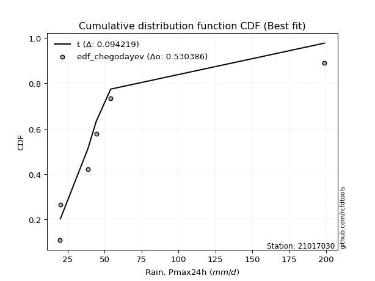</img>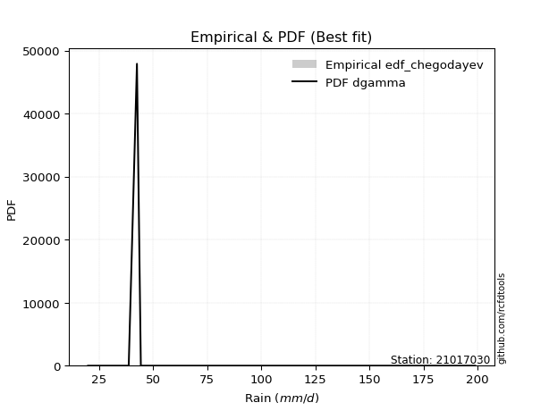</img>

</div>


### 6. EDF Blom (1958)

The Blom formula is a specific "plotting position" formula used in hydrology and statistical analysis to estimate the empirical cumulative probability (or non-exceedance probability) of a data series. It is particularly recommended for data that are approximately normally distributed. The constant _a_ is set to 0.375 (or 3/8).

<div align="center">


$P=(m-a)/(n+1-2a)$


</div>


**6.1. Empirical values**

<div align="center">

|                | 0                   | 1                   | 2                  | 3        | 4                  | 5                  | 6                  |
|:---------------|:--------------------|:--------------------|:-------------------|:---------|:-------------------|:-------------------|:-------------------|
| date           | 2023                | 2022                | 2020               | 2025     | 2021               | 2019               | 2024               |
| x              | 20.0                | 20.4                | 38.8               | 42.6     | 44.4               | 54.2               | 198.8              |
| m              | 1                   | 2                   | 3                  | 4        | 5                  | 6                  | 7                  |
| empirical_dist | edf_blom            | edf_blom            | edf_blom           | edf_blom | edf_blom           | edf_blom           | edf_blom           |
| empirical      | 0.08620689655172414 | 0.22413793103448276 | 0.3620689655172414 | 0.5      | 0.6379310344827587 | 0.7758620689655172 | 0.9137931034482759 |
| empirical_tr   | 1.0943396226415094  | 1.288888888888889   | 1.5675675675675675 | 2.0      | 2.7619047619047623 | 4.461538461538462  | 11.600000000000007 |

</div>


**6.2. Kolmogorov-Smirnov fit test (sorted by Δ)**


<div align="center">

|                | 0                   | 1                   | 2                   | 3                   | 4                   | 5                   | 6                   | 7                   | 8                   | 9                   | 10                  | 11                  | 12                  | 13                  | 14                  | 15                  | 16                  | 17                  | 18                  | 19                  | 20                  | 21                  | 22                  | 23                  | 24                  | 25                  | 26                  | 27                  | 28                  | 29                  | 30                  | 31                  | 32                  | 33                  | 34                  | 35                  | 36                  | 37                  | 38                  | 39                  | 40                  | 41                  | 42                  | 43                  | 44                  | 45                  | 46                  | 47                  | 48                  | 49                  | 50                  | 51                  | 52                  | 53                  | 54                  | 55                  | 56                  | 57                  | 58                  | 59                  | 60                  | 61                  | 62                  | 63                  | 64                  | 65                  | 66                  | 67                  | 68                  | 69                  | 70                  | 71                  | 72                  | 73                  | 74                  | 75                  | 76                  | 77                  | 78                  | 79                  | 80                  | 81                  | 82                  | 83                  | 84                  | 85                  | 86                  | 87                  | 88                  | 89                  | 90                  | 91                  | 92                  | 93                  | 94                  | 95                  | 96                  | 97                  | 98                  | 99                  | 100                 | 101                 | 102                 | 103                 | 104                 | 105                 | 106                 | 107                 | 108                 | 109                 | 110                 | 111                 | 112                 | 113                 | 114                 | 115                 | 116                 | 117                 | 118                 | 119                 | 120                 | 121                 | 122                 | 123                 | 124                 | 125                 | 126                 | 127                 | 128                 | 129                 | 130                 | 131                 | 132                 | 133                 | 134                 | 135                 | 136                 | 137                 | 138                 | 139                 | 140                 | 141                 | 142                 | 143                 | 144                 | 145                 | 146                 | 147                 | 148                 | 149                 | 150                 | 151                 | 152                 | 153                 | 154                 | 155                 | 156                 | 157                 | 158                 | 159                 |
|:---------------|:--------------------|:--------------------|:--------------------|:--------------------|:--------------------|:--------------------|:--------------------|:--------------------|:--------------------|:--------------------|:--------------------|:--------------------|:--------------------|:--------------------|:--------------------|:--------------------|:--------------------|:--------------------|:--------------------|:--------------------|:--------------------|:--------------------|:--------------------|:--------------------|:--------------------|:--------------------|:--------------------|:--------------------|:--------------------|:--------------------|:--------------------|:--------------------|:--------------------|:--------------------|:--------------------|:--------------------|:--------------------|:--------------------|:--------------------|:--------------------|:--------------------|:--------------------|:--------------------|:--------------------|:--------------------|:--------------------|:--------------------|:--------------------|:--------------------|:--------------------|:--------------------|:--------------------|:--------------------|:--------------------|:--------------------|:--------------------|:--------------------|:--------------------|:--------------------|:--------------------|:--------------------|:--------------------|:--------------------|:--------------------|:--------------------|:--------------------|:--------------------|:--------------------|:--------------------|:--------------------|:--------------------|:--------------------|:--------------------|:--------------------|:--------------------|:--------------------|:--------------------|:--------------------|:--------------------|:--------------------|:--------------------|:--------------------|:--------------------|:--------------------|:--------------------|:--------------------|:--------------------|:--------------------|:--------------------|:--------------------|:--------------------|:--------------------|:--------------------|:--------------------|:--------------------|:--------------------|:--------------------|:--------------------|:--------------------|:--------------------|:--------------------|:--------------------|:--------------------|:--------------------|:--------------------|:--------------------|:--------------------|:--------------------|:--------------------|:--------------------|:--------------------|:--------------------|:--------------------|:--------------------|:--------------------|:--------------------|:--------------------|:--------------------|:--------------------|:--------------------|:--------------------|:--------------------|:--------------------|:--------------------|:--------------------|:--------------------|:--------------------|:--------------------|:--------------------|:--------------------|:--------------------|:--------------------|:--------------------|:--------------------|:--------------------|:--------------------|:--------------------|:--------------------|:--------------------|:--------------------|:--------------------|:--------------------|:--------------------|:--------------------|:--------------------|:--------------------|:--------------------|:--------------------|:--------------------|:--------------------|:--------------------|:--------------------|:--------------------|:--------------------|:--------------------|:--------------------|:--------------------|:--------------------|:--------------------|:--------------------|
| station        | 21017030            | 21017030            | 21017030            | 21017030            | 21017030            | 21017030            | 21017030            | 21017030            | 21017030            | 21017030            | 21017030            | 21017030            | 21017030            | 21017030            | 21017030            | 21017030            | 21017030            | 21017030            | 21017030            | 21017030            | 21017030            | 21017030            | 21017030            | 21017030            | 21017030            | 21017030            | 21017030            | 21017030            | 21017030            | 21017030            | 21017030            | 21017030            | 21017030            | 21017030            | 21017030            | 21017030            | 21017030            | 21017030            | 21017030            | 21017030            | 21017030            | 21017030            | 21017030            | 21017030            | 21017030            | 21017030            | 21017030            | 21017030            | 21017030            | 21017030            | 21017030            | 21017030            | 21017030            | 21017030            | 21017030            | 21017030            | 21017030            | 21017030            | 21017030            | 21017030            | 21017030            | 21017030            | 21017030            | 21017030            | 21017030            | 21017030            | 21017030            | 21017030            | 21017030            | 21017030            | 21017030            | 21017030            | 21017030            | 21017030            | 21017030            | 21017030            | 21017030            | 21017030            | 21017030            | 21017030            | 21017030            | 21017030            | 21017030            | 21017030            | 21017030            | 21017030            | 21017030            | 21017030            | 21017030            | 21017030            | 21017030            | 21017030            | 21017030            | 21017030            | 21017030            | 21017030            | 21017030            | 21017030            | 21017030            | 21017030            | 21017030            | 21017030            | 21017030            | 21017030            | 21017030            | 21017030            | 21017030            | 21017030            | 21017030            | 21017030            | 21017030            | 21017030            | 21017030            | 21017030            | 21017030            | 21017030            | 21017030            | 21017030            | 21017030            | 21017030            | 21017030            | 21017030            | 21017030            | 21017030            | 21017030            | 21017030            | 21017030            | 21017030            | 21017030            | 21017030            | 21017030            | 21017030            | 21017030            | 21017030            | 21017030            | 21017030            | 21017030            | 21017030            | 21017030            | 21017030            | 21017030            | 21017030            | 21017030            | 21017030            | 21017030            | 21017030            | 21017030            | 21017030            | 21017030            | 21017030            | 21017030            | 21017030            | 21017030            | 21017030            | 21017030            | 21017030            | 21017030            | 21017030            | 21017030            | 21017030            |
| empirical_dist | edf_blom            | edf_blom            | edf_blom            | edf_blom            | edf_blom            | edf_blom            | edf_blom            | edf_blom            | edf_blom            | edf_blom            | edf_blom            | edf_blom            | edf_blom            | edf_blom            | edf_blom            | edf_blom            | edf_blom            | edf_blom            | edf_blom            | edf_blom            | edf_blom            | edf_blom            | edf_blom            | edf_blom            | edf_blom            | edf_blom            | edf_blom            | edf_blom            | edf_blom            | edf_blom            | edf_blom            | edf_blom            | edf_blom            | edf_blom            | edf_blom            | edf_blom            | edf_blom            | edf_blom            | edf_blom            | edf_blom            | edf_blom            | edf_blom            | edf_blom            | edf_blom            | edf_blom            | edf_blom            | edf_blom            | edf_blom            | edf_blom            | edf_blom            | edf_blom            | edf_blom            | edf_blom            | edf_blom            | edf_blom            | edf_blom            | edf_blom            | edf_blom            | edf_blom            | edf_blom            | edf_blom            | edf_blom            | edf_blom            | edf_blom            | edf_blom            | edf_blom            | edf_blom            | edf_blom            | edf_blom            | edf_blom            | edf_blom            | edf_blom            | edf_blom            | edf_blom            | edf_blom            | edf_blom            | edf_blom            | edf_blom            | edf_blom            | edf_blom            | edf_blom            | edf_blom            | edf_blom            | edf_blom            | edf_blom            | edf_blom            | edf_blom            | edf_blom            | edf_blom            | edf_blom            | edf_blom            | edf_blom            | edf_blom            | edf_blom            | edf_blom            | edf_blom            | edf_blom            | edf_blom            | edf_blom            | edf_blom            | edf_blom            | edf_blom            | edf_blom            | edf_blom            | edf_blom            | edf_blom            | edf_blom            | edf_blom            | edf_blom            | edf_blom            | edf_blom            | edf_blom            | edf_blom            | edf_blom            | edf_blom            | edf_blom            | edf_blom            | edf_blom            | edf_blom            | edf_blom            | edf_blom            | edf_blom            | edf_blom            | edf_blom            | edf_blom            | edf_blom            | edf_blom            | edf_blom            | edf_blom            | edf_blom            | edf_blom            | edf_blom            | edf_blom            | edf_blom            | edf_blom            | edf_blom            | edf_blom            | edf_blom            | edf_blom            | edf_blom            | edf_blom            | edf_blom            | edf_blom            | edf_blom            | edf_blom            | edf_blom            | edf_blom            | edf_blom            | edf_blom            | edf_blom            | edf_blom            | edf_blom            | edf_blom            | edf_blom            | edf_blom            | edf_blom            | edf_blom            | edf_blom            | edf_blom            | edf_blom            |
| p_dist         | t                   | gennorm             | dgamma              | johnsonsu           | betaprime           | lognct              | logjohnsonsu        | ncf                 | logt                | logdgamma           | logvonmises_line    | logbetaprime        | loggennorm          | lograyleigh         | logfoldnorm         | logkstwobign        | logpearson3         | loglaplace          | loglaplace          | loggumbel_r         | logmielke           | logncf              | mielke              | nct                 | loghypsecant        | logmaxwell          | loggenlogistic      | logdweibull         | logrice             | logexponnorm        | burr                | loglogistic         | loghalfnorm         | wald                | logmoyal            | logalpha            | gamma               | logburr             | lognorm             | logcrystalball      | loginvweibull       | loggenextreme       | logloggamma         | loghalflogistic     | logf                | loginvgamma         | loganglit           | loggausshyper       | loggengamma         | dweibull            | logbeta             | logsemicircular     | vonmises_line       | pearson3            | exponpow            | truncweibull_min    | logloglaplace       | nakagami            | loggenexpon         | loggompertz         | alpha               | burr12              | truncpareto         | loginvgauss         | logskewnorm         | logarcsine          | invgamma            | loglomax            | genlogistic         | gompertz            | exponnorm           | halflogistic        | genexpon            | loggumbel_l         | logtriang           | f                   | moyal               | logtruncexpon       | logwald             | logcosine           | halfnorm            | foldnorm            | erlang              | gumbel_r            | gengamma            | genpareto           | kappa3              | johnsonsb           | invgauss            | logweibull_min      | rayleigh            | maxwell             | invweibull          | genextreme          | logweibull_max      | kstwobign           | arcsine             | semicircular        | weibull_min         | anglit              | truncnorm           | crystalball         | norm                | logkappa4           | logistic            | logwrapcauchy       | hypsecant           | loggenpareto        | loghalfgennorm      | logrdist            | logksone            | lomax               | logargus            | exponweib           | halfgennorm         | logtukeylambda      | laplace             | rice                | loglevy_l           | loguniform          | logexponpow         | wrapcauchy          | logburr12           | logtruncnorm        | powerlaw            | levy_l              | bradford            | gumbel_l            | truncexpon          | lognakagami         | logjohnsonsb        | gausshyper          | cosine              | skewnorm            | fatiguelife         | logkappa3           | logtruncweibull_min | logpowerlaw         | logbradford         | triang              | argus               | loggenhalflogistic  | logexponweib        | logtruncpareto      | logfatiguelife      | ksone               | rdist               | kappa4              | tukeylambda         | logerlang           | loggamma            | loggamma            | logtrapezoid        | uniform             | genhalflogistic     | beta                | weibull_max         | trapezoid           | logvonmises         | vonmises            |
| delta          | 0.09020938680727031 | 0.09191953267115141 | 0.09461727396225802 | 0.10373153292567977 | 0.11524144844203199 | 0.11698801656784319 | 0.11712654638380993 | 0.12221529025647038 | 0.12249149586868974 | 0.12367865057632368 | 0.12498677367359207 | 0.12628494191048067 | 0.12797060387320935 | 0.12850277930069376 | 0.13015343622442954 | 0.13027354176757974 | 0.13044160242412434 | 0.13047841192677145 | 0.13047841192677145 | 0.13147441411653715 | 0.13173300221350975 | 0.13319114626421802 | 0.13337560332845494 | 0.13360143361248494 | 0.13527630570268379 | 0.13625536266200278 | 0.13633076865812327 | 0.13793103448258415 | 0.13862208232380024 | 0.139453956037155   | 0.14063345645688113 | 0.14697940701988954 | 0.14781274579786746 | 0.15000715583546664 | 0.15606941958562076 | 0.15665607484375282 | 0.16078550342968706 | 0.16098248409098542 | 0.16146978853244376 | 0.1614698761832003  | 0.16230170146548323 | 0.16231828889695216 | 0.16522490259457145 | 0.1668186295836605  | 0.16962192170401819 | 0.16963204887037725 | 0.1771152663031328  | 0.17931658119269972 | 0.18154486406705334 | 0.18274811126588414 | 0.1833617562764168  | 0.1836287543292241  | 0.1877238211022092  | 0.19043229781953797 | 0.1951957790902149  | 0.1984425842005881  | 0.19961502092711747 | 0.20082141554603616 | 0.20145228832648326 | 0.2027610902212186  | 0.20290020126833702 | 0.2043775371633601  | 0.205664008805314   | 0.20733221526270346 | 0.2092806967233315  | 0.20994255352273516 | 0.21115422753135266 | 0.21200714711611607 | 0.2125389583446078  | 0.2128728396310551  | 0.21289232561186933 | 0.21388823691044512 | 0.2141594968504001  | 0.21839378560225908 | 0.21886474650778043 | 0.22019022123651394 | 0.22127790778721013 | 0.22210434175158034 | 0.22413793103448276 | 0.22652191265879318 | 0.23596095641098902 | 0.24215778892494227 | 0.24451898336528882 | 0.24689310977155643 | 0.25214965711446413 | 0.25801879817612855 | 0.26484973390588407 | 0.26579938018103727 | 0.2659772643760528  | 0.26903084152715645 | 0.26906699588225147 | 0.28080602790481807 | 0.28296917969698476 | 0.28412792710194945 | 0.29305358632608686 | 0.2967902242986535  | 0.29798441871208275 | 0.3071100186506291  | 0.30882285602998766 | 0.3094074325771966  | 0.3098769770751747  | 0.3149783229481955  | 0.3149783344294309  | 0.3183264125527898  | 0.320276899661762   | 0.3214885260537552  | 0.32477224907960994 | 0.32546288034940135 | 0.32675298745954245 | 0.3293435906020333  | 0.3307755093603395  | 0.33100167187125207 | 0.33110613088658014 | 0.3323946933449829  | 0.336985335105686   | 0.33945777408945454 | 0.3406986585757662  | 0.34114473523580147 | 0.3415407477331676  | 0.3417581974393039  | 0.3482893983247945  | 0.35190295600161664 | 0.359044402432872   | 0.36206891589266116 | 0.37862271527326347 | 0.37870490867076506 | 0.3799346907877186  | 0.38542520788284185 | 0.3918430135741812  | 0.3931573166695083  | 0.3949908047300983  | 0.39511753888009055 | 0.3965578975767067  | 0.4025115125697697  | 0.41250756100583835 | 0.42025440222306965 | 0.45466552047692216 | 0.46277657281760093 | 0.4658141718813123  | 0.4737320430237808  | 0.47439533554206925 | 0.4754911845663449  | 0.4797295719799181  | 0.48703160160098363 | 0.4920716587770903  | 0.5331327624778215  | 0.5353111383115068  | 0.5552316684318679  | 0.5685037603039529  | 0.5739818068255138  | 0.5768028165111425  | 0.5768028165111425  | 0.5777600234243438  | 0.5845869011802823  | 0.6318265985821372  | 0.6626795219489348  | 0.6978216320696483  | 0.7169445527375194  | 1.1000978665563574  | 31.088720928976727  |
| deltao         | 0.48442053926100004 | 0.48442053926100004 | 0.48442053926100004 | 0.48442053926100004 | 0.48442053926100004 | 0.48442053926100004 | 0.48442053926100004 | 0.48442053926100004 | 0.48442053926100004 | 0.48442053926100004 | 0.48442053926100004 | 0.48442053926100004 | 0.48442053926100004 | 0.48442053926100004 | 0.48442053926100004 | 0.48442053926100004 | 0.48442053926100004 | 0.48442053926100004 | 0.48442053926100004 | 0.48442053926100004 | 0.48442053926100004 | 0.48442053926100004 | 0.48442053926100004 | 0.48442053926100004 | 0.48442053926100004 | 0.48442053926100004 | 0.48442053926100004 | 0.48442053926100004 | 0.48442053926100004 | 0.48442053926100004 | 0.48442053926100004 | 0.48442053926100004 | 0.48442053926100004 | 0.48442053926100004 | 0.48442053926100004 | 0.48442053926100004 | 0.48442053926100004 | 0.48442053926100004 | 0.48442053926100004 | 0.48442053926100004 | 0.48442053926100004 | 0.48442053926100004 | 0.48442053926100004 | 0.48442053926100004 | 0.48442053926100004 | 0.48442053926100004 | 0.48442053926100004 | 0.48442053926100004 | 0.48442053926100004 | 0.48442053926100004 | 0.48442053926100004 | 0.48442053926100004 | 0.48442053926100004 | 0.48442053926100004 | 0.48442053926100004 | 0.48442053926100004 | 0.48442053926100004 | 0.48442053926100004 | 0.48442053926100004 | 0.48442053926100004 | 0.48442053926100004 | 0.48442053926100004 | 0.48442053926100004 | 0.48442053926100004 | 0.48442053926100004 | 0.48442053926100004 | 0.48442053926100004 | 0.48442053926100004 | 0.48442053926100004 | 0.48442053926100004 | 0.48442053926100004 | 0.48442053926100004 | 0.48442053926100004 | 0.48442053926100004 | 0.48442053926100004 | 0.48442053926100004 | 0.48442053926100004 | 0.48442053926100004 | 0.48442053926100004 | 0.48442053926100004 | 0.48442053926100004 | 0.48442053926100004 | 0.48442053926100004 | 0.48442053926100004 | 0.48442053926100004 | 0.48442053926100004 | 0.48442053926100004 | 0.48442053926100004 | 0.48442053926100004 | 0.48442053926100004 | 0.48442053926100004 | 0.48442053926100004 | 0.48442053926100004 | 0.48442053926100004 | 0.48442053926100004 | 0.48442053926100004 | 0.48442053926100004 | 0.48442053926100004 | 0.48442053926100004 | 0.48442053926100004 | 0.48442053926100004 | 0.48442053926100004 | 0.48442053926100004 | 0.48442053926100004 | 0.48442053926100004 | 0.48442053926100004 | 0.48442053926100004 | 0.48442053926100004 | 0.48442053926100004 | 0.48442053926100004 | 0.48442053926100004 | 0.48442053926100004 | 0.48442053926100004 | 0.48442053926100004 | 0.48442053926100004 | 0.48442053926100004 | 0.48442053926100004 | 0.48442053926100004 | 0.48442053926100004 | 0.48442053926100004 | 0.48442053926100004 | 0.48442053926100004 | 0.48442053926100004 | 0.48442053926100004 | 0.48442053926100004 | 0.48442053926100004 | 0.48442053926100004 | 0.48442053926100004 | 0.48442053926100004 | 0.48442053926100004 | 0.48442053926100004 | 0.48442053926100004 | 0.48442053926100004 | 0.48442053926100004 | 0.48442053926100004 | 0.48442053926100004 | 0.48442053926100004 | 0.48442053926100004 | 0.48442053926100004 | 0.48442053926100004 | 0.48442053926100004 | 0.48442053926100004 | 0.48442053926100004 | 0.48442053926100004 | 0.48442053926100004 | 0.48442053926100004 | 0.48442053926100004 | 0.48442053926100004 | 0.48442053926100004 | 0.48442053926100004 | 0.48442053926100004 | 0.48442053926100004 | 0.48442053926100004 | 0.48442053926100004 | 0.48442053926100004 | 0.48442053926100004 | 0.48442053926100004 | 0.48442053926100004 | 0.48442053926100004 | 0.48442053926100004 |
| eval           | Δo > Δ              | Δo > Δ              | Δo > Δ              | Δo > Δ              | Δo > Δ              | Δo > Δ              | Δo > Δ              | Δo > Δ              | Δo > Δ              | Δo > Δ              | Δo > Δ              | Δo > Δ              | Δo > Δ              | Δo > Δ              | Δo > Δ              | Δo > Δ              | Δo > Δ              | Δo > Δ              | Δo > Δ              | Δo > Δ              | Δo > Δ              | Δo > Δ              | Δo > Δ              | Δo > Δ              | Δo > Δ              | Δo > Δ              | Δo > Δ              | Δo > Δ              | Δo > Δ              | Δo > Δ              | Δo > Δ              | Δo > Δ              | Δo > Δ              | Δo > Δ              | Δo > Δ              | Δo > Δ              | Δo > Δ              | Δo > Δ              | Δo > Δ              | Δo > Δ              | Δo > Δ              | Δo > Δ              | Δo > Δ              | Δo > Δ              | Δo > Δ              | Δo > Δ              | Δo > Δ              | Δo > Δ              | Δo > Δ              | Δo > Δ              | Δo > Δ              | Δo > Δ              | Δo > Δ              | Δo > Δ              | Δo > Δ              | Δo > Δ              | Δo > Δ              | Δo > Δ              | Δo > Δ              | Δo > Δ              | Δo > Δ              | Δo > Δ              | Δo > Δ              | Δo > Δ              | Δo > Δ              | Δo > Δ              | Δo > Δ              | Δo > Δ              | Δo > Δ              | Δo > Δ              | Δo > Δ              | Δo > Δ              | Δo > Δ              | Δo > Δ              | Δo > Δ              | Δo > Δ              | Δo > Δ              | Δo > Δ              | Δo > Δ              | Δo > Δ              | Δo > Δ              | Δo > Δ              | Δo > Δ              | Δo > Δ              | Δo > Δ              | Δo > Δ              | Δo > Δ              | Δo > Δ              | Δo > Δ              | Δo > Δ              | Δo > Δ              | Δo > Δ              | Δo > Δ              | Δo > Δ              | Δo > Δ              | Δo > Δ              | Δo > Δ              | Δo > Δ              | Δo > Δ              | Δo > Δ              | Δo > Δ              | Δo > Δ              | Δo > Δ              | Δo > Δ              | Δo > Δ              | Δo > Δ              | Δo > Δ              | Δo > Δ              | Δo > Δ              | Δo > Δ              | Δo > Δ              | Δo > Δ              | Δo > Δ              | Δo > Δ              | Δo > Δ              | Δo > Δ              | Δo > Δ              | Δo > Δ              | Δo > Δ              | Δo > Δ              | Δo > Δ              | Δo > Δ              | Δo > Δ              | Δo > Δ              | Δo > Δ              | Δo > Δ              | Δo > Δ              | Δo > Δ              | Δo > Δ              | Δo > Δ              | Δo > Δ              | Δo > Δ              | Δo > Δ              | Δo > Δ              | Δo > Δ              | Δo > Δ              | Δo > Δ              | Δo > Δ              | Δo > Δ              | Δo > Δ              | Δo > Δ              | Δo > Δ              | Δo > Δ              | Δo <= Δ             | Δo <= Δ             | Δo <= Δ             | Δo <= Δ             | Δo <= Δ             | Δo <= Δ             | Δo <= Δ             | Δo <= Δ             | Δo <= Δ             | Δo <= Δ             | Δo <= Δ             | Δo <= Δ             | Δo <= Δ             | Δo <= Δ             | Δo <= Δ             | Δo <= Δ             | Δo <= Δ             |
| fit            | 1                   | 1                   | 1                   | 1                   | 1                   | 1                   | 1                   | 1                   | 1                   | 1                   | 1                   | 1                   | 1                   | 1                   | 1                   | 1                   | 1                   | 1                   | 1                   | 1                   | 1                   | 1                   | 1                   | 1                   | 1                   | 1                   | 1                   | 1                   | 1                   | 1                   | 1                   | 1                   | 1                   | 1                   | 1                   | 1                   | 1                   | 1                   | 1                   | 1                   | 1                   | 1                   | 1                   | 1                   | 1                   | 1                   | 1                   | 1                   | 1                   | 1                   | 1                   | 1                   | 1                   | 1                   | 1                   | 1                   | 1                   | 1                   | 1                   | 1                   | 1                   | 1                   | 1                   | 1                   | 1                   | 1                   | 1                   | 1                   | 1                   | 1                   | 1                   | 1                   | 1                   | 1                   | 1                   | 1                   | 1                   | 1                   | 1                   | 1                   | 1                   | 1                   | 1                   | 1                   | 1                   | 1                   | 1                   | 1                   | 1                   | 1                   | 1                   | 1                   | 1                   | 1                   | 1                   | 1                   | 1                   | 1                   | 1                   | 1                   | 1                   | 1                   | 1                   | 1                   | 1                   | 1                   | 1                   | 1                   | 1                   | 1                   | 1                   | 1                   | 1                   | 1                   | 1                   | 1                   | 1                   | 1                   | 1                   | 1                   | 1                   | 1                   | 1                   | 1                   | 1                   | 1                   | 1                   | 1                   | 1                   | 1                   | 1                   | 1                   | 1                   | 1                   | 1                   | 1                   | 1                   | 1                   | 1                   | 1                   | 1                   | 1                   | 1                   | 0                   | 0                   | 0                   | 0                   | 0                   | 0                   | 0                   | 0                   | 0                   | 0                   | 0                   | 0                   | 0                   | 0                   | 0                   | 0                   | 0                   |
| n              | 7                   | 7                   | 7                   | 7                   | 7                   | 7                   | 7                   | 7                   | 7                   | 7                   | 7                   | 7                   | 7                   | 7                   | 7                   | 7                   | 7                   | 7                   | 7                   | 7                   | 7                   | 7                   | 7                   | 7                   | 7                   | 7                   | 7                   | 7                   | 7                   | 7                   | 7                   | 7                   | 7                   | 7                   | 7                   | 7                   | 7                   | 7                   | 7                   | 7                   | 7                   | 7                   | 7                   | 7                   | 7                   | 7                   | 7                   | 7                   | 7                   | 7                   | 7                   | 7                   | 7                   | 7                   | 7                   | 7                   | 7                   | 7                   | 7                   | 7                   | 7                   | 7                   | 7                   | 7                   | 7                   | 7                   | 7                   | 7                   | 7                   | 7                   | 7                   | 7                   | 7                   | 7                   | 7                   | 7                   | 7                   | 7                   | 7                   | 7                   | 7                   | 7                   | 7                   | 7                   | 7                   | 7                   | 7                   | 7                   | 7                   | 7                   | 7                   | 7                   | 7                   | 7                   | 7                   | 7                   | 7                   | 7                   | 7                   | 7                   | 7                   | 7                   | 7                   | 7                   | 7                   | 7                   | 7                   | 7                   | 7                   | 7                   | 7                   | 7                   | 7                   | 7                   | 7                   | 7                   | 7                   | 7                   | 7                   | 7                   | 7                   | 7                   | 7                   | 7                   | 7                   | 7                   | 7                   | 7                   | 7                   | 7                   | 7                   | 7                   | 7                   | 7                   | 7                   | 7                   | 7                   | 7                   | 7                   | 7                   | 7                   | 7                   | 7                   | 7                   | 7                   | 7                   | 7                   | 7                   | 7                   | 7                   | 7                   | 7                   | 7                   | 7                   | 7                   | 7                   | 7                   | 7                   | 7                   | 7                   |
| best_fit       | 1                   | 0                   | 0                   | 0                   | 0                   | 0                   | 0                   | 0                   | 0                   | 0                   | 0                   | 0                   | 0                   | 0                   | 0                   | 0                   | 0                   | 0                   | 0                   | 0                   | 0                   | 0                   | 0                   | 0                   | 0                   | 0                   | 0                   | 0                   | 0                   | 0                   | 0                   | 0                   | 0                   | 0                   | 0                   | 0                   | 0                   | 0                   | 0                   | 0                   | 0                   | 0                   | 0                   | 0                   | 0                   | 0                   | 0                   | 0                   | 0                   | 0                   | 0                   | 0                   | 0                   | 0                   | 0                   | 0                   | 0                   | 0                   | 0                   | 0                   | 0                   | 0                   | 0                   | 0                   | 0                   | 0                   | 0                   | 0                   | 0                   | 0                   | 0                   | 0                   | 0                   | 0                   | 0                   | 0                   | 0                   | 0                   | 0                   | 0                   | 0                   | 0                   | 0                   | 0                   | 0                   | 0                   | 0                   | 0                   | 0                   | 0                   | 0                   | 0                   | 0                   | 0                   | 0                   | 0                   | 0                   | 0                   | 0                   | 0                   | 0                   | 0                   | 0                   | 0                   | 0                   | 0                   | 0                   | 0                   | 0                   | 0                   | 0                   | 0                   | 0                   | 0                   | 0                   | 0                   | 0                   | 0                   | 0                   | 0                   | 0                   | 0                   | 0                   | 0                   | 0                   | 0                   | 0                   | 0                   | 0                   | 0                   | 0                   | 0                   | 0                   | 0                   | 0                   | 0                   | 0                   | 0                   | 0                   | 0                   | 0                   | 0                   | 0                   | 0                   | 0                   | 0                   | 0                   | 0                   | 0                   | 0                   | 0                   | 0                   | 0                   | 0                   | 0                   | 0                   | 0                   | 0                   | 0                   | 0                   |
| best_fit_sort  | 1                   | 2                   | 3                   | 4                   | 5                   | 6                   | 7                   | 8                   | 9                   | 10                  | 11                  | 12                  | 13                  | 14                  | 15                  | 16                  | 17                  | 18                  | 19                  | 20                  | 21                  | 22                  | 23                  | 24                  | 25                  | 26                  | 27                  | 28                  | 29                  | 30                  | 31                  | 32                  | 33                  | 34                  | 35                  | 36                  | 37                  | 38                  | 39                  | 40                  | 41                  | 42                  | 43                  | 44                  | 45                  | 46                  | 47                  | 48                  | 49                  | 50                  | 51                  | 52                  | 53                  | 54                  | 55                  | 56                  | 57                  | 58                  | 59                  | 60                  | 61                  | 62                  | 63                  | 64                  | 65                  | 66                  | 67                  | 68                  | 69                  | 70                  | 71                  | 72                  | 73                  | 74                  | 75                  | 76                  | 77                  | 78                  | 79                  | 80                  | 81                  | 82                  | 83                  | 84                  | 85                  | 86                  | 87                  | 88                  | 89                  | 90                  | 91                  | 92                  | 93                  | 94                  | 95                  | 96                  | 97                  | 98                  | 99                  | 100                 | 101                 | 102                 | 103                 | 104                 | 105                 | 106                 | 107                 | 108                 | 109                 | 110                 | 111                 | 112                 | 113                 | 114                 | 115                 | 116                 | 117                 | 118                 | 119                 | 120                 | 121                 | 122                 | 123                 | 124                 | 125                 | 126                 | 127                 | 128                 | 129                 | 130                 | 131                 | 132                 | 133                 | 134                 | 135                 | 136                 | 137                 | 138                 | 139                 | 140                 | 141                 | 142                 | 143                 | 144                 | 145                 | 146                 | 147                 | 148                 | 149                 | 150                 | 151                 | 152                 | 153                 | 154                 | 155                 | 156                 | 157                 | 158                 | 159                 | 160                 |

</div>


**6.3. Best fit**

<div align="center">

|   id |   station | empirical_dist   | p_dist   |     delta |   deltao | eval   |   fit |   n |   best_fit |   best_fit_sort |
|-----:|----------:|:-----------------|:---------|----------:|---------:|:-------|------:|----:|-----------:|----------------:|
|    0 |  21017030 | edf_blom         | t        | 0.0902094 | 0.484421 | Δo > Δ |     1 |   7 |          1 |               1 |

</div>


<div align="center">

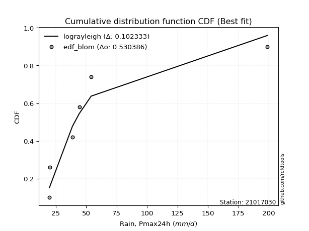</img>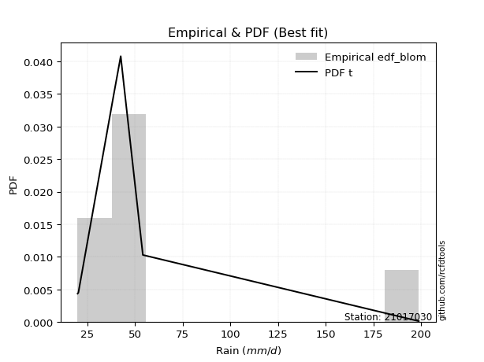</img>

</div>


### 7. EDF Tukey (1962)

In hydrology, the Tukey formula is used as a plotting position formula to estimate the empirical probability or frequency of a flood event (or other hydrological data). The formula parameter is given as _c=0.333_ (or 1/3).

<div align="center">


$P=(m-c)/(n+1-2c)$


</div>


**7.1. Empirical values**

<div align="center">

|                | 0                   | 1                   | 2                   | 3         | 4                  | 5                  | 6                  |
|:---------------|:--------------------|:--------------------|:--------------------|:----------|:-------------------|:-------------------|:-------------------|
| date           | 2023                | 2022                | 2020                | 2025      | 2021               | 2019               | 2024               |
| x              | 20.0                | 20.4                | 38.8                | 42.6      | 44.4               | 54.2               | 198.8              |
| m              | 1                   | 2                   | 3                   | 4         | 5                  | 6                  | 7                  |
| empirical_dist | edf_tukey           | edf_tukey           | edf_tukey           | edf_tukey | edf_tukey          | edf_tukey          | edf_tukey          |
| empirical      | 0.09090909090909091 | 0.22727272727272727 | 0.36363636363636365 | 0.5       | 0.6363636363636364 | 0.7727272727272727 | 0.9090909090909091 |
| empirical_tr   | 1.1                 | 1.2941176470588236  | 1.5714285714285714  | 2.0       | 2.75               | 4.3999999999999995 | 10.999999999999996 |

</div>


**7.2. Kolmogorov-Smirnov fit test (sorted by Δ)**


<div align="center">

|                | 0                   | 1                   | 2                   | 3                   | 4                   | 5                   | 6                   | 7                   | 8                   | 9                   | 10                  | 11                  | 12                  | 13                  | 14                  | 15                  | 16                  | 17                  | 18                  | 19                  | 20                  | 21                  | 22                  | 23                  | 24                  | 25                  | 26                  | 27                  | 28                  | 29                  | 30                  | 31                  | 32                  | 33                  | 34                  | 35                  | 36                  | 37                  | 38                  | 39                  | 40                  | 41                  | 42                  | 43                  | 44                  | 45                  | 46                  | 47                  | 48                  | 49                  | 50                  | 51                  | 52                  | 53                  | 54                  | 55                  | 56                  | 57                  | 58                  | 59                  | 60                  | 61                  | 62                  | 63                  | 64                  | 65                  | 66                  | 67                  | 68                  | 69                  | 70                  | 71                  | 72                  | 73                  | 74                  | 75                  | 76                  | 77                  | 78                  | 79                  | 80                  | 81                  | 82                  | 83                  | 84                  | 85                  | 86                  | 87                  | 88                  | 89                  | 90                  | 91                  | 92                  | 93                  | 94                  | 95                  | 96                  | 97                  | 98                  | 99                  | 100                 | 101                 | 102                 | 103                 | 104                 | 105                 | 106                 | 107                 | 108                 | 109                 | 110                 | 111                 | 112                 | 113                 | 114                 | 115                 | 116                 | 117                 | 118                 | 119                 | 120                 | 121                 | 122                 | 123                 | 124                 | 125                 | 126                 | 127                 | 128                 | 129                 | 130                 | 131                 | 132                 | 133                 | 134                 | 135                 | 136                 | 137                 | 138                 | 139                 | 140                 | 141                 | 142                 | 143                 | 144                 | 145                 | 146                 | 147                 | 148                 | 149                 | 150                 | 151                 | 152                 | 153                 | 154                 | 155                 | 156                 | 157                 | 158                 | 159                 |
|:---------------|:--------------------|:--------------------|:--------------------|:--------------------|:--------------------|:--------------------|:--------------------|:--------------------|:--------------------|:--------------------|:--------------------|:--------------------|:--------------------|:--------------------|:--------------------|:--------------------|:--------------------|:--------------------|:--------------------|:--------------------|:--------------------|:--------------------|:--------------------|:--------------------|:--------------------|:--------------------|:--------------------|:--------------------|:--------------------|:--------------------|:--------------------|:--------------------|:--------------------|:--------------------|:--------------------|:--------------------|:--------------------|:--------------------|:--------------------|:--------------------|:--------------------|:--------------------|:--------------------|:--------------------|:--------------------|:--------------------|:--------------------|:--------------------|:--------------------|:--------------------|:--------------------|:--------------------|:--------------------|:--------------------|:--------------------|:--------------------|:--------------------|:--------------------|:--------------------|:--------------------|:--------------------|:--------------------|:--------------------|:--------------------|:--------------------|:--------------------|:--------------------|:--------------------|:--------------------|:--------------------|:--------------------|:--------------------|:--------------------|:--------------------|:--------------------|:--------------------|:--------------------|:--------------------|:--------------------|:--------------------|:--------------------|:--------------------|:--------------------|:--------------------|:--------------------|:--------------------|:--------------------|:--------------------|:--------------------|:--------------------|:--------------------|:--------------------|:--------------------|:--------------------|:--------------------|:--------------------|:--------------------|:--------------------|:--------------------|:--------------------|:--------------------|:--------------------|:--------------------|:--------------------|:--------------------|:--------------------|:--------------------|:--------------------|:--------------------|:--------------------|:--------------------|:--------------------|:--------------------|:--------------------|:--------------------|:--------------------|:--------------------|:--------------------|:--------------------|:--------------------|:--------------------|:--------------------|:--------------------|:--------------------|:--------------------|:--------------------|:--------------------|:--------------------|:--------------------|:--------------------|:--------------------|:--------------------|:--------------------|:--------------------|:--------------------|:--------------------|:--------------------|:--------------------|:--------------------|:--------------------|:--------------------|:--------------------|:--------------------|:--------------------|:--------------------|:--------------------|:--------------------|:--------------------|:--------------------|:--------------------|:--------------------|:--------------------|:--------------------|:--------------------|:--------------------|:--------------------|:--------------------|:--------------------|:--------------------|:--------------------|
| station        | 21017030            | 21017030            | 21017030            | 21017030            | 21017030            | 21017030            | 21017030            | 21017030            | 21017030            | 21017030            | 21017030            | 21017030            | 21017030            | 21017030            | 21017030            | 21017030            | 21017030            | 21017030            | 21017030            | 21017030            | 21017030            | 21017030            | 21017030            | 21017030            | 21017030            | 21017030            | 21017030            | 21017030            | 21017030            | 21017030            | 21017030            | 21017030            | 21017030            | 21017030            | 21017030            | 21017030            | 21017030            | 21017030            | 21017030            | 21017030            | 21017030            | 21017030            | 21017030            | 21017030            | 21017030            | 21017030            | 21017030            | 21017030            | 21017030            | 21017030            | 21017030            | 21017030            | 21017030            | 21017030            | 21017030            | 21017030            | 21017030            | 21017030            | 21017030            | 21017030            | 21017030            | 21017030            | 21017030            | 21017030            | 21017030            | 21017030            | 21017030            | 21017030            | 21017030            | 21017030            | 21017030            | 21017030            | 21017030            | 21017030            | 21017030            | 21017030            | 21017030            | 21017030            | 21017030            | 21017030            | 21017030            | 21017030            | 21017030            | 21017030            | 21017030            | 21017030            | 21017030            | 21017030            | 21017030            | 21017030            | 21017030            | 21017030            | 21017030            | 21017030            | 21017030            | 21017030            | 21017030            | 21017030            | 21017030            | 21017030            | 21017030            | 21017030            | 21017030            | 21017030            | 21017030            | 21017030            | 21017030            | 21017030            | 21017030            | 21017030            | 21017030            | 21017030            | 21017030            | 21017030            | 21017030            | 21017030            | 21017030            | 21017030            | 21017030            | 21017030            | 21017030            | 21017030            | 21017030            | 21017030            | 21017030            | 21017030            | 21017030            | 21017030            | 21017030            | 21017030            | 21017030            | 21017030            | 21017030            | 21017030            | 21017030            | 21017030            | 21017030            | 21017030            | 21017030            | 21017030            | 21017030            | 21017030            | 21017030            | 21017030            | 21017030            | 21017030            | 21017030            | 21017030            | 21017030            | 21017030            | 21017030            | 21017030            | 21017030            | 21017030            | 21017030            | 21017030            | 21017030            | 21017030            | 21017030            | 21017030            |
| empirical_dist | edf_tukey           | edf_tukey           | edf_tukey           | edf_tukey           | edf_tukey           | edf_tukey           | edf_tukey           | edf_tukey           | edf_tukey           | edf_tukey           | edf_tukey           | edf_tukey           | edf_tukey           | edf_tukey           | edf_tukey           | edf_tukey           | edf_tukey           | edf_tukey           | edf_tukey           | edf_tukey           | edf_tukey           | edf_tukey           | edf_tukey           | edf_tukey           | edf_tukey           | edf_tukey           | edf_tukey           | edf_tukey           | edf_tukey           | edf_tukey           | edf_tukey           | edf_tukey           | edf_tukey           | edf_tukey           | edf_tukey           | edf_tukey           | edf_tukey           | edf_tukey           | edf_tukey           | edf_tukey           | edf_tukey           | edf_tukey           | edf_tukey           | edf_tukey           | edf_tukey           | edf_tukey           | edf_tukey           | edf_tukey           | edf_tukey           | edf_tukey           | edf_tukey           | edf_tukey           | edf_tukey           | edf_tukey           | edf_tukey           | edf_tukey           | edf_tukey           | edf_tukey           | edf_tukey           | edf_tukey           | edf_tukey           | edf_tukey           | edf_tukey           | edf_tukey           | edf_tukey           | edf_tukey           | edf_tukey           | edf_tukey           | edf_tukey           | edf_tukey           | edf_tukey           | edf_tukey           | edf_tukey           | edf_tukey           | edf_tukey           | edf_tukey           | edf_tukey           | edf_tukey           | edf_tukey           | edf_tukey           | edf_tukey           | edf_tukey           | edf_tukey           | edf_tukey           | edf_tukey           | edf_tukey           | edf_tukey           | edf_tukey           | edf_tukey           | edf_tukey           | edf_tukey           | edf_tukey           | edf_tukey           | edf_tukey           | edf_tukey           | edf_tukey           | edf_tukey           | edf_tukey           | edf_tukey           | edf_tukey           | edf_tukey           | edf_tukey           | edf_tukey           | edf_tukey           | edf_tukey           | edf_tukey           | edf_tukey           | edf_tukey           | edf_tukey           | edf_tukey           | edf_tukey           | edf_tukey           | edf_tukey           | edf_tukey           | edf_tukey           | edf_tukey           | edf_tukey           | edf_tukey           | edf_tukey           | edf_tukey           | edf_tukey           | edf_tukey           | edf_tukey           | edf_tukey           | edf_tukey           | edf_tukey           | edf_tukey           | edf_tukey           | edf_tukey           | edf_tukey           | edf_tukey           | edf_tukey           | edf_tukey           | edf_tukey           | edf_tukey           | edf_tukey           | edf_tukey           | edf_tukey           | edf_tukey           | edf_tukey           | edf_tukey           | edf_tukey           | edf_tukey           | edf_tukey           | edf_tukey           | edf_tukey           | edf_tukey           | edf_tukey           | edf_tukey           | edf_tukey           | edf_tukey           | edf_tukey           | edf_tukey           | edf_tukey           | edf_tukey           | edf_tukey           | edf_tukey           | edf_tukey           | edf_tukey           | edf_tukey           |
| p_dist         | dgamma              | t                   | gennorm             | johnsonsu           | betaprime           | ncf                 | lognct              | logjohnsonsu        | logt                | logbetaprime        | logvonmises_line    | lograyleigh         | logdgamma           | logfoldnorm         | logpearson3         | loglaplace          | loglaplace          | loggumbel_r         | logncf              | loggennorm          | mielke              | nct                 | loghypsecant        | logmaxwell          | logkstwobign        | loggenlogistic      | logmielke           | logdweibull         | logexponnorm        | burr                | logrice             | loglogistic         | loghalfnorm         | wald                | logmoyal            | logalpha            | lognorm             | logcrystalball      | logburr             | loginvweibull       | loggenextreme       | logloggamma         | gamma               | loghalflogistic     | logf                | loginvgamma         | loganglit           | loggausshyper       | dweibull            | logsemicircular     | vonmises_line       | loggengamma         | logbeta             | pearson3            | exponpow            | logloglaplace       | nakagami            | alpha               | truncweibull_min    | burr12              | loggenexpon         | loginvgauss         | loggompertz         | logarcsine          | truncpareto         | genlogistic         | invgamma            | loglomax            | halflogistic        | logskewnorm         | loggumbel_l         | logtriang           | gompertz            | exponnorm           | genexpon            | moyal               | f                   | logtruncexpon       | logcosine           | logwald             | halfnorm            | foldnorm            | erlang              | gumbel_r            | gengamma            | genpareto           | kappa3              | johnsonsb           | invgauss            | rayleigh            | logweibull_min      | maxwell             | invweibull          | genextreme          | logweibull_max      | kstwobign           | arcsine             | semicircular        | anglit              | truncnorm           | weibull_min         | crystalball         | norm                | logkappa4           | logistic            | logwrapcauchy       | hypsecant           | loggenpareto        | loghalfgennorm      | logrdist            | logksone            | lomax               | logargus            | exponweib           | halfgennorm         | logtukeylambda      | loglevy_l           | laplace             | rice                | loguniform          | logexponpow         | wrapcauchy          | logburr12           | logtruncnorm        | levy_l              | bradford            | powerlaw            | gumbel_l            | truncexpon          | lognakagami         | logjohnsonsb        | gausshyper          | cosine              | skewnorm            | fatiguelife         | logkappa3           | logtruncweibull_min | logpowerlaw         | logbradford         | triang              | argus               | loggenhalflogistic  | logexponweib        | logtruncpareto      | logfatiguelife      | ksone               | rdist               | kappa4              | tukeylambda         | logerlang           | logtrapezoid        | loggamma            | loggamma            | uniform             | genhalflogistic     | beta                | weibull_max         | trapezoid           | logvonmises         | vonmises            |
| delta          | 0.08991507960489126 | 0.09334418304551481 | 0.09505432890939591 | 0.10686632916392427 | 0.11360761739168211 | 0.11908049401822585 | 0.12012281280608769 | 0.12026134262205443 | 0.12092409774956747 | 0.12315014567223614 | 0.1234193755544698  | 0.12536798306244923 | 0.1268134468145682  | 0.127018639986185   | 0.12887420430500207 | 0.12891101380764913 | 0.12891101380764913 | 0.1299070159974149  | 0.1300563500259735  | 0.13110540011145386 | 0.13180820520933267 | 0.13203403549336268 | 0.13214150946443926 | 0.13312056642375825 | 0.13340833800582425 | 0.134763370539001   | 0.13486779845175423 | 0.13636363636346183 | 0.13788655791803273 | 0.13906605833775887 | 0.14107515860839265 | 0.143844610781645   | 0.1462453476787452  | 0.1468723595972221  | 0.1545020214664985  | 0.15508867672463056 | 0.15833499229419923 | 0.15833507994495577 | 0.15941508597186316 | 0.16073430334636096 | 0.1607508907778299  | 0.16209010635632692 | 0.16392029966793153 | 0.16689551850407874 | 0.16805452358489592 | 0.16806465075125498 | 0.17398047006488826 | 0.17774918307357745 | 0.17804591690851737 | 0.18049395809097957 | 0.18458902486396467 | 0.18467966030529784 | 0.1864965525146613  | 0.18729750158129344 | 0.19206098285197037 | 0.19648022468887294 | 0.19768661930779163 | 0.20133280314921476 | 0.2015773804388326  | 0.20281013904423784 | 0.2045870845647278  | 0.2057648171435812  | 0.2058958864594631  | 0.20680775728449063 | 0.2087988050435585  | 0.20940416210636326 | 0.2095868294122304  | 0.2104397489969938  | 0.2107534406722006  | 0.212415492961576   | 0.21525898936401455 | 0.2157299502695359  | 0.2160076358692996  | 0.21602712185011383 | 0.2172942930886446  | 0.2181431115489656  | 0.21862282311739167 | 0.2189695455133358  | 0.22338711642054865 | 0.22727272727272727 | 0.2328261601727445  | 0.2374555945675755  | 0.24295158524616656 | 0.2437583135333119  | 0.2490148608762196  | 0.2564514000570063  | 0.2601475395485172  | 0.264231982061915   | 0.2644098662569305  | 0.26593219964400694 | 0.2674634434080342  | 0.27767123166657354 | 0.2782669853396179  | 0.2794257327445826  | 0.28835139196872006 | 0.29365542806040895 | 0.2948496224738382  | 0.30397522241238456 | 0.3062726363389521  | 0.30674218083693017 | 0.3072554579108654  | 0.31184352670995097 | 0.3118435381911864  | 0.3151916163145453  | 0.31714210342351745 | 0.3183537298155107  | 0.3216374528413654  | 0.3223280841111568  | 0.3251855893404202  | 0.32620879436378875 | 0.327640713122095   | 0.32786687563300754 | 0.3279713346483356  | 0.33082729522586063 | 0.33541793698656375 | 0.33632297785121    | 0.3368385533758008  | 0.33756386233752167 | 0.33800993899755694 | 0.3386234012010594  | 0.34672200020567223 | 0.3487681597633721  | 0.35747700431374974 | 0.3636363140117834  | 0.37400271431339827 | 0.37679989454947405 | 0.3770553171541412  | 0.3822904116445973  | 0.3887082173359367  | 0.39158991855038605 | 0.39185600849185376 | 0.391982742641846   | 0.39342310133846214 | 0.39937671633152516 | 0.4109401628867161  | 0.4171196059848251  | 0.4530981223577999  | 0.46120917469847866 | 0.46424677376219003 | 0.47059724678553627 | 0.4712605393038247  | 0.4723563883281004  | 0.47816217386079585 | 0.48546420348186137 | 0.49050426065796804 | 0.529997966239577   | 0.53060894395414    | 0.5520968721936234  | 0.5638015659465861  | 0.5724144087063916  | 0.5746252271860992  | 0.5752354183920202  | 0.5752354183920202  | 0.5814521049420378  | 0.6286918023438928  | 0.657977327591568   | 0.6946868358314038  | 0.7138097564992749  | 1.098530468437235   | 31.093423123334095  |
| deltao         | 0.48442053926100004 | 0.48442053926100004 | 0.48442053926100004 | 0.48442053926100004 | 0.48442053926100004 | 0.48442053926100004 | 0.48442053926100004 | 0.48442053926100004 | 0.48442053926100004 | 0.48442053926100004 | 0.48442053926100004 | 0.48442053926100004 | 0.48442053926100004 | 0.48442053926100004 | 0.48442053926100004 | 0.48442053926100004 | 0.48442053926100004 | 0.48442053926100004 | 0.48442053926100004 | 0.48442053926100004 | 0.48442053926100004 | 0.48442053926100004 | 0.48442053926100004 | 0.48442053926100004 | 0.48442053926100004 | 0.48442053926100004 | 0.48442053926100004 | 0.48442053926100004 | 0.48442053926100004 | 0.48442053926100004 | 0.48442053926100004 | 0.48442053926100004 | 0.48442053926100004 | 0.48442053926100004 | 0.48442053926100004 | 0.48442053926100004 | 0.48442053926100004 | 0.48442053926100004 | 0.48442053926100004 | 0.48442053926100004 | 0.48442053926100004 | 0.48442053926100004 | 0.48442053926100004 | 0.48442053926100004 | 0.48442053926100004 | 0.48442053926100004 | 0.48442053926100004 | 0.48442053926100004 | 0.48442053926100004 | 0.48442053926100004 | 0.48442053926100004 | 0.48442053926100004 | 0.48442053926100004 | 0.48442053926100004 | 0.48442053926100004 | 0.48442053926100004 | 0.48442053926100004 | 0.48442053926100004 | 0.48442053926100004 | 0.48442053926100004 | 0.48442053926100004 | 0.48442053926100004 | 0.48442053926100004 | 0.48442053926100004 | 0.48442053926100004 | 0.48442053926100004 | 0.48442053926100004 | 0.48442053926100004 | 0.48442053926100004 | 0.48442053926100004 | 0.48442053926100004 | 0.48442053926100004 | 0.48442053926100004 | 0.48442053926100004 | 0.48442053926100004 | 0.48442053926100004 | 0.48442053926100004 | 0.48442053926100004 | 0.48442053926100004 | 0.48442053926100004 | 0.48442053926100004 | 0.48442053926100004 | 0.48442053926100004 | 0.48442053926100004 | 0.48442053926100004 | 0.48442053926100004 | 0.48442053926100004 | 0.48442053926100004 | 0.48442053926100004 | 0.48442053926100004 | 0.48442053926100004 | 0.48442053926100004 | 0.48442053926100004 | 0.48442053926100004 | 0.48442053926100004 | 0.48442053926100004 | 0.48442053926100004 | 0.48442053926100004 | 0.48442053926100004 | 0.48442053926100004 | 0.48442053926100004 | 0.48442053926100004 | 0.48442053926100004 | 0.48442053926100004 | 0.48442053926100004 | 0.48442053926100004 | 0.48442053926100004 | 0.48442053926100004 | 0.48442053926100004 | 0.48442053926100004 | 0.48442053926100004 | 0.48442053926100004 | 0.48442053926100004 | 0.48442053926100004 | 0.48442053926100004 | 0.48442053926100004 | 0.48442053926100004 | 0.48442053926100004 | 0.48442053926100004 | 0.48442053926100004 | 0.48442053926100004 | 0.48442053926100004 | 0.48442053926100004 | 0.48442053926100004 | 0.48442053926100004 | 0.48442053926100004 | 0.48442053926100004 | 0.48442053926100004 | 0.48442053926100004 | 0.48442053926100004 | 0.48442053926100004 | 0.48442053926100004 | 0.48442053926100004 | 0.48442053926100004 | 0.48442053926100004 | 0.48442053926100004 | 0.48442053926100004 | 0.48442053926100004 | 0.48442053926100004 | 0.48442053926100004 | 0.48442053926100004 | 0.48442053926100004 | 0.48442053926100004 | 0.48442053926100004 | 0.48442053926100004 | 0.48442053926100004 | 0.48442053926100004 | 0.48442053926100004 | 0.48442053926100004 | 0.48442053926100004 | 0.48442053926100004 | 0.48442053926100004 | 0.48442053926100004 | 0.48442053926100004 | 0.48442053926100004 | 0.48442053926100004 | 0.48442053926100004 | 0.48442053926100004 | 0.48442053926100004 | 0.48442053926100004 |
| eval           | Δo > Δ              | Δo > Δ              | Δo > Δ              | Δo > Δ              | Δo > Δ              | Δo > Δ              | Δo > Δ              | Δo > Δ              | Δo > Δ              | Δo > Δ              | Δo > Δ              | Δo > Δ              | Δo > Δ              | Δo > Δ              | Δo > Δ              | Δo > Δ              | Δo > Δ              | Δo > Δ              | Δo > Δ              | Δo > Δ              | Δo > Δ              | Δo > Δ              | Δo > Δ              | Δo > Δ              | Δo > Δ              | Δo > Δ              | Δo > Δ              | Δo > Δ              | Δo > Δ              | Δo > Δ              | Δo > Δ              | Δo > Δ              | Δo > Δ              | Δo > Δ              | Δo > Δ              | Δo > Δ              | Δo > Δ              | Δo > Δ              | Δo > Δ              | Δo > Δ              | Δo > Δ              | Δo > Δ              | Δo > Δ              | Δo > Δ              | Δo > Δ              | Δo > Δ              | Δo > Δ              | Δo > Δ              | Δo > Δ              | Δo > Δ              | Δo > Δ              | Δo > Δ              | Δo > Δ              | Δo > Δ              | Δo > Δ              | Δo > Δ              | Δo > Δ              | Δo > Δ              | Δo > Δ              | Δo > Δ              | Δo > Δ              | Δo > Δ              | Δo > Δ              | Δo > Δ              | Δo > Δ              | Δo > Δ              | Δo > Δ              | Δo > Δ              | Δo > Δ              | Δo > Δ              | Δo > Δ              | Δo > Δ              | Δo > Δ              | Δo > Δ              | Δo > Δ              | Δo > Δ              | Δo > Δ              | Δo > Δ              | Δo > Δ              | Δo > Δ              | Δo > Δ              | Δo > Δ              | Δo > Δ              | Δo > Δ              | Δo > Δ              | Δo > Δ              | Δo > Δ              | Δo > Δ              | Δo > Δ              | Δo > Δ              | Δo > Δ              | Δo > Δ              | Δo > Δ              | Δo > Δ              | Δo > Δ              | Δo > Δ              | Δo > Δ              | Δo > Δ              | Δo > Δ              | Δo > Δ              | Δo > Δ              | Δo > Δ              | Δo > Δ              | Δo > Δ              | Δo > Δ              | Δo > Δ              | Δo > Δ              | Δo > Δ              | Δo > Δ              | Δo > Δ              | Δo > Δ              | Δo > Δ              | Δo > Δ              | Δo > Δ              | Δo > Δ              | Δo > Δ              | Δo > Δ              | Δo > Δ              | Δo > Δ              | Δo > Δ              | Δo > Δ              | Δo > Δ              | Δo > Δ              | Δo > Δ              | Δo > Δ              | Δo > Δ              | Δo > Δ              | Δo > Δ              | Δo > Δ              | Δo > Δ              | Δo > Δ              | Δo > Δ              | Δo > Δ              | Δo > Δ              | Δo > Δ              | Δo > Δ              | Δo > Δ              | Δo > Δ              | Δo > Δ              | Δo > Δ              | Δo > Δ              | Δo > Δ              | Δo > Δ              | Δo <= Δ             | Δo <= Δ             | Δo <= Δ             | Δo <= Δ             | Δo <= Δ             | Δo <= Δ             | Δo <= Δ             | Δo <= Δ             | Δo <= Δ             | Δo <= Δ             | Δo <= Δ             | Δo <= Δ             | Δo <= Δ             | Δo <= Δ             | Δo <= Δ             | Δo <= Δ             | Δo <= Δ             |
| fit            | 1                   | 1                   | 1                   | 1                   | 1                   | 1                   | 1                   | 1                   | 1                   | 1                   | 1                   | 1                   | 1                   | 1                   | 1                   | 1                   | 1                   | 1                   | 1                   | 1                   | 1                   | 1                   | 1                   | 1                   | 1                   | 1                   | 1                   | 1                   | 1                   | 1                   | 1                   | 1                   | 1                   | 1                   | 1                   | 1                   | 1                   | 1                   | 1                   | 1                   | 1                   | 1                   | 1                   | 1                   | 1                   | 1                   | 1                   | 1                   | 1                   | 1                   | 1                   | 1                   | 1                   | 1                   | 1                   | 1                   | 1                   | 1                   | 1                   | 1                   | 1                   | 1                   | 1                   | 1                   | 1                   | 1                   | 1                   | 1                   | 1                   | 1                   | 1                   | 1                   | 1                   | 1                   | 1                   | 1                   | 1                   | 1                   | 1                   | 1                   | 1                   | 1                   | 1                   | 1                   | 1                   | 1                   | 1                   | 1                   | 1                   | 1                   | 1                   | 1                   | 1                   | 1                   | 1                   | 1                   | 1                   | 1                   | 1                   | 1                   | 1                   | 1                   | 1                   | 1                   | 1                   | 1                   | 1                   | 1                   | 1                   | 1                   | 1                   | 1                   | 1                   | 1                   | 1                   | 1                   | 1                   | 1                   | 1                   | 1                   | 1                   | 1                   | 1                   | 1                   | 1                   | 1                   | 1                   | 1                   | 1                   | 1                   | 1                   | 1                   | 1                   | 1                   | 1                   | 1                   | 1                   | 1                   | 1                   | 1                   | 1                   | 1                   | 1                   | 0                   | 0                   | 0                   | 0                   | 0                   | 0                   | 0                   | 0                   | 0                   | 0                   | 0                   | 0                   | 0                   | 0                   | 0                   | 0                   | 0                   |
| n              | 7                   | 7                   | 7                   | 7                   | 7                   | 7                   | 7                   | 7                   | 7                   | 7                   | 7                   | 7                   | 7                   | 7                   | 7                   | 7                   | 7                   | 7                   | 7                   | 7                   | 7                   | 7                   | 7                   | 7                   | 7                   | 7                   | 7                   | 7                   | 7                   | 7                   | 7                   | 7                   | 7                   | 7                   | 7                   | 7                   | 7                   | 7                   | 7                   | 7                   | 7                   | 7                   | 7                   | 7                   | 7                   | 7                   | 7                   | 7                   | 7                   | 7                   | 7                   | 7                   | 7                   | 7                   | 7                   | 7                   | 7                   | 7                   | 7                   | 7                   | 7                   | 7                   | 7                   | 7                   | 7                   | 7                   | 7                   | 7                   | 7                   | 7                   | 7                   | 7                   | 7                   | 7                   | 7                   | 7                   | 7                   | 7                   | 7                   | 7                   | 7                   | 7                   | 7                   | 7                   | 7                   | 7                   | 7                   | 7                   | 7                   | 7                   | 7                   | 7                   | 7                   | 7                   | 7                   | 7                   | 7                   | 7                   | 7                   | 7                   | 7                   | 7                   | 7                   | 7                   | 7                   | 7                   | 7                   | 7                   | 7                   | 7                   | 7                   | 7                   | 7                   | 7                   | 7                   | 7                   | 7                   | 7                   | 7                   | 7                   | 7                   | 7                   | 7                   | 7                   | 7                   | 7                   | 7                   | 7                   | 7                   | 7                   | 7                   | 7                   | 7                   | 7                   | 7                   | 7                   | 7                   | 7                   | 7                   | 7                   | 7                   | 7                   | 7                   | 7                   | 7                   | 7                   | 7                   | 7                   | 7                   | 7                   | 7                   | 7                   | 7                   | 7                   | 7                   | 7                   | 7                   | 7                   | 7                   | 7                   |
| best_fit       | 1                   | 0                   | 0                   | 0                   | 0                   | 0                   | 0                   | 0                   | 0                   | 0                   | 0                   | 0                   | 0                   | 0                   | 0                   | 0                   | 0                   | 0                   | 0                   | 0                   | 0                   | 0                   | 0                   | 0                   | 0                   | 0                   | 0                   | 0                   | 0                   | 0                   | 0                   | 0                   | 0                   | 0                   | 0                   | 0                   | 0                   | 0                   | 0                   | 0                   | 0                   | 0                   | 0                   | 0                   | 0                   | 0                   | 0                   | 0                   | 0                   | 0                   | 0                   | 0                   | 0                   | 0                   | 0                   | 0                   | 0                   | 0                   | 0                   | 0                   | 0                   | 0                   | 0                   | 0                   | 0                   | 0                   | 0                   | 0                   | 0                   | 0                   | 0                   | 0                   | 0                   | 0                   | 0                   | 0                   | 0                   | 0                   | 0                   | 0                   | 0                   | 0                   | 0                   | 0                   | 0                   | 0                   | 0                   | 0                   | 0                   | 0                   | 0                   | 0                   | 0                   | 0                   | 0                   | 0                   | 0                   | 0                   | 0                   | 0                   | 0                   | 0                   | 0                   | 0                   | 0                   | 0                   | 0                   | 0                   | 0                   | 0                   | 0                   | 0                   | 0                   | 0                   | 0                   | 0                   | 0                   | 0                   | 0                   | 0                   | 0                   | 0                   | 0                   | 0                   | 0                   | 0                   | 0                   | 0                   | 0                   | 0                   | 0                   | 0                   | 0                   | 0                   | 0                   | 0                   | 0                   | 0                   | 0                   | 0                   | 0                   | 0                   | 0                   | 0                   | 0                   | 0                   | 0                   | 0                   | 0                   | 0                   | 0                   | 0                   | 0                   | 0                   | 0                   | 0                   | 0                   | 0                   | 0                   | 0                   |
| best_fit_sort  | 1                   | 2                   | 3                   | 4                   | 5                   | 6                   | 7                   | 8                   | 9                   | 10                  | 11                  | 12                  | 13                  | 14                  | 15                  | 16                  | 17                  | 18                  | 19                  | 20                  | 21                  | 22                  | 23                  | 24                  | 25                  | 26                  | 27                  | 28                  | 29                  | 30                  | 31                  | 32                  | 33                  | 34                  | 35                  | 36                  | 37                  | 38                  | 39                  | 40                  | 41                  | 42                  | 43                  | 44                  | 45                  | 46                  | 47                  | 48                  | 49                  | 50                  | 51                  | 52                  | 53                  | 54                  | 55                  | 56                  | 57                  | 58                  | 59                  | 60                  | 61                  | 62                  | 63                  | 64                  | 65                  | 66                  | 67                  | 68                  | 69                  | 70                  | 71                  | 72                  | 73                  | 74                  | 75                  | 76                  | 77                  | 78                  | 79                  | 80                  | 81                  | 82                  | 83                  | 84                  | 85                  | 86                  | 87                  | 88                  | 89                  | 90                  | 91                  | 92                  | 93                  | 94                  | 95                  | 96                  | 97                  | 98                  | 99                  | 100                 | 101                 | 102                 | 103                 | 104                 | 105                 | 106                 | 107                 | 108                 | 109                 | 110                 | 111                 | 112                 | 113                 | 114                 | 115                 | 116                 | 117                 | 118                 | 119                 | 120                 | 121                 | 122                 | 123                 | 124                 | 125                 | 126                 | 127                 | 128                 | 129                 | 130                 | 131                 | 132                 | 133                 | 134                 | 135                 | 136                 | 137                 | 138                 | 139                 | 140                 | 141                 | 142                 | 143                 | 144                 | 145                 | 146                 | 147                 | 148                 | 149                 | 150                 | 151                 | 152                 | 153                 | 154                 | 155                 | 156                 | 157                 | 158                 | 159                 | 160                 |

</div>


**7.3. Best fit**

<div align="center">

|   id |   station | empirical_dist   | p_dist   |     delta |   deltao | eval   |   fit |   n |   best_fit |   best_fit_sort |
|-----:|----------:|:-----------------|:---------|----------:|---------:|:-------|------:|----:|-----------:|----------------:|
|    0 |  21017030 | edf_tukey        | dgamma   | 0.0899151 | 0.484421 | Δo > Δ |     1 |   7 |          1 |               1 |

</div>


<div align="center">

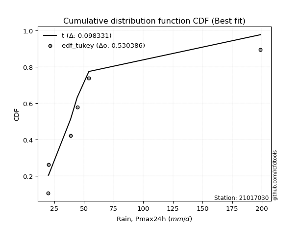</img></img>

</div>


### 8. EDF Gringorten (1963)

Gringorten plotting position formula is essential for estimating the probability and return periods of extreme events like floods and heavy rainfall. The constant _a=0.44_.

<div align="center">


$P=(m-a)/(n+1-2a)$


</div>


**8.1. Empirical values**

<div align="center">

|                | 0                   | 1                   | 2                  | 3              | 4                  | 5                  | 6                  |
|:---------------|:--------------------|:--------------------|:-------------------|:---------------|:-------------------|:-------------------|:-------------------|
| date           | 2023                | 2022                | 2020               | 2025           | 2021               | 2019               | 2024               |
| x              | 20.0                | 20.4                | 38.8               | 42.6           | 44.4               | 54.2               | 198.8              |
| m              | 1                   | 2                   | 3                  | 4              | 5                  | 6                  | 7                  |
| empirical_dist | edf_gringorten      | edf_gringorten      | edf_gringorten     | edf_gringorten | edf_gringorten     | edf_gringorten     | edf_gringorten     |
| empirical      | 0.07865168539325844 | 0.21910112359550563 | 0.3595505617977528 | 0.5            | 0.6404494382022471 | 0.7808988764044943 | 0.9213483146067415 |
| empirical_tr   | 1.0853658536585364  | 1.2805755395683454  | 1.5614035087719298 | 2.0            | 2.781249999999999  | 4.564102564102562  | 12.714285714285701 |

</div>


**8.2. Kolmogorov-Smirnov fit test (sorted by Δ)**


<div align="center">

|                | 0                   | 1                   | 2                   | 3                   | 4                   | 5                   | 6                   | 7                   | 8                   | 9                   | 10                  | 11                  | 12                  | 13                  | 14                  | 15                  | 16                  | 17                  | 18                  | 19                  | 20                  | 21                  | 22                  | 23                  | 24                  | 25                  | 26                  | 27                  | 28                  | 29                  | 30                  | 31                  | 32                  | 33                  | 34                  | 35                  | 36                  | 37                  | 38                  | 39                  | 40                  | 41                  | 42                  | 43                  | 44                  | 45                  | 46                  | 47                  | 48                  | 49                  | 50                  | 51                  | 52                  | 53                  | 54                  | 55                  | 56                  | 57                  | 58                  | 59                  | 60                  | 61                  | 62                  | 63                  | 64                  | 65                  | 66                  | 67                  | 68                  | 69                  | 70                  | 71                  | 72                  | 73                  | 74                  | 75                  | 76                  | 77                  | 78                  | 79                  | 80                  | 81                  | 82                  | 83                  | 84                  | 85                  | 86                  | 87                  | 88                  | 89                  | 90                  | 91                  | 92                  | 93                  | 94                  | 95                  | 96                  | 97                  | 98                  | 99                  | 100                 | 101                 | 102                 | 103                 | 104                 | 105                 | 106                 | 107                 | 108                 | 109                 | 110                 | 111                 | 112                 | 113                 | 114                 | 115                 | 116                 | 117                 | 118                 | 119                 | 120                 | 121                 | 122                 | 123                 | 124                 | 125                 | 126                 | 127                 | 128                 | 129                 | 130                 | 131                 | 132                 | 133                 | 134                 | 135                 | 136                 | 137                 | 138                 | 139                 | 140                 | 141                 | 142                 | 143                 | 144                 | 145                 | 146                 | 147                 | 148                 | 149                 | 150                 | 151                 | 152                 | 153                 | 154                 | 155                 | 156                 | 157                 | 158                 | 159                 |
|:---------------|:--------------------|:--------------------|:--------------------|:--------------------|:--------------------|:--------------------|:--------------------|:--------------------|:--------------------|:--------------------|:--------------------|:--------------------|:--------------------|:--------------------|:--------------------|:--------------------|:--------------------|:--------------------|:--------------------|:--------------------|:--------------------|:--------------------|:--------------------|:--------------------|:--------------------|:--------------------|:--------------------|:--------------------|:--------------------|:--------------------|:--------------------|:--------------------|:--------------------|:--------------------|:--------------------|:--------------------|:--------------------|:--------------------|:--------------------|:--------------------|:--------------------|:--------------------|:--------------------|:--------------------|:--------------------|:--------------------|:--------------------|:--------------------|:--------------------|:--------------------|:--------------------|:--------------------|:--------------------|:--------------------|:--------------------|:--------------------|:--------------------|:--------------------|:--------------------|:--------------------|:--------------------|:--------------------|:--------------------|:--------------------|:--------------------|:--------------------|:--------------------|:--------------------|:--------------------|:--------------------|:--------------------|:--------------------|:--------------------|:--------------------|:--------------------|:--------------------|:--------------------|:--------------------|:--------------------|:--------------------|:--------------------|:--------------------|:--------------------|:--------------------|:--------------------|:--------------------|:--------------------|:--------------------|:--------------------|:--------------------|:--------------------|:--------------------|:--------------------|:--------------------|:--------------------|:--------------------|:--------------------|:--------------------|:--------------------|:--------------------|:--------------------|:--------------------|:--------------------|:--------------------|:--------------------|:--------------------|:--------------------|:--------------------|:--------------------|:--------------------|:--------------------|:--------------------|:--------------------|:--------------------|:--------------------|:--------------------|:--------------------|:--------------------|:--------------------|:--------------------|:--------------------|:--------------------|:--------------------|:--------------------|:--------------------|:--------------------|:--------------------|:--------------------|:--------------------|:--------------------|:--------------------|:--------------------|:--------------------|:--------------------|:--------------------|:--------------------|:--------------------|:--------------------|:--------------------|:--------------------|:--------------------|:--------------------|:--------------------|:--------------------|:--------------------|:--------------------|:--------------------|:--------------------|:--------------------|:--------------------|:--------------------|:--------------------|:--------------------|:--------------------|:--------------------|:--------------------|:--------------------|:--------------------|:--------------------|:--------------------|
| station        | 21017030            | 21017030            | 21017030            | 21017030            | 21017030            | 21017030            | 21017030            | 21017030            | 21017030            | 21017030            | 21017030            | 21017030            | 21017030            | 21017030            | 21017030            | 21017030            | 21017030            | 21017030            | 21017030            | 21017030            | 21017030            | 21017030            | 21017030            | 21017030            | 21017030            | 21017030            | 21017030            | 21017030            | 21017030            | 21017030            | 21017030            | 21017030            | 21017030            | 21017030            | 21017030            | 21017030            | 21017030            | 21017030            | 21017030            | 21017030            | 21017030            | 21017030            | 21017030            | 21017030            | 21017030            | 21017030            | 21017030            | 21017030            | 21017030            | 21017030            | 21017030            | 21017030            | 21017030            | 21017030            | 21017030            | 21017030            | 21017030            | 21017030            | 21017030            | 21017030            | 21017030            | 21017030            | 21017030            | 21017030            | 21017030            | 21017030            | 21017030            | 21017030            | 21017030            | 21017030            | 21017030            | 21017030            | 21017030            | 21017030            | 21017030            | 21017030            | 21017030            | 21017030            | 21017030            | 21017030            | 21017030            | 21017030            | 21017030            | 21017030            | 21017030            | 21017030            | 21017030            | 21017030            | 21017030            | 21017030            | 21017030            | 21017030            | 21017030            | 21017030            | 21017030            | 21017030            | 21017030            | 21017030            | 21017030            | 21017030            | 21017030            | 21017030            | 21017030            | 21017030            | 21017030            | 21017030            | 21017030            | 21017030            | 21017030            | 21017030            | 21017030            | 21017030            | 21017030            | 21017030            | 21017030            | 21017030            | 21017030            | 21017030            | 21017030            | 21017030            | 21017030            | 21017030            | 21017030            | 21017030            | 21017030            | 21017030            | 21017030            | 21017030            | 21017030            | 21017030            | 21017030            | 21017030            | 21017030            | 21017030            | 21017030            | 21017030            | 21017030            | 21017030            | 21017030            | 21017030            | 21017030            | 21017030            | 21017030            | 21017030            | 21017030            | 21017030            | 21017030            | 21017030            | 21017030            | 21017030            | 21017030            | 21017030            | 21017030            | 21017030            | 21017030            | 21017030            | 21017030            | 21017030            | 21017030            | 21017030            |
| empirical_dist | edf_gringorten      | edf_gringorten      | edf_gringorten      | edf_gringorten      | edf_gringorten      | edf_gringorten      | edf_gringorten      | edf_gringorten      | edf_gringorten      | edf_gringorten      | edf_gringorten      | edf_gringorten      | edf_gringorten      | edf_gringorten      | edf_gringorten      | edf_gringorten      | edf_gringorten      | edf_gringorten      | edf_gringorten      | edf_gringorten      | edf_gringorten      | edf_gringorten      | edf_gringorten      | edf_gringorten      | edf_gringorten      | edf_gringorten      | edf_gringorten      | edf_gringorten      | edf_gringorten      | edf_gringorten      | edf_gringorten      | edf_gringorten      | edf_gringorten      | edf_gringorten      | edf_gringorten      | edf_gringorten      | edf_gringorten      | edf_gringorten      | edf_gringorten      | edf_gringorten      | edf_gringorten      | edf_gringorten      | edf_gringorten      | edf_gringorten      | edf_gringorten      | edf_gringorten      | edf_gringorten      | edf_gringorten      | edf_gringorten      | edf_gringorten      | edf_gringorten      | edf_gringorten      | edf_gringorten      | edf_gringorten      | edf_gringorten      | edf_gringorten      | edf_gringorten      | edf_gringorten      | edf_gringorten      | edf_gringorten      | edf_gringorten      | edf_gringorten      | edf_gringorten      | edf_gringorten      | edf_gringorten      | edf_gringorten      | edf_gringorten      | edf_gringorten      | edf_gringorten      | edf_gringorten      | edf_gringorten      | edf_gringorten      | edf_gringorten      | edf_gringorten      | edf_gringorten      | edf_gringorten      | edf_gringorten      | edf_gringorten      | edf_gringorten      | edf_gringorten      | edf_gringorten      | edf_gringorten      | edf_gringorten      | edf_gringorten      | edf_gringorten      | edf_gringorten      | edf_gringorten      | edf_gringorten      | edf_gringorten      | edf_gringorten      | edf_gringorten      | edf_gringorten      | edf_gringorten      | edf_gringorten      | edf_gringorten      | edf_gringorten      | edf_gringorten      | edf_gringorten      | edf_gringorten      | edf_gringorten      | edf_gringorten      | edf_gringorten      | edf_gringorten      | edf_gringorten      | edf_gringorten      | edf_gringorten      | edf_gringorten      | edf_gringorten      | edf_gringorten      | edf_gringorten      | edf_gringorten      | edf_gringorten      | edf_gringorten      | edf_gringorten      | edf_gringorten      | edf_gringorten      | edf_gringorten      | edf_gringorten      | edf_gringorten      | edf_gringorten      | edf_gringorten      | edf_gringorten      | edf_gringorten      | edf_gringorten      | edf_gringorten      | edf_gringorten      | edf_gringorten      | edf_gringorten      | edf_gringorten      | edf_gringorten      | edf_gringorten      | edf_gringorten      | edf_gringorten      | edf_gringorten      | edf_gringorten      | edf_gringorten      | edf_gringorten      | edf_gringorten      | edf_gringorten      | edf_gringorten      | edf_gringorten      | edf_gringorten      | edf_gringorten      | edf_gringorten      | edf_gringorten      | edf_gringorten      | edf_gringorten      | edf_gringorten      | edf_gringorten      | edf_gringorten      | edf_gringorten      | edf_gringorten      | edf_gringorten      | edf_gringorten      | edf_gringorten      | edf_gringorten      | edf_gringorten      | edf_gringorten      | edf_gringorten      | edf_gringorten      |
| p_dist         | t                   | gennorm             | johnsonsu           | dgamma              | logjohnsonsu        | lognct              | logdgamma           | betaprime           | loggennorm          | logt                | logkstwobign        | logmielke           | ncf                 | logvonmises_line    | logbetaprime        | logpearson3         | loglaplace          | loglaplace          | lograyleigh         | loggumbel_r         | logfoldnorm         | mielke              | nct                 | logncf              | loggenlogistic      | loghypsecant        | logdweibull         | logmaxwell          | logexponnorm        | burr                | logrice             | loghalfnorm         | loglogistic         | wald                | gamma               | logmoyal            | logalpha            | logburr             | loginvweibull       | loggenextreme       | lognorm             | logcrystalball      | loghalflogistic     | logloggamma         | logf                | loginvgamma         | loggengamma         | logbeta             | loggausshyper       | loganglit           | logsemicircular     | dweibull            | vonmises_line       | truncweibull_min    | pearson3            | loggenexpon         | loggompertz         | exponpow            | truncpareto         | logskewnorm         | logloglaplace       | alpha               | nakagami            | burr12              | gompertz            | exponnorm           | genexpon            | loginvgauss         | invgamma            | loglomax            | logarcsine          | genlogistic         | halflogistic        | f                   | loggumbel_l         | logtriang           | moyal               | logwald             | logtruncexpon       | logcosine           | halfnorm            | erlang              | foldnorm            | gumbel_r            | gengamma            | genpareto           | johnsonsb           | invgauss            | logweibull_min      | kappa3              | rayleigh            | maxwell             | invweibull          | genextreme          | logweibull_max      | kstwobign           | arcsine             | weibull_min         | semicircular        | anglit              | truncnorm           | crystalball         | norm                | logkappa4           | logistic            | logwrapcauchy       | loghalfgennorm      | hypsecant           | loggenpareto        | logrdist            | exponweib           | logksone            | lomax               | logargus            | halfgennorm         | logtukeylambda      | laplace             | rice                | loguniform          | loglevy_l           | logexponpow         | wrapcauchy          | logtruncnorm        | logburr12           | powerlaw            | bradford            | levy_l              | gumbel_l            | lognakagami         | truncexpon          | logjohnsonsb        | gausshyper          | cosine              | skewnorm            | fatiguelife         | logkappa3           | logtruncweibull_min | logpowerlaw         | logbradford         | triang              | argus               | loggenhalflogistic  | logexponweib        | logtruncpareto      | logfatiguelife      | ksone               | rdist               | kappa4              | tukeylambda         | logerlang           | loggamma            | loggamma            | logtrapezoid        | uniform             | genhalflogistic     | beta                | weibull_max         | trapezoid           | logvonmises         | vonmises            |
| delta          | 0.08517257936829317 | 0.08688272523217427 | 0.09869472548670263 | 0.10217248512072373 | 0.11208973894483279 | 0.11861074719627174 | 0.11864184313734655 | 0.12027825588100904 | 0.12293379643423222 | 0.12500989958817832 | 0.1252367343286026  | 0.1266961947745326  | 0.12725209769544743 | 0.12750517739308065 | 0.13132174934945773 | 0.13296000614361292 | 0.13299681564625987 | 0.13299681564625987 | 0.1335395867396708  | 0.13399281783602573 | 0.1351902436634066  | 0.13589400704794352 | 0.13611983733197353 | 0.13822795370319507 | 0.13884917237761185 | 0.14031311314166084 | 0.14044943820207256 | 0.14129217010097983 | 0.14197235975664357 | 0.14315186017636972 | 0.1436588897627773  | 0.15033114951735604 | 0.1520162144588666  | 0.1550439632744437  | 0.1557486959907099  | 0.15858782330510934 | 0.1591744785632414  | 0.163500887810474   | 0.1648201051849718  | 0.16483669261644074 | 0.1665065959714208  | 0.16650668362217735 | 0.1693370333031491  | 0.1702617100335485  | 0.17214032542350677 | 0.17215045258986583 | 0.1765080566280762  | 0.17832494883743966 | 0.1818349849121883  | 0.18215207374210984 | 0.18866556176820115 | 0.19030332242434983 | 0.19276062854118625 | 0.19340577676161097 | 0.19546910525851502 | 0.19641548088750616 | 0.19772428278224147 | 0.20023258652919196 | 0.20062720136633685 | 0.20424388928435436 | 0.20465182836609452 | 0.2054186049878256  | 0.20585822298501322 | 0.20689594088284868 | 0.20783603219207797 | 0.2078555181728922  | 0.20912268941142295 | 0.20985061898219204 | 0.21367263125084124 | 0.21452555083560465 | 0.21497936096171222 | 0.21757576578358484 | 0.21892504434942217 | 0.22270862495600252 | 0.22343059304123614 | 0.22390155394675748 | 0.22631471522618718 | 0.22652411293000507 | 0.2271411491905574  | 0.23155872009777023 | 0.24099776384996607 | 0.2470373870847774  | 0.24971300008340797 | 0.2519299172105335  | 0.2571864645534412  | 0.26053720189561713 | 0.26831778390052585 | 0.2684956680955414  | 0.27154924524664503 | 0.27240494506434965 | 0.2741038033212285  | 0.2858428353437951  | 0.29052439085545034 | 0.29168313826041503 | 0.30060879748455255 | 0.30182703173763054 | 0.3030212261510598  | 0.31134125974947624 | 0.31214682608960614 | 0.31444424001617366 | 0.31491378451415175 | 0.32001513038717255 | 0.32001514186840796 | 0.32336321999176687 | 0.32531370710073904 | 0.3265253334927323  | 0.32927139117903104 | 0.329809056518587   | 0.3304996877883784  | 0.33438039804101033 | 0.3349130970644715  | 0.33581231679931656 | 0.3360384793102291  | 0.3361429383255572  | 0.3395037388251746  | 0.3444945815284316  | 0.34573546601474325 | 0.3461815426747785  | 0.34679500487828097 | 0.3490959588916333  | 0.3508078020442831  | 0.3569397634405937  | 0.36011146267837946 | 0.3615628061523606  | 0.38114111899275205 | 0.38497149822669563 | 0.38626011982923075 | 0.3904620153218189  | 0.3956757203889969  | 0.3968798210131583  | 0.40002761216907545 | 0.4001543463190676  | 0.40159470501568373 | 0.40754832000874675 | 0.41502596472532693 | 0.4252912096620467  | 0.45718392419641074 | 0.4652949765370895  | 0.4683325756008009  | 0.47876885046275786 | 0.4794321429810463  | 0.480527992005322   | 0.4822479756994067  | 0.4895500053204722  | 0.4945900624965789  | 0.5381695699167985  | 0.5428663494699726  | 0.5602684758708449  | 0.5760589714624187  | 0.5765002105450024  | 0.579321220230631   | 0.579321220230631   | 0.5827968308633209  | 0.5896237086192594  | 0.6368634060211142  | 0.6702347331074006  | 0.7028584395086254  | 0.7219813601764965  | 1.102616270275846   | 31.081165717818262  |
| deltao         | 0.48442053926100004 | 0.48442053926100004 | 0.48442053926100004 | 0.48442053926100004 | 0.48442053926100004 | 0.48442053926100004 | 0.48442053926100004 | 0.48442053926100004 | 0.48442053926100004 | 0.48442053926100004 | 0.48442053926100004 | 0.48442053926100004 | 0.48442053926100004 | 0.48442053926100004 | 0.48442053926100004 | 0.48442053926100004 | 0.48442053926100004 | 0.48442053926100004 | 0.48442053926100004 | 0.48442053926100004 | 0.48442053926100004 | 0.48442053926100004 | 0.48442053926100004 | 0.48442053926100004 | 0.48442053926100004 | 0.48442053926100004 | 0.48442053926100004 | 0.48442053926100004 | 0.48442053926100004 | 0.48442053926100004 | 0.48442053926100004 | 0.48442053926100004 | 0.48442053926100004 | 0.48442053926100004 | 0.48442053926100004 | 0.48442053926100004 | 0.48442053926100004 | 0.48442053926100004 | 0.48442053926100004 | 0.48442053926100004 | 0.48442053926100004 | 0.48442053926100004 | 0.48442053926100004 | 0.48442053926100004 | 0.48442053926100004 | 0.48442053926100004 | 0.48442053926100004 | 0.48442053926100004 | 0.48442053926100004 | 0.48442053926100004 | 0.48442053926100004 | 0.48442053926100004 | 0.48442053926100004 | 0.48442053926100004 | 0.48442053926100004 | 0.48442053926100004 | 0.48442053926100004 | 0.48442053926100004 | 0.48442053926100004 | 0.48442053926100004 | 0.48442053926100004 | 0.48442053926100004 | 0.48442053926100004 | 0.48442053926100004 | 0.48442053926100004 | 0.48442053926100004 | 0.48442053926100004 | 0.48442053926100004 | 0.48442053926100004 | 0.48442053926100004 | 0.48442053926100004 | 0.48442053926100004 | 0.48442053926100004 | 0.48442053926100004 | 0.48442053926100004 | 0.48442053926100004 | 0.48442053926100004 | 0.48442053926100004 | 0.48442053926100004 | 0.48442053926100004 | 0.48442053926100004 | 0.48442053926100004 | 0.48442053926100004 | 0.48442053926100004 | 0.48442053926100004 | 0.48442053926100004 | 0.48442053926100004 | 0.48442053926100004 | 0.48442053926100004 | 0.48442053926100004 | 0.48442053926100004 | 0.48442053926100004 | 0.48442053926100004 | 0.48442053926100004 | 0.48442053926100004 | 0.48442053926100004 | 0.48442053926100004 | 0.48442053926100004 | 0.48442053926100004 | 0.48442053926100004 | 0.48442053926100004 | 0.48442053926100004 | 0.48442053926100004 | 0.48442053926100004 | 0.48442053926100004 | 0.48442053926100004 | 0.48442053926100004 | 0.48442053926100004 | 0.48442053926100004 | 0.48442053926100004 | 0.48442053926100004 | 0.48442053926100004 | 0.48442053926100004 | 0.48442053926100004 | 0.48442053926100004 | 0.48442053926100004 | 0.48442053926100004 | 0.48442053926100004 | 0.48442053926100004 | 0.48442053926100004 | 0.48442053926100004 | 0.48442053926100004 | 0.48442053926100004 | 0.48442053926100004 | 0.48442053926100004 | 0.48442053926100004 | 0.48442053926100004 | 0.48442053926100004 | 0.48442053926100004 | 0.48442053926100004 | 0.48442053926100004 | 0.48442053926100004 | 0.48442053926100004 | 0.48442053926100004 | 0.48442053926100004 | 0.48442053926100004 | 0.48442053926100004 | 0.48442053926100004 | 0.48442053926100004 | 0.48442053926100004 | 0.48442053926100004 | 0.48442053926100004 | 0.48442053926100004 | 0.48442053926100004 | 0.48442053926100004 | 0.48442053926100004 | 0.48442053926100004 | 0.48442053926100004 | 0.48442053926100004 | 0.48442053926100004 | 0.48442053926100004 | 0.48442053926100004 | 0.48442053926100004 | 0.48442053926100004 | 0.48442053926100004 | 0.48442053926100004 | 0.48442053926100004 | 0.48442053926100004 | 0.48442053926100004 | 0.48442053926100004 |
| eval           | Δo > Δ              | Δo > Δ              | Δo > Δ              | Δo > Δ              | Δo > Δ              | Δo > Δ              | Δo > Δ              | Δo > Δ              | Δo > Δ              | Δo > Δ              | Δo > Δ              | Δo > Δ              | Δo > Δ              | Δo > Δ              | Δo > Δ              | Δo > Δ              | Δo > Δ              | Δo > Δ              | Δo > Δ              | Δo > Δ              | Δo > Δ              | Δo > Δ              | Δo > Δ              | Δo > Δ              | Δo > Δ              | Δo > Δ              | Δo > Δ              | Δo > Δ              | Δo > Δ              | Δo > Δ              | Δo > Δ              | Δo > Δ              | Δo > Δ              | Δo > Δ              | Δo > Δ              | Δo > Δ              | Δo > Δ              | Δo > Δ              | Δo > Δ              | Δo > Δ              | Δo > Δ              | Δo > Δ              | Δo > Δ              | Δo > Δ              | Δo > Δ              | Δo > Δ              | Δo > Δ              | Δo > Δ              | Δo > Δ              | Δo > Δ              | Δo > Δ              | Δo > Δ              | Δo > Δ              | Δo > Δ              | Δo > Δ              | Δo > Δ              | Δo > Δ              | Δo > Δ              | Δo > Δ              | Δo > Δ              | Δo > Δ              | Δo > Δ              | Δo > Δ              | Δo > Δ              | Δo > Δ              | Δo > Δ              | Δo > Δ              | Δo > Δ              | Δo > Δ              | Δo > Δ              | Δo > Δ              | Δo > Δ              | Δo > Δ              | Δo > Δ              | Δo > Δ              | Δo > Δ              | Δo > Δ              | Δo > Δ              | Δo > Δ              | Δo > Δ              | Δo > Δ              | Δo > Δ              | Δo > Δ              | Δo > Δ              | Δo > Δ              | Δo > Δ              | Δo > Δ              | Δo > Δ              | Δo > Δ              | Δo > Δ              | Δo > Δ              | Δo > Δ              | Δo > Δ              | Δo > Δ              | Δo > Δ              | Δo > Δ              | Δo > Δ              | Δo > Δ              | Δo > Δ              | Δo > Δ              | Δo > Δ              | Δo > Δ              | Δo > Δ              | Δo > Δ              | Δo > Δ              | Δo > Δ              | Δo > Δ              | Δo > Δ              | Δo > Δ              | Δo > Δ              | Δo > Δ              | Δo > Δ              | Δo > Δ              | Δo > Δ              | Δo > Δ              | Δo > Δ              | Δo > Δ              | Δo > Δ              | Δo > Δ              | Δo > Δ              | Δo > Δ              | Δo > Δ              | Δo > Δ              | Δo > Δ              | Δo > Δ              | Δo > Δ              | Δo > Δ              | Δo > Δ              | Δo > Δ              | Δo > Δ              | Δo > Δ              | Δo > Δ              | Δo > Δ              | Δo > Δ              | Δo > Δ              | Δo > Δ              | Δo > Δ              | Δo > Δ              | Δo > Δ              | Δo > Δ              | Δo > Δ              | Δo > Δ              | Δo > Δ              | Δo <= Δ             | Δo <= Δ             | Δo <= Δ             | Δo <= Δ             | Δo <= Δ             | Δo <= Δ             | Δo <= Δ             | Δo <= Δ             | Δo <= Δ             | Δo <= Δ             | Δo <= Δ             | Δo <= Δ             | Δo <= Δ             | Δo <= Δ             | Δo <= Δ             | Δo <= Δ             | Δo <= Δ             |
| fit            | 1                   | 1                   | 1                   | 1                   | 1                   | 1                   | 1                   | 1                   | 1                   | 1                   | 1                   | 1                   | 1                   | 1                   | 1                   | 1                   | 1                   | 1                   | 1                   | 1                   | 1                   | 1                   | 1                   | 1                   | 1                   | 1                   | 1                   | 1                   | 1                   | 1                   | 1                   | 1                   | 1                   | 1                   | 1                   | 1                   | 1                   | 1                   | 1                   | 1                   | 1                   | 1                   | 1                   | 1                   | 1                   | 1                   | 1                   | 1                   | 1                   | 1                   | 1                   | 1                   | 1                   | 1                   | 1                   | 1                   | 1                   | 1                   | 1                   | 1                   | 1                   | 1                   | 1                   | 1                   | 1                   | 1                   | 1                   | 1                   | 1                   | 1                   | 1                   | 1                   | 1                   | 1                   | 1                   | 1                   | 1                   | 1                   | 1                   | 1                   | 1                   | 1                   | 1                   | 1                   | 1                   | 1                   | 1                   | 1                   | 1                   | 1                   | 1                   | 1                   | 1                   | 1                   | 1                   | 1                   | 1                   | 1                   | 1                   | 1                   | 1                   | 1                   | 1                   | 1                   | 1                   | 1                   | 1                   | 1                   | 1                   | 1                   | 1                   | 1                   | 1                   | 1                   | 1                   | 1                   | 1                   | 1                   | 1                   | 1                   | 1                   | 1                   | 1                   | 1                   | 1                   | 1                   | 1                   | 1                   | 1                   | 1                   | 1                   | 1                   | 1                   | 1                   | 1                   | 1                   | 1                   | 1                   | 1                   | 1                   | 1                   | 1                   | 1                   | 0                   | 0                   | 0                   | 0                   | 0                   | 0                   | 0                   | 0                   | 0                   | 0                   | 0                   | 0                   | 0                   | 0                   | 0                   | 0                   | 0                   |
| n              | 7                   | 7                   | 7                   | 7                   | 7                   | 7                   | 7                   | 7                   | 7                   | 7                   | 7                   | 7                   | 7                   | 7                   | 7                   | 7                   | 7                   | 7                   | 7                   | 7                   | 7                   | 7                   | 7                   | 7                   | 7                   | 7                   | 7                   | 7                   | 7                   | 7                   | 7                   | 7                   | 7                   | 7                   | 7                   | 7                   | 7                   | 7                   | 7                   | 7                   | 7                   | 7                   | 7                   | 7                   | 7                   | 7                   | 7                   | 7                   | 7                   | 7                   | 7                   | 7                   | 7                   | 7                   | 7                   | 7                   | 7                   | 7                   | 7                   | 7                   | 7                   | 7                   | 7                   | 7                   | 7                   | 7                   | 7                   | 7                   | 7                   | 7                   | 7                   | 7                   | 7                   | 7                   | 7                   | 7                   | 7                   | 7                   | 7                   | 7                   | 7                   | 7                   | 7                   | 7                   | 7                   | 7                   | 7                   | 7                   | 7                   | 7                   | 7                   | 7                   | 7                   | 7                   | 7                   | 7                   | 7                   | 7                   | 7                   | 7                   | 7                   | 7                   | 7                   | 7                   | 7                   | 7                   | 7                   | 7                   | 7                   | 7                   | 7                   | 7                   | 7                   | 7                   | 7                   | 7                   | 7                   | 7                   | 7                   | 7                   | 7                   | 7                   | 7                   | 7                   | 7                   | 7                   | 7                   | 7                   | 7                   | 7                   | 7                   | 7                   | 7                   | 7                   | 7                   | 7                   | 7                   | 7                   | 7                   | 7                   | 7                   | 7                   | 7                   | 7                   | 7                   | 7                   | 7                   | 7                   | 7                   | 7                   | 7                   | 7                   | 7                   | 7                   | 7                   | 7                   | 7                   | 7                   | 7                   | 7                   |
| best_fit       | 1                   | 0                   | 0                   | 0                   | 0                   | 0                   | 0                   | 0                   | 0                   | 0                   | 0                   | 0                   | 0                   | 0                   | 0                   | 0                   | 0                   | 0                   | 0                   | 0                   | 0                   | 0                   | 0                   | 0                   | 0                   | 0                   | 0                   | 0                   | 0                   | 0                   | 0                   | 0                   | 0                   | 0                   | 0                   | 0                   | 0                   | 0                   | 0                   | 0                   | 0                   | 0                   | 0                   | 0                   | 0                   | 0                   | 0                   | 0                   | 0                   | 0                   | 0                   | 0                   | 0                   | 0                   | 0                   | 0                   | 0                   | 0                   | 0                   | 0                   | 0                   | 0                   | 0                   | 0                   | 0                   | 0                   | 0                   | 0                   | 0                   | 0                   | 0                   | 0                   | 0                   | 0                   | 0                   | 0                   | 0                   | 0                   | 0                   | 0                   | 0                   | 0                   | 0                   | 0                   | 0                   | 0                   | 0                   | 0                   | 0                   | 0                   | 0                   | 0                   | 0                   | 0                   | 0                   | 0                   | 0                   | 0                   | 0                   | 0                   | 0                   | 0                   | 0                   | 0                   | 0                   | 0                   | 0                   | 0                   | 0                   | 0                   | 0                   | 0                   | 0                   | 0                   | 0                   | 0                   | 0                   | 0                   | 0                   | 0                   | 0                   | 0                   | 0                   | 0                   | 0                   | 0                   | 0                   | 0                   | 0                   | 0                   | 0                   | 0                   | 0                   | 0                   | 0                   | 0                   | 0                   | 0                   | 0                   | 0                   | 0                   | 0                   | 0                   | 0                   | 0                   | 0                   | 0                   | 0                   | 0                   | 0                   | 0                   | 0                   | 0                   | 0                   | 0                   | 0                   | 0                   | 0                   | 0                   | 0                   |
| best_fit_sort  | 1                   | 2                   | 3                   | 4                   | 5                   | 6                   | 7                   | 8                   | 9                   | 10                  | 11                  | 12                  | 13                  | 14                  | 15                  | 16                  | 17                  | 18                  | 19                  | 20                  | 21                  | 22                  | 23                  | 24                  | 25                  | 26                  | 27                  | 28                  | 29                  | 30                  | 31                  | 32                  | 33                  | 34                  | 35                  | 36                  | 37                  | 38                  | 39                  | 40                  | 41                  | 42                  | 43                  | 44                  | 45                  | 46                  | 47                  | 48                  | 49                  | 50                  | 51                  | 52                  | 53                  | 54                  | 55                  | 56                  | 57                  | 58                  | 59                  | 60                  | 61                  | 62                  | 63                  | 64                  | 65                  | 66                  | 67                  | 68                  | 69                  | 70                  | 71                  | 72                  | 73                  | 74                  | 75                  | 76                  | 77                  | 78                  | 79                  | 80                  | 81                  | 82                  | 83                  | 84                  | 85                  | 86                  | 87                  | 88                  | 89                  | 90                  | 91                  | 92                  | 93                  | 94                  | 95                  | 96                  | 97                  | 98                  | 99                  | 100                 | 101                 | 102                 | 103                 | 104                 | 105                 | 106                 | 107                 | 108                 | 109                 | 110                 | 111                 | 112                 | 113                 | 114                 | 115                 | 116                 | 117                 | 118                 | 119                 | 120                 | 121                 | 122                 | 123                 | 124                 | 125                 | 126                 | 127                 | 128                 | 129                 | 130                 | 131                 | 132                 | 133                 | 134                 | 135                 | 136                 | 137                 | 138                 | 139                 | 140                 | 141                 | 142                 | 143                 | 144                 | 145                 | 146                 | 147                 | 148                 | 149                 | 150                 | 151                 | 152                 | 153                 | 154                 | 155                 | 156                 | 157                 | 158                 | 159                 | 160                 |

</div>


**8.3. Best fit**

<div align="center">

|   id |   station | empirical_dist   | p_dist   |     delta |   deltao | eval   |   fit |   n |   best_fit |   best_fit_sort |
|-----:|----------:|:-----------------|:---------|----------:|---------:|:-------|------:|----:|-----------:|----------------:|
|    0 |  21017030 | edf_gringorten   | t        | 0.0851726 | 0.484421 | Δo > Δ |     1 |   7 |          1 |               1 |

</div>


<div align="center">

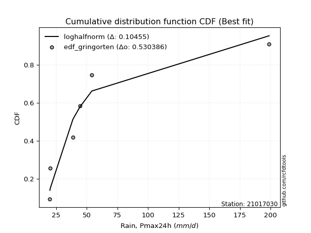</img></img>

</div>


### 9. EDF Filliben (1975)

The specific values of the constants (0.3175) (often denoted as $alpha$) and (0.365) are derived from a method proposed by James J. Filliben in a 1975 paper. This particular formula is the mean value of the $i$-th order statistic of the normal distribution and is considered a robust and effective plotting position formula for the normal probability plot correlation coefficient test for normality.

<div align="center">


$P=(m-0.3175)/(n+0.365)$


</div>


**9.1. Empirical values**

<div align="center">

|                | 0                   | 1                   | 2                   | 3            | 4                  | 5                  | 6                  |
|:---------------|:--------------------|:--------------------|:--------------------|:-------------|:-------------------|:-------------------|:-------------------|
| date           | 2023                | 2022                | 2020                | 2025         | 2021               | 2019               | 2024               |
| x              | 20.0                | 20.4                | 38.8                | 42.6         | 44.4               | 54.2               | 198.8              |
| m              | 1                   | 2                   | 3                   | 4            | 5                  | 6                  | 7                  |
| empirical_dist | edf_filliben        | edf_filliben        | edf_filliben        | edf_filliben | edf_filliben       | edf_filliben       | edf_filliben       |
| empirical      | 0.09266802443991853 | 0.22844534962661237 | 0.36422267481330617 | 0.5          | 0.6357773251866938 | 0.7715546503733877 | 0.9073319755600815 |
| empirical_tr   | 1.1021324354657687  | 1.2960844698636163  | 1.5728777362520021  | 2.0          | 2.7455731593662627 | 4.377414561664191  | 10.791208791208794 |

</div>


**9.2. Kolmogorov-Smirnov fit test (sorted by Δ)**


<div align="center">

|                | 0                   | 1                   | 2                   | 3                   | 4                   | 5                   | 6                   | 7                   | 8                   | 9                   | 10                  | 11                  | 12                  | 13                  | 14                  | 15                  | 16                  | 17                  | 18                  | 19                  | 20                  | 21                  | 22                  | 23                  | 24                  | 25                  | 26                  | 27                  | 28                  | 29                  | 30                  | 31                  | 32                  | 33                  | 34                  | 35                  | 36                  | 37                  | 38                  | 39                  | 40                  | 41                  | 42                  | 43                  | 44                  | 45                  | 46                  | 47                  | 48                  | 49                  | 50                  | 51                  | 52                  | 53                  | 54                  | 55                  | 56                  | 57                  | 58                  | 59                  | 60                  | 61                  | 62                  | 63                  | 64                  | 65                  | 66                  | 67                  | 68                  | 69                  | 70                  | 71                  | 72                  | 73                  | 74                  | 75                  | 76                  | 77                  | 78                  | 79                  | 80                  | 81                  | 82                  | 83                  | 84                  | 85                  | 86                  | 87                  | 88                  | 89                  | 90                  | 91                  | 92                  | 93                  | 94                  | 95                  | 96                  | 97                  | 98                  | 99                  | 100                 | 101                 | 102                 | 103                 | 104                 | 105                 | 106                 | 107                 | 108                 | 109                 | 110                 | 111                 | 112                 | 113                 | 114                 | 115                 | 116                 | 117                 | 118                 | 119                 | 120                 | 121                 | 122                 | 123                 | 124                 | 125                 | 126                 | 127                 | 128                 | 129                 | 130                 | 131                 | 132                 | 133                 | 134                 | 135                 | 136                 | 137                 | 138                 | 139                 | 140                 | 141                 | 142                 | 143                 | 144                 | 145                 | 146                 | 147                 | 148                 | 149                 | 150                 | 151                 | 152                 | 153                 | 154                 | 155                 | 156                 | 157                 | 158                 | 159                 |
|:---------------|:--------------------|:--------------------|:--------------------|:--------------------|:--------------------|:--------------------|:--------------------|:--------------------|:--------------------|:--------------------|:--------------------|:--------------------|:--------------------|:--------------------|:--------------------|:--------------------|:--------------------|:--------------------|:--------------------|:--------------------|:--------------------|:--------------------|:--------------------|:--------------------|:--------------------|:--------------------|:--------------------|:--------------------|:--------------------|:--------------------|:--------------------|:--------------------|:--------------------|:--------------------|:--------------------|:--------------------|:--------------------|:--------------------|:--------------------|:--------------------|:--------------------|:--------------------|:--------------------|:--------------------|:--------------------|:--------------------|:--------------------|:--------------------|:--------------------|:--------------------|:--------------------|:--------------------|:--------------------|:--------------------|:--------------------|:--------------------|:--------------------|:--------------------|:--------------------|:--------------------|:--------------------|:--------------------|:--------------------|:--------------------|:--------------------|:--------------------|:--------------------|:--------------------|:--------------------|:--------------------|:--------------------|:--------------------|:--------------------|:--------------------|:--------------------|:--------------------|:--------------------|:--------------------|:--------------------|:--------------------|:--------------------|:--------------------|:--------------------|:--------------------|:--------------------|:--------------------|:--------------------|:--------------------|:--------------------|:--------------------|:--------------------|:--------------------|:--------------------|:--------------------|:--------------------|:--------------------|:--------------------|:--------------------|:--------------------|:--------------------|:--------------------|:--------------------|:--------------------|:--------------------|:--------------------|:--------------------|:--------------------|:--------------------|:--------------------|:--------------------|:--------------------|:--------------------|:--------------------|:--------------------|:--------------------|:--------------------|:--------------------|:--------------------|:--------------------|:--------------------|:--------------------|:--------------------|:--------------------|:--------------------|:--------------------|:--------------------|:--------------------|:--------------------|:--------------------|:--------------------|:--------------------|:--------------------|:--------------------|:--------------------|:--------------------|:--------------------|:--------------------|:--------------------|:--------------------|:--------------------|:--------------------|:--------------------|:--------------------|:--------------------|:--------------------|:--------------------|:--------------------|:--------------------|:--------------------|:--------------------|:--------------------|:--------------------|:--------------------|:--------------------|:--------------------|:--------------------|:--------------------|:--------------------|:--------------------|:--------------------|
| station        | 21017030            | 21017030            | 21017030            | 21017030            | 21017030            | 21017030            | 21017030            | 21017030            | 21017030            | 21017030            | 21017030            | 21017030            | 21017030            | 21017030            | 21017030            | 21017030            | 21017030            | 21017030            | 21017030            | 21017030            | 21017030            | 21017030            | 21017030            | 21017030            | 21017030            | 21017030            | 21017030            | 21017030            | 21017030            | 21017030            | 21017030            | 21017030            | 21017030            | 21017030            | 21017030            | 21017030            | 21017030            | 21017030            | 21017030            | 21017030            | 21017030            | 21017030            | 21017030            | 21017030            | 21017030            | 21017030            | 21017030            | 21017030            | 21017030            | 21017030            | 21017030            | 21017030            | 21017030            | 21017030            | 21017030            | 21017030            | 21017030            | 21017030            | 21017030            | 21017030            | 21017030            | 21017030            | 21017030            | 21017030            | 21017030            | 21017030            | 21017030            | 21017030            | 21017030            | 21017030            | 21017030            | 21017030            | 21017030            | 21017030            | 21017030            | 21017030            | 21017030            | 21017030            | 21017030            | 21017030            | 21017030            | 21017030            | 21017030            | 21017030            | 21017030            | 21017030            | 21017030            | 21017030            | 21017030            | 21017030            | 21017030            | 21017030            | 21017030            | 21017030            | 21017030            | 21017030            | 21017030            | 21017030            | 21017030            | 21017030            | 21017030            | 21017030            | 21017030            | 21017030            | 21017030            | 21017030            | 21017030            | 21017030            | 21017030            | 21017030            | 21017030            | 21017030            | 21017030            | 21017030            | 21017030            | 21017030            | 21017030            | 21017030            | 21017030            | 21017030            | 21017030            | 21017030            | 21017030            | 21017030            | 21017030            | 21017030            | 21017030            | 21017030            | 21017030            | 21017030            | 21017030            | 21017030            | 21017030            | 21017030            | 21017030            | 21017030            | 21017030            | 21017030            | 21017030            | 21017030            | 21017030            | 21017030            | 21017030            | 21017030            | 21017030            | 21017030            | 21017030            | 21017030            | 21017030            | 21017030            | 21017030            | 21017030            | 21017030            | 21017030            | 21017030            | 21017030            | 21017030            | 21017030            | 21017030            | 21017030            |
| empirical_dist | edf_filliben        | edf_filliben        | edf_filliben        | edf_filliben        | edf_filliben        | edf_filliben        | edf_filliben        | edf_filliben        | edf_filliben        | edf_filliben        | edf_filliben        | edf_filliben        | edf_filliben        | edf_filliben        | edf_filliben        | edf_filliben        | edf_filliben        | edf_filliben        | edf_filliben        | edf_filliben        | edf_filliben        | edf_filliben        | edf_filliben        | edf_filliben        | edf_filliben        | edf_filliben        | edf_filliben        | edf_filliben        | edf_filliben        | edf_filliben        | edf_filliben        | edf_filliben        | edf_filliben        | edf_filliben        | edf_filliben        | edf_filliben        | edf_filliben        | edf_filliben        | edf_filliben        | edf_filliben        | edf_filliben        | edf_filliben        | edf_filliben        | edf_filliben        | edf_filliben        | edf_filliben        | edf_filliben        | edf_filliben        | edf_filliben        | edf_filliben        | edf_filliben        | edf_filliben        | edf_filliben        | edf_filliben        | edf_filliben        | edf_filliben        | edf_filliben        | edf_filliben        | edf_filliben        | edf_filliben        | edf_filliben        | edf_filliben        | edf_filliben        | edf_filliben        | edf_filliben        | edf_filliben        | edf_filliben        | edf_filliben        | edf_filliben        | edf_filliben        | edf_filliben        | edf_filliben        | edf_filliben        | edf_filliben        | edf_filliben        | edf_filliben        | edf_filliben        | edf_filliben        | edf_filliben        | edf_filliben        | edf_filliben        | edf_filliben        | edf_filliben        | edf_filliben        | edf_filliben        | edf_filliben        | edf_filliben        | edf_filliben        | edf_filliben        | edf_filliben        | edf_filliben        | edf_filliben        | edf_filliben        | edf_filliben        | edf_filliben        | edf_filliben        | edf_filliben        | edf_filliben        | edf_filliben        | edf_filliben        | edf_filliben        | edf_filliben        | edf_filliben        | edf_filliben        | edf_filliben        | edf_filliben        | edf_filliben        | edf_filliben        | edf_filliben        | edf_filliben        | edf_filliben        | edf_filliben        | edf_filliben        | edf_filliben        | edf_filliben        | edf_filliben        | edf_filliben        | edf_filliben        | edf_filliben        | edf_filliben        | edf_filliben        | edf_filliben        | edf_filliben        | edf_filliben        | edf_filliben        | edf_filliben        | edf_filliben        | edf_filliben        | edf_filliben        | edf_filliben        | edf_filliben        | edf_filliben        | edf_filliben        | edf_filliben        | edf_filliben        | edf_filliben        | edf_filliben        | edf_filliben        | edf_filliben        | edf_filliben        | edf_filliben        | edf_filliben        | edf_filliben        | edf_filliben        | edf_filliben        | edf_filliben        | edf_filliben        | edf_filliben        | edf_filliben        | edf_filliben        | edf_filliben        | edf_filliben        | edf_filliben        | edf_filliben        | edf_filliben        | edf_filliben        | edf_filliben        | edf_filliben        | edf_filliben        | edf_filliben        |
| p_dist         | dgamma              | t                   | gennorm             | johnsonsu           | betaprime           | ncf                 | logt                | lognct              | logjohnsonsu        | logbetaprime        | logvonmises_line    | lograyleigh         | logfoldnorm         | logdgamma           | logpearson3         | loglaplace          | loglaplace          | logncf              | loggumbel_r         | loghypsecant        | mielke              | nct                 | logmaxwell          | loggennorm          | loggenlogistic      | logkstwobign        | logdweibull         | logmielke           | logexponnorm        | burr                | logrice             | loglogistic         | loghalfnorm         | wald                | logmoyal            | logalpha            | lognorm             | logcrystalball      | logburr             | loginvweibull       | loggenextreme       | logloggamma         | gamma               | logf                | loginvgamma         | loghalflogistic     | loganglit           | dweibull            | loggausshyper       | logsemicircular     | vonmises_line       | loggengamma         | pearson3            | logbeta             | exponpow            | logloglaplace       | nakagami            | alpha               | burr12              | truncweibull_min    | loginvgauss         | logarcsine          | loggenexpon         | loggompertz         | genlogistic         | invgamma            | halflogistic        | loglomax            | truncpareto         | logskewnorm         | loggumbel_l         | logtriang           | moyal               | gompertz            | exponnorm           | logtruncexpon       | f                   | genexpon            | logcosine           | logwald             | halfnorm            | foldnorm            | erlang              | gumbel_r            | gengamma            | genpareto           | kappa3              | johnsonsb           | invgauss            | rayleigh            | logweibull_min      | maxwell             | invweibull          | genextreme          | logweibull_max      | kstwobign           | arcsine             | semicircular        | anglit              | truncnorm           | weibull_min         | crystalball         | norm                | logkappa4           | logistic            | logwrapcauchy       | hypsecant           | loggenpareto        | loghalfgennorm      | logrdist            | logksone            | lomax               | logargus            | exponweib           | halfgennorm         | loglevy_l           | logtukeylambda      | laplace             | rice                | loguniform          | logexponpow         | wrapcauchy          | logburr12           | logtruncnorm        | levy_l              | bradford            | powerlaw            | gumbel_l            | truncexpon          | logjohnsonsb        | gausshyper          | lognakagami         | cosine              | skewnorm            | fatiguelife         | logkappa3           | logtruncweibull_min | logpowerlaw         | logbradford         | triang              | argus               | loggenhalflogistic  | logexponweib        | logtruncpareto      | logfatiguelife      | ksone               | rdist               | kappa4              | tukeylambda         | logerlang           | logtrapezoid        | loggamma            | loggamma            | uniform             | genhalflogistic     | beta                | weibull_max         | trapezoid           | logvonmises         | vonmises            |
| delta          | 0.08815614607406363 | 0.09451680539939991 | 0.09622695126328101 | 0.10803895151780937 | 0.11478023974556721 | 0.1179078716643408  | 0.12033778657262495 | 0.12129543515997279 | 0.12143396497593953 | 0.1219775233183511  | 0.12283306437752728 | 0.12419536070856418 | 0.12584601763229997 | 0.1279860691684533  | 0.12828789312805955 | 0.1283247026307066  | 0.1283247026307066  | 0.12888372767208844 | 0.12932070482047237 | 0.1309688871105542  | 0.13122189403239015 | 0.13144772431642016 | 0.1319479440698732  | 0.13227802246533896 | 0.13417705936205848 | 0.13458096035970935 | 0.1357773251865193  | 0.13604042080563933 | 0.1373002467410902  | 0.13847974716081635 | 0.14224778096227775 | 0.14267198842775997 | 0.14565903650180267 | 0.14569973724333707 | 0.15391571028955597 | 0.15450236554768804 | 0.15716236994031418 | 0.15716245759107073 | 0.15882877479492064 | 0.16014799216941844 | 0.16016457960088737 | 0.16091748400244188 | 0.16509292202181663 | 0.1674682124079534  | 0.16747833957431246 | 0.16806814085796384 | 0.17280784771100322 | 0.17628698337768975 | 0.17716287189663493 | 0.17932133573709452 | 0.18341640251007962 | 0.18585228265918294 | 0.1861248792274084  | 0.1876691748685464  | 0.19088836049808533 | 0.1953076023349879  | 0.1965139969539066  | 0.20074649197227223 | 0.2022238278672953  | 0.2027500027927177  | 0.20517850596663867 | 0.2056351349306056  | 0.2057597069186129  | 0.2070685088133482  | 0.2082315397524782  | 0.20900051823528787 | 0.20958081831831554 | 0.20985343782005128 | 0.2099714273974436  | 0.2135881153154611  | 0.2140863670101295  | 0.21455732791565085 | 0.21697048919508055 | 0.2171802582231847  | 0.21719974420399893 | 0.21779692315945076 | 0.21803651194044915 | 0.2184669154425297  | 0.2222144940666636  | 0.22844534962661237 | 0.23165353781885945 | 0.23569666103674788 | 0.24236527406922403 | 0.24258569117942685 | 0.24784223852233456 | 0.25586508888006376 | 0.25838860601768965 | 0.2636456708849725  | 0.263823555079988   | 0.2647595772901219  | 0.26687713223109166 | 0.2764986093126885  | 0.27650805180879034 | 0.27766679921375503 | 0.2865924584378925  | 0.2924828057065239  | 0.2936770001199532  | 0.3028026000584995  | 0.30510001398506703 | 0.3055695584830451  | 0.30666914673392287 | 0.3106709043560659  | 0.31067091583730133 | 0.31401899396066024 | 0.3159694810696324  | 0.31718110746162564 | 0.32046483048748037 | 0.3211554617572718  | 0.32459927816347767 | 0.3250361720099037  | 0.32646809076820993 | 0.3266942532791225  | 0.32679871229445057 | 0.3302409840489181  | 0.3348316258096212  | 0.33507961984497325 | 0.33515035549732497 | 0.3363912399836366  | 0.3368373166436719  | 0.33745077884717434 | 0.3461356890287297  | 0.34759553740948707 | 0.3568906931368072  | 0.36422262518872595 | 0.3722437807825707  | 0.375627272195589   | 0.3764690059771987  | 0.38111778929071227 | 0.38753559498205165 | 0.3906833861379687  | 0.39081012028796097 | 0.39100360737344353 | 0.3922504789845771  | 0.3982040939776401  | 0.41035385170977356 | 0.41594698363094007 | 0.45251181118085737 | 0.46062286352153614 | 0.4636604625852475  | 0.4694246244316512  | 0.4700879169499397  | 0.47118376597421535 | 0.4775758626838533  | 0.48487789230491884 | 0.4899179494810255  | 0.5288253438856919  | 0.5288500104233125  | 0.5509242498397383  | 0.5620426324157586  | 0.5718280975294491  | 0.5734526048322142  | 0.5746491072150777  | 0.5746491072150777  | 0.5802794825881528  | 0.6275191799900077  | 0.6562183940607405  | 0.6935142134775187  | 0.7126371341453899  | 1.0979441572602926  | 31.095182056864925  |
| deltao         | 0.48442053926100004 | 0.48442053926100004 | 0.48442053926100004 | 0.48442053926100004 | 0.48442053926100004 | 0.48442053926100004 | 0.48442053926100004 | 0.48442053926100004 | 0.48442053926100004 | 0.48442053926100004 | 0.48442053926100004 | 0.48442053926100004 | 0.48442053926100004 | 0.48442053926100004 | 0.48442053926100004 | 0.48442053926100004 | 0.48442053926100004 | 0.48442053926100004 | 0.48442053926100004 | 0.48442053926100004 | 0.48442053926100004 | 0.48442053926100004 | 0.48442053926100004 | 0.48442053926100004 | 0.48442053926100004 | 0.48442053926100004 | 0.48442053926100004 | 0.48442053926100004 | 0.48442053926100004 | 0.48442053926100004 | 0.48442053926100004 | 0.48442053926100004 | 0.48442053926100004 | 0.48442053926100004 | 0.48442053926100004 | 0.48442053926100004 | 0.48442053926100004 | 0.48442053926100004 | 0.48442053926100004 | 0.48442053926100004 | 0.48442053926100004 | 0.48442053926100004 | 0.48442053926100004 | 0.48442053926100004 | 0.48442053926100004 | 0.48442053926100004 | 0.48442053926100004 | 0.48442053926100004 | 0.48442053926100004 | 0.48442053926100004 | 0.48442053926100004 | 0.48442053926100004 | 0.48442053926100004 | 0.48442053926100004 | 0.48442053926100004 | 0.48442053926100004 | 0.48442053926100004 | 0.48442053926100004 | 0.48442053926100004 | 0.48442053926100004 | 0.48442053926100004 | 0.48442053926100004 | 0.48442053926100004 | 0.48442053926100004 | 0.48442053926100004 | 0.48442053926100004 | 0.48442053926100004 | 0.48442053926100004 | 0.48442053926100004 | 0.48442053926100004 | 0.48442053926100004 | 0.48442053926100004 | 0.48442053926100004 | 0.48442053926100004 | 0.48442053926100004 | 0.48442053926100004 | 0.48442053926100004 | 0.48442053926100004 | 0.48442053926100004 | 0.48442053926100004 | 0.48442053926100004 | 0.48442053926100004 | 0.48442053926100004 | 0.48442053926100004 | 0.48442053926100004 | 0.48442053926100004 | 0.48442053926100004 | 0.48442053926100004 | 0.48442053926100004 | 0.48442053926100004 | 0.48442053926100004 | 0.48442053926100004 | 0.48442053926100004 | 0.48442053926100004 | 0.48442053926100004 | 0.48442053926100004 | 0.48442053926100004 | 0.48442053926100004 | 0.48442053926100004 | 0.48442053926100004 | 0.48442053926100004 | 0.48442053926100004 | 0.48442053926100004 | 0.48442053926100004 | 0.48442053926100004 | 0.48442053926100004 | 0.48442053926100004 | 0.48442053926100004 | 0.48442053926100004 | 0.48442053926100004 | 0.48442053926100004 | 0.48442053926100004 | 0.48442053926100004 | 0.48442053926100004 | 0.48442053926100004 | 0.48442053926100004 | 0.48442053926100004 | 0.48442053926100004 | 0.48442053926100004 | 0.48442053926100004 | 0.48442053926100004 | 0.48442053926100004 | 0.48442053926100004 | 0.48442053926100004 | 0.48442053926100004 | 0.48442053926100004 | 0.48442053926100004 | 0.48442053926100004 | 0.48442053926100004 | 0.48442053926100004 | 0.48442053926100004 | 0.48442053926100004 | 0.48442053926100004 | 0.48442053926100004 | 0.48442053926100004 | 0.48442053926100004 | 0.48442053926100004 | 0.48442053926100004 | 0.48442053926100004 | 0.48442053926100004 | 0.48442053926100004 | 0.48442053926100004 | 0.48442053926100004 | 0.48442053926100004 | 0.48442053926100004 | 0.48442053926100004 | 0.48442053926100004 | 0.48442053926100004 | 0.48442053926100004 | 0.48442053926100004 | 0.48442053926100004 | 0.48442053926100004 | 0.48442053926100004 | 0.48442053926100004 | 0.48442053926100004 | 0.48442053926100004 | 0.48442053926100004 | 0.48442053926100004 | 0.48442053926100004 | 0.48442053926100004 |
| eval           | Δo > Δ              | Δo > Δ              | Δo > Δ              | Δo > Δ              | Δo > Δ              | Δo > Δ              | Δo > Δ              | Δo > Δ              | Δo > Δ              | Δo > Δ              | Δo > Δ              | Δo > Δ              | Δo > Δ              | Δo > Δ              | Δo > Δ              | Δo > Δ              | Δo > Δ              | Δo > Δ              | Δo > Δ              | Δo > Δ              | Δo > Δ              | Δo > Δ              | Δo > Δ              | Δo > Δ              | Δo > Δ              | Δo > Δ              | Δo > Δ              | Δo > Δ              | Δo > Δ              | Δo > Δ              | Δo > Δ              | Δo > Δ              | Δo > Δ              | Δo > Δ              | Δo > Δ              | Δo > Δ              | Δo > Δ              | Δo > Δ              | Δo > Δ              | Δo > Δ              | Δo > Δ              | Δo > Δ              | Δo > Δ              | Δo > Δ              | Δo > Δ              | Δo > Δ              | Δo > Δ              | Δo > Δ              | Δo > Δ              | Δo > Δ              | Δo > Δ              | Δo > Δ              | Δo > Δ              | Δo > Δ              | Δo > Δ              | Δo > Δ              | Δo > Δ              | Δo > Δ              | Δo > Δ              | Δo > Δ              | Δo > Δ              | Δo > Δ              | Δo > Δ              | Δo > Δ              | Δo > Δ              | Δo > Δ              | Δo > Δ              | Δo > Δ              | Δo > Δ              | Δo > Δ              | Δo > Δ              | Δo > Δ              | Δo > Δ              | Δo > Δ              | Δo > Δ              | Δo > Δ              | Δo > Δ              | Δo > Δ              | Δo > Δ              | Δo > Δ              | Δo > Δ              | Δo > Δ              | Δo > Δ              | Δo > Δ              | Δo > Δ              | Δo > Δ              | Δo > Δ              | Δo > Δ              | Δo > Δ              | Δo > Δ              | Δo > Δ              | Δo > Δ              | Δo > Δ              | Δo > Δ              | Δo > Δ              | Δo > Δ              | Δo > Δ              | Δo > Δ              | Δo > Δ              | Δo > Δ              | Δo > Δ              | Δo > Δ              | Δo > Δ              | Δo > Δ              | Δo > Δ              | Δo > Δ              | Δo > Δ              | Δo > Δ              | Δo > Δ              | Δo > Δ              | Δo > Δ              | Δo > Δ              | Δo > Δ              | Δo > Δ              | Δo > Δ              | Δo > Δ              | Δo > Δ              | Δo > Δ              | Δo > Δ              | Δo > Δ              | Δo > Δ              | Δo > Δ              | Δo > Δ              | Δo > Δ              | Δo > Δ              | Δo > Δ              | Δo > Δ              | Δo > Δ              | Δo > Δ              | Δo > Δ              | Δo > Δ              | Δo > Δ              | Δo > Δ              | Δo > Δ              | Δo > Δ              | Δo > Δ              | Δo > Δ              | Δo > Δ              | Δo > Δ              | Δo > Δ              | Δo > Δ              | Δo > Δ              | Δo > Δ              | Δo <= Δ             | Δo <= Δ             | Δo <= Δ             | Δo <= Δ             | Δo <= Δ             | Δo <= Δ             | Δo <= Δ             | Δo <= Δ             | Δo <= Δ             | Δo <= Δ             | Δo <= Δ             | Δo <= Δ             | Δo <= Δ             | Δo <= Δ             | Δo <= Δ             | Δo <= Δ             | Δo <= Δ             |
| fit            | 1                   | 1                   | 1                   | 1                   | 1                   | 1                   | 1                   | 1                   | 1                   | 1                   | 1                   | 1                   | 1                   | 1                   | 1                   | 1                   | 1                   | 1                   | 1                   | 1                   | 1                   | 1                   | 1                   | 1                   | 1                   | 1                   | 1                   | 1                   | 1                   | 1                   | 1                   | 1                   | 1                   | 1                   | 1                   | 1                   | 1                   | 1                   | 1                   | 1                   | 1                   | 1                   | 1                   | 1                   | 1                   | 1                   | 1                   | 1                   | 1                   | 1                   | 1                   | 1                   | 1                   | 1                   | 1                   | 1                   | 1                   | 1                   | 1                   | 1                   | 1                   | 1                   | 1                   | 1                   | 1                   | 1                   | 1                   | 1                   | 1                   | 1                   | 1                   | 1                   | 1                   | 1                   | 1                   | 1                   | 1                   | 1                   | 1                   | 1                   | 1                   | 1                   | 1                   | 1                   | 1                   | 1                   | 1                   | 1                   | 1                   | 1                   | 1                   | 1                   | 1                   | 1                   | 1                   | 1                   | 1                   | 1                   | 1                   | 1                   | 1                   | 1                   | 1                   | 1                   | 1                   | 1                   | 1                   | 1                   | 1                   | 1                   | 1                   | 1                   | 1                   | 1                   | 1                   | 1                   | 1                   | 1                   | 1                   | 1                   | 1                   | 1                   | 1                   | 1                   | 1                   | 1                   | 1                   | 1                   | 1                   | 1                   | 1                   | 1                   | 1                   | 1                   | 1                   | 1                   | 1                   | 1                   | 1                   | 1                   | 1                   | 1                   | 1                   | 0                   | 0                   | 0                   | 0                   | 0                   | 0                   | 0                   | 0                   | 0                   | 0                   | 0                   | 0                   | 0                   | 0                   | 0                   | 0                   | 0                   |
| n              | 7                   | 7                   | 7                   | 7                   | 7                   | 7                   | 7                   | 7                   | 7                   | 7                   | 7                   | 7                   | 7                   | 7                   | 7                   | 7                   | 7                   | 7                   | 7                   | 7                   | 7                   | 7                   | 7                   | 7                   | 7                   | 7                   | 7                   | 7                   | 7                   | 7                   | 7                   | 7                   | 7                   | 7                   | 7                   | 7                   | 7                   | 7                   | 7                   | 7                   | 7                   | 7                   | 7                   | 7                   | 7                   | 7                   | 7                   | 7                   | 7                   | 7                   | 7                   | 7                   | 7                   | 7                   | 7                   | 7                   | 7                   | 7                   | 7                   | 7                   | 7                   | 7                   | 7                   | 7                   | 7                   | 7                   | 7                   | 7                   | 7                   | 7                   | 7                   | 7                   | 7                   | 7                   | 7                   | 7                   | 7                   | 7                   | 7                   | 7                   | 7                   | 7                   | 7                   | 7                   | 7                   | 7                   | 7                   | 7                   | 7                   | 7                   | 7                   | 7                   | 7                   | 7                   | 7                   | 7                   | 7                   | 7                   | 7                   | 7                   | 7                   | 7                   | 7                   | 7                   | 7                   | 7                   | 7                   | 7                   | 7                   | 7                   | 7                   | 7                   | 7                   | 7                   | 7                   | 7                   | 7                   | 7                   | 7                   | 7                   | 7                   | 7                   | 7                   | 7                   | 7                   | 7                   | 7                   | 7                   | 7                   | 7                   | 7                   | 7                   | 7                   | 7                   | 7                   | 7                   | 7                   | 7                   | 7                   | 7                   | 7                   | 7                   | 7                   | 7                   | 7                   | 7                   | 7                   | 7                   | 7                   | 7                   | 7                   | 7                   | 7                   | 7                   | 7                   | 7                   | 7                   | 7                   | 7                   | 7                   |
| best_fit       | 1                   | 0                   | 0                   | 0                   | 0                   | 0                   | 0                   | 0                   | 0                   | 0                   | 0                   | 0                   | 0                   | 0                   | 0                   | 0                   | 0                   | 0                   | 0                   | 0                   | 0                   | 0                   | 0                   | 0                   | 0                   | 0                   | 0                   | 0                   | 0                   | 0                   | 0                   | 0                   | 0                   | 0                   | 0                   | 0                   | 0                   | 0                   | 0                   | 0                   | 0                   | 0                   | 0                   | 0                   | 0                   | 0                   | 0                   | 0                   | 0                   | 0                   | 0                   | 0                   | 0                   | 0                   | 0                   | 0                   | 0                   | 0                   | 0                   | 0                   | 0                   | 0                   | 0                   | 0                   | 0                   | 0                   | 0                   | 0                   | 0                   | 0                   | 0                   | 0                   | 0                   | 0                   | 0                   | 0                   | 0                   | 0                   | 0                   | 0                   | 0                   | 0                   | 0                   | 0                   | 0                   | 0                   | 0                   | 0                   | 0                   | 0                   | 0                   | 0                   | 0                   | 0                   | 0                   | 0                   | 0                   | 0                   | 0                   | 0                   | 0                   | 0                   | 0                   | 0                   | 0                   | 0                   | 0                   | 0                   | 0                   | 0                   | 0                   | 0                   | 0                   | 0                   | 0                   | 0                   | 0                   | 0                   | 0                   | 0                   | 0                   | 0                   | 0                   | 0                   | 0                   | 0                   | 0                   | 0                   | 0                   | 0                   | 0                   | 0                   | 0                   | 0                   | 0                   | 0                   | 0                   | 0                   | 0                   | 0                   | 0                   | 0                   | 0                   | 0                   | 0                   | 0                   | 0                   | 0                   | 0                   | 0                   | 0                   | 0                   | 0                   | 0                   | 0                   | 0                   | 0                   | 0                   | 0                   | 0                   |
| best_fit_sort  | 1                   | 2                   | 3                   | 4                   | 5                   | 6                   | 7                   | 8                   | 9                   | 10                  | 11                  | 12                  | 13                  | 14                  | 15                  | 16                  | 17                  | 18                  | 19                  | 20                  | 21                  | 22                  | 23                  | 24                  | 25                  | 26                  | 27                  | 28                  | 29                  | 30                  | 31                  | 32                  | 33                  | 34                  | 35                  | 36                  | 37                  | 38                  | 39                  | 40                  | 41                  | 42                  | 43                  | 44                  | 45                  | 46                  | 47                  | 48                  | 49                  | 50                  | 51                  | 52                  | 53                  | 54                  | 55                  | 56                  | 57                  | 58                  | 59                  | 60                  | 61                  | 62                  | 63                  | 64                  | 65                  | 66                  | 67                  | 68                  | 69                  | 70                  | 71                  | 72                  | 73                  | 74                  | 75                  | 76                  | 77                  | 78                  | 79                  | 80                  | 81                  | 82                  | 83                  | 84                  | 85                  | 86                  | 87                  | 88                  | 89                  | 90                  | 91                  | 92                  | 93                  | 94                  | 95                  | 96                  | 97                  | 98                  | 99                  | 100                 | 101                 | 102                 | 103                 | 104                 | 105                 | 106                 | 107                 | 108                 | 109                 | 110                 | 111                 | 112                 | 113                 | 114                 | 115                 | 116                 | 117                 | 118                 | 119                 | 120                 | 121                 | 122                 | 123                 | 124                 | 125                 | 126                 | 127                 | 128                 | 129                 | 130                 | 131                 | 132                 | 133                 | 134                 | 135                 | 136                 | 137                 | 138                 | 139                 | 140                 | 141                 | 142                 | 143                 | 144                 | 145                 | 146                 | 147                 | 148                 | 149                 | 150                 | 151                 | 152                 | 153                 | 154                 | 155                 | 156                 | 157                 | 158                 | 159                 | 160                 |

</div>


**9.3. Best fit**

<div align="center">

|   id |   station | empirical_dist   | p_dist   |     delta |   deltao | eval   |   fit |   n |   best_fit |   best_fit_sort |
|-----:|----------:|:-----------------|:---------|----------:|---------:|:-------|------:|----:|-----------:|----------------:|
|    0 |  21017030 | edf_filliben     | dgamma   | 0.0881561 | 0.484421 | Δo > Δ |     1 |   7 |          1 |               1 |

</div>


<div align="center">

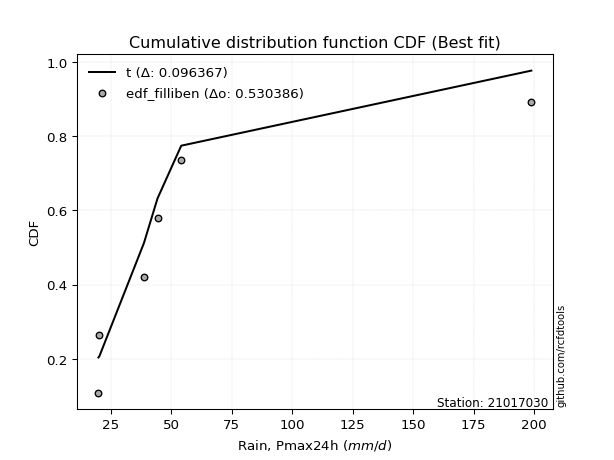</img>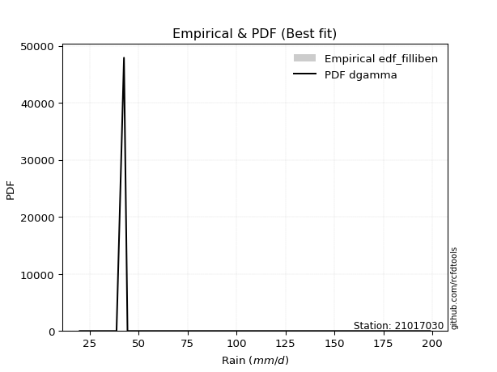</img>

</div>


### 10. EDF Jenkinson (1977)

The Jenkinson formula in hydrology is an empirical plotting position formula used to estimate the non-exceedance probability _(P)_ or return period _(T)_ of a given ordered observation within a sample. It is a widely used method in the frequency analysis of extreme events such as floods and rainfall, as it provides a distribution-free way to plot data. _a≈0.31_ and _b≈0.38_ are constants derived to approximate the median of the probability distribution for the given rank.

<div align="center">


$P=(m-a)/(n+b)$


</div>


**10.1. Empirical values**

<div align="center">

|                | 0                   | 1                   | 2                   | 3             | 4                  | 5                  | 6                  |
|:---------------|:--------------------|:--------------------|:--------------------|:--------------|:-------------------|:-------------------|:-------------------|
| date           | 2023                | 2022                | 2020                | 2025          | 2021               | 2019               | 2024               |
| x              | 20.0                | 20.4                | 38.8                | 42.6          | 44.4               | 54.2               | 198.8              |
| m              | 1                   | 2                   | 3                   | 4             | 5                  | 6                  | 7                  |
| empirical_dist | edf_jenkinson       | edf_jenkinson       | edf_jenkinson       | edf_jenkinson | edf_jenkinson      | edf_jenkinson      | edf_jenkinson      |
| empirical      | 0.09349593495934959 | 0.22899728997289973 | 0.36449864498644985 | 0.5           | 0.6355013550135502 | 0.7710027100271003 | 0.9065040650406505 |
| empirical_tr   | 1.1031390134529149  | 1.29701230228471    | 1.5735607675906182  | 2.0           | 2.743494423791822  | 4.366863905325444  | 10.695652173913055 |

</div>


**10.2. Kolmogorov-Smirnov fit test (sorted by Δ)**


<div align="center">

|                | 0                   | 1                   | 2                   | 3                   | 4                   | 5                   | 6                   | 7                   | 8                   | 9                   | 10                  | 11                  | 12                  | 13                  | 14                  | 15                  | 16                  | 17                  | 18                  | 19                  | 20                  | 21                  | 22                  | 23                  | 24                  | 25                  | 26                  | 27                  | 28                  | 29                  | 30                  | 31                  | 32                  | 33                  | 34                  | 35                  | 36                  | 37                  | 38                  | 39                  | 40                  | 41                  | 42                  | 43                  | 44                  | 45                  | 46                  | 47                  | 48                  | 49                  | 50                  | 51                  | 52                  | 53                  | 54                  | 55                  | 56                  | 57                  | 58                  | 59                  | 60                  | 61                  | 62                  | 63                  | 64                  | 65                  | 66                  | 67                  | 68                  | 69                  | 70                  | 71                  | 72                  | 73                  | 74                  | 75                  | 76                  | 77                  | 78                  | 79                  | 80                  | 81                  | 82                  | 83                  | 84                  | 85                  | 86                  | 87                  | 88                  | 89                  | 90                  | 91                  | 92                  | 93                  | 94                  | 95                  | 96                  | 97                  | 98                  | 99                  | 100                 | 101                 | 102                 | 103                 | 104                 | 105                 | 106                 | 107                 | 108                 | 109                 | 110                 | 111                 | 112                 | 113                 | 114                 | 115                 | 116                 | 117                 | 118                 | 119                 | 120                 | 121                 | 122                 | 123                 | 124                 | 125                 | 126                 | 127                 | 128                 | 129                 | 130                 | 131                 | 132                 | 133                 | 134                 | 135                 | 136                 | 137                 | 138                 | 139                 | 140                 | 141                 | 142                 | 143                 | 144                 | 145                 | 146                 | 147                 | 148                 | 149                 | 150                 | 151                 | 152                 | 153                 | 154                 | 155                 | 156                 | 157                 | 158                 | 159                 |
|:---------------|:--------------------|:--------------------|:--------------------|:--------------------|:--------------------|:--------------------|:--------------------|:--------------------|:--------------------|:--------------------|:--------------------|:--------------------|:--------------------|:--------------------|:--------------------|:--------------------|:--------------------|:--------------------|:--------------------|:--------------------|:--------------------|:--------------------|:--------------------|:--------------------|:--------------------|:--------------------|:--------------------|:--------------------|:--------------------|:--------------------|:--------------------|:--------------------|:--------------------|:--------------------|:--------------------|:--------------------|:--------------------|:--------------------|:--------------------|:--------------------|:--------------------|:--------------------|:--------------------|:--------------------|:--------------------|:--------------------|:--------------------|:--------------------|:--------------------|:--------------------|:--------------------|:--------------------|:--------------------|:--------------------|:--------------------|:--------------------|:--------------------|:--------------------|:--------------------|:--------------------|:--------------------|:--------------------|:--------------------|:--------------------|:--------------------|:--------------------|:--------------------|:--------------------|:--------------------|:--------------------|:--------------------|:--------------------|:--------------------|:--------------------|:--------------------|:--------------------|:--------------------|:--------------------|:--------------------|:--------------------|:--------------------|:--------------------|:--------------------|:--------------------|:--------------------|:--------------------|:--------------------|:--------------------|:--------------------|:--------------------|:--------------------|:--------------------|:--------------------|:--------------------|:--------------------|:--------------------|:--------------------|:--------------------|:--------------------|:--------------------|:--------------------|:--------------------|:--------------------|:--------------------|:--------------------|:--------------------|:--------------------|:--------------------|:--------------------|:--------------------|:--------------------|:--------------------|:--------------------|:--------------------|:--------------------|:--------------------|:--------------------|:--------------------|:--------------------|:--------------------|:--------------------|:--------------------|:--------------------|:--------------------|:--------------------|:--------------------|:--------------------|:--------------------|:--------------------|:--------------------|:--------------------|:--------------------|:--------------------|:--------------------|:--------------------|:--------------------|:--------------------|:--------------------|:--------------------|:--------------------|:--------------------|:--------------------|:--------------------|:--------------------|:--------------------|:--------------------|:--------------------|:--------------------|:--------------------|:--------------------|:--------------------|:--------------------|:--------------------|:--------------------|:--------------------|:--------------------|:--------------------|:--------------------|:--------------------|:--------------------|
| station        | 21017030            | 21017030            | 21017030            | 21017030            | 21017030            | 21017030            | 21017030            | 21017030            | 21017030            | 21017030            | 21017030            | 21017030            | 21017030            | 21017030            | 21017030            | 21017030            | 21017030            | 21017030            | 21017030            | 21017030            | 21017030            | 21017030            | 21017030            | 21017030            | 21017030            | 21017030            | 21017030            | 21017030            | 21017030            | 21017030            | 21017030            | 21017030            | 21017030            | 21017030            | 21017030            | 21017030            | 21017030            | 21017030            | 21017030            | 21017030            | 21017030            | 21017030            | 21017030            | 21017030            | 21017030            | 21017030            | 21017030            | 21017030            | 21017030            | 21017030            | 21017030            | 21017030            | 21017030            | 21017030            | 21017030            | 21017030            | 21017030            | 21017030            | 21017030            | 21017030            | 21017030            | 21017030            | 21017030            | 21017030            | 21017030            | 21017030            | 21017030            | 21017030            | 21017030            | 21017030            | 21017030            | 21017030            | 21017030            | 21017030            | 21017030            | 21017030            | 21017030            | 21017030            | 21017030            | 21017030            | 21017030            | 21017030            | 21017030            | 21017030            | 21017030            | 21017030            | 21017030            | 21017030            | 21017030            | 21017030            | 21017030            | 21017030            | 21017030            | 21017030            | 21017030            | 21017030            | 21017030            | 21017030            | 21017030            | 21017030            | 21017030            | 21017030            | 21017030            | 21017030            | 21017030            | 21017030            | 21017030            | 21017030            | 21017030            | 21017030            | 21017030            | 21017030            | 21017030            | 21017030            | 21017030            | 21017030            | 21017030            | 21017030            | 21017030            | 21017030            | 21017030            | 21017030            | 21017030            | 21017030            | 21017030            | 21017030            | 21017030            | 21017030            | 21017030            | 21017030            | 21017030            | 21017030            | 21017030            | 21017030            | 21017030            | 21017030            | 21017030            | 21017030            | 21017030            | 21017030            | 21017030            | 21017030            | 21017030            | 21017030            | 21017030            | 21017030            | 21017030            | 21017030            | 21017030            | 21017030            | 21017030            | 21017030            | 21017030            | 21017030            | 21017030            | 21017030            | 21017030            | 21017030            | 21017030            | 21017030            |
| empirical_dist | edf_jenkinson       | edf_jenkinson       | edf_jenkinson       | edf_jenkinson       | edf_jenkinson       | edf_jenkinson       | edf_jenkinson       | edf_jenkinson       | edf_jenkinson       | edf_jenkinson       | edf_jenkinson       | edf_jenkinson       | edf_jenkinson       | edf_jenkinson       | edf_jenkinson       | edf_jenkinson       | edf_jenkinson       | edf_jenkinson       | edf_jenkinson       | edf_jenkinson       | edf_jenkinson       | edf_jenkinson       | edf_jenkinson       | edf_jenkinson       | edf_jenkinson       | edf_jenkinson       | edf_jenkinson       | edf_jenkinson       | edf_jenkinson       | edf_jenkinson       | edf_jenkinson       | edf_jenkinson       | edf_jenkinson       | edf_jenkinson       | edf_jenkinson       | edf_jenkinson       | edf_jenkinson       | edf_jenkinson       | edf_jenkinson       | edf_jenkinson       | edf_jenkinson       | edf_jenkinson       | edf_jenkinson       | edf_jenkinson       | edf_jenkinson       | edf_jenkinson       | edf_jenkinson       | edf_jenkinson       | edf_jenkinson       | edf_jenkinson       | edf_jenkinson       | edf_jenkinson       | edf_jenkinson       | edf_jenkinson       | edf_jenkinson       | edf_jenkinson       | edf_jenkinson       | edf_jenkinson       | edf_jenkinson       | edf_jenkinson       | edf_jenkinson       | edf_jenkinson       | edf_jenkinson       | edf_jenkinson       | edf_jenkinson       | edf_jenkinson       | edf_jenkinson       | edf_jenkinson       | edf_jenkinson       | edf_jenkinson       | edf_jenkinson       | edf_jenkinson       | edf_jenkinson       | edf_jenkinson       | edf_jenkinson       | edf_jenkinson       | edf_jenkinson       | edf_jenkinson       | edf_jenkinson       | edf_jenkinson       | edf_jenkinson       | edf_jenkinson       | edf_jenkinson       | edf_jenkinson       | edf_jenkinson       | edf_jenkinson       | edf_jenkinson       | edf_jenkinson       | edf_jenkinson       | edf_jenkinson       | edf_jenkinson       | edf_jenkinson       | edf_jenkinson       | edf_jenkinson       | edf_jenkinson       | edf_jenkinson       | edf_jenkinson       | edf_jenkinson       | edf_jenkinson       | edf_jenkinson       | edf_jenkinson       | edf_jenkinson       | edf_jenkinson       | edf_jenkinson       | edf_jenkinson       | edf_jenkinson       | edf_jenkinson       | edf_jenkinson       | edf_jenkinson       | edf_jenkinson       | edf_jenkinson       | edf_jenkinson       | edf_jenkinson       | edf_jenkinson       | edf_jenkinson       | edf_jenkinson       | edf_jenkinson       | edf_jenkinson       | edf_jenkinson       | edf_jenkinson       | edf_jenkinson       | edf_jenkinson       | edf_jenkinson       | edf_jenkinson       | edf_jenkinson       | edf_jenkinson       | edf_jenkinson       | edf_jenkinson       | edf_jenkinson       | edf_jenkinson       | edf_jenkinson       | edf_jenkinson       | edf_jenkinson       | edf_jenkinson       | edf_jenkinson       | edf_jenkinson       | edf_jenkinson       | edf_jenkinson       | edf_jenkinson       | edf_jenkinson       | edf_jenkinson       | edf_jenkinson       | edf_jenkinson       | edf_jenkinson       | edf_jenkinson       | edf_jenkinson       | edf_jenkinson       | edf_jenkinson       | edf_jenkinson       | edf_jenkinson       | edf_jenkinson       | edf_jenkinson       | edf_jenkinson       | edf_jenkinson       | edf_jenkinson       | edf_jenkinson       | edf_jenkinson       | edf_jenkinson       | edf_jenkinson       | edf_jenkinson       |
| p_dist         | dgamma              | t                   | gennorm             | johnsonsu           | betaprime           | ncf                 | logt                | logbetaprime        | lognct              | logjohnsonsu        | logvonmises_line    | lograyleigh         | logfoldnorm         | logpearson3         | loglaplace          | loglaplace          | logncf              | logdgamma           | loggumbel_r         | loghypsecant        | logmaxwell          | nct                 | mielke              | loggennorm          | loggenlogistic      | logkstwobign        | logdweibull         | logmielke           | logexponnorm        | burr                | loglogistic         | logrice             | wald                | loghalfnorm         | logmoyal            | logalpha            | lognorm             | logcrystalball      | logburr             | loginvweibull       | loggenextreme       | logloggamma         | gamma               | logf                | loginvgamma         | loghalflogistic     | loganglit           | dweibull            | loggausshyper       | logsemicircular     | vonmises_line       | pearson3            | loggengamma         | logbeta             | exponpow            | logloglaplace       | nakagami            | alpha               | burr12              | truncweibull_min    | loginvgauss         | logarcsine          | loggenexpon         | loggompertz         | genlogistic         | invgamma            | halflogistic        | loglomax            | truncpareto         | loggumbel_l         | logtriang           | logskewnorm         | moyal               | logtruncexpon       | gompertz            | exponnorm           | f                   | genexpon            | logcosine           | logwald             | halfnorm            | foldnorm            | gumbel_r            | erlang              | gengamma            | genpareto           | kappa3              | johnsonsb           | invgauss            | rayleigh            | logweibull_min      | invweibull          | maxwell             | genextreme          | logweibull_max      | kstwobign           | arcsine             | semicircular        | anglit              | truncnorm           | weibull_min         | crystalball         | norm                | logkappa4           | logistic            | logwrapcauchy       | hypsecant           | loggenpareto        | loghalfgennorm      | logrdist            | logksone            | lomax               | logargus            | exponweib           | loglevy_l           | halfgennorm         | logtukeylambda      | laplace             | rice                | loguniform          | logexponpow         | wrapcauchy          | logburr12           | logtruncnorm        | levy_l              | bradford            | powerlaw            | gumbel_l            | truncexpon          | logjohnsonsb        | gausshyper          | lognakagami         | cosine              | skewnorm            | fatiguelife         | logkappa3           | logtruncweibull_min | logpowerlaw         | logbradford         | triang              | argus               | loggenhalflogistic  | logexponweib        | logtruncpareto      | logfatiguelife      | rdist               | ksone               | kappa4              | tukeylambda         | logerlang           | logtrapezoid        | loggamma            | loggamma            | uniform             | genhalflogistic     | beta                | weibull_max         | trapezoid           | logvonmises         | vonmises            |
| delta          | 0.08807986563339265 | 0.09506874574568727 | 0.09677889160956837 | 0.10859089186409673 | 0.11533218009185457 | 0.11735593131805344 | 0.12006181639948127 | 0.12142558297206374 | 0.12184737550626015 | 0.12198590532222689 | 0.1225570942043836  | 0.12364342036227682 | 0.1252940772860126  | 0.12801192295491587 | 0.12804873245756299 | 0.12804873245756299 | 0.12833178732580108 | 0.12853800951474065 | 0.12904473464732868 | 0.13041694676426685 | 0.13139600372358584 | 0.13163564910162687 | 0.13173974222555818 | 0.13282996281162632 | 0.1339010891889148  | 0.1351329007059967  | 0.13550135501337568 | 0.1365923611519267  | 0.13702427656794652 | 0.13820377698767267 | 0.1421200480814726  | 0.1427997213085651  | 0.1451477968970497  | 0.145383066328659   | 0.1536397401164123  | 0.15422639537454436 | 0.15661042959402682 | 0.15661051724478336 | 0.15855280462177695 | 0.15987202199627476 | 0.1598886094277437  | 0.16036554365615452 | 0.165644862368104   | 0.16719224223480972 | 0.16720236940116878 | 0.1686200812042512  | 0.17225590736471585 | 0.17545907285825868 | 0.17688690172349125 | 0.17876939539080716 | 0.18286446216379226 | 0.18557293888112103 | 0.1864042230054703  | 0.18822111521483376 | 0.19033642015179797 | 0.19475566198870053 | 0.19596205660761923 | 0.20047052179912855 | 0.20194785769415163 | 0.20330194313900507 | 0.204902535793495   | 0.20508319458431823 | 0.20631164726490026 | 0.20762044915963557 | 0.20767959940619085 | 0.2087245480621442  | 0.20902887797202818 | 0.2095774676469076  | 0.21052336774373095 | 0.21353442666384215 | 0.2140053875693635  | 0.21414005566174846 | 0.2164185488487932  | 0.2172449828131634  | 0.21773219856947207 | 0.2177516845502863  | 0.21776054176730547 | 0.21901885578881705 | 0.22166255372037624 | 0.22899728997289973 | 0.23110159747257208 | 0.23486875051731682 | 0.2420337508331395  | 0.24208930389608035 | 0.2472902981760472  | 0.2555891187069201  | 0.25756069549825866 | 0.2633697007118288  | 0.2635475849068443  | 0.26420763694383453 | 0.266601162057948   | 0.27568014128935936 | 0.27594666896640113 | 0.27683888869432405 | 0.2857645479184614  | 0.29193086536023655 | 0.2931250597736658  | 0.30225065971221216 | 0.30454807363877967 | 0.30501761813675776 | 0.3063931765607792  | 0.31011896400977856 | 0.31011897549101397 | 0.3134670536143729  | 0.31541754072334505 | 0.3166291671153383  | 0.319912890141193   | 0.3206035214109844  | 0.324323307990334   | 0.32448423166361634 | 0.32591615042192257 | 0.32614231293283513 | 0.3262467719481632  | 0.3299650138757744  | 0.33425170932554216 | 0.33455565563647754 | 0.3345984151510376  | 0.33583929963734926 | 0.33628537629738453 | 0.336898838500887   | 0.34585971885558603 | 0.3470435970631997  | 0.35661472296366353 | 0.3644985953618696  | 0.3714158702631396  | 0.37507533184930164 | 0.376193035804055   | 0.3805658489444249  | 0.3869836546357643  | 0.39013144579168135 | 0.3902581799416736  | 0.39072763720029985 | 0.39169853863828974 | 0.39765215363135276 | 0.4100778815366299  | 0.4153950432846527  | 0.4522358410077137  | 0.46034689334839246 | 0.46338449241210383 | 0.46887268408536387 | 0.4695359766036523  | 0.470631825627928   | 0.47729989251070964 | 0.48460192213177516 | 0.48964197930788184 | 0.5280220999038814  | 0.5282734035394046  | 0.550372309493451   | 0.5612147218963275  | 0.5715521273563053  | 0.5729006644859269  | 0.574373137041934   | 0.574373137041934   | 0.5797275422418654  | 0.6269672396437203  | 0.6553904835413094  | 0.6929622731312314  | 0.7120851937991025  | 1.097668187087149   | 31.096009967384354  |
| deltao         | 0.48442053926100004 | 0.48442053926100004 | 0.48442053926100004 | 0.48442053926100004 | 0.48442053926100004 | 0.48442053926100004 | 0.48442053926100004 | 0.48442053926100004 | 0.48442053926100004 | 0.48442053926100004 | 0.48442053926100004 | 0.48442053926100004 | 0.48442053926100004 | 0.48442053926100004 | 0.48442053926100004 | 0.48442053926100004 | 0.48442053926100004 | 0.48442053926100004 | 0.48442053926100004 | 0.48442053926100004 | 0.48442053926100004 | 0.48442053926100004 | 0.48442053926100004 | 0.48442053926100004 | 0.48442053926100004 | 0.48442053926100004 | 0.48442053926100004 | 0.48442053926100004 | 0.48442053926100004 | 0.48442053926100004 | 0.48442053926100004 | 0.48442053926100004 | 0.48442053926100004 | 0.48442053926100004 | 0.48442053926100004 | 0.48442053926100004 | 0.48442053926100004 | 0.48442053926100004 | 0.48442053926100004 | 0.48442053926100004 | 0.48442053926100004 | 0.48442053926100004 | 0.48442053926100004 | 0.48442053926100004 | 0.48442053926100004 | 0.48442053926100004 | 0.48442053926100004 | 0.48442053926100004 | 0.48442053926100004 | 0.48442053926100004 | 0.48442053926100004 | 0.48442053926100004 | 0.48442053926100004 | 0.48442053926100004 | 0.48442053926100004 | 0.48442053926100004 | 0.48442053926100004 | 0.48442053926100004 | 0.48442053926100004 | 0.48442053926100004 | 0.48442053926100004 | 0.48442053926100004 | 0.48442053926100004 | 0.48442053926100004 | 0.48442053926100004 | 0.48442053926100004 | 0.48442053926100004 | 0.48442053926100004 | 0.48442053926100004 | 0.48442053926100004 | 0.48442053926100004 | 0.48442053926100004 | 0.48442053926100004 | 0.48442053926100004 | 0.48442053926100004 | 0.48442053926100004 | 0.48442053926100004 | 0.48442053926100004 | 0.48442053926100004 | 0.48442053926100004 | 0.48442053926100004 | 0.48442053926100004 | 0.48442053926100004 | 0.48442053926100004 | 0.48442053926100004 | 0.48442053926100004 | 0.48442053926100004 | 0.48442053926100004 | 0.48442053926100004 | 0.48442053926100004 | 0.48442053926100004 | 0.48442053926100004 | 0.48442053926100004 | 0.48442053926100004 | 0.48442053926100004 | 0.48442053926100004 | 0.48442053926100004 | 0.48442053926100004 | 0.48442053926100004 | 0.48442053926100004 | 0.48442053926100004 | 0.48442053926100004 | 0.48442053926100004 | 0.48442053926100004 | 0.48442053926100004 | 0.48442053926100004 | 0.48442053926100004 | 0.48442053926100004 | 0.48442053926100004 | 0.48442053926100004 | 0.48442053926100004 | 0.48442053926100004 | 0.48442053926100004 | 0.48442053926100004 | 0.48442053926100004 | 0.48442053926100004 | 0.48442053926100004 | 0.48442053926100004 | 0.48442053926100004 | 0.48442053926100004 | 0.48442053926100004 | 0.48442053926100004 | 0.48442053926100004 | 0.48442053926100004 | 0.48442053926100004 | 0.48442053926100004 | 0.48442053926100004 | 0.48442053926100004 | 0.48442053926100004 | 0.48442053926100004 | 0.48442053926100004 | 0.48442053926100004 | 0.48442053926100004 | 0.48442053926100004 | 0.48442053926100004 | 0.48442053926100004 | 0.48442053926100004 | 0.48442053926100004 | 0.48442053926100004 | 0.48442053926100004 | 0.48442053926100004 | 0.48442053926100004 | 0.48442053926100004 | 0.48442053926100004 | 0.48442053926100004 | 0.48442053926100004 | 0.48442053926100004 | 0.48442053926100004 | 0.48442053926100004 | 0.48442053926100004 | 0.48442053926100004 | 0.48442053926100004 | 0.48442053926100004 | 0.48442053926100004 | 0.48442053926100004 | 0.48442053926100004 | 0.48442053926100004 | 0.48442053926100004 | 0.48442053926100004 | 0.48442053926100004 |
| eval           | Δo > Δ              | Δo > Δ              | Δo > Δ              | Δo > Δ              | Δo > Δ              | Δo > Δ              | Δo > Δ              | Δo > Δ              | Δo > Δ              | Δo > Δ              | Δo > Δ              | Δo > Δ              | Δo > Δ              | Δo > Δ              | Δo > Δ              | Δo > Δ              | Δo > Δ              | Δo > Δ              | Δo > Δ              | Δo > Δ              | Δo > Δ              | Δo > Δ              | Δo > Δ              | Δo > Δ              | Δo > Δ              | Δo > Δ              | Δo > Δ              | Δo > Δ              | Δo > Δ              | Δo > Δ              | Δo > Δ              | Δo > Δ              | Δo > Δ              | Δo > Δ              | Δo > Δ              | Δo > Δ              | Δo > Δ              | Δo > Δ              | Δo > Δ              | Δo > Δ              | Δo > Δ              | Δo > Δ              | Δo > Δ              | Δo > Δ              | Δo > Δ              | Δo > Δ              | Δo > Δ              | Δo > Δ              | Δo > Δ              | Δo > Δ              | Δo > Δ              | Δo > Δ              | Δo > Δ              | Δo > Δ              | Δo > Δ              | Δo > Δ              | Δo > Δ              | Δo > Δ              | Δo > Δ              | Δo > Δ              | Δo > Δ              | Δo > Δ              | Δo > Δ              | Δo > Δ              | Δo > Δ              | Δo > Δ              | Δo > Δ              | Δo > Δ              | Δo > Δ              | Δo > Δ              | Δo > Δ              | Δo > Δ              | Δo > Δ              | Δo > Δ              | Δo > Δ              | Δo > Δ              | Δo > Δ              | Δo > Δ              | Δo > Δ              | Δo > Δ              | Δo > Δ              | Δo > Δ              | Δo > Δ              | Δo > Δ              | Δo > Δ              | Δo > Δ              | Δo > Δ              | Δo > Δ              | Δo > Δ              | Δo > Δ              | Δo > Δ              | Δo > Δ              | Δo > Δ              | Δo > Δ              | Δo > Δ              | Δo > Δ              | Δo > Δ              | Δo > Δ              | Δo > Δ              | Δo > Δ              | Δo > Δ              | Δo > Δ              | Δo > Δ              | Δo > Δ              | Δo > Δ              | Δo > Δ              | Δo > Δ              | Δo > Δ              | Δo > Δ              | Δo > Δ              | Δo > Δ              | Δo > Δ              | Δo > Δ              | Δo > Δ              | Δo > Δ              | Δo > Δ              | Δo > Δ              | Δo > Δ              | Δo > Δ              | Δo > Δ              | Δo > Δ              | Δo > Δ              | Δo > Δ              | Δo > Δ              | Δo > Δ              | Δo > Δ              | Δo > Δ              | Δo > Δ              | Δo > Δ              | Δo > Δ              | Δo > Δ              | Δo > Δ              | Δo > Δ              | Δo > Δ              | Δo > Δ              | Δo > Δ              | Δo > Δ              | Δo > Δ              | Δo > Δ              | Δo > Δ              | Δo > Δ              | Δo > Δ              | Δo > Δ              | Δo <= Δ             | Δo <= Δ             | Δo <= Δ             | Δo <= Δ             | Δo <= Δ             | Δo <= Δ             | Δo <= Δ             | Δo <= Δ             | Δo <= Δ             | Δo <= Δ             | Δo <= Δ             | Δo <= Δ             | Δo <= Δ             | Δo <= Δ             | Δo <= Δ             | Δo <= Δ             | Δo <= Δ             |
| fit            | 1                   | 1                   | 1                   | 1                   | 1                   | 1                   | 1                   | 1                   | 1                   | 1                   | 1                   | 1                   | 1                   | 1                   | 1                   | 1                   | 1                   | 1                   | 1                   | 1                   | 1                   | 1                   | 1                   | 1                   | 1                   | 1                   | 1                   | 1                   | 1                   | 1                   | 1                   | 1                   | 1                   | 1                   | 1                   | 1                   | 1                   | 1                   | 1                   | 1                   | 1                   | 1                   | 1                   | 1                   | 1                   | 1                   | 1                   | 1                   | 1                   | 1                   | 1                   | 1                   | 1                   | 1                   | 1                   | 1                   | 1                   | 1                   | 1                   | 1                   | 1                   | 1                   | 1                   | 1                   | 1                   | 1                   | 1                   | 1                   | 1                   | 1                   | 1                   | 1                   | 1                   | 1                   | 1                   | 1                   | 1                   | 1                   | 1                   | 1                   | 1                   | 1                   | 1                   | 1                   | 1                   | 1                   | 1                   | 1                   | 1                   | 1                   | 1                   | 1                   | 1                   | 1                   | 1                   | 1                   | 1                   | 1                   | 1                   | 1                   | 1                   | 1                   | 1                   | 1                   | 1                   | 1                   | 1                   | 1                   | 1                   | 1                   | 1                   | 1                   | 1                   | 1                   | 1                   | 1                   | 1                   | 1                   | 1                   | 1                   | 1                   | 1                   | 1                   | 1                   | 1                   | 1                   | 1                   | 1                   | 1                   | 1                   | 1                   | 1                   | 1                   | 1                   | 1                   | 1                   | 1                   | 1                   | 1                   | 1                   | 1                   | 1                   | 1                   | 0                   | 0                   | 0                   | 0                   | 0                   | 0                   | 0                   | 0                   | 0                   | 0                   | 0                   | 0                   | 0                   | 0                   | 0                   | 0                   | 0                   |
| n              | 7                   | 7                   | 7                   | 7                   | 7                   | 7                   | 7                   | 7                   | 7                   | 7                   | 7                   | 7                   | 7                   | 7                   | 7                   | 7                   | 7                   | 7                   | 7                   | 7                   | 7                   | 7                   | 7                   | 7                   | 7                   | 7                   | 7                   | 7                   | 7                   | 7                   | 7                   | 7                   | 7                   | 7                   | 7                   | 7                   | 7                   | 7                   | 7                   | 7                   | 7                   | 7                   | 7                   | 7                   | 7                   | 7                   | 7                   | 7                   | 7                   | 7                   | 7                   | 7                   | 7                   | 7                   | 7                   | 7                   | 7                   | 7                   | 7                   | 7                   | 7                   | 7                   | 7                   | 7                   | 7                   | 7                   | 7                   | 7                   | 7                   | 7                   | 7                   | 7                   | 7                   | 7                   | 7                   | 7                   | 7                   | 7                   | 7                   | 7                   | 7                   | 7                   | 7                   | 7                   | 7                   | 7                   | 7                   | 7                   | 7                   | 7                   | 7                   | 7                   | 7                   | 7                   | 7                   | 7                   | 7                   | 7                   | 7                   | 7                   | 7                   | 7                   | 7                   | 7                   | 7                   | 7                   | 7                   | 7                   | 7                   | 7                   | 7                   | 7                   | 7                   | 7                   | 7                   | 7                   | 7                   | 7                   | 7                   | 7                   | 7                   | 7                   | 7                   | 7                   | 7                   | 7                   | 7                   | 7                   | 7                   | 7                   | 7                   | 7                   | 7                   | 7                   | 7                   | 7                   | 7                   | 7                   | 7                   | 7                   | 7                   | 7                   | 7                   | 7                   | 7                   | 7                   | 7                   | 7                   | 7                   | 7                   | 7                   | 7                   | 7                   | 7                   | 7                   | 7                   | 7                   | 7                   | 7                   | 7                   |
| best_fit       | 1                   | 0                   | 0                   | 0                   | 0                   | 0                   | 0                   | 0                   | 0                   | 0                   | 0                   | 0                   | 0                   | 0                   | 0                   | 0                   | 0                   | 0                   | 0                   | 0                   | 0                   | 0                   | 0                   | 0                   | 0                   | 0                   | 0                   | 0                   | 0                   | 0                   | 0                   | 0                   | 0                   | 0                   | 0                   | 0                   | 0                   | 0                   | 0                   | 0                   | 0                   | 0                   | 0                   | 0                   | 0                   | 0                   | 0                   | 0                   | 0                   | 0                   | 0                   | 0                   | 0                   | 0                   | 0                   | 0                   | 0                   | 0                   | 0                   | 0                   | 0                   | 0                   | 0                   | 0                   | 0                   | 0                   | 0                   | 0                   | 0                   | 0                   | 0                   | 0                   | 0                   | 0                   | 0                   | 0                   | 0                   | 0                   | 0                   | 0                   | 0                   | 0                   | 0                   | 0                   | 0                   | 0                   | 0                   | 0                   | 0                   | 0                   | 0                   | 0                   | 0                   | 0                   | 0                   | 0                   | 0                   | 0                   | 0                   | 0                   | 0                   | 0                   | 0                   | 0                   | 0                   | 0                   | 0                   | 0                   | 0                   | 0                   | 0                   | 0                   | 0                   | 0                   | 0                   | 0                   | 0                   | 0                   | 0                   | 0                   | 0                   | 0                   | 0                   | 0                   | 0                   | 0                   | 0                   | 0                   | 0                   | 0                   | 0                   | 0                   | 0                   | 0                   | 0                   | 0                   | 0                   | 0                   | 0                   | 0                   | 0                   | 0                   | 0                   | 0                   | 0                   | 0                   | 0                   | 0                   | 0                   | 0                   | 0                   | 0                   | 0                   | 0                   | 0                   | 0                   | 0                   | 0                   | 0                   | 0                   |
| best_fit_sort  | 1                   | 2                   | 3                   | 4                   | 5                   | 6                   | 7                   | 8                   | 9                   | 10                  | 11                  | 12                  | 13                  | 14                  | 15                  | 16                  | 17                  | 18                  | 19                  | 20                  | 21                  | 22                  | 23                  | 24                  | 25                  | 26                  | 27                  | 28                  | 29                  | 30                  | 31                  | 32                  | 33                  | 34                  | 35                  | 36                  | 37                  | 38                  | 39                  | 40                  | 41                  | 42                  | 43                  | 44                  | 45                  | 46                  | 47                  | 48                  | 49                  | 50                  | 51                  | 52                  | 53                  | 54                  | 55                  | 56                  | 57                  | 58                  | 59                  | 60                  | 61                  | 62                  | 63                  | 64                  | 65                  | 66                  | 67                  | 68                  | 69                  | 70                  | 71                  | 72                  | 73                  | 74                  | 75                  | 76                  | 77                  | 78                  | 79                  | 80                  | 81                  | 82                  | 83                  | 84                  | 85                  | 86                  | 87                  | 88                  | 89                  | 90                  | 91                  | 92                  | 93                  | 94                  | 95                  | 96                  | 97                  | 98                  | 99                  | 100                 | 101                 | 102                 | 103                 | 104                 | 105                 | 106                 | 107                 | 108                 | 109                 | 110                 | 111                 | 112                 | 113                 | 114                 | 115                 | 116                 | 117                 | 118                 | 119                 | 120                 | 121                 | 122                 | 123                 | 124                 | 125                 | 126                 | 127                 | 128                 | 129                 | 130                 | 131                 | 132                 | 133                 | 134                 | 135                 | 136                 | 137                 | 138                 | 139                 | 140                 | 141                 | 142                 | 143                 | 144                 | 145                 | 146                 | 147                 | 148                 | 149                 | 150                 | 151                 | 152                 | 153                 | 154                 | 155                 | 156                 | 157                 | 158                 | 159                 | 160                 |

</div>


**10.3. Best fit**

<div align="center">

|   id |   station | empirical_dist   | p_dist   |     delta |   deltao | eval   |   fit |   n |   best_fit |   best_fit_sort |
|-----:|----------:|:-----------------|:---------|----------:|---------:|:-------|------:|----:|-----------:|----------------:|
|    0 |  21017030 | edf_jenkinson    | dgamma   | 0.0880799 | 0.484421 | Δo > Δ |     1 |   7 |          1 |               1 |

</div>


<div align="center">

</img></img>

</div>


### 11. EDF Cunnane (1978)

Cunnane´s work in statistical hydrology has focused on the performance and evaluation of different probability distributions (such as GEV, Gumbel, Lognormal) for flood frequency estimation. _b_ is a constant, typically set to 0.4.

<div align="center">


$P=(m-b)/(n+1-2b)$


</div>


**11.1. Empirical values**

<div align="center">

|                | 0                   | 1                   | 2                  | 3           | 4                  | 5                  | 6                  |
|:---------------|:--------------------|:--------------------|:-------------------|:------------|:-------------------|:-------------------|:-------------------|
| date           | 2023                | 2022                | 2020               | 2025        | 2021               | 2019               | 2024               |
| x              | 20.0                | 20.4                | 38.8               | 42.6        | 44.4               | 54.2               | 198.8              |
| m              | 1                   | 2                   | 3                  | 4           | 5                  | 6                  | 7                  |
| empirical_dist | edf_cunnane         | edf_cunnane         | edf_cunnane        | edf_cunnane | edf_cunnane        | edf_cunnane        | edf_cunnane        |
| empirical      | 0.08333333333333333 | 0.22222222222222224 | 0.3611111111111111 | 0.5         | 0.6388888888888888 | 0.7777777777777777 | 0.9166666666666666 |
| empirical_tr   | 1.090909090909091   | 1.2857142857142856  | 1.565217391304348  | 2.0         | 2.7692307692307687 | 4.499999999999998  | 11.999999999999995 |

</div>


**11.2. Kolmogorov-Smirnov fit test (sorted by Δ)**


<div align="center">

|                | 0                   | 1                   | 2                   | 3                   | 4                   | 5                   | 6                   | 7                   | 8                   | 9                   | 10                  | 11                  | 12                  | 13                  | 14                  | 15                  | 16                  | 17                  | 18                  | 19                  | 20                  | 21                  | 22                  | 23                  | 24                  | 25                  | 26                  | 27                  | 28                  | 29                  | 30                  | 31                  | 32                  | 33                  | 34                  | 35                  | 36                  | 37                  | 38                  | 39                  | 40                  | 41                  | 42                  | 43                  | 44                  | 45                  | 46                  | 47                  | 48                  | 49                  | 50                  | 51                  | 52                  | 53                  | 54                  | 55                  | 56                  | 57                  | 58                  | 59                  | 60                  | 61                  | 62                  | 63                  | 64                  | 65                  | 66                  | 67                  | 68                  | 69                  | 70                  | 71                  | 72                  | 73                  | 74                  | 75                  | 76                  | 77                  | 78                  | 79                  | 80                  | 81                  | 82                  | 83                  | 84                  | 85                  | 86                  | 87                  | 88                  | 89                  | 90                  | 91                  | 92                  | 93                  | 94                  | 95                  | 96                  | 97                  | 98                  | 99                  | 100                 | 101                 | 102                 | 103                 | 104                 | 105                 | 106                 | 107                 | 108                 | 109                 | 110                 | 111                 | 112                 | 113                 | 114                 | 115                 | 116                 | 117                 | 118                 | 119                 | 120                 | 121                 | 122                 | 123                 | 124                 | 125                 | 126                 | 127                 | 128                 | 129                 | 130                 | 131                 | 132                 | 133                 | 134                 | 135                 | 136                 | 137                 | 138                 | 139                 | 140                 | 141                 | 142                 | 143                 | 144                 | 145                 | 146                 | 147                 | 148                 | 149                 | 150                 | 151                 | 152                 | 153                 | 154                 | 155                 | 156                 | 157                 | 158                 | 159                 |
|:---------------|:--------------------|:--------------------|:--------------------|:--------------------|:--------------------|:--------------------|:--------------------|:--------------------|:--------------------|:--------------------|:--------------------|:--------------------|:--------------------|:--------------------|:--------------------|:--------------------|:--------------------|:--------------------|:--------------------|:--------------------|:--------------------|:--------------------|:--------------------|:--------------------|:--------------------|:--------------------|:--------------------|:--------------------|:--------------------|:--------------------|:--------------------|:--------------------|:--------------------|:--------------------|:--------------------|:--------------------|:--------------------|:--------------------|:--------------------|:--------------------|:--------------------|:--------------------|:--------------------|:--------------------|:--------------------|:--------------------|:--------------------|:--------------------|:--------------------|:--------------------|:--------------------|:--------------------|:--------------------|:--------------------|:--------------------|:--------------------|:--------------------|:--------------------|:--------------------|:--------------------|:--------------------|:--------------------|:--------------------|:--------------------|:--------------------|:--------------------|:--------------------|:--------------------|:--------------------|:--------------------|:--------------------|:--------------------|:--------------------|:--------------------|:--------------------|:--------------------|:--------------------|:--------------------|:--------------------|:--------------------|:--------------------|:--------------------|:--------------------|:--------------------|:--------------------|:--------------------|:--------------------|:--------------------|:--------------------|:--------------------|:--------------------|:--------------------|:--------------------|:--------------------|:--------------------|:--------------------|:--------------------|:--------------------|:--------------------|:--------------------|:--------------------|:--------------------|:--------------------|:--------------------|:--------------------|:--------------------|:--------------------|:--------------------|:--------------------|:--------------------|:--------------------|:--------------------|:--------------------|:--------------------|:--------------------|:--------------------|:--------------------|:--------------------|:--------------------|:--------------------|:--------------------|:--------------------|:--------------------|:--------------------|:--------------------|:--------------------|:--------------------|:--------------------|:--------------------|:--------------------|:--------------------|:--------------------|:--------------------|:--------------------|:--------------------|:--------------------|:--------------------|:--------------------|:--------------------|:--------------------|:--------------------|:--------------------|:--------------------|:--------------------|:--------------------|:--------------------|:--------------------|:--------------------|:--------------------|:--------------------|:--------------------|:--------------------|:--------------------|:--------------------|:--------------------|:--------------------|:--------------------|:--------------------|:--------------------|:--------------------|
| station        | 21017030            | 21017030            | 21017030            | 21017030            | 21017030            | 21017030            | 21017030            | 21017030            | 21017030            | 21017030            | 21017030            | 21017030            | 21017030            | 21017030            | 21017030            | 21017030            | 21017030            | 21017030            | 21017030            | 21017030            | 21017030            | 21017030            | 21017030            | 21017030            | 21017030            | 21017030            | 21017030            | 21017030            | 21017030            | 21017030            | 21017030            | 21017030            | 21017030            | 21017030            | 21017030            | 21017030            | 21017030            | 21017030            | 21017030            | 21017030            | 21017030            | 21017030            | 21017030            | 21017030            | 21017030            | 21017030            | 21017030            | 21017030            | 21017030            | 21017030            | 21017030            | 21017030            | 21017030            | 21017030            | 21017030            | 21017030            | 21017030            | 21017030            | 21017030            | 21017030            | 21017030            | 21017030            | 21017030            | 21017030            | 21017030            | 21017030            | 21017030            | 21017030            | 21017030            | 21017030            | 21017030            | 21017030            | 21017030            | 21017030            | 21017030            | 21017030            | 21017030            | 21017030            | 21017030            | 21017030            | 21017030            | 21017030            | 21017030            | 21017030            | 21017030            | 21017030            | 21017030            | 21017030            | 21017030            | 21017030            | 21017030            | 21017030            | 21017030            | 21017030            | 21017030            | 21017030            | 21017030            | 21017030            | 21017030            | 21017030            | 21017030            | 21017030            | 21017030            | 21017030            | 21017030            | 21017030            | 21017030            | 21017030            | 21017030            | 21017030            | 21017030            | 21017030            | 21017030            | 21017030            | 21017030            | 21017030            | 21017030            | 21017030            | 21017030            | 21017030            | 21017030            | 21017030            | 21017030            | 21017030            | 21017030            | 21017030            | 21017030            | 21017030            | 21017030            | 21017030            | 21017030            | 21017030            | 21017030            | 21017030            | 21017030            | 21017030            | 21017030            | 21017030            | 21017030            | 21017030            | 21017030            | 21017030            | 21017030            | 21017030            | 21017030            | 21017030            | 21017030            | 21017030            | 21017030            | 21017030            | 21017030            | 21017030            | 21017030            | 21017030            | 21017030            | 21017030            | 21017030            | 21017030            | 21017030            | 21017030            |
| empirical_dist | edf_cunnane         | edf_cunnane         | edf_cunnane         | edf_cunnane         | edf_cunnane         | edf_cunnane         | edf_cunnane         | edf_cunnane         | edf_cunnane         | edf_cunnane         | edf_cunnane         | edf_cunnane         | edf_cunnane         | edf_cunnane         | edf_cunnane         | edf_cunnane         | edf_cunnane         | edf_cunnane         | edf_cunnane         | edf_cunnane         | edf_cunnane         | edf_cunnane         | edf_cunnane         | edf_cunnane         | edf_cunnane         | edf_cunnane         | edf_cunnane         | edf_cunnane         | edf_cunnane         | edf_cunnane         | edf_cunnane         | edf_cunnane         | edf_cunnane         | edf_cunnane         | edf_cunnane         | edf_cunnane         | edf_cunnane         | edf_cunnane         | edf_cunnane         | edf_cunnane         | edf_cunnane         | edf_cunnane         | edf_cunnane         | edf_cunnane         | edf_cunnane         | edf_cunnane         | edf_cunnane         | edf_cunnane         | edf_cunnane         | edf_cunnane         | edf_cunnane         | edf_cunnane         | edf_cunnane         | edf_cunnane         | edf_cunnane         | edf_cunnane         | edf_cunnane         | edf_cunnane         | edf_cunnane         | edf_cunnane         | edf_cunnane         | edf_cunnane         | edf_cunnane         | edf_cunnane         | edf_cunnane         | edf_cunnane         | edf_cunnane         | edf_cunnane         | edf_cunnane         | edf_cunnane         | edf_cunnane         | edf_cunnane         | edf_cunnane         | edf_cunnane         | edf_cunnane         | edf_cunnane         | edf_cunnane         | edf_cunnane         | edf_cunnane         | edf_cunnane         | edf_cunnane         | edf_cunnane         | edf_cunnane         | edf_cunnane         | edf_cunnane         | edf_cunnane         | edf_cunnane         | edf_cunnane         | edf_cunnane         | edf_cunnane         | edf_cunnane         | edf_cunnane         | edf_cunnane         | edf_cunnane         | edf_cunnane         | edf_cunnane         | edf_cunnane         | edf_cunnane         | edf_cunnane         | edf_cunnane         | edf_cunnane         | edf_cunnane         | edf_cunnane         | edf_cunnane         | edf_cunnane         | edf_cunnane         | edf_cunnane         | edf_cunnane         | edf_cunnane         | edf_cunnane         | edf_cunnane         | edf_cunnane         | edf_cunnane         | edf_cunnane         | edf_cunnane         | edf_cunnane         | edf_cunnane         | edf_cunnane         | edf_cunnane         | edf_cunnane         | edf_cunnane         | edf_cunnane         | edf_cunnane         | edf_cunnane         | edf_cunnane         | edf_cunnane         | edf_cunnane         | edf_cunnane         | edf_cunnane         | edf_cunnane         | edf_cunnane         | edf_cunnane         | edf_cunnane         | edf_cunnane         | edf_cunnane         | edf_cunnane         | edf_cunnane         | edf_cunnane         | edf_cunnane         | edf_cunnane         | edf_cunnane         | edf_cunnane         | edf_cunnane         | edf_cunnane         | edf_cunnane         | edf_cunnane         | edf_cunnane         | edf_cunnane         | edf_cunnane         | edf_cunnane         | edf_cunnane         | edf_cunnane         | edf_cunnane         | edf_cunnane         | edf_cunnane         | edf_cunnane         | edf_cunnane         | edf_cunnane         | edf_cunnane         | edf_cunnane         |
| p_dist         | t                   | gennorm             | dgamma              | johnsonsu           | logjohnsonsu        | lognct              | betaprime           | logdgamma           | logt                | ncf                 | logvonmises_line    | loggennorm          | logbetaprime        | logkstwobign        | logmielke           | lograyleigh         | logpearson3         | loglaplace          | loglaplace          | logfoldnorm         | loggumbel_r         | mielke              | nct                 | logncf              | loghypsecant        | loggenlogistic      | logmaxwell          | logdweibull         | logexponnorm        | logrice             | burr                | loghalfnorm         | loglogistic         | wald                | logmoyal            | logalpha            | gamma               | logburr             | loginvweibull       | loggenextreme       | lognorm             | logcrystalball      | logloggamma         | loghalflogistic     | logf                | loginvgamma         | loganglit           | loggengamma         | loggausshyper       | logbeta             | logsemicircular     | dweibull            | vonmises_line       | pearson3            | truncweibull_min    | exponpow            | loggenexpon         | loggompertz         | logloglaplace       | nakagami            | truncpareto         | alpha               | burr12              | logskewnorm         | loginvgauss         | gompertz            | exponnorm           | logarcsine          | invgamma            | genexpon            | loglomax            | genlogistic         | halflogistic        | loggumbel_l         | logtriang           | f                   | moyal               | logtruncexpon       | logwald             | logcosine           | halfnorm            | foldnorm            | erlang              | gumbel_r            | gengamma            | genpareto           | johnsonsb           | invgauss            | kappa3              | logweibull_min      | rayleigh            | maxwell             | invweibull          | genextreme          | logweibull_max      | kstwobign           | arcsine             | semicircular        | weibull_min         | anglit              | truncnorm           | crystalball         | norm                | logkappa4           | logistic            | logwrapcauchy       | hypsecant           | loggenpareto        | loghalfgennorm      | logrdist            | logksone            | lomax               | logargus            | exponweib           | halfgennorm         | logtukeylambda      | laplace             | rice                | loguniform          | loglevy_l           | logexponpow         | wrapcauchy          | logburr12           | logtruncnorm        | powerlaw            | levy_l              | bradford            | gumbel_l            | truncexpon          | lognakagami         | logjohnsonsb        | gausshyper          | cosine              | skewnorm            | fatiguelife         | logkappa3           | logtruncweibull_min | logpowerlaw         | logbradford         | triang              | argus               | loggenhalflogistic  | logexponweib        | logtruncpareto      | logfatiguelife      | ksone               | rdist               | kappa4              | tukeylambda         | logerlang           | loggamma            | loggamma            | logtrapezoid        | uniform             | genhalflogistic     | beta                | weibull_max         | trapezoid           | logvonmises         | vonmises            |
| delta          | 0.08829367799500978 | 0.09000382385889089 | 0.09749083718064884 | 0.10181582411341925 | 0.1152108375715494  | 0.11705019788291343 | 0.11715715725429243 | 0.12176294176406316 | 0.12344935027482001 | 0.12413099906873082 | 0.12594462807972234 | 0.12605489506094883 | 0.12820065072274112 | 0.12835783295531922 | 0.1298172934012492  | 0.1304184881129542  | 0.1313994568302546  | 0.13143626633290162 | 0.13143626633290162 | 0.13206914503668998 | 0.13243226852266743 | 0.13433345773458522 | 0.13455928801861522 | 0.13510685507647846 | 0.13719201451494423 | 0.13728862306425355 | 0.13817107147426322 | 0.1388888888887143  | 0.14041181044328527 | 0.14053779113606069 | 0.1415913108630114  | 0.14877060020399774 | 0.14889511583214998 | 0.15192286464772708 | 0.15702727399175104 | 0.1576139292498831  | 0.1588697946174265  | 0.1619403384971157  | 0.1632595558716135  | 0.16327614330308243 | 0.1633854973447042  | 0.16338558499546074 | 0.1671406114068319  | 0.16777648398979078 | 0.17057977611014846 | 0.17058990327650753 | 0.17903097511539323 | 0.1796291552547928  | 0.18027443559883    | 0.18144604746415627 | 0.18554446314148454 | 0.18562167448427497 | 0.18963952991446964 | 0.1923480066317984  | 0.19652687538832758 | 0.19711148790247535 | 0.19953657951422277 | 0.20084538140895808 | 0.2015307297393779  | 0.2027371243582966  | 0.20374829999305347 | 0.2038580556744673  | 0.20533539156949038 | 0.20736498791107097 | 0.20829006966883373 | 0.21095713081879458 | 0.2109766167996088  | 0.2118582623349956  | 0.21211208193748293 | 0.21224378803813956 | 0.21296500152224634 | 0.21445466715686823 | 0.21580394572270556 | 0.22030949441451952 | 0.22078045532004087 | 0.22114807564264422 | 0.22319361659947057 | 0.22402005056384078 | 0.22496356361664677 | 0.22843762147105362 | 0.23787666522324946 | 0.2450313521433331  | 0.2454768377714191  | 0.24880881858381687 | 0.2540653659267246  | 0.2589766525822588  | 0.26675723458716755 | 0.26693511878218307 | 0.2677232971242748  | 0.2699886959332867  | 0.2709827046945119  | 0.2827217367170785  | 0.2858427429153755  | 0.28700149032034017 | 0.2959271495444777  | 0.2987059331109139  | 0.2999001275243432  | 0.30902572746288953 | 0.30978071043611793 | 0.31132314138945705 | 0.31179268588743514 | 0.31689403176045594 | 0.31689404324169135 | 0.32024212136505026 | 0.3221926084740224  | 0.32340423486601566 | 0.3266879578918704  | 0.3273785891616618  | 0.32771084186567273 | 0.3312592994142937  | 0.33269121817259995 | 0.3329173806835125  | 0.3330218396988406  | 0.33335254775111317 | 0.3379431895118163  | 0.341373482901715   | 0.34261436738802664 | 0.3430604440480619  | 0.34367390625156435 | 0.34441431095155844 | 0.3492472527309248  | 0.3538186648138771  | 0.3600022568390023  | 0.3611110614865309  | 0.37958056967939374 | 0.3815784718891559  | 0.381850399599979   | 0.3873409166951023  | 0.39375872238644166 | 0.3941151710756386  | 0.39690651354235884 | 0.397033247692351   | 0.3984736063889671  | 0.40442722138203013 | 0.41346541541196863 | 0.4221701110353301  | 0.45562337488305243 | 0.4637344272237312  | 0.4667720262874426  | 0.47564775183604124 | 0.4763110443543297  | 0.47740689337860537 | 0.4806874263860484  | 0.4879894560071139  | 0.4930295131832206  | 0.5350484712900819  | 0.5381847015298976  | 0.5571473772441283  | 0.5713773235223437  | 0.5749396612316442  | 0.5777606709172727  | 0.5777606709172727  | 0.5796757322366042  | 0.5865026099925428  | 0.6337423073943977  | 0.6655530851673256  | 0.6997373408819088  | 0.7188602615497799  | 1.1010557209624876  | 31.085847365758337  |
| deltao         | 0.48442053926100004 | 0.48442053926100004 | 0.48442053926100004 | 0.48442053926100004 | 0.48442053926100004 | 0.48442053926100004 | 0.48442053926100004 | 0.48442053926100004 | 0.48442053926100004 | 0.48442053926100004 | 0.48442053926100004 | 0.48442053926100004 | 0.48442053926100004 | 0.48442053926100004 | 0.48442053926100004 | 0.48442053926100004 | 0.48442053926100004 | 0.48442053926100004 | 0.48442053926100004 | 0.48442053926100004 | 0.48442053926100004 | 0.48442053926100004 | 0.48442053926100004 | 0.48442053926100004 | 0.48442053926100004 | 0.48442053926100004 | 0.48442053926100004 | 0.48442053926100004 | 0.48442053926100004 | 0.48442053926100004 | 0.48442053926100004 | 0.48442053926100004 | 0.48442053926100004 | 0.48442053926100004 | 0.48442053926100004 | 0.48442053926100004 | 0.48442053926100004 | 0.48442053926100004 | 0.48442053926100004 | 0.48442053926100004 | 0.48442053926100004 | 0.48442053926100004 | 0.48442053926100004 | 0.48442053926100004 | 0.48442053926100004 | 0.48442053926100004 | 0.48442053926100004 | 0.48442053926100004 | 0.48442053926100004 | 0.48442053926100004 | 0.48442053926100004 | 0.48442053926100004 | 0.48442053926100004 | 0.48442053926100004 | 0.48442053926100004 | 0.48442053926100004 | 0.48442053926100004 | 0.48442053926100004 | 0.48442053926100004 | 0.48442053926100004 | 0.48442053926100004 | 0.48442053926100004 | 0.48442053926100004 | 0.48442053926100004 | 0.48442053926100004 | 0.48442053926100004 | 0.48442053926100004 | 0.48442053926100004 | 0.48442053926100004 | 0.48442053926100004 | 0.48442053926100004 | 0.48442053926100004 | 0.48442053926100004 | 0.48442053926100004 | 0.48442053926100004 | 0.48442053926100004 | 0.48442053926100004 | 0.48442053926100004 | 0.48442053926100004 | 0.48442053926100004 | 0.48442053926100004 | 0.48442053926100004 | 0.48442053926100004 | 0.48442053926100004 | 0.48442053926100004 | 0.48442053926100004 | 0.48442053926100004 | 0.48442053926100004 | 0.48442053926100004 | 0.48442053926100004 | 0.48442053926100004 | 0.48442053926100004 | 0.48442053926100004 | 0.48442053926100004 | 0.48442053926100004 | 0.48442053926100004 | 0.48442053926100004 | 0.48442053926100004 | 0.48442053926100004 | 0.48442053926100004 | 0.48442053926100004 | 0.48442053926100004 | 0.48442053926100004 | 0.48442053926100004 | 0.48442053926100004 | 0.48442053926100004 | 0.48442053926100004 | 0.48442053926100004 | 0.48442053926100004 | 0.48442053926100004 | 0.48442053926100004 | 0.48442053926100004 | 0.48442053926100004 | 0.48442053926100004 | 0.48442053926100004 | 0.48442053926100004 | 0.48442053926100004 | 0.48442053926100004 | 0.48442053926100004 | 0.48442053926100004 | 0.48442053926100004 | 0.48442053926100004 | 0.48442053926100004 | 0.48442053926100004 | 0.48442053926100004 | 0.48442053926100004 | 0.48442053926100004 | 0.48442053926100004 | 0.48442053926100004 | 0.48442053926100004 | 0.48442053926100004 | 0.48442053926100004 | 0.48442053926100004 | 0.48442053926100004 | 0.48442053926100004 | 0.48442053926100004 | 0.48442053926100004 | 0.48442053926100004 | 0.48442053926100004 | 0.48442053926100004 | 0.48442053926100004 | 0.48442053926100004 | 0.48442053926100004 | 0.48442053926100004 | 0.48442053926100004 | 0.48442053926100004 | 0.48442053926100004 | 0.48442053926100004 | 0.48442053926100004 | 0.48442053926100004 | 0.48442053926100004 | 0.48442053926100004 | 0.48442053926100004 | 0.48442053926100004 | 0.48442053926100004 | 0.48442053926100004 | 0.48442053926100004 | 0.48442053926100004 | 0.48442053926100004 | 0.48442053926100004 |
| eval           | Δo > Δ              | Δo > Δ              | Δo > Δ              | Δo > Δ              | Δo > Δ              | Δo > Δ              | Δo > Δ              | Δo > Δ              | Δo > Δ              | Δo > Δ              | Δo > Δ              | Δo > Δ              | Δo > Δ              | Δo > Δ              | Δo > Δ              | Δo > Δ              | Δo > Δ              | Δo > Δ              | Δo > Δ              | Δo > Δ              | Δo > Δ              | Δo > Δ              | Δo > Δ              | Δo > Δ              | Δo > Δ              | Δo > Δ              | Δo > Δ              | Δo > Δ              | Δo > Δ              | Δo > Δ              | Δo > Δ              | Δo > Δ              | Δo > Δ              | Δo > Δ              | Δo > Δ              | Δo > Δ              | Δo > Δ              | Δo > Δ              | Δo > Δ              | Δo > Δ              | Δo > Δ              | Δo > Δ              | Δo > Δ              | Δo > Δ              | Δo > Δ              | Δo > Δ              | Δo > Δ              | Δo > Δ              | Δo > Δ              | Δo > Δ              | Δo > Δ              | Δo > Δ              | Δo > Δ              | Δo > Δ              | Δo > Δ              | Δo > Δ              | Δo > Δ              | Δo > Δ              | Δo > Δ              | Δo > Δ              | Δo > Δ              | Δo > Δ              | Δo > Δ              | Δo > Δ              | Δo > Δ              | Δo > Δ              | Δo > Δ              | Δo > Δ              | Δo > Δ              | Δo > Δ              | Δo > Δ              | Δo > Δ              | Δo > Δ              | Δo > Δ              | Δo > Δ              | Δo > Δ              | Δo > Δ              | Δo > Δ              | Δo > Δ              | Δo > Δ              | Δo > Δ              | Δo > Δ              | Δo > Δ              | Δo > Δ              | Δo > Δ              | Δo > Δ              | Δo > Δ              | Δo > Δ              | Δo > Δ              | Δo > Δ              | Δo > Δ              | Δo > Δ              | Δo > Δ              | Δo > Δ              | Δo > Δ              | Δo > Δ              | Δo > Δ              | Δo > Δ              | Δo > Δ              | Δo > Δ              | Δo > Δ              | Δo > Δ              | Δo > Δ              | Δo > Δ              | Δo > Δ              | Δo > Δ              | Δo > Δ              | Δo > Δ              | Δo > Δ              | Δo > Δ              | Δo > Δ              | Δo > Δ              | Δo > Δ              | Δo > Δ              | Δo > Δ              | Δo > Δ              | Δo > Δ              | Δo > Δ              | Δo > Δ              | Δo > Δ              | Δo > Δ              | Δo > Δ              | Δo > Δ              | Δo > Δ              | Δo > Δ              | Δo > Δ              | Δo > Δ              | Δo > Δ              | Δo > Δ              | Δo > Δ              | Δo > Δ              | Δo > Δ              | Δo > Δ              | Δo > Δ              | Δo > Δ              | Δo > Δ              | Δo > Δ              | Δo > Δ              | Δo > Δ              | Δo > Δ              | Δo > Δ              | Δo > Δ              | Δo > Δ              | Δo <= Δ             | Δo <= Δ             | Δo <= Δ             | Δo <= Δ             | Δo <= Δ             | Δo <= Δ             | Δo <= Δ             | Δo <= Δ             | Δo <= Δ             | Δo <= Δ             | Δo <= Δ             | Δo <= Δ             | Δo <= Δ             | Δo <= Δ             | Δo <= Δ             | Δo <= Δ             | Δo <= Δ             |
| fit            | 1                   | 1                   | 1                   | 1                   | 1                   | 1                   | 1                   | 1                   | 1                   | 1                   | 1                   | 1                   | 1                   | 1                   | 1                   | 1                   | 1                   | 1                   | 1                   | 1                   | 1                   | 1                   | 1                   | 1                   | 1                   | 1                   | 1                   | 1                   | 1                   | 1                   | 1                   | 1                   | 1                   | 1                   | 1                   | 1                   | 1                   | 1                   | 1                   | 1                   | 1                   | 1                   | 1                   | 1                   | 1                   | 1                   | 1                   | 1                   | 1                   | 1                   | 1                   | 1                   | 1                   | 1                   | 1                   | 1                   | 1                   | 1                   | 1                   | 1                   | 1                   | 1                   | 1                   | 1                   | 1                   | 1                   | 1                   | 1                   | 1                   | 1                   | 1                   | 1                   | 1                   | 1                   | 1                   | 1                   | 1                   | 1                   | 1                   | 1                   | 1                   | 1                   | 1                   | 1                   | 1                   | 1                   | 1                   | 1                   | 1                   | 1                   | 1                   | 1                   | 1                   | 1                   | 1                   | 1                   | 1                   | 1                   | 1                   | 1                   | 1                   | 1                   | 1                   | 1                   | 1                   | 1                   | 1                   | 1                   | 1                   | 1                   | 1                   | 1                   | 1                   | 1                   | 1                   | 1                   | 1                   | 1                   | 1                   | 1                   | 1                   | 1                   | 1                   | 1                   | 1                   | 1                   | 1                   | 1                   | 1                   | 1                   | 1                   | 1                   | 1                   | 1                   | 1                   | 1                   | 1                   | 1                   | 1                   | 1                   | 1                   | 1                   | 1                   | 0                   | 0                   | 0                   | 0                   | 0                   | 0                   | 0                   | 0                   | 0                   | 0                   | 0                   | 0                   | 0                   | 0                   | 0                   | 0                   | 0                   |
| n              | 7                   | 7                   | 7                   | 7                   | 7                   | 7                   | 7                   | 7                   | 7                   | 7                   | 7                   | 7                   | 7                   | 7                   | 7                   | 7                   | 7                   | 7                   | 7                   | 7                   | 7                   | 7                   | 7                   | 7                   | 7                   | 7                   | 7                   | 7                   | 7                   | 7                   | 7                   | 7                   | 7                   | 7                   | 7                   | 7                   | 7                   | 7                   | 7                   | 7                   | 7                   | 7                   | 7                   | 7                   | 7                   | 7                   | 7                   | 7                   | 7                   | 7                   | 7                   | 7                   | 7                   | 7                   | 7                   | 7                   | 7                   | 7                   | 7                   | 7                   | 7                   | 7                   | 7                   | 7                   | 7                   | 7                   | 7                   | 7                   | 7                   | 7                   | 7                   | 7                   | 7                   | 7                   | 7                   | 7                   | 7                   | 7                   | 7                   | 7                   | 7                   | 7                   | 7                   | 7                   | 7                   | 7                   | 7                   | 7                   | 7                   | 7                   | 7                   | 7                   | 7                   | 7                   | 7                   | 7                   | 7                   | 7                   | 7                   | 7                   | 7                   | 7                   | 7                   | 7                   | 7                   | 7                   | 7                   | 7                   | 7                   | 7                   | 7                   | 7                   | 7                   | 7                   | 7                   | 7                   | 7                   | 7                   | 7                   | 7                   | 7                   | 7                   | 7                   | 7                   | 7                   | 7                   | 7                   | 7                   | 7                   | 7                   | 7                   | 7                   | 7                   | 7                   | 7                   | 7                   | 7                   | 7                   | 7                   | 7                   | 7                   | 7                   | 7                   | 7                   | 7                   | 7                   | 7                   | 7                   | 7                   | 7                   | 7                   | 7                   | 7                   | 7                   | 7                   | 7                   | 7                   | 7                   | 7                   | 7                   |
| best_fit       | 1                   | 0                   | 0                   | 0                   | 0                   | 0                   | 0                   | 0                   | 0                   | 0                   | 0                   | 0                   | 0                   | 0                   | 0                   | 0                   | 0                   | 0                   | 0                   | 0                   | 0                   | 0                   | 0                   | 0                   | 0                   | 0                   | 0                   | 0                   | 0                   | 0                   | 0                   | 0                   | 0                   | 0                   | 0                   | 0                   | 0                   | 0                   | 0                   | 0                   | 0                   | 0                   | 0                   | 0                   | 0                   | 0                   | 0                   | 0                   | 0                   | 0                   | 0                   | 0                   | 0                   | 0                   | 0                   | 0                   | 0                   | 0                   | 0                   | 0                   | 0                   | 0                   | 0                   | 0                   | 0                   | 0                   | 0                   | 0                   | 0                   | 0                   | 0                   | 0                   | 0                   | 0                   | 0                   | 0                   | 0                   | 0                   | 0                   | 0                   | 0                   | 0                   | 0                   | 0                   | 0                   | 0                   | 0                   | 0                   | 0                   | 0                   | 0                   | 0                   | 0                   | 0                   | 0                   | 0                   | 0                   | 0                   | 0                   | 0                   | 0                   | 0                   | 0                   | 0                   | 0                   | 0                   | 0                   | 0                   | 0                   | 0                   | 0                   | 0                   | 0                   | 0                   | 0                   | 0                   | 0                   | 0                   | 0                   | 0                   | 0                   | 0                   | 0                   | 0                   | 0                   | 0                   | 0                   | 0                   | 0                   | 0                   | 0                   | 0                   | 0                   | 0                   | 0                   | 0                   | 0                   | 0                   | 0                   | 0                   | 0                   | 0                   | 0                   | 0                   | 0                   | 0                   | 0                   | 0                   | 0                   | 0                   | 0                   | 0                   | 0                   | 0                   | 0                   | 0                   | 0                   | 0                   | 0                   | 0                   |
| best_fit_sort  | 1                   | 2                   | 3                   | 4                   | 5                   | 6                   | 7                   | 8                   | 9                   | 10                  | 11                  | 12                  | 13                  | 14                  | 15                  | 16                  | 17                  | 18                  | 19                  | 20                  | 21                  | 22                  | 23                  | 24                  | 25                  | 26                  | 27                  | 28                  | 29                  | 30                  | 31                  | 32                  | 33                  | 34                  | 35                  | 36                  | 37                  | 38                  | 39                  | 40                  | 41                  | 42                  | 43                  | 44                  | 45                  | 46                  | 47                  | 48                  | 49                  | 50                  | 51                  | 52                  | 53                  | 54                  | 55                  | 56                  | 57                  | 58                  | 59                  | 60                  | 61                  | 62                  | 63                  | 64                  | 65                  | 66                  | 67                  | 68                  | 69                  | 70                  | 71                  | 72                  | 73                  | 74                  | 75                  | 76                  | 77                  | 78                  | 79                  | 80                  | 81                  | 82                  | 83                  | 84                  | 85                  | 86                  | 87                  | 88                  | 89                  | 90                  | 91                  | 92                  | 93                  | 94                  | 95                  | 96                  | 97                  | 98                  | 99                  | 100                 | 101                 | 102                 | 103                 | 104                 | 105                 | 106                 | 107                 | 108                 | 109                 | 110                 | 111                 | 112                 | 113                 | 114                 | 115                 | 116                 | 117                 | 118                 | 119                 | 120                 | 121                 | 122                 | 123                 | 124                 | 125                 | 126                 | 127                 | 128                 | 129                 | 130                 | 131                 | 132                 | 133                 | 134                 | 135                 | 136                 | 137                 | 138                 | 139                 | 140                 | 141                 | 142                 | 143                 | 144                 | 145                 | 146                 | 147                 | 148                 | 149                 | 150                 | 151                 | 152                 | 153                 | 154                 | 155                 | 156                 | 157                 | 158                 | 159                 | 160                 |

</div>


**11.3. Best fit**

<div align="center">

|   id |   station | empirical_dist   | p_dist   |     delta |   deltao | eval   |   fit |   n |   best_fit |   best_fit_sort |
|-----:|----------:|:-----------------|:---------|----------:|---------:|:-------|------:|----:|-----------:|----------------:|
|    0 |  21017030 | edf_cunnane      | t        | 0.0882937 | 0.484421 | Δo > Δ |     1 |   7 |          1 |               1 |

</div>


<div align="center">

</img>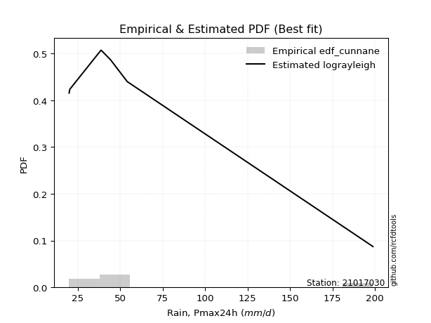</img>

</div>


### 12. EDF Adamowski (1981)

The Adamowski formula in hydrology refers to a specific plotting position formula used for estimating the non-parametric empirical distribution of hydrological events (like flood peaks) to calculate their return periods. This formula provides an alternative to traditional parametric methods (like the Gumbel or Log Pearson Type III distributions). 

<div align="center">


$P=(m-0.25)/(n+0.5)$


</div>


**12.1. Empirical values**

<div align="center">

|                | 0                  | 1                   | 2                   | 3             | 4                  | 5                  | 6                  |
|:---------------|:-------------------|:--------------------|:--------------------|:--------------|:-------------------|:-------------------|:-------------------|
| date           | 2023               | 2022                | 2020                | 2025          | 2021               | 2019               | 2024               |
| x              | 20.0               | 20.4                | 38.8                | 42.6          | 44.4               | 54.2               | 198.8              |
| m              | 1                  | 2                   | 3                   | 4             | 5                  | 6                  | 7                  |
| empirical_dist | edf_adamowski      | edf_adamowski       | edf_adamowski       | edf_adamowski | edf_adamowski      | edf_adamowski      | edf_adamowski      |
| empirical      | 0.1                | 0.23333333333333334 | 0.36666666666666664 | 0.5           | 0.6333333333333333 | 0.7666666666666667 | 0.9                |
| empirical_tr   | 1.1111111111111112 | 1.3043478260869565  | 1.5789473684210527  | 2.0           | 2.727272727272727  | 4.2857142857142865 | 10.000000000000002 |

</div>


**12.2. Kolmogorov-Smirnov fit test (sorted by Δ)**


<div align="center">

|                | 0                   | 1                   | 2                   | 3                   | 4                   | 5                   | 6                   | 7                   | 8                   | 9                   | 10                  | 11                  | 12                  | 13                  | 14                  | 15                  | 16                  | 17                  | 18                  | 19                  | 20                  | 21                  | 22                  | 23                  | 24                  | 25                  | 26                  | 27                  | 28                  | 29                  | 30                  | 31                  | 32                  | 33                  | 34                  | 35                  | 36                  | 37                  | 38                  | 39                  | 40                  | 41                  | 42                  | 43                  | 44                  | 45                  | 46                  | 47                  | 48                  | 49                  | 50                  | 51                  | 52                  | 53                  | 54                  | 55                  | 56                  | 57                  | 58                  | 59                  | 60                  | 61                  | 62                  | 63                  | 64                  | 65                  | 66                  | 67                  | 68                  | 69                  | 70                  | 71                  | 72                  | 73                  | 74                  | 75                  | 76                  | 77                  | 78                  | 79                  | 80                  | 81                  | 82                  | 83                  | 84                  | 85                  | 86                  | 87                  | 88                  | 89                  | 90                  | 91                  | 92                  | 93                  | 94                  | 95                  | 96                  | 97                  | 98                  | 99                  | 100                 | 101                 | 102                 | 103                 | 104                 | 105                 | 106                 | 107                 | 108                 | 109                 | 110                 | 111                 | 112                 | 113                 | 114                 | 115                 | 116                 | 117                 | 118                 | 119                 | 120                 | 121                 | 122                 | 123                 | 124                 | 125                 | 126                 | 127                 | 128                 | 129                 | 130                 | 131                 | 132                 | 133                 | 134                 | 135                 | 136                 | 137                 | 138                 | 139                 | 140                 | 141                 | 142                 | 143                 | 144                 | 145                 | 146                 | 147                 | 148                 | 149                 | 150                 | 151                 | 152                 | 153                 | 154                 | 155                 | 156                 | 157                 | 158                 | 159                 |
|:---------------|:--------------------|:--------------------|:--------------------|:--------------------|:--------------------|:--------------------|:--------------------|:--------------------|:--------------------|:--------------------|:--------------------|:--------------------|:--------------------|:--------------------|:--------------------|:--------------------|:--------------------|:--------------------|:--------------------|:--------------------|:--------------------|:--------------------|:--------------------|:--------------------|:--------------------|:--------------------|:--------------------|:--------------------|:--------------------|:--------------------|:--------------------|:--------------------|:--------------------|:--------------------|:--------------------|:--------------------|:--------------------|:--------------------|:--------------------|:--------------------|:--------------------|:--------------------|:--------------------|:--------------------|:--------------------|:--------------------|:--------------------|:--------------------|:--------------------|:--------------------|:--------------------|:--------------------|:--------------------|:--------------------|:--------------------|:--------------------|:--------------------|:--------------------|:--------------------|:--------------------|:--------------------|:--------------------|:--------------------|:--------------------|:--------------------|:--------------------|:--------------------|:--------------------|:--------------------|:--------------------|:--------------------|:--------------------|:--------------------|:--------------------|:--------------------|:--------------------|:--------------------|:--------------------|:--------------------|:--------------------|:--------------------|:--------------------|:--------------------|:--------------------|:--------------------|:--------------------|:--------------------|:--------------------|:--------------------|:--------------------|:--------------------|:--------------------|:--------------------|:--------------------|:--------------------|:--------------------|:--------------------|:--------------------|:--------------------|:--------------------|:--------------------|:--------------------|:--------------------|:--------------------|:--------------------|:--------------------|:--------------------|:--------------------|:--------------------|:--------------------|:--------------------|:--------------------|:--------------------|:--------------------|:--------------------|:--------------------|:--------------------|:--------------------|:--------------------|:--------------------|:--------------------|:--------------------|:--------------------|:--------------------|:--------------------|:--------------------|:--------------------|:--------------------|:--------------------|:--------------------|:--------------------|:--------------------|:--------------------|:--------------------|:--------------------|:--------------------|:--------------------|:--------------------|:--------------------|:--------------------|:--------------------|:--------------------|:--------------------|:--------------------|:--------------------|:--------------------|:--------------------|:--------------------|:--------------------|:--------------------|:--------------------|:--------------------|:--------------------|:--------------------|:--------------------|:--------------------|:--------------------|:--------------------|:--------------------|:--------------------|
| station        | 21017030            | 21017030            | 21017030            | 21017030            | 21017030            | 21017030            | 21017030            | 21017030            | 21017030            | 21017030            | 21017030            | 21017030            | 21017030            | 21017030            | 21017030            | 21017030            | 21017030            | 21017030            | 21017030            | 21017030            | 21017030            | 21017030            | 21017030            | 21017030            | 21017030            | 21017030            | 21017030            | 21017030            | 21017030            | 21017030            | 21017030            | 21017030            | 21017030            | 21017030            | 21017030            | 21017030            | 21017030            | 21017030            | 21017030            | 21017030            | 21017030            | 21017030            | 21017030            | 21017030            | 21017030            | 21017030            | 21017030            | 21017030            | 21017030            | 21017030            | 21017030            | 21017030            | 21017030            | 21017030            | 21017030            | 21017030            | 21017030            | 21017030            | 21017030            | 21017030            | 21017030            | 21017030            | 21017030            | 21017030            | 21017030            | 21017030            | 21017030            | 21017030            | 21017030            | 21017030            | 21017030            | 21017030            | 21017030            | 21017030            | 21017030            | 21017030            | 21017030            | 21017030            | 21017030            | 21017030            | 21017030            | 21017030            | 21017030            | 21017030            | 21017030            | 21017030            | 21017030            | 21017030            | 21017030            | 21017030            | 21017030            | 21017030            | 21017030            | 21017030            | 21017030            | 21017030            | 21017030            | 21017030            | 21017030            | 21017030            | 21017030            | 21017030            | 21017030            | 21017030            | 21017030            | 21017030            | 21017030            | 21017030            | 21017030            | 21017030            | 21017030            | 21017030            | 21017030            | 21017030            | 21017030            | 21017030            | 21017030            | 21017030            | 21017030            | 21017030            | 21017030            | 21017030            | 21017030            | 21017030            | 21017030            | 21017030            | 21017030            | 21017030            | 21017030            | 21017030            | 21017030            | 21017030            | 21017030            | 21017030            | 21017030            | 21017030            | 21017030            | 21017030            | 21017030            | 21017030            | 21017030            | 21017030            | 21017030            | 21017030            | 21017030            | 21017030            | 21017030            | 21017030            | 21017030            | 21017030            | 21017030            | 21017030            | 21017030            | 21017030            | 21017030            | 21017030            | 21017030            | 21017030            | 21017030            | 21017030            |
| empirical_dist | edf_adamowski       | edf_adamowski       | edf_adamowski       | edf_adamowski       | edf_adamowski       | edf_adamowski       | edf_adamowski       | edf_adamowski       | edf_adamowski       | edf_adamowski       | edf_adamowski       | edf_adamowski       | edf_adamowski       | edf_adamowski       | edf_adamowski       | edf_adamowski       | edf_adamowski       | edf_adamowski       | edf_adamowski       | edf_adamowski       | edf_adamowski       | edf_adamowski       | edf_adamowski       | edf_adamowski       | edf_adamowski       | edf_adamowski       | edf_adamowski       | edf_adamowski       | edf_adamowski       | edf_adamowski       | edf_adamowski       | edf_adamowski       | edf_adamowski       | edf_adamowski       | edf_adamowski       | edf_adamowski       | edf_adamowski       | edf_adamowski       | edf_adamowski       | edf_adamowski       | edf_adamowski       | edf_adamowski       | edf_adamowski       | edf_adamowski       | edf_adamowski       | edf_adamowski       | edf_adamowski       | edf_adamowski       | edf_adamowski       | edf_adamowski       | edf_adamowski       | edf_adamowski       | edf_adamowski       | edf_adamowski       | edf_adamowski       | edf_adamowski       | edf_adamowski       | edf_adamowski       | edf_adamowski       | edf_adamowski       | edf_adamowski       | edf_adamowski       | edf_adamowski       | edf_adamowski       | edf_adamowski       | edf_adamowski       | edf_adamowski       | edf_adamowski       | edf_adamowski       | edf_adamowski       | edf_adamowski       | edf_adamowski       | edf_adamowski       | edf_adamowski       | edf_adamowski       | edf_adamowski       | edf_adamowski       | edf_adamowski       | edf_adamowski       | edf_adamowski       | edf_adamowski       | edf_adamowski       | edf_adamowski       | edf_adamowski       | edf_adamowski       | edf_adamowski       | edf_adamowski       | edf_adamowski       | edf_adamowski       | edf_adamowski       | edf_adamowski       | edf_adamowski       | edf_adamowski       | edf_adamowski       | edf_adamowski       | edf_adamowski       | edf_adamowski       | edf_adamowski       | edf_adamowski       | edf_adamowski       | edf_adamowski       | edf_adamowski       | edf_adamowski       | edf_adamowski       | edf_adamowski       | edf_adamowski       | edf_adamowski       | edf_adamowski       | edf_adamowski       | edf_adamowski       | edf_adamowski       | edf_adamowski       | edf_adamowski       | edf_adamowski       | edf_adamowski       | edf_adamowski       | edf_adamowski       | edf_adamowski       | edf_adamowski       | edf_adamowski       | edf_adamowski       | edf_adamowski       | edf_adamowski       | edf_adamowski       | edf_adamowski       | edf_adamowski       | edf_adamowski       | edf_adamowski       | edf_adamowski       | edf_adamowski       | edf_adamowski       | edf_adamowski       | edf_adamowski       | edf_adamowski       | edf_adamowski       | edf_adamowski       | edf_adamowski       | edf_adamowski       | edf_adamowski       | edf_adamowski       | edf_adamowski       | edf_adamowski       | edf_adamowski       | edf_adamowski       | edf_adamowski       | edf_adamowski       | edf_adamowski       | edf_adamowski       | edf_adamowski       | edf_adamowski       | edf_adamowski       | edf_adamowski       | edf_adamowski       | edf_adamowski       | edf_adamowski       | edf_adamowski       | edf_adamowski       | edf_adamowski       | edf_adamowski       | edf_adamowski       |
| p_dist         | dgamma              | t                   | gennorm             | johnsonsu           | logbetaprime        | ncf                 | logt                | lograyleigh         | betaprime           | logvonmises_line    | logfoldnorm         | logncf              | logpearson3         | loglaplace          | loglaplace          | lognct              | logjohnsonsu        | logmaxwell          | loggumbel_r         | loghypsecant        | logdgamma           | logdweibull         | nct                 | mielke              | loggenlogistic      | loggennorm          | loglogistic         | logexponnorm        | burr                | logkstwobign        | wald                | logmielke           | loghalfnorm         | logrice             | logalpha            | lognorm             | logcrystalball      | logmoyal            | logloggamma         | logburr             | loginvweibull       | loggenextreme       | logf                | loginvgamma         | loganglit           | dweibull            | gamma               | loghalflogistic     | logsemicircular     | loggausshyper       | vonmises_line       | pearson3            | exponpow            | logloglaplace       | loggengamma         | nakagami            | logbeta             | alpha               | burr12              | logarcsine          | loginvgauss         | genlogistic         | halflogistic        | invgamma            | loglomax            | truncweibull_min    | loggumbel_l         | logtriang           | loggenexpon         | loggompertz         | moyal               | truncpareto         | f                   | logcosine           | logskewnorm         | logtruncexpon       | gompertz            | exponnorm           | genexpon            | halfnorm            | foldnorm            | logwald             | gumbel_r            | erlang              | gengamma            | kappa3              | genpareto           | rayleigh            | johnsonsb           | invgauss            | logweibull_min      | invweibull          | genextreme          | maxwell             | logweibull_max      | kstwobign           | arcsine             | semicircular        | anglit              | truncnorm           | weibull_min         | crystalball         | norm                | logkappa4           | logistic            | logwrapcauchy       | hypsecant           | loggenpareto        | logrdist            | logksone            | lomax               | logargus            | loghalfgennorm      | loglevy_l           | exponweib           | logtukeylambda      | laplace             | rice                | halfgennorm         | loguniform          | wrapcauchy          | logexponpow         | logburr12           | levy_l              | logtruncnorm        | bradford            | powerlaw            | gumbel_l            | truncexpon          | logjohnsonsb        | gausshyper          | cosine              | lognakagami         | skewnorm            | fatiguelife         | logkappa3           | logtruncweibull_min | logpowerlaw         | logbradford         | triang              | argus               | loggenhalflogistic  | logexponweib        | logtruncpareto      | logfatiguelife      | rdist               | ksone               | kappa4              | tukeylambda         | logtrapezoid        | logerlang           | loggamma            | loggamma            | uniform             | genhalflogistic     | beta                | weibull_max         | trapezoid           | logvonmises         | vonmises            |
| delta          | 0.09458393067404314 | 0.09940478910612088 | 0.10111493497000199 | 0.11292693522453034 | 0.11708953961163016 | 0.11759845066370642 | 0.11789379471926448 | 0.11930737700184324 | 0.11966822345228818 | 0.1203890725241668  | 0.1218737210399281  | 0.1239957439653675  | 0.12584390127469908 | 0.12588071077734608 | 0.12588071077734608 | 0.12618341886669376 | 0.1263219486826605  | 0.12705996036315226 | 0.12779202006682547 | 0.12802411107428324 | 0.13287405287517426 | 0.13333333333315878 | 0.13597169246206048 | 0.13607578558599176 | 0.13690810059392747 | 0.13716600617205993 | 0.13778400472103902 | 0.13922664052874428 | 0.13942288506013373 | 0.13946894406643032 | 0.14081175353661612 | 0.14092840451236033 | 0.1432150446484422  | 0.14713576466899875 | 0.15205837369432756 | 0.15227438623359324 | 0.15227447388434978 | 0.15526997699718265 | 0.15602950029572094 | 0.15638478294156016 | 0.15770400031605797 | 0.1577205877475269  | 0.16502422055459293 | 0.165034347720952   | 0.16791986400428227 | 0.16895500781760828 | 0.16998090572853763 | 0.17295612456468482 | 0.17443335203037358 | 0.17471888004327446 | 0.17852841880335868 | 0.18123689552068745 | 0.18600037679136439 | 0.19041961862826695 | 0.1907402663659039  | 0.19162601324718564 | 0.19255715857526737 | 0.19830250011891176 | 0.19977983601393484 | 0.20074715122388465 | 0.2027345141132782  | 0.20334355604575727 | 0.2046928346115946  | 0.2065565263819274  | 0.20761673258332625 | 0.20763798649943868 | 0.20919838330340856 | 0.2096693442089299  | 0.21064769062533384 | 0.21195649252006918 | 0.2120825054883596  | 0.21485941110416457 | 0.21559252008708868 | 0.21732651035994266 | 0.21847609902218207 | 0.21989789488871003 | 0.22206824192990568 | 0.2220877279107199  | 0.22335489914925066 | 0.2267655541121385  | 0.2283646854766664  | 0.23333333333333334 | 0.2376977074727059  | 0.23992128221586356 | 0.2429542548156136  | 0.2510566304576082  | 0.2534210970267033  | 0.25987159358340095 | 0.261201679031612   | 0.26137956322662753 | 0.2644331403777312  | 0.2691760762487089  | 0.27033482365367356 | 0.27161062560596755 | 0.279260482877811   | 0.28759482199980296 | 0.28878901641323224 | 0.29791461635177857 | 0.3002120302783461  | 0.3006815747763242  | 0.3042251548805624  | 0.305782920649345   | 0.3057829321305804  | 0.3091310102539393  | 0.31108149736291146 | 0.3122931237549047  | 0.3155768467807594  | 0.31626747805055083 | 0.32014818830318276 | 0.321580107061489   | 0.32180626957240155 | 0.3219107285877296  | 0.3221552863101172  | 0.3277476442848918  | 0.32779699219555763 | 0.330262371790604   | 0.3315032562769157  | 0.33194933293695095 | 0.33238763395626075 | 0.3325627951404534  | 0.3427075537027661  | 0.34369169717536924 | 0.35444670128344674 | 0.3649118052224892  | 0.3666666170420864  | 0.37073928848886806 | 0.3740250141238382  | 0.37622980558399133 | 0.3826476112753307  | 0.3857954024312477  | 0.38592213658124    | 0.38736249527785616 | 0.38855961552008306 | 0.3933161102709192  | 0.4079098598564131  | 0.4110589999242191  | 0.4500678193274969  | 0.45817887166817567 | 0.46121647073188704 | 0.4645366407249303  | 0.46519993324321873 | 0.4662957822674944  | 0.47513187083049285 | 0.4824339004515584  | 0.48747395762766504 | 0.521518034863231   | 0.523937360178971   | 0.5460362661330174  | 0.5547106568556771  | 0.5685646211254933  | 0.5693841056760887  | 0.5722051153617171  | 0.5722051153617171  | 0.5753914988814318  | 0.6226311962832867  | 0.648886418500659   | 0.6886262297707978  | 0.7077491504386689  | 1.095500165406932   | 31.102514032425006  |
| deltao         | 0.48442053926100004 | 0.48442053926100004 | 0.48442053926100004 | 0.48442053926100004 | 0.48442053926100004 | 0.48442053926100004 | 0.48442053926100004 | 0.48442053926100004 | 0.48442053926100004 | 0.48442053926100004 | 0.48442053926100004 | 0.48442053926100004 | 0.48442053926100004 | 0.48442053926100004 | 0.48442053926100004 | 0.48442053926100004 | 0.48442053926100004 | 0.48442053926100004 | 0.48442053926100004 | 0.48442053926100004 | 0.48442053926100004 | 0.48442053926100004 | 0.48442053926100004 | 0.48442053926100004 | 0.48442053926100004 | 0.48442053926100004 | 0.48442053926100004 | 0.48442053926100004 | 0.48442053926100004 | 0.48442053926100004 | 0.48442053926100004 | 0.48442053926100004 | 0.48442053926100004 | 0.48442053926100004 | 0.48442053926100004 | 0.48442053926100004 | 0.48442053926100004 | 0.48442053926100004 | 0.48442053926100004 | 0.48442053926100004 | 0.48442053926100004 | 0.48442053926100004 | 0.48442053926100004 | 0.48442053926100004 | 0.48442053926100004 | 0.48442053926100004 | 0.48442053926100004 | 0.48442053926100004 | 0.48442053926100004 | 0.48442053926100004 | 0.48442053926100004 | 0.48442053926100004 | 0.48442053926100004 | 0.48442053926100004 | 0.48442053926100004 | 0.48442053926100004 | 0.48442053926100004 | 0.48442053926100004 | 0.48442053926100004 | 0.48442053926100004 | 0.48442053926100004 | 0.48442053926100004 | 0.48442053926100004 | 0.48442053926100004 | 0.48442053926100004 | 0.48442053926100004 | 0.48442053926100004 | 0.48442053926100004 | 0.48442053926100004 | 0.48442053926100004 | 0.48442053926100004 | 0.48442053926100004 | 0.48442053926100004 | 0.48442053926100004 | 0.48442053926100004 | 0.48442053926100004 | 0.48442053926100004 | 0.48442053926100004 | 0.48442053926100004 | 0.48442053926100004 | 0.48442053926100004 | 0.48442053926100004 | 0.48442053926100004 | 0.48442053926100004 | 0.48442053926100004 | 0.48442053926100004 | 0.48442053926100004 | 0.48442053926100004 | 0.48442053926100004 | 0.48442053926100004 | 0.48442053926100004 | 0.48442053926100004 | 0.48442053926100004 | 0.48442053926100004 | 0.48442053926100004 | 0.48442053926100004 | 0.48442053926100004 | 0.48442053926100004 | 0.48442053926100004 | 0.48442053926100004 | 0.48442053926100004 | 0.48442053926100004 | 0.48442053926100004 | 0.48442053926100004 | 0.48442053926100004 | 0.48442053926100004 | 0.48442053926100004 | 0.48442053926100004 | 0.48442053926100004 | 0.48442053926100004 | 0.48442053926100004 | 0.48442053926100004 | 0.48442053926100004 | 0.48442053926100004 | 0.48442053926100004 | 0.48442053926100004 | 0.48442053926100004 | 0.48442053926100004 | 0.48442053926100004 | 0.48442053926100004 | 0.48442053926100004 | 0.48442053926100004 | 0.48442053926100004 | 0.48442053926100004 | 0.48442053926100004 | 0.48442053926100004 | 0.48442053926100004 | 0.48442053926100004 | 0.48442053926100004 | 0.48442053926100004 | 0.48442053926100004 | 0.48442053926100004 | 0.48442053926100004 | 0.48442053926100004 | 0.48442053926100004 | 0.48442053926100004 | 0.48442053926100004 | 0.48442053926100004 | 0.48442053926100004 | 0.48442053926100004 | 0.48442053926100004 | 0.48442053926100004 | 0.48442053926100004 | 0.48442053926100004 | 0.48442053926100004 | 0.48442053926100004 | 0.48442053926100004 | 0.48442053926100004 | 0.48442053926100004 | 0.48442053926100004 | 0.48442053926100004 | 0.48442053926100004 | 0.48442053926100004 | 0.48442053926100004 | 0.48442053926100004 | 0.48442053926100004 | 0.48442053926100004 | 0.48442053926100004 | 0.48442053926100004 | 0.48442053926100004 |
| eval           | Δo > Δ              | Δo > Δ              | Δo > Δ              | Δo > Δ              | Δo > Δ              | Δo > Δ              | Δo > Δ              | Δo > Δ              | Δo > Δ              | Δo > Δ              | Δo > Δ              | Δo > Δ              | Δo > Δ              | Δo > Δ              | Δo > Δ              | Δo > Δ              | Δo > Δ              | Δo > Δ              | Δo > Δ              | Δo > Δ              | Δo > Δ              | Δo > Δ              | Δo > Δ              | Δo > Δ              | Δo > Δ              | Δo > Δ              | Δo > Δ              | Δo > Δ              | Δo > Δ              | Δo > Δ              | Δo > Δ              | Δo > Δ              | Δo > Δ              | Δo > Δ              | Δo > Δ              | Δo > Δ              | Δo > Δ              | Δo > Δ              | Δo > Δ              | Δo > Δ              | Δo > Δ              | Δo > Δ              | Δo > Δ              | Δo > Δ              | Δo > Δ              | Δo > Δ              | Δo > Δ              | Δo > Δ              | Δo > Δ              | Δo > Δ              | Δo > Δ              | Δo > Δ              | Δo > Δ              | Δo > Δ              | Δo > Δ              | Δo > Δ              | Δo > Δ              | Δo > Δ              | Δo > Δ              | Δo > Δ              | Δo > Δ              | Δo > Δ              | Δo > Δ              | Δo > Δ              | Δo > Δ              | Δo > Δ              | Δo > Δ              | Δo > Δ              | Δo > Δ              | Δo > Δ              | Δo > Δ              | Δo > Δ              | Δo > Δ              | Δo > Δ              | Δo > Δ              | Δo > Δ              | Δo > Δ              | Δo > Δ              | Δo > Δ              | Δo > Δ              | Δo > Δ              | Δo > Δ              | Δo > Δ              | Δo > Δ              | Δo > Δ              | Δo > Δ              | Δo > Δ              | Δo > Δ              | Δo > Δ              | Δo > Δ              | Δo > Δ              | Δo > Δ              | Δo > Δ              | Δo > Δ              | Δo > Δ              | Δo > Δ              | Δo > Δ              | Δo > Δ              | Δo > Δ              | Δo > Δ              | Δo > Δ              | Δo > Δ              | Δo > Δ              | Δo > Δ              | Δo > Δ              | Δo > Δ              | Δo > Δ              | Δo > Δ              | Δo > Δ              | Δo > Δ              | Δo > Δ              | Δo > Δ              | Δo > Δ              | Δo > Δ              | Δo > Δ              | Δo > Δ              | Δo > Δ              | Δo > Δ              | Δo > Δ              | Δo > Δ              | Δo > Δ              | Δo > Δ              | Δo > Δ              | Δo > Δ              | Δo > Δ              | Δo > Δ              | Δo > Δ              | Δo > Δ              | Δo > Δ              | Δo > Δ              | Δo > Δ              | Δo > Δ              | Δo > Δ              | Δo > Δ              | Δo > Δ              | Δo > Δ              | Δo > Δ              | Δo > Δ              | Δo > Δ              | Δo > Δ              | Δo > Δ              | Δo > Δ              | Δo > Δ              | Δo > Δ              | Δo <= Δ             | Δo <= Δ             | Δo <= Δ             | Δo <= Δ             | Δo <= Δ             | Δo <= Δ             | Δo <= Δ             | Δo <= Δ             | Δo <= Δ             | Δo <= Δ             | Δo <= Δ             | Δo <= Δ             | Δo <= Δ             | Δo <= Δ             | Δo <= Δ             | Δo <= Δ             |
| fit            | 1                   | 1                   | 1                   | 1                   | 1                   | 1                   | 1                   | 1                   | 1                   | 1                   | 1                   | 1                   | 1                   | 1                   | 1                   | 1                   | 1                   | 1                   | 1                   | 1                   | 1                   | 1                   | 1                   | 1                   | 1                   | 1                   | 1                   | 1                   | 1                   | 1                   | 1                   | 1                   | 1                   | 1                   | 1                   | 1                   | 1                   | 1                   | 1                   | 1                   | 1                   | 1                   | 1                   | 1                   | 1                   | 1                   | 1                   | 1                   | 1                   | 1                   | 1                   | 1                   | 1                   | 1                   | 1                   | 1                   | 1                   | 1                   | 1                   | 1                   | 1                   | 1                   | 1                   | 1                   | 1                   | 1                   | 1                   | 1                   | 1                   | 1                   | 1                   | 1                   | 1                   | 1                   | 1                   | 1                   | 1                   | 1                   | 1                   | 1                   | 1                   | 1                   | 1                   | 1                   | 1                   | 1                   | 1                   | 1                   | 1                   | 1                   | 1                   | 1                   | 1                   | 1                   | 1                   | 1                   | 1                   | 1                   | 1                   | 1                   | 1                   | 1                   | 1                   | 1                   | 1                   | 1                   | 1                   | 1                   | 1                   | 1                   | 1                   | 1                   | 1                   | 1                   | 1                   | 1                   | 1                   | 1                   | 1                   | 1                   | 1                   | 1                   | 1                   | 1                   | 1                   | 1                   | 1                   | 1                   | 1                   | 1                   | 1                   | 1                   | 1                   | 1                   | 1                   | 1                   | 1                   | 1                   | 1                   | 1                   | 1                   | 1                   | 1                   | 1                   | 0                   | 0                   | 0                   | 0                   | 0                   | 0                   | 0                   | 0                   | 0                   | 0                   | 0                   | 0                   | 0                   | 0                   | 0                   | 0                   |
| n              | 7                   | 7                   | 7                   | 7                   | 7                   | 7                   | 7                   | 7                   | 7                   | 7                   | 7                   | 7                   | 7                   | 7                   | 7                   | 7                   | 7                   | 7                   | 7                   | 7                   | 7                   | 7                   | 7                   | 7                   | 7                   | 7                   | 7                   | 7                   | 7                   | 7                   | 7                   | 7                   | 7                   | 7                   | 7                   | 7                   | 7                   | 7                   | 7                   | 7                   | 7                   | 7                   | 7                   | 7                   | 7                   | 7                   | 7                   | 7                   | 7                   | 7                   | 7                   | 7                   | 7                   | 7                   | 7                   | 7                   | 7                   | 7                   | 7                   | 7                   | 7                   | 7                   | 7                   | 7                   | 7                   | 7                   | 7                   | 7                   | 7                   | 7                   | 7                   | 7                   | 7                   | 7                   | 7                   | 7                   | 7                   | 7                   | 7                   | 7                   | 7                   | 7                   | 7                   | 7                   | 7                   | 7                   | 7                   | 7                   | 7                   | 7                   | 7                   | 7                   | 7                   | 7                   | 7                   | 7                   | 7                   | 7                   | 7                   | 7                   | 7                   | 7                   | 7                   | 7                   | 7                   | 7                   | 7                   | 7                   | 7                   | 7                   | 7                   | 7                   | 7                   | 7                   | 7                   | 7                   | 7                   | 7                   | 7                   | 7                   | 7                   | 7                   | 7                   | 7                   | 7                   | 7                   | 7                   | 7                   | 7                   | 7                   | 7                   | 7                   | 7                   | 7                   | 7                   | 7                   | 7                   | 7                   | 7                   | 7                   | 7                   | 7                   | 7                   | 7                   | 7                   | 7                   | 7                   | 7                   | 7                   | 7                   | 7                   | 7                   | 7                   | 7                   | 7                   | 7                   | 7                   | 7                   | 7                   | 7                   |
| best_fit       | 1                   | 0                   | 0                   | 0                   | 0                   | 0                   | 0                   | 0                   | 0                   | 0                   | 0                   | 0                   | 0                   | 0                   | 0                   | 0                   | 0                   | 0                   | 0                   | 0                   | 0                   | 0                   | 0                   | 0                   | 0                   | 0                   | 0                   | 0                   | 0                   | 0                   | 0                   | 0                   | 0                   | 0                   | 0                   | 0                   | 0                   | 0                   | 0                   | 0                   | 0                   | 0                   | 0                   | 0                   | 0                   | 0                   | 0                   | 0                   | 0                   | 0                   | 0                   | 0                   | 0                   | 0                   | 0                   | 0                   | 0                   | 0                   | 0                   | 0                   | 0                   | 0                   | 0                   | 0                   | 0                   | 0                   | 0                   | 0                   | 0                   | 0                   | 0                   | 0                   | 0                   | 0                   | 0                   | 0                   | 0                   | 0                   | 0                   | 0                   | 0                   | 0                   | 0                   | 0                   | 0                   | 0                   | 0                   | 0                   | 0                   | 0                   | 0                   | 0                   | 0                   | 0                   | 0                   | 0                   | 0                   | 0                   | 0                   | 0                   | 0                   | 0                   | 0                   | 0                   | 0                   | 0                   | 0                   | 0                   | 0                   | 0                   | 0                   | 0                   | 0                   | 0                   | 0                   | 0                   | 0                   | 0                   | 0                   | 0                   | 0                   | 0                   | 0                   | 0                   | 0                   | 0                   | 0                   | 0                   | 0                   | 0                   | 0                   | 0                   | 0                   | 0                   | 0                   | 0                   | 0                   | 0                   | 0                   | 0                   | 0                   | 0                   | 0                   | 0                   | 0                   | 0                   | 0                   | 0                   | 0                   | 0                   | 0                   | 0                   | 0                   | 0                   | 0                   | 0                   | 0                   | 0                   | 0                   | 0                   |
| best_fit_sort  | 1                   | 2                   | 3                   | 4                   | 5                   | 6                   | 7                   | 8                   | 9                   | 10                  | 11                  | 12                  | 13                  | 14                  | 15                  | 16                  | 17                  | 18                  | 19                  | 20                  | 21                  | 22                  | 23                  | 24                  | 25                  | 26                  | 27                  | 28                  | 29                  | 30                  | 31                  | 32                  | 33                  | 34                  | 35                  | 36                  | 37                  | 38                  | 39                  | 40                  | 41                  | 42                  | 43                  | 44                  | 45                  | 46                  | 47                  | 48                  | 49                  | 50                  | 51                  | 52                  | 53                  | 54                  | 55                  | 56                  | 57                  | 58                  | 59                  | 60                  | 61                  | 62                  | 63                  | 64                  | 65                  | 66                  | 67                  | 68                  | 69                  | 70                  | 71                  | 72                  | 73                  | 74                  | 75                  | 76                  | 77                  | 78                  | 79                  | 80                  | 81                  | 82                  | 83                  | 84                  | 85                  | 86                  | 87                  | 88                  | 89                  | 90                  | 91                  | 92                  | 93                  | 94                  | 95                  | 96                  | 97                  | 98                  | 99                  | 100                 | 101                 | 102                 | 103                 | 104                 | 105                 | 106                 | 107                 | 108                 | 109                 | 110                 | 111                 | 112                 | 113                 | 114                 | 115                 | 116                 | 117                 | 118                 | 119                 | 120                 | 121                 | 122                 | 123                 | 124                 | 125                 | 126                 | 127                 | 128                 | 129                 | 130                 | 131                 | 132                 | 133                 | 134                 | 135                 | 136                 | 137                 | 138                 | 139                 | 140                 | 141                 | 142                 | 143                 | 144                 | 145                 | 146                 | 147                 | 148                 | 149                 | 150                 | 151                 | 152                 | 153                 | 154                 | 155                 | 156                 | 157                 | 158                 | 159                 | 160                 |

</div>


**12.3. Best fit**

<div align="center">

|   id |   station | empirical_dist   | p_dist   |     delta |   deltao | eval   |   fit |   n |   best_fit |   best_fit_sort |
|-----:|----------:|:-----------------|:---------|----------:|---------:|:-------|------:|----:|-----------:|----------------:|
|    0 |  21017030 | edf_adamowski    | dgamma   | 0.0945839 | 0.484421 | Δo > Δ |     1 |   7 |          1 |               1 |

</div>


<div align="center">

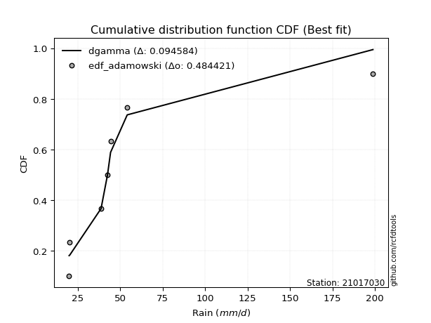</img>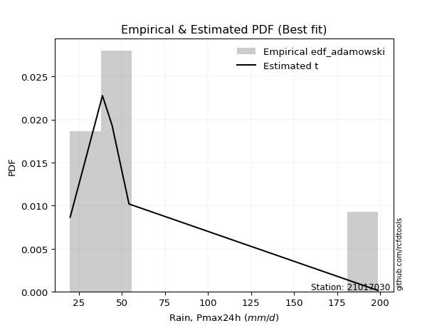</img>

</div>


## C. Best fit & Estimate extreme values for specific return periods - Tr

Best fit in probability distribution analysis means finding the theoretical distribution (like Normal, Poisson, Exponential, etc.) that most accurately mirrors your real-world data´s patterns (shape, center, spread) for better predictions, using methods like visual checks (Q-Q plots), goodness-of-fit tests (Kolmogorov-Smirnov, Chi-Squared), and information criteria (AIC) to score and select the simplest, most representative model.


### 1. Best fit (ordered by delta Δ)

:file_folder:Table: [bestfit_21017030.csv](table/bestfit_21017030.csv)

<div align="center">

|   id |   station | empirical_dist   | p_dist     |     delta |   deltao | eval   |   fit |   n |   best_fit |   best_fit_sort |
|-----:|----------:|:-----------------|:-----------|----------:|---------:|:-------|------:|----:|-----------:|----------------:|
|    0 |  21017030 | edf_hazen        | t          | 0.0803572 | 0.484421 | Δo > Δ |     1 |   7 |          1 |               1 |
|    1 |  21017030 | edf_gringorten   | t          | 0.0851726 | 0.484421 | Δo > Δ |     1 |   7 |          1 |               2 |
|    2 |  21017030 | edf_beard        | dgamma     | 0.0880799 | 0.484421 | Δo > Δ |     1 |   7 |          1 |               3 |
|    3 |  21017030 | edf_jenkinson    | dgamma     | 0.0880799 | 0.484421 | Δo > Δ |     1 |   7 |          1 |               4 |
|    4 |  21017030 | edf_filliben     | dgamma     | 0.0881561 | 0.484421 | Δo > Δ |     1 |   7 |          1 |               5 |
|    5 |  21017030 | edf_cunnane      | t          | 0.0882937 | 0.484421 | Δo > Δ |     1 |   7 |          1 |               6 |
|    6 |  21017030 | edf_chegodayev   | dgamma     | 0.0891785 | 0.484421 | Δo > Δ |     1 |   7 |          1 |               7 |
|    7 |  21017030 | edf_tukey        | dgamma     | 0.0899151 | 0.484421 | Δo > Δ |     1 |   7 |          1 |               8 |
|    8 |  21017030 | edf_blom         | t          | 0.0902094 | 0.484421 | Δo > Δ |     1 |   7 |          1 |               9 |
|    9 |  21017030 | edf_adamowski    | dgamma     | 0.0945839 | 0.484421 | Δo > Δ |     1 |   7 |          1 |              10 |
|   10 |  21017030 | edf_weibull      | logmaxwell | 0.110903  | 0.484421 | Δo > Δ |     1 |   7 |          1 |              11 |
|   11 |  21017030 | edf_california   | dgamma     | 0.125631  | 0.484421 | Δo > Δ |     1 |   7 |          1 |              12 |

</div>


### 2. Extreme values and % difference analysis

In hydrology, a return period (or recurrence interval $Tr$) is the statistical average time between extreme events like floods or droughts of a specific magnitude, indicating how rare an event is, with a 100-year flood, for example, having a 1% chance of occurring in any given year, not that it happens exactly every century. It is a key tool for infrastructure design (like bridges or dams) and risk assessment, calculated from historical data to determine the probability of future events, although it is important to remember it is statistical average, and events can cluster or be missed.

The extreme value porcentage difference is evaluated as $pdiff = 1 - (ETrBf / ETr) * 100$, where _ETrBf_ correspond to the bestfit extreme value for a specific recurrence interval and _ETr_ correspond to the extreme value for one of the most used PDFsused in hydrology.

> risk_rate: assuming the return period as the project useful life.

:file_folder:Table: [extreme_21017030.csv](table/extreme_21017030.csv), all PDFs.  
:file_folder:Table: [extremepdiff_21017030.csv](table/extremepdiff_21017030.csv), % difference between bestfit and most used PDFs in Hydrology.

<div align="center">

Extreme values table for only best fit PDFs
|   id |      tr |   prob_l |     prob_g |      alpha |   anglit |   arcsine |    argus |      beta |   betaprime |   bradford |      burr |   burr12 |   cosine |   crystalball |   dgamma |   dweibull |   erlang |   exponnorm |   exponpow |   exponweib |          f |   fatiguelife |   foldnorm |    gamma |   gausshyper |   genexpon |       genextreme |   gengamma |   genhalflogistic |   genlogistic |   gennorm |        genpareto |   gompertz |   gumbel_l |   gumbel_r |   halfgennorm |   halflogistic |   halfnorm |   hypsecant |   invgamma |   invgauss |      invweibull |   johnsonsb |   johnsonsu |           kappa3 |   kappa4 |   ksone |   kstwobign |   laplace |   levy_l |   loggamma |   logistic |   loglaplace |    lomax |   maxwell |    mielke |    moyal |   nakagami |      ncf |       nct |     norm |   pearson3 |   powerlaw |   rayleigh |    rdist |     rice |   semicircular |   skewnorm |          t |   trapezoid |   triang |   truncexpon |   truncnorm |   truncpareto |   truncweibull_min |   tukeylambda |   uniform |   vonmises |   vonmises_line |     wald |   weibull_max |   weibull_min |   wrapcauchy |   logalpha |   loganglit |   logarcsine |   logargus |   logbeta |   logbetaprime |   logbradford |   logburr |      logburr12 |   logcosine |   logcrystalball |   logdgamma |   logdweibull |   logerlang |   logexponnorm |      logexponpow |   logexponweib |       logf |   logfatiguelife |   logfoldnorm |   loggausshyper |   loggenexpon |   loggenextreme |   loggengamma |   loggenhalflogistic |   loggenlogistic |       loggennorm |   loggenpareto |   loggompertz |   loggumbel_l |   loggumbel_r |   loghalfgennorm |   loghalflogistic |   loghalfnorm |   loghypsecant |   loginvgamma |   loginvgauss |   loginvweibull |   logjohnsonsb |     logjohnsonsu |   logkappa3 |   logkappa4 |   logksone |   logkstwobign |   loglevy_l |   logloggamma |   loglogistic |     logloglaplace |   loglomax |   logmaxwell |   logmielke |   logmoyal |   lognakagami |   logncf |    lognct |   lognorm |   logpearson3 |   logpowerlaw |   lograyleigh |   logrdist |   logrice |   logsemicircular |   logskewnorm |       logt |   logtrapezoid |   logtriang |   logtruncexpon |   logtruncnorm |   logtruncpareto |   logtruncweibull_min |   logtukeylambda |   loguniform |   logvonmises |   logvonmises_line |   logwald |   logweibull_max |   logweibull_min |   logwrapcauchy |   station |   n |   risk_rate |
|-----:|--------:|---------:|-----------:|-----------:|---------:|----------:|---------:|----------:|------------:|-----------:|----------:|---------:|---------:|--------------:|---------:|-----------:|---------:|------------:|-----------:|------------:|-----------:|--------------:|-----------:|---------:|-------------:|-----------:|-----------------:|-----------:|------------------:|--------------:|----------:|-----------------:|-----------:|-----------:|-----------:|--------------:|---------------:|-----------:|------------:|-----------:|-----------:|----------------:|------------:|------------:|-----------------:|---------:|--------:|------------:|----------:|---------:|-----------:|-----------:|-------------:|---------:|----------:|----------:|---------:|-----------:|---------:|----------:|---------:|-----------:|-----------:|-----------:|---------:|---------:|---------------:|-----------:|-----------:|------------:|---------:|-------------:|------------:|--------------:|-------------------:|--------------:|----------:|-----------:|----------------:|---------:|--------------:|--------------:|-------------:|-----------:|------------:|-------------:|-----------:|----------:|---------------:|--------------:|----------:|---------------:|------------:|-----------------:|------------:|--------------:|------------:|---------------:|-----------------:|---------------:|-----------:|-----------------:|--------------:|----------------:|--------------:|----------------:|--------------:|---------------------:|-----------------:|-----------------:|---------------:|--------------:|--------------:|--------------:|-----------------:|------------------:|--------------:|---------------:|--------------:|--------------:|----------------:|---------------:|-----------------:|------------:|------------:|-----------:|---------------:|------------:|--------------:|--------------:|------------------:|-----------:|-------------:|------------:|-----------:|--------------:|---------:|----------:|----------:|--------------:|--------------:|--------------:|-----------:|----------:|------------------:|--------------:|-----------:|---------------:|------------:|----------------:|---------------:|-----------------:|----------------------:|-----------------:|-------------:|--------------:|-------------------:|----------:|-----------------:|-----------------:|----------------:|----------:|----:|------------:|
|    0 |    2    | 0.5      | 0.5        |    34.7159 |  59.8857 |   59.8857 |  96.5732 |   2.1     |     40.9048 |    72.9781 |   38.6338 |  34.612  |  74.8234 |       59.8857 |  42.6    |    42.6    |  30.947  |     47.4663 |    44.7092 |     25.4401 |    31.797  |       20.0001 |    45.9768 |  38.4781 |      76.9169 |    47.6469 |     38.4086      |    49.2916 |           137.476 |       48.8001 |   42.6    |     29.7488      |    44.4733 |    69.3969 |    50.3745 |       25.5178 |        45.646  |    48.0347 |     59.8857 |    34.1824 |    30.6454 |    25.1634      |     21.9604 |     42.6794 |     45.1725      |  104.288 | 109.4   |     56.3721 |   59.8857 |  50.1998 |    20.2454 |    59.8857 |      44.0656 |  60.279  |   54.9342 |   39.0715 |  47.304  |    40.7819 |  41.4242 |   39.0628 |  59.8857 |    43.0773 |    20.9852 |    53.178  |  3.75617 |  61.8758 |        59.8857 |    67.4204 |    41.7822 |     153.837 |  99.8324 |      73.6044 |     57.6992 |       38.9232 |            42.6224 |       3.51113 |   109.4   |   0.858253 |         45.3917 |  41.1186 |       198.527 |       28.8818 |      109.4   |    37.711  |     44.0656 |      44.0657 |    61.613  |   37.4783 |        41.5506 |       21.2513 |   37.4509 |  21.1498       |     49.1505 |          44.0656 |     42.6    |       44.4    |     22.343  |        38.7133 |     21.2393      |        20.402  |    36.9287 |          20      |       39.7038 |         35.3585 |       35.979  |         37.3727 |       38.6427 |              90.8323 |          38.8951 |     42.6         |        70.1888 |       36.4135 |       49.5325 |       39.2021 |     25.4276      |           36.9879 |       38.0904 |        44.0656 |       36.9281 |       34.5632 |         37.3737 |        20.0113 |     42.2247      |     81.2463 |     60.0565 |    63.0555 |        39.7894 |     41.8965 |       44.2573 |       44.0656 |     43.0632       |    34.182  |      41.4628 |     37.0881 |    37.7497 |       20.7873 |  41.9217 |   40.1709 |   44.0656 |       39.2955 |       20.5307 |       40.5771 |    65.0191 |   42.5857 |           44.0657 |       40.9764 |    39.5235 |        111.584 |     48.7626 |         48.1941 |        51.3215 |          20.751  |               20.9809 |          63.0569 |      63.0555 |     0.0770953 |            39.5256 |   34.9851 |          51.1903 |    22.0318       |         63.0555 |  21017030 |   7 |    0.75     |
|    1 |    2.33 | 0.570815 | 0.429185   |    39.2233 |  71.9199 |   77.951  | 110.463  |   2.16718 |     46.0369 |    86.9977 |   43.4482 |  39.1157 |  86.8261 |       70.2171 |  43.8016 |    45.755  |  35.7815 |     53.5287 |    52.9201 |     28.3392 |    37.6375 |       21.0533 |    58.0121 |  44.7225 |      91.9402 |    53.7384 |     80.6374      |    66.3803 |           149.14  |       54.8662 |   43.6062 |     34.2019      |    49.8655 |    78.3854 |    59.9477 |       28.4775 |        55.4887 |    59.1849 |     68.1539 |    38.6248 |    34.5203 |    52.5292      |     26.8205 |     44.2054 |     81.2452      |  117.578 | 124.594 |     64.0657 |   66.1378 |  95.2288 |    20.5116 |    68.9884 |      47.5868 |  69.1537 |   65.6678 |   43.7298 |  56.3662 |    53.3099 |  46.654  |   43.8251 |  70.2171 |    52.1546 |    22.6618 |    64.0704 | 13.3061  |  70.5318 |        72.7926 |    75.5827 |    43.5303 |     164.225 | 118.325  |      86.6418 |     65.7376 |       44.2889 |            50.9487 |      11.0786  |   122.062 |   1.20187  |         52.4435 |  47.893  |       198.702 |       32.1858 |      162.617 |    42.1622 |     51.0932 |      55.0262 |    72.2816 |   43.5021 |        46.9083 |       22.1548 |   41.9124 |  22.5726       |     56.5739 |          50.0345 |     44.8304 |       46.6557 |     23.1346 |        43.1474 |     23.0403      |        20.9603 |    41.3873 |          20.3833 |       45.9557 |         41.6627 |       40.6472 |         41.8278 |       46.4198 |             105.38   |          43.5254 |     43.1326      |        96.0205 |       41.1763 |       55.3208 |       44.0992 |     28.3842      |           41.7465 |       43.6876 |        48.7812 |       41.3867 |       38.8988 |         41.8289 |        20.0921 |     43.797       |     99.0889 |     71.3666 |    76.6443 |        44.827  |     67.1604 |       50.3397 |       49.2843 |     53.1306       |    38.5659 |      47.3125 |     41.5358 |    42.1993 |       22.0161 |  47.4405 |   45.1468 |   50.0345 |       44.5153 |       21.2702 |       46.3923 |    82.6844 |   48.0393 |           51.6443 |       46.361  |    43.0517 |        127.512 |     55.6632 |         56.3285 |        54.4664 |          21.3754 |               21.9601 |          74.6316 |      74.1914 |     0.0866339 |            43.7733 |   38.0241 |          75.1481 |    26.3942       |         79.5585 |  21017030 |   7 |    0.729209 |
|    2 |    5    | 0.8      | 0.2        |    74.1743 | 114.379  |  126.125  | 155.017  |  60.1984  |     74.5331 |   140.342  |   73.5904 |  71.8253 | 130.079  |      108.611  |  62.0903 |    81.7221 |  66.9731 |     83.8394 |    96.707  |     64.138  |    89.0032 |       43.423  |   108.908  |  80.5726 |     148.223  |    84.1942 |  10783.3         |   244.9    |           179.683 |       81.2192 |   54.8881 |     91.3581      |    76.8253 |   107.423  |   101.538  |       58.2153 |       100.025  |   106.338  |    101.32   |    72.9984 |    66.3529 | 96612.6         |    299.516  |     56.5565 |   2595.54        |  161.886 | 173.768 |     96.7462 |   97.3967 | 169.831  |    24.0238 |   104.135  |      69.8891 | 113.525  |  107.914  |   71.1933 |  98.3433 |   136.384  |  75.3747 |   72.5554 | 108.611  |    96.4786 |    53.5102 |   107.677  | 41.0407  | 105.186  |       116.838  |   110.1    |    53.7338 |     194.028 | 192.283  |     137.359  |    103.722  |       77.1498 |           100.491  |      35.159   |   163.04  |   2.46314  |         79.5114 |  85.8161 |       198.799 |       53.8519 |      191.931 |    70.4171 |     86.1185 |      99.4987 |   120.642  |   85.2911 |        76.1668 |       34.3776 |   70.6194 | 130.271        |     93.919  |          80.2224 |     63.3231 |       68.2969 |     28.1023 |        70.9595 |    116.907       |        31.4607 |    70.9674 |          30.5077 |       81.4755 |         85.6638 |       72.3787 |         70.6341 |      126.801  |             155.588  |          70.9462 |     53.7787      |       176.064  |       73.0359 |       79.059  |       73.54   |     73.3377      |           72.1848 |       78.011  |        73.3428 |       70.9675 |       70.8605 |         70.6355 |      1884.83   |     54.1421      |    188.395  |    125.527  |   144.139  |        74.3799 |    146.773  |       81.0767 |       75.9263 |    530.433        |    71.5267 |      79.5379 |     70.7511 |    70.7073 |       53.9333 |  77.3549 |   73.5837 |   80.2224 |       75.6818 |       34.4567 |       79.3065 |   161.866  |   77.8234 |           88.7613 |       78.1444 |    61.4589 |        186.982 |     94.5059 |        101.579  |        72.5757 |          31.1211 |               35.9707 |         128.016  |     125.585  |     0.134816  |            65.2535 |   60.6141 |         158.06   | 83436            |        141.711  |  21017030 |   7 |    0.67232  |
|    3 |   10    | 0.9      | 0.1        |   138.388  | 138.412  |  137.754  | 176.501  | 183.294   |    107.013  |   168.017  |  114.695  | 124.24   | 156.211  |      134.081  |  85.0385 |   128.935  | 101.367  |    111.355  |   136.154  |    163.689  |   186.778  |       74.31   |   146.569  | 116.921  |     175.191  |   111.841  | 730969           |   600.16   |           190.148 |      102.683  |   72.9914 |    292.562       |   101.299  |   123.59   |   135.413  |      116.59   |       137.011  |   141.23   |    127.803  |   134.87   |   118.736  |     6.50702e+07 |    456.587  |     83.5486 |  49963.2         |  181.84  | 195.224 |    121.628  |  125.773  | 187.842  |    30.9973 |   130.019  |      99.0691 | 153.804  |  137.645  |  105.721  | 134.891  |   216.14   | 107.618  |  109.868  | 134.081  |   135.896  |   101.099  |   138.77   | 49.7277  | 129.894  |       139.439  |   135.642  |    73.6669 |     205.669 | 238.878  |     165.32   |    133.644  |      111.685  |           140.265  |      45.1546  |   180.92  |   3.17465  |         99.4601 | 126.062  |       198.8   |       79.7902 |      195.716 |   111.647  |    115.726  |     114.794  |   154.447  |  139.426  |       108.505  |       61.0423 |  112.683  |   1.41867e+06  |    127.571  |         109.725  |     89.1638 |      103.859  |     34.0914 |       110.201  |   8820.58        |        63.3916 |   116.276  |          53.2385 |      120.43   |        129.523  |      117.457  |        113.206  |      343.919  |             177.878  |         105.616  |     85.8625      |       194.103  |      116.738  |       96.4457 |      111.536  |    359.495       |          113.75   |      119.807  |       101.574  |      116.281  |      125.646  |        113.206  |     45808.4    |     78.4948      |    249.478  |    160.356  |   189.875  |       109.369  |    177.262  |      111.037  |      104.379  | 373905            |   128.012  |     114.641  |    115.172  |   110.823  |      213.323  | 109.967  |  107.573  |  109.725  |      114.401  |       64.0176 |      116.237  |   195.174  |  109.773  |          117.195  |      114.996  |    85.1024 |        217.138 |    131.915  |        138.767  |        92.9309 |          54.7966 |               65.9429 |         160.792  |     158.008  |     0.184313  |            88.6547 |   99.4235 |         185.234  |     2.36943e+25  |        169.306  |  21017030 |   7 |    0.651322 |
|    4 |   15    | 0.933333 | 0.0666667  |   202.372  | 148.674  |  139.972  | 184.669  | 195.991   |    130.022  |   177.916  |  147.899  | 171.021  | 168.115  |      146.791  |  99.6738 |   160.987  | 123.07   |    127.45   |   158.338  |    284.611  |   283.564  |       94.5106 |   166.168  | 139.151  |     183.97   |   128.014  |      7.89687e+06 |   926.793  |           193.275 |      114.792  |   87.0812 |    608.506       |   115.615  |   130.912  |   154.524  |      170.457  |       157.941  |   159.388  |    142.917  |   195.303  |   161.448  |     2.56545e+09 |    465.885  |    111.827  | 262037           |  188.594 | 202.376 |    134.838  |  142.372  | 193.283  |    37.218  |   144.122  |     121.5    | 177.366  |  152.9    |  132.092  | 156.101  |   260.149  | 130.225  |  139.021  | 146.791  |   158.752  |   126.544  |   154.79   | 51.8386  | 142.625  |       148.252  |   148.934  |    96.6338 |     209.405 | 259.521  |     175.764  |    148.422  |      130.922  |           157.324  |      48.3397  |   186.88  |   3.44036  |        110.601  | 151.905  |       198.8   |       97.3592 |      196.781 |   148.086  |    131.29   |     117.968  |   169.654  |  176.914  |       130.836  |       82.6977 |  149.363  |   1.90066e+13  |    146.668  |         128.285  |    109.453  |      135.329  |     38.3309 |       142.545  | 569789           |       104.035  |   157.238  |          76.6262 |      146.525  |        150.171  |      153.684  |        150.609  |      633.171  |             185.155  |         132.196  |    130.749       |       196.972  |      150.691  |      105.531  |      141.082  |   1365.01        |          147.136  |      149.776  |       122.318  |      157.251  |      178.064  |        150.608  |     47161.9    |    111.842       |    274.503  |    173.763  |   208.144  |       134.209  |    187.663  |      129.838  |      124.144  |      2.65945e+09  |   181.693  |     138.292  |    155.203  |   143.845  |      501.058  | 132.23   |  132.594  |  128.285  |      143.289  |       87.0923 |      141.545  |   203.291  |  131.06   |          130.609  |      140.605  |   105.648  |        227.809 |    152.918  |        155.503  |       106.828  |          75.3434 |               89.7205 |         173.094  |     170.578  |     0.217836  |           105.011  |  136.615  |         191.697  |     1.19417e+58  |        178.801  |  21017030 |   7 |    0.644736 |
|    5 |   20    | 0.95     | 0.05       |   266.3    | 154.711  |  140.753  | 189.153  | 197.988   |    148.531  |   182.999  |  176.94   | inf      | 175.435  |      155.114  | 110.409  |   185.408  | 138.98   |    138.87   |   173.616  |    417.506  |   379.451  |      109.467  |   179.235  | 155.236  |     188.191  |   139.488  |      4.17956e+07 |  1224.21   |           194.765 |      123.27   |   98.6897 |   1033.6         |   125.772  |   135.469  |   167.906  |      219.788  |       172.606  |   171.494  |    153.58   |   254.86   |   197.285  |     3.36115e+10 |    467.527  |    140.067  | 833039           |  191.997 | 205.952 |    143.736  |  154.149  | 196.069  |    42.8545 |   153.87   |     140.432  | 194.083  |  163.024  |  154.364  | 171.123  |   289.944  | 148.293  |  163.99   | 155.114  |   174.904  |   141.678  |   165.439  | 52.7012  | 151.087  |       153.141  |   157.796  |   122.103  |     211.247 | 271.826  |     181.237  |    157.515  |      143.194  |           166.714  |      49.8891  |   189.86  |   3.57759  |        118.529  | 171.164  |       198.8   |      110.814  |      197.296 |   182.585  |    141.406  |     119.107  |   178.628  |  205.401  |       148.493  |       99.1526 |  183.45   |   1.42404e+23  |    159.806  |         142.11   |    126.766  |      164.425  |     41.7114 |       171.1    |      2.45621e+07 |       151.21   |   196.325  |         100.339  |      166.642  |        161.775  |      184.931  |        185.56   |      985.963  |             188.731  |         154.695  |    190.134       |       197.867  |      179.252  |      111.614  |      166.315  |   4342.71        |          176.21   |      173.816  |       139.453  |      196.347  |      229.365  |        185.557  |     47254.6    |    156.467       |    288.642  |    180.791  |   217.927  |       154.05   |    193.223  |      143.818  |      139.951  |      1.31525e+14  |   233.979  |     156.625  |    193.323  |   173.026  |      909.707  | 149.697  |  153.255  |  142.11   |      167.22   |      104.066  |      161.345  |   206.479  |  147.445  |          138.7    |      160.773  |   125.335  |        233.265 |    166.997  |        164.964  |       117.675  |          91.5783 |              107.525  |         179.469  |     177.234  |     0.244449  |           117.573  |  173.118  |         194.308  |     1.42065e+98  |        183.653  |  21017030 |   7 |    0.641514 |
|    6 |   25    | 0.96     | 0.04       |   330.205  | 158.802  |  141.116  | 192.044  | 198.491   |    164.299  |   186.093  |  203.26   | inf      | 180.569  |      161.241  | 118.895  |   205.229  | 151.565  |    147.728  |   185.2    |    558.111  |   474.622  |      121.35   |   188.957  | 167.86   |     190.636  |   148.388  |      1.50852e+08 |  1497.52   |           195.633 |      129.801  |  108.635  |   1564.1         |   133.651  |   138.712  |   178.213  |      265.364  |       183.904  |   180.501  |    161.831  |   313.78   |   228.19   |     2.43849e+11 |    468.021  |    167.915  |      2.02718e+06 |  194.048 | 208.098 |    150.401  |  163.284  | 197.818  |    48.0646 |   161.326  |     157.126  | 207.05   |  170.54   |  174.038  | 182.766  |   312.252  | 163.615  |  186.276  | 161.241  |   187.401  |   151.624  |   173.35   | 53.1471  | 157.375  |       156.312  |   164.39   |   149.661  |     212.345 | 280.224  |     184.608  |    163.744  |      151.706  |           172.645  |      50.8007  |   191.648 |   3.66103  |        124.756  | 186.59   |       198.8   |      121.791  |      197.6   |   216.143  |    148.702  |     119.638  |   184.666  |  228.265  |       163.34   |      111.774  |  215.958  |   3.34773e+35  |    169.715  |         153.23   |    142.148  |      191.916  |     44.5663 |       197.133  |      7.33212e+08 |       203.868  |   234.416  |         124.309  |      183.209  |        169.114  |      212.844  |        219.042  |     1397.16   |             190.846  |         174.603  |    266.59        |       198.246  |      204.261  |      116.154  |      188.787  |  12163           |          202.471  |      194.173  |       154.345  |      234.449  |      280.012  |        219.036  |     47269.6    |    215.374       |    298.083  |    185.101  |   224.017  |       170.81   |    196.797  |      155.048  |      153.39   |      3.62109e+19  |   285.428  |     171.789  |    230.409  |   199.658  |     1430.1    | 164.297  |  171.217  |  153.23   |      188.025  |      116.786  |      177.829  |   208.065  |  160.931  |          144.216  |      177.634  |   144.849  |        236.578 |    177.342  |        171.038  |       126.689  |         104.355  |              121.05   |         183.35   |     181.351  |     0.267092  |           127.503  |  209.276  |         195.65   |     8.53986e+142 |        186.605  |  21017030 |   7 |    0.639603 |
|    7 |   50    | 0.98     | 0.02       |   649.633  | 168.873  |  141.6    | 198.599  | 198.785   |    222.518  |   192.379  |  312.375  | inf      | 194.011  |      178.787  | 145.938  |   271.26   | 191.75   |    175.243  |   219.723  |   1318.16   |   943.264  |      159.476  |   217.216  | 207.744  |     195.207  |   176.035  |      7.86506e+09 |  2623.91   |           197.298 |      149.919  |  144.919  |   5716.69        |   158.124  |   147.516  |   209.965  |      455.467  |       218.716  |   206.682  |    187.415  |   602.324  |   340.597  |     1.09226e+14 |    468.415  |    299.556  |      3.11999e+07 |  198.18  | 212.389 |    169.973  |  191.66   | 201.756  |    70.3088 |   184.109  |     222.729  | 247.329  |  192.338  |  251.784  | 218.912  |   377.403  | 219.708  |  276.033  | 178.787  |   226.08   |   173.649  |   196.316  | 53.849   | 175.625  |       163.557  |   183.555  |   310.991  |     214.524 | 301.062  |     191.556  |    178.661  |      172.121  |           185.217  |      52.5692  |   195.224 |   3.82975  |        144.662  | 236.955  |       198.8   |      158.751  |      198.202 |   381.281  |    168.304  |     120.353  |   199.121  |  301.278  |       216.808  |      146.009  |  366.938  |   2.32238e+129 |    198.672  |         190.124  |    203.421  |      315.667  |     54.9004 |       306.073  |      4.228e+14   |       530.829  |   420.046  |         247.173  |      240.393  |        184.388  |      324.445  |        376.082  |     4229.8    |             194.979  |         253.519  |   1023.55        |       198.691  |      300.27   |      129.433  |      278.951  | 681513           |          310.642  |      267.914  |       211.403  |      420.152  |      528.893  |        376.058  |     47275.6    |    889.817       |    322.001  |    193.877  |   236.711  |       231.324  |    205.087  |      192.213  |      202.982  |      1.22001e+56  |   537.054  |     224.593  |    410.39   |   311.391  |     5440.61   | 216.281  |  240.255  |  190.124  |      267.567  |      150.135  |      235.852  |   210.402  |  207.482  |          157.652  |      237.369  |   247.266  |        243.291 |    205.865  |        184.179  |       158.32   |         140.271  |              157.239  |         191.184  |     189.875  |     0.352452  |           155.672  |  388.755  |         197.749  |   inf            |        192.619  |  21017030 |   7 |    0.63583  |
|    8 |   75    | 0.986667 | 0.0133333  |   969.015  | 173.305  |  141.69   | 201.198  | 198.797   |    264.276  |   194.504  |  401.542  | inf      | 200.431  |      188.202  | 162.128  |   312.741  | 215.875  |    191.338  |   238.942  |   2116.41   |  1404.21   |      182.438  |   232.599  | 231.453  |     196.584  |   192.208  |      7.83025e+10 |  3510.24   |           197.827 |      161.613  |  170.042  |  12237.4         |   172.44   |   151.967  |   228.421  |      607.311  |       238.952  |   220.934  |    202.366  |   884.591  |   416.947  |     3.79583e+15 |    468.451  |    420.114  |      1.52442e+08 |  199.571 | 213.819 |    180.742  |  208.258  | 203.374  |    89.0138 |   197.268  |     273.158  | 270.891  |  204.189  |  312.03   | 240.05   |   412.909  | 259.556  |  347.063  | 188.202  |   248.626  |   181.668  |   208.81   | 54.0155  | 185.554  |       166.451  |   193.988  |   501.219  |     215.245 | 310.293  |     193.936  |    184.63   |      180.188  |           189.629  |      53.1361  |   196.416 |   3.88636  |        156.32   | 267.948  |       198.8   |      182.279  |      198.402 |   551.811  |    177.73   |     120.486  |   205.163  |  343.765  |       254.044  |      161.038  |  509.498  |   1.00353e+268 |    214.195  |         213.457  |    251.235  |      426.92   |     62.1256 |       395.904  |      6.73638e+18 |       938.647  |   606.143  |         373.911  |      278.14   |        189.51   |      411.215  |        526.16   |     8212.54   |             196.312  |         314.882  |   2834.07        |       198.758  |      371.317  |      136.716  |      350.011  |      1.37896e+07 |          398.402  |      319.227  |       254.067  |      606.346  |      775.249  |        526.113  |     47275.7    |   3013.88        |    333.797  |    196.821  |   241.1    |       273.328  |    208.595  |      215.646  |      238.629  |      3.08315e+105 |   785.564  |     259.826  |    589.752  |   403.813  |    11312.2    | 251.991  |  292.25   |  213.457  |      326.744  |      164.302  |      275.016  |   210.9    |  238.237  |          163.363  |      277.943  |   364.435  |        245.555 |    219.927  |        188.879  |       179.583  |         156.57   |              172.926  |         193.788  |     192.805  |     0.41718   |           168.276  |  569.09   |         198.246  |   inf            |        194.659  |  21017030 |   7 |    0.634587 |
|    9 |  100    | 0.99     | 0.01       |  1288.39   | 175.94   |  141.721  | 202.65   | 198.799   |    298.015  |   195.572  |  479.856  | inf      | 204.454  |      194.569  | 173.744  |   343.349  | 233.215  |    202.758  |   252.167  |   2925.06   |  1860.18   |      198.96   |   243.079  | 248.412  |     197.228  |   203.682  |      3.98266e+11 |  4257.35   |           198.084 |      169.889  |  189.669  |  21010.7         |   182.597  |   154.879  |   241.483  |      736.635  |       253.275  |   230.642  |    212.972  |  1162.86   |   475.388  |     4.67685e+16 |    468.46   |    532.238  |      4.68174e+08 |  200.269 | 214.534 |    188.12   |  220.036  | 204.319  |   105.737  |   206.558  |     315.722  | 287.608  |  212.261  |  363.177  | 255.046  |   437.071  | 291.557  |  408.173  | 194.569  |   264.594  |   185.812  |   217.322  | 54.0831  | 192.318  |       168.072  |   201.095  |   713.069  |     215.605 | 315.796  |     195.139  |    187.861  |      184.509  |           191.878  |      53.4134  |   197.012 |   3.91471  |        164.128  | 290.544  |       198.8   |      199.787  |      198.502 |   732.288  |    183.584  |     120.532  |   208.615  |  373.159  |       283.557  |      169.427  |  648.824  | inf            |    224.536  |         230.842  |    291.98   |      531.198  |     67.8621 |       475.214  |      1.51458e+22 |      1408.73   |   796.349  |         503.637  |      306.983  |        192.028  |      484.63   |        674.132  |    13232      |             196.965  |         367.091  |   6551.21        |       198.779  |      429.433  |      141.699  |      410.992  |      1.61611e+08 |          475.122  |      359.704  |       289.456  |      796.671  |     1021.19   |        674.057  |     47275.7    |   8984.75        |    341.662  |    198.288  |   243.325  |       306.431  |    210.672  |      233.07   |      267.506  |      4.92891e+165 |  1033.87   |     286.938  |    772.144  |   485.579  |    18619.1    | 280.038  |  335.685  |  230.842  |      375.6    |      172.096  |      305.36   |   211.09   |  261.762  |          166.651  |      309.487  |   500.421  |        246.692 |    228.762  |        191.293  |       196.001  |         165.797  |              181.635  |         195.08   |     194.286  |     0.472537  |           175.256  |  751.362  |         198.448  |   inf            |        195.687  |  21017030 |   7 |    0.633968 |
|   10 |  200    | 0.995    | 0.005      |  2565.84   | 180.919  |  141.751  | 205.172  | 198.8     |    396.07   |   197.182  |  737.286  | inf      | 212.635  |      209.013  | 202.092  |   420.828  | 275.626  |    230.273  |   282.726  |   6135.91   |  3653.8    |      239.402  |   267.046  | 289.665  |     198.114  |   231.329  |      1.98804e+13 |  6521.15   |           198.458 |      189.785  |  243.286  |  77338.9         |   207.071  |   161.208  |   272.885  |     1134.79   |       287.709  |   252.848  |    238.521  |  2251.84   |   629.154  |     1.95875e+19 |    468.466  |    925.56   |      6.93851e+09 |  201.324 | 215.607 |    205.113  |  248.411  | 206.111  |   162.25   |   228.843  |     447.541  | 327.887  |  230.729  |  523.061  | 291.176  |   492.19   | 383.748  |  602.981  | 209.013  |   302.983  |   192.2    |   236.798  | 54.1611  | 207.796  |       170.897  |   217.35   |  1715.47   |     216.143 | 326.215  |     196.96   |    193.074  |      191.39   |           195.305  |      53.8187  |   197.906 |   3.95727  |        179.406  | 346.83   |       198.8   |      244.633  |      198.651 |  1579.3    |    195.174  |     120.577  |   214.753  |  439.806  |       366.908  |      183.263  | 1199.94   | inf            |    247.129  |         275.705  |    419.985  |      911.501  |     84.0978 |       737.825  |      3.13877e+31 |      3746.63   |  1612.02   |        1044.1    |      384.004  |        195.667  |      711.295  |       1268.55   |    42567.2    |             197.919  |         530.821  |  76190           |       198.796  |      599.692  |      153.167  |      604.677  |      2.10996e+11 |          725.573  |      472.631  |       396.295  |     1613      |     2009.57   |       1268.33   |     47275.7    | 339348           |    359.797  |    200.464  |   246.701  |       398.737  |    214.666  |      277.907  |      351.834  |    inf            |  2037.99   |     360.087  |   1546.11   |   757.177  |    57942      | 358.171  |  468.712  |  275.704  |      521.82   |      184.784  |      387.986  |   211.291  |  324.699  |          172.542  |      395.751  |  1283.08   |        248.404 |    246.474  |        194.998  |       240.339  |         181.212  |              195.928  |         196.991  |     196.53   |     0.651318  |           186.56   | 1501.14   |         198.682  |   inf            |        197.237  |  21017030 |   7 |    0.633042 |
|   11 |  250    | 0.996    | 0.004      |  3204.57   | 182.186  |  141.755  | 205.762  | 198.8     |    433.511  |   197.505  |  846.678  | inf      | 214.878  |      213.427  | 211.308  |   446.831  | 289.443  |    239.131  |   292.195  |   7704.69   |  4538.52   |      252.582  |   274.42   | 303.047  |     198.275  |   240.23   |      6.98858e+13 |  7406.1    |           198.53  |      196.182  |  262.499  | 117664           |   214.949  |   163.07   |   282.981  |     1292.68   |       298.779  |   259.679  |    246.746  |  2786.77   |   682.158  |     1.36434e+20 |    468.467  |   1099.83   |      1.65024e+10 |  201.537 | 215.822 |    210.372  |  257.547  | 206.578  |   186.868  |   235.998  |     500.742  | 340.854  |  236.414  |  588.132  | 302.807  |   509.097  | 418.679  |  683.61   | 213.427  |   315.32   |   193.503  |   242.793  | 54.1727  | 212.56   |       171.56   |   222.351  |  2287.73   |     216.25  | 328.871  |     197.326  |    194.176  |      192.828  |           195.999  |      53.8976  |   198.085 |   3.96578  |        183.021  | 365.451  |       198.8   |      259.844  |      198.681 |  2086.84   |    198.239  |     120.582  |   216.216  |  459.706  |       397.925  |      186.227  | 1477.76   | inf            |    253.711  |         291.082  |    472.298  |     1088.61   |     90.1501 |       850.085  |      7.26821e+34 |      5128.77   |  2054.39   |        1324.13   |      411.198  |        196.359  |      802.107  |       1572.38   |    62338.3    |             198.104  |         597.644  | 193432           |       198.797  |      664.716  |      156.714  |      684.594  |      3.19794e+12 |          831.372  |      514.045  |       438.468  |     2055.79   |     2507.97   |       1572.07   |     47275.7    |      1.58427e+06 |    365.545  |    200.893  |   247.382  |       432.59   |    215.718  |      293.234  |      384.188  |    inf            |  2548.81   |     386.159  |   1961.51   |   873.591  |    82020.7    | 386.883  |  522.042  |  291.081  |      579.027  |      187.476  |      417.668  |   211.318  |  346.965  |          173.954  |      426.846  |  1852.39   |        248.748 |    251.203  |        195.751  |       256.085  |         184.544  |              198.979  |         197.367  |     196.982  |     0.725843  |           188.937  | 1887.38   |         198.717  |   inf            |        197.549  |  21017030 |   7 |    0.632858 |
|   12 |  500    | 0.998    | 0.002      |  6398.18   | 185.328  |  141.76   | 207.119  | 198.8     |    572.209  |   198.152  | 1301.55   | inf      | 220.846  |      226.516  | 240.167  |   530.682  | 332.782  |    266.646  |   320.559  |  15159.8    |  8892.69   |      293.928  |   296.404  | 344.876  |     198.571  |   267.877  |      3.45897e+15 | 10714.1    |           198.671 |      216.035  |  328.443  | 433313           |   239.423  |   168.409  |   314.315  |     1892.14   |       333.138  |   280.046  |    272.294  |  5406.71   |   856.209  |     5.63954e+22 |    468.468  |   1846.11   |      2.42774e+11 |  201.964 | 216.251 |    226.133  |  285.922  | 207.782  |   292.329  |   258.187  |     709.811  | 381.133  |  253.378  |  846.256  | 338.937  |   559.346  | 547.023  | 1009.32   | 226.517  |   353.585  |   196.134  |   260.681  | 54.1909  | 226.775  |       173.086  |   237.261  |  5641.37   |     216.465 | 335.46   |     198.062  |    196.444  |      195.769  |           197.394  |      54.0525  |   198.442 |   3.98281  |        190.718  | 424.659  |       198.8   |      309.404  |      198.74  |  5618.24   |    206.047  |     120.59   |   219.616  |  515.978  |       509.693  |      192.365  | 2920.68   | inf            |    272.091  |         341.911  |    680.736  |     1909.98   |    111.999  |      1319.86   |      2.57585e+46 |     13539.4    |  4600.49   |        2790.17   |      503.706  |        197.68   |     1153.97   |       3180.15   |   206992      |             198.466  |         863.513  |      5.69337e+06 |       198.8    |      903.509  |      167.346  |     1006.37   |      6.1491e+16  |         1268.45   |      660.335  |       600.293  |     4604.87   |     5041.77   |       3179.26   |     47275.7    |      8.68157e+08 |    383.526  |    201.737  |   248.749  |       552.246  |    218.458  |      343.759  |      504.699  |    inf            |  5190.94   |     475.723  |   4313.08   |  1362.2    |   229845      | 488.932  |  731.017  |  341.911  |      796.075  |      193.024  |      520.419  |   211.358  |  422.893  |          177.25   |      534.827  |  7468.38   |        249.435 |    263.334  |        197.27   |       309.439  |         191.481  |              205.288  |         198.106  |     197.889  |     1.00666   |           193.799  | 3908.75   |         198.772  |   inf            |        198.174  |  21017030 |   7 |    0.632489 |
|   13 |  750    | 0.998667 | 0.00133333 |  9591.78   | 186.719  |  141.761  | 207.665  | 198.8     |    671.934  |   198.368  | 1674.05   | inf      | 223.739  |      233.788  | 257.186  |   581.786  | 358.39   |    282.742  |   336.464  |  22085.3    | 13174.3    |      318.357  |   308.686  | 369.504  |     198.659  |   284.049  |      3.38519e+16 | 13086.6    |           198.716 |      227.641  |  371.525  | 928969           |   253.739  |   171.262  |   332.633  |     2329.86   |       353.224  |   291.425  |    287.238  |  7969.81   |   963.879  |     1.90872e+24 |    468.468  |   2468.94   |      1.1687e+12  |  202.108 | 216.394 |    234.986  |  302.521  | 208.354  |   381.786  |   271.15   |     870.524  | 404.695  |  262.866  | 1046.81   | 360.071  |   587.31   | 638.446  | 1267.6    | 233.788  |   375.934  |   197.019  |   270.684  | 54.1952  | 234.724  |       173.701  |   245.59   |  9597.06   |     216.537 | 338.38   |     198.307  |    197.22   |      196.769  |           197.861  |      54.1029  |   198.562 |   3.98849  |        193.387  | 460.159  |       198.8   |      339.965  |      198.76  | 11180.5    |    209.602  |     120.591  |   220.997  |  544.873  |       587.524  |      194.477  | 4462.92   | inf            |    281.471  |         373.889  |    843.505  |     2672.23   |    127.248  |      1707.23   |      8.19314e+53 |     23800.3    |  7674.16   |        4333.97   |      563.814  |        198.091  |     1418.75   |       4936.64   |   421806      |             198.582  |        1070.79   |      5.96337e+07 |       198.8    |     1072.22   |      173.321  |     1260.6    |      5.84173e+19 |         1623.81   |      759.497  |       721.384  |     7682.94   |     7634.78   |       4934.98   |     47275.7    |      1.30925e+11 |    394.281  |    202.013  |   249.206  |       633.449  |    219.77   |      375.44   |      591.912  |    inf            |  7963.42   |     534.591  |   7092.52   |  1766.44   |   407125      | 558.843  |  891.807  |  373.889  |      956.181  |      194.923  |      588.53   |   211.366  |  472.378  |          178.593  |      606.637  | 20966.7    |        249.665 |    268.894  |        197.78   |       343.415  |         193.877  |              207.453  |         198.347  |     198.192  |     1.18279   |           195.451  | 6048      |         198.785  |   inf            |        198.382  |  21017030 |   7 |    0.632366 |
|   14 | 1000    | 0.999    | 0.001      | 12785.4    | 187.548  |  141.761  | 207.971  | 198.8     |    752.59   |   198.476  | 2001.48   | inf      | 225.563  |      238.794  | 269.314  |   618.919  | 376.659  |    294.162  |   347.463  |  28610.9    | 17409.4    |      335.782  |   317.167  | 387.041  |     198.7    |   295.524  |      1.70718e+17 | 14988.1    |           198.738 |      235.874  |  404.162  |      1.59586e+06 |   263.896  |   173.182  |   345.626  |     2684.75   |       367.472  |   299.283  |    297.841  | 10496.7    |  1042.59   |     2.321e+25   |    468.468  |   3018.69   |      3.56284e+12 |  202.18  | 216.465 |    241.12   |  314.298  | 208.713  |   462.336  |   280.343  |    1006.17   | 421.412  |  269.424  | 1217.26   | 375.066  |   606.575  | 711.95   | 1489.97   | 238.794  |   391.777  |   197.463  |   277.597  | 54.197   | 240.218  |       174.046  |   251.342  | 14002.6    |     216.573 | 340.12   |     198.43   |    197.612  |      197.273  |           198.096  |      54.1278  |   198.621 |   3.99133  |        194.733  | 485.695  |       198.8   |      362.33   |      198.77  | 19376.1    |    211.75   |     120.591  |   221.777  |  563.587  |       649.191  |      195.545  | 6102.35   | inf            |    287.554  |         397.628  |    982.294  |     3401.1    |    139.348  |      2049.23   |      3.62533e+59 |     35451.3    | 11249.6    |        5933.53   |      609.32   |        198.288  |     1638.48   |       6833.68   |   701859      |             198.639  |        1247.32   |      3.77747e+08 |       198.8    |     1206.53   |      177.462  |     1478.98   |      1.28694e+22 |         1934.72   |      836.543  |       821.84   |    11264.2    |    10275.7    |       6831.07   |     47275.7    |      9.63111e+12 |    402.069  |    202.148  |   249.435  |       696.607  |    220.598  |      398.909  |      662.749  |    inf            | 10847.4    |     579.482  |  10271.7    |  2124.09   |   603215      | 613.646  | 1027.97   |  397.628  |     1087.67   |      195.883  |      640.74   |   211.369  |  509.919  |          179.353  |      661.784  | 49109.9    |        249.779 |    272.265  |        198.035  |       368.445  |         195.091  |              208.549  |         198.466  |     198.344  |     1.29811   |           196.283  | 8278.99   |         198.791  |   inf            |        198.487  |  21017030 |   7 |    0.632305 |


</div>


<div align="center">

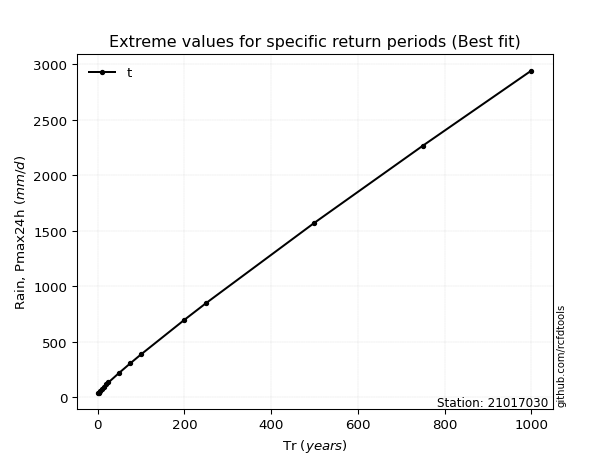</img>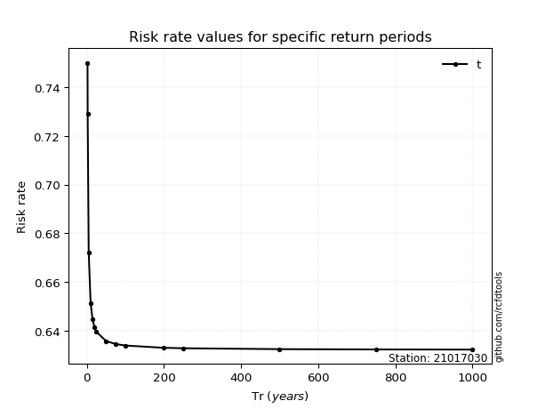</img>

</div>


<sub>**APP DISCLAIMER**: NO WARRANTY - This software is provided by [github.com/rcfdtools](https://github.com/rcfdtools) "as is", without any express or implied warranty, including warranties of merchantability, fitness for a particular purpose, or non-infringement. There is no guarantee that the software will be error-free or operate without interruption. LIMITATION OF LIABILITY - Neither the authors nor copyright holders will be liable for claims or damages arising from the software or its use. You are responsible for determining if the software is appropriate for your use and assume all associated risks, including errors, legal compliance, and data loss. NO PROFESSIONAL ADVICE - The software provides general information and does not offer professional advice. It should not replace consultation with professional advisors.</sub>