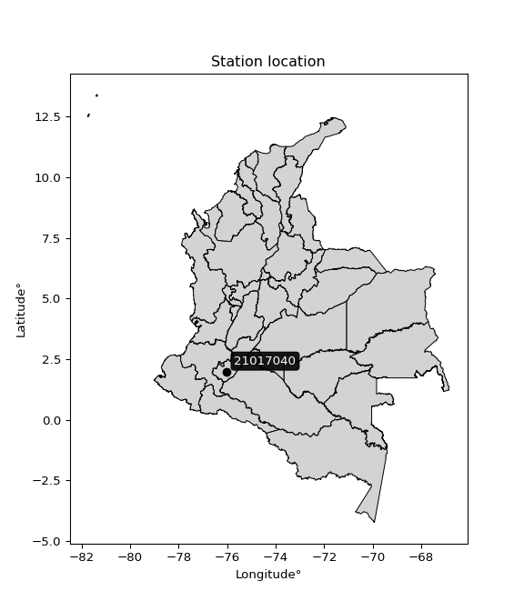

<div align="center">


</div>

# PMP Station (Rain, Pmax24h): 21017040

Probable Maximum Precipitation (PMP) is the greatest amount of rainfall for a specific duration that is meteorologically possible for a given location, acting as a "worst-case" scenario for extreme storms, crucial for designing safety-critical infrastructure like bridges, river deviations, dams, spillways, and nuclear plants to prevent catastrophic failure. PMP is calculated by hydrologists using meteorological data to determine the upper limit of extreme rainfall, often leading to the Probable Maximum Flood (PMF) for flood control design, and is increasingly being studied for climate change impacts. Probable Maximum Precipitation (PMP) is the theoretical upper limit of rainfall, a deterministic estimate for extreme events, while probability distributions (like GEV, Gumbel) describe the likelihood and frequency of various precipitation amounts, including rare ones, showing how often events occur, with PMP representing the extreme end of these distributions, used for critical infrastructure design to ensure safety against the worst conceivable weather, unlike standard statistical forecasts which cover typical probabilities.

The most common probability distributions in hydrology, used for analyzing floods, rainfall, and streamflow, include the Normal, Log-Normal, Gumbel, Gamma (including Log-Pearson Type III), and Generalized Extreme Value (GEV) distributions, often chosen based on the data´s skewness and whether modeling extremes or general conditions, with Gumbel and GEV popular for extreme events like floods, while the Normal distribution serves as a baseline, though often requiring transformations for skewed hydrological data. These distributions help in designing water infrastructure, managing water resources, and forecasting hydrologic events.

> Hydrological data often isn´t perfectly normal (it´s skewed), so different distributions are needed for different applications, such as: **Flood Frequency Analysis**: Using Gumbel, GEV, or Log-Pearson Type III for predicting extreme flood magnitudes and their return periods, **Rainfall Analysis**: Normal for annual totals, but Log-Normal, Weibull, or GEV for intensity or extreme daily rainfall, **Streamflow Modeling**: Gamma and Log-Normal for maximum flows, GEV for minimum flows, and Kappa for daily flows.

<div align="center">

</img>

</div>


## A. General information


### 1. General running parameters

• app_version: _v20260108_. • runtime: _2026-01-08 18:05:13.093906_. • Python version: _3.14.0_. • SciPy version: _1.16.3_. • Pandas version: _2.3.3_. • NumPy version: _2.3.5_. • Stations dataset (station_dataset_file): _dataset/pmax24h_in/automatic_colombia_2003_2024.csv_. • Stations catalog (station_catalog_file): _dataset/CNE.xls_. • Minimum year to eval til year_max (date_min): _1900_. • Maximum year to eval since year_min (date_max): _2024_. • Creates, save and include plots into reports (create_plot): _False_. • Plot only fit distributions with Δo > Δ (plot_only_fit): _True_. • Plot only simple graphs avoiding multiple CDFs and multiple Extreme values plots (plot_only_simple): _False_. • Eval low extreme values, if False, evaluates high extreme values (low_extreme): _False_. • Eval every SciPy distribution as logarithmic (pdist_logarithmic_on): _True_. • Standard deviation normalized (ddof): _1.0_. • Return periods to eval in years (Tr): _[2, 2.33, 5, 10, 15, 20, 25, 50, 75, 100, 200, 250, 500, 750, 1000]_. • Minimum data sample per station, 0 means any (minimum_sample): _5_. • Z-Score maximum threshold to adjust a value, 0 means disable (zscore_max): _3.5_. • Z-Score minimum threshold to adjust a value, 0 means disable (zscore_min): _-2.5_. • Avoid zeros, e.g. rain = 0 (avoid_zeros): _True_. • Avoid null values (avoid_nans): _True_. 

:file_folder:Table: [dataset.csv](../../dataset/pmax24h_in/automatic_colombia_2003_2024.csv)

> Delta Degrees of Freedom (DDOF): is a parameter used in the formulas for calculating variance and standard deviation. When ddof=0, the divisor is $N$ (the total number of observations) and this is used when your data set is the entire population. When ddof=1, the divisor is $N-1$ and this is used when your data set is a sample drawn from a larger population. Using $N-1$ provides an unbiased estimate of the population variance (known as Bessel´s correction).


### 2. Station info and location

|   id |   CODIGO | NOMBRE                   | CATEGORIA    | TECNOLOGIA                              | ESTADO   | FECHA_INSTALACION   |   FECHA_SUSPENSION |   ALTITUD |   LATITUD |   LONGITUD | DEPARTAMENTO   | MUNICIPIO   | AREA_OPERATIVA                    | ENTIDAD                                                     | AREA_HIDROGRAFICA   | ZONA_HIDROGRAFICA   | SUBZONA_HIDROGRAFICA                     | CORRIENTE   | Catalogo   |   Version |
|-----:|---------:|:-------------------------|:-------------|:----------------------------------------|:---------|:--------------------|-------------------:|----------:|----------:|-----------:|:---------------|:------------|:----------------------------------|:------------------------------------------------------------|:--------------------|:--------------------|:-----------------------------------------|:------------|:-----------|----------:|
|    0 | 21017040 | SALADO BLANCO [21017040] | Limnigráfica | Automática con Telemetría, Convencional | Activa   | 15/04/1971          |                nan |       994 |   1.98808 |   -76.0121 | Huila          | Elías       | Area Operativa 04 - Huila-Caquetá | INSTITUTO DE HIDROLOGIA METEOROLOGIA Y ESTUDIOS AMBIENTALES | Magdalena Cauca     | Alto Magdalena      | Río Timaná y otros directos al Magdalena | Magdalena   | CNE_IDEAM  |  20251226 |

<div align="center">

Dynamic map: [:earth_americas:Google](http://maps.google.com/maps?q=1.9880833,-76.012083333) [:earth_americas:OSM](https://www.openstreetmap.org/#map=18/1.9880833/-76.012083333&layers=P) [:earth_americas:Bing](https://www.bing.com/maps?cp=1.9880833~-76.012083333&lvl=18) [:earth_americas:Apple](https://maps.apple.com/frame?center=1.9880833%2C-76.012083333&span=0.003%2C0.006)

</div>


<div align="center">

```geojson
{
  "type": "Feature",
  "geometry": {
    "type": "Point", 
    "coordinates": [-76.012083333, 1.9880833]
  }, 
  "properties": {
    "Name": "21017040"
  }
}
```

</div>


### 3. Discrete values table and plot

<div align="center">

|               |           0 |           1 |           2 |          3 |           4 |           5 |           6 |           7 |
|:--------------|------------:|------------:|------------:|-----------:|------------:|------------:|------------:|------------:|
| Date          | 2006        | 2007        | 2008        | 2009       | 2012        | 2013        | 2014        | 2024        |
| Value         |  362.9      |  275.3      |  513.3      | 1257.8     |  339.6      |  243.6      |  181.2      |   57.4      |
| Value_initial |  362.9      |  275.3      |  513.3      | 1257.8     |  339.6      |  243.6      |  181.2      |   57.4      |
| count         |    8        |    8        |    8        |    8       |    8        |    8        |    8        |    8        |
| mean          |  403.887    |  403.887    |  403.887    |  403.887   |  403.887    |  403.887    |  403.887    |  403.887    |
| std           |  370.1      |  370.1      |  370.1      |  370.1     |  370.1      |  370.1      |  370.1      |  370.1      |
| zscore        |   -0.110747 |   -0.347439 |    0.295629 |    2.30724 |   -0.173703 |   -0.433092 |   -0.601695 |   -0.936198 |


</div>


> The initial value (value_initial) correspond to the initial obtained or null completed value, and value (value) is adjusted only when the initial value is outside the valid range (outlier) definite through the Z-Score value. If Z-Score is active, values out of range or outliers are replaced with the station mean value. A Z-Score (or standard score) measures how many standard deviations a data point is from the mean of a dataset, indicating its relative position; positive scores mean above the mean, negative mean below, and a score of zero is exactly at the mean, allowing for comparison of values from different distributions. It´s calculated using the formula $z=(x–μ)/σ$, where $x$ is the data point, $μ$ is the mean, and $σ$ is the standard deviation, helping identify outliers and understand probability.
>
> <sub>**Note**: In this study, "completing" (filling gaps in) and "extending" (forecasting or lengthening the historical record) rainfall data series are avoided for certain critical analyses because they introduce artificial bias and uncertainty, which can distort the statistics of rare events (extremes), alter day-to-day variability, and compromise the integrity and homogeneity of the original data. Some reasons against Completing/Extending rainfall data are: **Distortion of Extremes and Variability**: The primary issue is that most gap-filling or extension methods rely on averaging or regression with nearby stations, which inherently smooths the data. Rainfall is highly variable in space and time, with a large percentage of zero values and occasional large storms. Infilling methods often underestimate the highest values and overestimate the lowest (zero) values, which severely distorts analyses focused on flood frequency, drought severity, and intensity-duration-frequency (IDF) curves, **Loss of Data Homogeneity**: Infilled or extended data are synthetic estimates, not actual measurements. Combining these estimates with observed data can violate the assumption of data homogeneity, which requires that the data properties do not change over time. Inhomogeneity can lead to incorrect conclusions about long-term trends or changes in climate patterns, **Propagation of Errors**: Errors and biases from the original data (e.g., wind-induced undercatch, instrument errors, site changes) or the data used for imputation can propagate through the analysis, leading to unreliable hydrological models and inaccurate predictions, **Compromised Statistical Integrity**: For statistical analyses, especially those involving the frequency of events, using artificial data can introduce time bias or autocorrelation that doesn´t exist in reality, making it difficult to assess the true probability of events, **Difficulty in Validation**: It is difficult to accurately validate the quality of filled or extended data, especially for past periods where ground-truth measurements are unavailable. The reliability of imputation techniques heavily depends on the density of the surrounding station network and the complexity of the local topography.</sub>


### 4. Active continuous probability distributions from SciPy (43 of 104 available)

A Probability Density Function (PDF) describes the relative likelihood of a continuous random variable falling within a specific range, where the total area under its curve equals 1, and the area over any interval gives the actual probability for that range. Unlike discrete probabilities (like rolling a die), a PDF shows density, not direct probability for a single point (which is zero), with higher points indicating higher likelihood, often visualized as a bell curve for normal distributions.

A log of a probability density function (log-PDF) is simply the logarithm of the PDF´s value, denoted as $log(f(x))$, useful for converting multiplication of probabilities into addition, improving numerical stability with tiny numbers, and connecting to information theory concepts like entropy. Instead of dealing with very small probabilities (e.g., 0.000001), log-PDFs use negative numbers (e.g., $log(0.00001) ≈ -11.51$ that are easier for computers to handle, preventing underflow errors and simplifying complex calculations. In this study, each active probability distribution from SciPy is also evaluated in the $log$ form.

[scipy.stats](https://docs.scipy.org/doc/scipy/reference/stats.html) is a Python´s powerful submodule within the SciPy library for comprehensive statistical analysis, offering over 130 probability distributions (like Normal, Poisson), functions for descriptive stats (mean, variance), hypothesis testing (t-tests, chi-square), random variable generation, and statistical tests, making it essential for data science, modeling, and research. It provides tools to explore, model, and draw conclusions from data efficiently, working seamlessly with NumPy.

<div align="center">

|   id | p_dist             |   n_parameter | fit_method   | label                                                                       | active   | ref                                                                                                        |
|-----:|:-------------------|--------------:|:-------------|:----------------------------------------------------------------------------|:---------|:-----------------------------------------------------------------------------------------------------------|
|    0 | alpha              |             3 | MLE          | Alpha                                                                       | True     | [:mortar_board:](https://docs.scipy.org/doc/scipy/reference/generated/scipy.stats.alpha.html)              |
|    1 | betaprime          |             4 | MLE          | Beta prime                                                                  | True     | [:mortar_board:](https://docs.scipy.org/doc/scipy/reference/generated/scipy.stats.betaprime.html)          |
|    2 | chi2               |             3 | MLE          | Chi²                                                                        | True     | [:mortar_board:](https://docs.scipy.org/doc/scipy/reference/generated/scipy.stats.chi2.html)               |
|    3 | crystalball        |             4 | MLE          | Crystalball                                                                 | True     | [:mortar_board:](https://docs.scipy.org/doc/scipy/reference/generated/scipy.stats.crystalball.html)        |
|    4 | erlang             |             3 | MLE          | Erlang                                                                      | True     | [:mortar_board:](https://docs.scipy.org/doc/scipy/reference/generated/scipy.stats.erlang.html)             |
|    5 | expon              |             2 | MLE          | Exponential                                                                 | True     | [:mortar_board:](https://docs.scipy.org/doc/scipy/reference/generated/scipy.stats.expon.html)              |
|    6 | exponnorm          |             3 | MLE          | Exponentially modified Normal                                               | True     | [:mortar_board:](https://docs.scipy.org/doc/scipy/reference/generated/scipy.stats.exponnorm.html)          |
|    7 | f                  |             4 | MLE          | F                                                                           | True     | [:mortar_board:](https://docs.scipy.org/doc/scipy/reference/generated/scipy.stats.f.html)                  |
|    8 | fatiguelife        |             3 | MLE          | Fatigue-life (Birnbaum-Saunders)                                            | True     | [:mortar_board:](https://docs.scipy.org/doc/scipy/reference/generated/scipy.stats.fatiguelife.html)        |
|    9 | fisk               |             3 | MLE          | Fisk                                                                        | True     | [:mortar_board:](https://docs.scipy.org/doc/scipy/reference/generated/scipy.stats.fisk.html)               |
|   10 | gamma              |             3 | MLE          | Gamma                                                                       | True     | [:mortar_board:](https://docs.scipy.org/doc/scipy/reference/generated/scipy.stats.gamma.html)              |
|   11 | genexpon           |             5 | MLE          | Generalized exponential                                                     | True     | [:mortar_board:](https://docs.scipy.org/doc/scipy/reference/generated/scipy.stats.genexpon.html)           |
|   12 | genlogistic        |             3 | MLE          | Generalized logistic                                                        | True     | [:mortar_board:](https://docs.scipy.org/doc/scipy/reference/generated/scipy.stats.genlogistic.html)        |
|   13 | gibrat             |             2 | MM           | Gibrat                                                                      | True     | [:mortar_board:](https://docs.scipy.org/doc/scipy/reference/generated/scipy.stats.gibrat.html)             |
|   14 | gompertz           |             3 | MLE          | Gompertz (or truncated Gumbel)                                              | True     | [:mortar_board:](https://docs.scipy.org/doc/scipy/reference/generated/scipy.stats.gompertz.html)           |
|   15 | gumbel_l           |             2 | MM           | Gumbel Left Skew                                                            | True     | [:mortar_board:](https://docs.scipy.org/doc/scipy/reference/generated/scipy.stats.gumbel_l.html)           |
|   16 | gumbel_r           |             2 | MM           | Gumbel Right Skew                                                           | True     | [:mortar_board:](https://docs.scipy.org/doc/scipy/reference/generated/scipy.stats.gumbel_r.html)           |
|   17 | halflogistic       |             2 | MM           | Half-logistic                                                               | True     | [:mortar_board:](https://docs.scipy.org/doc/scipy/reference/generated/scipy.stats.halflogistic.html)       |
|   18 | halfnorm           |             2 | MM           | Half Normal                                                                 | True     | [:mortar_board:](https://docs.scipy.org/doc/scipy/reference/generated/scipy.stats.halfnorm.html)           |
|   19 | hypsecant          |             2 | MM           | hyperbolic secant                                                           | True     | [:mortar_board:](https://docs.scipy.org/doc/scipy/reference/generated/scipy.stats.hypsecant.html)          |
|   20 | invgamma           |             3 | MLE          | Inverted gamma                                                              | True     | [:mortar_board:](https://docs.scipy.org/doc/scipy/reference/generated/scipy.stats.invgamma.html)           |
|   21 | invgauss           |             3 | MLE          | Inverse Gaussian                                                            | True     | [:mortar_board:](https://docs.scipy.org/doc/scipy/reference/generated/scipy.stats.invgauss.html)           |
|   22 | invweibull         |             3 | MLE          | Inverted Weibull                                                            | True     | [:mortar_board:](https://docs.scipy.org/doc/scipy/reference/generated/scipy.stats.invweibull.html)         |
|   23 | kstwobign          |             2 | MLE          | Limiting distribution of scaled Kolmogorov-Smirnov two-sided test statistic | True     | [:mortar_board:](https://docs.scipy.org/doc/scipy/reference/generated/scipy.stats.kstwobign.html)          |
|   24 | laplace            |             2 | MM           | Laplace                                                                     | True     | [:mortar_board:](https://docs.scipy.org/doc/scipy/reference/generated/scipy.stats.laplace.html)            |
|   25 | laplace_asymmetric |             3 | MLE          | Asymmetric Laplace                                                          | True     | [:mortar_board:](https://docs.scipy.org/doc/scipy/reference/generated/scipy.stats.laplace_asymmetric.html) |
|   26 | loggamma           |             3 | MLE          | Log gamma                                                                   | True     | [:mortar_board:](https://docs.scipy.org/doc/scipy/reference/generated/scipy.stats.loggamma.html)           |
|   27 | logistic           |             2 | MM           | Logistic (or Sech-squared)                                                  | True     | [:mortar_board:](https://docs.scipy.org/doc/scipy/reference/generated/scipy.stats.logistic.html)           |
|   28 | lognorm            |             3 | MLE          | Log Normal                                                                  | True     | [:mortar_board:](https://docs.scipy.org/doc/scipy/reference/generated/scipy.stats.lognorm.html)            |
|   29 | maxwell            |             2 | MM           | Maxwell                                                                     | True     | [:mortar_board:](https://docs.scipy.org/doc/scipy/reference/generated/scipy.stats.maxwell.html)            |
|   30 | mielke             |             4 | MLE          | Mielke Beta-Kappa / Dagum                                                   | True     | [:mortar_board:](https://docs.scipy.org/doc/scipy/reference/generated/scipy.stats.mielke.html)             |
|   31 | moyal              |             2 | MM           | Moyal                                                                       | True     | [:mortar_board:](https://docs.scipy.org/doc/scipy/reference/generated/scipy.stats.moyal.html)              |
|   32 | nakagami           |             3 | MLE          | Nakagami                                                                    | True     | [:mortar_board:](https://docs.scipy.org/doc/scipy/reference/generated/scipy.stats.nakagami.html)           |
|   33 | ncf                |             5 | MLE          | Non-central F distribution                                                  | True     | [:mortar_board:](https://docs.scipy.org/doc/scipy/reference/generated/scipy.stats.ncf.html)                |
|   34 | nct                |             4 | MLE          | Non-central Student’s t                                                     | True     | [:mortar_board:](https://docs.scipy.org/doc/scipy/reference/generated/scipy.stats.nct.html)                |
|   35 | norm               |             2 | MM           | Normal                                                                      | True     | [:mortar_board:](https://docs.scipy.org/doc/scipy/reference/generated/scipy.stats.norm.html)               |
|   36 | pearson3           |             3 | MM           | Pearson type III                                                            | True     | [:mortar_board:](https://docs.scipy.org/doc/scipy/reference/generated/scipy.stats.pearson3.html)           |
|   37 | rayleigh           |             2 | MM           | Rayleigh                                                                    | True     | [:mortar_board:](https://docs.scipy.org/doc/scipy/reference/generated/scipy.stats.rayleigh.html)           |
|   38 | rice               |             3 | MLE          | Rice                                                                        | True     | [:mortar_board:](https://docs.scipy.org/doc/scipy/reference/generated/scipy.stats.rice.html)               |
|   39 | t                  |             3 | MLE          | Student’s t                                                                 | True     | [:mortar_board:](https://docs.scipy.org/doc/scipy/reference/generated/scipy.stats.t.html)                  |
|   40 | truncnorm          |             4 | MLE          | Truncated normal                                                            | True     | [:mortar_board:](https://docs.scipy.org/doc/scipy/reference/generated/scipy.stats.truncnorm.html)          |
|   41 | wald               |             2 | MM           | Wald                                                                        | True     | [:mortar_board:](https://docs.scipy.org/doc/scipy/reference/generated/scipy.stats.wald.html)               |
|   42 | weibull_min        |             3 | MLE          | Weibull minimum                                                             | True     | [:mortar_board:](https://docs.scipy.org/doc/scipy/reference/generated/scipy.stats.weibull_min.html)        |

</div>

> **n_parameter:** # arguments & localization & scale.
>
> **Fit methods:** (MLE) maximum likelihood, (MM) L-moments.
>
>**Inactive** (With the only purpose of prevent loops, zero divisions, infinite values, over high estimated values or horizontal trending for recurrence intervals estimations, the follow distributions were disabled.)**:** foldnorm, gennorm, norminvgauss, powernorm, powerlognorm, skewnorm, genextreme, anglit, arcsine, argus, beta, bradford, burr, burr12, cauchy, cosine, halfcauchy, foldcauchy, skewcauchy, wrapcauchy, dgamma, gengamma, exponweib, exponpow, truncexpon, gausshyper, genhalflogistic, genhyperbolic, geninvgauss, halfgennorm, johnsonsb, johnsonsu, kappa4, kappa3, ksone, kstwo, loglaplace, levy, levy_l, levy_stable, ncx2, pareto, genpareto, truncpareto, lomax, powerlaw, rdist, rel_breitwigner, recipinvgauss, semicircular, studentized_range, trapezoid, triang, truncweibull_min, tukeylambda, uniform, loguniform, vonmises, vonmises_line, weibull_max, dweibull, 


## B. Probability (PDF) vs. Empirical (EDF) distributions functions

A continuous probability distribution (CPD) describes probabilities for variables that can take any value within a range (like rain any time), unlike discrete variables with specific outcomes (like temperature). It uses a Probability Density Function (PDF), a curve where the total area under it equals 1, and the probability of the variable falling within an interval (a to b) is found by calculating the area under the curve between those points. A key feature is that the probability of hitting any single exact value is zero, so probabilities are always expressed for ranges, e.g., $P(a ≤ X ≤ b)$.

<div align="center">

Distributions parameters from station values
|    |   station | p_dist                |   n |               loc |            scale | shape                 | shape1             | shape2                | shape3   |
|---:|----------:|:----------------------|----:|------------------:|-----------------:|:----------------------|:-------------------|:----------------------|:---------|
|  0 |  21017040 | alpha                 |   8 |      -0.373197    |    145.12        | 8.337870185784189e-13 |                    |                       |          |
|  1 |  21017040 | betaprime             |   8 |      -2.46782     |    546.327       | 2.81007342005911      | 4.767442411658568  |                       |          |
|  2 |  21017040 | chi2                  |   8 |      57.4         |      8.71569     | 0.1405332635989623    |                    |                       |          |
|  3 |  21017040 | crystalball           |   8 |      -0.338835    |    532.093       | 4.578254285716924     | 2.4250225146387794 |                       |          |
|  4 |  21017040 | erlang                |   8 |      57.4         |      9.09999     | 0.052596716197226716  |                    |                       |          |
|  5 |  21017040 | expon                 |   8 |      57.4         |    346.488       |                       |                    |                       |          |
|  6 |  21017040 | exponnorm             |   8 |     110.962       |     82.1788      | 3.5644963049976544    |                    |                       |          |
|  7 |  21017040 | f                     |   8 |      57.3987      |    304.906       | 1.353185233409382     | 22.26480909802345  |                       |          |
|  8 |  21017040 | fatiguelife           |   8 |      57.4         |      0.000409921 | 928.1378777124968     |                    |                       |          |
|  9 |  21017040 | fisk                  |   8 |     -16.0954      |    318.716       | 2.414930546549516     |                    |                       |          |
| 10 |  21017040 | gamma                 |   8 |      57.4         |    308.012       | 0.8860312038899519    |                    |                       |          |
| 11 |  21017040 | genexpon              |   8 |      57.3998      |   2114.47        | 3.1634077472619504    | 2.9298608686276495 | 10.061412424641453    |          |
| 12 |  21017040 | genlogistic           |   8 |   -1217.18        |    204.197       | 1428.0456738996345    |                    |                       |          |
| 13 |  21017040 | gibrat                |   8 |     139.783       |    160.188       |                       |                    |                       |          |
| 14 |  21017040 | gompertz              |   8 |      57.4         | 143366           | 412.72236212774067    |                    |                       |          |
| 15 |  21017040 | gumbel_l              |   8 |     559.695       |    269.929       |                       |                    |                       |          |
| 16 |  21017040 | gumbel_r              |   8 |     248.08        |    269.929       |                       |                    |                       |          |
| 17 |  21017040 | halflogistic          |   8 |      -6.43677     |    295.986       |                       |                    |                       |          |
| 18 |  21017040 | halfnorm              |   8 |     -54.3421      |    574.306       |                       |                    |                       |          |
| 19 |  21017040 | hypsecant             |   8 |     403.887       |    220.396       |                       |                    |                       |          |
| 20 |  21017040 | invgamma              |   8 |    -127.849       |   1516.9         | 3.8424550568804445    |                    |                       |          |
| 21 |  21017040 | invgauss              |   8 |     -49.7185      |    796.128       | 0.5697651138133158    |                    |                       |          |
| 22 |  21017040 | invweibull            |   8 |      57.4         |      3.57153     | 0.06416435186057659   |                    |                       |          |
| 23 |  21017040 | kstwobign             |   8 |    -521.93        |   1081.78        |                       |                    |                       |          |
| 24 |  21017040 | laplace               |   8 |     403.887       |    244.798       |                       |                    |                       |          |
| 25 |  21017040 | laplace_asymmetric    |   8 |     243.6         |    170.43        | 0.6348028364033793    |                    |                       |          |
| 26 |  21017040 | loggamma              |   8 | -107833           |  14537.4         | 1712.4673172090015    |                    |                       |          |
| 27 |  21017040 | logistic              |   8 |     403.887       |    190.869       |                       |                    |                       |          |
| 28 |  21017040 | lognorm               |   8 |      57.4         |      2.53098     | 12.68012842315961     |                    |                       |          |
| 29 |  21017040 | maxwell               |   8 |    -416.455       |    514.073       |                       |                    |                       |          |
| 30 |  21017040 | mielke                |   8 |      26.7649      |    365.512       | 1.4990259235906507    | 2.557815676187027  |                       |          |
| 31 |  21017040 | moyal                 |   8 |     205.91        |    155.844       |                       |                    |                       |          |
| 32 |  21017040 | nakagami              |   8 |      57.4         |    663.356       | 0.2542165375445288    |                    |                       |          |
| 33 |  21017040 | ncf                   |   8 |      -0.133676    |    134.196       | 4.179052359929301     | 8.857441166074551  | 5.584865582334221     |          |
| 34 |  21017040 | nct                   |   8 |      -0.892964    |    118.666       | 2.486194211985842     | 2.2744223500932286 |                       |          |
| 35 |  21017040 | norm                  |   8 |     403.887       |    346.197       |                       |                    |                       |          |
| 36 |  21017040 | pearson3              |   8 |     403.887       |    346.197       | 1.701311768263476     |                    |                       |          |
| 37 |  21017040 | rayleigh              |   8 |    -258.408       |    528.435       |                       |                    |                       |          |
| 38 |  21017040 | rice                  |   8 |    -111.533       |    439.039       | 0.000658027767501529  |                    |                       |          |
| 39 |  21017040 | t                     |   8 |     288.727       |    108.498       | 1.2733699326042758    |                    |                       |          |
| 40 |  21017040 | truncnorm             |   8 |     403.888       |    346.197       | -14254.519408142449   | 532.6590275991612  |                       |          |
| 41 |  21017040 | wald                  |   8 |      57.6901      |    346.197       |                       |                    |                       |          |
| 42 |  21017040 | weibull_min           |   8 |      57.4         |    339.365       | 0.6752634033807703    |                    |                       |          |
| 43 |  21017040 | logalpha              |   8 |     -16.5425      |    593.426       | 26.748021158525006    |                    |                       |          |
| 44 |  21017040 | logbetaprime          |   8 |     -14.9923      |    113.221       | 724.9243586645175     | 3972.2229122630433 |                       |          |
| 45 |  21017040 | logchi2               |   8 |       4.05004     |      0.971417    | 1.078768324144436     |                    |                       |          |
| 46 |  21017040 | logcrystalball        |   8 |       5.68286     |      0.823925    | 1230.1093770616128    | 236.48381903070333 |                       |          |
| 47 |  21017040 | logerlang             |   8 |      -9.34758     |      0.0459672   | 326.90187600949264    |                    |                       |          |
| 48 |  21017040 | logexpon              |   8 |       4.05004     |      1.63282     |                       |                    |                       |          |
| 49 |  21017040 | logexponnorm          |   8 |       5.68196     |      0.823929    | 0.0010957872950595098 |                    |                       |          |
| 50 |  21017040 | logf                  |   8 |    -374.803       |    380.484       | 667346.4870693656     | 1174971.5008244226 |                       |          |
| 51 |  21017040 | logfatiguelife        |   8 |    -170.466       |    176.146       | 0.004689061197856571  |                    |                       |          |
| 52 |  21017040 | logfisk               |   8 |      -4.24614e+07 |      4.24614e+07 | 93146667.32297367     |                    |                       |          |
| 53 |  21017040 | loggamma              |   8 |      -9.40509     |      0.045972    | 328.0545046587446     |                    |                       |          |
| 54 |  21017040 | loggenexpon           |   8 |       4.04509     |      0.0181439   | 0.0033293233202985138 | 3.10628534071596   | 4.412764683621857e-05 |          |
| 55 |  21017040 | loggenlogistic        |   8 |       5.89145     |      0.391674    | 0.7332605403778183    |                    |                       |          |
| 56 |  21017040 | loggibrat             |   8 |       5.05435     |      0.381214    |                       |                    |                       |          |
| 57 |  21017040 | loggompertz           |   8 |       4.05004     |      1.4672      | 0.403016473387215     |                    |                       |          |
| 58 |  21017040 | loggumbel_l           |   8 |       6.05367     |      0.642411    |                       |                    |                       |          |
| 59 |  21017040 | loggumbel_r           |   8 |       5.31205     |      0.642411    |                       |                    |                       |          |
| 60 |  21017040 | loghalflogistic       |   8 |       4.70635     |      0.704406    |                       |                    |                       |          |
| 61 |  21017040 | loghalfnorm           |   8 |       4.59232     |      1.3668      |                       |                    |                       |          |
| 62 |  21017040 | loghypsecant          |   8 |       5.68286     |      0.524527    |                       |                    |                       |          |
| 63 |  21017040 | loginvgamma           |   8 |      -8.88225     |   4359.6         | 300.4347975829637     |                    |                       |          |
| 64 |  21017040 | loginvgauss           |   8 |      -1.74935     |    558.912       | 0.013276171571669118  |                    |                       |          |
| 65 |  21017040 | loginvweibull         |   8 |      -6.39615e+07 |      6.39615e+07 | 74544213.87526512     |                    |                       |          |
| 66 |  21017040 | logkstwobign          |   8 |       2.15109     |      4.05155     |                       |                    |                       |          |
| 67 |  21017040 | loglaplace            |   8 |       5.68286     |      0.582603    |                       |                    |                       |          |
| 68 |  21017040 | loglaplace_asymmetric |   8 |       5.82777     |      0.578554    | 1.1330533043314555    |                    |                       |          |
| 69 |  21017040 | logloggamma           |   8 |      -3.01687     |      3.20307     | 15.617899254082428    |                    |                       |          |
| 70 |  21017040 | loglogistic           |   8 |       5.68286     |      0.454253    |                       |                    |                       |          |
| 71 |  21017040 | loglognorm            |   8 |       4.05004     |      0.0218156   | 11.656694550677866    |                    |                       |          |
| 72 |  21017040 | logmaxwell            |   8 |       3.73051     |      1.22346     |                       |                    |                       |          |
| 73 |  21017040 | logmielke             |   8 |      -0.161186    |      6.21925     | 9.062738613334476     | 17.35331462173469  |                       |          |
| 74 |  21017040 | logmoyal              |   8 |       5.21169     |      0.370896    |                       |                    |                       |          |
| 75 |  21017040 | lognakagami           |   8 |       5.1996      |      0.974352    | 0.33341644553970307   |                    |                       |          |
| 76 |  21017040 | logncf                |   8 |      -6.59869     |     12.2261      | 493.540042320838      | 1860.8618031020956 | 1.0186433141897397    |          |
| 77 |  21017040 | lognct                |   8 |      39.3868      |      0.802753    | 16821.09398157621     | -41.9830962531465  |                       |          |
| 78 |  21017040 | lognorm               |   8 |       5.68286     |      0.823924    |                       |                    |                       |          |
| 79 |  21017040 | logpearson3           |   8 |       5.68286     |      0.823923    | -0.2706452770090243   |                    |                       |          |
| 80 |  21017040 | lograyleigh           |   8 |       4.10664     |      1.25764     |                       |                    |                       |          |
| 81 |  21017040 | logrice               |   8 |       3.51935     |      0.885156    | 2.200146584773908     |                    |                       |          |
| 82 |  21017040 | logt                  |   8 |       5.71824     |      0.469258    | 2.0122140918884464    |                    |                       |          |
| 83 |  21017040 | logtruncnorm          |   8 |      -0.49329     |      2.13142     | 2.670941047490712     | 11.664267120000105 |                       |          |
| 84 |  21017040 | logwald               |   8 |       4.85892     |      0.823941    |                       |                    |                       |          |
| 85 |  21017040 | logweibull_min        |   8 |       2.42624     |      3.56679     | 4.4928136414295174    |                    |                       |          |

</div>

> **loc** (Location parameter): This shifts the distribution along the x-axis. For many common distributions, like the normal (Gaussian) distribution, loc represents the mean $μ$. For others, like the uniform distribution, it might represent the minimum value, or for the beta distribution, the left end of the support interval.
>
> **scale** (Scale parameter): This determines the width or spread of the distribution. For the normal distribution, scale represents the standard deviation $σ$. For a uniform distribution, it defines the length of the interval (from $loc$ to $loc + scale$).
>
> **shape** (Shape parameters): Refers to parameters that define the specific form of a probability distribution, distinct from its location (loc) and scale (scale). These parameters are required arguments for most distribution functions. For example, a normal (Gaussian) distribution is fully defined by its location (mean) and scale (standard deviation), so it has no specific shape parameters beyond loc and scale. However, other distributions have intrinsic properties that need specification, as Gamma distribution that takes a shape parameter, often named $a$ or $alpha$.


### 0. Cumulative distribution values - CDF (86 evaluated)

Cumulative Distribution Function (CDF), denoted as $F$<sub>$X$</sub>$(x)$, is a function that gives the probability that a random variable $X$ will take a value less than or equal to a specific value, $x$ (i.e., $(P(X≥x)$. It essentially "accumulates" probabilities from a given point up to the far right (positive infinity), providing a complete picture of the distribution´s probabilities for both discrete (like rain) and continuous (like temperature) variables, helping to find probabilities over ranges or above certain values. Each station is evaluated separately ordering the $x$ values ascending, calculating the CDF and PDF values for the activated distributions and their logarithmic forms.

<div align="center">

CDF ordered by x ascending and calculating $log(f(x))$ separately
|   id |   Station |   date |      x |   count |    mean |   std |    zscore |   Value_initial |   station |   m |     alpha |   alpha_pdf |   betaprime |   betaprime_pdf |      chi2 |    chi2_pdf |   crystalball |   crystalball_pdf |   erlang |   erlang_pdf |    expon |   expon_pdf |   exponnorm |   exponnorm_pdf |           f |       f_pdf |   fatiguelife |   fatiguelife_pdf |      fisk |    fisk_pdf |      gamma |   gamma_pdf |    genexpon |   genexpon_pdf |   genlogistic |   genlogistic_pdf |    gibrat |   gibrat_pdf |    gompertz |   gompertz_pdf |   gumbel_l |   gumbel_l_pdf |   gumbel_r |   gumbel_r_pdf |   halflogistic |   halflogistic_pdf |   halfnorm |   halfnorm_pdf |   hypsecant |   hypsecant_pdf |   invgamma |   invgamma_pdf |   invgauss |   invgauss_pdf |   invweibull |   invweibull_pdf |   kstwobign |   kstwobign_pdf |   laplace |   laplace_pdf |   laplace_asymmetric |   laplace_asymmetric_pdf |   loggamma |   loggamma_pdf |   logistic |   logistic_pdf |   lognorm |   lognorm_pdf |   maxwell |   maxwell_pdf |    mielke |   mielke_pdf |    moyal |   moyal_pdf |    nakagami |     nakagami_pdf |       ncf |     ncf_pdf |      nct |     nct_pdf |     norm |    norm_pdf |   pearson3 |   pearson3_pdf |   rayleigh |   rayleigh_pdf |      rice |    rice_pdf |        t |       t_pdf |   truncnorm |   truncnorm_pdf |     wald |    wald_pdf |   weibull_min |   weibull_min_pdf |   logalpha |   logalpha_pdf |   logbetaprime |   logbetaprime_pdf |     logchi2 |   logchi2_pdf |   logcrystalball |   logcrystalball_pdf |   logerlang |   logerlang_pdf |   logexpon |   logexpon_pdf |   logexponnorm |   logexponnorm_pdf |     logf |   logf_pdf |   logfatiguelife |   logfatiguelife_pdf |   logfisk |   logfisk_pdf |   loggenexpon |   loggenexpon_pdf |   loggenlogistic |   loggenlogistic_pdf |   loggibrat |   loggibrat_pdf |   loggompertz |   loggompertz_pdf |   loggumbel_l |   loggumbel_l_pdf |   loggumbel_r |   loggumbel_r_pdf |   loghalflogistic |   loghalflogistic_pdf |   loghalfnorm |   loghalfnorm_pdf |   loghypsecant |   loghypsecant_pdf |   loginvgamma |   loginvgamma_pdf |   loginvgauss |   loginvgauss_pdf |   loginvweibull |   loginvweibull_pdf |   logkstwobign |   logkstwobign_pdf |   loglaplace |   loglaplace_pdf |   loglaplace_asymmetric |   loglaplace_asymmetric_pdf |   logloggamma |   logloggamma_pdf |   loglogistic |   loglogistic_pdf |   loglognorm |   loglognorm_pdf |   logmaxwell |   logmaxwell_pdf |   logmielke |   logmielke_pdf |    logmoyal |   logmoyal_pdf |   lognakagami |   lognakagami_pdf |    logncf |   logncf_pdf |    lognct |   lognct_pdf |   logpearson3 |   logpearson3_pdf |   lograyleigh |   lograyleigh_pdf |   logrice |   logrice_pdf |     logt |   logt_pdf |   logtruncnorm |   logtruncnorm_pdf |   logwald |   logwald_pdf |   logweibull_min |   logweibull_min_pdf |
|-----:|----------:|-------:|-------:|--------:|--------:|------:|----------:|----------------:|----------:|----:|----------:|------------:|------------:|----------------:|----------:|------------:|--------------:|------------------:|---------:|-------------:|---------:|------------:|------------:|----------------:|------------:|------------:|--------------:|------------------:|----------:|------------:|-----------:|------------:|------------:|---------------:|--------------:|------------------:|----------:|-------------:|------------:|---------------:|-----------:|---------------:|-----------:|---------------:|---------------:|-------------------:|-----------:|---------------:|------------:|----------------:|-----------:|---------------:|-----------:|---------------:|-------------:|-----------------:|------------:|----------------:|----------:|--------------:|---------------------:|-------------------------:|-----------:|---------------:|-----------:|---------------:|----------:|--------------:|----------:|--------------:|----------:|-------------:|---------:|------------:|------------:|-----------------:|----------:|------------:|---------:|------------:|---------:|------------:|-----------:|---------------:|-----------:|---------------:|----------:|------------:|---------:|------------:|------------:|----------------:|---------:|------------:|--------------:|------------------:|-----------:|---------------:|---------------:|-------------------:|------------:|--------------:|-----------------:|---------------------:|------------:|----------------:|-----------:|---------------:|---------------:|-------------------:|---------:|-----------:|-----------------:|---------------------:|----------:|--------------:|--------------:|------------------:|-----------------:|---------------------:|------------:|----------------:|--------------:|------------------:|--------------:|------------------:|--------------:|------------------:|------------------:|----------------------:|--------------:|------------------:|---------------:|-------------------:|--------------:|------------------:|--------------:|------------------:|----------------:|--------------------:|---------------:|-------------------:|-------------:|-----------------:|------------------------:|----------------------------:|--------------:|------------------:|--------------:|------------------:|-------------:|-----------------:|-------------:|-----------------:|------------:|----------------:|------------:|---------------:|--------------:|------------------:|----------:|-------------:|----------:|-------------:|--------------:|------------------:|--------------:|------------------:|----------:|--------------:|---------:|-----------:|---------------:|-------------------:|----------:|--------------:|-----------------:|---------------------:|
|    0 |  21017040 |   2024 |   57.4 |       8 | 403.887 | 370.1 | -0.936198 |            57.4 |  21017040 |   1 | 0.0120086 | 0.00147946  |   0.0303606 |     0.00115143  | 0.0860049 | 8.50515e+11 |      0.543206 |       0.000745357 | 0.165051 |  1.22176e+12 | 0        | 0.00288611  |   0.0379974 |     0.000748578 | 0.000191018 | 0.10288     |     0.0381098 |       4.852e+08   | 0.0281163 | 0.000897877 | 1.8975e-15 | 0.236614    | 3.44737e-07 |    0.00149608  |     0.0622545 |        0.00084567 | 0         |  0           | 4.90922e-16 |    0.00287879  |   0.144049 |    0.000493227 |   0.13177  |    0.000989362 |       0.107421 |        0.00166977  |   0.15427  |    0.00136325  |    0.130315 |     0.000574897 |  0.0317746 |    0.000980017 |  0.0312261 |    0.00116132  |  0.000154393 |      1.22357e+10 |   0.0634053 |     0.000832148 |  0.121414 |   0.000495977 |            0.0513785 |              0.000474895 |  0.0222461 |       0.068676 |   0.139996 |    0.000630787 | 0.0237531 |     0.0679525 |  0.162442 |   0.000862296 | 0.0242984 |  0.00118687  | 0.107315 | 0.00112724  | 1.83525e-09 | 131322           | 0.0313328 | 0.00112363  | 0.036782 | 0.000708705 | 0.158453 | 0.000698353 |  0.0812569 |    0.00170043  |   0.163543 |    0.000945983 | 0.0713534 | 0.000813875 | 0.117238 | 0.000544487 |    0.158453 |     0.000698353 | 0        | 0           |   5.46047e-12 |     518.935       |  0.0192484 |      0.0655888 |      0.0230998 |          0.0697701 | 5.98965e-09 |   3.63747e+06 |        0.0237531 |            0.0679526 |   0.0218328 |       0.0677536 |   0        |      0.612438  |       0.023754 |          0.0679543 | 0.023783 |  0.0682184 |         0.02367  |            0.0682178 | 0.0257244 |     0.0549794 |   0.000914373 |          0.18539  |        0.0316202 |            0.0586639 |    0        |       0         |   9.48508e-09 |          0.274684 |     0.0432421 |         0.0658353 |   0.000799706 |        0.00887736 |          0        |             0         |      0        |          0        |      0.0282919 |          0.0538669 |     0.0199645 |         0.0673514 |     0.0182832 |         0.0677637 |       0.0167385 |           0.0797884 |      0.0194635 |           0.104873 |    0.0303252 |        0.0520512 |               0.0373325 |                   0.0569499 |     0.0302384 |         0.0709982 |     0.0267394 |         0.0572906 |   0.00408426 |      1.16584e+12 |   0.00464237 |        0.0429932 |   0.0291845 |       0.0627339 | 1.68909e-06 |    5.43006e-05 |   0           |          0        | 0.0276325 |    0.0810409 | 0.0238769 |    0.0679467 |     0.0305882 |         0.0717047 |      0        |          0        | 0.0179373 |     0.0746876 | 0.035098 |  0.0379168 |    0           |          0         |  0        |     0         |        0.0287271 |            0.0783308 |
|    1 |  21017040 |   2014 |  181.2 |       8 | 403.887 | 370.1 | -0.601695 |           181.2 |  21017040 |   2 | 0.424153  | 0.00255185  |   0.262603  |     0.00214235  | 0.999991  | 5.56346e-07 |      0.633516 |       0.000707367 | 1        |  6.19109e-10 | 0.300437 | 0.00201901  |   0.216807  |     0.00200336  | 0.408005    | 0.00187208  |     0.723109  |       0.000800627 | 0.238996  | 0.0022262   | 0.388451   | 0.00223101  | 0.203178    |    0.00168361  |     0.219825  |        0.00163    | 0.0880844 |  0.00385855  | 0.299912    |    0.00201715  |   0.218121 |    0.000712725 |   0.277714 |    0.00131811  |       0.306763 |        0.0015303   |   0.318292 |    0.00127723  |    0.222281 |     0.000928558 |  0.252151  |    0.00218494  |  0.265952  |    0.0021173   |  0.450896    |      0.000186142 |   0.207951  |     0.00143156  |  0.201327 |   0.00082242  |            0.16134   |              0.00149127  |  0.287696  |       0.418397 |   0.237451 |    0.000948653 | 0.278757  |     0.407679  |  0.283084 |   0.00106725  | 0.25851   |  0.00225975  | 0.279029 | 0.00154239  | 0.33147     |      0.00135173  | 0.258917  | 0.0021364   | 0.227119 | 0.00222219  | 0.260035 | 0.000937002 |  0.300672  |    0.00170917  |   0.292511 |    0.00111379  | 0.199311  | 0.00121599  | 0.236384 | 0.00159903  |    0.260035 |     0.000937002 | 0.226161 | 0.00302818  |   0.397182    |       0.00166422  |  0.292577  |      0.431489  |      0.287802  |          0.41599   | 0.700043    |   0.220288    |        0.278757  |            0.407679  |   0.2861    |       0.418164  |   0.505413 |      0.302904  |       0.27876  |          0.407678  | 0.279628 |  0.408338  |         0.279927 |            0.408618  | 0.247406  |     0.408455  |   0.386814    |          0.406873 |        0.243913  |            0.389969  |    0.167292 |       1.72433   |   0.380746    |          0.37237  |     0.232499  |         0.316141  |   0.303825    |        0.563421   |          0.336479 |             0.629454  |      0.343183 |          0.528893 |      0.241134  |          0.416991  |     0.293875  |         0.428182  |     0.303946  |         0.437778  |       0.34259   |           0.427709  |      0.376924  |           0.415214 |    0.218136  |        0.374417  |               0.215614  |                   0.328914  |     0.268631  |         0.382494  |     0.256572  |         0.419904  |   0.633111   |      0.0280987   |   0.304246   |        0.457275  |   0.250473  |       0.39355   | 0.309424    |    0.652219    |   7.25787e-11 |      54491.1      | 0.304933  |    0.411449  | 0.278239  |    0.406923  |     0.26877   |         0.380379  |      0.314514 |          0.473682 | 0.288403  |     0.414298  | 0.191814 |  0.369006  |    1.34038e-09 |          1.3977    |  0.284059 |     1.20136   |        0.275952  |            0.378742  |
|    2 |  21017040 |   2013 |  243.6 |       8 | 403.887 | 370.1 | -0.433092 |           243.6 |  21017040 |   3 | 0.551964  | 0.00162987  |   0.391423  |     0.00195382  | 1         | 1.06139e-08 |      0.676686 |       0.000674966 | 1        |  4.42393e-13 | 0.415731 | 0.00168626  |   0.345684  |     0.0020519   | 0.50969     | 0.00142271  |     0.766126  |       0.000597624 | 0.378822  | 0.00218822  | 0.511486   | 0.00173906  | 0.306106    |    0.00160318  |     0.327527  |        0.00178963 | 0.332248  |  0.00349778  | 0.415138    |    0.00168588  |   0.266588 |    0.000842417 |   0.361774 |    0.00136269  |       0.398933 |        0.00142042  |   0.39609  |    0.00121438  |    0.286567 |     0.00113158  |  0.38563   |    0.00204531  |  0.391829  |    0.00189147  |  0.460276    |      0.000123071 |   0.301551  |     0.00154693  |  0.25978  |   0.0010612   |            0.287229  |              0.00265487  |  0.42094   |       0.473432 |   0.301581 |    0.00110353  | 0.410068  |     0.471842  |  0.351574 |   0.00112212  | 0.398689  |  0.00218228  | 0.375563 | 0.00153181  | 0.406996    |      0.00109371  | 0.388279  | 0.00197313  | 0.370324 | 0.00227639  | 0.321684 | 0.00103523  |  0.402415  |    0.00154574  |   0.363162 |    0.00114487  | 0.279023  | 0.00132833  | 0.368343 | 0.00264978  |    0.321684 |     0.00103523  | 0.396596 | 0.00239848  |   0.486629    |       0.00124134  |  0.428824  |      0.479673  |      0.420383  |          0.471533  | 0.75739     |   0.170223    |        0.410068  |            0.471842  |   0.419398  |       0.474015  |   0.587397 |      0.252694  |       0.41007  |          0.47184   | 0.411039 |  0.471822  |         0.41134  |            0.471522  | 0.386197  |     0.520009  |   0.50521     |          0.389087 |        0.379543  |            0.520965  |    0.55807  |       0.894678  |   0.491557    |          0.374062 |     0.342586  |         0.429237  |   0.471629    |        0.551763   |          0.508103 |             0.526565  |      0.491273 |          0.469256 |      0.388657  |          0.570103  |     0.428856  |         0.474689  |     0.44021   |         0.473349  |       0.468253  |           0.414069  |      0.49669   |           0.389262 |    0.362512  |        0.622229  |               0.338633  |                   0.516576  |     0.394136  |         0.459917  |     0.398336  |         0.527601  |   0.640485   |      0.0221931   |   0.444282   |        0.479444  |   0.386216  |       0.518675  | 0.4952      |    0.581383    |   0.348087    |          0.766458 | 0.434046  |    0.453113  | 0.409397  |    0.471622  |     0.393544  |         0.457297  |      0.456541 |          0.477219 | 0.419998  |     0.467095  | 0.340793 |  0.642594  |    0.344581    |          0.955382  |  0.559514 |     0.689483  |        0.399023  |            0.447947  |
|    3 |  21017040 |   2007 |  275.3 |       8 | 403.887 | 370.1 | -0.347439 |           275.3 |  21017040 |   4 | 0.598596  | 0.00132649  |   0.451082  |     0.0018074   | 1         | 1.48801e-09 |      0.697781 |       0.000655616 | 1        |  1.17017e-14 | 0.466813 | 0.00153884  |   0.409105  |     0.00193951  | 0.552106    | 0.00125859  |     0.78393   |       0.000528197 | 0.446105  | 0.00204779  | 0.563401   | 0.00154112  | 0.355948    |    0.00153954  |     0.384528  |        0.00179917 | 0.433588  |  0.00290296  | 0.466217    |    0.00153899  |   0.294383 |    0.000911487 |   0.404915 |    0.00135619  |       0.442977 |        0.00135778  |   0.434021 |    0.0011783   |    0.324005 |     0.00122907  |  0.448185  |    0.00189664  |  0.449425  |    0.00174099  |  0.463875    |      0.000104925 |   0.350858  |     0.00155929  |  0.295695 |   0.00120791  |            0.36661   |              0.0023592   |  0.479344  |       0.479675 |   0.33767  |    0.00117174  | 0.468559  |     0.482693  |  0.387398 |   0.00113651  | 0.465842  |  0.00204662  | 0.423472 | 0.00148736  | 0.440209    |      0.00100491  | 0.448635  | 0.0018313   | 0.440486 | 0.00213798  | 0.355159 | 0.00107555  |  0.449962  |    0.00145359  |   0.399521 |    0.00114767  | 0.321696  | 0.00136126  | 0.459063 | 0.00302129  |    0.355159 |     0.00107555  | 0.46736  | 0.00207202  |   0.52357     |       0.00109468  |  0.487747  |      0.481858  |      0.478583  |          0.478257  | 0.777198    |   0.153964    |        0.468559  |            0.482693  |   0.477892  |       0.480544  |   0.61718  |      0.234453  |       0.468561 |          0.48269   | 0.469508 |  0.482348  |         0.469755 |            0.481786  | 0.451413  |     0.543241  |   0.551983    |          0.375043 |        0.445662  |            0.557215  |    0.652035 |       0.655908  |   0.537108    |          0.370162 |     0.397958  |         0.475541  |   0.537275    |        0.519573   |          0.56965  |             0.479481  |      0.546941 |          0.440538 |      0.460654  |          0.602222  |     0.487155  |         0.476713  |     0.498059  |         0.470746  |       0.517925  |           0.397135  |      0.543247  |           0.37139  |    0.447213  |        0.767613  |               0.408109  |                   0.622561  |     0.451678  |         0.479292  |     0.464287  |         0.547546  |   0.643088   |      0.0204096   |   0.502582   |        0.472201  |   0.45198   |       0.553864  | 0.563019    |    0.526286    |   0.435116    |          0.662369 | 0.489717  |    0.455542  | 0.467879  |    0.482766  |     0.450775  |         0.476877  |      0.514199 |          0.464163 | 0.477641  |     0.473702  | 0.425166 |  0.728844  |    0.452462    |          0.811752  |  0.634674 |     0.545858  |        0.454985  |            0.465654  |
|    4 |  21017040 |   2012 |  339.6 |       8 | 403.887 | 370.1 | -0.173703 |           339.6 |  21017040 |   5 | 0.669483  | 0.00091456  |   0.557117  |     0.00149106  | 1         | 2.92547e-11 |      0.738547 |       0.000611352 | 1        |  7.81909e-18 | 0.557121 | 0.0012782   |   0.523695  |     0.00161681  | 0.624337    | 0.0010022   |     0.814327  |       0.000423746 | 0.56589   | 0.00166785  | 0.65152    | 0.00121444  | 0.450119    |    0.00138564  |     0.497765  |        0.00170017 | 0.587476  |  0.00194834  | 0.556561    |    0.00127908  |   0.357553 |    0.00105311  |   0.490443 |    0.00129447  |       0.525963 |        0.00122195  |   0.507252 |    0.00109806  |    0.408441 |     0.00138493  |  0.559204  |    0.00155433  |  0.551441  |    0.00143557  |  0.469775    |      8.06978e-05 |   0.449993  |     0.00150962  |  0.384519 |   0.00157076  |            0.501508  |              0.00185674  |  0.579164  |       0.466497 |   0.416583 |    0.00127335  | 0.569802  |     0.476767  |  0.460727 |   0.00113837  | 0.586023  |  0.00167984  | 0.514912 | 0.00134851  | 0.500198    |      0.00086867  | 0.556234  | 0.00151422  | 0.56525  | 0.00172934  | 0.426342 | 0.00113266  |  0.537344  |    0.001265    |   0.472879 |    0.00112884  | 0.410172  | 0.00138046  | 0.646613 | 0.00255547  |    0.426342 |     0.00113266  | 0.582414 | 0.00153536  |   0.586413    |       0.000873752 |  0.58728   |      0.461713  |      0.578208  |          0.466066  | 0.806959    |   0.130425    |        0.569802  |            0.476767  |   0.577934  |       0.467708  |   0.663361 |      0.20617   |       0.569804 |          0.476764  | 0.570625 |  0.475923  |         0.570713 |            0.474999  | 0.565989  |     0.538868  |   0.627597    |          0.344161 |        0.565363  |            0.57214   |    0.760358 |       0.401622  |   0.613537    |          0.356577 |     0.505162  |         0.541913  |   0.638852    |        0.4456     |          0.661795 |             0.398937  |      0.633952 |          0.387988 |      0.586838  |          0.584409  |     0.585647  |         0.457085  |     0.594587  |         0.444799  |       0.597412  |           0.358675  |      0.617507  |           0.335292 |    0.610101  |        0.669237  |               0.562135  |                   0.857524  |     0.553855  |         0.488959  |     0.579079  |         0.536587  |   0.647101   |      0.0179277   |   0.598797   |        0.44095   |   0.570935  |       0.568565  | 0.662967    |    0.426305    |   0.560113    |          0.535489 | 0.584081  |    0.439453  | 0.56919   |    0.477327  |     0.552535  |         0.487525  |      0.60798  |          0.426585 | 0.5764    |     0.462605  | 0.581476 |  0.72422   |    0.600688    |          0.609098  |  0.72992  |     0.374769  |        0.554268  |            0.475718  |
|    5 |  21017040 |   2006 |  362.9 |       8 | 403.887 | 370.1 | -0.110747 |           362.9 |  21017040 |   6 | 0.68954   | 0.000810116 |   0.590564  |     0.0013807   | 1         | 7.13927e-12 |      0.75259  |       0.000593917 | 1        |  5.60439e-19 | 0.585924 | 0.00119507  |   0.559978  |     0.00149845  | 0.646802    | 0.000927491 |     0.823847  |       0.000394049 | 0.603083  | 0.00152527  | 0.67865    | 0.00111583  | 0.481709    |    0.00132572  |     0.536648  |        0.0016354  | 0.629811  |  0.00169253  | 0.585387    |    0.00119613  |   0.382676 |    0.00110315  |   0.520207 |    0.00125948  |       0.553843 |        0.0011711   |   0.532477 |    0.00106704  |    0.441142 |     0.00141964  |  0.593994  |    0.00143271  |  0.583678  |    0.00133247  |  0.471581    |      7.44497e-05 |   0.484753  |     0.00147265  |  0.422916 |   0.00172761  |            0.542946  |              0.0017024   |  0.609801  |       0.456433 |   0.44652  |    0.00129482  | 0.601183  |     0.468539  |  0.487167 |   0.00113045  | 0.623516  |  0.00153872  | 0.545642 | 0.00128878  | 0.519966    |      0.000828863 | 0.590199  | 0.00140186  | 0.603734 | 0.00157475  | 0.452878 | 0.00114431  |  0.566041  |    0.0011985   |   0.499023 |    0.00111466  | 0.442262  | 0.00137277  | 0.701429 | 0.00214665  |    0.452878 |     0.00114431  | 0.616353 | 0.00138109  |   0.606027    |       0.000811145 |  0.617534  |      0.449725  |      0.608826  |          0.456314  | 0.815397    |   0.123936    |        0.601183  |            0.468539  |   0.608654  |       0.457707  |   0.676768 |      0.197959  |       0.601184 |          0.468536  | 0.601945 |  0.467571  |         0.60197  |            0.466573  | 0.601345  |     0.525889  |   0.650068    |          0.33302  |        0.603049  |            0.562561  |    0.78517  |       0.34778   |   0.637       |          0.350424 |     0.541632  |         0.556598  |   0.667573    |        0.419935   |          0.687449 |             0.374368  |      0.659132 |          0.370892 |      0.624874  |          0.56075   |     0.615605  |         0.445444  |     0.623683  |         0.431788  |       0.620761  |           0.344956  |      0.639351  |           0.323024 |    0.652075  |        0.597192  |               0.615497  |                   0.753019  |     0.586197  |         0.485251  |     0.614218  |         0.521634  |   0.648268   |      0.017262    |   0.627604   |        0.427     |   0.608383  |       0.558947  | 0.690243    |    0.395937    |   0.594528    |          0.502149 | 0.612924  |    0.429493  | 0.600613  |    0.46923   |     0.584797  |         0.484264  |      0.635797 |          0.411596 | 0.606808  |     0.453457  | 0.62819  |  0.681084  |    0.639291    |          0.555108  |  0.753437 |     0.334931  |        0.585761  |            0.472971  |
|    6 |  21017040 |   2008 |  513.3 |       8 | 403.887 | 370.1 |  0.295629 |           513.3 |  21017040 |   7 | 0.777549  | 0.00042166  |   0.752051  |     0.000810244 | 1         | 8.80785e-16 |      0.832807 |       0.000470517 | 1        |  2.54693e-26 | 0.731734 | 0.000774244 |   0.736622  |     0.000899128 | 0.758124    | 0.000586364 |     0.872073  |       0.000260696 | 0.773017  | 0.000800401 | 0.808485   | 0.000654213 | 0.6521      |    0.000947467 |     0.742283  |        0.00108325 | 0.801396  |  0.000746374 | 0.7314      |    0.000775707 |   0.569188 |    0.00134398  |   0.687734 |    0.000953791 |       0.705403 |        0.000848699 |   0.677042 |    0.000852432 |    0.651903 |     0.0012829   |  0.758858  |    0.000810678 |  0.741627  |    0.000808636 |  0.480656    |      4.95596e-05 |   0.680998  |     0.00111483  |  0.680212 |   0.00130633  |            0.738978  |              0.000972233 |  0.754321  |       0.368936 |   0.639509 |    0.00120783  | 0.750874  |     0.38497   |  0.648307 |   0.000989243 | 0.794361  |  0.000795058 | 0.709159 | 0.000890645 | 0.629105    |      0.000637218 | 0.7537    | 0.000816497 | 0.777076 | 0.000805764 | 0.624014 | 0.00109622  |  0.716625  |    0.000820253 |   0.655731 |    0.000951409 | 0.636772  | 0.00117744  | 0.878986 | 0.00057371  |    0.624014 |     0.00109622  | 0.76924  | 0.000734855 |   0.704945    |       0.00053343  |  0.758514  |      0.356594  |      0.753542  |          0.37003   | 0.853233    |   0.0957688   |        0.750874  |            0.38497   |   0.753629  |       0.370197  |   0.738609 |      0.160086  |       0.750874 |          0.384967  | 0.751237 |  0.383754  |         0.7509   |            0.382782  | 0.763451  |     0.396164  |   0.754609    |          0.268785 |        0.777373  |            0.423034  |    0.871898 |       0.176483  |   0.751157    |          0.304261 |     0.737702  |         0.54642   |   0.790133    |        0.28972    |          0.796593 |             0.259395  |      0.772234 |          0.282058 |      0.788428  |          0.374308  |     0.75553   |         0.354944  |     0.758337  |         0.339716  |       0.72738   |           0.269837  |      0.739976  |           0.257414 |    0.808125  |        0.329341  |               0.805019  |                   0.381855  |     0.744607  |         0.415196  |     0.773535  |         0.38564   |   0.653737   |      0.0144469   |   0.760347   |        0.334528  |   0.781097  |       0.416756  | 0.802803    |    0.260359    |   0.742056    |          0.355174 | 0.749091  |    0.349357  | 0.750619  |    0.385988  |     0.743326  |         0.416843  |      0.763049 |          0.319729 | 0.751178  |     0.370895  | 0.809646 |  0.365799  |    0.791038    |          0.33644   |  0.84251  |     0.194422  |        0.741354  |            0.41195   |
|    7 |  21017040 |   2009 | 1257.8 |       8 | 403.887 | 370.1 |  2.30724  |          1257.8 |  21017040 |   8 | 0.908174  | 7.26604e-05 |   0.968416  |     7.29166e-05 | 1         | 1.01183e-34 |      0.990973 |       4.58009e-05 | 1        |  2.99655e-62 | 0.968711 | 9.03039e-05 |   0.979261  |     7.07979e-05 | 0.951265    | 9.50717e-05 |     0.96739   |       5.59871e-05 | 0.965973  | 6.23108e-05 | 0.984286   | 5.22468e-05 | 0.957953    |    0.000120975 |     0.992252  |        3.7795e-05 | 0.97399   |  5.40388e-05 | 0.96889     |    9.03135e-05 |   0.999998 |    8.40496e-08 |   0.976542 |    8.58779e-05 |       0.972456 |        9.17753e-05 |   0.977672 |    0.000102159 |    0.986782 |     5.99568e-05 |  0.968146  |    6.92109e-05 |  0.970043  |    8.09426e-05 |  0.50234     |      1.84865e-05 |   0.991086  |     5.42249e-05 |  0.984722 |   6.24085e-05 |            0.983694  |              6.07363e-05 |  0.9572    |       0.102806 |   0.988725 |    5.84063e-05 | 0.961221  |     0.101984  |  0.985948 |   8.18889e-05 | 0.974654  |  5.08688e-05 | 0.972699 | 8.75584e-05 | 0.910546    |      0.000194188 | 0.968816  | 7.12725e-05 | 0.967965 | 6.00889e-05 | 0.993179 | 5.50164e-05 |  0.970731  |    9.20678e-05 |   0.983695 |    8.85324e-05 | 0.992279  | 5.48469e-05 | 0.979014 | 2.7274e-05  |    0.993179 |     5.50165e-05 | 0.968121 | 7.42408e-05 |   0.904332    |       0.0001263   |  0.954234  |      0.101685  |      0.957336  |          0.103189  | 0.916934    |   0.0515552   |        0.961221  |            0.101984  |   0.957172  |       0.103042  |   0.849025 |      0.0924628 |       0.961221 |          0.101985  | 0.961002 |  0.101992  |         0.960478 |            0.10247   | 0.958425  |     0.0874098 |   0.922139    |          0.114154 |        0.970576  |            0.07252   |    0.955255 |       0.0453025 |   0.945058    |          0.123743 |     0.995487  |         0.0379437 |   0.943301    |        0.0857084  |          0.93851  |             0.0846094 |      0.937379 |          0.103153 |      0.96026   |          0.0755671 |     0.952238  |         0.104113  |     0.948139  |         0.104282  |       0.894047  |           0.116697  |      0.903282  |           0.117472 |    0.958799  |        0.0707195 |               0.966295  |                   0.0660088 |     0.969501  |         0.0982547 |     0.960888  |         0.0827348 |   0.664527   |      0.0101296   |   0.948597   |        0.104782  |   0.968948  |       0.0705233 | 0.940535    |    0.0800158   |   0.938489    |          0.11308  | 0.948274  |    0.110069  | 0.961461  |    0.10194   |     0.970152  |         0.0988031 |      0.945153 |          0.105088 | 0.95728   |     0.105093  | 0.953257 |  0.0571642 |    0.954569    |          0.0815697 |  0.942803 |     0.0599541 |        0.969503  |            0.101512  |


</div>

An Empirical Distribution Function (EDF) is a step-function estimate of a true cumulative distribution function (CDF) based on observed sample data, representing the proportion of data points less than or equal to a given value. It is calculated by ordering your data and jumping up by $1/n$ (where $n$ is sample size) at each unique data point, allowing analysis without assuming an underlying population distribution, and it gets closer to the true CDF as the sample size grows. For the empirical probability calculations, the parameter $m$ correspond to the order number which means the position of the $x$ values in an ascending order list.

The Kolmogorov-Smirnov (K-S) test is a non-parametric statistical test used to determine if a sample data set comes from a specific theoretical distribution (one-sample) or if two different samples come from the same underlying distribution (two-sample), by comparing their cumulative distribution functions (CDFs). It calculates the maximum vertical difference (D statistic) between these functions, with a small p-value indicating a significant difference and rejection of the null hypothesis (that the data/samples match).


### 1. EDF California (1923)

California´s estimates the true probability distribution of water-related data (like rainfall, streamflow) using observed samples, crucial for risk assessment.

<div align="center">


$P=m/n$


</div>


**1.1. Empirical values**

<div align="center">

|                | 0                  | 1                  | 2              | 3              | 4                  | 5              | 6              | 7              |
|:---------------|:-------------------|:-------------------|:---------------|:---------------|:-------------------|:---------------|:---------------|:---------------|
| date           | 2024               | 2014               | 2013           | 2007           | 2012               | 2006           | 2008           | 2009           |
| x              | 57.4               | 181.2              | 243.6          | 275.3          | 339.6              | 362.9          | 513.3          | 1257.8         |
| m              | 1                  | 2                  | 3              | 4              | 5                  | 6              | 7              | 8              |
| empirical_dist | edf_california     | edf_california     | edf_california | edf_california | edf_california     | edf_california | edf_california | edf_california |
| empirical      | 0.125              | 0.25               | 0.375          | 0.5            | 0.625              | 0.75           | 0.875          | 1.0            |
| empirical_tr   | 1.1428571428571428 | 1.3333333333333333 | 1.6            | 2.0            | 2.6666666666666665 | 4.0            | 8.0            | inf            |

</div>


**1.2. Kolmogorov-Smirnov fit test (sorted by Δ)**


<div align="center">

|                | 0                   | 1                   | 2                   | 3                   | 4                   | 5                   | 6                  | 7                  | 8                  | 9                   | 10                  | 11                 | 12                 | 13                 | 14                  | 15                 | 16                    | 17                  | 18                  | 19                  | 20                  | 21                 | 22                 | 23                 | 24                  | 25                  | 26                  | 27                  | 28                 | 29                 | 30                 | 31                  | 32                  | 33                 | 34                  | 35                 | 36                 | 37                  | 38                  | 39                  | 40                  | 41                  | 42                  | 43                 | 44                 | 45                  | 46                  | 47                 | 48                  | 49                  | 50                 | 51                  | 52                  | 53                  | 54                  | 55                  | 56                  | 57                  | 58                 | 59                  | 60                  | 61                 | 62                  | 63                  | 64                  | 65                  | 66                  | 67                  | 68                 | 69                 | 70                  | 71                 | 72                 | 73                 | 74                 | 75                  | 76                 | 77                  | 78                 | 79                  | 80                 | 81                 | 82                  | 83                 | 84                 | 85                 |
|:---------------|:--------------------|:--------------------|:--------------------|:--------------------|:--------------------|:--------------------|:-------------------|:-------------------|:-------------------|:--------------------|:--------------------|:-------------------|:-------------------|:-------------------|:--------------------|:-------------------|:----------------------|:--------------------|:--------------------|:--------------------|:--------------------|:-------------------|:-------------------|:-------------------|:--------------------|:--------------------|:--------------------|:--------------------|:-------------------|:-------------------|:-------------------|:--------------------|:--------------------|:-------------------|:--------------------|:-------------------|:-------------------|:--------------------|:--------------------|:--------------------|:--------------------|:--------------------|:--------------------|:-------------------|:-------------------|:--------------------|:--------------------|:-------------------|:--------------------|:--------------------|:-------------------|:--------------------|:--------------------|:--------------------|:--------------------|:--------------------|:--------------------|:--------------------|:-------------------|:--------------------|:--------------------|:-------------------|:--------------------|:--------------------|:--------------------|:--------------------|:--------------------|:--------------------|:-------------------|:-------------------|:--------------------|:-------------------|:-------------------|:-------------------|:-------------------|:--------------------|:-------------------|:--------------------|:-------------------|:--------------------|:-------------------|:-------------------|:--------------------|:-------------------|:-------------------|:-------------------|
| station        | 21017040            | 21017040            | 21017040            | 21017040            | 21017040            | 21017040            | 21017040           | 21017040           | 21017040           | 21017040            | 21017040            | 21017040           | 21017040           | 21017040           | 21017040            | 21017040           | 21017040              | 21017040            | 21017040            | 21017040            | 21017040            | 21017040           | 21017040           | 21017040           | 21017040            | 21017040            | 21017040            | 21017040            | 21017040           | 21017040           | 21017040           | 21017040            | 21017040            | 21017040           | 21017040            | 21017040           | 21017040           | 21017040            | 21017040            | 21017040            | 21017040            | 21017040            | 21017040            | 21017040           | 21017040           | 21017040            | 21017040            | 21017040           | 21017040            | 21017040            | 21017040           | 21017040            | 21017040            | 21017040            | 21017040            | 21017040            | 21017040            | 21017040            | 21017040           | 21017040            | 21017040            | 21017040           | 21017040            | 21017040            | 21017040            | 21017040            | 21017040            | 21017040            | 21017040           | 21017040           | 21017040            | 21017040           | 21017040           | 21017040           | 21017040           | 21017040            | 21017040           | 21017040            | 21017040           | 21017040            | 21017040           | 21017040           | 21017040            | 21017040           | 21017040           | 21017040           |
| empirical_dist | edf_california      | edf_california      | edf_california      | edf_california      | edf_california      | edf_california      | edf_california     | edf_california     | edf_california     | edf_california      | edf_california      | edf_california     | edf_california     | edf_california     | edf_california      | edf_california     | edf_california        | edf_california      | edf_california      | edf_california      | edf_california      | edf_california     | edf_california     | edf_california     | edf_california      | edf_california      | edf_california      | edf_california      | edf_california     | edf_california     | edf_california     | edf_california      | edf_california      | edf_california     | edf_california      | edf_california     | edf_california     | edf_california      | edf_california      | edf_california      | edf_california      | edf_california      | edf_california      | edf_california     | edf_california     | edf_california      | edf_california      | edf_california     | edf_california      | edf_california      | edf_california     | edf_california      | edf_california      | edf_california      | edf_california      | edf_california      | edf_california      | edf_california      | edf_california     | edf_california      | edf_california      | edf_california     | edf_california      | edf_california      | edf_california      | edf_california      | edf_california      | edf_california      | edf_california     | edf_california     | edf_california      | edf_california     | edf_california     | edf_california     | edf_california     | edf_california      | edf_california     | edf_california      | edf_california     | edf_california      | edf_california     | edf_california     | edf_california      | edf_california     | edf_california     | edf_california     |
| p_dist         | t                   | loglaplace          | logt                | logmaxwell          | loggumbel_r         | logmoyal            | loghalfnorm        | lograyleigh        | loghypsecant       | loginvgauss         | mielke              | loggompertz        | logalpha           | loghalflogistic    | wald                | loginvgamma        | loglaplace_asymmetric | logkstwobign        | loglogistic         | loggenexpon         | logncf              | gamma              | loggamma           | loggamma           | logbetaprime        | logerlang           | logmielke           | logrice             | nct                | fisk               | loggenlogistic     | loginvweibull       | logfatiguelife      | logf               | logfisk             | logexponnorm       | logcrystalball     | lognorm             | lognorm             | lognct              | invgamma            | f                   | betaprime           | ncf                | gibrat             | logloggamma         | expon               | logweibull_min     | gompertz            | logpearson3         | invgauss           | weibull_min         | alpha               | loggibrat           | pearson3            | logwald             | exponnorm           | halflogistic        | moyal              | laplace_asymmetric  | loggumbel_l         | genlogistic        | halfnorm            | gumbel_r            | nakagami            | logtruncnorm        | lognakagami         | rayleigh            | logexpon           | maxwell            | kstwobign           | genexpon           | norm               | truncnorm          | logistic           | rice                | hypsecant          | laplace             | gumbel_l           | loglognorm          | crystalball        | logchi2            | fatiguelife         | invweibull         | chi2               | erlang             |
| delta          | 0.04857081938210572 | 0.09792529093070468 | 0.12180975473076427 | 0.12239611776824455 | 0.12420029361223651 | 0.12499831091324726 | 0.125              | 0.125              | 0.1251264082414999 | 0.12631708894659588 | 0.12648354060485267 | 0.1307459330551337 | 0.1324655106200069 | 0.1331033662458314 | 0.13364662311876407 | 0.1343950943784239 | 0.1345030726298817    | 0.13502391530955116 | 0.13578172449858983 | 0.13681370806204868 | 0.13707617597255606 | 0.1384509016673513 | 0.1401986955068053 | 0.1401986955068053 | 0.14117352464445576 | 0.14134640394376674 | 0.14161656198554629 | 0.14319187220057827 | 0.1462656827424671 | 0.1469173948159992 | 0.1469506499896608 | 0.14762030025094197 | 0.14802980902745633 | 0.148054750940374  | 0.14865457820341466 | 0.1488155740021796 | 0.1488166161749751 | 0.14881663577521298 | 0.14881663577521298 | 0.14938703620755456 | 0.15600552955125546 | 0.15800512538128259 | 0.15943580895910336 | 0.1598009643636774 | 0.1619155500613529 | 0.16380333312604511 | 0.16407602396960708 | 0.164238884248594  | 0.16461315838317703 | 0.16520338275168922 | 0.1663219758132587 | 0.17005519910814448 | 0.17696427574677986 | 0.18307029551780696 | 0.18395904233023452 | 0.18451379178178162 | 0.19002180376378108 | 0.19615661067505974 | 0.2043578704819622 | 0.20705392583205373 | 0.20836812773610724 | 0.2133524673587096 | 0.21752264767076213 | 0.22979267242274926 | 0.24589510775541845 | 0.24999999865962064 | 0.24999999992742133 | 0.25097736934125725 | 0.2554128731376757 | 0.2628328522313523 | 0.26524726149146416 | 0.2682909489674473 | 0.2971220485433582 | 0.2971220530342815 | 0.3034801402073857 | 0.30773825742968036 | 0.3088584282643107 | 0.32708362967628285 | 0.3673237809204647 | 0.38311148578705057 | 0.4182062909574976 | 0.4500425280247412 | 0.47310863980841955 | 0.4976603543151459 | 0.749991321037017  | 0.7499999947118392 |
| deltao         | 0.4472608134160001  | 0.4472608134160001  | 0.4472608134160001  | 0.4472608134160001  | 0.4472608134160001  | 0.4472608134160001  | 0.4472608134160001 | 0.4472608134160001 | 0.4472608134160001 | 0.4472608134160001  | 0.4472608134160001  | 0.4472608134160001 | 0.4472608134160001 | 0.4472608134160001 | 0.4472608134160001  | 0.4472608134160001 | 0.4472608134160001    | 0.4472608134160001  | 0.4472608134160001  | 0.4472608134160001  | 0.4472608134160001  | 0.4472608134160001 | 0.4472608134160001 | 0.4472608134160001 | 0.4472608134160001  | 0.4472608134160001  | 0.4472608134160001  | 0.4472608134160001  | 0.4472608134160001 | 0.4472608134160001 | 0.4472608134160001 | 0.4472608134160001  | 0.4472608134160001  | 0.4472608134160001 | 0.4472608134160001  | 0.4472608134160001 | 0.4472608134160001 | 0.4472608134160001  | 0.4472608134160001  | 0.4472608134160001  | 0.4472608134160001  | 0.4472608134160001  | 0.4472608134160001  | 0.4472608134160001 | 0.4472608134160001 | 0.4472608134160001  | 0.4472608134160001  | 0.4472608134160001 | 0.4472608134160001  | 0.4472608134160001  | 0.4472608134160001 | 0.4472608134160001  | 0.4472608134160001  | 0.4472608134160001  | 0.4472608134160001  | 0.4472608134160001  | 0.4472608134160001  | 0.4472608134160001  | 0.4472608134160001 | 0.4472608134160001  | 0.4472608134160001  | 0.4472608134160001 | 0.4472608134160001  | 0.4472608134160001  | 0.4472608134160001  | 0.4472608134160001  | 0.4472608134160001  | 0.4472608134160001  | 0.4472608134160001 | 0.4472608134160001 | 0.4472608134160001  | 0.4472608134160001 | 0.4472608134160001 | 0.4472608134160001 | 0.4472608134160001 | 0.4472608134160001  | 0.4472608134160001 | 0.4472608134160001  | 0.4472608134160001 | 0.4472608134160001  | 0.4472608134160001 | 0.4472608134160001 | 0.4472608134160001  | 0.4472608134160001 | 0.4472608134160001 | 0.4472608134160001 |
| eval           | Δo > Δ              | Δo > Δ              | Δo > Δ              | Δo > Δ              | Δo > Δ              | Δo > Δ              | Δo > Δ             | Δo > Δ             | Δo > Δ             | Δo > Δ              | Δo > Δ              | Δo > Δ             | Δo > Δ             | Δo > Δ             | Δo > Δ              | Δo > Δ             | Δo > Δ                | Δo > Δ              | Δo > Δ              | Δo > Δ              | Δo > Δ              | Δo > Δ             | Δo > Δ             | Δo > Δ             | Δo > Δ              | Δo > Δ              | Δo > Δ              | Δo > Δ              | Δo > Δ             | Δo > Δ             | Δo > Δ             | Δo > Δ              | Δo > Δ              | Δo > Δ             | Δo > Δ              | Δo > Δ             | Δo > Δ             | Δo > Δ              | Δo > Δ              | Δo > Δ              | Δo > Δ              | Δo > Δ              | Δo > Δ              | Δo > Δ             | Δo > Δ             | Δo > Δ              | Δo > Δ              | Δo > Δ             | Δo > Δ              | Δo > Δ              | Δo > Δ             | Δo > Δ              | Δo > Δ              | Δo > Δ              | Δo > Δ              | Δo > Δ              | Δo > Δ              | Δo > Δ              | Δo > Δ             | Δo > Δ              | Δo > Δ              | Δo > Δ             | Δo > Δ              | Δo > Δ              | Δo > Δ              | Δo > Δ              | Δo > Δ              | Δo > Δ              | Δo > Δ             | Δo > Δ             | Δo > Δ              | Δo > Δ             | Δo > Δ             | Δo > Δ             | Δo > Δ             | Δo > Δ              | Δo > Δ             | Δo > Δ              | Δo > Δ             | Δo > Δ              | Δo > Δ             | Δo <= Δ            | Δo <= Δ             | Δo <= Δ            | Δo <= Δ            | Δo <= Δ            |
| fit            | 1                   | 1                   | 1                   | 1                   | 1                   | 1                   | 1                  | 1                  | 1                  | 1                   | 1                   | 1                  | 1                  | 1                  | 1                   | 1                  | 1                     | 1                   | 1                   | 1                   | 1                   | 1                  | 1                  | 1                  | 1                   | 1                   | 1                   | 1                   | 1                  | 1                  | 1                  | 1                   | 1                   | 1                  | 1                   | 1                  | 1                  | 1                   | 1                   | 1                   | 1                   | 1                   | 1                   | 1                  | 1                  | 1                   | 1                   | 1                  | 1                   | 1                   | 1                  | 1                   | 1                   | 1                   | 1                   | 1                   | 1                   | 1                   | 1                  | 1                   | 1                   | 1                  | 1                   | 1                   | 1                   | 1                   | 1                   | 1                   | 1                  | 1                  | 1                   | 1                  | 1                  | 1                  | 1                  | 1                   | 1                  | 1                   | 1                  | 1                   | 1                  | 0                  | 0                   | 0                  | 0                  | 0                  |
| n              | 8                   | 8                   | 8                   | 8                   | 8                   | 8                   | 8                  | 8                  | 8                  | 8                   | 8                   | 8                  | 8                  | 8                  | 8                   | 8                  | 8                     | 8                   | 8                   | 8                   | 8                   | 8                  | 8                  | 8                  | 8                   | 8                   | 8                   | 8                   | 8                  | 8                  | 8                  | 8                   | 8                   | 8                  | 8                   | 8                  | 8                  | 8                   | 8                   | 8                   | 8                   | 8                   | 8                   | 8                  | 8                  | 8                   | 8                   | 8                  | 8                   | 8                   | 8                  | 8                   | 8                   | 8                   | 8                   | 8                   | 8                   | 8                   | 8                  | 8                   | 8                   | 8                  | 8                   | 8                   | 8                   | 8                   | 8                   | 8                   | 8                  | 8                  | 8                   | 8                  | 8                  | 8                  | 8                  | 8                   | 8                  | 8                   | 8                  | 8                   | 8                  | 8                  | 8                   | 8                  | 8                  | 8                  |
| best_fit       | 1                   | 0                   | 0                   | 0                   | 0                   | 0                   | 0                  | 0                  | 0                  | 0                   | 0                   | 0                  | 0                  | 0                  | 0                   | 0                  | 0                     | 0                   | 0                   | 0                   | 0                   | 0                  | 0                  | 0                  | 0                   | 0                   | 0                   | 0                   | 0                  | 0                  | 0                  | 0                   | 0                   | 0                  | 0                   | 0                  | 0                  | 0                   | 0                   | 0                   | 0                   | 0                   | 0                   | 0                  | 0                  | 0                   | 0                   | 0                  | 0                   | 0                   | 0                  | 0                   | 0                   | 0                   | 0                   | 0                   | 0                   | 0                   | 0                  | 0                   | 0                   | 0                  | 0                   | 0                   | 0                   | 0                   | 0                   | 0                   | 0                  | 0                  | 0                   | 0                  | 0                  | 0                  | 0                  | 0                   | 0                  | 0                   | 0                  | 0                   | 0                  | 0                  | 0                   | 0                  | 0                  | 0                  |
| best_fit_sort  | 1                   | 2                   | 3                   | 4                   | 5                   | 6                   | 7                  | 8                  | 9                  | 10                  | 11                  | 12                 | 13                 | 14                 | 15                  | 16                 | 17                    | 18                  | 19                  | 20                  | 21                  | 22                 | 23                 | 24                 | 25                  | 26                  | 27                  | 28                  | 29                 | 30                 | 31                 | 32                  | 33                  | 34                 | 35                  | 36                 | 37                 | 38                  | 39                  | 40                  | 41                  | 42                  | 43                  | 44                 | 45                 | 46                  | 47                  | 48                 | 49                  | 50                  | 51                 | 52                  | 53                  | 54                  | 55                  | 56                  | 57                  | 58                  | 59                 | 60                  | 61                  | 62                 | 63                  | 64                  | 65                  | 66                  | 67                  | 68                  | 69                 | 70                 | 71                  | 72                 | 73                 | 74                 | 75                 | 76                  | 77                 | 78                  | 79                 | 80                  | 81                 | 82                 | 83                  | 84                 | 85                 | 86                 |

</div>


**1.3. Best fit**

<div align="center">

|   id |   station | empirical_dist   | p_dist   |     delta |   deltao | eval   |   fit |   n |   best_fit |   best_fit_sort |
|-----:|----------:|:-----------------|:---------|----------:|---------:|:-------|------:|----:|-----------:|----------------:|
|    0 |  21017040 | edf_california   | t        | 0.0485708 | 0.447261 | Δo > Δ |     1 |   8 |          1 |               1 |

</div>


### 2. EDF Hazen (1930)

Hazen method for plotting positions is a formula used to estimate the empirical cumulative probability distribution of flood events or other hydrological data. This formula often results in biased estimations, particularly when extrapolating to extreme events (high return periods).

<div align="center">


$P=(m-0.5)/n$


</div>


**2.1. Empirical values**

<div align="center">

|                | 0                  | 1                  | 2                  | 3                  | 4                  | 5         | 6                 | 7         |
|:---------------|:-------------------|:-------------------|:-------------------|:-------------------|:-------------------|:----------|:------------------|:----------|
| date           | 2024               | 2014               | 2013               | 2007               | 2012               | 2006      | 2008              | 2009      |
| x              | 57.4               | 181.2              | 243.6              | 275.3              | 339.6              | 362.9     | 513.3             | 1257.8    |
| m              | 1                  | 2                  | 3                  | 4                  | 5                  | 6         | 7                 | 8         |
| empirical_dist | edf_hazen          | edf_hazen          | edf_hazen          | edf_hazen          | edf_hazen          | edf_hazen | edf_hazen         | edf_hazen |
| empirical      | 0.0625             | 0.1875             | 0.3125             | 0.4375             | 0.5625             | 0.6875    | 0.8125            | 0.9375    |
| empirical_tr   | 1.0666666666666667 | 1.2307692307692308 | 1.4545454545454546 | 1.7777777777777777 | 2.2857142857142856 | 3.2       | 5.333333333333333 | 16.0      |

</div>


**2.2. Kolmogorov-Smirnov fit test (sorted by Δ)**


<div align="center">

|                | 0                   | 1                    | 2                     | 3                   | 4                   | 5                  | 6                   | 7                   | 8                   | 9                   | 10                  | 11                  | 12                  | 13                  | 14                  | 15                  | 16                  | 17                 | 18                 | 19                  | 20                 | 21                  | 22                  | 23                  | 24                  | 25                  | 26                  | 27                 | 28                 | 29                  | 30                  | 31                  | 32                  | 33                  | 34                 | 35                  | 36                  | 37                  | 38                  | 39                  | 40                 | 41                 | 42                  | 43                 | 44                 | 45                  | 46                  | 47                 | 48                  | 49                 | 50                  | 51                  | 52                  | 53                  | 54                  | 55                  | 56                  | 57                  | 58                 | 59                 | 60                 | 61                  | 62                  | 63                 | 64                  | 65                  | 66                  | 67                  | 68                  | 69                  | 70                  | 71                  | 72                  | 73                  | 74                 | 75                  | 76                  | 77                 | 78                 | 79                 | 80                  | 81                 | 82                 | 83                 | 84                 | 85                 |
|:---------------|:--------------------|:---------------------|:----------------------|:--------------------|:--------------------|:-------------------|:--------------------|:--------------------|:--------------------|:--------------------|:--------------------|:--------------------|:--------------------|:--------------------|:--------------------|:--------------------|:--------------------|:-------------------|:-------------------|:--------------------|:-------------------|:--------------------|:--------------------|:--------------------|:--------------------|:--------------------|:--------------------|:-------------------|:-------------------|:--------------------|:--------------------|:--------------------|:--------------------|:--------------------|:-------------------|:--------------------|:--------------------|:--------------------|:--------------------|:--------------------|:-------------------|:-------------------|:--------------------|:-------------------|:-------------------|:--------------------|:--------------------|:-------------------|:--------------------|:-------------------|:--------------------|:--------------------|:--------------------|:--------------------|:--------------------|:--------------------|:--------------------|:--------------------|:-------------------|:-------------------|:-------------------|:--------------------|:--------------------|:-------------------|:--------------------|:--------------------|:--------------------|:--------------------|:--------------------|:--------------------|:--------------------|:--------------------|:--------------------|:--------------------|:-------------------|:--------------------|:--------------------|:-------------------|:-------------------|:-------------------|:--------------------|:-------------------|:-------------------|:-------------------|:-------------------|:-------------------|
| station        | 21017040            | 21017040             | 21017040              | 21017040            | 21017040            | 21017040           | 21017040            | 21017040            | 21017040            | 21017040            | 21017040            | 21017040            | 21017040            | 21017040            | 21017040            | 21017040            | 21017040            | 21017040           | 21017040           | 21017040            | 21017040           | 21017040            | 21017040            | 21017040            | 21017040            | 21017040            | 21017040            | 21017040           | 21017040           | 21017040            | 21017040            | 21017040            | 21017040            | 21017040            | 21017040           | 21017040            | 21017040            | 21017040            | 21017040            | 21017040            | 21017040           | 21017040           | 21017040            | 21017040           | 21017040           | 21017040            | 21017040            | 21017040           | 21017040            | 21017040           | 21017040            | 21017040            | 21017040            | 21017040            | 21017040            | 21017040            | 21017040            | 21017040            | 21017040           | 21017040           | 21017040           | 21017040            | 21017040            | 21017040           | 21017040            | 21017040            | 21017040            | 21017040            | 21017040            | 21017040            | 21017040            | 21017040            | 21017040            | 21017040            | 21017040           | 21017040            | 21017040            | 21017040           | 21017040           | 21017040           | 21017040            | 21017040           | 21017040           | 21017040           | 21017040           | 21017040           |
| empirical_dist | edf_hazen           | edf_hazen            | edf_hazen             | edf_hazen           | edf_hazen           | edf_hazen          | edf_hazen           | edf_hazen           | edf_hazen           | edf_hazen           | edf_hazen           | edf_hazen           | edf_hazen           | edf_hazen           | edf_hazen           | edf_hazen           | edf_hazen           | edf_hazen          | edf_hazen          | edf_hazen           | edf_hazen          | edf_hazen           | edf_hazen           | edf_hazen           | edf_hazen           | edf_hazen           | edf_hazen           | edf_hazen          | edf_hazen          | edf_hazen           | edf_hazen           | edf_hazen           | edf_hazen           | edf_hazen           | edf_hazen          | edf_hazen           | edf_hazen           | edf_hazen           | edf_hazen           | edf_hazen           | edf_hazen          | edf_hazen          | edf_hazen           | edf_hazen          | edf_hazen          | edf_hazen           | edf_hazen           | edf_hazen          | edf_hazen           | edf_hazen          | edf_hazen           | edf_hazen           | edf_hazen           | edf_hazen           | edf_hazen           | edf_hazen           | edf_hazen           | edf_hazen           | edf_hazen          | edf_hazen          | edf_hazen          | edf_hazen           | edf_hazen           | edf_hazen          | edf_hazen           | edf_hazen           | edf_hazen           | edf_hazen           | edf_hazen           | edf_hazen           | edf_hazen           | edf_hazen           | edf_hazen           | edf_hazen           | edf_hazen          | edf_hazen           | edf_hazen           | edf_hazen          | edf_hazen          | edf_hazen          | edf_hazen           | edf_hazen          | edf_hazen          | edf_hazen          | edf_hazen          | edf_hazen          |
| p_dist         | loglaplace          | logt                 | loglaplace_asymmetric | loghypsecant        | logmielke           | nct                | wald                | t                   | fisk                | loggenlogistic      | loglogistic         | logfisk             | mielke              | invgamma            | lognct              | betaprime           | ncf                 | lognorm            | lognorm            | logcrystalball      | logexponnorm       | logf                | logfatiguelife      | gibrat              | logloggamma         | logweibull_min      | logpearson3         | invgauss           | logerlang          | logrice             | logbetaprime        | loggamma            | loggamma            | gompertz            | expon              | logalpha            | loginvgamma         | pearson3            | logncf              | exponnorm           | loginvgauss        | logmaxwell         | halflogistic        | moyal              | lograyleigh        | laplace_asymmetric  | loggumbel_l         | genlogistic        | halfnorm            | loginvweibull      | loggumbel_r         | gumbel_r            | loghalfnorm         | logmoyal            | nakagami            | logtruncnorm        | lognakagami         | rayleigh            | logkstwobign       | loggompertz        | loghalflogistic    | loggenexpon         | maxwell             | gamma              | kstwobign           | genexpon            | weibull_min         | f                   | norm                | truncnorm           | alpha               | logistic            | rice                | loggibrat           | hypsecant          | logwald             | laplace             | gumbel_l           | logexpon           | invweibull         | loglognorm          | crystalball        | logchi2            | fatiguelife        | chi2               | erlang             |
| delta          | 0.05001193633681167 | 0.059309754730764275 | 0.0720030726298817    | 0.07615724980290167 | 0.07911656198554629 | 0.0837656827424671 | 0.08409644524106497 | 0.08411256933028943 | 0.08441739481599919 | 0.08445064998966079 | 0.08583563765014918 | 0.08615457820341466 | 0.08618930667367541 | 0.09350552955125546 | 0.09689703388331516 | 0.09693580895910336 | 0.09730096436367741 | 0.0975677593020765 | 0.0975677593020765 | 0.09756780137594939 | 0.0975699484768785 | 0.09853931750942607 | 0.09883970817701593 | 0.09941555006135289 | 0.10130333312604511 | 0.10173888424859401 | 0.10270338275168922 | 0.1038219758132587 | 0.1068984638422113 | 0.10749771987621104 | 0.10788298872288121 | 0.10843997808302386 | 0.10843997808302386 | 0.11241158789220324 | 0.1129374353370482 | 0.11632386890293378 | 0.11635582662440513 | 0.12145904233023452 | 0.12154608916892407 | 0.12752180376378108 | 0.1277099754536381 | 0.1317816862221915 | 0.13365661067505974 | 0.1418578704819622 | 0.1440411187565337 | 0.14455392583205373 | 0.14586812773610724 | 0.1508524673587096 | 0.15502264767076213 | 0.1557534444841881 | 0.15912924556744212 | 0.16729267242274926 | 0.17877333305410065 | 0.18270034266791102 | 0.18339510775541845 | 0.18749999865962064 | 0.18749999992742133 | 0.18847736934125725 | 0.1894242859673806 | 0.1932459330551337 | 0.1956033662458314 | 0.19931370806204868 | 0.20033285223135228 | 0.2009509016673513 | 0.20274726149146416 | 0.20579094896744732 | 0.20968237083343433 | 0.22050512538128259 | 0.23462204854335822 | 0.23462205303428152 | 0.23946427574677986 | 0.24098014020738567 | 0.24523825742968036 | 0.24557029551780696 | 0.2463584282643107 | 0.24701379178178162 | 0.26458362967628285 | 0.3048237809204647 | 0.3179128731376757 | 0.4351603543151459 | 0.44561148578705057 | 0.4807062909574976 | 0.5125425280247412 | 0.5356086398084196 | 0.812491321037017  | 0.8124999947118392 |
| deltao         | 0.4472608134160001  | 0.4472608134160001   | 0.4472608134160001    | 0.4472608134160001  | 0.4472608134160001  | 0.4472608134160001 | 0.4472608134160001  | 0.4472608134160001  | 0.4472608134160001  | 0.4472608134160001  | 0.4472608134160001  | 0.4472608134160001  | 0.4472608134160001  | 0.4472608134160001  | 0.4472608134160001  | 0.4472608134160001  | 0.4472608134160001  | 0.4472608134160001 | 0.4472608134160001 | 0.4472608134160001  | 0.4472608134160001 | 0.4472608134160001  | 0.4472608134160001  | 0.4472608134160001  | 0.4472608134160001  | 0.4472608134160001  | 0.4472608134160001  | 0.4472608134160001 | 0.4472608134160001 | 0.4472608134160001  | 0.4472608134160001  | 0.4472608134160001  | 0.4472608134160001  | 0.4472608134160001  | 0.4472608134160001 | 0.4472608134160001  | 0.4472608134160001  | 0.4472608134160001  | 0.4472608134160001  | 0.4472608134160001  | 0.4472608134160001 | 0.4472608134160001 | 0.4472608134160001  | 0.4472608134160001 | 0.4472608134160001 | 0.4472608134160001  | 0.4472608134160001  | 0.4472608134160001 | 0.4472608134160001  | 0.4472608134160001 | 0.4472608134160001  | 0.4472608134160001  | 0.4472608134160001  | 0.4472608134160001  | 0.4472608134160001  | 0.4472608134160001  | 0.4472608134160001  | 0.4472608134160001  | 0.4472608134160001 | 0.4472608134160001 | 0.4472608134160001 | 0.4472608134160001  | 0.4472608134160001  | 0.4472608134160001 | 0.4472608134160001  | 0.4472608134160001  | 0.4472608134160001  | 0.4472608134160001  | 0.4472608134160001  | 0.4472608134160001  | 0.4472608134160001  | 0.4472608134160001  | 0.4472608134160001  | 0.4472608134160001  | 0.4472608134160001 | 0.4472608134160001  | 0.4472608134160001  | 0.4472608134160001 | 0.4472608134160001 | 0.4472608134160001 | 0.4472608134160001  | 0.4472608134160001 | 0.4472608134160001 | 0.4472608134160001 | 0.4472608134160001 | 0.4472608134160001 |
| eval           | Δo > Δ              | Δo > Δ               | Δo > Δ                | Δo > Δ              | Δo > Δ              | Δo > Δ             | Δo > Δ              | Δo > Δ              | Δo > Δ              | Δo > Δ              | Δo > Δ              | Δo > Δ              | Δo > Δ              | Δo > Δ              | Δo > Δ              | Δo > Δ              | Δo > Δ              | Δo > Δ             | Δo > Δ             | Δo > Δ              | Δo > Δ             | Δo > Δ              | Δo > Δ              | Δo > Δ              | Δo > Δ              | Δo > Δ              | Δo > Δ              | Δo > Δ             | Δo > Δ             | Δo > Δ              | Δo > Δ              | Δo > Δ              | Δo > Δ              | Δo > Δ              | Δo > Δ             | Δo > Δ              | Δo > Δ              | Δo > Δ              | Δo > Δ              | Δo > Δ              | Δo > Δ             | Δo > Δ             | Δo > Δ              | Δo > Δ             | Δo > Δ             | Δo > Δ              | Δo > Δ              | Δo > Δ             | Δo > Δ              | Δo > Δ             | Δo > Δ              | Δo > Δ              | Δo > Δ              | Δo > Δ              | Δo > Δ              | Δo > Δ              | Δo > Δ              | Δo > Δ              | Δo > Δ             | Δo > Δ             | Δo > Δ             | Δo > Δ              | Δo > Δ              | Δo > Δ             | Δo > Δ              | Δo > Δ              | Δo > Δ              | Δo > Δ              | Δo > Δ              | Δo > Δ              | Δo > Δ              | Δo > Δ              | Δo > Δ              | Δo > Δ              | Δo > Δ             | Δo > Δ              | Δo > Δ              | Δo > Δ             | Δo > Δ             | Δo > Δ             | Δo > Δ              | Δo <= Δ            | Δo <= Δ            | Δo <= Δ            | Δo <= Δ            | Δo <= Δ            |
| fit            | 1                   | 1                    | 1                     | 1                   | 1                   | 1                  | 1                   | 1                   | 1                   | 1                   | 1                   | 1                   | 1                   | 1                   | 1                   | 1                   | 1                   | 1                  | 1                  | 1                   | 1                  | 1                   | 1                   | 1                   | 1                   | 1                   | 1                   | 1                  | 1                  | 1                   | 1                   | 1                   | 1                   | 1                   | 1                  | 1                   | 1                   | 1                   | 1                   | 1                   | 1                  | 1                  | 1                   | 1                  | 1                  | 1                   | 1                   | 1                  | 1                   | 1                  | 1                   | 1                   | 1                   | 1                   | 1                   | 1                   | 1                   | 1                   | 1                  | 1                  | 1                  | 1                   | 1                   | 1                  | 1                   | 1                   | 1                   | 1                   | 1                   | 1                   | 1                   | 1                   | 1                   | 1                   | 1                  | 1                   | 1                   | 1                  | 1                  | 1                  | 1                   | 0                  | 0                  | 0                  | 0                  | 0                  |
| n              | 8                   | 8                    | 8                     | 8                   | 8                   | 8                  | 8                   | 8                   | 8                   | 8                   | 8                   | 8                   | 8                   | 8                   | 8                   | 8                   | 8                   | 8                  | 8                  | 8                   | 8                  | 8                   | 8                   | 8                   | 8                   | 8                   | 8                   | 8                  | 8                  | 8                   | 8                   | 8                   | 8                   | 8                   | 8                  | 8                   | 8                   | 8                   | 8                   | 8                   | 8                  | 8                  | 8                   | 8                  | 8                  | 8                   | 8                   | 8                  | 8                   | 8                  | 8                   | 8                   | 8                   | 8                   | 8                   | 8                   | 8                   | 8                   | 8                  | 8                  | 8                  | 8                   | 8                   | 8                  | 8                   | 8                   | 8                   | 8                   | 8                   | 8                   | 8                   | 8                   | 8                   | 8                   | 8                  | 8                   | 8                   | 8                  | 8                  | 8                  | 8                   | 8                  | 8                  | 8                  | 8                  | 8                  |
| best_fit       | 1                   | 0                    | 0                     | 0                   | 0                   | 0                  | 0                   | 0                   | 0                   | 0                   | 0                   | 0                   | 0                   | 0                   | 0                   | 0                   | 0                   | 0                  | 0                  | 0                   | 0                  | 0                   | 0                   | 0                   | 0                   | 0                   | 0                   | 0                  | 0                  | 0                   | 0                   | 0                   | 0                   | 0                   | 0                  | 0                   | 0                   | 0                   | 0                   | 0                   | 0                  | 0                  | 0                   | 0                  | 0                  | 0                   | 0                   | 0                  | 0                   | 0                  | 0                   | 0                   | 0                   | 0                   | 0                   | 0                   | 0                   | 0                   | 0                  | 0                  | 0                  | 0                   | 0                   | 0                  | 0                   | 0                   | 0                   | 0                   | 0                   | 0                   | 0                   | 0                   | 0                   | 0                   | 0                  | 0                   | 0                   | 0                  | 0                  | 0                  | 0                   | 0                  | 0                  | 0                  | 0                  | 0                  |
| best_fit_sort  | 1                   | 2                    | 3                     | 4                   | 5                   | 6                  | 7                   | 8                   | 9                   | 10                  | 11                  | 12                  | 13                  | 14                  | 15                  | 16                  | 17                  | 18                 | 19                 | 20                  | 21                 | 22                  | 23                  | 24                  | 25                  | 26                  | 27                  | 28                 | 29                 | 30                  | 31                  | 32                  | 33                  | 34                  | 35                 | 36                  | 37                  | 38                  | 39                  | 40                  | 41                 | 42                 | 43                  | 44                 | 45                 | 46                  | 47                  | 48                 | 49                  | 50                 | 51                  | 52                  | 53                  | 54                  | 55                  | 56                  | 57                  | 58                  | 59                 | 60                 | 61                 | 62                  | 63                  | 64                 | 65                  | 66                  | 67                  | 68                  | 69                  | 70                  | 71                  | 72                  | 73                  | 74                  | 75                 | 76                  | 77                  | 78                 | 79                 | 80                 | 81                  | 82                 | 83                 | 84                 | 85                 | 86                 |

</div>


**2.3. Best fit**

<div align="center">

|   id |   station | empirical_dist   | p_dist     |     delta |   deltao | eval   |   fit |   n |   best_fit |   best_fit_sort |
|-----:|----------:|:-----------------|:-----------|----------:|---------:|:-------|------:|----:|-----------:|----------------:|
|    0 |  21017040 | edf_hazen        | loglaplace | 0.0500119 | 0.447261 | Δo > Δ |     1 |   8 |          1 |               1 |

</div>


### 3. EDF Weibull (1939)

Weibull plotting position formula is an empirical method used to estimate the non-exceedance probability or plotting position for a set of observed data, is often recommended or widely used in practice, particularly in flood frequency analysis.

<div align="center">


$P=m/(n+1)$


</div>


**3.1. Empirical values**

<div align="center">

|                | 0                  | 1                  | 2                  | 3                  | 4                  | 5                  | 6                  | 7                  |
|:---------------|:-------------------|:-------------------|:-------------------|:-------------------|:-------------------|:-------------------|:-------------------|:-------------------|
| date           | 2024               | 2014               | 2013               | 2007               | 2012               | 2006               | 2008               | 2009               |
| x              | 57.4               | 181.2              | 243.6              | 275.3              | 339.6              | 362.9              | 513.3              | 1257.8             |
| m              | 1                  | 2                  | 3                  | 4                  | 5                  | 6                  | 7                  | 8                  |
| empirical_dist | edf_weibull        | edf_weibull        | edf_weibull        | edf_weibull        | edf_weibull        | edf_weibull        | edf_weibull        | edf_weibull        |
| empirical      | 0.1111111111111111 | 0.2222222222222222 | 0.3333333333333333 | 0.4444444444444444 | 0.5555555555555556 | 0.6666666666666666 | 0.7777777777777778 | 0.8888888888888888 |
| empirical_tr   | 1.125              | 1.2857142857142856 | 1.4999999999999998 | 1.7999999999999998 | 2.25               | 2.9999999999999996 | 4.5                | 8.999999999999996  |

</div>


**3.2. Kolmogorov-Smirnov fit test (sorted by Δ)**


<div align="center">

|                | 0                   | 1                     | 2                   | 3                   | 4                   | 5                   | 6                   | 7                   | 8                  | 9                   | 10                  | 11                  | 12                  | 13                  | 14                 | 15                  | 16                  | 17                  | 18                  | 19                  | 20                 | 21                 | 22                  | 23                  | 24                  | 25                  | 26                  | 27                  | 28                  | 29                 | 30                  | 31                  | 32                  | 33                  | 34                 | 35                  | 36                  | 37                  | 38                  | 39                 | 40                 | 41                  | 42                  | 43                  | 44                  | 45                  | 46                  | 47                 | 48                  | 49                  | 50                 | 51                  | 52                  | 53                  | 54                 | 55                 | 56                  | 57                  | 58                  | 59                 | 60                  | 61                  | 62                 | 63                 | 64                  | 65                  | 66                  | 67                  | 68                  | 69                 | 70                  | 71                  | 72                 | 73                  | 74                  | 75                 | 76                  | 77                 | 78                 | 79                 | 80                  | 81                 | 82                 | 83                 | 84                 | 85                 |
|:---------------|:--------------------|:----------------------|:--------------------|:--------------------|:--------------------|:--------------------|:--------------------|:--------------------|:-------------------|:--------------------|:--------------------|:--------------------|:--------------------|:--------------------|:-------------------|:--------------------|:--------------------|:--------------------|:--------------------|:--------------------|:-------------------|:-------------------|:--------------------|:--------------------|:--------------------|:--------------------|:--------------------|:--------------------|:--------------------|:-------------------|:--------------------|:--------------------|:--------------------|:--------------------|:-------------------|:--------------------|:--------------------|:--------------------|:--------------------|:-------------------|:-------------------|:--------------------|:--------------------|:--------------------|:--------------------|:--------------------|:--------------------|:-------------------|:--------------------|:--------------------|:-------------------|:--------------------|:--------------------|:--------------------|:-------------------|:-------------------|:--------------------|:--------------------|:--------------------|:-------------------|:--------------------|:--------------------|:-------------------|:-------------------|:--------------------|:--------------------|:--------------------|:--------------------|:--------------------|:-------------------|:--------------------|:--------------------|:-------------------|:--------------------|:--------------------|:-------------------|:--------------------|:-------------------|:-------------------|:-------------------|:--------------------|:-------------------|:-------------------|:-------------------|:-------------------|:-------------------|
| station        | 21017040            | 21017040              | 21017040            | 21017040            | 21017040            | 21017040            | 21017040            | 21017040            | 21017040           | 21017040            | 21017040            | 21017040            | 21017040            | 21017040            | 21017040           | 21017040            | 21017040            | 21017040            | 21017040            | 21017040            | 21017040           | 21017040           | 21017040            | 21017040            | 21017040            | 21017040            | 21017040            | 21017040            | 21017040            | 21017040           | 21017040            | 21017040            | 21017040            | 21017040            | 21017040           | 21017040            | 21017040            | 21017040            | 21017040            | 21017040           | 21017040           | 21017040            | 21017040            | 21017040            | 21017040            | 21017040            | 21017040            | 21017040           | 21017040            | 21017040            | 21017040           | 21017040            | 21017040            | 21017040            | 21017040           | 21017040           | 21017040            | 21017040            | 21017040            | 21017040           | 21017040            | 21017040            | 21017040           | 21017040           | 21017040            | 21017040            | 21017040            | 21017040            | 21017040            | 21017040           | 21017040            | 21017040            | 21017040           | 21017040            | 21017040            | 21017040           | 21017040            | 21017040           | 21017040           | 21017040           | 21017040            | 21017040           | 21017040           | 21017040           | 21017040           | 21017040           |
| empirical_dist | edf_weibull         | edf_weibull           | edf_weibull         | edf_weibull         | edf_weibull         | edf_weibull         | edf_weibull         | edf_weibull         | edf_weibull        | edf_weibull         | edf_weibull         | edf_weibull         | edf_weibull         | edf_weibull         | edf_weibull        | edf_weibull         | edf_weibull         | edf_weibull         | edf_weibull         | edf_weibull         | edf_weibull        | edf_weibull        | edf_weibull         | edf_weibull         | edf_weibull         | edf_weibull         | edf_weibull         | edf_weibull         | edf_weibull         | edf_weibull        | edf_weibull         | edf_weibull         | edf_weibull         | edf_weibull         | edf_weibull        | edf_weibull         | edf_weibull         | edf_weibull         | edf_weibull         | edf_weibull        | edf_weibull        | edf_weibull         | edf_weibull         | edf_weibull         | edf_weibull         | edf_weibull         | edf_weibull         | edf_weibull        | edf_weibull         | edf_weibull         | edf_weibull        | edf_weibull         | edf_weibull         | edf_weibull         | edf_weibull        | edf_weibull        | edf_weibull         | edf_weibull         | edf_weibull         | edf_weibull        | edf_weibull         | edf_weibull         | edf_weibull        | edf_weibull        | edf_weibull         | edf_weibull         | edf_weibull         | edf_weibull         | edf_weibull         | edf_weibull        | edf_weibull         | edf_weibull         | edf_weibull        | edf_weibull         | edf_weibull         | edf_weibull        | edf_weibull         | edf_weibull        | edf_weibull        | edf_weibull        | edf_weibull         | edf_weibull        | edf_weibull        | edf_weibull        | edf_weibull        | edf_weibull        |
| p_dist         | logt                | loglaplace_asymmetric | nct                 | invgamma            | ncf                 | betaprime           | loglaplace          | logloggamma         | loggenlogistic     | logpearson3         | logmielke           | logweibull_min      | loghypsecant        | invgauss            | fisk               | loglogistic         | logfisk             | mielke              | lognct              | logf                | logexponnorm       | logcrystalball     | lognorm             | lognorm             | logfatiguelife      | logbetaprime        | loggamma            | loggamma            | logerlang           | logrice            | logalpha            | loginvgamma         | pearson3            | logncf              | t                  | exponnorm           | loginvgauss         | logmaxwell          | gompertz            | expon              | wald               | halflogistic        | moyal               | lograyleigh         | laplace_asymmetric  | loggumbel_l         | genlogistic         | gibrat             | halfnorm            | loginvweibull       | loggumbel_r        | gumbel_r            | nakagami            | loghalfnorm         | loggompertz        | logmoyal           | logkstwobign        | rayleigh            | loggenexpon         | loghalflogistic    | weibull_min         | gamma               | maxwell            | kstwobign          | genexpon            | f                   | norm                | truncnorm           | alpha               | logistic           | logtruncnorm        | lognakagami         | rice               | loggibrat           | hypsecant           | logwald            | laplace             | logexpon           | gumbel_l           | invweibull         | loglognorm          | crystalball        | logchi2            | fatiguelife        | chi2               | erlang             |
| delta          | 0.07601315150559888 | 0.07740602527107632   | 0.07907568640070528 | 0.07933656004233751 | 0.07992752996092123 | 0.08075050616851387 | 0.08078594581624202 | 0.08087266243840335 | 0.0816873332636262 | 0.08187004941835585 | 0.08192663654915013 | 0.08238398323331828 | 0.08281924132894553 | 0.08298864247992532 | 0.0829948299097887 | 0.08437168855238877 | 0.08538671540610591 | 0.08681271707267703 | 0.08723417652507826 | 0.08732812759741512 | 0.0873570905058734 | 0.0873579728586663 | 0.08735799058282376 | 0.08735799058282376 | 0.08744106262690095 | 0.08801127088254451 | 0.08886500686477895 | 0.08886500686477895 | 0.08927827452805236 | 0.093173815855024  | 0.09549053556960047 | 0.09552249329107182 | 0.10062570899690115 | 0.10071275583559075 | 0.1012086953608321 | 0.10668847043044771 | 0.10687664212030479 | 0.11094835288885818 | 0.11111111111111062 | 0.1111111111111111 | 0.1111111111111111 | 0.11282327734172637 | 0.12102453714862882 | 0.12320778542320038 | 0.12372059249872036 | 0.12503479440277387 | 0.13001913402537624 | 0.1341377722835751 | 0.13418931433742876 | 0.13492011115085478 | 0.1382959122341088 | 0.14645933908941589 | 0.14867288553319624 | 0.15793999972076733 | 0.1585237108329115 | 0.1618670093345777 | 0.16335626732704184 | 0.16764403600792388 | 0.17187637159115715 | 0.1747700329124981 | 0.17496014861121212 | 0.17815248744189932 | 0.1794995188980189 | 0.1819139281581308 | 0.18495761563411395 | 0.18578290315906038 | 0.21378871521002485 | 0.21378871970094815 | 0.21863094241344655 | 0.2201468068740523 | 0.22222222088184285 | 0.22222222214964354 | 0.224404924096347  | 0.22473696218447364 | 0.22552509493097733 | 0.2261804584484483 | 0.24375029634294948 | 0.2831906509154535 | 0.2839904475871313 | 0.3865492432040347 | 0.41088926356482836 | 0.4320951798463865 | 0.477820305802519  | 0.5008864175861973 | 0.7777690988147948 | 0.777777772489617  |
| deltao         | 0.4472608134160001  | 0.4472608134160001    | 0.4472608134160001  | 0.4472608134160001  | 0.4472608134160001  | 0.4472608134160001  | 0.4472608134160001  | 0.4472608134160001  | 0.4472608134160001 | 0.4472608134160001  | 0.4472608134160001  | 0.4472608134160001  | 0.4472608134160001  | 0.4472608134160001  | 0.4472608134160001 | 0.4472608134160001  | 0.4472608134160001  | 0.4472608134160001  | 0.4472608134160001  | 0.4472608134160001  | 0.4472608134160001 | 0.4472608134160001 | 0.4472608134160001  | 0.4472608134160001  | 0.4472608134160001  | 0.4472608134160001  | 0.4472608134160001  | 0.4472608134160001  | 0.4472608134160001  | 0.4472608134160001 | 0.4472608134160001  | 0.4472608134160001  | 0.4472608134160001  | 0.4472608134160001  | 0.4472608134160001 | 0.4472608134160001  | 0.4472608134160001  | 0.4472608134160001  | 0.4472608134160001  | 0.4472608134160001 | 0.4472608134160001 | 0.4472608134160001  | 0.4472608134160001  | 0.4472608134160001  | 0.4472608134160001  | 0.4472608134160001  | 0.4472608134160001  | 0.4472608134160001 | 0.4472608134160001  | 0.4472608134160001  | 0.4472608134160001 | 0.4472608134160001  | 0.4472608134160001  | 0.4472608134160001  | 0.4472608134160001 | 0.4472608134160001 | 0.4472608134160001  | 0.4472608134160001  | 0.4472608134160001  | 0.4472608134160001 | 0.4472608134160001  | 0.4472608134160001  | 0.4472608134160001 | 0.4472608134160001 | 0.4472608134160001  | 0.4472608134160001  | 0.4472608134160001  | 0.4472608134160001  | 0.4472608134160001  | 0.4472608134160001 | 0.4472608134160001  | 0.4472608134160001  | 0.4472608134160001 | 0.4472608134160001  | 0.4472608134160001  | 0.4472608134160001 | 0.4472608134160001  | 0.4472608134160001 | 0.4472608134160001 | 0.4472608134160001 | 0.4472608134160001  | 0.4472608134160001 | 0.4472608134160001 | 0.4472608134160001 | 0.4472608134160001 | 0.4472608134160001 |
| eval           | Δo > Δ              | Δo > Δ                | Δo > Δ              | Δo > Δ              | Δo > Δ              | Δo > Δ              | Δo > Δ              | Δo > Δ              | Δo > Δ             | Δo > Δ              | Δo > Δ              | Δo > Δ              | Δo > Δ              | Δo > Δ              | Δo > Δ             | Δo > Δ              | Δo > Δ              | Δo > Δ              | Δo > Δ              | Δo > Δ              | Δo > Δ             | Δo > Δ             | Δo > Δ              | Δo > Δ              | Δo > Δ              | Δo > Δ              | Δo > Δ              | Δo > Δ              | Δo > Δ              | Δo > Δ             | Δo > Δ              | Δo > Δ              | Δo > Δ              | Δo > Δ              | Δo > Δ             | Δo > Δ              | Δo > Δ              | Δo > Δ              | Δo > Δ              | Δo > Δ             | Δo > Δ             | Δo > Δ              | Δo > Δ              | Δo > Δ              | Δo > Δ              | Δo > Δ              | Δo > Δ              | Δo > Δ             | Δo > Δ              | Δo > Δ              | Δo > Δ             | Δo > Δ              | Δo > Δ              | Δo > Δ              | Δo > Δ             | Δo > Δ             | Δo > Δ              | Δo > Δ              | Δo > Δ              | Δo > Δ             | Δo > Δ              | Δo > Δ              | Δo > Δ             | Δo > Δ             | Δo > Δ              | Δo > Δ              | Δo > Δ              | Δo > Δ              | Δo > Δ              | Δo > Δ             | Δo > Δ              | Δo > Δ              | Δo > Δ             | Δo > Δ              | Δo > Δ              | Δo > Δ             | Δo > Δ              | Δo > Δ             | Δo > Δ             | Δo > Δ             | Δo > Δ              | Δo > Δ             | Δo <= Δ            | Δo <= Δ            | Δo <= Δ            | Δo <= Δ            |
| fit            | 1                   | 1                     | 1                   | 1                   | 1                   | 1                   | 1                   | 1                   | 1                  | 1                   | 1                   | 1                   | 1                   | 1                   | 1                  | 1                   | 1                   | 1                   | 1                   | 1                   | 1                  | 1                  | 1                   | 1                   | 1                   | 1                   | 1                   | 1                   | 1                   | 1                  | 1                   | 1                   | 1                   | 1                   | 1                  | 1                   | 1                   | 1                   | 1                   | 1                  | 1                  | 1                   | 1                   | 1                   | 1                   | 1                   | 1                   | 1                  | 1                   | 1                   | 1                  | 1                   | 1                   | 1                   | 1                  | 1                  | 1                   | 1                   | 1                   | 1                  | 1                   | 1                   | 1                  | 1                  | 1                   | 1                   | 1                   | 1                   | 1                   | 1                  | 1                   | 1                   | 1                  | 1                   | 1                   | 1                  | 1                   | 1                  | 1                  | 1                  | 1                   | 1                  | 0                  | 0                  | 0                  | 0                  |
| n              | 8                   | 8                     | 8                   | 8                   | 8                   | 8                   | 8                   | 8                   | 8                  | 8                   | 8                   | 8                   | 8                   | 8                   | 8                  | 8                   | 8                   | 8                   | 8                   | 8                   | 8                  | 8                  | 8                   | 8                   | 8                   | 8                   | 8                   | 8                   | 8                   | 8                  | 8                   | 8                   | 8                   | 8                   | 8                  | 8                   | 8                   | 8                   | 8                   | 8                  | 8                  | 8                   | 8                   | 8                   | 8                   | 8                   | 8                   | 8                  | 8                   | 8                   | 8                  | 8                   | 8                   | 8                   | 8                  | 8                  | 8                   | 8                   | 8                   | 8                  | 8                   | 8                   | 8                  | 8                  | 8                   | 8                   | 8                   | 8                   | 8                   | 8                  | 8                   | 8                   | 8                  | 8                   | 8                   | 8                  | 8                   | 8                  | 8                  | 8                  | 8                   | 8                  | 8                  | 8                  | 8                  | 8                  |
| best_fit       | 1                   | 0                     | 0                   | 0                   | 0                   | 0                   | 0                   | 0                   | 0                  | 0                   | 0                   | 0                   | 0                   | 0                   | 0                  | 0                   | 0                   | 0                   | 0                   | 0                   | 0                  | 0                  | 0                   | 0                   | 0                   | 0                   | 0                   | 0                   | 0                   | 0                  | 0                   | 0                   | 0                   | 0                   | 0                  | 0                   | 0                   | 0                   | 0                   | 0                  | 0                  | 0                   | 0                   | 0                   | 0                   | 0                   | 0                   | 0                  | 0                   | 0                   | 0                  | 0                   | 0                   | 0                   | 0                  | 0                  | 0                   | 0                   | 0                   | 0                  | 0                   | 0                   | 0                  | 0                  | 0                   | 0                   | 0                   | 0                   | 0                   | 0                  | 0                   | 0                   | 0                  | 0                   | 0                   | 0                  | 0                   | 0                  | 0                  | 0                  | 0                   | 0                  | 0                  | 0                  | 0                  | 0                  |
| best_fit_sort  | 1                   | 2                     | 3                   | 4                   | 5                   | 6                   | 7                   | 8                   | 9                  | 10                  | 11                  | 12                  | 13                  | 14                  | 15                 | 16                  | 17                  | 18                  | 19                  | 20                  | 21                 | 22                 | 23                  | 24                  | 25                  | 26                  | 27                  | 28                  | 29                  | 30                 | 31                  | 32                  | 33                  | 34                  | 35                 | 36                  | 37                  | 38                  | 39                  | 40                 | 41                 | 42                  | 43                  | 44                  | 45                  | 46                  | 47                  | 48                 | 49                  | 50                  | 51                 | 52                  | 53                  | 54                  | 55                 | 56                 | 57                  | 58                  | 59                  | 60                 | 61                  | 62                  | 63                 | 64                 | 65                  | 66                  | 67                  | 68                  | 69                  | 70                 | 71                  | 72                  | 73                 | 74                  | 75                  | 76                 | 77                  | 78                 | 79                 | 80                 | 81                  | 82                 | 83                 | 84                 | 85                 | 86                 |

</div>


**3.3. Best fit**

<div align="center">

|   id |   station | empirical_dist   | p_dist   |     delta |   deltao | eval   |   fit |   n |   best_fit |   best_fit_sort |
|-----:|----------:|:-----------------|:---------|----------:|---------:|:-------|------:|----:|-----------:|----------------:|
|    0 |  21017040 | edf_weibull      | logt     | 0.0760132 | 0.447261 | Δo > Δ |     1 |   8 |          1 |               1 |

</div>


### 4. EDF Beard (1943)

The Beard formula (or Beard´s plotting position formula) in hydrology is used to estimate the empirical non-exceedance probability _(P)_ of a flood event (or other extreme hydrological data point) within a given dataset.

<div align="center">


$P=(m-0.31)/(n+0.38)$


</div>


**4.1. Empirical values**

<div align="center">

|                | 0                   | 1                   | 2                  | 3                   | 4                  | 5                  | 6                  | 7                  |
|:---------------|:--------------------|:--------------------|:-------------------|:--------------------|:-------------------|:-------------------|:-------------------|:-------------------|
| date           | 2024                | 2014                | 2013               | 2007                | 2012               | 2006               | 2008               | 2009               |
| x              | 57.4                | 181.2               | 243.6              | 275.3               | 339.6              | 362.9              | 513.3              | 1257.8             |
| m              | 1                   | 2                   | 3                  | 4                   | 5                  | 6                  | 7                  | 8                  |
| empirical_dist | edf_beard           | edf_beard           | edf_beard          | edf_beard           | edf_beard          | edf_beard          | edf_beard          | edf_beard          |
| empirical      | 0.08233890214797135 | 0.20167064439140808 | 0.3210023866348448 | 0.44033412887828155 | 0.5596658711217184 | 0.6789976133651551 | 0.7983293556085919 | 0.9176610978520287 |
| empirical_tr   | 1.0897269180754225  | 1.2526158445440956  | 1.4727592267135323 | 1.7867803837953091  | 2.2710027100271004 | 3.115241635687732  | 4.958579881656804  | 12.144927536231886 |

</div>


**4.2. Kolmogorov-Smirnov fit test (sorted by Δ)**


<div align="center">

|                | 0                   | 1                   | 2                     | 3                   | 4                   | 5                   | 6                   | 7                   | 8                   | 9                   | 10                 | 11                  | 12                  | 13                  | 14                  | 15                  | 16                  | 17                  | 18                  | 19                  | 20                  | 21                  | 22                  | 23                  | 24                  | 25                 | 26                  | 27                  | 28                  | 29                  | 30                  | 31                 | 32                  | 33                  | 34                  | 35                  | 36                 | 37                  | 38                  | 39                  | 40                  | 41                  | 42                 | 43                  | 44                  | 45                 | 46                  | 47                  | 48                 | 49                  | 50                 | 51                  | 52                 | 53                  | 54                 | 55                  | 56                  | 57                  | 58                 | 59                 | 60                  | 61                  | 62                  | 63                  | 64                 | 65                  | 66                  | 67                 | 68                 | 69                 | 70                  | 71                  | 72                  | 73                  | 74                  | 75                 | 76                 | 77                  | 78                 | 79                  | 80                 | 81                  | 82                 | 83                 | 84                 | 85                 |
|:---------------|:--------------------|:--------------------|:----------------------|:--------------------|:--------------------|:--------------------|:--------------------|:--------------------|:--------------------|:--------------------|:-------------------|:--------------------|:--------------------|:--------------------|:--------------------|:--------------------|:--------------------|:--------------------|:--------------------|:--------------------|:--------------------|:--------------------|:--------------------|:--------------------|:--------------------|:-------------------|:--------------------|:--------------------|:--------------------|:--------------------|:--------------------|:-------------------|:--------------------|:--------------------|:--------------------|:--------------------|:-------------------|:--------------------|:--------------------|:--------------------|:--------------------|:--------------------|:-------------------|:--------------------|:--------------------|:-------------------|:--------------------|:--------------------|:-------------------|:--------------------|:-------------------|:--------------------|:-------------------|:--------------------|:-------------------|:--------------------|:--------------------|:--------------------|:-------------------|:-------------------|:--------------------|:--------------------|:--------------------|:--------------------|:-------------------|:--------------------|:--------------------|:-------------------|:-------------------|:-------------------|:--------------------|:--------------------|:--------------------|:--------------------|:--------------------|:-------------------|:-------------------|:--------------------|:-------------------|:--------------------|:-------------------|:--------------------|:-------------------|:-------------------|:-------------------|:-------------------|
| station        | 21017040            | 21017040            | 21017040              | 21017040            | 21017040            | 21017040            | 21017040            | 21017040            | 21017040            | 21017040            | 21017040           | 21017040            | 21017040            | 21017040            | 21017040            | 21017040            | 21017040            | 21017040            | 21017040            | 21017040            | 21017040            | 21017040            | 21017040            | 21017040            | 21017040            | 21017040           | 21017040            | 21017040            | 21017040            | 21017040            | 21017040            | 21017040           | 21017040            | 21017040            | 21017040            | 21017040            | 21017040           | 21017040            | 21017040            | 21017040            | 21017040            | 21017040            | 21017040           | 21017040            | 21017040            | 21017040           | 21017040            | 21017040            | 21017040           | 21017040            | 21017040           | 21017040            | 21017040           | 21017040            | 21017040           | 21017040            | 21017040            | 21017040            | 21017040           | 21017040           | 21017040            | 21017040            | 21017040            | 21017040            | 21017040           | 21017040            | 21017040            | 21017040           | 21017040           | 21017040           | 21017040            | 21017040            | 21017040            | 21017040            | 21017040            | 21017040           | 21017040           | 21017040            | 21017040           | 21017040            | 21017040           | 21017040            | 21017040           | 21017040           | 21017040           | 21017040           |
| empirical_dist | edf_beard           | edf_beard           | edf_beard             | edf_beard           | edf_beard           | edf_beard           | edf_beard           | edf_beard           | edf_beard           | edf_beard           | edf_beard          | edf_beard           | edf_beard           | edf_beard           | edf_beard           | edf_beard           | edf_beard           | edf_beard           | edf_beard           | edf_beard           | edf_beard           | edf_beard           | edf_beard           | edf_beard           | edf_beard           | edf_beard          | edf_beard           | edf_beard           | edf_beard           | edf_beard           | edf_beard           | edf_beard          | edf_beard           | edf_beard           | edf_beard           | edf_beard           | edf_beard          | edf_beard           | edf_beard           | edf_beard           | edf_beard           | edf_beard           | edf_beard          | edf_beard           | edf_beard           | edf_beard          | edf_beard           | edf_beard           | edf_beard          | edf_beard           | edf_beard          | edf_beard           | edf_beard          | edf_beard           | edf_beard          | edf_beard           | edf_beard           | edf_beard           | edf_beard          | edf_beard          | edf_beard           | edf_beard           | edf_beard           | edf_beard           | edf_beard          | edf_beard           | edf_beard           | edf_beard          | edf_beard          | edf_beard          | edf_beard           | edf_beard           | edf_beard           | edf_beard           | edf_beard           | edf_beard          | edf_beard          | edf_beard           | edf_beard          | edf_beard           | edf_beard          | edf_beard           | edf_beard          | edf_beard          | edf_beard          | edf_beard          |
| p_dist         | logt                | loglaplace          | loglaplace_asymmetric | loghypsecant        | logmielke           | nct                 | fisk                | loggenlogistic      | loglogistic         | logfisk             | mielke             | wald                | invgamma            | t                   | lognct              | betaprime           | ncf                 | lognorm             | lognorm             | logcrystalball      | logexponnorm        | logf                | logfatiguelife      | logloggamma         | logweibull_min      | logpearson3        | invgauss            | gompertz            | logerlang           | expon               | logrice             | logbetaprime       | loggamma            | loggamma            | logalpha            | loginvgamma         | pearson3           | logncf              | gibrat              | exponnorm           | loginvgauss         | logmaxwell          | halflogistic       | moyal               | lograyleigh         | laplace_asymmetric | loggumbel_l         | genlogistic         | halfnorm           | loginvweibull       | loggumbel_r        | gumbel_r            | nakagami           | loghalfnorm         | logmoyal           | logkstwobign        | loggompertz         | rayleigh            | loggenexpon        | loghalflogistic    | gamma               | maxwell             | kstwobign           | weibull_min         | genexpon           | logtruncnorm        | lognakagami         | f                  | norm               | truncnorm          | alpha               | logistic            | rice                | loggibrat           | hypsecant           | logwald            | laplace            | gumbel_l            | logexpon           | invweibull          | loglognorm         | crystalball         | logchi2            | fatiguelife        | chi2               | erlang             |
| delta          | 0.05080736809591935 | 0.05201373685310225 | 0.06350068599503678   | 0.06765486316805686 | 0.07061417535070136 | 0.07526329610762217 | 0.07591500818115426 | 0.07594826335481586 | 0.07733325101530436 | 0.07765219156856973 | 0.0776869200388306 | 0.08233890214797135 | 0.08500314291641053 | 0.08694669820857104 | 0.08839464724847035 | 0.08843342232425844 | 0.08879857772883248 | 0.08906537266723169 | 0.08906537266723169 | 0.08906541474110458 | 0.08906756184203368 | 0.09003693087458126 | 0.09033732154217111 | 0.09280094649120019 | 0.09323649761374908 | 0.0942009961168443 | 0.09531958917841377 | 0.09824094350079515 | 0.09839607720736648 | 0.09876679094564011 | 0.09899533324136622 | 0.0993806020880364 | 0.09993759144817904 | 0.09993759144817904 | 0.10782148226808896 | 0.10785343998956032 | 0.1129566556953896 | 0.11304370253407925 | 0.11358619445276097 | 0.11901941712893616 | 0.11920758881879329 | 0.12327929958734668 | 0.1251542240402148 | 0.13335548384711726 | 0.13553873212168888 | 0.1360515391972088 | 0.13736574110126232 | 0.14235008072386468 | 0.1465202610359172 | 0.14725105784934328 | 0.1506268589325973 | 0.15879028578790433 | 0.1692244633640103 | 0.17027094641925583 | 0.1741979560330662 | 0.17568721402553034 | 0.17907528866372563 | 0.17997498270641232 | 0.1851430636706406 | 0.1871009796109866 | 0.19048343414038782 | 0.19183046559650735 | 0.19424487485661923 | 0.19551172644202625 | 0.1972885623326024 | 0.20167064305102872 | 0.20167064431882942 | 0.2063344809898745 | 0.2261196619085133 | 0.2261196663994366 | 0.23096188911193505 | 0.23247775357254075 | 0.23673587079483543 | 0.23706790888296214 | 0.23785604162946578 | 0.2385114051469368 | 0.2560812430414379 | 0.29632139428561977 | 0.3037422287462676 | 0.41532145216717453 | 0.4314408413956425 | 0.46086738880952627 | 0.4983718836333331 | 0.5214379954170114 | 0.798320676645609  | 0.7983293503204312 |
| deltao         | 0.4472608134160001  | 0.4472608134160001  | 0.4472608134160001    | 0.4472608134160001  | 0.4472608134160001  | 0.4472608134160001  | 0.4472608134160001  | 0.4472608134160001  | 0.4472608134160001  | 0.4472608134160001  | 0.4472608134160001 | 0.4472608134160001  | 0.4472608134160001  | 0.4472608134160001  | 0.4472608134160001  | 0.4472608134160001  | 0.4472608134160001  | 0.4472608134160001  | 0.4472608134160001  | 0.4472608134160001  | 0.4472608134160001  | 0.4472608134160001  | 0.4472608134160001  | 0.4472608134160001  | 0.4472608134160001  | 0.4472608134160001 | 0.4472608134160001  | 0.4472608134160001  | 0.4472608134160001  | 0.4472608134160001  | 0.4472608134160001  | 0.4472608134160001 | 0.4472608134160001  | 0.4472608134160001  | 0.4472608134160001  | 0.4472608134160001  | 0.4472608134160001 | 0.4472608134160001  | 0.4472608134160001  | 0.4472608134160001  | 0.4472608134160001  | 0.4472608134160001  | 0.4472608134160001 | 0.4472608134160001  | 0.4472608134160001  | 0.4472608134160001 | 0.4472608134160001  | 0.4472608134160001  | 0.4472608134160001 | 0.4472608134160001  | 0.4472608134160001 | 0.4472608134160001  | 0.4472608134160001 | 0.4472608134160001  | 0.4472608134160001 | 0.4472608134160001  | 0.4472608134160001  | 0.4472608134160001  | 0.4472608134160001 | 0.4472608134160001 | 0.4472608134160001  | 0.4472608134160001  | 0.4472608134160001  | 0.4472608134160001  | 0.4472608134160001 | 0.4472608134160001  | 0.4472608134160001  | 0.4472608134160001 | 0.4472608134160001 | 0.4472608134160001 | 0.4472608134160001  | 0.4472608134160001  | 0.4472608134160001  | 0.4472608134160001  | 0.4472608134160001  | 0.4472608134160001 | 0.4472608134160001 | 0.4472608134160001  | 0.4472608134160001 | 0.4472608134160001  | 0.4472608134160001 | 0.4472608134160001  | 0.4472608134160001 | 0.4472608134160001 | 0.4472608134160001 | 0.4472608134160001 |
| eval           | Δo > Δ              | Δo > Δ              | Δo > Δ                | Δo > Δ              | Δo > Δ              | Δo > Δ              | Δo > Δ              | Δo > Δ              | Δo > Δ              | Δo > Δ              | Δo > Δ             | Δo > Δ              | Δo > Δ              | Δo > Δ              | Δo > Δ              | Δo > Δ              | Δo > Δ              | Δo > Δ              | Δo > Δ              | Δo > Δ              | Δo > Δ              | Δo > Δ              | Δo > Δ              | Δo > Δ              | Δo > Δ              | Δo > Δ             | Δo > Δ              | Δo > Δ              | Δo > Δ              | Δo > Δ              | Δo > Δ              | Δo > Δ             | Δo > Δ              | Δo > Δ              | Δo > Δ              | Δo > Δ              | Δo > Δ             | Δo > Δ              | Δo > Δ              | Δo > Δ              | Δo > Δ              | Δo > Δ              | Δo > Δ             | Δo > Δ              | Δo > Δ              | Δo > Δ             | Δo > Δ              | Δo > Δ              | Δo > Δ             | Δo > Δ              | Δo > Δ             | Δo > Δ              | Δo > Δ             | Δo > Δ              | Δo > Δ             | Δo > Δ              | Δo > Δ              | Δo > Δ              | Δo > Δ             | Δo > Δ             | Δo > Δ              | Δo > Δ              | Δo > Δ              | Δo > Δ              | Δo > Δ             | Δo > Δ              | Δo > Δ              | Δo > Δ             | Δo > Δ             | Δo > Δ             | Δo > Δ              | Δo > Δ              | Δo > Δ              | Δo > Δ              | Δo > Δ              | Δo > Δ             | Δo > Δ             | Δo > Δ              | Δo > Δ             | Δo > Δ              | Δo > Δ             | Δo <= Δ             | Δo <= Δ            | Δo <= Δ            | Δo <= Δ            | Δo <= Δ            |
| fit            | 1                   | 1                   | 1                     | 1                   | 1                   | 1                   | 1                   | 1                   | 1                   | 1                   | 1                  | 1                   | 1                   | 1                   | 1                   | 1                   | 1                   | 1                   | 1                   | 1                   | 1                   | 1                   | 1                   | 1                   | 1                   | 1                  | 1                   | 1                   | 1                   | 1                   | 1                   | 1                  | 1                   | 1                   | 1                   | 1                   | 1                  | 1                   | 1                   | 1                   | 1                   | 1                   | 1                  | 1                   | 1                   | 1                  | 1                   | 1                   | 1                  | 1                   | 1                  | 1                   | 1                  | 1                   | 1                  | 1                   | 1                   | 1                   | 1                  | 1                  | 1                   | 1                   | 1                   | 1                   | 1                  | 1                   | 1                   | 1                  | 1                  | 1                  | 1                   | 1                   | 1                   | 1                   | 1                   | 1                  | 1                  | 1                   | 1                  | 1                   | 1                  | 0                   | 0                  | 0                  | 0                  | 0                  |
| n              | 8                   | 8                   | 8                     | 8                   | 8                   | 8                   | 8                   | 8                   | 8                   | 8                   | 8                  | 8                   | 8                   | 8                   | 8                   | 8                   | 8                   | 8                   | 8                   | 8                   | 8                   | 8                   | 8                   | 8                   | 8                   | 8                  | 8                   | 8                   | 8                   | 8                   | 8                   | 8                  | 8                   | 8                   | 8                   | 8                   | 8                  | 8                   | 8                   | 8                   | 8                   | 8                   | 8                  | 8                   | 8                   | 8                  | 8                   | 8                   | 8                  | 8                   | 8                  | 8                   | 8                  | 8                   | 8                  | 8                   | 8                   | 8                   | 8                  | 8                  | 8                   | 8                   | 8                   | 8                   | 8                  | 8                   | 8                   | 8                  | 8                  | 8                  | 8                   | 8                   | 8                   | 8                   | 8                   | 8                  | 8                  | 8                   | 8                  | 8                   | 8                  | 8                   | 8                  | 8                  | 8                  | 8                  |
| best_fit       | 1                   | 0                   | 0                     | 0                   | 0                   | 0                   | 0                   | 0                   | 0                   | 0                   | 0                  | 0                   | 0                   | 0                   | 0                   | 0                   | 0                   | 0                   | 0                   | 0                   | 0                   | 0                   | 0                   | 0                   | 0                   | 0                  | 0                   | 0                   | 0                   | 0                   | 0                   | 0                  | 0                   | 0                   | 0                   | 0                   | 0                  | 0                   | 0                   | 0                   | 0                   | 0                   | 0                  | 0                   | 0                   | 0                  | 0                   | 0                   | 0                  | 0                   | 0                  | 0                   | 0                  | 0                   | 0                  | 0                   | 0                   | 0                   | 0                  | 0                  | 0                   | 0                   | 0                   | 0                   | 0                  | 0                   | 0                   | 0                  | 0                  | 0                  | 0                   | 0                   | 0                   | 0                   | 0                   | 0                  | 0                  | 0                   | 0                  | 0                   | 0                  | 0                   | 0                  | 0                  | 0                  | 0                  |
| best_fit_sort  | 1                   | 2                   | 3                     | 4                   | 5                   | 6                   | 7                   | 8                   | 9                   | 10                  | 11                 | 12                  | 13                  | 14                  | 15                  | 16                  | 17                  | 18                  | 19                  | 20                  | 21                  | 22                  | 23                  | 24                  | 25                  | 26                 | 27                  | 28                  | 29                  | 30                  | 31                  | 32                 | 33                  | 34                  | 35                  | 36                  | 37                 | 38                  | 39                  | 40                  | 41                  | 42                  | 43                 | 44                  | 45                  | 46                 | 47                  | 48                  | 49                 | 50                  | 51                 | 52                  | 53                 | 54                  | 55                 | 56                  | 57                  | 58                  | 59                 | 60                 | 61                  | 62                  | 63                  | 64                  | 65                 | 66                  | 67                  | 68                 | 69                 | 70                 | 71                  | 72                  | 73                  | 74                  | 75                  | 76                 | 77                 | 78                  | 79                 | 80                  | 81                 | 82                  | 83                 | 84                 | 85                 | 86                 |

</div>


**4.3. Best fit**

<div align="center">

|   id |   station | empirical_dist   | p_dist   |     delta |   deltao | eval   |   fit |   n |   best_fit |   best_fit_sort |
|-----:|----------:|:-----------------|:---------|----------:|---------:|:-------|------:|----:|-----------:|----------------:|
|    0 |  21017040 | edf_beard        | logt     | 0.0508074 | 0.447261 | Δo > Δ |     1 |   8 |          1 |               1 |

</div>


### 5. EDF Chegodayev (1955)

The Chegodayev formula is an empirical plotting position formula used in hydrological frequency analysis to estimate the exceedance probability or return period of a specific event from a set of observed data. It is primarily used for plotting observed data points on probability paper to fit a theoretical distribution, particularly for analyzing extreme events like maximum flood flows or rainfall intensities. The constant _b_ value in the generalized plotting position formula is 0.3.

<div align="center">


$P=(m-b)/(n+1-2b)$


</div>


**5.1. Empirical values**

<div align="center">

|                | 0                   | 1                   | 2                   | 3                   | 4                  | 5                  | 6                  | 7                  |
|:---------------|:--------------------|:--------------------|:--------------------|:--------------------|:-------------------|:-------------------|:-------------------|:-------------------|
| date           | 2024                | 2014                | 2013                | 2007                | 2012               | 2006               | 2008               | 2009               |
| x              | 57.4                | 181.2               | 243.6               | 275.3               | 339.6              | 362.9              | 513.3              | 1257.8             |
| m              | 1                   | 2                   | 3                   | 4                   | 5                  | 6                  | 7                  | 8                  |
| empirical_dist | edf_chegodayev      | edf_chegodayev      | edf_chegodayev      | edf_chegodayev      | edf_chegodayev     | edf_chegodayev     | edf_chegodayev     | edf_chegodayev     |
| empirical      | 0.08333333333333333 | 0.20238095238095236 | 0.32142857142857145 | 0.44047619047619047 | 0.5595238095238095 | 0.6785714285714286 | 0.7976190476190476 | 0.9166666666666666 |
| empirical_tr   | 1.090909090909091   | 1.253731343283582   | 1.4736842105263157  | 1.7872340425531914  | 2.27027027027027   | 3.1111111111111116 | 4.941176470588234  | 11.999999999999995 |

</div>


**5.2. Kolmogorov-Smirnov fit test (sorted by Δ)**


<div align="center">

|                | 0                   | 1                   | 2                     | 3                   | 4                   | 5                  | 6                  | 7                   | 8                   | 9                   | 10                  | 11                  | 12                  | 13                 | 14                  | 15                  | 16                  | 17                  | 18                  | 19                  | 20                  | 21                  | 22                  | 23                  | 24                  | 25                  | 26                 | 27                  | 28                  | 29                  | 30                  | 31                  | 32                 | 33                 | 34                  | 35                  | 36                  | 37                  | 38                  | 39                  | 40                  | 41                  | 42                  | 43                 | 44                  | 45                  | 46                  | 47                 | 48                  | 49                  | 50                  | 51                  | 52                 | 53                 | 54                  | 55                 | 56                  | 57                  | 58                  | 59                  | 60                  | 61                  | 62                  | 63                  | 64                  | 65                 | 66                 | 67                  | 68                  | 69                  | 70                 | 71                  | 72                  | 73                 | 74                 | 75                  | 76                  | 77                 | 78                  | 79                 | 80                  | 81                 | 82                 | 83                 | 84                 | 85                 |
|:---------------|:--------------------|:--------------------|:----------------------|:--------------------|:--------------------|:-------------------|:-------------------|:--------------------|:--------------------|:--------------------|:--------------------|:--------------------|:--------------------|:-------------------|:--------------------|:--------------------|:--------------------|:--------------------|:--------------------|:--------------------|:--------------------|:--------------------|:--------------------|:--------------------|:--------------------|:--------------------|:-------------------|:--------------------|:--------------------|:--------------------|:--------------------|:--------------------|:-------------------|:-------------------|:--------------------|:--------------------|:--------------------|:--------------------|:--------------------|:--------------------|:--------------------|:--------------------|:--------------------|:-------------------|:--------------------|:--------------------|:--------------------|:-------------------|:--------------------|:--------------------|:--------------------|:--------------------|:-------------------|:-------------------|:--------------------|:-------------------|:--------------------|:--------------------|:--------------------|:--------------------|:--------------------|:--------------------|:--------------------|:--------------------|:--------------------|:-------------------|:-------------------|:--------------------|:--------------------|:--------------------|:-------------------|:--------------------|:--------------------|:-------------------|:-------------------|:--------------------|:--------------------|:-------------------|:--------------------|:-------------------|:--------------------|:-------------------|:-------------------|:-------------------|:-------------------|:-------------------|
| station        | 21017040            | 21017040            | 21017040              | 21017040            | 21017040            | 21017040           | 21017040           | 21017040            | 21017040            | 21017040            | 21017040            | 21017040            | 21017040            | 21017040           | 21017040            | 21017040            | 21017040            | 21017040            | 21017040            | 21017040            | 21017040            | 21017040            | 21017040            | 21017040            | 21017040            | 21017040            | 21017040           | 21017040            | 21017040            | 21017040            | 21017040            | 21017040            | 21017040           | 21017040           | 21017040            | 21017040            | 21017040            | 21017040            | 21017040            | 21017040            | 21017040            | 21017040            | 21017040            | 21017040           | 21017040            | 21017040            | 21017040            | 21017040           | 21017040            | 21017040            | 21017040            | 21017040            | 21017040           | 21017040           | 21017040            | 21017040           | 21017040            | 21017040            | 21017040            | 21017040            | 21017040            | 21017040            | 21017040            | 21017040            | 21017040            | 21017040           | 21017040           | 21017040            | 21017040            | 21017040            | 21017040           | 21017040            | 21017040            | 21017040           | 21017040           | 21017040            | 21017040            | 21017040           | 21017040            | 21017040           | 21017040            | 21017040           | 21017040           | 21017040           | 21017040           | 21017040           |
| empirical_dist | edf_chegodayev      | edf_chegodayev      | edf_chegodayev        | edf_chegodayev      | edf_chegodayev      | edf_chegodayev     | edf_chegodayev     | edf_chegodayev      | edf_chegodayev      | edf_chegodayev      | edf_chegodayev      | edf_chegodayev      | edf_chegodayev      | edf_chegodayev     | edf_chegodayev      | edf_chegodayev      | edf_chegodayev      | edf_chegodayev      | edf_chegodayev      | edf_chegodayev      | edf_chegodayev      | edf_chegodayev      | edf_chegodayev      | edf_chegodayev      | edf_chegodayev      | edf_chegodayev      | edf_chegodayev     | edf_chegodayev      | edf_chegodayev      | edf_chegodayev      | edf_chegodayev      | edf_chegodayev      | edf_chegodayev     | edf_chegodayev     | edf_chegodayev      | edf_chegodayev      | edf_chegodayev      | edf_chegodayev      | edf_chegodayev      | edf_chegodayev      | edf_chegodayev      | edf_chegodayev      | edf_chegodayev      | edf_chegodayev     | edf_chegodayev      | edf_chegodayev      | edf_chegodayev      | edf_chegodayev     | edf_chegodayev      | edf_chegodayev      | edf_chegodayev      | edf_chegodayev      | edf_chegodayev     | edf_chegodayev     | edf_chegodayev      | edf_chegodayev     | edf_chegodayev      | edf_chegodayev      | edf_chegodayev      | edf_chegodayev      | edf_chegodayev      | edf_chegodayev      | edf_chegodayev      | edf_chegodayev      | edf_chegodayev      | edf_chegodayev     | edf_chegodayev     | edf_chegodayev      | edf_chegodayev      | edf_chegodayev      | edf_chegodayev     | edf_chegodayev      | edf_chegodayev      | edf_chegodayev     | edf_chegodayev     | edf_chegodayev      | edf_chegodayev      | edf_chegodayev     | edf_chegodayev      | edf_chegodayev     | edf_chegodayev      | edf_chegodayev     | edf_chegodayev     | edf_chegodayev     | edf_chegodayev     | edf_chegodayev     |
| p_dist         | logt                | loglaplace          | loglaplace_asymmetric | loghypsecant        | logmielke           | nct                | fisk               | loggenlogistic      | loglogistic         | logfisk             | mielke              | wald                | invgamma            | t                  | lognct              | betaprime           | ncf                 | lognorm             | lognorm             | logcrystalball      | logexponnorm        | logf                | logfatiguelife      | logloggamma         | logweibull_min      | logpearson3         | invgauss           | gompertz            | logerlang           | expon               | logrice             | logbetaprime        | loggamma           | loggamma           | logalpha            | loginvgamma         | pearson3            | logncf              | gibrat              | exponnorm           | loginvgauss         | logmaxwell          | halflogistic        | moyal              | lograyleigh         | laplace_asymmetric  | loggumbel_l         | genlogistic        | halfnorm            | loginvweibull       | loggumbel_r         | gumbel_r            | nakagami           | loghalfnorm        | logmoyal            | logkstwobign       | loggompertz         | rayleigh            | loggenexpon         | loghalflogistic     | gamma               | maxwell             | kstwobign           | weibull_min         | genexpon            | logtruncnorm       | lognakagami        | f                   | norm                | truncnorm           | alpha              | logistic            | rice                | loggibrat          | hypsecant          | logwald             | laplace             | gumbel_l           | logexpon            | invweibull         | loglognorm          | crystalball        | logchi2            | fatiguelife        | chi2               | erlang             |
| delta          | 0.05038118330219288 | 0.05300816803846423 | 0.0630745012013103    | 0.06722867837433022 | 0.07018799055697489 | 0.0748371113138957 | 0.0754888233874278 | 0.07552207856108939 | 0.07690706622157772 | 0.07722600677484326 | 0.07726073524510396 | 0.08333333333333333 | 0.08457695812268406 | 0.0870887598064799 | 0.08796846245474371 | 0.08800723753053197 | 0.08837239293510601 | 0.08863918787350505 | 0.08863918787350505 | 0.08863922994737794 | 0.08864137704830705 | 0.08961074608085462 | 0.08991113674844448 | 0.09237476169747372 | 0.09281031282002261 | 0.09377481132311782 | 0.0948934043846873 | 0.09753063551125088 | 0.09796989241363985 | 0.09805648295609584 | 0.09856914844763959 | 0.09895441729430976 | 0.0995114066544524 | 0.0995114066544524 | 0.10739529747436233 | 0.10742725519583368 | 0.11253047090166313 | 0.11261751774035261 | 0.11429650244230524 | 0.11859323233520969 | 0.11878140402506665 | 0.12285311479362004 | 0.12472803924648834 | 0.1329292990533908 | 0.13511254732796224 | 0.13562535440348233 | 0.13693955630753585 | 0.1419238959301382 | 0.14609407624219073 | 0.14682487305561664 | 0.15020067413887067 | 0.15836410099417786 | 0.168514155374466  | 0.1698447616255292 | 0.17377177123933957 | 0.1752610292318037 | 0.17836498067418136 | 0.17954879791268585 | 0.18443275568109632 | 0.18667479481725996 | 0.19005724934666118 | 0.19140428080278088 | 0.19381869006289276 | 0.19480141845248197 | 0.19686237753887592 | 0.202380951040573  | 0.2023809523083737 | 0.20562417300033023 | 0.22569347711478682 | 0.22569348160571012 | 0.2305357043182084 | 0.23205156877881428 | 0.23630968600110897 | 0.2366417240892355 | 0.2374298568357393 | 0.23808522035321017 | 0.25565505824771145 | 0.2958952094918933 | 0.30303192075672336 | 0.4143270209818125 | 0.43073053340609824 | 0.4598729576241643 | 0.4976615756437889 | 0.5207276874274672 | 0.7976103686560647 | 0.7976190423308869 |
| deltao         | 0.4472608134160001  | 0.4472608134160001  | 0.4472608134160001    | 0.4472608134160001  | 0.4472608134160001  | 0.4472608134160001 | 0.4472608134160001 | 0.4472608134160001  | 0.4472608134160001  | 0.4472608134160001  | 0.4472608134160001  | 0.4472608134160001  | 0.4472608134160001  | 0.4472608134160001 | 0.4472608134160001  | 0.4472608134160001  | 0.4472608134160001  | 0.4472608134160001  | 0.4472608134160001  | 0.4472608134160001  | 0.4472608134160001  | 0.4472608134160001  | 0.4472608134160001  | 0.4472608134160001  | 0.4472608134160001  | 0.4472608134160001  | 0.4472608134160001 | 0.4472608134160001  | 0.4472608134160001  | 0.4472608134160001  | 0.4472608134160001  | 0.4472608134160001  | 0.4472608134160001 | 0.4472608134160001 | 0.4472608134160001  | 0.4472608134160001  | 0.4472608134160001  | 0.4472608134160001  | 0.4472608134160001  | 0.4472608134160001  | 0.4472608134160001  | 0.4472608134160001  | 0.4472608134160001  | 0.4472608134160001 | 0.4472608134160001  | 0.4472608134160001  | 0.4472608134160001  | 0.4472608134160001 | 0.4472608134160001  | 0.4472608134160001  | 0.4472608134160001  | 0.4472608134160001  | 0.4472608134160001 | 0.4472608134160001 | 0.4472608134160001  | 0.4472608134160001 | 0.4472608134160001  | 0.4472608134160001  | 0.4472608134160001  | 0.4472608134160001  | 0.4472608134160001  | 0.4472608134160001  | 0.4472608134160001  | 0.4472608134160001  | 0.4472608134160001  | 0.4472608134160001 | 0.4472608134160001 | 0.4472608134160001  | 0.4472608134160001  | 0.4472608134160001  | 0.4472608134160001 | 0.4472608134160001  | 0.4472608134160001  | 0.4472608134160001 | 0.4472608134160001 | 0.4472608134160001  | 0.4472608134160001  | 0.4472608134160001 | 0.4472608134160001  | 0.4472608134160001 | 0.4472608134160001  | 0.4472608134160001 | 0.4472608134160001 | 0.4472608134160001 | 0.4472608134160001 | 0.4472608134160001 |
| eval           | Δo > Δ              | Δo > Δ              | Δo > Δ                | Δo > Δ              | Δo > Δ              | Δo > Δ             | Δo > Δ             | Δo > Δ              | Δo > Δ              | Δo > Δ              | Δo > Δ              | Δo > Δ              | Δo > Δ              | Δo > Δ             | Δo > Δ              | Δo > Δ              | Δo > Δ              | Δo > Δ              | Δo > Δ              | Δo > Δ              | Δo > Δ              | Δo > Δ              | Δo > Δ              | Δo > Δ              | Δo > Δ              | Δo > Δ              | Δo > Δ             | Δo > Δ              | Δo > Δ              | Δo > Δ              | Δo > Δ              | Δo > Δ              | Δo > Δ             | Δo > Δ             | Δo > Δ              | Δo > Δ              | Δo > Δ              | Δo > Δ              | Δo > Δ              | Δo > Δ              | Δo > Δ              | Δo > Δ              | Δo > Δ              | Δo > Δ             | Δo > Δ              | Δo > Δ              | Δo > Δ              | Δo > Δ             | Δo > Δ              | Δo > Δ              | Δo > Δ              | Δo > Δ              | Δo > Δ             | Δo > Δ             | Δo > Δ              | Δo > Δ             | Δo > Δ              | Δo > Δ              | Δo > Δ              | Δo > Δ              | Δo > Δ              | Δo > Δ              | Δo > Δ              | Δo > Δ              | Δo > Δ              | Δo > Δ             | Δo > Δ             | Δo > Δ              | Δo > Δ              | Δo > Δ              | Δo > Δ             | Δo > Δ              | Δo > Δ              | Δo > Δ             | Δo > Δ             | Δo > Δ              | Δo > Δ              | Δo > Δ             | Δo > Δ              | Δo > Δ             | Δo > Δ              | Δo <= Δ            | Δo <= Δ            | Δo <= Δ            | Δo <= Δ            | Δo <= Δ            |
| fit            | 1                   | 1                   | 1                     | 1                   | 1                   | 1                  | 1                  | 1                   | 1                   | 1                   | 1                   | 1                   | 1                   | 1                  | 1                   | 1                   | 1                   | 1                   | 1                   | 1                   | 1                   | 1                   | 1                   | 1                   | 1                   | 1                   | 1                  | 1                   | 1                   | 1                   | 1                   | 1                   | 1                  | 1                  | 1                   | 1                   | 1                   | 1                   | 1                   | 1                   | 1                   | 1                   | 1                   | 1                  | 1                   | 1                   | 1                   | 1                  | 1                   | 1                   | 1                   | 1                   | 1                  | 1                  | 1                   | 1                  | 1                   | 1                   | 1                   | 1                   | 1                   | 1                   | 1                   | 1                   | 1                   | 1                  | 1                  | 1                   | 1                   | 1                   | 1                  | 1                   | 1                   | 1                  | 1                  | 1                   | 1                   | 1                  | 1                   | 1                  | 1                   | 0                  | 0                  | 0                  | 0                  | 0                  |
| n              | 8                   | 8                   | 8                     | 8                   | 8                   | 8                  | 8                  | 8                   | 8                   | 8                   | 8                   | 8                   | 8                   | 8                  | 8                   | 8                   | 8                   | 8                   | 8                   | 8                   | 8                   | 8                   | 8                   | 8                   | 8                   | 8                   | 8                  | 8                   | 8                   | 8                   | 8                   | 8                   | 8                  | 8                  | 8                   | 8                   | 8                   | 8                   | 8                   | 8                   | 8                   | 8                   | 8                   | 8                  | 8                   | 8                   | 8                   | 8                  | 8                   | 8                   | 8                   | 8                   | 8                  | 8                  | 8                   | 8                  | 8                   | 8                   | 8                   | 8                   | 8                   | 8                   | 8                   | 8                   | 8                   | 8                  | 8                  | 8                   | 8                   | 8                   | 8                  | 8                   | 8                   | 8                  | 8                  | 8                   | 8                   | 8                  | 8                   | 8                  | 8                   | 8                  | 8                  | 8                  | 8                  | 8                  |
| best_fit       | 1                   | 0                   | 0                     | 0                   | 0                   | 0                  | 0                  | 0                   | 0                   | 0                   | 0                   | 0                   | 0                   | 0                  | 0                   | 0                   | 0                   | 0                   | 0                   | 0                   | 0                   | 0                   | 0                   | 0                   | 0                   | 0                   | 0                  | 0                   | 0                   | 0                   | 0                   | 0                   | 0                  | 0                  | 0                   | 0                   | 0                   | 0                   | 0                   | 0                   | 0                   | 0                   | 0                   | 0                  | 0                   | 0                   | 0                   | 0                  | 0                   | 0                   | 0                   | 0                   | 0                  | 0                  | 0                   | 0                  | 0                   | 0                   | 0                   | 0                   | 0                   | 0                   | 0                   | 0                   | 0                   | 0                  | 0                  | 0                   | 0                   | 0                   | 0                  | 0                   | 0                   | 0                  | 0                  | 0                   | 0                   | 0                  | 0                   | 0                  | 0                   | 0                  | 0                  | 0                  | 0                  | 0                  |
| best_fit_sort  | 1                   | 2                   | 3                     | 4                   | 5                   | 6                  | 7                  | 8                   | 9                   | 10                  | 11                  | 12                  | 13                  | 14                 | 15                  | 16                  | 17                  | 18                  | 19                  | 20                  | 21                  | 22                  | 23                  | 24                  | 25                  | 26                  | 27                 | 28                  | 29                  | 30                  | 31                  | 32                  | 33                 | 34                 | 35                  | 36                  | 37                  | 38                  | 39                  | 40                  | 41                  | 42                  | 43                  | 44                 | 45                  | 46                  | 47                  | 48                 | 49                  | 50                  | 51                  | 52                  | 53                 | 54                 | 55                  | 56                 | 57                  | 58                  | 59                  | 60                  | 61                  | 62                  | 63                  | 64                  | 65                  | 66                 | 67                 | 68                  | 69                  | 70                  | 71                 | 72                  | 73                  | 74                 | 75                 | 76                  | 77                  | 78                 | 79                  | 80                 | 81                  | 82                 | 83                 | 84                 | 85                 | 86                 |

</div>


**5.3. Best fit**

<div align="center">

|   id |   station | empirical_dist   | p_dist   |     delta |   deltao | eval   |   fit |   n |   best_fit |   best_fit_sort |
|-----:|----------:|:-----------------|:---------|----------:|---------:|:-------|------:|----:|-----------:|----------------:|
|    0 |  21017040 | edf_chegodayev   | logt     | 0.0503812 | 0.447261 | Δo > Δ |     1 |   8 |          1 |               1 |

</div>


### 6. EDF Blom (1958)

The Blom formula is a specific "plotting position" formula used in hydrology and statistical analysis to estimate the empirical cumulative probability (or non-exceedance probability) of a data series. It is particularly recommended for data that are approximately normally distributed. The constant _a_ is set to 0.375 (or 3/8).

<div align="center">


$P=(m-a)/(n+1-2a)$


</div>


**6.1. Empirical values**

<div align="center">

|                | 0                   | 1                   | 2                  | 3                  | 4                  | 5                  | 6                 | 7                  |
|:---------------|:--------------------|:--------------------|:-------------------|:-------------------|:-------------------|:-------------------|:------------------|:-------------------|
| date           | 2024                | 2014                | 2013               | 2007               | 2012               | 2006               | 2008              | 2009               |
| x              | 57.4                | 181.2               | 243.6              | 275.3              | 339.6              | 362.9              | 513.3             | 1257.8             |
| m              | 1                   | 2                   | 3                  | 4                  | 5                  | 6                  | 7                 | 8                  |
| empirical_dist | edf_blom            | edf_blom            | edf_blom           | edf_blom           | edf_blom           | edf_blom           | edf_blom          | edf_blom           |
| empirical      | 0.07575757575757576 | 0.19696969696969696 | 0.3181818181818182 | 0.4393939393939394 | 0.5606060606060606 | 0.6818181818181818 | 0.803030303030303 | 0.9242424242424242 |
| empirical_tr   | 1.0819672131147542  | 1.2452830188679247  | 1.4666666666666666 | 1.783783783783784  | 2.275862068965517  | 3.1428571428571423 | 5.076923076923076 | 13.199999999999992 |

</div>


**6.2. Kolmogorov-Smirnov fit test (sorted by Δ)**


<div align="center">

|                | 0                   | 1                   | 2                     | 3                  | 4                   | 5                   | 6                   | 7                   | 8                   | 9                  | 10                  | 11                  | 12                  | 13                  | 14                  | 15                  | 16                  | 17                  | 18                  | 19                  | 20                  | 21                 | 22                  | 23                  | 24                  | 25                  | 26                  | 27                  | 28                  | 29                  | 30                  | 31                  | 32                  | 33                  | 34                  | 35                 | 36                  | 37                  | 38                  | 39                  | 40                  | 41                  | 42                 | 43                  | 44                  | 45                 | 46                 | 47                  | 48                 | 49                  | 50                  | 51                  | 52                  | 53                  | 54                  | 55                  | 56                  | 57                  | 58                  | 59                  | 60                  | 61                  | 62                 | 63                 | 64                  | 65                  | 66                  | 67                  | 68                 | 69                 | 70                 | 71                  | 72                  | 73                  | 74                  | 75                  | 76                 | 77                  | 78                 | 79                 | 80                 | 81                  | 82                 | 83                 | 84                 | 85                 |
|:---------------|:--------------------|:--------------------|:----------------------|:-------------------|:--------------------|:--------------------|:--------------------|:--------------------|:--------------------|:-------------------|:--------------------|:--------------------|:--------------------|:--------------------|:--------------------|:--------------------|:--------------------|:--------------------|:--------------------|:--------------------|:--------------------|:-------------------|:--------------------|:--------------------|:--------------------|:--------------------|:--------------------|:--------------------|:--------------------|:--------------------|:--------------------|:--------------------|:--------------------|:--------------------|:--------------------|:-------------------|:--------------------|:--------------------|:--------------------|:--------------------|:--------------------|:--------------------|:-------------------|:--------------------|:--------------------|:-------------------|:-------------------|:--------------------|:-------------------|:--------------------|:--------------------|:--------------------|:--------------------|:--------------------|:--------------------|:--------------------|:--------------------|:--------------------|:--------------------|:--------------------|:--------------------|:--------------------|:-------------------|:-------------------|:--------------------|:--------------------|:--------------------|:--------------------|:-------------------|:-------------------|:-------------------|:--------------------|:--------------------|:--------------------|:--------------------|:--------------------|:-------------------|:--------------------|:-------------------|:-------------------|:-------------------|:--------------------|:-------------------|:-------------------|:-------------------|:-------------------|
| station        | 21017040            | 21017040            | 21017040              | 21017040           | 21017040            | 21017040            | 21017040            | 21017040            | 21017040            | 21017040           | 21017040            | 21017040            | 21017040            | 21017040            | 21017040            | 21017040            | 21017040            | 21017040            | 21017040            | 21017040            | 21017040            | 21017040           | 21017040            | 21017040            | 21017040            | 21017040            | 21017040            | 21017040            | 21017040            | 21017040            | 21017040            | 21017040            | 21017040            | 21017040            | 21017040            | 21017040           | 21017040            | 21017040            | 21017040            | 21017040            | 21017040            | 21017040            | 21017040           | 21017040            | 21017040            | 21017040           | 21017040           | 21017040            | 21017040           | 21017040            | 21017040            | 21017040            | 21017040            | 21017040            | 21017040            | 21017040            | 21017040            | 21017040            | 21017040            | 21017040            | 21017040            | 21017040            | 21017040           | 21017040           | 21017040            | 21017040            | 21017040            | 21017040            | 21017040           | 21017040           | 21017040           | 21017040            | 21017040            | 21017040            | 21017040            | 21017040            | 21017040           | 21017040            | 21017040           | 21017040           | 21017040           | 21017040            | 21017040           | 21017040           | 21017040           | 21017040           |
| empirical_dist | edf_blom            | edf_blom            | edf_blom              | edf_blom           | edf_blom            | edf_blom            | edf_blom            | edf_blom            | edf_blom            | edf_blom           | edf_blom            | edf_blom            | edf_blom            | edf_blom            | edf_blom            | edf_blom            | edf_blom            | edf_blom            | edf_blom            | edf_blom            | edf_blom            | edf_blom           | edf_blom            | edf_blom            | edf_blom            | edf_blom            | edf_blom            | edf_blom            | edf_blom            | edf_blom            | edf_blom            | edf_blom            | edf_blom            | edf_blom            | edf_blom            | edf_blom           | edf_blom            | edf_blom            | edf_blom            | edf_blom            | edf_blom            | edf_blom            | edf_blom           | edf_blom            | edf_blom            | edf_blom           | edf_blom           | edf_blom            | edf_blom           | edf_blom            | edf_blom            | edf_blom            | edf_blom            | edf_blom            | edf_blom            | edf_blom            | edf_blom            | edf_blom            | edf_blom            | edf_blom            | edf_blom            | edf_blom            | edf_blom           | edf_blom           | edf_blom            | edf_blom            | edf_blom            | edf_blom            | edf_blom           | edf_blom           | edf_blom           | edf_blom            | edf_blom            | edf_blom            | edf_blom            | edf_blom            | edf_blom           | edf_blom            | edf_blom           | edf_blom           | edf_blom           | edf_blom            | edf_blom           | edf_blom           | edf_blom           | edf_blom           |
| p_dist         | loglaplace          | logt                | loglaplace_asymmetric | loghypsecant       | logmielke           | nct                 | wald                | fisk                | loggenlogistic      | loglogistic        | logfisk             | mielke              | t                   | invgamma            | lognct              | betaprime           | ncf                 | lognorm             | lognorm             | logcrystalball      | logexponnorm        | logf               | logfatiguelife      | logloggamma         | logweibull_min      | logpearson3         | invgauss            | logerlang           | logrice             | logbetaprime        | loggamma            | loggamma            | gompertz            | expon               | gibrat              | logalpha           | loginvgamma         | pearson3            | logncf              | exponnorm           | loginvgauss         | logmaxwell          | halflogistic       | moyal               | lograyleigh         | laplace_asymmetric | loggumbel_l        | genlogistic         | halfnorm           | loginvweibull       | loggumbel_r         | gumbel_r            | loghalfnorm         | nakagami            | logmoyal            | logkstwobign        | rayleigh            | loggompertz         | loggenexpon         | loghalflogistic     | gamma               | maxwell             | logtruncnorm       | lognakagami        | kstwobign           | genexpon            | weibull_min         | f                   | norm               | truncnorm          | alpha              | logistic            | rice                | loggibrat           | hypsecant           | logwald             | laplace            | gumbel_l            | logexpon           | invweibull         | loglognorm         | crystalball         | logchi2            | fatiguelife        | chi2               | erlang             |
| delta          | 0.04949463454131642 | 0.05362793654894604 | 0.06632125444806347   | 0.0704754316210835 | 0.07343474380372805 | 0.07808386456064886 | 0.07841462705924679 | 0.07873557663418096 | 0.07876883180784255 | 0.080153819468331  | 0.08047276002159642 | 0.08050748849185724 | 0.08600650872422888 | 0.08782371136943723 | 0.09121521570149699 | 0.09125399077728513 | 0.09161914618185918 | 0.09188594112025833 | 0.09188594112025833 | 0.09188598319413122 | 0.09188813029506032 | 0.0928574993276079 | 0.09315788999519775 | 0.09562151494422688 | 0.09605706606677578 | 0.09702156456987099 | 0.09814015763144046 | 0.10121664566039312 | 0.10181590169439286 | 0.10220117054106304 | 0.10275815990120568 | 0.10275815990120568 | 0.10294189092250627 | 0.10346773836735124 | 0.10888524703104985 | 0.1106420507211156 | 0.11067400844258696 | 0.11577722414841629 | 0.11586427098710589 | 0.12183998558196285 | 0.12202815727181993 | 0.12609986804037332 | 0.1279747924932415 | 0.13617605230014396 | 0.13835930057471552 | 0.1388721076502355 | 0.140186309554289  | 0.14517064917689138 | 0.1493408294889439 | 0.15007162630236992 | 0.15344742738562395 | 0.16161085424093102 | 0.17309151487228247 | 0.17392541078572143 | 0.17701852448609284 | 0.17995458899768363 | 0.18279555115943902 | 0.18377623608543675 | 0.18984401109235172 | 0.18992154806401323 | 0.19330400259341446 | 0.19465103404953404 | 0.1969696956293176 | 0.1969696968971183 | 0.19706544330964593 | 0.20010913078562909 | 0.20021267386373737 | 0.21103542841158562 | 0.22894023036154   | 0.2289402348524633 | 0.2337824575649617 | 0.23529832202556744 | 0.23955643924786213 | 0.23988847733598878 | 0.24067661008249247 | 0.24133197359996345 | 0.2589018114944646 | 0.29914196273864646 | 0.3084431761679787 | 0.4219027785575701 | 0.4361417888173536 | 0.46744871519992187 | 0.5030728310550443 | 0.5261389428387226 | 0.80302162406732   | 0.8030302977421422 |
| deltao         | 0.4472608134160001  | 0.4472608134160001  | 0.4472608134160001    | 0.4472608134160001 | 0.4472608134160001  | 0.4472608134160001  | 0.4472608134160001  | 0.4472608134160001  | 0.4472608134160001  | 0.4472608134160001 | 0.4472608134160001  | 0.4472608134160001  | 0.4472608134160001  | 0.4472608134160001  | 0.4472608134160001  | 0.4472608134160001  | 0.4472608134160001  | 0.4472608134160001  | 0.4472608134160001  | 0.4472608134160001  | 0.4472608134160001  | 0.4472608134160001 | 0.4472608134160001  | 0.4472608134160001  | 0.4472608134160001  | 0.4472608134160001  | 0.4472608134160001  | 0.4472608134160001  | 0.4472608134160001  | 0.4472608134160001  | 0.4472608134160001  | 0.4472608134160001  | 0.4472608134160001  | 0.4472608134160001  | 0.4472608134160001  | 0.4472608134160001 | 0.4472608134160001  | 0.4472608134160001  | 0.4472608134160001  | 0.4472608134160001  | 0.4472608134160001  | 0.4472608134160001  | 0.4472608134160001 | 0.4472608134160001  | 0.4472608134160001  | 0.4472608134160001 | 0.4472608134160001 | 0.4472608134160001  | 0.4472608134160001 | 0.4472608134160001  | 0.4472608134160001  | 0.4472608134160001  | 0.4472608134160001  | 0.4472608134160001  | 0.4472608134160001  | 0.4472608134160001  | 0.4472608134160001  | 0.4472608134160001  | 0.4472608134160001  | 0.4472608134160001  | 0.4472608134160001  | 0.4472608134160001  | 0.4472608134160001 | 0.4472608134160001 | 0.4472608134160001  | 0.4472608134160001  | 0.4472608134160001  | 0.4472608134160001  | 0.4472608134160001 | 0.4472608134160001 | 0.4472608134160001 | 0.4472608134160001  | 0.4472608134160001  | 0.4472608134160001  | 0.4472608134160001  | 0.4472608134160001  | 0.4472608134160001 | 0.4472608134160001  | 0.4472608134160001 | 0.4472608134160001 | 0.4472608134160001 | 0.4472608134160001  | 0.4472608134160001 | 0.4472608134160001 | 0.4472608134160001 | 0.4472608134160001 |
| eval           | Δo > Δ              | Δo > Δ              | Δo > Δ                | Δo > Δ             | Δo > Δ              | Δo > Δ              | Δo > Δ              | Δo > Δ              | Δo > Δ              | Δo > Δ             | Δo > Δ              | Δo > Δ              | Δo > Δ              | Δo > Δ              | Δo > Δ              | Δo > Δ              | Δo > Δ              | Δo > Δ              | Δo > Δ              | Δo > Δ              | Δo > Δ              | Δo > Δ             | Δo > Δ              | Δo > Δ              | Δo > Δ              | Δo > Δ              | Δo > Δ              | Δo > Δ              | Δo > Δ              | Δo > Δ              | Δo > Δ              | Δo > Δ              | Δo > Δ              | Δo > Δ              | Δo > Δ              | Δo > Δ             | Δo > Δ              | Δo > Δ              | Δo > Δ              | Δo > Δ              | Δo > Δ              | Δo > Δ              | Δo > Δ             | Δo > Δ              | Δo > Δ              | Δo > Δ             | Δo > Δ             | Δo > Δ              | Δo > Δ             | Δo > Δ              | Δo > Δ              | Δo > Δ              | Δo > Δ              | Δo > Δ              | Δo > Δ              | Δo > Δ              | Δo > Δ              | Δo > Δ              | Δo > Δ              | Δo > Δ              | Δo > Δ              | Δo > Δ              | Δo > Δ             | Δo > Δ             | Δo > Δ              | Δo > Δ              | Δo > Δ              | Δo > Δ              | Δo > Δ             | Δo > Δ             | Δo > Δ             | Δo > Δ              | Δo > Δ              | Δo > Δ              | Δo > Δ              | Δo > Δ              | Δo > Δ             | Δo > Δ              | Δo > Δ             | Δo > Δ             | Δo > Δ             | Δo <= Δ             | Δo <= Δ            | Δo <= Δ            | Δo <= Δ            | Δo <= Δ            |
| fit            | 1                   | 1                   | 1                     | 1                  | 1                   | 1                   | 1                   | 1                   | 1                   | 1                  | 1                   | 1                   | 1                   | 1                   | 1                   | 1                   | 1                   | 1                   | 1                   | 1                   | 1                   | 1                  | 1                   | 1                   | 1                   | 1                   | 1                   | 1                   | 1                   | 1                   | 1                   | 1                   | 1                   | 1                   | 1                   | 1                  | 1                   | 1                   | 1                   | 1                   | 1                   | 1                   | 1                  | 1                   | 1                   | 1                  | 1                  | 1                   | 1                  | 1                   | 1                   | 1                   | 1                   | 1                   | 1                   | 1                   | 1                   | 1                   | 1                   | 1                   | 1                   | 1                   | 1                  | 1                  | 1                   | 1                   | 1                   | 1                   | 1                  | 1                  | 1                  | 1                   | 1                   | 1                   | 1                   | 1                   | 1                  | 1                   | 1                  | 1                  | 1                  | 0                   | 0                  | 0                  | 0                  | 0                  |
| n              | 8                   | 8                   | 8                     | 8                  | 8                   | 8                   | 8                   | 8                   | 8                   | 8                  | 8                   | 8                   | 8                   | 8                   | 8                   | 8                   | 8                   | 8                   | 8                   | 8                   | 8                   | 8                  | 8                   | 8                   | 8                   | 8                   | 8                   | 8                   | 8                   | 8                   | 8                   | 8                   | 8                   | 8                   | 8                   | 8                  | 8                   | 8                   | 8                   | 8                   | 8                   | 8                   | 8                  | 8                   | 8                   | 8                  | 8                  | 8                   | 8                  | 8                   | 8                   | 8                   | 8                   | 8                   | 8                   | 8                   | 8                   | 8                   | 8                   | 8                   | 8                   | 8                   | 8                  | 8                  | 8                   | 8                   | 8                   | 8                   | 8                  | 8                  | 8                  | 8                   | 8                   | 8                   | 8                   | 8                   | 8                  | 8                   | 8                  | 8                  | 8                  | 8                   | 8                  | 8                  | 8                  | 8                  |
| best_fit       | 1                   | 0                   | 0                     | 0                  | 0                   | 0                   | 0                   | 0                   | 0                   | 0                  | 0                   | 0                   | 0                   | 0                   | 0                   | 0                   | 0                   | 0                   | 0                   | 0                   | 0                   | 0                  | 0                   | 0                   | 0                   | 0                   | 0                   | 0                   | 0                   | 0                   | 0                   | 0                   | 0                   | 0                   | 0                   | 0                  | 0                   | 0                   | 0                   | 0                   | 0                   | 0                   | 0                  | 0                   | 0                   | 0                  | 0                  | 0                   | 0                  | 0                   | 0                   | 0                   | 0                   | 0                   | 0                   | 0                   | 0                   | 0                   | 0                   | 0                   | 0                   | 0                   | 0                  | 0                  | 0                   | 0                   | 0                   | 0                   | 0                  | 0                  | 0                  | 0                   | 0                   | 0                   | 0                   | 0                   | 0                  | 0                   | 0                  | 0                  | 0                  | 0                   | 0                  | 0                  | 0                  | 0                  |
| best_fit_sort  | 1                   | 2                   | 3                     | 4                  | 5                   | 6                   | 7                   | 8                   | 9                   | 10                 | 11                  | 12                  | 13                  | 14                  | 15                  | 16                  | 17                  | 18                  | 19                  | 20                  | 21                  | 22                 | 23                  | 24                  | 25                  | 26                  | 27                  | 28                  | 29                  | 30                  | 31                  | 32                  | 33                  | 34                  | 35                  | 36                 | 37                  | 38                  | 39                  | 40                  | 41                  | 42                  | 43                 | 44                  | 45                  | 46                 | 47                 | 48                  | 49                 | 50                  | 51                  | 52                  | 53                  | 54                  | 55                  | 56                  | 57                  | 58                  | 59                  | 60                  | 61                  | 62                  | 63                 | 64                 | 65                  | 66                  | 67                  | 68                  | 69                 | 70                 | 71                 | 72                  | 73                  | 74                  | 75                  | 76                  | 77                 | 78                  | 79                 | 80                 | 81                 | 82                  | 83                 | 84                 | 85                 | 86                 |

</div>


**6.3. Best fit**

<div align="center">

|   id |   station | empirical_dist   | p_dist     |     delta |   deltao | eval   |   fit |   n |   best_fit |   best_fit_sort |
|-----:|----------:|:-----------------|:-----------|----------:|---------:|:-------|------:|----:|-----------:|----------------:|
|    0 |  21017040 | edf_blom         | loglaplace | 0.0494946 | 0.447261 | Δo > Δ |     1 |   8 |          1 |               1 |

</div>


### 7. EDF Tukey (1962)

In hydrology, the Tukey formula is used as a plotting position formula to estimate the empirical probability or frequency of a flood event (or other hydrological data). The formula parameter is given as _c=0.333_ (or 1/3).

<div align="center">


$P=(m-c)/(n+1-2c)$


</div>


**7.1. Empirical values**

<div align="center">

|                | 0                  | 1         | 2                  | 3                  | 4                 | 5                  | 6                 | 7                  |
|:---------------|:-------------------|:----------|:-------------------|:-------------------|:------------------|:-------------------|:------------------|:-------------------|
| date           | 2024               | 2014      | 2013               | 2007               | 2012              | 2006               | 2008              | 2009               |
| x              | 57.4               | 181.2     | 243.6              | 275.3              | 339.6             | 362.9              | 513.3             | 1257.8             |
| m              | 1                  | 2         | 3                  | 4                  | 5                 | 6                  | 7                 | 8                  |
| empirical_dist | edf_tukey          | edf_tukey | edf_tukey          | edf_tukey          | edf_tukey         | edf_tukey          | edf_tukey         | edf_tukey          |
| empirical      | 0.08               | 0.2       | 0.32               | 0.44               | 0.56              | 0.68               | 0.8               | 0.92               |
| empirical_tr   | 1.0869565217391304 | 1.25      | 1.4705882352941178 | 1.7857142857142856 | 2.272727272727273 | 3.1250000000000004 | 5.000000000000001 | 12.500000000000007 |

</div>


**7.2. Kolmogorov-Smirnov fit test (sorted by Δ)**


<div align="center">

|                | 0                   | 1                    | 2                     | 3                   | 4                   | 5                   | 6                   | 7                   | 8                   | 9                  | 10                  | 11                 | 12                  | 13                  | 14                  | 15                  | 16                  | 17                 | 18                 | 19                  | 20                  | 21                  | 22                  | 23                  | 24                  | 25                  | 26                  | 27                 | 28                  | 29                  | 30                 | 31                  | 32                  | 33                  | 34                  | 35                  | 36                 | 37                  | 38                  | 39                  | 40                 | 41                  | 42                 | 43                  | 44                  | 45                  | 46                 | 47                  | 48                  | 49                 | 50                  | 51                 | 52                 | 53                  | 54                 | 55                  | 56                 | 57                 | 58                  | 59                 | 60                  | 61                  | 62                 | 63                  | 64                  | 65                  | 66                  | 67                  | 68                  | 69                  | 70                  | 71                  | 72                 | 73                  | 74                  | 75                  | 76                 | 77                  | 78                 | 79                 | 80                  | 81                 | 82                 | 83                 | 84                 | 85                 |
|:---------------|:--------------------|:---------------------|:----------------------|:--------------------|:--------------------|:--------------------|:--------------------|:--------------------|:--------------------|:-------------------|:--------------------|:-------------------|:--------------------|:--------------------|:--------------------|:--------------------|:--------------------|:-------------------|:-------------------|:--------------------|:--------------------|:--------------------|:--------------------|:--------------------|:--------------------|:--------------------|:--------------------|:-------------------|:--------------------|:--------------------|:-------------------|:--------------------|:--------------------|:--------------------|:--------------------|:--------------------|:-------------------|:--------------------|:--------------------|:--------------------|:-------------------|:--------------------|:-------------------|:--------------------|:--------------------|:--------------------|:-------------------|:--------------------|:--------------------|:-------------------|:--------------------|:-------------------|:-------------------|:--------------------|:-------------------|:--------------------|:-------------------|:-------------------|:--------------------|:-------------------|:--------------------|:--------------------|:-------------------|:--------------------|:--------------------|:--------------------|:--------------------|:--------------------|:--------------------|:--------------------|:--------------------|:--------------------|:-------------------|:--------------------|:--------------------|:--------------------|:-------------------|:--------------------|:-------------------|:-------------------|:--------------------|:-------------------|:-------------------|:-------------------|:-------------------|:-------------------|
| station        | 21017040            | 21017040             | 21017040              | 21017040            | 21017040            | 21017040            | 21017040            | 21017040            | 21017040            | 21017040           | 21017040            | 21017040           | 21017040            | 21017040            | 21017040            | 21017040            | 21017040            | 21017040           | 21017040           | 21017040            | 21017040            | 21017040            | 21017040            | 21017040            | 21017040            | 21017040            | 21017040            | 21017040           | 21017040            | 21017040            | 21017040           | 21017040            | 21017040            | 21017040            | 21017040            | 21017040            | 21017040           | 21017040            | 21017040            | 21017040            | 21017040           | 21017040            | 21017040           | 21017040            | 21017040            | 21017040            | 21017040           | 21017040            | 21017040            | 21017040           | 21017040            | 21017040           | 21017040           | 21017040            | 21017040           | 21017040            | 21017040           | 21017040           | 21017040            | 21017040           | 21017040            | 21017040            | 21017040           | 21017040            | 21017040            | 21017040            | 21017040            | 21017040            | 21017040            | 21017040            | 21017040            | 21017040            | 21017040           | 21017040            | 21017040            | 21017040            | 21017040           | 21017040            | 21017040           | 21017040           | 21017040            | 21017040           | 21017040           | 21017040           | 21017040           | 21017040           |
| empirical_dist | edf_tukey           | edf_tukey            | edf_tukey             | edf_tukey           | edf_tukey           | edf_tukey           | edf_tukey           | edf_tukey           | edf_tukey           | edf_tukey          | edf_tukey           | edf_tukey          | edf_tukey           | edf_tukey           | edf_tukey           | edf_tukey           | edf_tukey           | edf_tukey          | edf_tukey          | edf_tukey           | edf_tukey           | edf_tukey           | edf_tukey           | edf_tukey           | edf_tukey           | edf_tukey           | edf_tukey           | edf_tukey          | edf_tukey           | edf_tukey           | edf_tukey          | edf_tukey           | edf_tukey           | edf_tukey           | edf_tukey           | edf_tukey           | edf_tukey          | edf_tukey           | edf_tukey           | edf_tukey           | edf_tukey          | edf_tukey           | edf_tukey          | edf_tukey           | edf_tukey           | edf_tukey           | edf_tukey          | edf_tukey           | edf_tukey           | edf_tukey          | edf_tukey           | edf_tukey          | edf_tukey          | edf_tukey           | edf_tukey          | edf_tukey           | edf_tukey          | edf_tukey          | edf_tukey           | edf_tukey          | edf_tukey           | edf_tukey           | edf_tukey          | edf_tukey           | edf_tukey           | edf_tukey           | edf_tukey           | edf_tukey           | edf_tukey           | edf_tukey           | edf_tukey           | edf_tukey           | edf_tukey          | edf_tukey           | edf_tukey           | edf_tukey           | edf_tukey          | edf_tukey           | edf_tukey          | edf_tukey          | edf_tukey           | edf_tukey          | edf_tukey          | edf_tukey          | edf_tukey          | edf_tukey          |
| p_dist         | loglaplace          | logt                 | loglaplace_asymmetric | loghypsecant        | logmielke           | nct                 | fisk                | loggenlogistic      | loglogistic         | logfisk            | mielke              | wald               | invgamma            | t                   | lognct              | betaprime           | ncf                 | lognorm            | lognorm            | logcrystalball      | logexponnorm        | logf                | logfatiguelife      | logloggamma         | logweibull_min      | logpearson3         | invgauss            | logerlang          | gompertz            | logrice             | logbetaprime       | expon               | loggamma            | loggamma            | logalpha            | loginvgamma         | gibrat             | pearson3            | logncf              | exponnorm           | loginvgauss        | logmaxwell          | halflogistic       | moyal               | lograyleigh         | laplace_asymmetric  | loggumbel_l        | genlogistic         | halfnorm            | loginvweibull      | loggumbel_r         | gumbel_r           | nakagami           | loghalfnorm         | logmoyal           | logkstwobign        | loggompertz        | rayleigh           | loggenexpon         | loghalflogistic    | gamma               | maxwell             | kstwobign          | weibull_min         | genexpon            | logtruncnorm        | lognakagami         | f                   | norm                | truncnorm           | alpha               | logistic            | rice               | loggibrat           | hypsecant           | logwald             | laplace            | gumbel_l            | logexpon           | invweibull         | loglognorm          | crystalball        | logchi2            | fatiguelife        | chi2               | erlang             |
| delta          | 0.05010069514737692 | 0.051809754730764324 | 0.06450307262988175   | 0.06865724980290167 | 0.07161656198554633 | 0.07626568274246714 | 0.07691739481599924 | 0.07695064998966084 | 0.07833563765014917 | 0.0786545782034147 | 0.07868930667367541 | 0.08               | 0.08600552955125551 | 0.08661256933028938 | 0.08939703388331516 | 0.08943580895910341 | 0.08980096436367746 | 0.0900677593020765 | 0.0900677593020765 | 0.09006780137594939 | 0.09006994847687849 | 0.09103931750942607 | 0.09133970817701592 | 0.09380333312604516 | 0.09423888424859406 | 0.09520338275168927 | 0.09632197581325874 | 0.0993984638422113 | 0.09991158789220322 | 0.09999771987621103 | 0.1003829887228812 | 0.10043743533704819 | 0.10093997808302385 | 0.10093997808302385 | 0.10882386890293377 | 0.10885582662440513 | 0.1119155500613529 | 0.11395904233023457 | 0.11404608916892406 | 0.12002180376378113 | 0.1202099754536381 | 0.12428168622219149 | 0.1261566106750598 | 0.13435787048196224 | 0.13654111875653369 | 0.13705392583205378 | 0.1383681277361073 | 0.14335246735870966 | 0.14752264767076217 | 0.1482534444841881 | 0.15162924556744212 | 0.1597926724227493 | 0.1708951077554185 | 0.17127333305410064 | 0.175200342667911  | 0.17692428596738058 | 0.1807459330551337 | 0.1809773693412573 | 0.18681370806204867 | 0.1881033662458314 | 0.19148582077523263 | 0.19283285223135233 | 0.1952472614914642 | 0.19718237083343432 | 0.19829094896744737 | 0.19999999865962065 | 0.19999999992742135 | 0.20800512538128257 | 0.22712204854335827 | 0.22712205303428157 | 0.23196427574677986 | 0.23348014020738572 | 0.2377382574296804 | 0.23807029551780695 | 0.23885842826431075 | 0.23951379178178162 | 0.2570836296762829 | 0.29732378092046474 | 0.3054128731376757 | 0.4176603543151459 | 0.43311148578705055 | 0.4632062909574976 | 0.5000425280247411 | 0.5231086398084195 | 0.7999913210370171 | 0.7999999947118392 |
| deltao         | 0.4472608134160001  | 0.4472608134160001   | 0.4472608134160001    | 0.4472608134160001  | 0.4472608134160001  | 0.4472608134160001  | 0.4472608134160001  | 0.4472608134160001  | 0.4472608134160001  | 0.4472608134160001 | 0.4472608134160001  | 0.4472608134160001 | 0.4472608134160001  | 0.4472608134160001  | 0.4472608134160001  | 0.4472608134160001  | 0.4472608134160001  | 0.4472608134160001 | 0.4472608134160001 | 0.4472608134160001  | 0.4472608134160001  | 0.4472608134160001  | 0.4472608134160001  | 0.4472608134160001  | 0.4472608134160001  | 0.4472608134160001  | 0.4472608134160001  | 0.4472608134160001 | 0.4472608134160001  | 0.4472608134160001  | 0.4472608134160001 | 0.4472608134160001  | 0.4472608134160001  | 0.4472608134160001  | 0.4472608134160001  | 0.4472608134160001  | 0.4472608134160001 | 0.4472608134160001  | 0.4472608134160001  | 0.4472608134160001  | 0.4472608134160001 | 0.4472608134160001  | 0.4472608134160001 | 0.4472608134160001  | 0.4472608134160001  | 0.4472608134160001  | 0.4472608134160001 | 0.4472608134160001  | 0.4472608134160001  | 0.4472608134160001 | 0.4472608134160001  | 0.4472608134160001 | 0.4472608134160001 | 0.4472608134160001  | 0.4472608134160001 | 0.4472608134160001  | 0.4472608134160001 | 0.4472608134160001 | 0.4472608134160001  | 0.4472608134160001 | 0.4472608134160001  | 0.4472608134160001  | 0.4472608134160001 | 0.4472608134160001  | 0.4472608134160001  | 0.4472608134160001  | 0.4472608134160001  | 0.4472608134160001  | 0.4472608134160001  | 0.4472608134160001  | 0.4472608134160001  | 0.4472608134160001  | 0.4472608134160001 | 0.4472608134160001  | 0.4472608134160001  | 0.4472608134160001  | 0.4472608134160001 | 0.4472608134160001  | 0.4472608134160001 | 0.4472608134160001 | 0.4472608134160001  | 0.4472608134160001 | 0.4472608134160001 | 0.4472608134160001 | 0.4472608134160001 | 0.4472608134160001 |
| eval           | Δo > Δ              | Δo > Δ               | Δo > Δ                | Δo > Δ              | Δo > Δ              | Δo > Δ              | Δo > Δ              | Δo > Δ              | Δo > Δ              | Δo > Δ             | Δo > Δ              | Δo > Δ             | Δo > Δ              | Δo > Δ              | Δo > Δ              | Δo > Δ              | Δo > Δ              | Δo > Δ             | Δo > Δ             | Δo > Δ              | Δo > Δ              | Δo > Δ              | Δo > Δ              | Δo > Δ              | Δo > Δ              | Δo > Δ              | Δo > Δ              | Δo > Δ             | Δo > Δ              | Δo > Δ              | Δo > Δ             | Δo > Δ              | Δo > Δ              | Δo > Δ              | Δo > Δ              | Δo > Δ              | Δo > Δ             | Δo > Δ              | Δo > Δ              | Δo > Δ              | Δo > Δ             | Δo > Δ              | Δo > Δ             | Δo > Δ              | Δo > Δ              | Δo > Δ              | Δo > Δ             | Δo > Δ              | Δo > Δ              | Δo > Δ             | Δo > Δ              | Δo > Δ             | Δo > Δ             | Δo > Δ              | Δo > Δ             | Δo > Δ              | Δo > Δ             | Δo > Δ             | Δo > Δ              | Δo > Δ             | Δo > Δ              | Δo > Δ              | Δo > Δ             | Δo > Δ              | Δo > Δ              | Δo > Δ              | Δo > Δ              | Δo > Δ              | Δo > Δ              | Δo > Δ              | Δo > Δ              | Δo > Δ              | Δo > Δ             | Δo > Δ              | Δo > Δ              | Δo > Δ              | Δo > Δ             | Δo > Δ              | Δo > Δ             | Δo > Δ             | Δo > Δ              | Δo <= Δ            | Δo <= Δ            | Δo <= Δ            | Δo <= Δ            | Δo <= Δ            |
| fit            | 1                   | 1                    | 1                     | 1                   | 1                   | 1                   | 1                   | 1                   | 1                   | 1                  | 1                   | 1                  | 1                   | 1                   | 1                   | 1                   | 1                   | 1                  | 1                  | 1                   | 1                   | 1                   | 1                   | 1                   | 1                   | 1                   | 1                   | 1                  | 1                   | 1                   | 1                  | 1                   | 1                   | 1                   | 1                   | 1                   | 1                  | 1                   | 1                   | 1                   | 1                  | 1                   | 1                  | 1                   | 1                   | 1                   | 1                  | 1                   | 1                   | 1                  | 1                   | 1                  | 1                  | 1                   | 1                  | 1                   | 1                  | 1                  | 1                   | 1                  | 1                   | 1                   | 1                  | 1                   | 1                   | 1                   | 1                   | 1                   | 1                   | 1                   | 1                   | 1                   | 1                  | 1                   | 1                   | 1                   | 1                  | 1                   | 1                  | 1                  | 1                   | 0                  | 0                  | 0                  | 0                  | 0                  |
| n              | 8                   | 8                    | 8                     | 8                   | 8                   | 8                   | 8                   | 8                   | 8                   | 8                  | 8                   | 8                  | 8                   | 8                   | 8                   | 8                   | 8                   | 8                  | 8                  | 8                   | 8                   | 8                   | 8                   | 8                   | 8                   | 8                   | 8                   | 8                  | 8                   | 8                   | 8                  | 8                   | 8                   | 8                   | 8                   | 8                   | 8                  | 8                   | 8                   | 8                   | 8                  | 8                   | 8                  | 8                   | 8                   | 8                   | 8                  | 8                   | 8                   | 8                  | 8                   | 8                  | 8                  | 8                   | 8                  | 8                   | 8                  | 8                  | 8                   | 8                  | 8                   | 8                   | 8                  | 8                   | 8                   | 8                   | 8                   | 8                   | 8                   | 8                   | 8                   | 8                   | 8                  | 8                   | 8                   | 8                   | 8                  | 8                   | 8                  | 8                  | 8                   | 8                  | 8                  | 8                  | 8                  | 8                  |
| best_fit       | 1                   | 0                    | 0                     | 0                   | 0                   | 0                   | 0                   | 0                   | 0                   | 0                  | 0                   | 0                  | 0                   | 0                   | 0                   | 0                   | 0                   | 0                  | 0                  | 0                   | 0                   | 0                   | 0                   | 0                   | 0                   | 0                   | 0                   | 0                  | 0                   | 0                   | 0                  | 0                   | 0                   | 0                   | 0                   | 0                   | 0                  | 0                   | 0                   | 0                   | 0                  | 0                   | 0                  | 0                   | 0                   | 0                   | 0                  | 0                   | 0                   | 0                  | 0                   | 0                  | 0                  | 0                   | 0                  | 0                   | 0                  | 0                  | 0                   | 0                  | 0                   | 0                   | 0                  | 0                   | 0                   | 0                   | 0                   | 0                   | 0                   | 0                   | 0                   | 0                   | 0                  | 0                   | 0                   | 0                   | 0                  | 0                   | 0                  | 0                  | 0                   | 0                  | 0                  | 0                  | 0                  | 0                  |
| best_fit_sort  | 1                   | 2                    | 3                     | 4                   | 5                   | 6                   | 7                   | 8                   | 9                   | 10                 | 11                  | 12                 | 13                  | 14                  | 15                  | 16                  | 17                  | 18                 | 19                 | 20                  | 21                  | 22                  | 23                  | 24                  | 25                  | 26                  | 27                  | 28                 | 29                  | 30                  | 31                 | 32                  | 33                  | 34                  | 35                  | 36                  | 37                 | 38                  | 39                  | 40                  | 41                 | 42                  | 43                 | 44                  | 45                  | 46                  | 47                 | 48                  | 49                  | 50                 | 51                  | 52                 | 53                 | 54                  | 55                 | 56                  | 57                 | 58                 | 59                  | 60                 | 61                  | 62                  | 63                 | 64                  | 65                  | 66                  | 67                  | 68                  | 69                  | 70                  | 71                  | 72                  | 73                 | 74                  | 75                  | 76                  | 77                 | 78                  | 79                 | 80                 | 81                  | 82                 | 83                 | 84                 | 85                 | 86                 |

</div>


**7.3. Best fit**

<div align="center">

|   id |   station | empirical_dist   | p_dist     |     delta |   deltao | eval   |   fit |   n |   best_fit |   best_fit_sort |
|-----:|----------:|:-----------------|:-----------|----------:|---------:|:-------|------:|----:|-----------:|----------------:|
|    0 |  21017040 | edf_tukey        | loglaplace | 0.0501007 | 0.447261 | Δo > Δ |     1 |   8 |          1 |               1 |

</div>


### 8. EDF Gringorten (1963)

Gringorten plotting position formula is essential for estimating the probability and return periods of extreme events like floods and heavy rainfall. The constant _a=0.44_.

<div align="center">


$P=(m-a)/(n+1-2a)$


</div>


**8.1. Empirical values**

<div align="center">

|                | 0                   | 1                   | 2                  | 3                  | 4                  | 5                  | 6                  | 7                  |
|:---------------|:--------------------|:--------------------|:-------------------|:-------------------|:-------------------|:-------------------|:-------------------|:-------------------|
| date           | 2024                | 2014                | 2013               | 2007               | 2012               | 2006               | 2008               | 2009               |
| x              | 57.4                | 181.2               | 243.6              | 275.3              | 339.6              | 362.9              | 513.3              | 1257.8             |
| m              | 1                   | 2                   | 3                  | 4                  | 5                  | 6                  | 7                  | 8                  |
| empirical_dist | edf_gringorten      | edf_gringorten      | edf_gringorten     | edf_gringorten     | edf_gringorten     | edf_gringorten     | edf_gringorten     | edf_gringorten     |
| empirical      | 0.06896551724137932 | 0.19211822660098524 | 0.3152709359605912 | 0.4384236453201971 | 0.5615763546798029 | 0.6847290640394089 | 0.8078817733990148 | 0.9310344827586208 |
| empirical_tr   | 1.0740740740740742  | 1.2378048780487805  | 1.460431654676259  | 1.780701754385965  | 2.2808988764044944 | 3.1718750000000004 | 5.205128205128205  | 14.500000000000018 |

</div>


**8.2. Kolmogorov-Smirnov fit test (sorted by Δ)**


<div align="center">

|                | 0                    | 1                    | 2                     | 3                   | 4                  | 5                   | 6                   | 7                   | 8                  | 9                   | 10                  | 11                  | 12                 | 13                  | 14                  | 15                  | 16                  | 17                  | 18                  | 19                 | 20                 | 21                  | 22                  | 23                  | 24                  | 25                  | 26                  | 27                  | 28                  | 29                  | 30                  | 31                  | 32                  | 33                 | 34                  | 35                  | 36                  | 37                  | 38                  | 39                 | 40                  | 41                 | 42                  | 43                 | 44                 | 45                  | 46                  | 47                  | 48                  | 49                 | 50                  | 51                  | 52                  | 53                  | 54                  | 55                  | 56                  | 57                  | 58                  | 59                  | 60                  | 61                  | 62                  | 63                 | 64                  | 65                  | 66                 | 67                  | 68                  | 69                  | 70                  | 71                 | 72                  | 73                  | 74                  | 75                  | 76                  | 77                 | 78                 | 79                  | 80                  | 81                 | 82                 | 83                 | 84                 | 85                 |
|:---------------|:---------------------|:---------------------|:----------------------|:--------------------|:-------------------|:--------------------|:--------------------|:--------------------|:-------------------|:--------------------|:--------------------|:--------------------|:-------------------|:--------------------|:--------------------|:--------------------|:--------------------|:--------------------|:--------------------|:-------------------|:-------------------|:--------------------|:--------------------|:--------------------|:--------------------|:--------------------|:--------------------|:--------------------|:--------------------|:--------------------|:--------------------|:--------------------|:--------------------|:-------------------|:--------------------|:--------------------|:--------------------|:--------------------|:--------------------|:-------------------|:--------------------|:-------------------|:--------------------|:-------------------|:-------------------|:--------------------|:--------------------|:--------------------|:--------------------|:-------------------|:--------------------|:--------------------|:--------------------|:--------------------|:--------------------|:--------------------|:--------------------|:--------------------|:--------------------|:--------------------|:--------------------|:--------------------|:--------------------|:-------------------|:--------------------|:--------------------|:-------------------|:--------------------|:--------------------|:--------------------|:--------------------|:-------------------|:--------------------|:--------------------|:--------------------|:--------------------|:--------------------|:-------------------|:-------------------|:--------------------|:--------------------|:-------------------|:-------------------|:-------------------|:-------------------|:-------------------|
| station        | 21017040             | 21017040             | 21017040              | 21017040            | 21017040           | 21017040            | 21017040            | 21017040            | 21017040           | 21017040            | 21017040            | 21017040            | 21017040           | 21017040            | 21017040            | 21017040            | 21017040            | 21017040            | 21017040            | 21017040           | 21017040           | 21017040            | 21017040            | 21017040            | 21017040            | 21017040            | 21017040            | 21017040            | 21017040            | 21017040            | 21017040            | 21017040            | 21017040            | 21017040           | 21017040            | 21017040            | 21017040            | 21017040            | 21017040            | 21017040           | 21017040            | 21017040           | 21017040            | 21017040           | 21017040           | 21017040            | 21017040            | 21017040            | 21017040            | 21017040           | 21017040            | 21017040            | 21017040            | 21017040            | 21017040            | 21017040            | 21017040            | 21017040            | 21017040            | 21017040            | 21017040            | 21017040            | 21017040            | 21017040           | 21017040            | 21017040            | 21017040           | 21017040            | 21017040            | 21017040            | 21017040            | 21017040           | 21017040            | 21017040            | 21017040            | 21017040            | 21017040            | 21017040           | 21017040           | 21017040            | 21017040            | 21017040           | 21017040           | 21017040           | 21017040           | 21017040           |
| empirical_dist | edf_gringorten       | edf_gringorten       | edf_gringorten        | edf_gringorten      | edf_gringorten     | edf_gringorten      | edf_gringorten      | edf_gringorten      | edf_gringorten     | edf_gringorten      | edf_gringorten      | edf_gringorten      | edf_gringorten     | edf_gringorten      | edf_gringorten      | edf_gringorten      | edf_gringorten      | edf_gringorten      | edf_gringorten      | edf_gringorten     | edf_gringorten     | edf_gringorten      | edf_gringorten      | edf_gringorten      | edf_gringorten      | edf_gringorten      | edf_gringorten      | edf_gringorten      | edf_gringorten      | edf_gringorten      | edf_gringorten      | edf_gringorten      | edf_gringorten      | edf_gringorten     | edf_gringorten      | edf_gringorten      | edf_gringorten      | edf_gringorten      | edf_gringorten      | edf_gringorten     | edf_gringorten      | edf_gringorten     | edf_gringorten      | edf_gringorten     | edf_gringorten     | edf_gringorten      | edf_gringorten      | edf_gringorten      | edf_gringorten      | edf_gringorten     | edf_gringorten      | edf_gringorten      | edf_gringorten      | edf_gringorten      | edf_gringorten      | edf_gringorten      | edf_gringorten      | edf_gringorten      | edf_gringorten      | edf_gringorten      | edf_gringorten      | edf_gringorten      | edf_gringorten      | edf_gringorten     | edf_gringorten      | edf_gringorten      | edf_gringorten     | edf_gringorten      | edf_gringorten      | edf_gringorten      | edf_gringorten      | edf_gringorten     | edf_gringorten      | edf_gringorten      | edf_gringorten      | edf_gringorten      | edf_gringorten      | edf_gringorten     | edf_gringorten     | edf_gringorten      | edf_gringorten      | edf_gringorten     | edf_gringorten     | edf_gringorten     | edf_gringorten     | edf_gringorten     |
| p_dist         | loglaplace           | logt                 | loglaplace_asymmetric | loghypsecant        | logmielke          | nct                 | wald                | fisk                | loggenlogistic     | loglogistic         | logfisk             | mielke              | t                  | invgamma            | lognct              | betaprime           | ncf                 | lognorm             | lognorm             | logcrystalball     | logexponnorm       | logf                | logfatiguelife      | logloggamma         | logweibull_min      | logpearson3         | invgauss            | gibrat              | logerlang           | logrice             | logbetaprime        | loggamma            | loggamma            | gompertz           | expon               | logalpha            | loginvgamma         | pearson3            | logncf              | exponnorm          | loginvgauss         | logmaxwell         | halflogistic        | moyal              | lograyleigh        | laplace_asymmetric  | loggumbel_l         | genlogistic         | halfnorm            | loginvweibull      | loggumbel_r         | gumbel_r            | loghalfnorm         | nakagami            | logmoyal            | logkstwobign        | rayleigh            | loggompertz         | logtruncnorm        | lognakagami         | loghalflogistic     | loggenexpon         | gamma               | maxwell            | kstwobign           | genexpon            | weibull_min        | f                   | norm                | truncnorm           | alpha               | logistic           | rice                | loggibrat           | hypsecant           | logwald             | laplace             | gumbel_l           | logexpon           | invweibull          | loglognorm          | crystalball        | logchi2            | fatiguelife        | chi2               | erlang             |
| delta          | 0.048524340467574034 | 0.056538818770173194 | 0.06923213666929062   | 0.07338631384231048 | 0.0763456260249552 | 0.08099474678187601 | 0.08132550928047377 | 0.08164645885540811 | 0.0816797140290697 | 0.08306470168955798 | 0.08338364224282357 | 0.08341837071308422 | 0.0850362146504865 | 0.09073459359066438 | 0.09412609792272397 | 0.09416487299851228 | 0.09453002840308633 | 0.09479682334148531 | 0.09479682334148531 | 0.0947968654153582 | 0.0947990125162873 | 0.09576838154883488 | 0.09606877221642474 | 0.09853239716545403 | 0.09896794828800293 | 0.09993244679109814 | 0.10105103985266761 | 0.10403377666233812 | 0.10412752788162011 | 0.10472678391561985 | 0.10511205276229002 | 0.10566904212243267 | 0.10566904212243267 | 0.107793361291218  | 0.10831920873606296 | 0.11355293294234259 | 0.11358489066381394 | 0.11868810636964344 | 0.11877515320833287 | 0.12475086780319   | 0.12493903949304691 | 0.1290107502616003 | 0.13088567471446866 | 0.1390869345213711 | 0.1412701827959425 | 0.14178298987146265 | 0.14309719177551616 | 0.14808153139811853 | 0.15225171171017104 | 0.1529825085235969 | 0.15635830960685093 | 0.16452173646215817 | 0.17600239709350946 | 0.17877688115443324 | 0.17992940670731983 | 0.18480605936639535 | 0.18570643338066617 | 0.18862770645414847 | 0.19211822526060587 | 0.19211822652840657 | 0.19283243028524022 | 0.19469548146106344 | 0.19633267506636606 | 0.1975619162707612 | 0.19997632553087308 | 0.20302001300685624 | 0.2050641442324491 | 0.21588689878029735 | 0.23185111258276714 | 0.23185111707369044 | 0.23669333978618867 | 0.2382092042467946 | 0.24246732146908928 | 0.24279935955721577 | 0.24358749230371962 | 0.24424285582119043 | 0.26181269371569177 | 0.3020528449598736 | 0.3132946465366905 | 0.42869483707376665 | 0.44099325918606536 | 0.4742407737161183 | 0.507924301423756  | 0.5309904132074343 | 0.8078730944360318 | 0.807881768110854  |
| deltao         | 0.4472608134160001   | 0.4472608134160001   | 0.4472608134160001    | 0.4472608134160001  | 0.4472608134160001 | 0.4472608134160001  | 0.4472608134160001  | 0.4472608134160001  | 0.4472608134160001 | 0.4472608134160001  | 0.4472608134160001  | 0.4472608134160001  | 0.4472608134160001 | 0.4472608134160001  | 0.4472608134160001  | 0.4472608134160001  | 0.4472608134160001  | 0.4472608134160001  | 0.4472608134160001  | 0.4472608134160001 | 0.4472608134160001 | 0.4472608134160001  | 0.4472608134160001  | 0.4472608134160001  | 0.4472608134160001  | 0.4472608134160001  | 0.4472608134160001  | 0.4472608134160001  | 0.4472608134160001  | 0.4472608134160001  | 0.4472608134160001  | 0.4472608134160001  | 0.4472608134160001  | 0.4472608134160001 | 0.4472608134160001  | 0.4472608134160001  | 0.4472608134160001  | 0.4472608134160001  | 0.4472608134160001  | 0.4472608134160001 | 0.4472608134160001  | 0.4472608134160001 | 0.4472608134160001  | 0.4472608134160001 | 0.4472608134160001 | 0.4472608134160001  | 0.4472608134160001  | 0.4472608134160001  | 0.4472608134160001  | 0.4472608134160001 | 0.4472608134160001  | 0.4472608134160001  | 0.4472608134160001  | 0.4472608134160001  | 0.4472608134160001  | 0.4472608134160001  | 0.4472608134160001  | 0.4472608134160001  | 0.4472608134160001  | 0.4472608134160001  | 0.4472608134160001  | 0.4472608134160001  | 0.4472608134160001  | 0.4472608134160001 | 0.4472608134160001  | 0.4472608134160001  | 0.4472608134160001 | 0.4472608134160001  | 0.4472608134160001  | 0.4472608134160001  | 0.4472608134160001  | 0.4472608134160001 | 0.4472608134160001  | 0.4472608134160001  | 0.4472608134160001  | 0.4472608134160001  | 0.4472608134160001  | 0.4472608134160001 | 0.4472608134160001 | 0.4472608134160001  | 0.4472608134160001  | 0.4472608134160001 | 0.4472608134160001 | 0.4472608134160001 | 0.4472608134160001 | 0.4472608134160001 |
| eval           | Δo > Δ               | Δo > Δ               | Δo > Δ                | Δo > Δ              | Δo > Δ             | Δo > Δ              | Δo > Δ              | Δo > Δ              | Δo > Δ             | Δo > Δ              | Δo > Δ              | Δo > Δ              | Δo > Δ             | Δo > Δ              | Δo > Δ              | Δo > Δ              | Δo > Δ              | Δo > Δ              | Δo > Δ              | Δo > Δ             | Δo > Δ             | Δo > Δ              | Δo > Δ              | Δo > Δ              | Δo > Δ              | Δo > Δ              | Δo > Δ              | Δo > Δ              | Δo > Δ              | Δo > Δ              | Δo > Δ              | Δo > Δ              | Δo > Δ              | Δo > Δ             | Δo > Δ              | Δo > Δ              | Δo > Δ              | Δo > Δ              | Δo > Δ              | Δo > Δ             | Δo > Δ              | Δo > Δ             | Δo > Δ              | Δo > Δ             | Δo > Δ             | Δo > Δ              | Δo > Δ              | Δo > Δ              | Δo > Δ              | Δo > Δ             | Δo > Δ              | Δo > Δ              | Δo > Δ              | Δo > Δ              | Δo > Δ              | Δo > Δ              | Δo > Δ              | Δo > Δ              | Δo > Δ              | Δo > Δ              | Δo > Δ              | Δo > Δ              | Δo > Δ              | Δo > Δ             | Δo > Δ              | Δo > Δ              | Δo > Δ             | Δo > Δ              | Δo > Δ              | Δo > Δ              | Δo > Δ              | Δo > Δ             | Δo > Δ              | Δo > Δ              | Δo > Δ              | Δo > Δ              | Δo > Δ              | Δo > Δ             | Δo > Δ             | Δo > Δ              | Δo > Δ              | Δo <= Δ            | Δo <= Δ            | Δo <= Δ            | Δo <= Δ            | Δo <= Δ            |
| fit            | 1                    | 1                    | 1                     | 1                   | 1                  | 1                   | 1                   | 1                   | 1                  | 1                   | 1                   | 1                   | 1                  | 1                   | 1                   | 1                   | 1                   | 1                   | 1                   | 1                  | 1                  | 1                   | 1                   | 1                   | 1                   | 1                   | 1                   | 1                   | 1                   | 1                   | 1                   | 1                   | 1                   | 1                  | 1                   | 1                   | 1                   | 1                   | 1                   | 1                  | 1                   | 1                  | 1                   | 1                  | 1                  | 1                   | 1                   | 1                   | 1                   | 1                  | 1                   | 1                   | 1                   | 1                   | 1                   | 1                   | 1                   | 1                   | 1                   | 1                   | 1                   | 1                   | 1                   | 1                  | 1                   | 1                   | 1                  | 1                   | 1                   | 1                   | 1                   | 1                  | 1                   | 1                   | 1                   | 1                   | 1                   | 1                  | 1                  | 1                   | 1                   | 0                  | 0                  | 0                  | 0                  | 0                  |
| n              | 8                    | 8                    | 8                     | 8                   | 8                  | 8                   | 8                   | 8                   | 8                  | 8                   | 8                   | 8                   | 8                  | 8                   | 8                   | 8                   | 8                   | 8                   | 8                   | 8                  | 8                  | 8                   | 8                   | 8                   | 8                   | 8                   | 8                   | 8                   | 8                   | 8                   | 8                   | 8                   | 8                   | 8                  | 8                   | 8                   | 8                   | 8                   | 8                   | 8                  | 8                   | 8                  | 8                   | 8                  | 8                  | 8                   | 8                   | 8                   | 8                   | 8                  | 8                   | 8                   | 8                   | 8                   | 8                   | 8                   | 8                   | 8                   | 8                   | 8                   | 8                   | 8                   | 8                   | 8                  | 8                   | 8                   | 8                  | 8                   | 8                   | 8                   | 8                   | 8                  | 8                   | 8                   | 8                   | 8                   | 8                   | 8                  | 8                  | 8                   | 8                   | 8                  | 8                  | 8                  | 8                  | 8                  |
| best_fit       | 1                    | 0                    | 0                     | 0                   | 0                  | 0                   | 0                   | 0                   | 0                  | 0                   | 0                   | 0                   | 0                  | 0                   | 0                   | 0                   | 0                   | 0                   | 0                   | 0                  | 0                  | 0                   | 0                   | 0                   | 0                   | 0                   | 0                   | 0                   | 0                   | 0                   | 0                   | 0                   | 0                   | 0                  | 0                   | 0                   | 0                   | 0                   | 0                   | 0                  | 0                   | 0                  | 0                   | 0                  | 0                  | 0                   | 0                   | 0                   | 0                   | 0                  | 0                   | 0                   | 0                   | 0                   | 0                   | 0                   | 0                   | 0                   | 0                   | 0                   | 0                   | 0                   | 0                   | 0                  | 0                   | 0                   | 0                  | 0                   | 0                   | 0                   | 0                   | 0                  | 0                   | 0                   | 0                   | 0                   | 0                   | 0                  | 0                  | 0                   | 0                   | 0                  | 0                  | 0                  | 0                  | 0                  |
| best_fit_sort  | 1                    | 2                    | 3                     | 4                   | 5                  | 6                   | 7                   | 8                   | 9                  | 10                  | 11                  | 12                  | 13                 | 14                  | 15                  | 16                  | 17                  | 18                  | 19                  | 20                 | 21                 | 22                  | 23                  | 24                  | 25                  | 26                  | 27                  | 28                  | 29                  | 30                  | 31                  | 32                  | 33                  | 34                 | 35                  | 36                  | 37                  | 38                  | 39                  | 40                 | 41                  | 42                 | 43                  | 44                 | 45                 | 46                  | 47                  | 48                  | 49                  | 50                 | 51                  | 52                  | 53                  | 54                  | 55                  | 56                  | 57                  | 58                  | 59                  | 60                  | 61                  | 62                  | 63                  | 64                 | 65                  | 66                  | 67                 | 68                  | 69                  | 70                  | 71                  | 72                 | 73                  | 74                  | 75                  | 76                  | 77                  | 78                 | 79                 | 80                  | 81                  | 82                 | 83                 | 84                 | 85                 | 86                 |

</div>


**8.3. Best fit**

<div align="center">

|   id |   station | empirical_dist   | p_dist     |     delta |   deltao | eval   |   fit |   n |   best_fit |   best_fit_sort |
|-----:|----------:|:-----------------|:-----------|----------:|---------:|:-------|------:|----:|-----------:|----------------:|
|    0 |  21017040 | edf_gringorten   | loglaplace | 0.0485243 | 0.447261 | Δo > Δ |     1 |   8 |          1 |               1 |

</div>


### 9. EDF Filliben (1975)

The specific values of the constants (0.3175) (often denoted as $alpha$) and (0.365) are derived from a method proposed by James J. Filliben in a 1975 paper. This particular formula is the mean value of the $i$-th order statistic of the normal distribution and is considered a robust and effective plotting position formula for the normal probability plot correlation coefficient test for normality.

<div align="center">


$P=(m-0.3175)/(n+0.365)$


</div>


**9.1. Empirical values**

<div align="center">

|                | 0                  | 1                   | 2                  | 3                   | 4                  | 5                  | 6                  | 7                  |
|:---------------|:-------------------|:--------------------|:-------------------|:--------------------|:-------------------|:-------------------|:-------------------|:-------------------|
| date           | 2024               | 2014                | 2013               | 2007                | 2012               | 2006               | 2008               | 2009               |
| x              | 57.4               | 181.2               | 243.6              | 275.3               | 339.6              | 362.9              | 513.3              | 1257.8             |
| m              | 1                  | 2                   | 3                  | 4                   | 5                  | 6                  | 7                  | 8                  |
| empirical_dist | edf_filliben       | edf_filliben        | edf_filliben       | edf_filliben        | edf_filliben       | edf_filliben       | edf_filliben       | edf_filliben       |
| empirical      | 0.0815899581589958 | 0.20113568439928273 | 0.3206814106395696 | 0.44022713687985654 | 0.5597728631201434 | 0.6793185893604303 | 0.7988643156007172 | 0.9184100418410042 |
| empirical_tr   | 1.0888382687927107 | 1.2517770295548074  | 1.4720633523977125 | 1.7864388681260008  | 2.271554650373387  | 3.118359739049394  | 4.971768202080237  | 12.256410256410254 |

</div>


**9.2. Kolmogorov-Smirnov fit test (sorted by Δ)**


<div align="center">

|                | 0                  | 1                   | 2                     | 3                   | 4                   | 5                   | 6                   | 7                   | 8                   | 9                   | 10                 | 11                 | 12                  | 13                  | 14                  | 15                  | 16                  | 17                  | 18                  | 19                  | 20                  | 21                  | 22                  | 23                  | 24                  | 25                  | 26                  | 27                  | 28                  | 29                  | 30                  | 31                  | 32                  | 33                  | 34                  | 35                  | 36                  | 37                  | 38                  | 39                  | 40                  | 41                  | 42                  | 43                  | 44                  | 45                  | 46                  | 47                  | 48                  | 49                  | 50                 | 51                  | 52                 | 53                  | 54                 | 55                  | 56                  | 57                  | 58                  | 59                 | 60                  | 61                 | 62                  | 63                 | 64                  | 65                  | 66                  | 67                  | 68                  | 69                  | 70                  | 71                 | 72                 | 73                  | 74                  | 75                 | 76                 | 77                 | 78                  | 79                  | 80                 | 81                 | 82                  | 83                 | 84                 | 85                 |
|:---------------|:-------------------|:--------------------|:----------------------|:--------------------|:--------------------|:--------------------|:--------------------|:--------------------|:--------------------|:--------------------|:-------------------|:-------------------|:--------------------|:--------------------|:--------------------|:--------------------|:--------------------|:--------------------|:--------------------|:--------------------|:--------------------|:--------------------|:--------------------|:--------------------|:--------------------|:--------------------|:--------------------|:--------------------|:--------------------|:--------------------|:--------------------|:--------------------|:--------------------|:--------------------|:--------------------|:--------------------|:--------------------|:--------------------|:--------------------|:--------------------|:--------------------|:--------------------|:--------------------|:--------------------|:--------------------|:--------------------|:--------------------|:--------------------|:--------------------|:--------------------|:-------------------|:--------------------|:-------------------|:--------------------|:-------------------|:--------------------|:--------------------|:--------------------|:--------------------|:-------------------|:--------------------|:-------------------|:--------------------|:-------------------|:--------------------|:--------------------|:--------------------|:--------------------|:--------------------|:--------------------|:--------------------|:-------------------|:-------------------|:--------------------|:--------------------|:-------------------|:-------------------|:-------------------|:--------------------|:--------------------|:-------------------|:-------------------|:--------------------|:-------------------|:-------------------|:-------------------|
| station        | 21017040           | 21017040            | 21017040              | 21017040            | 21017040            | 21017040            | 21017040            | 21017040            | 21017040            | 21017040            | 21017040           | 21017040           | 21017040            | 21017040            | 21017040            | 21017040            | 21017040            | 21017040            | 21017040            | 21017040            | 21017040            | 21017040            | 21017040            | 21017040            | 21017040            | 21017040            | 21017040            | 21017040            | 21017040            | 21017040            | 21017040            | 21017040            | 21017040            | 21017040            | 21017040            | 21017040            | 21017040            | 21017040            | 21017040            | 21017040            | 21017040            | 21017040            | 21017040            | 21017040            | 21017040            | 21017040            | 21017040            | 21017040            | 21017040            | 21017040            | 21017040           | 21017040            | 21017040           | 21017040            | 21017040           | 21017040            | 21017040            | 21017040            | 21017040            | 21017040           | 21017040            | 21017040           | 21017040            | 21017040           | 21017040            | 21017040            | 21017040            | 21017040            | 21017040            | 21017040            | 21017040            | 21017040           | 21017040           | 21017040            | 21017040            | 21017040           | 21017040           | 21017040           | 21017040            | 21017040            | 21017040           | 21017040           | 21017040            | 21017040           | 21017040           | 21017040           |
| empirical_dist | edf_filliben       | edf_filliben        | edf_filliben          | edf_filliben        | edf_filliben        | edf_filliben        | edf_filliben        | edf_filliben        | edf_filliben        | edf_filliben        | edf_filliben       | edf_filliben       | edf_filliben        | edf_filliben        | edf_filliben        | edf_filliben        | edf_filliben        | edf_filliben        | edf_filliben        | edf_filliben        | edf_filliben        | edf_filliben        | edf_filliben        | edf_filliben        | edf_filliben        | edf_filliben        | edf_filliben        | edf_filliben        | edf_filliben        | edf_filliben        | edf_filliben        | edf_filliben        | edf_filliben        | edf_filliben        | edf_filliben        | edf_filliben        | edf_filliben        | edf_filliben        | edf_filliben        | edf_filliben        | edf_filliben        | edf_filliben        | edf_filliben        | edf_filliben        | edf_filliben        | edf_filliben        | edf_filliben        | edf_filliben        | edf_filliben        | edf_filliben        | edf_filliben       | edf_filliben        | edf_filliben       | edf_filliben        | edf_filliben       | edf_filliben        | edf_filliben        | edf_filliben        | edf_filliben        | edf_filliben       | edf_filliben        | edf_filliben       | edf_filliben        | edf_filliben       | edf_filliben        | edf_filliben        | edf_filliben        | edf_filliben        | edf_filliben        | edf_filliben        | edf_filliben        | edf_filliben       | edf_filliben       | edf_filliben        | edf_filliben        | edf_filliben       | edf_filliben       | edf_filliben       | edf_filliben        | edf_filliben        | edf_filliben       | edf_filliben       | edf_filliben        | edf_filliben       | edf_filliben       | edf_filliben       |
| p_dist         | logt               | loglaplace          | loglaplace_asymmetric | loghypsecant        | logmielke           | nct                 | fisk                | loggenlogistic      | loglogistic         | logfisk             | mielke             | wald               | invgamma            | t                   | lognct              | betaprime           | ncf                 | lognorm             | lognorm             | logcrystalball      | logexponnorm        | logf                | logfatiguelife      | logloggamma         | logweibull_min      | logpearson3         | invgauss            | logerlang           | gompertz            | expon               | logrice             | logbetaprime        | loggamma            | loggamma            | logalpha            | loginvgamma         | gibrat              | pearson3            | logncf              | exponnorm           | loginvgauss         | logmaxwell          | halflogistic        | moyal               | lograyleigh         | laplace_asymmetric  | loggumbel_l         | genlogistic         | halfnorm            | loginvweibull       | loggumbel_r        | gumbel_r            | nakagami           | loghalfnorm         | logmoyal           | logkstwobign        | loggompertz         | rayleigh            | loggenexpon         | loghalflogistic    | gamma               | maxwell            | kstwobign           | weibull_min        | genexpon            | logtruncnorm        | lognakagami         | f                   | norm                | truncnorm           | alpha               | logistic           | rice               | loggibrat           | hypsecant           | logwald            | laplace            | gumbel_l           | logexpon            | invweibull          | loglognorm         | crystalball        | logchi2             | fatiguelife        | chi2               | erlang             |
| delta          | 0.0511283440911946 | 0.05126479286412671 | 0.06382166199031203   | 0.06797583916333205 | 0.07093515134597661 | 0.07558427210289742 | 0.07623598417642952 | 0.07626923935009111 | 0.07765422701057956 | 0.07797316756384498 | 0.0780078960341058 | 0.0815899581589958 | 0.08532411891168579 | 0.08683970621014603 | 0.08871562324374554 | 0.08875439831953369 | 0.08911955372410774 | 0.08938634866250689 | 0.08938634866250689 | 0.08938639073637977 | 0.08938853783730888 | 0.09035790686985645 | 0.09065829753744631 | 0.09312192248647544 | 0.09355747360902433 | 0.09452197211211955 | 0.09564056517368902 | 0.09871705320264168 | 0.09877590349292051 | 0.09930175093776547 | 0.09931630923664142 | 0.09970157808331159 | 0.10025856744345424 | 0.10025856744345424 | 0.10814245826336416 | 0.10817441598483551 | 0.11305123446063561 | 0.11327763169066485 | 0.11336467852935445 | 0.11934039312421141 | 0.11952856481406848 | 0.12360027558262188 | 0.12547520003549006 | 0.13367645984239251 | 0.13585970811696407 | 0.13637251519248406 | 0.13768671709653757 | 0.14267105671913993 | 0.14684123703119245 | 0.14757203384461848 | 0.1509478349278725 | 0.15911126178317958 | 0.1697594233561357 | 0.17059192241453103 | 0.1745189320283414 | 0.17600819002080553 | 0.17961024865585098 | 0.18029595870168758 | 0.18567802366276595 | 0.1874219556062618 | 0.19080441013566302 | 0.1921514415917826 | 0.19456585085189448 | 0.1960466864341516 | 0.19760953832787764 | 0.20113568305890336 | 0.20113568432670406 | 0.20686944098199986 | 0.22644063790378854 | 0.22644064239471184 | 0.23128286510721024 | 0.232798729567816  | 0.2370568467901107 | 0.23738888487823734 | 0.23817701762474103 | 0.238832381142212  | 0.2564022190367132 | 0.296642370280895  | 0.30427718873839293 | 0.41607039615615005 | 0.4319758013877678 | 0.4616163327985018 | 0.49890684362545845 | 0.5219729554091368 | 0.7988556366377343 | 0.7988643103125564 |
| deltao         | 0.4472608134160001 | 0.4472608134160001  | 0.4472608134160001    | 0.4472608134160001  | 0.4472608134160001  | 0.4472608134160001  | 0.4472608134160001  | 0.4472608134160001  | 0.4472608134160001  | 0.4472608134160001  | 0.4472608134160001 | 0.4472608134160001 | 0.4472608134160001  | 0.4472608134160001  | 0.4472608134160001  | 0.4472608134160001  | 0.4472608134160001  | 0.4472608134160001  | 0.4472608134160001  | 0.4472608134160001  | 0.4472608134160001  | 0.4472608134160001  | 0.4472608134160001  | 0.4472608134160001  | 0.4472608134160001  | 0.4472608134160001  | 0.4472608134160001  | 0.4472608134160001  | 0.4472608134160001  | 0.4472608134160001  | 0.4472608134160001  | 0.4472608134160001  | 0.4472608134160001  | 0.4472608134160001  | 0.4472608134160001  | 0.4472608134160001  | 0.4472608134160001  | 0.4472608134160001  | 0.4472608134160001  | 0.4472608134160001  | 0.4472608134160001  | 0.4472608134160001  | 0.4472608134160001  | 0.4472608134160001  | 0.4472608134160001  | 0.4472608134160001  | 0.4472608134160001  | 0.4472608134160001  | 0.4472608134160001  | 0.4472608134160001  | 0.4472608134160001 | 0.4472608134160001  | 0.4472608134160001 | 0.4472608134160001  | 0.4472608134160001 | 0.4472608134160001  | 0.4472608134160001  | 0.4472608134160001  | 0.4472608134160001  | 0.4472608134160001 | 0.4472608134160001  | 0.4472608134160001 | 0.4472608134160001  | 0.4472608134160001 | 0.4472608134160001  | 0.4472608134160001  | 0.4472608134160001  | 0.4472608134160001  | 0.4472608134160001  | 0.4472608134160001  | 0.4472608134160001  | 0.4472608134160001 | 0.4472608134160001 | 0.4472608134160001  | 0.4472608134160001  | 0.4472608134160001 | 0.4472608134160001 | 0.4472608134160001 | 0.4472608134160001  | 0.4472608134160001  | 0.4472608134160001 | 0.4472608134160001 | 0.4472608134160001  | 0.4472608134160001 | 0.4472608134160001 | 0.4472608134160001 |
| eval           | Δo > Δ             | Δo > Δ              | Δo > Δ                | Δo > Δ              | Δo > Δ              | Δo > Δ              | Δo > Δ              | Δo > Δ              | Δo > Δ              | Δo > Δ              | Δo > Δ             | Δo > Δ             | Δo > Δ              | Δo > Δ              | Δo > Δ              | Δo > Δ              | Δo > Δ              | Δo > Δ              | Δo > Δ              | Δo > Δ              | Δo > Δ              | Δo > Δ              | Δo > Δ              | Δo > Δ              | Δo > Δ              | Δo > Δ              | Δo > Δ              | Δo > Δ              | Δo > Δ              | Δo > Δ              | Δo > Δ              | Δo > Δ              | Δo > Δ              | Δo > Δ              | Δo > Δ              | Δo > Δ              | Δo > Δ              | Δo > Δ              | Δo > Δ              | Δo > Δ              | Δo > Δ              | Δo > Δ              | Δo > Δ              | Δo > Δ              | Δo > Δ              | Δo > Δ              | Δo > Δ              | Δo > Δ              | Δo > Δ              | Δo > Δ              | Δo > Δ             | Δo > Δ              | Δo > Δ             | Δo > Δ              | Δo > Δ             | Δo > Δ              | Δo > Δ              | Δo > Δ              | Δo > Δ              | Δo > Δ             | Δo > Δ              | Δo > Δ             | Δo > Δ              | Δo > Δ             | Δo > Δ              | Δo > Δ              | Δo > Δ              | Δo > Δ              | Δo > Δ              | Δo > Δ              | Δo > Δ              | Δo > Δ             | Δo > Δ             | Δo > Δ              | Δo > Δ              | Δo > Δ             | Δo > Δ             | Δo > Δ             | Δo > Δ              | Δo > Δ              | Δo > Δ             | Δo <= Δ            | Δo <= Δ             | Δo <= Δ            | Δo <= Δ            | Δo <= Δ            |
| fit            | 1                  | 1                   | 1                     | 1                   | 1                   | 1                   | 1                   | 1                   | 1                   | 1                   | 1                  | 1                  | 1                   | 1                   | 1                   | 1                   | 1                   | 1                   | 1                   | 1                   | 1                   | 1                   | 1                   | 1                   | 1                   | 1                   | 1                   | 1                   | 1                   | 1                   | 1                   | 1                   | 1                   | 1                   | 1                   | 1                   | 1                   | 1                   | 1                   | 1                   | 1                   | 1                   | 1                   | 1                   | 1                   | 1                   | 1                   | 1                   | 1                   | 1                   | 1                  | 1                   | 1                  | 1                   | 1                  | 1                   | 1                   | 1                   | 1                   | 1                  | 1                   | 1                  | 1                   | 1                  | 1                   | 1                   | 1                   | 1                   | 1                   | 1                   | 1                   | 1                  | 1                  | 1                   | 1                   | 1                  | 1                  | 1                  | 1                   | 1                   | 1                  | 0                  | 0                   | 0                  | 0                  | 0                  |
| n              | 8                  | 8                   | 8                     | 8                   | 8                   | 8                   | 8                   | 8                   | 8                   | 8                   | 8                  | 8                  | 8                   | 8                   | 8                   | 8                   | 8                   | 8                   | 8                   | 8                   | 8                   | 8                   | 8                   | 8                   | 8                   | 8                   | 8                   | 8                   | 8                   | 8                   | 8                   | 8                   | 8                   | 8                   | 8                   | 8                   | 8                   | 8                   | 8                   | 8                   | 8                   | 8                   | 8                   | 8                   | 8                   | 8                   | 8                   | 8                   | 8                   | 8                   | 8                  | 8                   | 8                  | 8                   | 8                  | 8                   | 8                   | 8                   | 8                   | 8                  | 8                   | 8                  | 8                   | 8                  | 8                   | 8                   | 8                   | 8                   | 8                   | 8                   | 8                   | 8                  | 8                  | 8                   | 8                   | 8                  | 8                  | 8                  | 8                   | 8                   | 8                  | 8                  | 8                   | 8                  | 8                  | 8                  |
| best_fit       | 1                  | 0                   | 0                     | 0                   | 0                   | 0                   | 0                   | 0                   | 0                   | 0                   | 0                  | 0                  | 0                   | 0                   | 0                   | 0                   | 0                   | 0                   | 0                   | 0                   | 0                   | 0                   | 0                   | 0                   | 0                   | 0                   | 0                   | 0                   | 0                   | 0                   | 0                   | 0                   | 0                   | 0                   | 0                   | 0                   | 0                   | 0                   | 0                   | 0                   | 0                   | 0                   | 0                   | 0                   | 0                   | 0                   | 0                   | 0                   | 0                   | 0                   | 0                  | 0                   | 0                  | 0                   | 0                  | 0                   | 0                   | 0                   | 0                   | 0                  | 0                   | 0                  | 0                   | 0                  | 0                   | 0                   | 0                   | 0                   | 0                   | 0                   | 0                   | 0                  | 0                  | 0                   | 0                   | 0                  | 0                  | 0                  | 0                   | 0                   | 0                  | 0                  | 0                   | 0                  | 0                  | 0                  |
| best_fit_sort  | 1                  | 2                   | 3                     | 4                   | 5                   | 6                   | 7                   | 8                   | 9                   | 10                  | 11                 | 12                 | 13                  | 14                  | 15                  | 16                  | 17                  | 18                  | 19                  | 20                  | 21                  | 22                  | 23                  | 24                  | 25                  | 26                  | 27                  | 28                  | 29                  | 30                  | 31                  | 32                  | 33                  | 34                  | 35                  | 36                  | 37                  | 38                  | 39                  | 40                  | 41                  | 42                  | 43                  | 44                  | 45                  | 46                  | 47                  | 48                  | 49                  | 50                  | 51                 | 52                  | 53                 | 54                  | 55                 | 56                  | 57                  | 58                  | 59                  | 60                 | 61                  | 62                 | 63                  | 64                 | 65                  | 66                  | 67                  | 68                  | 69                  | 70                  | 71                  | 72                 | 73                 | 74                  | 75                  | 76                 | 77                 | 78                 | 79                  | 80                  | 81                 | 82                 | 83                  | 84                 | 85                 | 86                 |

</div>


**9.3. Best fit**

<div align="center">

|   id |   station | empirical_dist   | p_dist   |     delta |   deltao | eval   |   fit |   n |   best_fit |   best_fit_sort |
|-----:|----------:|:-----------------|:---------|----------:|---------:|:-------|------:|----:|-----------:|----------------:|
|    0 |  21017040 | edf_filliben     | logt     | 0.0511283 | 0.447261 | Δo > Δ |     1 |   8 |          1 |               1 |

</div>


### 10. EDF Jenkinson (1977)

The Jenkinson formula in hydrology is an empirical plotting position formula used to estimate the non-exceedance probability _(P)_ or return period _(T)_ of a given ordered observation within a sample. It is a widely used method in the frequency analysis of extreme events such as floods and rainfall, as it provides a distribution-free way to plot data. _a≈0.31_ and _b≈0.38_ are constants derived to approximate the median of the probability distribution for the given rank.

<div align="center">


$P=(m-a)/(n+b)$


</div>


**10.1. Empirical values**

<div align="center">

|                | 0                   | 1                   | 2                  | 3                   | 4                  | 5                  | 6                  | 7                  |
|:---------------|:--------------------|:--------------------|:-------------------|:--------------------|:-------------------|:-------------------|:-------------------|:-------------------|
| date           | 2024                | 2014                | 2013               | 2007                | 2012               | 2006               | 2008               | 2009               |
| x              | 57.4                | 181.2               | 243.6              | 275.3               | 339.6              | 362.9              | 513.3              | 1257.8             |
| m              | 1                   | 2                   | 3                  | 4                   | 5                  | 6                  | 7                  | 8                  |
| empirical_dist | edf_jenkinson       | edf_jenkinson       | edf_jenkinson      | edf_jenkinson       | edf_jenkinson      | edf_jenkinson      | edf_jenkinson      | edf_jenkinson      |
| empirical      | 0.08233890214797135 | 0.20167064439140808 | 0.3210023866348448 | 0.44033412887828155 | 0.5596658711217184 | 0.6789976133651551 | 0.7983293556085919 | 0.9176610978520287 |
| empirical_tr   | 1.0897269180754225  | 1.2526158445440956  | 1.4727592267135323 | 1.7867803837953091  | 2.2710027100271004 | 3.115241635687732  | 4.958579881656804  | 12.144927536231886 |

</div>


**10.2. Kolmogorov-Smirnov fit test (sorted by Δ)**


<div align="center">

|                | 0                   | 1                   | 2                     | 3                   | 4                   | 5                   | 6                   | 7                   | 8                   | 9                   | 10                 | 11                  | 12                  | 13                  | 14                  | 15                  | 16                  | 17                  | 18                  | 19                  | 20                  | 21                  | 22                  | 23                  | 24                  | 25                 | 26                  | 27                  | 28                  | 29                  | 30                  | 31                 | 32                  | 33                  | 34                  | 35                  | 36                 | 37                  | 38                  | 39                  | 40                  | 41                  | 42                 | 43                  | 44                  | 45                 | 46                  | 47                  | 48                 | 49                  | 50                 | 51                  | 52                 | 53                  | 54                 | 55                  | 56                  | 57                  | 58                 | 59                 | 60                  | 61                  | 62                  | 63                  | 64                 | 65                  | 66                  | 67                 | 68                 | 69                 | 70                  | 71                  | 72                  | 73                  | 74                  | 75                 | 76                 | 77                  | 78                 | 79                  | 80                 | 81                  | 82                 | 83                 | 84                 | 85                 |
|:---------------|:--------------------|:--------------------|:----------------------|:--------------------|:--------------------|:--------------------|:--------------------|:--------------------|:--------------------|:--------------------|:-------------------|:--------------------|:--------------------|:--------------------|:--------------------|:--------------------|:--------------------|:--------------------|:--------------------|:--------------------|:--------------------|:--------------------|:--------------------|:--------------------|:--------------------|:-------------------|:--------------------|:--------------------|:--------------------|:--------------------|:--------------------|:-------------------|:--------------------|:--------------------|:--------------------|:--------------------|:-------------------|:--------------------|:--------------------|:--------------------|:--------------------|:--------------------|:-------------------|:--------------------|:--------------------|:-------------------|:--------------------|:--------------------|:-------------------|:--------------------|:-------------------|:--------------------|:-------------------|:--------------------|:-------------------|:--------------------|:--------------------|:--------------------|:-------------------|:-------------------|:--------------------|:--------------------|:--------------------|:--------------------|:-------------------|:--------------------|:--------------------|:-------------------|:-------------------|:-------------------|:--------------------|:--------------------|:--------------------|:--------------------|:--------------------|:-------------------|:-------------------|:--------------------|:-------------------|:--------------------|:-------------------|:--------------------|:-------------------|:-------------------|:-------------------|:-------------------|
| station        | 21017040            | 21017040            | 21017040              | 21017040            | 21017040            | 21017040            | 21017040            | 21017040            | 21017040            | 21017040            | 21017040           | 21017040            | 21017040            | 21017040            | 21017040            | 21017040            | 21017040            | 21017040            | 21017040            | 21017040            | 21017040            | 21017040            | 21017040            | 21017040            | 21017040            | 21017040           | 21017040            | 21017040            | 21017040            | 21017040            | 21017040            | 21017040           | 21017040            | 21017040            | 21017040            | 21017040            | 21017040           | 21017040            | 21017040            | 21017040            | 21017040            | 21017040            | 21017040           | 21017040            | 21017040            | 21017040           | 21017040            | 21017040            | 21017040           | 21017040            | 21017040           | 21017040            | 21017040           | 21017040            | 21017040           | 21017040            | 21017040            | 21017040            | 21017040           | 21017040           | 21017040            | 21017040            | 21017040            | 21017040            | 21017040           | 21017040            | 21017040            | 21017040           | 21017040           | 21017040           | 21017040            | 21017040            | 21017040            | 21017040            | 21017040            | 21017040           | 21017040           | 21017040            | 21017040           | 21017040            | 21017040           | 21017040            | 21017040           | 21017040           | 21017040           | 21017040           |
| empirical_dist | edf_jenkinson       | edf_jenkinson       | edf_jenkinson         | edf_jenkinson       | edf_jenkinson       | edf_jenkinson       | edf_jenkinson       | edf_jenkinson       | edf_jenkinson       | edf_jenkinson       | edf_jenkinson      | edf_jenkinson       | edf_jenkinson       | edf_jenkinson       | edf_jenkinson       | edf_jenkinson       | edf_jenkinson       | edf_jenkinson       | edf_jenkinson       | edf_jenkinson       | edf_jenkinson       | edf_jenkinson       | edf_jenkinson       | edf_jenkinson       | edf_jenkinson       | edf_jenkinson      | edf_jenkinson       | edf_jenkinson       | edf_jenkinson       | edf_jenkinson       | edf_jenkinson       | edf_jenkinson      | edf_jenkinson       | edf_jenkinson       | edf_jenkinson       | edf_jenkinson       | edf_jenkinson      | edf_jenkinson       | edf_jenkinson       | edf_jenkinson       | edf_jenkinson       | edf_jenkinson       | edf_jenkinson      | edf_jenkinson       | edf_jenkinson       | edf_jenkinson      | edf_jenkinson       | edf_jenkinson       | edf_jenkinson      | edf_jenkinson       | edf_jenkinson      | edf_jenkinson       | edf_jenkinson      | edf_jenkinson       | edf_jenkinson      | edf_jenkinson       | edf_jenkinson       | edf_jenkinson       | edf_jenkinson      | edf_jenkinson      | edf_jenkinson       | edf_jenkinson       | edf_jenkinson       | edf_jenkinson       | edf_jenkinson      | edf_jenkinson       | edf_jenkinson       | edf_jenkinson      | edf_jenkinson      | edf_jenkinson      | edf_jenkinson       | edf_jenkinson       | edf_jenkinson       | edf_jenkinson       | edf_jenkinson       | edf_jenkinson      | edf_jenkinson      | edf_jenkinson       | edf_jenkinson      | edf_jenkinson       | edf_jenkinson      | edf_jenkinson       | edf_jenkinson      | edf_jenkinson      | edf_jenkinson      | edf_jenkinson      |
| p_dist         | logt                | loglaplace          | loglaplace_asymmetric | loghypsecant        | logmielke           | nct                 | fisk                | loggenlogistic      | loglogistic         | logfisk             | mielke             | wald                | invgamma            | t                   | lognct              | betaprime           | ncf                 | lognorm             | lognorm             | logcrystalball      | logexponnorm        | logf                | logfatiguelife      | logloggamma         | logweibull_min      | logpearson3        | invgauss            | gompertz            | logerlang           | expon               | logrice             | logbetaprime       | loggamma            | loggamma            | logalpha            | loginvgamma         | pearson3           | logncf              | gibrat              | exponnorm           | loginvgauss         | logmaxwell          | halflogistic       | moyal               | lograyleigh         | laplace_asymmetric | loggumbel_l         | genlogistic         | halfnorm           | loginvweibull       | loggumbel_r        | gumbel_r            | nakagami           | loghalfnorm         | logmoyal           | logkstwobign        | loggompertz         | rayleigh            | loggenexpon        | loghalflogistic    | gamma               | maxwell             | kstwobign           | weibull_min         | genexpon           | logtruncnorm        | lognakagami         | f                  | norm               | truncnorm          | alpha               | logistic            | rice                | loggibrat           | hypsecant           | logwald            | laplace            | gumbel_l            | logexpon           | invweibull          | loglognorm         | crystalball         | logchi2            | fatiguelife        | chi2               | erlang             |
| delta          | 0.05080736809591935 | 0.05201373685310225 | 0.06350068599503678   | 0.06765486316805686 | 0.07061417535070136 | 0.07526329610762217 | 0.07591500818115426 | 0.07594826335481586 | 0.07733325101530436 | 0.07765219156856973 | 0.0776869200388306 | 0.08233890214797135 | 0.08500314291641053 | 0.08694669820857104 | 0.08839464724847035 | 0.08843342232425844 | 0.08879857772883248 | 0.08906537266723169 | 0.08906537266723169 | 0.08906541474110458 | 0.08906756184203368 | 0.09003693087458126 | 0.09033732154217111 | 0.09280094649120019 | 0.09323649761374908 | 0.0942009961168443 | 0.09531958917841377 | 0.09824094350079515 | 0.09839607720736648 | 0.09876679094564011 | 0.09899533324136622 | 0.0993806020880364 | 0.09993759144817904 | 0.09993759144817904 | 0.10782148226808896 | 0.10785343998956032 | 0.1129566556953896 | 0.11304370253407925 | 0.11358619445276097 | 0.11901941712893616 | 0.11920758881879329 | 0.12327929958734668 | 0.1251542240402148 | 0.13335548384711726 | 0.13553873212168888 | 0.1360515391972088 | 0.13736574110126232 | 0.14235008072386468 | 0.1465202610359172 | 0.14725105784934328 | 0.1506268589325973 | 0.15879028578790433 | 0.1692244633640103 | 0.17027094641925583 | 0.1741979560330662 | 0.17568721402553034 | 0.17907528866372563 | 0.17997498270641232 | 0.1851430636706406 | 0.1871009796109866 | 0.19048343414038782 | 0.19183046559650735 | 0.19424487485661923 | 0.19551172644202625 | 0.1972885623326024 | 0.20167064305102872 | 0.20167064431882942 | 0.2063344809898745 | 0.2261196619085133 | 0.2261196663994366 | 0.23096188911193505 | 0.23247775357254075 | 0.23673587079483543 | 0.23706790888296214 | 0.23785604162946578 | 0.2385114051469368 | 0.2560812430414379 | 0.29632139428561977 | 0.3037422287462676 | 0.41532145216717453 | 0.4314408413956425 | 0.46086738880952627 | 0.4983718836333331 | 0.5214379954170114 | 0.798320676645609  | 0.7983293503204312 |
| deltao         | 0.4472608134160001  | 0.4472608134160001  | 0.4472608134160001    | 0.4472608134160001  | 0.4472608134160001  | 0.4472608134160001  | 0.4472608134160001  | 0.4472608134160001  | 0.4472608134160001  | 0.4472608134160001  | 0.4472608134160001 | 0.4472608134160001  | 0.4472608134160001  | 0.4472608134160001  | 0.4472608134160001  | 0.4472608134160001  | 0.4472608134160001  | 0.4472608134160001  | 0.4472608134160001  | 0.4472608134160001  | 0.4472608134160001  | 0.4472608134160001  | 0.4472608134160001  | 0.4472608134160001  | 0.4472608134160001  | 0.4472608134160001 | 0.4472608134160001  | 0.4472608134160001  | 0.4472608134160001  | 0.4472608134160001  | 0.4472608134160001  | 0.4472608134160001 | 0.4472608134160001  | 0.4472608134160001  | 0.4472608134160001  | 0.4472608134160001  | 0.4472608134160001 | 0.4472608134160001  | 0.4472608134160001  | 0.4472608134160001  | 0.4472608134160001  | 0.4472608134160001  | 0.4472608134160001 | 0.4472608134160001  | 0.4472608134160001  | 0.4472608134160001 | 0.4472608134160001  | 0.4472608134160001  | 0.4472608134160001 | 0.4472608134160001  | 0.4472608134160001 | 0.4472608134160001  | 0.4472608134160001 | 0.4472608134160001  | 0.4472608134160001 | 0.4472608134160001  | 0.4472608134160001  | 0.4472608134160001  | 0.4472608134160001 | 0.4472608134160001 | 0.4472608134160001  | 0.4472608134160001  | 0.4472608134160001  | 0.4472608134160001  | 0.4472608134160001 | 0.4472608134160001  | 0.4472608134160001  | 0.4472608134160001 | 0.4472608134160001 | 0.4472608134160001 | 0.4472608134160001  | 0.4472608134160001  | 0.4472608134160001  | 0.4472608134160001  | 0.4472608134160001  | 0.4472608134160001 | 0.4472608134160001 | 0.4472608134160001  | 0.4472608134160001 | 0.4472608134160001  | 0.4472608134160001 | 0.4472608134160001  | 0.4472608134160001 | 0.4472608134160001 | 0.4472608134160001 | 0.4472608134160001 |
| eval           | Δo > Δ              | Δo > Δ              | Δo > Δ                | Δo > Δ              | Δo > Δ              | Δo > Δ              | Δo > Δ              | Δo > Δ              | Δo > Δ              | Δo > Δ              | Δo > Δ             | Δo > Δ              | Δo > Δ              | Δo > Δ              | Δo > Δ              | Δo > Δ              | Δo > Δ              | Δo > Δ              | Δo > Δ              | Δo > Δ              | Δo > Δ              | Δo > Δ              | Δo > Δ              | Δo > Δ              | Δo > Δ              | Δo > Δ             | Δo > Δ              | Δo > Δ              | Δo > Δ              | Δo > Δ              | Δo > Δ              | Δo > Δ             | Δo > Δ              | Δo > Δ              | Δo > Δ              | Δo > Δ              | Δo > Δ             | Δo > Δ              | Δo > Δ              | Δo > Δ              | Δo > Δ              | Δo > Δ              | Δo > Δ             | Δo > Δ              | Δo > Δ              | Δo > Δ             | Δo > Δ              | Δo > Δ              | Δo > Δ             | Δo > Δ              | Δo > Δ             | Δo > Δ              | Δo > Δ             | Δo > Δ              | Δo > Δ             | Δo > Δ              | Δo > Δ              | Δo > Δ              | Δo > Δ             | Δo > Δ             | Δo > Δ              | Δo > Δ              | Δo > Δ              | Δo > Δ              | Δo > Δ             | Δo > Δ              | Δo > Δ              | Δo > Δ             | Δo > Δ             | Δo > Δ             | Δo > Δ              | Δo > Δ              | Δo > Δ              | Δo > Δ              | Δo > Δ              | Δo > Δ             | Δo > Δ             | Δo > Δ              | Δo > Δ             | Δo > Δ              | Δo > Δ             | Δo <= Δ             | Δo <= Δ            | Δo <= Δ            | Δo <= Δ            | Δo <= Δ            |
| fit            | 1                   | 1                   | 1                     | 1                   | 1                   | 1                   | 1                   | 1                   | 1                   | 1                   | 1                  | 1                   | 1                   | 1                   | 1                   | 1                   | 1                   | 1                   | 1                   | 1                   | 1                   | 1                   | 1                   | 1                   | 1                   | 1                  | 1                   | 1                   | 1                   | 1                   | 1                   | 1                  | 1                   | 1                   | 1                   | 1                   | 1                  | 1                   | 1                   | 1                   | 1                   | 1                   | 1                  | 1                   | 1                   | 1                  | 1                   | 1                   | 1                  | 1                   | 1                  | 1                   | 1                  | 1                   | 1                  | 1                   | 1                   | 1                   | 1                  | 1                  | 1                   | 1                   | 1                   | 1                   | 1                  | 1                   | 1                   | 1                  | 1                  | 1                  | 1                   | 1                   | 1                   | 1                   | 1                   | 1                  | 1                  | 1                   | 1                  | 1                   | 1                  | 0                   | 0                  | 0                  | 0                  | 0                  |
| n              | 8                   | 8                   | 8                     | 8                   | 8                   | 8                   | 8                   | 8                   | 8                   | 8                   | 8                  | 8                   | 8                   | 8                   | 8                   | 8                   | 8                   | 8                   | 8                   | 8                   | 8                   | 8                   | 8                   | 8                   | 8                   | 8                  | 8                   | 8                   | 8                   | 8                   | 8                   | 8                  | 8                   | 8                   | 8                   | 8                   | 8                  | 8                   | 8                   | 8                   | 8                   | 8                   | 8                  | 8                   | 8                   | 8                  | 8                   | 8                   | 8                  | 8                   | 8                  | 8                   | 8                  | 8                   | 8                  | 8                   | 8                   | 8                   | 8                  | 8                  | 8                   | 8                   | 8                   | 8                   | 8                  | 8                   | 8                   | 8                  | 8                  | 8                  | 8                   | 8                   | 8                   | 8                   | 8                   | 8                  | 8                  | 8                   | 8                  | 8                   | 8                  | 8                   | 8                  | 8                  | 8                  | 8                  |
| best_fit       | 1                   | 0                   | 0                     | 0                   | 0                   | 0                   | 0                   | 0                   | 0                   | 0                   | 0                  | 0                   | 0                   | 0                   | 0                   | 0                   | 0                   | 0                   | 0                   | 0                   | 0                   | 0                   | 0                   | 0                   | 0                   | 0                  | 0                   | 0                   | 0                   | 0                   | 0                   | 0                  | 0                   | 0                   | 0                   | 0                   | 0                  | 0                   | 0                   | 0                   | 0                   | 0                   | 0                  | 0                   | 0                   | 0                  | 0                   | 0                   | 0                  | 0                   | 0                  | 0                   | 0                  | 0                   | 0                  | 0                   | 0                   | 0                   | 0                  | 0                  | 0                   | 0                   | 0                   | 0                   | 0                  | 0                   | 0                   | 0                  | 0                  | 0                  | 0                   | 0                   | 0                   | 0                   | 0                   | 0                  | 0                  | 0                   | 0                  | 0                   | 0                  | 0                   | 0                  | 0                  | 0                  | 0                  |
| best_fit_sort  | 1                   | 2                   | 3                     | 4                   | 5                   | 6                   | 7                   | 8                   | 9                   | 10                  | 11                 | 12                  | 13                  | 14                  | 15                  | 16                  | 17                  | 18                  | 19                  | 20                  | 21                  | 22                  | 23                  | 24                  | 25                  | 26                 | 27                  | 28                  | 29                  | 30                  | 31                  | 32                 | 33                  | 34                  | 35                  | 36                  | 37                 | 38                  | 39                  | 40                  | 41                  | 42                  | 43                 | 44                  | 45                  | 46                 | 47                  | 48                  | 49                 | 50                  | 51                 | 52                  | 53                 | 54                  | 55                 | 56                  | 57                  | 58                  | 59                 | 60                 | 61                  | 62                  | 63                  | 64                  | 65                 | 66                  | 67                  | 68                 | 69                 | 70                 | 71                  | 72                  | 73                  | 74                  | 75                  | 76                 | 77                 | 78                  | 79                 | 80                  | 81                 | 82                  | 83                 | 84                 | 85                 | 86                 |

</div>


**10.3. Best fit**

<div align="center">

|   id |   station | empirical_dist   | p_dist   |     delta |   deltao | eval   |   fit |   n |   best_fit |   best_fit_sort |
|-----:|----------:|:-----------------|:---------|----------:|---------:|:-------|------:|----:|-----------:|----------------:|
|    0 |  21017040 | edf_jenkinson    | logt     | 0.0508074 | 0.447261 | Δo > Δ |     1 |   8 |          1 |               1 |

</div>


### 11. EDF Cunnane (1978)

Cunnane´s work in statistical hydrology has focused on the performance and evaluation of different probability distributions (such as GEV, Gumbel, Lognormal) for flood frequency estimation. _b_ is a constant, typically set to 0.4.

<div align="center">


$P=(m-b)/(n+1-2b)$


</div>


**11.1. Empirical values**

<div align="center">

|                | 0                   | 1                   | 2                  | 3                  | 4                  | 5                  | 6                  | 7                  |
|:---------------|:--------------------|:--------------------|:-------------------|:-------------------|:-------------------|:-------------------|:-------------------|:-------------------|
| date           | 2024                | 2014                | 2013               | 2007               | 2012               | 2006               | 2008               | 2009               |
| x              | 57.4                | 181.2               | 243.6              | 275.3              | 339.6              | 362.9              | 513.3              | 1257.8             |
| m              | 1                   | 2                   | 3                  | 4                  | 5                  | 6                  | 7                  | 8                  |
| empirical_dist | edf_cunnane         | edf_cunnane         | edf_cunnane        | edf_cunnane        | edf_cunnane        | edf_cunnane        | edf_cunnane        | edf_cunnane        |
| empirical      | 0.07317073170731708 | 0.19512195121951223 | 0.3170731707317074 | 0.4390243902439025 | 0.5609756097560976 | 0.6829268292682927 | 0.8048780487804879 | 0.926829268292683  |
| empirical_tr   | 1.0789473684210527  | 1.2424242424242424  | 1.4642857142857144 | 1.782608695652174  | 2.277777777777778  | 3.153846153846154  | 5.125000000000001  | 13.666666666666675 |

</div>


**11.2. Kolmogorov-Smirnov fit test (sorted by Δ)**


<div align="center">

|                | 0                    | 1                   | 2                     | 3                  | 4                   | 5                   | 6                   | 7                   | 8                   | 9                  | 10                  | 11                  | 12                  | 13                 | 14                  | 15                 | 16                  | 17                  | 18                  | 19                  | 20                  | 21                 | 22                  | 23                  | 24                  | 25                  | 26                  | 27                  | 28                  | 29                  | 30                  | 31                  | 32                 | 33                  | 34                  | 35                 | 36                  | 37                  | 38                  | 39                  | 40                  | 41                  | 42                  | 43                  | 44                  | 45                  | 46                  | 47                  | 48                  | 49                  | 50                  | 51                 | 52                  | 53                 | 54                  | 55                  | 56                  | 57                  | 58                  | 59                  | 60                  | 61                  | 62                  | 63                 | 64                 | 65                  | 66                 | 67                  | 68                  | 69                  | 70                 | 71                 | 72                 | 73                  | 74                  | 75                  | 76                 | 77                 | 78                  | 79                  | 80                 | 81                  | 82                 | 83                 | 84                 | 85                 |
|:---------------|:---------------------|:--------------------|:----------------------|:-------------------|:--------------------|:--------------------|:--------------------|:--------------------|:--------------------|:-------------------|:--------------------|:--------------------|:--------------------|:-------------------|:--------------------|:-------------------|:--------------------|:--------------------|:--------------------|:--------------------|:--------------------|:-------------------|:--------------------|:--------------------|:--------------------|:--------------------|:--------------------|:--------------------|:--------------------|:--------------------|:--------------------|:--------------------|:-------------------|:--------------------|:--------------------|:-------------------|:--------------------|:--------------------|:--------------------|:--------------------|:--------------------|:--------------------|:--------------------|:--------------------|:--------------------|:--------------------|:--------------------|:--------------------|:--------------------|:--------------------|:--------------------|:-------------------|:--------------------|:-------------------|:--------------------|:--------------------|:--------------------|:--------------------|:--------------------|:--------------------|:--------------------|:--------------------|:--------------------|:-------------------|:-------------------|:--------------------|:-------------------|:--------------------|:--------------------|:--------------------|:-------------------|:-------------------|:-------------------|:--------------------|:--------------------|:--------------------|:-------------------|:-------------------|:--------------------|:--------------------|:-------------------|:--------------------|:-------------------|:-------------------|:-------------------|:-------------------|
| station        | 21017040             | 21017040            | 21017040              | 21017040           | 21017040            | 21017040            | 21017040            | 21017040            | 21017040            | 21017040           | 21017040            | 21017040            | 21017040            | 21017040           | 21017040            | 21017040           | 21017040            | 21017040            | 21017040            | 21017040            | 21017040            | 21017040           | 21017040            | 21017040            | 21017040            | 21017040            | 21017040            | 21017040            | 21017040            | 21017040            | 21017040            | 21017040            | 21017040           | 21017040            | 21017040            | 21017040           | 21017040            | 21017040            | 21017040            | 21017040            | 21017040            | 21017040            | 21017040            | 21017040            | 21017040            | 21017040            | 21017040            | 21017040            | 21017040            | 21017040            | 21017040            | 21017040           | 21017040            | 21017040           | 21017040            | 21017040            | 21017040            | 21017040            | 21017040            | 21017040            | 21017040            | 21017040            | 21017040            | 21017040           | 21017040           | 21017040            | 21017040           | 21017040            | 21017040            | 21017040            | 21017040           | 21017040           | 21017040           | 21017040            | 21017040            | 21017040            | 21017040           | 21017040           | 21017040            | 21017040            | 21017040           | 21017040            | 21017040           | 21017040           | 21017040           | 21017040           |
| empirical_dist | edf_cunnane          | edf_cunnane         | edf_cunnane           | edf_cunnane        | edf_cunnane         | edf_cunnane         | edf_cunnane         | edf_cunnane         | edf_cunnane         | edf_cunnane        | edf_cunnane         | edf_cunnane         | edf_cunnane         | edf_cunnane        | edf_cunnane         | edf_cunnane        | edf_cunnane         | edf_cunnane         | edf_cunnane         | edf_cunnane         | edf_cunnane         | edf_cunnane        | edf_cunnane         | edf_cunnane         | edf_cunnane         | edf_cunnane         | edf_cunnane         | edf_cunnane         | edf_cunnane         | edf_cunnane         | edf_cunnane         | edf_cunnane         | edf_cunnane        | edf_cunnane         | edf_cunnane         | edf_cunnane        | edf_cunnane         | edf_cunnane         | edf_cunnane         | edf_cunnane         | edf_cunnane         | edf_cunnane         | edf_cunnane         | edf_cunnane         | edf_cunnane         | edf_cunnane         | edf_cunnane         | edf_cunnane         | edf_cunnane         | edf_cunnane         | edf_cunnane         | edf_cunnane        | edf_cunnane         | edf_cunnane        | edf_cunnane         | edf_cunnane         | edf_cunnane         | edf_cunnane         | edf_cunnane         | edf_cunnane         | edf_cunnane         | edf_cunnane         | edf_cunnane         | edf_cunnane        | edf_cunnane        | edf_cunnane         | edf_cunnane        | edf_cunnane         | edf_cunnane         | edf_cunnane         | edf_cunnane        | edf_cunnane        | edf_cunnane        | edf_cunnane         | edf_cunnane         | edf_cunnane         | edf_cunnane        | edf_cunnane        | edf_cunnane         | edf_cunnane         | edf_cunnane        | edf_cunnane         | edf_cunnane        | edf_cunnane        | edf_cunnane        | edf_cunnane        |
| p_dist         | loglaplace           | logt                | loglaplace_asymmetric | loghypsecant       | logmielke           | nct                 | wald                | fisk                | loggenlogistic      | loglogistic        | logfisk             | mielke              | t                   | invgamma           | lognct              | betaprime          | ncf                 | lognorm             | lognorm             | logcrystalball      | logexponnorm        | logf               | logfatiguelife      | logloggamma         | logweibull_min      | logpearson3         | invgauss            | logerlang           | logrice             | logbetaprime        | loggamma            | loggamma            | gompertz           | expon               | gibrat              | logalpha           | loginvgamma         | pearson3            | logncf              | exponnorm           | loginvgauss         | logmaxwell          | halflogistic        | moyal               | lograyleigh         | laplace_asymmetric  | loggumbel_l         | genlogistic         | halfnorm            | loginvweibull       | loggumbel_r         | gumbel_r           | loghalfnorm         | nakagami           | logmoyal            | logkstwobign        | rayleigh            | loggompertz         | loghalflogistic     | loggenexpon         | gamma               | logtruncnorm        | lognakagami         | maxwell            | kstwobign          | genexpon            | weibull_min        | f                   | norm                | truncnorm           | alpha              | logistic           | rice               | loggibrat           | hypsecant           | logwald             | laplace            | gumbel_l           | logexpon            | invweibull          | loglognorm         | crystalball         | logchi2            | fatiguelife        | chi2               | erlang             |
| delta          | 0.049125085391279355 | 0.05473658399905701 | 0.06742990189817444   | 0.0715840790711943 | 0.07454339125383902 | 0.07919251201075983 | 0.07952327450935759 | 0.07984422408429193 | 0.07987747925795352 | 0.0812624669184418 | 0.08158140747170739 | 0.08161613594196804 | 0.08563695957419182 | 0.0889323588195482 | 0.09232386315160779 | 0.0923626382273961 | 0.09272779363197015 | 0.09299458857036913 | 0.09299458857036913 | 0.09299463064424202 | 0.09299677774517112 | 0.0939661467777187 | 0.09426653744530855 | 0.09673016239433785 | 0.09716571351688674 | 0.09813021201998195 | 0.09924880508155143 | 0.10232529311050392 | 0.10292454914450366 | 0.10330981799117384 | 0.10386680735131648 | 0.10386680735131648 | 0.104789636672691  | 0.10531548411753597 | 0.10703750128086512 | 0.1117506981712264 | 0.11178265589269776 | 0.11688587159852726 | 0.11697291843721669 | 0.12294863303207382 | 0.12313680472193073 | 0.12720851549048412 | 0.12908343994335247 | 0.13728469975025492 | 0.13946794802482632 | 0.13998075510034647 | 0.14129495700439998 | 0.14627929662700234 | 0.15044947693905486 | 0.15118027375248072 | 0.15455607483573475 | 0.162719501691042  | 0.17420016232239327 | 0.1757731565359063 | 0.17812717193620364 | 0.18180233474786836 | 0.18390419860954998 | 0.18562398183562148 | 0.19103019551412403 | 0.19169175684253645 | 0.19441265004352526 | 0.19512194987913287 | 0.19512195114693356 | 0.195759681499645  | 0.1981740907597569 | 0.20121777823574005 | 0.2020604196139221 | 0.21288317416177036 | 0.23004887781165095 | 0.23004888230257425 | 0.2348911050150725 | 0.2364069694756784 | 0.2406650866979731 | 0.24099712478609958 | 0.24178525753260344 | 0.24244062105007425 | 0.2600104589445756 | 0.3002506101887574 | 0.31029092191816343 | 0.42448962260782885 | 0.4379895345675383 | 0.47003555925018053 | 0.504920576805229  | 0.5279866885889073 | 0.8048693698175048 | 0.8048780434923269 |
| deltao         | 0.4472608134160001   | 0.4472608134160001  | 0.4472608134160001    | 0.4472608134160001 | 0.4472608134160001  | 0.4472608134160001  | 0.4472608134160001  | 0.4472608134160001  | 0.4472608134160001  | 0.4472608134160001 | 0.4472608134160001  | 0.4472608134160001  | 0.4472608134160001  | 0.4472608134160001 | 0.4472608134160001  | 0.4472608134160001 | 0.4472608134160001  | 0.4472608134160001  | 0.4472608134160001  | 0.4472608134160001  | 0.4472608134160001  | 0.4472608134160001 | 0.4472608134160001  | 0.4472608134160001  | 0.4472608134160001  | 0.4472608134160001  | 0.4472608134160001  | 0.4472608134160001  | 0.4472608134160001  | 0.4472608134160001  | 0.4472608134160001  | 0.4472608134160001  | 0.4472608134160001 | 0.4472608134160001  | 0.4472608134160001  | 0.4472608134160001 | 0.4472608134160001  | 0.4472608134160001  | 0.4472608134160001  | 0.4472608134160001  | 0.4472608134160001  | 0.4472608134160001  | 0.4472608134160001  | 0.4472608134160001  | 0.4472608134160001  | 0.4472608134160001  | 0.4472608134160001  | 0.4472608134160001  | 0.4472608134160001  | 0.4472608134160001  | 0.4472608134160001  | 0.4472608134160001 | 0.4472608134160001  | 0.4472608134160001 | 0.4472608134160001  | 0.4472608134160001  | 0.4472608134160001  | 0.4472608134160001  | 0.4472608134160001  | 0.4472608134160001  | 0.4472608134160001  | 0.4472608134160001  | 0.4472608134160001  | 0.4472608134160001 | 0.4472608134160001 | 0.4472608134160001  | 0.4472608134160001 | 0.4472608134160001  | 0.4472608134160001  | 0.4472608134160001  | 0.4472608134160001 | 0.4472608134160001 | 0.4472608134160001 | 0.4472608134160001  | 0.4472608134160001  | 0.4472608134160001  | 0.4472608134160001 | 0.4472608134160001 | 0.4472608134160001  | 0.4472608134160001  | 0.4472608134160001 | 0.4472608134160001  | 0.4472608134160001 | 0.4472608134160001 | 0.4472608134160001 | 0.4472608134160001 |
| eval           | Δo > Δ               | Δo > Δ              | Δo > Δ                | Δo > Δ             | Δo > Δ              | Δo > Δ              | Δo > Δ              | Δo > Δ              | Δo > Δ              | Δo > Δ             | Δo > Δ              | Δo > Δ              | Δo > Δ              | Δo > Δ             | Δo > Δ              | Δo > Δ             | Δo > Δ              | Δo > Δ              | Δo > Δ              | Δo > Δ              | Δo > Δ              | Δo > Δ             | Δo > Δ              | Δo > Δ              | Δo > Δ              | Δo > Δ              | Δo > Δ              | Δo > Δ              | Δo > Δ              | Δo > Δ              | Δo > Δ              | Δo > Δ              | Δo > Δ             | Δo > Δ              | Δo > Δ              | Δo > Δ             | Δo > Δ              | Δo > Δ              | Δo > Δ              | Δo > Δ              | Δo > Δ              | Δo > Δ              | Δo > Δ              | Δo > Δ              | Δo > Δ              | Δo > Δ              | Δo > Δ              | Δo > Δ              | Δo > Δ              | Δo > Δ              | Δo > Δ              | Δo > Δ             | Δo > Δ              | Δo > Δ             | Δo > Δ              | Δo > Δ              | Δo > Δ              | Δo > Δ              | Δo > Δ              | Δo > Δ              | Δo > Δ              | Δo > Δ              | Δo > Δ              | Δo > Δ             | Δo > Δ             | Δo > Δ              | Δo > Δ             | Δo > Δ              | Δo > Δ              | Δo > Δ              | Δo > Δ             | Δo > Δ             | Δo > Δ             | Δo > Δ              | Δo > Δ              | Δo > Δ              | Δo > Δ             | Δo > Δ             | Δo > Δ              | Δo > Δ              | Δo > Δ             | Δo <= Δ             | Δo <= Δ            | Δo <= Δ            | Δo <= Δ            | Δo <= Δ            |
| fit            | 1                    | 1                   | 1                     | 1                  | 1                   | 1                   | 1                   | 1                   | 1                   | 1                  | 1                   | 1                   | 1                   | 1                  | 1                   | 1                  | 1                   | 1                   | 1                   | 1                   | 1                   | 1                  | 1                   | 1                   | 1                   | 1                   | 1                   | 1                   | 1                   | 1                   | 1                   | 1                   | 1                  | 1                   | 1                   | 1                  | 1                   | 1                   | 1                   | 1                   | 1                   | 1                   | 1                   | 1                   | 1                   | 1                   | 1                   | 1                   | 1                   | 1                   | 1                   | 1                  | 1                   | 1                  | 1                   | 1                   | 1                   | 1                   | 1                   | 1                   | 1                   | 1                   | 1                   | 1                  | 1                  | 1                   | 1                  | 1                   | 1                   | 1                   | 1                  | 1                  | 1                  | 1                   | 1                   | 1                   | 1                  | 1                  | 1                   | 1                   | 1                  | 0                   | 0                  | 0                  | 0                  | 0                  |
| n              | 8                    | 8                   | 8                     | 8                  | 8                   | 8                   | 8                   | 8                   | 8                   | 8                  | 8                   | 8                   | 8                   | 8                  | 8                   | 8                  | 8                   | 8                   | 8                   | 8                   | 8                   | 8                  | 8                   | 8                   | 8                   | 8                   | 8                   | 8                   | 8                   | 8                   | 8                   | 8                   | 8                  | 8                   | 8                   | 8                  | 8                   | 8                   | 8                   | 8                   | 8                   | 8                   | 8                   | 8                   | 8                   | 8                   | 8                   | 8                   | 8                   | 8                   | 8                   | 8                  | 8                   | 8                  | 8                   | 8                   | 8                   | 8                   | 8                   | 8                   | 8                   | 8                   | 8                   | 8                  | 8                  | 8                   | 8                  | 8                   | 8                   | 8                   | 8                  | 8                  | 8                  | 8                   | 8                   | 8                   | 8                  | 8                  | 8                   | 8                   | 8                  | 8                   | 8                  | 8                  | 8                  | 8                  |
| best_fit       | 1                    | 0                   | 0                     | 0                  | 0                   | 0                   | 0                   | 0                   | 0                   | 0                  | 0                   | 0                   | 0                   | 0                  | 0                   | 0                  | 0                   | 0                   | 0                   | 0                   | 0                   | 0                  | 0                   | 0                   | 0                   | 0                   | 0                   | 0                   | 0                   | 0                   | 0                   | 0                   | 0                  | 0                   | 0                   | 0                  | 0                   | 0                   | 0                   | 0                   | 0                   | 0                   | 0                   | 0                   | 0                   | 0                   | 0                   | 0                   | 0                   | 0                   | 0                   | 0                  | 0                   | 0                  | 0                   | 0                   | 0                   | 0                   | 0                   | 0                   | 0                   | 0                   | 0                   | 0                  | 0                  | 0                   | 0                  | 0                   | 0                   | 0                   | 0                  | 0                  | 0                  | 0                   | 0                   | 0                   | 0                  | 0                  | 0                   | 0                   | 0                  | 0                   | 0                  | 0                  | 0                  | 0                  |
| best_fit_sort  | 1                    | 2                   | 3                     | 4                  | 5                   | 6                   | 7                   | 8                   | 9                   | 10                 | 11                  | 12                  | 13                  | 14                 | 15                  | 16                 | 17                  | 18                  | 19                  | 20                  | 21                  | 22                 | 23                  | 24                  | 25                  | 26                  | 27                  | 28                  | 29                  | 30                  | 31                  | 32                  | 33                 | 34                  | 35                  | 36                 | 37                  | 38                  | 39                  | 40                  | 41                  | 42                  | 43                  | 44                  | 45                  | 46                  | 47                  | 48                  | 49                  | 50                  | 51                  | 52                 | 53                  | 54                 | 55                  | 56                  | 57                  | 58                  | 59                  | 60                  | 61                  | 62                  | 63                  | 64                 | 65                 | 66                  | 67                 | 68                  | 69                  | 70                  | 71                 | 72                 | 73                 | 74                  | 75                  | 76                  | 77                 | 78                 | 79                  | 80                  | 81                 | 82                  | 83                 | 84                 | 85                 | 86                 |

</div>


**11.3. Best fit**

<div align="center">

|   id |   station | empirical_dist   | p_dist     |     delta |   deltao | eval   |   fit |   n |   best_fit |   best_fit_sort |
|-----:|----------:|:-----------------|:-----------|----------:|---------:|:-------|------:|----:|-----------:|----------------:|
|    0 |  21017040 | edf_cunnane      | loglaplace | 0.0491251 | 0.447261 | Δo > Δ |     1 |   8 |          1 |               1 |

</div>


### 12. EDF Adamowski (1981)

The Adamowski formula in hydrology refers to a specific plotting position formula used for estimating the non-parametric empirical distribution of hydrological events (like flood peaks) to calculate their return periods. This formula provides an alternative to traditional parametric methods (like the Gumbel or Log Pearson Type III distributions). 

<div align="center">


$P=(m-0.25)/(n+0.5)$


</div>


**12.1. Empirical values**

<div align="center">

|                | 0                   | 1                   | 2                  | 3                  | 4                  | 5                  | 6                  | 7                  |
|:---------------|:--------------------|:--------------------|:-------------------|:-------------------|:-------------------|:-------------------|:-------------------|:-------------------|
| date           | 2024                | 2014                | 2013               | 2007               | 2012               | 2006               | 2008               | 2009               |
| x              | 57.4                | 181.2               | 243.6              | 275.3              | 339.6              | 362.9              | 513.3              | 1257.8             |
| m              | 1                   | 2                   | 3                  | 4                  | 5                  | 6                  | 7                  | 8                  |
| empirical_dist | edf_adamowski       | edf_adamowski       | edf_adamowski      | edf_adamowski      | edf_adamowski      | edf_adamowski      | edf_adamowski      | edf_adamowski      |
| empirical      | 0.08823529411764706 | 0.20588235294117646 | 0.3235294117647059 | 0.4411764705882353 | 0.5588235294117647 | 0.6764705882352942 | 0.7941176470588235 | 0.9117647058823529 |
| empirical_tr   | 1.096774193548387   | 1.259259259259259   | 1.4782608695652173 | 1.7894736842105263 | 2.2666666666666666 | 3.0909090909090913 | 4.857142857142856  | 11.33333333333333  |

</div>


**12.2. Kolmogorov-Smirnov fit test (sorted by Δ)**


<div align="center">

|                | 0                   | 1                   | 2                     | 3                   | 4                   | 5                   | 6                   | 7                   | 8                   | 9                   | 10                  | 11                  | 12                  | 13                  | 14                  | 15                  | 16                  | 17                 | 18                 | 19                  | 20                  | 21                  | 22                  | 23                  | 24                  | 25                  | 26                  | 27                  | 28                  | 29                 | 30                  | 31                  | 32                  | 33                  | 34                  | 35                  | 36                  | 37                  | 38                  | 39                 | 40                  | 41                 | 42                 | 43                  | 44                 | 45                 | 46                 | 47                  | 48                  | 49                 | 50                  | 51                 | 52                  | 53                  | 54                  | 55                  | 56                  | 57                 | 58                  | 59                 | 60                  | 61                  | 62                  | 63                  | 64                  | 65                  | 66                 | 67                 | 68                  | 69                  | 70                  | 71                  | 72                  | 73                  | 74                  | 75                  | 76                 | 77                  | 78                  | 79                 | 80                 | 81                  | 82                  | 83                 | 84                 | 85                 |
|:---------------|:--------------------|:--------------------|:----------------------|:--------------------|:--------------------|:--------------------|:--------------------|:--------------------|:--------------------|:--------------------|:--------------------|:--------------------|:--------------------|:--------------------|:--------------------|:--------------------|:--------------------|:-------------------|:-------------------|:--------------------|:--------------------|:--------------------|:--------------------|:--------------------|:--------------------|:--------------------|:--------------------|:--------------------|:--------------------|:-------------------|:--------------------|:--------------------|:--------------------|:--------------------|:--------------------|:--------------------|:--------------------|:--------------------|:--------------------|:-------------------|:--------------------|:-------------------|:-------------------|:--------------------|:-------------------|:-------------------|:-------------------|:--------------------|:--------------------|:-------------------|:--------------------|:-------------------|:--------------------|:--------------------|:--------------------|:--------------------|:--------------------|:-------------------|:--------------------|:-------------------|:--------------------|:--------------------|:--------------------|:--------------------|:--------------------|:--------------------|:-------------------|:-------------------|:--------------------|:--------------------|:--------------------|:--------------------|:--------------------|:--------------------|:--------------------|:--------------------|:-------------------|:--------------------|:--------------------|:-------------------|:-------------------|:--------------------|:--------------------|:-------------------|:-------------------|:-------------------|
| station        | 21017040            | 21017040            | 21017040              | 21017040            | 21017040            | 21017040            | 21017040            | 21017040            | 21017040            | 21017040            | 21017040            | 21017040            | 21017040            | 21017040            | 21017040            | 21017040            | 21017040            | 21017040           | 21017040           | 21017040            | 21017040            | 21017040            | 21017040            | 21017040            | 21017040            | 21017040            | 21017040            | 21017040            | 21017040            | 21017040           | 21017040            | 21017040            | 21017040            | 21017040            | 21017040            | 21017040            | 21017040            | 21017040            | 21017040            | 21017040           | 21017040            | 21017040           | 21017040           | 21017040            | 21017040           | 21017040           | 21017040           | 21017040            | 21017040            | 21017040           | 21017040            | 21017040           | 21017040            | 21017040            | 21017040            | 21017040            | 21017040            | 21017040           | 21017040            | 21017040           | 21017040            | 21017040            | 21017040            | 21017040            | 21017040            | 21017040            | 21017040           | 21017040           | 21017040            | 21017040            | 21017040            | 21017040            | 21017040            | 21017040            | 21017040            | 21017040            | 21017040           | 21017040            | 21017040            | 21017040           | 21017040           | 21017040            | 21017040            | 21017040           | 21017040           | 21017040           |
| empirical_dist | edf_adamowski       | edf_adamowski       | edf_adamowski         | edf_adamowski       | edf_adamowski       | edf_adamowski       | edf_adamowski       | edf_adamowski       | edf_adamowski       | edf_adamowski       | edf_adamowski       | edf_adamowski       | edf_adamowski       | edf_adamowski       | edf_adamowski       | edf_adamowski       | edf_adamowski       | edf_adamowski      | edf_adamowski      | edf_adamowski       | edf_adamowski       | edf_adamowski       | edf_adamowski       | edf_adamowski       | edf_adamowski       | edf_adamowski       | edf_adamowski       | edf_adamowski       | edf_adamowski       | edf_adamowski      | edf_adamowski       | edf_adamowski       | edf_adamowski       | edf_adamowski       | edf_adamowski       | edf_adamowski       | edf_adamowski       | edf_adamowski       | edf_adamowski       | edf_adamowski      | edf_adamowski       | edf_adamowski      | edf_adamowski      | edf_adamowski       | edf_adamowski      | edf_adamowski      | edf_adamowski      | edf_adamowski       | edf_adamowski       | edf_adamowski      | edf_adamowski       | edf_adamowski      | edf_adamowski       | edf_adamowski       | edf_adamowski       | edf_adamowski       | edf_adamowski       | edf_adamowski      | edf_adamowski       | edf_adamowski      | edf_adamowski       | edf_adamowski       | edf_adamowski       | edf_adamowski       | edf_adamowski       | edf_adamowski       | edf_adamowski      | edf_adamowski      | edf_adamowski       | edf_adamowski       | edf_adamowski       | edf_adamowski       | edf_adamowski       | edf_adamowski       | edf_adamowski       | edf_adamowski       | edf_adamowski      | edf_adamowski       | edf_adamowski       | edf_adamowski      | edf_adamowski      | edf_adamowski       | edf_adamowski       | edf_adamowski      | edf_adamowski      | edf_adamowski      |
| p_dist         | logt                | loglaplace          | loglaplace_asymmetric | loghypsecant        | logmielke           | nct                 | fisk                | loggenlogistic      | loglogistic         | logfisk             | mielke              | invgamma            | lognct              | betaprime           | ncf                 | lognorm             | lognorm             | logcrystalball     | logexponnorm       | logf                | t                   | logfatiguelife      | wald                | logloggamma         | logweibull_min      | logpearson3         | invgauss            | gompertz            | expon               | logerlang          | logrice             | logbetaprime        | loggamma            | loggamma            | logalpha            | loginvgamma         | pearson3            | logncf              | exponnorm           | loginvgauss        | gibrat              | logmaxwell         | halflogistic       | moyal               | lograyleigh        | laplace_asymmetric | loggumbel_l        | genlogistic         | halfnorm            | loginvweibull      | loggumbel_r         | gumbel_r           | nakagami            | loghalfnorm         | logmoyal            | logkstwobign        | loggompertz         | rayleigh           | loggenexpon         | loghalflogistic    | gamma               | maxwell             | weibull_min         | kstwobign           | genexpon            | f                   | logtruncnorm       | lognakagami        | norm                | truncnorm           | alpha               | logistic            | rice                | loggibrat           | hypsecant           | logwald             | laplace            | gumbel_l            | logexpon            | invweibull         | loglognorm         | crystalball         | logchi2             | fatiguelife        | chi2               | erlang             |
| delta          | 0.05313733451213484 | 0.05791012882277797 | 0.06097366086517586   | 0.06512783803819577 | 0.06808715022084044 | 0.07273627097776125 | 0.07338798305129335 | 0.07342123822495494 | 0.07480622588544328 | 0.07512516643870881 | 0.07515989490896952 | 0.08247611778654962 | 0.08586762211860927 | 0.08590639719439752 | 0.08627155259897157 | 0.08653834753737061 | 0.08653834753737061 | 0.0865383896112435 | 0.0865405367121726 | 0.08750990574472017 | 0.08778903991852471 | 0.08781029641231003 | 0.08823529411764706 | 0.09027392136133927 | 0.09070947248388816 | 0.09167397098698338 | 0.09279256404855285 | 0.09402923495102677 | 0.09455508239587174 | 0.0958690520775054 | 0.09646830811150514 | 0.09685357695817531 | 0.09741056631831796 | 0.09741056631831796 | 0.10529445713822788 | 0.10532641485969924 | 0.11042963056552868 | 0.11051667740421817 | 0.11649239199907524 | 0.1166805636889322 | 0.11779790300252935 | 0.1207522744574856 | 0.1226271989103539 | 0.13082845871725635 | 0.1330117069918278 | 0.1335245140673479 | 0.1348387159714014 | 0.13982305559400376 | 0.14399323590605628 | 0.1447240327194822 | 0.14809983380273622 | 0.1562632606580434 | 0.16501275481424194 | 0.16774392128939475 | 0.17167093090320512 | 0.17316018889566925 | 0.17486358011395725 | 0.1774479575765514 | 0.18168029315978457 | 0.1845739544811255 | 0.18795640901052674 | 0.18930344046664643 | 0.19130001789225787 | 0.19171784972675832 | 0.19476153720274147 | 0.20212277244010612 | 0.2058823516007971 | 0.2058823528685978 | 0.22359263677865238 | 0.22359264126957568 | 0.22843486398207397 | 0.22995072844267983 | 0.23420884566497452 | 0.23454088375310106 | 0.23532901649960486 | 0.23598438001707572 | 0.253554217911577  | 0.29379436915575885 | 0.29953052019649923 | 0.4094250601974988 | 0.4272291328458741 | 0.45497099683985054 | 0.49416017508356475 | 0.517226286867243  | 0.7941089680958406 | 0.7941176417706628 |
| deltao         | 0.4472608134160001  | 0.4472608134160001  | 0.4472608134160001    | 0.4472608134160001  | 0.4472608134160001  | 0.4472608134160001  | 0.4472608134160001  | 0.4472608134160001  | 0.4472608134160001  | 0.4472608134160001  | 0.4472608134160001  | 0.4472608134160001  | 0.4472608134160001  | 0.4472608134160001  | 0.4472608134160001  | 0.4472608134160001  | 0.4472608134160001  | 0.4472608134160001 | 0.4472608134160001 | 0.4472608134160001  | 0.4472608134160001  | 0.4472608134160001  | 0.4472608134160001  | 0.4472608134160001  | 0.4472608134160001  | 0.4472608134160001  | 0.4472608134160001  | 0.4472608134160001  | 0.4472608134160001  | 0.4472608134160001 | 0.4472608134160001  | 0.4472608134160001  | 0.4472608134160001  | 0.4472608134160001  | 0.4472608134160001  | 0.4472608134160001  | 0.4472608134160001  | 0.4472608134160001  | 0.4472608134160001  | 0.4472608134160001 | 0.4472608134160001  | 0.4472608134160001 | 0.4472608134160001 | 0.4472608134160001  | 0.4472608134160001 | 0.4472608134160001 | 0.4472608134160001 | 0.4472608134160001  | 0.4472608134160001  | 0.4472608134160001 | 0.4472608134160001  | 0.4472608134160001 | 0.4472608134160001  | 0.4472608134160001  | 0.4472608134160001  | 0.4472608134160001  | 0.4472608134160001  | 0.4472608134160001 | 0.4472608134160001  | 0.4472608134160001 | 0.4472608134160001  | 0.4472608134160001  | 0.4472608134160001  | 0.4472608134160001  | 0.4472608134160001  | 0.4472608134160001  | 0.4472608134160001 | 0.4472608134160001 | 0.4472608134160001  | 0.4472608134160001  | 0.4472608134160001  | 0.4472608134160001  | 0.4472608134160001  | 0.4472608134160001  | 0.4472608134160001  | 0.4472608134160001  | 0.4472608134160001 | 0.4472608134160001  | 0.4472608134160001  | 0.4472608134160001 | 0.4472608134160001 | 0.4472608134160001  | 0.4472608134160001  | 0.4472608134160001 | 0.4472608134160001 | 0.4472608134160001 |
| eval           | Δo > Δ              | Δo > Δ              | Δo > Δ                | Δo > Δ              | Δo > Δ              | Δo > Δ              | Δo > Δ              | Δo > Δ              | Δo > Δ              | Δo > Δ              | Δo > Δ              | Δo > Δ              | Δo > Δ              | Δo > Δ              | Δo > Δ              | Δo > Δ              | Δo > Δ              | Δo > Δ             | Δo > Δ             | Δo > Δ              | Δo > Δ              | Δo > Δ              | Δo > Δ              | Δo > Δ              | Δo > Δ              | Δo > Δ              | Δo > Δ              | Δo > Δ              | Δo > Δ              | Δo > Δ             | Δo > Δ              | Δo > Δ              | Δo > Δ              | Δo > Δ              | Δo > Δ              | Δo > Δ              | Δo > Δ              | Δo > Δ              | Δo > Δ              | Δo > Δ             | Δo > Δ              | Δo > Δ             | Δo > Δ             | Δo > Δ              | Δo > Δ             | Δo > Δ             | Δo > Δ             | Δo > Δ              | Δo > Δ              | Δo > Δ             | Δo > Δ              | Δo > Δ             | Δo > Δ              | Δo > Δ              | Δo > Δ              | Δo > Δ              | Δo > Δ              | Δo > Δ             | Δo > Δ              | Δo > Δ             | Δo > Δ              | Δo > Δ              | Δo > Δ              | Δo > Δ              | Δo > Δ              | Δo > Δ              | Δo > Δ             | Δo > Δ             | Δo > Δ              | Δo > Δ              | Δo > Δ              | Δo > Δ              | Δo > Δ              | Δo > Δ              | Δo > Δ              | Δo > Δ              | Δo > Δ             | Δo > Δ              | Δo > Δ              | Δo > Δ             | Δo > Δ             | Δo <= Δ             | Δo <= Δ             | Δo <= Δ            | Δo <= Δ            | Δo <= Δ            |
| fit            | 1                   | 1                   | 1                     | 1                   | 1                   | 1                   | 1                   | 1                   | 1                   | 1                   | 1                   | 1                   | 1                   | 1                   | 1                   | 1                   | 1                   | 1                  | 1                  | 1                   | 1                   | 1                   | 1                   | 1                   | 1                   | 1                   | 1                   | 1                   | 1                   | 1                  | 1                   | 1                   | 1                   | 1                   | 1                   | 1                   | 1                   | 1                   | 1                   | 1                  | 1                   | 1                  | 1                  | 1                   | 1                  | 1                  | 1                  | 1                   | 1                   | 1                  | 1                   | 1                  | 1                   | 1                   | 1                   | 1                   | 1                   | 1                  | 1                   | 1                  | 1                   | 1                   | 1                   | 1                   | 1                   | 1                   | 1                  | 1                  | 1                   | 1                   | 1                   | 1                   | 1                   | 1                   | 1                   | 1                   | 1                  | 1                   | 1                   | 1                  | 1                  | 0                   | 0                   | 0                  | 0                  | 0                  |
| n              | 8                   | 8                   | 8                     | 8                   | 8                   | 8                   | 8                   | 8                   | 8                   | 8                   | 8                   | 8                   | 8                   | 8                   | 8                   | 8                   | 8                   | 8                  | 8                  | 8                   | 8                   | 8                   | 8                   | 8                   | 8                   | 8                   | 8                   | 8                   | 8                   | 8                  | 8                   | 8                   | 8                   | 8                   | 8                   | 8                   | 8                   | 8                   | 8                   | 8                  | 8                   | 8                  | 8                  | 8                   | 8                  | 8                  | 8                  | 8                   | 8                   | 8                  | 8                   | 8                  | 8                   | 8                   | 8                   | 8                   | 8                   | 8                  | 8                   | 8                  | 8                   | 8                   | 8                   | 8                   | 8                   | 8                   | 8                  | 8                  | 8                   | 8                   | 8                   | 8                   | 8                   | 8                   | 8                   | 8                   | 8                  | 8                   | 8                   | 8                  | 8                  | 8                   | 8                   | 8                  | 8                  | 8                  |
| best_fit       | 1                   | 0                   | 0                     | 0                   | 0                   | 0                   | 0                   | 0                   | 0                   | 0                   | 0                   | 0                   | 0                   | 0                   | 0                   | 0                   | 0                   | 0                  | 0                  | 0                   | 0                   | 0                   | 0                   | 0                   | 0                   | 0                   | 0                   | 0                   | 0                   | 0                  | 0                   | 0                   | 0                   | 0                   | 0                   | 0                   | 0                   | 0                   | 0                   | 0                  | 0                   | 0                  | 0                  | 0                   | 0                  | 0                  | 0                  | 0                   | 0                   | 0                  | 0                   | 0                  | 0                   | 0                   | 0                   | 0                   | 0                   | 0                  | 0                   | 0                  | 0                   | 0                   | 0                   | 0                   | 0                   | 0                   | 0                  | 0                  | 0                   | 0                   | 0                   | 0                   | 0                   | 0                   | 0                   | 0                   | 0                  | 0                   | 0                   | 0                  | 0                  | 0                   | 0                   | 0                  | 0                  | 0                  |
| best_fit_sort  | 1                   | 2                   | 3                     | 4                   | 5                   | 6                   | 7                   | 8                   | 9                   | 10                  | 11                  | 12                  | 13                  | 14                  | 15                  | 16                  | 17                  | 18                 | 19                 | 20                  | 21                  | 22                  | 23                  | 24                  | 25                  | 26                  | 27                  | 28                  | 29                  | 30                 | 31                  | 32                  | 33                  | 34                  | 35                  | 36                  | 37                  | 38                  | 39                  | 40                 | 41                  | 42                 | 43                 | 44                  | 45                 | 46                 | 47                 | 48                  | 49                  | 50                 | 51                  | 52                 | 53                  | 54                  | 55                  | 56                  | 57                  | 58                 | 59                  | 60                 | 61                  | 62                  | 63                  | 64                  | 65                  | 66                  | 67                 | 68                 | 69                  | 70                  | 71                  | 72                  | 73                  | 74                  | 75                  | 76                  | 77                 | 78                  | 79                  | 80                 | 81                 | 82                  | 83                  | 84                 | 85                 | 86                 |

</div>


**12.3. Best fit**

<div align="center">

|   id |   station | empirical_dist   | p_dist   |     delta |   deltao | eval   |   fit |   n |   best_fit |   best_fit_sort |
|-----:|----------:|:-----------------|:---------|----------:|---------:|:-------|------:|----:|-----------:|----------------:|
|    0 |  21017040 | edf_adamowski    | logt     | 0.0531373 | 0.447261 | Δo > Δ |     1 |   8 |          1 |               1 |

</div>


## C. Best fit & Estimate extreme values for specific return periods - Tr

Best fit in probability distribution analysis means finding the theoretical distribution (like Normal, Poisson, Exponential) that most accurately mirrors your real-world data´s patterns (shape, center, spread) for better predictions, using methods like visual checks (Q-Q plots), goodness-of-fit tests (Kolmogorov-Smirnov, Chi-Squared), and information criteria (AIC) to score and select the simplest, most representative model.


### 1. Best fit (ordered by delta Δ)

:file_folder:Table: [bestfit_21017040.csv](table/bestfit_21017040.csv)

<div align="center">

|   id |   station | empirical_dist   | p_dist     |     delta |   deltao | eval   |   fit |   n |   best_fit |   best_fit_sort |
|-----:|----------:|:-----------------|:-----------|----------:|---------:|:-------|------:|----:|-----------:|----------------:|
|    0 |  21017040 | edf_gringorten   | loglaplace | 0.0485243 | 0.447261 | Δo > Δ |     1 |   8 |          1 |               1 |
|    1 |  21017040 | edf_california   | t          | 0.0485708 | 0.447261 | Δo > Δ |     1 |   8 |          1 |               2 |
|    2 |  21017040 | edf_cunnane      | loglaplace | 0.0491251 | 0.447261 | Δo > Δ |     1 |   8 |          1 |               3 |
|    3 |  21017040 | edf_blom         | loglaplace | 0.0494946 | 0.447261 | Δo > Δ |     1 |   8 |          1 |               4 |
|    4 |  21017040 | edf_hazen        | loglaplace | 0.0500119 | 0.447261 | Δo > Δ |     1 |   8 |          1 |               5 |
|    5 |  21017040 | edf_tukey        | loglaplace | 0.0501007 | 0.447261 | Δo > Δ |     1 |   8 |          1 |               6 |
|    6 |  21017040 | edf_chegodayev   | logt       | 0.0503812 | 0.447261 | Δo > Δ |     1 |   8 |          1 |               7 |
|    7 |  21017040 | edf_jenkinson    | logt       | 0.0508074 | 0.447261 | Δo > Δ |     1 |   8 |          1 |               8 |
|    8 |  21017040 | edf_beard        | logt       | 0.0508074 | 0.447261 | Δo > Δ |     1 |   8 |          1 |               9 |
|    9 |  21017040 | edf_filliben     | logt       | 0.0511283 | 0.447261 | Δo > Δ |     1 |   8 |          1 |              10 |
|   10 |  21017040 | edf_adamowski    | logt       | 0.0531373 | 0.447261 | Δo > Δ |     1 |   8 |          1 |              11 |
|   11 |  21017040 | edf_weibull      | logt       | 0.0760132 | 0.447261 | Δo > Δ |     1 |   8 |          1 |              12 |

</div>


### 2. Extreme values and % difference analysis

In hydrology, a return period (or recurrence interval $Tr$) is the statistical average time between extreme events like floods or droughts of a specific magnitude, indicating how rare an event is, with a 100-year flood, for example, having a 1% chance of occurring in any given year, not that it happens exactly every century. It is a key tool for infrastructure design (like bridges or dams) and risk assessment, calculated from historical data to determine the probability of future events, although it is important to remember it is statistical average, and events can cluster or be missed.

> risk_rate: assuming the return period as the project useful life.

:file_folder:Table: [extreme_21017040.csv](table/extreme_21017040.csv), all PDFs.  
:file_folder:Table: [extremepdiff_21017040.csv](table/extremepdiff_21017040.csv), % difference between bestfit and most used PDFs in Hydrology.

<div align="center">

Extreme values table for only best fit PDFs
|   id |      tr |   prob_l |     prob_g |      alpha |   betaprime |     chi2 |   crystalball |   erlang |    expon |   exponnorm |        f |   fatiguelife |     fisk |    gamma |   genexpon |   genlogistic |   gibrat |   gompertz |   gumbel_l |   gumbel_r |   halflogistic |   halfnorm |   hypsecant |   invgamma |   invgauss |      invweibull |   kstwobign |   laplace |   laplace_asymmetric |   loggamma |   logistic |   lognorm |   maxwell |   mielke |    moyal |   nakagami |      ncf |      nct |     norm |   pearson3 |   rayleigh |     rice |         t |   truncnorm |     wald |   weibull_min |   logalpha |   logbetaprime |          logchi2 |   logcrystalball |   logerlang |         logexpon |   logexponnorm |     logf |   logfatiguelife |   logfisk |   loggenexpon |   loggenlogistic |   loggibrat |   loggompertz |   loggumbel_l |   loggumbel_r |   loghalflogistic |   loghalfnorm |   loghypsecant |   loginvgamma |   loginvgauss |   loginvweibull |   logkstwobign |   loglaplace |   loglaplace_asymmetric |   logloggamma |   loglogistic |    loglognorm |   logmaxwell |   logmielke |   logmoyal |   lognakagami |   logncf |   lognct |   logpearson3 |   lograyleigh |   logrice |             logt |   logtruncnorm |    logwald |   logweibull_min |   station |   n |   risk_rate |
|-----:|--------:|---------:|-----------:|-----------:|------------:|---------:|--------------:|---------:|---------:|------------:|---------:|--------------:|---------:|---------:|-----------:|--------------:|---------:|-----------:|-----------:|-----------:|---------------:|-----------:|------------:|-----------:|-----------:|----------------:|------------:|----------:|---------------------:|-----------:|-----------:|----------:|----------:|---------:|---------:|-----------:|---------:|---------:|---------:|-----------:|-----------:|---------:|----------:|------------:|---------:|--------------:|-----------:|---------------:|-----------------:|-----------------:|------------:|-----------------:|---------------:|---------:|-----------------:|----------:|--------------:|-----------------:|------------:|--------------:|--------------:|--------------:|------------------:|--------------:|---------------:|--------------:|--------------:|----------------:|---------------:|-------------:|------------------------:|--------------:|--------------:|--------------:|-------------:|------------:|-----------:|--------------:|---------:|---------:|--------------:|--------------:|----------:|-----------------:|---------------:|-----------:|-----------------:|----------:|----:|------------:|
|    0 |    2    | 0.5      | 0.5        |    214.782 |     303.439 |  57.4005 |     -0.340049 |  57.4    |  297.567 |     325.274 |  236.881 |       57.4004 |  302.62  |  237.078 |    376.889 |       340.916 |  299.97  |    297.975 |    460.762 |    347.013 |        318.738 |    333.021 |     403.887 |    303.73  |    305.629 |  1137.8         |     373.32  |   403.887 |              338.789 |    287.415 |    403.887 |   293.79  |   374.278 |  292.356 |  328.652 |    339.373 |  304.478 |  304.282 |  403.887 |    311.017 |    363.777 |  405.396 |   288.727 |     403.888 |  291.665 |       254.617 |    282.396 |        287.907 |     95.4359      |          293.79  |     288.261 |    178.008       |        293.789 |  293.231 |          293.104 |   300.888 |       240.366 |          303.046 |     229.423 |       249.165 |       336.373 |       256.597 |           239.9   |       248.194 |        293.79  |       282.825 |       276.438 |         263.253 |        245.684 |      293.79  |                 314.5   |       304.195 |       293.79  |  58.666       |      273.8   |     299.874 |    245.625 |       305.291 |  281.588 |  294.196 |       304.901 |       267.041 |   288.603 |    304.37        |        292.618 |    224.927 |          302.964 |  21017040 |   8 |    0.75     |
|    1 |    2.33 | 0.570815 | 0.429185   |    255.638 |     348.927 |  57.4035 |     94.6125   |  57.4001 |  350.483 |     370.221 |  290.59  |       68.6459 |  342.57  |  280.155 |    435.243 |       384.23  |  331.265 |    350.927 |    514.511 |    404.258 |        377.595 |    399.697 |     453.329 |    347.168 |    353.394 | 29502.4         |     423.861 |   441.273 |              379.791 |    333.591 |    458.319 |   340.322 |   438.463 |  330.69  |  382.842 |    428.094 |  349.384 |  342.838 |  465.667 |    366.903 |    428.911 |  459.511 |   312.168 |     465.667 |  332.174 |       322.255 |    327.772 |        334.267 |    114.064       |          340.322 |     334.481 |    228.422       |        340.322 |  339.736 |          339.673 |   342.66  |       289.607 |          342.855 |     247.162 |       301.716 |       382.275 |       294.049 |           275.971 |       290.874 |        330.475 |       328.815 |       322.101 |         315.792 |        296.881 |      321.128 |                 343.09  |       351.604 |       334.423 |  68.3534      |      318.987 |     339.529 |    279.437 |       346.524 |  329.546 |  340.758 |       352.593 |       311.817 |   335.531 |    334.663       |        323.863 |    247.692 |          351.633 |  21017040 |   8 |    0.729209 |
|    2 |    5    | 0.8      | 0.2        |    572.438 |     579.904 |  57.8426 |    447.482    |  57.4772 |  615.05  |     593.935 |  593.047 |      307.527  |  549.767 |  500.616 |    712.478 |       572.392 |  511.438 |    615.379 |    688.15  |    652.957 |        643.912 |    681.66  |     651.652 |    569.772 |    595.874 |     5.07169e+10 |     638.545 |   628.194 |              584.792 |    585.338 |    668.488 |   587.747 |   691.087 |  520.511 |  633.854 |    859.17  |  576.925 |  543.74  |  695.255 |    632.165 |    689.67  |  676.157 |   421.805 |     695.255 |  558.945 |       744.043 |    580.6   |        586.451 |    322.301       |          587.747 |     586.295 |    794.701       |        587.747 |  587.394 |          588.189 |   566.052 |       614.881 |          542.568 |     379.486 |       607.586 |       577.892 |       531.462 |           520.137 |       569.034 |        529.813 |       586.398 |       584.695 |         696.198 |        663.404 |      501.046 |                 506.682 |       591.234 |       551.473 |   2.6603e+174 |      581.946 |     537.896 |    507.841 |       614.16  |  599.767 |  587.953 |       592.82  |       579.989 |   590.342 |    500.307       |        527.442 |    424.918 |          596.79  |  21017040 |   8 |    0.67232  |
|    3 |   10    | 0.9      | 0.1        |   1154.48  |     809.274 |  60.0508 |    681.566    |  58.1786 |  855.217 |     796.976 |  904.296 |      637.361  |  775.578 |  704.74  |    956.082 |       725.635 |  716.815 |    855.021 |    784.824 |    855.52  |        865.077 |    890.307 |     810.018 |    797.06  |    827.506 |     6.08692e+15 |     802     |   797.875 |              770.885 |    856.369 |    823.269 |   844.517 |   868.871 |  716.65  |  852.4   |   1205.96  |  803.768 |  762.742 |  847.557 |    862.144 |    875.596 |  830.63  |   556.171 |     847.557 |  799.603 |      1224.41  |    862.444 |        856.979 |    934.68        |          844.518 |     857.183 |   2464.51        |        844.52  |  844.974 |          847.444 |   819.22  |      1055.87  |          752.098 |     618.67  |       937.99  |       727.392 |       860.673 |           880.451 |       934.958 |        772.34  |       875.331 |       890.613 |        1325.48  |       1223.62  |      750.34  |                 721.848 |       821.962 |       797.084 | inf           |      888.461 |     749.093 |    854.307 |       954.62  |  903.752 |  843.899 |       822.231 |       902.802 |   861.507 |    735.628       |        801.048 |    753.444 |          829.319 |  21017040 |   8 |    0.651322 |
|    4 |   15    | 0.933333 | 0.0666667  |   1734.44  |     956.292 |  62.3818 |    798.379    |  59.102  |  995.706 |     915.747 | 1100.01  |      853.078  |  934.519 |  825.139 |   1097.47  |       812.092 |  858.474 |    995.016 |    828.606 |    969.803 |        990.237 |    998.885 |     900.396 |    946.456 |    968.535 |     4.4675e+18  |     888.775 |   897.133 |              879.743 |   1037.78  |    907.601 |  1011.96  |   960.09  |  851.022 |  979.234 |   1389.93  |  950.016 |  916.155 |  923.559 |    994.016 |    971.394 |  910.222 |   668.508 |     923.559 |  954.142 |      1541.25  |   1056.16  |       1037.57  |   1797.35        |         1011.96  |    1038.41  |   4778.12        |       1011.96  | 1013.2   |         1017.13  |  1002.01  |      1396.12  |          896.592 |     866.699 |      1151.27  |       807.273 |      1129.69  |          1185.95  |      1210.65  |        957.685 |      1074.65  |      1107.35  |        1906.08  |       1693.52  |      950.275 |                 887.893 |       964.684 |       974.247 | inf           |     1103.88  |     898.439 |   1155.34  |      1203.56  | 1113.27  | 1010.53  |       963.063 |      1133.99  |  1041.06  |    960.138       |       1013.14  |   1088.39  |          971.139 |  21017040 |   8 |    0.644736 |
|    5 |   20    | 0.95     | 0.05       |   2313.89  |    1067.38  |  64.4483 |    874.876    |  59.9897 | 1095.38  |    1000.02  | 1244.68  |     1012.79   | 1062.66  |  910.884 |   1197.58  |       872.626 |  969.595 |   1094.26  |    855.858 |   1049.82  |       1077.93  |   1071.28  |     964.154 |   1061.25  |   1070.94  |     4.53452e+20 |     947.23  |   967.557 |              956.979 |   1177.89  |    965.888 |  1139.22  |  1020.63  |  957.881 | 1069.06  |   1513.21  | 1061     | 1039.32  |  973.331 |   1086.72  |   1035.07  |  963.124 |   770.884 |     973.331 | 1069.31  |      1780.54  |   1208.35  |       1176.81  |   2887.15        |         1139.22  |    1178.35  |   7642.91        |       1139.22  | 1141.18  |         1146.38  |  1151.68  |      1681.33  |         1011.82  |    1129.06  |      1310.79  |       861.366 |      1366.68  |          1461.16  |      1438.27  |       1114.61  |      1231.55  |      1280.81  |        2458.15  |       2107.99  |     1123.67  |                1028.39  |      1069.71  |      1119.22  | inf           |     1274.95  |    1020.1   |   1430.71  |      1405.2   | 1277.96  | 1137.05  |      1066.16  |      1319.54  |  1178.72  |   1191.32        |       1192.23  |   1431.59  |         1074.54  |  21017040 |   8 |    0.641514 |
|    6 |   25    | 0.96     | 0.04       |   2893.14  |    1157.78  |  66.2565 |    931.189    |  60.7987 | 1172.7   |    1065.38  | 1360.16  |     1139.69   | 1172.23  |  977.545 |   1275.15  |       919.253 | 1062.23  |   1171.2   |    875.25  |   1111.46  |       1145.49  |   1125.14  |    1013.5   |   1155.85  |   1151.65  |     1.59234e+22 |     991.014 |  1022.18  |             1016.89  |   1293.52  |   1010.48  |  1243.02  |  1065.57  | 1048.43  | 1138.68  |   1605.13  | 1151.64  | 1144.27  | 1009.97  |   1158.23  |   1082.38  | 1002.43  |   866.984 |    1009.97  | 1161.55  |      1973.98  |   1335.54  |       1291.58  |   4189.83        |         1243.02  |    1293.8   |  11002.6         |       1243.02  | 1245.63  |         1251.97  |  1281.09  |      1930.52  |         1109.61  |    1407.53  |      1438.97  |       902.053 |      1582.61  |          1716.04  |      1634.97  |       1253.5   |      1362.87  |      1427.73  |        2990.17  |       2483.63  |     1279.67  |                1152.5   |      1153.41  |      1244.52  | inf           |     1418.88  |    1125.25  |   1688.55  |      1577.05  | 1415.6   | 1240.17  |      1147.98  |      1476.79  |  1291.68  |   1434.88        |       1349.84  |   1783.04  |         1156.38  |  21017040 |   8 |    0.639603 |
|    7 |   50    | 0.98     | 0.02       |   5788.47  |    1464.85  |  72.8088 |   1092.45     |  63.8734 | 1412.87  |    1268.42  | 1737.05  |     1546.83   | 1580.88  | 1185.3   |   1515.89  |      1062.89  | 1388.78  |   1409.91  |    927.893 |   1301.33  |       1353.66  |   1281.69  |    1166.48  |   1484.79  |   1408.93  |     9.1835e+26  |    1119.59  |  1191.86  |             1202.98  |   1694.62  |   1146.71  |  1595.59  |  1195.92  | 1381.19  | 1354.83  |   1872.72  | 1461.52  | 1533.06  | 1114.89  |   1378.49  |   1219.7   | 1116.53  |  1295.52  |    1114.89  | 1462.72  |      2615.73  |   1787.26  |       1688.81  |  13610.8         |         1595.59  |    1694.2   |  34121.1         |       1595.6   | 1600.87  |         1611.68  |  1773.73  |      2884.62  |         1469.7   |    3061.64  |      1860.5   |      1022.45  |      2486.68  |          2816.31  |      2373.14  |       1804.04  |      1830.31  |      1962.21  |        5467.81  |       4019.92  |     1916.37  |                1641.91  |      1426.2   |      1721.13  | inf           |     1934.95  |    1527.93  |   2824.35  |      2206     | 1903.88  | 1589.98  |      1412.6   |      2047.68  |  1679.38  |   2919.21        |       1963.67  |   3651.37  |         1419.85  |  21017040 |   8 |    0.63583  |
|    8 |   75    | 0.986667 | 0.0133333  |   8683.4   |    1665     |  77.1651 |   1178.97     |  65.9891 | 1553.36  |    1387.19  | 1970.35  |     1792.03   | 1878.14  | 1307.22  |   1656.64  |      1146.37  | 1609.33  |   1549.37  |    954.513 |   1411.69  |       1474.66  |   1366.91  |    1255.89  |   1705.16  |   1563.63  |     5.37361e+29 |    1190.33  |  1291.12  |             1311.84  |   1961.24  |   1225.4   |  1824.35  |  1266.78  | 1619.56  | 1481.22  |   2018.42  | 1665.12  | 1813.68  | 1171.19  |   1506.29  |   1294.42  | 1178.6   |  1676.36  |    1171.19  | 1648.05  |      3018.02  |   2095.89  |       1952.17  |  27445.9         |         1824.35  |    1960.25  |  66152.8         |       1824.36  | 1831.68  |         1845.85  |  2140.44  |      3589.82  |         1728.08  |    5174.88  |      2122.54  |      1089.32  |      3233.6   |          3756.2   |      2906.75  |       2231.79  |      2150.43  |      2337.39  |        7765.42  |       5239.38  |     2427.01  |                2019.6   |      1595.01  |      2075.59  | inf           |     2290.43  |    1832.03  |   3815.58  |      2648.25  | 2236.75  | 1816.62  |      1574.8   |      2446.15  |  1933.81  |   4979.68        |       2427.94  |   5675.62  |         1580.58  |  21017040 |   8 |    0.634587 |
|    9 |  100    | 0.99     | 0.01       |  11578.2   |    1817.23  |  80.4409 |   1237.5      |  67.6024 | 1653.03  |    1471.46  | 2141.73  |     1968.46   | 2120.77  | 1393.87  |   1756.49  |      1205.46  | 1780.18  |   1648.23  |    971.925 |   1489.79  |       1560.31  |   1424.97  |    1319.3   |   1875.75  |   1675.11  |     4.88456e+31 |    1238.8   |  1361.54  |             1389.08  |   2165.98  |   1280.95  |  1997.39  |  1315.05  | 1812.36  | 1570.9   |   2117.62  | 1820.8   | 2041.61  | 1209.26  |   1596.57  |   1345.32  | 1220.89  |  2029.79  |    1209.26  | 1783.17  |      3314.79  |   2337.12  |       2154.08  |  45342.6         |         1997.39  |    2164.52  | 105816           |       1997.41  | 2006.43  |         2023.35  |  2444.13  |      4166.94  |         1937.21  |    7771.07  |      2315     |      1135.41  |      3894.19  |          4605.42  |      3337.44  |       2595.38  |      2400.99  |      2635.61  |        9953.92  |       6282.25  |     2869.86  |                2339.17  |      1719.02  |      2368.97  | inf           |     2569.26  |    2087.42  |   4723.3   |      2999.19  | 2496.41  | 1987.9   |      1693.2   |      2761.17  |  2127.57  |   7781.98        |       2814.29  |   7828.47  |         1697.61  |  21017040 |   8 |    0.633968 |
|   10 |  200    | 0.995    | 0.005      |  23157.3   |    2222.74  |  88.8409 |   1370.24     |  71.7959 | 1893.2   |    1674.5   | 2575.07  |     2400.33   | 2837.13  | 1603.05  |   1997.05  |      1347.51  | 2245     |   1886.15  |   1009.77  |   1677.57  |       1766.21  |   1557.75  |    1472.08  |   2341.81  |   1949.01  |     2.49689e+36 |    1350.43  |  1531.23  |             1575.17  |   2717.01  |   1414.21  |  2453.21  |  1425.49  | 2374.4   | 1786.95  |   2344.24  | 2238.67  | 2709.85  | 1295.63  |   1813.01  |   1461.78  | 1317.65  |  3292.82  |    1295.63  | 2119.74  |      4066.48  |   3003.3   |       2696.22  | 153909           |         2453.21  |    2714.12  | 328155           |       2453.23  | 2467.29  |         2492.27  |  3360.07  |      5862.13  |         2547.39  |   23490.4   |      2799.94  |      1242.43  |      6088.42  |          7517.69  |      4577.78  |       3733.47  |      3094.13  |      3479.09  |       18081.1   |       9543.18  |     4297.75  |                3332.51  |      2032.52  |      3253.1   | inf           |     3341.59  |    2878.96  |   7898.66  |      3985.96  | 3210.86  | 2438.47  |      1989.77  |      3643.08  |  2642.72  |  30585           |       3979.98  |  17440.6   |         1989.85  |  21017040 |   8 |    0.633042 |
|   11 |  250    | 0.996    | 0.004      |  28946.7   |    2366.01  |  91.6726 |   1410.81     |  73.2226 | 1970.52  |    1739.87  | 2720.86  |     2541.08   | 3114.64  | 1670.49  |   2074.48  |      1393.18  | 2411.78  |   1962.66  |   1020.91  |   1737.94  |       1832.41  |   1598.6   |    1521.27  |   2510.29  |   2038.65  |     8.1496e+37  |    1384.98  |  1585.85  |             1635.08  |   2913.03  |   1457     |  2612.25  |  1459.48  | 2589.77  | 1856.5   |   2413.86  | 2387.35  | 2967.16  | 1322.03  |   1882.4   |   1497.63  | 1347.43  |  3868.81  |    1322.03  | 2231.09  |      4319.04  |   3245.89  |       2888.67  | 228843           |         2612.25  |    2909.58  | 472406           |       2612.28  | 2628.28  |         2656.32  |  3721.55  |      6511.94  |         2781.35  |   34935.1   |      2962.19  |      1275.79  |      7029.11  |          8800.39  |      5045.17  |       4197.07  |      3346.9   |      3792.77  |       21906.1   |      10861.4   |     4894.42  |                3734.69  |      2137.93  |      3601.79  | inf           |     3623.17  |    3200.46  |   9320.54  |      4350.2   | 3470.04  | 2595.51  |      2088.63  |      3967.56  |  2823.92  |  52939.3         |       4438.15  |  22732.8   |         2087.03  |  21017040 |   8 |    0.632858 |
|   12 |  500    | 0.998    | 0.002      |  57894.1   |    2855.46  | 100.785  |   1531.11     |  77.843  | 2210.68  |    1942.91  | 3194.01  |     2982.6    | 4158.95  | 1880.28  |   2315.02  |      1534.92  | 2988.17  |   2200.06  |   1052.83  |   1925.31  |       2037.87  |   1720.4   |    1674.03  |   3099.73  |   2321.19  |     4.06881e+42 |    1488.51  |  1755.53  |             1821.17  |   3585.34  |   1589.68  |  3147.15  |  1560.93  | 3391.11  | 2072.55  |   2621.16  | 2899.01  | 3929.41  | 1400.3   |   2097.19  |   1604.6   | 1436.3   |  6460.56  |    1400.3   | 2585.14  |      5134.74  |   4098.66  |       3547.33  | 791234           |         3147.15  |    3579.84  |      1.46502e+06 |       3147.18  | 3170.29  |         3209.51  |  5109.13  |      8912.38  |         3652.28  |  137713     |      3484.29  |      1376.5   |     10979.1   |         14350.1   |      6741.55  |       6037.36  |      4236.6   |      4919.51  |       39740.4   |      16006.2   |     7329.63  |                5320.66  |      2479.59  |      4939.21  | inf           |     4612.52  |    4482.66  |  15586.3   |      5644.81  | 4376.95  | 3123     |      2406.11  |      5117.79  |  3438.18  | 451770           |       6179.36  |  52796.2   |         2398.63  |  21017040 |   8 |    0.632489 |
|   13 |  750    | 0.998667 | 0.00133333 |  86841.3   |    3176.02  | 106.303  |   1597.94     |  80.6568 | 2351.17  |    2061.68  | 3485.46  |     3243.47   | 4923.59  | 2003.16  |   2455.73  |      1617.79  | 3369.36  |   2338.75  |   1069.89  |   2034.85  |       2157.98  |   1788.44  |    1763.4   |   3496.63  |   2489.1   |     2.27042e+45 |    1546.67  |  1854.79  |             1930.03  |   4026.57  |   1667.2   |  3490.27  |  1617.66  | 3970.42  | 2198.92  |   2736.77  | 3237.02  | 4629.08  | 1443.78  |   2222.38  |   1664.41  | 1486     |  8775.24  |    1443.78  | 2797.42  |      5632.92  |   4674.69  |       3978.53  |      1.64318e+06 |         3490.27  |    4019.6   |      2.84032e+06 |       3490.31  | 3518.44  |         3565.46  |  6148.25  |     10622.8   |         4282.22  |  341148     |      3801.95  |      1433.54  |     14248.9   |         19098.4   |      7926.57  |       7468.13  |      4838.39  |      5699.55  |       56292.4   |      19901.8   |     9282.68  |                6544.56  |      2689.56  |      5939.9   | inf           |     5279.35  |    5491.97  |  21055.6   |      6528.24  | 4985.95  | 3460.92  |      2599.07  |      5900.74  |  3835.74  |      2.32771e+06 |       7462.47  |  87502     |         2587.73  |  21017040 |   8 |    0.632366 |
|   14 | 1000    | 0.999    | 0.001      | 115789     |    3420.39  | 110.288  |   1643.95     |  82.6949 | 2450.85  |    2145.95  | 3699.06  |     3429.56   | 5549.29  | 2090.42  |   2555.56  |      1676.57  | 3661.06  |   2437.07  |   1081.37  |   2112.55  |       2243.18  |   1835.43  |    1826.8   |   3804.54  |   2609.31  |     2.01559e+47 |    1586.97  |  1925.21  |             2007.27  |   4362.8   |   1722.17  |  3748.02  |  1656.88  | 4440.65  | 2288.59  |   2816.52  | 3496.1   | 5199.13  | 1473.72  |   2311.01  |   1705.75  | 1520.34  | 10926.7   |    1473.72  | 2950.12  |      5995.45  |   5121.84  |       4306.6   |      2.76526e+06 |         3748.02  |    4354.66  |      4.54329e+06 |       3748.06  | 3780.17  |         3833.37  |  7010.86  |     11993.5   |         4793.71  |  683010     |      4032.62  |      1473.25  |     17143.1   |         23391.4   |      8864.48  |       8684.52  |      5305.89  |      6314.48  |       72063.2   |      23143.7   |    10976.5   |                7580.12  |      2843.12  |      6770.16  | inf           |     5795.78  |    6360.93  |  26064.3   |      7217.39  | 5456.77  | 3714.53  |      2739.19  |      6510.73  |  4136.01  |      9.24942e+06 |       8513.69  | 125849     |         2724.97  |  21017040 |   8 |    0.632305 |


</div>


<sub>**APP DISCLAIMER**: NO WARRANTY - This software is provided by [github.com/rcfdtools](https://github.com/rcfdtools) "as is", without any express or implied warranty, including warranties of merchantability, fitness for a particular purpose, or non-infringement. There is no guarantee that the software will be error-free or operate without interruption. LIMITATION OF LIABILITY - Neither the authors nor copyright holders will be liable for claims or damages arising from the software or its use. You are responsible for determining if the software is appropriate for your use and assume all associated risks, including errors, legal compliance, and data loss. NO PROFESSIONAL ADVICE - The software provides general information and does not offer professional advice. It should not replace consultation with professional advisors.</sub>