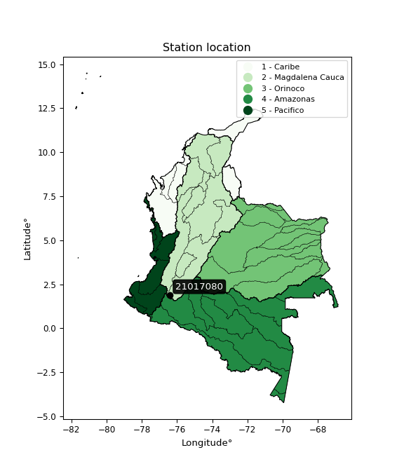

<div align="center">


</div>

# PMP Station (Rain, Pmax24h): 21017080

Probable Maximum Precipitation (PMP) is the greatest amount of rainfall for a specific duration that is meteorologically possible for a given location, acting as a "worst-case" scenario for extreme storms, crucial for designing safety-critical infrastructure like bridges, river deviations, dams, spillways, and nuclear plants to prevent catastrophic failure. PMP is calculated by hydrologists using meteorological data to determine the upper limit of extreme rainfall, often leading to the Probable Maximum Flood (PMF) for flood control design, and is increasingly being studied for climate change impacts.

<div align="center">

</img>

</div>


## A. General information


### 1. General running parameters

• app_version: _v20260103_. • runtime: _2026-01-03 07:24:50.581521_. • Python version: _3.14.0_. • SciPy version: _1.16.3_. • Pandas version: _2.3.3_. • NumPy version: _2.3.5_. • Stations dataset (station_dataset_file): _dataset/pmax24h_in/automatic_colombia_2003_2024.csv_. • Stations catalog (station_catalog_file): _dataset/CNE.xls_. • Minimum year to eval til year_max (date_min): _1900_. • Maximum year to eval since year_min (date_max): _2024_. • Creates, save and include plots into reports (create_plot): _False_. • Plot only fit distributions with Δo > Δ (plot_only_fit): _True_. • Eval low extreme values, if False, evaluates high extreme values (low_extreme): _False_. • Eval every SciPy distribution as logarithmic (pdist_logarithmic_on): _True_. • Standard deviation normalized (ddof): _1.0_. • Return periods to eval in years (Tr): _[2, 2.33, 5, 10, 15, 20, 25, 50, 75, 100, 200, 250, 500, 750, 1000]_. • Minimum data sample per station, 0 means any (minimum_sample): _5_. • Z-Score maximum threshold to adjust a value, 0 means disable (zscore_max): _3.5_. • Z-Score minimum threshold to adjust a value, 0 means disable (zscore_min): _-2.5_. • Avoid zeros, e.g. rain = 0 (avoid_zeros): _True_. • Avoid null values (avoid_nans): _True_. [:file_folder:Dataset file.](../../dataset/pmax24h_in/automatic_colombia_2003_2024.csv)

> Delta Degrees of Freedom (DDOF): is a parameter used in the formulas for calculating variance and standard deviation. When ddof=0, the divisor is $N$ (the total number of observations) and this is used when your data set is the entire population. When ddof=1, the divisor is $N-1$ and this is used when your data set is a sample drawn from a larger population. Using $N-1$ provides an unbiased estimate of the population variance (known as Bessel´s correction).


### 2. Station info and location

|   id |   CODIGO | NOMBRE                          | CATEGORIA    | TECNOLOGIA                | ESTADO   | FECHA_INSTALACION   |   FECHA_SUSPENSION |   ALTITUD |   LATITUD |   LONGITUD | DEPARTAMENTO   | MUNICIPIO   | AREA_OPERATIVA                    | ENTIDAD                                          | AREA_HIDROGRAFICA   | ZONA_HIDROGRAFICA   | SUBZONA_HIDROGRAFICA   | CORRIENTE   | Catalogo   |   Version |
|-----:|---------:|:--------------------------------|:-------------|:--------------------------|:---------|:--------------------|-------------------:|----------:|----------:|-----------:|:---------------|:------------|:----------------------------------|:-------------------------------------------------|:--------------------|:--------------------|:-----------------------|:------------|:-----------|----------:|
|    0 | 21017080 | LA MAGDALENA  - AUT  [21017080] | Limnigráfica | Automática con Telemetría | Activa   | 29/07/2009          |                nan |      1666 |     1.905 |   -76.4011 | Huila          | San Agustín | Area Operativa 04 - Huila-Caquetá | CENTRAL HIDROELECTRICA DE BETANIA CHB HOY EMGESA | Magdalena Cauca     | Alto Magdalena      | Alto Magdalena         | Magdalena   | CNE_OE     |  20251226 |

<div align="center">

Dynamic map: [:earth_americas:Google](http://maps.google.com/maps?q=1.905,-76.40111111) [:earth_americas:OSM](https://www.openstreetmap.org/#map=18/1.905/-76.40111111&layers=P) [:earth_americas:Bing](https://www.bing.com/maps?cp=1.905~-76.40111111&lvl=18) [:earth_americas:Apple](https://maps.apple.com/frame?center=1.905%2C-76.40111111&span=0.003%2C0.006)

</div>


<div align="center">

```geojson
{
  "type": "Feature",
  "geometry": {
    "type": "Point", 
    "coordinates": [-76.40111111, 1.905]
  }, 
  "properties": {
    "Name": "21017080"
  }
}
```

</div>


### 3. Discrete values table and plot

<div align="center">

|               |          0 |          1 |          2 |           3 |           4 |
|:--------------|-----------:|-----------:|-----------:|------------:|------------:|
| Date          | 2006       | 2007       | 2008       | 2009        | 2013        |
| Value         |  423.1     |  124.8     |  605.5     |  538.2      |  338.4      |
| Value_initial |  423.1     |  124.8     |  605.5     |  538.2      |  338.4      |
| count         |    5       |    5       |    5       |    5        |    5        |
| mean          |  406       |  406       |  406       |  406        |  406        |
| std           |  187.891   |  187.891   |  187.891   |  187.891    |  187.891    |
| zscore        |    0.09101 |   -1.49661 |    1.06178 |    0.703598 |   -0.359782 |


</div>


> The initial value (value_initial) correspond to the initial obtained or null completed value, and value (value) is adjusted only when the initial value is outside the valid range definite through the Z-Score value. If Z-Score is active, values out of range or outliers are replaced with the station mean value


### 4. Active continuous probability distributions from SciPy (44 of 104 available)

A Probability Density Function (PDF) describes the relative likelihood of a continuous random variable falling within a specific range, where the total area under its curve equals 1, and the area over any interval gives the actual probability for that range. Unlike discrete probabilities (like rolling a die), a PDF shows density, not direct probability for a single point (which is zero), with higher points indicating higher likelihood, often visualized as a bell curve for normal distributions.

A log of a probability density function (log-PDF) is simply the logarithm of the PDF´s value, denoted as $log(f(x))$, useful for converting multiplication of probabilities into addition, improving numerical stability with tiny numbers, and connecting to information theory concepts like entropy. Instead of dealing with very small probabilities (e.g., 0.000001), log-PDFs use negative numbers (e.g., $log(0.00001) ≈ -11.51$ that are easier for computers to handle, preventing underflow errors and simplifying complex calculations. In this study, each active probability distribution from SciPy is also evaluated in the $log$ form.

[scipy.stats](https://docs.scipy.org/doc/scipy/reference/stats.html) is a Python´s powerful submodule within the SciPy library for comprehensive statistical analysis, offering over 130 probability distributions (like Normal, Poisson), functions for descriptive stats (mean, variance), hypothesis testing (t-tests, chi-square), random variable generation, and statistical tests, making it essential for data science, modeling, and research. It provides tools to explore, model, and draw conclusions from data efficiently, working seamlessly with NumPy.

<div align="center">

|   id | p_dist             |   n_parameter | fit_method   | label                                                                       | active   | ref                                                                                                        |
|-----:|:-------------------|--------------:|:-------------|:----------------------------------------------------------------------------|:---------|:-----------------------------------------------------------------------------------------------------------|
|    0 | alpha              |             3 | MLE          | Alpha                                                                       | True     | [:mortar_board:](https://docs.scipy.org/doc/scipy/reference/generated/scipy.stats.alpha.html)              |
|    1 | betaprime          |             4 | MLE          | Beta prime                                                                  | True     | [:mortar_board:](https://docs.scipy.org/doc/scipy/reference/generated/scipy.stats.betaprime.html)          |
|    2 | chi2               |             3 | MLE          | Chi²                                                                        | True     | [:mortar_board:](https://docs.scipy.org/doc/scipy/reference/generated/scipy.stats.chi2.html)               |
|    3 | crystalball        |             4 | MLE          | Crystalball                                                                 | True     | [:mortar_board:](https://docs.scipy.org/doc/scipy/reference/generated/scipy.stats.crystalball.html)        |
|    4 | erlang             |             3 | MLE          | Erlang                                                                      | True     | [:mortar_board:](https://docs.scipy.org/doc/scipy/reference/generated/scipy.stats.erlang.html)             |
|    5 | expon              |             2 | MLE          | Exponential                                                                 | True     | [:mortar_board:](https://docs.scipy.org/doc/scipy/reference/generated/scipy.stats.expon.html)              |
|    6 | exponnorm          |             3 | MLE          | Exponentially modified Normal                                               | True     | [:mortar_board:](https://docs.scipy.org/doc/scipy/reference/generated/scipy.stats.exponnorm.html)          |
|    7 | f                  |             4 | MLE          | F                                                                           | True     | [:mortar_board:](https://docs.scipy.org/doc/scipy/reference/generated/scipy.stats.f.html)                  |
|    8 | fatiguelife        |             3 | MLE          | Fatigue-life (Birnbaum-Saunders)                                            | True     | [:mortar_board:](https://docs.scipy.org/doc/scipy/reference/generated/scipy.stats.fatiguelife.html)        |
|    9 | fisk               |             3 | MLE          | Fisk                                                                        | True     | [:mortar_board:](https://docs.scipy.org/doc/scipy/reference/generated/scipy.stats.fisk.html)               |
|   10 | gamma              |             3 | MLE          | Gamma                                                                       | True     | [:mortar_board:](https://docs.scipy.org/doc/scipy/reference/generated/scipy.stats.gamma.html)              |
|   11 | genexpon           |             5 | MLE          | Generalized exponential                                                     | True     | [:mortar_board:](https://docs.scipy.org/doc/scipy/reference/generated/scipy.stats.genexpon.html)           |
|   12 | genlogistic        |             3 | MLE          | Generalized logistic                                                        | True     | [:mortar_board:](https://docs.scipy.org/doc/scipy/reference/generated/scipy.stats.genlogistic.html)        |
|   13 | gibrat             |             2 | MM           | Gibrat                                                                      | True     | [:mortar_board:](https://docs.scipy.org/doc/scipy/reference/generated/scipy.stats.gibrat.html)             |
|   14 | gompertz           |             3 | MLE          | Gompertz (or truncated Gumbel)                                              | True     | [:mortar_board:](https://docs.scipy.org/doc/scipy/reference/generated/scipy.stats.gompertz.html)           |
|   15 | gumbel_l           |             2 | MM           | Gumbel Left Skew                                                            | True     | [:mortar_board:](https://docs.scipy.org/doc/scipy/reference/generated/scipy.stats.gumbel_l.html)           |
|   16 | gumbel_r           |             2 | MM           | Gumbel Right Skew                                                           | True     | [:mortar_board:](https://docs.scipy.org/doc/scipy/reference/generated/scipy.stats.gumbel_r.html)           |
|   17 | halflogistic       |             2 | MM           | Half-logistic                                                               | True     | [:mortar_board:](https://docs.scipy.org/doc/scipy/reference/generated/scipy.stats.halflogistic.html)       |
|   18 | halfnorm           |             2 | MM           | Half Normal                                                                 | True     | [:mortar_board:](https://docs.scipy.org/doc/scipy/reference/generated/scipy.stats.halfnorm.html)           |
|   19 | hypsecant          |             2 | MM           | hyperbolic secant                                                           | True     | [:mortar_board:](https://docs.scipy.org/doc/scipy/reference/generated/scipy.stats.hypsecant.html)          |
|   20 | invgamma           |             3 | MLE          | Inverted gamma                                                              | True     | [:mortar_board:](https://docs.scipy.org/doc/scipy/reference/generated/scipy.stats.invgamma.html)           |
|   21 | invgauss           |             3 | MLE          | Inverse Gaussian                                                            | True     | [:mortar_board:](https://docs.scipy.org/doc/scipy/reference/generated/scipy.stats.invgauss.html)           |
|   22 | invweibull         |             3 | MLE          | Inverted Weibull                                                            | True     | [:mortar_board:](https://docs.scipy.org/doc/scipy/reference/generated/scipy.stats.invweibull.html)         |
|   23 | johnsonsu          |             4 | MLE          | Johnson Su                                                                  | True     | [:mortar_board:](https://docs.scipy.org/doc/scipy/reference/generated/scipy.stats.johnsonsu.html)          |
|   24 | kstwobign          |             2 | MLE          | Limiting distribution of scaled Kolmogorov-Smirnov two-sided test statistic | True     | [:mortar_board:](https://docs.scipy.org/doc/scipy/reference/generated/scipy.stats.kstwobign.html)          |
|   25 | laplace            |             2 | MM           | Laplace                                                                     | True     | [:mortar_board:](https://docs.scipy.org/doc/scipy/reference/generated/scipy.stats.laplace.html)            |
|   26 | laplace_asymmetric |             3 | MLE          | Asymmetric Laplace                                                          | True     | [:mortar_board:](https://docs.scipy.org/doc/scipy/reference/generated/scipy.stats.laplace_asymmetric.html) |
|   27 | loggamma           |             3 | MLE          | Log gamma                                                                   | True     | [:mortar_board:](https://docs.scipy.org/doc/scipy/reference/generated/scipy.stats.loggamma.html)           |
|   28 | logistic           |             2 | MM           | Logistic (or Sech-squared)                                                  | True     | [:mortar_board:](https://docs.scipy.org/doc/scipy/reference/generated/scipy.stats.logistic.html)           |
|   29 | lognorm            |             3 | MLE          | Log Normal                                                                  | True     | [:mortar_board:](https://docs.scipy.org/doc/scipy/reference/generated/scipy.stats.lognorm.html)            |
|   30 | maxwell            |             2 | MM           | Maxwell                                                                     | True     | [:mortar_board:](https://docs.scipy.org/doc/scipy/reference/generated/scipy.stats.maxwell.html)            |
|   31 | mielke             |             4 | MLE          | Mielke Beta-Kappa / Dagum                                                   | True     | [:mortar_board:](https://docs.scipy.org/doc/scipy/reference/generated/scipy.stats.mielke.html)             |
|   32 | moyal              |             2 | MM           | Moyal                                                                       | True     | [:mortar_board:](https://docs.scipy.org/doc/scipy/reference/generated/scipy.stats.moyal.html)              |
|   33 | nakagami           |             3 | MLE          | Nakagami                                                                    | True     | [:mortar_board:](https://docs.scipy.org/doc/scipy/reference/generated/scipy.stats.nakagami.html)           |
|   34 | ncf                |             5 | MLE          | Non-central F distribution                                                  | True     | [:mortar_board:](https://docs.scipy.org/doc/scipy/reference/generated/scipy.stats.ncf.html)                |
|   35 | nct                |             4 | MLE          | Non-central Student’s t                                                     | True     | [:mortar_board:](https://docs.scipy.org/doc/scipy/reference/generated/scipy.stats.nct.html)                |
|   36 | norm               |             2 | MM           | Normal                                                                      | True     | [:mortar_board:](https://docs.scipy.org/doc/scipy/reference/generated/scipy.stats.norm.html)               |
|   37 | pearson3           |             3 | MM           | Pearson type III                                                            | True     | [:mortar_board:](https://docs.scipy.org/doc/scipy/reference/generated/scipy.stats.pearson3.html)           |
|   38 | rayleigh           |             2 | MM           | Rayleigh                                                                    | True     | [:mortar_board:](https://docs.scipy.org/doc/scipy/reference/generated/scipy.stats.rayleigh.html)           |
|   39 | rice               |             3 | MLE          | Rice                                                                        | True     | [:mortar_board:](https://docs.scipy.org/doc/scipy/reference/generated/scipy.stats.rice.html)               |
|   40 | t                  |             3 | MLE          | Student’s t                                                                 | True     | [:mortar_board:](https://docs.scipy.org/doc/scipy/reference/generated/scipy.stats.t.html)                  |
|   41 | truncnorm          |             4 | MLE          | Truncated normal                                                            | True     | [:mortar_board:](https://docs.scipy.org/doc/scipy/reference/generated/scipy.stats.truncnorm.html)          |
|   42 | wald               |             2 | MM           | Wald                                                                        | True     | [:mortar_board:](https://docs.scipy.org/doc/scipy/reference/generated/scipy.stats.wald.html)               |
|   43 | weibull_min        |             3 | MLE          | Weibull minimum                                                             | True     | [:mortar_board:](https://docs.scipy.org/doc/scipy/reference/generated/scipy.stats.weibull_min.html)        |

</div>

> **n_parameter:** # arguments & localization & scale.
>
> **Fit methods:** (MLE) maximum likelihood, (MM) L-moments.
>
>**Inactive** (With the only purpose of prevent loops, zero divisions, infinite values, over high estimated values or horizontal trending for recurrence intervals estimations, the follow distributions were disabled.)**:** foldnorm, gennorm, norminvgauss, powernorm, powerlognorm, skewnorm, genextreme, anglit, arcsine, argus, beta, bradford, burr, burr12, cauchy, cosine, halfcauchy, foldcauchy, skewcauchy, wrapcauchy, dgamma, gengamma, exponweib, exponpow, truncexpon, gausshyper, genhalflogistic, genhyperbolic, geninvgauss, halfgennorm, johnsonsb, kappa4, kappa3, ksone, kstwo, loglaplace, levy, levy_l, levy_stable, ncx2, pareto, genpareto, truncpareto, lomax, powerlaw, rdist, rel_breitwigner, recipinvgauss, semicircular, studentized_range, trapezoid, triang, truncweibull_min, tukeylambda, uniform, loguniform, vonmises, vonmises_line, weibull_max, dweibull, 


## B. Probability distributions vs. Empirical distributions

A continuous probability distribution (CPD) describes probabilities for variables that can take any value within a range (like rain any time), unlike discrete variables with specific outcomes (like temperature). It uses a Probability Density Function (PDF), a curve where the total area under it equals 1, and the probability of the variable falling within an interval (a to b) is found by calculating the area under the curve between those points. A key feature is that the probability of hitting any single exact value is zero, so probabilities are always expressed for ranges, e.g., $P(a ≤ X ≤ b)$.

<div align="center">

Distributions parameters from station values
|    |   station | p_dist                |   n |               loc |            scale | shape                  | shape1                 | shape2                | shape3   |
|---:|----------:|:----------------------|----:|------------------:|-----------------:|:-----------------------|:-----------------------|:----------------------|:---------|
|  0 |  21017080 | alpha                 |   5 |   -2085.13        |  34950           | 14.107241640001671     |                        |                       |          |
|  1 |  21017080 | betaprime             |   5 |   -1064.36        | 293179           | 72.88026535813157      | 14483.816449438047     |                       |          |
|  2 |  21017080 | chi2                  |   5 |     124.8         |      2.86305     | 0.03808955126565729    |                        |                       |          |
|  3 |  21017080 | crystalball           |   5 |      -0.256806    |    439.381       | 4.5757804627562155     | 1.5346652248758375     |                       |          |
|  4 |  21017080 | erlang                |   5 |   -1951.82        |     12.504       | 188.46434534931143     |                        |                       |          |
|  5 |  21017080 | expon                 |   5 |     124.8         |    281.2         |                        |                        |                       |          |
|  6 |  21017080 | exponnorm             |   5 |     405.862       |    168.055       | 0.00081970359541127    |                        |                       |          |
|  7 |  21017080 | f                     |   5 |  -30750.7         |  31156.8         | 70136.18529296841      | 1893983.497295441      |                       |          |
|  8 |  21017080 | fatiguelife           |   5 |     124.8         |      0.00635702  | 209.40608391177943     |                        |                       |          |
|  9 |  21017080 | fisk                  |   5 | -454911           | 455330           | 4601.952824388294      |                        |                       |          |
| 10 |  21017080 | gamma                 |   5 |   -2259.67        |     11.03        | 241.57221590022255     |                        |                       |          |
| 11 |  21017080 | genexpon              |   5 |     124.8         |      1.12292     | 0.0039925519996115745  | 2.8484806440433354e-09 | 1.2410578170500326    |          |
| 12 |  21017080 | genlogistic           |   5 |     605.5         |      2.30397e-06 | 1.1545968931787017e-08 |                        |                       |          |
| 13 |  21017080 | gibrat                |   5 |     277.795       |     77.7602      |                        |                        |                       |          |
| 14 |  21017080 | gompertz              |   5 |   -3864.95        |    128.524       | 1.9805049083195066e-15 |                        |                       |          |
| 15 |  21017080 | gumbel_l              |   5 |     481.634       |    131.032       |                        |                        |                       |          |
| 16 |  21017080 | gumbel_r              |   5 |     330.366       |    131.032       |                        |                        |                       |          |
| 17 |  21017080 | halflogistic          |   5 |     206.816       |    143.681       |                        |                        |                       |          |
| 18 |  21017080 | halfnorm              |   5 |     183.561       |    278.786       |                        |                        |                       |          |
| 19 |  21017080 | hypsecant             |   5 |     406           |    106.987       |                        |                        |                       |          |
| 20 |  21017080 | invgamma              |   5 |   -1509.7         | 221070           | 116.73835484609918     |                        |                       |          |
| 21 |  21017080 | invgauss              |   5 |    -440.937       |  16455.8         | 0.05134248907083416    |                        |                       |          |
| 22 |  21017080 | invweibull            |   5 |     124.8         |      1.23767     | 0.10134421014714799    |                        |                       |          |
| 23 |  21017080 | johnsonsu             |   5 |     605.5         |      2.07921e-11 | 3.561256066877034      | 0.1480385259274068     |                       |          |
| 24 |  21017080 | kstwobign             |   5 |    -275.142       |    776.763       |                        |                        |                       |          |
| 25 |  21017080 | laplace               |   5 |     406           |    118.833       |                        |                        |                       |          |
| 26 |  21017080 | laplace_asymmetric    |   5 |     423.1         |    135.292       | 1.0651884194458698     |                        |                       |          |
| 27 |  21017080 | loggamma              |   5 |     605.5         |      2.94001e-05 | 1.474312734617238e-07  |                        |                       |          |
| 28 |  21017080 | logistic              |   5 |     406           |     92.6537      |                        |                        |                       |          |
| 29 |  21017080 | lognorm               |   5 |     124.8         |      0.178248    | 15.082684459508627     |                        |                       |          |
| 30 |  21017080 | maxwell               |   5 |       7.77981     |    249.547       |                        |                        |                       |          |
| 31 |  21017080 | mielke                |   5 |     -24.9596      |    631.148       | 2.0421670813549913     | 5804.6945946995465     |                       |          |
| 32 |  21017080 | moyal                 |   5 |     309.895       |     75.6514      |                        |                        |                       |          |
| 33 |  21017080 | nakagami              |   5 |     338.4         |    204.037       | 0.0965493959467641     |                        |                       |          |
| 34 |  21017080 | ncf                   |   5 |      -0.719208    |    363.58        | 8.51420425367909       | 534.1238780929355      | 0.9814529142237398    |          |
| 35 |  21017080 | nct                   |   5 |   -1412.21        |    168.089       | 329146.5831322337      | 10.816851396998768     |                       |          |
| 36 |  21017080 | norm                  |   5 |     406           |    168.055       |                        |                        |                       |          |
| 37 |  21017080 | pearson3              |   5 |     406           |    168.055       | -0.5178285628116044    |                        |                       |          |
| 38 |  21017080 | rayleigh              |   5 |      84.5006      |    256.519       |                        |                        |                       |          |
| 39 |  21017080 | rice                  |   5 |      17.2601      |    186.728       | 1.7731684982729243     |                        |                       |          |
| 40 |  21017080 | t                     |   5 |     406.005       |    168.076       | 662122.6108675036      |                        |                       |          |
| 41 |  21017080 | truncnorm             |   5 |     406           |    168.055       | -20347.913673999126    | 49359.0293126755       |                       |          |
| 42 |  21017080 | wald                  |   5 |     237.945       |    168.055       |                        |                        |                       |          |
| 43 |  21017080 | weibull_min           |   5 |      -2.97776e+09 |      2.97776e+09 | 22257089.82533426      |                        |                       |          |
| 44 |  21017080 | logalpha              |   5 |      -9.19277     |    388.997       | 25.87271018447555      |                        |                       |          |
| 45 |  21017080 | logbetaprime          |   5 |     -10.8054      |     24.5885      | 1401.0876347424055     | 2066.3977286647087     |                       |          |
| 46 |  21017080 | logchi2               |   5 |       4.82671     |      0.955099    | 1.0495265106538432     |                        |                       |          |
| 47 |  21017080 | logcrystalball        |   5 |       5.87857     |      0.562849    | 126.85660245023959     | 426.64258984132925     |                       |          |
| 48 |  21017080 | logerlang             |   5 |      -4.02398     |      0.0346175   | 285.7265427175493      |                        |                       |          |
| 49 |  21017080 | logexpon              |   5 |       4.82671     |      1.05185     |                        |                        |                       |          |
| 50 |  21017080 | logexponnorm          |   5 |       5.87823     |      0.562849    | 0.0005971264797919294  |                        |                       |          |
| 51 |  21017080 | logf                  |   5 |    -504.263       |    510.142       | 2518227.3440786        | 4627241.197218906      |                       |          |
| 52 |  21017080 | logfatiguelife        |   5 |    -359.078       |    364.955       | 0.0015405540171033972  |                        |                       |          |
| 53 |  21017080 | logfisk               |   5 |      -1.07571e+08 |      1.07571e+08 | 347992195.3709713      |                        |                       |          |
| 54 |  21017080 | loggamma              |   5 |      -3.35323     |      0.036871    | 250.18400208921798     |                        |                       |          |
| 55 |  21017080 | loggenexpon           |   5 |       4.82487     |      0.0241531   | 0.00969473193355535    | 13.038171081533488     | 3.611791597384906e-05 |          |
| 56 |  21017080 | loggenlogistic        |   5 |       6.40686     |      2.15646e-06 | 4.096131843658769e-06  |                        |                       |          |
| 57 |  21017080 | loggibrat             |   5 |       5.44917     |      0.260441    |                        |                        |                       |          |
| 58 |  21017080 | loggompertz           |   5 |       4.77046     |      0.418399    | 0.04266975195439335    |                        |                       |          |
| 59 |  21017080 | loggumbel_l           |   5 |       6.13188     |      0.438851    |                        |                        |                       |          |
| 60 |  21017080 | loggumbel_r           |   5 |       5.62526     |      0.438851    |                        |                        |                       |          |
| 61 |  21017080 | loghalflogistic       |   5 |       5.21151     |      0.481183    |                        |                        |                       |          |
| 62 |  21017080 | loghalfnorm           |   5 |       5.13356     |      0.93373     |                        |                        |                       |          |
| 63 |  21017080 | loghypsecant          |   5 |       5.87857     |      0.358321    |                        |                        |                       |          |
| 64 |  21017080 | loginvgamma           |   5 |     -10.8011      |  13754.4         | 825.6131087951646      |                        |                       |          |
| 65 |  21017080 | loginvgauss           |   5 |       0.0498824   |    503.262       | 0.01159653378568628    |                        |                       |          |
| 66 |  21017080 | loginvweibull         |   5 |      -5.30551e+07 |      5.30551e+07 | 83998982.89872053      |                        |                       |          |
| 67 |  21017080 | logjohnsonsu          |   5 |       6.40605     |      6.54912e-16 | 2.1150187922610666     | 0.09786580903542741    |                       |          |
| 68 |  21017080 | logkstwobign          |   5 |       3.37719     |      2.85117     |                        |                        |                       |          |
| 69 |  21017080 | loglaplace            |   5 |       5.87857     |      0.397994    |                        |                        |                       |          |
| 70 |  21017080 | loglaplace_asymmetric |   5 |       6.40606     |      0.0159648   | 32.78370696977681      |                        |                       |          |
| 71 |  21017080 | logloggamma           |   5 |       6.40607     |      1.15466e-06 | 2.189154040211684e-06  |                        |                       |          |
| 72 |  21017080 | loglogistic           |   5 |       5.87857     |      0.310315    |                        |                        |                       |          |
| 73 |  21017080 | loglognorm            |   5 |       4.82671     |      0.00120081  | 13.967201276566858     |                        |                       |          |
| 74 |  21017080 | logmaxwell            |   5 |       4.54485     |      0.835782    |                        |                        |                       |          |
| 75 |  21017080 | logmielke             |   5 |   -7138.92        |   7145.33        | 13571.03225913997      | 269485036.78589        |                       |          |
| 76 |  21017080 | logmoyal              |   5 |       5.55669     |      0.253371    |                        |                        |                       |          |
| 77 |  21017080 | lognakagami           |   5 |       5.82423     |      0.241003    | 0.102680383983965      |                        |                       |          |
| 78 |  21017080 | logncf                |   5 |     -12.0283      |     16.8524      | 5454.51700294486       | 2732.73927674442       | 337.56552972293537    |          |
| 79 |  21017080 | lognct                |   5 |     -28.1031      |      0.517154    | 10499.183892128647     | 65.70189834576652      |                       |          |
| 80 |  21017080 | lognorm               |   5 |       5.87857     |      0.562849    |                        |                        |                       |          |
| 81 |  21017080 | logpearson3           |   5 |       5.87857     |      0.562849    | -1.0583706161491602    |                        |                       |          |
| 82 |  21017080 | lograyleigh           |   5 |       4.8018      |      0.859132    |                        |                        |                       |          |
| 83 |  21017080 | logrice               |   5 |       4.40812     |      0.609092    | 2.163821284400324      |                        |                       |          |
| 84 |  21017080 | logt                  |   5 |       5.87856     |      0.562845    | 589476479.1856608      |                        |                       |          |
| 85 |  21017080 | logtruncnorm          |   5 |      -0.141107    |      1.31788     | 4.526475376866221      | 4.968771675080315      |                       |          |
| 86 |  21017080 | logwald               |   5 |       5.31575     |      0.562818    |                        |                        |                       |          |
| 87 |  21017080 | logweibull_min        |   5 |      -4.26387e+07 |      4.26387e+07 | 115024715.90599966     |                        |                       |          |

</div>

> **loc** (Location parameter): This shifts the distribution along the x-axis. For many common distributions, like the normal (Gaussian) distribution, loc represents the mean $μ$. For others, like the uniform distribution, it might represent the minimum value, or for the beta distribution, the left end of the support interval.
>
> **scale** (Scale parameter): This determines the width or spread of the distribution. For the normal distribution, scale represents the standard deviation $σ$. For a uniform distribution, it defines the length of the interval (from $loc$ to $loc + scale$).
>
> **shape** (Shape parameters): Refers to parameters that define the specific form of a probability distribution, distinct from its location (loc) and scale (scale). These parameters are required arguments for most distribution functions. For example, a normal (Gaussian) distribution is fully defined by its location (mean) and scale (standard deviation), so it has no specific shape parameters beyond loc and scale. However, other distributions have intrinsic properties that need specification, as Gamma distribution that takes a shape parameter, often named $a$ or $alpha$.


### 0. Cumulative distribution values - CDF (88 evaluated)

Cumulative Distribution Function (CDF), denoted as $F$<sub>$X$</sub>$(x)$, is a function that gives the probability that a random variable $X$ will take a value less than or equal to a specific value, $x$ (i.e., $(P(X≥x)$. It essentially "accumulates" probabilities from a given point up to the far right (positive infinity), providing a complete picture of the distribution´s probabilities for both discrete (like rain) and continuous (like temperature) variables, helping to find probabilities over ranges or above certain values. Each station is evaluated separately ordering the $x$ values ascending, calculating the CDF and PDF values for the activated distributions and their logarithmic forms.

<div align="center">

CDF ordered by x ascending and calculating $log(f(x))$ separately
|   id |   Station |   date |     x |   count |   mean |     std |    zscore |   Value_initial |   station |   m |     alpha |   alpha_pdf |   betaprime |   betaprime_pdf |     chi2 |    chi2_pdf |   crystalball |   crystalball_pdf |    erlang |   erlang_pdf |    expon |   expon_pdf |   exponnorm |   exponnorm_pdf |         f |       f_pdf |   fatiguelife |   fatiguelife_pdf |      fisk |    fisk_pdf |     gamma |   gamma_pdf |    genexpon |   genexpon_pdf |   genlogistic |   genlogistic_pdf |   gibrat |   gibrat_pdf |   gompertz |   gompertz_pdf |   gumbel_l |   gumbel_l_pdf |   gumbel_r |   gumbel_r_pdf |   halflogistic |   halflogistic_pdf |   halfnorm |   halfnorm_pdf |   hypsecant |   hypsecant_pdf |   invgamma |   invgamma_pdf |   invgauss |   invgauss_pdf |   invweibull |   invweibull_pdf |   johnsonsu |   johnsonsu_pdf |   kstwobign |   kstwobign_pdf |   laplace |   laplace_pdf |   laplace_asymmetric |   laplace_asymmetric_pdf |   loggamma |   loggamma_pdf |   logistic |   logistic_pdf |   lognorm |   lognorm_pdf |   maxwell |   maxwell_pdf |    mielke |   mielke_pdf |       moyal |   moyal_pdf |    nakagami |   nakagami_pdf |       ncf |     ncf_pdf |       nct |     nct_pdf |      norm |   norm_pdf |   pearson3 |   pearson3_pdf |   rayleigh |   rayleigh_pdf |      rice |    rice_pdf |        t |       t_pdf |   truncnorm |   truncnorm_pdf |     wald |    wald_pdf |   weibull_min |   weibull_min_pdf |   logalpha |   logalpha_pdf |   logbetaprime |   logbetaprime_pdf |     logchi2 |   logchi2_pdf |   logcrystalball |   logcrystalball_pdf |   logerlang |   logerlang_pdf |   logexpon |   logexpon_pdf |   logexponnorm |   logexponnorm_pdf |      logf |   logf_pdf |   logfatiguelife |   logfatiguelife_pdf |   logfisk |   logfisk_pdf |   loggenexpon |   loggenexpon_pdf |   loggenlogistic |   loggenlogistic_pdf |   loggibrat |   loggibrat_pdf |   loggompertz |   loggompertz_pdf |   loggumbel_l |   loggumbel_l_pdf |   loggumbel_r |   loggumbel_r_pdf |   loghalflogistic |   loghalflogistic_pdf |   loghalfnorm |   loghalfnorm_pdf |   loghypsecant |   loghypsecant_pdf |   loginvgamma |   loginvgamma_pdf |   loginvgauss |   loginvgauss_pdf |   loginvweibull |   loginvweibull_pdf |   logjohnsonsu |   logjohnsonsu_pdf |   logkstwobign |   logkstwobign_pdf |   loglaplace |   loglaplace_pdf |   loglaplace_asymmetric |   loglaplace_asymmetric_pdf |   logloggamma |   logloggamma_pdf |   loglogistic |   loglogistic_pdf |   loglognorm |   loglognorm_pdf |   logmaxwell |   logmaxwell_pdf |   logmielke |   logmielke_pdf |    logmoyal |   logmoyal_pdf |   lognakagami |   lognakagami_pdf |    logncf |   logncf_pdf |    lognct |   lognct_pdf |   logpearson3 |   logpearson3_pdf |   lograyleigh |   lograyleigh_pdf |   logrice |   logrice_pdf |      logt |   logt_pdf |   logtruncnorm |   logtruncnorm_pdf |   logwald |   logwald_pdf |   logweibull_min |   logweibull_min_pdf |
|-----:|----------:|-------:|------:|--------:|-------:|--------:|----------:|----------------:|----------:|----:|----------:|------------:|------------:|----------------:|---------:|------------:|--------------:|------------------:|----------:|-------------:|---------:|------------:|------------:|----------------:|----------:|------------:|--------------:|------------------:|----------:|------------:|----------:|------------:|------------:|---------------:|--------------:|------------------:|---------:|-------------:|-----------:|---------------:|-----------:|---------------:|-----------:|---------------:|---------------:|-------------------:|-----------:|---------------:|------------:|----------------:|-----------:|---------------:|-----------:|---------------:|-------------:|-----------------:|------------:|----------------:|------------:|----------------:|----------:|--------------:|---------------------:|-------------------------:|-----------:|---------------:|-----------:|---------------:|----------:|--------------:|----------:|--------------:|----------:|-------------:|------------:|------------:|------------:|---------------:|----------:|------------:|----------:|------------:|----------:|-----------:|-----------:|---------------:|-----------:|---------------:|----------:|------------:|---------:|------------:|------------:|----------------:|---------:|------------:|--------------:|------------------:|-----------:|---------------:|---------------:|-------------------:|------------:|--------------:|-----------------:|---------------------:|------------:|----------------:|-----------:|---------------:|---------------:|-------------------:|----------:|-----------:|-----------------:|---------------------:|----------:|--------------:|--------------:|------------------:|-----------------:|---------------------:|------------:|----------------:|--------------:|------------------:|--------------:|------------------:|--------------:|------------------:|------------------:|----------------------:|--------------:|------------------:|---------------:|-------------------:|--------------:|------------------:|--------------:|------------------:|----------------:|--------------------:|---------------:|-------------------:|---------------:|-------------------:|-------------:|-----------------:|------------------------:|----------------------------:|--------------:|------------------:|--------------:|------------------:|-------------:|-----------------:|-------------:|-----------------:|------------:|----------------:|------------:|---------------:|--------------:|------------------:|----------:|-------------:|----------:|-------------:|--------------:|------------------:|--------------:|------------------:|----------:|--------------:|----------:|-----------:|---------------:|-------------------:|----------:|--------------:|-----------------:|---------------------:|
|    0 |  21017080 |   2007 | 124.8 |       5 |    406 | 187.891 | -1.49661  |           124.8 |  21017080 |   1 | 0.0438394 | 0.000664195 |   0.0415319 |      0.00059301 | 0.532712 | 7.13917e+11 |      0.612034 |       0.000871918 | 0.0468951 |  0.000621187 | 0        | 0.00355619  |   0.0471379 |      0.00058545 | 0.0480945 | 0.000593822 |     0.0270189 |       1.53814e+06 | 0.0489115 | 0.000470466 | 0.0471594 | 0.000618377 | 2.29369e-07 |    0.0035555   |      0        |       0.000450568 | 0        |  0           |  0.0582836 |    0.000440005 |  0.0635514 |    0.000469258 | 0.00822154 |    0.000301236 |       0        |        0           |   0        |    0           |   0.0458827 |     0.000427378 |  0.0483558 |    0.000697432 |  0.0463314 |    0.000777439 |  1.77867e-05 | 284052           |    0.136375 |     6.73305e-05 |    0.04638  |     0.00096337  | 0.0469114 |   0.000394768 |            0.0670774 |              0.000465454 |  0.0327134 |       0.135825 |  0.0458713 |    0.000472374 |  0.030825 |      0.123636 | 0.0256846 |   0.000629872 | 0.0529887 |   0.00072257 | 0.000677489 | 5.56328e-05 | 0           |    0           | 0.0319234 | 0.000823028 | 0.0471878 | 0.000585802 | 0.0471381 | 0.00058545 |  0.0590857 |    0.000551883 |  0.0122645 |    0.000604921 | 0.0359255 | 0.000693412 | 0.047156 | 0.000585553 |   0.0471381 |      0.00058545 | 0        | 0           |     0.0657242 |       0.000474742 |  0.0304508 |       0.136342 |      0.0318428 |           0.131551 | 1.01383e-08 |   5.99003e+06 |        0.0308251 |             0.123637 |   0.0340264 |        0.138983 |   0        |       0.950702 |      0.0308248 |           0.123636 | 0.0311219 |   0.124388 |        0.0307693 |             0.123943 | 0.0238469 |     0.0753051 |   0.000742086 |          0.402578 |         0        |            0.0944327 |    0        |        0        |    0.00612207 |          0.115946 |     0.0498124 |          0.110631 |    0.00209225 |         0.0294136 |          0        |              0        |      0        |          0        |       0.033775 |          0.0940824 |     0.0308617 |          0.130841 |     0.0349897 |          0.151159 |       0.0382255 |            0.197553 |      0.0779306 |        0.00903121  |      0.0416789 |           0.24574  |    0.0355777 |        0.0893925 |               0.0488749 |                   0.0933823 |     0.0500689 |          0.094927 |     0.0326209 |          0.101693 |    0.0227571 |      4.35335e+12 |    0.0098599 |         0.102573 |   0.0497685 |       0.0945456 | 2.41101e-05 |    0.000891819 |   0           |       0           | 0.0345635 |     0.137856 | 0.0316655 |     0.126576 |     0.0511999 |          0.118701 |   0.000420175 |         0.0337313 | 0.0261229 |      0.140101 | 0.0308245 |   0.123636 |    0           |           0        |  0        |      0        |        0.0298325 |            0.0792654 |
|    1 |  21017080 |   2013 | 338.4 |       5 |    406 | 187.891 | -0.359782 |           338.4 |  21017080 |   2 | 0.376799  | 0.00225978  |   0.349563  |      0.00220975 | 1        | 6.08612e-21 |      0.779576 |       0.000674631 | 0.357248  |  0.00221513  | 0.532147 | 0.00166377  |   0.343751  |      0.0021894  | 0.345306  | 0.00217856  |     0.809303  |       0.000557311 | 0.308342  | 0.00215584  | 0.355885  | 0.00221024  | 0.532079    |    0.00166369  |      0        |       0.00131413  | 0.401582 |  0.00638134  |  0.271264  |    0.00179425  |  0.284783  |    0.00182947  | 0.390421   |    0.00280239  |       0.428374 |        0.00284134  |   0.421382 |    0.00245293  |   0.31106   |     0.0024663   |  0.383852  |    0.00225051  |  0.402599  |    0.00220743  |  0.552487    |      0.00015553  |    0.156305 |     0.000132802 |    0.439292 |     0.00211564  | 0.283084  |   0.0023822   |            0.295311  |              0.00204918  |  0.476168  |       0.685099 |  0.325283  |    0.00236876  |  0.461545 |      0.705496 | 0.375291  |   0.00233335  | 0.323817  |   0.00181993 | 0.407508    | 0.00309955  | 0.000830504 |    2.82125e+09 | 0.421543  | 0.00222306  | 0.343815  | 0.00218893  | 0.34375   | 0.00218939 |  0.317467  |    0.00198214  |  0.387275  |    0.00236422  | 0.359474  | 0.0022142   | 0.343758 | 0.00218913  |   0.34375   |      0.00218939 | 0.444692 | 0.0044864   |     0.285064  |       0.00179316  |  0.487596  |       0.687829 |      0.471687  |           0.691293 | 0.677552    |   0.250107    |        0.461545  |             0.705496 |   0.478564  |        0.682698 |   0.612617 |       0.368286 |      0.461544  |           0.705495 | 0.461298  |   0.702893 |        0.463065  |             0.706626 | 0.381074  |     0.762998  |   0.552477    |          0.540381 |         0        |            0.628061  |    0.642333 |        0.995249 |    0.385475   |          0.777817 |     0.391082  |          0.688313 |    0.529688   |         0.767     |          0.562635 |              0.710169 |      0.540513 |          0.649992 |       0.451913 |          0.878221  |     0.471823  |          0.688216 |     0.481969  |          0.641851 |       0.510268  |            0.543556 |      0.0931838 |        0.0280277   |      0.547135  |           0.525383 |    0.43619   |        1.09597   |               0.328704  |                   0.628035  |     0.331829  |          0.629124 |     0.456335  |          0.79949  |    0.684845  |      0.0255024   |    0.495706  |         0.693165 |   0.33104   |       0.62879   | 0.555316    |    0.780416    |   0.000904837 |       2.09213e+11 | 0.469688  |     0.672793 | 0.463817  |     0.700014 |     0.392945  |          0.655862 |   0.507435    |         0.682299  | 0.47207   |      0.689295 | 0.461547  |   0.7055   |    3.43979e-06 |           4.04314  |  0.62662  |      0.8212   |        0.3602    |            0.770816  |
|    2 |  21017080 |   2006 | 423.1 |       5 |    406 | 187.891 |  0.09101  |           423.1 |  21017080 |   3 | 0.568708  | 0.00218332  |   0.543447  |      0.00227566 | 1        | 1.652e-27   |      0.83236  |       0.000570781 | 0.552087  |  0.00229199  | 0.653825 | 0.00123106  |   0.540525  |      0.00236163 | 0.540688  | 0.00234146  |     0.849533  |       0.000405125 | 0.512057  | 0.00252522  | 0.550751  | 0.0022975   | 0.653754    |    0.00123108  |      0        |       0.00200899  | 0.734082 |  0.00225814  |  0.457547  |    0.00258157  |  0.472564  |    0.00257506  | 0.610933   |    0.00229751  |       0.63673  |        0.00206908  |   0.609782 |    0.0019786   |   0.550661  |     0.00293761  |  0.574955  |    0.0021753   |  0.583829  |    0.00200514  |  0.563505    |      0.000109809 |    0.17022  |     0.000205552 |    0.605766 |     0.00178168  | 0.567013  |   0.00364366  |            0.531534  |              0.00368834  |  0.626063  |       0.641406 |  0.546009  |    0.00267537  |  0.618038 |      0.677535 | 0.571516  |   0.00221706  | 0.496746  |   0.00226407 | 0.636058    | 0.00223114  | 0.705724    |    0.00158467  | 0.597745  | 0.00189104  | 0.540535  | 0.00236091  | 0.540523  | 0.00236162 |  0.506395  |    0.00241179  |  0.581538  |    0.00215329  | 0.552962  | 0.0022697   | 0.540506 | 0.00236133  |   0.540523  |      0.00236162 | 0.70578  | 0.00204311  |     0.468473  |       0.00251085  |  0.636297  |       0.628754 |      0.623469  |           0.651386 | 0.727791    |   0.202131    |        0.618038  |             0.677535 |   0.627864  |        0.638646 |   0.686736 |       0.297821 |      0.618036  |           0.677535 | 0.617221  |   0.675243 |        0.619637  |             0.6771   | 0.559133  |     0.79744   |   0.66508     |          0.464705 |         0        |            0.960007  |    0.79728  |        0.471626 |    0.577072   |          0.913001 |     0.561891  |          0.823892 |    0.682514   |         0.594054  |          0.700762 |              0.528836 |      0.672383 |          0.52921  |       0.644887 |          0.797891  |     0.622557  |          0.645532 |     0.620869  |          0.590001 |       0.623508  |            0.46633  |      0.101332  |        0.0483808   |      0.655786  |           0.445234 |    0.673028  |        0.821549  |               0.503687  |                   0.962365  |     0.506808  |          0.960871 |     0.632915  |          0.748703 |    0.689967  |      0.0206896   |    0.642908  |         0.612949 |   0.505996  |       0.961079  | 0.704279    |    0.556085    |   0.813536    |       0.690304    | 0.617587  |     0.636359 | 0.618799  |     0.670043 |     0.554925  |          0.782767 |   0.650536    |         0.589837  | 0.62351   |      0.650805 | 0.61804   |   0.677538 |    0.628162    |           1.85043  |  0.765203 |      0.461735 |        0.55775   |            0.973378  |
|    3 |  21017080 |   2009 | 538.2 |       5 |    406 | 187.891 |  0.703598 |           538.2 |  21017080 |   4 | 0.783613  | 0.00148945  |   0.774341  |      0.00164016 | 1        | 2.23499e-36 |      0.889805 |       0.000428499 | 0.784483  |  0.00164297  | 0.770104 | 0.000817554 |   0.784257  |      0.00174214 | 0.782416  | 0.00173144  |     0.888343  |       0.000279942 | 0.770543  | 0.00178649  | 0.784216  | 0.0016532   | 0.770039    |    0.000817627 |      0        |       0.00357669  | 0.886593 |  0.000738018 |  0.776368  |    0.0026061   |  0.785591  |    0.0025197   | 0.814878   |    0.00127312  |       0.818809 |        0.00114681  |   0.796656 |    0.00127433  |   0.819932  |     0.00159473  |  0.789217  |    0.00148451  |  0.778629  |    0.00135099  |  0.574118    |      7.81017e-05 |    0.210209 |     0.000634322 |    0.777103 |     0.00119686  | 0.83563   |   0.00138321  |            0.810715  |              0.00149029  |  0.765897  |       0.510514 |  0.806405  |    0.00168494  |  0.766644 |      0.543857 | 0.789298  |   0.00150896  | 0.792342  |   0.00287325 | 0.824978    | 0.00113803  | 0.827502    |    0.000734879 | 0.778065  | 0.00123976  | 0.784203  | 0.00174184  | 0.784256  | 0.00174215 |  0.776214  |    0.00207008  |  0.790725  |    0.00144293  | 0.783997  | 0.00164487  | 0.784218 | 0.0017421   |   0.784256  |      0.00174215 | 0.858932 | 0.000835969 |     0.775522  |       0.00250666  |  0.771955  |       0.4905   |      0.765676  |           0.519418 | 0.771573    |   0.163605    |        0.766644  |             0.543857 |   0.767079  |        0.508234 |   0.750792 |       0.236922 |      0.766642  |           0.543858 | 0.765433  |   0.542994 |        0.767965  |             0.542126 | 0.734204  |     0.631308  |   0.765676    |          0.370549 |         0        |            1.51625   |    0.87898  |        0.239836 |    0.790418   |          0.804124 |     0.760212  |          0.780258 |    0.801914   |         0.403384  |          0.80716  |              0.36212  |      0.783773 |          0.397785 |       0.803548 |          0.514109  |     0.76336   |          0.514277 |     0.749736  |          0.474225 |       0.724161  |            0.37003  |      0.121987  |        0.168086    |      0.75183   |           0.353422 |    0.821375  |        0.448813  |               0.797672  |                   1.52406   |     0.799777  |          1.51632  |     0.789207  |          0.536098 |    0.694497  |      0.0171719   |    0.774036  |         0.471649 |   0.799154  |       1.51785   | 0.813375    |    0.361494    |   0.922284    |       0.288253    | 0.757283  |     0.514131 | 0.765732  |     0.538057 |     0.747507  |          0.784602 |   0.776134    |         0.450829  | 0.765918  |      0.521517 | 0.766646  |   0.543857 |    0.925832    |           0.772091 |  0.850379 |      0.267728 |        0.790173  |            0.883859  |
|    4 |  21017080 |   2008 | 605.5 |       5 |    406 | 187.891 |  1.06178  |           605.5 |  21017080 |   5 | 0.868151  | 0.00103129  |   0.867713  |      0.00113745 | 1        | 1.51592e-41 |      0.916    |       0.000351022 | 0.877379  |  0.00112046  | 0.819036 | 0.00064354  |   0.882409  |      0.0011734  | 0.88023   | 0.00117388  |     0.905434  |       0.000230086 | 0.868908  | 0.00115077  | 0.877686  | 0.0011268   | 0.818977    |    0.000643628 |      0.999999 |       0.00501133  | 0.924852 |  0.000432612 |  0.920217  |    0.00156957  |  0.923741  |    0.00149782  | 0.884717   |    0.000827027 |       0.882596 |        0.000769149 |   0.869844 |    0.000910463 |   0.902139  |     0.000900353 |  0.873325  |    0.00102301  |  0.856309  |    0.000966406 |  0.578971    |      6.67074e-05 |    0.999849 |     3.9021e+06  |    0.847105 |     0.000891441 | 0.906704  |   0.000785105 |            0.888571  |              0.000877305 |  0.821413  |       0.431193 |  0.895966  |    0.00100602  |  0.825666 |      0.456876 | 0.874872  |   0.00104157  | 0.997772  |   0.00322625 | 0.887282    | 0.000740008 | 0.869919    |    0.000540548 | 0.849731  | 0.000900215 | 0.882346  | 0.00117345  | 0.882408  | 0.0011734  |  0.893943  |    0.00139496  |  0.87287   |    0.00100657  | 0.877388  | 0.0011312   | 0.882372 | 0.00117351  |   0.882408  |      0.0011734  | 0.904035 | 0.000531786 |     0.915468  |       0.00156101  |  0.825131  |       0.411906 |      0.822129  |           0.43808  | 0.789926    |   0.148254    |        0.825666  |             0.456876 |   0.822348  |        0.429275 |   0.777201 |       0.211816 |      0.825664  |           0.456878 | 0.824402  |   0.45684  |        0.826765  |             0.454881 | 0.801742  |     0.51421   |   0.806594    |          0.324197 |         0.998469 |            1.89656   |    0.903423 |        0.178787 |    0.875665   |          0.632209 |     0.845536  |          0.657414 |    0.844699   |         0.324857  |          0.845814 |              0.295728 |      0.827058 |          0.337614 |       0.856419 |          0.387255  |     0.819296  |          0.434532 |     0.80172   |          0.407833 |       0.765047  |            0.324395 |      0.977581  |        4.72937e+12 |      0.790923  |           0.310528 |    0.867147  |        0.333806  |               0.999062  |                   1.90885   |     0.999964  |          1.89586  |     0.845515  |          0.420926 |    0.69644   |      0.0158458   |    0.825182  |         0.396641 |   0.999582  |       1.89802   | 0.851584    |    0.289482    |   0.950327    |       0.193676    | 0.81342   |     0.437945 | 0.824177  |     0.452941 |     0.835568  |          0.699249 |   0.825073    |         0.380196  | 0.822661  |      0.440791 | 0.825668  |   0.456875 |    0.999472    |           0.497174 |  0.878328 |      0.209563 |        0.883017  |            0.67715   |


</div>

An Empirical Distribution Function (EDF) is a step-function estimate of a true cumulative distribution function (CDF) based on observed sample data, representing the proportion of data points less than or equal to a given value. It is calculated by ordering your data and jumping up by $1/n$ (where $n$ is sample size) at each unique data point, allowing analysis without assuming an underlying population distribution, and it gets closer to the true CDF as the sample size grows. For the empirical probability calculations, the parameter $m$ correspond to the order number which means the position of the $x$ values in an ascending order list.


### 1. Empirical - EDF California (1923)

California´s estimates the true probability distribution of water-related data (like rainfall, streamflow) using observed samples, crucial for risk assessment.

<div align="center">


$P=m/n$


</div>


**1.1. Empirical values**

<div align="center">

|                | 0              | 1                  | 2              | 3                 | 4              |
|:---------------|:---------------|:-------------------|:---------------|:------------------|:---------------|
| date           | 2007           | 2013               | 2006           | 2009              | 2008           |
| x              | 124.8          | 338.4              | 423.1          | 538.2             | 605.5          |
| m              | 1              | 2                  | 3              | 4                 | 5              |
| empirical_dist | edf_california | edf_california     | edf_california | edf_california    | edf_california |
| empirical      | 0.2            | 0.4                | 0.6            | 0.8               | 1.0            |
| empirical_tr   | 1.25           | 1.6666666666666667 | 2.5            | 5.000000000000001 | inf            |

</div>


**1.2. Kolmogorov-Smirnov fit test (sorted by Δ)**


<div align="center">

|                | 0                   | 1                   | 2                   | 3                   | 4                  | 5                   | 6                   | 7                  | 8                  | 9                     | 10                  | 11                  | 12                  | 13                  | 14                 | 15                  | 16                 | 17                 | 18                  | 19                 | 20                 | 21                  | 22                  | 23                  | 24                  | 25                  | 26                  | 27                  | 28                 | 29                  | 30                  | 31                  | 32                  | 33                  | 34                 | 35                  | 36                  | 37                 | 38                 | 39                  | 40                  | 41                  | 42                  | 43                  | 44                  | 45                  | 46                  | 47                  | 48                  | 49                 | 50                  | 51                  | 52                  | 53                 | 54                 | 55                  | 56                  | 57                  | 58                  | 59                  | 60                  | 61                  | 62                  | 63                 | 64                 | 65                 | 66                 | 67                 | 68                 | 69                 | 70                  | 71                 | 72                 | 73                  | 74                  | 75                 | 76                 | 77                  | 78                 | 79                 | 80                 | 81                 | 82                  | 83                 | 84                 | 85                 | 86                 | 87                 |
|:---------------|:--------------------|:--------------------|:--------------------|:--------------------|:-------------------|:--------------------|:--------------------|:-------------------|:-------------------|:----------------------|:--------------------|:--------------------|:--------------------|:--------------------|:-------------------|:--------------------|:-------------------|:-------------------|:--------------------|:-------------------|:-------------------|:--------------------|:--------------------|:--------------------|:--------------------|:--------------------|:--------------------|:--------------------|:-------------------|:--------------------|:--------------------|:--------------------|:--------------------|:--------------------|:-------------------|:--------------------|:--------------------|:-------------------|:-------------------|:--------------------|:--------------------|:--------------------|:--------------------|:--------------------|:--------------------|:--------------------|:--------------------|:--------------------|:--------------------|:-------------------|:--------------------|:--------------------|:--------------------|:-------------------|:-------------------|:--------------------|:--------------------|:--------------------|:--------------------|:--------------------|:--------------------|:--------------------|:--------------------|:-------------------|:-------------------|:-------------------|:-------------------|:-------------------|:-------------------|:-------------------|:--------------------|:-------------------|:-------------------|:--------------------|:--------------------|:-------------------|:-------------------|:--------------------|:-------------------|:-------------------|:-------------------|:-------------------|:--------------------|:-------------------|:-------------------|:-------------------|:-------------------|:-------------------|
| station        | 21017080            | 21017080            | 21017080            | 21017080            | 21017080           | 21017080            | 21017080            | 21017080           | 21017080           | 21017080              | 21017080            | 21017080            | 21017080            | 21017080            | 21017080           | 21017080            | 21017080           | 21017080           | 21017080            | 21017080           | 21017080           | 21017080            | 21017080            | 21017080            | 21017080            | 21017080            | 21017080            | 21017080            | 21017080           | 21017080            | 21017080            | 21017080            | 21017080            | 21017080            | 21017080           | 21017080            | 21017080            | 21017080           | 21017080           | 21017080            | 21017080            | 21017080            | 21017080            | 21017080            | 21017080            | 21017080            | 21017080            | 21017080            | 21017080            | 21017080           | 21017080            | 21017080            | 21017080            | 21017080           | 21017080           | 21017080            | 21017080            | 21017080            | 21017080            | 21017080            | 21017080            | 21017080            | 21017080            | 21017080           | 21017080           | 21017080           | 21017080           | 21017080           | 21017080           | 21017080           | 21017080            | 21017080           | 21017080           | 21017080            | 21017080            | 21017080           | 21017080           | 21017080            | 21017080           | 21017080           | 21017080           | 21017080           | 21017080            | 21017080           | 21017080           | 21017080           | 21017080           | 21017080           |
| empirical_dist | edf_california      | edf_california      | edf_california      | edf_california      | edf_california     | edf_california      | edf_california      | edf_california     | edf_california     | edf_california        | edf_california      | edf_california      | edf_california      | edf_california      | edf_california     | edf_california      | edf_california     | edf_california     | edf_california      | edf_california     | edf_california     | edf_california      | edf_california      | edf_california      | edf_california      | edf_california      | edf_california      | edf_california      | edf_california     | edf_california      | edf_california      | edf_california      | edf_california      | edf_california      | edf_california     | edf_california      | edf_california      | edf_california     | edf_california     | edf_california      | edf_california      | edf_california      | edf_california      | edf_california      | edf_california      | edf_california      | edf_california      | edf_california      | edf_california      | edf_california     | edf_california      | edf_california      | edf_california      | edf_california     | edf_california     | edf_california      | edf_california      | edf_california      | edf_california      | edf_california      | edf_california      | edf_california      | edf_california      | edf_california     | edf_california     | edf_california     | edf_california     | edf_california     | edf_california     | edf_california     | edf_california      | edf_california     | edf_california     | edf_california      | edf_california      | edf_california     | edf_california     | edf_california      | edf_california     | edf_california     | edf_california     | edf_california     | edf_california      | edf_california     | edf_california     | edf_california     | edf_california     | edf_california     |
| p_dist         | laplace_asymmetric  | weibull_min         | gumbel_l            | pearson3            | gompertz           | mielke              | logloggamma         | logmielke          | fisk               | loglaplace_asymmetric | invgamma            | f                   | nct                 | gamma               | t                  | truncnorm           | norm               | exponnorm          | laplace             | erlang             | kstwobign          | invgauss            | hypsecant           | logistic            | loggumbel_l         | alpha               | betaprime           | rice                | loglaplace         | logpearson3         | loghypsecant        | loglogistic         | ncf                 | logweibull_min      | logfatiguelife     | maxwell             | logt                | lognorm            | lognorm            | logcrystalball      | logexponnorm        | logalpha            | logf                | lognct              | logrice             | logerlang           | logbetaprime        | loggamma            | loggamma            | loginvgamma        | logncf              | rayleigh            | logmaxwell          | gumbel_r           | loggompertz        | loggumbel_r         | logfisk             | loginvgauss         | loggenexpon         | moyal               | lograyleigh         | logmoyal            | genexpon            | expon              | gibrat             | wald               | loghalflogistic    | halfnorm           | halflogistic       | loghalfnorm        | logkstwobign        | logexpon           | logwald            | loginvweibull       | loggibrat           | logchi2            | loglognorm         | lognakagami         | nakagami           | logtruncnorm       | fatiguelife        | crystalball        | invweibull          | johnsonsu          | chi2               | logjohnsonsu       | loggenlogistic     | genlogistic        |
| delta          | 0.13292264769585838 | 0.13427577667225193 | 0.13644856839125707 | 0.14091434615227882 | 0.1424528981093528 | 0.14701131924726785 | 0.14993114572639432 | 0.1502314985534061 | 0.1510885176748714 | 0.15112507604563516   | 0.15164417908291822 | 0.15190548213254224 | 0.15281218861408863 | 0.15284064418976476 | 0.1528440020755671 | 0.15286194225698577 | 0.1528619425183047 | 0.1528620596646448 | 0.15308858417447163 | 0.1531048613589049 | 0.1536200031895903 | 0.15366863969113062 | 0.15411729411436895 | 0.15412865980282459 | 0.15446403900658834 | 0.15616060377489904 | 0.15846811272923883 | 0.16407450702590654 | 0.1644223234311894 | 0.16443210204675818 | 0.16622498542435377 | 0.16737911555172624 | 0.16807660351310913 | 0.17016752429702686 | 0.1732354290854784 | 0.17431542520380872 | 0.17433194081868775 | 0.1743342604973308 | 0.1743342604973308 | 0.17433435853503199 | 0.17433563199304858 | 0.17486874398652463 | 0.17559818824597861 | 0.17582336486265182 | 0.17733913050544392 | 0.17765203549084085 | 0.17787091597652083 | 0.17858706543119585 | 0.17858706543119585 | 0.1807041261660577 | 0.18657985905607433 | 0.18773552771722932 | 0.19014009594737669 | 0.191778458385075  | 0.1938779329281158 | 0.19790774890120952 | 0.19825793405041037 | 0.19827975153401478 | 0.19925791399683937 | 0.19932251148724703 | 0.19957982490146525 | 0.19997588989577414 | 0.19999977063112961 | 0.2                | 0.2                | 0.2                | 0.2                | 0.2                | 0.2                | 0.2                | 0.20907720158802667 | 0.2227993851632042 | 0.2266196164780473 | 0.23495260636454351 | 0.24233278461418084 | 0.2775516349785595 | 0.3035603663890669 | 0.39909516294401204 | 0.3991694963534388 | 0.3999965602099367 | 0.4093027340111409 | 0.4120342569185113 | 0.42102906843704935 | 0.589790960801843  | 0.6                | 0.6780131844676427 | 0.8                | 0.8                |
| deltao         | 0.5865427407550001  | 0.5865427407550001  | 0.5865427407550001  | 0.5865427407550001  | 0.5865427407550001 | 0.5865427407550001  | 0.5865427407550001  | 0.5865427407550001 | 0.5865427407550001 | 0.5865427407550001    | 0.5865427407550001  | 0.5865427407550001  | 0.5865427407550001  | 0.5865427407550001  | 0.5865427407550001 | 0.5865427407550001  | 0.5865427407550001 | 0.5865427407550001 | 0.5865427407550001  | 0.5865427407550001 | 0.5865427407550001 | 0.5865427407550001  | 0.5865427407550001  | 0.5865427407550001  | 0.5865427407550001  | 0.5865427407550001  | 0.5865427407550001  | 0.5865427407550001  | 0.5865427407550001 | 0.5865427407550001  | 0.5865427407550001  | 0.5865427407550001  | 0.5865427407550001  | 0.5865427407550001  | 0.5865427407550001 | 0.5865427407550001  | 0.5865427407550001  | 0.5865427407550001 | 0.5865427407550001 | 0.5865427407550001  | 0.5865427407550001  | 0.5865427407550001  | 0.5865427407550001  | 0.5865427407550001  | 0.5865427407550001  | 0.5865427407550001  | 0.5865427407550001  | 0.5865427407550001  | 0.5865427407550001  | 0.5865427407550001 | 0.5865427407550001  | 0.5865427407550001  | 0.5865427407550001  | 0.5865427407550001 | 0.5865427407550001 | 0.5865427407550001  | 0.5865427407550001  | 0.5865427407550001  | 0.5865427407550001  | 0.5865427407550001  | 0.5865427407550001  | 0.5865427407550001  | 0.5865427407550001  | 0.5865427407550001 | 0.5865427407550001 | 0.5865427407550001 | 0.5865427407550001 | 0.5865427407550001 | 0.5865427407550001 | 0.5865427407550001 | 0.5865427407550001  | 0.5865427407550001 | 0.5865427407550001 | 0.5865427407550001  | 0.5865427407550001  | 0.5865427407550001 | 0.5865427407550001 | 0.5865427407550001  | 0.5865427407550001 | 0.5865427407550001 | 0.5865427407550001 | 0.5865427407550001 | 0.5865427407550001  | 0.5865427407550001 | 0.5865427407550001 | 0.5865427407550001 | 0.5865427407550001 | 0.5865427407550001 |
| eval           | Δo > Δ              | Δo > Δ              | Δo > Δ              | Δo > Δ              | Δo > Δ             | Δo > Δ              | Δo > Δ              | Δo > Δ             | Δo > Δ             | Δo > Δ                | Δo > Δ              | Δo > Δ              | Δo > Δ              | Δo > Δ              | Δo > Δ             | Δo > Δ              | Δo > Δ             | Δo > Δ             | Δo > Δ              | Δo > Δ             | Δo > Δ             | Δo > Δ              | Δo > Δ              | Δo > Δ              | Δo > Δ              | Δo > Δ              | Δo > Δ              | Δo > Δ              | Δo > Δ             | Δo > Δ              | Δo > Δ              | Δo > Δ              | Δo > Δ              | Δo > Δ              | Δo > Δ             | Δo > Δ              | Δo > Δ              | Δo > Δ             | Δo > Δ             | Δo > Δ              | Δo > Δ              | Δo > Δ              | Δo > Δ              | Δo > Δ              | Δo > Δ              | Δo > Δ              | Δo > Δ              | Δo > Δ              | Δo > Δ              | Δo > Δ             | Δo > Δ              | Δo > Δ              | Δo > Δ              | Δo > Δ             | Δo > Δ             | Δo > Δ              | Δo > Δ              | Δo > Δ              | Δo > Δ              | Δo > Δ              | Δo > Δ              | Δo > Δ              | Δo > Δ              | Δo > Δ             | Δo > Δ             | Δo > Δ             | Δo > Δ             | Δo > Δ             | Δo > Δ             | Δo > Δ             | Δo > Δ              | Δo > Δ             | Δo > Δ             | Δo > Δ              | Δo > Δ              | Δo > Δ             | Δo > Δ             | Δo > Δ              | Δo > Δ             | Δo > Δ             | Δo > Δ             | Δo > Δ             | Δo > Δ              | Δo <= Δ            | Δo <= Δ            | Δo <= Δ            | Δo <= Δ            | Δo <= Δ            |
| fit            | 1                   | 1                   | 1                   | 1                   | 1                  | 1                   | 1                   | 1                  | 1                  | 1                     | 1                   | 1                   | 1                   | 1                   | 1                  | 1                   | 1                  | 1                  | 1                   | 1                  | 1                  | 1                   | 1                   | 1                   | 1                   | 1                   | 1                   | 1                   | 1                  | 1                   | 1                   | 1                   | 1                   | 1                   | 1                  | 1                   | 1                   | 1                  | 1                  | 1                   | 1                   | 1                   | 1                   | 1                   | 1                   | 1                   | 1                   | 1                   | 1                   | 1                  | 1                   | 1                   | 1                   | 1                  | 1                  | 1                   | 1                   | 1                   | 1                   | 1                   | 1                   | 1                   | 1                   | 1                  | 1                  | 1                  | 1                  | 1                  | 1                  | 1                  | 1                   | 1                  | 1                  | 1                   | 1                   | 1                  | 1                  | 1                   | 1                  | 1                  | 1                  | 1                  | 1                   | 0                  | 0                  | 0                  | 0                  | 0                  |
| n              | 5                   | 5                   | 5                   | 5                   | 5                  | 5                   | 5                   | 5                  | 5                  | 5                     | 5                   | 5                   | 5                   | 5                   | 5                  | 5                   | 5                  | 5                  | 5                   | 5                  | 5                  | 5                   | 5                   | 5                   | 5                   | 5                   | 5                   | 5                   | 5                  | 5                   | 5                   | 5                   | 5                   | 5                   | 5                  | 5                   | 5                   | 5                  | 5                  | 5                   | 5                   | 5                   | 5                   | 5                   | 5                   | 5                   | 5                   | 5                   | 5                   | 5                  | 5                   | 5                   | 5                   | 5                  | 5                  | 5                   | 5                   | 5                   | 5                   | 5                   | 5                   | 5                   | 5                   | 5                  | 5                  | 5                  | 5                  | 5                  | 5                  | 5                  | 5                   | 5                  | 5                  | 5                   | 5                   | 5                  | 5                  | 5                   | 5                  | 5                  | 5                  | 5                  | 5                   | 5                  | 5                  | 5                  | 5                  | 5                  |
| best_fit       | 1                   | 0                   | 0                   | 0                   | 0                  | 0                   | 0                   | 0                  | 0                  | 0                     | 0                   | 0                   | 0                   | 0                   | 0                  | 0                   | 0                  | 0                  | 0                   | 0                  | 0                  | 0                   | 0                   | 0                   | 0                   | 0                   | 0                   | 0                   | 0                  | 0                   | 0                   | 0                   | 0                   | 0                   | 0                  | 0                   | 0                   | 0                  | 0                  | 0                   | 0                   | 0                   | 0                   | 0                   | 0                   | 0                   | 0                   | 0                   | 0                   | 0                  | 0                   | 0                   | 0                   | 0                  | 0                  | 0                   | 0                   | 0                   | 0                   | 0                   | 0                   | 0                   | 0                   | 0                  | 0                  | 0                  | 0                  | 0                  | 0                  | 0                  | 0                   | 0                  | 0                  | 0                   | 0                   | 0                  | 0                  | 0                   | 0                  | 0                  | 0                  | 0                  | 0                   | 0                  | 0                  | 0                  | 0                  | 0                  |
| best_fit_sort  | 1                   | 2                   | 3                   | 4                   | 5                  | 6                   | 7                   | 8                  | 9                  | 10                    | 11                  | 12                  | 13                  | 14                  | 15                 | 16                  | 17                 | 18                 | 19                  | 20                 | 21                 | 22                  | 23                  | 24                  | 25                  | 26                  | 27                  | 28                  | 29                 | 30                  | 31                  | 32                  | 33                  | 34                  | 35                 | 36                  | 37                  | 38                 | 39                 | 40                  | 41                  | 42                  | 43                  | 44                  | 45                  | 46                  | 47                  | 48                  | 49                  | 50                 | 51                  | 52                  | 53                  | 54                 | 55                 | 56                  | 57                  | 58                  | 59                  | 60                  | 61                  | 62                  | 63                  | 64                 | 65                 | 66                 | 67                 | 68                 | 69                 | 70                 | 71                  | 72                 | 73                 | 74                  | 75                  | 76                 | 77                 | 78                  | 79                 | 80                 | 81                 | 82                 | 83                  | 84                 | 85                 | 86                 | 87                 | 88                 |

</div>


**1.3. Best fit**

<div align="center">

|   id |   station | empirical_dist   | p_dist             |    delta |   deltao | eval   |   fit |   n |   best_fit |   best_fit_sort |
|-----:|----------:|:-----------------|:-------------------|---------:|---------:|:-------|------:|----:|-----------:|----------------:|
|    0 |  21017080 | edf_california   | laplace_asymmetric | 0.132923 | 0.586543 | Δo > Δ |     1 |   5 |          1 |               1 |

</div>


### 2. Empirical - EDF Hazen (1930)

Hazen method for plotting positions is a formula used to estimate the empirical cumulative probability distribution of flood events or other hydrological data. This formula often results in biased estimations, particularly when extrapolating to extreme events (high return periods).

<div align="center">


$P=(m-0.5)/n$


</div>


**2.1. Empirical values**

<div align="center">

|                | 0                  | 1                  | 2         | 3                 | 4                  |
|:---------------|:-------------------|:-------------------|:----------|:------------------|:-------------------|
| date           | 2007               | 2013               | 2006      | 2009              | 2008               |
| x              | 124.8              | 338.4              | 423.1     | 538.2             | 605.5              |
| m              | 1                  | 2                  | 3         | 4                 | 5                  |
| empirical_dist | edf_hazen          | edf_hazen          | edf_hazen | edf_hazen         | edf_hazen          |
| empirical      | 0.1                | 0.3                | 0.5       | 0.7               | 0.9                |
| empirical_tr   | 1.1111111111111112 | 1.4285714285714286 | 2.0       | 3.333333333333333 | 10.000000000000002 |

</div>


**2.2. Kolmogorov-Smirnov fit test (sorted by Δ)**


<div align="center">

|                | 0                  | 1                   | 2                   | 3                   | 4                   | 5                   | 6                  | 7                   | 8                   | 9                   | 10                  | 11                  | 12                  | 13                  | 14                 | 15                  | 16                  | 17                  | 18                  | 19                 | 20                  | 21                  | 22                  | 23                  | 24                  | 25                    | 26                  | 27                  | 28                  | 29                  | 30                  | 31                  | 32                  | 33                  | 34                  | 35                  | 36                  | 37                 | 38                 | 39                 | 40                  | 41                  | 42                 | 43                  | 44                  | 45                  | 46                  | 47                  | 48                  | 49                  | 50                  | 51                 | 52                  | 53                  | 54                  | 55                  | 56                  | 57                  | 58                  | 59                  | 60                 | 61                  | 62                  | 63                 | 64                  | 65                 | 66                  | 67                  | 68                  | 69                 | 70                  | 71                  | 72                  | 73                  | 74                  | 75                  | 76                  | 77                 | 78                 | 79                  | 80                 | 81                 | 82                 | 83                 | 84                 | 85                 | 86                 | 87                 |
|:---------------|:-------------------|:--------------------|:--------------------|:--------------------|:--------------------|:--------------------|:-------------------|:--------------------|:--------------------|:--------------------|:--------------------|:--------------------|:--------------------|:--------------------|:-------------------|:--------------------|:--------------------|:--------------------|:--------------------|:-------------------|:--------------------|:--------------------|:--------------------|:--------------------|:--------------------|:----------------------|:--------------------|:--------------------|:--------------------|:--------------------|:--------------------|:--------------------|:--------------------|:--------------------|:--------------------|:--------------------|:--------------------|:-------------------|:-------------------|:-------------------|:--------------------|:--------------------|:-------------------|:--------------------|:--------------------|:--------------------|:--------------------|:--------------------|:--------------------|:--------------------|:--------------------|:-------------------|:--------------------|:--------------------|:--------------------|:--------------------|:--------------------|:--------------------|:--------------------|:--------------------|:-------------------|:--------------------|:--------------------|:-------------------|:--------------------|:-------------------|:--------------------|:--------------------|:--------------------|:-------------------|:--------------------|:--------------------|:--------------------|:--------------------|:--------------------|:--------------------|:--------------------|:-------------------|:-------------------|:--------------------|:-------------------|:-------------------|:-------------------|:-------------------|:-------------------|:-------------------|:-------------------|:-------------------|
| station        | 21017080           | 21017080            | 21017080            | 21017080            | 21017080            | 21017080            | 21017080           | 21017080            | 21017080            | 21017080            | 21017080            | 21017080            | 21017080            | 21017080            | 21017080           | 21017080            | 21017080            | 21017080            | 21017080            | 21017080           | 21017080            | 21017080            | 21017080            | 21017080            | 21017080            | 21017080              | 21017080            | 21017080            | 21017080            | 21017080            | 21017080            | 21017080            | 21017080            | 21017080            | 21017080            | 21017080            | 21017080            | 21017080           | 21017080           | 21017080           | 21017080            | 21017080            | 21017080           | 21017080            | 21017080            | 21017080            | 21017080            | 21017080            | 21017080            | 21017080            | 21017080            | 21017080           | 21017080            | 21017080            | 21017080            | 21017080            | 21017080            | 21017080            | 21017080            | 21017080            | 21017080           | 21017080            | 21017080            | 21017080           | 21017080            | 21017080           | 21017080            | 21017080            | 21017080            | 21017080           | 21017080            | 21017080            | 21017080            | 21017080            | 21017080            | 21017080            | 21017080            | 21017080           | 21017080           | 21017080            | 21017080           | 21017080           | 21017080           | 21017080           | 21017080           | 21017080           | 21017080           | 21017080           |
| empirical_dist | edf_hazen          | edf_hazen           | edf_hazen           | edf_hazen           | edf_hazen           | edf_hazen           | edf_hazen          | edf_hazen           | edf_hazen           | edf_hazen           | edf_hazen           | edf_hazen           | edf_hazen           | edf_hazen           | edf_hazen          | edf_hazen           | edf_hazen           | edf_hazen           | edf_hazen           | edf_hazen          | edf_hazen           | edf_hazen           | edf_hazen           | edf_hazen           | edf_hazen           | edf_hazen             | edf_hazen           | edf_hazen           | edf_hazen           | edf_hazen           | edf_hazen           | edf_hazen           | edf_hazen           | edf_hazen           | edf_hazen           | edf_hazen           | edf_hazen           | edf_hazen          | edf_hazen          | edf_hazen          | edf_hazen           | edf_hazen           | edf_hazen          | edf_hazen           | edf_hazen           | edf_hazen           | edf_hazen           | edf_hazen           | edf_hazen           | edf_hazen           | edf_hazen           | edf_hazen          | edf_hazen           | edf_hazen           | edf_hazen           | edf_hazen           | edf_hazen           | edf_hazen           | edf_hazen           | edf_hazen           | edf_hazen          | edf_hazen           | edf_hazen           | edf_hazen          | edf_hazen           | edf_hazen          | edf_hazen           | edf_hazen           | edf_hazen           | edf_hazen          | edf_hazen           | edf_hazen           | edf_hazen           | edf_hazen           | edf_hazen           | edf_hazen           | edf_hazen           | edf_hazen          | edf_hazen          | edf_hazen           | edf_hazen          | edf_hazen          | edf_hazen          | edf_hazen          | edf_hazen          | edf_hazen          | edf_hazen          | edf_hazen          |
| p_dist         | fisk               | betaprime           | weibull_min         | pearson3            | gompertz            | f                   | alpha              | rice                | nct                 | gamma               | t                   | norm                | truncnorm           | exponnorm           | erlang             | gumbel_l            | invgamma            | maxwell             | logweibull_min      | rayleigh           | loggumbel_l         | logpearson3         | loggompertz         | mielke              | logfisk             | loglaplace_asymmetric | logmielke           | logloggamma         | invgauss            | logistic            | laplace_asymmetric  | gumbel_r            | hypsecant           | halfnorm            | ncf                 | laplace             | moyal               | halflogistic       | kstwobign          | loghypsecant       | loglogistic         | logf                | logexponnorm       | lognorm             | lognorm             | logcrystalball      | logt                | logfatiguelife      | lognct              | logncf              | logbetaprime        | loginvgamma        | logrice             | loglaplace          | loggamma            | loggamma            | logerlang           | loginvgauss         | logalpha            | logmaxwell          | wald               | lograyleigh         | loginvweibull       | loggumbel_r        | genexpon            | expon              | gibrat              | loghalfnorm         | logkstwobign        | loggenexpon        | logmoyal            | loghalflogistic     | nakagami            | logtruncnorm        | logexpon            | lognakagami         | invweibull          | logwald            | loggibrat          | logchi2             | loglognorm         | johnsonsu          | fatiguelife        | crystalball        | logjohnsonsu       | loggenlogistic     | genlogistic        | chi2               |
| delta          | 0.0705428074971518 | 0.07434139526602013 | 0.07552228162994046 | 0.07621406608200376 | 0.07636775268263152 | 0.08241619642271392 | 0.0836134751478077 | 0.08399674626542653 | 0.08420257033676881 | 0.08421602760277935 | 0.08421764463391668 | 0.08425556573172588 | 0.08425558167682601 | 0.08425716345753353 | 0.0844834105185105 | 0.08559089171154655 | 0.08921723109806667 | 0.08929808085516111 | 0.09017277050050687 | 0.0907248389482902 | 0.09108196859898443 | 0.09294547201123032 | 0.09387793292811579 | 0.09777232019060655 | 0.09825793405041039 | 0.09906188822309925   | 0.09958210555962743 | 0.09996428750986841 | 0.10259944683884387 | 0.10640516458634619 | 0.11071494332693632 | 0.11487825710173549 | 0.11993211872091081 | 0.12138223236819407 | 0.12154329833524224 | 0.13562966191172743 | 0.13605789451000905 | 0.1367295723783719 | 0.139291799937575  | 0.1519131953676997 | 0.15633477925021638 | 0.16129770684167588 | 0.161543625307139  | 0.16154524950445548 | 0.16154524950445548 | 0.16154537651268241 | 0.16154652603090097 | 0.16306452494333162 | 0.16381720457964744 | 0.16968757235092508 | 0.17168726124323497 | 0.1718225200926951 | 0.17207025999133496 | 0.17302819085653476 | 0.17616775288511438 | 0.17616775288511438 | 0.17856391925868448 | 0.18196892606114545 | 0.18759620539076077 | 0.19570612802264648 | 0.2057804289403814 | 0.20743501088769617 | 0.21026794024524426 | 0.2296884823805176 | 0.23207888510394042 | 0.2321472676123038 | 0.23408156467788344 | 0.24051256779483648 | 0.24713535085719135 | 0.2524767533171501 | 0.25531642647680347 | 0.26263468026107945 | 0.29916949635343876 | 0.29999656020993665 | 0.31261665187395377 | 0.31353558079801724 | 0.32102906843704937 | 0.3266196164780473 | 0.3423327846141809 | 0.37755163497855954 | 0.3848446502987319 | 0.4897909608018429 | 0.5093027340111409 | 0.5120342569185113 | 0.5780131844676426 | 0.7                | 0.7                | 0.7                |
| deltao         | 0.5865427407550001 | 0.5865427407550001  | 0.5865427407550001  | 0.5865427407550001  | 0.5865427407550001  | 0.5865427407550001  | 0.5865427407550001 | 0.5865427407550001  | 0.5865427407550001  | 0.5865427407550001  | 0.5865427407550001  | 0.5865427407550001  | 0.5865427407550001  | 0.5865427407550001  | 0.5865427407550001 | 0.5865427407550001  | 0.5865427407550001  | 0.5865427407550001  | 0.5865427407550001  | 0.5865427407550001 | 0.5865427407550001  | 0.5865427407550001  | 0.5865427407550001  | 0.5865427407550001  | 0.5865427407550001  | 0.5865427407550001    | 0.5865427407550001  | 0.5865427407550001  | 0.5865427407550001  | 0.5865427407550001  | 0.5865427407550001  | 0.5865427407550001  | 0.5865427407550001  | 0.5865427407550001  | 0.5865427407550001  | 0.5865427407550001  | 0.5865427407550001  | 0.5865427407550001 | 0.5865427407550001 | 0.5865427407550001 | 0.5865427407550001  | 0.5865427407550001  | 0.5865427407550001 | 0.5865427407550001  | 0.5865427407550001  | 0.5865427407550001  | 0.5865427407550001  | 0.5865427407550001  | 0.5865427407550001  | 0.5865427407550001  | 0.5865427407550001  | 0.5865427407550001 | 0.5865427407550001  | 0.5865427407550001  | 0.5865427407550001  | 0.5865427407550001  | 0.5865427407550001  | 0.5865427407550001  | 0.5865427407550001  | 0.5865427407550001  | 0.5865427407550001 | 0.5865427407550001  | 0.5865427407550001  | 0.5865427407550001 | 0.5865427407550001  | 0.5865427407550001 | 0.5865427407550001  | 0.5865427407550001  | 0.5865427407550001  | 0.5865427407550001 | 0.5865427407550001  | 0.5865427407550001  | 0.5865427407550001  | 0.5865427407550001  | 0.5865427407550001  | 0.5865427407550001  | 0.5865427407550001  | 0.5865427407550001 | 0.5865427407550001 | 0.5865427407550001  | 0.5865427407550001 | 0.5865427407550001 | 0.5865427407550001 | 0.5865427407550001 | 0.5865427407550001 | 0.5865427407550001 | 0.5865427407550001 | 0.5865427407550001 |
| eval           | Δo > Δ             | Δo > Δ              | Δo > Δ              | Δo > Δ              | Δo > Δ              | Δo > Δ              | Δo > Δ             | Δo > Δ              | Δo > Δ              | Δo > Δ              | Δo > Δ              | Δo > Δ              | Δo > Δ              | Δo > Δ              | Δo > Δ             | Δo > Δ              | Δo > Δ              | Δo > Δ              | Δo > Δ              | Δo > Δ             | Δo > Δ              | Δo > Δ              | Δo > Δ              | Δo > Δ              | Δo > Δ              | Δo > Δ                | Δo > Δ              | Δo > Δ              | Δo > Δ              | Δo > Δ              | Δo > Δ              | Δo > Δ              | Δo > Δ              | Δo > Δ              | Δo > Δ              | Δo > Δ              | Δo > Δ              | Δo > Δ             | Δo > Δ             | Δo > Δ             | Δo > Δ              | Δo > Δ              | Δo > Δ             | Δo > Δ              | Δo > Δ              | Δo > Δ              | Δo > Δ              | Δo > Δ              | Δo > Δ              | Δo > Δ              | Δo > Δ              | Δo > Δ             | Δo > Δ              | Δo > Δ              | Δo > Δ              | Δo > Δ              | Δo > Δ              | Δo > Δ              | Δo > Δ              | Δo > Δ              | Δo > Δ             | Δo > Δ              | Δo > Δ              | Δo > Δ             | Δo > Δ              | Δo > Δ             | Δo > Δ              | Δo > Δ              | Δo > Δ              | Δo > Δ             | Δo > Δ              | Δo > Δ              | Δo > Δ              | Δo > Δ              | Δo > Δ              | Δo > Δ              | Δo > Δ              | Δo > Δ             | Δo > Δ             | Δo > Δ              | Δo > Δ             | Δo > Δ             | Δo > Δ             | Δo > Δ             | Δo > Δ             | Δo <= Δ            | Δo <= Δ            | Δo <= Δ            |
| fit            | 1                  | 1                   | 1                   | 1                   | 1                   | 1                   | 1                  | 1                   | 1                   | 1                   | 1                   | 1                   | 1                   | 1                   | 1                  | 1                   | 1                   | 1                   | 1                   | 1                  | 1                   | 1                   | 1                   | 1                   | 1                   | 1                     | 1                   | 1                   | 1                   | 1                   | 1                   | 1                   | 1                   | 1                   | 1                   | 1                   | 1                   | 1                  | 1                  | 1                  | 1                   | 1                   | 1                  | 1                   | 1                   | 1                   | 1                   | 1                   | 1                   | 1                   | 1                   | 1                  | 1                   | 1                   | 1                   | 1                   | 1                   | 1                   | 1                   | 1                   | 1                  | 1                   | 1                   | 1                  | 1                   | 1                  | 1                   | 1                   | 1                   | 1                  | 1                   | 1                   | 1                   | 1                   | 1                   | 1                   | 1                   | 1                  | 1                  | 1                   | 1                  | 1                  | 1                  | 1                  | 1                  | 0                  | 0                  | 0                  |
| n              | 5                  | 5                   | 5                   | 5                   | 5                   | 5                   | 5                  | 5                   | 5                   | 5                   | 5                   | 5                   | 5                   | 5                   | 5                  | 5                   | 5                   | 5                   | 5                   | 5                  | 5                   | 5                   | 5                   | 5                   | 5                   | 5                     | 5                   | 5                   | 5                   | 5                   | 5                   | 5                   | 5                   | 5                   | 5                   | 5                   | 5                   | 5                  | 5                  | 5                  | 5                   | 5                   | 5                  | 5                   | 5                   | 5                   | 5                   | 5                   | 5                   | 5                   | 5                   | 5                  | 5                   | 5                   | 5                   | 5                   | 5                   | 5                   | 5                   | 5                   | 5                  | 5                   | 5                   | 5                  | 5                   | 5                  | 5                   | 5                   | 5                   | 5                  | 5                   | 5                   | 5                   | 5                   | 5                   | 5                   | 5                   | 5                  | 5                  | 5                   | 5                  | 5                  | 5                  | 5                  | 5                  | 5                  | 5                  | 5                  |
| best_fit       | 1                  | 0                   | 0                   | 0                   | 0                   | 0                   | 0                  | 0                   | 0                   | 0                   | 0                   | 0                   | 0                   | 0                   | 0                  | 0                   | 0                   | 0                   | 0                   | 0                  | 0                   | 0                   | 0                   | 0                   | 0                   | 0                     | 0                   | 0                   | 0                   | 0                   | 0                   | 0                   | 0                   | 0                   | 0                   | 0                   | 0                   | 0                  | 0                  | 0                  | 0                   | 0                   | 0                  | 0                   | 0                   | 0                   | 0                   | 0                   | 0                   | 0                   | 0                   | 0                  | 0                   | 0                   | 0                   | 0                   | 0                   | 0                   | 0                   | 0                   | 0                  | 0                   | 0                   | 0                  | 0                   | 0                  | 0                   | 0                   | 0                   | 0                  | 0                   | 0                   | 0                   | 0                   | 0                   | 0                   | 0                   | 0                  | 0                  | 0                   | 0                  | 0                  | 0                  | 0                  | 0                  | 0                  | 0                  | 0                  |
| best_fit_sort  | 1                  | 2                   | 3                   | 4                   | 5                   | 6                   | 7                  | 8                   | 9                   | 10                  | 11                  | 12                  | 13                  | 14                  | 15                 | 16                  | 17                  | 18                  | 19                  | 20                 | 21                  | 22                  | 23                  | 24                  | 25                  | 26                    | 27                  | 28                  | 29                  | 30                  | 31                  | 32                  | 33                  | 34                  | 35                  | 36                  | 37                  | 38                 | 39                 | 40                 | 41                  | 42                  | 43                 | 44                  | 45                  | 46                  | 47                  | 48                  | 49                  | 50                  | 51                  | 52                 | 53                  | 54                  | 55                  | 56                  | 57                  | 58                  | 59                  | 60                  | 61                 | 62                  | 63                  | 64                 | 65                  | 66                 | 67                  | 68                  | 69                  | 70                 | 71                  | 72                  | 73                  | 74                  | 75                  | 76                  | 77                  | 78                 | 79                 | 80                  | 81                 | 82                 | 83                 | 84                 | 85                 | 86                 | 87                 | 88                 |

</div>


**2.3. Best fit**

<div align="center">

|   id |   station | empirical_dist   | p_dist   |     delta |   deltao | eval   |   fit |   n |   best_fit |   best_fit_sort |
|-----:|----------:|:-----------------|:---------|----------:|---------:|:-------|------:|----:|-----------:|----------------:|
|    0 |  21017080 | edf_hazen        | fisk     | 0.0705428 | 0.586543 | Δo > Δ |     1 |   5 |          1 |               1 |

</div>


### 3. Empirical - EDF Weibull (1939)

Weibull plotting position formula is an empirical method used to estimate the non-exceedance probability or plotting position for a set of observed data, is often recommended or widely used in practice, particularly in flood frequency analysis.

<div align="center">


$P=m/(n+1)$


</div>


**3.1. Empirical values**

<div align="center">

|                | 0                   | 1                  | 2           | 3                  | 4                  |
|:---------------|:--------------------|:-------------------|:------------|:-------------------|:-------------------|
| date           | 2007                | 2013               | 2006        | 2009               | 2008               |
| x              | 124.8               | 338.4              | 423.1       | 538.2              | 605.5              |
| m              | 1                   | 2                  | 3           | 4                  | 5                  |
| empirical_dist | edf_weibull         | edf_weibull        | edf_weibull | edf_weibull        | edf_weibull        |
| empirical      | 0.16666666666666666 | 0.3333333333333333 | 0.5         | 0.6666666666666666 | 0.8333333333333334 |
| empirical_tr   | 1.2                 | 1.4999999999999998 | 2.0         | 2.9999999999999996 | 6.000000000000002  |

</div>


**3.2. Kolmogorov-Smirnov fit test (sorted by Δ)**


<div align="center">

|                | 0                   | 1                   | 2                   | 3                   | 4                   | 5                   | 6                   | 7                   | 8                   | 9                  | 10                  | 11                  | 12                  | 13                  | 14                  | 15                  | 16                  | 17                 | 18                  | 19                 | 20                  | 21                 | 22                  | 23                  | 24                  | 25                  | 26                  | 27                  | 28                 | 29                 | 30                  | 31                  | 32                 | 33                  | 34                  | 35                  | 36                 | 37                  | 38                 | 39                  | 40                  | 41                  | 42                 | 43                  | 44                  | 45                  | 46                  | 47                  | 48                  | 49                  | 50                  | 51                 | 52                    | 53                  | 54                  | 55                  | 56                  | 57                  | 58                  | 59                  | 60                  | 61                  | 62                  | 63                 | 64                  | 65                 | 66                  | 67                  | 68                  | 69                  | 70                  | 71                  | 72                 | 73                  | 74                 | 75                  | 76                  | 77                 | 78                 | 79                 | 80                  | 81                 | 82                 | 83                  | 84                 | 85                 | 86                 | 87                 |
|:---------------|:--------------------|:--------------------|:--------------------|:--------------------|:--------------------|:--------------------|:--------------------|:--------------------|:--------------------|:-------------------|:--------------------|:--------------------|:--------------------|:--------------------|:--------------------|:--------------------|:--------------------|:-------------------|:--------------------|:-------------------|:--------------------|:-------------------|:--------------------|:--------------------|:--------------------|:--------------------|:--------------------|:--------------------|:-------------------|:-------------------|:--------------------|:--------------------|:-------------------|:--------------------|:--------------------|:--------------------|:-------------------|:--------------------|:-------------------|:--------------------|:--------------------|:--------------------|:-------------------|:--------------------|:--------------------|:--------------------|:--------------------|:--------------------|:--------------------|:--------------------|:--------------------|:-------------------|:----------------------|:--------------------|:--------------------|:--------------------|:--------------------|:--------------------|:--------------------|:--------------------|:--------------------|:--------------------|:--------------------|:-------------------|:--------------------|:-------------------|:--------------------|:--------------------|:--------------------|:--------------------|:--------------------|:--------------------|:-------------------|:--------------------|:-------------------|:--------------------|:--------------------|:-------------------|:-------------------|:-------------------|:--------------------|:-------------------|:-------------------|:--------------------|:-------------------|:-------------------|:-------------------|:-------------------|
| station        | 21017080            | 21017080            | 21017080            | 21017080            | 21017080            | 21017080            | 21017080            | 21017080            | 21017080            | 21017080           | 21017080            | 21017080            | 21017080            | 21017080            | 21017080            | 21017080            | 21017080            | 21017080           | 21017080            | 21017080           | 21017080            | 21017080           | 21017080            | 21017080            | 21017080            | 21017080            | 21017080            | 21017080            | 21017080           | 21017080           | 21017080            | 21017080            | 21017080           | 21017080            | 21017080            | 21017080            | 21017080           | 21017080            | 21017080           | 21017080            | 21017080            | 21017080            | 21017080           | 21017080            | 21017080            | 21017080            | 21017080            | 21017080            | 21017080            | 21017080            | 21017080            | 21017080           | 21017080              | 21017080            | 21017080            | 21017080            | 21017080            | 21017080            | 21017080            | 21017080            | 21017080            | 21017080            | 21017080            | 21017080           | 21017080            | 21017080           | 21017080            | 21017080            | 21017080            | 21017080            | 21017080            | 21017080            | 21017080           | 21017080            | 21017080           | 21017080            | 21017080            | 21017080           | 21017080           | 21017080           | 21017080            | 21017080           | 21017080           | 21017080            | 21017080           | 21017080           | 21017080           | 21017080           |
| empirical_dist | edf_weibull         | edf_weibull         | edf_weibull         | edf_weibull         | edf_weibull         | edf_weibull         | edf_weibull         | edf_weibull         | edf_weibull         | edf_weibull        | edf_weibull         | edf_weibull         | edf_weibull         | edf_weibull         | edf_weibull         | edf_weibull         | edf_weibull         | edf_weibull        | edf_weibull         | edf_weibull        | edf_weibull         | edf_weibull        | edf_weibull         | edf_weibull         | edf_weibull         | edf_weibull         | edf_weibull         | edf_weibull         | edf_weibull        | edf_weibull        | edf_weibull         | edf_weibull         | edf_weibull        | edf_weibull         | edf_weibull         | edf_weibull         | edf_weibull        | edf_weibull         | edf_weibull        | edf_weibull         | edf_weibull         | edf_weibull         | edf_weibull        | edf_weibull         | edf_weibull         | edf_weibull         | edf_weibull         | edf_weibull         | edf_weibull         | edf_weibull         | edf_weibull         | edf_weibull        | edf_weibull           | edf_weibull         | edf_weibull         | edf_weibull         | edf_weibull         | edf_weibull         | edf_weibull         | edf_weibull         | edf_weibull         | edf_weibull         | edf_weibull         | edf_weibull        | edf_weibull         | edf_weibull        | edf_weibull         | edf_weibull         | edf_weibull         | edf_weibull         | edf_weibull         | edf_weibull         | edf_weibull        | edf_weibull         | edf_weibull        | edf_weibull         | edf_weibull         | edf_weibull        | edf_weibull        | edf_weibull        | edf_weibull         | edf_weibull        | edf_weibull        | edf_weibull         | edf_weibull        | edf_weibull        | edf_weibull        | edf_weibull        |
| p_dist         | weibull_min         | pearson3            | gompertz            | logpearson3         | loggumbel_l         | fisk                | f                   | gumbel_l            | nct                 | gamma              | t                   | truncnorm           | norm                | exponnorm           | erlang              | kstwobign           | invgauss            | invgamma           | alpha               | betaprime          | rice                | loglogistic        | ncf                 | lognct              | logf                | logcrystalball      | lognorm             | lognorm             | logexponnorm       | logt               | logfatiguelife      | logncf              | logweibull_min     | logbetaprime        | loginvgamma         | logistic            | logrice            | maxwell             | logfisk            | loggamma            | loggamma            | laplace_asymmetric  | loghypsecant       | logerlang           | loginvgauss         | hypsecant           | logalpha            | rayleigh            | gumbel_r            | loggompertz         | logmaxwell          | mielke             | loglaplace_asymmetric | moyal               | logmielke           | logloggamma         | halfnorm            | halflogistic        | laplace             | loglaplace          | lograyleigh         | loginvweibull       | loggumbel_r         | genexpon           | expon               | wald               | loghalfnorm         | logkstwobign        | loggenexpon         | logmoyal            | loghalflogistic     | gibrat              | invweibull         | logexpon            | logwald            | loggibrat           | lognakagami         | nakagami           | logtruncnorm       | logchi2            | loglognorm          | crystalball        | johnsonsu          | fatiguelife         | logjohnsonsu       | genlogistic        | loggenlogistic     | chi2               |
| delta          | 0.10885561496327378 | 0.10954739941533709 | 0.10970108601596484 | 0.11546675906549225 | 0.11685423372853403 | 0.11775518434153803 | 0.11857214879920888 | 0.11892422504487987 | 0.11947885528075529 | 0.1195073108564314 | 0.11951066874223373 | 0.11952860892365241 | 0.11952860918497134 | 0.11952872633131145 | 0.11977152802557153 | 0.12028666985625695 | 0.12033530635779727 | 0.1225505644314    | 0.12282727044156569 | 0.1251347793959055 | 0.13074117369257318 | 0.1340457822183929 | 0.13474327017977578 | 0.13500115603990298 | 0.13554478232892603 | 0.13584160317200866 | 0.13584170907512932 | 0.13584170907512932 | 0.1358418454245381 | 0.1358421779030027 | 0.13589737011991238 | 0.13635423901759175 | 0.1368341909636935 | 0.13835392790990164 | 0.13848918675936178 | 0.13973849791967952 | 0.1405437253213269 | 0.14098209187047536 | 0.1428198136100822 | 0.14283441955178106 | 0.14283441955178106 | 0.14404827666026965 | 0.1448872635044588 | 0.14523058592535115 | 0.14863559272781213 | 0.15326545205424413 | 0.15426287205742745 | 0.15440219438389596 | 0.15844512505174166 | 0.16054459959478246 | 0.16237279468931315 | 0.1644389868572732 | 0.1657285548897659    | 0.16598917815391367 | 0.16624877222629408 | 0.16663095417653506 | 0.16666666666666666 | 0.16666666666666666 | 0.16896299524506075 | 0.17302819085653476 | 0.17410167755436284 | 0.17693460691191093 | 0.19635514904718426 | 0.1987455517706071 | 0.19881393427897048 | 0.2057804289403814 | 0.20717923446150316 | 0.21380201752385802 | 0.21914341998381676 | 0.22198309314347014 | 0.22930134692774612 | 0.23408156467788344 | 0.2543624017703827 | 0.27928331854062044 | 0.293286283144714  | 0.30899945128084755 | 0.33242849627734533 | 0.3325028296867721 | 0.33332989354327   | 0.3442183016452262 | 0.35151131696539856 | 0.4462425691508755 | 0.4564576274685096 | 0.47596940067780763 | 0.5446798511343093 | 0.6666666666666666 | 0.6666666666666666 | 0.6666666666666667 |
| deltao         | 0.5865427407550001  | 0.5865427407550001  | 0.5865427407550001  | 0.5865427407550001  | 0.5865427407550001  | 0.5865427407550001  | 0.5865427407550001  | 0.5865427407550001  | 0.5865427407550001  | 0.5865427407550001 | 0.5865427407550001  | 0.5865427407550001  | 0.5865427407550001  | 0.5865427407550001  | 0.5865427407550001  | 0.5865427407550001  | 0.5865427407550001  | 0.5865427407550001 | 0.5865427407550001  | 0.5865427407550001 | 0.5865427407550001  | 0.5865427407550001 | 0.5865427407550001  | 0.5865427407550001  | 0.5865427407550001  | 0.5865427407550001  | 0.5865427407550001  | 0.5865427407550001  | 0.5865427407550001 | 0.5865427407550001 | 0.5865427407550001  | 0.5865427407550001  | 0.5865427407550001 | 0.5865427407550001  | 0.5865427407550001  | 0.5865427407550001  | 0.5865427407550001 | 0.5865427407550001  | 0.5865427407550001 | 0.5865427407550001  | 0.5865427407550001  | 0.5865427407550001  | 0.5865427407550001 | 0.5865427407550001  | 0.5865427407550001  | 0.5865427407550001  | 0.5865427407550001  | 0.5865427407550001  | 0.5865427407550001  | 0.5865427407550001  | 0.5865427407550001  | 0.5865427407550001 | 0.5865427407550001    | 0.5865427407550001  | 0.5865427407550001  | 0.5865427407550001  | 0.5865427407550001  | 0.5865427407550001  | 0.5865427407550001  | 0.5865427407550001  | 0.5865427407550001  | 0.5865427407550001  | 0.5865427407550001  | 0.5865427407550001 | 0.5865427407550001  | 0.5865427407550001 | 0.5865427407550001  | 0.5865427407550001  | 0.5865427407550001  | 0.5865427407550001  | 0.5865427407550001  | 0.5865427407550001  | 0.5865427407550001 | 0.5865427407550001  | 0.5865427407550001 | 0.5865427407550001  | 0.5865427407550001  | 0.5865427407550001 | 0.5865427407550001 | 0.5865427407550001 | 0.5865427407550001  | 0.5865427407550001 | 0.5865427407550001 | 0.5865427407550001  | 0.5865427407550001 | 0.5865427407550001 | 0.5865427407550001 | 0.5865427407550001 |
| eval           | Δo > Δ              | Δo > Δ              | Δo > Δ              | Δo > Δ              | Δo > Δ              | Δo > Δ              | Δo > Δ              | Δo > Δ              | Δo > Δ              | Δo > Δ             | Δo > Δ              | Δo > Δ              | Δo > Δ              | Δo > Δ              | Δo > Δ              | Δo > Δ              | Δo > Δ              | Δo > Δ             | Δo > Δ              | Δo > Δ             | Δo > Δ              | Δo > Δ             | Δo > Δ              | Δo > Δ              | Δo > Δ              | Δo > Δ              | Δo > Δ              | Δo > Δ              | Δo > Δ             | Δo > Δ             | Δo > Δ              | Δo > Δ              | Δo > Δ             | Δo > Δ              | Δo > Δ              | Δo > Δ              | Δo > Δ             | Δo > Δ              | Δo > Δ             | Δo > Δ              | Δo > Δ              | Δo > Δ              | Δo > Δ             | Δo > Δ              | Δo > Δ              | Δo > Δ              | Δo > Δ              | Δo > Δ              | Δo > Δ              | Δo > Δ              | Δo > Δ              | Δo > Δ             | Δo > Δ                | Δo > Δ              | Δo > Δ              | Δo > Δ              | Δo > Δ              | Δo > Δ              | Δo > Δ              | Δo > Δ              | Δo > Δ              | Δo > Δ              | Δo > Δ              | Δo > Δ             | Δo > Δ              | Δo > Δ             | Δo > Δ              | Δo > Δ              | Δo > Δ              | Δo > Δ              | Δo > Δ              | Δo > Δ              | Δo > Δ             | Δo > Δ              | Δo > Δ             | Δo > Δ              | Δo > Δ              | Δo > Δ             | Δo > Δ             | Δo > Δ             | Δo > Δ              | Δo > Δ             | Δo > Δ             | Δo > Δ              | Δo > Δ             | Δo <= Δ            | Δo <= Δ            | Δo <= Δ            |
| fit            | 1                   | 1                   | 1                   | 1                   | 1                   | 1                   | 1                   | 1                   | 1                   | 1                  | 1                   | 1                   | 1                   | 1                   | 1                   | 1                   | 1                   | 1                  | 1                   | 1                  | 1                   | 1                  | 1                   | 1                   | 1                   | 1                   | 1                   | 1                   | 1                  | 1                  | 1                   | 1                   | 1                  | 1                   | 1                   | 1                   | 1                  | 1                   | 1                  | 1                   | 1                   | 1                   | 1                  | 1                   | 1                   | 1                   | 1                   | 1                   | 1                   | 1                   | 1                   | 1                  | 1                     | 1                   | 1                   | 1                   | 1                   | 1                   | 1                   | 1                   | 1                   | 1                   | 1                   | 1                  | 1                   | 1                  | 1                   | 1                   | 1                   | 1                   | 1                   | 1                   | 1                  | 1                   | 1                  | 1                   | 1                   | 1                  | 1                  | 1                  | 1                   | 1                  | 1                  | 1                   | 1                  | 0                  | 0                  | 0                  |
| n              | 5                   | 5                   | 5                   | 5                   | 5                   | 5                   | 5                   | 5                   | 5                   | 5                  | 5                   | 5                   | 5                   | 5                   | 5                   | 5                   | 5                   | 5                  | 5                   | 5                  | 5                   | 5                  | 5                   | 5                   | 5                   | 5                   | 5                   | 5                   | 5                  | 5                  | 5                   | 5                   | 5                  | 5                   | 5                   | 5                   | 5                  | 5                   | 5                  | 5                   | 5                   | 5                   | 5                  | 5                   | 5                   | 5                   | 5                   | 5                   | 5                   | 5                   | 5                   | 5                  | 5                     | 5                   | 5                   | 5                   | 5                   | 5                   | 5                   | 5                   | 5                   | 5                   | 5                   | 5                  | 5                   | 5                  | 5                   | 5                   | 5                   | 5                   | 5                   | 5                   | 5                  | 5                   | 5                  | 5                   | 5                   | 5                  | 5                  | 5                  | 5                   | 5                  | 5                  | 5                   | 5                  | 5                  | 5                  | 5                  |
| best_fit       | 1                   | 0                   | 0                   | 0                   | 0                   | 0                   | 0                   | 0                   | 0                   | 0                  | 0                   | 0                   | 0                   | 0                   | 0                   | 0                   | 0                   | 0                  | 0                   | 0                  | 0                   | 0                  | 0                   | 0                   | 0                   | 0                   | 0                   | 0                   | 0                  | 0                  | 0                   | 0                   | 0                  | 0                   | 0                   | 0                   | 0                  | 0                   | 0                  | 0                   | 0                   | 0                   | 0                  | 0                   | 0                   | 0                   | 0                   | 0                   | 0                   | 0                   | 0                   | 0                  | 0                     | 0                   | 0                   | 0                   | 0                   | 0                   | 0                   | 0                   | 0                   | 0                   | 0                   | 0                  | 0                   | 0                  | 0                   | 0                   | 0                   | 0                   | 0                   | 0                   | 0                  | 0                   | 0                  | 0                   | 0                   | 0                  | 0                  | 0                  | 0                   | 0                  | 0                  | 0                   | 0                  | 0                  | 0                  | 0                  |
| best_fit_sort  | 1                   | 2                   | 3                   | 4                   | 5                   | 6                   | 7                   | 8                   | 9                   | 10                 | 11                  | 12                  | 13                  | 14                  | 15                  | 16                  | 17                  | 18                 | 19                  | 20                 | 21                  | 22                 | 23                  | 24                  | 25                  | 26                  | 27                  | 28                  | 29                 | 30                 | 31                  | 32                  | 33                 | 34                  | 35                  | 36                  | 37                 | 38                  | 39                 | 40                  | 41                  | 42                  | 43                 | 44                  | 45                  | 46                  | 47                  | 48                  | 49                  | 50                  | 51                  | 52                 | 53                    | 54                  | 55                  | 56                  | 57                  | 58                  | 59                  | 60                  | 61                  | 62                  | 63                  | 64                 | 65                  | 66                 | 67                  | 68                  | 69                  | 70                  | 71                  | 72                  | 73                 | 74                  | 75                 | 76                  | 77                  | 78                 | 79                 | 80                 | 81                  | 82                 | 83                 | 84                  | 85                 | 86                 | 87                 | 88                 |

</div>


**3.3. Best fit**

<div align="center">

|   id |   station | empirical_dist   | p_dist      |    delta |   deltao | eval   |   fit |   n |   best_fit |   best_fit_sort |
|-----:|----------:|:-----------------|:------------|---------:|---------:|:-------|------:|----:|-----------:|----------------:|
|    0 |  21017080 | edf_weibull      | weibull_min | 0.108856 | 0.586543 | Δo > Δ |     1 |   5 |          1 |               1 |

</div>


### 4. Empirical - EDF Beard (1943)

The Beard formula (or Beard´s plotting position formula) in hydrology is used to estimate the empirical non-exceedance probability _(P)_ of a flood event (or other extreme hydrological data point) within a given dataset.

<div align="center">


$P=(m-0.31)/(n+0.38)$


</div>


**4.1. Empirical values**

<div align="center">

|                | 0                   | 1                  | 2         | 3                  | 4                  |
|:---------------|:--------------------|:-------------------|:----------|:-------------------|:-------------------|
| date           | 2007                | 2013               | 2006      | 2009               | 2008               |
| x              | 124.8               | 338.4              | 423.1     | 538.2              | 605.5              |
| m              | 1                   | 2                  | 3         | 4                  | 5                  |
| empirical_dist | edf_beard           | edf_beard          | edf_beard | edf_beard          | edf_beard          |
| empirical      | 0.12825278810408922 | 0.3141263940520446 | 0.5       | 0.6858736059479554 | 0.8717472118959109 |
| empirical_tr   | 1.1471215351812367  | 1.4579945799457996 | 2.0       | 3.183431952662722  | 7.797101449275368  |

</div>


**4.2. Kolmogorov-Smirnov fit test (sorted by Δ)**


<div align="center">

|                | 0                   | 1                   | 2                   | 3                   | 4                   | 5                   | 6                   | 7                   | 8                   | 9                   | 10                  | 11                  | 12                  | 13                 | 14                 | 15                  | 16                  | 17                  | 18                  | 19                 | 20                  | 21                 | 22                  | 23                  | 24                  | 25                  | 26                 | 27                  | 28                  | 29                 | 30                    | 31                 | 32                  | 33                  | 34                  | 35                  | 36                 | 37                 | 38                  | 39                 | 40                  | 41                  | 42                  | 43                  | 44                  | 45                  | 46                 | 47                 | 48                  | 49                  | 50                  | 51                  | 52                  | 53                  | 54                  | 55                  | 56                  | 57                  | 58                  | 59                  | 60                  | 61                  | 62                 | 63                  | 64                 | 65                  | 66                  | 67                  | 68                  | 69                  | 70                  | 71                 | 72                 | 73                  | 74                 | 75                 | 76                  | 77                 | 78                  | 79                 | 80                  | 81                 | 82                 | 83                 | 84                 | 85                 | 86                 | 87                 |
|:---------------|:--------------------|:--------------------|:--------------------|:--------------------|:--------------------|:--------------------|:--------------------|:--------------------|:--------------------|:--------------------|:--------------------|:--------------------|:--------------------|:-------------------|:-------------------|:--------------------|:--------------------|:--------------------|:--------------------|:-------------------|:--------------------|:-------------------|:--------------------|:--------------------|:--------------------|:--------------------|:-------------------|:--------------------|:--------------------|:-------------------|:----------------------|:-------------------|:--------------------|:--------------------|:--------------------|:--------------------|:-------------------|:-------------------|:--------------------|:-------------------|:--------------------|:--------------------|:--------------------|:--------------------|:--------------------|:--------------------|:-------------------|:-------------------|:--------------------|:--------------------|:--------------------|:--------------------|:--------------------|:--------------------|:--------------------|:--------------------|:--------------------|:--------------------|:--------------------|:--------------------|:--------------------|:--------------------|:-------------------|:--------------------|:-------------------|:--------------------|:--------------------|:--------------------|:--------------------|:--------------------|:--------------------|:-------------------|:-------------------|:--------------------|:-------------------|:-------------------|:--------------------|:-------------------|:--------------------|:-------------------|:--------------------|:-------------------|:-------------------|:-------------------|:-------------------|:-------------------|:-------------------|:-------------------|
| station        | 21017080            | 21017080            | 21017080            | 21017080            | 21017080            | 21017080            | 21017080            | 21017080            | 21017080            | 21017080            | 21017080            | 21017080            | 21017080            | 21017080           | 21017080           | 21017080            | 21017080            | 21017080            | 21017080            | 21017080           | 21017080            | 21017080           | 21017080            | 21017080            | 21017080            | 21017080            | 21017080           | 21017080            | 21017080            | 21017080           | 21017080              | 21017080           | 21017080            | 21017080            | 21017080            | 21017080            | 21017080           | 21017080           | 21017080            | 21017080           | 21017080            | 21017080            | 21017080            | 21017080            | 21017080            | 21017080            | 21017080           | 21017080           | 21017080            | 21017080            | 21017080            | 21017080            | 21017080            | 21017080            | 21017080            | 21017080            | 21017080            | 21017080            | 21017080            | 21017080            | 21017080            | 21017080            | 21017080           | 21017080            | 21017080           | 21017080            | 21017080            | 21017080            | 21017080            | 21017080            | 21017080            | 21017080           | 21017080           | 21017080            | 21017080           | 21017080           | 21017080            | 21017080           | 21017080            | 21017080           | 21017080            | 21017080           | 21017080           | 21017080           | 21017080           | 21017080           | 21017080           | 21017080           |
| empirical_dist | edf_beard           | edf_beard           | edf_beard           | edf_beard           | edf_beard           | edf_beard           | edf_beard           | edf_beard           | edf_beard           | edf_beard           | edf_beard           | edf_beard           | edf_beard           | edf_beard          | edf_beard          | edf_beard           | edf_beard           | edf_beard           | edf_beard           | edf_beard          | edf_beard           | edf_beard          | edf_beard           | edf_beard           | edf_beard           | edf_beard           | edf_beard          | edf_beard           | edf_beard           | edf_beard          | edf_beard             | edf_beard          | edf_beard           | edf_beard           | edf_beard           | edf_beard           | edf_beard          | edf_beard          | edf_beard           | edf_beard          | edf_beard           | edf_beard           | edf_beard           | edf_beard           | edf_beard           | edf_beard           | edf_beard          | edf_beard          | edf_beard           | edf_beard           | edf_beard           | edf_beard           | edf_beard           | edf_beard           | edf_beard           | edf_beard           | edf_beard           | edf_beard           | edf_beard           | edf_beard           | edf_beard           | edf_beard           | edf_beard          | edf_beard           | edf_beard          | edf_beard           | edf_beard           | edf_beard           | edf_beard           | edf_beard           | edf_beard           | edf_beard          | edf_beard          | edf_beard           | edf_beard          | edf_beard          | edf_beard           | edf_beard          | edf_beard           | edf_beard          | edf_beard           | edf_beard          | edf_beard          | edf_beard          | edf_beard          | edf_beard          | edf_beard          | edf_beard          |
| p_dist         | loggumbel_l         | logpearson3         | fisk                | betaprime           | weibull_min         | pearson3            | gompertz            | invgauss            | f                   | alpha               | rice                | nct                 | gamma               | t                  | norm               | truncnorm           | exponnorm           | erlang              | gumbel_l            | invgamma           | maxwell             | logweibull_min     | logfisk             | ncf                 | rayleigh            | logistic            | loggompertz        | laplace_asymmetric  | kstwobign           | mielke             | loglaplace_asymmetric | logmielke          | logloggamma         | halfnorm            | gumbel_r            | hypsecant           | halflogistic       | moyal              | loglogistic         | loghypsecant       | logf                | logexponnorm        | lognorm             | lognorm             | logcrystalball      | logt                | logfatiguelife     | lognct             | laplace             | logncf              | logbetaprime        | loginvgamma         | logrice             | loggamma            | loggamma            | logerlang           | loginvgauss         | loglaplace          | logalpha            | logmaxwell          | lograyleigh         | loginvweibull       | wald               | loggumbel_r         | genexpon           | expon               | loghalfnorm         | logkstwobign        | gibrat              | loggenexpon         | logmoyal            | loghalflogistic    | invweibull         | logexpon            | logwald            | nakagami           | lognakagami         | logtruncnorm       | loggibrat           | logchi2            | loglognorm          | johnsonsu          | crystalball        | fatiguelife        | logjohnsonsu       | chi2               | loggenlogistic     | genlogistic        |
| delta          | 0.07844035516595659 | 0.07881907795918569 | 0.08466920154919633 | 0.08846778931806465 | 0.08964867568198498 | 0.09034046013404828 | 0.09049414673467604 | 0.09275533545213188 | 0.09654259047475844 | 0.09773986919985223 | 0.09812314031747105 | 0.09832896438881333 | 0.09834242165482387 | 0.0983440386859612 | 0.0983819597837704 | 0.09838197572887053 | 0.09838355750957806 | 0.09860980457055502 | 0.09971728576359107 | 0.1033436251501112 | 0.10342447490720563 | 0.1042991645525514 | 0.10440593504750474 | 0.10741690428319761 | 0.11598831582131852 | 0.12053155863839071 | 0.122130721032205  | 0.12484133737898084 | 0.12516540588553038 | 0.1260251082946957 | 0.1273146763271884    | 0.1278348936637166 | 0.12821707561395757 | 0.12825278810408922 | 0.12900465115378001 | 0.13405851277295533 | 0.1367295723783719 | 0.1391040747703124 | 0.14220838519817175 | 0.1448872635044588 | 0.14717131278963125 | 0.14741723125509437 | 0.14741885545241085 | 0.14741885545241085 | 0.14741898246063778 | 0.14742013197885634 | 0.148938130891287  | 0.1496908105276028 | 0.14975605596377195 | 0.15556117829888044 | 0.15756086719119033 | 0.15769612604065048 | 0.15794386593929033 | 0.16204135883306975 | 0.16204135883306975 | 0.16443752520663985 | 0.16784253200910082 | 0.17302819085653476 | 0.17346981133871614 | 0.18157973397060184 | 0.19330861683565154 | 0.19614154619319962 | 0.2057804289403814 | 0.21556208832847296 | 0.2179524910518958 | 0.21802087356025918 | 0.22638617374279185 | 0.23300895680514672 | 0.23408156467788344 | 0.23835035926510545 | 0.24119003242475884 | 0.2485082862090348 | 0.2927762803329602 | 0.29849025782190913 | 0.3124932224260027 | 0.3132958904054834 | 0.31353558079801724 | 0.3141229542619813 | 0.32820639056213624 | 0.3634252409265149 | 0.37071825624668725 | 0.4756645667497984 | 0.4837814688144221 | 0.4951763399590963 | 0.5638867904155981 | 0.6858736059479553 | 0.6858736059479554 | 0.6858736059479554 |
| deltao         | 0.5865427407550001  | 0.5865427407550001  | 0.5865427407550001  | 0.5865427407550001  | 0.5865427407550001  | 0.5865427407550001  | 0.5865427407550001  | 0.5865427407550001  | 0.5865427407550001  | 0.5865427407550001  | 0.5865427407550001  | 0.5865427407550001  | 0.5865427407550001  | 0.5865427407550001 | 0.5865427407550001 | 0.5865427407550001  | 0.5865427407550001  | 0.5865427407550001  | 0.5865427407550001  | 0.5865427407550001 | 0.5865427407550001  | 0.5865427407550001 | 0.5865427407550001  | 0.5865427407550001  | 0.5865427407550001  | 0.5865427407550001  | 0.5865427407550001 | 0.5865427407550001  | 0.5865427407550001  | 0.5865427407550001 | 0.5865427407550001    | 0.5865427407550001 | 0.5865427407550001  | 0.5865427407550001  | 0.5865427407550001  | 0.5865427407550001  | 0.5865427407550001 | 0.5865427407550001 | 0.5865427407550001  | 0.5865427407550001 | 0.5865427407550001  | 0.5865427407550001  | 0.5865427407550001  | 0.5865427407550001  | 0.5865427407550001  | 0.5865427407550001  | 0.5865427407550001 | 0.5865427407550001 | 0.5865427407550001  | 0.5865427407550001  | 0.5865427407550001  | 0.5865427407550001  | 0.5865427407550001  | 0.5865427407550001  | 0.5865427407550001  | 0.5865427407550001  | 0.5865427407550001  | 0.5865427407550001  | 0.5865427407550001  | 0.5865427407550001  | 0.5865427407550001  | 0.5865427407550001  | 0.5865427407550001 | 0.5865427407550001  | 0.5865427407550001 | 0.5865427407550001  | 0.5865427407550001  | 0.5865427407550001  | 0.5865427407550001  | 0.5865427407550001  | 0.5865427407550001  | 0.5865427407550001 | 0.5865427407550001 | 0.5865427407550001  | 0.5865427407550001 | 0.5865427407550001 | 0.5865427407550001  | 0.5865427407550001 | 0.5865427407550001  | 0.5865427407550001 | 0.5865427407550001  | 0.5865427407550001 | 0.5865427407550001 | 0.5865427407550001 | 0.5865427407550001 | 0.5865427407550001 | 0.5865427407550001 | 0.5865427407550001 |
| eval           | Δo > Δ              | Δo > Δ              | Δo > Δ              | Δo > Δ              | Δo > Δ              | Δo > Δ              | Δo > Δ              | Δo > Δ              | Δo > Δ              | Δo > Δ              | Δo > Δ              | Δo > Δ              | Δo > Δ              | Δo > Δ             | Δo > Δ             | Δo > Δ              | Δo > Δ              | Δo > Δ              | Δo > Δ              | Δo > Δ             | Δo > Δ              | Δo > Δ             | Δo > Δ              | Δo > Δ              | Δo > Δ              | Δo > Δ              | Δo > Δ             | Δo > Δ              | Δo > Δ              | Δo > Δ             | Δo > Δ                | Δo > Δ             | Δo > Δ              | Δo > Δ              | Δo > Δ              | Δo > Δ              | Δo > Δ             | Δo > Δ             | Δo > Δ              | Δo > Δ             | Δo > Δ              | Δo > Δ              | Δo > Δ              | Δo > Δ              | Δo > Δ              | Δo > Δ              | Δo > Δ             | Δo > Δ             | Δo > Δ              | Δo > Δ              | Δo > Δ              | Δo > Δ              | Δo > Δ              | Δo > Δ              | Δo > Δ              | Δo > Δ              | Δo > Δ              | Δo > Δ              | Δo > Δ              | Δo > Δ              | Δo > Δ              | Δo > Δ              | Δo > Δ             | Δo > Δ              | Δo > Δ             | Δo > Δ              | Δo > Δ              | Δo > Δ              | Δo > Δ              | Δo > Δ              | Δo > Δ              | Δo > Δ             | Δo > Δ             | Δo > Δ              | Δo > Δ             | Δo > Δ             | Δo > Δ              | Δo > Δ             | Δo > Δ              | Δo > Δ             | Δo > Δ              | Δo > Δ             | Δo > Δ             | Δo > Δ             | Δo > Δ             | Δo <= Δ            | Δo <= Δ            | Δo <= Δ            |
| fit            | 1                   | 1                   | 1                   | 1                   | 1                   | 1                   | 1                   | 1                   | 1                   | 1                   | 1                   | 1                   | 1                   | 1                  | 1                  | 1                   | 1                   | 1                   | 1                   | 1                  | 1                   | 1                  | 1                   | 1                   | 1                   | 1                   | 1                  | 1                   | 1                   | 1                  | 1                     | 1                  | 1                   | 1                   | 1                   | 1                   | 1                  | 1                  | 1                   | 1                  | 1                   | 1                   | 1                   | 1                   | 1                   | 1                   | 1                  | 1                  | 1                   | 1                   | 1                   | 1                   | 1                   | 1                   | 1                   | 1                   | 1                   | 1                   | 1                   | 1                   | 1                   | 1                   | 1                  | 1                   | 1                  | 1                   | 1                   | 1                   | 1                   | 1                   | 1                   | 1                  | 1                  | 1                   | 1                  | 1                  | 1                   | 1                  | 1                   | 1                  | 1                   | 1                  | 1                  | 1                  | 1                  | 0                  | 0                  | 0                  |
| n              | 5                   | 5                   | 5                   | 5                   | 5                   | 5                   | 5                   | 5                   | 5                   | 5                   | 5                   | 5                   | 5                   | 5                  | 5                  | 5                   | 5                   | 5                   | 5                   | 5                  | 5                   | 5                  | 5                   | 5                   | 5                   | 5                   | 5                  | 5                   | 5                   | 5                  | 5                     | 5                  | 5                   | 5                   | 5                   | 5                   | 5                  | 5                  | 5                   | 5                  | 5                   | 5                   | 5                   | 5                   | 5                   | 5                   | 5                  | 5                  | 5                   | 5                   | 5                   | 5                   | 5                   | 5                   | 5                   | 5                   | 5                   | 5                   | 5                   | 5                   | 5                   | 5                   | 5                  | 5                   | 5                  | 5                   | 5                   | 5                   | 5                   | 5                   | 5                   | 5                  | 5                  | 5                   | 5                  | 5                  | 5                   | 5                  | 5                   | 5                  | 5                   | 5                  | 5                  | 5                  | 5                  | 5                  | 5                  | 5                  |
| best_fit       | 1                   | 0                   | 0                   | 0                   | 0                   | 0                   | 0                   | 0                   | 0                   | 0                   | 0                   | 0                   | 0                   | 0                  | 0                  | 0                   | 0                   | 0                   | 0                   | 0                  | 0                   | 0                  | 0                   | 0                   | 0                   | 0                   | 0                  | 0                   | 0                   | 0                  | 0                     | 0                  | 0                   | 0                   | 0                   | 0                   | 0                  | 0                  | 0                   | 0                  | 0                   | 0                   | 0                   | 0                   | 0                   | 0                   | 0                  | 0                  | 0                   | 0                   | 0                   | 0                   | 0                   | 0                   | 0                   | 0                   | 0                   | 0                   | 0                   | 0                   | 0                   | 0                   | 0                  | 0                   | 0                  | 0                   | 0                   | 0                   | 0                   | 0                   | 0                   | 0                  | 0                  | 0                   | 0                  | 0                  | 0                   | 0                  | 0                   | 0                  | 0                   | 0                  | 0                  | 0                  | 0                  | 0                  | 0                  | 0                  |
| best_fit_sort  | 1                   | 2                   | 3                   | 4                   | 5                   | 6                   | 7                   | 8                   | 9                   | 10                  | 11                  | 12                  | 13                  | 14                 | 15                 | 16                  | 17                  | 18                  | 19                  | 20                 | 21                  | 22                 | 23                  | 24                  | 25                  | 26                  | 27                 | 28                  | 29                  | 30                 | 31                    | 32                 | 33                  | 34                  | 35                  | 36                  | 37                 | 38                 | 39                  | 40                 | 41                  | 42                  | 43                  | 44                  | 45                  | 46                  | 47                 | 48                 | 49                  | 50                  | 51                  | 52                  | 53                  | 54                  | 55                  | 56                  | 57                  | 58                  | 59                  | 60                  | 61                  | 62                  | 63                 | 64                  | 65                 | 66                  | 67                  | 68                  | 69                  | 70                  | 71                  | 72                 | 73                 | 74                  | 75                 | 76                 | 77                  | 78                 | 79                  | 80                 | 81                  | 82                 | 83                 | 84                 | 85                 | 86                 | 87                 | 88                 |

</div>


**4.3. Best fit**

<div align="center">

|   id |   station | empirical_dist   | p_dist      |     delta |   deltao | eval   |   fit |   n |   best_fit |   best_fit_sort |
|-----:|----------:|:-----------------|:------------|----------:|---------:|:-------|------:|----:|-----------:|----------------:|
|    0 |  21017080 | edf_beard        | loggumbel_l | 0.0784404 | 0.586543 | Δo > Δ |     1 |   5 |          1 |               1 |

</div>


### 5. Empirical - EDF Chegodayev (1955)

The Chegodayev formula is an empirical plotting position formula used in hydrological frequency analysis to estimate the exceedance probability or return period of a specific event from a set of observed data. It is primarily used for plotting observed data points on probability paper to fit a theoretical distribution, particularly for analyzing extreme events like maximum flood flows or rainfall intensities. The constant _b_ value in the generalized plotting position formula is 0.3.

<div align="center">


$P=(m-b)/(n+1-2b)$


</div>


**5.1. Empirical values**

<div align="center">

|                | 0                   | 1                   | 2              | 3                  | 4                  |
|:---------------|:--------------------|:--------------------|:---------------|:-------------------|:-------------------|
| date           | 2007                | 2013                | 2006           | 2009               | 2008               |
| x              | 124.8               | 338.4               | 423.1          | 538.2              | 605.5              |
| m              | 1                   | 2                   | 3              | 4                  | 5                  |
| empirical_dist | edf_chegodayev      | edf_chegodayev      | edf_chegodayev | edf_chegodayev     | edf_chegodayev     |
| empirical      | 0.12962962962962962 | 0.31481481481481477 | 0.5            | 0.6851851851851851 | 0.8703703703703703 |
| empirical_tr   | 1.148936170212766   | 1.4594594594594594  | 2.0            | 3.1764705882352935 | 7.714285714285713  |

</div>


**5.2. Kolmogorov-Smirnov fit test (sorted by Δ)**


<div align="center">

|                | 0                   | 1                   | 2                   | 3                   | 4                  | 5                  | 6                   | 7                  | 8                   | 9                   | 10                  | 11                  | 12                  | 13                  | 14                  | 15                  | 16                  | 17                  | 18                  | 19                  | 20                  | 21                  | 22                  | 23                  | 24                  | 25                  | 26                 | 27                  | 28                  | 29                  | 30                    | 31                 | 32                  | 33                  | 34                  | 35                  | 36                 | 37                 | 38                 | 39                 | 40                 | 41                  | 42                 | 43                 | 44                  | 45                 | 46                  | 47                  | 48                  | 49                 | 50                 | 51                  | 52                  | 53                 | 54                 | 55                 | 56                  | 57                 | 58                  | 59                 | 60                 | 61                  | 62                 | 63                 | 64                  | 65                  | 66                 | 67                  | 68                  | 69                 | 70                 | 71                  | 72                 | 73                 | 74                  | 75                 | 76                  | 77                 | 78                 | 79                  | 80                 | 81                 | 82                  | 83                 | 84                 | 85                 | 86                 | 87                 |
|:---------------|:--------------------|:--------------------|:--------------------|:--------------------|:-------------------|:-------------------|:--------------------|:-------------------|:--------------------|:--------------------|:--------------------|:--------------------|:--------------------|:--------------------|:--------------------|:--------------------|:--------------------|:--------------------|:--------------------|:--------------------|:--------------------|:--------------------|:--------------------|:--------------------|:--------------------|:--------------------|:-------------------|:--------------------|:--------------------|:--------------------|:----------------------|:-------------------|:--------------------|:--------------------|:--------------------|:--------------------|:-------------------|:-------------------|:-------------------|:-------------------|:-------------------|:--------------------|:-------------------|:-------------------|:--------------------|:-------------------|:--------------------|:--------------------|:--------------------|:-------------------|:-------------------|:--------------------|:--------------------|:-------------------|:-------------------|:-------------------|:--------------------|:-------------------|:--------------------|:-------------------|:-------------------|:--------------------|:-------------------|:-------------------|:--------------------|:--------------------|:-------------------|:--------------------|:--------------------|:-------------------|:-------------------|:--------------------|:-------------------|:-------------------|:--------------------|:-------------------|:--------------------|:-------------------|:-------------------|:--------------------|:-------------------|:-------------------|:--------------------|:-------------------|:-------------------|:-------------------|:-------------------|:-------------------|
| station        | 21017080            | 21017080            | 21017080            | 21017080            | 21017080           | 21017080           | 21017080            | 21017080           | 21017080            | 21017080            | 21017080            | 21017080            | 21017080            | 21017080            | 21017080            | 21017080            | 21017080            | 21017080            | 21017080            | 21017080            | 21017080            | 21017080            | 21017080            | 21017080            | 21017080            | 21017080            | 21017080           | 21017080            | 21017080            | 21017080            | 21017080              | 21017080           | 21017080            | 21017080            | 21017080            | 21017080            | 21017080           | 21017080           | 21017080           | 21017080           | 21017080           | 21017080            | 21017080           | 21017080           | 21017080            | 21017080           | 21017080            | 21017080            | 21017080            | 21017080           | 21017080           | 21017080            | 21017080            | 21017080           | 21017080           | 21017080           | 21017080            | 21017080           | 21017080            | 21017080           | 21017080           | 21017080            | 21017080           | 21017080           | 21017080            | 21017080            | 21017080           | 21017080            | 21017080            | 21017080           | 21017080           | 21017080            | 21017080           | 21017080           | 21017080            | 21017080           | 21017080            | 21017080           | 21017080           | 21017080            | 21017080           | 21017080           | 21017080            | 21017080           | 21017080           | 21017080           | 21017080           | 21017080           |
| empirical_dist | edf_chegodayev      | edf_chegodayev      | edf_chegodayev      | edf_chegodayev      | edf_chegodayev     | edf_chegodayev     | edf_chegodayev      | edf_chegodayev     | edf_chegodayev      | edf_chegodayev      | edf_chegodayev      | edf_chegodayev      | edf_chegodayev      | edf_chegodayev      | edf_chegodayev      | edf_chegodayev      | edf_chegodayev      | edf_chegodayev      | edf_chegodayev      | edf_chegodayev      | edf_chegodayev      | edf_chegodayev      | edf_chegodayev      | edf_chegodayev      | edf_chegodayev      | edf_chegodayev      | edf_chegodayev     | edf_chegodayev      | edf_chegodayev      | edf_chegodayev      | edf_chegodayev        | edf_chegodayev     | edf_chegodayev      | edf_chegodayev      | edf_chegodayev      | edf_chegodayev      | edf_chegodayev     | edf_chegodayev     | edf_chegodayev     | edf_chegodayev     | edf_chegodayev     | edf_chegodayev      | edf_chegodayev     | edf_chegodayev     | edf_chegodayev      | edf_chegodayev     | edf_chegodayev      | edf_chegodayev      | edf_chegodayev      | edf_chegodayev     | edf_chegodayev     | edf_chegodayev      | edf_chegodayev      | edf_chegodayev     | edf_chegodayev     | edf_chegodayev     | edf_chegodayev      | edf_chegodayev     | edf_chegodayev      | edf_chegodayev     | edf_chegodayev     | edf_chegodayev      | edf_chegodayev     | edf_chegodayev     | edf_chegodayev      | edf_chegodayev      | edf_chegodayev     | edf_chegodayev      | edf_chegodayev      | edf_chegodayev     | edf_chegodayev     | edf_chegodayev      | edf_chegodayev     | edf_chegodayev     | edf_chegodayev      | edf_chegodayev     | edf_chegodayev      | edf_chegodayev     | edf_chegodayev     | edf_chegodayev      | edf_chegodayev     | edf_chegodayev     | edf_chegodayev      | edf_chegodayev     | edf_chegodayev     | edf_chegodayev     | edf_chegodayev     | edf_chegodayev     |
| p_dist         | logpearson3         | loggumbel_l         | fisk                | betaprime           | weibull_min        | pearson3           | gompertz            | invgauss           | f                   | alpha               | rice                | nct                 | gamma               | t                   | norm                | truncnorm           | exponnorm           | erlang              | gumbel_l            | invgamma            | maxwell             | logweibull_min      | logfisk             | ncf                 | rayleigh            | logistic            | loggompertz        | kstwobign           | laplace_asymmetric  | mielke              | loglaplace_asymmetric | logmielke          | logloggamma         | halfnorm            | gumbel_r            | hypsecant           | halflogistic       | moyal              | loglogistic        | loghypsecant       | logf               | logexponnorm        | lognorm            | lognorm            | logcrystalball      | logt               | logfatiguelife      | lognct              | laplace             | logncf             | logbetaprime       | loginvgamma         | logrice             | loggamma           | loggamma           | logerlang          | loginvgauss         | logalpha           | loglaplace          | logmaxwell         | lograyleigh        | loginvweibull       | wald               | loggumbel_r        | genexpon            | expon               | loghalfnorm        | logkstwobign        | gibrat              | loggenexpon        | logmoyal           | loghalflogistic     | invweibull         | logexpon           | logwald             | lognakagami        | nakagami            | logtruncnorm       | loggibrat          | logchi2             | loglognorm         | johnsonsu          | crystalball         | fatiguelife        | logjohnsonsu       | genlogistic        | loggenlogistic     | chi2               |
| delta          | 0.07842972202845522 | 0.07981719669149699 | 0.08535762231196664 | 0.08915621008083496 | 0.0903370964447553 | 0.0910288808968186 | 0.09118256749744635 | 0.0934437562149022 | 0.09723101123752875 | 0.09842828996262254 | 0.09881156108024136 | 0.09901738515158365 | 0.09903084241759419 | 0.09903245944873151 | 0.09907038054654072 | 0.09907039649164084 | 0.09907197827234837 | 0.09929822533332533 | 0.10040570652636138 | 0.10403204591288151 | 0.10411289566997595 | 0.10498758531532171 | 0.10578277657304515 | 0.10672848352042746 | 0.11736515734685893 | 0.12121997940116103 | 0.1235075625577454 | 0.12447698512276023 | 0.12552975814175116 | 0.12740194982023623 | 0.12869151785272892   | 0.1292117351892571 | 0.12959391713949808 | 0.12962962962962962 | 0.12969307191655033 | 0.13474693353572564 | 0.1367295723783719 | 0.1397924955330827 | 0.1415199644354016 | 0.1448872635044588 | 0.1464828920268611 | 0.14672881049232422 | 0.1467304346896407 | 0.1467304346896407 | 0.14673056169786763 | 0.1467317112160862 | 0.14824971012851684 | 0.14900238976483265 | 0.15044447672654226 | 0.1548727575361103 | 0.1568724464284202 | 0.15700770527788033 | 0.15725544517652018 | 0.1613529380702996 | 0.1613529380702996 | 0.1637491044438697 | 0.16715411124633067 | 0.172781390575946  | 0.17302819085653476 | 0.1808913132078317 | 0.1926201960728814 | 0.19545312543042948 | 0.2057804289403814 | 0.2148736675657028 | 0.21726407028912564 | 0.21733245279748903 | 0.2256977529800217 | 0.23232053604237657 | 0.23408156467788344 | 0.2376619385023353 | 0.2405016116619887 | 0.24781986544626466 | 0.2913994388074197 | 0.297801837059139  | 0.31180480166323254 | 0.3139099777588268 | 0.31398431116825354 | 0.3148113750247514 | 0.3275179697993661 | 0.36273682016374476 | 0.3700298354839171 | 0.4749761459870281 | 0.48240462728888167 | 0.4944879191963262 | 0.5631983696528278 | 0.6851851851851851 | 0.6851851851851851 | 0.6851851851851852 |
| deltao         | 0.5865427407550001  | 0.5865427407550001  | 0.5865427407550001  | 0.5865427407550001  | 0.5865427407550001 | 0.5865427407550001 | 0.5865427407550001  | 0.5865427407550001 | 0.5865427407550001  | 0.5865427407550001  | 0.5865427407550001  | 0.5865427407550001  | 0.5865427407550001  | 0.5865427407550001  | 0.5865427407550001  | 0.5865427407550001  | 0.5865427407550001  | 0.5865427407550001  | 0.5865427407550001  | 0.5865427407550001  | 0.5865427407550001  | 0.5865427407550001  | 0.5865427407550001  | 0.5865427407550001  | 0.5865427407550001  | 0.5865427407550001  | 0.5865427407550001 | 0.5865427407550001  | 0.5865427407550001  | 0.5865427407550001  | 0.5865427407550001    | 0.5865427407550001 | 0.5865427407550001  | 0.5865427407550001  | 0.5865427407550001  | 0.5865427407550001  | 0.5865427407550001 | 0.5865427407550001 | 0.5865427407550001 | 0.5865427407550001 | 0.5865427407550001 | 0.5865427407550001  | 0.5865427407550001 | 0.5865427407550001 | 0.5865427407550001  | 0.5865427407550001 | 0.5865427407550001  | 0.5865427407550001  | 0.5865427407550001  | 0.5865427407550001 | 0.5865427407550001 | 0.5865427407550001  | 0.5865427407550001  | 0.5865427407550001 | 0.5865427407550001 | 0.5865427407550001 | 0.5865427407550001  | 0.5865427407550001 | 0.5865427407550001  | 0.5865427407550001 | 0.5865427407550001 | 0.5865427407550001  | 0.5865427407550001 | 0.5865427407550001 | 0.5865427407550001  | 0.5865427407550001  | 0.5865427407550001 | 0.5865427407550001  | 0.5865427407550001  | 0.5865427407550001 | 0.5865427407550001 | 0.5865427407550001  | 0.5865427407550001 | 0.5865427407550001 | 0.5865427407550001  | 0.5865427407550001 | 0.5865427407550001  | 0.5865427407550001 | 0.5865427407550001 | 0.5865427407550001  | 0.5865427407550001 | 0.5865427407550001 | 0.5865427407550001  | 0.5865427407550001 | 0.5865427407550001 | 0.5865427407550001 | 0.5865427407550001 | 0.5865427407550001 |
| eval           | Δo > Δ              | Δo > Δ              | Δo > Δ              | Δo > Δ              | Δo > Δ             | Δo > Δ             | Δo > Δ              | Δo > Δ             | Δo > Δ              | Δo > Δ              | Δo > Δ              | Δo > Δ              | Δo > Δ              | Δo > Δ              | Δo > Δ              | Δo > Δ              | Δo > Δ              | Δo > Δ              | Δo > Δ              | Δo > Δ              | Δo > Δ              | Δo > Δ              | Δo > Δ              | Δo > Δ              | Δo > Δ              | Δo > Δ              | Δo > Δ             | Δo > Δ              | Δo > Δ              | Δo > Δ              | Δo > Δ                | Δo > Δ             | Δo > Δ              | Δo > Δ              | Δo > Δ              | Δo > Δ              | Δo > Δ             | Δo > Δ             | Δo > Δ             | Δo > Δ             | Δo > Δ             | Δo > Δ              | Δo > Δ             | Δo > Δ             | Δo > Δ              | Δo > Δ             | Δo > Δ              | Δo > Δ              | Δo > Δ              | Δo > Δ             | Δo > Δ             | Δo > Δ              | Δo > Δ              | Δo > Δ             | Δo > Δ             | Δo > Δ             | Δo > Δ              | Δo > Δ             | Δo > Δ              | Δo > Δ             | Δo > Δ             | Δo > Δ              | Δo > Δ             | Δo > Δ             | Δo > Δ              | Δo > Δ              | Δo > Δ             | Δo > Δ              | Δo > Δ              | Δo > Δ             | Δo > Δ             | Δo > Δ              | Δo > Δ             | Δo > Δ             | Δo > Δ              | Δo > Δ             | Δo > Δ              | Δo > Δ             | Δo > Δ             | Δo > Δ              | Δo > Δ             | Δo > Δ             | Δo > Δ              | Δo > Δ             | Δo > Δ             | Δo <= Δ            | Δo <= Δ            | Δo <= Δ            |
| fit            | 1                   | 1                   | 1                   | 1                   | 1                  | 1                  | 1                   | 1                  | 1                   | 1                   | 1                   | 1                   | 1                   | 1                   | 1                   | 1                   | 1                   | 1                   | 1                   | 1                   | 1                   | 1                   | 1                   | 1                   | 1                   | 1                   | 1                  | 1                   | 1                   | 1                   | 1                     | 1                  | 1                   | 1                   | 1                   | 1                   | 1                  | 1                  | 1                  | 1                  | 1                  | 1                   | 1                  | 1                  | 1                   | 1                  | 1                   | 1                   | 1                   | 1                  | 1                  | 1                   | 1                   | 1                  | 1                  | 1                  | 1                   | 1                  | 1                   | 1                  | 1                  | 1                   | 1                  | 1                  | 1                   | 1                   | 1                  | 1                   | 1                   | 1                  | 1                  | 1                   | 1                  | 1                  | 1                   | 1                  | 1                   | 1                  | 1                  | 1                   | 1                  | 1                  | 1                   | 1                  | 1                  | 0                  | 0                  | 0                  |
| n              | 5                   | 5                   | 5                   | 5                   | 5                  | 5                  | 5                   | 5                  | 5                   | 5                   | 5                   | 5                   | 5                   | 5                   | 5                   | 5                   | 5                   | 5                   | 5                   | 5                   | 5                   | 5                   | 5                   | 5                   | 5                   | 5                   | 5                  | 5                   | 5                   | 5                   | 5                     | 5                  | 5                   | 5                   | 5                   | 5                   | 5                  | 5                  | 5                  | 5                  | 5                  | 5                   | 5                  | 5                  | 5                   | 5                  | 5                   | 5                   | 5                   | 5                  | 5                  | 5                   | 5                   | 5                  | 5                  | 5                  | 5                   | 5                  | 5                   | 5                  | 5                  | 5                   | 5                  | 5                  | 5                   | 5                   | 5                  | 5                   | 5                   | 5                  | 5                  | 5                   | 5                  | 5                  | 5                   | 5                  | 5                   | 5                  | 5                  | 5                   | 5                  | 5                  | 5                   | 5                  | 5                  | 5                  | 5                  | 5                  |
| best_fit       | 1                   | 0                   | 0                   | 0                   | 0                  | 0                  | 0                   | 0                  | 0                   | 0                   | 0                   | 0                   | 0                   | 0                   | 0                   | 0                   | 0                   | 0                   | 0                   | 0                   | 0                   | 0                   | 0                   | 0                   | 0                   | 0                   | 0                  | 0                   | 0                   | 0                   | 0                     | 0                  | 0                   | 0                   | 0                   | 0                   | 0                  | 0                  | 0                  | 0                  | 0                  | 0                   | 0                  | 0                  | 0                   | 0                  | 0                   | 0                   | 0                   | 0                  | 0                  | 0                   | 0                   | 0                  | 0                  | 0                  | 0                   | 0                  | 0                   | 0                  | 0                  | 0                   | 0                  | 0                  | 0                   | 0                   | 0                  | 0                   | 0                   | 0                  | 0                  | 0                   | 0                  | 0                  | 0                   | 0                  | 0                   | 0                  | 0                  | 0                   | 0                  | 0                  | 0                   | 0                  | 0                  | 0                  | 0                  | 0                  |
| best_fit_sort  | 1                   | 2                   | 3                   | 4                   | 5                  | 6                  | 7                   | 8                  | 9                   | 10                  | 11                  | 12                  | 13                  | 14                  | 15                  | 16                  | 17                  | 18                  | 19                  | 20                  | 21                  | 22                  | 23                  | 24                  | 25                  | 26                  | 27                 | 28                  | 29                  | 30                  | 31                    | 32                 | 33                  | 34                  | 35                  | 36                  | 37                 | 38                 | 39                 | 40                 | 41                 | 42                  | 43                 | 44                 | 45                  | 46                 | 47                  | 48                  | 49                  | 50                 | 51                 | 52                  | 53                  | 54                 | 55                 | 56                 | 57                  | 58                 | 59                  | 60                 | 61                 | 62                  | 63                 | 64                 | 65                  | 66                  | 67                 | 68                  | 69                  | 70                 | 71                 | 72                  | 73                 | 74                 | 75                  | 76                 | 77                  | 78                 | 79                 | 80                  | 81                 | 82                 | 83                  | 84                 | 85                 | 86                 | 87                 | 88                 |

</div>


**5.3. Best fit**

<div align="center">

|   id |   station | empirical_dist   | p_dist      |     delta |   deltao | eval   |   fit |   n |   best_fit |   best_fit_sort |
|-----:|----------:|:-----------------|:------------|----------:|---------:|:-------|------:|----:|-----------:|----------------:|
|    0 |  21017080 | edf_chegodayev   | logpearson3 | 0.0784297 | 0.586543 | Δo > Δ |     1 |   5 |          1 |               1 |

</div>


### 6. Empirical - EDF Blom (1958)

The Blom formula is a specific "plotting position" formula used in hydrology and statistical analysis to estimate the empirical cumulative probability (or non-exceedance probability) of a data series. It is particularly recommended for data that are approximately normally distributed. The constant _a_ is set to 0.375 (or 3/8).

<div align="center">


$P=(m-a)/(n+1-2a)$


</div>


**6.1. Empirical values**

<div align="center">

|                | 0                   | 1                   | 2        | 3                  | 4                  |
|:---------------|:--------------------|:--------------------|:---------|:-------------------|:-------------------|
| date           | 2007                | 2013                | 2006     | 2009               | 2008               |
| x              | 124.8               | 338.4               | 423.1    | 538.2              | 605.5              |
| m              | 1                   | 2                   | 3        | 4                  | 5                  |
| empirical_dist | edf_blom            | edf_blom            | edf_blom | edf_blom           | edf_blom           |
| empirical      | 0.11904761904761904 | 0.30952380952380953 | 0.5      | 0.6904761904761905 | 0.8809523809523809 |
| empirical_tr   | 1.135135135135135   | 1.4482758620689655  | 2.0      | 3.230769230769231  | 8.399999999999999  |

</div>


**6.2. Kolmogorov-Smirnov fit test (sorted by Δ)**


<div align="center">

|                | 0                  | 1                   | 2                   | 3                   | 4                   | 5                   | 6                   | 7                  | 8                   | 9                  | 10                  | 11                 | 12                  | 13                  | 14                  | 15                 | 16                  | 17                  | 18                  | 19                  | 20                  | 21                 | 22                  | 23                  | 24                 | 25                  | 26                  | 27                  | 28                    | 29                  | 30                 | 31                  | 32                  | 33                  | 34                 | 35                  | 36                  | 37                 | 38                 | 39                  | 40                  | 41                  | 42                  | 43                  | 44                  | 45                  | 46                  | 47                  | 48                 | 49                  | 50                  | 51                  | 52                  | 53                  | 54                  | 55                  | 56                 | 57                  | 58                  | 59                  | 60                  | 61                 | 62                 | 63                  | 64                  | 65                  | 66                  | 67                  | 68                 | 69                  | 70                  | 71                 | 72                 | 73                 | 74                 | 75                 | 76                  | 77                 | 78                  | 79                 | 80                  | 81                  | 82                  | 83                 | 84                 | 85                 | 86                 | 87                 |
|:---------------|:-------------------|:--------------------|:--------------------|:--------------------|:--------------------|:--------------------|:--------------------|:-------------------|:--------------------|:-------------------|:--------------------|:-------------------|:--------------------|:--------------------|:--------------------|:-------------------|:--------------------|:--------------------|:--------------------|:--------------------|:--------------------|:-------------------|:--------------------|:--------------------|:-------------------|:--------------------|:--------------------|:--------------------|:----------------------|:--------------------|:-------------------|:--------------------|:--------------------|:--------------------|:-------------------|:--------------------|:--------------------|:-------------------|:-------------------|:--------------------|:--------------------|:--------------------|:--------------------|:--------------------|:--------------------|:--------------------|:--------------------|:--------------------|:-------------------|:--------------------|:--------------------|:--------------------|:--------------------|:--------------------|:--------------------|:--------------------|:-------------------|:--------------------|:--------------------|:--------------------|:--------------------|:-------------------|:-------------------|:--------------------|:--------------------|:--------------------|:--------------------|:--------------------|:-------------------|:--------------------|:--------------------|:-------------------|:-------------------|:-------------------|:-------------------|:-------------------|:--------------------|:-------------------|:--------------------|:-------------------|:--------------------|:--------------------|:--------------------|:-------------------|:-------------------|:-------------------|:-------------------|:-------------------|
| station        | 21017080           | 21017080            | 21017080            | 21017080            | 21017080            | 21017080            | 21017080            | 21017080           | 21017080            | 21017080           | 21017080            | 21017080           | 21017080            | 21017080            | 21017080            | 21017080           | 21017080            | 21017080            | 21017080            | 21017080            | 21017080            | 21017080           | 21017080            | 21017080            | 21017080           | 21017080            | 21017080            | 21017080            | 21017080              | 21017080            | 21017080           | 21017080            | 21017080            | 21017080            | 21017080           | 21017080            | 21017080            | 21017080           | 21017080           | 21017080            | 21017080            | 21017080            | 21017080            | 21017080            | 21017080            | 21017080            | 21017080            | 21017080            | 21017080           | 21017080            | 21017080            | 21017080            | 21017080            | 21017080            | 21017080            | 21017080            | 21017080           | 21017080            | 21017080            | 21017080            | 21017080            | 21017080           | 21017080           | 21017080            | 21017080            | 21017080            | 21017080            | 21017080            | 21017080           | 21017080            | 21017080            | 21017080           | 21017080           | 21017080           | 21017080           | 21017080           | 21017080            | 21017080           | 21017080            | 21017080           | 21017080            | 21017080            | 21017080            | 21017080           | 21017080           | 21017080           | 21017080           | 21017080           |
| empirical_dist | edf_blom           | edf_blom            | edf_blom            | edf_blom            | edf_blom            | edf_blom            | edf_blom            | edf_blom           | edf_blom            | edf_blom           | edf_blom            | edf_blom           | edf_blom            | edf_blom            | edf_blom            | edf_blom           | edf_blom            | edf_blom            | edf_blom            | edf_blom            | edf_blom            | edf_blom           | edf_blom            | edf_blom            | edf_blom           | edf_blom            | edf_blom            | edf_blom            | edf_blom              | edf_blom            | edf_blom           | edf_blom            | edf_blom            | edf_blom            | edf_blom           | edf_blom            | edf_blom            | edf_blom           | edf_blom           | edf_blom            | edf_blom            | edf_blom            | edf_blom            | edf_blom            | edf_blom            | edf_blom            | edf_blom            | edf_blom            | edf_blom           | edf_blom            | edf_blom            | edf_blom            | edf_blom            | edf_blom            | edf_blom            | edf_blom            | edf_blom           | edf_blom            | edf_blom            | edf_blom            | edf_blom            | edf_blom           | edf_blom           | edf_blom            | edf_blom            | edf_blom            | edf_blom            | edf_blom            | edf_blom           | edf_blom            | edf_blom            | edf_blom           | edf_blom           | edf_blom           | edf_blom           | edf_blom           | edf_blom            | edf_blom           | edf_blom            | edf_blom           | edf_blom            | edf_blom            | edf_blom            | edf_blom           | edf_blom           | edf_blom           | edf_blom           | edf_blom           |
| p_dist         | fisk               | loggumbel_l         | logpearson3         | betaprime           | weibull_min         | pearson3            | gompertz            | f                  | invgauss            | alpha              | rice                | nct                | gamma               | t                   | norm                | truncnorm          | exponnorm           | erlang              | gumbel_l            | logfisk             | invgamma            | maxwell            | logweibull_min      | rayleigh            | ncf                | loggompertz         | logistic            | mielke              | loglaplace_asymmetric | logmielke           | logloggamma        | halfnorm            | laplace_asymmetric  | gumbel_r            | hypsecant          | kstwobign           | moyal               | halflogistic       | loghypsecant       | laplace             | loglogistic         | logf                | logexponnorm        | lognorm             | lognorm             | logcrystalball      | logt                | logfatiguelife      | lognct             | logncf              | logbetaprime        | loginvgamma         | logrice             | loggamma            | loggamma            | logerlang           | loginvgauss        | loglaplace          | logalpha            | logmaxwell          | lograyleigh         | loginvweibull      | wald               | loggumbel_r         | genexpon            | expon               | loghalfnorm         | gibrat              | logkstwobign       | loggenexpon         | logmoyal            | loghalflogistic    | invweibull         | logexpon           | nakagami           | logtruncnorm       | lognakagami         | logwald            | loggibrat           | logchi2            | loglognorm          | johnsonsu           | crystalball         | fatiguelife        | logjohnsonsu       | loggenlogistic     | genlogistic        | chi2               |
| delta          | 0.0800666170209613 | 0.08155815907517489 | 0.08342166248742078 | 0.08386520478982962 | 0.08504609115374995 | 0.08573787560581325 | 0.08589156220644101 | 0.0919400059465234 | 0.09307563731503432 | 0.0931372846716172 | 0.09352055578923602 | 0.0937263798605783 | 0.09373983712658884 | 0.09374145415772617 | 0.09377937525553537 | 0.0937793912006355 | 0.09378097298134302 | 0.09400722004231998 | 0.09511470123535604 | 0.09520076599103457 | 0.09874104062187616 | 0.0988218903789706 | 0.09969658002431636 | 0.10678314676484835 | 0.1120194888114327 | 0.11292555197573483 | 0.11592897411015568 | 0.11681993923822565 | 0.11810950727071834   | 0.11862972460724652 | 0.1190119065574875 | 0.11904761904761904 | 0.12023875285074581 | 0.12440206662554498 | 0.1294559282447203 | 0.12976799041376547 | 0.13605789451000905 | 0.1367295723783719 | 0.1448872635044588 | 0.14515347143553692 | 0.14681096972640684 | 0.15177389731786634 | 0.15201981578332946 | 0.15202143998064593 | 0.15202143998064593 | 0.15202156698887287 | 0.15202271650709143 | 0.15354071541952208 | 0.1542933950558379 | 0.16016376282711553 | 0.16216345171942542 | 0.16229871056888556 | 0.16254645046752542 | 0.16664394336130484 | 0.16664394336130484 | 0.16904010973487493 | 0.1724451165373359 | 0.17302819085653476 | 0.17807239586695123 | 0.18618231849883693 | 0.19791120136388662 | 0.2007441307214347 | 0.2057804289403814 | 0.22016467285670804 | 0.22255507558013088 | 0.22262345808849426 | 0.23098875827102694 | 0.23408156467788344 | 0.2376115413333818 | 0.24295294379334054 | 0.24579261695299393 | 0.2531108707372699 | 0.3019814493894303 | 0.3030928423501442 | 0.3086933058772483 | 0.3095203697337462 | 0.31353558079801724 | 0.3170958069542378 | 0.33280897509037133 | 0.36802782545475   | 0.37532084077492234 | 0.48026715127803343 | 0.49298663787089225 | 0.4997789244873314 | 0.5684893749438331 | 0.6904761904761905 | 0.6904761904761905 | 0.6904761904761905 |
| deltao         | 0.5865427407550001 | 0.5865427407550001  | 0.5865427407550001  | 0.5865427407550001  | 0.5865427407550001  | 0.5865427407550001  | 0.5865427407550001  | 0.5865427407550001 | 0.5865427407550001  | 0.5865427407550001 | 0.5865427407550001  | 0.5865427407550001 | 0.5865427407550001  | 0.5865427407550001  | 0.5865427407550001  | 0.5865427407550001 | 0.5865427407550001  | 0.5865427407550001  | 0.5865427407550001  | 0.5865427407550001  | 0.5865427407550001  | 0.5865427407550001 | 0.5865427407550001  | 0.5865427407550001  | 0.5865427407550001 | 0.5865427407550001  | 0.5865427407550001  | 0.5865427407550001  | 0.5865427407550001    | 0.5865427407550001  | 0.5865427407550001 | 0.5865427407550001  | 0.5865427407550001  | 0.5865427407550001  | 0.5865427407550001 | 0.5865427407550001  | 0.5865427407550001  | 0.5865427407550001 | 0.5865427407550001 | 0.5865427407550001  | 0.5865427407550001  | 0.5865427407550001  | 0.5865427407550001  | 0.5865427407550001  | 0.5865427407550001  | 0.5865427407550001  | 0.5865427407550001  | 0.5865427407550001  | 0.5865427407550001 | 0.5865427407550001  | 0.5865427407550001  | 0.5865427407550001  | 0.5865427407550001  | 0.5865427407550001  | 0.5865427407550001  | 0.5865427407550001  | 0.5865427407550001 | 0.5865427407550001  | 0.5865427407550001  | 0.5865427407550001  | 0.5865427407550001  | 0.5865427407550001 | 0.5865427407550001 | 0.5865427407550001  | 0.5865427407550001  | 0.5865427407550001  | 0.5865427407550001  | 0.5865427407550001  | 0.5865427407550001 | 0.5865427407550001  | 0.5865427407550001  | 0.5865427407550001 | 0.5865427407550001 | 0.5865427407550001 | 0.5865427407550001 | 0.5865427407550001 | 0.5865427407550001  | 0.5865427407550001 | 0.5865427407550001  | 0.5865427407550001 | 0.5865427407550001  | 0.5865427407550001  | 0.5865427407550001  | 0.5865427407550001 | 0.5865427407550001 | 0.5865427407550001 | 0.5865427407550001 | 0.5865427407550001 |
| eval           | Δo > Δ             | Δo > Δ              | Δo > Δ              | Δo > Δ              | Δo > Δ              | Δo > Δ              | Δo > Δ              | Δo > Δ             | Δo > Δ              | Δo > Δ             | Δo > Δ              | Δo > Δ             | Δo > Δ              | Δo > Δ              | Δo > Δ              | Δo > Δ             | Δo > Δ              | Δo > Δ              | Δo > Δ              | Δo > Δ              | Δo > Δ              | Δo > Δ             | Δo > Δ              | Δo > Δ              | Δo > Δ             | Δo > Δ              | Δo > Δ              | Δo > Δ              | Δo > Δ                | Δo > Δ              | Δo > Δ             | Δo > Δ              | Δo > Δ              | Δo > Δ              | Δo > Δ             | Δo > Δ              | Δo > Δ              | Δo > Δ             | Δo > Δ             | Δo > Δ              | Δo > Δ              | Δo > Δ              | Δo > Δ              | Δo > Δ              | Δo > Δ              | Δo > Δ              | Δo > Δ              | Δo > Δ              | Δo > Δ             | Δo > Δ              | Δo > Δ              | Δo > Δ              | Δo > Δ              | Δo > Δ              | Δo > Δ              | Δo > Δ              | Δo > Δ             | Δo > Δ              | Δo > Δ              | Δo > Δ              | Δo > Δ              | Δo > Δ             | Δo > Δ             | Δo > Δ              | Δo > Δ              | Δo > Δ              | Δo > Δ              | Δo > Δ              | Δo > Δ             | Δo > Δ              | Δo > Δ              | Δo > Δ             | Δo > Δ             | Δo > Δ             | Δo > Δ             | Δo > Δ             | Δo > Δ              | Δo > Δ             | Δo > Δ              | Δo > Δ             | Δo > Δ              | Δo > Δ              | Δo > Δ              | Δo > Δ             | Δo > Δ             | Δo <= Δ            | Δo <= Δ            | Δo <= Δ            |
| fit            | 1                  | 1                   | 1                   | 1                   | 1                   | 1                   | 1                   | 1                  | 1                   | 1                  | 1                   | 1                  | 1                   | 1                   | 1                   | 1                  | 1                   | 1                   | 1                   | 1                   | 1                   | 1                  | 1                   | 1                   | 1                  | 1                   | 1                   | 1                   | 1                     | 1                   | 1                  | 1                   | 1                   | 1                   | 1                  | 1                   | 1                   | 1                  | 1                  | 1                   | 1                   | 1                   | 1                   | 1                   | 1                   | 1                   | 1                   | 1                   | 1                  | 1                   | 1                   | 1                   | 1                   | 1                   | 1                   | 1                   | 1                  | 1                   | 1                   | 1                   | 1                   | 1                  | 1                  | 1                   | 1                   | 1                   | 1                   | 1                   | 1                  | 1                   | 1                   | 1                  | 1                  | 1                  | 1                  | 1                  | 1                   | 1                  | 1                   | 1                  | 1                   | 1                   | 1                   | 1                  | 1                  | 0                  | 0                  | 0                  |
| n              | 5                  | 5                   | 5                   | 5                   | 5                   | 5                   | 5                   | 5                  | 5                   | 5                  | 5                   | 5                  | 5                   | 5                   | 5                   | 5                  | 5                   | 5                   | 5                   | 5                   | 5                   | 5                  | 5                   | 5                   | 5                  | 5                   | 5                   | 5                   | 5                     | 5                   | 5                  | 5                   | 5                   | 5                   | 5                  | 5                   | 5                   | 5                  | 5                  | 5                   | 5                   | 5                   | 5                   | 5                   | 5                   | 5                   | 5                   | 5                   | 5                  | 5                   | 5                   | 5                   | 5                   | 5                   | 5                   | 5                   | 5                  | 5                   | 5                   | 5                   | 5                   | 5                  | 5                  | 5                   | 5                   | 5                   | 5                   | 5                   | 5                  | 5                   | 5                   | 5                  | 5                  | 5                  | 5                  | 5                  | 5                   | 5                  | 5                   | 5                  | 5                   | 5                   | 5                   | 5                  | 5                  | 5                  | 5                  | 5                  |
| best_fit       | 1                  | 0                   | 0                   | 0                   | 0                   | 0                   | 0                   | 0                  | 0                   | 0                  | 0                   | 0                  | 0                   | 0                   | 0                   | 0                  | 0                   | 0                   | 0                   | 0                   | 0                   | 0                  | 0                   | 0                   | 0                  | 0                   | 0                   | 0                   | 0                     | 0                   | 0                  | 0                   | 0                   | 0                   | 0                  | 0                   | 0                   | 0                  | 0                  | 0                   | 0                   | 0                   | 0                   | 0                   | 0                   | 0                   | 0                   | 0                   | 0                  | 0                   | 0                   | 0                   | 0                   | 0                   | 0                   | 0                   | 0                  | 0                   | 0                   | 0                   | 0                   | 0                  | 0                  | 0                   | 0                   | 0                   | 0                   | 0                   | 0                  | 0                   | 0                   | 0                  | 0                  | 0                  | 0                  | 0                  | 0                   | 0                  | 0                   | 0                  | 0                   | 0                   | 0                   | 0                  | 0                  | 0                  | 0                  | 0                  |
| best_fit_sort  | 1                  | 2                   | 3                   | 4                   | 5                   | 6                   | 7                   | 8                  | 9                   | 10                 | 11                  | 12                 | 13                  | 14                  | 15                  | 16                 | 17                  | 18                  | 19                  | 20                  | 21                  | 22                 | 23                  | 24                  | 25                 | 26                  | 27                  | 28                  | 29                    | 30                  | 31                 | 32                  | 33                  | 34                  | 35                 | 36                  | 37                  | 38                 | 39                 | 40                  | 41                  | 42                  | 43                  | 44                  | 45                  | 46                  | 47                  | 48                  | 49                 | 50                  | 51                  | 52                  | 53                  | 54                  | 55                  | 56                  | 57                 | 58                  | 59                  | 60                  | 61                  | 62                 | 63                 | 64                  | 65                  | 66                  | 67                  | 68                  | 69                 | 70                  | 71                  | 72                 | 73                 | 74                 | 75                 | 76                 | 77                  | 78                 | 79                  | 80                 | 81                  | 82                  | 83                  | 84                 | 85                 | 86                 | 87                 | 88                 |

</div>


**6.3. Best fit**

<div align="center">

|   id |   station | empirical_dist   | p_dist   |     delta |   deltao | eval   |   fit |   n |   best_fit |   best_fit_sort |
|-----:|----------:|:-----------------|:---------|----------:|---------:|:-------|------:|----:|-----------:|----------------:|
|    0 |  21017080 | edf_blom         | fisk     | 0.0800666 | 0.586543 | Δo > Δ |     1 |   5 |          1 |               1 |

</div>


### 7. Empirical - EDF Tukey (1962)

In hydrology, the Tukey formula is used as a plotting position formula to estimate the empirical probability or frequency of a flood event (or other hydrological data). The formula parameter is given as _c=0.333_ (or 1/3).

<div align="center">


$P=(m-c)/(n+1-2c)$


</div>


**7.1. Empirical values**

<div align="center">

|                | 0                  | 1                  | 2         | 3         | 4         |
|:---------------|:-------------------|:-------------------|:----------|:----------|:----------|
| date           | 2007               | 2013               | 2006      | 2009      | 2008      |
| x              | 124.8              | 338.4              | 423.1     | 538.2     | 605.5     |
| m              | 1                  | 2                  | 3         | 4         | 5         |
| empirical_dist | edf_tukey          | edf_tukey          | edf_tukey | edf_tukey | edf_tukey |
| empirical      | 0.125              | 0.3125             | 0.5       | 0.6875    | 0.875     |
| empirical_tr   | 1.1428571428571428 | 1.4545454545454546 | 2.0       | 3.2       | 8.0       |

</div>


**7.2. Kolmogorov-Smirnov fit test (sorted by Δ)**


<div align="center">

|                | 0                   | 1                   | 2                   | 3                   | 4                   | 5                   | 6                   | 7                   | 8                   | 9                   | 10                  | 11                  | 12                  | 13                  | 14                  | 15                  | 16                  | 17                  | 18                 | 19                  | 20                  | 21                  | 22                  | 23                  | 24                 | 25                  | 26                  | 27                  | 28                  | 29                    | 30                  | 31                  | 32                 | 33                 | 34                  | 35                  | 36                 | 37                  | 38                  | 39                 | 40                  | 41                  | 42                 | 43                  | 44                  | 45                 | 46                  | 47                 | 48                  | 49                  | 50                  | 51                 | 52                  | 53                  | 54                  | 55                  | 56                  | 57                  | 58                  | 59                  | 60                  | 61                  | 62                 | 63                  | 64                 | 65                 | 66                  | 67                  | 68                  | 69                  | 70                  | 71                  | 72                  | 73                  | 74                  | 75                  | 76                  | 77                 | 78                  | 79                 | 80                  | 81                  | 82                 | 83                  | 84                 | 85                 | 86                 | 87                 |
|:---------------|:--------------------|:--------------------|:--------------------|:--------------------|:--------------------|:--------------------|:--------------------|:--------------------|:--------------------|:--------------------|:--------------------|:--------------------|:--------------------|:--------------------|:--------------------|:--------------------|:--------------------|:--------------------|:-------------------|:--------------------|:--------------------|:--------------------|:--------------------|:--------------------|:-------------------|:--------------------|:--------------------|:--------------------|:--------------------|:----------------------|:--------------------|:--------------------|:-------------------|:-------------------|:--------------------|:--------------------|:-------------------|:--------------------|:--------------------|:-------------------|:--------------------|:--------------------|:-------------------|:--------------------|:--------------------|:-------------------|:--------------------|:-------------------|:--------------------|:--------------------|:--------------------|:-------------------|:--------------------|:--------------------|:--------------------|:--------------------|:--------------------|:--------------------|:--------------------|:--------------------|:--------------------|:--------------------|:-------------------|:--------------------|:-------------------|:-------------------|:--------------------|:--------------------|:--------------------|:--------------------|:--------------------|:--------------------|:--------------------|:--------------------|:--------------------|:--------------------|:--------------------|:-------------------|:--------------------|:-------------------|:--------------------|:--------------------|:-------------------|:--------------------|:-------------------|:-------------------|:-------------------|:-------------------|
| station        | 21017080            | 21017080            | 21017080            | 21017080            | 21017080            | 21017080            | 21017080            | 21017080            | 21017080            | 21017080            | 21017080            | 21017080            | 21017080            | 21017080            | 21017080            | 21017080            | 21017080            | 21017080            | 21017080           | 21017080            | 21017080            | 21017080            | 21017080            | 21017080            | 21017080           | 21017080            | 21017080            | 21017080            | 21017080            | 21017080              | 21017080            | 21017080            | 21017080           | 21017080           | 21017080            | 21017080            | 21017080           | 21017080            | 21017080            | 21017080           | 21017080            | 21017080            | 21017080           | 21017080            | 21017080            | 21017080           | 21017080            | 21017080           | 21017080            | 21017080            | 21017080            | 21017080           | 21017080            | 21017080            | 21017080            | 21017080            | 21017080            | 21017080            | 21017080            | 21017080            | 21017080            | 21017080            | 21017080           | 21017080            | 21017080           | 21017080           | 21017080            | 21017080            | 21017080            | 21017080            | 21017080            | 21017080            | 21017080            | 21017080            | 21017080            | 21017080            | 21017080            | 21017080           | 21017080            | 21017080           | 21017080            | 21017080            | 21017080           | 21017080            | 21017080           | 21017080           | 21017080           | 21017080           |
| empirical_dist | edf_tukey           | edf_tukey           | edf_tukey           | edf_tukey           | edf_tukey           | edf_tukey           | edf_tukey           | edf_tukey           | edf_tukey           | edf_tukey           | edf_tukey           | edf_tukey           | edf_tukey           | edf_tukey           | edf_tukey           | edf_tukey           | edf_tukey           | edf_tukey           | edf_tukey          | edf_tukey           | edf_tukey           | edf_tukey           | edf_tukey           | edf_tukey           | edf_tukey          | edf_tukey           | edf_tukey           | edf_tukey           | edf_tukey           | edf_tukey             | edf_tukey           | edf_tukey           | edf_tukey          | edf_tukey          | edf_tukey           | edf_tukey           | edf_tukey          | edf_tukey           | edf_tukey           | edf_tukey          | edf_tukey           | edf_tukey           | edf_tukey          | edf_tukey           | edf_tukey           | edf_tukey          | edf_tukey           | edf_tukey          | edf_tukey           | edf_tukey           | edf_tukey           | edf_tukey          | edf_tukey           | edf_tukey           | edf_tukey           | edf_tukey           | edf_tukey           | edf_tukey           | edf_tukey           | edf_tukey           | edf_tukey           | edf_tukey           | edf_tukey          | edf_tukey           | edf_tukey          | edf_tukey          | edf_tukey           | edf_tukey           | edf_tukey           | edf_tukey           | edf_tukey           | edf_tukey           | edf_tukey           | edf_tukey           | edf_tukey           | edf_tukey           | edf_tukey           | edf_tukey          | edf_tukey           | edf_tukey          | edf_tukey           | edf_tukey           | edf_tukey          | edf_tukey           | edf_tukey          | edf_tukey          | edf_tukey          | edf_tukey          |
| p_dist         | loggumbel_l         | logpearson3         | fisk                | betaprime           | weibull_min         | pearson3            | gompertz            | invgauss            | f                   | alpha               | rice                | nct                 | gamma               | t                   | norm                | truncnorm           | exponnorm           | erlang              | gumbel_l           | logfisk             | invgamma            | maxwell             | logweibull_min      | ncf                 | rayleigh           | loggompertz         | logistic            | mielke              | laplace_asymmetric  | loglaplace_asymmetric | logmielke           | logloggamma         | halfnorm           | kstwobign          | gumbel_r            | hypsecant           | halflogistic       | moyal               | loglogistic         | loghypsecant       | laplace             | logf                | logexponnorm       | lognorm             | lognorm             | logcrystalball     | logt                | logfatiguelife     | lognct              | logncf              | logbetaprime        | loginvgamma        | logrice             | loggamma            | loggamma            | logerlang           | loginvgauss         | loglaplace          | logalpha            | logmaxwell          | lograyleigh         | loginvweibull       | wald               | loggumbel_r         | genexpon           | expon              | loghalfnorm         | gibrat              | logkstwobign        | loggenexpon         | logmoyal            | loghalflogistic     | invweibull          | logexpon            | nakagami            | logtruncnorm        | lognakagami         | logwald            | loggibrat           | logchi2            | loglognorm          | johnsonsu           | crystalball        | fatiguelife         | logjohnsonsu       | loggenlogistic     | genlogistic        | chi2               |
| delta          | 0.07858196859898442 | 0.08044547201123031 | 0.08304280749715176 | 0.08684139526602008 | 0.08802228162994041 | 0.08871406608200372 | 0.08886775268263147 | 0.09112894140008732 | 0.09491619642271387 | 0.09611347514780766 | 0.09649674626542648 | 0.09670257033676877 | 0.09671602760277931 | 0.09671764463391663 | 0.09675556573172583 | 0.09675558167682596 | 0.09675716345753349 | 0.09698341051851045 | 0.0980908917115465 | 0.10115314694341553 | 0.10171723109806663 | 0.10179808085516107 | 0.10267277050050683 | 0.10904329833524223 | 0.1127355277172293 | 0.11887793292811578 | 0.11890516458634615 | 0.12277232019060658 | 0.12321494332693628 | 0.12406188822309927   | 0.12458210555962745 | 0.12496428750986843 | 0.125              | 0.126791799937575  | 0.12737825710173545 | 0.13243211872091076 | 0.1367295723783719 | 0.13747768071826783 | 0.14383477925021637 | 0.1448872635044588 | 0.14812966191172738 | 0.14879770684167587 | 0.149043625307139  | 0.14904524950445547 | 0.14904524950445547 | 0.1490453765126824 | 0.14904652603090096 | 0.1505645249433316 | 0.15131720457964742 | 0.15718757235092506 | 0.15918726124323496 | 0.1593225200926951 | 0.15957025999133495 | 0.16366775288511437 | 0.16366775288511437 | 0.16606391925868447 | 0.16946892606114544 | 0.17302819085653476 | 0.17509620539076076 | 0.18320612802264646 | 0.19493501088769616 | 0.19776794024524424 | 0.2057804289403814 | 0.21718848238051758 | 0.2195788851039404 | 0.2196472676123038 | 0.22801256779483647 | 0.23408156467788344 | 0.23463535085719134 | 0.23997675331715007 | 0.24281642647680346 | 0.25013468026107943 | 0.29602906843704935 | 0.30011665187395375 | 0.31166949635343877 | 0.31249656020993666 | 0.31353558079801724 | 0.3141196164780473 | 0.32983278461418086 | 0.3650516349785595 | 0.37234465029873187 | 0.47729096080184297 | 0.4870342569185113 | 0.49680273401114095 | 0.5655131844676426 | 0.6875             | 0.6875             | 0.6875             |
| deltao         | 0.5865427407550001  | 0.5865427407550001  | 0.5865427407550001  | 0.5865427407550001  | 0.5865427407550001  | 0.5865427407550001  | 0.5865427407550001  | 0.5865427407550001  | 0.5865427407550001  | 0.5865427407550001  | 0.5865427407550001  | 0.5865427407550001  | 0.5865427407550001  | 0.5865427407550001  | 0.5865427407550001  | 0.5865427407550001  | 0.5865427407550001  | 0.5865427407550001  | 0.5865427407550001 | 0.5865427407550001  | 0.5865427407550001  | 0.5865427407550001  | 0.5865427407550001  | 0.5865427407550001  | 0.5865427407550001 | 0.5865427407550001  | 0.5865427407550001  | 0.5865427407550001  | 0.5865427407550001  | 0.5865427407550001    | 0.5865427407550001  | 0.5865427407550001  | 0.5865427407550001 | 0.5865427407550001 | 0.5865427407550001  | 0.5865427407550001  | 0.5865427407550001 | 0.5865427407550001  | 0.5865427407550001  | 0.5865427407550001 | 0.5865427407550001  | 0.5865427407550001  | 0.5865427407550001 | 0.5865427407550001  | 0.5865427407550001  | 0.5865427407550001 | 0.5865427407550001  | 0.5865427407550001 | 0.5865427407550001  | 0.5865427407550001  | 0.5865427407550001  | 0.5865427407550001 | 0.5865427407550001  | 0.5865427407550001  | 0.5865427407550001  | 0.5865427407550001  | 0.5865427407550001  | 0.5865427407550001  | 0.5865427407550001  | 0.5865427407550001  | 0.5865427407550001  | 0.5865427407550001  | 0.5865427407550001 | 0.5865427407550001  | 0.5865427407550001 | 0.5865427407550001 | 0.5865427407550001  | 0.5865427407550001  | 0.5865427407550001  | 0.5865427407550001  | 0.5865427407550001  | 0.5865427407550001  | 0.5865427407550001  | 0.5865427407550001  | 0.5865427407550001  | 0.5865427407550001  | 0.5865427407550001  | 0.5865427407550001 | 0.5865427407550001  | 0.5865427407550001 | 0.5865427407550001  | 0.5865427407550001  | 0.5865427407550001 | 0.5865427407550001  | 0.5865427407550001 | 0.5865427407550001 | 0.5865427407550001 | 0.5865427407550001 |
| eval           | Δo > Δ              | Δo > Δ              | Δo > Δ              | Δo > Δ              | Δo > Δ              | Δo > Δ              | Δo > Δ              | Δo > Δ              | Δo > Δ              | Δo > Δ              | Δo > Δ              | Δo > Δ              | Δo > Δ              | Δo > Δ              | Δo > Δ              | Δo > Δ              | Δo > Δ              | Δo > Δ              | Δo > Δ             | Δo > Δ              | Δo > Δ              | Δo > Δ              | Δo > Δ              | Δo > Δ              | Δo > Δ             | Δo > Δ              | Δo > Δ              | Δo > Δ              | Δo > Δ              | Δo > Δ                | Δo > Δ              | Δo > Δ              | Δo > Δ             | Δo > Δ             | Δo > Δ              | Δo > Δ              | Δo > Δ             | Δo > Δ              | Δo > Δ              | Δo > Δ             | Δo > Δ              | Δo > Δ              | Δo > Δ             | Δo > Δ              | Δo > Δ              | Δo > Δ             | Δo > Δ              | Δo > Δ             | Δo > Δ              | Δo > Δ              | Δo > Δ              | Δo > Δ             | Δo > Δ              | Δo > Δ              | Δo > Δ              | Δo > Δ              | Δo > Δ              | Δo > Δ              | Δo > Δ              | Δo > Δ              | Δo > Δ              | Δo > Δ              | Δo > Δ             | Δo > Δ              | Δo > Δ             | Δo > Δ             | Δo > Δ              | Δo > Δ              | Δo > Δ              | Δo > Δ              | Δo > Δ              | Δo > Δ              | Δo > Δ              | Δo > Δ              | Δo > Δ              | Δo > Δ              | Δo > Δ              | Δo > Δ             | Δo > Δ              | Δo > Δ             | Δo > Δ              | Δo > Δ              | Δo > Δ             | Δo > Δ              | Δo > Δ             | Δo <= Δ            | Δo <= Δ            | Δo <= Δ            |
| fit            | 1                   | 1                   | 1                   | 1                   | 1                   | 1                   | 1                   | 1                   | 1                   | 1                   | 1                   | 1                   | 1                   | 1                   | 1                   | 1                   | 1                   | 1                   | 1                  | 1                   | 1                   | 1                   | 1                   | 1                   | 1                  | 1                   | 1                   | 1                   | 1                   | 1                     | 1                   | 1                   | 1                  | 1                  | 1                   | 1                   | 1                  | 1                   | 1                   | 1                  | 1                   | 1                   | 1                  | 1                   | 1                   | 1                  | 1                   | 1                  | 1                   | 1                   | 1                   | 1                  | 1                   | 1                   | 1                   | 1                   | 1                   | 1                   | 1                   | 1                   | 1                   | 1                   | 1                  | 1                   | 1                  | 1                  | 1                   | 1                   | 1                   | 1                   | 1                   | 1                   | 1                   | 1                   | 1                   | 1                   | 1                   | 1                  | 1                   | 1                  | 1                   | 1                   | 1                  | 1                   | 1                  | 0                  | 0                  | 0                  |
| n              | 5                   | 5                   | 5                   | 5                   | 5                   | 5                   | 5                   | 5                   | 5                   | 5                   | 5                   | 5                   | 5                   | 5                   | 5                   | 5                   | 5                   | 5                   | 5                  | 5                   | 5                   | 5                   | 5                   | 5                   | 5                  | 5                   | 5                   | 5                   | 5                   | 5                     | 5                   | 5                   | 5                  | 5                  | 5                   | 5                   | 5                  | 5                   | 5                   | 5                  | 5                   | 5                   | 5                  | 5                   | 5                   | 5                  | 5                   | 5                  | 5                   | 5                   | 5                   | 5                  | 5                   | 5                   | 5                   | 5                   | 5                   | 5                   | 5                   | 5                   | 5                   | 5                   | 5                  | 5                   | 5                  | 5                  | 5                   | 5                   | 5                   | 5                   | 5                   | 5                   | 5                   | 5                   | 5                   | 5                   | 5                   | 5                  | 5                   | 5                  | 5                   | 5                   | 5                  | 5                   | 5                  | 5                  | 5                  | 5                  |
| best_fit       | 1                   | 0                   | 0                   | 0                   | 0                   | 0                   | 0                   | 0                   | 0                   | 0                   | 0                   | 0                   | 0                   | 0                   | 0                   | 0                   | 0                   | 0                   | 0                  | 0                   | 0                   | 0                   | 0                   | 0                   | 0                  | 0                   | 0                   | 0                   | 0                   | 0                     | 0                   | 0                   | 0                  | 0                  | 0                   | 0                   | 0                  | 0                   | 0                   | 0                  | 0                   | 0                   | 0                  | 0                   | 0                   | 0                  | 0                   | 0                  | 0                   | 0                   | 0                   | 0                  | 0                   | 0                   | 0                   | 0                   | 0                   | 0                   | 0                   | 0                   | 0                   | 0                   | 0                  | 0                   | 0                  | 0                  | 0                   | 0                   | 0                   | 0                   | 0                   | 0                   | 0                   | 0                   | 0                   | 0                   | 0                   | 0                  | 0                   | 0                  | 0                   | 0                   | 0                  | 0                   | 0                  | 0                  | 0                  | 0                  |
| best_fit_sort  | 1                   | 2                   | 3                   | 4                   | 5                   | 6                   | 7                   | 8                   | 9                   | 10                  | 11                  | 12                  | 13                  | 14                  | 15                  | 16                  | 17                  | 18                  | 19                 | 20                  | 21                  | 22                  | 23                  | 24                  | 25                 | 26                  | 27                  | 28                  | 29                  | 30                    | 31                  | 32                  | 33                 | 34                 | 35                  | 36                  | 37                 | 38                  | 39                  | 40                 | 41                  | 42                  | 43                 | 44                  | 45                  | 46                 | 47                  | 48                 | 49                  | 50                  | 51                  | 52                 | 53                  | 54                  | 55                  | 56                  | 57                  | 58                  | 59                  | 60                  | 61                  | 62                  | 63                 | 64                  | 65                 | 66                 | 67                  | 68                  | 69                  | 70                  | 71                  | 72                  | 73                  | 74                  | 75                  | 76                  | 77                  | 78                 | 79                  | 80                 | 81                  | 82                  | 83                 | 84                  | 85                 | 86                 | 87                 | 88                 |

</div>


**7.3. Best fit**

<div align="center">

|   id |   station | empirical_dist   | p_dist      |    delta |   deltao | eval   |   fit |   n |   best_fit |   best_fit_sort |
|-----:|----------:|:-----------------|:------------|---------:|---------:|:-------|------:|----:|-----------:|----------------:|
|    0 |  21017080 | edf_tukey        | loggumbel_l | 0.078582 | 0.586543 | Δo > Δ |     1 |   5 |          1 |               1 |

</div>


### 8. Empirical - EDF Gringorten (1963)

Gringorten plotting position formula is essential for estimating the probability and return periods of extreme events like floods and heavy rainfall. The constant _a=0.44_.

<div align="center">


$P=(m-a)/(n+1-2a)$


</div>


**8.1. Empirical values**

<div align="center">

|                | 0                   | 1                  | 2              | 3                 | 4                  |
|:---------------|:--------------------|:-------------------|:---------------|:------------------|:-------------------|
| date           | 2007                | 2013               | 2006           | 2009              | 2008               |
| x              | 124.8               | 338.4              | 423.1          | 538.2             | 605.5              |
| m              | 1                   | 2                  | 3              | 4                 | 5                  |
| empirical_dist | edf_gringorten      | edf_gringorten     | edf_gringorten | edf_gringorten    | edf_gringorten     |
| empirical      | 0.10937500000000001 | 0.3046875          | 0.5            | 0.6953125         | 0.8906249999999999 |
| empirical_tr   | 1.1228070175438596  | 1.4382022471910112 | 2.0            | 3.282051282051282 | 9.142857142857133  |

</div>


**8.2. Kolmogorov-Smirnov fit test (sorted by Δ)**


<div align="center">

|                | 0                   | 1                   | 2                   | 3                   | 4                   | 5                   | 6                   | 7                   | 8                   | 9                   | 10                  | 11                  | 12                  | 13                  | 14                  | 15                  | 16                  | 17                  | 18                 | 19                  | 20                  | 21                  | 22                  | 23                  | 24                 | 25                  | 26                    | 27                  | 28                  | 29                  | 30                  | 31                  | 32                  | 33                  | 34                  | 35                 | 36                  | 37                 | 38                  | 39                 | 40                  | 41                  | 42                 | 43                  | 44                  | 45                 | 46                  | 47                 | 48                  | 49                  | 50                  | 51                 | 52                  | 53                  | 54                  | 55                  | 56                  | 57                  | 58                  | 59                  | 60                  | 61                  | 62                 | 63                  | 64                 | 65                 | 66                  | 67                  | 68                  | 69                  | 70                  | 71                  | 72                  | 73                  | 74                  | 75                  | 76                  | 77                 | 78                  | 79                 | 80                  | 81                  | 82                 | 83                 | 84                 | 85                 | 86                 | 87                 |
|:---------------|:--------------------|:--------------------|:--------------------|:--------------------|:--------------------|:--------------------|:--------------------|:--------------------|:--------------------|:--------------------|:--------------------|:--------------------|:--------------------|:--------------------|:--------------------|:--------------------|:--------------------|:--------------------|:-------------------|:--------------------|:--------------------|:--------------------|:--------------------|:--------------------|:-------------------|:--------------------|:----------------------|:--------------------|:--------------------|:--------------------|:--------------------|:--------------------|:--------------------|:--------------------|:--------------------|:-------------------|:--------------------|:-------------------|:--------------------|:-------------------|:--------------------|:--------------------|:-------------------|:--------------------|:--------------------|:-------------------|:--------------------|:-------------------|:--------------------|:--------------------|:--------------------|:-------------------|:--------------------|:--------------------|:--------------------|:--------------------|:--------------------|:--------------------|:--------------------|:--------------------|:--------------------|:--------------------|:-------------------|:--------------------|:-------------------|:-------------------|:--------------------|:--------------------|:--------------------|:--------------------|:--------------------|:--------------------|:--------------------|:--------------------|:--------------------|:--------------------|:--------------------|:-------------------|:--------------------|:-------------------|:--------------------|:--------------------|:-------------------|:-------------------|:-------------------|:-------------------|:-------------------|:-------------------|
| station        | 21017080            | 21017080            | 21017080            | 21017080            | 21017080            | 21017080            | 21017080            | 21017080            | 21017080            | 21017080            | 21017080            | 21017080            | 21017080            | 21017080            | 21017080            | 21017080            | 21017080            | 21017080            | 21017080           | 21017080            | 21017080            | 21017080            | 21017080            | 21017080            | 21017080           | 21017080            | 21017080              | 21017080            | 21017080            | 21017080            | 21017080            | 21017080            | 21017080            | 21017080            | 21017080            | 21017080           | 21017080            | 21017080           | 21017080            | 21017080           | 21017080            | 21017080            | 21017080           | 21017080            | 21017080            | 21017080           | 21017080            | 21017080           | 21017080            | 21017080            | 21017080            | 21017080           | 21017080            | 21017080            | 21017080            | 21017080            | 21017080            | 21017080            | 21017080            | 21017080            | 21017080            | 21017080            | 21017080           | 21017080            | 21017080           | 21017080           | 21017080            | 21017080            | 21017080            | 21017080            | 21017080            | 21017080            | 21017080            | 21017080            | 21017080            | 21017080            | 21017080            | 21017080           | 21017080            | 21017080           | 21017080            | 21017080            | 21017080           | 21017080           | 21017080           | 21017080           | 21017080           | 21017080           |
| empirical_dist | edf_gringorten      | edf_gringorten      | edf_gringorten      | edf_gringorten      | edf_gringorten      | edf_gringorten      | edf_gringorten      | edf_gringorten      | edf_gringorten      | edf_gringorten      | edf_gringorten      | edf_gringorten      | edf_gringorten      | edf_gringorten      | edf_gringorten      | edf_gringorten      | edf_gringorten      | edf_gringorten      | edf_gringorten     | edf_gringorten      | edf_gringorten      | edf_gringorten      | edf_gringorten      | edf_gringorten      | edf_gringorten     | edf_gringorten      | edf_gringorten        | edf_gringorten      | edf_gringorten      | edf_gringorten      | edf_gringorten      | edf_gringorten      | edf_gringorten      | edf_gringorten      | edf_gringorten      | edf_gringorten     | edf_gringorten      | edf_gringorten     | edf_gringorten      | edf_gringorten     | edf_gringorten      | edf_gringorten      | edf_gringorten     | edf_gringorten      | edf_gringorten      | edf_gringorten     | edf_gringorten      | edf_gringorten     | edf_gringorten      | edf_gringorten      | edf_gringorten      | edf_gringorten     | edf_gringorten      | edf_gringorten      | edf_gringorten      | edf_gringorten      | edf_gringorten      | edf_gringorten      | edf_gringorten      | edf_gringorten      | edf_gringorten      | edf_gringorten      | edf_gringorten     | edf_gringorten      | edf_gringorten     | edf_gringorten     | edf_gringorten      | edf_gringorten      | edf_gringorten      | edf_gringorten      | edf_gringorten      | edf_gringorten      | edf_gringorten      | edf_gringorten      | edf_gringorten      | edf_gringorten      | edf_gringorten      | edf_gringorten     | edf_gringorten      | edf_gringorten     | edf_gringorten      | edf_gringorten      | edf_gringorten     | edf_gringorten     | edf_gringorten     | edf_gringorten     | edf_gringorten     | edf_gringorten     |
| p_dist         | fisk                | betaprime           | weibull_min         | pearson3            | gompertz            | loggumbel_l         | f                   | logpearson3         | alpha               | rice                | logfisk             | nct                 | gamma               | t                   | norm                | truncnorm           | exponnorm           | erlang              | gumbel_l           | invgamma            | maxwell             | logweibull_min      | rayleigh            | invgauss            | loggompertz        | mielke              | loglaplace_asymmetric | logmielke           | logloggamma         | logistic            | laplace_asymmetric  | halfnorm            | ncf                 | gumbel_r            | hypsecant           | kstwobign          | moyal               | halflogistic       | laplace             | loghypsecant       | loglogistic         | logf                | logexponnorm       | lognorm             | lognorm             | logcrystalball     | logt                | logfatiguelife     | lognct              | logncf              | logbetaprime        | loginvgamma        | logrice             | loggamma            | loggamma            | loglaplace          | logerlang           | loginvgauss         | logalpha            | logmaxwell          | lograyleigh         | loginvweibull       | wald               | loggumbel_r         | genexpon           | expon              | gibrat              | loghalfnorm         | logkstwobign        | loggenexpon         | logmoyal            | loghalflogistic     | nakagami            | logtruncnorm        | logexpon            | invweibull          | lognakagami         | logwald            | loggibrat           | logchi2            | loglognorm          | johnsonsu           | crystalball        | fatiguelife        | logjohnsonsu       | loggenlogistic     | genlogistic        | chi2               |
| delta          | 0.07523030749715176 | 0.07902889526602008 | 0.08020978162994041 | 0.08090156608200372 | 0.08105525268263147 | 0.08639446859898442 | 0.08710369642271387 | 0.08825797201123031 | 0.08830097514780766 | 0.08868424626542648 | 0.08888293405041026 | 0.08889007033676877 | 0.08890352760277931 | 0.08890514463391663 | 0.08894306573172583 | 0.08894308167682596 | 0.08894466345753349 | 0.08917091051851045 | 0.0902783917115465 | 0.09390473109806663 | 0.09398558085516107 | 0.09486027050050683 | 0.09711052771722933 | 0.09791194683884386 | 0.1032529329281158 | 0.10714732019060669 | 0.10843688822309938   | 0.10895710555962757 | 0.10933928750986854 | 0.11109266458634615 | 0.11540244332693628 | 0.11669473236819405 | 0.11685579833524223 | 0.11956575710173545 | 0.12461961872091076 | 0.134604299937575  | 0.13605789451000905 | 0.1367295723783719 | 0.14031716191172738 | 0.1472256953676997 | 0.15164727925021637 | 0.15661020684167587 | 0.156856125307139  | 0.15685774950445547 | 0.15685774950445547 | 0.1568578765126824 | 0.15685902603090096 | 0.1583770249433316 | 0.15912970457964742 | 0.16500007235092506 | 0.16699976124323496 | 0.1671350200926951 | 0.16738275999133495 | 0.17148025288511437 | 0.17148025288511437 | 0.17302819085653476 | 0.17387641925868447 | 0.17728142606114544 | 0.18290870539076076 | 0.19101862802264646 | 0.20274751088769616 | 0.20558044024524424 | 0.2057804289403814 | 0.22500098238051758 | 0.2273913851039404 | 0.2274597676123038 | 0.23408156467788344 | 0.23582506779483647 | 0.24244785085719134 | 0.24778925331715007 | 0.25062892647680346 | 0.25794718026107943 | 0.30385699635343877 | 0.30468406020993666 | 0.30792915187395375 | 0.31165406843704924 | 0.31353558079801724 | 0.3219321164780473 | 0.33764528461418086 | 0.3728641349785595 | 0.38015715029873187 | 0.48510346080184297 | 0.5026592569185113 | 0.504615234011141  | 0.5733256844676426 | 0.6953125          | 0.6953125          | 0.6953125          |
| deltao         | 0.5865427407550001  | 0.5865427407550001  | 0.5865427407550001  | 0.5865427407550001  | 0.5865427407550001  | 0.5865427407550001  | 0.5865427407550001  | 0.5865427407550001  | 0.5865427407550001  | 0.5865427407550001  | 0.5865427407550001  | 0.5865427407550001  | 0.5865427407550001  | 0.5865427407550001  | 0.5865427407550001  | 0.5865427407550001  | 0.5865427407550001  | 0.5865427407550001  | 0.5865427407550001 | 0.5865427407550001  | 0.5865427407550001  | 0.5865427407550001  | 0.5865427407550001  | 0.5865427407550001  | 0.5865427407550001 | 0.5865427407550001  | 0.5865427407550001    | 0.5865427407550001  | 0.5865427407550001  | 0.5865427407550001  | 0.5865427407550001  | 0.5865427407550001  | 0.5865427407550001  | 0.5865427407550001  | 0.5865427407550001  | 0.5865427407550001 | 0.5865427407550001  | 0.5865427407550001 | 0.5865427407550001  | 0.5865427407550001 | 0.5865427407550001  | 0.5865427407550001  | 0.5865427407550001 | 0.5865427407550001  | 0.5865427407550001  | 0.5865427407550001 | 0.5865427407550001  | 0.5865427407550001 | 0.5865427407550001  | 0.5865427407550001  | 0.5865427407550001  | 0.5865427407550001 | 0.5865427407550001  | 0.5865427407550001  | 0.5865427407550001  | 0.5865427407550001  | 0.5865427407550001  | 0.5865427407550001  | 0.5865427407550001  | 0.5865427407550001  | 0.5865427407550001  | 0.5865427407550001  | 0.5865427407550001 | 0.5865427407550001  | 0.5865427407550001 | 0.5865427407550001 | 0.5865427407550001  | 0.5865427407550001  | 0.5865427407550001  | 0.5865427407550001  | 0.5865427407550001  | 0.5865427407550001  | 0.5865427407550001  | 0.5865427407550001  | 0.5865427407550001  | 0.5865427407550001  | 0.5865427407550001  | 0.5865427407550001 | 0.5865427407550001  | 0.5865427407550001 | 0.5865427407550001  | 0.5865427407550001  | 0.5865427407550001 | 0.5865427407550001 | 0.5865427407550001 | 0.5865427407550001 | 0.5865427407550001 | 0.5865427407550001 |
| eval           | Δo > Δ              | Δo > Δ              | Δo > Δ              | Δo > Δ              | Δo > Δ              | Δo > Δ              | Δo > Δ              | Δo > Δ              | Δo > Δ              | Δo > Δ              | Δo > Δ              | Δo > Δ              | Δo > Δ              | Δo > Δ              | Δo > Δ              | Δo > Δ              | Δo > Δ              | Δo > Δ              | Δo > Δ             | Δo > Δ              | Δo > Δ              | Δo > Δ              | Δo > Δ              | Δo > Δ              | Δo > Δ             | Δo > Δ              | Δo > Δ                | Δo > Δ              | Δo > Δ              | Δo > Δ              | Δo > Δ              | Δo > Δ              | Δo > Δ              | Δo > Δ              | Δo > Δ              | Δo > Δ             | Δo > Δ              | Δo > Δ             | Δo > Δ              | Δo > Δ             | Δo > Δ              | Δo > Δ              | Δo > Δ             | Δo > Δ              | Δo > Δ              | Δo > Δ             | Δo > Δ              | Δo > Δ             | Δo > Δ              | Δo > Δ              | Δo > Δ              | Δo > Δ             | Δo > Δ              | Δo > Δ              | Δo > Δ              | Δo > Δ              | Δo > Δ              | Δo > Δ              | Δo > Δ              | Δo > Δ              | Δo > Δ              | Δo > Δ              | Δo > Δ             | Δo > Δ              | Δo > Δ             | Δo > Δ             | Δo > Δ              | Δo > Δ              | Δo > Δ              | Δo > Δ              | Δo > Δ              | Δo > Δ              | Δo > Δ              | Δo > Δ              | Δo > Δ              | Δo > Δ              | Δo > Δ              | Δo > Δ             | Δo > Δ              | Δo > Δ             | Δo > Δ              | Δo > Δ              | Δo > Δ             | Δo > Δ             | Δo > Δ             | Δo <= Δ            | Δo <= Δ            | Δo <= Δ            |
| fit            | 1                   | 1                   | 1                   | 1                   | 1                   | 1                   | 1                   | 1                   | 1                   | 1                   | 1                   | 1                   | 1                   | 1                   | 1                   | 1                   | 1                   | 1                   | 1                  | 1                   | 1                   | 1                   | 1                   | 1                   | 1                  | 1                   | 1                     | 1                   | 1                   | 1                   | 1                   | 1                   | 1                   | 1                   | 1                   | 1                  | 1                   | 1                  | 1                   | 1                  | 1                   | 1                   | 1                  | 1                   | 1                   | 1                  | 1                   | 1                  | 1                   | 1                   | 1                   | 1                  | 1                   | 1                   | 1                   | 1                   | 1                   | 1                   | 1                   | 1                   | 1                   | 1                   | 1                  | 1                   | 1                  | 1                  | 1                   | 1                   | 1                   | 1                   | 1                   | 1                   | 1                   | 1                   | 1                   | 1                   | 1                   | 1                  | 1                   | 1                  | 1                   | 1                   | 1                  | 1                  | 1                  | 0                  | 0                  | 0                  |
| n              | 5                   | 5                   | 5                   | 5                   | 5                   | 5                   | 5                   | 5                   | 5                   | 5                   | 5                   | 5                   | 5                   | 5                   | 5                   | 5                   | 5                   | 5                   | 5                  | 5                   | 5                   | 5                   | 5                   | 5                   | 5                  | 5                   | 5                     | 5                   | 5                   | 5                   | 5                   | 5                   | 5                   | 5                   | 5                   | 5                  | 5                   | 5                  | 5                   | 5                  | 5                   | 5                   | 5                  | 5                   | 5                   | 5                  | 5                   | 5                  | 5                   | 5                   | 5                   | 5                  | 5                   | 5                   | 5                   | 5                   | 5                   | 5                   | 5                   | 5                   | 5                   | 5                   | 5                  | 5                   | 5                  | 5                  | 5                   | 5                   | 5                   | 5                   | 5                   | 5                   | 5                   | 5                   | 5                   | 5                   | 5                   | 5                  | 5                   | 5                  | 5                   | 5                   | 5                  | 5                  | 5                  | 5                  | 5                  | 5                  |
| best_fit       | 1                   | 0                   | 0                   | 0                   | 0                   | 0                   | 0                   | 0                   | 0                   | 0                   | 0                   | 0                   | 0                   | 0                   | 0                   | 0                   | 0                   | 0                   | 0                  | 0                   | 0                   | 0                   | 0                   | 0                   | 0                  | 0                   | 0                     | 0                   | 0                   | 0                   | 0                   | 0                   | 0                   | 0                   | 0                   | 0                  | 0                   | 0                  | 0                   | 0                  | 0                   | 0                   | 0                  | 0                   | 0                   | 0                  | 0                   | 0                  | 0                   | 0                   | 0                   | 0                  | 0                   | 0                   | 0                   | 0                   | 0                   | 0                   | 0                   | 0                   | 0                   | 0                   | 0                  | 0                   | 0                  | 0                  | 0                   | 0                   | 0                   | 0                   | 0                   | 0                   | 0                   | 0                   | 0                   | 0                   | 0                   | 0                  | 0                   | 0                  | 0                   | 0                   | 0                  | 0                  | 0                  | 0                  | 0                  | 0                  |
| best_fit_sort  | 1                   | 2                   | 3                   | 4                   | 5                   | 6                   | 7                   | 8                   | 9                   | 10                  | 11                  | 12                  | 13                  | 14                  | 15                  | 16                  | 17                  | 18                  | 19                 | 20                  | 21                  | 22                  | 23                  | 24                  | 25                 | 26                  | 27                    | 28                  | 29                  | 30                  | 31                  | 32                  | 33                  | 34                  | 35                  | 36                 | 37                  | 38                 | 39                  | 40                 | 41                  | 42                  | 43                 | 44                  | 45                  | 46                 | 47                  | 48                 | 49                  | 50                  | 51                  | 52                 | 53                  | 54                  | 55                  | 56                  | 57                  | 58                  | 59                  | 60                  | 61                  | 62                  | 63                 | 64                  | 65                 | 66                 | 67                  | 68                  | 69                  | 70                  | 71                  | 72                  | 73                  | 74                  | 75                  | 76                  | 77                  | 78                 | 79                  | 80                 | 81                  | 82                  | 83                 | 84                 | 85                 | 86                 | 87                 | 88                 |

</div>


**8.3. Best fit**

<div align="center">

|   id |   station | empirical_dist   | p_dist   |     delta |   deltao | eval   |   fit |   n |   best_fit |   best_fit_sort |
|-----:|----------:|:-----------------|:---------|----------:|---------:|:-------|------:|----:|-----------:|----------------:|
|    0 |  21017080 | edf_gringorten   | fisk     | 0.0752303 | 0.586543 | Δo > Δ |     1 |   5 |          1 |               1 |

</div>


### 9. Empirical - EDF Filliben (1975)

The specific values of the constants (0.3175) (often denoted as $alpha$) and (0.365) are derived from a method proposed by James J. Filliben in a 1975 paper. This particular formula is the mean value of the $i$-th order statistic of the normal distribution and is considered a robust and effective plotting position formula for the normal probability plot correlation coefficient test for normality.

<div align="center">


$P=(m-0.3175)/(n+0.365)$


</div>


**9.1. Empirical values**

<div align="center">

|                | 0                   | 1                  | 2            | 3                  | 4                  |
|:---------------|:--------------------|:-------------------|:-------------|:-------------------|:-------------------|
| date           | 2007                | 2013               | 2006         | 2009               | 2008               |
| x              | 124.8               | 338.4              | 423.1        | 538.2              | 605.5              |
| m              | 1                   | 2                  | 3            | 4                  | 5                  |
| empirical_dist | edf_filliben        | edf_filliben       | edf_filliben | edf_filliben       | edf_filliben       |
| empirical      | 0.12721342031686858 | 0.3136067101584343 | 0.5          | 0.6863932898415657 | 0.8727865796831314 |
| empirical_tr   | 1.1457554725040042  | 1.456890699253225  | 2.0          | 3.188707280832095  | 7.860805860805863  |

</div>


**9.2. Kolmogorov-Smirnov fit test (sorted by Δ)**


<div align="center">

|                | 0                   | 1                   | 2                   | 3                   | 4                   | 5                   | 6                  | 7                   | 8                  | 9                   | 10                  | 11                 | 12                  | 13                  | 14                  | 15                 | 16                  | 17                  | 18                  | 19                  | 20                 | 21                 | 22                  | 23                  | 24                  | 25                  | 26                  | 27                  | 28                  | 29                  | 30                    | 31                 | 32                  | 33                  | 34                  | 35                 | 36                 | 37                  | 38                 | 39                 | 40                 | 41                  | 42                 | 43                 | 44                  | 45                  | 46                  | 47                  | 48                  | 49                 | 50                  | 51                  | 52                  | 53                 | 54                 | 55                 | 56                  | 57                  | 58                  | 59                 | 60                  | 61                  | 62                 | 63                 | 64                  | 65                  | 66                 | 67                  | 68                  | 69                 | 70                  | 71                  | 72                 | 73                 | 74                  | 75                  | 76                  | 77                  | 78                 | 79                  | 80                 | 81                  | 82                  | 83                  | 84                 | 85                 | 86                 | 87                 |
|:---------------|:--------------------|:--------------------|:--------------------|:--------------------|:--------------------|:--------------------|:-------------------|:--------------------|:-------------------|:--------------------|:--------------------|:-------------------|:--------------------|:--------------------|:--------------------|:-------------------|:--------------------|:--------------------|:--------------------|:--------------------|:-------------------|:-------------------|:--------------------|:--------------------|:--------------------|:--------------------|:--------------------|:--------------------|:--------------------|:--------------------|:----------------------|:-------------------|:--------------------|:--------------------|:--------------------|:-------------------|:-------------------|:--------------------|:-------------------|:-------------------|:-------------------|:--------------------|:-------------------|:-------------------|:--------------------|:--------------------|:--------------------|:--------------------|:--------------------|:-------------------|:--------------------|:--------------------|:--------------------|:-------------------|:-------------------|:-------------------|:--------------------|:--------------------|:--------------------|:-------------------|:--------------------|:--------------------|:-------------------|:-------------------|:--------------------|:--------------------|:-------------------|:--------------------|:--------------------|:-------------------|:--------------------|:--------------------|:-------------------|:-------------------|:--------------------|:--------------------|:--------------------|:--------------------|:-------------------|:--------------------|:-------------------|:--------------------|:--------------------|:--------------------|:-------------------|:-------------------|:-------------------|:-------------------|
| station        | 21017080            | 21017080            | 21017080            | 21017080            | 21017080            | 21017080            | 21017080           | 21017080            | 21017080           | 21017080            | 21017080            | 21017080           | 21017080            | 21017080            | 21017080            | 21017080           | 21017080            | 21017080            | 21017080            | 21017080            | 21017080           | 21017080           | 21017080            | 21017080            | 21017080            | 21017080            | 21017080            | 21017080            | 21017080            | 21017080            | 21017080              | 21017080           | 21017080            | 21017080            | 21017080            | 21017080           | 21017080           | 21017080            | 21017080           | 21017080           | 21017080           | 21017080            | 21017080           | 21017080           | 21017080            | 21017080            | 21017080            | 21017080            | 21017080            | 21017080           | 21017080            | 21017080            | 21017080            | 21017080           | 21017080           | 21017080           | 21017080            | 21017080            | 21017080            | 21017080           | 21017080            | 21017080            | 21017080           | 21017080           | 21017080            | 21017080            | 21017080           | 21017080            | 21017080            | 21017080           | 21017080            | 21017080            | 21017080           | 21017080           | 21017080            | 21017080            | 21017080            | 21017080            | 21017080           | 21017080            | 21017080           | 21017080            | 21017080            | 21017080            | 21017080           | 21017080           | 21017080           | 21017080           |
| empirical_dist | edf_filliben        | edf_filliben        | edf_filliben        | edf_filliben        | edf_filliben        | edf_filliben        | edf_filliben       | edf_filliben        | edf_filliben       | edf_filliben        | edf_filliben        | edf_filliben       | edf_filliben        | edf_filliben        | edf_filliben        | edf_filliben       | edf_filliben        | edf_filliben        | edf_filliben        | edf_filliben        | edf_filliben       | edf_filliben       | edf_filliben        | edf_filliben        | edf_filliben        | edf_filliben        | edf_filliben        | edf_filliben        | edf_filliben        | edf_filliben        | edf_filliben          | edf_filliben       | edf_filliben        | edf_filliben        | edf_filliben        | edf_filliben       | edf_filliben       | edf_filliben        | edf_filliben       | edf_filliben       | edf_filliben       | edf_filliben        | edf_filliben       | edf_filliben       | edf_filliben        | edf_filliben        | edf_filliben        | edf_filliben        | edf_filliben        | edf_filliben       | edf_filliben        | edf_filliben        | edf_filliben        | edf_filliben       | edf_filliben       | edf_filliben       | edf_filliben        | edf_filliben        | edf_filliben        | edf_filliben       | edf_filliben        | edf_filliben        | edf_filliben       | edf_filliben       | edf_filliben        | edf_filliben        | edf_filliben       | edf_filliben        | edf_filliben        | edf_filliben       | edf_filliben        | edf_filliben        | edf_filliben       | edf_filliben       | edf_filliben        | edf_filliben        | edf_filliben        | edf_filliben        | edf_filliben       | edf_filliben        | edf_filliben       | edf_filliben        | edf_filliben        | edf_filliben        | edf_filliben       | edf_filliben       | edf_filliben       | edf_filliben       |
| p_dist         | loggumbel_l         | logpearson3         | fisk                | betaprime           | weibull_min         | pearson3            | gompertz           | invgauss            | f                  | alpha               | rice                | nct                | gamma               | t                   | norm                | truncnorm          | exponnorm           | erlang              | gumbel_l            | invgamma            | maxwell            | logfisk            | logweibull_min      | ncf                 | rayleigh            | logistic            | loggompertz         | laplace_asymmetric  | mielke              | kstwobign           | loglaplace_asymmetric | logmielke          | logloggamma         | halfnorm            | gumbel_r            | hypsecant          | halflogistic       | moyal               | loglogistic        | loghypsecant       | logf               | logexponnorm        | lognorm            | lognorm            | logcrystalball      | logt                | laplace             | logfatiguelife      | lognct              | logncf             | logbetaprime        | loginvgamma         | logrice             | loggamma           | loggamma           | logerlang          | loginvgauss         | loglaplace          | logalpha            | logmaxwell         | lograyleigh         | loginvweibull       | wald               | loggumbel_r        | genexpon            | expon               | loghalfnorm        | logkstwobign        | gibrat              | loggenexpon        | logmoyal            | loghalflogistic     | invweibull         | logexpon           | nakagami            | logwald             | lognakagami         | logtruncnorm        | loggibrat          | logchi2             | loglognorm         | johnsonsu           | crystalball         | fatiguelife         | logjohnsonsu       | loggenlogistic     | genlogistic        | chi2               |
| delta          | 0.07747525844055014 | 0.07933876185279604 | 0.08414951765558609 | 0.08794810542445441 | 0.08912899178837475 | 0.08982077624043805 | 0.0899744628410658 | 0.09223565155852165 | 0.0960229065811482 | 0.09722018530624199 | 0.09760345642386081 | 0.0978092804952031 | 0.09782273776121364 | 0.09782435479235096 | 0.09786227589016017 | 0.0978622918352603 | 0.09786387361596782 | 0.09809012067694478 | 0.09919760186998083 | 0.10282394125650096 | 0.1029047910135954 | 0.1033665672602841 | 0.10377948065894116 | 0.10793658817680796 | 0.11494894803409789 | 0.12001187474478048 | 0.12109135324498436 | 0.12432165348537061 | 0.12498574050747513 | 0.12568508977914072 | 0.12627530853996782   | 0.126795525876496  | 0.12717770782673699 | 0.12721342031686858 | 0.12848496726016978 | 0.1335388288793451 | 0.1367295723783719 | 0.13858439087670216 | 0.1427280690917821 | 0.1448872635044588 | 0.1476909966832416 | 0.14793691514870472 | 0.1479385393460212 | 0.1479385393460212 | 0.14793866635424813 | 0.14793981587246668 | 0.14923637207016172 | 0.14945781478489734 | 0.15021049442121315 | 0.1560808621924908 | 0.15808055108480068 | 0.15821580993426082 | 0.15846354983290067 | 0.1625610427266801 | 0.1625610427266801 | 0.1649572091002502 | 0.16836221590271117 | 0.17302819085653476 | 0.17398949523232649 | 0.1820994178642122 | 0.19382830072926188 | 0.19666123008680997 | 0.2057804289403814 | 0.2160817722220833 | 0.21847217494550614 | 0.21854055745386952 | 0.2269058576364022 | 0.23352864069875706 | 0.23408156467788344 | 0.2388700431587158 | 0.24170971631836918 | 0.24902797010264516 | 0.2938156481201808 | 0.2990099417155195 | 0.31277620651187305 | 0.31301290631961304 | 0.31353558079801724 | 0.31360327036837093 | 0.3287260744557466 | 0.36394492482012525 | 0.3712379401402976 | 0.47618425064340864 | 0.48482083660164277 | 0.49569602385270667 | 0.5644064743092083 | 0.6863932898415657 | 0.6863932898415657 | 0.6863932898415657 |
| deltao         | 0.5865427407550001  | 0.5865427407550001  | 0.5865427407550001  | 0.5865427407550001  | 0.5865427407550001  | 0.5865427407550001  | 0.5865427407550001 | 0.5865427407550001  | 0.5865427407550001 | 0.5865427407550001  | 0.5865427407550001  | 0.5865427407550001 | 0.5865427407550001  | 0.5865427407550001  | 0.5865427407550001  | 0.5865427407550001 | 0.5865427407550001  | 0.5865427407550001  | 0.5865427407550001  | 0.5865427407550001  | 0.5865427407550001 | 0.5865427407550001 | 0.5865427407550001  | 0.5865427407550001  | 0.5865427407550001  | 0.5865427407550001  | 0.5865427407550001  | 0.5865427407550001  | 0.5865427407550001  | 0.5865427407550001  | 0.5865427407550001    | 0.5865427407550001 | 0.5865427407550001  | 0.5865427407550001  | 0.5865427407550001  | 0.5865427407550001 | 0.5865427407550001 | 0.5865427407550001  | 0.5865427407550001 | 0.5865427407550001 | 0.5865427407550001 | 0.5865427407550001  | 0.5865427407550001 | 0.5865427407550001 | 0.5865427407550001  | 0.5865427407550001  | 0.5865427407550001  | 0.5865427407550001  | 0.5865427407550001  | 0.5865427407550001 | 0.5865427407550001  | 0.5865427407550001  | 0.5865427407550001  | 0.5865427407550001 | 0.5865427407550001 | 0.5865427407550001 | 0.5865427407550001  | 0.5865427407550001  | 0.5865427407550001  | 0.5865427407550001 | 0.5865427407550001  | 0.5865427407550001  | 0.5865427407550001 | 0.5865427407550001 | 0.5865427407550001  | 0.5865427407550001  | 0.5865427407550001 | 0.5865427407550001  | 0.5865427407550001  | 0.5865427407550001 | 0.5865427407550001  | 0.5865427407550001  | 0.5865427407550001 | 0.5865427407550001 | 0.5865427407550001  | 0.5865427407550001  | 0.5865427407550001  | 0.5865427407550001  | 0.5865427407550001 | 0.5865427407550001  | 0.5865427407550001 | 0.5865427407550001  | 0.5865427407550001  | 0.5865427407550001  | 0.5865427407550001 | 0.5865427407550001 | 0.5865427407550001 | 0.5865427407550001 |
| eval           | Δo > Δ              | Δo > Δ              | Δo > Δ              | Δo > Δ              | Δo > Δ              | Δo > Δ              | Δo > Δ             | Δo > Δ              | Δo > Δ             | Δo > Δ              | Δo > Δ              | Δo > Δ             | Δo > Δ              | Δo > Δ              | Δo > Δ              | Δo > Δ             | Δo > Δ              | Δo > Δ              | Δo > Δ              | Δo > Δ              | Δo > Δ             | Δo > Δ             | Δo > Δ              | Δo > Δ              | Δo > Δ              | Δo > Δ              | Δo > Δ              | Δo > Δ              | Δo > Δ              | Δo > Δ              | Δo > Δ                | Δo > Δ             | Δo > Δ              | Δo > Δ              | Δo > Δ              | Δo > Δ             | Δo > Δ             | Δo > Δ              | Δo > Δ             | Δo > Δ             | Δo > Δ             | Δo > Δ              | Δo > Δ             | Δo > Δ             | Δo > Δ              | Δo > Δ              | Δo > Δ              | Δo > Δ              | Δo > Δ              | Δo > Δ             | Δo > Δ              | Δo > Δ              | Δo > Δ              | Δo > Δ             | Δo > Δ             | Δo > Δ             | Δo > Δ              | Δo > Δ              | Δo > Δ              | Δo > Δ             | Δo > Δ              | Δo > Δ              | Δo > Δ             | Δo > Δ             | Δo > Δ              | Δo > Δ              | Δo > Δ             | Δo > Δ              | Δo > Δ              | Δo > Δ             | Δo > Δ              | Δo > Δ              | Δo > Δ             | Δo > Δ             | Δo > Δ              | Δo > Δ              | Δo > Δ              | Δo > Δ              | Δo > Δ             | Δo > Δ              | Δo > Δ             | Δo > Δ              | Δo > Δ              | Δo > Δ              | Δo > Δ             | Δo <= Δ            | Δo <= Δ            | Δo <= Δ            |
| fit            | 1                   | 1                   | 1                   | 1                   | 1                   | 1                   | 1                  | 1                   | 1                  | 1                   | 1                   | 1                  | 1                   | 1                   | 1                   | 1                  | 1                   | 1                   | 1                   | 1                   | 1                  | 1                  | 1                   | 1                   | 1                   | 1                   | 1                   | 1                   | 1                   | 1                   | 1                     | 1                  | 1                   | 1                   | 1                   | 1                  | 1                  | 1                   | 1                  | 1                  | 1                  | 1                   | 1                  | 1                  | 1                   | 1                   | 1                   | 1                   | 1                   | 1                  | 1                   | 1                   | 1                   | 1                  | 1                  | 1                  | 1                   | 1                   | 1                   | 1                  | 1                   | 1                   | 1                  | 1                  | 1                   | 1                   | 1                  | 1                   | 1                   | 1                  | 1                   | 1                   | 1                  | 1                  | 1                   | 1                   | 1                   | 1                   | 1                  | 1                   | 1                  | 1                   | 1                   | 1                   | 1                  | 0                  | 0                  | 0                  |
| n              | 5                   | 5                   | 5                   | 5                   | 5                   | 5                   | 5                  | 5                   | 5                  | 5                   | 5                   | 5                  | 5                   | 5                   | 5                   | 5                  | 5                   | 5                   | 5                   | 5                   | 5                  | 5                  | 5                   | 5                   | 5                   | 5                   | 5                   | 5                   | 5                   | 5                   | 5                     | 5                  | 5                   | 5                   | 5                   | 5                  | 5                  | 5                   | 5                  | 5                  | 5                  | 5                   | 5                  | 5                  | 5                   | 5                   | 5                   | 5                   | 5                   | 5                  | 5                   | 5                   | 5                   | 5                  | 5                  | 5                  | 5                   | 5                   | 5                   | 5                  | 5                   | 5                   | 5                  | 5                  | 5                   | 5                   | 5                  | 5                   | 5                   | 5                  | 5                   | 5                   | 5                  | 5                  | 5                   | 5                   | 5                   | 5                   | 5                  | 5                   | 5                  | 5                   | 5                   | 5                   | 5                  | 5                  | 5                  | 5                  |
| best_fit       | 1                   | 0                   | 0                   | 0                   | 0                   | 0                   | 0                  | 0                   | 0                  | 0                   | 0                   | 0                  | 0                   | 0                   | 0                   | 0                  | 0                   | 0                   | 0                   | 0                   | 0                  | 0                  | 0                   | 0                   | 0                   | 0                   | 0                   | 0                   | 0                   | 0                   | 0                     | 0                  | 0                   | 0                   | 0                   | 0                  | 0                  | 0                   | 0                  | 0                  | 0                  | 0                   | 0                  | 0                  | 0                   | 0                   | 0                   | 0                   | 0                   | 0                  | 0                   | 0                   | 0                   | 0                  | 0                  | 0                  | 0                   | 0                   | 0                   | 0                  | 0                   | 0                   | 0                  | 0                  | 0                   | 0                   | 0                  | 0                   | 0                   | 0                  | 0                   | 0                   | 0                  | 0                  | 0                   | 0                   | 0                   | 0                   | 0                  | 0                   | 0                  | 0                   | 0                   | 0                   | 0                  | 0                  | 0                  | 0                  |
| best_fit_sort  | 1                   | 2                   | 3                   | 4                   | 5                   | 6                   | 7                  | 8                   | 9                  | 10                  | 11                  | 12                 | 13                  | 14                  | 15                  | 16                 | 17                  | 18                  | 19                  | 20                  | 21                 | 22                 | 23                  | 24                  | 25                  | 26                  | 27                  | 28                  | 29                  | 30                  | 31                    | 32                 | 33                  | 34                  | 35                  | 36                 | 37                 | 38                  | 39                 | 40                 | 41                 | 42                  | 43                 | 44                 | 45                  | 46                  | 47                  | 48                  | 49                  | 50                 | 51                  | 52                  | 53                  | 54                 | 55                 | 56                 | 57                  | 58                  | 59                  | 60                 | 61                  | 62                  | 63                 | 64                 | 65                  | 66                  | 67                 | 68                  | 69                  | 70                 | 71                  | 72                  | 73                 | 74                 | 75                  | 76                  | 77                  | 78                  | 79                 | 80                  | 81                 | 82                  | 83                  | 84                  | 85                 | 86                 | 87                 | 88                 |

</div>


**9.3. Best fit**

<div align="center">

|   id |   station | empirical_dist   | p_dist      |     delta |   deltao | eval   |   fit |   n |   best_fit |   best_fit_sort |
|-----:|----------:|:-----------------|:------------|----------:|---------:|:-------|------:|----:|-----------:|----------------:|
|    0 |  21017080 | edf_filliben     | loggumbel_l | 0.0774753 | 0.586543 | Δo > Δ |     1 |   5 |          1 |               1 |

</div>


### 10. Empirical - EDF Jenkinson (1977)

The Jenkinson formula in hydrology is an empirical plotting position formula used to estimate the non-exceedance probability _(P)_ or return period _(T)_ of a given ordered observation within a sample. It is a widely used method in the frequency analysis of extreme events such as floods and rainfall, as it provides a distribution-free way to plot data. _a≈0.31_ and _b≈0.38_ are constants derived to approximate the median of the probability distribution for the given rank.

<div align="center">


$P=(m-a)/(n+b)$


</div>


**10.1. Empirical values**

<div align="center">

|                | 0                   | 1                  | 2             | 3                  | 4                  |
|:---------------|:--------------------|:-------------------|:--------------|:-------------------|:-------------------|
| date           | 2007                | 2013               | 2006          | 2009               | 2008               |
| x              | 124.8               | 338.4              | 423.1         | 538.2              | 605.5              |
| m              | 1                   | 2                  | 3             | 4                  | 5                  |
| empirical_dist | edf_jenkinson       | edf_jenkinson      | edf_jenkinson | edf_jenkinson      | edf_jenkinson      |
| empirical      | 0.12825278810408922 | 0.3141263940520446 | 0.5           | 0.6858736059479554 | 0.8717472118959109 |
| empirical_tr   | 1.1471215351812367  | 1.4579945799457996 | 2.0           | 3.183431952662722  | 7.797101449275368  |

</div>


**10.2. Kolmogorov-Smirnov fit test (sorted by Δ)**


<div align="center">

|                | 0                   | 1                   | 2                   | 3                   | 4                   | 5                   | 6                   | 7                   | 8                   | 9                   | 10                  | 11                  | 12                  | 13                 | 14                 | 15                  | 16                  | 17                  | 18                  | 19                 | 20                  | 21                 | 22                  | 23                  | 24                  | 25                  | 26                 | 27                  | 28                  | 29                 | 30                    | 31                 | 32                  | 33                  | 34                  | 35                  | 36                 | 37                 | 38                  | 39                 | 40                  | 41                  | 42                  | 43                  | 44                  | 45                  | 46                 | 47                 | 48                  | 49                  | 50                  | 51                  | 52                  | 53                  | 54                  | 55                  | 56                  | 57                  | 58                  | 59                  | 60                  | 61                  | 62                 | 63                  | 64                 | 65                  | 66                  | 67                  | 68                  | 69                  | 70                  | 71                 | 72                 | 73                  | 74                 | 75                 | 76                  | 77                 | 78                  | 79                 | 80                  | 81                 | 82                 | 83                 | 84                 | 85                 | 86                 | 87                 |
|:---------------|:--------------------|:--------------------|:--------------------|:--------------------|:--------------------|:--------------------|:--------------------|:--------------------|:--------------------|:--------------------|:--------------------|:--------------------|:--------------------|:-------------------|:-------------------|:--------------------|:--------------------|:--------------------|:--------------------|:-------------------|:--------------------|:-------------------|:--------------------|:--------------------|:--------------------|:--------------------|:-------------------|:--------------------|:--------------------|:-------------------|:----------------------|:-------------------|:--------------------|:--------------------|:--------------------|:--------------------|:-------------------|:-------------------|:--------------------|:-------------------|:--------------------|:--------------------|:--------------------|:--------------------|:--------------------|:--------------------|:-------------------|:-------------------|:--------------------|:--------------------|:--------------------|:--------------------|:--------------------|:--------------------|:--------------------|:--------------------|:--------------------|:--------------------|:--------------------|:--------------------|:--------------------|:--------------------|:-------------------|:--------------------|:-------------------|:--------------------|:--------------------|:--------------------|:--------------------|:--------------------|:--------------------|:-------------------|:-------------------|:--------------------|:-------------------|:-------------------|:--------------------|:-------------------|:--------------------|:-------------------|:--------------------|:-------------------|:-------------------|:-------------------|:-------------------|:-------------------|:-------------------|:-------------------|
| station        | 21017080            | 21017080            | 21017080            | 21017080            | 21017080            | 21017080            | 21017080            | 21017080            | 21017080            | 21017080            | 21017080            | 21017080            | 21017080            | 21017080           | 21017080           | 21017080            | 21017080            | 21017080            | 21017080            | 21017080           | 21017080            | 21017080           | 21017080            | 21017080            | 21017080            | 21017080            | 21017080           | 21017080            | 21017080            | 21017080           | 21017080              | 21017080           | 21017080            | 21017080            | 21017080            | 21017080            | 21017080           | 21017080           | 21017080            | 21017080           | 21017080            | 21017080            | 21017080            | 21017080            | 21017080            | 21017080            | 21017080           | 21017080           | 21017080            | 21017080            | 21017080            | 21017080            | 21017080            | 21017080            | 21017080            | 21017080            | 21017080            | 21017080            | 21017080            | 21017080            | 21017080            | 21017080            | 21017080           | 21017080            | 21017080           | 21017080            | 21017080            | 21017080            | 21017080            | 21017080            | 21017080            | 21017080           | 21017080           | 21017080            | 21017080           | 21017080           | 21017080            | 21017080           | 21017080            | 21017080           | 21017080            | 21017080           | 21017080           | 21017080           | 21017080           | 21017080           | 21017080           | 21017080           |
| empirical_dist | edf_jenkinson       | edf_jenkinson       | edf_jenkinson       | edf_jenkinson       | edf_jenkinson       | edf_jenkinson       | edf_jenkinson       | edf_jenkinson       | edf_jenkinson       | edf_jenkinson       | edf_jenkinson       | edf_jenkinson       | edf_jenkinson       | edf_jenkinson      | edf_jenkinson      | edf_jenkinson       | edf_jenkinson       | edf_jenkinson       | edf_jenkinson       | edf_jenkinson      | edf_jenkinson       | edf_jenkinson      | edf_jenkinson       | edf_jenkinson       | edf_jenkinson       | edf_jenkinson       | edf_jenkinson      | edf_jenkinson       | edf_jenkinson       | edf_jenkinson      | edf_jenkinson         | edf_jenkinson      | edf_jenkinson       | edf_jenkinson       | edf_jenkinson       | edf_jenkinson       | edf_jenkinson      | edf_jenkinson      | edf_jenkinson       | edf_jenkinson      | edf_jenkinson       | edf_jenkinson       | edf_jenkinson       | edf_jenkinson       | edf_jenkinson       | edf_jenkinson       | edf_jenkinson      | edf_jenkinson      | edf_jenkinson       | edf_jenkinson       | edf_jenkinson       | edf_jenkinson       | edf_jenkinson       | edf_jenkinson       | edf_jenkinson       | edf_jenkinson       | edf_jenkinson       | edf_jenkinson       | edf_jenkinson       | edf_jenkinson       | edf_jenkinson       | edf_jenkinson       | edf_jenkinson      | edf_jenkinson       | edf_jenkinson      | edf_jenkinson       | edf_jenkinson       | edf_jenkinson       | edf_jenkinson       | edf_jenkinson       | edf_jenkinson       | edf_jenkinson      | edf_jenkinson      | edf_jenkinson       | edf_jenkinson      | edf_jenkinson      | edf_jenkinson       | edf_jenkinson      | edf_jenkinson       | edf_jenkinson      | edf_jenkinson       | edf_jenkinson      | edf_jenkinson      | edf_jenkinson      | edf_jenkinson      | edf_jenkinson      | edf_jenkinson      | edf_jenkinson      |
| p_dist         | loggumbel_l         | logpearson3         | fisk                | betaprime           | weibull_min         | pearson3            | gompertz            | invgauss            | f                   | alpha               | rice                | nct                 | gamma               | t                  | norm               | truncnorm           | exponnorm           | erlang              | gumbel_l            | invgamma           | maxwell             | logweibull_min     | logfisk             | ncf                 | rayleigh            | logistic            | loggompertz        | laplace_asymmetric  | kstwobign           | mielke             | loglaplace_asymmetric | logmielke          | logloggamma         | halfnorm            | gumbel_r            | hypsecant           | halflogistic       | moyal              | loglogistic         | loghypsecant       | logf                | logexponnorm        | lognorm             | lognorm             | logcrystalball      | logt                | logfatiguelife     | lognct             | laplace             | logncf              | logbetaprime        | loginvgamma         | logrice             | loggamma            | loggamma            | logerlang           | loginvgauss         | loglaplace          | logalpha            | logmaxwell          | lograyleigh         | loginvweibull       | wald               | loggumbel_r         | genexpon           | expon               | loghalfnorm         | logkstwobign        | gibrat              | loggenexpon         | logmoyal            | loghalflogistic    | invweibull         | logexpon            | logwald            | nakagami           | lognakagami         | logtruncnorm       | loggibrat           | logchi2            | loglognorm          | johnsonsu          | crystalball        | fatiguelife        | logjohnsonsu       | chi2               | loggenlogistic     | genlogistic        |
| delta          | 0.07844035516595659 | 0.07881907795918569 | 0.08466920154919633 | 0.08846778931806465 | 0.08964867568198498 | 0.09034046013404828 | 0.09049414673467604 | 0.09275533545213188 | 0.09654259047475844 | 0.09773986919985223 | 0.09812314031747105 | 0.09832896438881333 | 0.09834242165482387 | 0.0983440386859612 | 0.0983819597837704 | 0.09838197572887053 | 0.09838355750957806 | 0.09860980457055502 | 0.09971728576359107 | 0.1033436251501112 | 0.10342447490720563 | 0.1042991645525514 | 0.10440593504750474 | 0.10741690428319761 | 0.11598831582131852 | 0.12053155863839071 | 0.122130721032205  | 0.12484133737898084 | 0.12516540588553038 | 0.1260251082946957 | 0.1273146763271884    | 0.1278348936637166 | 0.12821707561395757 | 0.12825278810408922 | 0.12900465115378001 | 0.13405851277295533 | 0.1367295723783719 | 0.1391040747703124 | 0.14220838519817175 | 0.1448872635044588 | 0.14717131278963125 | 0.14741723125509437 | 0.14741885545241085 | 0.14741885545241085 | 0.14741898246063778 | 0.14742013197885634 | 0.148938130891287  | 0.1496908105276028 | 0.14975605596377195 | 0.15556117829888044 | 0.15756086719119033 | 0.15769612604065048 | 0.15794386593929033 | 0.16204135883306975 | 0.16204135883306975 | 0.16443752520663985 | 0.16784253200910082 | 0.17302819085653476 | 0.17346981133871614 | 0.18157973397060184 | 0.19330861683565154 | 0.19614154619319962 | 0.2057804289403814 | 0.21556208832847296 | 0.2179524910518958 | 0.21802087356025918 | 0.22638617374279185 | 0.23300895680514672 | 0.23408156467788344 | 0.23835035926510545 | 0.24119003242475884 | 0.2485082862090348 | 0.2927762803329602 | 0.29849025782190913 | 0.3124932224260027 | 0.3132958904054834 | 0.31353558079801724 | 0.3141229542619813 | 0.32820639056213624 | 0.3634252409265149 | 0.37071825624668725 | 0.4756645667497984 | 0.4837814688144221 | 0.4951763399590963 | 0.5638867904155981 | 0.6858736059479553 | 0.6858736059479554 | 0.6858736059479554 |
| deltao         | 0.5865427407550001  | 0.5865427407550001  | 0.5865427407550001  | 0.5865427407550001  | 0.5865427407550001  | 0.5865427407550001  | 0.5865427407550001  | 0.5865427407550001  | 0.5865427407550001  | 0.5865427407550001  | 0.5865427407550001  | 0.5865427407550001  | 0.5865427407550001  | 0.5865427407550001 | 0.5865427407550001 | 0.5865427407550001  | 0.5865427407550001  | 0.5865427407550001  | 0.5865427407550001  | 0.5865427407550001 | 0.5865427407550001  | 0.5865427407550001 | 0.5865427407550001  | 0.5865427407550001  | 0.5865427407550001  | 0.5865427407550001  | 0.5865427407550001 | 0.5865427407550001  | 0.5865427407550001  | 0.5865427407550001 | 0.5865427407550001    | 0.5865427407550001 | 0.5865427407550001  | 0.5865427407550001  | 0.5865427407550001  | 0.5865427407550001  | 0.5865427407550001 | 0.5865427407550001 | 0.5865427407550001  | 0.5865427407550001 | 0.5865427407550001  | 0.5865427407550001  | 0.5865427407550001  | 0.5865427407550001  | 0.5865427407550001  | 0.5865427407550001  | 0.5865427407550001 | 0.5865427407550001 | 0.5865427407550001  | 0.5865427407550001  | 0.5865427407550001  | 0.5865427407550001  | 0.5865427407550001  | 0.5865427407550001  | 0.5865427407550001  | 0.5865427407550001  | 0.5865427407550001  | 0.5865427407550001  | 0.5865427407550001  | 0.5865427407550001  | 0.5865427407550001  | 0.5865427407550001  | 0.5865427407550001 | 0.5865427407550001  | 0.5865427407550001 | 0.5865427407550001  | 0.5865427407550001  | 0.5865427407550001  | 0.5865427407550001  | 0.5865427407550001  | 0.5865427407550001  | 0.5865427407550001 | 0.5865427407550001 | 0.5865427407550001  | 0.5865427407550001 | 0.5865427407550001 | 0.5865427407550001  | 0.5865427407550001 | 0.5865427407550001  | 0.5865427407550001 | 0.5865427407550001  | 0.5865427407550001 | 0.5865427407550001 | 0.5865427407550001 | 0.5865427407550001 | 0.5865427407550001 | 0.5865427407550001 | 0.5865427407550001 |
| eval           | Δo > Δ              | Δo > Δ              | Δo > Δ              | Δo > Δ              | Δo > Δ              | Δo > Δ              | Δo > Δ              | Δo > Δ              | Δo > Δ              | Δo > Δ              | Δo > Δ              | Δo > Δ              | Δo > Δ              | Δo > Δ             | Δo > Δ             | Δo > Δ              | Δo > Δ              | Δo > Δ              | Δo > Δ              | Δo > Δ             | Δo > Δ              | Δo > Δ             | Δo > Δ              | Δo > Δ              | Δo > Δ              | Δo > Δ              | Δo > Δ             | Δo > Δ              | Δo > Δ              | Δo > Δ             | Δo > Δ                | Δo > Δ             | Δo > Δ              | Δo > Δ              | Δo > Δ              | Δo > Δ              | Δo > Δ             | Δo > Δ             | Δo > Δ              | Δo > Δ             | Δo > Δ              | Δo > Δ              | Δo > Δ              | Δo > Δ              | Δo > Δ              | Δo > Δ              | Δo > Δ             | Δo > Δ             | Δo > Δ              | Δo > Δ              | Δo > Δ              | Δo > Δ              | Δo > Δ              | Δo > Δ              | Δo > Δ              | Δo > Δ              | Δo > Δ              | Δo > Δ              | Δo > Δ              | Δo > Δ              | Δo > Δ              | Δo > Δ              | Δo > Δ             | Δo > Δ              | Δo > Δ             | Δo > Δ              | Δo > Δ              | Δo > Δ              | Δo > Δ              | Δo > Δ              | Δo > Δ              | Δo > Δ             | Δo > Δ             | Δo > Δ              | Δo > Δ             | Δo > Δ             | Δo > Δ              | Δo > Δ             | Δo > Δ              | Δo > Δ             | Δo > Δ              | Δo > Δ             | Δo > Δ             | Δo > Δ             | Δo > Δ             | Δo <= Δ            | Δo <= Δ            | Δo <= Δ            |
| fit            | 1                   | 1                   | 1                   | 1                   | 1                   | 1                   | 1                   | 1                   | 1                   | 1                   | 1                   | 1                   | 1                   | 1                  | 1                  | 1                   | 1                   | 1                   | 1                   | 1                  | 1                   | 1                  | 1                   | 1                   | 1                   | 1                   | 1                  | 1                   | 1                   | 1                  | 1                     | 1                  | 1                   | 1                   | 1                   | 1                   | 1                  | 1                  | 1                   | 1                  | 1                   | 1                   | 1                   | 1                   | 1                   | 1                   | 1                  | 1                  | 1                   | 1                   | 1                   | 1                   | 1                   | 1                   | 1                   | 1                   | 1                   | 1                   | 1                   | 1                   | 1                   | 1                   | 1                  | 1                   | 1                  | 1                   | 1                   | 1                   | 1                   | 1                   | 1                   | 1                  | 1                  | 1                   | 1                  | 1                  | 1                   | 1                  | 1                   | 1                  | 1                   | 1                  | 1                  | 1                  | 1                  | 0                  | 0                  | 0                  |
| n              | 5                   | 5                   | 5                   | 5                   | 5                   | 5                   | 5                   | 5                   | 5                   | 5                   | 5                   | 5                   | 5                   | 5                  | 5                  | 5                   | 5                   | 5                   | 5                   | 5                  | 5                   | 5                  | 5                   | 5                   | 5                   | 5                   | 5                  | 5                   | 5                   | 5                  | 5                     | 5                  | 5                   | 5                   | 5                   | 5                   | 5                  | 5                  | 5                   | 5                  | 5                   | 5                   | 5                   | 5                   | 5                   | 5                   | 5                  | 5                  | 5                   | 5                   | 5                   | 5                   | 5                   | 5                   | 5                   | 5                   | 5                   | 5                   | 5                   | 5                   | 5                   | 5                   | 5                  | 5                   | 5                  | 5                   | 5                   | 5                   | 5                   | 5                   | 5                   | 5                  | 5                  | 5                   | 5                  | 5                  | 5                   | 5                  | 5                   | 5                  | 5                   | 5                  | 5                  | 5                  | 5                  | 5                  | 5                  | 5                  |
| best_fit       | 1                   | 0                   | 0                   | 0                   | 0                   | 0                   | 0                   | 0                   | 0                   | 0                   | 0                   | 0                   | 0                   | 0                  | 0                  | 0                   | 0                   | 0                   | 0                   | 0                  | 0                   | 0                  | 0                   | 0                   | 0                   | 0                   | 0                  | 0                   | 0                   | 0                  | 0                     | 0                  | 0                   | 0                   | 0                   | 0                   | 0                  | 0                  | 0                   | 0                  | 0                   | 0                   | 0                   | 0                   | 0                   | 0                   | 0                  | 0                  | 0                   | 0                   | 0                   | 0                   | 0                   | 0                   | 0                   | 0                   | 0                   | 0                   | 0                   | 0                   | 0                   | 0                   | 0                  | 0                   | 0                  | 0                   | 0                   | 0                   | 0                   | 0                   | 0                   | 0                  | 0                  | 0                   | 0                  | 0                  | 0                   | 0                  | 0                   | 0                  | 0                   | 0                  | 0                  | 0                  | 0                  | 0                  | 0                  | 0                  |
| best_fit_sort  | 1                   | 2                   | 3                   | 4                   | 5                   | 6                   | 7                   | 8                   | 9                   | 10                  | 11                  | 12                  | 13                  | 14                 | 15                 | 16                  | 17                  | 18                  | 19                  | 20                 | 21                  | 22                 | 23                  | 24                  | 25                  | 26                  | 27                 | 28                  | 29                  | 30                 | 31                    | 32                 | 33                  | 34                  | 35                  | 36                  | 37                 | 38                 | 39                  | 40                 | 41                  | 42                  | 43                  | 44                  | 45                  | 46                  | 47                 | 48                 | 49                  | 50                  | 51                  | 52                  | 53                  | 54                  | 55                  | 56                  | 57                  | 58                  | 59                  | 60                  | 61                  | 62                  | 63                 | 64                  | 65                 | 66                  | 67                  | 68                  | 69                  | 70                  | 71                  | 72                 | 73                 | 74                  | 75                 | 76                 | 77                  | 78                 | 79                  | 80                 | 81                  | 82                 | 83                 | 84                 | 85                 | 86                 | 87                 | 88                 |

</div>


**10.3. Best fit**

<div align="center">

|   id |   station | empirical_dist   | p_dist      |     delta |   deltao | eval   |   fit |   n |   best_fit |   best_fit_sort |
|-----:|----------:|:-----------------|:------------|----------:|---------:|:-------|------:|----:|-----------:|----------------:|
|    0 |  21017080 | edf_jenkinson    | loggumbel_l | 0.0784404 | 0.586543 | Δo > Δ |     1 |   5 |          1 |               1 |

</div>


### 11. Empirical - EDF Cunnane (1978)

Cunnane´s work in statistical hydrology has focused on the performance and evaluation of different probability distributions (such as GEV, Gumbel, Lognormal) for flood frequency estimation. _b_ is a constant, typically set to 0.4.

<div align="center">


$P=(m-b)/(n+1-2b)$


</div>


**11.1. Empirical values**

<div align="center">

|                | 0                   | 1                  | 2           | 3                  | 4                  |
|:---------------|:--------------------|:-------------------|:------------|:-------------------|:-------------------|
| date           | 2007                | 2013               | 2006        | 2009               | 2008               |
| x              | 124.8               | 338.4              | 423.1       | 538.2              | 605.5              |
| m              | 1                   | 2                  | 3           | 4                  | 5                  |
| empirical_dist | edf_cunnane         | edf_cunnane        | edf_cunnane | edf_cunnane        | edf_cunnane        |
| empirical      | 0.11538461538461538 | 0.3076923076923077 | 0.5         | 0.6923076923076923 | 0.8846153846153845 |
| empirical_tr   | 1.1304347826086958  | 1.4444444444444444 | 2.0         | 3.25               | 8.666666666666655  |

</div>


**11.2. Kolmogorov-Smirnov fit test (sorted by Δ)**


<div align="center">

|                | 0                   | 1                   | 2                   | 3                   | 4                   | 5                   | 6                  | 7                   | 8                   | 9                  | 10                  | 11                  | 12                  | 13                  | 14                  | 15                  | 16                 | 17                  | 18                  | 19                  | 20                  | 21                  | 22                  | 23                 | 24                  | 25                 | 26                  | 27                  | 28                    | 29                  | 30                  | 31                  | 32                  | 33                  | 34                  | 35                 | 36                  | 37                 | 38                 | 39                 | 40                  | 41                  | 42                  | 43                  | 44                  | 45                 | 46                  | 47                 | 48                  | 49                  | 50                  | 51                 | 52                  | 53                  | 54                  | 55                  | 56                  | 57                  | 58                  | 59                  | 60                  | 61                  | 62                 | 63                  | 64                 | 65                 | 66                  | 67                  | 68                  | 69                  | 70                  | 71                 | 72                  | 73                 | 74                 | 75                  | 76                  | 77                 | 78                  | 79                 | 80                  | 81                  | 82                  | 83                 | 84                 | 85                 | 86                 | 87                 |
|:---------------|:--------------------|:--------------------|:--------------------|:--------------------|:--------------------|:--------------------|:-------------------|:--------------------|:--------------------|:-------------------|:--------------------|:--------------------|:--------------------|:--------------------|:--------------------|:--------------------|:-------------------|:--------------------|:--------------------|:--------------------|:--------------------|:--------------------|:--------------------|:-------------------|:--------------------|:-------------------|:--------------------|:--------------------|:----------------------|:--------------------|:--------------------|:--------------------|:--------------------|:--------------------|:--------------------|:-------------------|:--------------------|:-------------------|:-------------------|:-------------------|:--------------------|:--------------------|:--------------------|:--------------------|:--------------------|:-------------------|:--------------------|:-------------------|:--------------------|:--------------------|:--------------------|:-------------------|:--------------------|:--------------------|:--------------------|:--------------------|:--------------------|:--------------------|:--------------------|:--------------------|:--------------------|:--------------------|:-------------------|:--------------------|:-------------------|:-------------------|:--------------------|:--------------------|:--------------------|:--------------------|:--------------------|:-------------------|:--------------------|:-------------------|:-------------------|:--------------------|:--------------------|:-------------------|:--------------------|:-------------------|:--------------------|:--------------------|:--------------------|:-------------------|:-------------------|:-------------------|:-------------------|:-------------------|
| station        | 21017080            | 21017080            | 21017080            | 21017080            | 21017080            | 21017080            | 21017080           | 21017080            | 21017080            | 21017080           | 21017080            | 21017080            | 21017080            | 21017080            | 21017080            | 21017080            | 21017080           | 21017080            | 21017080            | 21017080            | 21017080            | 21017080            | 21017080            | 21017080           | 21017080            | 21017080           | 21017080            | 21017080            | 21017080              | 21017080            | 21017080            | 21017080            | 21017080            | 21017080            | 21017080            | 21017080           | 21017080            | 21017080           | 21017080           | 21017080           | 21017080            | 21017080            | 21017080            | 21017080            | 21017080            | 21017080           | 21017080            | 21017080           | 21017080            | 21017080            | 21017080            | 21017080           | 21017080            | 21017080            | 21017080            | 21017080            | 21017080            | 21017080            | 21017080            | 21017080            | 21017080            | 21017080            | 21017080           | 21017080            | 21017080           | 21017080           | 21017080            | 21017080            | 21017080            | 21017080            | 21017080            | 21017080           | 21017080            | 21017080           | 21017080           | 21017080            | 21017080            | 21017080           | 21017080            | 21017080           | 21017080            | 21017080            | 21017080            | 21017080           | 21017080           | 21017080           | 21017080           | 21017080           |
| empirical_dist | edf_cunnane         | edf_cunnane         | edf_cunnane         | edf_cunnane         | edf_cunnane         | edf_cunnane         | edf_cunnane        | edf_cunnane         | edf_cunnane         | edf_cunnane        | edf_cunnane         | edf_cunnane         | edf_cunnane         | edf_cunnane         | edf_cunnane         | edf_cunnane         | edf_cunnane        | edf_cunnane         | edf_cunnane         | edf_cunnane         | edf_cunnane         | edf_cunnane         | edf_cunnane         | edf_cunnane        | edf_cunnane         | edf_cunnane        | edf_cunnane         | edf_cunnane         | edf_cunnane           | edf_cunnane         | edf_cunnane         | edf_cunnane         | edf_cunnane         | edf_cunnane         | edf_cunnane         | edf_cunnane        | edf_cunnane         | edf_cunnane        | edf_cunnane        | edf_cunnane        | edf_cunnane         | edf_cunnane         | edf_cunnane         | edf_cunnane         | edf_cunnane         | edf_cunnane        | edf_cunnane         | edf_cunnane        | edf_cunnane         | edf_cunnane         | edf_cunnane         | edf_cunnane        | edf_cunnane         | edf_cunnane         | edf_cunnane         | edf_cunnane         | edf_cunnane         | edf_cunnane         | edf_cunnane         | edf_cunnane         | edf_cunnane         | edf_cunnane         | edf_cunnane        | edf_cunnane         | edf_cunnane        | edf_cunnane        | edf_cunnane         | edf_cunnane         | edf_cunnane         | edf_cunnane         | edf_cunnane         | edf_cunnane        | edf_cunnane         | edf_cunnane        | edf_cunnane        | edf_cunnane         | edf_cunnane         | edf_cunnane        | edf_cunnane         | edf_cunnane        | edf_cunnane         | edf_cunnane         | edf_cunnane         | edf_cunnane        | edf_cunnane        | edf_cunnane        | edf_cunnane        | edf_cunnane        |
| p_dist         | fisk                | betaprime           | weibull_min         | loggumbel_l         | pearson3            | gompertz            | logpearson3        | f                   | alpha               | logfisk            | rice                | nct                 | gamma               | t                   | norm                | truncnorm           | exponnorm          | erlang              | gumbel_l            | invgauss            | invgamma            | maxwell             | logweibull_min      | rayleigh           | loggompertz         | mielke             | ncf                 | logistic            | loglaplace_asymmetric | logmielke           | logloggamma         | halfnorm            | laplace_asymmetric  | gumbel_r            | hypsecant           | kstwobign          | moyal               | halflogistic       | laplace            | loghypsecant       | loglogistic         | logf                | logexponnorm        | lognorm             | lognorm             | logcrystalball     | logt                | logfatiguelife     | lognct              | logncf              | logbetaprime        | loginvgamma        | logrice             | loggamma            | loggamma            | logerlang           | loglaplace          | loginvgauss         | logalpha            | logmaxwell          | lograyleigh         | loginvweibull       | wald               | loggumbel_r         | genexpon           | expon              | loghalfnorm         | gibrat              | logkstwobign        | loggenexpon         | logmoyal            | loghalflogistic    | logexpon            | invweibull         | nakagami           | logtruncnorm        | lognakagami         | logwald            | loggibrat           | logchi2            | loglognorm          | johnsonsu           | crystalball         | fatiguelife        | logjohnsonsu       | loggenlogistic     | genlogistic        | chi2               |
| delta          | 0.07823511518945947 | 0.08203370295832779 | 0.08321458932224812 | 0.08338966090667671 | 0.08390637377431143 | 0.08406006037493918 | 0.0852531643189226 | 0.09010850411502158 | 0.09130578284011537 | 0.0915377623280309 | 0.09168905395773419 | 0.09189487802907648 | 0.09190833529508702 | 0.09190995232622434 | 0.09194787342403354 | 0.09194788936913367 | 0.0919494711498412 | 0.09217571821081816 | 0.09328319940385421 | 0.09490713914653615 | 0.09690953879037434 | 0.09699038854746878 | 0.09786507819281454 | 0.1031201431018447 | 0.10926254831273116 | 0.1131569355752221 | 0.11385099064293452 | 0.11409747227865386 | 0.1144465036077148    | 0.11496672094424298 | 0.11534890289448396 | 0.11538461538461538 | 0.11840725101924399 | 0.12257056479404316 | 0.12762442641321847 | 0.1315994922452673 | 0.13605789451000905 | 0.1367295723783719 | 0.1433219696040351 | 0.1448872635044588 | 0.14864247155790866 | 0.15360539914936816 | 0.15385131761483128 | 0.15385294181214776 | 0.15385294181214776 | 0.1538530688203747 | 0.15385421833859325 | 0.1553722172510239 | 0.15612489688733971 | 0.16199526465861736 | 0.16399495355092725 | 0.1641302124003874 | 0.16437795229902724 | 0.16847544519280666 | 0.16847544519280666 | 0.17087161156637676 | 0.17302819085653476 | 0.17427661836883773 | 0.17990389769845305 | 0.18801382033033875 | 0.19974270319538845 | 0.20257563255293654 | 0.2057804289403814 | 0.22199617468820987 | 0.2243865774116327 | 0.2244549599199961 | 0.23282026010252876 | 0.23408156467788344 | 0.23944304316488363 | 0.24478444562484236 | 0.24762411878449575 | 0.2549423725687717 | 0.30492434418164605 | 0.3056444530524338 | 0.3068618040457465 | 0.30768886790224437 | 0.31353558079801724 | 0.3189273087857396 | 0.33464047692187315 | 0.3698593272862518 | 0.37715234260642416 | 0.48209865310953526 | 0.49664964153389596 | 0.5016104263188332 | 0.5703208767753349 | 0.6923076923076923 | 0.6923076923076923 | 0.6923076923076923 |
| deltao         | 0.5865427407550001  | 0.5865427407550001  | 0.5865427407550001  | 0.5865427407550001  | 0.5865427407550001  | 0.5865427407550001  | 0.5865427407550001 | 0.5865427407550001  | 0.5865427407550001  | 0.5865427407550001 | 0.5865427407550001  | 0.5865427407550001  | 0.5865427407550001  | 0.5865427407550001  | 0.5865427407550001  | 0.5865427407550001  | 0.5865427407550001 | 0.5865427407550001  | 0.5865427407550001  | 0.5865427407550001  | 0.5865427407550001  | 0.5865427407550001  | 0.5865427407550001  | 0.5865427407550001 | 0.5865427407550001  | 0.5865427407550001 | 0.5865427407550001  | 0.5865427407550001  | 0.5865427407550001    | 0.5865427407550001  | 0.5865427407550001  | 0.5865427407550001  | 0.5865427407550001  | 0.5865427407550001  | 0.5865427407550001  | 0.5865427407550001 | 0.5865427407550001  | 0.5865427407550001 | 0.5865427407550001 | 0.5865427407550001 | 0.5865427407550001  | 0.5865427407550001  | 0.5865427407550001  | 0.5865427407550001  | 0.5865427407550001  | 0.5865427407550001 | 0.5865427407550001  | 0.5865427407550001 | 0.5865427407550001  | 0.5865427407550001  | 0.5865427407550001  | 0.5865427407550001 | 0.5865427407550001  | 0.5865427407550001  | 0.5865427407550001  | 0.5865427407550001  | 0.5865427407550001  | 0.5865427407550001  | 0.5865427407550001  | 0.5865427407550001  | 0.5865427407550001  | 0.5865427407550001  | 0.5865427407550001 | 0.5865427407550001  | 0.5865427407550001 | 0.5865427407550001 | 0.5865427407550001  | 0.5865427407550001  | 0.5865427407550001  | 0.5865427407550001  | 0.5865427407550001  | 0.5865427407550001 | 0.5865427407550001  | 0.5865427407550001 | 0.5865427407550001 | 0.5865427407550001  | 0.5865427407550001  | 0.5865427407550001 | 0.5865427407550001  | 0.5865427407550001 | 0.5865427407550001  | 0.5865427407550001  | 0.5865427407550001  | 0.5865427407550001 | 0.5865427407550001 | 0.5865427407550001 | 0.5865427407550001 | 0.5865427407550001 |
| eval           | Δo > Δ              | Δo > Δ              | Δo > Δ              | Δo > Δ              | Δo > Δ              | Δo > Δ              | Δo > Δ             | Δo > Δ              | Δo > Δ              | Δo > Δ             | Δo > Δ              | Δo > Δ              | Δo > Δ              | Δo > Δ              | Δo > Δ              | Δo > Δ              | Δo > Δ             | Δo > Δ              | Δo > Δ              | Δo > Δ              | Δo > Δ              | Δo > Δ              | Δo > Δ              | Δo > Δ             | Δo > Δ              | Δo > Δ             | Δo > Δ              | Δo > Δ              | Δo > Δ                | Δo > Δ              | Δo > Δ              | Δo > Δ              | Δo > Δ              | Δo > Δ              | Δo > Δ              | Δo > Δ             | Δo > Δ              | Δo > Δ             | Δo > Δ             | Δo > Δ             | Δo > Δ              | Δo > Δ              | Δo > Δ              | Δo > Δ              | Δo > Δ              | Δo > Δ             | Δo > Δ              | Δo > Δ             | Δo > Δ              | Δo > Δ              | Δo > Δ              | Δo > Δ             | Δo > Δ              | Δo > Δ              | Δo > Δ              | Δo > Δ              | Δo > Δ              | Δo > Δ              | Δo > Δ              | Δo > Δ              | Δo > Δ              | Δo > Δ              | Δo > Δ             | Δo > Δ              | Δo > Δ             | Δo > Δ             | Δo > Δ              | Δo > Δ              | Δo > Δ              | Δo > Δ              | Δo > Δ              | Δo > Δ             | Δo > Δ              | Δo > Δ             | Δo > Δ             | Δo > Δ              | Δo > Δ              | Δo > Δ             | Δo > Δ              | Δo > Δ             | Δo > Δ              | Δo > Δ              | Δo > Δ              | Δo > Δ             | Δo > Δ             | Δo <= Δ            | Δo <= Δ            | Δo <= Δ            |
| fit            | 1                   | 1                   | 1                   | 1                   | 1                   | 1                   | 1                  | 1                   | 1                   | 1                  | 1                   | 1                   | 1                   | 1                   | 1                   | 1                   | 1                  | 1                   | 1                   | 1                   | 1                   | 1                   | 1                   | 1                  | 1                   | 1                  | 1                   | 1                   | 1                     | 1                   | 1                   | 1                   | 1                   | 1                   | 1                   | 1                  | 1                   | 1                  | 1                  | 1                  | 1                   | 1                   | 1                   | 1                   | 1                   | 1                  | 1                   | 1                  | 1                   | 1                   | 1                   | 1                  | 1                   | 1                   | 1                   | 1                   | 1                   | 1                   | 1                   | 1                   | 1                   | 1                   | 1                  | 1                   | 1                  | 1                  | 1                   | 1                   | 1                   | 1                   | 1                   | 1                  | 1                   | 1                  | 1                  | 1                   | 1                   | 1                  | 1                   | 1                  | 1                   | 1                   | 1                   | 1                  | 1                  | 0                  | 0                  | 0                  |
| n              | 5                   | 5                   | 5                   | 5                   | 5                   | 5                   | 5                  | 5                   | 5                   | 5                  | 5                   | 5                   | 5                   | 5                   | 5                   | 5                   | 5                  | 5                   | 5                   | 5                   | 5                   | 5                   | 5                   | 5                  | 5                   | 5                  | 5                   | 5                   | 5                     | 5                   | 5                   | 5                   | 5                   | 5                   | 5                   | 5                  | 5                   | 5                  | 5                  | 5                  | 5                   | 5                   | 5                   | 5                   | 5                   | 5                  | 5                   | 5                  | 5                   | 5                   | 5                   | 5                  | 5                   | 5                   | 5                   | 5                   | 5                   | 5                   | 5                   | 5                   | 5                   | 5                   | 5                  | 5                   | 5                  | 5                  | 5                   | 5                   | 5                   | 5                   | 5                   | 5                  | 5                   | 5                  | 5                  | 5                   | 5                   | 5                  | 5                   | 5                  | 5                   | 5                   | 5                   | 5                  | 5                  | 5                  | 5                  | 5                  |
| best_fit       | 1                   | 0                   | 0                   | 0                   | 0                   | 0                   | 0                  | 0                   | 0                   | 0                  | 0                   | 0                   | 0                   | 0                   | 0                   | 0                   | 0                  | 0                   | 0                   | 0                   | 0                   | 0                   | 0                   | 0                  | 0                   | 0                  | 0                   | 0                   | 0                     | 0                   | 0                   | 0                   | 0                   | 0                   | 0                   | 0                  | 0                   | 0                  | 0                  | 0                  | 0                   | 0                   | 0                   | 0                   | 0                   | 0                  | 0                   | 0                  | 0                   | 0                   | 0                   | 0                  | 0                   | 0                   | 0                   | 0                   | 0                   | 0                   | 0                   | 0                   | 0                   | 0                   | 0                  | 0                   | 0                  | 0                  | 0                   | 0                   | 0                   | 0                   | 0                   | 0                  | 0                   | 0                  | 0                  | 0                   | 0                   | 0                  | 0                   | 0                  | 0                   | 0                   | 0                   | 0                  | 0                  | 0                  | 0                  | 0                  |
| best_fit_sort  | 1                   | 2                   | 3                   | 4                   | 5                   | 6                   | 7                  | 8                   | 9                   | 10                 | 11                  | 12                  | 13                  | 14                  | 15                  | 16                  | 17                 | 18                  | 19                  | 20                  | 21                  | 22                  | 23                  | 24                 | 25                  | 26                 | 27                  | 28                  | 29                    | 30                  | 31                  | 32                  | 33                  | 34                  | 35                  | 36                 | 37                  | 38                 | 39                 | 40                 | 41                  | 42                  | 43                  | 44                  | 45                  | 46                 | 47                  | 48                 | 49                  | 50                  | 51                  | 52                 | 53                  | 54                  | 55                  | 56                  | 57                  | 58                  | 59                  | 60                  | 61                  | 62                  | 63                 | 64                  | 65                 | 66                 | 67                  | 68                  | 69                  | 70                  | 71                  | 72                 | 73                  | 74                 | 75                 | 76                  | 77                  | 78                 | 79                  | 80                 | 81                  | 82                  | 83                  | 84                 | 85                 | 86                 | 87                 | 88                 |

</div>


**11.3. Best fit**

<div align="center">

|   id |   station | empirical_dist   | p_dist   |     delta |   deltao | eval   |   fit |   n |   best_fit |   best_fit_sort |
|-----:|----------:|:-----------------|:---------|----------:|---------:|:-------|------:|----:|-----------:|----------------:|
|    0 |  21017080 | edf_cunnane      | fisk     | 0.0782351 | 0.586543 | Δo > Δ |     1 |   5 |          1 |               1 |

</div>


### 12. Empirical - EDF Adamowski (1981)

The Adamowski formula in hydrology refers to a specific plotting position formula used for estimating the non-parametric empirical distribution of hydrological events (like flood peaks) to calculate their return periods. This formula provides an alternative to traditional parametric methods (like the Gumbel or Log Pearson Type III distributions). 

<div align="center">


$P=(m-0.25)/(n+0.5)$


</div>


**12.1. Empirical values**

<div align="center">

|                | 0                   | 1                  | 2             | 3                  | 4                  |
|:---------------|:--------------------|:-------------------|:--------------|:-------------------|:-------------------|
| date           | 2007                | 2013               | 2006          | 2009               | 2008               |
| x              | 124.8               | 338.4              | 423.1         | 538.2              | 605.5              |
| m              | 1                   | 2                  | 3             | 4                  | 5                  |
| empirical_dist | edf_adamowski       | edf_adamowski      | edf_adamowski | edf_adamowski      | edf_adamowski      |
| empirical      | 0.13636363636363635 | 0.3181818181818182 | 0.5           | 0.6818181818181818 | 0.8636363636363636 |
| empirical_tr   | 1.1578947368421053  | 1.4666666666666666 | 2.0           | 3.1428571428571423 | 7.333333333333334  |

</div>


**12.2. Kolmogorov-Smirnov fit test (sorted by Δ)**


<div align="center">

|                | 0                   | 1                   | 2                   | 3                   | 4                   | 5                  | 6                   | 7                   | 8                  | 9                   | 10                  | 11                 | 12                  | 13                  | 14                  | 15                 | 16                  | 17                  | 18                  | 19                  | 20                  | 21                  | 22                  | 23                  | 24                  | 25                  | 26                  | 27                 | 28                  | 29                  | 30                  | 31                    | 32                 | 33                  | 34                  | 35                  | 36                 | 37                 | 38                 | 39                  | 40                  | 41                 | 42                 | 43                  | 44                  | 45                  | 46                 | 47                  | 48                 | 49                  | 50                  | 51                  | 52                  | 53                 | 54                 | 55                 | 56                  | 57                  | 58                  | 59                 | 60                  | 61                  | 62                 | 63                 | 64                  | 65                  | 66                 | 67                  | 68                  | 69                 | 70                  | 71                  | 72                 | 73                 | 74                  | 75                 | 76                  | 77                  | 78                 | 79                  | 80                 | 81                  | 82                  | 83                  | 84                 | 85                 | 86                 | 87                 |
|:---------------|:--------------------|:--------------------|:--------------------|:--------------------|:--------------------|:-------------------|:--------------------|:--------------------|:-------------------|:--------------------|:--------------------|:-------------------|:--------------------|:--------------------|:--------------------|:-------------------|:--------------------|:--------------------|:--------------------|:--------------------|:--------------------|:--------------------|:--------------------|:--------------------|:--------------------|:--------------------|:--------------------|:-------------------|:--------------------|:--------------------|:--------------------|:----------------------|:-------------------|:--------------------|:--------------------|:--------------------|:-------------------|:-------------------|:-------------------|:--------------------|:--------------------|:-------------------|:-------------------|:--------------------|:--------------------|:--------------------|:-------------------|:--------------------|:-------------------|:--------------------|:--------------------|:--------------------|:--------------------|:-------------------|:-------------------|:-------------------|:--------------------|:--------------------|:--------------------|:-------------------|:--------------------|:--------------------|:-------------------|:-------------------|:--------------------|:--------------------|:-------------------|:--------------------|:--------------------|:-------------------|:--------------------|:--------------------|:-------------------|:-------------------|:--------------------|:-------------------|:--------------------|:--------------------|:-------------------|:--------------------|:-------------------|:--------------------|:--------------------|:--------------------|:-------------------|:-------------------|:-------------------|:-------------------|
| station        | 21017080            | 21017080            | 21017080            | 21017080            | 21017080            | 21017080           | 21017080            | 21017080            | 21017080           | 21017080            | 21017080            | 21017080           | 21017080            | 21017080            | 21017080            | 21017080           | 21017080            | 21017080            | 21017080            | 21017080            | 21017080            | 21017080            | 21017080            | 21017080            | 21017080            | 21017080            | 21017080            | 21017080           | 21017080            | 21017080            | 21017080            | 21017080              | 21017080           | 21017080            | 21017080            | 21017080            | 21017080           | 21017080           | 21017080           | 21017080            | 21017080            | 21017080           | 21017080           | 21017080            | 21017080            | 21017080            | 21017080           | 21017080            | 21017080           | 21017080            | 21017080            | 21017080            | 21017080            | 21017080           | 21017080           | 21017080           | 21017080            | 21017080            | 21017080            | 21017080           | 21017080            | 21017080            | 21017080           | 21017080           | 21017080            | 21017080            | 21017080           | 21017080            | 21017080            | 21017080           | 21017080            | 21017080            | 21017080           | 21017080           | 21017080            | 21017080           | 21017080            | 21017080            | 21017080           | 21017080            | 21017080           | 21017080            | 21017080            | 21017080            | 21017080           | 21017080           | 21017080           | 21017080           |
| empirical_dist | edf_adamowski       | edf_adamowski       | edf_adamowski       | edf_adamowski       | edf_adamowski       | edf_adamowski      | edf_adamowski       | edf_adamowski       | edf_adamowski      | edf_adamowski       | edf_adamowski       | edf_adamowski      | edf_adamowski       | edf_adamowski       | edf_adamowski       | edf_adamowski      | edf_adamowski       | edf_adamowski       | edf_adamowski       | edf_adamowski       | edf_adamowski       | edf_adamowski       | edf_adamowski       | edf_adamowski       | edf_adamowski       | edf_adamowski       | edf_adamowski       | edf_adamowski      | edf_adamowski       | edf_adamowski       | edf_adamowski       | edf_adamowski         | edf_adamowski      | edf_adamowski       | edf_adamowski       | edf_adamowski       | edf_adamowski      | edf_adamowski      | edf_adamowski      | edf_adamowski       | edf_adamowski       | edf_adamowski      | edf_adamowski      | edf_adamowski       | edf_adamowski       | edf_adamowski       | edf_adamowski      | edf_adamowski       | edf_adamowski      | edf_adamowski       | edf_adamowski       | edf_adamowski       | edf_adamowski       | edf_adamowski      | edf_adamowski      | edf_adamowski      | edf_adamowski       | edf_adamowski       | edf_adamowski       | edf_adamowski      | edf_adamowski       | edf_adamowski       | edf_adamowski      | edf_adamowski      | edf_adamowski       | edf_adamowski       | edf_adamowski      | edf_adamowski       | edf_adamowski       | edf_adamowski      | edf_adamowski       | edf_adamowski       | edf_adamowski      | edf_adamowski      | edf_adamowski       | edf_adamowski      | edf_adamowski       | edf_adamowski       | edf_adamowski      | edf_adamowski       | edf_adamowski      | edf_adamowski       | edf_adamowski       | edf_adamowski       | edf_adamowski      | edf_adamowski      | edf_adamowski      | edf_adamowski      |
| p_dist         | logpearson3         | loggumbel_l         | fisk                | weibull_min         | pearson3            | gompertz           | betaprime           | invgauss            | f                  | alpha               | rice                | nct                | gamma               | t                   | norm                | truncnorm          | exponnorm           | erlang              | gumbel_l            | ncf                 | invgamma            | logweibull_min      | maxwell             | logfisk             | kstwobign           | rayleigh            | logistic            | laplace_asymmetric | loggompertz         | gumbel_r            | mielke              | loglaplace_asymmetric | logmielke          | logloggamma         | halfnorm            | halflogistic        | hypsecant          | loglogistic        | logf               | moyal               | logexponnorm        | lognorm            | lognorm            | logcrystalball      | logt                | logfatiguelife      | loghypsecant       | lognct              | logncf             | logbetaprime        | loginvgamma         | laplace             | logrice             | loggamma           | loggamma           | logerlang          | loginvgauss         | logalpha            | loglaplace          | logmaxwell         | lograyleigh         | loginvweibull       | wald               | loggumbel_r        | genexpon            | expon               | loghalfnorm        | logkstwobign        | gibrat              | loggenexpon        | logmoyal            | loghalflogistic     | invweibull         | logexpon           | logwald             | lognakagami        | nakagami            | logtruncnorm        | loggibrat          | logchi2             | loglognorm         | johnsonsu           | crystalball         | fatiguelife         | logjohnsonsu       | genlogistic        | loggenlogistic     | chi2               |
| delta          | 0.08516372876246195 | 0.08655120342550372 | 0.08872462567896999 | 0.09370409981175865 | 0.09439588426382195 | 0.0945495708644497 | 0.09483174909287519 | 0.09681075958190555 | 0.1005980146045321 | 0.10179529332962589 | 0.10217856444724471 | 0.102384388518587  | 0.10239784578459754 | 0.10239946281573487 | 0.10243738391354407 | 0.1024373998586442 | 0.10243898163935172 | 0.10266522870032868 | 0.10377270989336473 | 0.10444023987674547 | 0.10739904927988486 | 0.10835458868232506 | 0.11067906156744506 | 0.11251678330705188 | 0.12110998175575682 | 0.12409916408086566 | 0.12458698276816438 | 0.1288967615087545 | 0.13024156929175215 | 0.13306007528355368 | 0.13413595655424293 | 0.13542552458673562   | 0.1359457419232638 | 0.13632792387350479 | 0.13636363636363635 | 0.13699106117815385 | 0.138113936902729  | 0.1381529610683982 | 0.1431158886598577 | 0.14315949890008606 | 0.14336180712532082 | 0.1433634313226373 | 0.1433634313226373 | 0.14336355833086423 | 0.14336470784908278 | 0.14488270676151344 | 0.1448872635044588 | 0.14563538639782925 | 0.1515057541691069 | 0.15350544306141678 | 0.15364070191087692 | 0.15381148009354562 | 0.15388844180951677 | 0.1579859347032962 | 0.1579859347032962 | 0.1603821010768663 | 0.16378710787932727 | 0.16941438720894259 | 0.17302819085653476 | 0.1775243098408283 | 0.18925319270587798 | 0.19208612206342607 | 0.2057804289403814 | 0.2115066641986994 | 0.21389706692212224 | 0.21396544943048562 | 0.2223307496130183 | 0.22895353267537316 | 0.23408156467788344 | 0.2342949351353319 | 0.23713460829498528 | 0.24445286207926126 | 0.284665432073413  | 0.2944348336921356 | 0.30843779829622914 | 0.3172769811258302 | 0.31735131453525695 | 0.31817837839175483 | 0.3241509664323627 | 0.35936981679674135 | 0.3666628321169137 | 0.47160914262002473 | 0.47567062055487497 | 0.49112091582932277 | 0.5598313662858244 | 0.6818181818181818 | 0.6818181818181818 | 0.6818181818181819 |
| deltao         | 0.5865427407550001  | 0.5865427407550001  | 0.5865427407550001  | 0.5865427407550001  | 0.5865427407550001  | 0.5865427407550001 | 0.5865427407550001  | 0.5865427407550001  | 0.5865427407550001 | 0.5865427407550001  | 0.5865427407550001  | 0.5865427407550001 | 0.5865427407550001  | 0.5865427407550001  | 0.5865427407550001  | 0.5865427407550001 | 0.5865427407550001  | 0.5865427407550001  | 0.5865427407550001  | 0.5865427407550001  | 0.5865427407550001  | 0.5865427407550001  | 0.5865427407550001  | 0.5865427407550001  | 0.5865427407550001  | 0.5865427407550001  | 0.5865427407550001  | 0.5865427407550001 | 0.5865427407550001  | 0.5865427407550001  | 0.5865427407550001  | 0.5865427407550001    | 0.5865427407550001 | 0.5865427407550001  | 0.5865427407550001  | 0.5865427407550001  | 0.5865427407550001 | 0.5865427407550001 | 0.5865427407550001 | 0.5865427407550001  | 0.5865427407550001  | 0.5865427407550001 | 0.5865427407550001 | 0.5865427407550001  | 0.5865427407550001  | 0.5865427407550001  | 0.5865427407550001 | 0.5865427407550001  | 0.5865427407550001 | 0.5865427407550001  | 0.5865427407550001  | 0.5865427407550001  | 0.5865427407550001  | 0.5865427407550001 | 0.5865427407550001 | 0.5865427407550001 | 0.5865427407550001  | 0.5865427407550001  | 0.5865427407550001  | 0.5865427407550001 | 0.5865427407550001  | 0.5865427407550001  | 0.5865427407550001 | 0.5865427407550001 | 0.5865427407550001  | 0.5865427407550001  | 0.5865427407550001 | 0.5865427407550001  | 0.5865427407550001  | 0.5865427407550001 | 0.5865427407550001  | 0.5865427407550001  | 0.5865427407550001 | 0.5865427407550001 | 0.5865427407550001  | 0.5865427407550001 | 0.5865427407550001  | 0.5865427407550001  | 0.5865427407550001 | 0.5865427407550001  | 0.5865427407550001 | 0.5865427407550001  | 0.5865427407550001  | 0.5865427407550001  | 0.5865427407550001 | 0.5865427407550001 | 0.5865427407550001 | 0.5865427407550001 |
| eval           | Δo > Δ              | Δo > Δ              | Δo > Δ              | Δo > Δ              | Δo > Δ              | Δo > Δ             | Δo > Δ              | Δo > Δ              | Δo > Δ             | Δo > Δ              | Δo > Δ              | Δo > Δ             | Δo > Δ              | Δo > Δ              | Δo > Δ              | Δo > Δ             | Δo > Δ              | Δo > Δ              | Δo > Δ              | Δo > Δ              | Δo > Δ              | Δo > Δ              | Δo > Δ              | Δo > Δ              | Δo > Δ              | Δo > Δ              | Δo > Δ              | Δo > Δ             | Δo > Δ              | Δo > Δ              | Δo > Δ              | Δo > Δ                | Δo > Δ             | Δo > Δ              | Δo > Δ              | Δo > Δ              | Δo > Δ             | Δo > Δ             | Δo > Δ             | Δo > Δ              | Δo > Δ              | Δo > Δ             | Δo > Δ             | Δo > Δ              | Δo > Δ              | Δo > Δ              | Δo > Δ             | Δo > Δ              | Δo > Δ             | Δo > Δ              | Δo > Δ              | Δo > Δ              | Δo > Δ              | Δo > Δ             | Δo > Δ             | Δo > Δ             | Δo > Δ              | Δo > Δ              | Δo > Δ              | Δo > Δ             | Δo > Δ              | Δo > Δ              | Δo > Δ             | Δo > Δ             | Δo > Δ              | Δo > Δ              | Δo > Δ             | Δo > Δ              | Δo > Δ              | Δo > Δ             | Δo > Δ              | Δo > Δ              | Δo > Δ             | Δo > Δ             | Δo > Δ              | Δo > Δ             | Δo > Δ              | Δo > Δ              | Δo > Δ             | Δo > Δ              | Δo > Δ             | Δo > Δ              | Δo > Δ              | Δo > Δ              | Δo > Δ             | Δo <= Δ            | Δo <= Δ            | Δo <= Δ            |
| fit            | 1                   | 1                   | 1                   | 1                   | 1                   | 1                  | 1                   | 1                   | 1                  | 1                   | 1                   | 1                  | 1                   | 1                   | 1                   | 1                  | 1                   | 1                   | 1                   | 1                   | 1                   | 1                   | 1                   | 1                   | 1                   | 1                   | 1                   | 1                  | 1                   | 1                   | 1                   | 1                     | 1                  | 1                   | 1                   | 1                   | 1                  | 1                  | 1                  | 1                   | 1                   | 1                  | 1                  | 1                   | 1                   | 1                   | 1                  | 1                   | 1                  | 1                   | 1                   | 1                   | 1                   | 1                  | 1                  | 1                  | 1                   | 1                   | 1                   | 1                  | 1                   | 1                   | 1                  | 1                  | 1                   | 1                   | 1                  | 1                   | 1                   | 1                  | 1                   | 1                   | 1                  | 1                  | 1                   | 1                  | 1                   | 1                   | 1                  | 1                   | 1                  | 1                   | 1                   | 1                   | 1                  | 0                  | 0                  | 0                  |
| n              | 5                   | 5                   | 5                   | 5                   | 5                   | 5                  | 5                   | 5                   | 5                  | 5                   | 5                   | 5                  | 5                   | 5                   | 5                   | 5                  | 5                   | 5                   | 5                   | 5                   | 5                   | 5                   | 5                   | 5                   | 5                   | 5                   | 5                   | 5                  | 5                   | 5                   | 5                   | 5                     | 5                  | 5                   | 5                   | 5                   | 5                  | 5                  | 5                  | 5                   | 5                   | 5                  | 5                  | 5                   | 5                   | 5                   | 5                  | 5                   | 5                  | 5                   | 5                   | 5                   | 5                   | 5                  | 5                  | 5                  | 5                   | 5                   | 5                   | 5                  | 5                   | 5                   | 5                  | 5                  | 5                   | 5                   | 5                  | 5                   | 5                   | 5                  | 5                   | 5                   | 5                  | 5                  | 5                   | 5                  | 5                   | 5                   | 5                  | 5                   | 5                  | 5                   | 5                   | 5                   | 5                  | 5                  | 5                  | 5                  |
| best_fit       | 1                   | 0                   | 0                   | 0                   | 0                   | 0                  | 0                   | 0                   | 0                  | 0                   | 0                   | 0                  | 0                   | 0                   | 0                   | 0                  | 0                   | 0                   | 0                   | 0                   | 0                   | 0                   | 0                   | 0                   | 0                   | 0                   | 0                   | 0                  | 0                   | 0                   | 0                   | 0                     | 0                  | 0                   | 0                   | 0                   | 0                  | 0                  | 0                  | 0                   | 0                   | 0                  | 0                  | 0                   | 0                   | 0                   | 0                  | 0                   | 0                  | 0                   | 0                   | 0                   | 0                   | 0                  | 0                  | 0                  | 0                   | 0                   | 0                   | 0                  | 0                   | 0                   | 0                  | 0                  | 0                   | 0                   | 0                  | 0                   | 0                   | 0                  | 0                   | 0                   | 0                  | 0                  | 0                   | 0                  | 0                   | 0                   | 0                  | 0                   | 0                  | 0                   | 0                   | 0                   | 0                  | 0                  | 0                  | 0                  |
| best_fit_sort  | 1                   | 2                   | 3                   | 4                   | 5                   | 6                  | 7                   | 8                   | 9                  | 10                  | 11                  | 12                 | 13                  | 14                  | 15                  | 16                 | 17                  | 18                  | 19                  | 20                  | 21                  | 22                  | 23                  | 24                  | 25                  | 26                  | 27                  | 28                 | 29                  | 30                  | 31                  | 32                    | 33                 | 34                  | 35                  | 36                  | 37                 | 38                 | 39                 | 40                  | 41                  | 42                 | 43                 | 44                  | 45                  | 46                  | 47                 | 48                  | 49                 | 50                  | 51                  | 52                  | 53                  | 54                 | 55                 | 56                 | 57                  | 58                  | 59                  | 60                 | 61                  | 62                  | 63                 | 64                 | 65                  | 66                  | 67                 | 68                  | 69                  | 70                 | 71                  | 72                  | 73                 | 74                 | 75                  | 76                 | 77                  | 78                  | 79                 | 80                  | 81                 | 82                  | 83                  | 84                  | 85                 | 86                 | 87                 | 88                 |

</div>


**12.3. Best fit**

<div align="center">

|   id |   station | empirical_dist   | p_dist      |     delta |   deltao | eval   |   fit |   n |   best_fit |   best_fit_sort |
|-----:|----------:|:-----------------|:------------|----------:|---------:|:-------|------:|----:|-----------:|----------------:|
|    0 |  21017080 | edf_adamowski    | logpearson3 | 0.0851637 | 0.586543 | Δo > Δ |     1 |   5 |          1 |               1 |

</div>


## C. Best fit & Estimate extreme values for specific return periods - Tr

Best fit in probability distribution analysis means finding the theoretical distribution (like Normal, Poisson, Exponential) that most accurately mirrors your real-world data´s patterns (shape, center, spread) for better predictions, using methods like visual checks (Q-Q plots), goodness-of-fit tests (Kolmogorov-Smirnov, Chi-Squared), and information criteria (AIC) to score and select the simplest, most representative model.


### 1. Best fit (ordered by delta Δ)

<div align="center">

|   id |   station | empirical_dist   | p_dist             |     delta |   deltao | eval   |   fit |   n |   best_fit |   best_fit_sort |
|-----:|----------:|:-----------------|:-------------------|----------:|---------:|:-------|------:|----:|-----------:|----------------:|
|    0 |  21017080 | edf_hazen        | fisk               | 0.0705428 | 0.586543 | Δo > Δ |     1 |   5 |          1 |               1 |
|    1 |  21017080 | edf_gringorten   | fisk               | 0.0752303 | 0.586543 | Δo > Δ |     1 |   5 |          1 |               2 |
|    2 |  21017080 | edf_filliben     | loggumbel_l        | 0.0774753 | 0.586543 | Δo > Δ |     1 |   5 |          1 |               3 |
|    3 |  21017080 | edf_cunnane      | fisk               | 0.0782351 | 0.586543 | Δo > Δ |     1 |   5 |          1 |               4 |
|    4 |  21017080 | edf_chegodayev   | logpearson3        | 0.0784297 | 0.586543 | Δo > Δ |     1 |   5 |          1 |               5 |
|    5 |  21017080 | edf_jenkinson    | loggumbel_l        | 0.0784404 | 0.586543 | Δo > Δ |     1 |   5 |          1 |               6 |
|    6 |  21017080 | edf_beard        | loggumbel_l        | 0.0784404 | 0.586543 | Δo > Δ |     1 |   5 |          1 |               7 |
|    7 |  21017080 | edf_tukey        | loggumbel_l        | 0.078582  | 0.586543 | Δo > Δ |     1 |   5 |          1 |               8 |
|    8 |  21017080 | edf_blom         | fisk               | 0.0800666 | 0.586543 | Δo > Δ |     1 |   5 |          1 |               9 |
|    9 |  21017080 | edf_adamowski    | logpearson3        | 0.0851637 | 0.586543 | Δo > Δ |     1 |   5 |          1 |              10 |
|   10 |  21017080 | edf_weibull      | weibull_min        | 0.108856  | 0.586543 | Δo > Δ |     1 |   5 |          1 |              11 |
|   11 |  21017080 | edf_california   | laplace_asymmetric | 0.132923  | 0.586543 | Δo > Δ |     1 |   5 |          1 |              12 |

</div>

:file_folder:Tables: [bestfit_21017080.csv](table/bestfit_21017080.csv) | [extreme_21017080.csv](table/extreme_21017080.csv)


### 2. Extreme values

In hydrology, a return period (or recurrence interval $Tr$) is the statistical average time between extreme events like floods or droughts of a specific magnitude, indicating how rare an event is, with a 100-year flood, for example, having a 1% chance of occurring in any given year, not that it happens exactly every century. It is a key tool for infrastructure design (like bridges or dams) and risk assessment, calculated from historical data to determine the probability of future events, although it is important to remember it is statistical average, and events can cluster or be missed.

> risk_rate: assuming the return period as the project useful life.

|   id |      tr |   prob_l |     prob_g |    alpha |   betaprime |    chi2 |   crystalball |   erlang |    expon |   exponnorm |       f |   fatiguelife |     fisk |   gamma |   genexpon |   genlogistic |   gibrat |   gompertz |   gumbel_l |   gumbel_r |   halflogistic |   halfnorm |   hypsecant |   invgamma |   invgauss |    invweibull |   johnsonsu |   kstwobign |   laplace |   laplace_asymmetric |   loggamma |   logistic |   lognorm |   maxwell |   mielke |    moyal |   nakagami |      ncf |     nct |    norm |   pearson3 |   rayleigh |    rice |       t |   truncnorm |     wald |   weibull_min |   logalpha |   logbetaprime |          logchi2 |   logcrystalball |   logerlang |   logexpon |   logexponnorm |     logf |   logfatiguelife |   logfisk |   loggenexpon |   loggenlogistic |   loggibrat |   loggompertz |   loggumbel_l |   loggumbel_r |   loghalflogistic |   loghalfnorm |   loghypsecant |   loginvgamma |   loginvgauss |   loginvweibull |   logjohnsonsu |   logkstwobign |   loglaplace |   loglaplace_asymmetric |   logloggamma |   loglogistic |    loglognorm |   logmaxwell |   logmielke |   logmoyal |   lognakagami |   logncf |   lognct |   logpearson3 |   lograyleigh |   logrice |     logt |   logtruncnorm |   logwald |   logweibull_min |   station |   n |   risk_rate |
|-----:|--------:|---------:|-----------:|---------:|------------:|--------:|--------------:|---------:|---------:|------------:|--------:|--------------:|---------:|--------:|-----------:|--------------:|---------:|-----------:|-----------:|-----------:|---------------:|-----------:|------------:|-----------:|-----------:|--------------:|------------:|------------:|----------:|---------------------:|-----------:|-----------:|----------:|----------:|---------:|---------:|-----------:|---------:|--------:|--------:|-----------:|-----------:|--------:|--------:|------------:|---------:|--------------:|-----------:|---------------:|-----------------:|-----------------:|------------:|-----------:|---------------:|---------:|-----------------:|----------:|--------------:|-----------------:|------------:|--------------:|--------------:|--------------:|------------------:|--------------:|---------------:|--------------:|--------------:|----------------:|---------------:|---------------:|-------------:|------------------------:|--------------:|--------------:|--------------:|-------------:|------------:|-----------:|--------------:|---------:|---------:|--------------:|--------------:|----------:|---------:|---------------:|----------:|-----------------:|----------:|----:|------------:|
|    0 |    2    | 0.5      | 0.5        |  392.326 |     404.165 | 124.8   |     -0.259415 |  400.575 |  319.713 |     405.999 | 405.787 |       124.806 |  418.327 | 401.19  |    319.75  |           inf |  355.555 |    439.175 |    433.609 |    378.391 |        364.665 |    371.599 |     406     |    389.447 |    382.88  | 170.851       |     605.209 |     367.686 |   406     |              414.286 |    350.38  |    406     |   357.297 |   391.627 | -24.9596 |  369.478 |    352.513 |  374.465 | 405.99  | 406     |    420.445 |    386.529 | 399.978 | 406.005 |     406     |  351.523 |       435.456 |    344.563 |        352.54  |    200.766       |          357.297 |     349.195 |    258.734 |        357.298 |  357.496 |          356.507 |   393.133 |       307.785 |          inf     |     301.754 |       388.325 |       391.911 |       325.74  |           311.109 |       318.413 |        357.297 |       352.542 |       348.058 |         332.097 |          605.5 |        310.055 |      357.297 |                 421.476 |       420.093 |       357.297 | 124.95        |      340.505 |       0     |    316.16  |       345.263 |  353.987 |  356.305 |       393.875 |       334.74  |   352.386 |  357.296 |        397.695 |   297.713 |          398.288 |  21017080 |   5 |    0.75     |
|    1 |    2.33 | 0.570815 | 0.429185   |  424.066 |     435.215 | 124.8   |     78.1488   |  431.309 |  362.658 |     435.989 | 436.032 |       133.69  |  446.544 | 431.875 |    362.704 |           inf |  370.747 |    464.767 |    459.7   |    406.18  |        393.237 |    403.966 |     430.001 |    421.2   |    416.656 | 498.096       |     605.413 |     403.977 |   424.148 |              434.223 |    388.93  |    432.423 |   395.048 |   422.784 | -24.9596 |  395.784 |    366.441 |  409.127 | 435.988 | 435.99  |    449.583 |    418.147 | 431.001 | 435.998 |     435.99  |  371.188 |       462.096 |    382.488 |        390.888 |    238.116       |          395.048 |     387.745 |    303.822 |        395.049 |  395.418 |          394.137 |   429.363 |       350.194 |          inf     |     317.505 |       420.208 |       427.699 |       357.512 |           342.348 |       354.87  |        387.203 |       391.163 |       389.471 |         379.699 |          605.5 |        354.233 |      379.688 |                 451.732 |       450.492 |       390.357 | 126.625       |      377.957 |       0     |    345.278 |       351.612 |  393.631 |  394.323 |       431.736 |       372.132 |   390.818 |  395.047 |        410.843 |   317.979 |          428.799 |  21017080 |   5 |    0.729209 |
|    2 |    5    | 0.8      | 0.2        |  549.505 |     554.446 | 124.8   |    369.534    |  547.864 |  577.374 |     547.438 | 548.608 |       322.266 |  555.512 | 547.972 |    577.461 |           inf |  458.209 |    547.443 |    543.99  |    526.906 |        522.515 |    540.84  |     526.273 |    545.594 |    554.619 |   3.31417e+06 |     605.499 |     558.13  |   514.886 |              531.206 |    577.212 |    534.445 |   573.795 |   545.416 | 540.859  |  517.633 |    503.988 |  556.633 | 547.472 | 547.439 |    549.973 |    544.728 | 548.156 | 547.462 |     547.439 |  481.27  |       548.16  |    571.235 |        576.766 |    649.348       |          573.795 |     575.927 |    678.312 |        573.797 |  575.245 |          572.405 |   603.459 |       593.452 |          inf     |     425.569 |       544.71  |       567.205 |       535.663 |           527.831 |       561.258 |        534.527 |       580.046 |       602.959 |         679.474 |          605.5 |        623.773 |      514.526 |                 539.022 |       538.279 |       549.36  |   3.44045e+68 |      569.921 |       0     |    519.282 |       415.219 |  587.625 |  575.259 |       576.397 |       568.609 |   576.276 |  573.792 |        473.679 |   459.735 |          544.27  |  21017080 |   5 |    0.67232  |
|    3 |   10    | 0.9      | 0.1        |  639.875 |     636.923 | 124.813 |    562.832    |  627.234 |  772.287 |     621.37  | 623.443 |       582.643 |  635.778 | 626.794 |    772.412 |           inf |  557.905 |    593.474 |    590.919 |    625.237 |        629.876 |    642.123 |     603.149 |    634.045 |    657.717 |   5.44748e+09 |     605.5   |     675.498 |   597.254 |              619.245 |    754.572 |    609.581 |   735.012 |   631.718 | 574.452  |  623.722 |    668.766 |  671.581 | 621.429 | 621.371 |    609.92  |    634.982 | 626.981 | 621.404 |     621.371 |  598.093 |       596.076 |    754.322 |        750.062 |   1828.72        |          735.012 |     753.023 |   1406.27  |        735.014 |  737.746 |          733.329 |   775.378 |       869.646 |          inf     |     594.272 |       630.704 |       663.743 |       744.588 |           756.213 |       787.928 |        691.494 |       758.46  |       819.84  |        1091.49  |          605.5 |        959.676 |      677.977 |                 573.296 |       572.78  |       706.553 | inf           |      760.928 |       0     |    740.822 |       502.458 |  770.75  |  739.61  |       669.555 |       769.294 |   747.311 |  735.007 |        521.488 |   679.863 |          621.545 |  21017080 |   5 |    0.651322 |
|    4 |   15    | 0.933333 | 0.0666667  |  687.33  |     679.103 | 124.889 |    659.291    |  667.458 |  886.304 |     658.264 | 660.833 |       752.934 |  679.517 | 666.67  |    886.45  |           inf |  626.671 |    614.32  |    612.172 |    680.714 |        690.633 |    694.831 |     647.021 |    680.078 |    712.85  |   3.55258e+11 |     605.5   |     737.806 |   645.437 |              670.744 |    864.085 |    650.518 |   831.683 |   675.998 | 585.222  |  685.292 |    764.618 |  734.287 | 658.336 | 658.265 |    637.92  |    681.486 | 666.546 | 658.302 |     658.265 |  673.111 |       617.776 |    869.84  |        856.342 |   3459.55        |          831.683 |     862.289 |   2154.23  |        831.686 |  835.307 |          829.886 |   888.851 |      1060.11  |          inf     |     748.188 |       674.221 |       712.71  |       896.622 |           926.852 |       940.055 |        800.945 |       868.881 |       960.814 |        1426.13  |          605.5 |       1206.29  |      796.706 |                 584.312 |       583.873 |       810.382 | inf           |      882.574 |       0     |    910.476 |       560.74  |  883.951 |  838.624 |       713.39  |       898.944 |   851.218 |  831.677 |        543.552 |   874.042 |          660.062 |  21017080 |   5 |    0.644736 |
|    5 |   20    | 0.95     | 0.05       |  719.314 |     707.097 | 125.03  |    722.46     |  694.023 |  967.2   |     682.425 | 685.335 |       879.013 |  709.751 | 692.98  |    967.362 |           inf |  680.613 |    627.296 |    625.401 |    719.557 |        733.2   |    729.972 |     677.971 |    710.935 |    750.333 |   6.6207e+12  |     605.5   |     779.779 |   679.623 |              707.283 |    944.898 |    678.813 |   901.78  |   705.386 | 590.534  |  728.896 |    830.408 |  777.332 | 682.505 | 682.426 |    655.582 |    712.395 | 692.523 | 682.466 |     682.426 |  729.015 |       631.283 |    956.252 |        934.455 |   5494.56        |          901.78  |     942.879 |   2915.47  |        901.783 |  906.099 |          899.929 |   976.846 |      1209.64  |          inf     |     896.34  |       702.872 |       744.998 |      1021.2   |          1068.86  |      1057.47  |        888.425 |       950.492 |      1068.12  |        1719.78  |          605.5 |       1407.21  |      893.353 |                 589.751 |       589.349 |       890.933 | inf           |      973.859 |       0     |   1053.64  |       604.481 |  967.536 |  910.62  |       740.805 |       996.991 |   927.112 |  901.773 |        556.409 |  1054     |          685.232 |  21017080 |   5 |    0.641514 |
|    6 |   25    | 0.96     | 0.04       |  743.333 |     727.894 | 125.21  |    768.961    |  713.691 | 1029.95  |     700.21  | 703.381 |       979.188 |  732.881 | 712.448 |   1030.12  |           inf |  725.581 |    636.529 |    634.814 |    749.477 |        765.997 |    756.118 |     701.924 |    734.019 |    778.638 |   6.30107e+13 |     605.5   |     811.218 |   706.14  |              735.625 |   1009.51  |    700.458 |   957.129 |   727.203 | 593.698  |  762.694 |    879.947 |  810.035 | 700.297 | 700.212 |    668.247 |    735.36  | 711.677 | 700.254 |     700.212 |  773.792 |       640.895 |   1026.04  |        996.735 |   7904.9         |          957.129 |    1007.29  |   3686.75  |        957.132 |  962.025 |          955.251 |  1050     |      1334.43  |          inf     |    1042.04  |       724.026 |       768.861 |      1128.83  |          1192.95  |      1154.25  |        962.634 |      1015.82  |      1155.86  |        1986.59  |          605.5 |       1579.35  |      976.321 |                 592.992 |       592.613 |       957.919 | inf           |     1047.68  |       0     |   1179.92  |       639.613 | 1034.4   |  967.582 |       760.25  |      1076.7   |   987.34  |  957.122 |        564.857 |  1224.53  |          703.727 |  21017080 |   5 |    0.639603 |
|    7 |   50    | 0.98     | 0.02       |  814.45  |     788.335 | 126.222 |    902.121    |  770.547 | 1224.86  |     751.142 | 755.096 |      1300.59  |  803.557 | 768.663 |   1225.07  |           inf |  884.097 |    661.594 |    660.369 |    841.645 |        867.048 |    832.114 |     776.188 |    801.904 |    863.107 |   6.51241e+16 |     605.5   |     903.539 |   788.509 |              823.664 |   1221.96  |    766.591 |  1135.15  |   790.477 | 599.976  |  867.617 |   1025.33  |  908.529 | 751.247 | 751.143 |    702.963 |    802.024 | 766.657 | 751.192 |     751.143 |  919.991 |       666.987 |   1259.72  |       1200.49  |  25011.1         |         1135.15  |    1218.93  |   7643.35  |       1135.15  | 1142.05  |         1133.27  |  1309.21  |      1775.52  |          inf     |    1771.97  |       784.819 |       837.562 |      1537.06  |          1673.38  |      1488.82  |       1234.47  |      1231.1   |      1455.99  |        3097.83  |          605.5 |       2216.4   |     1286.47  |                 599.426 |       599.093 |      1195.42  | inf           |     1294.98  |     599.225 |   1676.74  |       754.826 | 1254.36  | 1151.42  |       812.117 |      1346.04  |  1182.68  | 1135.14  |        583.778 |  1998.06  |          756.485 |  21017080 |   5 |    0.63583  |
|    8 |   75    | 0.986667 | 0.0133333  |  854.103 |     821.312 | 127.115 |    973.571    |  801.381 | 1338.88  |     778.47  | 782.869 |      1494.16  |  844.382 | 799.114 |   1339.11  |           inf |  991.16  |    674.269 |    673.291 |    895.217 |        925.789 |    873.484 |     819.587 |    839.452 |    910.567 |   3.67946e+18 |     605.5   |     954.333 |   836.691 |              875.163 |   1355.12  |    804.787 |  1243.95  |   824.878 | 602.054  |  928.973 |   1104.73  |  964.39  | 778.585 | 778.471 |    720.66  |    838.291 | 796.227 | 778.524 |     778.471 | 1009.96  |       680.181 |   1409.39  |       1327.49  |  49677.8         |         1243.95  |    1351.48  |  11708.6   |       1243.95  | 1252.19  |         1242.14  |  1487.15  |      2074.61  |          inf     |    2536.22  |       817.533 |       874.607 |      1839.13  |          2037.18  |      1710.08  |       1427.6   |      1366.41  |      1652.85  |        4010.58  |          605.5 |       2670.67  |     1511.76  |                 601.556 |       601.24  |      1358.56  | inf           |     1453.12  |     601.368 |   2059.26  |       826.245 | 1392.34  | 1264.22  |       837.443 |      1519.89  |  1303.19  | 1243.93  |        590.797 |  2700.58  |          784.652 |  21017080 |   5 |    0.634587 |
|    9 |  100    | 0.99     | 0.01       |  881.543 |     843.834 | 127.863 |   1021.9      |  822.365 | 1419.77  |     796.953 | 801.663 |      1633.44  |  873.208 | 819.824 |   1420.02  |           inf | 1074.1   |    682.56  |    681.743 |    933.133 |        967.364 |    901.666 |     850.372 |    865.305 |    943.531 |   6.39458e+19 |     605.5   |     989.135 |   870.877 |              911.702 |   1453.87  |    831.755 |  1323.39  |   848.309 | 603.09   |  972.504 |   1158.75  | 1003.38  | 797.076 | 796.955 |    732.268 |    863     | 816.252 | 797.01  |     796.955 | 1075.55  |       688.812 |   1521.91  |       1421.34  |  81204.7         |         1323.39  |    1449.72  |  15846.1   |       1323.39  | 1332.65  |         1321.66  |  1627.15  |      2306.98  |          inf     |    3348.3   |       839.683 |       899.72  |      2088.16  |          2341.52  |      1879.36  |       1582.65  |      1466.93  |      1803.02  |        4814.84  |          605.5 |       3034.58  |     1695.15  |                 602.619 |       602.31  |      1486.98  | inf           |     1571.75  |     602.437 |   2382.47  |       878.67  | 1494.71  | 1346.79  |       853.534 |      1651.01  |  1391.66  | 1323.37  |        594.462 |  3364.02  |          803.641 |  21017080 |   5 |    0.633968 |
|   10 |  200    | 0.995    | 0.005      |  945.727 |     895.573 | 129.983 |   1131.51     |  870.354 | 1614.69  |     838.88  | 844.323 |      1974.36  |  942.362 | 867.141 |   1614.97  |           inf | 1299.74  |    700.58  |    700.115 |   1024.29  |       1067.32  |    966.123 |     924.537 |    925.357 |   1020.94  |   6.12301e+22 |     605.5   |    1069.29  |   953.246 |              999.74  |   1707.33  |    896.444 |  1522.9   |   901.918 | 604.641  | 1077.38  |   1281.89  | 1095.51  | 839.018 | 838.881 |    757.539 |    919.535 | 861.743 | 838.942 |     838.881 | 1238.93  |       707.57  |   1816.44  |       1661.09  | 268762           |         1522.9   |    1701.68  |  32852.1   |       1522.9   | 1534.89  |         1521.49  |  2019.1   |      2942.14  |          inf     |    7129.08  |       889.968 |       956.819 |      2833.67  |          3272.45  |      2332.2   |       2028.89  |      1725.6   |      2204.06  |        7471.49  |          605.5 |       4072.68  |     2233.66  |                 604.21  |       603.913 |      1846.7   | inf           |     1880.87  |     604.037 |   3385.14  |      1010.94  | 1757.59  | 1554.84  |       886.874 |      1995.18  |  1615.49  | 1522.88  |        600.168 |  5814.23  |          846.514 |  21017080 |   5 |    0.633042 |
|   11 |  250    | 0.996    | 0.004      |  965.899 |     911.566 | 130.744 |   1165.01     |  885.127 | 1677.43  |     851.692 | 857.367 |      2085.47  |  964.566 | 881.696 |   1677.73  |           inf | 1380.7   |    705.882 |    705.521 |   1053.59  |       1099.45  |    985.953 |     948.411 |    944.108 |   1045.34  |   5.56368e+23 |     605.5   |    1094.1   |   979.763 |             1028.08  |   1793.83  |    917.212 |  1589.67  |   918.42  | 604.951  | 1111.14  |   1319.62  | 1124.7   | 851.836 | 851.694 |    764.973 |    936.937 | 875.662 | 851.756 |     851.694 | 1292.98  |       713.089 |   1918.8   |       1742.58  | 396410           |         1589.67  |    1787.62  |  41543.1   |       1589.67  | 1602.63  |         1588.4   |  2163.96  |      3171.07  |          inf     |    9349.66  |       905.34  |       974.299 |      3125.9   |          3644.26  |      2492.36  |       2197.78  |      1814.1   |      2345.93  |        8605.08  |          605.5 |       4460.92  |     2441.11  |                 604.528 |       604.233 |      1979.73  | inf           |     1987.75  |     604.357 |   3790.41  |      1055.33  | 1847.35  | 1624.68  |       896.185 |      2114.93  |  1690.9   | 1589.65  |        601.341 |  6968     |          859.558 |  21017080 |   5 |    0.632858 |
|   12 |  500    | 0.998    | 0.002      | 1027.33  |     959.496 | 133.298 |   1264.35     |  929.235 | 1872.35  |     889.688 | 896.073 |      2434.02  | 1033.43  | 925.121 |   1872.68  |           inf | 1660.49  |    721.081 |    721.017 |   1144.55  |       1199.19  |   1045.07  |    1022.57  |   1000.84  |   1119.77  |   5.24844e+26 |     605.5   |    1168.44  |  1062.13  |             1116.12  |   2078.82  |    981.621 |  1805.4   |   967.663 | 605.571  | 1216.02  |   1431.6   | 1214.13  | 889.847 | 889.69  |    786.238 |    988.862 | 916.983 | 889.757 |     889.69  | 1464.85  |       728.911 |   2262.38  |       2009.89  |      1.33702e+06 |         1805.4   |    2070.54  |  86126.8   |       1805.41  | 1821.63  |         1804.68  |  2682.7   |      3966.24  |          605.35  |   23866     |       950.922 |      1026.2   |      4239.09  |          5089.43  |      3038.14  |       2817.42  |      2106.41  |      2830.53  |       13340.3   |          605.5 |       5860.48  |     3216.59  |                 605.163 |       604.872 |      2456.35  | inf           |     2344.16  |     604.995 |   5385.56  |      1198.93  | 2143.23  | 1851.02  |       921.415 |      2516.65  |  1936.04  | 1805.38  |        603.72  | 12390.3   |          898.078 |  21017080 |   5 |    0.632489 |
|   13 |  750    | 0.998667 | 0.00133333 | 1062.54  |     986.446 | 134.901 |   1319.54     |  953.931 | 1986.36  |     910.795 | 917.588 |      2639.95  | 1073.67  | 949.413 |   1986.72  |           inf | 1845.53  |    729.204 |    729.298 |   1197.72  |       1257.49  |   1078.1   |    1065.95  |   1033.11  |   1162.49  |   2.87751e+28 |     605.5   |    1210.2   |  1110.31  |             1167.62  |   2257.53  |   1019.25  |  1937.64  |   995.205 | 605.779  | 1277.37  |   1493.81  | 1265.69  | 910.963 | 910.797 |    797.557 |   1017.9   | 939.963 | 910.868 |     910.797 | 1567.9   |       737.367 |   2482.64  |       2176.71  |      2.73698e+06 |         1937.65  |    2247.81  | 131935     |       1937.65  | 1955.99  |         1937.35  |  3041.55  |      4495.33  |          605.563 |   44354.1   |       976.233 |      1055.06  |      5065.41  |          6186.87  |      3393.52  |       3257.98  |      2290.29  |      3147.48  |       17237.7   |          605.5 |       6831.38  |     3779.88  |                 605.375 |       605.085 |      2786.27  | inf           |     2570.68  |     605.208 |   6614     |      1287.01  | 2328.88  | 1990.25  |       933.927 |      2773.68  |  2087.39  | 1937.62  |        604.524 | 17496.9   |          919.367 |  21017080 |   5 |    0.632366 |
|   14 | 1000    | 0.999    | 0.001      | 1087.24  |    1005.14  | 136.079 |   1357.53     |  971.014 | 2067.26  |     925.328 | 932.407 |      2786.85  | 1102.21  | 966.209 |   2067.64  |           inf | 1987.13  |    734.672 |    734.872 |   1235.44  |       1298.85  |   1100.91  |    1096.73  |   1055.64  |   1192.47  |   4.9266e+29  |     605.5   |    1239.14  |  1144.5   |             1204.16  |   2389.99  |   1045.94  |  2034.29  |  1014.24  | 605.886  | 1320.9   |   1536.63  | 1301.98  | 925.501 | 925.33  |    805.147 |   1037.96  | 955.795 | 925.402 |     925.329 | 1642.02  |       743.059 |   2648.22  |       2299.98  |      4.55941e+06 |         2034.29  |    2379.13  | 178557     |       2034.29  | 2054.22  |         2034.33  |  3324.76  |      4901.85  |          605.669 |   71269.5   |       993.653 |      1074.94  |      5747.46  |          7105.98  |      3662.94  |       3611.74  |      2426.84  |      3388.68  |       20674.6   |          605.5 |       7596.8   |     4238.41  |                 605.48  |       605.192 |      3046.76  | inf           |     2739.91  |     605.314 |   7652.01  |      1351.38  | 2466.53  | 2092.23  |       941.938 |      2966.48  |  2198.48  | 2034.26  |        604.927 | 22427     |          933.979 |  21017080 |   5 |    0.632305 |

<sub>**APP DISCLAIMER**: NO WARRANTY - This software is provided by [github.com/rcfdtools](https://github.com/rcfdtools) "as is", without any express or implied warranty, including warranties of merchantability, fitness for a particular purpose, or non-infringement. There is no guarantee that the software will be error-free or operate without interruption. LIMITATION OF LIABILITY - Neither the authors nor copyright holders will be liable for claims or damages arising from the software or its use. You are responsible for determining if the software is appropriate for your use and assume all associated risks, including errors, legal compliance, and data loss. NO PROFESSIONAL ADVICE - The software provides general information and does not offer professional advice. It should not replace consultation with professional advisors.</sub>