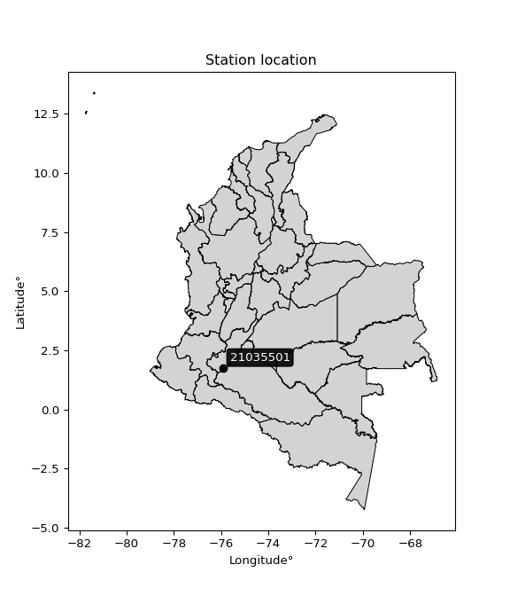

<div align="center">


</div>

# PMP Station (Rain, Pmax24h): 21035501

Probable Maximum Precipitation (PMP) is the greatest amount of rainfall for a specific duration that is meteorologically possible for a given location, acting as a "worst-case" scenario for extreme storms, crucial for designing safety-critical infrastructure like bridges, river deviations, dams, spillways, and nuclear plants to prevent catastrophic failure. PMP is calculated by hydrologists using meteorological data to determine the upper limit of extreme rainfall, often leading to the Probable Maximum Flood (PMF) for flood control design, and is increasingly being studied for climate change impacts. Probable Maximum Precipitation (PMP) is the theoretical upper limit of rainfall, a deterministic estimate for extreme events, while probability distributions (like GEV, Gumbel) describe the likelihood and frequency of various precipitation amounts, including rare ones, showing how often events occur, with PMP representing the extreme end of these distributions, used for critical infrastructure design to ensure safety against the worst conceivable weather, unlike standard statistical forecasts which cover typical probabilities.

The most common probability distributions in hydrology, used for analyzing floods, rainfall, and streamflow, include the Normal, Log-Normal, Gumbel, Gamma (including Log-Pearson Type III), and Generalized Extreme Value (GEV) distributions, often chosen based on the data´s skewness and whether modeling extremes or general conditions, with Gumbel and GEV popular for extreme events like floods, while the Normal distribution serves as a baseline, though often requiring transformations for skewed hydrological data. These distributions help in designing water infrastructure, managing water resources, and forecasting hydrologic events.

> Hydrological data often isn´t perfectly normal (it´s skewed), so different distributions are needed for different applications, such as: **Flood Frequency Analysis**: Using Gumbel, GEV, or Log-Pearson Type III for predicting extreme flood magnitudes and their return periods, **Rainfall Analysis**: Normal for annual totals, but Log-Normal, Weibull, or GEV for intensity or extreme daily rainfall, **Streamflow Modeling**: Gamma and Log-Normal for maximum flows, GEV for minimum flows, and Kappa for daily flows.

<div align="center">

</img>

</div>


## A. General information


### 1. General running parameters

• app_version: _v20260113_. • runtime: _2026-01-17 18:24:04.630693_. • Python version: _3.14.0_. • SciPy version: _1.16.3_. • Pandas version: _2.3.3_. • NumPy version: _2.3.5_. • Stations dataset (station_dataset_file): _dataset/pmax24h_in/automatic_colombia_2003_2025.csv_. • Stations catalog (station_catalog_file): _dataset/CNE.xls_. • Minimum year to eval til year_max (date_min): _1900_. • Maximum year to eval since year_min (date_max): _2025_. • Creates, save and include plots into reports (create_plot): _False_. • Plot only fit distributions with Δo > Δ (plot_only_fit): _True_. • Plot only simple graphs avoiding multiple CDFs and multiple Extreme values plots (plot_only_simple): _True_. • Eval low extreme values, if False, evaluates high extreme values (low_extreme): _False_. • Eval every SciPy distribution as logarithmic (pdist_logarithmic_on): _True_. • Standard deviation normalized (ddof): _1.0_. • Return periods to eval in years (Tr): _[2, 2.33, 5, 10, 15, 20, 25, 50, 75, 100, 200, 250, 500, 750, 1000]_. • Minimum data sample per station, 0 means any (minimum_sample): _5_. • Z-Score maximum threshold to adjust a value, 0 means disable (zscore_max): _3.5_. • Z-Score minimum threshold to adjust a value, 0 means disable (zscore_min): _-2.5_. • Avoid zeros, e.g. rain = 0 (avoid_zeros): _True_. • Avoid null values (avoid_nans): _True_. 

:file_folder:Table: [dataset.csv](../../dataset/pmax24h_in/automatic_colombia_2003_2025.csv)

> Delta Degrees of Freedom (DDOF): is a parameter used in the formulas for calculating variance and standard deviation. When ddof=0, the divisor is $N$ (the total number of observations) and this is used when your data set is the entire population. When ddof=1, the divisor is $N-1$ and this is used when your data set is a sample drawn from a larger population. Using $N-1$ provides an unbiased estimate of the population variance (known as Bessel´s correction).


### 2. Station info and location

|   id |   CODIGO | NOMBRE                     | CATEGORIA               | TECNOLOGIA                | ESTADO   | FECHA_INSTALACION   |   FECHA_SUSPENSION |   ALTITUD |   LATITUD |   LONGITUD | DEPARTAMENTO   | MUNICIPIO   | AREA_OPERATIVA                    | ENTIDAD                                    | AREA_HIDROGRAFICA   | ZONA_HIDROGRAFICA   | SUBZONA_HIDROGRAFICA   |   CORRIENTE | Catalogo   |   Version |
|-----:|---------:|:---------------------------|:------------------------|:--------------------------|:---------|:--------------------|-------------------:|----------:|----------:|-----------:|:---------------|:------------|:----------------------------------|:-------------------------------------------|:--------------------|:--------------------|:-----------------------|------------:|:-----------|----------:|
|    0 | 21035501 | ACEVEDO  - AUT  [21035501] | Climatológica Principal | Automática con Telemetría | Activa   | 19/07/2013          |                nan |      1470 |   1.76319 |   -75.9322 | Huila          | Acevedo     | Area Operativa 04 - Huila-Caquetá | CENTRO NACIONAL DE INVESTIGACIONES DE CAFE | Magdalena Cauca     | Alto Magdalena      | Río Suaza              |         nan | CNE_OE     |  20251226 |

<div align="center">

Dynamic map: [:earth_americas:Google](http://maps.google.com/maps?q=1.763191667,-75.93224722) [:earth_americas:OSM](https://www.openstreetmap.org/#map=18/1.763191667/-75.93224722&layers=P) [:earth_americas:Bing](https://www.bing.com/maps?cp=1.763191667~-75.93224722&lvl=18) [:earth_americas:Apple](https://maps.apple.com/frame?center=1.763191667%2C-75.93224722&span=0.003%2C0.006)

</div>


<div align="center">

```geojson
{
  "type": "Feature",
  "geometry": {
    "type": "Point", 
    "coordinates": [-75.93224722, 1.763191667]
  }, 
  "properties": {
    "Name": "21035501"
  }
}
```

</div>


### 3. Discrete values table and plot

<div align="center">

|               |          0 |           1 |          2 |          3 |          4 |           5 |           6 |
|:--------------|-----------:|------------:|-----------:|-----------:|-----------:|------------:|------------:|
| Date          | 2016       | 2017        | 2018       | 2019       | 2020       | 2021        | 2022        |
| Value         |   19.9     |   28.7      |   55.5     |   48.8     |   17.9     |   36.7      |   31.2      |
| Value_initial |   19.9     |   28.7      |   55.5     |   48.8     |   17.9     |   36.7      |   31.2      |
| count         |    7       |    7        |    7       |    7       |    7       |    7        |    7        |
| mean          |   34.1     |   34.1      |   34.1     |   34.1     |   34.1     |   34.1      |   34.1      |
| std           |   14.0384  |   14.0384   |   14.0384  |   14.0384  |   14.0384  |   14.0384   |   14.0384   |
| zscore        |   -1.01151 |   -0.384659 |    1.52439 |    1.04713 |   -1.15398 |    0.185206 |   -0.206576 |


</div>


> The initial value (value_initial) correspond to the initial obtained or null completed value, and value (value) is adjusted only when the initial value is outside the valid range (outlier) definite through the Z-Score value. If Z-Score is active, values out of range or outliers are replaced with the station mean value. A Z-Score (or standard score) measures how many standard deviations a data point is from the mean of a dataset, indicating its relative position; positive scores mean above the mean, negative mean below, and a score of zero is exactly at the mean, allowing for comparison of values from different distributions. It´s calculated using the formula $z=(x–μ)/σ$, where $x$ is the data point, $μ$ is the mean, and $σ$ is the standard deviation, helping identify outliers and understand probability.
>
> <sub>**Note**: In this study, "completing" (filling gaps in) and "extending" (forecasting or lengthening the historical record) rainfall data series are avoided for certain critical analyses because they introduce artificial bias and uncertainty, which can distort the statistics of rare events (extremes), alter day-to-day variability, and compromise the integrity and homogeneity of the original data. Some reasons against Completing/Extending rainfall data are: **Distortion of Extremes and Variability**: The primary issue is that most gap-filling or extension methods rely on averaging or regression with nearby stations, which inherently smooths the data. Rainfall is highly variable in space and time, with a large percentage of zero values and occasional large storms. Infilling methods often underestimate the highest values and overestimate the lowest (zero) values, which severely distorts analyses focused on flood frequency, drought severity, and intensity-duration-frequency (IDF) curves, **Loss of Data Homogeneity**: Infilled or extended data are synthetic estimates, not actual measurements. Combining these estimates with observed data can violate the assumption of data homogeneity, which requires that the data properties do not change over time. Inhomogeneity can lead to incorrect conclusions about long-term trends or changes in climate patterns, **Propagation of Errors**: Errors and biases from the original data (e.g., wind-induced undercatch, instrument errors, site changes) or the data used for imputation can propagate through the analysis, leading to unreliable hydrological models and inaccurate predictions, **Compromised Statistical Integrity**: For statistical analyses, especially those involving the frequency of events, using artificial data can introduce time bias or autocorrelation that doesn´t exist in reality, making it difficult to assess the true probability of events, **Difficulty in Validation**: It is difficult to accurately validate the quality of filled or extended data, especially for past periods where ground-truth measurements are unavailable. The reliability of imputation techniques heavily depends on the density of the surrounding station network and the complexity of the local topography.</sub>


### 4. Active continuous probability distributions from SciPy (80 of 104 available)

A Probability Density Function (PDF) describes the relative likelihood of a continuous random variable falling within a specific range, where the total area under its curve equals 1, and the area over any interval gives the actual probability for that range. Unlike discrete probabilities (like rolling a die), a PDF shows density, not direct probability for a single point (which is zero), with higher points indicating higher likelihood, often visualized as a bell curve for normal distributions.

A log of a probability density function (log-PDF) is simply the logarithm of the PDF´s value, denoted as $log(f(x))$, useful for converting multiplication of probabilities into addition, improving numerical stability with tiny numbers, and connecting to information theory concepts like entropy. Instead of dealing with very small probabilities (e.g., 0.000001), log-PDFs use negative numbers (e.g., $log(0.00001) ≈ -11.51$ that are easier for computers to handle, preventing underflow errors and simplifying complex calculations. In this study, each active probability distribution from SciPy is also evaluated in the $log$ form.

[scipy.stats](https://docs.scipy.org/doc/scipy/reference/stats.html) is a Python´s powerful submodule within the SciPy library for comprehensive statistical analysis, offering over 130 probability distributions (like Normal, Poisson), functions for descriptive stats (mean, variance), hypothesis testing (t-tests, chi-square), random variable generation, and statistical tests, making it essential for data science, modeling, and research. It provides tools to explore, model, and draw conclusions from data efficiently, working seamlessly with NumPy.

<div align="center">

|   id | p_dist           |   n_parameter | fit_method   | label                                                                       | active   | ref                                                                                                      |
|-----:|:-----------------|--------------:|:-------------|:----------------------------------------------------------------------------|:---------|:---------------------------------------------------------------------------------------------------------|
|    0 | alpha            |             3 | MLE          | Alpha                                                                       | True     | [:mortar_board:](https://docs.scipy.org/doc/scipy/reference/generated/scipy.stats.alpha.html)            |
|    1 | anglit           |             2 | MM           | Anglit                                                                      | True     | [:mortar_board:](https://docs.scipy.org/doc/scipy/reference/generated/scipy.stats.anglit.html)           |
|    2 | arcsine          |             2 | MM           | Arcsine                                                                     | True     | [:mortar_board:](https://docs.scipy.org/doc/scipy/reference/generated/scipy.stats.arcsine.html)          |
|    3 | argus            |             3 | MLE          | Argus                                                                       | True     | [:mortar_board:](https://docs.scipy.org/doc/scipy/reference/generated/scipy.stats.argus.html)            |
|    4 | beta             |             4 | MLE          | Beta                                                                        | True     | [:mortar_board:](https://docs.scipy.org/doc/scipy/reference/generated/scipy.stats.beta.html)             |
|    5 | betaprime        |             4 | MLE          | Beta prime                                                                  | True     | [:mortar_board:](https://docs.scipy.org/doc/scipy/reference/generated/scipy.stats.betaprime.html)        |
|    6 | bradford         |             3 | MLE          | Bradford                                                                    | True     | [:mortar_board:](https://docs.scipy.org/doc/scipy/reference/generated/scipy.stats.bradford.html)         |
|    7 | burr             |             4 | MLE          | Burr (Type III)                                                             | True     | [:mortar_board:](https://docs.scipy.org/doc/scipy/reference/generated/scipy.stats.burr.html)             |
|    8 | burr12           |             4 | MLE          | Burr (Type III) 12                                                          | True     | [:mortar_board:](https://docs.scipy.org/doc/scipy/reference/generated/scipy.stats.burr12.html)           |
|    9 | cosine           |             2 | MLE          | Cosine                                                                      | True     | [:mortar_board:](https://docs.scipy.org/doc/scipy/reference/generated/scipy.stats.cosine.html)           |
|   10 | crystalball      |             4 | MLE          | Crystalball                                                                 | True     | [:mortar_board:](https://docs.scipy.org/doc/scipy/reference/generated/scipy.stats.crystalball.html)      |
|   11 | dgamma           |             3 | MLE          | Double gamma                                                                | True     | [:mortar_board:](https://docs.scipy.org/doc/scipy/reference/generated/scipy.stats.dgamma.html)           |
|   12 | dweibull         |             3 | MLE          | Double Weibull                                                              | True     | [:mortar_board:](https://docs.scipy.org/doc/scipy/reference/generated/scipy.stats.dweibull.html)         |
|   13 | erlang           |             3 | MLE          | Erlang                                                                      | True     | [:mortar_board:](https://docs.scipy.org/doc/scipy/reference/generated/scipy.stats.erlang.html)           |
|   14 | exponnorm        |             3 | MLE          | Exponentially modified Normal                                               | True     | [:mortar_board:](https://docs.scipy.org/doc/scipy/reference/generated/scipy.stats.exponnorm.html)        |
|   15 | exponpow         |             3 | MLE          | Exponential power                                                           | True     | [:mortar_board:](https://docs.scipy.org/doc/scipy/reference/generated/scipy.stats.exponpow.html)         |
|   16 | exponweib        |             4 | MLE          | Exponentiated Weibull                                                       | True     | [:mortar_board:](https://docs.scipy.org/doc/scipy/reference/generated/scipy.stats.exponweib.html)        |
|   17 | f                |             4 | MLE          | F                                                                           | True     | [:mortar_board:](https://docs.scipy.org/doc/scipy/reference/generated/scipy.stats.f.html)                |
|   18 | fatiguelife      |             3 | MLE          | Fatigue-life (Birnbaum-Saunders)                                            | True     | [:mortar_board:](https://docs.scipy.org/doc/scipy/reference/generated/scipy.stats.fatiguelife.html)      |
|   19 | foldnorm         |             3 | MM           | Fold Normal                                                                 | True     | [:mortar_board:](https://docs.scipy.org/doc/scipy/reference/generated/scipy.stats.foldnorm.html)         |
|   20 | gamma            |             3 | MLE          | Gamma                                                                       | True     | [:mortar_board:](https://docs.scipy.org/doc/scipy/reference/generated/scipy.stats.gamma.html)            |
|   21 | gausshyper       |             6 | MLE          | Gauss hypergeometric                                                        | True     | [:mortar_board:](https://docs.scipy.org/doc/scipy/reference/generated/scipy.stats.gausshyper.html)       |
|   22 | genexpon         |             5 | MLE          | Generalized exponential                                                     | True     | [:mortar_board:](https://docs.scipy.org/doc/scipy/reference/generated/scipy.stats.genexpon.html)         |
|   23 | genextreme       |             3 | MLE          | Generalized exponential                                                     | True     | [:mortar_board:](https://docs.scipy.org/doc/scipy/reference/generated/scipy.stats.genextreme.html)       |
|   24 | gengamma         |             4 | MLE          | Generalized gamma                                                           | True     | [:mortar_board:](https://docs.scipy.org/doc/scipy/reference/generated/scipy.stats.gengamma.html)         |
|   25 | genhalflogistic  |             3 | MLE          | Generalized half-logistic                                                   | True     | [:mortar_board:](https://docs.scipy.org/doc/scipy/reference/generated/scipy.stats.genhalflogistic.html)  |
|   26 | genlogistic      |             3 | MLE          | Generalized logistic                                                        | True     | [:mortar_board:](https://docs.scipy.org/doc/scipy/reference/generated/scipy.stats.genlogistic.html)      |
|   27 | gennorm          |             3 | MLE          | Generalized Normal                                                          | True     | [:mortar_board:](https://docs.scipy.org/doc/scipy/reference/generated/scipy.stats.gennorm.html)          |
|   28 | genpareto        |             3 | MLE          | Generalized Pareto                                                          | True     | [:mortar_board:](https://docs.scipy.org/doc/scipy/reference/generated/scipy.stats.genpareto.html)        |
|   29 | gompertz         |             3 | MLE          | Gompertz (or truncated Gumbel)                                              | True     | [:mortar_board:](https://docs.scipy.org/doc/scipy/reference/generated/scipy.stats.gompertz.html)         |
|   30 | gumbel_l         |             2 | MM           | Gumbel Left Skew                                                            | True     | [:mortar_board:](https://docs.scipy.org/doc/scipy/reference/generated/scipy.stats.gumbel_l.html)         |
|   31 | gumbel_r         |             2 | MM           | Gumbel Right Skew                                                           | True     | [:mortar_board:](https://docs.scipy.org/doc/scipy/reference/generated/scipy.stats.gumbel_r.html)         |
|   32 | halfgennorm      |             3 | MLE          | Upper half of a generalized normal                                          | True     | [:mortar_board:](https://docs.scipy.org/doc/scipy/reference/generated/scipy.stats.halfgennorm.html)      |
|   33 | halflogistic     |             2 | MM           | Half-logistic                                                               | True     | [:mortar_board:](https://docs.scipy.org/doc/scipy/reference/generated/scipy.stats.halflogistic.html)     |
|   34 | halfnorm         |             2 | MM           | Half Normal                                                                 | True     | [:mortar_board:](https://docs.scipy.org/doc/scipy/reference/generated/scipy.stats.halfnorm.html)         |
|   35 | hypsecant        |             2 | MM           | hyperbolic secant                                                           | True     | [:mortar_board:](https://docs.scipy.org/doc/scipy/reference/generated/scipy.stats.hypsecant.html)        |
|   36 | invgamma         |             3 | MLE          | Inverted gamma                                                              | True     | [:mortar_board:](https://docs.scipy.org/doc/scipy/reference/generated/scipy.stats.invgamma.html)         |
|   37 | invgauss         |             3 | MLE          | Inverse Gaussian                                                            | True     | [:mortar_board:](https://docs.scipy.org/doc/scipy/reference/generated/scipy.stats.invgauss.html)         |
|   38 | invweibull       |             3 | MLE          | Inverted Weibull                                                            | True     | [:mortar_board:](https://docs.scipy.org/doc/scipy/reference/generated/scipy.stats.invweibull.html)       |
|   39 | johnsonsb        |             4 | MLE          | Johnson SB                                                                  | True     | [:mortar_board:](https://docs.scipy.org/doc/scipy/reference/generated/scipy.stats.johnsonsb.html)        |
|   40 | johnsonsu        |             4 | MLE          | Johnson Su                                                                  | True     | [:mortar_board:](https://docs.scipy.org/doc/scipy/reference/generated/scipy.stats.johnsonsu.html)        |
|   41 | kappa3           |             3 | MLE          | Kappa 3                                                                     | True     | [:mortar_board:](https://docs.scipy.org/doc/scipy/reference/generated/scipy.stats.kappa3.html)           |
|   42 | kappa4           |             4 | MLE          | Kappa 4                                                                     | True     | [:mortar_board:](https://docs.scipy.org/doc/scipy/reference/generated/scipy.stats.kappa4.html)           |
|   43 | ksone            |             3 | MLE          | Kolmogorov-Smirnov one-sided test statistic distribution                    | True     | [:mortar_board:](https://docs.scipy.org/doc/scipy/reference/generated/scipy.stats.ksone.html)            |
|   44 | kstwobign        |             2 | MLE          | Limiting distribution of scaled Kolmogorov-Smirnov two-sided test statistic | True     | [:mortar_board:](https://docs.scipy.org/doc/scipy/reference/generated/scipy.stats.kstwobign.html)        |
|   45 | laplace          |             2 | MM           | Laplace                                                                     | True     | [:mortar_board:](https://docs.scipy.org/doc/scipy/reference/generated/scipy.stats.laplace.html)          |
|   46 | levy_l           |             2 | MLE          | Left-skewed Levy                                                            | True     | [:mortar_board:](https://docs.scipy.org/doc/scipy/reference/generated/scipy.stats.levy_l.html)           |
|   47 | loggamma         |             3 | MLE          | Log gamma                                                                   | True     | [:mortar_board:](https://docs.scipy.org/doc/scipy/reference/generated/scipy.stats.loggamma.html)         |
|   48 | logistic         |             2 | MM           | Logistic (or Sech-squared)                                                  | True     | [:mortar_board:](https://docs.scipy.org/doc/scipy/reference/generated/scipy.stats.logistic.html)         |
|   49 | loglaplace       |             3 | MLE          | Log-Laplace                                                                 | True     | [:mortar_board:](https://docs.scipy.org/doc/scipy/reference/generated/scipy.stats.loglaplace.html)       |
|   50 | lomax            |             3 | MLE          | Lomax (Pareto of the second kind)                                           | True     | [:mortar_board:](https://docs.scipy.org/doc/scipy/reference/generated/scipy.stats.lomax.html)            |
|   51 | maxwell          |             2 | MM           | Maxwell                                                                     | True     | [:mortar_board:](https://docs.scipy.org/doc/scipy/reference/generated/scipy.stats.maxwell.html)          |
|   52 | mielke           |             4 | MLE          | Mielke Beta-Kappa / Dagum                                                   | True     | [:mortar_board:](https://docs.scipy.org/doc/scipy/reference/generated/scipy.stats.mielke.html)           |
|   53 | moyal            |             2 | MM           | Moyal                                                                       | True     | [:mortar_board:](https://docs.scipy.org/doc/scipy/reference/generated/scipy.stats.moyal.html)            |
|   54 | nakagami         |             3 | MLE          | Nakagami                                                                    | True     | [:mortar_board:](https://docs.scipy.org/doc/scipy/reference/generated/scipy.stats.nakagami.html)         |
|   55 | ncf              |             5 | MLE          | Non-central F distribution                                                  | True     | [:mortar_board:](https://docs.scipy.org/doc/scipy/reference/generated/scipy.stats.ncf.html)              |
|   56 | nct              |             4 | MLE          | Non-central Student’s t                                                     | True     | [:mortar_board:](https://docs.scipy.org/doc/scipy/reference/generated/scipy.stats.nct.html)              |
|   57 | norm             |             2 | MM           | Normal                                                                      | True     | [:mortar_board:](https://docs.scipy.org/doc/scipy/reference/generated/scipy.stats.norm.html)             |
|   58 | pearson3         |             3 | MM           | Pearson type III                                                            | True     | [:mortar_board:](https://docs.scipy.org/doc/scipy/reference/generated/scipy.stats.pearson3.html)         |
|   59 | powerlaw         |             3 | MLE          | Power-function                                                              | True     | [:mortar_board:](https://docs.scipy.org/doc/scipy/reference/generated/scipy.stats.powerlaw.html)         |
|   60 | rayleigh         |             2 | MM           | Rayleigh                                                                    | True     | [:mortar_board:](https://docs.scipy.org/doc/scipy/reference/generated/scipy.stats.rayleigh.html)         |
|   61 | rdist            |             3 | MLE          | R-distributed (symmetric beta)                                              | True     | [:mortar_board:](https://docs.scipy.org/doc/scipy/reference/generated/scipy.stats.rdist.html)            |
|   62 | rice             |             3 | MLE          | Rice                                                                        | True     | [:mortar_board:](https://docs.scipy.org/doc/scipy/reference/generated/scipy.stats.rice.html)             |
|   63 | semicircular     |             2 | MM           | Semicircular                                                                | True     | [:mortar_board:](https://docs.scipy.org/doc/scipy/reference/generated/scipy.stats.semicircular.html)     |
|   64 | skewnorm         |             3 | MLE          | Skew normal                                                                 | True     | [:mortar_board:](https://docs.scipy.org/doc/scipy/reference/generated/scipy.stats.skewnorm.html)         |
|   65 | t                |             3 | MLE          | Student’s t                                                                 | True     | [:mortar_board:](https://docs.scipy.org/doc/scipy/reference/generated/scipy.stats.t.html)                |
|   66 | trapezoid        |             4 | MLE          | Trapezoid                                                                   | True     | [:mortar_board:](https://docs.scipy.org/doc/scipy/reference/generated/scipy.stats.trapezoid.html)        |
|   67 | triang           |             3 | MLE          | Triangular                                                                  | True     | [:mortar_board:](https://docs.scipy.org/doc/scipy/reference/generated/scipy.stats.triang.html)           |
|   68 | truncexpon       |             3 | MLE          | Truncated exponential                                                       | True     | [:mortar_board:](https://docs.scipy.org/doc/scipy/reference/generated/scipy.stats.truncexpon.html)       |
|   69 | truncnorm        |             4 | MLE          | Truncated normal                                                            | True     | [:mortar_board:](https://docs.scipy.org/doc/scipy/reference/generated/scipy.stats.truncnorm.html)        |
|   70 | truncpareto      |             4 | MLE          | Upper truncated Pareto                                                      | True     | [:mortar_board:](https://docs.scipy.org/doc/scipy/reference/generated/scipy.stats.truncpareto.html)      |
|   71 | truncweibull_min |             5 | MLE          | Doubly truncated Weibull minimum                                            | True     | [:mortar_board:](https://docs.scipy.org/doc/scipy/reference/generated/scipy.stats.truncweibull_min.html) |
|   72 | tukeylambda      |             3 | MLE          | Tukey-Lamdba                                                                | True     | [:mortar_board:](https://docs.scipy.org/doc/scipy/reference/generated/scipy.stats.tukeylambda.html)      |
|   73 | uniform          |             2 | MLE          | Uniform                                                                     | True     | [:mortar_board:](https://docs.scipy.org/doc/scipy/reference/generated/scipy.stats.uniform.html)          |
|   74 | vonmises         |             3 | MLE          | Von Mises                                                                   | True     | [:mortar_board:](https://docs.scipy.org/doc/scipy/reference/generated/scipy.stats.vonmises.html)         |
|   75 | vonmises_line    |             3 | MLE          | Von Mises line                                                              | True     | [:mortar_board:](https://docs.scipy.org/doc/scipy/reference/generated/scipy.stats.vonmises_line.html)    |
|   76 | wald             |             2 | MM           | Wald                                                                        | True     | [:mortar_board:](https://docs.scipy.org/doc/scipy/reference/generated/scipy.stats.wald.html)             |
|   77 | weibull_max      |             3 | MLE          | Weibull maximum                                                             | True     | [:mortar_board:](https://docs.scipy.org/doc/scipy/reference/generated/scipy.stats.weibull_max.html)      |
|   78 | weibull_min      |             3 | MLE          | Weibull minimum                                                             | True     | [:mortar_board:](https://docs.scipy.org/doc/scipy/reference/generated/scipy.stats.weibull_min.html)      |
|   79 | wrapcauchy       |             3 | MLE          | Wrapped  Cauchy                                                             | True     | [:mortar_board:](https://docs.scipy.org/doc/scipy/reference/generated/scipy.stats.wrapcauchy.html)       |

</div>

> **n_parameter:** # arguments & localization & scale.
>
> **Fit methods:** (MLE) maximum likelihood, (MM) L-moments.
>
>**Inactive** (With the only purpose of prevent loops, zero divisions, infinite values, over high estimated values or horizontal trending for recurrence intervals estimations, the follow distributions were disabled.)**:** lognorm, norminvgauss, powernorm, powerlognorm, cauchy, halfcauchy, foldcauchy, skewcauchy, chi2, expon, fisk, genhyperbolic, geninvgauss, gibrat, kstwo, laplace_asymmetric, levy, levy_stable, ncx2, pareto, rel_breitwigner, recipinvgauss, studentized_range, loguniform, 


## B. Probability (PDF) vs. Empirical (EDF) distributions functions

A continuous probability distribution (CPD) describes probabilities for variables that can take any value within a range (like rain any time), unlike discrete variables with specific outcomes (like temperature). It uses a Probability Density Function (PDF), a curve where the total area under it equals 1, and the probability of the variable falling within an interval (a to b) is found by calculating the area under the curve between those points. A key feature is that the probability of hitting any single exact value is zero, so probabilities are always expressed for ranges, e.g., $P(a ≤ X ≤ b)$.

<div align="center">

Distributions parameters from station values
|     |   station | p_dist              |   n |             loc |          scale | shape                  | shape1                 | shape2                | shape3             |
|----:|----------:|:--------------------|----:|----------------:|---------------:|:-----------------------|:-----------------------|:----------------------|:-------------------|
|   0 |  21035501 | alpha               |   7 |   -41.011       |  435.164       | 5.964833547703907      |                        |                       |                    |
|   1 |  21035501 | anglit              |   7 |    34.1         |   38.0215      |                        |                        |                       |                    |
|   2 |  21035501 | arcsine             |   7 |    15.7194      |   36.7611      |                        |                        |                       |                    |
|   3 |  21035501 | argus               |   7 |     5.98354     |   51.7959      | 5.136571732456103e-06  |                        |                       |                    |
|   4 |  21035501 | beta                |   7 |    17.9         |   37.7         | 0.6155413540004895     | 0.9545975696234508     |                       |                    |
|   5 |  21035501 | betaprime           |   7 |    -0.39782     |   39.8988      | 12.553119588608077     | 15.536606881896567     |                       |                    |
|   6 |  21035501 | bradford            |   7 |    17.9         |   37.6001      | 0.9652935507361223     |                        |                       |                    |
|   7 |  21035501 | burr                |   7 |    -7.46342     |    3.10923     | 3.5173431458259072     | 4513.939524157549      |                       |                    |
|   8 |  21035501 | burr12              |   7 |   -11.0472      |   28.8156      | 848.0152824260335      | 0.0028932376166216894  |                       |                    |
|   9 |  21035501 | cosine              |   7 |    34.8156      |   10.5897      |                        |                        |                       |                    |
|  10 |  21035501 | crystalball         |   7 |    34.1         |   12.997       | 3532.2858196096086     | 333.41237428931936     |                       |                    |
|  11 |  21035501 | dgamma              |   7 |    34.0312      |    5.62863     | 1.9626972663070386     |                        |                       |                    |
|  12 |  21035501 | dweibull            |   7 |    34.2984      |   12.3601      | 1.6154038453624127     |                        |                       |                    |
|  13 |  21035501 | erlang              |   7 |    17.9         |   16.1435      | 0.24485384306004201    |                        |                       |                    |
|  14 |  21035501 | exponnorm           |   7 |    17.8779      |    0.00726098  | 2214.979777562459      |                        |                       |                    |
|  15 |  21035501 | exponpow            |   7 |    17.9         |   30.82        | 0.6528107394820346     |                        |                       |                    |
|  16 |  21035501 | exponweib           |   7 |    17.9         |    1.07241     | 1.2362492438216517     | 0.33762842217571265    |                       |                    |
|  17 |  21035501 | f                   |   7 |    17.8913      |   14.5702      | 1.4101111092638257     | 54.21595668327008      |                       |                    |
|  18 |  21035501 | fatiguelife         |   7 |    17.9         |    3.39056e-06 | 2451.111374517045      |                        |                       |                    |
|  19 |  21035501 | foldnorm            |   7 |    11.2103      |   14.1919      | 1.5620603941263358     |                        |                       |                    |
|  20 |  21035501 | gamma               |   7 |    17.9         |   14.6378      | 0.710419409500258      |                        |                       |                    |
|  21 |  21035501 | gausshyper          |   7 |    17.7486      |   37.7514      | 1.0048522043589994     | 0.966709255187651      | 0.9465065185624639    | 1.0592289195835651 |
|  22 |  21035501 | genexpon            |   7 |    17.8999      |    1.72157     | 0.10627378958787292    | 1.0798126621988359e-08 | 2.1641344196708636    |                    |
|  23 |  21035501 | genextreme          |   7 |    28.0581      |   10.7371      | 0.029293760247016347   |                        |                       |                    |
|  24 |  21035501 | gengamma            |   7 |    17.9         |    1.16782     | 1.2618485544588078     | 0.28600193770298354    |                       |                    |
|  25 |  21035501 | genhalflogistic     |   7 |    14.3883      |   42.613       | 1.0365184076880072     |                        |                       |                    |
|  26 |  21035501 | genlogistic         |   7 |   -43.0284      |   10.5957      | 806.1859146458717      |                        |                       |                    |
|  27 |  21035501 | gennorm             |   7 |    31.2         |    9.91038     | 0.9888689407497109     |                        |                       |                    |
|  28 |  21035501 | genpareto           |   7 |    -0.26305     |  101.767       | -1.824997941343639     |                        |                       |                    |
|  29 |  21035501 | gompertz            |   7 |    17.9         |   35.7904      | 1.4641204262628378     |                        |                       |                    |
|  30 |  21035501 | gumbel_l            |   7 |    39.9494      |   10.1337      |                        |                        |                       |                    |
|  31 |  21035501 | gumbel_r            |   7 |    28.2506      |   10.1337      |                        |                        |                       |                    |
|  32 |  21035501 | halfgennorm         |   7 |    17.9         |    1.19632     | 0.4047116149772132     |                        |                       |                    |
|  33 |  21035501 | halflogistic        |   7 |    18.6955      |   11.112       |                        |                        |                       |                    |
|  34 |  21035501 | halfnorm            |   7 |    16.897       |   21.5607      |                        |                        |                       |                    |
|  35 |  21035501 | hypsecant           |   7 |    34.1         |    8.27417     |                        |                        |                       |                    |
|  36 |  21035501 | invgamma            |   7 |    -5.87189     |  343.093       | 9.549890507524225      |                        |                       |                    |
|  37 |  21035501 | invgauss            |   7 |     9.87802     |   58.1548      | 0.4165085457348531     |                        |                       |                    |
|  38 |  21035501 | invweibull          |   7 |    -1.99041e+08 |    1.99041e+08 | 18757422.481270704     |                        |                       |                    |
|  39 |  21035501 | johnsonsb           |   7 |    17.9         |   40.9349      | 0.8225600808063002     | 0.15569872663150697    |                       |                    |
|  40 |  21035501 | johnsonsu           |   7 |     9.9948      |    0.675986    | -6.774225071827216     | 1.6521121609550216     |                       |                    |
|  41 |  21035501 | kappa3              |   7 |    17.9         |   40.1255      | 363.90624832311755     |                        |                       |                    |
|  42 |  21035501 | kappa4              |   7 |    11.4317      |   41.9819      | 1.1812486357539191     | 0.9490586275054249     |                       |                    |
|  43 |  21035501 | ksone               |   7 |    11.5885      |   45.023       | 1.0                    |                        |                       |                    |
|  44 |  21035501 | kstwobign           |   7 |    -8.78065     |   49.0582      |                        |                        |                       |                    |
|  45 |  21035501 | laplace             |   7 |    34.1         |    9.19029     |                        |                        |                       |                    |
|  46 |  21035501 | levy_l              |   7 |    57.554       |    9.0506      |                        |                        |                       |                    |
|  47 |  21035501 | loggamma            |   7 | -2435.95        |  369.399       | 802.1173658573703      |                        |                       |                    |
|  48 |  21035501 | logistic            |   7 |    34.1         |    7.16564     |                        |                        |                       |                    |
|  49 |  21035501 | loglaplace          |   7 |    -0.0832063   |   31.2832      | 3.08009746117264       |                        |                       |                    |
|  50 |  21035501 | lomax               |   7 |    17.9         | 1616.24        | 100.2061909223734      |                        |                       |                    |
|  51 |  21035501 | maxwell             |   7 |     3.30249     |   19.2995      |                        |                        |                       |                    |
|  52 |  21035501 | mielke              |   7 |   -33.0542      |   17.4964      | 9930.311329298644      | 6.021305399919381      |                       |                    |
|  53 |  21035501 | moyal               |   7 |    26.6675      |    5.85072     |                        |                        |                       |                    |
|  54 |  21035501 | nakagami            |   7 |    17.9         |   26.3425      | 0.18266316137427363    |                        |                       |                    |
|  55 |  21035501 | ncf                 |   7 |    -0.238265    |   32.3374      | 14.493795410133893     | 281.2398981392425      | 0.788073648699604     |                    |
|  56 |  21035501 | nct                 |   7 |    -2.54893     |    5.51704     | 5.890884445281184      | 5.751554583416649      |                       |                    |
|  57 |  21035501 | norm                |   7 |    34.1         |   12.997       |                        |                        |                       |                    |
|  58 |  21035501 | pearson3            |   7 |    34.1         |   12.997       | 0.37078825189815623    |                        |                       |                    |
|  59 |  21035501 | powerlaw            |   7 |    17.9         |   37.6         | 0.16276034640665274    |                        |                       |                    |
|  60 |  21035501 | rayleigh            |   7 |     9.23592     |   19.8387      |                        |                        |                       |                    |
|  61 |  21035501 | rdist               |   7 |    16.049       |   20.651       | 1.0477041236017262     |                        |                       |                    |
|  62 |  21035501 | rice                |   7 |    11.2606      |   17.8647      | 0.4046869707650015     |                        |                       |                    |
|  63 |  21035501 | semicircular        |   7 |    34.1         |   25.9941      |                        |                        |                       |                    |
|  64 |  21035501 | skewnorm            |   7 |    17.9         |   20.7743      | 14322004.258560028     |                        |                       |                    |
|  65 |  21035501 | t                   |   7 |    34.0999      |   12.997       | 271198341.95091176     |                        |                       |                    |
|  66 |  21035501 | trapezoid           |   7 |    14.14        |   45.12        | 1.0                    | 1.0                    |                       |                    |
|  67 |  21035501 | triang              |   7 |     2.35884     |   53.1424      | 0.9999999999899241     |                        |                       |                    |
|  68 |  21035501 | truncexpon          |   7 |    17.9         |   36.5559      | 1.028561058474204      |                        |                       |                    |
|  69 |  21035501 | truncnorm           |   7 |    34.1         |   12.997       | -231.41237732187216    | 373.4047564335357      |                       |                    |
|  70 |  21035501 | truncpareto         |   7 |    17.8865      |    0.0135029   | 0.16870852295906621    | 2785.5840084108263     |                       |                    |
|  71 |  21035501 | truncweibull_min    |   7 |    17.847       |   36.5544      | 0.6325830284131289     | 0.0014486984650163395  | 1.0300540320038896    |                    |
|  72 |  21035501 | tukeylambda         |   7 |    36.512       |   21.2096      | 1.1170041622756295     |                        |                       |                    |
|  73 |  21035501 | uniform             |   7 |    17.9         |   37.6         |                        |                        |                       |                    |
|  74 |  21035501 | vonmises            |   7 |    -0.96054     |    1           | 1.4017414534626402     |                        |                       |                    |
|  75 |  21035501 | vonmises_line       |   7 |    36.7         |    5.98424     | 0.009151944225894612   |                        |                       |                    |
|  76 |  21035501 | wald                |   7 |    21.103       |   12.997       |                        |                        |                       |                    |
|  77 |  21035501 | weibull_max         |   7 |    55.5         |    1.4637      | 0.27526394790644       |                        |                       |                    |
|  78 |  21035501 | weibull_min         |   7 |    17.9         |   17.7308      | 0.7390644859036772     |                        |                       |                    |
|  79 |  21035501 | wrapcauchy          |   7 |    17.9         |    5.98458     | 0.3253089339316839     |                        |                       |                    |
|  80 |  21035501 | logalpha            |   7 |    -4.79084     |  172.079       | 20.923002936299213     |                        |                       |                    |
|  81 |  21035501 | loganglit           |   7 |     3.45425     |    1.14628     |                        |                        |                       |                    |
|  82 |  21035501 | logarcsine          |   7 |     2.90012     |    1.10827     |                        |                        |                       |                    |
|  83 |  21035501 | logargus            |   7 |     2.5972      |    1.49357     | 5.473571272571307e-05  |                        |                       |                    |
|  84 |  21035501 | logbeta             |   7 |     2.87219     |    1.1442      | 0.9571275666055411     | 0.813900165672228      |                       |                    |
|  85 |  21035501 | logbetaprime        |   7 |    -3.23635     |   50.6607      | 329.53234655593803     | 2495.9434529368064     |                       |                    |
|  86 |  21035501 | logbradford         |   7 |     2.87958     |    1.13681     | 0.00010071144131114135 |                        |                       |                    |
|  87 |  21035501 | logburr             |   7 |   -40.3293      |   40.7011      | 123.63619540569255     | 4749.179471613679      |                       |                    |
|  88 |  21035501 | logburr12           |   7 |     2.47929     |   12.6701      | 2.863673887384671      | 1111.5405494211805     |                       |                    |
|  89 |  21035501 | logcosine           |   7 |     3.45159     |    0.317195    |                        |                        |                       |                    |
|  90 |  21035501 | logcrystalball      |   7 |     3.45425     |    0.391838    | 10.618403102007445     | 17372.661660137117     |                       |                    |
|  91 |  21035501 | logdgamma           |   7 |     3.51734     |    0.177321    | 1.8943803475567156     |                        |                       |                    |
|  92 |  21035501 | logdweibull         |   7 |     3.44042     |    0.313789    | 0.9565468013518068     |                        |                       |                    |
|  93 |  21035501 | logerlang           |   7 |   -12.9411      |    0.0093804   | 1747.80162578085       |                        |                       |                    |
|  94 |  21035501 | logexponnorm        |   7 |     3.45399     |    0.391839    | 0.0006573641683508464  |                        |                       |                    |
|  95 |  21035501 | logexponpow         |   7 |     2.8848      |    1.53515     | 0.2494512767264757     |                        |                       |                    |
|  96 |  21035501 | logexponweib        |   7 |     2.8848      |    0.883118    | 0.4778453772884453     | 1.541766119913853      |                       |                    |
|  97 |  21035501 | logf                |   7 |   -87.9425      |   91.3965      | 291300.09374287364     | 172767.7030817915      |                       |                    |
|  98 |  21035501 | logfatiguelife      |   7 |   -23.8424      |   27.2948      | 0.014381142546121495   |                        |                       |                    |
|  99 |  21035501 | logfoldnorm         |   7 |     2.45442     |    0.394001    | 2.5343537227450272     |                        |                       |                    |
| 100 |  21035501 | loggamma            |   7 |   -13.22        |    0.00922296  | 1807.8954248655573     |                        |                       |                    |
| 101 |  21035501 | loggausshyper       |   7 |     2.86077     |    1.15562     | 1.2702541679695474     | 0.5869731711299294     | 1.0224188432518309    | 0.6006160510749565 |
| 102 |  21035501 | loggenexpon         |   7 |     2.88048     |    0.246381    | 0.24951583651834824    | 6.073436793514547      | 0.017722164719594424  |                    |
| 103 |  21035501 | loggenextreme       |   7 |     3.3964      |    0.467108    | 0.6900341217144934     |                        |                       |                    |
| 104 |  21035501 | loggengamma         |   7 |     2.8848      |    0.845248    | 0.5267765691692521     | 1.3392745900499898     |                       |                    |
| 105 |  21035501 | loggenhalflogistic  |   7 |     2.87189     |    1.24698     | 1.0895494697600356     |                        |                       |                    |
| 106 |  21035501 | loggenlogistic      |   7 |     1.55671     |    0.354674    | 121.78375949055572     |                        |                       |                    |
| 107 |  21035501 | loggennorm          |   7 |     3.45059     |    0.565796    | 1613422.3638487458     |                        |                       |                    |
| 108 |  21035501 | loggenpareto        |   7 |    -0.00178161  |   10.4326      | -2.596349324291815     |                        |                       |                    |
| 109 |  21035501 | loggompertz         |   7 |     2.8848      |    0.927259    | 0.9996097694694539     |                        |                       |                    |
| 110 |  21035501 | loggumbel_l         |   7 |     3.63059     |    0.305515    |                        |                        |                       |                    |
| 111 |  21035501 | loggumbel_r         |   7 |     3.2779      |    0.305515    |                        |                        |                       |                    |
| 112 |  21035501 | loghalfgennorm      |   7 |     2.8848      |    1.13159     | 1186987.2243739432     |                        |                       |                    |
| 113 |  21035501 | loghalflogistic     |   7 |     2.98985     |    0.334997    |                        |                        |                       |                    |
| 114 |  21035501 | loghalfnorm         |   7 |     2.93558     |    0.650056    |                        |                        |                       |                    |
| 115 |  21035501 | loghypsecant        |   7 |     3.45425     |    0.249452    |                        |                        |                       |                    |
| 116 |  21035501 | loginvgamma         |   7 |    -4.53033     | 3296.47        | 413.86310270917306     |                        |                       |                    |
| 117 |  21035501 | loginvgauss         |   7 |     1.09901     |   80.5651      | 0.02921693827559691    |                        |                       |                    |
| 118 |  21035501 | loginvweibull       |   7 |    -3.08964e+07 |    3.08964e+07 | 86984737.39956534      |                        |                       |                    |
| 119 |  21035501 | logjohnsonsb        |   7 |     2.75781     |    1.25858     | -0.6723878398967292    | 0.12472918257864522    |                       |                    |
| 120 |  21035501 | logjohnsonsu        |   7 |     8.46699     |    0.110534    | 57.52760398075432      | 12.770807031909152     |                       |                    |
| 121 |  21035501 | logkappa3           |   7 |     2.87928     |    1.13243     | 599.3751012721161      |                        |                       |                    |
| 122 |  21035501 | logkappa4           |   7 |     2.76978     |    1.32489     | 1.095352662017977      | 1.0610715571016751     |                       |                    |
| 123 |  21035501 | logksone            |   7 |     2.77556     |    1.35737     | 1.0                    |                        |                       |                    |
| 124 |  21035501 | logkstwobign        |   7 |     2.03265     |    1.62154     |                        |                        |                       |                    |
| 125 |  21035501 | loglaplace          |   7 |     3.45425     |    0.277071    |                        |                        |                       |                    |
| 126 |  21035501 | loglevy_l           |   7 |     4.0638      |    0.207514    |                        |                        |                       |                    |
| 127 |  21035501 | logloggamma         |   7 |    -6.68142     |    2.6519      | 46.19659815122377      |                        |                       |                    |
| 128 |  21035501 | loglogistic         |   7 |     3.45425     |    0.216032    |                        |                        |                       |                    |
| 129 |  21035501 | logloglaplace       |   7 |    -0.0246623   |    3.46508     | 10.619866718162296     |                        |                       |                    |
| 130 |  21035501 | loglomax            |   7 |     2.8848      |    2.55893e+11 | 83175826066.92561      |                        |                       |                    |
| 131 |  21035501 | logmaxwell          |   7 |     2.52575     |    0.581846    |                        |                        |                       |                    |
| 132 |  21035501 | logmielke           |   7 |     2.8848      |    1.10634     | 0.6392383823554572     | 16.336041261878954     |                       |                    |
| 133 |  21035501 | logmoyal            |   7 |     3.23017     |    0.176389    |                        |                        |                       |                    |
| 134 |  21035501 | lognakagami         |   7 |     2.8848      |    0.570917    | 0.4047567551629502     |                        |                       |                    |
| 135 |  21035501 | logncf              |   7 |    -3.5322      |    6.96616     | 571.555760023881       | 532.305297865629       | 0.0008781993872602927 |                    |
| 136 |  21035501 | lognct              |   7 |    -5.99169     |    0.374036    | 2825.03549070158       | 25.24474667222789      |                       |                    |
| 137 |  21035501 | lognorm             |   7 |     3.45425     |    0.391838    |                        |                        |                       |                    |
| 138 |  21035501 | logpearson3         |   7 |     3.45425     |    0.391839    | -0.05417158189150294   |                        |                       |                    |
| 139 |  21035501 | logpowerlaw         |   7 |     2.8848      |    1.13158     | 0.1749828105070756     |                        |                       |                    |
| 140 |  21035501 | lograyleigh         |   7 |     2.70464     |    0.598102    |                        |                        |                       |                    |
| 141 |  21035501 | logrdist            |   7 |     3.96545     |    0.60855     | 1.0516270219972834     |                        |                       |                    |
| 142 |  21035501 | logrice             |   7 |     2.681       |    0.469345    | 1.1879924585093442     |                        |                       |                    |
| 143 |  21035501 | logsemicircular     |   7 |     3.45425     |    0.783677    |                        |                        |                       |                    |
| 144 |  21035501 | logskewnorm         |   7 |     3.53346     |    0.399766    | -0.2563776436124503    |                        |                       |                    |
| 145 |  21035501 | logt                |   7 |     3.45423     |    0.391838    | 106634664.78169337     |                        |                       |                    |
| 146 |  21035501 | logtrapezoid        |   7 |     2.77164     |    1.3579      | 1.0                    | 1.0                    |                       |                    |
| 147 |  21035501 | logtriang           |   7 |     2.51124     |    1.50514     | 0.9999994405137234     |                        |                       |                    |
| 148 |  21035501 | logtruncexpon       |   7 |     2.8848      |    1.30781     | 0.86525472392697       |                        |                       |                    |
| 149 |  21035501 | logtruncnorm        |   7 |    -0.120655    |    1.20799     | 2.8787891393065457     | 3.424753153782481      |                       |                    |
| 150 |  21035501 | logtruncpareto      |   7 |     2.88428     |    0.000520886 | 0.00014617182280647362 | 2173.421257691665      |                       |                    |
| 151 |  21035501 | logtruncweibull_min |   7 |     2.8848      |    1.43597     | 0.8710374489384078     | 1.3754974338715187e-16 | 0.8238569077330606    |                    |
| 152 |  21035501 | logtukeylambda      |   7 |     3.44618     |    0.628163    | 1.1016462380532734     |                        |                       |                    |
| 153 |  21035501 | loguniform          |   7 |     2.8848      |    1.13158     |                        |                        |                       |                    |
| 154 |  21035501 | logvonmises         |   7 |    -2.82836     |    1           | 6.945998277918708      |                        |                       |                    |
| 155 |  21035501 | logvonmises_line    |   7 |     3.44941     |    0.180473    | 3.487332496712668e-05  |                        |                       |                    |
| 156 |  21035501 | logwald             |   7 |     3.06242     |    0.391825    |                        |                        |                       |                    |
| 157 |  21035501 | logweibull_max      |   7 |     4.03989     |    0.618578    | 1.2257620599475954     |                        |                       |                    |
| 158 |  21035501 | logweibull_min      |   7 |     2.76155     |    0.77505     | 1.7617499452129262     |                        |                       |                    |
| 159 |  21035501 | logwrapcauchy       |   7 |     2.8848      |    0.180097    | 0.30512356007582875    |                        |                       |                    |

</div>

> **loc** (Location parameter): This shifts the distribution along the x-axis. For many common distributions, like the normal (Gaussian) distribution, loc represents the mean $μ$. For others, like the uniform distribution, it might represent the minimum value, or for the beta distribution, the left end of the support interval.
>
> **scale** (Scale parameter): This determines the width or spread of the distribution. For the normal distribution, scale represents the standard deviation $σ$. For a uniform distribution, it defines the length of the interval (from $loc$ to $loc + scale$).
>
> **shape** (Shape parameters): Refers to parameters that define the specific form of a probability distribution, distinct from its location (loc) and scale (scale). These parameters are required arguments for most distribution functions. For example, a normal (Gaussian) distribution is fully defined by its location (mean) and scale (standard deviation), so it has no specific shape parameters beyond loc and scale. However, other distributions have intrinsic properties that need specification, as Gamma distribution that takes a shape parameter, often named $a$ or $alpha$.


### 0. Cumulative distribution values - CDF (160 evaluated)

Cumulative Distribution Function (CDF), denoted as $F$<sub>$X$</sub>$(x)$, is a function that gives the probability that a random variable $X$ will take a value less than or equal to a specific value, $x$ (i.e., $(P(X≥x)$. It essentially "accumulates" probabilities from a given point up to the far right (positive infinity), providing a complete picture of the distribution´s probabilities for both discrete (like rain) and continuous (like temperature) variables, helping to find probabilities over ranges or above certain values. Each station is evaluated separately ordering the $x$ values ascending, calculating the CDF and PDF values for the activated distributions and their logarithmic forms.

<div align="center">

CDF ordered by x ascending and calculating $log(f(x))$ separately
|   id |   Station |   date |    x |   count |   mean |     std |    zscore |   Value_initial |   station |   m |     alpha |   alpha_pdf |   anglit |   anglit_pdf |   arcsine |   arcsine_pdf |     argus |   argus_pdf |        beta |      beta_pdf |   betaprime |   betaprime_pdf |    bradford |   bradford_pdf |      burr |   burr_pdf |   burr12 |   burr12_pdf |    cosine |   cosine_pdf |   crystalball |   crystalball_pdf |   dgamma |   dgamma_pdf |   dweibull |   dweibull_pdf |      erlang |   erlang_pdf |   exponnorm |   exponnorm_pdf |    exponpow |   exponpow_pdf |   exponweib |   exponweib_pdf |          f |      f_pdf |   fatiguelife |   fatiguelife_pdf |   foldnorm |   foldnorm_pdf |       gamma |     gamma_pdf |   gausshyper |   gausshyper_pdf |    genexpon |   genexpon_pdf |   genextreme |   genextreme_pdf |   gengamma |   gengamma_pdf |   genhalflogistic |   genhalflogistic_pdf |   genlogistic |   genlogistic_pdf |   gennorm |   gennorm_pdf |   genpareto |   genpareto_pdf |    gompertz |   gompertz_pdf |   gumbel_l |   gumbel_l_pdf |   gumbel_r |   gumbel_r_pdf |   halfgennorm |   halfgennorm_pdf |   halflogistic |   halflogistic_pdf |   halfnorm |   halfnorm_pdf |   hypsecant |   hypsecant_pdf |   invgamma |   invgamma_pdf |   invgauss |   invgauss_pdf |   invweibull |   invweibull_pdf |   johnsonsb |   johnsonsb_pdf |   johnsonsu |   johnsonsu_pdf |      kappa3 |   kappa3_pdf |      kappa4 |   kappa4_pdf |    ksone |   ksone_pdf |   kstwobign |   kstwobign_pdf |   laplace |   laplace_pdf |   levy_l |   levy_l_pdf |   loggamma |   loggamma_pdf |   logistic |   logistic_pdf |   loglaplace |   loglaplace_pdf |       lomax |   lomax_pdf |   maxwell |   maxwell_pdf |   mielke |   mielke_pdf |     moyal |   moyal_pdf |    nakagami |   nakagami_pdf |       ncf |    ncf_pdf |       nct |    nct_pdf |     norm |   norm_pdf |   pearson3 |   pearson3_pdf |   powerlaw |   powerlaw_pdf |   rayleigh |   rayleigh_pdf |    rdist |      rdist_pdf |      rice |   rice_pdf |   semicircular |   semicircular_pdf |   skewnorm |   skewnorm_pdf |        t |      t_pdf |   trapezoid |   trapezoid_pdf |    triang |   triang_pdf |   truncexpon |   truncexpon_pdf |   truncnorm |   truncnorm_pdf |   truncpareto |   truncpareto_pdf |   truncweibull_min |   truncweibull_min_pdf |   tukeylambda |   tukeylambda_pdf |   uniform |   uniform_pdf |   vonmises |   vonmises_pdf |   vonmises_line |   vonmises_line_pdf |     wald |   wald_pdf |   weibull_max |   weibull_max_pdf |   weibull_min |   weibull_min_pdf |   wrapcauchy |   wrapcauchy_pdf |   logalpha |   logalpha_pdf |   loganglit |   loganglit_pdf |   logarcsine |   logarcsine_pdf |   logargus |   logargus_pdf |   logbeta |   logbeta_pdf |   logbetaprime |   logbetaprime_pdf |   logbradford |   logbradford_pdf |   logburr |   logburr_pdf |   logburr12 |   logburr12_pdf |   logcosine |   logcosine_pdf |   logcrystalball |   logcrystalball_pdf |   logdgamma |   logdgamma_pdf |   logdweibull |   logdweibull_pdf |   logerlang |   logerlang_pdf |   logexponnorm |   logexponnorm_pdf |   logexponpow |   logexponpow_pdf |   logexponweib |   logexponweib_pdf |      logf |   logf_pdf |   logfatiguelife |   logfatiguelife_pdf |   logfoldnorm |   logfoldnorm_pdf |   loggausshyper |   loggausshyper_pdf |   loggenexpon |   loggenexpon_pdf |   loggenextreme |   loggenextreme_pdf |   loggengamma |   loggengamma_pdf |   loggenhalflogistic |   loggenhalflogistic_pdf |   loggenlogistic |   loggenlogistic_pdf |   loggennorm |   loggennorm_pdf |   loggenpareto |   loggenpareto_pdf |   loggompertz |   loggompertz_pdf |   loggumbel_l |   loggumbel_l_pdf |   loggumbel_r |   loggumbel_r_pdf |   loghalfgennorm |   loghalfgennorm_pdf |   loghalflogistic |   loghalflogistic_pdf |   loghalfnorm |   loghalfnorm_pdf |   loghypsecant |   loghypsecant_pdf |   loginvgamma |   loginvgamma_pdf |   loginvgauss |   loginvgauss_pdf |   loginvweibull |   loginvweibull_pdf |   logjohnsonsb |   logjohnsonsb_pdf |   logjohnsonsu |   logjohnsonsu_pdf |   logkappa3 |   logkappa3_pdf |   logkappa4 |   logkappa4_pdf |   logksone |   logksone_pdf |   logkstwobign |   logkstwobign_pdf |   loglevy_l |   loglevy_l_pdf |   logloggamma |   logloggamma_pdf |   loglogistic |   loglogistic_pdf |   logloglaplace |   logloglaplace_pdf |    loglomax |   loglomax_pdf |   logmaxwell |   logmaxwell_pdf |   logmielke |   logmielke_pdf |   logmoyal |   logmoyal_pdf |   lognakagami |   lognakagami_pdf |   logncf |   logncf_pdf |    lognct |   lognct_pdf |   lognorm |   lognorm_pdf |   logpearson3 |   logpearson3_pdf |   logpowerlaw |   logpowerlaw_pdf |   lograyleigh |   lograyleigh_pdf |    logrdist |   logrdist_pdf |   logrice |   logrice_pdf |   logsemicircular |   logsemicircular_pdf |   logskewnorm |   logskewnorm_pdf |      logt |   logt_pdf |   logtrapezoid |   logtrapezoid_pdf |   logtriang |   logtriang_pdf |   logtruncexpon |   logtruncexpon_pdf |   logtruncnorm |   logtruncnorm_pdf |   logtruncpareto |   logtruncpareto_pdf |   logtruncweibull_min |   logtruncweibull_min_pdf |   logtukeylambda |   logtukeylambda_pdf |   loguniform |   loguniform_pdf |   logvonmises |   logvonmises_pdf |   logvonmises_line |   logvonmises_line_pdf |   logwald |   logwald_pdf |   logweibull_max |   logweibull_max_pdf |   logweibull_min |   logweibull_min_pdf |   logwrapcauchy |   logwrapcauchy_pdf |
|-----:|----------:|-------:|-----:|--------:|-------:|--------:|----------:|----------------:|----------:|----:|----------:|------------:|---------:|-------------:|----------:|--------------:|----------:|------------:|------------:|--------------:|------------:|----------------:|------------:|---------------:|----------:|-----------:|---------:|-------------:|----------:|-------------:|--------------:|------------------:|---------:|-------------:|-----------:|---------------:|------------:|-------------:|------------:|----------------:|------------:|---------------:|------------:|----------------:|-----------:|-----------:|--------------:|------------------:|-----------:|---------------:|------------:|--------------:|-------------:|-----------------:|------------:|---------------:|-------------:|-----------------:|-----------:|---------------:|------------------:|----------------------:|--------------:|------------------:|----------:|--------------:|------------:|----------------:|------------:|---------------:|-----------:|---------------:|-----------:|---------------:|--------------:|------------------:|---------------:|-------------------:|-----------:|---------------:|------------:|----------------:|-----------:|---------------:|-----------:|---------------:|-------------:|-----------------:|------------:|----------------:|------------:|----------------:|------------:|-------------:|------------:|-------------:|---------:|------------:|------------:|----------------:|----------:|--------------:|---------:|-------------:|-----------:|---------------:|-----------:|---------------:|-------------:|-----------------:|------------:|------------:|----------:|--------------:|---------:|-------------:|----------:|------------:|------------:|---------------:|----------:|-----------:|----------:|-----------:|---------:|-----------:|-----------:|---------------:|-----------:|---------------:|-----------:|---------------:|---------:|---------------:|----------:|-----------:|---------------:|-------------------:|-----------:|---------------:|---------:|-----------:|------------:|----------------:|----------:|-------------:|-------------:|-----------------:|------------:|----------------:|--------------:|------------------:|-------------------:|-----------------------:|--------------:|------------------:|----------:|--------------:|-----------:|---------------:|----------------:|--------------------:|---------:|-----------:|--------------:|------------------:|--------------:|------------------:|-------------:|-----------------:|-----------:|---------------:|------------:|----------------:|-------------:|-----------------:|-----------:|---------------:|----------:|--------------:|---------------:|-------------------:|--------------:|------------------:|----------:|--------------:|------------:|----------------:|------------:|----------------:|-----------------:|---------------------:|------------:|----------------:|--------------:|------------------:|------------:|----------------:|---------------:|-------------------:|--------------:|------------------:|---------------:|-------------------:|----------:|-----------:|-----------------:|---------------------:|--------------:|------------------:|----------------:|--------------------:|--------------:|------------------:|----------------:|--------------------:|--------------:|------------------:|---------------------:|-------------------------:|-----------------:|---------------------:|-------------:|-----------------:|---------------:|-------------------:|--------------:|------------------:|--------------:|------------------:|--------------:|------------------:|-----------------:|---------------------:|------------------:|----------------------:|--------------:|------------------:|---------------:|-------------------:|--------------:|------------------:|--------------:|------------------:|----------------:|--------------------:|---------------:|-------------------:|---------------:|-------------------:|------------:|----------------:|------------:|----------------:|-----------:|---------------:|---------------:|-------------------:|------------:|----------------:|--------------:|------------------:|--------------:|------------------:|----------------:|--------------------:|------------:|---------------:|-------------:|-----------------:|------------:|----------------:|-----------:|---------------:|--------------:|------------------:|---------:|-------------:|----------:|-------------:|----------:|--------------:|--------------:|------------------:|--------------:|------------------:|--------------:|------------------:|------------:|---------------:|----------:|--------------:|------------------:|----------------------:|--------------:|------------------:|----------:|-----------:|---------------:|-------------------:|------------:|----------------:|----------------:|--------------------:|---------------:|-------------------:|-----------------:|---------------------:|----------------------:|--------------------------:|-----------------:|---------------------:|-------------:|-----------------:|--------------:|------------------:|-------------------:|-----------------------:|----------:|--------------:|-----------------:|---------------------:|-----------------:|---------------------:|----------------:|--------------------:|
|    0 |  21035501 |   2020 | 17.9 |       7 |   34.1 | 14.0384 | -1.15398  |            17.9 |  21035501 |   1 | 0.0775169 |   0.018201  | 0.123651 |    0.0173156 |  0.156625 |     0.0366564 | 0.0783354 |   0.0129679 | 1.32121e-10 | 22891.2       |   0.0746912 |      0.0193783  | 2.02811e-07 |      0.0379974 | 0.0604153 | 0.0235064  | 0.011171 |   0.0820854  | 0.0866727 |   0.01463    |      0.106302 |        0.0141158  | 0.106133 |   0.0141505  |   0.103107 |     0.0160364  | 0.000161577 |  1.11359e+10 |  0.00137626 |      0.0620211  | 3.93844e-11 |  7236.88       | 9.04128e-07 |     1.06221e+08 | 0.00455807 | 0.369965   |     0.0604044 |       3.96155e+11 |   0.1167   |     0.0190641  | 8.86148e-12 | 1771.99       |   0.00545183 |        0.0361113 | 6.21665e-06 |     0.0617303  |    0.0786581 |       0.0181247  | 5.0559e-06 |    5.13571e+08 |         0.0430446 |             0.0128056 |     0.0772249 |        0.0186361  |  0.133236 |    0.0131784  |    0.194224 |       0.0117426 | 1.00746e-12 |     0.0409081  |   0.107308 |     0.00999951 |  0.0622193 |     0.0170508  |   2.28806e-13 |        0.259689   |       0        |          0         |  0.0371032 |     0.0369664  |   0.0892719 |      0.0106483  |  0.0701623 |     0.0201022  |  0.0564503 |     0.0264621  |    0.0768788 |       0.0185872  | 3.99415e-07 |     8.96978e+07 |   0.0589861 |      0.0244759  | 4.18684e-13 |    0.0245212 | 3.11497e-14 |    6.62668   | 0.140184 |   0.0222108 |    0.071148 |      0.0195786  | 0.0857879 |    0.00933462 | 0.367168 |   0.00428803 |  0.0720325 |       0.358203 |  0.0944229 |     0.0119329  |    0.0640317 |         0.231102 | 4.16303e-13 |  0.0619995  | 0.0972097 |    0.0177678  |      nan |          nan | 0.0343923 |  0.0153939  | 1.26527e-06 |    1.30108e+08 | 0.0820818 | 0.0181752  | 0.0685196 | 0.0199906  | 0.106302 | 0.0141158  |  0.0976956 |     0.0158319  | 0.00246505 |    1.12931e+11 |  0.0909592 |     0.0200116  | 0.529502 |      0.0159788 | 0.0616565 | 0.0179902  |       0.130684 |          0.0191531 |  0         |     0.0384073  | 0.106302 | 0.0141158  |  0.00694444 |      0.00369385 | 0.0855235 |    0.0110061 |  5.88938e-08 |        0.0425778 |    0.106302 |      0.0141157  |      0        |       16.9369     |        6.68122e-13 |             0.301821   |     0.0115799 |         0.0296126 | 0         |     0.0265957 |    3.50457 |      0.415756  |     3.74236e-07 |           0.0263529 | 0        | 0          |     0.0868381 |       0.00155354  |   2.50059e-12 |      520.193      |  1.17036e-09 |        0.0522395 |  0.0673461 |       0.38065  |   0.0810153 |        0.476075 |     0        |         0        |  0.0550982 |       0.379532 | 0.0109583 |      0.832288 |      0.0693964 |           0.363356 |     0.0045947 |          0.879702 | 0.0561041 |      0.462229 |   0.0565948 |        0.388125 |   0.0601553 |        0.394177 |        0.0730747 |             0.354153 |   0.0571023 |        0.258693 |     0.0888861 |          0.264314 |   0.0720646 |        0.358459 |      0.0730751 |           0.354154 |   0.000133001 |       7.47088e+10 |       5.36e-12 |        8892.02     | 0.0727782 |   0.354858 |        0.0719804 |             0.356907 |     0.0745043 |          0.359399 |      0.00554675 |          0.292645   |    0.00438598 |          1.01591  |        0.104258 |            0.287413 |    1.8716e-11 |      29733        |            0.0052058 |                 0.405532 |        0.0580592 |             0.460527 |  4.04983e-06 |         0.883711 |       0.386192 |        0.208922    |   1.05123e-08 |          1.07803  |     0.0833822 |          0.261215 |     0.0267635 |          0.317179 |         0        |             0.883709 |        0          |              0        |     0         |          0        |      0.0647111 |           0.25763  |     0.0681876 |          0.369737 |     0.0615222 |          0.403319 |        0.057383 |            0.461723 |       0.172278 |        0.278799    |      0.0788391 |           0.336307 |  0.00482653 |         0.87368 | 2.71825e-15 |       18.5829   |  0.0804778 |        0.73672 |      0.0547545 |           0.509822 |    0.325173 |        0.13     |     0.0766715 |          0.342505 |     0.0668612 |          0.288804 |       0.0781479 |            0.285248 | 6.03277e-11 |       0.325041 |    0.0558182 |         0.431647 | 0.000159159 |       80.4112   |  0.007773  |       0.174226 |   4.59257e-13 |        837.161    | 0.16731  |     0.458255 | 0.0742484 |     0.360113 | 0.0730747 |      0.354153 |     0.0744224 |          0.350016 |    0.00201455 |       7.93784e+11 |     0.0443547 |          0.481298 | 0           |    0           | 0.0458971 |      0.443862 |         0.0821785 |              0.558105 |      0.073162 |          0.353846 | 0.0730798 |   0.354172 |     0.00694444 |           0.122739 |   0.0615969 |        0.329786 |     2.25188e-06 |            1.32048  |    0           |           0        |      3.90702e-06 |           249.976    |           2.74483e-14 |                106.4      |       0.00899516 |             0.98355  |    0         |         0.883718 |       1.07325 |          0.343819 |         0.00208417 |               0.881844 |  0        |      0        |         0.116477 |             0.265755 |         0.038432 |             0.538652 |     7.54166e-09 |            1.65981  |
|    1 |  21035501 |   2016 | 19.9 |       7 |   34.1 | 14.0384 | -1.01151  |            19.9 |  21035501 |   2 | 0.119114  |   0.0233404 | 0.1603   |    0.0192987 |  0.218978 |     0.0272743 | 0.106304  |   0.0149896 | 0.158819    |     0.0489551 |   0.119046  |      0.0248648  | 0.0741084   |      0.0361417 | 0.116588  | 0.0321998  | 0.160619 |   0.0665466  | 0.118766  |   0.0174577  |      0.137294 |        0.016899   | 0.137963 |   0.0177724  |   0.139068 |     0.0199657  | 0.645264    |  0.0714763   |  0.118149   |      0.0548315  | 0.166905    |     0.0539364  | 0.653597    |     0.0691194   | 0.203254   | 0.0672687  |     0.622989  |       0.0297541   |   0.156277 |     0.0205495  | 0.252489    |    0.0827318  |   0.0765281  |        0.0348077 | 0.11615     |     0.0545607  |    0.120017  |       0.0231823  | 0.584967   |    0.0598329   |         0.0693261 |             0.013485  |     0.119902  |        0.0239709  |  0.162399 |    0.0160815  |    0.217999 |       0.0120364 | 0.0807025   |     0.0397681  |   0.129145 |     0.0118832  |  0.102315  |     0.0230169  |   0.22432     |        0.075816   |       0.054146 |          0.0448644 |  0.110771  |     0.0366492  |   0.113224  |      0.0133973  |  0.116697  |     0.0262755  |  0.119133  |     0.0353767  |    0.119455  |       0.0239198  | 0.6407      |     0.0306003   |   0.116666  |      0.0326314  | 0.0490425   |    0.0245212 | 0.0867776   |    0.0366772 | 0.184606 |   0.0222108 |    0.116037 |      0.0251616  | 0.106644  |    0.011604   | 0.376056 |   0.00460616 |  0.11801   |       0.513683 |  0.12114   |     0.0148577  |    0.0938463 |         0.338708 | 0.116552    |  0.0547056  | 0.136147  |    0.0211246  |      nan |          nan | 0.0745727 |  0.0248015  | 0.309634    |    0.0565085   | 0.122959  | 0.0226378  | 0.115412  | 0.0267686  | 0.137294 | 0.016899   |  0.132739  |     0.0192114  | 0.620323   |    0.050482    |  0.134523  |     0.0234506  | 0.561643 |      0.0161881 | 0.102159  | 0.0224024  |       0.170397 |          0.0205137 |  0.0766963 |     0.0382297  | 0.137295 | 0.0168991  |  0.016297   |      0.00565867 | 0.108952  |    0.0124224 |  0.0828681   |        0.0403109 |    0.137294 |      0.016899   |      0.772897 |        0.0488223  |        0.214234    |             0.0680473  |     0.0679128 |         0.0273828 | 0.0531915 |     0.0265957 |    3.96112 |      0.0563254 |     0.052715    |           0.0263662 | 0        | 0          |     0.0900655 |       0.00167638  |   0.180727    |        0.0603492  |  0.101839    |        0.0484114 |  0.116886  |       0.558011 |   0.138289  |        0.602299 |     0.184602 |         1.04827  |  0.102299  |       0.510515 | 0.0943604 |      0.770023 |      0.116321  |           0.526348 |     0.0977714 |          0.879694 | 0.119022  |      0.72285  |   0.107056  |        0.566112 |   0.110703  |        0.560747 |        0.118414  |             0.505745 |   0.0914863 |        0.399042 |     0.121963  |          0.366021 |   0.118074  |        0.514033 |      0.118414  |           0.505746 |   0.48867     |       1.03268     |       0.207735 |           1.41762  | 0.11823   |   0.507131 |        0.117779  |             0.511608 |     0.12031   |          0.509298 |      0.0469271  |          0.45556    |    0.115199   |          1.06833  |        0.138783 |            0.366881 |    0.254866   |          1.62983  |            0.0502635 |                 0.446293 |        0.120295  |             0.712088 |  0.5         |         0.883712 |       0.408992 |        0.221935    |   0.113931    |          1.07079  |     0.115862  |          0.356365 |     0.0773097 |          0.647784 |         0        |             0.883709 |        0.00130459 |              1.49255  |     0.0676038 |          1.223    |      0.0984914 |           0.388561 |     0.11612   |          0.538873 |     0.11485   |          0.605615 |        0.119903 |            0.716011 |       0.195642 |        0.181539    |      0.121338  |           0.47006  |  0.0973659  |         0.87368 | 0.109075    |        0.942849 |  0.15851   |        0.73672 |      0.123822  |           0.784252 |    0.339883 |        0.14842  |     0.120161  |          0.482569 |     0.104739  |          0.434051 |       0.114245  |            0.40236  | 0.0338422   |       0.314042 |    0.112457  |         0.636338 | 0.22319     |        1.34697  |  0.0486767 |       0.638675 |   0.199113    |          1.50674  | 0.219865 |     0.532715 | 0.120275  |     0.512579 | 0.118414  |      0.505745 |     0.119089  |          0.497218 |    0.660683   |       1.09148     |     0.108093  |          0.713281 | 0           |    0           | 0.103951  |      0.647577 |         0.146736  |              0.655016 |      0.118452 |          0.505143 | 0.118421  |   0.505767 |     0.0260291  |           0.237625 |   0.10148   |        0.423295 |     0.134353    |            1.21776  |    0           |           0        |      0.692437    |             1.22239  |           0.171987    |                  1.34261  |       0.106372   |             0.891875 |    0.0936026 |         0.883718 |       1.11741 |          0.49454  |         0.0954884  |               0.88185  |  0        |      0        |         0.147938 |             0.330288 |         0.110306 |             0.799391 |     0.164618    |            1.36909  |
|    2 |  21035501 |   2017 | 28.7 |       7 |   34.1 | 14.0384 | -0.384659 |            28.7 |  21035501 |   3 | 0.390671  |   0.034374  | 0.359877 |    0.025247  |  0.405084 |     0.0181172 | 0.274169  |   0.0228288 | 0.450499    |     0.0259301 |   0.399934  |      0.0345259  | 0.362205    |      0.0297491 | 0.446607  | 0.0350113  | 0.545746 |   0.0280402  | 0.3212    |   0.0276212  |      0.338895 |        0.0281567  | 0.37253  |   0.033203   |   0.37857  |     0.0303902  | 0.888299    |  0.0115974   |  0.489771   |      0.0317248  | 0.481002    |     0.0261972  | 0.862315    |     0.00925292  | 0.563181   | 0.0265855  |     0.766735  |       0.0103167   |   0.368216 |     0.02719    | 0.666884    |    0.0278289  |   0.356004   |        0.029051  | 0.486599    |     0.0316926  |    0.389879  |       0.0342625  | 0.781275   |    0.00988329  |         0.203525  |             0.0172538 |     0.396494  |        0.0345976  |  0.389341 |    0.0388638  |    0.330675 |       0.0136848 | 0.402924    |     0.0330287  |   0.280738 |     0.023389   |  0.384187  |     0.0362673  |   0.576065    |        0.0227187  |       0.422036 |          0.0369818 |  0.415916  |     0.0318568  |   0.305608  |      0.0315167  |  0.410093  |     0.0350991  |  0.456296  |     0.0345032  |    0.395672  |       0.0345721  | 0.746268    |     0.00627197  |   0.443192  |      0.0348554  | 0.264829    |    0.0245212 | 0.359604    |    0.0279195 | 0.380061 |   0.0222108 |    0.396349 |      0.0341265  | 0.277836  |    0.0302315  | 0.424563 |   0.00661955 |  0.40493   |       0.992131 |  0.320038  |     0.0303691  |    0.351868  |         1.26995  | 0.486942    |  0.0315982  | 0.370107  |    0.0301187  |      nan |          nan | 0.400601  |  0.0402573  | 0.570736    |    0.0188107   | 0.380567  | 0.0327754  | 0.420315  | 0.0363797  | 0.338895 | 0.0281567  |  0.357779  |     0.0302765  | 0.816248   |    0.0123012   |  0.382018  |     0.0305622  | 0.715958 |      0.0199142 | 0.355546  | 0.0324959  |       0.368706 |          0.0239567 |  0.396848  |     0.0335525  | 0.338897 | 0.0281567  |  0.104132   |      0.0143039  | 0.24569   |    0.0186545 |  0.398136    |        0.0316866 |    0.338895 |      0.0281567  |      0.916774 |        0.00684612 |        0.570134    |             0.0272845  |     0.2997    |         0.0257969 | 0.287234  |     0.0265957 |    5.05599 |      0.0791355 |     0.285816    |           0.0266516 | 0.434609 | 0.0592568  |     0.107934  |       0.00246799  |   0.500041    |        0.0237175  |  0.378316    |        0.0189242 |  0.421969  |       1.01426  |   0.415482  |        0.859831 |     0.443787 |         0.583504 |  0.361771  |       0.879629 | 0.376625  |      0.787001 |      0.409254  |           1.00171  |     0.41989   |          0.879665 | 0.471467  |      1.00319  |   0.412241  |        1.01899  |   0.405676  |        0.981321 |        0.401896  |             0.987188 |   0.37103   |        1.08692  |     0.377164  |          1.21781  |   0.405117  |        0.992283 |      0.401896  |           0.987188 |   0.669379    |       0.274256    |       0.577248 |           0.740176 | 0.402136  |   0.986825 |        0.40375   |             0.990074 |     0.403687  |          0.982898 |      0.255608   |          0.663982   |    0.494107   |          0.932441 |        0.337677 |            0.741565 |    0.643737   |          0.706027 |            0.247712  |                 0.653155 |        0.468385  |             0.99852  |  0.5         |         0.883712 |       0.501436 |        0.291174    |   0.484999    |          0.923742 |     0.335193  |          0.888378 |     0.462018  |          1.16769  |         0        |             0.883709 |        0.498901   |              1.12105  |     0.4831    |          0.994881 |      0.378817  |           1.18467  |     0.414251  |          1.00837  |     0.436636  |          1.02459  |        0.469288 |            0.999553 |       0.246871 |        0.125417    |      0.38794   |           0.957191 |  0.417288   |         0.87368 | 0.431311    |        0.848246 |  0.428281  |        0.73672 |      0.482705  |           0.984062 |    0.412047 |        0.264026 |     0.392991  |          0.969458 |     0.389212  |          1.10042  |       0.385868  |            1.21183  | 0.142257    |       0.2788   |    0.435955  |         1.00874  | 0.580196    |        0.785606 |  0.485044  |       1.23756  |   0.620886    |          0.871476 | 0.44767  |     0.673727 | 0.405047  |     0.984167 | 0.401896  |      0.987188 |     0.398624  |          0.980664 |    0.858157   |       0.318076    |     0.448244  |          1.00604  | 2.65157e-09 |    1.03181e+07 | 0.426886  |      1.00822  |         0.421122  |              0.806058 |      0.401674 |          0.986809 | 0.40191   |   0.987199 |     0.185761   |           0.634805 |   0.315668  |        0.746567 |     0.523281    |            0.920367 |    1.13536e-05 |           3.10305  |      0.886373    |             0.27524  |           0.553699    |                  0.83999  |       0.423719   |             0.854994 |    0.4172    |         0.883718 |       1.40014 |          0.997319 |         0.418412   |               0.881902 |  0.547325 |      1.49986  |         0.323323 |             0.655181 |         0.466509 |             0.99192  |     0.455192    |            0.493923 |
|    3 |  21035501 |   2022 | 31.2 |       7 |   34.1 | 14.0384 | -0.206576 |            31.2 |  21035501 |   4 | 0.475499  |   0.0332305 | 0.424023 |    0.0259955 |  0.449568 |     0.0175374 | 0.333542  |   0.0246305 | 0.512845    |     0.0240415 |   0.484532  |      0.0329235  | 0.434769    |      0.0283257 | 0.528773  | 0.0306497  | 0.608887 |   0.0227139  | 0.392371  |   0.029191   |      0.411718 |        0.0299402  | 0.451527 |   0.0281497  |   0.449269 |     0.0250599  | 0.913136    |  0.00848823  |  0.563227   |      0.0271576  | 0.542517    |     0.0231184  | 0.88229     |     0.00690712  | 0.623854   | 0.0221423  |     0.790463  |       0.00874335  |   0.437501 |     0.0281221  | 0.728938    |    0.022087   |   0.426998   |        0.0277667 | 0.560019    |     0.0271603  |    0.474562  |       0.0332288  | 0.803066   |    0.00770483  |         0.248342  |             0.0186269 |     0.481548  |        0.0331958  |  0.499998 |    0.0502104  |    0.365643 |       0.0143043 | 0.482605    |     0.0306916  |   0.344089 |     0.0272967  |  0.473557  |     0.0349304  |   0.627078    |        0.0183382  |       0.509947 |          0.0332952 |  0.492913  |     0.0296972  |   0.390652  |      0.0362226  |  0.49525   |     0.0328136  |  0.537336  |     0.0303021  |    0.480679  |       0.0331839  | 0.760743    |     0.00538167  |   0.525613  |      0.031002   | 0.326132    |    0.0245212 | 0.428098    |    0.0269101 | 0.435589 |   0.0222108 |    0.48     |      0.0325964  | 0.364694  |    0.0396825  | 0.442141 |   0.00747148 |  0.489167  |       1.01748  |  0.400181  |     0.0334982  |    0.475658  |         1.71673  | 0.560105    |  0.0270507  | 0.445958  |    0.0303884  |      nan |          nan | 0.49723   |  0.0367626  | 0.61436     |    0.0162228   | 0.462114  | 0.0322405  | 0.508064  | 0.033589   | 0.411718 | 0.0299402  |  0.434779  |     0.0311209  | 0.844385   |    0.0103333   |  0.458208  |     0.0302357  | 0.769197 |      0.0229973 | 0.437001  | 0.0324729  |       0.429124 |          0.0243381 |  0.477967  |     0.0312903  | 0.41172  | 0.0299403  |  0.142962   |      0.0167599  | 0.29454   |    0.0204249 |  0.474705    |        0.0295921 |    0.411718 |      0.0299402  |      0.931904 |        0.00536883 |        0.63364     |             0.0236925  |     0.364017  |         0.0256673 | 0.353723  |     0.0265957 |    5.77461 |      0.286922  |     0.352564    |           0.0267432 | 0.561912 | 0.0434136  |     0.114517  |       0.00281112  |   0.554498    |        0.0200165  |  0.42143     |        0.0158491 |  0.506958  |       1.01307  |   0.487937  |        0.872131 |     0.492055 |         0.574608 |  0.437687  |       0.93598  | 0.442939  |      0.801604 |      0.49395   |           1.01872  |     0.49336   |          0.879659 | 0.552245  |      0.926167 |   0.498132  |        1.03057  |   0.488789  |        1.0032   |        0.485924  |             1.0175   |   0.457217  |        0.901987 |     0.5       |          6.53434  |   0.489361  |        1.01747  |      0.485924  |           1.01749  |   0.690533    |       0.234295    |       0.635357 |           0.653029 | 0.486085  |   1.01597  |        0.487851  |             1.01631  |     0.487303  |          1.01203  |      0.312846   |          0.707363   |    0.568866   |          0.85616  |        0.40367  |            0.83848  |    0.69823    |          0.601804 |            0.305084  |                 0.7226   |        0.548966  |             0.925965 |  0.5         |         0.883712 |       0.526772 |        0.316454    |   0.559722    |          0.864147 |     0.415275  |          1.02702  |     0.555739  |          1.0686   |         0        |             0.883709 |        0.586623   |              0.978923 |     0.562614  |          0.907865 |      0.482363  |           1.27408  |     0.499195  |          1.0179   |     0.521449  |          0.998986 |        0.549903 |            0.925832 |       0.257459 |        0.128856    |      0.470391  |           1.01054  |  0.490259   |         0.87368 | 0.501901    |        0.842595 |  0.489812  |        0.73672 |      0.561848  |           0.90746  |    0.436033 |        0.312618 |     0.476139  |          1.0146   |     0.484003  |          1.15605  |       0.5       |            1.53241  | 0.16523     |       0.271333 |    0.51948   |         0.984976 | 0.643868    |        0.74076  |  0.581619  |       1.07072  |   0.688956    |          0.759431 | 0.503934 |     0.671319 | 0.488667  |     1.01082  | 0.485924  |      1.0175   |     0.482329  |          1.01646  |    0.88297    |       0.278077    |     0.530782  |          0.965101 | 0.160634    |    1.03399     | 0.510721  |      0.993193 |         0.488767  |              0.812224 |      0.485685 |          1.01749  | 0.485939  |   1.0175   |     0.242564   |           0.725397 |   0.381101  |        0.820302 |     0.597748    |            0.863427 |    0.23484     |           2.53693  |      0.907542    |             0.233899 |           0.621134    |                  0.776294 |       0.49508    |             0.854079 |    0.491009  |         0.883718 |       1.48515 |          1.03032  |         0.492069   |               0.881906 |  0.653638 |      1.07386  |         0.382025 |             0.751669 |         0.546977 |             0.930896 |     0.495212    |            0.47078  |
|    4 |  21035501 |   2021 | 36.7 |       7 |   34.1 | 14.0384 |  0.185206 |            36.7 |  21035501 |   5 | 0.642465  |   0.0268943 | 0.568169 |    0.0260553 |  0.545178 |     0.0174936 | 0.477988  |   0.0276564 | 0.636851    |     0.0212917 |   0.648411  |      0.0262154  | 0.582895    |      0.0256281 | 0.670904  | 0.0213259  | 0.710334 |   0.0148846  | 0.556494  |   0.0298212  |      0.579278 |        0.0300868  | 0.543961 |   0.0273716  |   0.53422  |     0.0222111  | 0.947948    |  0.00464892  |  0.689732   |      0.0192918  | 0.654609    |     0.017919   | 0.911658    |     0.0041352   | 0.725447   | 0.015333   |     0.831644  |       0.00642532  |   0.592118 |     0.0274513  | 0.825317    |    0.0137224  |   0.572873   |        0.0253692 | 0.686684    |     0.0193412  |    0.642199  |       0.0271275  | 0.837146   |    0.00501294  |         0.360477  |             0.0223245 |     0.647313  |        0.0265634  |  0.711246 |    0.0287204  |    0.448855 |       0.0160637 | 0.636366    |     0.0251536  |   0.516004 |     0.034659   |  0.647652  |     0.0277628  |   0.709698    |        0.0123108  |       0.669666 |          0.0248176 |  0.641629  |     0.0242713  |   0.598416  |      0.0366461  |  0.655601  |     0.025206   |  0.679393  |     0.0216293  |    0.646454  |       0.0265771  | 0.787314    |     0.00444706  |   0.671872  |      0.0223458  | 0.460999    |    0.0245212 | 0.571151    |    0.0251934 | 0.557748 |   0.0222108 |    0.643552 |      0.0264758  | 0.623205  |    0.0409992  | 0.489967 |   0.0101444  |  0.650157  |       0.938786 |  0.589728  |     0.0337651  |    0.707479  |         1.05576  | 0.686157    |  0.0192344  | 0.60754   |    0.0276991  |      nan |          nan | 0.671366  |  0.0264398  | 0.692308    |    0.0124322   | 0.627978  | 0.0274352  | 0.669573  | 0.0249245  | 0.579278 | 0.0300868  |  0.602292  |     0.0289419  | 0.893314   |    0.00773384  |  0.616433  |     0.0267658  | 1        | 233677         | 0.607678  | 0.0289041  |       0.56357  |          0.0243681 |  0.634516  |     0.0255022  | 0.579279 | 0.0300868  |  0.25       |      0.0221631  | 0.417588  |    0.02432   |  0.625809    |        0.0254586 |    0.579277 |      0.0300868  |      0.955914 |        0.00358399 |        0.74805     |             0.0183471  |     0.504806  |         0.0255659 | 0.5       |     0.0265957 |    6.48397 |      0.415358  |     0.5         |           0.0268397 | 0.737259 | 0.022963   |     0.132757  |       0.00392496  |   0.648036    |        0.0144483  |  0.499985    |        0.0135386 |  0.663422  |       0.891461 |   0.62813   |        0.843254 |     0.586375 |         0.596247 |  0.595762  |       0.999912 | 0.576196  |      0.843418 |      0.653864  |           0.925385 |     0.63618   |          0.879646 | 0.686822  |      0.726121 |   0.659646  |        0.934546 |   0.648877  |        0.947591 |        0.647678  |             0.94755  |   0.550654  |        0.944365 |     0.706415  |          0.920951 |   0.650325  |        0.9385   |      0.647679  |           0.947549 |   0.723949    |       0.181482    |       0.729289 |           0.509061 | 0.647448  |   0.944518 |        0.648813  |             0.939605 |     0.648118  |          0.941925 |      0.435737   |          0.81306    |    0.694594   |          0.690443 |        0.554125 |            1.0075   |    0.782288   |          0.441814 |            0.435833  |                 0.898768 |        0.684011  |             0.731291 |  0.5         |         0.883712 |       0.583437 |        0.38791     |   0.689203    |          0.726742 |     0.598669  |          1.1993   |     0.708017  |          0.800187 |         0        |             0.883709 |        0.723442   |              0.711396 |     0.695285  |          0.72483  |      0.679232  |           1.07904  |     0.657888  |          0.912259 |     0.672737  |          0.846755 |        0.684811 |            0.729963 |       0.279851 |        0.151165    |      0.634921  |           0.986667 |  0.632108   |         0.87368 | 0.6383      |        0.839278 |  0.609425  |        0.73672 |      0.694448  |           0.721911 |    0.497719 |        0.463558 |     0.639852  |          0.97301  |     0.665419  |          1.03057  |       0.69255   |            0.900106 | 0.208141    |       0.257387 |    0.669561  |         0.847111 | 0.758493    |        0.674733 |  0.728012  |       0.740404 |   0.795666    |          0.559454 | 0.610227 |     0.630675 | 0.648925  |     0.936677 | 0.647678  |      0.94755  |     0.644804  |          0.956846 |    0.92348    |       0.225068    |     0.676151  |          0.813087 | 0.290359    |    0.666797    | 0.663517  |      0.871044 |         0.619932  |              0.797626 |      0.647496 |          0.948197 | 0.647693  |   0.947537 |     0.374634   |           0.901501 |   0.52592   |        0.963636 |     0.72958     |            0.762623 |    0.574002    |           1.69166  |      0.94086     |             0.181038 |           0.738487    |                  0.673208 |       0.633895   |             0.856978 |    0.634489  |         0.883718 |       1.64878 |          0.955714 |         0.635253   |               0.881895 |  0.784614 |      0.596781 |         0.520294 |             0.953269 |         0.685033 |             0.762055 |     0.574786    |            0.534962 |
|    5 |  21035501 |   2019 | 48.8 |       7 |   34.1 | 14.0384 |  1.04713  |            48.8 |  21035501 |   6 | 0.868536  |   0.0115016 | 0.849231 |    0.0188222 |  0.795039 |     0.0288474 | 0.8218    |   0.0269429 | 0.873917    |     0.0184247 |   0.869     |      0.011333   | 0.864436    |      0.0211887 | 0.843407  | 0.00897938 | 0.833575 |   0.0068228  | 0.864374  |   0.0187508  |      0.870978 |        0.0161915  | 0.872977 |   0.0165578  |   0.862983 |     0.019758   | 0.981203    |  0.00150965  |  0.853784   |      0.00909139 | 0.82145     |     0.0102885  | 0.945172    |     0.00185321  | 0.856671   | 0.00745033 |     0.890957  |       0.00372399  |   0.861382 |     0.0155809  | 0.930951    |    0.00519924 |   0.855858   |        0.0217756 | 0.851547    |     0.00916413 |    0.872071  |       0.0117847  | 0.880621   |    0.00260226  |         0.703973  |             0.0363172 |     0.87036   |        0.0114044  |  0.912881 |    0.00859886 |    0.686858 |       0.0256097 | 0.865672    |     0.0130295  |   0.908827 |     0.0215477  |  0.876672  |     0.0113867  |   0.816033    |        0.00624206 |       0.875133 |          0.0105355 |  0.861041  |     0.0123835  |   0.893288  |      0.0126568  |  0.864598  |     0.0107147  |  0.858546  |     0.00951508 |    0.869809  |       0.0114333  | 0.840781    |     0.00498518  |   0.855959  |      0.00965895 | 0.757706    |    0.0245212 | 0.857618    |    0.0221618 | 0.826499 |   0.0222108 |    0.872846 |      0.0121593  | 0.899003  |    0.0109896  | 0.690753 |   0.0276336  |  0.865214  |       0.543671 |  0.886095  |     0.0140854  |    0.895406  |         0.377499 | 0.850087    |  0.00912016 | 0.864764  |    0.0142715  |      nan |          nan | 0.88009   |  0.0101699  | 0.811333    |    0.00774168  | 0.868529  | 0.0127024  | 0.870389  | 0.00999601 | 0.870978 | 0.0161915  |  0.868912  |     0.01442    | 0.968563   |    0.00510174  |  0.863113  |     0.0137606  | 1        |      0         | 0.870102  | 0.014169   |       0.839782 |          0.0201987 |  0.863095  |     0.0127056  | 0.87098  | 0.0161914  |  0.590091   |      0.0340503  | 0.763703  |    0.032889  |  0.888065    |        0.0182845 |    0.870978 |      0.0161915  |      0.988035 |        0.00200586 |        0.926936    |             0.0120009  |     0.816632  |         0.0262437 | 0.821809  |     0.0265957 |    8.30177 |      0.349062  |     0.823117    |           0.0264892 | 0.898867 | 0.00730856 |     0.21871   |       0.0136581   |   0.778559    |        0.00798487 |  0.717107    |        0.0289183 |  0.863233  |       0.500491 |   0.843128  |        0.634538 |     0.785939 |         0.92213  |  0.872433  |       0.873672 | 0.837109  |      1.03346  |      0.864282  |           0.530259 |     0.886835  |          0.879624 | 0.844578  |      0.398901 |   0.8723    |        0.533867 |   0.87495   |        0.599379 |        0.865698  |             0.552135 |   0.823883  |        0.702995 |     0.87716   |          0.368738 |   0.865277  |        0.543323 |      0.865698  |           0.552134 |   0.767243    |       0.127949    |       0.845479 |           0.318031 | 0.864757  |   0.55102  |        0.864414  |             0.546077 |     0.86509   |          0.550809 |      0.717965   |          1.29614    |    0.850162   |          0.409888 |        0.857853 |            1.02698  |    0.879175   |          0.254342 |            0.762844  |                 1.49125  |        0.843487  |             0.404512 |  0.5         |         0.883712 |       0.73433  |        0.795353    |   0.857534    |          0.452976 |     0.901745  |          0.746185 |     0.872959  |          0.388218 |         0        |             0.883709 |        0.871705   |              0.358406 |     0.857005  |          0.419871 |      0.889142  |           0.435476 |     0.863989  |          0.517767 |     0.860238  |          0.469653 |        0.843885 |            0.403274 |       0.344071 |        0.397472    |      0.867713  |           0.59694  |  0.881066   |         0.87368 | 0.880104    |        0.87001  |  0.819356  |        0.73672 |      0.854096  |           0.411269 |    0.722352 |        1.36449  |     0.867077  |          0.579331 |     0.881486  |          0.48358  |       0.862281  |            0.373827 | 0.27819     |       0.234618 |    0.860116  |         0.485341 | 0.932484    |        0.494749 |  0.876775  |       0.346508 |   0.91346     |          0.285529 | 0.770083 |     0.479613 | 0.864333  |     0.546888 | 0.865698  |      0.552135 |     0.866172  |          0.562082 |    0.979102   |       0.170826    |     0.858634  |          0.467536 | 0.457803    |    0.545786    | 0.861429  |      0.506273 |         0.833253  |              0.676759 |      0.865733 |          0.55275  | 0.865706  |   0.552112 |     0.675557   |           1.21058  |   0.836354  |        1.2152   |     0.924848    |            0.613315 |    0.913955    |           0.795164 |      0.984309    |             0.129622 |           0.909713    |                  0.536022 |       0.88125    |             0.888114 |    0.886307  |         0.883718 |       1.8664  |          0.543252 |         0.886546   |               0.881852 |  0.896487 |      0.249089 |         0.835921 |             1.20688  |         0.855069 |             0.437917 |     0.805404    |            1.26801  |
|    6 |  21035501 |   2018 | 55.5 |       7 |   34.1 | 14.0384 |  1.52439  |            55.5 |  21035501 |   7 | 0.927286  |   0.0064588 | 0.95128  |    0.0113242 |  1        |     0         | 0.974745  |   0.0162453 | 0.997834    |     0.020694  |   0.927295  |      0.00646307 | 0.999998    |      0.0193342 | 0.89168   | 0.00571079 | 0.871724 |   0.00472938 | 0.958527  |   0.00942016 |      0.950173 |        0.00791347 | 0.949196 |   0.00721849 |   0.954228 |     0.00833837 | 0.988918    |  0.000859549 |  0.903601   |      0.00599387 | 0.880258    |     0.00739113 | 0.955647    |     0.00131781  | 0.898317   | 0.00513927 |     0.912865  |       0.00286399  |   0.940465 |     0.00834299 | 0.958157    |    0.00310795 |   1          |        0.0623954 | 0.901833    |     0.00605995 |    0.932217  |       0.00658725 | 0.895823   |    0.00198106  |         1         |             0.171237  |     0.928876  |        0.00646768 |  0.954991 |    0.00443094 |    1        |  160225         | 0.934268    |     0.00768846 |   0.990335 |     0.00442483 |  0.934306  |     0.00626489 |   0.851917    |        0.00458654 |       0.929686 |          0.0061053 |  0.926615  |     0.00745042 |   0.952157  |      0.00576047 |  0.920289  |     0.00627846 |  0.90962   |     0.00600319 |    0.928502  |       0.00649105 | 0.884882    |     0.00987324  |   0.907487  |      0.00601671 | 0.921998    |    0.0245212 | 0.9972      |    0.0176647 | 0.975312 |   0.0222108 |    0.93547  |      0.00689342 | 0.951281  |    0.00530111 | 0.964196 |   0.0450317  |  0.923029  |       0.360124 |  0.951959  |     0.00638223 |    0.934257  |         0.237279 | 0.900189    |  0.00604754 | 0.93749   |    0.00780176 |      nan |          nan | 0.932188  |  0.00578122 | 0.857326    |    0.00605725  | 0.933337  | 0.00705046 | 0.922056  | 0.00580459 | 0.950173 | 0.00791346 |  0.941102  |     0.00757089 | 1          |    0.00432873  |  0.934069  |     0.00775011 | 1        |      0         | 0.941452  | 0.00754232 |       0.956606 |          0.0139025 |  0.929693  |     0.00746576 | 0.950173 | 0.00791339 |  0.840278   |      0.0406324  | 0.999955  |    0.0376339 |  1           |        0.0152225 |    0.950173 |      0.00791347 |      1        |        0.00159489 |        1           |             0.00991658 |     1         |         0.0461285 | 1         |     0.0265957 |    9.46342 |      0.413535  |     0.999999    |           0.0263529 | 0.936596 | 0.00427178 |     0.999885  |       4.44651e+09 |   0.82499     |        0.0059956  |  0.999885    |        0.0522395 |  0.916913  |       0.339362 |   0.915471  |        0.485359 |     1        |         0        |  0.969726  |       0.594835 | 1         |    560.499    |      0.920839  |           0.354129 |     1         |          0.879614 | 0.888745  |      0.292243 |   0.928835  |        0.349969 |   0.939054  |        0.397266 |        0.924301  |             0.363822 |   0.896897  |        0.444281 |     0.916329  |          0.248419 |   0.923055  |        0.359889 |      0.924301  |           0.363822 |   0.782651    |       0.112173    |       0.88207  |           0.25275  | 0.923325  |   0.36434  |        0.922522  |             0.362191 |     0.923642  |          0.364221 |      1          |          1.5105e+06 |    0.896039   |          0.306345 |        0.972707 |            0.684936 |    0.908054   |          0.196868 |            1         |                32.845    |        0.888294  |             0.296524 |  0.999997    |         0.8837   |       0.999999 |        6.18287e+08 |   0.908136    |          0.335557 |     0.970845  |          0.337356 |     0.914687  |          0.266976 |         0.999991 |             0.883702 |        0.910793   |              0.254414 |     0.903615  |          0.308117 |      0.933379  |           0.265126 |     0.919332  |          0.347857 |     0.911067  |          0.325707 |        0.888552 |            0.295595 |       0.999934 |        1.19226e+11 |      0.930492  |           0.383071 |  0.993435   |         0.85679 | 0.99764     |        1.09235  |  0.914137  |        0.73672 |      0.899761  |           0.302384 |    0.963552 |        1.97351  |     0.928203  |          0.375417 |     0.930997  |          0.297372 |       0.902328  |            0.256683 | 0.307752    |       0.225011 |    0.912801  |         0.338105 | 0.979638    |        0.226273 |  0.914253  |       0.242123 |   0.944349    |          0.198412 | 0.826543 |     0.39791  | 0.922559  |     0.363078 | 0.924301  |      0.363822 |     0.925711  |          0.368256 |    1          |       0.154636    |     0.909737  |          0.330987 | 0.527615    |    0.543355    | 0.916164  |      0.34883  |         0.913713  |              0.566011 |      0.924393 |          0.36408  | 0.924307  |   0.363802 |     0.840278   |           1.35013  |   0.999999  |        1.32878  |     0.999996    |            0.555854 |    0.999984    |           0.555285 |      1           |             0.114889 |           0.975429    |                  0.486638 |       1          |             1.53594  |    1         |         0.883718 |       1.9238  |          0.35482  |         0.999998   |               0.881844 |  0.923483 |      0.175626 |         0.982003 |             0.93002  |         0.903382 |             0.317009 |     1           |            1.65981  |


</div>

An Empirical Distribution Function (EDF) is a step-function estimate of a true cumulative distribution function (CDF) based on observed sample data, representing the proportion of data points less than or equal to a given value. It is calculated by ordering your data and jumping up by $1/n$ (where $n$ is sample size) at each unique data point, allowing analysis without assuming an underlying population distribution, and it gets closer to the true CDF as the sample size grows. For the empirical probability calculations, the parameter $m$ correspond to the order number which means the position of the $x$ values in an ascending order list.

The Kolmogorov-Smirnov (K-S) test is a non-parametric statistical test used to determine if a sample data set comes from a specific theoretical distribution (one-sample) or if two different samples come from the same underlying distribution (two-sample), by comparing their cumulative distribution functions (CDFs). It calculates the maximum vertical difference (D statistic) between these functions, with a small p-value indicating a significant difference and rejection of the null hypothesis (that the data/samples match).


### 1. EDF California (1923)

California´s estimates the true probability distribution of water-related data (like rainfall, streamflow) using observed samples, crucial for risk assessment.

<div align="center">


$P=m/n$


</div>


**1.1. Empirical values**

<div align="center">

|                | 0                   | 1                  | 2                   | 3                  | 4                  | 5                  | 6              |
|:---------------|:--------------------|:-------------------|:--------------------|:-------------------|:-------------------|:-------------------|:---------------|
| date           | 2020                | 2016               | 2017                | 2022               | 2021               | 2019               | 2018           |
| x              | 17.9                | 19.9               | 28.7                | 31.2               | 36.7               | 48.8               | 55.5           |
| m              | 1                   | 2                  | 3                   | 4                  | 5                  | 6                  | 7              |
| empirical_dist | edf_california      | edf_california     | edf_california      | edf_california     | edf_california     | edf_california     | edf_california |
| empirical      | 0.14285714285714285 | 0.2857142857142857 | 0.42857142857142855 | 0.5714285714285714 | 0.7142857142857143 | 0.8571428571428571 | 1.0            |
| empirical_tr   | 1.1666666666666665  | 1.4                | 1.75                | 2.333333333333333  | 3.5                | 6.999999999999997  | inf            |

</div>


**1.2. Kolmogorov-Smirnov fit test (sorted by Δ)**


<div align="center">

|                | 0                   | 1                   | 2                   | 3                   | 4                   | 5                   | 6                   | 7                   | 8                   | 9                   | 10                  | 11                  | 12                  | 13                  | 14                  | 15                  | 16                  | 17                  | 18                  | 19                  | 20                  | 21                  | 22                  | 23                  | 24                  | 25                  | 26                  | 27                  | 28                  | 29                  | 30                  | 31                  | 32                  | 33                  | 34                  | 35                  | 36                  | 37                  | 38                  | 39                  | 40                  | 41                  | 42                  | 43                  | 44                  | 45                  | 46                  | 47                  | 48                  | 49                  | 50                  | 51                  | 52                  | 53                  | 54                  | 55                  | 56                  | 57                  | 58                  | 59                  | 60                  | 61                  | 62                  | 63                  | 64                  | 65                  | 66                  | 67                  | 68                  | 69                  | 70                  | 71                  | 72                  | 73                  | 74                  | 75                  | 76                  | 77                  | 78                  | 79                  | 80                  | 81                  | 82                  | 83                  | 84                  | 85                  | 86                  | 87                  | 88                  | 89                  | 90                  | 91                  | 92                  | 93                  | 94                  | 95                  | 96                  | 97                  | 98                  | 99                  | 100                 | 101                 | 102                 | 103                 | 104                 | 105                 | 106                 | 107                 | 108                 | 109                 | 110                 | 111                 | 112                 | 113                 | 114                 | 115                 | 116                 | 117                 | 118                 | 119                 | 120                 | 121                 | 122                 | 123                 | 124                 | 125                 | 126                 | 127                 | 128                 | 129                 | 130                 | 131                 | 132                 | 133                 | 134                 | 135                 | 136                 | 137                 | 138                 | 139                 | 140                 | 141                 | 142                 | 143                 | 144                 | 145                 | 146                 | 147                 | 148                 | 149                 | 150                 | 151                 | 152                 | 153                 | 154                 | 155                 | 156                 | 157                 | 158                 | 159                 |
|:---------------|:--------------------|:--------------------|:--------------------|:--------------------|:--------------------|:--------------------|:--------------------|:--------------------|:--------------------|:--------------------|:--------------------|:--------------------|:--------------------|:--------------------|:--------------------|:--------------------|:--------------------|:--------------------|:--------------------|:--------------------|:--------------------|:--------------------|:--------------------|:--------------------|:--------------------|:--------------------|:--------------------|:--------------------|:--------------------|:--------------------|:--------------------|:--------------------|:--------------------|:--------------------|:--------------------|:--------------------|:--------------------|:--------------------|:--------------------|:--------------------|:--------------------|:--------------------|:--------------------|:--------------------|:--------------------|:--------------------|:--------------------|:--------------------|:--------------------|:--------------------|:--------------------|:--------------------|:--------------------|:--------------------|:--------------------|:--------------------|:--------------------|:--------------------|:--------------------|:--------------------|:--------------------|:--------------------|:--------------------|:--------------------|:--------------------|:--------------------|:--------------------|:--------------------|:--------------------|:--------------------|:--------------------|:--------------------|:--------------------|:--------------------|:--------------------|:--------------------|:--------------------|:--------------------|:--------------------|:--------------------|:--------------------|:--------------------|:--------------------|:--------------------|:--------------------|:--------------------|:--------------------|:--------------------|:--------------------|:--------------------|:--------------------|:--------------------|:--------------------|:--------------------|:--------------------|:--------------------|:--------------------|:--------------------|:--------------------|:--------------------|:--------------------|:--------------------|:--------------------|:--------------------|:--------------------|:--------------------|:--------------------|:--------------------|:--------------------|:--------------------|:--------------------|:--------------------|:--------------------|:--------------------|:--------------------|:--------------------|:--------------------|:--------------------|:--------------------|:--------------------|:--------------------|:--------------------|:--------------------|:--------------------|:--------------------|:--------------------|:--------------------|:--------------------|:--------------------|:--------------------|:--------------------|:--------------------|:--------------------|:--------------------|:--------------------|:--------------------|:--------------------|:--------------------|:--------------------|:--------------------|:--------------------|:--------------------|:--------------------|:--------------------|:--------------------|:--------------------|:--------------------|:--------------------|:--------------------|:--------------------|:--------------------|:--------------------|:--------------------|:--------------------|:--------------------|:--------------------|:--------------------|:--------------------|:--------------------|:--------------------|
| station        | 21035501            | 21035501            | 21035501            | 21035501            | 21035501            | 21035501            | 21035501            | 21035501            | 21035501            | 21035501            | 21035501            | 21035501            | 21035501            | 21035501            | 21035501            | 21035501            | 21035501            | 21035501            | 21035501            | 21035501            | 21035501            | 21035501            | 21035501            | 21035501            | 21035501            | 21035501            | 21035501            | 21035501            | 21035501            | 21035501            | 21035501            | 21035501            | 21035501            | 21035501            | 21035501            | 21035501            | 21035501            | 21035501            | 21035501            | 21035501            | 21035501            | 21035501            | 21035501            | 21035501            | 21035501            | 21035501            | 21035501            | 21035501            | 21035501            | 21035501            | 21035501            | 21035501            | 21035501            | 21035501            | 21035501            | 21035501            | 21035501            | 21035501            | 21035501            | 21035501            | 21035501            | 21035501            | 21035501            | 21035501            | 21035501            | 21035501            | 21035501            | 21035501            | 21035501            | 21035501            | 21035501            | 21035501            | 21035501            | 21035501            | 21035501            | 21035501            | 21035501            | 21035501            | 21035501            | 21035501            | 21035501            | 21035501            | 21035501            | 21035501            | 21035501            | 21035501            | 21035501            | 21035501            | 21035501            | 21035501            | 21035501            | 21035501            | 21035501            | 21035501            | 21035501            | 21035501            | 21035501            | 21035501            | 21035501            | 21035501            | 21035501            | 21035501            | 21035501            | 21035501            | 21035501            | 21035501            | 21035501            | 21035501            | 21035501            | 21035501            | 21035501            | 21035501            | 21035501            | 21035501            | 21035501            | 21035501            | 21035501            | 21035501            | 21035501            | 21035501            | 21035501            | 21035501            | 21035501            | 21035501            | 21035501            | 21035501            | 21035501            | 21035501            | 21035501            | 21035501            | 21035501            | 21035501            | 21035501            | 21035501            | 21035501            | 21035501            | 21035501            | 21035501            | 21035501            | 21035501            | 21035501            | 21035501            | 21035501            | 21035501            | 21035501            | 21035501            | 21035501            | 21035501            | 21035501            | 21035501            | 21035501            | 21035501            | 21035501            | 21035501            | 21035501            | 21035501            | 21035501            | 21035501            | 21035501            | 21035501            |
| empirical_dist | edf_california      | edf_california      | edf_california      | edf_california      | edf_california      | edf_california      | edf_california      | edf_california      | edf_california      | edf_california      | edf_california      | edf_california      | edf_california      | edf_california      | edf_california      | edf_california      | edf_california      | edf_california      | edf_california      | edf_california      | edf_california      | edf_california      | edf_california      | edf_california      | edf_california      | edf_california      | edf_california      | edf_california      | edf_california      | edf_california      | edf_california      | edf_california      | edf_california      | edf_california      | edf_california      | edf_california      | edf_california      | edf_california      | edf_california      | edf_california      | edf_california      | edf_california      | edf_california      | edf_california      | edf_california      | edf_california      | edf_california      | edf_california      | edf_california      | edf_california      | edf_california      | edf_california      | edf_california      | edf_california      | edf_california      | edf_california      | edf_california      | edf_california      | edf_california      | edf_california      | edf_california      | edf_california      | edf_california      | edf_california      | edf_california      | edf_california      | edf_california      | edf_california      | edf_california      | edf_california      | edf_california      | edf_california      | edf_california      | edf_california      | edf_california      | edf_california      | edf_california      | edf_california      | edf_california      | edf_california      | edf_california      | edf_california      | edf_california      | edf_california      | edf_california      | edf_california      | edf_california      | edf_california      | edf_california      | edf_california      | edf_california      | edf_california      | edf_california      | edf_california      | edf_california      | edf_california      | edf_california      | edf_california      | edf_california      | edf_california      | edf_california      | edf_california      | edf_california      | edf_california      | edf_california      | edf_california      | edf_california      | edf_california      | edf_california      | edf_california      | edf_california      | edf_california      | edf_california      | edf_california      | edf_california      | edf_california      | edf_california      | edf_california      | edf_california      | edf_california      | edf_california      | edf_california      | edf_california      | edf_california      | edf_california      | edf_california      | edf_california      | edf_california      | edf_california      | edf_california      | edf_california      | edf_california      | edf_california      | edf_california      | edf_california      | edf_california      | edf_california      | edf_california      | edf_california      | edf_california      | edf_california      | edf_california      | edf_california      | edf_california      | edf_california      | edf_california      | edf_california      | edf_california      | edf_california      | edf_california      | edf_california      | edf_california      | edf_california      | edf_california      | edf_california      | edf_california      | edf_california      | edf_california      | edf_california      | edf_california      |
| p_dist         | gennorm             | logksone            | burr12              | foldnorm            | f                   | logsemicircular     | nakagami            | logwrapcauchy       | beta                | exponpow            | truncweibull_min    | logtruncweibull_min | logarcsine          | anglit              | loganglit           | halfgennorm         | logexponweib        | maxwell             | semicircular        | rayleigh            | logtruncexpon       | logmielke           | pearson3            | ksone               | t                   | crystalball         | norm                | truncnorm           | logkstwobign        | ncf                 | logdweibull         | logjohnsonsu        | logfoldnorm         | loggenlogistic      | lognct              | logloggamma         | genextreme          | loginvweibull       | genlogistic         | invweibull          | invgauss            | alpha               | logpearson3         | betaprime           | logburr             | logskewnorm         | logt                | logexponnorm        | lognorm             | logcrystalball      | logf                | exponnorm           | logerlang           | loggamma            | loggamma            | loggenextreme       | logfatiguelife      | logalpha            | invgamma            | johnsonsu           | arcsine             | burr                | lomax               | logbetaprime        | genexpon            | loginvgamma         | kstwobign           | loggumbel_l         | nct                 | dgamma              | loggenexpon         | loginvgauss         | logistic            | logloglaplace       | loggompertz         | logmaxwell          | logncf              | halfnorm            | weibull_min         | logcosine           | logweibull_min      | logkappa4           | lograyleigh         | logburr12           | cosine              | logtukeylambda      | dweibull            | hypsecant           | loglogistic         | logrice             | gumbel_r            | logargus            | rice                | loghypsecant        | logbradford         | logkappa3           | logvonmises_line    | logtriang           | logbeta             | loglaplace          | loglaplace          | loguniform          | lognakagami         | logweibull_max      | logdgamma           | kappa4              | truncexpon          | gompertz            | laplace             | loggumbel_r         | skewnorm            | gausshyper          | moyal               | bradford            | wrapcauchy          | loggengamma         | loglevy_l           | tukeylambda         | loghalfnorm         | levy_l              | gumbel_l            | halflogistic        | uniform             | vonmises_line       | logmoyal            | argus               | gamma               | logexponpow         | loggenpareto        | kappa3              | genpareto           | loggenhalflogistic  | loggausshyper       | loghalflogistic     | wald                | logwald             | triang              | fatiguelife         | logtrapezoid        | gengamma            | genhalflogistic     | johnsonsb           | loggennorm          | rdist               | powerlaw            | logtruncnorm        | logpowerlaw         | exponweib           | logtruncpareto      | erlang              | trapezoid           | logrdist            | truncpareto         | logjohnsonsb        | weibull_max         | loglomax            | loghalfgennorm      | logvonmises         | vonmises            | mielke              |
| delta          | 0.12331548849847107 | 0.12720380411247822 | 0.13168615247513205 | 0.13392712505608484 | 0.13829907530054988 | 0.13897795385163858 | 0.1428558775822093  | 0.14285713531548067 | 0.1428571427250218  | 0.14285714281775844 | 0.14285714285647472 | 0.1428571428571154  | 0.14285714285714285 | 0.14740572297887483 | 0.14742573599678538 | 0.1480834073642947  | 0.1486764227858241  | 0.14956756669052249 | 0.15071553818391614 | 0.1511910420789436  | 0.15136152797814642 | 0.15162418744200729 | 0.15297565338566788 | 0.15653750579785342 | 0.15970885359917225 | 0.1597105674976888  | 0.15971057126119043 | 0.15971064002082458 | 0.1618923600553817  | 0.16275489563468115 | 0.16375101774542797 | 0.16437633234414994 | 0.16540434765723794 | 0.16541913214048623 | 0.16543885377805995 | 0.1655536393889981  | 0.16569750217766233 | 0.1658117832775144  | 0.16581270837783185 | 0.16625923924963348 | 0.16658134759521315 | 0.16660078462516487 | 0.166625677429101   | 0.1666686313071763  | 0.1666927311860379  | 0.16726182754743493 | 0.1672934557893525  | 0.16730020191264755 | 0.16730067415109318 | 0.16730067653981823 | 0.16748473791589819 | 0.16756499244411072 | 0.16764030155719523 | 0.16770470667703596 | 0.16770470667703596 | 0.1677582828291297  | 0.16793562212474888 | 0.16882796578299109 | 0.16901755409814478 | 0.16904786997789728 | 0.16910815527101464 | 0.16912611997752958 | 0.16916278162223514 | 0.16939356447201476 | 0.16956455474237325 | 0.16959441144992643 | 0.16967699543985515 | 0.16985201088404311 | 0.17030265212492585 | 0.17032442486957955 | 0.17051573162556036 | 0.17086401897261394 | 0.17124713015233256 | 0.17146898915399605 | 0.17178316267276328 | 0.1732573447498681  | 0.17345719487357214 | 0.17494323631473047 | 0.17501009880629625 | 0.17501092190195527 | 0.1754080789264333  | 0.17663949230076492 | 0.17762084822247498 | 0.17865869511090732 | 0.17905756524420424 | 0.1793425678032331  | 0.18006579649766485 | 0.18077611028318052 | 0.1809751141207943  | 0.18176304858606612 | 0.18339924345745803 | 0.1834157785692372  | 0.183555192090082   | 0.18722291701210075 | 0.18794285650134657 | 0.18834839359248354 | 0.19022584915233923 | 0.19032721256706825 | 0.19135390425398122 | 0.1918680217876788  | 0.1918680217876788  | 0.19211170979581665 | 0.1923149292192477  | 0.19399123800392182 | 0.19422799507063293 | 0.19893666321881337 | 0.20284616852681345 | 0.20501180764332622 | 0.20673493057409603 | 0.20840460389695453 | 0.20901795750838087 | 0.20918622400045694 | 0.21114163450750031 | 0.21160592752097948 | 0.21430060050209265 | 0.21516602077471209 | 0.21656716623006178 | 0.21780145969948805 | 0.2181104816171351  | 0.22431883860448    | 0.2273392060663197  | 0.23156827859972828 | 0.23252279635258358 | 0.23299926574502736 | 0.2370376313764582  | 0.2378869742988059  | 0.23831257576216486 | 0.24080757218802634 | 0.24333486672634708 | 0.25328665138597295 | 0.2654311162377916  | 0.2784530875119057  | 0.2785482965903169  | 0.28440969452197995 | 0.2857142857142857  | 0.2857142857142857  | 0.2966975379743978  | 0.3381637848941433  | 0.3396513657851943  | 0.3527035640322565  | 0.3538084318567809  | 0.35498574305922503 | 0.3571428571428571  | 0.3866443735669208  | 0.3876768702121944  | 0.4285600749804705  | 0.42958571527280615 | 0.4337436852069542  | 0.457802069085886   | 0.45972767381422114 | 0.4642857142857143  | 0.4723853182484433  | 0.4882025437646393  | 0.5130718661013417  | 0.6384326473440084  | 0.6922479424101033  | 0.8571428571428571  | 1.0092621021184844  | 8.463423765271358   | nan                 |
| deltao         | 0.48442053926100004 | 0.48442053926100004 | 0.48442053926100004 | 0.48442053926100004 | 0.48442053926100004 | 0.48442053926100004 | 0.48442053926100004 | 0.48442053926100004 | 0.48442053926100004 | 0.48442053926100004 | 0.48442053926100004 | 0.48442053926100004 | 0.48442053926100004 | 0.48442053926100004 | 0.48442053926100004 | 0.48442053926100004 | 0.48442053926100004 | 0.48442053926100004 | 0.48442053926100004 | 0.48442053926100004 | 0.48442053926100004 | 0.48442053926100004 | 0.48442053926100004 | 0.48442053926100004 | 0.48442053926100004 | 0.48442053926100004 | 0.48442053926100004 | 0.48442053926100004 | 0.48442053926100004 | 0.48442053926100004 | 0.48442053926100004 | 0.48442053926100004 | 0.48442053926100004 | 0.48442053926100004 | 0.48442053926100004 | 0.48442053926100004 | 0.48442053926100004 | 0.48442053926100004 | 0.48442053926100004 | 0.48442053926100004 | 0.48442053926100004 | 0.48442053926100004 | 0.48442053926100004 | 0.48442053926100004 | 0.48442053926100004 | 0.48442053926100004 | 0.48442053926100004 | 0.48442053926100004 | 0.48442053926100004 | 0.48442053926100004 | 0.48442053926100004 | 0.48442053926100004 | 0.48442053926100004 | 0.48442053926100004 | 0.48442053926100004 | 0.48442053926100004 | 0.48442053926100004 | 0.48442053926100004 | 0.48442053926100004 | 0.48442053926100004 | 0.48442053926100004 | 0.48442053926100004 | 0.48442053926100004 | 0.48442053926100004 | 0.48442053926100004 | 0.48442053926100004 | 0.48442053926100004 | 0.48442053926100004 | 0.48442053926100004 | 0.48442053926100004 | 0.48442053926100004 | 0.48442053926100004 | 0.48442053926100004 | 0.48442053926100004 | 0.48442053926100004 | 0.48442053926100004 | 0.48442053926100004 | 0.48442053926100004 | 0.48442053926100004 | 0.48442053926100004 | 0.48442053926100004 | 0.48442053926100004 | 0.48442053926100004 | 0.48442053926100004 | 0.48442053926100004 | 0.48442053926100004 | 0.48442053926100004 | 0.48442053926100004 | 0.48442053926100004 | 0.48442053926100004 | 0.48442053926100004 | 0.48442053926100004 | 0.48442053926100004 | 0.48442053926100004 | 0.48442053926100004 | 0.48442053926100004 | 0.48442053926100004 | 0.48442053926100004 | 0.48442053926100004 | 0.48442053926100004 | 0.48442053926100004 | 0.48442053926100004 | 0.48442053926100004 | 0.48442053926100004 | 0.48442053926100004 | 0.48442053926100004 | 0.48442053926100004 | 0.48442053926100004 | 0.48442053926100004 | 0.48442053926100004 | 0.48442053926100004 | 0.48442053926100004 | 0.48442053926100004 | 0.48442053926100004 | 0.48442053926100004 | 0.48442053926100004 | 0.48442053926100004 | 0.48442053926100004 | 0.48442053926100004 | 0.48442053926100004 | 0.48442053926100004 | 0.48442053926100004 | 0.48442053926100004 | 0.48442053926100004 | 0.48442053926100004 | 0.48442053926100004 | 0.48442053926100004 | 0.48442053926100004 | 0.48442053926100004 | 0.48442053926100004 | 0.48442053926100004 | 0.48442053926100004 | 0.48442053926100004 | 0.48442053926100004 | 0.48442053926100004 | 0.48442053926100004 | 0.48442053926100004 | 0.48442053926100004 | 0.48442053926100004 | 0.48442053926100004 | 0.48442053926100004 | 0.48442053926100004 | 0.48442053926100004 | 0.48442053926100004 | 0.48442053926100004 | 0.48442053926100004 | 0.48442053926100004 | 0.48442053926100004 | 0.48442053926100004 | 0.48442053926100004 | 0.48442053926100004 | 0.48442053926100004 | 0.48442053926100004 | 0.48442053926100004 | 0.48442053926100004 | 0.48442053926100004 | 0.48442053926100004 | 0.48442053926100004 | 0.48442053926100004 | 0.48442053926100004 |
| eval           | Δo > Δ              | Δo > Δ              | Δo > Δ              | Δo > Δ              | Δo > Δ              | Δo > Δ              | Δo > Δ              | Δo > Δ              | Δo > Δ              | Δo > Δ              | Δo > Δ              | Δo > Δ              | Δo > Δ              | Δo > Δ              | Δo > Δ              | Δo > Δ              | Δo > Δ              | Δo > Δ              | Δo > Δ              | Δo > Δ              | Δo > Δ              | Δo > Δ              | Δo > Δ              | Δo > Δ              | Δo > Δ              | Δo > Δ              | Δo > Δ              | Δo > Δ              | Δo > Δ              | Δo > Δ              | Δo > Δ              | Δo > Δ              | Δo > Δ              | Δo > Δ              | Δo > Δ              | Δo > Δ              | Δo > Δ              | Δo > Δ              | Δo > Δ              | Δo > Δ              | Δo > Δ              | Δo > Δ              | Δo > Δ              | Δo > Δ              | Δo > Δ              | Δo > Δ              | Δo > Δ              | Δo > Δ              | Δo > Δ              | Δo > Δ              | Δo > Δ              | Δo > Δ              | Δo > Δ              | Δo > Δ              | Δo > Δ              | Δo > Δ              | Δo > Δ              | Δo > Δ              | Δo > Δ              | Δo > Δ              | Δo > Δ              | Δo > Δ              | Δo > Δ              | Δo > Δ              | Δo > Δ              | Δo > Δ              | Δo > Δ              | Δo > Δ              | Δo > Δ              | Δo > Δ              | Δo > Δ              | Δo > Δ              | Δo > Δ              | Δo > Δ              | Δo > Δ              | Δo > Δ              | Δo > Δ              | Δo > Δ              | Δo > Δ              | Δo > Δ              | Δo > Δ              | Δo > Δ              | Δo > Δ              | Δo > Δ              | Δo > Δ              | Δo > Δ              | Δo > Δ              | Δo > Δ              | Δo > Δ              | Δo > Δ              | Δo > Δ              | Δo > Δ              | Δo > Δ              | Δo > Δ              | Δo > Δ              | Δo > Δ              | Δo > Δ              | Δo > Δ              | Δo > Δ              | Δo > Δ              | Δo > Δ              | Δo > Δ              | Δo > Δ              | Δo > Δ              | Δo > Δ              | Δo > Δ              | Δo > Δ              | Δo > Δ              | Δo > Δ              | Δo > Δ              | Δo > Δ              | Δo > Δ              | Δo > Δ              | Δo > Δ              | Δo > Δ              | Δo > Δ              | Δo > Δ              | Δo > Δ              | Δo > Δ              | Δo > Δ              | Δo > Δ              | Δo > Δ              | Δo > Δ              | Δo > Δ              | Δo > Δ              | Δo > Δ              | Δo > Δ              | Δo > Δ              | Δo > Δ              | Δo > Δ              | Δo > Δ              | Δo > Δ              | Δo > Δ              | Δo > Δ              | Δo > Δ              | Δo > Δ              | Δo > Δ              | Δo > Δ              | Δo > Δ              | Δo > Δ              | Δo > Δ              | Δo > Δ              | Δo > Δ              | Δo > Δ              | Δo > Δ              | Δo > Δ              | Δo > Δ              | Δo > Δ              | Δo > Δ              | Δo > Δ              | Δo > Δ              | Δo > Δ              | Δo <= Δ             | Δo <= Δ             | Δo <= Δ             | Δo <= Δ             | Δo <= Δ             | Δo <= Δ             | Δo <= Δ             | Δo <= Δ             |
| fit            | 1                   | 1                   | 1                   | 1                   | 1                   | 1                   | 1                   | 1                   | 1                   | 1                   | 1                   | 1                   | 1                   | 1                   | 1                   | 1                   | 1                   | 1                   | 1                   | 1                   | 1                   | 1                   | 1                   | 1                   | 1                   | 1                   | 1                   | 1                   | 1                   | 1                   | 1                   | 1                   | 1                   | 1                   | 1                   | 1                   | 1                   | 1                   | 1                   | 1                   | 1                   | 1                   | 1                   | 1                   | 1                   | 1                   | 1                   | 1                   | 1                   | 1                   | 1                   | 1                   | 1                   | 1                   | 1                   | 1                   | 1                   | 1                   | 1                   | 1                   | 1                   | 1                   | 1                   | 1                   | 1                   | 1                   | 1                   | 1                   | 1                   | 1                   | 1                   | 1                   | 1                   | 1                   | 1                   | 1                   | 1                   | 1                   | 1                   | 1                   | 1                   | 1                   | 1                   | 1                   | 1                   | 1                   | 1                   | 1                   | 1                   | 1                   | 1                   | 1                   | 1                   | 1                   | 1                   | 1                   | 1                   | 1                   | 1                   | 1                   | 1                   | 1                   | 1                   | 1                   | 1                   | 1                   | 1                   | 1                   | 1                   | 1                   | 1                   | 1                   | 1                   | 1                   | 1                   | 1                   | 1                   | 1                   | 1                   | 1                   | 1                   | 1                   | 1                   | 1                   | 1                   | 1                   | 1                   | 1                   | 1                   | 1                   | 1                   | 1                   | 1                   | 1                   | 1                   | 1                   | 1                   | 1                   | 1                   | 1                   | 1                   | 1                   | 1                   | 1                   | 1                   | 1                   | 1                   | 1                   | 1                   | 1                   | 1                   | 1                   | 0                   | 0                   | 0                   | 0                   | 0                   | 0                   | 0                   | 0                   |
| n              | 7                   | 7                   | 7                   | 7                   | 7                   | 7                   | 7                   | 7                   | 7                   | 7                   | 7                   | 7                   | 7                   | 7                   | 7                   | 7                   | 7                   | 7                   | 7                   | 7                   | 7                   | 7                   | 7                   | 7                   | 7                   | 7                   | 7                   | 7                   | 7                   | 7                   | 7                   | 7                   | 7                   | 7                   | 7                   | 7                   | 7                   | 7                   | 7                   | 7                   | 7                   | 7                   | 7                   | 7                   | 7                   | 7                   | 7                   | 7                   | 7                   | 7                   | 7                   | 7                   | 7                   | 7                   | 7                   | 7                   | 7                   | 7                   | 7                   | 7                   | 7                   | 7                   | 7                   | 7                   | 7                   | 7                   | 7                   | 7                   | 7                   | 7                   | 7                   | 7                   | 7                   | 7                   | 7                   | 7                   | 7                   | 7                   | 7                   | 7                   | 7                   | 7                   | 7                   | 7                   | 7                   | 7                   | 7                   | 7                   | 7                   | 7                   | 7                   | 7                   | 7                   | 7                   | 7                   | 7                   | 7                   | 7                   | 7                   | 7                   | 7                   | 7                   | 7                   | 7                   | 7                   | 7                   | 7                   | 7                   | 7                   | 7                   | 7                   | 7                   | 7                   | 7                   | 7                   | 7                   | 7                   | 7                   | 7                   | 7                   | 7                   | 7                   | 7                   | 7                   | 7                   | 7                   | 7                   | 7                   | 7                   | 7                   | 7                   | 7                   | 7                   | 7                   | 7                   | 7                   | 7                   | 7                   | 7                   | 7                   | 7                   | 7                   | 7                   | 7                   | 7                   | 7                   | 7                   | 7                   | 7                   | 7                   | 7                   | 7                   | 7                   | 7                   | 7                   | 7                   | 7                   | 7                   | 7                   | 7                   |
| best_fit       | 1                   | 0                   | 0                   | 0                   | 0                   | 0                   | 0                   | 0                   | 0                   | 0                   | 0                   | 0                   | 0                   | 0                   | 0                   | 0                   | 0                   | 0                   | 0                   | 0                   | 0                   | 0                   | 0                   | 0                   | 0                   | 0                   | 0                   | 0                   | 0                   | 0                   | 0                   | 0                   | 0                   | 0                   | 0                   | 0                   | 0                   | 0                   | 0                   | 0                   | 0                   | 0                   | 0                   | 0                   | 0                   | 0                   | 0                   | 0                   | 0                   | 0                   | 0                   | 0                   | 0                   | 0                   | 0                   | 0                   | 0                   | 0                   | 0                   | 0                   | 0                   | 0                   | 0                   | 0                   | 0                   | 0                   | 0                   | 0                   | 0                   | 0                   | 0                   | 0                   | 0                   | 0                   | 0                   | 0                   | 0                   | 0                   | 0                   | 0                   | 0                   | 0                   | 0                   | 0                   | 0                   | 0                   | 0                   | 0                   | 0                   | 0                   | 0                   | 0                   | 0                   | 0                   | 0                   | 0                   | 0                   | 0                   | 0                   | 0                   | 0                   | 0                   | 0                   | 0                   | 0                   | 0                   | 0                   | 0                   | 0                   | 0                   | 0                   | 0                   | 0                   | 0                   | 0                   | 0                   | 0                   | 0                   | 0                   | 0                   | 0                   | 0                   | 0                   | 0                   | 0                   | 0                   | 0                   | 0                   | 0                   | 0                   | 0                   | 0                   | 0                   | 0                   | 0                   | 0                   | 0                   | 0                   | 0                   | 0                   | 0                   | 0                   | 0                   | 0                   | 0                   | 0                   | 0                   | 0                   | 0                   | 0                   | 0                   | 0                   | 0                   | 0                   | 0                   | 0                   | 0                   | 0                   | 0                   | 0                   |
| best_fit_sort  | 1                   | 2                   | 3                   | 4                   | 5                   | 6                   | 7                   | 8                   | 9                   | 10                  | 11                  | 12                  | 13                  | 14                  | 15                  | 16                  | 17                  | 18                  | 19                  | 20                  | 21                  | 22                  | 23                  | 24                  | 25                  | 26                  | 27                  | 28                  | 29                  | 30                  | 31                  | 32                  | 33                  | 34                  | 35                  | 36                  | 37                  | 38                  | 39                  | 40                  | 41                  | 42                  | 43                  | 44                  | 45                  | 46                  | 47                  | 48                  | 49                  | 50                  | 51                  | 52                  | 53                  | 54                  | 55                  | 56                  | 57                  | 58                  | 59                  | 60                  | 61                  | 62                  | 63                  | 64                  | 65                  | 66                  | 67                  | 68                  | 69                  | 70                  | 71                  | 72                  | 73                  | 74                  | 75                  | 76                  | 77                  | 78                  | 79                  | 80                  | 81                  | 82                  | 83                  | 84                  | 85                  | 86                  | 87                  | 88                  | 89                  | 90                  | 91                  | 92                  | 93                  | 94                  | 95                  | 96                  | 97                  | 98                  | 99                  | 100                 | 101                 | 102                 | 103                 | 104                 | 105                 | 106                 | 107                 | 108                 | 109                 | 110                 | 111                 | 112                 | 113                 | 114                 | 115                 | 116                 | 117                 | 118                 | 119                 | 120                 | 121                 | 122                 | 123                 | 124                 | 125                 | 126                 | 127                 | 128                 | 129                 | 130                 | 131                 | 132                 | 133                 | 134                 | 135                 | 136                 | 137                 | 138                 | 139                 | 140                 | 141                 | 142                 | 143                 | 144                 | 145                 | 146                 | 147                 | 148                 | 149                 | 150                 | 151                 | 152                 | 153                 | 154                 | 155                 | 156                 | 157                 | 158                 | 159                 | 160                 |

</div>


**1.3. Best fit**

<div align="center">

|   id |   station | empirical_dist   | p_dist   |    delta |   deltao | eval   |   fit |   n |   best_fit |   best_fit_sort |
|-----:|----------:|:-----------------|:---------|---------:|---------:|:-------|------:|----:|-----------:|----------------:|
|    0 |  21035501 | edf_california   | gennorm  | 0.123315 | 0.484421 | Δo > Δ |     1 |   7 |          1 |               1 |

</div>


### 2. EDF Hazen (1930)

Hazen method for plotting positions is a formula used to estimate the empirical cumulative probability distribution of flood events or other hydrological data. This formula often results in biased estimations, particularly when extrapolating to extreme events (high return periods).

<div align="center">


$P=(m-0.5)/n$


</div>


**2.1. Empirical values**

<div align="center">

|                | 0                   | 1                   | 2                   | 3         | 4                  | 5                  | 6                  |
|:---------------|:--------------------|:--------------------|:--------------------|:----------|:-------------------|:-------------------|:-------------------|
| date           | 2020                | 2016                | 2017                | 2022      | 2021               | 2019               | 2018               |
| x              | 17.9                | 19.9                | 28.7                | 31.2      | 36.7               | 48.8               | 55.5               |
| m              | 1                   | 2                   | 3                   | 4         | 5                  | 6                  | 7                  |
| empirical_dist | edf_hazen           | edf_hazen           | edf_hazen           | edf_hazen | edf_hazen          | edf_hazen          | edf_hazen          |
| empirical      | 0.07142857142857142 | 0.21428571428571427 | 0.35714285714285715 | 0.5       | 0.6428571428571429 | 0.7857142857142857 | 0.9285714285714286 |
| empirical_tr   | 1.0769230769230769  | 1.2727272727272727  | 1.5555555555555558  | 2.0       | 2.8000000000000003 | 4.666666666666666  | 14.000000000000007 |

</div>


**2.2. Kolmogorov-Smirnov fit test (sorted by Δ)**


<div align="center">

|                | 0                   | 1                   | 2                   | 3                   | 4                   | 5                   | 6                   | 7                   | 8                   | 9                   | 10                  | 11                  | 12                  | 13                  | 14                  | 15                  | 16                  | 17                  | 18                  | 19                  | 20                  | 21                  | 22                  | 23                  | 24                  | 25                  | 26                  | 27                  | 28                  | 29                  | 30                  | 31                  | 32                  | 33                  | 34                  | 35                  | 36                  | 37                  | 38                  | 39                  | 40                  | 41                  | 42                  | 43                  | 44                  | 45                  | 46                  | 47                  | 48                  | 49                  | 50                  | 51                  | 52                  | 53                  | 54                  | 55                  | 56                  | 57                  | 58                  | 59                  | 60                  | 61                  | 62                  | 63                  | 64                  | 65                  | 66                  | 67                  | 68                  | 69                  | 70                  | 71                  | 72                  | 73                  | 74                  | 75                  | 76                  | 77                  | 78                  | 79                  | 80                  | 81                  | 82                  | 83                  | 84                  | 85                  | 86                  | 87                  | 88                  | 89                  | 90                  | 91                  | 92                  | 93                  | 94                  | 95                  | 96                  | 97                  | 98                  | 99                  | 100                 | 101                 | 102                 | 103                 | 104                 | 105                 | 106                 | 107                 | 108                 | 109                 | 110                 | 111                 | 112                 | 113                 | 114                 | 115                 | 116                 | 117                 | 118                 | 119                 | 120                 | 121                 | 122                 | 123                 | 124                 | 125                 | 126                 | 127                 | 128                 | 129                 | 130                 | 131                 | 132                 | 133                 | 134                 | 135                 | 136                 | 137                 | 138                 | 139                 | 140                 | 141                 | 142                 | 143                 | 144                 | 145                 | 146                 | 147                 | 148                 | 149                 | 150                 | 151                 | 152                 | 153                 | 154                 | 155                 | 156                 | 157                 | 158                 | 159                 |
|:---------------|:--------------------|:--------------------|:--------------------|:--------------------|:--------------------|:--------------------|:--------------------|:--------------------|:--------------------|:--------------------|:--------------------|:--------------------|:--------------------|:--------------------|:--------------------|:--------------------|:--------------------|:--------------------|:--------------------|:--------------------|:--------------------|:--------------------|:--------------------|:--------------------|:--------------------|:--------------------|:--------------------|:--------------------|:--------------------|:--------------------|:--------------------|:--------------------|:--------------------|:--------------------|:--------------------|:--------------------|:--------------------|:--------------------|:--------------------|:--------------------|:--------------------|:--------------------|:--------------------|:--------------------|:--------------------|:--------------------|:--------------------|:--------------------|:--------------------|:--------------------|:--------------------|:--------------------|:--------------------|:--------------------|:--------------------|:--------------------|:--------------------|:--------------------|:--------------------|:--------------------|:--------------------|:--------------------|:--------------------|:--------------------|:--------------------|:--------------------|:--------------------|:--------------------|:--------------------|:--------------------|:--------------------|:--------------------|:--------------------|:--------------------|:--------------------|:--------------------|:--------------------|:--------------------|:--------------------|:--------------------|:--------------------|:--------------------|:--------------------|:--------------------|:--------------------|:--------------------|:--------------------|:--------------------|:--------------------|:--------------------|:--------------------|:--------------------|:--------------------|:--------------------|:--------------------|:--------------------|:--------------------|:--------------------|:--------------------|:--------------------|:--------------------|:--------------------|:--------------------|:--------------------|:--------------------|:--------------------|:--------------------|:--------------------|:--------------------|:--------------------|:--------------------|:--------------------|:--------------------|:--------------------|:--------------------|:--------------------|:--------------------|:--------------------|:--------------------|:--------------------|:--------------------|:--------------------|:--------------------|:--------------------|:--------------------|:--------------------|:--------------------|:--------------------|:--------------------|:--------------------|:--------------------|:--------------------|:--------------------|:--------------------|:--------------------|:--------------------|:--------------------|:--------------------|:--------------------|:--------------------|:--------------------|:--------------------|:--------------------|:--------------------|:--------------------|:--------------------|:--------------------|:--------------------|:--------------------|:--------------------|:--------------------|:--------------------|:--------------------|:--------------------|:--------------------|:--------------------|:--------------------|:--------------------|:--------------------|:--------------------|
| station        | 21035501            | 21035501            | 21035501            | 21035501            | 21035501            | 21035501            | 21035501            | 21035501            | 21035501            | 21035501            | 21035501            | 21035501            | 21035501            | 21035501            | 21035501            | 21035501            | 21035501            | 21035501            | 21035501            | 21035501            | 21035501            | 21035501            | 21035501            | 21035501            | 21035501            | 21035501            | 21035501            | 21035501            | 21035501            | 21035501            | 21035501            | 21035501            | 21035501            | 21035501            | 21035501            | 21035501            | 21035501            | 21035501            | 21035501            | 21035501            | 21035501            | 21035501            | 21035501            | 21035501            | 21035501            | 21035501            | 21035501            | 21035501            | 21035501            | 21035501            | 21035501            | 21035501            | 21035501            | 21035501            | 21035501            | 21035501            | 21035501            | 21035501            | 21035501            | 21035501            | 21035501            | 21035501            | 21035501            | 21035501            | 21035501            | 21035501            | 21035501            | 21035501            | 21035501            | 21035501            | 21035501            | 21035501            | 21035501            | 21035501            | 21035501            | 21035501            | 21035501            | 21035501            | 21035501            | 21035501            | 21035501            | 21035501            | 21035501            | 21035501            | 21035501            | 21035501            | 21035501            | 21035501            | 21035501            | 21035501            | 21035501            | 21035501            | 21035501            | 21035501            | 21035501            | 21035501            | 21035501            | 21035501            | 21035501            | 21035501            | 21035501            | 21035501            | 21035501            | 21035501            | 21035501            | 21035501            | 21035501            | 21035501            | 21035501            | 21035501            | 21035501            | 21035501            | 21035501            | 21035501            | 21035501            | 21035501            | 21035501            | 21035501            | 21035501            | 21035501            | 21035501            | 21035501            | 21035501            | 21035501            | 21035501            | 21035501            | 21035501            | 21035501            | 21035501            | 21035501            | 21035501            | 21035501            | 21035501            | 21035501            | 21035501            | 21035501            | 21035501            | 21035501            | 21035501            | 21035501            | 21035501            | 21035501            | 21035501            | 21035501            | 21035501            | 21035501            | 21035501            | 21035501            | 21035501            | 21035501            | 21035501            | 21035501            | 21035501            | 21035501            | 21035501            | 21035501            | 21035501            | 21035501            | 21035501            | 21035501            |
| empirical_dist | edf_hazen           | edf_hazen           | edf_hazen           | edf_hazen           | edf_hazen           | edf_hazen           | edf_hazen           | edf_hazen           | edf_hazen           | edf_hazen           | edf_hazen           | edf_hazen           | edf_hazen           | edf_hazen           | edf_hazen           | edf_hazen           | edf_hazen           | edf_hazen           | edf_hazen           | edf_hazen           | edf_hazen           | edf_hazen           | edf_hazen           | edf_hazen           | edf_hazen           | edf_hazen           | edf_hazen           | edf_hazen           | edf_hazen           | edf_hazen           | edf_hazen           | edf_hazen           | edf_hazen           | edf_hazen           | edf_hazen           | edf_hazen           | edf_hazen           | edf_hazen           | edf_hazen           | edf_hazen           | edf_hazen           | edf_hazen           | edf_hazen           | edf_hazen           | edf_hazen           | edf_hazen           | edf_hazen           | edf_hazen           | edf_hazen           | edf_hazen           | edf_hazen           | edf_hazen           | edf_hazen           | edf_hazen           | edf_hazen           | edf_hazen           | edf_hazen           | edf_hazen           | edf_hazen           | edf_hazen           | edf_hazen           | edf_hazen           | edf_hazen           | edf_hazen           | edf_hazen           | edf_hazen           | edf_hazen           | edf_hazen           | edf_hazen           | edf_hazen           | edf_hazen           | edf_hazen           | edf_hazen           | edf_hazen           | edf_hazen           | edf_hazen           | edf_hazen           | edf_hazen           | edf_hazen           | edf_hazen           | edf_hazen           | edf_hazen           | edf_hazen           | edf_hazen           | edf_hazen           | edf_hazen           | edf_hazen           | edf_hazen           | edf_hazen           | edf_hazen           | edf_hazen           | edf_hazen           | edf_hazen           | edf_hazen           | edf_hazen           | edf_hazen           | edf_hazen           | edf_hazen           | edf_hazen           | edf_hazen           | edf_hazen           | edf_hazen           | edf_hazen           | edf_hazen           | edf_hazen           | edf_hazen           | edf_hazen           | edf_hazen           | edf_hazen           | edf_hazen           | edf_hazen           | edf_hazen           | edf_hazen           | edf_hazen           | edf_hazen           | edf_hazen           | edf_hazen           | edf_hazen           | edf_hazen           | edf_hazen           | edf_hazen           | edf_hazen           | edf_hazen           | edf_hazen           | edf_hazen           | edf_hazen           | edf_hazen           | edf_hazen           | edf_hazen           | edf_hazen           | edf_hazen           | edf_hazen           | edf_hazen           | edf_hazen           | edf_hazen           | edf_hazen           | edf_hazen           | edf_hazen           | edf_hazen           | edf_hazen           | edf_hazen           | edf_hazen           | edf_hazen           | edf_hazen           | edf_hazen           | edf_hazen           | edf_hazen           | edf_hazen           | edf_hazen           | edf_hazen           | edf_hazen           | edf_hazen           | edf_hazen           | edf_hazen           | edf_hazen           | edf_hazen           | edf_hazen           | edf_hazen           | edf_hazen           | edf_hazen           |
| p_dist         | logsemicircular     | logksone            | foldnorm            | anglit              | loganglit           | maxwell             | semicircular        | rayleigh            | pearson3            | ksone               | logarcsine          | t                   | crystalball         | norm                | truncnorm           | ncf                 | logdweibull         | logjohnsonsu        | beta                | logfoldnorm         | lognct              | logloggamma         | genextreme          | genlogistic         | invweibull          | alpha               | logpearson3         | betaprime           | logskewnorm         | logt                | logexponnorm        | lognorm             | logcrystalball      | logf                | logerlang           | loggamma            | loggamma            | loggenextreme       | logfatiguelife      | logalpha            | invgamma            | johnsonsu           | arcsine             | burr                | logbetaprime        | logwrapcauchy       | loginvgamma         | kstwobign           | nct                 | dgamma              | invgauss            | loginvgauss         | logloglaplace       | logistic            | logmaxwell          | logncf              | halfnorm            | logcosine           | logkappa4           | lograyleigh         | logburr12           | cosine              | logtukeylambda      | dweibull            | hypsecant           | logweibull_min      | loglogistic         | logrice             | loggenlogistic      | gumbel_r            | logargus            | rice                | loginvweibull       | logburr             | loghypsecant        | loggumbel_l         | logbradford         | logkappa3           | logvonmises_line    | logtriang           | logbeta             | loglaplace          | loglaplace          | loguniform          | logweibull_max      | logdgamma           | exponpow            | logkstwobign        | gennorm             | kappa4              | loggompertz         | genexpon            | lomax               | truncexpon          | exponnorm           | gompertz            | laplace             | loggenexpon         | loggumbel_r         | skewnorm            | gausshyper          | moyal               | bradford            | wrapcauchy          | weibull_min         | tukeylambda         | loghalfnorm         | gumbel_l            | halflogistic        | uniform             | vonmises_line       | logmoyal            | logtruncexpon       | argus               | kappa3              | burr12              | genpareto           | logtruncweibull_min | f                   | loggenhalflogistic  | loggausshyper       | loghalflogistic     | truncweibull_min    | nakagami            | logwald             | wald                | halfgennorm         | logexponweib        | logmielke           | triang              | loglevy_l           | lognakagami         | logtrapezoid        | genhalflogistic     | loggennorm          | loggengamma         | levy_l              | gamma               | logexponpow         | loggenpareto        | logtruncnorm        | trapezoid           | logrdist            | fatiguelife         | gengamma            | johnsonsb           | logjohnsonsb        | rdist               | powerlaw            | logpowerlaw         | exponweib           | logtruncpareto      | erlang              | truncpareto         | weibull_max         | loglomax            | loghalfgennorm      | logvonmises         | vonmises            | mielke              |
| delta          | 0.06754938242306716 | 0.07113787249245657 | 0.07566725275871788 | 0.07597715155030343 | 0.07599716456821395 | 0.07904957466022722 | 0.07928696675534475 | 0.07976247065037217 | 0.08319815907538808 | 0.08510893436928202 | 0.08664423871797444 | 0.08828028217060085 | 0.08828199606911741 | 0.08828199983261903 | 0.08828206859225318 | 0.09132632420610971 | 0.09232244631685654 | 0.09294776091557852 | 0.09335590852113507 | 0.09397577622866651 | 0.09401028234948854 | 0.09412506796042666 | 0.0942689307490909  | 0.09438413694926043 | 0.09483066782106205 | 0.09517221319659343 | 0.0951971060005296  | 0.09524005987860487 | 0.09583325611886351 | 0.0958648843607811  | 0.09587163048407614 | 0.09587210272252175 | 0.0958721051112468  | 0.09605616648732676 | 0.09621173012862379 | 0.09627613524846453 | 0.09627613524846453 | 0.0963297114005583  | 0.09650705069617746 | 0.09739939435441966 | 0.09758898266957335 | 0.09761929854932586 | 0.09767958384244324 | 0.09769754854895817 | 0.09796499304344332 | 0.09804908470055501 | 0.098165840021355   | 0.09824842401128372 | 0.09887408069635442 | 0.09889585344100815 | 0.09915301677217164 | 0.09943544754404252 | 0.10004041772542462 | 0.10038044938090551 | 0.10182877332129668 | 0.10202862344500074 | 0.10351466488615906 | 0.10358235047338385 | 0.10521092087219351 | 0.10619227679390356 | 0.1072301236823359  | 0.10762899381563285 | 0.10791399637466167 | 0.10863722506909346 | 0.10934753885460913 | 0.10936587900951728 | 0.10954654269222287 | 0.11033447715749471 | 0.11124225755442113 | 0.11197067202888661 | 0.11198720714066576 | 0.11212662066151058 | 0.11214487097065945 | 0.1143245787190994  | 0.11579434558352932 | 0.11603023813285518 | 0.11651428507277514 | 0.11691982216391211 | 0.1187972777237678  | 0.11889864113849685 | 0.11992533282540979 | 0.1204394503591074  | 0.1204394503591074  | 0.12068313836724523 | 0.12256266657535042 | 0.12279942364206152 | 0.12385901248743253 | 0.1255626052650945  | 0.1271665061301196  | 0.12750809179024195 | 0.1278559117869958  | 0.12945598659492447 | 0.12979947745076442 | 0.13141759709824202 | 0.1326285445762892  | 0.1335832362147548  | 0.13530635914552464 | 0.13696415586337624 | 0.13697603246838308 | 0.13758938607980944 | 0.13775765257188555 | 0.1397130630789289  | 0.14017735609240806 | 0.14287202907352126 | 0.14289808249438657 | 0.14637288827091663 | 0.1466819101885637  | 0.1559106346377483  | 0.1601397071711569  | 0.16109422492401215 | 0.16157069431645593 | 0.16560905994788677 | 0.16613839119177204 | 0.1664584028702345  | 0.18185807995740155 | 0.18860314796893435 | 0.1940025448092202  | 0.1965557559854048  | 0.20603818839578408 | 0.20702451608333428 | 0.20711972516174548 | 0.21298112309340853 | 0.2129914393087477  | 0.2135930707213643  | 0.21428571428571427 | 0.21428571428571427 | 0.21892237073219328 | 0.2201049942143955  | 0.22305275887057868 | 0.2252689665458264  | 0.25374488485425295 | 0.2637435006478191  | 0.2682227943566229  | 0.2823798604282095  | 0.2857142857142857  | 0.2865945922032835  | 0.2957391120935948  | 0.30974114719073625 | 0.31223614361659774 | 0.3147634381549185  | 0.3571315035518991  | 0.3928571428571429  | 0.4009567468198719  | 0.4095923563227147  | 0.4241321354608279  | 0.42641431448779643 | 0.4416432946727703  | 0.4580729449954922  | 0.4591054416407658  | 0.5010142867013776  | 0.5051722566355257  | 0.5292306405144573  | 0.5311562452427925  | 0.5596311151932107  | 0.567004075915437   | 0.620819370981532   | 0.7857142857142857  | 1.0806906735470556  | 8.53485233669993    | nan                 |
| deltao         | 0.48442053926100004 | 0.48442053926100004 | 0.48442053926100004 | 0.48442053926100004 | 0.48442053926100004 | 0.48442053926100004 | 0.48442053926100004 | 0.48442053926100004 | 0.48442053926100004 | 0.48442053926100004 | 0.48442053926100004 | 0.48442053926100004 | 0.48442053926100004 | 0.48442053926100004 | 0.48442053926100004 | 0.48442053926100004 | 0.48442053926100004 | 0.48442053926100004 | 0.48442053926100004 | 0.48442053926100004 | 0.48442053926100004 | 0.48442053926100004 | 0.48442053926100004 | 0.48442053926100004 | 0.48442053926100004 | 0.48442053926100004 | 0.48442053926100004 | 0.48442053926100004 | 0.48442053926100004 | 0.48442053926100004 | 0.48442053926100004 | 0.48442053926100004 | 0.48442053926100004 | 0.48442053926100004 | 0.48442053926100004 | 0.48442053926100004 | 0.48442053926100004 | 0.48442053926100004 | 0.48442053926100004 | 0.48442053926100004 | 0.48442053926100004 | 0.48442053926100004 | 0.48442053926100004 | 0.48442053926100004 | 0.48442053926100004 | 0.48442053926100004 | 0.48442053926100004 | 0.48442053926100004 | 0.48442053926100004 | 0.48442053926100004 | 0.48442053926100004 | 0.48442053926100004 | 0.48442053926100004 | 0.48442053926100004 | 0.48442053926100004 | 0.48442053926100004 | 0.48442053926100004 | 0.48442053926100004 | 0.48442053926100004 | 0.48442053926100004 | 0.48442053926100004 | 0.48442053926100004 | 0.48442053926100004 | 0.48442053926100004 | 0.48442053926100004 | 0.48442053926100004 | 0.48442053926100004 | 0.48442053926100004 | 0.48442053926100004 | 0.48442053926100004 | 0.48442053926100004 | 0.48442053926100004 | 0.48442053926100004 | 0.48442053926100004 | 0.48442053926100004 | 0.48442053926100004 | 0.48442053926100004 | 0.48442053926100004 | 0.48442053926100004 | 0.48442053926100004 | 0.48442053926100004 | 0.48442053926100004 | 0.48442053926100004 | 0.48442053926100004 | 0.48442053926100004 | 0.48442053926100004 | 0.48442053926100004 | 0.48442053926100004 | 0.48442053926100004 | 0.48442053926100004 | 0.48442053926100004 | 0.48442053926100004 | 0.48442053926100004 | 0.48442053926100004 | 0.48442053926100004 | 0.48442053926100004 | 0.48442053926100004 | 0.48442053926100004 | 0.48442053926100004 | 0.48442053926100004 | 0.48442053926100004 | 0.48442053926100004 | 0.48442053926100004 | 0.48442053926100004 | 0.48442053926100004 | 0.48442053926100004 | 0.48442053926100004 | 0.48442053926100004 | 0.48442053926100004 | 0.48442053926100004 | 0.48442053926100004 | 0.48442053926100004 | 0.48442053926100004 | 0.48442053926100004 | 0.48442053926100004 | 0.48442053926100004 | 0.48442053926100004 | 0.48442053926100004 | 0.48442053926100004 | 0.48442053926100004 | 0.48442053926100004 | 0.48442053926100004 | 0.48442053926100004 | 0.48442053926100004 | 0.48442053926100004 | 0.48442053926100004 | 0.48442053926100004 | 0.48442053926100004 | 0.48442053926100004 | 0.48442053926100004 | 0.48442053926100004 | 0.48442053926100004 | 0.48442053926100004 | 0.48442053926100004 | 0.48442053926100004 | 0.48442053926100004 | 0.48442053926100004 | 0.48442053926100004 | 0.48442053926100004 | 0.48442053926100004 | 0.48442053926100004 | 0.48442053926100004 | 0.48442053926100004 | 0.48442053926100004 | 0.48442053926100004 | 0.48442053926100004 | 0.48442053926100004 | 0.48442053926100004 | 0.48442053926100004 | 0.48442053926100004 | 0.48442053926100004 | 0.48442053926100004 | 0.48442053926100004 | 0.48442053926100004 | 0.48442053926100004 | 0.48442053926100004 | 0.48442053926100004 | 0.48442053926100004 | 0.48442053926100004 | 0.48442053926100004 |
| eval           | Δo > Δ              | Δo > Δ              | Δo > Δ              | Δo > Δ              | Δo > Δ              | Δo > Δ              | Δo > Δ              | Δo > Δ              | Δo > Δ              | Δo > Δ              | Δo > Δ              | Δo > Δ              | Δo > Δ              | Δo > Δ              | Δo > Δ              | Δo > Δ              | Δo > Δ              | Δo > Δ              | Δo > Δ              | Δo > Δ              | Δo > Δ              | Δo > Δ              | Δo > Δ              | Δo > Δ              | Δo > Δ              | Δo > Δ              | Δo > Δ              | Δo > Δ              | Δo > Δ              | Δo > Δ              | Δo > Δ              | Δo > Δ              | Δo > Δ              | Δo > Δ              | Δo > Δ              | Δo > Δ              | Δo > Δ              | Δo > Δ              | Δo > Δ              | Δo > Δ              | Δo > Δ              | Δo > Δ              | Δo > Δ              | Δo > Δ              | Δo > Δ              | Δo > Δ              | Δo > Δ              | Δo > Δ              | Δo > Δ              | Δo > Δ              | Δo > Δ              | Δo > Δ              | Δo > Δ              | Δo > Δ              | Δo > Δ              | Δo > Δ              | Δo > Δ              | Δo > Δ              | Δo > Δ              | Δo > Δ              | Δo > Δ              | Δo > Δ              | Δo > Δ              | Δo > Δ              | Δo > Δ              | Δo > Δ              | Δo > Δ              | Δo > Δ              | Δo > Δ              | Δo > Δ              | Δo > Δ              | Δo > Δ              | Δo > Δ              | Δo > Δ              | Δo > Δ              | Δo > Δ              | Δo > Δ              | Δo > Δ              | Δo > Δ              | Δo > Δ              | Δo > Δ              | Δo > Δ              | Δo > Δ              | Δo > Δ              | Δo > Δ              | Δo > Δ              | Δo > Δ              | Δo > Δ              | Δo > Δ              | Δo > Δ              | Δo > Δ              | Δo > Δ              | Δo > Δ              | Δo > Δ              | Δo > Δ              | Δo > Δ              | Δo > Δ              | Δo > Δ              | Δo > Δ              | Δo > Δ              | Δo > Δ              | Δo > Δ              | Δo > Δ              | Δo > Δ              | Δo > Δ              | Δo > Δ              | Δo > Δ              | Δo > Δ              | Δo > Δ              | Δo > Δ              | Δo > Δ              | Δo > Δ              | Δo > Δ              | Δo > Δ              | Δo > Δ              | Δo > Δ              | Δo > Δ              | Δo > Δ              | Δo > Δ              | Δo > Δ              | Δo > Δ              | Δo > Δ              | Δo > Δ              | Δo > Δ              | Δo > Δ              | Δo > Δ              | Δo > Δ              | Δo > Δ              | Δo > Δ              | Δo > Δ              | Δo > Δ              | Δo > Δ              | Δo > Δ              | Δo > Δ              | Δo > Δ              | Δo > Δ              | Δo > Δ              | Δo > Δ              | Δo > Δ              | Δo > Δ              | Δo > Δ              | Δo > Δ              | Δo > Δ              | Δo > Δ              | Δo > Δ              | Δo > Δ              | Δo > Δ              | Δo > Δ              | Δo > Δ              | Δo <= Δ             | Δo <= Δ             | Δo <= Δ             | Δo <= Δ             | Δo <= Δ             | Δo <= Δ             | Δo <= Δ             | Δo <= Δ             | Δo <= Δ             | Δo <= Δ             | Δo <= Δ             |
| fit            | 1                   | 1                   | 1                   | 1                   | 1                   | 1                   | 1                   | 1                   | 1                   | 1                   | 1                   | 1                   | 1                   | 1                   | 1                   | 1                   | 1                   | 1                   | 1                   | 1                   | 1                   | 1                   | 1                   | 1                   | 1                   | 1                   | 1                   | 1                   | 1                   | 1                   | 1                   | 1                   | 1                   | 1                   | 1                   | 1                   | 1                   | 1                   | 1                   | 1                   | 1                   | 1                   | 1                   | 1                   | 1                   | 1                   | 1                   | 1                   | 1                   | 1                   | 1                   | 1                   | 1                   | 1                   | 1                   | 1                   | 1                   | 1                   | 1                   | 1                   | 1                   | 1                   | 1                   | 1                   | 1                   | 1                   | 1                   | 1                   | 1                   | 1                   | 1                   | 1                   | 1                   | 1                   | 1                   | 1                   | 1                   | 1                   | 1                   | 1                   | 1                   | 1                   | 1                   | 1                   | 1                   | 1                   | 1                   | 1                   | 1                   | 1                   | 1                   | 1                   | 1                   | 1                   | 1                   | 1                   | 1                   | 1                   | 1                   | 1                   | 1                   | 1                   | 1                   | 1                   | 1                   | 1                   | 1                   | 1                   | 1                   | 1                   | 1                   | 1                   | 1                   | 1                   | 1                   | 1                   | 1                   | 1                   | 1                   | 1                   | 1                   | 1                   | 1                   | 1                   | 1                   | 1                   | 1                   | 1                   | 1                   | 1                   | 1                   | 1                   | 1                   | 1                   | 1                   | 1                   | 1                   | 1                   | 1                   | 1                   | 1                   | 1                   | 1                   | 1                   | 1                   | 1                   | 1                   | 1                   | 1                   | 0                   | 0                   | 0                   | 0                   | 0                   | 0                   | 0                   | 0                   | 0                   | 0                   | 0                   |
| n              | 7                   | 7                   | 7                   | 7                   | 7                   | 7                   | 7                   | 7                   | 7                   | 7                   | 7                   | 7                   | 7                   | 7                   | 7                   | 7                   | 7                   | 7                   | 7                   | 7                   | 7                   | 7                   | 7                   | 7                   | 7                   | 7                   | 7                   | 7                   | 7                   | 7                   | 7                   | 7                   | 7                   | 7                   | 7                   | 7                   | 7                   | 7                   | 7                   | 7                   | 7                   | 7                   | 7                   | 7                   | 7                   | 7                   | 7                   | 7                   | 7                   | 7                   | 7                   | 7                   | 7                   | 7                   | 7                   | 7                   | 7                   | 7                   | 7                   | 7                   | 7                   | 7                   | 7                   | 7                   | 7                   | 7                   | 7                   | 7                   | 7                   | 7                   | 7                   | 7                   | 7                   | 7                   | 7                   | 7                   | 7                   | 7                   | 7                   | 7                   | 7                   | 7                   | 7                   | 7                   | 7                   | 7                   | 7                   | 7                   | 7                   | 7                   | 7                   | 7                   | 7                   | 7                   | 7                   | 7                   | 7                   | 7                   | 7                   | 7                   | 7                   | 7                   | 7                   | 7                   | 7                   | 7                   | 7                   | 7                   | 7                   | 7                   | 7                   | 7                   | 7                   | 7                   | 7                   | 7                   | 7                   | 7                   | 7                   | 7                   | 7                   | 7                   | 7                   | 7                   | 7                   | 7                   | 7                   | 7                   | 7                   | 7                   | 7                   | 7                   | 7                   | 7                   | 7                   | 7                   | 7                   | 7                   | 7                   | 7                   | 7                   | 7                   | 7                   | 7                   | 7                   | 7                   | 7                   | 7                   | 7                   | 7                   | 7                   | 7                   | 7                   | 7                   | 7                   | 7                   | 7                   | 7                   | 7                   | 7                   |
| best_fit       | 1                   | 0                   | 0                   | 0                   | 0                   | 0                   | 0                   | 0                   | 0                   | 0                   | 0                   | 0                   | 0                   | 0                   | 0                   | 0                   | 0                   | 0                   | 0                   | 0                   | 0                   | 0                   | 0                   | 0                   | 0                   | 0                   | 0                   | 0                   | 0                   | 0                   | 0                   | 0                   | 0                   | 0                   | 0                   | 0                   | 0                   | 0                   | 0                   | 0                   | 0                   | 0                   | 0                   | 0                   | 0                   | 0                   | 0                   | 0                   | 0                   | 0                   | 0                   | 0                   | 0                   | 0                   | 0                   | 0                   | 0                   | 0                   | 0                   | 0                   | 0                   | 0                   | 0                   | 0                   | 0                   | 0                   | 0                   | 0                   | 0                   | 0                   | 0                   | 0                   | 0                   | 0                   | 0                   | 0                   | 0                   | 0                   | 0                   | 0                   | 0                   | 0                   | 0                   | 0                   | 0                   | 0                   | 0                   | 0                   | 0                   | 0                   | 0                   | 0                   | 0                   | 0                   | 0                   | 0                   | 0                   | 0                   | 0                   | 0                   | 0                   | 0                   | 0                   | 0                   | 0                   | 0                   | 0                   | 0                   | 0                   | 0                   | 0                   | 0                   | 0                   | 0                   | 0                   | 0                   | 0                   | 0                   | 0                   | 0                   | 0                   | 0                   | 0                   | 0                   | 0                   | 0                   | 0                   | 0                   | 0                   | 0                   | 0                   | 0                   | 0                   | 0                   | 0                   | 0                   | 0                   | 0                   | 0                   | 0                   | 0                   | 0                   | 0                   | 0                   | 0                   | 0                   | 0                   | 0                   | 0                   | 0                   | 0                   | 0                   | 0                   | 0                   | 0                   | 0                   | 0                   | 0                   | 0                   | 0                   |
| best_fit_sort  | 1                   | 2                   | 3                   | 4                   | 5                   | 6                   | 7                   | 8                   | 9                   | 10                  | 11                  | 12                  | 13                  | 14                  | 15                  | 16                  | 17                  | 18                  | 19                  | 20                  | 21                  | 22                  | 23                  | 24                  | 25                  | 26                  | 27                  | 28                  | 29                  | 30                  | 31                  | 32                  | 33                  | 34                  | 35                  | 36                  | 37                  | 38                  | 39                  | 40                  | 41                  | 42                  | 43                  | 44                  | 45                  | 46                  | 47                  | 48                  | 49                  | 50                  | 51                  | 52                  | 53                  | 54                  | 55                  | 56                  | 57                  | 58                  | 59                  | 60                  | 61                  | 62                  | 63                  | 64                  | 65                  | 66                  | 67                  | 68                  | 69                  | 70                  | 71                  | 72                  | 73                  | 74                  | 75                  | 76                  | 77                  | 78                  | 79                  | 80                  | 81                  | 82                  | 83                  | 84                  | 85                  | 86                  | 87                  | 88                  | 89                  | 90                  | 91                  | 92                  | 93                  | 94                  | 95                  | 96                  | 97                  | 98                  | 99                  | 100                 | 101                 | 102                 | 103                 | 104                 | 105                 | 106                 | 107                 | 108                 | 109                 | 110                 | 111                 | 112                 | 113                 | 114                 | 115                 | 116                 | 117                 | 118                 | 119                 | 120                 | 121                 | 122                 | 123                 | 124                 | 125                 | 126                 | 127                 | 128                 | 129                 | 130                 | 131                 | 132                 | 133                 | 134                 | 135                 | 136                 | 137                 | 138                 | 139                 | 140                 | 141                 | 142                 | 143                 | 144                 | 145                 | 146                 | 147                 | 148                 | 149                 | 150                 | 151                 | 152                 | 153                 | 154                 | 155                 | 156                 | 157                 | 158                 | 159                 | 160                 |

</div>


**2.3. Best fit**

<div align="center">

|   id |   station | empirical_dist   | p_dist          |     delta |   deltao | eval   |   fit |   n |   best_fit |   best_fit_sort |
|-----:|----------:|:-----------------|:----------------|----------:|---------:|:-------|------:|----:|-----------:|----------------:|
|    0 |  21035501 | edf_hazen        | logsemicircular | 0.0675494 | 0.484421 | Δo > Δ |     1 |   7 |          1 |               1 |

</div>


### 3. EDF Weibull (1939)

Weibull plotting position formula is an empirical method used to estimate the non-exceedance probability or plotting position for a set of observed data, is often recommended or widely used in practice, particularly in flood frequency analysis.

<div align="center">


$P=m/(n+1)$


</div>


**3.1. Empirical values**

<div align="center">

|                | 0                  | 1                  | 2           | 3           | 4                  | 5           | 6           |
|:---------------|:-------------------|:-------------------|:------------|:------------|:-------------------|:------------|:------------|
| date           | 2020               | 2016               | 2017        | 2022        | 2021               | 2019        | 2018        |
| x              | 17.9               | 19.9               | 28.7        | 31.2        | 36.7               | 48.8        | 55.5        |
| m              | 1                  | 2                  | 3           | 4           | 5                  | 6           | 7           |
| empirical_dist | edf_weibull        | edf_weibull        | edf_weibull | edf_weibull | edf_weibull        | edf_weibull | edf_weibull |
| empirical      | 0.125              | 0.25               | 0.375       | 0.5         | 0.625              | 0.75        | 0.875       |
| empirical_tr   | 1.1428571428571428 | 1.3333333333333333 | 1.6         | 2.0         | 2.6666666666666665 | 4.0         | 8.0         |

</div>


**3.2. Kolmogorov-Smirnov fit test (sorted by Δ)**


<div align="center">

|                | 0                   | 1                   | 2                   | 3                   | 4                   | 5                   | 6                   | 7                   | 8                   | 9                   | 10                  | 11                  | 12                  | 13                  | 14                  | 15                  | 16                  | 17                  | 18                  | 19                  | 20                  | 21                  | 22                  | 23                  | 24                  | 25                  | 26                  | 27                  | 28                  | 29                  | 30                  | 31                  | 32                  | 33                  | 34                  | 35                  | 36                  | 37                  | 38                  | 39                  | 40                  | 41                  | 42                  | 43                  | 44                  | 45                  | 46                  | 47                  | 48                  | 49                  | 50                  | 51                  | 52                  | 53                  | 54                  | 55                  | 56                  | 57                  | 58                  | 59                  | 60                  | 61                  | 62                  | 63                  | 64                  | 65                  | 66                  | 67                  | 68                  | 69                  | 70                  | 71                  | 72                  | 73                  | 74                  | 75                  | 76                  | 77                  | 78                  | 79                  | 80                  | 81                  | 82                  | 83                  | 84                  | 85                  | 86                  | 87                  | 88                  | 89                  | 90                  | 91                  | 92                  | 93                  | 94                  | 95                  | 96                  | 97                  | 98                  | 99                  | 100                 | 101                 | 102                 | 103                 | 104                 | 105                 | 106                 | 107                 | 108                 | 109                 | 110                 | 111                 | 112                 | 113                 | 114                 | 115                 | 116                 | 117                 | 118                 | 119                 | 120                 | 121                 | 122                 | 123                 | 124                 | 125                 | 126                 | 127                 | 128                 | 129                 | 130                 | 131                 | 132                 | 133                 | 134                 | 135                 | 136                 | 137                 | 138                 | 139                 | 140                 | 141                 | 142                 | 143                 | 144                 | 145                 | 146                 | 147                 | 148                 | 149                 | 150                 | 151                 | 152                 | 153                 | 154                 | 155                 | 156                 | 157                 | 158                 | 159                 |
|:---------------|:--------------------|:--------------------|:--------------------|:--------------------|:--------------------|:--------------------|:--------------------|:--------------------|:--------------------|:--------------------|:--------------------|:--------------------|:--------------------|:--------------------|:--------------------|:--------------------|:--------------------|:--------------------|:--------------------|:--------------------|:--------------------|:--------------------|:--------------------|:--------------------|:--------------------|:--------------------|:--------------------|:--------------------|:--------------------|:--------------------|:--------------------|:--------------------|:--------------------|:--------------------|:--------------------|:--------------------|:--------------------|:--------------------|:--------------------|:--------------------|:--------------------|:--------------------|:--------------------|:--------------------|:--------------------|:--------------------|:--------------------|:--------------------|:--------------------|:--------------------|:--------------------|:--------------------|:--------------------|:--------------------|:--------------------|:--------------------|:--------------------|:--------------------|:--------------------|:--------------------|:--------------------|:--------------------|:--------------------|:--------------------|:--------------------|:--------------------|:--------------------|:--------------------|:--------------------|:--------------------|:--------------------|:--------------------|:--------------------|:--------------------|:--------------------|:--------------------|:--------------------|:--------------------|:--------------------|:--------------------|:--------------------|:--------------------|:--------------------|:--------------------|:--------------------|:--------------------|:--------------------|:--------------------|:--------------------|:--------------------|:--------------------|:--------------------|:--------------------|:--------------------|:--------------------|:--------------------|:--------------------|:--------------------|:--------------------|:--------------------|:--------------------|:--------------------|:--------------------|:--------------------|:--------------------|:--------------------|:--------------------|:--------------------|:--------------------|:--------------------|:--------------------|:--------------------|:--------------------|:--------------------|:--------------------|:--------------------|:--------------------|:--------------------|:--------------------|:--------------------|:--------------------|:--------------------|:--------------------|:--------------------|:--------------------|:--------------------|:--------------------|:--------------------|:--------------------|:--------------------|:--------------------|:--------------------|:--------------------|:--------------------|:--------------------|:--------------------|:--------------------|:--------------------|:--------------------|:--------------------|:--------------------|:--------------------|:--------------------|:--------------------|:--------------------|:--------------------|:--------------------|:--------------------|:--------------------|:--------------------|:--------------------|:--------------------|:--------------------|:--------------------|:--------------------|:--------------------|:--------------------|:--------------------|:--------------------|:--------------------|
| station        | 21035501            | 21035501            | 21035501            | 21035501            | 21035501            | 21035501            | 21035501            | 21035501            | 21035501            | 21035501            | 21035501            | 21035501            | 21035501            | 21035501            | 21035501            | 21035501            | 21035501            | 21035501            | 21035501            | 21035501            | 21035501            | 21035501            | 21035501            | 21035501            | 21035501            | 21035501            | 21035501            | 21035501            | 21035501            | 21035501            | 21035501            | 21035501            | 21035501            | 21035501            | 21035501            | 21035501            | 21035501            | 21035501            | 21035501            | 21035501            | 21035501            | 21035501            | 21035501            | 21035501            | 21035501            | 21035501            | 21035501            | 21035501            | 21035501            | 21035501            | 21035501            | 21035501            | 21035501            | 21035501            | 21035501            | 21035501            | 21035501            | 21035501            | 21035501            | 21035501            | 21035501            | 21035501            | 21035501            | 21035501            | 21035501            | 21035501            | 21035501            | 21035501            | 21035501            | 21035501            | 21035501            | 21035501            | 21035501            | 21035501            | 21035501            | 21035501            | 21035501            | 21035501            | 21035501            | 21035501            | 21035501            | 21035501            | 21035501            | 21035501            | 21035501            | 21035501            | 21035501            | 21035501            | 21035501            | 21035501            | 21035501            | 21035501            | 21035501            | 21035501            | 21035501            | 21035501            | 21035501            | 21035501            | 21035501            | 21035501            | 21035501            | 21035501            | 21035501            | 21035501            | 21035501            | 21035501            | 21035501            | 21035501            | 21035501            | 21035501            | 21035501            | 21035501            | 21035501            | 21035501            | 21035501            | 21035501            | 21035501            | 21035501            | 21035501            | 21035501            | 21035501            | 21035501            | 21035501            | 21035501            | 21035501            | 21035501            | 21035501            | 21035501            | 21035501            | 21035501            | 21035501            | 21035501            | 21035501            | 21035501            | 21035501            | 21035501            | 21035501            | 21035501            | 21035501            | 21035501            | 21035501            | 21035501            | 21035501            | 21035501            | 21035501            | 21035501            | 21035501            | 21035501            | 21035501            | 21035501            | 21035501            | 21035501            | 21035501            | 21035501            | 21035501            | 21035501            | 21035501            | 21035501            | 21035501            | 21035501            |
| empirical_dist | edf_weibull         | edf_weibull         | edf_weibull         | edf_weibull         | edf_weibull         | edf_weibull         | edf_weibull         | edf_weibull         | edf_weibull         | edf_weibull         | edf_weibull         | edf_weibull         | edf_weibull         | edf_weibull         | edf_weibull         | edf_weibull         | edf_weibull         | edf_weibull         | edf_weibull         | edf_weibull         | edf_weibull         | edf_weibull         | edf_weibull         | edf_weibull         | edf_weibull         | edf_weibull         | edf_weibull         | edf_weibull         | edf_weibull         | edf_weibull         | edf_weibull         | edf_weibull         | edf_weibull         | edf_weibull         | edf_weibull         | edf_weibull         | edf_weibull         | edf_weibull         | edf_weibull         | edf_weibull         | edf_weibull         | edf_weibull         | edf_weibull         | edf_weibull         | edf_weibull         | edf_weibull         | edf_weibull         | edf_weibull         | edf_weibull         | edf_weibull         | edf_weibull         | edf_weibull         | edf_weibull         | edf_weibull         | edf_weibull         | edf_weibull         | edf_weibull         | edf_weibull         | edf_weibull         | edf_weibull         | edf_weibull         | edf_weibull         | edf_weibull         | edf_weibull         | edf_weibull         | edf_weibull         | edf_weibull         | edf_weibull         | edf_weibull         | edf_weibull         | edf_weibull         | edf_weibull         | edf_weibull         | edf_weibull         | edf_weibull         | edf_weibull         | edf_weibull         | edf_weibull         | edf_weibull         | edf_weibull         | edf_weibull         | edf_weibull         | edf_weibull         | edf_weibull         | edf_weibull         | edf_weibull         | edf_weibull         | edf_weibull         | edf_weibull         | edf_weibull         | edf_weibull         | edf_weibull         | edf_weibull         | edf_weibull         | edf_weibull         | edf_weibull         | edf_weibull         | edf_weibull         | edf_weibull         | edf_weibull         | edf_weibull         | edf_weibull         | edf_weibull         | edf_weibull         | edf_weibull         | edf_weibull         | edf_weibull         | edf_weibull         | edf_weibull         | edf_weibull         | edf_weibull         | edf_weibull         | edf_weibull         | edf_weibull         | edf_weibull         | edf_weibull         | edf_weibull         | edf_weibull         | edf_weibull         | edf_weibull         | edf_weibull         | edf_weibull         | edf_weibull         | edf_weibull         | edf_weibull         | edf_weibull         | edf_weibull         | edf_weibull         | edf_weibull         | edf_weibull         | edf_weibull         | edf_weibull         | edf_weibull         | edf_weibull         | edf_weibull         | edf_weibull         | edf_weibull         | edf_weibull         | edf_weibull         | edf_weibull         | edf_weibull         | edf_weibull         | edf_weibull         | edf_weibull         | edf_weibull         | edf_weibull         | edf_weibull         | edf_weibull         | edf_weibull         | edf_weibull         | edf_weibull         | edf_weibull         | edf_weibull         | edf_weibull         | edf_weibull         | edf_weibull         | edf_weibull         | edf_weibull         | edf_weibull         | edf_weibull         |
| p_dist         | logncf              | semicircular        | logksone            | anglit              | ksone               | logsemicircular     | loggenextreme       | foldnorm            | loganglit           | dweibull            | maxwell             | rayleigh            | logweibull_max      | pearson3            | truncnorm           | crystalball         | norm                | t                   | dgamma              | logwrapcauchy       | beta                | exponpow            | logarcsine          | arcsine             | weibull_min         | logkstwobign        | ncf                 | logdweibull         | logjohnsonsu        | logfoldnorm         | loggenlogistic      | lognct              | logloggamma         | genextreme          | loginvweibull       | genlogistic         | invweibull          | invgauss            | alpha               | logpearson3         | betaprime           | logburr             | cosine              | logskewnorm         | logt                | logexponnorm        | lognorm             | logcrystalball      | logf                | exponnorm           | logerlang           | loggamma            | loggamma            | logfatiguelife      | logalpha            | invgamma            | johnsonsu           | burr                | lomax               | logbetaprime        | genexpon            | loginvgamma         | kstwobign           | nct                 | loggenexpon         | loginvgauss         | logloglaplace       | loggompertz         | logistic            | logmaxwell          | halfnorm            | logcosine           | logweibull_min      | logkappa4           | lograyleigh         | logburr12           | hypsecant           | logtukeylambda      | loglogistic         | logrice             | gumbel_r            | logargus            | rice                | wrapcauchy          | logtriang           | laplace             | loghypsecant        | loggumbel_l         | logbradford         | logkappa3           | logvonmises_line    | logbeta             | loglaplace          | loglaplace          | loguniform          | logdgamma           | gumbel_l            | gennorm             | kappa4              | argus               | truncexpon          | gompertz            | burr12              | loggumbel_r         | skewnorm            | gausshyper          | logtruncexpon       | moyal               | bradford            | genpareto           | logtruncweibull_min | tukeylambda         | loghalfnorm         | f                   | truncweibull_min    | nakagami            | halflogistic        | uniform             | vonmises_line       | loggenhalflogistic  | loglevy_l           | kappa3              | halfgennorm         | logmoyal            | logexponweib        | loggausshyper       | logmielke           | triang              | levy_l              | lognakagami         | loghalflogistic     | loggennorm          | wald                | logwald             | logtrapezoid        | loggenpareto        | genhalflogistic     | loggengamma         | gamma               | logexponpow         | logtruncnorm        | logrdist            | trapezoid           | johnsonsb           | fatiguelife         | rdist               | logjohnsonsb        | gengamma            | powerlaw            | logpowerlaw         | exponweib           | logtruncpareto      | erlang              | weibull_max         | truncpareto         | loglomax            | loghalfgennorm      | logvonmises         | vonmises            | mielke              |
| delta          | 0.07267045655109755 | 0.08978215776069731 | 0.09148951839819253 | 0.09923114921913279 | 0.10031217755393163 | 0.10326366813735288 | 0.11121656235616575 | 0.11138153847300358 | 0.11171145028249968 | 0.11298251919632962 | 0.11476386037451292 | 0.1154767563646579  | 0.11797523998009152 | 0.11891244478967378 | 0.12097818614470335 | 0.12097821076553739 | 0.1209782201103069  | 0.12097950419407044 | 0.12297693309839897 | 0.12499999245833782 | 0.12499999986787896 | 0.12499999996061559 | 0.125               | 0.125               | 0.12504093963724372 | 0.126178074341096   | 0.12704060992039545 | 0.12803673203114227 | 0.12866204662986425 | 0.12969006194295224 | 0.12970484642620053 | 0.12972456806377425 | 0.1298393536747124  | 0.12998321646337663 | 0.1300974975632287  | 0.13009842266354615 | 0.13054495353534779 | 0.13086706188092745 | 0.13088649891087917 | 0.1309113917148153  | 0.1309543455928906  | 0.1309784454717522  | 0.13123350104083387 | 0.13154754183314923 | 0.1315791700750668  | 0.13158591619836185 | 0.13158638843680748 | 0.13158639082553253 | 0.1317704522016125  | 0.13185070672982502 | 0.13192601584290953 | 0.13199042096275027 | 0.13199042096275027 | 0.13222133641046319 | 0.1331136800687054  | 0.13330326838385909 | 0.13333358426361158 | 0.13341183426324388 | 0.13344849590794944 | 0.13367927875772906 | 0.13385026902808755 | 0.13388012573564073 | 0.13396270972556945 | 0.13458836641064015 | 0.13480144591127466 | 0.13514973325832824 | 0.13575470343971036 | 0.13606887695847758 | 0.1360947350951912  | 0.1375430590355824  | 0.13922895060044477 | 0.13929663618766958 | 0.1396937932121476  | 0.14092520658647922 | 0.14190656250818928 | 0.14294440939662162 | 0.14328825354800945 | 0.1436282820889474  | 0.1452608284065086  | 0.14604876287178042 | 0.14768495774317233 | 0.1477014928549515  | 0.1478409063757963  | 0.1481608123252853  | 0.14852026719965097 | 0.1490026971274252  | 0.15150863129781506 | 0.15174452384714088 | 0.15222857078706087 | 0.15263410787819784 | 0.15451156343805353 | 0.15563961853969552 | 0.1561537360733931  | 0.1561537360733931  | 0.15639742408153096 | 0.15851370935634723 | 0.1588273433291031  | 0.1628807918444053  | 0.16322237750452767 | 0.1664584028702345  | 0.16713188281252775 | 0.16929752192904052 | 0.1707460051117915  | 0.17269031818266883 | 0.17330367179409517 | 0.17347193828617125 | 0.17484784934280917 | 0.17542734879321462 | 0.17589164180669378 | 0.17614540195207729 | 0.17869861312826196 | 0.18208717398520236 | 0.1823961959028494  | 0.18818104553864123 | 0.19513429645160485 | 0.19573592786422145 | 0.19585399288544258 | 0.19680851063829788 | 0.19728498003074166 | 0.1997365244331464  | 0.20017345628282435 | 0.2009575464996534  | 0.20106522787505043 | 0.2013233456621725  | 0.20224785135725265 | 0.20307287300471968 | 0.20519561601343583 | 0.2074118236886835  | 0.24216768352216622 | 0.24588635779067625 | 0.24869540880769425 | 0.25                | 0.25                | 0.25                | 0.2574361560348425  | 0.2611920095834899  | 0.2645227175710666  | 0.26873744934614063 | 0.2918840043335934  | 0.2943790007594549  | 0.37498864640904195 | 0.3749999973484286  | 0.375               | 0.39070002877351073 | 0.39173521346557183 | 0.4045015164240636  | 0.4059290089584846  | 0.40627499260368505 | 0.4412482987836229  | 0.4831571438442347  | 0.48731511377838277 | 0.5113734976573145  | 0.5132991023856497  | 0.5312897902011513  | 0.5417739723360678  | 0.5672479424101033  | 0.75                | 1.1164049592613414  | 8.588423765271358   | nan                 |
| deltao         | 0.48442053926100004 | 0.48442053926100004 | 0.48442053926100004 | 0.48442053926100004 | 0.48442053926100004 | 0.48442053926100004 | 0.48442053926100004 | 0.48442053926100004 | 0.48442053926100004 | 0.48442053926100004 | 0.48442053926100004 | 0.48442053926100004 | 0.48442053926100004 | 0.48442053926100004 | 0.48442053926100004 | 0.48442053926100004 | 0.48442053926100004 | 0.48442053926100004 | 0.48442053926100004 | 0.48442053926100004 | 0.48442053926100004 | 0.48442053926100004 | 0.48442053926100004 | 0.48442053926100004 | 0.48442053926100004 | 0.48442053926100004 | 0.48442053926100004 | 0.48442053926100004 | 0.48442053926100004 | 0.48442053926100004 | 0.48442053926100004 | 0.48442053926100004 | 0.48442053926100004 | 0.48442053926100004 | 0.48442053926100004 | 0.48442053926100004 | 0.48442053926100004 | 0.48442053926100004 | 0.48442053926100004 | 0.48442053926100004 | 0.48442053926100004 | 0.48442053926100004 | 0.48442053926100004 | 0.48442053926100004 | 0.48442053926100004 | 0.48442053926100004 | 0.48442053926100004 | 0.48442053926100004 | 0.48442053926100004 | 0.48442053926100004 | 0.48442053926100004 | 0.48442053926100004 | 0.48442053926100004 | 0.48442053926100004 | 0.48442053926100004 | 0.48442053926100004 | 0.48442053926100004 | 0.48442053926100004 | 0.48442053926100004 | 0.48442053926100004 | 0.48442053926100004 | 0.48442053926100004 | 0.48442053926100004 | 0.48442053926100004 | 0.48442053926100004 | 0.48442053926100004 | 0.48442053926100004 | 0.48442053926100004 | 0.48442053926100004 | 0.48442053926100004 | 0.48442053926100004 | 0.48442053926100004 | 0.48442053926100004 | 0.48442053926100004 | 0.48442053926100004 | 0.48442053926100004 | 0.48442053926100004 | 0.48442053926100004 | 0.48442053926100004 | 0.48442053926100004 | 0.48442053926100004 | 0.48442053926100004 | 0.48442053926100004 | 0.48442053926100004 | 0.48442053926100004 | 0.48442053926100004 | 0.48442053926100004 | 0.48442053926100004 | 0.48442053926100004 | 0.48442053926100004 | 0.48442053926100004 | 0.48442053926100004 | 0.48442053926100004 | 0.48442053926100004 | 0.48442053926100004 | 0.48442053926100004 | 0.48442053926100004 | 0.48442053926100004 | 0.48442053926100004 | 0.48442053926100004 | 0.48442053926100004 | 0.48442053926100004 | 0.48442053926100004 | 0.48442053926100004 | 0.48442053926100004 | 0.48442053926100004 | 0.48442053926100004 | 0.48442053926100004 | 0.48442053926100004 | 0.48442053926100004 | 0.48442053926100004 | 0.48442053926100004 | 0.48442053926100004 | 0.48442053926100004 | 0.48442053926100004 | 0.48442053926100004 | 0.48442053926100004 | 0.48442053926100004 | 0.48442053926100004 | 0.48442053926100004 | 0.48442053926100004 | 0.48442053926100004 | 0.48442053926100004 | 0.48442053926100004 | 0.48442053926100004 | 0.48442053926100004 | 0.48442053926100004 | 0.48442053926100004 | 0.48442053926100004 | 0.48442053926100004 | 0.48442053926100004 | 0.48442053926100004 | 0.48442053926100004 | 0.48442053926100004 | 0.48442053926100004 | 0.48442053926100004 | 0.48442053926100004 | 0.48442053926100004 | 0.48442053926100004 | 0.48442053926100004 | 0.48442053926100004 | 0.48442053926100004 | 0.48442053926100004 | 0.48442053926100004 | 0.48442053926100004 | 0.48442053926100004 | 0.48442053926100004 | 0.48442053926100004 | 0.48442053926100004 | 0.48442053926100004 | 0.48442053926100004 | 0.48442053926100004 | 0.48442053926100004 | 0.48442053926100004 | 0.48442053926100004 | 0.48442053926100004 | 0.48442053926100004 | 0.48442053926100004 | 0.48442053926100004 | 0.48442053926100004 |
| eval           | Δo > Δ              | Δo > Δ              | Δo > Δ              | Δo > Δ              | Δo > Δ              | Δo > Δ              | Δo > Δ              | Δo > Δ              | Δo > Δ              | Δo > Δ              | Δo > Δ              | Δo > Δ              | Δo > Δ              | Δo > Δ              | Δo > Δ              | Δo > Δ              | Δo > Δ              | Δo > Δ              | Δo > Δ              | Δo > Δ              | Δo > Δ              | Δo > Δ              | Δo > Δ              | Δo > Δ              | Δo > Δ              | Δo > Δ              | Δo > Δ              | Δo > Δ              | Δo > Δ              | Δo > Δ              | Δo > Δ              | Δo > Δ              | Δo > Δ              | Δo > Δ              | Δo > Δ              | Δo > Δ              | Δo > Δ              | Δo > Δ              | Δo > Δ              | Δo > Δ              | Δo > Δ              | Δo > Δ              | Δo > Δ              | Δo > Δ              | Δo > Δ              | Δo > Δ              | Δo > Δ              | Δo > Δ              | Δo > Δ              | Δo > Δ              | Δo > Δ              | Δo > Δ              | Δo > Δ              | Δo > Δ              | Δo > Δ              | Δo > Δ              | Δo > Δ              | Δo > Δ              | Δo > Δ              | Δo > Δ              | Δo > Δ              | Δo > Δ              | Δo > Δ              | Δo > Δ              | Δo > Δ              | Δo > Δ              | Δo > Δ              | Δo > Δ              | Δo > Δ              | Δo > Δ              | Δo > Δ              | Δo > Δ              | Δo > Δ              | Δo > Δ              | Δo > Δ              | Δo > Δ              | Δo > Δ              | Δo > Δ              | Δo > Δ              | Δo > Δ              | Δo > Δ              | Δo > Δ              | Δo > Δ              | Δo > Δ              | Δo > Δ              | Δo > Δ              | Δo > Δ              | Δo > Δ              | Δo > Δ              | Δo > Δ              | Δo > Δ              | Δo > Δ              | Δo > Δ              | Δo > Δ              | Δo > Δ              | Δo > Δ              | Δo > Δ              | Δo > Δ              | Δo > Δ              | Δo > Δ              | Δo > Δ              | Δo > Δ              | Δo > Δ              | Δo > Δ              | Δo > Δ              | Δo > Δ              | Δo > Δ              | Δo > Δ              | Δo > Δ              | Δo > Δ              | Δo > Δ              | Δo > Δ              | Δo > Δ              | Δo > Δ              | Δo > Δ              | Δo > Δ              | Δo > Δ              | Δo > Δ              | Δo > Δ              | Δo > Δ              | Δo > Δ              | Δo > Δ              | Δo > Δ              | Δo > Δ              | Δo > Δ              | Δo > Δ              | Δo > Δ              | Δo > Δ              | Δo > Δ              | Δo > Δ              | Δo > Δ              | Δo > Δ              | Δo > Δ              | Δo > Δ              | Δo > Δ              | Δo > Δ              | Δo > Δ              | Δo > Δ              | Δo > Δ              | Δo > Δ              | Δo > Δ              | Δo > Δ              | Δo > Δ              | Δo > Δ              | Δo > Δ              | Δo > Δ              | Δo > Δ              | Δo > Δ              | Δo > Δ              | Δo > Δ              | Δo <= Δ             | Δo <= Δ             | Δo <= Δ             | Δo <= Δ             | Δo <= Δ             | Δo <= Δ             | Δo <= Δ             | Δo <= Δ             | Δo <= Δ             | Δo <= Δ             |
| fit            | 1                   | 1                   | 1                   | 1                   | 1                   | 1                   | 1                   | 1                   | 1                   | 1                   | 1                   | 1                   | 1                   | 1                   | 1                   | 1                   | 1                   | 1                   | 1                   | 1                   | 1                   | 1                   | 1                   | 1                   | 1                   | 1                   | 1                   | 1                   | 1                   | 1                   | 1                   | 1                   | 1                   | 1                   | 1                   | 1                   | 1                   | 1                   | 1                   | 1                   | 1                   | 1                   | 1                   | 1                   | 1                   | 1                   | 1                   | 1                   | 1                   | 1                   | 1                   | 1                   | 1                   | 1                   | 1                   | 1                   | 1                   | 1                   | 1                   | 1                   | 1                   | 1                   | 1                   | 1                   | 1                   | 1                   | 1                   | 1                   | 1                   | 1                   | 1                   | 1                   | 1                   | 1                   | 1                   | 1                   | 1                   | 1                   | 1                   | 1                   | 1                   | 1                   | 1                   | 1                   | 1                   | 1                   | 1                   | 1                   | 1                   | 1                   | 1                   | 1                   | 1                   | 1                   | 1                   | 1                   | 1                   | 1                   | 1                   | 1                   | 1                   | 1                   | 1                   | 1                   | 1                   | 1                   | 1                   | 1                   | 1                   | 1                   | 1                   | 1                   | 1                   | 1                   | 1                   | 1                   | 1                   | 1                   | 1                   | 1                   | 1                   | 1                   | 1                   | 1                   | 1                   | 1                   | 1                   | 1                   | 1                   | 1                   | 1                   | 1                   | 1                   | 1                   | 1                   | 1                   | 1                   | 1                   | 1                   | 1                   | 1                   | 1                   | 1                   | 1                   | 1                   | 1                   | 1                   | 1                   | 1                   | 1                   | 0                   | 0                   | 0                   | 0                   | 0                   | 0                   | 0                   | 0                   | 0                   | 0                   |
| n              | 7                   | 7                   | 7                   | 7                   | 7                   | 7                   | 7                   | 7                   | 7                   | 7                   | 7                   | 7                   | 7                   | 7                   | 7                   | 7                   | 7                   | 7                   | 7                   | 7                   | 7                   | 7                   | 7                   | 7                   | 7                   | 7                   | 7                   | 7                   | 7                   | 7                   | 7                   | 7                   | 7                   | 7                   | 7                   | 7                   | 7                   | 7                   | 7                   | 7                   | 7                   | 7                   | 7                   | 7                   | 7                   | 7                   | 7                   | 7                   | 7                   | 7                   | 7                   | 7                   | 7                   | 7                   | 7                   | 7                   | 7                   | 7                   | 7                   | 7                   | 7                   | 7                   | 7                   | 7                   | 7                   | 7                   | 7                   | 7                   | 7                   | 7                   | 7                   | 7                   | 7                   | 7                   | 7                   | 7                   | 7                   | 7                   | 7                   | 7                   | 7                   | 7                   | 7                   | 7                   | 7                   | 7                   | 7                   | 7                   | 7                   | 7                   | 7                   | 7                   | 7                   | 7                   | 7                   | 7                   | 7                   | 7                   | 7                   | 7                   | 7                   | 7                   | 7                   | 7                   | 7                   | 7                   | 7                   | 7                   | 7                   | 7                   | 7                   | 7                   | 7                   | 7                   | 7                   | 7                   | 7                   | 7                   | 7                   | 7                   | 7                   | 7                   | 7                   | 7                   | 7                   | 7                   | 7                   | 7                   | 7                   | 7                   | 7                   | 7                   | 7                   | 7                   | 7                   | 7                   | 7                   | 7                   | 7                   | 7                   | 7                   | 7                   | 7                   | 7                   | 7                   | 7                   | 7                   | 7                   | 7                   | 7                   | 7                   | 7                   | 7                   | 7                   | 7                   | 7                   | 7                   | 7                   | 7                   | 7                   |
| best_fit       | 1                   | 0                   | 0                   | 0                   | 0                   | 0                   | 0                   | 0                   | 0                   | 0                   | 0                   | 0                   | 0                   | 0                   | 0                   | 0                   | 0                   | 0                   | 0                   | 0                   | 0                   | 0                   | 0                   | 0                   | 0                   | 0                   | 0                   | 0                   | 0                   | 0                   | 0                   | 0                   | 0                   | 0                   | 0                   | 0                   | 0                   | 0                   | 0                   | 0                   | 0                   | 0                   | 0                   | 0                   | 0                   | 0                   | 0                   | 0                   | 0                   | 0                   | 0                   | 0                   | 0                   | 0                   | 0                   | 0                   | 0                   | 0                   | 0                   | 0                   | 0                   | 0                   | 0                   | 0                   | 0                   | 0                   | 0                   | 0                   | 0                   | 0                   | 0                   | 0                   | 0                   | 0                   | 0                   | 0                   | 0                   | 0                   | 0                   | 0                   | 0                   | 0                   | 0                   | 0                   | 0                   | 0                   | 0                   | 0                   | 0                   | 0                   | 0                   | 0                   | 0                   | 0                   | 0                   | 0                   | 0                   | 0                   | 0                   | 0                   | 0                   | 0                   | 0                   | 0                   | 0                   | 0                   | 0                   | 0                   | 0                   | 0                   | 0                   | 0                   | 0                   | 0                   | 0                   | 0                   | 0                   | 0                   | 0                   | 0                   | 0                   | 0                   | 0                   | 0                   | 0                   | 0                   | 0                   | 0                   | 0                   | 0                   | 0                   | 0                   | 0                   | 0                   | 0                   | 0                   | 0                   | 0                   | 0                   | 0                   | 0                   | 0                   | 0                   | 0                   | 0                   | 0                   | 0                   | 0                   | 0                   | 0                   | 0                   | 0                   | 0                   | 0                   | 0                   | 0                   | 0                   | 0                   | 0                   | 0                   |
| best_fit_sort  | 1                   | 2                   | 3                   | 4                   | 5                   | 6                   | 7                   | 8                   | 9                   | 10                  | 11                  | 12                  | 13                  | 14                  | 15                  | 16                  | 17                  | 18                  | 19                  | 20                  | 21                  | 22                  | 23                  | 24                  | 25                  | 26                  | 27                  | 28                  | 29                  | 30                  | 31                  | 32                  | 33                  | 34                  | 35                  | 36                  | 37                  | 38                  | 39                  | 40                  | 41                  | 42                  | 43                  | 44                  | 45                  | 46                  | 47                  | 48                  | 49                  | 50                  | 51                  | 52                  | 53                  | 54                  | 55                  | 56                  | 57                  | 58                  | 59                  | 60                  | 61                  | 62                  | 63                  | 64                  | 65                  | 66                  | 67                  | 68                  | 69                  | 70                  | 71                  | 72                  | 73                  | 74                  | 75                  | 76                  | 77                  | 78                  | 79                  | 80                  | 81                  | 82                  | 83                  | 84                  | 85                  | 86                  | 87                  | 88                  | 89                  | 90                  | 91                  | 92                  | 93                  | 94                  | 95                  | 96                  | 97                  | 98                  | 99                  | 100                 | 101                 | 102                 | 103                 | 104                 | 105                 | 106                 | 107                 | 108                 | 109                 | 110                 | 111                 | 112                 | 113                 | 114                 | 115                 | 116                 | 117                 | 118                 | 119                 | 120                 | 121                 | 122                 | 123                 | 124                 | 125                 | 126                 | 127                 | 128                 | 129                 | 130                 | 131                 | 132                 | 133                 | 134                 | 135                 | 136                 | 137                 | 138                 | 139                 | 140                 | 141                 | 142                 | 143                 | 144                 | 145                 | 146                 | 147                 | 148                 | 149                 | 150                 | 151                 | 152                 | 153                 | 154                 | 155                 | 156                 | 157                 | 158                 | 159                 | 160                 |

</div>


**3.3. Best fit**

<div align="center">

|   id |   station | empirical_dist   | p_dist   |     delta |   deltao | eval   |   fit |   n |   best_fit |   best_fit_sort |
|-----:|----------:|:-----------------|:---------|----------:|---------:|:-------|------:|----:|-----------:|----------------:|
|    0 |  21035501 | edf_weibull      | logncf   | 0.0726705 | 0.484421 | Δo > Δ |     1 |   7 |          1 |               1 |

</div>


### 4. EDF Beard (1943)

The Beard formula (or Beard´s plotting position formula) in hydrology is used to estimate the empirical non-exceedance probability _(P)_ of a flood event (or other extreme hydrological data point) within a given dataset.

<div align="center">


$P=(m-0.31)/(n+0.38)$


</div>


**4.1. Empirical values**

<div align="center">

|                | 0                   | 1                   | 2                   | 3         | 4                  | 5                  | 6                  |
|:---------------|:--------------------|:--------------------|:--------------------|:----------|:-------------------|:-------------------|:-------------------|
| date           | 2020                | 2016                | 2017                | 2022      | 2021               | 2019               | 2018               |
| x              | 17.9                | 19.9                | 28.7                | 31.2      | 36.7               | 48.8               | 55.5               |
| m              | 1                   | 2                   | 3                   | 4         | 5                  | 6                  | 7                  |
| empirical_dist | edf_beard           | edf_beard           | edf_beard           | edf_beard | edf_beard          | edf_beard          | edf_beard          |
| empirical      | 0.09349593495934959 | 0.22899728997289973 | 0.36449864498644985 | 0.5       | 0.6355013550135502 | 0.7710027100271003 | 0.9065040650406505 |
| empirical_tr   | 1.1031390134529149  | 1.29701230228471    | 1.5735607675906182  | 2.0       | 2.743494423791822  | 4.366863905325444  | 10.695652173913055 |

</div>


**4.2. Kolmogorov-Smirnov fit test (sorted by Δ)**


<div align="center">

|                | 0                   | 1                   | 2                   | 3                   | 4                   | 5                   | 6                   | 7                   | 8                   | 9                   | 10                  | 11                  | 12                  | 13                  | 14                  | 15                  | 16                  | 17                  | 18                  | 19                  | 20                  | 21                  | 22                  | 23                  | 24                  | 25                  | 26                  | 27                  | 28                  | 29                  | 30                  | 31                  | 32                  | 33                  | 34                  | 35                  | 36                  | 37                  | 38                  | 39                  | 40                  | 41                  | 42                  | 43                  | 44                  | 45                  | 46                  | 47                  | 48                  | 49                  | 50                  | 51                  | 52                  | 53                  | 54                  | 55                  | 56                  | 57                  | 58                  | 59                  | 60                  | 61                  | 62                  | 63                  | 64                  | 65                  | 66                  | 67                  | 68                  | 69                  | 70                  | 71                  | 72                  | 73                  | 74                  | 75                  | 76                  | 77                  | 78                  | 79                  | 80                  | 81                  | 82                  | 83                  | 84                  | 85                  | 86                  | 87                  | 88                  | 89                  | 90                  | 91                  | 92                  | 93                  | 94                  | 95                  | 96                  | 97                  | 98                  | 99                  | 100                 | 101                 | 102                 | 103                 | 104                 | 105                 | 106                 | 107                 | 108                 | 109                 | 110                 | 111                 | 112                 | 113                 | 114                 | 115                 | 116                 | 117                 | 118                 | 119                 | 120                 | 121                 | 122                 | 123                 | 124                 | 125                 | 126                 | 127                 | 128                 | 129                 | 130                 | 131                 | 132                 | 133                 | 134                 | 135                 | 136                 | 137                 | 138                 | 139                 | 140                 | 141                 | 142                 | 143                 | 144                 | 145                 | 146                 | 147                 | 148                 | 149                 | 150                 | 151                 | 152                 | 153                 | 154                 | 155                 | 156                 | 157                 | 158                 | 159                 |
|:---------------|:--------------------|:--------------------|:--------------------|:--------------------|:--------------------|:--------------------|:--------------------|:--------------------|:--------------------|:--------------------|:--------------------|:--------------------|:--------------------|:--------------------|:--------------------|:--------------------|:--------------------|:--------------------|:--------------------|:--------------------|:--------------------|:--------------------|:--------------------|:--------------------|:--------------------|:--------------------|:--------------------|:--------------------|:--------------------|:--------------------|:--------------------|:--------------------|:--------------------|:--------------------|:--------------------|:--------------------|:--------------------|:--------------------|:--------------------|:--------------------|:--------------------|:--------------------|:--------------------|:--------------------|:--------------------|:--------------------|:--------------------|:--------------------|:--------------------|:--------------------|:--------------------|:--------------------|:--------------------|:--------------------|:--------------------|:--------------------|:--------------------|:--------------------|:--------------------|:--------------------|:--------------------|:--------------------|:--------------------|:--------------------|:--------------------|:--------------------|:--------------------|:--------------------|:--------------------|:--------------------|:--------------------|:--------------------|:--------------------|:--------------------|:--------------------|:--------------------|:--------------------|:--------------------|:--------------------|:--------------------|:--------------------|:--------------------|:--------------------|:--------------------|:--------------------|:--------------------|:--------------------|:--------------------|:--------------------|:--------------------|:--------------------|:--------------------|:--------------------|:--------------------|:--------------------|:--------------------|:--------------------|:--------------------|:--------------------|:--------------------|:--------------------|:--------------------|:--------------------|:--------------------|:--------------------|:--------------------|:--------------------|:--------------------|:--------------------|:--------------------|:--------------------|:--------------------|:--------------------|:--------------------|:--------------------|:--------------------|:--------------------|:--------------------|:--------------------|:--------------------|:--------------------|:--------------------|:--------------------|:--------------------|:--------------------|:--------------------|:--------------------|:--------------------|:--------------------|:--------------------|:--------------------|:--------------------|:--------------------|:--------------------|:--------------------|:--------------------|:--------------------|:--------------------|:--------------------|:--------------------|:--------------------|:--------------------|:--------------------|:--------------------|:--------------------|:--------------------|:--------------------|:--------------------|:--------------------|:--------------------|:--------------------|:--------------------|:--------------------|:--------------------|:--------------------|:--------------------|:--------------------|:--------------------|:--------------------|:--------------------|
| station        | 21035501            | 21035501            | 21035501            | 21035501            | 21035501            | 21035501            | 21035501            | 21035501            | 21035501            | 21035501            | 21035501            | 21035501            | 21035501            | 21035501            | 21035501            | 21035501            | 21035501            | 21035501            | 21035501            | 21035501            | 21035501            | 21035501            | 21035501            | 21035501            | 21035501            | 21035501            | 21035501            | 21035501            | 21035501            | 21035501            | 21035501            | 21035501            | 21035501            | 21035501            | 21035501            | 21035501            | 21035501            | 21035501            | 21035501            | 21035501            | 21035501            | 21035501            | 21035501            | 21035501            | 21035501            | 21035501            | 21035501            | 21035501            | 21035501            | 21035501            | 21035501            | 21035501            | 21035501            | 21035501            | 21035501            | 21035501            | 21035501            | 21035501            | 21035501            | 21035501            | 21035501            | 21035501            | 21035501            | 21035501            | 21035501            | 21035501            | 21035501            | 21035501            | 21035501            | 21035501            | 21035501            | 21035501            | 21035501            | 21035501            | 21035501            | 21035501            | 21035501            | 21035501            | 21035501            | 21035501            | 21035501            | 21035501            | 21035501            | 21035501            | 21035501            | 21035501            | 21035501            | 21035501            | 21035501            | 21035501            | 21035501            | 21035501            | 21035501            | 21035501            | 21035501            | 21035501            | 21035501            | 21035501            | 21035501            | 21035501            | 21035501            | 21035501            | 21035501            | 21035501            | 21035501            | 21035501            | 21035501            | 21035501            | 21035501            | 21035501            | 21035501            | 21035501            | 21035501            | 21035501            | 21035501            | 21035501            | 21035501            | 21035501            | 21035501            | 21035501            | 21035501            | 21035501            | 21035501            | 21035501            | 21035501            | 21035501            | 21035501            | 21035501            | 21035501            | 21035501            | 21035501            | 21035501            | 21035501            | 21035501            | 21035501            | 21035501            | 21035501            | 21035501            | 21035501            | 21035501            | 21035501            | 21035501            | 21035501            | 21035501            | 21035501            | 21035501            | 21035501            | 21035501            | 21035501            | 21035501            | 21035501            | 21035501            | 21035501            | 21035501            | 21035501            | 21035501            | 21035501            | 21035501            | 21035501            | 21035501            |
| empirical_dist | edf_beard           | edf_beard           | edf_beard           | edf_beard           | edf_beard           | edf_beard           | edf_beard           | edf_beard           | edf_beard           | edf_beard           | edf_beard           | edf_beard           | edf_beard           | edf_beard           | edf_beard           | edf_beard           | edf_beard           | edf_beard           | edf_beard           | edf_beard           | edf_beard           | edf_beard           | edf_beard           | edf_beard           | edf_beard           | edf_beard           | edf_beard           | edf_beard           | edf_beard           | edf_beard           | edf_beard           | edf_beard           | edf_beard           | edf_beard           | edf_beard           | edf_beard           | edf_beard           | edf_beard           | edf_beard           | edf_beard           | edf_beard           | edf_beard           | edf_beard           | edf_beard           | edf_beard           | edf_beard           | edf_beard           | edf_beard           | edf_beard           | edf_beard           | edf_beard           | edf_beard           | edf_beard           | edf_beard           | edf_beard           | edf_beard           | edf_beard           | edf_beard           | edf_beard           | edf_beard           | edf_beard           | edf_beard           | edf_beard           | edf_beard           | edf_beard           | edf_beard           | edf_beard           | edf_beard           | edf_beard           | edf_beard           | edf_beard           | edf_beard           | edf_beard           | edf_beard           | edf_beard           | edf_beard           | edf_beard           | edf_beard           | edf_beard           | edf_beard           | edf_beard           | edf_beard           | edf_beard           | edf_beard           | edf_beard           | edf_beard           | edf_beard           | edf_beard           | edf_beard           | edf_beard           | edf_beard           | edf_beard           | edf_beard           | edf_beard           | edf_beard           | edf_beard           | edf_beard           | edf_beard           | edf_beard           | edf_beard           | edf_beard           | edf_beard           | edf_beard           | edf_beard           | edf_beard           | edf_beard           | edf_beard           | edf_beard           | edf_beard           | edf_beard           | edf_beard           | edf_beard           | edf_beard           | edf_beard           | edf_beard           | edf_beard           | edf_beard           | edf_beard           | edf_beard           | edf_beard           | edf_beard           | edf_beard           | edf_beard           | edf_beard           | edf_beard           | edf_beard           | edf_beard           | edf_beard           | edf_beard           | edf_beard           | edf_beard           | edf_beard           | edf_beard           | edf_beard           | edf_beard           | edf_beard           | edf_beard           | edf_beard           | edf_beard           | edf_beard           | edf_beard           | edf_beard           | edf_beard           | edf_beard           | edf_beard           | edf_beard           | edf_beard           | edf_beard           | edf_beard           | edf_beard           | edf_beard           | edf_beard           | edf_beard           | edf_beard           | edf_beard           | edf_beard           | edf_beard           | edf_beard           | edf_beard           | edf_beard           |
| p_dist         | logksone            | semicircular        | ksone               | anglit              | logsemicircular     | logncf              | foldnorm            | loganglit           | logwrapcauchy       | arcsine             | logarcsine          | maxwell             | rayleigh            | loggenextreme       | pearson3            | truncnorm           | crystalball         | norm                | t                   | dweibull            | dgamma              | beta                | ncf                 | logdweibull         | logjohnsonsu        | logfoldnorm         | loggenlogistic      | lognct              | logloggamma         | genextreme          | loginvweibull       | genlogistic         | invweibull          | invgauss            | alpha               | logpearson3         | betaprime           | logburr             | cosine              | logskewnorm         | logt                | logexponnorm        | lognorm             | logcrystalball      | logf                | logerlang           | loggamma            | loggamma            | logfatiguelife      | logalpha            | invgamma            | johnsonsu           | burr                | logbetaprime        | loginvgamma         | kstwobign           | nct                 | loginvgauss         | logloglaplace       | logistic            | exponpow            | logmaxwell          | logweibull_max      | logkstwobign        | halfnorm            | logcosine           | logweibull_min      | logkappa4           | loggompertz         | lograyleigh         | logburr12           | genexpon            | hypsecant           | lomax               | logtukeylambda      | loglogistic         | logrice             | exponnorm           | gumbel_r            | logargus            | rice                | logtriang           | loggenexpon         | loghypsecant        | loggumbel_l         | logbradford         | logkappa3           | logvonmises_line    | logbeta             | loglaplace          | loglaplace          | laplace             | loguniform          | wrapcauchy          | weibull_min         | logdgamma           | gennorm             | kappa4              | truncexpon          | gompertz            | loggumbel_r         | skewnorm            | gausshyper          | moyal               | bradford            | gumbel_l            | logtruncexpon       | tukeylambda         | loghalfnorm         | argus               | halflogistic        | uniform             | vonmises_line       | kappa3              | logmoyal            | burr12              | genpareto           | logtruncweibull_min | f                   | loggenhalflogistic  | loggausshyper       | truncweibull_min    | nakagami            | halfgennorm         | logexponweib        | logmielke           | triang              | loghalflogistic     | logwald             | wald                | loglevy_l           | lognakagami         | logtrapezoid        | loggennorm          | levy_l              | genhalflogistic     | loggengamma         | loggenpareto        | gamma               | logexponpow         | logtruncnorm        | logrdist            | trapezoid           | fatiguelife         | johnsonsb           | gengamma            | logjohnsonsb        | rdist               | powerlaw            | logpowerlaw         | exponweib           | logtruncpareto      | erlang              | truncpareto         | weibull_max         | loglomax            | loghalfgennorm      | logvonmises         | vonmises            | mielke              |
| delta          | 0.07048680837109225 | 0.07193117891175205 | 0.07775314652568932 | 0.07822843919203248 | 0.08226095811025261 | 0.0831718115646477  | 0.09037882844590328 | 0.0907087402553994  | 0.0934959274176874  | 0.09349593495934949 | 0.09349593495934959 | 0.09376115034741261 | 0.09447404633755763 | 0.0963297114005583  | 0.09790973476257347 | 0.09997547611760305 | 0.09997550073843708 | 0.0999755100832066  | 0.09997679416697014 | 0.10128143722550076 | 0.10197422307129866 | 0.10291386501875177 | 0.10603789989329516 | 0.107034022004042   | 0.10765933660276397 | 0.10868735191585197 | 0.10870213639910026 | 0.10872185803667399 | 0.10883664364761211 | 0.10898050643627635 | 0.10909478753612843 | 0.10909571263644588 | 0.1095422435082475  | 0.10986435185382716 | 0.10988378888377888 | 0.10990868168771505 | 0.10995163556579032 | 0.10997573544465192 | 0.11023079101373359 | 0.11054483180604896 | 0.11057646004796655 | 0.11058320617126159 | 0.1105836784097072  | 0.11058368079843225 | 0.11076774217451221 | 0.11092330581580924 | 0.11098771093564998 | 0.11098771093564998 | 0.11121862638336291 | 0.11211097004160511 | 0.1123005583567588  | 0.11233087423651131 | 0.11240912423614362 | 0.11267656873062877 | 0.11287741570854046 | 0.11295999969846918 | 0.11358565638353987 | 0.11414702323122797 | 0.11475199341261007 | 0.11509202506809091 | 0.11650322464383983 | 0.11654034900848213 | 0.11797523998009152 | 0.1182068174215018  | 0.11822624057334451 | 0.1182939261605693  | 0.1186910831850473  | 0.11992249655937896 | 0.12050012394340309 | 0.12090385248108901 | 0.12194169936952136 | 0.12210019875133177 | 0.12228554352090915 | 0.12244368960717172 | 0.12262557206184713 | 0.12425811837940832 | 0.12504605284468018 | 0.1252727567326965  | 0.12668224771607206 | 0.12669878282785121 | 0.12683819634869603 | 0.1275175571725507  | 0.12960836801978354 | 0.13050592127071475 | 0.13074181382004058 | 0.1312258607599606  | 0.13163139785109756 | 0.13350885341095325 | 0.13463690851259524 | 0.13515102604629287 | 0.13515102604629287 | 0.13530635914552464 | 0.13539471405443068 | 0.13551624122992856 | 0.13554229465079387 | 0.13751099932924699 | 0.141878081817305   | 0.1422196674774274  | 0.14612917278542747 | 0.14829481190194024 | 0.15168760815556853 | 0.1523009617669949  | 0.152469228259071   | 0.15442463876611434 | 0.1548889317795935  | 0.1559106346377483  | 0.15878260334817934 | 0.16108446395810208 | 0.16139348587574914 | 0.1664584028702345  | 0.17485128285834234 | 0.1758058006111976  | 0.17628227000364138 | 0.17995483647255311 | 0.18032063563507222 | 0.18124736012534165 | 0.1866467569656275  | 0.1891999681418121  | 0.19868240055219138 | 0.19966872823974158 | 0.19976393731815278 | 0.205635651465155   | 0.2062372828777716  | 0.21156658288860059 | 0.2127492063708028  | 0.21569697102698598 | 0.2179131787022337  | 0.22769269878059398 | 0.22899728997289973 | 0.22899728997289973 | 0.23167752132347474 | 0.2563877128042264  | 0.2608670065130302  | 0.2710027100271003  | 0.2736717485628166  | 0.2750240725846168  | 0.2792388043596908  | 0.2926960746241403  | 0.30238535934714356 | 0.30488035577300504 | 0.3644872913954918  | 0.37888938328909383 | 0.3855013550135502  | 0.402236568479122   | 0.41170273880061103 | 0.4167763476172352  | 0.4269317189855849  | 0.436005581464714   | 0.4517496537971731  | 0.49365849885778484 | 0.4978164687919329  | 0.5218748526708648  | 0.5238004573991999  | 0.5522753273496179  | 0.5522925002282516  | 0.598752007450754   | 0.7710027100271003  | 1.0954022492342412  | 8.556919700230708   | nan                 |
| deltao         | 0.48442053926100004 | 0.48442053926100004 | 0.48442053926100004 | 0.48442053926100004 | 0.48442053926100004 | 0.48442053926100004 | 0.48442053926100004 | 0.48442053926100004 | 0.48442053926100004 | 0.48442053926100004 | 0.48442053926100004 | 0.48442053926100004 | 0.48442053926100004 | 0.48442053926100004 | 0.48442053926100004 | 0.48442053926100004 | 0.48442053926100004 | 0.48442053926100004 | 0.48442053926100004 | 0.48442053926100004 | 0.48442053926100004 | 0.48442053926100004 | 0.48442053926100004 | 0.48442053926100004 | 0.48442053926100004 | 0.48442053926100004 | 0.48442053926100004 | 0.48442053926100004 | 0.48442053926100004 | 0.48442053926100004 | 0.48442053926100004 | 0.48442053926100004 | 0.48442053926100004 | 0.48442053926100004 | 0.48442053926100004 | 0.48442053926100004 | 0.48442053926100004 | 0.48442053926100004 | 0.48442053926100004 | 0.48442053926100004 | 0.48442053926100004 | 0.48442053926100004 | 0.48442053926100004 | 0.48442053926100004 | 0.48442053926100004 | 0.48442053926100004 | 0.48442053926100004 | 0.48442053926100004 | 0.48442053926100004 | 0.48442053926100004 | 0.48442053926100004 | 0.48442053926100004 | 0.48442053926100004 | 0.48442053926100004 | 0.48442053926100004 | 0.48442053926100004 | 0.48442053926100004 | 0.48442053926100004 | 0.48442053926100004 | 0.48442053926100004 | 0.48442053926100004 | 0.48442053926100004 | 0.48442053926100004 | 0.48442053926100004 | 0.48442053926100004 | 0.48442053926100004 | 0.48442053926100004 | 0.48442053926100004 | 0.48442053926100004 | 0.48442053926100004 | 0.48442053926100004 | 0.48442053926100004 | 0.48442053926100004 | 0.48442053926100004 | 0.48442053926100004 | 0.48442053926100004 | 0.48442053926100004 | 0.48442053926100004 | 0.48442053926100004 | 0.48442053926100004 | 0.48442053926100004 | 0.48442053926100004 | 0.48442053926100004 | 0.48442053926100004 | 0.48442053926100004 | 0.48442053926100004 | 0.48442053926100004 | 0.48442053926100004 | 0.48442053926100004 | 0.48442053926100004 | 0.48442053926100004 | 0.48442053926100004 | 0.48442053926100004 | 0.48442053926100004 | 0.48442053926100004 | 0.48442053926100004 | 0.48442053926100004 | 0.48442053926100004 | 0.48442053926100004 | 0.48442053926100004 | 0.48442053926100004 | 0.48442053926100004 | 0.48442053926100004 | 0.48442053926100004 | 0.48442053926100004 | 0.48442053926100004 | 0.48442053926100004 | 0.48442053926100004 | 0.48442053926100004 | 0.48442053926100004 | 0.48442053926100004 | 0.48442053926100004 | 0.48442053926100004 | 0.48442053926100004 | 0.48442053926100004 | 0.48442053926100004 | 0.48442053926100004 | 0.48442053926100004 | 0.48442053926100004 | 0.48442053926100004 | 0.48442053926100004 | 0.48442053926100004 | 0.48442053926100004 | 0.48442053926100004 | 0.48442053926100004 | 0.48442053926100004 | 0.48442053926100004 | 0.48442053926100004 | 0.48442053926100004 | 0.48442053926100004 | 0.48442053926100004 | 0.48442053926100004 | 0.48442053926100004 | 0.48442053926100004 | 0.48442053926100004 | 0.48442053926100004 | 0.48442053926100004 | 0.48442053926100004 | 0.48442053926100004 | 0.48442053926100004 | 0.48442053926100004 | 0.48442053926100004 | 0.48442053926100004 | 0.48442053926100004 | 0.48442053926100004 | 0.48442053926100004 | 0.48442053926100004 | 0.48442053926100004 | 0.48442053926100004 | 0.48442053926100004 | 0.48442053926100004 | 0.48442053926100004 | 0.48442053926100004 | 0.48442053926100004 | 0.48442053926100004 | 0.48442053926100004 | 0.48442053926100004 | 0.48442053926100004 | 0.48442053926100004 | 0.48442053926100004 |
| eval           | Δo > Δ              | Δo > Δ              | Δo > Δ              | Δo > Δ              | Δo > Δ              | Δo > Δ              | Δo > Δ              | Δo > Δ              | Δo > Δ              | Δo > Δ              | Δo > Δ              | Δo > Δ              | Δo > Δ              | Δo > Δ              | Δo > Δ              | Δo > Δ              | Δo > Δ              | Δo > Δ              | Δo > Δ              | Δo > Δ              | Δo > Δ              | Δo > Δ              | Δo > Δ              | Δo > Δ              | Δo > Δ              | Δo > Δ              | Δo > Δ              | Δo > Δ              | Δo > Δ              | Δo > Δ              | Δo > Δ              | Δo > Δ              | Δo > Δ              | Δo > Δ              | Δo > Δ              | Δo > Δ              | Δo > Δ              | Δo > Δ              | Δo > Δ              | Δo > Δ              | Δo > Δ              | Δo > Δ              | Δo > Δ              | Δo > Δ              | Δo > Δ              | Δo > Δ              | Δo > Δ              | Δo > Δ              | Δo > Δ              | Δo > Δ              | Δo > Δ              | Δo > Δ              | Δo > Δ              | Δo > Δ              | Δo > Δ              | Δo > Δ              | Δo > Δ              | Δo > Δ              | Δo > Δ              | Δo > Δ              | Δo > Δ              | Δo > Δ              | Δo > Δ              | Δo > Δ              | Δo > Δ              | Δo > Δ              | Δo > Δ              | Δo > Δ              | Δo > Δ              | Δo > Δ              | Δo > Δ              | Δo > Δ              | Δo > Δ              | Δo > Δ              | Δo > Δ              | Δo > Δ              | Δo > Δ              | Δo > Δ              | Δo > Δ              | Δo > Δ              | Δo > Δ              | Δo > Δ              | Δo > Δ              | Δo > Δ              | Δo > Δ              | Δo > Δ              | Δo > Δ              | Δo > Δ              | Δo > Δ              | Δo > Δ              | Δo > Δ              | Δo > Δ              | Δo > Δ              | Δo > Δ              | Δo > Δ              | Δo > Δ              | Δo > Δ              | Δo > Δ              | Δo > Δ              | Δo > Δ              | Δo > Δ              | Δo > Δ              | Δo > Δ              | Δo > Δ              | Δo > Δ              | Δo > Δ              | Δo > Δ              | Δo > Δ              | Δo > Δ              | Δo > Δ              | Δo > Δ              | Δo > Δ              | Δo > Δ              | Δo > Δ              | Δo > Δ              | Δo > Δ              | Δo > Δ              | Δo > Δ              | Δo > Δ              | Δo > Δ              | Δo > Δ              | Δo > Δ              | Δo > Δ              | Δo > Δ              | Δo > Δ              | Δo > Δ              | Δo > Δ              | Δo > Δ              | Δo > Δ              | Δo > Δ              | Δo > Δ              | Δo > Δ              | Δo > Δ              | Δo > Δ              | Δo > Δ              | Δo > Δ              | Δo > Δ              | Δo > Δ              | Δo > Δ              | Δo > Δ              | Δo > Δ              | Δo > Δ              | Δo > Δ              | Δo > Δ              | Δo > Δ              | Δo > Δ              | Δo > Δ              | Δo > Δ              | Δo > Δ              | Δo <= Δ             | Δo <= Δ             | Δo <= Δ             | Δo <= Δ             | Δo <= Δ             | Δo <= Δ             | Δo <= Δ             | Δo <= Δ             | Δo <= Δ             | Δo <= Δ             | Δo <= Δ             |
| fit            | 1                   | 1                   | 1                   | 1                   | 1                   | 1                   | 1                   | 1                   | 1                   | 1                   | 1                   | 1                   | 1                   | 1                   | 1                   | 1                   | 1                   | 1                   | 1                   | 1                   | 1                   | 1                   | 1                   | 1                   | 1                   | 1                   | 1                   | 1                   | 1                   | 1                   | 1                   | 1                   | 1                   | 1                   | 1                   | 1                   | 1                   | 1                   | 1                   | 1                   | 1                   | 1                   | 1                   | 1                   | 1                   | 1                   | 1                   | 1                   | 1                   | 1                   | 1                   | 1                   | 1                   | 1                   | 1                   | 1                   | 1                   | 1                   | 1                   | 1                   | 1                   | 1                   | 1                   | 1                   | 1                   | 1                   | 1                   | 1                   | 1                   | 1                   | 1                   | 1                   | 1                   | 1                   | 1                   | 1                   | 1                   | 1                   | 1                   | 1                   | 1                   | 1                   | 1                   | 1                   | 1                   | 1                   | 1                   | 1                   | 1                   | 1                   | 1                   | 1                   | 1                   | 1                   | 1                   | 1                   | 1                   | 1                   | 1                   | 1                   | 1                   | 1                   | 1                   | 1                   | 1                   | 1                   | 1                   | 1                   | 1                   | 1                   | 1                   | 1                   | 1                   | 1                   | 1                   | 1                   | 1                   | 1                   | 1                   | 1                   | 1                   | 1                   | 1                   | 1                   | 1                   | 1                   | 1                   | 1                   | 1                   | 1                   | 1                   | 1                   | 1                   | 1                   | 1                   | 1                   | 1                   | 1                   | 1                   | 1                   | 1                   | 1                   | 1                   | 1                   | 1                   | 1                   | 1                   | 1                   | 1                   | 0                   | 0                   | 0                   | 0                   | 0                   | 0                   | 0                   | 0                   | 0                   | 0                   | 0                   |
| n              | 7                   | 7                   | 7                   | 7                   | 7                   | 7                   | 7                   | 7                   | 7                   | 7                   | 7                   | 7                   | 7                   | 7                   | 7                   | 7                   | 7                   | 7                   | 7                   | 7                   | 7                   | 7                   | 7                   | 7                   | 7                   | 7                   | 7                   | 7                   | 7                   | 7                   | 7                   | 7                   | 7                   | 7                   | 7                   | 7                   | 7                   | 7                   | 7                   | 7                   | 7                   | 7                   | 7                   | 7                   | 7                   | 7                   | 7                   | 7                   | 7                   | 7                   | 7                   | 7                   | 7                   | 7                   | 7                   | 7                   | 7                   | 7                   | 7                   | 7                   | 7                   | 7                   | 7                   | 7                   | 7                   | 7                   | 7                   | 7                   | 7                   | 7                   | 7                   | 7                   | 7                   | 7                   | 7                   | 7                   | 7                   | 7                   | 7                   | 7                   | 7                   | 7                   | 7                   | 7                   | 7                   | 7                   | 7                   | 7                   | 7                   | 7                   | 7                   | 7                   | 7                   | 7                   | 7                   | 7                   | 7                   | 7                   | 7                   | 7                   | 7                   | 7                   | 7                   | 7                   | 7                   | 7                   | 7                   | 7                   | 7                   | 7                   | 7                   | 7                   | 7                   | 7                   | 7                   | 7                   | 7                   | 7                   | 7                   | 7                   | 7                   | 7                   | 7                   | 7                   | 7                   | 7                   | 7                   | 7                   | 7                   | 7                   | 7                   | 7                   | 7                   | 7                   | 7                   | 7                   | 7                   | 7                   | 7                   | 7                   | 7                   | 7                   | 7                   | 7                   | 7                   | 7                   | 7                   | 7                   | 7                   | 7                   | 7                   | 7                   | 7                   | 7                   | 7                   | 7                   | 7                   | 7                   | 7                   | 7                   |
| best_fit       | 1                   | 0                   | 0                   | 0                   | 0                   | 0                   | 0                   | 0                   | 0                   | 0                   | 0                   | 0                   | 0                   | 0                   | 0                   | 0                   | 0                   | 0                   | 0                   | 0                   | 0                   | 0                   | 0                   | 0                   | 0                   | 0                   | 0                   | 0                   | 0                   | 0                   | 0                   | 0                   | 0                   | 0                   | 0                   | 0                   | 0                   | 0                   | 0                   | 0                   | 0                   | 0                   | 0                   | 0                   | 0                   | 0                   | 0                   | 0                   | 0                   | 0                   | 0                   | 0                   | 0                   | 0                   | 0                   | 0                   | 0                   | 0                   | 0                   | 0                   | 0                   | 0                   | 0                   | 0                   | 0                   | 0                   | 0                   | 0                   | 0                   | 0                   | 0                   | 0                   | 0                   | 0                   | 0                   | 0                   | 0                   | 0                   | 0                   | 0                   | 0                   | 0                   | 0                   | 0                   | 0                   | 0                   | 0                   | 0                   | 0                   | 0                   | 0                   | 0                   | 0                   | 0                   | 0                   | 0                   | 0                   | 0                   | 0                   | 0                   | 0                   | 0                   | 0                   | 0                   | 0                   | 0                   | 0                   | 0                   | 0                   | 0                   | 0                   | 0                   | 0                   | 0                   | 0                   | 0                   | 0                   | 0                   | 0                   | 0                   | 0                   | 0                   | 0                   | 0                   | 0                   | 0                   | 0                   | 0                   | 0                   | 0                   | 0                   | 0                   | 0                   | 0                   | 0                   | 0                   | 0                   | 0                   | 0                   | 0                   | 0                   | 0                   | 0                   | 0                   | 0                   | 0                   | 0                   | 0                   | 0                   | 0                   | 0                   | 0                   | 0                   | 0                   | 0                   | 0                   | 0                   | 0                   | 0                   | 0                   |
| best_fit_sort  | 1                   | 2                   | 3                   | 4                   | 5                   | 6                   | 7                   | 8                   | 9                   | 10                  | 11                  | 12                  | 13                  | 14                  | 15                  | 16                  | 17                  | 18                  | 19                  | 20                  | 21                  | 22                  | 23                  | 24                  | 25                  | 26                  | 27                  | 28                  | 29                  | 30                  | 31                  | 32                  | 33                  | 34                  | 35                  | 36                  | 37                  | 38                  | 39                  | 40                  | 41                  | 42                  | 43                  | 44                  | 45                  | 46                  | 47                  | 48                  | 49                  | 50                  | 51                  | 52                  | 53                  | 54                  | 55                  | 56                  | 57                  | 58                  | 59                  | 60                  | 61                  | 62                  | 63                  | 64                  | 65                  | 66                  | 67                  | 68                  | 69                  | 70                  | 71                  | 72                  | 73                  | 74                  | 75                  | 76                  | 77                  | 78                  | 79                  | 80                  | 81                  | 82                  | 83                  | 84                  | 85                  | 86                  | 87                  | 88                  | 89                  | 90                  | 91                  | 92                  | 93                  | 94                  | 95                  | 96                  | 97                  | 98                  | 99                  | 100                 | 101                 | 102                 | 103                 | 104                 | 105                 | 106                 | 107                 | 108                 | 109                 | 110                 | 111                 | 112                 | 113                 | 114                 | 115                 | 116                 | 117                 | 118                 | 119                 | 120                 | 121                 | 122                 | 123                 | 124                 | 125                 | 126                 | 127                 | 128                 | 129                 | 130                 | 131                 | 132                 | 133                 | 134                 | 135                 | 136                 | 137                 | 138                 | 139                 | 140                 | 141                 | 142                 | 143                 | 144                 | 145                 | 146                 | 147                 | 148                 | 149                 | 150                 | 151                 | 152                 | 153                 | 154                 | 155                 | 156                 | 157                 | 158                 | 159                 | 160                 |

</div>


**4.3. Best fit**

<div align="center">

|   id |   station | empirical_dist   | p_dist   |     delta |   deltao | eval   |   fit |   n |   best_fit |   best_fit_sort |
|-----:|----------:|:-----------------|:---------|----------:|---------:|:-------|------:|----:|-----------:|----------------:|
|    0 |  21035501 | edf_beard        | logksone | 0.0704868 | 0.484421 | Δo > Δ |     1 |   7 |          1 |               1 |

</div>


### 5. EDF Chegodayev (1955)

The Chegodayev formula is an empirical plotting position formula used in hydrological frequency analysis to estimate the exceedance probability or return period of a specific event from a set of observed data. It is primarily used for plotting observed data points on probability paper to fit a theoretical distribution, particularly for analyzing extreme events like maximum flood flows or rainfall intensities. The constant _b_ value in the generalized plotting position formula is 0.3.

<div align="center">


$P=(m-b)/(n+1-2b)$


</div>


**5.1. Empirical values**

<div align="center">

|                | 0                   | 1                   | 2                   | 3              | 4                  | 5                  | 6                  |
|:---------------|:--------------------|:--------------------|:--------------------|:---------------|:-------------------|:-------------------|:-------------------|
| date           | 2020                | 2016                | 2017                | 2022           | 2021               | 2019               | 2018               |
| x              | 17.9                | 19.9                | 28.7                | 31.2           | 36.7               | 48.8               | 55.5               |
| m              | 1                   | 2                   | 3                   | 4              | 5                  | 6                  | 7                  |
| empirical_dist | edf_chegodayev      | edf_chegodayev      | edf_chegodayev      | edf_chegodayev | edf_chegodayev     | edf_chegodayev     | edf_chegodayev     |
| empirical      | 0.09459459459459459 | 0.22972972972972971 | 0.36486486486486486 | 0.5            | 0.6351351351351351 | 0.7702702702702703 | 0.9054054054054054 |
| empirical_tr   | 1.1044776119402986  | 1.2982456140350878  | 1.574468085106383   | 2.0            | 2.7407407407407405 | 4.352941176470589  | 10.571428571428568 |

</div>


**5.2. Kolmogorov-Smirnov fit test (sorted by Δ)**


<div align="center">

|                | 0                   | 1                   | 2                   | 3                   | 4                   | 5                   | 6                   | 7                   | 8                   | 9                   | 10                  | 11                  | 12                  | 13                  | 14                  | 15                  | 16                  | 17                  | 18                  | 19                  | 20                  | 21                  | 22                  | 23                  | 24                  | 25                  | 26                  | 27                  | 28                  | 29                  | 30                  | 31                  | 32                  | 33                  | 34                  | 35                  | 36                  | 37                  | 38                  | 39                  | 40                  | 41                  | 42                  | 43                  | 44                  | 45                  | 46                  | 47                  | 48                  | 49                  | 50                  | 51                  | 52                  | 53                  | 54                  | 55                  | 56                  | 57                  | 58                  | 59                  | 60                  | 61                  | 62                  | 63                  | 64                  | 65                  | 66                  | 67                  | 68                  | 69                  | 70                  | 71                  | 72                  | 73                  | 74                  | 75                  | 76                  | 77                  | 78                  | 79                  | 80                  | 81                  | 82                  | 83                  | 84                  | 85                  | 86                  | 87                  | 88                  | 89                  | 90                  | 91                  | 92                  | 93                  | 94                  | 95                  | 96                  | 97                  | 98                  | 99                  | 100                 | 101                 | 102                 | 103                 | 104                 | 105                 | 106                 | 107                 | 108                 | 109                 | 110                 | 111                 | 112                 | 113                 | 114                 | 115                 | 116                 | 117                 | 118                 | 119                 | 120                 | 121                 | 122                 | 123                 | 124                 | 125                 | 126                 | 127                 | 128                 | 129                 | 130                 | 131                 | 132                 | 133                 | 134                 | 135                 | 136                 | 137                 | 138                 | 139                 | 140                 | 141                 | 142                 | 143                 | 144                 | 145                 | 146                 | 147                 | 148                 | 149                 | 150                 | 151                 | 152                 | 153                 | 154                 | 155                 | 156                 | 157                 | 158                 | 159                 |
|:---------------|:--------------------|:--------------------|:--------------------|:--------------------|:--------------------|:--------------------|:--------------------|:--------------------|:--------------------|:--------------------|:--------------------|:--------------------|:--------------------|:--------------------|:--------------------|:--------------------|:--------------------|:--------------------|:--------------------|:--------------------|:--------------------|:--------------------|:--------------------|:--------------------|:--------------------|:--------------------|:--------------------|:--------------------|:--------------------|:--------------------|:--------------------|:--------------------|:--------------------|:--------------------|:--------------------|:--------------------|:--------------------|:--------------------|:--------------------|:--------------------|:--------------------|:--------------------|:--------------------|:--------------------|:--------------------|:--------------------|:--------------------|:--------------------|:--------------------|:--------------------|:--------------------|:--------------------|:--------------------|:--------------------|:--------------------|:--------------------|:--------------------|:--------------------|:--------------------|:--------------------|:--------------------|:--------------------|:--------------------|:--------------------|:--------------------|:--------------------|:--------------------|:--------------------|:--------------------|:--------------------|:--------------------|:--------------------|:--------------------|:--------------------|:--------------------|:--------------------|:--------------------|:--------------------|:--------------------|:--------------------|:--------------------|:--------------------|:--------------------|:--------------------|:--------------------|:--------------------|:--------------------|:--------------------|:--------------------|:--------------------|:--------------------|:--------------------|:--------------------|:--------------------|:--------------------|:--------------------|:--------------------|:--------------------|:--------------------|:--------------------|:--------------------|:--------------------|:--------------------|:--------------------|:--------------------|:--------------------|:--------------------|:--------------------|:--------------------|:--------------------|:--------------------|:--------------------|:--------------------|:--------------------|:--------------------|:--------------------|:--------------------|:--------------------|:--------------------|:--------------------|:--------------------|:--------------------|:--------------------|:--------------------|:--------------------|:--------------------|:--------------------|:--------------------|:--------------------|:--------------------|:--------------------|:--------------------|:--------------------|:--------------------|:--------------------|:--------------------|:--------------------|:--------------------|:--------------------|:--------------------|:--------------------|:--------------------|:--------------------|:--------------------|:--------------------|:--------------------|:--------------------|:--------------------|:--------------------|:--------------------|:--------------------|:--------------------|:--------------------|:--------------------|:--------------------|:--------------------|:--------------------|:--------------------|:--------------------|:--------------------|
| station        | 21035501            | 21035501            | 21035501            | 21035501            | 21035501            | 21035501            | 21035501            | 21035501            | 21035501            | 21035501            | 21035501            | 21035501            | 21035501            | 21035501            | 21035501            | 21035501            | 21035501            | 21035501            | 21035501            | 21035501            | 21035501            | 21035501            | 21035501            | 21035501            | 21035501            | 21035501            | 21035501            | 21035501            | 21035501            | 21035501            | 21035501            | 21035501            | 21035501            | 21035501            | 21035501            | 21035501            | 21035501            | 21035501            | 21035501            | 21035501            | 21035501            | 21035501            | 21035501            | 21035501            | 21035501            | 21035501            | 21035501            | 21035501            | 21035501            | 21035501            | 21035501            | 21035501            | 21035501            | 21035501            | 21035501            | 21035501            | 21035501            | 21035501            | 21035501            | 21035501            | 21035501            | 21035501            | 21035501            | 21035501            | 21035501            | 21035501            | 21035501            | 21035501            | 21035501            | 21035501            | 21035501            | 21035501            | 21035501            | 21035501            | 21035501            | 21035501            | 21035501            | 21035501            | 21035501            | 21035501            | 21035501            | 21035501            | 21035501            | 21035501            | 21035501            | 21035501            | 21035501            | 21035501            | 21035501            | 21035501            | 21035501            | 21035501            | 21035501            | 21035501            | 21035501            | 21035501            | 21035501            | 21035501            | 21035501            | 21035501            | 21035501            | 21035501            | 21035501            | 21035501            | 21035501            | 21035501            | 21035501            | 21035501            | 21035501            | 21035501            | 21035501            | 21035501            | 21035501            | 21035501            | 21035501            | 21035501            | 21035501            | 21035501            | 21035501            | 21035501            | 21035501            | 21035501            | 21035501            | 21035501            | 21035501            | 21035501            | 21035501            | 21035501            | 21035501            | 21035501            | 21035501            | 21035501            | 21035501            | 21035501            | 21035501            | 21035501            | 21035501            | 21035501            | 21035501            | 21035501            | 21035501            | 21035501            | 21035501            | 21035501            | 21035501            | 21035501            | 21035501            | 21035501            | 21035501            | 21035501            | 21035501            | 21035501            | 21035501            | 21035501            | 21035501            | 21035501            | 21035501            | 21035501            | 21035501            | 21035501            |
| empirical_dist | edf_chegodayev      | edf_chegodayev      | edf_chegodayev      | edf_chegodayev      | edf_chegodayev      | edf_chegodayev      | edf_chegodayev      | edf_chegodayev      | edf_chegodayev      | edf_chegodayev      | edf_chegodayev      | edf_chegodayev      | edf_chegodayev      | edf_chegodayev      | edf_chegodayev      | edf_chegodayev      | edf_chegodayev      | edf_chegodayev      | edf_chegodayev      | edf_chegodayev      | edf_chegodayev      | edf_chegodayev      | edf_chegodayev      | edf_chegodayev      | edf_chegodayev      | edf_chegodayev      | edf_chegodayev      | edf_chegodayev      | edf_chegodayev      | edf_chegodayev      | edf_chegodayev      | edf_chegodayev      | edf_chegodayev      | edf_chegodayev      | edf_chegodayev      | edf_chegodayev      | edf_chegodayev      | edf_chegodayev      | edf_chegodayev      | edf_chegodayev      | edf_chegodayev      | edf_chegodayev      | edf_chegodayev      | edf_chegodayev      | edf_chegodayev      | edf_chegodayev      | edf_chegodayev      | edf_chegodayev      | edf_chegodayev      | edf_chegodayev      | edf_chegodayev      | edf_chegodayev      | edf_chegodayev      | edf_chegodayev      | edf_chegodayev      | edf_chegodayev      | edf_chegodayev      | edf_chegodayev      | edf_chegodayev      | edf_chegodayev      | edf_chegodayev      | edf_chegodayev      | edf_chegodayev      | edf_chegodayev      | edf_chegodayev      | edf_chegodayev      | edf_chegodayev      | edf_chegodayev      | edf_chegodayev      | edf_chegodayev      | edf_chegodayev      | edf_chegodayev      | edf_chegodayev      | edf_chegodayev      | edf_chegodayev      | edf_chegodayev      | edf_chegodayev      | edf_chegodayev      | edf_chegodayev      | edf_chegodayev      | edf_chegodayev      | edf_chegodayev      | edf_chegodayev      | edf_chegodayev      | edf_chegodayev      | edf_chegodayev      | edf_chegodayev      | edf_chegodayev      | edf_chegodayev      | edf_chegodayev      | edf_chegodayev      | edf_chegodayev      | edf_chegodayev      | edf_chegodayev      | edf_chegodayev      | edf_chegodayev      | edf_chegodayev      | edf_chegodayev      | edf_chegodayev      | edf_chegodayev      | edf_chegodayev      | edf_chegodayev      | edf_chegodayev      | edf_chegodayev      | edf_chegodayev      | edf_chegodayev      | edf_chegodayev      | edf_chegodayev      | edf_chegodayev      | edf_chegodayev      | edf_chegodayev      | edf_chegodayev      | edf_chegodayev      | edf_chegodayev      | edf_chegodayev      | edf_chegodayev      | edf_chegodayev      | edf_chegodayev      | edf_chegodayev      | edf_chegodayev      | edf_chegodayev      | edf_chegodayev      | edf_chegodayev      | edf_chegodayev      | edf_chegodayev      | edf_chegodayev      | edf_chegodayev      | edf_chegodayev      | edf_chegodayev      | edf_chegodayev      | edf_chegodayev      | edf_chegodayev      | edf_chegodayev      | edf_chegodayev      | edf_chegodayev      | edf_chegodayev      | edf_chegodayev      | edf_chegodayev      | edf_chegodayev      | edf_chegodayev      | edf_chegodayev      | edf_chegodayev      | edf_chegodayev      | edf_chegodayev      | edf_chegodayev      | edf_chegodayev      | edf_chegodayev      | edf_chegodayev      | edf_chegodayev      | edf_chegodayev      | edf_chegodayev      | edf_chegodayev      | edf_chegodayev      | edf_chegodayev      | edf_chegodayev      | edf_chegodayev      | edf_chegodayev      | edf_chegodayev      | edf_chegodayev      | edf_chegodayev      |
| p_dist         | logksone            | semicircular        | ksone               | anglit              | logncf              | logsemicircular     | foldnorm            | loganglit           | maxwell             | logwrapcauchy       | logarcsine          | arcsine             | rayleigh            | loggenextreme       | pearson3            | truncnorm           | crystalball         | norm                | t                   | dweibull            | dgamma              | beta                | ncf                 | logdweibull         | logjohnsonsu        | logfoldnorm         | loggenlogistic      | lognct              | logloggamma         | genextreme          | loginvweibull       | genlogistic         | invweibull          | invgauss            | alpha               | logpearson3         | betaprime           | logburr             | cosine              | logskewnorm         | logt                | logexponnorm        | lognorm             | logcrystalball      | logf                | logerlang           | loggamma            | loggamma            | logfatiguelife      | logalpha            | invgamma            | johnsonsu           | burr                | logbetaprime        | loginvgamma         | kstwobign           | nct                 | loginvgauss         | logloglaplace       | logistic            | exponpow            | logmaxwell          | logkstwobign        | logweibull_max      | halfnorm            | logcosine           | logweibull_min      | loggompertz         | logkappa4           | lograyleigh         | genexpon            | lomax               | logburr12           | hypsecant           | logtukeylambda      | exponnorm           | loglogistic         | logrice             | gumbel_r            | logargus            | rice                | logtriang           | loggenexpon         | loghypsecant        | loggumbel_l         | logbradford         | logkappa3           | logvonmises_line    | wrapcauchy          | weibull_min         | laplace             | logbeta             | loglaplace          | loglaplace          | loguniform          | logdgamma           | gennorm             | kappa4              | truncexpon          | gompertz            | loggumbel_r         | skewnorm            | gausshyper          | moyal               | bradford            | gumbel_l            | logtruncexpon       | tukeylambda         | loghalfnorm         | argus               | halflogistic        | uniform             | vonmises_line       | kappa3              | burr12              | logmoyal            | genpareto           | logtruncweibull_min | f                   | loggenhalflogistic  | loggausshyper       | truncweibull_min    | nakagami            | halfgennorm         | logexponweib        | logmielke           | triang              | loghalflogistic     | logwald             | wald                | loglevy_l           | lognakagami         | logtrapezoid        | loggennorm          | levy_l              | genhalflogistic     | loggengamma         | loggenpareto        | gamma               | logexponpow         | logtruncnorm        | logrdist            | trapezoid           | fatiguelife         | johnsonsb           | gengamma            | logjohnsonsb        | rdist               | powerlaw            | logpowerlaw         | exponweib           | logtruncpareto      | erlang              | weibull_max         | truncpareto         | loglomax            | loghalfgennorm      | logvonmises         | vonmises            | mielke              |
| delta          | 0.07121924812792224 | 0.07156495903333693 | 0.0773869266472742  | 0.0789608789488625  | 0.0828055916862327  | 0.0829933978670826  | 0.0911112682027333  | 0.0914411800122294  | 0.09449359010424263 | 0.0945945870529324  | 0.09459459459459463 | 0.09459459459459463 | 0.09520648609438762 | 0.0963297114005583  | 0.09864217451940349 | 0.10070791587443306 | 0.1007079404952671  | 0.10070794984003661 | 0.10070923392380016 | 0.10091521734708564 | 0.10270666282812868 | 0.10364630477558179 | 0.10677033965012515 | 0.10776646176087198 | 0.10839177635959396 | 0.10941979167268195 | 0.10943457615593025 | 0.10945429779350398 | 0.1095690834044421  | 0.10971294619310634 | 0.10982722729295842 | 0.10982815239327587 | 0.11027468326507749 | 0.11059679161065715 | 0.11061622864060887 | 0.11064112144454503 | 0.11068407532262031 | 0.1107081752014819  | 0.11096323077056358 | 0.11127727156287895 | 0.11130889980479654 | 0.11131564592809158 | 0.11131611816653719 | 0.11131612055526224 | 0.1115001819313422  | 0.11165574557263923 | 0.11172015069247997 | 0.11172015069247997 | 0.1119510661401929  | 0.1128434097984351  | 0.11303299811358879 | 0.1130633139933413  | 0.1131415639929736  | 0.11340900848745876 | 0.11360985546537045 | 0.11369243945529917 | 0.11431809614036986 | 0.11487946298805796 | 0.11548443316944006 | 0.11582446482492093 | 0.11613700476542482 | 0.11727278876531212 | 0.11784059754308679 | 0.11797523998009152 | 0.1189586803301745  | 0.11902636591739929 | 0.11942352294187729 | 0.12013390406498808 | 0.12065493631620895 | 0.121636292237919   | 0.12173397887291676 | 0.12207746972875672 | 0.12267413912635135 | 0.12301798327773916 | 0.12335801181867712 | 0.12490653685428149 | 0.12499055813623831 | 0.12577849260151014 | 0.12741468747290205 | 0.1274312225846812  | 0.12757063610552602 | 0.1282499969293807  | 0.12924214814136853 | 0.13123836102754477 | 0.1314742535768706  | 0.13195830051679058 | 0.13236383760792755 | 0.13424129316778324 | 0.13515002135151344 | 0.13517607477237886 | 0.13530635914552464 | 0.13536934826942523 | 0.13588346580312283 | 0.13588346580312283 | 0.13612715381126067 | 0.13824343908607695 | 0.142610521574135   | 0.1429521072342574  | 0.14686161254225746 | 0.14902725165877023 | 0.15242004791239855 | 0.15303340152382489 | 0.15320166801590096 | 0.15515707852294433 | 0.1556213715364235  | 0.1559106346377483  | 0.15841638346976433 | 0.16181690371493207 | 0.1621259256325791  | 0.1664584028702345  | 0.1755837226151723  | 0.1765382403680276  | 0.17701470976047137 | 0.1806872762293831  | 0.18088114024692664 | 0.1810530753919022  | 0.18628053708721237 | 0.1888337482633971  | 0.19831618067377638 | 0.19930250836132646 | 0.19939771743973767 | 0.20526943158674    | 0.2058710629993566  | 0.21120036301018558 | 0.2123829864923878  | 0.21533075114857098 | 0.21754695882381858 | 0.22842513853742397 | 0.22972972972972971 | 0.22972972972972971 | 0.23057886168822977 | 0.2560214929258114  | 0.26050078663461507 | 0.2702702702702703  | 0.27257308892757165 | 0.2746578527062017  | 0.2788725844812758  | 0.29159741498889535 | 0.30201913946872855 | 0.30451413589459003 | 0.3648535112739068  | 0.3777907236538487  | 0.3851351351351351  | 0.401870348600707   | 0.410970299043781   | 0.4164101277388202  | 0.4261992792287549  | 0.43490692182946905 | 0.45138343391875807 | 0.49329227897936984 | 0.4974502489135179  | 0.5215086327924496  | 0.5234342375207848  | 0.5515600604714216  | 0.551909107471203   | 0.5976533478155088  | 0.7702702702702703  | 1.096134688991071   | 8.558018359865953   | nan                 |
| deltao         | 0.48442053926100004 | 0.48442053926100004 | 0.48442053926100004 | 0.48442053926100004 | 0.48442053926100004 | 0.48442053926100004 | 0.48442053926100004 | 0.48442053926100004 | 0.48442053926100004 | 0.48442053926100004 | 0.48442053926100004 | 0.48442053926100004 | 0.48442053926100004 | 0.48442053926100004 | 0.48442053926100004 | 0.48442053926100004 | 0.48442053926100004 | 0.48442053926100004 | 0.48442053926100004 | 0.48442053926100004 | 0.48442053926100004 | 0.48442053926100004 | 0.48442053926100004 | 0.48442053926100004 | 0.48442053926100004 | 0.48442053926100004 | 0.48442053926100004 | 0.48442053926100004 | 0.48442053926100004 | 0.48442053926100004 | 0.48442053926100004 | 0.48442053926100004 | 0.48442053926100004 | 0.48442053926100004 | 0.48442053926100004 | 0.48442053926100004 | 0.48442053926100004 | 0.48442053926100004 | 0.48442053926100004 | 0.48442053926100004 | 0.48442053926100004 | 0.48442053926100004 | 0.48442053926100004 | 0.48442053926100004 | 0.48442053926100004 | 0.48442053926100004 | 0.48442053926100004 | 0.48442053926100004 | 0.48442053926100004 | 0.48442053926100004 | 0.48442053926100004 | 0.48442053926100004 | 0.48442053926100004 | 0.48442053926100004 | 0.48442053926100004 | 0.48442053926100004 | 0.48442053926100004 | 0.48442053926100004 | 0.48442053926100004 | 0.48442053926100004 | 0.48442053926100004 | 0.48442053926100004 | 0.48442053926100004 | 0.48442053926100004 | 0.48442053926100004 | 0.48442053926100004 | 0.48442053926100004 | 0.48442053926100004 | 0.48442053926100004 | 0.48442053926100004 | 0.48442053926100004 | 0.48442053926100004 | 0.48442053926100004 | 0.48442053926100004 | 0.48442053926100004 | 0.48442053926100004 | 0.48442053926100004 | 0.48442053926100004 | 0.48442053926100004 | 0.48442053926100004 | 0.48442053926100004 | 0.48442053926100004 | 0.48442053926100004 | 0.48442053926100004 | 0.48442053926100004 | 0.48442053926100004 | 0.48442053926100004 | 0.48442053926100004 | 0.48442053926100004 | 0.48442053926100004 | 0.48442053926100004 | 0.48442053926100004 | 0.48442053926100004 | 0.48442053926100004 | 0.48442053926100004 | 0.48442053926100004 | 0.48442053926100004 | 0.48442053926100004 | 0.48442053926100004 | 0.48442053926100004 | 0.48442053926100004 | 0.48442053926100004 | 0.48442053926100004 | 0.48442053926100004 | 0.48442053926100004 | 0.48442053926100004 | 0.48442053926100004 | 0.48442053926100004 | 0.48442053926100004 | 0.48442053926100004 | 0.48442053926100004 | 0.48442053926100004 | 0.48442053926100004 | 0.48442053926100004 | 0.48442053926100004 | 0.48442053926100004 | 0.48442053926100004 | 0.48442053926100004 | 0.48442053926100004 | 0.48442053926100004 | 0.48442053926100004 | 0.48442053926100004 | 0.48442053926100004 | 0.48442053926100004 | 0.48442053926100004 | 0.48442053926100004 | 0.48442053926100004 | 0.48442053926100004 | 0.48442053926100004 | 0.48442053926100004 | 0.48442053926100004 | 0.48442053926100004 | 0.48442053926100004 | 0.48442053926100004 | 0.48442053926100004 | 0.48442053926100004 | 0.48442053926100004 | 0.48442053926100004 | 0.48442053926100004 | 0.48442053926100004 | 0.48442053926100004 | 0.48442053926100004 | 0.48442053926100004 | 0.48442053926100004 | 0.48442053926100004 | 0.48442053926100004 | 0.48442053926100004 | 0.48442053926100004 | 0.48442053926100004 | 0.48442053926100004 | 0.48442053926100004 | 0.48442053926100004 | 0.48442053926100004 | 0.48442053926100004 | 0.48442053926100004 | 0.48442053926100004 | 0.48442053926100004 | 0.48442053926100004 | 0.48442053926100004 | 0.48442053926100004 |
| eval           | Δo > Δ              | Δo > Δ              | Δo > Δ              | Δo > Δ              | Δo > Δ              | Δo > Δ              | Δo > Δ              | Δo > Δ              | Δo > Δ              | Δo > Δ              | Δo > Δ              | Δo > Δ              | Δo > Δ              | Δo > Δ              | Δo > Δ              | Δo > Δ              | Δo > Δ              | Δo > Δ              | Δo > Δ              | Δo > Δ              | Δo > Δ              | Δo > Δ              | Δo > Δ              | Δo > Δ              | Δo > Δ              | Δo > Δ              | Δo > Δ              | Δo > Δ              | Δo > Δ              | Δo > Δ              | Δo > Δ              | Δo > Δ              | Δo > Δ              | Δo > Δ              | Δo > Δ              | Δo > Δ              | Δo > Δ              | Δo > Δ              | Δo > Δ              | Δo > Δ              | Δo > Δ              | Δo > Δ              | Δo > Δ              | Δo > Δ              | Δo > Δ              | Δo > Δ              | Δo > Δ              | Δo > Δ              | Δo > Δ              | Δo > Δ              | Δo > Δ              | Δo > Δ              | Δo > Δ              | Δo > Δ              | Δo > Δ              | Δo > Δ              | Δo > Δ              | Δo > Δ              | Δo > Δ              | Δo > Δ              | Δo > Δ              | Δo > Δ              | Δo > Δ              | Δo > Δ              | Δo > Δ              | Δo > Δ              | Δo > Δ              | Δo > Δ              | Δo > Δ              | Δo > Δ              | Δo > Δ              | Δo > Δ              | Δo > Δ              | Δo > Δ              | Δo > Δ              | Δo > Δ              | Δo > Δ              | Δo > Δ              | Δo > Δ              | Δo > Δ              | Δo > Δ              | Δo > Δ              | Δo > Δ              | Δo > Δ              | Δo > Δ              | Δo > Δ              | Δo > Δ              | Δo > Δ              | Δo > Δ              | Δo > Δ              | Δo > Δ              | Δo > Δ              | Δo > Δ              | Δo > Δ              | Δo > Δ              | Δo > Δ              | Δo > Δ              | Δo > Δ              | Δo > Δ              | Δo > Δ              | Δo > Δ              | Δo > Δ              | Δo > Δ              | Δo > Δ              | Δo > Δ              | Δo > Δ              | Δo > Δ              | Δo > Δ              | Δo > Δ              | Δo > Δ              | Δo > Δ              | Δo > Δ              | Δo > Δ              | Δo > Δ              | Δo > Δ              | Δo > Δ              | Δo > Δ              | Δo > Δ              | Δo > Δ              | Δo > Δ              | Δo > Δ              | Δo > Δ              | Δo > Δ              | Δo > Δ              | Δo > Δ              | Δo > Δ              | Δo > Δ              | Δo > Δ              | Δo > Δ              | Δo > Δ              | Δo > Δ              | Δo > Δ              | Δo > Δ              | Δo > Δ              | Δo > Δ              | Δo > Δ              | Δo > Δ              | Δo > Δ              | Δo > Δ              | Δo > Δ              | Δo > Δ              | Δo > Δ              | Δo > Δ              | Δo > Δ              | Δo > Δ              | Δo > Δ              | Δo > Δ              | Δo > Δ              | Δo > Δ              | Δo <= Δ             | Δo <= Δ             | Δo <= Δ             | Δo <= Δ             | Δo <= Δ             | Δo <= Δ             | Δo <= Δ             | Δo <= Δ             | Δo <= Δ             | Δo <= Δ             | Δo <= Δ             |
| fit            | 1                   | 1                   | 1                   | 1                   | 1                   | 1                   | 1                   | 1                   | 1                   | 1                   | 1                   | 1                   | 1                   | 1                   | 1                   | 1                   | 1                   | 1                   | 1                   | 1                   | 1                   | 1                   | 1                   | 1                   | 1                   | 1                   | 1                   | 1                   | 1                   | 1                   | 1                   | 1                   | 1                   | 1                   | 1                   | 1                   | 1                   | 1                   | 1                   | 1                   | 1                   | 1                   | 1                   | 1                   | 1                   | 1                   | 1                   | 1                   | 1                   | 1                   | 1                   | 1                   | 1                   | 1                   | 1                   | 1                   | 1                   | 1                   | 1                   | 1                   | 1                   | 1                   | 1                   | 1                   | 1                   | 1                   | 1                   | 1                   | 1                   | 1                   | 1                   | 1                   | 1                   | 1                   | 1                   | 1                   | 1                   | 1                   | 1                   | 1                   | 1                   | 1                   | 1                   | 1                   | 1                   | 1                   | 1                   | 1                   | 1                   | 1                   | 1                   | 1                   | 1                   | 1                   | 1                   | 1                   | 1                   | 1                   | 1                   | 1                   | 1                   | 1                   | 1                   | 1                   | 1                   | 1                   | 1                   | 1                   | 1                   | 1                   | 1                   | 1                   | 1                   | 1                   | 1                   | 1                   | 1                   | 1                   | 1                   | 1                   | 1                   | 1                   | 1                   | 1                   | 1                   | 1                   | 1                   | 1                   | 1                   | 1                   | 1                   | 1                   | 1                   | 1                   | 1                   | 1                   | 1                   | 1                   | 1                   | 1                   | 1                   | 1                   | 1                   | 1                   | 1                   | 1                   | 1                   | 1                   | 1                   | 0                   | 0                   | 0                   | 0                   | 0                   | 0                   | 0                   | 0                   | 0                   | 0                   | 0                   |
| n              | 7                   | 7                   | 7                   | 7                   | 7                   | 7                   | 7                   | 7                   | 7                   | 7                   | 7                   | 7                   | 7                   | 7                   | 7                   | 7                   | 7                   | 7                   | 7                   | 7                   | 7                   | 7                   | 7                   | 7                   | 7                   | 7                   | 7                   | 7                   | 7                   | 7                   | 7                   | 7                   | 7                   | 7                   | 7                   | 7                   | 7                   | 7                   | 7                   | 7                   | 7                   | 7                   | 7                   | 7                   | 7                   | 7                   | 7                   | 7                   | 7                   | 7                   | 7                   | 7                   | 7                   | 7                   | 7                   | 7                   | 7                   | 7                   | 7                   | 7                   | 7                   | 7                   | 7                   | 7                   | 7                   | 7                   | 7                   | 7                   | 7                   | 7                   | 7                   | 7                   | 7                   | 7                   | 7                   | 7                   | 7                   | 7                   | 7                   | 7                   | 7                   | 7                   | 7                   | 7                   | 7                   | 7                   | 7                   | 7                   | 7                   | 7                   | 7                   | 7                   | 7                   | 7                   | 7                   | 7                   | 7                   | 7                   | 7                   | 7                   | 7                   | 7                   | 7                   | 7                   | 7                   | 7                   | 7                   | 7                   | 7                   | 7                   | 7                   | 7                   | 7                   | 7                   | 7                   | 7                   | 7                   | 7                   | 7                   | 7                   | 7                   | 7                   | 7                   | 7                   | 7                   | 7                   | 7                   | 7                   | 7                   | 7                   | 7                   | 7                   | 7                   | 7                   | 7                   | 7                   | 7                   | 7                   | 7                   | 7                   | 7                   | 7                   | 7                   | 7                   | 7                   | 7                   | 7                   | 7                   | 7                   | 7                   | 7                   | 7                   | 7                   | 7                   | 7                   | 7                   | 7                   | 7                   | 7                   | 7                   |
| best_fit       | 1                   | 0                   | 0                   | 0                   | 0                   | 0                   | 0                   | 0                   | 0                   | 0                   | 0                   | 0                   | 0                   | 0                   | 0                   | 0                   | 0                   | 0                   | 0                   | 0                   | 0                   | 0                   | 0                   | 0                   | 0                   | 0                   | 0                   | 0                   | 0                   | 0                   | 0                   | 0                   | 0                   | 0                   | 0                   | 0                   | 0                   | 0                   | 0                   | 0                   | 0                   | 0                   | 0                   | 0                   | 0                   | 0                   | 0                   | 0                   | 0                   | 0                   | 0                   | 0                   | 0                   | 0                   | 0                   | 0                   | 0                   | 0                   | 0                   | 0                   | 0                   | 0                   | 0                   | 0                   | 0                   | 0                   | 0                   | 0                   | 0                   | 0                   | 0                   | 0                   | 0                   | 0                   | 0                   | 0                   | 0                   | 0                   | 0                   | 0                   | 0                   | 0                   | 0                   | 0                   | 0                   | 0                   | 0                   | 0                   | 0                   | 0                   | 0                   | 0                   | 0                   | 0                   | 0                   | 0                   | 0                   | 0                   | 0                   | 0                   | 0                   | 0                   | 0                   | 0                   | 0                   | 0                   | 0                   | 0                   | 0                   | 0                   | 0                   | 0                   | 0                   | 0                   | 0                   | 0                   | 0                   | 0                   | 0                   | 0                   | 0                   | 0                   | 0                   | 0                   | 0                   | 0                   | 0                   | 0                   | 0                   | 0                   | 0                   | 0                   | 0                   | 0                   | 0                   | 0                   | 0                   | 0                   | 0                   | 0                   | 0                   | 0                   | 0                   | 0                   | 0                   | 0                   | 0                   | 0                   | 0                   | 0                   | 0                   | 0                   | 0                   | 0                   | 0                   | 0                   | 0                   | 0                   | 0                   | 0                   |
| best_fit_sort  | 1                   | 2                   | 3                   | 4                   | 5                   | 6                   | 7                   | 8                   | 9                   | 10                  | 11                  | 12                  | 13                  | 14                  | 15                  | 16                  | 17                  | 18                  | 19                  | 20                  | 21                  | 22                  | 23                  | 24                  | 25                  | 26                  | 27                  | 28                  | 29                  | 30                  | 31                  | 32                  | 33                  | 34                  | 35                  | 36                  | 37                  | 38                  | 39                  | 40                  | 41                  | 42                  | 43                  | 44                  | 45                  | 46                  | 47                  | 48                  | 49                  | 50                  | 51                  | 52                  | 53                  | 54                  | 55                  | 56                  | 57                  | 58                  | 59                  | 60                  | 61                  | 62                  | 63                  | 64                  | 65                  | 66                  | 67                  | 68                  | 69                  | 70                  | 71                  | 72                  | 73                  | 74                  | 75                  | 76                  | 77                  | 78                  | 79                  | 80                  | 81                  | 82                  | 83                  | 84                  | 85                  | 86                  | 87                  | 88                  | 89                  | 90                  | 91                  | 92                  | 93                  | 94                  | 95                  | 96                  | 97                  | 98                  | 99                  | 100                 | 101                 | 102                 | 103                 | 104                 | 105                 | 106                 | 107                 | 108                 | 109                 | 110                 | 111                 | 112                 | 113                 | 114                 | 115                 | 116                 | 117                 | 118                 | 119                 | 120                 | 121                 | 122                 | 123                 | 124                 | 125                 | 126                 | 127                 | 128                 | 129                 | 130                 | 131                 | 132                 | 133                 | 134                 | 135                 | 136                 | 137                 | 138                 | 139                 | 140                 | 141                 | 142                 | 143                 | 144                 | 145                 | 146                 | 147                 | 148                 | 149                 | 150                 | 151                 | 152                 | 153                 | 154                 | 155                 | 156                 | 157                 | 158                 | 159                 | 160                 |

</div>


**5.3. Best fit**

<div align="center">

|   id |   station | empirical_dist   | p_dist   |     delta |   deltao | eval   |   fit |   n |   best_fit |   best_fit_sort |
|-----:|----------:|:-----------------|:---------|----------:|---------:|:-------|------:|----:|-----------:|----------------:|
|    0 |  21035501 | edf_chegodayev   | logksone | 0.0712192 | 0.484421 | Δo > Δ |     1 |   7 |          1 |               1 |

</div>


### 6. EDF Blom (1958)

The Blom formula is a specific "plotting position" formula used in hydrology and statistical analysis to estimate the empirical cumulative probability (or non-exceedance probability) of a data series. It is particularly recommended for data that are approximately normally distributed. The constant _a_ is set to 0.375 (or 3/8).

<div align="center">


$P=(m-a)/(n+1-2a)$


</div>


**6.1. Empirical values**

<div align="center">

|                | 0                   | 1                   | 2                  | 3        | 4                  | 5                  | 6                  |
|:---------------|:--------------------|:--------------------|:-------------------|:---------|:-------------------|:-------------------|:-------------------|
| date           | 2020                | 2016                | 2017               | 2022     | 2021               | 2019               | 2018               |
| x              | 17.9                | 19.9                | 28.7               | 31.2     | 36.7               | 48.8               | 55.5               |
| m              | 1                   | 2                   | 3                  | 4        | 5                  | 6                  | 7                  |
| empirical_dist | edf_blom            | edf_blom            | edf_blom           | edf_blom | edf_blom           | edf_blom           | edf_blom           |
| empirical      | 0.08620689655172414 | 0.22413793103448276 | 0.3620689655172414 | 0.5      | 0.6379310344827587 | 0.7758620689655172 | 0.9137931034482759 |
| empirical_tr   | 1.0943396226415094  | 1.288888888888889   | 1.5675675675675675 | 2.0      | 2.7619047619047623 | 4.461538461538462  | 11.600000000000007 |

</div>


**6.2. Kolmogorov-Smirnov fit test (sorted by Δ)**


<div align="center">

|                | 0                   | 1                   | 2                   | 3                   | 4                   | 5                   | 6                   | 7                   | 8                   | 9                   | 10                  | 11                  | 12                  | 13                  | 14                  | 15                  | 16                  | 17                  | 18                  | 19                  | 20                  | 21                  | 22                  | 23                  | 24                  | 25                  | 26                  | 27                  | 28                  | 29                  | 30                  | 31                  | 32                  | 33                  | 34                  | 35                  | 36                  | 37                  | 38                  | 39                  | 40                  | 41                  | 42                  | 43                  | 44                  | 45                  | 46                  | 47                  | 48                  | 49                  | 50                  | 51                  | 52                  | 53                  | 54                  | 55                  | 56                  | 57                  | 58                  | 59                  | 60                  | 61                  | 62                  | 63                  | 64                  | 65                  | 66                  | 67                  | 68                  | 69                  | 70                  | 71                  | 72                  | 73                  | 74                  | 75                  | 76                  | 77                  | 78                  | 79                  | 80                  | 81                  | 82                  | 83                  | 84                  | 85                  | 86                  | 87                  | 88                  | 89                  | 90                  | 91                  | 92                  | 93                  | 94                  | 95                  | 96                  | 97                  | 98                  | 99                  | 100                 | 101                 | 102                 | 103                 | 104                 | 105                 | 106                 | 107                 | 108                 | 109                 | 110                 | 111                 | 112                 | 113                 | 114                 | 115                 | 116                 | 117                 | 118                 | 119                 | 120                 | 121                 | 122                 | 123                 | 124                 | 125                 | 126                 | 127                 | 128                 | 129                 | 130                 | 131                 | 132                 | 133                 | 134                 | 135                 | 136                 | 137                 | 138                 | 139                 | 140                 | 141                 | 142                 | 143                 | 144                 | 145                 | 146                 | 147                 | 148                 | 149                 | 150                 | 151                 | 152                 | 153                 | 154                 | 155                 | 156                 | 157                 | 158                 | 159                 |
|:---------------|:--------------------|:--------------------|:--------------------|:--------------------|:--------------------|:--------------------|:--------------------|:--------------------|:--------------------|:--------------------|:--------------------|:--------------------|:--------------------|:--------------------|:--------------------|:--------------------|:--------------------|:--------------------|:--------------------|:--------------------|:--------------------|:--------------------|:--------------------|:--------------------|:--------------------|:--------------------|:--------------------|:--------------------|:--------------------|:--------------------|:--------------------|:--------------------|:--------------------|:--------------------|:--------------------|:--------------------|:--------------------|:--------------------|:--------------------|:--------------------|:--------------------|:--------------------|:--------------------|:--------------------|:--------------------|:--------------------|:--------------------|:--------------------|:--------------------|:--------------------|:--------------------|:--------------------|:--------------------|:--------------------|:--------------------|:--------------------|:--------------------|:--------------------|:--------------------|:--------------------|:--------------------|:--------------------|:--------------------|:--------------------|:--------------------|:--------------------|:--------------------|:--------------------|:--------------------|:--------------------|:--------------------|:--------------------|:--------------------|:--------------------|:--------------------|:--------------------|:--------------------|:--------------------|:--------------------|:--------------------|:--------------------|:--------------------|:--------------------|:--------------------|:--------------------|:--------------------|:--------------------|:--------------------|:--------------------|:--------------------|:--------------------|:--------------------|:--------------------|:--------------------|:--------------------|:--------------------|:--------------------|:--------------------|:--------------------|:--------------------|:--------------------|:--------------------|:--------------------|:--------------------|:--------------------|:--------------------|:--------------------|:--------------------|:--------------------|:--------------------|:--------------------|:--------------------|:--------------------|:--------------------|:--------------------|:--------------------|:--------------------|:--------------------|:--------------------|:--------------------|:--------------------|:--------------------|:--------------------|:--------------------|:--------------------|:--------------------|:--------------------|:--------------------|:--------------------|:--------------------|:--------------------|:--------------------|:--------------------|:--------------------|:--------------------|:--------------------|:--------------------|:--------------------|:--------------------|:--------------------|:--------------------|:--------------------|:--------------------|:--------------------|:--------------------|:--------------------|:--------------------|:--------------------|:--------------------|:--------------------|:--------------------|:--------------------|:--------------------|:--------------------|:--------------------|:--------------------|:--------------------|:--------------------|:--------------------|:--------------------|
| station        | 21035501            | 21035501            | 21035501            | 21035501            | 21035501            | 21035501            | 21035501            | 21035501            | 21035501            | 21035501            | 21035501            | 21035501            | 21035501            | 21035501            | 21035501            | 21035501            | 21035501            | 21035501            | 21035501            | 21035501            | 21035501            | 21035501            | 21035501            | 21035501            | 21035501            | 21035501            | 21035501            | 21035501            | 21035501            | 21035501            | 21035501            | 21035501            | 21035501            | 21035501            | 21035501            | 21035501            | 21035501            | 21035501            | 21035501            | 21035501            | 21035501            | 21035501            | 21035501            | 21035501            | 21035501            | 21035501            | 21035501            | 21035501            | 21035501            | 21035501            | 21035501            | 21035501            | 21035501            | 21035501            | 21035501            | 21035501            | 21035501            | 21035501            | 21035501            | 21035501            | 21035501            | 21035501            | 21035501            | 21035501            | 21035501            | 21035501            | 21035501            | 21035501            | 21035501            | 21035501            | 21035501            | 21035501            | 21035501            | 21035501            | 21035501            | 21035501            | 21035501            | 21035501            | 21035501            | 21035501            | 21035501            | 21035501            | 21035501            | 21035501            | 21035501            | 21035501            | 21035501            | 21035501            | 21035501            | 21035501            | 21035501            | 21035501            | 21035501            | 21035501            | 21035501            | 21035501            | 21035501            | 21035501            | 21035501            | 21035501            | 21035501            | 21035501            | 21035501            | 21035501            | 21035501            | 21035501            | 21035501            | 21035501            | 21035501            | 21035501            | 21035501            | 21035501            | 21035501            | 21035501            | 21035501            | 21035501            | 21035501            | 21035501            | 21035501            | 21035501            | 21035501            | 21035501            | 21035501            | 21035501            | 21035501            | 21035501            | 21035501            | 21035501            | 21035501            | 21035501            | 21035501            | 21035501            | 21035501            | 21035501            | 21035501            | 21035501            | 21035501            | 21035501            | 21035501            | 21035501            | 21035501            | 21035501            | 21035501            | 21035501            | 21035501            | 21035501            | 21035501            | 21035501            | 21035501            | 21035501            | 21035501            | 21035501            | 21035501            | 21035501            | 21035501            | 21035501            | 21035501            | 21035501            | 21035501            | 21035501            |
| empirical_dist | edf_blom            | edf_blom            | edf_blom            | edf_blom            | edf_blom            | edf_blom            | edf_blom            | edf_blom            | edf_blom            | edf_blom            | edf_blom            | edf_blom            | edf_blom            | edf_blom            | edf_blom            | edf_blom            | edf_blom            | edf_blom            | edf_blom            | edf_blom            | edf_blom            | edf_blom            | edf_blom            | edf_blom            | edf_blom            | edf_blom            | edf_blom            | edf_blom            | edf_blom            | edf_blom            | edf_blom            | edf_blom            | edf_blom            | edf_blom            | edf_blom            | edf_blom            | edf_blom            | edf_blom            | edf_blom            | edf_blom            | edf_blom            | edf_blom            | edf_blom            | edf_blom            | edf_blom            | edf_blom            | edf_blom            | edf_blom            | edf_blom            | edf_blom            | edf_blom            | edf_blom            | edf_blom            | edf_blom            | edf_blom            | edf_blom            | edf_blom            | edf_blom            | edf_blom            | edf_blom            | edf_blom            | edf_blom            | edf_blom            | edf_blom            | edf_blom            | edf_blom            | edf_blom            | edf_blom            | edf_blom            | edf_blom            | edf_blom            | edf_blom            | edf_blom            | edf_blom            | edf_blom            | edf_blom            | edf_blom            | edf_blom            | edf_blom            | edf_blom            | edf_blom            | edf_blom            | edf_blom            | edf_blom            | edf_blom            | edf_blom            | edf_blom            | edf_blom            | edf_blom            | edf_blom            | edf_blom            | edf_blom            | edf_blom            | edf_blom            | edf_blom            | edf_blom            | edf_blom            | edf_blom            | edf_blom            | edf_blom            | edf_blom            | edf_blom            | edf_blom            | edf_blom            | edf_blom            | edf_blom            | edf_blom            | edf_blom            | edf_blom            | edf_blom            | edf_blom            | edf_blom            | edf_blom            | edf_blom            | edf_blom            | edf_blom            | edf_blom            | edf_blom            | edf_blom            | edf_blom            | edf_blom            | edf_blom            | edf_blom            | edf_blom            | edf_blom            | edf_blom            | edf_blom            | edf_blom            | edf_blom            | edf_blom            | edf_blom            | edf_blom            | edf_blom            | edf_blom            | edf_blom            | edf_blom            | edf_blom            | edf_blom            | edf_blom            | edf_blom            | edf_blom            | edf_blom            | edf_blom            | edf_blom            | edf_blom            | edf_blom            | edf_blom            | edf_blom            | edf_blom            | edf_blom            | edf_blom            | edf_blom            | edf_blom            | edf_blom            | edf_blom            | edf_blom            | edf_blom            | edf_blom            | edf_blom            | edf_blom            |
| p_dist         | logksone            | semicircular        | anglit              | logsemicircular     | ksone               | foldnorm            | loganglit           | logarcsine          | logncf              | maxwell             | rayleigh            | arcsine             | pearson3            | logwrapcauchy       | truncnorm           | crystalball         | norm                | t                   | loggenextreme       | dgamma              | beta                | ncf                 | logdweibull         | logjohnsonsu        | dweibull            | logfoldnorm         | lognct              | logloggamma         | genextreme          | genlogistic         | invweibull          | invgauss            | alpha               | logpearson3         | betaprime           | logskewnorm         | logt                | logexponnorm        | lognorm             | logcrystalball      | logf                | logerlang           | loggamma            | loggamma            | loggenlogistic      | logfatiguelife      | loginvweibull       | logalpha            | invgamma            | johnsonsu           | burr                | cosine              | logbetaprime        | loginvgamma         | kstwobign           | nct                 | loginvgauss         | logburr             | logloglaplace       | logistic            | logmaxwell          | halfnorm            | logcosine           | logweibull_min      | logkappa4           | lograyleigh         | logburr12           | hypsecant           | logtukeylambda      | logweibull_max      | exponpow            | loglogistic         | logrice             | logkstwobign        | gumbel_r            | logargus            | rice                | logtriang           | loggompertz         | genexpon            | lomax               | loghypsecant        | loggumbel_l         | logbradford         | logkappa3           | exponnorm           | logvonmises_line    | logbeta             | loglaplace          | loglaplace          | loguniform          | loggenexpon         | logdgamma           | laplace             | gennorm             | kappa4              | wrapcauchy          | weibull_min         | truncexpon          | gompertz            | loggumbel_r         | skewnorm            | gausshyper          | moyal               | bradford            | gumbel_l            | tukeylambda         | loghalfnorm         | logtruncexpon       | argus               | halflogistic        | uniform             | vonmises_line       | logmoyal            | kappa3              | burr12              | genpareto           | logtruncweibull_min | f                   | loggenhalflogistic  | loggausshyper       | truncweibull_min    | nakagami            | halfgennorm         | logexponweib        | logmielke           | triang              | loghalflogistic     | logwald             | wald                | loglevy_l           | lognakagami         | logtrapezoid        | loggennorm          | genhalflogistic     | levy_l              | loggengamma         | loggenpareto        | gamma               | logexponpow         | logtruncnorm        | logrdist            | trapezoid           | fatiguelife         | johnsonsb           | gengamma            | logjohnsonsb        | rdist               | powerlaw            | logpowerlaw         | exponweib           | logtruncpareto      | erlang              | truncpareto         | weibull_max         | loglomax            | loghalfgennorm      | logvonmises         | vonmises            | mielke              |
| delta          | 0.06621176411807234 | 0.07436085838096052 | 0.07597715155030343 | 0.07740159917183564 | 0.08018282599489779 | 0.08551946950748635 | 0.08584938131698244 | 0.08620689655172414 | 0.08725029832184805 | 0.08890179140899568 | 0.08961468739914066 | 0.09275347546805901 | 0.09305037582415654 | 0.09312297632617078 | 0.09511611717918611 | 0.09511614180002015 | 0.09511615114478966 | 0.0951174352285532  | 0.0963297114005583  | 0.09711486413288173 | 0.09805450608033484 | 0.1011785409548782  | 0.10217466306562503 | 0.10279997766434701 | 0.10371111669470923 | 0.103827992977435   | 0.10386249909825702 | 0.10397728470919515 | 0.10412114749785939 | 0.10423635369802892 | 0.10468288456983053 | 0.1050049929154102  | 0.10502442994536192 | 0.10504932274929808 | 0.10509227662737336 | 0.105685472867632   | 0.10571710110954959 | 0.10572384723284463 | 0.10572431947129024 | 0.10572432186001529 | 0.10590838323609525 | 0.10606394687739228 | 0.10612835199723301 | 0.10612835199723301 | 0.1063161491800369  | 0.10635926744494595 | 0.10721876259627522 | 0.10725161110318815 | 0.10744119941834183 | 0.10747151529809434 | 0.10754976529772665 | 0.10762899381563285 | 0.10781720979221181 | 0.1080180567701235  | 0.10810064076005221 | 0.10872629744512291 | 0.109287664292811   | 0.10939847034471517 | 0.1098926344741931  | 0.11023266612967397 | 0.11168099007006517 | 0.11336688163492754 | 0.11343456722215234 | 0.11383172424663034 | 0.115063137620962   | 0.11604449354267204 | 0.1170823404311044  | 0.11742618458249221 | 0.11776621312343016 | 0.11797523998009152 | 0.1189329041130483  | 0.11939875944099136 | 0.1201866939062632  | 0.12063649689071027 | 0.1218228887776551  | 0.12183942388943425 | 0.12197883741027907 | 0.12265819823413374 | 0.12292980341261156 | 0.12452987822054024 | 0.12487336907638019 | 0.12564656233229782 | 0.12588245488162364 | 0.12636650182154363 | 0.1267720389126806  | 0.12770243620190497 | 0.1286494944725363  | 0.12977754957417828 | 0.13029166710787587 | 0.13029166710787587 | 0.13053535511601372 | 0.132038047488992   | 0.13265164039083    | 0.13530635914552464 | 0.13701872287888806 | 0.13736030853901043 | 0.13794592069913703 | 0.13797197412000234 | 0.1412698138470105  | 0.14343545296352328 | 0.1468282492171516  | 0.14744160282857793 | 0.147609869320654   | 0.14956527982769738 | 0.15002957284117655 | 0.1559106346377483  | 0.15622510501968512 | 0.15653412693733215 | 0.1612122828173878  | 0.1664584028702345  | 0.16999192391992535 | 0.17094644167278064 | 0.17142291106522442 | 0.17546127669665526 | 0.17693197158301732 | 0.18367703959455012 | 0.18907643643483596 | 0.19162964761102058 | 0.20111208002139985 | 0.20209840770895005 | 0.20219361678736125 | 0.20806533093436347 | 0.20866696234698007 | 0.21399626235780905 | 0.21517888584001127 | 0.21812665049619445 | 0.22034285817144217 | 0.22283333984217701 | 0.22413793103448276 | 0.22413793103448276 | 0.2389665597311002  | 0.25881739227343487 | 0.26329668598223865 | 0.27586206896551724 | 0.2774537520538253  | 0.2809607869704421  | 0.28166848382889925 | 0.2999851130317658  | 0.304815038816352   | 0.3073100352422135  | 0.36205761192628333 | 0.38617842169671923 | 0.3879310344827587  | 0.40466624794833045 | 0.41656209773902797 | 0.41920602708644367 | 0.43179107792400184 | 0.4432946198723395  | 0.45417933326638155 | 0.4960881783269933  | 0.5002461482611413  | 0.5243045321400732  | 0.5262301368684084  | 0.5547050068188264  | 0.5571518591666685  | 0.6060410458583794  | 0.7758620689655172  | 1.0905428902958243  | 8.549630661823082   | nan                 |
| deltao         | 0.48442053926100004 | 0.48442053926100004 | 0.48442053926100004 | 0.48442053926100004 | 0.48442053926100004 | 0.48442053926100004 | 0.48442053926100004 | 0.48442053926100004 | 0.48442053926100004 | 0.48442053926100004 | 0.48442053926100004 | 0.48442053926100004 | 0.48442053926100004 | 0.48442053926100004 | 0.48442053926100004 | 0.48442053926100004 | 0.48442053926100004 | 0.48442053926100004 | 0.48442053926100004 | 0.48442053926100004 | 0.48442053926100004 | 0.48442053926100004 | 0.48442053926100004 | 0.48442053926100004 | 0.48442053926100004 | 0.48442053926100004 | 0.48442053926100004 | 0.48442053926100004 | 0.48442053926100004 | 0.48442053926100004 | 0.48442053926100004 | 0.48442053926100004 | 0.48442053926100004 | 0.48442053926100004 | 0.48442053926100004 | 0.48442053926100004 | 0.48442053926100004 | 0.48442053926100004 | 0.48442053926100004 | 0.48442053926100004 | 0.48442053926100004 | 0.48442053926100004 | 0.48442053926100004 | 0.48442053926100004 | 0.48442053926100004 | 0.48442053926100004 | 0.48442053926100004 | 0.48442053926100004 | 0.48442053926100004 | 0.48442053926100004 | 0.48442053926100004 | 0.48442053926100004 | 0.48442053926100004 | 0.48442053926100004 | 0.48442053926100004 | 0.48442053926100004 | 0.48442053926100004 | 0.48442053926100004 | 0.48442053926100004 | 0.48442053926100004 | 0.48442053926100004 | 0.48442053926100004 | 0.48442053926100004 | 0.48442053926100004 | 0.48442053926100004 | 0.48442053926100004 | 0.48442053926100004 | 0.48442053926100004 | 0.48442053926100004 | 0.48442053926100004 | 0.48442053926100004 | 0.48442053926100004 | 0.48442053926100004 | 0.48442053926100004 | 0.48442053926100004 | 0.48442053926100004 | 0.48442053926100004 | 0.48442053926100004 | 0.48442053926100004 | 0.48442053926100004 | 0.48442053926100004 | 0.48442053926100004 | 0.48442053926100004 | 0.48442053926100004 | 0.48442053926100004 | 0.48442053926100004 | 0.48442053926100004 | 0.48442053926100004 | 0.48442053926100004 | 0.48442053926100004 | 0.48442053926100004 | 0.48442053926100004 | 0.48442053926100004 | 0.48442053926100004 | 0.48442053926100004 | 0.48442053926100004 | 0.48442053926100004 | 0.48442053926100004 | 0.48442053926100004 | 0.48442053926100004 | 0.48442053926100004 | 0.48442053926100004 | 0.48442053926100004 | 0.48442053926100004 | 0.48442053926100004 | 0.48442053926100004 | 0.48442053926100004 | 0.48442053926100004 | 0.48442053926100004 | 0.48442053926100004 | 0.48442053926100004 | 0.48442053926100004 | 0.48442053926100004 | 0.48442053926100004 | 0.48442053926100004 | 0.48442053926100004 | 0.48442053926100004 | 0.48442053926100004 | 0.48442053926100004 | 0.48442053926100004 | 0.48442053926100004 | 0.48442053926100004 | 0.48442053926100004 | 0.48442053926100004 | 0.48442053926100004 | 0.48442053926100004 | 0.48442053926100004 | 0.48442053926100004 | 0.48442053926100004 | 0.48442053926100004 | 0.48442053926100004 | 0.48442053926100004 | 0.48442053926100004 | 0.48442053926100004 | 0.48442053926100004 | 0.48442053926100004 | 0.48442053926100004 | 0.48442053926100004 | 0.48442053926100004 | 0.48442053926100004 | 0.48442053926100004 | 0.48442053926100004 | 0.48442053926100004 | 0.48442053926100004 | 0.48442053926100004 | 0.48442053926100004 | 0.48442053926100004 | 0.48442053926100004 | 0.48442053926100004 | 0.48442053926100004 | 0.48442053926100004 | 0.48442053926100004 | 0.48442053926100004 | 0.48442053926100004 | 0.48442053926100004 | 0.48442053926100004 | 0.48442053926100004 | 0.48442053926100004 | 0.48442053926100004 | 0.48442053926100004 |
| eval           | Δo > Δ              | Δo > Δ              | Δo > Δ              | Δo > Δ              | Δo > Δ              | Δo > Δ              | Δo > Δ              | Δo > Δ              | Δo > Δ              | Δo > Δ              | Δo > Δ              | Δo > Δ              | Δo > Δ              | Δo > Δ              | Δo > Δ              | Δo > Δ              | Δo > Δ              | Δo > Δ              | Δo > Δ              | Δo > Δ              | Δo > Δ              | Δo > Δ              | Δo > Δ              | Δo > Δ              | Δo > Δ              | Δo > Δ              | Δo > Δ              | Δo > Δ              | Δo > Δ              | Δo > Δ              | Δo > Δ              | Δo > Δ              | Δo > Δ              | Δo > Δ              | Δo > Δ              | Δo > Δ              | Δo > Δ              | Δo > Δ              | Δo > Δ              | Δo > Δ              | Δo > Δ              | Δo > Δ              | Δo > Δ              | Δo > Δ              | Δo > Δ              | Δo > Δ              | Δo > Δ              | Δo > Δ              | Δo > Δ              | Δo > Δ              | Δo > Δ              | Δo > Δ              | Δo > Δ              | Δo > Δ              | Δo > Δ              | Δo > Δ              | Δo > Δ              | Δo > Δ              | Δo > Δ              | Δo > Δ              | Δo > Δ              | Δo > Δ              | Δo > Δ              | Δo > Δ              | Δo > Δ              | Δo > Δ              | Δo > Δ              | Δo > Δ              | Δo > Δ              | Δo > Δ              | Δo > Δ              | Δo > Δ              | Δo > Δ              | Δo > Δ              | Δo > Δ              | Δo > Δ              | Δo > Δ              | Δo > Δ              | Δo > Δ              | Δo > Δ              | Δo > Δ              | Δo > Δ              | Δo > Δ              | Δo > Δ              | Δo > Δ              | Δo > Δ              | Δo > Δ              | Δo > Δ              | Δo > Δ              | Δo > Δ              | Δo > Δ              | Δo > Δ              | Δo > Δ              | Δo > Δ              | Δo > Δ              | Δo > Δ              | Δo > Δ              | Δo > Δ              | Δo > Δ              | Δo > Δ              | Δo > Δ              | Δo > Δ              | Δo > Δ              | Δo > Δ              | Δo > Δ              | Δo > Δ              | Δo > Δ              | Δo > Δ              | Δo > Δ              | Δo > Δ              | Δo > Δ              | Δo > Δ              | Δo > Δ              | Δo > Δ              | Δo > Δ              | Δo > Δ              | Δo > Δ              | Δo > Δ              | Δo > Δ              | Δo > Δ              | Δo > Δ              | Δo > Δ              | Δo > Δ              | Δo > Δ              | Δo > Δ              | Δo > Δ              | Δo > Δ              | Δo > Δ              | Δo > Δ              | Δo > Δ              | Δo > Δ              | Δo > Δ              | Δo > Δ              | Δo > Δ              | Δo > Δ              | Δo > Δ              | Δo > Δ              | Δo > Δ              | Δo > Δ              | Δo > Δ              | Δo > Δ              | Δo > Δ              | Δo > Δ              | Δo > Δ              | Δo > Δ              | Δo > Δ              | Δo > Δ              | Δo > Δ              | Δo > Δ              | Δo <= Δ             | Δo <= Δ             | Δo <= Δ             | Δo <= Δ             | Δo <= Δ             | Δo <= Δ             | Δo <= Δ             | Δo <= Δ             | Δo <= Δ             | Δo <= Δ             | Δo <= Δ             |
| fit            | 1                   | 1                   | 1                   | 1                   | 1                   | 1                   | 1                   | 1                   | 1                   | 1                   | 1                   | 1                   | 1                   | 1                   | 1                   | 1                   | 1                   | 1                   | 1                   | 1                   | 1                   | 1                   | 1                   | 1                   | 1                   | 1                   | 1                   | 1                   | 1                   | 1                   | 1                   | 1                   | 1                   | 1                   | 1                   | 1                   | 1                   | 1                   | 1                   | 1                   | 1                   | 1                   | 1                   | 1                   | 1                   | 1                   | 1                   | 1                   | 1                   | 1                   | 1                   | 1                   | 1                   | 1                   | 1                   | 1                   | 1                   | 1                   | 1                   | 1                   | 1                   | 1                   | 1                   | 1                   | 1                   | 1                   | 1                   | 1                   | 1                   | 1                   | 1                   | 1                   | 1                   | 1                   | 1                   | 1                   | 1                   | 1                   | 1                   | 1                   | 1                   | 1                   | 1                   | 1                   | 1                   | 1                   | 1                   | 1                   | 1                   | 1                   | 1                   | 1                   | 1                   | 1                   | 1                   | 1                   | 1                   | 1                   | 1                   | 1                   | 1                   | 1                   | 1                   | 1                   | 1                   | 1                   | 1                   | 1                   | 1                   | 1                   | 1                   | 1                   | 1                   | 1                   | 1                   | 1                   | 1                   | 1                   | 1                   | 1                   | 1                   | 1                   | 1                   | 1                   | 1                   | 1                   | 1                   | 1                   | 1                   | 1                   | 1                   | 1                   | 1                   | 1                   | 1                   | 1                   | 1                   | 1                   | 1                   | 1                   | 1                   | 1                   | 1                   | 1                   | 1                   | 1                   | 1                   | 1                   | 1                   | 0                   | 0                   | 0                   | 0                   | 0                   | 0                   | 0                   | 0                   | 0                   | 0                   | 0                   |
| n              | 7                   | 7                   | 7                   | 7                   | 7                   | 7                   | 7                   | 7                   | 7                   | 7                   | 7                   | 7                   | 7                   | 7                   | 7                   | 7                   | 7                   | 7                   | 7                   | 7                   | 7                   | 7                   | 7                   | 7                   | 7                   | 7                   | 7                   | 7                   | 7                   | 7                   | 7                   | 7                   | 7                   | 7                   | 7                   | 7                   | 7                   | 7                   | 7                   | 7                   | 7                   | 7                   | 7                   | 7                   | 7                   | 7                   | 7                   | 7                   | 7                   | 7                   | 7                   | 7                   | 7                   | 7                   | 7                   | 7                   | 7                   | 7                   | 7                   | 7                   | 7                   | 7                   | 7                   | 7                   | 7                   | 7                   | 7                   | 7                   | 7                   | 7                   | 7                   | 7                   | 7                   | 7                   | 7                   | 7                   | 7                   | 7                   | 7                   | 7                   | 7                   | 7                   | 7                   | 7                   | 7                   | 7                   | 7                   | 7                   | 7                   | 7                   | 7                   | 7                   | 7                   | 7                   | 7                   | 7                   | 7                   | 7                   | 7                   | 7                   | 7                   | 7                   | 7                   | 7                   | 7                   | 7                   | 7                   | 7                   | 7                   | 7                   | 7                   | 7                   | 7                   | 7                   | 7                   | 7                   | 7                   | 7                   | 7                   | 7                   | 7                   | 7                   | 7                   | 7                   | 7                   | 7                   | 7                   | 7                   | 7                   | 7                   | 7                   | 7                   | 7                   | 7                   | 7                   | 7                   | 7                   | 7                   | 7                   | 7                   | 7                   | 7                   | 7                   | 7                   | 7                   | 7                   | 7                   | 7                   | 7                   | 7                   | 7                   | 7                   | 7                   | 7                   | 7                   | 7                   | 7                   | 7                   | 7                   | 7                   |
| best_fit       | 1                   | 0                   | 0                   | 0                   | 0                   | 0                   | 0                   | 0                   | 0                   | 0                   | 0                   | 0                   | 0                   | 0                   | 0                   | 0                   | 0                   | 0                   | 0                   | 0                   | 0                   | 0                   | 0                   | 0                   | 0                   | 0                   | 0                   | 0                   | 0                   | 0                   | 0                   | 0                   | 0                   | 0                   | 0                   | 0                   | 0                   | 0                   | 0                   | 0                   | 0                   | 0                   | 0                   | 0                   | 0                   | 0                   | 0                   | 0                   | 0                   | 0                   | 0                   | 0                   | 0                   | 0                   | 0                   | 0                   | 0                   | 0                   | 0                   | 0                   | 0                   | 0                   | 0                   | 0                   | 0                   | 0                   | 0                   | 0                   | 0                   | 0                   | 0                   | 0                   | 0                   | 0                   | 0                   | 0                   | 0                   | 0                   | 0                   | 0                   | 0                   | 0                   | 0                   | 0                   | 0                   | 0                   | 0                   | 0                   | 0                   | 0                   | 0                   | 0                   | 0                   | 0                   | 0                   | 0                   | 0                   | 0                   | 0                   | 0                   | 0                   | 0                   | 0                   | 0                   | 0                   | 0                   | 0                   | 0                   | 0                   | 0                   | 0                   | 0                   | 0                   | 0                   | 0                   | 0                   | 0                   | 0                   | 0                   | 0                   | 0                   | 0                   | 0                   | 0                   | 0                   | 0                   | 0                   | 0                   | 0                   | 0                   | 0                   | 0                   | 0                   | 0                   | 0                   | 0                   | 0                   | 0                   | 0                   | 0                   | 0                   | 0                   | 0                   | 0                   | 0                   | 0                   | 0                   | 0                   | 0                   | 0                   | 0                   | 0                   | 0                   | 0                   | 0                   | 0                   | 0                   | 0                   | 0                   | 0                   |
| best_fit_sort  | 1                   | 2                   | 3                   | 4                   | 5                   | 6                   | 7                   | 8                   | 9                   | 10                  | 11                  | 12                  | 13                  | 14                  | 15                  | 16                  | 17                  | 18                  | 19                  | 20                  | 21                  | 22                  | 23                  | 24                  | 25                  | 26                  | 27                  | 28                  | 29                  | 30                  | 31                  | 32                  | 33                  | 34                  | 35                  | 36                  | 37                  | 38                  | 39                  | 40                  | 41                  | 42                  | 43                  | 44                  | 45                  | 46                  | 47                  | 48                  | 49                  | 50                  | 51                  | 52                  | 53                  | 54                  | 55                  | 56                  | 57                  | 58                  | 59                  | 60                  | 61                  | 62                  | 63                  | 64                  | 65                  | 66                  | 67                  | 68                  | 69                  | 70                  | 71                  | 72                  | 73                  | 74                  | 75                  | 76                  | 77                  | 78                  | 79                  | 80                  | 81                  | 82                  | 83                  | 84                  | 85                  | 86                  | 87                  | 88                  | 89                  | 90                  | 91                  | 92                  | 93                  | 94                  | 95                  | 96                  | 97                  | 98                  | 99                  | 100                 | 101                 | 102                 | 103                 | 104                 | 105                 | 106                 | 107                 | 108                 | 109                 | 110                 | 111                 | 112                 | 113                 | 114                 | 115                 | 116                 | 117                 | 118                 | 119                 | 120                 | 121                 | 122                 | 123                 | 124                 | 125                 | 126                 | 127                 | 128                 | 129                 | 130                 | 131                 | 132                 | 133                 | 134                 | 135                 | 136                 | 137                 | 138                 | 139                 | 140                 | 141                 | 142                 | 143                 | 144                 | 145                 | 146                 | 147                 | 148                 | 149                 | 150                 | 151                 | 152                 | 153                 | 154                 | 155                 | 156                 | 157                 | 158                 | 159                 | 160                 |

</div>


**6.3. Best fit**

<div align="center">

|   id |   station | empirical_dist   | p_dist   |     delta |   deltao | eval   |   fit |   n |   best_fit |   best_fit_sort |
|-----:|----------:|:-----------------|:---------|----------:|---------:|:-------|------:|----:|-----------:|----------------:|
|    0 |  21035501 | edf_blom         | logksone | 0.0662118 | 0.484421 | Δo > Δ |     1 |   7 |          1 |               1 |

</div>


### 7. EDF Tukey (1962)

In hydrology, the Tukey formula is used as a plotting position formula to estimate the empirical probability or frequency of a flood event (or other hydrological data). The formula parameter is given as _c=0.333_ (or 1/3).

<div align="center">


$P=(m-c)/(n+1-2c)$


</div>


**7.1. Empirical values**

<div align="center">

|                | 0                   | 1                   | 2                   | 3         | 4                  | 5                  | 6                  |
|:---------------|:--------------------|:--------------------|:--------------------|:----------|:-------------------|:-------------------|:-------------------|
| date           | 2020                | 2016                | 2017                | 2022      | 2021               | 2019               | 2018               |
| x              | 17.9                | 19.9                | 28.7                | 31.2      | 36.7               | 48.8               | 55.5               |
| m              | 1                   | 2                   | 3                   | 4         | 5                  | 6                  | 7                  |
| empirical_dist | edf_tukey           | edf_tukey           | edf_tukey           | edf_tukey | edf_tukey          | edf_tukey          | edf_tukey          |
| empirical      | 0.09090909090909091 | 0.22727272727272727 | 0.36363636363636365 | 0.5       | 0.6363636363636364 | 0.7727272727272727 | 0.9090909090909091 |
| empirical_tr   | 1.1                 | 1.2941176470588236  | 1.5714285714285714  | 2.0       | 2.75               | 4.3999999999999995 | 10.999999999999996 |

</div>


**7.2. Kolmogorov-Smirnov fit test (sorted by Δ)**


<div align="center">

|                | 0                   | 1                   | 2                   | 3                   | 4                   | 5                   | 6                   | 7                   | 8                   | 9                   | 10                  | 11                  | 12                  | 13                  | 14                  | 15                  | 16                  | 17                  | 18                  | 19                  | 20                  | 21                  | 22                  | 23                  | 24                  | 25                  | 26                  | 27                  | 28                  | 29                  | 30                  | 31                  | 32                  | 33                  | 34                  | 35                  | 36                  | 37                  | 38                  | 39                  | 40                  | 41                  | 42                  | 43                  | 44                  | 45                  | 46                  | 47                  | 48                  | 49                  | 50                  | 51                  | 52                  | 53                  | 54                  | 55                  | 56                  | 57                  | 58                  | 59                  | 60                  | 61                  | 62                  | 63                  | 64                  | 65                  | 66                  | 67                  | 68                  | 69                  | 70                  | 71                  | 72                  | 73                  | 74                  | 75                  | 76                  | 77                  | 78                  | 79                  | 80                  | 81                  | 82                  | 83                  | 84                  | 85                  | 86                  | 87                  | 88                  | 89                  | 90                  | 91                  | 92                  | 93                  | 94                  | 95                  | 96                  | 97                  | 98                  | 99                  | 100                 | 101                 | 102                 | 103                 | 104                 | 105                 | 106                 | 107                 | 108                 | 109                 | 110                 | 111                 | 112                 | 113                 | 114                 | 115                 | 116                 | 117                 | 118                 | 119                 | 120                 | 121                 | 122                 | 123                 | 124                 | 125                 | 126                 | 127                 | 128                 | 129                 | 130                 | 131                 | 132                 | 133                 | 134                 | 135                 | 136                 | 137                 | 138                 | 139                 | 140                 | 141                 | 142                 | 143                 | 144                 | 145                 | 146                 | 147                 | 148                 | 149                 | 150                 | 151                 | 152                 | 153                 | 154                 | 155                 | 156                 | 157                 | 158                 | 159                 |
|:---------------|:--------------------|:--------------------|:--------------------|:--------------------|:--------------------|:--------------------|:--------------------|:--------------------|:--------------------|:--------------------|:--------------------|:--------------------|:--------------------|:--------------------|:--------------------|:--------------------|:--------------------|:--------------------|:--------------------|:--------------------|:--------------------|:--------------------|:--------------------|:--------------------|:--------------------|:--------------------|:--------------------|:--------------------|:--------------------|:--------------------|:--------------------|:--------------------|:--------------------|:--------------------|:--------------------|:--------------------|:--------------------|:--------------------|:--------------------|:--------------------|:--------------------|:--------------------|:--------------------|:--------------------|:--------------------|:--------------------|:--------------------|:--------------------|:--------------------|:--------------------|:--------------------|:--------------------|:--------------------|:--------------------|:--------------------|:--------------------|:--------------------|:--------------------|:--------------------|:--------------------|:--------------------|:--------------------|:--------------------|:--------------------|:--------------------|:--------------------|:--------------------|:--------------------|:--------------------|:--------------------|:--------------------|:--------------------|:--------------------|:--------------------|:--------------------|:--------------------|:--------------------|:--------------------|:--------------------|:--------------------|:--------------------|:--------------------|:--------------------|:--------------------|:--------------------|:--------------------|:--------------------|:--------------------|:--------------------|:--------------------|:--------------------|:--------------------|:--------------------|:--------------------|:--------------------|:--------------------|:--------------------|:--------------------|:--------------------|:--------------------|:--------------------|:--------------------|:--------------------|:--------------------|:--------------------|:--------------------|:--------------------|:--------------------|:--------------------|:--------------------|:--------------------|:--------------------|:--------------------|:--------------------|:--------------------|:--------------------|:--------------------|:--------------------|:--------------------|:--------------------|:--------------------|:--------------------|:--------------------|:--------------------|:--------------------|:--------------------|:--------------------|:--------------------|:--------------------|:--------------------|:--------------------|:--------------------|:--------------------|:--------------------|:--------------------|:--------------------|:--------------------|:--------------------|:--------------------|:--------------------|:--------------------|:--------------------|:--------------------|:--------------------|:--------------------|:--------------------|:--------------------|:--------------------|:--------------------|:--------------------|:--------------------|:--------------------|:--------------------|:--------------------|:--------------------|:--------------------|:--------------------|:--------------------|:--------------------|:--------------------|
| station        | 21035501            | 21035501            | 21035501            | 21035501            | 21035501            | 21035501            | 21035501            | 21035501            | 21035501            | 21035501            | 21035501            | 21035501            | 21035501            | 21035501            | 21035501            | 21035501            | 21035501            | 21035501            | 21035501            | 21035501            | 21035501            | 21035501            | 21035501            | 21035501            | 21035501            | 21035501            | 21035501            | 21035501            | 21035501            | 21035501            | 21035501            | 21035501            | 21035501            | 21035501            | 21035501            | 21035501            | 21035501            | 21035501            | 21035501            | 21035501            | 21035501            | 21035501            | 21035501            | 21035501            | 21035501            | 21035501            | 21035501            | 21035501            | 21035501            | 21035501            | 21035501            | 21035501            | 21035501            | 21035501            | 21035501            | 21035501            | 21035501            | 21035501            | 21035501            | 21035501            | 21035501            | 21035501            | 21035501            | 21035501            | 21035501            | 21035501            | 21035501            | 21035501            | 21035501            | 21035501            | 21035501            | 21035501            | 21035501            | 21035501            | 21035501            | 21035501            | 21035501            | 21035501            | 21035501            | 21035501            | 21035501            | 21035501            | 21035501            | 21035501            | 21035501            | 21035501            | 21035501            | 21035501            | 21035501            | 21035501            | 21035501            | 21035501            | 21035501            | 21035501            | 21035501            | 21035501            | 21035501            | 21035501            | 21035501            | 21035501            | 21035501            | 21035501            | 21035501            | 21035501            | 21035501            | 21035501            | 21035501            | 21035501            | 21035501            | 21035501            | 21035501            | 21035501            | 21035501            | 21035501            | 21035501            | 21035501            | 21035501            | 21035501            | 21035501            | 21035501            | 21035501            | 21035501            | 21035501            | 21035501            | 21035501            | 21035501            | 21035501            | 21035501            | 21035501            | 21035501            | 21035501            | 21035501            | 21035501            | 21035501            | 21035501            | 21035501            | 21035501            | 21035501            | 21035501            | 21035501            | 21035501            | 21035501            | 21035501            | 21035501            | 21035501            | 21035501            | 21035501            | 21035501            | 21035501            | 21035501            | 21035501            | 21035501            | 21035501            | 21035501            | 21035501            | 21035501            | 21035501            | 21035501            | 21035501            | 21035501            |
| empirical_dist | edf_tukey           | edf_tukey           | edf_tukey           | edf_tukey           | edf_tukey           | edf_tukey           | edf_tukey           | edf_tukey           | edf_tukey           | edf_tukey           | edf_tukey           | edf_tukey           | edf_tukey           | edf_tukey           | edf_tukey           | edf_tukey           | edf_tukey           | edf_tukey           | edf_tukey           | edf_tukey           | edf_tukey           | edf_tukey           | edf_tukey           | edf_tukey           | edf_tukey           | edf_tukey           | edf_tukey           | edf_tukey           | edf_tukey           | edf_tukey           | edf_tukey           | edf_tukey           | edf_tukey           | edf_tukey           | edf_tukey           | edf_tukey           | edf_tukey           | edf_tukey           | edf_tukey           | edf_tukey           | edf_tukey           | edf_tukey           | edf_tukey           | edf_tukey           | edf_tukey           | edf_tukey           | edf_tukey           | edf_tukey           | edf_tukey           | edf_tukey           | edf_tukey           | edf_tukey           | edf_tukey           | edf_tukey           | edf_tukey           | edf_tukey           | edf_tukey           | edf_tukey           | edf_tukey           | edf_tukey           | edf_tukey           | edf_tukey           | edf_tukey           | edf_tukey           | edf_tukey           | edf_tukey           | edf_tukey           | edf_tukey           | edf_tukey           | edf_tukey           | edf_tukey           | edf_tukey           | edf_tukey           | edf_tukey           | edf_tukey           | edf_tukey           | edf_tukey           | edf_tukey           | edf_tukey           | edf_tukey           | edf_tukey           | edf_tukey           | edf_tukey           | edf_tukey           | edf_tukey           | edf_tukey           | edf_tukey           | edf_tukey           | edf_tukey           | edf_tukey           | edf_tukey           | edf_tukey           | edf_tukey           | edf_tukey           | edf_tukey           | edf_tukey           | edf_tukey           | edf_tukey           | edf_tukey           | edf_tukey           | edf_tukey           | edf_tukey           | edf_tukey           | edf_tukey           | edf_tukey           | edf_tukey           | edf_tukey           | edf_tukey           | edf_tukey           | edf_tukey           | edf_tukey           | edf_tukey           | edf_tukey           | edf_tukey           | edf_tukey           | edf_tukey           | edf_tukey           | edf_tukey           | edf_tukey           | edf_tukey           | edf_tukey           | edf_tukey           | edf_tukey           | edf_tukey           | edf_tukey           | edf_tukey           | edf_tukey           | edf_tukey           | edf_tukey           | edf_tukey           | edf_tukey           | edf_tukey           | edf_tukey           | edf_tukey           | edf_tukey           | edf_tukey           | edf_tukey           | edf_tukey           | edf_tukey           | edf_tukey           | edf_tukey           | edf_tukey           | edf_tukey           | edf_tukey           | edf_tukey           | edf_tukey           | edf_tukey           | edf_tukey           | edf_tukey           | edf_tukey           | edf_tukey           | edf_tukey           | edf_tukey           | edf_tukey           | edf_tukey           | edf_tukey           | edf_tukey           | edf_tukey           | edf_tukey           | edf_tukey           |
| p_dist         | logksone            | semicircular        | anglit              | ksone               | logsemicircular     | logncf              | foldnorm            | loganglit           | logarcsine          | arcsine             | logwrapcauchy       | maxwell             | rayleigh            | pearson3            | loggenextreme       | truncnorm           | crystalball         | norm                | t                   | dgamma              | beta                | dweibull            | ncf                 | logdweibull         | logjohnsonsu        | logfoldnorm         | loggenlogistic      | lognct              | logloggamma         | genextreme          | loginvweibull       | genlogistic         | invweibull          | invgauss            | alpha               | logpearson3         | betaprime           | logburr             | cosine              | logskewnorm         | logt                | logexponnorm        | lognorm             | logcrystalball      | logf                | logerlang           | loggamma            | loggamma            | logfatiguelife      | logalpha            | invgamma            | johnsonsu           | burr                | logbetaprime        | loginvgamma         | kstwobign           | nct                 | loginvgauss         | logloglaplace       | logistic            | logmaxwell          | halfnorm            | logcosine           | logweibull_min      | exponpow            | logweibull_max      | logkappa4           | logkstwobign        | lograyleigh         | logburr12           | hypsecant           | logtukeylambda      | loggompertz         | loglogistic         | genexpon            | lomax               | logrice             | gumbel_r            | logargus            | rice                | logtriang           | exponnorm           | loghypsecant        | loggumbel_l         | logbradford         | logkappa3           | loggenexpon         | logvonmises_line    | logbeta             | loglaplace          | loglaplace          | loguniform          | laplace             | logdgamma           | wrapcauchy          | weibull_min         | gennorm             | kappa4              | truncexpon          | gompertz            | loggumbel_r         | skewnorm            | gausshyper          | moyal               | bradford            | gumbel_l            | tukeylambda         | logtruncexpon       | loghalfnorm         | argus               | halflogistic        | uniform             | vonmises_line       | kappa3              | logmoyal            | burr12              | genpareto           | logtruncweibull_min | f                   | loggenhalflogistic  | loggausshyper       | truncweibull_min    | nakagami            | halfgennorm         | logexponweib        | logmielke           | triang              | loghalflogistic     | logwald             | wald                | loglevy_l           | lognakagami         | logtrapezoid        | loggennorm          | genhalflogistic     | levy_l              | loggengamma         | loggenpareto        | gamma               | logexponpow         | logtruncnorm        | logrdist            | trapezoid           | fatiguelife         | johnsonsb           | gengamma            | logjohnsonsb        | rdist               | powerlaw            | logpowerlaw         | exponweib           | logtruncpareto      | erlang              | truncpareto         | weibull_max         | loglomax            | loghalfgennorm      | logvonmises         | vonmises            | mielke              |
| delta          | 0.06876224567091979 | 0.0727934602618382  | 0.07650387649186008 | 0.07861542787577547 | 0.08053639541008015 | 0.0840340929147339  | 0.08865426574573088 | 0.08898417755522695 | 0.09090909090909094 | 0.09118607734893669 | 0.09155557820704852 | 0.09203658764724021 | 0.09274948363738517 | 0.09618517206240107 | 0.0963297114005583  | 0.09825091341743064 | 0.09825093803826468 | 0.09825094738303419 | 0.09825223146679773 | 0.10024966037112626 | 0.10118930231857937 | 0.1021437185755869  | 0.1043133371931227  | 0.10530945930386953 | 0.10593477390259151 | 0.1069627892156795  | 0.1069775736989278  | 0.10699729533650153 | 0.10711208094743965 | 0.10725594373610389 | 0.10737022483595597 | 0.10737114993627342 | 0.10781768080807504 | 0.1081397891536547  | 0.10815922618360642 | 0.10818411898754259 | 0.10822707286561786 | 0.10825117274447946 | 0.10850622831356113 | 0.1088202691058765  | 0.10885189734779409 | 0.10885864347108913 | 0.10885911570953474 | 0.1088591180982598  | 0.10904317947433975 | 0.10919874311563678 | 0.10926314823547752 | 0.10926314823547752 | 0.10949406368319045 | 0.11038640734143265 | 0.11057599565658634 | 0.11060631153633885 | 0.11068456153597116 | 0.11095200603045631 | 0.111152853008368   | 0.11123543699829672 | 0.11186109368336741 | 0.11242246053105551 | 0.11302743071243761 | 0.1133674623679185  | 0.11481578630830967 | 0.11650167787317205 | 0.11656936346039684 | 0.11696652048487484 | 0.11736550599392603 | 0.11797523998009152 | 0.1181979338592065  | 0.119069098771588   | 0.11917928978091655 | 0.1202171366693489  | 0.12056098082073674 | 0.12090100936167467 | 0.1213624052934893  | 0.12253355567923586 | 0.12296248010141797 | 0.12330597095725793 | 0.1233214901445077  | 0.1249576850158996  | 0.12497422012767875 | 0.12511363364852357 | 0.12579299447237824 | 0.1261350380827827  | 0.1287813585705423  | 0.12901725111986817 | 0.12950129805978813 | 0.1299068351509251  | 0.13047064936986974 | 0.1317842907107808  | 0.13291234581242278 | 0.1334264633461204  | 0.1334264633461204  | 0.13367015135425822 | 0.13530635914552464 | 0.13578643662907453 | 0.1363785225800147  | 0.13640457600088007 | 0.14015351911713259 | 0.14049510477725494 | 0.14440461008525501 | 0.14657024920176778 | 0.14996304545539607 | 0.15057639906682244 | 0.15074466555889854 | 0.15270007606594188 | 0.15316436907942105 | 0.1559106346377483  | 0.15935990125792962 | 0.15964488469826554 | 0.15966892317557668 | 0.1664584028702345  | 0.17312672015816988 | 0.17408123791102514 | 0.17455770730346892 | 0.17823027377238065 | 0.17859607293489976 | 0.18210964147542785 | 0.18750903831571364 | 0.19006224949189832 | 0.1995446819022776  | 0.20053100958982772 | 0.20062621866823893 | 0.2064979328152412  | 0.2070995642278578  | 0.2124288642386868  | 0.213611487720889   | 0.2165592523770722  | 0.21877546005231985 | 0.22596813608042152 | 0.22727272727272727 | 0.22727272727272727 | 0.23426436537373344 | 0.2572499941543126  | 0.26172928786311633 | 0.2727272727272727  | 0.27588635393470295 | 0.2762585926130753  | 0.280101085709777   | 0.29528291867439904 | 0.30324764069722976 | 0.30574263712309124 | 0.3636250100454056  | 0.3814762273393524  | 0.38636363636363635 | 0.4030988498292082  | 0.41342730150078344 | 0.4176386289673214  | 0.4286562816857573  | 0.4385924255149727  | 0.4526119351472593  | 0.49452078020787105 | 0.4986787501420191  | 0.5227371340209509  | 0.524662738749286   | 0.5531376086997042  | 0.554017062928424   | 0.6013388515010125  | 0.7727272727272727  | 1.0936776865340687  | 8.55433285618045    | nan                 |
| deltao         | 0.48442053926100004 | 0.48442053926100004 | 0.48442053926100004 | 0.48442053926100004 | 0.48442053926100004 | 0.48442053926100004 | 0.48442053926100004 | 0.48442053926100004 | 0.48442053926100004 | 0.48442053926100004 | 0.48442053926100004 | 0.48442053926100004 | 0.48442053926100004 | 0.48442053926100004 | 0.48442053926100004 | 0.48442053926100004 | 0.48442053926100004 | 0.48442053926100004 | 0.48442053926100004 | 0.48442053926100004 | 0.48442053926100004 | 0.48442053926100004 | 0.48442053926100004 | 0.48442053926100004 | 0.48442053926100004 | 0.48442053926100004 | 0.48442053926100004 | 0.48442053926100004 | 0.48442053926100004 | 0.48442053926100004 | 0.48442053926100004 | 0.48442053926100004 | 0.48442053926100004 | 0.48442053926100004 | 0.48442053926100004 | 0.48442053926100004 | 0.48442053926100004 | 0.48442053926100004 | 0.48442053926100004 | 0.48442053926100004 | 0.48442053926100004 | 0.48442053926100004 | 0.48442053926100004 | 0.48442053926100004 | 0.48442053926100004 | 0.48442053926100004 | 0.48442053926100004 | 0.48442053926100004 | 0.48442053926100004 | 0.48442053926100004 | 0.48442053926100004 | 0.48442053926100004 | 0.48442053926100004 | 0.48442053926100004 | 0.48442053926100004 | 0.48442053926100004 | 0.48442053926100004 | 0.48442053926100004 | 0.48442053926100004 | 0.48442053926100004 | 0.48442053926100004 | 0.48442053926100004 | 0.48442053926100004 | 0.48442053926100004 | 0.48442053926100004 | 0.48442053926100004 | 0.48442053926100004 | 0.48442053926100004 | 0.48442053926100004 | 0.48442053926100004 | 0.48442053926100004 | 0.48442053926100004 | 0.48442053926100004 | 0.48442053926100004 | 0.48442053926100004 | 0.48442053926100004 | 0.48442053926100004 | 0.48442053926100004 | 0.48442053926100004 | 0.48442053926100004 | 0.48442053926100004 | 0.48442053926100004 | 0.48442053926100004 | 0.48442053926100004 | 0.48442053926100004 | 0.48442053926100004 | 0.48442053926100004 | 0.48442053926100004 | 0.48442053926100004 | 0.48442053926100004 | 0.48442053926100004 | 0.48442053926100004 | 0.48442053926100004 | 0.48442053926100004 | 0.48442053926100004 | 0.48442053926100004 | 0.48442053926100004 | 0.48442053926100004 | 0.48442053926100004 | 0.48442053926100004 | 0.48442053926100004 | 0.48442053926100004 | 0.48442053926100004 | 0.48442053926100004 | 0.48442053926100004 | 0.48442053926100004 | 0.48442053926100004 | 0.48442053926100004 | 0.48442053926100004 | 0.48442053926100004 | 0.48442053926100004 | 0.48442053926100004 | 0.48442053926100004 | 0.48442053926100004 | 0.48442053926100004 | 0.48442053926100004 | 0.48442053926100004 | 0.48442053926100004 | 0.48442053926100004 | 0.48442053926100004 | 0.48442053926100004 | 0.48442053926100004 | 0.48442053926100004 | 0.48442053926100004 | 0.48442053926100004 | 0.48442053926100004 | 0.48442053926100004 | 0.48442053926100004 | 0.48442053926100004 | 0.48442053926100004 | 0.48442053926100004 | 0.48442053926100004 | 0.48442053926100004 | 0.48442053926100004 | 0.48442053926100004 | 0.48442053926100004 | 0.48442053926100004 | 0.48442053926100004 | 0.48442053926100004 | 0.48442053926100004 | 0.48442053926100004 | 0.48442053926100004 | 0.48442053926100004 | 0.48442053926100004 | 0.48442053926100004 | 0.48442053926100004 | 0.48442053926100004 | 0.48442053926100004 | 0.48442053926100004 | 0.48442053926100004 | 0.48442053926100004 | 0.48442053926100004 | 0.48442053926100004 | 0.48442053926100004 | 0.48442053926100004 | 0.48442053926100004 | 0.48442053926100004 | 0.48442053926100004 | 0.48442053926100004 | 0.48442053926100004 |
| eval           | Δo > Δ              | Δo > Δ              | Δo > Δ              | Δo > Δ              | Δo > Δ              | Δo > Δ              | Δo > Δ              | Δo > Δ              | Δo > Δ              | Δo > Δ              | Δo > Δ              | Δo > Δ              | Δo > Δ              | Δo > Δ              | Δo > Δ              | Δo > Δ              | Δo > Δ              | Δo > Δ              | Δo > Δ              | Δo > Δ              | Δo > Δ              | Δo > Δ              | Δo > Δ              | Δo > Δ              | Δo > Δ              | Δo > Δ              | Δo > Δ              | Δo > Δ              | Δo > Δ              | Δo > Δ              | Δo > Δ              | Δo > Δ              | Δo > Δ              | Δo > Δ              | Δo > Δ              | Δo > Δ              | Δo > Δ              | Δo > Δ              | Δo > Δ              | Δo > Δ              | Δo > Δ              | Δo > Δ              | Δo > Δ              | Δo > Δ              | Δo > Δ              | Δo > Δ              | Δo > Δ              | Δo > Δ              | Δo > Δ              | Δo > Δ              | Δo > Δ              | Δo > Δ              | Δo > Δ              | Δo > Δ              | Δo > Δ              | Δo > Δ              | Δo > Δ              | Δo > Δ              | Δo > Δ              | Δo > Δ              | Δo > Δ              | Δo > Δ              | Δo > Δ              | Δo > Δ              | Δo > Δ              | Δo > Δ              | Δo > Δ              | Δo > Δ              | Δo > Δ              | Δo > Δ              | Δo > Δ              | Δo > Δ              | Δo > Δ              | Δo > Δ              | Δo > Δ              | Δo > Δ              | Δo > Δ              | Δo > Δ              | Δo > Δ              | Δo > Δ              | Δo > Δ              | Δo > Δ              | Δo > Δ              | Δo > Δ              | Δo > Δ              | Δo > Δ              | Δo > Δ              | Δo > Δ              | Δo > Δ              | Δo > Δ              | Δo > Δ              | Δo > Δ              | Δo > Δ              | Δo > Δ              | Δo > Δ              | Δo > Δ              | Δo > Δ              | Δo > Δ              | Δo > Δ              | Δo > Δ              | Δo > Δ              | Δo > Δ              | Δo > Δ              | Δo > Δ              | Δo > Δ              | Δo > Δ              | Δo > Δ              | Δo > Δ              | Δo > Δ              | Δo > Δ              | Δo > Δ              | Δo > Δ              | Δo > Δ              | Δo > Δ              | Δo > Δ              | Δo > Δ              | Δo > Δ              | Δo > Δ              | Δo > Δ              | Δo > Δ              | Δo > Δ              | Δo > Δ              | Δo > Δ              | Δo > Δ              | Δo > Δ              | Δo > Δ              | Δo > Δ              | Δo > Δ              | Δo > Δ              | Δo > Δ              | Δo > Δ              | Δo > Δ              | Δo > Δ              | Δo > Δ              | Δo > Δ              | Δo > Δ              | Δo > Δ              | Δo > Δ              | Δo > Δ              | Δo > Δ              | Δo > Δ              | Δo > Δ              | Δo > Δ              | Δo > Δ              | Δo > Δ              | Δo > Δ              | Δo > Δ              | Δo > Δ              | Δo > Δ              | Δo <= Δ             | Δo <= Δ             | Δo <= Δ             | Δo <= Δ             | Δo <= Δ             | Δo <= Δ             | Δo <= Δ             | Δo <= Δ             | Δo <= Δ             | Δo <= Δ             | Δo <= Δ             |
| fit            | 1                   | 1                   | 1                   | 1                   | 1                   | 1                   | 1                   | 1                   | 1                   | 1                   | 1                   | 1                   | 1                   | 1                   | 1                   | 1                   | 1                   | 1                   | 1                   | 1                   | 1                   | 1                   | 1                   | 1                   | 1                   | 1                   | 1                   | 1                   | 1                   | 1                   | 1                   | 1                   | 1                   | 1                   | 1                   | 1                   | 1                   | 1                   | 1                   | 1                   | 1                   | 1                   | 1                   | 1                   | 1                   | 1                   | 1                   | 1                   | 1                   | 1                   | 1                   | 1                   | 1                   | 1                   | 1                   | 1                   | 1                   | 1                   | 1                   | 1                   | 1                   | 1                   | 1                   | 1                   | 1                   | 1                   | 1                   | 1                   | 1                   | 1                   | 1                   | 1                   | 1                   | 1                   | 1                   | 1                   | 1                   | 1                   | 1                   | 1                   | 1                   | 1                   | 1                   | 1                   | 1                   | 1                   | 1                   | 1                   | 1                   | 1                   | 1                   | 1                   | 1                   | 1                   | 1                   | 1                   | 1                   | 1                   | 1                   | 1                   | 1                   | 1                   | 1                   | 1                   | 1                   | 1                   | 1                   | 1                   | 1                   | 1                   | 1                   | 1                   | 1                   | 1                   | 1                   | 1                   | 1                   | 1                   | 1                   | 1                   | 1                   | 1                   | 1                   | 1                   | 1                   | 1                   | 1                   | 1                   | 1                   | 1                   | 1                   | 1                   | 1                   | 1                   | 1                   | 1                   | 1                   | 1                   | 1                   | 1                   | 1                   | 1                   | 1                   | 1                   | 1                   | 1                   | 1                   | 1                   | 1                   | 0                   | 0                   | 0                   | 0                   | 0                   | 0                   | 0                   | 0                   | 0                   | 0                   | 0                   |
| n              | 7                   | 7                   | 7                   | 7                   | 7                   | 7                   | 7                   | 7                   | 7                   | 7                   | 7                   | 7                   | 7                   | 7                   | 7                   | 7                   | 7                   | 7                   | 7                   | 7                   | 7                   | 7                   | 7                   | 7                   | 7                   | 7                   | 7                   | 7                   | 7                   | 7                   | 7                   | 7                   | 7                   | 7                   | 7                   | 7                   | 7                   | 7                   | 7                   | 7                   | 7                   | 7                   | 7                   | 7                   | 7                   | 7                   | 7                   | 7                   | 7                   | 7                   | 7                   | 7                   | 7                   | 7                   | 7                   | 7                   | 7                   | 7                   | 7                   | 7                   | 7                   | 7                   | 7                   | 7                   | 7                   | 7                   | 7                   | 7                   | 7                   | 7                   | 7                   | 7                   | 7                   | 7                   | 7                   | 7                   | 7                   | 7                   | 7                   | 7                   | 7                   | 7                   | 7                   | 7                   | 7                   | 7                   | 7                   | 7                   | 7                   | 7                   | 7                   | 7                   | 7                   | 7                   | 7                   | 7                   | 7                   | 7                   | 7                   | 7                   | 7                   | 7                   | 7                   | 7                   | 7                   | 7                   | 7                   | 7                   | 7                   | 7                   | 7                   | 7                   | 7                   | 7                   | 7                   | 7                   | 7                   | 7                   | 7                   | 7                   | 7                   | 7                   | 7                   | 7                   | 7                   | 7                   | 7                   | 7                   | 7                   | 7                   | 7                   | 7                   | 7                   | 7                   | 7                   | 7                   | 7                   | 7                   | 7                   | 7                   | 7                   | 7                   | 7                   | 7                   | 7                   | 7                   | 7                   | 7                   | 7                   | 7                   | 7                   | 7                   | 7                   | 7                   | 7                   | 7                   | 7                   | 7                   | 7                   | 7                   |
| best_fit       | 1                   | 0                   | 0                   | 0                   | 0                   | 0                   | 0                   | 0                   | 0                   | 0                   | 0                   | 0                   | 0                   | 0                   | 0                   | 0                   | 0                   | 0                   | 0                   | 0                   | 0                   | 0                   | 0                   | 0                   | 0                   | 0                   | 0                   | 0                   | 0                   | 0                   | 0                   | 0                   | 0                   | 0                   | 0                   | 0                   | 0                   | 0                   | 0                   | 0                   | 0                   | 0                   | 0                   | 0                   | 0                   | 0                   | 0                   | 0                   | 0                   | 0                   | 0                   | 0                   | 0                   | 0                   | 0                   | 0                   | 0                   | 0                   | 0                   | 0                   | 0                   | 0                   | 0                   | 0                   | 0                   | 0                   | 0                   | 0                   | 0                   | 0                   | 0                   | 0                   | 0                   | 0                   | 0                   | 0                   | 0                   | 0                   | 0                   | 0                   | 0                   | 0                   | 0                   | 0                   | 0                   | 0                   | 0                   | 0                   | 0                   | 0                   | 0                   | 0                   | 0                   | 0                   | 0                   | 0                   | 0                   | 0                   | 0                   | 0                   | 0                   | 0                   | 0                   | 0                   | 0                   | 0                   | 0                   | 0                   | 0                   | 0                   | 0                   | 0                   | 0                   | 0                   | 0                   | 0                   | 0                   | 0                   | 0                   | 0                   | 0                   | 0                   | 0                   | 0                   | 0                   | 0                   | 0                   | 0                   | 0                   | 0                   | 0                   | 0                   | 0                   | 0                   | 0                   | 0                   | 0                   | 0                   | 0                   | 0                   | 0                   | 0                   | 0                   | 0                   | 0                   | 0                   | 0                   | 0                   | 0                   | 0                   | 0                   | 0                   | 0                   | 0                   | 0                   | 0                   | 0                   | 0                   | 0                   | 0                   |
| best_fit_sort  | 1                   | 2                   | 3                   | 4                   | 5                   | 6                   | 7                   | 8                   | 9                   | 10                  | 11                  | 12                  | 13                  | 14                  | 15                  | 16                  | 17                  | 18                  | 19                  | 20                  | 21                  | 22                  | 23                  | 24                  | 25                  | 26                  | 27                  | 28                  | 29                  | 30                  | 31                  | 32                  | 33                  | 34                  | 35                  | 36                  | 37                  | 38                  | 39                  | 40                  | 41                  | 42                  | 43                  | 44                  | 45                  | 46                  | 47                  | 48                  | 49                  | 50                  | 51                  | 52                  | 53                  | 54                  | 55                  | 56                  | 57                  | 58                  | 59                  | 60                  | 61                  | 62                  | 63                  | 64                  | 65                  | 66                  | 67                  | 68                  | 69                  | 70                  | 71                  | 72                  | 73                  | 74                  | 75                  | 76                  | 77                  | 78                  | 79                  | 80                  | 81                  | 82                  | 83                  | 84                  | 85                  | 86                  | 87                  | 88                  | 89                  | 90                  | 91                  | 92                  | 93                  | 94                  | 95                  | 96                  | 97                  | 98                  | 99                  | 100                 | 101                 | 102                 | 103                 | 104                 | 105                 | 106                 | 107                 | 108                 | 109                 | 110                 | 111                 | 112                 | 113                 | 114                 | 115                 | 116                 | 117                 | 118                 | 119                 | 120                 | 121                 | 122                 | 123                 | 124                 | 125                 | 126                 | 127                 | 128                 | 129                 | 130                 | 131                 | 132                 | 133                 | 134                 | 135                 | 136                 | 137                 | 138                 | 139                 | 140                 | 141                 | 142                 | 143                 | 144                 | 145                 | 146                 | 147                 | 148                 | 149                 | 150                 | 151                 | 152                 | 153                 | 154                 | 155                 | 156                 | 157                 | 158                 | 159                 | 160                 |

</div>


**7.3. Best fit**

<div align="center">

|   id |   station | empirical_dist   | p_dist   |     delta |   deltao | eval   |   fit |   n |   best_fit |   best_fit_sort |
|-----:|----------:|:-----------------|:---------|----------:|---------:|:-------|------:|----:|-----------:|----------------:|
|    0 |  21035501 | edf_tukey        | logksone | 0.0687622 | 0.484421 | Δo > Δ |     1 |   7 |          1 |               1 |

</div>


### 8. EDF Gringorten (1963)

Gringorten plotting position formula is essential for estimating the probability and return periods of extreme events like floods and heavy rainfall. The constant _a=0.44_.

<div align="center">


$P=(m-a)/(n+1-2a)$


</div>


**8.1. Empirical values**

<div align="center">

|                | 0                   | 1                   | 2                  | 3              | 4                  | 5                  | 6                  |
|:---------------|:--------------------|:--------------------|:-------------------|:---------------|:-------------------|:-------------------|:-------------------|
| date           | 2020                | 2016                | 2017               | 2022           | 2021               | 2019               | 2018               |
| x              | 17.9                | 19.9                | 28.7               | 31.2           | 36.7               | 48.8               | 55.5               |
| m              | 1                   | 2                   | 3                  | 4              | 5                  | 6                  | 7                  |
| empirical_dist | edf_gringorten      | edf_gringorten      | edf_gringorten     | edf_gringorten | edf_gringorten     | edf_gringorten     | edf_gringorten     |
| empirical      | 0.07865168539325844 | 0.21910112359550563 | 0.3595505617977528 | 0.5            | 0.6404494382022471 | 0.7808988764044943 | 0.9213483146067415 |
| empirical_tr   | 1.0853658536585364  | 1.2805755395683454  | 1.5614035087719298 | 2.0            | 2.781249999999999  | 4.564102564102562  | 12.714285714285701 |

</div>


**8.2. Kolmogorov-Smirnov fit test (sorted by Δ)**


<div align="center">

|                | 0                   | 1                   | 2                   | 3                   | 4                   | 5                   | 6                   | 7                   | 8                   | 9                   | 10                  | 11                  | 12                  | 13                  | 14                  | 15                  | 16                  | 17                  | 18                  | 19                  | 20                  | 21                  | 22                  | 23                  | 24                  | 25                  | 26                  | 27                  | 28                  | 29                  | 30                  | 31                  | 32                  | 33                  | 34                  | 35                  | 36                  | 37                  | 38                  | 39                  | 40                  | 41                  | 42                  | 43                  | 44                  | 45                  | 46                  | 47                  | 48                  | 49                  | 50                  | 51                  | 52                  | 53                  | 54                  | 55                  | 56                  | 57                  | 58                  | 59                  | 60                  | 61                  | 62                  | 63                  | 64                  | 65                  | 66                  | 67                  | 68                  | 69                  | 70                  | 71                  | 72                  | 73                  | 74                  | 75                  | 76                  | 77                  | 78                  | 79                  | 80                  | 81                  | 82                  | 83                  | 84                  | 85                  | 86                  | 87                  | 88                  | 89                  | 90                  | 91                  | 92                  | 93                  | 94                  | 95                  | 96                  | 97                  | 98                  | 99                  | 100                 | 101                 | 102                 | 103                 | 104                 | 105                 | 106                 | 107                 | 108                 | 109                 | 110                 | 111                 | 112                 | 113                 | 114                 | 115                 | 116                 | 117                 | 118                 | 119                 | 120                 | 121                 | 122                 | 123                 | 124                 | 125                 | 126                 | 127                 | 128                 | 129                 | 130                 | 131                 | 132                 | 133                 | 134                 | 135                 | 136                 | 137                 | 138                 | 139                 | 140                 | 141                 | 142                 | 143                 | 144                 | 145                 | 146                 | 147                 | 148                 | 149                 | 150                 | 151                 | 152                 | 153                 | 154                 | 155                 | 156                 | 157                 | 158                 | 159                 |
|:---------------|:--------------------|:--------------------|:--------------------|:--------------------|:--------------------|:--------------------|:--------------------|:--------------------|:--------------------|:--------------------|:--------------------|:--------------------|:--------------------|:--------------------|:--------------------|:--------------------|:--------------------|:--------------------|:--------------------|:--------------------|:--------------------|:--------------------|:--------------------|:--------------------|:--------------------|:--------------------|:--------------------|:--------------------|:--------------------|:--------------------|:--------------------|:--------------------|:--------------------|:--------------------|:--------------------|:--------------------|:--------------------|:--------------------|:--------------------|:--------------------|:--------------------|:--------------------|:--------------------|:--------------------|:--------------------|:--------------------|:--------------------|:--------------------|:--------------------|:--------------------|:--------------------|:--------------------|:--------------------|:--------------------|:--------------------|:--------------------|:--------------------|:--------------------|:--------------------|:--------------------|:--------------------|:--------------------|:--------------------|:--------------------|:--------------------|:--------------------|:--------------------|:--------------------|:--------------------|:--------------------|:--------------------|:--------------------|:--------------------|:--------------------|:--------------------|:--------------------|:--------------------|:--------------------|:--------------------|:--------------------|:--------------------|:--------------------|:--------------------|:--------------------|:--------------------|:--------------------|:--------------------|:--------------------|:--------------------|:--------------------|:--------------------|:--------------------|:--------------------|:--------------------|:--------------------|:--------------------|:--------------------|:--------------------|:--------------------|:--------------------|:--------------------|:--------------------|:--------------------|:--------------------|:--------------------|:--------------------|:--------------------|:--------------------|:--------------------|:--------------------|:--------------------|:--------------------|:--------------------|:--------------------|:--------------------|:--------------------|:--------------------|:--------------------|:--------------------|:--------------------|:--------------------|:--------------------|:--------------------|:--------------------|:--------------------|:--------------------|:--------------------|:--------------------|:--------------------|:--------------------|:--------------------|:--------------------|:--------------------|:--------------------|:--------------------|:--------------------|:--------------------|:--------------------|:--------------------|:--------------------|:--------------------|:--------------------|:--------------------|:--------------------|:--------------------|:--------------------|:--------------------|:--------------------|:--------------------|:--------------------|:--------------------|:--------------------|:--------------------|:--------------------|:--------------------|:--------------------|:--------------------|:--------------------|:--------------------|:--------------------|
| station        | 21035501            | 21035501            | 21035501            | 21035501            | 21035501            | 21035501            | 21035501            | 21035501            | 21035501            | 21035501            | 21035501            | 21035501            | 21035501            | 21035501            | 21035501            | 21035501            | 21035501            | 21035501            | 21035501            | 21035501            | 21035501            | 21035501            | 21035501            | 21035501            | 21035501            | 21035501            | 21035501            | 21035501            | 21035501            | 21035501            | 21035501            | 21035501            | 21035501            | 21035501            | 21035501            | 21035501            | 21035501            | 21035501            | 21035501            | 21035501            | 21035501            | 21035501            | 21035501            | 21035501            | 21035501            | 21035501            | 21035501            | 21035501            | 21035501            | 21035501            | 21035501            | 21035501            | 21035501            | 21035501            | 21035501            | 21035501            | 21035501            | 21035501            | 21035501            | 21035501            | 21035501            | 21035501            | 21035501            | 21035501            | 21035501            | 21035501            | 21035501            | 21035501            | 21035501            | 21035501            | 21035501            | 21035501            | 21035501            | 21035501            | 21035501            | 21035501            | 21035501            | 21035501            | 21035501            | 21035501            | 21035501            | 21035501            | 21035501            | 21035501            | 21035501            | 21035501            | 21035501            | 21035501            | 21035501            | 21035501            | 21035501            | 21035501            | 21035501            | 21035501            | 21035501            | 21035501            | 21035501            | 21035501            | 21035501            | 21035501            | 21035501            | 21035501            | 21035501            | 21035501            | 21035501            | 21035501            | 21035501            | 21035501            | 21035501            | 21035501            | 21035501            | 21035501            | 21035501            | 21035501            | 21035501            | 21035501            | 21035501            | 21035501            | 21035501            | 21035501            | 21035501            | 21035501            | 21035501            | 21035501            | 21035501            | 21035501            | 21035501            | 21035501            | 21035501            | 21035501            | 21035501            | 21035501            | 21035501            | 21035501            | 21035501            | 21035501            | 21035501            | 21035501            | 21035501            | 21035501            | 21035501            | 21035501            | 21035501            | 21035501            | 21035501            | 21035501            | 21035501            | 21035501            | 21035501            | 21035501            | 21035501            | 21035501            | 21035501            | 21035501            | 21035501            | 21035501            | 21035501            | 21035501            | 21035501            | 21035501            |
| empirical_dist | edf_gringorten      | edf_gringorten      | edf_gringorten      | edf_gringorten      | edf_gringorten      | edf_gringorten      | edf_gringorten      | edf_gringorten      | edf_gringorten      | edf_gringorten      | edf_gringorten      | edf_gringorten      | edf_gringorten      | edf_gringorten      | edf_gringorten      | edf_gringorten      | edf_gringorten      | edf_gringorten      | edf_gringorten      | edf_gringorten      | edf_gringorten      | edf_gringorten      | edf_gringorten      | edf_gringorten      | edf_gringorten      | edf_gringorten      | edf_gringorten      | edf_gringorten      | edf_gringorten      | edf_gringorten      | edf_gringorten      | edf_gringorten      | edf_gringorten      | edf_gringorten      | edf_gringorten      | edf_gringorten      | edf_gringorten      | edf_gringorten      | edf_gringorten      | edf_gringorten      | edf_gringorten      | edf_gringorten      | edf_gringorten      | edf_gringorten      | edf_gringorten      | edf_gringorten      | edf_gringorten      | edf_gringorten      | edf_gringorten      | edf_gringorten      | edf_gringorten      | edf_gringorten      | edf_gringorten      | edf_gringorten      | edf_gringorten      | edf_gringorten      | edf_gringorten      | edf_gringorten      | edf_gringorten      | edf_gringorten      | edf_gringorten      | edf_gringorten      | edf_gringorten      | edf_gringorten      | edf_gringorten      | edf_gringorten      | edf_gringorten      | edf_gringorten      | edf_gringorten      | edf_gringorten      | edf_gringorten      | edf_gringorten      | edf_gringorten      | edf_gringorten      | edf_gringorten      | edf_gringorten      | edf_gringorten      | edf_gringorten      | edf_gringorten      | edf_gringorten      | edf_gringorten      | edf_gringorten      | edf_gringorten      | edf_gringorten      | edf_gringorten      | edf_gringorten      | edf_gringorten      | edf_gringorten      | edf_gringorten      | edf_gringorten      | edf_gringorten      | edf_gringorten      | edf_gringorten      | edf_gringorten      | edf_gringorten      | edf_gringorten      | edf_gringorten      | edf_gringorten      | edf_gringorten      | edf_gringorten      | edf_gringorten      | edf_gringorten      | edf_gringorten      | edf_gringorten      | edf_gringorten      | edf_gringorten      | edf_gringorten      | edf_gringorten      | edf_gringorten      | edf_gringorten      | edf_gringorten      | edf_gringorten      | edf_gringorten      | edf_gringorten      | edf_gringorten      | edf_gringorten      | edf_gringorten      | edf_gringorten      | edf_gringorten      | edf_gringorten      | edf_gringorten      | edf_gringorten      | edf_gringorten      | edf_gringorten      | edf_gringorten      | edf_gringorten      | edf_gringorten      | edf_gringorten      | edf_gringorten      | edf_gringorten      | edf_gringorten      | edf_gringorten      | edf_gringorten      | edf_gringorten      | edf_gringorten      | edf_gringorten      | edf_gringorten      | edf_gringorten      | edf_gringorten      | edf_gringorten      | edf_gringorten      | edf_gringorten      | edf_gringorten      | edf_gringorten      | edf_gringorten      | edf_gringorten      | edf_gringorten      | edf_gringorten      | edf_gringorten      | edf_gringorten      | edf_gringorten      | edf_gringorten      | edf_gringorten      | edf_gringorten      | edf_gringorten      | edf_gringorten      | edf_gringorten      | edf_gringorten      | edf_gringorten      | edf_gringorten      |
| p_dist         | logksone            | logsemicircular     | anglit              | semicircular        | foldnorm            | loganglit           | ksone               | maxwell             | logarcsine          | rayleigh            | pearson3            | truncnorm           | crystalball         | norm                | t                   | beta                | logncf              | arcsine             | logwrapcauchy       | ncf                 | loggenextreme       | dgamma              | logdweibull         | logjohnsonsu        | logfoldnorm         | lognct              | logloggamma         | genextreme          | genlogistic         | invweibull          | invgauss            | alpha               | logpearson3         | betaprime           | logskewnorm         | logt                | logexponnorm        | lognorm             | logcrystalball      | logf                | logerlang           | loggamma            | loggamma            | logfatiguelife      | logalpha            | invgamma            | johnsonsu           | burr                | logbetaprime        | loginvgamma         | kstwobign           | nct                 | loginvgauss         | logloglaplace       | logistic            | dweibull            | logmaxwell          | cosine              | halfnorm            | logcosine           | logweibull_min      | loggenlogistic      | loginvweibull       | logkappa4           | lograyleigh         | logburr             | logburr12           | hypsecant           | logtukeylambda      | loglogistic         | logrice             | gumbel_r            | logargus            | rice                | logtriang           | logweibull_max      | loghypsecant        | loggumbel_l         | logbradford         | exponpow            | logkappa3           | logkstwobign        | logvonmises_line    | logbeta             | loglaplace          | loglaplace          | loggompertz         | loguniform          | genexpon            | lomax               | logdgamma           | exponnorm           | gennorm             | kappa4              | loggenexpon         | laplace             | truncexpon          | gompertz            | wrapcauchy          | weibull_min         | loggumbel_r         | skewnorm            | gausshyper          | moyal               | bradford            | tukeylambda         | loghalfnorm         | gumbel_l            | logtruncexpon       | halflogistic        | uniform             | vonmises_line       | argus               | logmoyal            | kappa3              | burr12              | genpareto           | logtruncweibull_min | f                   | loggenhalflogistic  | loggausshyper       | truncweibull_min    | nakagami            | halfgennorm         | logexponweib        | loghalflogistic     | logwald             | wald                | logmielke           | triang              | loglevy_l           | lognakagami         | logtrapezoid        | genhalflogistic     | loggennorm          | loggengamma         | levy_l              | gamma               | loggenpareto        | logexponpow         | logtruncnorm        | trapezoid           | logrdist            | fatiguelife         | johnsonsb           | gengamma            | logjohnsonsb        | rdist               | powerlaw            | logpowerlaw         | exponweib           | logtruncpareto      | erlang              | truncpareto         | weibull_max         | loglomax            | loghalfgennorm      | logvonmises         | vonmises            | mielke              |
| delta          | 0.06873016783756092 | 0.07236479173285851 | 0.07597715155030343 | 0.07687926210044893 | 0.08048266206850929 | 0.0808125738780053  | 0.0827012297143862  | 0.08386498397001863 | 0.0842365340630788  | 0.08457787996016353 | 0.08801356838517949 | 0.09007930974020906 | 0.0900793343610431  | 0.09007934370581261 | 0.09008062778957615 | 0.09301769864135778 | 0.09480550948031363 | 0.09527187918754743 | 0.09564138004565936 | 0.09614173351590106 | 0.0963297114005583  | 0.09648814878611234 | 0.0971378556266479  | 0.09776317022536987 | 0.09879118553845787 | 0.09882569165927989 | 0.09894047727021801 | 0.09908434005888225 | 0.09919954625905178 | 0.0996460771308534  | 0.09996818547643306 | 0.09998762250638478 | 0.10001251531032095 | 0.10005546918839622 | 0.10064866542865486 | 0.10068029367057245 | 0.10068703979386749 | 0.1006875120323131  | 0.10068751442103815 | 0.10087157579711811 | 0.10102713943841514 | 0.10109154455825588 | 0.10109154455825588 | 0.10132246000596881 | 0.10221480366421101 | 0.1024043919793647  | 0.10243470785911721 | 0.10251295785874952 | 0.10278040235323467 | 0.10298124933114636 | 0.10306383332107508 | 0.10368949000614577 | 0.10425085685383387 | 0.10485582703521597 | 0.10519585869069692 | 0.10622952041419764 | 0.10664418263108803 | 0.10762899381563285 | 0.10833007419595041 | 0.1083977597831752  | 0.1087949168076532  | 0.10883455289952548 | 0.1097371663157638  | 0.11002633018198486 | 0.11100768610369491 | 0.11191687406420375 | 0.11204553299212726 | 0.11238937714351516 | 0.11272940568445303 | 0.11436195200201422 | 0.11514988646728606 | 0.11678608133867796 | 0.11680261645045711 | 0.11694202997130193 | 0.11889864113849685 | 0.1201549619204546  | 0.12060975489332067 | 0.12084564744264659 | 0.1213296943825665  | 0.12145130783253688 | 0.12173523147370346 | 0.12315490061019885 | 0.12361268703355915 | 0.12474074213520114 | 0.12525485966889877 | 0.12525485966889877 | 0.12544820713210014 | 0.12549854767703658 | 0.12704828194002882 | 0.12739177279586877 | 0.12761483295185289 | 0.13022083992139355 | 0.131981915439911   | 0.1323235011000333  | 0.1345564512084806  | 0.13530635914552464 | 0.13623300640803337 | 0.13839864552454614 | 0.14046432441862544 | 0.14049037783949092 | 0.14179144177817443 | 0.1424047953896008  | 0.1425730618816769  | 0.14452847238872024 | 0.1449927654021994  | 0.15118829758070798 | 0.15149731949835504 | 0.1559106346377483  | 0.1637306865368764  | 0.16495511648094824 | 0.1659096342338035  | 0.16638610362624728 | 0.1664584028702345  | 0.17042446925767812 | 0.17945037530250574 | 0.1861954433140387  | 0.19159484015432438 | 0.19414805133050916 | 0.20363048374088843 | 0.20461681142843846 | 0.20471202050684967 | 0.21058373465385205 | 0.21118536606646865 | 0.21651466607729764 | 0.21769728955949985 | 0.21779653240319988 | 0.21910112359550563 | 0.21910112359550563 | 0.22064505421568303 | 0.22286126189093058 | 0.2465217708895659  | 0.26133579599292345 | 0.26581508970172707 | 0.2799721557733137  | 0.2808988764044944  | 0.28418688754838783 | 0.28851599812890777 | 0.3073334425358406  | 0.3075403241902315  | 0.3098284389617021  | 0.35953920820679475 | 0.3904494382022471  | 0.3937336328551848  | 0.40718465166781903 | 0.42159890517800513 | 0.42172443080593225 | 0.4368278853629789  | 0.45084983103080517 | 0.45669773698587013 | 0.4986065820464819  | 0.50276455198063    | 0.5268229358595617  | 0.5287485405878969  | 0.557223410538315   | 0.5621886666056456  | 0.613596257016845   | 0.7808988764044943  | 1.0855060828568472  | 8.542075450664617   | nan                 |
| deltao         | 0.48442053926100004 | 0.48442053926100004 | 0.48442053926100004 | 0.48442053926100004 | 0.48442053926100004 | 0.48442053926100004 | 0.48442053926100004 | 0.48442053926100004 | 0.48442053926100004 | 0.48442053926100004 | 0.48442053926100004 | 0.48442053926100004 | 0.48442053926100004 | 0.48442053926100004 | 0.48442053926100004 | 0.48442053926100004 | 0.48442053926100004 | 0.48442053926100004 | 0.48442053926100004 | 0.48442053926100004 | 0.48442053926100004 | 0.48442053926100004 | 0.48442053926100004 | 0.48442053926100004 | 0.48442053926100004 | 0.48442053926100004 | 0.48442053926100004 | 0.48442053926100004 | 0.48442053926100004 | 0.48442053926100004 | 0.48442053926100004 | 0.48442053926100004 | 0.48442053926100004 | 0.48442053926100004 | 0.48442053926100004 | 0.48442053926100004 | 0.48442053926100004 | 0.48442053926100004 | 0.48442053926100004 | 0.48442053926100004 | 0.48442053926100004 | 0.48442053926100004 | 0.48442053926100004 | 0.48442053926100004 | 0.48442053926100004 | 0.48442053926100004 | 0.48442053926100004 | 0.48442053926100004 | 0.48442053926100004 | 0.48442053926100004 | 0.48442053926100004 | 0.48442053926100004 | 0.48442053926100004 | 0.48442053926100004 | 0.48442053926100004 | 0.48442053926100004 | 0.48442053926100004 | 0.48442053926100004 | 0.48442053926100004 | 0.48442053926100004 | 0.48442053926100004 | 0.48442053926100004 | 0.48442053926100004 | 0.48442053926100004 | 0.48442053926100004 | 0.48442053926100004 | 0.48442053926100004 | 0.48442053926100004 | 0.48442053926100004 | 0.48442053926100004 | 0.48442053926100004 | 0.48442053926100004 | 0.48442053926100004 | 0.48442053926100004 | 0.48442053926100004 | 0.48442053926100004 | 0.48442053926100004 | 0.48442053926100004 | 0.48442053926100004 | 0.48442053926100004 | 0.48442053926100004 | 0.48442053926100004 | 0.48442053926100004 | 0.48442053926100004 | 0.48442053926100004 | 0.48442053926100004 | 0.48442053926100004 | 0.48442053926100004 | 0.48442053926100004 | 0.48442053926100004 | 0.48442053926100004 | 0.48442053926100004 | 0.48442053926100004 | 0.48442053926100004 | 0.48442053926100004 | 0.48442053926100004 | 0.48442053926100004 | 0.48442053926100004 | 0.48442053926100004 | 0.48442053926100004 | 0.48442053926100004 | 0.48442053926100004 | 0.48442053926100004 | 0.48442053926100004 | 0.48442053926100004 | 0.48442053926100004 | 0.48442053926100004 | 0.48442053926100004 | 0.48442053926100004 | 0.48442053926100004 | 0.48442053926100004 | 0.48442053926100004 | 0.48442053926100004 | 0.48442053926100004 | 0.48442053926100004 | 0.48442053926100004 | 0.48442053926100004 | 0.48442053926100004 | 0.48442053926100004 | 0.48442053926100004 | 0.48442053926100004 | 0.48442053926100004 | 0.48442053926100004 | 0.48442053926100004 | 0.48442053926100004 | 0.48442053926100004 | 0.48442053926100004 | 0.48442053926100004 | 0.48442053926100004 | 0.48442053926100004 | 0.48442053926100004 | 0.48442053926100004 | 0.48442053926100004 | 0.48442053926100004 | 0.48442053926100004 | 0.48442053926100004 | 0.48442053926100004 | 0.48442053926100004 | 0.48442053926100004 | 0.48442053926100004 | 0.48442053926100004 | 0.48442053926100004 | 0.48442053926100004 | 0.48442053926100004 | 0.48442053926100004 | 0.48442053926100004 | 0.48442053926100004 | 0.48442053926100004 | 0.48442053926100004 | 0.48442053926100004 | 0.48442053926100004 | 0.48442053926100004 | 0.48442053926100004 | 0.48442053926100004 | 0.48442053926100004 | 0.48442053926100004 | 0.48442053926100004 | 0.48442053926100004 | 0.48442053926100004 | 0.48442053926100004 |
| eval           | Δo > Δ              | Δo > Δ              | Δo > Δ              | Δo > Δ              | Δo > Δ              | Δo > Δ              | Δo > Δ              | Δo > Δ              | Δo > Δ              | Δo > Δ              | Δo > Δ              | Δo > Δ              | Δo > Δ              | Δo > Δ              | Δo > Δ              | Δo > Δ              | Δo > Δ              | Δo > Δ              | Δo > Δ              | Δo > Δ              | Δo > Δ              | Δo > Δ              | Δo > Δ              | Δo > Δ              | Δo > Δ              | Δo > Δ              | Δo > Δ              | Δo > Δ              | Δo > Δ              | Δo > Δ              | Δo > Δ              | Δo > Δ              | Δo > Δ              | Δo > Δ              | Δo > Δ              | Δo > Δ              | Δo > Δ              | Δo > Δ              | Δo > Δ              | Δo > Δ              | Δo > Δ              | Δo > Δ              | Δo > Δ              | Δo > Δ              | Δo > Δ              | Δo > Δ              | Δo > Δ              | Δo > Δ              | Δo > Δ              | Δo > Δ              | Δo > Δ              | Δo > Δ              | Δo > Δ              | Δo > Δ              | Δo > Δ              | Δo > Δ              | Δo > Δ              | Δo > Δ              | Δo > Δ              | Δo > Δ              | Δo > Δ              | Δo > Δ              | Δo > Δ              | Δo > Δ              | Δo > Δ              | Δo > Δ              | Δo > Δ              | Δo > Δ              | Δo > Δ              | Δo > Δ              | Δo > Δ              | Δo > Δ              | Δo > Δ              | Δo > Δ              | Δo > Δ              | Δo > Δ              | Δo > Δ              | Δo > Δ              | Δo > Δ              | Δo > Δ              | Δo > Δ              | Δo > Δ              | Δo > Δ              | Δo > Δ              | Δo > Δ              | Δo > Δ              | Δo > Δ              | Δo > Δ              | Δo > Δ              | Δo > Δ              | Δo > Δ              | Δo > Δ              | Δo > Δ              | Δo > Δ              | Δo > Δ              | Δo > Δ              | Δo > Δ              | Δo > Δ              | Δo > Δ              | Δo > Δ              | Δo > Δ              | Δo > Δ              | Δo > Δ              | Δo > Δ              | Δo > Δ              | Δo > Δ              | Δo > Δ              | Δo > Δ              | Δo > Δ              | Δo > Δ              | Δo > Δ              | Δo > Δ              | Δo > Δ              | Δo > Δ              | Δo > Δ              | Δo > Δ              | Δo > Δ              | Δo > Δ              | Δo > Δ              | Δo > Δ              | Δo > Δ              | Δo > Δ              | Δo > Δ              | Δo > Δ              | Δo > Δ              | Δo > Δ              | Δo > Δ              | Δo > Δ              | Δo > Δ              | Δo > Δ              | Δo > Δ              | Δo > Δ              | Δo > Δ              | Δo > Δ              | Δo > Δ              | Δo > Δ              | Δo > Δ              | Δo > Δ              | Δo > Δ              | Δo > Δ              | Δo > Δ              | Δo > Δ              | Δo > Δ              | Δo > Δ              | Δo > Δ              | Δo > Δ              | Δo > Δ              | Δo > Δ              | Δo > Δ              | Δo <= Δ             | Δo <= Δ             | Δo <= Δ             | Δo <= Δ             | Δo <= Δ             | Δo <= Δ             | Δo <= Δ             | Δo <= Δ             | Δo <= Δ             | Δo <= Δ             | Δo <= Δ             |
| fit            | 1                   | 1                   | 1                   | 1                   | 1                   | 1                   | 1                   | 1                   | 1                   | 1                   | 1                   | 1                   | 1                   | 1                   | 1                   | 1                   | 1                   | 1                   | 1                   | 1                   | 1                   | 1                   | 1                   | 1                   | 1                   | 1                   | 1                   | 1                   | 1                   | 1                   | 1                   | 1                   | 1                   | 1                   | 1                   | 1                   | 1                   | 1                   | 1                   | 1                   | 1                   | 1                   | 1                   | 1                   | 1                   | 1                   | 1                   | 1                   | 1                   | 1                   | 1                   | 1                   | 1                   | 1                   | 1                   | 1                   | 1                   | 1                   | 1                   | 1                   | 1                   | 1                   | 1                   | 1                   | 1                   | 1                   | 1                   | 1                   | 1                   | 1                   | 1                   | 1                   | 1                   | 1                   | 1                   | 1                   | 1                   | 1                   | 1                   | 1                   | 1                   | 1                   | 1                   | 1                   | 1                   | 1                   | 1                   | 1                   | 1                   | 1                   | 1                   | 1                   | 1                   | 1                   | 1                   | 1                   | 1                   | 1                   | 1                   | 1                   | 1                   | 1                   | 1                   | 1                   | 1                   | 1                   | 1                   | 1                   | 1                   | 1                   | 1                   | 1                   | 1                   | 1                   | 1                   | 1                   | 1                   | 1                   | 1                   | 1                   | 1                   | 1                   | 1                   | 1                   | 1                   | 1                   | 1                   | 1                   | 1                   | 1                   | 1                   | 1                   | 1                   | 1                   | 1                   | 1                   | 1                   | 1                   | 1                   | 1                   | 1                   | 1                   | 1                   | 1                   | 1                   | 1                   | 1                   | 1                   | 1                   | 0                   | 0                   | 0                   | 0                   | 0                   | 0                   | 0                   | 0                   | 0                   | 0                   | 0                   |
| n              | 7                   | 7                   | 7                   | 7                   | 7                   | 7                   | 7                   | 7                   | 7                   | 7                   | 7                   | 7                   | 7                   | 7                   | 7                   | 7                   | 7                   | 7                   | 7                   | 7                   | 7                   | 7                   | 7                   | 7                   | 7                   | 7                   | 7                   | 7                   | 7                   | 7                   | 7                   | 7                   | 7                   | 7                   | 7                   | 7                   | 7                   | 7                   | 7                   | 7                   | 7                   | 7                   | 7                   | 7                   | 7                   | 7                   | 7                   | 7                   | 7                   | 7                   | 7                   | 7                   | 7                   | 7                   | 7                   | 7                   | 7                   | 7                   | 7                   | 7                   | 7                   | 7                   | 7                   | 7                   | 7                   | 7                   | 7                   | 7                   | 7                   | 7                   | 7                   | 7                   | 7                   | 7                   | 7                   | 7                   | 7                   | 7                   | 7                   | 7                   | 7                   | 7                   | 7                   | 7                   | 7                   | 7                   | 7                   | 7                   | 7                   | 7                   | 7                   | 7                   | 7                   | 7                   | 7                   | 7                   | 7                   | 7                   | 7                   | 7                   | 7                   | 7                   | 7                   | 7                   | 7                   | 7                   | 7                   | 7                   | 7                   | 7                   | 7                   | 7                   | 7                   | 7                   | 7                   | 7                   | 7                   | 7                   | 7                   | 7                   | 7                   | 7                   | 7                   | 7                   | 7                   | 7                   | 7                   | 7                   | 7                   | 7                   | 7                   | 7                   | 7                   | 7                   | 7                   | 7                   | 7                   | 7                   | 7                   | 7                   | 7                   | 7                   | 7                   | 7                   | 7                   | 7                   | 7                   | 7                   | 7                   | 7                   | 7                   | 7                   | 7                   | 7                   | 7                   | 7                   | 7                   | 7                   | 7                   | 7                   |
| best_fit       | 1                   | 0                   | 0                   | 0                   | 0                   | 0                   | 0                   | 0                   | 0                   | 0                   | 0                   | 0                   | 0                   | 0                   | 0                   | 0                   | 0                   | 0                   | 0                   | 0                   | 0                   | 0                   | 0                   | 0                   | 0                   | 0                   | 0                   | 0                   | 0                   | 0                   | 0                   | 0                   | 0                   | 0                   | 0                   | 0                   | 0                   | 0                   | 0                   | 0                   | 0                   | 0                   | 0                   | 0                   | 0                   | 0                   | 0                   | 0                   | 0                   | 0                   | 0                   | 0                   | 0                   | 0                   | 0                   | 0                   | 0                   | 0                   | 0                   | 0                   | 0                   | 0                   | 0                   | 0                   | 0                   | 0                   | 0                   | 0                   | 0                   | 0                   | 0                   | 0                   | 0                   | 0                   | 0                   | 0                   | 0                   | 0                   | 0                   | 0                   | 0                   | 0                   | 0                   | 0                   | 0                   | 0                   | 0                   | 0                   | 0                   | 0                   | 0                   | 0                   | 0                   | 0                   | 0                   | 0                   | 0                   | 0                   | 0                   | 0                   | 0                   | 0                   | 0                   | 0                   | 0                   | 0                   | 0                   | 0                   | 0                   | 0                   | 0                   | 0                   | 0                   | 0                   | 0                   | 0                   | 0                   | 0                   | 0                   | 0                   | 0                   | 0                   | 0                   | 0                   | 0                   | 0                   | 0                   | 0                   | 0                   | 0                   | 0                   | 0                   | 0                   | 0                   | 0                   | 0                   | 0                   | 0                   | 0                   | 0                   | 0                   | 0                   | 0                   | 0                   | 0                   | 0                   | 0                   | 0                   | 0                   | 0                   | 0                   | 0                   | 0                   | 0                   | 0                   | 0                   | 0                   | 0                   | 0                   | 0                   |
| best_fit_sort  | 1                   | 2                   | 3                   | 4                   | 5                   | 6                   | 7                   | 8                   | 9                   | 10                  | 11                  | 12                  | 13                  | 14                  | 15                  | 16                  | 17                  | 18                  | 19                  | 20                  | 21                  | 22                  | 23                  | 24                  | 25                  | 26                  | 27                  | 28                  | 29                  | 30                  | 31                  | 32                  | 33                  | 34                  | 35                  | 36                  | 37                  | 38                  | 39                  | 40                  | 41                  | 42                  | 43                  | 44                  | 45                  | 46                  | 47                  | 48                  | 49                  | 50                  | 51                  | 52                  | 53                  | 54                  | 55                  | 56                  | 57                  | 58                  | 59                  | 60                  | 61                  | 62                  | 63                  | 64                  | 65                  | 66                  | 67                  | 68                  | 69                  | 70                  | 71                  | 72                  | 73                  | 74                  | 75                  | 76                  | 77                  | 78                  | 79                  | 80                  | 81                  | 82                  | 83                  | 84                  | 85                  | 86                  | 87                  | 88                  | 89                  | 90                  | 91                  | 92                  | 93                  | 94                  | 95                  | 96                  | 97                  | 98                  | 99                  | 100                 | 101                 | 102                 | 103                 | 104                 | 105                 | 106                 | 107                 | 108                 | 109                 | 110                 | 111                 | 112                 | 113                 | 114                 | 115                 | 116                 | 117                 | 118                 | 119                 | 120                 | 121                 | 122                 | 123                 | 124                 | 125                 | 126                 | 127                 | 128                 | 129                 | 130                 | 131                 | 132                 | 133                 | 134                 | 135                 | 136                 | 137                 | 138                 | 139                 | 140                 | 141                 | 142                 | 143                 | 144                 | 145                 | 146                 | 147                 | 148                 | 149                 | 150                 | 151                 | 152                 | 153                 | 154                 | 155                 | 156                 | 157                 | 158                 | 159                 | 160                 |

</div>


**8.3. Best fit**

<div align="center">

|   id |   station | empirical_dist   | p_dist   |     delta |   deltao | eval   |   fit |   n |   best_fit |   best_fit_sort |
|-----:|----------:|:-----------------|:---------|----------:|---------:|:-------|------:|----:|-----------:|----------------:|
|    0 |  21035501 | edf_gringorten   | logksone | 0.0687302 | 0.484421 | Δo > Δ |     1 |   7 |          1 |               1 |

</div>


### 9. EDF Filliben (1975)

The specific values of the constants (0.3175) (often denoted as $alpha$) and (0.365) are derived from a method proposed by James J. Filliben in a 1975 paper. This particular formula is the mean value of the $i$-th order statistic of the normal distribution and is considered a robust and effective plotting position formula for the normal probability plot correlation coefficient test for normality.

<div align="center">


$P=(m-0.3175)/(n+0.365)$


</div>


**9.1. Empirical values**

<div align="center">

|                | 0                   | 1                   | 2                   | 3            | 4                  | 5                  | 6                  |
|:---------------|:--------------------|:--------------------|:--------------------|:-------------|:-------------------|:-------------------|:-------------------|
| date           | 2020                | 2016                | 2017                | 2022         | 2021               | 2019               | 2018               |
| x              | 17.9                | 19.9                | 28.7                | 31.2         | 36.7               | 48.8               | 55.5               |
| m              | 1                   | 2                   | 3                   | 4            | 5                  | 6                  | 7                  |
| empirical_dist | edf_filliben        | edf_filliben        | edf_filliben        | edf_filliben | edf_filliben       | edf_filliben       | edf_filliben       |
| empirical      | 0.09266802443991853 | 0.22844534962661237 | 0.36422267481330617 | 0.5          | 0.6357773251866938 | 0.7715546503733877 | 0.9073319755600815 |
| empirical_tr   | 1.1021324354657687  | 1.2960844698636163  | 1.5728777362520021  | 2.0          | 2.7455731593662627 | 4.377414561664191  | 10.791208791208794 |

</div>


**9.2. Kolmogorov-Smirnov fit test (sorted by Δ)**


<div align="center">

|                | 0                   | 1                   | 2                   | 3                   | 4                   | 5                   | 6                   | 7                   | 8                   | 9                   | 10                  | 11                  | 12                  | 13                  | 14                  | 15                  | 16                  | 17                  | 18                  | 19                  | 20                  | 21                  | 22                  | 23                  | 24                  | 25                  | 26                  | 27                  | 28                  | 29                  | 30                  | 31                  | 32                  | 33                  | 34                  | 35                  | 36                  | 37                  | 38                  | 39                  | 40                  | 41                  | 42                  | 43                  | 44                  | 45                  | 46                  | 47                  | 48                  | 49                  | 50                  | 51                  | 52                  | 53                  | 54                  | 55                  | 56                  | 57                  | 58                  | 59                  | 60                  | 61                  | 62                  | 63                  | 64                  | 65                  | 66                  | 67                  | 68                  | 69                  | 70                  | 71                  | 72                  | 73                  | 74                  | 75                  | 76                  | 77                  | 78                  | 79                  | 80                  | 81                  | 82                  | 83                  | 84                  | 85                  | 86                  | 87                  | 88                  | 89                  | 90                  | 91                  | 92                  | 93                  | 94                  | 95                  | 96                  | 97                  | 98                  | 99                  | 100                 | 101                 | 102                 | 103                 | 104                 | 105                 | 106                 | 107                 | 108                 | 109                 | 110                 | 111                 | 112                 | 113                 | 114                 | 115                 | 116                 | 117                 | 118                 | 119                 | 120                 | 121                 | 122                 | 123                 | 124                 | 125                 | 126                 | 127                 | 128                 | 129                 | 130                 | 131                 | 132                 | 133                 | 134                 | 135                 | 136                 | 137                 | 138                 | 139                 | 140                 | 141                 | 142                 | 143                 | 144                 | 145                 | 146                 | 147                 | 148                 | 149                 | 150                 | 151                 | 152                 | 153                 | 154                 | 155                 | 156                 | 157                 | 158                 | 159                 |
|:---------------|:--------------------|:--------------------|:--------------------|:--------------------|:--------------------|:--------------------|:--------------------|:--------------------|:--------------------|:--------------------|:--------------------|:--------------------|:--------------------|:--------------------|:--------------------|:--------------------|:--------------------|:--------------------|:--------------------|:--------------------|:--------------------|:--------------------|:--------------------|:--------------------|:--------------------|:--------------------|:--------------------|:--------------------|:--------------------|:--------------------|:--------------------|:--------------------|:--------------------|:--------------------|:--------------------|:--------------------|:--------------------|:--------------------|:--------------------|:--------------------|:--------------------|:--------------------|:--------------------|:--------------------|:--------------------|:--------------------|:--------------------|:--------------------|:--------------------|:--------------------|:--------------------|:--------------------|:--------------------|:--------------------|:--------------------|:--------------------|:--------------------|:--------------------|:--------------------|:--------------------|:--------------------|:--------------------|:--------------------|:--------------------|:--------------------|:--------------------|:--------------------|:--------------------|:--------------------|:--------------------|:--------------------|:--------------------|:--------------------|:--------------------|:--------------------|:--------------------|:--------------------|:--------------------|:--------------------|:--------------------|:--------------------|:--------------------|:--------------------|:--------------------|:--------------------|:--------------------|:--------------------|:--------------------|:--------------------|:--------------------|:--------------------|:--------------------|:--------------------|:--------------------|:--------------------|:--------------------|:--------------------|:--------------------|:--------------------|:--------------------|:--------------------|:--------------------|:--------------------|:--------------------|:--------------------|:--------------------|:--------------------|:--------------------|:--------------------|:--------------------|:--------------------|:--------------------|:--------------------|:--------------------|:--------------------|:--------------------|:--------------------|:--------------------|:--------------------|:--------------------|:--------------------|:--------------------|:--------------------|:--------------------|:--------------------|:--------------------|:--------------------|:--------------------|:--------------------|:--------------------|:--------------------|:--------------------|:--------------------|:--------------------|:--------------------|:--------------------|:--------------------|:--------------------|:--------------------|:--------------------|:--------------------|:--------------------|:--------------------|:--------------------|:--------------------|:--------------------|:--------------------|:--------------------|:--------------------|:--------------------|:--------------------|:--------------------|:--------------------|:--------------------|:--------------------|:--------------------|:--------------------|:--------------------|:--------------------|:--------------------|
| station        | 21035501            | 21035501            | 21035501            | 21035501            | 21035501            | 21035501            | 21035501            | 21035501            | 21035501            | 21035501            | 21035501            | 21035501            | 21035501            | 21035501            | 21035501            | 21035501            | 21035501            | 21035501            | 21035501            | 21035501            | 21035501            | 21035501            | 21035501            | 21035501            | 21035501            | 21035501            | 21035501            | 21035501            | 21035501            | 21035501            | 21035501            | 21035501            | 21035501            | 21035501            | 21035501            | 21035501            | 21035501            | 21035501            | 21035501            | 21035501            | 21035501            | 21035501            | 21035501            | 21035501            | 21035501            | 21035501            | 21035501            | 21035501            | 21035501            | 21035501            | 21035501            | 21035501            | 21035501            | 21035501            | 21035501            | 21035501            | 21035501            | 21035501            | 21035501            | 21035501            | 21035501            | 21035501            | 21035501            | 21035501            | 21035501            | 21035501            | 21035501            | 21035501            | 21035501            | 21035501            | 21035501            | 21035501            | 21035501            | 21035501            | 21035501            | 21035501            | 21035501            | 21035501            | 21035501            | 21035501            | 21035501            | 21035501            | 21035501            | 21035501            | 21035501            | 21035501            | 21035501            | 21035501            | 21035501            | 21035501            | 21035501            | 21035501            | 21035501            | 21035501            | 21035501            | 21035501            | 21035501            | 21035501            | 21035501            | 21035501            | 21035501            | 21035501            | 21035501            | 21035501            | 21035501            | 21035501            | 21035501            | 21035501            | 21035501            | 21035501            | 21035501            | 21035501            | 21035501            | 21035501            | 21035501            | 21035501            | 21035501            | 21035501            | 21035501            | 21035501            | 21035501            | 21035501            | 21035501            | 21035501            | 21035501            | 21035501            | 21035501            | 21035501            | 21035501            | 21035501            | 21035501            | 21035501            | 21035501            | 21035501            | 21035501            | 21035501            | 21035501            | 21035501            | 21035501            | 21035501            | 21035501            | 21035501            | 21035501            | 21035501            | 21035501            | 21035501            | 21035501            | 21035501            | 21035501            | 21035501            | 21035501            | 21035501            | 21035501            | 21035501            | 21035501            | 21035501            | 21035501            | 21035501            | 21035501            | 21035501            |
| empirical_dist | edf_filliben        | edf_filliben        | edf_filliben        | edf_filliben        | edf_filliben        | edf_filliben        | edf_filliben        | edf_filliben        | edf_filliben        | edf_filliben        | edf_filliben        | edf_filliben        | edf_filliben        | edf_filliben        | edf_filliben        | edf_filliben        | edf_filliben        | edf_filliben        | edf_filliben        | edf_filliben        | edf_filliben        | edf_filliben        | edf_filliben        | edf_filliben        | edf_filliben        | edf_filliben        | edf_filliben        | edf_filliben        | edf_filliben        | edf_filliben        | edf_filliben        | edf_filliben        | edf_filliben        | edf_filliben        | edf_filliben        | edf_filliben        | edf_filliben        | edf_filliben        | edf_filliben        | edf_filliben        | edf_filliben        | edf_filliben        | edf_filliben        | edf_filliben        | edf_filliben        | edf_filliben        | edf_filliben        | edf_filliben        | edf_filliben        | edf_filliben        | edf_filliben        | edf_filliben        | edf_filliben        | edf_filliben        | edf_filliben        | edf_filliben        | edf_filliben        | edf_filliben        | edf_filliben        | edf_filliben        | edf_filliben        | edf_filliben        | edf_filliben        | edf_filliben        | edf_filliben        | edf_filliben        | edf_filliben        | edf_filliben        | edf_filliben        | edf_filliben        | edf_filliben        | edf_filliben        | edf_filliben        | edf_filliben        | edf_filliben        | edf_filliben        | edf_filliben        | edf_filliben        | edf_filliben        | edf_filliben        | edf_filliben        | edf_filliben        | edf_filliben        | edf_filliben        | edf_filliben        | edf_filliben        | edf_filliben        | edf_filliben        | edf_filliben        | edf_filliben        | edf_filliben        | edf_filliben        | edf_filliben        | edf_filliben        | edf_filliben        | edf_filliben        | edf_filliben        | edf_filliben        | edf_filliben        | edf_filliben        | edf_filliben        | edf_filliben        | edf_filliben        | edf_filliben        | edf_filliben        | edf_filliben        | edf_filliben        | edf_filliben        | edf_filliben        | edf_filliben        | edf_filliben        | edf_filliben        | edf_filliben        | edf_filliben        | edf_filliben        | edf_filliben        | edf_filliben        | edf_filliben        | edf_filliben        | edf_filliben        | edf_filliben        | edf_filliben        | edf_filliben        | edf_filliben        | edf_filliben        | edf_filliben        | edf_filliben        | edf_filliben        | edf_filliben        | edf_filliben        | edf_filliben        | edf_filliben        | edf_filliben        | edf_filliben        | edf_filliben        | edf_filliben        | edf_filliben        | edf_filliben        | edf_filliben        | edf_filliben        | edf_filliben        | edf_filliben        | edf_filliben        | edf_filliben        | edf_filliben        | edf_filliben        | edf_filliben        | edf_filliben        | edf_filliben        | edf_filliben        | edf_filliben        | edf_filliben        | edf_filliben        | edf_filliben        | edf_filliben        | edf_filliben        | edf_filliben        | edf_filliben        | edf_filliben        | edf_filliben        |
| p_dist         | logksone            | semicircular        | anglit              | ksone               | logsemicircular     | logncf              | foldnorm            | loganglit           | logwrapcauchy       | arcsine             | logarcsine          | maxwell             | rayleigh            | loggenextreme       | pearson3            | truncnorm           | crystalball         | norm                | t                   | dgamma              | dweibull            | beta                | ncf                 | logdweibull         | logjohnsonsu        | logfoldnorm         | loggenlogistic      | lognct              | logloggamma         | genextreme          | loginvweibull       | genlogistic         | invweibull          | invgauss            | alpha               | logpearson3         | betaprime           | logburr             | cosine              | logskewnorm         | logt                | logexponnorm        | lognorm             | logcrystalball      | logf                | logerlang           | loggamma            | loggamma            | logfatiguelife      | logalpha            | invgamma            | johnsonsu           | burr                | logbetaprime        | loginvgamma         | kstwobign           | nct                 | loginvgauss         | logloglaplace       | logistic            | logmaxwell          | exponpow            | halfnorm            | logcosine           | logweibull_max      | logweibull_min      | logkstwobign        | logkappa4           | lograyleigh         | loggompertz         | logburr12           | hypsecant           | logtukeylambda      | genexpon            | lomax               | loglogistic         | logrice             | exponnorm           | gumbel_r            | logargus            | rice                | logtriang           | loggenexpon         | loghypsecant        | loggumbel_l         | logbradford         | logkappa3           | logvonmises_line    | logbeta             | loglaplace          | loglaplace          | loguniform          | laplace             | wrapcauchy          | weibull_min         | logdgamma           | gennorm             | kappa4              | truncexpon          | gompertz            | loggumbel_r         | skewnorm            | gausshyper          | moyal               | bradford            | gumbel_l            | logtruncexpon       | tukeylambda         | loghalfnorm         | argus               | halflogistic        | uniform             | vonmises_line       | kappa3              | logmoyal            | burr12              | genpareto           | logtruncweibull_min | f                   | loggenhalflogistic  | loggausshyper       | truncweibull_min    | nakagami            | halfgennorm         | logexponweib        | logmielke           | triang              | loghalflogistic     | logwald             | wald                | loglevy_l           | lognakagami         | logtrapezoid        | loggennorm          | levy_l              | genhalflogistic     | loggengamma         | loggenpareto        | gamma               | logexponpow         | logtruncnorm        | logrdist            | trapezoid           | fatiguelife         | johnsonsb           | gengamma            | logjohnsonsb        | rdist               | powerlaw            | logpowerlaw         | exponweib           | logtruncpareto      | erlang              | truncpareto         | weibull_max         | loglomax            | loghalfgennorm      | logvonmises         | vonmises            | mielke              |
| delta          | 0.06993486802480489 | 0.07220714908489567 | 0.07767649884574512 | 0.07802911669883295 | 0.08170901776396525 | 0.08344778173779138 | 0.08982688809961592 | 0.09015679990911205 | 0.09266801689825635 | 0.0926680244399185  | 0.09266802443991853 | 0.09320921000112525 | 0.09392210599127027 | 0.0963297114005583  | 0.09735779441628611 | 0.09942353577131569 | 0.09942356039214972 | 0.09942356973691924 | 0.09942485382068278 | 0.1014222827250113  | 0.10155740739864438 | 0.10236192467246441 | 0.1054859595470078  | 0.10648208165775463 | 0.10710739625647661 | 0.1081354115695646  | 0.1081501960528129  | 0.10816991769038663 | 0.10828470330132475 | 0.10842856608998899 | 0.10854284718984107 | 0.10854377229015852 | 0.10899030316196014 | 0.1093124115075398  | 0.10933184853749152 | 0.10935674134142769 | 0.10939969521950296 | 0.10942379509836456 | 0.10967885066744623 | 0.1099928914597616  | 0.11002451970167919 | 0.11003126582497423 | 0.11003173806341984 | 0.1100317404521449  | 0.11021580182822485 | 0.11037136546952188 | 0.11043577058936262 | 0.11043577058936262 | 0.11066668603707555 | 0.11155902969531775 | 0.11174861801047144 | 0.11177893389022395 | 0.11185718388985626 | 0.11212462838434141 | 0.1123254753622531  | 0.11240805935218182 | 0.11303371603725251 | 0.1135950828849406  | 0.11420005306632271 | 0.11454008472180355 | 0.11598840866219477 | 0.11677919481698351 | 0.11767430022705715 | 0.11774198581428194 | 0.11797523998009152 | 0.11813914283875994 | 0.11848278759464548 | 0.1193705562130916  | 0.12035191213480165 | 0.12077609411654677 | 0.121389759023234   | 0.12173360317462179 | 0.12207363171555977 | 0.12237616892447545 | 0.1227196597803154  | 0.12370617803312096 | 0.1244941124983928  | 0.12554872690584018 | 0.1261303073697847  | 0.12614684248156385 | 0.12628625600240867 | 0.12696561682626334 | 0.12988433819292722 | 0.1299539809244274  | 0.13018987347375321 | 0.13067392041367323 | 0.1310794575048102  | 0.1329569130646659  | 0.13408496816630788 | 0.1345990857000055  | 0.1345990857000055  | 0.13484277370814332 | 0.13530635914552464 | 0.13579221140307218 | 0.13581826482393755 | 0.13695905898295962 | 0.14132614147101763 | 0.14166772713114004 | 0.14557723243914011 | 0.14774287155565288 | 0.15113566780928117 | 0.15174902142070754 | 0.15191728791278364 | 0.15387269841982698 | 0.15433699143330615 | 0.1559106346377483  | 0.15905857352132302 | 0.16053252361181472 | 0.16084154552946178 | 0.1664584028702345  | 0.17429934251205498 | 0.17525386026491024 | 0.17573032965735402 | 0.17940289612626575 | 0.17976869528878486 | 0.18152333029848533 | 0.18692272713877112 | 0.1894759383149558  | 0.19895837072533507 | 0.1999446984128852  | 0.2000399074912964  | 0.20591162163829868 | 0.20651325305091528 | 0.21184255306174427 | 0.21302517654394648 | 0.21597294120012966 | 0.21818914887537733 | 0.22714075843430662 | 0.22844534962661237 | 0.22844534962661237 | 0.2325054318429058  | 0.2566636829773701  | 0.2611429766861738  | 0.27155465037338766 | 0.2744996590822477  | 0.27530004275776043 | 0.27951477453283446 | 0.29352398514357136 | 0.30266132952028724 | 0.3051563259461487  | 0.3642113212223481  | 0.3797172938085248  | 0.38577732518669383 | 0.40251253865226566 | 0.4122546791468984  | 0.4170523177903789  | 0.42748365933187227 | 0.4368334919841451  | 0.45202562397031676 | 0.4939344690309285  | 0.4980924389650766  | 0.5221508228440084  | 0.5240764275723435  | 0.5525512975227617  | 0.552844440574539   | 0.5995799179701848  | 0.7715546503733877  | 1.0948503088879538  | 8.556091789711276   | nan                 |
| deltao         | 0.48442053926100004 | 0.48442053926100004 | 0.48442053926100004 | 0.48442053926100004 | 0.48442053926100004 | 0.48442053926100004 | 0.48442053926100004 | 0.48442053926100004 | 0.48442053926100004 | 0.48442053926100004 | 0.48442053926100004 | 0.48442053926100004 | 0.48442053926100004 | 0.48442053926100004 | 0.48442053926100004 | 0.48442053926100004 | 0.48442053926100004 | 0.48442053926100004 | 0.48442053926100004 | 0.48442053926100004 | 0.48442053926100004 | 0.48442053926100004 | 0.48442053926100004 | 0.48442053926100004 | 0.48442053926100004 | 0.48442053926100004 | 0.48442053926100004 | 0.48442053926100004 | 0.48442053926100004 | 0.48442053926100004 | 0.48442053926100004 | 0.48442053926100004 | 0.48442053926100004 | 0.48442053926100004 | 0.48442053926100004 | 0.48442053926100004 | 0.48442053926100004 | 0.48442053926100004 | 0.48442053926100004 | 0.48442053926100004 | 0.48442053926100004 | 0.48442053926100004 | 0.48442053926100004 | 0.48442053926100004 | 0.48442053926100004 | 0.48442053926100004 | 0.48442053926100004 | 0.48442053926100004 | 0.48442053926100004 | 0.48442053926100004 | 0.48442053926100004 | 0.48442053926100004 | 0.48442053926100004 | 0.48442053926100004 | 0.48442053926100004 | 0.48442053926100004 | 0.48442053926100004 | 0.48442053926100004 | 0.48442053926100004 | 0.48442053926100004 | 0.48442053926100004 | 0.48442053926100004 | 0.48442053926100004 | 0.48442053926100004 | 0.48442053926100004 | 0.48442053926100004 | 0.48442053926100004 | 0.48442053926100004 | 0.48442053926100004 | 0.48442053926100004 | 0.48442053926100004 | 0.48442053926100004 | 0.48442053926100004 | 0.48442053926100004 | 0.48442053926100004 | 0.48442053926100004 | 0.48442053926100004 | 0.48442053926100004 | 0.48442053926100004 | 0.48442053926100004 | 0.48442053926100004 | 0.48442053926100004 | 0.48442053926100004 | 0.48442053926100004 | 0.48442053926100004 | 0.48442053926100004 | 0.48442053926100004 | 0.48442053926100004 | 0.48442053926100004 | 0.48442053926100004 | 0.48442053926100004 | 0.48442053926100004 | 0.48442053926100004 | 0.48442053926100004 | 0.48442053926100004 | 0.48442053926100004 | 0.48442053926100004 | 0.48442053926100004 | 0.48442053926100004 | 0.48442053926100004 | 0.48442053926100004 | 0.48442053926100004 | 0.48442053926100004 | 0.48442053926100004 | 0.48442053926100004 | 0.48442053926100004 | 0.48442053926100004 | 0.48442053926100004 | 0.48442053926100004 | 0.48442053926100004 | 0.48442053926100004 | 0.48442053926100004 | 0.48442053926100004 | 0.48442053926100004 | 0.48442053926100004 | 0.48442053926100004 | 0.48442053926100004 | 0.48442053926100004 | 0.48442053926100004 | 0.48442053926100004 | 0.48442053926100004 | 0.48442053926100004 | 0.48442053926100004 | 0.48442053926100004 | 0.48442053926100004 | 0.48442053926100004 | 0.48442053926100004 | 0.48442053926100004 | 0.48442053926100004 | 0.48442053926100004 | 0.48442053926100004 | 0.48442053926100004 | 0.48442053926100004 | 0.48442053926100004 | 0.48442053926100004 | 0.48442053926100004 | 0.48442053926100004 | 0.48442053926100004 | 0.48442053926100004 | 0.48442053926100004 | 0.48442053926100004 | 0.48442053926100004 | 0.48442053926100004 | 0.48442053926100004 | 0.48442053926100004 | 0.48442053926100004 | 0.48442053926100004 | 0.48442053926100004 | 0.48442053926100004 | 0.48442053926100004 | 0.48442053926100004 | 0.48442053926100004 | 0.48442053926100004 | 0.48442053926100004 | 0.48442053926100004 | 0.48442053926100004 | 0.48442053926100004 | 0.48442053926100004 | 0.48442053926100004 | 0.48442053926100004 |
| eval           | Δo > Δ              | Δo > Δ              | Δo > Δ              | Δo > Δ              | Δo > Δ              | Δo > Δ              | Δo > Δ              | Δo > Δ              | Δo > Δ              | Δo > Δ              | Δo > Δ              | Δo > Δ              | Δo > Δ              | Δo > Δ              | Δo > Δ              | Δo > Δ              | Δo > Δ              | Δo > Δ              | Δo > Δ              | Δo > Δ              | Δo > Δ              | Δo > Δ              | Δo > Δ              | Δo > Δ              | Δo > Δ              | Δo > Δ              | Δo > Δ              | Δo > Δ              | Δo > Δ              | Δo > Δ              | Δo > Δ              | Δo > Δ              | Δo > Δ              | Δo > Δ              | Δo > Δ              | Δo > Δ              | Δo > Δ              | Δo > Δ              | Δo > Δ              | Δo > Δ              | Δo > Δ              | Δo > Δ              | Δo > Δ              | Δo > Δ              | Δo > Δ              | Δo > Δ              | Δo > Δ              | Δo > Δ              | Δo > Δ              | Δo > Δ              | Δo > Δ              | Δo > Δ              | Δo > Δ              | Δo > Δ              | Δo > Δ              | Δo > Δ              | Δo > Δ              | Δo > Δ              | Δo > Δ              | Δo > Δ              | Δo > Δ              | Δo > Δ              | Δo > Δ              | Δo > Δ              | Δo > Δ              | Δo > Δ              | Δo > Δ              | Δo > Δ              | Δo > Δ              | Δo > Δ              | Δo > Δ              | Δo > Δ              | Δo > Δ              | Δo > Δ              | Δo > Δ              | Δo > Δ              | Δo > Δ              | Δo > Δ              | Δo > Δ              | Δo > Δ              | Δo > Δ              | Δo > Δ              | Δo > Δ              | Δo > Δ              | Δo > Δ              | Δo > Δ              | Δo > Δ              | Δo > Δ              | Δo > Δ              | Δo > Δ              | Δo > Δ              | Δo > Δ              | Δo > Δ              | Δo > Δ              | Δo > Δ              | Δo > Δ              | Δo > Δ              | Δo > Δ              | Δo > Δ              | Δo > Δ              | Δo > Δ              | Δo > Δ              | Δo > Δ              | Δo > Δ              | Δo > Δ              | Δo > Δ              | Δo > Δ              | Δo > Δ              | Δo > Δ              | Δo > Δ              | Δo > Δ              | Δo > Δ              | Δo > Δ              | Δo > Δ              | Δo > Δ              | Δo > Δ              | Δo > Δ              | Δo > Δ              | Δo > Δ              | Δo > Δ              | Δo > Δ              | Δo > Δ              | Δo > Δ              | Δo > Δ              | Δo > Δ              | Δo > Δ              | Δo > Δ              | Δo > Δ              | Δo > Δ              | Δo > Δ              | Δo > Δ              | Δo > Δ              | Δo > Δ              | Δo > Δ              | Δo > Δ              | Δo > Δ              | Δo > Δ              | Δo > Δ              | Δo > Δ              | Δo > Δ              | Δo > Δ              | Δo > Δ              | Δo > Δ              | Δo > Δ              | Δo > Δ              | Δo > Δ              | Δo > Δ              | Δo > Δ              | Δo > Δ              | Δo <= Δ             | Δo <= Δ             | Δo <= Δ             | Δo <= Δ             | Δo <= Δ             | Δo <= Δ             | Δo <= Δ             | Δo <= Δ             | Δo <= Δ             | Δo <= Δ             | Δo <= Δ             |
| fit            | 1                   | 1                   | 1                   | 1                   | 1                   | 1                   | 1                   | 1                   | 1                   | 1                   | 1                   | 1                   | 1                   | 1                   | 1                   | 1                   | 1                   | 1                   | 1                   | 1                   | 1                   | 1                   | 1                   | 1                   | 1                   | 1                   | 1                   | 1                   | 1                   | 1                   | 1                   | 1                   | 1                   | 1                   | 1                   | 1                   | 1                   | 1                   | 1                   | 1                   | 1                   | 1                   | 1                   | 1                   | 1                   | 1                   | 1                   | 1                   | 1                   | 1                   | 1                   | 1                   | 1                   | 1                   | 1                   | 1                   | 1                   | 1                   | 1                   | 1                   | 1                   | 1                   | 1                   | 1                   | 1                   | 1                   | 1                   | 1                   | 1                   | 1                   | 1                   | 1                   | 1                   | 1                   | 1                   | 1                   | 1                   | 1                   | 1                   | 1                   | 1                   | 1                   | 1                   | 1                   | 1                   | 1                   | 1                   | 1                   | 1                   | 1                   | 1                   | 1                   | 1                   | 1                   | 1                   | 1                   | 1                   | 1                   | 1                   | 1                   | 1                   | 1                   | 1                   | 1                   | 1                   | 1                   | 1                   | 1                   | 1                   | 1                   | 1                   | 1                   | 1                   | 1                   | 1                   | 1                   | 1                   | 1                   | 1                   | 1                   | 1                   | 1                   | 1                   | 1                   | 1                   | 1                   | 1                   | 1                   | 1                   | 1                   | 1                   | 1                   | 1                   | 1                   | 1                   | 1                   | 1                   | 1                   | 1                   | 1                   | 1                   | 1                   | 1                   | 1                   | 1                   | 1                   | 1                   | 1                   | 1                   | 0                   | 0                   | 0                   | 0                   | 0                   | 0                   | 0                   | 0                   | 0                   | 0                   | 0                   |
| n              | 7                   | 7                   | 7                   | 7                   | 7                   | 7                   | 7                   | 7                   | 7                   | 7                   | 7                   | 7                   | 7                   | 7                   | 7                   | 7                   | 7                   | 7                   | 7                   | 7                   | 7                   | 7                   | 7                   | 7                   | 7                   | 7                   | 7                   | 7                   | 7                   | 7                   | 7                   | 7                   | 7                   | 7                   | 7                   | 7                   | 7                   | 7                   | 7                   | 7                   | 7                   | 7                   | 7                   | 7                   | 7                   | 7                   | 7                   | 7                   | 7                   | 7                   | 7                   | 7                   | 7                   | 7                   | 7                   | 7                   | 7                   | 7                   | 7                   | 7                   | 7                   | 7                   | 7                   | 7                   | 7                   | 7                   | 7                   | 7                   | 7                   | 7                   | 7                   | 7                   | 7                   | 7                   | 7                   | 7                   | 7                   | 7                   | 7                   | 7                   | 7                   | 7                   | 7                   | 7                   | 7                   | 7                   | 7                   | 7                   | 7                   | 7                   | 7                   | 7                   | 7                   | 7                   | 7                   | 7                   | 7                   | 7                   | 7                   | 7                   | 7                   | 7                   | 7                   | 7                   | 7                   | 7                   | 7                   | 7                   | 7                   | 7                   | 7                   | 7                   | 7                   | 7                   | 7                   | 7                   | 7                   | 7                   | 7                   | 7                   | 7                   | 7                   | 7                   | 7                   | 7                   | 7                   | 7                   | 7                   | 7                   | 7                   | 7                   | 7                   | 7                   | 7                   | 7                   | 7                   | 7                   | 7                   | 7                   | 7                   | 7                   | 7                   | 7                   | 7                   | 7                   | 7                   | 7                   | 7                   | 7                   | 7                   | 7                   | 7                   | 7                   | 7                   | 7                   | 7                   | 7                   | 7                   | 7                   | 7                   |
| best_fit       | 1                   | 0                   | 0                   | 0                   | 0                   | 0                   | 0                   | 0                   | 0                   | 0                   | 0                   | 0                   | 0                   | 0                   | 0                   | 0                   | 0                   | 0                   | 0                   | 0                   | 0                   | 0                   | 0                   | 0                   | 0                   | 0                   | 0                   | 0                   | 0                   | 0                   | 0                   | 0                   | 0                   | 0                   | 0                   | 0                   | 0                   | 0                   | 0                   | 0                   | 0                   | 0                   | 0                   | 0                   | 0                   | 0                   | 0                   | 0                   | 0                   | 0                   | 0                   | 0                   | 0                   | 0                   | 0                   | 0                   | 0                   | 0                   | 0                   | 0                   | 0                   | 0                   | 0                   | 0                   | 0                   | 0                   | 0                   | 0                   | 0                   | 0                   | 0                   | 0                   | 0                   | 0                   | 0                   | 0                   | 0                   | 0                   | 0                   | 0                   | 0                   | 0                   | 0                   | 0                   | 0                   | 0                   | 0                   | 0                   | 0                   | 0                   | 0                   | 0                   | 0                   | 0                   | 0                   | 0                   | 0                   | 0                   | 0                   | 0                   | 0                   | 0                   | 0                   | 0                   | 0                   | 0                   | 0                   | 0                   | 0                   | 0                   | 0                   | 0                   | 0                   | 0                   | 0                   | 0                   | 0                   | 0                   | 0                   | 0                   | 0                   | 0                   | 0                   | 0                   | 0                   | 0                   | 0                   | 0                   | 0                   | 0                   | 0                   | 0                   | 0                   | 0                   | 0                   | 0                   | 0                   | 0                   | 0                   | 0                   | 0                   | 0                   | 0                   | 0                   | 0                   | 0                   | 0                   | 0                   | 0                   | 0                   | 0                   | 0                   | 0                   | 0                   | 0                   | 0                   | 0                   | 0                   | 0                   | 0                   |
| best_fit_sort  | 1                   | 2                   | 3                   | 4                   | 5                   | 6                   | 7                   | 8                   | 9                   | 10                  | 11                  | 12                  | 13                  | 14                  | 15                  | 16                  | 17                  | 18                  | 19                  | 20                  | 21                  | 22                  | 23                  | 24                  | 25                  | 26                  | 27                  | 28                  | 29                  | 30                  | 31                  | 32                  | 33                  | 34                  | 35                  | 36                  | 37                  | 38                  | 39                  | 40                  | 41                  | 42                  | 43                  | 44                  | 45                  | 46                  | 47                  | 48                  | 49                  | 50                  | 51                  | 52                  | 53                  | 54                  | 55                  | 56                  | 57                  | 58                  | 59                  | 60                  | 61                  | 62                  | 63                  | 64                  | 65                  | 66                  | 67                  | 68                  | 69                  | 70                  | 71                  | 72                  | 73                  | 74                  | 75                  | 76                  | 77                  | 78                  | 79                  | 80                  | 81                  | 82                  | 83                  | 84                  | 85                  | 86                  | 87                  | 88                  | 89                  | 90                  | 91                  | 92                  | 93                  | 94                  | 95                  | 96                  | 97                  | 98                  | 99                  | 100                 | 101                 | 102                 | 103                 | 104                 | 105                 | 106                 | 107                 | 108                 | 109                 | 110                 | 111                 | 112                 | 113                 | 114                 | 115                 | 116                 | 117                 | 118                 | 119                 | 120                 | 121                 | 122                 | 123                 | 124                 | 125                 | 126                 | 127                 | 128                 | 129                 | 130                 | 131                 | 132                 | 133                 | 134                 | 135                 | 136                 | 137                 | 138                 | 139                 | 140                 | 141                 | 142                 | 143                 | 144                 | 145                 | 146                 | 147                 | 148                 | 149                 | 150                 | 151                 | 152                 | 153                 | 154                 | 155                 | 156                 | 157                 | 158                 | 159                 | 160                 |

</div>


**9.3. Best fit**

<div align="center">

|   id |   station | empirical_dist   | p_dist   |     delta |   deltao | eval   |   fit |   n |   best_fit |   best_fit_sort |
|-----:|----------:|:-----------------|:---------|----------:|---------:|:-------|------:|----:|-----------:|----------------:|
|    0 |  21035501 | edf_filliben     | logksone | 0.0699349 | 0.484421 | Δo > Δ |     1 |   7 |          1 |               1 |

</div>


### 10. EDF Jenkinson (1977)

The Jenkinson formula in hydrology is an empirical plotting position formula used to estimate the non-exceedance probability _(P)_ or return period _(T)_ of a given ordered observation within a sample. It is a widely used method in the frequency analysis of extreme events such as floods and rainfall, as it provides a distribution-free way to plot data. _a≈0.31_ and _b≈0.38_ are constants derived to approximate the median of the probability distribution for the given rank.

<div align="center">


$P=(m-a)/(n+b)$


</div>


**10.1. Empirical values**

<div align="center">

|                | 0                   | 1                   | 2                   | 3             | 4                  | 5                  | 6                  |
|:---------------|:--------------------|:--------------------|:--------------------|:--------------|:-------------------|:-------------------|:-------------------|
| date           | 2020                | 2016                | 2017                | 2022          | 2021               | 2019               | 2018               |
| x              | 17.9                | 19.9                | 28.7                | 31.2          | 36.7               | 48.8               | 55.5               |
| m              | 1                   | 2                   | 3                   | 4             | 5                  | 6                  | 7                  |
| empirical_dist | edf_jenkinson       | edf_jenkinson       | edf_jenkinson       | edf_jenkinson | edf_jenkinson      | edf_jenkinson      | edf_jenkinson      |
| empirical      | 0.09349593495934959 | 0.22899728997289973 | 0.36449864498644985 | 0.5           | 0.6355013550135502 | 0.7710027100271003 | 0.9065040650406505 |
| empirical_tr   | 1.1031390134529149  | 1.29701230228471    | 1.5735607675906182  | 2.0           | 2.743494423791822  | 4.366863905325444  | 10.695652173913055 |

</div>


**10.2. Kolmogorov-Smirnov fit test (sorted by Δ)**


<div align="center">

|                | 0                   | 1                   | 2                   | 3                   | 4                   | 5                   | 6                   | 7                   | 8                   | 9                   | 10                  | 11                  | 12                  | 13                  | 14                  | 15                  | 16                  | 17                  | 18                  | 19                  | 20                  | 21                  | 22                  | 23                  | 24                  | 25                  | 26                  | 27                  | 28                  | 29                  | 30                  | 31                  | 32                  | 33                  | 34                  | 35                  | 36                  | 37                  | 38                  | 39                  | 40                  | 41                  | 42                  | 43                  | 44                  | 45                  | 46                  | 47                  | 48                  | 49                  | 50                  | 51                  | 52                  | 53                  | 54                  | 55                  | 56                  | 57                  | 58                  | 59                  | 60                  | 61                  | 62                  | 63                  | 64                  | 65                  | 66                  | 67                  | 68                  | 69                  | 70                  | 71                  | 72                  | 73                  | 74                  | 75                  | 76                  | 77                  | 78                  | 79                  | 80                  | 81                  | 82                  | 83                  | 84                  | 85                  | 86                  | 87                  | 88                  | 89                  | 90                  | 91                  | 92                  | 93                  | 94                  | 95                  | 96                  | 97                  | 98                  | 99                  | 100                 | 101                 | 102                 | 103                 | 104                 | 105                 | 106                 | 107                 | 108                 | 109                 | 110                 | 111                 | 112                 | 113                 | 114                 | 115                 | 116                 | 117                 | 118                 | 119                 | 120                 | 121                 | 122                 | 123                 | 124                 | 125                 | 126                 | 127                 | 128                 | 129                 | 130                 | 131                 | 132                 | 133                 | 134                 | 135                 | 136                 | 137                 | 138                 | 139                 | 140                 | 141                 | 142                 | 143                 | 144                 | 145                 | 146                 | 147                 | 148                 | 149                 | 150                 | 151                 | 152                 | 153                 | 154                 | 155                 | 156                 | 157                 | 158                 | 159                 |
|:---------------|:--------------------|:--------------------|:--------------------|:--------------------|:--------------------|:--------------------|:--------------------|:--------------------|:--------------------|:--------------------|:--------------------|:--------------------|:--------------------|:--------------------|:--------------------|:--------------------|:--------------------|:--------------------|:--------------------|:--------------------|:--------------------|:--------------------|:--------------------|:--------------------|:--------------------|:--------------------|:--------------------|:--------------------|:--------------------|:--------------------|:--------------------|:--------------------|:--------------------|:--------------------|:--------------------|:--------------------|:--------------------|:--------------------|:--------------------|:--------------------|:--------------------|:--------------------|:--------------------|:--------------------|:--------------------|:--------------------|:--------------------|:--------------------|:--------------------|:--------------------|:--------------------|:--------------------|:--------------------|:--------------------|:--------------------|:--------------------|:--------------------|:--------------------|:--------------------|:--------------------|:--------------------|:--------------------|:--------------------|:--------------------|:--------------------|:--------------------|:--------------------|:--------------------|:--------------------|:--------------------|:--------------------|:--------------------|:--------------------|:--------------------|:--------------------|:--------------------|:--------------------|:--------------------|:--------------------|:--------------------|:--------------------|:--------------------|:--------------------|:--------------------|:--------------------|:--------------------|:--------------------|:--------------------|:--------------------|:--------------------|:--------------------|:--------------------|:--------------------|:--------------------|:--------------------|:--------------------|:--------------------|:--------------------|:--------------------|:--------------------|:--------------------|:--------------------|:--------------------|:--------------------|:--------------------|:--------------------|:--------------------|:--------------------|:--------------------|:--------------------|:--------------------|:--------------------|:--------------------|:--------------------|:--------------------|:--------------------|:--------------------|:--------------------|:--------------------|:--------------------|:--------------------|:--------------------|:--------------------|:--------------------|:--------------------|:--------------------|:--------------------|:--------------------|:--------------------|:--------------------|:--------------------|:--------------------|:--------------------|:--------------------|:--------------------|:--------------------|:--------------------|:--------------------|:--------------------|:--------------------|:--------------------|:--------------------|:--------------------|:--------------------|:--------------------|:--------------------|:--------------------|:--------------------|:--------------------|:--------------------|:--------------------|:--------------------|:--------------------|:--------------------|:--------------------|:--------------------|:--------------------|:--------------------|:--------------------|:--------------------|
| station        | 21035501            | 21035501            | 21035501            | 21035501            | 21035501            | 21035501            | 21035501            | 21035501            | 21035501            | 21035501            | 21035501            | 21035501            | 21035501            | 21035501            | 21035501            | 21035501            | 21035501            | 21035501            | 21035501            | 21035501            | 21035501            | 21035501            | 21035501            | 21035501            | 21035501            | 21035501            | 21035501            | 21035501            | 21035501            | 21035501            | 21035501            | 21035501            | 21035501            | 21035501            | 21035501            | 21035501            | 21035501            | 21035501            | 21035501            | 21035501            | 21035501            | 21035501            | 21035501            | 21035501            | 21035501            | 21035501            | 21035501            | 21035501            | 21035501            | 21035501            | 21035501            | 21035501            | 21035501            | 21035501            | 21035501            | 21035501            | 21035501            | 21035501            | 21035501            | 21035501            | 21035501            | 21035501            | 21035501            | 21035501            | 21035501            | 21035501            | 21035501            | 21035501            | 21035501            | 21035501            | 21035501            | 21035501            | 21035501            | 21035501            | 21035501            | 21035501            | 21035501            | 21035501            | 21035501            | 21035501            | 21035501            | 21035501            | 21035501            | 21035501            | 21035501            | 21035501            | 21035501            | 21035501            | 21035501            | 21035501            | 21035501            | 21035501            | 21035501            | 21035501            | 21035501            | 21035501            | 21035501            | 21035501            | 21035501            | 21035501            | 21035501            | 21035501            | 21035501            | 21035501            | 21035501            | 21035501            | 21035501            | 21035501            | 21035501            | 21035501            | 21035501            | 21035501            | 21035501            | 21035501            | 21035501            | 21035501            | 21035501            | 21035501            | 21035501            | 21035501            | 21035501            | 21035501            | 21035501            | 21035501            | 21035501            | 21035501            | 21035501            | 21035501            | 21035501            | 21035501            | 21035501            | 21035501            | 21035501            | 21035501            | 21035501            | 21035501            | 21035501            | 21035501            | 21035501            | 21035501            | 21035501            | 21035501            | 21035501            | 21035501            | 21035501            | 21035501            | 21035501            | 21035501            | 21035501            | 21035501            | 21035501            | 21035501            | 21035501            | 21035501            | 21035501            | 21035501            | 21035501            | 21035501            | 21035501            | 21035501            |
| empirical_dist | edf_jenkinson       | edf_jenkinson       | edf_jenkinson       | edf_jenkinson       | edf_jenkinson       | edf_jenkinson       | edf_jenkinson       | edf_jenkinson       | edf_jenkinson       | edf_jenkinson       | edf_jenkinson       | edf_jenkinson       | edf_jenkinson       | edf_jenkinson       | edf_jenkinson       | edf_jenkinson       | edf_jenkinson       | edf_jenkinson       | edf_jenkinson       | edf_jenkinson       | edf_jenkinson       | edf_jenkinson       | edf_jenkinson       | edf_jenkinson       | edf_jenkinson       | edf_jenkinson       | edf_jenkinson       | edf_jenkinson       | edf_jenkinson       | edf_jenkinson       | edf_jenkinson       | edf_jenkinson       | edf_jenkinson       | edf_jenkinson       | edf_jenkinson       | edf_jenkinson       | edf_jenkinson       | edf_jenkinson       | edf_jenkinson       | edf_jenkinson       | edf_jenkinson       | edf_jenkinson       | edf_jenkinson       | edf_jenkinson       | edf_jenkinson       | edf_jenkinson       | edf_jenkinson       | edf_jenkinson       | edf_jenkinson       | edf_jenkinson       | edf_jenkinson       | edf_jenkinson       | edf_jenkinson       | edf_jenkinson       | edf_jenkinson       | edf_jenkinson       | edf_jenkinson       | edf_jenkinson       | edf_jenkinson       | edf_jenkinson       | edf_jenkinson       | edf_jenkinson       | edf_jenkinson       | edf_jenkinson       | edf_jenkinson       | edf_jenkinson       | edf_jenkinson       | edf_jenkinson       | edf_jenkinson       | edf_jenkinson       | edf_jenkinson       | edf_jenkinson       | edf_jenkinson       | edf_jenkinson       | edf_jenkinson       | edf_jenkinson       | edf_jenkinson       | edf_jenkinson       | edf_jenkinson       | edf_jenkinson       | edf_jenkinson       | edf_jenkinson       | edf_jenkinson       | edf_jenkinson       | edf_jenkinson       | edf_jenkinson       | edf_jenkinson       | edf_jenkinson       | edf_jenkinson       | edf_jenkinson       | edf_jenkinson       | edf_jenkinson       | edf_jenkinson       | edf_jenkinson       | edf_jenkinson       | edf_jenkinson       | edf_jenkinson       | edf_jenkinson       | edf_jenkinson       | edf_jenkinson       | edf_jenkinson       | edf_jenkinson       | edf_jenkinson       | edf_jenkinson       | edf_jenkinson       | edf_jenkinson       | edf_jenkinson       | edf_jenkinson       | edf_jenkinson       | edf_jenkinson       | edf_jenkinson       | edf_jenkinson       | edf_jenkinson       | edf_jenkinson       | edf_jenkinson       | edf_jenkinson       | edf_jenkinson       | edf_jenkinson       | edf_jenkinson       | edf_jenkinson       | edf_jenkinson       | edf_jenkinson       | edf_jenkinson       | edf_jenkinson       | edf_jenkinson       | edf_jenkinson       | edf_jenkinson       | edf_jenkinson       | edf_jenkinson       | edf_jenkinson       | edf_jenkinson       | edf_jenkinson       | edf_jenkinson       | edf_jenkinson       | edf_jenkinson       | edf_jenkinson       | edf_jenkinson       | edf_jenkinson       | edf_jenkinson       | edf_jenkinson       | edf_jenkinson       | edf_jenkinson       | edf_jenkinson       | edf_jenkinson       | edf_jenkinson       | edf_jenkinson       | edf_jenkinson       | edf_jenkinson       | edf_jenkinson       | edf_jenkinson       | edf_jenkinson       | edf_jenkinson       | edf_jenkinson       | edf_jenkinson       | edf_jenkinson       | edf_jenkinson       | edf_jenkinson       | edf_jenkinson       | edf_jenkinson       | edf_jenkinson       |
| p_dist         | logksone            | semicircular        | ksone               | anglit              | logsemicircular     | logncf              | foldnorm            | loganglit           | logwrapcauchy       | arcsine             | logarcsine          | maxwell             | rayleigh            | loggenextreme       | pearson3            | truncnorm           | crystalball         | norm                | t                   | dweibull            | dgamma              | beta                | ncf                 | logdweibull         | logjohnsonsu        | logfoldnorm         | loggenlogistic      | lognct              | logloggamma         | genextreme          | loginvweibull       | genlogistic         | invweibull          | invgauss            | alpha               | logpearson3         | betaprime           | logburr             | cosine              | logskewnorm         | logt                | logexponnorm        | lognorm             | logcrystalball      | logf                | logerlang           | loggamma            | loggamma            | logfatiguelife      | logalpha            | invgamma            | johnsonsu           | burr                | logbetaprime        | loginvgamma         | kstwobign           | nct                 | loginvgauss         | logloglaplace       | logistic            | exponpow            | logmaxwell          | logweibull_max      | logkstwobign        | halfnorm            | logcosine           | logweibull_min      | logkappa4           | loggompertz         | lograyleigh         | logburr12           | genexpon            | hypsecant           | lomax               | logtukeylambda      | loglogistic         | logrice             | exponnorm           | gumbel_r            | logargus            | rice                | logtriang           | loggenexpon         | loghypsecant        | loggumbel_l         | logbradford         | logkappa3           | logvonmises_line    | logbeta             | loglaplace          | loglaplace          | laplace             | loguniform          | wrapcauchy          | weibull_min         | logdgamma           | gennorm             | kappa4              | truncexpon          | gompertz            | loggumbel_r         | skewnorm            | gausshyper          | moyal               | bradford            | gumbel_l            | logtruncexpon       | tukeylambda         | loghalfnorm         | argus               | halflogistic        | uniform             | vonmises_line       | kappa3              | logmoyal            | burr12              | genpareto           | logtruncweibull_min | f                   | loggenhalflogistic  | loggausshyper       | truncweibull_min    | nakagami            | halfgennorm         | logexponweib        | logmielke           | triang              | loghalflogistic     | logwald             | wald                | loglevy_l           | lognakagami         | logtrapezoid        | loggennorm          | levy_l              | genhalflogistic     | loggengamma         | loggenpareto        | gamma               | logexponpow         | logtruncnorm        | logrdist            | trapezoid           | fatiguelife         | johnsonsb           | gengamma            | logjohnsonsb        | rdist               | powerlaw            | logpowerlaw         | exponweib           | logtruncpareto      | erlang              | truncpareto         | weibull_max         | loglomax            | loghalfgennorm      | logvonmises         | vonmises            | mielke              |
| delta          | 0.07048680837109225 | 0.07193117891175205 | 0.07775314652568932 | 0.07822843919203248 | 0.08226095811025261 | 0.0831718115646477  | 0.09037882844590328 | 0.0907087402553994  | 0.0934959274176874  | 0.09349593495934949 | 0.09349593495934959 | 0.09376115034741261 | 0.09447404633755763 | 0.0963297114005583  | 0.09790973476257347 | 0.09997547611760305 | 0.09997550073843708 | 0.0999755100832066  | 0.09997679416697014 | 0.10128143722550076 | 0.10197422307129866 | 0.10291386501875177 | 0.10603789989329516 | 0.107034022004042   | 0.10765933660276397 | 0.10868735191585197 | 0.10870213639910026 | 0.10872185803667399 | 0.10883664364761211 | 0.10898050643627635 | 0.10909478753612843 | 0.10909571263644588 | 0.1095422435082475  | 0.10986435185382716 | 0.10988378888377888 | 0.10990868168771505 | 0.10995163556579032 | 0.10997573544465192 | 0.11023079101373359 | 0.11054483180604896 | 0.11057646004796655 | 0.11058320617126159 | 0.1105836784097072  | 0.11058368079843225 | 0.11076774217451221 | 0.11092330581580924 | 0.11098771093564998 | 0.11098771093564998 | 0.11121862638336291 | 0.11211097004160511 | 0.1123005583567588  | 0.11233087423651131 | 0.11240912423614362 | 0.11267656873062877 | 0.11287741570854046 | 0.11295999969846918 | 0.11358565638353987 | 0.11414702323122797 | 0.11475199341261007 | 0.11509202506809091 | 0.11650322464383983 | 0.11654034900848213 | 0.11797523998009152 | 0.1182068174215018  | 0.11822624057334451 | 0.1182939261605693  | 0.1186910831850473  | 0.11992249655937896 | 0.12050012394340309 | 0.12090385248108901 | 0.12194169936952136 | 0.12210019875133177 | 0.12228554352090915 | 0.12244368960717172 | 0.12262557206184713 | 0.12425811837940832 | 0.12504605284468018 | 0.1252727567326965  | 0.12668224771607206 | 0.12669878282785121 | 0.12683819634869603 | 0.1275175571725507  | 0.12960836801978354 | 0.13050592127071475 | 0.13074181382004058 | 0.1312258607599606  | 0.13163139785109756 | 0.13350885341095325 | 0.13463690851259524 | 0.13515102604629287 | 0.13515102604629287 | 0.13530635914552464 | 0.13539471405443068 | 0.13551624122992856 | 0.13554229465079387 | 0.13751099932924699 | 0.141878081817305   | 0.1422196674774274  | 0.14612917278542747 | 0.14829481190194024 | 0.15168760815556853 | 0.1523009617669949  | 0.152469228259071   | 0.15442463876611434 | 0.1548889317795935  | 0.1559106346377483  | 0.15878260334817934 | 0.16108446395810208 | 0.16139348587574914 | 0.1664584028702345  | 0.17485128285834234 | 0.1758058006111976  | 0.17628227000364138 | 0.17995483647255311 | 0.18032063563507222 | 0.18124736012534165 | 0.1866467569656275  | 0.1891999681418121  | 0.19868240055219138 | 0.19966872823974158 | 0.19976393731815278 | 0.205635651465155   | 0.2062372828777716  | 0.21156658288860059 | 0.2127492063708028  | 0.21569697102698598 | 0.2179131787022337  | 0.22769269878059398 | 0.22899728997289973 | 0.22899728997289973 | 0.23167752132347474 | 0.2563877128042264  | 0.2608670065130302  | 0.2710027100271003  | 0.2736717485628166  | 0.2750240725846168  | 0.2792388043596908  | 0.2926960746241403  | 0.30238535934714356 | 0.30488035577300504 | 0.3644872913954918  | 0.37888938328909383 | 0.3855013550135502  | 0.402236568479122   | 0.41170273880061103 | 0.4167763476172352  | 0.4269317189855849  | 0.436005581464714   | 0.4517496537971731  | 0.49365849885778484 | 0.4978164687919329  | 0.5218748526708648  | 0.5238004573991999  | 0.5522753273496179  | 0.5522925002282516  | 0.598752007450754   | 0.7710027100271003  | 1.0954022492342412  | 8.556919700230708   | nan                 |
| deltao         | 0.48442053926100004 | 0.48442053926100004 | 0.48442053926100004 | 0.48442053926100004 | 0.48442053926100004 | 0.48442053926100004 | 0.48442053926100004 | 0.48442053926100004 | 0.48442053926100004 | 0.48442053926100004 | 0.48442053926100004 | 0.48442053926100004 | 0.48442053926100004 | 0.48442053926100004 | 0.48442053926100004 | 0.48442053926100004 | 0.48442053926100004 | 0.48442053926100004 | 0.48442053926100004 | 0.48442053926100004 | 0.48442053926100004 | 0.48442053926100004 | 0.48442053926100004 | 0.48442053926100004 | 0.48442053926100004 | 0.48442053926100004 | 0.48442053926100004 | 0.48442053926100004 | 0.48442053926100004 | 0.48442053926100004 | 0.48442053926100004 | 0.48442053926100004 | 0.48442053926100004 | 0.48442053926100004 | 0.48442053926100004 | 0.48442053926100004 | 0.48442053926100004 | 0.48442053926100004 | 0.48442053926100004 | 0.48442053926100004 | 0.48442053926100004 | 0.48442053926100004 | 0.48442053926100004 | 0.48442053926100004 | 0.48442053926100004 | 0.48442053926100004 | 0.48442053926100004 | 0.48442053926100004 | 0.48442053926100004 | 0.48442053926100004 | 0.48442053926100004 | 0.48442053926100004 | 0.48442053926100004 | 0.48442053926100004 | 0.48442053926100004 | 0.48442053926100004 | 0.48442053926100004 | 0.48442053926100004 | 0.48442053926100004 | 0.48442053926100004 | 0.48442053926100004 | 0.48442053926100004 | 0.48442053926100004 | 0.48442053926100004 | 0.48442053926100004 | 0.48442053926100004 | 0.48442053926100004 | 0.48442053926100004 | 0.48442053926100004 | 0.48442053926100004 | 0.48442053926100004 | 0.48442053926100004 | 0.48442053926100004 | 0.48442053926100004 | 0.48442053926100004 | 0.48442053926100004 | 0.48442053926100004 | 0.48442053926100004 | 0.48442053926100004 | 0.48442053926100004 | 0.48442053926100004 | 0.48442053926100004 | 0.48442053926100004 | 0.48442053926100004 | 0.48442053926100004 | 0.48442053926100004 | 0.48442053926100004 | 0.48442053926100004 | 0.48442053926100004 | 0.48442053926100004 | 0.48442053926100004 | 0.48442053926100004 | 0.48442053926100004 | 0.48442053926100004 | 0.48442053926100004 | 0.48442053926100004 | 0.48442053926100004 | 0.48442053926100004 | 0.48442053926100004 | 0.48442053926100004 | 0.48442053926100004 | 0.48442053926100004 | 0.48442053926100004 | 0.48442053926100004 | 0.48442053926100004 | 0.48442053926100004 | 0.48442053926100004 | 0.48442053926100004 | 0.48442053926100004 | 0.48442053926100004 | 0.48442053926100004 | 0.48442053926100004 | 0.48442053926100004 | 0.48442053926100004 | 0.48442053926100004 | 0.48442053926100004 | 0.48442053926100004 | 0.48442053926100004 | 0.48442053926100004 | 0.48442053926100004 | 0.48442053926100004 | 0.48442053926100004 | 0.48442053926100004 | 0.48442053926100004 | 0.48442053926100004 | 0.48442053926100004 | 0.48442053926100004 | 0.48442053926100004 | 0.48442053926100004 | 0.48442053926100004 | 0.48442053926100004 | 0.48442053926100004 | 0.48442053926100004 | 0.48442053926100004 | 0.48442053926100004 | 0.48442053926100004 | 0.48442053926100004 | 0.48442053926100004 | 0.48442053926100004 | 0.48442053926100004 | 0.48442053926100004 | 0.48442053926100004 | 0.48442053926100004 | 0.48442053926100004 | 0.48442053926100004 | 0.48442053926100004 | 0.48442053926100004 | 0.48442053926100004 | 0.48442053926100004 | 0.48442053926100004 | 0.48442053926100004 | 0.48442053926100004 | 0.48442053926100004 | 0.48442053926100004 | 0.48442053926100004 | 0.48442053926100004 | 0.48442053926100004 | 0.48442053926100004 | 0.48442053926100004 | 0.48442053926100004 |
| eval           | Δo > Δ              | Δo > Δ              | Δo > Δ              | Δo > Δ              | Δo > Δ              | Δo > Δ              | Δo > Δ              | Δo > Δ              | Δo > Δ              | Δo > Δ              | Δo > Δ              | Δo > Δ              | Δo > Δ              | Δo > Δ              | Δo > Δ              | Δo > Δ              | Δo > Δ              | Δo > Δ              | Δo > Δ              | Δo > Δ              | Δo > Δ              | Δo > Δ              | Δo > Δ              | Δo > Δ              | Δo > Δ              | Δo > Δ              | Δo > Δ              | Δo > Δ              | Δo > Δ              | Δo > Δ              | Δo > Δ              | Δo > Δ              | Δo > Δ              | Δo > Δ              | Δo > Δ              | Δo > Δ              | Δo > Δ              | Δo > Δ              | Δo > Δ              | Δo > Δ              | Δo > Δ              | Δo > Δ              | Δo > Δ              | Δo > Δ              | Δo > Δ              | Δo > Δ              | Δo > Δ              | Δo > Δ              | Δo > Δ              | Δo > Δ              | Δo > Δ              | Δo > Δ              | Δo > Δ              | Δo > Δ              | Δo > Δ              | Δo > Δ              | Δo > Δ              | Δo > Δ              | Δo > Δ              | Δo > Δ              | Δo > Δ              | Δo > Δ              | Δo > Δ              | Δo > Δ              | Δo > Δ              | Δo > Δ              | Δo > Δ              | Δo > Δ              | Δo > Δ              | Δo > Δ              | Δo > Δ              | Δo > Δ              | Δo > Δ              | Δo > Δ              | Δo > Δ              | Δo > Δ              | Δo > Δ              | Δo > Δ              | Δo > Δ              | Δo > Δ              | Δo > Δ              | Δo > Δ              | Δo > Δ              | Δo > Δ              | Δo > Δ              | Δo > Δ              | Δo > Δ              | Δo > Δ              | Δo > Δ              | Δo > Δ              | Δo > Δ              | Δo > Δ              | Δo > Δ              | Δo > Δ              | Δo > Δ              | Δo > Δ              | Δo > Δ              | Δo > Δ              | Δo > Δ              | Δo > Δ              | Δo > Δ              | Δo > Δ              | Δo > Δ              | Δo > Δ              | Δo > Δ              | Δo > Δ              | Δo > Δ              | Δo > Δ              | Δo > Δ              | Δo > Δ              | Δo > Δ              | Δo > Δ              | Δo > Δ              | Δo > Δ              | Δo > Δ              | Δo > Δ              | Δo > Δ              | Δo > Δ              | Δo > Δ              | Δo > Δ              | Δo > Δ              | Δo > Δ              | Δo > Δ              | Δo > Δ              | Δo > Δ              | Δo > Δ              | Δo > Δ              | Δo > Δ              | Δo > Δ              | Δo > Δ              | Δo > Δ              | Δo > Δ              | Δo > Δ              | Δo > Δ              | Δo > Δ              | Δo > Δ              | Δo > Δ              | Δo > Δ              | Δo > Δ              | Δo > Δ              | Δo > Δ              | Δo > Δ              | Δo > Δ              | Δo > Δ              | Δo > Δ              | Δo > Δ              | Δo > Δ              | Δo > Δ              | Δo > Δ              | Δo <= Δ             | Δo <= Δ             | Δo <= Δ             | Δo <= Δ             | Δo <= Δ             | Δo <= Δ             | Δo <= Δ             | Δo <= Δ             | Δo <= Δ             | Δo <= Δ             | Δo <= Δ             |
| fit            | 1                   | 1                   | 1                   | 1                   | 1                   | 1                   | 1                   | 1                   | 1                   | 1                   | 1                   | 1                   | 1                   | 1                   | 1                   | 1                   | 1                   | 1                   | 1                   | 1                   | 1                   | 1                   | 1                   | 1                   | 1                   | 1                   | 1                   | 1                   | 1                   | 1                   | 1                   | 1                   | 1                   | 1                   | 1                   | 1                   | 1                   | 1                   | 1                   | 1                   | 1                   | 1                   | 1                   | 1                   | 1                   | 1                   | 1                   | 1                   | 1                   | 1                   | 1                   | 1                   | 1                   | 1                   | 1                   | 1                   | 1                   | 1                   | 1                   | 1                   | 1                   | 1                   | 1                   | 1                   | 1                   | 1                   | 1                   | 1                   | 1                   | 1                   | 1                   | 1                   | 1                   | 1                   | 1                   | 1                   | 1                   | 1                   | 1                   | 1                   | 1                   | 1                   | 1                   | 1                   | 1                   | 1                   | 1                   | 1                   | 1                   | 1                   | 1                   | 1                   | 1                   | 1                   | 1                   | 1                   | 1                   | 1                   | 1                   | 1                   | 1                   | 1                   | 1                   | 1                   | 1                   | 1                   | 1                   | 1                   | 1                   | 1                   | 1                   | 1                   | 1                   | 1                   | 1                   | 1                   | 1                   | 1                   | 1                   | 1                   | 1                   | 1                   | 1                   | 1                   | 1                   | 1                   | 1                   | 1                   | 1                   | 1                   | 1                   | 1                   | 1                   | 1                   | 1                   | 1                   | 1                   | 1                   | 1                   | 1                   | 1                   | 1                   | 1                   | 1                   | 1                   | 1                   | 1                   | 1                   | 1                   | 0                   | 0                   | 0                   | 0                   | 0                   | 0                   | 0                   | 0                   | 0                   | 0                   | 0                   |
| n              | 7                   | 7                   | 7                   | 7                   | 7                   | 7                   | 7                   | 7                   | 7                   | 7                   | 7                   | 7                   | 7                   | 7                   | 7                   | 7                   | 7                   | 7                   | 7                   | 7                   | 7                   | 7                   | 7                   | 7                   | 7                   | 7                   | 7                   | 7                   | 7                   | 7                   | 7                   | 7                   | 7                   | 7                   | 7                   | 7                   | 7                   | 7                   | 7                   | 7                   | 7                   | 7                   | 7                   | 7                   | 7                   | 7                   | 7                   | 7                   | 7                   | 7                   | 7                   | 7                   | 7                   | 7                   | 7                   | 7                   | 7                   | 7                   | 7                   | 7                   | 7                   | 7                   | 7                   | 7                   | 7                   | 7                   | 7                   | 7                   | 7                   | 7                   | 7                   | 7                   | 7                   | 7                   | 7                   | 7                   | 7                   | 7                   | 7                   | 7                   | 7                   | 7                   | 7                   | 7                   | 7                   | 7                   | 7                   | 7                   | 7                   | 7                   | 7                   | 7                   | 7                   | 7                   | 7                   | 7                   | 7                   | 7                   | 7                   | 7                   | 7                   | 7                   | 7                   | 7                   | 7                   | 7                   | 7                   | 7                   | 7                   | 7                   | 7                   | 7                   | 7                   | 7                   | 7                   | 7                   | 7                   | 7                   | 7                   | 7                   | 7                   | 7                   | 7                   | 7                   | 7                   | 7                   | 7                   | 7                   | 7                   | 7                   | 7                   | 7                   | 7                   | 7                   | 7                   | 7                   | 7                   | 7                   | 7                   | 7                   | 7                   | 7                   | 7                   | 7                   | 7                   | 7                   | 7                   | 7                   | 7                   | 7                   | 7                   | 7                   | 7                   | 7                   | 7                   | 7                   | 7                   | 7                   | 7                   | 7                   |
| best_fit       | 1                   | 0                   | 0                   | 0                   | 0                   | 0                   | 0                   | 0                   | 0                   | 0                   | 0                   | 0                   | 0                   | 0                   | 0                   | 0                   | 0                   | 0                   | 0                   | 0                   | 0                   | 0                   | 0                   | 0                   | 0                   | 0                   | 0                   | 0                   | 0                   | 0                   | 0                   | 0                   | 0                   | 0                   | 0                   | 0                   | 0                   | 0                   | 0                   | 0                   | 0                   | 0                   | 0                   | 0                   | 0                   | 0                   | 0                   | 0                   | 0                   | 0                   | 0                   | 0                   | 0                   | 0                   | 0                   | 0                   | 0                   | 0                   | 0                   | 0                   | 0                   | 0                   | 0                   | 0                   | 0                   | 0                   | 0                   | 0                   | 0                   | 0                   | 0                   | 0                   | 0                   | 0                   | 0                   | 0                   | 0                   | 0                   | 0                   | 0                   | 0                   | 0                   | 0                   | 0                   | 0                   | 0                   | 0                   | 0                   | 0                   | 0                   | 0                   | 0                   | 0                   | 0                   | 0                   | 0                   | 0                   | 0                   | 0                   | 0                   | 0                   | 0                   | 0                   | 0                   | 0                   | 0                   | 0                   | 0                   | 0                   | 0                   | 0                   | 0                   | 0                   | 0                   | 0                   | 0                   | 0                   | 0                   | 0                   | 0                   | 0                   | 0                   | 0                   | 0                   | 0                   | 0                   | 0                   | 0                   | 0                   | 0                   | 0                   | 0                   | 0                   | 0                   | 0                   | 0                   | 0                   | 0                   | 0                   | 0                   | 0                   | 0                   | 0                   | 0                   | 0                   | 0                   | 0                   | 0                   | 0                   | 0                   | 0                   | 0                   | 0                   | 0                   | 0                   | 0                   | 0                   | 0                   | 0                   | 0                   |
| best_fit_sort  | 1                   | 2                   | 3                   | 4                   | 5                   | 6                   | 7                   | 8                   | 9                   | 10                  | 11                  | 12                  | 13                  | 14                  | 15                  | 16                  | 17                  | 18                  | 19                  | 20                  | 21                  | 22                  | 23                  | 24                  | 25                  | 26                  | 27                  | 28                  | 29                  | 30                  | 31                  | 32                  | 33                  | 34                  | 35                  | 36                  | 37                  | 38                  | 39                  | 40                  | 41                  | 42                  | 43                  | 44                  | 45                  | 46                  | 47                  | 48                  | 49                  | 50                  | 51                  | 52                  | 53                  | 54                  | 55                  | 56                  | 57                  | 58                  | 59                  | 60                  | 61                  | 62                  | 63                  | 64                  | 65                  | 66                  | 67                  | 68                  | 69                  | 70                  | 71                  | 72                  | 73                  | 74                  | 75                  | 76                  | 77                  | 78                  | 79                  | 80                  | 81                  | 82                  | 83                  | 84                  | 85                  | 86                  | 87                  | 88                  | 89                  | 90                  | 91                  | 92                  | 93                  | 94                  | 95                  | 96                  | 97                  | 98                  | 99                  | 100                 | 101                 | 102                 | 103                 | 104                 | 105                 | 106                 | 107                 | 108                 | 109                 | 110                 | 111                 | 112                 | 113                 | 114                 | 115                 | 116                 | 117                 | 118                 | 119                 | 120                 | 121                 | 122                 | 123                 | 124                 | 125                 | 126                 | 127                 | 128                 | 129                 | 130                 | 131                 | 132                 | 133                 | 134                 | 135                 | 136                 | 137                 | 138                 | 139                 | 140                 | 141                 | 142                 | 143                 | 144                 | 145                 | 146                 | 147                 | 148                 | 149                 | 150                 | 151                 | 152                 | 153                 | 154                 | 155                 | 156                 | 157                 | 158                 | 159                 | 160                 |

</div>


**10.3. Best fit**

<div align="center">

|   id |   station | empirical_dist   | p_dist   |     delta |   deltao | eval   |   fit |   n |   best_fit |   best_fit_sort |
|-----:|----------:|:-----------------|:---------|----------:|---------:|:-------|------:|----:|-----------:|----------------:|
|    0 |  21035501 | edf_jenkinson    | logksone | 0.0704868 | 0.484421 | Δo > Δ |     1 |   7 |          1 |               1 |

</div>


### 11. EDF Cunnane (1978)

Cunnane´s work in statistical hydrology has focused on the performance and evaluation of different probability distributions (such as GEV, Gumbel, Lognormal) for flood frequency estimation. _b_ is a constant, typically set to 0.4.

<div align="center">


$P=(m-b)/(n+1-2b)$


</div>


**11.1. Empirical values**

<div align="center">

|                | 0                   | 1                   | 2                  | 3           | 4                  | 5                  | 6                  |
|:---------------|:--------------------|:--------------------|:-------------------|:------------|:-------------------|:-------------------|:-------------------|
| date           | 2020                | 2016                | 2017               | 2022        | 2021               | 2019               | 2018               |
| x              | 17.9                | 19.9                | 28.7               | 31.2        | 36.7               | 48.8               | 55.5               |
| m              | 1                   | 2                   | 3                  | 4           | 5                  | 6                  | 7                  |
| empirical_dist | edf_cunnane         | edf_cunnane         | edf_cunnane        | edf_cunnane | edf_cunnane        | edf_cunnane        | edf_cunnane        |
| empirical      | 0.08333333333333333 | 0.22222222222222224 | 0.3611111111111111 | 0.5         | 0.6388888888888888 | 0.7777777777777777 | 0.9166666666666666 |
| empirical_tr   | 1.090909090909091   | 1.2857142857142856  | 1.565217391304348  | 2.0         | 2.7692307692307687 | 4.499999999999998  | 11.999999999999995 |

</div>


**11.2. Kolmogorov-Smirnov fit test (sorted by Δ)**


<div align="center">

|                | 0                   | 1                   | 2                   | 3                   | 4                   | 5                   | 6                   | 7                   | 8                   | 9                   | 10                  | 11                  | 12                  | 13                  | 14                  | 15                  | 16                  | 17                  | 18                  | 19                  | 20                  | 21                  | 22                  | 23                  | 24                  | 25                  | 26                  | 27                  | 28                  | 29                  | 30                  | 31                  | 32                  | 33                  | 34                  | 35                  | 36                  | 37                  | 38                  | 39                  | 40                  | 41                  | 42                  | 43                  | 44                  | 45                  | 46                  | 47                  | 48                  | 49                  | 50                  | 51                  | 52                  | 53                  | 54                  | 55                  | 56                  | 57                  | 58                  | 59                  | 60                  | 61                  | 62                  | 63                  | 64                  | 65                  | 66                  | 67                  | 68                  | 69                  | 70                  | 71                  | 72                  | 73                  | 74                  | 75                  | 76                  | 77                  | 78                  | 79                  | 80                  | 81                  | 82                  | 83                  | 84                  | 85                  | 86                  | 87                  | 88                  | 89                  | 90                  | 91                  | 92                  | 93                  | 94                  | 95                  | 96                  | 97                  | 98                  | 99                  | 100                 | 101                 | 102                 | 103                 | 104                 | 105                 | 106                 | 107                 | 108                 | 109                 | 110                 | 111                 | 112                 | 113                 | 114                 | 115                 | 116                 | 117                 | 118                 | 119                 | 120                 | 121                 | 122                 | 123                 | 124                 | 125                 | 126                 | 127                 | 128                 | 129                 | 130                 | 131                 | 132                 | 133                 | 134                 | 135                 | 136                 | 137                 | 138                 | 139                 | 140                 | 141                 | 142                 | 143                 | 144                 | 145                 | 146                 | 147                 | 148                 | 149                 | 150                 | 151                 | 152                 | 153                 | 154                 | 155                 | 156                 | 157                 | 158                 | 159                 |
|:---------------|:--------------------|:--------------------|:--------------------|:--------------------|:--------------------|:--------------------|:--------------------|:--------------------|:--------------------|:--------------------|:--------------------|:--------------------|:--------------------|:--------------------|:--------------------|:--------------------|:--------------------|:--------------------|:--------------------|:--------------------|:--------------------|:--------------------|:--------------------|:--------------------|:--------------------|:--------------------|:--------------------|:--------------------|:--------------------|:--------------------|:--------------------|:--------------------|:--------------------|:--------------------|:--------------------|:--------------------|:--------------------|:--------------------|:--------------------|:--------------------|:--------------------|:--------------------|:--------------------|:--------------------|:--------------------|:--------------------|:--------------------|:--------------------|:--------------------|:--------------------|:--------------------|:--------------------|:--------------------|:--------------------|:--------------------|:--------------------|:--------------------|:--------------------|:--------------------|:--------------------|:--------------------|:--------------------|:--------------------|:--------------------|:--------------------|:--------------------|:--------------------|:--------------------|:--------------------|:--------------------|:--------------------|:--------------------|:--------------------|:--------------------|:--------------------|:--------------------|:--------------------|:--------------------|:--------------------|:--------------------|:--------------------|:--------------------|:--------------------|:--------------------|:--------------------|:--------------------|:--------------------|:--------------------|:--------------------|:--------------------|:--------------------|:--------------------|:--------------------|:--------------------|:--------------------|:--------------------|:--------------------|:--------------------|:--------------------|:--------------------|:--------------------|:--------------------|:--------------------|:--------------------|:--------------------|:--------------------|:--------------------|:--------------------|:--------------------|:--------------------|:--------------------|:--------------------|:--------------------|:--------------------|:--------------------|:--------------------|:--------------------|:--------------------|:--------------------|:--------------------|:--------------------|:--------------------|:--------------------|:--------------------|:--------------------|:--------------------|:--------------------|:--------------------|:--------------------|:--------------------|:--------------------|:--------------------|:--------------------|:--------------------|:--------------------|:--------------------|:--------------------|:--------------------|:--------------------|:--------------------|:--------------------|:--------------------|:--------------------|:--------------------|:--------------------|:--------------------|:--------------------|:--------------------|:--------------------|:--------------------|:--------------------|:--------------------|:--------------------|:--------------------|:--------------------|:--------------------|:--------------------|:--------------------|:--------------------|:--------------------|
| station        | 21035501            | 21035501            | 21035501            | 21035501            | 21035501            | 21035501            | 21035501            | 21035501            | 21035501            | 21035501            | 21035501            | 21035501            | 21035501            | 21035501            | 21035501            | 21035501            | 21035501            | 21035501            | 21035501            | 21035501            | 21035501            | 21035501            | 21035501            | 21035501            | 21035501            | 21035501            | 21035501            | 21035501            | 21035501            | 21035501            | 21035501            | 21035501            | 21035501            | 21035501            | 21035501            | 21035501            | 21035501            | 21035501            | 21035501            | 21035501            | 21035501            | 21035501            | 21035501            | 21035501            | 21035501            | 21035501            | 21035501            | 21035501            | 21035501            | 21035501            | 21035501            | 21035501            | 21035501            | 21035501            | 21035501            | 21035501            | 21035501            | 21035501            | 21035501            | 21035501            | 21035501            | 21035501            | 21035501            | 21035501            | 21035501            | 21035501            | 21035501            | 21035501            | 21035501            | 21035501            | 21035501            | 21035501            | 21035501            | 21035501            | 21035501            | 21035501            | 21035501            | 21035501            | 21035501            | 21035501            | 21035501            | 21035501            | 21035501            | 21035501            | 21035501            | 21035501            | 21035501            | 21035501            | 21035501            | 21035501            | 21035501            | 21035501            | 21035501            | 21035501            | 21035501            | 21035501            | 21035501            | 21035501            | 21035501            | 21035501            | 21035501            | 21035501            | 21035501            | 21035501            | 21035501            | 21035501            | 21035501            | 21035501            | 21035501            | 21035501            | 21035501            | 21035501            | 21035501            | 21035501            | 21035501            | 21035501            | 21035501            | 21035501            | 21035501            | 21035501            | 21035501            | 21035501            | 21035501            | 21035501            | 21035501            | 21035501            | 21035501            | 21035501            | 21035501            | 21035501            | 21035501            | 21035501            | 21035501            | 21035501            | 21035501            | 21035501            | 21035501            | 21035501            | 21035501            | 21035501            | 21035501            | 21035501            | 21035501            | 21035501            | 21035501            | 21035501            | 21035501            | 21035501            | 21035501            | 21035501            | 21035501            | 21035501            | 21035501            | 21035501            | 21035501            | 21035501            | 21035501            | 21035501            | 21035501            | 21035501            |
| empirical_dist | edf_cunnane         | edf_cunnane         | edf_cunnane         | edf_cunnane         | edf_cunnane         | edf_cunnane         | edf_cunnane         | edf_cunnane         | edf_cunnane         | edf_cunnane         | edf_cunnane         | edf_cunnane         | edf_cunnane         | edf_cunnane         | edf_cunnane         | edf_cunnane         | edf_cunnane         | edf_cunnane         | edf_cunnane         | edf_cunnane         | edf_cunnane         | edf_cunnane         | edf_cunnane         | edf_cunnane         | edf_cunnane         | edf_cunnane         | edf_cunnane         | edf_cunnane         | edf_cunnane         | edf_cunnane         | edf_cunnane         | edf_cunnane         | edf_cunnane         | edf_cunnane         | edf_cunnane         | edf_cunnane         | edf_cunnane         | edf_cunnane         | edf_cunnane         | edf_cunnane         | edf_cunnane         | edf_cunnane         | edf_cunnane         | edf_cunnane         | edf_cunnane         | edf_cunnane         | edf_cunnane         | edf_cunnane         | edf_cunnane         | edf_cunnane         | edf_cunnane         | edf_cunnane         | edf_cunnane         | edf_cunnane         | edf_cunnane         | edf_cunnane         | edf_cunnane         | edf_cunnane         | edf_cunnane         | edf_cunnane         | edf_cunnane         | edf_cunnane         | edf_cunnane         | edf_cunnane         | edf_cunnane         | edf_cunnane         | edf_cunnane         | edf_cunnane         | edf_cunnane         | edf_cunnane         | edf_cunnane         | edf_cunnane         | edf_cunnane         | edf_cunnane         | edf_cunnane         | edf_cunnane         | edf_cunnane         | edf_cunnane         | edf_cunnane         | edf_cunnane         | edf_cunnane         | edf_cunnane         | edf_cunnane         | edf_cunnane         | edf_cunnane         | edf_cunnane         | edf_cunnane         | edf_cunnane         | edf_cunnane         | edf_cunnane         | edf_cunnane         | edf_cunnane         | edf_cunnane         | edf_cunnane         | edf_cunnane         | edf_cunnane         | edf_cunnane         | edf_cunnane         | edf_cunnane         | edf_cunnane         | edf_cunnane         | edf_cunnane         | edf_cunnane         | edf_cunnane         | edf_cunnane         | edf_cunnane         | edf_cunnane         | edf_cunnane         | edf_cunnane         | edf_cunnane         | edf_cunnane         | edf_cunnane         | edf_cunnane         | edf_cunnane         | edf_cunnane         | edf_cunnane         | edf_cunnane         | edf_cunnane         | edf_cunnane         | edf_cunnane         | edf_cunnane         | edf_cunnane         | edf_cunnane         | edf_cunnane         | edf_cunnane         | edf_cunnane         | edf_cunnane         | edf_cunnane         | edf_cunnane         | edf_cunnane         | edf_cunnane         | edf_cunnane         | edf_cunnane         | edf_cunnane         | edf_cunnane         | edf_cunnane         | edf_cunnane         | edf_cunnane         | edf_cunnane         | edf_cunnane         | edf_cunnane         | edf_cunnane         | edf_cunnane         | edf_cunnane         | edf_cunnane         | edf_cunnane         | edf_cunnane         | edf_cunnane         | edf_cunnane         | edf_cunnane         | edf_cunnane         | edf_cunnane         | edf_cunnane         | edf_cunnane         | edf_cunnane         | edf_cunnane         | edf_cunnane         | edf_cunnane         | edf_cunnane         | edf_cunnane         |
| p_dist         | logksone            | semicircular        | logsemicircular     | anglit              | ksone               | logarcsine          | foldnorm            | loganglit           | maxwell             | rayleigh            | logncf              | pearson3            | truncnorm           | crystalball         | norm                | t                   | arcsine             | logwrapcauchy       | dgamma              | beta                | loggenextreme       | ncf                 | logdweibull         | logjohnsonsu        | logfoldnorm         | lognct              | logloggamma         | genextreme          | genlogistic         | invweibull          | invgauss            | alpha               | logpearson3         | betaprime           | logskewnorm         | logt                | logexponnorm        | lognorm             | logcrystalball      | logf                | logerlang           | loggamma            | loggamma            | logfatiguelife      | dweibull            | logalpha            | invgamma            | johnsonsu           | burr                | logbetaprime        | loginvgamma         | kstwobign           | nct                 | loggenlogistic      | loginvgauss         | cosine              | logloglaplace       | loginvweibull       | logistic            | logmaxwell          | logburr             | halfnorm            | logcosine           | logweibull_min      | logkappa4           | lograyleigh         | logburr12           | hypsecant           | logtukeylambda      | loglogistic         | logrice             | logweibull_max      | exponpow            | gumbel_r            | logargus            | rice                | logtriang           | logkstwobign        | loghypsecant        | loggompertz         | loggumbel_l         | logbradford         | logkappa3           | genexpon            | lomax               | logvonmises_line    | logbeta             | loglaplace          | loglaplace          | loguniform          | exponnorm           | logdgamma           | loggenexpon         | gennorm             | laplace             | kappa4              | wrapcauchy          | weibull_min         | truncexpon          | gompertz            | loggumbel_r         | skewnorm            | gausshyper          | moyal               | bradford            | tukeylambda         | loghalfnorm         | gumbel_l            | logtruncexpon       | argus               | halflogistic        | uniform             | vonmises_line       | logmoyal            | kappa3              | burr12              | genpareto           | logtruncweibull_min | f                   | loggenhalflogistic  | loggausshyper       | truncweibull_min    | nakagami            | halfgennorm         | logexponweib        | logmielke           | loghalflogistic     | triang              | logwald             | wald                | loglevy_l           | lognakagami         | logtrapezoid        | loggennorm          | genhalflogistic     | loggengamma         | levy_l              | loggenpareto        | gamma               | logexponpow         | logtruncnorm        | trapezoid           | logrdist            | fatiguelife         | johnsonsb           | gengamma            | logjohnsonsb        | rdist               | powerlaw            | logpowerlaw         | exponweib           | logtruncpareto      | erlang              | truncpareto         | weibull_max         | loglomax            | loghalfgennorm      | logvonmises         | vonmises            | mielke              |
| delta          | 0.06716961852420261 | 0.07531871278709068 | 0.07548589035957512 | 0.07597715155030343 | 0.08114068040102795 | 0.08333333333333337 | 0.0836037606952259  | 0.08393367250472192 | 0.08698608259673524 | 0.08769897858688014 | 0.09012386154023877 | 0.0911346670118961  | 0.09320040836692567 | 0.09320043298775971 | 0.09320044233252922 | 0.09320172641629276 | 0.09371132987418918 | 0.09408083073230106 | 0.09519915532062129 | 0.0961387972680744  | 0.0963297114005583  | 0.09926283214261768 | 0.10025895425336451 | 0.10088426885208648 | 0.10191228416517448 | 0.1019467902859965  | 0.10206157589693463 | 0.10220543868559887 | 0.10232064488576839 | 0.10276717575757001 | 0.10308928410314967 | 0.10310872113310139 | 0.10313361393703756 | 0.10317656781511284 | 0.10376976405537147 | 0.10380139229728906 | 0.1038081384205841  | 0.10380861065902972 | 0.10380861304775477 | 0.10399267442383472 | 0.10414823806513175 | 0.10421264318497249 | 0.10421264318497249 | 0.10444355863268542 | 0.10466897110083939 | 0.10533590229092762 | 0.10552549060608131 | 0.10555580648583382 | 0.10563405648546613 | 0.10590150097995128 | 0.10610234795786297 | 0.10618493194779169 | 0.10681058863286239 | 0.10727400358616718 | 0.10737195548055048 | 0.10762899381563285 | 0.10797692566193258 | 0.1081766170024055  | 0.10831695731741353 | 0.10976528125780464 | 0.11035632475084545 | 0.11145117282266702 | 0.11151885840989181 | 0.11191601543436981 | 0.11314742880870148 | 0.11412878473041152 | 0.11516663161884387 | 0.11551047577023177 | 0.11585050431116964 | 0.11748305062873084 | 0.11827098509400268 | 0.11859441260709636 | 0.11989075851917858 | 0.11990717996539457 | 0.11992371507717373 | 0.12006312859801854 | 0.12074248942187321 | 0.12159435129684054 | 0.12373085352003728 | 0.12388765781874184 | 0.1239667460693632  | 0.1244507930092831  | 0.12485633010042008 | 0.1254877326266705  | 0.12583122348251047 | 0.12673378566027577 | 0.12786184076191776 | 0.12837595829561538 | 0.12837595829561538 | 0.1286196463037532  | 0.12866029060803524 | 0.1307359315785695  | 0.13299590189512228 | 0.1351030140666276  | 0.13530635914552464 | 0.1354445997267499  | 0.1389037751052672  | 0.13892982852613261 | 0.13935410503475    | 0.14151974415126276 | 0.14491254040489104 | 0.1455258940163174  | 0.1456941605083935  | 0.14764957101543685 | 0.14811386402891602 | 0.1543093962074246  | 0.15461841812507165 | 0.1559106346377483  | 0.16217013722351808 | 0.1664584028702345  | 0.16807621510766485 | 0.16903073286052012 | 0.1695072022529639  | 0.17354556788439474 | 0.1778898259891475  | 0.1846348940006804  | 0.19003429084096612 | 0.19258750201715086 | 0.20206993442753013 | 0.2030562621150802  | 0.20315147119349142 | 0.20902318534049374 | 0.20962481675311034 | 0.21495411676393933 | 0.21613674024614155 | 0.21908450490232473 | 0.2209176310299165  | 0.22130071257757233 | 0.22222222222222224 | 0.22222222222222224 | 0.24184012294949103 | 0.25977524667956514 | 0.2642545403883688  | 0.2777777777777778  | 0.27841160645995544 | 0.28262633823502953 | 0.2838343501888329  | 0.3028586762501566  | 0.3057728932224823  | 0.3082678896483438  | 0.36109975752015305 | 0.38888888888888884 | 0.38905198491510995 | 0.4056241023544607  | 0.4184778065512885  | 0.42016388149257394 | 0.4337067867362623  | 0.4461681830907303  | 0.4551371876725118  | 0.4970460327331236  | 0.5012040026672717  | 0.5252623865462034  | 0.5271879912745385  | 0.5556628612249568  | 0.559067567978929   | 0.6089146090767701  | 0.7777777777777777  | 1.0886271814835637  | 8.546757098604692   | nan                 |
| deltao         | 0.48442053926100004 | 0.48442053926100004 | 0.48442053926100004 | 0.48442053926100004 | 0.48442053926100004 | 0.48442053926100004 | 0.48442053926100004 | 0.48442053926100004 | 0.48442053926100004 | 0.48442053926100004 | 0.48442053926100004 | 0.48442053926100004 | 0.48442053926100004 | 0.48442053926100004 | 0.48442053926100004 | 0.48442053926100004 | 0.48442053926100004 | 0.48442053926100004 | 0.48442053926100004 | 0.48442053926100004 | 0.48442053926100004 | 0.48442053926100004 | 0.48442053926100004 | 0.48442053926100004 | 0.48442053926100004 | 0.48442053926100004 | 0.48442053926100004 | 0.48442053926100004 | 0.48442053926100004 | 0.48442053926100004 | 0.48442053926100004 | 0.48442053926100004 | 0.48442053926100004 | 0.48442053926100004 | 0.48442053926100004 | 0.48442053926100004 | 0.48442053926100004 | 0.48442053926100004 | 0.48442053926100004 | 0.48442053926100004 | 0.48442053926100004 | 0.48442053926100004 | 0.48442053926100004 | 0.48442053926100004 | 0.48442053926100004 | 0.48442053926100004 | 0.48442053926100004 | 0.48442053926100004 | 0.48442053926100004 | 0.48442053926100004 | 0.48442053926100004 | 0.48442053926100004 | 0.48442053926100004 | 0.48442053926100004 | 0.48442053926100004 | 0.48442053926100004 | 0.48442053926100004 | 0.48442053926100004 | 0.48442053926100004 | 0.48442053926100004 | 0.48442053926100004 | 0.48442053926100004 | 0.48442053926100004 | 0.48442053926100004 | 0.48442053926100004 | 0.48442053926100004 | 0.48442053926100004 | 0.48442053926100004 | 0.48442053926100004 | 0.48442053926100004 | 0.48442053926100004 | 0.48442053926100004 | 0.48442053926100004 | 0.48442053926100004 | 0.48442053926100004 | 0.48442053926100004 | 0.48442053926100004 | 0.48442053926100004 | 0.48442053926100004 | 0.48442053926100004 | 0.48442053926100004 | 0.48442053926100004 | 0.48442053926100004 | 0.48442053926100004 | 0.48442053926100004 | 0.48442053926100004 | 0.48442053926100004 | 0.48442053926100004 | 0.48442053926100004 | 0.48442053926100004 | 0.48442053926100004 | 0.48442053926100004 | 0.48442053926100004 | 0.48442053926100004 | 0.48442053926100004 | 0.48442053926100004 | 0.48442053926100004 | 0.48442053926100004 | 0.48442053926100004 | 0.48442053926100004 | 0.48442053926100004 | 0.48442053926100004 | 0.48442053926100004 | 0.48442053926100004 | 0.48442053926100004 | 0.48442053926100004 | 0.48442053926100004 | 0.48442053926100004 | 0.48442053926100004 | 0.48442053926100004 | 0.48442053926100004 | 0.48442053926100004 | 0.48442053926100004 | 0.48442053926100004 | 0.48442053926100004 | 0.48442053926100004 | 0.48442053926100004 | 0.48442053926100004 | 0.48442053926100004 | 0.48442053926100004 | 0.48442053926100004 | 0.48442053926100004 | 0.48442053926100004 | 0.48442053926100004 | 0.48442053926100004 | 0.48442053926100004 | 0.48442053926100004 | 0.48442053926100004 | 0.48442053926100004 | 0.48442053926100004 | 0.48442053926100004 | 0.48442053926100004 | 0.48442053926100004 | 0.48442053926100004 | 0.48442053926100004 | 0.48442053926100004 | 0.48442053926100004 | 0.48442053926100004 | 0.48442053926100004 | 0.48442053926100004 | 0.48442053926100004 | 0.48442053926100004 | 0.48442053926100004 | 0.48442053926100004 | 0.48442053926100004 | 0.48442053926100004 | 0.48442053926100004 | 0.48442053926100004 | 0.48442053926100004 | 0.48442053926100004 | 0.48442053926100004 | 0.48442053926100004 | 0.48442053926100004 | 0.48442053926100004 | 0.48442053926100004 | 0.48442053926100004 | 0.48442053926100004 | 0.48442053926100004 | 0.48442053926100004 | 0.48442053926100004 |
| eval           | Δo > Δ              | Δo > Δ              | Δo > Δ              | Δo > Δ              | Δo > Δ              | Δo > Δ              | Δo > Δ              | Δo > Δ              | Δo > Δ              | Δo > Δ              | Δo > Δ              | Δo > Δ              | Δo > Δ              | Δo > Δ              | Δo > Δ              | Δo > Δ              | Δo > Δ              | Δo > Δ              | Δo > Δ              | Δo > Δ              | Δo > Δ              | Δo > Δ              | Δo > Δ              | Δo > Δ              | Δo > Δ              | Δo > Δ              | Δo > Δ              | Δo > Δ              | Δo > Δ              | Δo > Δ              | Δo > Δ              | Δo > Δ              | Δo > Δ              | Δo > Δ              | Δo > Δ              | Δo > Δ              | Δo > Δ              | Δo > Δ              | Δo > Δ              | Δo > Δ              | Δo > Δ              | Δo > Δ              | Δo > Δ              | Δo > Δ              | Δo > Δ              | Δo > Δ              | Δo > Δ              | Δo > Δ              | Δo > Δ              | Δo > Δ              | Δo > Δ              | Δo > Δ              | Δo > Δ              | Δo > Δ              | Δo > Δ              | Δo > Δ              | Δo > Δ              | Δo > Δ              | Δo > Δ              | Δo > Δ              | Δo > Δ              | Δo > Δ              | Δo > Δ              | Δo > Δ              | Δo > Δ              | Δo > Δ              | Δo > Δ              | Δo > Δ              | Δo > Δ              | Δo > Δ              | Δo > Δ              | Δo > Δ              | Δo > Δ              | Δo > Δ              | Δo > Δ              | Δo > Δ              | Δo > Δ              | Δo > Δ              | Δo > Δ              | Δo > Δ              | Δo > Δ              | Δo > Δ              | Δo > Δ              | Δo > Δ              | Δo > Δ              | Δo > Δ              | Δo > Δ              | Δo > Δ              | Δo > Δ              | Δo > Δ              | Δo > Δ              | Δo > Δ              | Δo > Δ              | Δo > Δ              | Δo > Δ              | Δo > Δ              | Δo > Δ              | Δo > Δ              | Δo > Δ              | Δo > Δ              | Δo > Δ              | Δo > Δ              | Δo > Δ              | Δo > Δ              | Δo > Δ              | Δo > Δ              | Δo > Δ              | Δo > Δ              | Δo > Δ              | Δo > Δ              | Δo > Δ              | Δo > Δ              | Δo > Δ              | Δo > Δ              | Δo > Δ              | Δo > Δ              | Δo > Δ              | Δo > Δ              | Δo > Δ              | Δo > Δ              | Δo > Δ              | Δo > Δ              | Δo > Δ              | Δo > Δ              | Δo > Δ              | Δo > Δ              | Δo > Δ              | Δo > Δ              | Δo > Δ              | Δo > Δ              | Δo > Δ              | Δo > Δ              | Δo > Δ              | Δo > Δ              | Δo > Δ              | Δo > Δ              | Δo > Δ              | Δo > Δ              | Δo > Δ              | Δo > Δ              | Δo > Δ              | Δo > Δ              | Δo > Δ              | Δo > Δ              | Δo > Δ              | Δo > Δ              | Δo > Δ              | Δo > Δ              | Δo > Δ              | Δo <= Δ             | Δo <= Δ             | Δo <= Δ             | Δo <= Δ             | Δo <= Δ             | Δo <= Δ             | Δo <= Δ             | Δo <= Δ             | Δo <= Δ             | Δo <= Δ             | Δo <= Δ             |
| fit            | 1                   | 1                   | 1                   | 1                   | 1                   | 1                   | 1                   | 1                   | 1                   | 1                   | 1                   | 1                   | 1                   | 1                   | 1                   | 1                   | 1                   | 1                   | 1                   | 1                   | 1                   | 1                   | 1                   | 1                   | 1                   | 1                   | 1                   | 1                   | 1                   | 1                   | 1                   | 1                   | 1                   | 1                   | 1                   | 1                   | 1                   | 1                   | 1                   | 1                   | 1                   | 1                   | 1                   | 1                   | 1                   | 1                   | 1                   | 1                   | 1                   | 1                   | 1                   | 1                   | 1                   | 1                   | 1                   | 1                   | 1                   | 1                   | 1                   | 1                   | 1                   | 1                   | 1                   | 1                   | 1                   | 1                   | 1                   | 1                   | 1                   | 1                   | 1                   | 1                   | 1                   | 1                   | 1                   | 1                   | 1                   | 1                   | 1                   | 1                   | 1                   | 1                   | 1                   | 1                   | 1                   | 1                   | 1                   | 1                   | 1                   | 1                   | 1                   | 1                   | 1                   | 1                   | 1                   | 1                   | 1                   | 1                   | 1                   | 1                   | 1                   | 1                   | 1                   | 1                   | 1                   | 1                   | 1                   | 1                   | 1                   | 1                   | 1                   | 1                   | 1                   | 1                   | 1                   | 1                   | 1                   | 1                   | 1                   | 1                   | 1                   | 1                   | 1                   | 1                   | 1                   | 1                   | 1                   | 1                   | 1                   | 1                   | 1                   | 1                   | 1                   | 1                   | 1                   | 1                   | 1                   | 1                   | 1                   | 1                   | 1                   | 1                   | 1                   | 1                   | 1                   | 1                   | 1                   | 1                   | 1                   | 0                   | 0                   | 0                   | 0                   | 0                   | 0                   | 0                   | 0                   | 0                   | 0                   | 0                   |
| n              | 7                   | 7                   | 7                   | 7                   | 7                   | 7                   | 7                   | 7                   | 7                   | 7                   | 7                   | 7                   | 7                   | 7                   | 7                   | 7                   | 7                   | 7                   | 7                   | 7                   | 7                   | 7                   | 7                   | 7                   | 7                   | 7                   | 7                   | 7                   | 7                   | 7                   | 7                   | 7                   | 7                   | 7                   | 7                   | 7                   | 7                   | 7                   | 7                   | 7                   | 7                   | 7                   | 7                   | 7                   | 7                   | 7                   | 7                   | 7                   | 7                   | 7                   | 7                   | 7                   | 7                   | 7                   | 7                   | 7                   | 7                   | 7                   | 7                   | 7                   | 7                   | 7                   | 7                   | 7                   | 7                   | 7                   | 7                   | 7                   | 7                   | 7                   | 7                   | 7                   | 7                   | 7                   | 7                   | 7                   | 7                   | 7                   | 7                   | 7                   | 7                   | 7                   | 7                   | 7                   | 7                   | 7                   | 7                   | 7                   | 7                   | 7                   | 7                   | 7                   | 7                   | 7                   | 7                   | 7                   | 7                   | 7                   | 7                   | 7                   | 7                   | 7                   | 7                   | 7                   | 7                   | 7                   | 7                   | 7                   | 7                   | 7                   | 7                   | 7                   | 7                   | 7                   | 7                   | 7                   | 7                   | 7                   | 7                   | 7                   | 7                   | 7                   | 7                   | 7                   | 7                   | 7                   | 7                   | 7                   | 7                   | 7                   | 7                   | 7                   | 7                   | 7                   | 7                   | 7                   | 7                   | 7                   | 7                   | 7                   | 7                   | 7                   | 7                   | 7                   | 7                   | 7                   | 7                   | 7                   | 7                   | 7                   | 7                   | 7                   | 7                   | 7                   | 7                   | 7                   | 7                   | 7                   | 7                   | 7                   |
| best_fit       | 1                   | 0                   | 0                   | 0                   | 0                   | 0                   | 0                   | 0                   | 0                   | 0                   | 0                   | 0                   | 0                   | 0                   | 0                   | 0                   | 0                   | 0                   | 0                   | 0                   | 0                   | 0                   | 0                   | 0                   | 0                   | 0                   | 0                   | 0                   | 0                   | 0                   | 0                   | 0                   | 0                   | 0                   | 0                   | 0                   | 0                   | 0                   | 0                   | 0                   | 0                   | 0                   | 0                   | 0                   | 0                   | 0                   | 0                   | 0                   | 0                   | 0                   | 0                   | 0                   | 0                   | 0                   | 0                   | 0                   | 0                   | 0                   | 0                   | 0                   | 0                   | 0                   | 0                   | 0                   | 0                   | 0                   | 0                   | 0                   | 0                   | 0                   | 0                   | 0                   | 0                   | 0                   | 0                   | 0                   | 0                   | 0                   | 0                   | 0                   | 0                   | 0                   | 0                   | 0                   | 0                   | 0                   | 0                   | 0                   | 0                   | 0                   | 0                   | 0                   | 0                   | 0                   | 0                   | 0                   | 0                   | 0                   | 0                   | 0                   | 0                   | 0                   | 0                   | 0                   | 0                   | 0                   | 0                   | 0                   | 0                   | 0                   | 0                   | 0                   | 0                   | 0                   | 0                   | 0                   | 0                   | 0                   | 0                   | 0                   | 0                   | 0                   | 0                   | 0                   | 0                   | 0                   | 0                   | 0                   | 0                   | 0                   | 0                   | 0                   | 0                   | 0                   | 0                   | 0                   | 0                   | 0                   | 0                   | 0                   | 0                   | 0                   | 0                   | 0                   | 0                   | 0                   | 0                   | 0                   | 0                   | 0                   | 0                   | 0                   | 0                   | 0                   | 0                   | 0                   | 0                   | 0                   | 0                   | 0                   |
| best_fit_sort  | 1                   | 2                   | 3                   | 4                   | 5                   | 6                   | 7                   | 8                   | 9                   | 10                  | 11                  | 12                  | 13                  | 14                  | 15                  | 16                  | 17                  | 18                  | 19                  | 20                  | 21                  | 22                  | 23                  | 24                  | 25                  | 26                  | 27                  | 28                  | 29                  | 30                  | 31                  | 32                  | 33                  | 34                  | 35                  | 36                  | 37                  | 38                  | 39                  | 40                  | 41                  | 42                  | 43                  | 44                  | 45                  | 46                  | 47                  | 48                  | 49                  | 50                  | 51                  | 52                  | 53                  | 54                  | 55                  | 56                  | 57                  | 58                  | 59                  | 60                  | 61                  | 62                  | 63                  | 64                  | 65                  | 66                  | 67                  | 68                  | 69                  | 70                  | 71                  | 72                  | 73                  | 74                  | 75                  | 76                  | 77                  | 78                  | 79                  | 80                  | 81                  | 82                  | 83                  | 84                  | 85                  | 86                  | 87                  | 88                  | 89                  | 90                  | 91                  | 92                  | 93                  | 94                  | 95                  | 96                  | 97                  | 98                  | 99                  | 100                 | 101                 | 102                 | 103                 | 104                 | 105                 | 106                 | 107                 | 108                 | 109                 | 110                 | 111                 | 112                 | 113                 | 114                 | 115                 | 116                 | 117                 | 118                 | 119                 | 120                 | 121                 | 122                 | 123                 | 124                 | 125                 | 126                 | 127                 | 128                 | 129                 | 130                 | 131                 | 132                 | 133                 | 134                 | 135                 | 136                 | 137                 | 138                 | 139                 | 140                 | 141                 | 142                 | 143                 | 144                 | 145                 | 146                 | 147                 | 148                 | 149                 | 150                 | 151                 | 152                 | 153                 | 154                 | 155                 | 156                 | 157                 | 158                 | 159                 | 160                 |

</div>


**11.3. Best fit**

<div align="center">

|   id |   station | empirical_dist   | p_dist   |     delta |   deltao | eval   |   fit |   n |   best_fit |   best_fit_sort |
|-----:|----------:|:-----------------|:---------|----------:|---------:|:-------|------:|----:|-----------:|----------------:|
|    0 |  21035501 | edf_cunnane      | logksone | 0.0671696 | 0.484421 | Δo > Δ |     1 |   7 |          1 |               1 |

</div>


### 12. EDF Adamowski (1981)

The Adamowski formula in hydrology refers to a specific plotting position formula used for estimating the non-parametric empirical distribution of hydrological events (like flood peaks) to calculate their return periods. This formula provides an alternative to traditional parametric methods (like the Gumbel or Log Pearson Type III distributions). 

<div align="center">


$P=(m-0.25)/(n+0.5)$


</div>


**12.1. Empirical values**

<div align="center">

|                | 0                  | 1                   | 2                   | 3             | 4                  | 5                  | 6                  |
|:---------------|:-------------------|:--------------------|:--------------------|:--------------|:-------------------|:-------------------|:-------------------|
| date           | 2020               | 2016                | 2017                | 2022          | 2021               | 2019               | 2018               |
| x              | 17.9               | 19.9                | 28.7                | 31.2          | 36.7               | 48.8               | 55.5               |
| m              | 1                  | 2                   | 3                   | 4             | 5                  | 6                  | 7                  |
| empirical_dist | edf_adamowski      | edf_adamowski       | edf_adamowski       | edf_adamowski | edf_adamowski      | edf_adamowski      | edf_adamowski      |
| empirical      | 0.1                | 0.23333333333333334 | 0.36666666666666664 | 0.5           | 0.6333333333333333 | 0.7666666666666667 | 0.9                |
| empirical_tr   | 1.1111111111111112 | 1.3043478260869565  | 1.5789473684210527  | 2.0           | 2.727272727272727  | 4.2857142857142865 | 10.000000000000002 |

</div>


**12.2. Kolmogorov-Smirnov fit test (sorted by Δ)**


<div align="center">

|                | 0                   | 1                   | 2                   | 3                   | 4                   | 5                   | 6                   | 7                   | 8                   | 9                   | 10                  | 11                  | 12                  | 13                  | 14                  | 15                  | 16                  | 17                  | 18                  | 19                  | 20                  | 21                  | 22                  | 23                  | 24                  | 25                  | 26                  | 27                  | 28                  | 29                  | 30                  | 31                  | 32                  | 33                  | 34                  | 35                  | 36                  | 37                  | 38                  | 39                  | 40                  | 41                  | 42                  | 43                  | 44                  | 45                  | 46                  | 47                  | 48                  | 49                  | 50                  | 51                  | 52                  | 53                  | 54                  | 55                  | 56                  | 57                  | 58                  | 59                  | 60                  | 61                  | 62                  | 63                  | 64                  | 65                  | 66                  | 67                  | 68                  | 69                  | 70                  | 71                  | 72                  | 73                  | 74                  | 75                  | 76                  | 77                  | 78                  | 79                  | 80                  | 81                  | 82                  | 83                  | 84                  | 85                  | 86                  | 87                  | 88                  | 89                  | 90                  | 91                  | 92                  | 93                  | 94                  | 95                  | 96                  | 97                  | 98                  | 99                  | 100                 | 101                 | 102                 | 103                 | 104                 | 105                 | 106                 | 107                 | 108                 | 109                 | 110                 | 111                 | 112                 | 113                 | 114                 | 115                 | 116                 | 117                 | 118                 | 119                 | 120                 | 121                 | 122                 | 123                 | 124                 | 125                 | 126                 | 127                 | 128                 | 129                 | 130                 | 131                 | 132                 | 133                 | 134                 | 135                 | 136                 | 137                 | 138                 | 139                 | 140                 | 141                 | 142                 | 143                 | 144                 | 145                 | 146                 | 147                 | 148                 | 149                 | 150                 | 151                 | 152                 | 153                 | 154                 | 155                 | 156                 | 157                 | 158                 | 159                 |
|:---------------|:--------------------|:--------------------|:--------------------|:--------------------|:--------------------|:--------------------|:--------------------|:--------------------|:--------------------|:--------------------|:--------------------|:--------------------|:--------------------|:--------------------|:--------------------|:--------------------|:--------------------|:--------------------|:--------------------|:--------------------|:--------------------|:--------------------|:--------------------|:--------------------|:--------------------|:--------------------|:--------------------|:--------------------|:--------------------|:--------------------|:--------------------|:--------------------|:--------------------|:--------------------|:--------------------|:--------------------|:--------------------|:--------------------|:--------------------|:--------------------|:--------------------|:--------------------|:--------------------|:--------------------|:--------------------|:--------------------|:--------------------|:--------------------|:--------------------|:--------------------|:--------------------|:--------------------|:--------------------|:--------------------|:--------------------|:--------------------|:--------------------|:--------------------|:--------------------|:--------------------|:--------------------|:--------------------|:--------------------|:--------------------|:--------------------|:--------------------|:--------------------|:--------------------|:--------------------|:--------------------|:--------------------|:--------------------|:--------------------|:--------------------|:--------------------|:--------------------|:--------------------|:--------------------|:--------------------|:--------------------|:--------------------|:--------------------|:--------------------|:--------------------|:--------------------|:--------------------|:--------------------|:--------------------|:--------------------|:--------------------|:--------------------|:--------------------|:--------------------|:--------------------|:--------------------|:--------------------|:--------------------|:--------------------|:--------------------|:--------------------|:--------------------|:--------------------|:--------------------|:--------------------|:--------------------|:--------------------|:--------------------|:--------------------|:--------------------|:--------------------|:--------------------|:--------------------|:--------------------|:--------------------|:--------------------|:--------------------|:--------------------|:--------------------|:--------------------|:--------------------|:--------------------|:--------------------|:--------------------|:--------------------|:--------------------|:--------------------|:--------------------|:--------------------|:--------------------|:--------------------|:--------------------|:--------------------|:--------------------|:--------------------|:--------------------|:--------------------|:--------------------|:--------------------|:--------------------|:--------------------|:--------------------|:--------------------|:--------------------|:--------------------|:--------------------|:--------------------|:--------------------|:--------------------|:--------------------|:--------------------|:--------------------|:--------------------|:--------------------|:--------------------|:--------------------|:--------------------|:--------------------|:--------------------|:--------------------|:--------------------|
| station        | 21035501            | 21035501            | 21035501            | 21035501            | 21035501            | 21035501            | 21035501            | 21035501            | 21035501            | 21035501            | 21035501            | 21035501            | 21035501            | 21035501            | 21035501            | 21035501            | 21035501            | 21035501            | 21035501            | 21035501            | 21035501            | 21035501            | 21035501            | 21035501            | 21035501            | 21035501            | 21035501            | 21035501            | 21035501            | 21035501            | 21035501            | 21035501            | 21035501            | 21035501            | 21035501            | 21035501            | 21035501            | 21035501            | 21035501            | 21035501            | 21035501            | 21035501            | 21035501            | 21035501            | 21035501            | 21035501            | 21035501            | 21035501            | 21035501            | 21035501            | 21035501            | 21035501            | 21035501            | 21035501            | 21035501            | 21035501            | 21035501            | 21035501            | 21035501            | 21035501            | 21035501            | 21035501            | 21035501            | 21035501            | 21035501            | 21035501            | 21035501            | 21035501            | 21035501            | 21035501            | 21035501            | 21035501            | 21035501            | 21035501            | 21035501            | 21035501            | 21035501            | 21035501            | 21035501            | 21035501            | 21035501            | 21035501            | 21035501            | 21035501            | 21035501            | 21035501            | 21035501            | 21035501            | 21035501            | 21035501            | 21035501            | 21035501            | 21035501            | 21035501            | 21035501            | 21035501            | 21035501            | 21035501            | 21035501            | 21035501            | 21035501            | 21035501            | 21035501            | 21035501            | 21035501            | 21035501            | 21035501            | 21035501            | 21035501            | 21035501            | 21035501            | 21035501            | 21035501            | 21035501            | 21035501            | 21035501            | 21035501            | 21035501            | 21035501            | 21035501            | 21035501            | 21035501            | 21035501            | 21035501            | 21035501            | 21035501            | 21035501            | 21035501            | 21035501            | 21035501            | 21035501            | 21035501            | 21035501            | 21035501            | 21035501            | 21035501            | 21035501            | 21035501            | 21035501            | 21035501            | 21035501            | 21035501            | 21035501            | 21035501            | 21035501            | 21035501            | 21035501            | 21035501            | 21035501            | 21035501            | 21035501            | 21035501            | 21035501            | 21035501            | 21035501            | 21035501            | 21035501            | 21035501            | 21035501            | 21035501            |
| empirical_dist | edf_adamowski       | edf_adamowski       | edf_adamowski       | edf_adamowski       | edf_adamowski       | edf_adamowski       | edf_adamowski       | edf_adamowski       | edf_adamowski       | edf_adamowski       | edf_adamowski       | edf_adamowski       | edf_adamowski       | edf_adamowski       | edf_adamowski       | edf_adamowski       | edf_adamowski       | edf_adamowski       | edf_adamowski       | edf_adamowski       | edf_adamowski       | edf_adamowski       | edf_adamowski       | edf_adamowski       | edf_adamowski       | edf_adamowski       | edf_adamowski       | edf_adamowski       | edf_adamowski       | edf_adamowski       | edf_adamowski       | edf_adamowski       | edf_adamowski       | edf_adamowski       | edf_adamowski       | edf_adamowski       | edf_adamowski       | edf_adamowski       | edf_adamowski       | edf_adamowski       | edf_adamowski       | edf_adamowski       | edf_adamowski       | edf_adamowski       | edf_adamowski       | edf_adamowski       | edf_adamowski       | edf_adamowski       | edf_adamowski       | edf_adamowski       | edf_adamowski       | edf_adamowski       | edf_adamowski       | edf_adamowski       | edf_adamowski       | edf_adamowski       | edf_adamowski       | edf_adamowski       | edf_adamowski       | edf_adamowski       | edf_adamowski       | edf_adamowski       | edf_adamowski       | edf_adamowski       | edf_adamowski       | edf_adamowski       | edf_adamowski       | edf_adamowski       | edf_adamowski       | edf_adamowski       | edf_adamowski       | edf_adamowski       | edf_adamowski       | edf_adamowski       | edf_adamowski       | edf_adamowski       | edf_adamowski       | edf_adamowski       | edf_adamowski       | edf_adamowski       | edf_adamowski       | edf_adamowski       | edf_adamowski       | edf_adamowski       | edf_adamowski       | edf_adamowski       | edf_adamowski       | edf_adamowski       | edf_adamowski       | edf_adamowski       | edf_adamowski       | edf_adamowski       | edf_adamowski       | edf_adamowski       | edf_adamowski       | edf_adamowski       | edf_adamowski       | edf_adamowski       | edf_adamowski       | edf_adamowski       | edf_adamowski       | edf_adamowski       | edf_adamowski       | edf_adamowski       | edf_adamowski       | edf_adamowski       | edf_adamowski       | edf_adamowski       | edf_adamowski       | edf_adamowski       | edf_adamowski       | edf_adamowski       | edf_adamowski       | edf_adamowski       | edf_adamowski       | edf_adamowski       | edf_adamowski       | edf_adamowski       | edf_adamowski       | edf_adamowski       | edf_adamowski       | edf_adamowski       | edf_adamowski       | edf_adamowski       | edf_adamowski       | edf_adamowski       | edf_adamowski       | edf_adamowski       | edf_adamowski       | edf_adamowski       | edf_adamowski       | edf_adamowski       | edf_adamowski       | edf_adamowski       | edf_adamowski       | edf_adamowski       | edf_adamowski       | edf_adamowski       | edf_adamowski       | edf_adamowski       | edf_adamowski       | edf_adamowski       | edf_adamowski       | edf_adamowski       | edf_adamowski       | edf_adamowski       | edf_adamowski       | edf_adamowski       | edf_adamowski       | edf_adamowski       | edf_adamowski       | edf_adamowski       | edf_adamowski       | edf_adamowski       | edf_adamowski       | edf_adamowski       | edf_adamowski       | edf_adamowski       | edf_adamowski       | edf_adamowski       |
| p_dist         | semicircular        | logksone            | ksone               | logncf              | anglit              | logsemicircular     | foldnorm            | loganglit           | loggenextreme       | maxwell             | rayleigh            | dweibull            | logwrapcauchy       | arcsine             | logarcsine          | pearson3            | truncnorm           | crystalball         | norm                | t                   | dgamma              | beta                | ncf                 | logdweibull         | logjohnsonsu        | logfoldnorm         | loggenlogistic      | lognct              | logloggamma         | genextreme          | loginvweibull       | genlogistic         | invweibull          | invgauss            | alpha               | logpearson3         | betaprime           | logburr             | exponpow            | cosine              | logskewnorm         | logt                | logexponnorm        | lognorm             | logcrystalball      | logf                | logerlang           | loggamma            | loggamma            | logfatiguelife      | logkstwobign        | logalpha            | invgamma            | johnsonsu           | burr                | logbetaprime        | loginvgamma         | kstwobign           | nct                 | logweibull_max      | loginvgauss         | logloglaplace       | loggompertz         | logistic            | genexpon            | lomax               | logmaxwell          | halfnorm            | logcosine           | logweibull_min      | exponnorm           | logkappa4           | lograyleigh         | logburr12           | hypsecant           | logtukeylambda      | loggenexpon         | loglogistic         | logrice             | gumbel_r            | logargus            | rice                | logtriang           | wrapcauchy          | weibull_min         | loghypsecant        | loggumbel_l         | laplace             | logbradford         | logkappa3           | logvonmises_line    | logbeta             | loglaplace          | loglaplace          | loguniform          | logdgamma           | gennorm             | kappa4              | truncexpon          | gompertz            | gumbel_l            | loggumbel_r         | skewnorm            | gausshyper          | logtruncexpon       | moyal               | bradford            | tukeylambda         | loghalfnorm         | argus               | burr12              | halflogistic        | uniform             | vonmises_line       | kappa3              | genpareto           | logmoyal            | logtruncweibull_min | f                   | loggenhalflogistic  | loggausshyper       | truncweibull_min    | nakagami            | halfgennorm         | logexponweib        | logmielke           | triang              | loglevy_l           | loghalflogistic     | wald                | logwald             | lognakagami         | logtrapezoid        | loggennorm          | levy_l              | genhalflogistic     | loggengamma         | loggenpareto        | gamma               | logexponpow         | logtruncnorm        | logrdist            | trapezoid           | fatiguelife         | johnsonsb           | gengamma            | logjohnsonsb        | rdist               | powerlaw            | logpowerlaw         | exponweib           | logtruncpareto      | erlang              | weibull_max         | truncpareto         | loglomax            | loghalfgennorm      | logvonmises         | vonmises            | mielke              |
| delta          | 0.0731154910940306  | 0.07482285173152586 | 0.07558512484547242 | 0.08100378988443091 | 0.08256448255246607 | 0.08659700147068622 | 0.09471487180633686 | 0.09504478361583302 | 0.0963297114005583  | 0.0980971937078462  | 0.09881008969799124 | 0.09911341554528386 | 0.09999999245833782 | 0.09999999999999998 | 0.1                 | 0.10224577812300706 | 0.10431151947803663 | 0.10431154409887067 | 0.10431155344364018 | 0.10431283752740372 | 0.10631026643173225 | 0.10724990837918535 | 0.11037394325372878 | 0.1113700653644756  | 0.11199537996319758 | 0.11302339527628558 | 0.11303817975953387 | 0.1130579013971076  | 0.11317268700804572 | 0.11331654979670996 | 0.11343083089656204 | 0.11343175599687949 | 0.11387828686868111 | 0.11420039521426077 | 0.11421983224421249 | 0.11424472504814866 | 0.11428767892622393 | 0.11431177880508553 | 0.11433520296362304 | 0.1145668343741672  | 0.11488087516648257 | 0.11491250340840016 | 0.1149192495316952  | 0.11491972177014081 | 0.11491972415886587 | 0.11510378553494582 | 0.11525934917624285 | 0.11532375429608359 | 0.11532375429608359 | 0.11555466974379652 | 0.116038795741285   | 0.11644701340203872 | 0.11663660171719241 | 0.11666691759694492 | 0.11674516759657723 | 0.11701261209106238 | 0.11721345906897407 | 0.11729604305890279 | 0.11792169974397348 | 0.11797523998009152 | 0.11848306659166158 | 0.11908803677304368 | 0.11940221029181092 | 0.11942806842852449 | 0.11993217707111498 | 0.12027566792695493 | 0.12087639236891574 | 0.12256228393377812 | 0.12262996952100291 | 0.12302712654548091 | 0.12310473505247971 | 0.12425853991981257 | 0.12523989584152262 | 0.12627774272995496 | 0.12662158688134273 | 0.12696161542228074 | 0.12744034633956675 | 0.12859416173984195 | 0.12938209620511376 | 0.13101829107650567 | 0.13103482618828483 | 0.13117423970912964 | 0.1318536005329843  | 0.13334821954971166 | 0.13337427297057708 | 0.1348419646311484  | 0.13507785718047416 | 0.13530635914552464 | 0.1355619041203942  | 0.13596744121153118 | 0.13784489677138687 | 0.13897295187302885 | 0.13948706940672645 | 0.13948706940672645 | 0.1397307574148643  | 0.14184704268968057 | 0.14621412517773857 | 0.146555710837861   | 0.15046521614586109 | 0.15263085526237385 | 0.1559106346377483  | 0.15602365151600217 | 0.1566370051274285  | 0.15680527161950458 | 0.15818118267614245 | 0.15876068212654795 | 0.15922497514002712 | 0.1654205073185357  | 0.16572952923618273 | 0.1664584028702345  | 0.17907933844512486 | 0.17918732621877592 | 0.18014184397163122 | 0.180618313364075   | 0.18429087983298673 | 0.1844787352854106  | 0.18465667899550584 | 0.18703194646159532 | 0.1965143788719746  | 0.19750070655952467 | 0.19759591563793588 | 0.2034676297849382  | 0.2040692611975548  | 0.2093985612083838  | 0.210581184690586   | 0.2135289493467692  | 0.2157451570220168  | 0.22517345628282434 | 0.2320287421410276  | 0.23333333333333334 | 0.23333333333333334 | 0.2542196911240096  | 0.2586989848328133  | 0.2666666666666667  | 0.26716768352216624 | 0.2728560509043999  | 0.277070782679474   | 0.2861920095834899  | 0.30021733766692676 | 0.30271233409278825 | 0.3666553130757086  | 0.37238531824844334 | 0.3833333333333333  | 0.4000685467989052  | 0.4073666954401774  | 0.4146083259370184  | 0.4225956756251513  | 0.42950151642406365 | 0.4495816321169563  | 0.49149047717756805 | 0.49564844711171613 | 0.5197068309906479  | 0.521632435718983   | 0.547956456867818   | 0.5501073056694012  | 0.5922479424101035  | 0.7666666666666667  | 1.0997382925946746  | 8.563423765271358   | nan                 |
| deltao         | 0.48442053926100004 | 0.48442053926100004 | 0.48442053926100004 | 0.48442053926100004 | 0.48442053926100004 | 0.48442053926100004 | 0.48442053926100004 | 0.48442053926100004 | 0.48442053926100004 | 0.48442053926100004 | 0.48442053926100004 | 0.48442053926100004 | 0.48442053926100004 | 0.48442053926100004 | 0.48442053926100004 | 0.48442053926100004 | 0.48442053926100004 | 0.48442053926100004 | 0.48442053926100004 | 0.48442053926100004 | 0.48442053926100004 | 0.48442053926100004 | 0.48442053926100004 | 0.48442053926100004 | 0.48442053926100004 | 0.48442053926100004 | 0.48442053926100004 | 0.48442053926100004 | 0.48442053926100004 | 0.48442053926100004 | 0.48442053926100004 | 0.48442053926100004 | 0.48442053926100004 | 0.48442053926100004 | 0.48442053926100004 | 0.48442053926100004 | 0.48442053926100004 | 0.48442053926100004 | 0.48442053926100004 | 0.48442053926100004 | 0.48442053926100004 | 0.48442053926100004 | 0.48442053926100004 | 0.48442053926100004 | 0.48442053926100004 | 0.48442053926100004 | 0.48442053926100004 | 0.48442053926100004 | 0.48442053926100004 | 0.48442053926100004 | 0.48442053926100004 | 0.48442053926100004 | 0.48442053926100004 | 0.48442053926100004 | 0.48442053926100004 | 0.48442053926100004 | 0.48442053926100004 | 0.48442053926100004 | 0.48442053926100004 | 0.48442053926100004 | 0.48442053926100004 | 0.48442053926100004 | 0.48442053926100004 | 0.48442053926100004 | 0.48442053926100004 | 0.48442053926100004 | 0.48442053926100004 | 0.48442053926100004 | 0.48442053926100004 | 0.48442053926100004 | 0.48442053926100004 | 0.48442053926100004 | 0.48442053926100004 | 0.48442053926100004 | 0.48442053926100004 | 0.48442053926100004 | 0.48442053926100004 | 0.48442053926100004 | 0.48442053926100004 | 0.48442053926100004 | 0.48442053926100004 | 0.48442053926100004 | 0.48442053926100004 | 0.48442053926100004 | 0.48442053926100004 | 0.48442053926100004 | 0.48442053926100004 | 0.48442053926100004 | 0.48442053926100004 | 0.48442053926100004 | 0.48442053926100004 | 0.48442053926100004 | 0.48442053926100004 | 0.48442053926100004 | 0.48442053926100004 | 0.48442053926100004 | 0.48442053926100004 | 0.48442053926100004 | 0.48442053926100004 | 0.48442053926100004 | 0.48442053926100004 | 0.48442053926100004 | 0.48442053926100004 | 0.48442053926100004 | 0.48442053926100004 | 0.48442053926100004 | 0.48442053926100004 | 0.48442053926100004 | 0.48442053926100004 | 0.48442053926100004 | 0.48442053926100004 | 0.48442053926100004 | 0.48442053926100004 | 0.48442053926100004 | 0.48442053926100004 | 0.48442053926100004 | 0.48442053926100004 | 0.48442053926100004 | 0.48442053926100004 | 0.48442053926100004 | 0.48442053926100004 | 0.48442053926100004 | 0.48442053926100004 | 0.48442053926100004 | 0.48442053926100004 | 0.48442053926100004 | 0.48442053926100004 | 0.48442053926100004 | 0.48442053926100004 | 0.48442053926100004 | 0.48442053926100004 | 0.48442053926100004 | 0.48442053926100004 | 0.48442053926100004 | 0.48442053926100004 | 0.48442053926100004 | 0.48442053926100004 | 0.48442053926100004 | 0.48442053926100004 | 0.48442053926100004 | 0.48442053926100004 | 0.48442053926100004 | 0.48442053926100004 | 0.48442053926100004 | 0.48442053926100004 | 0.48442053926100004 | 0.48442053926100004 | 0.48442053926100004 | 0.48442053926100004 | 0.48442053926100004 | 0.48442053926100004 | 0.48442053926100004 | 0.48442053926100004 | 0.48442053926100004 | 0.48442053926100004 | 0.48442053926100004 | 0.48442053926100004 | 0.48442053926100004 | 0.48442053926100004 | 0.48442053926100004 |
| eval           | Δo > Δ              | Δo > Δ              | Δo > Δ              | Δo > Δ              | Δo > Δ              | Δo > Δ              | Δo > Δ              | Δo > Δ              | Δo > Δ              | Δo > Δ              | Δo > Δ              | Δo > Δ              | Δo > Δ              | Δo > Δ              | Δo > Δ              | Δo > Δ              | Δo > Δ              | Δo > Δ              | Δo > Δ              | Δo > Δ              | Δo > Δ              | Δo > Δ              | Δo > Δ              | Δo > Δ              | Δo > Δ              | Δo > Δ              | Δo > Δ              | Δo > Δ              | Δo > Δ              | Δo > Δ              | Δo > Δ              | Δo > Δ              | Δo > Δ              | Δo > Δ              | Δo > Δ              | Δo > Δ              | Δo > Δ              | Δo > Δ              | Δo > Δ              | Δo > Δ              | Δo > Δ              | Δo > Δ              | Δo > Δ              | Δo > Δ              | Δo > Δ              | Δo > Δ              | Δo > Δ              | Δo > Δ              | Δo > Δ              | Δo > Δ              | Δo > Δ              | Δo > Δ              | Δo > Δ              | Δo > Δ              | Δo > Δ              | Δo > Δ              | Δo > Δ              | Δo > Δ              | Δo > Δ              | Δo > Δ              | Δo > Δ              | Δo > Δ              | Δo > Δ              | Δo > Δ              | Δo > Δ              | Δo > Δ              | Δo > Δ              | Δo > Δ              | Δo > Δ              | Δo > Δ              | Δo > Δ              | Δo > Δ              | Δo > Δ              | Δo > Δ              | Δo > Δ              | Δo > Δ              | Δo > Δ              | Δo > Δ              | Δo > Δ              | Δo > Δ              | Δo > Δ              | Δo > Δ              | Δo > Δ              | Δo > Δ              | Δo > Δ              | Δo > Δ              | Δo > Δ              | Δo > Δ              | Δo > Δ              | Δo > Δ              | Δo > Δ              | Δo > Δ              | Δo > Δ              | Δo > Δ              | Δo > Δ              | Δo > Δ              | Δo > Δ              | Δo > Δ              | Δo > Δ              | Δo > Δ              | Δo > Δ              | Δo > Δ              | Δo > Δ              | Δo > Δ              | Δo > Δ              | Δo > Δ              | Δo > Δ              | Δo > Δ              | Δo > Δ              | Δo > Δ              | Δo > Δ              | Δo > Δ              | Δo > Δ              | Δo > Δ              | Δo > Δ              | Δo > Δ              | Δo > Δ              | Δo > Δ              | Δo > Δ              | Δo > Δ              | Δo > Δ              | Δo > Δ              | Δo > Δ              | Δo > Δ              | Δo > Δ              | Δo > Δ              | Δo > Δ              | Δo > Δ              | Δo > Δ              | Δo > Δ              | Δo > Δ              | Δo > Δ              | Δo > Δ              | Δo > Δ              | Δo > Δ              | Δo > Δ              | Δo > Δ              | Δo > Δ              | Δo > Δ              | Δo > Δ              | Δo > Δ              | Δo > Δ              | Δo > Δ              | Δo > Δ              | Δo > Δ              | Δo > Δ              | Δo > Δ              | Δo > Δ              | Δo > Δ              | Δo <= Δ             | Δo <= Δ             | Δo <= Δ             | Δo <= Δ             | Δo <= Δ             | Δo <= Δ             | Δo <= Δ             | Δo <= Δ             | Δo <= Δ             | Δo <= Δ             | Δo <= Δ             |
| fit            | 1                   | 1                   | 1                   | 1                   | 1                   | 1                   | 1                   | 1                   | 1                   | 1                   | 1                   | 1                   | 1                   | 1                   | 1                   | 1                   | 1                   | 1                   | 1                   | 1                   | 1                   | 1                   | 1                   | 1                   | 1                   | 1                   | 1                   | 1                   | 1                   | 1                   | 1                   | 1                   | 1                   | 1                   | 1                   | 1                   | 1                   | 1                   | 1                   | 1                   | 1                   | 1                   | 1                   | 1                   | 1                   | 1                   | 1                   | 1                   | 1                   | 1                   | 1                   | 1                   | 1                   | 1                   | 1                   | 1                   | 1                   | 1                   | 1                   | 1                   | 1                   | 1                   | 1                   | 1                   | 1                   | 1                   | 1                   | 1                   | 1                   | 1                   | 1                   | 1                   | 1                   | 1                   | 1                   | 1                   | 1                   | 1                   | 1                   | 1                   | 1                   | 1                   | 1                   | 1                   | 1                   | 1                   | 1                   | 1                   | 1                   | 1                   | 1                   | 1                   | 1                   | 1                   | 1                   | 1                   | 1                   | 1                   | 1                   | 1                   | 1                   | 1                   | 1                   | 1                   | 1                   | 1                   | 1                   | 1                   | 1                   | 1                   | 1                   | 1                   | 1                   | 1                   | 1                   | 1                   | 1                   | 1                   | 1                   | 1                   | 1                   | 1                   | 1                   | 1                   | 1                   | 1                   | 1                   | 1                   | 1                   | 1                   | 1                   | 1                   | 1                   | 1                   | 1                   | 1                   | 1                   | 1                   | 1                   | 1                   | 1                   | 1                   | 1                   | 1                   | 1                   | 1                   | 1                   | 1                   | 1                   | 0                   | 0                   | 0                   | 0                   | 0                   | 0                   | 0                   | 0                   | 0                   | 0                   | 0                   |
| n              | 7                   | 7                   | 7                   | 7                   | 7                   | 7                   | 7                   | 7                   | 7                   | 7                   | 7                   | 7                   | 7                   | 7                   | 7                   | 7                   | 7                   | 7                   | 7                   | 7                   | 7                   | 7                   | 7                   | 7                   | 7                   | 7                   | 7                   | 7                   | 7                   | 7                   | 7                   | 7                   | 7                   | 7                   | 7                   | 7                   | 7                   | 7                   | 7                   | 7                   | 7                   | 7                   | 7                   | 7                   | 7                   | 7                   | 7                   | 7                   | 7                   | 7                   | 7                   | 7                   | 7                   | 7                   | 7                   | 7                   | 7                   | 7                   | 7                   | 7                   | 7                   | 7                   | 7                   | 7                   | 7                   | 7                   | 7                   | 7                   | 7                   | 7                   | 7                   | 7                   | 7                   | 7                   | 7                   | 7                   | 7                   | 7                   | 7                   | 7                   | 7                   | 7                   | 7                   | 7                   | 7                   | 7                   | 7                   | 7                   | 7                   | 7                   | 7                   | 7                   | 7                   | 7                   | 7                   | 7                   | 7                   | 7                   | 7                   | 7                   | 7                   | 7                   | 7                   | 7                   | 7                   | 7                   | 7                   | 7                   | 7                   | 7                   | 7                   | 7                   | 7                   | 7                   | 7                   | 7                   | 7                   | 7                   | 7                   | 7                   | 7                   | 7                   | 7                   | 7                   | 7                   | 7                   | 7                   | 7                   | 7                   | 7                   | 7                   | 7                   | 7                   | 7                   | 7                   | 7                   | 7                   | 7                   | 7                   | 7                   | 7                   | 7                   | 7                   | 7                   | 7                   | 7                   | 7                   | 7                   | 7                   | 7                   | 7                   | 7                   | 7                   | 7                   | 7                   | 7                   | 7                   | 7                   | 7                   | 7                   |
| best_fit       | 1                   | 0                   | 0                   | 0                   | 0                   | 0                   | 0                   | 0                   | 0                   | 0                   | 0                   | 0                   | 0                   | 0                   | 0                   | 0                   | 0                   | 0                   | 0                   | 0                   | 0                   | 0                   | 0                   | 0                   | 0                   | 0                   | 0                   | 0                   | 0                   | 0                   | 0                   | 0                   | 0                   | 0                   | 0                   | 0                   | 0                   | 0                   | 0                   | 0                   | 0                   | 0                   | 0                   | 0                   | 0                   | 0                   | 0                   | 0                   | 0                   | 0                   | 0                   | 0                   | 0                   | 0                   | 0                   | 0                   | 0                   | 0                   | 0                   | 0                   | 0                   | 0                   | 0                   | 0                   | 0                   | 0                   | 0                   | 0                   | 0                   | 0                   | 0                   | 0                   | 0                   | 0                   | 0                   | 0                   | 0                   | 0                   | 0                   | 0                   | 0                   | 0                   | 0                   | 0                   | 0                   | 0                   | 0                   | 0                   | 0                   | 0                   | 0                   | 0                   | 0                   | 0                   | 0                   | 0                   | 0                   | 0                   | 0                   | 0                   | 0                   | 0                   | 0                   | 0                   | 0                   | 0                   | 0                   | 0                   | 0                   | 0                   | 0                   | 0                   | 0                   | 0                   | 0                   | 0                   | 0                   | 0                   | 0                   | 0                   | 0                   | 0                   | 0                   | 0                   | 0                   | 0                   | 0                   | 0                   | 0                   | 0                   | 0                   | 0                   | 0                   | 0                   | 0                   | 0                   | 0                   | 0                   | 0                   | 0                   | 0                   | 0                   | 0                   | 0                   | 0                   | 0                   | 0                   | 0                   | 0                   | 0                   | 0                   | 0                   | 0                   | 0                   | 0                   | 0                   | 0                   | 0                   | 0                   | 0                   |
| best_fit_sort  | 1                   | 2                   | 3                   | 4                   | 5                   | 6                   | 7                   | 8                   | 9                   | 10                  | 11                  | 12                  | 13                  | 14                  | 15                  | 16                  | 17                  | 18                  | 19                  | 20                  | 21                  | 22                  | 23                  | 24                  | 25                  | 26                  | 27                  | 28                  | 29                  | 30                  | 31                  | 32                  | 33                  | 34                  | 35                  | 36                  | 37                  | 38                  | 39                  | 40                  | 41                  | 42                  | 43                  | 44                  | 45                  | 46                  | 47                  | 48                  | 49                  | 50                  | 51                  | 52                  | 53                  | 54                  | 55                  | 56                  | 57                  | 58                  | 59                  | 60                  | 61                  | 62                  | 63                  | 64                  | 65                  | 66                  | 67                  | 68                  | 69                  | 70                  | 71                  | 72                  | 73                  | 74                  | 75                  | 76                  | 77                  | 78                  | 79                  | 80                  | 81                  | 82                  | 83                  | 84                  | 85                  | 86                  | 87                  | 88                  | 89                  | 90                  | 91                  | 92                  | 93                  | 94                  | 95                  | 96                  | 97                  | 98                  | 99                  | 100                 | 101                 | 102                 | 103                 | 104                 | 105                 | 106                 | 107                 | 108                 | 109                 | 110                 | 111                 | 112                 | 113                 | 114                 | 115                 | 116                 | 117                 | 118                 | 119                 | 120                 | 121                 | 122                 | 123                 | 124                 | 125                 | 126                 | 127                 | 128                 | 129                 | 130                 | 131                 | 132                 | 133                 | 134                 | 135                 | 136                 | 137                 | 138                 | 139                 | 140                 | 141                 | 142                 | 143                 | 144                 | 145                 | 146                 | 147                 | 148                 | 149                 | 150                 | 151                 | 152                 | 153                 | 154                 | 155                 | 156                 | 157                 | 158                 | 159                 | 160                 |

</div>


**12.3. Best fit**

<div align="center">

|   id |   station | empirical_dist   | p_dist       |     delta |   deltao | eval   |   fit |   n |   best_fit |   best_fit_sort |
|-----:|----------:|:-----------------|:-------------|----------:|---------:|:-------|------:|----:|-----------:|----------------:|
|    0 |  21035501 | edf_adamowski    | semicircular | 0.0731155 | 0.484421 | Δo > Δ |     1 |   7 |          1 |               1 |

</div>


## C. Best fit & Estimate extreme values for specific return periods - Tr

Best fit in probability distribution analysis means finding the theoretical distribution (like Normal, Poisson, Exponential) that most accurately mirrors your real-world data´s patterns (shape, center, spread) for better predictions, using methods like visual checks (Q-Q plots), goodness-of-fit tests (Kolmogorov-Smirnov, Chi-Squared), and information criteria (AIC) to score and select the simplest, most representative model.


### 1. Best fit (ordered by delta Δ)

:file_folder:Table: [bestfit_21035501.csv](table/bestfit_21035501.csv)

<div align="center">

|   id |   station | empirical_dist   | p_dist          |     delta |   deltao | eval   |   fit |   n |   best_fit |   best_fit_sort |
|-----:|----------:|:-----------------|:----------------|----------:|---------:|:-------|------:|----:|-----------:|----------------:|
|    0 |  21035501 | edf_blom         | logksone        | 0.0662118 | 0.484421 | Δo > Δ |     1 |   7 |          1 |               1 |
|    1 |  21035501 | edf_cunnane      | logksone        | 0.0671696 | 0.484421 | Δo > Δ |     1 |   7 |          1 |               2 |
|    2 |  21035501 | edf_hazen        | logsemicircular | 0.0675494 | 0.484421 | Δo > Δ |     1 |   7 |          1 |               3 |
|    3 |  21035501 | edf_gringorten   | logksone        | 0.0687302 | 0.484421 | Δo > Δ |     1 |   7 |          1 |               4 |
|    4 |  21035501 | edf_tukey        | logksone        | 0.0687622 | 0.484421 | Δo > Δ |     1 |   7 |          1 |               5 |
|    5 |  21035501 | edf_filliben     | logksone        | 0.0699349 | 0.484421 | Δo > Δ |     1 |   7 |          1 |               6 |
|    6 |  21035501 | edf_beard        | logksone        | 0.0704868 | 0.484421 | Δo > Δ |     1 |   7 |          1 |               7 |
|    7 |  21035501 | edf_jenkinson    | logksone        | 0.0704868 | 0.484421 | Δo > Δ |     1 |   7 |          1 |               8 |
|    8 |  21035501 | edf_chegodayev   | logksone        | 0.0712192 | 0.484421 | Δo > Δ |     1 |   7 |          1 |               9 |
|    9 |  21035501 | edf_weibull      | logncf          | 0.0726705 | 0.484421 | Δo > Δ |     1 |   7 |          1 |              10 |
|   10 |  21035501 | edf_adamowski    | semicircular    | 0.0731155 | 0.484421 | Δo > Δ |     1 |   7 |          1 |              11 |
|   11 |  21035501 | edf_california   | gennorm         | 0.123315  | 0.484421 | Δo > Δ |     1 |   7 |          1 |              12 |

</div>


### 2. Extreme values and % difference analysis

In hydrology, a return period (or recurrence interval $Tr$) is the statistical average time between extreme events like floods or droughts of a specific magnitude, indicating how rare an event is, with a 100-year flood, for example, having a 1% chance of occurring in any given year, not that it happens exactly every century. It is a key tool for infrastructure design (like bridges or dams) and risk assessment, calculated from historical data to determine the probability of future events, although it is important to remember it is statistical average, and events can cluster or be missed.

The extreme value porcentage difference is evaluated as $pdiff = 1 - (ETrBf / ETr) * 100$, where _ETrBf_ correspond to the bestfit extreme value for a specific recurrence interval and _ETr_ correspond to the extreme value for one of the most used PDFsused in hydrology.

> risk_rate: assuming the return period as the project useful life.

:file_folder:Table: [extreme_21035501.csv](table/extreme_21035501.csv), all PDFs.  
:file_folder:Table: [extremepdiff_21035501.csv](table/extremepdiff_21035501.csv), % difference between bestfit and most used PDFs in Hydrology.

<div align="center">

Extreme values table for only best fit PDFs
|   id |      tr |   prob_l |     prob_g |    alpha |   anglit |   arcsine |   argus |    beta |   betaprime |   bradford |     burr |   burr12 |   cosine |   crystalball |   dgamma |   dweibull |   erlang |   exponnorm |   exponpow |   exponweib |        f |   fatiguelife |   foldnorm |    gamma |   gausshyper |   genexpon |   genextreme |   gengamma |   genhalflogistic |   genlogistic |   gennorm |   genpareto |   gompertz |   gumbel_l |   gumbel_r |   halfgennorm |   halflogistic |   halfnorm |   hypsecant |   invgamma |   invgauss |   invweibull |   johnsonsb |   johnsonsu |   kappa3 |   kappa4 |   ksone |   kstwobign |   laplace |   levy_l |   loggamma |   logistic |   loglaplace |    lomax |   maxwell |   mielke |    moyal |   nakagami |     ncf |      nct |    norm |   pearson3 |   powerlaw |   rayleigh |   rdist |    rice |   semicircular |   skewnorm |       t |   trapezoid |   triang |   truncexpon |   truncnorm |   truncpareto |   truncweibull_min |   tukeylambda |   uniform |   vonmises |   vonmises_line |     wald |   weibull_max |   weibull_min |   wrapcauchy |   logalpha |   loganglit |   logarcsine |   logargus |   logbeta |   logbetaprime |   logbradford |   logburr |   logburr12 |   logcosine |   logcrystalball |   logdgamma |   logdweibull |   logerlang |   logexponnorm |      logexponpow |   logexponweib |     logf |   logfatiguelife |   logfoldnorm |   loggausshyper |   loggenexpon |   loggenextreme |   loggengamma |   loggenhalflogistic |   loggenlogistic |   loggennorm |   loggenpareto |   loggompertz |   loggumbel_l |   loggumbel_r |   loghalfgennorm |   loghalflogistic |   loghalfnorm |   loghypsecant |   loginvgamma |   loginvgauss |   loginvweibull |   logjohnsonsb |   logjohnsonsu |   logkappa3 |   logkappa4 |   logksone |   logkstwobign |   loglevy_l |   logloggamma |   loglogistic |   logloglaplace |         loglomax |   logmaxwell |   logmielke |   logmoyal |   lognakagami |   logncf |   lognct |   lognorm |   logpearson3 |   logpowerlaw |   lograyleigh |   logrdist |   logrice |   logsemicircular |   logskewnorm |     logt |   logtrapezoid |   logtriang |   logtruncexpon |   logtruncnorm |   logtruncpareto |   logtruncweibull_min |   logtukeylambda |   loguniform |   logvonmises |   logvonmises_line |   logwald |   logweibull_max |   logweibull_min |   logwrapcauchy |   station |   n |   risk_rate |
|-----:|--------:|---------:|-----------:|---------:|---------:|----------:|--------:|--------:|------------:|-----------:|---------:|---------:|---------:|--------------:|---------:|-----------:|---------:|------------:|-----------:|------------:|---------:|--------------:|-----------:|---------:|-------------:|-----------:|-------------:|-----------:|------------------:|--------------:|----------:|------------:|-----------:|-----------:|-----------:|--------------:|---------------:|-----------:|------------:|-----------:|-----------:|-------------:|------------:|------------:|---------:|---------:|--------:|------------:|----------:|---------:|-----------:|-----------:|-------------:|---------:|----------:|---------:|---------:|-----------:|--------:|---------:|--------:|-----------:|-----------:|-----------:|--------:|--------:|---------------:|-----------:|--------:|------------:|---------:|-------------:|------------:|--------------:|-------------------:|--------------:|----------:|-----------:|----------------:|---------:|--------------:|--------------:|-------------:|-----------:|------------:|-------------:|-----------:|----------:|---------------:|--------------:|----------:|------------:|------------:|-----------------:|------------:|--------------:|------------:|---------------:|-----------------:|---------------:|---------:|-----------------:|--------------:|----------------:|--------------:|----------------:|--------------:|---------------------:|-----------------:|-------------:|---------------:|--------------:|--------------:|--------------:|-----------------:|------------------:|--------------:|---------------:|--------------:|--------------:|----------------:|---------------:|---------------:|------------:|------------:|-----------:|---------------:|------------:|--------------:|--------------:|----------------:|-----------------:|-------------:|------------:|-----------:|--------------:|---------:|---------:|----------:|--------------:|--------------:|--------------:|-----------:|----------:|------------------:|--------------:|---------:|---------------:|------------:|----------------:|---------------:|-----------------:|----------------------:|-----------------:|-------------:|--------------:|-------------------:|----------:|-----------------:|-----------------:|----------------:|----------:|----:|------------:|
|    0 |    2    | 0.5      | 0.5        |  31.944  |  34.1    |   34.1    | 37.4914 | 30.6696 |     31.673  |    33.5544 |  30.2857 |  27.1756 |  34.8156 |       34.1    |  34.0312 |    34.2984 |  18.5616 |     29.0257 |    29.4391 |     18.5532 |  26.5201 |       17.9    |    33.4105 |  24.0058 |      33.8903 |    29.1285 |      31.9723 |    18.8709 |           42.335  |       31.76   |   31.2    |     39.7614 |    31.7719 |    36.2352 |    31.9648 |       25.8003 |        30.9033 |    31.4395 |     34.1    |    31.3451 |    30.0077 |      31.7868 |     18.1068 |     30.3908 |  38.2905 |  33.9193 | 34.1    |     31.8186 |   34.1    |  37.6597 |    31.5339 |    34.1    |      31.6344 |  29.1186 |   32.9884 |  30.5791 |  31.2755 |    25.3681 | 32.3869 |  30.9611 | 34.1    |    33.2985 |    18.4317 |    32.5942 | 16.049  | 33.1606 |        34.1    |    31.9121 | 34.0999 |     46.0447 |  39.9362 |      32.0649 |     34.1    |       18.0931 |            26.3217 |       36.512  |   36.7    |  -0.96054  |         36.7    |  29.8869 |       55.1135 |       28.6983 |      36.7011 |    30.9867 |     31.6344 |      31.6345 |    33.3066 |   33.4797 |        31.3859 |       31.4364 |   29.5375 |     31.2566 |     31.5505 |          31.6344 |     33.6946 |       31.2    |     31.528  |        31.6344 |     20.1294      |        26.0482 |  31.6301 |          31.5752 |       31.5938 |         39.5963 |       28.8825 |         34.7322 |       24.1818 |              39.2767 |          29.6343 |       31.519 |        28.5585 |       29.1727 |       33.7378 |       29.6622 |             17.9 |           28.7282 |       29.196  |        31.6344 |       31.2247 |       30.5409 |         29.6061 |        55.1839 |        32.1232 |     31.5498 |     31.1297 |    31.6344 |        29.2126 |     36.8798 |       31.9404 |       31.6344 |         31.2    |    151.001       |      30.5919 |     26.0204 |    29.0521 |       25.3043 |  31.0178 |  31.5517 |   31.6344 |       31.7466 |       18.2898 |       30.2304 |    52.7439 |   30.8657 |           31.6344 |       31.6418 |  31.634  |        41.7551 |     35.7138 |         27.9899 |        35.2089 |          18.33   |               26.975  |          31.3803 |      31.519  |     0.0591095 |            31.4818 |   27.8612 |          35.9159 |          29.6964 |         31.519  |  21035501 |   7 |    0.75     |
|    1 |    2.33 | 0.570815 | 0.429185   |  34.1939 |  36.8016 |   38.1555 | 39.9887 | 33.6881 |     33.9388 |    36.2306 |  32.632  |  29.6304 |  37.1813 |       36.4193 |  37.6164 |    38.1605 |  19.0645 |     31.4819 |    32.4614 |     19.0009 |  28.9903 |       18.5487 |    35.9288 |  25.7268 |      36.619  |    31.6025 |      34.2181 |    19.6765 |           44.7871 |       34.008  |   32.7248 |     43.5897 |    34.22   |    38.2531 |    34.1139 |       28.4713 |        33.1129 |    33.9427 |     35.9562 |    33.6137 |    32.3411 |      34.0372 |     18.5435 |     32.7184 |  41.1784 |  36.6867 | 37.2883 |     34.1106 |   35.5036 |  43.0737 |    33.8228 |    36.1435 |      33.0018 |  31.6009 |   35.398  |  32.8607 |  33.3099 |    28.7042 | 34.6979 |  33.1502 | 36.4193 |    35.6279 |    19.0998 |    35.0394 | 20.4651 | 35.4502 |        36.9975 |    34.3239 | 36.4193 |     48.2292 |  42.5091 |      34.6013 |     36.4193 |       18.2312 |            28.725  |       39.281  |   39.3627 |  -0.789056 |         39.3393 |  31.4077 |       55.3211 |       32.0372 |      41.7061 |    33.2583 |     34.3189 |      35.7487 |    35.7935 |   36.4663 |        33.6682 |       34.0718 |   31.8397 |     33.5017 |     33.8674 |          33.9256 |     37.459  |       32.6035 |     33.8165 |        33.9256 |     22.2105      |        28.4533 |  33.926  |          33.8693 |       33.8951 |         42.7411 |       31.2712 |         37.3088 |       26.1215 |              42.0131 |          31.9555 |       31.519 |        35.497  |       31.6055 |       35.854  |       31.6477 |             17.9 |           30.7071 |       31.4847 |        33.4552 |       33.5008 |       32.8076 |         31.9224 |        55.424  |        34.4305 |     34.2136 |     33.8645 |    34.8262 |        31.5116 |     41.7541 |       34.2403 |       33.6447 |         32.8059 |    241.566       |      32.897  |     28.3609 |    30.8898 |       27.1629 |  34.5129 |  33.8554 |   33.9256 |       34.0417 |       18.7413 |       32.5432 |    60.0549 |   33.1772 |           34.5222 |       33.9332 |  33.9251 |        44.5925 |     38.4136 |         30.2529 |        36.6311 |          18.6544 |               29.2968 |          34.0922 |      34.1487 |     0.0633359 |            34.1141 |   29.1683 |          38.6311 |          32.0196 |         36.4269 |  21035501 |   7 |    0.729209 |
|    2 |    5    | 0.8      | 0.2        |  43.9287 |  46.3334 |   48.9702 | 47.9991 | 44.8462 |     43.8187 |    45.8242 |  44.6393 |  44.4811 |  45.7065 |       45.0386 |  45.1847 |    46.0073 |  23.5978 |     43.7623 |    46.8118 |     24.0248 |  42.4904 |       32.3288 |    45.3251 |  34.9851 |      46.2665 |    43.9718 |      43.8144 |    30.8092 |           51.2842 |       43.7725 |   40.3983 |     52.5438 |    44.4415 |    44.7719 |    43.4507 |       46.3825 |        43.1111 |    44.5282 |     43.4016 |    43.8456 |    43.6697 |      43.8139 |     39.6187 |     43.9464 |  50.5248 |  46.2393 | 47.6069 |     43.8465 |   42.521  |  52.0433 |    43.9589 |    44.0337 |      40.7773 |  44.0685 |   44.8821 |  43.7605 |  42.7335 |    47.3742 | 44.2884 |  43.2146 | 45.0386 |    44.7395 |    27.4449 |    44.8289 | 32.4716 | 44.6069 |        46.8855 |    44.5233 | 45.0385 |     54.4966 |  49.8908 |      44.2755 |     45.0386 |       20.5568 |            39.7061 |       48.1652 |   47.98   |  -0.123365 |         47.9278 |  39.9212 |       55.4937 |       51.6575 |      51.2619 |    43.7392 |     45.7441 |      49.5286 |    45.0941 |   47.0386 |        43.9141 |       44.2127 |   44.1801 |     43.4561 |     43.7203 |          43.9928 |     47.2501 |       41.546  |     43.9525 |        43.9928 |     65.5956      |        42.9406 |  44.0397 |          44.0241 |       44.0163 |         51.6513 |       43.7534 |         46.195  |       38.263  |              49.9954 |          44.3279 |       31.519 |        52.1868 |       43.5709 |       43.6405 |       41.9363 |             17.9 |           41.509  |       43.3218 |        41.8744 |       43.8342 |       43.6597 |         44.2815 |        55.4996 |        44.1848 |     44.4757 |     44.4565 |    47.5345 |        43.4739 |     51.2878 |       44.1047 |       42.68   |         42.6345 |   2530.79        |      43.7858 |     39.0679 |    41.0393 |       36.9877 |  52.0863 |  44.0323 |   43.9928 |       44.0364 |       24.5553 |       43.7156 |    85.517  |   43.8741 |           46.5118 |       43.9952 |  43.9921 |        53.849  |     47.346  |         40.3882 |        43.2374 |          22.8189 |               40.3588 |          44.4908 |      44.2593 |     0.0819892 |            44.2382 |   37.7031 |          47.3675 |          43.683  |         48.5909 |  21035501 |   7 |    0.67232  |
|    3 |   10    | 0.9      | 0.1        |  51.9077 |  51.7286 |   51.581  | 51.8618 | 50.2208 |     51.8954 |    50.4988 |  57.0306 | inf      |  50.8572 |       50.7564 |  50.6074 |    50.8927 |  29.7813 |     54.9102 |    58.3747 |     34.1721 |  55.8304 |       51.3556 |    51.5671 |  43.9128 |      50.8444 |    55.2004 |      51.4412 |    57.6951 |           53.5568 |       51.7246 |   47.4034 |     54.6656 |    51.72   |    48.4012 |    51.0553 |       69.1815 |        51.4141 |    52.3613 |     49.3471 |    52.6282 |    53.9795 |      51.7769 |     56.7949 |     54.307  |  54.6029 |  50.737  | 52.1092 |     51.2591 |   48.8912 |  54.2087 |    52.3859 |    49.8445 |      49.4111 |  55.4688 |   51.5565 |  53.9565 |  50.9382 |    63.6622 | 51.5731 |  52.1876 | 50.7564 |    51.1867 |    37.5813 |    51.809  | 35.5462 | 51.1252 |        51.9592 |    52.0707 | 50.7563 |     56.9446 |  52.7741 |      49.4586 |     50.7564 |       26.5441 |            46.6295 |       51.9415 |   51.74   |   0.383079 |         51.7077 |  48.956  |       55.4996 |       72.7059 |      53.5401 |    52.9939 |     53.8239 |      53.5845 |    50.4074 |   51.7099 |        52.6007 |       49.5359 |   57.7932 |     51.6297 |     51.0135 |          52.2692 |     55.8944 |       52.2729 |     52.381  |        52.2692 |    410.423       |        59.885  |  52.3849 |          52.4613 |       52.3469 |         54.2853 |       56.2338 |         50.9101 |       53.3603 |              52.9902 |          57.8552 |       31.519 |        54.938  |       54.2094 |       48.6866 |       52.7424 |             17.9 |           53.3154 |       54.8621 |        50.0949 |       52.7409 |       53.7334 |         57.8072 |        55.5    |        51.7721 |     49.8691 |     49.924  |    54.4451 |        55.544  |     53.8986 |       51.9404 |       50.8519 |         55.0054 |  21349.3         |      53.5455 |     45.9272 |    52.5565 |       46.6796 |  69.3612 |  52.4632 |   52.2692 |       52.1477 |       33.2652 |       53.9546 |    93.6574 |   53.1497 |           54.1994 |       52.2609 |  52.2684 |        57.9661 |     51.3746 |         46.8913 |        47.9707 |          30.2378 |               47.9296 |          49.8378 |      49.562  |     0.0975963 |            49.5502 |   49.5072 |          51.4826 |          54.9192 |         52.1791 |  21035501 |   7 |    0.651322 |
|    4 |   15    | 0.933333 | 0.0666667  |  56.4776 |  54.0324 |   52.0789 | 53.3304 | 52.0454 |     56.4743 |    52.1285 |  65.2804 | inf      |  53.2034 |       53.6097 |  53.5694 |    53.3691 |  33.9809 |     61.4312 |    64.537  |     43.3643 |  63.9805 |       63.7995 |    54.6825 |  49.2665 |      52.4067 |    61.7687 |      55.6708 |    84.503  |           54.2464 |       56.2108 |   51.5125 |     55.1019 |    55.3791 |    50.0449 |    55.3458 |       85.44   |        56.1129 |    56.4376 |     52.7401 |    57.7748 |    60.1035 |      56.2696 |     58.3173 |     60.605  |  55.9623 |  52.3016 | 53.61   |     55.1943 |   52.6175 |  54.8629 |    57.203  |    53.0105 |      55.2859 |  62.1742 |   54.9811 |  60.295  |  55.6998 |    72.4588 | 55.4995 |  57.6133 | 53.6097 |    54.5264 |    42.509  |    55.4055 | 36.1654 | 54.48   |        53.9378 |    55.9983 | 53.6096 |     57.7301 |  53.6992 |      51.3636 |     53.6097 |       31.4694 |            49.3374 |       53.1695 |   52.9933 |   0.671132 |         52.971  |  54.7578 |       55.4999 |       86.1557 |      54.2121 |    58.5105 |     57.6953 |      54.395  |    52.5878 |   53.1638 |        57.6323 |       51.4491 |   67.2981 |     56.2359 |     54.7275 |          56.9646 |     61.2831 |       59.9264 |     57.1996 |        56.9646 |   1675.07        |        71.6783 |  57.131  |          57.282  |       57.0763 |         54.8874 |       64.1586 |         52.792  |       64.3981 |              53.9033 |          67.2327 |       31.519 |        55.3032 |       60.355  |       51.16   |       60.0255 |             17.9 |           61.429  |       62.0365 |        55.4905 |       57.9598 |       59.9371 |         67.1881 |        55.5    |        55.9195 |     51.8085 |     51.8372 |    56.9651 |        63.2596 |     54.7131 |       56.285  |       55.9449 |         64.351  |  74324.9         |      59.3692 |     48.884  |    60.6697 |       52.7178 |  80.3536 |  57.2708 |   56.9646 |       56.7094 |       38.3852 |       60.1337 |    95.3957 |   58.561  |           57.5308 |       56.9477 |  56.9637 |        59.3527 |     52.7386 |         49.4835 |        50.0467 |          35.247  |               51.037  |          51.7169 |      51.4672 |     0.106621  |            51.459  |   58.9699 |          52.9874 |          61.921  |         53.2923 |  21035501 |   7 |    0.644736 |
|    5 |   20    | 0.95     | 0.05       |  59.7219 |  55.3877 |   52.2543 | 54.1364 | 52.957  |     59.6957 |    52.9572 |  71.6771 | inf      |  54.6463 |       55.4782 |  55.6122 |    55.0116 |  37.1517 |     66.058  |    68.6715 |     51.607  |  69.8974 |       73.0127 |    56.7228 |  53.1074 |      53.1908 |    66.429  |      58.6012 |   109.821  |           54.5779 |       59.352  |   54.4321 |     55.2645 |    57.7656 |    51.068  |    58.3498 |       98.3041 |        59.405  |    59.1553 |     55.1337 |    61.4678 |    64.4969 |      59.4152 |     58.6277 |     65.2069 |  56.6419 |  53.1019 | 54.3604 |     57.8452 |   55.2614 |  55.1979 |    60.6049 |    55.1988 |      59.8731 |  66.9482 |   57.2539 |  65.0059 |  59.0721 |    78.3812 | 58.1795 |  61.5873 | 55.4782 |    56.758  |    45.3361 |    57.796  | 36.3908 | 56.7083 |        55.0352 |    58.6169 | 55.4781 |     58.1175 |  54.1556 |      52.3547 |     55.4782 |       35.1313 |            50.7792 |       53.774  |   53.62   |   0.874709 |         53.603  |  59.0813 |       55.5    |       96.1466 |      54.5392 |    62.5071 |     60.1014 |      54.6833 |    53.8244 |   53.8485 |        61.214  |       52.4332 |   74.8922 |     59.4573 |     57.1446 |          60.2657 |     65.3047 |       66.0785 |     60.6028 |        60.2657 |   5184.7         |        80.9743 |  60.4726 |          60.6857 |       60.4027 |         55.1239 |       70.0896 |         53.8471 |       73.3886 |              54.3391 |          74.6885 |       31.519 |        55.4067 |       64.6854 |       52.7626 |       65.7157 |             17.9 |           67.8385 |       67.3338 |        59.643  |       61.7009 |       64.5183 |         74.6485 |        55.5    |        58.7721 |     52.8063 |     52.8025 |    58.2685 |        69.0526 |     55.135  |       59.2985 |       59.7601 |         72.1956 | 180099           |      63.5798 |     50.6863 |    67.1623 |       57.1773 |  88.617  |  60.6612 |   60.2657 |       59.8998 |       41.6322 |       64.6274 |    96.038  |   62.4221 |           59.4661 |       60.2419 |  60.2648 |        60.0489 |     53.4247 |         50.8763 |        51.2213 |          38.6705 |               52.7264 |          52.6692 |      52.447  |     0.113057  |            52.4408 |   67.1795 |          53.7883 |          67.1096 |         53.8434 |  21035501 |   7 |    0.641514 |
|    6 |   25    | 0.96     | 0.04       |  62.2517 |  56.3061 |   52.3356 | 54.6562 | 53.5016 |     62.188  |    53.4589 |  76.9852 | inf      |  55.6581 |       56.8537 |  57.1703 |    56.2322 |  39.7018 |     69.6468 |    71.7542 |     59.0833 |  74.5588 |       80.3329 |    58.2247 |  56.1068 |      53.6611 |    70.0437 |      60.8411 |   133.594  |           54.7721 |       61.7714 |   56.6988 |     55.3433 |    59.5129 |    51.796  |    60.6638 |      109.05   |        61.9414 |    61.1774 |     56.9861 |    64.3656 |    67.9327 |      61.8382 |     58.7296 |     68.8597 |  57.0498 |  53.5896 | 54.8106 |     59.8308 |   57.3122 |  55.4082 |    63.243  |    56.8728 |      63.6917 |  70.6607 |   58.9411 |  68.796  |  61.686  |    82.8052 | 60.2084 |  64.7541 | 56.8537 |    58.4235 |    47.1592 |    59.572  | 36.4979 | 58.3632 |        55.7471 |    60.5652 | 56.8536 |     58.3484 |  54.4275 |      52.9625 |     56.8537 |       37.8816 |            51.6744 |       54.1325 |   53.996  |   1.0308   |         53.9823 |  62.5443 |       55.5    |      104.135  |      54.7335 |    65.6641 |     61.7888 |      54.8176 |    54.6372 |   54.2398 |        64.0072 |       53.0327 |   81.3353 |     61.9369 |     58.903  |          62.8174 |     68.5513 |       71.3098 |     63.2421 |        62.8174 |  13345.7         |        88.7521 |  63.0582 |          63.3246 |       62.9746 |         55.2425 |       74.876  |         54.5358 |       81.0995 |              54.5926 |          80.9902 |       31.519 |        55.4477 |       68.0287 |       53.9335 |       70.4638 |             17.9 |           73.2293 |       71.5665 |        63.0687 |       64.6333 |       68.1867 |         80.9552 |        55.5    |        60.9428 |     53.4142 |     53.3819 |    59.0648 |        73.7367 |     55.4014 |       61.6056 |       62.8535 |         79.1047 | 357815           |      66.8977 |     51.9696 |    72.6691 |       60.7402 |  95.3139 |  63.2876 |   62.8174 |       62.3568 |       43.8567 |       68.1823 |    96.3454 |   65.4365 |           60.7563 |       62.7876 |  62.8164 |        60.4675 |     53.8377 |         51.7456 |        51.9784 |          41.1273 |               53.7877 |          53.2429 |      53.0439 |     0.118088  |            53.0389 |   74.5722 |          54.2919 |          71.2691 |         54.1735 |  21035501 |   7 |    0.639603 |
|    7 |   50    | 0.98     | 0.02       |  70.2534 |  58.5669 |   52.4443 | 55.8347 | 54.5789 |     69.9429 |    54.4726 |  95.6805 | inf      |  58.3076 |       60.7926 |  61.8969 |    59.7849 |  48.0295 |     80.7947 |    80.7124 |     89.0653 |  89.4143 |      103.819  |    62.5257 |  65.5146 |      54.5967 |    81.2723 |      67.6478 |   234.581  |           55.1489 |       69.2246 |   63.7504 |     55.4558 |    64.4532 |    53.7723 |    67.7919 |      146.778  |        69.7565 |    67.0548 |     62.7295 |    73.6078 |    78.7595 |      69.3022 |     58.8198 |     80.7124 |  57.8654 |  54.5891 | 55.7111 |     65.6616 |   63.6824 |  55.8816 |    71.4775 |    61.9874 |      77.1773 |  82.2455 |   63.8346 |  81.417  |  69.8005 |    95.7027 | 66.2874 |  75.144  | 60.7926 |    63.3    |    51.1109 |    64.7276 | 36.6461 | 63.1629 |        57.3736 |    66.2283 | 60.7925 |     58.8065 |  54.9671 |      54.2092 |     60.7926 |       45.0809 |            53.5365 |       54.836  |   54.748  |   1.47594  |         54.7411 |  73.851  |       55.5    |      130.175  |      55.119  |    75.8462 |     66.1471 |      54.9975 |    56.5259 |   54.9586 |        72.8128 |       54.2523 |  104.981  |     69.5724 |     63.7682 |          70.7381 |     79.4339 |       90.5186 |     71.481  |        70.7381 | 354504           |       116.369  |  71.0987 |          71.559  |       70.9616 |         55.4208 |       90.8488 |         56.1202 |      109.787  |              55.0765 |         103.942  |       31.519 |        55.4913 |       78.3349 |       57.2446 |       87.3567 |             17.9 |           92.6843 |       85.4415 |        74.9918 |       73.9609 |       80.3    |        103.932  |        55.5    |        67.5014 |     54.651  |     54.5312 |    60.6902 |        89.4095 |     56.006  |       68.6493 |       73.3325 |        106.402  |      3.01847e+06 |      77.5323 |     55.5895 |    92.81   |       72.4125 | 117.872  |  71.471  |   70.7381 |       69.9342 |       49.0576 |       79.648  |    96.7736 |   74.9467 |           63.8096 |       70.6869 |  70.737  |        61.307  |     54.6668 |         53.565  |        53.6301 |          47.23   |               56.0256 |          54.3894 |      54.2581 |     0.134061  |            54.2555 |  104.861  |          55.3817 |          84.9977 |         54.8346 |  21035501 |   7 |    0.63583  |
|    8 |   75    | 0.986667 | 0.0133333  |  75.0802 |  59.5619 |   52.4644 | 56.3021 | 54.931  |     74.5168 |    54.8136 | 108.394  | inf      |  59.5729 |       62.9061 |  64.6001 |    61.7271 |  53.1289 |     87.3157 |    85.5701 |    111.901  |  98.3549 |      117.964  |    64.8335 |  71.0694 |      54.9049 |    87.8406 |      71.5401 |   316.001  |           55.2702 |       73.5566 |   67.8817 |     55.4789 |    67.0556 |    54.7717 |    71.935  |      171.948  |        74.2994 |    70.2542 |     66.0859 |    79.2172 |    85.1965 |      73.6406 |     58.8296 |     88.0274 |  58.1381 |  54.933  | 56.0112 |     68.8696 |   67.4087 |  56.0761 |    76.3474 |    64.9414 |      86.3534 |  89.0595 |   66.4951 |  89.4596 |  74.5457 |   102.727  | 69.7175 |  81.6684 | 62.9061 |    65.9825 |    52.5235 |    67.5325 | 36.6751 | 65.7718 |        58.0233 |    69.311  | 62.906  |     58.9582 |  55.1457 |      54.6344 |     62.9061 |       48.1266 |            54.1793 |       55.0647 |   54.9987 |   1.68208  |         54.9941 |  80.8086 |       55.5    |      146.202  |      55.2469 |    82.1037 |     68.1614 |      55.0309 |    57.2929 |   55.1703 |        78.0805 |       54.6651 |  121.848  |     74.0143 |     66.2314 |          75.3921 |     86.4254 |      104.189  |     76.3541 |        75.3921 |      2.98176e+06 |       135.198  |  75.833  |          76.427  |       75.6569 |         55.4603 |      101.018  |         56.7561 |      130.442  |              55.2283 |         120.164  |       31.519 |        55.497  |       84.3138 |       58.9956 |       98.979  |             17.9 |          106.288  |       94.094  |        82.9774 |       79.6    |       87.9463 |        120.176  |        55.5    |        71.2362 |     55.0697 |     54.9069 |    61.2419 |        99.4111 |     56.2564 |       72.7094 |       80.1629 |        127.718  |      1.05084e+07 |      84.0073 |     57.5891 |   107.084  |       79.6841 | 132.415  |  76.3006 |   75.3921 |       74.3532 |       51.051  |       86.6762 |    96.8581 |   80.635  |           65.0719 |       75.3264 |  75.3909 |        61.5875 |     54.9441 |         54.1967 |        54.227  |          49.7038 |               56.8078 |          54.7683 |      54.6689 |     0.143727  |            54.6673 |  129.333  |          55.7859 |          93.6356 |         55.0558 |  21035501 |   7 |    0.634587 |
|    9 |  100    | 0.99     | 0.01       |  78.5894 |  60.1535 |   52.4715 | 56.5631 | 55.1046 |     77.7893 |    54.9846 | 118.329  | inf      |  60.366  |       64.3356 |  66.4962 |    63.0552 |  56.8288 |     91.9425 |    88.8659 |    130.736  | 104.806  |      128.142  |    66.3944 |  75.0293 |      55.0577 |    92.5009 |      74.2668 |   385.391  |           55.3297 |       76.6227 |   70.8156 |     55.4875 |    68.7935 |    55.4254 |    74.8674 |      191.221  |        77.5147 |    72.4338 |     68.4668 |    83.3018 |    89.8075 |      76.7112 |     58.8323 |     93.3992 |  58.2761 |  55.1082 | 56.1613 |     71.0676 |   70.0526 |  56.1899 |    79.8354 |    67.027  |      93.5183 |  93.9108 |   68.3073 |  95.491  |  77.9122 |   107.509  | 72.1057 |  86.5241 | 64.3356 |    67.8231 |    53.2485 |    69.4434 | 36.6856 | 67.5481 |        58.3871 |    71.4111 | 64.3355 |     59.0338 |  55.2348 |      54.8489 |     64.3356 |       49.7981 |            54.5051 |       55.1772 |   55.124  |   1.79765  |         55.1206 |  85.8814 |       55.5    |      157.904  |      55.3107 |    86.6942 |     69.3881 |      55.0426 |    57.7256 |   55.2683 |        81.8802 |       54.8726 |  135.44   |     77.1629 |     67.8235 |          78.7122 |     91.6967 |      115.173  |     79.8445 |        78.7123 |      1.46713e+07 |       149.883  |  79.2147 |          79.9128 |       79.0075 |         55.4757 |      108.628  |         57.1124 |      147.126  |              55.3017 |         133.152  |       31.519 |        55.4986 |       88.5356 |       60.1698 |      108.128  |             17.9 |          117.107  |      100.485  |        89.1523 |       83.6944 |       93.6479 |        133.185  |        55.5    |        73.8501 |     55.2804 |     55.0917 |    61.5197 |       106.902  |     56.4033 |       75.5721 |       85.3652 |        146.01   |      2.54633e+07 |      88.7246 |     58.9987 |   118.523  |       85.0509 | 143.393  |  79.7553 |   78.7122 |       77.4911 |       52.1029 |       91.8162 |    96.8887 |   84.7352 |           65.7896 |       78.6354 |  78.711  |        61.7278 |     55.0829 |         54.5176 |        54.5352 |          51.0398 |               57.2061 |          54.9561 |      54.8755 |     0.150765  |            54.8743 |  150.704  |          56.0018 |         100.054  |         55.1666 |  21035501 |   7 |    0.633968 |
|   10 |  200    | 0.995    | 0.005      |  87.3938 |  61.2713 |   52.4783 | 57.0165 | 55.36   |     85.7942 |    55.2419 | 145.839  | inf      |  61.9785 |       67.5781 |  71.0041 |    66.1108 |  65.9733 |    103.09   |    96.35   |    185.979  | 120.71   |      153.055  |    69.935  |  84.6241 |      55.2837 |   103.729  |      80.7285 |   597.989  |           55.4172 |       83.9937 |   77.8924 |     55.4965 |    72.664  |    56.8463 |    81.9171 |      242.563  |        85.2449 |    77.4187 |     74.2025 |    93.5413 |   101.057  |      84.0931 |     58.8343 |    106.995  |  58.4967 |  55.3775 | 56.3864 |     76.1302 |   76.4228 |  56.4053 |    88.374  |    72.0299 |     113.319  | 105.657  |   72.4532 | 111.234  |  86.0232 |   118.423  | 77.7314 |  99.0851 | 67.5781 |    72.0772 |    54.3597 |    73.8157 | 36.6962 | 71.6095 |        59.0214 |    76.2142 | 67.578  |     59.1471 |  55.3682 |      55.173  |     67.5781 |       52.5122 |            54.9992 |       55.3429 |   55.312  |   1.9844   |         55.3103 |  98.5171 |       55.5    |      187.151  |      55.4065 |    98.3183 |     71.7662 |      55.0539 |    58.4854 |   55.401  |        91.2739 |       55.1854 |  174.825  |     84.7579 |     71.1798 |          86.7955 |    105.566  |      146.831  |     88.3901 |        86.7956 |      8.72381e+08 |       190.275  |  87.4624 |          88.4434 |       87.1682 |         55.4925 |      128.387  |         57.7322 |      195.435  |              55.407  |         170.414  |       31.519 |        55.4998 |       98.6446 |       62.8033 |      133.733  |             17.9 |          147.84   |      116.781  |       105.982  |       93.9104 |      108.416  |        170.517  |        55.5    |        80.0491 |     55.6028 |     55.3625 |    61.9386 |       126.375  |     56.6826 |       82.4308 |       99.2626 |        204.684  |      2.14805e+08 |     100.538  |     62.4568 |   151.357  |       98.7193 | 172.287  |  88.1976 |   86.7955 |       85.0819 |       53.7545 |      104.753  |    96.9196 |   94.8552 |           67.0598 |       86.6887 |  86.7941 |        61.9385 |     55.2913 |         55.0051 |        55.0103 |          53.1804 |               57.8127 |          55.234  |      55.1869 |     0.168449  |            55.1863 |  220.578  |          56.3547 |         116.569  |         55.3331 |  21035501 |   7 |    0.633042 |
|   11 |  250    | 0.996    | 0.004      |  90.3489 |  61.5557 |   52.4791 | 57.1227 | 55.41   |     88.4134 |    55.2935 | 155.903  | inf      |  62.4205 |       68.569  |  72.4398 |    67.0564 |  68.9761 |    106.679  |    98.6349 |    206.961  | 125.937  |      161.174  |    71.017  |  87.7268 |      55.3283 |   107.344  |      82.778  |   681.652  |           55.4343 |       86.3634 |   80.1728 |     55.4977 |    73.8259 |    57.2643 |    84.1834 |      260.589  |        87.73   |    78.9523 |     76.0489 |    96.9672 |   104.719  |      86.4662 |     58.8345 |    111.576  |  58.5474 |  55.4327 | 56.4314 |     77.6969 |   78.4736 |  56.4614 |    91.1683 |    73.6361 |     120.546  | 109.456  |   73.7295 | 116.694  |  88.6344 |   121.773  | 79.5094 | 103.412  | 68.569  |    73.3992 |    54.5854 |    75.1616 | 36.6975 | 72.8588 |        59.1702 |    77.6918 | 68.5689 |     59.1697 |  55.3948 |      55.2382 |     68.569  |       53.0869 |            55.0988 |       55.3754 |   55.3496 |   2.02322  |         55.3483 | 102.697  |       55.5    |      196.867  |      55.4256 |   102.242  |     72.3843 |      55.0552 |    58.6647 |   55.4247 |        94.3757 |       55.2482 |  189.835  |     87.2097 |     72.1285 |          89.4276 |    110.412  |      158.828  |     91.1869 |        89.4276 |      3.47193e+09 |       204.924  |  90.1522 |          91.2343 |       89.8263 |         55.4949 |      135.199  |         57.877  |      213.779  |              55.4271 |         184.482  |       31.519 |        55.4999 |      101.881  |       63.5998 |      143.19   |             17.9 |          159.342  |      122.308  |       112.049  |       97.3126 |      113.503  |        184.615  |        55.5    |        82.0197 |     55.6711 |     55.4153 |    62.0227 |       133.091  |     56.7555 |       84.6316 |      104.187  |        229.29   |      4.26767e+08 |     104.481  |     63.6065 |   163.754  |      103.349  | 182.378  |  90.956  |   89.4276 |       87.5392 |       54.0959 |      109.091  |    96.9235 |   98.1904 |           67.3613 |       89.3102 |  89.4261 |        61.9807 |     55.333  |         55.1036 |        55.1072 |          53.6294 |               57.9353 |          55.2888 |      55.2494 |     0.174391  |            55.2489 |  250.204  |          56.432  |         122.216  |         55.3664 |  21035501 |   7 |    0.632858 |
|   12 |  500    | 0.998    | 0.002      |  99.9707 |  62.2611 |   52.4802 | 57.3667 | 55.508  |     96.7018 |    55.3967 | 191.545  | inf      |  63.5969 |       71.5076 |  76.8598 |    69.8928 |  78.454  |    117.827  |   105.392  |    283.025  | 142.5    |      186.644  |    74.2257 |  97.4006 |      55.4161 |   118.573  |      89.0544 |   995.554  |           55.468  |       93.7184 |   87.2627 |     55.4993 |    77.2119 |    58.4627 |    91.2178 |      321.329  |        95.4434 |    83.5247 |     81.7842 |   108.05   |   116.205  |      93.8321 |     58.8348 |    126.474  |  58.6732 |  55.5457 | 56.5215 |     82.3921 |   84.8438 |  56.6062 |   100.007  |    78.6173 |     146.07   | 121.31   |   77.5378 | 134.992  |  96.7452 |   131.738  | 84.9475 | 117.832  | 71.5076 |    77.3807 |    55.0403 |    79.1773 | 36.6993 | 76.584  |        59.5129 |    82.0974 | 71.5075 |     59.2149 |  55.448  |      55.3689 |     71.5076 |       54.2701 |            55.2989 |       55.4392 |   55.4248 |   2.10179  |         55.4242 | 115.989  |       55.5    |      227.922  |      55.4639 |   115.048  |     73.9401 |      55.057  |    59.0789 |   55.4679 |       104.274  |       55.374  |  245.367  |     94.86   |     74.7153 |          97.7116 |    126.78   |      202.923  |    100.034  |        97.7117 |      3.02443e+11 |       256.174  |  98.6316 |         100.059  |       98.1953 |         55.4984 |      157.853  |         58.2087 |      281.137  |              55.4658 |         235.982  |       31.519 |        55.5    |      111.885  |       65.9397 |      177.018  |             17.9 |          201.058  |      140.387  |       133.199  |      108.262  |      130.439  |        236.235  |        55.5    |        88.0788 |     55.8268 |     55.5182 |    62.1913 |       155.435  |     56.9443 |       91.4604 |      121.07   |        331.365  |      3.60013e+09 |     117.193  |     67.3469 |   209.117  |      118.476  | 216.407  |  99.6668 |   97.7116 |       95.229  |       54.7901 |      123.131  |    96.9289 |  108.808  |           68.0607 |       97.5584 |  97.71   |        62.065  |     55.4165 |         55.3014 |        55.3031 |          54.5495 |               58.182  |          55.3967 |      55.3745 |     0.193755  |            55.3744 |  373.526  |          56.5995 |         140.854  |         55.4332 |  21035501 |   7 |    0.632489 |
|   13 |  750    | 0.998667 | 0.00133333 | 105.951  |  62.5734 |   52.4804 | 57.4647 | 55.5398 |    101.668  |    55.4312 | 215.881  | inf      |  64.1669 |       73.14   |  79.4213 |    71.489  |  84.0891 |    124.348  |   109.127  |    335.706  | 152.418  |      201.692  |    76.0081 | 103.082  |      55.4448 |   125.141  |      92.6649 |  1221.09   |           55.479  |       98.0181 |   91.4141 |     55.4997 |    79.0535 |    59.1032 |    95.33   |      360.239  |        99.9527 |    86.0791 |     85.1391 |   114.865  |   122.998  |      98.1381 |     58.8348 |    135.675  |  58.7337 |  55.5844 | 56.5515 |     85.0297 |   88.5702 |  56.6749 |   105.296  |    81.5275 |     163.437  | 128.282  |   79.6678 | 146.708  | 101.49   |   137.29   | 88.0773 | 127.017  | 73.14   |    79.6319 |    55.193  |    81.4229 | 36.6997 | 78.6656 |        59.6508 |    84.5587 | 73.1398 |     59.2299 |  55.4658 |      55.4125 |     73.14   |       54.6748 |            55.3658 |       55.4601 |   55.4499 |   2.12817  |         55.4495 | 123.959  |       55.5    |      246.673  |      55.4767 |   123.001  |     74.6395 |      55.0574 |    59.2462 |   55.4805 |       110.26   |       55.4159 |  285.269  |     99.3651 |     76.002  |         102.641  |    137.36   |      234.348  |    105.329  |       102.641  |      4.60504e+12 |       290.588  | 103.686  |         105.339  |      103.177  |         55.4992 |      172.21   |         58.341  |      328.965  |              55.478  |         272.512  |       31.519 |        55.5    |      117.705  |       67.2254 |      200.382  |             17.9 |          230.335  |      151.626  |       147.376  |      114.951  |      141.202  |        272.862  |        55.5    |        91.5864 |     55.8949 |     55.5514 |    62.2476 |       169.595  |     57.034  |       95.4562 |      132.172  |        415.728  |      1.25334e+10 |     124.966  |     69.679  |   241.274  |      127.867  | 238.342  | 104.87   |  102.641  |       99.7737 |       55.025  |      131.756  |    96.9299 |  115.208  |           68.3443 |      102.464  | 102.639  |        62.0932 |     55.4444 |         55.3676 |        55.369  |          54.8629 |               58.2646 |          55.432  |      55.4163 |     0.205803  |            55.4163 |  474.968  |          56.6615 |         152.563  |         55.4554 |  21035501 |   7 |    0.632366 |
|   14 | 1000    | 0.999    | 0.001      | 110.371  |  62.7595 |   52.4805 | 57.5198 | 55.5555 |    105.248  |    55.4484 | 234.928  | inf      |  64.5265 |       74.2639 |  81.2293 |    72.5964 |  88.1224 |    128.975  |   111.69   |    377.005  | 159.557  |      212.427  |    77.2353 | 107.121  |      55.459  |   129.801  |      95.2001 |  1401.83   |           55.4844 |      101.068  |   94.3613 |     55.4998 |    80.305  |    59.5343 |    98.247  |      389.384  |       103.151  |    87.8432 |     87.5194 |   119.859  |   127.848  |     101.193  |     58.8348 |    142.428  |  58.7733 |  55.6042 | 56.5665 |     86.8571 |   91.2141 |  56.7181 |   109.106  |    83.5913 |     176.998  | 133.246  |   81.14   | 155.51   | 104.856  |   141.117  | 90.2782 | 133.901  | 74.2639 |    81.1984 |    55.2696 |    82.9747 | 36.6998 | 80.1035 |        59.7282 |    86.2584 | 74.2637 |     59.2374 |  55.4746 |      55.4344 |     74.2639 |       54.8791 |            55.3993 |       55.4703 |   55.4624 |   2.14138  |         55.4621 | 129.691  |       55.5    |      260.227  |      55.4831 |   128.864  |     75.0595 |      55.0575 |    59.3403 |   55.4863 |       114.599  |       55.4369 |  317.543  |    102.577  |     76.8251 |         106.178  |    145.357  |      259.625  |    109.143  |       106.178  |      3.31996e+13 |       317.196  | 107.318  |         109.14   |      106.753  |         55.4995 |      182.918  |         58.4149 |      367.281  |              55.4839 |         301.803  |       31.519 |        55.5    |      121.82   |       68.1047 |      218.802  |             17.9 |          253.651  |      159.909  |       158.341  |      119.831  |      149.251  |        302.236  |        55.5    |        94.0614 |     55.9375 |     55.5676 |    62.2758 |       180.154  |     57.0905 |       98.2944 |      140.657  |        490.924  |      3.03701e+10 |     130.637  |     71.4089 |   267.046  |      134.782  | 254.884  | 108.614  |  106.178  |      103.022  |       55.1431 |      138.066  |    96.9303 |  119.837  |           68.5041 |      105.985  | 106.176  |        62.1072 |     55.4583 |         55.4007 |        55.402  |          55.0209 |               58.306  |          55.4495 |      55.4372 |     0.214718  |            55.4372 |  564.574  |          56.6947 |         161.251  |         55.4666 |  21035501 |   7 |    0.632305 |


</div>


<sub>**APP DISCLAIMER**: NO WARRANTY - This software is provided by [github.com/rcfdtools](https://github.com/rcfdtools) "as is", without any express or implied warranty, including warranties of merchantability, fitness for a particular purpose, or non-infringement. There is no guarantee that the software will be error-free or operate without interruption. LIMITATION OF LIABILITY - Neither the authors nor copyright holders will be liable for claims or damages arising from the software or its use. You are responsible for determining if the software is appropriate for your use and assume all associated risks, including errors, legal compliance, and data loss. NO PROFESSIONAL ADVICE - The software provides general information and does not offer professional advice. It should not replace consultation with professional advisors.</sub>