<div align="center">


</div>

# PMax24h Station (Rain): 21037020

Maximum Precipitation in 24 hours (PMax24h) is the greatest amount of rainfall for a specific duration that is meteorologically possible for a given location, acting as a "worst-case" scenario for extreme storms, crucial for designing safety-critical infrastructure like bridges, river deviations, dams, spillways, and nuclear plants to prevent catastrophic failure. The PMax24h is related with the Probable Maximum Precipitation (PMP) and it is calculated by hydrologists using meteorological data to determine the upper limit of extreme rainfall, often leading to the Probable Maximum Flood (PMF) for flood control design, and is increasingly being studied for climate change impacts. Probable Maximum Precipitation (PMP) is the theoretical upper limit of rainfall, a deterministic estimate for extreme events, while probability distributions (like GEV, Gumbel) describe the likelihood and frequency of various precipitation amounts, including rare ones, showing how often events occur, with PMP representing the extreme end of these distributions, used for critical infrastructure design to ensure safety against the worst conceivable weather, unlike standard statistical forecasts which cover typical probabilities.

The most common probability distributions in hydrology, used for analyzing floods, rainfall, and streamflow, include the Normal, Log-Normal, Gumbel, Gamma (including Log-Pearson Type III), and Generalized Extreme Value (GEV) distributions, often chosen based on the data´s skewness and whether modeling extremes or general conditions, with Gumbel and GEV popular for extreme events like floods, while the Normal distribution serves as a baseline, though often requiring transformations for skewed hydrological data. These distributions help in designing water infrastructure, managing water resources, and forecasting hydrologic events.

> Hydrological data often isn´t perfectly normal (it´s skewed), so different distributions are needed for different applications, such as: **Flood Frequency Analysis**: Using Gumbel, GEV, or Log-Pearson Type III for predicting extreme flood magnitudes and their return periods, **Rainfall Analysis**: Normal for annual totals, but Log-Normal, Weibull, or GEV for intensity or extreme daily rainfall, **Streamflow Modeling**: Gamma and Log-Normal for maximum flows, GEV for minimum flows, and Kappa for daily flows.

<div align="center">

</img>

</div>


## A. General information


### 1. General running parameters

• app_version: _v20260312_. • runtime: _2026-03-12 07:15:23.203550_. • Python version: _3.14.0_. • SciPy version: _1.16.3_. • Pandas version: _2.3.3_. • NumPy version: _2.3.5_. • Stations dataset (station_dataset_file): _dataset/pmax24h_in/automatic_colombia_2003_2025.csv_. • Stations catalog (station_catalog_file): _dataset/CNE.xls_. • Minimum year to eval til year_max (date_min): _1900_. • Maximum year to eval since year_min (date_max): _2025_. • Creates, save and include plots into reports (create_plot): _True_. • Plot only fit distributions with Δo > Δ (plot_only_fit): _True_. • Plot only simple graphs avoiding multiple CDFs and multiple Extreme values plots (plot_only_simple): _True_. • Eval low extreme values, if False, evaluates high extreme values (low_extreme): _False_. • Eval every SciPy distribution as logarithmic (pdist_logarithmic_on): _True_. • Standard deviation normalized (ddof): _1.0_. • Return periods to eval in years (Tr): _[2, 2.33, 5, 10, 15, 20, 25, 50, 75, 100, 200, 250, 500, 750, 1000]_. • Minimum data sample per station, 0 means any (minimum_sample): _5_. • Z-Score maximum threshold to adjust a value, 0 means disable (zscore_max): _3.5_. • Z-Score minimum threshold to adjust a value, 0 means disable (zscore_min): _-2.5_. • Avoid zeros, e.g. rain = 0 (avoid_zeros): _True_. • Avoid null values (avoid_nans): _True_. 

:file_folder:Table: [dataset.csv](../../dataset/pmax24h_in/automatic_colombia_2003_2025.csv)

> Delta Degrees of Freedom (DDOF): is a parameter used in the formulas for calculating variance and standard deviation. When ddof=0, the divisor is $N$ (the total number of observations) and this is used when your data set is the entire population. When ddof=1, the divisor is $N-1$ and this is used when your data set is a sample drawn from a larger population. Using $N-1$ provides an unbiased estimate of the population variance (known as Bessel´s correction).


### 2. Station info and location

|   id |   CODIGO | NOMBRE                       | CATEGORIA    | TECNOLOGIA                              | ESTADO           | FECHA_INSTALACION   |   FECHA_SUSPENSION |   ALTITUD |   LATITUD |   LONGITUD | DEPARTAMENTO   | MUNICIPIO   | AREA_OPERATIVA                    | ENTIDAD                                                     | AREA_HIDROGRAFICA   | ZONA_HIDROGRAFICA   | SUBZONA_HIDROGRAFICA   | CORRIENTE   | Catalogo   |   Version |
|-----:|---------:|:-----------------------------|:-------------|:----------------------------------------|:-----------------|:--------------------|-------------------:|----------:|----------:|-----------:|:---------------|:------------|:----------------------------------|:------------------------------------------------------------|:--------------------|:--------------------|:-----------------------|:------------|:-----------|----------:|
|    0 | 21037020 | SAN MARCOS  - AUT [21037020] | Limnigráfica | Automática con Telemetría, Convencional | En Mantenimiento | 15/04/1971          |                nan |      1291 |   1.75228 |   -75.9454 | Huila          | Acevedo     | Area Operativa 04 - Huila-Caquetá | INSTITUTO DE HIDROLOGIA METEOROLOGIA Y ESTUDIOS AMBIENTALES | Magdalena Cauca     | Alto Magdalena      | Río Suaza              | Suaza       | CNE_IDEAM  |  20251226 |

<div align="center">

Dynamic map: [:earth_americas:Google](http://maps.google.com/maps?q=1.752277778,-75.94541667) [:earth_americas:OSM](https://www.openstreetmap.org/#map=18/1.752277778/-75.94541667&layers=P) [:earth_americas:Bing](https://www.bing.com/maps?cp=1.752277778~-75.94541667&lvl=18) [:earth_americas:Apple](https://maps.apple.com/frame?center=1.752277778%2C-75.94541667&span=0.003%2C0.006)

</div>


<div align="center">

```geojson
{
  "type": "Feature",
  "geometry": {
    "type": "Point", 
    "coordinates": [-75.94541667, 1.752277778]
  }, 
  "properties": {
    "Name": "21037020"
  }
}
```

</div>


### 3. Discrete values table and plot

<div align="center">

|               |           0 |           1 |            2 |          3 |          4 |          5 |
|:--------------|------------:|------------:|-------------:|-----------:|-----------:|-----------:|
| Date          | 2019        | 2020        | 2021         | 2022       | 2023       | 2025       |
| Value         |   64        |   56.2      |   45.6       |    9.4     |    3.4     |   92.2     |
| Value_initial |   64        |   56.2      |   45.6       |    9.4     |    3.4     |   92.2     |
| count         |    6        |    6        |    6         |    6       |    6       |    6       |
| mean          |   45.1333   |   45.1333   |   45.1333    |   45.1333  |   45.1333  |   45.1333  |
| std           |   33.8007   |   33.8007   |   33.8007    |   33.8007  |   33.8007  |   33.8007  |
| zscore        |    0.558173 |    0.327409 |    0.0138064 |   -1.05718 |   -1.23469 |    1.39247 |


</div>


<div align="center">

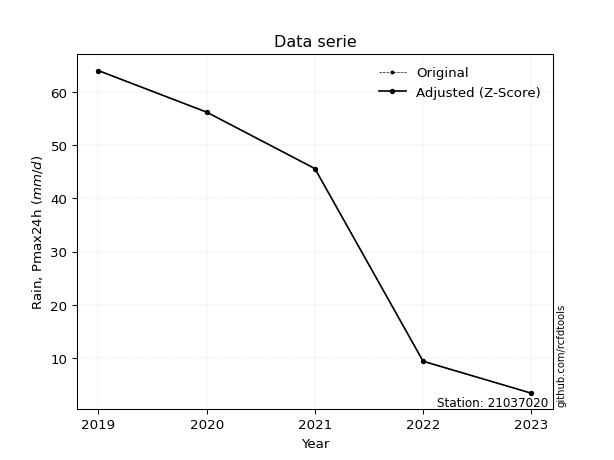</img>

</div>


> The initial value (value_initial) correspond to the initial obtained or null completed value, and value (value) is adjusted only when the initial value is outside the valid range (outlier) definite through the Z-Score value. If Z-Score is active, values out of range or outliers are replaced with the station mean value. A Z-Score (or standard score) measures how many standard deviations a data point is from the mean of a dataset, indicating its relative position; positive scores mean above the mean, negative mean below, and a score of zero is exactly at the mean, allowing for comparison of values from different distributions. It´s calculated using the formula $z=(x–μ)/σ$, where $x$ is the data point, $μ$ is the mean, and $σ$ is the standard deviation, helping identify outliers and understand probability.
>
> <sub>**Note**: In this study, "completing" (filling gaps in) and "extending" (forecasting or lengthening the historical record) rainfall data series are avoided for certain critical analyses because they introduce artificial bias and uncertainty, which can distort the statistics of rare events (extremes), alter day-to-day variability, and compromise the integrity and homogeneity of the original data. Some reasons against Completing/Extending rainfall data are: **Distortion of Extremes and Variability**: The primary issue is that most gap-filling or extension methods rely on averaging or regression with nearby stations, which inherently smooths the data. Rainfall is highly variable in space and time, with a large percentage of zero values and occasional large storms. Infilling methods often underestimate the highest values and overestimate the lowest (zero) values, which severely distorts analyses focused on flood frequency, drought severity, and intensity-duration-frequency (IDF) curves, **Loss of Data Homogeneity**: Infilled or extended data are synthetic estimates, not actual measurements. Combining these estimates with observed data can violate the assumption of data homogeneity, which requires that the data properties do not change over time. Inhomogeneity can lead to incorrect conclusions about long-term trends or changes in climate patterns, **Propagation of Errors**: Errors and biases from the original data (e.g., wind-induced undercatch, instrument errors, site changes) or the data used for imputation can propagate through the analysis, leading to unreliable hydrological models and inaccurate predictions, **Compromised Statistical Integrity**: For statistical analyses, especially those involving the frequency of events, using artificial data can introduce time bias or autocorrelation that doesn´t exist in reality, making it difficult to assess the true probability of events, **Difficulty in Validation**: It is difficult to accurately validate the quality of filled or extended data, especially for past periods where ground-truth measurements are unavailable. The reliability of imputation techniques heavily depends on the density of the surrounding station network and the complexity of the local topography.</sub>


### 4. Active continuous probability distributions from SciPy (80 of 104 available)

A Probability Density Function (PDF) describes the relative likelihood of a continuous random variable falling within a specific range, where the total area under its curve equals 1, and the area over any interval gives the actual probability for that range. Unlike discrete probabilities (like rolling a die), a PDF shows density, not direct probability for a single point (which is zero), with higher points indicating higher likelihood, often visualized as a bell curve for normal distributions.

A log of a probability density function (log-PDF) is simply the logarithm of the PDF´s value, denoted as $log(f(x))$, useful for converting multiplication of probabilities into addition, improving numerical stability with tiny numbers, and connecting to information theory concepts like entropy. Instead of dealing with very small probabilities (e.g., 0.000001), log-PDFs use negative numbers (e.g., $log(0.00001) ≈ -11.51$ that are easier for computers to handle, preventing underflow errors and simplifying complex calculations. In this study, each active probability distribution from SciPy is also evaluated in the $log$ form.

[scipy.stats](https://docs.scipy.org/doc/scipy/reference/stats.html) is a Python´s powerful submodule within the SciPy library for comprehensive statistical analysis, offering over 130 probability distributions (like Normal, Poisson, etc.), functions for descriptive stats (mean, variance), hypothesis testing (t-tests, chi-square), random variable generation, and statistical tests, making it essential for data science, modeling, and research. It provides tools to explore, model, and draw conclusions from data efficiently, working seamlessly with [NumPy](https://numpy.org/).

<div align="center">

|   id | p_dist           |   n_parameter | fit_method   | label                                                                       | active   | ref                                                                                                      |
|-----:|:-----------------|--------------:|:-------------|:----------------------------------------------------------------------------|:---------|:---------------------------------------------------------------------------------------------------------|
|    0 | alpha            |             3 | MLE          | Alpha                                                                       | True     | [:mortar_board:](https://docs.scipy.org/doc/scipy/reference/generated/scipy.stats.alpha.html)            |
|    1 | anglit           |             2 | MM           | Anglit                                                                      | True     | [:mortar_board:](https://docs.scipy.org/doc/scipy/reference/generated/scipy.stats.anglit.html)           |
|    2 | arcsine          |             2 | MM           | Arcsine                                                                     | True     | [:mortar_board:](https://docs.scipy.org/doc/scipy/reference/generated/scipy.stats.arcsine.html)          |
|    3 | argus            |             3 | MLE          | Argus                                                                       | True     | [:mortar_board:](https://docs.scipy.org/doc/scipy/reference/generated/scipy.stats.argus.html)            |
|    4 | beta             |             4 | MLE          | Beta                                                                        | True     | [:mortar_board:](https://docs.scipy.org/doc/scipy/reference/generated/scipy.stats.beta.html)             |
|    5 | betaprime        |             4 | MLE          | Beta prime                                                                  | True     | [:mortar_board:](https://docs.scipy.org/doc/scipy/reference/generated/scipy.stats.betaprime.html)        |
|    6 | bradford         |             3 | MLE          | Bradford                                                                    | True     | [:mortar_board:](https://docs.scipy.org/doc/scipy/reference/generated/scipy.stats.bradford.html)         |
|    7 | burr             |             4 | MLE          | Burr (Type III)                                                             | True     | [:mortar_board:](https://docs.scipy.org/doc/scipy/reference/generated/scipy.stats.burr.html)             |
|    8 | burr12           |             4 | MLE          | Burr (Type III) 12                                                          | True     | [:mortar_board:](https://docs.scipy.org/doc/scipy/reference/generated/scipy.stats.burr12.html)           |
|    9 | cosine           |             2 | MLE          | Cosine                                                                      | True     | [:mortar_board:](https://docs.scipy.org/doc/scipy/reference/generated/scipy.stats.cosine.html)           |
|   10 | crystalball      |             4 | MLE          | Crystalball                                                                 | True     | [:mortar_board:](https://docs.scipy.org/doc/scipy/reference/generated/scipy.stats.crystalball.html)      |
|   11 | dgamma           |             3 | MLE          | Double gamma                                                                | True     | [:mortar_board:](https://docs.scipy.org/doc/scipy/reference/generated/scipy.stats.dgamma.html)           |
|   12 | dweibull         |             3 | MLE          | Double Weibull                                                              | True     | [:mortar_board:](https://docs.scipy.org/doc/scipy/reference/generated/scipy.stats.dweibull.html)         |
|   13 | erlang           |             3 | MLE          | Erlang                                                                      | True     | [:mortar_board:](https://docs.scipy.org/doc/scipy/reference/generated/scipy.stats.erlang.html)           |
|   14 | exponnorm        |             3 | MLE          | Exponentially modified Normal                                               | True     | [:mortar_board:](https://docs.scipy.org/doc/scipy/reference/generated/scipy.stats.exponnorm.html)        |
|   15 | exponpow         |             3 | MLE          | Exponential power                                                           | True     | [:mortar_board:](https://docs.scipy.org/doc/scipy/reference/generated/scipy.stats.exponpow.html)         |
|   16 | exponweib        |             4 | MLE          | Exponentiated Weibull                                                       | True     | [:mortar_board:](https://docs.scipy.org/doc/scipy/reference/generated/scipy.stats.exponweib.html)        |
|   17 | f                |             4 | MLE          | F                                                                           | True     | [:mortar_board:](https://docs.scipy.org/doc/scipy/reference/generated/scipy.stats.f.html)                |
|   18 | fatiguelife      |             3 | MLE          | Fatigue-life (Birnbaum-Saunders)                                            | True     | [:mortar_board:](https://docs.scipy.org/doc/scipy/reference/generated/scipy.stats.fatiguelife.html)      |
|   19 | foldnorm         |             3 | MM           | Fold Normal                                                                 | True     | [:mortar_board:](https://docs.scipy.org/doc/scipy/reference/generated/scipy.stats.foldnorm.html)         |
|   20 | gamma            |             3 | MLE          | Gamma                                                                       | True     | [:mortar_board:](https://docs.scipy.org/doc/scipy/reference/generated/scipy.stats.gamma.html)            |
|   21 | gausshyper       |             6 | MLE          | Gauss hypergeometric                                                        | True     | [:mortar_board:](https://docs.scipy.org/doc/scipy/reference/generated/scipy.stats.gausshyper.html)       |
|   22 | genexpon         |             5 | MLE          | Generalized exponential                                                     | True     | [:mortar_board:](https://docs.scipy.org/doc/scipy/reference/generated/scipy.stats.genexpon.html)         |
|   23 | genextreme       |             3 | MLE          | Generalized exponential                                                     | True     | [:mortar_board:](https://docs.scipy.org/doc/scipy/reference/generated/scipy.stats.genextreme.html)       |
|   24 | gengamma         |             4 | MLE          | Generalized gamma                                                           | True     | [:mortar_board:](https://docs.scipy.org/doc/scipy/reference/generated/scipy.stats.gengamma.html)         |
|   25 | genhalflogistic  |             3 | MLE          | Generalized half-logistic                                                   | True     | [:mortar_board:](https://docs.scipy.org/doc/scipy/reference/generated/scipy.stats.genhalflogistic.html)  |
|   26 | genlogistic      |             3 | MLE          | Generalized logistic                                                        | True     | [:mortar_board:](https://docs.scipy.org/doc/scipy/reference/generated/scipy.stats.genlogistic.html)      |
|   27 | gennorm          |             3 | MLE          | Generalized Normal                                                          | True     | [:mortar_board:](https://docs.scipy.org/doc/scipy/reference/generated/scipy.stats.gennorm.html)          |
|   28 | genpareto        |             3 | MLE          | Generalized Pareto                                                          | True     | [:mortar_board:](https://docs.scipy.org/doc/scipy/reference/generated/scipy.stats.genpareto.html)        |
|   29 | gompertz         |             3 | MLE          | Gompertz (or truncated Gumbel)                                              | True     | [:mortar_board:](https://docs.scipy.org/doc/scipy/reference/generated/scipy.stats.gompertz.html)         |
|   30 | gumbel_l         |             2 | MM           | Gumbel Left Skew                                                            | True     | [:mortar_board:](https://docs.scipy.org/doc/scipy/reference/generated/scipy.stats.gumbel_l.html)         |
|   31 | gumbel_r         |             2 | MM           | Gumbel Right Skew                                                           | True     | [:mortar_board:](https://docs.scipy.org/doc/scipy/reference/generated/scipy.stats.gumbel_r.html)         |
|   32 | halfgennorm      |             3 | MLE          | Upper half of a generalized normal                                          | True     | [:mortar_board:](https://docs.scipy.org/doc/scipy/reference/generated/scipy.stats.halfgennorm.html)      |
|   33 | halflogistic     |             2 | MM           | Half-logistic                                                               | True     | [:mortar_board:](https://docs.scipy.org/doc/scipy/reference/generated/scipy.stats.halflogistic.html)     |
|   34 | halfnorm         |             2 | MM           | Half Normal                                                                 | True     | [:mortar_board:](https://docs.scipy.org/doc/scipy/reference/generated/scipy.stats.halfnorm.html)         |
|   35 | hypsecant        |             2 | MM           | hyperbolic secant                                                           | True     | [:mortar_board:](https://docs.scipy.org/doc/scipy/reference/generated/scipy.stats.hypsecant.html)        |
|   36 | invgamma         |             3 | MLE          | Inverted gamma                                                              | True     | [:mortar_board:](https://docs.scipy.org/doc/scipy/reference/generated/scipy.stats.invgamma.html)         |
|   37 | invgauss         |             3 | MLE          | Inverse Gaussian                                                            | True     | [:mortar_board:](https://docs.scipy.org/doc/scipy/reference/generated/scipy.stats.invgauss.html)         |
|   38 | invweibull       |             3 | MLE          | Inverted Weibull                                                            | True     | [:mortar_board:](https://docs.scipy.org/doc/scipy/reference/generated/scipy.stats.invweibull.html)       |
|   39 | johnsonsb        |             4 | MLE          | Johnson SB                                                                  | True     | [:mortar_board:](https://docs.scipy.org/doc/scipy/reference/generated/scipy.stats.johnsonsb.html)        |
|   40 | johnsonsu        |             4 | MLE          | Johnson Su                                                                  | True     | [:mortar_board:](https://docs.scipy.org/doc/scipy/reference/generated/scipy.stats.johnsonsu.html)        |
|   41 | kappa3           |             3 | MLE          | Kappa 3                                                                     | True     | [:mortar_board:](https://docs.scipy.org/doc/scipy/reference/generated/scipy.stats.kappa3.html)           |
|   42 | kappa4           |             4 | MLE          | Kappa 4                                                                     | True     | [:mortar_board:](https://docs.scipy.org/doc/scipy/reference/generated/scipy.stats.kappa4.html)           |
|   43 | ksone            |             3 | MLE          | Kolmogorov-Smirnov one-sided test statistic distribution                    | True     | [:mortar_board:](https://docs.scipy.org/doc/scipy/reference/generated/scipy.stats.ksone.html)            |
|   44 | kstwobign        |             2 | MLE          | Limiting distribution of scaled Kolmogorov-Smirnov two-sided test statistic | True     | [:mortar_board:](https://docs.scipy.org/doc/scipy/reference/generated/scipy.stats.kstwobign.html)        |
|   45 | laplace          |             2 | MM           | Laplace                                                                     | True     | [:mortar_board:](https://docs.scipy.org/doc/scipy/reference/generated/scipy.stats.laplace.html)          |
|   46 | levy_l           |             2 | MLE          | Left-skewed Levy                                                            | True     | [:mortar_board:](https://docs.scipy.org/doc/scipy/reference/generated/scipy.stats.levy_l.html)           |
|   47 | loggamma         |             3 | MLE          | Log gamma                                                                   | True     | [:mortar_board:](https://docs.scipy.org/doc/scipy/reference/generated/scipy.stats.loggamma.html)         |
|   48 | logistic         |             2 | MM           | Logistic (or Sech-squared)                                                  | True     | [:mortar_board:](https://docs.scipy.org/doc/scipy/reference/generated/scipy.stats.logistic.html)         |
|   49 | loglaplace       |             3 | MLE          | Log-Laplace                                                                 | True     | [:mortar_board:](https://docs.scipy.org/doc/scipy/reference/generated/scipy.stats.loglaplace.html)       |
|   50 | lomax            |             3 | MLE          | Lomax (Pareto of the second kind)                                           | True     | [:mortar_board:](https://docs.scipy.org/doc/scipy/reference/generated/scipy.stats.lomax.html)            |
|   51 | maxwell          |             2 | MM           | Maxwell                                                                     | True     | [:mortar_board:](https://docs.scipy.org/doc/scipy/reference/generated/scipy.stats.maxwell.html)          |
|   52 | mielke           |             4 | MLE          | Mielke Beta-Kappa / Dagum                                                   | True     | [:mortar_board:](https://docs.scipy.org/doc/scipy/reference/generated/scipy.stats.mielke.html)           |
|   53 | moyal            |             2 | MM           | Moyal                                                                       | True     | [:mortar_board:](https://docs.scipy.org/doc/scipy/reference/generated/scipy.stats.moyal.html)            |
|   54 | nakagami         |             3 | MLE          | Nakagami                                                                    | True     | [:mortar_board:](https://docs.scipy.org/doc/scipy/reference/generated/scipy.stats.nakagami.html)         |
|   55 | ncf              |             5 | MLE          | Non-central F distribution                                                  | True     | [:mortar_board:](https://docs.scipy.org/doc/scipy/reference/generated/scipy.stats.ncf.html)              |
|   56 | nct              |             4 | MLE          | Non-central Student’s t                                                     | True     | [:mortar_board:](https://docs.scipy.org/doc/scipy/reference/generated/scipy.stats.nct.html)              |
|   57 | norm             |             2 | MM           | Normal                                                                      | True     | [:mortar_board:](https://docs.scipy.org/doc/scipy/reference/generated/scipy.stats.norm.html)             |
|   58 | pearson3         |             3 | MM           | Pearson type III                                                            | True     | [:mortar_board:](https://docs.scipy.org/doc/scipy/reference/generated/scipy.stats.pearson3.html)         |
|   59 | powerlaw         |             3 | MLE          | Power-function                                                              | True     | [:mortar_board:](https://docs.scipy.org/doc/scipy/reference/generated/scipy.stats.powerlaw.html)         |
|   60 | rayleigh         |             2 | MM           | Rayleigh                                                                    | True     | [:mortar_board:](https://docs.scipy.org/doc/scipy/reference/generated/scipy.stats.rayleigh.html)         |
|   61 | rdist            |             3 | MLE          | R-distributed (symmetric beta)                                              | True     | [:mortar_board:](https://docs.scipy.org/doc/scipy/reference/generated/scipy.stats.rdist.html)            |
|   62 | rice             |             3 | MLE          | Rice                                                                        | True     | [:mortar_board:](https://docs.scipy.org/doc/scipy/reference/generated/scipy.stats.rice.html)             |
|   63 | semicircular     |             2 | MM           | Semicircular                                                                | True     | [:mortar_board:](https://docs.scipy.org/doc/scipy/reference/generated/scipy.stats.semicircular.html)     |
|   64 | skewnorm         |             3 | MLE          | Skew normal                                                                 | True     | [:mortar_board:](https://docs.scipy.org/doc/scipy/reference/generated/scipy.stats.skewnorm.html)         |
|   65 | t                |             3 | MLE          | Student’s t                                                                 | True     | [:mortar_board:](https://docs.scipy.org/doc/scipy/reference/generated/scipy.stats.t.html)                |
|   66 | trapezoid        |             4 | MLE          | Trapezoid                                                                   | True     | [:mortar_board:](https://docs.scipy.org/doc/scipy/reference/generated/scipy.stats.trapezoid.html)        |
|   67 | triang           |             3 | MLE          | Triangular                                                                  | True     | [:mortar_board:](https://docs.scipy.org/doc/scipy/reference/generated/scipy.stats.triang.html)           |
|   68 | truncexpon       |             3 | MLE          | Truncated exponential                                                       | True     | [:mortar_board:](https://docs.scipy.org/doc/scipy/reference/generated/scipy.stats.truncexpon.html)       |
|   69 | truncnorm        |             4 | MLE          | Truncated normal                                                            | True     | [:mortar_board:](https://docs.scipy.org/doc/scipy/reference/generated/scipy.stats.truncnorm.html)        |
|   70 | truncpareto      |             4 | MLE          | Upper truncated Pareto                                                      | True     | [:mortar_board:](https://docs.scipy.org/doc/scipy/reference/generated/scipy.stats.truncpareto.html)      |
|   71 | truncweibull_min |             5 | MLE          | Doubly truncated Weibull minimum                                            | True     | [:mortar_board:](https://docs.scipy.org/doc/scipy/reference/generated/scipy.stats.truncweibull_min.html) |
|   72 | tukeylambda      |             3 | MLE          | Tukey-Lamdba                                                                | True     | [:mortar_board:](https://docs.scipy.org/doc/scipy/reference/generated/scipy.stats.tukeylambda.html)      |
|   73 | uniform          |             2 | MLE          | Uniform                                                                     | True     | [:mortar_board:](https://docs.scipy.org/doc/scipy/reference/generated/scipy.stats.uniform.html)          |
|   74 | vonmises         |             3 | MLE          | Von Mises                                                                   | True     | [:mortar_board:](https://docs.scipy.org/doc/scipy/reference/generated/scipy.stats.vonmises.html)         |
|   75 | vonmises_line    |             3 | MLE          | Von Mises line                                                              | True     | [:mortar_board:](https://docs.scipy.org/doc/scipy/reference/generated/scipy.stats.vonmises_line.html)    |
|   76 | wald             |             2 | MM           | Wald                                                                        | True     | [:mortar_board:](https://docs.scipy.org/doc/scipy/reference/generated/scipy.stats.wald.html)             |
|   77 | weibull_max      |             3 | MLE          | Weibull maximum                                                             | True     | [:mortar_board:](https://docs.scipy.org/doc/scipy/reference/generated/scipy.stats.weibull_max.html)      |
|   78 | weibull_min      |             3 | MLE          | Weibull minimum                                                             | True     | [:mortar_board:](https://docs.scipy.org/doc/scipy/reference/generated/scipy.stats.weibull_min.html)      |
|   79 | wrapcauchy       |             3 | MLE          | Wrapped  Cauchy                                                             | True     | [:mortar_board:](https://docs.scipy.org/doc/scipy/reference/generated/scipy.stats.wrapcauchy.html)       |

</div>

> **n_parameter:** # arguments & localization & scale.
>
> **Fit methods:** (MLE) maximum likelihood, (MM) L-moments.
>
>**Inactive** (With the only purpose of prevent loops, zero divisions, infinite values, over high estimated values or horizontal trending for recurrence intervals estimations, the follow distributions were disabled.)**:** lognorm, norminvgauss, powernorm, powerlognorm, cauchy, halfcauchy, foldcauchy, skewcauchy, chi2, expon, fisk, genhyperbolic, geninvgauss, gibrat, kstwo, laplace_asymmetric, levy, levy_stable, ncx2, pareto, rel_breitwigner, recipinvgauss, studentized_range, loguniform, 


## B. Probability (PDF) vs. Empirical (EDF) distributions functions

A continuous probability distribution (CPD) describes probabilities for variables that can take any value within a range (like rain any time), unlike discrete variables with specific outcomes (like temperature). It uses a Probability Density Function (PDF), a curve where the total area under it equals 1, and the probability of the variable falling within an interval (a to b) is found by calculating the area under the curve between those points. A key feature is that the probability of hitting any single exact value is zero, so probabilities are always expressed for ranges, e.g., $P(a ≤ X ≤ b)$.

<div align="center">

Distributions parameters from station values
|     |   station | p_dist              |   n |             loc |           scale | shape                  | shape1                 | shape2               | shape3             |
|----:|----------:|:--------------------|----:|----------------:|----------------:|:-----------------------|:-----------------------|:---------------------|:-------------------|
|   0 |  21037020 | alpha               |   6 |    -0.0165184   |     7.83065     | 6.715894402395756e-10  |                        |                      |                    |
|   1 |  21037020 | anglit              |   6 |    45.1333      |    90.2653      |                        |                        |                      |                    |
|   2 |  21037020 | arcsine             |   6 |     1.49675     |    87.2732      |                        |                        |                      |                    |
|   3 |  21037020 | argus               |   6 |   -23.0191      |   121.082       | 1.2138101113372488e-06 |                        |                      |                    |
|   4 |  21037020 | beta                |   6 |    -8.46139     |   100.661       | 1.136521879455625      | 0.9033795853584206     |                      |                    |
|   5 |  21037020 | betaprime           |   6 |     3.39994     |   537.368       | 0.7014025210032186     | 9.103634334603353      |                      |                    |
|   6 |  21037020 | bradford            |   6 |     3.39999     |    89.0081      | 4.335485750352673      |                        |                      |                    |
|   7 |  21037020 | burr                |   6 |    -1.38919     |    95.2522      | 205.88564557542452     | 0.004303431991175349   |                      |                    |
|   8 |  21037020 | burr12              |   6 |    -1.80718     |     5.11687     | 243.84224546967738     | 0.002253101291241687   |                      |                    |
|   9 |  21037020 | cosine              |   6 |    45.2899      |    25.0994      |                        |                        |                      |                    |
|  10 |  21037020 | crystalball         |   6 |    45.1333      |    30.8557      | 19045.55756615008      | 182.86124514458157     |                      |                    |
|  11 |  21037020 | dgamma              |   6 |    50.204       |    17.2712      | 1.4860952374671936     |                        |                      |                    |
|  12 |  21037020 | dweibull            |   6 |    49.7281      |    27.8939      | 1.3429905003892442     |                        |                      |                    |
|  13 |  21037020 | erlang              |   6 | -1906.6         |     0.488273    | 3997.2401017118627     |                        |                      |                    |
|  14 |  21037020 | exponnorm           |   6 |    45.0867      |    30.8556      | 0.0015163594223436272  |                        |                      |                    |
|  15 |  21037020 | exponpow            |   6 |     3.4         |    64.7644      | 0.5939461596799381     |                        |                      |                    |
|  16 |  21037020 | exponweib           |   6 |     3.4         |     3.93911     | 2.3282248258254947     | 0.298384949023472      |                      |                    |
|  17 |  21037020 | f                   |   6 |     3.4         |    33.4971      | 0.9455912463928324     | 93.35392945333223      |                      |                    |
|  18 |  21037020 | fatiguelife         |   6 |     3.4         |     8.79834e-06 | 1892.063795229375      |                        |                      |                    |
|  19 |  21037020 | foldnorm            |   6 |  -193.55        |    30.7304      | 7.7679496403815325     |                        |                      |                    |
|  20 |  21037020 | gamma               |   6 | -1913.92        |     0.48622     | 4029.132634332036      |                        |                      |                    |
|  21 |  21037020 | gausshyper          |   6 |    -2.637       |    94.837       | 1.1768748936107492     | 0.81211220624801       | 0.991310499202384    | 1.1632389166818369 |
|  22 |  21037020 | genexpon            |   6 |     3.4         |     2.53989     | 0.060859585929817425   | 2.0636830555461838e-10 | 3.503780192866637    |                    |
|  23 |  21037020 | genextreme          |   6 |    36.7227      |    32.6114      | 0.4451571918614913     |                        |                      |                    |
|  24 |  21037020 | gengamma            |   6 |     3.4         |     3.18213     | 2.0854437511501236     | 0.4136311920554547     |                      |                    |
|  25 |  21037020 | genhalflogistic     |   6 |    -5.62953     |   105.688       | 1.0803292291804292     |                        |                      |                    |
|  26 |  21037020 | genlogistic         |   6 |    53.1748      |    16.8276      | 0.77436568165492       |                        |                      |                    |
|  27 |  21037020 | gennorm             |   6 |    47.8         |    44.4         | 19155502.23890225      |                        |                      |                    |
|  28 |  21037020 | genpareto           |   6 |    -0.260362    |   100.178       | -1.083465079094179     |                        |                      |                    |
|  29 |  21037020 | gompertz            |   6 |     3.4         |    56.0106      | 0.6947754337772387     |                        |                      |                    |
|  30 |  21037020 | gumbel_l            |   6 |    59.02        |    24.0581      |                        |                        |                      |                    |
|  31 |  21037020 | gumbel_r            |   6 |    31.2466      |    24.0581      |                        |                        |                      |                    |
|  32 |  21037020 | halfgennorm         |   6 |     3.4         |     0.66194     | 0.3172288977141524     |                        |                      |                    |
|  33 |  21037020 | halflogistic        |   6 |     8.5621      |    26.3806      |                        |                        |                      |                    |
|  34 |  21037020 | halfnorm            |   6 |     4.29246     |    51.1865      |                        |                        |                      |                    |
|  35 |  21037020 | hypsecant           |   6 |    45.1333      |    19.6434      |                        |                        |                      |                    |
|  36 |  21037020 | invgamma            |   6 |  -206.55        | 16471.4         | 66.38496274308557      |                        |                      |                    |
|  37 |  21037020 | invgauss            |   6 |   -80.1172      |  1812.13        | 0.06904972649072047    |                        |                      |                    |
|  38 |  21037020 | invweibull          |   6 |    -1.56865e+09 |     1.56865e+09 | 56442335.0934612       |                        |                      |                    |
|  39 |  21037020 | johnsonsb           |   6 |   -11.0518      |   103.252       | -0.7144726183020578    | 0.15513171359133235    |                      |                    |
|  40 |  21037020 | johnsonsu           |   6 |   865.87        |  2136.08        | 27.832342956212344     | 74.15645419147884      |                      |                    |
|  41 |  21037020 | kappa3              |   6 |     3.4         |    88.8188      | 7722.805820766465      |                        |                      |                    |
|  42 |  21037020 | kappa4              |   6 |    -7.65849     |   102.69        | 1.120895079465805      | 1.0278202209231946     |                      |                    |
|  43 |  21037020 | ksone               |   6 |    -8.31034     |   106.887       | 1.0                    |                        |                      |                    |
|  44 |  21037020 | kstwobign           |   6 |   -65.1789      |   125.714       |                        |                        |                      |                    |
|  45 |  21037020 | laplace             |   6 |    45.1333      |    21.8183      |                        |                        |                      |                    |
|  46 |  21037020 | levy_l              |   6 |    96.8127      |    19.1349      |                        |                        |                      |                    |
|  47 |  21037020 | loggamma            |   6 | -1731.23        |   361.12        | 137.37098632691192     |                        |                      |                    |
|  48 |  21037020 | logistic            |   6 |    45.1333      |    17.0117      |                        |                        |                      |                    |
|  49 |  21037020 | loglaplace          |   6 |    -0.0891554   |    45.6892      | 1.1123706034909215     |                        |                      |                    |
|  50 |  21037020 | lomax               |   6 |     3.4         |     1.82217e+09 | 43663692.86453602      |                        |                      |                    |
|  51 |  21037020 | maxwell             |   6 |   -27.9818      |    45.8181      |                        |                        |                      |                    |
|  52 |  21037020 | mielke              |   6 |     3.4         |    88.8979      | 0.5192980677385249     | 5416.149567703555      |                      |                    |
|  53 |  21037020 | moyal               |   6 |    27.4881      |    13.89        |                        |                        |                      |                    |
|  54 |  21037020 | nakagami            |   6 |     3.4         |    55.3954      | 0.15179190777689902    |                        |                      |                    |
|  55 |  21037020 | ncf                 |   6 |     3.4         |    17.5892      | 0.786603656242288      | 255.76977788751097     | 1.3879731180119657   |                    |
|  56 |  21037020 | nct                 |   6 |    -0.302037    |     0.153818    | 0.5679923191622721     | 54.73623700133368      |                      |                    |
|  57 |  21037020 | norm                |   6 |    45.1333      |    30.8557      |                        |                        |                      |                    |
|  58 |  21037020 | pearson3            |   6 |    45.1334      |    30.8557      | -0.03390017106296729   |                        |                      |                    |
|  59 |  21037020 | powerlaw            |   6 |     3.4         |    88.8         | 0.13581588569706224    |                        |                      |                    |
|  60 |  21037020 | rayleigh            |   6 |   -13.8955      |    47.0982      |                        |                        |                      |                    |
|  61 |  21037020 | rdist               |   6 |    -4.57076     |    50.1708      | 1.0823572510275763     |                        |                      |                    |
|  62 |  21037020 | rice                |   6 |   -14.272       |    37.2096      | 1.1119683395678903     |                        |                      |                    |
|  63 |  21037020 | semicircular        |   6 |    45.1333      |    61.7114      |                        |                        |                      |                    |
|  64 |  21037020 | skewnorm            |   6 |    49.1061      |    31.1104      | -0.16213702605731642   |                        |                      |                    |
|  65 |  21037020 | t                   |   6 |    45.1317      |    30.8561      | 49318735.343267694     |                        |                      |                    |
|  66 |  21037020 | trapezoid           |   6 |    -5.754       |   106.56        | 1.0                    | 1.0                    |                      |                    |
|  67 |  21037020 | triang              |   6 |    -6.27841     |    98.4786      | 0.9999986577199291     |                        |                      |                    |
|  68 |  21037020 | truncexpon          |   6 |    -0.764767    |   103.846       | 0.8952148112079181     |                        |                      |                    |
|  69 |  21037020 | truncnorm           |   6 |    -2.22644     |    10.1625      | -27.278987085471556    | 9.291691342499593      |                      |                    |
|  70 |  21037020 | truncpareto         |   6 |     3.28847     |     0.111533    | 0.20629323323088933    | 797.1776216761556      |                      |                    |
|  71 |  21037020 | truncweibull_min    |   6 |    -0.740185    |   108.774       | 0.9920685772760791     | 0.0003394978948336523  | 0.8544332131206063   |                    |
|  72 |  21037020 | tukeylambda         |   6 |    47.7852      |    48.8819      | 1.1005784552081728     |                        |                      |                    |
|  73 |  21037020 | uniform             |   6 |     3.4         |    88.8         |                        |                        |                      |                    |
|  74 |  21037020 | vonmises            |   6 |     2.75972     |     1           | 0.4186978695351117     |                        |                      |                    |
|  75 |  21037020 | vonmises_line       |   6 |    47.8         |    14.133       | 0.5795418329455331     |                        |                      |                    |
|  76 |  21037020 | wald                |   6 |    14.2776      |    30.8557      |                        |                        |                      |                    |
|  77 |  21037020 | weibull_max         |   6 |    92.2         |     1.6932      | 0.24810667529146446    |                        |                      |                    |
|  78 |  21037020 | weibull_min         |   6 |     3.4         |    46.149       | 0.39241825201092184    |                        |                      |                    |
|  79 |  21037020 | wrapcauchy          |   6 |     3.39993     |    14.133       | 0.2978544871962563     |                        |                      |                    |
|  80 |  21037020 | logalpha            |   6 |   -28.2272      |   809.62        | 25.702256421943495     |                        |                      |                    |
|  81 |  21037020 | loganglit           |   6 |     3.33269     |     3.47449     |                        |                        |                      |                    |
|  82 |  21037020 | logarcsine          |   6 |     1.65302     |     3.35934     |                        |                        |                      |                    |
|  83 |  21037020 | logargus            |   6 |    -0.131107    |     4.76415     | 2.327851696816264      |                        |                      |                    |
|  84 |  21037020 | logbeta             |   6 |     0.920108    |     3.60385     | 0.40328734465361005    | 0.19900874696375423    |                      |                    |
|  85 |  21037020 | logbetaprime        |   6 |   -10.9862      |  5451.26        | 135.25855516302494     | 51489.23447262269      |                      |                    |
|  86 |  21037020 | logbradford         |   6 |     1.22377     |     3.30027     | 0.8842594976328393     |                        |                      |                    |
|  87 |  21037020 | logburr             |   6 |     0.314159    |     4.24223     | 460.9514692769478      | 0.004718166272194036   |                      |                    |
|  88 |  21037020 | logburr12           |   6 | -4278.79        |  4294.26        | 5123.276000916414      | 1046575.9404421598     |                      |                    |
|  89 |  21037020 | logcosine           |   6 |     3.1967      |     0.974453    |                        |                        |                      |                    |
|  90 |  21037020 | logcrystalball      |   6 |     3.33269     |     1.1877      | 7.933865933896879      | 1599.7409659031366     |                      |                    |
|  91 |  21037020 | logdgamma           |   6 |     4.02892     |     0.836791    | 0.8936629267606706     |                        |                      |                    |
|  92 |  21037020 | logdweibull         |   6 |     4.02892     |     1.04668     | 0.8680356654057046     |                        |                      |                    |
|  93 |  21037020 | logerlang           |   6 |   -14.7481      |     0.0815896   | 221.64381724002385     |                        |                      |                    |
|  94 |  21037020 | logexponnorm        |   6 |     3.33188     |     1.18769     | 0.0006846785850931506  |                        |                      |                    |
|  95 |  21037020 | logexponpow         |   6 |     1.22378     |     1.21145     | 0.40806123452545795    |                        |                      |                    |
|  96 |  21037020 | logexponweib        |   6 |     1.22378     |     1.16113     | 1.139134905971845      | 0.5729242258787817     |                      |                    |
|  97 |  21037020 | logf                |   6 | -1073.87        |  1077.2         | 4542755.905859505      | 2538630.827736767      |                      |                    |
|  98 |  21037020 | logfatiguelife      |   6 |  -522.501       |   525.829       | 0.0022502352322973035  |                        |                      |                    |
|  99 |  21037020 | logfoldnorm         |   6 |    -5.08246     |     1.10946     | 7.599104250897042      |                        |                      |                    |
| 100 |  21037020 | loggamma            |   6 |   -16.7845      |     0.0736146   | 273.1863404721977      |                        |                      |                    |
| 101 |  21037020 | loggausshyper       |   6 |     1.05482     |     3.46914     | 1.2360553407658155     | 0.46245699180168964    | 1.0884888658304612   | 1.034403828815933  |
| 102 |  21037020 | loggenexpon         |   6 |     1.21785     |     0.0291956   | 0.005824882863043605   | 5.6058869999303536     | 2.99451482039343e-05 |                    |
| 103 |  21037020 | loggenextreme       |   6 |     3.69933     |     0.982733    | 1.1917307832051813     |                        |                      |                    |
| 104 |  21037020 | loggengamma         |   6 |   -49.8794      |    20.7608      | 90.62989272417852      | 4.783934192491058      |                      |                    |
| 105 |  21037020 | loggenhalflogistic  |   6 |     0.694267    |     4.15058     | 1.0837894114701827     |                        |                      |                    |
| 106 |  21037020 | loggenlogistic      |   6 |     4.52406     |     8.79053e-06 | 7.417034071652197e-06  |                        |                      |                    |
| 107 |  21037020 | loggennorm          |   6 |     4.02892     |     0.0262111   | 0.3660196000551702     |                        |                      |                    |
| 108 |  21037020 | loggenpareto        |   6 |    -0.00194426  |     8.20501     | -1.8129001707144168    |                        |                      |                    |
| 109 |  21037020 | loggompertz         |   6 |     1.22377     |     0.99511     | 0.0802631084008842     |                        |                      |                    |
| 110 |  21037020 | loggumbel_l         |   6 |     3.86722     |     0.926045    |                        |                        |                      |                    |
| 111 |  21037020 | loggumbel_r         |   6 |     2.79816     |     0.926045    |                        |                        |                      |                    |
| 112 |  21037020 | loghalfgennorm      |   6 |     1.22378     |     1.07276     | 0.6934615491396221     |                        |                      |                    |
| 113 |  21037020 | loghalflogistic     |   6 |     1.92498     |     1.01545     |                        |                        |                      |                    |
| 114 |  21037020 | loghalfnorm         |   6 |     1.76063     |     1.97028     |                        |                        |                      |                    |
| 115 |  21037020 | loghypsecant        |   6 |     3.33269     |     0.756113    |                        |                        |                      |                    |
| 116 |  21037020 | loginvgamma         |   6 |   -15.642       |  4327.49        | 229.15544055649502     |                        |                      |                    |
| 117 |  21037020 | loginvgauss         |   6 |    -7.08415     |   657.821       | 0.01584048815668794    |                        |                      |                    |
| 118 |  21037020 | loginvweibull       |   6 |    -9.09202e+07 |     9.09202e+07 | 72854470.21785443      |                        |                      |                    |
| 119 |  21037020 | logjohnsonsb        |   6 |     1.21942     |     3.30454     | -1.7332840371183658    | 0.1456089580047854     |                      |                    |
| 120 |  21037020 | logjohnsonsu        |   6 |     4.60753     |     0.00256597  | 5.242901047919813      | 0.8287325262167795     |                      |                    |
| 121 |  21037020 | logkappa3           |   6 |     1.22378     |     3.29465     | 1059.433081883045      |                        |                      |                    |
| 122 |  21037020 | logkappa4           |   6 |     0.75904     |     3.9535      | 1.1336680961019567     | 1.0494326977328492     |                      |                    |
| 123 |  21037020 | logksone            |   6 |     0.893757    |     3.96022     | 1.0                    |                        |                      |                    |
| 124 |  21037020 | logkstwobign        |   6 |    -1.62747     |     5.6484      |                        |                        |                      |                    |
| 125 |  21037020 | loglaplace          |   6 |     3.33269     |     0.83983     |                        |                        |                      |                    |
| 126 |  21037020 | loglevy_l           |   6 |     4.59937     |     0.31105     |                        |                        |                      |                    |
| 127 |  21037020 | logloggamma         |   6 |     4.52409     |     5.44707e-06 | 4.567895438655169e-06  |                        |                      |                    |
| 128 |  21037020 | loglogistic         |   6 |     3.33269     |     0.654813    |                        |                        |                      |                    |
| 129 |  21037020 | logloglaplace       |   6 |    -0.00643808  |     3.82635     | 3.04354061002382       |                        |                      |                    |
| 130 |  21037020 | loglomax            |   6 |     1.22378     |     2.4932e+06  | 1182924.797816885      |                        |                      |                    |
| 131 |  21037020 | logmaxwell          |   6 |     0.518344    |     1.76363     |                        |                        |                      |                    |
| 132 |  21037020 | logmielke           |   6 |    -1.58343e+07 |     1.58343e+07 | 13093507.637547184     | 3385892352.8000712     |                      |                    |
| 133 |  21037020 | logmoyal            |   6 |     2.65349     |     0.534652    |                        |                        |                      |                    |
| 134 |  21037020 | lognakagami         |   6 |     2.24071     |     1.30249     | 0.05963186621186025    |                        |                      |                    |
| 135 |  21037020 | logncf              |   6 |   -33.3394      |    29.1262      | 2802.8563224374693     | 4795.937926277258      | 726.4427644728098    |                    |
| 136 |  21037020 | lognct              |   6 |   -71.38        |     1.1738      | 76875.8186998003       | 63.648834904670906     |                      |                    |
| 137 |  21037020 | lognorm             |   6 |     3.33269     |     1.1877      |                        |                        |                      |                    |
| 138 |  21037020 | logpearson3         |   6 |     3.33269     |     1.18771     | -0.7932881668848578    |                        |                      |                    |
| 139 |  21037020 | logpowerlaw         |   6 |     1.22378     |     3.30018     | 0.1541048433562915     |                        |                      |                    |
| 140 |  21037020 | lograyleigh         |   6 |     1.06055     |     1.8129      |                        |                        |                      |                    |
| 141 |  21037020 | logrdist            |   6 |     2.04357     |     1.77633     | 1.0804365602531685     |                        |                      |                    |
| 142 |  21037020 | logrice             |   6 |     0.468508    |     1.30757     | 1.9034593978427639     |                        |                      |                    |
| 143 |  21037020 | logsemicircular     |   6 |     3.33269     |     2.3754      |                        |                        |                      |                    |
| 144 |  21037020 | logskewnorm         |   6 |     4.52396     |     1.68212     | -12377071.56241154     |                        |                      |                    |
| 145 |  21037020 | logt                |   6 |     3.33269     |     1.1877      | 49486549419.07289      |                        |                      |                    |
| 146 |  21037020 | logtrapezoid        |   6 |    -0.0279594   |     5.03898     | 1.0                    | 1.0                    |                      |                    |
| 147 |  21037020 | logtriang           |   6 |    -0.0234768   |     4.54748     | 0.9999991409839668     |                        |                      |                    |
| 148 |  21037020 | logtruncexpon       |   6 |     1.22377     |     5.24274     | 0.6294771221520907     |                        |                      |                    |
| 149 |  21037020 | logtruncnorm        |   6 |    -0.551072    |     2.90777     | 0.6103777718798957     | 1.7453483261198302     |                      |                    |
| 150 |  21037020 | logtruncpareto      |   6 |     1.21726     |     0.00651737  | 0.20370178171967834    | 507.36781688257906     |                      |                    |
| 151 |  21037020 | logtruncweibull_min |   6 |     1.01348     |     5.36299     | 1.4749762695481898     | 0.0015853410141001938  | 0.6545752014136812   |                    |
| 152 |  21037020 | logtukeylambda      |   6 |     2.95406     |     2.37363     | 1.3718154376751208     |                        |                      |                    |
| 153 |  21037020 | loguniform          |   6 |     1.22378     |     3.30018     |                        |                        |                      |                    |
| 154 |  21037020 | logvonmises         |   6 |    -2.58027     |     1           | 1.077802243861813      |                        |                      |                    |
| 155 |  21037020 | logvonmises_line    |   6 |     2.86852     |     0.526949    | 4.616388782207055e-05  |                        |                      |                    |
| 156 |  21037020 | logwald             |   6 |     2.14497     |     1.18772     |                        |                        |                      |                    |
| 157 |  21037020 | logweibull_max      |   6 |     4.52396     |     1.20731     | 0.7014878650756441     |                        |                      |                    |
| 158 |  21037020 | logweibull_min      |   6 |    -1.54985e+08 |     1.54985e+08 | 185361207.51163483     |                        |                      |                    |
| 159 |  21037020 | logwrapcauchy       |   6 |     1.22378     |     0.525244    | 0.48797469470123656    |                        |                      |                    |

</div>

> **loc** (Location parameter): This shifts the distribution along the x-axis. For many common distributions, like the normal (Gaussian) distribution, loc represents the mean $μ$. For others, like the uniform distribution, it might represent the minimum value, or for the beta distribution, the left end of the support interval.
>
> **scale** (Scale parameter): This determines the width or spread of the distribution. For the normal distribution, scale represents the standard deviation $σ$. For a uniform distribution, it defines the length of the interval (from $loc$ to $loc + scale$).
>
> **shape** (Shape parameters): Refers to parameters that define the specific form of a probability distribution, distinct from its location (loc) and scale (scale). These parameters are required arguments for most distribution functions. For example, a normal (Gaussian) distribution is fully defined by its location (mean) and scale (standard deviation), so it has no specific shape parameters beyond loc and scale. However, other distributions have intrinsic properties that need specification, as Gamma distribution that takes a shape parameter, often named $a$ or $alpha$.


### 0. Cumulative distribution values - CDF (160 evaluated)

Cumulative Distribution Function (CDF), denoted as $F$<sub>$X$</sub>$(x)$, is a function that gives the probability that a random variable $X$ will take a value less than or equal to a specific value, $x$ (i.e., $(P(X≥x)$. It essentially "accumulates" probabilities from a given point up to the far right (positive infinity), providing a complete picture of the distribution´s probabilities for both discrete (like rain) and continuous (like temperature) variables, helping to find probabilities over ranges or above certain values. Each station is evaluated separately ordering the $x$ values ascending, calculating the CDF and PDF values for the activated distributions and their logarithmic forms.

<div align="center">

CDF ordered by x ascending and calculating $log(f(x))$ separately
|   id |   Station |   date |    x |   count |    mean |     std |     zscore |   Value_initial |   station |   m |     alpha |   alpha_pdf |   anglit |   anglit_pdf |   arcsine |   arcsine_pdf |     argus |   argus_pdf |      beta |   beta_pdf |   betaprime |   betaprime_pdf |    bradford |   bradford_pdf |      burr |   burr_pdf |     burr12 |   burr12_pdf |    cosine |   cosine_pdf |   crystalball |   crystalball_pdf |    dgamma |   dgamma_pdf |   dweibull |   dweibull_pdf |    erlang |   erlang_pdf |   exponnorm |   exponnorm_pdf |    exponpow |   exponpow_pdf |   exponweib |   exponweib_pdf |           f |        f_pdf |   fatiguelife |   fatiguelife_pdf |   foldnorm |   foldnorm_pdf |     gamma |   gamma_pdf |   gausshyper |   gausshyper_pdf |    genexpon |   genexpon_pdf |   genextreme |   genextreme_pdf |    gengamma |   gengamma_pdf |   genhalflogistic |   genhalflogistic_pdf |   genlogistic |   genlogistic_pdf |     gennorm |   gennorm_pdf |   genpareto |   genpareto_pdf |    gompertz |   gompertz_pdf |   gumbel_l |   gumbel_l_pdf |   gumbel_r |   gumbel_r_pdf |   halfgennorm |   halfgennorm_pdf |   halflogistic |   halflogistic_pdf |   halfnorm |   halfnorm_pdf |   hypsecant |   hypsecant_pdf |   invgamma |   invgamma_pdf |   invgauss |   invgauss_pdf |   invweibull |   invweibull_pdf |   johnsonsb |   johnsonsb_pdf |   johnsonsu |   johnsonsu_pdf |    kappa3 |   kappa3_pdf |      kappa4 |   kappa4_pdf |    ksone |   ksone_pdf |   kstwobign |   kstwobign_pdf |   laplace |   laplace_pdf |   levy_l |   levy_l_pdf |   loggamma |   loggamma_pdf |   logistic |   logistic_pdf |   loglaplace |   loglaplace_pdf |       lomax |   lomax_pdf |   maxwell |   maxwell_pdf |      mielke |     mielke_pdf |     moyal |   moyal_pdf |    nakagami |   nakagami_pdf |         ncf |      ncf_pdf |       nct |    nct_pdf |      norm |   norm_pdf |   pearson3 |   pearson3_pdf |   powerlaw |   powerlaw_pdf |   rayleigh |   rayleigh_pdf |    rdist |      rdist_pdf |      rice |   rice_pdf |   semicircular |   semicircular_pdf |   skewnorm |   skewnorm_pdf |         t |      t_pdf |   trapezoid |   trapezoid_pdf |     triang |   triang_pdf |   truncexpon |   truncexpon_pdf |   truncnorm |   truncnorm_pdf |   truncpareto |   truncpareto_pdf |   truncweibull_min |   truncweibull_min_pdf |   tukeylambda |   tukeylambda_pdf |   uniform |   uniform_pdf |   vonmises |   vonmises_pdf |   vonmises_line |   vonmises_line_pdf |     wald |   wald_pdf |   weibull_max |   weibull_max_pdf |   weibull_min |   weibull_min_pdf |   wrapcauchy |   wrapcauchy_pdf |   logalpha |   logalpha_pdf |   loganglit |   loganglit_pdf |   logarcsine |   logarcsine_pdf |   logargus |   logargus_pdf |   logbeta |   logbeta_pdf |   logbetaprime |   logbetaprime_pdf |   logbradford |   logbradford_pdf |   logburr |   logburr_pdf |   logburr12 |   logburr12_pdf |   logcosine |   logcosine_pdf |   logcrystalball |   logcrystalball_pdf |   logdgamma |   logdgamma_pdf |   logdweibull |   logdweibull_pdf |   logerlang |   logerlang_pdf |   logexponnorm |   logexponnorm_pdf |   logexponpow |   logexponpow_pdf |   logexponweib |   logexponweib_pdf |      logf |   logf_pdf |   logfatiguelife |   logfatiguelife_pdf |   logfoldnorm |   logfoldnorm_pdf |   loggausshyper |   loggausshyper_pdf |   loggenexpon |   loggenexpon_pdf |   loggenextreme |   loggenextreme_pdf |   loggengamma |   loggengamma_pdf |   loggenhalflogistic |   loggenhalflogistic_pdf |   loggenlogistic |   loggenlogistic_pdf |   loggennorm |   loggennorm_pdf |   loggenpareto |   loggenpareto_pdf |   loggompertz |   loggompertz_pdf |   loggumbel_l |   loggumbel_l_pdf |   loggumbel_r |   loggumbel_r_pdf |   loghalfgennorm |   loghalfgennorm_pdf |   loghalflogistic |   loghalflogistic_pdf |   loghalfnorm |   loghalfnorm_pdf |   loghypsecant |   loghypsecant_pdf |   loginvgamma |   loginvgamma_pdf |   loginvgauss |   loginvgauss_pdf |   loginvweibull |   loginvweibull_pdf |   logjohnsonsb |   logjohnsonsb_pdf |   logjohnsonsu |   logjohnsonsu_pdf |   logkappa3 |   logkappa3_pdf |   logkappa4 |   logkappa4_pdf |   logksone |   logksone_pdf |   logkstwobign |   logkstwobign_pdf |   loglevy_l |   loglevy_l_pdf |   logloggamma |   logloggamma_pdf |   loglogistic |   loglogistic_pdf |   logloglaplace |   logloglaplace_pdf |    loglomax |   loglomax_pdf |   logmaxwell |   logmaxwell_pdf |   logmielke |   logmielke_pdf |    logmoyal |   logmoyal_pdf |   lognakagami |   lognakagami_pdf |    logncf |   logncf_pdf |    lognct |   lognct_pdf |   lognorm |   lognorm_pdf |   logpearson3 |   logpearson3_pdf |   logpowerlaw |   logpowerlaw_pdf |   lograyleigh |   lograyleigh_pdf |   logrdist |   logrdist_pdf |   logrice |   logrice_pdf |   logsemicircular |   logsemicircular_pdf |   logskewnorm |   logskewnorm_pdf |      logt |   logt_pdf |   logtrapezoid |   logtrapezoid_pdf |   logtriang |   logtriang_pdf |   logtruncexpon |   logtruncexpon_pdf |   logtruncnorm |   logtruncnorm_pdf |   logtruncpareto |   logtruncpareto_pdf |   logtruncweibull_min |   logtruncweibull_min_pdf |   logtukeylambda |   logtukeylambda_pdf |   loguniform |   loguniform_pdf |   logvonmises |   logvonmises_pdf |   logvonmises_line |   logvonmises_line_pdf |    logwald |   logwald_pdf |   logweibull_max |   logweibull_max_pdf |   logweibull_min |   logweibull_min_pdf |   logwrapcauchy |   logwrapcauchy_pdf |
|-----:|----------:|-------:|-----:|--------:|--------:|--------:|-----------:|----------------:|----------:|----:|----------:|------------:|---------:|-------------:|----------:|--------------:|----------:|------------:|----------:|-----------:|------------:|----------------:|------------:|---------------:|----------:|-----------:|-----------:|-------------:|----------:|-------------:|--------------:|------------------:|----------:|-------------:|-----------:|---------------:|----------:|-------------:|------------:|----------------:|------------:|---------------:|------------:|----------------:|------------:|-------------:|--------------:|------------------:|-----------:|---------------:|----------:|------------:|-------------:|-----------------:|------------:|---------------:|-------------:|-----------------:|------------:|---------------:|------------------:|----------------------:|--------------:|------------------:|------------:|--------------:|------------:|----------------:|------------:|---------------:|-----------:|---------------:|-----------:|---------------:|--------------:|------------------:|---------------:|-------------------:|-----------:|---------------:|------------:|----------------:|-----------:|---------------:|-----------:|---------------:|-------------:|-----------------:|------------:|----------------:|------------:|----------------:|----------:|-------------:|------------:|-------------:|---------:|------------:|------------:|----------------:|----------:|--------------:|---------:|-------------:|-----------:|---------------:|-----------:|---------------:|-------------:|-----------------:|------------:|------------:|----------:|--------------:|------------:|---------------:|----------:|------------:|------------:|---------------:|------------:|-------------:|----------:|-----------:|----------:|-----------:|-----------:|---------------:|-----------:|---------------:|-----------:|---------------:|---------:|---------------:|----------:|-----------:|---------------:|-------------------:|-----------:|---------------:|----------:|-----------:|------------:|----------------:|-----------:|-------------:|-------------:|-----------------:|------------:|----------------:|--------------:|------------------:|-------------------:|-----------------------:|--------------:|------------------:|----------:|--------------:|-----------:|---------------:|----------------:|--------------------:|---------:|-----------:|--------------:|------------------:|--------------:|------------------:|-------------:|-----------------:|-----------:|---------------:|------------:|----------------:|-------------:|-----------------:|-----------:|---------------:|----------:|--------------:|---------------:|-------------------:|--------------:|------------------:|----------:|--------------:|------------:|----------------:|------------:|----------------:|-----------------:|---------------------:|------------:|----------------:|--------------:|------------------:|------------:|----------------:|---------------:|-------------------:|--------------:|------------------:|---------------:|-------------------:|----------:|-----------:|-----------------:|---------------------:|--------------:|------------------:|----------------:|--------------------:|--------------:|------------------:|----------------:|--------------------:|--------------:|------------------:|---------------------:|-------------------------:|-----------------:|---------------------:|-------------:|-----------------:|---------------:|-------------------:|--------------:|------------------:|--------------:|------------------:|--------------:|------------------:|-----------------:|---------------------:|------------------:|----------------------:|--------------:|------------------:|---------------:|-------------------:|--------------:|------------------:|--------------:|------------------:|----------------:|--------------------:|---------------:|-------------------:|---------------:|-------------------:|------------:|----------------:|------------:|----------------:|-----------:|---------------:|---------------:|-------------------:|------------:|----------------:|--------------:|------------------:|--------------:|------------------:|----------------:|--------------------:|------------:|---------------:|-------------:|-----------------:|------------:|----------------:|------------:|---------------:|--------------:|------------------:|----------:|-------------:|----------:|-------------:|----------:|--------------:|--------------:|------------------:|--------------:|------------------:|--------------:|------------------:|-----------:|---------------:|----------:|--------------:|------------------:|----------------------:|--------------:|------------------:|----------:|-----------:|---------------:|-------------------:|------------:|----------------:|----------------:|--------------------:|---------------:|-------------------:|-----------------:|---------------------:|----------------------:|--------------------------:|-----------------:|---------------------:|-------------:|-----------------:|--------------:|------------------:|-------------------:|-----------------------:|-----------:|--------------:|-----------------:|---------------------:|-----------------:|---------------------:|----------------:|--------------------:|
|    0 |  21037020 |   2023 |  3.4 |       6 | 45.1333 | 33.8007 | -1.23469   |             3.4 |  21037020 |   1 | 0.0219057 | 0.0387115   | 0.100785 |   0.00667021 | 0.0943581 |    0.0249718  | 0.0705551 |  0.00527583 | 0.0793313 | 0.00764544 | 7.10355e-05 |      0.781757   | 2.86167e-07 |     0.0290907  | 0.0706984 | 0.0130794  | 0.00959638 |   0.103049   | 0.0759879 |   0.00571953 |     0.0881027 |        0.0051801  | 0.0704887 |   0.00353044 |  0.0692732 |     0.00396918 | 0.0874525 |   0.00522388 |   0.0881014 |      0.00518005 | 6.39128e-11 | 85480          | 8.33394e-12 |  13037          | 0.000208732 | 108.987      |      0.12525  |       6.36382e+10 |  0.0870774 |     0.00515599 | 0.0874639 |  0.00522533 |    0.0484712 |       0.00920215 | 4.80281e-11 |     0.0239615  |     0.098128 |       0.00480137 | 9.71177e-15 |    18.8643     |         0.0447896 |            0.0052015  |     0.0973232 |        0.0042575  | 4.83204e-07 |     0.0112613 |   0.0365953 |       0.0100134 | 5.15608e-14 |     0.0124043  |  0.0943228 |     0.00372962 |  0.0415074 |     0.0054897  |   2.37107e-09 |        0.206557   |      0         |         0          |  0         |     0          |   0.0757086 |      0.00381792 |  0.0748901 |     0.00580355 |  0.0759215 |     0.00670378 |    0.0760121 |       0.00704778 |    0.159595 |     0.00303184  |   0.0884764 |      0.00516156 | 3.347e-08 |    0.0112458 | 5.83722e-15 |    0.513625  | 0.109558 |  0.00935564 |    0.072749 |      0.00773478 | 0.0738355 |    0.00338411 | 0.34916  |   0.00174475 |  0.0382296 |      0.0734934 |  0.0792033 |     0.00428707 |    0.0405885 |        0.0483294 | 1.97166e-09 |  0.0239625  |  0.074378 |    0.00646125 | 1.57171e-08 | 97759.7        | 0.0173123 |  0.00402505 | 5.20025e-06 |    3.55494e+09 | 0.000525874 | 232.673      | 0.0410225 | 0.0437807  | 0.0881027 | 0.0051801  |  0.0888334 |     0.00513394 | 0.00446948 |     1.3669e+12 |   0.065203 |     0.00728856 | 0.553609 |     0.00677864 | 0.0594632 | 0.00658064 |       0.105023 |         0.00759942 |  0.0881221 |     0.00517877 | 0.0881139 | 0.00518053 |  0.00737961 |      0.00161232 | 0.00965884 |   0.00199596 |     0.066463 |       0.0156405  |    0.71009  |     0.0336783   |      0        |       2.47281     |          0.0660447 |             0.0156664  |   0.000426732 |         0.0140296 | 0         |     0.0112613 |   0.644265 |       0.213212 |     2.84063e-07 |          0.00580987 | 0        | 0          |     0.0691846 |       0.000516304 |   2.10058e-07 |       1.85617e+08 |  1.39036e-06 |       0.0208154  |  0.0368728 |      0.0752729 |   0.0314999 |        0.100541 |     0        |         0        |  0.0346212 |      0.0557447 |  0.136373 |   0.190473    |      0.0379534 |          0.0745337 |   2.73159e-07 |          0.422921 | 0.0351239 |    nan        |   0.0417364 |        0.048902 |   0.0347239 |        0.091719 |        0.0378968 |            0.0694331 |   0.0139755 |       0.0171278 |     0.0475367 |         0.0346141 |    0.036822 |       0.0720599 |      0.0378957 |           0.069432 |   3.78787e-07 |       6.96113e+08 |    5.51503e-11 |     162099         | 0.0384464 |  0.0700476 |        0.0373302 |            0.0691197 |     0.0277436 |         0.0574692 |        0.017629 |         0.127479    |    0.00118451 |          0.200441 |       0.0406922 |           0.0331267 |     0.0371396 |         0.0677386 |            0.0685432 |                 0.139137 |         0        |            0.0521035 |    0.0327067 |        0.0174478 |       0.159886 |        0.140419    |   1.34339e-07 |         0.0806576 |     0.0559551 |         0.0587008 |    0.00419186 |         0.0247815 |       1.5674e-11 |            0.72979   |          0        |              0        |      0        |          0        |      0.0390858 |          0.0515632 |     0.0386933 |         0.0781921 |     0.0405171 |         0.0839868 |       0.0383198 |            0.100155 |     0.00348009 |        0.350098    |       0.099312 |           0.042766 | 1.32167e-13 |        0.301533 | 8.44457e-15 |       19.3588   |  0.0833333 |       0.252511 |      0.0392003 |           0.119382 |    0.238534 |       0.0342602 |     0.0628106 |         0.0526728 |     0.0383963 |         0.0563857 |       0.0158162 |           0.0391291 | 4.63093e-08 |      0.47446   |     0.016226 |        0.0668167 |   0.0643492 |        0.053211 | 0.000140212 |      0.0020185 |      0        |       0           | 0.0374959 |    0.0709136 | 0.0380641 |    0.0696955 | 0.0378968 |     0.0694331 |     0.0546543 |         0.0655451 |     0.0032196 |       2.23448e+12 |    0.00404476 |         0.0494614 |   0.339465 |    0.210996    | 0.0289808 |     0.0809927 |         0.0221694 |              0.123336 |     0.0497721 |          0.069224 | 0.0378969 |  0.0694333 |      0.0617077 |          0.0985955 |   0.0752259 |        0.120627 |     1.94913e-07 |            0.408323 |    2.97594e-06 |           0.494393 |         0        |           43.4788    |              0.020055 |                  0.141323 |      3.91509e-12 |             0.421271 |     0        |         0.303013 |       1.02961 |         0.0518495 |          0.0032356 |               0.302017 | 0          |     0         |         0.132038 |            0.0568243 |        0.0417866 |            0.0489174 |     1.73887e-08 |            0.880569 |
|    1 |  21037020 |   2022 |  9.4 |       6 | 45.1333 | 33.8007 | -1.05718   |             9.4 |  21037020 |   2 | 0.405642  | 0.0498646   | 0.144211 |   0.00778381 | 0.194593  |    0.0127092  | 0.105581  |  0.00639164 | 0.126759  | 0.00813971 | 0.209314    |      0.0229419  | 0.153124    |     0.0225116  | 0.145188  | 0.0119229  | 0.34997    |   0.031866   | 0.114845  |   0.00723139 |     0.123416  |        0.00661224 | 0.0949619 |   0.00467456 |  0.0969289 |     0.00529577 | 0.123099  |   0.00667899 |   0.123415  |      0.00661219 | 0.24088     |     0.0233326  | 0.404896    |      0.025222   | 0.341092    |   0.0253546  |      0.668746 |       0.0131918   |  0.122267  |     0.0065958  | 0.123121  |  0.00668109 |    0.106022  |       0.00986448 | 0.133912    |     0.0207528  |     0.130269 |       0.00592991 | 0.347428    |     0.0312461  |         0.077045  |            0.00555646 |     0.126209  |        0.00540679 | 0.5         |     0.0112613 |   0.0968359 |       0.0100675 | 0.0755522   |     0.0127638  |  0.119385  |     0.0046536  |  0.0837809 |     0.00863488 |   0.292381    |        0.027708   |      0.0158797 |         0.0189486  |  0.0794835 |     0.0155104  |   0.10235   |      0.0051211  |  0.11533   |     0.00768684 |  0.122602  |     0.00883338 |    0.125368  |       0.00936693 |    0.175823 |     0.00244551  |   0.123645  |      0.00658276 | 0.067475  |    0.0112458 | 0.0881985   |    0.0131269 | 0.165692 |  0.00935564 |    0.126896 |      0.0102277  | 0.0972066 |    0.00445528 | 0.360123 |   0.00191393 |  0.187187  |      0.22931   |  0.109046  |     0.00571109 |    0.136233  |        0.162215  | 0.133917    |  0.0207535  |  0.118748 |    0.00831007 | 0.246625    |     0.0213453  | 0.0551507 |  0.00875836 | 0.410144    |    0.0207201   | 0.261987    |   0.0182094  | 0.315044  | 0.0338869  | 0.123416  | 0.00661224 |  0.123794  |     0.0065411  | 0.693521   |     0.0156985  |   0.115137 |     0.00929265 | 0.594748 |     0.00695235 | 0.104817  | 0.00849702 |       0.153157 |         0.00841069 |  0.123425  |     0.00661023 | 0.12343   | 0.00661268 |  0.020224   |      0.00266912 | 0.0253467  |   0.00323332 |     0.157647 |       0.0147625  |    0.8737   |     0.020403    |      0.751577 |       0.0197584   |          0.157091  |             0.0147093  |   0.0727989   |         0.0116185 | 0.0675676 |     0.0112613 |   1.582    |       0.22561  |     0.0354703   |          0.00611659 | 0        | 0          |     0.0724386 |       0.000569784 |   0.361778    |       0.0187449   |  0.120671    |       0.0187989  |  0.191977  |      0.238182  |   0.206005  |        0.232802 |     0.274721 |         0.249406 |  0.128233  |      0.13878   |  0.267429 |   0.106428    |      0.188988  |          0.231329  |   0.380345    |          0.332361 | 0.179653  |      0.202806 |   0.134106  |        0.149212 |   0.211588  |        0.254161 |        0.178941  |            0.220113  |   0.0488904 |       0.0605734 |     0.101772  |         0.0786424 |    0.184623 |       0.228803  |      0.178939  |           0.220113 |   0.785022    |       0.203782    |    0.563293    |          0.219491  | 0.179903  |  0.219982  |        0.178662  |            0.221184  |     0.159033  |         0.218438  |        0.184778 |         0.186772    |    0.264393   |          0.294867 |       0.0953332 |           0.0823474 |     0.175914  |         0.218344  |            0.234173  |                 0.190976 |         0        |            0.122888  |    0.0599718 |        0.0404311 |       0.314369 |        0.165639    |   0.133032    |         0.194298  |     0.15858   |         0.156886  |    0.161102   |         0.317616  |       0.434333   |            0.278423  |          0.154222 |              0.480682 |      0.192505 |          0.393116 |      0.147502  |          0.188173  |     0.196392  |         0.238688  |     0.205556  |         0.243351  |       0.235986  |            0.273051 |     0.0321257  |        0.0148585   |       0.161268 |           0.085635 | 0.306639    |        0.301533 | 0.341507    |        0.298959 |  0.340121  |       0.252511 |      0.263678  |           0.290462 |    0.283505 |       0.0575029 |     0.147366  |         0.123581  |     0.158741  |         0.20394   |       0.0989572 |           0.134028  | 0.382758    |      0.292856  |     0.187559 |        0.267832  |   0.149192  |        0.123369 | 0.141258    |      0.371995  |      0.012474 |       3.34999e+12 | 0.181424  |    0.222804  | 0.179435  |    0.220385  | 0.178941  |     0.220113  |     0.169589  |         0.172617  |     0.834093  |       0.126397    |    0.190942   |         0.290516  |   0.537328 |    0.190074    | 0.187734  |     0.236473  |         0.218005  |              0.238008 |     0.174666  |          0.1888   | 0.178941  |  0.220113  |      0.202702  |          0.178696  |   0.247904  |        0.218978 |     0.377449    |            0.336329 |    0.444144    |           0.375668 |         0.894466 |            0.0988449 |              0.258917 |                  0.294051 |      0.304352    |             0.277839 |     0.308145 |         0.303013 |       1.11557 |         0.136317  |          0.310375  |               0.302036 | 0.00112315 |     0.0775568 |         0.209381 |            0.100584  |        0.134146  |            0.149161  |     0.425987    |            0.145489 |
|    2 |  21037020 |   2021 | 45.6 |       6 | 45.1333 | 33.8007 |  0.0138064 |            45.6 |  21037020 |   3 | 0.863703  | 0.00295866  | 0.50517  |   0.0110779  | 0.503404  |    0.00729498 | 0.440703  |  0.0115689  | 0.457682  | 0.010009   | 0.645964    |      0.00680814 | 0.667082    |     0.00952072 | 0.53469   | 0.010082   | 0.705682   |   0.00341085 | 0.503933  |   0.0126815  |     0.506033  |        0.0129278  | 0.454487  |   0.0131645  |  0.463014  |     0.011576   | 0.508035  |   0.0129184  |   0.506031  |      0.0129278  | 0.690069    |     0.00734433 | 0.72028     |      0.00364137 | 0.738215    |   0.00543125 |      0.876465 |       0.00279997  |  0.505689  |     0.0129807  | 0.508179  |  0.0129213  |    0.473345  |       0.0101578  | 0.63621     |     0.00871698 |     0.473249 |       0.0123537  | 0.769579    |     0.00476282 |         0.330367  |            0.00884782 |     0.481674  |        0.0135359  | 0.5         |     0.0112613 |   0.468683  |       0.0105233 | 0.542105    |     0.0120656  |  0.435862  |     0.0134235  |  0.576561  |     0.0131971  |   0.690354    |        0.00494196 |      0.605631  |         0.0120015  |  0.580334  |     0.0112556  |   0.507561  |      0.0161999  |  0.535838  |     0.0127649  |  0.558691  |     0.012046   |    0.568653  |       0.0115499  |    0.246933 |     0.00191542  |   0.50514   |      0.0129281  | 0.474574  |    0.0112458 | 0.505722    |    0.0107949 | 0.504366 |  0.00935564 |    0.580789 |      0.0114169  | 0.510581  |    0.0224316  | 0.458971 |   0.00395023 |  0.663764  |      0.295016  |  0.506858  |     0.014693   |    0.720089  |        0.333295  | 0.636224    |  0.00871698 |  0.538833 |    0.0123688  | 0.679151    |     0.00835738 | 0.602358  |  0.0130651  | 0.733279    |    0.00488575  | 0.609511    |   0.0061575  | 0.704067  | 0.0036347  | 0.506033  | 0.0129278  |  0.50378   |     0.0129308  | 0.903895   |     0.00290908 |   0.549711 |     0.0120772  | 1        | 53950.9        | 0.530426  | 0.0126146  |       0.504814 |         0.0103158  |  0.505972  |     0.012928   | 0.506055  | 0.0129276  |  0.232252   |      0.00904515 | 0.277517   |   0.0106988  |     0.608846 |       0.0104176  |    0.999999 |     6.08823e-07 |      0.944223 |       0.00191466  |          0.606409  |             0.0104073  |   0.476033    |         0.0109684 | 0.475225  |     0.0112613 |   7.25642  |       0.181381 |     0.459359    |          0.0183868  | 0.674068 | 0.01264    |     0.102683  |       0.00124435  |   0.619209    |       0.00341883  |  0.486578    |       0.00611855 |  0.6696    |      0.285628  |   0.638395  |        0.276567 |     0.593678 |         0.198021 |  0.578171  |      0.49056   |  0.457991 |   0.170799    |      0.662123  |          0.289883  |   0.833472    |          0.249423 | 0.660532  |      0.409771 |   0.614301  |        0.439585 |   0.696774  |        0.294376 |        0.659177  |            0.308789  |   0.365582  |       0.502365  |     0.390574  |         0.400641  |    0.66181  |       0.295746  |      0.659178  |           0.308791 |   0.945798    |       0.0455227   |    0.770228    |          0.0790799 | 0.658204  |  0.307406  |        0.6609    |            0.309064  |     0.664565  |         0.328537  |        0.548222 |         0.310197    |    0.694333   |          0.217414 |       0.416539  |           0.434776  |     0.660501  |         0.314619  |            0.653494  |                 0.375434 |         0        |            0.465786  |    0.286193  |        0.519241  |       0.641697 |        0.280719    |   0.635791    |         0.399045  |     0.613333  |         0.396749  |    0.717659   |         0.257105  |       0.720475   |            0.115242  |          0.732012 |              0.228548 |      0.704056 |          0.234534 |      0.692231  |          0.346519  |     0.66698   |         0.279859  |     0.664248  |         0.266279  |       0.665391  |            0.217207 |     0.0614116  |        0.0318811   |       0.469145 |           0.418509 | 0.78282     |        0.301533 | 0.794085    |        0.282258 |  0.738886  |       0.252511 |      0.689884  |           0.209394 |    0.472423 |       0.264836  |     0.554038  |         0.464614  |     0.677882  |         0.333467  |       0.5       |           0.397708  | 0.708222    |      0.138437  |     0.679819 |        0.274895  |   0.550645  |        0.455334 | 0.736915    |      0.236917  |      0.888323 |       0.0617551   | 0.654733  |    0.299313  | 0.659366  |    0.308239  | 0.659177  |     0.308789  |     0.618034  |         0.360225  |     0.963697  |       0.0572045   |    0.685992   |         0.263632  |   1        |    2.16401e+06 | 0.664808  |     0.293252  |         0.629655  |              0.262307 |     0.675545  |          0.434552 | 0.659178  |  0.308789  |      0.583116  |          0.303085  |   0.71431   |        0.371709 |     0.836047    |            0.248856 |    0.887424    |           0.192443 |         0.980454 |            0.0321393 |              0.770504 |                  0.332115 |      0.738225    |             0.280709 |     0.786663 |         0.303013 |       1.54159 |         0.353758  |          0.787355  |               0.302028 | 0.79175    |     0.188954  |         0.504081 |            0.344047  |        0.614116  |            0.439462  |     0.630374    |            0.227377 |
|    3 |  21037020 |   2020 | 56.2 |       6 | 45.1333 | 33.8007 |  0.327409  |            56.2 |  21037020 |   4 | 0.889217  | 0.00195793  | 0.621377 |   0.0107471  | 0.581618  |    0.00754111 | 0.567459  |  0.0122594  | 0.566423  | 0.0105157  | 0.709884    |      0.00533078 | 0.760328    |     0.00814448 | 0.640288  | 0.00985089 | 0.736568   |   0.00249504 | 0.636204  |   0.0120923  |     0.640075  |        0.0121239  | 0.564335  |   0.0138092  |  0.565569  |     0.0126725  | 0.641637  |   0.0120543  |   0.640073  |      0.0121239  | 0.759449    |     0.00581187 | 0.753945    |      0.00277562 | 0.788625    |   0.00415801 |      0.902294 |       0.00211551  |  0.640275  |     0.012171   | 0.641802  |  0.0120553  |    0.581225  |       0.0102168  | 0.717809    |     0.00676174 |     0.606879 |       0.0126599  | 0.812754    |     0.00348035 |         0.432271  |            0.0104539  |     0.624835  |        0.0130879  | 0.5         |     0.0112613 |   0.581298  |       0.0107346 | 0.663315    |     0.0107201  |  0.589094  |     0.0151906  |  0.701565  |     0.010336   |   0.735987    |        0.00375275 |      0.717706  |         0.00919044 |  0.689459  |     0.0093213  |   0.670532  |      0.013934   |  0.663219  |     0.0111027  |  0.676656  |     0.0101179  |    0.680119  |       0.00943352 |    0.268444 |     0.0021812   |   0.639343  |      0.0121524  | 0.59378   |    0.0112458 | 0.619086    |    0.0106079 | 0.603536 |  0.00935564 |    0.691186 |      0.00938073 | 0.698916  |    0.0137996  | 0.507544 |   0.00532746 |  0.722806  |      0.269057  |  0.657131  |     0.0132444  |    0.781759  |        0.259864  | 0.717822    |  0.00676167 |  0.662753 |    0.0108704  | 0.762966    |     0.00750391 | 0.722034  |  0.00959099 | 0.779991    |    0.0039767   | 0.669312    |   0.005165   | 0.73682   | 0.00263267 | 0.640075  | 0.0121239  |  0.638231  |     0.0121946  | 0.931828   |     0.00239691 |   0.669615 |     0.0104401  | 1        |     0          | 0.657516  | 0.0112119  |       0.61355  |         0.0101488  |  0.640026  |     0.0121259  | 0.640093  | 0.0121235  |  0.338026   |      0.0109122  | 0.40251    |   0.0128848  |     0.713823 |       0.00940669 |    1        |     2.6084e-09  |      0.961923 |       0.00146208  |          0.711444  |             0.00942743 |   0.592335    |         0.0109845 | 0.594595  |     0.0112613 |   9.00333  |       0.100289 |     0.650474    |          0.0167644  | 0.779777 | 0.00778664 |     0.118252  |       0.00173992  |   0.651548    |       0.00273026  |  0.552263    |       0.00648575 |  0.726582  |      0.258904  |   0.695061  |        0.265007 |     0.636044 |         0.208239 |  0.687286  |      0.551566  |  0.498008 |   0.217255    |      0.720136  |          0.264416  |   0.884762    |          0.241449 | 0.749188  |      0.43862  |   0.70575   |        0.430602 |   0.755915  |        0.270625 |        0.721128  |            0.28287   |   0.5       |      21.7638    |     0.5       |        36.8845    |    0.721003 |       0.269772  |      0.721129  |           0.282871 |   0.954515    |       0.0381242   |    0.785931    |          0.0713737 | 0.719902  |  0.281838  |        0.722861  |            0.282697  |     0.730175  |         0.297927  |        0.6185   |         0.367666    |    0.737686   |          0.197346 |       0.521165  |           0.575697  |     0.723613  |         0.288058  |            0.736991  |                 0.425745 |         0        |            0.555616  |    0.5       |        4.4034    |       0.704963 |        0.328745    |   0.71772     |         0.381566  |     0.696017  |         0.390886  |    0.767412   |         0.219382  |       0.743371   |            0.104086  |          0.776289 |              0.195665 |      0.750371 |          0.208742 |      0.758749  |          0.289386  |     0.722867  |         0.254254  |     0.717453  |         0.242318  |       0.708532  |            0.195623 |     0.0693712  |        0.04613     |       0.570697 |           0.562397 | 0.845843    |        0.301533 | 0.853253    |        0.284218 |  0.791663  |       0.252511 |      0.731513  |           0.189007 |    0.539741 |       0.393178  |     0.660176  |         0.553622  |     0.74331   |         0.291382  |       0.574723  |           0.320752  | 0.735768    |      0.125367  |     0.734429 |        0.24722   |   0.654533  |        0.541239 | 0.782321    |      0.198443  |      0.900391 |       0.053999    | 0.714793  |    0.27441   | 0.721204  |    0.282347  | 0.721128  |     0.28287   |     0.692733  |         0.352187  |     0.975265  |       0.0535777   |    0.738275   |         0.236381  |   1        |    0           | 0.723557  |     0.268026  |         0.683885  |              0.256235 |     0.768531  |          0.454229 | 0.721129  |  0.282869  |      0.648184  |          0.319548  |   0.794113  |        0.391923 |     0.887037    |            0.23913  |    0.925518    |           0.172288 |         0.986864 |            0.0292857 |              0.839635 |                  0.329179 |      0.79744     |             0.286289 |     0.849995 |         0.303013 |       1.61401 |         0.336708  |          0.850481  |               0.302023 | 0.827081   |     0.150877  |         0.585635 |            0.444023  |        0.705548  |            0.430567  |     0.689062    |            0.347407 |
|    4 |  21037020 |   2019 | 64   |       6 | 45.1333 | 33.8007 |  0.558173  |            64   |  21037020 |   5 | 0.902644  | 0.00151323  | 0.702979 |   0.0101245  | 0.642319  |    0.00808978 | 0.663805  |  0.0123816  | 0.650044  | 0.0109355  | 0.748101    |      0.00449792 | 0.820698    |     0.00736146 | 0.71656   | 0.00970929 | 0.754209   |   0.00205203 | 0.726595  |   0.0110003  |     0.729548  |        0.0107248  | 0.672558  |   0.013181   |  0.667039  |     0.012739   | 0.730466  |   0.0106331  |   0.729547  |      0.0107249  | 0.801125    |     0.00489999 | 0.773795    |      0.00233492 | 0.818252    |   0.00346622 |      0.917291 |       0.0017447   |  0.730067  |     0.0107582  | 0.730633  |  0.0106325  |    0.661412  |       0.0103638  | 0.765915    |     0.00560905 |     0.703816 |       0.0120773  | 0.837247    |     0.0028314  |         0.519538  |            0.0119822  |     0.72104   |        0.0114307  | 0.5         |     0.0112613 |   0.665789  |       0.0109385 | 0.742074    |     0.00943948 |  0.707701  |     0.0149439  |  0.773914  |     0.00824462 |   0.762747    |        0.00313698 |      0.782092  |         0.00736021 |  0.756576  |     0.00789446 |   0.767303  |      0.0108188  |  0.743415  |     0.00942381 |  0.749266  |     0.00849258 |    0.7474    |       0.00782988 |    0.286847 |     0.00257728  |   0.729089  |      0.0107646  | 0.681497  |    0.0112458 | 0.701452    |    0.0105181 | 0.67651  |  0.00935564 |    0.758378 |      0.00785775 | 0.789415  |    0.00965177 | 0.554921 |   0.00693633 |  0.756589  |      0.250578  |  0.751951  |     0.0109643  |    0.813049  |        0.222606  | 0.765928    |  0.00560895 |  0.741781 |    0.00935578 | 0.819557    |     0.00702301 | 0.788196  |  0.0074427  | 0.808923    |    0.00345818  | 0.707189    |   0.00456202 | 0.75538   | 0.00215259 | 0.729548  | 0.0107248  |  0.728379  |     0.0108228  | 0.949429   |     0.00212785 |   0.745304 |     0.00894388 | 1        |     0          | 0.739301  | 0.00971169 |       0.691554 |         0.00982214 |  0.729518  |     0.0107275  | 0.729564  | 0.0107244  |  0.428499   |      0.012286   | 0.509285   |   0.0144934  |     0.784508 |       0.00872603 |    1        |     2.35522e-11 |      0.972412 |       0.0012386   |          0.782374  |             0.00876825 |   0.678186    |         0.0110347 | 0.682432  |     0.0112613 |  10.1818   |       0.151082 |     0.767749    |          0.0131683  | 0.831537 | 0.00562821 |     0.134065  |       0.00237016  |   0.671371    |       0.00236815  |  0.606929    |       0.00769227 |  0.759045  |      0.240484  |   0.728925  |        0.255873 |     0.66369  |         0.217658 |  0.76088   |      0.57867   |  0.529385 |   0.270579    |      0.753348  |          0.246464  |   0.915834    |          0.236742 | 0.807368  |      0.456704 |   0.760475  |        0.409465 |   0.789981  |        0.253298 |        0.756668  |            0.263711  |   0.591772  |       0.580742  |     0.575426  |         0.463697  |    0.754879 |       0.251286  |      0.756669  |           0.263712 |   0.959208    |       0.0341723   |    0.794927    |          0.0671147 | 0.755323  |  0.262935  |        0.758362  |            0.263289  |     0.767453  |         0.275376  |        0.669885 |         0.42788     |    0.762514   |          0.184727 |       0.603668  |           0.700318  |     0.759786  |         0.268238  |            0.79481   |                 0.465389 |         0        |            0.620011  |    0.665308  |        0.73044   |       0.750586 |        0.376845    |   0.76602     |         0.360402  |     0.745944  |         0.375908  |    0.794481   |         0.197381  |       0.756486   |            0.0978154 |          0.800484 |              0.17688  |      0.776477 |          0.193057 |      0.794032  |          0.253789  |     0.754779  |         0.236667  |     0.747904  |         0.226161  |       0.733094  |            0.182386 |     0.0764214  |        0.0643849   |       0.651353 |           0.683221 | 0.885032    |        0.301533 | 0.890336    |        0.286667 |  0.824481  |       0.252511 |      0.755267  |           0.176562 |    0.599274 |       0.534668  |     0.736196  |         0.617372  |     0.779322  |         0.262639  |       0.613836  |           0.282165  | 0.751569    |      0.11787   |     0.765379 |        0.228968  |   0.728795  |        0.602647 | 0.806708    |      0.177186  |      0.907138 |       0.049911    | 0.749299  |    0.256328  | 0.756678  |    0.263228  | 0.756668  |     0.263711  |     0.737761  |         0.339758  |     0.982096  |       0.0515639   |    0.76786    |         0.218841  |   1        |    0           | 0.757237  |     0.250015  |         0.716875  |              0.251272 |     0.828182  |          0.463291 | 0.756668  |  0.263711  |      0.69038   |          0.329785  |   0.845867  |        0.404492 |     0.917734    |            0.233275 |    0.947133    |           0.160416 |         0.990568 |            0.0277353 |              0.882263 |                  0.326743 |      0.83495     |             0.291166 |     0.889377 |         0.303013 |       1.65668 |         0.319216  |          0.889734  |               0.30202  | 0.845423   |     0.131898  |         0.64912  |            0.538993  |        0.760272  |            0.409497  |     0.741825    |            0.472491 |
|    5 |  21037020 |   2025 | 92.2 |       6 | 45.1333 | 33.8007 |  1.39247   |            92.2 |  21037020 |   6 | 0.932328  | 0.000732074 | 0.931922 |   0.00558087 | 1         |    0          | 0.970954  |  0.00724747 | 1         | 0.351943   | 0.844445    |      0.00255408 | 0.998864    |     0.00546268 | 0.984404  | 0.00907783 | 0.797944   |   0.00118086 | 0.949588  |   0.00447814 |     0.936418  |        0.00403943 | 0.91046   |   0.00442432 |  0.913875  |     0.00478982 | 0.935441  |   0.00402131 |   0.936417  |      0.00403946 | 0.903743    |     0.00259432 | 0.82484     |      0.00140967 | 0.891444    |   0.00191256 |      0.953431 |       0.000921161 |  0.937075  |     0.00402322 | 0.935536  |  0.00401788 |    1         |       7.35067    | 0.880899    |     0.00285384 |     0.959291 |       0.00503696 | 0.895706    |     0.00150528 |         1         |            0.290621   |     0.929926  |        0.0038322  | 1           |     0.0112612 |   1         |       0.16916   | 0.932568    |     0.00408296 |  0.981156  |     0.00311081 |  0.923695  |     0.00304749 |   0.830305    |        0.00182801 |      0.919413  |         0.0029317  |  0.914094  |     0.00356713 |   0.942179  |      0.00292739 |  0.923073  |     0.00370169 |  0.913443  |     0.00355394 |    0.89983   |       0.00341739 |    1        |     2.17308e+07 |   0.936816  |      0.00404854 | 0.99863   |    0.0112455 | 0.999361    |    0.0119502 | 0.940339 |  0.00935564 |    0.912955 |      0.00346637 | 0.942176  |    0.00265023 | 0.958324 |   0.0221359  |  0.837865  |      0.194075  |  0.940851  |     0.00327129 |    0.878957  |        0.144128  | 0.880909    |  0.00285372 |  0.924185 |    0.00384134 | 0.999428    |     0.00582966 | 0.922449  |  0.00278281 | 0.88642     |    0.00215168  | 0.811374    |   0.00295036 | 0.800917  | 0.00122019 | 0.936418  | 0.00403943 |  0.93737   |     0.00406261 | 1          |     0.00152946 |   0.920913 |     0.00378264 | 1        |     0          | 0.928406  | 0.00391243 |       0.933138 |         0.00667207 |  0.936443  |     0.00404    | 0.936422  | 0.00403917 |  0.844998   |      0.017253   | 0.999998   |   0.020309   |     1        |       0.00665092 |    1        |     7.02085e-21 |      1        |       0.000781742 |          1         |             0.00675582 |   1           |         0.0197132 | 1         |     0.0112613 |  14.8003   |       0.158584 |     1           |          0.00580987 | 0.929444 | 0.00203242 |     0.999678  |       5.61703e+09 |   0.72551     |       0.00156822  |  1           |       0.0208154  |  0.836925  |      0.185943  |   0.816616  |        0.222755 |     0.750957 |         0.268813 |  0.964929  |      0.453629  |  0.999509 |   2.44124e+11 |      0.833478  |          0.192006  |   0.99998     |          0.224452 | 0.983317  |      0.493632 |   0.890478  |        0.289722 |   0.872477  |        0.197174 |        0.842071  |            0.203118  |   0.750254  |       0.325646  |     0.703359  |         0.27156   |    0.836412 |       0.194781  |      0.842072  |           0.203119 |   0.969958    |       0.0251899   |    0.817495    |          0.0569157 | 0.840581  |  0.203092  |        0.84351   |            0.202201  |     0.855324  |         0.205126  |        1        |         4.64915e+07 |    0.823548   |          0.149899 |       1         |         375.325     |     0.846402  |         0.205127  |            1         |                 8.24888  |         0.999913 |            0.843673  |    0.812726  |        0.234846  |       1        |        1.73749e+06 |   0.881385    |         0.263682  |     0.868972  |         0.287561  |    0.856321   |         0.143432  |       0.789306   |            0.0825064 |          0.85641  |              0.131253 |      0.839236 |          0.151453 |      0.870116  |          0.167052  |     0.831723  |         0.184634  |     0.821882  |         0.179019  |       0.793157  |            0.14728  |     0.99985    |        2.29297e+11 |       0.962588 |           0.808881 | 0.99511     |        0.299857 | 0.999117    |        0.35812  |  0.916667  |       0.252511 |      0.813581  |           0.143422 |    0.957737 |       1.36617   |     0.999893  |         0.838508  |     0.860476  |         0.183346  |       0.700966  |           0.200892  | 0.79108     |      0.0991239 |     0.839448 |        0.176971  |   0.985538  |        0.79611  | 0.861939    |      0.127816  |      0.923571 |       0.0405639   | 0.832735  |    0.199923  | 0.841935  |    0.202814  | 0.842071  |     0.203118  |     0.851206  |         0.274684  |     1         |       0.0466958   |    0.838758   |         0.169915  |   1        |    0           | 0.83851   |     0.194516  |         0.805327  |              0.231867 |     1         |          0.474332 | 0.842071  |  0.203118  |      0.816026  |          0.358541  |   0.999983  |        0.439801 |     1           |            0.217583 |    0.999994    |           0.129868 |         1        |            0.0240922 |              1        |                  0.317761 |      0.945378    |             0.319504 |     1        |         0.303013 |       1.76163 |         0.252815  |          0.999994  |               0.302017 | 0.885803   |     0.0921758 |         1        |        19128.5       |        0.89032   |            0.289924  |     0.999983    |            0.880569 |


</div>

An Empirical Distribution Function (EDF) is a step-function estimate of a true cumulative distribution function (CDF) based on observed sample data, representing the proportion of data points less than or equal to a given value. It is calculated by ordering your data and jumping up by $1/n$ (where $n$ is sample size) at each unique data point, allowing analysis without assuming an underlying population distribution, and it gets closer to the true CDF as the sample size grows. For the empirical probability calculations, the parameter $m$ correspond to the order number which means the position of the $x$ values in an ascending order list.

The Kolmogorov-Smirnov (K-S) test is a non-parametric statistical test used to determine if a sample data set comes from a specific theoretical distribution (one-sample) or if two different samples come from the same underlying distribution (two-sample), by comparing their cumulative distribution functions (CDFs). It calculates the maximum vertical difference (D statistic) between these functions, with a small p-value indicating a significant difference and rejection of the null hypothesis (that the data/samples match).


### 1. EDF California (1923)

California´s estimates the true probability distribution of water-related data (like rainfall, streamflow) using observed samples, crucial for risk assessment.

<div align="center">


$P=m/n$


</div>


**1.1. Empirical values**

<div align="center">

|                | 0                   | 1                  | 2              | 3                  | 4                  | 5              |
|:---------------|:--------------------|:-------------------|:---------------|:-------------------|:-------------------|:---------------|
| date           | 2023                | 2022               | 2021           | 2020               | 2019               | 2025           |
| x              | 3.4                 | 9.4                | 45.6           | 56.2               | 64.0               | 92.2           |
| m              | 1                   | 2                  | 3              | 4                  | 5                  | 6              |
| empirical_dist | edf_california      | edf_california     | edf_california | edf_california     | edf_california     | edf_california |
| empirical      | 0.16666666666666666 | 0.3333333333333333 | 0.5            | 0.6666666666666666 | 0.8333333333333334 | 1.0            |
| empirical_tr   | 1.2                 | 1.4999999999999998 | 2.0            | 2.9999999999999996 | 6.000000000000002  | inf            |

</div>


**1.2. Kolmogorov-Smirnov fit test (sorted by Δ)**


<div align="center">

|                | 0                   | 1                  | 2                   | 3                   | 4                   | 5                  | 6                  | 7                   | 8                   | 9                   | 10                 | 11                  | 12                  | 13                 | 14                 | 15                 | 16                 | 17                  | 18                  | 19                  | 20                  | 21                  | 22                  | 23                  | 24                  | 25                  | 26                  | 27                  | 28                  | 29                  | 30                  | 31                 | 32                  | 33                  | 34                 | 35                  | 36                  | 37                  | 38                  | 39                  | 40                  | 41                  | 42                  | 43                  | 44                  | 45                  | 46                  | 47                 | 48                  | 49                  | 50                 | 51                 | 52                  | 53                  | 54                  | 55                  | 56                  | 57                 | 58                  | 59                  | 60                  | 61                  | 62                  | 63                 | 64                  | 65                  | 66                  | 67                 | 68                  | 69                  | 70                  | 71                  | 72                  | 73                  | 74                  | 75                  | 76                  | 77                  | 78                  | 79                | 80                  | 81                  | 82                  | 83                  | 84                 | 85                  | 86                  | 87                  | 88                  | 89                  | 90                  | 91                  | 92                  | 93                  | 94                  | 95                  | 96                 | 97                  | 98                  | 99                 | 100                 | 101                 | 102                | 103                 | 104                 | 105                 | 106                 | 107                 | 108                 | 109                 | 110                 | 111               | 112                 | 113                 | 114                | 115                | 116                | 117                | 118                | 119                 | 120                 | 121                | 122                | 123                | 124                | 125                | 126                 | 127                 | 128                 | 129                | 130                | 131                | 132                | 133                | 134                 | 135                 | 136                | 137                | 138                 | 139                 | 140                 | 141                 | 142                 | 143               | 144                 | 145                 | 146                | 147                 | 148                 | 149                | 150                 | 151                | 152                | 153                | 154                | 155                | 156               | 157                | 158                | 159                |
|:---------------|:--------------------|:-------------------|:--------------------|:--------------------|:--------------------|:-------------------|:-------------------|:--------------------|:--------------------|:--------------------|:-------------------|:--------------------|:--------------------|:-------------------|:-------------------|:-------------------|:-------------------|:--------------------|:--------------------|:--------------------|:--------------------|:--------------------|:--------------------|:--------------------|:--------------------|:--------------------|:--------------------|:--------------------|:--------------------|:--------------------|:--------------------|:-------------------|:--------------------|:--------------------|:-------------------|:--------------------|:--------------------|:--------------------|:--------------------|:--------------------|:--------------------|:--------------------|:--------------------|:--------------------|:--------------------|:--------------------|:--------------------|:-------------------|:--------------------|:--------------------|:-------------------|:-------------------|:--------------------|:--------------------|:--------------------|:--------------------|:--------------------|:-------------------|:--------------------|:--------------------|:--------------------|:--------------------|:--------------------|:-------------------|:--------------------|:--------------------|:--------------------|:-------------------|:--------------------|:--------------------|:--------------------|:--------------------|:--------------------|:--------------------|:--------------------|:--------------------|:--------------------|:--------------------|:--------------------|:------------------|:--------------------|:--------------------|:--------------------|:--------------------|:-------------------|:--------------------|:--------------------|:--------------------|:--------------------|:--------------------|:--------------------|:--------------------|:--------------------|:--------------------|:--------------------|:--------------------|:-------------------|:--------------------|:--------------------|:-------------------|:--------------------|:--------------------|:-------------------|:--------------------|:--------------------|:--------------------|:--------------------|:--------------------|:--------------------|:--------------------|:--------------------|:------------------|:--------------------|:--------------------|:-------------------|:-------------------|:-------------------|:-------------------|:-------------------|:--------------------|:--------------------|:-------------------|:-------------------|:-------------------|:-------------------|:-------------------|:--------------------|:--------------------|:--------------------|:-------------------|:-------------------|:-------------------|:-------------------|:-------------------|:--------------------|:--------------------|:-------------------|:-------------------|:--------------------|:--------------------|:--------------------|:--------------------|:--------------------|:------------------|:--------------------|:--------------------|:-------------------|:--------------------|:--------------------|:-------------------|:--------------------|:-------------------|:-------------------|:-------------------|:-------------------|:-------------------|:------------------|:-------------------|:-------------------|:-------------------|
| station        | 21037020            | 21037020           | 21037020            | 21037020            | 21037020            | 21037020           | 21037020           | 21037020            | 21037020            | 21037020            | 21037020           | 21037020            | 21037020            | 21037020           | 21037020           | 21037020           | 21037020           | 21037020            | 21037020            | 21037020            | 21037020            | 21037020            | 21037020            | 21037020            | 21037020            | 21037020            | 21037020            | 21037020            | 21037020            | 21037020            | 21037020            | 21037020           | 21037020            | 21037020            | 21037020           | 21037020            | 21037020            | 21037020            | 21037020            | 21037020            | 21037020            | 21037020            | 21037020            | 21037020            | 21037020            | 21037020            | 21037020            | 21037020           | 21037020            | 21037020            | 21037020           | 21037020           | 21037020            | 21037020            | 21037020            | 21037020            | 21037020            | 21037020           | 21037020            | 21037020            | 21037020            | 21037020            | 21037020            | 21037020           | 21037020            | 21037020            | 21037020            | 21037020           | 21037020            | 21037020            | 21037020            | 21037020            | 21037020            | 21037020            | 21037020            | 21037020            | 21037020            | 21037020            | 21037020            | 21037020          | 21037020            | 21037020            | 21037020            | 21037020            | 21037020           | 21037020            | 21037020            | 21037020            | 21037020            | 21037020            | 21037020            | 21037020            | 21037020            | 21037020            | 21037020            | 21037020            | 21037020           | 21037020            | 21037020            | 21037020           | 21037020            | 21037020            | 21037020           | 21037020            | 21037020            | 21037020            | 21037020            | 21037020            | 21037020            | 21037020            | 21037020            | 21037020          | 21037020            | 21037020            | 21037020           | 21037020           | 21037020           | 21037020           | 21037020           | 21037020            | 21037020            | 21037020           | 21037020           | 21037020           | 21037020           | 21037020           | 21037020            | 21037020            | 21037020            | 21037020           | 21037020           | 21037020           | 21037020           | 21037020           | 21037020            | 21037020            | 21037020           | 21037020           | 21037020            | 21037020            | 21037020            | 21037020            | 21037020            | 21037020          | 21037020            | 21037020            | 21037020           | 21037020            | 21037020            | 21037020           | 21037020            | 21037020           | 21037020           | 21037020           | 21037020           | 21037020           | 21037020          | 21037020           | 21037020           | 21037020           |
| empirical_dist | edf_california      | edf_california     | edf_california      | edf_california      | edf_california      | edf_california     | edf_california     | edf_california      | edf_california      | edf_california      | edf_california     | edf_california      | edf_california      | edf_california     | edf_california     | edf_california     | edf_california     | edf_california      | edf_california      | edf_california      | edf_california      | edf_california      | edf_california      | edf_california      | edf_california      | edf_california      | edf_california      | edf_california      | edf_california      | edf_california      | edf_california      | edf_california     | edf_california      | edf_california      | edf_california     | edf_california      | edf_california      | edf_california      | edf_california      | edf_california      | edf_california      | edf_california      | edf_california      | edf_california      | edf_california      | edf_california      | edf_california      | edf_california     | edf_california      | edf_california      | edf_california     | edf_california     | edf_california      | edf_california      | edf_california      | edf_california      | edf_california      | edf_california     | edf_california      | edf_california      | edf_california      | edf_california      | edf_california      | edf_california     | edf_california      | edf_california      | edf_california      | edf_california     | edf_california      | edf_california      | edf_california      | edf_california      | edf_california      | edf_california      | edf_california      | edf_california      | edf_california      | edf_california      | edf_california      | edf_california    | edf_california      | edf_california      | edf_california      | edf_california      | edf_california     | edf_california      | edf_california      | edf_california      | edf_california      | edf_california      | edf_california      | edf_california      | edf_california      | edf_california      | edf_california      | edf_california      | edf_california     | edf_california      | edf_california      | edf_california     | edf_california      | edf_california      | edf_california     | edf_california      | edf_california      | edf_california      | edf_california      | edf_california      | edf_california      | edf_california      | edf_california      | edf_california    | edf_california      | edf_california      | edf_california     | edf_california     | edf_california     | edf_california     | edf_california     | edf_california      | edf_california      | edf_california     | edf_california     | edf_california     | edf_california     | edf_california     | edf_california      | edf_california      | edf_california      | edf_california     | edf_california     | edf_california     | edf_california     | edf_california     | edf_california      | edf_california      | edf_california     | edf_california     | edf_california      | edf_california      | edf_california      | edf_california      | edf_california      | edf_california    | edf_california      | edf_california      | edf_california     | edf_california      | edf_california      | edf_california     | edf_california      | edf_california     | edf_california     | edf_california     | edf_california     | edf_california     | edf_california    | edf_california     | edf_california     | edf_california     |
| p_dist         | loggenpareto        | loggenhalflogistic | lognorm             | logcrystalball      | logt                | logexponnorm       | lognct             | logf                | loggengamma         | logburr             | logfatiguelife     | loggausshyper       | logerlang           | logpearson3        | loggamma           | loggamma           | logrice            | logbetaprime        | betaprime           | logwrapcauchy       | logncf              | ksone               | loginvgamma         | logalpha            | logfoldnorm         | loggumbel_l         | logskewnorm         | truncexpon          | truncweibull_min    | loglogistic         | loginvgauss         | mielke             | logmaxwell          | semicircular        | bradford           | logjohnsonsu        | loganglit           | logtrapezoid        | logmielke           | logweibull_max      | logloggamma         | lograyleigh         | burr                | ncf                 | anglit              | logkstwobign        | exponpow            | halfgennorm        | arcsine             | loghypsecant        | loggenexpon        | logsemicircular    | logcosine           | logweibull_min      | logburr12           | lomax               | genexpon            | loggompertz        | genextreme          | loghalfnorm         | nct                 | logargus            | burr12              | kstwobign          | beta                | loginvweibull       | genlogistic         | invweibull         | loglomax            | pearson3            | johnsonsu           | t                   | skewnorm            | crystalball         | norm                | exponnorm           | gamma               | erlang              | invgauss            | foldnorm          | gumbel_l            | logtriang           | maxwell             | loggumbel_r         | invgamma           | rayleigh            | cosine              | loglaplace          | loglaplace          | exponweib           | loghalfgennorm      | logistic            | wrapcauchy          | gausshyper          | argus               | rice                | hypsecant          | loghalflogistic     | nakagami            | loglevy_l          | laplace             | dweibull            | genpareto          | logmoyal            | loggenextreme       | f                   | logtukeylambda      | dgamma              | logksone            | kappa4              | logarcsine          | gumbel_r          | halfnorm            | gompertz            | tukeylambda        | uniform            | kappa3             | gengamma           | logexponweib       | logtruncweibull_min | loggennorm          | weibull_min        | moyal              | levy_l             | logkappa3          | logdgamma          | loguniform          | logvonmises_line    | logkappa4           | logdweibull        | vonmises_line      | logloglaplace      | logbeta            | genhalflogistic    | halflogistic        | triang              | logwald            | wald               | gennorm             | logbradford         | logtruncexpon       | alpha               | fatiguelife         | logtruncnorm      | lognakagami         | powerlaw            | trapezoid          | truncpareto         | logexponpow         | rdist              | logrdist            | logpowerlaw        | truncnorm          | johnsonsb          | logtruncpareto     | weibull_max        | logjohnsonsb      | loggenlogistic     | logvonmises        | vonmises           |
| delta          | 0.14169742700200727 | 0.1534939220305207 | 0.15917699925734186 | 0.15917702278476498 | 0.15917751933799074 | 0.1591776923593552 | 0.1593660927617906 | 0.15941868714767404 | 0.16050091732477267 | 0.16053206687599908 | 0.1608999863453603 | 0.16344856016373865 | 0.16358773746012667 | 0.1637447816982131 | 0.1637636884682575 | 0.1637636884682575 | 0.1648081962067498 | 0.16652178923906713 | 0.16659563119011697 | 0.16666664927798833 | 0.16726499559125807 | 0.16764166495199243 | 0.16827659833364383 | 0.16960044444249478 | 0.17430020629369086 | 0.17475319892218022 | 0.17554466534631952 | 0.17568676791164647 | 0.17624226261156653 | 0.17788155109062675 | 0.17811828241344985 | 0.1791505886977578 | 0.17981872931997356 | 0.18017649273771602 | 0.1802092593689433 | 0.18198045285943354 | 0.18338410145678852 | 0.18397428268761484 | 0.18414089945824272 | 0.18421380164598056 | 0.18596695757010895 | 0.18599229099807357 | 0.18814533367734196 | 0.18862579409089142 | 0.18912184209720861 | 0.18988378038740783 | 0.19006941584147752 | 0.1903537296155754 | 0.19101465730440925 | 0.19223122116656943 | 0.1943331894767507 | 0.1946731706478766 | 0.19677413120635912 | 0.19918690173970668 | 0.19922753810964092 | 0.19941611483276364 | 0.19942088182494758 | 0.2003017438434571 | 0.20306463307769476 | 0.20405567108838318 | 0.20406700266872424 | 0.20510053504840936 | 0.20568174331996358 | 0.2064373590097282 | 0.20657396541075196 | 0.20684272167100803 | 0.20712448910895903 | 0.2079651892889769 | 0.20891962490194216 | 0.20953967778980798 | 0.20968812404688209 | 0.20990336049250274 | 0.20990792739500314 | 0.20991723035369514 | 0.20991723625467335 | 0.20991883043155274 | 0.21021233224436559 | 0.21023431225787614 | 0.21073133454888374 | 0.211066152388246 | 0.21394841524099611 | 0.21431001651671633 | 0.21458553508202227 | 0.21765889566446872 | 0.2180036376586702 | 0.21819669098280103 | 0.21848877721921323 | 0.22008886743173572 | 0.22008886743173572 | 0.22028034883266623 | 0.22047493153102926 | 0.22428715943495198 | 0.22640460038885346 | 0.22731139975913148 | 0.22775246588093784 | 0.22851633126948817 | 0.2309831895935895 | 0.23201221835498487 | 0.23327850641210623 | 0.2340595525068342 | 0.23612674989999127 | 0.23640440546525457 | 0.2364974679261458 | 0.23691520297882618 | 0.23800009422753837 | 0.23821533988976584 | 0.23822533033277438 | 0.23837138454317783 | 0.23888560331480524 | 0.24513478380728113 | 0.24904312088030411 | 0.249552420134018 | 0.25384984233585967 | 0.25778113765512073 | 0.2605344294892665 | 0.2657657657657657 | 0.2658583091382864 | 0.2695787826140683 | 0.2702280677815103 | 0.2705042946676929  | 0.27336150269370185 | 0.2744897009463858 | 0.2781826433428357 | 0.2784118890709041 | 0.2828200488584416 | 0.2844429692774925 | 0.28666272397776627 | 0.28735544149249226 | 0.29408515129656343 | 0.2966414779786908 | 0.2978629949867431 | 0.2990335396487357 | 0.3039483646084751 | 0.3137957128925285 | 0.31745364434665524 | 0.32404834396694127 | 0.3322101807287819 | 0.3333333333333333 | 0.33333333333333337 | 0.33347239371845805 | 0.33604749613590357 | 0.36370272212907506 | 0.37646531710324205 | 0.387424493748585 | 0.38832311438266487 | 0.40389465317633444 | 0.4048343356729477 | 0.44422295158108205 | 0.45168861979413505 | 0.4999999977788462 | 0.49999999842000464 | 0.5007599280343462 | 0.5434238092768106 | 0.5464868071426061 | 0.5611328888803262 | 0.6992679075267558 | 0.756911973088762 | 0.8333333333333334 | 1.0415895447512482 | 13.800275167635533 |
| deltao         | 0.530385761606      | 0.530385761606     | 0.530385761606      | 0.530385761606      | 0.530385761606      | 0.530385761606     | 0.530385761606     | 0.530385761606      | 0.530385761606      | 0.530385761606      | 0.530385761606     | 0.530385761606      | 0.530385761606      | 0.530385761606     | 0.530385761606     | 0.530385761606     | 0.530385761606     | 0.530385761606      | 0.530385761606      | 0.530385761606      | 0.530385761606      | 0.530385761606      | 0.530385761606      | 0.530385761606      | 0.530385761606      | 0.530385761606      | 0.530385761606      | 0.530385761606      | 0.530385761606      | 0.530385761606      | 0.530385761606      | 0.530385761606     | 0.530385761606      | 0.530385761606      | 0.530385761606     | 0.530385761606      | 0.530385761606      | 0.530385761606      | 0.530385761606      | 0.530385761606      | 0.530385761606      | 0.530385761606      | 0.530385761606      | 0.530385761606      | 0.530385761606      | 0.530385761606      | 0.530385761606      | 0.530385761606     | 0.530385761606      | 0.530385761606      | 0.530385761606     | 0.530385761606     | 0.530385761606      | 0.530385761606      | 0.530385761606      | 0.530385761606      | 0.530385761606      | 0.530385761606     | 0.530385761606      | 0.530385761606      | 0.530385761606      | 0.530385761606      | 0.530385761606      | 0.530385761606     | 0.530385761606      | 0.530385761606      | 0.530385761606      | 0.530385761606     | 0.530385761606      | 0.530385761606      | 0.530385761606      | 0.530385761606      | 0.530385761606      | 0.530385761606      | 0.530385761606      | 0.530385761606      | 0.530385761606      | 0.530385761606      | 0.530385761606      | 0.530385761606    | 0.530385761606      | 0.530385761606      | 0.530385761606      | 0.530385761606      | 0.530385761606     | 0.530385761606      | 0.530385761606      | 0.530385761606      | 0.530385761606      | 0.530385761606      | 0.530385761606      | 0.530385761606      | 0.530385761606      | 0.530385761606      | 0.530385761606      | 0.530385761606      | 0.530385761606     | 0.530385761606      | 0.530385761606      | 0.530385761606     | 0.530385761606      | 0.530385761606      | 0.530385761606     | 0.530385761606      | 0.530385761606      | 0.530385761606      | 0.530385761606      | 0.530385761606      | 0.530385761606      | 0.530385761606      | 0.530385761606      | 0.530385761606    | 0.530385761606      | 0.530385761606      | 0.530385761606     | 0.530385761606     | 0.530385761606     | 0.530385761606     | 0.530385761606     | 0.530385761606      | 0.530385761606      | 0.530385761606     | 0.530385761606     | 0.530385761606     | 0.530385761606     | 0.530385761606     | 0.530385761606      | 0.530385761606      | 0.530385761606      | 0.530385761606     | 0.530385761606     | 0.530385761606     | 0.530385761606     | 0.530385761606     | 0.530385761606      | 0.530385761606      | 0.530385761606     | 0.530385761606     | 0.530385761606      | 0.530385761606      | 0.530385761606      | 0.530385761606      | 0.530385761606      | 0.530385761606    | 0.530385761606      | 0.530385761606      | 0.530385761606     | 0.530385761606      | 0.530385761606      | 0.530385761606     | 0.530385761606      | 0.530385761606     | 0.530385761606     | 0.530385761606     | 0.530385761606     | 0.530385761606     | 0.530385761606    | 0.530385761606     | 0.530385761606     | 0.530385761606     |
| eval           | Δo > Δ              | Δo > Δ             | Δo > Δ              | Δo > Δ              | Δo > Δ              | Δo > Δ             | Δo > Δ             | Δo > Δ              | Δo > Δ              | Δo > Δ              | Δo > Δ             | Δo > Δ              | Δo > Δ              | Δo > Δ             | Δo > Δ             | Δo > Δ             | Δo > Δ             | Δo > Δ              | Δo > Δ              | Δo > Δ              | Δo > Δ              | Δo > Δ              | Δo > Δ              | Δo > Δ              | Δo > Δ              | Δo > Δ              | Δo > Δ              | Δo > Δ              | Δo > Δ              | Δo > Δ              | Δo > Δ              | Δo > Δ             | Δo > Δ              | Δo > Δ              | Δo > Δ             | Δo > Δ              | Δo > Δ              | Δo > Δ              | Δo > Δ              | Δo > Δ              | Δo > Δ              | Δo > Δ              | Δo > Δ              | Δo > Δ              | Δo > Δ              | Δo > Δ              | Δo > Δ              | Δo > Δ             | Δo > Δ              | Δo > Δ              | Δo > Δ             | Δo > Δ             | Δo > Δ              | Δo > Δ              | Δo > Δ              | Δo > Δ              | Δo > Δ              | Δo > Δ             | Δo > Δ              | Δo > Δ              | Δo > Δ              | Δo > Δ              | Δo > Δ              | Δo > Δ             | Δo > Δ              | Δo > Δ              | Δo > Δ              | Δo > Δ             | Δo > Δ              | Δo > Δ              | Δo > Δ              | Δo > Δ              | Δo > Δ              | Δo > Δ              | Δo > Δ              | Δo > Δ              | Δo > Δ              | Δo > Δ              | Δo > Δ              | Δo > Δ            | Δo > Δ              | Δo > Δ              | Δo > Δ              | Δo > Δ              | Δo > Δ             | Δo > Δ              | Δo > Δ              | Δo > Δ              | Δo > Δ              | Δo > Δ              | Δo > Δ              | Δo > Δ              | Δo > Δ              | Δo > Δ              | Δo > Δ              | Δo > Δ              | Δo > Δ             | Δo > Δ              | Δo > Δ              | Δo > Δ             | Δo > Δ              | Δo > Δ              | Δo > Δ             | Δo > Δ              | Δo > Δ              | Δo > Δ              | Δo > Δ              | Δo > Δ              | Δo > Δ              | Δo > Δ              | Δo > Δ              | Δo > Δ            | Δo > Δ              | Δo > Δ              | Δo > Δ             | Δo > Δ             | Δo > Δ             | Δo > Δ             | Δo > Δ             | Δo > Δ              | Δo > Δ              | Δo > Δ             | Δo > Δ             | Δo > Δ             | Δo > Δ             | Δo > Δ             | Δo > Δ              | Δo > Δ              | Δo > Δ              | Δo > Δ             | Δo > Δ             | Δo > Δ             | Δo > Δ             | Δo > Δ             | Δo > Δ              | Δo > Δ              | Δo > Δ             | Δo > Δ             | Δo > Δ              | Δo > Δ              | Δo > Δ              | Δo > Δ              | Δo > Δ              | Δo > Δ            | Δo > Δ              | Δo > Δ              | Δo > Δ             | Δo > Δ              | Δo > Δ              | Δo > Δ             | Δo > Δ              | Δo > Δ             | Δo <= Δ            | Δo <= Δ            | Δo <= Δ            | Δo <= Δ            | Δo <= Δ           | Δo <= Δ            | Δo <= Δ            | Δo <= Δ            |
| fit            | 1                   | 1                  | 1                   | 1                   | 1                   | 1                  | 1                  | 1                   | 1                   | 1                   | 1                  | 1                   | 1                   | 1                  | 1                  | 1                  | 1                  | 1                   | 1                   | 1                   | 1                   | 1                   | 1                   | 1                   | 1                   | 1                   | 1                   | 1                   | 1                   | 1                   | 1                   | 1                  | 1                   | 1                   | 1                  | 1                   | 1                   | 1                   | 1                   | 1                   | 1                   | 1                   | 1                   | 1                   | 1                   | 1                   | 1                   | 1                  | 1                   | 1                   | 1                  | 1                  | 1                   | 1                   | 1                   | 1                   | 1                   | 1                  | 1                   | 1                   | 1                   | 1                   | 1                   | 1                  | 1                   | 1                   | 1                   | 1                  | 1                   | 1                   | 1                   | 1                   | 1                   | 1                   | 1                   | 1                   | 1                   | 1                   | 1                   | 1                 | 1                   | 1                   | 1                   | 1                   | 1                  | 1                   | 1                   | 1                   | 1                   | 1                   | 1                   | 1                   | 1                   | 1                   | 1                   | 1                   | 1                  | 1                   | 1                   | 1                  | 1                   | 1                   | 1                  | 1                   | 1                   | 1                   | 1                   | 1                   | 1                   | 1                   | 1                   | 1                 | 1                   | 1                   | 1                  | 1                  | 1                  | 1                  | 1                  | 1                   | 1                   | 1                  | 1                  | 1                  | 1                  | 1                  | 1                   | 1                   | 1                   | 1                  | 1                  | 1                  | 1                  | 1                  | 1                   | 1                   | 1                  | 1                  | 1                   | 1                   | 1                   | 1                   | 1                   | 1                 | 1                   | 1                   | 1                  | 1                   | 1                   | 1                  | 1                   | 1                  | 0                  | 0                  | 0                  | 0                  | 0                 | 0                  | 0                  | 0                  |
| n              | 6                   | 6                  | 6                   | 6                   | 6                   | 6                  | 6                  | 6                   | 6                   | 6                   | 6                  | 6                   | 6                   | 6                  | 6                  | 6                  | 6                  | 6                   | 6                   | 6                   | 6                   | 6                   | 6                   | 6                   | 6                   | 6                   | 6                   | 6                   | 6                   | 6                   | 6                   | 6                  | 6                   | 6                   | 6                  | 6                   | 6                   | 6                   | 6                   | 6                   | 6                   | 6                   | 6                   | 6                   | 6                   | 6                   | 6                   | 6                  | 6                   | 6                   | 6                  | 6                  | 6                   | 6                   | 6                   | 6                   | 6                   | 6                  | 6                   | 6                   | 6                   | 6                   | 6                   | 6                  | 6                   | 6                   | 6                   | 6                  | 6                   | 6                   | 6                   | 6                   | 6                   | 6                   | 6                   | 6                   | 6                   | 6                   | 6                   | 6                 | 6                   | 6                   | 6                   | 6                   | 6                  | 6                   | 6                   | 6                   | 6                   | 6                   | 6                   | 6                   | 6                   | 6                   | 6                   | 6                   | 6                  | 6                   | 6                   | 6                  | 6                   | 6                   | 6                  | 6                   | 6                   | 6                   | 6                   | 6                   | 6                   | 6                   | 6                   | 6                 | 6                   | 6                   | 6                  | 6                  | 6                  | 6                  | 6                  | 6                   | 6                   | 6                  | 6                  | 6                  | 6                  | 6                  | 6                   | 6                   | 6                   | 6                  | 6                  | 6                  | 6                  | 6                  | 6                   | 6                   | 6                  | 6                  | 6                   | 6                   | 6                   | 6                   | 6                   | 6                 | 6                   | 6                   | 6                  | 6                   | 6                   | 6                  | 6                   | 6                  | 6                  | 6                  | 6                  | 6                  | 6                 | 6                  | 6                  | 6                  |
| best_fit       | 1                   | 0                  | 0                   | 0                   | 0                   | 0                  | 0                  | 0                   | 0                   | 0                   | 0                  | 0                   | 0                   | 0                  | 0                  | 0                  | 0                  | 0                   | 0                   | 0                   | 0                   | 0                   | 0                   | 0                   | 0                   | 0                   | 0                   | 0                   | 0                   | 0                   | 0                   | 0                  | 0                   | 0                   | 0                  | 0                   | 0                   | 0                   | 0                   | 0                   | 0                   | 0                   | 0                   | 0                   | 0                   | 0                   | 0                   | 0                  | 0                   | 0                   | 0                  | 0                  | 0                   | 0                   | 0                   | 0                   | 0                   | 0                  | 0                   | 0                   | 0                   | 0                   | 0                   | 0                  | 0                   | 0                   | 0                   | 0                  | 0                   | 0                   | 0                   | 0                   | 0                   | 0                   | 0                   | 0                   | 0                   | 0                   | 0                   | 0                 | 0                   | 0                   | 0                   | 0                   | 0                  | 0                   | 0                   | 0                   | 0                   | 0                   | 0                   | 0                   | 0                   | 0                   | 0                   | 0                   | 0                  | 0                   | 0                   | 0                  | 0                   | 0                   | 0                  | 0                   | 0                   | 0                   | 0                   | 0                   | 0                   | 0                   | 0                   | 0                 | 0                   | 0                   | 0                  | 0                  | 0                  | 0                  | 0                  | 0                   | 0                   | 0                  | 0                  | 0                  | 0                  | 0                  | 0                   | 0                   | 0                   | 0                  | 0                  | 0                  | 0                  | 0                  | 0                   | 0                   | 0                  | 0                  | 0                   | 0                   | 0                   | 0                   | 0                   | 0                 | 0                   | 0                   | 0                  | 0                   | 0                   | 0                  | 0                   | 0                  | 0                  | 0                  | 0                  | 0                  | 0                 | 0                  | 0                  | 0                  |
| best_fit_sort  | 1                   | 2                  | 3                   | 4                   | 5                   | 6                  | 7                  | 8                   | 9                   | 10                  | 11                 | 12                  | 13                  | 14                 | 15                 | 16                 | 17                 | 18                  | 19                  | 20                  | 21                  | 22                  | 23                  | 24                  | 25                  | 26                  | 27                  | 28                  | 29                  | 30                  | 31                  | 32                 | 33                  | 34                  | 35                 | 36                  | 37                  | 38                  | 39                  | 40                  | 41                  | 42                  | 43                  | 44                  | 45                  | 46                  | 47                  | 48                 | 49                  | 50                  | 51                 | 52                 | 53                  | 54                  | 55                  | 56                  | 57                  | 58                 | 59                  | 60                  | 61                  | 62                  | 63                  | 64                 | 65                  | 66                  | 67                  | 68                 | 69                  | 70                  | 71                  | 72                  | 73                  | 74                  | 75                  | 76                  | 77                  | 78                  | 79                  | 80                | 81                  | 82                  | 83                  | 84                  | 85                 | 86                  | 87                  | 88                  | 89                  | 90                  | 91                  | 92                  | 93                  | 94                  | 95                  | 96                  | 97                 | 98                  | 99                  | 100                | 101                 | 102                 | 103                | 104                 | 105                 | 106                 | 107                 | 108                 | 109                 | 110                 | 111                 | 112               | 113                 | 114                 | 115                | 116                | 117                | 118                | 119                | 120                 | 121                 | 122                | 123                | 124                | 125                | 126                | 127                 | 128                 | 129                 | 130                | 131                | 132                | 133                | 134                | 135                 | 136                 | 137                | 138                | 139                 | 140                 | 141                 | 142                 | 143                 | 144               | 145                 | 146                 | 147                | 148                 | 149                 | 150                | 151                 | 152                | 153                | 154                | 155                | 156                | 157               | 158                | 159                | 160                |

</div>


**1.3. Best fit**

<div align="center">

|   id |   station | empirical_dist   | p_dist       |    delta |   deltao | eval   |   fit |   n |   best_fit |   best_fit_sort |
|-----:|----------:|:-----------------|:-------------|---------:|---------:|:-------|------:|----:|-----------:|----------------:|
|    0 |  21037020 | edf_california   | loggenpareto | 0.141697 | 0.530386 | Δo > Δ |     1 |   6 |          1 |               1 |

</div>


<div align="center">

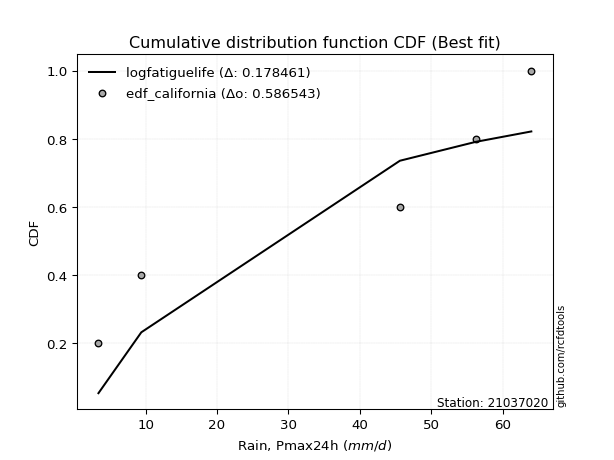</img>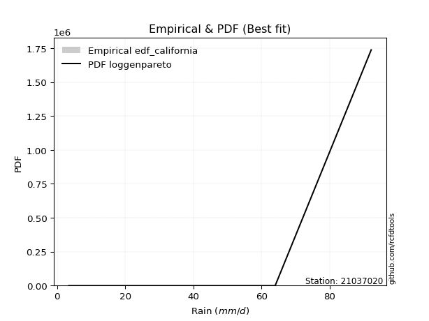</img>

</div>


### 2. EDF Hazen (1930)

Hazen method for plotting positions is a formula used to estimate the empirical cumulative probability distribution of flood events or other hydrological data. This formula often results in biased estimations, particularly when extrapolating to extreme events (high return periods).

<div align="center">


$P=(m-0.5)/n$


</div>


**2.1. Empirical values**

<div align="center">

|                | 0                   | 1                  | 2                  | 3                  | 4         | 5                  |
|:---------------|:--------------------|:-------------------|:-------------------|:-------------------|:----------|:-------------------|
| date           | 2023                | 2022               | 2021               | 2020               | 2019      | 2025               |
| x              | 3.4                 | 9.4                | 45.6               | 56.2               | 64.0      | 92.2               |
| m              | 1                   | 2                  | 3                  | 4                  | 5         | 6                  |
| empirical_dist | edf_hazen           | edf_hazen          | edf_hazen          | edf_hazen          | edf_hazen | edf_hazen          |
| empirical      | 0.08333333333333333 | 0.25               | 0.4166666666666667 | 0.5833333333333334 | 0.75      | 0.9166666666666666 |
| empirical_tr   | 1.090909090909091   | 1.3333333333333333 | 1.7142857142857144 | 2.4000000000000004 | 4.0       | 11.999999999999995 |

</div>


**2.2. Kolmogorov-Smirnov fit test (sorted by Δ)**


<div align="center">

|                | 0                  | 1                  | 2                   | 3                   | 4                  | 5                   | 6                   | 7                   | 8                   | 9                   | 10                  | 11                  | 12                  | 13                  | 14                  | 15                  | 16                  | 17                  | 18                  | 19                  | 20                 | 21                  | 22                 | 23                  | 24                 | 25                  | 26                 | 27                 | 28                  | 29                  | 30                 | 31                  | 32                  | 33                  | 34                  | 35                  | 36                  | 37                  | 38                  | 39                  | 40                 | 41                 | 42                 | 43                 | 44                  | 45                  | 46                 | 47                  | 48                  | 49                  | 50                  | 51                  | 52                  | 53                 | 54                  | 55                  | 56                 | 57                  | 58                | 59                  | 60                 | 61                  | 62                  | 63                  | 64                 | 65                 | 66                  | 67                 | 68                  | 69                  | 70                  | 71                  | 72                 | 73                 | 74                  | 75                  | 76                  | 77                  | 78                  | 79                 | 80                 | 81                  | 82                  | 83                 | 84                  | 85                 | 86                 | 87                | 88                 | 89                 | 90                 | 91                | 92                  | 93                  | 94                  | 95                 | 96                  | 97                  | 98             | 99                  | 100                | 101                | 102                 | 103                 | 104                 | 105                | 106                | 107                | 108                | 109                 | 110                 | 111                | 112                 | 113               | 114                 | 115                | 116                 | 117                | 118                 | 119                 | 120                 | 121                 | 122                 | 123                 | 124                | 125                | 126                 | 127                | 128                | 129                 | 130                | 131                 | 132                 | 133                 | 134                 | 135                | 136                | 137                | 138                 | 139                 | 140                 | 141                | 142                | 143                 | 144                 | 145                | 146                | 147                 | 148                | 149                | 150                | 151               | 152                | 153                | 154                | 155                | 156                | 157            | 158                | 159                |
|:---------------|:-------------------|:-------------------|:--------------------|:--------------------|:-------------------|:--------------------|:--------------------|:--------------------|:--------------------|:--------------------|:--------------------|:--------------------|:--------------------|:--------------------|:--------------------|:--------------------|:--------------------|:--------------------|:--------------------|:--------------------|:-------------------|:--------------------|:-------------------|:--------------------|:-------------------|:--------------------|:-------------------|:-------------------|:--------------------|:--------------------|:-------------------|:--------------------|:--------------------|:--------------------|:--------------------|:--------------------|:--------------------|:--------------------|:--------------------|:--------------------|:-------------------|:-------------------|:-------------------|:-------------------|:--------------------|:--------------------|:-------------------|:--------------------|:--------------------|:--------------------|:--------------------|:--------------------|:--------------------|:-------------------|:--------------------|:--------------------|:-------------------|:--------------------|:------------------|:--------------------|:-------------------|:--------------------|:--------------------|:--------------------|:-------------------|:-------------------|:--------------------|:-------------------|:--------------------|:--------------------|:--------------------|:--------------------|:-------------------|:-------------------|:--------------------|:--------------------|:--------------------|:--------------------|:--------------------|:-------------------|:-------------------|:--------------------|:--------------------|:-------------------|:--------------------|:-------------------|:-------------------|:------------------|:-------------------|:-------------------|:-------------------|:------------------|:--------------------|:--------------------|:--------------------|:-------------------|:--------------------|:--------------------|:---------------|:--------------------|:-------------------|:-------------------|:--------------------|:--------------------|:--------------------|:-------------------|:-------------------|:-------------------|:-------------------|:--------------------|:--------------------|:-------------------|:--------------------|:------------------|:--------------------|:-------------------|:--------------------|:-------------------|:--------------------|:--------------------|:--------------------|:--------------------|:--------------------|:--------------------|:-------------------|:-------------------|:--------------------|:-------------------|:-------------------|:--------------------|:-------------------|:--------------------|:--------------------|:--------------------|:--------------------|:-------------------|:-------------------|:-------------------|:--------------------|:--------------------|:--------------------|:-------------------|:-------------------|:--------------------|:--------------------|:-------------------|:-------------------|:--------------------|:-------------------|:-------------------|:-------------------|:------------------|:-------------------|:-------------------|:-------------------|:-------------------|:-------------------|:---------------|:-------------------|:-------------------|
| station        | 21037020           | 21037020           | 21037020            | 21037020            | 21037020           | 21037020            | 21037020            | 21037020            | 21037020            | 21037020            | 21037020            | 21037020            | 21037020            | 21037020            | 21037020            | 21037020            | 21037020            | 21037020            | 21037020            | 21037020            | 21037020           | 21037020            | 21037020           | 21037020            | 21037020           | 21037020            | 21037020           | 21037020           | 21037020            | 21037020            | 21037020           | 21037020            | 21037020            | 21037020            | 21037020            | 21037020            | 21037020            | 21037020            | 21037020            | 21037020            | 21037020           | 21037020           | 21037020           | 21037020           | 21037020            | 21037020            | 21037020           | 21037020            | 21037020            | 21037020            | 21037020            | 21037020            | 21037020            | 21037020           | 21037020            | 21037020            | 21037020           | 21037020            | 21037020          | 21037020            | 21037020           | 21037020            | 21037020            | 21037020            | 21037020           | 21037020           | 21037020            | 21037020           | 21037020            | 21037020            | 21037020            | 21037020            | 21037020           | 21037020           | 21037020            | 21037020            | 21037020            | 21037020            | 21037020            | 21037020           | 21037020           | 21037020            | 21037020            | 21037020           | 21037020            | 21037020           | 21037020           | 21037020          | 21037020           | 21037020           | 21037020           | 21037020          | 21037020            | 21037020            | 21037020            | 21037020           | 21037020            | 21037020            | 21037020       | 21037020            | 21037020           | 21037020           | 21037020            | 21037020            | 21037020            | 21037020           | 21037020           | 21037020           | 21037020           | 21037020            | 21037020            | 21037020           | 21037020            | 21037020          | 21037020            | 21037020           | 21037020            | 21037020           | 21037020            | 21037020            | 21037020            | 21037020            | 21037020            | 21037020            | 21037020           | 21037020           | 21037020            | 21037020           | 21037020           | 21037020            | 21037020           | 21037020            | 21037020            | 21037020            | 21037020            | 21037020           | 21037020           | 21037020           | 21037020            | 21037020            | 21037020            | 21037020           | 21037020           | 21037020            | 21037020            | 21037020           | 21037020           | 21037020            | 21037020           | 21037020           | 21037020           | 21037020          | 21037020           | 21037020           | 21037020           | 21037020           | 21037020           | 21037020       | 21037020           | 21037020           |
| empirical_dist | edf_hazen          | edf_hazen          | edf_hazen           | edf_hazen           | edf_hazen          | edf_hazen           | edf_hazen           | edf_hazen           | edf_hazen           | edf_hazen           | edf_hazen           | edf_hazen           | edf_hazen           | edf_hazen           | edf_hazen           | edf_hazen           | edf_hazen           | edf_hazen           | edf_hazen           | edf_hazen           | edf_hazen          | edf_hazen           | edf_hazen          | edf_hazen           | edf_hazen          | edf_hazen           | edf_hazen          | edf_hazen          | edf_hazen           | edf_hazen           | edf_hazen          | edf_hazen           | edf_hazen           | edf_hazen           | edf_hazen           | edf_hazen           | edf_hazen           | edf_hazen           | edf_hazen           | edf_hazen           | edf_hazen          | edf_hazen          | edf_hazen          | edf_hazen          | edf_hazen           | edf_hazen           | edf_hazen          | edf_hazen           | edf_hazen           | edf_hazen           | edf_hazen           | edf_hazen           | edf_hazen           | edf_hazen          | edf_hazen           | edf_hazen           | edf_hazen          | edf_hazen           | edf_hazen         | edf_hazen           | edf_hazen          | edf_hazen           | edf_hazen           | edf_hazen           | edf_hazen          | edf_hazen          | edf_hazen           | edf_hazen          | edf_hazen           | edf_hazen           | edf_hazen           | edf_hazen           | edf_hazen          | edf_hazen          | edf_hazen           | edf_hazen           | edf_hazen           | edf_hazen           | edf_hazen           | edf_hazen          | edf_hazen          | edf_hazen           | edf_hazen           | edf_hazen          | edf_hazen           | edf_hazen          | edf_hazen          | edf_hazen         | edf_hazen          | edf_hazen          | edf_hazen          | edf_hazen         | edf_hazen           | edf_hazen           | edf_hazen           | edf_hazen          | edf_hazen           | edf_hazen           | edf_hazen      | edf_hazen           | edf_hazen          | edf_hazen          | edf_hazen           | edf_hazen           | edf_hazen           | edf_hazen          | edf_hazen          | edf_hazen          | edf_hazen          | edf_hazen           | edf_hazen           | edf_hazen          | edf_hazen           | edf_hazen         | edf_hazen           | edf_hazen          | edf_hazen           | edf_hazen          | edf_hazen           | edf_hazen           | edf_hazen           | edf_hazen           | edf_hazen           | edf_hazen           | edf_hazen          | edf_hazen          | edf_hazen           | edf_hazen          | edf_hazen          | edf_hazen           | edf_hazen          | edf_hazen           | edf_hazen           | edf_hazen           | edf_hazen           | edf_hazen          | edf_hazen          | edf_hazen          | edf_hazen           | edf_hazen           | edf_hazen           | edf_hazen          | edf_hazen          | edf_hazen           | edf_hazen           | edf_hazen          | edf_hazen          | edf_hazen           | edf_hazen          | edf_hazen          | edf_hazen          | edf_hazen         | edf_hazen          | edf_hazen          | edf_hazen          | edf_hazen          | edf_hazen          | edf_hazen      | edf_hazen          | edf_hazen          |
| p_dist         | ksone              | semicircular       | logjohnsonsu        | logweibull_max      | anglit             | arcsine             | burr                | genextreme          | beta                | genlogistic         | pearson3            | johnsonsu           | t                   | skewnorm            | crystalball         | norm                | exponnorm           | gamma               | erlang              | foldnorm            | gumbel_l           | maxwell             | loggausshyper      | logmielke           | invgamma           | rayleigh            | cosine             | logloggamma        | logistic            | invgauss            | wrapcauchy         | gausshyper          | argus               | rice                | hypsecant           | invweibull          | laplace             | dweibull            | genpareto           | loggenextreme       | dgamma             | loglevy_l          | logargus           | kappa4             | kstwobign           | gumbel_r            | logtrapezoid       | halfnorm            | gompertz            | logarcsine          | tukeylambda         | uniform             | kappa3              | truncweibull_min   | loggennorm          | truncexpon          | ncf                | moyal               | loggumbel_l       | logweibull_min      | logburr12          | logdgamma           | logpearson3         | weibull_min         | logsemicircular    | logdweibull        | logwrapcauchy       | vonmises_line      | logloglaplace       | loggompertz         | genexpon            | lomax               | logbeta            | loganglit          | loggenpareto        | betaprime           | genhalflogistic     | halflogistic        | loggenhalflogistic  | logncf             | triang             | logf                | lognorm             | logcrystalball     | logt                | logexponnorm       | lognct             | loggengamma       | logburr            | logfatiguelife     | logerlang          | logbetaprime      | loggamma            | loggamma            | loginvgauss         | logfoldnorm        | logrice             | loginvweibull       | gennorm        | loginvgamma         | bradford           | logalpha           | wald                | logskewnorm         | loglogistic         | mielke             | logmaxwell         | levy_l             | lograyleigh        | logkstwobign        | exponpow            | halfgennorm        | loghypsecant        | loggenexpon       | logcosine           | loghalfnorm        | nct                 | burr12             | loglomax            | logtriang           | loggumbel_r         | loglaplace          | loglaplace          | exponweib           | loghalfgennorm     | loghalflogistic    | nakagami            | logmoyal           | trapezoid          | f                   | logtukeylambda     | logksone            | gengamma            | logexponweib        | logtruncweibull_min | logkappa3          | loguniform         | logvonmises_line   | logwald             | logkappa4           | logbradford         | logtruncexpon      | alpha              | fatiguelife         | johnsonsb           | logtruncnorm       | lognakagami        | powerlaw            | truncpareto        | logexponpow        | rdist              | logrdist          | logpowerlaw        | weibull_max        | truncnorm          | logtruncpareto     | logjohnsonsb       | loggenlogistic | logvonmises        | vonmises           |
| delta          | 0.0876993003507412 | 0.0968431594043827 | 0.09864711952610017 | 0.10088046831264719 | 0.1057885087638753 | 0.10768132397107588 | 0.11802353813669758 | 0.11973129974436145 | 0.12324063207741864 | 0.12379115577562572 | 0.12620634445647466 | 0.12635479071354877 | 0.12657002715916943 | 0.12657459406166982 | 0.12658389702036182 | 0.12658390292134003 | 0.12658549709821942 | 0.12687899891103227 | 0.12690097892454283 | 0.12773281905491268 | 0.1306150819076628 | 0.13125220174868896 | 0.1315549739748479 | 0.13397847476967056 | 0.1346703043253369 | 0.13486335764946772 | 0.1351554438858799 | 0.1373708952879263 | 0.14095382610161866 | 0.14202406501435266 | 0.1430712670555201 | 0.14397806642579816 | 0.14441913254760452 | 0.14518299793615486 | 0.14764985626025617 | 0.15198646332021643 | 0.15279341656665796 | 0.15307107213192125 | 0.15316413459281247 | 0.15466676089420506 | 0.1550380512098445 | 0.1552009815854713 | 0.1615044793303882 | 0.1618014504739478 | 0.16412191158061323 | 0.16621908680068467 | 0.1664491564246719 | 0.17051650900252635 | 0.17444780432178741 | 0.17701134114769163 | 0.17720109615593316 | 0.18243243243243243 | 0.18252497580495308 | 0.1897426472708445 | 0.19002816936036854 | 0.19217897142045864 | 0.1928446329345896 | 0.19484931000950242 | 0.196666790156182 | 0.19744909890631518 | 0.1976345122029935 | 0.20110963594415918 | 0.20136706545244892 | 0.20254267692111766 | 0.2129883754906406 | 0.2133081446453574 | 0.21370714390618167 | 0.2145296616534098 | 0.21570020631540232 | 0.21912470637760334 | 0.21954288602287747 | 0.21955696078246006 | 0.2206150312751417 | 0.2217286799605192 | 0.22503076033534058 | 0.22929749595624754 | 0.23046237955919513 | 0.23412031101332192 | 0.23682725536385402 | 0.2380658509364602 | 0.2407150106336079 | 0.24153778727992786 | 0.24251033259067517 | 0.2425103561180983 | 0.24251085267132405 | 0.2425110256926885 | 0.2426994260951239 | 0.243834250658106 | 0.2438654002093324 | 0.2442333196786936 | 0.2451430026242482 | 0.245456376666973 | 0.24709702180159082 | 0.24709702180159082 | 0.24758169959464854 | 0.2478980760051293 | 0.24814152954008312 | 0.24872442989405635 | 0.25           | 0.25031349278965226 | 0.2504151880751128 | 0.2529337777758281 | 0.25740104491396626 | 0.25887799867965283 | 0.26121488442396007 | 0.2624839220310911 | 0.2631520626533069 | 0.2658262842563323 | 0.2693256243314069 | 0.27321711372074114 | 0.27340274917481083 | 0.2736870629489087 | 0.27556455449990275 | 0.277666522810084 | 0.28010746453969243 | 0.2873890044217165 | 0.28740033600205755 | 0.2890150766532969 | 0.29155507020525434 | 0.29764334985004964 | 0.30099222899780204 | 0.30342220076506904 | 0.30342220076506904 | 0.30361368216599954 | 0.3038082648643626 | 0.3153455516883182 | 0.31661183974543955 | 0.3202485363121595 | 0.3215010023396143 | 0.32154867322309916 | 0.3215586636661077 | 0.32221893664813855 | 0.35291211594740163 | 0.35356140111484363 | 0.3538376280010262  | 0.3661533821917749 | 0.3699960573110996 | 0.3706887748258256 | 0.37508315742065584 | 0.37741848462989674 | 0.41680572705179136 | 0.4193808294692369 | 0.4470360554624084 | 0.45979865043657536 | 0.46315347380927274 | 0.4707578270819183 | 0.4716564477159982 | 0.48722798650966775 | 0.5275562849144153 | 0.5350219531274684 | 0.5833333311121796 | 0.583333331753338 | 0.5840932613676795 | 0.6159345741934225 | 0.6267571426101438 | 0.6444662222136596 | 0.6735786397554286 | 0.75           | 1.1249228780845815 | 13.883608500968867 |
| deltao         | 0.530385761606     | 0.530385761606     | 0.530385761606      | 0.530385761606      | 0.530385761606     | 0.530385761606      | 0.530385761606      | 0.530385761606      | 0.530385761606      | 0.530385761606      | 0.530385761606      | 0.530385761606      | 0.530385761606      | 0.530385761606      | 0.530385761606      | 0.530385761606      | 0.530385761606      | 0.530385761606      | 0.530385761606      | 0.530385761606      | 0.530385761606     | 0.530385761606      | 0.530385761606     | 0.530385761606      | 0.530385761606     | 0.530385761606      | 0.530385761606     | 0.530385761606     | 0.530385761606      | 0.530385761606      | 0.530385761606     | 0.530385761606      | 0.530385761606      | 0.530385761606      | 0.530385761606      | 0.530385761606      | 0.530385761606      | 0.530385761606      | 0.530385761606      | 0.530385761606      | 0.530385761606     | 0.530385761606     | 0.530385761606     | 0.530385761606     | 0.530385761606      | 0.530385761606      | 0.530385761606     | 0.530385761606      | 0.530385761606      | 0.530385761606      | 0.530385761606      | 0.530385761606      | 0.530385761606      | 0.530385761606     | 0.530385761606      | 0.530385761606      | 0.530385761606     | 0.530385761606      | 0.530385761606    | 0.530385761606      | 0.530385761606     | 0.530385761606      | 0.530385761606      | 0.530385761606      | 0.530385761606     | 0.530385761606     | 0.530385761606      | 0.530385761606     | 0.530385761606      | 0.530385761606      | 0.530385761606      | 0.530385761606      | 0.530385761606     | 0.530385761606     | 0.530385761606      | 0.530385761606      | 0.530385761606      | 0.530385761606      | 0.530385761606      | 0.530385761606     | 0.530385761606     | 0.530385761606      | 0.530385761606      | 0.530385761606     | 0.530385761606      | 0.530385761606     | 0.530385761606     | 0.530385761606    | 0.530385761606     | 0.530385761606     | 0.530385761606     | 0.530385761606    | 0.530385761606      | 0.530385761606      | 0.530385761606      | 0.530385761606     | 0.530385761606      | 0.530385761606      | 0.530385761606 | 0.530385761606      | 0.530385761606     | 0.530385761606     | 0.530385761606      | 0.530385761606      | 0.530385761606      | 0.530385761606     | 0.530385761606     | 0.530385761606     | 0.530385761606     | 0.530385761606      | 0.530385761606      | 0.530385761606     | 0.530385761606      | 0.530385761606    | 0.530385761606      | 0.530385761606     | 0.530385761606      | 0.530385761606     | 0.530385761606      | 0.530385761606      | 0.530385761606      | 0.530385761606      | 0.530385761606      | 0.530385761606      | 0.530385761606     | 0.530385761606     | 0.530385761606      | 0.530385761606     | 0.530385761606     | 0.530385761606      | 0.530385761606     | 0.530385761606      | 0.530385761606      | 0.530385761606      | 0.530385761606      | 0.530385761606     | 0.530385761606     | 0.530385761606     | 0.530385761606      | 0.530385761606      | 0.530385761606      | 0.530385761606     | 0.530385761606     | 0.530385761606      | 0.530385761606      | 0.530385761606     | 0.530385761606     | 0.530385761606      | 0.530385761606     | 0.530385761606     | 0.530385761606     | 0.530385761606    | 0.530385761606     | 0.530385761606     | 0.530385761606     | 0.530385761606     | 0.530385761606     | 0.530385761606 | 0.530385761606     | 0.530385761606     |
| eval           | Δo > Δ             | Δo > Δ             | Δo > Δ              | Δo > Δ              | Δo > Δ             | Δo > Δ              | Δo > Δ              | Δo > Δ              | Δo > Δ              | Δo > Δ              | Δo > Δ              | Δo > Δ              | Δo > Δ              | Δo > Δ              | Δo > Δ              | Δo > Δ              | Δo > Δ              | Δo > Δ              | Δo > Δ              | Δo > Δ              | Δo > Δ             | Δo > Δ              | Δo > Δ             | Δo > Δ              | Δo > Δ             | Δo > Δ              | Δo > Δ             | Δo > Δ             | Δo > Δ              | Δo > Δ              | Δo > Δ             | Δo > Δ              | Δo > Δ              | Δo > Δ              | Δo > Δ              | Δo > Δ              | Δo > Δ              | Δo > Δ              | Δo > Δ              | Δo > Δ              | Δo > Δ             | Δo > Δ             | Δo > Δ             | Δo > Δ             | Δo > Δ              | Δo > Δ              | Δo > Δ             | Δo > Δ              | Δo > Δ              | Δo > Δ              | Δo > Δ              | Δo > Δ              | Δo > Δ              | Δo > Δ             | Δo > Δ              | Δo > Δ              | Δo > Δ             | Δo > Δ              | Δo > Δ            | Δo > Δ              | Δo > Δ             | Δo > Δ              | Δo > Δ              | Δo > Δ              | Δo > Δ             | Δo > Δ             | Δo > Δ              | Δo > Δ             | Δo > Δ              | Δo > Δ              | Δo > Δ              | Δo > Δ              | Δo > Δ             | Δo > Δ             | Δo > Δ              | Δo > Δ              | Δo > Δ              | Δo > Δ              | Δo > Δ              | Δo > Δ             | Δo > Δ             | Δo > Δ              | Δo > Δ              | Δo > Δ             | Δo > Δ              | Δo > Δ             | Δo > Δ             | Δo > Δ            | Δo > Δ             | Δo > Δ             | Δo > Δ             | Δo > Δ            | Δo > Δ              | Δo > Δ              | Δo > Δ              | Δo > Δ             | Δo > Δ              | Δo > Δ              | Δo > Δ         | Δo > Δ              | Δo > Δ             | Δo > Δ             | Δo > Δ              | Δo > Δ              | Δo > Δ              | Δo > Δ             | Δo > Δ             | Δo > Δ             | Δo > Δ             | Δo > Δ              | Δo > Δ              | Δo > Δ             | Δo > Δ              | Δo > Δ            | Δo > Δ              | Δo > Δ             | Δo > Δ              | Δo > Δ             | Δo > Δ              | Δo > Δ              | Δo > Δ              | Δo > Δ              | Δo > Δ              | Δo > Δ              | Δo > Δ             | Δo > Δ             | Δo > Δ              | Δo > Δ             | Δo > Δ             | Δo > Δ              | Δo > Δ             | Δo > Δ              | Δo > Δ              | Δo > Δ              | Δo > Δ              | Δo > Δ             | Δo > Δ             | Δo > Δ             | Δo > Δ              | Δo > Δ              | Δo > Δ              | Δo > Δ             | Δo > Δ             | Δo > Δ              | Δo > Δ              | Δo > Δ             | Δo > Δ             | Δo > Δ              | Δo > Δ             | Δo <= Δ            | Δo <= Δ            | Δo <= Δ           | Δo <= Δ            | Δo <= Δ            | Δo <= Δ            | Δo <= Δ            | Δo <= Δ            | Δo <= Δ        | Δo <= Δ            | Δo <= Δ            |
| fit            | 1                  | 1                  | 1                   | 1                   | 1                  | 1                   | 1                   | 1                   | 1                   | 1                   | 1                   | 1                   | 1                   | 1                   | 1                   | 1                   | 1                   | 1                   | 1                   | 1                   | 1                  | 1                   | 1                  | 1                   | 1                  | 1                   | 1                  | 1                  | 1                   | 1                   | 1                  | 1                   | 1                   | 1                   | 1                   | 1                   | 1                   | 1                   | 1                   | 1                   | 1                  | 1                  | 1                  | 1                  | 1                   | 1                   | 1                  | 1                   | 1                   | 1                   | 1                   | 1                   | 1                   | 1                  | 1                   | 1                   | 1                  | 1                   | 1                 | 1                   | 1                  | 1                   | 1                   | 1                   | 1                  | 1                  | 1                   | 1                  | 1                   | 1                   | 1                   | 1                   | 1                  | 1                  | 1                   | 1                   | 1                   | 1                   | 1                   | 1                  | 1                  | 1                   | 1                   | 1                  | 1                   | 1                  | 1                  | 1                 | 1                  | 1                  | 1                  | 1                 | 1                   | 1                   | 1                   | 1                  | 1                   | 1                   | 1              | 1                   | 1                  | 1                  | 1                   | 1                   | 1                   | 1                  | 1                  | 1                  | 1                  | 1                   | 1                   | 1                  | 1                   | 1                 | 1                   | 1                  | 1                   | 1                  | 1                   | 1                   | 1                   | 1                   | 1                   | 1                   | 1                  | 1                  | 1                   | 1                  | 1                  | 1                   | 1                  | 1                   | 1                   | 1                   | 1                   | 1                  | 1                  | 1                  | 1                   | 1                   | 1                   | 1                  | 1                  | 1                   | 1                   | 1                  | 1                  | 1                   | 1                  | 0                  | 0                  | 0                 | 0                  | 0                  | 0                  | 0                  | 0                  | 0              | 0                  | 0                  |
| n              | 6                  | 6                  | 6                   | 6                   | 6                  | 6                   | 6                   | 6                   | 6                   | 6                   | 6                   | 6                   | 6                   | 6                   | 6                   | 6                   | 6                   | 6                   | 6                   | 6                   | 6                  | 6                   | 6                  | 6                   | 6                  | 6                   | 6                  | 6                  | 6                   | 6                   | 6                  | 6                   | 6                   | 6                   | 6                   | 6                   | 6                   | 6                   | 6                   | 6                   | 6                  | 6                  | 6                  | 6                  | 6                   | 6                   | 6                  | 6                   | 6                   | 6                   | 6                   | 6                   | 6                   | 6                  | 6                   | 6                   | 6                  | 6                   | 6                 | 6                   | 6                  | 6                   | 6                   | 6                   | 6                  | 6                  | 6                   | 6                  | 6                   | 6                   | 6                   | 6                   | 6                  | 6                  | 6                   | 6                   | 6                   | 6                   | 6                   | 6                  | 6                  | 6                   | 6                   | 6                  | 6                   | 6                  | 6                  | 6                 | 6                  | 6                  | 6                  | 6                 | 6                   | 6                   | 6                   | 6                  | 6                   | 6                   | 6              | 6                   | 6                  | 6                  | 6                   | 6                   | 6                   | 6                  | 6                  | 6                  | 6                  | 6                   | 6                   | 6                  | 6                   | 6                 | 6                   | 6                  | 6                   | 6                  | 6                   | 6                   | 6                   | 6                   | 6                   | 6                   | 6                  | 6                  | 6                   | 6                  | 6                  | 6                   | 6                  | 6                   | 6                   | 6                   | 6                   | 6                  | 6                  | 6                  | 6                   | 6                   | 6                   | 6                  | 6                  | 6                   | 6                   | 6                  | 6                  | 6                   | 6                  | 6                  | 6                  | 6                 | 6                  | 6                  | 6                  | 6                  | 6                  | 6              | 6                  | 6                  |
| best_fit       | 1                  | 0                  | 0                   | 0                   | 0                  | 0                   | 0                   | 0                   | 0                   | 0                   | 0                   | 0                   | 0                   | 0                   | 0                   | 0                   | 0                   | 0                   | 0                   | 0                   | 0                  | 0                   | 0                  | 0                   | 0                  | 0                   | 0                  | 0                  | 0                   | 0                   | 0                  | 0                   | 0                   | 0                   | 0                   | 0                   | 0                   | 0                   | 0                   | 0                   | 0                  | 0                  | 0                  | 0                  | 0                   | 0                   | 0                  | 0                   | 0                   | 0                   | 0                   | 0                   | 0                   | 0                  | 0                   | 0                   | 0                  | 0                   | 0                 | 0                   | 0                  | 0                   | 0                   | 0                   | 0                  | 0                  | 0                   | 0                  | 0                   | 0                   | 0                   | 0                   | 0                  | 0                  | 0                   | 0                   | 0                   | 0                   | 0                   | 0                  | 0                  | 0                   | 0                   | 0                  | 0                   | 0                  | 0                  | 0                 | 0                  | 0                  | 0                  | 0                 | 0                   | 0                   | 0                   | 0                  | 0                   | 0                   | 0              | 0                   | 0                  | 0                  | 0                   | 0                   | 0                   | 0                  | 0                  | 0                  | 0                  | 0                   | 0                   | 0                  | 0                   | 0                 | 0                   | 0                  | 0                   | 0                  | 0                   | 0                   | 0                   | 0                   | 0                   | 0                   | 0                  | 0                  | 0                   | 0                  | 0                  | 0                   | 0                  | 0                   | 0                   | 0                   | 0                   | 0                  | 0                  | 0                  | 0                   | 0                   | 0                   | 0                  | 0                  | 0                   | 0                   | 0                  | 0                  | 0                   | 0                  | 0                  | 0                  | 0                 | 0                  | 0                  | 0                  | 0                  | 0                  | 0              | 0                  | 0                  |
| best_fit_sort  | 1                  | 2                  | 3                   | 4                   | 5                  | 6                   | 7                   | 8                   | 9                   | 10                  | 11                  | 12                  | 13                  | 14                  | 15                  | 16                  | 17                  | 18                  | 19                  | 20                  | 21                 | 22                  | 23                 | 24                  | 25                 | 26                  | 27                 | 28                 | 29                  | 30                  | 31                 | 32                  | 33                  | 34                  | 35                  | 36                  | 37                  | 38                  | 39                  | 40                  | 41                 | 42                 | 43                 | 44                 | 45                  | 46                  | 47                 | 48                  | 49                  | 50                  | 51                  | 52                  | 53                  | 54                 | 55                  | 56                  | 57                 | 58                  | 59                | 60                  | 61                 | 62                  | 63                  | 64                  | 65                 | 66                 | 67                  | 68                 | 69                  | 70                  | 71                  | 72                  | 73                 | 74                 | 75                  | 76                  | 77                  | 78                  | 79                  | 80                 | 81                 | 82                  | 83                  | 84                 | 85                  | 86                 | 87                 | 88                | 89                 | 90                 | 91                 | 92                | 93                  | 94                  | 95                  | 96                 | 97                  | 98                  | 99             | 100                 | 101                | 102                | 103                 | 104                 | 105                 | 106                | 107                | 108                | 109                | 110                 | 111                 | 112                | 113                 | 114               | 115                 | 116                | 117                 | 118                | 119                 | 120                 | 121                 | 122                 | 123                 | 124                 | 125                | 126                | 127                 | 128                | 129                | 130                 | 131                | 132                 | 133                 | 134                 | 135                 | 136                | 137                | 138                | 139                 | 140                 | 141                 | 142                | 143                | 144                 | 145                 | 146                | 147                | 148                 | 149                | 150                | 151                | 152               | 153                | 154                | 155                | 156                | 157                | 158            | 159                | 160                |

</div>


**2.3. Best fit**

<div align="center">

|   id |   station | empirical_dist   | p_dist   |     delta |   deltao | eval   |   fit |   n |   best_fit |   best_fit_sort |
|-----:|----------:|:-----------------|:---------|----------:|---------:|:-------|------:|----:|-----------:|----------------:|
|    0 |  21037020 | edf_hazen        | ksone    | 0.0876993 | 0.530386 | Δo > Δ |     1 |   6 |          1 |               1 |

</div>


<div align="center">

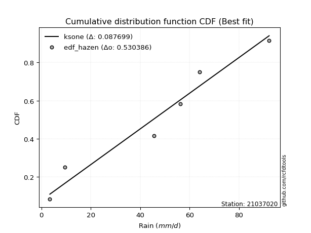</img>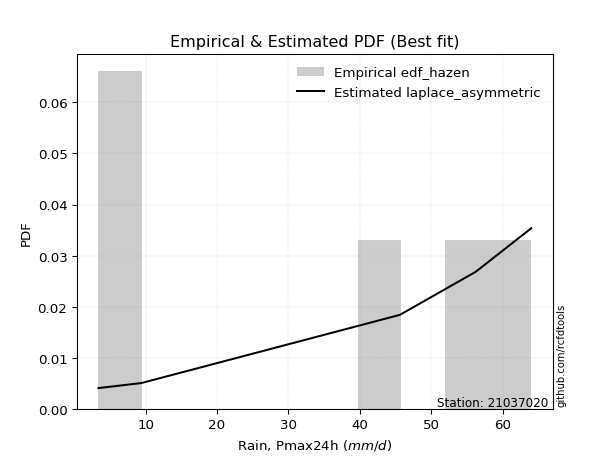</img>

</div>


### 3. EDF Weibull (1939)

Weibull plotting position formula is an empirical method used to estimate the non-exceedance probability or plotting position for a set of observed data, is often recommended or widely used in practice, particularly in flood frequency analysis.

<div align="center">


$P=m/(n+1)$


</div>


**3.1. Empirical values**

<div align="center">

|                | 0                   | 1                  | 2                   | 3                  | 4                  | 5                  |
|:---------------|:--------------------|:-------------------|:--------------------|:-------------------|:-------------------|:-------------------|
| date           | 2023                | 2022               | 2021                | 2020               | 2019               | 2025               |
| x              | 3.4                 | 9.4                | 45.6                | 56.2               | 64.0               | 92.2               |
| m              | 1                   | 2                  | 3                   | 4                  | 5                  | 6                  |
| empirical_dist | edf_weibull         | edf_weibull        | edf_weibull         | edf_weibull        | edf_weibull        | edf_weibull        |
| empirical      | 0.14285714285714285 | 0.2857142857142857 | 0.42857142857142855 | 0.5714285714285714 | 0.7142857142857143 | 0.8571428571428571 |
| empirical_tr   | 1.1666666666666665  | 1.4                | 1.75                | 2.333333333333333  | 3.5                | 6.999999999999997  |

</div>


**3.2. Kolmogorov-Smirnov fit test (sorted by Δ)**


<div align="center">

|                | 0                   | 1                   | 2                  | 3                  | 4                  | 5                   | 6                 | 7                   | 8                   | 9                   | 10                 | 11                  | 12                  | 13                  | 14                 | 15                  | 16                  | 17                  | 18                  | 19                  | 20                  | 21                  | 22                  | 23                  | 24                  | 25                  | 26                  | 27                  | 28                  | 29                  | 30                  | 31                 | 32                  | 33                  | 34                  | 35                 | 36                  | 37                  | 38                  | 39                  | 40                  | 41                  | 42                  | 43                  | 44                  | 45                  | 46                | 47                  | 48                  | 49                  | 50                  | 51                  | 52                  | 53                  | 54                  | 55                 | 56                 | 57                 | 58                  | 59                 | 60                  | 61                  | 62                  | 63                  | 64                 | 65                 | 66                  | 67                  | 68                 | 69                  | 70                  | 71                 | 72                  | 73                  | 74                  | 75                  | 76                  | 77                  | 78                | 79                  | 80                 | 81                  | 82                 | 83                  | 84                  | 85                  | 86                  | 87                  | 88                  | 89                  | 90                  | 91                  | 92                  | 93                  | 94                  | 95                 | 96                  | 97                 | 98                  | 99                  | 100                 | 101                | 102                | 103                 | 104               | 105               | 106               | 107                | 108                 | 109                 | 110                | 111                 | 112                 | 113                | 114                 | 115                | 116                 | 117                | 118                | 119                | 120                | 121                | 122                | 123                | 124                | 125                | 126                | 127                | 128                 | 129                | 130                 | 131                | 132                 | 133                 | 134                 | 135                 | 136                | 137                | 138               | 139                | 140                | 141               | 142                 | 143                | 144                | 145                 | 146                | 147                | 148                | 149                | 150                | 151                | 152                | 153                | 154                | 155                | 156               | 157                | 158                | 159                |
|:---------------|:--------------------|:--------------------|:-------------------|:-------------------|:-------------------|:--------------------|:------------------|:--------------------|:--------------------|:--------------------|:-------------------|:--------------------|:--------------------|:--------------------|:-------------------|:--------------------|:--------------------|:--------------------|:--------------------|:--------------------|:--------------------|:--------------------|:--------------------|:--------------------|:--------------------|:--------------------|:--------------------|:--------------------|:--------------------|:--------------------|:--------------------|:-------------------|:--------------------|:--------------------|:--------------------|:-------------------|:--------------------|:--------------------|:--------------------|:--------------------|:--------------------|:--------------------|:--------------------|:--------------------|:--------------------|:--------------------|:------------------|:--------------------|:--------------------|:--------------------|:--------------------|:--------------------|:--------------------|:--------------------|:--------------------|:-------------------|:-------------------|:-------------------|:--------------------|:-------------------|:--------------------|:--------------------|:--------------------|:--------------------|:-------------------|:-------------------|:--------------------|:--------------------|:-------------------|:--------------------|:--------------------|:-------------------|:--------------------|:--------------------|:--------------------|:--------------------|:--------------------|:--------------------|:------------------|:--------------------|:-------------------|:--------------------|:-------------------|:--------------------|:--------------------|:--------------------|:--------------------|:--------------------|:--------------------|:--------------------|:--------------------|:--------------------|:--------------------|:--------------------|:--------------------|:-------------------|:--------------------|:-------------------|:--------------------|:--------------------|:--------------------|:-------------------|:-------------------|:--------------------|:------------------|:------------------|:------------------|:-------------------|:--------------------|:--------------------|:-------------------|:--------------------|:--------------------|:-------------------|:--------------------|:-------------------|:--------------------|:-------------------|:-------------------|:-------------------|:-------------------|:-------------------|:-------------------|:-------------------|:-------------------|:-------------------|:-------------------|:-------------------|:--------------------|:-------------------|:--------------------|:-------------------|:--------------------|:--------------------|:--------------------|:--------------------|:-------------------|:-------------------|:------------------|:-------------------|:-------------------|:------------------|:--------------------|:-------------------|:-------------------|:--------------------|:-------------------|:-------------------|:-------------------|:-------------------|:-------------------|:-------------------|:-------------------|:-------------------|:-------------------|:-------------------|:------------------|:-------------------|:-------------------|:-------------------|
| station        | 21037020            | 21037020            | 21037020           | 21037020           | 21037020           | 21037020            | 21037020          | 21037020            | 21037020            | 21037020            | 21037020           | 21037020            | 21037020            | 21037020            | 21037020           | 21037020            | 21037020            | 21037020            | 21037020            | 21037020            | 21037020            | 21037020            | 21037020            | 21037020            | 21037020            | 21037020            | 21037020            | 21037020            | 21037020            | 21037020            | 21037020            | 21037020           | 21037020            | 21037020            | 21037020            | 21037020           | 21037020            | 21037020            | 21037020            | 21037020            | 21037020            | 21037020            | 21037020            | 21037020            | 21037020            | 21037020            | 21037020          | 21037020            | 21037020            | 21037020            | 21037020            | 21037020            | 21037020            | 21037020            | 21037020            | 21037020           | 21037020           | 21037020           | 21037020            | 21037020           | 21037020            | 21037020            | 21037020            | 21037020            | 21037020           | 21037020           | 21037020            | 21037020            | 21037020           | 21037020            | 21037020            | 21037020           | 21037020            | 21037020            | 21037020            | 21037020            | 21037020            | 21037020            | 21037020          | 21037020            | 21037020           | 21037020            | 21037020           | 21037020            | 21037020            | 21037020            | 21037020            | 21037020            | 21037020            | 21037020            | 21037020            | 21037020            | 21037020            | 21037020            | 21037020            | 21037020           | 21037020            | 21037020           | 21037020            | 21037020            | 21037020            | 21037020           | 21037020           | 21037020            | 21037020          | 21037020          | 21037020          | 21037020           | 21037020            | 21037020            | 21037020           | 21037020            | 21037020            | 21037020           | 21037020            | 21037020           | 21037020            | 21037020           | 21037020           | 21037020           | 21037020           | 21037020           | 21037020           | 21037020           | 21037020           | 21037020           | 21037020           | 21037020           | 21037020            | 21037020           | 21037020            | 21037020           | 21037020            | 21037020            | 21037020            | 21037020            | 21037020           | 21037020           | 21037020          | 21037020           | 21037020           | 21037020          | 21037020            | 21037020           | 21037020           | 21037020            | 21037020           | 21037020           | 21037020           | 21037020           | 21037020           | 21037020           | 21037020           | 21037020           | 21037020           | 21037020           | 21037020          | 21037020           | 21037020           | 21037020           |
| empirical_dist | edf_weibull         | edf_weibull         | edf_weibull        | edf_weibull        | edf_weibull        | edf_weibull         | edf_weibull       | edf_weibull         | edf_weibull         | edf_weibull         | edf_weibull        | edf_weibull         | edf_weibull         | edf_weibull         | edf_weibull        | edf_weibull         | edf_weibull         | edf_weibull         | edf_weibull         | edf_weibull         | edf_weibull         | edf_weibull         | edf_weibull         | edf_weibull         | edf_weibull         | edf_weibull         | edf_weibull         | edf_weibull         | edf_weibull         | edf_weibull         | edf_weibull         | edf_weibull        | edf_weibull         | edf_weibull         | edf_weibull         | edf_weibull        | edf_weibull         | edf_weibull         | edf_weibull         | edf_weibull         | edf_weibull         | edf_weibull         | edf_weibull         | edf_weibull         | edf_weibull         | edf_weibull         | edf_weibull       | edf_weibull         | edf_weibull         | edf_weibull         | edf_weibull         | edf_weibull         | edf_weibull         | edf_weibull         | edf_weibull         | edf_weibull        | edf_weibull        | edf_weibull        | edf_weibull         | edf_weibull        | edf_weibull         | edf_weibull         | edf_weibull         | edf_weibull         | edf_weibull        | edf_weibull        | edf_weibull         | edf_weibull         | edf_weibull        | edf_weibull         | edf_weibull         | edf_weibull        | edf_weibull         | edf_weibull         | edf_weibull         | edf_weibull         | edf_weibull         | edf_weibull         | edf_weibull       | edf_weibull         | edf_weibull        | edf_weibull         | edf_weibull        | edf_weibull         | edf_weibull         | edf_weibull         | edf_weibull         | edf_weibull         | edf_weibull         | edf_weibull         | edf_weibull         | edf_weibull         | edf_weibull         | edf_weibull         | edf_weibull         | edf_weibull        | edf_weibull         | edf_weibull        | edf_weibull         | edf_weibull         | edf_weibull         | edf_weibull        | edf_weibull        | edf_weibull         | edf_weibull       | edf_weibull       | edf_weibull       | edf_weibull        | edf_weibull         | edf_weibull         | edf_weibull        | edf_weibull         | edf_weibull         | edf_weibull        | edf_weibull         | edf_weibull        | edf_weibull         | edf_weibull        | edf_weibull        | edf_weibull        | edf_weibull        | edf_weibull        | edf_weibull        | edf_weibull        | edf_weibull        | edf_weibull        | edf_weibull        | edf_weibull        | edf_weibull         | edf_weibull        | edf_weibull         | edf_weibull        | edf_weibull         | edf_weibull         | edf_weibull         | edf_weibull         | edf_weibull        | edf_weibull        | edf_weibull       | edf_weibull        | edf_weibull        | edf_weibull       | edf_weibull         | edf_weibull        | edf_weibull        | edf_weibull         | edf_weibull        | edf_weibull        | edf_weibull        | edf_weibull        | edf_weibull        | edf_weibull        | edf_weibull        | edf_weibull        | edf_weibull        | edf_weibull        | edf_weibull       | edf_weibull        | edf_weibull        | edf_weibull        |
| p_dist         | loglevy_l           | ksone               | logjohnsonsu       | semicircular       | logmielke          | burr                | anglit            | logloggamma         | logweibull_max      | loggausshyper       | arcsine            | logtrapezoid        | genextreme          | logargus            | kstwobign          | beta                | genlogistic         | invweibull          | pearson3            | johnsonsu           | t                   | skewnorm            | crystalball         | norm                | exponnorm           | gamma               | erlang              | invgauss            | foldnorm            | wrapcauchy          | logarcsine          | gumbel_l           | maxwell             | invgamma            | rayleigh            | cosine             | logistic            | truncweibull_min    | gausshyper          | argus               | truncexpon          | rice                | ncf                 | hypsecant           | logdweibull         | loggumbel_l         | logbeta           | logweibull_min      | logburr12           | logloglaplace       | laplace             | dweibull            | genpareto           | logpearson3         | loggenextreme       | weibull_min        | dgamma             | kappa4             | logsemicircular     | logwrapcauchy      | gumbel_r            | halfnorm            | levy_l              | loggompertz         | genexpon           | lomax              | genhalflogistic     | loganglit           | gompertz           | tukeylambda         | loggenpareto        | gennorm            | betaprime           | uniform             | kappa3              | loggenhalflogistic  | loggennorm          | logncf              | logf              | moyal               | lognorm            | logcrystalball      | logt               | logexponnorm        | lognct              | loggengamma         | logburr             | logfatiguelife      | logerlang           | logbetaprime        | loggamma            | loggamma            | loginvgauss         | logfoldnorm         | logrice             | loginvweibull      | logdgamma           | loginvgamma        | bradford            | logalpha            | logskewnorm         | loglogistic        | vonmises_line      | mielke              | logmaxwell        | lograyleigh       | triang            | logkstwobign       | exponpow            | halfgennorm         | loghypsecant       | loggenexpon         | logcosine           | halflogistic       | loghalfnorm         | nct                | burr12              | loglomax           | wald               | logtriang          | trapezoid          | loggumbel_r        | loglaplace         | loglaplace         | exponweib          | loghalfgennorm     | loghalflogistic    | nakagami           | logmoyal            | f                  | logtukeylambda      | logksone           | gengamma            | logexponweib        | logtruncweibull_min | logkappa3           | loguniform         | logvonmises_line   | logwald           | logkappa4          | logbradford        | logtruncexpon     | johnsonsb           | alpha              | fatiguelife        | logtruncnorm        | lognakagami        | powerlaw           | truncpareto        | logexponpow        | logpowerlaw        | rdist              | logrdist           | weibull_max        | truncnorm          | logtruncpareto     | logjohnsonsb      | loggenlogistic     | logvonmises        | vonmises           |
| delta          | 0.11501193345921512 | 0.12002261733294481 | 0.1244463995356041 | 0.1325574451186684 | 0.1365218518391951 | 0.14052628605829434 | 0.141502794478161 | 0.14275056178309997 | 0.14285714283292372 | 0.14285714285274675 | 0.1428571428571429 | 0.15454439451991003 | 0.15544558545864715 | 0.15748148742936174 | 0.1588183113906806 | 0.15895491779170434 | 0.15950544148991141 | 0.16034614166992928 | 0.16192063017076036 | 0.16206907642783447 | 0.16228431287345513 | 0.16228887977595552 | 0.16229818273464752 | 0.16229818863562573 | 0.16229978281250512 | 0.16259328462531797 | 0.16261526463882853 | 0.16311228692983612 | 0.16344710476919838 | 0.16504353184775913 | 0.16510657924292976 | 0.1663293676219485 | 0.16696648746297466 | 0.17038459003962259 | 0.17057764336375342 | 0.1708697296001656 | 0.17666811181590436 | 0.17783788536608264 | 0.17969235214008386 | 0.18013341826189022 | 0.18027420951569678 | 0.18089728365044055 | 0.18093987102982773 | 0.18336414197454187 | 0.18394229091038183 | 0.18476202825142013 | 0.184900745560856 | 0.18554433700155332 | 0.18572975029823163 | 0.18675705118369368 | 0.18850770228094366 | 0.18878535784620695 | 0.18887842030709817 | 0.18946230354768706 | 0.19038104660849076 | 0.1906379150163558 | 0.1907523369241302 | 0.1975157361882335 | 0.20108361358587873 | 0.2018023820014198 | 0.20193337251497037 | 0.20623079471681205 | 0.20630247473252278 | 0.20721994447284148 | 0.2076381241181156 | 0.2076521988776982 | 0.20866931332648658 | 0.20982391805575734 | 0.2101620900360731 | 0.21291538187021886 | 0.21312599843057872 | 0.2142857142857143 | 0.21739273405148568 | 0.21814671814671813 | 0.21823926151923878 | 0.22492249345909215 | 0.22574245507465424 | 0.22616108903169835 | 0.229633025375166 | 0.23056359572378812 | 0.2306055706859133 | 0.23060559421333643 | 0.2306060907665622 | 0.23060626378792665 | 0.23079466419036204 | 0.23192948875334413 | 0.23196063830457053 | 0.23232855777393174 | 0.23323824071948634 | 0.23355161476221115 | 0.23519225989682896 | 0.23519225989682896 | 0.23567693768988668 | 0.23599331410036745 | 0.23623676763532125 | 0.2368196679892945 | 0.23682392165844487 | 0.2384087308848904 | 0.23851042617035095 | 0.24102901587106623 | 0.24697323677489097 | 0.2493101225191982 | 0.2502439473676955 | 0.25057916012632925 | 0.251247300748545 | 0.257420862426645 | 0.260367607195387 | 0.2613123518159793 | 0.26149798727004897 | 0.26178230104414685 | 0.2636597925951409 | 0.26576176090532216 | 0.26820270263493057 | 0.2698345967276076 | 0.27548424251695464 | 0.2754955740972957 | 0.27711031474853504 | 0.2796503083004925 | 0.2857142857142857 | 0.2857385879452878 | 0.2857867166253286 | 0.2890874670930402 | 0.2915174388603072 | 0.2915174388603072 | 0.2917089202612377 | 0.2919035029596007 | 0.3034407897835563 | 0.3047070778406777 | 0.30834377440739763 | 0.3096439113183373 | 0.30965390176134583 | 0.3103141747433767 | 0.34100735404263977 | 0.34165663921008177 | 0.34193286609626433 | 0.35424862028701304 | 0.3580912954063377 | 0.3587840129210637 | 0.363178395515894 | 0.3655137227251349 | 0.4049009651470295 | 0.407476067564475 | 0.42743918809498704 | 0.4351312935576465 | 0.4478938885318135 | 0.45885306517715646 | 0.4597516858112363 | 0.4753232246049059 | 0.5156515230096534 | 0.5172262925235944 | 0.5483789756533938 | 0.5714285692074177 | 0.5714285698485762 | 0.5802202884791368 | 0.5879857803947858 | 0.6087519364993739 | 0.637864354041143 | 0.7142857142857143 | 1.1130181161798196 | 13.943132310492675 |
| deltao         | 0.530385761606      | 0.530385761606      | 0.530385761606     | 0.530385761606     | 0.530385761606     | 0.530385761606      | 0.530385761606    | 0.530385761606      | 0.530385761606      | 0.530385761606      | 0.530385761606     | 0.530385761606      | 0.530385761606      | 0.530385761606      | 0.530385761606     | 0.530385761606      | 0.530385761606      | 0.530385761606      | 0.530385761606      | 0.530385761606      | 0.530385761606      | 0.530385761606      | 0.530385761606      | 0.530385761606      | 0.530385761606      | 0.530385761606      | 0.530385761606      | 0.530385761606      | 0.530385761606      | 0.530385761606      | 0.530385761606      | 0.530385761606     | 0.530385761606      | 0.530385761606      | 0.530385761606      | 0.530385761606     | 0.530385761606      | 0.530385761606      | 0.530385761606      | 0.530385761606      | 0.530385761606      | 0.530385761606      | 0.530385761606      | 0.530385761606      | 0.530385761606      | 0.530385761606      | 0.530385761606    | 0.530385761606      | 0.530385761606      | 0.530385761606      | 0.530385761606      | 0.530385761606      | 0.530385761606      | 0.530385761606      | 0.530385761606      | 0.530385761606     | 0.530385761606     | 0.530385761606     | 0.530385761606      | 0.530385761606     | 0.530385761606      | 0.530385761606      | 0.530385761606      | 0.530385761606      | 0.530385761606     | 0.530385761606     | 0.530385761606      | 0.530385761606      | 0.530385761606     | 0.530385761606      | 0.530385761606      | 0.530385761606     | 0.530385761606      | 0.530385761606      | 0.530385761606      | 0.530385761606      | 0.530385761606      | 0.530385761606      | 0.530385761606    | 0.530385761606      | 0.530385761606     | 0.530385761606      | 0.530385761606     | 0.530385761606      | 0.530385761606      | 0.530385761606      | 0.530385761606      | 0.530385761606      | 0.530385761606      | 0.530385761606      | 0.530385761606      | 0.530385761606      | 0.530385761606      | 0.530385761606      | 0.530385761606      | 0.530385761606     | 0.530385761606      | 0.530385761606     | 0.530385761606      | 0.530385761606      | 0.530385761606      | 0.530385761606     | 0.530385761606     | 0.530385761606      | 0.530385761606    | 0.530385761606    | 0.530385761606    | 0.530385761606     | 0.530385761606      | 0.530385761606      | 0.530385761606     | 0.530385761606      | 0.530385761606      | 0.530385761606     | 0.530385761606      | 0.530385761606     | 0.530385761606      | 0.530385761606     | 0.530385761606     | 0.530385761606     | 0.530385761606     | 0.530385761606     | 0.530385761606     | 0.530385761606     | 0.530385761606     | 0.530385761606     | 0.530385761606     | 0.530385761606     | 0.530385761606      | 0.530385761606     | 0.530385761606      | 0.530385761606     | 0.530385761606      | 0.530385761606      | 0.530385761606      | 0.530385761606      | 0.530385761606     | 0.530385761606     | 0.530385761606    | 0.530385761606     | 0.530385761606     | 0.530385761606    | 0.530385761606      | 0.530385761606     | 0.530385761606     | 0.530385761606      | 0.530385761606     | 0.530385761606     | 0.530385761606     | 0.530385761606     | 0.530385761606     | 0.530385761606     | 0.530385761606     | 0.530385761606     | 0.530385761606     | 0.530385761606     | 0.530385761606    | 0.530385761606     | 0.530385761606     | 0.530385761606     |
| eval           | Δo > Δ              | Δo > Δ              | Δo > Δ             | Δo > Δ             | Δo > Δ             | Δo > Δ              | Δo > Δ            | Δo > Δ              | Δo > Δ              | Δo > Δ              | Δo > Δ             | Δo > Δ              | Δo > Δ              | Δo > Δ              | Δo > Δ             | Δo > Δ              | Δo > Δ              | Δo > Δ              | Δo > Δ              | Δo > Δ              | Δo > Δ              | Δo > Δ              | Δo > Δ              | Δo > Δ              | Δo > Δ              | Δo > Δ              | Δo > Δ              | Δo > Δ              | Δo > Δ              | Δo > Δ              | Δo > Δ              | Δo > Δ             | Δo > Δ              | Δo > Δ              | Δo > Δ              | Δo > Δ             | Δo > Δ              | Δo > Δ              | Δo > Δ              | Δo > Δ              | Δo > Δ              | Δo > Δ              | Δo > Δ              | Δo > Δ              | Δo > Δ              | Δo > Δ              | Δo > Δ            | Δo > Δ              | Δo > Δ              | Δo > Δ              | Δo > Δ              | Δo > Δ              | Δo > Δ              | Δo > Δ              | Δo > Δ              | Δo > Δ             | Δo > Δ             | Δo > Δ             | Δo > Δ              | Δo > Δ             | Δo > Δ              | Δo > Δ              | Δo > Δ              | Δo > Δ              | Δo > Δ             | Δo > Δ             | Δo > Δ              | Δo > Δ              | Δo > Δ             | Δo > Δ              | Δo > Δ              | Δo > Δ             | Δo > Δ              | Δo > Δ              | Δo > Δ              | Δo > Δ              | Δo > Δ              | Δo > Δ              | Δo > Δ            | Δo > Δ              | Δo > Δ             | Δo > Δ              | Δo > Δ             | Δo > Δ              | Δo > Δ              | Δo > Δ              | Δo > Δ              | Δo > Δ              | Δo > Δ              | Δo > Δ              | Δo > Δ              | Δo > Δ              | Δo > Δ              | Δo > Δ              | Δo > Δ              | Δo > Δ             | Δo > Δ              | Δo > Δ             | Δo > Δ              | Δo > Δ              | Δo > Δ              | Δo > Δ             | Δo > Δ             | Δo > Δ              | Δo > Δ            | Δo > Δ            | Δo > Δ            | Δo > Δ             | Δo > Δ              | Δo > Δ              | Δo > Δ             | Δo > Δ              | Δo > Δ              | Δo > Δ             | Δo > Δ              | Δo > Δ             | Δo > Δ              | Δo > Δ             | Δo > Δ             | Δo > Δ             | Δo > Δ             | Δo > Δ             | Δo > Δ             | Δo > Δ             | Δo > Δ             | Δo > Δ             | Δo > Δ             | Δo > Δ             | Δo > Δ              | Δo > Δ             | Δo > Δ              | Δo > Δ             | Δo > Δ              | Δo > Δ              | Δo > Δ              | Δo > Δ              | Δo > Δ             | Δo > Δ             | Δo > Δ            | Δo > Δ             | Δo > Δ             | Δo > Δ            | Δo > Δ              | Δo > Δ             | Δo > Δ             | Δo > Δ              | Δo > Δ             | Δo > Δ             | Δo > Δ             | Δo > Δ             | Δo <= Δ            | Δo <= Δ            | Δo <= Δ            | Δo <= Δ            | Δo <= Δ            | Δo <= Δ            | Δo <= Δ           | Δo <= Δ            | Δo <= Δ            | Δo <= Δ            |
| fit            | 1                   | 1                   | 1                  | 1                  | 1                  | 1                   | 1                 | 1                   | 1                   | 1                   | 1                  | 1                   | 1                   | 1                   | 1                  | 1                   | 1                   | 1                   | 1                   | 1                   | 1                   | 1                   | 1                   | 1                   | 1                   | 1                   | 1                   | 1                   | 1                   | 1                   | 1                   | 1                  | 1                   | 1                   | 1                   | 1                  | 1                   | 1                   | 1                   | 1                   | 1                   | 1                   | 1                   | 1                   | 1                   | 1                   | 1                 | 1                   | 1                   | 1                   | 1                   | 1                   | 1                   | 1                   | 1                   | 1                  | 1                  | 1                  | 1                   | 1                  | 1                   | 1                   | 1                   | 1                   | 1                  | 1                  | 1                   | 1                   | 1                  | 1                   | 1                   | 1                  | 1                   | 1                   | 1                   | 1                   | 1                   | 1                   | 1                 | 1                   | 1                  | 1                   | 1                  | 1                   | 1                   | 1                   | 1                   | 1                   | 1                   | 1                   | 1                   | 1                   | 1                   | 1                   | 1                   | 1                  | 1                   | 1                  | 1                   | 1                   | 1                   | 1                  | 1                  | 1                   | 1                 | 1                 | 1                 | 1                  | 1                   | 1                   | 1                  | 1                   | 1                   | 1                  | 1                   | 1                  | 1                   | 1                  | 1                  | 1                  | 1                  | 1                  | 1                  | 1                  | 1                  | 1                  | 1                  | 1                  | 1                   | 1                  | 1                   | 1                  | 1                   | 1                   | 1                   | 1                   | 1                  | 1                  | 1                 | 1                  | 1                  | 1                 | 1                   | 1                  | 1                  | 1                   | 1                  | 1                  | 1                  | 1                  | 0                  | 0                  | 0                  | 0                  | 0                  | 0                  | 0                 | 0                  | 0                  | 0                  |
| n              | 6                   | 6                   | 6                  | 6                  | 6                  | 6                   | 6                 | 6                   | 6                   | 6                   | 6                  | 6                   | 6                   | 6                   | 6                  | 6                   | 6                   | 6                   | 6                   | 6                   | 6                   | 6                   | 6                   | 6                   | 6                   | 6                   | 6                   | 6                   | 6                   | 6                   | 6                   | 6                  | 6                   | 6                   | 6                   | 6                  | 6                   | 6                   | 6                   | 6                   | 6                   | 6                   | 6                   | 6                   | 6                   | 6                   | 6                 | 6                   | 6                   | 6                   | 6                   | 6                   | 6                   | 6                   | 6                   | 6                  | 6                  | 6                  | 6                   | 6                  | 6                   | 6                   | 6                   | 6                   | 6                  | 6                  | 6                   | 6                   | 6                  | 6                   | 6                   | 6                  | 6                   | 6                   | 6                   | 6                   | 6                   | 6                   | 6                 | 6                   | 6                  | 6                   | 6                  | 6                   | 6                   | 6                   | 6                   | 6                   | 6                   | 6                   | 6                   | 6                   | 6                   | 6                   | 6                   | 6                  | 6                   | 6                  | 6                   | 6                   | 6                   | 6                  | 6                  | 6                   | 6                 | 6                 | 6                 | 6                  | 6                   | 6                   | 6                  | 6                   | 6                   | 6                  | 6                   | 6                  | 6                   | 6                  | 6                  | 6                  | 6                  | 6                  | 6                  | 6                  | 6                  | 6                  | 6                  | 6                  | 6                   | 6                  | 6                   | 6                  | 6                   | 6                   | 6                   | 6                   | 6                  | 6                  | 6                 | 6                  | 6                  | 6                 | 6                   | 6                  | 6                  | 6                   | 6                  | 6                  | 6                  | 6                  | 6                  | 6                  | 6                  | 6                  | 6                  | 6                  | 6                 | 6                  | 6                  | 6                  |
| best_fit       | 1                   | 0                   | 0                  | 0                  | 0                  | 0                   | 0                 | 0                   | 0                   | 0                   | 0                  | 0                   | 0                   | 0                   | 0                  | 0                   | 0                   | 0                   | 0                   | 0                   | 0                   | 0                   | 0                   | 0                   | 0                   | 0                   | 0                   | 0                   | 0                   | 0                   | 0                   | 0                  | 0                   | 0                   | 0                   | 0                  | 0                   | 0                   | 0                   | 0                   | 0                   | 0                   | 0                   | 0                   | 0                   | 0                   | 0                 | 0                   | 0                   | 0                   | 0                   | 0                   | 0                   | 0                   | 0                   | 0                  | 0                  | 0                  | 0                   | 0                  | 0                   | 0                   | 0                   | 0                   | 0                  | 0                  | 0                   | 0                   | 0                  | 0                   | 0                   | 0                  | 0                   | 0                   | 0                   | 0                   | 0                   | 0                   | 0                 | 0                   | 0                  | 0                   | 0                  | 0                   | 0                   | 0                   | 0                   | 0                   | 0                   | 0                   | 0                   | 0                   | 0                   | 0                   | 0                   | 0                  | 0                   | 0                  | 0                   | 0                   | 0                   | 0                  | 0                  | 0                   | 0                 | 0                 | 0                 | 0                  | 0                   | 0                   | 0                  | 0                   | 0                   | 0                  | 0                   | 0                  | 0                   | 0                  | 0                  | 0                  | 0                  | 0                  | 0                  | 0                  | 0                  | 0                  | 0                  | 0                  | 0                   | 0                  | 0                   | 0                  | 0                   | 0                   | 0                   | 0                   | 0                  | 0                  | 0                 | 0                  | 0                  | 0                 | 0                   | 0                  | 0                  | 0                   | 0                  | 0                  | 0                  | 0                  | 0                  | 0                  | 0                  | 0                  | 0                  | 0                  | 0                 | 0                  | 0                  | 0                  |
| best_fit_sort  | 1                   | 2                   | 3                  | 4                  | 5                  | 6                   | 7                 | 8                   | 9                   | 10                  | 11                 | 12                  | 13                  | 14                  | 15                 | 16                  | 17                  | 18                  | 19                  | 20                  | 21                  | 22                  | 23                  | 24                  | 25                  | 26                  | 27                  | 28                  | 29                  | 30                  | 31                  | 32                 | 33                  | 34                  | 35                  | 36                 | 37                  | 38                  | 39                  | 40                  | 41                  | 42                  | 43                  | 44                  | 45                  | 46                  | 47                | 48                  | 49                  | 50                  | 51                  | 52                  | 53                  | 54                  | 55                  | 56                 | 57                 | 58                 | 59                  | 60                 | 61                  | 62                  | 63                  | 64                  | 65                 | 66                 | 67                  | 68                  | 69                 | 70                  | 71                  | 72                 | 73                  | 74                  | 75                  | 76                  | 77                  | 78                  | 79                | 80                  | 81                 | 82                  | 83                 | 84                  | 85                  | 86                  | 87                  | 88                  | 89                  | 90                  | 91                  | 92                  | 93                  | 94                  | 95                  | 96                 | 97                  | 98                 | 99                  | 100                 | 101                 | 102                | 103                | 104                 | 105               | 106               | 107               | 108                | 109                 | 110                 | 111                | 112                 | 113                 | 114                | 115                 | 116                | 117                 | 118                | 119                | 120                | 121                | 122                | 123                | 124                | 125                | 126                | 127                | 128                | 129                 | 130                | 131                 | 132                | 133                 | 134                 | 135                 | 136                 | 137                | 138                | 139               | 140                | 141                | 142               | 143                 | 144                | 145                | 146                 | 147                | 148                | 149                | 150                | 151                | 152                | 153                | 154                | 155                | 156                | 157               | 158                | 159                | 160                |

</div>


**3.3. Best fit**

<div align="center">

|   id |   station | empirical_dist   | p_dist    |    delta |   deltao | eval   |   fit |   n |   best_fit |   best_fit_sort |
|-----:|----------:|:-----------------|:----------|---------:|---------:|:-------|------:|----:|-----------:|----------------:|
|    0 |  21037020 | edf_weibull      | loglevy_l | 0.115012 | 0.530386 | Δo > Δ |     1 |   6 |          1 |               1 |

</div>


<div align="center">

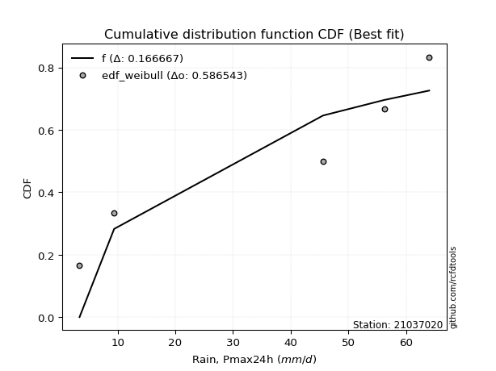</img>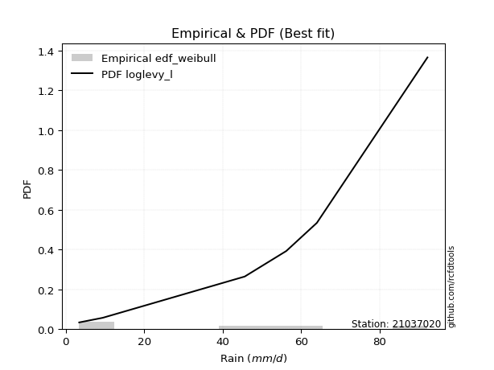</img>

</div>


### 4. EDF Beard (1943)

The Beard formula (or Beard´s plotting position formula) in hydrology is used to estimate the empirical non-exceedance probability _(P)_ of a flood event (or other extreme hydrological data point) within a given dataset.

<div align="center">


$P=(m-0.31)/(n+0.38)$


</div>


**4.1. Empirical values**

<div align="center">

|                | 0                   | 1                   | 2                  | 3                  | 4                  | 5                  |
|:---------------|:--------------------|:--------------------|:-------------------|:-------------------|:-------------------|:-------------------|
| date           | 2023                | 2022                | 2021               | 2020               | 2019               | 2025               |
| x              | 3.4                 | 9.4                 | 45.6               | 56.2               | 64.0               | 92.2               |
| m              | 1                   | 2                   | 3                  | 4                  | 5                  | 6                  |
| empirical_dist | edf_beard           | edf_beard           | edf_beard          | edf_beard          | edf_beard          | edf_beard          |
| empirical      | 0.10815047021943573 | 0.26489028213166144 | 0.4216300940438871 | 0.5783699059561128 | 0.7351097178683387 | 0.8918495297805643 |
| empirical_tr   | 1.1212653778558874  | 1.3603411513859276  | 1.7289972899728996 | 2.3717472118959106 | 3.7751479289940844 | 9.246376811594207  |

</div>


**4.2. Kolmogorov-Smirnov fit test (sorted by Δ)**


<div align="center">

|                | 0                   | 1                   | 2                   | 3                   | 4                   | 5                   | 6                   | 7                   | 8                   | 9                   | 10                  | 11                 | 12                  | 13                  | 14                 | 15                 | 16                  | 17                  | 18                  | 19                  | 20                  | 21                 | 22                  | 23                  | 24                  | 25                  | 26                  | 27                 | 28                  | 29                  | 30                  | 31                  | 32                 | 33                  | 34                 | 35                 | 36                  | 37                 | 38                  | 39                 | 40                 | 41                 | 42                 | 43                 | 44                  | 45                  | 46                  | 47                 | 48                  | 49                 | 50                 | 51                  | 52                 | 53                  | 54              | 55                  | 56                 | 57                  | 58                  | 59                  | 60                  | 61                  | 62                  | 63                  | 64                  | 65                  | 66                  | 67                  | 68                 | 69                  | 70                  | 71                 | 72                 | 73                  | 74                  | 75                 | 76                  | 77                  | 78                  | 79                  | 80                  | 81                  | 82                  | 83                 | 84                  | 85                  | 86                  | 87                  | 88                  | 89                  | 90                  | 91                  | 92                  | 93                  | 94                  | 95                 | 96                  | 97                  | 98                 | 99                  | 100                 | 101                 | 102                 | 103                | 104                 | 105                 | 106                 | 107                 | 108                 | 109                | 110                | 111                 | 112                | 113                | 114               | 115                 | 116                | 117                 | 118                | 119                | 120                | 121                | 122                | 123                | 124                 | 125               | 126                 | 127                | 128                 | 129                | 130                 | 131                | 132                | 133                | 134                 | 135                 | 136                 | 137                 | 138                | 139                | 140                | 141                 | 142                 | 143                | 144                | 145                | 146                 | 147                | 148               | 149               | 150               | 151               | 152                | 153                | 154              | 155                | 156                | 157                | 158                | 159                |
|:---------------|:--------------------|:--------------------|:--------------------|:--------------------|:--------------------|:--------------------|:--------------------|:--------------------|:--------------------|:--------------------|:--------------------|:-------------------|:--------------------|:--------------------|:-------------------|:-------------------|:--------------------|:--------------------|:--------------------|:--------------------|:--------------------|:-------------------|:--------------------|:--------------------|:--------------------|:--------------------|:--------------------|:-------------------|:--------------------|:--------------------|:--------------------|:--------------------|:-------------------|:--------------------|:-------------------|:-------------------|:--------------------|:-------------------|:--------------------|:-------------------|:-------------------|:-------------------|:-------------------|:-------------------|:--------------------|:--------------------|:--------------------|:-------------------|:--------------------|:-------------------|:-------------------|:--------------------|:-------------------|:--------------------|:----------------|:--------------------|:-------------------|:--------------------|:--------------------|:--------------------|:--------------------|:--------------------|:--------------------|:--------------------|:--------------------|:--------------------|:--------------------|:--------------------|:-------------------|:--------------------|:--------------------|:-------------------|:-------------------|:--------------------|:--------------------|:-------------------|:--------------------|:--------------------|:--------------------|:--------------------|:--------------------|:--------------------|:--------------------|:-------------------|:--------------------|:--------------------|:--------------------|:--------------------|:--------------------|:--------------------|:--------------------|:--------------------|:--------------------|:--------------------|:--------------------|:-------------------|:--------------------|:--------------------|:-------------------|:--------------------|:--------------------|:--------------------|:--------------------|:-------------------|:--------------------|:--------------------|:--------------------|:--------------------|:--------------------|:-------------------|:-------------------|:--------------------|:-------------------|:-------------------|:------------------|:--------------------|:-------------------|:--------------------|:-------------------|:-------------------|:-------------------|:-------------------|:-------------------|:-------------------|:--------------------|:------------------|:--------------------|:-------------------|:--------------------|:-------------------|:--------------------|:-------------------|:-------------------|:-------------------|:--------------------|:--------------------|:--------------------|:--------------------|:-------------------|:-------------------|:-------------------|:--------------------|:--------------------|:-------------------|:-------------------|:-------------------|:--------------------|:-------------------|:------------------|:------------------|:------------------|:------------------|:-------------------|:-------------------|:-----------------|:-------------------|:-------------------|:-------------------|:-------------------|:-------------------|
| station        | 21037020            | 21037020            | 21037020            | 21037020            | 21037020            | 21037020            | 21037020            | 21037020            | 21037020            | 21037020            | 21037020            | 21037020           | 21037020            | 21037020            | 21037020           | 21037020           | 21037020            | 21037020            | 21037020            | 21037020            | 21037020            | 21037020           | 21037020            | 21037020            | 21037020            | 21037020            | 21037020            | 21037020           | 21037020            | 21037020            | 21037020            | 21037020            | 21037020           | 21037020            | 21037020           | 21037020           | 21037020            | 21037020           | 21037020            | 21037020           | 21037020           | 21037020           | 21037020           | 21037020           | 21037020            | 21037020            | 21037020            | 21037020           | 21037020            | 21037020           | 21037020           | 21037020            | 21037020           | 21037020            | 21037020        | 21037020            | 21037020           | 21037020            | 21037020            | 21037020            | 21037020            | 21037020            | 21037020            | 21037020            | 21037020            | 21037020            | 21037020            | 21037020            | 21037020           | 21037020            | 21037020            | 21037020           | 21037020           | 21037020            | 21037020            | 21037020           | 21037020            | 21037020            | 21037020            | 21037020            | 21037020            | 21037020            | 21037020            | 21037020           | 21037020            | 21037020            | 21037020            | 21037020            | 21037020            | 21037020            | 21037020            | 21037020            | 21037020            | 21037020            | 21037020            | 21037020           | 21037020            | 21037020            | 21037020           | 21037020            | 21037020            | 21037020            | 21037020            | 21037020           | 21037020            | 21037020            | 21037020            | 21037020            | 21037020            | 21037020           | 21037020           | 21037020            | 21037020           | 21037020           | 21037020          | 21037020            | 21037020           | 21037020            | 21037020           | 21037020           | 21037020           | 21037020           | 21037020           | 21037020           | 21037020            | 21037020          | 21037020            | 21037020           | 21037020            | 21037020           | 21037020            | 21037020           | 21037020           | 21037020           | 21037020            | 21037020            | 21037020            | 21037020            | 21037020           | 21037020           | 21037020           | 21037020            | 21037020            | 21037020           | 21037020           | 21037020           | 21037020            | 21037020           | 21037020          | 21037020          | 21037020          | 21037020          | 21037020           | 21037020           | 21037020         | 21037020           | 21037020           | 21037020           | 21037020           | 21037020           |
| empirical_dist | edf_beard           | edf_beard           | edf_beard           | edf_beard           | edf_beard           | edf_beard           | edf_beard           | edf_beard           | edf_beard           | edf_beard           | edf_beard           | edf_beard          | edf_beard           | edf_beard           | edf_beard          | edf_beard          | edf_beard           | edf_beard           | edf_beard           | edf_beard           | edf_beard           | edf_beard          | edf_beard           | edf_beard           | edf_beard           | edf_beard           | edf_beard           | edf_beard          | edf_beard           | edf_beard           | edf_beard           | edf_beard           | edf_beard          | edf_beard           | edf_beard          | edf_beard          | edf_beard           | edf_beard          | edf_beard           | edf_beard          | edf_beard          | edf_beard          | edf_beard          | edf_beard          | edf_beard           | edf_beard           | edf_beard           | edf_beard          | edf_beard           | edf_beard          | edf_beard          | edf_beard           | edf_beard          | edf_beard           | edf_beard       | edf_beard           | edf_beard          | edf_beard           | edf_beard           | edf_beard           | edf_beard           | edf_beard           | edf_beard           | edf_beard           | edf_beard           | edf_beard           | edf_beard           | edf_beard           | edf_beard          | edf_beard           | edf_beard           | edf_beard          | edf_beard          | edf_beard           | edf_beard           | edf_beard          | edf_beard           | edf_beard           | edf_beard           | edf_beard           | edf_beard           | edf_beard           | edf_beard           | edf_beard          | edf_beard           | edf_beard           | edf_beard           | edf_beard           | edf_beard           | edf_beard           | edf_beard           | edf_beard           | edf_beard           | edf_beard           | edf_beard           | edf_beard          | edf_beard           | edf_beard           | edf_beard          | edf_beard           | edf_beard           | edf_beard           | edf_beard           | edf_beard          | edf_beard           | edf_beard           | edf_beard           | edf_beard           | edf_beard           | edf_beard          | edf_beard          | edf_beard           | edf_beard          | edf_beard          | edf_beard         | edf_beard           | edf_beard          | edf_beard           | edf_beard          | edf_beard          | edf_beard          | edf_beard          | edf_beard          | edf_beard          | edf_beard           | edf_beard         | edf_beard           | edf_beard          | edf_beard           | edf_beard          | edf_beard           | edf_beard          | edf_beard          | edf_beard          | edf_beard           | edf_beard           | edf_beard           | edf_beard           | edf_beard          | edf_beard          | edf_beard          | edf_beard           | edf_beard           | edf_beard          | edf_beard          | edf_beard          | edf_beard           | edf_beard          | edf_beard         | edf_beard         | edf_beard         | edf_beard         | edf_beard          | edf_beard          | edf_beard        | edf_beard          | edf_beard          | edf_beard          | edf_beard          | edf_beard          |
| p_dist         | ksone               | logjohnsonsu        | logweibull_max      | arcsine             | semicircular        | burr                | anglit              | loggausshyper       | logmielke           | logloggamma         | genextreme          | loglevy_l          | beta                | genlogistic         | pearson3           | johnsonsu          | t                   | skewnorm            | crystalball         | norm                | exponnorm           | gamma              | erlang              | invgauss            | foldnorm            | wrapcauchy          | gumbel_l            | maxwell            | invweibull          | invgamma            | rayleigh            | cosine              | logistic           | logargus            | gausshyper         | kstwobign          | argus               | rice               | logtrapezoid        | hypsecant          | laplace            | dweibull           | genpareto          | loggenextreme      | dgamma              | logarcsine          | kappa4              | gumbel_r           | truncweibull_min    | halfnorm           | truncexpon         | ncf                 | logdweibull        | gompertz            | logloglaplace   | loggumbel_l         | tukeylambda        | logweibull_min      | logburr12           | logpearson3         | uniform             | kappa3              | weibull_min         | loggennorm          | logbeta             | logsemicircular     | logwrapcauchy       | moyal               | loggompertz        | genexpon            | lomax               | genhalflogistic    | logdgamma          | loganglit           | loggenpareto        | betaprime          | vonmises_line       | loggenhalflogistic  | logncf              | gennorm             | logf                | lognorm             | logcrystalball      | logt               | logexponnorm        | lognct              | loggengamma         | logburr             | logfatiguelife      | triang              | logerlang           | logbetaprime        | levy_l              | loggamma            | loggamma            | loginvgauss        | logfoldnorm         | logrice             | loginvweibull      | loginvgamma         | bradford            | logalpha            | halflogistic        | logskewnorm        | loglogistic         | mielke              | logmaxwell          | lograyleigh         | wald                | logkstwobign       | exponpow           | halfgennorm         | loghypsecant       | loggenexpon        | logcosine         | loghalfnorm         | nct                | burr12              | loglomax           | logtriang          | loggumbel_r        | loglaplace         | loglaplace         | exponweib          | loghalfgennorm      | trapezoid         | loghalflogistic     | nakagami           | logmoyal            | f                  | logtukeylambda      | logksone           | gengamma           | logexponweib       | logtruncweibull_min | logkappa3           | loguniform          | logvonmises_line    | logwald            | logkappa4          | logbradford        | logtruncexpon       | alpha               | johnsonsb          | fatiguelife        | logtruncnorm       | lognakagami         | powerlaw           | truncpareto       | logexponpow       | logpowerlaw       | rdist             | logrdist           | weibull_max        | truncnorm        | logtruncpareto     | logjohnsonsb       | loggenlogistic     | logvonmises        | vonmises           |
| delta          | 0.09919861375032055 | 0.10362239595297984 | 0.10815047019521651 | 0.10815047021943569 | 0.11173344153604414 | 0.11970228247567008 | 0.12067879089553674 | 0.12659154659762745 | 0.12901504739245012 | 0.13240746791070584 | 0.13462158187602288 | 0.1358359370418395 | 0.13813091420908008 | 0.13868143790728715 | 0.1410966265881361 | 0.1412450728452102 | 0.14146030929083087 | 0.14146487619333126 | 0.14147417915202326 | 0.14147418505300147 | 0.14147577922988086 | 0.1417692810426937 | 0.14179126105620427 | 0.14228828334721186 | 0.14262310118657412 | 0.14421952826513487 | 0.14550536403932424 | 0.1461424838803504 | 0.14702303594299598 | 0.14956058645699832 | 0.14975363978112916 | 0.15004572601754135 | 0.1558441082332801 | 0.15654105195316775 | 0.1588683485574596 | 0.1591584842033928 | 0.15930941467926596 | 0.1600732800678163 | 0.16148572904745145 | 0.1625401383919176 | 0.1676836986983194 | 0.1679613542635827 | 0.1680544167244739 | 0.1695570430258665 | 0.16992833334150595 | 0.17204791377047118 | 0.17669173260560925 | 0.1811093689323461 | 0.18477921989362406 | 0.1854067911341878 | 0.1872155440432382 | 0.18788120555736915 | 0.1884910077592551 | 0.18933808645344885 | 0.1908830694293 | 0.19170336277896155 | 0.1920913782875946 | 0.19248567152909474 | 0.19267108482577305 | 0.19640363807522848 | 0.19732271456409387 | 0.19741525793661452 | 0.19757924954389722 | 0.20491845149202997 | 0.20572474914348038 | 0.20802494811342015 | 0.20874371652896123 | 0.20973959214116386 | 0.2141612790003829 | 0.21457945864565703 | 0.21459353340523962 | 0.2155720974275338 | 0.2159999180758206 | 0.21676525258329876 | 0.22006733295812014 | 0.2243340685790271 | 0.22941994378507125 | 0.23186382798663357 | 0.23310242355923977 | 0.23510971786833867 | 0.23657435990270742 | 0.23754690521345473 | 0.23754692874087785 | 0.2375474252941036 | 0.23754759831546807 | 0.23773599871790346 | 0.23887082328088555 | 0.23890197283211195 | 0.23926989230147316 | 0.23954360361276275 | 0.24017957524702777 | 0.24049294928975257 | 0.24100914737022988 | 0.24213359442437038 | 0.24213359442437038 | 0.2426182722174281 | 0.24293464862790887 | 0.24317810216286267 | 0.2437610025168359 | 0.24535006541243182 | 0.24545176069789237 | 0.24797035039860765 | 0.24901059314498336 | 0.2539145713024324 | 0.25625145704673963 | 0.25752049465387067 | 0.25818863527608643 | 0.26436219695418645 | 0.26489028213166144 | 0.2682536863435207 | 0.2684393217975904 | 0.26872363557168827 | 0.2706011271226823 | 0.2727030954328636 | 0.275144037162472 | 0.28242557704449606 | 0.2824369086248371 | 0.28405164927607646 | 0.2865916428280339 | 0.2926799224728292 | 0.2960288016205816 | 0.2984587733878486 | 0.2984587733878486 | 0.2986502547887791 | 0.29884483748714213 | 0.306610720207953 | 0.31038212431109774 | 0.3116484123682191 | 0.31528510893493905 | 0.3165852458458787 | 0.31659523628888725 | 0.3172555092709181 | 0.3479486885701812 | 0.3485979737376232 | 0.34887420062380575 | 0.36118995481455446 | 0.36503262993387914 | 0.36572534744860513 | 0.3701197300434354 | 0.3724550572526763 | 0.4118422996745709 | 0.41441740209201644 | 0.44207262808518794 | 0.4482631916776114 | 0.4548352230593549 | 0.4657943997046979 | 0.46669302033877774 | 0.4822645591324473 | 0.522592857537195 | 0.524167627051136 | 0.569202979236018 | 0.578369903734959 | 0.5783699043761175 | 0.6010442920617611 | 0.60880978397741 | 0.6295759400819981 | 0.6586883576237673 | 0.7351097178683387 | 1.1199594507073611 | 13.908425637854968 |
| deltao         | 0.530385761606      | 0.530385761606      | 0.530385761606      | 0.530385761606      | 0.530385761606      | 0.530385761606      | 0.530385761606      | 0.530385761606      | 0.530385761606      | 0.530385761606      | 0.530385761606      | 0.530385761606     | 0.530385761606      | 0.530385761606      | 0.530385761606     | 0.530385761606     | 0.530385761606      | 0.530385761606      | 0.530385761606      | 0.530385761606      | 0.530385761606      | 0.530385761606     | 0.530385761606      | 0.530385761606      | 0.530385761606      | 0.530385761606      | 0.530385761606      | 0.530385761606     | 0.530385761606      | 0.530385761606      | 0.530385761606      | 0.530385761606      | 0.530385761606     | 0.530385761606      | 0.530385761606     | 0.530385761606     | 0.530385761606      | 0.530385761606     | 0.530385761606      | 0.530385761606     | 0.530385761606     | 0.530385761606     | 0.530385761606     | 0.530385761606     | 0.530385761606      | 0.530385761606      | 0.530385761606      | 0.530385761606     | 0.530385761606      | 0.530385761606     | 0.530385761606     | 0.530385761606      | 0.530385761606     | 0.530385761606      | 0.530385761606  | 0.530385761606      | 0.530385761606     | 0.530385761606      | 0.530385761606      | 0.530385761606      | 0.530385761606      | 0.530385761606      | 0.530385761606      | 0.530385761606      | 0.530385761606      | 0.530385761606      | 0.530385761606      | 0.530385761606      | 0.530385761606     | 0.530385761606      | 0.530385761606      | 0.530385761606     | 0.530385761606     | 0.530385761606      | 0.530385761606      | 0.530385761606     | 0.530385761606      | 0.530385761606      | 0.530385761606      | 0.530385761606      | 0.530385761606      | 0.530385761606      | 0.530385761606      | 0.530385761606     | 0.530385761606      | 0.530385761606      | 0.530385761606      | 0.530385761606      | 0.530385761606      | 0.530385761606      | 0.530385761606      | 0.530385761606      | 0.530385761606      | 0.530385761606      | 0.530385761606      | 0.530385761606     | 0.530385761606      | 0.530385761606      | 0.530385761606     | 0.530385761606      | 0.530385761606      | 0.530385761606      | 0.530385761606      | 0.530385761606     | 0.530385761606      | 0.530385761606      | 0.530385761606      | 0.530385761606      | 0.530385761606      | 0.530385761606     | 0.530385761606     | 0.530385761606      | 0.530385761606     | 0.530385761606     | 0.530385761606    | 0.530385761606      | 0.530385761606     | 0.530385761606      | 0.530385761606     | 0.530385761606     | 0.530385761606     | 0.530385761606     | 0.530385761606     | 0.530385761606     | 0.530385761606      | 0.530385761606    | 0.530385761606      | 0.530385761606     | 0.530385761606      | 0.530385761606     | 0.530385761606      | 0.530385761606     | 0.530385761606     | 0.530385761606     | 0.530385761606      | 0.530385761606      | 0.530385761606      | 0.530385761606      | 0.530385761606     | 0.530385761606     | 0.530385761606     | 0.530385761606      | 0.530385761606      | 0.530385761606     | 0.530385761606     | 0.530385761606     | 0.530385761606      | 0.530385761606     | 0.530385761606    | 0.530385761606    | 0.530385761606    | 0.530385761606    | 0.530385761606     | 0.530385761606     | 0.530385761606   | 0.530385761606     | 0.530385761606     | 0.530385761606     | 0.530385761606     | 0.530385761606     |
| eval           | Δo > Δ              | Δo > Δ              | Δo > Δ              | Δo > Δ              | Δo > Δ              | Δo > Δ              | Δo > Δ              | Δo > Δ              | Δo > Δ              | Δo > Δ              | Δo > Δ              | Δo > Δ             | Δo > Δ              | Δo > Δ              | Δo > Δ             | Δo > Δ             | Δo > Δ              | Δo > Δ              | Δo > Δ              | Δo > Δ              | Δo > Δ              | Δo > Δ             | Δo > Δ              | Δo > Δ              | Δo > Δ              | Δo > Δ              | Δo > Δ              | Δo > Δ             | Δo > Δ              | Δo > Δ              | Δo > Δ              | Δo > Δ              | Δo > Δ             | Δo > Δ              | Δo > Δ             | Δo > Δ             | Δo > Δ              | Δo > Δ             | Δo > Δ              | Δo > Δ             | Δo > Δ             | Δo > Δ             | Δo > Δ             | Δo > Δ             | Δo > Δ              | Δo > Δ              | Δo > Δ              | Δo > Δ             | Δo > Δ              | Δo > Δ             | Δo > Δ             | Δo > Δ              | Δo > Δ             | Δo > Δ              | Δo > Δ          | Δo > Δ              | Δo > Δ             | Δo > Δ              | Δo > Δ              | Δo > Δ              | Δo > Δ              | Δo > Δ              | Δo > Δ              | Δo > Δ              | Δo > Δ              | Δo > Δ              | Δo > Δ              | Δo > Δ              | Δo > Δ             | Δo > Δ              | Δo > Δ              | Δo > Δ             | Δo > Δ             | Δo > Δ              | Δo > Δ              | Δo > Δ             | Δo > Δ              | Δo > Δ              | Δo > Δ              | Δo > Δ              | Δo > Δ              | Δo > Δ              | Δo > Δ              | Δo > Δ             | Δo > Δ              | Δo > Δ              | Δo > Δ              | Δo > Δ              | Δo > Δ              | Δo > Δ              | Δo > Δ              | Δo > Δ              | Δo > Δ              | Δo > Δ              | Δo > Δ              | Δo > Δ             | Δo > Δ              | Δo > Δ              | Δo > Δ             | Δo > Δ              | Δo > Δ              | Δo > Δ              | Δo > Δ              | Δo > Δ             | Δo > Δ              | Δo > Δ              | Δo > Δ              | Δo > Δ              | Δo > Δ              | Δo > Δ             | Δo > Δ             | Δo > Δ              | Δo > Δ             | Δo > Δ             | Δo > Δ            | Δo > Δ              | Δo > Δ             | Δo > Δ              | Δo > Δ             | Δo > Δ             | Δo > Δ             | Δo > Δ             | Δo > Δ             | Δo > Δ             | Δo > Δ              | Δo > Δ            | Δo > Δ              | Δo > Δ             | Δo > Δ              | Δo > Δ             | Δo > Δ              | Δo > Δ             | Δo > Δ             | Δo > Δ             | Δo > Δ              | Δo > Δ              | Δo > Δ              | Δo > Δ              | Δo > Δ             | Δo > Δ             | Δo > Δ             | Δo > Δ              | Δo > Δ              | Δo > Δ             | Δo > Δ             | Δo > Δ             | Δo > Δ              | Δo > Δ             | Δo > Δ            | Δo > Δ            | Δo <= Δ           | Δo <= Δ           | Δo <= Δ            | Δo <= Δ            | Δo <= Δ          | Δo <= Δ            | Δo <= Δ            | Δo <= Δ            | Δo <= Δ            | Δo <= Δ            |
| fit            | 1                   | 1                   | 1                   | 1                   | 1                   | 1                   | 1                   | 1                   | 1                   | 1                   | 1                   | 1                  | 1                   | 1                   | 1                  | 1                  | 1                   | 1                   | 1                   | 1                   | 1                   | 1                  | 1                   | 1                   | 1                   | 1                   | 1                   | 1                  | 1                   | 1                   | 1                   | 1                   | 1                  | 1                   | 1                  | 1                  | 1                   | 1                  | 1                   | 1                  | 1                  | 1                  | 1                  | 1                  | 1                   | 1                   | 1                   | 1                  | 1                   | 1                  | 1                  | 1                   | 1                  | 1                   | 1               | 1                   | 1                  | 1                   | 1                   | 1                   | 1                   | 1                   | 1                   | 1                   | 1                   | 1                   | 1                   | 1                   | 1                  | 1                   | 1                   | 1                  | 1                  | 1                   | 1                   | 1                  | 1                   | 1                   | 1                   | 1                   | 1                   | 1                   | 1                   | 1                  | 1                   | 1                   | 1                   | 1                   | 1                   | 1                   | 1                   | 1                   | 1                   | 1                   | 1                   | 1                  | 1                   | 1                   | 1                  | 1                   | 1                   | 1                   | 1                   | 1                  | 1                   | 1                   | 1                   | 1                   | 1                   | 1                  | 1                  | 1                   | 1                  | 1                  | 1                 | 1                   | 1                  | 1                   | 1                  | 1                  | 1                  | 1                  | 1                  | 1                  | 1                   | 1                 | 1                   | 1                  | 1                   | 1                  | 1                   | 1                  | 1                  | 1                  | 1                   | 1                   | 1                   | 1                   | 1                  | 1                  | 1                  | 1                   | 1                   | 1                  | 1                  | 1                  | 1                   | 1                  | 1                 | 1                 | 0                 | 0                 | 0                  | 0                  | 0                | 0                  | 0                  | 0                  | 0                  | 0                  |
| n              | 6                   | 6                   | 6                   | 6                   | 6                   | 6                   | 6                   | 6                   | 6                   | 6                   | 6                   | 6                  | 6                   | 6                   | 6                  | 6                  | 6                   | 6                   | 6                   | 6                   | 6                   | 6                  | 6                   | 6                   | 6                   | 6                   | 6                   | 6                  | 6                   | 6                   | 6                   | 6                   | 6                  | 6                   | 6                  | 6                  | 6                   | 6                  | 6                   | 6                  | 6                  | 6                  | 6                  | 6                  | 6                   | 6                   | 6                   | 6                  | 6                   | 6                  | 6                  | 6                   | 6                  | 6                   | 6               | 6                   | 6                  | 6                   | 6                   | 6                   | 6                   | 6                   | 6                   | 6                   | 6                   | 6                   | 6                   | 6                   | 6                  | 6                   | 6                   | 6                  | 6                  | 6                   | 6                   | 6                  | 6                   | 6                   | 6                   | 6                   | 6                   | 6                   | 6                   | 6                  | 6                   | 6                   | 6                   | 6                   | 6                   | 6                   | 6                   | 6                   | 6                   | 6                   | 6                   | 6                  | 6                   | 6                   | 6                  | 6                   | 6                   | 6                   | 6                   | 6                  | 6                   | 6                   | 6                   | 6                   | 6                   | 6                  | 6                  | 6                   | 6                  | 6                  | 6                 | 6                   | 6                  | 6                   | 6                  | 6                  | 6                  | 6                  | 6                  | 6                  | 6                   | 6                 | 6                   | 6                  | 6                   | 6                  | 6                   | 6                  | 6                  | 6                  | 6                   | 6                   | 6                   | 6                   | 6                  | 6                  | 6                  | 6                   | 6                   | 6                  | 6                  | 6                  | 6                   | 6                  | 6                 | 6                 | 6                 | 6                 | 6                  | 6                  | 6                | 6                  | 6                  | 6                  | 6                  | 6                  |
| best_fit       | 1                   | 0                   | 0                   | 0                   | 0                   | 0                   | 0                   | 0                   | 0                   | 0                   | 0                   | 0                  | 0                   | 0                   | 0                  | 0                  | 0                   | 0                   | 0                   | 0                   | 0                   | 0                  | 0                   | 0                   | 0                   | 0                   | 0                   | 0                  | 0                   | 0                   | 0                   | 0                   | 0                  | 0                   | 0                  | 0                  | 0                   | 0                  | 0                   | 0                  | 0                  | 0                  | 0                  | 0                  | 0                   | 0                   | 0                   | 0                  | 0                   | 0                  | 0                  | 0                   | 0                  | 0                   | 0               | 0                   | 0                  | 0                   | 0                   | 0                   | 0                   | 0                   | 0                   | 0                   | 0                   | 0                   | 0                   | 0                   | 0                  | 0                   | 0                   | 0                  | 0                  | 0                   | 0                   | 0                  | 0                   | 0                   | 0                   | 0                   | 0                   | 0                   | 0                   | 0                  | 0                   | 0                   | 0                   | 0                   | 0                   | 0                   | 0                   | 0                   | 0                   | 0                   | 0                   | 0                  | 0                   | 0                   | 0                  | 0                   | 0                   | 0                   | 0                   | 0                  | 0                   | 0                   | 0                   | 0                   | 0                   | 0                  | 0                  | 0                   | 0                  | 0                  | 0                 | 0                   | 0                  | 0                   | 0                  | 0                  | 0                  | 0                  | 0                  | 0                  | 0                   | 0                 | 0                   | 0                  | 0                   | 0                  | 0                   | 0                  | 0                  | 0                  | 0                   | 0                   | 0                   | 0                   | 0                  | 0                  | 0                  | 0                   | 0                   | 0                  | 0                  | 0                  | 0                   | 0                  | 0                 | 0                 | 0                 | 0                 | 0                  | 0                  | 0                | 0                  | 0                  | 0                  | 0                  | 0                  |
| best_fit_sort  | 1                   | 2                   | 3                   | 4                   | 5                   | 6                   | 7                   | 8                   | 9                   | 10                  | 11                  | 12                 | 13                  | 14                  | 15                 | 16                 | 17                  | 18                  | 19                  | 20                  | 21                  | 22                 | 23                  | 24                  | 25                  | 26                  | 27                  | 28                 | 29                  | 30                  | 31                  | 32                  | 33                 | 34                  | 35                 | 36                 | 37                  | 38                 | 39                  | 40                 | 41                 | 42                 | 43                 | 44                 | 45                  | 46                  | 47                  | 48                 | 49                  | 50                 | 51                 | 52                  | 53                 | 54                  | 55              | 56                  | 57                 | 58                  | 59                  | 60                  | 61                  | 62                  | 63                  | 64                  | 65                  | 66                  | 67                  | 68                  | 69                 | 70                  | 71                  | 72                 | 73                 | 74                  | 75                  | 76                 | 77                  | 78                  | 79                  | 80                  | 81                  | 82                  | 83                  | 84                 | 85                  | 86                  | 87                  | 88                  | 89                  | 90                  | 91                  | 92                  | 93                  | 94                  | 95                  | 96                 | 97                  | 98                  | 99                 | 100                 | 101                 | 102                 | 103                 | 104                | 105                 | 106                 | 107                 | 108                 | 109                 | 110                | 111                | 112                 | 113                | 114                | 115               | 116                 | 117                | 118                 | 119                | 120                | 121                | 122                | 123                | 124                | 125                 | 126               | 127                 | 128                | 129                 | 130                | 131                 | 132                | 133                | 134                | 135                 | 136                 | 137                 | 138                 | 139                | 140                | 141                | 142                 | 143                 | 144                | 145                | 146                | 147                 | 148                | 149               | 150               | 151               | 152               | 153                | 154                | 155              | 156                | 157                | 158                | 159                | 160                |

</div>


**4.3. Best fit**

<div align="center">

|   id |   station | empirical_dist   | p_dist   |     delta |   deltao | eval   |   fit |   n |   best_fit |   best_fit_sort |
|-----:|----------:|:-----------------|:---------|----------:|---------:|:-------|------:|----:|-----------:|----------------:|
|    0 |  21037020 | edf_beard        | ksone    | 0.0991986 | 0.530386 | Δo > Δ |     1 |   6 |          1 |               1 |

</div>


<div align="center">

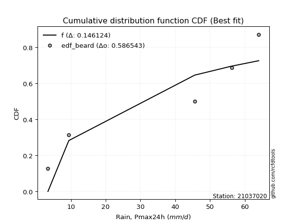</img></img>

</div>


### 5. EDF Chegodayev (1955)

The Chegodayev formula is an empirical plotting position formula used in hydrological frequency analysis to estimate the exceedance probability or return period of a specific event from a set of observed data. It is primarily used for plotting observed data points on probability paper to fit a theoretical distribution, particularly for analyzing extreme events like maximum flood flows or rainfall intensities. The constant _b_ value in the generalized plotting position formula is 0.3.

<div align="center">


$P=(m-b)/(n+1-2b)$


</div>


**5.1. Empirical values**

<div align="center">

|                | 0                   | 1                  | 2                  | 3                  | 4                 | 5                 |
|:---------------|:--------------------|:-------------------|:-------------------|:-------------------|:------------------|:------------------|
| date           | 2023                | 2022               | 2021               | 2020               | 2019              | 2025              |
| x              | 3.4                 | 9.4                | 45.6               | 56.2               | 64.0              | 92.2              |
| m              | 1                   | 2                  | 3                  | 4                  | 5                 | 6                 |
| empirical_dist | edf_chegodayev      | edf_chegodayev     | edf_chegodayev     | edf_chegodayev     | edf_chegodayev    | edf_chegodayev    |
| empirical      | 0.10937499999999999 | 0.265625           | 0.421875           | 0.578125           | 0.734375          | 0.890625          |
| empirical_tr   | 1.1228070175438596  | 1.3617021276595744 | 1.7297297297297298 | 2.3703703703703702 | 3.764705882352941 | 9.142857142857142 |

</div>


**5.2. Kolmogorov-Smirnov fit test (sorted by Δ)**


<div align="center">

|                | 0                   | 1                  | 2                   | 3              | 4                  | 5                   | 6                  | 7                   | 8                   | 9                   | 10                  | 11                  | 12                  | 13                  | 14                  | 15                  | 16                  | 17                  | 18                  | 19                  | 20                  | 21                  | 22                  | 23                  | 24                  | 25                  | 26                 | 27                 | 28                  | 29                 | 30                  | 31                 | 32                  | 33                  | 34                  | 35                  | 36                  | 37                  | 38                  | 39                  | 40                  | 41                  | 42                  | 43                  | 44                 | 45                 | 46                 | 47                  | 48                  | 49                  | 50                  | 51                  | 52                  | 53                 | 54                  | 55                  | 56                  | 57                  | 58                  | 59                 | 60                  | 61                  | 62                  | 63                 | 64                  | 65                  | 66                  | 67                  | 68                  | 69                  | 70                  | 71                  | 72                 | 73                  | 74                  | 75                  | 76                 | 77                 | 78                 | 79             | 80                  | 81                  | 82                  | 83                  | 84                 | 85                 | 86                  | 87                  | 88                 | 89                  | 90                 | 91                 | 92                  | 93                 | 94                 | 95                  | 96                | 97                 | 98                  | 99                  | 100                | 101                 | 102                 | 103                | 104                 | 105                | 106                 | 107                | 108            | 109                 | 110                | 111                | 112                 | 113                | 114                | 115                | 116                 | 117                | 118               | 119                 | 120                | 121                | 122                | 123                 | 124                 | 125                | 126                 | 127                 | 128                | 129                 | 130                | 131                 | 132                | 133                | 134                 | 135                | 136                 | 137                 | 138                 | 139                 | 140                 | 141                 | 142                 | 143                 | 144                 | 145               | 146                 | 147                 | 148               | 149               | 150                | 151                | 152                | 153                | 154                | 155                | 156                | 157            | 158                | 159                |
|:---------------|:--------------------|:-------------------|:--------------------|:---------------|:-------------------|:--------------------|:-------------------|:--------------------|:--------------------|:--------------------|:--------------------|:--------------------|:--------------------|:--------------------|:--------------------|:--------------------|:--------------------|:--------------------|:--------------------|:--------------------|:--------------------|:--------------------|:--------------------|:--------------------|:--------------------|:--------------------|:-------------------|:-------------------|:--------------------|:-------------------|:--------------------|:-------------------|:--------------------|:--------------------|:--------------------|:--------------------|:--------------------|:--------------------|:--------------------|:--------------------|:--------------------|:--------------------|:--------------------|:--------------------|:-------------------|:-------------------|:-------------------|:--------------------|:--------------------|:--------------------|:--------------------|:--------------------|:--------------------|:-------------------|:--------------------|:--------------------|:--------------------|:--------------------|:--------------------|:-------------------|:--------------------|:--------------------|:--------------------|:-------------------|:--------------------|:--------------------|:--------------------|:--------------------|:--------------------|:--------------------|:--------------------|:--------------------|:-------------------|:--------------------|:--------------------|:--------------------|:-------------------|:-------------------|:-------------------|:---------------|:--------------------|:--------------------|:--------------------|:--------------------|:-------------------|:-------------------|:--------------------|:--------------------|:-------------------|:--------------------|:-------------------|:-------------------|:--------------------|:-------------------|:-------------------|:--------------------|:------------------|:-------------------|:--------------------|:--------------------|:-------------------|:--------------------|:--------------------|:-------------------|:--------------------|:-------------------|:--------------------|:-------------------|:---------------|:--------------------|:-------------------|:-------------------|:--------------------|:-------------------|:-------------------|:-------------------|:--------------------|:-------------------|:------------------|:--------------------|:-------------------|:-------------------|:-------------------|:--------------------|:--------------------|:-------------------|:--------------------|:--------------------|:-------------------|:--------------------|:-------------------|:--------------------|:-------------------|:-------------------|:--------------------|:-------------------|:--------------------|:--------------------|:--------------------|:--------------------|:--------------------|:--------------------|:--------------------|:--------------------|:--------------------|:------------------|:--------------------|:--------------------|:------------------|:------------------|:-------------------|:-------------------|:-------------------|:-------------------|:-------------------|:-------------------|:-------------------|:---------------|:-------------------|:-------------------|
| station        | 21037020            | 21037020           | 21037020            | 21037020       | 21037020           | 21037020            | 21037020           | 21037020            | 21037020            | 21037020            | 21037020            | 21037020            | 21037020            | 21037020            | 21037020            | 21037020            | 21037020            | 21037020            | 21037020            | 21037020            | 21037020            | 21037020            | 21037020            | 21037020            | 21037020            | 21037020            | 21037020           | 21037020           | 21037020            | 21037020           | 21037020            | 21037020           | 21037020            | 21037020            | 21037020            | 21037020            | 21037020            | 21037020            | 21037020            | 21037020            | 21037020            | 21037020            | 21037020            | 21037020            | 21037020           | 21037020           | 21037020           | 21037020            | 21037020            | 21037020            | 21037020            | 21037020            | 21037020            | 21037020           | 21037020            | 21037020            | 21037020            | 21037020            | 21037020            | 21037020           | 21037020            | 21037020            | 21037020            | 21037020           | 21037020            | 21037020            | 21037020            | 21037020            | 21037020            | 21037020            | 21037020            | 21037020            | 21037020           | 21037020            | 21037020            | 21037020            | 21037020           | 21037020           | 21037020           | 21037020       | 21037020            | 21037020            | 21037020            | 21037020            | 21037020           | 21037020           | 21037020            | 21037020            | 21037020           | 21037020            | 21037020           | 21037020           | 21037020            | 21037020           | 21037020           | 21037020            | 21037020          | 21037020           | 21037020            | 21037020            | 21037020           | 21037020            | 21037020            | 21037020           | 21037020            | 21037020           | 21037020            | 21037020           | 21037020       | 21037020            | 21037020           | 21037020           | 21037020            | 21037020           | 21037020           | 21037020           | 21037020            | 21037020           | 21037020          | 21037020            | 21037020           | 21037020           | 21037020           | 21037020            | 21037020            | 21037020           | 21037020            | 21037020            | 21037020           | 21037020            | 21037020           | 21037020            | 21037020           | 21037020           | 21037020            | 21037020           | 21037020            | 21037020            | 21037020            | 21037020            | 21037020            | 21037020            | 21037020            | 21037020            | 21037020            | 21037020          | 21037020            | 21037020            | 21037020          | 21037020          | 21037020           | 21037020           | 21037020           | 21037020           | 21037020           | 21037020           | 21037020           | 21037020       | 21037020           | 21037020           |
| empirical_dist | edf_chegodayev      | edf_chegodayev     | edf_chegodayev      | edf_chegodayev | edf_chegodayev     | edf_chegodayev      | edf_chegodayev     | edf_chegodayev      | edf_chegodayev      | edf_chegodayev      | edf_chegodayev      | edf_chegodayev      | edf_chegodayev      | edf_chegodayev      | edf_chegodayev      | edf_chegodayev      | edf_chegodayev      | edf_chegodayev      | edf_chegodayev      | edf_chegodayev      | edf_chegodayev      | edf_chegodayev      | edf_chegodayev      | edf_chegodayev      | edf_chegodayev      | edf_chegodayev      | edf_chegodayev     | edf_chegodayev     | edf_chegodayev      | edf_chegodayev     | edf_chegodayev      | edf_chegodayev     | edf_chegodayev      | edf_chegodayev      | edf_chegodayev      | edf_chegodayev      | edf_chegodayev      | edf_chegodayev      | edf_chegodayev      | edf_chegodayev      | edf_chegodayev      | edf_chegodayev      | edf_chegodayev      | edf_chegodayev      | edf_chegodayev     | edf_chegodayev     | edf_chegodayev     | edf_chegodayev      | edf_chegodayev      | edf_chegodayev      | edf_chegodayev      | edf_chegodayev      | edf_chegodayev      | edf_chegodayev     | edf_chegodayev      | edf_chegodayev      | edf_chegodayev      | edf_chegodayev      | edf_chegodayev      | edf_chegodayev     | edf_chegodayev      | edf_chegodayev      | edf_chegodayev      | edf_chegodayev     | edf_chegodayev      | edf_chegodayev      | edf_chegodayev      | edf_chegodayev      | edf_chegodayev      | edf_chegodayev      | edf_chegodayev      | edf_chegodayev      | edf_chegodayev     | edf_chegodayev      | edf_chegodayev      | edf_chegodayev      | edf_chegodayev     | edf_chegodayev     | edf_chegodayev     | edf_chegodayev | edf_chegodayev      | edf_chegodayev      | edf_chegodayev      | edf_chegodayev      | edf_chegodayev     | edf_chegodayev     | edf_chegodayev      | edf_chegodayev      | edf_chegodayev     | edf_chegodayev      | edf_chegodayev     | edf_chegodayev     | edf_chegodayev      | edf_chegodayev     | edf_chegodayev     | edf_chegodayev      | edf_chegodayev    | edf_chegodayev     | edf_chegodayev      | edf_chegodayev      | edf_chegodayev     | edf_chegodayev      | edf_chegodayev      | edf_chegodayev     | edf_chegodayev      | edf_chegodayev     | edf_chegodayev      | edf_chegodayev     | edf_chegodayev | edf_chegodayev      | edf_chegodayev     | edf_chegodayev     | edf_chegodayev      | edf_chegodayev     | edf_chegodayev     | edf_chegodayev     | edf_chegodayev      | edf_chegodayev     | edf_chegodayev    | edf_chegodayev      | edf_chegodayev     | edf_chegodayev     | edf_chegodayev     | edf_chegodayev      | edf_chegodayev      | edf_chegodayev     | edf_chegodayev      | edf_chegodayev      | edf_chegodayev     | edf_chegodayev      | edf_chegodayev     | edf_chegodayev      | edf_chegodayev     | edf_chegodayev     | edf_chegodayev      | edf_chegodayev     | edf_chegodayev      | edf_chegodayev      | edf_chegodayev      | edf_chegodayev      | edf_chegodayev      | edf_chegodayev      | edf_chegodayev      | edf_chegodayev      | edf_chegodayev      | edf_chegodayev    | edf_chegodayev      | edf_chegodayev      | edf_chegodayev    | edf_chegodayev    | edf_chegodayev     | edf_chegodayev     | edf_chegodayev     | edf_chegodayev     | edf_chegodayev     | edf_chegodayev     | edf_chegodayev     | edf_chegodayev | edf_chegodayev     | edf_chegodayev     |
| p_dist         | ksone               | logjohnsonsu       | logweibull_max      | arcsine        | semicircular       | burr                | anglit             | loggausshyper       | logmielke           | logloggamma         | loglevy_l           | genextreme          | beta                | genlogistic         | pearson3            | johnsonsu           | t                   | skewnorm            | crystalball         | norm                | exponnorm           | gamma               | erlang              | invgauss            | foldnorm            | wrapcauchy          | gumbel_l           | invweibull         | maxwell             | invgamma           | rayleigh            | cosine             | logargus            | logistic            | kstwobign           | gausshyper          | argus               | rice                | logtrapezoid        | hypsecant           | laplace             | dweibull            | genpareto           | loggenextreme       | dgamma             | logarcsine         | kappa4             | gumbel_r            | truncweibull_min    | halfnorm            | truncexpon          | logdweibull         | ncf                 | logloglaplace      | gompertz            | loggumbel_l         | logweibull_min      | logburr12           | tukeylambda         | logpearson3        | weibull_min         | uniform             | kappa3              | logbeta            | loggennorm          | logsemicircular     | logwrapcauchy       | moyal               | loggompertz         | genexpon            | lomax               | genhalflogistic     | loganglit          | logdgamma           | loggenpareto        | betaprime           | vonmises_line      | loggenhalflogistic | logncf             | gennorm        | logf                | lognorm             | logcrystalball      | logt                | logexponnorm       | lognct             | loggengamma         | logburr             | logfatiguelife     | levy_l              | logerlang          | logbetaprime       | triang              | loggamma           | loggamma           | loginvgauss         | logfoldnorm       | logrice            | loginvweibull       | loginvgamma         | bradford           | logalpha            | halflogistic        | logskewnorm        | loglogistic         | mielke             | logmaxwell          | lograyleigh        | wald           | logkstwobign        | exponpow           | halfgennorm        | loghypsecant        | loggenexpon        | logcosine          | loghalfnorm        | nct                 | burr12             | loglomax          | logtriang           | loggumbel_r        | loglaplace         | loglaplace         | exponweib           | loghalfgennorm      | trapezoid          | loghalflogistic     | nakagami            | logmoyal           | f                   | logtukeylambda     | logksone            | gengamma           | logexponweib       | logtruncweibull_min | logkappa3          | loguniform          | logvonmises_line    | logwald             | logkappa4           | logbradford         | logtruncexpon       | alpha               | johnsonsb           | fatiguelife         | logtruncnorm      | lognakagami         | powerlaw            | truncpareto       | logexponpow       | logpowerlaw        | rdist              | logrdist           | weibull_max        | truncnorm          | logtruncpareto     | logjohnsonsb       | loggenlogistic | logvonmises        | vonmises           |
| delta          | 0.09993333161865911 | 0.1043571138213184 | 0.10937499997578082 | 0.109375       | 0.1124681594043827 | 0.12043700034400864 | 0.1214135087638753 | 0.12634664064151457 | 0.12877014143633725 | 0.13216256195459297 | 0.13510121917350082 | 0.13535629974436145 | 0.13886563207741864 | 0.13941615577562572 | 0.14183134445647466 | 0.14197979071354877 | 0.14219502715916943 | 0.14219959406166982 | 0.14220889702036182 | 0.14220890292134003 | 0.14221049709821942 | 0.14250399891103227 | 0.14252597892454283 | 0.14302300121555042 | 0.14335781905491268 | 0.14495424613347344 | 0.1462400819076628 | 0.1467781299868831 | 0.14687720174868896 | 0.1502953043253369 | 0.15048835764946772 | 0.1507804438858799 | 0.15629614599705488 | 0.15657882610161866 | 0.15891357824727992 | 0.15960306642579816 | 0.16004413254760452 | 0.16080799793615486 | 0.16124082309133858 | 0.16327485626025617 | 0.16841841656665796 | 0.16869607213192125 | 0.16878913459281247 | 0.17029176089420506 | 0.1706630512098445 | 0.1718030078143583 | 0.1774264504739478 | 0.18184408680068467 | 0.18453431393751119 | 0.18614150900252635 | 0.18697063808712533 | 0.18726647797869078 | 0.18763629960125627 | 0.1896585396487357 | 0.19007280432178741 | 0.19145845682284868 | 0.19224076557298186 | 0.19242617886966018 | 0.19282609615593316 | 0.1961587321191156 | 0.19733434358778434 | 0.19805743243243243 | 0.19814997580495308 | 0.2049900312751417 | 0.20565316936036854 | 0.20778004215730728 | 0.20849881057284836 | 0.21047431000950242 | 0.21391637304427003 | 0.21433455268954416 | 0.21434862744912675 | 0.21483737955919513 | 0.2165203466271859 | 0.21673463594415918 | 0.21982242700200727 | 0.22408916262291423 | 0.2301546616534098 | 0.2316189220305207 | 0.2328575176031269 | 0.234375       | 0.23632945394659455 | 0.23730199925734186 | 0.23730202278476498 | 0.23730251933799074 | 0.2373026923593552 | 0.2374910927617906 | 0.23862591732477267 | 0.23865706687599908 | 0.2390249863453603 | 0.23978461758966563 | 0.2399346692909149 | 0.2402480433336397 | 0.24027832148110131 | 0.2418886884682575 | 0.2418886884682575 | 0.24237336626131523 | 0.242689742671796 | 0.2429331962067498 | 0.24351609656072304 | 0.24510515945631894 | 0.2452068547417795 | 0.24772544444249478 | 0.24974531101332192 | 0.2536696653463195 | 0.25600655109062675 | 0.2572755886977578 | 0.25794372931997356 | 0.2641172909980736 | 0.265625       | 0.26800878038740783 | 0.2681944158414775 | 0.2684787296155754 | 0.27035622116656943 | 0.2724581894767507 | 0.2748991312063591 | 0.2821806710883832 | 0.28219200266872424 | 0.2838067433199636 | 0.286346736871921 | 0.29243501651671633 | 0.2957838956644687 | 0.2982138674317357 | 0.2982138674317357 | 0.29840534883266623 | 0.29859993153102926 | 0.3058760023396143 | 0.31013721835498487 | 0.31140350641210623 | 0.3150402029788262 | 0.31634033988976584 | 0.3163503303327744 | 0.31701060331480524 | 0.3477037826140683 | 0.3483530677815103 | 0.3486292946676929  | 0.3609450488584416 | 0.36478772397776627 | 0.36548044149249226 | 0.36987482408732253 | 0.37221015129656343 | 0.41159739371845805 | 0.41417249613590357 | 0.44182772212907506 | 0.44752847380927274 | 0.45459031710324205 | 0.465549493748585 | 0.46644811438266487 | 0.48201965317633444 | 0.522347951581082 | 0.523922721095023 | 0.5684682613676795 | 0.5781249977788462 | 0.5781249984200046 | 0.6003095741934225 | 0.6080750661090715 | 0.6288412222136596 | 0.6579536397554286 | 0.734375       | 1.1197145447512482 | 13.909650167635533 |
| deltao         | 0.530385761606      | 0.530385761606     | 0.530385761606      | 0.530385761606 | 0.530385761606     | 0.530385761606      | 0.530385761606     | 0.530385761606      | 0.530385761606      | 0.530385761606      | 0.530385761606      | 0.530385761606      | 0.530385761606      | 0.530385761606      | 0.530385761606      | 0.530385761606      | 0.530385761606      | 0.530385761606      | 0.530385761606      | 0.530385761606      | 0.530385761606      | 0.530385761606      | 0.530385761606      | 0.530385761606      | 0.530385761606      | 0.530385761606      | 0.530385761606     | 0.530385761606     | 0.530385761606      | 0.530385761606     | 0.530385761606      | 0.530385761606     | 0.530385761606      | 0.530385761606      | 0.530385761606      | 0.530385761606      | 0.530385761606      | 0.530385761606      | 0.530385761606      | 0.530385761606      | 0.530385761606      | 0.530385761606      | 0.530385761606      | 0.530385761606      | 0.530385761606     | 0.530385761606     | 0.530385761606     | 0.530385761606      | 0.530385761606      | 0.530385761606      | 0.530385761606      | 0.530385761606      | 0.530385761606      | 0.530385761606     | 0.530385761606      | 0.530385761606      | 0.530385761606      | 0.530385761606      | 0.530385761606      | 0.530385761606     | 0.530385761606      | 0.530385761606      | 0.530385761606      | 0.530385761606     | 0.530385761606      | 0.530385761606      | 0.530385761606      | 0.530385761606      | 0.530385761606      | 0.530385761606      | 0.530385761606      | 0.530385761606      | 0.530385761606     | 0.530385761606      | 0.530385761606      | 0.530385761606      | 0.530385761606     | 0.530385761606     | 0.530385761606     | 0.530385761606 | 0.530385761606      | 0.530385761606      | 0.530385761606      | 0.530385761606      | 0.530385761606     | 0.530385761606     | 0.530385761606      | 0.530385761606      | 0.530385761606     | 0.530385761606      | 0.530385761606     | 0.530385761606     | 0.530385761606      | 0.530385761606     | 0.530385761606     | 0.530385761606      | 0.530385761606    | 0.530385761606     | 0.530385761606      | 0.530385761606      | 0.530385761606     | 0.530385761606      | 0.530385761606      | 0.530385761606     | 0.530385761606      | 0.530385761606     | 0.530385761606      | 0.530385761606     | 0.530385761606 | 0.530385761606      | 0.530385761606     | 0.530385761606     | 0.530385761606      | 0.530385761606     | 0.530385761606     | 0.530385761606     | 0.530385761606      | 0.530385761606     | 0.530385761606    | 0.530385761606      | 0.530385761606     | 0.530385761606     | 0.530385761606     | 0.530385761606      | 0.530385761606      | 0.530385761606     | 0.530385761606      | 0.530385761606      | 0.530385761606     | 0.530385761606      | 0.530385761606     | 0.530385761606      | 0.530385761606     | 0.530385761606     | 0.530385761606      | 0.530385761606     | 0.530385761606      | 0.530385761606      | 0.530385761606      | 0.530385761606      | 0.530385761606      | 0.530385761606      | 0.530385761606      | 0.530385761606      | 0.530385761606      | 0.530385761606    | 0.530385761606      | 0.530385761606      | 0.530385761606    | 0.530385761606    | 0.530385761606     | 0.530385761606     | 0.530385761606     | 0.530385761606     | 0.530385761606     | 0.530385761606     | 0.530385761606     | 0.530385761606 | 0.530385761606     | 0.530385761606     |
| eval           | Δo > Δ              | Δo > Δ             | Δo > Δ              | Δo > Δ         | Δo > Δ             | Δo > Δ              | Δo > Δ             | Δo > Δ              | Δo > Δ              | Δo > Δ              | Δo > Δ              | Δo > Δ              | Δo > Δ              | Δo > Δ              | Δo > Δ              | Δo > Δ              | Δo > Δ              | Δo > Δ              | Δo > Δ              | Δo > Δ              | Δo > Δ              | Δo > Δ              | Δo > Δ              | Δo > Δ              | Δo > Δ              | Δo > Δ              | Δo > Δ             | Δo > Δ             | Δo > Δ              | Δo > Δ             | Δo > Δ              | Δo > Δ             | Δo > Δ              | Δo > Δ              | Δo > Δ              | Δo > Δ              | Δo > Δ              | Δo > Δ              | Δo > Δ              | Δo > Δ              | Δo > Δ              | Δo > Δ              | Δo > Δ              | Δo > Δ              | Δo > Δ             | Δo > Δ             | Δo > Δ             | Δo > Δ              | Δo > Δ              | Δo > Δ              | Δo > Δ              | Δo > Δ              | Δo > Δ              | Δo > Δ             | Δo > Δ              | Δo > Δ              | Δo > Δ              | Δo > Δ              | Δo > Δ              | Δo > Δ             | Δo > Δ              | Δo > Δ              | Δo > Δ              | Δo > Δ             | Δo > Δ              | Δo > Δ              | Δo > Δ              | Δo > Δ              | Δo > Δ              | Δo > Δ              | Δo > Δ              | Δo > Δ              | Δo > Δ             | Δo > Δ              | Δo > Δ              | Δo > Δ              | Δo > Δ             | Δo > Δ             | Δo > Δ             | Δo > Δ         | Δo > Δ              | Δo > Δ              | Δo > Δ              | Δo > Δ              | Δo > Δ             | Δo > Δ             | Δo > Δ              | Δo > Δ              | Δo > Δ             | Δo > Δ              | Δo > Δ             | Δo > Δ             | Δo > Δ              | Δo > Δ             | Δo > Δ             | Δo > Δ              | Δo > Δ            | Δo > Δ             | Δo > Δ              | Δo > Δ              | Δo > Δ             | Δo > Δ              | Δo > Δ              | Δo > Δ             | Δo > Δ              | Δo > Δ             | Δo > Δ              | Δo > Δ             | Δo > Δ         | Δo > Δ              | Δo > Δ             | Δo > Δ             | Δo > Δ              | Δo > Δ             | Δo > Δ             | Δo > Δ             | Δo > Δ              | Δo > Δ             | Δo > Δ            | Δo > Δ              | Δo > Δ             | Δo > Δ             | Δo > Δ             | Δo > Δ              | Δo > Δ              | Δo > Δ             | Δo > Δ              | Δo > Δ              | Δo > Δ             | Δo > Δ              | Δo > Δ             | Δo > Δ              | Δo > Δ             | Δo > Δ             | Δo > Δ              | Δo > Δ             | Δo > Δ              | Δo > Δ              | Δo > Δ              | Δo > Δ              | Δo > Δ              | Δo > Δ              | Δo > Δ              | Δo > Δ              | Δo > Δ              | Δo > Δ            | Δo > Δ              | Δo > Δ              | Δo > Δ            | Δo > Δ            | Δo <= Δ            | Δo <= Δ            | Δo <= Δ            | Δo <= Δ            | Δo <= Δ            | Δo <= Δ            | Δo <= Δ            | Δo <= Δ        | Δo <= Δ            | Δo <= Δ            |
| fit            | 1                   | 1                  | 1                   | 1              | 1                  | 1                   | 1                  | 1                   | 1                   | 1                   | 1                   | 1                   | 1                   | 1                   | 1                   | 1                   | 1                   | 1                   | 1                   | 1                   | 1                   | 1                   | 1                   | 1                   | 1                   | 1                   | 1                  | 1                  | 1                   | 1                  | 1                   | 1                  | 1                   | 1                   | 1                   | 1                   | 1                   | 1                   | 1                   | 1                   | 1                   | 1                   | 1                   | 1                   | 1                  | 1                  | 1                  | 1                   | 1                   | 1                   | 1                   | 1                   | 1                   | 1                  | 1                   | 1                   | 1                   | 1                   | 1                   | 1                  | 1                   | 1                   | 1                   | 1                  | 1                   | 1                   | 1                   | 1                   | 1                   | 1                   | 1                   | 1                   | 1                  | 1                   | 1                   | 1                   | 1                  | 1                  | 1                  | 1              | 1                   | 1                   | 1                   | 1                   | 1                  | 1                  | 1                   | 1                   | 1                  | 1                   | 1                  | 1                  | 1                   | 1                  | 1                  | 1                   | 1                 | 1                  | 1                   | 1                   | 1                  | 1                   | 1                   | 1                  | 1                   | 1                  | 1                   | 1                  | 1              | 1                   | 1                  | 1                  | 1                   | 1                  | 1                  | 1                  | 1                   | 1                  | 1                 | 1                   | 1                  | 1                  | 1                  | 1                   | 1                   | 1                  | 1                   | 1                   | 1                  | 1                   | 1                  | 1                   | 1                  | 1                  | 1                   | 1                  | 1                   | 1                   | 1                   | 1                   | 1                   | 1                   | 1                   | 1                   | 1                   | 1                 | 1                   | 1                   | 1                 | 1                 | 0                  | 0                  | 0                  | 0                  | 0                  | 0                  | 0                  | 0              | 0                  | 0                  |
| n              | 6                   | 6                  | 6                   | 6              | 6                  | 6                   | 6                  | 6                   | 6                   | 6                   | 6                   | 6                   | 6                   | 6                   | 6                   | 6                   | 6                   | 6                   | 6                   | 6                   | 6                   | 6                   | 6                   | 6                   | 6                   | 6                   | 6                  | 6                  | 6                   | 6                  | 6                   | 6                  | 6                   | 6                   | 6                   | 6                   | 6                   | 6                   | 6                   | 6                   | 6                   | 6                   | 6                   | 6                   | 6                  | 6                  | 6                  | 6                   | 6                   | 6                   | 6                   | 6                   | 6                   | 6                  | 6                   | 6                   | 6                   | 6                   | 6                   | 6                  | 6                   | 6                   | 6                   | 6                  | 6                   | 6                   | 6                   | 6                   | 6                   | 6                   | 6                   | 6                   | 6                  | 6                   | 6                   | 6                   | 6                  | 6                  | 6                  | 6              | 6                   | 6                   | 6                   | 6                   | 6                  | 6                  | 6                   | 6                   | 6                  | 6                   | 6                  | 6                  | 6                   | 6                  | 6                  | 6                   | 6                 | 6                  | 6                   | 6                   | 6                  | 6                   | 6                   | 6                  | 6                   | 6                  | 6                   | 6                  | 6              | 6                   | 6                  | 6                  | 6                   | 6                  | 6                  | 6                  | 6                   | 6                  | 6                 | 6                   | 6                  | 6                  | 6                  | 6                   | 6                   | 6                  | 6                   | 6                   | 6                  | 6                   | 6                  | 6                   | 6                  | 6                  | 6                   | 6                  | 6                   | 6                   | 6                   | 6                   | 6                   | 6                   | 6                   | 6                   | 6                   | 6                 | 6                   | 6                   | 6                 | 6                 | 6                  | 6                  | 6                  | 6                  | 6                  | 6                  | 6                  | 6              | 6                  | 6                  |
| best_fit       | 1                   | 0                  | 0                   | 0              | 0                  | 0                   | 0                  | 0                   | 0                   | 0                   | 0                   | 0                   | 0                   | 0                   | 0                   | 0                   | 0                   | 0                   | 0                   | 0                   | 0                   | 0                   | 0                   | 0                   | 0                   | 0                   | 0                  | 0                  | 0                   | 0                  | 0                   | 0                  | 0                   | 0                   | 0                   | 0                   | 0                   | 0                   | 0                   | 0                   | 0                   | 0                   | 0                   | 0                   | 0                  | 0                  | 0                  | 0                   | 0                   | 0                   | 0                   | 0                   | 0                   | 0                  | 0                   | 0                   | 0                   | 0                   | 0                   | 0                  | 0                   | 0                   | 0                   | 0                  | 0                   | 0                   | 0                   | 0                   | 0                   | 0                   | 0                   | 0                   | 0                  | 0                   | 0                   | 0                   | 0                  | 0                  | 0                  | 0              | 0                   | 0                   | 0                   | 0                   | 0                  | 0                  | 0                   | 0                   | 0                  | 0                   | 0                  | 0                  | 0                   | 0                  | 0                  | 0                   | 0                 | 0                  | 0                   | 0                   | 0                  | 0                   | 0                   | 0                  | 0                   | 0                  | 0                   | 0                  | 0              | 0                   | 0                  | 0                  | 0                   | 0                  | 0                  | 0                  | 0                   | 0                  | 0                 | 0                   | 0                  | 0                  | 0                  | 0                   | 0                   | 0                  | 0                   | 0                   | 0                  | 0                   | 0                  | 0                   | 0                  | 0                  | 0                   | 0                  | 0                   | 0                   | 0                   | 0                   | 0                   | 0                   | 0                   | 0                   | 0                   | 0                 | 0                   | 0                   | 0                 | 0                 | 0                  | 0                  | 0                  | 0                  | 0                  | 0                  | 0                  | 0              | 0                  | 0                  |
| best_fit_sort  | 1                   | 2                  | 3                   | 4              | 5                  | 6                   | 7                  | 8                   | 9                   | 10                  | 11                  | 12                  | 13                  | 14                  | 15                  | 16                  | 17                  | 18                  | 19                  | 20                  | 21                  | 22                  | 23                  | 24                  | 25                  | 26                  | 27                 | 28                 | 29                  | 30                 | 31                  | 32                 | 33                  | 34                  | 35                  | 36                  | 37                  | 38                  | 39                  | 40                  | 41                  | 42                  | 43                  | 44                  | 45                 | 46                 | 47                 | 48                  | 49                  | 50                  | 51                  | 52                  | 53                  | 54                 | 55                  | 56                  | 57                  | 58                  | 59                  | 60                 | 61                  | 62                  | 63                  | 64                 | 65                  | 66                  | 67                  | 68                  | 69                  | 70                  | 71                  | 72                  | 73                 | 74                  | 75                  | 76                  | 77                 | 78                 | 79                 | 80             | 81                  | 82                  | 83                  | 84                  | 85                 | 86                 | 87                  | 88                  | 89                 | 90                  | 91                 | 92                 | 93                  | 94                 | 95                 | 96                  | 97                | 98                 | 99                  | 100                 | 101                | 102                 | 103                 | 104                | 105                 | 106                | 107                 | 108                | 109            | 110                 | 111                | 112                | 113                 | 114                | 115                | 116                | 117                 | 118                | 119               | 120                 | 121                | 122                | 123                | 124                 | 125                 | 126                | 127                 | 128                 | 129                | 130                 | 131                | 132                 | 133                | 134                | 135                 | 136                | 137                 | 138                 | 139                 | 140                 | 141                 | 142                 | 143                 | 144                 | 145                 | 146               | 147                 | 148                 | 149               | 150               | 151                | 152                | 153                | 154                | 155                | 156                | 157                | 158            | 159                | 160                |

</div>


**5.3. Best fit**

<div align="center">

|   id |   station | empirical_dist   | p_dist   |     delta |   deltao | eval   |   fit |   n |   best_fit |   best_fit_sort |
|-----:|----------:|:-----------------|:---------|----------:|---------:|:-------|------:|----:|-----------:|----------------:|
|    0 |  21037020 | edf_chegodayev   | ksone    | 0.0999333 | 0.530386 | Δo > Δ |     1 |   6 |          1 |               1 |

</div>


<div align="center">

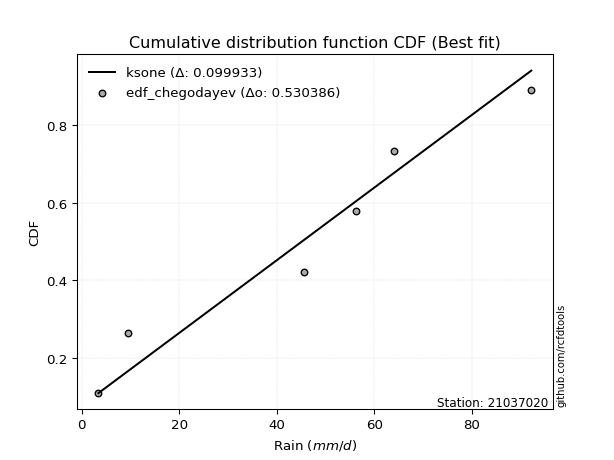</img>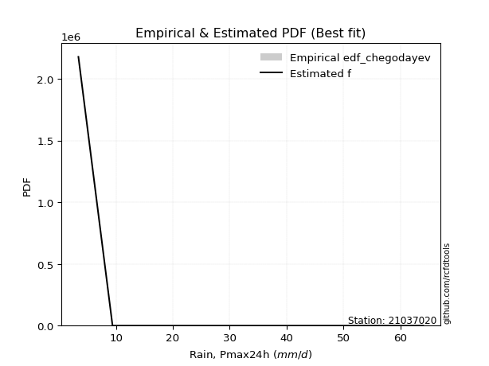</img>

</div>


### 6. EDF Blom (1958)

The Blom formula is a specific "plotting position" formula used in hydrology and statistical analysis to estimate the empirical cumulative probability (or non-exceedance probability) of a data series. It is particularly recommended for data that are approximately normally distributed. The constant _a_ is set to 0.375 (or 3/8).

<div align="center">


$P=(m-a)/(n+1-2a)$


</div>


**6.1. Empirical values**

<div align="center">

|                | 0                  | 1                  | 2                  | 3                 | 4                 | 5                  |
|:---------------|:-------------------|:-------------------|:-------------------|:------------------|:------------------|:-------------------|
| date           | 2023               | 2022               | 2021               | 2020              | 2019              | 2025               |
| x              | 3.4                | 9.4                | 45.6               | 56.2              | 64.0              | 92.2               |
| m              | 1                  | 2                  | 3                  | 4                 | 5                 | 6                  |
| empirical_dist | edf_blom           | edf_blom           | edf_blom           | edf_blom          | edf_blom          | edf_blom           |
| empirical      | 0.1                | 0.26               | 0.42               | 0.58              | 0.74              | 0.9                |
| empirical_tr   | 1.1111111111111112 | 1.3513513513513513 | 1.7241379310344827 | 2.380952380952381 | 3.846153846153846 | 10.000000000000002 |

</div>


**6.2. Kolmogorov-Smirnov fit test (sorted by Δ)**


<div align="center">

|                | 0                   | 1                   | 2                  | 3                   | 4                   | 5                   | 6                   | 7                  | 8                   | 9                   | 10                  | 11                  | 12                | 13                  | 14                  | 15                  | 16                  | 17                  | 18                  | 19                  | 20                  | 21                  | 22                 | 23                  | 24                  | 25                 | 26                 | 27                  | 28                 | 29                  | 30                  | 31                  | 32                  | 33                  | 34                  | 35                  | 36                  | 37                 | 38                  | 39                  | 40                  | 41                 | 42                  | 43                  | 44                  | 45                  | 46                  | 47                  | 48                  | 49                  | 50                 | 51                  | 52                  | 53                 | 54                  | 55                 | 56                 | 57                  | 58                 | 59                 | 60                  | 61                 | 62                  | 63                  | 64                  | 65                 | 66                  | 67                 | 68                  | 69                  | 70                  | 71                  | 72                 | 73                  | 74                  | 75                  | 76                  | 77                  | 78                  | 79                 | 80                  | 81                  | 82                | 83                  | 84                 | 85                 | 86             | 87                 | 88                 | 89                 | 90                 | 91                 | 92                  | 93                  | 94                  | 95                  | 96                | 97                  | 98                  | 99                  | 100                 | 101                 | 102                | 103                 | 104                 | 105                | 106                | 107            | 108                | 109                 | 110                 | 111                | 112                 | 113                | 114                 | 115                | 116                 | 117                | 118                 | 119                 | 120                 | 121                 | 122                 | 123                 | 124                | 125                | 126                | 127                 | 128                | 129                 | 130                | 131                 | 132                 | 133                 | 134                 | 135                | 136                | 137                | 138                 | 139                 | 140                 | 141                | 142                | 143                 | 144                 | 145               | 146                | 147                 | 148                | 149                | 150                | 151                | 152                | 153                | 154                | 155                | 156                | 157            | 158                | 159                |
|:---------------|:--------------------|:--------------------|:-------------------|:--------------------|:--------------------|:--------------------|:--------------------|:-------------------|:--------------------|:--------------------|:--------------------|:--------------------|:------------------|:--------------------|:--------------------|:--------------------|:--------------------|:--------------------|:--------------------|:--------------------|:--------------------|:--------------------|:-------------------|:--------------------|:--------------------|:-------------------|:-------------------|:--------------------|:-------------------|:--------------------|:--------------------|:--------------------|:--------------------|:--------------------|:--------------------|:--------------------|:--------------------|:-------------------|:--------------------|:--------------------|:--------------------|:-------------------|:--------------------|:--------------------|:--------------------|:--------------------|:--------------------|:--------------------|:--------------------|:--------------------|:-------------------|:--------------------|:--------------------|:-------------------|:--------------------|:-------------------|:-------------------|:--------------------|:-------------------|:-------------------|:--------------------|:-------------------|:--------------------|:--------------------|:--------------------|:-------------------|:--------------------|:-------------------|:--------------------|:--------------------|:--------------------|:--------------------|:-------------------|:--------------------|:--------------------|:--------------------|:--------------------|:--------------------|:--------------------|:-------------------|:--------------------|:--------------------|:------------------|:--------------------|:-------------------|:-------------------|:---------------|:-------------------|:-------------------|:-------------------|:-------------------|:-------------------|:--------------------|:--------------------|:--------------------|:--------------------|:------------------|:--------------------|:--------------------|:--------------------|:--------------------|:--------------------|:-------------------|:--------------------|:--------------------|:-------------------|:-------------------|:---------------|:-------------------|:--------------------|:--------------------|:-------------------|:--------------------|:-------------------|:--------------------|:-------------------|:--------------------|:-------------------|:--------------------|:--------------------|:--------------------|:--------------------|:--------------------|:--------------------|:-------------------|:-------------------|:-------------------|:--------------------|:-------------------|:--------------------|:-------------------|:--------------------|:--------------------|:--------------------|:--------------------|:-------------------|:-------------------|:-------------------|:--------------------|:--------------------|:--------------------|:-------------------|:-------------------|:--------------------|:--------------------|:------------------|:-------------------|:--------------------|:-------------------|:-------------------|:-------------------|:-------------------|:-------------------|:-------------------|:-------------------|:-------------------|:-------------------|:---------------|:-------------------|:-------------------|
| station        | 21037020            | 21037020            | 21037020           | 21037020            | 21037020            | 21037020            | 21037020            | 21037020           | 21037020            | 21037020            | 21037020            | 21037020            | 21037020          | 21037020            | 21037020            | 21037020            | 21037020            | 21037020            | 21037020            | 21037020            | 21037020            | 21037020            | 21037020           | 21037020            | 21037020            | 21037020           | 21037020           | 21037020            | 21037020           | 21037020            | 21037020            | 21037020            | 21037020            | 21037020            | 21037020            | 21037020            | 21037020            | 21037020           | 21037020            | 21037020            | 21037020            | 21037020           | 21037020            | 21037020            | 21037020            | 21037020            | 21037020            | 21037020            | 21037020            | 21037020            | 21037020           | 21037020            | 21037020            | 21037020           | 21037020            | 21037020           | 21037020           | 21037020            | 21037020           | 21037020           | 21037020            | 21037020           | 21037020            | 21037020            | 21037020            | 21037020           | 21037020            | 21037020           | 21037020            | 21037020            | 21037020            | 21037020            | 21037020           | 21037020            | 21037020            | 21037020            | 21037020            | 21037020            | 21037020            | 21037020           | 21037020            | 21037020            | 21037020          | 21037020            | 21037020           | 21037020           | 21037020       | 21037020           | 21037020           | 21037020           | 21037020           | 21037020           | 21037020            | 21037020            | 21037020            | 21037020            | 21037020          | 21037020            | 21037020            | 21037020            | 21037020            | 21037020            | 21037020           | 21037020            | 21037020            | 21037020           | 21037020           | 21037020       | 21037020           | 21037020            | 21037020            | 21037020           | 21037020            | 21037020           | 21037020            | 21037020           | 21037020            | 21037020           | 21037020            | 21037020            | 21037020            | 21037020            | 21037020            | 21037020            | 21037020           | 21037020           | 21037020           | 21037020            | 21037020           | 21037020            | 21037020           | 21037020            | 21037020            | 21037020            | 21037020            | 21037020           | 21037020           | 21037020           | 21037020            | 21037020            | 21037020            | 21037020           | 21037020           | 21037020            | 21037020            | 21037020          | 21037020           | 21037020            | 21037020           | 21037020           | 21037020           | 21037020           | 21037020           | 21037020           | 21037020           | 21037020           | 21037020           | 21037020       | 21037020           | 21037020           |
| empirical_dist | edf_blom            | edf_blom            | edf_blom           | edf_blom            | edf_blom            | edf_blom            | edf_blom            | edf_blom           | edf_blom            | edf_blom            | edf_blom            | edf_blom            | edf_blom          | edf_blom            | edf_blom            | edf_blom            | edf_blom            | edf_blom            | edf_blom            | edf_blom            | edf_blom            | edf_blom            | edf_blom           | edf_blom            | edf_blom            | edf_blom           | edf_blom           | edf_blom            | edf_blom           | edf_blom            | edf_blom            | edf_blom            | edf_blom            | edf_blom            | edf_blom            | edf_blom            | edf_blom            | edf_blom           | edf_blom            | edf_blom            | edf_blom            | edf_blom           | edf_blom            | edf_blom            | edf_blom            | edf_blom            | edf_blom            | edf_blom            | edf_blom            | edf_blom            | edf_blom           | edf_blom            | edf_blom            | edf_blom           | edf_blom            | edf_blom           | edf_blom           | edf_blom            | edf_blom           | edf_blom           | edf_blom            | edf_blom           | edf_blom            | edf_blom            | edf_blom            | edf_blom           | edf_blom            | edf_blom           | edf_blom            | edf_blom            | edf_blom            | edf_blom            | edf_blom           | edf_blom            | edf_blom            | edf_blom            | edf_blom            | edf_blom            | edf_blom            | edf_blom           | edf_blom            | edf_blom            | edf_blom          | edf_blom            | edf_blom           | edf_blom           | edf_blom       | edf_blom           | edf_blom           | edf_blom           | edf_blom           | edf_blom           | edf_blom            | edf_blom            | edf_blom            | edf_blom            | edf_blom          | edf_blom            | edf_blom            | edf_blom            | edf_blom            | edf_blom            | edf_blom           | edf_blom            | edf_blom            | edf_blom           | edf_blom           | edf_blom       | edf_blom           | edf_blom            | edf_blom            | edf_blom           | edf_blom            | edf_blom           | edf_blom            | edf_blom           | edf_blom            | edf_blom           | edf_blom            | edf_blom            | edf_blom            | edf_blom            | edf_blom            | edf_blom            | edf_blom           | edf_blom           | edf_blom           | edf_blom            | edf_blom           | edf_blom            | edf_blom           | edf_blom            | edf_blom            | edf_blom            | edf_blom            | edf_blom           | edf_blom           | edf_blom           | edf_blom            | edf_blom            | edf_blom            | edf_blom           | edf_blom           | edf_blom            | edf_blom            | edf_blom          | edf_blom           | edf_blom            | edf_blom           | edf_blom           | edf_blom           | edf_blom           | edf_blom           | edf_blom           | edf_blom           | edf_blom           | edf_blom           | edf_blom       | edf_blom           | edf_blom           |
| p_dist         | ksone               | logjohnsonsu        | logweibull_max     | arcsine             | semicircular        | burr                | anglit              | loggausshyper      | genextreme          | logmielke           | beta                | genlogistic         | logloggamma       | pearson3            | johnsonsu           | t                   | skewnorm            | crystalball         | norm                | exponnorm           | gamma               | erlang              | foldnorm           | invgauss            | wrapcauchy          | gumbel_l           | loglevy_l          | maxwell             | invgamma           | rayleigh            | cosine              | invweibull          | logistic            | gausshyper          | argus               | rice                | hypsecant           | logargus           | kstwobign           | laplace             | dweibull            | logtrapezoid       | genpareto           | loggenextreme       | dgamma              | kappa4              | logarcsine          | gumbel_r            | halfnorm            | gompertz            | truncweibull_min   | tukeylambda         | truncexpon          | ncf                | uniform             | kappa3             | loggumbel_l        | logweibull_min      | logburr12          | logdweibull        | logpearson3         | logloglaplace      | weibull_min         | loggennorm          | moyal               | logsemicircular    | logwrapcauchy       | logbeta            | logdgamma           | loggompertz         | genexpon            | lomax               | loganglit          | genhalflogistic     | loggenpareto        | vonmises_line       | betaprime           | loggenhalflogistic  | triang              | logncf             | logf                | lognorm             | logcrystalball    | logt                | logexponnorm       | lognct             | gennorm        | loggengamma        | logburr            | logfatiguelife     | logerlang          | logbetaprime       | loggamma            | loggamma            | halflogistic        | loginvgauss         | logfoldnorm       | logrice             | loginvweibull       | loginvgamma         | bradford            | levy_l              | logalpha           | logskewnorm         | loglogistic         | mielke             | logmaxwell         | wald           | lograyleigh        | logkstwobign        | exponpow            | halfgennorm        | loghypsecant        | loggenexpon        | logcosine           | loghalfnorm        | nct                 | burr12             | loglomax            | logtriang           | loggumbel_r         | loglaplace          | loglaplace          | exponweib           | loghalfgennorm     | trapezoid          | loghalflogistic    | nakagami            | logmoyal           | f                   | logtukeylambda     | logksone            | gengamma            | logexponweib        | logtruncweibull_min | logkappa3          | loguniform         | logvonmises_line   | logwald             | logkappa4           | logbradford         | logtruncexpon      | alpha              | johnsonsb           | fatiguelife         | logtruncnorm      | lognakagami        | powerlaw            | truncpareto        | logexponpow        | logpowerlaw        | rdist              | logrdist           | weibull_max        | truncnorm          | logtruncpareto     | logjohnsonsb       | loggenlogistic | logvonmises        | vonmises           |
| delta          | 0.09430833161865912 | 0.09873211382131841 | 0.0999999999757808 | 0.09999999999999998 | 0.10684315940438271 | 0.11481200034400865 | 0.11578850876387531 | 0.1282216406415146 | 0.12973129974436146 | 0.13064514143633726 | 0.13324063207741865 | 0.13379115577562573 | 0.134037561954593 | 0.13620634445647467 | 0.13635479071354878 | 0.13657002715916944 | 0.13657459406166983 | 0.13658389702036183 | 0.13658390292134004 | 0.13658549709821943 | 0.13687899891103228 | 0.13690097892454284 | 0.1377328190549127 | 0.13869073168101936 | 0.13932924613347344 | 0.1406150819076628 | 0.1407262191735008 | 0.14125220174868897 | 0.1446703043253369 | 0.14486335764946773 | 0.14515544388587992 | 0.14865312998688313 | 0.15095382610161867 | 0.15397806642579817 | 0.15441913254760453 | 0.15518299793615487 | 0.15764985626025618 | 0.1581711459970549 | 0.16078857824727993 | 0.16279341656665797 | 0.16307107213192126 | 0.1631158230913386 | 0.16316413459281248 | 0.16466676089420507 | 0.16503805120984452 | 0.17180145047394782 | 0.17367800781435833 | 0.17621908680068468 | 0.18051650900252636 | 0.18444780432178742 | 0.1864093139375112 | 0.18720109615593317 | 0.18884563808712534 | 0.1895112996012563 | 0.19243243243243244 | 0.1925249758049531 | 0.1933334568228487 | 0.19411576557298188 | 0.1943011788696602 | 0.1966414779786908 | 0.19803373211911562 | 0.1990335396487357 | 0.19920934358778436 | 0.20002816936036855 | 0.20484931000950243 | 0.2096550421573073 | 0.21037381057284837 | 0.2106150312751417 | 0.21110963594415919 | 0.21579137304427004 | 0.21620955268954417 | 0.21622362744912677 | 0.2183953466271859 | 0.22046237955919512 | 0.22169742700200729 | 0.22452966165340982 | 0.22596416262291424 | 0.23349392203052072 | 0.23465332148110132 | 0.2347325176031269 | 0.23820445394659456 | 0.23917699925734187 | 0.239177022784765 | 0.23917751933799075 | 0.2391776923593552 | 0.2393660927617906 | 0.24           | 0.2405009173247727 | 0.2405320668759991 | 0.2408999863453603 | 0.2418096692909149 | 0.2421230433336397 | 0.24376368846825752 | 0.24376368846825752 | 0.24412031101332193 | 0.24424836626131524 | 0.244564742671796 | 0.24480819620674982 | 0.24539109656072305 | 0.24698015945631896 | 0.24708185474177952 | 0.24915961758966562 | 0.2496004444424948 | 0.25554466534631953 | 0.25788155109062677 | 0.2591505886977578 | 0.2598187293199736 | 0.26           | 0.2659922909980736 | 0.26988378038740785 | 0.27006941584147753 | 0.2703537296155754 | 0.27223122116656945 | 0.2743331894767507 | 0.27677413120635913 | 0.2840556710883832 | 0.28406700266872426 | 0.2856817433199636 | 0.28822173687192104 | 0.29431001651671634 | 0.29765889566446874 | 0.30008886743173574 | 0.30008886743173574 | 0.30028034883266624 | 0.3004749315310293 | 0.3115010023396143 | 0.3120122183549849 | 0.31327850641210625 | 0.3169152029788262 | 0.31821533988976586 | 0.3182253303327744 | 0.31888560331480525 | 0.34957878261406833 | 0.35022806778151033 | 0.3505042946676929  | 0.3628200488584416 | 0.3666627239777663 | 0.3673554414924923 | 0.37174982408732254 | 0.37408515129656345 | 0.41347239371845806 | 0.4160474961359036 | 0.4437027221290751 | 0.45315347380927273 | 0.45646531710324206 | 0.467424493748585 | 0.4683231143826649 | 0.48389465317633445 | 0.5242229515810821 | 0.5257977210950231 | 0.5740932613676795 | 0.5799999977788461 | 0.5799999984200046 | 0.6059345741934224 | 0.6137000661090715 | 0.6344662222136596 | 0.6635786397554286 | 0.74           | 1.1215895447512483 | 13.900275167635533 |
| deltao         | 0.530385761606      | 0.530385761606      | 0.530385761606     | 0.530385761606      | 0.530385761606      | 0.530385761606      | 0.530385761606      | 0.530385761606     | 0.530385761606      | 0.530385761606      | 0.530385761606      | 0.530385761606      | 0.530385761606    | 0.530385761606      | 0.530385761606      | 0.530385761606      | 0.530385761606      | 0.530385761606      | 0.530385761606      | 0.530385761606      | 0.530385761606      | 0.530385761606      | 0.530385761606     | 0.530385761606      | 0.530385761606      | 0.530385761606     | 0.530385761606     | 0.530385761606      | 0.530385761606     | 0.530385761606      | 0.530385761606      | 0.530385761606      | 0.530385761606      | 0.530385761606      | 0.530385761606      | 0.530385761606      | 0.530385761606      | 0.530385761606     | 0.530385761606      | 0.530385761606      | 0.530385761606      | 0.530385761606     | 0.530385761606      | 0.530385761606      | 0.530385761606      | 0.530385761606      | 0.530385761606      | 0.530385761606      | 0.530385761606      | 0.530385761606      | 0.530385761606     | 0.530385761606      | 0.530385761606      | 0.530385761606     | 0.530385761606      | 0.530385761606     | 0.530385761606     | 0.530385761606      | 0.530385761606     | 0.530385761606     | 0.530385761606      | 0.530385761606     | 0.530385761606      | 0.530385761606      | 0.530385761606      | 0.530385761606     | 0.530385761606      | 0.530385761606     | 0.530385761606      | 0.530385761606      | 0.530385761606      | 0.530385761606      | 0.530385761606     | 0.530385761606      | 0.530385761606      | 0.530385761606      | 0.530385761606      | 0.530385761606      | 0.530385761606      | 0.530385761606     | 0.530385761606      | 0.530385761606      | 0.530385761606    | 0.530385761606      | 0.530385761606     | 0.530385761606     | 0.530385761606 | 0.530385761606     | 0.530385761606     | 0.530385761606     | 0.530385761606     | 0.530385761606     | 0.530385761606      | 0.530385761606      | 0.530385761606      | 0.530385761606      | 0.530385761606    | 0.530385761606      | 0.530385761606      | 0.530385761606      | 0.530385761606      | 0.530385761606      | 0.530385761606     | 0.530385761606      | 0.530385761606      | 0.530385761606     | 0.530385761606     | 0.530385761606 | 0.530385761606     | 0.530385761606      | 0.530385761606      | 0.530385761606     | 0.530385761606      | 0.530385761606     | 0.530385761606      | 0.530385761606     | 0.530385761606      | 0.530385761606     | 0.530385761606      | 0.530385761606      | 0.530385761606      | 0.530385761606      | 0.530385761606      | 0.530385761606      | 0.530385761606     | 0.530385761606     | 0.530385761606     | 0.530385761606      | 0.530385761606     | 0.530385761606      | 0.530385761606     | 0.530385761606      | 0.530385761606      | 0.530385761606      | 0.530385761606      | 0.530385761606     | 0.530385761606     | 0.530385761606     | 0.530385761606      | 0.530385761606      | 0.530385761606      | 0.530385761606     | 0.530385761606     | 0.530385761606      | 0.530385761606      | 0.530385761606    | 0.530385761606     | 0.530385761606      | 0.530385761606     | 0.530385761606     | 0.530385761606     | 0.530385761606     | 0.530385761606     | 0.530385761606     | 0.530385761606     | 0.530385761606     | 0.530385761606     | 0.530385761606 | 0.530385761606     | 0.530385761606     |
| eval           | Δo > Δ              | Δo > Δ              | Δo > Δ             | Δo > Δ              | Δo > Δ              | Δo > Δ              | Δo > Δ              | Δo > Δ             | Δo > Δ              | Δo > Δ              | Δo > Δ              | Δo > Δ              | Δo > Δ            | Δo > Δ              | Δo > Δ              | Δo > Δ              | Δo > Δ              | Δo > Δ              | Δo > Δ              | Δo > Δ              | Δo > Δ              | Δo > Δ              | Δo > Δ             | Δo > Δ              | Δo > Δ              | Δo > Δ             | Δo > Δ             | Δo > Δ              | Δo > Δ             | Δo > Δ              | Δo > Δ              | Δo > Δ              | Δo > Δ              | Δo > Δ              | Δo > Δ              | Δo > Δ              | Δo > Δ              | Δo > Δ             | Δo > Δ              | Δo > Δ              | Δo > Δ              | Δo > Δ             | Δo > Δ              | Δo > Δ              | Δo > Δ              | Δo > Δ              | Δo > Δ              | Δo > Δ              | Δo > Δ              | Δo > Δ              | Δo > Δ             | Δo > Δ              | Δo > Δ              | Δo > Δ             | Δo > Δ              | Δo > Δ             | Δo > Δ             | Δo > Δ              | Δo > Δ             | Δo > Δ             | Δo > Δ              | Δo > Δ             | Δo > Δ              | Δo > Δ              | Δo > Δ              | Δo > Δ             | Δo > Δ              | Δo > Δ             | Δo > Δ              | Δo > Δ              | Δo > Δ              | Δo > Δ              | Δo > Δ             | Δo > Δ              | Δo > Δ              | Δo > Δ              | Δo > Δ              | Δo > Δ              | Δo > Δ              | Δo > Δ             | Δo > Δ              | Δo > Δ              | Δo > Δ            | Δo > Δ              | Δo > Δ             | Δo > Δ             | Δo > Δ         | Δo > Δ             | Δo > Δ             | Δo > Δ             | Δo > Δ             | Δo > Δ             | Δo > Δ              | Δo > Δ              | Δo > Δ              | Δo > Δ              | Δo > Δ            | Δo > Δ              | Δo > Δ              | Δo > Δ              | Δo > Δ              | Δo > Δ              | Δo > Δ             | Δo > Δ              | Δo > Δ              | Δo > Δ             | Δo > Δ             | Δo > Δ         | Δo > Δ             | Δo > Δ              | Δo > Δ              | Δo > Δ             | Δo > Δ              | Δo > Δ             | Δo > Δ              | Δo > Δ             | Δo > Δ              | Δo > Δ             | Δo > Δ              | Δo > Δ              | Δo > Δ              | Δo > Δ              | Δo > Δ              | Δo > Δ              | Δo > Δ             | Δo > Δ             | Δo > Δ             | Δo > Δ              | Δo > Δ             | Δo > Δ              | Δo > Δ             | Δo > Δ              | Δo > Δ              | Δo > Δ              | Δo > Δ              | Δo > Δ             | Δo > Δ             | Δo > Δ             | Δo > Δ              | Δo > Δ              | Δo > Δ              | Δo > Δ             | Δo > Δ             | Δo > Δ              | Δo > Δ              | Δo > Δ            | Δo > Δ             | Δo > Δ              | Δo > Δ             | Δo > Δ             | Δo <= Δ            | Δo <= Δ            | Δo <= Δ            | Δo <= Δ            | Δo <= Δ            | Δo <= Δ            | Δo <= Δ            | Δo <= Δ        | Δo <= Δ            | Δo <= Δ            |
| fit            | 1                   | 1                   | 1                  | 1                   | 1                   | 1                   | 1                   | 1                  | 1                   | 1                   | 1                   | 1                   | 1                 | 1                   | 1                   | 1                   | 1                   | 1                   | 1                   | 1                   | 1                   | 1                   | 1                  | 1                   | 1                   | 1                  | 1                  | 1                   | 1                  | 1                   | 1                   | 1                   | 1                   | 1                   | 1                   | 1                   | 1                   | 1                  | 1                   | 1                   | 1                   | 1                  | 1                   | 1                   | 1                   | 1                   | 1                   | 1                   | 1                   | 1                   | 1                  | 1                   | 1                   | 1                  | 1                   | 1                  | 1                  | 1                   | 1                  | 1                  | 1                   | 1                  | 1                   | 1                   | 1                   | 1                  | 1                   | 1                  | 1                   | 1                   | 1                   | 1                   | 1                  | 1                   | 1                   | 1                   | 1                   | 1                   | 1                   | 1                  | 1                   | 1                   | 1                 | 1                   | 1                  | 1                  | 1              | 1                  | 1                  | 1                  | 1                  | 1                  | 1                   | 1                   | 1                   | 1                   | 1                 | 1                   | 1                   | 1                   | 1                   | 1                   | 1                  | 1                   | 1                   | 1                  | 1                  | 1              | 1                  | 1                   | 1                   | 1                  | 1                   | 1                  | 1                   | 1                  | 1                   | 1                  | 1                   | 1                   | 1                   | 1                   | 1                   | 1                   | 1                  | 1                  | 1                  | 1                   | 1                  | 1                   | 1                  | 1                   | 1                   | 1                   | 1                   | 1                  | 1                  | 1                  | 1                   | 1                   | 1                   | 1                  | 1                  | 1                   | 1                   | 1                 | 1                  | 1                   | 1                  | 1                  | 0                  | 0                  | 0                  | 0                  | 0                  | 0                  | 0                  | 0              | 0                  | 0                  |
| n              | 6                   | 6                   | 6                  | 6                   | 6                   | 6                   | 6                   | 6                  | 6                   | 6                   | 6                   | 6                   | 6                 | 6                   | 6                   | 6                   | 6                   | 6                   | 6                   | 6                   | 6                   | 6                   | 6                  | 6                   | 6                   | 6                  | 6                  | 6                   | 6                  | 6                   | 6                   | 6                   | 6                   | 6                   | 6                   | 6                   | 6                   | 6                  | 6                   | 6                   | 6                   | 6                  | 6                   | 6                   | 6                   | 6                   | 6                   | 6                   | 6                   | 6                   | 6                  | 6                   | 6                   | 6                  | 6                   | 6                  | 6                  | 6                   | 6                  | 6                  | 6                   | 6                  | 6                   | 6                   | 6                   | 6                  | 6                   | 6                  | 6                   | 6                   | 6                   | 6                   | 6                  | 6                   | 6                   | 6                   | 6                   | 6                   | 6                   | 6                  | 6                   | 6                   | 6                 | 6                   | 6                  | 6                  | 6              | 6                  | 6                  | 6                  | 6                  | 6                  | 6                   | 6                   | 6                   | 6                   | 6                 | 6                   | 6                   | 6                   | 6                   | 6                   | 6                  | 6                   | 6                   | 6                  | 6                  | 6              | 6                  | 6                   | 6                   | 6                  | 6                   | 6                  | 6                   | 6                  | 6                   | 6                  | 6                   | 6                   | 6                   | 6                   | 6                   | 6                   | 6                  | 6                  | 6                  | 6                   | 6                  | 6                   | 6                  | 6                   | 6                   | 6                   | 6                   | 6                  | 6                  | 6                  | 6                   | 6                   | 6                   | 6                  | 6                  | 6                   | 6                   | 6                 | 6                  | 6                   | 6                  | 6                  | 6                  | 6                  | 6                  | 6                  | 6                  | 6                  | 6                  | 6              | 6                  | 6                  |
| best_fit       | 1                   | 0                   | 0                  | 0                   | 0                   | 0                   | 0                   | 0                  | 0                   | 0                   | 0                   | 0                   | 0                 | 0                   | 0                   | 0                   | 0                   | 0                   | 0                   | 0                   | 0                   | 0                   | 0                  | 0                   | 0                   | 0                  | 0                  | 0                   | 0                  | 0                   | 0                   | 0                   | 0                   | 0                   | 0                   | 0                   | 0                   | 0                  | 0                   | 0                   | 0                   | 0                  | 0                   | 0                   | 0                   | 0                   | 0                   | 0                   | 0                   | 0                   | 0                  | 0                   | 0                   | 0                  | 0                   | 0                  | 0                  | 0                   | 0                  | 0                  | 0                   | 0                  | 0                   | 0                   | 0                   | 0                  | 0                   | 0                  | 0                   | 0                   | 0                   | 0                   | 0                  | 0                   | 0                   | 0                   | 0                   | 0                   | 0                   | 0                  | 0                   | 0                   | 0                 | 0                   | 0                  | 0                  | 0              | 0                  | 0                  | 0                  | 0                  | 0                  | 0                   | 0                   | 0                   | 0                   | 0                 | 0                   | 0                   | 0                   | 0                   | 0                   | 0                  | 0                   | 0                   | 0                  | 0                  | 0              | 0                  | 0                   | 0                   | 0                  | 0                   | 0                  | 0                   | 0                  | 0                   | 0                  | 0                   | 0                   | 0                   | 0                   | 0                   | 0                   | 0                  | 0                  | 0                  | 0                   | 0                  | 0                   | 0                  | 0                   | 0                   | 0                   | 0                   | 0                  | 0                  | 0                  | 0                   | 0                   | 0                   | 0                  | 0                  | 0                   | 0                   | 0                 | 0                  | 0                   | 0                  | 0                  | 0                  | 0                  | 0                  | 0                  | 0                  | 0                  | 0                  | 0              | 0                  | 0                  |
| best_fit_sort  | 1                   | 2                   | 3                  | 4                   | 5                   | 6                   | 7                   | 8                  | 9                   | 10                  | 11                  | 12                  | 13                | 14                  | 15                  | 16                  | 17                  | 18                  | 19                  | 20                  | 21                  | 22                  | 23                 | 24                  | 25                  | 26                 | 27                 | 28                  | 29                 | 30                  | 31                  | 32                  | 33                  | 34                  | 35                  | 36                  | 37                  | 38                 | 39                  | 40                  | 41                  | 42                 | 43                  | 44                  | 45                  | 46                  | 47                  | 48                  | 49                  | 50                  | 51                 | 52                  | 53                  | 54                 | 55                  | 56                 | 57                 | 58                  | 59                 | 60                 | 61                  | 62                 | 63                  | 64                  | 65                  | 66                 | 67                  | 68                 | 69                  | 70                  | 71                  | 72                  | 73                 | 74                  | 75                  | 76                  | 77                  | 78                  | 79                  | 80                 | 81                  | 82                  | 83                | 84                  | 85                 | 86                 | 87             | 88                 | 89                 | 90                 | 91                 | 92                 | 93                  | 94                  | 95                  | 96                  | 97                | 98                  | 99                  | 100                 | 101                 | 102                 | 103                | 104                 | 105                 | 106                | 107                | 108            | 109                | 110                 | 111                 | 112                | 113                 | 114                | 115                 | 116                | 117                 | 118                | 119                 | 120                 | 121                 | 122                 | 123                 | 124                 | 125                | 126                | 127                | 128                 | 129                | 130                 | 131                | 132                 | 133                 | 134                 | 135                 | 136                | 137                | 138                | 139                 | 140                 | 141                 | 142                | 143                | 144                 | 145                 | 146               | 147                | 148                 | 149                | 150                | 151                | 152                | 153                | 154                | 155                | 156                | 157                | 158            | 159                | 160                |

</div>


**6.3. Best fit**

<div align="center">

|   id |   station | empirical_dist   | p_dist   |     delta |   deltao | eval   |   fit |   n |   best_fit |   best_fit_sort |
|-----:|----------:|:-----------------|:---------|----------:|---------:|:-------|------:|----:|-----------:|----------------:|
|    0 |  21037020 | edf_blom         | ksone    | 0.0943083 | 0.530386 | Δo > Δ |     1 |   6 |          1 |               1 |

</div>


<div align="center">

</img>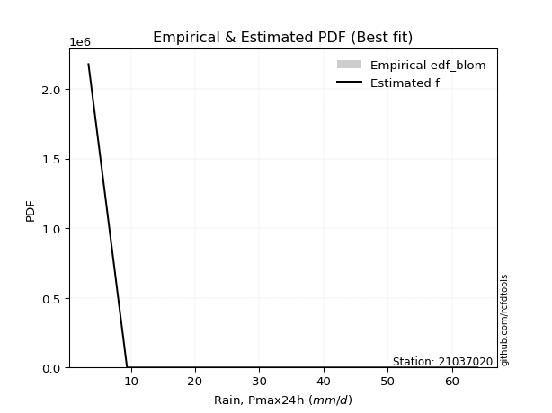</img>

</div>


### 7. EDF Tukey (1962)

In hydrology, the Tukey formula is used as a plotting position formula to estimate the empirical probability or frequency of a flood event (or other hydrological data). The formula parameter is given as _c=0.333_ (or 1/3).

<div align="center">


$P=(m-c)/(n+1-2c)$


</div>


**7.1. Empirical values**

<div align="center">

|                | 0                   | 1                  | 2                   | 3                  | 4                  | 5                  |
|:---------------|:--------------------|:-------------------|:--------------------|:-------------------|:-------------------|:-------------------|
| date           | 2023                | 2022               | 2021                | 2020               | 2019               | 2025               |
| x              | 3.4                 | 9.4                | 45.6                | 56.2               | 64.0               | 92.2               |
| m              | 1                   | 2                  | 3                   | 4                  | 5                  | 6                  |
| empirical_dist | edf_tukey           | edf_tukey          | edf_tukey           | edf_tukey          | edf_tukey          | edf_tukey          |
| empirical      | 0.10526315789473684 | 0.2631578947368421 | 0.42105263157894735 | 0.5789473684210527 | 0.7368421052631579 | 0.8947368421052632 |
| empirical_tr   | 1.1176470588235294  | 1.357142857142857  | 1.7272727272727273  | 2.375              | 3.7999999999999994 | 9.5                |

</div>


**7.2. Kolmogorov-Smirnov fit test (sorted by Δ)**


<div align="center">

|                | 0                  | 1                  | 2                   | 3                   | 4                  | 5                   | 6                   | 7                   | 8                  | 9                   | 10                  | 11                  | 12                 | 13                  | 14                  | 15                  | 16                  | 17                 | 18                  | 19                  | 20                  | 21                  | 22                  | 23                 | 24                  | 25                  | 26                 | 27                  | 28                  | 29                  | 30                 | 31                | 32                  | 33                  | 34                  | 35                 | 36                  | 37                  | 38                  | 39                  | 40                  | 41                  | 42                  | 43                  | 44                 | 45                  | 46                 | 47                  | 48                  | 49                  | 50                 | 51                  | 52                  | 53                  | 54                  | 55                  | 56                  | 57                  | 58                  | 59                  | 60                  | 61                  | 62                | 63                  | 64                  | 65                  | 66                  | 67                | 68                  | 69                  | 70                 | 71                 | 72                  | 73                  | 74                  | 75                  | 76                 | 77                  | 78                  | 79                 | 80                 | 81                 | 82                 | 83                  | 84                 | 85                  | 86                  | 87                  | 88                  | 89                  | 90                  | 91                  | 92                  | 93                  | 94                  | 95                  | 96                  | 97                 | 98                 | 99                 | 100                 | 101                 | 102                 | 103                 | 104                | 105                 | 106                | 107                | 108                | 109                | 110                | 111                 | 112                | 113                 | 114                 | 115                 | 116                | 117                 | 118                | 119               | 120                | 121                | 122                | 123                | 124                | 125                 | 126                | 127                | 128                 | 129                | 130                 | 131                | 132                 | 133                 | 134                 | 135                 | 136                | 137                | 138                | 139                | 140                | 141                | 142                | 143                | 144                | 145                 | 146                | 147                | 148                | 149                | 150                | 151                | 152                | 153                | 154                | 155                | 156                | 157                | 158                | 159               |
|:---------------|:-------------------|:-------------------|:--------------------|:--------------------|:-------------------|:--------------------|:--------------------|:--------------------|:-------------------|:--------------------|:--------------------|:--------------------|:-------------------|:--------------------|:--------------------|:--------------------|:--------------------|:-------------------|:--------------------|:--------------------|:--------------------|:--------------------|:--------------------|:-------------------|:--------------------|:--------------------|:-------------------|:--------------------|:--------------------|:--------------------|:-------------------|:------------------|:--------------------|:--------------------|:--------------------|:-------------------|:--------------------|:--------------------|:--------------------|:--------------------|:--------------------|:--------------------|:--------------------|:--------------------|:-------------------|:--------------------|:-------------------|:--------------------|:--------------------|:--------------------|:-------------------|:--------------------|:--------------------|:--------------------|:--------------------|:--------------------|:--------------------|:--------------------|:--------------------|:--------------------|:--------------------|:--------------------|:------------------|:--------------------|:--------------------|:--------------------|:--------------------|:------------------|:--------------------|:--------------------|:-------------------|:-------------------|:--------------------|:--------------------|:--------------------|:--------------------|:-------------------|:--------------------|:--------------------|:-------------------|:-------------------|:-------------------|:-------------------|:--------------------|:-------------------|:--------------------|:--------------------|:--------------------|:--------------------|:--------------------|:--------------------|:--------------------|:--------------------|:--------------------|:--------------------|:--------------------|:--------------------|:-------------------|:-------------------|:-------------------|:--------------------|:--------------------|:--------------------|:--------------------|:-------------------|:--------------------|:-------------------|:-------------------|:-------------------|:-------------------|:-------------------|:--------------------|:-------------------|:--------------------|:--------------------|:--------------------|:-------------------|:--------------------|:-------------------|:------------------|:-------------------|:-------------------|:-------------------|:-------------------|:-------------------|:--------------------|:-------------------|:-------------------|:--------------------|:-------------------|:--------------------|:-------------------|:--------------------|:--------------------|:--------------------|:--------------------|:-------------------|:-------------------|:-------------------|:-------------------|:-------------------|:-------------------|:-------------------|:-------------------|:-------------------|:--------------------|:-------------------|:-------------------|:-------------------|:-------------------|:-------------------|:-------------------|:-------------------|:-------------------|:-------------------|:-------------------|:-------------------|:-------------------|:-------------------|:------------------|
| station        | 21037020           | 21037020           | 21037020            | 21037020            | 21037020           | 21037020            | 21037020            | 21037020            | 21037020           | 21037020            | 21037020            | 21037020            | 21037020           | 21037020            | 21037020            | 21037020            | 21037020            | 21037020           | 21037020            | 21037020            | 21037020            | 21037020            | 21037020            | 21037020           | 21037020            | 21037020            | 21037020           | 21037020            | 21037020            | 21037020            | 21037020           | 21037020          | 21037020            | 21037020            | 21037020            | 21037020           | 21037020            | 21037020            | 21037020            | 21037020            | 21037020            | 21037020            | 21037020            | 21037020            | 21037020           | 21037020            | 21037020           | 21037020            | 21037020            | 21037020            | 21037020           | 21037020            | 21037020            | 21037020            | 21037020            | 21037020            | 21037020            | 21037020            | 21037020            | 21037020            | 21037020            | 21037020            | 21037020          | 21037020            | 21037020            | 21037020            | 21037020            | 21037020          | 21037020            | 21037020            | 21037020           | 21037020           | 21037020            | 21037020            | 21037020            | 21037020            | 21037020           | 21037020            | 21037020            | 21037020           | 21037020           | 21037020           | 21037020           | 21037020            | 21037020           | 21037020            | 21037020            | 21037020            | 21037020            | 21037020            | 21037020            | 21037020            | 21037020            | 21037020            | 21037020            | 21037020            | 21037020            | 21037020           | 21037020           | 21037020           | 21037020            | 21037020            | 21037020            | 21037020            | 21037020           | 21037020            | 21037020           | 21037020           | 21037020           | 21037020           | 21037020           | 21037020            | 21037020           | 21037020            | 21037020            | 21037020            | 21037020           | 21037020            | 21037020           | 21037020          | 21037020           | 21037020           | 21037020           | 21037020           | 21037020           | 21037020            | 21037020           | 21037020           | 21037020            | 21037020           | 21037020            | 21037020           | 21037020            | 21037020            | 21037020            | 21037020            | 21037020           | 21037020           | 21037020           | 21037020           | 21037020           | 21037020           | 21037020           | 21037020           | 21037020           | 21037020            | 21037020           | 21037020           | 21037020           | 21037020           | 21037020           | 21037020           | 21037020           | 21037020           | 21037020           | 21037020           | 21037020           | 21037020           | 21037020           | 21037020          |
| empirical_dist | edf_tukey          | edf_tukey          | edf_tukey           | edf_tukey           | edf_tukey          | edf_tukey           | edf_tukey           | edf_tukey           | edf_tukey          | edf_tukey           | edf_tukey           | edf_tukey           | edf_tukey          | edf_tukey           | edf_tukey           | edf_tukey           | edf_tukey           | edf_tukey          | edf_tukey           | edf_tukey           | edf_tukey           | edf_tukey           | edf_tukey           | edf_tukey          | edf_tukey           | edf_tukey           | edf_tukey          | edf_tukey           | edf_tukey           | edf_tukey           | edf_tukey          | edf_tukey         | edf_tukey           | edf_tukey           | edf_tukey           | edf_tukey          | edf_tukey           | edf_tukey           | edf_tukey           | edf_tukey           | edf_tukey           | edf_tukey           | edf_tukey           | edf_tukey           | edf_tukey          | edf_tukey           | edf_tukey          | edf_tukey           | edf_tukey           | edf_tukey           | edf_tukey          | edf_tukey           | edf_tukey           | edf_tukey           | edf_tukey           | edf_tukey           | edf_tukey           | edf_tukey           | edf_tukey           | edf_tukey           | edf_tukey           | edf_tukey           | edf_tukey         | edf_tukey           | edf_tukey           | edf_tukey           | edf_tukey           | edf_tukey         | edf_tukey           | edf_tukey           | edf_tukey          | edf_tukey          | edf_tukey           | edf_tukey           | edf_tukey           | edf_tukey           | edf_tukey          | edf_tukey           | edf_tukey           | edf_tukey          | edf_tukey          | edf_tukey          | edf_tukey          | edf_tukey           | edf_tukey          | edf_tukey           | edf_tukey           | edf_tukey           | edf_tukey           | edf_tukey           | edf_tukey           | edf_tukey           | edf_tukey           | edf_tukey           | edf_tukey           | edf_tukey           | edf_tukey           | edf_tukey          | edf_tukey          | edf_tukey          | edf_tukey           | edf_tukey           | edf_tukey           | edf_tukey           | edf_tukey          | edf_tukey           | edf_tukey          | edf_tukey          | edf_tukey          | edf_tukey          | edf_tukey          | edf_tukey           | edf_tukey          | edf_tukey           | edf_tukey           | edf_tukey           | edf_tukey          | edf_tukey           | edf_tukey          | edf_tukey         | edf_tukey          | edf_tukey          | edf_tukey          | edf_tukey          | edf_tukey          | edf_tukey           | edf_tukey          | edf_tukey          | edf_tukey           | edf_tukey          | edf_tukey           | edf_tukey          | edf_tukey           | edf_tukey           | edf_tukey           | edf_tukey           | edf_tukey          | edf_tukey          | edf_tukey          | edf_tukey          | edf_tukey          | edf_tukey          | edf_tukey          | edf_tukey          | edf_tukey          | edf_tukey           | edf_tukey          | edf_tukey          | edf_tukey          | edf_tukey          | edf_tukey          | edf_tukey          | edf_tukey          | edf_tukey          | edf_tukey          | edf_tukey          | edf_tukey          | edf_tukey          | edf_tukey          | edf_tukey         |
| p_dist         | ksone              | logjohnsonsu       | logweibull_max      | arcsine             | semicircular       | burr                | anglit              | loggausshyper       | logmielke          | genextreme          | logloggamma         | beta                | genlogistic        | loglevy_l           | pearson3            | johnsonsu           | t                   | skewnorm           | crystalball         | norm                | exponnorm           | gamma               | erlang              | invgauss           | foldnorm            | wrapcauchy          | gumbel_l           | maxwell             | invweibull          | invgamma            | rayleigh           | cosine            | logistic            | logargus            | gausshyper          | argus              | rice                | kstwobign           | hypsecant           | logtrapezoid        | laplace             | dweibull            | genpareto           | loggenextreme       | dgamma             | logarcsine          | kappa4             | gumbel_r            | halfnorm            | truncweibull_min    | gompertz           | truncexpon          | ncf                 | tukeylambda         | logdweibull         | loggumbel_l         | logweibull_min      | logburr12           | logloglaplace       | uniform             | kappa3              | logpearson3         | weibull_min       | loggennorm          | logbeta             | moyal               | logsemicircular     | logwrapcauchy     | logdgamma           | loggompertz         | genexpon           | lomax              | genhalflogistic     | loganglit           | loggenpareto        | betaprime           | vonmises_line      | loggenhalflogistic  | logncf              | gennorm            | logf               | triang             | lognorm            | logcrystalball      | logt               | logexponnorm        | lognct              | loggengamma         | logburr             | logfatiguelife      | logerlang           | logbetaprime        | loggamma            | loggamma            | loginvgauss         | logfoldnorm         | logrice             | levy_l             | loginvweibull      | loginvgamma        | bradford            | halflogistic        | logalpha            | logskewnorm         | loglogistic        | mielke              | logmaxwell         | wald               | lograyleigh        | logkstwobign       | exponpow           | halfgennorm         | loghypsecant       | loggenexpon         | logcosine           | loghalfnorm         | nct                | burr12              | loglomax           | logtriang         | loggumbel_r        | loglaplace         | loglaplace         | exponweib          | loghalfgennorm     | trapezoid           | loghalflogistic    | nakagami           | logmoyal            | f                  | logtukeylambda      | logksone           | gengamma            | logexponweib        | logtruncweibull_min | logkappa3           | loguniform         | logvonmises_line   | logwald            | logkappa4          | logbradford        | logtruncexpon      | alpha              | johnsonsb          | fatiguelife        | logtruncnorm        | lognakagami        | powerlaw           | truncpareto        | logexponpow        | logpowerlaw        | rdist              | logrdist           | weibull_max        | truncnorm          | logtruncpareto     | logjohnsonsb       | loggenlogistic     | logvonmises        | vonmises          |
| delta          | 0.0974662263555012 | 0.1018900085581605 | 0.10526315787051765 | 0.10526315789473684 | 0.1100010541412248 | 0.11796989508085073 | 0.11894640350071739 | 0.12716900906256723 | 0.1295925098573899 | 0.13288919448120354 | 0.13298493037564563 | 0.13639852681426073 | 0.1369490505124678 | 0.13756832443665867 | 0.13936423919331675 | 0.13951268545039086 | 0.13972792189601152 | 0.1397324887985119 | 0.13974179175720391 | 0.13974179765818212 | 0.13974339183506151 | 0.14003689364787436 | 0.14005887366138492 | 0.1405558959523925 | 0.14089071379175477 | 0.14248714087031553 | 0.1437729766445049 | 0.14441009648553105 | 0.14760049840793577 | 0.14782819906217898 | 0.1480212523863098 | 0.148313338622722 | 0.15411172083846075 | 0.15711851441810754 | 0.15713596116264025 | 0.1575770272844466 | 0.15834089267299695 | 0.15973594666833257 | 0.16080775099709826 | 0.16206319151239124 | 0.16595131130350005 | 0.16622896686876334 | 0.16632202932965456 | 0.16782465563104715 | 0.1681959459466866 | 0.17262537623541097 | 0.1749593452107899 | 0.17937698153752676 | 0.18367440373936844 | 0.18535668235856384 | 0.1876056990586295 | 0.18779300650817798 | 0.18845866802230893 | 0.19035899089277525 | 0.19137832008395395 | 0.19228082524390133 | 0.19306313399403452 | 0.19324854729071284 | 0.19377038175399885 | 0.19559032716927452 | 0.19568287054179517 | 0.19698110054016826 | 0.198156712008837 | 0.20318606409721063 | 0.20745713653829956 | 0.20800720474634452 | 0.20860241057835993 | 0.209321178993901 | 0.21426753068100127 | 0.21473874146532268 | 0.2151569211105968 | 0.2151709958701794 | 0.21730448482235298 | 0.21734271504823854 | 0.22064479542305993 | 0.22491153104396688 | 0.2276875563902519 | 0.23244129045157336 | 0.23367988602417955 | 0.2368421052631579 | 0.2371518223676472 | 0.2378112162179434 | 0.2381243676783945 | 0.23812439120581763 | 0.2381248877590434 | 0.23812506078040785 | 0.23831346118284324 | 0.23944828574582533 | 0.23947943529705173 | 0.23984735476641295 | 0.24075703771196755 | 0.24107041175469235 | 0.24271105688931016 | 0.24271105688931016 | 0.24319573468236788 | 0.24351211109284865 | 0.24375556462780246 | 0.2438964596949288 | 0.2443384649817757 | 0.2459275278773716 | 0.24602922316283216 | 0.24727820575016402 | 0.24854781286354743 | 0.25449203376737217 | 0.2568289195116794 | 0.25809795711881045 | 0.2587660977410262 | 0.2631578947368421 | 0.2649396594191262 | 0.2688311488084605 | 0.2690167842625302 | 0.26930109803662805 | 0.2711785895876221 | 0.27328055789780337 | 0.27572149962741177 | 0.28300303950943584 | 0.2830143710897769 | 0.28462911174101624 | 0.2871691052929737 | 0.293257384937769 | 0.2966062640855214 | 0.2990362358527884 | 0.2990362358527884 | 0.2992277172537189 | 0.2994222999520819 | 0.30834310760277217 | 0.3109595867760375 | 0.3122258748331589 | 0.31586257139987883 | 0.3171627083108185 | 0.31717269875382703 | 0.3178329717358579 | 0.34852615103512097 | 0.34917543620256297 | 0.34945166308874553 | 0.36176741727949424 | 0.3656100923988189 | 0.3663028099135449 | 0.3706971925083752 | 0.3730325197176161 | 0.4124197621395107 | 0.4149948645569562 | 0.4426500905501277 | 0.4499955790724306 | 0.4554126855242947 | 0.46637186216963766 | 0.4672704828037175 | 0.4828420215973871 | 0.5231703200021347 | 0.5247450895160757 | 0.5709353666308374 | 0.5789473661998988 | 0.5789473668410573 | 0.6027766794565803 | 0.6105421713722294 | 0.6313083274768174 | 0.6604207450185865 | 0.7368421052631579 | 1.1205369131723009 | 13.90553832553027 |
| deltao         | 0.530385761606     | 0.530385761606     | 0.530385761606      | 0.530385761606      | 0.530385761606     | 0.530385761606      | 0.530385761606      | 0.530385761606      | 0.530385761606     | 0.530385761606      | 0.530385761606      | 0.530385761606      | 0.530385761606     | 0.530385761606      | 0.530385761606      | 0.530385761606      | 0.530385761606      | 0.530385761606     | 0.530385761606      | 0.530385761606      | 0.530385761606      | 0.530385761606      | 0.530385761606      | 0.530385761606     | 0.530385761606      | 0.530385761606      | 0.530385761606     | 0.530385761606      | 0.530385761606      | 0.530385761606      | 0.530385761606     | 0.530385761606    | 0.530385761606      | 0.530385761606      | 0.530385761606      | 0.530385761606     | 0.530385761606      | 0.530385761606      | 0.530385761606      | 0.530385761606      | 0.530385761606      | 0.530385761606      | 0.530385761606      | 0.530385761606      | 0.530385761606     | 0.530385761606      | 0.530385761606     | 0.530385761606      | 0.530385761606      | 0.530385761606      | 0.530385761606     | 0.530385761606      | 0.530385761606      | 0.530385761606      | 0.530385761606      | 0.530385761606      | 0.530385761606      | 0.530385761606      | 0.530385761606      | 0.530385761606      | 0.530385761606      | 0.530385761606      | 0.530385761606    | 0.530385761606      | 0.530385761606      | 0.530385761606      | 0.530385761606      | 0.530385761606    | 0.530385761606      | 0.530385761606      | 0.530385761606     | 0.530385761606     | 0.530385761606      | 0.530385761606      | 0.530385761606      | 0.530385761606      | 0.530385761606     | 0.530385761606      | 0.530385761606      | 0.530385761606     | 0.530385761606     | 0.530385761606     | 0.530385761606     | 0.530385761606      | 0.530385761606     | 0.530385761606      | 0.530385761606      | 0.530385761606      | 0.530385761606      | 0.530385761606      | 0.530385761606      | 0.530385761606      | 0.530385761606      | 0.530385761606      | 0.530385761606      | 0.530385761606      | 0.530385761606      | 0.530385761606     | 0.530385761606     | 0.530385761606     | 0.530385761606      | 0.530385761606      | 0.530385761606      | 0.530385761606      | 0.530385761606     | 0.530385761606      | 0.530385761606     | 0.530385761606     | 0.530385761606     | 0.530385761606     | 0.530385761606     | 0.530385761606      | 0.530385761606     | 0.530385761606      | 0.530385761606      | 0.530385761606      | 0.530385761606     | 0.530385761606      | 0.530385761606     | 0.530385761606    | 0.530385761606     | 0.530385761606     | 0.530385761606     | 0.530385761606     | 0.530385761606     | 0.530385761606      | 0.530385761606     | 0.530385761606     | 0.530385761606      | 0.530385761606     | 0.530385761606      | 0.530385761606     | 0.530385761606      | 0.530385761606      | 0.530385761606      | 0.530385761606      | 0.530385761606     | 0.530385761606     | 0.530385761606     | 0.530385761606     | 0.530385761606     | 0.530385761606     | 0.530385761606     | 0.530385761606     | 0.530385761606     | 0.530385761606      | 0.530385761606     | 0.530385761606     | 0.530385761606     | 0.530385761606     | 0.530385761606     | 0.530385761606     | 0.530385761606     | 0.530385761606     | 0.530385761606     | 0.530385761606     | 0.530385761606     | 0.530385761606     | 0.530385761606     | 0.530385761606    |
| eval           | Δo > Δ             | Δo > Δ             | Δo > Δ              | Δo > Δ              | Δo > Δ             | Δo > Δ              | Δo > Δ              | Δo > Δ              | Δo > Δ             | Δo > Δ              | Δo > Δ              | Δo > Δ              | Δo > Δ             | Δo > Δ              | Δo > Δ              | Δo > Δ              | Δo > Δ              | Δo > Δ             | Δo > Δ              | Δo > Δ              | Δo > Δ              | Δo > Δ              | Δo > Δ              | Δo > Δ             | Δo > Δ              | Δo > Δ              | Δo > Δ             | Δo > Δ              | Δo > Δ              | Δo > Δ              | Δo > Δ             | Δo > Δ            | Δo > Δ              | Δo > Δ              | Δo > Δ              | Δo > Δ             | Δo > Δ              | Δo > Δ              | Δo > Δ              | Δo > Δ              | Δo > Δ              | Δo > Δ              | Δo > Δ              | Δo > Δ              | Δo > Δ             | Δo > Δ              | Δo > Δ             | Δo > Δ              | Δo > Δ              | Δo > Δ              | Δo > Δ             | Δo > Δ              | Δo > Δ              | Δo > Δ              | Δo > Δ              | Δo > Δ              | Δo > Δ              | Δo > Δ              | Δo > Δ              | Δo > Δ              | Δo > Δ              | Δo > Δ              | Δo > Δ            | Δo > Δ              | Δo > Δ              | Δo > Δ              | Δo > Δ              | Δo > Δ            | Δo > Δ              | Δo > Δ              | Δo > Δ             | Δo > Δ             | Δo > Δ              | Δo > Δ              | Δo > Δ              | Δo > Δ              | Δo > Δ             | Δo > Δ              | Δo > Δ              | Δo > Δ             | Δo > Δ             | Δo > Δ             | Δo > Δ             | Δo > Δ              | Δo > Δ             | Δo > Δ              | Δo > Δ              | Δo > Δ              | Δo > Δ              | Δo > Δ              | Δo > Δ              | Δo > Δ              | Δo > Δ              | Δo > Δ              | Δo > Δ              | Δo > Δ              | Δo > Δ              | Δo > Δ             | Δo > Δ             | Δo > Δ             | Δo > Δ              | Δo > Δ              | Δo > Δ              | Δo > Δ              | Δo > Δ             | Δo > Δ              | Δo > Δ             | Δo > Δ             | Δo > Δ             | Δo > Δ             | Δo > Δ             | Δo > Δ              | Δo > Δ             | Δo > Δ              | Δo > Δ              | Δo > Δ              | Δo > Δ             | Δo > Δ              | Δo > Δ             | Δo > Δ            | Δo > Δ             | Δo > Δ             | Δo > Δ             | Δo > Δ             | Δo > Δ             | Δo > Δ              | Δo > Δ             | Δo > Δ             | Δo > Δ              | Δo > Δ             | Δo > Δ              | Δo > Δ             | Δo > Δ              | Δo > Δ              | Δo > Δ              | Δo > Δ              | Δo > Δ             | Δo > Δ             | Δo > Δ             | Δo > Δ             | Δo > Δ             | Δo > Δ             | Δo > Δ             | Δo > Δ             | Δo > Δ             | Δo > Δ              | Δo > Δ             | Δo > Δ             | Δo > Δ             | Δo > Δ             | Δo <= Δ            | Δo <= Δ            | Δo <= Δ            | Δo <= Δ            | Δo <= Δ            | Δo <= Δ            | Δo <= Δ            | Δo <= Δ            | Δo <= Δ            | Δo <= Δ           |
| fit            | 1                  | 1                  | 1                   | 1                   | 1                  | 1                   | 1                   | 1                   | 1                  | 1                   | 1                   | 1                   | 1                  | 1                   | 1                   | 1                   | 1                   | 1                  | 1                   | 1                   | 1                   | 1                   | 1                   | 1                  | 1                   | 1                   | 1                  | 1                   | 1                   | 1                   | 1                  | 1                 | 1                   | 1                   | 1                   | 1                  | 1                   | 1                   | 1                   | 1                   | 1                   | 1                   | 1                   | 1                   | 1                  | 1                   | 1                  | 1                   | 1                   | 1                   | 1                  | 1                   | 1                   | 1                   | 1                   | 1                   | 1                   | 1                   | 1                   | 1                   | 1                   | 1                   | 1                 | 1                   | 1                   | 1                   | 1                   | 1                 | 1                   | 1                   | 1                  | 1                  | 1                   | 1                   | 1                   | 1                   | 1                  | 1                   | 1                   | 1                  | 1                  | 1                  | 1                  | 1                   | 1                  | 1                   | 1                   | 1                   | 1                   | 1                   | 1                   | 1                   | 1                   | 1                   | 1                   | 1                   | 1                   | 1                  | 1                  | 1                  | 1                   | 1                   | 1                   | 1                   | 1                  | 1                   | 1                  | 1                  | 1                  | 1                  | 1                  | 1                   | 1                  | 1                   | 1                   | 1                   | 1                  | 1                   | 1                  | 1                 | 1                  | 1                  | 1                  | 1                  | 1                  | 1                   | 1                  | 1                  | 1                   | 1                  | 1                   | 1                  | 1                   | 1                   | 1                   | 1                   | 1                  | 1                  | 1                  | 1                  | 1                  | 1                  | 1                  | 1                  | 1                  | 1                   | 1                  | 1                  | 1                  | 1                  | 0                  | 0                  | 0                  | 0                  | 0                  | 0                  | 0                  | 0                  | 0                  | 0                 |
| n              | 6                  | 6                  | 6                   | 6                   | 6                  | 6                   | 6                   | 6                   | 6                  | 6                   | 6                   | 6                   | 6                  | 6                   | 6                   | 6                   | 6                   | 6                  | 6                   | 6                   | 6                   | 6                   | 6                   | 6                  | 6                   | 6                   | 6                  | 6                   | 6                   | 6                   | 6                  | 6                 | 6                   | 6                   | 6                   | 6                  | 6                   | 6                   | 6                   | 6                   | 6                   | 6                   | 6                   | 6                   | 6                  | 6                   | 6                  | 6                   | 6                   | 6                   | 6                  | 6                   | 6                   | 6                   | 6                   | 6                   | 6                   | 6                   | 6                   | 6                   | 6                   | 6                   | 6                 | 6                   | 6                   | 6                   | 6                   | 6                 | 6                   | 6                   | 6                  | 6                  | 6                   | 6                   | 6                   | 6                   | 6                  | 6                   | 6                   | 6                  | 6                  | 6                  | 6                  | 6                   | 6                  | 6                   | 6                   | 6                   | 6                   | 6                   | 6                   | 6                   | 6                   | 6                   | 6                   | 6                   | 6                   | 6                  | 6                  | 6                  | 6                   | 6                   | 6                   | 6                   | 6                  | 6                   | 6                  | 6                  | 6                  | 6                  | 6                  | 6                   | 6                  | 6                   | 6                   | 6                   | 6                  | 6                   | 6                  | 6                 | 6                  | 6                  | 6                  | 6                  | 6                  | 6                   | 6                  | 6                  | 6                   | 6                  | 6                   | 6                  | 6                   | 6                   | 6                   | 6                   | 6                  | 6                  | 6                  | 6                  | 6                  | 6                  | 6                  | 6                  | 6                  | 6                   | 6                  | 6                  | 6                  | 6                  | 6                  | 6                  | 6                  | 6                  | 6                  | 6                  | 6                  | 6                  | 6                  | 6                 |
| best_fit       | 1                  | 0                  | 0                   | 0                   | 0                  | 0                   | 0                   | 0                   | 0                  | 0                   | 0                   | 0                   | 0                  | 0                   | 0                   | 0                   | 0                   | 0                  | 0                   | 0                   | 0                   | 0                   | 0                   | 0                  | 0                   | 0                   | 0                  | 0                   | 0                   | 0                   | 0                  | 0                 | 0                   | 0                   | 0                   | 0                  | 0                   | 0                   | 0                   | 0                   | 0                   | 0                   | 0                   | 0                   | 0                  | 0                   | 0                  | 0                   | 0                   | 0                   | 0                  | 0                   | 0                   | 0                   | 0                   | 0                   | 0                   | 0                   | 0                   | 0                   | 0                   | 0                   | 0                 | 0                   | 0                   | 0                   | 0                   | 0                 | 0                   | 0                   | 0                  | 0                  | 0                   | 0                   | 0                   | 0                   | 0                  | 0                   | 0                   | 0                  | 0                  | 0                  | 0                  | 0                   | 0                  | 0                   | 0                   | 0                   | 0                   | 0                   | 0                   | 0                   | 0                   | 0                   | 0                   | 0                   | 0                   | 0                  | 0                  | 0                  | 0                   | 0                   | 0                   | 0                   | 0                  | 0                   | 0                  | 0                  | 0                  | 0                  | 0                  | 0                   | 0                  | 0                   | 0                   | 0                   | 0                  | 0                   | 0                  | 0                 | 0                  | 0                  | 0                  | 0                  | 0                  | 0                   | 0                  | 0                  | 0                   | 0                  | 0                   | 0                  | 0                   | 0                   | 0                   | 0                   | 0                  | 0                  | 0                  | 0                  | 0                  | 0                  | 0                  | 0                  | 0                  | 0                   | 0                  | 0                  | 0                  | 0                  | 0                  | 0                  | 0                  | 0                  | 0                  | 0                  | 0                  | 0                  | 0                  | 0                 |
| best_fit_sort  | 1                  | 2                  | 3                   | 4                   | 5                  | 6                   | 7                   | 8                   | 9                  | 10                  | 11                  | 12                  | 13                 | 14                  | 15                  | 16                  | 17                  | 18                 | 19                  | 20                  | 21                  | 22                  | 23                  | 24                 | 25                  | 26                  | 27                 | 28                  | 29                  | 30                  | 31                 | 32                | 33                  | 34                  | 35                  | 36                 | 37                  | 38                  | 39                  | 40                  | 41                  | 42                  | 43                  | 44                  | 45                 | 46                  | 47                 | 48                  | 49                  | 50                  | 51                 | 52                  | 53                  | 54                  | 55                  | 56                  | 57                  | 58                  | 59                  | 60                  | 61                  | 62                  | 63                | 64                  | 65                  | 66                  | 67                  | 68                | 69                  | 70                  | 71                 | 72                 | 73                  | 74                  | 75                  | 76                  | 77                 | 78                  | 79                  | 80                 | 81                 | 82                 | 83                 | 84                  | 85                 | 86                  | 87                  | 88                  | 89                  | 90                  | 91                  | 92                  | 93                  | 94                  | 95                  | 96                  | 97                  | 98                 | 99                 | 100                | 101                 | 102                 | 103                 | 104                 | 105                | 106                 | 107                | 108                | 109                | 110                | 111                | 112                 | 113                | 114                 | 115                 | 116                 | 117                | 118                 | 119                | 120               | 121                | 122                | 123                | 124                | 125                | 126                 | 127                | 128                | 129                 | 130                | 131                 | 132                | 133                 | 134                 | 135                 | 136                 | 137                | 138                | 139                | 140                | 141                | 142                | 143                | 144                | 145                | 146                 | 147                | 148                | 149                | 150                | 151                | 152                | 153                | 154                | 155                | 156                | 157                | 158                | 159                | 160               |

</div>


**7.3. Best fit**

<div align="center">

|   id |   station | empirical_dist   | p_dist   |     delta |   deltao | eval   |   fit |   n |   best_fit |   best_fit_sort |
|-----:|----------:|:-----------------|:---------|----------:|---------:|:-------|------:|----:|-----------:|----------------:|
|    0 |  21037020 | edf_tukey        | ksone    | 0.0974662 | 0.530386 | Δo > Δ |     1 |   6 |          1 |               1 |

</div>


<div align="center">

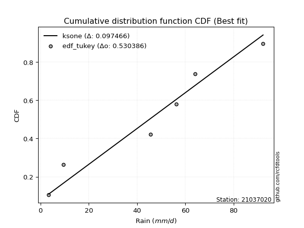</img>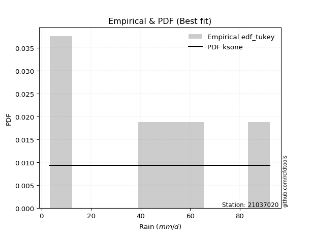</img>

</div>


### 8. EDF Gringorten (1963)

Gringorten plotting position formula is essential for estimating the probability and return periods of extreme events like floods and heavy rainfall. The constant _a=0.44_.

<div align="center">


$P=(m-a)/(n+1-2a)$


</div>


**8.1. Empirical values**

<div align="center">

|                | 0                   | 1                  | 2                   | 3                  | 4                  | 5                  |
|:---------------|:--------------------|:-------------------|:--------------------|:-------------------|:-------------------|:-------------------|
| date           | 2023                | 2022               | 2021                | 2020               | 2019               | 2025               |
| x              | 3.4                 | 9.4                | 45.6                | 56.2               | 64.0               | 92.2               |
| m              | 1                   | 2                  | 3                   | 4                  | 5                  | 6                  |
| empirical_dist | edf_gringorten      | edf_gringorten     | edf_gringorten      | edf_gringorten     | edf_gringorten     | edf_gringorten     |
| empirical      | 0.09150326797385622 | 0.2549019607843137 | 0.41830065359477125 | 0.5816993464052288 | 0.7450980392156862 | 0.9084967320261437 |
| empirical_tr   | 1.1007194244604317  | 1.3421052631578947 | 1.7191011235955058  | 2.3906250000000004 | 3.9230769230769216 | 10.928571428571415 |

</div>


**8.2. Kolmogorov-Smirnov fit test (sorted by Δ)**


<div align="center">

|                | 0                   | 1                   | 2                   | 3                   | 4                   | 5                   | 6                   | 7                   | 8                   | 9                   | 10                  | 11                  | 12                  | 13                  | 14                  | 15                  | 16                  | 17                  | 18                  | 19                  | 20                | 21                 | 22                 | 23                  | 24                  | 25                  | 26                 | 27                  | 28                  | 29                 | 30                  | 31                 | 32                  | 33                  | 34                  | 35                  | 36                  | 37                  | 38                  | 39                  | 40                  | 41                  | 42                  | 43                  | 44                  | 45                  | 46                  | 47                  | 48                  | 49                  | 50                  | 51                  | 52                 | 53                  | 54                  | 55                  | 56                  | 57                  | 58                 | 59                  | 60                  | 61                  | 62                 | 63                  | 64                  | 65                  | 66                  | 67                 | 68                  | 69                  | 70                 | 71                 | 72                  | 73                  | 74                  | 75                 | 76                  | 77                  | 78                  | 79                  | 80                  | 81                 | 82                 | 83                  | 84                  | 85                  | 86                  | 87                  | 88                  | 89                  | 90                  | 91                  | 92                 | 93                  | 94                  | 95                  | 96                  | 97                  | 98                  | 99                 | 100                 | 101                | 102                | 103                 | 104                | 105                | 106                 | 107                | 108                | 109                | 110                 | 111                 | 112                | 113                 | 114                 | 115                 | 116               | 117                 | 118                 | 119                | 120                 | 121                 | 122                 | 123               | 124               | 125                | 126               | 127                | 128                | 129                | 130                | 131               | 132                 | 133                 | 134                 | 135                 | 136               | 137               | 138                | 139                | 140                | 141                | 142                | 143                | 144                | 145                 | 146                | 147                | 148                | 149                | 150                | 151               | 152                | 153                | 154                | 155                | 156                | 157                | 158               | 159                |
|:---------------|:--------------------|:--------------------|:--------------------|:--------------------|:--------------------|:--------------------|:--------------------|:--------------------|:--------------------|:--------------------|:--------------------|:--------------------|:--------------------|:--------------------|:--------------------|:--------------------|:--------------------|:--------------------|:--------------------|:--------------------|:------------------|:-------------------|:-------------------|:--------------------|:--------------------|:--------------------|:-------------------|:--------------------|:--------------------|:-------------------|:--------------------|:-------------------|:--------------------|:--------------------|:--------------------|:--------------------|:--------------------|:--------------------|:--------------------|:--------------------|:--------------------|:--------------------|:--------------------|:--------------------|:--------------------|:--------------------|:--------------------|:--------------------|:--------------------|:--------------------|:--------------------|:--------------------|:-------------------|:--------------------|:--------------------|:--------------------|:--------------------|:--------------------|:-------------------|:--------------------|:--------------------|:--------------------|:-------------------|:--------------------|:--------------------|:--------------------|:--------------------|:-------------------|:--------------------|:--------------------|:-------------------|:-------------------|:--------------------|:--------------------|:--------------------|:-------------------|:--------------------|:--------------------|:--------------------|:--------------------|:--------------------|:-------------------|:-------------------|:--------------------|:--------------------|:--------------------|:--------------------|:--------------------|:--------------------|:--------------------|:--------------------|:--------------------|:-------------------|:--------------------|:--------------------|:--------------------|:--------------------|:--------------------|:--------------------|:-------------------|:--------------------|:-------------------|:-------------------|:--------------------|:-------------------|:-------------------|:--------------------|:-------------------|:-------------------|:-------------------|:--------------------|:--------------------|:-------------------|:--------------------|:--------------------|:--------------------|:------------------|:--------------------|:--------------------|:-------------------|:--------------------|:--------------------|:--------------------|:------------------|:------------------|:-------------------|:------------------|:-------------------|:-------------------|:-------------------|:-------------------|:------------------|:--------------------|:--------------------|:--------------------|:--------------------|:------------------|:------------------|:-------------------|:-------------------|:-------------------|:-------------------|:-------------------|:-------------------|:-------------------|:--------------------|:-------------------|:-------------------|:-------------------|:-------------------|:-------------------|:------------------|:-------------------|:-------------------|:-------------------|:-------------------|:-------------------|:-------------------|:------------------|:-------------------|
| station        | 21037020            | 21037020            | 21037020            | 21037020            | 21037020            | 21037020            | 21037020            | 21037020            | 21037020            | 21037020            | 21037020            | 21037020            | 21037020            | 21037020            | 21037020            | 21037020            | 21037020            | 21037020            | 21037020            | 21037020            | 21037020          | 21037020           | 21037020           | 21037020            | 21037020            | 21037020            | 21037020           | 21037020            | 21037020            | 21037020           | 21037020            | 21037020           | 21037020            | 21037020            | 21037020            | 21037020            | 21037020            | 21037020            | 21037020            | 21037020            | 21037020            | 21037020            | 21037020            | 21037020            | 21037020            | 21037020            | 21037020            | 21037020            | 21037020            | 21037020            | 21037020            | 21037020            | 21037020           | 21037020            | 21037020            | 21037020            | 21037020            | 21037020            | 21037020           | 21037020            | 21037020            | 21037020            | 21037020           | 21037020            | 21037020            | 21037020            | 21037020            | 21037020           | 21037020            | 21037020            | 21037020           | 21037020           | 21037020            | 21037020            | 21037020            | 21037020           | 21037020            | 21037020            | 21037020            | 21037020            | 21037020            | 21037020           | 21037020           | 21037020            | 21037020            | 21037020            | 21037020            | 21037020            | 21037020            | 21037020            | 21037020            | 21037020            | 21037020           | 21037020            | 21037020            | 21037020            | 21037020            | 21037020            | 21037020            | 21037020           | 21037020            | 21037020           | 21037020           | 21037020            | 21037020           | 21037020           | 21037020            | 21037020           | 21037020           | 21037020           | 21037020            | 21037020            | 21037020           | 21037020            | 21037020            | 21037020            | 21037020          | 21037020            | 21037020            | 21037020           | 21037020            | 21037020            | 21037020            | 21037020          | 21037020          | 21037020           | 21037020          | 21037020           | 21037020           | 21037020           | 21037020           | 21037020          | 21037020            | 21037020            | 21037020            | 21037020            | 21037020          | 21037020          | 21037020           | 21037020           | 21037020           | 21037020           | 21037020           | 21037020           | 21037020           | 21037020            | 21037020           | 21037020           | 21037020           | 21037020           | 21037020           | 21037020          | 21037020           | 21037020           | 21037020           | 21037020           | 21037020           | 21037020           | 21037020          | 21037020           |
| empirical_dist | edf_gringorten      | edf_gringorten      | edf_gringorten      | edf_gringorten      | edf_gringorten      | edf_gringorten      | edf_gringorten      | edf_gringorten      | edf_gringorten      | edf_gringorten      | edf_gringorten      | edf_gringorten      | edf_gringorten      | edf_gringorten      | edf_gringorten      | edf_gringorten      | edf_gringorten      | edf_gringorten      | edf_gringorten      | edf_gringorten      | edf_gringorten    | edf_gringorten     | edf_gringorten     | edf_gringorten      | edf_gringorten      | edf_gringorten      | edf_gringorten     | edf_gringorten      | edf_gringorten      | edf_gringorten     | edf_gringorten      | edf_gringorten     | edf_gringorten      | edf_gringorten      | edf_gringorten      | edf_gringorten      | edf_gringorten      | edf_gringorten      | edf_gringorten      | edf_gringorten      | edf_gringorten      | edf_gringorten      | edf_gringorten      | edf_gringorten      | edf_gringorten      | edf_gringorten      | edf_gringorten      | edf_gringorten      | edf_gringorten      | edf_gringorten      | edf_gringorten      | edf_gringorten      | edf_gringorten     | edf_gringorten      | edf_gringorten      | edf_gringorten      | edf_gringorten      | edf_gringorten      | edf_gringorten     | edf_gringorten      | edf_gringorten      | edf_gringorten      | edf_gringorten     | edf_gringorten      | edf_gringorten      | edf_gringorten      | edf_gringorten      | edf_gringorten     | edf_gringorten      | edf_gringorten      | edf_gringorten     | edf_gringorten     | edf_gringorten      | edf_gringorten      | edf_gringorten      | edf_gringorten     | edf_gringorten      | edf_gringorten      | edf_gringorten      | edf_gringorten      | edf_gringorten      | edf_gringorten     | edf_gringorten     | edf_gringorten      | edf_gringorten      | edf_gringorten      | edf_gringorten      | edf_gringorten      | edf_gringorten      | edf_gringorten      | edf_gringorten      | edf_gringorten      | edf_gringorten     | edf_gringorten      | edf_gringorten      | edf_gringorten      | edf_gringorten      | edf_gringorten      | edf_gringorten      | edf_gringorten     | edf_gringorten      | edf_gringorten     | edf_gringorten     | edf_gringorten      | edf_gringorten     | edf_gringorten     | edf_gringorten      | edf_gringorten     | edf_gringorten     | edf_gringorten     | edf_gringorten      | edf_gringorten      | edf_gringorten     | edf_gringorten      | edf_gringorten      | edf_gringorten      | edf_gringorten    | edf_gringorten      | edf_gringorten      | edf_gringorten     | edf_gringorten      | edf_gringorten      | edf_gringorten      | edf_gringorten    | edf_gringorten    | edf_gringorten     | edf_gringorten    | edf_gringorten     | edf_gringorten     | edf_gringorten     | edf_gringorten     | edf_gringorten    | edf_gringorten      | edf_gringorten      | edf_gringorten      | edf_gringorten      | edf_gringorten    | edf_gringorten    | edf_gringorten     | edf_gringorten     | edf_gringorten     | edf_gringorten     | edf_gringorten     | edf_gringorten     | edf_gringorten     | edf_gringorten      | edf_gringorten     | edf_gringorten     | edf_gringorten     | edf_gringorten     | edf_gringorten     | edf_gringorten    | edf_gringorten     | edf_gringorten     | edf_gringorten     | edf_gringorten     | edf_gringorten     | edf_gringorten     | edf_gringorten    | edf_gringorten     |
| p_dist         | ksone               | logjohnsonsu        | logweibull_max      | semicircular        | arcsine             | anglit              | burr                | genextreme          | beta                | genlogistic         | loggausshyper       | pearson3            | johnsonsu           | t                   | skewnorm            | crystalball         | norm                | exponnorm           | gamma               | erlang              | logmielke         | foldnorm           | gumbel_l           | logloggamma         | maxwell             | wrapcauchy          | invgamma           | rayleigh            | cosine              | invgauss           | logistic            | loglevy_l          | gausshyper          | argus               | rice                | invweibull          | hypsecant           | laplace             | dweibull            | genpareto           | loggenextreme       | logargus            | dgamma              | kstwobign           | logtrapezoid        | kappa4              | gumbel_r            | logarcsine          | halfnorm            | gompertz            | tukeylambda         | uniform             | kappa3             | truncweibull_min    | truncexpon          | ncf                 | loggennorm          | loggumbel_l         | logweibull_min     | logburr12           | logpearson3         | moyal               | weibull_min        | logdweibull         | logdgamma           | logloglaplace       | logsemicircular     | logwrapcauchy      | logbeta             | loggompertz         | genexpon           | lomax              | vonmises_line       | loganglit           | loggenpareto        | genhalflogistic    | betaprime           | loggenhalflogistic  | triang              | logncf              | halflogistic        | logf               | lognorm            | logcrystalball      | logt                | logexponnorm        | lognct              | loggengamma         | logburr             | logfatiguelife      | logerlang           | logbetaprime        | gennorm            | loggamma            | loggamma            | loginvgauss         | logfoldnorm         | logrice             | loginvweibull       | loginvgamma        | bradford            | logalpha           | wald               | logskewnorm         | levy_l             | loglogistic        | mielke              | logmaxwell         | lograyleigh        | logkstwobign       | exponpow            | halfgennorm         | loghypsecant       | loggenexpon         | logcosine           | loghalfnorm         | nct               | burr12              | loglomax            | logtriang          | loggumbel_r         | loglaplace          | loglaplace          | exponweib         | loghalfgennorm    | loghalflogistic    | nakagami          | trapezoid          | logmoyal           | f                  | logtukeylambda     | logksone          | gengamma            | logexponweib        | logtruncweibull_min | logkappa3           | loguniform        | logvonmises_line  | logwald            | logkappa4          | logbradford        | logtruncexpon      | alpha              | fatiguelife        | johnsonsb          | logtruncnorm        | lognakagami        | powerlaw           | truncpareto        | logexponpow        | logpowerlaw        | rdist             | logrdist           | weibull_max        | truncnorm          | logtruncpareto     | logjohnsonsb       | loggenlogistic     | logvonmises       | vonmises           |
| delta          | 0.08921029240297282 | 0.09374515874178635 | 0.09597850752833337 | 0.10174512018869641 | 0.10277936318676206 | 0.11069046954818901 | 0.11638955120859301 | 0.12463326052867515 | 0.12814259286173235 | 0.12869311655993942 | 0.12992098704674332 | 0.13110830524078837 | 0.13125675149786248 | 0.13147198794348314 | 0.13147655484598353 | 0.13148585780467553 | 0.13148586370565374 | 0.13148745788253313 | 0.13178095969534598 | 0.13180293970885654 | 0.132344487841566 | 0.1326347798392264 | 0.1355170426919765 | 0.13573690835982172 | 0.13615416253300267 | 0.13816930627120627 | 0.1395722651096506 | 0.13976531843378143 | 0.14005740467019362 | 0.1403900780862481 | 0.14585578688593237 | 0.1470310469449484 | 0.14888002721011187 | 0.14932109333191823 | 0.15008495872046856 | 0.15035247639211186 | 0.15255181704456988 | 0.15769537735097167 | 0.15797303291623496 | 0.15806609537712618 | 0.15956872167851877 | 0.15987049240228363 | 0.15994001199415822 | 0.16248792465250866 | 0.16481516949656733 | 0.16670341125826152 | 0.17112104758499838 | 0.17537735421958706 | 0.17541846978684006 | 0.17934976510610112 | 0.18210305694024687 | 0.18733439321674614 | 0.1874269365892668 | 0.18810866034273993 | 0.19054498449235407 | 0.19121064600648502 | 0.19493013014468225 | 0.19503280322807742 | 0.1958151119782106 | 0.19600052527488893 | 0.19973307852434435 | 0.19975127079381613 | 0.2009086899930131 | 0.20513821000483445 | 0.20601159672847288 | 0.20753027167487936 | 0.21135438856253602 | 0.2120731569780771 | 0.21571307049082789 | 0.21749071944949877 | 0.2179088990947729 | 0.2179229738543555 | 0.21943162243772352 | 0.22009469303241463 | 0.22339677340723602 | 0.2255604187748813 | 0.22766350902814297 | 0.23519326843574945 | 0.23581304984929408 | 0.23643186400835564 | 0.23902227179763563 | 0.2399038003518233 | 0.2408763456625706 | 0.24087636918999372 | 0.24087686574321948 | 0.24087703876458394 | 0.24106543916701934 | 0.24220026373000142 | 0.24223141328122783 | 0.24259933275058904 | 0.24350901569614364 | 0.24382238973886844 | 0.2450980392156863 | 0.24546303487348625 | 0.24546303487348625 | 0.24594771266654397 | 0.24626408907702474 | 0.24650754261197855 | 0.24709044296595178 | 0.2486795058615477 | 0.24878120114700825 | 0.2512997908477235 | 0.2557670579858617 | 0.25724401175154826 | 0.2576563496158094 | 0.2595808974958555 | 0.26084993510298654 | 0.2615180757252023 | 0.2676916374033023 | 0.2715831267926366 | 0.27176876224670626 | 0.27205307602080414 | 0.2739305675717982 | 0.27603253588197946 | 0.27847347761158786 | 0.28575501749361193 | 0.285766349073953 | 0.28738108972519233 | 0.28992108327714977 | 0.2960093629219451 | 0.29935824206969747 | 0.30178821383696447 | 0.30178821383696447 | 0.301979695237895 | 0.302174277936258 | 0.3137115647602136 | 0.314977852817335 | 0.3165990415553005 | 0.3186145493840549 | 0.3199146862949946 | 0.3199246767380031 | 0.320584949720034 | 0.35127812901929706 | 0.35192741418673906 | 0.3522036410729216  | 0.36451939526367033 | 0.368362070382995 | 0.369054787897721 | 0.3734491704925513 | 0.3757844977017922 | 0.4151717401236868 | 0.4177468425411323 | 0.4454020685343038 | 0.4581646635084708 | 0.4582515130249589 | 0.46912384015381375 | 0.4700224607878936 | 0.4855939995815632 | 0.5259222979863107 | 0.5301199923431547 | 0.5791913005833658 | 0.581699344184075 | 0.5816993448252334 | 0.6110326134091086 | 0.6187981053247578 | 0.6395642614293459 | 0.6686766789711148 | 0.7450980392156862 | 1.123288891156477 | 13.891778435609389 |
| deltao         | 0.530385761606      | 0.530385761606      | 0.530385761606      | 0.530385761606      | 0.530385761606      | 0.530385761606      | 0.530385761606      | 0.530385761606      | 0.530385761606      | 0.530385761606      | 0.530385761606      | 0.530385761606      | 0.530385761606      | 0.530385761606      | 0.530385761606      | 0.530385761606      | 0.530385761606      | 0.530385761606      | 0.530385761606      | 0.530385761606      | 0.530385761606    | 0.530385761606     | 0.530385761606     | 0.530385761606      | 0.530385761606      | 0.530385761606      | 0.530385761606     | 0.530385761606      | 0.530385761606      | 0.530385761606     | 0.530385761606      | 0.530385761606     | 0.530385761606      | 0.530385761606      | 0.530385761606      | 0.530385761606      | 0.530385761606      | 0.530385761606      | 0.530385761606      | 0.530385761606      | 0.530385761606      | 0.530385761606      | 0.530385761606      | 0.530385761606      | 0.530385761606      | 0.530385761606      | 0.530385761606      | 0.530385761606      | 0.530385761606      | 0.530385761606      | 0.530385761606      | 0.530385761606      | 0.530385761606     | 0.530385761606      | 0.530385761606      | 0.530385761606      | 0.530385761606      | 0.530385761606      | 0.530385761606     | 0.530385761606      | 0.530385761606      | 0.530385761606      | 0.530385761606     | 0.530385761606      | 0.530385761606      | 0.530385761606      | 0.530385761606      | 0.530385761606     | 0.530385761606      | 0.530385761606      | 0.530385761606     | 0.530385761606     | 0.530385761606      | 0.530385761606      | 0.530385761606      | 0.530385761606     | 0.530385761606      | 0.530385761606      | 0.530385761606      | 0.530385761606      | 0.530385761606      | 0.530385761606     | 0.530385761606     | 0.530385761606      | 0.530385761606      | 0.530385761606      | 0.530385761606      | 0.530385761606      | 0.530385761606      | 0.530385761606      | 0.530385761606      | 0.530385761606      | 0.530385761606     | 0.530385761606      | 0.530385761606      | 0.530385761606      | 0.530385761606      | 0.530385761606      | 0.530385761606      | 0.530385761606     | 0.530385761606      | 0.530385761606     | 0.530385761606     | 0.530385761606      | 0.530385761606     | 0.530385761606     | 0.530385761606      | 0.530385761606     | 0.530385761606     | 0.530385761606     | 0.530385761606      | 0.530385761606      | 0.530385761606     | 0.530385761606      | 0.530385761606      | 0.530385761606      | 0.530385761606    | 0.530385761606      | 0.530385761606      | 0.530385761606     | 0.530385761606      | 0.530385761606      | 0.530385761606      | 0.530385761606    | 0.530385761606    | 0.530385761606     | 0.530385761606    | 0.530385761606     | 0.530385761606     | 0.530385761606     | 0.530385761606     | 0.530385761606    | 0.530385761606      | 0.530385761606      | 0.530385761606      | 0.530385761606      | 0.530385761606    | 0.530385761606    | 0.530385761606     | 0.530385761606     | 0.530385761606     | 0.530385761606     | 0.530385761606     | 0.530385761606     | 0.530385761606     | 0.530385761606      | 0.530385761606     | 0.530385761606     | 0.530385761606     | 0.530385761606     | 0.530385761606     | 0.530385761606    | 0.530385761606     | 0.530385761606     | 0.530385761606     | 0.530385761606     | 0.530385761606     | 0.530385761606     | 0.530385761606    | 0.530385761606     |
| eval           | Δo > Δ              | Δo > Δ              | Δo > Δ              | Δo > Δ              | Δo > Δ              | Δo > Δ              | Δo > Δ              | Δo > Δ              | Δo > Δ              | Δo > Δ              | Δo > Δ              | Δo > Δ              | Δo > Δ              | Δo > Δ              | Δo > Δ              | Δo > Δ              | Δo > Δ              | Δo > Δ              | Δo > Δ              | Δo > Δ              | Δo > Δ            | Δo > Δ             | Δo > Δ             | Δo > Δ              | Δo > Δ              | Δo > Δ              | Δo > Δ             | Δo > Δ              | Δo > Δ              | Δo > Δ             | Δo > Δ              | Δo > Δ             | Δo > Δ              | Δo > Δ              | Δo > Δ              | Δo > Δ              | Δo > Δ              | Δo > Δ              | Δo > Δ              | Δo > Δ              | Δo > Δ              | Δo > Δ              | Δo > Δ              | Δo > Δ              | Δo > Δ              | Δo > Δ              | Δo > Δ              | Δo > Δ              | Δo > Δ              | Δo > Δ              | Δo > Δ              | Δo > Δ              | Δo > Δ             | Δo > Δ              | Δo > Δ              | Δo > Δ              | Δo > Δ              | Δo > Δ              | Δo > Δ             | Δo > Δ              | Δo > Δ              | Δo > Δ              | Δo > Δ             | Δo > Δ              | Δo > Δ              | Δo > Δ              | Δo > Δ              | Δo > Δ             | Δo > Δ              | Δo > Δ              | Δo > Δ             | Δo > Δ             | Δo > Δ              | Δo > Δ              | Δo > Δ              | Δo > Δ             | Δo > Δ              | Δo > Δ              | Δo > Δ              | Δo > Δ              | Δo > Δ              | Δo > Δ             | Δo > Δ             | Δo > Δ              | Δo > Δ              | Δo > Δ              | Δo > Δ              | Δo > Δ              | Δo > Δ              | Δo > Δ              | Δo > Δ              | Δo > Δ              | Δo > Δ             | Δo > Δ              | Δo > Δ              | Δo > Δ              | Δo > Δ              | Δo > Δ              | Δo > Δ              | Δo > Δ             | Δo > Δ              | Δo > Δ             | Δo > Δ             | Δo > Δ              | Δo > Δ             | Δo > Δ             | Δo > Δ              | Δo > Δ             | Δo > Δ             | Δo > Δ             | Δo > Δ              | Δo > Δ              | Δo > Δ             | Δo > Δ              | Δo > Δ              | Δo > Δ              | Δo > Δ            | Δo > Δ              | Δo > Δ              | Δo > Δ             | Δo > Δ              | Δo > Δ              | Δo > Δ              | Δo > Δ            | Δo > Δ            | Δo > Δ             | Δo > Δ            | Δo > Δ             | Δo > Δ             | Δo > Δ             | Δo > Δ             | Δo > Δ            | Δo > Δ              | Δo > Δ              | Δo > Δ              | Δo > Δ              | Δo > Δ            | Δo > Δ            | Δo > Δ             | Δo > Δ             | Δo > Δ             | Δo > Δ             | Δo > Δ             | Δo > Δ             | Δo > Δ             | Δo > Δ              | Δo > Δ             | Δo > Δ             | Δo > Δ             | Δo > Δ             | Δo <= Δ            | Δo <= Δ           | Δo <= Δ            | Δo <= Δ            | Δo <= Δ            | Δo <= Δ            | Δo <= Δ            | Δo <= Δ            | Δo <= Δ           | Δo <= Δ            |
| fit            | 1                   | 1                   | 1                   | 1                   | 1                   | 1                   | 1                   | 1                   | 1                   | 1                   | 1                   | 1                   | 1                   | 1                   | 1                   | 1                   | 1                   | 1                   | 1                   | 1                   | 1                 | 1                  | 1                  | 1                   | 1                   | 1                   | 1                  | 1                   | 1                   | 1                  | 1                   | 1                  | 1                   | 1                   | 1                   | 1                   | 1                   | 1                   | 1                   | 1                   | 1                   | 1                   | 1                   | 1                   | 1                   | 1                   | 1                   | 1                   | 1                   | 1                   | 1                   | 1                   | 1                  | 1                   | 1                   | 1                   | 1                   | 1                   | 1                  | 1                   | 1                   | 1                   | 1                  | 1                   | 1                   | 1                   | 1                   | 1                  | 1                   | 1                   | 1                  | 1                  | 1                   | 1                   | 1                   | 1                  | 1                   | 1                   | 1                   | 1                   | 1                   | 1                  | 1                  | 1                   | 1                   | 1                   | 1                   | 1                   | 1                   | 1                   | 1                   | 1                   | 1                  | 1                   | 1                   | 1                   | 1                   | 1                   | 1                   | 1                  | 1                   | 1                  | 1                  | 1                   | 1                  | 1                  | 1                   | 1                  | 1                  | 1                  | 1                   | 1                   | 1                  | 1                   | 1                   | 1                   | 1                 | 1                   | 1                   | 1                  | 1                   | 1                   | 1                   | 1                 | 1                 | 1                  | 1                 | 1                  | 1                  | 1                  | 1                  | 1                 | 1                   | 1                   | 1                   | 1                   | 1                 | 1                 | 1                  | 1                  | 1                  | 1                  | 1                  | 1                  | 1                  | 1                   | 1                  | 1                  | 1                  | 1                  | 0                  | 0                 | 0                  | 0                  | 0                  | 0                  | 0                  | 0                  | 0                 | 0                  |
| n              | 6                   | 6                   | 6                   | 6                   | 6                   | 6                   | 6                   | 6                   | 6                   | 6                   | 6                   | 6                   | 6                   | 6                   | 6                   | 6                   | 6                   | 6                   | 6                   | 6                   | 6                 | 6                  | 6                  | 6                   | 6                   | 6                   | 6                  | 6                   | 6                   | 6                  | 6                   | 6                  | 6                   | 6                   | 6                   | 6                   | 6                   | 6                   | 6                   | 6                   | 6                   | 6                   | 6                   | 6                   | 6                   | 6                   | 6                   | 6                   | 6                   | 6                   | 6                   | 6                   | 6                  | 6                   | 6                   | 6                   | 6                   | 6                   | 6                  | 6                   | 6                   | 6                   | 6                  | 6                   | 6                   | 6                   | 6                   | 6                  | 6                   | 6                   | 6                  | 6                  | 6                   | 6                   | 6                   | 6                  | 6                   | 6                   | 6                   | 6                   | 6                   | 6                  | 6                  | 6                   | 6                   | 6                   | 6                   | 6                   | 6                   | 6                   | 6                   | 6                   | 6                  | 6                   | 6                   | 6                   | 6                   | 6                   | 6                   | 6                  | 6                   | 6                  | 6                  | 6                   | 6                  | 6                  | 6                   | 6                  | 6                  | 6                  | 6                   | 6                   | 6                  | 6                   | 6                   | 6                   | 6                 | 6                   | 6                   | 6                  | 6                   | 6                   | 6                   | 6                 | 6                 | 6                  | 6                 | 6                  | 6                  | 6                  | 6                  | 6                 | 6                   | 6                   | 6                   | 6                   | 6                 | 6                 | 6                  | 6                  | 6                  | 6                  | 6                  | 6                  | 6                  | 6                   | 6                  | 6                  | 6                  | 6                  | 6                  | 6                 | 6                  | 6                  | 6                  | 6                  | 6                  | 6                  | 6                 | 6                  |
| best_fit       | 1                   | 0                   | 0                   | 0                   | 0                   | 0                   | 0                   | 0                   | 0                   | 0                   | 0                   | 0                   | 0                   | 0                   | 0                   | 0                   | 0                   | 0                   | 0                   | 0                   | 0                 | 0                  | 0                  | 0                   | 0                   | 0                   | 0                  | 0                   | 0                   | 0                  | 0                   | 0                  | 0                   | 0                   | 0                   | 0                   | 0                   | 0                   | 0                   | 0                   | 0                   | 0                   | 0                   | 0                   | 0                   | 0                   | 0                   | 0                   | 0                   | 0                   | 0                   | 0                   | 0                  | 0                   | 0                   | 0                   | 0                   | 0                   | 0                  | 0                   | 0                   | 0                   | 0                  | 0                   | 0                   | 0                   | 0                   | 0                  | 0                   | 0                   | 0                  | 0                  | 0                   | 0                   | 0                   | 0                  | 0                   | 0                   | 0                   | 0                   | 0                   | 0                  | 0                  | 0                   | 0                   | 0                   | 0                   | 0                   | 0                   | 0                   | 0                   | 0                   | 0                  | 0                   | 0                   | 0                   | 0                   | 0                   | 0                   | 0                  | 0                   | 0                  | 0                  | 0                   | 0                  | 0                  | 0                   | 0                  | 0                  | 0                  | 0                   | 0                   | 0                  | 0                   | 0                   | 0                   | 0                 | 0                   | 0                   | 0                  | 0                   | 0                   | 0                   | 0                 | 0                 | 0                  | 0                 | 0                  | 0                  | 0                  | 0                  | 0                 | 0                   | 0                   | 0                   | 0                   | 0                 | 0                 | 0                  | 0                  | 0                  | 0                  | 0                  | 0                  | 0                  | 0                   | 0                  | 0                  | 0                  | 0                  | 0                  | 0                 | 0                  | 0                  | 0                  | 0                  | 0                  | 0                  | 0                 | 0                  |
| best_fit_sort  | 1                   | 2                   | 3                   | 4                   | 5                   | 6                   | 7                   | 8                   | 9                   | 10                  | 11                  | 12                  | 13                  | 14                  | 15                  | 16                  | 17                  | 18                  | 19                  | 20                  | 21                | 22                 | 23                 | 24                  | 25                  | 26                  | 27                 | 28                  | 29                  | 30                 | 31                  | 32                 | 33                  | 34                  | 35                  | 36                  | 37                  | 38                  | 39                  | 40                  | 41                  | 42                  | 43                  | 44                  | 45                  | 46                  | 47                  | 48                  | 49                  | 50                  | 51                  | 52                  | 53                 | 54                  | 55                  | 56                  | 57                  | 58                  | 59                 | 60                  | 61                  | 62                  | 63                 | 64                  | 65                  | 66                  | 67                  | 68                 | 69                  | 70                  | 71                 | 72                 | 73                  | 74                  | 75                  | 76                 | 77                  | 78                  | 79                  | 80                  | 81                  | 82                 | 83                 | 84                  | 85                  | 86                  | 87                  | 88                  | 89                  | 90                  | 91                  | 92                  | 93                 | 94                  | 95                  | 96                  | 97                  | 98                  | 99                  | 100                | 101                 | 102                | 103                | 104                 | 105                | 106                | 107                 | 108                | 109                | 110                | 111                 | 112                 | 113                | 114                 | 115                 | 116                 | 117               | 118                 | 119                 | 120                | 121                 | 122                 | 123                 | 124               | 125               | 126                | 127               | 128                | 129                | 130                | 131                | 132               | 133                 | 134                 | 135                 | 136                 | 137               | 138               | 139                | 140                | 141                | 142                | 143                | 144                | 145                | 146                 | 147                | 148                | 149                | 150                | 151                | 152               | 153                | 154                | 155                | 156                | 157                | 158                | 159               | 160                |

</div>


**8.3. Best fit**

<div align="center">

|   id |   station | empirical_dist   | p_dist   |     delta |   deltao | eval   |   fit |   n |   best_fit |   best_fit_sort |
|-----:|----------:|:-----------------|:---------|----------:|---------:|:-------|------:|----:|-----------:|----------------:|
|    0 |  21037020 | edf_gringorten   | ksone    | 0.0892103 | 0.530386 | Δo > Δ |     1 |   6 |          1 |               1 |

</div>


<div align="center">

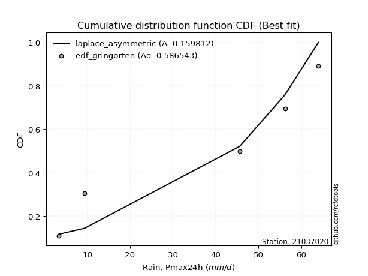</img>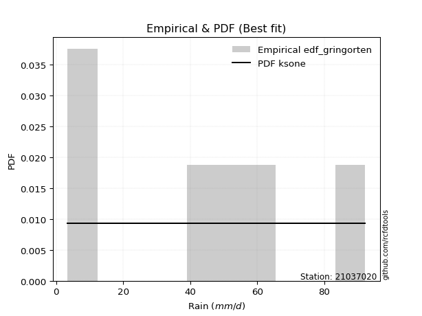</img>

</div>


### 9. EDF Filliben (1975)

The specific values of the constants (0.3175) (often denoted as $alpha$) and (0.365) are derived from a method proposed by James J. Filliben in a 1975 paper. This particular formula is the mean value of the $i$-th order statistic of the normal distribution and is considered a robust and effective plotting position formula for the normal probability plot correlation coefficient test for normality.

<div align="center">


$P=(m-0.3175)/(n+0.365)$


</div>


**9.1. Empirical values**

<div align="center">

|                | 0                   | 1                   | 2                  | 3                  | 4                  | 5                  |
|:---------------|:--------------------|:--------------------|:-------------------|:-------------------|:-------------------|:-------------------|
| date           | 2023                | 2022                | 2021               | 2020               | 2019               | 2025               |
| x              | 3.4                 | 9.4                 | 45.6               | 56.2               | 64.0               | 92.2               |
| m              | 1                   | 2                   | 3                  | 4                  | 5                  | 6                  |
| empirical_dist | edf_filliben        | edf_filliben        | edf_filliben       | edf_filliben       | edf_filliben       | edf_filliben       |
| empirical      | 0.10722702278083267 | 0.26433621366849963 | 0.4214454045561665 | 0.5785545954438335 | 0.7356637863315004 | 0.8927729772191673 |
| empirical_tr   | 1.1201055873295205  | 1.3593166043780034  | 1.7284453496266123 | 2.3727865796831313 | 3.783060921248143  | 9.326007326007321  |

</div>


**9.2. Kolmogorov-Smirnov fit test (sorted by Δ)**


<div align="center">

|                | 0                   | 1                   | 2                   | 3                   | 4                   | 5                   | 6                   | 7                   | 8                   | 9                   | 10                  | 11                  | 12                  | 13                  | 14                 | 15                 | 16                  | 17                  | 18                  | 19                  | 20                  | 21                 | 22                  | 23                  | 24                  | 25                  | 26                  | 27                 | 28                  | 29                  | 30                  | 31                  | 32                 | 33                  | 34                 | 35                  | 36                 | 37                 | 38                  | 39                 | 40                 | 41                  | 42                 | 43                 | 44                  | 45                  | 46                  | 47                 | 48                  | 49                  | 50                 | 51                  | 52                  | 53                  | 54                 | 55                  | 56                  | 57                  | 58                  | 59                  | 60                  | 61                 | 62                  | 63                  | 64                  | 65                  | 66                  | 67                  | 68                 | 69                  | 70                  | 71                 | 72                  | 73                  | 74                  | 75                 | 76                  | 77                  | 78                  | 79                  | 80                  | 81                  | 82                  | 83                 | 84                  | 85                  | 86                  | 87                  | 88                  | 89                  | 90                  | 91                  | 92                  | 93                  | 94                  | 95                 | 96                  | 97                  | 98                 | 99                  | 100                 | 101                 | 102                 | 103               | 104                 | 105                 | 106                 | 107                 | 108                 | 109                | 110               | 111                 | 112                | 113                | 114                | 115                 | 116                | 117                 | 118                | 119                | 120                | 121                | 122                | 123                | 124                 | 125                 | 126                 | 127                | 128                 | 129                | 130                 | 131                | 132                | 133                | 134                 | 135                 | 136                 | 137                 | 138               | 139                | 140                | 141                 | 142                 | 143                 | 144                | 145                | 146                 | 147                | 148                | 149                | 150                | 151                | 152                | 153                | 154                | 155              | 156                | 157                | 158                | 159                |
|:---------------|:--------------------|:--------------------|:--------------------|:--------------------|:--------------------|:--------------------|:--------------------|:--------------------|:--------------------|:--------------------|:--------------------|:--------------------|:--------------------|:--------------------|:-------------------|:-------------------|:--------------------|:--------------------|:--------------------|:--------------------|:--------------------|:-------------------|:--------------------|:--------------------|:--------------------|:--------------------|:--------------------|:-------------------|:--------------------|:--------------------|:--------------------|:--------------------|:-------------------|:--------------------|:-------------------|:--------------------|:-------------------|:-------------------|:--------------------|:-------------------|:-------------------|:--------------------|:-------------------|:-------------------|:--------------------|:--------------------|:--------------------|:-------------------|:--------------------|:--------------------|:-------------------|:--------------------|:--------------------|:--------------------|:-------------------|:--------------------|:--------------------|:--------------------|:--------------------|:--------------------|:--------------------|:-------------------|:--------------------|:--------------------|:--------------------|:--------------------|:--------------------|:--------------------|:-------------------|:--------------------|:--------------------|:-------------------|:--------------------|:--------------------|:--------------------|:-------------------|:--------------------|:--------------------|:--------------------|:--------------------|:--------------------|:--------------------|:--------------------|:-------------------|:--------------------|:--------------------|:--------------------|:--------------------|:--------------------|:--------------------|:--------------------|:--------------------|:--------------------|:--------------------|:--------------------|:-------------------|:--------------------|:--------------------|:-------------------|:--------------------|:--------------------|:--------------------|:--------------------|:------------------|:--------------------|:--------------------|:--------------------|:--------------------|:--------------------|:-------------------|:------------------|:--------------------|:-------------------|:-------------------|:-------------------|:--------------------|:-------------------|:--------------------|:-------------------|:-------------------|:-------------------|:-------------------|:-------------------|:-------------------|:--------------------|:--------------------|:--------------------|:-------------------|:--------------------|:-------------------|:--------------------|:-------------------|:-------------------|:-------------------|:--------------------|:--------------------|:--------------------|:--------------------|:------------------|:-------------------|:-------------------|:--------------------|:--------------------|:--------------------|:-------------------|:-------------------|:--------------------|:-------------------|:-------------------|:-------------------|:-------------------|:-------------------|:-------------------|:-------------------|:-------------------|:-----------------|:-------------------|:-------------------|:-------------------|:-------------------|
| station        | 21037020            | 21037020            | 21037020            | 21037020            | 21037020            | 21037020            | 21037020            | 21037020            | 21037020            | 21037020            | 21037020            | 21037020            | 21037020            | 21037020            | 21037020           | 21037020           | 21037020            | 21037020            | 21037020            | 21037020            | 21037020            | 21037020           | 21037020            | 21037020            | 21037020            | 21037020            | 21037020            | 21037020           | 21037020            | 21037020            | 21037020            | 21037020            | 21037020           | 21037020            | 21037020           | 21037020            | 21037020           | 21037020           | 21037020            | 21037020           | 21037020           | 21037020            | 21037020           | 21037020           | 21037020            | 21037020            | 21037020            | 21037020           | 21037020            | 21037020            | 21037020           | 21037020            | 21037020            | 21037020            | 21037020           | 21037020            | 21037020            | 21037020            | 21037020            | 21037020            | 21037020            | 21037020           | 21037020            | 21037020            | 21037020            | 21037020            | 21037020            | 21037020            | 21037020           | 21037020            | 21037020            | 21037020           | 21037020            | 21037020            | 21037020            | 21037020           | 21037020            | 21037020            | 21037020            | 21037020            | 21037020            | 21037020            | 21037020            | 21037020           | 21037020            | 21037020            | 21037020            | 21037020            | 21037020            | 21037020            | 21037020            | 21037020            | 21037020            | 21037020            | 21037020            | 21037020           | 21037020            | 21037020            | 21037020           | 21037020            | 21037020            | 21037020            | 21037020            | 21037020          | 21037020            | 21037020            | 21037020            | 21037020            | 21037020            | 21037020           | 21037020          | 21037020            | 21037020           | 21037020           | 21037020           | 21037020            | 21037020           | 21037020            | 21037020           | 21037020           | 21037020           | 21037020           | 21037020           | 21037020           | 21037020            | 21037020            | 21037020            | 21037020           | 21037020            | 21037020           | 21037020            | 21037020           | 21037020           | 21037020           | 21037020            | 21037020            | 21037020            | 21037020            | 21037020          | 21037020           | 21037020           | 21037020            | 21037020            | 21037020            | 21037020           | 21037020           | 21037020            | 21037020           | 21037020           | 21037020           | 21037020           | 21037020           | 21037020           | 21037020           | 21037020           | 21037020         | 21037020           | 21037020           | 21037020           | 21037020           |
| empirical_dist | edf_filliben        | edf_filliben        | edf_filliben        | edf_filliben        | edf_filliben        | edf_filliben        | edf_filliben        | edf_filliben        | edf_filliben        | edf_filliben        | edf_filliben        | edf_filliben        | edf_filliben        | edf_filliben        | edf_filliben       | edf_filliben       | edf_filliben        | edf_filliben        | edf_filliben        | edf_filliben        | edf_filliben        | edf_filliben       | edf_filliben        | edf_filliben        | edf_filliben        | edf_filliben        | edf_filliben        | edf_filliben       | edf_filliben        | edf_filliben        | edf_filliben        | edf_filliben        | edf_filliben       | edf_filliben        | edf_filliben       | edf_filliben        | edf_filliben       | edf_filliben       | edf_filliben        | edf_filliben       | edf_filliben       | edf_filliben        | edf_filliben       | edf_filliben       | edf_filliben        | edf_filliben        | edf_filliben        | edf_filliben       | edf_filliben        | edf_filliben        | edf_filliben       | edf_filliben        | edf_filliben        | edf_filliben        | edf_filliben       | edf_filliben        | edf_filliben        | edf_filliben        | edf_filliben        | edf_filliben        | edf_filliben        | edf_filliben       | edf_filliben        | edf_filliben        | edf_filliben        | edf_filliben        | edf_filliben        | edf_filliben        | edf_filliben       | edf_filliben        | edf_filliben        | edf_filliben       | edf_filliben        | edf_filliben        | edf_filliben        | edf_filliben       | edf_filliben        | edf_filliben        | edf_filliben        | edf_filliben        | edf_filliben        | edf_filliben        | edf_filliben        | edf_filliben       | edf_filliben        | edf_filliben        | edf_filliben        | edf_filliben        | edf_filliben        | edf_filliben        | edf_filliben        | edf_filliben        | edf_filliben        | edf_filliben        | edf_filliben        | edf_filliben       | edf_filliben        | edf_filliben        | edf_filliben       | edf_filliben        | edf_filliben        | edf_filliben        | edf_filliben        | edf_filliben      | edf_filliben        | edf_filliben        | edf_filliben        | edf_filliben        | edf_filliben        | edf_filliben       | edf_filliben      | edf_filliben        | edf_filliben       | edf_filliben       | edf_filliben       | edf_filliben        | edf_filliben       | edf_filliben        | edf_filliben       | edf_filliben       | edf_filliben       | edf_filliben       | edf_filliben       | edf_filliben       | edf_filliben        | edf_filliben        | edf_filliben        | edf_filliben       | edf_filliben        | edf_filliben       | edf_filliben        | edf_filliben       | edf_filliben       | edf_filliben       | edf_filliben        | edf_filliben        | edf_filliben        | edf_filliben        | edf_filliben      | edf_filliben       | edf_filliben       | edf_filliben        | edf_filliben        | edf_filliben        | edf_filliben       | edf_filliben       | edf_filliben        | edf_filliben       | edf_filliben       | edf_filliben       | edf_filliben       | edf_filliben       | edf_filliben       | edf_filliben       | edf_filliben       | edf_filliben     | edf_filliben       | edf_filliben       | edf_filliben       | edf_filliben       |
| p_dist         | ksone               | logjohnsonsu        | logweibull_max      | arcsine             | semicircular        | burr                | anglit              | loggausshyper       | logmielke           | logloggamma         | genextreme          | loglevy_l           | beta                | genlogistic         | pearson3           | johnsonsu          | t                   | skewnorm            | crystalball         | norm                | exponnorm           | gamma              | erlang              | invgauss            | foldnorm            | wrapcauchy          | gumbel_l            | maxwell            | invweibull          | invgamma            | rayleigh            | cosine              | logistic           | logargus            | gausshyper         | argus               | kstwobign          | rice               | logtrapezoid        | hypsecant          | laplace            | dweibull            | genpareto          | loggenextreme      | dgamma              | logarcsine          | kappa4              | gumbel_r           | halfnorm            | truncweibull_min    | truncexpon         | ncf                 | gompertz            | logdweibull         | tukeylambda        | logloglaplace       | loggumbel_l         | logweibull_min      | logburr12           | logpearson3         | uniform             | kappa3             | weibull_min         | loggennorm          | logbeta             | logsemicircular     | logwrapcauchy       | moyal               | loggompertz        | genexpon            | lomax               | logdgamma          | genhalflogistic     | loganglit           | loggenpareto        | betaprime          | vonmises_line       | loggenhalflogistic  | logncf              | gennorm             | logf                | lognorm             | logcrystalball      | logt               | logexponnorm        | lognct              | triang              | loggengamma         | logburr             | logfatiguelife      | logerlang           | logbetaprime        | levy_l              | loggamma            | loggamma            | loginvgauss        | logfoldnorm         | logrice             | loginvweibull      | loginvgamma         | bradford            | logalpha            | halflogistic        | logskewnorm       | loglogistic         | mielke              | logmaxwell          | wald                | lograyleigh         | logkstwobign       | exponpow          | halfgennorm         | loghypsecant       | loggenexpon        | logcosine          | loghalfnorm         | nct                | burr12              | loglomax           | logtriang          | loggumbel_r        | loglaplace         | loglaplace         | exponweib          | loghalfgennorm      | trapezoid           | loghalflogistic     | nakagami           | logmoyal            | f                  | logtukeylambda      | logksone           | gengamma           | logexponweib       | logtruncweibull_min | logkappa3           | loguniform          | logvonmises_line    | logwald           | logkappa4          | logbradford        | logtruncexpon       | alpha               | johnsonsb           | fatiguelife        | logtruncnorm       | lognakagami         | powerlaw           | truncpareto        | logexponpow        | logpowerlaw        | rdist              | logrdist           | weibull_max        | truncnorm          | logtruncpareto   | logjohnsonsb       | loggenlogistic     | logvonmises        | vonmises           |
| delta          | 0.09864454528715874 | 0.10306832748981803 | 0.10722702275661355 | 0.10722702278083274 | 0.11117937307288234 | 0.11914821401250827 | 0.12012472243237493 | 0.12677623608534805 | 0.12919973688017072 | 0.13259215739842645 | 0.13406751341286108 | 0.13639000550500124 | 0.13757684574591827 | 0.13812736944412535 | 0.1405425581249743 | 0.1406910043820484 | 0.14090624082766906 | 0.14091080773016945 | 0.14092011068886146 | 0.14092011658983966 | 0.14092171076671905 | 0.1412152125795319 | 0.14123719259304246 | 0.14173421488405005 | 0.14206903272341231 | 0.14366545980197307 | 0.14495129557616243 | 0.1455884154171886 | 0.14720772543071659 | 0.14900651799383652 | 0.14919957131796735 | 0.14949165755437954 | 0.1552900397701183 | 0.15672574144088836 | 0.1583142800942978 | 0.15875534621610415 | 0.1593431736911134 | 0.1595192116046545 | 0.16167041853517206 | 0.1619860699287558 | 0.1671296302351576 | 0.16740728580042089 | 0.1675003482613121 | 0.1690029745627047 | 0.16937426487834414 | 0.17223260325819179 | 0.17613766414244744 | 0.1805553004691843 | 0.18485272267102598 | 0.18496390938134466 | 0.1874002335309588 | 0.18806589504508975 | 0.18878401799028705 | 0.18941445519785804 | 0.1915373098244328 | 0.19180651686790295 | 0.19188805226668215 | 0.19267036101681534 | 0.19285577431349366 | 0.19658832756294908 | 0.19676864610093206 | 0.1968611894734527 | 0.19776393903161782 | 0.20436438302886817 | 0.20627881760664213 | 0.20820963760114075 | 0.20892840601668183 | 0.20918552367800206 | 0.2143459684881035 | 0.21476414813337763 | 0.21477822289296022 | 0.2154458496126588 | 0.21612616589069555 | 0.21694994207101936 | 0.22025202244584074 | 0.2245187580667477 | 0.22886587532190944 | 0.23204851747435418 | 0.23328711304696037 | 0.23566378633150042 | 0.23675904939042802 | 0.23773159470117533 | 0.23773161822859845 | 0.2377321147818242 | 0.23773228780318867 | 0.23792068820562406 | 0.23898953514960095 | 0.23905551276860615 | 0.23908666231983255 | 0.23945458178919377 | 0.24036426473474837 | 0.24067763877747317 | 0.24193259480883295 | 0.24231828391209098 | 0.24231828391209098 | 0.2428029617051487 | 0.24311933811562947 | 0.24336279165058328 | 0.2439456920045565 | 0.24553475490015242 | 0.24563645018561298 | 0.24815503988632825 | 0.24845652468182156 | 0.254099260790153 | 0.25643614653446023 | 0.25770518414159127 | 0.25837332476380703 | 0.26433621366849963 | 0.26454688644190705 | 0.2684383758312413 | 0.268624011285311 | 0.26890832505940887 | 0.2707858166104029 | 0.2728877849205842 | 0.2753287266501926 | 0.28261026653221666 | 0.2826215981125577 | 0.28423633876379706 | 0.2867763323157545 | 0.2928646119605498 | 0.2962134911083022 | 0.2986434628755692 | 0.2986434628755692 | 0.2988349442764997 | 0.29902952697486274 | 0.30716478867111474 | 0.31056681379881834 | 0.3118331018559397 | 0.31546979842265965 | 0.3167699353335993 | 0.31677992577660785 | 0.3174401987586387 | 0.3481333780579018 | 0.3487826632253438 | 0.34905889011152635 | 0.36137464430227506 | 0.36521731942159974 | 0.36591003693632573 | 0.370304419531156 | 0.3726397467403969 | 0.4120269891622915 | 0.41460209157973704 | 0.44225731757290854 | 0.44881726014077317 | 0.4550199125470755 | 0.4659790891924185 | 0.46687770982649834 | 0.4824492486201679 | 0.5227775470249155 | 0.5243523165388565 | 0.5697570476991798 | 0.5785545932226797 | 0.5785545938638381 | 0.6015983605249229 | 0.6093638524405718 | 0.63013000854516 | 0.6592424260869291 | 0.7356637863315004 | 1.1201441401950816 | 13.907502190416366 |
| deltao         | 0.530385761606      | 0.530385761606      | 0.530385761606      | 0.530385761606      | 0.530385761606      | 0.530385761606      | 0.530385761606      | 0.530385761606      | 0.530385761606      | 0.530385761606      | 0.530385761606      | 0.530385761606      | 0.530385761606      | 0.530385761606      | 0.530385761606     | 0.530385761606     | 0.530385761606      | 0.530385761606      | 0.530385761606      | 0.530385761606      | 0.530385761606      | 0.530385761606     | 0.530385761606      | 0.530385761606      | 0.530385761606      | 0.530385761606      | 0.530385761606      | 0.530385761606     | 0.530385761606      | 0.530385761606      | 0.530385761606      | 0.530385761606      | 0.530385761606     | 0.530385761606      | 0.530385761606     | 0.530385761606      | 0.530385761606     | 0.530385761606     | 0.530385761606      | 0.530385761606     | 0.530385761606     | 0.530385761606      | 0.530385761606     | 0.530385761606     | 0.530385761606      | 0.530385761606      | 0.530385761606      | 0.530385761606     | 0.530385761606      | 0.530385761606      | 0.530385761606     | 0.530385761606      | 0.530385761606      | 0.530385761606      | 0.530385761606     | 0.530385761606      | 0.530385761606      | 0.530385761606      | 0.530385761606      | 0.530385761606      | 0.530385761606      | 0.530385761606     | 0.530385761606      | 0.530385761606      | 0.530385761606      | 0.530385761606      | 0.530385761606      | 0.530385761606      | 0.530385761606     | 0.530385761606      | 0.530385761606      | 0.530385761606     | 0.530385761606      | 0.530385761606      | 0.530385761606      | 0.530385761606     | 0.530385761606      | 0.530385761606      | 0.530385761606      | 0.530385761606      | 0.530385761606      | 0.530385761606      | 0.530385761606      | 0.530385761606     | 0.530385761606      | 0.530385761606      | 0.530385761606      | 0.530385761606      | 0.530385761606      | 0.530385761606      | 0.530385761606      | 0.530385761606      | 0.530385761606      | 0.530385761606      | 0.530385761606      | 0.530385761606     | 0.530385761606      | 0.530385761606      | 0.530385761606     | 0.530385761606      | 0.530385761606      | 0.530385761606      | 0.530385761606      | 0.530385761606    | 0.530385761606      | 0.530385761606      | 0.530385761606      | 0.530385761606      | 0.530385761606      | 0.530385761606     | 0.530385761606    | 0.530385761606      | 0.530385761606     | 0.530385761606     | 0.530385761606     | 0.530385761606      | 0.530385761606     | 0.530385761606      | 0.530385761606     | 0.530385761606     | 0.530385761606     | 0.530385761606     | 0.530385761606     | 0.530385761606     | 0.530385761606      | 0.530385761606      | 0.530385761606      | 0.530385761606     | 0.530385761606      | 0.530385761606     | 0.530385761606      | 0.530385761606     | 0.530385761606     | 0.530385761606     | 0.530385761606      | 0.530385761606      | 0.530385761606      | 0.530385761606      | 0.530385761606    | 0.530385761606     | 0.530385761606     | 0.530385761606      | 0.530385761606      | 0.530385761606      | 0.530385761606     | 0.530385761606     | 0.530385761606      | 0.530385761606     | 0.530385761606     | 0.530385761606     | 0.530385761606     | 0.530385761606     | 0.530385761606     | 0.530385761606     | 0.530385761606     | 0.530385761606   | 0.530385761606     | 0.530385761606     | 0.530385761606     | 0.530385761606     |
| eval           | Δo > Δ              | Δo > Δ              | Δo > Δ              | Δo > Δ              | Δo > Δ              | Δo > Δ              | Δo > Δ              | Δo > Δ              | Δo > Δ              | Δo > Δ              | Δo > Δ              | Δo > Δ              | Δo > Δ              | Δo > Δ              | Δo > Δ             | Δo > Δ             | Δo > Δ              | Δo > Δ              | Δo > Δ              | Δo > Δ              | Δo > Δ              | Δo > Δ             | Δo > Δ              | Δo > Δ              | Δo > Δ              | Δo > Δ              | Δo > Δ              | Δo > Δ             | Δo > Δ              | Δo > Δ              | Δo > Δ              | Δo > Δ              | Δo > Δ             | Δo > Δ              | Δo > Δ             | Δo > Δ              | Δo > Δ             | Δo > Δ             | Δo > Δ              | Δo > Δ             | Δo > Δ             | Δo > Δ              | Δo > Δ             | Δo > Δ             | Δo > Δ              | Δo > Δ              | Δo > Δ              | Δo > Δ             | Δo > Δ              | Δo > Δ              | Δo > Δ             | Δo > Δ              | Δo > Δ              | Δo > Δ              | Δo > Δ             | Δo > Δ              | Δo > Δ              | Δo > Δ              | Δo > Δ              | Δo > Δ              | Δo > Δ              | Δo > Δ             | Δo > Δ              | Δo > Δ              | Δo > Δ              | Δo > Δ              | Δo > Δ              | Δo > Δ              | Δo > Δ             | Δo > Δ              | Δo > Δ              | Δo > Δ             | Δo > Δ              | Δo > Δ              | Δo > Δ              | Δo > Δ             | Δo > Δ              | Δo > Δ              | Δo > Δ              | Δo > Δ              | Δo > Δ              | Δo > Δ              | Δo > Δ              | Δo > Δ             | Δo > Δ              | Δo > Δ              | Δo > Δ              | Δo > Δ              | Δo > Δ              | Δo > Δ              | Δo > Δ              | Δo > Δ              | Δo > Δ              | Δo > Δ              | Δo > Δ              | Δo > Δ             | Δo > Δ              | Δo > Δ              | Δo > Δ             | Δo > Δ              | Δo > Δ              | Δo > Δ              | Δo > Δ              | Δo > Δ            | Δo > Δ              | Δo > Δ              | Δo > Δ              | Δo > Δ              | Δo > Δ              | Δo > Δ             | Δo > Δ            | Δo > Δ              | Δo > Δ             | Δo > Δ             | Δo > Δ             | Δo > Δ              | Δo > Δ             | Δo > Δ              | Δo > Δ             | Δo > Δ             | Δo > Δ             | Δo > Δ             | Δo > Δ             | Δo > Δ             | Δo > Δ              | Δo > Δ              | Δo > Δ              | Δo > Δ             | Δo > Δ              | Δo > Δ             | Δo > Δ              | Δo > Δ             | Δo > Δ             | Δo > Δ             | Δo > Δ              | Δo > Δ              | Δo > Δ              | Δo > Δ              | Δo > Δ            | Δo > Δ             | Δo > Δ             | Δo > Δ              | Δo > Δ              | Δo > Δ              | Δo > Δ             | Δo > Δ             | Δo > Δ              | Δo > Δ             | Δo > Δ             | Δo > Δ             | Δo <= Δ            | Δo <= Δ            | Δo <= Δ            | Δo <= Δ            | Δo <= Δ            | Δo <= Δ          | Δo <= Δ            | Δo <= Δ            | Δo <= Δ            | Δo <= Δ            |
| fit            | 1                   | 1                   | 1                   | 1                   | 1                   | 1                   | 1                   | 1                   | 1                   | 1                   | 1                   | 1                   | 1                   | 1                   | 1                  | 1                  | 1                   | 1                   | 1                   | 1                   | 1                   | 1                  | 1                   | 1                   | 1                   | 1                   | 1                   | 1                  | 1                   | 1                   | 1                   | 1                   | 1                  | 1                   | 1                  | 1                   | 1                  | 1                  | 1                   | 1                  | 1                  | 1                   | 1                  | 1                  | 1                   | 1                   | 1                   | 1                  | 1                   | 1                   | 1                  | 1                   | 1                   | 1                   | 1                  | 1                   | 1                   | 1                   | 1                   | 1                   | 1                   | 1                  | 1                   | 1                   | 1                   | 1                   | 1                   | 1                   | 1                  | 1                   | 1                   | 1                  | 1                   | 1                   | 1                   | 1                  | 1                   | 1                   | 1                   | 1                   | 1                   | 1                   | 1                   | 1                  | 1                   | 1                   | 1                   | 1                   | 1                   | 1                   | 1                   | 1                   | 1                   | 1                   | 1                   | 1                  | 1                   | 1                   | 1                  | 1                   | 1                   | 1                   | 1                   | 1                 | 1                   | 1                   | 1                   | 1                   | 1                   | 1                  | 1                 | 1                   | 1                  | 1                  | 1                  | 1                   | 1                  | 1                   | 1                  | 1                  | 1                  | 1                  | 1                  | 1                  | 1                   | 1                   | 1                   | 1                  | 1                   | 1                  | 1                   | 1                  | 1                  | 1                  | 1                   | 1                   | 1                   | 1                   | 1                 | 1                  | 1                  | 1                   | 1                   | 1                   | 1                  | 1                  | 1                   | 1                  | 1                  | 1                  | 0                  | 0                  | 0                  | 0                  | 0                  | 0                | 0                  | 0                  | 0                  | 0                  |
| n              | 6                   | 6                   | 6                   | 6                   | 6                   | 6                   | 6                   | 6                   | 6                   | 6                   | 6                   | 6                   | 6                   | 6                   | 6                  | 6                  | 6                   | 6                   | 6                   | 6                   | 6                   | 6                  | 6                   | 6                   | 6                   | 6                   | 6                   | 6                  | 6                   | 6                   | 6                   | 6                   | 6                  | 6                   | 6                  | 6                   | 6                  | 6                  | 6                   | 6                  | 6                  | 6                   | 6                  | 6                  | 6                   | 6                   | 6                   | 6                  | 6                   | 6                   | 6                  | 6                   | 6                   | 6                   | 6                  | 6                   | 6                   | 6                   | 6                   | 6                   | 6                   | 6                  | 6                   | 6                   | 6                   | 6                   | 6                   | 6                   | 6                  | 6                   | 6                   | 6                  | 6                   | 6                   | 6                   | 6                  | 6                   | 6                   | 6                   | 6                   | 6                   | 6                   | 6                   | 6                  | 6                   | 6                   | 6                   | 6                   | 6                   | 6                   | 6                   | 6                   | 6                   | 6                   | 6                   | 6                  | 6                   | 6                   | 6                  | 6                   | 6                   | 6                   | 6                   | 6                 | 6                   | 6                   | 6                   | 6                   | 6                   | 6                  | 6                 | 6                   | 6                  | 6                  | 6                  | 6                   | 6                  | 6                   | 6                  | 6                  | 6                  | 6                  | 6                  | 6                  | 6                   | 6                   | 6                   | 6                  | 6                   | 6                  | 6                   | 6                  | 6                  | 6                  | 6                   | 6                   | 6                   | 6                   | 6                 | 6                  | 6                  | 6                   | 6                   | 6                   | 6                  | 6                  | 6                   | 6                  | 6                  | 6                  | 6                  | 6                  | 6                  | 6                  | 6                  | 6                | 6                  | 6                  | 6                  | 6                  |
| best_fit       | 1                   | 0                   | 0                   | 0                   | 0                   | 0                   | 0                   | 0                   | 0                   | 0                   | 0                   | 0                   | 0                   | 0                   | 0                  | 0                  | 0                   | 0                   | 0                   | 0                   | 0                   | 0                  | 0                   | 0                   | 0                   | 0                   | 0                   | 0                  | 0                   | 0                   | 0                   | 0                   | 0                  | 0                   | 0                  | 0                   | 0                  | 0                  | 0                   | 0                  | 0                  | 0                   | 0                  | 0                  | 0                   | 0                   | 0                   | 0                  | 0                   | 0                   | 0                  | 0                   | 0                   | 0                   | 0                  | 0                   | 0                   | 0                   | 0                   | 0                   | 0                   | 0                  | 0                   | 0                   | 0                   | 0                   | 0                   | 0                   | 0                  | 0                   | 0                   | 0                  | 0                   | 0                   | 0                   | 0                  | 0                   | 0                   | 0                   | 0                   | 0                   | 0                   | 0                   | 0                  | 0                   | 0                   | 0                   | 0                   | 0                   | 0                   | 0                   | 0                   | 0                   | 0                   | 0                   | 0                  | 0                   | 0                   | 0                  | 0                   | 0                   | 0                   | 0                   | 0                 | 0                   | 0                   | 0                   | 0                   | 0                   | 0                  | 0                 | 0                   | 0                  | 0                  | 0                  | 0                   | 0                  | 0                   | 0                  | 0                  | 0                  | 0                  | 0                  | 0                  | 0                   | 0                   | 0                   | 0                  | 0                   | 0                  | 0                   | 0                  | 0                  | 0                  | 0                   | 0                   | 0                   | 0                   | 0                 | 0                  | 0                  | 0                   | 0                   | 0                   | 0                  | 0                  | 0                   | 0                  | 0                  | 0                  | 0                  | 0                  | 0                  | 0                  | 0                  | 0                | 0                  | 0                  | 0                  | 0                  |
| best_fit_sort  | 1                   | 2                   | 3                   | 4                   | 5                   | 6                   | 7                   | 8                   | 9                   | 10                  | 11                  | 12                  | 13                  | 14                  | 15                 | 16                 | 17                  | 18                  | 19                  | 20                  | 21                  | 22                 | 23                  | 24                  | 25                  | 26                  | 27                  | 28                 | 29                  | 30                  | 31                  | 32                  | 33                 | 34                  | 35                 | 36                  | 37                 | 38                 | 39                  | 40                 | 41                 | 42                  | 43                 | 44                 | 45                  | 46                  | 47                  | 48                 | 49                  | 50                  | 51                 | 52                  | 53                  | 54                  | 55                 | 56                  | 57                  | 58                  | 59                  | 60                  | 61                  | 62                 | 63                  | 64                  | 65                  | 66                  | 67                  | 68                  | 69                 | 70                  | 71                  | 72                 | 73                  | 74                  | 75                  | 76                 | 77                  | 78                  | 79                  | 80                  | 81                  | 82                  | 83                  | 84                 | 85                  | 86                  | 87                  | 88                  | 89                  | 90                  | 91                  | 92                  | 93                  | 94                  | 95                  | 96                 | 97                  | 98                  | 99                 | 100                 | 101                 | 102                 | 103                 | 104               | 105                 | 106                 | 107                 | 108                 | 109                 | 110                | 111               | 112                 | 113                | 114                | 115                | 116                 | 117                | 118                 | 119                | 120                | 121                | 122                | 123                | 124                | 125                 | 126                 | 127                 | 128                | 129                 | 130                | 131                 | 132                | 133                | 134                | 135                 | 136                 | 137                 | 138                 | 139               | 140                | 141                | 142                 | 143                 | 144                 | 145                | 146                | 147                 | 148                | 149                | 150                | 151                | 152                | 153                | 154                | 155                | 156              | 157                | 158                | 159                | 160                |

</div>


**9.3. Best fit**

<div align="center">

|   id |   station | empirical_dist   | p_dist   |     delta |   deltao | eval   |   fit |   n |   best_fit |   best_fit_sort |
|-----:|----------:|:-----------------|:---------|----------:|---------:|:-------|------:|----:|-----------:|----------------:|
|    0 |  21037020 | edf_filliben     | ksone    | 0.0986445 | 0.530386 | Δo > Δ |     1 |   6 |          1 |               1 |

</div>


<div align="center">

</img>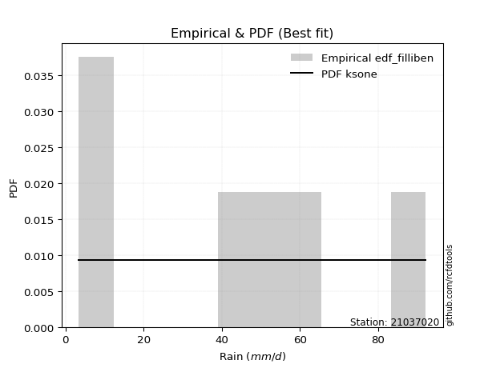</img>

</div>


### 10. EDF Jenkinson (1977)

The Jenkinson formula in hydrology is an empirical plotting position formula used to estimate the non-exceedance probability _(P)_ or return period _(T)_ of a given ordered observation within a sample. It is a widely used method in the frequency analysis of extreme events such as floods and rainfall, as it provides a distribution-free way to plot data. _a≈0.31_ and _b≈0.38_ are constants derived to approximate the median of the probability distribution for the given rank.

<div align="center">


$P=(m-a)/(n+b)$


</div>


**10.1. Empirical values**

<div align="center">

|                | 0                   | 1                   | 2                  | 3                  | 4                  | 5                  |
|:---------------|:--------------------|:--------------------|:-------------------|:-------------------|:-------------------|:-------------------|
| date           | 2023                | 2022                | 2021               | 2020               | 2019               | 2025               |
| x              | 3.4                 | 9.4                 | 45.6               | 56.2               | 64.0               | 92.2               |
| m              | 1                   | 2                   | 3                  | 4                  | 5                  | 6                  |
| empirical_dist | edf_jenkinson       | edf_jenkinson       | edf_jenkinson      | edf_jenkinson      | edf_jenkinson      | edf_jenkinson      |
| empirical      | 0.10815047021943573 | 0.26489028213166144 | 0.4216300940438871 | 0.5783699059561128 | 0.7351097178683387 | 0.8918495297805643 |
| empirical_tr   | 1.1212653778558874  | 1.3603411513859276  | 1.7289972899728996 | 2.3717472118959106 | 3.7751479289940844 | 9.246376811594207  |

</div>


**10.2. Kolmogorov-Smirnov fit test (sorted by Δ)**


<div align="center">

|                | 0                   | 1                   | 2                   | 3                   | 4                   | 5                   | 6                   | 7                   | 8                   | 9                   | 10                  | 11                 | 12                  | 13                  | 14                 | 15                 | 16                  | 17                  | 18                  | 19                  | 20                  | 21                 | 22                  | 23                  | 24                  | 25                  | 26                  | 27                 | 28                  | 29                  | 30                  | 31                  | 32                 | 33                  | 34                 | 35                 | 36                  | 37                 | 38                  | 39                 | 40                 | 41                 | 42                 | 43                 | 44                  | 45                  | 46                  | 47                 | 48                  | 49                 | 50                 | 51                  | 52                 | 53                  | 54              | 55                  | 56                 | 57                  | 58                  | 59                  | 60                  | 61                  | 62                  | 63                  | 64                  | 65                  | 66                  | 67                  | 68                 | 69                  | 70                  | 71                 | 72                 | 73                  | 74                  | 75                 | 76                  | 77                  | 78                  | 79                  | 80                  | 81                  | 82                  | 83                 | 84                  | 85                  | 86                  | 87                  | 88                  | 89                  | 90                  | 91                  | 92                  | 93                  | 94                  | 95                 | 96                  | 97                  | 98                 | 99                  | 100                 | 101                 | 102                 | 103                | 104                 | 105                 | 106                 | 107                 | 108                 | 109                | 110                | 111                 | 112                | 113                | 114               | 115                 | 116                | 117                 | 118                | 119                | 120                | 121                | 122                | 123                | 124                 | 125               | 126                 | 127                | 128                 | 129                | 130                 | 131                | 132                | 133                | 134                 | 135                 | 136                 | 137                 | 138                | 139                | 140                | 141                 | 142                 | 143                | 144                | 145                | 146                 | 147                | 148               | 149               | 150               | 151               | 152                | 153                | 154              | 155                | 156                | 157                | 158                | 159                |
|:---------------|:--------------------|:--------------------|:--------------------|:--------------------|:--------------------|:--------------------|:--------------------|:--------------------|:--------------------|:--------------------|:--------------------|:-------------------|:--------------------|:--------------------|:-------------------|:-------------------|:--------------------|:--------------------|:--------------------|:--------------------|:--------------------|:-------------------|:--------------------|:--------------------|:--------------------|:--------------------|:--------------------|:-------------------|:--------------------|:--------------------|:--------------------|:--------------------|:-------------------|:--------------------|:-------------------|:-------------------|:--------------------|:-------------------|:--------------------|:-------------------|:-------------------|:-------------------|:-------------------|:-------------------|:--------------------|:--------------------|:--------------------|:-------------------|:--------------------|:-------------------|:-------------------|:--------------------|:-------------------|:--------------------|:----------------|:--------------------|:-------------------|:--------------------|:--------------------|:--------------------|:--------------------|:--------------------|:--------------------|:--------------------|:--------------------|:--------------------|:--------------------|:--------------------|:-------------------|:--------------------|:--------------------|:-------------------|:-------------------|:--------------------|:--------------------|:-------------------|:--------------------|:--------------------|:--------------------|:--------------------|:--------------------|:--------------------|:--------------------|:-------------------|:--------------------|:--------------------|:--------------------|:--------------------|:--------------------|:--------------------|:--------------------|:--------------------|:--------------------|:--------------------|:--------------------|:-------------------|:--------------------|:--------------------|:-------------------|:--------------------|:--------------------|:--------------------|:--------------------|:-------------------|:--------------------|:--------------------|:--------------------|:--------------------|:--------------------|:-------------------|:-------------------|:--------------------|:-------------------|:-------------------|:------------------|:--------------------|:-------------------|:--------------------|:-------------------|:-------------------|:-------------------|:-------------------|:-------------------|:-------------------|:--------------------|:------------------|:--------------------|:-------------------|:--------------------|:-------------------|:--------------------|:-------------------|:-------------------|:-------------------|:--------------------|:--------------------|:--------------------|:--------------------|:-------------------|:-------------------|:-------------------|:--------------------|:--------------------|:-------------------|:-------------------|:-------------------|:--------------------|:-------------------|:------------------|:------------------|:------------------|:------------------|:-------------------|:-------------------|:-----------------|:-------------------|:-------------------|:-------------------|:-------------------|:-------------------|
| station        | 21037020            | 21037020            | 21037020            | 21037020            | 21037020            | 21037020            | 21037020            | 21037020            | 21037020            | 21037020            | 21037020            | 21037020           | 21037020            | 21037020            | 21037020           | 21037020           | 21037020            | 21037020            | 21037020            | 21037020            | 21037020            | 21037020           | 21037020            | 21037020            | 21037020            | 21037020            | 21037020            | 21037020           | 21037020            | 21037020            | 21037020            | 21037020            | 21037020           | 21037020            | 21037020           | 21037020           | 21037020            | 21037020           | 21037020            | 21037020           | 21037020           | 21037020           | 21037020           | 21037020           | 21037020            | 21037020            | 21037020            | 21037020           | 21037020            | 21037020           | 21037020           | 21037020            | 21037020           | 21037020            | 21037020        | 21037020            | 21037020           | 21037020            | 21037020            | 21037020            | 21037020            | 21037020            | 21037020            | 21037020            | 21037020            | 21037020            | 21037020            | 21037020            | 21037020           | 21037020            | 21037020            | 21037020           | 21037020           | 21037020            | 21037020            | 21037020           | 21037020            | 21037020            | 21037020            | 21037020            | 21037020            | 21037020            | 21037020            | 21037020           | 21037020            | 21037020            | 21037020            | 21037020            | 21037020            | 21037020            | 21037020            | 21037020            | 21037020            | 21037020            | 21037020            | 21037020           | 21037020            | 21037020            | 21037020           | 21037020            | 21037020            | 21037020            | 21037020            | 21037020           | 21037020            | 21037020            | 21037020            | 21037020            | 21037020            | 21037020           | 21037020           | 21037020            | 21037020           | 21037020           | 21037020          | 21037020            | 21037020           | 21037020            | 21037020           | 21037020           | 21037020           | 21037020           | 21037020           | 21037020           | 21037020            | 21037020          | 21037020            | 21037020           | 21037020            | 21037020           | 21037020            | 21037020           | 21037020           | 21037020           | 21037020            | 21037020            | 21037020            | 21037020            | 21037020           | 21037020           | 21037020           | 21037020            | 21037020            | 21037020           | 21037020           | 21037020           | 21037020            | 21037020           | 21037020          | 21037020          | 21037020          | 21037020          | 21037020           | 21037020           | 21037020         | 21037020           | 21037020           | 21037020           | 21037020           | 21037020           |
| empirical_dist | edf_jenkinson       | edf_jenkinson       | edf_jenkinson       | edf_jenkinson       | edf_jenkinson       | edf_jenkinson       | edf_jenkinson       | edf_jenkinson       | edf_jenkinson       | edf_jenkinson       | edf_jenkinson       | edf_jenkinson      | edf_jenkinson       | edf_jenkinson       | edf_jenkinson      | edf_jenkinson      | edf_jenkinson       | edf_jenkinson       | edf_jenkinson       | edf_jenkinson       | edf_jenkinson       | edf_jenkinson      | edf_jenkinson       | edf_jenkinson       | edf_jenkinson       | edf_jenkinson       | edf_jenkinson       | edf_jenkinson      | edf_jenkinson       | edf_jenkinson       | edf_jenkinson       | edf_jenkinson       | edf_jenkinson      | edf_jenkinson       | edf_jenkinson      | edf_jenkinson      | edf_jenkinson       | edf_jenkinson      | edf_jenkinson       | edf_jenkinson      | edf_jenkinson      | edf_jenkinson      | edf_jenkinson      | edf_jenkinson      | edf_jenkinson       | edf_jenkinson       | edf_jenkinson       | edf_jenkinson      | edf_jenkinson       | edf_jenkinson      | edf_jenkinson      | edf_jenkinson       | edf_jenkinson      | edf_jenkinson       | edf_jenkinson   | edf_jenkinson       | edf_jenkinson      | edf_jenkinson       | edf_jenkinson       | edf_jenkinson       | edf_jenkinson       | edf_jenkinson       | edf_jenkinson       | edf_jenkinson       | edf_jenkinson       | edf_jenkinson       | edf_jenkinson       | edf_jenkinson       | edf_jenkinson      | edf_jenkinson       | edf_jenkinson       | edf_jenkinson      | edf_jenkinson      | edf_jenkinson       | edf_jenkinson       | edf_jenkinson      | edf_jenkinson       | edf_jenkinson       | edf_jenkinson       | edf_jenkinson       | edf_jenkinson       | edf_jenkinson       | edf_jenkinson       | edf_jenkinson      | edf_jenkinson       | edf_jenkinson       | edf_jenkinson       | edf_jenkinson       | edf_jenkinson       | edf_jenkinson       | edf_jenkinson       | edf_jenkinson       | edf_jenkinson       | edf_jenkinson       | edf_jenkinson       | edf_jenkinson      | edf_jenkinson       | edf_jenkinson       | edf_jenkinson      | edf_jenkinson       | edf_jenkinson       | edf_jenkinson       | edf_jenkinson       | edf_jenkinson      | edf_jenkinson       | edf_jenkinson       | edf_jenkinson       | edf_jenkinson       | edf_jenkinson       | edf_jenkinson      | edf_jenkinson      | edf_jenkinson       | edf_jenkinson      | edf_jenkinson      | edf_jenkinson     | edf_jenkinson       | edf_jenkinson      | edf_jenkinson       | edf_jenkinson      | edf_jenkinson      | edf_jenkinson      | edf_jenkinson      | edf_jenkinson      | edf_jenkinson      | edf_jenkinson       | edf_jenkinson     | edf_jenkinson       | edf_jenkinson      | edf_jenkinson       | edf_jenkinson      | edf_jenkinson       | edf_jenkinson      | edf_jenkinson      | edf_jenkinson      | edf_jenkinson       | edf_jenkinson       | edf_jenkinson       | edf_jenkinson       | edf_jenkinson      | edf_jenkinson      | edf_jenkinson      | edf_jenkinson       | edf_jenkinson       | edf_jenkinson      | edf_jenkinson      | edf_jenkinson      | edf_jenkinson       | edf_jenkinson      | edf_jenkinson     | edf_jenkinson     | edf_jenkinson     | edf_jenkinson     | edf_jenkinson      | edf_jenkinson      | edf_jenkinson    | edf_jenkinson      | edf_jenkinson      | edf_jenkinson      | edf_jenkinson      | edf_jenkinson      |
| p_dist         | ksone               | logjohnsonsu        | logweibull_max      | arcsine             | semicircular        | burr                | anglit              | loggausshyper       | logmielke           | logloggamma         | genextreme          | loglevy_l          | beta                | genlogistic         | pearson3           | johnsonsu          | t                   | skewnorm            | crystalball         | norm                | exponnorm           | gamma              | erlang              | invgauss            | foldnorm            | wrapcauchy          | gumbel_l            | maxwell            | invweibull          | invgamma            | rayleigh            | cosine              | logistic           | logargus            | gausshyper         | kstwobign          | argus               | rice               | logtrapezoid        | hypsecant          | laplace            | dweibull           | genpareto          | loggenextreme      | dgamma              | logarcsine          | kappa4              | gumbel_r           | truncweibull_min    | halfnorm           | truncexpon         | ncf                 | logdweibull        | gompertz            | logloglaplace   | loggumbel_l         | tukeylambda        | logweibull_min      | logburr12           | logpearson3         | uniform             | kappa3              | weibull_min         | loggennorm          | logbeta             | logsemicircular     | logwrapcauchy       | moyal               | loggompertz        | genexpon            | lomax               | genhalflogistic    | logdgamma          | loganglit           | loggenpareto        | betaprime          | vonmises_line       | loggenhalflogistic  | logncf              | gennorm             | logf                | lognorm             | logcrystalball      | logt               | logexponnorm        | lognct              | loggengamma         | logburr             | logfatiguelife      | triang              | logerlang           | logbetaprime        | levy_l              | loggamma            | loggamma            | loginvgauss        | logfoldnorm         | logrice             | loginvweibull      | loginvgamma         | bradford            | logalpha            | halflogistic        | logskewnorm        | loglogistic         | mielke              | logmaxwell          | lograyleigh         | wald                | logkstwobign       | exponpow           | halfgennorm         | loghypsecant       | loggenexpon        | logcosine         | loghalfnorm         | nct                | burr12              | loglomax           | logtriang          | loggumbel_r        | loglaplace         | loglaplace         | exponweib          | loghalfgennorm      | trapezoid         | loghalflogistic     | nakagami           | logmoyal            | f                  | logtukeylambda      | logksone           | gengamma           | logexponweib       | logtruncweibull_min | logkappa3           | loguniform          | logvonmises_line    | logwald            | logkappa4          | logbradford        | logtruncexpon       | alpha               | johnsonsb          | fatiguelife        | logtruncnorm       | lognakagami         | powerlaw           | truncpareto       | logexponpow       | logpowerlaw       | rdist             | logrdist           | weibull_max        | truncnorm        | logtruncpareto     | logjohnsonsb       | loggenlogistic     | logvonmises        | vonmises           |
| delta          | 0.09919861375032055 | 0.10362239595297984 | 0.10815047019521651 | 0.10815047021943569 | 0.11173344153604414 | 0.11970228247567008 | 0.12067879089553674 | 0.12659154659762745 | 0.12901504739245012 | 0.13240746791070584 | 0.13462158187602288 | 0.1358359370418395 | 0.13813091420908008 | 0.13868143790728715 | 0.1410966265881361 | 0.1412450728452102 | 0.14146030929083087 | 0.14146487619333126 | 0.14147417915202326 | 0.14147418505300147 | 0.14147577922988086 | 0.1417692810426937 | 0.14179126105620427 | 0.14228828334721186 | 0.14262310118657412 | 0.14421952826513487 | 0.14550536403932424 | 0.1461424838803504 | 0.14702303594299598 | 0.14956058645699832 | 0.14975363978112916 | 0.15004572601754135 | 0.1558441082332801 | 0.15654105195316775 | 0.1588683485574596 | 0.1591584842033928 | 0.15930941467926596 | 0.1600732800678163 | 0.16148572904745145 | 0.1625401383919176 | 0.1676836986983194 | 0.1679613542635827 | 0.1680544167244739 | 0.1695570430258665 | 0.16992833334150595 | 0.17204791377047118 | 0.17669173260560925 | 0.1811093689323461 | 0.18477921989362406 | 0.1854067911341878 | 0.1872155440432382 | 0.18788120555736915 | 0.1884910077592551 | 0.18933808645344885 | 0.1908830694293 | 0.19170336277896155 | 0.1920913782875946 | 0.19248567152909474 | 0.19267108482577305 | 0.19640363807522848 | 0.19732271456409387 | 0.19741525793661452 | 0.19757924954389722 | 0.20491845149202997 | 0.20572474914348038 | 0.20802494811342015 | 0.20874371652896123 | 0.20973959214116386 | 0.2141612790003829 | 0.21457945864565703 | 0.21459353340523962 | 0.2155720974275338 | 0.2159999180758206 | 0.21676525258329876 | 0.22006733295812014 | 0.2243340685790271 | 0.22941994378507125 | 0.23186382798663357 | 0.23310242355923977 | 0.23510971786833867 | 0.23657435990270742 | 0.23754690521345473 | 0.23754692874087785 | 0.2375474252941036 | 0.23754759831546807 | 0.23773599871790346 | 0.23887082328088555 | 0.23890197283211195 | 0.23926989230147316 | 0.23954360361276275 | 0.24017957524702777 | 0.24049294928975257 | 0.24100914737022988 | 0.24213359442437038 | 0.24213359442437038 | 0.2426182722174281 | 0.24293464862790887 | 0.24317810216286267 | 0.2437610025168359 | 0.24535006541243182 | 0.24545176069789237 | 0.24797035039860765 | 0.24901059314498336 | 0.2539145713024324 | 0.25625145704673963 | 0.25752049465387067 | 0.25818863527608643 | 0.26436219695418645 | 0.26489028213166144 | 0.2682536863435207 | 0.2684393217975904 | 0.26872363557168827 | 0.2706011271226823 | 0.2727030954328636 | 0.275144037162472 | 0.28242557704449606 | 0.2824369086248371 | 0.28405164927607646 | 0.2865916428280339 | 0.2926799224728292 | 0.2960288016205816 | 0.2984587733878486 | 0.2984587733878486 | 0.2986502547887791 | 0.29884483748714213 | 0.306610720207953 | 0.31038212431109774 | 0.3116484123682191 | 0.31528510893493905 | 0.3165852458458787 | 0.31659523628888725 | 0.3172555092709181 | 0.3479486885701812 | 0.3485979737376232 | 0.34887420062380575 | 0.36118995481455446 | 0.36503262993387914 | 0.36572534744860513 | 0.3701197300434354 | 0.3724550572526763 | 0.4118422996745709 | 0.41441740209201644 | 0.44207262808518794 | 0.4482631916776114 | 0.4548352230593549 | 0.4657943997046979 | 0.46669302033877774 | 0.4822645591324473 | 0.522592857537195 | 0.524167627051136 | 0.569202979236018 | 0.578369903734959 | 0.5783699043761175 | 0.6010442920617611 | 0.60880978397741 | 0.6295759400819981 | 0.6586883576237673 | 0.7351097178683387 | 1.1199594507073611 | 13.908425637854968 |
| deltao         | 0.530385761606      | 0.530385761606      | 0.530385761606      | 0.530385761606      | 0.530385761606      | 0.530385761606      | 0.530385761606      | 0.530385761606      | 0.530385761606      | 0.530385761606      | 0.530385761606      | 0.530385761606     | 0.530385761606      | 0.530385761606      | 0.530385761606     | 0.530385761606     | 0.530385761606      | 0.530385761606      | 0.530385761606      | 0.530385761606      | 0.530385761606      | 0.530385761606     | 0.530385761606      | 0.530385761606      | 0.530385761606      | 0.530385761606      | 0.530385761606      | 0.530385761606     | 0.530385761606      | 0.530385761606      | 0.530385761606      | 0.530385761606      | 0.530385761606     | 0.530385761606      | 0.530385761606     | 0.530385761606     | 0.530385761606      | 0.530385761606     | 0.530385761606      | 0.530385761606     | 0.530385761606     | 0.530385761606     | 0.530385761606     | 0.530385761606     | 0.530385761606      | 0.530385761606      | 0.530385761606      | 0.530385761606     | 0.530385761606      | 0.530385761606     | 0.530385761606     | 0.530385761606      | 0.530385761606     | 0.530385761606      | 0.530385761606  | 0.530385761606      | 0.530385761606     | 0.530385761606      | 0.530385761606      | 0.530385761606      | 0.530385761606      | 0.530385761606      | 0.530385761606      | 0.530385761606      | 0.530385761606      | 0.530385761606      | 0.530385761606      | 0.530385761606      | 0.530385761606     | 0.530385761606      | 0.530385761606      | 0.530385761606     | 0.530385761606     | 0.530385761606      | 0.530385761606      | 0.530385761606     | 0.530385761606      | 0.530385761606      | 0.530385761606      | 0.530385761606      | 0.530385761606      | 0.530385761606      | 0.530385761606      | 0.530385761606     | 0.530385761606      | 0.530385761606      | 0.530385761606      | 0.530385761606      | 0.530385761606      | 0.530385761606      | 0.530385761606      | 0.530385761606      | 0.530385761606      | 0.530385761606      | 0.530385761606      | 0.530385761606     | 0.530385761606      | 0.530385761606      | 0.530385761606     | 0.530385761606      | 0.530385761606      | 0.530385761606      | 0.530385761606      | 0.530385761606     | 0.530385761606      | 0.530385761606      | 0.530385761606      | 0.530385761606      | 0.530385761606      | 0.530385761606     | 0.530385761606     | 0.530385761606      | 0.530385761606     | 0.530385761606     | 0.530385761606    | 0.530385761606      | 0.530385761606     | 0.530385761606      | 0.530385761606     | 0.530385761606     | 0.530385761606     | 0.530385761606     | 0.530385761606     | 0.530385761606     | 0.530385761606      | 0.530385761606    | 0.530385761606      | 0.530385761606     | 0.530385761606      | 0.530385761606     | 0.530385761606      | 0.530385761606     | 0.530385761606     | 0.530385761606     | 0.530385761606      | 0.530385761606      | 0.530385761606      | 0.530385761606      | 0.530385761606     | 0.530385761606     | 0.530385761606     | 0.530385761606      | 0.530385761606      | 0.530385761606     | 0.530385761606     | 0.530385761606     | 0.530385761606      | 0.530385761606     | 0.530385761606    | 0.530385761606    | 0.530385761606    | 0.530385761606    | 0.530385761606     | 0.530385761606     | 0.530385761606   | 0.530385761606     | 0.530385761606     | 0.530385761606     | 0.530385761606     | 0.530385761606     |
| eval           | Δo > Δ              | Δo > Δ              | Δo > Δ              | Δo > Δ              | Δo > Δ              | Δo > Δ              | Δo > Δ              | Δo > Δ              | Δo > Δ              | Δo > Δ              | Δo > Δ              | Δo > Δ             | Δo > Δ              | Δo > Δ              | Δo > Δ             | Δo > Δ             | Δo > Δ              | Δo > Δ              | Δo > Δ              | Δo > Δ              | Δo > Δ              | Δo > Δ             | Δo > Δ              | Δo > Δ              | Δo > Δ              | Δo > Δ              | Δo > Δ              | Δo > Δ             | Δo > Δ              | Δo > Δ              | Δo > Δ              | Δo > Δ              | Δo > Δ             | Δo > Δ              | Δo > Δ             | Δo > Δ             | Δo > Δ              | Δo > Δ             | Δo > Δ              | Δo > Δ             | Δo > Δ             | Δo > Δ             | Δo > Δ             | Δo > Δ             | Δo > Δ              | Δo > Δ              | Δo > Δ              | Δo > Δ             | Δo > Δ              | Δo > Δ             | Δo > Δ             | Δo > Δ              | Δo > Δ             | Δo > Δ              | Δo > Δ          | Δo > Δ              | Δo > Δ             | Δo > Δ              | Δo > Δ              | Δo > Δ              | Δo > Δ              | Δo > Δ              | Δo > Δ              | Δo > Δ              | Δo > Δ              | Δo > Δ              | Δo > Δ              | Δo > Δ              | Δo > Δ             | Δo > Δ              | Δo > Δ              | Δo > Δ             | Δo > Δ             | Δo > Δ              | Δo > Δ              | Δo > Δ             | Δo > Δ              | Δo > Δ              | Δo > Δ              | Δo > Δ              | Δo > Δ              | Δo > Δ              | Δo > Δ              | Δo > Δ             | Δo > Δ              | Δo > Δ              | Δo > Δ              | Δo > Δ              | Δo > Δ              | Δo > Δ              | Δo > Δ              | Δo > Δ              | Δo > Δ              | Δo > Δ              | Δo > Δ              | Δo > Δ             | Δo > Δ              | Δo > Δ              | Δo > Δ             | Δo > Δ              | Δo > Δ              | Δo > Δ              | Δo > Δ              | Δo > Δ             | Δo > Δ              | Δo > Δ              | Δo > Δ              | Δo > Δ              | Δo > Δ              | Δo > Δ             | Δo > Δ             | Δo > Δ              | Δo > Δ             | Δo > Δ             | Δo > Δ            | Δo > Δ              | Δo > Δ             | Δo > Δ              | Δo > Δ             | Δo > Δ             | Δo > Δ             | Δo > Δ             | Δo > Δ             | Δo > Δ             | Δo > Δ              | Δo > Δ            | Δo > Δ              | Δo > Δ             | Δo > Δ              | Δo > Δ             | Δo > Δ              | Δo > Δ             | Δo > Δ             | Δo > Δ             | Δo > Δ              | Δo > Δ              | Δo > Δ              | Δo > Δ              | Δo > Δ             | Δo > Δ             | Δo > Δ             | Δo > Δ              | Δo > Δ              | Δo > Δ             | Δo > Δ             | Δo > Δ             | Δo > Δ              | Δo > Δ             | Δo > Δ            | Δo > Δ            | Δo <= Δ           | Δo <= Δ           | Δo <= Δ            | Δo <= Δ            | Δo <= Δ          | Δo <= Δ            | Δo <= Δ            | Δo <= Δ            | Δo <= Δ            | Δo <= Δ            |
| fit            | 1                   | 1                   | 1                   | 1                   | 1                   | 1                   | 1                   | 1                   | 1                   | 1                   | 1                   | 1                  | 1                   | 1                   | 1                  | 1                  | 1                   | 1                   | 1                   | 1                   | 1                   | 1                  | 1                   | 1                   | 1                   | 1                   | 1                   | 1                  | 1                   | 1                   | 1                   | 1                   | 1                  | 1                   | 1                  | 1                  | 1                   | 1                  | 1                   | 1                  | 1                  | 1                  | 1                  | 1                  | 1                   | 1                   | 1                   | 1                  | 1                   | 1                  | 1                  | 1                   | 1                  | 1                   | 1               | 1                   | 1                  | 1                   | 1                   | 1                   | 1                   | 1                   | 1                   | 1                   | 1                   | 1                   | 1                   | 1                   | 1                  | 1                   | 1                   | 1                  | 1                  | 1                   | 1                   | 1                  | 1                   | 1                   | 1                   | 1                   | 1                   | 1                   | 1                   | 1                  | 1                   | 1                   | 1                   | 1                   | 1                   | 1                   | 1                   | 1                   | 1                   | 1                   | 1                   | 1                  | 1                   | 1                   | 1                  | 1                   | 1                   | 1                   | 1                   | 1                  | 1                   | 1                   | 1                   | 1                   | 1                   | 1                  | 1                  | 1                   | 1                  | 1                  | 1                 | 1                   | 1                  | 1                   | 1                  | 1                  | 1                  | 1                  | 1                  | 1                  | 1                   | 1                 | 1                   | 1                  | 1                   | 1                  | 1                   | 1                  | 1                  | 1                  | 1                   | 1                   | 1                   | 1                   | 1                  | 1                  | 1                  | 1                   | 1                   | 1                  | 1                  | 1                  | 1                   | 1                  | 1                 | 1                 | 0                 | 0                 | 0                  | 0                  | 0                | 0                  | 0                  | 0                  | 0                  | 0                  |
| n              | 6                   | 6                   | 6                   | 6                   | 6                   | 6                   | 6                   | 6                   | 6                   | 6                   | 6                   | 6                  | 6                   | 6                   | 6                  | 6                  | 6                   | 6                   | 6                   | 6                   | 6                   | 6                  | 6                   | 6                   | 6                   | 6                   | 6                   | 6                  | 6                   | 6                   | 6                   | 6                   | 6                  | 6                   | 6                  | 6                  | 6                   | 6                  | 6                   | 6                  | 6                  | 6                  | 6                  | 6                  | 6                   | 6                   | 6                   | 6                  | 6                   | 6                  | 6                  | 6                   | 6                  | 6                   | 6               | 6                   | 6                  | 6                   | 6                   | 6                   | 6                   | 6                   | 6                   | 6                   | 6                   | 6                   | 6                   | 6                   | 6                  | 6                   | 6                   | 6                  | 6                  | 6                   | 6                   | 6                  | 6                   | 6                   | 6                   | 6                   | 6                   | 6                   | 6                   | 6                  | 6                   | 6                   | 6                   | 6                   | 6                   | 6                   | 6                   | 6                   | 6                   | 6                   | 6                   | 6                  | 6                   | 6                   | 6                  | 6                   | 6                   | 6                   | 6                   | 6                  | 6                   | 6                   | 6                   | 6                   | 6                   | 6                  | 6                  | 6                   | 6                  | 6                  | 6                 | 6                   | 6                  | 6                   | 6                  | 6                  | 6                  | 6                  | 6                  | 6                  | 6                   | 6                 | 6                   | 6                  | 6                   | 6                  | 6                   | 6                  | 6                  | 6                  | 6                   | 6                   | 6                   | 6                   | 6                  | 6                  | 6                  | 6                   | 6                   | 6                  | 6                  | 6                  | 6                   | 6                  | 6                 | 6                 | 6                 | 6                 | 6                  | 6                  | 6                | 6                  | 6                  | 6                  | 6                  | 6                  |
| best_fit       | 1                   | 0                   | 0                   | 0                   | 0                   | 0                   | 0                   | 0                   | 0                   | 0                   | 0                   | 0                  | 0                   | 0                   | 0                  | 0                  | 0                   | 0                   | 0                   | 0                   | 0                   | 0                  | 0                   | 0                   | 0                   | 0                   | 0                   | 0                  | 0                   | 0                   | 0                   | 0                   | 0                  | 0                   | 0                  | 0                  | 0                   | 0                  | 0                   | 0                  | 0                  | 0                  | 0                  | 0                  | 0                   | 0                   | 0                   | 0                  | 0                   | 0                  | 0                  | 0                   | 0                  | 0                   | 0               | 0                   | 0                  | 0                   | 0                   | 0                   | 0                   | 0                   | 0                   | 0                   | 0                   | 0                   | 0                   | 0                   | 0                  | 0                   | 0                   | 0                  | 0                  | 0                   | 0                   | 0                  | 0                   | 0                   | 0                   | 0                   | 0                   | 0                   | 0                   | 0                  | 0                   | 0                   | 0                   | 0                   | 0                   | 0                   | 0                   | 0                   | 0                   | 0                   | 0                   | 0                  | 0                   | 0                   | 0                  | 0                   | 0                   | 0                   | 0                   | 0                  | 0                   | 0                   | 0                   | 0                   | 0                   | 0                  | 0                  | 0                   | 0                  | 0                  | 0                 | 0                   | 0                  | 0                   | 0                  | 0                  | 0                  | 0                  | 0                  | 0                  | 0                   | 0                 | 0                   | 0                  | 0                   | 0                  | 0                   | 0                  | 0                  | 0                  | 0                   | 0                   | 0                   | 0                   | 0                  | 0                  | 0                  | 0                   | 0                   | 0                  | 0                  | 0                  | 0                   | 0                  | 0                 | 0                 | 0                 | 0                 | 0                  | 0                  | 0                | 0                  | 0                  | 0                  | 0                  | 0                  |
| best_fit_sort  | 1                   | 2                   | 3                   | 4                   | 5                   | 6                   | 7                   | 8                   | 9                   | 10                  | 11                  | 12                 | 13                  | 14                  | 15                 | 16                 | 17                  | 18                  | 19                  | 20                  | 21                  | 22                 | 23                  | 24                  | 25                  | 26                  | 27                  | 28                 | 29                  | 30                  | 31                  | 32                  | 33                 | 34                  | 35                 | 36                 | 37                  | 38                 | 39                  | 40                 | 41                 | 42                 | 43                 | 44                 | 45                  | 46                  | 47                  | 48                 | 49                  | 50                 | 51                 | 52                  | 53                 | 54                  | 55              | 56                  | 57                 | 58                  | 59                  | 60                  | 61                  | 62                  | 63                  | 64                  | 65                  | 66                  | 67                  | 68                  | 69                 | 70                  | 71                  | 72                 | 73                 | 74                  | 75                  | 76                 | 77                  | 78                  | 79                  | 80                  | 81                  | 82                  | 83                  | 84                 | 85                  | 86                  | 87                  | 88                  | 89                  | 90                  | 91                  | 92                  | 93                  | 94                  | 95                  | 96                 | 97                  | 98                  | 99                 | 100                 | 101                 | 102                 | 103                 | 104                | 105                 | 106                 | 107                 | 108                 | 109                 | 110                | 111                | 112                 | 113                | 114                | 115               | 116                 | 117                | 118                 | 119                | 120                | 121                | 122                | 123                | 124                | 125                 | 126               | 127                 | 128                | 129                 | 130                | 131                 | 132                | 133                | 134                | 135                 | 136                 | 137                 | 138                 | 139                | 140                | 141                | 142                 | 143                 | 144                | 145                | 146                | 147                 | 148                | 149               | 150               | 151               | 152               | 153                | 154                | 155              | 156                | 157                | 158                | 159                | 160                |

</div>


**10.3. Best fit**

<div align="center">

|   id |   station | empirical_dist   | p_dist   |     delta |   deltao | eval   |   fit |   n |   best_fit |   best_fit_sort |
|-----:|----------:|:-----------------|:---------|----------:|---------:|:-------|------:|----:|-----------:|----------------:|
|    0 |  21037020 | edf_jenkinson    | ksone    | 0.0991986 | 0.530386 | Δo > Δ |     1 |   6 |          1 |               1 |

</div>


<div align="center">

</img>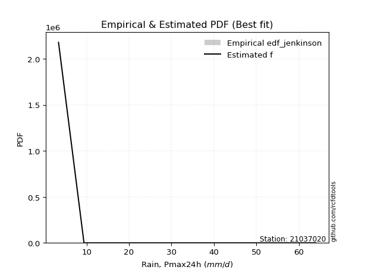</img>

</div>


### 11. EDF Cunnane (1978)

Cunnane´s work in statistical hydrology has focused on the performance and evaluation of different probability distributions (such as GEV, Gumbel, Lognormal) for flood frequency estimation. _b_ is a constant, typically set to 0.4.

<div align="center">


$P=(m-b)/(n+1-2b)$


</div>


**11.1. Empirical values**

<div align="center">

|                | 0                  | 1                   | 2                   | 3                  | 4                  | 5                  |
|:---------------|:-------------------|:--------------------|:--------------------|:-------------------|:-------------------|:-------------------|
| date           | 2023               | 2022                | 2021                | 2020               | 2019               | 2025               |
| x              | 3.4                | 9.4                 | 45.6                | 56.2               | 64.0               | 92.2               |
| m              | 1                  | 2                   | 3                   | 4                  | 5                  | 6                  |
| empirical_dist | edf_cunnane        | edf_cunnane         | edf_cunnane         | edf_cunnane        | edf_cunnane        | edf_cunnane        |
| empirical      | 0.0967741935483871 | 0.25806451612903225 | 0.41935483870967744 | 0.5806451612903226 | 0.7419354838709676 | 0.9032258064516128 |
| empirical_tr   | 1.1071428571428572 | 1.3478260869565217  | 1.7222222222222225  | 2.384615384615385  | 3.8749999999999982 | 10.333333333333318 |

</div>


**11.2. Kolmogorov-Smirnov fit test (sorted by Δ)**


<div align="center">

|                | 0                   | 1                   | 2                   | 3                   | 4                   | 5                   | 6                   | 7                  | 8                   | 9                  | 10                 | 11                  | 12                 | 13                  | 14                  | 15                  | 16                  | 17                  | 18                  | 19                  | 20                  | 21                  | 22                  | 23                 | 24                  | 25                 | 26                 | 27                  | 28                  | 29                  | 30                  | 31                 | 32                  | 33                 | 34                  | 35                 | 36                  | 37                  | 38                 | 39                 | 40                  | 41                  | 42                 | 43                  | 44                  | 45                  | 46                  | 47                  | 48                 | 49                  | 50                 | 51                  | 52                 | 53                  | 54                  | 55                  | 56                  | 57                  | 58                  | 59                 | 60                  | 61                 | 62                  | 63                  | 64                  | 65                  | 66                  | 67                  | 68                  | 69                 | 70                  | 71                  | 72                  | 73                  | 74                  | 75                  | 76                 | 77                  | 78                  | 79                  | 80                 | 81                  | 82                  | 83                 | 84                  | 85                  | 86                  | 87                  | 88                  | 89                  | 90                  | 91                  | 92                  | 93                  | 94                  | 95                 | 96                  | 97                  | 98                 | 99                 | 100                 | 101                 | 102                | 103                | 104                 | 105                | 106                 | 107                | 108                 | 109                | 110                | 111                 | 112               | 113                | 114                | 115                 | 116                | 117                 | 118                | 119                | 120                | 121                | 122                | 123                | 124                | 125                 | 126                 | 127                | 128                 | 129                | 130                 | 131                | 132                | 133                | 134                 | 135                 | 136                 | 137                | 138                | 139               | 140                | 141                 | 142                | 143                | 144                | 145                | 146                 | 147               | 148                | 149                | 150                | 151                | 152                | 153                | 154                | 155                | 156                | 157                | 158                | 159                |
|:---------------|:--------------------|:--------------------|:--------------------|:--------------------|:--------------------|:--------------------|:--------------------|:-------------------|:--------------------|:-------------------|:-------------------|:--------------------|:-------------------|:--------------------|:--------------------|:--------------------|:--------------------|:--------------------|:--------------------|:--------------------|:--------------------|:--------------------|:--------------------|:-------------------|:--------------------|:-------------------|:-------------------|:--------------------|:--------------------|:--------------------|:--------------------|:-------------------|:--------------------|:-------------------|:--------------------|:-------------------|:--------------------|:--------------------|:-------------------|:-------------------|:--------------------|:--------------------|:-------------------|:--------------------|:--------------------|:--------------------|:--------------------|:--------------------|:-------------------|:--------------------|:-------------------|:--------------------|:-------------------|:--------------------|:--------------------|:--------------------|:--------------------|:--------------------|:--------------------|:-------------------|:--------------------|:-------------------|:--------------------|:--------------------|:--------------------|:--------------------|:--------------------|:--------------------|:--------------------|:-------------------|:--------------------|:--------------------|:--------------------|:--------------------|:--------------------|:--------------------|:-------------------|:--------------------|:--------------------|:--------------------|:-------------------|:--------------------|:--------------------|:-------------------|:--------------------|:--------------------|:--------------------|:--------------------|:--------------------|:--------------------|:--------------------|:--------------------|:--------------------|:--------------------|:--------------------|:-------------------|:--------------------|:--------------------|:-------------------|:-------------------|:--------------------|:--------------------|:-------------------|:-------------------|:--------------------|:-------------------|:--------------------|:-------------------|:--------------------|:-------------------|:-------------------|:--------------------|:------------------|:-------------------|:-------------------|:--------------------|:-------------------|:--------------------|:-------------------|:-------------------|:-------------------|:-------------------|:-------------------|:-------------------|:-------------------|:--------------------|:--------------------|:-------------------|:--------------------|:-------------------|:--------------------|:-------------------|:-------------------|:-------------------|:--------------------|:--------------------|:--------------------|:-------------------|:-------------------|:------------------|:-------------------|:--------------------|:-------------------|:-------------------|:-------------------|:-------------------|:--------------------|:------------------|:-------------------|:-------------------|:-------------------|:-------------------|:-------------------|:-------------------|:-------------------|:-------------------|:-------------------|:-------------------|:-------------------|:-------------------|
| station        | 21037020            | 21037020            | 21037020            | 21037020            | 21037020            | 21037020            | 21037020            | 21037020           | 21037020            | 21037020           | 21037020           | 21037020            | 21037020           | 21037020            | 21037020            | 21037020            | 21037020            | 21037020            | 21037020            | 21037020            | 21037020            | 21037020            | 21037020            | 21037020           | 21037020            | 21037020           | 21037020           | 21037020            | 21037020            | 21037020            | 21037020            | 21037020           | 21037020            | 21037020           | 21037020            | 21037020           | 21037020            | 21037020            | 21037020           | 21037020           | 21037020            | 21037020            | 21037020           | 21037020            | 21037020            | 21037020            | 21037020            | 21037020            | 21037020           | 21037020            | 21037020           | 21037020            | 21037020           | 21037020            | 21037020            | 21037020            | 21037020            | 21037020            | 21037020            | 21037020           | 21037020            | 21037020           | 21037020            | 21037020            | 21037020            | 21037020            | 21037020            | 21037020            | 21037020            | 21037020           | 21037020            | 21037020            | 21037020            | 21037020            | 21037020            | 21037020            | 21037020           | 21037020            | 21037020            | 21037020            | 21037020           | 21037020            | 21037020            | 21037020           | 21037020            | 21037020            | 21037020            | 21037020            | 21037020            | 21037020            | 21037020            | 21037020            | 21037020            | 21037020            | 21037020            | 21037020           | 21037020            | 21037020            | 21037020           | 21037020           | 21037020            | 21037020            | 21037020           | 21037020           | 21037020            | 21037020           | 21037020            | 21037020           | 21037020            | 21037020           | 21037020           | 21037020            | 21037020          | 21037020           | 21037020           | 21037020            | 21037020           | 21037020            | 21037020           | 21037020           | 21037020           | 21037020           | 21037020           | 21037020           | 21037020           | 21037020            | 21037020            | 21037020           | 21037020            | 21037020           | 21037020            | 21037020           | 21037020           | 21037020           | 21037020            | 21037020            | 21037020            | 21037020           | 21037020           | 21037020          | 21037020           | 21037020            | 21037020           | 21037020           | 21037020           | 21037020           | 21037020            | 21037020          | 21037020           | 21037020           | 21037020           | 21037020           | 21037020           | 21037020           | 21037020           | 21037020           | 21037020           | 21037020           | 21037020           | 21037020           |
| empirical_dist | edf_cunnane         | edf_cunnane         | edf_cunnane         | edf_cunnane         | edf_cunnane         | edf_cunnane         | edf_cunnane         | edf_cunnane        | edf_cunnane         | edf_cunnane        | edf_cunnane        | edf_cunnane         | edf_cunnane        | edf_cunnane         | edf_cunnane         | edf_cunnane         | edf_cunnane         | edf_cunnane         | edf_cunnane         | edf_cunnane         | edf_cunnane         | edf_cunnane         | edf_cunnane         | edf_cunnane        | edf_cunnane         | edf_cunnane        | edf_cunnane        | edf_cunnane         | edf_cunnane         | edf_cunnane         | edf_cunnane         | edf_cunnane        | edf_cunnane         | edf_cunnane        | edf_cunnane         | edf_cunnane        | edf_cunnane         | edf_cunnane         | edf_cunnane        | edf_cunnane        | edf_cunnane         | edf_cunnane         | edf_cunnane        | edf_cunnane         | edf_cunnane         | edf_cunnane         | edf_cunnane         | edf_cunnane         | edf_cunnane        | edf_cunnane         | edf_cunnane        | edf_cunnane         | edf_cunnane        | edf_cunnane         | edf_cunnane         | edf_cunnane         | edf_cunnane         | edf_cunnane         | edf_cunnane         | edf_cunnane        | edf_cunnane         | edf_cunnane        | edf_cunnane         | edf_cunnane         | edf_cunnane         | edf_cunnane         | edf_cunnane         | edf_cunnane         | edf_cunnane         | edf_cunnane        | edf_cunnane         | edf_cunnane         | edf_cunnane         | edf_cunnane         | edf_cunnane         | edf_cunnane         | edf_cunnane        | edf_cunnane         | edf_cunnane         | edf_cunnane         | edf_cunnane        | edf_cunnane         | edf_cunnane         | edf_cunnane        | edf_cunnane         | edf_cunnane         | edf_cunnane         | edf_cunnane         | edf_cunnane         | edf_cunnane         | edf_cunnane         | edf_cunnane         | edf_cunnane         | edf_cunnane         | edf_cunnane         | edf_cunnane        | edf_cunnane         | edf_cunnane         | edf_cunnane        | edf_cunnane        | edf_cunnane         | edf_cunnane         | edf_cunnane        | edf_cunnane        | edf_cunnane         | edf_cunnane        | edf_cunnane         | edf_cunnane        | edf_cunnane         | edf_cunnane        | edf_cunnane        | edf_cunnane         | edf_cunnane       | edf_cunnane        | edf_cunnane        | edf_cunnane         | edf_cunnane        | edf_cunnane         | edf_cunnane        | edf_cunnane        | edf_cunnane        | edf_cunnane        | edf_cunnane        | edf_cunnane        | edf_cunnane        | edf_cunnane         | edf_cunnane         | edf_cunnane        | edf_cunnane         | edf_cunnane        | edf_cunnane         | edf_cunnane        | edf_cunnane        | edf_cunnane        | edf_cunnane         | edf_cunnane         | edf_cunnane         | edf_cunnane        | edf_cunnane        | edf_cunnane       | edf_cunnane        | edf_cunnane         | edf_cunnane        | edf_cunnane        | edf_cunnane        | edf_cunnane        | edf_cunnane         | edf_cunnane       | edf_cunnane        | edf_cunnane        | edf_cunnane        | edf_cunnane        | edf_cunnane        | edf_cunnane        | edf_cunnane        | edf_cunnane        | edf_cunnane        | edf_cunnane        | edf_cunnane        | edf_cunnane        |
| p_dist         | ksone               | logweibull_max      | logjohnsonsu        | arcsine             | semicircular        | anglit              | burr                | genextreme         | loggausshyper       | logmielke          | beta               | genlogistic         | pearson3           | johnsonsu           | t                   | skewnorm            | crystalball         | norm                | exponnorm           | logloggamma         | gamma               | erlang              | foldnorm            | wrapcauchy         | gumbel_l            | maxwell            | invgauss           | loglevy_l           | invgamma            | rayleigh            | cosine              | logistic           | invweibull          | gausshyper         | argus               | rice               | hypsecant           | logargus            | laplace            | dweibull           | genpareto           | kstwobign           | loggenextreme      | dgamma              | logtrapezoid        | kappa4              | gumbel_r            | logarcsine          | halfnorm           | gompertz            | tukeylambda        | truncweibull_min    | truncexpon         | ncf                 | uniform             | kappa3              | loggumbel_l         | logweibull_min      | logburr12           | loggennorm         | logpearson3         | weibull_min        | logdweibull         | logloglaplace       | moyal               | logdgamma           | logsemicircular     | logwrapcauchy       | logbeta             | loggompertz        | genexpon            | lomax               | loganglit           | loggenpareto        | genhalflogistic     | vonmises_line       | betaprime          | triang              | loggenhalflogistic  | logncf              | logf               | lognorm             | logcrystalball      | logt               | logexponnorm        | lognct              | loggengamma         | logburr             | logfatiguelife      | gennorm             | halflogistic        | logerlang           | logbetaprime        | loggamma            | loggamma            | loginvgauss        | logfoldnorm         | logrice             | loginvweibull      | loginvgamma        | bradford            | logalpha            | levy_l             | logskewnorm        | wald                | loglogistic        | mielke              | logmaxwell         | lograyleigh         | logkstwobign       | exponpow           | halfgennorm         | loghypsecant      | loggenexpon        | logcosine          | loghalfnorm         | nct                | burr12              | loglomax           | logtriang          | loggumbel_r        | loglaplace         | loglaplace         | exponweib          | loghalfgennorm     | loghalflogistic     | trapezoid           | nakagami           | logmoyal            | f                  | logtukeylambda      | logksone           | gengamma           | logexponweib       | logtruncweibull_min | logkappa3           | loguniform          | logvonmises_line   | logwald            | logkappa4         | logbradford        | logtruncexpon       | alpha              | johnsonsb          | fatiguelife        | logtruncnorm       | lognakagami         | powerlaw          | truncpareto        | logexponpow        | logpowerlaw        | rdist              | logrdist           | weibull_max        | truncnorm          | logtruncpareto     | logjohnsonsb       | loggenlogistic     | logvonmises        | vonmises           |
| delta          | 0.09237284774769136 | 0.09677419352416805 | 0.09679662995035065 | 0.09961680784204352 | 0.10490767553341496 | 0.11385302489290755 | 0.11533536609368683 | 0.1277958158733937 | 0.12886680193183714 | 0.1312903027266598 | 0.1313051482064509 | 0.13185567190465797 | 0.1342708605855069 | 0.13441930684258102 | 0.13463454328820168 | 0.13463911019070207 | 0.13464841314939408 | 0.13464841905037228 | 0.13465001322725167 | 0.13468272324491554 | 0.13494351504006452 | 0.13496549505357508 | 0.13579733518394493 | 0.1373937622625057 | 0.13867959803669505 | 0.1393167178777212 | 0.1393358929713419 | 0.14266170304446846 | 0.14273482045436914 | 0.14292787377849997 | 0.14321996001491216 | 0.1490183422306509 | 0.14929829127720567 | 0.1520425825548304 | 0.15248364867663677 | 0.1532475140651871 | 0.15571437238928842 | 0.15881630728737745 | 0.1608579326956902 | 0.1611355882609535 | 0.16122865072184472 | 0.16143373953760248 | 0.1627312770232373 | 0.16310256733887676 | 0.16376098438166115 | 0.16986596660298006 | 0.17428360292971692 | 0.17432316910468088 | 0.1785810251315586 | 0.18251232045081967 | 0.1852656122849654 | 0.18705447522783375 | 0.1894907993774479 | 0.19015646089157884 | 0.19049694856146468 | 0.19058949193398533 | 0.19397861811317124 | 0.19476092686330443 | 0.19494634015998275 | 0.1980926854894008 | 0.19867889340943817 | 0.1998545048781069 | 0.19986728443030355 | 0.20225934610034846 | 0.20291382613853468 | 0.20917415207319143 | 0.21030020344762984 | 0.21101897186317092 | 0.21255051514610934 | 0.2164365343345926 | 0.21685471397986672 | 0.21686878873944931 | 0.21904050791750845 | 0.22234258829232983 | 0.22239786343016277 | 0.22259417778244206 | 0.2266093239132368 | 0.23271783761013357 | 0.23413908332084327 | 0.23537767889344946 | 0.2388496152369171 | 0.23982216054766442 | 0.23982218407508754 | 0.2398226806283133 | 0.23982285364967776 | 0.24001125405211315 | 0.24114607861509524 | 0.24117722816632164 | 0.24154514763568286 | 0.24193548387096775 | 0.24218482714235418 | 0.24245483058123746 | 0.24276820462396226 | 0.24440884975858007 | 0.24440884975858007 | 0.2448935275516378 | 0.24520990396211856 | 0.24545335749707237 | 0.2460362578510456 | 0.2476253207466415 | 0.24772701603210207 | 0.25024560573281734 | 0.2523854240412785 | 0.2561898266366421 | 0.25806451612903225 | 0.2585267123809493 | 0.25979574998808036 | 0.2604638906102961 | 0.26663745228839614 | 0.2705289416777304 | 0.2707145771318001 | 0.27099889090589796 | 0.272876382456892 | 0.2749783507670733 | 0.2774192924966817 | 0.28470083237870575 | 0.2847121639590468 | 0.28632690461028615 | 0.2888668981622436 | 0.2949551778070389 | 0.2983040569547913 | 0.3007340287220583 | 0.3007340287220583 | 0.3009255101229888 | 0.3011200928213518 | 0.31265737964530743 | 0.31343648621058195 | 0.3139236677024288 | 0.31756036426914874 | 0.3188605011800884 | 0.31887049162309694 | 0.3195307646051278 | 0.3502239439043909 | 0.3508732290718329 | 0.35114945595801544 | 0.36346521014876415 | 0.36730788526808883 | 0.3680006027828148 | 0.3723949853776451 | 0.374730312586886 | 0.4141175550087806 | 0.41669265742622613 | 0.4443478834193976 | 0.4550889576802404 | 0.4571104783935646 | 0.4680696550389076 | 0.46896827567298743 | 0.484539814466657 | 0.5248681128714046 | 0.5269574369984361 | 0.5760287452386472 | 0.5806451590691688 | 0.5806451597103273 | 0.6078700580643901 | 0.6156355499800392 | 0.6364017060846273 | 0.6655141236263963 | 0.7419354838709676 | 1.1222347060415707 | 13.897049361183921 |
| deltao         | 0.530385761606      | 0.530385761606      | 0.530385761606      | 0.530385761606      | 0.530385761606      | 0.530385761606      | 0.530385761606      | 0.530385761606     | 0.530385761606      | 0.530385761606     | 0.530385761606     | 0.530385761606      | 0.530385761606     | 0.530385761606      | 0.530385761606      | 0.530385761606      | 0.530385761606      | 0.530385761606      | 0.530385761606      | 0.530385761606      | 0.530385761606      | 0.530385761606      | 0.530385761606      | 0.530385761606     | 0.530385761606      | 0.530385761606     | 0.530385761606     | 0.530385761606      | 0.530385761606      | 0.530385761606      | 0.530385761606      | 0.530385761606     | 0.530385761606      | 0.530385761606     | 0.530385761606      | 0.530385761606     | 0.530385761606      | 0.530385761606      | 0.530385761606     | 0.530385761606     | 0.530385761606      | 0.530385761606      | 0.530385761606     | 0.530385761606      | 0.530385761606      | 0.530385761606      | 0.530385761606      | 0.530385761606      | 0.530385761606     | 0.530385761606      | 0.530385761606     | 0.530385761606      | 0.530385761606     | 0.530385761606      | 0.530385761606      | 0.530385761606      | 0.530385761606      | 0.530385761606      | 0.530385761606      | 0.530385761606     | 0.530385761606      | 0.530385761606     | 0.530385761606      | 0.530385761606      | 0.530385761606      | 0.530385761606      | 0.530385761606      | 0.530385761606      | 0.530385761606      | 0.530385761606     | 0.530385761606      | 0.530385761606      | 0.530385761606      | 0.530385761606      | 0.530385761606      | 0.530385761606      | 0.530385761606     | 0.530385761606      | 0.530385761606      | 0.530385761606      | 0.530385761606     | 0.530385761606      | 0.530385761606      | 0.530385761606     | 0.530385761606      | 0.530385761606      | 0.530385761606      | 0.530385761606      | 0.530385761606      | 0.530385761606      | 0.530385761606      | 0.530385761606      | 0.530385761606      | 0.530385761606      | 0.530385761606      | 0.530385761606     | 0.530385761606      | 0.530385761606      | 0.530385761606     | 0.530385761606     | 0.530385761606      | 0.530385761606      | 0.530385761606     | 0.530385761606     | 0.530385761606      | 0.530385761606     | 0.530385761606      | 0.530385761606     | 0.530385761606      | 0.530385761606     | 0.530385761606     | 0.530385761606      | 0.530385761606    | 0.530385761606     | 0.530385761606     | 0.530385761606      | 0.530385761606     | 0.530385761606      | 0.530385761606     | 0.530385761606     | 0.530385761606     | 0.530385761606     | 0.530385761606     | 0.530385761606     | 0.530385761606     | 0.530385761606      | 0.530385761606      | 0.530385761606     | 0.530385761606      | 0.530385761606     | 0.530385761606      | 0.530385761606     | 0.530385761606     | 0.530385761606     | 0.530385761606      | 0.530385761606      | 0.530385761606      | 0.530385761606     | 0.530385761606     | 0.530385761606    | 0.530385761606     | 0.530385761606      | 0.530385761606     | 0.530385761606     | 0.530385761606     | 0.530385761606     | 0.530385761606      | 0.530385761606    | 0.530385761606     | 0.530385761606     | 0.530385761606     | 0.530385761606     | 0.530385761606     | 0.530385761606     | 0.530385761606     | 0.530385761606     | 0.530385761606     | 0.530385761606     | 0.530385761606     | 0.530385761606     |
| eval           | Δo > Δ              | Δo > Δ              | Δo > Δ              | Δo > Δ              | Δo > Δ              | Δo > Δ              | Δo > Δ              | Δo > Δ             | Δo > Δ              | Δo > Δ             | Δo > Δ             | Δo > Δ              | Δo > Δ             | Δo > Δ              | Δo > Δ              | Δo > Δ              | Δo > Δ              | Δo > Δ              | Δo > Δ              | Δo > Δ              | Δo > Δ              | Δo > Δ              | Δo > Δ              | Δo > Δ             | Δo > Δ              | Δo > Δ             | Δo > Δ             | Δo > Δ              | Δo > Δ              | Δo > Δ              | Δo > Δ              | Δo > Δ             | Δo > Δ              | Δo > Δ             | Δo > Δ              | Δo > Δ             | Δo > Δ              | Δo > Δ              | Δo > Δ             | Δo > Δ             | Δo > Δ              | Δo > Δ              | Δo > Δ             | Δo > Δ              | Δo > Δ              | Δo > Δ              | Δo > Δ              | Δo > Δ              | Δo > Δ             | Δo > Δ              | Δo > Δ             | Δo > Δ              | Δo > Δ             | Δo > Δ              | Δo > Δ              | Δo > Δ              | Δo > Δ              | Δo > Δ              | Δo > Δ              | Δo > Δ             | Δo > Δ              | Δo > Δ             | Δo > Δ              | Δo > Δ              | Δo > Δ              | Δo > Δ              | Δo > Δ              | Δo > Δ              | Δo > Δ              | Δo > Δ             | Δo > Δ              | Δo > Δ              | Δo > Δ              | Δo > Δ              | Δo > Δ              | Δo > Δ              | Δo > Δ             | Δo > Δ              | Δo > Δ              | Δo > Δ              | Δo > Δ             | Δo > Δ              | Δo > Δ              | Δo > Δ             | Δo > Δ              | Δo > Δ              | Δo > Δ              | Δo > Δ              | Δo > Δ              | Δo > Δ              | Δo > Δ              | Δo > Δ              | Δo > Δ              | Δo > Δ              | Δo > Δ              | Δo > Δ             | Δo > Δ              | Δo > Δ              | Δo > Δ             | Δo > Δ             | Δo > Δ              | Δo > Δ              | Δo > Δ             | Δo > Δ             | Δo > Δ              | Δo > Δ             | Δo > Δ              | Δo > Δ             | Δo > Δ              | Δo > Δ             | Δo > Δ             | Δo > Δ              | Δo > Δ            | Δo > Δ             | Δo > Δ             | Δo > Δ              | Δo > Δ             | Δo > Δ              | Δo > Δ             | Δo > Δ             | Δo > Δ             | Δo > Δ             | Δo > Δ             | Δo > Δ             | Δo > Δ             | Δo > Δ              | Δo > Δ              | Δo > Δ             | Δo > Δ              | Δo > Δ             | Δo > Δ              | Δo > Δ             | Δo > Δ             | Δo > Δ             | Δo > Δ              | Δo > Δ              | Δo > Δ              | Δo > Δ             | Δo > Δ             | Δo > Δ            | Δo > Δ             | Δo > Δ              | Δo > Δ             | Δo > Δ             | Δo > Δ             | Δo > Δ             | Δo > Δ              | Δo > Δ            | Δo > Δ             | Δo > Δ             | Δo <= Δ            | Δo <= Δ            | Δo <= Δ            | Δo <= Δ            | Δo <= Δ            | Δo <= Δ            | Δo <= Δ            | Δo <= Δ            | Δo <= Δ            | Δo <= Δ            |
| fit            | 1                   | 1                   | 1                   | 1                   | 1                   | 1                   | 1                   | 1                  | 1                   | 1                  | 1                  | 1                   | 1                  | 1                   | 1                   | 1                   | 1                   | 1                   | 1                   | 1                   | 1                   | 1                   | 1                   | 1                  | 1                   | 1                  | 1                  | 1                   | 1                   | 1                   | 1                   | 1                  | 1                   | 1                  | 1                   | 1                  | 1                   | 1                   | 1                  | 1                  | 1                   | 1                   | 1                  | 1                   | 1                   | 1                   | 1                   | 1                   | 1                  | 1                   | 1                  | 1                   | 1                  | 1                   | 1                   | 1                   | 1                   | 1                   | 1                   | 1                  | 1                   | 1                  | 1                   | 1                   | 1                   | 1                   | 1                   | 1                   | 1                   | 1                  | 1                   | 1                   | 1                   | 1                   | 1                   | 1                   | 1                  | 1                   | 1                   | 1                   | 1                  | 1                   | 1                   | 1                  | 1                   | 1                   | 1                   | 1                   | 1                   | 1                   | 1                   | 1                   | 1                   | 1                   | 1                   | 1                  | 1                   | 1                   | 1                  | 1                  | 1                   | 1                   | 1                  | 1                  | 1                   | 1                  | 1                   | 1                  | 1                   | 1                  | 1                  | 1                   | 1                 | 1                  | 1                  | 1                   | 1                  | 1                   | 1                  | 1                  | 1                  | 1                  | 1                  | 1                  | 1                  | 1                   | 1                   | 1                  | 1                   | 1                  | 1                   | 1                  | 1                  | 1                  | 1                   | 1                   | 1                   | 1                  | 1                  | 1                 | 1                  | 1                   | 1                  | 1                  | 1                  | 1                  | 1                   | 1                 | 1                  | 1                  | 0                  | 0                  | 0                  | 0                  | 0                  | 0                  | 0                  | 0                  | 0                  | 0                  |
| n              | 6                   | 6                   | 6                   | 6                   | 6                   | 6                   | 6                   | 6                  | 6                   | 6                  | 6                  | 6                   | 6                  | 6                   | 6                   | 6                   | 6                   | 6                   | 6                   | 6                   | 6                   | 6                   | 6                   | 6                  | 6                   | 6                  | 6                  | 6                   | 6                   | 6                   | 6                   | 6                  | 6                   | 6                  | 6                   | 6                  | 6                   | 6                   | 6                  | 6                  | 6                   | 6                   | 6                  | 6                   | 6                   | 6                   | 6                   | 6                   | 6                  | 6                   | 6                  | 6                   | 6                  | 6                   | 6                   | 6                   | 6                   | 6                   | 6                   | 6                  | 6                   | 6                  | 6                   | 6                   | 6                   | 6                   | 6                   | 6                   | 6                   | 6                  | 6                   | 6                   | 6                   | 6                   | 6                   | 6                   | 6                  | 6                   | 6                   | 6                   | 6                  | 6                   | 6                   | 6                  | 6                   | 6                   | 6                   | 6                   | 6                   | 6                   | 6                   | 6                   | 6                   | 6                   | 6                   | 6                  | 6                   | 6                   | 6                  | 6                  | 6                   | 6                   | 6                  | 6                  | 6                   | 6                  | 6                   | 6                  | 6                   | 6                  | 6                  | 6                   | 6                 | 6                  | 6                  | 6                   | 6                  | 6                   | 6                  | 6                  | 6                  | 6                  | 6                  | 6                  | 6                  | 6                   | 6                   | 6                  | 6                   | 6                  | 6                   | 6                  | 6                  | 6                  | 6                   | 6                   | 6                   | 6                  | 6                  | 6                 | 6                  | 6                   | 6                  | 6                  | 6                  | 6                  | 6                   | 6                 | 6                  | 6                  | 6                  | 6                  | 6                  | 6                  | 6                  | 6                  | 6                  | 6                  | 6                  | 6                  |
| best_fit       | 1                   | 0                   | 0                   | 0                   | 0                   | 0                   | 0                   | 0                  | 0                   | 0                  | 0                  | 0                   | 0                  | 0                   | 0                   | 0                   | 0                   | 0                   | 0                   | 0                   | 0                   | 0                   | 0                   | 0                  | 0                   | 0                  | 0                  | 0                   | 0                   | 0                   | 0                   | 0                  | 0                   | 0                  | 0                   | 0                  | 0                   | 0                   | 0                  | 0                  | 0                   | 0                   | 0                  | 0                   | 0                   | 0                   | 0                   | 0                   | 0                  | 0                   | 0                  | 0                   | 0                  | 0                   | 0                   | 0                   | 0                   | 0                   | 0                   | 0                  | 0                   | 0                  | 0                   | 0                   | 0                   | 0                   | 0                   | 0                   | 0                   | 0                  | 0                   | 0                   | 0                   | 0                   | 0                   | 0                   | 0                  | 0                   | 0                   | 0                   | 0                  | 0                   | 0                   | 0                  | 0                   | 0                   | 0                   | 0                   | 0                   | 0                   | 0                   | 0                   | 0                   | 0                   | 0                   | 0                  | 0                   | 0                   | 0                  | 0                  | 0                   | 0                   | 0                  | 0                  | 0                   | 0                  | 0                   | 0                  | 0                   | 0                  | 0                  | 0                   | 0                 | 0                  | 0                  | 0                   | 0                  | 0                   | 0                  | 0                  | 0                  | 0                  | 0                  | 0                  | 0                  | 0                   | 0                   | 0                  | 0                   | 0                  | 0                   | 0                  | 0                  | 0                  | 0                   | 0                   | 0                   | 0                  | 0                  | 0                 | 0                  | 0                   | 0                  | 0                  | 0                  | 0                  | 0                   | 0                 | 0                  | 0                  | 0                  | 0                  | 0                  | 0                  | 0                  | 0                  | 0                  | 0                  | 0                  | 0                  |
| best_fit_sort  | 1                   | 2                   | 3                   | 4                   | 5                   | 6                   | 7                   | 8                  | 9                   | 10                 | 11                 | 12                  | 13                 | 14                  | 15                  | 16                  | 17                  | 18                  | 19                  | 20                  | 21                  | 22                  | 23                  | 24                 | 25                  | 26                 | 27                 | 28                  | 29                  | 30                  | 31                  | 32                 | 33                  | 34                 | 35                  | 36                 | 37                  | 38                  | 39                 | 40                 | 41                  | 42                  | 43                 | 44                  | 45                  | 46                  | 47                  | 48                  | 49                 | 50                  | 51                 | 52                  | 53                 | 54                  | 55                  | 56                  | 57                  | 58                  | 59                  | 60                 | 61                  | 62                 | 63                  | 64                  | 65                  | 66                  | 67                  | 68                  | 69                  | 70                 | 71                  | 72                  | 73                  | 74                  | 75                  | 76                  | 77                 | 78                  | 79                  | 80                  | 81                 | 82                  | 83                  | 84                 | 85                  | 86                  | 87                  | 88                  | 89                  | 90                  | 91                  | 92                  | 93                  | 94                  | 95                  | 96                 | 97                  | 98                  | 99                 | 100                | 101                 | 102                 | 103                | 104                | 105                 | 106                | 107                 | 108                | 109                 | 110                | 111                | 112                 | 113               | 114                | 115                | 116                 | 117                | 118                 | 119                | 120                | 121                | 122                | 123                | 124                | 125                | 126                 | 127                 | 128                | 129                 | 130                | 131                 | 132                | 133                | 134                | 135                 | 136                 | 137                 | 138                | 139                | 140               | 141                | 142                 | 143                | 144                | 145                | 146                | 147                 | 148               | 149                | 150                | 151                | 152                | 153                | 154                | 155                | 156                | 157                | 158                | 159                | 160                |

</div>


**11.3. Best fit**

<div align="center">

|   id |   station | empirical_dist   | p_dist   |     delta |   deltao | eval   |   fit |   n |   best_fit |   best_fit_sort |
|-----:|----------:|:-----------------|:---------|----------:|---------:|:-------|------:|----:|-----------:|----------------:|
|    0 |  21037020 | edf_cunnane      | ksone    | 0.0923728 | 0.530386 | Δo > Δ |     1 |   6 |          1 |               1 |

</div>


<div align="center">

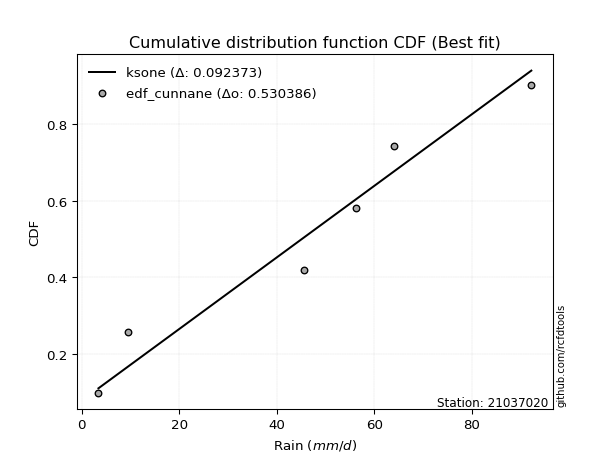</img>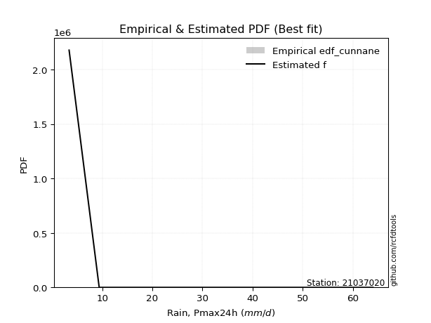</img>

</div>


### 12. EDF Adamowski (1981)

The Adamowski formula in hydrology refers to a specific plotting position formula used for estimating the non-parametric empirical distribution of hydrological events (like flood peaks) to calculate their return periods. This formula provides an alternative to traditional parametric methods (like the Gumbel or Log Pearson Type III distributions). 

<div align="center">


$P=(m-0.25)/(n+0.5)$


</div>


**12.1. Empirical values**

<div align="center">

|                | 0                   | 1                  | 2                  | 3                  | 4                  | 5                  |
|:---------------|:--------------------|:-------------------|:-------------------|:-------------------|:-------------------|:-------------------|
| date           | 2023                | 2022               | 2021               | 2020               | 2019               | 2025               |
| x              | 3.4                 | 9.4                | 45.6               | 56.2               | 64.0               | 92.2               |
| m              | 1                   | 2                  | 3                  | 4                  | 5                  | 6                  |
| empirical_dist | edf_adamowski       | edf_adamowski      | edf_adamowski      | edf_adamowski      | edf_adamowski      | edf_adamowski      |
| empirical      | 0.11538461538461539 | 0.2692307692307692 | 0.4230769230769231 | 0.5769230769230769 | 0.7307692307692307 | 0.8846153846153846 |
| empirical_tr   | 1.1304347826086958  | 1.3684210526315788 | 1.7333333333333334 | 2.3636363636363633 | 3.7142857142857135 | 8.666666666666664  |

</div>


**12.2. Kolmogorov-Smirnov fit test (sorted by Δ)**


<div align="center">

|                | 0                   | 1                   | 2                   | 3                   | 4                   | 5                   | 6                   | 7                  | 8                   | 9                  | 10                  | 11                  | 12                  | 13                  | 14                  | 15                  | 16                | 17                  | 18                  | 19                  | 20                  | 21                  | 22                 | 23                  | 24                  | 25                 | 26                  | 27                  | 28                  | 29                 | 30                  | 31                  | 32                 | 33                  | 34                 | 35                  | 36                  | 37                  | 38                  | 39                 | 40                  | 41                  | 42                  | 43                 | 44                  | 45                  | 46                  | 47                  | 48                 | 49                  | 50                 | 51                  | 52                 | 53                  | 54                 | 55                 | 56                 | 57                  | 58                  | 59                  | 60                  | 61                  | 62                  | 63                 | 64                 | 65                  | 66                  | 67                  | 68                  | 69                  | 70                  | 71                  | 72                  | 73                 | 74                 | 75                  | 76                  | 77                  | 78                  | 79                  | 80                  | 81                  | 82                  | 83                 | 84                  | 85                  | 86                  | 87                 | 88                | 89                  | 90                  | 91                  | 92                  | 93                  | 94                  | 95                  | 96                  | 97                  | 98                  | 99                  | 100                 | 101                | 102                 | 103                 | 104                | 105                | 106                | 107                | 108                 | 109                 | 110                | 111                 | 112                | 113                 | 114                 | 115                | 116                 | 117                | 118                 | 119                 | 120                 | 121                 | 122                 | 123                 | 124                | 125                 | 126                | 127                 | 128                | 129                 | 130                | 131                 | 132                 | 133                 | 134                 | 135                | 136                | 137                | 138                 | 139                 | 140               | 141                | 142               | 143                 | 144               | 145                 | 146                | 147                 | 148                | 149                | 150                | 151                | 152                | 153                | 154                | 155                | 156                | 157                | 158               | 159                |
|:---------------|:--------------------|:--------------------|:--------------------|:--------------------|:--------------------|:--------------------|:--------------------|:-------------------|:--------------------|:-------------------|:--------------------|:--------------------|:--------------------|:--------------------|:--------------------|:--------------------|:------------------|:--------------------|:--------------------|:--------------------|:--------------------|:--------------------|:-------------------|:--------------------|:--------------------|:-------------------|:--------------------|:--------------------|:--------------------|:-------------------|:--------------------|:--------------------|:-------------------|:--------------------|:-------------------|:--------------------|:--------------------|:--------------------|:--------------------|:-------------------|:--------------------|:--------------------|:--------------------|:-------------------|:--------------------|:--------------------|:--------------------|:--------------------|:-------------------|:--------------------|:-------------------|:--------------------|:-------------------|:--------------------|:-------------------|:-------------------|:-------------------|:--------------------|:--------------------|:--------------------|:--------------------|:--------------------|:--------------------|:-------------------|:-------------------|:--------------------|:--------------------|:--------------------|:--------------------|:--------------------|:--------------------|:--------------------|:--------------------|:-------------------|:-------------------|:--------------------|:--------------------|:--------------------|:--------------------|:--------------------|:--------------------|:--------------------|:--------------------|:-------------------|:--------------------|:--------------------|:--------------------|:-------------------|:------------------|:--------------------|:--------------------|:--------------------|:--------------------|:--------------------|:--------------------|:--------------------|:--------------------|:--------------------|:--------------------|:--------------------|:--------------------|:-------------------|:--------------------|:--------------------|:-------------------|:-------------------|:-------------------|:-------------------|:--------------------|:--------------------|:-------------------|:--------------------|:-------------------|:--------------------|:--------------------|:-------------------|:--------------------|:-------------------|:--------------------|:--------------------|:--------------------|:--------------------|:--------------------|:--------------------|:-------------------|:--------------------|:-------------------|:--------------------|:-------------------|:--------------------|:-------------------|:--------------------|:--------------------|:--------------------|:--------------------|:-------------------|:-------------------|:-------------------|:--------------------|:--------------------|:------------------|:-------------------|:------------------|:--------------------|:------------------|:--------------------|:-------------------|:--------------------|:-------------------|:-------------------|:-------------------|:-------------------|:-------------------|:-------------------|:-------------------|:-------------------|:-------------------|:-------------------|:------------------|:-------------------|
| station        | 21037020            | 21037020            | 21037020            | 21037020            | 21037020            | 21037020            | 21037020            | 21037020           | 21037020            | 21037020           | 21037020            | 21037020            | 21037020            | 21037020            | 21037020            | 21037020            | 21037020          | 21037020            | 21037020            | 21037020            | 21037020            | 21037020            | 21037020           | 21037020            | 21037020            | 21037020           | 21037020            | 21037020            | 21037020            | 21037020           | 21037020            | 21037020            | 21037020           | 21037020            | 21037020           | 21037020            | 21037020            | 21037020            | 21037020            | 21037020           | 21037020            | 21037020            | 21037020            | 21037020           | 21037020            | 21037020            | 21037020            | 21037020            | 21037020           | 21037020            | 21037020           | 21037020            | 21037020           | 21037020            | 21037020           | 21037020           | 21037020           | 21037020            | 21037020            | 21037020            | 21037020            | 21037020            | 21037020            | 21037020           | 21037020           | 21037020            | 21037020            | 21037020            | 21037020            | 21037020            | 21037020            | 21037020            | 21037020            | 21037020           | 21037020           | 21037020            | 21037020            | 21037020            | 21037020            | 21037020            | 21037020            | 21037020            | 21037020            | 21037020           | 21037020            | 21037020            | 21037020            | 21037020           | 21037020          | 21037020            | 21037020            | 21037020            | 21037020            | 21037020            | 21037020            | 21037020            | 21037020            | 21037020            | 21037020            | 21037020            | 21037020            | 21037020           | 21037020            | 21037020            | 21037020           | 21037020           | 21037020           | 21037020           | 21037020            | 21037020            | 21037020           | 21037020            | 21037020           | 21037020            | 21037020            | 21037020           | 21037020            | 21037020           | 21037020            | 21037020            | 21037020            | 21037020            | 21037020            | 21037020            | 21037020           | 21037020            | 21037020           | 21037020            | 21037020           | 21037020            | 21037020           | 21037020            | 21037020            | 21037020            | 21037020            | 21037020           | 21037020           | 21037020           | 21037020            | 21037020            | 21037020          | 21037020           | 21037020          | 21037020            | 21037020          | 21037020            | 21037020           | 21037020            | 21037020           | 21037020           | 21037020           | 21037020           | 21037020           | 21037020           | 21037020           | 21037020           | 21037020           | 21037020           | 21037020          | 21037020           |
| empirical_dist | edf_adamowski       | edf_adamowski       | edf_adamowski       | edf_adamowski       | edf_adamowski       | edf_adamowski       | edf_adamowski       | edf_adamowski      | edf_adamowski       | edf_adamowski      | edf_adamowski       | edf_adamowski       | edf_adamowski       | edf_adamowski       | edf_adamowski       | edf_adamowski       | edf_adamowski     | edf_adamowski       | edf_adamowski       | edf_adamowski       | edf_adamowski       | edf_adamowski       | edf_adamowski      | edf_adamowski       | edf_adamowski       | edf_adamowski      | edf_adamowski       | edf_adamowski       | edf_adamowski       | edf_adamowski      | edf_adamowski       | edf_adamowski       | edf_adamowski      | edf_adamowski       | edf_adamowski      | edf_adamowski       | edf_adamowski       | edf_adamowski       | edf_adamowski       | edf_adamowski      | edf_adamowski       | edf_adamowski       | edf_adamowski       | edf_adamowski      | edf_adamowski       | edf_adamowski       | edf_adamowski       | edf_adamowski       | edf_adamowski      | edf_adamowski       | edf_adamowski      | edf_adamowski       | edf_adamowski      | edf_adamowski       | edf_adamowski      | edf_adamowski      | edf_adamowski      | edf_adamowski       | edf_adamowski       | edf_adamowski       | edf_adamowski       | edf_adamowski       | edf_adamowski       | edf_adamowski      | edf_adamowski      | edf_adamowski       | edf_adamowski       | edf_adamowski       | edf_adamowski       | edf_adamowski       | edf_adamowski       | edf_adamowski       | edf_adamowski       | edf_adamowski      | edf_adamowski      | edf_adamowski       | edf_adamowski       | edf_adamowski       | edf_adamowski       | edf_adamowski       | edf_adamowski       | edf_adamowski       | edf_adamowski       | edf_adamowski      | edf_adamowski       | edf_adamowski       | edf_adamowski       | edf_adamowski      | edf_adamowski     | edf_adamowski       | edf_adamowski       | edf_adamowski       | edf_adamowski       | edf_adamowski       | edf_adamowski       | edf_adamowski       | edf_adamowski       | edf_adamowski       | edf_adamowski       | edf_adamowski       | edf_adamowski       | edf_adamowski      | edf_adamowski       | edf_adamowski       | edf_adamowski      | edf_adamowski      | edf_adamowski      | edf_adamowski      | edf_adamowski       | edf_adamowski       | edf_adamowski      | edf_adamowski       | edf_adamowski      | edf_adamowski       | edf_adamowski       | edf_adamowski      | edf_adamowski       | edf_adamowski      | edf_adamowski       | edf_adamowski       | edf_adamowski       | edf_adamowski       | edf_adamowski       | edf_adamowski       | edf_adamowski      | edf_adamowski       | edf_adamowski      | edf_adamowski       | edf_adamowski      | edf_adamowski       | edf_adamowski      | edf_adamowski       | edf_adamowski       | edf_adamowski       | edf_adamowski       | edf_adamowski      | edf_adamowski      | edf_adamowski      | edf_adamowski       | edf_adamowski       | edf_adamowski     | edf_adamowski      | edf_adamowski     | edf_adamowski       | edf_adamowski     | edf_adamowski       | edf_adamowski      | edf_adamowski       | edf_adamowski      | edf_adamowski      | edf_adamowski      | edf_adamowski      | edf_adamowski      | edf_adamowski      | edf_adamowski      | edf_adamowski      | edf_adamowski      | edf_adamowski      | edf_adamowski     | edf_adamowski      |
| p_dist         | ksone               | logjohnsonsu        | logweibull_max      | arcsine             | semicircular        | burr                | anglit              | loggausshyper      | logmielke           | logloggamma        | loglevy_l           | genextreme          | beta                | genlogistic         | pearson3            | invweibull          | johnsonsu         | t                   | skewnorm            | crystalball         | norm                | exponnorm           | gamma              | erlang              | invgauss            | foldnorm           | wrapcauchy          | gumbel_l            | maxwell             | invgamma           | rayleigh            | cosine              | logargus           | kstwobign           | logtrapezoid       | logistic            | gausshyper          | argus               | rice                | hypsecant          | logarcsine          | laplace             | dweibull            | genpareto          | loggenextreme       | dgamma              | kappa4              | logdweibull         | truncweibull_min   | logloglaplace       | gumbel_r           | truncexpon          | ncf                | halfnorm            | loggumbel_l        | logweibull_min     | logburr12          | gompertz            | logpearson3         | weibull_min         | tukeylambda         | logbeta             | uniform             | kappa3             | logsemicircular    | logwrapcauchy       | loggennorm          | genhalflogistic     | loggompertz         | genexpon            | lomax               | moyal               | loganglit           | loggenpareto       | logdgamma          | betaprime           | loggenhalflogistic  | gennorm             | logncf              | vonmises_line       | levy_l              | logf                | lognorm             | logcrystalball     | logt                | logexponnorm        | lognct              | loggengamma        | logburr           | logfatiguelife      | logerlang           | logbetaprime        | loggamma            | loggamma            | loginvgauss         | logfoldnorm         | logrice             | loginvweibull       | triang              | loginvgamma         | bradford            | logalpha           | logskewnorm         | halflogistic        | loglogistic        | mielke             | logmaxwell         | lograyleigh        | logkstwobign        | exponpow            | halfgennorm        | loghypsecant        | wald               | loggenexpon         | logcosine           | loghalfnorm        | nct                 | burr12             | loglomax            | logtriang           | loggumbel_r         | loglaplace          | loglaplace          | exponweib           | loghalfgennorm     | trapezoid           | loghalflogistic    | nakagami            | logmoyal           | f                   | logtukeylambda     | logksone            | gengamma            | logexponweib        | logtruncweibull_min | logkappa3          | loguniform         | logvonmises_line   | logwald             | logkappa4           | logbradford       | logtruncexpon      | alpha             | johnsonsb           | fatiguelife       | logtruncnorm        | lognakagami        | powerlaw            | truncpareto        | logexponpow        | logpowerlaw        | rdist              | logrdist           | weibull_max        | truncnorm          | logtruncpareto     | logjohnsonsb       | loggenlogistic     | logvonmises       | vonmises           |
| delta          | 0.10353910084942833 | 0.10796288305208762 | 0.11538461536039624 | 0.11538461538461542 | 0.11607392863515192 | 0.12404276957477786 | 0.12501927799464452 | 0.1251447175645915 | 0.12756821835941418 | 0.1309606388776699 | 0.13149544994273155 | 0.13896206897513066 | 0.14247140130818786 | 0.14302192500639493 | 0.14543711368724388 | 0.14557620690996004 | 0.145585559944318 | 0.14580079638993865 | 0.14580536329243904 | 0.14581466625113104 | 0.14581467215210925 | 0.14581626632898864 | 0.1461097681418015 | 0.14613174815531205 | 0.14662877044631964 | 0.1469635882856819 | 0.14856001536424265 | 0.14984585113843202 | 0.15048297097945817 | 0.1539010735561061 | 0.15409412688023694 | 0.15438621311664913 | 0.1550942229201318 | 0.15771165517035685 | 0.1600389000144155 | 0.16018459533238788 | 0.16320883565656738 | 0.16364990177837374 | 0.16441376716692407 | 0.1668806254910254 | 0.17060108473743524 | 0.17202418579742718 | 0.17230184136269047 | 0.1723949038235817 | 0.17389753012497428 | 0.17426882044061373 | 0.18103221970471703 | 0.18125686259407536 | 0.1833323908605881 | 0.18364892426412027 | 0.1854498560314539 | 0.18576871501020226 | 0.1864343765243332 | 0.18974727823329557 | 0.1902565337459256 | 0.1910388424960588 | 0.1912242557927371 | 0.19367857355255663 | 0.19495680904219254 | 0.19613242051086127 | 0.19643186538670238 | 0.20138426204437243 | 0.20166320166320165 | 0.2017557450357223 | 0.2065781190803842 | 0.20729688749592529 | 0.20925893859113776 | 0.21123161032842586 | 0.21271444996734695 | 0.21313262961262108 | 0.21314670437220368 | 0.21408007924027164 | 0.21531842355026282 | 0.2186205039250842 | 0.2203404051749284 | 0.22288723954599116 | 0.23041699895359763 | 0.23076923076923078 | 0.23165559452620382 | 0.23376043088417903 | 0.23377500220505024 | 0.23512753086967147 | 0.23610007618041878 | 0.2361000997078419 | 0.23610059626106766 | 0.23610076928243212 | 0.23628916968486752 | 0.2374239942478496 | 0.237455143799076 | 0.23782306326843722 | 0.23873274621399182 | 0.23904612025671662 | 0.24068676539133443 | 0.24068676539133443 | 0.24117144318439215 | 0.24148781959487292 | 0.24173127312982673 | 0.24231417348379997 | 0.24388409071187053 | 0.24390323637939587 | 0.24400493166485643 | 0.2465235213655717 | 0.25246774226939644 | 0.25335108024409114 | 0.2548046280137037 | 0.2560736656208347 | 0.2567418062430505 | 0.2629153679211505 | 0.26680685731048476 | 0.26699249276455445 | 0.2672768065386523 | 0.26915429808964636 | 0.2692307692307692 | 0.27125626639982764 | 0.27369720812943604 | 0.2809787480114601 | 0.28099007959180117 | 0.2826048202430405 | 0.28514481379499795 | 0.29123309343979326 | 0.29458197258754565 | 0.29701194435481265 | 0.29701194435481265 | 0.29720342575574316 | 0.2973980084541062 | 0.30227023310884504 | 0.3089352952780618 | 0.31020158333518316 | 0.3138382799019031 | 0.31513841681284277 | 0.3151484072558513 | 0.31580868023788217 | 0.34650185953714524 | 0.34715114470458724 | 0.3474273715907698  | 0.3597431257815185 | 0.3635858009008432 | 0.3642785184155692 | 0.36867290101039946 | 0.37100822821964036 | 0.410395470641535 | 0.4129705730589805 | 0.440625799052152 | 0.44392270457850347 | 0.453388394026319 | 0.46434757067166194 | 0.4652461913057418 | 0.48081773009941137 | 0.5211460285041589 | 0.5227207980180999 | 0.5648624921369103 | 0.5769230747019232 | 0.5769230753430816 | 0.5967038049626532 | 0.6044692968783023 | 0.6252354529828903 | 0.6543478705246594 | 0.7307692307692307 | 1.118512621674325 | 13.915659783020148 |
| deltao         | 0.530385761606      | 0.530385761606      | 0.530385761606      | 0.530385761606      | 0.530385761606      | 0.530385761606      | 0.530385761606      | 0.530385761606     | 0.530385761606      | 0.530385761606     | 0.530385761606      | 0.530385761606      | 0.530385761606      | 0.530385761606      | 0.530385761606      | 0.530385761606      | 0.530385761606    | 0.530385761606      | 0.530385761606      | 0.530385761606      | 0.530385761606      | 0.530385761606      | 0.530385761606     | 0.530385761606      | 0.530385761606      | 0.530385761606     | 0.530385761606      | 0.530385761606      | 0.530385761606      | 0.530385761606     | 0.530385761606      | 0.530385761606      | 0.530385761606     | 0.530385761606      | 0.530385761606     | 0.530385761606      | 0.530385761606      | 0.530385761606      | 0.530385761606      | 0.530385761606     | 0.530385761606      | 0.530385761606      | 0.530385761606      | 0.530385761606     | 0.530385761606      | 0.530385761606      | 0.530385761606      | 0.530385761606      | 0.530385761606     | 0.530385761606      | 0.530385761606     | 0.530385761606      | 0.530385761606     | 0.530385761606      | 0.530385761606     | 0.530385761606     | 0.530385761606     | 0.530385761606      | 0.530385761606      | 0.530385761606      | 0.530385761606      | 0.530385761606      | 0.530385761606      | 0.530385761606     | 0.530385761606     | 0.530385761606      | 0.530385761606      | 0.530385761606      | 0.530385761606      | 0.530385761606      | 0.530385761606      | 0.530385761606      | 0.530385761606      | 0.530385761606     | 0.530385761606     | 0.530385761606      | 0.530385761606      | 0.530385761606      | 0.530385761606      | 0.530385761606      | 0.530385761606      | 0.530385761606      | 0.530385761606      | 0.530385761606     | 0.530385761606      | 0.530385761606      | 0.530385761606      | 0.530385761606     | 0.530385761606    | 0.530385761606      | 0.530385761606      | 0.530385761606      | 0.530385761606      | 0.530385761606      | 0.530385761606      | 0.530385761606      | 0.530385761606      | 0.530385761606      | 0.530385761606      | 0.530385761606      | 0.530385761606      | 0.530385761606     | 0.530385761606      | 0.530385761606      | 0.530385761606     | 0.530385761606     | 0.530385761606     | 0.530385761606     | 0.530385761606      | 0.530385761606      | 0.530385761606     | 0.530385761606      | 0.530385761606     | 0.530385761606      | 0.530385761606      | 0.530385761606     | 0.530385761606      | 0.530385761606     | 0.530385761606      | 0.530385761606      | 0.530385761606      | 0.530385761606      | 0.530385761606      | 0.530385761606      | 0.530385761606     | 0.530385761606      | 0.530385761606     | 0.530385761606      | 0.530385761606     | 0.530385761606      | 0.530385761606     | 0.530385761606      | 0.530385761606      | 0.530385761606      | 0.530385761606      | 0.530385761606     | 0.530385761606     | 0.530385761606     | 0.530385761606      | 0.530385761606      | 0.530385761606    | 0.530385761606     | 0.530385761606    | 0.530385761606      | 0.530385761606    | 0.530385761606      | 0.530385761606     | 0.530385761606      | 0.530385761606     | 0.530385761606     | 0.530385761606     | 0.530385761606     | 0.530385761606     | 0.530385761606     | 0.530385761606     | 0.530385761606     | 0.530385761606     | 0.530385761606     | 0.530385761606    | 0.530385761606     |
| eval           | Δo > Δ              | Δo > Δ              | Δo > Δ              | Δo > Δ              | Δo > Δ              | Δo > Δ              | Δo > Δ              | Δo > Δ             | Δo > Δ              | Δo > Δ             | Δo > Δ              | Δo > Δ              | Δo > Δ              | Δo > Δ              | Δo > Δ              | Δo > Δ              | Δo > Δ            | Δo > Δ              | Δo > Δ              | Δo > Δ              | Δo > Δ              | Δo > Δ              | Δo > Δ             | Δo > Δ              | Δo > Δ              | Δo > Δ             | Δo > Δ              | Δo > Δ              | Δo > Δ              | Δo > Δ             | Δo > Δ              | Δo > Δ              | Δo > Δ             | Δo > Δ              | Δo > Δ             | Δo > Δ              | Δo > Δ              | Δo > Δ              | Δo > Δ              | Δo > Δ             | Δo > Δ              | Δo > Δ              | Δo > Δ              | Δo > Δ             | Δo > Δ              | Δo > Δ              | Δo > Δ              | Δo > Δ              | Δo > Δ             | Δo > Δ              | Δo > Δ             | Δo > Δ              | Δo > Δ             | Δo > Δ              | Δo > Δ             | Δo > Δ             | Δo > Δ             | Δo > Δ              | Δo > Δ              | Δo > Δ              | Δo > Δ              | Δo > Δ              | Δo > Δ              | Δo > Δ             | Δo > Δ             | Δo > Δ              | Δo > Δ              | Δo > Δ              | Δo > Δ              | Δo > Δ              | Δo > Δ              | Δo > Δ              | Δo > Δ              | Δo > Δ             | Δo > Δ             | Δo > Δ              | Δo > Δ              | Δo > Δ              | Δo > Δ              | Δo > Δ              | Δo > Δ              | Δo > Δ              | Δo > Δ              | Δo > Δ             | Δo > Δ              | Δo > Δ              | Δo > Δ              | Δo > Δ             | Δo > Δ            | Δo > Δ              | Δo > Δ              | Δo > Δ              | Δo > Δ              | Δo > Δ              | Δo > Δ              | Δo > Δ              | Δo > Δ              | Δo > Δ              | Δo > Δ              | Δo > Δ              | Δo > Δ              | Δo > Δ             | Δo > Δ              | Δo > Δ              | Δo > Δ             | Δo > Δ             | Δo > Δ             | Δo > Δ             | Δo > Δ              | Δo > Δ              | Δo > Δ             | Δo > Δ              | Δo > Δ             | Δo > Δ              | Δo > Δ              | Δo > Δ             | Δo > Δ              | Δo > Δ             | Δo > Δ              | Δo > Δ              | Δo > Δ              | Δo > Δ              | Δo > Δ              | Δo > Δ              | Δo > Δ             | Δo > Δ              | Δo > Δ             | Δo > Δ              | Δo > Δ             | Δo > Δ              | Δo > Δ             | Δo > Δ              | Δo > Δ              | Δo > Δ              | Δo > Δ              | Δo > Δ             | Δo > Δ             | Δo > Δ             | Δo > Δ              | Δo > Δ              | Δo > Δ            | Δo > Δ             | Δo > Δ            | Δo > Δ              | Δo > Δ            | Δo > Δ              | Δo > Δ             | Δo > Δ              | Δo > Δ             | Δo > Δ             | Δo <= Δ            | Δo <= Δ            | Δo <= Δ            | Δo <= Δ            | Δo <= Δ            | Δo <= Δ            | Δo <= Δ            | Δo <= Δ            | Δo <= Δ           | Δo <= Δ            |
| fit            | 1                   | 1                   | 1                   | 1                   | 1                   | 1                   | 1                   | 1                  | 1                   | 1                  | 1                   | 1                   | 1                   | 1                   | 1                   | 1                   | 1                 | 1                   | 1                   | 1                   | 1                   | 1                   | 1                  | 1                   | 1                   | 1                  | 1                   | 1                   | 1                   | 1                  | 1                   | 1                   | 1                  | 1                   | 1                  | 1                   | 1                   | 1                   | 1                   | 1                  | 1                   | 1                   | 1                   | 1                  | 1                   | 1                   | 1                   | 1                   | 1                  | 1                   | 1                  | 1                   | 1                  | 1                   | 1                  | 1                  | 1                  | 1                   | 1                   | 1                   | 1                   | 1                   | 1                   | 1                  | 1                  | 1                   | 1                   | 1                   | 1                   | 1                   | 1                   | 1                   | 1                   | 1                  | 1                  | 1                   | 1                   | 1                   | 1                   | 1                   | 1                   | 1                   | 1                   | 1                  | 1                   | 1                   | 1                   | 1                  | 1                 | 1                   | 1                   | 1                   | 1                   | 1                   | 1                   | 1                   | 1                   | 1                   | 1                   | 1                   | 1                   | 1                  | 1                   | 1                   | 1                  | 1                  | 1                  | 1                  | 1                   | 1                   | 1                  | 1                   | 1                  | 1                   | 1                   | 1                  | 1                   | 1                  | 1                   | 1                   | 1                   | 1                   | 1                   | 1                   | 1                  | 1                   | 1                  | 1                   | 1                  | 1                   | 1                  | 1                   | 1                   | 1                   | 1                   | 1                  | 1                  | 1                  | 1                   | 1                   | 1                 | 1                  | 1                 | 1                   | 1                 | 1                   | 1                  | 1                   | 1                  | 1                  | 0                  | 0                  | 0                  | 0                  | 0                  | 0                  | 0                  | 0                  | 0                 | 0                  |
| n              | 6                   | 6                   | 6                   | 6                   | 6                   | 6                   | 6                   | 6                  | 6                   | 6                  | 6                   | 6                   | 6                   | 6                   | 6                   | 6                   | 6                 | 6                   | 6                   | 6                   | 6                   | 6                   | 6                  | 6                   | 6                   | 6                  | 6                   | 6                   | 6                   | 6                  | 6                   | 6                   | 6                  | 6                   | 6                  | 6                   | 6                   | 6                   | 6                   | 6                  | 6                   | 6                   | 6                   | 6                  | 6                   | 6                   | 6                   | 6                   | 6                  | 6                   | 6                  | 6                   | 6                  | 6                   | 6                  | 6                  | 6                  | 6                   | 6                   | 6                   | 6                   | 6                   | 6                   | 6                  | 6                  | 6                   | 6                   | 6                   | 6                   | 6                   | 6                   | 6                   | 6                   | 6                  | 6                  | 6                   | 6                   | 6                   | 6                   | 6                   | 6                   | 6                   | 6                   | 6                  | 6                   | 6                   | 6                   | 6                  | 6                 | 6                   | 6                   | 6                   | 6                   | 6                   | 6                   | 6                   | 6                   | 6                   | 6                   | 6                   | 6                   | 6                  | 6                   | 6                   | 6                  | 6                  | 6                  | 6                  | 6                   | 6                   | 6                  | 6                   | 6                  | 6                   | 6                   | 6                  | 6                   | 6                  | 6                   | 6                   | 6                   | 6                   | 6                   | 6                   | 6                  | 6                   | 6                  | 6                   | 6                  | 6                   | 6                  | 6                   | 6                   | 6                   | 6                   | 6                  | 6                  | 6                  | 6                   | 6                   | 6                 | 6                  | 6                 | 6                   | 6                 | 6                   | 6                  | 6                   | 6                  | 6                  | 6                  | 6                  | 6                  | 6                  | 6                  | 6                  | 6                  | 6                  | 6                 | 6                  |
| best_fit       | 1                   | 0                   | 0                   | 0                   | 0                   | 0                   | 0                   | 0                  | 0                   | 0                  | 0                   | 0                   | 0                   | 0                   | 0                   | 0                   | 0                 | 0                   | 0                   | 0                   | 0                   | 0                   | 0                  | 0                   | 0                   | 0                  | 0                   | 0                   | 0                   | 0                  | 0                   | 0                   | 0                  | 0                   | 0                  | 0                   | 0                   | 0                   | 0                   | 0                  | 0                   | 0                   | 0                   | 0                  | 0                   | 0                   | 0                   | 0                   | 0                  | 0                   | 0                  | 0                   | 0                  | 0                   | 0                  | 0                  | 0                  | 0                   | 0                   | 0                   | 0                   | 0                   | 0                   | 0                  | 0                  | 0                   | 0                   | 0                   | 0                   | 0                   | 0                   | 0                   | 0                   | 0                  | 0                  | 0                   | 0                   | 0                   | 0                   | 0                   | 0                   | 0                   | 0                   | 0                  | 0                   | 0                   | 0                   | 0                  | 0                 | 0                   | 0                   | 0                   | 0                   | 0                   | 0                   | 0                   | 0                   | 0                   | 0                   | 0                   | 0                   | 0                  | 0                   | 0                   | 0                  | 0                  | 0                  | 0                  | 0                   | 0                   | 0                  | 0                   | 0                  | 0                   | 0                   | 0                  | 0                   | 0                  | 0                   | 0                   | 0                   | 0                   | 0                   | 0                   | 0                  | 0                   | 0                  | 0                   | 0                  | 0                   | 0                  | 0                   | 0                   | 0                   | 0                   | 0                  | 0                  | 0                  | 0                   | 0                   | 0                 | 0                  | 0                 | 0                   | 0                 | 0                   | 0                  | 0                   | 0                  | 0                  | 0                  | 0                  | 0                  | 0                  | 0                  | 0                  | 0                  | 0                  | 0                 | 0                  |
| best_fit_sort  | 1                   | 2                   | 3                   | 4                   | 5                   | 6                   | 7                   | 8                  | 9                   | 10                 | 11                  | 12                  | 13                  | 14                  | 15                  | 16                  | 17                | 18                  | 19                  | 20                  | 21                  | 22                  | 23                 | 24                  | 25                  | 26                 | 27                  | 28                  | 29                  | 30                 | 31                  | 32                  | 33                 | 34                  | 35                 | 36                  | 37                  | 38                  | 39                  | 40                 | 41                  | 42                  | 43                  | 44                 | 45                  | 46                  | 47                  | 48                  | 49                 | 50                  | 51                 | 52                  | 53                 | 54                  | 55                 | 56                 | 57                 | 58                  | 59                  | 60                  | 61                  | 62                  | 63                  | 64                 | 65                 | 66                  | 67                  | 68                  | 69                  | 70                  | 71                  | 72                  | 73                  | 74                 | 75                 | 76                  | 77                  | 78                  | 79                  | 80                  | 81                  | 82                  | 83                  | 84                 | 85                  | 86                  | 87                  | 88                 | 89                | 90                  | 91                  | 92                  | 93                  | 94                  | 95                  | 96                  | 97                  | 98                  | 99                  | 100                 | 101                 | 102                | 103                 | 104                 | 105                | 106                | 107                | 108                | 109                 | 110                 | 111                | 112                 | 113                | 114                 | 115                 | 116                | 117                 | 118                | 119                 | 120                 | 121                 | 122                 | 123                 | 124                 | 125                | 126                 | 127                | 128                 | 129                | 130                 | 131                | 132                 | 133                 | 134                 | 135                 | 136                | 137                | 138                | 139                 | 140                 | 141               | 142                | 143               | 144                 | 145               | 146                 | 147                | 148                 | 149                | 150                | 151                | 152                | 153                | 154                | 155                | 156                | 157                | 158                | 159               | 160                |

</div>


**12.3. Best fit**

<div align="center">

|   id |   station | empirical_dist   | p_dist   |    delta |   deltao | eval   |   fit |   n |   best_fit |   best_fit_sort |
|-----:|----------:|:-----------------|:---------|---------:|---------:|:-------|------:|----:|-----------:|----------------:|
|    0 |  21037020 | edf_adamowski    | ksone    | 0.103539 | 0.530386 | Δo > Δ |     1 |   6 |          1 |               1 |

</div>


<div align="center">

</img></img>

</div>


## C. Best fit & Estimate extreme values for specific return periods - Tr

Best fit in probability distribution analysis means finding the theoretical distribution (like Normal, Poisson, Exponential, etc.) that most accurately mirrors your real-world data´s patterns (shape, center, spread) for better predictions, using methods like visual checks (Q-Q plots), goodness-of-fit tests (Kolmogorov-Smirnov, Chi-Squared), and information criteria (AIC) to score and select the simplest, most representative model.


### 1. Best fit (ordered by delta Δ)

:file_folder:Table: [bestfit_21037020.csv](table/bestfit_21037020.csv)

<div align="center">

|   id |   station | empirical_dist   | p_dist       |     delta |   deltao | eval   |   fit |   n |   best_fit |   best_fit_sort |
|-----:|----------:|:-----------------|:-------------|----------:|---------:|:-------|------:|----:|-----------:|----------------:|
|    0 |  21037020 | edf_hazen        | ksone        | 0.0876993 | 0.530386 | Δo > Δ |     1 |   6 |          1 |               1 |
|    1 |  21037020 | edf_gringorten   | ksone        | 0.0892103 | 0.530386 | Δo > Δ |     1 |   6 |          1 |               2 |
|    2 |  21037020 | edf_cunnane      | ksone        | 0.0923728 | 0.530386 | Δo > Δ |     1 |   6 |          1 |               3 |
|    3 |  21037020 | edf_blom         | ksone        | 0.0943083 | 0.530386 | Δo > Δ |     1 |   6 |          1 |               4 |
|    4 |  21037020 | edf_tukey        | ksone        | 0.0974662 | 0.530386 | Δo > Δ |     1 |   6 |          1 |               5 |
|    5 |  21037020 | edf_filliben     | ksone        | 0.0986445 | 0.530386 | Δo > Δ |     1 |   6 |          1 |               6 |
|    6 |  21037020 | edf_beard        | ksone        | 0.0991986 | 0.530386 | Δo > Δ |     1 |   6 |          1 |               7 |
|    7 |  21037020 | edf_jenkinson    | ksone        | 0.0991986 | 0.530386 | Δo > Δ |     1 |   6 |          1 |               8 |
|    8 |  21037020 | edf_chegodayev   | ksone        | 0.0999333 | 0.530386 | Δo > Δ |     1 |   6 |          1 |               9 |
|    9 |  21037020 | edf_adamowski    | ksone        | 0.103539  | 0.530386 | Δo > Δ |     1 |   6 |          1 |              10 |
|   10 |  21037020 | edf_weibull      | loglevy_l    | 0.115012  | 0.530386 | Δo > Δ |     1 |   6 |          1 |              11 |
|   11 |  21037020 | edf_california   | loggenpareto | 0.141697  | 0.530386 | Δo > Δ |     1 |   6 |          1 |              12 |

</div>


### 2. Extreme values and % difference analysis

In hydrology, a return period (or recurrence interval $Tr$) is the statistical average time between extreme events like floods or droughts of a specific magnitude, indicating how rare an event is, with a 100-year flood, for example, having a 1% chance of occurring in any given year, not that it happens exactly every century. It is a key tool for infrastructure design (like bridges or dams) and risk assessment, calculated from historical data to determine the probability of future events, although it is important to remember it is statistical average, and events can cluster or be missed.

The extreme value porcentage difference is evaluated as $pdiff = 1 - (ETrBf / ETr) * 100$, where _ETrBf_ correspond to the bestfit extreme value for a specific recurrence interval and _ETr_ correspond to the extreme value for one of the most used PDFsused in hydrology.

> risk_rate: assuming the return period as the project useful life.

:file_folder:Table: [extreme_21037020.csv](table/extreme_21037020.csv), all PDFs.  
:file_folder:Table: [extremepdiff_21037020.csv](table/extremepdiff_21037020.csv), % difference between bestfit and most used PDFs in Hydrology.

<div align="center">

Extreme values table for only best fit PDFs
|   id |      tr |   prob_l |     prob_g |     alpha |   anglit |   arcsine |   argus |    beta |   betaprime |   bradford |    burr |   burr12 |   cosine |   crystalball |   dgamma |   dweibull |   erlang |   exponnorm |   exponpow |   exponweib |        f |   fatiguelife |   foldnorm |    gamma |   gausshyper |   genexpon |   genextreme |   gengamma |   genhalflogistic |   genlogistic |   gennorm |   genpareto |   gompertz |   gumbel_l |   gumbel_r |   halfgennorm |   halflogistic |   halfnorm |   hypsecant |   invgamma |   invgauss |   invweibull |   johnsonsb |   johnsonsu |   kappa3 |   kappa4 |   ksone |   kstwobign |   laplace |   levy_l |   loggamma |   logistic |   loglaplace |    lomax |   maxwell |   mielke |    moyal |   nakagami |      ncf |              nct |     norm |   pearson3 |   powerlaw |   rayleigh |    rdist |     rice |   semicircular |   skewnorm |        t |   trapezoid |   triang |   truncexpon |   truncnorm |   truncpareto |   truncweibull_min |   tukeylambda |   uniform |   vonmises |   vonmises_line |     wald |   weibull_max |   weibull_min |   wrapcauchy |   logalpha |   loganglit |   logarcsine |   logargus |   logbeta |   logbetaprime |   logbradford |   logburr |   logburr12 |   logcosine |   logcrystalball |   logdgamma |   logdweibull |   logerlang |   logexponnorm |   logexponpow |    logexponweib |      logf |   logfatiguelife |   logfoldnorm |   loggausshyper |   loggenexpon |   loggenextreme |   loggengamma |   loggenhalflogistic |   loggenlogistic |       loggennorm |   loggenpareto |   loggompertz |   loggumbel_l |   loggumbel_r |   loghalfgennorm |   loghalflogistic |   loghalfnorm |   loghypsecant |   loginvgamma |   loginvgauss |   loginvweibull |   logjohnsonsb |   logjohnsonsu |   logkappa3 |   logkappa4 |   logksone |   logkstwobign |   loglevy_l |   logloggamma |   loglogistic |    logloglaplace |         loglomax |   logmaxwell |   logmielke |   logmoyal |   lognakagami |    logncf |    lognct |   lognorm |   logpearson3 |   logpowerlaw |   lograyleigh |   logrdist |   logrice |   logsemicircular |   logskewnorm |      logt |   logtrapezoid |   logtriang |   logtruncexpon |   logtruncnorm |   logtruncpareto |   logtruncweibull_min |   logtukeylambda |   loguniform |   logvonmises |   logvonmises_line |     logwald |   logweibull_max |   logweibull_min |   logwrapcauchy |   station |   n |   risk_rate |
|-----:|--------:|---------:|-----------:|----------:|---------:|----------:|--------:|--------:|------------:|-----------:|--------:|---------:|---------:|--------------:|---------:|-----------:|---------:|------------:|-----------:|------------:|---------:|--------------:|-----------:|---------:|-------------:|-----------:|-------------:|-----------:|------------------:|--------------:|----------:|------------:|-----------:|-----------:|-----------:|--------------:|---------------:|-----------:|------------:|-----------:|-----------:|-------------:|------------:|------------:|---------:|---------:|--------:|------------:|----------:|---------:|-----------:|-----------:|-------------:|---------:|----------:|---------:|---------:|-----------:|---------:|-----------------:|---------:|-----------:|-----------:|-----------:|---------:|---------:|---------------:|-----------:|---------:|------------:|---------:|-------------:|------------:|--------------:|-------------------:|--------------:|----------:|-----------:|----------------:|---------:|--------------:|--------------:|-------------:|-----------:|------------:|-------------:|-----------:|----------:|---------------:|--------------:|----------:|------------:|------------:|-----------------:|------------:|--------------:|------------:|---------------:|--------------:|----------------:|----------:|-----------------:|--------------:|----------------:|--------------:|----------------:|--------------:|---------------------:|-----------------:|-----------------:|---------------:|--------------:|--------------:|--------------:|-----------------:|------------------:|--------------:|---------------:|--------------:|--------------:|----------------:|---------------:|---------------:|------------:|------------:|-----------:|---------------:|------------:|--------------:|--------------:|-----------------:|-----------------:|-------------:|------------:|-----------:|--------------:|----------:|----------:|----------:|--------------:|--------------:|--------------:|-----------:|----------:|------------------:|--------------:|----------:|---------------:|------------:|----------------:|---------------:|-----------------:|----------------------:|-----------------:|-------------:|--------------:|-------------------:|------------:|-----------------:|-----------------:|----------------:|----------:|----:|------------:|
|    0 |    2    | 0.5      | 0.5        |   11.5932 |  45.1333 |   45.1333 | 50.6359 | 49.7874 |     28.4886 |    30.2917 | 42.1738 |  16.2616 |  45.2899 |       45.1333 |  50.204  |    49.7281 |  44.9781 |     45.1335 |    25.3984 |     14.352  |  17.9912 |       3.40001 |    45.1618 |  44.9672 |      48.2237 |    32.3275 |      47.7511 |    15.9374 |           62.3447 |       46.95   |      47.8 |     48.5685 |    42.1579 |    50.2024 |    40.0642 |       20.8997 |        37.5441 |    38.8172 |     45.1333 |    42.8206 |    40.8554 |      39.8935 |     91.1781 |     45.2024 |   3.4    |  45.0702 | 45.1333 |     38.859  |   45.1333 |  54.7522 |    27.1533 |    45.1333 |      28.0137 |  32.3264 |   42.4944 |   3.4    |  38.4277 |    14.9465 |  30.1937 |     17.557       |  45.1333 |    45.3077 |    3.93946 |    41.5584 | -4.57076 |  43.2058 |        45.1333 |    45.1381 |  45.1317 |     69.5953 |  63.3564 |      35.6446 |   -2.22644  |       4.36859 |            35.8362 |       47.7852 |   47.8    |    2.75972 |         47.8    |  35.1312 |       91.8135 |       21.5358 |      47.8    |    26.3844 |     28.0137 |      28.0136 |    38.5295 |   56.7143 |        27.0785 |       13.6634 |   29.9229 |     34.9545 |     24.4518 |          28.0137 |      56.2   |       56.2    |     27.3464 |        28.0137 |       4.37276 |     7.28535     |   28.0292 |          27.9028 |       28.4583 |         38.7242 |       21.0129 |         54.1176 |       28.1323 |              28.7794 |         inf      |     56.2         |        25.4268 |       32.4012 |       34.0494 |       23.0478 |     12.1393      |           20.9171 |       21.9675 |        28.0137 |       26.3105 |       25.901  |         23.491  |        92.1979 |        48.9184 |      3.4    |     16.1541 |    17.7054 |        21.052  |     50.1817 |       40.3476 |       28.0137 |     45.6         |     14.6537      |      25.3078 |     40.5781 |    21.6408 |       9.51582 |   28.0119 |   27.9773 |   28.0137 |       32.7261 |       3.52724 |       24.4123 |    7.71814 |   26.9698 |           28.0137 |       29.6478 |   28.0136 |        34.2997 |     24.3389 |         13.7134 |        10.9489 |          3.57974 |               20.222  |          19.1837 |      17.7054 |     0.0757538 |            17.611  |     19.0616 |          45.0587 |          34.9666 |         17.7055 |  21037020 |   6 |    0.75     |
|    1 |    2.33 | 0.570815 | 0.429185   |   13.7978 |  51.5471 |   54.7614 | 56.4737 | 56.6173 |     35.8402 |    36.2616 | 49.1984 |  22.0518 |  50.8971 |       50.6396 |  56.6669 |    56.6121 |  50.4919 |     50.6397 |    31.8075 |     20.2053 |  23.7346 |       4.40304 |    50.6457 |  50.4796 |      55.1805 |    38.7011 |      53.3572 |    20.5439 |           68.1162 |       52.15   |      47.8 |     55.2224 |    48.005  |    54.9929 |    45.1664 |       27.6363 |        42.7899 |    44.7598 |     49.54   |    48.3748 |    46.613  |      45.7875 |     91.8743 |     50.7066 |   3.4    |  51.6641 | 52.7026 |     44.7323 |   48.4654 |  66.1983 |    33.7592 |    49.9847 |      31.8473 |  38.6997 |   48.2149 |   3.4    |  43.2576 |    21.3345 |  39.6376 |     23.3095      |  50.6396 |    50.8081 |    4.83058 |    47.3636 |  5.92766 |  48.8419 |        52.0122 |    50.6441 |  50.638  |     74.7546 |  68.1244 |      42.0121 |   -0.412939 |       4.94651 |            42.2335 |       54.2402 |   54.0884 |    3.06743 |         51.6519 |  38.7417 |       92.0356 |       33.5236 |      58.9947 |    32.8847 |     35.8581 |      40.5808 |    44.9181 |   72.9458 |        33.7699 |       17.2844 |   36.3182 |     41.2846 |     30.3986 |          34.6271 |      61.812 |       63.3734 |     33.9886 |        34.6271 |       4.89805 |     9.73293     |   34.6849 |          34.4642 |       34.689  |         48.9575 |       27.2847 |         60.9558 |       34.6574 |              36.0672 |         inf      |     58.2264      |        34.7208 |       38.7651 |       40.9441 |       28.0493 |     16.8788      |           25.5973 |       27.6136 |        33.1921 |       32.944  |       32.7413 |         30.6086 |        92.1994 |        56.2118 |     22.5745 |     20.6899 |    23.4369 |        27.4094 |     60.4439 |       47.2514 |       33.7652 |     55.5236      |     20.2181      |      31.5417 |     47.6277 |    26.0623 |       9.75609 |   34.8242 |   34.5918 |   34.6271 |       39.9901 |       3.70823 |       30.5248 |   11.1978  |   33.5804 |           36.5059 |       35.5325 |   34.6271 |        43.777  |     30.3333 |         17.2823 |        13.452  |          3.68546 |               25.05   |          24.8699 |      22.3667 |     0.0925388 |            22.2641 |     21.9037 |          54.3133 |          41.3009 |         32.6159 |  21037020 |   6 |    0.729209 |
|    2 |    5    | 0.8      | 0.2        |   30.8923 |  74.1762 |   80.4361 | 75.1993 | 77.1846 |     77.2028 |    61.2364 | 72.6562 | inf      |  71.1034 |       71.1022 |  75.3804 |    75.8642 |  71.0735 |     71.1023 |    63.7709 |     76.7035 |  59.029  |      25.7103  |    71.0251 |  71.0559 |      77.0249 |    70.5675 |      72.4081 |    52.7117 |           83.0888 |       71.6295 |      47.8 |     76.0324 |    70.5515 |    70.4689 |    67.3323 |       77.6529 |        66.5261 |    69.8905 |     67.216  |    70.5193 |    70.4868 |      71.3938 |     92.1955 |     71.1207 |   3.4    |  73.3977 | 77.1995 |     69.6811 |   65.1252 |  85.162  |    76.8801 |    68.7165 |      60.4744 |  70.565  |   70.7307 |   3.4    |  65.6297 |    61.4765 |  88.4545 |     91.4529      |  71.1022 |    71.1517 |   20.5741  |    70.6044 | 34.8386  |  70.7517 |        75.4868 |    71.1034 |  71.1008 |     89.5562 |  81.8035 |      65.7908 |    6.32651  |      12.5767  |            66.0291 |       74.9731 |   74.44   |    4.23367 |         66.5717 |  58.9532 |       92.196  |      158.578  |      81.6141 |    76.6431 |     85.6794 |     109.024  |    68.4439 |   91.7202 |        78.2709 |       39.9297 |   62.9733 |     70.6851 |     66.612  |          76.118  |     109.471 |      144.795  |     77.4277 |        76.1176 |      10.1501  |    69.1194      |   76.5887 |          75.6041 |       72.3984 |         81.3321 |       79.3526 |         80.3136 |       74.9216 |              64.7148 |         inf      |     87.6006      |        72.1907 |       70.5183 |       74.2851 |       65.8366 |    105.379       |           63.8253 |       72.6494 |        65.5424 |       78.4358 |       81.9973 |         96.6504 |        92.2    |        77.3003 |     48.2735 |     46.5654 |    58.0866 |        84.0863 |     82.268  |       70.6682 |       69.4395 |    174.875       |    101.081       |      75.0375 |     71.6373 |    61.6603 |      17.7275  |   79.0171 |   76.1397 |   76.118  |       77.4438 |       7.38501 |       74.6735 |   31.182   |   76.6735 |           90.1126 |       60.2077 |   76.1179 |        88.1501 |     57.049  |         39.5284 |        30.2826 |          5.22042 |               49.8421 |          56.7046 |      47.6519 |     0.202491  |            47.5496 |     47.6868 |          79.9708 |          70.7212 |         71.2805 |  21037020 |   6 |    0.67232  |
|    3 |   10    | 0.9      | 0.1        |   62.299  |  86.9846 |   86.6342 | 84.2292 | 85.2718 |    120.034  |    75.5205 | 83.1837 | inf      |  83.3114 |       84.6765 |  89.9561 |    89.484  |  84.806  |     84.6766 |    90.7809 |    181.461  |  96.883  |      55.1303  |    84.5444 |  84.7845 |      85.6169 |    99.495  |      83.0783 |    95.1364 |           88.1356 |       85.5824 |      47.8 |     84.5706 |    85.2819 |    79.0853 |    85.3862 |      148.898  |        86.238  |    88.4867 |     81.3307 |    86.6361 |    88.6519 |      92.2498 |     92.1997 |     84.6277 |   3.4    |  82.9409 | 87.8883 |     88.6763 |   80.2485 |  89.7402 |   134.323  |    82.5118 |     108.24   |  99.4913 |   86.5762 |   3.4    |  85.1082 |    98.8683 | 132.485  |    310.861       |  84.6765 |    84.5629 |   44.2794  |    87.1756 | 42.5376  |  85.85   |        87.5321 |    84.6734 |  84.6754 |     95.3377 |  87.1465 |      78.1581 |   10.7973   |      28.5123  |            78.3251 |       83.8139 |   83.32   |    4.96226 |         76.8169 |  80.4025 |       92.1998 |      389.942  |      87.2816 |   137.804  |    140.279  |     138.4    |    81.3243 |   92.1852 |       139.117  |       59.8795 |   77.9269 |     95.3597 |    107.002  |         128.354  |     189.177 |      343.736  |    135.487  |       128.353  |      22.1365  |   795.858       |  129.579  |         127.396  |      117.951  |         89.6373 |      172.005  |         87.1407 |      124.482  |              78.7648 |         inf      |    170.686       |        85.9984 |       99.2792 |      103.5    |      131.908  |    692.137       |          136.307  |      148.629  |       112.844  |      143.565  |      157.318  |        246.562  |        92.2    |        86.0326 |     67.257  |     66.1909 |    86.3109 |       197.415  |     88.6242 |       81.3246 |      118.092  |    656.221       |    435.651       |     138.091  |     82.6036 |   130.504  |      55.7952  |  137.325  |  128.532  |  128.354  |      112.022  |      17.985   |      141.314  |   40.9353  |  133.464  |          143.267  |       74.633  |  128.353  |       115.866  |     73.0131 |         59.3473 |        48.7346 |          9.96009 |               67.5765 |          79.6776 |      66.2835 |     0.36928   |            66.2128 |    108.885  |          87.8068 |          95.4118 |         82.024  |  21037020 |   6 |    0.651322 |
|    4 |   15    | 0.933333 | 0.0666667  |   93.5937 |  92.4541 |   87.8163 | 87.6621 | 87.7854 |    147.17   |    80.8386 | 86.7273 | inf      |  88.8723 |       91.4504 |  98.1195 |    96.724  |  91.6825 |     91.4505 |   105.509  |    274.23   | 120.647  |      74.3715  |    91.2907 |  91.6589 |      88.1826 |   116.417  |      87.6996 |   125.9    |           89.6261 |       93.1095 |      47.8 |     87.283  |    92.3882 |    82.9874 |    95.572  |      203.206  |        97.3932 |    98.164  |     89.386  |    95.1446 |    98.4641 |     104.017  |     92.1999 |     91.3576 |  86.3937 |  86.1008 | 91.4512 |     98.7605 |   89.0951 |  91.1233 |   178.094  |    90.0281 |     152.15   | 116.412  |   94.7063 |  81.238  |  96.4126 |   119.36   | 157.918  |    635.086       |  91.4504 |    91.2302 |   56.8314  |    95.7138 | 44.1453  |  93.4951 |        92.2293 |    91.4444 |  91.4494 |     97.1927 |  88.8609 |      82.6311 |   13.0283   |      40.346   |            82.7555 |       86.6974 |   86.28   |    5.25531 |         81.3549 |  94.1762 |       92.2    |      587.788  |      88.9638 |   186.153  |    173.151  |     144.844  |    86.4658 |   92.1981 |       186.342  |       68.9382 |   83.4229 |    109.209  |    132.786  |         166.589  |     261.737 |      586.92   |    179.848  |       166.587  |      35.658   |  4349.74        |  168.478  |         165.319  |      150.481  |         91.1237 |      256.853  |         89.1113 |      160.199  |              83.4599 |         inf      |    288.201       |        89.1726 |      116.083  |      120.274  |      195.23   |   2260.23        |          209.411  |      215.714  |       153.863  |      195.889  |      220.659  |        418.21   |        92.2    |        89.1475 |     75.1186 |     74.2676 |    98.4909 |       310.566  |     90.6393 |       84.929  |      157.714  |   1655.34        |   1023.95        |     188.832  |     86.3176 |   201.65   |     119.31    |  181.439  |  166.925  |  166.589  |      132.091  |      28.0198  |      196.299  |   43.3243  |  176.234  |          171.659  |       80.0978 |  166.589  |       126.489  |     79.0281 |         68.4555 |        58.8415 |         15.5518  |               74.8886 |          88.7611 |      73.9913 |     0.514107  |            73.9391 |    185.023  |          89.771  |         109.27   |         85.3944 |  21037020 |   6 |    0.644736 |
|    5 |   20    | 0.95     | 0.05       |  124.861  |  95.6715 |   88.2327 | 89.5464 | 88.9922 |    167.336  |    83.611  | 88.5053 | inf      |  92.2921 |       95.8865 | 103.81   |   101.634  |  96.1943 |     95.8866 |   115.501  |    356.997  | 138.072  |      88.6172  |    95.7088 |  96.1694 |      89.374  |   128.422  |      90.4542 |   150.44   |           90.3311 |       98.2927 |      47.8 |     88.5997 |    96.9339 |    85.4163 |   102.704  |      247.814  |       105.209  |   104.616  |     95.0685 |   100.894  |   105.171  |     112.255  |     92.2    |     95.7612 |  87.8757 |  87.6705 | 93.2326 |    105.554  |   95.3718 |  91.8316 |   214.507  |    95.2231 |     193.731  | 128.418  |  100.102  |  83.9368 | 104.419  |   133.209  | 175.831  |   1054.11        |  95.8865 |    95.5874 |   64.2687  |   101.389  | 44.7436  |  98.5332 |        94.8347 |    95.8784 |  95.8855 |     98.1078 |  89.7066 |      84.9419 |   14.4893   |      48.7515  |            85.0406 |       88.1191 |   87.76   |    5.41089 |         83.8764 | 104.44   |       92.2    |      759.249  |      89.7839 |   227.35   |    195.979  |     147.183  |    89.3435 |   92.1995 |       226.083  |       74.0524 |   86.2721 |    118.828  |    151.64   |         197.608  |     329.973 |      866.784  |    216.816  |       197.605  |      50.2018  | 16284.1         |  200.087  |         196.093  |      176.503  |         91.6204 |      335.525  |         90.0196 |      188.9    |              85.7743 |         inf      |    444.666       |        90.3907 |      127.999  |      132.061  |      256.903  |   5412.78        |          282.913  |      276.526  |       191.483  |      240.912  |      276.736  |        605.428  |        92.2    |        90.8281 |     79.3875 |     78.6064 |   105.211  |       421.412  |     91.6889 |       86.7406 |      192.626  |   3453.54        |   1877.62        |     232.42   |     88.1851 |   274.431  |     204.824   |  217.97   |  198.092  |  197.608  |      146.159  |      36.22    |      244.223  |   44.2474  |  211.51   |          189.767  |       82.9701 |  197.607  |       132.083  |     82.1753 |         73.6303 |        65.1601 |         21.0965  |               78.8592 |          93.5389 |      78.1751 |     0.640515  |            78.1341 |    274.672  |          90.6008 |         118.894  |         87.0761 |  21037020 |   6 |    0.641514 |
|    6 |   25    | 0.96     | 0.04       |  156.117  |  97.8519 |   88.4258 | 90.7615 | 89.6956 |    183.501  |    85.312  | 89.574  | inf      |  94.6904 |       99.152  | 108.177  |   105.335  |  99.5199 |     99.1521 |   123.004  |    432.016  | 151.869  |      99.936   |    98.9611 |  99.494  |      90.0499 |   137.735  |      92.3415 |   171.045  |           90.7395 |      102.25   |      47.8 |     89.3729 |   100.222  |    87.1448 |   108.197  |      286.047  |       111.23   |   109.417  |     99.4664 |   105.22   |   110.253  |     118.601  |     92.2    |     99.001  |  88.765  |  88.6071 | 94.3015 |    110.642  |  100.24   |  92.2761 |   246.151  |    99.1973 |     233.662  | 137.73   |  104.108  |  85.5772 | 110.624  |   143.57   | 189.657  |   1561.51        |  99.152  |    98.7903 |   69.1473  |   105.605  | 45.0325  | 102.256  |        96.5249 |    99.1423 |  99.1511 |     98.6531 |  90.2104 |      86.3535 |   15.5648   |      54.9043  |            86.4351 |       88.9635 |   88.648  |    5.50667 |         85.4642 | 112.662  |       92.2    |      911.106  |      90.2712 |   263.8    |    213.137  |     148.282  |    91.2198 |   92.1999 |       260.91   |       77.3294 |   88.0148 |    126.184  |    166.437  |         224.075  |     395.167 |     1179      |    248.986  |       224.072  |      65.5154  | 48336.9         |  227.091  |         222.359  |      198.493  |         91.8418 |      409.326  |         90.5343 |      213.222  |              87.1431 |         inf      |    645.512       |        90.9887 |      137.237  |      141.146  |      317.396  |  10852.6         |          356.711  |      332.649  |       226.803  |      281.031  |      327.75   |        805.043  |        92.2    |        91.908  |     82.0644 |     81.3005 |   109.461  |       529.656  |     92.3538 |       87.8305 |      224.466  |   6421.53        |   3005.12        |     271.167  |     89.3089 |   348.473  |     309.571   |  249.611  |  224.699  |  224.075  |      156.943  |      42.7751  |      287.259  |   44.6998  |  241.961  |          202.524  |       84.7407 |  224.075  |       135.533  |     84.1097 |         76.959  |        69.4741 |         26.2427  |               81.3501 |          96.4669 |      80.798  |     0.749437  |            80.7645 |    376.923  |          91.0423 |         126.255  |         88.0885 |  21037020 |   6 |    0.639603 |
|    7 |   50    | 0.98     | 0.02       |  312.349  | 103.219  |   88.6838 | 93.5165 | 91.0384 |    236.675  |    88.8006 | 91.7199 | inf      | 100.97   |      108.503  | 121.548  |   116.34   | 109.064  |    108.503  |   145.043  |    733.993  | 196.085  |     136.252   |   108.274  | 109.035  |      91.2819 |   166.663  |      97.0837 |   243.956  |           91.5168 |      114.312  |      47.8 |     90.8659 |   109.355  |    91.8366 |   125.12   |      426.214  |       129.784  |   123.37   |    113.102  |   118.058  |   125.507  |     138.151  |     92.2    |    108.27   |  90.5434 |  90.4621 | 96.4393 |    125.583  |  115.364  |  93.277  |   366.178  |   111.34   |     418.217  | 166.656  |  115.725  |  88.9058 | 129.888  |   173.813  | 232.279  |   5291.71        | 108.503  |   107.941  |   79.9264  |   117.845  | 45.4421  | 112.973  |       100.386  |   108.488  | 108.502  |     99.735  |  91.2103 |      89.2356 |   18.6447   |      70.518   |            89.2793 |       90.624  |   90.424  |    5.70239 |         88.7771 | 139.505  |       92.2    |     1495.44   |      91.2383 |   406.824  |    262.049  |     149.762  |    95.533  |   92.2    |       395.055  |       84.3947 |   91.587  |    148.533  |    212.39   |         321.156  |     693.626 |     3144.25   |    371.313  |       321.151  |     149.61    |     2.00736e+06 |  326.348  |         318.756  |      277.825  |         92.1198 |      729.861  |         91.4759 |      301.335  |              89.8048 |         inf      |   2532.97        |        91.8536 |      165.916  |      169.084  |      608.828  | 103652           |          728.575  |      569.172  |       383.341  |      440.487  |      538.401  |       1936.67   |        92.2    |        94.3838 |     87.6921 |     86.8603 |   118.484  |      1036.45   |     93.8687 |       90.0168 |      358.205  |  60563.1         |  12951.9         |     424.075  |     91.5661 |   731.489  |    1057.25    |  368.88   |  322.378  |  321.156  |      189.569  |      61.4654  |      460.134  |   45.3484  |  355.933  |          234.976  |       88.3929 |  321.156  |       142.647  |     88.0844 |         84.17   |        79.5708 |         44.963   |               86.5909 |         102.408  |      86.3109 |     1.10014   |            86.2939 |   1059.23   |          91.7736 |         148.616  |         90.1288 |  21037020 |   6 |    0.63583  |
|    8 |   75    | 0.986667 | 0.0133333  |  468.559  | 105.581  |   88.7316 | 94.6092 | 91.4587 |    269.911  |    89.9897 | 92.4515 | inf      | 103.969  |      113.521  | 129.262  |   122.492  | 114.197  |    113.521  |   157.128  |    965.917  | 222.785  |     158.123   |   113.271  | 114.166  |      91.6423 |   183.584  |      99.2298 |   292.97   |           91.7607 |      121.266  |      47.8 |     91.3402 |   114.08   |    94.2092 |   134.956  |      524.118  |       140.569  |   130.966  |    121.07   |   125.236  |   134.129  |     149.513  |     92.2    |    113.238  |  91.1362 |  91.0717 | 97.1518 |    133.804  |  124.21   |  93.6883 |   454.02   |   118.353  |     587.88   | 183.577  |  122.041  |  90.0295 | 141.154  |   190.29   | 257.02   |  10805.2         | 113.521  |   112.838  |   83.8434  |   124.504  | 45.5254  | 118.754  |       101.929  |   113.503  | 113.52   |    100.093  |  91.5414 |      90.2144 |   20.2973   |      76.9522  |            90.2441 |       91.1651 |   91.016  |    5.76849 |         89.9109 | 156.022  |       92.2    |     1921.73   |      91.5592 |   515.647  |    286.993  |     150.038  |    97.2661 |   92.2    |       494.932  |       86.9119 |   92.8359 |    161.301  |    238.616  |         389.578  |     965.305 |     5668.82   |    461.097  |       389.571  |     241.527   |     2.24861e+07 |  396.465  |         386.745  |      332.754  |         92.1666 |     1000.38   |         91.7545 |      362.578  |              90.6549 |         inf      |   6561.57        |        92.0338 |      182.68   |      185.253  |      889.043  | 413406           |         1103.49   |      762.464  |       520.944  |      563.528  |      707.893  |       3225.84   |        92.2    |        95.4019 |     89.6525 |     88.7455 |   121.653  |      1499.55   |     94.4985 |       90.7475 |      469.209  | 291129           |  30442           |     540.791  |     92.3313 |  1128.57   |    2077.06    |  455.558  |  391.288  |  389.578  |      207.943  |      70.012   |      594.566  |   45.481   |  438.024  |          249.35   |       89.6443 |  389.577  |       145.084  |     89.4412 |         86.7505 |        83.4591 |         55.8225  |               88.4183 |         104.391  |      88.2309 |     1.27651   |            88.2199 |   2000.42   |          91.9617 |         161.39   |         90.8155 |  21037020 |   6 |    0.634587 |
|    9 |  100    | 0.99     | 0.01       |  624.763  | 106.986  |   88.7484 | 95.2191 | 91.6609 |    294.478  |    90.5893 | 92.8352 | inf      | 105.849  |      116.914  | 134.698  |   126.75   | 117.674  |    116.915  |   165.376  |   1158.58   | 242.061  |     173.86    |   116.651  | 117.642  |      91.8085 |   195.59   |     100.529  |   330.65   |           91.8787 |      126.172  |      47.8 |     91.5705 |   117.206  |    95.7611 |   141.918  |      601.127  |       148.202  |   136.14   |    126.722  |   130.209  |   140.14   |     157.555  |     92.2    |    116.596  |  91.4326 |  91.3736 | 97.5081 |    139.437  |  130.487  |  93.9287 |   525.491  |   123.304  |     748.541  | 195.583  |  126.343  |  90.5939 | 149.146  |   201.504  | 274.503  |  17930.9         | 116.914  |   116.144  |   85.8661  |   129.041  | 45.5561  | 122.675  |       102.792  |   116.894  | 116.914  |    100.272  |  91.7065 |      90.7072 |   21.415    |      80.4471  |            90.7298 |       91.4319 |   91.312  |    5.80164 |         90.4813 | 168.065  |       92.2    |     2264.46   |      91.7195 |   606.448  |    302.936  |     150.134  |    98.239  |   92.2    |       577.079  |       88.2026 |   93.5025 |    170.24   |    256.681  |         443.942  |    1221.01  |     8665.66   |    534.284  |       443.934  |     338.312   |     1.38386e+08 |  452.254  |         440.79   |      375.94   |         92.1821 |     1240.36   |         91.8842 |      410.819  |              91.0683 |         inf      |  13834.5         |        92.1013 |      194.57   |      196.656  |     1162.25   |      1.13315e+06 |         1480.39   |      930.507  |       647.559  |      667.093  |      854.369  |       4628.88   |        92.2    |        95.9906 |     90.6491 |     89.6873 |   123.27   |      1931.39   |     94.8685 |       91.1132 |      567.724  |      1.014e+06   |  55821.7         |     638.187  |     92.7284 |  1535.1    |    3290.19    |  525.769  |  446.073  |  443.942  |      220.626  |      74.8584  |      708.006  |   45.5301  |  504.11   |          257.78   |       90.2766 |  443.941  |       146.315  |     90.1257 |         88.0761 |        85.5176 |         62.7079  |               89.3477 |         105.376  |      89.2069 |     1.37929   |            89.199  |   3180.15   |          92.0422 |         170.334  |         91.1603 |  21037020 |   6 |    0.633968 |
|   10 |  200    | 0.995    | 0.005      | 1249.57   | 109.639  |   88.7645 | 96.2792 | 91.9498 |    357.167  |    91.4949 | 93.4979 | inf      | 109.671  |      124.612  | 147.689  |   136.698  | 125.575  |    124.612  |   184.246  |   1730.51   | 289.537  |     212.381   |   124.318  | 125.54   |      92.0332 |   224.518  |     103.046  |   431.52   |           92.0484 |      137.933  |      47.8 |     91.9029 |   124.09   |    99.1343 |   158.654  |      813.83   |       166.554  |   147.975  |    140.339  |   141.859  |   154.315  |     176.889  |     92.2    |    124.208  |  91.8772 |  91.8211 | 98.0426 |    152.41   |  145.61   |  94.3842 |   733.786  |   135.181  |    1339.77   | 224.509  |  136.186  |  91.4439 | 168.402  |   227.09   | 316.429  |  60757.2         | 124.612  |   123.63   |   88.9824  |   139.421  | 45.5878  | 131.595  |       104.298  |   124.587  | 124.612  |    100.539  |  91.9536 |      91.4509 |   23.9503   |      86.0724  |            91.4624 |       91.8253 |   91.756  |    5.85145 |         91.3398 | 198.063  |       92.2    |     3235.49   |      91.9598 |   881.169  |    335.514  |     150.228  |    99.9394 |   92.2    |       820.279  |       90.18   |   94.6814 |    191.416  |    297.738  |         597.051  |    2153.81  |    24556.5    |    748.167  |       597.039  |     753.176   |     1.5534e+10  |  609.689  |         593.12   |      495.823  |         92.196  |     2029.88   |         92.062  |      545.017  |              91.6658 |          91.6634 | 107081           |        92.1719 |      223.203  |      223.922  |     2213.49   |      1.40333e+07 |         3000.29   |     1467.43   |      1093.74   |      984.398  |     1320.72   |      11028.5    |        92.2    |        97.0788 |     92.1662 |     91.0875 |   125.735  |      3459.5    |     95.5736 |       91.6622 |      896.785  |      3.49041e+07 | 240588           |     932.156  |     93.4009 |  3221.36   |    9382.3     |  729.077  |  600.503  |  597.051  |      249.905  |      82.9587  |     1055.75   |   45.5806  |  693.644  |          273.163  |       91.2333 |  597.05   |       148.177  |     91.1601 |         90.11   |        88.7606 |         75.4929  |               90.7617 |         106.835  |      90.6911 |     1.55351   |            90.688  |  10090.9    |          92.1414 |         191.52   |         91.6797 |  21037020 |   6 |    0.633042 |
|   11 |  250    | 0.996    | 0.004      | 1561.97   | 110.315  |   88.7665 | 96.5273 | 92.0046 |    378.437  |    91.6769 | 93.6641 | inf      | 110.718  |      126.965  | 151.845  |   139.816  | 127.993  |    126.965  |   190.044  |   1950.22   | 305.112  |     224.935   |   126.661  | 127.958  |      92.0733 |   233.83   |     103.703  |   467.074  |           92.081  |      141.708  |      47.8 |     91.9667 |   126.138  |   100.127  |   164.034  |      890.848  |       172.454  |   151.615  |    144.723  |   145.524  |   158.8    |     183.105  |     92.2    |    126.532  |  91.9661 |  91.9094 | 98.1495 |    156.425  |  150.479  |  94.5028 |   813.124  |   138.994  |    1615.91   | 233.821  |  139.216  |  91.6144 | 174.601  |   234.94   | 329.876  |  89994.8         | 126.965  |   125.913  |   89.6177  |   142.616  | 45.5919  | 134.328  |       104.652  |   126.938  | 126.964  |    100.593  |  92.003  |      91.6003 |   24.7251   |      87.2561  |            91.6095 |       91.9026 |   91.8448 |    5.86142 |         91.5117 | 207.988  |       92.2    |     3593.77   |      92.0078 |   989.345  |    344.351  |     150.239  |   100.339  |   92.2    |       914.19   |       90.5815 |   94.9837 |    198.134  |    310.099  |         653.637  |    2586.47  |    34522      |    829.831  |       653.624  |     970.806   |     7.85523e+10 |  667.974  |         649.459  |      539.587  |         92.1975 |     2362.57   |         92.0943 |      594.078  |              91.7805 |          91.7726 | 223520           |        92.1812 |      232.417  |      232.642  |     2722.84   |      3.23514e+07 |         3765.23   |     1688.18   |      1294.76   |     1110.7    |     1512.54   |      14579      |        92.2    |        97.3532 |     92.4751 |     91.3634 |   126.234  |      4143.39   |     95.7579 |       91.7721 |     1038.56   |      1.30885e+08 | 385059           |    1047.46   |     93.5662 |  4089.47   |   12928.7     |  806.078  |  657.622  |  653.637  |      258.933  |      84.71    |     1193.92   |   45.5872  |  764.792  |          276.903  |       91.4258 |  653.637  |       148.552  |     91.368  |         90.5234 |        89.4328 |         78.4791  |               91.0474 |         107.122  |      90.9909 |     1.59136   |            90.9887 |  14785.4    |          92.1574 |         198.242  |         91.7839 |  21037020 |   6 |    0.632858 |
|   12 |  500    | 0.998    | 0.002      | 3123.96   | 111.989  |   88.7691 | 97.0977 | 92.1093 |    448.073  |    92.0419 | 94.1056 | inf      | 113.507  |      133.941  | 164.684  |   149.28   | 135.177  |    133.941  |   207.282  |   2756.9    | 354.33   |     264.317   |   133.609  | 135.139  |      92.146  |   262.758  |     105.372  |   587.277  |           92.1438 |      153.41   |      47.8 |     92.0899 |   132.059  |   102.972  |   180.734  |     1158.17   |       190.766  |   162.47   |    158.338  |   156.697  |   172.53   |     202.397  |     92.2    |    133.42   |  92.144  |  92.084  | 98.3632 |    168.456  |  165.602  |  94.8089 |  1104.43   |   150.82   |    2892.22   | 262.748  |  148.257  |  91.9558 | 193.857  |   258.276  | 371.523  | 304935           | 133.941  |   132.672  |   90.9006  |   152.15   | 45.5978  | 142.45   |       105.465  |   133.908  | 133.941  |    100.699  |  92.1016 |      91.8997 |   27.0228   |      89.6854  |            91.9044 |       92.0547 |   92.0224 |    5.88136 |         91.8559 | 239.543  |       92.2    |     4856.5    |      92.1039 |  1401.05   |    367.277  |     150.254  |   101.26   |   92.2    |      1264.01   |       91.3907 |   95.7997 |    218.729  |    345.55   |         854.983  |    4571.33  |   100945      |   1130.46   |       854.965  |    2109       |     1.63905e+13 |  875.725  |         850.079  |      693.426  |         92.1994 |     3717.18   |         92.1538 |      766.707  |              92.0021 |          91.991  |      2.81858e+06 |        92.1947 |      261.027  |      259.567  |     5178.37   |      4.66568e+08 |         7619.28   |     2563.8    |      2186.78   |     1596.84   |     2277.23   |      34669.5    |        92.2    |        98.0369 |     93.1235 |     91.9064 |   127.238  |      7114.26   |     96.2357 |       91.9918 |     1637.27   |      1.56174e+10 |      1.65958e+06 |    1483.47   |     93.999  |  8581.46   |   33428.6     | 1087.12   |  861.019  |  854.983  |      285.711  |      88.3551  |     1723.24   |   45.5964  | 1021.92   |          285.71   |       91.8121 |  854.982  |       149.303  |     91.7851 |         91.3571 |        90.8017 |         84.9604  |               91.6218 |         107.69   |      91.5934 |     1.67012   |            91.5933 |  49814.4    |          92.1842 |         218.846  |         91.9926 |  21037020 |   6 |    0.632489 |
|   13 |  750    | 0.998667 | 0.00133333 | 4685.95   | 112.731  |   88.7695 | 97.3269 | 92.1421 |    491.417  |    92.1638 | 94.3324 | inf      | 114.858  |      137.816  | 172.154  |   154.674  | 139.175  |    137.816  |   216.87   |   3323.95   | 383.681  |     287.586   |   137.468  | 139.136  |      92.1672 |   279.679  |     106.134  |   664.549  |           92.1637 |      160.246  |      47.8 |     92.1291 |   135.253  |   104.492  |   190.497  |     1335.15   |       201.471  |   168.535  |    166.303  |   163.105  |   180.439  |     213.675  |     92.2    |    137.244  |  92.2033 |  92.1412 | 98.4345 |    175.215  |  174.449  |  94.9542 |  1310.69   |   157.729  |    4065.54   | 279.668  |  153.314  |  92.0698 | 205.121  |   271.266  | 395.816  | 622633           | 137.816  |   136.419  |   91.3319  |   157.481  | 45.5989  | 146.971  |       105.792  |   137.78   | 137.816  |    100.735  |  92.1344 |      91.9997 |   28.2991   |      90.514   |            92.0028 |       92.1044 |   92.0816 |    5.88801 |         91.9706 | 258.463  |       92.2    |     5704.62   |      92.1359 |  1704.89   |    377.909  |     150.257  |   101.631  |   92.2    |      1515.79   |       91.6623 |   96.2253 |    230.601  |    364.16   |         992.526  |    6381.98  |   190943      |   1343.96   |       992.503  |    3290.41    |     4.60222e+14 | 1017.92   |         987.253  |      797.107  |         92.1998 |     4790.42   |         92.1715 |      883.137  |              92.0724 |          92.0639 |      1.48532e+07 |        92.1974 |      277.756  |      275.213  |     7540.42   |      2.33725e+09 |        11504.6    |     3237.88   |      2971.33   |     1960.16   |     2871.47   |      57528.8    |        92.2    |        98.3454 |     93.3737 |     92.083  |   127.574  |      9638.73   |     96.4632 |       92.0651 |     2136.08   |      4.43227e+11 |      3.90069e+06 |    1802.24   |     94.2183 | 13239      |   56597.8     | 1284.77   | 1000.09   |  992.526  |      300.485  |      89.6139  |     2115.76   |   45.5983  | 1200.64   |          289.333  |       91.9413 |  992.525  |       149.554  |     91.9245 |         91.6371 |        91.2654 |         87.2843  |               91.8141 |         107.876  |      91.7952 |     1.69729   |            91.7957 | 103192      |          92.1911 |         230.722  |         92.0622 |  21037020 |   6 |    0.632366 |
|   14 | 1000    | 0.999    | 0.001      | 6247.94   | 113.173  |   88.7697 | 97.4556 | 92.1579 |    523.394  |    92.2248 | 94.4852 | inf      | 115.71   |      140.485  | 177.437  |   158.444  | 141.931  |    140.485  |   223.469  |   3772.74   | 404.746  |     304.184   |   140.126  | 141.891  |      92.177  |   291.685  |     106.597  |   722.539  |           92.1734 |      165.094  |      47.8 |     92.1481 |   137.414  |   105.516  |   197.422  |     1470.35   |       209.065  |   172.723  |    171.954  |   167.603  |   186.003  |     221.675  |     92.2    |    139.875  |  92.2329 |  92.1696 | 98.4701 |    179.898  |  180.725  |  95.0455 |  1475.37   |   162.629  |    5176.62   | 291.674  |  156.809  |  92.1268 | 213.112  |   280.218  | 413.028  |      1.03323e+06 | 140.485  |   138.996  |   91.5483  |   161.165  | 45.5994  | 150.089  |       105.976  |   140.446  | 140.484  |    100.753  |  92.1509 |      92.0498 |   29.1779   |      90.9318  |            92.0521 |       92.1289 |   92.1112 |    5.89134 |         92.028  | 272.073  |       92.2    |     6357.37   |      92.152  |  1954.05   |    384.392  |     150.258  |   101.84   |   92.2    |      1718.92   |       91.7984 |   96.5141 |    238.951  |    376.411  |        1099.88   |    8088.37  |   301353      |   1514.74   |      1099.86   |    4493.07    |     5.38116e+15 | 1129.05   |        1094.39   |      877.37   |         92.1999 |     5708.67   |         92.1798 |      973.288  |              92.1066 |          92.1003 |      5.24621e+07 |        92.1985 |      289.622  |      286.27   |     9843.77   |      7.4925e+09  |        15410.5    |     3804.28   |      3693.34   |     2260.47   |     3374.95   |      82394      |        92.2    |        98.5329 |     93.5199 |     92.1699 |   127.743  |     11895.8    |     96.6064 |       92.1018 |     2579.43   |      6.33104e+12 |      7.15271e+06 |    2061.77   |     94.3652 | 18007.5    |   81275.6     | 1441.91   | 1108.69   | 1099.88   |      310.571  |      90.2518  |     2438.1    |   45.599   | 1341.63   |          291.389  |       92.0059 | 1099.88   |       149.68   |     91.9942 |         91.7774 |        91.4987 |         88.4789  |               91.9105 |         107.969  |      91.8962 |     1.71104   |            91.8971 | 174245      |          92.1941 |         239.076  |         92.0971 |  21037020 |   6 |    0.632305 |


</div>


<div align="center">

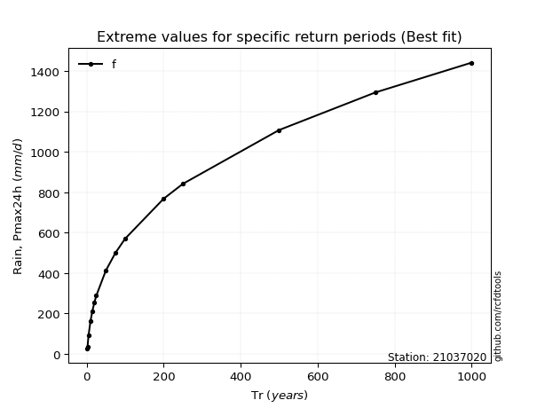</img>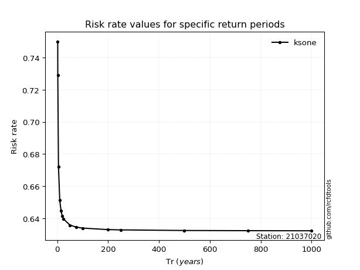</img>

</div>


<sub>**APP DISCLAIMER**: NO WARRANTY - This software is provided by [github.com/rcfdtools](https://github.com/rcfdtools) "as is", without any express or implied warranty, including warranties of merchantability, fitness for a particular purpose, or non-infringement. There is no guarantee that the software will be error-free or operate without interruption. LIMITATION OF LIABILITY - Neither the authors nor copyright holders will be liable for claims or damages arising from the software or its use. You are responsible for determining if the software is appropriate for your use and assume all associated risks, including errors, legal compliance, and data loss. NO PROFESSIONAL ADVICE - The software provides general information and does not offer professional advice. It should not replace consultation with professional advisors.</sub>