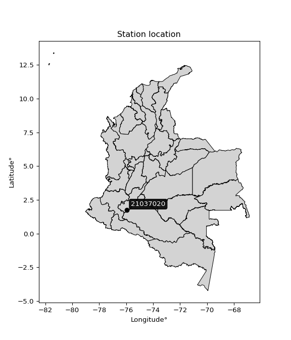

<div align="center">


</div>

# PMP Station (Rain, Pmax24h): 21037020

Probable Maximum Precipitation (PMP) is the greatest amount of rainfall for a specific duration that is meteorologically possible for a given location, acting as a "worst-case" scenario for extreme storms, crucial for designing safety-critical infrastructure like bridges, river deviations, dams, spillways, and nuclear plants to prevent catastrophic failure. PMP is calculated by hydrologists using meteorological data to determine the upper limit of extreme rainfall, often leading to the Probable Maximum Flood (PMF) for flood control design, and is increasingly being studied for climate change impacts. Probable Maximum Precipitation (PMP) is the theoretical upper limit of rainfall, a deterministic estimate for extreme events, while probability distributions (like GEV, Gumbel) describe the likelihood and frequency of various precipitation amounts, including rare ones, showing how often events occur, with PMP representing the extreme end of these distributions, used for critical infrastructure design to ensure safety against the worst conceivable weather, unlike standard statistical forecasts which cover typical probabilities.

The most common probability distributions in hydrology, used for analyzing floods, rainfall, and streamflow, include the Normal, Log-Normal, Gumbel, Gamma (including Log-Pearson Type III), and Generalized Extreme Value (GEV) distributions, often chosen based on the data´s skewness and whether modeling extremes or general conditions, with Gumbel and GEV popular for extreme events like floods, while the Normal distribution serves as a baseline, though often requiring transformations for skewed hydrological data. These distributions help in designing water infrastructure, managing water resources, and forecasting hydrologic events.

> Hydrological data often isn´t perfectly normal (it´s skewed), so different distributions are needed for different applications, such as: **Flood Frequency Analysis**: Using Gumbel, GEV, or Log-Pearson Type III for predicting extreme flood magnitudes and their return periods, **Rainfall Analysis**: Normal for annual totals, but Log-Normal, Weibull, or GEV for intensity or extreme daily rainfall, **Streamflow Modeling**: Gamma and Log-Normal for maximum flows, GEV for minimum flows, and Kappa for daily flows.

<div align="center">

</img>

</div>


## A. General information


### 1. General running parameters

• app_version: _v20260113_. • runtime: _2026-01-13 16:28:34.738620_. • Python version: _3.14.0_. • SciPy version: _1.16.3_. • Pandas version: _2.3.3_. • NumPy version: _2.3.5_. • Stations dataset (station_dataset_file): _dataset/pmax24h_in/automatic_colombia_2003_2025.csv_. • Stations catalog (station_catalog_file): _dataset/CNE.xls_. • Minimum year to eval til year_max (date_min): _1900_. • Maximum year to eval since year_min (date_max): _2025_. • Creates, save and include plots into reports (create_plot): _False_. • Plot only fit distributions with Δo > Δ (plot_only_fit): _True_. • Plot only simple graphs avoiding multiple CDFs and multiple Extreme values plots (plot_only_simple): _True_. • Eval low extreme values, if False, evaluates high extreme values (low_extreme): _False_. • Eval every SciPy distribution as logarithmic (pdist_logarithmic_on): _True_. • Standard deviation normalized (ddof): _1.0_. • Return periods to eval in years (Tr): _[2, 2.33, 5, 10, 15, 20, 25, 50, 75, 100, 200, 250, 500, 750, 1000]_. • Minimum data sample per station, 0 means any (minimum_sample): _5_. • Z-Score maximum threshold to adjust a value, 0 means disable (zscore_max): _3.5_. • Z-Score minimum threshold to adjust a value, 0 means disable (zscore_min): _-2.5_. • Avoid zeros, e.g. rain = 0 (avoid_zeros): _True_. • Avoid null values (avoid_nans): _True_. 

:file_folder:Table: [dataset.csv](../../dataset/pmax24h_in/automatic_colombia_2003_2025.csv)

> Delta Degrees of Freedom (DDOF): is a parameter used in the formulas for calculating variance and standard deviation. When ddof=0, the divisor is $N$ (the total number of observations) and this is used when your data set is the entire population. When ddof=1, the divisor is $N-1$ and this is used when your data set is a sample drawn from a larger population. Using $N-1$ provides an unbiased estimate of the population variance (known as Bessel´s correction).


### 2. Station info and location

|   id |   CODIGO | NOMBRE                       | CATEGORIA    | TECNOLOGIA                              | ESTADO           | FECHA_INSTALACION   |   FECHA_SUSPENSION |   ALTITUD |   LATITUD |   LONGITUD | DEPARTAMENTO   | MUNICIPIO   | AREA_OPERATIVA                    | ENTIDAD                                                     | AREA_HIDROGRAFICA   | ZONA_HIDROGRAFICA   | SUBZONA_HIDROGRAFICA   | CORRIENTE   | Catalogo   |   Version |
|-----:|---------:|:-----------------------------|:-------------|:----------------------------------------|:-----------------|:--------------------|-------------------:|----------:|----------:|-----------:|:---------------|:------------|:----------------------------------|:------------------------------------------------------------|:--------------------|:--------------------|:-----------------------|:------------|:-----------|----------:|
|    0 | 21037020 | SAN MARCOS  - AUT [21037020] | Limnigráfica | Automática con Telemetría, Convencional | En Mantenimiento | 15/04/1971          |                nan |      1291 |   1.75228 |   -75.9454 | Huila          | Acevedo     | Area Operativa 04 - Huila-Caquetá | INSTITUTO DE HIDROLOGIA METEOROLOGIA Y ESTUDIOS AMBIENTALES | Magdalena Cauca     | Alto Magdalena      | Río Suaza              | Suaza       | CNE_IDEAM  |  20251226 |

<div align="center">

Dynamic map: [:earth_americas:Google](http://maps.google.com/maps?q=1.752277778,-75.94541667) [:earth_americas:OSM](https://www.openstreetmap.org/#map=18/1.752277778/-75.94541667&layers=P) [:earth_americas:Bing](https://www.bing.com/maps?cp=1.752277778~-75.94541667&lvl=18) [:earth_americas:Apple](https://maps.apple.com/frame?center=1.752277778%2C-75.94541667&span=0.003%2C0.006)

</div>


<div align="center">

```geojson
{
  "type": "Feature",
  "geometry": {
    "type": "Point", 
    "coordinates": [-75.94541667, 1.752277778]
  }, 
  "properties": {
    "Name": "21037020"
  }
}
```

</div>


### 3. Discrete values table and plot

<div align="center">

|               |           0 |           1 |            2 |          3 |          4 |          5 |
|:--------------|------------:|------------:|-------------:|-----------:|-----------:|-----------:|
| Date          | 2019        | 2020        | 2021         | 2022       | 2023       | 2025       |
| Value         |   64        |   56.2      |   45.6       |    9.4     |    3.4     |   92.2     |
| Value_initial |   64        |   56.2      |   45.6       |    9.4     |    3.4     |   92.2     |
| count         |    6        |    6        |    6         |    6       |    6       |    6       |
| mean          |   45.1333   |   45.1333   |   45.1333    |   45.1333  |   45.1333  |   45.1333  |
| std           |   33.8007   |   33.8007   |   33.8007    |   33.8007  |   33.8007  |   33.8007  |
| zscore        |    0.558173 |    0.327409 |    0.0138064 |   -1.05718 |   -1.23469 |    1.39247 |


</div>


> The initial value (value_initial) correspond to the initial obtained or null completed value, and value (value) is adjusted only when the initial value is outside the valid range (outlier) definite through the Z-Score value. If Z-Score is active, values out of range or outliers are replaced with the station mean value. A Z-Score (or standard score) measures how many standard deviations a data point is from the mean of a dataset, indicating its relative position; positive scores mean above the mean, negative mean below, and a score of zero is exactly at the mean, allowing for comparison of values from different distributions. It´s calculated using the formula $z=(x–μ)/σ$, where $x$ is the data point, $μ$ is the mean, and $σ$ is the standard deviation, helping identify outliers and understand probability.
>
> <sub>**Note**: In this study, "completing" (filling gaps in) and "extending" (forecasting or lengthening the historical record) rainfall data series are avoided for certain critical analyses because they introduce artificial bias and uncertainty, which can distort the statistics of rare events (extremes), alter day-to-day variability, and compromise the integrity and homogeneity of the original data. Some reasons against Completing/Extending rainfall data are: **Distortion of Extremes and Variability**: The primary issue is that most gap-filling or extension methods rely on averaging or regression with nearby stations, which inherently smooths the data. Rainfall is highly variable in space and time, with a large percentage of zero values and occasional large storms. Infilling methods often underestimate the highest values and overestimate the lowest (zero) values, which severely distorts analyses focused on flood frequency, drought severity, and intensity-duration-frequency (IDF) curves, **Loss of Data Homogeneity**: Infilled or extended data are synthetic estimates, not actual measurements. Combining these estimates with observed data can violate the assumption of data homogeneity, which requires that the data properties do not change over time. Inhomogeneity can lead to incorrect conclusions about long-term trends or changes in climate patterns, **Propagation of Errors**: Errors and biases from the original data (e.g., wind-induced undercatch, instrument errors, site changes) or the data used for imputation can propagate through the analysis, leading to unreliable hydrological models and inaccurate predictions, **Compromised Statistical Integrity**: For statistical analyses, especially those involving the frequency of events, using artificial data can introduce time bias or autocorrelation that doesn´t exist in reality, making it difficult to assess the true probability of events, **Difficulty in Validation**: It is difficult to accurately validate the quality of filled or extended data, especially for past periods where ground-truth measurements are unavailable. The reliability of imputation techniques heavily depends on the density of the surrounding station network and the complexity of the local topography.</sub>


### 4. Active continuous probability distributions from SciPy (45 of 104 available)

A Probability Density Function (PDF) describes the relative likelihood of a continuous random variable falling within a specific range, where the total area under its curve equals 1, and the area over any interval gives the actual probability for that range. Unlike discrete probabilities (like rolling a die), a PDF shows density, not direct probability for a single point (which is zero), with higher points indicating higher likelihood, often visualized as a bell curve for normal distributions.

A log of a probability density function (log-PDF) is simply the logarithm of the PDF´s value, denoted as $log(f(x))$, useful for converting multiplication of probabilities into addition, improving numerical stability with tiny numbers, and connecting to information theory concepts like entropy. Instead of dealing with very small probabilities (e.g., 0.000001), log-PDFs use negative numbers (e.g., $log(0.00001) ≈ -11.51$ that are easier for computers to handle, preventing underflow errors and simplifying complex calculations. In this study, each active probability distribution from SciPy is also evaluated in the $log$ form.

[scipy.stats](https://docs.scipy.org/doc/scipy/reference/stats.html) is a Python´s powerful submodule within the SciPy library for comprehensive statistical analysis, offering over 130 probability distributions (like Normal, Poisson), functions for descriptive stats (mean, variance), hypothesis testing (t-tests, chi-square), random variable generation, and statistical tests, making it essential for data science, modeling, and research. It provides tools to explore, model, and draw conclusions from data efficiently, working seamlessly with NumPy.

<div align="center">

|   id | p_dist             |   n_parameter | fit_method   | label                                                                       | active   | ref                                                                                                        |
|-----:|:-------------------|--------------:|:-------------|:----------------------------------------------------------------------------|:---------|:-----------------------------------------------------------------------------------------------------------|
|    0 | alpha              |             3 | MLE          | Alpha                                                                       | True     | [:mortar_board:](https://docs.scipy.org/doc/scipy/reference/generated/scipy.stats.alpha.html)              |
|    1 | betaprime          |             4 | MLE          | Beta prime                                                                  | True     | [:mortar_board:](https://docs.scipy.org/doc/scipy/reference/generated/scipy.stats.betaprime.html)          |
|    2 | chi2               |             3 | MLE          | Chi²                                                                        | True     | [:mortar_board:](https://docs.scipy.org/doc/scipy/reference/generated/scipy.stats.chi2.html)               |
|    3 | crystalball        |             4 | MLE          | Crystalball                                                                 | True     | [:mortar_board:](https://docs.scipy.org/doc/scipy/reference/generated/scipy.stats.crystalball.html)        |
|    4 | dweibull           |             3 | MLE          | Double Weibull                                                              | True     | [:mortar_board:](https://docs.scipy.org/doc/scipy/reference/generated/scipy.stats.dweibull.html)           |
|    5 | erlang             |             3 | MLE          | Erlang                                                                      | True     | [:mortar_board:](https://docs.scipy.org/doc/scipy/reference/generated/scipy.stats.erlang.html)             |
|    6 | expon              |             2 | MLE          | Exponential                                                                 | True     | [:mortar_board:](https://docs.scipy.org/doc/scipy/reference/generated/scipy.stats.expon.html)              |
|    7 | exponnorm          |             3 | MLE          | Exponentially modified Normal                                               | True     | [:mortar_board:](https://docs.scipy.org/doc/scipy/reference/generated/scipy.stats.exponnorm.html)          |
|    8 | f                  |             4 | MLE          | F                                                                           | True     | [:mortar_board:](https://docs.scipy.org/doc/scipy/reference/generated/scipy.stats.f.html)                  |
|    9 | fatiguelife        |             3 | MLE          | Fatigue-life (Birnbaum-Saunders)                                            | True     | [:mortar_board:](https://docs.scipy.org/doc/scipy/reference/generated/scipy.stats.fatiguelife.html)        |
|   10 | fisk               |             3 | MLE          | Fisk                                                                        | True     | [:mortar_board:](https://docs.scipy.org/doc/scipy/reference/generated/scipy.stats.fisk.html)               |
|   11 | gamma              |             3 | MLE          | Gamma                                                                       | True     | [:mortar_board:](https://docs.scipy.org/doc/scipy/reference/generated/scipy.stats.gamma.html)              |
|   12 | genexpon           |             5 | MLE          | Generalized exponential                                                     | True     | [:mortar_board:](https://docs.scipy.org/doc/scipy/reference/generated/scipy.stats.genexpon.html)           |
|   13 | genlogistic        |             3 | MLE          | Generalized logistic                                                        | True     | [:mortar_board:](https://docs.scipy.org/doc/scipy/reference/generated/scipy.stats.genlogistic.html)        |
|   14 | gibrat             |             2 | MM           | Gibrat                                                                      | True     | [:mortar_board:](https://docs.scipy.org/doc/scipy/reference/generated/scipy.stats.gibrat.html)             |
|   15 | gompertz           |             3 | MLE          | Gompertz (or truncated Gumbel)                                              | True     | [:mortar_board:](https://docs.scipy.org/doc/scipy/reference/generated/scipy.stats.gompertz.html)           |
|   16 | gumbel_l           |             2 | MM           | Gumbel Left Skew                                                            | True     | [:mortar_board:](https://docs.scipy.org/doc/scipy/reference/generated/scipy.stats.gumbel_l.html)           |
|   17 | gumbel_r           |             2 | MM           | Gumbel Right Skew                                                           | True     | [:mortar_board:](https://docs.scipy.org/doc/scipy/reference/generated/scipy.stats.gumbel_r.html)           |
|   18 | halflogistic       |             2 | MM           | Half-logistic                                                               | True     | [:mortar_board:](https://docs.scipy.org/doc/scipy/reference/generated/scipy.stats.halflogistic.html)       |
|   19 | halfnorm           |             2 | MM           | Half Normal                                                                 | True     | [:mortar_board:](https://docs.scipy.org/doc/scipy/reference/generated/scipy.stats.halfnorm.html)           |
|   20 | hypsecant          |             2 | MM           | hyperbolic secant                                                           | True     | [:mortar_board:](https://docs.scipy.org/doc/scipy/reference/generated/scipy.stats.hypsecant.html)          |
|   21 | invgamma           |             3 | MLE          | Inverted gamma                                                              | True     | [:mortar_board:](https://docs.scipy.org/doc/scipy/reference/generated/scipy.stats.invgamma.html)           |
|   22 | invgauss           |             3 | MLE          | Inverse Gaussian                                                            | True     | [:mortar_board:](https://docs.scipy.org/doc/scipy/reference/generated/scipy.stats.invgauss.html)           |
|   23 | invweibull         |             3 | MLE          | Inverted Weibull                                                            | True     | [:mortar_board:](https://docs.scipy.org/doc/scipy/reference/generated/scipy.stats.invweibull.html)         |
|   24 | kappa4             |             4 | MLE          | Kappa 4                                                                     | True     | [:mortar_board:](https://docs.scipy.org/doc/scipy/reference/generated/scipy.stats.kappa4.html)             |
|   25 | kstwobign          |             2 | MLE          | Limiting distribution of scaled Kolmogorov-Smirnov two-sided test statistic | True     | [:mortar_board:](https://docs.scipy.org/doc/scipy/reference/generated/scipy.stats.kstwobign.html)          |
|   26 | laplace            |             2 | MM           | Laplace                                                                     | True     | [:mortar_board:](https://docs.scipy.org/doc/scipy/reference/generated/scipy.stats.laplace.html)            |
|   27 | laplace_asymmetric |             3 | MLE          | Asymmetric Laplace                                                          | True     | [:mortar_board:](https://docs.scipy.org/doc/scipy/reference/generated/scipy.stats.laplace_asymmetric.html) |
|   28 | loggamma           |             3 | MLE          | Log gamma                                                                   | True     | [:mortar_board:](https://docs.scipy.org/doc/scipy/reference/generated/scipy.stats.loggamma.html)           |
|   29 | logistic           |             2 | MM           | Logistic (or Sech-squared)                                                  | True     | [:mortar_board:](https://docs.scipy.org/doc/scipy/reference/generated/scipy.stats.logistic.html)           |
|   30 | lognorm            |             3 | MLE          | Log Normal                                                                  | True     | [:mortar_board:](https://docs.scipy.org/doc/scipy/reference/generated/scipy.stats.lognorm.html)            |
|   31 | maxwell            |             2 | MM           | Maxwell                                                                     | True     | [:mortar_board:](https://docs.scipy.org/doc/scipy/reference/generated/scipy.stats.maxwell.html)            |
|   32 | mielke             |             4 | MLE          | Mielke Beta-Kappa / Dagum                                                   | True     | [:mortar_board:](https://docs.scipy.org/doc/scipy/reference/generated/scipy.stats.mielke.html)             |
|   33 | moyal              |             2 | MM           | Moyal                                                                       | True     | [:mortar_board:](https://docs.scipy.org/doc/scipy/reference/generated/scipy.stats.moyal.html)              |
|   34 | nakagami           |             3 | MLE          | Nakagami                                                                    | True     | [:mortar_board:](https://docs.scipy.org/doc/scipy/reference/generated/scipy.stats.nakagami.html)           |
|   35 | ncf                |             5 | MLE          | Non-central F distribution                                                  | True     | [:mortar_board:](https://docs.scipy.org/doc/scipy/reference/generated/scipy.stats.ncf.html)                |
|   36 | nct                |             4 | MLE          | Non-central Student’s t                                                     | True     | [:mortar_board:](https://docs.scipy.org/doc/scipy/reference/generated/scipy.stats.nct.html)                |
|   37 | norm               |             2 | MM           | Normal                                                                      | True     | [:mortar_board:](https://docs.scipy.org/doc/scipy/reference/generated/scipy.stats.norm.html)               |
|   38 | pearson3           |             3 | MM           | Pearson type III                                                            | True     | [:mortar_board:](https://docs.scipy.org/doc/scipy/reference/generated/scipy.stats.pearson3.html)           |
|   39 | rayleigh           |             2 | MM           | Rayleigh                                                                    | True     | [:mortar_board:](https://docs.scipy.org/doc/scipy/reference/generated/scipy.stats.rayleigh.html)           |
|   40 | rice               |             3 | MLE          | Rice                                                                        | True     | [:mortar_board:](https://docs.scipy.org/doc/scipy/reference/generated/scipy.stats.rice.html)               |
|   41 | t                  |             3 | MLE          | Student’s t                                                                 | True     | [:mortar_board:](https://docs.scipy.org/doc/scipy/reference/generated/scipy.stats.t.html)                  |
|   42 | truncnorm          |             4 | MLE          | Truncated normal                                                            | True     | [:mortar_board:](https://docs.scipy.org/doc/scipy/reference/generated/scipy.stats.truncnorm.html)          |
|   43 | wald               |             2 | MM           | Wald                                                                        | True     | [:mortar_board:](https://docs.scipy.org/doc/scipy/reference/generated/scipy.stats.wald.html)               |
|   44 | weibull_min        |             3 | MLE          | Weibull minimum                                                             | True     | [:mortar_board:](https://docs.scipy.org/doc/scipy/reference/generated/scipy.stats.weibull_min.html)        |

</div>

> **n_parameter:** # arguments & localization & scale.
>
> **Fit methods:** (MLE) maximum likelihood, (MM) L-moments.
>
>**Inactive** (With the only purpose of prevent loops, zero divisions, infinite values, over high estimated values or horizontal trending for recurrence intervals estimations, the follow distributions were disabled.)**:** foldnorm, gennorm, norminvgauss, powernorm, powerlognorm, skewnorm, genextreme, anglit, arcsine, argus, beta, bradford, burr, burr12, cauchy, cosine, halfcauchy, foldcauchy, skewcauchy, wrapcauchy, dgamma, gengamma, exponweib, exponpow, truncexpon, gausshyper, genhalflogistic, genhyperbolic, geninvgauss, halfgennorm, johnsonsb, johnsonsu, kappa3, ksone, kstwo, loglaplace, levy, levy_l, levy_stable, ncx2, pareto, genpareto, truncpareto, lomax, powerlaw, rdist, rel_breitwigner, recipinvgauss, semicircular, studentized_range, trapezoid, triang, truncweibull_min, tukeylambda, uniform, loguniform, vonmises, vonmises_line, weibull_max, 


## B. Probability (PDF) vs. Empirical (EDF) distributions functions

A continuous probability distribution (CPD) describes probabilities for variables that can take any value within a range (like rain any time), unlike discrete variables with specific outcomes (like temperature). It uses a Probability Density Function (PDF), a curve where the total area under it equals 1, and the probability of the variable falling within an interval (a to b) is found by calculating the area under the curve between those points. A key feature is that the probability of hitting any single exact value is zero, so probabilities are always expressed for ranges, e.g., $P(a ≤ X ≤ b)$.

<div align="center">

Distributions parameters from station values
|    |   station | p_dist                |   n |             loc |           scale | shape                 | shape1                 | shape2               | shape3   |
|---:|----------:|:----------------------|----:|----------------:|----------------:|:----------------------|:-----------------------|:---------------------|:---------|
|  0 |  21037020 | alpha                 |   6 |    -0.0165184   |     7.83065     | 6.715894402395756e-10 |                        |                      |          |
|  1 |  21037020 | betaprime             |   6 |     3.39994     |   537.368       | 0.7014025210032186    | 9.103634334603353      |                      |          |
|  2 |  21037020 | chi2                  |   6 |     3.4         |     7.88558     | 0.5833489633165834    |                        |                      |          |
|  3 |  21037020 | crystalball           |   6 |    45.1333      |    30.8557      | 19045.55756615008     | 182.86124514458157     |                      |          |
|  4 |  21037020 | dweibull              |   6 |    49.7281      |    27.8939      | 1.3429905003892442    |                        |                      |          |
|  5 |  21037020 | erlang                |   6 | -1906.6         |     0.488273    | 3997.2401017118627    |                        |                      |          |
|  6 |  21037020 | expon                 |   6 |     3.4         |    41.7333      |                       |                        |                      |          |
|  7 |  21037020 | exponnorm             |   6 |    45.0867      |    30.8556      | 0.0015163594223436272 |                        |                      |          |
|  8 |  21037020 | f                     |   6 |     3.4         |    33.4971      | 0.9455912463928324    | 93.35392945333223      |                      |          |
|  9 |  21037020 | fatiguelife           |   6 |     3.4         |     8.79834e-06 | 1892.063795229375     |                        |                      |          |
| 10 |  21037020 | fisk                  |   6 |     3.4         |    24.449       | 0.9595497349850177    |                        |                      |          |
| 11 |  21037020 | gamma                 |   6 | -1913.92        |     0.48622     | 4029.132634332036     |                        |                      |          |
| 12 |  21037020 | genexpon              |   6 |     3.4         |     2.53989     | 0.060859585929817425  | 2.0636830555461838e-10 | 3.503780192866637    |          |
| 13 |  21037020 | genlogistic           |   6 |    53.1748      |    16.8276      | 0.77436568165492      |                        |                      |          |
| 14 |  21037020 | gibrat                |   6 |    21.5943      |    14.2771      |                       |                        |                      |          |
| 15 |  21037020 | gompertz              |   6 |     3.4         |    56.0106      | 0.6947754337772387    |                        |                      |          |
| 16 |  21037020 | gumbel_l              |   6 |    59.02        |    24.0581      |                       |                        |                      |          |
| 17 |  21037020 | gumbel_r              |   6 |    31.2466      |    24.0581      |                       |                        |                      |          |
| 18 |  21037020 | halflogistic          |   6 |     8.5621      |    26.3806      |                       |                        |                      |          |
| 19 |  21037020 | halfnorm              |   6 |     4.29246     |    51.1865      |                       |                        |                      |          |
| 20 |  21037020 | hypsecant             |   6 |    45.1333      |    19.6434      |                       |                        |                      |          |
| 21 |  21037020 | invgamma              |   6 |  -206.55        | 16471.4         | 66.38496274308557     |                        |                      |          |
| 22 |  21037020 | invgauss              |   6 |   -80.1172      |  1812.13        | 0.06904972649072047   |                        |                      |          |
| 23 |  21037020 | invweibull            |   6 |    -1.56865e+09 |     1.56865e+09 | 56442335.0934612      |                        |                      |          |
| 24 |  21037020 | kappa4                |   6 |    -7.65849     |   102.69        | 1.120895079465805     | 1.0278202209231946     |                      |          |
| 25 |  21037020 | kstwobign             |   6 |   -65.1789      |   125.714       |                       |                        |                      |          |
| 26 |  21037020 | laplace               |   6 |    45.1333      |    21.8183      |                       |                        |                      |          |
| 27 |  21037020 | laplace_asymmetric    |   6 |    56.2         |    23.7771      | 1.2594347054666104    |                        |                      |          |
| 28 |  21037020 | loggamma              |   6 | -1731.23        |   361.12        | 137.37098632691192    |                        |                      |          |
| 29 |  21037020 | logistic              |   6 |    45.1333      |    17.0117      |                       |                        |                      |          |
| 30 |  21037020 | lognorm               |   6 |     3.4         |     0.0563303   | 14.548391835016817    |                        |                      |          |
| 31 |  21037020 | maxwell               |   6 |   -27.9818      |    45.8181      |                       |                        |                      |          |
| 32 |  21037020 | mielke                |   6 |     3.4         |    88.8979      | 0.5192980677385249    | 5416.149567703555      |                      |          |
| 33 |  21037020 | moyal                 |   6 |    27.4881      |    13.89        |                       |                        |                      |          |
| 34 |  21037020 | nakagami              |   6 |     3.4         |    55.3954      | 0.15179190777689902   |                        |                      |          |
| 35 |  21037020 | ncf                   |   6 |     3.4         |    17.5892      | 0.786603656242288     | 255.76977788751097     | 1.3879731180119657   |          |
| 36 |  21037020 | nct                   |   6 |    -0.302037    |     0.153818    | 0.5679923191622721    | 54.73623700133368      |                      |          |
| 37 |  21037020 | norm                  |   6 |    45.1333      |    30.8557      |                       |                        |                      |          |
| 38 |  21037020 | pearson3              |   6 |    45.1334      |    30.8557      | -0.03390017106296729  |                        |                      |          |
| 39 |  21037020 | rayleigh              |   6 |   -13.8955      |    47.0982      |                       |                        |                      |          |
| 40 |  21037020 | rice                  |   6 |   -14.272       |    37.2096      | 1.1119683395678903    |                        |                      |          |
| 41 |  21037020 | t                     |   6 |    45.1317      |    30.8561      | 49318735.343267694    |                        |                      |          |
| 42 |  21037020 | truncnorm             |   6 |    -2.22644     |    10.1625      | -27.278987085471556   | 9.291691342499593      |                      |          |
| 43 |  21037020 | wald                  |   6 |    14.2776      |    30.8557      |                       |                        |                      |          |
| 44 |  21037020 | weibull_min           |   6 |     3.4         |    46.149       | 0.39241825201092184   |                        |                      |          |
| 45 |  21037020 | logalpha              |   6 |   -28.2272      |   809.62        | 25.702256421943495    |                        |                      |          |
| 46 |  21037020 | logbetaprime          |   6 |   -10.9862      |  5451.26        | 135.25855516302494    | 51489.23447262269      |                      |          |
| 47 |  21037020 | logchi2               |   6 |     1.22378     |     1.26244     | 0.9845473685159636    |                        |                      |          |
| 48 |  21037020 | logcrystalball        |   6 |     3.33269     |     1.1877      | 7.933865933896879     | 1599.7409659031366     |                      |          |
| 49 |  21037020 | logdweibull           |   6 |     4.02892     |     1.04668     | 0.8680356654057046    |                        |                      |          |
| 50 |  21037020 | logerlang             |   6 |   -14.7481      |     0.0815896   | 221.64381724002385    |                        |                      |          |
| 51 |  21037020 | logexpon              |   6 |     1.22378     |     2.10892     |                       |                        |                      |          |
| 52 |  21037020 | logexponnorm          |   6 |     3.33188     |     1.18769     | 0.0006846785850931506 |                        |                      |          |
| 53 |  21037020 | logf                  |   6 | -1073.87        |  1077.2         | 4542755.905859505     | 2538630.827736767      |                      |          |
| 54 |  21037020 | logfatiguelife        |   6 |  -522.501       |   525.829       | 0.0022502352322973035 |                        |                      |          |
| 55 |  21037020 | logfisk               |   6 |    -6.04479e+07 |     6.04479e+07 | 86430174.96615265     |                        |                      |          |
| 56 |  21037020 | loggamma              |   6 |   -16.7845      |     0.0736146   | 273.1863404721977     |                        |                      |          |
| 57 |  21037020 | loggenexpon           |   6 |     1.21785     |     0.0291956   | 0.005824882863043605  | 5.6058869999303536     | 2.99451482039343e-05 |          |
| 58 |  21037020 | loggenlogistic        |   6 |     4.52406     |     8.79053e-06 | 7.417034071652197e-06 |                        |                      |          |
| 59 |  21037020 | loggibrat             |   6 |     2.42659     |     0.54957     |                       |                        |                      |          |
| 60 |  21037020 | loggompertz           |   6 |     1.22377     |     0.99511     | 0.0802631084008842    |                        |                      |          |
| 61 |  21037020 | loggumbel_l           |   6 |     3.86722     |     0.926045    |                       |                        |                      |          |
| 62 |  21037020 | loggumbel_r           |   6 |     2.79816     |     0.926045    |                       |                        |                      |          |
| 63 |  21037020 | loghalflogistic       |   6 |     1.92498     |     1.01545     |                       |                        |                      |          |
| 64 |  21037020 | loghalfnorm           |   6 |     1.76063     |     1.97028     |                       |                        |                      |          |
| 65 |  21037020 | loghypsecant          |   6 |     3.33269     |     0.756113    |                       |                        |                      |          |
| 66 |  21037020 | loginvgamma           |   6 |   -15.642       |  4327.49        | 229.15544055649502    |                        |                      |          |
| 67 |  21037020 | loginvgauss           |   6 |    -7.08415     |   657.821       | 0.01584048815668794   |                        |                      |          |
| 68 |  21037020 | loginvweibull         |   6 |    -9.09202e+07 |     9.09202e+07 | 72854470.21785443     |                        |                      |          |
| 69 |  21037020 | logkappa4             |   6 |     0.75904     |     3.9535      | 1.1336680961019567    | 1.0494326977328492     |                      |          |
| 70 |  21037020 | logkstwobign          |   6 |    -1.62747     |     5.6484      |                       |                        |                      |          |
| 71 |  21037020 | loglaplace            |   6 |     3.33269     |     0.83983     |                       |                        |                      |          |
| 72 |  21037020 | loglaplace_asymmetric |   6 |     4.15888     |     0.572895    | 1.9540655719682194    |                        |                      |          |
| 73 |  21037020 | logloggamma           |   6 |     4.52409     |     5.44707e-06 | 4.567895438655169e-06 |                        |                      |          |
| 74 |  21037020 | loglogistic           |   6 |     3.33269     |     0.654813    |                       |                        |                      |          |
| 75 |  21037020 | loglognorm            |   6 |     1.22378     |     0.00501606  | 13.75666561741926     |                        |                      |          |
| 76 |  21037020 | logmaxwell            |   6 |     0.518344    |     1.76363     |                       |                        |                      |          |
| 77 |  21037020 | logmielke             |   6 |    -1.58343e+07 |     1.58343e+07 | 13093507.637547184    | 3385892352.8000712     |                      |          |
| 78 |  21037020 | logmoyal              |   6 |     2.65349     |     0.534652    |                       |                        |                      |          |
| 79 |  21037020 | lognakagami           |   6 |     2.24071     |     1.30249     | 0.05963186621186025   |                        |                      |          |
| 80 |  21037020 | logncf                |   6 |   -33.3394      |    29.1262      | 2802.8563224374693    | 4795.937926277258      | 726.4427644728098    |          |
| 81 |  21037020 | lognct                |   6 |   -71.38        |     1.1738      | 76875.8186998003      | 63.648834904670906     |                      |          |
| 82 |  21037020 | lognorm               |   6 |     3.33269     |     1.1877      |                       |                        |                      |          |
| 83 |  21037020 | logpearson3           |   6 |     3.33269     |     1.18771     | -0.7932881668848578   |                        |                      |          |
| 84 |  21037020 | lograyleigh           |   6 |     1.06055     |     1.8129      |                       |                        |                      |          |
| 85 |  21037020 | logrice               |   6 |     0.468508    |     1.30757     | 1.9034593978427639    |                        |                      |          |
| 86 |  21037020 | logt                  |   6 |     3.33269     |     1.1877      | 49486549419.07289     |                        |                      |          |
| 87 |  21037020 | logtruncnorm          |   6 |    -0.551072    |     2.90777     | 0.6103777718798957    | 1.7453483261198302     |                      |          |
| 88 |  21037020 | logwald               |   6 |     2.14497     |     1.18772     |                       |                        |                      |          |
| 89 |  21037020 | logweibull_min        |   6 |    -1.54985e+08 |     1.54985e+08 | 185361207.51163483    |                        |                      |          |

</div>

> **loc** (Location parameter): This shifts the distribution along the x-axis. For many common distributions, like the normal (Gaussian) distribution, loc represents the mean $μ$. For others, like the uniform distribution, it might represent the minimum value, or for the beta distribution, the left end of the support interval.
>
> **scale** (Scale parameter): This determines the width or spread of the distribution. For the normal distribution, scale represents the standard deviation $σ$. For a uniform distribution, it defines the length of the interval (from $loc$ to $loc + scale$).
>
> **shape** (Shape parameters): Refers to parameters that define the specific form of a probability distribution, distinct from its location (loc) and scale (scale). These parameters are required arguments for most distribution functions. For example, a normal (Gaussian) distribution is fully defined by its location (mean) and scale (standard deviation), so it has no specific shape parameters beyond loc and scale. However, other distributions have intrinsic properties that need specification, as Gamma distribution that takes a shape parameter, often named $a$ or $alpha$.


### 0. Cumulative distribution values - CDF (90 evaluated)

Cumulative Distribution Function (CDF), denoted as $F$<sub>$X$</sub>$(x)$, is a function that gives the probability that a random variable $X$ will take a value less than or equal to a specific value, $x$ (i.e., $(P(X≥x)$. It essentially "accumulates" probabilities from a given point up to the far right (positive infinity), providing a complete picture of the distribution´s probabilities for both discrete (like rain) and continuous (like temperature) variables, helping to find probabilities over ranges or above certain values. Each station is evaluated separately ordering the $x$ values ascending, calculating the CDF and PDF values for the activated distributions and their logarithmic forms.

<div align="center">

CDF ordered by x ascending and calculating $log(f(x))$ separately
|   id |   Station |   date |    x |   count |    mean |     std |     zscore |   Value_initial |   station |   m |     alpha |   alpha_pdf |   betaprime |   betaprime_pdf |        chi2 |    chi2_pdf |   crystalball |   crystalball_pdf |   dweibull |   dweibull_pdf |    erlang |   erlang_pdf |    expon |   expon_pdf |   exponnorm |   exponnorm_pdf |           f |        f_pdf |   fatiguelife |   fatiguelife_pdf |        fisk |   fisk_pdf |     gamma |   gamma_pdf |    genexpon |   genexpon_pdf |   genlogistic |   genlogistic_pdf |   gibrat |   gibrat_pdf |    gompertz |   gompertz_pdf |   gumbel_l |   gumbel_l_pdf |   gumbel_r |   gumbel_r_pdf |   halflogistic |   halflogistic_pdf |   halfnorm |   halfnorm_pdf |   hypsecant |   hypsecant_pdf |   invgamma |   invgamma_pdf |   invgauss |   invgauss_pdf |   invweibull |   invweibull_pdf |      kappa4 |   kappa4_pdf |   kstwobign |   kstwobign_pdf |   laplace |   laplace_pdf |   laplace_asymmetric |   laplace_asymmetric_pdf |   loggamma |   loggamma_pdf |   logistic |   logistic_pdf |   lognorm |   lognorm_pdf |   maxwell |   maxwell_pdf |      mielke |     mielke_pdf |     moyal |   moyal_pdf |    nakagami |   nakagami_pdf |         ncf |      ncf_pdf |       nct |    nct_pdf |      norm |   norm_pdf |   pearson3 |   pearson3_pdf |   rayleigh |   rayleigh_pdf |      rice |   rice_pdf |         t |      t_pdf |   truncnorm |   truncnorm_pdf |     wald |   wald_pdf |   weibull_min |   weibull_min_pdf |   logalpha |   logalpha_pdf |   logbetaprime |   logbetaprime_pdf |     logchi2 |   logchi2_pdf |   logcrystalball |   logcrystalball_pdf |   logdweibull |   logdweibull_pdf |   logerlang |   logerlang_pdf |   logexpon |   logexpon_pdf |   logexponnorm |   logexponnorm_pdf |      logf |   logf_pdf |   logfatiguelife |   logfatiguelife_pdf |   logfisk |   logfisk_pdf |   loggenexpon |   loggenexpon_pdf |   loggenlogistic |   loggenlogistic_pdf |   loggibrat |   loggibrat_pdf |   loggompertz |   loggompertz_pdf |   loggumbel_l |   loggumbel_l_pdf |   loggumbel_r |   loggumbel_r_pdf |   loghalflogistic |   loghalflogistic_pdf |   loghalfnorm |   loghalfnorm_pdf |   loghypsecant |   loghypsecant_pdf |   loginvgamma |   loginvgamma_pdf |   loginvgauss |   loginvgauss_pdf |   loginvweibull |   loginvweibull_pdf |   logkappa4 |   logkappa4_pdf |   logkstwobign |   logkstwobign_pdf |   loglaplace |   loglaplace_pdf |   loglaplace_asymmetric |   loglaplace_asymmetric_pdf |   logloggamma |   logloggamma_pdf |   loglogistic |   loglogistic_pdf |   loglognorm |   loglognorm_pdf |   logmaxwell |   logmaxwell_pdf |   logmielke |   logmielke_pdf |    logmoyal |   logmoyal_pdf |   lognakagami |   lognakagami_pdf |    logncf |   logncf_pdf |    lognct |   lognct_pdf |   logpearson3 |   logpearson3_pdf |   lograyleigh |   lograyleigh_pdf |   logrice |   logrice_pdf |      logt |   logt_pdf |   logtruncnorm |   logtruncnorm_pdf |    logwald |   logwald_pdf |   logweibull_min |   logweibull_min_pdf |
|-----:|----------:|-------:|-----:|--------:|--------:|--------:|-----------:|----------------:|----------:|----:|----------:|------------:|------------:|----------------:|------------:|------------:|--------------:|------------------:|-----------:|---------------:|----------:|-------------:|---------:|------------:|------------:|----------------:|------------:|-------------:|--------------:|------------------:|------------:|-----------:|----------:|------------:|------------:|---------------:|--------------:|------------------:|---------:|-------------:|------------:|---------------:|-----------:|---------------:|-----------:|---------------:|---------------:|-------------------:|-----------:|---------------:|------------:|----------------:|-----------:|---------------:|-----------:|---------------:|-------------:|-----------------:|------------:|-------------:|------------:|----------------:|----------:|--------------:|---------------------:|-------------------------:|-----------:|---------------:|-----------:|---------------:|----------:|--------------:|----------:|--------------:|------------:|---------------:|----------:|------------:|------------:|---------------:|------------:|-------------:|----------:|-----------:|----------:|-----------:|-----------:|---------------:|-----------:|---------------:|----------:|-----------:|----------:|-----------:|------------:|----------------:|---------:|-----------:|--------------:|------------------:|-----------:|---------------:|---------------:|-------------------:|------------:|--------------:|-----------------:|---------------------:|--------------:|------------------:|------------:|----------------:|-----------:|---------------:|---------------:|-------------------:|----------:|-----------:|-----------------:|---------------------:|----------:|--------------:|--------------:|------------------:|-----------------:|---------------------:|------------:|----------------:|--------------:|------------------:|--------------:|------------------:|--------------:|------------------:|------------------:|----------------------:|--------------:|------------------:|---------------:|-------------------:|--------------:|------------------:|--------------:|------------------:|----------------:|--------------------:|------------:|----------------:|---------------:|-------------------:|-------------:|-----------------:|------------------------:|----------------------------:|--------------:|------------------:|--------------:|------------------:|-------------:|-----------------:|-------------:|-----------------:|------------:|----------------:|------------:|---------------:|--------------:|------------------:|----------:|-------------:|----------:|-------------:|--------------:|------------------:|--------------:|------------------:|----------:|--------------:|----------:|-----------:|---------------:|-------------------:|-----------:|--------------:|-----------------:|---------------------:|
|    0 |  21037020 |   2023 |  3.4 |       6 | 45.1333 | 33.8007 | -1.23469   |             3.4 |  21037020 |   1 | 0.0219057 | 0.0387115   | 7.10355e-05 |      0.781757   | 1.65586e-05 | 1.08756e+10 |     0.0881027 |        0.0051801  |  0.0692732 |     0.00396918 | 0.0874525 |   0.00522388 | 0        |  0.0239617  |   0.0881014 |      0.00518005 | 0.000208732 | 108.987      |      0.12525  |       6.36382e+10 | 8.63731e-17 | 0.186628   | 0.0874639 |  0.00522533 | 4.80281e-11 |     0.0239615  |     0.0973232 |        0.0042575  | 0        |   0          | 5.15608e-14 |     0.0124043  |  0.0943228 |     0.00372962 |  0.0415074 |     0.0054897  |      0         |         0          |  0         |     0          |   0.0757086 |      0.00381792 |  0.0748901 |     0.00580355 |  0.0759215 |     0.00670378 |    0.0760121 |       0.00704778 | 5.83722e-15 |    0.513625  |    0.072749 |      0.00773478 | 0.0738355 |    0.00338411 |             0.105184 |               0.00351248 |  0.0382296 |      0.0734934 |  0.0792033 |     0.00428707 | 0.0378968 |     0.0694331 |  0.074378 |    0.00646125 | 1.57171e-08 | 97759.7        | 0.0173123 |  0.00402505 | 5.20025e-06 |    3.55494e+09 | 0.000525874 | 232.673      | 0.0410225 | 0.0437807  | 0.0881027 | 0.0051801  |  0.0888334 |     0.00513394 |   0.065203 |     0.00728856 | 0.0594632 | 0.00658064 | 0.0881139 | 0.00518053 |    0.71009  |     0.0336783   | 0        | 0          |   2.10058e-07 |       1.85617e+08 |  0.0368728 |      0.0752729 |      0.0379534 |          0.0745337 | 1.40837e-08 |   3.12236e+07 |        0.0378968 |            0.0694331 |     0.0475367 |         0.0346141 |    0.036822 |       0.0720599 |   0        |      0.474177  |      0.0378957 |           0.069432 | 0.0384464 |  0.0700476 |        0.0373302 |            0.0691197 | 0.0370307 |     0.0509869 |    0.00118451 |          0.200441 |         0        |            0.0521035 |    0        |       0         |   1.34339e-07 |         0.0806576 |     0.0559551 |         0.0587008 |    0.00419186 |         0.0247815 |          0        |              0        |      0        |          0        |      0.0390858 |          0.0515632 |     0.0386933 |         0.0781921 |     0.0405171 |         0.0839868 |       0.0383198 |            0.100155 | 8.44457e-15 |       19.3588   |      0.0392003 |           0.119382 |    0.0405885 |        0.0483294 |                0.057586 |                   0.0514403 |     0.0628106 |         0.0526728 |     0.0383963 |         0.0563857 |     0.012703 |      1.07421e+13 |     0.016226 |        0.0668167 |   0.0643492 |        0.053211 | 0.000140212 |      0.0020185 |      0        |       0           | 0.0374959 |    0.0709136 | 0.0380641 |    0.0696955 |     0.0546543 |         0.0655451 |    0.00404476 |         0.0494614 | 0.0289808 |     0.0809927 | 0.0378969 |  0.0694333 |    2.97594e-06 |           0.494393 | 0          |     0         |        0.0417866 |            0.0489174 |
|    1 |  21037020 |   2022 |  9.4 |       6 | 45.1333 | 33.8007 | -1.05718   |             9.4 |  21037020 |   2 | 0.405642  | 0.0498646   | 0.209314    |      0.0229419  | 0.774318    | 0.0278904   |     0.123416  |        0.00661224 |  0.0969289 |     0.00529577 | 0.123099  |   0.00667899 | 0.133913 |  0.0207529  |   0.123415  |      0.00661219 | 0.341092    |   0.0253546  |      0.668746 |       0.0131918   | 0.206197    | 0.0261765  | 0.123121  |  0.00668109 | 0.133912    |     0.0207528  |     0.126209  |        0.00540679 | 0        |   0          | 0.0755522   |     0.0127638  |  0.119385  |     0.0046536  |  0.0837809 |     0.00863488 |      0.0158797 |         0.0189486  |  0.0794835 |     0.0155104  |   0.10235   |      0.0051211  |  0.11533   |     0.00768684 |  0.122602  |     0.00883338 |    0.125368  |       0.00936693 | 0.0881985   |    0.0131269 |    0.126896 |      0.0102277  | 0.0972066 |    0.00445528 |             0.128518 |               0.00429171 |  0.187187  |      0.22931   |  0.109046  |     0.00571109 | 0.178941  |     0.220113  |  0.118748 |    0.00831007 | 0.246625    |     0.0213453  | 0.0551507 |  0.00875836 | 0.410144    |    0.0207201   | 0.261987    |   0.0182094  | 0.315044  | 0.0338869  | 0.123416  | 0.00661224 |  0.123794  |     0.0065411  |   0.115137 |     0.00929265 | 0.104817  | 0.00849702 | 0.12343   | 0.00661268 |    0.8737   |     0.020403    | 0        | 0          |   0.361778    |       0.0187449   |  0.191977  |      0.238182  |      0.188988  |          0.231329  | 0.636034    |   0.23342     |        0.178941  |            0.220113  |     0.101772  |         0.0786424 |    0.184623 |       0.228803  |   0.382581 |      0.292766  |      0.178939  |           0.220113 | 0.179903  |  0.219982  |        0.178662  |            0.221184  | 0.141337  |     0.173525  |    0.264393   |          0.294867 |         0        |            0.122888  |    0        |       0         |   0.133032    |         0.194298  |     0.15858   |         0.156886  |    0.161102   |         0.317616  |          0.154222 |              0.480682 |      0.192505 |          0.393116 |      0.147502  |          0.188173  |     0.196392  |         0.238688  |     0.205556  |         0.243351  |       0.235986  |            0.273051 | 0.341507    |        0.298959 |      0.263678  |           0.290462 |    0.136233  |        0.162215  |                0.142834 |                   0.12759   |     0.147366  |         0.123581  |     0.158741  |         0.20394   |     0.650301 |      0.0264684   |     0.187559 |        0.267832  |   0.149192  |        0.123369 | 0.141258    |      0.371995  |      0.012474 |       3.34999e+12 | 0.181424  |    0.222804  | 0.179435  |    0.220385  |     0.169589  |         0.172617  |    0.190942   |         0.290516  | 0.187734  |     0.236473  | 0.178941  |  0.220113  |    0.444144    |           0.375668 | 0.00112315 |     0.0775568 |        0.134146  |            0.149161  |
|    2 |  21037020 |   2021 | 45.6 |       6 | 45.1333 | 33.8007 |  0.0138064 |            45.6 |  21037020 |   3 | 0.863703  | 0.00295866  | 0.645964    |      0.00680814 | 0.990804    | 0.00070557  |     0.506033  |        0.0129278  |  0.463014  |     0.011576   | 0.508035  |   0.0129184  | 0.636211 |  0.00871698 |   0.506031  |      0.0129278  | 0.738215    |   0.00543125 |      0.876465 |       0.00279997  | 0.628025    | 0.00531185 | 0.508179  |  0.0129213  | 0.63621     |     0.00871698 |     0.481674  |        0.0135359  | 0.69834  |   0.0145198  | 0.542105    |     0.0120656  |  0.435862  |     0.0134235  |  0.576561  |     0.0131971  |      0.605631  |         0.0120015  |  0.580334  |     0.0112556  |   0.507561  |      0.0161999  |  0.535838  |     0.0127649  |  0.558691  |     0.012046   |    0.568653  |       0.0115499  | 0.505722    |    0.0107949 |    0.580789 |      0.0114169  | 0.510581  |    0.0224316  |             0.430491 |               0.0143757  |  0.663764  |      0.295016  |  0.506858  |     0.014693   | 0.659177  |     0.308789  |  0.538833 |    0.0123688  | 0.679151    |     0.00835738 | 0.602358  |  0.0130651  | 0.733279    |    0.00488575  | 0.609511    |   0.0061575  | 0.704067  | 0.0036347  | 0.506033  | 0.0129278  |  0.50378   |     0.0129308  |   0.549711 |     0.0120772  | 0.530426  | 0.0126146  | 0.506055  | 0.0129276  |    0.999999 |     6.08823e-07 | 0.674068 | 0.01264    |   0.619209    |       0.00341883  |  0.6696    |      0.285628  |      0.662123  |          0.289883  | 0.851354    |   0.077597    |        0.659177  |            0.308789  |     0.390574  |         0.400641  |    0.66181  |       0.295746  |   0.708007 |      0.138456  |      0.659178  |           0.308791 | 0.658204  |  0.307406  |        0.6609    |            0.309064  | 0.61153   |     0.339671  |    0.694333   |          0.217414 |         0        |            0.465786  |    0.823893 |       0.185749  |   0.635791    |         0.399045  |     0.613333  |         0.396749  |    0.717659   |         0.257105  |          0.732012 |              0.228548 |      0.704056 |          0.234534 |      0.692231  |          0.346519  |     0.66698   |         0.279859  |     0.664248  |         0.266279  |       0.665391  |            0.217207 | 0.794085    |        0.282258 |      0.689884  |           0.209394 |    0.720089  |        0.333295  |                0.585429 |                   0.52295   |     0.554038  |         0.464614  |     0.677882  |         0.333467  |     0.67518  |      0.0100754   |     0.679819 |        0.274895  |   0.550645  |        0.455334 | 0.736915    |      0.236917  |      0.888323 |       0.0617551   | 0.654733  |    0.299313  | 0.659366  |    0.308239  |     0.618034  |         0.360225  |    0.685992   |         0.263632  | 0.664808  |     0.293252  | 0.659178  |  0.308789  |    0.887424    |           0.192443 | 0.79175    |     0.188954  |        0.614116  |            0.439462  |
|    3 |  21037020 |   2020 | 56.2 |       6 | 45.1333 | 33.8007 |  0.327409  |            56.2 |  21037020 |   4 | 0.889217  | 0.00195793  | 0.709884    |      0.00533078 | 0.995869    | 0.000307404 |     0.640075  |        0.0121239  |  0.565569  |     0.0126725  | 0.641637  |   0.0120543  | 0.71781  |  0.00676173 |   0.640073  |      0.0121239  | 0.788625    |   0.00415801 |      0.902294 |       0.00211551  | 0.676729    | 0.00397572 | 0.641802  |  0.0120553  | 0.717809    |     0.00676174 |     0.624835  |        0.0130879  | 0.812018 |   0.00779021 | 0.663315    |     0.0107201  |  0.589094  |     0.0151906  |  0.701565  |     0.010336   |      0.717706  |         0.00919044 |  0.689459  |     0.0093213  |   0.670532  |      0.013934   |  0.663219  |     0.0111027  |  0.676656  |     0.0101179  |    0.680119  |       0.00943352 | 0.619086    |    0.0106079 |    0.691186 |      0.00938073 | 0.698916  |    0.0137996  |             0.613329 |               0.0204814  |  0.722806  |      0.269057  |  0.657131  |     0.0132444  | 0.721128  |     0.28287   |  0.662753 |    0.0108704  | 0.762966    |     0.00750391 | 0.722034  |  0.00959099 | 0.779991    |    0.0039767   | 0.669312    |   0.005165   | 0.73682   | 0.00263267 | 0.640075  | 0.0121239  |  0.638231  |     0.0121946  |   0.669615 |     0.0104401  | 0.657516  | 0.0112119  | 0.640093  | 0.0121235  |    1        |     2.6084e-09  | 0.779777 | 0.00778664 |   0.651548    |       0.00273026  |  0.726582  |      0.258904  |      0.720136  |          0.264416  | 0.866617    |   0.0686784   |        0.721128  |            0.28287   |     0.5       |        36.8845    |    0.721003 |       0.269772  |   0.735558 |      0.125392  |      0.721129  |           0.282871 | 0.719902  |  0.281838  |        0.722861  |            0.282697  | 0.679744  |     0.311262  |    0.737686   |          0.197346 |         0        |            0.555616  |    0.857707 |       0.140447  |   0.71772     |         0.381566  |     0.696017  |         0.390886  |    0.767412   |         0.219382  |          0.776289 |              0.195665 |      0.750371 |          0.208742 |      0.758749  |          0.289386  |     0.722867  |         0.254254  |     0.717453  |         0.242318  |       0.708532  |            0.195623 | 0.853253    |        0.284218 |      0.731513  |           0.189007 |    0.781759  |        0.259864  |                0.705599 |                   0.630295  |     0.660176  |         0.553622  |     0.74331   |         0.291382  |     0.677203 |      0.0093007   |     0.734429 |        0.24722   |   0.654533  |        0.541239 | 0.782321    |      0.198443  |      0.900391 |       0.053999    | 0.714793  |    0.27441   | 0.721204  |    0.282347  |     0.692733  |         0.352187  |    0.738275   |         0.236381  | 0.723557  |     0.268026  | 0.721129  |  0.282869  |    0.925518    |           0.172288 | 0.827081   |     0.150877  |        0.705548  |            0.430567  |
|    4 |  21037020 |   2019 | 64   |       6 | 45.1333 | 33.8007 |  0.558173  |            64   |  21037020 |   5 | 0.902644  | 0.00151323  | 0.748101    |      0.00449792 | 0.997677    | 0.000170033 |     0.729548  |        0.0107248  |  0.667039  |     0.012739   | 0.730466  |   0.0106331  | 0.765916 |  0.00560903 |   0.729547  |      0.0107249  | 0.818252    |   0.00346622 |      0.917291 |       0.0017447   | 0.704951    | 0.00329342 | 0.730633  |  0.0106325  | 0.765915    |     0.00560905 |     0.72104   |        0.0114307  | 0.86184  |   0.00520169 | 0.742074    |     0.00943948 |  0.707701  |     0.0149439  |  0.773914  |     0.00824462 |      0.782092  |         0.00736021 |  0.756576  |     0.00789446 |   0.767303  |      0.0108188  |  0.743415  |     0.00942381 |  0.749266  |     0.00849258 |    0.7474    |       0.00782988 | 0.701452    |    0.0105181 |    0.758378 |      0.00785775 | 0.789415  |    0.00965177 |             0.744194 |               0.0135497  |  0.756589  |      0.250578  |  0.751951  |     0.0109643  | 0.756668  |     0.263711  |  0.741781 |    0.00935578 | 0.819557    |     0.00702301 | 0.788196  |  0.0074427  | 0.808923    |    0.00345818  | 0.707189    |   0.00456202 | 0.75538   | 0.00215259 | 0.729548  | 0.0107248  |  0.728379  |     0.0108228  |   0.745304 |     0.00894388 | 0.739301  | 0.00971169 | 0.729564  | 0.0107244  |    1        |     2.35522e-11 | 0.831537 | 0.00562821 |   0.671371    |       0.00236815  |  0.759045  |      0.240484  |      0.753348  |          0.246464  | 0.875218    |   0.0637498   |        0.756668  |            0.263711  |     0.575426  |         0.463697  |    0.754879 |       0.251286  |   0.751363 |      0.117898  |      0.756669  |           0.263712 | 0.755323  |  0.262935  |        0.758362  |            0.263289  | 0.718782  |     0.289018  |    0.762514   |          0.184727 |         0        |            0.620011  |    0.874529 |       0.119146  |   0.76602     |         0.360402  |     0.745944  |         0.375908  |    0.794481   |         0.197381  |          0.800484 |              0.17688  |      0.776477 |          0.193057 |      0.794032  |          0.253789  |     0.754779  |         0.236667  |     0.747904  |         0.226161  |       0.733094  |            0.182386 | 0.890336    |        0.286667 |      0.755267  |           0.176562 |    0.813049  |        0.222606  |                0.792461 |                   0.707887  |     0.736196  |         0.617372  |     0.779322  |         0.262639  |     0.678383 |      0.00887537  |     0.765379 |        0.228968  |   0.728795  |        0.602647 | 0.806708    |      0.177186  |      0.907138 |       0.049911    | 0.749299  |    0.256328  | 0.756678  |    0.263228  |     0.737761  |         0.339758  |    0.76786    |         0.218841  | 0.757237  |     0.250015  | 0.756668  |  0.263711  |    0.947133    |           0.160416 | 0.845423   |     0.131898  |        0.760272  |            0.409497  |
|    5 |  21037020 |   2025 | 92.2 |       6 | 45.1333 | 33.8007 |  1.39247   |            92.2 |  21037020 |   6 | 0.932328  | 0.000732074 | 0.844445    |      0.00255408 | 0.999692    | 2.16992e-05 |     0.936418  |        0.00403943 |  0.913875  |     0.00478982 | 0.935441  |   0.00402131 | 0.8809   |  0.00285382 |   0.936417  |      0.00403946 | 0.891444    |   0.00191256 |      0.953431 |       0.000921161 | 0.77515     | 0.00188336 | 0.935536  |  0.00401788 | 0.880899    |     0.00285384 |     0.929926  |        0.0038322  | 0.945029 |   0.00157489 | 0.932568    |     0.00408296 |  0.981156  |     0.00311081 |  0.923695  |     0.00304749 |      0.919413  |         0.0029317  |  0.914094  |     0.00356713 |   0.942179  |      0.00292739 |  0.923073  |     0.00370169 |  0.913443  |     0.00355394 |    0.89983   |       0.00341739 | 0.999361    |    0.0119502 |    0.912955 |      0.00346637 | 0.942176  |    0.00265023 |             0.942562 |               0.00304241 |  0.837865  |      0.194075  |  0.940851  |     0.00327129 | 0.842071  |     0.203118  |  0.924185 |    0.00384134 | 0.999428    |     0.00582966 | 0.922449  |  0.00278281 | 0.88642     |    0.00215168  | 0.811374    |   0.00295036 | 0.800917  | 0.00122019 | 0.936418  | 0.00403943 |  0.93737   |     0.00406261 |   0.920913 |     0.00378264 | 0.928406  | 0.00391243 | 0.936422  | 0.00403917 |    1        |     7.02085e-21 | 0.929444 | 0.00203242 |   0.72551     |       0.00156822  |  0.836925  |      0.185943  |      0.833478  |          0.192006  | 0.896258    |   0.0519796   |        0.842071  |            0.203118  |     0.703359  |         0.27156   |    0.836412 |       0.194781  |   0.790885 |      0.0991574 |      0.842072  |           0.203119 | 0.840581  |  0.203092  |        0.84351   |            0.202201  | 0.811598  |     0.218631  |    0.823548   |          0.149899 |         0.999913 |            0.843673  |    0.909764 |       0.0775769 |   0.881385    |         0.263682  |     0.868972  |         0.287561  |    0.856321   |         0.143432  |          0.85641  |              0.131253 |      0.839236 |          0.151453 |      0.870116  |          0.167052  |     0.831723  |         0.184634  |     0.821882  |         0.179019  |       0.793157  |            0.14728  | 0.999117    |        0.35812  |      0.813581  |           0.143422 |    0.878957  |        0.144128  |                0.940255 |                   0.203783  |     0.999893  |         0.838508  |     0.860476  |         0.183346  |     0.681431 |      0.00786216  |     0.839448 |        0.176971  |   0.985538  |        0.79611  | 0.861939    |      0.127816  |      0.923571 |       0.0405639   | 0.832735  |    0.199923  | 0.841935  |    0.202814  |     0.851206  |         0.274684  |    0.838758   |         0.169915  | 0.83851   |     0.194516  | 0.842071  |  0.203118  |    0.999994    |           0.129868 | 0.885803   |     0.0921758 |        0.89032   |            0.289924  |


</div>

An Empirical Distribution Function (EDF) is a step-function estimate of a true cumulative distribution function (CDF) based on observed sample data, representing the proportion of data points less than or equal to a given value. It is calculated by ordering your data and jumping up by $1/n$ (where $n$ is sample size) at each unique data point, allowing analysis without assuming an underlying population distribution, and it gets closer to the true CDF as the sample size grows. For the empirical probability calculations, the parameter $m$ correspond to the order number which means the position of the $x$ values in an ascending order list.

The Kolmogorov-Smirnov (K-S) test is a non-parametric statistical test used to determine if a sample data set comes from a specific theoretical distribution (one-sample) or if two different samples come from the same underlying distribution (two-sample), by comparing their cumulative distribution functions (CDFs). It calculates the maximum vertical difference (D statistic) between these functions, with a small p-value indicating a significant difference and rejection of the null hypothesis (that the data/samples match).


### 1. EDF California (1923)

California´s estimates the true probability distribution of water-related data (like rainfall, streamflow) using observed samples, crucial for risk assessment.

<div align="center">


$P=m/n$


</div>


**1.1. Empirical values**

<div align="center">

|                | 0                   | 1                  | 2              | 3                  | 4                  | 5              |
|:---------------|:--------------------|:-------------------|:---------------|:-------------------|:-------------------|:---------------|
| date           | 2023                | 2022               | 2021           | 2020               | 2019               | 2025           |
| x              | 3.4                 | 9.4                | 45.6           | 56.2               | 64.0               | 92.2           |
| m              | 1                   | 2                  | 3              | 4                  | 5                  | 6              |
| empirical_dist | edf_california      | edf_california     | edf_california | edf_california     | edf_california     | edf_california |
| empirical      | 0.16666666666666666 | 0.3333333333333333 | 0.5            | 0.6666666666666666 | 0.8333333333333334 | 1.0            |
| empirical_tr   | 1.2                 | 1.4999999999999998 | 2.0            | 2.9999999999999996 | 6.000000000000002  | inf            |

</div>


**1.2. Kolmogorov-Smirnov fit test (sorted by Δ)**


<div align="center">

|                | 0                   | 1                   | 2                   | 3                   | 4                  | 5                  | 6                   | 7                  | 8                   | 9                  | 10                 | 11                 | 12                 | 13                  | 14                  | 15                  | 16                  | 17                  | 18                  | 19                  | 20                  | 21                 | 22                  | 23                  | 24                  | 25                  | 26                  | 27                  | 28                    | 29                  | 30                  | 31                 | 32                  | 33                  | 34                  | 35                 | 36                  | 37                  | 38                  | 39                 | 40                  | 41                  | 42                 | 43                  | 44                  | 45                  | 46                  | 47                  | 48                  | 49                  | 50                  | 51                  | 52                  | 53                  | 54                  | 55                 | 56                  | 57                  | 58                  | 59                  | 60                  | 61                 | 62                  | 63                  | 64                  | 65                  | 66                  | 67                  | 68                  | 69                | 70                  | 71                  | 72                 | 73                 | 74                  | 75                 | 76                  | 77                 | 78                 | 79                 | 80                 | 81                 | 82                  | 83                  | 84                  | 85                | 86                  | 87                 | 88                 | 89                 |
|:---------------|:--------------------|:--------------------|:--------------------|:--------------------|:-------------------|:-------------------|:--------------------|:-------------------|:--------------------|:-------------------|:-------------------|:-------------------|:-------------------|:--------------------|:--------------------|:--------------------|:--------------------|:--------------------|:--------------------|:--------------------|:--------------------|:-------------------|:--------------------|:--------------------|:--------------------|:--------------------|:--------------------|:--------------------|:----------------------|:--------------------|:--------------------|:-------------------|:--------------------|:--------------------|:--------------------|:-------------------|:--------------------|:--------------------|:--------------------|:-------------------|:--------------------|:--------------------|:-------------------|:--------------------|:--------------------|:--------------------|:--------------------|:--------------------|:--------------------|:--------------------|:--------------------|:--------------------|:--------------------|:--------------------|:--------------------|:-------------------|:--------------------|:--------------------|:--------------------|:--------------------|:--------------------|:-------------------|:--------------------|:--------------------|:--------------------|:--------------------|:--------------------|:--------------------|:--------------------|:------------------|:--------------------|:--------------------|:-------------------|:-------------------|:--------------------|:-------------------|:--------------------|:-------------------|:-------------------|:-------------------|:-------------------|:-------------------|:--------------------|:--------------------|:--------------------|:------------------|:--------------------|:-------------------|:-------------------|:-------------------|
| station        | 21037020            | 21037020            | 21037020            | 21037020            | 21037020           | 21037020           | 21037020            | 21037020           | 21037020            | 21037020           | 21037020           | 21037020           | 21037020           | 21037020            | 21037020            | 21037020            | 21037020            | 21037020            | 21037020            | 21037020            | 21037020            | 21037020           | 21037020            | 21037020            | 21037020            | 21037020            | 21037020            | 21037020            | 21037020              | 21037020            | 21037020            | 21037020           | 21037020            | 21037020            | 21037020            | 21037020           | 21037020            | 21037020            | 21037020            | 21037020           | 21037020            | 21037020            | 21037020           | 21037020            | 21037020            | 21037020            | 21037020            | 21037020            | 21037020            | 21037020            | 21037020            | 21037020            | 21037020            | 21037020            | 21037020            | 21037020           | 21037020            | 21037020            | 21037020            | 21037020            | 21037020            | 21037020           | 21037020            | 21037020            | 21037020            | 21037020            | 21037020            | 21037020            | 21037020            | 21037020          | 21037020            | 21037020            | 21037020           | 21037020           | 21037020            | 21037020           | 21037020            | 21037020           | 21037020           | 21037020           | 21037020           | 21037020           | 21037020            | 21037020            | 21037020            | 21037020          | 21037020            | 21037020           | 21037020           | 21037020           |
| empirical_dist | edf_california      | edf_california      | edf_california      | edf_california      | edf_california     | edf_california     | edf_california      | edf_california     | edf_california      | edf_california     | edf_california     | edf_california     | edf_california     | edf_california      | edf_california      | edf_california      | edf_california      | edf_california      | edf_california      | edf_california      | edf_california      | edf_california     | edf_california      | edf_california      | edf_california      | edf_california      | edf_california      | edf_california      | edf_california        | edf_california      | edf_california      | edf_california     | edf_california      | edf_california      | edf_california      | edf_california     | edf_california      | edf_california      | edf_california      | edf_california     | edf_california      | edf_california      | edf_california     | edf_california      | edf_california      | edf_california      | edf_california      | edf_california      | edf_california      | edf_california      | edf_california      | edf_california      | edf_california      | edf_california      | edf_california      | edf_california     | edf_california      | edf_california      | edf_california      | edf_california      | edf_california      | edf_california     | edf_california      | edf_california      | edf_california      | edf_california      | edf_california      | edf_california      | edf_california      | edf_california    | edf_california      | edf_california      | edf_california     | edf_california     | edf_california      | edf_california     | edf_california      | edf_california     | edf_california     | edf_california     | edf_california     | edf_california     | edf_california      | edf_california      | edf_california      | edf_california    | edf_california      | edf_california     | edf_california     | edf_california     |
| p_dist         | lognorm             | lognorm             | logcrystalball      | logt                | logexponnorm       | lognct             | logf                | logfatiguelife     | logerlang           | logpearson3        | loggamma           | loggamma           | logrice            | logbetaprime        | betaprime           | logncf              | loginvgamma         | logalpha            | loggumbel_l         | loglogistic         | loginvgauss         | mielke             | logmaxwell          | logmielke           | logloggamma         | lograyleigh         | ncf                 | logkstwobign        | loglaplace_asymmetric | logfisk             | loghypsecant        | loggenexpon        | logweibull_min      | expon               | genexpon            | loggompertz        | loghalfnorm         | nct                 | laplace_asymmetric  | kstwobign          | loginvweibull       | genlogistic         | invweibull         | logexpon            | pearson3            | t                   | crystalball         | norm                | exponnorm           | gamma               | erlang              | invgauss            | gumbel_l            | maxwell             | loggumbel_r         | invgamma           | rayleigh            | loglaplace          | logistic            | fisk                | rice                | hypsecant          | loghalflogistic     | nakagami            | laplace             | dweibull            | logmoyal            | f                   | kappa4              | gumbel_r          | halfnorm            | gompertz            | weibull_min        | moyal              | logkappa4           | logdweibull        | halflogistic        | loglognorm         | logwald            | gibrat             | wald               | loggibrat          | logchi2             | alpha               | fatiguelife         | logtruncnorm      | lognakagami         | chi2               | truncnorm          | loggenlogistic     |
| delta          | 0.15917699925734186 | 0.15917699925734186 | 0.15917702278476498 | 0.15917751933799074 | 0.1591776923593552 | 0.1593660927617906 | 0.15941868714767404 | 0.1608999863453603 | 0.16358773746012667 | 0.1637447816982131 | 0.1637636884682575 | 0.1637636884682575 | 0.1648081962067498 | 0.16652178923906713 | 0.16659563119011697 | 0.16726499559125807 | 0.16827659833364383 | 0.16960044444249478 | 0.17475319892218022 | 0.17788155109062675 | 0.17811828241344985 | 0.1791505886977578 | 0.17981872931997356 | 0.18414089945824272 | 0.18596695757010895 | 0.18599229099807357 | 0.18862579409089142 | 0.18988378038740783 | 0.19049926868200923   | 0.19199672220288228 | 0.19223122116656943 | 0.1943331894767507 | 0.19918690173970668 | 0.19942028614958807 | 0.19942088182494758 | 0.2003017438434571 | 0.20405567108838318 | 0.20406700266872424 | 0.20481524232566148 | 0.2064373590097282 | 0.20684272167100803 | 0.20712448910895903 | 0.2079651892889769 | 0.20911477815674673 | 0.20953967778980798 | 0.20990336049250274 | 0.20991723035369514 | 0.20991723625467335 | 0.20991883043155274 | 0.21021233224436559 | 0.21023431225787614 | 0.21073133454888374 | 0.21394841524099611 | 0.21458553508202227 | 0.21765889566446872 | 0.2180036376586702 | 0.21819669098280103 | 0.22008886743173572 | 0.22428715943495198 | 0.22484977324611966 | 0.22851633126948817 | 0.2309831895935895 | 0.23201221835498487 | 0.23327850641210623 | 0.23612674989999127 | 0.23640440546525457 | 0.23691520297882618 | 0.23821533988976584 | 0.24513478380728113 | 0.249552420134018 | 0.25384984233585967 | 0.25778113765512073 | 0.2744897009463858 | 0.2781826433428357 | 0.29408515129656343 | 0.2966414779786908 | 0.31745364434665524 | 0.3185686641454587 | 0.3322101807287819 | 0.3333333333333333 | 0.3333333333333333 | 0.3333333333333333 | 0.35135371430471873 | 0.36370272212907506 | 0.37646531710324205 | 0.387424493748585 | 0.38832311438266487 | 0.4908041978994193 | 0.5434238092768106 | 0.8333333333333334 |
| deltao         | 0.530385761606      | 0.530385761606      | 0.530385761606      | 0.530385761606      | 0.530385761606     | 0.530385761606     | 0.530385761606      | 0.530385761606     | 0.530385761606      | 0.530385761606     | 0.530385761606     | 0.530385761606     | 0.530385761606     | 0.530385761606      | 0.530385761606      | 0.530385761606      | 0.530385761606      | 0.530385761606      | 0.530385761606      | 0.530385761606      | 0.530385761606      | 0.530385761606     | 0.530385761606      | 0.530385761606      | 0.530385761606      | 0.530385761606      | 0.530385761606      | 0.530385761606      | 0.530385761606        | 0.530385761606      | 0.530385761606      | 0.530385761606     | 0.530385761606      | 0.530385761606      | 0.530385761606      | 0.530385761606     | 0.530385761606      | 0.530385761606      | 0.530385761606      | 0.530385761606     | 0.530385761606      | 0.530385761606      | 0.530385761606     | 0.530385761606      | 0.530385761606      | 0.530385761606      | 0.530385761606      | 0.530385761606      | 0.530385761606      | 0.530385761606      | 0.530385761606      | 0.530385761606      | 0.530385761606      | 0.530385761606      | 0.530385761606      | 0.530385761606     | 0.530385761606      | 0.530385761606      | 0.530385761606      | 0.530385761606      | 0.530385761606      | 0.530385761606     | 0.530385761606      | 0.530385761606      | 0.530385761606      | 0.530385761606      | 0.530385761606      | 0.530385761606      | 0.530385761606      | 0.530385761606    | 0.530385761606      | 0.530385761606      | 0.530385761606     | 0.530385761606     | 0.530385761606      | 0.530385761606     | 0.530385761606      | 0.530385761606     | 0.530385761606     | 0.530385761606     | 0.530385761606     | 0.530385761606     | 0.530385761606      | 0.530385761606      | 0.530385761606      | 0.530385761606    | 0.530385761606      | 0.530385761606     | 0.530385761606     | 0.530385761606     |
| eval           | Δo > Δ              | Δo > Δ              | Δo > Δ              | Δo > Δ              | Δo > Δ             | Δo > Δ             | Δo > Δ              | Δo > Δ             | Δo > Δ              | Δo > Δ             | Δo > Δ             | Δo > Δ             | Δo > Δ             | Δo > Δ              | Δo > Δ              | Δo > Δ              | Δo > Δ              | Δo > Δ              | Δo > Δ              | Δo > Δ              | Δo > Δ              | Δo > Δ             | Δo > Δ              | Δo > Δ              | Δo > Δ              | Δo > Δ              | Δo > Δ              | Δo > Δ              | Δo > Δ                | Δo > Δ              | Δo > Δ              | Δo > Δ             | Δo > Δ              | Δo > Δ              | Δo > Δ              | Δo > Δ             | Δo > Δ              | Δo > Δ              | Δo > Δ              | Δo > Δ             | Δo > Δ              | Δo > Δ              | Δo > Δ             | Δo > Δ              | Δo > Δ              | Δo > Δ              | Δo > Δ              | Δo > Δ              | Δo > Δ              | Δo > Δ              | Δo > Δ              | Δo > Δ              | Δo > Δ              | Δo > Δ              | Δo > Δ              | Δo > Δ             | Δo > Δ              | Δo > Δ              | Δo > Δ              | Δo > Δ              | Δo > Δ              | Δo > Δ             | Δo > Δ              | Δo > Δ              | Δo > Δ              | Δo > Δ              | Δo > Δ              | Δo > Δ              | Δo > Δ              | Δo > Δ            | Δo > Δ              | Δo > Δ              | Δo > Δ             | Δo > Δ             | Δo > Δ              | Δo > Δ             | Δo > Δ              | Δo > Δ             | Δo > Δ             | Δo > Δ             | Δo > Δ             | Δo > Δ             | Δo > Δ              | Δo > Δ              | Δo > Δ              | Δo > Δ            | Δo > Δ              | Δo > Δ             | Δo <= Δ            | Δo <= Δ            |
| fit            | 1                   | 1                   | 1                   | 1                   | 1                  | 1                  | 1                   | 1                  | 1                   | 1                  | 1                  | 1                  | 1                  | 1                   | 1                   | 1                   | 1                   | 1                   | 1                   | 1                   | 1                   | 1                  | 1                   | 1                   | 1                   | 1                   | 1                   | 1                   | 1                     | 1                   | 1                   | 1                  | 1                   | 1                   | 1                   | 1                  | 1                   | 1                   | 1                   | 1                  | 1                   | 1                   | 1                  | 1                   | 1                   | 1                   | 1                   | 1                   | 1                   | 1                   | 1                   | 1                   | 1                   | 1                   | 1                   | 1                  | 1                   | 1                   | 1                   | 1                   | 1                   | 1                  | 1                   | 1                   | 1                   | 1                   | 1                   | 1                   | 1                   | 1                 | 1                   | 1                   | 1                  | 1                  | 1                   | 1                  | 1                   | 1                  | 1                  | 1                  | 1                  | 1                  | 1                   | 1                   | 1                   | 1                 | 1                   | 1                  | 0                  | 0                  |
| n              | 6                   | 6                   | 6                   | 6                   | 6                  | 6                  | 6                   | 6                  | 6                   | 6                  | 6                  | 6                  | 6                  | 6                   | 6                   | 6                   | 6                   | 6                   | 6                   | 6                   | 6                   | 6                  | 6                   | 6                   | 6                   | 6                   | 6                   | 6                   | 6                     | 6                   | 6                   | 6                  | 6                   | 6                   | 6                   | 6                  | 6                   | 6                   | 6                   | 6                  | 6                   | 6                   | 6                  | 6                   | 6                   | 6                   | 6                   | 6                   | 6                   | 6                   | 6                   | 6                   | 6                   | 6                   | 6                   | 6                  | 6                   | 6                   | 6                   | 6                   | 6                   | 6                  | 6                   | 6                   | 6                   | 6                   | 6                   | 6                   | 6                   | 6                 | 6                   | 6                   | 6                  | 6                  | 6                   | 6                  | 6                   | 6                  | 6                  | 6                  | 6                  | 6                  | 6                   | 6                   | 6                   | 6                 | 6                   | 6                  | 6                  | 6                  |
| best_fit       | 1                   | 1                   | 0                   | 0                   | 0                  | 0                  | 0                   | 0                  | 0                   | 0                  | 0                  | 0                  | 0                  | 0                   | 0                   | 0                   | 0                   | 0                   | 0                   | 0                   | 0                   | 0                  | 0                   | 0                   | 0                   | 0                   | 0                   | 0                   | 0                     | 0                   | 0                   | 0                  | 0                   | 0                   | 0                   | 0                  | 0                   | 0                   | 0                   | 0                  | 0                   | 0                   | 0                  | 0                   | 0                   | 0                   | 0                   | 0                   | 0                   | 0                   | 0                   | 0                   | 0                   | 0                   | 0                   | 0                  | 0                   | 0                   | 0                   | 0                   | 0                   | 0                  | 0                   | 0                   | 0                   | 0                   | 0                   | 0                   | 0                   | 0                 | 0                   | 0                   | 0                  | 0                  | 0                   | 0                  | 0                   | 0                  | 0                  | 0                  | 0                  | 0                  | 0                   | 0                   | 0                   | 0                 | 0                   | 0                  | 0                  | 0                  |
| best_fit_sort  | 1                   | 2                   | 3                   | 4                   | 5                  | 6                  | 7                   | 8                  | 9                   | 10                 | 11                 | 12                 | 13                 | 14                  | 15                  | 16                  | 17                  | 18                  | 19                  | 20                  | 21                  | 22                 | 23                  | 24                  | 25                  | 26                  | 27                  | 28                  | 29                    | 30                  | 31                  | 32                 | 33                  | 34                  | 35                  | 36                 | 37                  | 38                  | 39                  | 40                 | 41                  | 42                  | 43                 | 44                  | 45                  | 46                  | 47                  | 48                  | 49                  | 50                  | 51                  | 52                  | 53                  | 54                  | 55                  | 56                 | 57                  | 58                  | 59                  | 60                  | 61                  | 62                 | 63                  | 64                  | 65                  | 66                  | 67                  | 68                  | 69                  | 70                | 71                  | 72                  | 73                 | 74                 | 75                  | 76                 | 77                  | 78                 | 79                 | 80                 | 81                 | 82                 | 83                  | 84                  | 85                  | 86                | 87                  | 88                 | 89                 | 90                 |

</div>


**1.3. Best fit**

<div align="center">

|   id |   station | empirical_dist   | p_dist   |    delta |   deltao | eval   |   fit |   n |   best_fit |   best_fit_sort |
|-----:|----------:|:-----------------|:---------|---------:|---------:|:-------|------:|----:|-----------:|----------------:|
|    0 |  21037020 | edf_california   | lognorm  | 0.159177 | 0.530386 | Δo > Δ |     1 |   6 |          1 |               1 |
|    1 |  21037020 | edf_california   | lognorm  | 0.159177 | 0.530386 | Δo > Δ |     1 |   6 |          1 |               2 |

</div>


### 2. EDF Hazen (1930)

Hazen method for plotting positions is a formula used to estimate the empirical cumulative probability distribution of flood events or other hydrological data. This formula often results in biased estimations, particularly when extrapolating to extreme events (high return periods).

<div align="center">


$P=(m-0.5)/n$


</div>


**2.1. Empirical values**

<div align="center">

|                | 0                   | 1                  | 2                  | 3                  | 4         | 5                  |
|:---------------|:--------------------|:-------------------|:-------------------|:-------------------|:----------|:-------------------|
| date           | 2023                | 2022               | 2021               | 2020               | 2019      | 2025               |
| x              | 3.4                 | 9.4                | 45.6               | 56.2               | 64.0      | 92.2               |
| m              | 1                   | 2                  | 3                  | 4                  | 5         | 6                  |
| empirical_dist | edf_hazen           | edf_hazen          | edf_hazen          | edf_hazen          | edf_hazen | edf_hazen          |
| empirical      | 0.08333333333333333 | 0.25               | 0.4166666666666667 | 0.5833333333333334 | 0.75      | 0.9166666666666666 |
| empirical_tr   | 1.090909090909091   | 1.3333333333333333 | 1.7142857142857144 | 2.4000000000000004 | 4.0       | 11.999999999999995 |

</div>


**2.2. Kolmogorov-Smirnov fit test (sorted by Δ)**


<div align="center">

|                | 0                   | 1                   | 2                   | 3                   | 4                   | 5                   | 6                   | 7                   | 8                   | 9                  | 10                  | 11                  | 12                 | 13                  | 14                 | 15                  | 16                  | 17                  | 18                  | 19                  | 20                  | 21                  | 22                 | 23                  | 24                  | 25                    | 26                  | 27                  | 28                 | 29                  | 30                  | 31                | 32                  | 33                  | 34                  | 35                  | 36                 | 37                  | 38                  | 39                 | 40                  | 41                  | 42                 | 43                  | 44                  | 45                  | 46                 | 47                  | 48                 | 49                 | 50                 | 51                 | 52                | 53                  | 54                  | 55                  | 56                  | 57                  | 58                  | 59                 | 60                  | 61                  | 62                 | 63                 | 64                 | 65                  | 66                  | 67                | 68                 | 69                 | 70                  | 71                 | 72                  | 73                  | 74                 | 75                  | 76                 | 77                  | 78                  | 79                  | 80                  | 81                 | 82                  | 83                 | 84                  | 85                 | 86                 | 87                 | 88                 | 89             |
|:---------------|:--------------------|:--------------------|:--------------------|:--------------------|:--------------------|:--------------------|:--------------------|:--------------------|:--------------------|:-------------------|:--------------------|:--------------------|:-------------------|:--------------------|:-------------------|:--------------------|:--------------------|:--------------------|:--------------------|:--------------------|:--------------------|:--------------------|:-------------------|:--------------------|:--------------------|:----------------------|:--------------------|:--------------------|:-------------------|:--------------------|:--------------------|:------------------|:--------------------|:--------------------|:--------------------|:--------------------|:-------------------|:--------------------|:--------------------|:-------------------|:--------------------|:--------------------|:-------------------|:--------------------|:--------------------|:--------------------|:-------------------|:--------------------|:-------------------|:-------------------|:-------------------|:-------------------|:------------------|:--------------------|:--------------------|:--------------------|:--------------------|:--------------------|:--------------------|:-------------------|:--------------------|:--------------------|:-------------------|:-------------------|:-------------------|:--------------------|:--------------------|:------------------|:-------------------|:-------------------|:--------------------|:-------------------|:--------------------|:--------------------|:-------------------|:--------------------|:-------------------|:--------------------|:--------------------|:--------------------|:--------------------|:-------------------|:--------------------|:-------------------|:--------------------|:-------------------|:-------------------|:-------------------|:-------------------|:---------------|
| station        | 21037020            | 21037020            | 21037020            | 21037020            | 21037020            | 21037020            | 21037020            | 21037020            | 21037020            | 21037020           | 21037020            | 21037020            | 21037020           | 21037020            | 21037020           | 21037020            | 21037020            | 21037020            | 21037020            | 21037020            | 21037020            | 21037020            | 21037020           | 21037020            | 21037020            | 21037020              | 21037020            | 21037020            | 21037020           | 21037020            | 21037020            | 21037020          | 21037020            | 21037020            | 21037020            | 21037020            | 21037020           | 21037020            | 21037020            | 21037020           | 21037020            | 21037020            | 21037020           | 21037020            | 21037020            | 21037020            | 21037020           | 21037020            | 21037020           | 21037020           | 21037020           | 21037020           | 21037020          | 21037020            | 21037020            | 21037020            | 21037020            | 21037020            | 21037020            | 21037020           | 21037020            | 21037020            | 21037020           | 21037020           | 21037020           | 21037020            | 21037020            | 21037020          | 21037020           | 21037020           | 21037020            | 21037020           | 21037020            | 21037020            | 21037020           | 21037020            | 21037020           | 21037020            | 21037020            | 21037020            | 21037020            | 21037020           | 21037020            | 21037020           | 21037020            | 21037020           | 21037020           | 21037020           | 21037020           | 21037020       |
| empirical_dist | edf_hazen           | edf_hazen           | edf_hazen           | edf_hazen           | edf_hazen           | edf_hazen           | edf_hazen           | edf_hazen           | edf_hazen           | edf_hazen          | edf_hazen           | edf_hazen           | edf_hazen          | edf_hazen           | edf_hazen          | edf_hazen           | edf_hazen           | edf_hazen           | edf_hazen           | edf_hazen           | edf_hazen           | edf_hazen           | edf_hazen          | edf_hazen           | edf_hazen           | edf_hazen             | edf_hazen           | edf_hazen           | edf_hazen          | edf_hazen           | edf_hazen           | edf_hazen         | edf_hazen           | edf_hazen           | edf_hazen           | edf_hazen           | edf_hazen          | edf_hazen           | edf_hazen           | edf_hazen          | edf_hazen           | edf_hazen           | edf_hazen          | edf_hazen           | edf_hazen           | edf_hazen           | edf_hazen          | edf_hazen           | edf_hazen          | edf_hazen          | edf_hazen          | edf_hazen          | edf_hazen         | edf_hazen           | edf_hazen           | edf_hazen           | edf_hazen           | edf_hazen           | edf_hazen           | edf_hazen          | edf_hazen           | edf_hazen           | edf_hazen          | edf_hazen          | edf_hazen          | edf_hazen           | edf_hazen           | edf_hazen         | edf_hazen          | edf_hazen          | edf_hazen           | edf_hazen          | edf_hazen           | edf_hazen           | edf_hazen          | edf_hazen           | edf_hazen          | edf_hazen           | edf_hazen           | edf_hazen           | edf_hazen           | edf_hazen          | edf_hazen           | edf_hazen          | edf_hazen           | edf_hazen          | edf_hazen          | edf_hazen          | edf_hazen          | edf_hazen      |
| p_dist         | laplace_asymmetric  | genlogistic         | pearson3            | t                   | crystalball         | norm                | exponnorm           | gamma               | erlang              | gumbel_l           | maxwell             | logmielke           | invgamma           | rayleigh            | logloggamma        | logistic            | invgauss            | rice                | hypsecant           | invweibull          | laplace             | dweibull            | kappa4             | kstwobign           | gumbel_r            | loglaplace_asymmetric | halfnorm            | gompertz            | ncf                | moyal               | logfisk             | loggumbel_l       | logweibull_min      | logpearson3         | weibull_min         | fisk                | logdweibull        | loggompertz         | genexpon            | expon              | betaprime           | halflogistic        | logncf             | logf                | lognorm             | lognorm             | logcrystalball     | logt                | logexponnorm       | lognct             | logfatiguelife     | logerlang          | logbetaprime      | loggamma            | loggamma            | loginvgauss         | logrice             | loginvweibull       | loginvgamma         | logalpha           | wald                | loglogistic         | mielke             | logmaxwell         | lograyleigh        | logkstwobign        | loghypsecant        | loggenexpon       | gibrat             | loghalfnorm        | nct                 | logexpon           | loggumbel_r         | loglaplace          | loghalflogistic    | nakagami            | logmoyal           | f                   | logwald             | logkappa4           | loglognorm          | loggibrat          | logchi2             | alpha              | fatiguelife         | logtruncnorm       | lognakagami        | chi2               | truncnorm          | loggenlogistic |
| delta          | 0.12148190899232816 | 0.12379115577562572 | 0.12620634445647466 | 0.12657002715916943 | 0.12658389702036182 | 0.12658390292134003 | 0.12658549709821942 | 0.12687899891103227 | 0.12690097892454283 | 0.1306150819076628 | 0.13125220174868896 | 0.13397847476967056 | 0.1346703043253369 | 0.13486335764946772 | 0.1373708952879263 | 0.14095382610161866 | 0.14202406501435266 | 0.14518299793615486 | 0.14764985626025617 | 0.15198646332021643 | 0.15279341656665796 | 0.15307107213192125 | 0.1618014504739478 | 0.16412191158061323 | 0.16621908680068467 | 0.16876209721521157   | 0.17051650900252635 | 0.17444780432178741 | 0.1928446329345896 | 0.19484931000950242 | 0.19486379056081998 | 0.196666790156182 | 0.19744909890631518 | 0.20136706545244892 | 0.20254267692111766 | 0.21135791988409708 | 0.2133081446453574 | 0.21912470637760334 | 0.21954288602287747 | 0.2195446457833245 | 0.22929749595624754 | 0.23412031101332192 | 0.2380658509364602 | 0.24153778727992786 | 0.24251033259067517 | 0.24251033259067517 | 0.2425103561180983 | 0.24251085267132405 | 0.2425110256926885 | 0.2426994260951239 | 0.2442333196786936 | 0.2451430026242482 | 0.245456376666973 | 0.24709702180159082 | 0.24709702180159082 | 0.24758169959464854 | 0.24814152954008312 | 0.24872442989405635 | 0.25031349278965226 | 0.2529337777758281 | 0.25740104491396626 | 0.26121488442396007 | 0.2624839220310911 | 0.2631520626533069 | 0.2693256243314069 | 0.27321711372074114 | 0.27556455449990275 | 0.277666522810084 | 0.2816732737455336 | 0.2873890044217165 | 0.28740033600205755 | 0.2913406313337406 | 0.30099222899780204 | 0.30342220076506904 | 0.3153455516883182 | 0.31661183974543955 | 0.3202485363121595 | 0.32154867322309916 | 0.37508315742065584 | 0.37741848462989674 | 0.40030091949208346 | 0.4072264605843568 | 0.43468704763805205 | 0.4470360554624084 | 0.45979865043657536 | 0.4707578270819183 | 0.4716564477159982 | 0.5741375312327526 | 0.6267571426101438 | 0.75           |
| deltao         | 0.530385761606      | 0.530385761606      | 0.530385761606      | 0.530385761606      | 0.530385761606      | 0.530385761606      | 0.530385761606      | 0.530385761606      | 0.530385761606      | 0.530385761606     | 0.530385761606      | 0.530385761606      | 0.530385761606     | 0.530385761606      | 0.530385761606     | 0.530385761606      | 0.530385761606      | 0.530385761606      | 0.530385761606      | 0.530385761606      | 0.530385761606      | 0.530385761606      | 0.530385761606     | 0.530385761606      | 0.530385761606      | 0.530385761606        | 0.530385761606      | 0.530385761606      | 0.530385761606     | 0.530385761606      | 0.530385761606      | 0.530385761606    | 0.530385761606      | 0.530385761606      | 0.530385761606      | 0.530385761606      | 0.530385761606     | 0.530385761606      | 0.530385761606      | 0.530385761606     | 0.530385761606      | 0.530385761606      | 0.530385761606     | 0.530385761606      | 0.530385761606      | 0.530385761606      | 0.530385761606     | 0.530385761606      | 0.530385761606     | 0.530385761606     | 0.530385761606     | 0.530385761606     | 0.530385761606    | 0.530385761606      | 0.530385761606      | 0.530385761606      | 0.530385761606      | 0.530385761606      | 0.530385761606      | 0.530385761606     | 0.530385761606      | 0.530385761606      | 0.530385761606     | 0.530385761606     | 0.530385761606     | 0.530385761606      | 0.530385761606      | 0.530385761606    | 0.530385761606     | 0.530385761606     | 0.530385761606      | 0.530385761606     | 0.530385761606      | 0.530385761606      | 0.530385761606     | 0.530385761606      | 0.530385761606     | 0.530385761606      | 0.530385761606      | 0.530385761606      | 0.530385761606      | 0.530385761606     | 0.530385761606      | 0.530385761606     | 0.530385761606      | 0.530385761606     | 0.530385761606     | 0.530385761606     | 0.530385761606     | 0.530385761606 |
| eval           | Δo > Δ              | Δo > Δ              | Δo > Δ              | Δo > Δ              | Δo > Δ              | Δo > Δ              | Δo > Δ              | Δo > Δ              | Δo > Δ              | Δo > Δ             | Δo > Δ              | Δo > Δ              | Δo > Δ             | Δo > Δ              | Δo > Δ             | Δo > Δ              | Δo > Δ              | Δo > Δ              | Δo > Δ              | Δo > Δ              | Δo > Δ              | Δo > Δ              | Δo > Δ             | Δo > Δ              | Δo > Δ              | Δo > Δ                | Δo > Δ              | Δo > Δ              | Δo > Δ             | Δo > Δ              | Δo > Δ              | Δo > Δ            | Δo > Δ              | Δo > Δ              | Δo > Δ              | Δo > Δ              | Δo > Δ             | Δo > Δ              | Δo > Δ              | Δo > Δ             | Δo > Δ              | Δo > Δ              | Δo > Δ             | Δo > Δ              | Δo > Δ              | Δo > Δ              | Δo > Δ             | Δo > Δ              | Δo > Δ             | Δo > Δ             | Δo > Δ             | Δo > Δ             | Δo > Δ            | Δo > Δ              | Δo > Δ              | Δo > Δ              | Δo > Δ              | Δo > Δ              | Δo > Δ              | Δo > Δ             | Δo > Δ              | Δo > Δ              | Δo > Δ             | Δo > Δ             | Δo > Δ             | Δo > Δ              | Δo > Δ              | Δo > Δ            | Δo > Δ             | Δo > Δ             | Δo > Δ              | Δo > Δ             | Δo > Δ              | Δo > Δ              | Δo > Δ             | Δo > Δ              | Δo > Δ             | Δo > Δ              | Δo > Δ              | Δo > Δ              | Δo > Δ              | Δo > Δ             | Δo > Δ              | Δo > Δ             | Δo > Δ              | Δo > Δ             | Δo > Δ             | Δo <= Δ            | Δo <= Δ            | Δo <= Δ        |
| fit            | 1                   | 1                   | 1                   | 1                   | 1                   | 1                   | 1                   | 1                   | 1                   | 1                  | 1                   | 1                   | 1                  | 1                   | 1                  | 1                   | 1                   | 1                   | 1                   | 1                   | 1                   | 1                   | 1                  | 1                   | 1                   | 1                     | 1                   | 1                   | 1                  | 1                   | 1                   | 1                 | 1                   | 1                   | 1                   | 1                   | 1                  | 1                   | 1                   | 1                  | 1                   | 1                   | 1                  | 1                   | 1                   | 1                   | 1                  | 1                   | 1                  | 1                  | 1                  | 1                  | 1                 | 1                   | 1                   | 1                   | 1                   | 1                   | 1                   | 1                  | 1                   | 1                   | 1                  | 1                  | 1                  | 1                   | 1                   | 1                 | 1                  | 1                  | 1                   | 1                  | 1                   | 1                   | 1                  | 1                   | 1                  | 1                   | 1                   | 1                   | 1                   | 1                  | 1                   | 1                  | 1                   | 1                  | 1                  | 0                  | 0                  | 0              |
| n              | 6                   | 6                   | 6                   | 6                   | 6                   | 6                   | 6                   | 6                   | 6                   | 6                  | 6                   | 6                   | 6                  | 6                   | 6                  | 6                   | 6                   | 6                   | 6                   | 6                   | 6                   | 6                   | 6                  | 6                   | 6                   | 6                     | 6                   | 6                   | 6                  | 6                   | 6                   | 6                 | 6                   | 6                   | 6                   | 6                   | 6                  | 6                   | 6                   | 6                  | 6                   | 6                   | 6                  | 6                   | 6                   | 6                   | 6                  | 6                   | 6                  | 6                  | 6                  | 6                  | 6                 | 6                   | 6                   | 6                   | 6                   | 6                   | 6                   | 6                  | 6                   | 6                   | 6                  | 6                  | 6                  | 6                   | 6                   | 6                 | 6                  | 6                  | 6                   | 6                  | 6                   | 6                   | 6                  | 6                   | 6                  | 6                   | 6                   | 6                   | 6                   | 6                  | 6                   | 6                  | 6                   | 6                  | 6                  | 6                  | 6                  | 6              |
| best_fit       | 1                   | 0                   | 0                   | 0                   | 0                   | 0                   | 0                   | 0                   | 0                   | 0                  | 0                   | 0                   | 0                  | 0                   | 0                  | 0                   | 0                   | 0                   | 0                   | 0                   | 0                   | 0                   | 0                  | 0                   | 0                   | 0                     | 0                   | 0                   | 0                  | 0                   | 0                   | 0                 | 0                   | 0                   | 0                   | 0                   | 0                  | 0                   | 0                   | 0                  | 0                   | 0                   | 0                  | 0                   | 0                   | 0                   | 0                  | 0                   | 0                  | 0                  | 0                  | 0                  | 0                 | 0                   | 0                   | 0                   | 0                   | 0                   | 0                   | 0                  | 0                   | 0                   | 0                  | 0                  | 0                  | 0                   | 0                   | 0                 | 0                  | 0                  | 0                   | 0                  | 0                   | 0                   | 0                  | 0                   | 0                  | 0                   | 0                   | 0                   | 0                   | 0                  | 0                   | 0                  | 0                   | 0                  | 0                  | 0                  | 0                  | 0              |
| best_fit_sort  | 1                   | 2                   | 3                   | 4                   | 5                   | 6                   | 7                   | 8                   | 9                   | 10                 | 11                  | 12                  | 13                 | 14                  | 15                 | 16                  | 17                  | 18                  | 19                  | 20                  | 21                  | 22                  | 23                 | 24                  | 25                  | 26                    | 27                  | 28                  | 29                 | 30                  | 31                  | 32                | 33                  | 34                  | 35                  | 36                  | 37                 | 38                  | 39                  | 40                 | 41                  | 42                  | 43                 | 44                  | 45                  | 46                  | 47                 | 48                  | 49                 | 50                 | 51                 | 52                 | 53                | 54                  | 55                  | 56                  | 57                  | 58                  | 59                  | 60                 | 61                  | 62                  | 63                 | 64                 | 65                 | 66                  | 67                  | 68                | 69                 | 70                 | 71                  | 72                 | 73                  | 74                  | 75                 | 76                  | 77                 | 78                  | 79                  | 80                  | 81                  | 82                 | 83                  | 84                 | 85                  | 86                 | 87                 | 88                 | 89                 | 90             |

</div>


**2.3. Best fit**

<div align="center">

|   id |   station | empirical_dist   | p_dist             |    delta |   deltao | eval   |   fit |   n |   best_fit |   best_fit_sort |
|-----:|----------:|:-----------------|:-------------------|---------:|---------:|:-------|------:|----:|-----------:|----------------:|
|    0 |  21037020 | edf_hazen        | laplace_asymmetric | 0.121482 | 0.530386 | Δo > Δ |     1 |   6 |          1 |               1 |

</div>


### 3. EDF Weibull (1939)

Weibull plotting position formula is an empirical method used to estimate the non-exceedance probability or plotting position for a set of observed data, is often recommended or widely used in practice, particularly in flood frequency analysis.

<div align="center">


$P=m/(n+1)$


</div>


**3.1. Empirical values**

<div align="center">

|                | 0                   | 1                  | 2                   | 3                  | 4                  | 5                  |
|:---------------|:--------------------|:-------------------|:--------------------|:-------------------|:-------------------|:-------------------|
| date           | 2023                | 2022               | 2021                | 2020               | 2019               | 2025               |
| x              | 3.4                 | 9.4                | 45.6                | 56.2               | 64.0               | 92.2               |
| m              | 1                   | 2                  | 3                   | 4                  | 5                  | 6                  |
| empirical_dist | edf_weibull         | edf_weibull        | edf_weibull         | edf_weibull        | edf_weibull        | edf_weibull        |
| empirical      | 0.14285714285714285 | 0.2857142857142857 | 0.42857142857142855 | 0.5714285714285714 | 0.7142857142857143 | 0.8571428571428571 |
| empirical_tr   | 1.1666666666666665  | 1.4                | 1.75                | 2.333333333333333  | 3.5                | 6.999999999999997  |

</div>


**3.2. Kolmogorov-Smirnov fit test (sorted by Δ)**


<div align="center">

|                | 0                  | 1                   | 2                     | 3                   | 4                  | 5                   | 6                   | 7                   | 8                   | 9                   | 10                  | 11                  | 12                  | 13                  | 14                  | 15                 | 16                  | 17                  | 18                  | 19                  | 20                  | 21                  | 22                  | 23                  | 24                  | 25                  | 26                  | 27                  | 28                  | 29                  | 30                 | 31                 | 32                  | 33                  | 34                  | 35                  | 36                 | 37                  | 38                 | 39                  | 40                  | 41                | 42                  | 43                 | 44                 | 45                  | 46                 | 47                  | 48                  | 49                  | 50                  | 51                  | 52                  | 53                  | 54                  | 55                  | 56                 | 57                 | 58                  | 59                 | 60                  | 61                | 62                | 63                 | 64                 | 65                  | 66                 | 67                  | 68                 | 69                  | 70                 | 71                 | 72                 | 73                 | 74                 | 75                 | 76                  | 77                 | 78                | 79                  | 80                 | 81                  | 82                 | 83                 | 84                 | 85                  | 86                 | 87                 | 88                 | 89                 |
|:---------------|:-------------------|:--------------------|:----------------------|:--------------------|:-------------------|:--------------------|:--------------------|:--------------------|:--------------------|:--------------------|:--------------------|:--------------------|:--------------------|:--------------------|:--------------------|:-------------------|:--------------------|:--------------------|:--------------------|:--------------------|:--------------------|:--------------------|:--------------------|:--------------------|:--------------------|:--------------------|:--------------------|:--------------------|:--------------------|:--------------------|:-------------------|:-------------------|:--------------------|:--------------------|:--------------------|:--------------------|:-------------------|:--------------------|:-------------------|:--------------------|:--------------------|:------------------|:--------------------|:-------------------|:-------------------|:--------------------|:-------------------|:--------------------|:--------------------|:--------------------|:--------------------|:--------------------|:--------------------|:--------------------|:--------------------|:--------------------|:-------------------|:-------------------|:--------------------|:-------------------|:--------------------|:------------------|:------------------|:-------------------|:-------------------|:--------------------|:-------------------|:--------------------|:-------------------|:--------------------|:-------------------|:-------------------|:-------------------|:-------------------|:-------------------|:-------------------|:--------------------|:-------------------|:------------------|:--------------------|:-------------------|:--------------------|:-------------------|:-------------------|:-------------------|:--------------------|:-------------------|:-------------------|:-------------------|:-------------------|
| station        | 21037020           | 21037020            | 21037020              | 21037020            | 21037020           | 21037020            | 21037020            | 21037020            | 21037020            | 21037020            | 21037020            | 21037020            | 21037020            | 21037020            | 21037020            | 21037020           | 21037020            | 21037020            | 21037020            | 21037020            | 21037020            | 21037020            | 21037020            | 21037020            | 21037020            | 21037020            | 21037020            | 21037020            | 21037020            | 21037020            | 21037020           | 21037020           | 21037020            | 21037020            | 21037020            | 21037020            | 21037020           | 21037020            | 21037020           | 21037020            | 21037020            | 21037020          | 21037020            | 21037020           | 21037020           | 21037020            | 21037020           | 21037020            | 21037020            | 21037020            | 21037020            | 21037020            | 21037020            | 21037020            | 21037020            | 21037020            | 21037020           | 21037020           | 21037020            | 21037020           | 21037020            | 21037020          | 21037020          | 21037020           | 21037020           | 21037020            | 21037020           | 21037020            | 21037020           | 21037020            | 21037020           | 21037020           | 21037020           | 21037020           | 21037020           | 21037020           | 21037020            | 21037020           | 21037020          | 21037020            | 21037020           | 21037020            | 21037020           | 21037020           | 21037020           | 21037020            | 21037020           | 21037020           | 21037020           | 21037020           |
| empirical_dist | edf_weibull        | edf_weibull         | edf_weibull           | edf_weibull         | edf_weibull        | edf_weibull         | edf_weibull         | edf_weibull         | edf_weibull         | edf_weibull         | edf_weibull         | edf_weibull         | edf_weibull         | edf_weibull         | edf_weibull         | edf_weibull        | edf_weibull         | edf_weibull         | edf_weibull         | edf_weibull         | edf_weibull         | edf_weibull         | edf_weibull         | edf_weibull         | edf_weibull         | edf_weibull         | edf_weibull         | edf_weibull         | edf_weibull         | edf_weibull         | edf_weibull        | edf_weibull        | edf_weibull         | edf_weibull         | edf_weibull         | edf_weibull         | edf_weibull        | edf_weibull         | edf_weibull        | edf_weibull         | edf_weibull         | edf_weibull       | edf_weibull         | edf_weibull        | edf_weibull        | edf_weibull         | edf_weibull        | edf_weibull         | edf_weibull         | edf_weibull         | edf_weibull         | edf_weibull         | edf_weibull         | edf_weibull         | edf_weibull         | edf_weibull         | edf_weibull        | edf_weibull        | edf_weibull         | edf_weibull        | edf_weibull         | edf_weibull       | edf_weibull       | edf_weibull        | edf_weibull        | edf_weibull         | edf_weibull        | edf_weibull         | edf_weibull        | edf_weibull         | edf_weibull        | edf_weibull        | edf_weibull        | edf_weibull        | edf_weibull        | edf_weibull        | edf_weibull         | edf_weibull        | edf_weibull       | edf_weibull         | edf_weibull        | edf_weibull         | edf_weibull        | edf_weibull        | edf_weibull        | edf_weibull         | edf_weibull        | edf_weibull        | edf_weibull        | edf_weibull        |
| p_dist         | logmielke          | logloggamma         | loglaplace_asymmetric | laplace_asymmetric  | kstwobign          | genlogistic         | invweibull          | pearson3            | t                   | crystalball         | norm                | exponnorm           | gamma               | erlang              | invgauss            | gumbel_l           | maxwell             | invgamma            | rayleigh            | logistic            | rice                | ncf                 | logfisk             | hypsecant           | logdweibull         | loggumbel_l         | logweibull_min      | laplace             | dweibull            | logpearson3         | weibull_min        | kappa4             | fisk                | gumbel_r            | halfnorm            | loggompertz         | genexpon           | expon               | gompertz           | betaprime           | logncf              | logf              | moyal               | lognorm            | lognorm            | logcrystalball      | logt               | logexponnorm        | lognct              | logfatiguelife      | logerlang           | logbetaprime        | loggamma            | loggamma            | loginvgauss         | logrice             | loginvweibull      | loginvgamma        | logalpha            | loglogistic        | mielke              | logmaxwell        | lograyleigh       | logkstwobign       | loghypsecant       | loggenexpon         | halflogistic       | loghalfnorm         | nct                | logexpon            | wald               | gibrat             | loggumbel_r        | loglaplace         | loghalflogistic    | nakagami           | logmoyal            | f                  | logwald           | loglognorm          | logkappa4          | loggibrat           | logchi2            | alpha              | fatiguelife        | logtruncnorm        | lognakagami        | chi2               | truncnorm          | loggenlogistic     |
| delta          | 0.1365218518391951 | 0.14275056178309997 | 0.1568573353104497    | 0.15719619470661386 | 0.1588183113906806 | 0.15950544148991141 | 0.16034614166992928 | 0.16192063017076036 | 0.16228431287345513 | 0.16229818273464752 | 0.16229818863562573 | 0.16229978281250512 | 0.16259328462531797 | 0.16261526463882853 | 0.16311228692983612 | 0.1663293676219485 | 0.16696648746297466 | 0.17038459003962259 | 0.17057764336375342 | 0.17666811181590436 | 0.18089728365044055 | 0.18093987102982773 | 0.18295902865605812 | 0.18336414197454187 | 0.18394229091038183 | 0.18476202825142013 | 0.18554433700155332 | 0.18850770228094366 | 0.18878535784620695 | 0.18946230354768706 | 0.1906379150163558 | 0.1975157361882335 | 0.19945315797933522 | 0.20193337251497037 | 0.20623079471681205 | 0.20721994447284148 | 0.2076381241181156 | 0.20763988387856264 | 0.2101620900360731 | 0.21739273405148568 | 0.22616108903169835 | 0.229633025375166 | 0.23056359572378812 | 0.2306055706859133 | 0.2306055706859133 | 0.23060559421333643 | 0.2306060907665622 | 0.23060626378792665 | 0.23079466419036204 | 0.23232855777393174 | 0.23323824071948634 | 0.23355161476221115 | 0.23519225989682896 | 0.23519225989682896 | 0.23567693768988668 | 0.23623676763532125 | 0.2368196679892945 | 0.2384087308848904 | 0.24102901587106623 | 0.2493101225191982 | 0.25057916012632925 | 0.251247300748545 | 0.257420862426645 | 0.2613123518159793 | 0.2636597925951409 | 0.26576176090532216 | 0.2698345967276076 | 0.27548424251695464 | 0.2754955740972957 | 0.27943586942897874 | 0.2857142857142857 | 0.2857142857142857 | 0.2890874670930402 | 0.2915174388603072 | 0.3034407897835563 | 0.3047070778406777 | 0.30834377440739763 | 0.3096439113183373 | 0.363178395515894 | 0.36458663377779776 | 0.3655137227251349 | 0.39532169867959494 | 0.4227822857332902 | 0.4351312935576465 | 0.4478938885318135 | 0.45885306517715646 | 0.4597516858112363 | 0.5622327693279907 | 0.5879857803947858 | 0.7142857142857143 |
| deltao         | 0.530385761606     | 0.530385761606      | 0.530385761606        | 0.530385761606      | 0.530385761606     | 0.530385761606      | 0.530385761606      | 0.530385761606      | 0.530385761606      | 0.530385761606      | 0.530385761606      | 0.530385761606      | 0.530385761606      | 0.530385761606      | 0.530385761606      | 0.530385761606     | 0.530385761606      | 0.530385761606      | 0.530385761606      | 0.530385761606      | 0.530385761606      | 0.530385761606      | 0.530385761606      | 0.530385761606      | 0.530385761606      | 0.530385761606      | 0.530385761606      | 0.530385761606      | 0.530385761606      | 0.530385761606      | 0.530385761606     | 0.530385761606     | 0.530385761606      | 0.530385761606      | 0.530385761606      | 0.530385761606      | 0.530385761606     | 0.530385761606      | 0.530385761606     | 0.530385761606      | 0.530385761606      | 0.530385761606    | 0.530385761606      | 0.530385761606     | 0.530385761606     | 0.530385761606      | 0.530385761606     | 0.530385761606      | 0.530385761606      | 0.530385761606      | 0.530385761606      | 0.530385761606      | 0.530385761606      | 0.530385761606      | 0.530385761606      | 0.530385761606      | 0.530385761606     | 0.530385761606     | 0.530385761606      | 0.530385761606     | 0.530385761606      | 0.530385761606    | 0.530385761606    | 0.530385761606     | 0.530385761606     | 0.530385761606      | 0.530385761606     | 0.530385761606      | 0.530385761606     | 0.530385761606      | 0.530385761606     | 0.530385761606     | 0.530385761606     | 0.530385761606     | 0.530385761606     | 0.530385761606     | 0.530385761606      | 0.530385761606     | 0.530385761606    | 0.530385761606      | 0.530385761606     | 0.530385761606      | 0.530385761606     | 0.530385761606     | 0.530385761606     | 0.530385761606      | 0.530385761606     | 0.530385761606     | 0.530385761606     | 0.530385761606     |
| eval           | Δo > Δ             | Δo > Δ              | Δo > Δ                | Δo > Δ              | Δo > Δ             | Δo > Δ              | Δo > Δ              | Δo > Δ              | Δo > Δ              | Δo > Δ              | Δo > Δ              | Δo > Δ              | Δo > Δ              | Δo > Δ              | Δo > Δ              | Δo > Δ             | Δo > Δ              | Δo > Δ              | Δo > Δ              | Δo > Δ              | Δo > Δ              | Δo > Δ              | Δo > Δ              | Δo > Δ              | Δo > Δ              | Δo > Δ              | Δo > Δ              | Δo > Δ              | Δo > Δ              | Δo > Δ              | Δo > Δ             | Δo > Δ             | Δo > Δ              | Δo > Δ              | Δo > Δ              | Δo > Δ              | Δo > Δ             | Δo > Δ              | Δo > Δ             | Δo > Δ              | Δo > Δ              | Δo > Δ            | Δo > Δ              | Δo > Δ             | Δo > Δ             | Δo > Δ              | Δo > Δ             | Δo > Δ              | Δo > Δ              | Δo > Δ              | Δo > Δ              | Δo > Δ              | Δo > Δ              | Δo > Δ              | Δo > Δ              | Δo > Δ              | Δo > Δ             | Δo > Δ             | Δo > Δ              | Δo > Δ             | Δo > Δ              | Δo > Δ            | Δo > Δ            | Δo > Δ             | Δo > Δ             | Δo > Δ              | Δo > Δ             | Δo > Δ              | Δo > Δ             | Δo > Δ              | Δo > Δ             | Δo > Δ             | Δo > Δ             | Δo > Δ             | Δo > Δ             | Δo > Δ             | Δo > Δ              | Δo > Δ             | Δo > Δ            | Δo > Δ              | Δo > Δ             | Δo > Δ              | Δo > Δ             | Δo > Δ             | Δo > Δ             | Δo > Δ              | Δo > Δ             | Δo <= Δ            | Δo <= Δ            | Δo <= Δ            |
| fit            | 1                  | 1                   | 1                     | 1                   | 1                  | 1                   | 1                   | 1                   | 1                   | 1                   | 1                   | 1                   | 1                   | 1                   | 1                   | 1                  | 1                   | 1                   | 1                   | 1                   | 1                   | 1                   | 1                   | 1                   | 1                   | 1                   | 1                   | 1                   | 1                   | 1                   | 1                  | 1                  | 1                   | 1                   | 1                   | 1                   | 1                  | 1                   | 1                  | 1                   | 1                   | 1                 | 1                   | 1                  | 1                  | 1                   | 1                  | 1                   | 1                   | 1                   | 1                   | 1                   | 1                   | 1                   | 1                   | 1                   | 1                  | 1                  | 1                   | 1                  | 1                   | 1                 | 1                 | 1                  | 1                  | 1                   | 1                  | 1                   | 1                  | 1                   | 1                  | 1                  | 1                  | 1                  | 1                  | 1                  | 1                   | 1                  | 1                 | 1                   | 1                  | 1                   | 1                  | 1                  | 1                  | 1                   | 1                  | 0                  | 0                  | 0                  |
| n              | 6                  | 6                   | 6                     | 6                   | 6                  | 6                   | 6                   | 6                   | 6                   | 6                   | 6                   | 6                   | 6                   | 6                   | 6                   | 6                  | 6                   | 6                   | 6                   | 6                   | 6                   | 6                   | 6                   | 6                   | 6                   | 6                   | 6                   | 6                   | 6                   | 6                   | 6                  | 6                  | 6                   | 6                   | 6                   | 6                   | 6                  | 6                   | 6                  | 6                   | 6                   | 6                 | 6                   | 6                  | 6                  | 6                   | 6                  | 6                   | 6                   | 6                   | 6                   | 6                   | 6                   | 6                   | 6                   | 6                   | 6                  | 6                  | 6                   | 6                  | 6                   | 6                 | 6                 | 6                  | 6                  | 6                   | 6                  | 6                   | 6                  | 6                   | 6                  | 6                  | 6                  | 6                  | 6                  | 6                  | 6                   | 6                  | 6                 | 6                   | 6                  | 6                   | 6                  | 6                  | 6                  | 6                   | 6                  | 6                  | 6                  | 6                  |
| best_fit       | 1                  | 0                   | 0                     | 0                   | 0                  | 0                   | 0                   | 0                   | 0                   | 0                   | 0                   | 0                   | 0                   | 0                   | 0                   | 0                  | 0                   | 0                   | 0                   | 0                   | 0                   | 0                   | 0                   | 0                   | 0                   | 0                   | 0                   | 0                   | 0                   | 0                   | 0                  | 0                  | 0                   | 0                   | 0                   | 0                   | 0                  | 0                   | 0                  | 0                   | 0                   | 0                 | 0                   | 0                  | 0                  | 0                   | 0                  | 0                   | 0                   | 0                   | 0                   | 0                   | 0                   | 0                   | 0                   | 0                   | 0                  | 0                  | 0                   | 0                  | 0                   | 0                 | 0                 | 0                  | 0                  | 0                   | 0                  | 0                   | 0                  | 0                   | 0                  | 0                  | 0                  | 0                  | 0                  | 0                  | 0                   | 0                  | 0                 | 0                   | 0                  | 0                   | 0                  | 0                  | 0                  | 0                   | 0                  | 0                  | 0                  | 0                  |
| best_fit_sort  | 1                  | 2                   | 3                     | 4                   | 5                  | 6                   | 7                   | 8                   | 9                   | 10                  | 11                  | 12                  | 13                  | 14                  | 15                  | 16                 | 17                  | 18                  | 19                  | 20                  | 21                  | 22                  | 23                  | 24                  | 25                  | 26                  | 27                  | 28                  | 29                  | 30                  | 31                 | 32                 | 33                  | 34                  | 35                  | 36                  | 37                 | 38                  | 39                 | 40                  | 41                  | 42                | 43                  | 44                 | 45                 | 46                  | 47                 | 48                  | 49                  | 50                  | 51                  | 52                  | 53                  | 54                  | 55                  | 56                  | 57                 | 58                 | 59                  | 60                 | 61                  | 62                | 63                | 64                 | 65                 | 66                  | 67                 | 68                  | 69                 | 70                  | 71                 | 72                 | 73                 | 74                 | 75                 | 76                 | 77                  | 78                 | 79                | 80                  | 81                 | 82                  | 83                 | 84                 | 85                 | 86                  | 87                 | 88                 | 89                 | 90                 |

</div>


**3.3. Best fit**

<div align="center">

|   id |   station | empirical_dist   | p_dist    |    delta |   deltao | eval   |   fit |   n |   best_fit |   best_fit_sort |
|-----:|----------:|:-----------------|:----------|---------:|---------:|:-------|------:|----:|-----------:|----------------:|
|    0 |  21037020 | edf_weibull      | logmielke | 0.136522 | 0.530386 | Δo > Δ |     1 |   6 |          1 |               1 |

</div>


### 4. EDF Beard (1943)

The Beard formula (or Beard´s plotting position formula) in hydrology is used to estimate the empirical non-exceedance probability _(P)_ of a flood event (or other extreme hydrological data point) within a given dataset.

<div align="center">


$P=(m-0.31)/(n+0.38)$


</div>


**4.1. Empirical values**

<div align="center">

|                | 0                   | 1                   | 2                  | 3                  | 4                  | 5                  |
|:---------------|:--------------------|:--------------------|:-------------------|:-------------------|:-------------------|:-------------------|
| date           | 2023                | 2022                | 2021               | 2020               | 2019               | 2025               |
| x              | 3.4                 | 9.4                 | 45.6               | 56.2               | 64.0               | 92.2               |
| m              | 1                   | 2                   | 3                  | 4                  | 5                  | 6                  |
| empirical_dist | edf_beard           | edf_beard           | edf_beard          | edf_beard          | edf_beard          | edf_beard          |
| empirical      | 0.10815047021943573 | 0.26489028213166144 | 0.4216300940438871 | 0.5783699059561128 | 0.7351097178683387 | 0.8918495297805643 |
| empirical_tr   | 1.1212653778558874  | 1.3603411513859276  | 1.7289972899728996 | 2.3717472118959106 | 3.7751479289940844 | 9.246376811594207  |

</div>


**4.2. Kolmogorov-Smirnov fit test (sorted by Δ)**


<div align="center">

|                | 0                   | 1                   | 2                  | 3                   | 4                  | 5                   | 6                   | 7                   | 8                   | 9                  | 10                  | 11                  | 12                  | 13                 | 14                  | 15                  | 16                  | 17                 | 18                 | 19                 | 20                 | 21                    | 22                 | 23                 | 24                  | 25                 | 26                 | 27                  | 28                 | 29                  | 30                  | 31                  | 32                  | 33                  | 34                  | 35                  | 36                  | 37                 | 38                  | 39                  | 40                 | 41                  | 42                  | 43                  | 44                  | 45                  | 46                 | 47                  | 48                  | 49                  | 50                  | 51                  | 52                  | 53                  | 54                 | 55                  | 56                 | 57                  | 58                  | 59                  | 60                  | 61                  | 62                  | 63                  | 64                  | 65                 | 66                 | 67                 | 68                  | 69                  | 70                 | 71                  | 72                 | 73                 | 74                  | 75                 | 76                  | 77                 | 78                 | 79                 | 80                | 81                  | 82                 | 83                  | 84                 | 85                 | 86                  | 87                 | 88               | 89                 |
|:---------------|:--------------------|:--------------------|:-------------------|:--------------------|:-------------------|:--------------------|:--------------------|:--------------------|:--------------------|:-------------------|:--------------------|:--------------------|:--------------------|:-------------------|:--------------------|:--------------------|:--------------------|:-------------------|:-------------------|:-------------------|:-------------------|:----------------------|:-------------------|:-------------------|:--------------------|:-------------------|:-------------------|:--------------------|:-------------------|:--------------------|:--------------------|:--------------------|:--------------------|:--------------------|:--------------------|:--------------------|:--------------------|:-------------------|:--------------------|:--------------------|:-------------------|:--------------------|:--------------------|:--------------------|:--------------------|:--------------------|:-------------------|:--------------------|:--------------------|:--------------------|:--------------------|:--------------------|:--------------------|:--------------------|:-------------------|:--------------------|:-------------------|:--------------------|:--------------------|:--------------------|:--------------------|:--------------------|:--------------------|:--------------------|:--------------------|:-------------------|:-------------------|:-------------------|:--------------------|:--------------------|:-------------------|:--------------------|:-------------------|:-------------------|:--------------------|:-------------------|:--------------------|:-------------------|:-------------------|:-------------------|:------------------|:--------------------|:-------------------|:--------------------|:-------------------|:-------------------|:--------------------|:-------------------|:-----------------|:-------------------|
| station        | 21037020            | 21037020            | 21037020           | 21037020            | 21037020           | 21037020            | 21037020            | 21037020            | 21037020            | 21037020           | 21037020            | 21037020            | 21037020            | 21037020           | 21037020            | 21037020            | 21037020            | 21037020           | 21037020           | 21037020           | 21037020           | 21037020              | 21037020           | 21037020           | 21037020            | 21037020           | 21037020           | 21037020            | 21037020           | 21037020            | 21037020            | 21037020            | 21037020            | 21037020            | 21037020            | 21037020            | 21037020            | 21037020           | 21037020            | 21037020            | 21037020           | 21037020            | 21037020            | 21037020            | 21037020            | 21037020            | 21037020           | 21037020            | 21037020            | 21037020            | 21037020            | 21037020            | 21037020            | 21037020            | 21037020           | 21037020            | 21037020           | 21037020            | 21037020            | 21037020            | 21037020            | 21037020            | 21037020            | 21037020            | 21037020            | 21037020           | 21037020           | 21037020           | 21037020            | 21037020            | 21037020           | 21037020            | 21037020           | 21037020           | 21037020            | 21037020           | 21037020            | 21037020           | 21037020           | 21037020           | 21037020          | 21037020            | 21037020           | 21037020            | 21037020           | 21037020           | 21037020            | 21037020           | 21037020         | 21037020           |
| empirical_dist | edf_beard           | edf_beard           | edf_beard          | edf_beard           | edf_beard          | edf_beard           | edf_beard           | edf_beard           | edf_beard           | edf_beard          | edf_beard           | edf_beard           | edf_beard           | edf_beard          | edf_beard           | edf_beard           | edf_beard           | edf_beard          | edf_beard          | edf_beard          | edf_beard          | edf_beard             | edf_beard          | edf_beard          | edf_beard           | edf_beard          | edf_beard          | edf_beard           | edf_beard          | edf_beard           | edf_beard           | edf_beard           | edf_beard           | edf_beard           | edf_beard           | edf_beard           | edf_beard           | edf_beard          | edf_beard           | edf_beard           | edf_beard          | edf_beard           | edf_beard           | edf_beard           | edf_beard           | edf_beard           | edf_beard          | edf_beard           | edf_beard           | edf_beard           | edf_beard           | edf_beard           | edf_beard           | edf_beard           | edf_beard          | edf_beard           | edf_beard          | edf_beard           | edf_beard           | edf_beard           | edf_beard           | edf_beard           | edf_beard           | edf_beard           | edf_beard           | edf_beard          | edf_beard          | edf_beard          | edf_beard           | edf_beard           | edf_beard          | edf_beard           | edf_beard          | edf_beard          | edf_beard           | edf_beard          | edf_beard           | edf_beard          | edf_beard          | edf_beard          | edf_beard         | edf_beard           | edf_beard          | edf_beard           | edf_beard          | edf_beard          | edf_beard           | edf_beard          | edf_beard        | edf_beard          |
| p_dist         | logmielke           | logloggamma         | laplace_asymmetric | genlogistic         | pearson3           | t                   | crystalball         | norm                | exponnorm           | gamma              | erlang              | invgauss            | gumbel_l            | maxwell            | invweibull          | invgamma            | rayleigh            | logistic           | kstwobign          | rice               | hypsecant          | loglaplace_asymmetric | laplace            | dweibull           | kappa4              | gumbel_r           | halfnorm           | ncf                 | logdweibull        | gompertz            | logfisk             | loggumbel_l         | logweibull_min      | logpearson3         | weibull_min         | fisk                | moyal               | loggompertz        | genexpon            | expon               | betaprime          | logncf              | logf                | lognorm             | lognorm             | logcrystalball      | logt               | logexponnorm        | lognct              | logfatiguelife      | logerlang           | logbetaprime        | loggamma            | loggamma            | loginvgauss        | logrice             | loginvweibull      | loginvgamma         | logalpha            | halflogistic        | loglogistic         | mielke              | logmaxwell          | lograyleigh         | wald                | logkstwobign       | loghypsecant       | loggenexpon        | gibrat              | loghalfnorm         | nct                | logexpon            | loggumbel_r        | loglaplace         | loghalflogistic     | nakagami           | logmoyal            | f                  | logwald            | logkappa4          | loglognorm        | loggibrat           | logchi2            | alpha               | fatiguelife        | logtruncnorm       | lognakagami         | chi2               | truncnorm        | loggenlogistic     |
| delta          | 0.12901504739245012 | 0.13240746791070584 | 0.1363721911239896 | 0.13868143790728715 | 0.1410966265881361 | 0.14146030929083087 | 0.14147417915202326 | 0.14147418505300147 | 0.14147577922988086 | 0.1417692810426937 | 0.14179126105620427 | 0.14228828334721186 | 0.14550536403932424 | 0.1461424838803504 | 0.14702303594299598 | 0.14956058645699832 | 0.14975363978112916 | 0.1558441082332801 | 0.1591584842033928 | 0.1600732800678163 | 0.1625401383919176 | 0.16379866983799113   | 0.1676836986983194 | 0.1679613542635827 | 0.17669173260560925 | 0.1811093689323461 | 0.1854067911341878 | 0.18788120555736915 | 0.1884910077592551 | 0.18933808645344885 | 0.18990036318359954 | 0.19170336277896155 | 0.19248567152909474 | 0.19640363807522848 | 0.19757924954389722 | 0.20639449250687664 | 0.20973959214116386 | 0.2141612790003829 | 0.21457945864565703 | 0.21458121840610406 | 0.2243340685790271 | 0.23310242355923977 | 0.23657435990270742 | 0.23754690521345473 | 0.23754690521345473 | 0.23754692874087785 | 0.2375474252941036 | 0.23754759831546807 | 0.23773599871790346 | 0.23926989230147316 | 0.24017957524702777 | 0.24049294928975257 | 0.24213359442437038 | 0.24213359442437038 | 0.2426182722174281 | 0.24317810216286267 | 0.2437610025168359 | 0.24535006541243182 | 0.24797035039860765 | 0.24901059314498336 | 0.25625145704673963 | 0.25752049465387067 | 0.25818863527608643 | 0.26436219695418645 | 0.26489028213166144 | 0.2682536863435207 | 0.2706011271226823 | 0.2727030954328636 | 0.27670984636831314 | 0.28242557704449606 | 0.2824369086248371 | 0.28637720395652017 | 0.2960288016205816 | 0.2984587733878486 | 0.31038212431109774 | 0.3116484123682191 | 0.31528510893493905 | 0.3165852458458787 | 0.3701197300434354 | 0.3724550572526763 | 0.385410637360422 | 0.40226303320713636 | 0.4297236202608316 | 0.44207262808518794 | 0.4548352230593549 | 0.4657943997046979 | 0.46669302033877774 | 0.5691741038555322 | 0.60880978397741 | 0.7351097178683387 |
| deltao         | 0.530385761606      | 0.530385761606      | 0.530385761606     | 0.530385761606      | 0.530385761606     | 0.530385761606      | 0.530385761606      | 0.530385761606      | 0.530385761606      | 0.530385761606     | 0.530385761606      | 0.530385761606      | 0.530385761606      | 0.530385761606     | 0.530385761606      | 0.530385761606      | 0.530385761606      | 0.530385761606     | 0.530385761606     | 0.530385761606     | 0.530385761606     | 0.530385761606        | 0.530385761606     | 0.530385761606     | 0.530385761606      | 0.530385761606     | 0.530385761606     | 0.530385761606      | 0.530385761606     | 0.530385761606      | 0.530385761606      | 0.530385761606      | 0.530385761606      | 0.530385761606      | 0.530385761606      | 0.530385761606      | 0.530385761606      | 0.530385761606     | 0.530385761606      | 0.530385761606      | 0.530385761606     | 0.530385761606      | 0.530385761606      | 0.530385761606      | 0.530385761606      | 0.530385761606      | 0.530385761606     | 0.530385761606      | 0.530385761606      | 0.530385761606      | 0.530385761606      | 0.530385761606      | 0.530385761606      | 0.530385761606      | 0.530385761606     | 0.530385761606      | 0.530385761606     | 0.530385761606      | 0.530385761606      | 0.530385761606      | 0.530385761606      | 0.530385761606      | 0.530385761606      | 0.530385761606      | 0.530385761606      | 0.530385761606     | 0.530385761606     | 0.530385761606     | 0.530385761606      | 0.530385761606      | 0.530385761606     | 0.530385761606      | 0.530385761606     | 0.530385761606     | 0.530385761606      | 0.530385761606     | 0.530385761606      | 0.530385761606     | 0.530385761606     | 0.530385761606     | 0.530385761606    | 0.530385761606      | 0.530385761606     | 0.530385761606      | 0.530385761606     | 0.530385761606     | 0.530385761606      | 0.530385761606     | 0.530385761606   | 0.530385761606     |
| eval           | Δo > Δ              | Δo > Δ              | Δo > Δ             | Δo > Δ              | Δo > Δ             | Δo > Δ              | Δo > Δ              | Δo > Δ              | Δo > Δ              | Δo > Δ             | Δo > Δ              | Δo > Δ              | Δo > Δ              | Δo > Δ             | Δo > Δ              | Δo > Δ              | Δo > Δ              | Δo > Δ             | Δo > Δ             | Δo > Δ             | Δo > Δ             | Δo > Δ                | Δo > Δ             | Δo > Δ             | Δo > Δ              | Δo > Δ             | Δo > Δ             | Δo > Δ              | Δo > Δ             | Δo > Δ              | Δo > Δ              | Δo > Δ              | Δo > Δ              | Δo > Δ              | Δo > Δ              | Δo > Δ              | Δo > Δ              | Δo > Δ             | Δo > Δ              | Δo > Δ              | Δo > Δ             | Δo > Δ              | Δo > Δ              | Δo > Δ              | Δo > Δ              | Δo > Δ              | Δo > Δ             | Δo > Δ              | Δo > Δ              | Δo > Δ              | Δo > Δ              | Δo > Δ              | Δo > Δ              | Δo > Δ              | Δo > Δ             | Δo > Δ              | Δo > Δ             | Δo > Δ              | Δo > Δ              | Δo > Δ              | Δo > Δ              | Δo > Δ              | Δo > Δ              | Δo > Δ              | Δo > Δ              | Δo > Δ             | Δo > Δ             | Δo > Δ             | Δo > Δ              | Δo > Δ              | Δo > Δ             | Δo > Δ              | Δo > Δ             | Δo > Δ             | Δo > Δ              | Δo > Δ             | Δo > Δ              | Δo > Δ             | Δo > Δ             | Δo > Δ             | Δo > Δ            | Δo > Δ              | Δo > Δ             | Δo > Δ              | Δo > Δ             | Δo > Δ             | Δo > Δ              | Δo <= Δ            | Δo <= Δ          | Δo <= Δ            |
| fit            | 1                   | 1                   | 1                  | 1                   | 1                  | 1                   | 1                   | 1                   | 1                   | 1                  | 1                   | 1                   | 1                   | 1                  | 1                   | 1                   | 1                   | 1                  | 1                  | 1                  | 1                  | 1                     | 1                  | 1                  | 1                   | 1                  | 1                  | 1                   | 1                  | 1                   | 1                   | 1                   | 1                   | 1                   | 1                   | 1                   | 1                   | 1                  | 1                   | 1                   | 1                  | 1                   | 1                   | 1                   | 1                   | 1                   | 1                  | 1                   | 1                   | 1                   | 1                   | 1                   | 1                   | 1                   | 1                  | 1                   | 1                  | 1                   | 1                   | 1                   | 1                   | 1                   | 1                   | 1                   | 1                   | 1                  | 1                  | 1                  | 1                   | 1                   | 1                  | 1                   | 1                  | 1                  | 1                   | 1                  | 1                   | 1                  | 1                  | 1                  | 1                 | 1                   | 1                  | 1                   | 1                  | 1                  | 1                   | 0                  | 0                | 0                  |
| n              | 6                   | 6                   | 6                  | 6                   | 6                  | 6                   | 6                   | 6                   | 6                   | 6                  | 6                   | 6                   | 6                   | 6                  | 6                   | 6                   | 6                   | 6                  | 6                  | 6                  | 6                  | 6                     | 6                  | 6                  | 6                   | 6                  | 6                  | 6                   | 6                  | 6                   | 6                   | 6                   | 6                   | 6                   | 6                   | 6                   | 6                   | 6                  | 6                   | 6                   | 6                  | 6                   | 6                   | 6                   | 6                   | 6                   | 6                  | 6                   | 6                   | 6                   | 6                   | 6                   | 6                   | 6                   | 6                  | 6                   | 6                  | 6                   | 6                   | 6                   | 6                   | 6                   | 6                   | 6                   | 6                   | 6                  | 6                  | 6                  | 6                   | 6                   | 6                  | 6                   | 6                  | 6                  | 6                   | 6                  | 6                   | 6                  | 6                  | 6                  | 6                 | 6                   | 6                  | 6                   | 6                  | 6                  | 6                   | 6                  | 6                | 6                  |
| best_fit       | 1                   | 0                   | 0                  | 0                   | 0                  | 0                   | 0                   | 0                   | 0                   | 0                  | 0                   | 0                   | 0                   | 0                  | 0                   | 0                   | 0                   | 0                  | 0                  | 0                  | 0                  | 0                     | 0                  | 0                  | 0                   | 0                  | 0                  | 0                   | 0                  | 0                   | 0                   | 0                   | 0                   | 0                   | 0                   | 0                   | 0                   | 0                  | 0                   | 0                   | 0                  | 0                   | 0                   | 0                   | 0                   | 0                   | 0                  | 0                   | 0                   | 0                   | 0                   | 0                   | 0                   | 0                   | 0                  | 0                   | 0                  | 0                   | 0                   | 0                   | 0                   | 0                   | 0                   | 0                   | 0                   | 0                  | 0                  | 0                  | 0                   | 0                   | 0                  | 0                   | 0                  | 0                  | 0                   | 0                  | 0                   | 0                  | 0                  | 0                  | 0                 | 0                   | 0                  | 0                   | 0                  | 0                  | 0                   | 0                  | 0                | 0                  |
| best_fit_sort  | 1                   | 2                   | 3                  | 4                   | 5                  | 6                   | 7                   | 8                   | 9                   | 10                 | 11                  | 12                  | 13                  | 14                 | 15                  | 16                  | 17                  | 18                 | 19                 | 20                 | 21                 | 22                    | 23                 | 24                 | 25                  | 26                 | 27                 | 28                  | 29                 | 30                  | 31                  | 32                  | 33                  | 34                  | 35                  | 36                  | 37                  | 38                 | 39                  | 40                  | 41                 | 42                  | 43                  | 44                  | 45                  | 46                  | 47                 | 48                  | 49                  | 50                  | 51                  | 52                  | 53                  | 54                  | 55                 | 56                  | 57                 | 58                  | 59                  | 60                  | 61                  | 62                  | 63                  | 64                  | 65                  | 66                 | 67                 | 68                 | 69                  | 70                  | 71                 | 72                  | 73                 | 74                 | 75                  | 76                 | 77                  | 78                 | 79                 | 80                 | 81                | 82                  | 83                 | 84                  | 85                 | 86                 | 87                  | 88                 | 89               | 90                 |

</div>


**4.3. Best fit**

<div align="center">

|   id |   station | empirical_dist   | p_dist    |    delta |   deltao | eval   |   fit |   n |   best_fit |   best_fit_sort |
|-----:|----------:|:-----------------|:----------|---------:|---------:|:-------|------:|----:|-----------:|----------------:|
|    0 |  21037020 | edf_beard        | logmielke | 0.129015 | 0.530386 | Δo > Δ |     1 |   6 |          1 |               1 |

</div>


### 5. EDF Chegodayev (1955)

The Chegodayev formula is an empirical plotting position formula used in hydrological frequency analysis to estimate the exceedance probability or return period of a specific event from a set of observed data. It is primarily used for plotting observed data points on probability paper to fit a theoretical distribution, particularly for analyzing extreme events like maximum flood flows or rainfall intensities. The constant _b_ value in the generalized plotting position formula is 0.3.

<div align="center">


$P=(m-b)/(n+1-2b)$


</div>


**5.1. Empirical values**

<div align="center">

|                | 0                   | 1                  | 2                  | 3                  | 4                 | 5                 |
|:---------------|:--------------------|:-------------------|:-------------------|:-------------------|:------------------|:------------------|
| date           | 2023                | 2022               | 2021               | 2020               | 2019              | 2025              |
| x              | 3.4                 | 9.4                | 45.6               | 56.2               | 64.0              | 92.2              |
| m              | 1                   | 2                  | 3                  | 4                  | 5                 | 6                 |
| empirical_dist | edf_chegodayev      | edf_chegodayev     | edf_chegodayev     | edf_chegodayev     | edf_chegodayev    | edf_chegodayev    |
| empirical      | 0.10937499999999999 | 0.265625           | 0.421875           | 0.578125           | 0.734375          | 0.890625          |
| empirical_tr   | 1.1228070175438596  | 1.3617021276595744 | 1.7297297297297298 | 2.3703703703703702 | 3.764705882352941 | 9.142857142857142 |

</div>


**5.2. Kolmogorov-Smirnov fit test (sorted by Δ)**


<div align="center">

|                | 0                   | 1                   | 2                   | 3                   | 4                   | 5                   | 6                   | 7                   | 8                   | 9                   | 10                  | 11                  | 12                 | 13                 | 14                  | 15                 | 16                  | 17                  | 18                  | 19                  | 20                  | 21                    | 22                  | 23                  | 24                 | 25                  | 26                  | 27                  | 28                  | 29                  | 30                  | 31                  | 32                  | 33                 | 34                  | 35                  | 36                  | 37                  | 38                  | 39                  | 40                  | 41                 | 42                  | 43                  | 44                  | 45                  | 46                  | 47                 | 48                 | 49                 | 50                 | 51                 | 52                 | 53                 | 54                  | 55                 | 56                  | 57                  | 58                  | 59                  | 60                  | 61                 | 62                  | 63                 | 64             | 65                  | 66                  | 67                 | 68                  | 69                 | 70                  | 71                 | 72                 | 73                 | 74                  | 75                  | 76                 | 77                  | 78                  | 79                  | 80                  | 81                 | 82                  | 83                  | 84                  | 85                | 86                  | 87                 | 88                 | 89             |
|:---------------|:--------------------|:--------------------|:--------------------|:--------------------|:--------------------|:--------------------|:--------------------|:--------------------|:--------------------|:--------------------|:--------------------|:--------------------|:-------------------|:-------------------|:--------------------|:-------------------|:--------------------|:--------------------|:--------------------|:--------------------|:--------------------|:----------------------|:--------------------|:--------------------|:-------------------|:--------------------|:--------------------|:--------------------|:--------------------|:--------------------|:--------------------|:--------------------|:--------------------|:-------------------|:--------------------|:--------------------|:--------------------|:--------------------|:--------------------|:--------------------|:--------------------|:-------------------|:--------------------|:--------------------|:--------------------|:--------------------|:--------------------|:-------------------|:-------------------|:-------------------|:-------------------|:-------------------|:-------------------|:-------------------|:--------------------|:-------------------|:--------------------|:--------------------|:--------------------|:--------------------|:--------------------|:-------------------|:--------------------|:-------------------|:---------------|:--------------------|:--------------------|:-------------------|:--------------------|:-------------------|:--------------------|:-------------------|:-------------------|:-------------------|:--------------------|:--------------------|:-------------------|:--------------------|:--------------------|:--------------------|:--------------------|:-------------------|:--------------------|:--------------------|:--------------------|:------------------|:--------------------|:-------------------|:-------------------|:---------------|
| station        | 21037020            | 21037020            | 21037020            | 21037020            | 21037020            | 21037020            | 21037020            | 21037020            | 21037020            | 21037020            | 21037020            | 21037020            | 21037020           | 21037020           | 21037020            | 21037020           | 21037020            | 21037020            | 21037020            | 21037020            | 21037020            | 21037020              | 21037020            | 21037020            | 21037020           | 21037020            | 21037020            | 21037020            | 21037020            | 21037020            | 21037020            | 21037020            | 21037020            | 21037020           | 21037020            | 21037020            | 21037020            | 21037020            | 21037020            | 21037020            | 21037020            | 21037020           | 21037020            | 21037020            | 21037020            | 21037020            | 21037020            | 21037020           | 21037020           | 21037020           | 21037020           | 21037020           | 21037020           | 21037020           | 21037020            | 21037020           | 21037020            | 21037020            | 21037020            | 21037020            | 21037020            | 21037020           | 21037020            | 21037020           | 21037020       | 21037020            | 21037020            | 21037020           | 21037020            | 21037020           | 21037020            | 21037020           | 21037020           | 21037020           | 21037020            | 21037020            | 21037020           | 21037020            | 21037020            | 21037020            | 21037020            | 21037020           | 21037020            | 21037020            | 21037020            | 21037020          | 21037020            | 21037020           | 21037020           | 21037020       |
| empirical_dist | edf_chegodayev      | edf_chegodayev      | edf_chegodayev      | edf_chegodayev      | edf_chegodayev      | edf_chegodayev      | edf_chegodayev      | edf_chegodayev      | edf_chegodayev      | edf_chegodayev      | edf_chegodayev      | edf_chegodayev      | edf_chegodayev     | edf_chegodayev     | edf_chegodayev      | edf_chegodayev     | edf_chegodayev      | edf_chegodayev      | edf_chegodayev      | edf_chegodayev      | edf_chegodayev      | edf_chegodayev        | edf_chegodayev      | edf_chegodayev      | edf_chegodayev     | edf_chegodayev      | edf_chegodayev      | edf_chegodayev      | edf_chegodayev      | edf_chegodayev      | edf_chegodayev      | edf_chegodayev      | edf_chegodayev      | edf_chegodayev     | edf_chegodayev      | edf_chegodayev      | edf_chegodayev      | edf_chegodayev      | edf_chegodayev      | edf_chegodayev      | edf_chegodayev      | edf_chegodayev     | edf_chegodayev      | edf_chegodayev      | edf_chegodayev      | edf_chegodayev      | edf_chegodayev      | edf_chegodayev     | edf_chegodayev     | edf_chegodayev     | edf_chegodayev     | edf_chegodayev     | edf_chegodayev     | edf_chegodayev     | edf_chegodayev      | edf_chegodayev     | edf_chegodayev      | edf_chegodayev      | edf_chegodayev      | edf_chegodayev      | edf_chegodayev      | edf_chegodayev     | edf_chegodayev      | edf_chegodayev     | edf_chegodayev | edf_chegodayev      | edf_chegodayev      | edf_chegodayev     | edf_chegodayev      | edf_chegodayev     | edf_chegodayev      | edf_chegodayev     | edf_chegodayev     | edf_chegodayev     | edf_chegodayev      | edf_chegodayev      | edf_chegodayev     | edf_chegodayev      | edf_chegodayev      | edf_chegodayev      | edf_chegodayev      | edf_chegodayev     | edf_chegodayev      | edf_chegodayev      | edf_chegodayev      | edf_chegodayev    | edf_chegodayev      | edf_chegodayev     | edf_chegodayev     | edf_chegodayev |
| p_dist         | logmielke           | logloggamma         | laplace_asymmetric  | genlogistic         | pearson3            | t                   | crystalball         | norm                | exponnorm           | gamma               | erlang              | invgauss            | gumbel_l           | invweibull         | maxwell             | invgamma           | rayleigh            | logistic            | kstwobign           | rice                | hypsecant           | loglaplace_asymmetric | laplace             | dweibull            | kappa4             | gumbel_r            | halfnorm            | logdweibull         | ncf                 | logfisk             | gompertz            | loggumbel_l         | logweibull_min      | logpearson3        | weibull_min         | fisk                | moyal               | loggompertz         | genexpon            | expon               | betaprime           | logncf             | logf                | lognorm             | lognorm             | logcrystalball      | logt                | logexponnorm       | lognct             | logfatiguelife     | logerlang          | logbetaprime       | loggamma           | loggamma           | loginvgauss         | logrice            | loginvweibull       | loginvgamma         | logalpha            | halflogistic        | loglogistic         | mielke             | logmaxwell          | lograyleigh        | wald           | logkstwobign        | loghypsecant        | loggenexpon        | gibrat              | loghalfnorm        | nct                 | logexpon           | loggumbel_r        | loglaplace         | loghalflogistic     | nakagami            | logmoyal           | f                   | logwald             | logkappa4           | loglognorm          | loggibrat          | logchi2             | alpha               | fatiguelife         | logtruncnorm      | lognakagami         | chi2               | truncnorm          | loggenlogistic |
| delta          | 0.12877014143633725 | 0.13216256195459297 | 0.13710690899232816 | 0.13941615577562572 | 0.14183134445647466 | 0.14219502715916943 | 0.14220889702036182 | 0.14220890292134003 | 0.14221049709821942 | 0.14250399891103227 | 0.14252597892454283 | 0.14302300121555042 | 0.1462400819076628 | 0.1467781299868831 | 0.14687720174868896 | 0.1502953043253369 | 0.15048835764946772 | 0.15657882610161866 | 0.15891357824727992 | 0.16080799793615486 | 0.16327485626025617 | 0.16355376388187826   | 0.16841841656665796 | 0.16869607213192125 | 0.1774264504739478 | 0.18184408680068467 | 0.18614150900252635 | 0.18726647797869078 | 0.18763629960125627 | 0.18965545722748667 | 0.19007280432178741 | 0.19145845682284868 | 0.19224076557298186 | 0.1961587321191156 | 0.19733434358778434 | 0.20614958655076376 | 0.21047431000950242 | 0.21391637304427003 | 0.21433455268954416 | 0.21433631244999118 | 0.22408916262291423 | 0.2328575176031269 | 0.23632945394659455 | 0.23730199925734186 | 0.23730199925734186 | 0.23730202278476498 | 0.23730251933799074 | 0.2373026923593552 | 0.2374910927617906 | 0.2390249863453603 | 0.2399346692909149 | 0.2402480433336397 | 0.2418886884682575 | 0.2418886884682575 | 0.24237336626131523 | 0.2429331962067498 | 0.24351609656072304 | 0.24510515945631894 | 0.24772544444249478 | 0.24974531101332192 | 0.25600655109062675 | 0.2572755886977578 | 0.25794372931997356 | 0.2641172909980736 | 0.265625       | 0.26800878038740783 | 0.27035622116656943 | 0.2724581894767507 | 0.27646494041220027 | 0.2821806710883832 | 0.28219200266872424 | 0.2861322980004073 | 0.2957838956644687 | 0.2982138674317357 | 0.31013721835498487 | 0.31140350641210623 | 0.3150402029788262 | 0.31634033988976584 | 0.36987482408732253 | 0.37221015129656343 | 0.38467591949208346 | 0.4020181272510235 | 0.42947871430471873 | 0.44182772212907506 | 0.45459031710324205 | 0.465549493748585 | 0.46644811438266487 | 0.5689291978994193 | 0.6080750661090715 | 0.734375       |
| deltao         | 0.530385761606      | 0.530385761606      | 0.530385761606      | 0.530385761606      | 0.530385761606      | 0.530385761606      | 0.530385761606      | 0.530385761606      | 0.530385761606      | 0.530385761606      | 0.530385761606      | 0.530385761606      | 0.530385761606     | 0.530385761606     | 0.530385761606      | 0.530385761606     | 0.530385761606      | 0.530385761606      | 0.530385761606      | 0.530385761606      | 0.530385761606      | 0.530385761606        | 0.530385761606      | 0.530385761606      | 0.530385761606     | 0.530385761606      | 0.530385761606      | 0.530385761606      | 0.530385761606      | 0.530385761606      | 0.530385761606      | 0.530385761606      | 0.530385761606      | 0.530385761606     | 0.530385761606      | 0.530385761606      | 0.530385761606      | 0.530385761606      | 0.530385761606      | 0.530385761606      | 0.530385761606      | 0.530385761606     | 0.530385761606      | 0.530385761606      | 0.530385761606      | 0.530385761606      | 0.530385761606      | 0.530385761606     | 0.530385761606     | 0.530385761606     | 0.530385761606     | 0.530385761606     | 0.530385761606     | 0.530385761606     | 0.530385761606      | 0.530385761606     | 0.530385761606      | 0.530385761606      | 0.530385761606      | 0.530385761606      | 0.530385761606      | 0.530385761606     | 0.530385761606      | 0.530385761606     | 0.530385761606 | 0.530385761606      | 0.530385761606      | 0.530385761606     | 0.530385761606      | 0.530385761606     | 0.530385761606      | 0.530385761606     | 0.530385761606     | 0.530385761606     | 0.530385761606      | 0.530385761606      | 0.530385761606     | 0.530385761606      | 0.530385761606      | 0.530385761606      | 0.530385761606      | 0.530385761606     | 0.530385761606      | 0.530385761606      | 0.530385761606      | 0.530385761606    | 0.530385761606      | 0.530385761606     | 0.530385761606     | 0.530385761606 |
| eval           | Δo > Δ              | Δo > Δ              | Δo > Δ              | Δo > Δ              | Δo > Δ              | Δo > Δ              | Δo > Δ              | Δo > Δ              | Δo > Δ              | Δo > Δ              | Δo > Δ              | Δo > Δ              | Δo > Δ             | Δo > Δ             | Δo > Δ              | Δo > Δ             | Δo > Δ              | Δo > Δ              | Δo > Δ              | Δo > Δ              | Δo > Δ              | Δo > Δ                | Δo > Δ              | Δo > Δ              | Δo > Δ             | Δo > Δ              | Δo > Δ              | Δo > Δ              | Δo > Δ              | Δo > Δ              | Δo > Δ              | Δo > Δ              | Δo > Δ              | Δo > Δ             | Δo > Δ              | Δo > Δ              | Δo > Δ              | Δo > Δ              | Δo > Δ              | Δo > Δ              | Δo > Δ              | Δo > Δ             | Δo > Δ              | Δo > Δ              | Δo > Δ              | Δo > Δ              | Δo > Δ              | Δo > Δ             | Δo > Δ             | Δo > Δ             | Δo > Δ             | Δo > Δ             | Δo > Δ             | Δo > Δ             | Δo > Δ              | Δo > Δ             | Δo > Δ              | Δo > Δ              | Δo > Δ              | Δo > Δ              | Δo > Δ              | Δo > Δ             | Δo > Δ              | Δo > Δ             | Δo > Δ         | Δo > Δ              | Δo > Δ              | Δo > Δ             | Δo > Δ              | Δo > Δ             | Δo > Δ              | Δo > Δ             | Δo > Δ             | Δo > Δ             | Δo > Δ              | Δo > Δ              | Δo > Δ             | Δo > Δ              | Δo > Δ              | Δo > Δ              | Δo > Δ              | Δo > Δ             | Δo > Δ              | Δo > Δ              | Δo > Δ              | Δo > Δ            | Δo > Δ              | Δo <= Δ            | Δo <= Δ            | Δo <= Δ        |
| fit            | 1                   | 1                   | 1                   | 1                   | 1                   | 1                   | 1                   | 1                   | 1                   | 1                   | 1                   | 1                   | 1                  | 1                  | 1                   | 1                  | 1                   | 1                   | 1                   | 1                   | 1                   | 1                     | 1                   | 1                   | 1                  | 1                   | 1                   | 1                   | 1                   | 1                   | 1                   | 1                   | 1                   | 1                  | 1                   | 1                   | 1                   | 1                   | 1                   | 1                   | 1                   | 1                  | 1                   | 1                   | 1                   | 1                   | 1                   | 1                  | 1                  | 1                  | 1                  | 1                  | 1                  | 1                  | 1                   | 1                  | 1                   | 1                   | 1                   | 1                   | 1                   | 1                  | 1                   | 1                  | 1              | 1                   | 1                   | 1                  | 1                   | 1                  | 1                   | 1                  | 1                  | 1                  | 1                   | 1                   | 1                  | 1                   | 1                   | 1                   | 1                   | 1                  | 1                   | 1                   | 1                   | 1                 | 1                   | 0                  | 0                  | 0              |
| n              | 6                   | 6                   | 6                   | 6                   | 6                   | 6                   | 6                   | 6                   | 6                   | 6                   | 6                   | 6                   | 6                  | 6                  | 6                   | 6                  | 6                   | 6                   | 6                   | 6                   | 6                   | 6                     | 6                   | 6                   | 6                  | 6                   | 6                   | 6                   | 6                   | 6                   | 6                   | 6                   | 6                   | 6                  | 6                   | 6                   | 6                   | 6                   | 6                   | 6                   | 6                   | 6                  | 6                   | 6                   | 6                   | 6                   | 6                   | 6                  | 6                  | 6                  | 6                  | 6                  | 6                  | 6                  | 6                   | 6                  | 6                   | 6                   | 6                   | 6                   | 6                   | 6                  | 6                   | 6                  | 6              | 6                   | 6                   | 6                  | 6                   | 6                  | 6                   | 6                  | 6                  | 6                  | 6                   | 6                   | 6                  | 6                   | 6                   | 6                   | 6                   | 6                  | 6                   | 6                   | 6                   | 6                 | 6                   | 6                  | 6                  | 6              |
| best_fit       | 1                   | 0                   | 0                   | 0                   | 0                   | 0                   | 0                   | 0                   | 0                   | 0                   | 0                   | 0                   | 0                  | 0                  | 0                   | 0                  | 0                   | 0                   | 0                   | 0                   | 0                   | 0                     | 0                   | 0                   | 0                  | 0                   | 0                   | 0                   | 0                   | 0                   | 0                   | 0                   | 0                   | 0                  | 0                   | 0                   | 0                   | 0                   | 0                   | 0                   | 0                   | 0                  | 0                   | 0                   | 0                   | 0                   | 0                   | 0                  | 0                  | 0                  | 0                  | 0                  | 0                  | 0                  | 0                   | 0                  | 0                   | 0                   | 0                   | 0                   | 0                   | 0                  | 0                   | 0                  | 0              | 0                   | 0                   | 0                  | 0                   | 0                  | 0                   | 0                  | 0                  | 0                  | 0                   | 0                   | 0                  | 0                   | 0                   | 0                   | 0                   | 0                  | 0                   | 0                   | 0                   | 0                 | 0                   | 0                  | 0                  | 0              |
| best_fit_sort  | 1                   | 2                   | 3                   | 4                   | 5                   | 6                   | 7                   | 8                   | 9                   | 10                  | 11                  | 12                  | 13                 | 14                 | 15                  | 16                 | 17                  | 18                  | 19                  | 20                  | 21                  | 22                    | 23                  | 24                  | 25                 | 26                  | 27                  | 28                  | 29                  | 30                  | 31                  | 32                  | 33                  | 34                 | 35                  | 36                  | 37                  | 38                  | 39                  | 40                  | 41                  | 42                 | 43                  | 44                  | 45                  | 46                  | 47                  | 48                 | 49                 | 50                 | 51                 | 52                 | 53                 | 54                 | 55                  | 56                 | 57                  | 58                  | 59                  | 60                  | 61                  | 62                 | 63                  | 64                 | 65             | 66                  | 67                  | 68                 | 69                  | 70                 | 71                  | 72                 | 73                 | 74                 | 75                  | 76                  | 77                 | 78                  | 79                  | 80                  | 81                  | 82                 | 83                  | 84                  | 85                  | 86                | 87                  | 88                 | 89                 | 90             |

</div>


**5.3. Best fit**

<div align="center">

|   id |   station | empirical_dist   | p_dist    |   delta |   deltao | eval   |   fit |   n |   best_fit |   best_fit_sort |
|-----:|----------:|:-----------------|:----------|--------:|---------:|:-------|------:|----:|-----------:|----------------:|
|    0 |  21037020 | edf_chegodayev   | logmielke | 0.12877 | 0.530386 | Δo > Δ |     1 |   6 |          1 |               1 |

</div>


### 6. EDF Blom (1958)

The Blom formula is a specific "plotting position" formula used in hydrology and statistical analysis to estimate the empirical cumulative probability (or non-exceedance probability) of a data series. It is particularly recommended for data that are approximately normally distributed. The constant _a_ is set to 0.375 (or 3/8).

<div align="center">


$P=(m-a)/(n+1-2a)$


</div>


**6.1. Empirical values**

<div align="center">

|                | 0                  | 1                  | 2                  | 3                 | 4                 | 5                  |
|:---------------|:-------------------|:-------------------|:-------------------|:------------------|:------------------|:-------------------|
| date           | 2023               | 2022               | 2021               | 2020              | 2019              | 2025               |
| x              | 3.4                | 9.4                | 45.6               | 56.2              | 64.0              | 92.2               |
| m              | 1                  | 2                  | 3                  | 4                 | 5                 | 6                  |
| empirical_dist | edf_blom           | edf_blom           | edf_blom           | edf_blom          | edf_blom          | edf_blom           |
| empirical      | 0.1                | 0.26               | 0.42               | 0.58              | 0.74              | 0.9                |
| empirical_tr   | 1.1111111111111112 | 1.3513513513513513 | 1.7241379310344827 | 2.380952380952381 | 3.846153846153846 | 10.000000000000002 |

</div>


**6.2. Kolmogorov-Smirnov fit test (sorted by Δ)**


<div align="center">

|                | 0                   | 1                   | 2                   | 3                 | 4                   | 5                   | 6                   | 7                   | 8                   | 9                   | 10                  | 11                  | 12                 | 13                  | 14                 | 15                  | 16                  | 17                  | 18                  | 19                  | 20                  | 21                  | 22                  | 23                    | 24                  | 25                  | 26                  | 27                  | 28                 | 29                  | 30                 | 31                  | 32                 | 33                  | 34                  | 35                  | 36                  | 37                  | 38                  | 39                 | 40                  | 41                 | 42                  | 43                  | 44                  | 45                | 46                  | 47                 | 48                 | 49                 | 50                 | 51                 | 52                  | 53                  | 54                  | 55                  | 56                  | 57                  | 58                  | 59                 | 60                  | 61                 | 62                 | 63             | 64                 | 65                  | 66                  | 67                 | 68                 | 69                 | 70                  | 71                 | 72                  | 73                  | 74                 | 75                  | 76                 | 77                  | 78                  | 79                  | 80                  | 81                 | 82                  | 83                 | 84                  | 85                | 86                 | 87                 | 88                 | 89             |
|:---------------|:--------------------|:--------------------|:--------------------|:------------------|:--------------------|:--------------------|:--------------------|:--------------------|:--------------------|:--------------------|:--------------------|:--------------------|:-------------------|:--------------------|:-------------------|:--------------------|:--------------------|:--------------------|:--------------------|:--------------------|:--------------------|:--------------------|:--------------------|:----------------------|:--------------------|:--------------------|:--------------------|:--------------------|:-------------------|:--------------------|:-------------------|:--------------------|:-------------------|:--------------------|:--------------------|:--------------------|:--------------------|:--------------------|:--------------------|:-------------------|:--------------------|:-------------------|:--------------------|:--------------------|:--------------------|:------------------|:--------------------|:-------------------|:-------------------|:-------------------|:-------------------|:-------------------|:--------------------|:--------------------|:--------------------|:--------------------|:--------------------|:--------------------|:--------------------|:-------------------|:--------------------|:-------------------|:-------------------|:---------------|:-------------------|:--------------------|:--------------------|:-------------------|:-------------------|:-------------------|:--------------------|:-------------------|:--------------------|:--------------------|:-------------------|:--------------------|:-------------------|:--------------------|:--------------------|:--------------------|:--------------------|:-------------------|:--------------------|:-------------------|:--------------------|:------------------|:-------------------|:-------------------|:-------------------|:---------------|
| station        | 21037020            | 21037020            | 21037020            | 21037020          | 21037020            | 21037020            | 21037020            | 21037020            | 21037020            | 21037020            | 21037020            | 21037020            | 21037020           | 21037020            | 21037020           | 21037020            | 21037020            | 21037020            | 21037020            | 21037020            | 21037020            | 21037020            | 21037020            | 21037020              | 21037020            | 21037020            | 21037020            | 21037020            | 21037020           | 21037020            | 21037020           | 21037020            | 21037020           | 21037020            | 21037020            | 21037020            | 21037020            | 21037020            | 21037020            | 21037020           | 21037020            | 21037020           | 21037020            | 21037020            | 21037020            | 21037020          | 21037020            | 21037020           | 21037020           | 21037020           | 21037020           | 21037020           | 21037020            | 21037020            | 21037020            | 21037020            | 21037020            | 21037020            | 21037020            | 21037020           | 21037020            | 21037020           | 21037020           | 21037020       | 21037020           | 21037020            | 21037020            | 21037020           | 21037020           | 21037020           | 21037020            | 21037020           | 21037020            | 21037020            | 21037020           | 21037020            | 21037020           | 21037020            | 21037020            | 21037020            | 21037020            | 21037020           | 21037020            | 21037020           | 21037020            | 21037020          | 21037020           | 21037020           | 21037020           | 21037020       |
| empirical_dist | edf_blom            | edf_blom            | edf_blom            | edf_blom          | edf_blom            | edf_blom            | edf_blom            | edf_blom            | edf_blom            | edf_blom            | edf_blom            | edf_blom            | edf_blom           | edf_blom            | edf_blom           | edf_blom            | edf_blom            | edf_blom            | edf_blom            | edf_blom            | edf_blom            | edf_blom            | edf_blom            | edf_blom              | edf_blom            | edf_blom            | edf_blom            | edf_blom            | edf_blom           | edf_blom            | edf_blom           | edf_blom            | edf_blom           | edf_blom            | edf_blom            | edf_blom            | edf_blom            | edf_blom            | edf_blom            | edf_blom           | edf_blom            | edf_blom           | edf_blom            | edf_blom            | edf_blom            | edf_blom          | edf_blom            | edf_blom           | edf_blom           | edf_blom           | edf_blom           | edf_blom           | edf_blom            | edf_blom            | edf_blom            | edf_blom            | edf_blom            | edf_blom            | edf_blom            | edf_blom           | edf_blom            | edf_blom           | edf_blom           | edf_blom       | edf_blom           | edf_blom            | edf_blom            | edf_blom           | edf_blom           | edf_blom           | edf_blom            | edf_blom           | edf_blom            | edf_blom            | edf_blom           | edf_blom            | edf_blom           | edf_blom            | edf_blom            | edf_blom            | edf_blom            | edf_blom           | edf_blom            | edf_blom           | edf_blom            | edf_blom          | edf_blom           | edf_blom           | edf_blom           | edf_blom       |
| p_dist         | logmielke           | laplace_asymmetric  | genlogistic         | logloggamma       | pearson3            | t                   | crystalball         | norm                | exponnorm           | gamma               | erlang              | invgauss            | gumbel_l           | maxwell             | invgamma           | rayleigh            | invweibull          | logistic            | rice                | hypsecant           | kstwobign           | laplace             | dweibull            | loglaplace_asymmetric | kappa4              | gumbel_r            | halfnorm            | gompertz            | ncf                | logfisk             | loggumbel_l        | logweibull_min      | logdweibull        | logpearson3         | weibull_min         | moyal               | fisk                | loggompertz         | genexpon            | expon              | betaprime           | logncf             | logf                | lognorm             | lognorm             | logcrystalball    | logt                | logexponnorm       | lognct             | logfatiguelife     | logerlang          | logbetaprime       | loggamma            | loggamma            | halflogistic        | loginvgauss         | logrice             | loginvweibull       | loginvgamma         | logalpha           | loglogistic         | mielke             | logmaxwell         | wald           | lograyleigh        | logkstwobign        | loghypsecant        | loggenexpon        | gibrat             | loghalfnorm        | nct                 | logexpon           | loggumbel_r         | loglaplace          | loghalflogistic    | nakagami            | logmoyal           | f                   | logwald             | logkappa4           | loglognorm          | loggibrat          | logchi2             | alpha              | fatiguelife         | logtruncnorm      | lognakagami        | chi2               | truncnorm          | loggenlogistic |
| delta          | 0.13064514143633726 | 0.13148190899232817 | 0.13379115577562573 | 0.134037561954593 | 0.13620634445647467 | 0.13657002715916944 | 0.13658389702036183 | 0.13658390292134004 | 0.13658549709821943 | 0.13687899891103228 | 0.13690097892454284 | 0.13869073168101936 | 0.1406150819076628 | 0.14125220174868897 | 0.1446703043253369 | 0.14486335764946773 | 0.14865312998688313 | 0.15095382610161867 | 0.15518299793615487 | 0.15764985626025618 | 0.16078857824727993 | 0.16279341656665797 | 0.16307107213192126 | 0.16542876388187827   | 0.17180145047394782 | 0.17621908680068468 | 0.18051650900252636 | 0.18444780432178742 | 0.1895112996012563 | 0.19153045722748668 | 0.1933334568228487 | 0.19411576557298188 | 0.1966414779786908 | 0.19803373211911562 | 0.19920934358778436 | 0.20484931000950243 | 0.20802458655076378 | 0.21579137304427004 | 0.21620955268954417 | 0.2162113124499912 | 0.22596416262291424 | 0.2347325176031269 | 0.23820445394659456 | 0.23917699925734187 | 0.23917699925734187 | 0.239177022784765 | 0.23917751933799075 | 0.2391776923593552 | 0.2393660927617906 | 0.2408999863453603 | 0.2418096692909149 | 0.2421230433336397 | 0.24376368846825752 | 0.24376368846825752 | 0.24412031101332193 | 0.24424836626131524 | 0.24480819620674982 | 0.24539109656072305 | 0.24698015945631896 | 0.2496004444424948 | 0.25788155109062677 | 0.2591505886977578 | 0.2598187293199736 | 0.26           | 0.2659922909980736 | 0.26988378038740785 | 0.27223122116656945 | 0.2743331894767507 | 0.2783399404122003 | 0.2840556710883832 | 0.28406700266872426 | 0.2880072980004073 | 0.29765889566446874 | 0.30008886743173574 | 0.3120122183549849 | 0.31327850641210625 | 0.3169152029788262 | 0.31821533988976586 | 0.37174982408732254 | 0.37408515129656345 | 0.39030091949208345 | 0.4038931272510235 | 0.43135371430471875 | 0.4437027221290751 | 0.45646531710324206 | 0.467424493748585 | 0.4683231143826649 | 0.5708041978994194 | 0.6137000661090715 | 0.74           |
| deltao         | 0.530385761606      | 0.530385761606      | 0.530385761606      | 0.530385761606    | 0.530385761606      | 0.530385761606      | 0.530385761606      | 0.530385761606      | 0.530385761606      | 0.530385761606      | 0.530385761606      | 0.530385761606      | 0.530385761606     | 0.530385761606      | 0.530385761606     | 0.530385761606      | 0.530385761606      | 0.530385761606      | 0.530385761606      | 0.530385761606      | 0.530385761606      | 0.530385761606      | 0.530385761606      | 0.530385761606        | 0.530385761606      | 0.530385761606      | 0.530385761606      | 0.530385761606      | 0.530385761606     | 0.530385761606      | 0.530385761606     | 0.530385761606      | 0.530385761606     | 0.530385761606      | 0.530385761606      | 0.530385761606      | 0.530385761606      | 0.530385761606      | 0.530385761606      | 0.530385761606     | 0.530385761606      | 0.530385761606     | 0.530385761606      | 0.530385761606      | 0.530385761606      | 0.530385761606    | 0.530385761606      | 0.530385761606     | 0.530385761606     | 0.530385761606     | 0.530385761606     | 0.530385761606     | 0.530385761606      | 0.530385761606      | 0.530385761606      | 0.530385761606      | 0.530385761606      | 0.530385761606      | 0.530385761606      | 0.530385761606     | 0.530385761606      | 0.530385761606     | 0.530385761606     | 0.530385761606 | 0.530385761606     | 0.530385761606      | 0.530385761606      | 0.530385761606     | 0.530385761606     | 0.530385761606     | 0.530385761606      | 0.530385761606     | 0.530385761606      | 0.530385761606      | 0.530385761606     | 0.530385761606      | 0.530385761606     | 0.530385761606      | 0.530385761606      | 0.530385761606      | 0.530385761606      | 0.530385761606     | 0.530385761606      | 0.530385761606     | 0.530385761606      | 0.530385761606    | 0.530385761606     | 0.530385761606     | 0.530385761606     | 0.530385761606 |
| eval           | Δo > Δ              | Δo > Δ              | Δo > Δ              | Δo > Δ            | Δo > Δ              | Δo > Δ              | Δo > Δ              | Δo > Δ              | Δo > Δ              | Δo > Δ              | Δo > Δ              | Δo > Δ              | Δo > Δ             | Δo > Δ              | Δo > Δ             | Δo > Δ              | Δo > Δ              | Δo > Δ              | Δo > Δ              | Δo > Δ              | Δo > Δ              | Δo > Δ              | Δo > Δ              | Δo > Δ                | Δo > Δ              | Δo > Δ              | Δo > Δ              | Δo > Δ              | Δo > Δ             | Δo > Δ              | Δo > Δ             | Δo > Δ              | Δo > Δ             | Δo > Δ              | Δo > Δ              | Δo > Δ              | Δo > Δ              | Δo > Δ              | Δo > Δ              | Δo > Δ             | Δo > Δ              | Δo > Δ             | Δo > Δ              | Δo > Δ              | Δo > Δ              | Δo > Δ            | Δo > Δ              | Δo > Δ             | Δo > Δ             | Δo > Δ             | Δo > Δ             | Δo > Δ             | Δo > Δ              | Δo > Δ              | Δo > Δ              | Δo > Δ              | Δo > Δ              | Δo > Δ              | Δo > Δ              | Δo > Δ             | Δo > Δ              | Δo > Δ             | Δo > Δ             | Δo > Δ         | Δo > Δ             | Δo > Δ              | Δo > Δ              | Δo > Δ             | Δo > Δ             | Δo > Δ             | Δo > Δ              | Δo > Δ             | Δo > Δ              | Δo > Δ              | Δo > Δ             | Δo > Δ              | Δo > Δ             | Δo > Δ              | Δo > Δ              | Δo > Δ              | Δo > Δ              | Δo > Δ             | Δo > Δ              | Δo > Δ             | Δo > Δ              | Δo > Δ            | Δo > Δ             | Δo <= Δ            | Δo <= Δ            | Δo <= Δ        |
| fit            | 1                   | 1                   | 1                   | 1                 | 1                   | 1                   | 1                   | 1                   | 1                   | 1                   | 1                   | 1                   | 1                  | 1                   | 1                  | 1                   | 1                   | 1                   | 1                   | 1                   | 1                   | 1                   | 1                   | 1                     | 1                   | 1                   | 1                   | 1                   | 1                  | 1                   | 1                  | 1                   | 1                  | 1                   | 1                   | 1                   | 1                   | 1                   | 1                   | 1                  | 1                   | 1                  | 1                   | 1                   | 1                   | 1                 | 1                   | 1                  | 1                  | 1                  | 1                  | 1                  | 1                   | 1                   | 1                   | 1                   | 1                   | 1                   | 1                   | 1                  | 1                   | 1                  | 1                  | 1              | 1                  | 1                   | 1                   | 1                  | 1                  | 1                  | 1                   | 1                  | 1                   | 1                   | 1                  | 1                   | 1                  | 1                   | 1                   | 1                   | 1                   | 1                  | 1                   | 1                  | 1                   | 1                 | 1                  | 0                  | 0                  | 0              |
| n              | 6                   | 6                   | 6                   | 6                 | 6                   | 6                   | 6                   | 6                   | 6                   | 6                   | 6                   | 6                   | 6                  | 6                   | 6                  | 6                   | 6                   | 6                   | 6                   | 6                   | 6                   | 6                   | 6                   | 6                     | 6                   | 6                   | 6                   | 6                   | 6                  | 6                   | 6                  | 6                   | 6                  | 6                   | 6                   | 6                   | 6                   | 6                   | 6                   | 6                  | 6                   | 6                  | 6                   | 6                   | 6                   | 6                 | 6                   | 6                  | 6                  | 6                  | 6                  | 6                  | 6                   | 6                   | 6                   | 6                   | 6                   | 6                   | 6                   | 6                  | 6                   | 6                  | 6                  | 6              | 6                  | 6                   | 6                   | 6                  | 6                  | 6                  | 6                   | 6                  | 6                   | 6                   | 6                  | 6                   | 6                  | 6                   | 6                   | 6                   | 6                   | 6                  | 6                   | 6                  | 6                   | 6                 | 6                  | 6                  | 6                  | 6              |
| best_fit       | 1                   | 0                   | 0                   | 0                 | 0                   | 0                   | 0                   | 0                   | 0                   | 0                   | 0                   | 0                   | 0                  | 0                   | 0                  | 0                   | 0                   | 0                   | 0                   | 0                   | 0                   | 0                   | 0                   | 0                     | 0                   | 0                   | 0                   | 0                   | 0                  | 0                   | 0                  | 0                   | 0                  | 0                   | 0                   | 0                   | 0                   | 0                   | 0                   | 0                  | 0                   | 0                  | 0                   | 0                   | 0                   | 0                 | 0                   | 0                  | 0                  | 0                  | 0                  | 0                  | 0                   | 0                   | 0                   | 0                   | 0                   | 0                   | 0                   | 0                  | 0                   | 0                  | 0                  | 0              | 0                  | 0                   | 0                   | 0                  | 0                  | 0                  | 0                   | 0                  | 0                   | 0                   | 0                  | 0                   | 0                  | 0                   | 0                   | 0                   | 0                   | 0                  | 0                   | 0                  | 0                   | 0                 | 0                  | 0                  | 0                  | 0              |
| best_fit_sort  | 1                   | 2                   | 3                   | 4                 | 5                   | 6                   | 7                   | 8                   | 9                   | 10                  | 11                  | 12                  | 13                 | 14                  | 15                 | 16                  | 17                  | 18                  | 19                  | 20                  | 21                  | 22                  | 23                  | 24                    | 25                  | 26                  | 27                  | 28                  | 29                 | 30                  | 31                 | 32                  | 33                 | 34                  | 35                  | 36                  | 37                  | 38                  | 39                  | 40                 | 41                  | 42                 | 43                  | 44                  | 45                  | 46                | 47                  | 48                 | 49                 | 50                 | 51                 | 52                 | 53                  | 54                  | 55                  | 56                  | 57                  | 58                  | 59                  | 60                 | 61                  | 62                 | 63                 | 64             | 65                 | 66                  | 67                  | 68                 | 69                 | 70                 | 71                  | 72                 | 73                  | 74                  | 75                 | 76                  | 77                 | 78                  | 79                  | 80                  | 81                  | 82                 | 83                  | 84                 | 85                  | 86                | 87                 | 88                 | 89                 | 90             |

</div>


**6.3. Best fit**

<div align="center">

|   id |   station | empirical_dist   | p_dist    |    delta |   deltao | eval   |   fit |   n |   best_fit |   best_fit_sort |
|-----:|----------:|:-----------------|:----------|---------:|---------:|:-------|------:|----:|-----------:|----------------:|
|    0 |  21037020 | edf_blom         | logmielke | 0.130645 | 0.530386 | Δo > Δ |     1 |   6 |          1 |               1 |

</div>


### 7. EDF Tukey (1962)

In hydrology, the Tukey formula is used as a plotting position formula to estimate the empirical probability or frequency of a flood event (or other hydrological data). The formula parameter is given as _c=0.333_ (or 1/3).

<div align="center">


$P=(m-c)/(n+1-2c)$


</div>


**7.1. Empirical values**

<div align="center">

|                | 0                   | 1                  | 2                   | 3                  | 4                  | 5                  |
|:---------------|:--------------------|:-------------------|:--------------------|:-------------------|:-------------------|:-------------------|
| date           | 2023                | 2022               | 2021                | 2020               | 2019               | 2025               |
| x              | 3.4                 | 9.4                | 45.6                | 56.2               | 64.0               | 92.2               |
| m              | 1                   | 2                  | 3                   | 4                  | 5                  | 6                  |
| empirical_dist | edf_tukey           | edf_tukey          | edf_tukey           | edf_tukey          | edf_tukey          | edf_tukey          |
| empirical      | 0.10526315789473684 | 0.2631578947368421 | 0.42105263157894735 | 0.5789473684210527 | 0.7368421052631579 | 0.8947368421052632 |
| empirical_tr   | 1.1176470588235294  | 1.357142857142857  | 1.7272727272727273  | 2.375              | 3.7999999999999994 | 9.5                |

</div>


**7.2. Kolmogorov-Smirnov fit test (sorted by Δ)**


<div align="center">

|                | 0                  | 1                   | 2                   | 3                  | 4                   | 5                   | 6                   | 7                   | 8                   | 9                   | 10                  | 11                 | 12                 | 13                  | 14                  | 15                  | 16                 | 17                  | 18                  | 19                  | 20                  | 21                    | 22                  | 23                  | 24                 | 25                  | 26                  | 27                 | 28                  | 29                  | 30                  | 31                  | 32                  | 33                  | 34                | 35                  | 36                  | 37                  | 38                 | 39                  | 40                  | 41                  | 42                 | 43                 | 44                 | 45                  | 46                 | 47                  | 48                  | 49                  | 50                  | 51                  | 52                  | 53                  | 54                  | 55                  | 56                 | 57                 | 58                  | 59                  | 60                 | 61                  | 62                 | 63                 | 64                 | 65                 | 66                 | 67                  | 68                 | 69                  | 70                 | 71                  | 72                 | 73                 | 74                 | 75                 | 76                  | 77                 | 78                 | 79                 | 80                  | 81                  | 82                 | 83                 | 84                 | 85                  | 86                 | 87                | 88                 | 89                 |
|:---------------|:-------------------|:--------------------|:--------------------|:-------------------|:--------------------|:--------------------|:--------------------|:--------------------|:--------------------|:--------------------|:--------------------|:-------------------|:-------------------|:--------------------|:--------------------|:--------------------|:-------------------|:--------------------|:--------------------|:--------------------|:--------------------|:----------------------|:--------------------|:--------------------|:-------------------|:--------------------|:--------------------|:-------------------|:--------------------|:--------------------|:--------------------|:--------------------|:--------------------|:--------------------|:------------------|:--------------------|:--------------------|:--------------------|:-------------------|:--------------------|:--------------------|:--------------------|:-------------------|:-------------------|:-------------------|:--------------------|:-------------------|:--------------------|:--------------------|:--------------------|:--------------------|:--------------------|:--------------------|:--------------------|:--------------------|:--------------------|:-------------------|:-------------------|:--------------------|:--------------------|:-------------------|:--------------------|:-------------------|:-------------------|:-------------------|:-------------------|:-------------------|:--------------------|:-------------------|:--------------------|:-------------------|:--------------------|:-------------------|:-------------------|:-------------------|:-------------------|:--------------------|:-------------------|:-------------------|:-------------------|:--------------------|:--------------------|:-------------------|:-------------------|:-------------------|:--------------------|:-------------------|:------------------|:-------------------|:-------------------|
| station        | 21037020           | 21037020            | 21037020            | 21037020           | 21037020            | 21037020            | 21037020            | 21037020            | 21037020            | 21037020            | 21037020            | 21037020           | 21037020           | 21037020            | 21037020            | 21037020            | 21037020           | 21037020            | 21037020            | 21037020            | 21037020            | 21037020              | 21037020            | 21037020            | 21037020           | 21037020            | 21037020            | 21037020           | 21037020            | 21037020            | 21037020            | 21037020            | 21037020            | 21037020            | 21037020          | 21037020            | 21037020            | 21037020            | 21037020           | 21037020            | 21037020            | 21037020            | 21037020           | 21037020           | 21037020           | 21037020            | 21037020           | 21037020            | 21037020            | 21037020            | 21037020            | 21037020            | 21037020            | 21037020            | 21037020            | 21037020            | 21037020           | 21037020           | 21037020            | 21037020            | 21037020           | 21037020            | 21037020           | 21037020           | 21037020           | 21037020           | 21037020           | 21037020            | 21037020           | 21037020            | 21037020           | 21037020            | 21037020           | 21037020           | 21037020           | 21037020           | 21037020            | 21037020           | 21037020           | 21037020           | 21037020            | 21037020            | 21037020           | 21037020           | 21037020           | 21037020            | 21037020           | 21037020          | 21037020           | 21037020           |
| empirical_dist | edf_tukey          | edf_tukey           | edf_tukey           | edf_tukey          | edf_tukey           | edf_tukey           | edf_tukey           | edf_tukey           | edf_tukey           | edf_tukey           | edf_tukey           | edf_tukey          | edf_tukey          | edf_tukey           | edf_tukey           | edf_tukey           | edf_tukey          | edf_tukey           | edf_tukey           | edf_tukey           | edf_tukey           | edf_tukey             | edf_tukey           | edf_tukey           | edf_tukey          | edf_tukey           | edf_tukey           | edf_tukey          | edf_tukey           | edf_tukey           | edf_tukey           | edf_tukey           | edf_tukey           | edf_tukey           | edf_tukey         | edf_tukey           | edf_tukey           | edf_tukey           | edf_tukey          | edf_tukey           | edf_tukey           | edf_tukey           | edf_tukey          | edf_tukey          | edf_tukey          | edf_tukey           | edf_tukey          | edf_tukey           | edf_tukey           | edf_tukey           | edf_tukey           | edf_tukey           | edf_tukey           | edf_tukey           | edf_tukey           | edf_tukey           | edf_tukey          | edf_tukey          | edf_tukey           | edf_tukey           | edf_tukey          | edf_tukey           | edf_tukey          | edf_tukey          | edf_tukey          | edf_tukey          | edf_tukey          | edf_tukey           | edf_tukey          | edf_tukey           | edf_tukey          | edf_tukey           | edf_tukey          | edf_tukey          | edf_tukey          | edf_tukey          | edf_tukey           | edf_tukey          | edf_tukey          | edf_tukey          | edf_tukey           | edf_tukey           | edf_tukey          | edf_tukey          | edf_tukey          | edf_tukey           | edf_tukey          | edf_tukey         | edf_tukey          | edf_tukey          |
| p_dist         | logmielke          | logloggamma         | laplace_asymmetric  | genlogistic        | pearson3            | t                   | crystalball         | norm                | exponnorm           | gamma               | erlang              | invgauss           | gumbel_l           | maxwell             | invweibull          | invgamma            | rayleigh           | logistic            | rice                | kstwobign           | hypsecant           | loglaplace_asymmetric | laplace             | dweibull            | kappa4             | gumbel_r            | halfnorm            | gompertz           | ncf                 | logfisk             | logdweibull         | loggumbel_l         | logweibull_min      | logpearson3         | weibull_min       | fisk                | moyal               | loggompertz         | genexpon           | expon               | betaprime           | logncf              | logf               | lognorm            | lognorm            | logcrystalball      | logt               | logexponnorm        | lognct              | logfatiguelife      | logerlang           | logbetaprime        | loggamma            | loggamma            | loginvgauss         | logrice             | loginvweibull      | loginvgamma        | halflogistic        | logalpha            | loglogistic        | mielke              | logmaxwell         | wald               | lograyleigh        | logkstwobign       | loghypsecant       | loggenexpon         | gibrat             | loghalfnorm         | nct                | logexpon            | loggumbel_r        | loglaplace         | loghalflogistic    | nakagami           | logmoyal            | f                  | logwald            | logkappa4          | loglognorm          | loggibrat           | logchi2            | alpha              | fatiguelife        | logtruncnorm        | lognakagami        | chi2              | truncnorm          | loggenlogistic     |
| delta          | 0.1295925098573899 | 0.13298493037564563 | 0.13463980372917025 | 0.1369490505124678 | 0.13936423919331675 | 0.13972792189601152 | 0.13974179175720391 | 0.13974179765818212 | 0.13974339183506151 | 0.14003689364787436 | 0.14005887366138492 | 0.1405558959523925 | 0.1437729766445049 | 0.14441009648553105 | 0.14760049840793577 | 0.14782819906217898 | 0.1480212523863098 | 0.15411172083846075 | 0.15834089267299695 | 0.15973594666833257 | 0.16080775099709826 | 0.1643761323029309    | 0.16595131130350005 | 0.16622896686876334 | 0.1749593452107899 | 0.17937698153752676 | 0.18367440373936844 | 0.1876056990586295 | 0.18845866802230893 | 0.19047782564853932 | 0.19137832008395395 | 0.19228082524390133 | 0.19306313399403452 | 0.19698110054016826 | 0.198156712008837 | 0.20697195497181642 | 0.20800720474634452 | 0.21473874146532268 | 0.2151569211105968 | 0.21515868087104384 | 0.22491153104396688 | 0.23367988602417955 | 0.2371518223676472 | 0.2381243676783945 | 0.2381243676783945 | 0.23812439120581763 | 0.2381248877590434 | 0.23812506078040785 | 0.23831346118284324 | 0.23984735476641295 | 0.24075703771196755 | 0.24107041175469235 | 0.24271105688931016 | 0.24271105688931016 | 0.24319573468236788 | 0.24375556462780246 | 0.2443384649817757 | 0.2459275278773716 | 0.24727820575016402 | 0.24854781286354743 | 0.2568289195116794 | 0.25809795711881045 | 0.2587660977410262 | 0.2631578947368421 | 0.2649396594191262 | 0.2688311488084605 | 0.2711785895876221 | 0.27328055789780337 | 0.2772873088332529 | 0.28300303950943584 | 0.2830143710897769 | 0.28695466642145995 | 0.2966062640855214 | 0.2990362358527884 | 0.3109595867760375 | 0.3122258748331589 | 0.31586257139987883 | 0.3171627083108185 | 0.3706971925083752 | 0.3730325197176161 | 0.38714302475524137 | 0.40284049567207614 | 0.4303010827257714 | 0.4426500905501277 | 0.4554126855242947 | 0.46637186216963766 | 0.4672704828037175 | 0.569751566320472 | 0.6105421713722294 | 0.7368421052631579 |
| deltao         | 0.530385761606     | 0.530385761606      | 0.530385761606      | 0.530385761606     | 0.530385761606      | 0.530385761606      | 0.530385761606      | 0.530385761606      | 0.530385761606      | 0.530385761606      | 0.530385761606      | 0.530385761606     | 0.530385761606     | 0.530385761606      | 0.530385761606      | 0.530385761606      | 0.530385761606     | 0.530385761606      | 0.530385761606      | 0.530385761606      | 0.530385761606      | 0.530385761606        | 0.530385761606      | 0.530385761606      | 0.530385761606     | 0.530385761606      | 0.530385761606      | 0.530385761606     | 0.530385761606      | 0.530385761606      | 0.530385761606      | 0.530385761606      | 0.530385761606      | 0.530385761606      | 0.530385761606    | 0.530385761606      | 0.530385761606      | 0.530385761606      | 0.530385761606     | 0.530385761606      | 0.530385761606      | 0.530385761606      | 0.530385761606     | 0.530385761606     | 0.530385761606     | 0.530385761606      | 0.530385761606     | 0.530385761606      | 0.530385761606      | 0.530385761606      | 0.530385761606      | 0.530385761606      | 0.530385761606      | 0.530385761606      | 0.530385761606      | 0.530385761606      | 0.530385761606     | 0.530385761606     | 0.530385761606      | 0.530385761606      | 0.530385761606     | 0.530385761606      | 0.530385761606     | 0.530385761606     | 0.530385761606     | 0.530385761606     | 0.530385761606     | 0.530385761606      | 0.530385761606     | 0.530385761606      | 0.530385761606     | 0.530385761606      | 0.530385761606     | 0.530385761606     | 0.530385761606     | 0.530385761606     | 0.530385761606      | 0.530385761606     | 0.530385761606     | 0.530385761606     | 0.530385761606      | 0.530385761606      | 0.530385761606     | 0.530385761606     | 0.530385761606     | 0.530385761606      | 0.530385761606     | 0.530385761606    | 0.530385761606     | 0.530385761606     |
| eval           | Δo > Δ             | Δo > Δ              | Δo > Δ              | Δo > Δ             | Δo > Δ              | Δo > Δ              | Δo > Δ              | Δo > Δ              | Δo > Δ              | Δo > Δ              | Δo > Δ              | Δo > Δ             | Δo > Δ             | Δo > Δ              | Δo > Δ              | Δo > Δ              | Δo > Δ             | Δo > Δ              | Δo > Δ              | Δo > Δ              | Δo > Δ              | Δo > Δ                | Δo > Δ              | Δo > Δ              | Δo > Δ             | Δo > Δ              | Δo > Δ              | Δo > Δ             | Δo > Δ              | Δo > Δ              | Δo > Δ              | Δo > Δ              | Δo > Δ              | Δo > Δ              | Δo > Δ            | Δo > Δ              | Δo > Δ              | Δo > Δ              | Δo > Δ             | Δo > Δ              | Δo > Δ              | Δo > Δ              | Δo > Δ             | Δo > Δ             | Δo > Δ             | Δo > Δ              | Δo > Δ             | Δo > Δ              | Δo > Δ              | Δo > Δ              | Δo > Δ              | Δo > Δ              | Δo > Δ              | Δo > Δ              | Δo > Δ              | Δo > Δ              | Δo > Δ             | Δo > Δ             | Δo > Δ              | Δo > Δ              | Δo > Δ             | Δo > Δ              | Δo > Δ             | Δo > Δ             | Δo > Δ             | Δo > Δ             | Δo > Δ             | Δo > Δ              | Δo > Δ             | Δo > Δ              | Δo > Δ             | Δo > Δ              | Δo > Δ             | Δo > Δ             | Δo > Δ             | Δo > Δ             | Δo > Δ              | Δo > Δ             | Δo > Δ             | Δo > Δ             | Δo > Δ              | Δo > Δ              | Δo > Δ             | Δo > Δ             | Δo > Δ             | Δo > Δ              | Δo > Δ             | Δo <= Δ           | Δo <= Δ            | Δo <= Δ            |
| fit            | 1                  | 1                   | 1                   | 1                  | 1                   | 1                   | 1                   | 1                   | 1                   | 1                   | 1                   | 1                  | 1                  | 1                   | 1                   | 1                   | 1                  | 1                   | 1                   | 1                   | 1                   | 1                     | 1                   | 1                   | 1                  | 1                   | 1                   | 1                  | 1                   | 1                   | 1                   | 1                   | 1                   | 1                   | 1                 | 1                   | 1                   | 1                   | 1                  | 1                   | 1                   | 1                   | 1                  | 1                  | 1                  | 1                   | 1                  | 1                   | 1                   | 1                   | 1                   | 1                   | 1                   | 1                   | 1                   | 1                   | 1                  | 1                  | 1                   | 1                   | 1                  | 1                   | 1                  | 1                  | 1                  | 1                  | 1                  | 1                   | 1                  | 1                   | 1                  | 1                   | 1                  | 1                  | 1                  | 1                  | 1                   | 1                  | 1                  | 1                  | 1                   | 1                   | 1                  | 1                  | 1                  | 1                   | 1                  | 0                 | 0                  | 0                  |
| n              | 6                  | 6                   | 6                   | 6                  | 6                   | 6                   | 6                   | 6                   | 6                   | 6                   | 6                   | 6                  | 6                  | 6                   | 6                   | 6                   | 6                  | 6                   | 6                   | 6                   | 6                   | 6                     | 6                   | 6                   | 6                  | 6                   | 6                   | 6                  | 6                   | 6                   | 6                   | 6                   | 6                   | 6                   | 6                 | 6                   | 6                   | 6                   | 6                  | 6                   | 6                   | 6                   | 6                  | 6                  | 6                  | 6                   | 6                  | 6                   | 6                   | 6                   | 6                   | 6                   | 6                   | 6                   | 6                   | 6                   | 6                  | 6                  | 6                   | 6                   | 6                  | 6                   | 6                  | 6                  | 6                  | 6                  | 6                  | 6                   | 6                  | 6                   | 6                  | 6                   | 6                  | 6                  | 6                  | 6                  | 6                   | 6                  | 6                  | 6                  | 6                   | 6                   | 6                  | 6                  | 6                  | 6                   | 6                  | 6                 | 6                  | 6                  |
| best_fit       | 1                  | 0                   | 0                   | 0                  | 0                   | 0                   | 0                   | 0                   | 0                   | 0                   | 0                   | 0                  | 0                  | 0                   | 0                   | 0                   | 0                  | 0                   | 0                   | 0                   | 0                   | 0                     | 0                   | 0                   | 0                  | 0                   | 0                   | 0                  | 0                   | 0                   | 0                   | 0                   | 0                   | 0                   | 0                 | 0                   | 0                   | 0                   | 0                  | 0                   | 0                   | 0                   | 0                  | 0                  | 0                  | 0                   | 0                  | 0                   | 0                   | 0                   | 0                   | 0                   | 0                   | 0                   | 0                   | 0                   | 0                  | 0                  | 0                   | 0                   | 0                  | 0                   | 0                  | 0                  | 0                  | 0                  | 0                  | 0                   | 0                  | 0                   | 0                  | 0                   | 0                  | 0                  | 0                  | 0                  | 0                   | 0                  | 0                  | 0                  | 0                   | 0                   | 0                  | 0                  | 0                  | 0                   | 0                  | 0                 | 0                  | 0                  |
| best_fit_sort  | 1                  | 2                   | 3                   | 4                  | 5                   | 6                   | 7                   | 8                   | 9                   | 10                  | 11                  | 12                 | 13                 | 14                  | 15                  | 16                  | 17                 | 18                  | 19                  | 20                  | 21                  | 22                    | 23                  | 24                  | 25                 | 26                  | 27                  | 28                 | 29                  | 30                  | 31                  | 32                  | 33                  | 34                  | 35                | 36                  | 37                  | 38                  | 39                 | 40                  | 41                  | 42                  | 43                 | 44                 | 45                 | 46                  | 47                 | 48                  | 49                  | 50                  | 51                  | 52                  | 53                  | 54                  | 55                  | 56                  | 57                 | 58                 | 59                  | 60                  | 61                 | 62                  | 63                 | 64                 | 65                 | 66                 | 67                 | 68                  | 69                 | 70                  | 71                 | 72                  | 73                 | 74                 | 75                 | 76                 | 77                  | 78                 | 79                 | 80                 | 81                  | 82                  | 83                 | 84                 | 85                 | 86                  | 87                 | 88                | 89                 | 90                 |

</div>


**7.3. Best fit**

<div align="center">

|   id |   station | empirical_dist   | p_dist    |    delta |   deltao | eval   |   fit |   n |   best_fit |   best_fit_sort |
|-----:|----------:|:-----------------|:----------|---------:|---------:|:-------|------:|----:|-----------:|----------------:|
|    0 |  21037020 | edf_tukey        | logmielke | 0.129593 | 0.530386 | Δo > Δ |     1 |   6 |          1 |               1 |

</div>


### 8. EDF Gringorten (1963)

Gringorten plotting position formula is essential for estimating the probability and return periods of extreme events like floods and heavy rainfall. The constant _a=0.44_.

<div align="center">


$P=(m-a)/(n+1-2a)$


</div>


**8.1. Empirical values**

<div align="center">

|                | 0                   | 1                  | 2                   | 3                  | 4                  | 5                  |
|:---------------|:--------------------|:-------------------|:--------------------|:-------------------|:-------------------|:-------------------|
| date           | 2023                | 2022               | 2021                | 2020               | 2019               | 2025               |
| x              | 3.4                 | 9.4                | 45.6                | 56.2               | 64.0               | 92.2               |
| m              | 1                   | 2                  | 3                   | 4                  | 5                  | 6                  |
| empirical_dist | edf_gringorten      | edf_gringorten     | edf_gringorten      | edf_gringorten     | edf_gringorten     | edf_gringorten     |
| empirical      | 0.09150326797385622 | 0.2549019607843137 | 0.41830065359477125 | 0.5816993464052288 | 0.7450980392156862 | 0.9084967320261437 |
| empirical_tr   | 1.1007194244604317  | 1.3421052631578947 | 1.7191011235955058  | 2.3906250000000004 | 3.9230769230769216 | 10.928571428571415 |

</div>


**8.2. Kolmogorov-Smirnov fit test (sorted by Δ)**


<div align="center">

|                | 0                   | 1                   | 2                   | 3                   | 4                   | 5                   | 6                   | 7                   | 8                   | 9                 | 10                 | 11                  | 12                  | 13                 | 14                  | 15                 | 16                  | 17                  | 18                  | 19                  | 20                  | 21                  | 22                  | 23                  | 24                    | 25                  | 26                  | 27                  | 28                  | 29                 | 30                  | 31                 | 32                  | 33                  | 34                 | 35                  | 36                 | 37                  | 38                 | 39                  | 40                  | 41                  | 42                  | 43                 | 44                 | 45                 | 46                  | 47                  | 48                  | 49                  | 50                  | 51                  | 52                  | 53                  | 54                  | 55                  | 56                  | 57                  | 58                 | 59                 | 60                 | 61                 | 62                  | 63                 | 64                 | 65                 | 66                 | 67                  | 68                | 69                  | 70                | 71                  | 72                  | 73                  | 74                 | 75                | 76                 | 77                 | 78                 | 79                 | 80                  | 81                  | 82                 | 83                 | 84                 | 85                  | 86                 | 87                | 88                 | 89                 |
|:---------------|:--------------------|:--------------------|:--------------------|:--------------------|:--------------------|:--------------------|:--------------------|:--------------------|:--------------------|:------------------|:-------------------|:--------------------|:--------------------|:-------------------|:--------------------|:-------------------|:--------------------|:--------------------|:--------------------|:--------------------|:--------------------|:--------------------|:--------------------|:--------------------|:----------------------|:--------------------|:--------------------|:--------------------|:--------------------|:-------------------|:--------------------|:-------------------|:--------------------|:--------------------|:-------------------|:--------------------|:-------------------|:--------------------|:-------------------|:--------------------|:--------------------|:--------------------|:--------------------|:-------------------|:-------------------|:-------------------|:--------------------|:--------------------|:--------------------|:--------------------|:--------------------|:--------------------|:--------------------|:--------------------|:--------------------|:--------------------|:--------------------|:--------------------|:-------------------|:-------------------|:-------------------|:-------------------|:--------------------|:-------------------|:-------------------|:-------------------|:-------------------|:--------------------|:------------------|:--------------------|:------------------|:--------------------|:--------------------|:--------------------|:-------------------|:------------------|:-------------------|:-------------------|:-------------------|:-------------------|:--------------------|:--------------------|:-------------------|:-------------------|:-------------------|:--------------------|:-------------------|:------------------|:-------------------|:-------------------|
| station        | 21037020            | 21037020            | 21037020            | 21037020            | 21037020            | 21037020            | 21037020            | 21037020            | 21037020            | 21037020          | 21037020           | 21037020            | 21037020            | 21037020           | 21037020            | 21037020           | 21037020            | 21037020            | 21037020            | 21037020            | 21037020            | 21037020            | 21037020            | 21037020            | 21037020              | 21037020            | 21037020            | 21037020            | 21037020            | 21037020           | 21037020            | 21037020           | 21037020            | 21037020            | 21037020           | 21037020            | 21037020           | 21037020            | 21037020           | 21037020            | 21037020            | 21037020            | 21037020            | 21037020           | 21037020           | 21037020           | 21037020            | 21037020            | 21037020            | 21037020            | 21037020            | 21037020            | 21037020            | 21037020            | 21037020            | 21037020            | 21037020            | 21037020            | 21037020           | 21037020           | 21037020           | 21037020           | 21037020            | 21037020           | 21037020           | 21037020           | 21037020           | 21037020            | 21037020          | 21037020            | 21037020          | 21037020            | 21037020            | 21037020            | 21037020           | 21037020          | 21037020           | 21037020           | 21037020           | 21037020           | 21037020            | 21037020            | 21037020           | 21037020           | 21037020           | 21037020            | 21037020           | 21037020          | 21037020           | 21037020           |
| empirical_dist | edf_gringorten      | edf_gringorten      | edf_gringorten      | edf_gringorten      | edf_gringorten      | edf_gringorten      | edf_gringorten      | edf_gringorten      | edf_gringorten      | edf_gringorten    | edf_gringorten     | edf_gringorten      | edf_gringorten      | edf_gringorten     | edf_gringorten      | edf_gringorten     | edf_gringorten      | edf_gringorten      | edf_gringorten      | edf_gringorten      | edf_gringorten      | edf_gringorten      | edf_gringorten      | edf_gringorten      | edf_gringorten        | edf_gringorten      | edf_gringorten      | edf_gringorten      | edf_gringorten      | edf_gringorten     | edf_gringorten      | edf_gringorten     | edf_gringorten      | edf_gringorten      | edf_gringorten     | edf_gringorten      | edf_gringorten     | edf_gringorten      | edf_gringorten     | edf_gringorten      | edf_gringorten      | edf_gringorten      | edf_gringorten      | edf_gringorten     | edf_gringorten     | edf_gringorten     | edf_gringorten      | edf_gringorten      | edf_gringorten      | edf_gringorten      | edf_gringorten      | edf_gringorten      | edf_gringorten      | edf_gringorten      | edf_gringorten      | edf_gringorten      | edf_gringorten      | edf_gringorten      | edf_gringorten     | edf_gringorten     | edf_gringorten     | edf_gringorten     | edf_gringorten      | edf_gringorten     | edf_gringorten     | edf_gringorten     | edf_gringorten     | edf_gringorten      | edf_gringorten    | edf_gringorten      | edf_gringorten    | edf_gringorten      | edf_gringorten      | edf_gringorten      | edf_gringorten     | edf_gringorten    | edf_gringorten     | edf_gringorten     | edf_gringorten     | edf_gringorten     | edf_gringorten      | edf_gringorten      | edf_gringorten     | edf_gringorten     | edf_gringorten     | edf_gringorten      | edf_gringorten     | edf_gringorten    | edf_gringorten     | edf_gringorten     |
| p_dist         | laplace_asymmetric  | genlogistic         | pearson3            | t                   | crystalball         | norm                | exponnorm           | gamma               | erlang              | logmielke         | gumbel_l           | logloggamma         | maxwell             | invgamma           | rayleigh            | invgauss           | logistic            | rice                | invweibull          | hypsecant           | laplace             | dweibull            | kstwobign           | kappa4              | loglaplace_asymmetric | gumbel_r            | halfnorm            | gompertz            | ncf                 | logfisk            | loggumbel_l         | logweibull_min     | logpearson3         | moyal               | weibull_min        | logdweibull         | fisk               | loggompertz         | genexpon           | expon               | betaprime           | logncf              | halflogistic        | logf               | lognorm            | lognorm            | logcrystalball      | logt                | logexponnorm        | lognct              | logfatiguelife      | logerlang           | logbetaprime        | loggamma            | loggamma            | loginvgauss         | logrice             | loginvweibull       | loginvgamma        | logalpha           | wald               | loglogistic        | mielke              | logmaxwell         | lograyleigh        | logkstwobign       | loghypsecant       | loggenexpon         | gibrat            | loghalfnorm         | nct               | logexpon            | loggumbel_r         | loglaplace          | loghalflogistic    | nakagami          | logmoyal           | f                  | logwald            | logkappa4          | loglognorm          | loggibrat           | logchi2            | alpha              | fatiguelife        | logtruncnorm        | lognakagami        | chi2              | truncnorm          | loggenlogistic     |
| delta          | 0.12638386977664187 | 0.12869311655993942 | 0.13110830524078837 | 0.13147198794348314 | 0.13148585780467553 | 0.13148586370565374 | 0.13148745788253313 | 0.13178095969534598 | 0.13180293970885654 | 0.132344487841566 | 0.1355170426919765 | 0.13573690835982172 | 0.13615416253300267 | 0.1395722651096506 | 0.13976531843378143 | 0.1403900780862481 | 0.14585578688593237 | 0.15008495872046856 | 0.15035247639211186 | 0.15255181704456988 | 0.15769537735097167 | 0.15797303291623496 | 0.16248792465250866 | 0.16670341125826152 | 0.167128110287107     | 0.17112104758499838 | 0.17541846978684006 | 0.17934976510610112 | 0.19121064600648502 | 0.1932298036327154 | 0.19503280322807742 | 0.1958151119782106 | 0.19973307852434435 | 0.19975127079381613 | 0.2009086899930131 | 0.20513821000483445 | 0.2097239329559925 | 0.21749071944949877 | 0.2179088990947729 | 0.21791065885521993 | 0.22766350902814297 | 0.23643186400835564 | 0.23902227179763563 | 0.2399038003518233 | 0.2408763456625706 | 0.2408763456625706 | 0.24087636918999372 | 0.24087686574321948 | 0.24087703876458394 | 0.24106543916701934 | 0.24259933275058904 | 0.24350901569614364 | 0.24382238973886844 | 0.24546303487348625 | 0.24546303487348625 | 0.24594771266654397 | 0.24650754261197855 | 0.24709044296595178 | 0.2486795058615477 | 0.2512997908477235 | 0.2557670579858617 | 0.2595808974958555 | 0.26084993510298654 | 0.2615180757252023 | 0.2676916374033023 | 0.2715831267926366 | 0.2739305675717982 | 0.27603253588197946 | 0.280039286817429 | 0.28575501749361193 | 0.285766349073953 | 0.28970664440563604 | 0.29935824206969747 | 0.30178821383696447 | 0.3137115647602136 | 0.314977852817335 | 0.3186145493840549 | 0.3199146862949946 | 0.3734491704925513 | 0.3757844977017922 | 0.39539895870776975 | 0.40559247365625223 | 0.4330530607099475 | 0.4454020685343038 | 0.4581646635084708 | 0.46912384015381375 | 0.4700224607878936 | 0.572503544304648 | 0.6187981053247578 | 0.7450980392156862 |
| deltao         | 0.530385761606      | 0.530385761606      | 0.530385761606      | 0.530385761606      | 0.530385761606      | 0.530385761606      | 0.530385761606      | 0.530385761606      | 0.530385761606      | 0.530385761606    | 0.530385761606     | 0.530385761606      | 0.530385761606      | 0.530385761606     | 0.530385761606      | 0.530385761606     | 0.530385761606      | 0.530385761606      | 0.530385761606      | 0.530385761606      | 0.530385761606      | 0.530385761606      | 0.530385761606      | 0.530385761606      | 0.530385761606        | 0.530385761606      | 0.530385761606      | 0.530385761606      | 0.530385761606      | 0.530385761606     | 0.530385761606      | 0.530385761606     | 0.530385761606      | 0.530385761606      | 0.530385761606     | 0.530385761606      | 0.530385761606     | 0.530385761606      | 0.530385761606     | 0.530385761606      | 0.530385761606      | 0.530385761606      | 0.530385761606      | 0.530385761606     | 0.530385761606     | 0.530385761606     | 0.530385761606      | 0.530385761606      | 0.530385761606      | 0.530385761606      | 0.530385761606      | 0.530385761606      | 0.530385761606      | 0.530385761606      | 0.530385761606      | 0.530385761606      | 0.530385761606      | 0.530385761606      | 0.530385761606     | 0.530385761606     | 0.530385761606     | 0.530385761606     | 0.530385761606      | 0.530385761606     | 0.530385761606     | 0.530385761606     | 0.530385761606     | 0.530385761606      | 0.530385761606    | 0.530385761606      | 0.530385761606    | 0.530385761606      | 0.530385761606      | 0.530385761606      | 0.530385761606     | 0.530385761606    | 0.530385761606     | 0.530385761606     | 0.530385761606     | 0.530385761606     | 0.530385761606      | 0.530385761606      | 0.530385761606     | 0.530385761606     | 0.530385761606     | 0.530385761606      | 0.530385761606     | 0.530385761606    | 0.530385761606     | 0.530385761606     |
| eval           | Δo > Δ              | Δo > Δ              | Δo > Δ              | Δo > Δ              | Δo > Δ              | Δo > Δ              | Δo > Δ              | Δo > Δ              | Δo > Δ              | Δo > Δ            | Δo > Δ             | Δo > Δ              | Δo > Δ              | Δo > Δ             | Δo > Δ              | Δo > Δ             | Δo > Δ              | Δo > Δ              | Δo > Δ              | Δo > Δ              | Δo > Δ              | Δo > Δ              | Δo > Δ              | Δo > Δ              | Δo > Δ                | Δo > Δ              | Δo > Δ              | Δo > Δ              | Δo > Δ              | Δo > Δ             | Δo > Δ              | Δo > Δ             | Δo > Δ              | Δo > Δ              | Δo > Δ             | Δo > Δ              | Δo > Δ             | Δo > Δ              | Δo > Δ             | Δo > Δ              | Δo > Δ              | Δo > Δ              | Δo > Δ              | Δo > Δ             | Δo > Δ             | Δo > Δ             | Δo > Δ              | Δo > Δ              | Δo > Δ              | Δo > Δ              | Δo > Δ              | Δo > Δ              | Δo > Δ              | Δo > Δ              | Δo > Δ              | Δo > Δ              | Δo > Δ              | Δo > Δ              | Δo > Δ             | Δo > Δ             | Δo > Δ             | Δo > Δ             | Δo > Δ              | Δo > Δ             | Δo > Δ             | Δo > Δ             | Δo > Δ             | Δo > Δ              | Δo > Δ            | Δo > Δ              | Δo > Δ            | Δo > Δ              | Δo > Δ              | Δo > Δ              | Δo > Δ             | Δo > Δ            | Δo > Δ             | Δo > Δ             | Δo > Δ             | Δo > Δ             | Δo > Δ              | Δo > Δ              | Δo > Δ             | Δo > Δ             | Δo > Δ             | Δo > Δ              | Δo > Δ             | Δo <= Δ           | Δo <= Δ            | Δo <= Δ            |
| fit            | 1                   | 1                   | 1                   | 1                   | 1                   | 1                   | 1                   | 1                   | 1                   | 1                 | 1                  | 1                   | 1                   | 1                  | 1                   | 1                  | 1                   | 1                   | 1                   | 1                   | 1                   | 1                   | 1                   | 1                   | 1                     | 1                   | 1                   | 1                   | 1                   | 1                  | 1                   | 1                  | 1                   | 1                   | 1                  | 1                   | 1                  | 1                   | 1                  | 1                   | 1                   | 1                   | 1                   | 1                  | 1                  | 1                  | 1                   | 1                   | 1                   | 1                   | 1                   | 1                   | 1                   | 1                   | 1                   | 1                   | 1                   | 1                   | 1                  | 1                  | 1                  | 1                  | 1                   | 1                  | 1                  | 1                  | 1                  | 1                   | 1                 | 1                   | 1                 | 1                   | 1                   | 1                   | 1                  | 1                 | 1                  | 1                  | 1                  | 1                  | 1                   | 1                   | 1                  | 1                  | 1                  | 1                   | 1                  | 0                 | 0                  | 0                  |
| n              | 6                   | 6                   | 6                   | 6                   | 6                   | 6                   | 6                   | 6                   | 6                   | 6                 | 6                  | 6                   | 6                   | 6                  | 6                   | 6                  | 6                   | 6                   | 6                   | 6                   | 6                   | 6                   | 6                   | 6                   | 6                     | 6                   | 6                   | 6                   | 6                   | 6                  | 6                   | 6                  | 6                   | 6                   | 6                  | 6                   | 6                  | 6                   | 6                  | 6                   | 6                   | 6                   | 6                   | 6                  | 6                  | 6                  | 6                   | 6                   | 6                   | 6                   | 6                   | 6                   | 6                   | 6                   | 6                   | 6                   | 6                   | 6                   | 6                  | 6                  | 6                  | 6                  | 6                   | 6                  | 6                  | 6                  | 6                  | 6                   | 6                 | 6                   | 6                 | 6                   | 6                   | 6                   | 6                  | 6                 | 6                  | 6                  | 6                  | 6                  | 6                   | 6                   | 6                  | 6                  | 6                  | 6                   | 6                  | 6                 | 6                  | 6                  |
| best_fit       | 1                   | 0                   | 0                   | 0                   | 0                   | 0                   | 0                   | 0                   | 0                   | 0                 | 0                  | 0                   | 0                   | 0                  | 0                   | 0                  | 0                   | 0                   | 0                   | 0                   | 0                   | 0                   | 0                   | 0                   | 0                     | 0                   | 0                   | 0                   | 0                   | 0                  | 0                   | 0                  | 0                   | 0                   | 0                  | 0                   | 0                  | 0                   | 0                  | 0                   | 0                   | 0                   | 0                   | 0                  | 0                  | 0                  | 0                   | 0                   | 0                   | 0                   | 0                   | 0                   | 0                   | 0                   | 0                   | 0                   | 0                   | 0                   | 0                  | 0                  | 0                  | 0                  | 0                   | 0                  | 0                  | 0                  | 0                  | 0                   | 0                 | 0                   | 0                 | 0                   | 0                   | 0                   | 0                  | 0                 | 0                  | 0                  | 0                  | 0                  | 0                   | 0                   | 0                  | 0                  | 0                  | 0                   | 0                  | 0                 | 0                  | 0                  |
| best_fit_sort  | 1                   | 2                   | 3                   | 4                   | 5                   | 6                   | 7                   | 8                   | 9                   | 10                | 11                 | 12                  | 13                  | 14                 | 15                  | 16                 | 17                  | 18                  | 19                  | 20                  | 21                  | 22                  | 23                  | 24                  | 25                    | 26                  | 27                  | 28                  | 29                  | 30                 | 31                  | 32                 | 33                  | 34                  | 35                 | 36                  | 37                 | 38                  | 39                 | 40                  | 41                  | 42                  | 43                  | 44                 | 45                 | 46                 | 47                  | 48                  | 49                  | 50                  | 51                  | 52                  | 53                  | 54                  | 55                  | 56                  | 57                  | 58                  | 59                 | 60                 | 61                 | 62                 | 63                  | 64                 | 65                 | 66                 | 67                 | 68                  | 69                | 70                  | 71                | 72                  | 73                  | 74                  | 75                 | 76                | 77                 | 78                 | 79                 | 80                 | 81                  | 82                  | 83                 | 84                 | 85                 | 86                  | 87                 | 88                | 89                 | 90                 |

</div>


**8.3. Best fit**

<div align="center">

|   id |   station | empirical_dist   | p_dist             |    delta |   deltao | eval   |   fit |   n |   best_fit |   best_fit_sort |
|-----:|----------:|:-----------------|:-------------------|---------:|---------:|:-------|------:|----:|-----------:|----------------:|
|    0 |  21037020 | edf_gringorten   | laplace_asymmetric | 0.126384 | 0.530386 | Δo > Δ |     1 |   6 |          1 |               1 |

</div>


### 9. EDF Filliben (1975)

The specific values of the constants (0.3175) (often denoted as $alpha$) and (0.365) are derived from a method proposed by James J. Filliben in a 1975 paper. This particular formula is the mean value of the $i$-th order statistic of the normal distribution and is considered a robust and effective plotting position formula for the normal probability plot correlation coefficient test for normality.

<div align="center">


$P=(m-0.3175)/(n+0.365)$


</div>


**9.1. Empirical values**

<div align="center">

|                | 0                   | 1                   | 2                  | 3                  | 4                  | 5                  |
|:---------------|:--------------------|:--------------------|:-------------------|:-------------------|:-------------------|:-------------------|
| date           | 2023                | 2022                | 2021               | 2020               | 2019               | 2025               |
| x              | 3.4                 | 9.4                 | 45.6               | 56.2               | 64.0               | 92.2               |
| m              | 1                   | 2                   | 3                  | 4                  | 5                  | 6                  |
| empirical_dist | edf_filliben        | edf_filliben        | edf_filliben       | edf_filliben       | edf_filliben       | edf_filliben       |
| empirical      | 0.10722702278083267 | 0.26433621366849963 | 0.4214454045561665 | 0.5785545954438335 | 0.7356637863315004 | 0.8927729772191673 |
| empirical_tr   | 1.1201055873295205  | 1.3593166043780034  | 1.7284453496266123 | 2.3727865796831313 | 3.783060921248143  | 9.326007326007321  |

</div>


**9.2. Kolmogorov-Smirnov fit test (sorted by Δ)**


<div align="center">

|                | 0                   | 1                   | 2                  | 3                   | 4                  | 5                   | 6                   | 7                   | 8                   | 9                  | 10                  | 11                  | 12                  | 13                 | 14                  | 15                  | 16                  | 17                 | 18                 | 19                 | 20                 | 21                    | 22                 | 23                  | 24                  | 25                 | 26                  | 27                  | 28                  | 29                  | 30                  | 31                  | 32                  | 33                  | 34                  | 35                  | 36                  | 37                 | 38                  | 39                  | 40                 | 41                  | 42                  | 43                  | 44                  | 45                  | 46                 | 47                  | 48                  | 49                  | 50                  | 51                  | 52                  | 53                  | 54                 | 55                  | 56                 | 57                  | 58                  | 59                  | 60                  | 61                  | 62                  | 63                  | 64                  | 65                 | 66                 | 67                 | 68                  | 69                  | 70                 | 71                  | 72                 | 73                 | 74                  | 75                 | 76                  | 77                 | 78                | 79                 | 80                  | 81                  | 82                 | 83                  | 84                 | 85                 | 86                  | 87                 | 88                 | 89                 |
|:---------------|:--------------------|:--------------------|:-------------------|:--------------------|:-------------------|:--------------------|:--------------------|:--------------------|:--------------------|:-------------------|:--------------------|:--------------------|:--------------------|:-------------------|:--------------------|:--------------------|:--------------------|:-------------------|:-------------------|:-------------------|:-------------------|:----------------------|:-------------------|:--------------------|:--------------------|:-------------------|:--------------------|:--------------------|:--------------------|:--------------------|:--------------------|:--------------------|:--------------------|:--------------------|:--------------------|:--------------------|:--------------------|:-------------------|:--------------------|:--------------------|:-------------------|:--------------------|:--------------------|:--------------------|:--------------------|:--------------------|:-------------------|:--------------------|:--------------------|:--------------------|:--------------------|:--------------------|:--------------------|:--------------------|:-------------------|:--------------------|:-------------------|:--------------------|:--------------------|:--------------------|:--------------------|:--------------------|:--------------------|:--------------------|:--------------------|:-------------------|:-------------------|:-------------------|:--------------------|:--------------------|:-------------------|:--------------------|:-------------------|:-------------------|:--------------------|:-------------------|:--------------------|:-------------------|:------------------|:-------------------|:--------------------|:--------------------|:-------------------|:--------------------|:-------------------|:-------------------|:--------------------|:-------------------|:-------------------|:-------------------|
| station        | 21037020            | 21037020            | 21037020           | 21037020            | 21037020           | 21037020            | 21037020            | 21037020            | 21037020            | 21037020           | 21037020            | 21037020            | 21037020            | 21037020           | 21037020            | 21037020            | 21037020            | 21037020           | 21037020           | 21037020           | 21037020           | 21037020              | 21037020           | 21037020            | 21037020            | 21037020           | 21037020            | 21037020            | 21037020            | 21037020            | 21037020            | 21037020            | 21037020            | 21037020            | 21037020            | 21037020            | 21037020            | 21037020           | 21037020            | 21037020            | 21037020           | 21037020            | 21037020            | 21037020            | 21037020            | 21037020            | 21037020           | 21037020            | 21037020            | 21037020            | 21037020            | 21037020            | 21037020            | 21037020            | 21037020           | 21037020            | 21037020           | 21037020            | 21037020            | 21037020            | 21037020            | 21037020            | 21037020            | 21037020            | 21037020            | 21037020           | 21037020           | 21037020           | 21037020            | 21037020            | 21037020           | 21037020            | 21037020           | 21037020           | 21037020            | 21037020           | 21037020            | 21037020           | 21037020          | 21037020           | 21037020            | 21037020            | 21037020           | 21037020            | 21037020           | 21037020           | 21037020            | 21037020           | 21037020           | 21037020           |
| empirical_dist | edf_filliben        | edf_filliben        | edf_filliben       | edf_filliben        | edf_filliben       | edf_filliben        | edf_filliben        | edf_filliben        | edf_filliben        | edf_filliben       | edf_filliben        | edf_filliben        | edf_filliben        | edf_filliben       | edf_filliben        | edf_filliben        | edf_filliben        | edf_filliben       | edf_filliben       | edf_filliben       | edf_filliben       | edf_filliben          | edf_filliben       | edf_filliben        | edf_filliben        | edf_filliben       | edf_filliben        | edf_filliben        | edf_filliben        | edf_filliben        | edf_filliben        | edf_filliben        | edf_filliben        | edf_filliben        | edf_filliben        | edf_filliben        | edf_filliben        | edf_filliben       | edf_filliben        | edf_filliben        | edf_filliben       | edf_filliben        | edf_filliben        | edf_filliben        | edf_filliben        | edf_filliben        | edf_filliben       | edf_filliben        | edf_filliben        | edf_filliben        | edf_filliben        | edf_filliben        | edf_filliben        | edf_filliben        | edf_filliben       | edf_filliben        | edf_filliben       | edf_filliben        | edf_filliben        | edf_filliben        | edf_filliben        | edf_filliben        | edf_filliben        | edf_filliben        | edf_filliben        | edf_filliben       | edf_filliben       | edf_filliben       | edf_filliben        | edf_filliben        | edf_filliben       | edf_filliben        | edf_filliben       | edf_filliben       | edf_filliben        | edf_filliben       | edf_filliben        | edf_filliben       | edf_filliben      | edf_filliben       | edf_filliben        | edf_filliben        | edf_filliben       | edf_filliben        | edf_filliben       | edf_filliben       | edf_filliben        | edf_filliben       | edf_filliben       | edf_filliben       |
| p_dist         | logmielke           | logloggamma         | laplace_asymmetric | genlogistic         | pearson3           | t                   | crystalball         | norm                | exponnorm           | gamma              | erlang              | invgauss            | gumbel_l            | maxwell            | invweibull          | invgamma            | rayleigh            | logistic           | kstwobign          | rice               | hypsecant          | loglaplace_asymmetric | laplace            | dweibull            | kappa4              | gumbel_r           | halfnorm            | ncf                 | gompertz            | logdweibull         | logfisk             | loggumbel_l         | logweibull_min      | logpearson3         | weibull_min         | fisk                | moyal               | loggompertz        | genexpon            | expon               | betaprime          | logncf              | logf                | lognorm             | lognorm             | logcrystalball      | logt               | logexponnorm        | lognct              | logfatiguelife      | logerlang           | logbetaprime        | loggamma            | loggamma            | loginvgauss        | logrice             | loginvweibull      | loginvgamma         | logalpha            | halflogistic        | loglogistic         | mielke              | logmaxwell          | wald                | lograyleigh         | logkstwobign       | loghypsecant       | loggenexpon        | gibrat              | loghalfnorm         | nct                | logexpon            | loggumbel_r        | loglaplace         | loghalflogistic     | nakagami           | logmoyal            | f                  | logwald           | logkappa4          | loglognorm          | loggibrat           | logchi2            | alpha               | fatiguelife        | logtruncnorm       | lognakagami         | chi2               | truncnorm          | loggenlogistic     |
| delta          | 0.12919973688017072 | 0.13259215739842645 | 0.1358181226608278 | 0.13812736944412535 | 0.1405425581249743 | 0.14090624082766906 | 0.14092011068886146 | 0.14092011658983966 | 0.14092171076671905 | 0.1412152125795319 | 0.14123719259304246 | 0.14173421488405005 | 0.14495129557616243 | 0.1455884154171886 | 0.14720772543071659 | 0.14900651799383652 | 0.14919957131796735 | 0.1552900397701183 | 0.1593431736911134 | 0.1595192116046545 | 0.1619860699287558 | 0.16398335932571173   | 0.1671296302351576 | 0.16740728580042089 | 0.17613766414244744 | 0.1805553004691843 | 0.18485272267102598 | 0.18806589504508975 | 0.18878401799028705 | 0.18941445519785804 | 0.19008505267132014 | 0.19188805226668215 | 0.19267036101681534 | 0.19658832756294908 | 0.19776393903161782 | 0.20657918199459724 | 0.20918552367800206 | 0.2143459684881035 | 0.21476414813337763 | 0.21476590789382466 | 0.2245187580667477 | 0.23328711304696037 | 0.23675904939042802 | 0.23773159470117533 | 0.23773159470117533 | 0.23773161822859845 | 0.2377321147818242 | 0.23773228780318867 | 0.23792068820562406 | 0.23945458178919377 | 0.24036426473474837 | 0.24067763877747317 | 0.24231828391209098 | 0.24231828391209098 | 0.2428029617051487 | 0.24336279165058328 | 0.2439456920045565 | 0.24553475490015242 | 0.24815503988632825 | 0.24845652468182156 | 0.25643614653446023 | 0.25770518414159127 | 0.25837332476380703 | 0.26433621366849963 | 0.26454688644190705 | 0.2684383758312413 | 0.2707858166104029 | 0.2728877849205842 | 0.27689453585603374 | 0.28261026653221666 | 0.2826215981125577 | 0.28656189344424077 | 0.2962134911083022 | 0.2986434628755692 | 0.31056681379881834 | 0.3118331018559397 | 0.31546979842265965 | 0.3167699353335993 | 0.370304419531156 | 0.3726397467403969 | 0.38596470582358383 | 0.40244772269485696 | 0.4299083097485522 | 0.44225731757290854 | 0.4550199125470755 | 0.4659790891924185 | 0.46687770982649834 | 0.5693587933432528 | 0.6093638524405718 | 0.7356637863315004 |
| deltao         | 0.530385761606      | 0.530385761606      | 0.530385761606     | 0.530385761606      | 0.530385761606     | 0.530385761606      | 0.530385761606      | 0.530385761606      | 0.530385761606      | 0.530385761606     | 0.530385761606      | 0.530385761606      | 0.530385761606      | 0.530385761606     | 0.530385761606      | 0.530385761606      | 0.530385761606      | 0.530385761606     | 0.530385761606     | 0.530385761606     | 0.530385761606     | 0.530385761606        | 0.530385761606     | 0.530385761606      | 0.530385761606      | 0.530385761606     | 0.530385761606      | 0.530385761606      | 0.530385761606      | 0.530385761606      | 0.530385761606      | 0.530385761606      | 0.530385761606      | 0.530385761606      | 0.530385761606      | 0.530385761606      | 0.530385761606      | 0.530385761606     | 0.530385761606      | 0.530385761606      | 0.530385761606     | 0.530385761606      | 0.530385761606      | 0.530385761606      | 0.530385761606      | 0.530385761606      | 0.530385761606     | 0.530385761606      | 0.530385761606      | 0.530385761606      | 0.530385761606      | 0.530385761606      | 0.530385761606      | 0.530385761606      | 0.530385761606     | 0.530385761606      | 0.530385761606     | 0.530385761606      | 0.530385761606      | 0.530385761606      | 0.530385761606      | 0.530385761606      | 0.530385761606      | 0.530385761606      | 0.530385761606      | 0.530385761606     | 0.530385761606     | 0.530385761606     | 0.530385761606      | 0.530385761606      | 0.530385761606     | 0.530385761606      | 0.530385761606     | 0.530385761606     | 0.530385761606      | 0.530385761606     | 0.530385761606      | 0.530385761606     | 0.530385761606    | 0.530385761606     | 0.530385761606      | 0.530385761606      | 0.530385761606     | 0.530385761606      | 0.530385761606     | 0.530385761606     | 0.530385761606      | 0.530385761606     | 0.530385761606     | 0.530385761606     |
| eval           | Δo > Δ              | Δo > Δ              | Δo > Δ             | Δo > Δ              | Δo > Δ             | Δo > Δ              | Δo > Δ              | Δo > Δ              | Δo > Δ              | Δo > Δ             | Δo > Δ              | Δo > Δ              | Δo > Δ              | Δo > Δ             | Δo > Δ              | Δo > Δ              | Δo > Δ              | Δo > Δ             | Δo > Δ             | Δo > Δ             | Δo > Δ             | Δo > Δ                | Δo > Δ             | Δo > Δ              | Δo > Δ              | Δo > Δ             | Δo > Δ              | Δo > Δ              | Δo > Δ              | Δo > Δ              | Δo > Δ              | Δo > Δ              | Δo > Δ              | Δo > Δ              | Δo > Δ              | Δo > Δ              | Δo > Δ              | Δo > Δ             | Δo > Δ              | Δo > Δ              | Δo > Δ             | Δo > Δ              | Δo > Δ              | Δo > Δ              | Δo > Δ              | Δo > Δ              | Δo > Δ             | Δo > Δ              | Δo > Δ              | Δo > Δ              | Δo > Δ              | Δo > Δ              | Δo > Δ              | Δo > Δ              | Δo > Δ             | Δo > Δ              | Δo > Δ             | Δo > Δ              | Δo > Δ              | Δo > Δ              | Δo > Δ              | Δo > Δ              | Δo > Δ              | Δo > Δ              | Δo > Δ              | Δo > Δ             | Δo > Δ             | Δo > Δ             | Δo > Δ              | Δo > Δ              | Δo > Δ             | Δo > Δ              | Δo > Δ             | Δo > Δ             | Δo > Δ              | Δo > Δ             | Δo > Δ              | Δo > Δ             | Δo > Δ            | Δo > Δ             | Δo > Δ              | Δo > Δ              | Δo > Δ             | Δo > Δ              | Δo > Δ             | Δo > Δ             | Δo > Δ              | Δo <= Δ            | Δo <= Δ            | Δo <= Δ            |
| fit            | 1                   | 1                   | 1                  | 1                   | 1                  | 1                   | 1                   | 1                   | 1                   | 1                  | 1                   | 1                   | 1                   | 1                  | 1                   | 1                   | 1                   | 1                  | 1                  | 1                  | 1                  | 1                     | 1                  | 1                   | 1                   | 1                  | 1                   | 1                   | 1                   | 1                   | 1                   | 1                   | 1                   | 1                   | 1                   | 1                   | 1                   | 1                  | 1                   | 1                   | 1                  | 1                   | 1                   | 1                   | 1                   | 1                   | 1                  | 1                   | 1                   | 1                   | 1                   | 1                   | 1                   | 1                   | 1                  | 1                   | 1                  | 1                   | 1                   | 1                   | 1                   | 1                   | 1                   | 1                   | 1                   | 1                  | 1                  | 1                  | 1                   | 1                   | 1                  | 1                   | 1                  | 1                  | 1                   | 1                  | 1                   | 1                  | 1                 | 1                  | 1                   | 1                   | 1                  | 1                   | 1                  | 1                  | 1                   | 0                  | 0                  | 0                  |
| n              | 6                   | 6                   | 6                  | 6                   | 6                  | 6                   | 6                   | 6                   | 6                   | 6                  | 6                   | 6                   | 6                   | 6                  | 6                   | 6                   | 6                   | 6                  | 6                  | 6                  | 6                  | 6                     | 6                  | 6                   | 6                   | 6                  | 6                   | 6                   | 6                   | 6                   | 6                   | 6                   | 6                   | 6                   | 6                   | 6                   | 6                   | 6                  | 6                   | 6                   | 6                  | 6                   | 6                   | 6                   | 6                   | 6                   | 6                  | 6                   | 6                   | 6                   | 6                   | 6                   | 6                   | 6                   | 6                  | 6                   | 6                  | 6                   | 6                   | 6                   | 6                   | 6                   | 6                   | 6                   | 6                   | 6                  | 6                  | 6                  | 6                   | 6                   | 6                  | 6                   | 6                  | 6                  | 6                   | 6                  | 6                   | 6                  | 6                 | 6                  | 6                   | 6                   | 6                  | 6                   | 6                  | 6                  | 6                   | 6                  | 6                  | 6                  |
| best_fit       | 1                   | 0                   | 0                  | 0                   | 0                  | 0                   | 0                   | 0                   | 0                   | 0                  | 0                   | 0                   | 0                   | 0                  | 0                   | 0                   | 0                   | 0                  | 0                  | 0                  | 0                  | 0                     | 0                  | 0                   | 0                   | 0                  | 0                   | 0                   | 0                   | 0                   | 0                   | 0                   | 0                   | 0                   | 0                   | 0                   | 0                   | 0                  | 0                   | 0                   | 0                  | 0                   | 0                   | 0                   | 0                   | 0                   | 0                  | 0                   | 0                   | 0                   | 0                   | 0                   | 0                   | 0                   | 0                  | 0                   | 0                  | 0                   | 0                   | 0                   | 0                   | 0                   | 0                   | 0                   | 0                   | 0                  | 0                  | 0                  | 0                   | 0                   | 0                  | 0                   | 0                  | 0                  | 0                   | 0                  | 0                   | 0                  | 0                 | 0                  | 0                   | 0                   | 0                  | 0                   | 0                  | 0                  | 0                   | 0                  | 0                  | 0                  |
| best_fit_sort  | 1                   | 2                   | 3                  | 4                   | 5                  | 6                   | 7                   | 8                   | 9                   | 10                 | 11                  | 12                  | 13                  | 14                 | 15                  | 16                  | 17                  | 18                 | 19                 | 20                 | 21                 | 22                    | 23                 | 24                  | 25                  | 26                 | 27                  | 28                  | 29                  | 30                  | 31                  | 32                  | 33                  | 34                  | 35                  | 36                  | 37                  | 38                 | 39                  | 40                  | 41                 | 42                  | 43                  | 44                  | 45                  | 46                  | 47                 | 48                  | 49                  | 50                  | 51                  | 52                  | 53                  | 54                  | 55                 | 56                  | 57                 | 58                  | 59                  | 60                  | 61                  | 62                  | 63                  | 64                  | 65                  | 66                 | 67                 | 68                 | 69                  | 70                  | 71                 | 72                  | 73                 | 74                 | 75                  | 76                 | 77                  | 78                 | 79                | 80                 | 81                  | 82                  | 83                 | 84                  | 85                 | 86                 | 87                  | 88                 | 89                 | 90                 |

</div>


**9.3. Best fit**

<div align="center">

|   id |   station | empirical_dist   | p_dist    |   delta |   deltao | eval   |   fit |   n |   best_fit |   best_fit_sort |
|-----:|----------:|:-----------------|:----------|--------:|---------:|:-------|------:|----:|-----------:|----------------:|
|    0 |  21037020 | edf_filliben     | logmielke |  0.1292 | 0.530386 | Δo > Δ |     1 |   6 |          1 |               1 |

</div>


### 10. EDF Jenkinson (1977)

The Jenkinson formula in hydrology is an empirical plotting position formula used to estimate the non-exceedance probability _(P)_ or return period _(T)_ of a given ordered observation within a sample. It is a widely used method in the frequency analysis of extreme events such as floods and rainfall, as it provides a distribution-free way to plot data. _a≈0.31_ and _b≈0.38_ are constants derived to approximate the median of the probability distribution for the given rank.

<div align="center">


$P=(m-a)/(n+b)$


</div>


**10.1. Empirical values**

<div align="center">

|                | 0                   | 1                   | 2                  | 3                  | 4                  | 5                  |
|:---------------|:--------------------|:--------------------|:-------------------|:-------------------|:-------------------|:-------------------|
| date           | 2023                | 2022                | 2021               | 2020               | 2019               | 2025               |
| x              | 3.4                 | 9.4                 | 45.6               | 56.2               | 64.0               | 92.2               |
| m              | 1                   | 2                   | 3                  | 4                  | 5                  | 6                  |
| empirical_dist | edf_jenkinson       | edf_jenkinson       | edf_jenkinson      | edf_jenkinson      | edf_jenkinson      | edf_jenkinson      |
| empirical      | 0.10815047021943573 | 0.26489028213166144 | 0.4216300940438871 | 0.5783699059561128 | 0.7351097178683387 | 0.8918495297805643 |
| empirical_tr   | 1.1212653778558874  | 1.3603411513859276  | 1.7289972899728996 | 2.3717472118959106 | 3.7751479289940844 | 9.246376811594207  |

</div>


**10.2. Kolmogorov-Smirnov fit test (sorted by Δ)**


<div align="center">

|                | 0                   | 1                   | 2                  | 3                   | 4                  | 5                   | 6                   | 7                   | 8                   | 9                  | 10                  | 11                  | 12                  | 13                 | 14                  | 15                  | 16                  | 17                 | 18                 | 19                 | 20                 | 21                    | 22                 | 23                 | 24                  | 25                 | 26                 | 27                  | 28                 | 29                  | 30                  | 31                  | 32                  | 33                  | 34                  | 35                  | 36                  | 37                 | 38                  | 39                  | 40                 | 41                  | 42                  | 43                  | 44                  | 45                  | 46                 | 47                  | 48                  | 49                  | 50                  | 51                  | 52                  | 53                  | 54                 | 55                  | 56                 | 57                  | 58                  | 59                  | 60                  | 61                  | 62                  | 63                  | 64                  | 65                 | 66                 | 67                 | 68                  | 69                  | 70                 | 71                  | 72                 | 73                 | 74                  | 75                 | 76                  | 77                 | 78                 | 79                 | 80                | 81                  | 82                 | 83                  | 84                 | 85                 | 86                  | 87                 | 88               | 89                 |
|:---------------|:--------------------|:--------------------|:-------------------|:--------------------|:-------------------|:--------------------|:--------------------|:--------------------|:--------------------|:-------------------|:--------------------|:--------------------|:--------------------|:-------------------|:--------------------|:--------------------|:--------------------|:-------------------|:-------------------|:-------------------|:-------------------|:----------------------|:-------------------|:-------------------|:--------------------|:-------------------|:-------------------|:--------------------|:-------------------|:--------------------|:--------------------|:--------------------|:--------------------|:--------------------|:--------------------|:--------------------|:--------------------|:-------------------|:--------------------|:--------------------|:-------------------|:--------------------|:--------------------|:--------------------|:--------------------|:--------------------|:-------------------|:--------------------|:--------------------|:--------------------|:--------------------|:--------------------|:--------------------|:--------------------|:-------------------|:--------------------|:-------------------|:--------------------|:--------------------|:--------------------|:--------------------|:--------------------|:--------------------|:--------------------|:--------------------|:-------------------|:-------------------|:-------------------|:--------------------|:--------------------|:-------------------|:--------------------|:-------------------|:-------------------|:--------------------|:-------------------|:--------------------|:-------------------|:-------------------|:-------------------|:------------------|:--------------------|:-------------------|:--------------------|:-------------------|:-------------------|:--------------------|:-------------------|:-----------------|:-------------------|
| station        | 21037020            | 21037020            | 21037020           | 21037020            | 21037020           | 21037020            | 21037020            | 21037020            | 21037020            | 21037020           | 21037020            | 21037020            | 21037020            | 21037020           | 21037020            | 21037020            | 21037020            | 21037020           | 21037020           | 21037020           | 21037020           | 21037020              | 21037020           | 21037020           | 21037020            | 21037020           | 21037020           | 21037020            | 21037020           | 21037020            | 21037020            | 21037020            | 21037020            | 21037020            | 21037020            | 21037020            | 21037020            | 21037020           | 21037020            | 21037020            | 21037020           | 21037020            | 21037020            | 21037020            | 21037020            | 21037020            | 21037020           | 21037020            | 21037020            | 21037020            | 21037020            | 21037020            | 21037020            | 21037020            | 21037020           | 21037020            | 21037020           | 21037020            | 21037020            | 21037020            | 21037020            | 21037020            | 21037020            | 21037020            | 21037020            | 21037020           | 21037020           | 21037020           | 21037020            | 21037020            | 21037020           | 21037020            | 21037020           | 21037020           | 21037020            | 21037020           | 21037020            | 21037020           | 21037020           | 21037020           | 21037020          | 21037020            | 21037020           | 21037020            | 21037020           | 21037020           | 21037020            | 21037020           | 21037020         | 21037020           |
| empirical_dist | edf_jenkinson       | edf_jenkinson       | edf_jenkinson      | edf_jenkinson       | edf_jenkinson      | edf_jenkinson       | edf_jenkinson       | edf_jenkinson       | edf_jenkinson       | edf_jenkinson      | edf_jenkinson       | edf_jenkinson       | edf_jenkinson       | edf_jenkinson      | edf_jenkinson       | edf_jenkinson       | edf_jenkinson       | edf_jenkinson      | edf_jenkinson      | edf_jenkinson      | edf_jenkinson      | edf_jenkinson         | edf_jenkinson      | edf_jenkinson      | edf_jenkinson       | edf_jenkinson      | edf_jenkinson      | edf_jenkinson       | edf_jenkinson      | edf_jenkinson       | edf_jenkinson       | edf_jenkinson       | edf_jenkinson       | edf_jenkinson       | edf_jenkinson       | edf_jenkinson       | edf_jenkinson       | edf_jenkinson      | edf_jenkinson       | edf_jenkinson       | edf_jenkinson      | edf_jenkinson       | edf_jenkinson       | edf_jenkinson       | edf_jenkinson       | edf_jenkinson       | edf_jenkinson      | edf_jenkinson       | edf_jenkinson       | edf_jenkinson       | edf_jenkinson       | edf_jenkinson       | edf_jenkinson       | edf_jenkinson       | edf_jenkinson      | edf_jenkinson       | edf_jenkinson      | edf_jenkinson       | edf_jenkinson       | edf_jenkinson       | edf_jenkinson       | edf_jenkinson       | edf_jenkinson       | edf_jenkinson       | edf_jenkinson       | edf_jenkinson      | edf_jenkinson      | edf_jenkinson      | edf_jenkinson       | edf_jenkinson       | edf_jenkinson      | edf_jenkinson       | edf_jenkinson      | edf_jenkinson      | edf_jenkinson       | edf_jenkinson      | edf_jenkinson       | edf_jenkinson      | edf_jenkinson      | edf_jenkinson      | edf_jenkinson     | edf_jenkinson       | edf_jenkinson      | edf_jenkinson       | edf_jenkinson      | edf_jenkinson      | edf_jenkinson       | edf_jenkinson      | edf_jenkinson    | edf_jenkinson      |
| p_dist         | logmielke           | logloggamma         | laplace_asymmetric | genlogistic         | pearson3           | t                   | crystalball         | norm                | exponnorm           | gamma              | erlang              | invgauss            | gumbel_l            | maxwell            | invweibull          | invgamma            | rayleigh            | logistic           | kstwobign          | rice               | hypsecant          | loglaplace_asymmetric | laplace            | dweibull           | kappa4              | gumbel_r           | halfnorm           | ncf                 | logdweibull        | gompertz            | logfisk             | loggumbel_l         | logweibull_min      | logpearson3         | weibull_min         | fisk                | moyal               | loggompertz        | genexpon            | expon               | betaprime          | logncf              | logf                | lognorm             | lognorm             | logcrystalball      | logt               | logexponnorm        | lognct              | logfatiguelife      | logerlang           | logbetaprime        | loggamma            | loggamma            | loginvgauss        | logrice             | loginvweibull      | loginvgamma         | logalpha            | halflogistic        | loglogistic         | mielke              | logmaxwell          | lograyleigh         | wald                | logkstwobign       | loghypsecant       | loggenexpon        | gibrat              | loghalfnorm         | nct                | logexpon            | loggumbel_r        | loglaplace         | loghalflogistic     | nakagami           | logmoyal            | f                  | logwald            | logkappa4          | loglognorm        | loggibrat           | logchi2            | alpha               | fatiguelife        | logtruncnorm       | lognakagami         | chi2               | truncnorm        | loggenlogistic     |
| delta          | 0.12901504739245012 | 0.13240746791070584 | 0.1363721911239896 | 0.13868143790728715 | 0.1410966265881361 | 0.14146030929083087 | 0.14147417915202326 | 0.14147418505300147 | 0.14147577922988086 | 0.1417692810426937 | 0.14179126105620427 | 0.14228828334721186 | 0.14550536403932424 | 0.1461424838803504 | 0.14702303594299598 | 0.14956058645699832 | 0.14975363978112916 | 0.1558441082332801 | 0.1591584842033928 | 0.1600732800678163 | 0.1625401383919176 | 0.16379866983799113   | 0.1676836986983194 | 0.1679613542635827 | 0.17669173260560925 | 0.1811093689323461 | 0.1854067911341878 | 0.18788120555736915 | 0.1884910077592551 | 0.18933808645344885 | 0.18990036318359954 | 0.19170336277896155 | 0.19248567152909474 | 0.19640363807522848 | 0.19757924954389722 | 0.20639449250687664 | 0.20973959214116386 | 0.2141612790003829 | 0.21457945864565703 | 0.21458121840610406 | 0.2243340685790271 | 0.23310242355923977 | 0.23657435990270742 | 0.23754690521345473 | 0.23754690521345473 | 0.23754692874087785 | 0.2375474252941036 | 0.23754759831546807 | 0.23773599871790346 | 0.23926989230147316 | 0.24017957524702777 | 0.24049294928975257 | 0.24213359442437038 | 0.24213359442437038 | 0.2426182722174281 | 0.24317810216286267 | 0.2437610025168359 | 0.24535006541243182 | 0.24797035039860765 | 0.24901059314498336 | 0.25625145704673963 | 0.25752049465387067 | 0.25818863527608643 | 0.26436219695418645 | 0.26489028213166144 | 0.2682536863435207 | 0.2706011271226823 | 0.2727030954328636 | 0.27670984636831314 | 0.28242557704449606 | 0.2824369086248371 | 0.28637720395652017 | 0.2960288016205816 | 0.2984587733878486 | 0.31038212431109774 | 0.3116484123682191 | 0.31528510893493905 | 0.3165852458458787 | 0.3701197300434354 | 0.3724550572526763 | 0.385410637360422 | 0.40226303320713636 | 0.4297236202608316 | 0.44207262808518794 | 0.4548352230593549 | 0.4657943997046979 | 0.46669302033877774 | 0.5691741038555322 | 0.60880978397741 | 0.7351097178683387 |
| deltao         | 0.530385761606      | 0.530385761606      | 0.530385761606     | 0.530385761606      | 0.530385761606     | 0.530385761606      | 0.530385761606      | 0.530385761606      | 0.530385761606      | 0.530385761606     | 0.530385761606      | 0.530385761606      | 0.530385761606      | 0.530385761606     | 0.530385761606      | 0.530385761606      | 0.530385761606      | 0.530385761606     | 0.530385761606     | 0.530385761606     | 0.530385761606     | 0.530385761606        | 0.530385761606     | 0.530385761606     | 0.530385761606      | 0.530385761606     | 0.530385761606     | 0.530385761606      | 0.530385761606     | 0.530385761606      | 0.530385761606      | 0.530385761606      | 0.530385761606      | 0.530385761606      | 0.530385761606      | 0.530385761606      | 0.530385761606      | 0.530385761606     | 0.530385761606      | 0.530385761606      | 0.530385761606     | 0.530385761606      | 0.530385761606      | 0.530385761606      | 0.530385761606      | 0.530385761606      | 0.530385761606     | 0.530385761606      | 0.530385761606      | 0.530385761606      | 0.530385761606      | 0.530385761606      | 0.530385761606      | 0.530385761606      | 0.530385761606     | 0.530385761606      | 0.530385761606     | 0.530385761606      | 0.530385761606      | 0.530385761606      | 0.530385761606      | 0.530385761606      | 0.530385761606      | 0.530385761606      | 0.530385761606      | 0.530385761606     | 0.530385761606     | 0.530385761606     | 0.530385761606      | 0.530385761606      | 0.530385761606     | 0.530385761606      | 0.530385761606     | 0.530385761606     | 0.530385761606      | 0.530385761606     | 0.530385761606      | 0.530385761606     | 0.530385761606     | 0.530385761606     | 0.530385761606    | 0.530385761606      | 0.530385761606     | 0.530385761606      | 0.530385761606     | 0.530385761606     | 0.530385761606      | 0.530385761606     | 0.530385761606   | 0.530385761606     |
| eval           | Δo > Δ              | Δo > Δ              | Δo > Δ             | Δo > Δ              | Δo > Δ             | Δo > Δ              | Δo > Δ              | Δo > Δ              | Δo > Δ              | Δo > Δ             | Δo > Δ              | Δo > Δ              | Δo > Δ              | Δo > Δ             | Δo > Δ              | Δo > Δ              | Δo > Δ              | Δo > Δ             | Δo > Δ             | Δo > Δ             | Δo > Δ             | Δo > Δ                | Δo > Δ             | Δo > Δ             | Δo > Δ              | Δo > Δ             | Δo > Δ             | Δo > Δ              | Δo > Δ             | Δo > Δ              | Δo > Δ              | Δo > Δ              | Δo > Δ              | Δo > Δ              | Δo > Δ              | Δo > Δ              | Δo > Δ              | Δo > Δ             | Δo > Δ              | Δo > Δ              | Δo > Δ             | Δo > Δ              | Δo > Δ              | Δo > Δ              | Δo > Δ              | Δo > Δ              | Δo > Δ             | Δo > Δ              | Δo > Δ              | Δo > Δ              | Δo > Δ              | Δo > Δ              | Δo > Δ              | Δo > Δ              | Δo > Δ             | Δo > Δ              | Δo > Δ             | Δo > Δ              | Δo > Δ              | Δo > Δ              | Δo > Δ              | Δo > Δ              | Δo > Δ              | Δo > Δ              | Δo > Δ              | Δo > Δ             | Δo > Δ             | Δo > Δ             | Δo > Δ              | Δo > Δ              | Δo > Δ             | Δo > Δ              | Δo > Δ             | Δo > Δ             | Δo > Δ              | Δo > Δ             | Δo > Δ              | Δo > Δ             | Δo > Δ             | Δo > Δ             | Δo > Δ            | Δo > Δ              | Δo > Δ             | Δo > Δ              | Δo > Δ             | Δo > Δ             | Δo > Δ              | Δo <= Δ            | Δo <= Δ          | Δo <= Δ            |
| fit            | 1                   | 1                   | 1                  | 1                   | 1                  | 1                   | 1                   | 1                   | 1                   | 1                  | 1                   | 1                   | 1                   | 1                  | 1                   | 1                   | 1                   | 1                  | 1                  | 1                  | 1                  | 1                     | 1                  | 1                  | 1                   | 1                  | 1                  | 1                   | 1                  | 1                   | 1                   | 1                   | 1                   | 1                   | 1                   | 1                   | 1                   | 1                  | 1                   | 1                   | 1                  | 1                   | 1                   | 1                   | 1                   | 1                   | 1                  | 1                   | 1                   | 1                   | 1                   | 1                   | 1                   | 1                   | 1                  | 1                   | 1                  | 1                   | 1                   | 1                   | 1                   | 1                   | 1                   | 1                   | 1                   | 1                  | 1                  | 1                  | 1                   | 1                   | 1                  | 1                   | 1                  | 1                  | 1                   | 1                  | 1                   | 1                  | 1                  | 1                  | 1                 | 1                   | 1                  | 1                   | 1                  | 1                  | 1                   | 0                  | 0                | 0                  |
| n              | 6                   | 6                   | 6                  | 6                   | 6                  | 6                   | 6                   | 6                   | 6                   | 6                  | 6                   | 6                   | 6                   | 6                  | 6                   | 6                   | 6                   | 6                  | 6                  | 6                  | 6                  | 6                     | 6                  | 6                  | 6                   | 6                  | 6                  | 6                   | 6                  | 6                   | 6                   | 6                   | 6                   | 6                   | 6                   | 6                   | 6                   | 6                  | 6                   | 6                   | 6                  | 6                   | 6                   | 6                   | 6                   | 6                   | 6                  | 6                   | 6                   | 6                   | 6                   | 6                   | 6                   | 6                   | 6                  | 6                   | 6                  | 6                   | 6                   | 6                   | 6                   | 6                   | 6                   | 6                   | 6                   | 6                  | 6                  | 6                  | 6                   | 6                   | 6                  | 6                   | 6                  | 6                  | 6                   | 6                  | 6                   | 6                  | 6                  | 6                  | 6                 | 6                   | 6                  | 6                   | 6                  | 6                  | 6                   | 6                  | 6                | 6                  |
| best_fit       | 1                   | 0                   | 0                  | 0                   | 0                  | 0                   | 0                   | 0                   | 0                   | 0                  | 0                   | 0                   | 0                   | 0                  | 0                   | 0                   | 0                   | 0                  | 0                  | 0                  | 0                  | 0                     | 0                  | 0                  | 0                   | 0                  | 0                  | 0                   | 0                  | 0                   | 0                   | 0                   | 0                   | 0                   | 0                   | 0                   | 0                   | 0                  | 0                   | 0                   | 0                  | 0                   | 0                   | 0                   | 0                   | 0                   | 0                  | 0                   | 0                   | 0                   | 0                   | 0                   | 0                   | 0                   | 0                  | 0                   | 0                  | 0                   | 0                   | 0                   | 0                   | 0                   | 0                   | 0                   | 0                   | 0                  | 0                  | 0                  | 0                   | 0                   | 0                  | 0                   | 0                  | 0                  | 0                   | 0                  | 0                   | 0                  | 0                  | 0                  | 0                 | 0                   | 0                  | 0                   | 0                  | 0                  | 0                   | 0                  | 0                | 0                  |
| best_fit_sort  | 1                   | 2                   | 3                  | 4                   | 5                  | 6                   | 7                   | 8                   | 9                   | 10                 | 11                  | 12                  | 13                  | 14                 | 15                  | 16                  | 17                  | 18                 | 19                 | 20                 | 21                 | 22                    | 23                 | 24                 | 25                  | 26                 | 27                 | 28                  | 29                 | 30                  | 31                  | 32                  | 33                  | 34                  | 35                  | 36                  | 37                  | 38                 | 39                  | 40                  | 41                 | 42                  | 43                  | 44                  | 45                  | 46                  | 47                 | 48                  | 49                  | 50                  | 51                  | 52                  | 53                  | 54                  | 55                 | 56                  | 57                 | 58                  | 59                  | 60                  | 61                  | 62                  | 63                  | 64                  | 65                  | 66                 | 67                 | 68                 | 69                  | 70                  | 71                 | 72                  | 73                 | 74                 | 75                  | 76                 | 77                  | 78                 | 79                 | 80                 | 81                | 82                  | 83                 | 84                  | 85                 | 86                 | 87                  | 88                 | 89               | 90                 |

</div>


**10.3. Best fit**

<div align="center">

|   id |   station | empirical_dist   | p_dist    |    delta |   deltao | eval   |   fit |   n |   best_fit |   best_fit_sort |
|-----:|----------:|:-----------------|:----------|---------:|---------:|:-------|------:|----:|-----------:|----------------:|
|    0 |  21037020 | edf_jenkinson    | logmielke | 0.129015 | 0.530386 | Δo > Δ |     1 |   6 |          1 |               1 |

</div>


### 11. EDF Cunnane (1978)

Cunnane´s work in statistical hydrology has focused on the performance and evaluation of different probability distributions (such as GEV, Gumbel, Lognormal) for flood frequency estimation. _b_ is a constant, typically set to 0.4.

<div align="center">


$P=(m-b)/(n+1-2b)$


</div>


**11.1. Empirical values**

<div align="center">

|                | 0                  | 1                   | 2                   | 3                  | 4                  | 5                  |
|:---------------|:-------------------|:--------------------|:--------------------|:-------------------|:-------------------|:-------------------|
| date           | 2023               | 2022                | 2021                | 2020               | 2019               | 2025               |
| x              | 3.4                | 9.4                 | 45.6                | 56.2               | 64.0               | 92.2               |
| m              | 1                  | 2                   | 3                   | 4                  | 5                  | 6                  |
| empirical_dist | edf_cunnane        | edf_cunnane         | edf_cunnane         | edf_cunnane        | edf_cunnane        | edf_cunnane        |
| empirical      | 0.0967741935483871 | 0.25806451612903225 | 0.41935483870967744 | 0.5806451612903226 | 0.7419354838709676 | 0.9032258064516128 |
| empirical_tr   | 1.1071428571428572 | 1.3478260869565217  | 1.7222222222222225  | 2.384615384615385  | 3.8749999999999982 | 10.333333333333318 |

</div>


**11.2. Kolmogorov-Smirnov fit test (sorted by Δ)**


<div align="center">

|                | 0                   | 1                  | 2                   | 3                  | 4                   | 5                   | 6                   | 7                   | 8                   | 9                   | 10                  | 11                  | 12                 | 13                 | 14                  | 15                  | 16                 | 17                  | 18                 | 19                  | 20                 | 21                 | 22                  | 23                    | 24                  | 25                  | 26                 | 27                  | 28                  | 29                  | 30                  | 31                  | 32                  | 33                 | 34                  | 35                  | 36                  | 37                 | 38                  | 39                  | 40                 | 41                  | 42                 | 43                  | 44                  | 45                  | 46                 | 47                  | 48                  | 49                  | 50                  | 51                  | 52                  | 53                  | 54                  | 55                 | 56                  | 57                 | 58                 | 59                  | 60                  | 61                 | 62                  | 63                 | 64                  | 65                 | 66                | 67                 | 68                  | 69                  | 70                 | 71                  | 72                 | 73                 | 74                  | 75                 | 76                  | 77                 | 78                 | 79                | 80                 | 81                  | 82                 | 83                 | 84                 | 85                 | 86                  | 87                 | 88                 | 89                 |
|:---------------|:--------------------|:-------------------|:--------------------|:-------------------|:--------------------|:--------------------|:--------------------|:--------------------|:--------------------|:--------------------|:--------------------|:--------------------|:-------------------|:-------------------|:--------------------|:--------------------|:-------------------|:--------------------|:-------------------|:--------------------|:-------------------|:-------------------|:--------------------|:----------------------|:--------------------|:--------------------|:-------------------|:--------------------|:--------------------|:--------------------|:--------------------|:--------------------|:--------------------|:-------------------|:--------------------|:--------------------|:--------------------|:-------------------|:--------------------|:--------------------|:-------------------|:--------------------|:-------------------|:--------------------|:--------------------|:--------------------|:-------------------|:--------------------|:--------------------|:--------------------|:--------------------|:--------------------|:--------------------|:--------------------|:--------------------|:-------------------|:--------------------|:-------------------|:-------------------|:--------------------|:--------------------|:-------------------|:--------------------|:-------------------|:--------------------|:-------------------|:------------------|:-------------------|:--------------------|:--------------------|:-------------------|:--------------------|:-------------------|:-------------------|:--------------------|:-------------------|:--------------------|:-------------------|:-------------------|:------------------|:-------------------|:--------------------|:-------------------|:-------------------|:-------------------|:-------------------|:--------------------|:-------------------|:-------------------|:-------------------|
| station        | 21037020            | 21037020           | 21037020            | 21037020           | 21037020            | 21037020            | 21037020            | 21037020            | 21037020            | 21037020            | 21037020            | 21037020            | 21037020           | 21037020           | 21037020            | 21037020            | 21037020           | 21037020            | 21037020           | 21037020            | 21037020           | 21037020           | 21037020            | 21037020              | 21037020            | 21037020            | 21037020           | 21037020            | 21037020            | 21037020            | 21037020            | 21037020            | 21037020            | 21037020           | 21037020            | 21037020            | 21037020            | 21037020           | 21037020            | 21037020            | 21037020           | 21037020            | 21037020           | 21037020            | 21037020            | 21037020            | 21037020           | 21037020            | 21037020            | 21037020            | 21037020            | 21037020            | 21037020            | 21037020            | 21037020            | 21037020           | 21037020            | 21037020           | 21037020           | 21037020            | 21037020            | 21037020           | 21037020            | 21037020           | 21037020            | 21037020           | 21037020          | 21037020           | 21037020            | 21037020            | 21037020           | 21037020            | 21037020           | 21037020           | 21037020            | 21037020           | 21037020            | 21037020           | 21037020           | 21037020          | 21037020           | 21037020            | 21037020           | 21037020           | 21037020           | 21037020           | 21037020            | 21037020           | 21037020           | 21037020           |
| empirical_dist | edf_cunnane         | edf_cunnane        | edf_cunnane         | edf_cunnane        | edf_cunnane         | edf_cunnane         | edf_cunnane         | edf_cunnane         | edf_cunnane         | edf_cunnane         | edf_cunnane         | edf_cunnane         | edf_cunnane        | edf_cunnane        | edf_cunnane         | edf_cunnane         | edf_cunnane        | edf_cunnane         | edf_cunnane        | edf_cunnane         | edf_cunnane        | edf_cunnane        | edf_cunnane         | edf_cunnane           | edf_cunnane         | edf_cunnane         | edf_cunnane        | edf_cunnane         | edf_cunnane         | edf_cunnane         | edf_cunnane         | edf_cunnane         | edf_cunnane         | edf_cunnane        | edf_cunnane         | edf_cunnane         | edf_cunnane         | edf_cunnane        | edf_cunnane         | edf_cunnane         | edf_cunnane        | edf_cunnane         | edf_cunnane        | edf_cunnane         | edf_cunnane         | edf_cunnane         | edf_cunnane        | edf_cunnane         | edf_cunnane         | edf_cunnane         | edf_cunnane         | edf_cunnane         | edf_cunnane         | edf_cunnane         | edf_cunnane         | edf_cunnane        | edf_cunnane         | edf_cunnane        | edf_cunnane        | edf_cunnane         | edf_cunnane         | edf_cunnane        | edf_cunnane         | edf_cunnane        | edf_cunnane         | edf_cunnane        | edf_cunnane       | edf_cunnane        | edf_cunnane         | edf_cunnane         | edf_cunnane        | edf_cunnane         | edf_cunnane        | edf_cunnane        | edf_cunnane         | edf_cunnane        | edf_cunnane         | edf_cunnane        | edf_cunnane        | edf_cunnane       | edf_cunnane        | edf_cunnane         | edf_cunnane        | edf_cunnane        | edf_cunnane        | edf_cunnane        | edf_cunnane         | edf_cunnane        | edf_cunnane        | edf_cunnane        |
| p_dist         | laplace_asymmetric  | logmielke          | genlogistic         | pearson3           | t                   | crystalball         | norm                | exponnorm           | logloggamma         | gamma               | erlang              | gumbel_l            | maxwell            | invgauss           | invgamma            | rayleigh            | logistic           | invweibull          | rice               | hypsecant           | laplace            | dweibull           | kstwobign           | loglaplace_asymmetric | kappa4              | gumbel_r            | halfnorm           | gompertz            | ncf                 | logfisk             | loggumbel_l         | logweibull_min      | logpearson3         | weibull_min        | logdweibull         | moyal               | fisk                | loggompertz        | genexpon            | expon               | betaprime          | logncf              | logf               | lognorm             | lognorm             | logcrystalball      | logt               | logexponnorm        | lognct              | logfatiguelife      | halflogistic        | logerlang           | logbetaprime        | loggamma            | loggamma            | loginvgauss        | logrice             | loginvweibull      | loginvgamma        | logalpha            | wald                | loglogistic        | mielke              | logmaxwell         | lograyleigh         | logkstwobign       | loghypsecant      | loggenexpon        | gibrat              | loghalfnorm         | nct                | logexpon            | loggumbel_r        | loglaplace         | loghalflogistic     | nakagami           | logmoyal            | f                  | logwald            | logkappa4         | loglognorm         | loggibrat           | logchi2            | alpha              | fatiguelife        | logtruncnorm       | lognakagami         | chi2               | truncnorm          | loggenlogistic     |
| delta          | 0.12954642512136041 | 0.1312903027266598 | 0.13185567190465797 | 0.1342708605855069 | 0.13463454328820168 | 0.13464841314939408 | 0.13464841905037228 | 0.13465001322725167 | 0.13468272324491554 | 0.13494351504006452 | 0.13496549505357508 | 0.13867959803669505 | 0.1393167178777212 | 0.1393358929713419 | 0.14273482045436914 | 0.14292787377849997 | 0.1490183422306509 | 0.14929829127720567 | 0.1532475140651871 | 0.15571437238928842 | 0.1608579326956902 | 0.1611355882609535 | 0.16143373953760248 | 0.16607392517220082   | 0.16986596660298006 | 0.17428360292971692 | 0.1785810251315586 | 0.18251232045081967 | 0.19015646089157884 | 0.19217561851780923 | 0.19397861811317124 | 0.19476092686330443 | 0.19867889340943817 | 0.1998545048781069 | 0.19986728443030355 | 0.20291382613853468 | 0.20866974784108633 | 0.2164365343345926 | 0.21685471397986672 | 0.21685647374031375 | 0.2266093239132368 | 0.23537767889344946 | 0.2388496152369171 | 0.23982216054766442 | 0.23982216054766442 | 0.23982218407508754 | 0.2398226806283133 | 0.23982285364967776 | 0.24001125405211315 | 0.24154514763568286 | 0.24218482714235418 | 0.24245483058123746 | 0.24276820462396226 | 0.24440884975858007 | 0.24440884975858007 | 0.2448935275516378 | 0.24545335749707237 | 0.2460362578510456 | 0.2476253207466415 | 0.25024560573281734 | 0.25806451612903225 | 0.2585267123809493 | 0.25979574998808036 | 0.2604638906102961 | 0.26663745228839614 | 0.2705289416777304 | 0.272876382456892 | 0.2749783507670733 | 0.27898510170252283 | 0.28470083237870575 | 0.2847121639590468 | 0.28865245929072986 | 0.2983040569547913 | 0.3007340287220583 | 0.31265737964530743 | 0.3139236677024288 | 0.31756036426914874 | 0.3188605011800884 | 0.3723949853776451 | 0.374730312586886 | 0.3922364033630512 | 0.40453828854134605 | 0.4319988755950413 | 0.4443478834193976 | 0.4571104783935646 | 0.4680696550389076 | 0.46896827567298743 | 0.5714493591897418 | 0.6156355499800392 | 0.7419354838709676 |
| deltao         | 0.530385761606      | 0.530385761606     | 0.530385761606      | 0.530385761606     | 0.530385761606      | 0.530385761606      | 0.530385761606      | 0.530385761606      | 0.530385761606      | 0.530385761606      | 0.530385761606      | 0.530385761606      | 0.530385761606     | 0.530385761606     | 0.530385761606      | 0.530385761606      | 0.530385761606     | 0.530385761606      | 0.530385761606     | 0.530385761606      | 0.530385761606     | 0.530385761606     | 0.530385761606      | 0.530385761606        | 0.530385761606      | 0.530385761606      | 0.530385761606     | 0.530385761606      | 0.530385761606      | 0.530385761606      | 0.530385761606      | 0.530385761606      | 0.530385761606      | 0.530385761606     | 0.530385761606      | 0.530385761606      | 0.530385761606      | 0.530385761606     | 0.530385761606      | 0.530385761606      | 0.530385761606     | 0.530385761606      | 0.530385761606     | 0.530385761606      | 0.530385761606      | 0.530385761606      | 0.530385761606     | 0.530385761606      | 0.530385761606      | 0.530385761606      | 0.530385761606      | 0.530385761606      | 0.530385761606      | 0.530385761606      | 0.530385761606      | 0.530385761606     | 0.530385761606      | 0.530385761606     | 0.530385761606     | 0.530385761606      | 0.530385761606      | 0.530385761606     | 0.530385761606      | 0.530385761606     | 0.530385761606      | 0.530385761606     | 0.530385761606    | 0.530385761606     | 0.530385761606      | 0.530385761606      | 0.530385761606     | 0.530385761606      | 0.530385761606     | 0.530385761606     | 0.530385761606      | 0.530385761606     | 0.530385761606      | 0.530385761606     | 0.530385761606     | 0.530385761606    | 0.530385761606     | 0.530385761606      | 0.530385761606     | 0.530385761606     | 0.530385761606     | 0.530385761606     | 0.530385761606      | 0.530385761606     | 0.530385761606     | 0.530385761606     |
| eval           | Δo > Δ              | Δo > Δ             | Δo > Δ              | Δo > Δ             | Δo > Δ              | Δo > Δ              | Δo > Δ              | Δo > Δ              | Δo > Δ              | Δo > Δ              | Δo > Δ              | Δo > Δ              | Δo > Δ             | Δo > Δ             | Δo > Δ              | Δo > Δ              | Δo > Δ             | Δo > Δ              | Δo > Δ             | Δo > Δ              | Δo > Δ             | Δo > Δ             | Δo > Δ              | Δo > Δ                | Δo > Δ              | Δo > Δ              | Δo > Δ             | Δo > Δ              | Δo > Δ              | Δo > Δ              | Δo > Δ              | Δo > Δ              | Δo > Δ              | Δo > Δ             | Δo > Δ              | Δo > Δ              | Δo > Δ              | Δo > Δ             | Δo > Δ              | Δo > Δ              | Δo > Δ             | Δo > Δ              | Δo > Δ             | Δo > Δ              | Δo > Δ              | Δo > Δ              | Δo > Δ             | Δo > Δ              | Δo > Δ              | Δo > Δ              | Δo > Δ              | Δo > Δ              | Δo > Δ              | Δo > Δ              | Δo > Δ              | Δo > Δ             | Δo > Δ              | Δo > Δ             | Δo > Δ             | Δo > Δ              | Δo > Δ              | Δo > Δ             | Δo > Δ              | Δo > Δ             | Δo > Δ              | Δo > Δ             | Δo > Δ            | Δo > Δ             | Δo > Δ              | Δo > Δ              | Δo > Δ             | Δo > Δ              | Δo > Δ             | Δo > Δ             | Δo > Δ              | Δo > Δ             | Δo > Δ              | Δo > Δ             | Δo > Δ             | Δo > Δ            | Δo > Δ             | Δo > Δ              | Δo > Δ             | Δo > Δ             | Δo > Δ             | Δo > Δ             | Δo > Δ              | Δo <= Δ            | Δo <= Δ            | Δo <= Δ            |
| fit            | 1                   | 1                  | 1                   | 1                  | 1                   | 1                   | 1                   | 1                   | 1                   | 1                   | 1                   | 1                   | 1                  | 1                  | 1                   | 1                   | 1                  | 1                   | 1                  | 1                   | 1                  | 1                  | 1                   | 1                     | 1                   | 1                   | 1                  | 1                   | 1                   | 1                   | 1                   | 1                   | 1                   | 1                  | 1                   | 1                   | 1                   | 1                  | 1                   | 1                   | 1                  | 1                   | 1                  | 1                   | 1                   | 1                   | 1                  | 1                   | 1                   | 1                   | 1                   | 1                   | 1                   | 1                   | 1                   | 1                  | 1                   | 1                  | 1                  | 1                   | 1                   | 1                  | 1                   | 1                  | 1                   | 1                  | 1                 | 1                  | 1                   | 1                   | 1                  | 1                   | 1                  | 1                  | 1                   | 1                  | 1                   | 1                  | 1                  | 1                 | 1                  | 1                   | 1                  | 1                  | 1                  | 1                  | 1                   | 0                  | 0                  | 0                  |
| n              | 6                   | 6                  | 6                   | 6                  | 6                   | 6                   | 6                   | 6                   | 6                   | 6                   | 6                   | 6                   | 6                  | 6                  | 6                   | 6                   | 6                  | 6                   | 6                  | 6                   | 6                  | 6                  | 6                   | 6                     | 6                   | 6                   | 6                  | 6                   | 6                   | 6                   | 6                   | 6                   | 6                   | 6                  | 6                   | 6                   | 6                   | 6                  | 6                   | 6                   | 6                  | 6                   | 6                  | 6                   | 6                   | 6                   | 6                  | 6                   | 6                   | 6                   | 6                   | 6                   | 6                   | 6                   | 6                   | 6                  | 6                   | 6                  | 6                  | 6                   | 6                   | 6                  | 6                   | 6                  | 6                   | 6                  | 6                 | 6                  | 6                   | 6                   | 6                  | 6                   | 6                  | 6                  | 6                   | 6                  | 6                   | 6                  | 6                  | 6                 | 6                  | 6                   | 6                  | 6                  | 6                  | 6                  | 6                   | 6                  | 6                  | 6                  |
| best_fit       | 1                   | 0                  | 0                   | 0                  | 0                   | 0                   | 0                   | 0                   | 0                   | 0                   | 0                   | 0                   | 0                  | 0                  | 0                   | 0                   | 0                  | 0                   | 0                  | 0                   | 0                  | 0                  | 0                   | 0                     | 0                   | 0                   | 0                  | 0                   | 0                   | 0                   | 0                   | 0                   | 0                   | 0                  | 0                   | 0                   | 0                   | 0                  | 0                   | 0                   | 0                  | 0                   | 0                  | 0                   | 0                   | 0                   | 0                  | 0                   | 0                   | 0                   | 0                   | 0                   | 0                   | 0                   | 0                   | 0                  | 0                   | 0                  | 0                  | 0                   | 0                   | 0                  | 0                   | 0                  | 0                   | 0                  | 0                 | 0                  | 0                   | 0                   | 0                  | 0                   | 0                  | 0                  | 0                   | 0                  | 0                   | 0                  | 0                  | 0                 | 0                  | 0                   | 0                  | 0                  | 0                  | 0                  | 0                   | 0                  | 0                  | 0                  |
| best_fit_sort  | 1                   | 2                  | 3                   | 4                  | 5                   | 6                   | 7                   | 8                   | 9                   | 10                  | 11                  | 12                  | 13                 | 14                 | 15                  | 16                  | 17                 | 18                  | 19                 | 20                  | 21                 | 22                 | 23                  | 24                    | 25                  | 26                  | 27                 | 28                  | 29                  | 30                  | 31                  | 32                  | 33                  | 34                 | 35                  | 36                  | 37                  | 38                 | 39                  | 40                  | 41                 | 42                  | 43                 | 44                  | 45                  | 46                  | 47                 | 48                  | 49                  | 50                  | 51                  | 52                  | 53                  | 54                  | 55                  | 56                 | 57                  | 58                 | 59                 | 60                  | 61                  | 62                 | 63                  | 64                 | 65                  | 66                 | 67                | 68                 | 69                  | 70                  | 71                 | 72                  | 73                 | 74                 | 75                  | 76                 | 77                  | 78                 | 79                 | 80                | 81                 | 82                  | 83                 | 84                 | 85                 | 86                 | 87                  | 88                 | 89                 | 90                 |

</div>


**11.3. Best fit**

<div align="center">

|   id |   station | empirical_dist   | p_dist             |    delta |   deltao | eval   |   fit |   n |   best_fit |   best_fit_sort |
|-----:|----------:|:-----------------|:-------------------|---------:|---------:|:-------|------:|----:|-----------:|----------------:|
|    0 |  21037020 | edf_cunnane      | laplace_asymmetric | 0.129546 | 0.530386 | Δo > Δ |     1 |   6 |          1 |               1 |

</div>


### 12. EDF Adamowski (1981)

The Adamowski formula in hydrology refers to a specific plotting position formula used for estimating the non-parametric empirical distribution of hydrological events (like flood peaks) to calculate their return periods. This formula provides an alternative to traditional parametric methods (like the Gumbel or Log Pearson Type III distributions). 

<div align="center">


$P=(m-0.25)/(n+0.5)$


</div>


**12.1. Empirical values**

<div align="center">

|                | 0                   | 1                  | 2                  | 3                  | 4                  | 5                  |
|:---------------|:--------------------|:-------------------|:-------------------|:-------------------|:-------------------|:-------------------|
| date           | 2023                | 2022               | 2021               | 2020               | 2019               | 2025               |
| x              | 3.4                 | 9.4                | 45.6               | 56.2               | 64.0               | 92.2               |
| m              | 1                   | 2                  | 3                  | 4                  | 5                  | 6                  |
| empirical_dist | edf_adamowski       | edf_adamowski      | edf_adamowski      | edf_adamowski      | edf_adamowski      | edf_adamowski      |
| empirical      | 0.11538461538461539 | 0.2692307692307692 | 0.4230769230769231 | 0.5769230769230769 | 0.7307692307692307 | 0.8846153846153846 |
| empirical_tr   | 1.1304347826086958  | 1.3684210526315788 | 1.7333333333333334 | 2.3636363636363633 | 3.7142857142857135 | 8.666666666666664  |

</div>


**12.2. Kolmogorov-Smirnov fit test (sorted by Δ)**


<div align="center">

|                | 0                   | 1                  | 2                   | 3                   | 4                   | 5                   | 6                   | 7                   | 8                   | 9                   | 10                 | 11                  | 12                  | 13                  | 14                  | 15                 | 16                  | 17                  | 18                  | 19                    | 20                  | 21                 | 22                  | 23                  | 24                  | 25                  | 26                 | 27                 | 28                 | 29                  | 30                 | 31                 | 32                  | 33                  | 34                  | 35                 | 36                  | 37                  | 38                 | 39                  | 40                  | 41                  | 42                  | 43                  | 44                  | 45                 | 46                  | 47                  | 48                  | 49                  | 50                  | 51                  | 52                  | 53                  | 54                  | 55                  | 56                  | 57                  | 58                 | 59                  | 60                 | 61                 | 62                 | 63                 | 64                  | 65                  | 66                 | 67                  | 68                 | 69                 | 70                  | 71                 | 72                  | 73                  | 74                 | 75                  | 76                 | 77                  | 78                  | 79                  | 80                  | 81                 | 82                  | 83                | 84                | 85                  | 86                 | 87                 | 88                 | 89                 |
|:---------------|:--------------------|:-------------------|:--------------------|:--------------------|:--------------------|:--------------------|:--------------------|:--------------------|:--------------------|:--------------------|:-------------------|:--------------------|:--------------------|:--------------------|:--------------------|:-------------------|:--------------------|:--------------------|:--------------------|:----------------------|:--------------------|:-------------------|:--------------------|:--------------------|:--------------------|:--------------------|:-------------------|:-------------------|:-------------------|:--------------------|:-------------------|:-------------------|:--------------------|:--------------------|:--------------------|:-------------------|:--------------------|:--------------------|:-------------------|:--------------------|:--------------------|:--------------------|:--------------------|:--------------------|:--------------------|:-------------------|:--------------------|:--------------------|:--------------------|:--------------------|:--------------------|:--------------------|:--------------------|:--------------------|:--------------------|:--------------------|:--------------------|:--------------------|:-------------------|:--------------------|:-------------------|:-------------------|:-------------------|:-------------------|:--------------------|:--------------------|:-------------------|:--------------------|:-------------------|:-------------------|:--------------------|:-------------------|:--------------------|:--------------------|:-------------------|:--------------------|:-------------------|:--------------------|:--------------------|:--------------------|:--------------------|:-------------------|:--------------------|:------------------|:------------------|:--------------------|:-------------------|:-------------------|:-------------------|:-------------------|
| station        | 21037020            | 21037020           | 21037020            | 21037020            | 21037020            | 21037020            | 21037020            | 21037020            | 21037020            | 21037020            | 21037020           | 21037020            | 21037020            | 21037020            | 21037020            | 21037020           | 21037020            | 21037020            | 21037020            | 21037020              | 21037020            | 21037020           | 21037020            | 21037020            | 21037020            | 21037020            | 21037020           | 21037020           | 21037020           | 21037020            | 21037020           | 21037020           | 21037020            | 21037020            | 21037020            | 21037020           | 21037020            | 21037020            | 21037020           | 21037020            | 21037020            | 21037020            | 21037020            | 21037020            | 21037020            | 21037020           | 21037020            | 21037020            | 21037020            | 21037020            | 21037020            | 21037020            | 21037020            | 21037020            | 21037020            | 21037020            | 21037020            | 21037020            | 21037020           | 21037020            | 21037020           | 21037020           | 21037020           | 21037020           | 21037020            | 21037020            | 21037020           | 21037020            | 21037020           | 21037020           | 21037020            | 21037020           | 21037020            | 21037020            | 21037020           | 21037020            | 21037020           | 21037020            | 21037020            | 21037020            | 21037020            | 21037020           | 21037020            | 21037020          | 21037020          | 21037020            | 21037020           | 21037020           | 21037020           | 21037020           |
| empirical_dist | edf_adamowski       | edf_adamowski      | edf_adamowski       | edf_adamowski       | edf_adamowski       | edf_adamowski       | edf_adamowski       | edf_adamowski       | edf_adamowski       | edf_adamowski       | edf_adamowski      | edf_adamowski       | edf_adamowski       | edf_adamowski       | edf_adamowski       | edf_adamowski      | edf_adamowski       | edf_adamowski       | edf_adamowski       | edf_adamowski         | edf_adamowski       | edf_adamowski      | edf_adamowski       | edf_adamowski       | edf_adamowski       | edf_adamowski       | edf_adamowski      | edf_adamowski      | edf_adamowski      | edf_adamowski       | edf_adamowski      | edf_adamowski      | edf_adamowski       | edf_adamowski       | edf_adamowski       | edf_adamowski      | edf_adamowski       | edf_adamowski       | edf_adamowski      | edf_adamowski       | edf_adamowski       | edf_adamowski       | edf_adamowski       | edf_adamowski       | edf_adamowski       | edf_adamowski      | edf_adamowski       | edf_adamowski       | edf_adamowski       | edf_adamowski       | edf_adamowski       | edf_adamowski       | edf_adamowski       | edf_adamowski       | edf_adamowski       | edf_adamowski       | edf_adamowski       | edf_adamowski       | edf_adamowski      | edf_adamowski       | edf_adamowski      | edf_adamowski      | edf_adamowski      | edf_adamowski      | edf_adamowski       | edf_adamowski       | edf_adamowski      | edf_adamowski       | edf_adamowski      | edf_adamowski      | edf_adamowski       | edf_adamowski      | edf_adamowski       | edf_adamowski       | edf_adamowski      | edf_adamowski       | edf_adamowski      | edf_adamowski       | edf_adamowski       | edf_adamowski       | edf_adamowski       | edf_adamowski      | edf_adamowski       | edf_adamowski     | edf_adamowski     | edf_adamowski       | edf_adamowski      | edf_adamowski      | edf_adamowski      | edf_adamowski      |
| p_dist         | logmielke           | logloggamma        | laplace_asymmetric  | genlogistic         | pearson3            | invweibull          | t                   | crystalball         | norm                | exponnorm           | gamma              | erlang              | invgauss            | gumbel_l            | maxwell             | invgamma           | rayleigh            | kstwobign           | logistic            | loglaplace_asymmetric | rice                | hypsecant          | laplace             | dweibull            | kappa4              | logdweibull         | gumbel_r           | ncf                | logfisk            | halfnorm            | loggumbel_l        | logweibull_min     | gompertz            | logpearson3         | weibull_min         | fisk               | loggompertz         | genexpon            | expon              | moyal               | betaprime           | logncf              | logf                | lognorm             | lognorm             | logcrystalball     | logt                | logexponnorm        | lognct              | logfatiguelife      | logerlang           | logbetaprime        | loggamma            | loggamma            | loginvgauss         | logrice             | loginvweibull       | loginvgamma         | logalpha           | halflogistic        | loglogistic        | mielke             | logmaxwell         | lograyleigh        | logkstwobign        | loghypsecant        | wald               | loggenexpon         | gibrat             | loghalfnorm        | nct                 | logexpon           | loggumbel_r         | loglaplace          | loghalflogistic    | nakagami            | logmoyal           | f                   | logwald             | logkappa4           | loglognorm          | loggibrat          | logchi2             | alpha             | fatiguelife       | logtruncnorm        | lognakagami        | chi2               | truncnorm          | loggenlogistic     |
| delta          | 0.12756821835941418 | 0.1309606388776699 | 0.14071267822309738 | 0.14302192500639493 | 0.14543711368724388 | 0.14557620690996004 | 0.14580079638993865 | 0.14581466625113104 | 0.14581467215210925 | 0.14581626632898864 | 0.1461097681418015 | 0.14613174815531205 | 0.14662877044631964 | 0.14984585113843202 | 0.15048297097945817 | 0.1539010735561061 | 0.15409412688023694 | 0.15771165517035685 | 0.16018459533238788 | 0.16235184080495518   | 0.16441376716692407 | 0.1668806254910254 | 0.17202418579742718 | 0.17230184136269047 | 0.18103221970471703 | 0.18125686259407536 | 0.1854498560314539 | 0.1864343765243332 | 0.1884535341505636 | 0.18974727823329557 | 0.1902565337459256 | 0.1910388424960588 | 0.19367857355255663 | 0.19495680904219254 | 0.19613242051086127 | 0.2049476634738407 | 0.21271444996734695 | 0.21313262961262108 | 0.2131343893730681 | 0.21408007924027164 | 0.22288723954599116 | 0.23165559452620382 | 0.23512753086967147 | 0.23610007618041878 | 0.23610007618041878 | 0.2361000997078419 | 0.23610059626106766 | 0.23610076928243212 | 0.23628916968486752 | 0.23782306326843722 | 0.23873274621399182 | 0.23904612025671662 | 0.24068676539133443 | 0.24068676539133443 | 0.24117144318439215 | 0.24173127312982673 | 0.24231417348379997 | 0.24390323637939587 | 0.2465235213655717 | 0.25335108024409114 | 0.2548046280137037 | 0.2560736656208347 | 0.2567418062430505 | 0.2629153679211505 | 0.26680685731048476 | 0.26915429808964636 | 0.2692307692307692 | 0.27125626639982764 | 0.2752630173352772 | 0.2809787480114601 | 0.28099007959180117 | 0.2849303749234842 | 0.29458197258754565 | 0.29701194435481265 | 0.3089352952780618 | 0.31020158333518316 | 0.3138382799019031 | 0.31513841681284277 | 0.36867290101039946 | 0.37100822821964036 | 0.38107015026131424 | 0.4008162041741004 | 0.42827679122779566 | 0.440625799052152 | 0.453388394026319 | 0.46434757067166194 | 0.4652461913057418 | 0.5677272748224962 | 0.6044692968783023 | 0.7307692307692307 |
| deltao         | 0.530385761606      | 0.530385761606     | 0.530385761606      | 0.530385761606      | 0.530385761606      | 0.530385761606      | 0.530385761606      | 0.530385761606      | 0.530385761606      | 0.530385761606      | 0.530385761606     | 0.530385761606      | 0.530385761606      | 0.530385761606      | 0.530385761606      | 0.530385761606     | 0.530385761606      | 0.530385761606      | 0.530385761606      | 0.530385761606        | 0.530385761606      | 0.530385761606     | 0.530385761606      | 0.530385761606      | 0.530385761606      | 0.530385761606      | 0.530385761606     | 0.530385761606     | 0.530385761606     | 0.530385761606      | 0.530385761606     | 0.530385761606     | 0.530385761606      | 0.530385761606      | 0.530385761606      | 0.530385761606     | 0.530385761606      | 0.530385761606      | 0.530385761606     | 0.530385761606      | 0.530385761606      | 0.530385761606      | 0.530385761606      | 0.530385761606      | 0.530385761606      | 0.530385761606     | 0.530385761606      | 0.530385761606      | 0.530385761606      | 0.530385761606      | 0.530385761606      | 0.530385761606      | 0.530385761606      | 0.530385761606      | 0.530385761606      | 0.530385761606      | 0.530385761606      | 0.530385761606      | 0.530385761606     | 0.530385761606      | 0.530385761606     | 0.530385761606     | 0.530385761606     | 0.530385761606     | 0.530385761606      | 0.530385761606      | 0.530385761606     | 0.530385761606      | 0.530385761606     | 0.530385761606     | 0.530385761606      | 0.530385761606     | 0.530385761606      | 0.530385761606      | 0.530385761606     | 0.530385761606      | 0.530385761606     | 0.530385761606      | 0.530385761606      | 0.530385761606      | 0.530385761606      | 0.530385761606     | 0.530385761606      | 0.530385761606    | 0.530385761606    | 0.530385761606      | 0.530385761606     | 0.530385761606     | 0.530385761606     | 0.530385761606     |
| eval           | Δo > Δ              | Δo > Δ             | Δo > Δ              | Δo > Δ              | Δo > Δ              | Δo > Δ              | Δo > Δ              | Δo > Δ              | Δo > Δ              | Δo > Δ              | Δo > Δ             | Δo > Δ              | Δo > Δ              | Δo > Δ              | Δo > Δ              | Δo > Δ             | Δo > Δ              | Δo > Δ              | Δo > Δ              | Δo > Δ                | Δo > Δ              | Δo > Δ             | Δo > Δ              | Δo > Δ              | Δo > Δ              | Δo > Δ              | Δo > Δ             | Δo > Δ             | Δo > Δ             | Δo > Δ              | Δo > Δ             | Δo > Δ             | Δo > Δ              | Δo > Δ              | Δo > Δ              | Δo > Δ             | Δo > Δ              | Δo > Δ              | Δo > Δ             | Δo > Δ              | Δo > Δ              | Δo > Δ              | Δo > Δ              | Δo > Δ              | Δo > Δ              | Δo > Δ             | Δo > Δ              | Δo > Δ              | Δo > Δ              | Δo > Δ              | Δo > Δ              | Δo > Δ              | Δo > Δ              | Δo > Δ              | Δo > Δ              | Δo > Δ              | Δo > Δ              | Δo > Δ              | Δo > Δ             | Δo > Δ              | Δo > Δ             | Δo > Δ             | Δo > Δ             | Δo > Δ             | Δo > Δ              | Δo > Δ              | Δo > Δ             | Δo > Δ              | Δo > Δ             | Δo > Δ             | Δo > Δ              | Δo > Δ             | Δo > Δ              | Δo > Δ              | Δo > Δ             | Δo > Δ              | Δo > Δ             | Δo > Δ              | Δo > Δ              | Δo > Δ              | Δo > Δ              | Δo > Δ             | Δo > Δ              | Δo > Δ            | Δo > Δ            | Δo > Δ              | Δo > Δ             | Δo <= Δ            | Δo <= Δ            | Δo <= Δ            |
| fit            | 1                   | 1                  | 1                   | 1                   | 1                   | 1                   | 1                   | 1                   | 1                   | 1                   | 1                  | 1                   | 1                   | 1                   | 1                   | 1                  | 1                   | 1                   | 1                   | 1                     | 1                   | 1                  | 1                   | 1                   | 1                   | 1                   | 1                  | 1                  | 1                  | 1                   | 1                  | 1                  | 1                   | 1                   | 1                   | 1                  | 1                   | 1                   | 1                  | 1                   | 1                   | 1                   | 1                   | 1                   | 1                   | 1                  | 1                   | 1                   | 1                   | 1                   | 1                   | 1                   | 1                   | 1                   | 1                   | 1                   | 1                   | 1                   | 1                  | 1                   | 1                  | 1                  | 1                  | 1                  | 1                   | 1                   | 1                  | 1                   | 1                  | 1                  | 1                   | 1                  | 1                   | 1                   | 1                  | 1                   | 1                  | 1                   | 1                   | 1                   | 1                   | 1                  | 1                   | 1                 | 1                 | 1                   | 1                  | 0                  | 0                  | 0                  |
| n              | 6                   | 6                  | 6                   | 6                   | 6                   | 6                   | 6                   | 6                   | 6                   | 6                   | 6                  | 6                   | 6                   | 6                   | 6                   | 6                  | 6                   | 6                   | 6                   | 6                     | 6                   | 6                  | 6                   | 6                   | 6                   | 6                   | 6                  | 6                  | 6                  | 6                   | 6                  | 6                  | 6                   | 6                   | 6                   | 6                  | 6                   | 6                   | 6                  | 6                   | 6                   | 6                   | 6                   | 6                   | 6                   | 6                  | 6                   | 6                   | 6                   | 6                   | 6                   | 6                   | 6                   | 6                   | 6                   | 6                   | 6                   | 6                   | 6                  | 6                   | 6                  | 6                  | 6                  | 6                  | 6                   | 6                   | 6                  | 6                   | 6                  | 6                  | 6                   | 6                  | 6                   | 6                   | 6                  | 6                   | 6                  | 6                   | 6                   | 6                   | 6                   | 6                  | 6                   | 6                 | 6                 | 6                   | 6                  | 6                  | 6                  | 6                  |
| best_fit       | 1                   | 0                  | 0                   | 0                   | 0                   | 0                   | 0                   | 0                   | 0                   | 0                   | 0                  | 0                   | 0                   | 0                   | 0                   | 0                  | 0                   | 0                   | 0                   | 0                     | 0                   | 0                  | 0                   | 0                   | 0                   | 0                   | 0                  | 0                  | 0                  | 0                   | 0                  | 0                  | 0                   | 0                   | 0                   | 0                  | 0                   | 0                   | 0                  | 0                   | 0                   | 0                   | 0                   | 0                   | 0                   | 0                  | 0                   | 0                   | 0                   | 0                   | 0                   | 0                   | 0                   | 0                   | 0                   | 0                   | 0                   | 0                   | 0                  | 0                   | 0                  | 0                  | 0                  | 0                  | 0                   | 0                   | 0                  | 0                   | 0                  | 0                  | 0                   | 0                  | 0                   | 0                   | 0                  | 0                   | 0                  | 0                   | 0                   | 0                   | 0                   | 0                  | 0                   | 0                 | 0                 | 0                   | 0                  | 0                  | 0                  | 0                  |
| best_fit_sort  | 1                   | 2                  | 3                   | 4                   | 5                   | 6                   | 7                   | 8                   | 9                   | 10                  | 11                 | 12                  | 13                  | 14                  | 15                  | 16                 | 17                  | 18                  | 19                  | 20                    | 21                  | 22                 | 23                  | 24                  | 25                  | 26                  | 27                 | 28                 | 29                 | 30                  | 31                 | 32                 | 33                  | 34                  | 35                  | 36                 | 37                  | 38                  | 39                 | 40                  | 41                  | 42                  | 43                  | 44                  | 45                  | 46                 | 47                  | 48                  | 49                  | 50                  | 51                  | 52                  | 53                  | 54                  | 55                  | 56                  | 57                  | 58                  | 59                 | 60                  | 61                 | 62                 | 63                 | 64                 | 65                  | 66                  | 67                 | 68                  | 69                 | 70                 | 71                  | 72                 | 73                  | 74                  | 75                 | 76                  | 77                 | 78                  | 79                  | 80                  | 81                  | 82                 | 83                  | 84                | 85                | 86                  | 87                 | 88                 | 89                 | 90                 |

</div>


**12.3. Best fit**

<div align="center">

|   id |   station | empirical_dist   | p_dist    |    delta |   deltao | eval   |   fit |   n |   best_fit |   best_fit_sort |
|-----:|----------:|:-----------------|:----------|---------:|---------:|:-------|------:|----:|-----------:|----------------:|
|    0 |  21037020 | edf_adamowski    | logmielke | 0.127568 | 0.530386 | Δo > Δ |     1 |   6 |          1 |               1 |

</div>


## C. Best fit & Estimate extreme values for specific return periods - Tr

Best fit in probability distribution analysis means finding the theoretical distribution (like Normal, Poisson, Exponential) that most accurately mirrors your real-world data´s patterns (shape, center, spread) for better predictions, using methods like visual checks (Q-Q plots), goodness-of-fit tests (Kolmogorov-Smirnov, Chi-Squared), and information criteria (AIC) to score and select the simplest, most representative model.


### 1. Best fit (ordered by delta Δ)

:file_folder:Table: [bestfit_21037020.csv](table/bestfit_21037020.csv)

<div align="center">

|   id |   station | empirical_dist   | p_dist             |    delta |   deltao | eval   |   fit |   n |   best_fit |   best_fit_sort |
|-----:|----------:|:-----------------|:-------------------|---------:|---------:|:-------|------:|----:|-----------:|----------------:|
|    0 |  21037020 | edf_hazen        | laplace_asymmetric | 0.121482 | 0.530386 | Δo > Δ |     1 |   6 |          1 |               1 |
|    1 |  21037020 | edf_gringorten   | laplace_asymmetric | 0.126384 | 0.530386 | Δo > Δ |     1 |   6 |          1 |               2 |
|    2 |  21037020 | edf_adamowski    | logmielke          | 0.127568 | 0.530386 | Δo > Δ |     1 |   6 |          1 |               3 |
|    3 |  21037020 | edf_chegodayev   | logmielke          | 0.12877  | 0.530386 | Δo > Δ |     1 |   6 |          1 |               4 |
|    4 |  21037020 | edf_beard        | logmielke          | 0.129015 | 0.530386 | Δo > Δ |     1 |   6 |          1 |               5 |
|    5 |  21037020 | edf_jenkinson    | logmielke          | 0.129015 | 0.530386 | Δo > Δ |     1 |   6 |          1 |               6 |
|    6 |  21037020 | edf_filliben     | logmielke          | 0.1292   | 0.530386 | Δo > Δ |     1 |   6 |          1 |               7 |
|    7 |  21037020 | edf_cunnane      | laplace_asymmetric | 0.129546 | 0.530386 | Δo > Δ |     1 |   6 |          1 |               8 |
|    8 |  21037020 | edf_tukey        | logmielke          | 0.129593 | 0.530386 | Δo > Δ |     1 |   6 |          1 |               9 |
|    9 |  21037020 | edf_blom         | logmielke          | 0.130645 | 0.530386 | Δo > Δ |     1 |   6 |          1 |              10 |
|   10 |  21037020 | edf_weibull      | logmielke          | 0.136522 | 0.530386 | Δo > Δ |     1 |   6 |          1 |              11 |
|   11 |  21037020 | edf_california   | lognorm            | 0.159177 | 0.530386 | Δo > Δ |     1 |   6 |          1 |              12 |
|   12 |  21037020 | edf_california   | lognorm            | 0.159177 | 0.530386 | Δo > Δ |     1 |   6 |          1 |              13 |

</div>


### 2. Extreme values and % difference analysis

In hydrology, a return period (or recurrence interval $Tr$) is the statistical average time between extreme events like floods or droughts of a specific magnitude, indicating how rare an event is, with a 100-year flood, for example, having a 1% chance of occurring in any given year, not that it happens exactly every century. It is a key tool for infrastructure design (like bridges or dams) and risk assessment, calculated from historical data to determine the probability of future events, although it is important to remember it is statistical average, and events can cluster or be missed.

The extreme value porcentage difference is evaluated as $pdiff = 1 - (ETrBf / ETr) * 100$, where _ETrBf_ correspond to the bestfit extreme value for a specific recurrence interval and _ETr_ correspond to the extreme value for one of the most used PDFsused in hydrology.

> risk_rate: assuming the return period as the project useful life.

:file_folder:Table: [extreme_21037020.csv](table/extreme_21037020.csv), all PDFs.  
:file_folder:Table: [extremepdiff_21037020.csv](table/extremepdiff_21037020.csv), % difference between bestfit and most used PDFs in Hydrology.

<div align="center">

Extreme values table for only best fit PDFs
|   id |      tr |   prob_l |     prob_g |     alpha |   betaprime |     chi2 |   crystalball |   dweibull |   erlang |    expon |   exponnorm |        f |   fatiguelife |       fisk |    gamma |   genexpon |   genlogistic |   gibrat |   gompertz |   gumbel_l |   gumbel_r |   halflogistic |   halfnorm |   hypsecant |   invgamma |   invgauss |   invweibull |   kappa4 |   kstwobign |   laplace |   laplace_asymmetric |   loggamma |   logistic |   lognorm |   maxwell |   mielke |    moyal |   nakagami |      ncf |              nct |     norm |   pearson3 |   rayleigh |     rice |        t |   truncnorm |     wald |   weibull_min |   logalpha |   logbetaprime |          logchi2 |   logcrystalball |   logdweibull |   logerlang |         logexpon |   logexponnorm |      logf |   logfatiguelife |   logfisk |   loggenexpon |   loggenlogistic |        loggibrat |   loggompertz |   loggumbel_l |   loggumbel_r |   loghalflogistic |   loghalfnorm |   loghypsecant |   loginvgamma |   loginvgauss |   loginvweibull |   logkappa4 |   logkstwobign |   loglaplace |   loglaplace_asymmetric |   logloggamma |   loglogistic |     loglognorm |   logmaxwell |   logmielke |   logmoyal |   lognakagami |    logncf |    lognct |   logpearson3 |   lograyleigh |   logrice |      logt |   logtruncnorm |     logwald |   logweibull_min |   station |   n |   risk_rate |
|-----:|--------:|---------:|-----------:|----------:|------------:|---------:|--------------:|-----------:|---------:|---------:|------------:|---------:|--------------:|-----------:|---------:|-----------:|--------------:|---------:|-----------:|-----------:|-----------:|---------------:|-----------:|------------:|-----------:|-----------:|-------------:|---------:|------------:|----------:|---------------------:|-----------:|-----------:|----------:|----------:|---------:|---------:|-----------:|---------:|-----------------:|---------:|-----------:|-----------:|---------:|---------:|------------:|---------:|--------------:|-----------:|---------------:|-----------------:|-----------------:|--------------:|------------:|-----------------:|---------------:|----------:|-----------------:|----------:|--------------:|-----------------:|-----------------:|--------------:|--------------:|--------------:|------------------:|--------------:|---------------:|--------------:|--------------:|----------------:|------------:|---------------:|-------------:|------------------------:|--------------:|--------------:|---------------:|-------------:|------------:|-----------:|--------------:|----------:|----------:|--------------:|--------------:|----------:|----------:|---------------:|------------:|-----------------:|----------:|----:|------------:|
|    0 |    2    | 0.5      | 0.5        |   11.5932 |     28.4886 |  4.47011 |       45.1333 |    49.7281 |  44.9781 |  32.3273 |     45.1335 |  17.9912 |       3.40001 |    27.849  |  44.9672 |    32.3275 |       46.95   |  35.8714 |    42.1579 |    50.2024 |    40.0642 |        37.5441 |    38.8172 |     45.1333 |    42.8206 |    40.8554 |      39.8935 |  45.0702 |     38.859  |   45.1333 |              50.0823 |    27.1533 |    45.1333 |   28.0137 |   42.4944 |   3.4    |  38.4277 |    14.9465 |  30.1937 |     17.557       |  45.1333 |    45.3077 |    41.5584 |  43.2058 |  45.1317 |   -2.22644  |  35.1312 |       21.5358 |    26.3844 |        27.0785 |      5.93819     |          28.0137 |       56.2    |     27.3464 |     14.6665      |        28.0137 |   28.0292 |          27.9028 |   33.2004 |       21.0129 |         inf      |     19.6124      |       32.4012 |       34.0494 |       23.0478 |           20.9171 |       21.9675 |        28.0137 |       26.3105 |       25.901  |         23.491  |     16.1541 |        21.052  |      28.0137 |                 38.2187 |       40.3476 |       28.0137 |   3.4171       |      25.3078 |     40.5781 |    21.6408 |       9.51582 |   28.0119 |   27.9773 |       32.7261 |       24.4123 |   26.9698 |   28.0136 |        10.9489 |     19.0616 |          34.9666 |  21037020 |   6 |    0.75     |
|    1 |    2.33 | 0.570815 | 0.429185   |   13.7978 |     35.8402 |  5.13984 |       50.6396 |    56.6121 |  50.4919 |  38.7009 |     50.6397 |  23.7346 |       4.40304 |    36.3105 |  50.4796 |    38.7011 |       52.15   |  38.6607 |    48.005  |    54.9929 |    45.1664 |        42.7899 |    44.7598 |     49.54   |    48.3748 |    46.613  |      45.7875 |  51.6641 |     44.7323 |   48.4654 |              54.0489 |    33.7592 |    49.9847 |   34.6271 |   48.2149 |   3.4    |  43.2576 |    21.3345 |  39.6376 |     23.3095      |  50.6396 |    50.8081 |    47.3636 |  48.8419 |  50.638  |   -0.412939 |  38.7417 |       33.5236 |    32.8847 |        33.7699 |      7.3353      |          34.6271 |       63.3734 |     33.9886 |     20.2396      |        34.6271 |   34.6849 |          34.4642 |   40.5288 |       27.2847 |         inf      |     21.8353      |       38.7651 |       40.9441 |       28.0493 |           25.5973 |       27.6136 |        33.1921 |       32.944  |       32.7413 |         30.6086 |     20.6899 |        27.4094 |      31.8473 |                 44.3277 |       47.2514 |       33.7652 |   3.60452      |      31.5417 |     47.6277 |    26.0623 |       9.75609 |   34.8242 |   34.5918 |       39.9901 |       30.5248 |   33.5804 |   34.6271 |        13.452  |     21.9037 |          41.3009 |  21037020 |   6 |    0.729209 |
|    2 |    5    | 0.8      | 0.2        |   30.8923 |     77.2028 | 10.4043  |       71.1022 |    75.8642 |  71.0735 |  70.5672 |     71.1023 |  59.029  |      25.7103  |   107.082  |  71.0559 |    70.5675 |       71.6295 |  54.7191 |    70.5515 |    70.4689 |    67.3323 |        66.5261 |    69.8905 |     67.216  |    70.5193 |    70.4868 |      71.3938 |  73.3977 |     69.6811 |   65.1252 |              68.6462 |    76.8801 |    68.7165 |   76.118  |   70.7307 |   3.4    |  65.6297 |    61.4765 |  88.4545 |     91.4529      |  71.1022 |    71.1517 |    70.6044 |  70.7517 |  71.1008 |    6.32651  |  58.9532 |      158.578  |    76.6431 |        78.2709 |     26.1456      |          76.118  |      144.795  |     77.4277 |    101.286       |        76.1176 |   76.5887 |          75.6041 |   87.5417 |       79.3526 |         inf      |     40.5147      |       70.5183 |       74.2851 |       65.8366 |           63.8253 |       72.6494 |        65.5424 |       78.4358 |       81.9973 |         96.6504 |     46.5654 |        84.0863 |      60.4744 |                 64.6981 |       70.6682 |       69.4395 |   1.00233e+233 |      75.0375 |     71.6373 |    61.6603 |      17.7275  |   79.0171 |   76.1397 |       77.4438 |       74.6735 |   76.6735 |   76.1179 |        30.2826 |     47.6868 |          70.7212 |  21037020 |   6 |    0.67232  |
|    3 |   10    | 0.9      | 0.1        |   62.299  |    120.034  | 17.0117  |       84.6765 |    89.484  |  84.806  |  99.4946 |     84.6766 |  96.883  |      55.1303  |   244.796  |  84.7845 |    99.495  |       85.5824 |  73.0238 |    85.2819 |    79.0853 |    85.3862 |        86.238  |    88.4867 |     81.3307 |    86.6361 |    88.6519 |      92.2498 |  82.9409 |     88.6763 |   80.2485 |              81.7323 |   134.323  |    82.5118 |  128.354  |   86.5762 |   3.4    |  85.1082 |    98.8683 | 132.485  |    310.861       |  84.6765 |    84.5629 |    87.1756 |  85.85   |  84.6754 |   10.7973   |  80.4025 |      389.942  |   137.804  |       139.117  |     99.2271      |         128.354  |      343.736  |    135.487  |    436.914       |       128.353  |  129.579  |         127.396  |  154.357  |      172.005  |         inf      |     81.9631      |       99.2792 |      103.5    |      131.908  |          136.307  |      148.629  |       112.844  |      143.565  |      157.318  |        246.562  |     66.1909 |       197.415  |     108.24   |                 79.2771 |       81.3246 |      118.092  | inf            |     138.091  |     82.6036 |   130.504  |      55.7952  |  137.325  |  128.532  |      112.022  |      141.314  |  133.464  |  128.353  |        48.7346 |    108.885  |          95.4118 |  21037020 |   6 |    0.651322 |
|    4 |   15    | 0.933333 | 0.0666667  |   93.5937 |    147.17   | 21.3748  |       91.4504 |    96.724  |  91.6825 | 116.416  |     91.4505 | 120.647  |      74.3715  |   385.965  |  91.6589 |   116.417  |       93.1095 |  85.6495 |    92.3882 |    82.9874 |    95.572  |        97.3932 |    98.164  |     89.386  |    95.1446 |    98.4641 |     104.017  |  86.1008 |     98.7605 |   89.0951 |              89.3871 |   178.094  |    90.0281 |  166.589  |   94.7063 |  81.238  |  96.4126 |   119.36   | 157.918  |    635.086       |  91.4504 |    91.2302 |    95.7138 |  93.4951 |  91.4494 |   13.0283   |  94.1762 |      587.788  |   186.153  |       186.342  |    226.73        |         166.589  |      586.92   |    179.848  |   1027.44        |       166.587  |  168.478  |         165.319  |  210.246  |      256.853  |         inf      |    133.256       |      116.083  |      120.274  |      195.23   |          209.411  |      215.714  |       153.863  |      195.889  |      220.659  |        418.21   |     74.2676 |       310.566  |     152.15   |                 89.2841 |       84.929  |      157.714  | inf            |     188.832  |     86.3176 |   201.65   |     119.31    |  181.439  |  166.925  |      132.091  |      196.299  |  176.234  |  166.589  |        58.8415 |    185.023  |         109.27   |  21037020 |   6 |    0.644736 |
|    5 |   20    | 0.95     | 0.05       |  124.861  |    167.336  | 24.6329  |       95.8865 |   101.634  |  96.1943 | 128.422  |     95.8866 | 138.072  |      88.6172  |   529.322  |  96.1694 |   128.422  |       98.2927 |  95.5535 |    96.9339 |    85.4163 |   102.704  |       105.209  |   104.616  |     95.0685 |   100.894  |   105.171  |     112.255  |  87.6705 |    105.554  |   95.3718 |              94.8183 |   214.507  |    95.2231 |  197.608  |  100.102  |  83.9368 | 104.419  |   133.209  | 175.831  |   1054.11        |  95.8865 |    95.5874 |   101.389  |  98.5332 |  95.8855 |   14.4893   | 104.44   |      759.249  |   227.35   |       226.083  |    413.64        |         197.608  |      866.784  |    216.816  |   1884.7         |       197.605  |  200.087  |         196.093  |  260.306  |      335.525  |         inf      |    195.099       |      127.999  |      132.061  |      256.903  |          282.913  |      276.526  |       191.483  |      240.912  |      276.736  |        605.428  |     78.6064 |       421.412  |     193.731  |                 97.1413 |       86.7406 |      192.626  | inf            |     232.42   |     88.1851 |   274.431  |     204.824   |  217.97   |  198.092  |      146.159  |      244.223  |  211.51   |  197.607  |        65.1601 |    274.672  |         118.894  |  21037020 |   6 |    0.641514 |
|    6 |   25    | 0.96     | 0.04       |  156.117  |    183.501  | 27.2371  |       99.152  |   105.335  |  99.5199 | 137.734  |     99.1521 | 151.869  |      99.936   |   674.297  |  99.494  |   137.735  |      102.25   | 103.81   |   100.222  |    87.1448 |   108.197  |       111.23   |   109.417  |     99.4664 |   105.22   |   110.253  |     118.601  |  88.6071 |    110.642  |  100.24   |              99.031  |   246.151  |    99.1973 |  224.075  |  104.108  |  85.5772 | 110.624  |   143.57   | 189.657  |   1561.51        |  99.152  |    98.7903 |   105.605  | 102.256  |  99.1511 |   15.5648   | 112.662  |      911.106  |   263.8    |       260.91   |    664.103       |         224.075  |     1179      |    248.986  |   3017.3         |       224.072  |  227.091  |         222.359  |  306.508  |      409.326  |         inf      |    268.09        |      137.237  |      141.146  |      317.396  |          356.711  |      332.649  |       226.803  |      281.031  |      327.75   |        805.043  |     81.3005 |       529.656  |     233.662  |                103.709  |       87.8305 |      224.466  | inf            |     271.167  |     89.3089 |   348.473  |     309.571   |  249.611  |  224.699  |      156.943  |      287.259  |  241.961  |  224.075  |        69.4741 |    376.923  |         126.255  |  21037020 |   6 |    0.639603 |
|    7 |   50    | 0.98     | 0.02       |  312.349  |    236.675  | 35.6722  |      108.503  |   116.34   | 109.064  | 166.662  |    108.503  | 196.085  |     136.252   |  1414.99   | 109.035  |   166.663  |      114.312  | 132.914  |   109.355  |    91.8366 |   125.12   |       129.784  |   123.37   |    113.102  |   118.058  |   125.507  |     138.151  |  90.4621 |    125.583  |  115.364  |             112.117  |   366.178  |   111.34   |  321.156  |  115.725  |  88.9058 | 129.888  |   173.813  | 232.279  |   5291.71        | 108.503  |   107.941  |   117.845  | 112.973  | 108.502  |   18.6447   | 139.505  |     1495.44   |   406.824  |       395.055  |   2983.88        |         321.156  |     3144.25   |    371.313  |  13015.6         |       321.151  |  326.348  |         318.756  |  504.941  |      729.861  |         inf      |    821.914       |      165.916  |      169.084  |      608.828  |          728.575  |      569.172  |       383.341  |      440.487  |      538.401  |       1936.67   |     86.8603 |      1036.45   |     418.217  |                127.079  |       90.0168 |      358.205  | inf            |     424.075  |     91.5661 |   731.489  |    1057.25    |  368.88   |  322.378  |      189.569  |      460.134  |  355.933  |  321.156  |        79.5708 |   1059.23   |         148.616  |  21037020 |   6 |    0.63583  |
|    8 |   75    | 0.986667 | 0.0133333  |  468.559  |    269.911  | 40.8007  |      113.521  |   122.492  | 114.197  | 183.583  |    113.521  | 222.785  |     158.123   |  2172.56   | 114.166  |   183.584  |      121.266  | 152.571  |   114.08   |    94.2092 |   134.956  |       140.569  |   130.966  |    121.07   |   125.236  |   134.129  |     149.513  |  91.0717 |    133.804  |  124.21   |             119.772  |   454.02   |   118.353  |  389.578  |  122.041  |  90.0295 | 141.154  |   190.29   | 257.02   |  10805.2         | 113.521  |   112.838  |   124.504  | 118.754  | 113.52   |   20.2973   | 156.022  |     1921.73   |   515.647  |       494.932  |   7317.01        |         389.578  |     5668.82   |    461.097  |  30607.4         |       389.571  |  396.465  |         386.745  |  673.682  |     1000.38   |         inf      |   1751.62        |      182.68   |      185.253  |      889.043  |         1103.49   |      762.464  |       520.944  |      563.528  |      707.893  |       3225.84   |     88.7455 |      1499.55   |     587.88   |                143.119  |       90.7475 |      469.209  | inf            |     540.791  |     92.3313 |  1128.57   |    2077.06    |  455.558  |  391.288  |      207.943  |      594.566  |  438.024  |  389.577  |        83.4591 |   2000.42   |         161.39   |  21037020 |   6 |    0.634587 |
|    9 |  100    | 0.99     | 0.01       |  624.763  |    294.478  | 44.5094  |      116.914  |   126.75   | 117.674  | 195.589  |    116.915  | 242.061  |     173.86    |  2941.21   | 117.642  |   195.59   |      126.172  | 167.799  |   117.206  |    95.7611 |   141.918  |       148.202  |   136.14   |    126.722  |   130.209  |   140.14   |     157.555  |  91.3736 |    139.437  |  130.487  |             125.203  |   525.491  |   123.304  |  443.942  |  126.343  |  90.5939 | 149.146  |   201.504  | 274.503  |  17930.9         | 116.914  |   116.144  |   129.041  | 122.675  | 116.914  |   21.415    | 168.065  |     2264.46   |   606.448  |       577.079  |  13917.7         |         443.942  |     8665.66   |    534.284  |  56145.2         |       443.934  |  452.254  |         440.79   |  825.771  |     1240.36   |         inf      |   3147.79        |      194.57   |      196.656  |     1162.25   |         1480.39   |      930.507  |       647.559  |      667.093  |      854.369  |       4628.88   |     89.6873 |      1931.39   |     748.541  |                155.714  |       91.1132 |      567.724  | inf            |     638.187  |     92.7284 |  1535.1    |    3290.19    |  525.769  |  446.073  |      220.626  |      708.006  |  504.11   |  443.941  |        85.5176 |   3180.15   |         170.334  |  21037020 |   6 |    0.633968 |
|   10 |  200    | 0.995    | 0.005      | 1249.57   |    357.167  | 53.6422  |      124.612  |   136.698  | 125.575  | 224.516  |    124.612  | 289.537  |     212.381   |  6085.08   | 125.54   |   224.518  |      137.933  | 209.228  |   124.09   |    99.1343 |   158.654  |       166.554  |   147.975  |    140.339  |   141.859  |   154.315  |     176.889  |  91.8211 |    152.41   |  145.61   |             138.289  |   733.786  |   135.181  |  597.051  |  136.186  |  91.4439 | 168.402  |   227.09   | 316.429  |  60757.2         | 124.612  |   123.63   |   139.421  | 131.595  | 124.612  |   23.9503   | 198.063  |     3235.49   |   881.169  |       820.279  |  66744.9         |         597.051  |    24556.5    |    748.167  | 242192           |       597.039  |  609.689  |         593.12   | 1345.63   |     2029.88   |          91.6634 |  15508.8         |      223.203  |      223.922  |     2213.49   |         3000.29   |     1467.43   |      1093.74   |      984.398  |     1320.72   |      11028.5    |     91.0875 |      3459.5    |    1339.77   |                190.803  |       91.6622 |      896.785  | inf            |     932.156  |     93.4009 |  3221.36   |    9382.3     |  729.077  |  600.503  |      249.905  |     1055.75   |  693.644  |  597.05   |        88.7606 |  10090.9    |         191.52   |  21037020 |   6 |    0.633042 |
|   11 |  250    | 0.996    | 0.004      | 1561.97   |    378.437  | 56.6329  |      126.965  |   139.816  | 127.993  | 233.829  |    126.965  | 305.112  |     224.935   |  7685.39   | 127.958  |   233.83   |      141.708  | 224.092  |   126.138  |   100.127  |   164.034  |       172.454  |   151.615  |    144.723  |   145.524  |   158.8    |     183.105  |  91.9094 |    156.425  |  150.479  |             142.502  |   813.124  |   138.994  |  653.637  |  139.216  |  91.6144 | 174.601  |   234.94   | 329.876  |  89994.8         | 126.965  |   125.913  |   142.616  | 134.328  | 126.964  |   24.7251   | 207.988  |     3593.77   |   989.345  |       914.19   | 111093           |         653.637  |    34522      |    829.831  | 387735           |       653.624  |  667.974  |         649.459  | 1574.01   |     2362.57   |          91.7726 |  27483.8         |      232.417  |      232.642  |     2722.84   |         3765.23   |     1688.18   |      1294.76   |     1110.7    |     1512.54   |      14579      |     91.3634 |      4143.39   |    1615.91   |                203.703  |       91.7721 |     1038.56   | inf            |    1047.46   |     93.5662 |  4089.47   |   12928.7     |  806.078  |  657.622  |      258.933  |     1193.92   |  764.792  |  653.637  |        89.4328 |  14785.4    |         198.242  |  21037020 |   6 |    0.632858 |
|   12 |  500    | 0.998    | 0.002      | 3123.96   |    448.073  | 66.0525  |      133.941  |   149.28   | 135.177  | 262.756  |    133.941  | 354.33   |     264.317   | 15856      | 135.139  |   262.758  |      153.41   | 275.464  |   132.059  |   102.972  |   180.734  |       190.766  |   162.47   |    158.338  |   156.697  |   172.53   |     202.397  |  92.084  |    168.456  |  165.602  |             155.588  |  1104.43   |   150.82   |  854.983  |  148.257  |  91.9558 | 193.857  |   258.276  | 371.523  | 304935           | 133.941  |   132.672  |   152.15   | 142.45   | 133.941  |   27.0228   | 239.543  |     4856.5    |  1401.05   |      1264.01   | 547513           |         854.983  |   100945      |   1130.46   |      1.67256e+06 |       854.965  |  875.725  |         850.079  | 2559.49   |     3717.18   |          91.991  | 198553           |      261.027  |      259.567  |     5178.37   |         7619.28   |     2563.8    |      2186.78   |     1596.84   |     2277.23   |      34669.5    |     91.9064 |      7114.26   |    2892.22   |                249.605  |       91.9918 |     1637.27   | inf            |    1483.47   |     93.999  |  8581.46   |   33428.6     | 1087.12   |  861.019  |      285.711  |     1723.24   | 1021.92   |  854.982  |        90.8017 |  49814.4    |         218.846  |  21037020 |   6 |    0.632489 |
|   13 |  750    | 0.998667 | 0.00133333 | 4685.95   |    491.417  | 71.6412  |      137.816  |   154.674  | 139.175  | 279.678  |    137.816  | 383.681  |     287.586   | 24209.1    | 139.136  |   279.679  |      160.246  | 309.438  |   135.253  |   104.492  |   190.497  |       201.471  |   168.535  |    166.303  |   163.105  |   180.439  |     213.675  |  92.1412 |    175.215  |  174.449  |             163.243  |  1310.69   |   157.729  |  992.526  |  153.314  |  92.0698 | 205.121  |   271.266  | 395.816  | 622633           | 137.816  |   136.419  |   157.481  | 146.971  | 137.816  |   28.2991   | 258.463  |     5704.62   |  1704.89   |      1515.79   |      1.40244e+06 |         992.526  |   190943      |   1343.96   |      3.93318e+06 |       992.503  | 1017.92   |         987.253  | 3400.25   |     4790.42   |          92.0639 | 734231           |      277.756  |      275.213  |     7540.42   |        11504.6    |     3237.88   |      2971.33   |     1960.16   |     2871.47   |      57528.8    |     92.083  |      9638.73   |    4065.54   |                281.112  |       92.0651 |     2136.08   | inf            |    1802.24   |     94.2183 | 13239      |   56597.8     | 1284.77   | 1000.09   |      300.485  |     2115.76   | 1200.64   |  992.525  |        91.2654 | 103192      |         230.722  |  21037020 |   6 |    0.632366 |
|   14 | 1000    | 0.999    | 0.001      | 6247.94   |    523.394  | 75.6368  |      140.485  |   158.444  | 141.931  | 291.684  |    140.485  | 404.746  |     304.184   | 32682.9    | 141.891  |   291.685  |      165.094  | 335.437  |   137.414  |   105.516  |   197.422  |       209.065  |   172.723  |    171.954  |   167.603  |   186.003  |     221.675  |  92.1696 |    179.898  |  180.725  |             168.674  |  1475.37   |   162.629  | 1099.88   |  156.809  |  92.1268 | 213.112  |   280.218  | 413.028  |      1.03323e+06 | 140.485  |   138.996  |   161.165  | 150.089  | 140.484  |   29.1779   | 272.073  |     6357.37   |  1954.05   |      1718.92   |      2.74151e+06 |        1099.88   |   301353      |   1514.74   |      7.21488e+06 |      1099.86   | 1129.05   |        1094.39   | 4159.04   |     5708.67   |          92.1003 |      1.99739e+06 |      289.622  |      286.27   |     9843.77   |        15410.5    |     3804.28   |      3693.34   |     2260.47   |     3374.95   |      82394      |     92.1699 |     11895.8    |    5176.62   |                305.851  |       92.1018 |     2579.43   | inf            |    2061.77   |     94.3652 | 18007.5    |   81275.6     | 1441.91   | 1108.69   |      310.571  |     2438.1    | 1341.63   | 1099.88   |        91.4987 | 174245      |         239.076  |  21037020 |   6 |    0.632305 |


</div>


<sub>**APP DISCLAIMER**: NO WARRANTY - This software is provided by [github.com/rcfdtools](https://github.com/rcfdtools) "as is", without any express or implied warranty, including warranties of merchantability, fitness for a particular purpose, or non-infringement. There is no guarantee that the software will be error-free or operate without interruption. LIMITATION OF LIABILITY - Neither the authors nor copyright holders will be liable for claims or damages arising from the software or its use. You are responsible for determining if the software is appropriate for your use and assume all associated risks, including errors, legal compliance, and data loss. NO PROFESSIONAL ADVICE - The software provides general information and does not offer professional advice. It should not replace consultation with professional advisors.</sub>