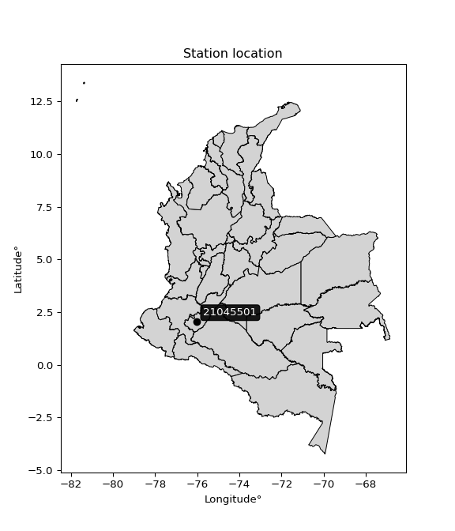

<div align="center">


</div>

# PMP Station (Rain, Pmax24h): 21045501

Probable Maximum Precipitation (PMP) is the greatest amount of rainfall for a specific duration that is meteorologically possible for a given location, acting as a "worst-case" scenario for extreme storms, crucial for designing safety-critical infrastructure like bridges, river deviations, dams, spillways, and nuclear plants to prevent catastrophic failure. PMP is calculated by hydrologists using meteorological data to determine the upper limit of extreme rainfall, often leading to the Probable Maximum Flood (PMF) for flood control design, and is increasingly being studied for climate change impacts. Probable Maximum Precipitation (PMP) is the theoretical upper limit of rainfall, a deterministic estimate for extreme events, while probability distributions (like GEV, Gumbel) describe the likelihood and frequency of various precipitation amounts, including rare ones, showing how often events occur, with PMP representing the extreme end of these distributions, used for critical infrastructure design to ensure safety against the worst conceivable weather, unlike standard statistical forecasts which cover typical probabilities.

The most common probability distributions in hydrology, used for analyzing floods, rainfall, and streamflow, include the Normal, Log-Normal, Gumbel, Gamma (including Log-Pearson Type III), and Generalized Extreme Value (GEV) distributions, often chosen based on the data´s skewness and whether modeling extremes or general conditions, with Gumbel and GEV popular for extreme events like floods, while the Normal distribution serves as a baseline, though often requiring transformations for skewed hydrological data. These distributions help in designing water infrastructure, managing water resources, and forecasting hydrologic events.

> Hydrological data often isn´t perfectly normal (it´s skewed), so different distributions are needed for different applications, such as: **Flood Frequency Analysis**: Using Gumbel, GEV, or Log-Pearson Type III for predicting extreme flood magnitudes and their return periods, **Rainfall Analysis**: Normal for annual totals, but Log-Normal, Weibull, or GEV for intensity or extreme daily rainfall, **Streamflow Modeling**: Gamma and Log-Normal for maximum flows, GEV for minimum flows, and Kappa for daily flows.

<div align="center">

</img>

</div>


## A. General information


### 1. General running parameters

• app_version: _v20260108_. • runtime: _2026-01-09 11:32:22.148588_. • Python version: _3.14.0_. • SciPy version: _1.16.3_. • Pandas version: _2.3.3_. • NumPy version: _2.3.5_. • Stations dataset (station_dataset_file): _dataset/pmax24h_in/automatic_colombia_2003_2024.csv_. • Stations catalog (station_catalog_file): _dataset/CNE.xls_. • Minimum year to eval til year_max (date_min): _1900_. • Maximum year to eval since year_min (date_max): _2024_. • Creates, save and include plots into reports (create_plot): _False_. • Plot only fit distributions with Δo > Δ (plot_only_fit): _True_. • Plot only simple graphs avoiding multiple CDFs and multiple Extreme values plots (plot_only_simple): _True_. • Eval low extreme values, if False, evaluates high extreme values (low_extreme): _False_. • Eval every SciPy distribution as logarithmic (pdist_logarithmic_on): _True_. • Standard deviation normalized (ddof): _1.0_. • Return periods to eval in years (Tr): _[2, 2.33, 5, 10, 15, 20, 25, 50, 75, 100, 200, 250, 500, 750, 1000]_. • Minimum data sample per station, 0 means any (minimum_sample): _5_. • Z-Score maximum threshold to adjust a value, 0 means disable (zscore_max): _3.5_. • Z-Score minimum threshold to adjust a value, 0 means disable (zscore_min): _-2.5_. • Avoid zeros, e.g. rain = 0 (avoid_zeros): _True_. • Avoid null values (avoid_nans): _True_. 

:file_folder:Table: [dataset.csv](../../dataset/pmax24h_in/automatic_colombia_2003_2024.csv)

> Delta Degrees of Freedom (DDOF): is a parameter used in the formulas for calculating variance and standard deviation. When ddof=0, the divisor is $N$ (the total number of observations) and this is used when your data set is the entire population. When ddof=1, the divisor is $N-1$ and this is used when your data set is a sample drawn from a larger population. Using $N-1$ provides an unbiased estimate of the population variance (known as Bessel´s correction).


### 2. Station info and location

|   id |   CODIGO | NOMBRE                     | CATEGORIA               | TECNOLOGIA                | ESTADO   | FECHA_INSTALACION   |   FECHA_SUSPENSION |   ALTITUD |   LATITUD |   LONGITUD | DEPARTAMENTO   | MUNICIPIO   | AREA_OPERATIVA                    | ENTIDAD                                    | AREA_HIDROGRAFICA   | ZONA_HIDROGRAFICA   | SUBZONA_HIDROGRAFICA            |   CORRIENTE | Catalogo   |   Version |
|-----:|---------:|:---------------------------|:------------------------|:--------------------------|:---------|:--------------------|-------------------:|----------:|----------:|-----------:|:---------------|:------------|:----------------------------------|:-------------------------------------------|:--------------------|:--------------------|:--------------------------------|------------:|:-----------|----------:|
|    0 | 21045501 | OPORAPA  - AUT  [21045501] | Climatológica Principal | Automática con Telemetría | Activa   | 20/07/2013          |                nan |      1665 |   2.04194 |   -76.0119 | Huila          | Oporapa     | Area Operativa 04 - Huila-Caquetá | CENTRO NACIONAL DE INVESTIGACIONES DE CAFE | Magdalena Cauca     | Alto Magdalena      | Ríos Directos al Magdalena (mi) |         nan | CNE_OE     |  20251226 |

<div align="center">

Dynamic map: [:earth_americas:Google](http://maps.google.com/maps?q=2.041941667,-76.01191667) [:earth_americas:OSM](https://www.openstreetmap.org/#map=18/2.041941667/-76.01191667&layers=P) [:earth_americas:Bing](https://www.bing.com/maps?cp=2.041941667~-76.01191667&lvl=18) [:earth_americas:Apple](https://maps.apple.com/frame?center=2.041941667%2C-76.01191667&span=0.003%2C0.006)

</div>


<div align="center">

```geojson
{
  "type": "Feature",
  "geometry": {
    "type": "Point", 
    "coordinates": [-76.01191667, 2.041941667]
  }, 
  "properties": {
    "Name": "21045501"
  }
}
```

</div>


### 3. Discrete values table and plot

<div align="center">

|               |          0 |          1 |          2 |           3 |            4 |            5 |           6 |           7 |
|:--------------|-----------:|-----------:|-----------:|------------:|-------------:|-------------:|------------:|------------:|
| Date          | 2016       | 2017       | 2018       | 2019        | 2020         | 2021         | 2022        | 2023        |
| Value         |   25.7     |   56.3     |   28       |   50.1      |   41.4       |   42         |   51.6      |   33.4      |
| Value_initial |   25.7     |   56.3     |   28       |   50.1      |   41.4       |   42         |   51.6      |   33.4      |
| count         |    8       |    8       |    8       |    8        |    8         |    8         |    8        |    8        |
| mean          |   41.0625  |   41.0625  |   41.0625  |   41.0625   |   41.0625    |   41.0625    |   41.0625   |   41.0625   |
| std           |   11.2836  |   11.2836  |   11.2836  |   11.2836   |   11.2836    |   11.2836    |   11.2836   |   11.2836   |
| zscore        |   -1.36149 |    1.35041 |   -1.15765 |    0.800941 |    0.0299106 |    0.0830851 |    0.933877 |   -0.679082 |


</div>


> The initial value (value_initial) correspond to the initial obtained or null completed value, and value (value) is adjusted only when the initial value is outside the valid range (outlier) definite through the Z-Score value. If Z-Score is active, values out of range or outliers are replaced with the station mean value. A Z-Score (or standard score) measures how many standard deviations a data point is from the mean of a dataset, indicating its relative position; positive scores mean above the mean, negative mean below, and a score of zero is exactly at the mean, allowing for comparison of values from different distributions. It´s calculated using the formula $z=(x–μ)/σ$, where $x$ is the data point, $μ$ is the mean, and $σ$ is the standard deviation, helping identify outliers and understand probability.
>
> <sub>**Note**: In this study, "completing" (filling gaps in) and "extending" (forecasting or lengthening the historical record) rainfall data series are avoided for certain critical analyses because they introduce artificial bias and uncertainty, which can distort the statistics of rare events (extremes), alter day-to-day variability, and compromise the integrity and homogeneity of the original data. Some reasons against Completing/Extending rainfall data are: **Distortion of Extremes and Variability**: The primary issue is that most gap-filling or extension methods rely on averaging or regression with nearby stations, which inherently smooths the data. Rainfall is highly variable in space and time, with a large percentage of zero values and occasional large storms. Infilling methods often underestimate the highest values and overestimate the lowest (zero) values, which severely distorts analyses focused on flood frequency, drought severity, and intensity-duration-frequency (IDF) curves, **Loss of Data Homogeneity**: Infilled or extended data are synthetic estimates, not actual measurements. Combining these estimates with observed data can violate the assumption of data homogeneity, which requires that the data properties do not change over time. Inhomogeneity can lead to incorrect conclusions about long-term trends or changes in climate patterns, **Propagation of Errors**: Errors and biases from the original data (e.g., wind-induced undercatch, instrument errors, site changes) or the data used for imputation can propagate through the analysis, leading to unreliable hydrological models and inaccurate predictions, **Compromised Statistical Integrity**: For statistical analyses, especially those involving the frequency of events, using artificial data can introduce time bias or autocorrelation that doesn´t exist in reality, making it difficult to assess the true probability of events, **Difficulty in Validation**: It is difficult to accurately validate the quality of filled or extended data, especially for past periods where ground-truth measurements are unavailable. The reliability of imputation techniques heavily depends on the density of the surrounding station network and the complexity of the local topography.</sub>


### 4. Active continuous probability distributions from SciPy (45 of 104 available)

A Probability Density Function (PDF) describes the relative likelihood of a continuous random variable falling within a specific range, where the total area under its curve equals 1, and the area over any interval gives the actual probability for that range. Unlike discrete probabilities (like rolling a die), a PDF shows density, not direct probability for a single point (which is zero), with higher points indicating higher likelihood, often visualized as a bell curve for normal distributions.

A log of a probability density function (log-PDF) is simply the logarithm of the PDF´s value, denoted as $log(f(x))$, useful for converting multiplication of probabilities into addition, improving numerical stability with tiny numbers, and connecting to information theory concepts like entropy. Instead of dealing with very small probabilities (e.g., 0.000001), log-PDFs use negative numbers (e.g., $log(0.00001) ≈ -11.51$ that are easier for computers to handle, preventing underflow errors and simplifying complex calculations. In this study, each active probability distribution from SciPy is also evaluated in the $log$ form.

[scipy.stats](https://docs.scipy.org/doc/scipy/reference/stats.html) is a Python´s powerful submodule within the SciPy library for comprehensive statistical analysis, offering over 130 probability distributions (like Normal, Poisson), functions for descriptive stats (mean, variance), hypothesis testing (t-tests, chi-square), random variable generation, and statistical tests, making it essential for data science, modeling, and research. It provides tools to explore, model, and draw conclusions from data efficiently, working seamlessly with NumPy.

<div align="center">

|   id | p_dist             |   n_parameter | fit_method   | label                                                                       | active   | ref                                                                                                        |
|-----:|:-------------------|--------------:|:-------------|:----------------------------------------------------------------------------|:---------|:-----------------------------------------------------------------------------------------------------------|
|    0 | alpha              |             3 | MLE          | Alpha                                                                       | True     | [:mortar_board:](https://docs.scipy.org/doc/scipy/reference/generated/scipy.stats.alpha.html)              |
|    1 | betaprime          |             4 | MLE          | Beta prime                                                                  | True     | [:mortar_board:](https://docs.scipy.org/doc/scipy/reference/generated/scipy.stats.betaprime.html)          |
|    2 | chi2               |             3 | MLE          | Chi²                                                                        | True     | [:mortar_board:](https://docs.scipy.org/doc/scipy/reference/generated/scipy.stats.chi2.html)               |
|    3 | crystalball        |             4 | MLE          | Crystalball                                                                 | True     | [:mortar_board:](https://docs.scipy.org/doc/scipy/reference/generated/scipy.stats.crystalball.html)        |
|    4 | dweibull           |             3 | MLE          | Double Weibull                                                              | True     | [:mortar_board:](https://docs.scipy.org/doc/scipy/reference/generated/scipy.stats.dweibull.html)           |
|    5 | erlang             |             3 | MLE          | Erlang                                                                      | True     | [:mortar_board:](https://docs.scipy.org/doc/scipy/reference/generated/scipy.stats.erlang.html)             |
|    6 | expon              |             2 | MLE          | Exponential                                                                 | True     | [:mortar_board:](https://docs.scipy.org/doc/scipy/reference/generated/scipy.stats.expon.html)              |
|    7 | exponnorm          |             3 | MLE          | Exponentially modified Normal                                               | True     | [:mortar_board:](https://docs.scipy.org/doc/scipy/reference/generated/scipy.stats.exponnorm.html)          |
|    8 | f                  |             4 | MLE          | F                                                                           | True     | [:mortar_board:](https://docs.scipy.org/doc/scipy/reference/generated/scipy.stats.f.html)                  |
|    9 | fatiguelife        |             3 | MLE          | Fatigue-life (Birnbaum-Saunders)                                            | True     | [:mortar_board:](https://docs.scipy.org/doc/scipy/reference/generated/scipy.stats.fatiguelife.html)        |
|   10 | fisk               |             3 | MLE          | Fisk                                                                        | True     | [:mortar_board:](https://docs.scipy.org/doc/scipy/reference/generated/scipy.stats.fisk.html)               |
|   11 | gamma              |             3 | MLE          | Gamma                                                                       | True     | [:mortar_board:](https://docs.scipy.org/doc/scipy/reference/generated/scipy.stats.gamma.html)              |
|   12 | genexpon           |             5 | MLE          | Generalized exponential                                                     | True     | [:mortar_board:](https://docs.scipy.org/doc/scipy/reference/generated/scipy.stats.genexpon.html)           |
|   13 | genlogistic        |             3 | MLE          | Generalized logistic                                                        | True     | [:mortar_board:](https://docs.scipy.org/doc/scipy/reference/generated/scipy.stats.genlogistic.html)        |
|   14 | gibrat             |             2 | MM           | Gibrat                                                                      | True     | [:mortar_board:](https://docs.scipy.org/doc/scipy/reference/generated/scipy.stats.gibrat.html)             |
|   15 | gompertz           |             3 | MLE          | Gompertz (or truncated Gumbel)                                              | True     | [:mortar_board:](https://docs.scipy.org/doc/scipy/reference/generated/scipy.stats.gompertz.html)           |
|   16 | gumbel_l           |             2 | MM           | Gumbel Left Skew                                                            | True     | [:mortar_board:](https://docs.scipy.org/doc/scipy/reference/generated/scipy.stats.gumbel_l.html)           |
|   17 | gumbel_r           |             2 | MM           | Gumbel Right Skew                                                           | True     | [:mortar_board:](https://docs.scipy.org/doc/scipy/reference/generated/scipy.stats.gumbel_r.html)           |
|   18 | halflogistic       |             2 | MM           | Half-logistic                                                               | True     | [:mortar_board:](https://docs.scipy.org/doc/scipy/reference/generated/scipy.stats.halflogistic.html)       |
|   19 | halfnorm           |             2 | MM           | Half Normal                                                                 | True     | [:mortar_board:](https://docs.scipy.org/doc/scipy/reference/generated/scipy.stats.halfnorm.html)           |
|   20 | hypsecant          |             2 | MM           | hyperbolic secant                                                           | True     | [:mortar_board:](https://docs.scipy.org/doc/scipy/reference/generated/scipy.stats.hypsecant.html)          |
|   21 | invgamma           |             3 | MLE          | Inverted gamma                                                              | True     | [:mortar_board:](https://docs.scipy.org/doc/scipy/reference/generated/scipy.stats.invgamma.html)           |
|   22 | invgauss           |             3 | MLE          | Inverse Gaussian                                                            | True     | [:mortar_board:](https://docs.scipy.org/doc/scipy/reference/generated/scipy.stats.invgauss.html)           |
|   23 | invweibull         |             3 | MLE          | Inverted Weibull                                                            | True     | [:mortar_board:](https://docs.scipy.org/doc/scipy/reference/generated/scipy.stats.invweibull.html)         |
|   24 | kappa4             |             4 | MLE          | Kappa 4                                                                     | True     | [:mortar_board:](https://docs.scipy.org/doc/scipy/reference/generated/scipy.stats.kappa4.html)             |
|   25 | kstwobign          |             2 | MLE          | Limiting distribution of scaled Kolmogorov-Smirnov two-sided test statistic | True     | [:mortar_board:](https://docs.scipy.org/doc/scipy/reference/generated/scipy.stats.kstwobign.html)          |
|   26 | laplace            |             2 | MM           | Laplace                                                                     | True     | [:mortar_board:](https://docs.scipy.org/doc/scipy/reference/generated/scipy.stats.laplace.html)            |
|   27 | laplace_asymmetric |             3 | MLE          | Asymmetric Laplace                                                          | True     | [:mortar_board:](https://docs.scipy.org/doc/scipy/reference/generated/scipy.stats.laplace_asymmetric.html) |
|   28 | loggamma           |             3 | MLE          | Log gamma                                                                   | True     | [:mortar_board:](https://docs.scipy.org/doc/scipy/reference/generated/scipy.stats.loggamma.html)           |
|   29 | logistic           |             2 | MM           | Logistic (or Sech-squared)                                                  | True     | [:mortar_board:](https://docs.scipy.org/doc/scipy/reference/generated/scipy.stats.logistic.html)           |
|   30 | lognorm            |             3 | MLE          | Log Normal                                                                  | True     | [:mortar_board:](https://docs.scipy.org/doc/scipy/reference/generated/scipy.stats.lognorm.html)            |
|   31 | maxwell            |             2 | MM           | Maxwell                                                                     | True     | [:mortar_board:](https://docs.scipy.org/doc/scipy/reference/generated/scipy.stats.maxwell.html)            |
|   32 | mielke             |             4 | MLE          | Mielke Beta-Kappa / Dagum                                                   | True     | [:mortar_board:](https://docs.scipy.org/doc/scipy/reference/generated/scipy.stats.mielke.html)             |
|   33 | moyal              |             2 | MM           | Moyal                                                                       | True     | [:mortar_board:](https://docs.scipy.org/doc/scipy/reference/generated/scipy.stats.moyal.html)              |
|   34 | nakagami           |             3 | MLE          | Nakagami                                                                    | True     | [:mortar_board:](https://docs.scipy.org/doc/scipy/reference/generated/scipy.stats.nakagami.html)           |
|   35 | ncf                |             5 | MLE          | Non-central F distribution                                                  | True     | [:mortar_board:](https://docs.scipy.org/doc/scipy/reference/generated/scipy.stats.ncf.html)                |
|   36 | nct                |             4 | MLE          | Non-central Student’s t                                                     | True     | [:mortar_board:](https://docs.scipy.org/doc/scipy/reference/generated/scipy.stats.nct.html)                |
|   37 | norm               |             2 | MM           | Normal                                                                      | True     | [:mortar_board:](https://docs.scipy.org/doc/scipy/reference/generated/scipy.stats.norm.html)               |
|   38 | pearson3           |             3 | MM           | Pearson type III                                                            | True     | [:mortar_board:](https://docs.scipy.org/doc/scipy/reference/generated/scipy.stats.pearson3.html)           |
|   39 | rayleigh           |             2 | MM           | Rayleigh                                                                    | True     | [:mortar_board:](https://docs.scipy.org/doc/scipy/reference/generated/scipy.stats.rayleigh.html)           |
|   40 | rice               |             3 | MLE          | Rice                                                                        | True     | [:mortar_board:](https://docs.scipy.org/doc/scipy/reference/generated/scipy.stats.rice.html)               |
|   41 | t                  |             3 | MLE          | Student’s t                                                                 | True     | [:mortar_board:](https://docs.scipy.org/doc/scipy/reference/generated/scipy.stats.t.html)                  |
|   42 | truncnorm          |             4 | MLE          | Truncated normal                                                            | True     | [:mortar_board:](https://docs.scipy.org/doc/scipy/reference/generated/scipy.stats.truncnorm.html)          |
|   43 | wald               |             2 | MM           | Wald                                                                        | True     | [:mortar_board:](https://docs.scipy.org/doc/scipy/reference/generated/scipy.stats.wald.html)               |
|   44 | weibull_min        |             3 | MLE          | Weibull minimum                                                             | True     | [:mortar_board:](https://docs.scipy.org/doc/scipy/reference/generated/scipy.stats.weibull_min.html)        |

</div>

> **n_parameter:** # arguments & localization & scale.
>
> **Fit methods:** (MLE) maximum likelihood, (MM) L-moments.
>
>**Inactive** (With the only purpose of prevent loops, zero divisions, infinite values, over high estimated values or horizontal trending for recurrence intervals estimations, the follow distributions were disabled.)**:** foldnorm, gennorm, norminvgauss, powernorm, powerlognorm, skewnorm, genextreme, anglit, arcsine, argus, beta, bradford, burr, burr12, cauchy, cosine, halfcauchy, foldcauchy, skewcauchy, wrapcauchy, dgamma, gengamma, exponweib, exponpow, truncexpon, gausshyper, genhalflogistic, genhyperbolic, geninvgauss, halfgennorm, johnsonsb, johnsonsu, kappa3, ksone, kstwo, loglaplace, levy, levy_l, levy_stable, ncx2, pareto, genpareto, truncpareto, lomax, powerlaw, rdist, rel_breitwigner, recipinvgauss, semicircular, studentized_range, trapezoid, triang, truncweibull_min, tukeylambda, uniform, loguniform, vonmises, vonmises_line, weibull_max, 


## B. Probability (PDF) vs. Empirical (EDF) distributions functions

A continuous probability distribution (CPD) describes probabilities for variables that can take any value within a range (like rain any time), unlike discrete variables with specific outcomes (like temperature). It uses a Probability Density Function (PDF), a curve where the total area under it equals 1, and the probability of the variable falling within an interval (a to b) is found by calculating the area under the curve between those points. A key feature is that the probability of hitting any single exact value is zero, so probabilities are always expressed for ranges, e.g., $P(a ≤ X ≤ b)$.

<div align="center">

Distributions parameters from station values
|    |   station | p_dist                |   n |               loc |            scale | shape                  | shape1                | shape2             | shape3   |
|---:|----------:|:----------------------|----:|------------------:|-----------------:|:-----------------------|:----------------------|:-------------------|:---------|
|  0 |  21045501 | alpha                 |   8 |    -123.84        |   2537.29        | 15.451030160646745     |                       |                    |          |
|  1 |  21045501 | betaprime             |   8 |     -48.2389      |   5387.2         | 71.43020359274412      | 4307.7245627341       |                    |          |
|  2 |  21045501 | chi2                  |   8 |      25.7         |      2.29555     | 0.48308911513548597    |                       |                    |          |
|  3 |  21045501 | crystalball           |   8 |      41.0625      |     10.5548      | 2304.2275485204614     | 5244.275302555612     |                    |          |
|  4 |  21045501 | dweibull              |   8 |      41.4         |      8.85348     | 0.9902156834566458     |                       |                    |          |
|  5 |  21045501 | erlang                |   8 |    -263.387       |      0.368076    | 827.1184350813421      |                       |                    |          |
|  6 |  21045501 | expon                 |   8 |      25.7         |     15.3625      |                        |                       |                    |          |
|  7 |  21045501 | exponnorm             |   8 |      41.05        |     10.5548      | 0.001187817816942177   |                       |                    |          |
|  8 |  21045501 | f                     |   8 |    -906.235       |    947.278       | 16712.006676151123     | 381103.10644074203    |                    |          |
|  9 |  21045501 | fatiguelife           |   8 |      25.7         |      7.68016e-06 | 1261.3610978505033     |                       |                    |          |
| 10 |  21045501 | fisk                  |   8 |      -0.0973306   |     40.374       | 6.046896177865465      |                       |                    |          |
| 11 |  21045501 | gamma                 |   8 |    -259.962       |      0.372189    | 808.7614361657843      |                       |                    |          |
| 12 |  21045501 | genexpon              |   8 |      25.7         |      2.84572     | 0.18537321003859103    | 5.567182809558347e-07 | 1.3586143674200086 |          |
| 13 |  21045501 | genlogistic           |   8 |     -14.9625      |      9.54044     | 204.16454361960268     |                       |                    |          |
| 14 |  21045501 | gibrat                |   8 |      33.0104      |      4.88381     |                        |                       |                    |          |
| 15 |  21045501 | gompertz              |   8 |     -25.9514      |      2.82417     | 1.2647635087825744e-12 |                       |                    |          |
| 16 |  21045501 | gumbel_l              |   8 |      45.8127      |      8.22958     |                        |                       |                    |          |
| 17 |  21045501 | gumbel_r              |   8 |      36.3123      |      8.22958     |                        |                       |                    |          |
| 18 |  21045501 | halflogistic          |   8 |      28.5525      |      9.02403     |                        |                       |                    |          |
| 19 |  21045501 | halfnorm              |   8 |      27.092       |     17.5094      |                        |                       |                    |          |
| 20 |  21045501 | hypsecant             |   8 |      41.0625      |      6.71943     |                        |                       |                    |          |
| 21 |  21045501 | invgamma              |   8 |     -61.1883      |   9097.33        | 89.87298367527737      |                       |                    |          |
| 22 |  21045501 | invgauss              |   8 |     -18.3443      |   1698.41        | 0.034912273156788326   |                       |                    |          |
| 23 |  21045501 | invweibull            |   8 |      -1.89471e+09 |      1.89471e+09 | 201487479.47126245     |                       |                    |          |
| 24 |  21045501 | kappa4                |   8 |      22.3518      |     36.3467      | 1.101643934007709      | 1.0706532871131327    |                    |          |
| 25 |  21045501 | kstwobign             |   8 |       2.91879     |     43.4784      |                        |                       |                    |          |
| 26 |  21045501 | laplace               |   8 |      41.0625      |      7.46341     |                        |                       |                    |          |
| 27 |  21045501 | laplace_asymmetric    |   8 |      42           |      8.90059     | 1.0540609221846908     |                       |                    |          |
| 28 |  21045501 | loggamma              |   8 |     -40.8587      |     34.6336      | 11.144073865950752     |                       |                    |          |
| 29 |  21045501 | logistic              |   8 |      41.0625      |      5.81919     |                        |                       |                    |          |
| 30 |  21045501 | lognorm               |   8 |      25.7         |      0.153695    | 11.893472002948718     |                       |                    |          |
| 31 |  21045501 | maxwell               |   8 |      16.0519      |     15.673       |                        |                       |                    |          |
| 32 |  21045501 | mielke                |   8 |   -1375.16        |   1334.45        | 569158.7866629381      | 148.30986963660894    |                    |          |
| 33 |  21045501 | moyal                 |   8 |      35.0266      |      4.75135     |                        |                       |                    |          |
| 34 |  21045501 | nakagami              |   8 |      25.7         |     16.7932      | 0.3289548260015166     |                       |                    |          |
| 35 |  21045501 | ncf                   |   8 |      -0.619955    |      9.25143e-08 | 2.8481810230475634e-07 | 53.290186442683535    | 123.76472269039388 |          |
| 36 |  21045501 | nct                   |   8 |     772.319       |     10.5416      | 920585.6115033454      | -69.36876606626873    |                    |          |
| 37 |  21045501 | norm                  |   8 |      41.0625      |     10.5548      |                        |                       |                    |          |
| 38 |  21045501 | pearson3              |   8 |      41.0625      |     10.5548      | -0.09114978387610385   |                       |                    |          |
| 39 |  21045501 | rayleigh              |   8 |      20.8705      |     16.1109      |                        |                       |                    |          |
| 40 |  21045501 | rice                  |   8 |      20.3313      |     12.6624      | 1.1727500557244306     |                       |                    |          |
| 41 |  21045501 | t                     |   8 |      41.0625      |     10.5548      | 286374823.92364776     |                       |                    |          |
| 42 |  21045501 | truncnorm             |   8 |      43.409       |     11.9987      | -104.93430503616867    | 1.0794911812806163    |                    |          |
| 43 |  21045501 | wald                  |   8 |      30.5077      |     10.5548      |                        |                       |                    |          |
| 44 |  21045501 | weibull_min           |   8 |      23.5741      |     19.3366      | 1.5697853924206835     |                       |                    |          |
| 45 |  21045501 | logalpha              |   8 |      -4.06898     |    215.553       | 27.856141078106        |                       |                    |          |
| 46 |  21045501 | logbetaprime          |   8 |      -1.67192     |   1102.53        | 374.5212314983603      | 77138.03110705383     |                    |          |
| 47 |  21045501 | logchi2               |   8 |       3.24649     |      0.934663    | 1.1185468791287976     |                       |                    |          |
| 48 |  21045501 | logcrystalball        |   8 |       3.67955     |      0.271726    | 563.7998951404985      | 93.44213653849916     |                    |          |
| 49 |  21045501 | logdweibull           |   8 |       3.61603     |      0.287336    | 2.4098824270323247     |                       |                    |          |
| 50 |  21045501 | logerlang             |   8 |      -1.08896     |      0.0157628   | 302.44759986803115     |                       |                    |          |
| 51 |  21045501 | logexpon              |   8 |       3.24649     |      0.433064    |                        |                       |                    |          |
| 52 |  21045501 | logexponnorm          |   8 |       3.6793      |      0.271726    | 0.0009455144321912445  |                       |                    |          |
| 53 |  21045501 | logf                  |   8 |     -97.7649      |    101.444       | 850144.294365292       | 412130.4294217641     |                    |          |
| 54 |  21045501 | logfatiguelife        |   8 |     -48.2797      |     51.9589      | 0.0052246910052695245  |                       |                    |          |
| 55 |  21045501 | logfisk               |   8 |      -3.46301e+07 |      3.46301e+07 | 209134858.67394167     |                       |                    |          |
| 56 |  21045501 | loggamma              |   8 |      -0.724749    |      0.0172577   | 255.1289193924183      |                       |                    |          |
| 57 |  21045501 | loggenexpon           |   8 |       3.24636     |      3.7438      | 4.158507228307142      | 32.483380856192355    | 1.83369807897056   |          |
| 58 |  21045501 | loggenlogistic        |   8 |       4.03071     |      9.7025e-07  | 2.7648362780373998e-06 |                       |                    |          |
| 59 |  21045501 | loggibrat             |   8 |       3.47223     |      0.125745    |                        |                       |                    |          |
| 60 |  21045501 | loggompertz           |   8 |       3.24649     |      0.722317    | 1.097642485988605      |                       |                    |          |
| 61 |  21045501 | loggumbel_l           |   8 |       3.80185     |      0.211864    |                        |                       |                    |          |
| 62 |  21045501 | loggumbel_r           |   8 |       3.55726     |      0.211864    |                        |                       |                    |          |
| 63 |  21045501 | loghalflogistic       |   8 |       3.35749     |      0.232319    |                        |                       |                    |          |
| 64 |  21045501 | loghalfnorm           |   8 |       3.31993     |      0.450728    |                        |                       |                    |          |
| 65 |  21045501 | loghypsecant          |   8 |       3.67955     |      0.172986    |                        |                       |                    |          |
| 66 |  21045501 | loginvgamma           |   8 |      -4.3248      |   6767.25        | 846.4552783487277      |                       |                    |          |
| 67 |  21045501 | loginvgauss           |   8 |       1.48724     |    132.29        | 0.01654031494062161    |                       |                    |          |
| 68 |  21045501 | loginvweibull         |   8 |      -2.55859e+07 |      2.55859e+07 | 98131342.62784839      |                       |                    |          |
| 69 |  21045501 | logkappa4             |   8 |       3.17173     |      0.878639    | 1.0930710102609607     | 1.0166550468878526    |                    |          |
| 70 |  21045501 | logkstwobign          |   8 |       2.64322     |      1.18057     |                        |                       |                    |          |
| 71 |  21045501 | loglaplace            |   8 |       3.67955     |      0.192139    |                        |                       |                    |          |
| 72 |  21045501 | loglaplace_asymmetric |   8 |       3.73767     |      0.221264    | 1.1399867617709436     |                       |                    |          |
| 73 |  21045501 | logloggamma           |   8 |       4.03071     |      4.26115e-07 | 1.2139524748436354e-06 |                       |                    |          |
| 74 |  21045501 | loglogistic           |   8 |       3.67955     |      0.14981     |                        |                       |                    |          |
| 75 |  21045501 | loglognorm            |   8 |       3.24649     |      0.00551227  | 11.415500808271164     |                       |                    |          |
| 76 |  21045501 | logmaxwell            |   8 |       3.03568     |      0.403489    |                        |                       |                    |          |
| 77 |  21045501 | logmielke             |   8 |       3.24649     |      0.784631    | 0.6967452574469659     | 28382.14162388323     |                    |          |
| 78 |  21045501 | logmoyal              |   8 |       3.52416     |      0.122319    |                        |                       |                    |          |
| 79 |  21045501 | lognakagami           |   8 |       3.24649     |      0.560154    | 0.1813186129517052     |                       |                    |          |
| 80 |  21045501 | logncf                |   8 |     -54.6709      |     57.5967      | 136312.22509400002     | 284719.84830621124    | 1778.3833053904953 |          |
| 81 |  21045501 | lognct                |   8 |      -6.11812     |      0.224382    | 1933.1730299163992     | 43.647434980557364    |                    |          |
| 82 |  21045501 | lognorm               |   8 |       3.67955     |      0.271726    |                        |                       |                    |          |
| 83 |  21045501 | logpearson3           |   8 |       3.67955     |      0.271726    | -0.3319239579856497    |                       |                    |          |
| 84 |  21045501 | lograyleigh           |   8 |       3.15973     |      0.414762    |                        |                       |                    |          |
| 85 |  21045501 | logrice               |   8 |       3.10373     |      0.312612    | 1.4657495441720911     |                       |                    |          |
| 86 |  21045501 | logt                  |   8 |       3.67956     |      0.271726    | 2094048343.47936       |                       |                    |          |
| 87 |  21045501 | logtruncnorm          |   8 |      -0.0670777   |      1.31559     | 2.5186896253687223     | 5.4133412505162966    |                    |          |
| 88 |  21045501 | logwald               |   8 |       3.40784     |      0.271716    |                        |                       |                    |          |
| 89 |  21045501 | logweibull_min        |   8 | -115030           | 115034           | 520597.7234509646      |                       |                    |          |

</div>

> **loc** (Location parameter): This shifts the distribution along the x-axis. For many common distributions, like the normal (Gaussian) distribution, loc represents the mean $μ$. For others, like the uniform distribution, it might represent the minimum value, or for the beta distribution, the left end of the support interval.
>
> **scale** (Scale parameter): This determines the width or spread of the distribution. For the normal distribution, scale represents the standard deviation $σ$. For a uniform distribution, it defines the length of the interval (from $loc$ to $loc + scale$).
>
> **shape** (Shape parameters): Refers to parameters that define the specific form of a probability distribution, distinct from its location (loc) and scale (scale). These parameters are required arguments for most distribution functions. For example, a normal (Gaussian) distribution is fully defined by its location (mean) and scale (standard deviation), so it has no specific shape parameters beyond loc and scale. However, other distributions have intrinsic properties that need specification, as Gamma distribution that takes a shape parameter, often named $a$ or $alpha$.


### 0. Cumulative distribution values - CDF (90 evaluated)

Cumulative Distribution Function (CDF), denoted as $F$<sub>$X$</sub>$(x)$, is a function that gives the probability that a random variable $X$ will take a value less than or equal to a specific value, $x$ (i.e., $(P(X≥x)$. It essentially "accumulates" probabilities from a given point up to the far right (positive infinity), providing a complete picture of the distribution´s probabilities for both discrete (like rain) and continuous (like temperature) variables, helping to find probabilities over ranges or above certain values. Each station is evaluated separately ordering the $x$ values ascending, calculating the CDF and PDF values for the activated distributions and their logarithmic forms.

<div align="center">

CDF ordered by x ascending and calculating $log(f(x))$ separately
|   id |   Station |   date |    x |   count |    mean |     std |     zscore |   Value_initial |   station |   m |     alpha |   alpha_pdf |   betaprime |   betaprime_pdf |        chi2 |    chi2_pdf |   crystalball |   crystalball_pdf |   dweibull |   dweibull_pdf |    erlang |   erlang_pdf |    expon |   expon_pdf |   exponnorm |   exponnorm_pdf |         f |     f_pdf |   fatiguelife |   fatiguelife_pdf |      fisk |   fisk_pdf |    gamma |   gamma_pdf |    genexpon |   genexpon_pdf |   genlogistic |   genlogistic_pdf |     gibrat |   gibrat_pdf |    gompertz |   gompertz_pdf |   gumbel_l |   gumbel_l_pdf |   gumbel_r |   gumbel_r_pdf |   halflogistic |   halflogistic_pdf |   halfnorm |   halfnorm_pdf |   hypsecant |   hypsecant_pdf |   invgamma |   invgamma_pdf |   invgauss |   invgauss_pdf |   invweibull |   invweibull_pdf |      kappa4 |   kappa4_pdf |   kstwobign |   kstwobign_pdf |   laplace |   laplace_pdf |   laplace_asymmetric |   laplace_asymmetric_pdf |   loggamma |   loggamma_pdf |   logistic |   logistic_pdf |   lognorm |   lognorm_pdf |   maxwell |   maxwell_pdf |   mielke |   mielke_pdf |      moyal |   moyal_pdf |    nakagami |   nakagami_pdf |       ncf |   ncf_pdf |       nct |   nct_pdf |      norm |   norm_pdf |   pearson3 |   pearson3_pdf |   rayleigh |   rayleigh_pdf |      rice |   rice_pdf |         t |     t_pdf |   truncnorm |   truncnorm_pdf |     wald |   wald_pdf |   weibull_min |   weibull_min_pdf |   logalpha |   logalpha_pdf |   logbetaprime |   logbetaprime_pdf |     logchi2 |   logchi2_pdf |   logcrystalball |   logcrystalball_pdf |   logdweibull |   logdweibull_pdf |   logerlang |   logerlang_pdf |   logexpon |   logexpon_pdf |   logexponnorm |   logexponnorm_pdf |      logf |   logf_pdf |   logfatiguelife |   logfatiguelife_pdf |   logfisk |   logfisk_pdf |   loggenexpon |   loggenexpon_pdf |   loggenlogistic |   loggenlogistic_pdf |   loggibrat |   loggibrat_pdf |   loggompertz |   loggompertz_pdf |   loggumbel_l |   loggumbel_l_pdf |   loggumbel_r |   loggumbel_r_pdf |   loghalflogistic |   loghalflogistic_pdf |   loghalfnorm |   loghalfnorm_pdf |   loghypsecant |   loghypsecant_pdf |   loginvgamma |   loginvgamma_pdf |   loginvgauss |   loginvgauss_pdf |   loginvweibull |   loginvweibull_pdf |   logkappa4 |   logkappa4_pdf |   logkstwobign |   logkstwobign_pdf |   loglaplace |   loglaplace_pdf |   loglaplace_asymmetric |   loglaplace_asymmetric_pdf |   logloggamma |   logloggamma_pdf |   loglogistic |   loglogistic_pdf |   loglognorm |   loglognorm_pdf |   logmaxwell |   logmaxwell_pdf |   logmielke |   logmielke_pdf |   logmoyal |   logmoyal_pdf |   lognakagami |   lognakagami_pdf |    logncf |   logncf_pdf |    lognct |   lognct_pdf |   logpearson3 |   logpearson3_pdf |   lograyleigh |   lograyleigh_pdf |   logrice |   logrice_pdf |      logt |   logt_pdf |   logtruncnorm |   logtruncnorm_pdf |   logwald |   logwald_pdf |   logweibull_min |   logweibull_min_pdf |
|-----:|----------:|-------:|-----:|--------:|--------:|--------:|-----------:|----------------:|----------:|----:|----------:|------------:|------------:|----------------:|------------:|------------:|--------------:|------------------:|-----------:|---------------:|----------:|-------------:|---------:|------------:|------------:|----------------:|----------:|----------:|--------------:|------------------:|----------:|-----------:|---------:|------------:|------------:|---------------:|--------------:|------------------:|-----------:|-------------:|------------:|---------------:|-----------:|---------------:|-----------:|---------------:|---------------:|-------------------:|-----------:|---------------:|------------:|----------------:|-----------:|---------------:|-----------:|---------------:|-------------:|-----------------:|------------:|-------------:|------------:|----------------:|----------:|--------------:|---------------------:|-------------------------:|-----------:|---------------:|-----------:|---------------:|----------:|--------------:|----------:|--------------:|---------:|-------------:|-----------:|------------:|------------:|---------------:|----------:|----------:|----------:|----------:|----------:|-----------:|-----------:|---------------:|-----------:|---------------:|----------:|-----------:|----------:|----------:|------------:|----------------:|---------:|-----------:|--------------:|------------------:|-----------:|---------------:|---------------:|-------------------:|------------:|--------------:|-----------------:|---------------------:|--------------:|------------------:|------------:|----------------:|-----------:|---------------:|---------------:|-------------------:|----------:|-----------:|-----------------:|---------------------:|----------:|--------------:|--------------:|------------------:|-----------------:|---------------------:|------------:|----------------:|--------------:|------------------:|--------------:|------------------:|--------------:|------------------:|------------------:|----------------------:|--------------:|------------------:|---------------:|-------------------:|--------------:|------------------:|--------------:|------------------:|----------------:|--------------------:|------------:|----------------:|---------------:|-------------------:|-------------:|-----------------:|------------------------:|----------------------------:|--------------:|------------------:|--------------:|------------------:|-------------:|-----------------:|-------------:|-----------------:|------------:|----------------:|-----------:|---------------:|--------------:|------------------:|----------:|-------------:|----------:|-------------:|--------------:|------------------:|--------------:|------------------:|----------:|--------------:|----------:|-----------:|---------------:|-------------------:|----------:|--------------:|-----------------:|---------------------:|
|    0 |  21045501 |   2016 | 25.7 |       8 | 41.0625 | 11.2836 | -1.36149   |            25.7 |  21045501 |   1 | 0.0647254 |   0.0143393 |   0.0669356 |       0.0138406 | 0.000246467 | 1.6757e+10  |     0.0727665 |         0.0131051 |  0.0857302 |     0.00953489 | 0.0715841 |    0.0133573 | 0        |  0.0650936  |   0.0727663 |       0.0131051 | 0.0729812 | 0.0132435 |     0.0813264 |       4.24358e+10 | 0.0624736 |  0.013729  | 0.071616 |   0.0133686 | 1.12091e-06 |     0.0651409  |     0.0574355 |         0.0170805 | 0          |   0          | 0.000110876 |    3.92574e-05 |  0.0831548 |     0.00967211 |  0.026488  |      0.0116871 |       0        |          0         |  0         |      0         |   0.0644869 |      0.00953157 |  0.0642206 |      0.0144257 |   0.065323 |      0.0157094 |    0.0554486 |        0.0170545 | 0.000397618 |    0.061398  |   0.0534814 |       0.0187513 | 0.0638305 |    0.00855247 |            0.0926159 |                0.0098719 |  0.0548671 |       0.431553 |  0.0666099 |      0.0106841 | 0.0554955 |      0.412301 | 0.0554427 |     0.0159615 |      nan |          nan | 0.00762227 |  0.00637115 | 3.78103e-11 |  7001.9        | 0.0558412 | 0.0157051 | 0.0727798 | 0.0131049 | 0.0727665 |  0.0131051 |  0.0749888 |      0.0128486 |  0.0439361 |      0.017789  | 0.0445467 |  0.0163529 | 0.0727656 | 0.0131051 |   0.0813934 |       0.0130123 | 0        | 0          |     0.0307643 |         0.0223641 |  0.0537784 |       0.440171 |      0.0553629 |           0.426869 | 2.05403e-09 |   2.58679e+06 |        0.0554955 |             0.412301 |     0.0799083 |          0.955566 |    0.054058 |        0.426526 |   0        |       2.30913  |      0.0554961 |           0.412304 | 0.0555579 |   0.413757 |        0.0547267 |             0.411598 | 0.0622047 |      0.352293 |   0.000146766 |          1.11117  |         0        |             0.304974 |    0        |        0        |   1.45171e-08 |          1.51961  |     0.0701289 |          0.319122 |     0.0130944 |          0.267963 |          0        |              0        |     0         |          0        |      0.0519606 |           0.299042 |     0.0537577 |          0.427515 |     0.0505953 |          0.463899 |        0.045785 |            0.541523 | 2.53446e-15 |        26.0201  |      0.0435311 |           0.609679 |    0.052494  |         0.273208 |               0.0806231 |                    0.319631 |      0.107084 |          0.305071 |     0.0526127 |          0.332718 |    0.0041316 |      2.40563e+12 |    0.034972  |         0.470931 | 2.38007e-11 |    37341.6      | 0.00186277 |      0.0802329 |   2.65492e-06 |       2.16797e+09 | 0.0559758 |     0.41777  | 0.0557423 |     0.421311 |     0.0635271 |          0.392295 |     0.0216421 |          0.493441 | 0.0357205 |      0.501357 | 0.0554954 |   0.4123   |    2.97844e-09 |           2.15857  |  0        |      0        |        0.0751768 |             0.327099 |
|    1 |  21045501 |   2018 | 28   |       8 | 41.0625 | 11.2836 | -1.15765   |            28   |  21045501 |   2 | 0.103968  |   0.0198687 |   0.104528  |       0.0189376 | 0.852243    | 0.0592949   |     0.107935  |         0.0175741 |  0.110742  |     0.0123358  | 0.107528  |    0.0179937 | 0.139047 |  0.0560425  |   0.107935  |       0.017574  | 0.108524  | 0.0177586 |     0.667801  |       0.0342468   | 0.100464  |  0.019449  | 0.107591 |   0.0180091 | 0.139142    |     0.0560772  |     0.105568  |         0.0247428 | 0          |   0          | 0.00025032  |    8.86238e-05 |  0.108464  |     0.0124377  |  0.0642016 |      0.0214203 |       0        |          0         |  0.0413566 |      0.0455077 |   0.0905057 |      0.0132885  |  0.103703  |      0.0199828 |   0.108351 |      0.0217422 |    0.103856  |        0.0250125 | 0.0901023   |    0.0355627 |   0.106647  |       0.0272754 | 0.086869  |    0.0116393  |            0.118347  |                0.0126145 |  0.102288  |       0.683595 |  0.0958053 |      0.0148864 | 0.10057   |      0.648549 | 0.0992662 |     0.0221248 |      nan |          nan | 0.0361945  |  0.0196064  | 0.209584    |     0.0596731  | 0.0999558 | 0.0226884 | 0.107947  | 0.017573  | 0.107935  |  0.0175741 |  0.109316  |      0.0170989 |  0.0932747 |      0.0249056 | 0.0894978 |  0.022622  | 0.107934  | 0.0175741 |   0.115759  |       0.0169529 | 0        | 0          |     0.0940714 |         0.0317447 |  0.102393  |       0.702604 |      0.102107  |           0.672337 | 0.197265    |   1.24972     |        0.10057   |             0.648549 |     0.189385  |          1.56109  |    0.101024 |        0.678269 |   0.179567 |       1.89448  |      0.10057   |           0.648553 | 0.100788  |   0.650678 |        0.099829  |             0.650013 | 0.100158  |      0.544284 |   0.104879    |          1.31406  |         0        |             0.389349 |    0        |        0        |   0.129158    |          1.49007  |     0.103239  |          0.461225 |     0.0554113 |          0.756634 |          0        |              0        |     0.0217327 |          1.76955  |      0.0849651 |           0.485356 |     0.100878  |          0.680841 |     0.102639  |          0.758168 |        0.10863  |            0.924855 | 0.129305    |         1.38145 |      0.114782  |           1.04028  |    0.0820067 |         0.426809 |               0.11325   |                    0.44898  |      0.136702 |          0.389449 |     0.0895939 |          0.544468 |    0.594981  |      0.396113    |    0.0899986 |         0.815249 | 0.213796    |        1.73789  | 0.0284028  |      0.647344  |   0.402024    |       1.69478     | 0.101646  |     0.656924 | 0.101827  |     0.662847 |     0.105263  |          0.589851 |     0.0828309 |          0.919564 | 0.0915595 |      0.799786 | 0.100569  |   0.648547 |    0.170519    |           1.828    |  0        |      0        |        0.108802  |             0.46458  |
|    2 |  21045501 |   2023 | 33.4 |       8 | 41.0625 | 11.2836 | -0.679082  |            33.4 |  21045501 |   3 | 0.24655   |   0.0323703 |   0.240381  |       0.0310254 | 0.974784    | 0.00731471  |     0.233929  |         0.0290412 |  0.202373  |     0.0226568  | 0.236457  |    0.0296272 | 0.394209 |  0.0394331  |   0.233928  |       0.0290412 | 0.235614  | 0.0292305 |     0.786349  |       0.0150064   | 0.24433   |  0.0333297 | 0.23662  |   0.0296471 | 0.394431    |     0.0394474  |     0.278136  |         0.0371893 | 0.00572453 |   0.0418651  | 0.00169271  |    0.000598858 |  0.198511  |     0.0215511  |  0.24061   |      0.0416507 |       0.262309 |          0.0515953 |  0.281349  |      0.0427057 |   0.196994  |      0.0274811  |  0.246636  |      0.0323369 |   0.261079 |      0.0338496 |    0.279335  |        0.0378842 | 0.270998    |    0.0322443 |   0.29054   |       0.0383198 | 0.179098  |    0.0239968  |            0.21044   |                0.0224308 |  0.273404  |       1.23895  |  0.211357  |      0.0286441 | 0.264574  |      1.20443  | 0.253025  |     0.0338018 |      nan |          nan | 0.23535    |  0.0492761  | 0.456998    |     0.0370601  | 0.261729  | 0.0358199 | 0.233929  | 0.0290383 | 0.233929  |  0.0290412 |  0.231698  |      0.0282661 |  0.260967  |      0.0356745 | 0.244336  |  0.0337086 | 0.233928  | 0.0290414 |   0.235039  |       0.0273067 | 0.137953 | 0.100723   |     0.292144  |         0.0390734 |  0.277519  |       1.25824  |      0.270282  |           1.21952  | 0.356568    |   0.694913    |        0.264574  |             1.20443  |     0.455371  |          0.954644 |    0.271572 |        1.23921  |   0.454003 |       1.26078  |      0.264575  |           1.20444  | 0.265133  |   1.20543  |        0.264461  |             1.20928  | 0.244076  |      1.11423  |   0.350312    |          1.40103  |         0        |             0.643557 |    0.107151 |        5.08004  |   0.38126     |          1.35148  |     0.221581  |          0.92034  |     0.284086  |          1.68748  |          0.314132 |              1.93984  |     0.324418  |          1.62179  |      0.226797  |           1.20292  |     0.271914  |          1.24077  |     0.289831  |          1.3202   |        0.323461 |            1.40023  | 0.360169    |         1.26177 |      0.344145  |           1.42875  |    0.205333  |         1.06867  |               0.227863  |                    0.903364 |      0.225926 |          0.643638 |     0.242056  |          1.22465  |    0.632423  |      0.125938    |    0.288244  |         1.36674  | 0.465769    |        1.23833  | 0.286477   |      1.9698    |   0.599679    |       0.802365    | 0.267367  |     1.21376  | 0.26845   |     1.21532  |     0.253494  |          1.10204  |     0.297891  |          1.4237   | 0.280397  |      1.30001  | 0.264573  |   1.20443  |    0.442242    |           1.28131  |  0.240658 |      3.81325  |        0.225757  |             0.896544 |
|    3 |  21045501 |   2020 | 41.4 |       8 | 41.0625 | 11.2836 |  0.0299106 |            41.4 |  21045501 |   4 | 0.538179  |   0.0369024 |   0.526878  |       0.0372473 | 0.997104    | 0.000746048 |     0.512754  |         0.0377777 |  0.5       |     0.0785751  | 0.517588  |    0.0376205 | 0.640114 |  0.0234262  |   0.512754  |       0.0377777 | 0.514815  | 0.0376442 |     0.8715    |       0.0075754   | 0.54139   |  0.0361798 | 0.517856 |   0.0376226 | 0.640383    |     0.0234258  |     0.574514  |         0.0333299 | 0.705767   |   0.0410773  | 0.0283751   |    0.00990334  |  0.442874  |     0.0396009  |  0.58339   |      0.0382022 |       0.611834 |          0.0346663 |  0.586163  |      0.0326339 |   0.515981  |      0.0473119  |  0.536414  |      0.0365379 |   0.553027 |      0.0355739 |    0.580016  |        0.0335972 | 0.522833    |    0.0310286 |   0.586322  |       0.0327576 | 0.522107  |    0.0640315  |            0.493696  |                0.0526229 |  0.572939  |       1.41322  |  0.514495  |      0.0429252 | 0.563922  |      1.44929  | 0.545251  |     0.0360068 |      nan |          nan | 0.609105   |  0.0376732  | 0.693929    |     0.0233468  | 0.561761  | 0.0353074 | 0.512733  | 0.0377761 | 0.512754  |  0.0377777 |  0.506701  |      0.0378263 |  0.555974  |      0.0351194 | 0.536857  |  0.036473  | 0.512756  | 0.037778  |   0.504193  |       0.0381315 | 0.680558 | 0.0360362  |     0.585264  |         0.032144  |  0.576774  |       1.38994  |      0.567037  |           1.41088  | 0.479167    |   0.475873    |        0.563922  |             1.44929  |     0.544413  |          0.952258 |    0.572274 |        1.42232  |   0.667451 |       0.767898 |      0.563923  |           1.44929  | 0.564149  |   1.44538  |        0.56446   |             1.44911  | 0.541476  |      1.49939  |   0.623761    |          1.09796  |         0        |             1.18665  |    0.755338 |        1.25128  |   0.64165     |          1.05368  |     0.498505  |          1.63366  |     0.633334  |          1.36541  |          0.656853 |              1.22363  |     0.629157  |          1.18611  |      0.579616  |           1.78283  |     0.572024  |          1.41543  |     0.592085  |          1.35297  |        0.609362 |            1.15768  | 0.624636    |         1.20905 |      0.627465  |           1.13179  |    0.601769  |         2.07262  |               0.533801  |                    2.11626  |      0.416521 |          1.18662  |     0.572455  |          1.63374  |    0.651993  |      0.067911    |    0.59335   |         1.34432  | 0.706752    |        1.0328   | 0.65768    |      1.31008   |   0.734958    |       0.499913    | 0.567511  |     1.44587  | 0.566963  |     1.43018  |     0.542564  |          1.4853   |     0.602709  |          1.30151  | 0.58039   |      1.3735   | 0.563921  |   1.44929  |    0.663577    |           0.811365 |  0.725256 |      1.16077  |        0.491432  |             1.55622  |
|    4 |  21045501 |   2021 | 42   |       8 | 41.0625 | 11.2836 |  0.0830851 |            42   |  21045501 |   5 | 0.56017   |   0.0363851 |   0.549122  |       0.0368816 | 0.997518    | 0.000636292 |     0.535388  |         0.0376483 |  0.533607  |     0.0535557  | 0.540106  |    0.0374176 | 0.653899 |  0.0225289  |   0.535387  |       0.0376483 | 0.537361  | 0.0374883 |     0.875948  |       0.00725436  | 0.562852  |  0.0353428 | 0.540375 |   0.0374177 | 0.654168    |     0.0225279  |     0.594229  |         0.0323776 | 0.729115   |   0.0368413  | 0.034973    |    0.0121644   |  0.466985  |     0.0407525  |  0.60592   |      0.0368877 |       0.632212 |          0.0332617 |  0.605468  |      0.0317141 |   0.544267  |      0.0469142  |  0.558186  |      0.0360189 |   0.574179 |      0.0349191 |    0.599878  |        0.0325998 | 0.541442    |    0.0310024 |   0.605701  |       0.0318338 | 0.559022  |    0.0590854  |            0.526301  |                0.0560983 |  0.593147  |       1.39495  |  0.540189  |      0.0426837 | 0.584677  |      1.43498  | 0.566689  |     0.0354403 |      nan |          nan | 0.631182   |  0.0359209  | 0.707694    |     0.0225387  | 0.582699  | 0.0344748 | 0.535366  | 0.0376469 | 0.535388  |  0.0376483 |  0.529393  |      0.0377943 |  0.576847  |      0.0344466 | 0.5586    |  0.035991  | 0.53539   | 0.0376485 |   0.527158  |       0.038404  | 0.701299 | 0.0331474  |     0.604284  |         0.0312538 |  0.596629  |       1.36943  |      0.587223  |           1.39431  | 0.485943    |   0.466077    |        0.584677  |             1.43498  |     0.559189  |          1.10032  |    0.592613 |        1.40418  |   0.678319 |       0.742803 |      0.584679  |           1.43498  | 0.584847  |   1.43088  |        0.585209  |             1.4343   | 0.562959  |      1.48584  |   0.639357    |          1.06984  |         0        |             1.23632  |    0.772503 |        1.13695  |   0.656641    |          1.02992  |     0.522248  |          1.66568  |     0.652616  |          1.31459  |          0.674103 |              1.17422  |     0.645979  |          1.15212  |      0.60498   |           1.74092  |     0.592261  |          1.39696  |     0.61137   |          1.32715  |        0.625785 |            1.12505  | 0.642017    |         1.2069  |      0.643524  |           1.10025  |    0.630502  |         1.92308  |               0.565136  |                    2.24049  |      0.433949 |          1.23627  |     0.595782  |          1.60754  |    0.652955  |      0.0658544   |    0.612504  |         1.31772  | 0.721546    |        1.02353  | 0.676088   |      1.24878   |   0.742054    |       0.486596    | 0.58821   |     1.43061  | 0.587432  |     1.41438  |     0.563928  |          1.48355  |     0.621229  |          1.27252  | 0.600009  |      1.35306  | 0.584676  |   1.43498  |    0.67507     |           0.786149 |  0.741348 |      1.07733  |        0.514051  |             1.58706  |
|    5 |  21045501 |   2019 | 50.1 |       8 | 41.0625 | 11.2836 |  0.800941  |            50.1 |  21045501 |   6 | 0.80617   |   0.0230372 |   0.804056  |       0.0243067 | 0.999672    | 8.02705e-05 |     0.804068  |         0.0261973 |  0.812875  |     0.0209325  | 0.804451  |    0.0255853 | 0.795724 |  0.0132971  |   0.804067  |       0.0261974 | 0.804011  | 0.0259487 |     0.921186  |       0.00425653  | 0.788659  |  0.0200782 | 0.804633 |   0.0255677 | 0.795961    |     0.0132913  |     0.800237  |         0.0186819 | 0.894814   |   0.0106538  | 0.465633    |    0.118574    |  0.814303  |     0.0379906  |  0.829248  |      0.0188667 |       0.831783 |          0.0170732 |  0.811166  |      0.0192186 |   0.83774   |      0.0231157  |  0.802105  |      0.0229588 |   0.806372 |      0.0216093 |    0.805774  |        0.0185044 | 0.793364    |    0.0315124 |   0.810407  |       0.0188795 | 0.851037  |    0.0199592  |            0.818488  |                0.0214957 |  0.805515  |       0.964424 |  0.825354  |      0.0247706 | 0.805898  |      1.01181  | 0.806457  |     0.0226924 |      nan |          nan | 0.837809   |  0.0168308  | 0.851037    |     0.0133656  | 0.805982  | 0.0203439 | 0.80405   | 0.0261992 | 0.804068  |  0.0261973 |  0.803003  |      0.0269899 |  0.807139  |      0.0217183 | 0.805629  |  0.0236565 | 0.804071  | 0.0261973 |   0.827452  |       0.0331014 | 0.868319 | 0.0122671  |     0.80651   |         0.018808  |  0.803612  |       0.936576 |      0.800986  |           0.97834  | 0.559132    |   0.370483    |        0.805898  |             1.01181  |     0.832177  |          1.48166  |    0.806386 |        0.969687 |   0.785921 |       0.494335 |      0.805899  |           1.01181  | 0.805351  |   1.00879  |        0.805939  |             1.00808  | 0.78888   |      1.0058   |   0.796786    |          0.717532 |         0        |             2.04352  |    0.895545 |        0.410041 |   0.811398    |          0.722158 |     0.816956  |          1.46705  |     0.830565  |          0.727795 |          0.832974 |              0.658911 |     0.812522  |          0.742624 |      0.839351  |           0.889755 |     0.804786  |          0.964542 |     0.808134  |          0.877595 |        0.787936 |            0.720265 | 0.853236    |         1.19272 |      0.803132  |           0.715947 |    0.852428  |         0.768046 |               0.82471   |                    0.903123 |      0.717184 |          2.04317  |     0.827082  |          0.954656 |    0.662824  |      0.0479298   |    0.808042  |         0.876529 | 0.893495    |        0.9326   | 0.838984   |      0.649169  |   0.815566    |       0.355607    | 0.807956  |     1.0015   | 0.804558  |     0.991742 |     0.80285   |          1.13219  |     0.808656  |          0.83899  | 0.805357  |      0.93629  | 0.805897  |   1.01182  |    0.789685    |           0.528738 |  0.869179 |      0.47284  |        0.79871   |             1.46027  |
|    6 |  21045501 |   2022 | 51.6 |       8 | 41.0625 | 11.2836 |  0.933877  |            51.6 |  21045501 |   7 | 0.838568  |   0.0201745 |   0.838272  |       0.0213198 | 0.999773    | 5.53366e-05 |     0.840947  |         0.0229628 |  0.84176   |     0.0176738  | 0.840464  |    0.0224263 | 0.814727 |  0.0120601  |   0.840946  |       0.0229628 | 0.840545  | 0.0227536 |     0.927287  |       0.00388548  | 0.816814  |  0.0175017 | 0.84062  |   0.0224085 | 0.814955    |     0.012054   |     0.826595  |         0.0164923 | 0.909335   |   0.00878344 | 0.655575    |    0.129991    |  0.867379  |     0.0325568  |  0.855527  |      0.0162213 |       0.855685 |          0.0148383 |  0.838398  |      0.0171096 |   0.86919   |      0.0189241  |  0.834441  |      0.0201701 |   0.836814 |      0.0189991 |    0.831843  |        0.0162865 | 0.840905    |    0.0319045 |   0.837112  |       0.0167517 | 0.878159  |    0.0163252  |            0.84803   |                0.0179972 |  0.832634  |       0.874061 |  0.859461  |      0.0207568 | 0.834337  |      0.915917 | 0.838468  |     0.0200007 |      nan |          nan | 0.861232   |  0.0144549  | 0.870043    |     0.0119923  | 0.834609  | 0.0178547 | 0.840932  | 0.0229648 | 0.840947  |  0.0229628 |  0.841021  |      0.0236796 |  0.837818  |      0.0192007 | 0.839014  |  0.0208614 | 0.84095   | 0.0229627 |   0.87529   |       0.0306321 | 0.885295 | 0.0104266  |     0.833151  |         0.0167348 |  0.829961  |       0.849759 |      0.828529  |           0.888719 | 0.569872    |   0.357797    |        0.834337  |             0.915916 |     0.873019  |          1.28067  |    0.833642 |        0.878077 |   0.800019 |       0.461782 |      0.834338  |           0.915913 | 0.83371   |   0.913545 |        0.83427   |             0.912381 | 0.817028  |      0.902804 |   0.817132    |          0.662106 |         0        |             2.22274  |    0.906785 |        0.353648 |   0.831937    |          0.670343 |     0.857971  |          1.3084   |     0.850852  |          0.648659 |          0.851412 |              0.592069 |     0.833497  |          0.679786 |      0.86371   |           0.764015 |     0.831908  |          0.874134 |     0.832808  |          0.795411 |        0.808285 |            0.659822 | 0.888432    |         1.19364 |      0.823388  |           0.657721 |    0.873432  |         0.658729 |               0.849426  |                    0.775778 |      0.780064 |          2.22231  |     0.853461  |          0.834825 |    0.664207  |      0.045828    |    0.832716  |         0.796485 | 0.920827    |        0.92045  | 0.857066   |      0.577974  |   0.825794    |       0.337985    | 0.836093  |     0.905821 | 0.832448  |     0.898857 |     0.834736  |          1.02832  |     0.832298  |          0.764087 | 0.831732  |      0.851791 | 0.834336  |   0.915919 |    0.804765    |           0.493926 |  0.882292 |      0.417499 |        0.839901  |             1.32733  |
|    7 |  21045501 |   2017 | 56.3 |       8 | 41.0625 | 11.2836 |  1.35041   |            56.3 |  21045501 |   8 | 0.914019  |   0.012272  |   0.91774   |       0.0128084 | 0.999927    | 1.75182e-05 |     0.925581  |         0.013332  |  0.90629   |     0.0104277  | 0.923392  |    0.013155  | 0.863559 |  0.00888143 |   0.925581  |       0.0133321 | 0.924565  | 0.0132808 |     0.943229  |       0.00294925  | 0.882993  |  0.0110775 | 0.923471 |   0.0131412 | 0.863758    |     0.00887498 |     0.890135  |         0.0108555 | 0.940865   |   0.00505696 | 0.996409    |    0.00715724  |  0.972022  |     0.0121585  |  0.915628  |      0.0098071 |       0.911686 |          0.0093544 |  0.904711  |      0.011335  |   0.934311  |      0.00970678 |  0.910319  |      0.0124394 |   0.908671 |      0.011895  |    0.894321  |        0.0106222 | 1           |    0.310736  |   0.901901  |       0.0110767 | 0.935091  |    0.00869691 |            0.912898  |                0.0103152 |  0.897405  |       0.616229 |  0.932042  |      0.0108846 | 0.901866  |      0.637028 | 0.913992  |     0.0124162 |      nan |          nan | 0.915106   |  0.00889984 | 0.917391    |     0.00831001 | 0.902369  | 0.0113191 | 0.925575  | 0.0133337 | 0.925581  |  0.013332  |  0.928034  |      0.0135986 |  0.910902  |      0.0121616 | 0.917481  |  0.0127863 | 0.925583  | 0.0133318 |   0.998668  |       0.0217133 | 0.924099 | 0.00645953 |     0.898132  |         0.0111609 |  0.893166  |       0.604969 |      0.894582  |           0.630409 | 0.599559    |   0.324212    |        0.901866  |             0.637027 |     0.955562  |          0.625118 |    0.898605 |        0.61672  |   0.836481 |       0.377586 |      0.901867  |           0.637025 | 0.901124  |   0.636729 |        0.901545  |             0.634867 | 0.883169  |      0.623124 |   0.868129    |          0.511454 |         0.999965 |             2.8495   |    0.93201  |        0.235087 |   0.883861    |          0.522656 |     0.947407  |          0.731106 |     0.898494  |          0.453925 |          0.895471 |              0.426422 |     0.885189  |          0.510554 |      0.916855  |           0.475201 |     0.896694  |          0.616607 |     0.892072  |          0.56974  |        0.858684 |            0.501758 | 0.993353    |         1.23801 |      0.873761  |           0.502305 |    0.919595  |         0.418474 |               0.903906  |                    0.49509  |      0.999967 |          2.84879  |     0.912448  |          0.533253 |    0.667963  |      0.0405536   |    0.892278  |         0.574869 | 0.999621    |        0.888138 | 0.899637   |      0.40808   |   0.853157    |       0.290987    | 0.902821  |     0.629015 | 0.898943  |     0.630511 |     0.910177  |          0.701563 |     0.889731  |          0.558287 | 0.895282  |      0.609812 | 0.901865  |   0.63703  |    0.843724    |           0.4027   |  0.912924 |      0.29389  |        0.933993  |             0.811915 |


</div>

An Empirical Distribution Function (EDF) is a step-function estimate of a true cumulative distribution function (CDF) based on observed sample data, representing the proportion of data points less than or equal to a given value. It is calculated by ordering your data and jumping up by $1/n$ (where $n$ is sample size) at each unique data point, allowing analysis without assuming an underlying population distribution, and it gets closer to the true CDF as the sample size grows. For the empirical probability calculations, the parameter $m$ correspond to the order number which means the position of the $x$ values in an ascending order list.

The Kolmogorov-Smirnov (K-S) test is a non-parametric statistical test used to determine if a sample data set comes from a specific theoretical distribution (one-sample) or if two different samples come from the same underlying distribution (two-sample), by comparing their cumulative distribution functions (CDFs). It calculates the maximum vertical difference (D statistic) between these functions, with a small p-value indicating a significant difference and rejection of the null hypothesis (that the data/samples match).


### 1. EDF California (1923)

California´s estimates the true probability distribution of water-related data (like rainfall, streamflow) using observed samples, crucial for risk assessment.

<div align="center">


$P=m/n$


</div>


**1.1. Empirical values**

<div align="center">

|                | 0                  | 1                  | 2              | 3              | 4                  | 5              | 6              | 7              |
|:---------------|:-------------------|:-------------------|:---------------|:---------------|:-------------------|:---------------|:---------------|:---------------|
| date           | 2016               | 2018               | 2023           | 2020           | 2021               | 2019           | 2022           | 2017           |
| x              | 25.7               | 28.0               | 33.4           | 41.4           | 42.0               | 50.1           | 51.6           | 56.3           |
| m              | 1                  | 2                  | 3              | 4              | 5                  | 6              | 7              | 8              |
| empirical_dist | edf_california     | edf_california     | edf_california | edf_california | edf_california     | edf_california | edf_california | edf_california |
| empirical      | 0.125              | 0.25               | 0.375          | 0.5            | 0.625              | 0.75           | 0.875          | 1.0            |
| empirical_tr   | 1.1428571428571428 | 1.3333333333333333 | 1.6            | 2.0            | 2.6666666666666665 | 4.0            | 8.0            | inf            |

</div>


**1.2. Kolmogorov-Smirnov fit test (sorted by Δ)**


<div align="center">

|                | 0                   | 1                   | 2                  | 3                   | 4                  | 5                   | 6                  | 7                   | 8                  | 9                   | 10                 | 11                  | 12                  | 13                  | 14                  | 15                  | 16                 | 17                 | 18                  | 19                  | 20                  | 21                  | 22                 | 23                  | 24                  | 25                  | 26                    | 27                  | 28                  | 29                  | 30                  | 31                 | 32                 | 33                  | 34                 | 35                 | 36                  | 37                  | 38                  | 39                  | 40                  | 41                  | 42                  | 43                  | 44                 | 45                  | 46                  | 47                  | 48                  | 49                  | 50                 | 51                  | 52                  | 53                 | 54                  | 55                  | 56                 | 57                 | 58                  | 59                 | 60                 | 61                 | 62                  | 63                  | 64                  | 65                 | 66                  | 67                  | 68                  | 69                  | 70                  | 71                  | 72                 | 73                  | 74                  | 75                  | 76                  | 77                 | 78                 | 79                 | 80                 | 81                  | 82                  | 83                 | 84                  | 85                 | 86                 | 87                 | 88                 | 89                 |
|:---------------|:--------------------|:--------------------|:-------------------|:--------------------|:-------------------|:--------------------|:-------------------|:--------------------|:-------------------|:--------------------|:-------------------|:--------------------|:--------------------|:--------------------|:--------------------|:--------------------|:-------------------|:-------------------|:--------------------|:--------------------|:--------------------|:--------------------|:-------------------|:--------------------|:--------------------|:--------------------|:----------------------|:--------------------|:--------------------|:--------------------|:--------------------|:-------------------|:-------------------|:--------------------|:-------------------|:-------------------|:--------------------|:--------------------|:--------------------|:--------------------|:--------------------|:--------------------|:--------------------|:--------------------|:-------------------|:--------------------|:--------------------|:--------------------|:--------------------|:--------------------|:-------------------|:--------------------|:--------------------|:-------------------|:--------------------|:--------------------|:-------------------|:-------------------|:--------------------|:-------------------|:-------------------|:-------------------|:--------------------|:--------------------|:--------------------|:-------------------|:--------------------|:--------------------|:--------------------|:--------------------|:--------------------|:--------------------|:-------------------|:--------------------|:--------------------|:--------------------|:--------------------|:-------------------|:-------------------|:-------------------|:-------------------|:--------------------|:--------------------|:-------------------|:--------------------|:-------------------|:-------------------|:-------------------|:-------------------|:-------------------|
| station        | 21045501            | 21045501            | 21045501           | 21045501            | 21045501           | 21045501            | 21045501           | 21045501            | 21045501           | 21045501            | 21045501           | 21045501            | 21045501            | 21045501            | 21045501            | 21045501            | 21045501           | 21045501           | 21045501            | 21045501            | 21045501            | 21045501            | 21045501           | 21045501            | 21045501            | 21045501            | 21045501              | 21045501            | 21045501            | 21045501            | 21045501            | 21045501           | 21045501           | 21045501            | 21045501           | 21045501           | 21045501            | 21045501            | 21045501            | 21045501            | 21045501            | 21045501            | 21045501            | 21045501            | 21045501           | 21045501            | 21045501            | 21045501            | 21045501            | 21045501            | 21045501           | 21045501            | 21045501            | 21045501           | 21045501            | 21045501            | 21045501           | 21045501           | 21045501            | 21045501           | 21045501           | 21045501           | 21045501            | 21045501            | 21045501            | 21045501           | 21045501            | 21045501            | 21045501            | 21045501            | 21045501            | 21045501            | 21045501           | 21045501            | 21045501            | 21045501            | 21045501            | 21045501           | 21045501           | 21045501           | 21045501           | 21045501            | 21045501            | 21045501           | 21045501            | 21045501           | 21045501           | 21045501           | 21045501           | 21045501           |
| empirical_dist | edf_california      | edf_california      | edf_california     | edf_california      | edf_california     | edf_california      | edf_california     | edf_california      | edf_california     | edf_california      | edf_california     | edf_california      | edf_california      | edf_california      | edf_california      | edf_california      | edf_california     | edf_california     | edf_california      | edf_california      | edf_california      | edf_california      | edf_california     | edf_california      | edf_california      | edf_california      | edf_california        | edf_california      | edf_california      | edf_california      | edf_california      | edf_california     | edf_california     | edf_california      | edf_california     | edf_california     | edf_california      | edf_california      | edf_california      | edf_california      | edf_california      | edf_california      | edf_california      | edf_california      | edf_california     | edf_california      | edf_california      | edf_california      | edf_california      | edf_california      | edf_california     | edf_california      | edf_california      | edf_california     | edf_california      | edf_california      | edf_california     | edf_california     | edf_california      | edf_california     | edf_california     | edf_california     | edf_california      | edf_california      | edf_california      | edf_california     | edf_california      | edf_california      | edf_california      | edf_california      | edf_california      | edf_california      | edf_california     | edf_california      | edf_california      | edf_california      | edf_california      | edf_california     | edf_california     | edf_california     | edf_california     | edf_california      | edf_california      | edf_california     | edf_california      | edf_california     | edf_california     | edf_california     | edf_california     | edf_california     |
| p_dist         | logdweibull         | logkappa4           | logkstwobign       | truncnorm           | expon              | genexpon            | loginvweibull      | f                   | invgauss           | loggompertz         | nct                | norm                | crystalball         | exponnorm           | t                   | gamma               | erlang             | pearson3           | kstwobign           | genlogistic         | logpearson3         | loggenexpon         | betaprime          | alpha               | invweibull          | invgamma            | loglaplace_asymmetric | loginvgauss         | logalpha            | loggamma            | loggamma            | logbetaprime       | lognct             | logncf              | logerlang          | loginvgamma        | logf                | logweibull_min      | logexponnorm        | logcrystalball      | lognorm             | lognorm             | logt                | fisk                | logfisk            | ncf                 | logfatiguelife      | maxwell             | loggumbel_l         | weibull_min         | rayleigh           | logrice             | kappa4              | logmaxwell         | loglogistic         | rice                | logtruncnorm       | logistic           | laplace_asymmetric  | loghypsecant       | lograyleigh        | logexpon           | loglaplace          | dweibull            | gumbel_l            | hypsecant          | gumbel_r            | logloggamma         | nakagami            | loggumbel_r         | laplace             | logmielke           | halfnorm           | moyal               | logmoyal            | loghalfnorm         | lognakagami         | halflogistic       | wald               | loghalflogistic    | logwald            | loggibrat           | loglognorm          | gibrat             | logchi2             | fatiguelife        | gompertz           | chi2               | loggenlogistic     | mielke             |
| delta          | 0.08217723234377872 | 0.12499999999999746 | 0.1352182287217588 | 0.13996075263056176 | 0.14011440170639   | 0.14038335560637583 | 0.1413695635572203 | 0.14147611163796198 | 0.1416493036934396 | 0.14165011581882503 | 0.1420529210439878 | 0.14206460321746028 | 0.14206461050840302 | 0.14206495845934947 | 0.14206551957487473 | 0.14240901457898214 | 0.1424717252334718 | 0.1433016670329062 | 0.14335302494105728 | 0.14443208830298696 | 0.14473665987805648 | 0.14512054305227995 | 0.1454715364818155 | 0.14603158069876204 | 0.14614395311333406 | 0.14629722797638123 | 0.14713719389321692   | 0.14736070388958983 | 0.14760673168754712 | 0.14771209066914925 | 0.14771209066914925 | 0.1478931861187293 | 0.1481725901262954 | 0.14835419617077783 | 0.1489764074727229 | 0.1491215120300658 | 0.14921168022353076 | 0.14924311976626783 | 0.14942955986443826 | 0.14943043064375883 | 0.14943046053285663 | 0.14943046053285663 | 0.14943064498924047 | 0.14953550769941737 | 0.1498417840769899 | 0.15004421565753745 | 0.15017099428783431 | 0.15073380116072865 | 0.15341882453188949 | 0.15592860049604063 | 0.1567252554009621 | 0.15844045038811924 | 0.15989772005018887 | 0.1600014124874528 | 0.16040608500442477 | 0.16050215570583243 | 0.1635773485306421 | 0.1636426909963727 | 0.16455983832514276 | 0.1650348708975127 | 0.1671690808575264 | 0.1674512833837123 | 0.16966706173266805 | 0.17262710796152425 | 0.17648894544367488 | 0.17800621695276   | 0.18579840222901473 | 0.19105062898187936 | 0.19392925448765885 | 0.19458873618333833 | 0.19590220322891153 | 0.20675239810519497 | 0.208643435915193  | 0.21380551944508402 | 0.22159721769080937 | 0.22826729651944366 | 0.23495757080572943 | 0.25               | 0.25               | 0.25               | 0.25               | 0.26784914455656145 | 0.34498131788981834 | 0.3692754719336879 | 0.40044073200262753 | 0.4178006632943416 | 0.5900270126072433 | 0.602242879933912  | 0.875              | nan                |
| deltao         | 0.4472608134160001  | 0.4472608134160001  | 0.4472608134160001 | 0.4472608134160001  | 0.4472608134160001 | 0.4472608134160001  | 0.4472608134160001 | 0.4472608134160001  | 0.4472608134160001 | 0.4472608134160001  | 0.4472608134160001 | 0.4472608134160001  | 0.4472608134160001  | 0.4472608134160001  | 0.4472608134160001  | 0.4472608134160001  | 0.4472608134160001 | 0.4472608134160001 | 0.4472608134160001  | 0.4472608134160001  | 0.4472608134160001  | 0.4472608134160001  | 0.4472608134160001 | 0.4472608134160001  | 0.4472608134160001  | 0.4472608134160001  | 0.4472608134160001    | 0.4472608134160001  | 0.4472608134160001  | 0.4472608134160001  | 0.4472608134160001  | 0.4472608134160001 | 0.4472608134160001 | 0.4472608134160001  | 0.4472608134160001 | 0.4472608134160001 | 0.4472608134160001  | 0.4472608134160001  | 0.4472608134160001  | 0.4472608134160001  | 0.4472608134160001  | 0.4472608134160001  | 0.4472608134160001  | 0.4472608134160001  | 0.4472608134160001 | 0.4472608134160001  | 0.4472608134160001  | 0.4472608134160001  | 0.4472608134160001  | 0.4472608134160001  | 0.4472608134160001 | 0.4472608134160001  | 0.4472608134160001  | 0.4472608134160001 | 0.4472608134160001  | 0.4472608134160001  | 0.4472608134160001 | 0.4472608134160001 | 0.4472608134160001  | 0.4472608134160001 | 0.4472608134160001 | 0.4472608134160001 | 0.4472608134160001  | 0.4472608134160001  | 0.4472608134160001  | 0.4472608134160001 | 0.4472608134160001  | 0.4472608134160001  | 0.4472608134160001  | 0.4472608134160001  | 0.4472608134160001  | 0.4472608134160001  | 0.4472608134160001 | 0.4472608134160001  | 0.4472608134160001  | 0.4472608134160001  | 0.4472608134160001  | 0.4472608134160001 | 0.4472608134160001 | 0.4472608134160001 | 0.4472608134160001 | 0.4472608134160001  | 0.4472608134160001  | 0.4472608134160001 | 0.4472608134160001  | 0.4472608134160001 | 0.4472608134160001 | 0.4472608134160001 | 0.4472608134160001 | 0.4472608134160001 |
| eval           | Δo > Δ              | Δo > Δ              | Δo > Δ             | Δo > Δ              | Δo > Δ             | Δo > Δ              | Δo > Δ             | Δo > Δ              | Δo > Δ             | Δo > Δ              | Δo > Δ             | Δo > Δ              | Δo > Δ              | Δo > Δ              | Δo > Δ              | Δo > Δ              | Δo > Δ             | Δo > Δ             | Δo > Δ              | Δo > Δ              | Δo > Δ              | Δo > Δ              | Δo > Δ             | Δo > Δ              | Δo > Δ              | Δo > Δ              | Δo > Δ                | Δo > Δ              | Δo > Δ              | Δo > Δ              | Δo > Δ              | Δo > Δ             | Δo > Δ             | Δo > Δ              | Δo > Δ             | Δo > Δ             | Δo > Δ              | Δo > Δ              | Δo > Δ              | Δo > Δ              | Δo > Δ              | Δo > Δ              | Δo > Δ              | Δo > Δ              | Δo > Δ             | Δo > Δ              | Δo > Δ              | Δo > Δ              | Δo > Δ              | Δo > Δ              | Δo > Δ             | Δo > Δ              | Δo > Δ              | Δo > Δ             | Δo > Δ              | Δo > Δ              | Δo > Δ             | Δo > Δ             | Δo > Δ              | Δo > Δ             | Δo > Δ             | Δo > Δ             | Δo > Δ              | Δo > Δ              | Δo > Δ              | Δo > Δ             | Δo > Δ              | Δo > Δ              | Δo > Δ              | Δo > Δ              | Δo > Δ              | Δo > Δ              | Δo > Δ             | Δo > Δ              | Δo > Δ              | Δo > Δ              | Δo > Δ              | Δo > Δ             | Δo > Δ             | Δo > Δ             | Δo > Δ             | Δo > Δ              | Δo > Δ              | Δo > Δ             | Δo > Δ              | Δo > Δ             | Δo <= Δ            | Δo <= Δ            | Δo <= Δ            | Δo <= Δ            |
| fit            | 1                   | 1                   | 1                  | 1                   | 1                  | 1                   | 1                  | 1                   | 1                  | 1                   | 1                  | 1                   | 1                   | 1                   | 1                   | 1                   | 1                  | 1                  | 1                   | 1                   | 1                   | 1                   | 1                  | 1                   | 1                   | 1                   | 1                     | 1                   | 1                   | 1                   | 1                   | 1                  | 1                  | 1                   | 1                  | 1                  | 1                   | 1                   | 1                   | 1                   | 1                   | 1                   | 1                   | 1                   | 1                  | 1                   | 1                   | 1                   | 1                   | 1                   | 1                  | 1                   | 1                   | 1                  | 1                   | 1                   | 1                  | 1                  | 1                   | 1                  | 1                  | 1                  | 1                   | 1                   | 1                   | 1                  | 1                   | 1                   | 1                   | 1                   | 1                   | 1                   | 1                  | 1                   | 1                   | 1                   | 1                   | 1                  | 1                  | 1                  | 1                  | 1                   | 1                   | 1                  | 1                   | 1                  | 0                  | 0                  | 0                  | 0                  |
| n              | 8                   | 8                   | 8                  | 8                   | 8                  | 8                   | 8                  | 8                   | 8                  | 8                   | 8                  | 8                   | 8                   | 8                   | 8                   | 8                   | 8                  | 8                  | 8                   | 8                   | 8                   | 8                   | 8                  | 8                   | 8                   | 8                   | 8                     | 8                   | 8                   | 8                   | 8                   | 8                  | 8                  | 8                   | 8                  | 8                  | 8                   | 8                   | 8                   | 8                   | 8                   | 8                   | 8                   | 8                   | 8                  | 8                   | 8                   | 8                   | 8                   | 8                   | 8                  | 8                   | 8                   | 8                  | 8                   | 8                   | 8                  | 8                  | 8                   | 8                  | 8                  | 8                  | 8                   | 8                   | 8                   | 8                  | 8                   | 8                   | 8                   | 8                   | 8                   | 8                   | 8                  | 8                   | 8                   | 8                   | 8                   | 8                  | 8                  | 8                  | 8                  | 8                   | 8                   | 8                  | 8                   | 8                  | 8                  | 8                  | 8                  | 8                  |
| best_fit       | 1                   | 0                   | 0                  | 0                   | 0                  | 0                   | 0                  | 0                   | 0                  | 0                   | 0                  | 0                   | 0                   | 0                   | 0                   | 0                   | 0                  | 0                  | 0                   | 0                   | 0                   | 0                   | 0                  | 0                   | 0                   | 0                   | 0                     | 0                   | 0                   | 0                   | 0                   | 0                  | 0                  | 0                   | 0                  | 0                  | 0                   | 0                   | 0                   | 0                   | 0                   | 0                   | 0                   | 0                   | 0                  | 0                   | 0                   | 0                   | 0                   | 0                   | 0                  | 0                   | 0                   | 0                  | 0                   | 0                   | 0                  | 0                  | 0                   | 0                  | 0                  | 0                  | 0                   | 0                   | 0                   | 0                  | 0                   | 0                   | 0                   | 0                   | 0                   | 0                   | 0                  | 0                   | 0                   | 0                   | 0                   | 0                  | 0                  | 0                  | 0                  | 0                   | 0                   | 0                  | 0                   | 0                  | 0                  | 0                  | 0                  | 0                  |
| best_fit_sort  | 1                   | 2                   | 3                  | 4                   | 5                  | 6                   | 7                  | 8                   | 9                  | 10                  | 11                 | 12                  | 13                  | 14                  | 15                  | 16                  | 17                 | 18                 | 19                  | 20                  | 21                  | 22                  | 23                 | 24                  | 25                  | 26                  | 27                    | 28                  | 29                  | 30                  | 31                  | 32                 | 33                 | 34                  | 35                 | 36                 | 37                  | 38                  | 39                  | 40                  | 41                  | 42                  | 43                  | 44                  | 45                 | 46                  | 47                  | 48                  | 49                  | 50                  | 51                 | 52                  | 53                  | 54                 | 55                  | 56                  | 57                 | 58                 | 59                  | 60                 | 61                 | 62                 | 63                  | 64                  | 65                  | 66                 | 67                  | 68                  | 69                  | 70                  | 71                  | 72                  | 73                 | 74                  | 75                  | 76                  | 77                  | 78                 | 79                 | 80                 | 81                 | 82                  | 83                  | 84                 | 85                  | 86                 | 87                 | 88                 | 89                 | 90                 |

</div>


**1.3. Best fit**

<div align="center">

|   id |   station | empirical_dist   | p_dist      |     delta |   deltao | eval   |   fit |   n |   best_fit |   best_fit_sort |
|-----:|----------:|:-----------------|:------------|----------:|---------:|:-------|------:|----:|-----------:|----------------:|
|    0 |  21045501 | edf_california   | logdweibull | 0.0821772 | 0.447261 | Δo > Δ |     1 |   8 |          1 |               1 |

</div>


### 2. EDF Hazen (1930)

Hazen method for plotting positions is a formula used to estimate the empirical cumulative probability distribution of flood events or other hydrological data. This formula often results in biased estimations, particularly when extrapolating to extreme events (high return periods).

<div align="center">


$P=(m-0.5)/n$


</div>


**2.1. Empirical values**

<div align="center">

|                | 0                  | 1                  | 2                  | 3                  | 4                  | 5         | 6                 | 7         |
|:---------------|:-------------------|:-------------------|:-------------------|:-------------------|:-------------------|:----------|:------------------|:----------|
| date           | 2016               | 2018               | 2023               | 2020               | 2021               | 2019      | 2022              | 2017      |
| x              | 25.7               | 28.0               | 33.4               | 41.4               | 42.0               | 50.1      | 51.6              | 56.3      |
| m              | 1                  | 2                  | 3                  | 4                  | 5                  | 6         | 7                 | 8         |
| empirical_dist | edf_hazen          | edf_hazen          | edf_hazen          | edf_hazen          | edf_hazen          | edf_hazen | edf_hazen         | edf_hazen |
| empirical      | 0.0625             | 0.1875             | 0.3125             | 0.4375             | 0.5625             | 0.6875    | 0.8125            | 0.9375    |
| empirical_tr   | 1.0666666666666667 | 1.2307692307692308 | 1.4545454545454546 | 1.7777777777777777 | 2.2857142857142856 | 3.2       | 5.333333333333333 | 16.0      |

</div>


**2.2. Kolmogorov-Smirnov fit test (sorted by Δ)**


<div align="center">

|                | 0                   | 1                   | 2                   | 3                  | 4                   | 5                   | 6                   | 7                   | 8                  | 9                   | 10                  | 11                  | 12                  | 13                  | 14                  | 15                  | 16                  | 17                  | 18                  | 19                  | 20                  | 21                  | 22                  | 23                  | 24                  | 25                  | 26                  | 27                  | 28                  | 29                 | 30                  | 31                  | 32                  | 33                  | 34                  | 35                 | 36                  | 37                 | 38                  | 39                 | 40                 | 41                  | 42                    | 43                  | 44                  | 45                  | 46                  | 47                  | 48                 | 49                  | 50                  | 51                  | 52                 | 53                 | 54                 | 55                  | 56                  | 57                  | 58                  | 59                 | 60                 | 61                  | 62                 | 63                  | 64                  | 65                 | 66                  | 67                  | 68                 | 69                 | 70                  | 71                  | 72                 | 73                 | 74                 | 75                 | 76                  | 77                  | 78                  | 79                 | 80                  | 81                 | 82                 | 83                  | 84                  | 85                 | 86                 | 87                 | 88                 | 89                 |
|:---------------|:--------------------|:--------------------|:--------------------|:-------------------|:--------------------|:--------------------|:--------------------|:--------------------|:-------------------|:--------------------|:--------------------|:--------------------|:--------------------|:--------------------|:--------------------|:--------------------|:--------------------|:--------------------|:--------------------|:--------------------|:--------------------|:--------------------|:--------------------|:--------------------|:--------------------|:--------------------|:--------------------|:--------------------|:--------------------|:-------------------|:--------------------|:--------------------|:--------------------|:--------------------|:--------------------|:-------------------|:--------------------|:-------------------|:--------------------|:-------------------|:-------------------|:--------------------|:----------------------|:--------------------|:--------------------|:--------------------|:--------------------|:--------------------|:-------------------|:--------------------|:--------------------|:--------------------|:-------------------|:-------------------|:-------------------|:--------------------|:--------------------|:--------------------|:--------------------|:-------------------|:-------------------|:--------------------|:-------------------|:--------------------|:--------------------|:-------------------|:--------------------|:--------------------|:-------------------|:-------------------|:--------------------|:--------------------|:-------------------|:-------------------|:-------------------|:-------------------|:--------------------|:--------------------|:--------------------|:-------------------|:--------------------|:-------------------|:-------------------|:--------------------|:--------------------|:-------------------|:-------------------|:-------------------|:-------------------|:-------------------|
| station        | 21045501            | 21045501            | 21045501            | 21045501           | 21045501            | 21045501            | 21045501            | 21045501            | 21045501           | 21045501            | 21045501            | 21045501            | 21045501            | 21045501            | 21045501            | 21045501            | 21045501            | 21045501            | 21045501            | 21045501            | 21045501            | 21045501            | 21045501            | 21045501            | 21045501            | 21045501            | 21045501            | 21045501            | 21045501            | 21045501           | 21045501            | 21045501            | 21045501            | 21045501            | 21045501            | 21045501           | 21045501            | 21045501           | 21045501            | 21045501           | 21045501           | 21045501            | 21045501              | 21045501            | 21045501            | 21045501            | 21045501            | 21045501            | 21045501           | 21045501            | 21045501            | 21045501            | 21045501           | 21045501           | 21045501           | 21045501            | 21045501            | 21045501            | 21045501            | 21045501           | 21045501           | 21045501            | 21045501           | 21045501            | 21045501            | 21045501           | 21045501            | 21045501            | 21045501           | 21045501           | 21045501            | 21045501            | 21045501           | 21045501           | 21045501           | 21045501           | 21045501            | 21045501            | 21045501            | 21045501           | 21045501            | 21045501           | 21045501           | 21045501            | 21045501            | 21045501           | 21045501           | 21045501           | 21045501           | 21045501           |
| empirical_dist | edf_hazen           | edf_hazen           | edf_hazen           | edf_hazen          | edf_hazen           | edf_hazen           | edf_hazen           | edf_hazen           | edf_hazen          | edf_hazen           | edf_hazen           | edf_hazen           | edf_hazen           | edf_hazen           | edf_hazen           | edf_hazen           | edf_hazen           | edf_hazen           | edf_hazen           | edf_hazen           | edf_hazen           | edf_hazen           | edf_hazen           | edf_hazen           | edf_hazen           | edf_hazen           | edf_hazen           | edf_hazen           | edf_hazen           | edf_hazen          | edf_hazen           | edf_hazen           | edf_hazen           | edf_hazen           | edf_hazen           | edf_hazen          | edf_hazen           | edf_hazen          | edf_hazen           | edf_hazen          | edf_hazen          | edf_hazen           | edf_hazen             | edf_hazen           | edf_hazen           | edf_hazen           | edf_hazen           | edf_hazen           | edf_hazen          | edf_hazen           | edf_hazen           | edf_hazen           | edf_hazen          | edf_hazen          | edf_hazen          | edf_hazen           | edf_hazen           | edf_hazen           | edf_hazen           | edf_hazen          | edf_hazen          | edf_hazen           | edf_hazen          | edf_hazen           | edf_hazen           | edf_hazen          | edf_hazen           | edf_hazen           | edf_hazen          | edf_hazen          | edf_hazen           | edf_hazen           | edf_hazen          | edf_hazen          | edf_hazen          | edf_hazen          | edf_hazen           | edf_hazen           | edf_hazen           | edf_hazen          | edf_hazen           | edf_hazen          | edf_hazen          | edf_hazen           | edf_hazen           | edf_hazen          | edf_hazen          | edf_hazen          | edf_hazen          | edf_hazen          |
| p_dist         | fisk                | logfisk             | kappa4              | logweibull_min     | invgamma            | logpearson3         | pearson3            | f                   | nct                | betaprime           | exponnorm           | crystalball         | norm                | t                   | erlang              | gamma               | rice                | alpha               | invgauss            | maxwell             | rayleigh            | ncf                 | dweibull            | logt                | lognorm             | lognorm             | logcrystalball      | logexponnorm        | logf                | gumbel_l           | logfatiguelife      | logloggamma         | loggumbel_l         | lognct              | logbetaprime        | logncf             | laplace_asymmetric  | loginvgamma        | logerlang           | loggamma           | loggamma           | genlogistic         | loglaplace_asymmetric | logistic            | logalpha            | loglogistic         | truncnorm           | invweibull          | logrice            | logdweibull         | gumbel_r            | weibull_min         | halfnorm           | kstwobign          | hypsecant          | loghypsecant        | loginvgauss         | logmaxwell          | laplace             | loglaplace         | lograyleigh        | moyal               | loginvweibull      | loggenexpon         | logkappa4           | halflogistic       | logkstwobign        | loghalfnorm         | loggumbel_r        | expon              | genexpon            | loggompertz         | loghalflogistic    | logmoyal           | logtruncnorm       | logexpon           | wald                | nakagami            | logmielke           | logwald            | lognakagami         | gibrat             | loggibrat          | logchi2             | loglognorm          | fatiguelife        | gompertz           | chi2               | loggenlogistic     | mielke             |
| delta          | 0.10389015773757304 | 0.10397576590833713 | 0.10586371069246925 | 0.1112097365105732 | 0.11460492155199742 | 0.11535030525608625 | 0.11550337095730356 | 0.11651125120876349 | 0.116549761419939  | 0.11655619612879908 | 0.11656733407045294 | 0.11656789200956019 | 0.11656789408928225 | 0.11657089320925684 | 0.11695131080602217 | 0.11713307750814184 | 0.11812851799336488 | 0.11867033190969778 | 0.11887170065438846 | 0.11895670678643966 | 0.11963911813024175 | 0.12426112726008731 | 0.12537524167543945 | 0.12642065400134972 | 0.12642165994222676 | 0.12642165994222676 | 0.12642188708539204 | 0.12642334970499813 | 0.12664924684930556 | 0.126802757339312  | 0.12695960441263443 | 0.12855062898187936 | 0.12945621875693236 | 0.12946322232582275 | 0.12953745267172967 | 0.1300105144143031 | 0.13098786342395885 | 0.1345235183783441 | 0.13477369028166364 | 0.1354394023491321 | 0.1354394023491321 | 0.13701425868629358 | 0.13720962697658567   | 0.13785385177068477 | 0.13927361365473823 | 0.13958224230790983 | 0.13995151616063894 | 0.14251639948188743 | 0.1428899505081762 | 0.14467723234377872 | 0.14588994192403248 | 0.14776361709918506 | 0.1486630124109889 | 0.1488220519067841 | 0.1502395234022168 | 0.15185142394649898 | 0.15458540611982952 | 0.15584962780474687 | 0.16353673140405112 | 0.164928329910903  | 0.1652085351094592 | 0.17160479713448096 | 0.1718617893963329 | 0.18626068107260796 | 0.18713621634895805 | 0.1875             | 0.18996541752540952 | 0.19165699386881663 | 0.195834043771707  | 0.20261440170639   | 0.20288335560637583 | 0.20415011581882503 | 0.2193531749979425 | 0.2201800796758121 | 0.2260773485306421 | 0.2299512833837123 | 0.24305826446036993 | 0.25642925448765885 | 0.26925239810519497 | 0.287755685614434  | 0.29745757080572943 | 0.3067754719336879 | 0.3178377163304258 | 0.33794073200262753 | 0.40748131788981834 | 0.4803006632943416 | 0.5275270126072433 | 0.664742879933912  | 0.8125             | nan                |
| deltao         | 0.4472608134160001  | 0.4472608134160001  | 0.4472608134160001  | 0.4472608134160001 | 0.4472608134160001  | 0.4472608134160001  | 0.4472608134160001  | 0.4472608134160001  | 0.4472608134160001 | 0.4472608134160001  | 0.4472608134160001  | 0.4472608134160001  | 0.4472608134160001  | 0.4472608134160001  | 0.4472608134160001  | 0.4472608134160001  | 0.4472608134160001  | 0.4472608134160001  | 0.4472608134160001  | 0.4472608134160001  | 0.4472608134160001  | 0.4472608134160001  | 0.4472608134160001  | 0.4472608134160001  | 0.4472608134160001  | 0.4472608134160001  | 0.4472608134160001  | 0.4472608134160001  | 0.4472608134160001  | 0.4472608134160001 | 0.4472608134160001  | 0.4472608134160001  | 0.4472608134160001  | 0.4472608134160001  | 0.4472608134160001  | 0.4472608134160001 | 0.4472608134160001  | 0.4472608134160001 | 0.4472608134160001  | 0.4472608134160001 | 0.4472608134160001 | 0.4472608134160001  | 0.4472608134160001    | 0.4472608134160001  | 0.4472608134160001  | 0.4472608134160001  | 0.4472608134160001  | 0.4472608134160001  | 0.4472608134160001 | 0.4472608134160001  | 0.4472608134160001  | 0.4472608134160001  | 0.4472608134160001 | 0.4472608134160001 | 0.4472608134160001 | 0.4472608134160001  | 0.4472608134160001  | 0.4472608134160001  | 0.4472608134160001  | 0.4472608134160001 | 0.4472608134160001 | 0.4472608134160001  | 0.4472608134160001 | 0.4472608134160001  | 0.4472608134160001  | 0.4472608134160001 | 0.4472608134160001  | 0.4472608134160001  | 0.4472608134160001 | 0.4472608134160001 | 0.4472608134160001  | 0.4472608134160001  | 0.4472608134160001 | 0.4472608134160001 | 0.4472608134160001 | 0.4472608134160001 | 0.4472608134160001  | 0.4472608134160001  | 0.4472608134160001  | 0.4472608134160001 | 0.4472608134160001  | 0.4472608134160001 | 0.4472608134160001 | 0.4472608134160001  | 0.4472608134160001  | 0.4472608134160001 | 0.4472608134160001 | 0.4472608134160001 | 0.4472608134160001 | 0.4472608134160001 |
| eval           | Δo > Δ              | Δo > Δ              | Δo > Δ              | Δo > Δ             | Δo > Δ              | Δo > Δ              | Δo > Δ              | Δo > Δ              | Δo > Δ             | Δo > Δ              | Δo > Δ              | Δo > Δ              | Δo > Δ              | Δo > Δ              | Δo > Δ              | Δo > Δ              | Δo > Δ              | Δo > Δ              | Δo > Δ              | Δo > Δ              | Δo > Δ              | Δo > Δ              | Δo > Δ              | Δo > Δ              | Δo > Δ              | Δo > Δ              | Δo > Δ              | Δo > Δ              | Δo > Δ              | Δo > Δ             | Δo > Δ              | Δo > Δ              | Δo > Δ              | Δo > Δ              | Δo > Δ              | Δo > Δ             | Δo > Δ              | Δo > Δ             | Δo > Δ              | Δo > Δ             | Δo > Δ             | Δo > Δ              | Δo > Δ                | Δo > Δ              | Δo > Δ              | Δo > Δ              | Δo > Δ              | Δo > Δ              | Δo > Δ             | Δo > Δ              | Δo > Δ              | Δo > Δ              | Δo > Δ             | Δo > Δ             | Δo > Δ             | Δo > Δ              | Δo > Δ              | Δo > Δ              | Δo > Δ              | Δo > Δ             | Δo > Δ             | Δo > Δ              | Δo > Δ             | Δo > Δ              | Δo > Δ              | Δo > Δ             | Δo > Δ              | Δo > Δ              | Δo > Δ             | Δo > Δ             | Δo > Δ              | Δo > Δ              | Δo > Δ             | Δo > Δ             | Δo > Δ             | Δo > Δ             | Δo > Δ              | Δo > Δ              | Δo > Δ              | Δo > Δ             | Δo > Δ              | Δo > Δ             | Δo > Δ             | Δo > Δ              | Δo > Δ              | Δo <= Δ            | Δo <= Δ            | Δo <= Δ            | Δo <= Δ            | Δo <= Δ            |
| fit            | 1                   | 1                   | 1                   | 1                  | 1                   | 1                   | 1                   | 1                   | 1                  | 1                   | 1                   | 1                   | 1                   | 1                   | 1                   | 1                   | 1                   | 1                   | 1                   | 1                   | 1                   | 1                   | 1                   | 1                   | 1                   | 1                   | 1                   | 1                   | 1                   | 1                  | 1                   | 1                   | 1                   | 1                   | 1                   | 1                  | 1                   | 1                  | 1                   | 1                  | 1                  | 1                   | 1                     | 1                   | 1                   | 1                   | 1                   | 1                   | 1                  | 1                   | 1                   | 1                   | 1                  | 1                  | 1                  | 1                   | 1                   | 1                   | 1                   | 1                  | 1                  | 1                   | 1                  | 1                   | 1                   | 1                  | 1                   | 1                   | 1                  | 1                  | 1                   | 1                   | 1                  | 1                  | 1                  | 1                  | 1                   | 1                   | 1                   | 1                  | 1                   | 1                  | 1                  | 1                   | 1                   | 0                  | 0                  | 0                  | 0                  | 0                  |
| n              | 8                   | 8                   | 8                   | 8                  | 8                   | 8                   | 8                   | 8                   | 8                  | 8                   | 8                   | 8                   | 8                   | 8                   | 8                   | 8                   | 8                   | 8                   | 8                   | 8                   | 8                   | 8                   | 8                   | 8                   | 8                   | 8                   | 8                   | 8                   | 8                   | 8                  | 8                   | 8                   | 8                   | 8                   | 8                   | 8                  | 8                   | 8                  | 8                   | 8                  | 8                  | 8                   | 8                     | 8                   | 8                   | 8                   | 8                   | 8                   | 8                  | 8                   | 8                   | 8                   | 8                  | 8                  | 8                  | 8                   | 8                   | 8                   | 8                   | 8                  | 8                  | 8                   | 8                  | 8                   | 8                   | 8                  | 8                   | 8                   | 8                  | 8                  | 8                   | 8                   | 8                  | 8                  | 8                  | 8                  | 8                   | 8                   | 8                   | 8                  | 8                   | 8                  | 8                  | 8                   | 8                   | 8                  | 8                  | 8                  | 8                  | 8                  |
| best_fit       | 1                   | 0                   | 0                   | 0                  | 0                   | 0                   | 0                   | 0                   | 0                  | 0                   | 0                   | 0                   | 0                   | 0                   | 0                   | 0                   | 0                   | 0                   | 0                   | 0                   | 0                   | 0                   | 0                   | 0                   | 0                   | 0                   | 0                   | 0                   | 0                   | 0                  | 0                   | 0                   | 0                   | 0                   | 0                   | 0                  | 0                   | 0                  | 0                   | 0                  | 0                  | 0                   | 0                     | 0                   | 0                   | 0                   | 0                   | 0                   | 0                  | 0                   | 0                   | 0                   | 0                  | 0                  | 0                  | 0                   | 0                   | 0                   | 0                   | 0                  | 0                  | 0                   | 0                  | 0                   | 0                   | 0                  | 0                   | 0                   | 0                  | 0                  | 0                   | 0                   | 0                  | 0                  | 0                  | 0                  | 0                   | 0                   | 0                   | 0                  | 0                   | 0                  | 0                  | 0                   | 0                   | 0                  | 0                  | 0                  | 0                  | 0                  |
| best_fit_sort  | 1                   | 2                   | 3                   | 4                  | 5                   | 6                   | 7                   | 8                   | 9                  | 10                  | 11                  | 12                  | 13                  | 14                  | 15                  | 16                  | 17                  | 18                  | 19                  | 20                  | 21                  | 22                  | 23                  | 24                  | 25                  | 26                  | 27                  | 28                  | 29                  | 30                 | 31                  | 32                  | 33                  | 34                  | 35                  | 36                 | 37                  | 38                 | 39                  | 40                 | 41                 | 42                  | 43                    | 44                  | 45                  | 46                  | 47                  | 48                  | 49                 | 50                  | 51                  | 52                  | 53                 | 54                 | 55                 | 56                  | 57                  | 58                  | 59                  | 60                 | 61                 | 62                  | 63                 | 64                  | 65                  | 66                 | 67                  | 68                  | 69                 | 70                 | 71                  | 72                  | 73                 | 74                 | 75                 | 76                 | 77                  | 78                  | 79                  | 80                 | 81                  | 82                 | 83                 | 84                  | 85                  | 86                 | 87                 | 88                 | 89                 | 90                 |

</div>


**2.3. Best fit**

<div align="center">

|   id |   station | empirical_dist   | p_dist   |   delta |   deltao | eval   |   fit |   n |   best_fit |   best_fit_sort |
|-----:|----------:|:-----------------|:---------|--------:|---------:|:-------|------:|----:|-----------:|----------------:|
|    0 |  21045501 | edf_hazen        | fisk     | 0.10389 | 0.447261 | Δo > Δ |     1 |   8 |          1 |               1 |

</div>


### 3. EDF Weibull (1939)

Weibull plotting position formula is an empirical method used to estimate the non-exceedance probability or plotting position for a set of observed data, is often recommended or widely used in practice, particularly in flood frequency analysis.

<div align="center">


$P=m/(n+1)$


</div>


**3.1. Empirical values**

<div align="center">

|                | 0                  | 1                  | 2                  | 3                  | 4                  | 5                  | 6                  | 7                  |
|:---------------|:-------------------|:-------------------|:-------------------|:-------------------|:-------------------|:-------------------|:-------------------|:-------------------|
| date           | 2016               | 2018               | 2023               | 2020               | 2021               | 2019               | 2022               | 2017               |
| x              | 25.7               | 28.0               | 33.4               | 41.4               | 42.0               | 50.1               | 51.6               | 56.3               |
| m              | 1                  | 2                  | 3                  | 4                  | 5                  | 6                  | 7                  | 8                  |
| empirical_dist | edf_weibull        | edf_weibull        | edf_weibull        | edf_weibull        | edf_weibull        | edf_weibull        | edf_weibull        | edf_weibull        |
| empirical      | 0.1111111111111111 | 0.2222222222222222 | 0.3333333333333333 | 0.4444444444444444 | 0.5555555555555556 | 0.6666666666666666 | 0.7777777777777778 | 0.8888888888888888 |
| empirical_tr   | 1.125              | 1.2857142857142856 | 1.4999999999999998 | 1.7999999999999998 | 2.25               | 2.9999999999999996 | 4.5                | 8.999999999999996  |

</div>


**3.2. Kolmogorov-Smirnov fit test (sorted by Δ)**


<div align="center">

|                | 0                   | 1                   | 2                  | 3                   | 4                   | 5                  | 6                   | 7                  | 8                   | 9                   | 10                 | 11                  | 12                  | 13                  | 14                  | 15                  | 16                  | 17                 | 18                  | 19                  | 20                 | 21                 | 22                  | 23                  | 24                  | 25                  | 26                  | 27                  | 28                  | 29                  | 30                  | 31                 | 32                  | 33                  | 34                  | 35                  | 36                  | 37                  | 38                  | 39                  | 40                  | 41                 | 42                  | 43                  | 44                  | 45                 | 46                  | 47                  | 48                  | 49                    | 50                 | 51                  | 52                 | 53                  | 54                 | 55                  | 56                 | 57                  | 58                  | 59                  | 60                 | 61                 | 62                 | 63                  | 64                  | 65                  | 66                  | 67                  | 68                 | 69                 | 70                  | 71                  | 72                  | 73                 | 74                 | 75                  | 76                 | 77                  | 78                  | 79                  | 80                  | 81                 | 82                  | 83                  | 84                  | 85                  | 86                 | 87                 | 88                 | 89                 |
|:---------------|:--------------------|:--------------------|:-------------------|:--------------------|:--------------------|:-------------------|:--------------------|:-------------------|:--------------------|:--------------------|:-------------------|:--------------------|:--------------------|:--------------------|:--------------------|:--------------------|:--------------------|:-------------------|:--------------------|:--------------------|:-------------------|:-------------------|:--------------------|:--------------------|:--------------------|:--------------------|:--------------------|:--------------------|:--------------------|:--------------------|:--------------------|:-------------------|:--------------------|:--------------------|:--------------------|:--------------------|:--------------------|:--------------------|:--------------------|:--------------------|:--------------------|:-------------------|:--------------------|:--------------------|:--------------------|:-------------------|:--------------------|:--------------------|:--------------------|:----------------------|:-------------------|:--------------------|:-------------------|:--------------------|:-------------------|:--------------------|:-------------------|:--------------------|:--------------------|:--------------------|:-------------------|:-------------------|:-------------------|:--------------------|:--------------------|:--------------------|:--------------------|:--------------------|:-------------------|:-------------------|:--------------------|:--------------------|:--------------------|:-------------------|:-------------------|:--------------------|:-------------------|:--------------------|:--------------------|:--------------------|:--------------------|:-------------------|:--------------------|:--------------------|:--------------------|:--------------------|:-------------------|:-------------------|:-------------------|:-------------------|
| station        | 21045501            | 21045501            | 21045501           | 21045501            | 21045501            | 21045501           | 21045501            | 21045501           | 21045501            | 21045501            | 21045501           | 21045501            | 21045501            | 21045501            | 21045501            | 21045501            | 21045501            | 21045501           | 21045501            | 21045501            | 21045501           | 21045501           | 21045501            | 21045501            | 21045501            | 21045501            | 21045501            | 21045501            | 21045501            | 21045501            | 21045501            | 21045501           | 21045501            | 21045501            | 21045501            | 21045501            | 21045501            | 21045501            | 21045501            | 21045501            | 21045501            | 21045501           | 21045501            | 21045501            | 21045501            | 21045501           | 21045501            | 21045501            | 21045501            | 21045501              | 21045501           | 21045501            | 21045501           | 21045501            | 21045501           | 21045501            | 21045501           | 21045501            | 21045501            | 21045501            | 21045501           | 21045501           | 21045501           | 21045501            | 21045501            | 21045501            | 21045501            | 21045501            | 21045501           | 21045501           | 21045501            | 21045501            | 21045501            | 21045501           | 21045501           | 21045501            | 21045501           | 21045501            | 21045501            | 21045501            | 21045501            | 21045501           | 21045501            | 21045501            | 21045501            | 21045501            | 21045501           | 21045501           | 21045501           | 21045501           |
| empirical_dist | edf_weibull         | edf_weibull         | edf_weibull        | edf_weibull         | edf_weibull         | edf_weibull        | edf_weibull         | edf_weibull        | edf_weibull         | edf_weibull         | edf_weibull        | edf_weibull         | edf_weibull         | edf_weibull         | edf_weibull         | edf_weibull         | edf_weibull         | edf_weibull        | edf_weibull         | edf_weibull         | edf_weibull        | edf_weibull        | edf_weibull         | edf_weibull         | edf_weibull         | edf_weibull         | edf_weibull         | edf_weibull         | edf_weibull         | edf_weibull         | edf_weibull         | edf_weibull        | edf_weibull         | edf_weibull         | edf_weibull         | edf_weibull         | edf_weibull         | edf_weibull         | edf_weibull         | edf_weibull         | edf_weibull         | edf_weibull        | edf_weibull         | edf_weibull         | edf_weibull         | edf_weibull        | edf_weibull         | edf_weibull         | edf_weibull         | edf_weibull           | edf_weibull        | edf_weibull         | edf_weibull        | edf_weibull         | edf_weibull        | edf_weibull         | edf_weibull        | edf_weibull         | edf_weibull         | edf_weibull         | edf_weibull        | edf_weibull        | edf_weibull        | edf_weibull         | edf_weibull         | edf_weibull         | edf_weibull         | edf_weibull         | edf_weibull        | edf_weibull        | edf_weibull         | edf_weibull         | edf_weibull         | edf_weibull        | edf_weibull        | edf_weibull         | edf_weibull        | edf_weibull         | edf_weibull         | edf_weibull         | edf_weibull         | edf_weibull        | edf_weibull         | edf_weibull         | edf_weibull         | edf_weibull         | edf_weibull        | edf_weibull        | edf_weibull        | edf_weibull        |
| p_dist         | logloggamma         | fisk                | logfisk            | logweibull_min      | kappa4              | genlogistic        | logbetaprime        | invgamma           | logpearson3         | pearson3            | logalpha           | f                   | nct                 | betaprime           | exponnorm           | crystalball         | norm                | t                  | erlang              | lognct              | gamma              | loginvgamma        | logf                | logrice             | loggamma            | loggamma            | rice                | invweibull          | logt                | lognorm             | lognorm             | logcrystalball     | logexponnorm        | logfatiguelife      | ncf                 | alpha               | invgauss            | logerlang           | maxwell             | rayleigh            | weibull_min         | logncf             | kstwobign           | dweibull            | gumbel_l            | loginvgauss        | logmaxwell          | loggumbel_l         | laplace_asymmetric  | loglaplace_asymmetric | lograyleigh        | logistic            | loglogistic        | truncnorm           | gumbel_r           | loginvweibull       | logdweibull        | hypsecant           | loghypsecant        | loggenexpon         | halfnorm           | logkstwobign       | laplace            | loglaplace          | moyal               | logkappa4           | loggumbel_r         | expon               | genexpon           | loggompertz        | loghalfnorm         | logmoyal            | logtruncnorm        | halflogistic       | loghalflogistic    | logexpon            | wald               | nakagami            | logmielke           | logwald             | logchi2             | lognakagami        | loggibrat           | gibrat              | loglognorm          | fatiguelife         | gompertz           | chi2               | loggenlogistic     | mielke             |
| delta          | 0.12160618453743494 | 0.12199260648904797 | 0.1222130169932879 | 0.13204306984390657 | 0.13211994227241108 | 0.133570812714775  | 0.13431973643129003 | 0.1354382548853308 | 0.13618363858941962 | 0.13633670429063693 | 0.1369454875916658 | 0.13734458454209686 | 0.13738309475327237 | 0.13738952946213245 | 0.13740066740378631 | 0.13740122534289356 | 0.13740122742261562 | 0.1374042265425902 | 0.13778464413935554 | 0.13789142604085503 | 0.1379664108414752 | 0.1381195018808642 | 0.13868428848796288 | 0.13868985780359244 | 0.13884822634043603 | 0.13884822634043603 | 0.13896185132669825 | 0.13910742213008542 | 0.13923022722634604 | 0.13923113167738388 | 0.13923113167738388 | 0.1392313448560527 | 0.13923220129575797 | 0.13927229209320258 | 0.13931486415398275 | 0.13950366524303115 | 0.13970503398772183 | 0.13971898707868102 | 0.13979004011977303 | 0.14047245146357512 | 0.14081917265474064 | 0.1412894648048273 | 0.14373989264366005 | 0.14620857500877282 | 0.14763609067264538 | 0.1476409616753851 | 0.14890518336030245 | 0.15028955209026573 | 0.15182119675729222 | 0.15804296030991904   | 0.1582640906650148 | 0.15868718510401814 | 0.1604155756412432 | 0.16078484949397231 | 0.1625817524283777 | 0.16491734495188848 | 0.1655105656771121 | 0.17107285673555017 | 0.17268475727983235 | 0.17931623662816354 | 0.1808656581374152 | 0.1830209730809651 | 0.1843700647373845 | 0.18576166324423637 | 0.18602774166730623 | 0.18656962250046616 | 0.18888959932726257 | 0.19566995726194558 | 0.1959389111619314 | 0.1972056713743806 | 0.20048951874166587 | 0.21323563523136768 | 0.21913290408619768 | 0.2222222222222222 | 0.2222222222222222 | 0.22300683893926787 | 0.2361138200159255 | 0.24948481004321443 | 0.26230795366075055 | 0.28081124116998957 | 0.28932962089151637 | 0.290513126361285  | 0.31089327188598137 | 0.32760880526702124 | 0.37275909566759613 | 0.45301561125657414 | 0.5205825681627989 | 0.6414504134693404 | 0.7777777777777778 | nan                |
| deltao         | 0.4472608134160001  | 0.4472608134160001  | 0.4472608134160001 | 0.4472608134160001  | 0.4472608134160001  | 0.4472608134160001 | 0.4472608134160001  | 0.4472608134160001 | 0.4472608134160001  | 0.4472608134160001  | 0.4472608134160001 | 0.4472608134160001  | 0.4472608134160001  | 0.4472608134160001  | 0.4472608134160001  | 0.4472608134160001  | 0.4472608134160001  | 0.4472608134160001 | 0.4472608134160001  | 0.4472608134160001  | 0.4472608134160001 | 0.4472608134160001 | 0.4472608134160001  | 0.4472608134160001  | 0.4472608134160001  | 0.4472608134160001  | 0.4472608134160001  | 0.4472608134160001  | 0.4472608134160001  | 0.4472608134160001  | 0.4472608134160001  | 0.4472608134160001 | 0.4472608134160001  | 0.4472608134160001  | 0.4472608134160001  | 0.4472608134160001  | 0.4472608134160001  | 0.4472608134160001  | 0.4472608134160001  | 0.4472608134160001  | 0.4472608134160001  | 0.4472608134160001 | 0.4472608134160001  | 0.4472608134160001  | 0.4472608134160001  | 0.4472608134160001 | 0.4472608134160001  | 0.4472608134160001  | 0.4472608134160001  | 0.4472608134160001    | 0.4472608134160001 | 0.4472608134160001  | 0.4472608134160001 | 0.4472608134160001  | 0.4472608134160001 | 0.4472608134160001  | 0.4472608134160001 | 0.4472608134160001  | 0.4472608134160001  | 0.4472608134160001  | 0.4472608134160001 | 0.4472608134160001 | 0.4472608134160001 | 0.4472608134160001  | 0.4472608134160001  | 0.4472608134160001  | 0.4472608134160001  | 0.4472608134160001  | 0.4472608134160001 | 0.4472608134160001 | 0.4472608134160001  | 0.4472608134160001  | 0.4472608134160001  | 0.4472608134160001 | 0.4472608134160001 | 0.4472608134160001  | 0.4472608134160001 | 0.4472608134160001  | 0.4472608134160001  | 0.4472608134160001  | 0.4472608134160001  | 0.4472608134160001 | 0.4472608134160001  | 0.4472608134160001  | 0.4472608134160001  | 0.4472608134160001  | 0.4472608134160001 | 0.4472608134160001 | 0.4472608134160001 | 0.4472608134160001 |
| eval           | Δo > Δ              | Δo > Δ              | Δo > Δ             | Δo > Δ              | Δo > Δ              | Δo > Δ             | Δo > Δ              | Δo > Δ             | Δo > Δ              | Δo > Δ              | Δo > Δ             | Δo > Δ              | Δo > Δ              | Δo > Δ              | Δo > Δ              | Δo > Δ              | Δo > Δ              | Δo > Δ             | Δo > Δ              | Δo > Δ              | Δo > Δ             | Δo > Δ             | Δo > Δ              | Δo > Δ              | Δo > Δ              | Δo > Δ              | Δo > Δ              | Δo > Δ              | Δo > Δ              | Δo > Δ              | Δo > Δ              | Δo > Δ             | Δo > Δ              | Δo > Δ              | Δo > Δ              | Δo > Δ              | Δo > Δ              | Δo > Δ              | Δo > Δ              | Δo > Δ              | Δo > Δ              | Δo > Δ             | Δo > Δ              | Δo > Δ              | Δo > Δ              | Δo > Δ             | Δo > Δ              | Δo > Δ              | Δo > Δ              | Δo > Δ                | Δo > Δ             | Δo > Δ              | Δo > Δ             | Δo > Δ              | Δo > Δ             | Δo > Δ              | Δo > Δ             | Δo > Δ              | Δo > Δ              | Δo > Δ              | Δo > Δ             | Δo > Δ             | Δo > Δ             | Δo > Δ              | Δo > Δ              | Δo > Δ              | Δo > Δ              | Δo > Δ              | Δo > Δ             | Δo > Δ             | Δo > Δ              | Δo > Δ              | Δo > Δ              | Δo > Δ             | Δo > Δ             | Δo > Δ              | Δo > Δ             | Δo > Δ              | Δo > Δ              | Δo > Δ              | Δo > Δ              | Δo > Δ             | Δo > Δ              | Δo > Δ              | Δo > Δ              | Δo <= Δ             | Δo <= Δ            | Δo <= Δ            | Δo <= Δ            | Δo <= Δ            |
| fit            | 1                   | 1                   | 1                  | 1                   | 1                   | 1                  | 1                   | 1                  | 1                   | 1                   | 1                  | 1                   | 1                   | 1                   | 1                   | 1                   | 1                   | 1                  | 1                   | 1                   | 1                  | 1                  | 1                   | 1                   | 1                   | 1                   | 1                   | 1                   | 1                   | 1                   | 1                   | 1                  | 1                   | 1                   | 1                   | 1                   | 1                   | 1                   | 1                   | 1                   | 1                   | 1                  | 1                   | 1                   | 1                   | 1                  | 1                   | 1                   | 1                   | 1                     | 1                  | 1                   | 1                  | 1                   | 1                  | 1                   | 1                  | 1                   | 1                   | 1                   | 1                  | 1                  | 1                  | 1                   | 1                   | 1                   | 1                   | 1                   | 1                  | 1                  | 1                   | 1                   | 1                   | 1                  | 1                  | 1                   | 1                  | 1                   | 1                   | 1                   | 1                   | 1                  | 1                   | 1                   | 1                   | 0                   | 0                  | 0                  | 0                  | 0                  |
| n              | 8                   | 8                   | 8                  | 8                   | 8                   | 8                  | 8                   | 8                  | 8                   | 8                   | 8                  | 8                   | 8                   | 8                   | 8                   | 8                   | 8                   | 8                  | 8                   | 8                   | 8                  | 8                  | 8                   | 8                   | 8                   | 8                   | 8                   | 8                   | 8                   | 8                   | 8                   | 8                  | 8                   | 8                   | 8                   | 8                   | 8                   | 8                   | 8                   | 8                   | 8                   | 8                  | 8                   | 8                   | 8                   | 8                  | 8                   | 8                   | 8                   | 8                     | 8                  | 8                   | 8                  | 8                   | 8                  | 8                   | 8                  | 8                   | 8                   | 8                   | 8                  | 8                  | 8                  | 8                   | 8                   | 8                   | 8                   | 8                   | 8                  | 8                  | 8                   | 8                   | 8                   | 8                  | 8                  | 8                   | 8                  | 8                   | 8                   | 8                   | 8                   | 8                  | 8                   | 8                   | 8                   | 8                   | 8                  | 8                  | 8                  | 8                  |
| best_fit       | 1                   | 0                   | 0                  | 0                   | 0                   | 0                  | 0                   | 0                  | 0                   | 0                   | 0                  | 0                   | 0                   | 0                   | 0                   | 0                   | 0                   | 0                  | 0                   | 0                   | 0                  | 0                  | 0                   | 0                   | 0                   | 0                   | 0                   | 0                   | 0                   | 0                   | 0                   | 0                  | 0                   | 0                   | 0                   | 0                   | 0                   | 0                   | 0                   | 0                   | 0                   | 0                  | 0                   | 0                   | 0                   | 0                  | 0                   | 0                   | 0                   | 0                     | 0                  | 0                   | 0                  | 0                   | 0                  | 0                   | 0                  | 0                   | 0                   | 0                   | 0                  | 0                  | 0                  | 0                   | 0                   | 0                   | 0                   | 0                   | 0                  | 0                  | 0                   | 0                   | 0                   | 0                  | 0                  | 0                   | 0                  | 0                   | 0                   | 0                   | 0                   | 0                  | 0                   | 0                   | 0                   | 0                   | 0                  | 0                  | 0                  | 0                  |
| best_fit_sort  | 1                   | 2                   | 3                  | 4                   | 5                   | 6                  | 7                   | 8                  | 9                   | 10                  | 11                 | 12                  | 13                  | 14                  | 15                  | 16                  | 17                  | 18                 | 19                  | 20                  | 21                 | 22                 | 23                  | 24                  | 25                  | 26                  | 27                  | 28                  | 29                  | 30                  | 31                  | 32                 | 33                  | 34                  | 35                  | 36                  | 37                  | 38                  | 39                  | 40                  | 41                  | 42                 | 43                  | 44                  | 45                  | 46                 | 47                  | 48                  | 49                  | 50                    | 51                 | 52                  | 53                 | 54                  | 55                 | 56                  | 57                 | 58                  | 59                  | 60                  | 61                 | 62                 | 63                 | 64                  | 65                  | 66                  | 67                  | 68                  | 69                 | 70                 | 71                  | 72                  | 73                  | 74                 | 75                 | 76                  | 77                 | 78                  | 79                  | 80                  | 81                  | 82                 | 83                  | 84                  | 85                  | 86                  | 87                 | 88                 | 89                 | 90                 |

</div>


**3.3. Best fit**

<div align="center">

|   id |   station | empirical_dist   | p_dist      |    delta |   deltao | eval   |   fit |   n |   best_fit |   best_fit_sort |
|-----:|----------:|:-----------------|:------------|---------:|---------:|:-------|------:|----:|-----------:|----------------:|
|    0 |  21045501 | edf_weibull      | logloggamma | 0.121606 | 0.447261 | Δo > Δ |     1 |   8 |          1 |               1 |

</div>


### 4. EDF Beard (1943)

The Beard formula (or Beard´s plotting position formula) in hydrology is used to estimate the empirical non-exceedance probability _(P)_ of a flood event (or other extreme hydrological data point) within a given dataset.

<div align="center">


$P=(m-0.31)/(n+0.38)$


</div>


**4.1. Empirical values**

<div align="center">

|                | 0                   | 1                   | 2                  | 3                   | 4                  | 5                  | 6                  | 7                  |
|:---------------|:--------------------|:--------------------|:-------------------|:--------------------|:-------------------|:-------------------|:-------------------|:-------------------|
| date           | 2016                | 2018                | 2023               | 2020                | 2021               | 2019               | 2022               | 2017               |
| x              | 25.7                | 28.0                | 33.4               | 41.4                | 42.0               | 50.1               | 51.6               | 56.3               |
| m              | 1                   | 2                   | 3                  | 4                   | 5                  | 6                  | 7                  | 8                  |
| empirical_dist | edf_beard           | edf_beard           | edf_beard          | edf_beard           | edf_beard          | edf_beard          | edf_beard          | edf_beard          |
| empirical      | 0.08233890214797135 | 0.20167064439140808 | 0.3210023866348448 | 0.44033412887828155 | 0.5596658711217184 | 0.6789976133651551 | 0.7983293556085919 | 0.9176610978520287 |
| empirical_tr   | 1.0897269180754225  | 1.2526158445440956  | 1.4727592267135323 | 1.7867803837953091  | 2.2710027100271004 | 3.115241635687732  | 4.958579881656804  | 12.144927536231886 |

</div>


**4.2. Kolmogorov-Smirnov fit test (sorted by Δ)**


<div align="center">

|                | 0                   | 1                   | 2                   | 3                   | 4                   | 5                   | 6                   | 7                   | 8                   | 9                  | 10                  | 11                  | 12                  | 13                  | 14                 | 15                  | 16                  | 17                  | 18                 | 19                 | 20                  | 21                 | 22                  | 23                  | 24                  | 25                  | 26                  | 27                 | 28                 | 29                  | 30                  | 31                  | 32                  | 33                  | 34                 | 35                  | 36                  | 37                  | 38                  | 39                  | 40                  | 41                 | 42                  | 43                  | 44                  | 45                 | 46                    | 47                  | 48                 | 49                  | 50                  | 51                  | 52                  | 53                  | 54                  | 55                  | 56                  | 57                 | 58                  | 59                 | 60                  | 61                  | 62                  | 63                 | 64                 | 65                  | 66                  | 67                  | 68                  | 69                  | 70                  | 71                  | 72                  | 73                  | 74                  | 75                  | 76                  | 77                 | 78                 | 79                  | 80                 | 81                  | 82                  | 83                 | 84                  | 85                  | 86                 | 87                 | 88                 | 89                 |
|:---------------|:--------------------|:--------------------|:--------------------|:--------------------|:--------------------|:--------------------|:--------------------|:--------------------|:--------------------|:-------------------|:--------------------|:--------------------|:--------------------|:--------------------|:-------------------|:--------------------|:--------------------|:--------------------|:-------------------|:-------------------|:--------------------|:-------------------|:--------------------|:--------------------|:--------------------|:--------------------|:--------------------|:-------------------|:-------------------|:--------------------|:--------------------|:--------------------|:--------------------|:--------------------|:-------------------|:--------------------|:--------------------|:--------------------|:--------------------|:--------------------|:--------------------|:-------------------|:--------------------|:--------------------|:--------------------|:-------------------|:----------------------|:--------------------|:-------------------|:--------------------|:--------------------|:--------------------|:--------------------|:--------------------|:--------------------|:--------------------|:--------------------|:-------------------|:--------------------|:-------------------|:--------------------|:--------------------|:--------------------|:-------------------|:-------------------|:--------------------|:--------------------|:--------------------|:--------------------|:--------------------|:--------------------|:--------------------|:--------------------|:--------------------|:--------------------|:--------------------|:--------------------|:-------------------|:-------------------|:--------------------|:-------------------|:--------------------|:--------------------|:-------------------|:--------------------|:--------------------|:-------------------|:-------------------|:-------------------|:-------------------|
| station        | 21045501            | 21045501            | 21045501            | 21045501            | 21045501            | 21045501            | 21045501            | 21045501            | 21045501            | 21045501           | 21045501            | 21045501            | 21045501            | 21045501            | 21045501           | 21045501            | 21045501            | 21045501            | 21045501           | 21045501           | 21045501            | 21045501           | 21045501            | 21045501            | 21045501            | 21045501            | 21045501            | 21045501           | 21045501           | 21045501            | 21045501            | 21045501            | 21045501            | 21045501            | 21045501           | 21045501            | 21045501            | 21045501            | 21045501            | 21045501            | 21045501            | 21045501           | 21045501            | 21045501            | 21045501            | 21045501           | 21045501              | 21045501            | 21045501           | 21045501            | 21045501            | 21045501            | 21045501            | 21045501            | 21045501            | 21045501            | 21045501            | 21045501           | 21045501            | 21045501           | 21045501            | 21045501            | 21045501            | 21045501           | 21045501           | 21045501            | 21045501            | 21045501            | 21045501            | 21045501            | 21045501            | 21045501            | 21045501            | 21045501            | 21045501            | 21045501            | 21045501            | 21045501           | 21045501           | 21045501            | 21045501           | 21045501            | 21045501            | 21045501           | 21045501            | 21045501            | 21045501           | 21045501           | 21045501           | 21045501           |
| empirical_dist | edf_beard           | edf_beard           | edf_beard           | edf_beard           | edf_beard           | edf_beard           | edf_beard           | edf_beard           | edf_beard           | edf_beard          | edf_beard           | edf_beard           | edf_beard           | edf_beard           | edf_beard          | edf_beard           | edf_beard           | edf_beard           | edf_beard          | edf_beard          | edf_beard           | edf_beard          | edf_beard           | edf_beard           | edf_beard           | edf_beard           | edf_beard           | edf_beard          | edf_beard          | edf_beard           | edf_beard           | edf_beard           | edf_beard           | edf_beard           | edf_beard          | edf_beard           | edf_beard           | edf_beard           | edf_beard           | edf_beard           | edf_beard           | edf_beard          | edf_beard           | edf_beard           | edf_beard           | edf_beard          | edf_beard             | edf_beard           | edf_beard          | edf_beard           | edf_beard           | edf_beard           | edf_beard           | edf_beard           | edf_beard           | edf_beard           | edf_beard           | edf_beard          | edf_beard           | edf_beard          | edf_beard           | edf_beard           | edf_beard           | edf_beard          | edf_beard          | edf_beard           | edf_beard           | edf_beard           | edf_beard           | edf_beard           | edf_beard           | edf_beard           | edf_beard           | edf_beard           | edf_beard           | edf_beard           | edf_beard           | edf_beard          | edf_beard          | edf_beard           | edf_beard          | edf_beard           | edf_beard           | edf_beard          | edf_beard           | edf_beard           | edf_beard          | edf_beard          | edf_beard          | edf_beard          |
| p_dist         | fisk                | logfisk             | kappa4              | logweibull_min      | invgamma            | logpearson3         | pearson3            | f                   | nct                 | betaprime          | exponnorm           | crystalball         | norm                | t                   | erlang             | gamma               | logloggamma         | logf                | lognct             | rice               | logbetaprime        | logt               | lognorm             | lognorm             | logcrystalball      | logexponnorm        | logfatiguelife      | ncf                | alpha              | invgauss            | maxwell             | rayleigh            | logncf              | loginvgamma         | logerlang          | loggamma            | loggamma            | dweibull            | genlogistic         | gumbel_l            | logalpha            | loggumbel_l        | laplace_asymmetric  | invweibull          | logrice             | weibull_min        | loglaplace_asymmetric | kstwobign           | logistic           | loglogistic         | truncnorm           | gumbel_r            | loginvgauss         | logmaxwell          | logdweibull         | hypsecant           | halfnorm            | loghypsecant       | lograyleigh         | moyal              | loginvweibull       | laplace             | loglaplace          | loggenexpon        | logkappa4          | logkstwobign        | loghalfnorm         | loggumbel_r         | expon               | genexpon            | loggompertz         | halflogistic        | loghalflogistic     | logmoyal            | logtruncnorm        | logexpon            | wald                | nakagami           | logmielke          | logwald             | lognakagami        | loggibrat           | gibrat              | logchi2            | loglognorm          | fatiguelife         | gompertz           | chi2               | loggenlogistic     | mielke             |
| delta          | 0.10966165979055953 | 0.10988207029479946 | 0.11436609732731418 | 0.11971212314541813 | 0.12310730818684235 | 0.12385269189093118 | 0.12400575759214849 | 0.12501363784360842 | 0.12505214805478393 | 0.125058582763644  | 0.12506972070529787 | 0.12507027864440512 | 0.12507028072412718 | 0.12507327984410177 | 0.1254536974408671 | 0.12563546414298676 | 0.12571650010359775 | 0.12635334178947444 | 0.1266290934475412 | 0.1266309046282098 | 0.12670332379344812 | 0.1268992805278576 | 0.12690018497889544 | 0.12690018497889544 | 0.12690039815756426 | 0.12690125459726953 | 0.12694134539471413 | 0.1269839174554943 | 0.1271727185445427 | 0.12737408728923338 | 0.12745909342128459 | 0.12814150476508668 | 0.12895851810633885 | 0.13168938950006254 | 0.1319395614033821 | 0.13260527347085055 | 0.13260527347085055 | 0.13387762831028438 | 0.13418012980801203 | 0.13530514397415694 | 0.13643948477645668 | 0.1379586053917773 | 0.13949025005880378 | 0.13968227060360588 | 0.14005582162989466 | 0.1449294882209035 | 0.1457120136114306    | 0.14598792302850255 | 0.1463562384055297 | 0.14808462894275476 | 0.14845390279548387 | 0.15025080572988925 | 0.15175127724154797 | 0.15301549892646532 | 0.15317961897862364 | 0.15874191003706173 | 0.16031408030660108 | 0.1603538105813439 | 0.16237440623117766 | 0.1687706682561994 | 0.16902766051805135 | 0.17203911803889604 | 0.17343071654574793 | 0.1834265521943264 | 0.1843020874706765 | 0.18713128864712797 | 0.18882286499053508 | 0.19299991489342544 | 0.19978027282810845 | 0.20004922672809428 | 0.20131598694054348 | 0.20167064439140808 | 0.21651904611966094 | 0.21734595079753055 | 0.22324321965236055 | 0.22711715450543074 | 0.24022413558208838 | 0.2535951256093773 | 0.2664182692269134 | 0.28492155673615244 | 0.2946234419274479 | 0.31500358745214424 | 0.31527785856853274 | 0.3181018298546562 | 0.39331067349841026 | 0.46613001890293354 | 0.5246928837289617 | 0.653781360167829  | 0.7983293556085919 | nan                |
| deltao         | 0.4472608134160001  | 0.4472608134160001  | 0.4472608134160001  | 0.4472608134160001  | 0.4472608134160001  | 0.4472608134160001  | 0.4472608134160001  | 0.4472608134160001  | 0.4472608134160001  | 0.4472608134160001 | 0.4472608134160001  | 0.4472608134160001  | 0.4472608134160001  | 0.4472608134160001  | 0.4472608134160001 | 0.4472608134160001  | 0.4472608134160001  | 0.4472608134160001  | 0.4472608134160001 | 0.4472608134160001 | 0.4472608134160001  | 0.4472608134160001 | 0.4472608134160001  | 0.4472608134160001  | 0.4472608134160001  | 0.4472608134160001  | 0.4472608134160001  | 0.4472608134160001 | 0.4472608134160001 | 0.4472608134160001  | 0.4472608134160001  | 0.4472608134160001  | 0.4472608134160001  | 0.4472608134160001  | 0.4472608134160001 | 0.4472608134160001  | 0.4472608134160001  | 0.4472608134160001  | 0.4472608134160001  | 0.4472608134160001  | 0.4472608134160001  | 0.4472608134160001 | 0.4472608134160001  | 0.4472608134160001  | 0.4472608134160001  | 0.4472608134160001 | 0.4472608134160001    | 0.4472608134160001  | 0.4472608134160001 | 0.4472608134160001  | 0.4472608134160001  | 0.4472608134160001  | 0.4472608134160001  | 0.4472608134160001  | 0.4472608134160001  | 0.4472608134160001  | 0.4472608134160001  | 0.4472608134160001 | 0.4472608134160001  | 0.4472608134160001 | 0.4472608134160001  | 0.4472608134160001  | 0.4472608134160001  | 0.4472608134160001 | 0.4472608134160001 | 0.4472608134160001  | 0.4472608134160001  | 0.4472608134160001  | 0.4472608134160001  | 0.4472608134160001  | 0.4472608134160001  | 0.4472608134160001  | 0.4472608134160001  | 0.4472608134160001  | 0.4472608134160001  | 0.4472608134160001  | 0.4472608134160001  | 0.4472608134160001 | 0.4472608134160001 | 0.4472608134160001  | 0.4472608134160001 | 0.4472608134160001  | 0.4472608134160001  | 0.4472608134160001 | 0.4472608134160001  | 0.4472608134160001  | 0.4472608134160001 | 0.4472608134160001 | 0.4472608134160001 | 0.4472608134160001 |
| eval           | Δo > Δ              | Δo > Δ              | Δo > Δ              | Δo > Δ              | Δo > Δ              | Δo > Δ              | Δo > Δ              | Δo > Δ              | Δo > Δ              | Δo > Δ             | Δo > Δ              | Δo > Δ              | Δo > Δ              | Δo > Δ              | Δo > Δ             | Δo > Δ              | Δo > Δ              | Δo > Δ              | Δo > Δ             | Δo > Δ             | Δo > Δ              | Δo > Δ             | Δo > Δ              | Δo > Δ              | Δo > Δ              | Δo > Δ              | Δo > Δ              | Δo > Δ             | Δo > Δ             | Δo > Δ              | Δo > Δ              | Δo > Δ              | Δo > Δ              | Δo > Δ              | Δo > Δ             | Δo > Δ              | Δo > Δ              | Δo > Δ              | Δo > Δ              | Δo > Δ              | Δo > Δ              | Δo > Δ             | Δo > Δ              | Δo > Δ              | Δo > Δ              | Δo > Δ             | Δo > Δ                | Δo > Δ              | Δo > Δ             | Δo > Δ              | Δo > Δ              | Δo > Δ              | Δo > Δ              | Δo > Δ              | Δo > Δ              | Δo > Δ              | Δo > Δ              | Δo > Δ             | Δo > Δ              | Δo > Δ             | Δo > Δ              | Δo > Δ              | Δo > Δ              | Δo > Δ             | Δo > Δ             | Δo > Δ              | Δo > Δ              | Δo > Δ              | Δo > Δ              | Δo > Δ              | Δo > Δ              | Δo > Δ              | Δo > Δ              | Δo > Δ              | Δo > Δ              | Δo > Δ              | Δo > Δ              | Δo > Δ             | Δo > Δ             | Δo > Δ              | Δo > Δ             | Δo > Δ              | Δo > Δ              | Δo > Δ             | Δo > Δ              | Δo <= Δ             | Δo <= Δ            | Δo <= Δ            | Δo <= Δ            | Δo <= Δ            |
| fit            | 1                   | 1                   | 1                   | 1                   | 1                   | 1                   | 1                   | 1                   | 1                   | 1                  | 1                   | 1                   | 1                   | 1                   | 1                  | 1                   | 1                   | 1                   | 1                  | 1                  | 1                   | 1                  | 1                   | 1                   | 1                   | 1                   | 1                   | 1                  | 1                  | 1                   | 1                   | 1                   | 1                   | 1                   | 1                  | 1                   | 1                   | 1                   | 1                   | 1                   | 1                   | 1                  | 1                   | 1                   | 1                   | 1                  | 1                     | 1                   | 1                  | 1                   | 1                   | 1                   | 1                   | 1                   | 1                   | 1                   | 1                   | 1                  | 1                   | 1                  | 1                   | 1                   | 1                   | 1                  | 1                  | 1                   | 1                   | 1                   | 1                   | 1                   | 1                   | 1                   | 1                   | 1                   | 1                   | 1                   | 1                   | 1                  | 1                  | 1                   | 1                  | 1                   | 1                   | 1                  | 1                   | 0                   | 0                  | 0                  | 0                  | 0                  |
| n              | 8                   | 8                   | 8                   | 8                   | 8                   | 8                   | 8                   | 8                   | 8                   | 8                  | 8                   | 8                   | 8                   | 8                   | 8                  | 8                   | 8                   | 8                   | 8                  | 8                  | 8                   | 8                  | 8                   | 8                   | 8                   | 8                   | 8                   | 8                  | 8                  | 8                   | 8                   | 8                   | 8                   | 8                   | 8                  | 8                   | 8                   | 8                   | 8                   | 8                   | 8                   | 8                  | 8                   | 8                   | 8                   | 8                  | 8                     | 8                   | 8                  | 8                   | 8                   | 8                   | 8                   | 8                   | 8                   | 8                   | 8                   | 8                  | 8                   | 8                  | 8                   | 8                   | 8                   | 8                  | 8                  | 8                   | 8                   | 8                   | 8                   | 8                   | 8                   | 8                   | 8                   | 8                   | 8                   | 8                   | 8                   | 8                  | 8                  | 8                   | 8                  | 8                   | 8                   | 8                  | 8                   | 8                   | 8                  | 8                  | 8                  | 8                  |
| best_fit       | 1                   | 0                   | 0                   | 0                   | 0                   | 0                   | 0                   | 0                   | 0                   | 0                  | 0                   | 0                   | 0                   | 0                   | 0                  | 0                   | 0                   | 0                   | 0                  | 0                  | 0                   | 0                  | 0                   | 0                   | 0                   | 0                   | 0                   | 0                  | 0                  | 0                   | 0                   | 0                   | 0                   | 0                   | 0                  | 0                   | 0                   | 0                   | 0                   | 0                   | 0                   | 0                  | 0                   | 0                   | 0                   | 0                  | 0                     | 0                   | 0                  | 0                   | 0                   | 0                   | 0                   | 0                   | 0                   | 0                   | 0                   | 0                  | 0                   | 0                  | 0                   | 0                   | 0                   | 0                  | 0                  | 0                   | 0                   | 0                   | 0                   | 0                   | 0                   | 0                   | 0                   | 0                   | 0                   | 0                   | 0                   | 0                  | 0                  | 0                   | 0                  | 0                   | 0                   | 0                  | 0                   | 0                   | 0                  | 0                  | 0                  | 0                  |
| best_fit_sort  | 1                   | 2                   | 3                   | 4                   | 5                   | 6                   | 7                   | 8                   | 9                   | 10                 | 11                  | 12                  | 13                  | 14                  | 15                 | 16                  | 17                  | 18                  | 19                 | 20                 | 21                  | 22                 | 23                  | 24                  | 25                  | 26                  | 27                  | 28                 | 29                 | 30                  | 31                  | 32                  | 33                  | 34                  | 35                 | 36                  | 37                  | 38                  | 39                  | 40                  | 41                  | 42                 | 43                  | 44                  | 45                  | 46                 | 47                    | 48                  | 49                 | 50                  | 51                  | 52                  | 53                  | 54                  | 55                  | 56                  | 57                  | 58                 | 59                  | 60                 | 61                  | 62                  | 63                  | 64                 | 65                 | 66                  | 67                  | 68                  | 69                  | 70                  | 71                  | 72                  | 73                  | 74                  | 75                  | 76                  | 77                  | 78                 | 79                 | 80                  | 81                 | 82                  | 83                  | 84                 | 85                  | 86                  | 87                 | 88                 | 89                 | 90                 |

</div>


**4.3. Best fit**

<div align="center">

|   id |   station | empirical_dist   | p_dist   |    delta |   deltao | eval   |   fit |   n |   best_fit |   best_fit_sort |
|-----:|----------:|:-----------------|:---------|---------:|---------:|:-------|------:|----:|-----------:|----------------:|
|    0 |  21045501 | edf_beard        | fisk     | 0.109662 | 0.447261 | Δo > Δ |     1 |   8 |          1 |               1 |

</div>


### 5. EDF Chegodayev (1955)

The Chegodayev formula is an empirical plotting position formula used in hydrological frequency analysis to estimate the exceedance probability or return period of a specific event from a set of observed data. It is primarily used for plotting observed data points on probability paper to fit a theoretical distribution, particularly for analyzing extreme events like maximum flood flows or rainfall intensities. The constant _b_ value in the generalized plotting position formula is 0.3.

<div align="center">


$P=(m-b)/(n+1-2b)$


</div>


**5.1. Empirical values**

<div align="center">

|                | 0                   | 1                   | 2                   | 3                   | 4                  | 5                  | 6                  | 7                  |
|:---------------|:--------------------|:--------------------|:--------------------|:--------------------|:-------------------|:-------------------|:-------------------|:-------------------|
| date           | 2016                | 2018                | 2023                | 2020                | 2021               | 2019               | 2022               | 2017               |
| x              | 25.7                | 28.0                | 33.4                | 41.4                | 42.0               | 50.1               | 51.6               | 56.3               |
| m              | 1                   | 2                   | 3                   | 4                   | 5                  | 6                  | 7                  | 8                  |
| empirical_dist | edf_chegodayev      | edf_chegodayev      | edf_chegodayev      | edf_chegodayev      | edf_chegodayev     | edf_chegodayev     | edf_chegodayev     | edf_chegodayev     |
| empirical      | 0.08333333333333333 | 0.20238095238095236 | 0.32142857142857145 | 0.44047619047619047 | 0.5595238095238095 | 0.6785714285714286 | 0.7976190476190476 | 0.9166666666666666 |
| empirical_tr   | 1.090909090909091   | 1.253731343283582   | 1.4736842105263157  | 1.7872340425531914  | 2.27027027027027   | 3.1111111111111116 | 4.941176470588234  | 11.999999999999995 |

</div>


**5.2. Kolmogorov-Smirnov fit test (sorted by Δ)**


<div align="center">

|                | 0                  | 1                   | 2                   | 3                  | 4                   | 5                   | 6                   | 7                   | 8                  | 9                   | 10                  | 11                 | 12                  | 13                  | 14                 | 15                  | 16                  | 17                  | 18                 | 19                 | 20                  | 21                  | 22                 | 23                 | 24                  | 25                 | 26                 | 27                  | 28                  | 29                  | 30                  | 31                  | 32                  | 33                  | 34                  | 35                  | 36                  | 37                 | 38                  | 39                 | 40                  | 41                  | 42                  | 43                  | 44                  | 45                 | 46                  | 47                    | 48                  | 49                  | 50                  | 51                  | 52                  | 53                 | 54                 | 55                 | 56                  | 57                  | 58                  | 59                 | 60                  | 61                 | 62                 | 63                 | 64                  | 65                  | 66                  | 67                  | 68                  | 69                  | 70                  | 71                  | 72                  | 73                  | 74                  | 75                  | 76                  | 77                 | 78                 | 79                 | 80                  | 81                 | 82                 | 83                  | 84                 | 85                 | 86                 | 87                 | 88                 | 89                 |
|:---------------|:-------------------|:--------------------|:--------------------|:-------------------|:--------------------|:--------------------|:--------------------|:--------------------|:-------------------|:--------------------|:--------------------|:-------------------|:--------------------|:--------------------|:-------------------|:--------------------|:--------------------|:--------------------|:-------------------|:-------------------|:--------------------|:--------------------|:-------------------|:-------------------|:--------------------|:-------------------|:-------------------|:--------------------|:--------------------|:--------------------|:--------------------|:--------------------|:--------------------|:--------------------|:--------------------|:--------------------|:--------------------|:-------------------|:--------------------|:-------------------|:--------------------|:--------------------|:--------------------|:--------------------|:--------------------|:-------------------|:--------------------|:----------------------|:--------------------|:--------------------|:--------------------|:--------------------|:--------------------|:-------------------|:-------------------|:-------------------|:--------------------|:--------------------|:--------------------|:-------------------|:--------------------|:-------------------|:-------------------|:-------------------|:--------------------|:--------------------|:--------------------|:--------------------|:--------------------|:--------------------|:--------------------|:--------------------|:--------------------|:--------------------|:--------------------|:--------------------|:--------------------|:-------------------|:-------------------|:-------------------|:--------------------|:-------------------|:-------------------|:--------------------|:-------------------|:-------------------|:-------------------|:-------------------|:-------------------|:-------------------|
| station        | 21045501           | 21045501            | 21045501            | 21045501           | 21045501            | 21045501            | 21045501            | 21045501            | 21045501           | 21045501            | 21045501            | 21045501           | 21045501            | 21045501            | 21045501           | 21045501            | 21045501            | 21045501            | 21045501           | 21045501           | 21045501            | 21045501            | 21045501           | 21045501           | 21045501            | 21045501           | 21045501           | 21045501            | 21045501            | 21045501            | 21045501            | 21045501            | 21045501            | 21045501            | 21045501            | 21045501            | 21045501            | 21045501           | 21045501            | 21045501           | 21045501            | 21045501            | 21045501            | 21045501            | 21045501            | 21045501           | 21045501            | 21045501              | 21045501            | 21045501            | 21045501            | 21045501            | 21045501            | 21045501           | 21045501           | 21045501           | 21045501            | 21045501            | 21045501            | 21045501           | 21045501            | 21045501           | 21045501           | 21045501           | 21045501            | 21045501            | 21045501            | 21045501            | 21045501            | 21045501            | 21045501            | 21045501            | 21045501            | 21045501            | 21045501            | 21045501            | 21045501            | 21045501           | 21045501           | 21045501           | 21045501            | 21045501           | 21045501           | 21045501            | 21045501           | 21045501           | 21045501           | 21045501           | 21045501           | 21045501           |
| empirical_dist | edf_chegodayev     | edf_chegodayev      | edf_chegodayev      | edf_chegodayev     | edf_chegodayev      | edf_chegodayev      | edf_chegodayev      | edf_chegodayev      | edf_chegodayev     | edf_chegodayev      | edf_chegodayev      | edf_chegodayev     | edf_chegodayev      | edf_chegodayev      | edf_chegodayev     | edf_chegodayev      | edf_chegodayev      | edf_chegodayev      | edf_chegodayev     | edf_chegodayev     | edf_chegodayev      | edf_chegodayev      | edf_chegodayev     | edf_chegodayev     | edf_chegodayev      | edf_chegodayev     | edf_chegodayev     | edf_chegodayev      | edf_chegodayev      | edf_chegodayev      | edf_chegodayev      | edf_chegodayev      | edf_chegodayev      | edf_chegodayev      | edf_chegodayev      | edf_chegodayev      | edf_chegodayev      | edf_chegodayev     | edf_chegodayev      | edf_chegodayev     | edf_chegodayev      | edf_chegodayev      | edf_chegodayev      | edf_chegodayev      | edf_chegodayev      | edf_chegodayev     | edf_chegodayev      | edf_chegodayev        | edf_chegodayev      | edf_chegodayev      | edf_chegodayev      | edf_chegodayev      | edf_chegodayev      | edf_chegodayev     | edf_chegodayev     | edf_chegodayev     | edf_chegodayev      | edf_chegodayev      | edf_chegodayev      | edf_chegodayev     | edf_chegodayev      | edf_chegodayev     | edf_chegodayev     | edf_chegodayev     | edf_chegodayev      | edf_chegodayev      | edf_chegodayev      | edf_chegodayev      | edf_chegodayev      | edf_chegodayev      | edf_chegodayev      | edf_chegodayev      | edf_chegodayev      | edf_chegodayev      | edf_chegodayev      | edf_chegodayev      | edf_chegodayev      | edf_chegodayev     | edf_chegodayev     | edf_chegodayev     | edf_chegodayev      | edf_chegodayev     | edf_chegodayev     | edf_chegodayev      | edf_chegodayev     | edf_chegodayev     | edf_chegodayev     | edf_chegodayev     | edf_chegodayev     | edf_chegodayev     |
| p_dist         | fisk               | logfisk             | kappa4              | logweibull_min     | invgamma            | logpearson3         | pearson3            | f                   | nct                | betaprime           | exponnorm           | crystalball        | norm                | t                   | logloggamma        | erlang              | gamma               | lognct              | logbetaprime       | logf               | rice                | logt                | lognorm            | lognorm            | logcrystalball      | logexponnorm       | logfatiguelife     | ncf                 | alpha               | invgauss            | maxwell             | rayleigh            | logncf              | loginvgamma         | logerlang           | loggamma            | loggamma            | genlogistic        | dweibull            | gumbel_l           | logalpha            | loggumbel_l         | invweibull          | logrice             | laplace_asymmetric  | weibull_min        | kstwobign           | loglaplace_asymmetric | logistic            | loglogistic         | truncnorm           | gumbel_r            | loginvgauss         | logmaxwell         | logdweibull        | hypsecant          | loghypsecant        | halfnorm            | lograyleigh         | moyal              | loginvweibull       | laplace            | loglaplace         | loggenexpon        | logkappa4           | logkstwobign        | loghalfnorm         | loggumbel_r         | expon               | genexpon            | loggompertz         | halflogistic        | loghalflogistic     | logmoyal            | logtruncnorm        | logexpon            | wald                | nakagami           | logmielke          | logwald            | lognakagami         | loggibrat          | gibrat             | logchi2             | loglognorm         | fatiguelife        | gompertz           | chi2               | loggenlogistic     | mielke             |
| delta          | 0.110087844584286  | 0.11030825508852593 | 0.11479228212104065 | 0.1201383079391446 | 0.12353349298056882 | 0.12427887668465765 | 0.12443194238587496 | 0.12543982263733489 | 0.1254783328485104 | 0.12548476755737048 | 0.12549590549902434 | 0.1254964634381316 | 0.12549646551785365 | 0.12549946463782824 | 0.1255744385056889 | 0.12587988223459357 | 0.12606164893671323 | 0.12648703184963228 | 0.1265612621955392 | 0.1267795265832009 | 0.12705708942193628 | 0.12732546532158406 | 0.1273263697726219 | 0.1273263697726219 | 0.12732658295129073 | 0.127327439390996  | 0.1273675301884406 | 0.12741010224922078 | 0.12759890333826918 | 0.12780027208295985 | 0.12788527821501106 | 0.12856768955881315 | 0.12938470290006532 | 0.13154732790215362 | 0.13179749980547317 | 0.13246321187294163 | 0.13246321187294163 | 0.1340380682101031 | 0.13430381310401085 | 0.1357313287678834 | 0.13629742317854776 | 0.13838479018550376 | 0.13954020900569697 | 0.13991376003198575 | 0.13991643485253025 | 0.1447874266229946 | 0.14584586143059364 | 0.14613819840515707   | 0.14678242319925616 | 0.14851081373648123 | 0.14888008758921034 | 0.15067699052361572 | 0.15160921564363905 | 0.1528734373285564 | 0.1536058037723501 | 0.1591680948307882 | 0.16077999537507037 | 0.16102438829614535 | 0.16223234463326874 | 0.1686286066582905 | 0.16888559892014243 | 0.1724653028326225 | 0.1738569013394744 | 0.1832844905964175 | 0.18416002587276759 | 0.18698922704921905 | 0.18868080339262616 | 0.19285785329551652 | 0.19963821123019954 | 0.19990716513018536 | 0.20117392534263456 | 0.20238095238095236 | 0.21637698452175202 | 0.21720388919962164 | 0.22310115805445163 | 0.22697509290752182 | 0.24008207398417947 | 0.2534530640114684 | 0.2662762076290045 | 0.2847794951382435 | 0.29448138032953897 | 0.3148615258542353 | 0.3157040433622594 | 0.31710739866929416 | 0.392600365508866  | 0.4654197109133893 | 0.5245508221310529 | 0.6533551753741023 | 0.7976190476190476 | nan                |
| deltao         | 0.4472608134160001 | 0.4472608134160001  | 0.4472608134160001  | 0.4472608134160001 | 0.4472608134160001  | 0.4472608134160001  | 0.4472608134160001  | 0.4472608134160001  | 0.4472608134160001 | 0.4472608134160001  | 0.4472608134160001  | 0.4472608134160001 | 0.4472608134160001  | 0.4472608134160001  | 0.4472608134160001 | 0.4472608134160001  | 0.4472608134160001  | 0.4472608134160001  | 0.4472608134160001 | 0.4472608134160001 | 0.4472608134160001  | 0.4472608134160001  | 0.4472608134160001 | 0.4472608134160001 | 0.4472608134160001  | 0.4472608134160001 | 0.4472608134160001 | 0.4472608134160001  | 0.4472608134160001  | 0.4472608134160001  | 0.4472608134160001  | 0.4472608134160001  | 0.4472608134160001  | 0.4472608134160001  | 0.4472608134160001  | 0.4472608134160001  | 0.4472608134160001  | 0.4472608134160001 | 0.4472608134160001  | 0.4472608134160001 | 0.4472608134160001  | 0.4472608134160001  | 0.4472608134160001  | 0.4472608134160001  | 0.4472608134160001  | 0.4472608134160001 | 0.4472608134160001  | 0.4472608134160001    | 0.4472608134160001  | 0.4472608134160001  | 0.4472608134160001  | 0.4472608134160001  | 0.4472608134160001  | 0.4472608134160001 | 0.4472608134160001 | 0.4472608134160001 | 0.4472608134160001  | 0.4472608134160001  | 0.4472608134160001  | 0.4472608134160001 | 0.4472608134160001  | 0.4472608134160001 | 0.4472608134160001 | 0.4472608134160001 | 0.4472608134160001  | 0.4472608134160001  | 0.4472608134160001  | 0.4472608134160001  | 0.4472608134160001  | 0.4472608134160001  | 0.4472608134160001  | 0.4472608134160001  | 0.4472608134160001  | 0.4472608134160001  | 0.4472608134160001  | 0.4472608134160001  | 0.4472608134160001  | 0.4472608134160001 | 0.4472608134160001 | 0.4472608134160001 | 0.4472608134160001  | 0.4472608134160001 | 0.4472608134160001 | 0.4472608134160001  | 0.4472608134160001 | 0.4472608134160001 | 0.4472608134160001 | 0.4472608134160001 | 0.4472608134160001 | 0.4472608134160001 |
| eval           | Δo > Δ             | Δo > Δ              | Δo > Δ              | Δo > Δ             | Δo > Δ              | Δo > Δ              | Δo > Δ              | Δo > Δ              | Δo > Δ             | Δo > Δ              | Δo > Δ              | Δo > Δ             | Δo > Δ              | Δo > Δ              | Δo > Δ             | Δo > Δ              | Δo > Δ              | Δo > Δ              | Δo > Δ             | Δo > Δ             | Δo > Δ              | Δo > Δ              | Δo > Δ             | Δo > Δ             | Δo > Δ              | Δo > Δ             | Δo > Δ             | Δo > Δ              | Δo > Δ              | Δo > Δ              | Δo > Δ              | Δo > Δ              | Δo > Δ              | Δo > Δ              | Δo > Δ              | Δo > Δ              | Δo > Δ              | Δo > Δ             | Δo > Δ              | Δo > Δ             | Δo > Δ              | Δo > Δ              | Δo > Δ              | Δo > Δ              | Δo > Δ              | Δo > Δ             | Δo > Δ              | Δo > Δ                | Δo > Δ              | Δo > Δ              | Δo > Δ              | Δo > Δ              | Δo > Δ              | Δo > Δ             | Δo > Δ             | Δo > Δ             | Δo > Δ              | Δo > Δ              | Δo > Δ              | Δo > Δ             | Δo > Δ              | Δo > Δ             | Δo > Δ             | Δo > Δ             | Δo > Δ              | Δo > Δ              | Δo > Δ              | Δo > Δ              | Δo > Δ              | Δo > Δ              | Δo > Δ              | Δo > Δ              | Δo > Δ              | Δo > Δ              | Δo > Δ              | Δo > Δ              | Δo > Δ              | Δo > Δ             | Δo > Δ             | Δo > Δ             | Δo > Δ              | Δo > Δ             | Δo > Δ             | Δo > Δ              | Δo > Δ             | Δo <= Δ            | Δo <= Δ            | Δo <= Δ            | Δo <= Δ            | Δo <= Δ            |
| fit            | 1                  | 1                   | 1                   | 1                  | 1                   | 1                   | 1                   | 1                   | 1                  | 1                   | 1                   | 1                  | 1                   | 1                   | 1                  | 1                   | 1                   | 1                   | 1                  | 1                  | 1                   | 1                   | 1                  | 1                  | 1                   | 1                  | 1                  | 1                   | 1                   | 1                   | 1                   | 1                   | 1                   | 1                   | 1                   | 1                   | 1                   | 1                  | 1                   | 1                  | 1                   | 1                   | 1                   | 1                   | 1                   | 1                  | 1                   | 1                     | 1                   | 1                   | 1                   | 1                   | 1                   | 1                  | 1                  | 1                  | 1                   | 1                   | 1                   | 1                  | 1                   | 1                  | 1                  | 1                  | 1                   | 1                   | 1                   | 1                   | 1                   | 1                   | 1                   | 1                   | 1                   | 1                   | 1                   | 1                   | 1                   | 1                  | 1                  | 1                  | 1                   | 1                  | 1                  | 1                   | 1                  | 0                  | 0                  | 0                  | 0                  | 0                  |
| n              | 8                  | 8                   | 8                   | 8                  | 8                   | 8                   | 8                   | 8                   | 8                  | 8                   | 8                   | 8                  | 8                   | 8                   | 8                  | 8                   | 8                   | 8                   | 8                  | 8                  | 8                   | 8                   | 8                  | 8                  | 8                   | 8                  | 8                  | 8                   | 8                   | 8                   | 8                   | 8                   | 8                   | 8                   | 8                   | 8                   | 8                   | 8                  | 8                   | 8                  | 8                   | 8                   | 8                   | 8                   | 8                   | 8                  | 8                   | 8                     | 8                   | 8                   | 8                   | 8                   | 8                   | 8                  | 8                  | 8                  | 8                   | 8                   | 8                   | 8                  | 8                   | 8                  | 8                  | 8                  | 8                   | 8                   | 8                   | 8                   | 8                   | 8                   | 8                   | 8                   | 8                   | 8                   | 8                   | 8                   | 8                   | 8                  | 8                  | 8                  | 8                   | 8                  | 8                  | 8                   | 8                  | 8                  | 8                  | 8                  | 8                  | 8                  |
| best_fit       | 1                  | 0                   | 0                   | 0                  | 0                   | 0                   | 0                   | 0                   | 0                  | 0                   | 0                   | 0                  | 0                   | 0                   | 0                  | 0                   | 0                   | 0                   | 0                  | 0                  | 0                   | 0                   | 0                  | 0                  | 0                   | 0                  | 0                  | 0                   | 0                   | 0                   | 0                   | 0                   | 0                   | 0                   | 0                   | 0                   | 0                   | 0                  | 0                   | 0                  | 0                   | 0                   | 0                   | 0                   | 0                   | 0                  | 0                   | 0                     | 0                   | 0                   | 0                   | 0                   | 0                   | 0                  | 0                  | 0                  | 0                   | 0                   | 0                   | 0                  | 0                   | 0                  | 0                  | 0                  | 0                   | 0                   | 0                   | 0                   | 0                   | 0                   | 0                   | 0                   | 0                   | 0                   | 0                   | 0                   | 0                   | 0                  | 0                  | 0                  | 0                   | 0                  | 0                  | 0                   | 0                  | 0                  | 0                  | 0                  | 0                  | 0                  |
| best_fit_sort  | 1                  | 2                   | 3                   | 4                  | 5                   | 6                   | 7                   | 8                   | 9                  | 10                  | 11                  | 12                 | 13                  | 14                  | 15                 | 16                  | 17                  | 18                  | 19                 | 20                 | 21                  | 22                  | 23                 | 24                 | 25                  | 26                 | 27                 | 28                  | 29                  | 30                  | 31                  | 32                  | 33                  | 34                  | 35                  | 36                  | 37                  | 38                 | 39                  | 40                 | 41                  | 42                  | 43                  | 44                  | 45                  | 46                 | 47                  | 48                    | 49                  | 50                  | 51                  | 52                  | 53                  | 54                 | 55                 | 56                 | 57                  | 58                  | 59                  | 60                 | 61                  | 62                 | 63                 | 64                 | 65                  | 66                  | 67                  | 68                  | 69                  | 70                  | 71                  | 72                  | 73                  | 74                  | 75                  | 76                  | 77                  | 78                 | 79                 | 80                 | 81                  | 82                 | 83                 | 84                  | 85                 | 86                 | 87                 | 88                 | 89                 | 90                 |

</div>


**5.3. Best fit**

<div align="center">

|   id |   station | empirical_dist   | p_dist   |    delta |   deltao | eval   |   fit |   n |   best_fit |   best_fit_sort |
|-----:|----------:|:-----------------|:---------|---------:|---------:|:-------|------:|----:|-----------:|----------------:|
|    0 |  21045501 | edf_chegodayev   | fisk     | 0.110088 | 0.447261 | Δo > Δ |     1 |   8 |          1 |               1 |

</div>


### 6. EDF Blom (1958)

The Blom formula is a specific "plotting position" formula used in hydrology and statistical analysis to estimate the empirical cumulative probability (or non-exceedance probability) of a data series. It is particularly recommended for data that are approximately normally distributed. The constant _a_ is set to 0.375 (or 3/8).

<div align="center">


$P=(m-a)/(n+1-2a)$


</div>


**6.1. Empirical values**

<div align="center">

|                | 0                   | 1                   | 2                  | 3                  | 4                  | 5                  | 6                 | 7                  |
|:---------------|:--------------------|:--------------------|:-------------------|:-------------------|:-------------------|:-------------------|:------------------|:-------------------|
| date           | 2016                | 2018                | 2023               | 2020               | 2021               | 2019               | 2022              | 2017               |
| x              | 25.7                | 28.0                | 33.4               | 41.4               | 42.0               | 50.1               | 51.6              | 56.3               |
| m              | 1                   | 2                   | 3                  | 4                  | 5                  | 6                  | 7                 | 8                  |
| empirical_dist | edf_blom            | edf_blom            | edf_blom           | edf_blom           | edf_blom           | edf_blom           | edf_blom          | edf_blom           |
| empirical      | 0.07575757575757576 | 0.19696969696969696 | 0.3181818181818182 | 0.4393939393939394 | 0.5606060606060606 | 0.6818181818181818 | 0.803030303030303 | 0.9242424242424242 |
| empirical_tr   | 1.0819672131147542  | 1.2452830188679247  | 1.4666666666666666 | 1.783783783783784  | 2.275862068965517  | 3.1428571428571423 | 5.076923076923076 | 13.199999999999992 |

</div>


**6.2. Kolmogorov-Smirnov fit test (sorted by Δ)**


<div align="center">

|                | 0                   | 1                   | 2                   | 3                   | 4                   | 5                   | 6                  | 7                   | 8                   | 9                   | 10                  | 11                  | 12                  | 13                  | 14                 | 15                  | 16                  | 17                  | 18                  | 19                  | 20                  | 21                  | 22                  | 23                  | 24                  | 25                  | 26                  | 27                  | 28                  | 29                 | 30                  | 31                  | 32                  | 33                  | 34                  | 35                 | 36                  | 37                 | 38                 | 39                  | 40                 | 41                  | 42                  | 43                  | 44                  | 45                    | 46                 | 47                  | 48                  | 49                  | 50                 | 51                  | 52                  | 53                  | 54                  | 55                  | 56                  | 57                 | 58                  | 59                  | 60                  | 61                 | 62                  | 63                  | 64                  | 65                  | 66                  | 67                 | 68                  | 69                 | 70                  | 71                  | 72                 | 73                 | 74                 | 75                 | 76                  | 77                  | 78                 | 79                 | 80                  | 81                 | 82                 | 83                  | 84                 | 85                  | 86                 | 87                 | 88                 | 89                 |
|:---------------|:--------------------|:--------------------|:--------------------|:--------------------|:--------------------|:--------------------|:-------------------|:--------------------|:--------------------|:--------------------|:--------------------|:--------------------|:--------------------|:--------------------|:-------------------|:--------------------|:--------------------|:--------------------|:--------------------|:--------------------|:--------------------|:--------------------|:--------------------|:--------------------|:--------------------|:--------------------|:--------------------|:--------------------|:--------------------|:-------------------|:--------------------|:--------------------|:--------------------|:--------------------|:--------------------|:-------------------|:--------------------|:-------------------|:-------------------|:--------------------|:-------------------|:--------------------|:--------------------|:--------------------|:--------------------|:----------------------|:-------------------|:--------------------|:--------------------|:--------------------|:-------------------|:--------------------|:--------------------|:--------------------|:--------------------|:--------------------|:--------------------|:-------------------|:--------------------|:--------------------|:--------------------|:-------------------|:--------------------|:--------------------|:--------------------|:--------------------|:--------------------|:-------------------|:--------------------|:-------------------|:--------------------|:--------------------|:-------------------|:-------------------|:-------------------|:-------------------|:--------------------|:--------------------|:-------------------|:-------------------|:--------------------|:-------------------|:-------------------|:--------------------|:-------------------|:--------------------|:-------------------|:-------------------|:-------------------|:-------------------|
| station        | 21045501            | 21045501            | 21045501            | 21045501            | 21045501            | 21045501            | 21045501           | 21045501            | 21045501            | 21045501            | 21045501            | 21045501            | 21045501            | 21045501            | 21045501           | 21045501            | 21045501            | 21045501            | 21045501            | 21045501            | 21045501            | 21045501            | 21045501            | 21045501            | 21045501            | 21045501            | 21045501            | 21045501            | 21045501            | 21045501           | 21045501            | 21045501            | 21045501            | 21045501            | 21045501            | 21045501           | 21045501            | 21045501           | 21045501           | 21045501            | 21045501           | 21045501            | 21045501            | 21045501            | 21045501            | 21045501              | 21045501           | 21045501            | 21045501            | 21045501            | 21045501           | 21045501            | 21045501            | 21045501            | 21045501            | 21045501            | 21045501            | 21045501           | 21045501            | 21045501            | 21045501            | 21045501           | 21045501            | 21045501            | 21045501            | 21045501            | 21045501            | 21045501           | 21045501            | 21045501           | 21045501            | 21045501            | 21045501           | 21045501           | 21045501           | 21045501           | 21045501            | 21045501            | 21045501           | 21045501           | 21045501            | 21045501           | 21045501           | 21045501            | 21045501           | 21045501            | 21045501           | 21045501           | 21045501           | 21045501           |
| empirical_dist | edf_blom            | edf_blom            | edf_blom            | edf_blom            | edf_blom            | edf_blom            | edf_blom           | edf_blom            | edf_blom            | edf_blom            | edf_blom            | edf_blom            | edf_blom            | edf_blom            | edf_blom           | edf_blom            | edf_blom            | edf_blom            | edf_blom            | edf_blom            | edf_blom            | edf_blom            | edf_blom            | edf_blom            | edf_blom            | edf_blom            | edf_blom            | edf_blom            | edf_blom            | edf_blom           | edf_blom            | edf_blom            | edf_blom            | edf_blom            | edf_blom            | edf_blom           | edf_blom            | edf_blom           | edf_blom           | edf_blom            | edf_blom           | edf_blom            | edf_blom            | edf_blom            | edf_blom            | edf_blom              | edf_blom           | edf_blom            | edf_blom            | edf_blom            | edf_blom           | edf_blom            | edf_blom            | edf_blom            | edf_blom            | edf_blom            | edf_blom            | edf_blom           | edf_blom            | edf_blom            | edf_blom            | edf_blom           | edf_blom            | edf_blom            | edf_blom            | edf_blom            | edf_blom            | edf_blom           | edf_blom            | edf_blom           | edf_blom            | edf_blom            | edf_blom           | edf_blom           | edf_blom           | edf_blom           | edf_blom            | edf_blom            | edf_blom           | edf_blom           | edf_blom            | edf_blom           | edf_blom           | edf_blom            | edf_blom           | edf_blom            | edf_blom           | edf_blom           | edf_blom           | edf_blom           |
| p_dist         | fisk                | logfisk             | kappa4              | logweibull_min      | invgamma            | logpearson3         | pearson3           | f                   | nct                 | betaprime           | exponnorm           | crystalball         | norm                | t                   | erlang             | gamma               | rice                | ncf                 | alpha               | logt                | lognorm             | lognorm             | logcrystalball      | logexponnorm        | invgauss            | maxwell             | logf                | logfatiguelife      | rayleigh            | logloggamma        | lognct              | logbetaprime        | logncf              | dweibull            | gumbel_l            | loginvgamma        | logerlang           | loggamma           | loggamma           | genlogistic         | loggumbel_l        | laplace_asymmetric  | logalpha            | invweibull          | logrice             | loglaplace_asymmetric | logistic           | loglogistic         | truncnorm           | weibull_min         | kstwobign          | gumbel_r            | logdweibull         | loginvgauss         | logmaxwell          | halfnorm            | hypsecant           | loghypsecant       | lograyleigh         | laplace             | moyal               | loginvweibull      | loglaplace          | loggenexpon         | logkappa4           | logkstwobign        | loghalfnorm         | loggumbel_r        | halflogistic        | expon              | genexpon            | loggompertz         | loghalflogistic    | logmoyal           | logtruncnorm       | logexpon           | wald                | nakagami            | logmielke          | logwald            | lognakagami         | gibrat             | loggibrat          | logchi2             | loglognorm         | fatiguelife         | gompertz           | chi2               | loggenlogistic     | mielke             |
| delta          | 0.10684109133753283 | 0.10706150184177277 | 0.11154552887428748 | 0.11689155469239143 | 0.12028673973381565 | 0.12103212343790448 | 0.1211851891391218 | 0.12219306939058172 | 0.12223157960175723 | 0.12223801431061732 | 0.12224915225227118 | 0.12224971019137842 | 0.12224971227110049 | 0.12225271139107508 | 0.1226331289878404 | 0.12281489568996007 | 0.12381033617518311 | 0.12416334900246762 | 0.12435215009151601 | 0.12452671460741033 | 0.12452772054828737 | 0.12452772054828737 | 0.12452794769145265 | 0.12452941031105874 | 0.12455351883620669 | 0.12463852496825789 | 0.12475530745536617 | 0.12506566501869504 | 0.12532093631205998 | 0.1266566895879399 | 0.12756928293188335 | 0.12764351327779028 | 0.12811657502036372 | 0.13105705985725769 | 0.13248457552113024 | 0.1326295789844047 | 0.13287975088772425 | 0.1335454629551927 | 0.1335454629551927 | 0.13512031929235419 | 0.1351380369387506 | 0.13666968160577708 | 0.13737967426079883 | 0.14062246008794804 | 0.14099601111423682 | 0.1428914451584039    | 0.143535669952503  | 0.14526406048972806 | 0.14563333434245718 | 0.14586967770524567 | 0.1469281125128447 | 0.14743023727686255 | 0.15035905052559695 | 0.15269146672589012 | 0.15395568841080748 | 0.15561313288488995 | 0.15592134158403503 | 0.1575332421283172 | 0.16331459571551982 | 0.16921854958586935 | 0.16971085774054157 | 0.1699678500023935 | 0.17061014809272124 | 0.18436674167866857 | 0.18524227695501866 | 0.18807147813147013 | 0.18976305447487724 | 0.1939401043777676 | 0.19696969696969696 | 0.2007204623124506 | 0.20098941621243643 | 0.20225617642488564 | 0.2174592356040031 | 0.2182861402818727 | 0.2241834091367027 | 0.2280573439897729 | 0.24116432506643054 | 0.25453531509371946 | 0.2673584587112556 | 0.2858617462204946 | 0.29556363141179004 | 0.3124572901155061 | 0.3159437769364864 | 0.32468315624505173 | 0.3980116209201214 | 0.47083096632464466 | 0.5256330732133039 | 0.6566019286208555 | 0.803030303030303  | nan                |
| deltao         | 0.4472608134160001  | 0.4472608134160001  | 0.4472608134160001  | 0.4472608134160001  | 0.4472608134160001  | 0.4472608134160001  | 0.4472608134160001 | 0.4472608134160001  | 0.4472608134160001  | 0.4472608134160001  | 0.4472608134160001  | 0.4472608134160001  | 0.4472608134160001  | 0.4472608134160001  | 0.4472608134160001 | 0.4472608134160001  | 0.4472608134160001  | 0.4472608134160001  | 0.4472608134160001  | 0.4472608134160001  | 0.4472608134160001  | 0.4472608134160001  | 0.4472608134160001  | 0.4472608134160001  | 0.4472608134160001  | 0.4472608134160001  | 0.4472608134160001  | 0.4472608134160001  | 0.4472608134160001  | 0.4472608134160001 | 0.4472608134160001  | 0.4472608134160001  | 0.4472608134160001  | 0.4472608134160001  | 0.4472608134160001  | 0.4472608134160001 | 0.4472608134160001  | 0.4472608134160001 | 0.4472608134160001 | 0.4472608134160001  | 0.4472608134160001 | 0.4472608134160001  | 0.4472608134160001  | 0.4472608134160001  | 0.4472608134160001  | 0.4472608134160001    | 0.4472608134160001 | 0.4472608134160001  | 0.4472608134160001  | 0.4472608134160001  | 0.4472608134160001 | 0.4472608134160001  | 0.4472608134160001  | 0.4472608134160001  | 0.4472608134160001  | 0.4472608134160001  | 0.4472608134160001  | 0.4472608134160001 | 0.4472608134160001  | 0.4472608134160001  | 0.4472608134160001  | 0.4472608134160001 | 0.4472608134160001  | 0.4472608134160001  | 0.4472608134160001  | 0.4472608134160001  | 0.4472608134160001  | 0.4472608134160001 | 0.4472608134160001  | 0.4472608134160001 | 0.4472608134160001  | 0.4472608134160001  | 0.4472608134160001 | 0.4472608134160001 | 0.4472608134160001 | 0.4472608134160001 | 0.4472608134160001  | 0.4472608134160001  | 0.4472608134160001 | 0.4472608134160001 | 0.4472608134160001  | 0.4472608134160001 | 0.4472608134160001 | 0.4472608134160001  | 0.4472608134160001 | 0.4472608134160001  | 0.4472608134160001 | 0.4472608134160001 | 0.4472608134160001 | 0.4472608134160001 |
| eval           | Δo > Δ              | Δo > Δ              | Δo > Δ              | Δo > Δ              | Δo > Δ              | Δo > Δ              | Δo > Δ             | Δo > Δ              | Δo > Δ              | Δo > Δ              | Δo > Δ              | Δo > Δ              | Δo > Δ              | Δo > Δ              | Δo > Δ             | Δo > Δ              | Δo > Δ              | Δo > Δ              | Δo > Δ              | Δo > Δ              | Δo > Δ              | Δo > Δ              | Δo > Δ              | Δo > Δ              | Δo > Δ              | Δo > Δ              | Δo > Δ              | Δo > Δ              | Δo > Δ              | Δo > Δ             | Δo > Δ              | Δo > Δ              | Δo > Δ              | Δo > Δ              | Δo > Δ              | Δo > Δ             | Δo > Δ              | Δo > Δ             | Δo > Δ             | Δo > Δ              | Δo > Δ             | Δo > Δ              | Δo > Δ              | Δo > Δ              | Δo > Δ              | Δo > Δ                | Δo > Δ             | Δo > Δ              | Δo > Δ              | Δo > Δ              | Δo > Δ             | Δo > Δ              | Δo > Δ              | Δo > Δ              | Δo > Δ              | Δo > Δ              | Δo > Δ              | Δo > Δ             | Δo > Δ              | Δo > Δ              | Δo > Δ              | Δo > Δ             | Δo > Δ              | Δo > Δ              | Δo > Δ              | Δo > Δ              | Δo > Δ              | Δo > Δ             | Δo > Δ              | Δo > Δ             | Δo > Δ              | Δo > Δ              | Δo > Δ             | Δo > Δ             | Δo > Δ             | Δo > Δ             | Δo > Δ              | Δo > Δ              | Δo > Δ             | Δo > Δ             | Δo > Δ              | Δo > Δ             | Δo > Δ             | Δo > Δ              | Δo > Δ             | Δo <= Δ             | Δo <= Δ            | Δo <= Δ            | Δo <= Δ            | Δo <= Δ            |
| fit            | 1                   | 1                   | 1                   | 1                   | 1                   | 1                   | 1                  | 1                   | 1                   | 1                   | 1                   | 1                   | 1                   | 1                   | 1                  | 1                   | 1                   | 1                   | 1                   | 1                   | 1                   | 1                   | 1                   | 1                   | 1                   | 1                   | 1                   | 1                   | 1                   | 1                  | 1                   | 1                   | 1                   | 1                   | 1                   | 1                  | 1                   | 1                  | 1                  | 1                   | 1                  | 1                   | 1                   | 1                   | 1                   | 1                     | 1                  | 1                   | 1                   | 1                   | 1                  | 1                   | 1                   | 1                   | 1                   | 1                   | 1                   | 1                  | 1                   | 1                   | 1                   | 1                  | 1                   | 1                   | 1                   | 1                   | 1                   | 1                  | 1                   | 1                  | 1                   | 1                   | 1                  | 1                  | 1                  | 1                  | 1                   | 1                   | 1                  | 1                  | 1                   | 1                  | 1                  | 1                   | 1                  | 0                   | 0                  | 0                  | 0                  | 0                  |
| n              | 8                   | 8                   | 8                   | 8                   | 8                   | 8                   | 8                  | 8                   | 8                   | 8                   | 8                   | 8                   | 8                   | 8                   | 8                  | 8                   | 8                   | 8                   | 8                   | 8                   | 8                   | 8                   | 8                   | 8                   | 8                   | 8                   | 8                   | 8                   | 8                   | 8                  | 8                   | 8                   | 8                   | 8                   | 8                   | 8                  | 8                   | 8                  | 8                  | 8                   | 8                  | 8                   | 8                   | 8                   | 8                   | 8                     | 8                  | 8                   | 8                   | 8                   | 8                  | 8                   | 8                   | 8                   | 8                   | 8                   | 8                   | 8                  | 8                   | 8                   | 8                   | 8                  | 8                   | 8                   | 8                   | 8                   | 8                   | 8                  | 8                   | 8                  | 8                   | 8                   | 8                  | 8                  | 8                  | 8                  | 8                   | 8                   | 8                  | 8                  | 8                   | 8                  | 8                  | 8                   | 8                  | 8                   | 8                  | 8                  | 8                  | 8                  |
| best_fit       | 1                   | 0                   | 0                   | 0                   | 0                   | 0                   | 0                  | 0                   | 0                   | 0                   | 0                   | 0                   | 0                   | 0                   | 0                  | 0                   | 0                   | 0                   | 0                   | 0                   | 0                   | 0                   | 0                   | 0                   | 0                   | 0                   | 0                   | 0                   | 0                   | 0                  | 0                   | 0                   | 0                   | 0                   | 0                   | 0                  | 0                   | 0                  | 0                  | 0                   | 0                  | 0                   | 0                   | 0                   | 0                   | 0                     | 0                  | 0                   | 0                   | 0                   | 0                  | 0                   | 0                   | 0                   | 0                   | 0                   | 0                   | 0                  | 0                   | 0                   | 0                   | 0                  | 0                   | 0                   | 0                   | 0                   | 0                   | 0                  | 0                   | 0                  | 0                   | 0                   | 0                  | 0                  | 0                  | 0                  | 0                   | 0                   | 0                  | 0                  | 0                   | 0                  | 0                  | 0                   | 0                  | 0                   | 0                  | 0                  | 0                  | 0                  |
| best_fit_sort  | 1                   | 2                   | 3                   | 4                   | 5                   | 6                   | 7                  | 8                   | 9                   | 10                  | 11                  | 12                  | 13                  | 14                  | 15                 | 16                  | 17                  | 18                  | 19                  | 20                  | 21                  | 22                  | 23                  | 24                  | 25                  | 26                  | 27                  | 28                  | 29                  | 30                 | 31                  | 32                  | 33                  | 34                  | 35                  | 36                 | 37                  | 38                 | 39                 | 40                  | 41                 | 42                  | 43                  | 44                  | 45                  | 46                    | 47                 | 48                  | 49                  | 50                  | 51                 | 52                  | 53                  | 54                  | 55                  | 56                  | 57                  | 58                 | 59                  | 60                  | 61                  | 62                 | 63                  | 64                  | 65                  | 66                  | 67                  | 68                 | 69                  | 70                 | 71                  | 72                  | 73                 | 74                 | 75                 | 76                 | 77                  | 78                  | 79                 | 80                 | 81                  | 82                 | 83                 | 84                  | 85                 | 86                  | 87                 | 88                 | 89                 | 90                 |

</div>


**6.3. Best fit**

<div align="center">

|   id |   station | empirical_dist   | p_dist   |    delta |   deltao | eval   |   fit |   n |   best_fit |   best_fit_sort |
|-----:|----------:|:-----------------|:---------|---------:|---------:|:-------|------:|----:|-----------:|----------------:|
|    0 |  21045501 | edf_blom         | fisk     | 0.106841 | 0.447261 | Δo > Δ |     1 |   8 |          1 |               1 |

</div>


### 7. EDF Tukey (1962)

In hydrology, the Tukey formula is used as a plotting position formula to estimate the empirical probability or frequency of a flood event (or other hydrological data). The formula parameter is given as _c=0.333_ (or 1/3).

<div align="center">


$P=(m-c)/(n+1-2c)$


</div>


**7.1. Empirical values**

<div align="center">

|                | 0                  | 1         | 2                  | 3                  | 4                 | 5                  | 6                 | 7                  |
|:---------------|:-------------------|:----------|:-------------------|:-------------------|:------------------|:-------------------|:------------------|:-------------------|
| date           | 2016               | 2018      | 2023               | 2020               | 2021              | 2019               | 2022              | 2017               |
| x              | 25.7               | 28.0      | 33.4               | 41.4               | 42.0              | 50.1               | 51.6              | 56.3               |
| m              | 1                  | 2         | 3                  | 4                  | 5                 | 6                  | 7                 | 8                  |
| empirical_dist | edf_tukey          | edf_tukey | edf_tukey          | edf_tukey          | edf_tukey         | edf_tukey          | edf_tukey         | edf_tukey          |
| empirical      | 0.08               | 0.2       | 0.32               | 0.44               | 0.56              | 0.68               | 0.8               | 0.92               |
| empirical_tr   | 1.0869565217391304 | 1.25      | 1.4705882352941178 | 1.7857142857142856 | 2.272727272727273 | 3.1250000000000004 | 5.000000000000001 | 12.500000000000007 |

</div>


**7.2. Kolmogorov-Smirnov fit test (sorted by Δ)**


<div align="center">

|                | 0                   | 1                   | 2                  | 3                   | 4                   | 5                  | 6                   | 7                   | 8                   | 9                   | 10                 | 11                  | 12                 | 13                 | 14                  | 15                  | 16                  | 17                  | 18                  | 19                  | 20                  | 21                 | 22                  | 23                  | 24                  | 25                 | 26                  | 27                 | 28                 | 29                  | 30                  | 31                 | 32                  | 33                  | 34                  | 35                 | 36                 | 37                 | 38                  | 39                  | 40                  | 41                 | 42                 | 43                  | 44                 | 45                    | 46                  | 47                  | 48                 | 49                  | 50                 | 51                  | 52                 | 53                  | 54                  | 55                  | 56                 | 57                  | 58                 | 59                  | 60                 | 61                  | 62                  | 63                  | 64                  | 65                  | 66                  | 67                 | 68                 | 69                 | 70                  | 71                  | 72                 | 73                 | 74                 | 75                 | 76                  | 77                  | 78                  | 79                 | 80                  | 81                  | 82                 | 83                  | 84                  | 85                 | 86                 | 87                 | 88                 | 89                 |
|:---------------|:--------------------|:--------------------|:-------------------|:--------------------|:--------------------|:-------------------|:--------------------|:--------------------|:--------------------|:--------------------|:-------------------|:--------------------|:-------------------|:-------------------|:--------------------|:--------------------|:--------------------|:--------------------|:--------------------|:--------------------|:--------------------|:-------------------|:--------------------|:--------------------|:--------------------|:-------------------|:--------------------|:-------------------|:-------------------|:--------------------|:--------------------|:-------------------|:--------------------|:--------------------|:--------------------|:-------------------|:-------------------|:-------------------|:--------------------|:--------------------|:--------------------|:-------------------|:-------------------|:--------------------|:-------------------|:----------------------|:--------------------|:--------------------|:-------------------|:--------------------|:-------------------|:--------------------|:-------------------|:--------------------|:--------------------|:--------------------|:-------------------|:--------------------|:-------------------|:--------------------|:-------------------|:--------------------|:--------------------|:--------------------|:--------------------|:--------------------|:--------------------|:-------------------|:-------------------|:-------------------|:--------------------|:--------------------|:-------------------|:-------------------|:-------------------|:-------------------|:--------------------|:--------------------|:--------------------|:-------------------|:--------------------|:--------------------|:-------------------|:--------------------|:--------------------|:-------------------|:-------------------|:-------------------|:-------------------|:-------------------|
| station        | 21045501            | 21045501            | 21045501           | 21045501            | 21045501            | 21045501           | 21045501            | 21045501            | 21045501            | 21045501            | 21045501           | 21045501            | 21045501           | 21045501           | 21045501            | 21045501            | 21045501            | 21045501            | 21045501            | 21045501            | 21045501            | 21045501           | 21045501            | 21045501            | 21045501            | 21045501           | 21045501            | 21045501           | 21045501           | 21045501            | 21045501            | 21045501           | 21045501            | 21045501            | 21045501            | 21045501           | 21045501           | 21045501           | 21045501            | 21045501            | 21045501            | 21045501           | 21045501           | 21045501            | 21045501           | 21045501              | 21045501            | 21045501            | 21045501           | 21045501            | 21045501           | 21045501            | 21045501           | 21045501            | 21045501            | 21045501            | 21045501           | 21045501            | 21045501           | 21045501            | 21045501           | 21045501            | 21045501            | 21045501            | 21045501            | 21045501            | 21045501            | 21045501           | 21045501           | 21045501           | 21045501            | 21045501            | 21045501           | 21045501           | 21045501           | 21045501           | 21045501            | 21045501            | 21045501            | 21045501           | 21045501            | 21045501            | 21045501           | 21045501            | 21045501            | 21045501           | 21045501           | 21045501           | 21045501           | 21045501           |
| empirical_dist | edf_tukey           | edf_tukey           | edf_tukey          | edf_tukey           | edf_tukey           | edf_tukey          | edf_tukey           | edf_tukey           | edf_tukey           | edf_tukey           | edf_tukey          | edf_tukey           | edf_tukey          | edf_tukey          | edf_tukey           | edf_tukey           | edf_tukey           | edf_tukey           | edf_tukey           | edf_tukey           | edf_tukey           | edf_tukey          | edf_tukey           | edf_tukey           | edf_tukey           | edf_tukey          | edf_tukey           | edf_tukey          | edf_tukey          | edf_tukey           | edf_tukey           | edf_tukey          | edf_tukey           | edf_tukey           | edf_tukey           | edf_tukey          | edf_tukey          | edf_tukey          | edf_tukey           | edf_tukey           | edf_tukey           | edf_tukey          | edf_tukey          | edf_tukey           | edf_tukey          | edf_tukey             | edf_tukey           | edf_tukey           | edf_tukey          | edf_tukey           | edf_tukey          | edf_tukey           | edf_tukey          | edf_tukey           | edf_tukey           | edf_tukey           | edf_tukey          | edf_tukey           | edf_tukey          | edf_tukey           | edf_tukey          | edf_tukey           | edf_tukey           | edf_tukey           | edf_tukey           | edf_tukey           | edf_tukey           | edf_tukey          | edf_tukey          | edf_tukey          | edf_tukey           | edf_tukey           | edf_tukey          | edf_tukey          | edf_tukey          | edf_tukey          | edf_tukey           | edf_tukey           | edf_tukey           | edf_tukey          | edf_tukey           | edf_tukey           | edf_tukey          | edf_tukey           | edf_tukey           | edf_tukey          | edf_tukey          | edf_tukey          | edf_tukey          | edf_tukey          |
| p_dist         | fisk                | logfisk             | kappa4             | logweibull_min      | invgamma            | logpearson3        | pearson3            | f                   | nct                 | betaprime           | exponnorm          | crystalball         | norm               | t                  | erlang              | gamma               | logf                | rice                | logt                | lognorm             | lognorm             | logcrystalball     | logexponnorm        | logfatiguelife      | ncf                 | logloggamma        | alpha               | invgauss           | maxwell            | lognct              | logbetaprime        | rayleigh           | logncf              | loginvgamma         | logerlang           | dweibull           | loggamma           | loggamma           | gumbel_l            | genlogistic         | logalpha            | loggumbel_l        | laplace_asymmetric | invweibull          | logrice            | loglaplace_asymmetric | weibull_min         | logistic            | kstwobign          | loglogistic         | truncnorm          | gumbel_r            | loginvgauss        | logdweibull         | logmaxwell          | hypsecant           | halfnorm           | loghypsecant        | lograyleigh        | moyal               | loginvweibull      | laplace             | loglaplace          | loggenexpon         | logkappa4           | logkstwobign        | loghalfnorm         | loggumbel_r        | halflogistic       | expon              | genexpon            | loggompertz         | loghalflogistic    | logmoyal           | logtruncnorm       | logexpon           | wald                | nakagami            | logmielke           | logwald            | lognakagami         | gibrat              | loggibrat          | logchi2             | loglognorm          | fatiguelife        | gompertz           | chi2               | loggenlogistic     | mielke             |
| delta          | 0.10865927315571455 | 0.10887968365995448 | 0.1133637106924692 | 0.11870973651057315 | 0.12210492155199737 | 0.1228503052560862 | 0.12300337095730351 | 0.12401125120876344 | 0.12404976141993895 | 0.12405619612879903 | 0.1240673340704529 | 0.12406789200956014 | 0.1240678940892822 | 0.1240708932092568 | 0.12445131080602212 | 0.12463307750814179 | 0.12535095515462946 | 0.12562851799336483 | 0.12589689389301262 | 0.12589779834405046 | 0.12589779834405046 | 0.1258980115227193 | 0.12589886796242455 | 0.12593895875986916 | 0.12598153082064933 | 0.1260506289818794 | 0.12617033190969773 | 0.1263717006543884 | 0.1264567067864396 | 0.12696322232582274 | 0.12703745267172967 | 0.1271391181302417 | 0.12795613147149387 | 0.13202351837834408 | 0.13227369028166364 | 0.1328752416754394 | 0.1329394023491321 | 0.1329394023491321 | 0.13430275733931196 | 0.13451425868629358 | 0.13677361365473822 | 0.1369562187569323 | 0.1384878634239588 | 0.14001639948188743 | 0.1403899505081762 | 0.14470962697658563   | 0.14526361709918506 | 0.14535385177068472 | 0.1463220519067841 | 0.14708224230790978 | 0.1474515161606389 | 0.14924841909504427 | 0.1520854061198295 | 0.15217723234377867 | 0.15334962780474687 | 0.15773952340221675 | 0.158643435915193  | 0.15935142394649893 | 0.1627085351094592 | 0.16910479713448096 | 0.1693617893963329 | 0.17103673140405107 | 0.17242832991090296 | 0.18376068107260796 | 0.18463621634895805 | 0.18746541752540952 | 0.18915699386881663 | 0.193334043771707  | 0.2                | 0.20011440170639   | 0.20038335560637582 | 0.20165011581882503 | 0.2168531749979425 | 0.2176800796758121 | 0.2235773485306421 | 0.2274512833837123 | 0.24055826446036993 | 0.25392925448765885 | 0.26675239810519497 | 0.285255685614434  | 0.29495757080572943 | 0.31427547193368793 | 0.3153377163304258 | 0.32044073200262757 | 0.39498131788981833 | 0.4678006632943416 | 0.5250270126072434 | 0.6547837468026738 | 0.8                | nan                |
| deltao         | 0.4472608134160001  | 0.4472608134160001  | 0.4472608134160001 | 0.4472608134160001  | 0.4472608134160001  | 0.4472608134160001 | 0.4472608134160001  | 0.4472608134160001  | 0.4472608134160001  | 0.4472608134160001  | 0.4472608134160001 | 0.4472608134160001  | 0.4472608134160001 | 0.4472608134160001 | 0.4472608134160001  | 0.4472608134160001  | 0.4472608134160001  | 0.4472608134160001  | 0.4472608134160001  | 0.4472608134160001  | 0.4472608134160001  | 0.4472608134160001 | 0.4472608134160001  | 0.4472608134160001  | 0.4472608134160001  | 0.4472608134160001 | 0.4472608134160001  | 0.4472608134160001 | 0.4472608134160001 | 0.4472608134160001  | 0.4472608134160001  | 0.4472608134160001 | 0.4472608134160001  | 0.4472608134160001  | 0.4472608134160001  | 0.4472608134160001 | 0.4472608134160001 | 0.4472608134160001 | 0.4472608134160001  | 0.4472608134160001  | 0.4472608134160001  | 0.4472608134160001 | 0.4472608134160001 | 0.4472608134160001  | 0.4472608134160001 | 0.4472608134160001    | 0.4472608134160001  | 0.4472608134160001  | 0.4472608134160001 | 0.4472608134160001  | 0.4472608134160001 | 0.4472608134160001  | 0.4472608134160001 | 0.4472608134160001  | 0.4472608134160001  | 0.4472608134160001  | 0.4472608134160001 | 0.4472608134160001  | 0.4472608134160001 | 0.4472608134160001  | 0.4472608134160001 | 0.4472608134160001  | 0.4472608134160001  | 0.4472608134160001  | 0.4472608134160001  | 0.4472608134160001  | 0.4472608134160001  | 0.4472608134160001 | 0.4472608134160001 | 0.4472608134160001 | 0.4472608134160001  | 0.4472608134160001  | 0.4472608134160001 | 0.4472608134160001 | 0.4472608134160001 | 0.4472608134160001 | 0.4472608134160001  | 0.4472608134160001  | 0.4472608134160001  | 0.4472608134160001 | 0.4472608134160001  | 0.4472608134160001  | 0.4472608134160001 | 0.4472608134160001  | 0.4472608134160001  | 0.4472608134160001 | 0.4472608134160001 | 0.4472608134160001 | 0.4472608134160001 | 0.4472608134160001 |
| eval           | Δo > Δ              | Δo > Δ              | Δo > Δ             | Δo > Δ              | Δo > Δ              | Δo > Δ             | Δo > Δ              | Δo > Δ              | Δo > Δ              | Δo > Δ              | Δo > Δ             | Δo > Δ              | Δo > Δ             | Δo > Δ             | Δo > Δ              | Δo > Δ              | Δo > Δ              | Δo > Δ              | Δo > Δ              | Δo > Δ              | Δo > Δ              | Δo > Δ             | Δo > Δ              | Δo > Δ              | Δo > Δ              | Δo > Δ             | Δo > Δ              | Δo > Δ             | Δo > Δ             | Δo > Δ              | Δo > Δ              | Δo > Δ             | Δo > Δ              | Δo > Δ              | Δo > Δ              | Δo > Δ             | Δo > Δ             | Δo > Δ             | Δo > Δ              | Δo > Δ              | Δo > Δ              | Δo > Δ             | Δo > Δ             | Δo > Δ              | Δo > Δ             | Δo > Δ                | Δo > Δ              | Δo > Δ              | Δo > Δ             | Δo > Δ              | Δo > Δ             | Δo > Δ              | Δo > Δ             | Δo > Δ              | Δo > Δ              | Δo > Δ              | Δo > Δ             | Δo > Δ              | Δo > Δ             | Δo > Δ              | Δo > Δ             | Δo > Δ              | Δo > Δ              | Δo > Δ              | Δo > Δ              | Δo > Δ              | Δo > Δ              | Δo > Δ             | Δo > Δ             | Δo > Δ             | Δo > Δ              | Δo > Δ              | Δo > Δ             | Δo > Δ             | Δo > Δ             | Δo > Δ             | Δo > Δ              | Δo > Δ              | Δo > Δ              | Δo > Δ             | Δo > Δ              | Δo > Δ              | Δo > Δ             | Δo > Δ              | Δo > Δ              | Δo <= Δ            | Δo <= Δ            | Δo <= Δ            | Δo <= Δ            | Δo <= Δ            |
| fit            | 1                   | 1                   | 1                  | 1                   | 1                   | 1                  | 1                   | 1                   | 1                   | 1                   | 1                  | 1                   | 1                  | 1                  | 1                   | 1                   | 1                   | 1                   | 1                   | 1                   | 1                   | 1                  | 1                   | 1                   | 1                   | 1                  | 1                   | 1                  | 1                  | 1                   | 1                   | 1                  | 1                   | 1                   | 1                   | 1                  | 1                  | 1                  | 1                   | 1                   | 1                   | 1                  | 1                  | 1                   | 1                  | 1                     | 1                   | 1                   | 1                  | 1                   | 1                  | 1                   | 1                  | 1                   | 1                   | 1                   | 1                  | 1                   | 1                  | 1                   | 1                  | 1                   | 1                   | 1                   | 1                   | 1                   | 1                   | 1                  | 1                  | 1                  | 1                   | 1                   | 1                  | 1                  | 1                  | 1                  | 1                   | 1                   | 1                   | 1                  | 1                   | 1                   | 1                  | 1                   | 1                   | 0                  | 0                  | 0                  | 0                  | 0                  |
| n              | 8                   | 8                   | 8                  | 8                   | 8                   | 8                  | 8                   | 8                   | 8                   | 8                   | 8                  | 8                   | 8                  | 8                  | 8                   | 8                   | 8                   | 8                   | 8                   | 8                   | 8                   | 8                  | 8                   | 8                   | 8                   | 8                  | 8                   | 8                  | 8                  | 8                   | 8                   | 8                  | 8                   | 8                   | 8                   | 8                  | 8                  | 8                  | 8                   | 8                   | 8                   | 8                  | 8                  | 8                   | 8                  | 8                     | 8                   | 8                   | 8                  | 8                   | 8                  | 8                   | 8                  | 8                   | 8                   | 8                   | 8                  | 8                   | 8                  | 8                   | 8                  | 8                   | 8                   | 8                   | 8                   | 8                   | 8                   | 8                  | 8                  | 8                  | 8                   | 8                   | 8                  | 8                  | 8                  | 8                  | 8                   | 8                   | 8                   | 8                  | 8                   | 8                   | 8                  | 8                   | 8                   | 8                  | 8                  | 8                  | 8                  | 8                  |
| best_fit       | 1                   | 0                   | 0                  | 0                   | 0                   | 0                  | 0                   | 0                   | 0                   | 0                   | 0                  | 0                   | 0                  | 0                  | 0                   | 0                   | 0                   | 0                   | 0                   | 0                   | 0                   | 0                  | 0                   | 0                   | 0                   | 0                  | 0                   | 0                  | 0                  | 0                   | 0                   | 0                  | 0                   | 0                   | 0                   | 0                  | 0                  | 0                  | 0                   | 0                   | 0                   | 0                  | 0                  | 0                   | 0                  | 0                     | 0                   | 0                   | 0                  | 0                   | 0                  | 0                   | 0                  | 0                   | 0                   | 0                   | 0                  | 0                   | 0                  | 0                   | 0                  | 0                   | 0                   | 0                   | 0                   | 0                   | 0                   | 0                  | 0                  | 0                  | 0                   | 0                   | 0                  | 0                  | 0                  | 0                  | 0                   | 0                   | 0                   | 0                  | 0                   | 0                   | 0                  | 0                   | 0                   | 0                  | 0                  | 0                  | 0                  | 0                  |
| best_fit_sort  | 1                   | 2                   | 3                  | 4                   | 5                   | 6                  | 7                   | 8                   | 9                   | 10                  | 11                 | 12                  | 13                 | 14                 | 15                  | 16                  | 17                  | 18                  | 19                  | 20                  | 21                  | 22                 | 23                  | 24                  | 25                  | 26                 | 27                  | 28                 | 29                 | 30                  | 31                  | 32                 | 33                  | 34                  | 35                  | 36                 | 37                 | 38                 | 39                  | 40                  | 41                  | 42                 | 43                 | 44                  | 45                 | 46                    | 47                  | 48                  | 49                 | 50                  | 51                 | 52                  | 53                 | 54                  | 55                  | 56                  | 57                 | 58                  | 59                 | 60                  | 61                 | 62                  | 63                  | 64                  | 65                  | 66                  | 67                  | 68                 | 69                 | 70                 | 71                  | 72                  | 73                 | 74                 | 75                 | 76                 | 77                  | 78                  | 79                  | 80                 | 81                  | 82                  | 83                 | 84                  | 85                  | 86                 | 87                 | 88                 | 89                 | 90                 |

</div>


**7.3. Best fit**

<div align="center">

|   id |   station | empirical_dist   | p_dist   |    delta |   deltao | eval   |   fit |   n |   best_fit |   best_fit_sort |
|-----:|----------:|:-----------------|:---------|---------:|---------:|:-------|------:|----:|-----------:|----------------:|
|    0 |  21045501 | edf_tukey        | fisk     | 0.108659 | 0.447261 | Δo > Δ |     1 |   8 |          1 |               1 |

</div>


### 8. EDF Gringorten (1963)

Gringorten plotting position formula is essential for estimating the probability and return periods of extreme events like floods and heavy rainfall. The constant _a=0.44_.

<div align="center">


$P=(m-a)/(n+1-2a)$


</div>


**8.1. Empirical values**

<div align="center">

|                | 0                   | 1                   | 2                  | 3                  | 4                  | 5                  | 6                  | 7                  |
|:---------------|:--------------------|:--------------------|:-------------------|:-------------------|:-------------------|:-------------------|:-------------------|:-------------------|
| date           | 2016                | 2018                | 2023               | 2020               | 2021               | 2019               | 2022               | 2017               |
| x              | 25.7                | 28.0                | 33.4               | 41.4               | 42.0               | 50.1               | 51.6               | 56.3               |
| m              | 1                   | 2                   | 3                  | 4                  | 5                  | 6                  | 7                  | 8                  |
| empirical_dist | edf_gringorten      | edf_gringorten      | edf_gringorten     | edf_gringorten     | edf_gringorten     | edf_gringorten     | edf_gringorten     | edf_gringorten     |
| empirical      | 0.06896551724137932 | 0.19211822660098524 | 0.3152709359605912 | 0.4384236453201971 | 0.5615763546798029 | 0.6847290640394089 | 0.8078817733990148 | 0.9310344827586208 |
| empirical_tr   | 1.0740740740740742  | 1.2378048780487805  | 1.460431654676259  | 1.780701754385965  | 2.2808988764044944 | 3.1718750000000004 | 5.205128205128205  | 14.500000000000018 |

</div>


**8.2. Kolmogorov-Smirnov fit test (sorted by Δ)**


<div align="center">

|                | 0                   | 1                   | 2                   | 3                   | 4                  | 5                   | 6                   | 7                   | 8                   | 9                   | 10                  | 11                  | 12                  | 13                  | 14                  | 15                  | 16                  | 17                  | 18                  | 19                  | 20                  | 21                  | 22                 | 23                  | 24                  | 25                  | 26                  | 27                  | 28                 | 29                 | 30                  | 31                  | 32                  | 33                 | 34                 | 35                  | 36                  | 37                  | 38                  | 39                  | 40                  | 41                  | 42                 | 43                    | 44                  | 45                  | 46                 | 47                 | 48                  | 49                  | 50                  | 51                 | 52                  | 53                  | 54                  | 55                 | 56                  | 57                  | 58                 | 59                 | 60                  | 61                  | 62                  | 63                  | 64                  | 65                 | 66                 | 67                  | 68                  | 69                  | 70                 | 71                 | 72                  | 73                  | 74                  | 75                  | 76                 | 77                  | 78                  | 79                  | 80                 | 81                 | 82                  | 83                 | 84                  | 85                 | 86                 | 87                 | 88                 | 89                 |
|:---------------|:--------------------|:--------------------|:--------------------|:--------------------|:-------------------|:--------------------|:--------------------|:--------------------|:--------------------|:--------------------|:--------------------|:--------------------|:--------------------|:--------------------|:--------------------|:--------------------|:--------------------|:--------------------|:--------------------|:--------------------|:--------------------|:--------------------|:-------------------|:--------------------|:--------------------|:--------------------|:--------------------|:--------------------|:-------------------|:-------------------|:--------------------|:--------------------|:--------------------|:-------------------|:-------------------|:--------------------|:--------------------|:--------------------|:--------------------|:--------------------|:--------------------|:--------------------|:-------------------|:----------------------|:--------------------|:--------------------|:-------------------|:-------------------|:--------------------|:--------------------|:--------------------|:-------------------|:--------------------|:--------------------|:--------------------|:-------------------|:--------------------|:--------------------|:-------------------|:-------------------|:--------------------|:--------------------|:--------------------|:--------------------|:--------------------|:-------------------|:-------------------|:--------------------|:--------------------|:--------------------|:-------------------|:-------------------|:--------------------|:--------------------|:--------------------|:--------------------|:-------------------|:--------------------|:--------------------|:--------------------|:-------------------|:-------------------|:--------------------|:-------------------|:--------------------|:-------------------|:-------------------|:-------------------|:-------------------|:-------------------|
| station        | 21045501            | 21045501            | 21045501            | 21045501            | 21045501           | 21045501            | 21045501            | 21045501            | 21045501            | 21045501            | 21045501            | 21045501            | 21045501            | 21045501            | 21045501            | 21045501            | 21045501            | 21045501            | 21045501            | 21045501            | 21045501            | 21045501            | 21045501           | 21045501            | 21045501            | 21045501            | 21045501            | 21045501            | 21045501           | 21045501           | 21045501            | 21045501            | 21045501            | 21045501           | 21045501           | 21045501            | 21045501            | 21045501            | 21045501            | 21045501            | 21045501            | 21045501            | 21045501           | 21045501              | 21045501            | 21045501            | 21045501           | 21045501           | 21045501            | 21045501            | 21045501            | 21045501           | 21045501            | 21045501            | 21045501            | 21045501           | 21045501            | 21045501            | 21045501           | 21045501           | 21045501            | 21045501            | 21045501            | 21045501            | 21045501            | 21045501           | 21045501           | 21045501            | 21045501            | 21045501            | 21045501           | 21045501           | 21045501            | 21045501            | 21045501            | 21045501            | 21045501           | 21045501            | 21045501            | 21045501            | 21045501           | 21045501           | 21045501            | 21045501           | 21045501            | 21045501           | 21045501           | 21045501           | 21045501           | 21045501           |
| empirical_dist | edf_gringorten      | edf_gringorten      | edf_gringorten      | edf_gringorten      | edf_gringorten     | edf_gringorten      | edf_gringorten      | edf_gringorten      | edf_gringorten      | edf_gringorten      | edf_gringorten      | edf_gringorten      | edf_gringorten      | edf_gringorten      | edf_gringorten      | edf_gringorten      | edf_gringorten      | edf_gringorten      | edf_gringorten      | edf_gringorten      | edf_gringorten      | edf_gringorten      | edf_gringorten     | edf_gringorten      | edf_gringorten      | edf_gringorten      | edf_gringorten      | edf_gringorten      | edf_gringorten     | edf_gringorten     | edf_gringorten      | edf_gringorten      | edf_gringorten      | edf_gringorten     | edf_gringorten     | edf_gringorten      | edf_gringorten      | edf_gringorten      | edf_gringorten      | edf_gringorten      | edf_gringorten      | edf_gringorten      | edf_gringorten     | edf_gringorten        | edf_gringorten      | edf_gringorten      | edf_gringorten     | edf_gringorten     | edf_gringorten      | edf_gringorten      | edf_gringorten      | edf_gringorten     | edf_gringorten      | edf_gringorten      | edf_gringorten      | edf_gringorten     | edf_gringorten      | edf_gringorten      | edf_gringorten     | edf_gringorten     | edf_gringorten      | edf_gringorten      | edf_gringorten      | edf_gringorten      | edf_gringorten      | edf_gringorten     | edf_gringorten     | edf_gringorten      | edf_gringorten      | edf_gringorten      | edf_gringorten     | edf_gringorten     | edf_gringorten      | edf_gringorten      | edf_gringorten      | edf_gringorten      | edf_gringorten     | edf_gringorten      | edf_gringorten      | edf_gringorten      | edf_gringorten     | edf_gringorten     | edf_gringorten      | edf_gringorten     | edf_gringorten      | edf_gringorten     | edf_gringorten     | edf_gringorten     | edf_gringorten     | edf_gringorten     |
| p_dist         | fisk                | logfisk             | kappa4              | logweibull_min      | invgamma           | logpearson3         | pearson3            | f                   | nct                 | betaprime           | exponnorm           | crystalball         | norm                | t                   | erlang              | gamma               | rice                | alpha               | invgauss            | maxwell             | rayleigh            | ncf                 | logt               | lognorm             | lognorm             | logcrystalball      | logexponnorm        | logf                | logfatiguelife     | logloggamma        | dweibull            | lognct              | logbetaprime        | logncf             | gumbel_l           | loggumbel_l         | loginvgamma         | laplace_asymmetric  | logerlang           | loggamma            | loggamma            | genlogistic         | logalpha           | loglaplace_asymmetric | logistic            | invweibull          | logrice            | loglogistic        | truncnorm           | gumbel_r            | weibull_min         | logdweibull        | kstwobign           | halfnorm            | hypsecant           | loginvgauss        | loghypsecant        | logmaxwell          | lograyleigh        | laplace            | loglaplace          | moyal               | loginvweibull       | loggenexpon         | logkappa4           | logkstwobign       | loghalfnorm        | halflogistic        | loggumbel_r         | expon               | genexpon           | loggompertz        | loghalflogistic     | logmoyal            | logtruncnorm        | logexpon            | wald               | nakagami            | logmielke           | logwald             | lognakagami        | gibrat             | loggibrat           | logchi2            | loglognorm          | fatiguelife        | gompertz           | chi2               | loggenlogistic     | mielke             |
| delta          | 0.10393020911630568 | 0.10415061962054561 | 0.10863464665306033 | 0.11398067247116428 | 0.1173758575125885 | 0.11812124121667733 | 0.11827430691789464 | 0.11928218716935457 | 0.11932069738053008 | 0.11932713208939016 | 0.11933827003104402 | 0.11933882797015127 | 0.11933883004987333 | 0.11934182916984792 | 0.11972224676661325 | 0.11990401346873292 | 0.12089945395395596 | 0.12144126787028886 | 0.12164263661497954 | 0.12172764274703074 | 0.12241005409083283 | 0.12333748193989019 | 0.1254970086811526 | 0.12549801462202964 | 0.12549801462202964 | 0.12549824176519492 | 0.12549970438480101 | 0.12572560152910844 | 0.1260359590924373 | 0.1276269836616823 | 0.12814617763603053 | 0.12853957700562563 | 0.12861380735153255 | 0.129086869094106  | 0.1295736932999031 | 0.13222715471752344 | 0.13359987305814697 | 0.13375879938454993 | 0.13385004496146652 | 0.13451575702893498 | 0.13451575702893498 | 0.13609061336609646 | 0.1383499683345411 | 0.13998056293717676   | 0.14062478773127585 | 0.14159275416169032 | 0.1419663051879791 | 0.1423531782685009 | 0.14272245212123003 | 0.14496629660383537 | 0.14683997177898794 | 0.1474481683043698 | 0.14789840658658698 | 0.15076166251617823 | 0.15301045936280788 | 0.1536617607996324 | 0.15462235990709006 | 0.15492598248454975 | 0.1642848897892621 | 0.1663076673646422 | 0.16769926587149409 | 0.17068115181428384 | 0.17093814407613578 | 0.18533703575241084 | 0.18621257102876093 | 0.1890417722052124 | 0.1907333485486195 | 0.19211822660098524 | 0.19491039845150987 | 0.20169075638619288 | 0.2019597102861787 | 0.2032264704986279 | 0.21842952967774537 | 0.21925643435561498 | 0.22515370321044498 | 0.22902763806351517 | 0.2421346191401728 | 0.25550560916746173 | 0.26832875278499785 | 0.28683204029423687 | 0.2965339254855323 | 0.3095464078942791 | 0.31691407101022867 | 0.3314752147612483 | 0.40286309128883313 | 0.4756824366933564 | 0.5266033672870463 | 0.6601246533329268 | 0.8078817733990148 | nan                |
| deltao         | 0.4472608134160001  | 0.4472608134160001  | 0.4472608134160001  | 0.4472608134160001  | 0.4472608134160001 | 0.4472608134160001  | 0.4472608134160001  | 0.4472608134160001  | 0.4472608134160001  | 0.4472608134160001  | 0.4472608134160001  | 0.4472608134160001  | 0.4472608134160001  | 0.4472608134160001  | 0.4472608134160001  | 0.4472608134160001  | 0.4472608134160001  | 0.4472608134160001  | 0.4472608134160001  | 0.4472608134160001  | 0.4472608134160001  | 0.4472608134160001  | 0.4472608134160001 | 0.4472608134160001  | 0.4472608134160001  | 0.4472608134160001  | 0.4472608134160001  | 0.4472608134160001  | 0.4472608134160001 | 0.4472608134160001 | 0.4472608134160001  | 0.4472608134160001  | 0.4472608134160001  | 0.4472608134160001 | 0.4472608134160001 | 0.4472608134160001  | 0.4472608134160001  | 0.4472608134160001  | 0.4472608134160001  | 0.4472608134160001  | 0.4472608134160001  | 0.4472608134160001  | 0.4472608134160001 | 0.4472608134160001    | 0.4472608134160001  | 0.4472608134160001  | 0.4472608134160001 | 0.4472608134160001 | 0.4472608134160001  | 0.4472608134160001  | 0.4472608134160001  | 0.4472608134160001 | 0.4472608134160001  | 0.4472608134160001  | 0.4472608134160001  | 0.4472608134160001 | 0.4472608134160001  | 0.4472608134160001  | 0.4472608134160001 | 0.4472608134160001 | 0.4472608134160001  | 0.4472608134160001  | 0.4472608134160001  | 0.4472608134160001  | 0.4472608134160001  | 0.4472608134160001 | 0.4472608134160001 | 0.4472608134160001  | 0.4472608134160001  | 0.4472608134160001  | 0.4472608134160001 | 0.4472608134160001 | 0.4472608134160001  | 0.4472608134160001  | 0.4472608134160001  | 0.4472608134160001  | 0.4472608134160001 | 0.4472608134160001  | 0.4472608134160001  | 0.4472608134160001  | 0.4472608134160001 | 0.4472608134160001 | 0.4472608134160001  | 0.4472608134160001 | 0.4472608134160001  | 0.4472608134160001 | 0.4472608134160001 | 0.4472608134160001 | 0.4472608134160001 | 0.4472608134160001 |
| eval           | Δo > Δ              | Δo > Δ              | Δo > Δ              | Δo > Δ              | Δo > Δ             | Δo > Δ              | Δo > Δ              | Δo > Δ              | Δo > Δ              | Δo > Δ              | Δo > Δ              | Δo > Δ              | Δo > Δ              | Δo > Δ              | Δo > Δ              | Δo > Δ              | Δo > Δ              | Δo > Δ              | Δo > Δ              | Δo > Δ              | Δo > Δ              | Δo > Δ              | Δo > Δ             | Δo > Δ              | Δo > Δ              | Δo > Δ              | Δo > Δ              | Δo > Δ              | Δo > Δ             | Δo > Δ             | Δo > Δ              | Δo > Δ              | Δo > Δ              | Δo > Δ             | Δo > Δ             | Δo > Δ              | Δo > Δ              | Δo > Δ              | Δo > Δ              | Δo > Δ              | Δo > Δ              | Δo > Δ              | Δo > Δ             | Δo > Δ                | Δo > Δ              | Δo > Δ              | Δo > Δ             | Δo > Δ             | Δo > Δ              | Δo > Δ              | Δo > Δ              | Δo > Δ             | Δo > Δ              | Δo > Δ              | Δo > Δ              | Δo > Δ             | Δo > Δ              | Δo > Δ              | Δo > Δ             | Δo > Δ             | Δo > Δ              | Δo > Δ              | Δo > Δ              | Δo > Δ              | Δo > Δ              | Δo > Δ             | Δo > Δ             | Δo > Δ              | Δo > Δ              | Δo > Δ              | Δo > Δ             | Δo > Δ             | Δo > Δ              | Δo > Δ              | Δo > Δ              | Δo > Δ              | Δo > Δ             | Δo > Δ              | Δo > Δ              | Δo > Δ              | Δo > Δ             | Δo > Δ             | Δo > Δ              | Δo > Δ             | Δo > Δ              | Δo <= Δ            | Δo <= Δ            | Δo <= Δ            | Δo <= Δ            | Δo <= Δ            |
| fit            | 1                   | 1                   | 1                   | 1                   | 1                  | 1                   | 1                   | 1                   | 1                   | 1                   | 1                   | 1                   | 1                   | 1                   | 1                   | 1                   | 1                   | 1                   | 1                   | 1                   | 1                   | 1                   | 1                  | 1                   | 1                   | 1                   | 1                   | 1                   | 1                  | 1                  | 1                   | 1                   | 1                   | 1                  | 1                  | 1                   | 1                   | 1                   | 1                   | 1                   | 1                   | 1                   | 1                  | 1                     | 1                   | 1                   | 1                  | 1                  | 1                   | 1                   | 1                   | 1                  | 1                   | 1                   | 1                   | 1                  | 1                   | 1                   | 1                  | 1                  | 1                   | 1                   | 1                   | 1                   | 1                   | 1                  | 1                  | 1                   | 1                   | 1                   | 1                  | 1                  | 1                   | 1                   | 1                   | 1                   | 1                  | 1                   | 1                   | 1                   | 1                  | 1                  | 1                   | 1                  | 1                   | 0                  | 0                  | 0                  | 0                  | 0                  |
| n              | 8                   | 8                   | 8                   | 8                   | 8                  | 8                   | 8                   | 8                   | 8                   | 8                   | 8                   | 8                   | 8                   | 8                   | 8                   | 8                   | 8                   | 8                   | 8                   | 8                   | 8                   | 8                   | 8                  | 8                   | 8                   | 8                   | 8                   | 8                   | 8                  | 8                  | 8                   | 8                   | 8                   | 8                  | 8                  | 8                   | 8                   | 8                   | 8                   | 8                   | 8                   | 8                   | 8                  | 8                     | 8                   | 8                   | 8                  | 8                  | 8                   | 8                   | 8                   | 8                  | 8                   | 8                   | 8                   | 8                  | 8                   | 8                   | 8                  | 8                  | 8                   | 8                   | 8                   | 8                   | 8                   | 8                  | 8                  | 8                   | 8                   | 8                   | 8                  | 8                  | 8                   | 8                   | 8                   | 8                   | 8                  | 8                   | 8                   | 8                   | 8                  | 8                  | 8                   | 8                  | 8                   | 8                  | 8                  | 8                  | 8                  | 8                  |
| best_fit       | 1                   | 0                   | 0                   | 0                   | 0                  | 0                   | 0                   | 0                   | 0                   | 0                   | 0                   | 0                   | 0                   | 0                   | 0                   | 0                   | 0                   | 0                   | 0                   | 0                   | 0                   | 0                   | 0                  | 0                   | 0                   | 0                   | 0                   | 0                   | 0                  | 0                  | 0                   | 0                   | 0                   | 0                  | 0                  | 0                   | 0                   | 0                   | 0                   | 0                   | 0                   | 0                   | 0                  | 0                     | 0                   | 0                   | 0                  | 0                  | 0                   | 0                   | 0                   | 0                  | 0                   | 0                   | 0                   | 0                  | 0                   | 0                   | 0                  | 0                  | 0                   | 0                   | 0                   | 0                   | 0                   | 0                  | 0                  | 0                   | 0                   | 0                   | 0                  | 0                  | 0                   | 0                   | 0                   | 0                   | 0                  | 0                   | 0                   | 0                   | 0                  | 0                  | 0                   | 0                  | 0                   | 0                  | 0                  | 0                  | 0                  | 0                  |
| best_fit_sort  | 1                   | 2                   | 3                   | 4                   | 5                  | 6                   | 7                   | 8                   | 9                   | 10                  | 11                  | 12                  | 13                  | 14                  | 15                  | 16                  | 17                  | 18                  | 19                  | 20                  | 21                  | 22                  | 23                 | 24                  | 25                  | 26                  | 27                  | 28                  | 29                 | 30                 | 31                  | 32                  | 33                  | 34                 | 35                 | 36                  | 37                  | 38                  | 39                  | 40                  | 41                  | 42                  | 43                 | 44                    | 45                  | 46                  | 47                 | 48                 | 49                  | 50                  | 51                  | 52                 | 53                  | 54                  | 55                  | 56                 | 57                  | 58                  | 59                 | 60                 | 61                  | 62                  | 63                  | 64                  | 65                  | 66                 | 67                 | 68                  | 69                  | 70                  | 71                 | 72                 | 73                  | 74                  | 75                  | 76                  | 77                 | 78                  | 79                  | 80                  | 81                 | 82                 | 83                  | 84                 | 85                  | 86                 | 87                 | 88                 | 89                 | 90                 |

</div>


**8.3. Best fit**

<div align="center">

|   id |   station | empirical_dist   | p_dist   |   delta |   deltao | eval   |   fit |   n |   best_fit |   best_fit_sort |
|-----:|----------:|:-----------------|:---------|--------:|---------:|:-------|------:|----:|-----------:|----------------:|
|    0 |  21045501 | edf_gringorten   | fisk     | 0.10393 | 0.447261 | Δo > Δ |     1 |   8 |          1 |               1 |

</div>


### 9. EDF Filliben (1975)

The specific values of the constants (0.3175) (often denoted as $alpha$) and (0.365) are derived from a method proposed by James J. Filliben in a 1975 paper. This particular formula is the mean value of the $i$-th order statistic of the normal distribution and is considered a robust and effective plotting position formula for the normal probability plot correlation coefficient test for normality.

<div align="center">


$P=(m-0.3175)/(n+0.365)$


</div>


**9.1. Empirical values**

<div align="center">

|                | 0                  | 1                   | 2                  | 3                   | 4                  | 5                  | 6                  | 7                  |
|:---------------|:-------------------|:--------------------|:-------------------|:--------------------|:-------------------|:-------------------|:-------------------|:-------------------|
| date           | 2016               | 2018                | 2023               | 2020                | 2021               | 2019               | 2022               | 2017               |
| x              | 25.7               | 28.0                | 33.4               | 41.4                | 42.0               | 50.1               | 51.6               | 56.3               |
| m              | 1                  | 2                   | 3                  | 4                   | 5                  | 6                  | 7                  | 8                  |
| empirical_dist | edf_filliben       | edf_filliben        | edf_filliben       | edf_filliben        | edf_filliben       | edf_filliben       | edf_filliben       | edf_filliben       |
| empirical      | 0.0815899581589958 | 0.20113568439928273 | 0.3206814106395696 | 0.44022713687985654 | 0.5597728631201434 | 0.6793185893604303 | 0.7988643156007172 | 0.9184100418410042 |
| empirical_tr   | 1.0888382687927107 | 1.2517770295548074  | 1.4720633523977125 | 1.7864388681260008  | 2.271554650373387  | 3.118359739049394  | 4.971768202080237  | 12.256410256410254 |

</div>


**9.2. Kolmogorov-Smirnov fit test (sorted by Δ)**


<div align="center">

|                | 0                   | 1                   | 2                   | 3                   | 4                  | 5                   | 6                   | 7                   | 8                   | 9                   | 10                  | 11                  | 12                  | 13                  | 14                  | 15                 | 16                  | 17                  | 18                  | 19                  | 20                  | 21                  | 22                 | 23                  | 24                  | 25                  | 26                 | 27                  | 28                  | 29                  | 30                  | 31                  | 32                 | 33                  | 34                 | 35                  | 36                  | 37                  | 38                  | 39                 | 40                 | 41                  | 42                  | 43                 | 44                  | 45                  | 46                    | 47                  | 48                  | 49                 | 50                  | 51                 | 52                  | 53                 | 54                  | 55                  | 56                  | 57                  | 58                  | 59                  | 60                  | 61                 | 62                  | 63                  | 64                 | 65                  | 66                 | 67                  | 68                  | 69                  | 70                  | 71                 | 72                  | 73                  | 74                  | 75                  | 76                 | 77                 | 78                  | 79                  | 80                 | 81                  | 82                  | 83                 | 84                 | 85                  | 86                 | 87                 | 88                 | 89                 |
|:---------------|:--------------------|:--------------------|:--------------------|:--------------------|:-------------------|:--------------------|:--------------------|:--------------------|:--------------------|:--------------------|:--------------------|:--------------------|:--------------------|:--------------------|:--------------------|:-------------------|:--------------------|:--------------------|:--------------------|:--------------------|:--------------------|:--------------------|:-------------------|:--------------------|:--------------------|:--------------------|:-------------------|:--------------------|:--------------------|:--------------------|:--------------------|:--------------------|:-------------------|:--------------------|:-------------------|:--------------------|:--------------------|:--------------------|:--------------------|:-------------------|:-------------------|:--------------------|:--------------------|:-------------------|:--------------------|:--------------------|:----------------------|:--------------------|:--------------------|:-------------------|:--------------------|:-------------------|:--------------------|:-------------------|:--------------------|:--------------------|:--------------------|:--------------------|:--------------------|:--------------------|:--------------------|:-------------------|:--------------------|:--------------------|:-------------------|:--------------------|:-------------------|:--------------------|:--------------------|:--------------------|:--------------------|:-------------------|:--------------------|:--------------------|:--------------------|:--------------------|:-------------------|:-------------------|:--------------------|:--------------------|:-------------------|:--------------------|:--------------------|:-------------------|:-------------------|:--------------------|:-------------------|:-------------------|:-------------------|:-------------------|
| station        | 21045501            | 21045501            | 21045501            | 21045501            | 21045501           | 21045501            | 21045501            | 21045501            | 21045501            | 21045501            | 21045501            | 21045501            | 21045501            | 21045501            | 21045501            | 21045501           | 21045501            | 21045501            | 21045501            | 21045501            | 21045501            | 21045501            | 21045501           | 21045501            | 21045501            | 21045501            | 21045501           | 21045501            | 21045501            | 21045501            | 21045501            | 21045501            | 21045501           | 21045501            | 21045501           | 21045501            | 21045501            | 21045501            | 21045501            | 21045501           | 21045501           | 21045501            | 21045501            | 21045501           | 21045501            | 21045501            | 21045501              | 21045501            | 21045501            | 21045501           | 21045501            | 21045501           | 21045501            | 21045501           | 21045501            | 21045501            | 21045501            | 21045501            | 21045501            | 21045501            | 21045501            | 21045501           | 21045501            | 21045501            | 21045501           | 21045501            | 21045501           | 21045501            | 21045501            | 21045501            | 21045501            | 21045501           | 21045501            | 21045501            | 21045501            | 21045501            | 21045501           | 21045501           | 21045501            | 21045501            | 21045501           | 21045501            | 21045501            | 21045501           | 21045501           | 21045501            | 21045501           | 21045501           | 21045501           | 21045501           |
| empirical_dist | edf_filliben        | edf_filliben        | edf_filliben        | edf_filliben        | edf_filliben       | edf_filliben        | edf_filliben        | edf_filliben        | edf_filliben        | edf_filliben        | edf_filliben        | edf_filliben        | edf_filliben        | edf_filliben        | edf_filliben        | edf_filliben       | edf_filliben        | edf_filliben        | edf_filliben        | edf_filliben        | edf_filliben        | edf_filliben        | edf_filliben       | edf_filliben        | edf_filliben        | edf_filliben        | edf_filliben       | edf_filliben        | edf_filliben        | edf_filliben        | edf_filliben        | edf_filliben        | edf_filliben       | edf_filliben        | edf_filliben       | edf_filliben        | edf_filliben        | edf_filliben        | edf_filliben        | edf_filliben       | edf_filliben       | edf_filliben        | edf_filliben        | edf_filliben       | edf_filliben        | edf_filliben        | edf_filliben          | edf_filliben        | edf_filliben        | edf_filliben       | edf_filliben        | edf_filliben       | edf_filliben        | edf_filliben       | edf_filliben        | edf_filliben        | edf_filliben        | edf_filliben        | edf_filliben        | edf_filliben        | edf_filliben        | edf_filliben       | edf_filliben        | edf_filliben        | edf_filliben       | edf_filliben        | edf_filliben       | edf_filliben        | edf_filliben        | edf_filliben        | edf_filliben        | edf_filliben       | edf_filliben        | edf_filliben        | edf_filliben        | edf_filliben        | edf_filliben       | edf_filliben       | edf_filliben        | edf_filliben        | edf_filliben       | edf_filliben        | edf_filliben        | edf_filliben       | edf_filliben       | edf_filliben        | edf_filliben       | edf_filliben       | edf_filliben       | edf_filliben       |
| p_dist         | fisk                | logfisk             | kappa4              | logweibull_min      | invgamma           | logpearson3         | pearson3            | f                   | nct                 | betaprime           | exponnorm           | crystalball         | norm                | t                   | erlang              | gamma              | logloggamma         | logf                | rice                | logt                | lognorm             | lognorm             | logcrystalball     | logexponnorm        | logfatiguelife      | ncf                 | lognct             | logbetaprime        | alpha               | invgauss            | maxwell             | rayleigh            | logncf             | loginvgamma         | logerlang          | loggamma            | loggamma            | dweibull            | genlogistic         | gumbel_l           | logalpha           | loggumbel_l         | laplace_asymmetric  | invweibull         | logrice             | weibull_min         | loglaplace_asymmetric | logistic            | kstwobign           | loglogistic        | truncnorm           | gumbel_r           | loginvgauss         | logdweibull        | logmaxwell          | hypsecant           | halfnorm            | loghypsecant        | lograyleigh         | moyal               | loginvweibull       | laplace            | loglaplace          | loggenexpon         | logkappa4          | logkstwobign        | loghalfnorm        | loggumbel_r         | expon               | genexpon            | halflogistic        | loggompertz        | loghalflogistic     | logmoyal            | logtruncnorm        | logexpon            | wald               | nakagami           | logmielke           | logwald             | lognakagami        | gibrat              | loggibrat           | logchi2            | loglognorm         | fatiguelife         | gompertz           | chi2               | loggenlogistic     | mielke             |
| delta          | 0.10934068379528428 | 0.10956109429952421 | 0.11404512133203892 | 0.11939114715014287 | 0.1227863321915671 | 0.12353171589565592 | 0.12368478159687324 | 0.12469266184833316 | 0.12473117205950868 | 0.12473760676836876 | 0.12474874471002262 | 0.12474930264912987 | 0.12474930472885193 | 0.12475230384882652 | 0.12513272144559184 | 0.1253144881477115 | 0.12582349210202276 | 0.12603236579419919 | 0.12630992863293455 | 0.12657830453258234 | 0.12657920898362018 | 0.12657920898362018 | 0.126579422162289  | 0.12658027860199428 | 0.12662036939943888 | 0.12666294146021906 | 0.1267360854459662 | 0.12681031579187313 | 0.12685174254926745 | 0.12705311129395813 | 0.12713811742600933 | 0.12782052876981143 | 0.1286375421110636 | 0.13179638149848755 | 0.1320465534018071 | 0.13271226546927556 | 0.13271226546927556 | 0.13355665231500913 | 0.13428712180643704 | 0.1349841679788817 | 0.1365464767748817 | 0.13763762939650204 | 0.13916927406352853 | 0.1397892626020309 | 0.14016281362831967 | 0.14503648021932852 | 0.14539103761615535   | 0.14603526241025444 | 0.14609491502692756 | 0.1477636529474795 | 0.14813292680020862 | 0.149929829734614  | 0.15185826923997298 | 0.1528586429833484 | 0.15312249092489033 | 0.15842093404178648 | 0.15977912031447572 | 0.16003283458606865 | 0.16248139822960267 | 0.16887766025462442 | 0.16913465251647636 | 0.1717181420436208 | 0.17310974055047268 | 0.18353354419275142 | 0.1844090794691015 | 0.18723828064555298 | 0.1889298569889601 | 0.19310690689185045 | 0.19988726482653346 | 0.20015621872651929 | 0.20113568439928273 | 0.2014229789389685 | 0.21662603811808595 | 0.21745294279595556 | 0.22335021165078556 | 0.22722414650385575 | 0.2403311275805134 | 0.2537021176078023 | 0.26652526122533843 | 0.28502854873457745 | 0.2947304339258729 | 0.31495688257325755 | 0.31511057945056925 | 0.3188507738436317 | 0.3938456334905356 | 0.46666497889505887 | 0.5247998757273867 | 0.6541023361631042 | 0.7988643156007172 | nan                |
| deltao         | 0.4472608134160001  | 0.4472608134160001  | 0.4472608134160001  | 0.4472608134160001  | 0.4472608134160001 | 0.4472608134160001  | 0.4472608134160001  | 0.4472608134160001  | 0.4472608134160001  | 0.4472608134160001  | 0.4472608134160001  | 0.4472608134160001  | 0.4472608134160001  | 0.4472608134160001  | 0.4472608134160001  | 0.4472608134160001 | 0.4472608134160001  | 0.4472608134160001  | 0.4472608134160001  | 0.4472608134160001  | 0.4472608134160001  | 0.4472608134160001  | 0.4472608134160001 | 0.4472608134160001  | 0.4472608134160001  | 0.4472608134160001  | 0.4472608134160001 | 0.4472608134160001  | 0.4472608134160001  | 0.4472608134160001  | 0.4472608134160001  | 0.4472608134160001  | 0.4472608134160001 | 0.4472608134160001  | 0.4472608134160001 | 0.4472608134160001  | 0.4472608134160001  | 0.4472608134160001  | 0.4472608134160001  | 0.4472608134160001 | 0.4472608134160001 | 0.4472608134160001  | 0.4472608134160001  | 0.4472608134160001 | 0.4472608134160001  | 0.4472608134160001  | 0.4472608134160001    | 0.4472608134160001  | 0.4472608134160001  | 0.4472608134160001 | 0.4472608134160001  | 0.4472608134160001 | 0.4472608134160001  | 0.4472608134160001 | 0.4472608134160001  | 0.4472608134160001  | 0.4472608134160001  | 0.4472608134160001  | 0.4472608134160001  | 0.4472608134160001  | 0.4472608134160001  | 0.4472608134160001 | 0.4472608134160001  | 0.4472608134160001  | 0.4472608134160001 | 0.4472608134160001  | 0.4472608134160001 | 0.4472608134160001  | 0.4472608134160001  | 0.4472608134160001  | 0.4472608134160001  | 0.4472608134160001 | 0.4472608134160001  | 0.4472608134160001  | 0.4472608134160001  | 0.4472608134160001  | 0.4472608134160001 | 0.4472608134160001 | 0.4472608134160001  | 0.4472608134160001  | 0.4472608134160001 | 0.4472608134160001  | 0.4472608134160001  | 0.4472608134160001 | 0.4472608134160001 | 0.4472608134160001  | 0.4472608134160001 | 0.4472608134160001 | 0.4472608134160001 | 0.4472608134160001 |
| eval           | Δo > Δ              | Δo > Δ              | Δo > Δ              | Δo > Δ              | Δo > Δ             | Δo > Δ              | Δo > Δ              | Δo > Δ              | Δo > Δ              | Δo > Δ              | Δo > Δ              | Δo > Δ              | Δo > Δ              | Δo > Δ              | Δo > Δ              | Δo > Δ             | Δo > Δ              | Δo > Δ              | Δo > Δ              | Δo > Δ              | Δo > Δ              | Δo > Δ              | Δo > Δ             | Δo > Δ              | Δo > Δ              | Δo > Δ              | Δo > Δ             | Δo > Δ              | Δo > Δ              | Δo > Δ              | Δo > Δ              | Δo > Δ              | Δo > Δ             | Δo > Δ              | Δo > Δ             | Δo > Δ              | Δo > Δ              | Δo > Δ              | Δo > Δ              | Δo > Δ             | Δo > Δ             | Δo > Δ              | Δo > Δ              | Δo > Δ             | Δo > Δ              | Δo > Δ              | Δo > Δ                | Δo > Δ              | Δo > Δ              | Δo > Δ             | Δo > Δ              | Δo > Δ             | Δo > Δ              | Δo > Δ             | Δo > Δ              | Δo > Δ              | Δo > Δ              | Δo > Δ              | Δo > Δ              | Δo > Δ              | Δo > Δ              | Δo > Δ             | Δo > Δ              | Δo > Δ              | Δo > Δ             | Δo > Δ              | Δo > Δ             | Δo > Δ              | Δo > Δ              | Δo > Δ              | Δo > Δ              | Δo > Δ             | Δo > Δ              | Δo > Δ              | Δo > Δ              | Δo > Δ              | Δo > Δ             | Δo > Δ             | Δo > Δ              | Δo > Δ              | Δo > Δ             | Δo > Δ              | Δo > Δ              | Δo > Δ             | Δo > Δ             | Δo <= Δ             | Δo <= Δ            | Δo <= Δ            | Δo <= Δ            | Δo <= Δ            |
| fit            | 1                   | 1                   | 1                   | 1                   | 1                  | 1                   | 1                   | 1                   | 1                   | 1                   | 1                   | 1                   | 1                   | 1                   | 1                   | 1                  | 1                   | 1                   | 1                   | 1                   | 1                   | 1                   | 1                  | 1                   | 1                   | 1                   | 1                  | 1                   | 1                   | 1                   | 1                   | 1                   | 1                  | 1                   | 1                  | 1                   | 1                   | 1                   | 1                   | 1                  | 1                  | 1                   | 1                   | 1                  | 1                   | 1                   | 1                     | 1                   | 1                   | 1                  | 1                   | 1                  | 1                   | 1                  | 1                   | 1                   | 1                   | 1                   | 1                   | 1                   | 1                   | 1                  | 1                   | 1                   | 1                  | 1                   | 1                  | 1                   | 1                   | 1                   | 1                   | 1                  | 1                   | 1                   | 1                   | 1                   | 1                  | 1                  | 1                   | 1                   | 1                  | 1                   | 1                   | 1                  | 1                  | 0                   | 0                  | 0                  | 0                  | 0                  |
| n              | 8                   | 8                   | 8                   | 8                   | 8                  | 8                   | 8                   | 8                   | 8                   | 8                   | 8                   | 8                   | 8                   | 8                   | 8                   | 8                  | 8                   | 8                   | 8                   | 8                   | 8                   | 8                   | 8                  | 8                   | 8                   | 8                   | 8                  | 8                   | 8                   | 8                   | 8                   | 8                   | 8                  | 8                   | 8                  | 8                   | 8                   | 8                   | 8                   | 8                  | 8                  | 8                   | 8                   | 8                  | 8                   | 8                   | 8                     | 8                   | 8                   | 8                  | 8                   | 8                  | 8                   | 8                  | 8                   | 8                   | 8                   | 8                   | 8                   | 8                   | 8                   | 8                  | 8                   | 8                   | 8                  | 8                   | 8                  | 8                   | 8                   | 8                   | 8                   | 8                  | 8                   | 8                   | 8                   | 8                   | 8                  | 8                  | 8                   | 8                   | 8                  | 8                   | 8                   | 8                  | 8                  | 8                   | 8                  | 8                  | 8                  | 8                  |
| best_fit       | 1                   | 0                   | 0                   | 0                   | 0                  | 0                   | 0                   | 0                   | 0                   | 0                   | 0                   | 0                   | 0                   | 0                   | 0                   | 0                  | 0                   | 0                   | 0                   | 0                   | 0                   | 0                   | 0                  | 0                   | 0                   | 0                   | 0                  | 0                   | 0                   | 0                   | 0                   | 0                   | 0                  | 0                   | 0                  | 0                   | 0                   | 0                   | 0                   | 0                  | 0                  | 0                   | 0                   | 0                  | 0                   | 0                   | 0                     | 0                   | 0                   | 0                  | 0                   | 0                  | 0                   | 0                  | 0                   | 0                   | 0                   | 0                   | 0                   | 0                   | 0                   | 0                  | 0                   | 0                   | 0                  | 0                   | 0                  | 0                   | 0                   | 0                   | 0                   | 0                  | 0                   | 0                   | 0                   | 0                   | 0                  | 0                  | 0                   | 0                   | 0                  | 0                   | 0                   | 0                  | 0                  | 0                   | 0                  | 0                  | 0                  | 0                  |
| best_fit_sort  | 1                   | 2                   | 3                   | 4                   | 5                  | 6                   | 7                   | 8                   | 9                   | 10                  | 11                  | 12                  | 13                  | 14                  | 15                  | 16                 | 17                  | 18                  | 19                  | 20                  | 21                  | 22                  | 23                 | 24                  | 25                  | 26                  | 27                 | 28                  | 29                  | 30                  | 31                  | 32                  | 33                 | 34                  | 35                 | 36                  | 37                  | 38                  | 39                  | 40                 | 41                 | 42                  | 43                  | 44                 | 45                  | 46                  | 47                    | 48                  | 49                  | 50                 | 51                  | 52                 | 53                  | 54                 | 55                  | 56                  | 57                  | 58                  | 59                  | 60                  | 61                  | 62                 | 63                  | 64                  | 65                 | 66                  | 67                 | 68                  | 69                  | 70                  | 71                  | 72                 | 73                  | 74                  | 75                  | 76                  | 77                 | 78                 | 79                  | 80                  | 81                 | 82                  | 83                  | 84                 | 85                 | 86                  | 87                 | 88                 | 89                 | 90                 |

</div>


**9.3. Best fit**

<div align="center">

|   id |   station | empirical_dist   | p_dist   |    delta |   deltao | eval   |   fit |   n |   best_fit |   best_fit_sort |
|-----:|----------:|:-----------------|:---------|---------:|---------:|:-------|------:|----:|-----------:|----------------:|
|    0 |  21045501 | edf_filliben     | fisk     | 0.109341 | 0.447261 | Δo > Δ |     1 |   8 |          1 |               1 |

</div>


### 10. EDF Jenkinson (1977)

The Jenkinson formula in hydrology is an empirical plotting position formula used to estimate the non-exceedance probability _(P)_ or return period _(T)_ of a given ordered observation within a sample. It is a widely used method in the frequency analysis of extreme events such as floods and rainfall, as it provides a distribution-free way to plot data. _a≈0.31_ and _b≈0.38_ are constants derived to approximate the median of the probability distribution for the given rank.

<div align="center">


$P=(m-a)/(n+b)$


</div>


**10.1. Empirical values**

<div align="center">

|                | 0                   | 1                   | 2                  | 3                   | 4                  | 5                  | 6                  | 7                  |
|:---------------|:--------------------|:--------------------|:-------------------|:--------------------|:-------------------|:-------------------|:-------------------|:-------------------|
| date           | 2016                | 2018                | 2023               | 2020                | 2021               | 2019               | 2022               | 2017               |
| x              | 25.7                | 28.0                | 33.4               | 41.4                | 42.0               | 50.1               | 51.6               | 56.3               |
| m              | 1                   | 2                   | 3                  | 4                   | 5                  | 6                  | 7                  | 8                  |
| empirical_dist | edf_jenkinson       | edf_jenkinson       | edf_jenkinson      | edf_jenkinson       | edf_jenkinson      | edf_jenkinson      | edf_jenkinson      | edf_jenkinson      |
| empirical      | 0.08233890214797135 | 0.20167064439140808 | 0.3210023866348448 | 0.44033412887828155 | 0.5596658711217184 | 0.6789976133651551 | 0.7983293556085919 | 0.9176610978520287 |
| empirical_tr   | 1.0897269180754225  | 1.2526158445440956  | 1.4727592267135323 | 1.7867803837953091  | 2.2710027100271004 | 3.115241635687732  | 4.958579881656804  | 12.144927536231886 |

</div>


**10.2. Kolmogorov-Smirnov fit test (sorted by Δ)**


<div align="center">

|                | 0                   | 1                   | 2                   | 3                   | 4                   | 5                   | 6                   | 7                   | 8                   | 9                  | 10                  | 11                  | 12                  | 13                  | 14                 | 15                  | 16                  | 17                  | 18                 | 19                 | 20                  | 21                 | 22                  | 23                  | 24                  | 25                  | 26                  | 27                 | 28                 | 29                  | 30                  | 31                  | 32                  | 33                  | 34                 | 35                  | 36                  | 37                  | 38                  | 39                  | 40                  | 41                 | 42                  | 43                  | 44                  | 45                 | 46                    | 47                  | 48                 | 49                  | 50                  | 51                  | 52                  | 53                  | 54                  | 55                  | 56                  | 57                 | 58                  | 59                 | 60                  | 61                  | 62                  | 63                 | 64                 | 65                  | 66                  | 67                  | 68                  | 69                  | 70                  | 71                  | 72                  | 73                  | 74                  | 75                  | 76                  | 77                 | 78                 | 79                  | 80                 | 81                  | 82                  | 83                 | 84                  | 85                  | 86                 | 87                 | 88                 | 89                 |
|:---------------|:--------------------|:--------------------|:--------------------|:--------------------|:--------------------|:--------------------|:--------------------|:--------------------|:--------------------|:-------------------|:--------------------|:--------------------|:--------------------|:--------------------|:-------------------|:--------------------|:--------------------|:--------------------|:-------------------|:-------------------|:--------------------|:-------------------|:--------------------|:--------------------|:--------------------|:--------------------|:--------------------|:-------------------|:-------------------|:--------------------|:--------------------|:--------------------|:--------------------|:--------------------|:-------------------|:--------------------|:--------------------|:--------------------|:--------------------|:--------------------|:--------------------|:-------------------|:--------------------|:--------------------|:--------------------|:-------------------|:----------------------|:--------------------|:-------------------|:--------------------|:--------------------|:--------------------|:--------------------|:--------------------|:--------------------|:--------------------|:--------------------|:-------------------|:--------------------|:-------------------|:--------------------|:--------------------|:--------------------|:-------------------|:-------------------|:--------------------|:--------------------|:--------------------|:--------------------|:--------------------|:--------------------|:--------------------|:--------------------|:--------------------|:--------------------|:--------------------|:--------------------|:-------------------|:-------------------|:--------------------|:-------------------|:--------------------|:--------------------|:-------------------|:--------------------|:--------------------|:-------------------|:-------------------|:-------------------|:-------------------|
| station        | 21045501            | 21045501            | 21045501            | 21045501            | 21045501            | 21045501            | 21045501            | 21045501            | 21045501            | 21045501           | 21045501            | 21045501            | 21045501            | 21045501            | 21045501           | 21045501            | 21045501            | 21045501            | 21045501           | 21045501           | 21045501            | 21045501           | 21045501            | 21045501            | 21045501            | 21045501            | 21045501            | 21045501           | 21045501           | 21045501            | 21045501            | 21045501            | 21045501            | 21045501            | 21045501           | 21045501            | 21045501            | 21045501            | 21045501            | 21045501            | 21045501            | 21045501           | 21045501            | 21045501            | 21045501            | 21045501           | 21045501              | 21045501            | 21045501           | 21045501            | 21045501            | 21045501            | 21045501            | 21045501            | 21045501            | 21045501            | 21045501            | 21045501           | 21045501            | 21045501           | 21045501            | 21045501            | 21045501            | 21045501           | 21045501           | 21045501            | 21045501            | 21045501            | 21045501            | 21045501            | 21045501            | 21045501            | 21045501            | 21045501            | 21045501            | 21045501            | 21045501            | 21045501           | 21045501           | 21045501            | 21045501           | 21045501            | 21045501            | 21045501           | 21045501            | 21045501            | 21045501           | 21045501           | 21045501           | 21045501           |
| empirical_dist | edf_jenkinson       | edf_jenkinson       | edf_jenkinson       | edf_jenkinson       | edf_jenkinson       | edf_jenkinson       | edf_jenkinson       | edf_jenkinson       | edf_jenkinson       | edf_jenkinson      | edf_jenkinson       | edf_jenkinson       | edf_jenkinson       | edf_jenkinson       | edf_jenkinson      | edf_jenkinson       | edf_jenkinson       | edf_jenkinson       | edf_jenkinson      | edf_jenkinson      | edf_jenkinson       | edf_jenkinson      | edf_jenkinson       | edf_jenkinson       | edf_jenkinson       | edf_jenkinson       | edf_jenkinson       | edf_jenkinson      | edf_jenkinson      | edf_jenkinson       | edf_jenkinson       | edf_jenkinson       | edf_jenkinson       | edf_jenkinson       | edf_jenkinson      | edf_jenkinson       | edf_jenkinson       | edf_jenkinson       | edf_jenkinson       | edf_jenkinson       | edf_jenkinson       | edf_jenkinson      | edf_jenkinson       | edf_jenkinson       | edf_jenkinson       | edf_jenkinson      | edf_jenkinson         | edf_jenkinson       | edf_jenkinson      | edf_jenkinson       | edf_jenkinson       | edf_jenkinson       | edf_jenkinson       | edf_jenkinson       | edf_jenkinson       | edf_jenkinson       | edf_jenkinson       | edf_jenkinson      | edf_jenkinson       | edf_jenkinson      | edf_jenkinson       | edf_jenkinson       | edf_jenkinson       | edf_jenkinson      | edf_jenkinson      | edf_jenkinson       | edf_jenkinson       | edf_jenkinson       | edf_jenkinson       | edf_jenkinson       | edf_jenkinson       | edf_jenkinson       | edf_jenkinson       | edf_jenkinson       | edf_jenkinson       | edf_jenkinson       | edf_jenkinson       | edf_jenkinson      | edf_jenkinson      | edf_jenkinson       | edf_jenkinson      | edf_jenkinson       | edf_jenkinson       | edf_jenkinson      | edf_jenkinson       | edf_jenkinson       | edf_jenkinson      | edf_jenkinson      | edf_jenkinson      | edf_jenkinson      |
| p_dist         | fisk                | logfisk             | kappa4              | logweibull_min      | invgamma            | logpearson3         | pearson3            | f                   | nct                 | betaprime          | exponnorm           | crystalball         | norm                | t                   | erlang             | gamma               | logloggamma         | logf                | lognct             | rice               | logbetaprime        | logt               | lognorm             | lognorm             | logcrystalball      | logexponnorm        | logfatiguelife      | ncf                | alpha              | invgauss            | maxwell             | rayleigh            | logncf              | loginvgamma         | logerlang          | loggamma            | loggamma            | dweibull            | genlogistic         | gumbel_l            | logalpha            | loggumbel_l        | laplace_asymmetric  | invweibull          | logrice             | weibull_min        | loglaplace_asymmetric | kstwobign           | logistic           | loglogistic         | truncnorm           | gumbel_r            | loginvgauss         | logmaxwell          | logdweibull         | hypsecant           | halfnorm            | loghypsecant       | lograyleigh         | moyal              | loginvweibull       | laplace             | loglaplace          | loggenexpon        | logkappa4          | logkstwobign        | loghalfnorm         | loggumbel_r         | expon               | genexpon            | loggompertz         | halflogistic        | loghalflogistic     | logmoyal            | logtruncnorm        | logexpon            | wald                | nakagami           | logmielke          | logwald             | lognakagami        | loggibrat           | gibrat              | logchi2            | loglognorm          | fatiguelife         | gompertz           | chi2               | loggenlogistic     | mielke             |
| delta          | 0.10966165979055953 | 0.10988207029479946 | 0.11436609732731418 | 0.11971212314541813 | 0.12310730818684235 | 0.12385269189093118 | 0.12400575759214849 | 0.12501363784360842 | 0.12505214805478393 | 0.125058582763644  | 0.12506972070529787 | 0.12507027864440512 | 0.12507028072412718 | 0.12507327984410177 | 0.1254536974408671 | 0.12563546414298676 | 0.12571650010359775 | 0.12635334178947444 | 0.1266290934475412 | 0.1266309046282098 | 0.12670332379344812 | 0.1268992805278576 | 0.12690018497889544 | 0.12690018497889544 | 0.12690039815756426 | 0.12690125459726953 | 0.12694134539471413 | 0.1269839174554943 | 0.1271727185445427 | 0.12737408728923338 | 0.12745909342128459 | 0.12814150476508668 | 0.12895851810633885 | 0.13168938950006254 | 0.1319395614033821 | 0.13260527347085055 | 0.13260527347085055 | 0.13387762831028438 | 0.13418012980801203 | 0.13530514397415694 | 0.13643948477645668 | 0.1379586053917773 | 0.13949025005880378 | 0.13968227060360588 | 0.14005582162989466 | 0.1449294882209035 | 0.1457120136114306    | 0.14598792302850255 | 0.1463562384055297 | 0.14808462894275476 | 0.14845390279548387 | 0.15025080572988925 | 0.15175127724154797 | 0.15301549892646532 | 0.15317961897862364 | 0.15874191003706173 | 0.16031408030660108 | 0.1603538105813439 | 0.16237440623117766 | 0.1687706682561994 | 0.16902766051805135 | 0.17203911803889604 | 0.17343071654574793 | 0.1834265521943264 | 0.1843020874706765 | 0.18713128864712797 | 0.18882286499053508 | 0.19299991489342544 | 0.19978027282810845 | 0.20004922672809428 | 0.20131598694054348 | 0.20167064439140808 | 0.21651904611966094 | 0.21734595079753055 | 0.22324321965236055 | 0.22711715450543074 | 0.24022413558208838 | 0.2535951256093773 | 0.2664182692269134 | 0.28492155673615244 | 0.2946234419274479 | 0.31500358745214424 | 0.31527785856853274 | 0.3181018298546562 | 0.39331067349841026 | 0.46613001890293354 | 0.5246928837289617 | 0.653781360167829  | 0.7983293556085919 | nan                |
| deltao         | 0.4472608134160001  | 0.4472608134160001  | 0.4472608134160001  | 0.4472608134160001  | 0.4472608134160001  | 0.4472608134160001  | 0.4472608134160001  | 0.4472608134160001  | 0.4472608134160001  | 0.4472608134160001 | 0.4472608134160001  | 0.4472608134160001  | 0.4472608134160001  | 0.4472608134160001  | 0.4472608134160001 | 0.4472608134160001  | 0.4472608134160001  | 0.4472608134160001  | 0.4472608134160001 | 0.4472608134160001 | 0.4472608134160001  | 0.4472608134160001 | 0.4472608134160001  | 0.4472608134160001  | 0.4472608134160001  | 0.4472608134160001  | 0.4472608134160001  | 0.4472608134160001 | 0.4472608134160001 | 0.4472608134160001  | 0.4472608134160001  | 0.4472608134160001  | 0.4472608134160001  | 0.4472608134160001  | 0.4472608134160001 | 0.4472608134160001  | 0.4472608134160001  | 0.4472608134160001  | 0.4472608134160001  | 0.4472608134160001  | 0.4472608134160001  | 0.4472608134160001 | 0.4472608134160001  | 0.4472608134160001  | 0.4472608134160001  | 0.4472608134160001 | 0.4472608134160001    | 0.4472608134160001  | 0.4472608134160001 | 0.4472608134160001  | 0.4472608134160001  | 0.4472608134160001  | 0.4472608134160001  | 0.4472608134160001  | 0.4472608134160001  | 0.4472608134160001  | 0.4472608134160001  | 0.4472608134160001 | 0.4472608134160001  | 0.4472608134160001 | 0.4472608134160001  | 0.4472608134160001  | 0.4472608134160001  | 0.4472608134160001 | 0.4472608134160001 | 0.4472608134160001  | 0.4472608134160001  | 0.4472608134160001  | 0.4472608134160001  | 0.4472608134160001  | 0.4472608134160001  | 0.4472608134160001  | 0.4472608134160001  | 0.4472608134160001  | 0.4472608134160001  | 0.4472608134160001  | 0.4472608134160001  | 0.4472608134160001 | 0.4472608134160001 | 0.4472608134160001  | 0.4472608134160001 | 0.4472608134160001  | 0.4472608134160001  | 0.4472608134160001 | 0.4472608134160001  | 0.4472608134160001  | 0.4472608134160001 | 0.4472608134160001 | 0.4472608134160001 | 0.4472608134160001 |
| eval           | Δo > Δ              | Δo > Δ              | Δo > Δ              | Δo > Δ              | Δo > Δ              | Δo > Δ              | Δo > Δ              | Δo > Δ              | Δo > Δ              | Δo > Δ             | Δo > Δ              | Δo > Δ              | Δo > Δ              | Δo > Δ              | Δo > Δ             | Δo > Δ              | Δo > Δ              | Δo > Δ              | Δo > Δ             | Δo > Δ             | Δo > Δ              | Δo > Δ             | Δo > Δ              | Δo > Δ              | Δo > Δ              | Δo > Δ              | Δo > Δ              | Δo > Δ             | Δo > Δ             | Δo > Δ              | Δo > Δ              | Δo > Δ              | Δo > Δ              | Δo > Δ              | Δo > Δ             | Δo > Δ              | Δo > Δ              | Δo > Δ              | Δo > Δ              | Δo > Δ              | Δo > Δ              | Δo > Δ             | Δo > Δ              | Δo > Δ              | Δo > Δ              | Δo > Δ             | Δo > Δ                | Δo > Δ              | Δo > Δ             | Δo > Δ              | Δo > Δ              | Δo > Δ              | Δo > Δ              | Δo > Δ              | Δo > Δ              | Δo > Δ              | Δo > Δ              | Δo > Δ             | Δo > Δ              | Δo > Δ             | Δo > Δ              | Δo > Δ              | Δo > Δ              | Δo > Δ             | Δo > Δ             | Δo > Δ              | Δo > Δ              | Δo > Δ              | Δo > Δ              | Δo > Δ              | Δo > Δ              | Δo > Δ              | Δo > Δ              | Δo > Δ              | Δo > Δ              | Δo > Δ              | Δo > Δ              | Δo > Δ             | Δo > Δ             | Δo > Δ              | Δo > Δ             | Δo > Δ              | Δo > Δ              | Δo > Δ             | Δo > Δ              | Δo <= Δ             | Δo <= Δ            | Δo <= Δ            | Δo <= Δ            | Δo <= Δ            |
| fit            | 1                   | 1                   | 1                   | 1                   | 1                   | 1                   | 1                   | 1                   | 1                   | 1                  | 1                   | 1                   | 1                   | 1                   | 1                  | 1                   | 1                   | 1                   | 1                  | 1                  | 1                   | 1                  | 1                   | 1                   | 1                   | 1                   | 1                   | 1                  | 1                  | 1                   | 1                   | 1                   | 1                   | 1                   | 1                  | 1                   | 1                   | 1                   | 1                   | 1                   | 1                   | 1                  | 1                   | 1                   | 1                   | 1                  | 1                     | 1                   | 1                  | 1                   | 1                   | 1                   | 1                   | 1                   | 1                   | 1                   | 1                   | 1                  | 1                   | 1                  | 1                   | 1                   | 1                   | 1                  | 1                  | 1                   | 1                   | 1                   | 1                   | 1                   | 1                   | 1                   | 1                   | 1                   | 1                   | 1                   | 1                   | 1                  | 1                  | 1                   | 1                  | 1                   | 1                   | 1                  | 1                   | 0                   | 0                  | 0                  | 0                  | 0                  |
| n              | 8                   | 8                   | 8                   | 8                   | 8                   | 8                   | 8                   | 8                   | 8                   | 8                  | 8                   | 8                   | 8                   | 8                   | 8                  | 8                   | 8                   | 8                   | 8                  | 8                  | 8                   | 8                  | 8                   | 8                   | 8                   | 8                   | 8                   | 8                  | 8                  | 8                   | 8                   | 8                   | 8                   | 8                   | 8                  | 8                   | 8                   | 8                   | 8                   | 8                   | 8                   | 8                  | 8                   | 8                   | 8                   | 8                  | 8                     | 8                   | 8                  | 8                   | 8                   | 8                   | 8                   | 8                   | 8                   | 8                   | 8                   | 8                  | 8                   | 8                  | 8                   | 8                   | 8                   | 8                  | 8                  | 8                   | 8                   | 8                   | 8                   | 8                   | 8                   | 8                   | 8                   | 8                   | 8                   | 8                   | 8                   | 8                  | 8                  | 8                   | 8                  | 8                   | 8                   | 8                  | 8                   | 8                   | 8                  | 8                  | 8                  | 8                  |
| best_fit       | 1                   | 0                   | 0                   | 0                   | 0                   | 0                   | 0                   | 0                   | 0                   | 0                  | 0                   | 0                   | 0                   | 0                   | 0                  | 0                   | 0                   | 0                   | 0                  | 0                  | 0                   | 0                  | 0                   | 0                   | 0                   | 0                   | 0                   | 0                  | 0                  | 0                   | 0                   | 0                   | 0                   | 0                   | 0                  | 0                   | 0                   | 0                   | 0                   | 0                   | 0                   | 0                  | 0                   | 0                   | 0                   | 0                  | 0                     | 0                   | 0                  | 0                   | 0                   | 0                   | 0                   | 0                   | 0                   | 0                   | 0                   | 0                  | 0                   | 0                  | 0                   | 0                   | 0                   | 0                  | 0                  | 0                   | 0                   | 0                   | 0                   | 0                   | 0                   | 0                   | 0                   | 0                   | 0                   | 0                   | 0                   | 0                  | 0                  | 0                   | 0                  | 0                   | 0                   | 0                  | 0                   | 0                   | 0                  | 0                  | 0                  | 0                  |
| best_fit_sort  | 1                   | 2                   | 3                   | 4                   | 5                   | 6                   | 7                   | 8                   | 9                   | 10                 | 11                  | 12                  | 13                  | 14                  | 15                 | 16                  | 17                  | 18                  | 19                 | 20                 | 21                  | 22                 | 23                  | 24                  | 25                  | 26                  | 27                  | 28                 | 29                 | 30                  | 31                  | 32                  | 33                  | 34                  | 35                 | 36                  | 37                  | 38                  | 39                  | 40                  | 41                  | 42                 | 43                  | 44                  | 45                  | 46                 | 47                    | 48                  | 49                 | 50                  | 51                  | 52                  | 53                  | 54                  | 55                  | 56                  | 57                  | 58                 | 59                  | 60                 | 61                  | 62                  | 63                  | 64                 | 65                 | 66                  | 67                  | 68                  | 69                  | 70                  | 71                  | 72                  | 73                  | 74                  | 75                  | 76                  | 77                  | 78                 | 79                 | 80                  | 81                 | 82                  | 83                  | 84                 | 85                  | 86                  | 87                 | 88                 | 89                 | 90                 |

</div>


**10.3. Best fit**

<div align="center">

|   id |   station | empirical_dist   | p_dist   |    delta |   deltao | eval   |   fit |   n |   best_fit |   best_fit_sort |
|-----:|----------:|:-----------------|:---------|---------:|---------:|:-------|------:|----:|-----------:|----------------:|
|    0 |  21045501 | edf_jenkinson    | fisk     | 0.109662 | 0.447261 | Δo > Δ |     1 |   8 |          1 |               1 |

</div>


### 11. EDF Cunnane (1978)

Cunnane´s work in statistical hydrology has focused on the performance and evaluation of different probability distributions (such as GEV, Gumbel, Lognormal) for flood frequency estimation. _b_ is a constant, typically set to 0.4.

<div align="center">


$P=(m-b)/(n+1-2b)$


</div>


**11.1. Empirical values**

<div align="center">

|                | 0                   | 1                   | 2                  | 3                  | 4                  | 5                  | 6                  | 7                  |
|:---------------|:--------------------|:--------------------|:-------------------|:-------------------|:-------------------|:-------------------|:-------------------|:-------------------|
| date           | 2016                | 2018                | 2023               | 2020               | 2021               | 2019               | 2022               | 2017               |
| x              | 25.7                | 28.0                | 33.4               | 41.4               | 42.0               | 50.1               | 51.6               | 56.3               |
| m              | 1                   | 2                   | 3                  | 4                  | 5                  | 6                  | 7                  | 8                  |
| empirical_dist | edf_cunnane         | edf_cunnane         | edf_cunnane        | edf_cunnane        | edf_cunnane        | edf_cunnane        | edf_cunnane        | edf_cunnane        |
| empirical      | 0.07317073170731708 | 0.19512195121951223 | 0.3170731707317074 | 0.4390243902439025 | 0.5609756097560976 | 0.6829268292682927 | 0.8048780487804879 | 0.926829268292683  |
| empirical_tr   | 1.0789473684210527  | 1.2424242424242424  | 1.4642857142857144 | 1.782608695652174  | 2.277777777777778  | 3.153846153846154  | 5.125000000000001  | 13.666666666666675 |

</div>


**11.2. Kolmogorov-Smirnov fit test (sorted by Δ)**


<div align="center">

|                | 0                   | 1                  | 2                   | 3                   | 4                   | 5                   | 6                   | 7                   | 8                   | 9                   | 10                  | 11                  | 12                  | 13                  | 14                  | 15                 | 16                  | 17                  | 18                  | 19                  | 20                  | 21                  | 22                  | 23                  | 24                  | 25                  | 26                  | 27                  | 28                  | 29                  | 30                  | 31                  | 32                  | 33                  | 34                  | 35                 | 36                  | 37                 | 38                 | 39                  | 40                  | 41                  | 42                  | 43                  | 44                  | 45                    | 46                  | 47                 | 48                 | 49                  | 50                  | 51                 | 52                  | 53                  | 54                  | 55                  | 56                  | 57                  | 58                 | 59                  | 60                  | 61                  | 62                 | 63                  | 64                  | 65                  | 66                  | 67                 | 68                  | 69                 | 70                  | 71                  | 72                 | 73                 | 74                 | 75                 | 76                  | 77                  | 78                  | 79                 | 80                  | 81                 | 82                 | 83                 | 84                 | 85                  | 86                 | 87                 | 88                 | 89                 |
|:---------------|:--------------------|:-------------------|:--------------------|:--------------------|:--------------------|:--------------------|:--------------------|:--------------------|:--------------------|:--------------------|:--------------------|:--------------------|:--------------------|:--------------------|:--------------------|:-------------------|:--------------------|:--------------------|:--------------------|:--------------------|:--------------------|:--------------------|:--------------------|:--------------------|:--------------------|:--------------------|:--------------------|:--------------------|:--------------------|:--------------------|:--------------------|:--------------------|:--------------------|:--------------------|:--------------------|:-------------------|:--------------------|:-------------------|:-------------------|:--------------------|:--------------------|:--------------------|:--------------------|:--------------------|:--------------------|:----------------------|:--------------------|:-------------------|:-------------------|:--------------------|:--------------------|:-------------------|:--------------------|:--------------------|:--------------------|:--------------------|:--------------------|:--------------------|:-------------------|:--------------------|:--------------------|:--------------------|:-------------------|:--------------------|:--------------------|:--------------------|:--------------------|:-------------------|:--------------------|:-------------------|:--------------------|:--------------------|:-------------------|:-------------------|:-------------------|:-------------------|:--------------------|:--------------------|:--------------------|:-------------------|:--------------------|:-------------------|:-------------------|:-------------------|:-------------------|:--------------------|:-------------------|:-------------------|:-------------------|:-------------------|
| station        | 21045501            | 21045501           | 21045501            | 21045501            | 21045501            | 21045501            | 21045501            | 21045501            | 21045501            | 21045501            | 21045501            | 21045501            | 21045501            | 21045501            | 21045501            | 21045501           | 21045501            | 21045501            | 21045501            | 21045501            | 21045501            | 21045501            | 21045501            | 21045501            | 21045501            | 21045501            | 21045501            | 21045501            | 21045501            | 21045501            | 21045501            | 21045501            | 21045501            | 21045501            | 21045501            | 21045501           | 21045501            | 21045501           | 21045501           | 21045501            | 21045501            | 21045501            | 21045501            | 21045501            | 21045501            | 21045501              | 21045501            | 21045501           | 21045501           | 21045501            | 21045501            | 21045501           | 21045501            | 21045501            | 21045501            | 21045501            | 21045501            | 21045501            | 21045501           | 21045501            | 21045501            | 21045501            | 21045501           | 21045501            | 21045501            | 21045501            | 21045501            | 21045501           | 21045501            | 21045501           | 21045501            | 21045501            | 21045501           | 21045501           | 21045501           | 21045501           | 21045501            | 21045501            | 21045501            | 21045501           | 21045501            | 21045501           | 21045501           | 21045501           | 21045501           | 21045501            | 21045501           | 21045501           | 21045501           | 21045501           |
| empirical_dist | edf_cunnane         | edf_cunnane        | edf_cunnane         | edf_cunnane         | edf_cunnane         | edf_cunnane         | edf_cunnane         | edf_cunnane         | edf_cunnane         | edf_cunnane         | edf_cunnane         | edf_cunnane         | edf_cunnane         | edf_cunnane         | edf_cunnane         | edf_cunnane        | edf_cunnane         | edf_cunnane         | edf_cunnane         | edf_cunnane         | edf_cunnane         | edf_cunnane         | edf_cunnane         | edf_cunnane         | edf_cunnane         | edf_cunnane         | edf_cunnane         | edf_cunnane         | edf_cunnane         | edf_cunnane         | edf_cunnane         | edf_cunnane         | edf_cunnane         | edf_cunnane         | edf_cunnane         | edf_cunnane        | edf_cunnane         | edf_cunnane        | edf_cunnane        | edf_cunnane         | edf_cunnane         | edf_cunnane         | edf_cunnane         | edf_cunnane         | edf_cunnane         | edf_cunnane           | edf_cunnane         | edf_cunnane        | edf_cunnane        | edf_cunnane         | edf_cunnane         | edf_cunnane        | edf_cunnane         | edf_cunnane         | edf_cunnane         | edf_cunnane         | edf_cunnane         | edf_cunnane         | edf_cunnane        | edf_cunnane         | edf_cunnane         | edf_cunnane         | edf_cunnane        | edf_cunnane         | edf_cunnane         | edf_cunnane         | edf_cunnane         | edf_cunnane        | edf_cunnane         | edf_cunnane        | edf_cunnane         | edf_cunnane         | edf_cunnane        | edf_cunnane        | edf_cunnane        | edf_cunnane        | edf_cunnane         | edf_cunnane         | edf_cunnane         | edf_cunnane        | edf_cunnane         | edf_cunnane        | edf_cunnane        | edf_cunnane        | edf_cunnane        | edf_cunnane         | edf_cunnane        | edf_cunnane        | edf_cunnane        | edf_cunnane        |
| p_dist         | fisk                | logfisk            | kappa4              | logweibull_min      | invgamma            | logpearson3         | pearson3            | f                   | nct                 | betaprime           | exponnorm           | crystalball         | norm                | t                   | erlang              | gamma              | rice                | ncf                 | alpha               | invgauss            | maxwell             | rayleigh            | logt                | lognorm             | lognorm             | logcrystalball      | logexponnorm        | logf                | logfatiguelife      | logloggamma         | lognct              | logbetaprime        | logncf              | dweibull            | gumbel_l            | loginvgamma        | logerlang           | loggamma           | loggamma           | loggumbel_l         | genlogistic         | laplace_asymmetric  | logalpha            | invweibull          | logrice             | loglaplace_asymmetric | logistic            | loglogistic        | truncnorm          | weibull_min         | gumbel_r            | kstwobign          | logdweibull         | loginvgauss         | halfnorm            | logmaxwell          | hypsecant           | loghypsecant        | lograyleigh        | laplace             | loglaplace          | moyal               | loginvweibull      | loggenexpon         | logkappa4           | logkstwobign        | loghalfnorm         | loggumbel_r        | halflogistic        | expon              | genexpon            | loggompertz         | loghalflogistic    | logmoyal           | logtruncnorm       | logexpon           | wald                | nakagami            | logmielke           | logwald            | lognakagami         | gibrat             | loggibrat          | logchi2            | loglognorm         | fatiguelife         | gompertz           | chi2               | loggenlogistic     | mielke             |
| delta          | 0.10573244388742187 | 0.1059528543916618 | 0.11043688142417651 | 0.11578290724228046 | 0.11917809228370468 | 0.11992347598779352 | 0.12007654168901083 | 0.12108442194047075 | 0.12112293215164627 | 0.12112936686050635 | 0.12114050480216021 | 0.12114106274126746 | 0.12114106482098952 | 0.12114406394096411 | 0.12152448153772943 | 0.1217062482398491 | 0.12270168872507214 | 0.12305470155235665 | 0.12324350264140504 | 0.12344487138609572 | 0.12352987751814692 | 0.12421228886194902 | 0.12489626375744722 | 0.12489726969832426 | 0.12489726969832426 | 0.12489749684148954 | 0.12489895946109564 | 0.12512485660540307 | 0.12543521416873193 | 0.12702623873797697 | 0.12793883208192025 | 0.12801306242782717 | 0.12848612417040062 | 0.12994841240714672 | 0.13137592807101928 | 0.1329991281344416 | 0.13324930003776114 | 0.1339150121052296 | 0.1339150121052296 | 0.13402938948863963 | 0.13548986844239108 | 0.13556103415566612 | 0.13774922341083573 | 0.14099200923798494 | 0.14136556026427372 | 0.14178279770829294   | 0.14242702250239203 | 0.1441554130396171 | 0.1445246868923462 | 0.14623922685528257 | 0.14632158982675159 | 0.1472976616628816 | 0.14925040307548598 | 0.15306101587592702 | 0.15376538713470522 | 0.15432523756084437 | 0.15481269413392407 | 0.15642459467820624 | 0.1636841448655567 | 0.16810990213575838 | 0.16950150064261027 | 0.17008040689057846 | 0.1703373991524304 | 0.18473629082870546 | 0.18561182610505556 | 0.18844102728150702 | 0.19013260362491413 | 0.1943096535278045 | 0.19512195121951223 | 0.2010900114624875 | 0.20135896536247333 | 0.20262572557492253 | 0.21782878475404   | 0.2186556894319096 | 0.2245529582867396 | 0.2284268931398098 | 0.24153387421646744 | 0.25490486424375636 | 0.26772800786129247 | 0.2862312953705315 | 0.29593318056182694 | 0.3113486426653953 | 0.3163133260865233 | 0.3272700002953105 | 0.3998593666703061 | 0.47267871207482937 | 0.5260026223633409 | 0.6577105760709664 | 0.8048780487804879 | nan                |
| deltao         | 0.4472608134160001  | 0.4472608134160001 | 0.4472608134160001  | 0.4472608134160001  | 0.4472608134160001  | 0.4472608134160001  | 0.4472608134160001  | 0.4472608134160001  | 0.4472608134160001  | 0.4472608134160001  | 0.4472608134160001  | 0.4472608134160001  | 0.4472608134160001  | 0.4472608134160001  | 0.4472608134160001  | 0.4472608134160001 | 0.4472608134160001  | 0.4472608134160001  | 0.4472608134160001  | 0.4472608134160001  | 0.4472608134160001  | 0.4472608134160001  | 0.4472608134160001  | 0.4472608134160001  | 0.4472608134160001  | 0.4472608134160001  | 0.4472608134160001  | 0.4472608134160001  | 0.4472608134160001  | 0.4472608134160001  | 0.4472608134160001  | 0.4472608134160001  | 0.4472608134160001  | 0.4472608134160001  | 0.4472608134160001  | 0.4472608134160001 | 0.4472608134160001  | 0.4472608134160001 | 0.4472608134160001 | 0.4472608134160001  | 0.4472608134160001  | 0.4472608134160001  | 0.4472608134160001  | 0.4472608134160001  | 0.4472608134160001  | 0.4472608134160001    | 0.4472608134160001  | 0.4472608134160001 | 0.4472608134160001 | 0.4472608134160001  | 0.4472608134160001  | 0.4472608134160001 | 0.4472608134160001  | 0.4472608134160001  | 0.4472608134160001  | 0.4472608134160001  | 0.4472608134160001  | 0.4472608134160001  | 0.4472608134160001 | 0.4472608134160001  | 0.4472608134160001  | 0.4472608134160001  | 0.4472608134160001 | 0.4472608134160001  | 0.4472608134160001  | 0.4472608134160001  | 0.4472608134160001  | 0.4472608134160001 | 0.4472608134160001  | 0.4472608134160001 | 0.4472608134160001  | 0.4472608134160001  | 0.4472608134160001 | 0.4472608134160001 | 0.4472608134160001 | 0.4472608134160001 | 0.4472608134160001  | 0.4472608134160001  | 0.4472608134160001  | 0.4472608134160001 | 0.4472608134160001  | 0.4472608134160001 | 0.4472608134160001 | 0.4472608134160001 | 0.4472608134160001 | 0.4472608134160001  | 0.4472608134160001 | 0.4472608134160001 | 0.4472608134160001 | 0.4472608134160001 |
| eval           | Δo > Δ              | Δo > Δ             | Δo > Δ              | Δo > Δ              | Δo > Δ              | Δo > Δ              | Δo > Δ              | Δo > Δ              | Δo > Δ              | Δo > Δ              | Δo > Δ              | Δo > Δ              | Δo > Δ              | Δo > Δ              | Δo > Δ              | Δo > Δ             | Δo > Δ              | Δo > Δ              | Δo > Δ              | Δo > Δ              | Δo > Δ              | Δo > Δ              | Δo > Δ              | Δo > Δ              | Δo > Δ              | Δo > Δ              | Δo > Δ              | Δo > Δ              | Δo > Δ              | Δo > Δ              | Δo > Δ              | Δo > Δ              | Δo > Δ              | Δo > Δ              | Δo > Δ              | Δo > Δ             | Δo > Δ              | Δo > Δ             | Δo > Δ             | Δo > Δ              | Δo > Δ              | Δo > Δ              | Δo > Δ              | Δo > Δ              | Δo > Δ              | Δo > Δ                | Δo > Δ              | Δo > Δ             | Δo > Δ             | Δo > Δ              | Δo > Δ              | Δo > Δ             | Δo > Δ              | Δo > Δ              | Δo > Δ              | Δo > Δ              | Δo > Δ              | Δo > Δ              | Δo > Δ             | Δo > Δ              | Δo > Δ              | Δo > Δ              | Δo > Δ             | Δo > Δ              | Δo > Δ              | Δo > Δ              | Δo > Δ              | Δo > Δ             | Δo > Δ              | Δo > Δ             | Δo > Δ              | Δo > Δ              | Δo > Δ             | Δo > Δ             | Δo > Δ             | Δo > Δ             | Δo > Δ              | Δo > Δ              | Δo > Δ              | Δo > Δ             | Δo > Δ              | Δo > Δ             | Δo > Δ             | Δo > Δ             | Δo > Δ             | Δo <= Δ             | Δo <= Δ            | Δo <= Δ            | Δo <= Δ            | Δo <= Δ            |
| fit            | 1                   | 1                  | 1                   | 1                   | 1                   | 1                   | 1                   | 1                   | 1                   | 1                   | 1                   | 1                   | 1                   | 1                   | 1                   | 1                  | 1                   | 1                   | 1                   | 1                   | 1                   | 1                   | 1                   | 1                   | 1                   | 1                   | 1                   | 1                   | 1                   | 1                   | 1                   | 1                   | 1                   | 1                   | 1                   | 1                  | 1                   | 1                  | 1                  | 1                   | 1                   | 1                   | 1                   | 1                   | 1                   | 1                     | 1                   | 1                  | 1                  | 1                   | 1                   | 1                  | 1                   | 1                   | 1                   | 1                   | 1                   | 1                   | 1                  | 1                   | 1                   | 1                   | 1                  | 1                   | 1                   | 1                   | 1                   | 1                  | 1                   | 1                  | 1                   | 1                   | 1                  | 1                  | 1                  | 1                  | 1                   | 1                   | 1                   | 1                  | 1                   | 1                  | 1                  | 1                  | 1                  | 0                   | 0                  | 0                  | 0                  | 0                  |
| n              | 8                   | 8                  | 8                   | 8                   | 8                   | 8                   | 8                   | 8                   | 8                   | 8                   | 8                   | 8                   | 8                   | 8                   | 8                   | 8                  | 8                   | 8                   | 8                   | 8                   | 8                   | 8                   | 8                   | 8                   | 8                   | 8                   | 8                   | 8                   | 8                   | 8                   | 8                   | 8                   | 8                   | 8                   | 8                   | 8                  | 8                   | 8                  | 8                  | 8                   | 8                   | 8                   | 8                   | 8                   | 8                   | 8                     | 8                   | 8                  | 8                  | 8                   | 8                   | 8                  | 8                   | 8                   | 8                   | 8                   | 8                   | 8                   | 8                  | 8                   | 8                   | 8                   | 8                  | 8                   | 8                   | 8                   | 8                   | 8                  | 8                   | 8                  | 8                   | 8                   | 8                  | 8                  | 8                  | 8                  | 8                   | 8                   | 8                   | 8                  | 8                   | 8                  | 8                  | 8                  | 8                  | 8                   | 8                  | 8                  | 8                  | 8                  |
| best_fit       | 1                   | 0                  | 0                   | 0                   | 0                   | 0                   | 0                   | 0                   | 0                   | 0                   | 0                   | 0                   | 0                   | 0                   | 0                   | 0                  | 0                   | 0                   | 0                   | 0                   | 0                   | 0                   | 0                   | 0                   | 0                   | 0                   | 0                   | 0                   | 0                   | 0                   | 0                   | 0                   | 0                   | 0                   | 0                   | 0                  | 0                   | 0                  | 0                  | 0                   | 0                   | 0                   | 0                   | 0                   | 0                   | 0                     | 0                   | 0                  | 0                  | 0                   | 0                   | 0                  | 0                   | 0                   | 0                   | 0                   | 0                   | 0                   | 0                  | 0                   | 0                   | 0                   | 0                  | 0                   | 0                   | 0                   | 0                   | 0                  | 0                   | 0                  | 0                   | 0                   | 0                  | 0                  | 0                  | 0                  | 0                   | 0                   | 0                   | 0                  | 0                   | 0                  | 0                  | 0                  | 0                  | 0                   | 0                  | 0                  | 0                  | 0                  |
| best_fit_sort  | 1                   | 2                  | 3                   | 4                   | 5                   | 6                   | 7                   | 8                   | 9                   | 10                  | 11                  | 12                  | 13                  | 14                  | 15                  | 16                 | 17                  | 18                  | 19                  | 20                  | 21                  | 22                  | 23                  | 24                  | 25                  | 26                  | 27                  | 28                  | 29                  | 30                  | 31                  | 32                  | 33                  | 34                  | 35                  | 36                 | 37                  | 38                 | 39                 | 40                  | 41                  | 42                  | 43                  | 44                  | 45                  | 46                    | 47                  | 48                 | 49                 | 50                  | 51                  | 52                 | 53                  | 54                  | 55                  | 56                  | 57                  | 58                  | 59                 | 60                  | 61                  | 62                  | 63                 | 64                  | 65                  | 66                  | 67                  | 68                 | 69                  | 70                 | 71                  | 72                  | 73                 | 74                 | 75                 | 76                 | 77                  | 78                  | 79                  | 80                 | 81                  | 82                 | 83                 | 84                 | 85                 | 86                  | 87                 | 88                 | 89                 | 90                 |

</div>


**11.3. Best fit**

<div align="center">

|   id |   station | empirical_dist   | p_dist   |    delta |   deltao | eval   |   fit |   n |   best_fit |   best_fit_sort |
|-----:|----------:|:-----------------|:---------|---------:|---------:|:-------|------:|----:|-----------:|----------------:|
|    0 |  21045501 | edf_cunnane      | fisk     | 0.105732 | 0.447261 | Δo > Δ |     1 |   8 |          1 |               1 |

</div>


### 12. EDF Adamowski (1981)

The Adamowski formula in hydrology refers to a specific plotting position formula used for estimating the non-parametric empirical distribution of hydrological events (like flood peaks) to calculate their return periods. This formula provides an alternative to traditional parametric methods (like the Gumbel or Log Pearson Type III distributions). 

<div align="center">


$P=(m-0.25)/(n+0.5)$


</div>


**12.1. Empirical values**

<div align="center">

|                | 0                   | 1                   | 2                  | 3                  | 4                  | 5                  | 6                  | 7                  |
|:---------------|:--------------------|:--------------------|:-------------------|:-------------------|:-------------------|:-------------------|:-------------------|:-------------------|
| date           | 2016                | 2018                | 2023               | 2020               | 2021               | 2019               | 2022               | 2017               |
| x              | 25.7                | 28.0                | 33.4               | 41.4               | 42.0               | 50.1               | 51.6               | 56.3               |
| m              | 1                   | 2                   | 3                  | 4                  | 5                  | 6                  | 7                  | 8                  |
| empirical_dist | edf_adamowski       | edf_adamowski       | edf_adamowski      | edf_adamowski      | edf_adamowski      | edf_adamowski      | edf_adamowski      | edf_adamowski      |
| empirical      | 0.08823529411764706 | 0.20588235294117646 | 0.3235294117647059 | 0.4411764705882353 | 0.5588235294117647 | 0.6764705882352942 | 0.7941176470588235 | 0.9117647058823529 |
| empirical_tr   | 1.096774193548387   | 1.259259259259259   | 1.4782608695652173 | 1.7894736842105263 | 2.2666666666666666 | 3.0909090909090913 | 4.857142857142856  | 11.33333333333333  |

</div>


**12.2. Kolmogorov-Smirnov fit test (sorted by Δ)**


<div align="center">

|                | 0                   | 1                   | 2                   | 3                   | 4                   | 5                   | 6                  | 7                  | 8                  | 9                   | 10                  | 11                  | 12                 | 13                  | 14                 | 15                  | 16                 | 17                 | 18                  | 19                  | 20                  | 21                 | 22                  | 23                  | 24                  | 25                  | 26                  | 27                  | 28                  | 29                 | 30                 | 31                 | 32                 | 33                  | 34                  | 35                  | 36                  | 37                 | 38                  | 39                 | 40                  | 41                  | 42                  | 43                 | 44                 | 45                  | 46                  | 47                    | 48                 | 49                  | 50                  | 51                 | 52                 | 53                  | 54                  | 55                  | 56                  | 57                  | 58                  | 59                  | 60                  | 61                  | 62                  | 63                  | 64                  | 65                  | 66                  | 67                 | 68                  | 69                  | 70                  | 71                  | 72                 | 73                  | 74                  | 75                 | 76                  | 77                  | 78                 | 79                 | 80                  | 81                  | 82                 | 83                 | 84                 | 85                  | 86                 | 87                 | 88                 | 89                 |
|:---------------|:--------------------|:--------------------|:--------------------|:--------------------|:--------------------|:--------------------|:-------------------|:-------------------|:-------------------|:--------------------|:--------------------|:--------------------|:-------------------|:--------------------|:-------------------|:--------------------|:-------------------|:-------------------|:--------------------|:--------------------|:--------------------|:-------------------|:--------------------|:--------------------|:--------------------|:--------------------|:--------------------|:--------------------|:--------------------|:-------------------|:-------------------|:-------------------|:-------------------|:--------------------|:--------------------|:--------------------|:--------------------|:-------------------|:--------------------|:-------------------|:--------------------|:--------------------|:--------------------|:-------------------|:-------------------|:--------------------|:--------------------|:----------------------|:-------------------|:--------------------|:--------------------|:-------------------|:-------------------|:--------------------|:--------------------|:--------------------|:--------------------|:--------------------|:--------------------|:--------------------|:--------------------|:--------------------|:--------------------|:--------------------|:--------------------|:--------------------|:--------------------|:-------------------|:--------------------|:--------------------|:--------------------|:--------------------|:-------------------|:--------------------|:--------------------|:-------------------|:--------------------|:--------------------|:-------------------|:-------------------|:--------------------|:--------------------|:-------------------|:-------------------|:-------------------|:--------------------|:-------------------|:-------------------|:-------------------|:-------------------|
| station        | 21045501            | 21045501            | 21045501            | 21045501            | 21045501            | 21045501            | 21045501           | 21045501           | 21045501           | 21045501            | 21045501            | 21045501            | 21045501           | 21045501            | 21045501           | 21045501            | 21045501           | 21045501           | 21045501            | 21045501            | 21045501            | 21045501           | 21045501            | 21045501            | 21045501            | 21045501            | 21045501            | 21045501            | 21045501            | 21045501           | 21045501           | 21045501           | 21045501           | 21045501            | 21045501            | 21045501            | 21045501            | 21045501           | 21045501            | 21045501           | 21045501            | 21045501            | 21045501            | 21045501           | 21045501           | 21045501            | 21045501            | 21045501              | 21045501           | 21045501            | 21045501            | 21045501           | 21045501           | 21045501            | 21045501            | 21045501            | 21045501            | 21045501            | 21045501            | 21045501            | 21045501            | 21045501            | 21045501            | 21045501            | 21045501            | 21045501            | 21045501            | 21045501           | 21045501            | 21045501            | 21045501            | 21045501            | 21045501           | 21045501            | 21045501            | 21045501           | 21045501            | 21045501            | 21045501           | 21045501           | 21045501            | 21045501            | 21045501           | 21045501           | 21045501           | 21045501            | 21045501           | 21045501           | 21045501           | 21045501           |
| empirical_dist | edf_adamowski       | edf_adamowski       | edf_adamowski       | edf_adamowski       | edf_adamowski       | edf_adamowski       | edf_adamowski      | edf_adamowski      | edf_adamowski      | edf_adamowski       | edf_adamowski       | edf_adamowski       | edf_adamowski      | edf_adamowski       | edf_adamowski      | edf_adamowski       | edf_adamowski      | edf_adamowski      | edf_adamowski       | edf_adamowski       | edf_adamowski       | edf_adamowski      | edf_adamowski       | edf_adamowski       | edf_adamowski       | edf_adamowski       | edf_adamowski       | edf_adamowski       | edf_adamowski       | edf_adamowski      | edf_adamowski      | edf_adamowski      | edf_adamowski      | edf_adamowski       | edf_adamowski       | edf_adamowski       | edf_adamowski       | edf_adamowski      | edf_adamowski       | edf_adamowski      | edf_adamowski       | edf_adamowski       | edf_adamowski       | edf_adamowski      | edf_adamowski      | edf_adamowski       | edf_adamowski       | edf_adamowski         | edf_adamowski      | edf_adamowski       | edf_adamowski       | edf_adamowski      | edf_adamowski      | edf_adamowski       | edf_adamowski       | edf_adamowski       | edf_adamowski       | edf_adamowski       | edf_adamowski       | edf_adamowski       | edf_adamowski       | edf_adamowski       | edf_adamowski       | edf_adamowski       | edf_adamowski       | edf_adamowski       | edf_adamowski       | edf_adamowski      | edf_adamowski       | edf_adamowski       | edf_adamowski       | edf_adamowski       | edf_adamowski      | edf_adamowski       | edf_adamowski       | edf_adamowski      | edf_adamowski       | edf_adamowski       | edf_adamowski      | edf_adamowski      | edf_adamowski       | edf_adamowski       | edf_adamowski      | edf_adamowski      | edf_adamowski      | edf_adamowski       | edf_adamowski      | edf_adamowski      | edf_adamowski      | edf_adamowski      |
| p_dist         | fisk                | logfisk             | kappa4              | logweibull_min      | logloggamma         | invgamma            | logbetaprime       | logpearson3        | pearson3           | f                   | nct                 | betaprime           | exponnorm          | crystalball         | norm               | t                   | erlang             | lognct             | gamma               | logf                | rice                | logt               | lognorm             | lognorm             | logcrystalball      | logexponnorm        | logfatiguelife      | ncf                 | alpha               | invgauss           | maxwell            | rayleigh           | loginvgamma        | logerlang           | logncf              | loggamma            | loggamma            | genlogistic        | logalpha            | dweibull           | gumbel_l            | invweibull          | logrice             | loggumbel_l        | laplace_asymmetric | weibull_min         | kstwobign           | loglaplace_asymmetric | logistic           | loglogistic         | loginvgauss         | truncnorm          | logmaxwell         | gumbel_r            | logdweibull         | hypsecant           | lograyleigh         | loghypsecant        | halfnorm            | loginvweibull       | moyal               | laplace             | loglaplace          | loggenexpon         | logkappa4           | logkstwobign        | loghalfnorm         | loggumbel_r        | expon               | genexpon            | loggompertz         | halflogistic        | loghalflogistic    | logmoyal            | logtruncnorm        | logexpon           | wald                | nakagami            | logmielke          | logwald            | lognakagami         | logchi2             | loggibrat          | gibrat             | loglognorm         | fatiguelife         | gompertz           | chi2               | loggenlogistic     | mielke             |
| delta          | 0.11218868492042045 | 0.11240909542466038 | 0.11689312245717509 | 0.12223914827527904 | 0.12487415839364407 | 0.12563433331670326 | 0.1258609820834944 | 0.1263797170207921 | 0.1265327827220094 | 0.12754066297346933 | 0.12757917318464485 | 0.12758560789350493 | 0.1275967458351588 | 0.12759730377426604 | 0.1275973058539881 | 0.12760030497396269 | 0.127980722570728  | 0.1280875044722275 | 0.12816248927284768 | 0.12888036691933535 | 0.12915792975807072 | 0.1294263056577185 | 0.12942721010875635 | 0.12942721010875635 | 0.12942742328742518 | 0.12942827972713045 | 0.12946837052457505 | 0.12951094258535523 | 0.12969974367440362 | 0.1299011124190943 | 0.1299861185511455 | 0.1306685298949476 | 0.1308470477901088 | 0.13109721969342836 | 0.13148554323619976 | 0.13176293176089682 | 0.13176293176089682 | 0.1333377880980583 | 0.13559714306650295 | 0.1364046534401453 | 0.13783216910401785 | 0.13883992889365215 | 0.13921347991994093 | 0.1404856305216382 | 0.1420172751886647 | 0.14408714651094978 | 0.14514558131854882 | 0.14823903874129152   | 0.1488832635353906 | 0.15061165407261567 | 0.15090893553159423 | 0.1509809279253448 | 0.1521731572165116 | 0.15277783085975016 | 0.15570664410848456 | 0.16126893516692264 | 0.16153206452122393 | 0.16288083571120482 | 0.16452578885636945 | 0.16818531880809762 | 0.16968787238626049 | 0.17456614316875696 | 0.17595774167560885 | 0.18258421048437268 | 0.18345974576072277 | 0.18628894693717424 | 0.18798052328058135 | 0.1921575731834717 | 0.19893793111815472 | 0.19920688501814054 | 0.20047364523058975 | 0.20588235294117646 | 0.2156767044097072 | 0.21650360908757682 | 0.22240087794240682 | 0.226274812795477  | 0.23938179387213465 | 0.25275278389942357 | 0.2655759275169597 | 0.2840792150261987 | 0.29378110021749415 | 0.31220543788498045 | 0.3141612457421905 | 0.3178048836983938 | 0.3890989649486419 | 0.46281953282520155 | 0.523850542019008  | 0.6512543350379678 | 0.7941176470588235 | nan                |
| deltao         | 0.4472608134160001  | 0.4472608134160001  | 0.4472608134160001  | 0.4472608134160001  | 0.4472608134160001  | 0.4472608134160001  | 0.4472608134160001 | 0.4472608134160001 | 0.4472608134160001 | 0.4472608134160001  | 0.4472608134160001  | 0.4472608134160001  | 0.4472608134160001 | 0.4472608134160001  | 0.4472608134160001 | 0.4472608134160001  | 0.4472608134160001 | 0.4472608134160001 | 0.4472608134160001  | 0.4472608134160001  | 0.4472608134160001  | 0.4472608134160001 | 0.4472608134160001  | 0.4472608134160001  | 0.4472608134160001  | 0.4472608134160001  | 0.4472608134160001  | 0.4472608134160001  | 0.4472608134160001  | 0.4472608134160001 | 0.4472608134160001 | 0.4472608134160001 | 0.4472608134160001 | 0.4472608134160001  | 0.4472608134160001  | 0.4472608134160001  | 0.4472608134160001  | 0.4472608134160001 | 0.4472608134160001  | 0.4472608134160001 | 0.4472608134160001  | 0.4472608134160001  | 0.4472608134160001  | 0.4472608134160001 | 0.4472608134160001 | 0.4472608134160001  | 0.4472608134160001  | 0.4472608134160001    | 0.4472608134160001 | 0.4472608134160001  | 0.4472608134160001  | 0.4472608134160001 | 0.4472608134160001 | 0.4472608134160001  | 0.4472608134160001  | 0.4472608134160001  | 0.4472608134160001  | 0.4472608134160001  | 0.4472608134160001  | 0.4472608134160001  | 0.4472608134160001  | 0.4472608134160001  | 0.4472608134160001  | 0.4472608134160001  | 0.4472608134160001  | 0.4472608134160001  | 0.4472608134160001  | 0.4472608134160001 | 0.4472608134160001  | 0.4472608134160001  | 0.4472608134160001  | 0.4472608134160001  | 0.4472608134160001 | 0.4472608134160001  | 0.4472608134160001  | 0.4472608134160001 | 0.4472608134160001  | 0.4472608134160001  | 0.4472608134160001 | 0.4472608134160001 | 0.4472608134160001  | 0.4472608134160001  | 0.4472608134160001 | 0.4472608134160001 | 0.4472608134160001 | 0.4472608134160001  | 0.4472608134160001 | 0.4472608134160001 | 0.4472608134160001 | 0.4472608134160001 |
| eval           | Δo > Δ              | Δo > Δ              | Δo > Δ              | Δo > Δ              | Δo > Δ              | Δo > Δ              | Δo > Δ             | Δo > Δ             | Δo > Δ             | Δo > Δ              | Δo > Δ              | Δo > Δ              | Δo > Δ             | Δo > Δ              | Δo > Δ             | Δo > Δ              | Δo > Δ             | Δo > Δ             | Δo > Δ              | Δo > Δ              | Δo > Δ              | Δo > Δ             | Δo > Δ              | Δo > Δ              | Δo > Δ              | Δo > Δ              | Δo > Δ              | Δo > Δ              | Δo > Δ              | Δo > Δ             | Δo > Δ             | Δo > Δ             | Δo > Δ             | Δo > Δ              | Δo > Δ              | Δo > Δ              | Δo > Δ              | Δo > Δ             | Δo > Δ              | Δo > Δ             | Δo > Δ              | Δo > Δ              | Δo > Δ              | Δo > Δ             | Δo > Δ             | Δo > Δ              | Δo > Δ              | Δo > Δ                | Δo > Δ             | Δo > Δ              | Δo > Δ              | Δo > Δ             | Δo > Δ             | Δo > Δ              | Δo > Δ              | Δo > Δ              | Δo > Δ              | Δo > Δ              | Δo > Δ              | Δo > Δ              | Δo > Δ              | Δo > Δ              | Δo > Δ              | Δo > Δ              | Δo > Δ              | Δo > Δ              | Δo > Δ              | Δo > Δ             | Δo > Δ              | Δo > Δ              | Δo > Δ              | Δo > Δ              | Δo > Δ             | Δo > Δ              | Δo > Δ              | Δo > Δ             | Δo > Δ              | Δo > Δ              | Δo > Δ             | Δo > Δ             | Δo > Δ              | Δo > Δ              | Δo > Δ             | Δo > Δ             | Δo > Δ             | Δo <= Δ             | Δo <= Δ            | Δo <= Δ            | Δo <= Δ            | Δo <= Δ            |
| fit            | 1                   | 1                   | 1                   | 1                   | 1                   | 1                   | 1                  | 1                  | 1                  | 1                   | 1                   | 1                   | 1                  | 1                   | 1                  | 1                   | 1                  | 1                  | 1                   | 1                   | 1                   | 1                  | 1                   | 1                   | 1                   | 1                   | 1                   | 1                   | 1                   | 1                  | 1                  | 1                  | 1                  | 1                   | 1                   | 1                   | 1                   | 1                  | 1                   | 1                  | 1                   | 1                   | 1                   | 1                  | 1                  | 1                   | 1                   | 1                     | 1                  | 1                   | 1                   | 1                  | 1                  | 1                   | 1                   | 1                   | 1                   | 1                   | 1                   | 1                   | 1                   | 1                   | 1                   | 1                   | 1                   | 1                   | 1                   | 1                  | 1                   | 1                   | 1                   | 1                   | 1                  | 1                   | 1                   | 1                  | 1                   | 1                   | 1                  | 1                  | 1                   | 1                   | 1                  | 1                  | 1                  | 0                   | 0                  | 0                  | 0                  | 0                  |
| n              | 8                   | 8                   | 8                   | 8                   | 8                   | 8                   | 8                  | 8                  | 8                  | 8                   | 8                   | 8                   | 8                  | 8                   | 8                  | 8                   | 8                  | 8                  | 8                   | 8                   | 8                   | 8                  | 8                   | 8                   | 8                   | 8                   | 8                   | 8                   | 8                   | 8                  | 8                  | 8                  | 8                  | 8                   | 8                   | 8                   | 8                   | 8                  | 8                   | 8                  | 8                   | 8                   | 8                   | 8                  | 8                  | 8                   | 8                   | 8                     | 8                  | 8                   | 8                   | 8                  | 8                  | 8                   | 8                   | 8                   | 8                   | 8                   | 8                   | 8                   | 8                   | 8                   | 8                   | 8                   | 8                   | 8                   | 8                   | 8                  | 8                   | 8                   | 8                   | 8                   | 8                  | 8                   | 8                   | 8                  | 8                   | 8                   | 8                  | 8                  | 8                   | 8                   | 8                  | 8                  | 8                  | 8                   | 8                  | 8                  | 8                  | 8                  |
| best_fit       | 1                   | 0                   | 0                   | 0                   | 0                   | 0                   | 0                  | 0                  | 0                  | 0                   | 0                   | 0                   | 0                  | 0                   | 0                  | 0                   | 0                  | 0                  | 0                   | 0                   | 0                   | 0                  | 0                   | 0                   | 0                   | 0                   | 0                   | 0                   | 0                   | 0                  | 0                  | 0                  | 0                  | 0                   | 0                   | 0                   | 0                   | 0                  | 0                   | 0                  | 0                   | 0                   | 0                   | 0                  | 0                  | 0                   | 0                   | 0                     | 0                  | 0                   | 0                   | 0                  | 0                  | 0                   | 0                   | 0                   | 0                   | 0                   | 0                   | 0                   | 0                   | 0                   | 0                   | 0                   | 0                   | 0                   | 0                   | 0                  | 0                   | 0                   | 0                   | 0                   | 0                  | 0                   | 0                   | 0                  | 0                   | 0                   | 0                  | 0                  | 0                   | 0                   | 0                  | 0                  | 0                  | 0                   | 0                  | 0                  | 0                  | 0                  |
| best_fit_sort  | 1                   | 2                   | 3                   | 4                   | 5                   | 6                   | 7                  | 8                  | 9                  | 10                  | 11                  | 12                  | 13                 | 14                  | 15                 | 16                  | 17                 | 18                 | 19                  | 20                  | 21                  | 22                 | 23                  | 24                  | 25                  | 26                  | 27                  | 28                  | 29                  | 30                 | 31                 | 32                 | 33                 | 34                  | 35                  | 36                  | 37                  | 38                 | 39                  | 40                 | 41                  | 42                  | 43                  | 44                 | 45                 | 46                  | 47                  | 48                    | 49                 | 50                  | 51                  | 52                 | 53                 | 54                  | 55                  | 56                  | 57                  | 58                  | 59                  | 60                  | 61                  | 62                  | 63                  | 64                  | 65                  | 66                  | 67                  | 68                 | 69                  | 70                  | 71                  | 72                  | 73                 | 74                  | 75                  | 76                 | 77                  | 78                  | 79                 | 80                 | 81                  | 82                  | 83                 | 84                 | 85                 | 86                  | 87                 | 88                 | 89                 | 90                 |

</div>


**12.3. Best fit**

<div align="center">

|   id |   station | empirical_dist   | p_dist   |    delta |   deltao | eval   |   fit |   n |   best_fit |   best_fit_sort |
|-----:|----------:|:-----------------|:---------|---------:|---------:|:-------|------:|----:|-----------:|----------------:|
|    0 |  21045501 | edf_adamowski    | fisk     | 0.112189 | 0.447261 | Δo > Δ |     1 |   8 |          1 |               1 |

</div>


## C. Best fit & Estimate extreme values for specific return periods - Tr

Best fit in probability distribution analysis means finding the theoretical distribution (like Normal, Poisson, Exponential) that most accurately mirrors your real-world data´s patterns (shape, center, spread) for better predictions, using methods like visual checks (Q-Q plots), goodness-of-fit tests (Kolmogorov-Smirnov, Chi-Squared), and information criteria (AIC) to score and select the simplest, most representative model.


### 1. Best fit (ordered by delta Δ)

:file_folder:Table: [bestfit_21045501.csv](table/bestfit_21045501.csv)

<div align="center">

|   id |   station | empirical_dist   | p_dist      |     delta |   deltao | eval   |   fit |   n |   best_fit |   best_fit_sort |
|-----:|----------:|:-----------------|:------------|----------:|---------:|:-------|------:|----:|-----------:|----------------:|
|    0 |  21045501 | edf_california   | logdweibull | 0.0821772 | 0.447261 | Δo > Δ |     1 |   8 |          1 |               1 |
|    1 |  21045501 | edf_hazen        | fisk        | 0.10389   | 0.447261 | Δo > Δ |     1 |   8 |          1 |               2 |
|    2 |  21045501 | edf_gringorten   | fisk        | 0.10393   | 0.447261 | Δo > Δ |     1 |   8 |          1 |               3 |
|    3 |  21045501 | edf_cunnane      | fisk        | 0.105732  | 0.447261 | Δo > Δ |     1 |   8 |          1 |               4 |
|    4 |  21045501 | edf_blom         | fisk        | 0.106841  | 0.447261 | Δo > Δ |     1 |   8 |          1 |               5 |
|    5 |  21045501 | edf_tukey        | fisk        | 0.108659  | 0.447261 | Δo > Δ |     1 |   8 |          1 |               6 |
|    6 |  21045501 | edf_filliben     | fisk        | 0.109341  | 0.447261 | Δo > Δ |     1 |   8 |          1 |               7 |
|    7 |  21045501 | edf_jenkinson    | fisk        | 0.109662  | 0.447261 | Δo > Δ |     1 |   8 |          1 |               8 |
|    8 |  21045501 | edf_beard        | fisk        | 0.109662  | 0.447261 | Δo > Δ |     1 |   8 |          1 |               9 |
|    9 |  21045501 | edf_chegodayev   | fisk        | 0.110088  | 0.447261 | Δo > Δ |     1 |   8 |          1 |              10 |
|   10 |  21045501 | edf_adamowski    | fisk        | 0.112189  | 0.447261 | Δo > Δ |     1 |   8 |          1 |              11 |
|   11 |  21045501 | edf_weibull      | logloggamma | 0.121606  | 0.447261 | Δo > Δ |     1 |   8 |          1 |              12 |

</div>


### 2. Extreme values and % difference analysis

In hydrology, a return period (or recurrence interval $Tr$) is the statistical average time between extreme events like floods or droughts of a specific magnitude, indicating how rare an event is, with a 100-year flood, for example, having a 1% chance of occurring in any given year, not that it happens exactly every century. It is a key tool for infrastructure design (like bridges or dams) and risk assessment, calculated from historical data to determine the probability of future events, although it is important to remember it is statistical average, and events can cluster or be missed.

The extreme value porcentage difference is evaluated as $pdiff = 1 - (ETrBf / ETr) * 100$, where _ETrBf_ correspond to the bestfit extreme value for a specific recurrence interval and _ETr_ correspond to the extreme value for one of the most used PDFsused in hydrology.

> risk_rate: assuming the return period as the project useful life.

:file_folder:Table: [extreme_21045501.csv](table/extreme_21045501.csv), all PDFs.  
:file_folder:Table: [extremepdiff_21045501.csv](table/extremepdiff_21045501.csv), % difference between bestfit and most used PDFs in Hydrology.

<div align="center">

Extreme values table for only best fit PDFs
|   id |      tr |   prob_l |     prob_g |   alpha |   betaprime |    chi2 |   crystalball |   dweibull |   erlang |    expon |   exponnorm |       f |   fatiguelife |     fisk |   gamma |   genexpon |   genlogistic |   gibrat |   gompertz |   gumbel_l |   gumbel_r |   halflogistic |   halfnorm |   hypsecant |   invgamma |   invgauss |   invweibull |   kappa4 |   kstwobign |   laplace |   laplace_asymmetric |   loggamma |   logistic |   lognorm |   maxwell |   mielke |   moyal |   nakagami |     ncf |     nct |    norm |   pearson3 |   rayleigh |    rice |       t |   truncnorm |     wald |   weibull_min |   logalpha |   logbetaprime |     logchi2 |   logcrystalball |   logdweibull |   logerlang |   logexpon |   logexponnorm |    logf |   logfatiguelife |   logfisk |   loggenexpon |   loggenlogistic |   loggibrat |   loggompertz |   loggumbel_l |   loggumbel_r |   loghalflogistic |   loghalfnorm |   loghypsecant |   loginvgamma |   loginvgauss |   loginvweibull |   logkappa4 |   logkstwobign |   loglaplace |   loglaplace_asymmetric |   logloggamma |   loglogistic |   loglognorm |   logmaxwell |   logmielke |   logmoyal |   lognakagami |   logncf |   lognct |   logpearson3 |   lograyleigh |   logrice |    logt |   logtruncnorm |   logwald |   logweibull_min |   station |   n |   risk_rate |
|-----:|--------:|---------:|-----------:|--------:|------------:|--------:|--------------:|-----------:|---------:|---------:|------------:|--------:|--------------:|---------:|--------:|-----------:|--------------:|---------:|-----------:|-----------:|-----------:|---------------:|-----------:|------------:|-----------:|-----------:|-------------:|---------:|------------:|----------:|---------------------:|-----------:|-----------:|----------:|----------:|---------:|--------:|-----------:|--------:|--------:|--------:|-----------:|-----------:|--------:|--------:|------------:|---------:|--------------:|-----------:|---------------:|------------:|-----------------:|--------------:|------------:|-----------:|---------------:|--------:|-----------------:|----------:|--------------:|-----------------:|------------:|--------------:|--------------:|--------------:|------------------:|--------------:|---------------:|--------------:|--------------:|----------------:|------------:|---------------:|-------------:|------------------------:|--------------:|--------------:|-------------:|-------------:|------------:|-----------:|--------------:|---------:|---------:|--------------:|--------------:|----------:|--------:|---------------:|----------:|-----------------:|----------:|----:|------------:|
|    0 |    2    | 0.5      | 0.5        | 40.375  |     40.6814 | 25.8804 |       41.0625 |    41.4    |  40.933  |  36.3485 |     41.0625 | 41.0067 |       25.7    |  40.2767 | 40.9259 |    36.3407 |       39.2629 |  37.8943 |    50.3847 |    42.7965 |    39.3285 |        38.4664 |    38.9019 |     41.0625 |    40.4125 |    39.9364 |      39.1336 |  40.6646 |     38.9003 |   41.0625 |              41.519  |    39.3479 |    41.0625 |   39.6288 |   40.1598 |  39.1321 | 38.7687 |    34.6036 | 39.6999 | 41.0631 | 41.0625 |    41.2228 |    39.8396 | 40.3984 | 41.0625 |     41.29   |  37.6411 |       38.8844 |    39.2171 |        39.5021 |     43.3147 |          39.6287 |       37.1897 |     39.3778 |    34.6975 |        39.6287 | 39.6184 |          39.615  |   40.2756 |       37.3196 |         inf      |     36.5243 |       36.6004 |       41.4379 |       37.8986 |           37.0667 |       37.4849 |        39.6288 |       39.3762 |       38.7615 |         37.9275 |     37.3737 |        37.346  |      39.6288 |                 40.7225 |       44.1415 |       39.6288 |  25.8421     |      38.7184 |     25.7    |    37.3564 |       30.0708 |  39.5297 |  39.5264 |       40.228  |       38.4006 |   39.0951 | 39.6288 |        35.0187 |   36.2876 |          41.6276 |  21045501 |   8 |    0.75     |
|    1 |    2.33 | 0.570815 | 0.429185   | 42.2937 |     42.5918 | 26.0197 |       42.946  |    42.7272 |  42.8255 |  38.6947 |     42.946  | 42.8973 |       26.0891 |  42.2264 | 42.8183 |    38.6852 |       41.2893 |  38.8484 |    50.9471 |    44.4352 |    41.0738 |        40.2609 |    40.9347 |     42.5699 |    42.3523 |    41.9038 |      41.1279 |  42.9479 |     40.9316 |   42.2023 |              42.8333 |    41.3379 |    42.722  |   41.5977 |   42.1166 |  41.1561 | 40.4209 |    36.7926 | 41.6577 | 42.9467 | 42.946  |    43.1005 |    41.8254 | 42.3408 | 42.946  |     43.1322 |  38.8761 |       40.955  |    41.2233 |        41.5111 |     51.7364 |          41.5977 |       42.4267 |     41.3576 |    37.0699 |        41.5976 | 41.5917 |          41.5822 |   42.2231 |       39.5243 |         inf      |     37.4327 |       38.8292 |       43.2234 |       39.6403 |           38.8192 |       39.4987 |        41.1968 |       41.3647 |       40.7602 |         40.0838 |     39.6028 |        39.4637 |      40.8088 |                 42.1073 |       46.2424 |       41.3585 |  26.8096     |      40.7189 |     25.7    |    38.9795 |       32.2753 |  41.4948 |  41.5118 |       42.1955 |       40.4148 |   41.1133 | 41.5977 |        37.3807 |   37.4599 |          43.5001 |  21045501 |   8 |    0.729209 |
|    2 |    5    | 0.8      | 0.2        | 49.8351 |     49.9343 | 27.2904 |       49.9457 |    49.5054 |  49.9272 |  50.425  |     49.9457 | 49.9464 |       34.3553 |  50.6797 | 49.9201 |    50.4069 |       50.0873 |  44.3415 |    52.7638 |    49.7291 |    48.6561 |        48.3804 |    49.5312 |     48.6163 |    50.0087 |    49.8086 |      49.7919 |  50.3104 |     49.5602 |   47.9011 |              49.281  |    49.8169 |    49.1296 |   49.8115 |   49.8186 |  49.9825 | 48.0737 |    46.7104 | 49.8095 | 49.9464 | 49.9457 |    49.9892 |    49.7754 | 49.8643 | 49.9456 |     49.2856 |  45.7899 |       49.7583 |    49.9083 |        50.0496 |    143.887  |          49.8114 |       49.0642 |     49.7745 |    51.5979 |        49.8114 | 49.8371 |          49.8084 |   50.6682 |       50.3262 |         inf      |     43.1196 |       49.3299 |       49.5345 |       48.1849 |           47.8441 |       49.2819 |        48.1356 |       49.8539 |       49.6444 |         50.9679 |     47.9136 |        49.8826 |      47.2574 |                 48.8339 |       52.0591 |       48.7759 |   1.0548e+37 |      49.6488 |     25.7    |    47.4679 |       48.0301 |  49.7085 |  49.8719 |       49.9745 |       49.5936 |   49.8166 | 49.8115 |        51.1101 |   44.7573 |          50.1443 |  21045501 |   8 |    0.67232  |
|    3 |   10    | 0.9      | 0.1        | 55.2273 |     55.0195 | 29.0361 |       54.5891 |    55.7163 |  54.6983 |  61.0735 |     54.5891 | 54.6425 |       45.7688 |  57.967  | 54.6919 |    61.0476 |       57.2495 |  50.603  |    53.7753 |    52.6765 |    54.8318 |        55.1232 |    55.8924 |     53.4446 |    55.5071 |    55.5984 |      56.8487 |  53.4311 |     56.1297 |   53.0744 |              55.134  |    56.5399 |    53.8486 |   56.1364 |   55.2389 |  57.212  | 54.7367 |    54.3674 | 56.0929 | 54.5896 | 54.5891 |    54.4819 |    55.4439 | 55.0316 | 54.5889 |     52.4264 |  53.1271 |       56.4687 |    56.956  |        56.7956 |    406.787  |          56.1364 |       52.7782 |     56.4282 |    69.6622 |        56.1364 | 56.2011 |          56.164  |   57.9499 |       60.3549 |         inf      |     50.663  |       58.1601 |       53.4393 |       56.4884 |           56.9139 |       58.0502 |        54.5066 |       56.6064 |       57.1132 |         61.9828 |     52.1024 |        59.6238 |      53.9896 |                 55.8663 |       54.2565 |       55.0764 | inf          |      57.0835 |     25.7    |    56.3502 |       67.9948 |  56.0507 |  56.3948 |       55.518  |       57.3856 |   56.7448 | 56.1365 |        66.7472 |   54.0622 |          54.2739 |  21045501 |   8 |    0.651322 |
|    4 |   15    | 0.933333 | 0.0666667  | 58.0454 |     57.622  | 30.2246 |       56.9062 |    59.3628 |  57.0971 |  67.3024 |     56.9063 | 56.992  |       53.2335 |  62.3684 | 57.0913 |    67.272  |       61.2896 |  54.9219 |    54.2333 |    54.0113 |    58.3161 |        58.9391 |    59.2027 |     56.2    |    58.3861 |    58.6596 |      60.83   |  54.4378 |     59.6173 |   56.1005 |              58.5578 |    60.278  |    56.4197 |   59.5871 |   58.02   |  61.3069 | 58.6037 |    58.3918 | 59.5302 | 56.9067 | 56.9062 |    56.701  |    58.3646 | 57.6446 | 56.9061 |     53.6147 |  57.8386 |       60.0492 |    60.9372 |        60.5376 |    768.45   |          59.587  |       54.6149 |     60.1206 |    83.034  |        59.587  | 59.6782 |          59.6388 |   62.3486 |       66.4584 |         inf      |     56.622  |       63.0906 |       55.3076 |       61.7896 |           62.7888 |       63.2139 |        58.5135 |       60.3696 |       61.4283 |         69.217  |     53.5748 |        65.5462 |      58.3638 |                 60.4405 |       54.9536 |       58.8453 | inf          |      61.3203 |     25.7    |    62.2487 |       82.044  |  59.517  |  59.9843 |       58.3899 |       61.8668 |   60.5885 | 59.5871 |        77.5221 |   61.0338 |          56.2544 |  21045501 |   8 |    0.644736 |
|    5 |   20    | 0.95     | 0.05       | 59.9394 |     59.3499 | 31.1227 |       58.4237 |    61.9546 |  58.6744 |  71.7219 |     58.4237 | 58.5328 |       58.7601 |  65.6041 | 58.6691 |    71.6883 |       64.1182 |  58.3098 |    54.5185 |    54.8421 |    60.7557 |        61.6126 |    61.4098 |     58.1439 |    60.3226 |    60.7283 |      63.6176 |  54.9302 |     61.9667 |   58.2476 |              60.987  |    62.8782 |    58.1968 |   61.9609 |   59.8657 |  64.1811 | 61.3423 |    61.0823 | 61.9001 | 58.424  | 58.4237 |    58.1459 |    60.3059 | 59.3657 | 58.4235 |     54.2478 |  61.3497 |       62.4722 |    63.7332 |        63.137  |   1217.78   |          61.9609 |       55.8231 |     62.6862 |    94.0507 |        61.9609 | 62.0724 |          62.0324 |   65.5824 |       70.9222 |         inf      |     61.7828 |       66.5005 |       56.5034 |       65.7948 |           67.2626 |       66.9093 |        61.5162 |       62.9911 |       64.4983 |         74.7791 |     54.324  |        69.8638 |      61.6807 |                 63.9113 |       55.2961 |       61.6    | inf          |      64.3043 |     25.7    |    66.7958 |       93.1049 |  61.9041 |  62.4663 |       60.3065 |       65.0372 |   63.256  | 61.961  |        85.9799 |   66.8074 |          57.5235 |  21045501 |   8 |    0.641514 |
|    6 |   25    | 0.96     | 0.04       | 61.3591 |     60.6339 | 31.8454 |       59.5407 |    63.9671 |  59.8389 |  75.15   |     59.5407 | 59.6681 |       63.1512 |  68.1921 | 59.834  |    75.1139 |       66.2969 |  61.1341 |    54.7214 |    55.4334 |    62.6349 |        63.6724 |    63.0519 |     59.6483 |    61.7747 |    62.284  |      65.7648 |  55.2207 |     63.7265 |   59.913  |              62.8712 |    64.8739 |    59.5562 |   63.7686 |   61.2359 |  66.3988 | 63.465  |    63.0863 | 63.7083 | 59.5409 | 59.5407 |    59.2055 |    61.7482 | 60.637  | 59.5405 |     54.6426 |  64.162  |       64.2938 |    65.8938 |        65.1299 |   1747.99   |          63.7686 |       56.7174 |     64.6537 |   103.593  |        63.7686 | 63.8966 |          63.8568 |   68.1691 |       74.4689 |         inf      |     66.443  |       69.0996 |       57.37   |       69.0559 |           70.9257 |       69.7983 |        63.9454 |       65.0052 |       66.8925 |         79.3662 |     54.7772 |        73.2831 |      64.3828 |                 66.7402 |       55.4997 |       63.794  | inf          |      66.6132 |     25.7    |    70.5476 |      102.33   |  63.7233 |  64.3631 |       61.7347 |       67.4976 |   65.2992 | 63.7687 |        93.0392 |   71.8235 |          58.4439 |  21045501 |   8 |    0.639603 |
|    7 |   50    | 0.98     | 0.02       | 65.5485 |     64.3674 | 34.207  |       62.7395 |    70.2294 |  63.1889 |  85.7985 |     62.7395 | 62.9243 |       77.24   |  76.7479 | 63.1852 |    85.7546 |       73.0082 |  71.0899 |    55.2721 |    57.0383 |    68.4236 |        70.019  |    67.8249 |     64.3125 |    66.0621 |    66.8969 |      72.3794 |  55.7856 |     68.894  |   65.0863 |              68.7242 |    70.9979 |    63.7098 |   69.2422 |   65.2099 |  73.2521 | 70.0547 |    68.9163 | 69.2035 | 62.7394 | 62.7395 |    62.2201 |    65.9351 | 64.2953 | 62.7393 |     55.4711 |  73.3441 |       69.6803 |    72.6045 |        71.2354 |   5477.55   |          69.2422 |       59.309  |     70.6833 |   139.861  |        69.2422 | 69.4262 |          69.3895 |   76.7215 |       86.0057 |         inf      |     85.8567 |       76.947  |       59.7901 |       80.1534 |           83.5147 |       78.9234 |        72.1037 |       71.1978 |       74.4457 |         95.3422 |     55.6899 |        84.3222 |      73.5545 |                 76.3511 |       55.9028 |       70.9936 | inf          |      73.7889 |     25.7    |    83.5909 |      134.782  |  69.2386 |  70.1421 |       65.9017 |       75.1795 |   71.5441 | 69.2423 |       118.02   |   90.9754 |          61.0175 |  21045501 |   8 |    0.63583  |
|    8 |   75    | 0.986667 | 0.0133333  | 67.8755 |     66.4054 | 35.654  |       64.4559 |    73.8989 |  64.9959 |  92.0274 |     64.4559 | 64.6746 |       85.7249 |  82.1695 | 64.9929 |    91.979  |       76.9089 |  77.814  |    55.5507 |    57.8499 |    71.7882 |        73.7083 |    70.4232 |     67.0382 |    68.4441 |    69.4704 |      76.224  |  55.9666 |     71.7372 |   68.1124 |              72.148  |    74.5523 |    66.1087 |   72.3704 |   67.3705 |  77.2505 | 73.9083 |    72.0903 | 72.3593 | 64.4556 | 64.4559 |    63.8258 |    68.2129 | 66.2677 | 64.4557 |     55.7603 |  78.9944 |       72.6697 |    76.5551 |        74.772  |  10803      |          72.3704 |       60.7225 |     74.1775 |   166.707  |        72.3703 | 72.5901 |          72.5572 |   82.1416 |       93.1539 |         inf      |    102.085  |       81.3965 |       61.0524 |       87.4058 |           91.8357 |       84.3826 |        77.3451 |       74.8003 |       78.972  |        106.067  |     55.9949 |        91.0898 |      79.5139 |                 82.6025 |       56.036  |       75.5162 | inf          |      78.0095 |     55.4871 |    92.309  |      156.598  |  72.3953 |  73.4686 |       68.1819 |       79.7199 |   75.1499 | 72.3705 |       134.998  |  105.219  |          62.3618 |  21045501 |   8 |    0.634587 |
|    9 |  100    | 0.99     | 0.01       | 69.4821 |     67.7977 | 36.7041 |       65.6168 |    76.505  |  66.2218 |  96.4469 |     65.6168 | 65.8597 |       91.83   |  86.2261 | 66.2194 |    96.3952 |       79.6696 |  83.023  |    55.7328 |    58.3808 |    74.1696 |        76.3195 |    72.1932 |     68.9717 |    70.0886 |    71.2506 |      78.9451 |  56.0549 |     73.6852 |   70.2595 |              74.5772 |    77.0704 |    67.8024 |   74.5659 |   68.8421 |  80.087  | 76.6422 |    74.2519 | 74.5816 | 65.6163 | 65.6168 |    64.9072 |    69.7647 | 67.605  | 65.6165 |     55.9077 |  83.114  |       74.7292 |    79.3786 |        77.2744 |  17561.3    |          74.5659 |       61.6888 |     76.6507 |   188.826  |        74.5658 | 74.8123 |          74.7828 |   86.1974 |       98.4198 |         inf      |    116.737  |       84.4975 |       61.8925 |       92.932  |           98.2214 |       88.3164 |        81.2924 |       77.3561 |       82.2418 |        114.379  |     56.1472 |        96.0376 |      84.0328 |                 87.346  |       56.1024 |       78.8818 | inf          |      81.0217 |     55.6947 |    99.0401 |      173.433  |  74.6129 |  75.8135 |       69.7405 |       82.9692 |   77.6955 | 74.566  |       148.216  |  116.991  |          63.257  |  21045501 |   8 |    0.633968 |
|   10 |  200    | 0.995    | 0.005      | 73.2281 |     70.9976 | 39.3003 |       68.25   |    82.7917 |  69.0137 | 107.095  |     68.25   | 68.5515 |      106.774  |  96.7913 | 69.0128 |   107.036  |       86.3067 |  97.1945 |    56.1288 |    59.5347 |    79.8946 |        82.5971 |    76.2415 |     73.6296 |    73.9223 |    75.4097 |      85.4868 |  56.1833 |     78.172  |   75.4328 |              80.4302 |    83.1464 |    71.8653 |   79.796  |   72.209  |  86.9291 | 83.2292 |    79.1925 | 79.9017 | 68.2492 | 68.25   |    67.3461 |    73.3155 | 70.6472 | 68.2497 |     56.1323 |  93.3754 |       79.5085 |    86.276  |        83.3028 |  57268.4    |          79.796  |       63.9144 |     82.6109 |   254.933  |        79.796  | 80.1114 |          80.0928 |   96.7616 |      111.82   |         inf      |    168.141  |       91.7967 |       63.7587 |      107.69   |          115.45   |       98.0165 |        91.6492 |       83.536  |       90.3476 |        137.126  |     56.3748 |       108.48   |      96.0038 |                 99.9243 |       56.2017 |       87.5794 | inf          |      88.3579 |     56.0082 |   117.343  |      218.958  |  79.902  |  81.4331 |       73.3211 |       90.911  |   83.8071 | 79.7961 |       184.488  |  152.362  |          65.2475 |  21045501 |   8 |    0.633042 |
|   11 |  250    | 0.996    | 0.004      | 74.402  |     71.9871 | 40.153  |       69.0547 |    84.8176 |  69.87   | 110.523  |     69.0547 | 69.3752 |      111.645  | 100.45   | 69.8695 |   110.461  |       88.4404 | 102.279  |    56.2453 |    59.8742 |    81.7351 |        84.6153 |    77.4869 |     75.1291 |    75.1232 |    76.7146 |      87.5899 |  56.2081 |     79.5605 |   77.0982 |              82.3145 |    85.1097 |    73.1696 |   81.4664 |   73.2455 |  89.1355 | 85.3497 |    80.7114 | 81.6089 | 69.0538 | 69.0547 |    68.0875 |    74.4085 | 71.5791 | 69.0544 |     56.1778 |  96.7702 |       80.9979 |    88.5302 |        85.2477 |  84034.6    |          81.4663 |       64.6044 |     84.5345 |   280.798  |        81.4663 | 81.8053 |          81.791  |  100.421  |      116.36   |         inf      |    191.66   |       94.099  |       64.3184 |      112.915  |          121.607  |      101.21   |        95.2562 |       85.5367 |       93.032  |        145.359  |     56.4201 |       112.648  |     100.209  |                104.347  |       56.2215 |       90.5702 | inf          |      90.7472 |     56.0711 |   123.927  |      235.198  |  81.593  |  83.2377 |       74.4271 |       93.5054 |   85.7723 | 81.4665 |       197.612  |  166.277  |          65.845  |  21045501 |   8 |    0.632858 |
|   12 |  500    | 0.998    | 0.002      | 77.9669 |     74.9534 | 42.845  |       71.4411 |    91.1165 |  72.4181 | 121.172  |     71.4411 | 71.8206 |      126.923  | 112.7    | 72.419  |   121.102  |       95.0629 | 119.852  |    56.5793 |    60.8474 |    87.4476 |        90.8793 |    81.2001 |     79.7867 |    78.7682 |    80.6793 |      94.1174 |  56.2562 |     83.7217 |   82.2714 |              88.1675 |    91.2461 |    77.2149 |   86.6282 |   76.3382 |  96.0051 | 91.9365 |    85.2363 | 86.9115 | 71.4398 | 71.4411 |    70.2757 |    77.6697 | 74.348  | 71.4408 |     56.2693 | 107.564  |       85.4911 |    95.6558 |        91.3176 | 278674      |          86.6281 |       66.6793 |     90.5403 |   379.105  |        86.6281 | 87.0446 |          87.0459 |  112.671  |      131.223  |         inf      |    301.322  |      101.118  |       65.9502 |      130.804  |          142.888  |      111.361  |       107.391  |       91.8021 |      101.627  |        174.199  |     56.5101 |       126.123  |     114.485  |                119.374  |       56.2611 |      100.511  | inf          |      98.268  |     56.1974 |   146.828  |      290.978  |  86.8247 |  88.8442 |       77.7362 |      101.695  |   91.8841 | 86.6283 |       243.402  |  219.539  |          67.5883 |  21045501 |   8 |    0.632489 |
|   13 |  750    | 0.998667 | 0.00133333 | 80.0031 |     76.6221 | 44.4457 |       72.7667 |    94.8047 |  73.8391 | 127.401  |     72.7667 | 73.1809 |      135.95   | 120.536  | 73.8409 |   127.327  |       98.9344 | 131.474  |    56.7578 |    61.3675 |    90.7872 |        94.5412 |    83.2745 |     82.5112 |    80.8485 |    82.9439 |      97.9333 |  56.2716 |     86.0593 |   85.2976 |              91.5913 |    94.8692 |    79.5782 |   89.6356 |   78.068  | 100.036  | 95.7895 |    87.7616 | 90.0203 | 72.7653 | 72.7667 |    71.4844 |    79.4933 | 75.8894 | 72.7664 |     56.2999 | 114.036  |       88.0349 |    99.9198 |        94.8953 | 564509      |          89.6356 |       67.8513 |     94.0817 |   451.875  |        89.6356 | 90.1003 |          90.1125 |  120.509  |      140.481  |          56.2743 |    406.428  |      105.137  |       66.8393 |      142.547  |          157.014  |      117.47   |       115.194  |       95.5099 |      106.847  |        193.64   |     56.5398 |       134.388  |     123.761  |                129.148  |       56.2743 |      106.816  | inf          |     102.743  |     56.2396 |   162.139  |      327.601  |  89.8767 |  92.1313 |       79.5919 |      106.583  |   95.4711 | 89.6358 |       274.029  |  259.34   |          68.5389 |  21045501 |   8 |    0.632366 |
|   14 | 1000    | 0.999    | 0.001      | 81.4292 |     77.7796 | 45.5915 |       73.6794 |    97.4231 |  74.8197 | 131.82   |     73.6795 | 74.1182 |      142.389  | 126.421  | 74.8222 |   131.743  |      101.681  | 140.367  |    56.8779 |    61.7176 |    93.1561 |        97.1388 |    84.7071 |     84.4443 |    82.3045 |    84.5292 |     100.64   |  56.2792 |     87.6788 |   87.4446 |              94.0205 |    97.4577 |    81.2542 |   91.7668 |   79.2636 | 102.902  | 98.5233 |    89.5046 | 92.2321 | 73.6778 | 73.6794 |    72.3138 |    80.7535 | 76.9518 | 73.6791 |     56.3153 | 118.692  |       89.8055 |   102.992  |        97.4485 | 933202      |          91.7667 |       68.6665 |     96.6099 |   511.829  |        91.7667 | 92.2671 |          92.2876 |  126.396  |      147.316  |          56.2809 |    511.01   |      107.953  |       67.4444 |      151.511  |          167.873  |      121.883  |       121.072  |       98.1629 |      110.644  |        208.732  |     56.5546 |       140.43   |     130.794  |                136.564  |       56.2809 |      111.526  | inf          |     105.954  |     56.2607 |   173.961  |      355.498  |  92.0412 |  94.4697 |       80.8761 |      110.097  |   98.024  | 91.7669 |       297.635  |  292.361  |          69.1861 |  21045501 |   8 |    0.632305 |


</div>


<sub>**APP DISCLAIMER**: NO WARRANTY - This software is provided by [github.com/rcfdtools](https://github.com/rcfdtools) "as is", without any express or implied warranty, including warranties of merchantability, fitness for a particular purpose, or non-infringement. There is no guarantee that the software will be error-free or operate without interruption. LIMITATION OF LIABILITY - Neither the authors nor copyright holders will be liable for claims or damages arising from the software or its use. You are responsible for determining if the software is appropriate for your use and assume all associated risks, including errors, legal compliance, and data loss. NO PROFESSIONAL ADVICE - The software provides general information and does not offer professional advice. It should not replace consultation with professional advisors.</sub>