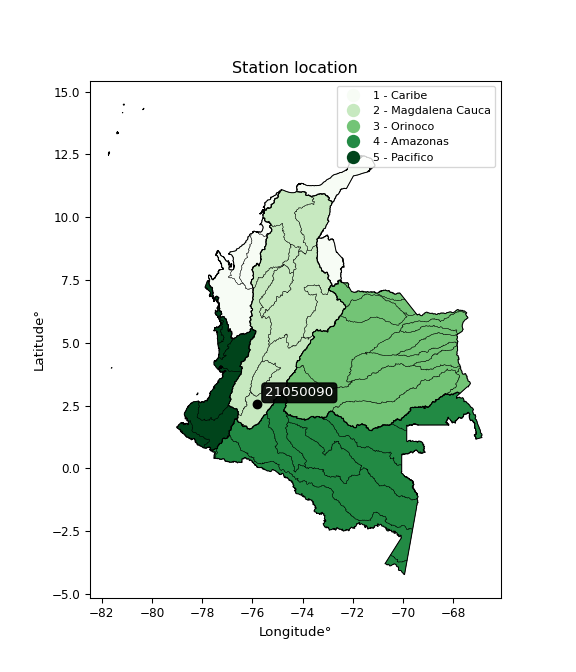

<div align="center">


</div>

# PMax24h Station (Rain): 21050090

Maximum Precipitation in 24 hours (PMax24h) is the greatest amount of rainfall for a specific duration that is meteorologically possible for a given location, acting as a "worst-case" scenario for extreme storms, crucial for designing safety-critical infrastructure like bridges, river deviations, dams, spillways, and nuclear plants to prevent catastrophic failure. The PMax24h is related with the Probable Maximum Precipitation (PMP) and it is calculated by hydrologists using meteorological data to determine the upper limit of extreme rainfall, often leading to the Probable Maximum Flood (PMF) for flood control design, and is increasingly being studied for climate change impacts. Probable Maximum Precipitation (PMP) is the theoretical upper limit of rainfall, a deterministic estimate for extreme events, while probability distributions (like GEV, Gumbel) describe the likelihood and frequency of various precipitation amounts, including rare ones, showing how often events occur, with PMP representing the extreme end of these distributions, used for critical infrastructure design to ensure safety against the worst conceivable weather, unlike standard statistical forecasts which cover typical probabilities.

The most common probability distributions in hydrology, used for analyzing floods, rainfall, and streamflow, include the Normal, Log-Normal, Gumbel, Gamma (including Log-Pearson Type III), and Generalized Extreme Value (GEV) distributions, often chosen based on the data´s skewness and whether modeling extremes or general conditions, with Gumbel and GEV popular for extreme events like floods, while the Normal distribution serves as a baseline, though often requiring transformations for skewed hydrological data. These distributions help in designing water infrastructure, managing water resources, and forecasting hydrologic events.

> Hydrological data often isn´t perfectly normal (it´s skewed), so different distributions are needed for different applications, such as: **Flood Frequency Analysis**: Using Gumbel, GEV, or Log-Pearson Type III for predicting extreme flood magnitudes and their return periods, **Rainfall Analysis**: Normal for annual totals, but Log-Normal, Weibull, or GEV for intensity or extreme daily rainfall, **Streamflow Modeling**: Gamma and Log-Normal for maximum flows, GEV for minimum flows, and Kappa for daily flows.

<div align="center">

</img>

</div>


## A. General information


### 1. General running parameters

• app_version: _v20260225_. • runtime: _2026-02-28 16:54:07.457399_. • Python version: _3.14.0_. • SciPy version: _1.16.3_. • Pandas version: _2.3.3_. • NumPy version: _2.3.5_. • Stations dataset (station_dataset_file): _dataset/pmax24h_in/automatic_colombia_2003_2025.csv_. • Stations catalog (station_catalog_file): _dataset/CNE.xls_. • Minimum year to eval til year_max (date_min): _1900_. • Maximum year to eval since year_min (date_max): _2025_. • Creates, save and include plots into reports (create_plot): _False_. • Plot only fit distributions with Δo > Δ (plot_only_fit): _True_. • Plot only simple graphs avoiding multiple CDFs and multiple Extreme values plots (plot_only_simple): _False_. • Eval low extreme values, if False, evaluates high extreme values (low_extreme): _False_. • Eval every SciPy distribution as logarithmic (pdist_logarithmic_on): _True_. • Standard deviation normalized (ddof): _1.0_. • Return periods to eval in years (Tr): _[2, 2.33, 5, 10, 15, 20, 25, 50, 75, 100, 200, 250, 500, 750, 1000]_. • Minimum data sample per station, 0 means any (minimum_sample): _5_. • Z-Score maximum threshold to adjust a value, 0 means disable (zscore_max): _3.5_. • Z-Score minimum threshold to adjust a value, 0 means disable (zscore_min): _-2.5_. • Avoid zeros, e.g. rain = 0 (avoid_zeros): _True_. • Avoid null values (avoid_nans): _True_. 

:file_folder:Table: [dataset.csv](../../dataset/pmax24h_in/automatic_colombia_2003_2025.csv)

> Delta Degrees of Freedom (DDOF): is a parameter used in the formulas for calculating variance and standard deviation. When ddof=0, the divisor is $N$ (the total number of observations) and this is used when your data set is the entire population. When ddof=1, the divisor is $N-1$ and this is used when your data set is a sample drawn from a larger population. Using $N-1$ provides an unbiased estimate of the population variance (known as Bessel´s correction).


### 2. Station info and location

|   id |   CODIGO | NOMBRE                   | CATEGORIA     | TECNOLOGIA   | ESTADO   | FECHA_INSTALACION   |   FECHA_SUSPENSION |   ALTITUD |   LATITUD |   LONGITUD | DEPARTAMENTO   | MUNICIPIO   | AREA_OPERATIVA                    | ENTIDAD                                                     | AREA_HIDROGRAFICA   | ZONA_HIDROGRAFICA   | SUBZONA_HIDROGRAFICA   |   CORRIENTE | Catalogo   |   Version |
|-----:|---------:|:-------------------------|:--------------|:-------------|:---------|:--------------------|-------------------:|----------:|----------:|-----------:|:---------------|:------------|:----------------------------------|:------------------------------------------------------------|:--------------------|:--------------------|:-----------------------|------------:|:-----------|----------:|
|    0 | 21050090 | NATAGA  - AUT [21050090] | Pluviométrica | Convencional | Activa   | 15/04/1971          |                nan |      1545 |   2.55144 |   -75.8065 | Huila          | Nátaga      | Area Operativa 04 - Huila-Caquetá | INSTITUTO DE HIDROLOGIA METEOROLOGIA Y ESTUDIOS AMBIENTALES | Magdalena Cauca     | Alto Magdalena      | Río Páez               |         nan | CNE_IDEAM  |  20251226 |

<div align="center">

Dynamic map: [:earth_americas:Google](http://maps.google.com/maps?q=2.551444444,-75.8065) [:earth_americas:OSM](https://www.openstreetmap.org/#map=18/2.551444444/-75.8065&layers=P) [:earth_americas:Bing](https://www.bing.com/maps?cp=2.551444444~-75.8065&lvl=18) [:earth_americas:Apple](https://maps.apple.com/frame?center=2.551444444%2C-75.8065&span=0.003%2C0.006)

</div>


<div align="center">

```geojson
{
  "type": "Feature",
  "geometry": {
    "type": "Point", 
    "coordinates": [-75.8065, 2.551444444]
  }, 
  "properties": {
    "Name": "21050090"
  }
}
```

</div>


### 3. Discrete values table and plot

<div align="center">

|               |           0 |           1 |           2 |           3 |          4 |
|:--------------|------------:|------------:|------------:|------------:|-----------:|
| Date          | 2019        | 2020        | 2021        | 2022        | 2023       |
| Value         |   66.6      |   71.2      |   74.2      |   74.4      |   20.8     |
| Value_initial |   66.6      |   71.2      |   74.2      |   74.4      |   20.8     |
| count         |    5        |    5        |    5        |    5        |    5       |
| mean          |   61.44     |   61.44     |   61.44     |   61.44     |   61.44    |
| std           |   22.9362   |   22.9362   |   22.9362   |   22.9362   |   22.9362  |
| zscore        |    0.224972 |    0.425529 |    0.556326 |    0.565046 |   -1.77187 |


</div>


> The initial value (value_initial) correspond to the initial obtained or null completed value, and value (value) is adjusted only when the initial value is outside the valid range (outlier) definite through the Z-Score value. If Z-Score is active, values out of range or outliers are replaced with the station mean value. A Z-Score (or standard score) measures how many standard deviations a data point is from the mean of a dataset, indicating its relative position; positive scores mean above the mean, negative mean below, and a score of zero is exactly at the mean, allowing for comparison of values from different distributions. It´s calculated using the formula $z=(x–μ)/σ$, where $x$ is the data point, $μ$ is the mean, and $σ$ is the standard deviation, helping identify outliers and understand probability.
>
> <sub>**Note**: In this study, "completing" (filling gaps in) and "extending" (forecasting or lengthening the historical record) rainfall data series are avoided for certain critical analyses because they introduce artificial bias and uncertainty, which can distort the statistics of rare events (extremes), alter day-to-day variability, and compromise the integrity and homogeneity of the original data. Some reasons against Completing/Extending rainfall data are: **Distortion of Extremes and Variability**: The primary issue is that most gap-filling or extension methods rely on averaging or regression with nearby stations, which inherently smooths the data. Rainfall is highly variable in space and time, with a large percentage of zero values and occasional large storms. Infilling methods often underestimate the highest values and overestimate the lowest (zero) values, which severely distorts analyses focused on flood frequency, drought severity, and intensity-duration-frequency (IDF) curves, **Loss of Data Homogeneity**: Infilled or extended data are synthetic estimates, not actual measurements. Combining these estimates with observed data can violate the assumption of data homogeneity, which requires that the data properties do not change over time. Inhomogeneity can lead to incorrect conclusions about long-term trends or changes in climate patterns, **Propagation of Errors**: Errors and biases from the original data (e.g., wind-induced undercatch, instrument errors, site changes) or the data used for imputation can propagate through the analysis, leading to unreliable hydrological models and inaccurate predictions, **Compromised Statistical Integrity**: For statistical analyses, especially those involving the frequency of events, using artificial data can introduce time bias or autocorrelation that doesn´t exist in reality, making it difficult to assess the true probability of events, **Difficulty in Validation**: It is difficult to accurately validate the quality of filled or extended data, especially for past periods where ground-truth measurements are unavailable. The reliability of imputation techniques heavily depends on the density of the surrounding station network and the complexity of the local topography.</sub>


### 4. Active continuous probability distributions from SciPy (80 of 104 available)

A Probability Density Function (PDF) describes the relative likelihood of a continuous random variable falling within a specific range, where the total area under its curve equals 1, and the area over any interval gives the actual probability for that range. Unlike discrete probabilities (like rolling a die), a PDF shows density, not direct probability for a single point (which is zero), with higher points indicating higher likelihood, often visualized as a bell curve for normal distributions.

A log of a probability density function (log-PDF) is simply the logarithm of the PDF´s value, denoted as $log(f(x))$, useful for converting multiplication of probabilities into addition, improving numerical stability with tiny numbers, and connecting to information theory concepts like entropy. Instead of dealing with very small probabilities (e.g., 0.000001), log-PDFs use negative numbers (e.g., $log(0.00001) ≈ -11.51$ that are easier for computers to handle, preventing underflow errors and simplifying complex calculations. In this study, each active probability distribution from SciPy is also evaluated in the $log$ form.

[scipy.stats](https://docs.scipy.org/doc/scipy/reference/stats.html) is a Python´s powerful submodule within the SciPy library for comprehensive statistical analysis, offering over 130 probability distributions (like Normal, Poisson, etc.), functions for descriptive stats (mean, variance), hypothesis testing (t-tests, chi-square), random variable generation, and statistical tests, making it essential for data science, modeling, and research. It provides tools to explore, model, and draw conclusions from data efficiently, working seamlessly with [NumPy](https://numpy.org/).

<div align="center">

|   id | p_dist           |   n_parameter | fit_method   | label                                                                       | active   | ref                                                                                                      |
|-----:|:-----------------|--------------:|:-------------|:----------------------------------------------------------------------------|:---------|:---------------------------------------------------------------------------------------------------------|
|    0 | alpha            |             3 | MLE          | Alpha                                                                       | True     | [:mortar_board:](https://docs.scipy.org/doc/scipy/reference/generated/scipy.stats.alpha.html)            |
|    1 | anglit           |             2 | MM           | Anglit                                                                      | True     | [:mortar_board:](https://docs.scipy.org/doc/scipy/reference/generated/scipy.stats.anglit.html)           |
|    2 | arcsine          |             2 | MM           | Arcsine                                                                     | True     | [:mortar_board:](https://docs.scipy.org/doc/scipy/reference/generated/scipy.stats.arcsine.html)          |
|    3 | argus            |             3 | MLE          | Argus                                                                       | True     | [:mortar_board:](https://docs.scipy.org/doc/scipy/reference/generated/scipy.stats.argus.html)            |
|    4 | beta             |             4 | MLE          | Beta                                                                        | True     | [:mortar_board:](https://docs.scipy.org/doc/scipy/reference/generated/scipy.stats.beta.html)             |
|    5 | betaprime        |             4 | MLE          | Beta prime                                                                  | True     | [:mortar_board:](https://docs.scipy.org/doc/scipy/reference/generated/scipy.stats.betaprime.html)        |
|    6 | bradford         |             3 | MLE          | Bradford                                                                    | True     | [:mortar_board:](https://docs.scipy.org/doc/scipy/reference/generated/scipy.stats.bradford.html)         |
|    7 | burr             |             4 | MLE          | Burr (Type III)                                                             | True     | [:mortar_board:](https://docs.scipy.org/doc/scipy/reference/generated/scipy.stats.burr.html)             |
|    8 | burr12           |             4 | MLE          | Burr (Type III) 12                                                          | True     | [:mortar_board:](https://docs.scipy.org/doc/scipy/reference/generated/scipy.stats.burr12.html)           |
|    9 | cosine           |             2 | MLE          | Cosine                                                                      | True     | [:mortar_board:](https://docs.scipy.org/doc/scipy/reference/generated/scipy.stats.cosine.html)           |
|   10 | crystalball      |             4 | MLE          | Crystalball                                                                 | True     | [:mortar_board:](https://docs.scipy.org/doc/scipy/reference/generated/scipy.stats.crystalball.html)      |
|   11 | dgamma           |             3 | MLE          | Double gamma                                                                | True     | [:mortar_board:](https://docs.scipy.org/doc/scipy/reference/generated/scipy.stats.dgamma.html)           |
|   12 | dweibull         |             3 | MLE          | Double Weibull                                                              | True     | [:mortar_board:](https://docs.scipy.org/doc/scipy/reference/generated/scipy.stats.dweibull.html)         |
|   13 | erlang           |             3 | MLE          | Erlang                                                                      | True     | [:mortar_board:](https://docs.scipy.org/doc/scipy/reference/generated/scipy.stats.erlang.html)           |
|   14 | exponnorm        |             3 | MLE          | Exponentially modified Normal                                               | True     | [:mortar_board:](https://docs.scipy.org/doc/scipy/reference/generated/scipy.stats.exponnorm.html)        |
|   15 | exponpow         |             3 | MLE          | Exponential power                                                           | True     | [:mortar_board:](https://docs.scipy.org/doc/scipy/reference/generated/scipy.stats.exponpow.html)         |
|   16 | exponweib        |             4 | MLE          | Exponentiated Weibull                                                       | True     | [:mortar_board:](https://docs.scipy.org/doc/scipy/reference/generated/scipy.stats.exponweib.html)        |
|   17 | f                |             4 | MLE          | F                                                                           | True     | [:mortar_board:](https://docs.scipy.org/doc/scipy/reference/generated/scipy.stats.f.html)                |
|   18 | fatiguelife      |             3 | MLE          | Fatigue-life (Birnbaum-Saunders)                                            | True     | [:mortar_board:](https://docs.scipy.org/doc/scipy/reference/generated/scipy.stats.fatiguelife.html)      |
|   19 | foldnorm         |             3 | MM           | Fold Normal                                                                 | True     | [:mortar_board:](https://docs.scipy.org/doc/scipy/reference/generated/scipy.stats.foldnorm.html)         |
|   20 | gamma            |             3 | MLE          | Gamma                                                                       | True     | [:mortar_board:](https://docs.scipy.org/doc/scipy/reference/generated/scipy.stats.gamma.html)            |
|   21 | gausshyper       |             6 | MLE          | Gauss hypergeometric                                                        | True     | [:mortar_board:](https://docs.scipy.org/doc/scipy/reference/generated/scipy.stats.gausshyper.html)       |
|   22 | genexpon         |             5 | MLE          | Generalized exponential                                                     | True     | [:mortar_board:](https://docs.scipy.org/doc/scipy/reference/generated/scipy.stats.genexpon.html)         |
|   23 | genextreme       |             3 | MLE          | Generalized exponential                                                     | True     | [:mortar_board:](https://docs.scipy.org/doc/scipy/reference/generated/scipy.stats.genextreme.html)       |
|   24 | gengamma         |             4 | MLE          | Generalized gamma                                                           | True     | [:mortar_board:](https://docs.scipy.org/doc/scipy/reference/generated/scipy.stats.gengamma.html)         |
|   25 | genhalflogistic  |             3 | MLE          | Generalized half-logistic                                                   | True     | [:mortar_board:](https://docs.scipy.org/doc/scipy/reference/generated/scipy.stats.genhalflogistic.html)  |
|   26 | genlogistic      |             3 | MLE          | Generalized logistic                                                        | True     | [:mortar_board:](https://docs.scipy.org/doc/scipy/reference/generated/scipy.stats.genlogistic.html)      |
|   27 | gennorm          |             3 | MLE          | Generalized Normal                                                          | True     | [:mortar_board:](https://docs.scipy.org/doc/scipy/reference/generated/scipy.stats.gennorm.html)          |
|   28 | genpareto        |             3 | MLE          | Generalized Pareto                                                          | True     | [:mortar_board:](https://docs.scipy.org/doc/scipy/reference/generated/scipy.stats.genpareto.html)        |
|   29 | gompertz         |             3 | MLE          | Gompertz (or truncated Gumbel)                                              | True     | [:mortar_board:](https://docs.scipy.org/doc/scipy/reference/generated/scipy.stats.gompertz.html)         |
|   30 | gumbel_l         |             2 | MM           | Gumbel Left Skew                                                            | True     | [:mortar_board:](https://docs.scipy.org/doc/scipy/reference/generated/scipy.stats.gumbel_l.html)         |
|   31 | gumbel_r         |             2 | MM           | Gumbel Right Skew                                                           | True     | [:mortar_board:](https://docs.scipy.org/doc/scipy/reference/generated/scipy.stats.gumbel_r.html)         |
|   32 | halfgennorm      |             3 | MLE          | Upper half of a generalized normal                                          | True     | [:mortar_board:](https://docs.scipy.org/doc/scipy/reference/generated/scipy.stats.halfgennorm.html)      |
|   33 | halflogistic     |             2 | MM           | Half-logistic                                                               | True     | [:mortar_board:](https://docs.scipy.org/doc/scipy/reference/generated/scipy.stats.halflogistic.html)     |
|   34 | halfnorm         |             2 | MM           | Half Normal                                                                 | True     | [:mortar_board:](https://docs.scipy.org/doc/scipy/reference/generated/scipy.stats.halfnorm.html)         |
|   35 | hypsecant        |             2 | MM           | hyperbolic secant                                                           | True     | [:mortar_board:](https://docs.scipy.org/doc/scipy/reference/generated/scipy.stats.hypsecant.html)        |
|   36 | invgamma         |             3 | MLE          | Inverted gamma                                                              | True     | [:mortar_board:](https://docs.scipy.org/doc/scipy/reference/generated/scipy.stats.invgamma.html)         |
|   37 | invgauss         |             3 | MLE          | Inverse Gaussian                                                            | True     | [:mortar_board:](https://docs.scipy.org/doc/scipy/reference/generated/scipy.stats.invgauss.html)         |
|   38 | invweibull       |             3 | MLE          | Inverted Weibull                                                            | True     | [:mortar_board:](https://docs.scipy.org/doc/scipy/reference/generated/scipy.stats.invweibull.html)       |
|   39 | johnsonsb        |             4 | MLE          | Johnson SB                                                                  | True     | [:mortar_board:](https://docs.scipy.org/doc/scipy/reference/generated/scipy.stats.johnsonsb.html)        |
|   40 | johnsonsu        |             4 | MLE          | Johnson Su                                                                  | True     | [:mortar_board:](https://docs.scipy.org/doc/scipy/reference/generated/scipy.stats.johnsonsu.html)        |
|   41 | kappa3           |             3 | MLE          | Kappa 3                                                                     | True     | [:mortar_board:](https://docs.scipy.org/doc/scipy/reference/generated/scipy.stats.kappa3.html)           |
|   42 | kappa4           |             4 | MLE          | Kappa 4                                                                     | True     | [:mortar_board:](https://docs.scipy.org/doc/scipy/reference/generated/scipy.stats.kappa4.html)           |
|   43 | ksone            |             3 | MLE          | Kolmogorov-Smirnov one-sided test statistic distribution                    | True     | [:mortar_board:](https://docs.scipy.org/doc/scipy/reference/generated/scipy.stats.ksone.html)            |
|   44 | kstwobign        |             2 | MLE          | Limiting distribution of scaled Kolmogorov-Smirnov two-sided test statistic | True     | [:mortar_board:](https://docs.scipy.org/doc/scipy/reference/generated/scipy.stats.kstwobign.html)        |
|   45 | laplace          |             2 | MM           | Laplace                                                                     | True     | [:mortar_board:](https://docs.scipy.org/doc/scipy/reference/generated/scipy.stats.laplace.html)          |
|   46 | levy_l           |             2 | MLE          | Left-skewed Levy                                                            | True     | [:mortar_board:](https://docs.scipy.org/doc/scipy/reference/generated/scipy.stats.levy_l.html)           |
|   47 | loggamma         |             3 | MLE          | Log gamma                                                                   | True     | [:mortar_board:](https://docs.scipy.org/doc/scipy/reference/generated/scipy.stats.loggamma.html)         |
|   48 | logistic         |             2 | MM           | Logistic (or Sech-squared)                                                  | True     | [:mortar_board:](https://docs.scipy.org/doc/scipy/reference/generated/scipy.stats.logistic.html)         |
|   49 | loglaplace       |             3 | MLE          | Log-Laplace                                                                 | True     | [:mortar_board:](https://docs.scipy.org/doc/scipy/reference/generated/scipy.stats.loglaplace.html)       |
|   50 | lomax            |             3 | MLE          | Lomax (Pareto of the second kind)                                           | True     | [:mortar_board:](https://docs.scipy.org/doc/scipy/reference/generated/scipy.stats.lomax.html)            |
|   51 | maxwell          |             2 | MM           | Maxwell                                                                     | True     | [:mortar_board:](https://docs.scipy.org/doc/scipy/reference/generated/scipy.stats.maxwell.html)          |
|   52 | mielke           |             4 | MLE          | Mielke Beta-Kappa / Dagum                                                   | True     | [:mortar_board:](https://docs.scipy.org/doc/scipy/reference/generated/scipy.stats.mielke.html)           |
|   53 | moyal            |             2 | MM           | Moyal                                                                       | True     | [:mortar_board:](https://docs.scipy.org/doc/scipy/reference/generated/scipy.stats.moyal.html)            |
|   54 | nakagami         |             3 | MLE          | Nakagami                                                                    | True     | [:mortar_board:](https://docs.scipy.org/doc/scipy/reference/generated/scipy.stats.nakagami.html)         |
|   55 | ncf              |             5 | MLE          | Non-central F distribution                                                  | True     | [:mortar_board:](https://docs.scipy.org/doc/scipy/reference/generated/scipy.stats.ncf.html)              |
|   56 | nct              |             4 | MLE          | Non-central Student’s t                                                     | True     | [:mortar_board:](https://docs.scipy.org/doc/scipy/reference/generated/scipy.stats.nct.html)              |
|   57 | norm             |             2 | MM           | Normal                                                                      | True     | [:mortar_board:](https://docs.scipy.org/doc/scipy/reference/generated/scipy.stats.norm.html)             |
|   58 | pearson3         |             3 | MM           | Pearson type III                                                            | True     | [:mortar_board:](https://docs.scipy.org/doc/scipy/reference/generated/scipy.stats.pearson3.html)         |
|   59 | powerlaw         |             3 | MLE          | Power-function                                                              | True     | [:mortar_board:](https://docs.scipy.org/doc/scipy/reference/generated/scipy.stats.powerlaw.html)         |
|   60 | rayleigh         |             2 | MM           | Rayleigh                                                                    | True     | [:mortar_board:](https://docs.scipy.org/doc/scipy/reference/generated/scipy.stats.rayleigh.html)         |
|   61 | rdist            |             3 | MLE          | R-distributed (symmetric beta)                                              | True     | [:mortar_board:](https://docs.scipy.org/doc/scipy/reference/generated/scipy.stats.rdist.html)            |
|   62 | rice             |             3 | MLE          | Rice                                                                        | True     | [:mortar_board:](https://docs.scipy.org/doc/scipy/reference/generated/scipy.stats.rice.html)             |
|   63 | semicircular     |             2 | MM           | Semicircular                                                                | True     | [:mortar_board:](https://docs.scipy.org/doc/scipy/reference/generated/scipy.stats.semicircular.html)     |
|   64 | skewnorm         |             3 | MLE          | Skew normal                                                                 | True     | [:mortar_board:](https://docs.scipy.org/doc/scipy/reference/generated/scipy.stats.skewnorm.html)         |
|   65 | t                |             3 | MLE          | Student’s t                                                                 | True     | [:mortar_board:](https://docs.scipy.org/doc/scipy/reference/generated/scipy.stats.t.html)                |
|   66 | trapezoid        |             4 | MLE          | Trapezoid                                                                   | True     | [:mortar_board:](https://docs.scipy.org/doc/scipy/reference/generated/scipy.stats.trapezoid.html)        |
|   67 | triang           |             3 | MLE          | Triangular                                                                  | True     | [:mortar_board:](https://docs.scipy.org/doc/scipy/reference/generated/scipy.stats.triang.html)           |
|   68 | truncexpon       |             3 | MLE          | Truncated exponential                                                       | True     | [:mortar_board:](https://docs.scipy.org/doc/scipy/reference/generated/scipy.stats.truncexpon.html)       |
|   69 | truncnorm        |             4 | MLE          | Truncated normal                                                            | True     | [:mortar_board:](https://docs.scipy.org/doc/scipy/reference/generated/scipy.stats.truncnorm.html)        |
|   70 | truncpareto      |             4 | MLE          | Upper truncated Pareto                                                      | True     | [:mortar_board:](https://docs.scipy.org/doc/scipy/reference/generated/scipy.stats.truncpareto.html)      |
|   71 | truncweibull_min |             5 | MLE          | Doubly truncated Weibull minimum                                            | True     | [:mortar_board:](https://docs.scipy.org/doc/scipy/reference/generated/scipy.stats.truncweibull_min.html) |
|   72 | tukeylambda      |             3 | MLE          | Tukey-Lamdba                                                                | True     | [:mortar_board:](https://docs.scipy.org/doc/scipy/reference/generated/scipy.stats.tukeylambda.html)      |
|   73 | uniform          |             2 | MLE          | Uniform                                                                     | True     | [:mortar_board:](https://docs.scipy.org/doc/scipy/reference/generated/scipy.stats.uniform.html)          |
|   74 | vonmises         |             3 | MLE          | Von Mises                                                                   | True     | [:mortar_board:](https://docs.scipy.org/doc/scipy/reference/generated/scipy.stats.vonmises.html)         |
|   75 | vonmises_line    |             3 | MLE          | Von Mises line                                                              | True     | [:mortar_board:](https://docs.scipy.org/doc/scipy/reference/generated/scipy.stats.vonmises_line.html)    |
|   76 | wald             |             2 | MM           | Wald                                                                        | True     | [:mortar_board:](https://docs.scipy.org/doc/scipy/reference/generated/scipy.stats.wald.html)             |
|   77 | weibull_max      |             3 | MLE          | Weibull maximum                                                             | True     | [:mortar_board:](https://docs.scipy.org/doc/scipy/reference/generated/scipy.stats.weibull_max.html)      |
|   78 | weibull_min      |             3 | MLE          | Weibull minimum                                                             | True     | [:mortar_board:](https://docs.scipy.org/doc/scipy/reference/generated/scipy.stats.weibull_min.html)      |
|   79 | wrapcauchy       |             3 | MLE          | Wrapped  Cauchy                                                             | True     | [:mortar_board:](https://docs.scipy.org/doc/scipy/reference/generated/scipy.stats.wrapcauchy.html)       |

</div>

> **n_parameter:** # arguments & localization & scale.
>
> **Fit methods:** (MLE) maximum likelihood, (MM) L-moments.
>
>**Inactive** (With the only purpose of prevent loops, zero divisions, infinite values, over high estimated values or horizontal trending for recurrence intervals estimations, the follow distributions were disabled.)**:** lognorm, norminvgauss, powernorm, powerlognorm, cauchy, halfcauchy, foldcauchy, skewcauchy, chi2, expon, fisk, genhyperbolic, geninvgauss, gibrat, kstwo, laplace_asymmetric, levy, levy_stable, ncx2, pareto, rel_breitwigner, recipinvgauss, studentized_range, loguniform, 


## B. Probability (PDF) vs. Empirical (EDF) distributions functions

A continuous probability distribution (CPD) describes probabilities for variables that can take any value within a range (like rain any time), unlike discrete variables with specific outcomes (like temperature). It uses a Probability Density Function (PDF), a curve where the total area under it equals 1, and the probability of the variable falling within an interval (a to b) is found by calculating the area under the curve between those points. A key feature is that the probability of hitting any single exact value is zero, so probabilities are always expressed for ranges, e.g., $P(a ≤ X ≤ b)$.

<div align="center">

Distributions parameters from station values
|     |   station | p_dist              |   n |              loc |           scale | shape                  | shape1                | shape2                 | shape3             |
|----:|----------:|:--------------------|----:|-----------------:|----------------:|:-----------------------|:----------------------|:-----------------------|:-------------------|
|   0 |  21050090 | alpha               |   5 |   -506.437       | 14948.9         | 26.387143795260265     |                       |                        |                    |
|   1 |  21050090 | anglit              |   5 |     61.44        |    60.0138      |                        |                       |                        |                    |
|   2 |  21050090 | arcsine             |   5 |     32.4278      |    58.0245      |                        |                       |                        |                    |
|   3 |  21050090 | argus               |   5 |     -1.18036     |    77.5038      | 3.20234603064524       |                       |                        |                    |
|   4 |  21050090 | beta                |   5 |     15.8922      |    58.5078      | 0.08434269775505684    | 0.024467750745591987  |                        |                    |
|   5 |  21050090 | betaprime           |   5 |   -417.439       | 44122           | 492.7190889554746      | 45387.22804415504     |                        |                    |
|   6 |  21050090 | bradford            |   5 |     20.7999      |    54.3826      | 0.009663373301809434   |                       |                        |                    |
|   7 |  21050090 | burr                |   5 |     -1.28039     |    76.1654      | 573.2280761956088      | 0.006146281648997936  |                        |                    |
|   8 |  21050090 | burr12              |   5 |     -0.989685    |    21.6108      | 568.0635780050154      | 0.001814470658982807  |                        |                    |
|   9 |  21050090 | cosine              |   5 |     57.4888      |    17.6182      |                        |                       |                        |                    |
|  10 |  21050090 | crystalball         |   5 |     61.44        |    20.5148      | 48618.9202844282       | 45.79514277318953     |                        |                    |
|  11 |  21050090 | dgamma              |   5 |     74.2         |    27.8566      | 0.38329502793030434    |                       |                        |                    |
|  12 |  21050090 | dweibull            |   5 |     74.4         |    18.5743      | 0.3562760279104237     |                       |                        |                    |
|  13 |  21050090 | erlang              |   5 |     20.8         |     2.88068     | 0.12593416306446314    |                       |                        |                    |
|  14 |  21050090 | exponnorm           |   5 |     61.4275      |    20.5147      | 0.0006125675676906066  |                       |                        |                    |
|  15 |  21050090 | exponpow            |   5 |     20.8         |     1.7557      | 0.10588719752762527    |                       |                        |                    |
|  16 |  21050090 | exponweib           |   5 |     20.8         |     1.16736     | 1.2264481689261213     | 0.19906455035693515   |                        |                    |
|  17 |  21050090 | f                   |   5 | -14264.9         | 14326.4         | 1511075.2960814093     | 2697379.080291638     |                        |                    |
|  18 |  21050090 | fatiguelife         |   5 |     20.8         |     1.83303e-05 | 1698.9949408517532     |                       |                        |                    |
|  19 |  21050090 | foldnorm            |   5 |     65.2999      |     0.482657    | 1.7478541163737048e-06 |                       |                        |                    |
|  20 |  21050090 | gamma               |   5 |   -322.797       |     1.16926     | 328.394432872875       |                       |                        |                    |
|  21 |  21050090 | gausshyper          |   5 |     15.9999      |    58.4001      | 1.1626504332271987     | 0.7329242212291585    | 1.0623430173122117     | 1.071375046378758  |
|  22 |  21050090 | genexpon            |   5 |      0.376469    |     4.63478     | 0.003129574015944313   | 0.7521075280376084    | 0.013982995996516442   |                    |
|  23 |  21050090 | genextreme          |   5 |     66.3599      |    10.469       | 1.302098532598801      |                       |                        |                    |
|  24 |  21050090 | gengamma            |   5 |     20.8         |     1.00412     | 1.4337001268740917     | 0.17881347924101704   |                        |                    |
|  25 |  21050090 | genhalflogistic     |   5 |     16.8708      |    64.9563      | 1.1291009178151632     |                       |                        |                    |
|  26 |  21050090 | genlogistic         |   5 |     74.4003      |     2.47761e-05 | 1.911785803539303e-06  |                       |                        |                    |
|  27 |  21050090 | gennorm             |   5 |     74.4         |     0.0958283   | 0.3234494574891684     |                       |                        |                    |
|  28 |  21050090 | genpareto           |   5 |     -0.927827    |   152.602       | -2.02583666577926      |                       |                        |                    |
|  29 |  21050090 | gompertz            |   5 |    -23.4734      |    10.8642      | 0.00018989836871335513 |                       |                        |                    |
|  30 |  21050090 | gumbel_l            |   5 |     70.6727      |    15.9953      |                        |                       |                        |                    |
|  31 |  21050090 | gumbel_r            |   5 |     52.2073      |    15.9953      |                        |                       |                        |                    |
|  32 |  21050090 | halfgennorm         |   5 |     20.8         |     1.199       | 0.33968660790009086    |                       |                        |                    |
|  33 |  21050090 | halflogistic        |   5 |     37.1252      |    17.5394      |                        |                       |                        |                    |
|  34 |  21050090 | halfnorm            |   5 |     34.2865      |    34.0319      |                        |                       |                        |                    |
|  35 |  21050090 | hypsecant           |   5 |     61.44        |    13.0601      |                        |                       |                        |                    |
|  36 |  21050090 | invgamma            |   5 |   -251.857       | 61016.8         | 196.1904223866759      |                       |                        |                    |
|  37 |  21050090 | invgauss            |   5 |   -138.044       | 15133.4         | 0.013211467145100866   |                       |                        |                    |
|  38 |  21050090 | invweibull          |   5 |     20.8         |     1.33288     | 0.04377788290966926    |                       |                        |                    |
|  39 |  21050090 | johnsonsb           |   5 |     -6.78052     |    81.1805      | -1.7345549489614234    | 0.16111702498938585   |                        |                    |
|  40 |  21050090 | johnsonsu           |   5 |     74.4         |     8.09441e-13 | 3.41972010470075       | 0.15596706040243502   |                        |                    |
|  41 |  21050090 | kappa3              |   5 |     20.8         |    63.1284      | 371.9102729900319      |                       |                        |                    |
|  42 |  21050090 | kappa4              |   5 |     14.6147      |    63.5431      | 1.039096973438266      | 1.0628541927353714    |                        |                    |
|  43 |  21050090 | ksone               |   5 |     15.44        |    64.32        | 1.0                    |                       |                        |                    |
|  44 |  21050090 | kstwobign           |   5 |    -34.4816      |   109.308       |                        |                       |                        |                    |
|  45 |  21050090 | laplace             |   5 |     61.44        |    14.5061      |                        |                       |                        |                    |
|  46 |  21050090 | levy_l              |   5 |     74.4908      |     0.335452    |                        |                       |                        |                    |
|  47 |  21050090 | loggamma            |   5 |     74.4003      |     1.94428e-05 | 1.5021937872370962e-06 |                       |                        |                    |
|  48 |  21050090 | logistic            |   5 |     61.44        |    11.3104      |                        |                       |                        |                    |
|  49 |  21050090 | loglaplace          |   5 |     -0.200691    |    71.4007      | 3.6329828754881053     |                       |                        |                    |
|  50 |  21050090 | lomax               |   5 |     20.8         |  2192.12        | 53.80376638411238      |                       |                        |                    |
|  51 |  21050090 | maxwell             |   5 |     12.8287      |    30.4626      |                        |                       |                        |                    |
|  52 |  21050090 | mielke              |   5 |     -1.01137e+09 |     1.01137e+09 | 70160395.03897679      | 198924173477.50757    |                        |                    |
|  53 |  21050090 | moyal               |   5 |     49.7084      |     9.23488     |                        |                       |                        |                    |
|  54 |  21050090 | nakagami            |   5 |     66.6         |     5.41788     | 0.2286830906936379     |                       |                        |                    |
|  55 |  21050090 | ncf                 |   5 |      0.000730587 |     1.1631e-05  | 9.956397062146484e-07  | 2.37767029950016      | 4.017336346869591      |                    |
|  56 |  21050090 | nct                 |   5 |  -2281.03        |    20.3784      | 453725.53589476587     | 114.9483963635974     |                        |                    |
|  57 |  21050090 | norm                |   5 |     61.44        |    20.5147      |                        |                       |                        |                    |
|  58 |  21050090 | pearson3            |   5 |     61.44        |    20.5148      | -1.43160359648435      |                       |                        |                    |
|  59 |  21050090 | powerlaw            |   5 |     20.8         |    53.6         | 0.13342165873106684    |                       |                        |                    |
|  60 |  21050090 | rayleigh            |   5 |     22.1942      |    31.3137      |                        |                       |                        |                    |
|  61 |  21050090 | rdist               |   5 |     20.8         |     2.00253e-16 | 1.5287440980479825     |                       |                        |                    |
|  62 |  21050090 | rice                |   5 |  -9271.37        |    20.5143      | 454.93958157487396     |                       |                        |                    |
|  63 |  21050090 | semicircular        |   5 |     61.44        |    41.0295      |                        |                       |                        |                    |
|  64 |  21050090 | skewnorm            |   5 |     74.4         |    24.2657      | -10447511.162827302    |                       |                        |                    |
|  65 |  21050090 | t                   |   5 |     61.8134      |    19.8682      | 20.38855349906079      |                       |                        |                    |
|  66 |  21050090 | trapezoid           |   5 |      3.41556     |    87.0367      | 1.0                    | 1.0                   |                        |                    |
|  67 |  21050090 | triang              |   5 |      3.98556     |    70.4147      | 0.999996500528773      |                       |                        |                    |
|  68 |  21050090 | truncexpon          |   5 |     20.8         |    83.2269      | 0.6440223884864023     |                       |                        |                    |
|  69 |  21050090 | truncnorm           |   5 |    101.266       |    29.2503      | -786.9465961941596     | -0.918489722324515    |                        |                    |
|  70 |  21050090 | truncpareto         |   5 |     20.3795      |     0.420487    | 0.2603881233912607     | 128.47116286803674    |                        |                    |
|  71 |  21050090 | truncweibull_min    |   5 |     19.7077      |   102.752       | 1.2011548307147955     | 0.0013754964091067731 | 0.5322761946196035     |                    |
|  72 |  21050090 | tukeylambda         |   5 |     20.8         |     3.83607e-15 | 1.5264941095070275     |                       |                        |                    |
|  73 |  21050090 | uniform             |   5 |     20.8         |    53.6         |                        |                       |                        |                    |
|  74 |  21050090 | vonmises            |   5 |     -2.51177     |     1           | 0.38650715989742435    |                       |                        |                    |
|  75 |  21050090 | vonmises_line       |   5 |     67.5932      |    14.8947      | 1.3393557545372379     |                       |                        |                    |
|  76 |  21050090 | wald                |   5 |     40.9252      |    20.5148      |                        |                       |                        |                    |
|  77 |  21050090 | weibull_max         |   5 |     74.4         |    20.9203      | 0.4004397339421835     |                       |                        |                    |
|  78 |  21050090 | weibull_min         |   5 |     20.8         |     1.40167     | 0.22408299128638182    |                       |                        |                    |
|  79 |  21050090 | wrapcauchy          |   5 |     20.8         |     8.53221     | 0.9706088406283415     |                       |                        |                    |
|  80 |  21050090 | logalpha            |   5 |    -12.9171      |   555.725       | 32.848807161482284     |                       |                        |                    |
|  81 |  21050090 | loganglit           |   5 |      4.02307     |     1.45006     |                        |                       |                        |                    |
|  82 |  21050090 | logarcsine          |   5 |      3.32207     |     1.40201     |                        |                       |                        |                    |
|  83 |  21050090 | logargus            |   5 |      2.57083     |     1.78401     | 3.3290885808386834     |                       |                        |                    |
|  84 |  21050090 | logbeta             |   5 |      2.74312     |     1.56634     | 0.03100699096087276    | 0.008140894421664973  |                        |                    |
|  85 |  21050090 | logbetaprime        |   5 |    -15.9399      |     9.83366     | 4470.693474246824      | 2203.8538403928687    |                        |                    |
|  86 |  21050090 | logbradford         |   5 |      3.03495     |     1.275       | 0.00016967444805641942 |                       |                        |                    |
|  87 |  21050090 | logburr             |   5 |   -311.723       |   316.043       | 82410.42314876418      | 0.012951773449945182  |                        |                    |
|  88 |  21050090 | logburr12           |   5 |  -1628.24        |  1635.46        | 7393.944497100911      | 774111.5657585536     |                        |                    |
|  89 |  21050090 | logcosine           |   5 |      3.92512     |     0.426512    |                        |                       |                        |                    |
|  90 |  21050090 | logcrystalball      |   5 |      4.02307     |     0.495679    | 698.164050271733       | 6.900995222769028     |                        |                    |
|  91 |  21050090 | logdgamma           |   5 |      4.30946     |     0.468507    | 0.46812332571784343    |                       |                        |                    |
|  92 |  21050090 | logdweibull         |   5 |      4.30946     |     0.530181    | 0.4905101583717072     |                       |                        |                    |
|  93 |  21050090 | logerlang           |   5 |      3.03495     |     1.25611     | 0.7934315237372966     |                       |                        |                    |
|  94 |  21050090 | logexponnorm        |   5 |      4.02272     |     0.495678    | 0.0007071373701551496  |                       |                        |                    |
|  95 |  21050090 | logexponpow         |   5 |      3.03495     |     0.680937    | 0.23045652358659163    |                       |                        |                    |
|  96 |  21050090 | logexponweib        |   5 |      3.03495     |     1.05723     | 0.8827130681068907     | 1.0980971980754344    |                        |                    |
|  97 |  21050090 | logf                |   5 |   -627.65        |   631.673       | 10703539.578632597     | 4590593.823998729     |                        |                    |
|  98 |  21050090 | logfatiguelife      |   5 |   -314.701       |   318.723       | 0.0015532023402115309  |                       |                        |                    |
|  99 |  21050090 | logfoldnorm         |   5 |      3.31695     |     0.558598    | 1.1421389989035953     |                       |                        |                    |
| 100 |  21050090 | loggamma            |   5 |      3.03495     |     1.0027      | 0.9252157693120411     |                       |                        |                    |
| 101 |  21050090 | loggausshyper       |   5 |      2.96933     |     1.34012     | 0.9916073046318981     | 0.6254389529685178    | 1.2915217678243822     | 1.0460368683541148 |
| 102 |  21050090 | loggenexpon         |   5 |      3.0316      |     0.0078516   | 0.0031148406302526684  | 3.357271878860164     | 1.8078045004372772e-05 |                    |
| 103 |  21050090 | loggenextreme       |   5 |      4.14237     |     0.200831    | 1.2019595224553918     |                       |                        |                    |
| 104 |  21050090 | loggengamma         |   5 |     -4.19649e+07 |     4.19649e+07 | 0.2504792310526507     | 498814394.8112338     |                        |                    |
| 105 |  21050090 | loggenhalflogistic  |   5 |      2.78205     |     1.6508      | 1.0807845913839298     |                       |                        |                    |
| 106 |  21050090 | loggenlogistic      |   5 |      4.30963     |     2.3552e-05  | 8.388451013501442e-05  |                       |                        |                    |
| 107 |  21050090 | loggennorm          |   5 |      4.1987      |     0.0122732   | 0.4051300383701998     |                       |                        |                    |
| 108 |  21050090 | loggenpareto        |   5 |     -0.0145333   |    16.0066      | -3.70180422630025      |                       |                        |                    |
| 109 |  21050090 | loggompertz         |   5 |      3.03495     |     0.265784    | 0.01193678169804853    |                       |                        |                    |
| 110 |  21050090 | loggumbel_l         |   5 |      4.24616     |     0.38648     |                        |                       |                        |                    |
| 111 |  21050090 | loggumbel_r         |   5 |      3.79999     |     0.38648     |                        |                       |                        |                    |
| 112 |  21050090 | loghalfgennorm      |   5 |      3.03495     |     0.979327    | 1.0676787352939652     |                       |                        |                    |
| 113 |  21050090 | loghalflogistic     |   5 |      3.43562     |     0.423763    |                        |                       |                        |                    |
| 114 |  21050090 | loghalfnorm         |   5 |      3.36703     |     0.822233    |                        |                       |                        |                    |
| 115 |  21050090 | loghypsecant        |   5 |      4.02307     |     0.315559    |                        |                       |                        |                    |
| 116 |  21050090 | loginvgamma         |   5 |    -11.4544      | 13645.3         | 883.0091467060938      |                       |                        |                    |
| 117 |  21050090 | loginvgauss         |   5 |     -1.73849     |   600.44        | 0.009600157081433695   |                       |                        |                    |
| 118 |  21050090 | loginvweibull       |   5 |     -8.91561e+07 |     8.91561e+07 | 151185513.56847596     |                       |                        |                    |
| 119 |  21050090 | logjohnsonsb        |   5 |      2.74313     |     1.56633     | -0.9495203210802359    | 0.07632419865234162   |                        |                    |
| 120 |  21050090 | logjohnsonsu        |   5 |      4.30946     |     4.84893e-16 | 2.0615169668048363     | 0.11032445835051763   |                        |                    |
| 121 |  21050090 | logkappa3           |   5 |      3.03495     |     1.2745      | 2511799.0841894876     |                       |                        |                    |
| 122 |  21050090 | logkappa4           |   5 |      3.1223      |     1.41836     | 0.9278672388849643     | 1.1947625708426566    |                        |                    |
| 123 |  21050090 | logksone            |   5 |      2.9075      |     1.5294      | 1.0                    |                       |                        |                    |
| 124 |  21050090 | logkstwobign        |   5 |      1.69251     |     2.65574     |                        |                       |                        |                    |
| 125 |  21050090 | loglaplace          |   5 |      4.02307     |     0.350498    |                        |                       |                        |                    |
| 126 |  21050090 | loglevy_l           |   5 |      4.31068     |     0.00452549  |                        |                       |                        |                    |
| 127 |  21050090 | logloggamma         |   5 |      4.30946     |     2.23227e-07 | 7.781452059457358e-07  |                       |                        |                    |
| 128 |  21050090 | loglogistic         |   5 |      4.02307     |     0.273282    |                        |                       |                        |                    |
| 129 |  21050090 | logloglaplace       |   5 |     -0.0161236   |     4.28162     | 13.361304912243483     |                       |                        |                    |
| 130 |  21050090 | loglomax            |   5 |      3.03489     |   436.38        | 416.1255111708621      |                       |                        |                    |
| 131 |  21050090 | logmaxwell          |   5 |      2.84852     |     0.736041    |                        |                       |                        |                    |
| 132 |  21050090 | logmielke           |   5 |     -4.13766e+07 |     4.13766e+07 | 158661465.63764572     | 82622693440.94028     |                        |                    |
| 133 |  21050090 | logmoyal            |   5 |      3.73961     |     0.223134    |                        |                       |                        |                    |
| 134 |  21050090 | lognakagami         |   5 |      4.1987      |     0.0782601   | 0.23660060119444493    |                       |                        |                    |
| 135 |  21050090 | logncf              |   5 |     -3.62229     |     7.6377      | 551.1287011330335      | 1203.6671862915023    | 3.492860193097163e-10  |                    |
| 136 |  21050090 | lognct              |   5 |    -19.7599      |     0.409584    | 3099.057743644835      | 58.05187408792059     |                        |                    |
| 137 |  21050090 | lognorm             |   5 |      4.02307     |     0.49568     |                        |                       |                        |                    |
| 138 |  21050090 | logpearson3         |   5 |      4.02307     |     0.49568     | -1.476042668483739     |                       |                        |                    |
| 139 |  21050090 | logpowerlaw         |   5 |      3.03495     |     1.2745      | 0.1399729506672352     |                       |                        |                    |
| 140 |  21050090 | lograyleigh         |   5 |      3.07479     |     0.756624    |                        |                       |                        |                    |
| 141 |  21050090 | logrdist            |   5 |      3.51116     |     0.798294    | 1.0555665151101503     |                       |                        |                    |
| 142 |  21050090 | logrice             |   5 |   -156.037       |     0.495508    | 323.01996978032344     |                       |                        |                    |
| 143 |  21050090 | logsemicircular     |   5 |      4.02307     |     0.991359    |                        |                       |                        |                    |
| 144 |  21050090 | logskewnorm         |   5 |      4.30946     |     0.572497    | -24622137.42737039     |                       |                        |                    |
| 145 |  21050090 | logt                |   5 |      4.30747     |     0.00250628  | 0.27684700542353174    |                       |                        |                    |
| 146 |  21050090 | logtrapezoid        |   5 |      2.62108     |     2.10299     | 1.0                    | 1.0                   |                        |                    |
| 147 |  21050090 | logtriang           |   5 |      2.54856     |     1.7609      | 0.9999988156145472     |                       |                        |                    |
| 148 |  21050090 | logtruncexpon       |   5 |      3.03495     |     1.84256     | 0.6917151267730743     |                       |                        |                    |
| 149 |  21050090 | logtruncnorm        |   5 |     -0.133228    |     1.18453     | 3.6571010313842045     | 3.7506003339763243    |                        |                    |
| 150 |  21050090 | logtruncpareto      |   5 |      3.02472     |     0.0102338   | 0.2603706796338035     | 125.53871708747636    |                        |                    |
| 151 |  21050090 | logtruncweibull_min |   5 |      0.602063    |     5.51233     | 16.876550390962677     | 0.001595085663181799  | 0.672593164703557      |                    |
| 152 |  21050090 | logtukeylambda      |   5 |      4.25408     |     0.0982654   | 1.774519713479922      |                       |                        |                    |
| 153 |  21050090 | loguniform          |   5 |      3.03495     |     1.2745      |                        |                       |                        |                    |
| 154 |  21050090 | logvonmises         |   5 |     -2.22799     |     1           | 4.68195185505161       |                       |                        |                    |
| 155 |  21050090 | logvonmises_line    |   5 |      4.17372     |     0.36248     | 1.3850406643008752     |                       |                        |                    |
| 156 |  21050090 | logwald             |   5 |      3.52735     |     0.495718    |                        |                       |                        |                    |
| 157 |  21050090 | logweibull_max      |   5 |      4.30946     |     0.236988    | 0.3951626327165796     |                       |                        |                    |
| 158 |  21050090 | logweibull_min      |   5 |      3.03495     |     1.68022     | 0.3647201433170724     |                       |                        |                    |
| 159 |  21050090 | logwrapcauchy       |   5 |      3.03482     |     0.202865    | 0.9867392938422697     |                       |                        |                    |

</div>

> **loc** (Location parameter): This shifts the distribution along the x-axis. For many common distributions, like the normal (Gaussian) distribution, loc represents the mean $μ$. For others, like the uniform distribution, it might represent the minimum value, or for the beta distribution, the left end of the support interval.
>
> **scale** (Scale parameter): This determines the width or spread of the distribution. For the normal distribution, scale represents the standard deviation $σ$. For a uniform distribution, it defines the length of the interval (from $loc$ to $loc + scale$).
>
> **shape** (Shape parameters): Refers to parameters that define the specific form of a probability distribution, distinct from its location (loc) and scale (scale). These parameters are required arguments for most distribution functions. For example, a normal (Gaussian) distribution is fully defined by its location (mean) and scale (standard deviation), so it has no specific shape parameters beyond loc and scale. However, other distributions have intrinsic properties that need specification, as Gamma distribution that takes a shape parameter, often named $a$ or $alpha$.


### 0. Cumulative distribution values - CDF (160 evaluated)

Cumulative Distribution Function (CDF), denoted as $F$<sub>$X$</sub>$(x)$, is a function that gives the probability that a random variable $X$ will take a value less than or equal to a specific value, $x$ (i.e., $(P(X≥x)$. It essentially "accumulates" probabilities from a given point up to the far right (positive infinity), providing a complete picture of the distribution´s probabilities for both discrete (like rain) and continuous (like temperature) variables, helping to find probabilities over ranges or above certain values. Each station is evaluated separately ordering the $x$ values ascending, calculating the CDF and PDF values for the activated distributions and their logarithmic forms.

<div align="center">

CDF ordered by x ascending and calculating $log(f(x))$ separately
|   id |   Station |   date |    x |   count |   mean |     std |    zscore |   Value_initial |   station |   m |     alpha |   alpha_pdf |   anglit |   anglit_pdf |   arcsine |   arcsine_pdf |      argus |   argus_pdf |     beta |    beta_pdf |   betaprime |   betaprime_pdf |    bradford |   bradford_pdf |      burr |    burr_pdf |     burr12 |   burr12_pdf |    cosine |   cosine_pdf |   crystalball |   crystalball_pdf |    dgamma |   dgamma_pdf |   dweibull |   dweibull_pdf |    erlang |   erlang_pdf |   exponnorm |   exponnorm_pdf |   exponpow |   exponpow_pdf |   exponweib |   exponweib_pdf |         f |      f_pdf |   fatiguelife |   fatiguelife_pdf |   foldnorm |   foldnorm_pdf |     gamma |   gamma_pdf |   gausshyper |   gausshyper_pdf |   genexpon |   genexpon_pdf |   genextreme |   genextreme_pdf |    gengamma |   gengamma_pdf |   genhalflogistic |   genhalflogistic_pdf |   genlogistic |   genlogistic_pdf |    gennorm |   gennorm_pdf |   genpareto |   genpareto_pdf |   gompertz |   gompertz_pdf |   gumbel_l |   gumbel_l_pdf |    gumbel_r |   gumbel_r_pdf |   halfgennorm |   halfgennorm_pdf |   halflogistic |   halflogistic_pdf |   halfnorm |   halfnorm_pdf |   hypsecant |   hypsecant_pdf |   invgamma |   invgamma_pdf |   invgauss |   invgauss_pdf |   invweibull |   invweibull_pdf |   johnsonsb |   johnsonsb_pdf |   johnsonsu |   johnsonsu_pdf |      kappa3 |   kappa3_pdf |    kappa4 |   kappa4_pdf |     ksone |   ksone_pdf |   kstwobign |   kstwobign_pdf |   laplace |   laplace_pdf |    levy_l |   levy_l_pdf |    loggamma |   loggamma_pdf |   logistic |   logistic_pdf |   loglaplace |   loglaplace_pdf |       lomax |   lomax_pdf |    maxwell |   maxwell_pdf |    mielke |   mielke_pdf |       moyal |   moyal_pdf |    nakagami |   nakagami_pdf |      ncf |    ncf_pdf |       nct |    nct_pdf |      norm |   norm_pdf |   pearson3 |   pearson3_pdf |   powerlaw |   powerlaw_pdf |   rayleigh |   rayleigh_pdf |   rdist |   rdist_pdf |      rice |   rice_pdf |   semicircular |   semicircular_pdf |   skewnorm |   skewnorm_pdf |         t |      t_pdf |   trapezoid |   trapezoid_pdf |    triang |   triang_pdf |   truncexpon |   truncexpon_pdf |   truncnorm |   truncnorm_pdf |   truncpareto |   truncpareto_pdf |   truncweibull_min |   truncweibull_min_pdf |   tukeylambda |   tukeylambda_pdf |   uniform |   uniform_pdf |   vonmises |   vonmises_pdf |   vonmises_line |   vonmises_line_pdf |     wald |   wald_pdf |   weibull_max |   weibull_max_pdf |   weibull_min |   weibull_min_pdf |   wrapcauchy |   wrapcauchy_pdf |   logalpha |   logalpha_pdf |   loganglit |   loganglit_pdf |   logarcsine |   logarcsine_pdf |   logargus |   logargus_pdf |   logbeta |   logbeta_pdf |   logbetaprime |   logbetaprime_pdf |   logbradford |   logbradford_pdf |   logburr |   logburr_pdf |   logburr12 |   logburr12_pdf |   logcosine |   logcosine_pdf |   logcrystalball |   logcrystalball_pdf |   logdgamma |   logdgamma_pdf |   logdweibull |   logdweibull_pdf |   logerlang |   logerlang_pdf |   logexponnorm |   logexponnorm_pdf |   logexponpow |   logexponpow_pdf |   logexponweib |   logexponweib_pdf |      logf |   logf_pdf |   logfatiguelife |   logfatiguelife_pdf |   logfoldnorm |   logfoldnorm_pdf |   loggausshyper |   loggausshyper_pdf |   loggenexpon |   loggenexpon_pdf |   loggenextreme |   loggenextreme_pdf |   loggengamma |   loggengamma_pdf |   loggenhalflogistic |   loggenhalflogistic_pdf |   loggenlogistic |   loggenlogistic_pdf |   loggennorm |   loggennorm_pdf |   loggenpareto |   loggenpareto_pdf |   loggompertz |   loggompertz_pdf |   loggumbel_l |   loggumbel_l_pdf |   loggumbel_r |   loggumbel_r_pdf |   loghalfgennorm |   loghalfgennorm_pdf |   loghalflogistic |   loghalflogistic_pdf |   loghalfnorm |   loghalfnorm_pdf |   loghypsecant |   loghypsecant_pdf |   loginvgamma |   loginvgamma_pdf |   loginvgauss |   loginvgauss_pdf |   loginvweibull |   loginvweibull_pdf |   logjohnsonsb |   logjohnsonsb_pdf |   logjohnsonsu |   logjohnsonsu_pdf |   logkappa3 |   logkappa3_pdf |   logkappa4 |   logkappa4_pdf |   logksone |   logksone_pdf |   logkstwobign |   logkstwobign_pdf |   loglevy_l |   loglevy_l_pdf |   logloggamma |   logloggamma_pdf |   loglogistic |   loglogistic_pdf |   logloglaplace |   logloglaplace_pdf |    loglomax |   loglomax_pdf |   logmaxwell |   logmaxwell_pdf |   logmielke |   logmielke_pdf |    logmoyal |   logmoyal_pdf |   lognakagami |   lognakagami_pdf |    logncf |   logncf_pdf |    lognct |   lognct_pdf |   lognorm |   lognorm_pdf |   logpearson3 |   logpearson3_pdf |   logpowerlaw |   logpowerlaw_pdf |   lograyleigh |   lograyleigh_pdf |   logrdist |   logrdist_pdf |   logrice |   logrice_pdf |   logsemicircular |   logsemicircular_pdf |   logskewnorm |   logskewnorm_pdf |      logt |   logt_pdf |   logtrapezoid |   logtrapezoid_pdf |   logtriang |   logtriang_pdf |   logtruncexpon |   logtruncexpon_pdf |   logtruncnorm |   logtruncnorm_pdf |   logtruncpareto |   logtruncpareto_pdf |   logtruncweibull_min |   logtruncweibull_min_pdf |   logtukeylambda |   logtukeylambda_pdf |   loguniform |   loguniform_pdf |   logvonmises |   logvonmises_pdf |   logvonmises_line |   logvonmises_line_pdf |   logwald |   logwald_pdf |   logweibull_max |   logweibull_max_pdf |   logweibull_min |   logweibull_min_pdf |   logwrapcauchy |   logwrapcauchy_pdf |
|-----:|----------:|-------:|-----:|--------:|-------:|--------:|----------:|----------------:|----------:|----:|----------:|------------:|---------:|-------------:|----------:|--------------:|-----------:|------------:|---------:|------------:|------------:|----------------:|------------:|---------------:|----------:|------------:|-----------:|-------------:|----------:|-------------:|--------------:|------------------:|----------:|-------------:|-----------:|---------------:|----------:|-------------:|------------:|----------------:|-----------:|---------------:|------------:|----------------:|----------:|-----------:|--------------:|------------------:|-----------:|---------------:|----------:|------------:|-------------:|-----------------:|-----------:|---------------:|-------------:|-----------------:|------------:|---------------:|------------------:|----------------------:|--------------:|------------------:|-----------:|--------------:|------------:|----------------:|-----------:|---------------:|-----------:|---------------:|------------:|---------------:|--------------:|------------------:|---------------:|-------------------:|-----------:|---------------:|------------:|----------------:|-----------:|---------------:|-----------:|---------------:|-------------:|-----------------:|------------:|----------------:|------------:|----------------:|------------:|-------------:|----------:|-------------:|----------:|------------:|------------:|----------------:|----------:|--------------:|----------:|-------------:|------------:|---------------:|-----------:|---------------:|-------------:|-----------------:|------------:|------------:|-----------:|--------------:|----------:|-------------:|------------:|------------:|------------:|---------------:|---------:|-----------:|----------:|-----------:|----------:|-----------:|-----------:|---------------:|-----------:|---------------:|-----------:|---------------:|--------:|------------:|----------:|-----------:|---------------:|-------------------:|-----------:|---------------:|----------:|-----------:|------------:|----------------:|----------:|-------------:|-------------:|-----------------:|------------:|----------------:|--------------:|------------------:|-------------------:|-----------------------:|--------------:|------------------:|----------:|--------------:|-----------:|---------------:|----------------:|--------------------:|---------:|-----------:|--------------:|------------------:|--------------:|------------------:|-------------:|-----------------:|-----------:|---------------:|------------:|----------------:|-------------:|-----------------:|-----------:|---------------:|----------:|--------------:|---------------:|-------------------:|--------------:|------------------:|----------:|--------------:|------------:|----------------:|------------:|----------------:|-----------------:|---------------------:|------------:|----------------:|--------------:|------------------:|------------:|----------------:|---------------:|-------------------:|--------------:|------------------:|---------------:|-------------------:|----------:|-----------:|-----------------:|---------------------:|--------------:|------------------:|----------------:|--------------------:|--------------:|------------------:|----------------:|--------------------:|--------------:|------------------:|---------------------:|-------------------------:|-----------------:|---------------------:|-------------:|-----------------:|---------------:|-------------------:|--------------:|------------------:|--------------:|------------------:|--------------:|------------------:|-----------------:|---------------------:|------------------:|----------------------:|--------------:|------------------:|---------------:|-------------------:|--------------:|------------------:|--------------:|------------------:|----------------:|--------------------:|---------------:|-------------------:|---------------:|-------------------:|------------:|----------------:|------------:|----------------:|-----------:|---------------:|---------------:|-------------------:|------------:|----------------:|--------------:|------------------:|--------------:|------------------:|----------------:|--------------------:|------------:|---------------:|-------------:|-----------------:|------------:|----------------:|------------:|---------------:|--------------:|------------------:|----------:|-------------:|----------:|-------------:|----------:|--------------:|--------------:|------------------:|--------------:|------------------:|--------------:|------------------:|-----------:|---------------:|----------:|--------------:|------------------:|----------------------:|--------------:|------------------:|----------:|-----------:|---------------:|-------------------:|------------:|----------------:|----------------:|--------------------:|---------------:|-------------------:|-----------------:|---------------------:|----------------------:|--------------------------:|-----------------:|---------------------:|-------------:|-----------------:|--------------:|------------------:|-------------------:|-----------------------:|----------:|--------------:|-----------------:|---------------------:|-----------------:|---------------------:|----------------:|--------------------:|
|    0 |  21050090 |   2023 | 20.8 |       5 |  61.44 | 22.9362 | -1.77187  |            20.8 |  21050090 |   1 | 0.0246455 |  0.00310558 | 0.011666 |   0.00357843 |  0        |     0         | 0.00769451 | 0.000837564 | 0.184243 | 0.00342599  |   0.0274409 |      0.00309231 | 1.24685e-06 |      0.0184769 | 0.0127463 | nan         | 0.00847776 |   0.0464728  | 0.0297959 |   0.00461064 |     0.0237949 |        0.00273318 | 0.0171297 |  0.000762432 |   0.116265 |    0.00112732  | 0.0140825 |  4.99188e+11 |   0.0237945 |      0.00273315 |  0.0278003 |    8.2836e+11  | 0.000285449 |     1.96034e+10 | 0.0240835 | 0.00275838 |     0.0596969 |       3.52853e+10 |   0        |    0           | 0.0250867 |  0.00297977 |    0.0615627 |        0.0144674 |   0.107592 |     0.00925636 |    0.0136655 |      0.000840552 | 0.000155126 |    1.11819e+10 |         0.0313172 |            0.00825365 |      0        |        0.00123366 | 0.00943878 |   0.000336842 |    0.154629 |      0.00778535 |  0.0109273 |     0.00101758 |  0.0432824 |     0.00264653 | 0.000805163 |    0.000358628 |   1.57302e-13 |        0.149076   |       0        |          0         |   0        |      0         |   0.0283249 |      0.00216595 |  0.0281828 |     0.00346856 |  0.0254618 |     0.00327779 |    0.0129664 |      6.94294e+11 |   0.0327663 |     0.000647556 |   0.0492794 |     0.000296651 | 8.67048e-10 |    0.0155906 | 0.0692338 |    0.0175823 | 0.0833333 |   0.0155473 |    0.039847 |      0.00623259 | 0.0303571 |    0.00209271 | 0.0630019 |  0.000585489 | 6.41871e-15 |      13.3727   |  0.0267746 |     0.00230388 |    0.0298271 |        0.0850993 | 7.84785e-16 |  0.0245442  | 0.00466877 |    0.00173312 | 0.0242207 |   0.00168023 | 1.72267e-06 | 2.22067e-06 | 0           |    0           | 0.348713 | 0.008605   | 0.0238532 | 0.00273863 | 0.0237948 | 0.00273317 |  0.0478059 |     0.00271309 | 0.00694103 |    2.60669e+11 |   0        |      0         |     0.5 | 2.10951e+15 | 0.0237927 | 0.00273302 |    0.000554314 |         0.00213283 |  0.0271828 |     0.00286715 | 0.0259743 | 0.00260577 |   0.0398949 |      0.00458972 | 0.0570216 |   0.00678246 |  2.08313e-07 |        0.0253048 |   0.0165819 |      0.00173053 |   1.54717e-16 |        0.862972   |          0.0103958 |              0.0124798 |           0.5 |       1.87747e+14 |  0        |     0.0186567 |    4.15315 |       0.139377 |     1.44615e-11 |          0.00186482 | 0        | 0          |      0.23281  |       0.00253508  |    0.00053598 |       3.37972e+10 |  1.22367e-05 |       1.25067    |  0.0233877 |       0.120685 |   0.0107696 |        0.142361 |     0        |         0        | 0.00470638 |      0.0239187 |  0.198691 |   0.0257425   |      0.0267702 |           0.126004 |    5.6284e-07 |          0.78438  | 0.0128943 |     0.0437252 |   0.0045246 |       0.0204618 |   0.0294199 |        0.188945 |        0.0231051 |             0.110353 |  0.00885319 |     0.0218156   |      0.107448 |       0.0635842   |  5.9146e-13 |     1056.73     |      0.0231048 |           0.110352 |   0.000316498 |       1.64244e+11 |    1.24535e-15 |           2.7182   | 0.0235643 |   0.111783 |        0.0229588 |             0.110247 |      0        |          0        |       0.0547783 |            0.809187 |    0.00133451 |          0.399481 |      0.00441965 |            0.015642 |     0.0202346 |         0.0602449 |            0.0835479 |                 0.360452 |         0        |             0.038016 |    0.0129206 |        0.0227833 |       0.281081 |         0.152379   |   1.10021e-07 |         0.0449121 |     0.0426115 |          0.107872 |    0.00071791 |         0.0134472 |      1.24526e-08 |             1.04747  |          0        |              0        |      0        |          0        |      0.0277769 |          0.0879127 |     0.0258432 |          0.125924 |     0.0299587 |          0.146145 |       0.0352033 |            0.199778 |       0.14411  |        0.0729566   |      0.0266772 |        0.00534167  | 4.75757e-08 |        0.784615 |   0.0110729 |        0.503631 |  0.0833333 |        0.65385 |      0.0396744 |           0.25583  |   0.0474939 |       0.0185925 |     0.0117631 |         0.0410047 |     0.0261922 |         0.0933328 |      0.00540495 |           0.0236694 | 6.28391e-05 |       0.953526 |   0.00423959 |        0.0673502 |  0.00747577 |       0.0286664 | 1.23383e-06 |    6.76062e-05 |   0           |       0           | 0.0312482 |     0.142715 | 0.0249531 |     0.11782  | 0.0231051 |      0.110353 |     0.0474538 |          0.110043 |    0.00685988 |       2.16217e+12 |      0        |          0        |   0.289645 |    0.50943     | 0.0230675 |      0.11024  |       0.000111979 |             0.0518591 |     0.0259995 |          0.116943 | 0.0632104 |  0.0137519 |       0.038731 |           0.187164 |   0.0762976 |        0.313726 |     1.16908e-07 |            1.087    |    0           |             0      |       1.5509e-16 |           35.5411    |           0.000817419 |                0.00567029 |      0           |              0       |     0        |          0.78462 |       1.02078 |         0.0897944 |        7.82452e-10 |              0.0713561 |  0        |      0        |         0.143121 |          0.0862677   |      2.08174e-06 |          1.70968e+09 |       0.0156717 |          117.256    |
|    1 |  21050090 |   2019 | 66.6 |       5 |  61.44 | 22.9362 |  0.224972 |            66.6 |  21050090 |   2 | 0.617936  |  0.0173621  | 0.585557 |   0.0164171  |  0.556916 |     0.0111493 | 0.482914   | 0.0436548   | 0.257519 | 0.00264685  |   0.597526  |      0.0177094  | 0.84282     |      0.0183278 | 0.666486  |   0.0345929 | 0.691276   |   0.004708   | 0.660992  |   0.0168858  |     0.599296  |        0.0188411  | 0.181814  |  0.0131347   |   0.239971 |    0.00804637  | 1         |  5.15167e-10 |   0.599296  |      0.0188411  |  0.955225  |    0.00060038  | 0.848435    |     0.00134653  | 0.599203  | 0.0187697  |     0.82391   |       0.00262852  |   0.992934 |    0.0439179   | 0.607525  |  0.0179697  |    0.800419  |        0.0193337 |   0.650129 |     0.0105183  |    0.376445  |      0.0362118   | 0.7526      |    0.00162015  |         0.708841  |            0.0282472  |      0        |        0.0422676  | 0.116328   |   0.012211    |    0.673525 |      0.020661   |  0.530909  |     0.0326918  |  0.539393  |     0.0223233  | 0.66588     |    0.0169286   |   0.681148    |        0.00474869 |       0.685939 |          0.0150943 |   0.657637 |      0.0149376 |   0.622613  |      0.0225868  |  0.620347  |     0.0166085  |  0.602643  |     0.0164237  |    0.424624  |      0.000347654 |   0.0848132 |     0.00355006  |   0.0883051 |     0.00320151  | 0.714051    |    0.0155906 | 0.852386  |    0.0178628 | 0.795398  |   0.0155473 |    0.640514 |      0.0119481  | 0.649663  |    0.024151   | 0.163353  |  0.010205    | 0.716214    |       0.294524 |  0.612117  |     0.0209922  |    0.697064  |        0.8643    | 0.671277    |  0.00790311 | 0.625884   |    0.0171853  | 0.580809  |   0.0402916  | 0.688645    | 0.0159745   | 1.67869e-07 |    5.40273e+06 | 0.609385 | 0.0036419  | 0.599402  | 0.0188281  | 0.599296  | 0.0188411  |  0.509624  |     0.0219287  | 0.979236   |    0.00285265  |   0.634139 |      0.0165687 |     1   | 0           | 0.5993    | 0.0188414  |    0.579852    |         0.015393   |  0.747875  |     0.0312256  | 0.593987  | 0.0192409  |   0.527006  |      0.0166815  | 0.790722  |   0.0252569  |  0.891329    |        0.0145952 |   0.658431  |      0.0377124  |   0.98369     |        0.00230909 |          0.862225  |              0.0180814 |           1   |       0           |  0.854478 |     0.0186567 |   11.4993  |       0.225739 |     0.473048    |          0.0270829  | 0.752085 | 0.0135427  |      0.509854 |       0.0176324   |    0.887443   |       0.0012029   |  0.509636    |       0.00142382 |  0.648154  |       0.703982 |   0.619938  |        0.669492 |     0.580609 |         0.469037 | 0.598489   |      2.46433   |  0.224094 |   0.0611988   |      0.641142  |           0.712169 |    0.912753   |          0.784258 | 0.662389  |     2.23792   |   0.586982  |       1.65421   |   0.69732   |        0.672137 |        0.638451  |             0.755871 |  0.23281    |     0.959075    |      0.314416 |       0.645981    |  0.697248   |        0.273306 |      0.638452  |           0.755873 |   0.877566    |       0.0850468   |    0.702985    |           0.319258 | 0.63742   |   0.752249 |        0.639701  |             0.755527 |      0.665458 |          0.666965 |       0.849161  |            0.881972 |    0.67791    |          0.497372 |      0.491517   |            2.6225   |     0.632055  |         1.71062   |            0.837861  |                 1.24475  |         0        |             2.39923  |    0.5       |       12.6876    |       0.628409 |         0.906363   |   0.609262    |         1.39906   |     0.587062  |          0.945008 |    0.70018    |         0.645717  |      0.72389     |             0.314774 |          0.716478 |              0.574212 |      0.688214 |          0.581812 |      0.668665  |          0.87039   |     0.64424   |          0.704243 |     0.63715   |          0.645685 |       0.628063  |            0.495362 |       0.225749 |        0.22283     |      0.0482047 |        0.0997807   | 0.913098    |        0.784615 |   0.863376  |        1.02693  |  0.844252  |        0.65385 |      0.664706  |           0.469708 |   0.159331  |       0.70194   |     0.679713  |         2.3694    |     0.655357  |         0.826487  |      0.405266   |           1.28472   | 0.669888    |       0.313953 |   0.661297   |        0.67815   |  0.648171   |       2.48546   | 0.720748    |    0.599548    |   1.96966e-07 |       1.04939e+08 | 0.631351  |     0.664659 | 0.637418  |     0.73319  | 0.638451  |      0.755871 |     0.554586  |          0.965227 |    0.987356   |       0.118757    |      0.668214 |          0.651378 |   0.83903  |    0.784423    | 0.6385    |      0.756099 |       0.612192    |             0.632011  |     0.846604  |          1.36786  | 0.124883  |  0.317843  |       0.562772 |           0.713443 |   0.878165  |        1.06435  |     0.937858    |            0.578007 |    7.14238e-06 |            10.6749 |       0.990573   |            0.0901235 |           0.599094    |                2.81009    |      1.05316e-08 |             10.1765  |     0.913102 |          0.78462 |       1.61825 |         0.797853  |        0.528425    |              1.1351    |  0.778727 |      0.487499 |         0.476939 |          1.2599      |      0.582984    |          0.114308    |       0.507588  |            0.072008 |
|    2 |  21050090 |   2020 | 71.2 |       5 |  61.44 | 22.9362 |  0.425529 |            71.2 |  21050090 |   3 | 0.694206  |  0.0157113  | 0.659777 |   0.0157892  |  0.609213 |     0.0116506 | 0.721926   | 0.0595944   | 0.274901 | 0.00583008  |   0.676092  |      0.0163445  | 0.927093    |      0.0183129 | 0.83969   |   0.0408167 | 0.711533   |   0.00411878 | 0.735591  |   0.0154668  |     0.682875  |        0.0173658  | 0.26735   |  0.0274849   |   0.293002 |    0.017434    | 1         |  9.59659e-11 |   0.682875  |      0.0173658  |  0.957811  |    0.000526828 | 0.85428     |     0.00119987  | 0.68247   | 0.0173033  |     0.835461  |       0.00239911  |   1        |    5.87686e-33 | 0.686904  |  0.0164359  |    0.897488  |        0.0237708 |   0.696601 |     0.00967688 |    0.610881  |      0.072257    | 0.759668    |    0.00145815  |         0.856325  |            0.0369082  |      0        |        0.060278   | 0.210098   |   0.0345098   |    0.789697 |      0.0324407  |  0.685287  |     0.033495   |  0.644245  |     0.0229866  | 0.737113    |    0.014056    |   0.701782    |        0.0042375  |       0.749309 |          0.0125014 |   0.721934 |      0.013019  |   0.718401  |      0.0188573  |  0.693287  |     0.0150315  |  0.675061  |     0.0149917  |    0.426147  |      0.000315731 |   0.111221  |     0.00993423  |   0.112698  |     0.00932515  | 0.785768    |    0.0155906 | 0.936277  |    0.0187603 | 0.866915  |   0.0155473 |    0.692731 |      0.0107512  | 0.744866  |    0.017588   | 0.250483  |  0.0367826   | 0.735205    |       0.274398 |  0.703271  |     0.0184504  |    0.749623  |        0.714346  | 0.70566     |  0.00706197 | 0.700831   |    0.0153371  | 0.799136  |   0.0554372  | 0.75477     | 0.0128512   | 0.705478    |    0.0612814   | 0.625521 | 0.00337862 | 0.682921  | 0.0173529  | 0.682876  | 0.0173658  |  0.616434  |     0.0243793  | 0.99182    |    0.0026256   |   0.706128 |      0.0146872 |     1   | 0           | 0.68288   | 0.017366   |    0.649997    |         0.0150708  |  0.895084  |     0.0325965  | 0.679185  | 0.0176547  |   0.606535  |      0.017896   | 0.911171  |   0.0271124  |  0.956645    |        0.0138104 |   0.848307  |      0.0448805  |   0.993692    |        0.00204884 |          0.944283  |              0.0175902 |           1   |       0           |  0.940299 |     0.0186567 |   12.1724  |       0.146683 |     0.59671     |          0.0261226  | 0.805848 | 0.0100466  |      0.62407  |       0.036821    |    0.892648   |       0.00106515  |  0.524893    |       0.00790989 |  0.693763  |       0.660501 |   0.664081  |        0.651436 |     0.612399 |         0.483935 | 0.778835   |      2.88377   |  0.230178 |   0.146507    |      0.687422  |           0.672249 |    0.965132   |          0.784251 | 0.830043  |     2.80376   |   0.697787  |       1.63792   |   0.740964  |        0.633658 |        0.687602  |             0.71412  |  0.318933   |     1.80794     |      0.372323 |       1.22482     |  0.714922   |        0.256183 |      0.687602  |           0.714122 |   0.883039    |       0.0789778   |    0.723594    |           0.298096 | 0.686349  |   0.711148 |        0.688812  |             0.713295 |      0.708617 |          0.624577 |       0.916474  |            1.20457  |    0.710109   |          0.466659 |      0.719435   |            4.48323  |     0.750619  |         1.80739   |            0.927667  |                 1.46728  |         0        |             3.04355  |    0.727695  |        1.74116   |       0.710486 |         1.77896    |   0.702275    |         1.37056   |     0.650519  |          0.950662 |    0.740927   |         0.574853  |      0.744157    |             0.292378 |          0.752708 |              0.511407 |      0.725479 |          0.534156 |      0.723515  |          0.770083  |     0.689947  |          0.663131 |     0.679096  |          0.609461 |       0.660135  |            0.464907 |       0.248576 |        0.565902    |      0.059311  |        0.296243    | 0.965501    |        0.784615 |   0.936772  |        1.2009   |  0.887921  |        0.65385 |      0.695091  |           0.440138 |   0.248358  |       2.65775   |     0.857899  |         2.99054   |     0.708284  |         0.75606   |      0.5        |           1.56031   | 0.690203    |       0.294588 |   0.705001   |        0.629775  |  0.837364   |       3.21093   | 0.758255    |    0.524813    |   0.702655    |       4.32646     | 0.67462   |     0.629916 | 0.685103  |     0.693095 | 0.687602  |      0.71412  |     0.621178  |          1.02663  |    0.995099   |       0.113192    |      0.710118 |          0.602928 |   0.901849 |    1.18854     | 0.687664  |      0.714307 |       0.654108    |             0.622673  |     0.938789  |          1.38959  | 0.162534  |  1.07133   |       0.61143  |           0.743646 |   0.950689  |        1.10742  |     0.975771    |            0.557431 |    0.643934    |             8.672  |       0.996385   |            0.0840527 |           0.817132    |                3.76243    |      0.59945     |              8.73453 |     0.965506 |          0.78462 |       1.67018 |         0.755141  |        0.602995    |              1.08965   |  0.808561 |      0.408736 |         0.598154 |          2.76302     |      0.590416    |          0.10836     |       0.519506  |            0.44607  |
|    3 |  21050090 |   2021 | 74.2 |       5 |  61.44 | 22.9362 |  0.556326 |            74.2 |  21050090 |   4 | 0.739408  |  0.0143993  | 0.706268 |   0.0151789  |  0.644956 |     0.0122166 | 0.90526    | 0.058914    | 0.323241 | 0.0830476   |   0.72339   |      0.0151548  | 0.982018    |      0.0183033 | 0.968636  |   0.04496   | 0.723389   |   0.00379192 | 0.780283  |   0.0142991  |     0.733026  |        0.0160264  | 0.499999  |  2.08861e+07 |   0.409768 |    0.145273    | 1         |  3.22022e-11 |   0.733026  |      0.0160264  |  0.95933   |    0.00048652  | 0.857755    |     0.00111868  | 0.732449  | 0.0159745  |     0.842456  |       0.0022656   |   1        |    2.40785e-74 | 0.734312  |  0.0151375  |    0.986678  |        0.0488569 |   0.724774 |     0.00910327 |    0.943076  |      0.212244    | 0.763905    |    0.00136785  |         0.986804  |            0.0580502  |      0        |        0.0759788  | 0.438753   |   0.21768     |    0.946486 |      0.132078   |  0.782123  |     0.0305634  |  0.712555  |     0.0224044  | 0.776583    |    0.0122762   |   0.714053    |        0.00394856 |       0.784475 |          0.0109639 |   0.759135 |      0.0117859 |   0.770802  |      0.0160719  |  0.736575  |     0.0138077  |  0.718377  |     0.0138656  |    0.427067  |      0.000297882 |   0.221462  |     0.240026    |   0.217733  |     0.229533    | 0.83254     |    0.0155906 | 0.995313  |    0.02205   | 0.913557  |   0.0155473 |    0.723809 |      0.00996879 | 0.792532  |    0.0143021  | 0.717211  |  0.827704    | 0.746286    |       0.262684 |  0.755501  |     0.0163319  |    0.777435  |        0.634995  | 0.726088    |  0.00656306 | 0.744814   |    0.0139706  | 0.984019  |   0.0682629  | 0.790604    | 0.0110733   | 0.846433    |    0.0350889   | 0.635418 | 0.00322098 | 0.733035  | 0.0160147  | 0.733026  | 0.0160264  |  0.691224  |     0.0253691  | 0.999501   |    0.00249729  |   0.748204 |      0.0133547 |     1   | 0           | 0.733032  | 0.0160266  |    0.694747    |         0.0147467  |  0.993423  |     0.0328801  | 0.730045  | 0.0162077  |   0.661411  |      0.018688   | 0.994324  |   0.0283225  |  0.997339    |        0.0133214 |   0.990047  |      0.0496088  |   0.99962     |        0.00190596 |          0.996551  |              0.0172539 |           1   |       0           |  0.996269 |     0.0186567 |   12.7688  |       0.169222 |     0.671955    |          0.0238614  | 0.833356 | 0.00835559 |      0.85612  |       0.26628     |    0.895727   |       0.000989214 |  0.780827    |       0.745812   |  0.720404  |       0.63014  |   0.690686  |        0.637506 |     0.632621 |         0.496556 | 0.897713   |      2.78911   |  0.247643 |   2.27915     |      0.714584  |           0.643583 |    0.997499   |          0.784247 | 0.953876  |     3.13756   |   0.763681  |       1.544     |   0.766566  |        0.606627 |        0.716449  |             0.683253 |  0.449648   |     8.72235     |      0.46391  |       6.33319     |  0.725288   |        0.246219 |      0.71645   |           0.683254 |   0.886228    |       0.0755572   |    0.735639    |           0.285681 | 0.715084  |   0.680749 |        0.71762   |             0.682165 |      0.733809 |          0.595928 |       0.985557  |            3.35867  |    0.728969   |          0.447279 |      0.968277   |            9.64766  |     0.824115  |         1.73074   |            0.994354  |                 1.9352   |         0.989842 |             3.52549  |    0.785577  |        1.13544   |       0.863862 |        13.6623     |   0.757589    |         1.30339   |     0.689566  |          0.939611 |    0.763775   |         0.532561  |      0.755952    |             0.279304 |          0.773053 |              0.474782 |      0.746922 |          0.505011 |      0.753944  |          0.704378  |     0.716724  |          0.63403  |     0.70374   |          0.584511 |       0.678928  |            0.445824 |       0.321413 |       10.176       |      0.105206  |        7.46323     | 0.997883    |        0.784615 |   0.993883  |        1.90153  |  0.914907  |        0.65385 |      0.712879  |           0.421876 |   0.717817  |      61.4961    |     0.990642  |         3.45326   |     0.73848   |         0.706695  |      0.56015    |           1.3595    | 0.702125    |       0.283224 |   0.730338   |        0.597806  |  0.980945   |       3.76133   | 0.779028    |    0.482297    |   0.841219    |       2.54088     | 0.700117  |     0.605342 | 0.713114  |     0.663797 | 0.716449  |      0.683252 |     0.664184  |          1.0561   |    0.999704   |       0.110025    |      0.734359 |          0.57166  |   0.977622 |    4.38992     | 0.716519  |      0.68341  |       0.679659    |             0.615314  |     0.996248  |          1.39368  | 0.440525  | 75.7078    |       0.642507 |           0.76231  |   0.996943  |        1.13404  |     0.998521    |            0.545084 |    0.979587    |             7.6149 |       0.999783   |            0.0806567 |           0.987088    |                4.49387    |      0.97324     |              9.78745 |     0.997888 |          0.78462 |       1.70069 |         0.722472  |        0.646965    |              1.03848   |  0.824568 |      0.367827 |         0.843306 |         21.0986      |      0.594818    |          0.104973    |       0.750957  |           59.1264   |
|    4 |  21050090 |   2022 | 74.4 |       5 |  61.44 | 22.9362 |  0.565046 |            74.4 |  21050090 |   5 | 0.742278  |  0.0143072  | 0.709299 |   0.0151327  |  0.647404 |     0.0122631 | 0.916928   | 0.0577252   | 0.683502 | 1.19218e+12 |   0.726413  |      0.0150689  | 0.985678    |      0.0183026 | 0.97759   |   0.0443714 | 0.724145   |   0.00377151 | 0.783134  |   0.0142154  |     0.736221  |        0.0159287  | 0.584684  |  0.161454    |   0.499997 |    3.30203e+07 | 1         |  2.99443e-11 |   0.736221  |      0.0159288  |  0.959427  |    0.000484015 | 0.857979    |     0.00111362  | 0.735634  | 0.0158776  |     0.842908  |       0.0022571   |   1        |    1.06144e-77 | 0.73733   |  0.0150447  |    1         |      195.43      |   0.726591 |     0.0090646  |    1         |    480.508       | 0.764178    |    0.0013622   |         1         |            2.05423    |      0.999974 |        0.0771603  | 0.5        |   0.77373     |    1        | 786093          |  0.788205  |     0.0302621  |  0.717029  |     0.0223332  | 0.779027    |    0.0121618   |   0.714841    |        0.00393038 |       0.786658 |          0.0108661 |   0.761484 |      0.0117047 |   0.773998  |      0.0158871  |  0.739328  |     0.0137223  |  0.721142  |     0.0137867  |    0.427126  |      0.000296763 |   0.999977  |     8.92028e+08 |   0.999413  |     2.34324e+08 | 0.835658    |    0.0155906 | 1         |    0.138179  | 0.916667  |   0.0155473 |    0.725797 |      0.00991696 | 0.795372  |    0.0141063  | 0.945435  |  1.33146     | 0.746992    |       0.261938 |  0.758752  |     0.016184   |    0.779138  |        0.630137  | 0.727398    |  0.0065311  | 0.747599   |    0.0138767  | 0.997766  |   0.0690945  | 0.792807    | 0.0109623   | 0.853319    |    0.0337775   | 0.636061 | 0.00321084 | 0.736228  | 0.0159171  | 0.736222  | 0.0159287  |  0.696302  |     0.025409   | 1          |    0.00248921  |   0.750866 |      0.0132643 |     1   | 0           | 0.736227  | 0.0159289  |    0.697694    |         0.0147218  |  1         |     0.0328812  | 0.733276  | 0.0161026  |   0.665154  |      0.0187408  | 0.999996  |   0.0284032  |  1           |        0.0132895 |   1         |      0.0499225  |   1           |        0.00189707 |          1         |              0.0172311 |           1   |       0           |  1        |     0.0186567 |   12.8014  |       0.156803 |     0.676709    |          0.0236754  | 0.835017 | 0.00825575 |      0.999999 |       2.37721e+07 |    0.895925   |       0.000984481 |  0.988213    |       1.24896    |  0.722098  |       0.628083 |   0.692401  |        0.636525 |     0.633959 |         0.497486 | 0.905183   |      2.75973   |  0.412454 |   2.75055e+13 |      0.716314  |           0.641622 |    0.99961    |          0.784247 | 0.962261  |     3.08323   |   0.767826  |       1.53552   |   0.768197  |        0.604785 |        0.718286  |             0.681122 |  0.5        |     3.81742e+07 |      0.5      |       1.56091e+07 |  0.72595    |        0.245585 |      0.718286  |           0.681123 |   0.886431    |       0.0753421   |    0.736407    |           0.284889 | 0.716913  |   0.678651 |        0.719454  |             0.680019 |      0.73541  |          0.594004 |       1         |       309971        |    0.730171   |          0.446008 |      1          |         2387.5      |     0.82876   |         1.72052   |            1         |                18.8747   |         0.999377 |             3.55733  |    0.788596  |        1.10831   |       0.999951 |         2.7564e+10 |   0.76109     |         1.29764   |     0.692094  |          0.938474 |    0.765205   |         0.529854  |      0.756703    |             0.278471 |          0.774328 |              0.472454 |      0.748278 |          0.503123 |      0.755834  |          0.700077  |     0.718428  |          0.632049 |     0.705311  |          0.582827 |       0.680127  |            0.444576 |       0.968158 |        3.13736e+13 |      0.971988  |        7.00747e+12 | 0.999995    |        0.784614 |   1         |      281.208    |  0.916667  |        0.65385 |      0.714013  |           0.420687 |   0.94578   |      98.5956    |     0.999981  |         3.48582   |     0.740378  |         0.703369  |      0.563794   |           1.3474    | 0.702886    |       0.282499 |   0.731944   |        0.595679  |  0.991105   |       3.76423   | 0.780323    |    0.479623    |   0.847938    |       2.45173     | 0.701744  |     0.603668 | 0.714898  |     0.661782 | 0.718286  |      0.681122 |     0.667029  |          1.05773  |    1          |       0.109826    |      0.735895 |          0.569596 |   1        |    5.30218e+06 | 0.718355  |      0.681278 |       0.681315    |             0.61479   |     1         |          1.39369  | 0.63265   | 41.7796    |       0.64456  |           0.763527 |   0.999998  |        1.13578  |     0.999987    |            0.544288 |    0.999997    |             7.5503 |       1          |            0.0804438 |           0.999255    |                4.54593    |      0.999998    |             10.1762  |     1        |          0.78462 |       1.70263 |         0.720197  |        0.649755    |              1.03461   |  0.825555 |      0.365337 |         0.999998 |          8.86276e+08 |      0.5951      |          0.104759    |       0.999998  |          117.541    |


</div>

An Empirical Distribution Function (EDF) is a step-function estimate of a true cumulative distribution function (CDF) based on observed sample data, representing the proportion of data points less than or equal to a given value. It is calculated by ordering your data and jumping up by $1/n$ (where $n$ is sample size) at each unique data point, allowing analysis without assuming an underlying population distribution, and it gets closer to the true CDF as the sample size grows. For the empirical probability calculations, the parameter $m$ correspond to the order number which means the position of the $x$ values in an ascending order list.

The Kolmogorov-Smirnov (K-S) test is a non-parametric statistical test used to determine if a sample data set comes from a specific theoretical distribution (one-sample) or if two different samples come from the same underlying distribution (two-sample), by comparing their cumulative distribution functions (CDFs). It calculates the maximum vertical difference (D statistic) between these functions, with a small p-value indicating a significant difference and rejection of the null hypothesis (that the data/samples match).


### 1. EDF California (1923)

California´s estimates the true probability distribution of water-related data (like rainfall, streamflow) using observed samples, crucial for risk assessment.

<div align="center">


$P=m/n$


</div>


**1.1. Empirical values**

<div align="center">

|                | 0              | 1                  | 2              | 3                 | 4              |
|:---------------|:---------------|:-------------------|:---------------|:------------------|:---------------|
| date           | 2023           | 2019               | 2020           | 2021              | 2022           |
| x              | 20.8           | 66.6               | 71.2           | 74.2              | 74.4           |
| m              | 1              | 2                  | 3              | 4                 | 5              |
| empirical_dist | edf_california | edf_california     | edf_california | edf_california    | edf_california |
| empirical      | 0.2            | 0.4                | 0.6            | 0.8               | 1.0            |
| empirical_tr   | 1.25           | 1.6666666666666667 | 2.5            | 5.000000000000001 | inf            |

</div>


**1.2. Kolmogorov-Smirnov fit test (sorted by Δ)**


<div align="center">

|                | 0                   | 1                   | 2                   | 3                   | 4                  | 5                   | 6                   | 7                   | 8                   | 9                   | 10                 | 11                  | 12                 | 13                 | 14                  | 15                 | 16                 | 17                  | 18                  | 19                  | 20                  | 21                 | 22                  | 23                 | 24                  | 25                 | 26                 | 27                  | 28                  | 29                  | 30                 | 31                 | 32                  | 33                 | 34                 | 35                 | 36                 | 37                  | 38                  | 39                  | 40                 | 41                 | 42                  | 43                  | 44                  | 45                  | 46                  | 47                  | 48                 | 49                  | 50                 | 51                 | 52                  | 53                  | 54                  | 55                  | 56                 | 57                  | 58                  | 59                 | 60                  | 61                 | 62                 | 63                 | 64                  | 65                 | 66                 | 67                  | 68                  | 69                 | 70                 | 71                 | 72                 | 73                  | 74                 | 75                 | 76                  | 77                 | 78                 | 79                 | 80                  | 81                  | 82                 | 83                 | 84                  | 85                  | 86                  | 87                 | 88                 | 89                  | 90                 | 91                 | 92                  | 93                  | 94                  | 95                  | 96                  | 97                 | 98                  | 99                  | 100                 | 101                 | 102                 | 103                | 104                 | 105                | 106                 | 107                 | 108                | 109                | 110                 | 111                 | 112                | 113                | 114                | 115                 | 116                | 117                 | 118                | 119                 | 120                 | 121                 | 122                 | 123                | 124                 | 125                 | 126                 | 127                 | 128                | 129                | 130                | 131                 | 132                | 133                | 134                | 135                | 136                | 137                | 138                | 139                | 140                | 141                | 142                | 143                | 144                | 145                | 146                | 147                | 148                | 149                | 150                | 151                | 152                | 153                | 154                | 155                | 156                | 157                | 158                | 159                |
|:---------------|:--------------------|:--------------------|:--------------------|:--------------------|:-------------------|:--------------------|:--------------------|:--------------------|:--------------------|:--------------------|:-------------------|:--------------------|:-------------------|:-------------------|:--------------------|:-------------------|:-------------------|:--------------------|:--------------------|:--------------------|:--------------------|:-------------------|:--------------------|:-------------------|:--------------------|:-------------------|:-------------------|:--------------------|:--------------------|:--------------------|:-------------------|:-------------------|:--------------------|:-------------------|:-------------------|:-------------------|:-------------------|:--------------------|:--------------------|:--------------------|:-------------------|:-------------------|:--------------------|:--------------------|:--------------------|:--------------------|:--------------------|:--------------------|:-------------------|:--------------------|:-------------------|:-------------------|:--------------------|:--------------------|:--------------------|:--------------------|:-------------------|:--------------------|:--------------------|:-------------------|:--------------------|:-------------------|:-------------------|:-------------------|:--------------------|:-------------------|:-------------------|:--------------------|:--------------------|:-------------------|:-------------------|:-------------------|:-------------------|:--------------------|:-------------------|:-------------------|:--------------------|:-------------------|:-------------------|:-------------------|:--------------------|:--------------------|:-------------------|:-------------------|:--------------------|:--------------------|:--------------------|:-------------------|:-------------------|:--------------------|:-------------------|:-------------------|:--------------------|:--------------------|:--------------------|:--------------------|:--------------------|:-------------------|:--------------------|:--------------------|:--------------------|:--------------------|:--------------------|:-------------------|:--------------------|:-------------------|:--------------------|:--------------------|:-------------------|:-------------------|:--------------------|:--------------------|:-------------------|:-------------------|:-------------------|:--------------------|:-------------------|:--------------------|:-------------------|:--------------------|:--------------------|:--------------------|:--------------------|:-------------------|:--------------------|:--------------------|:--------------------|:--------------------|:-------------------|:-------------------|:-------------------|:--------------------|:-------------------|:-------------------|:-------------------|:-------------------|:-------------------|:-------------------|:-------------------|:-------------------|:-------------------|:-------------------|:-------------------|:-------------------|:-------------------|:-------------------|:-------------------|:-------------------|:-------------------|:-------------------|:-------------------|:-------------------|:-------------------|:-------------------|:-------------------|:-------------------|:-------------------|:-------------------|:-------------------|:-------------------|
| station        | 21050090            | 21050090            | 21050090            | 21050090            | 21050090           | 21050090            | 21050090            | 21050090            | 21050090            | 21050090            | 21050090           | 21050090            | 21050090           | 21050090           | 21050090            | 21050090           | 21050090           | 21050090            | 21050090            | 21050090            | 21050090            | 21050090           | 21050090            | 21050090           | 21050090            | 21050090           | 21050090           | 21050090            | 21050090            | 21050090            | 21050090           | 21050090           | 21050090            | 21050090           | 21050090           | 21050090           | 21050090           | 21050090            | 21050090            | 21050090            | 21050090           | 21050090           | 21050090            | 21050090            | 21050090            | 21050090            | 21050090            | 21050090            | 21050090           | 21050090            | 21050090           | 21050090           | 21050090            | 21050090            | 21050090            | 21050090            | 21050090           | 21050090            | 21050090            | 21050090           | 21050090            | 21050090           | 21050090           | 21050090           | 21050090            | 21050090           | 21050090           | 21050090            | 21050090            | 21050090           | 21050090           | 21050090           | 21050090           | 21050090            | 21050090           | 21050090           | 21050090            | 21050090           | 21050090           | 21050090           | 21050090            | 21050090            | 21050090           | 21050090           | 21050090            | 21050090            | 21050090            | 21050090           | 21050090           | 21050090            | 21050090           | 21050090           | 21050090            | 21050090            | 21050090            | 21050090            | 21050090            | 21050090           | 21050090            | 21050090            | 21050090            | 21050090            | 21050090            | 21050090           | 21050090            | 21050090           | 21050090            | 21050090            | 21050090           | 21050090           | 21050090            | 21050090            | 21050090           | 21050090           | 21050090           | 21050090            | 21050090           | 21050090            | 21050090           | 21050090            | 21050090            | 21050090            | 21050090            | 21050090           | 21050090            | 21050090            | 21050090            | 21050090            | 21050090           | 21050090           | 21050090           | 21050090            | 21050090           | 21050090           | 21050090           | 21050090           | 21050090           | 21050090           | 21050090           | 21050090           | 21050090           | 21050090           | 21050090           | 21050090           | 21050090           | 21050090           | 21050090           | 21050090           | 21050090           | 21050090           | 21050090           | 21050090           | 21050090           | 21050090           | 21050090           | 21050090           | 21050090           | 21050090           | 21050090           | 21050090           |
| empirical_dist | edf_california      | edf_california      | edf_california      | edf_california      | edf_california     | edf_california      | edf_california      | edf_california      | edf_california      | edf_california      | edf_california     | edf_california      | edf_california     | edf_california     | edf_california      | edf_california     | edf_california     | edf_california      | edf_california      | edf_california      | edf_california      | edf_california     | edf_california      | edf_california     | edf_california      | edf_california     | edf_california     | edf_california      | edf_california      | edf_california      | edf_california     | edf_california     | edf_california      | edf_california     | edf_california     | edf_california     | edf_california     | edf_california      | edf_california      | edf_california      | edf_california     | edf_california     | edf_california      | edf_california      | edf_california      | edf_california      | edf_california      | edf_california      | edf_california     | edf_california      | edf_california     | edf_california     | edf_california      | edf_california      | edf_california      | edf_california      | edf_california     | edf_california      | edf_california      | edf_california     | edf_california      | edf_california     | edf_california     | edf_california     | edf_california      | edf_california     | edf_california     | edf_california      | edf_california      | edf_california     | edf_california     | edf_california     | edf_california     | edf_california      | edf_california     | edf_california     | edf_california      | edf_california     | edf_california     | edf_california     | edf_california      | edf_california      | edf_california     | edf_california     | edf_california      | edf_california      | edf_california      | edf_california     | edf_california     | edf_california      | edf_california     | edf_california     | edf_california      | edf_california      | edf_california      | edf_california      | edf_california      | edf_california     | edf_california      | edf_california      | edf_california      | edf_california      | edf_california      | edf_california     | edf_california      | edf_california     | edf_california      | edf_california      | edf_california     | edf_california     | edf_california      | edf_california      | edf_california     | edf_california     | edf_california     | edf_california      | edf_california     | edf_california      | edf_california     | edf_california      | edf_california      | edf_california      | edf_california      | edf_california     | edf_california      | edf_california      | edf_california      | edf_california      | edf_california     | edf_california     | edf_california     | edf_california      | edf_california     | edf_california     | edf_california     | edf_california     | edf_california     | edf_california     | edf_california     | edf_california     | edf_california     | edf_california     | edf_california     | edf_california     | edf_california     | edf_california     | edf_california     | edf_california     | edf_california     | edf_california     | edf_california     | edf_california     | edf_california     | edf_california     | edf_california     | edf_california     | edf_california     | edf_california     | edf_california     | edf_california     |
| p_dist         | logweibull_max      | weibull_max         | logwrapcauchy       | genextreme          | argus              | loggenextreme       | logargus            | mielke              | wrapcauchy          | loggennorm          | gompertz           | logtruncweibull_min | hypsecant          | loggenpareto       | loggengamma         | logburr12          | loggompertz        | logistic            | logmielke           | rayleigh            | laplace             | maxwell            | halfnorm            | alpha              | truncnorm           | loglogistic        | invgamma           | cosine              | logburr             | gamma               | nct                | rice               | norm                | exponnorm          | crystalball        | f                  | logfoldnorm        | gumbel_r            | burr                | t                   | logmaxwell         | lograyleigh        | loghypsecant        | lomax               | genexpon            | genpareto           | betaprime           | kstwobign           | logalpha           | loggenexpon         | invgauss           | logloggamma        | logfatiguelife      | loginvgamma         | logrice             | logexponnorm        | lognorm            | logcrystalball      | gumbel_l            | logf               | logbetaprime        | lognct             | halfgennorm        | halflogistic       | logkstwobign        | loghalfnorm        | moyal              | anglit              | burr12              | loginvgauss        | loglaplace         | loglaplace         | loglomax           | logerlang           | logcosine          | logncf             | loggumbel_r         | semicircular       | logexponweib       | pearson3           | loganglit           | loggumbel_l         | genhalflogistic    | kappa3             | loggamma            | loggamma            | loghalflogistic     | logsemicircular    | loginvweibull      | logmoyal            | vonmises_line      | loghalfgennorm     | logpearson3         | trapezoid           | skewnorm            | levy_l              | logvonmises_line    | loglevy_l          | wald                | arcsine             | gengamma            | logtrapezoid        | ncf                 | logarcsine         | logwald             | triang             | ksone               | logtruncnorm        | lognakagami        | nakagami           | logtukeylambda      | gausshyper          | logweibull_min     | dgamma             | fatiguelife        | logloglaplace       | logt               | loggenhalflogistic  | logrdist           | bradford            | logksone            | logskewnorm         | exponweib           | loggausshyper      | kappa4              | uniform             | truncweibull_min    | logkappa4           | beta               | logexponpow        | logtriang          | logjohnsonsb        | weibull_min        | truncexpon         | logdweibull        | gennorm            | logdgamma          | dweibull           | logbradford        | logkappa3          | loguniform         | logtruncexpon      | exponpow           | invweibull         | johnsonsb          | powerlaw           | johnsonsu          | truncpareto        | logpowerlaw        | logbeta            | logtruncpareto     | foldnorm           | erlang             | loggenlogistic     | rdist              | tukeylambda        | logjohnsonsu       | genlogistic        | logvonmises        | vonmises           |
| delta          | 0.07693873460633732 | 0.10985350951988249 | 0.18432825243632925 | 0.18633454849862832 | 0.1923054922131649 | 0.19558035232549612 | 0.19848850620143488 | 0.19913567713290892 | 0.19998776332139317 | 0.21140368619128225 | 0.2117946028468788 | 0.21713176968854875 | 0.2260024838180562 | 0.2284092330138724 | 0.23205457300466192 | 0.2321740469652479 | 0.2389099988504586 | 0.24124765200235376 | 0.24817104707843285 | 0.24913438428632484 | 0.24966287817686106 | 0.2524010444128708 | 0.25763728860916424 | 0.2577216481370723 | 0.25843055048863317 | 0.2596221006152182 | 0.2606717618348726 | 0.26099240178765504 | 0.26238862781924244 | 0.26267014816094836 | 0.2637722186479159 | 0.2637727601593337 | 0.26377806517731806 | 0.2637785087498189 | 0.2637786407003784 | 0.2643661528321468 | 0.2654575444688544 | 0.26587951729398895 | 0.26648599867774825 | 0.26672400299341503 | 0.2680559796096449 | 0.2682138794155048 | 0.26866506328171047 | 0.27260245698666874 | 0.27340878058953433 | 0.27352507384706914 | 0.27358746491899966 | 0.27420255039533215 | 0.2779024900085054 | 0.27791019358019076 | 0.2788580712243568 | 0.2797125544231247 | 0.28054644718402977 | 0.28157244079707944 | 0.28164469234546596 | 0.28171381589035727 | 0.281714404612037  | 0.28171448512281694 | 0.28297086523701465 | 0.2830865167956761 | 0.28368575889978676 | 0.2851023457456303 | 0.2851591320409733 | 0.2859387616464425 | 0.28598747375840006 | 0.2882142325266708 | 0.288645398677435  | 0.29070112992153807 | 0.29127616357012853 | 0.2946888107680141 | 0.2970644193871971 | 0.2970644193871971 | 0.2971140922844805 | 0.29724764704428375 | 0.2973202448473765 | 0.2982555833899434 | 0.30018014872970733 | 0.3023064354674536 | 0.3029852958575082 | 0.3036982296170593 | 0.30759913912636117 | 0.30790580177667937 | 0.3088405190302036 | 0.3140510169765729 | 0.31621429972542503 | 0.31621429972542503 | 0.31647795377776156 | 0.3186853744192071 | 0.3198731395338704 | 0.32074830734916204 | 0.3232912652798652 | 0.3238901793857073 | 0.33297108345514603 | 0.33484647380764965 | 0.34787517052334804 | 0.34951740488898764 | 0.35024502788007594 | 0.3516420175906173 | 0.35208521164788253 | 0.35259621866429347 | 0.35260044348814357 | 0.35543977526809034 | 0.36393879087307923 | 0.3660406622083259 | 0.37872748955572255 | 0.3907222346014376 | 0.39539800995024854 | 0.39999285762330605 | 0.3999998030344399 | 0.3999998321313091 | 0.39999998946839954 | 0.40041877999655884 | 0.404899686210227  | 0.4153161384273215 | 0.4239102625367889 | 0.43620633402176123 | 0.4374662584942406 | 0.43786093854719166 | 0.4390304311396829 | 0.44281979471565946 | 0.44425192395803936 | 0.44660382614014804 | 0.44843490661710905 | 0.4491613674388004 | 0.45238646471149246 | 0.45447761194029834 | 0.46222499184862786 | 0.46337640999110996 | 0.4767590139947123 | 0.4775658981879499 | 0.4781645809870535 | 0.47858659430126177 | 0.4874426284066107 | 0.4913292266563273 | 0.4999999717362765 | 0.5000000000042887 | 0.5000000724284803 | 0.5000026341814099 | 0.5127528222947507 | 0.5130975804405177 | 0.5131023087496471 | 0.5378582870073841 | 0.5552247157573428 | 0.5728736927949931 | 0.5785380969008916 | 0.5792360480884631 | 0.5822666162806642 | 0.5836902688104151 | 0.5873560454612907 | 0.5875461905629086 | 0.590572917733746  | 0.5929342679873397 | 0.599999998589348  | 0.6                | 0.6                | 0.6                | 0.6947936318139831 | 0.8                | 1.2182461611406357 | 11.968798277130984 |
| deltao         | 0.5865427407550001  | 0.5865427407550001  | 0.5865427407550001  | 0.5865427407550001  | 0.5865427407550001 | 0.5865427407550001  | 0.5865427407550001  | 0.5865427407550001  | 0.5865427407550001  | 0.5865427407550001  | 0.5865427407550001 | 0.5865427407550001  | 0.5865427407550001 | 0.5865427407550001 | 0.5865427407550001  | 0.5865427407550001 | 0.5865427407550001 | 0.5865427407550001  | 0.5865427407550001  | 0.5865427407550001  | 0.5865427407550001  | 0.5865427407550001 | 0.5865427407550001  | 0.5865427407550001 | 0.5865427407550001  | 0.5865427407550001 | 0.5865427407550001 | 0.5865427407550001  | 0.5865427407550001  | 0.5865427407550001  | 0.5865427407550001 | 0.5865427407550001 | 0.5865427407550001  | 0.5865427407550001 | 0.5865427407550001 | 0.5865427407550001 | 0.5865427407550001 | 0.5865427407550001  | 0.5865427407550001  | 0.5865427407550001  | 0.5865427407550001 | 0.5865427407550001 | 0.5865427407550001  | 0.5865427407550001  | 0.5865427407550001  | 0.5865427407550001  | 0.5865427407550001  | 0.5865427407550001  | 0.5865427407550001 | 0.5865427407550001  | 0.5865427407550001 | 0.5865427407550001 | 0.5865427407550001  | 0.5865427407550001  | 0.5865427407550001  | 0.5865427407550001  | 0.5865427407550001 | 0.5865427407550001  | 0.5865427407550001  | 0.5865427407550001 | 0.5865427407550001  | 0.5865427407550001 | 0.5865427407550001 | 0.5865427407550001 | 0.5865427407550001  | 0.5865427407550001 | 0.5865427407550001 | 0.5865427407550001  | 0.5865427407550001  | 0.5865427407550001 | 0.5865427407550001 | 0.5865427407550001 | 0.5865427407550001 | 0.5865427407550001  | 0.5865427407550001 | 0.5865427407550001 | 0.5865427407550001  | 0.5865427407550001 | 0.5865427407550001 | 0.5865427407550001 | 0.5865427407550001  | 0.5865427407550001  | 0.5865427407550001 | 0.5865427407550001 | 0.5865427407550001  | 0.5865427407550001  | 0.5865427407550001  | 0.5865427407550001 | 0.5865427407550001 | 0.5865427407550001  | 0.5865427407550001 | 0.5865427407550001 | 0.5865427407550001  | 0.5865427407550001  | 0.5865427407550001  | 0.5865427407550001  | 0.5865427407550001  | 0.5865427407550001 | 0.5865427407550001  | 0.5865427407550001  | 0.5865427407550001  | 0.5865427407550001  | 0.5865427407550001  | 0.5865427407550001 | 0.5865427407550001  | 0.5865427407550001 | 0.5865427407550001  | 0.5865427407550001  | 0.5865427407550001 | 0.5865427407550001 | 0.5865427407550001  | 0.5865427407550001  | 0.5865427407550001 | 0.5865427407550001 | 0.5865427407550001 | 0.5865427407550001  | 0.5865427407550001 | 0.5865427407550001  | 0.5865427407550001 | 0.5865427407550001  | 0.5865427407550001  | 0.5865427407550001  | 0.5865427407550001  | 0.5865427407550001 | 0.5865427407550001  | 0.5865427407550001  | 0.5865427407550001  | 0.5865427407550001  | 0.5865427407550001 | 0.5865427407550001 | 0.5865427407550001 | 0.5865427407550001  | 0.5865427407550001 | 0.5865427407550001 | 0.5865427407550001 | 0.5865427407550001 | 0.5865427407550001 | 0.5865427407550001 | 0.5865427407550001 | 0.5865427407550001 | 0.5865427407550001 | 0.5865427407550001 | 0.5865427407550001 | 0.5865427407550001 | 0.5865427407550001 | 0.5865427407550001 | 0.5865427407550001 | 0.5865427407550001 | 0.5865427407550001 | 0.5865427407550001 | 0.5865427407550001 | 0.5865427407550001 | 0.5865427407550001 | 0.5865427407550001 | 0.5865427407550001 | 0.5865427407550001 | 0.5865427407550001 | 0.5865427407550001 | 0.5865427407550001 | 0.5865427407550001 |
| eval           | Δo > Δ              | Δo > Δ              | Δo > Δ              | Δo > Δ              | Δo > Δ             | Δo > Δ              | Δo > Δ              | Δo > Δ              | Δo > Δ              | Δo > Δ              | Δo > Δ             | Δo > Δ              | Δo > Δ             | Δo > Δ             | Δo > Δ              | Δo > Δ             | Δo > Δ             | Δo > Δ              | Δo > Δ              | Δo > Δ              | Δo > Δ              | Δo > Δ             | Δo > Δ              | Δo > Δ             | Δo > Δ              | Δo > Δ             | Δo > Δ             | Δo > Δ              | Δo > Δ              | Δo > Δ              | Δo > Δ             | Δo > Δ             | Δo > Δ              | Δo > Δ             | Δo > Δ             | Δo > Δ             | Δo > Δ             | Δo > Δ              | Δo > Δ              | Δo > Δ              | Δo > Δ             | Δo > Δ             | Δo > Δ              | Δo > Δ              | Δo > Δ              | Δo > Δ              | Δo > Δ              | Δo > Δ              | Δo > Δ             | Δo > Δ              | Δo > Δ             | Δo > Δ             | Δo > Δ              | Δo > Δ              | Δo > Δ              | Δo > Δ              | Δo > Δ             | Δo > Δ              | Δo > Δ              | Δo > Δ             | Δo > Δ              | Δo > Δ             | Δo > Δ             | Δo > Δ             | Δo > Δ              | Δo > Δ             | Δo > Δ             | Δo > Δ              | Δo > Δ              | Δo > Δ             | Δo > Δ             | Δo > Δ             | Δo > Δ             | Δo > Δ              | Δo > Δ             | Δo > Δ             | Δo > Δ              | Δo > Δ             | Δo > Δ             | Δo > Δ             | Δo > Δ              | Δo > Δ              | Δo > Δ             | Δo > Δ             | Δo > Δ              | Δo > Δ              | Δo > Δ              | Δo > Δ             | Δo > Δ             | Δo > Δ              | Δo > Δ             | Δo > Δ             | Δo > Δ              | Δo > Δ              | Δo > Δ              | Δo > Δ              | Δo > Δ              | Δo > Δ             | Δo > Δ              | Δo > Δ              | Δo > Δ              | Δo > Δ              | Δo > Δ              | Δo > Δ             | Δo > Δ              | Δo > Δ             | Δo > Δ              | Δo > Δ              | Δo > Δ             | Δo > Δ             | Δo > Δ              | Δo > Δ              | Δo > Δ             | Δo > Δ             | Δo > Δ             | Δo > Δ              | Δo > Δ             | Δo > Δ              | Δo > Δ             | Δo > Δ              | Δo > Δ              | Δo > Δ              | Δo > Δ              | Δo > Δ             | Δo > Δ              | Δo > Δ              | Δo > Δ              | Δo > Δ              | Δo > Δ             | Δo > Δ             | Δo > Δ             | Δo > Δ              | Δo > Δ             | Δo > Δ             | Δo > Δ             | Δo > Δ             | Δo > Δ             | Δo > Δ             | Δo > Δ             | Δo > Δ             | Δo > Δ             | Δo > Δ             | Δo > Δ             | Δo > Δ             | Δo > Δ             | Δo > Δ             | Δo > Δ             | Δo > Δ             | Δo <= Δ            | Δo <= Δ            | Δo <= Δ            | Δo <= Δ            | Δo <= Δ            | Δo <= Δ            | Δo <= Δ            | Δo <= Δ            | Δo <= Δ            | Δo <= Δ            | Δo <= Δ            | Δo <= Δ            |
| fit            | 1                   | 1                   | 1                   | 1                   | 1                  | 1                   | 1                   | 1                   | 1                   | 1                   | 1                  | 1                   | 1                  | 1                  | 1                   | 1                  | 1                  | 1                   | 1                   | 1                   | 1                   | 1                  | 1                   | 1                  | 1                   | 1                  | 1                  | 1                   | 1                   | 1                   | 1                  | 1                  | 1                   | 1                  | 1                  | 1                  | 1                  | 1                   | 1                   | 1                   | 1                  | 1                  | 1                   | 1                   | 1                   | 1                   | 1                   | 1                   | 1                  | 1                   | 1                  | 1                  | 1                   | 1                   | 1                   | 1                   | 1                  | 1                   | 1                   | 1                  | 1                   | 1                  | 1                  | 1                  | 1                   | 1                  | 1                  | 1                   | 1                   | 1                  | 1                  | 1                  | 1                  | 1                   | 1                  | 1                  | 1                   | 1                  | 1                  | 1                  | 1                   | 1                   | 1                  | 1                  | 1                   | 1                   | 1                   | 1                  | 1                  | 1                   | 1                  | 1                  | 1                   | 1                   | 1                   | 1                   | 1                   | 1                  | 1                   | 1                   | 1                   | 1                   | 1                   | 1                  | 1                   | 1                  | 1                   | 1                   | 1                  | 1                  | 1                   | 1                   | 1                  | 1                  | 1                  | 1                   | 1                  | 1                   | 1                  | 1                   | 1                   | 1                   | 1                   | 1                  | 1                   | 1                   | 1                   | 1                   | 1                  | 1                  | 1                  | 1                   | 1                  | 1                  | 1                  | 1                  | 1                  | 1                  | 1                  | 1                  | 1                  | 1                  | 1                  | 1                  | 1                  | 1                  | 1                  | 1                  | 0                  | 0                  | 0                  | 0                  | 0                  | 0                  | 0                  | 0                  | 0                  | 0                  | 0                  | 0                  |
| n              | 5                   | 5                   | 5                   | 5                   | 5                  | 5                   | 5                   | 5                   | 5                   | 5                   | 5                  | 5                   | 5                  | 5                  | 5                   | 5                  | 5                  | 5                   | 5                   | 5                   | 5                   | 5                  | 5                   | 5                  | 5                   | 5                  | 5                  | 5                   | 5                   | 5                   | 5                  | 5                  | 5                   | 5                  | 5                  | 5                  | 5                  | 5                   | 5                   | 5                   | 5                  | 5                  | 5                   | 5                   | 5                   | 5                   | 5                   | 5                   | 5                  | 5                   | 5                  | 5                  | 5                   | 5                   | 5                   | 5                   | 5                  | 5                   | 5                   | 5                  | 5                   | 5                  | 5                  | 5                  | 5                   | 5                  | 5                  | 5                   | 5                   | 5                  | 5                  | 5                  | 5                  | 5                   | 5                  | 5                  | 5                   | 5                  | 5                  | 5                  | 5                   | 5                   | 5                  | 5                  | 5                   | 5                   | 5                   | 5                  | 5                  | 5                   | 5                  | 5                  | 5                   | 5                   | 5                   | 5                   | 5                   | 5                  | 5                   | 5                   | 5                   | 5                   | 5                   | 5                  | 5                   | 5                  | 5                   | 5                   | 5                  | 5                  | 5                   | 5                   | 5                  | 5                  | 5                  | 5                   | 5                  | 5                   | 5                  | 5                   | 5                   | 5                   | 5                   | 5                  | 5                   | 5                   | 5                   | 5                   | 5                  | 5                  | 5                  | 5                   | 5                  | 5                  | 5                  | 5                  | 5                  | 5                  | 5                  | 5                  | 5                  | 5                  | 5                  | 5                  | 5                  | 5                  | 5                  | 5                  | 5                  | 5                  | 5                  | 5                  | 5                  | 5                  | 5                  | 5                  | 5                  | 5                  | 5                  | 5                  |
| best_fit       | 1                   | 0                   | 0                   | 0                   | 0                  | 0                   | 0                   | 0                   | 0                   | 0                   | 0                  | 0                   | 0                  | 0                  | 0                   | 0                  | 0                  | 0                   | 0                   | 0                   | 0                   | 0                  | 0                   | 0                  | 0                   | 0                  | 0                  | 0                   | 0                   | 0                   | 0                  | 0                  | 0                   | 0                  | 0                  | 0                  | 0                  | 0                   | 0                   | 0                   | 0                  | 0                  | 0                   | 0                   | 0                   | 0                   | 0                   | 0                   | 0                  | 0                   | 0                  | 0                  | 0                   | 0                   | 0                   | 0                   | 0                  | 0                   | 0                   | 0                  | 0                   | 0                  | 0                  | 0                  | 0                   | 0                  | 0                  | 0                   | 0                   | 0                  | 0                  | 0                  | 0                  | 0                   | 0                  | 0                  | 0                   | 0                  | 0                  | 0                  | 0                   | 0                   | 0                  | 0                  | 0                   | 0                   | 0                   | 0                  | 0                  | 0                   | 0                  | 0                  | 0                   | 0                   | 0                   | 0                   | 0                   | 0                  | 0                   | 0                   | 0                   | 0                   | 0                   | 0                  | 0                   | 0                  | 0                   | 0                   | 0                  | 0                  | 0                   | 0                   | 0                  | 0                  | 0                  | 0                   | 0                  | 0                   | 0                  | 0                   | 0                   | 0                   | 0                   | 0                  | 0                   | 0                   | 0                   | 0                   | 0                  | 0                  | 0                  | 0                   | 0                  | 0                  | 0                  | 0                  | 0                  | 0                  | 0                  | 0                  | 0                  | 0                  | 0                  | 0                  | 0                  | 0                  | 0                  | 0                  | 0                  | 0                  | 0                  | 0                  | 0                  | 0                  | 0                  | 0                  | 0                  | 0                  | 0                  | 0                  |
| best_fit_sort  | 1                   | 2                   | 3                   | 4                   | 5                  | 6                   | 7                   | 8                   | 9                   | 10                  | 11                 | 12                  | 13                 | 14                 | 15                  | 16                 | 17                 | 18                  | 19                  | 20                  | 21                  | 22                 | 23                  | 24                 | 25                  | 26                 | 27                 | 28                  | 29                  | 30                  | 31                 | 32                 | 33                  | 34                 | 35                 | 36                 | 37                 | 38                  | 39                  | 40                  | 41                 | 42                 | 43                  | 44                  | 45                  | 46                  | 47                  | 48                  | 49                 | 50                  | 51                 | 52                 | 53                  | 54                  | 55                  | 56                  | 57                 | 58                  | 59                  | 60                 | 61                  | 62                 | 63                 | 64                 | 65                  | 66                 | 67                 | 68                  | 69                  | 70                 | 71                 | 72                 | 73                 | 74                  | 75                 | 76                 | 77                  | 78                 | 79                 | 80                 | 81                  | 82                  | 83                 | 84                 | 85                  | 86                  | 87                  | 88                 | 89                 | 90                  | 91                 | 92                 | 93                  | 94                  | 95                  | 96                  | 97                  | 98                 | 99                  | 100                 | 101                 | 102                 | 103                 | 104                | 105                 | 106                | 107                 | 108                 | 109                | 110                | 111                 | 112                 | 113                | 114                | 115                | 116                 | 117                | 118                 | 119                | 120                 | 121                 | 122                 | 123                 | 124                | 125                 | 126                 | 127                 | 128                 | 129                | 130                | 131                | 132                 | 133                | 134                | 135                | 136                | 137                | 138                | 139                | 140                | 141                | 142                | 143                | 144                | 145                | 146                | 147                | 148                | 149                | 150                | 151                | 152                | 153                | 154                | 155                | 156                | 157                | 158                | 159                | 160                |

</div>


**1.3. Best fit**

<div align="center">

|   id |   station | empirical_dist   | p_dist         |     delta |   deltao | eval   |   fit |   n |   best_fit |   best_fit_sort |
|-----:|----------:|:-----------------|:---------------|----------:|---------:|:-------|------:|----:|-----------:|----------------:|
|    0 |  21050090 | edf_california   | logweibull_max | 0.0769387 | 0.586543 | Δo > Δ |     1 |   5 |          1 |               1 |

</div>


### 2. EDF Hazen (1930)

Hazen method for plotting positions is a formula used to estimate the empirical cumulative probability distribution of flood events or other hydrological data. This formula often results in biased estimations, particularly when extrapolating to extreme events (high return periods).

<div align="center">


$P=(m-0.5)/n$


</div>


**2.1. Empirical values**

<div align="center">

|                | 0                  | 1                  | 2         | 3                 | 4                  |
|:---------------|:-------------------|:-------------------|:----------|:------------------|:-------------------|
| date           | 2023               | 2019               | 2020      | 2021              | 2022               |
| x              | 20.8               | 66.6               | 71.2      | 74.2              | 74.4               |
| m              | 1                  | 2                  | 3         | 4                 | 5                  |
| empirical_dist | edf_hazen          | edf_hazen          | edf_hazen | edf_hazen         | edf_hazen          |
| empirical      | 0.1                | 0.3                | 0.5       | 0.7               | 0.9                |
| empirical_tr   | 1.1111111111111112 | 1.4285714285714286 | 2.0       | 3.333333333333333 | 10.000000000000002 |

</div>


**2.2. Kolmogorov-Smirnov fit test (sorted by Δ)**


<div align="center">

|                | 0                   | 1                   | 2                   | 3                   | 4                   | 5                   | 6                  | 7                   | 8                  | 9                   | 10                  | 11                  | 12                  | 13                  | 14                  | 15                  | 16                 | 17                 | 18                  | 19                 | 20                  | 21                  | 22                  | 23                  | 24                 | 25                 | 26                 | 27                 | 28                 | 29                 | 30                 | 31                  | 32                 | 33                  | 34                 | 35                  | 36                  | 37                 | 38                  | 39                 | 40                 | 41                 | 42                  | 43                  | 44                 | 45                  | 46                  | 47                 | 48                  | 49                  | 50                 | 51                 | 52                 | 53                 | 54                  | 55                  | 56                 | 57                  | 58                 | 59                  | 60                 | 61                 | 62                  | 63                 | 64                  | 65                 | 66                 | 67                 | 68                  | 69                  | 70                  | 71                 | 72                 | 73                  | 74                 | 75                  | 76                 | 77                  | 78                 | 79                  | 80                 | 81                 | 82                 | 83                 | 84                 | 85                 | 86                 | 87                 | 88                 | 89                  | 90                 | 91                 | 92                  | 93                 | 94                  | 95                 | 96                  | 97                  | 98                 | 99                 | 100                | 101                 | 102                 | 103                | 104                | 105                | 106                 | 107                 | 108                 | 109                | 110                 | 111                 | 112                | 113                | 114                 | 115                | 116                 | 117                | 118                | 119                 | 120                | 121                | 122                | 123                 | 124                | 125                | 126                | 127                | 128                | 129                | 130                | 131                | 132                | 133                | 134                | 135                | 136                | 137                | 138                | 139                | 140                | 141                | 142                | 143                | 144                | 145                | 146                | 147                | 148                | 149                | 150                | 151                | 152                | 153                | 154                | 155                | 156                | 157                | 158                | 159                |
|:---------------|:--------------------|:--------------------|:--------------------|:--------------------|:--------------------|:--------------------|:-------------------|:--------------------|:-------------------|:--------------------|:--------------------|:--------------------|:--------------------|:--------------------|:--------------------|:--------------------|:-------------------|:-------------------|:--------------------|:-------------------|:--------------------|:--------------------|:--------------------|:--------------------|:-------------------|:-------------------|:-------------------|:-------------------|:-------------------|:-------------------|:-------------------|:--------------------|:-------------------|:--------------------|:-------------------|:--------------------|:--------------------|:-------------------|:--------------------|:-------------------|:-------------------|:-------------------|:--------------------|:--------------------|:-------------------|:--------------------|:--------------------|:-------------------|:--------------------|:--------------------|:-------------------|:-------------------|:-------------------|:-------------------|:--------------------|:--------------------|:-------------------|:--------------------|:-------------------|:--------------------|:-------------------|:-------------------|:--------------------|:-------------------|:--------------------|:-------------------|:-------------------|:-------------------|:--------------------|:--------------------|:--------------------|:-------------------|:-------------------|:--------------------|:-------------------|:--------------------|:-------------------|:--------------------|:-------------------|:--------------------|:-------------------|:-------------------|:-------------------|:-------------------|:-------------------|:-------------------|:-------------------|:-------------------|:-------------------|:--------------------|:-------------------|:-------------------|:--------------------|:-------------------|:--------------------|:-------------------|:--------------------|:--------------------|:-------------------|:-------------------|:-------------------|:--------------------|:--------------------|:-------------------|:-------------------|:-------------------|:--------------------|:--------------------|:--------------------|:-------------------|:--------------------|:--------------------|:-------------------|:-------------------|:--------------------|:-------------------|:--------------------|:-------------------|:-------------------|:--------------------|:-------------------|:-------------------|:-------------------|:--------------------|:-------------------|:-------------------|:-------------------|:-------------------|:-------------------|:-------------------|:-------------------|:-------------------|:-------------------|:-------------------|:-------------------|:-------------------|:-------------------|:-------------------|:-------------------|:-------------------|:-------------------|:-------------------|:-------------------|:-------------------|:-------------------|:-------------------|:-------------------|:-------------------|:-------------------|:-------------------|:-------------------|:-------------------|:-------------------|:-------------------|:-------------------|:-------------------|:-------------------|:-------------------|:-------------------|:-------------------|
| station        | 21050090            | 21050090            | 21050090            | 21050090            | 21050090            | 21050090            | 21050090           | 21050090            | 21050090           | 21050090            | 21050090            | 21050090            | 21050090            | 21050090            | 21050090            | 21050090            | 21050090           | 21050090           | 21050090            | 21050090           | 21050090            | 21050090            | 21050090            | 21050090            | 21050090           | 21050090           | 21050090           | 21050090           | 21050090           | 21050090           | 21050090           | 21050090            | 21050090           | 21050090            | 21050090           | 21050090            | 21050090            | 21050090           | 21050090            | 21050090           | 21050090           | 21050090           | 21050090            | 21050090            | 21050090           | 21050090            | 21050090            | 21050090           | 21050090            | 21050090            | 21050090           | 21050090           | 21050090           | 21050090           | 21050090            | 21050090            | 21050090           | 21050090            | 21050090           | 21050090            | 21050090           | 21050090           | 21050090            | 21050090           | 21050090            | 21050090           | 21050090           | 21050090           | 21050090            | 21050090            | 21050090            | 21050090           | 21050090           | 21050090            | 21050090           | 21050090            | 21050090           | 21050090            | 21050090           | 21050090            | 21050090           | 21050090           | 21050090           | 21050090           | 21050090           | 21050090           | 21050090           | 21050090           | 21050090           | 21050090            | 21050090           | 21050090           | 21050090            | 21050090           | 21050090            | 21050090           | 21050090            | 21050090            | 21050090           | 21050090           | 21050090           | 21050090            | 21050090            | 21050090           | 21050090           | 21050090           | 21050090            | 21050090            | 21050090            | 21050090           | 21050090            | 21050090            | 21050090           | 21050090           | 21050090            | 21050090           | 21050090            | 21050090           | 21050090           | 21050090            | 21050090           | 21050090           | 21050090           | 21050090            | 21050090           | 21050090           | 21050090           | 21050090           | 21050090           | 21050090           | 21050090           | 21050090           | 21050090           | 21050090           | 21050090           | 21050090           | 21050090           | 21050090           | 21050090           | 21050090           | 21050090           | 21050090           | 21050090           | 21050090           | 21050090           | 21050090           | 21050090           | 21050090           | 21050090           | 21050090           | 21050090           | 21050090           | 21050090           | 21050090           | 21050090           | 21050090           | 21050090           | 21050090           | 21050090           | 21050090           |
| empirical_dist | edf_hazen           | edf_hazen           | edf_hazen           | edf_hazen           | edf_hazen           | edf_hazen           | edf_hazen          | edf_hazen           | edf_hazen          | edf_hazen           | edf_hazen           | edf_hazen           | edf_hazen           | edf_hazen           | edf_hazen           | edf_hazen           | edf_hazen          | edf_hazen          | edf_hazen           | edf_hazen          | edf_hazen           | edf_hazen           | edf_hazen           | edf_hazen           | edf_hazen          | edf_hazen          | edf_hazen          | edf_hazen          | edf_hazen          | edf_hazen          | edf_hazen          | edf_hazen           | edf_hazen          | edf_hazen           | edf_hazen          | edf_hazen           | edf_hazen           | edf_hazen          | edf_hazen           | edf_hazen          | edf_hazen          | edf_hazen          | edf_hazen           | edf_hazen           | edf_hazen          | edf_hazen           | edf_hazen           | edf_hazen          | edf_hazen           | edf_hazen           | edf_hazen          | edf_hazen          | edf_hazen          | edf_hazen          | edf_hazen           | edf_hazen           | edf_hazen          | edf_hazen           | edf_hazen          | edf_hazen           | edf_hazen          | edf_hazen          | edf_hazen           | edf_hazen          | edf_hazen           | edf_hazen          | edf_hazen          | edf_hazen          | edf_hazen           | edf_hazen           | edf_hazen           | edf_hazen          | edf_hazen          | edf_hazen           | edf_hazen          | edf_hazen           | edf_hazen          | edf_hazen           | edf_hazen          | edf_hazen           | edf_hazen          | edf_hazen          | edf_hazen          | edf_hazen          | edf_hazen          | edf_hazen          | edf_hazen          | edf_hazen          | edf_hazen          | edf_hazen           | edf_hazen          | edf_hazen          | edf_hazen           | edf_hazen          | edf_hazen           | edf_hazen          | edf_hazen           | edf_hazen           | edf_hazen          | edf_hazen          | edf_hazen          | edf_hazen           | edf_hazen           | edf_hazen          | edf_hazen          | edf_hazen          | edf_hazen           | edf_hazen           | edf_hazen           | edf_hazen          | edf_hazen           | edf_hazen           | edf_hazen          | edf_hazen          | edf_hazen           | edf_hazen          | edf_hazen           | edf_hazen          | edf_hazen          | edf_hazen           | edf_hazen          | edf_hazen          | edf_hazen          | edf_hazen           | edf_hazen          | edf_hazen          | edf_hazen          | edf_hazen          | edf_hazen          | edf_hazen          | edf_hazen          | edf_hazen          | edf_hazen          | edf_hazen          | edf_hazen          | edf_hazen          | edf_hazen          | edf_hazen          | edf_hazen          | edf_hazen          | edf_hazen          | edf_hazen          | edf_hazen          | edf_hazen          | edf_hazen          | edf_hazen          | edf_hazen          | edf_hazen          | edf_hazen          | edf_hazen          | edf_hazen          | edf_hazen          | edf_hazen          | edf_hazen          | edf_hazen          | edf_hazen          | edf_hazen          | edf_hazen          | edf_hazen          | edf_hazen          |
| p_dist         | logweibull_max      | logwrapcauchy       | pearson3            | wrapcauchy          | weibull_max         | argus               | vonmises_line      | loggennorm          | gompertz           | trapezoid           | gumbel_l            | genextreme          | levy_l              | logvonmises_line    | loglevy_l           | logpearson3         | arcsine            | logtrapezoid       | loggenextreme       | semicircular       | logarcsine          | anglit              | logburr12           | loggumbel_l         | t                  | betaprime          | logargus           | mielke             | f                  | exponnorm          | crystalball        | norm                | rice               | nct                 | logtruncnorm       | lognakagami         | nakagami            | logtukeylambda     | invgauss            | logweibull_min     | gamma              | loggompertz        | ncf                 | logistic            | logsemicircular    | dgamma              | logtruncweibull_min | alpha              | loganglit           | invgamma            | hypsecant          | maxwell            | loginvweibull      | loggenpareto       | logncf              | loggengamma         | rayleigh           | logloglaplace       | loginvgauss        | lognct              | logf               | logt               | logcrystalball      | lognorm            | logexponnorm        | logrice            | logfatiguelife     | kstwobign          | logbetaprime        | loginvgamma         | logalpha            | logmielke          | laplace            | genexpon            | loglogistic        | halfnorm            | truncnorm          | cosine              | logmaxwell         | logburr             | logkstwobign       | logfoldnorm        | gumbel_r           | burr               | lograyleigh        | loghypsecant       | loglomax           | lomax              | genpareto          | beta                | loggenexpon        | logjohnsonsb       | logloggamma         | halfgennorm        | halflogistic        | loghalfnorm        | moyal               | burr12              | loglaplace         | loglaplace         | logerlang          | logcosine           | logdweibull         | gennorm            | logdgamma          | dweibull           | loggumbel_r         | logexponweib        | genhalflogistic     | kappa3             | loggamma            | loggamma            | loghalflogistic    | logmoyal           | loghalfgennorm      | skewnorm           | wald                | gengamma           | invweibull         | johnsonsb           | logwald            | johnsonsu          | logbeta            | triang              | ksone              | loggenlogistic     | gausshyper         | fatiguelife        | loggenhalflogistic | logrdist           | bradford           | logksone           | logskewnorm        | exponweib          | loggausshyper      | kappa4             | uniform            | truncweibull_min   | logkappa4          | logexponpow        | logtriang          | weibull_min        | truncexpon         | logjohnsonsu       | logbradford        | logkappa3          | loguniform         | logtruncexpon      | exponpow           | powerlaw           | truncpareto        | logpowerlaw        | logtruncpareto     | foldnorm           | erlang             | rdist              | genlogistic        | tukeylambda        | logvonmises        | vonmises           |
| delta          | 0.17693873460633736 | 0.20758756948388185 | 0.20962407407245215 | 0.20963632853844044 | 0.20985350951988252 | 0.22192586629127087 | 0.2232912652798652 | 0.22769548157672892 | 0.230908755272832  | 0.23484647380764967 | 0.23939329117152314 | 0.24307555026329308 | 0.24951740488898766 | 0.25024502788007597 | 0.25164201759061733 | 0.25458557493612394 | 0.2569161538101808 | 0.2627720130656866 | 0.26827715401957375 | 0.2798518189912457 | 0.28060906279115433 | 0.28555711747082496 | 0.28698235920250875 | 0.28706246291751675 | 0.2939869089658756 | 0.297525555885575  | 0.2984885062014349 | 0.2991356771329089 | 0.299202858937389  | 0.299295711328009  | 0.2992959559540757 | 0.29929646574410956 | 0.2992996869265628 | 0.29940185806882763 | 0.299992857623306  | 0.29999980303443985 | 0.29999983213130904 | 0.2999999894683995 | 0.30264256468875234 | 0.304899686210227  | 0.3075250040507586 | 0.3092616322357769 | 0.30938455689609107 | 0.31211674635631975 | 0.3121916207023085 | 0.31531613842732154 | 0.3171317696885487  | 0.3179361542394051 | 0.31993835581727553 | 0.32034671099303674 | 0.322613452620693  | 0.3258835406197786 | 0.3280629796922447 | 0.3284092330138724 | 0.33135063725933483 | 0.33205457300466196 | 0.3341388749839395 | 0.33620633402176126 | 0.3371496017129169 | 0.33741834319074987 | 0.3374202352996806 | 0.3374662584942406 | 0.33845134839269525 | 0.338451458695843  | 0.33845186011679035 | 0.3384996824190957 | 0.3397013111005666 | 0.3405138176995646 | 0.34114208999949597 | 0.34423966905292486 | 0.34815389019778104 | 0.3481710470784329 | 0.3496628781768611 | 0.35012943578417094 | 0.3553568195349089 | 0.35763728860916427 | 0.3584305504886332 | 0.36099240178765507 | 0.3612973799427705 | 0.36238862781924247 | 0.3647062759283369 | 0.3654575444688544 | 0.365879517293989  | 0.3664859986777483 | 0.3682138794155048 | 0.3686650632817105 | 0.3698877045495928 | 0.3712771702568272 | 0.3735250738470692 | 0.37675901399471223 | 0.3779101935801908 | 0.3785865943012617 | 0.37971255442312474 | 0.3811482055846818 | 0.38593876164644253 | 0.3882142325266708 | 0.38864539867743503 | 0.39127616357012857 | 0.3970644193871971 | 0.3970644193871971 | 0.3972476470442838 | 0.39732024484737655 | 0.39999997173627655 | 0.4000000000042887 | 0.4000000724284804 | 0.4000026341814099 | 0.40018014872970736 | 0.40298529585750825 | 0.40884051903020363 | 0.4140510169765729 | 0.41621429972542506 | 0.41621429972542506 | 0.4164779537777616 | 0.4207483073491621 | 0.42389017938570733 | 0.4478751705233481 | 0.45208521164788257 | 0.4526004434881436 | 0.4728736927949931 | 0.47853809690089155 | 0.4787274895557226 | 0.4822666162806642 | 0.4875461905629086 | 0.49072223460143766 | 0.4953980099502486 | 0.5                | 0.5004187799965589 | 0.5239102625367889 | 0.5378609385471917 | 0.539030431139683  | 0.5428197947156594 | 0.5442519239580395 | 0.546603826140148  | 0.548434906617109  | 0.5491613674388005 | 0.5523864647114924 | 0.5544776119402983 | 0.562224991848628  | 0.56337640999111   | 0.5775658981879499 | 0.5781645809870535 | 0.5874426284066108 | 0.5913292266563273 | 0.594793631813983  | 0.6127528222947507 | 0.6130975804405177 | 0.6131023087496472 | 0.6378582870073841 | 0.6552247157573428 | 0.6792360480884632 | 0.6836902688104152 | 0.6873560454612908 | 0.6905729177337461 | 0.6929342679873398 | 0.6999999985893481 | 0.7                | 0.7                | 0.7                | 1.3182461611406358 | 12.068798277130986 |
| deltao         | 0.5865427407550001  | 0.5865427407550001  | 0.5865427407550001  | 0.5865427407550001  | 0.5865427407550001  | 0.5865427407550001  | 0.5865427407550001 | 0.5865427407550001  | 0.5865427407550001 | 0.5865427407550001  | 0.5865427407550001  | 0.5865427407550001  | 0.5865427407550001  | 0.5865427407550001  | 0.5865427407550001  | 0.5865427407550001  | 0.5865427407550001 | 0.5865427407550001 | 0.5865427407550001  | 0.5865427407550001 | 0.5865427407550001  | 0.5865427407550001  | 0.5865427407550001  | 0.5865427407550001  | 0.5865427407550001 | 0.5865427407550001 | 0.5865427407550001 | 0.5865427407550001 | 0.5865427407550001 | 0.5865427407550001 | 0.5865427407550001 | 0.5865427407550001  | 0.5865427407550001 | 0.5865427407550001  | 0.5865427407550001 | 0.5865427407550001  | 0.5865427407550001  | 0.5865427407550001 | 0.5865427407550001  | 0.5865427407550001 | 0.5865427407550001 | 0.5865427407550001 | 0.5865427407550001  | 0.5865427407550001  | 0.5865427407550001 | 0.5865427407550001  | 0.5865427407550001  | 0.5865427407550001 | 0.5865427407550001  | 0.5865427407550001  | 0.5865427407550001 | 0.5865427407550001 | 0.5865427407550001 | 0.5865427407550001 | 0.5865427407550001  | 0.5865427407550001  | 0.5865427407550001 | 0.5865427407550001  | 0.5865427407550001 | 0.5865427407550001  | 0.5865427407550001 | 0.5865427407550001 | 0.5865427407550001  | 0.5865427407550001 | 0.5865427407550001  | 0.5865427407550001 | 0.5865427407550001 | 0.5865427407550001 | 0.5865427407550001  | 0.5865427407550001  | 0.5865427407550001  | 0.5865427407550001 | 0.5865427407550001 | 0.5865427407550001  | 0.5865427407550001 | 0.5865427407550001  | 0.5865427407550001 | 0.5865427407550001  | 0.5865427407550001 | 0.5865427407550001  | 0.5865427407550001 | 0.5865427407550001 | 0.5865427407550001 | 0.5865427407550001 | 0.5865427407550001 | 0.5865427407550001 | 0.5865427407550001 | 0.5865427407550001 | 0.5865427407550001 | 0.5865427407550001  | 0.5865427407550001 | 0.5865427407550001 | 0.5865427407550001  | 0.5865427407550001 | 0.5865427407550001  | 0.5865427407550001 | 0.5865427407550001  | 0.5865427407550001  | 0.5865427407550001 | 0.5865427407550001 | 0.5865427407550001 | 0.5865427407550001  | 0.5865427407550001  | 0.5865427407550001 | 0.5865427407550001 | 0.5865427407550001 | 0.5865427407550001  | 0.5865427407550001  | 0.5865427407550001  | 0.5865427407550001 | 0.5865427407550001  | 0.5865427407550001  | 0.5865427407550001 | 0.5865427407550001 | 0.5865427407550001  | 0.5865427407550001 | 0.5865427407550001  | 0.5865427407550001 | 0.5865427407550001 | 0.5865427407550001  | 0.5865427407550001 | 0.5865427407550001 | 0.5865427407550001 | 0.5865427407550001  | 0.5865427407550001 | 0.5865427407550001 | 0.5865427407550001 | 0.5865427407550001 | 0.5865427407550001 | 0.5865427407550001 | 0.5865427407550001 | 0.5865427407550001 | 0.5865427407550001 | 0.5865427407550001 | 0.5865427407550001 | 0.5865427407550001 | 0.5865427407550001 | 0.5865427407550001 | 0.5865427407550001 | 0.5865427407550001 | 0.5865427407550001 | 0.5865427407550001 | 0.5865427407550001 | 0.5865427407550001 | 0.5865427407550001 | 0.5865427407550001 | 0.5865427407550001 | 0.5865427407550001 | 0.5865427407550001 | 0.5865427407550001 | 0.5865427407550001 | 0.5865427407550001 | 0.5865427407550001 | 0.5865427407550001 | 0.5865427407550001 | 0.5865427407550001 | 0.5865427407550001 | 0.5865427407550001 | 0.5865427407550001 | 0.5865427407550001 |
| eval           | Δo > Δ              | Δo > Δ              | Δo > Δ              | Δo > Δ              | Δo > Δ              | Δo > Δ              | Δo > Δ             | Δo > Δ              | Δo > Δ             | Δo > Δ              | Δo > Δ              | Δo > Δ              | Δo > Δ              | Δo > Δ              | Δo > Δ              | Δo > Δ              | Δo > Δ             | Δo > Δ             | Δo > Δ              | Δo > Δ             | Δo > Δ              | Δo > Δ              | Δo > Δ              | Δo > Δ              | Δo > Δ             | Δo > Δ             | Δo > Δ             | Δo > Δ             | Δo > Δ             | Δo > Δ             | Δo > Δ             | Δo > Δ              | Δo > Δ             | Δo > Δ              | Δo > Δ             | Δo > Δ              | Δo > Δ              | Δo > Δ             | Δo > Δ              | Δo > Δ             | Δo > Δ             | Δo > Δ             | Δo > Δ              | Δo > Δ              | Δo > Δ             | Δo > Δ              | Δo > Δ              | Δo > Δ             | Δo > Δ              | Δo > Δ              | Δo > Δ             | Δo > Δ             | Δo > Δ             | Δo > Δ             | Δo > Δ              | Δo > Δ              | Δo > Δ             | Δo > Δ              | Δo > Δ             | Δo > Δ              | Δo > Δ             | Δo > Δ             | Δo > Δ              | Δo > Δ             | Δo > Δ              | Δo > Δ             | Δo > Δ             | Δo > Δ             | Δo > Δ              | Δo > Δ              | Δo > Δ              | Δo > Δ             | Δo > Δ             | Δo > Δ              | Δo > Δ             | Δo > Δ              | Δo > Δ             | Δo > Δ              | Δo > Δ             | Δo > Δ              | Δo > Δ             | Δo > Δ             | Δo > Δ             | Δo > Δ             | Δo > Δ             | Δo > Δ             | Δo > Δ             | Δo > Δ             | Δo > Δ             | Δo > Δ              | Δo > Δ             | Δo > Δ             | Δo > Δ              | Δo > Δ             | Δo > Δ              | Δo > Δ             | Δo > Δ              | Δo > Δ              | Δo > Δ             | Δo > Δ             | Δo > Δ             | Δo > Δ              | Δo > Δ              | Δo > Δ             | Δo > Δ             | Δo > Δ             | Δo > Δ              | Δo > Δ              | Δo > Δ              | Δo > Δ             | Δo > Δ              | Δo > Δ              | Δo > Δ             | Δo > Δ             | Δo > Δ              | Δo > Δ             | Δo > Δ              | Δo > Δ             | Δo > Δ             | Δo > Δ              | Δo > Δ             | Δo > Δ             | Δo > Δ             | Δo > Δ              | Δo > Δ             | Δo > Δ             | Δo > Δ             | Δo > Δ             | Δo > Δ             | Δo > Δ             | Δo > Δ             | Δo > Δ             | Δo > Δ             | Δo > Δ             | Δo > Δ             | Δo > Δ             | Δo > Δ             | Δo > Δ             | Δo > Δ             | Δo > Δ             | Δo > Δ             | Δo <= Δ            | Δo <= Δ            | Δo <= Δ            | Δo <= Δ            | Δo <= Δ            | Δo <= Δ            | Δo <= Δ            | Δo <= Δ            | Δo <= Δ            | Δo <= Δ            | Δo <= Δ            | Δo <= Δ            | Δo <= Δ            | Δo <= Δ            | Δo <= Δ            | Δo <= Δ            | Δo <= Δ            | Δo <= Δ            | Δo <= Δ            |
| fit            | 1                   | 1                   | 1                   | 1                   | 1                   | 1                   | 1                  | 1                   | 1                  | 1                   | 1                   | 1                   | 1                   | 1                   | 1                   | 1                   | 1                  | 1                  | 1                   | 1                  | 1                   | 1                   | 1                   | 1                   | 1                  | 1                  | 1                  | 1                  | 1                  | 1                  | 1                  | 1                   | 1                  | 1                   | 1                  | 1                   | 1                   | 1                  | 1                   | 1                  | 1                  | 1                  | 1                   | 1                   | 1                  | 1                   | 1                   | 1                  | 1                   | 1                   | 1                  | 1                  | 1                  | 1                  | 1                   | 1                   | 1                  | 1                   | 1                  | 1                   | 1                  | 1                  | 1                   | 1                  | 1                   | 1                  | 1                  | 1                  | 1                   | 1                   | 1                   | 1                  | 1                  | 1                   | 1                  | 1                   | 1                  | 1                   | 1                  | 1                   | 1                  | 1                  | 1                  | 1                  | 1                  | 1                  | 1                  | 1                  | 1                  | 1                   | 1                  | 1                  | 1                   | 1                  | 1                   | 1                  | 1                   | 1                   | 1                  | 1                  | 1                  | 1                   | 1                   | 1                  | 1                  | 1                  | 1                   | 1                   | 1                   | 1                  | 1                   | 1                   | 1                  | 1                  | 1                   | 1                  | 1                   | 1                  | 1                  | 1                   | 1                  | 1                  | 1                  | 1                   | 1                  | 1                  | 1                  | 1                  | 1                  | 1                  | 1                  | 1                  | 1                  | 1                  | 1                  | 1                  | 1                  | 1                  | 1                  | 1                  | 1                  | 0                  | 0                  | 0                  | 0                  | 0                  | 0                  | 0                  | 0                  | 0                  | 0                  | 0                  | 0                  | 0                  | 0                  | 0                  | 0                  | 0                  | 0                  | 0                  |
| n              | 5                   | 5                   | 5                   | 5                   | 5                   | 5                   | 5                  | 5                   | 5                  | 5                   | 5                   | 5                   | 5                   | 5                   | 5                   | 5                   | 5                  | 5                  | 5                   | 5                  | 5                   | 5                   | 5                   | 5                   | 5                  | 5                  | 5                  | 5                  | 5                  | 5                  | 5                  | 5                   | 5                  | 5                   | 5                  | 5                   | 5                   | 5                  | 5                   | 5                  | 5                  | 5                  | 5                   | 5                   | 5                  | 5                   | 5                   | 5                  | 5                   | 5                   | 5                  | 5                  | 5                  | 5                  | 5                   | 5                   | 5                  | 5                   | 5                  | 5                   | 5                  | 5                  | 5                   | 5                  | 5                   | 5                  | 5                  | 5                  | 5                   | 5                   | 5                   | 5                  | 5                  | 5                   | 5                  | 5                   | 5                  | 5                   | 5                  | 5                   | 5                  | 5                  | 5                  | 5                  | 5                  | 5                  | 5                  | 5                  | 5                  | 5                   | 5                  | 5                  | 5                   | 5                  | 5                   | 5                  | 5                   | 5                   | 5                  | 5                  | 5                  | 5                   | 5                   | 5                  | 5                  | 5                  | 5                   | 5                   | 5                   | 5                  | 5                   | 5                   | 5                  | 5                  | 5                   | 5                  | 5                   | 5                  | 5                  | 5                   | 5                  | 5                  | 5                  | 5                   | 5                  | 5                  | 5                  | 5                  | 5                  | 5                  | 5                  | 5                  | 5                  | 5                  | 5                  | 5                  | 5                  | 5                  | 5                  | 5                  | 5                  | 5                  | 5                  | 5                  | 5                  | 5                  | 5                  | 5                  | 5                  | 5                  | 5                  | 5                  | 5                  | 5                  | 5                  | 5                  | 5                  | 5                  | 5                  | 5                  |
| best_fit       | 1                   | 0                   | 0                   | 0                   | 0                   | 0                   | 0                  | 0                   | 0                  | 0                   | 0                   | 0                   | 0                   | 0                   | 0                   | 0                   | 0                  | 0                  | 0                   | 0                  | 0                   | 0                   | 0                   | 0                   | 0                  | 0                  | 0                  | 0                  | 0                  | 0                  | 0                  | 0                   | 0                  | 0                   | 0                  | 0                   | 0                   | 0                  | 0                   | 0                  | 0                  | 0                  | 0                   | 0                   | 0                  | 0                   | 0                   | 0                  | 0                   | 0                   | 0                  | 0                  | 0                  | 0                  | 0                   | 0                   | 0                  | 0                   | 0                  | 0                   | 0                  | 0                  | 0                   | 0                  | 0                   | 0                  | 0                  | 0                  | 0                   | 0                   | 0                   | 0                  | 0                  | 0                   | 0                  | 0                   | 0                  | 0                   | 0                  | 0                   | 0                  | 0                  | 0                  | 0                  | 0                  | 0                  | 0                  | 0                  | 0                  | 0                   | 0                  | 0                  | 0                   | 0                  | 0                   | 0                  | 0                   | 0                   | 0                  | 0                  | 0                  | 0                   | 0                   | 0                  | 0                  | 0                  | 0                   | 0                   | 0                   | 0                  | 0                   | 0                   | 0                  | 0                  | 0                   | 0                  | 0                   | 0                  | 0                  | 0                   | 0                  | 0                  | 0                  | 0                   | 0                  | 0                  | 0                  | 0                  | 0                  | 0                  | 0                  | 0                  | 0                  | 0                  | 0                  | 0                  | 0                  | 0                  | 0                  | 0                  | 0                  | 0                  | 0                  | 0                  | 0                  | 0                  | 0                  | 0                  | 0                  | 0                  | 0                  | 0                  | 0                  | 0                  | 0                  | 0                  | 0                  | 0                  | 0                  | 0                  |
| best_fit_sort  | 1                   | 2                   | 3                   | 4                   | 5                   | 6                   | 7                  | 8                   | 9                  | 10                  | 11                  | 12                  | 13                  | 14                  | 15                  | 16                  | 17                 | 18                 | 19                  | 20                 | 21                  | 22                  | 23                  | 24                  | 25                 | 26                 | 27                 | 28                 | 29                 | 30                 | 31                 | 32                  | 33                 | 34                  | 35                 | 36                  | 37                  | 38                 | 39                  | 40                 | 41                 | 42                 | 43                  | 44                  | 45                 | 46                  | 47                  | 48                 | 49                  | 50                  | 51                 | 52                 | 53                 | 54                 | 55                  | 56                  | 57                 | 58                  | 59                 | 60                  | 61                 | 62                 | 63                  | 64                 | 65                  | 66                 | 67                 | 68                 | 69                  | 70                  | 71                  | 72                 | 73                 | 74                  | 75                 | 76                  | 77                 | 78                  | 79                 | 80                  | 81                 | 82                 | 83                 | 84                 | 85                 | 86                 | 87                 | 88                 | 89                 | 90                  | 91                 | 92                 | 93                  | 94                 | 95                  | 96                 | 97                  | 98                  | 99                 | 100                | 101                | 102                 | 103                 | 104                | 105                | 106                | 107                 | 108                 | 109                 | 110                | 111                 | 112                 | 113                | 114                | 115                 | 116                | 117                 | 118                | 119                | 120                 | 121                | 122                | 123                | 124                 | 125                | 126                | 127                | 128                | 129                | 130                | 131                | 132                | 133                | 134                | 135                | 136                | 137                | 138                | 139                | 140                | 141                | 142                | 143                | 144                | 145                | 146                | 147                | 148                | 149                | 150                | 151                | 152                | 153                | 154                | 155                | 156                | 157                | 158                | 159                | 160                |

</div>


**2.3. Best fit**

<div align="center">

|   id |   station | empirical_dist   | p_dist         |    delta |   deltao | eval   |   fit |   n |   best_fit |   best_fit_sort |
|-----:|----------:|:-----------------|:---------------|---------:|---------:|:-------|------:|----:|-----------:|----------------:|
|    0 |  21050090 | edf_hazen        | logweibull_max | 0.176939 | 0.586543 | Δo > Δ |     1 |   5 |          1 |               1 |

</div>


### 3. EDF Weibull (1939)

Weibull plotting position formula is an empirical method used to estimate the non-exceedance probability or plotting position for a set of observed data, is often recommended or widely used in practice, particularly in flood frequency analysis.

<div align="center">


$P=m/(n+1)$


</div>


**3.1. Empirical values**

<div align="center">

|                | 0                   | 1                  | 2           | 3                  | 4                  |
|:---------------|:--------------------|:-------------------|:------------|:-------------------|:-------------------|
| date           | 2023                | 2019               | 2020        | 2021               | 2022               |
| x              | 20.8                | 66.6               | 71.2        | 74.2               | 74.4               |
| m              | 1                   | 2                  | 3           | 4                  | 5                  |
| empirical_dist | edf_weibull         | edf_weibull        | edf_weibull | edf_weibull        | edf_weibull        |
| empirical      | 0.16666666666666666 | 0.3333333333333333 | 0.5         | 0.6666666666666666 | 0.8333333333333334 |
| empirical_tr   | 1.2                 | 1.4999999999999998 | 2.0         | 2.9999999999999996 | 6.000000000000002  |

</div>


**3.2. Kolmogorov-Smirnov fit test (sorted by Δ)**


<div align="center">

|                | 0                   | 1                   | 2                   | 3                   | 4                   | 5                  | 6                   | 7                   | 8                   | 9                  | 10                 | 11                  | 12                  | 13                  | 14                  | 15                 | 16                 | 17                  | 18                  | 19                  | 20                  | 21                  | 22                 | 23                 | 24                  | 25                 | 26                 | 27                  | 28                 | 29                  | 30                  | 31                 | 32                 | 33                 | 34                 | 35                 | 36                  | 37                 | 38                 | 39                 | 40                  | 41                  | 42                 | 43                 | 44                 | 45                  | 46                  | 47                 | 48                 | 49                  | 50                 | 51                 | 52                 | 53                  | 54                 | 55                 | 56                  | 57                 | 58                 | 59                 | 60                 | 61                  | 62                  | 63                 | 64                  | 65                 | 66                 | 67                  | 68                  | 69                  | 70                  | 71                 | 72                 | 73                  | 74                 | 75                  | 76                  | 77                 | 78                  | 79                 | 80                  | 81                  | 82                  | 83                  | 84                 | 85                 | 86                 | 87                 | 88                 | 89                 | 90                 | 91                  | 92                 | 93                  | 94                  | 95                 | 96                 | 97                 | 98                 | 99                 | 100                | 101                 | 102                | 103                | 104                 | 105                | 106                 | 107                | 108                | 109                | 110                 | 111                 | 112                 | 113                 | 114                | 115                 | 116                 | 117                 | 118                | 119                 | 120                | 121                 | 122                 | 123                 | 124                 | 125                 | 126                | 127                | 128                | 129                | 130                | 131                | 132                | 133                | 134                | 135                | 136                | 137                | 138                | 139                | 140                | 141                | 142                | 143                | 144                | 145                | 146                | 147                | 148                | 149                | 150                | 151                | 152                | 153                | 154                | 155                | 156                | 157                | 158                | 159                |
|:---------------|:--------------------|:--------------------|:--------------------|:--------------------|:--------------------|:-------------------|:--------------------|:--------------------|:--------------------|:-------------------|:-------------------|:--------------------|:--------------------|:--------------------|:--------------------|:-------------------|:-------------------|:--------------------|:--------------------|:--------------------|:--------------------|:--------------------|:-------------------|:-------------------|:--------------------|:-------------------|:-------------------|:--------------------|:-------------------|:--------------------|:--------------------|:-------------------|:-------------------|:-------------------|:-------------------|:-------------------|:--------------------|:-------------------|:-------------------|:-------------------|:--------------------|:--------------------|:-------------------|:-------------------|:-------------------|:--------------------|:--------------------|:-------------------|:-------------------|:--------------------|:-------------------|:-------------------|:-------------------|:--------------------|:-------------------|:-------------------|:--------------------|:-------------------|:-------------------|:-------------------|:-------------------|:--------------------|:--------------------|:-------------------|:--------------------|:-------------------|:-------------------|:--------------------|:--------------------|:--------------------|:--------------------|:-------------------|:-------------------|:--------------------|:-------------------|:--------------------|:--------------------|:-------------------|:--------------------|:-------------------|:--------------------|:--------------------|:--------------------|:--------------------|:-------------------|:-------------------|:-------------------|:-------------------|:-------------------|:-------------------|:-------------------|:--------------------|:-------------------|:--------------------|:--------------------|:-------------------|:-------------------|:-------------------|:-------------------|:-------------------|:-------------------|:--------------------|:-------------------|:-------------------|:--------------------|:-------------------|:--------------------|:-------------------|:-------------------|:-------------------|:--------------------|:--------------------|:--------------------|:--------------------|:-------------------|:--------------------|:--------------------|:--------------------|:-------------------|:--------------------|:-------------------|:--------------------|:--------------------|:--------------------|:--------------------|:--------------------|:-------------------|:-------------------|:-------------------|:-------------------|:-------------------|:-------------------|:-------------------|:-------------------|:-------------------|:-------------------|:-------------------|:-------------------|:-------------------|:-------------------|:-------------------|:-------------------|:-------------------|:-------------------|:-------------------|:-------------------|:-------------------|:-------------------|:-------------------|:-------------------|:-------------------|:-------------------|:-------------------|:-------------------|:-------------------|:-------------------|:-------------------|:-------------------|:-------------------|:-------------------|
| station        | 21050090            | 21050090            | 21050090            | 21050090            | 21050090            | 21050090           | 21050090            | 21050090            | 21050090            | 21050090           | 21050090           | 21050090            | 21050090            | 21050090            | 21050090            | 21050090           | 21050090           | 21050090            | 21050090            | 21050090            | 21050090            | 21050090            | 21050090           | 21050090           | 21050090            | 21050090           | 21050090           | 21050090            | 21050090           | 21050090            | 21050090            | 21050090           | 21050090           | 21050090           | 21050090           | 21050090           | 21050090            | 21050090           | 21050090           | 21050090           | 21050090            | 21050090            | 21050090           | 21050090           | 21050090           | 21050090            | 21050090            | 21050090           | 21050090           | 21050090            | 21050090           | 21050090           | 21050090           | 21050090            | 21050090           | 21050090           | 21050090            | 21050090           | 21050090           | 21050090           | 21050090           | 21050090            | 21050090            | 21050090           | 21050090            | 21050090           | 21050090           | 21050090            | 21050090            | 21050090            | 21050090            | 21050090           | 21050090           | 21050090            | 21050090           | 21050090            | 21050090            | 21050090           | 21050090            | 21050090           | 21050090            | 21050090            | 21050090            | 21050090            | 21050090           | 21050090           | 21050090           | 21050090           | 21050090           | 21050090           | 21050090           | 21050090            | 21050090           | 21050090            | 21050090            | 21050090           | 21050090           | 21050090           | 21050090           | 21050090           | 21050090           | 21050090            | 21050090           | 21050090           | 21050090            | 21050090           | 21050090            | 21050090           | 21050090           | 21050090           | 21050090            | 21050090            | 21050090            | 21050090            | 21050090           | 21050090            | 21050090            | 21050090            | 21050090           | 21050090            | 21050090           | 21050090            | 21050090            | 21050090            | 21050090            | 21050090            | 21050090           | 21050090           | 21050090           | 21050090           | 21050090           | 21050090           | 21050090           | 21050090           | 21050090           | 21050090           | 21050090           | 21050090           | 21050090           | 21050090           | 21050090           | 21050090           | 21050090           | 21050090           | 21050090           | 21050090           | 21050090           | 21050090           | 21050090           | 21050090           | 21050090           | 21050090           | 21050090           | 21050090           | 21050090           | 21050090           | 21050090           | 21050090           | 21050090           | 21050090           |
| empirical_dist | edf_weibull         | edf_weibull         | edf_weibull         | edf_weibull         | edf_weibull         | edf_weibull        | edf_weibull         | edf_weibull         | edf_weibull         | edf_weibull        | edf_weibull        | edf_weibull         | edf_weibull         | edf_weibull         | edf_weibull         | edf_weibull        | edf_weibull        | edf_weibull         | edf_weibull         | edf_weibull         | edf_weibull         | edf_weibull         | edf_weibull        | edf_weibull        | edf_weibull         | edf_weibull        | edf_weibull        | edf_weibull         | edf_weibull        | edf_weibull         | edf_weibull         | edf_weibull        | edf_weibull        | edf_weibull        | edf_weibull        | edf_weibull        | edf_weibull         | edf_weibull        | edf_weibull        | edf_weibull        | edf_weibull         | edf_weibull         | edf_weibull        | edf_weibull        | edf_weibull        | edf_weibull         | edf_weibull         | edf_weibull        | edf_weibull        | edf_weibull         | edf_weibull        | edf_weibull        | edf_weibull        | edf_weibull         | edf_weibull        | edf_weibull        | edf_weibull         | edf_weibull        | edf_weibull        | edf_weibull        | edf_weibull        | edf_weibull         | edf_weibull         | edf_weibull        | edf_weibull         | edf_weibull        | edf_weibull        | edf_weibull         | edf_weibull         | edf_weibull         | edf_weibull         | edf_weibull        | edf_weibull        | edf_weibull         | edf_weibull        | edf_weibull         | edf_weibull         | edf_weibull        | edf_weibull         | edf_weibull        | edf_weibull         | edf_weibull         | edf_weibull         | edf_weibull         | edf_weibull        | edf_weibull        | edf_weibull        | edf_weibull        | edf_weibull        | edf_weibull        | edf_weibull        | edf_weibull         | edf_weibull        | edf_weibull         | edf_weibull         | edf_weibull        | edf_weibull        | edf_weibull        | edf_weibull        | edf_weibull        | edf_weibull        | edf_weibull         | edf_weibull        | edf_weibull        | edf_weibull         | edf_weibull        | edf_weibull         | edf_weibull        | edf_weibull        | edf_weibull        | edf_weibull         | edf_weibull         | edf_weibull         | edf_weibull         | edf_weibull        | edf_weibull         | edf_weibull         | edf_weibull         | edf_weibull        | edf_weibull         | edf_weibull        | edf_weibull         | edf_weibull         | edf_weibull         | edf_weibull         | edf_weibull         | edf_weibull        | edf_weibull        | edf_weibull        | edf_weibull        | edf_weibull        | edf_weibull        | edf_weibull        | edf_weibull        | edf_weibull        | edf_weibull        | edf_weibull        | edf_weibull        | edf_weibull        | edf_weibull        | edf_weibull        | edf_weibull        | edf_weibull        | edf_weibull        | edf_weibull        | edf_weibull        | edf_weibull        | edf_weibull        | edf_weibull        | edf_weibull        | edf_weibull        | edf_weibull        | edf_weibull        | edf_weibull        | edf_weibull        | edf_weibull        | edf_weibull        | edf_weibull        | edf_weibull        | edf_weibull        |
| p_dist         | vonmises_line       | logwrapcauchy       | pearson3            | wrapcauchy          | logweibull_max      | weibull_max        | trapezoid           | logvonmises_line    | gompertz            | gumbel_l           | logpearson3        | arcsine             | loggennorm          | logtrapezoid        | argus               | semicircular       | logarcsine         | dgamma              | levy_l              | logweibull_min      | loglevy_l           | anglit              | logburr12          | loggumbel_l        | t                   | betaprime          | f                  | exponnorm           | crystalball        | norm                | rice                | nct                | invgauss           | logloglaplace      | gamma              | loggompertz        | ncf                 | genextreme         | logistic           | logargus           | logsemicircular     | alpha               | loganglit          | invgamma           | hypsecant          | maxwell             | loginvweibull       | loggenpareto       | logncf             | loggengamma         | rayleigh           | loggenextreme      | loginvgauss        | lognct              | logf               | logcrystalball     | lognorm             | logexponnorm       | logrice            | logfatiguelife     | kstwobign          | logbetaprime        | loginvgamma         | logalpha           | laplace             | genexpon           | mielke             | logtruncweibull_min | loglogistic         | halfnorm            | cosine              | logmaxwell         | logburr            | logkstwobign        | logfoldnorm        | gumbel_r            | logtruncnorm        | lognakagami        | nakagami            | logdweibull        | logtukeylambda      | gennorm             | logdgamma           | dweibull            | lograyleigh        | loghypsecant       | loglomax           | logmielke          | logt               | lomax              | burr               | genpareto           | beta               | loggenexpon         | logjohnsonsb        | halfgennorm        | truncnorm          | halflogistic       | loghalfnorm        | moyal              | logloggamma        | burr12              | loglaplace         | loglaplace         | logerlang           | logcosine          | loggumbel_r         | logexponweib       | genhalflogistic    | kappa3             | loggamma            | loggamma            | loghalflogistic     | logmoyal            | loghalfgennorm     | invweibull          | skewnorm            | wald                | gengamma           | logbeta             | johnsonsb          | logwald             | johnsonsu           | triang              | ksone               | gausshyper          | fatiguelife        | loggenlogistic     | loggenhalflogistic | logrdist           | bradford           | logksone           | logskewnorm        | exponweib          | loggausshyper      | kappa4             | uniform            | truncweibull_min   | logkappa4          | logexponpow        | logtriang          | weibull_min        | truncexpon         | logjohnsonsu       | logbradford        | logkappa3          | loguniform         | logtruncexpon      | exponpow           | powerlaw           | truncpareto        | logpowerlaw        | logtruncpareto     | foldnorm           | erlang             | genlogistic        | rdist              | tukeylambda        | logvonmises        | vonmises           |
| delta          | 0.16666666665220511 | 0.17425423615054852 | 0.17629074073911882 | 0.17630299520510712 | 0.17663972449283527 | 0.1894531496502272 | 0.19367302192747698 | 0.19509127987447245 | 0.19757542193949867 | 0.2060599578381898 | 0.2212522416027906 | 0.22358282047684747 | 0.22769548157672892 | 0.22943867973235327 | 0.23859338312430578 | 0.2465184856579124 | 0.247275729457821  | 0.24864947176065488 | 0.24951740488898766 | 0.24965071286085155 | 0.25164201759061733 | 0.25222378413749164 | 0.2536490258691754 | 0.2537291295841834 | 0.26065357563254227 | 0.2641922225522417 | 0.2658695256040557 | 0.26596237799467565 | 0.2659626226207424 | 0.26596313241077624 | 0.26596635359322945 | 0.2660685247354943 | 0.269309231355419  | 0.2695396673550946 | 0.2741916707174253 | 0.2759282989024436 | 0.27605122356275774 | 0.2764088835966264 | 0.2787834130229864 | 0.2788354566393386 | 0.27885828736897517 | 0.28460282090607175 | 0.2866050224839422 | 0.2870133776597034 | 0.2892801192873597 | 0.29255020728644526 | 0.29472964635891136 | 0.2950758996805391 | 0.2980173039260015 | 0.29872123967132863 | 0.3008055416506062 | 0.3016104873529071 | 0.3038162683795836 | 0.30408500985741654 | 0.3040869019663473 | 0.3051180150593619 | 0.30511812536250965 | 0.305118526783457  | 0.3051663490857624 | 0.3063679777672333 | 0.3071804843662313 | 0.30780875666616264 | 0.31090633571959153 | 0.3148205568644477 | 0.31632954484352777 | 0.3167961024508376 | 0.3173523254453784 | 0.3204214272495095  | 0.32202348620157556 | 0.32430395527583095 | 0.32765906845432174 | 0.3279640466094372 | 0.3300425505179636 | 0.33137294259500355 | 0.3321242111355211 | 0.33254618396065566 | 0.33332619095663935 | 0.3333331363677732 | 0.33333316546464237 | 0.3333333050696099 | 0.33333332280173283 | 0.33333333333762205 | 0.33333340576181375 | 0.33333596751474326 | 0.3348805460821715 | 0.3353317299483772 | 0.3365543712162595 | 0.3373639552911476 | 0.3374662584942406 | 0.3379438369234939 | 0.3396899630833198 | 0.34019174051373585 | 0.3434256806613789 | 0.34457686024685746 | 0.34525326096792835 | 0.3478148722513485 | 0.3483071363318938 | 0.3526054283131092 | 0.3548808991933375 | 0.3553120653441017 | 0.3578987712319902 | 0.35794283023679524 | 0.3637310860538638 | 0.3637310860538638 | 0.36391431371095045 | 0.3639869115140432 | 0.36684681539637404 | 0.3696519625241749 | 0.3755071856968703 | 0.3807176836432396 | 0.38288096639209174 | 0.38288096639209174 | 0.38314462044442826 | 0.38741497401582875 | 0.390556846052374  | 0.40620702612832643 | 0.41454183719001475 | 0.41875187831454924 | 0.4192671101548103 | 0.42087952389624195 | 0.4452047635675582 | 0.44539415622238926 | 0.44893328294733087 | 0.45738890126810433 | 0.46206467661691525 | 0.46708544666322555 | 0.4905769292034556 | 0.5                | 0.5045276052138583 | 0.5056970978063495 | 0.5094864613823262 | 0.510918590624706  | 0.5132704928068148 | 0.5151015732837758 | 0.5158280341054671 | 0.5190531313781592 | 0.5211442786069651 | 0.5288916585152945 | 0.5300430766577766 | 0.5442325648546167 | 0.5448312476537203 | 0.5541092950732773 | 0.557995893322994  | 0.5614602984806496 | 0.5794194889614175 | 0.5797642471071844 | 0.5797689754163138 | 0.6045249536740509 | 0.6218913824240095 | 0.6459027147551297 | 0.6503569354770817 | 0.6540227121279574 | 0.6572395844004126 | 0.6596009346540064 | 0.6666666652560147 | 0.6666666666666666 | 0.6666666666666667 | 0.6666666666666667 | 1.2849128278073025 | 12.102131610464319 |
| deltao         | 0.5865427407550001  | 0.5865427407550001  | 0.5865427407550001  | 0.5865427407550001  | 0.5865427407550001  | 0.5865427407550001 | 0.5865427407550001  | 0.5865427407550001  | 0.5865427407550001  | 0.5865427407550001 | 0.5865427407550001 | 0.5865427407550001  | 0.5865427407550001  | 0.5865427407550001  | 0.5865427407550001  | 0.5865427407550001 | 0.5865427407550001 | 0.5865427407550001  | 0.5865427407550001  | 0.5865427407550001  | 0.5865427407550001  | 0.5865427407550001  | 0.5865427407550001 | 0.5865427407550001 | 0.5865427407550001  | 0.5865427407550001 | 0.5865427407550001 | 0.5865427407550001  | 0.5865427407550001 | 0.5865427407550001  | 0.5865427407550001  | 0.5865427407550001 | 0.5865427407550001 | 0.5865427407550001 | 0.5865427407550001 | 0.5865427407550001 | 0.5865427407550001  | 0.5865427407550001 | 0.5865427407550001 | 0.5865427407550001 | 0.5865427407550001  | 0.5865427407550001  | 0.5865427407550001 | 0.5865427407550001 | 0.5865427407550001 | 0.5865427407550001  | 0.5865427407550001  | 0.5865427407550001 | 0.5865427407550001 | 0.5865427407550001  | 0.5865427407550001 | 0.5865427407550001 | 0.5865427407550001 | 0.5865427407550001  | 0.5865427407550001 | 0.5865427407550001 | 0.5865427407550001  | 0.5865427407550001 | 0.5865427407550001 | 0.5865427407550001 | 0.5865427407550001 | 0.5865427407550001  | 0.5865427407550001  | 0.5865427407550001 | 0.5865427407550001  | 0.5865427407550001 | 0.5865427407550001 | 0.5865427407550001  | 0.5865427407550001  | 0.5865427407550001  | 0.5865427407550001  | 0.5865427407550001 | 0.5865427407550001 | 0.5865427407550001  | 0.5865427407550001 | 0.5865427407550001  | 0.5865427407550001  | 0.5865427407550001 | 0.5865427407550001  | 0.5865427407550001 | 0.5865427407550001  | 0.5865427407550001  | 0.5865427407550001  | 0.5865427407550001  | 0.5865427407550001 | 0.5865427407550001 | 0.5865427407550001 | 0.5865427407550001 | 0.5865427407550001 | 0.5865427407550001 | 0.5865427407550001 | 0.5865427407550001  | 0.5865427407550001 | 0.5865427407550001  | 0.5865427407550001  | 0.5865427407550001 | 0.5865427407550001 | 0.5865427407550001 | 0.5865427407550001 | 0.5865427407550001 | 0.5865427407550001 | 0.5865427407550001  | 0.5865427407550001 | 0.5865427407550001 | 0.5865427407550001  | 0.5865427407550001 | 0.5865427407550001  | 0.5865427407550001 | 0.5865427407550001 | 0.5865427407550001 | 0.5865427407550001  | 0.5865427407550001  | 0.5865427407550001  | 0.5865427407550001  | 0.5865427407550001 | 0.5865427407550001  | 0.5865427407550001  | 0.5865427407550001  | 0.5865427407550001 | 0.5865427407550001  | 0.5865427407550001 | 0.5865427407550001  | 0.5865427407550001  | 0.5865427407550001  | 0.5865427407550001  | 0.5865427407550001  | 0.5865427407550001 | 0.5865427407550001 | 0.5865427407550001 | 0.5865427407550001 | 0.5865427407550001 | 0.5865427407550001 | 0.5865427407550001 | 0.5865427407550001 | 0.5865427407550001 | 0.5865427407550001 | 0.5865427407550001 | 0.5865427407550001 | 0.5865427407550001 | 0.5865427407550001 | 0.5865427407550001 | 0.5865427407550001 | 0.5865427407550001 | 0.5865427407550001 | 0.5865427407550001 | 0.5865427407550001 | 0.5865427407550001 | 0.5865427407550001 | 0.5865427407550001 | 0.5865427407550001 | 0.5865427407550001 | 0.5865427407550001 | 0.5865427407550001 | 0.5865427407550001 | 0.5865427407550001 | 0.5865427407550001 | 0.5865427407550001 | 0.5865427407550001 | 0.5865427407550001 | 0.5865427407550001 |
| eval           | Δo > Δ              | Δo > Δ              | Δo > Δ              | Δo > Δ              | Δo > Δ              | Δo > Δ             | Δo > Δ              | Δo > Δ              | Δo > Δ              | Δo > Δ             | Δo > Δ             | Δo > Δ              | Δo > Δ              | Δo > Δ              | Δo > Δ              | Δo > Δ             | Δo > Δ             | Δo > Δ              | Δo > Δ              | Δo > Δ              | Δo > Δ              | Δo > Δ              | Δo > Δ             | Δo > Δ             | Δo > Δ              | Δo > Δ             | Δo > Δ             | Δo > Δ              | Δo > Δ             | Δo > Δ              | Δo > Δ              | Δo > Δ             | Δo > Δ             | Δo > Δ             | Δo > Δ             | Δo > Δ             | Δo > Δ              | Δo > Δ             | Δo > Δ             | Δo > Δ             | Δo > Δ              | Δo > Δ              | Δo > Δ             | Δo > Δ             | Δo > Δ             | Δo > Δ              | Δo > Δ              | Δo > Δ             | Δo > Δ             | Δo > Δ              | Δo > Δ             | Δo > Δ             | Δo > Δ             | Δo > Δ              | Δo > Δ             | Δo > Δ             | Δo > Δ              | Δo > Δ             | Δo > Δ             | Δo > Δ             | Δo > Δ             | Δo > Δ              | Δo > Δ              | Δo > Δ             | Δo > Δ              | Δo > Δ             | Δo > Δ             | Δo > Δ              | Δo > Δ              | Δo > Δ              | Δo > Δ              | Δo > Δ             | Δo > Δ             | Δo > Δ              | Δo > Δ             | Δo > Δ              | Δo > Δ              | Δo > Δ             | Δo > Δ              | Δo > Δ             | Δo > Δ              | Δo > Δ              | Δo > Δ              | Δo > Δ              | Δo > Δ             | Δo > Δ             | Δo > Δ             | Δo > Δ             | Δo > Δ             | Δo > Δ             | Δo > Δ             | Δo > Δ              | Δo > Δ             | Δo > Δ              | Δo > Δ              | Δo > Δ             | Δo > Δ             | Δo > Δ             | Δo > Δ             | Δo > Δ             | Δo > Δ             | Δo > Δ              | Δo > Δ             | Δo > Δ             | Δo > Δ              | Δo > Δ             | Δo > Δ              | Δo > Δ             | Δo > Δ             | Δo > Δ             | Δo > Δ              | Δo > Δ              | Δo > Δ              | Δo > Δ              | Δo > Δ             | Δo > Δ              | Δo > Δ              | Δo > Δ              | Δo > Δ             | Δo > Δ              | Δo > Δ             | Δo > Δ              | Δo > Δ              | Δo > Δ              | Δo > Δ              | Δo > Δ              | Δo > Δ             | Δo > Δ             | Δo > Δ             | Δo > Δ             | Δo > Δ             | Δo > Δ             | Δo > Δ             | Δo > Δ             | Δo > Δ             | Δo > Δ             | Δo > Δ             | Δo > Δ             | Δo > Δ             | Δo > Δ             | Δo > Δ             | Δo > Δ             | Δo > Δ             | Δo > Δ             | Δo > Δ             | Δo > Δ             | Δo > Δ             | Δo <= Δ            | Δo <= Δ            | Δo <= Δ            | Δo <= Δ            | Δo <= Δ            | Δo <= Δ            | Δo <= Δ            | Δo <= Δ            | Δo <= Δ            | Δo <= Δ            | Δo <= Δ            | Δo <= Δ            | Δo <= Δ            |
| fit            | 1                   | 1                   | 1                   | 1                   | 1                   | 1                  | 1                   | 1                   | 1                   | 1                  | 1                  | 1                   | 1                   | 1                   | 1                   | 1                  | 1                  | 1                   | 1                   | 1                   | 1                   | 1                   | 1                  | 1                  | 1                   | 1                  | 1                  | 1                   | 1                  | 1                   | 1                   | 1                  | 1                  | 1                  | 1                  | 1                  | 1                   | 1                  | 1                  | 1                  | 1                   | 1                   | 1                  | 1                  | 1                  | 1                   | 1                   | 1                  | 1                  | 1                   | 1                  | 1                  | 1                  | 1                   | 1                  | 1                  | 1                   | 1                  | 1                  | 1                  | 1                  | 1                   | 1                   | 1                  | 1                   | 1                  | 1                  | 1                   | 1                   | 1                   | 1                   | 1                  | 1                  | 1                   | 1                  | 1                   | 1                   | 1                  | 1                   | 1                  | 1                   | 1                   | 1                   | 1                   | 1                  | 1                  | 1                  | 1                  | 1                  | 1                  | 1                  | 1                   | 1                  | 1                   | 1                   | 1                  | 1                  | 1                  | 1                  | 1                  | 1                  | 1                   | 1                  | 1                  | 1                   | 1                  | 1                   | 1                  | 1                  | 1                  | 1                   | 1                   | 1                   | 1                   | 1                  | 1                   | 1                   | 1                   | 1                  | 1                   | 1                  | 1                   | 1                   | 1                   | 1                   | 1                   | 1                  | 1                  | 1                  | 1                  | 1                  | 1                  | 1                  | 1                  | 1                  | 1                  | 1                  | 1                  | 1                  | 1                  | 1                  | 1                  | 1                  | 1                  | 1                  | 1                  | 1                  | 0                  | 0                  | 0                  | 0                  | 0                  | 0                  | 0                  | 0                  | 0                  | 0                  | 0                  | 0                  | 0                  |
| n              | 5                   | 5                   | 5                   | 5                   | 5                   | 5                  | 5                   | 5                   | 5                   | 5                  | 5                  | 5                   | 5                   | 5                   | 5                   | 5                  | 5                  | 5                   | 5                   | 5                   | 5                   | 5                   | 5                  | 5                  | 5                   | 5                  | 5                  | 5                   | 5                  | 5                   | 5                   | 5                  | 5                  | 5                  | 5                  | 5                  | 5                   | 5                  | 5                  | 5                  | 5                   | 5                   | 5                  | 5                  | 5                  | 5                   | 5                   | 5                  | 5                  | 5                   | 5                  | 5                  | 5                  | 5                   | 5                  | 5                  | 5                   | 5                  | 5                  | 5                  | 5                  | 5                   | 5                   | 5                  | 5                   | 5                  | 5                  | 5                   | 5                   | 5                   | 5                   | 5                  | 5                  | 5                   | 5                  | 5                   | 5                   | 5                  | 5                   | 5                  | 5                   | 5                   | 5                   | 5                   | 5                  | 5                  | 5                  | 5                  | 5                  | 5                  | 5                  | 5                   | 5                  | 5                   | 5                   | 5                  | 5                  | 5                  | 5                  | 5                  | 5                  | 5                   | 5                  | 5                  | 5                   | 5                  | 5                   | 5                  | 5                  | 5                  | 5                   | 5                   | 5                   | 5                   | 5                  | 5                   | 5                   | 5                   | 5                  | 5                   | 5                  | 5                   | 5                   | 5                   | 5                   | 5                   | 5                  | 5                  | 5                  | 5                  | 5                  | 5                  | 5                  | 5                  | 5                  | 5                  | 5                  | 5                  | 5                  | 5                  | 5                  | 5                  | 5                  | 5                  | 5                  | 5                  | 5                  | 5                  | 5                  | 5                  | 5                  | 5                  | 5                  | 5                  | 5                  | 5                  | 5                  | 5                  | 5                  | 5                  |
| best_fit       | 1                   | 0                   | 0                   | 0                   | 0                   | 0                  | 0                   | 0                   | 0                   | 0                  | 0                  | 0                   | 0                   | 0                   | 0                   | 0                  | 0                  | 0                   | 0                   | 0                   | 0                   | 0                   | 0                  | 0                  | 0                   | 0                  | 0                  | 0                   | 0                  | 0                   | 0                   | 0                  | 0                  | 0                  | 0                  | 0                  | 0                   | 0                  | 0                  | 0                  | 0                   | 0                   | 0                  | 0                  | 0                  | 0                   | 0                   | 0                  | 0                  | 0                   | 0                  | 0                  | 0                  | 0                   | 0                  | 0                  | 0                   | 0                  | 0                  | 0                  | 0                  | 0                   | 0                   | 0                  | 0                   | 0                  | 0                  | 0                   | 0                   | 0                   | 0                   | 0                  | 0                  | 0                   | 0                  | 0                   | 0                   | 0                  | 0                   | 0                  | 0                   | 0                   | 0                   | 0                   | 0                  | 0                  | 0                  | 0                  | 0                  | 0                  | 0                  | 0                   | 0                  | 0                   | 0                   | 0                  | 0                  | 0                  | 0                  | 0                  | 0                  | 0                   | 0                  | 0                  | 0                   | 0                  | 0                   | 0                  | 0                  | 0                  | 0                   | 0                   | 0                   | 0                   | 0                  | 0                   | 0                   | 0                   | 0                  | 0                   | 0                  | 0                   | 0                   | 0                   | 0                   | 0                   | 0                  | 0                  | 0                  | 0                  | 0                  | 0                  | 0                  | 0                  | 0                  | 0                  | 0                  | 0                  | 0                  | 0                  | 0                  | 0                  | 0                  | 0                  | 0                  | 0                  | 0                  | 0                  | 0                  | 0                  | 0                  | 0                  | 0                  | 0                  | 0                  | 0                  | 0                  | 0                  | 0                  | 0                  |
| best_fit_sort  | 1                   | 2                   | 3                   | 4                   | 5                   | 6                  | 7                   | 8                   | 9                   | 10                 | 11                 | 12                  | 13                  | 14                  | 15                  | 16                 | 17                 | 18                  | 19                  | 20                  | 21                  | 22                  | 23                 | 24                 | 25                  | 26                 | 27                 | 28                  | 29                 | 30                  | 31                  | 32                 | 33                 | 34                 | 35                 | 36                 | 37                  | 38                 | 39                 | 40                 | 41                  | 42                  | 43                 | 44                 | 45                 | 46                  | 47                  | 48                 | 49                 | 50                  | 51                 | 52                 | 53                 | 54                  | 55                 | 56                 | 57                  | 58                 | 59                 | 60                 | 61                 | 62                  | 63                  | 64                 | 65                  | 66                 | 67                 | 68                  | 69                  | 70                  | 71                  | 72                 | 73                 | 74                  | 75                 | 76                  | 77                  | 78                 | 79                  | 80                 | 81                  | 82                  | 83                  | 84                  | 85                 | 86                 | 87                 | 88                 | 89                 | 90                 | 91                 | 92                  | 93                 | 94                  | 95                  | 96                 | 97                 | 98                 | 99                 | 100                | 101                | 102                 | 103                | 104                | 105                 | 106                | 107                 | 108                | 109                | 110                | 111                 | 112                 | 113                 | 114                 | 115                | 116                 | 117                 | 118                 | 119                | 120                 | 121                | 122                 | 123                 | 124                 | 125                 | 126                 | 127                | 128                | 129                | 130                | 131                | 132                | 133                | 134                | 135                | 136                | 137                | 138                | 139                | 140                | 141                | 142                | 143                | 144                | 145                | 146                | 147                | 148                | 149                | 150                | 151                | 152                | 153                | 154                | 155                | 156                | 157                | 158                | 159                | 160                |

</div>


**3.3. Best fit**

<div align="center">

|   id |   station | empirical_dist   | p_dist        |    delta |   deltao | eval   |   fit |   n |   best_fit |   best_fit_sort |
|-----:|----------:|:-----------------|:--------------|---------:|---------:|:-------|------:|----:|-----------:|----------------:|
|    0 |  21050090 | edf_weibull      | vonmises_line | 0.166667 | 0.586543 | Δo > Δ |     1 |   5 |          1 |               1 |

</div>


### 4. EDF Beard (1943)

The Beard formula (or Beard´s plotting position formula) in hydrology is used to estimate the empirical non-exceedance probability _(P)_ of a flood event (or other extreme hydrological data point) within a given dataset.

<div align="center">


$P=(m-0.31)/(n+0.38)$


</div>


**4.1. Empirical values**

<div align="center">

|                | 0                   | 1                  | 2         | 3                  | 4                  |
|:---------------|:--------------------|:-------------------|:----------|:-------------------|:-------------------|
| date           | 2023                | 2019               | 2020      | 2021               | 2022               |
| x              | 20.8                | 66.6               | 71.2      | 74.2               | 74.4               |
| m              | 1                   | 2                  | 3         | 4                  | 5                  |
| empirical_dist | edf_beard           | edf_beard          | edf_beard | edf_beard          | edf_beard          |
| empirical      | 0.12825278810408922 | 0.3141263940520446 | 0.5       | 0.6858736059479554 | 0.8717472118959109 |
| empirical_tr   | 1.1471215351812367  | 1.4579945799457996 | 2.0       | 3.183431952662722  | 7.797101449275368  |

</div>


**4.2. Kolmogorov-Smirnov fit test (sorted by Δ)**


<div align="center">

|                | 0                   | 1                   | 2                   | 3                   | 4                  | 5                  | 6                   | 7                   | 8                   | 9                  | 10                 | 11                  | 12                 | 13                  | 14                  | 15                  | 16                  | 17                 | 18                 | 19                 | 20                  | 21                 | 22                 | 23                  | 24                  | 25                  | 26                  | 27                 | 28                 | 29                  | 30                 | 31                  | 32                  | 33                 | 34                 | 35                 | 36                 | 37                 | 38                  | 39                 | 40                  | 41                 | 42                  | 43                 | 44                 | 45                 | 46                 | 47                  | 48                  | 49                  | 50                 | 51                 | 52                  | 53                 | 54                  | 55                 | 56                 | 57                 | 58                 | 59                  | 60                 | 61                 | 62                  | 63                 | 64                 | 65                 | 66                 | 67                  | 68                 | 69                 | 70                  | 71                 | 72                 | 73                 | 74                  | 75                  | 76                  | 77                  | 78                  | 79                 | 80                  | 81                 | 82                  | 83                  | 84                 | 85                  | 86                  | 87                 | 88                  | 89                 | 90                  | 91                  | 92                 | 93                 | 94                 | 95                  | 96                  | 97                  | 98                 | 99                 | 100                | 101                 | 102                | 103                | 104                 | 105                | 106                 | 107                | 108                | 109                | 110                 | 111                 | 112                 | 113                 | 114                | 115                 | 116                 | 117                 | 118                 | 119                 | 120                 | 121                 | 122                | 123                | 124                 | 125                 | 126                | 127                | 128                | 129                | 130                | 131                | 132                | 133                | 134                | 135                | 136                | 137                | 138                | 139                | 140                | 141                | 142                | 143                | 144                | 145                | 146                | 147                | 148                | 149                | 150                | 151                | 152                | 153                | 154                | 155                | 156                | 157                | 158                | 159                |
|:---------------|:--------------------|:--------------------|:--------------------|:--------------------|:-------------------|:-------------------|:--------------------|:--------------------|:--------------------|:-------------------|:-------------------|:--------------------|:-------------------|:--------------------|:--------------------|:--------------------|:--------------------|:-------------------|:-------------------|:-------------------|:--------------------|:-------------------|:-------------------|:--------------------|:--------------------|:--------------------|:--------------------|:-------------------|:-------------------|:--------------------|:-------------------|:--------------------|:--------------------|:-------------------|:-------------------|:-------------------|:-------------------|:-------------------|:--------------------|:-------------------|:--------------------|:-------------------|:--------------------|:-------------------|:-------------------|:-------------------|:-------------------|:--------------------|:--------------------|:--------------------|:-------------------|:-------------------|:--------------------|:-------------------|:--------------------|:-------------------|:-------------------|:-------------------|:-------------------|:--------------------|:-------------------|:-------------------|:--------------------|:-------------------|:-------------------|:-------------------|:-------------------|:--------------------|:-------------------|:-------------------|:--------------------|:-------------------|:-------------------|:-------------------|:--------------------|:--------------------|:--------------------|:--------------------|:--------------------|:-------------------|:--------------------|:-------------------|:--------------------|:--------------------|:-------------------|:--------------------|:--------------------|:-------------------|:--------------------|:-------------------|:--------------------|:--------------------|:-------------------|:-------------------|:-------------------|:--------------------|:--------------------|:--------------------|:-------------------|:-------------------|:-------------------|:--------------------|:-------------------|:-------------------|:--------------------|:-------------------|:--------------------|:-------------------|:-------------------|:-------------------|:--------------------|:--------------------|:--------------------|:--------------------|:-------------------|:--------------------|:--------------------|:--------------------|:--------------------|:--------------------|:--------------------|:--------------------|:-------------------|:-------------------|:--------------------|:--------------------|:-------------------|:-------------------|:-------------------|:-------------------|:-------------------|:-------------------|:-------------------|:-------------------|:-------------------|:-------------------|:-------------------|:-------------------|:-------------------|:-------------------|:-------------------|:-------------------|:-------------------|:-------------------|:-------------------|:-------------------|:-------------------|:-------------------|:-------------------|:-------------------|:-------------------|:-------------------|:-------------------|:-------------------|:-------------------|:-------------------|:-------------------|:-------------------|:-------------------|:-------------------|
| station        | 21050090            | 21050090            | 21050090            | 21050090            | 21050090           | 21050090           | 21050090            | 21050090            | 21050090            | 21050090           | 21050090           | 21050090            | 21050090           | 21050090            | 21050090            | 21050090            | 21050090            | 21050090           | 21050090           | 21050090           | 21050090            | 21050090           | 21050090           | 21050090            | 21050090            | 21050090            | 21050090            | 21050090           | 21050090           | 21050090            | 21050090           | 21050090            | 21050090            | 21050090           | 21050090           | 21050090           | 21050090           | 21050090           | 21050090            | 21050090           | 21050090            | 21050090           | 21050090            | 21050090           | 21050090           | 21050090           | 21050090           | 21050090            | 21050090            | 21050090            | 21050090           | 21050090           | 21050090            | 21050090           | 21050090            | 21050090           | 21050090           | 21050090           | 21050090           | 21050090            | 21050090           | 21050090           | 21050090            | 21050090           | 21050090           | 21050090           | 21050090           | 21050090            | 21050090           | 21050090           | 21050090            | 21050090           | 21050090           | 21050090           | 21050090            | 21050090            | 21050090            | 21050090            | 21050090            | 21050090           | 21050090            | 21050090           | 21050090            | 21050090            | 21050090           | 21050090            | 21050090            | 21050090           | 21050090            | 21050090           | 21050090            | 21050090            | 21050090           | 21050090           | 21050090           | 21050090            | 21050090            | 21050090            | 21050090           | 21050090           | 21050090           | 21050090            | 21050090           | 21050090           | 21050090            | 21050090           | 21050090            | 21050090           | 21050090           | 21050090           | 21050090            | 21050090            | 21050090            | 21050090            | 21050090           | 21050090            | 21050090            | 21050090            | 21050090            | 21050090            | 21050090            | 21050090            | 21050090           | 21050090           | 21050090            | 21050090            | 21050090           | 21050090           | 21050090           | 21050090           | 21050090           | 21050090           | 21050090           | 21050090           | 21050090           | 21050090           | 21050090           | 21050090           | 21050090           | 21050090           | 21050090           | 21050090           | 21050090           | 21050090           | 21050090           | 21050090           | 21050090           | 21050090           | 21050090           | 21050090           | 21050090           | 21050090           | 21050090           | 21050090           | 21050090           | 21050090           | 21050090           | 21050090           | 21050090           | 21050090           |
| empirical_dist | edf_beard           | edf_beard           | edf_beard           | edf_beard           | edf_beard          | edf_beard          | edf_beard           | edf_beard           | edf_beard           | edf_beard          | edf_beard          | edf_beard           | edf_beard          | edf_beard           | edf_beard           | edf_beard           | edf_beard           | edf_beard          | edf_beard          | edf_beard          | edf_beard           | edf_beard          | edf_beard          | edf_beard           | edf_beard           | edf_beard           | edf_beard           | edf_beard          | edf_beard          | edf_beard           | edf_beard          | edf_beard           | edf_beard           | edf_beard          | edf_beard          | edf_beard          | edf_beard          | edf_beard          | edf_beard           | edf_beard          | edf_beard           | edf_beard          | edf_beard           | edf_beard          | edf_beard          | edf_beard          | edf_beard          | edf_beard           | edf_beard           | edf_beard           | edf_beard          | edf_beard          | edf_beard           | edf_beard          | edf_beard           | edf_beard          | edf_beard          | edf_beard          | edf_beard          | edf_beard           | edf_beard          | edf_beard          | edf_beard           | edf_beard          | edf_beard          | edf_beard          | edf_beard          | edf_beard           | edf_beard          | edf_beard          | edf_beard           | edf_beard          | edf_beard          | edf_beard          | edf_beard           | edf_beard           | edf_beard           | edf_beard           | edf_beard           | edf_beard          | edf_beard           | edf_beard          | edf_beard           | edf_beard           | edf_beard          | edf_beard           | edf_beard           | edf_beard          | edf_beard           | edf_beard          | edf_beard           | edf_beard           | edf_beard          | edf_beard          | edf_beard          | edf_beard           | edf_beard           | edf_beard           | edf_beard          | edf_beard          | edf_beard          | edf_beard           | edf_beard          | edf_beard          | edf_beard           | edf_beard          | edf_beard           | edf_beard          | edf_beard          | edf_beard          | edf_beard           | edf_beard           | edf_beard           | edf_beard           | edf_beard          | edf_beard           | edf_beard           | edf_beard           | edf_beard           | edf_beard           | edf_beard           | edf_beard           | edf_beard          | edf_beard          | edf_beard           | edf_beard           | edf_beard          | edf_beard          | edf_beard          | edf_beard          | edf_beard          | edf_beard          | edf_beard          | edf_beard          | edf_beard          | edf_beard          | edf_beard          | edf_beard          | edf_beard          | edf_beard          | edf_beard          | edf_beard          | edf_beard          | edf_beard          | edf_beard          | edf_beard          | edf_beard          | edf_beard          | edf_beard          | edf_beard          | edf_beard          | edf_beard          | edf_beard          | edf_beard          | edf_beard          | edf_beard          | edf_beard          | edf_beard          | edf_beard          | edf_beard          |
| p_dist         | logweibull_max      | logwrapcauchy       | vonmises_line       | pearson3            | wrapcauchy         | weibull_max        | trapezoid           | gompertz            | argus               | logvonmises_line   | gumbel_l           | loggennorm          | logpearson3        | arcsine             | logtrapezoid        | levy_l              | loglevy_l           | genextreme         | semicircular       | logarcsine         | anglit              | logburr12          | loggumbel_l        | logweibull_min      | t                   | loggenextreme       | betaprime           | logargus           | f                  | exponnorm           | crystalball        | norm                | rice                | nct                | dgamma             | invgauss           | gamma              | loggompertz        | ncf                 | logistic           | logsemicircular     | mielke             | alpha               | loganglit          | invgamma           | logloglaplace      | hypsecant          | maxwell             | loginvweibull       | logtruncnorm        | lognakagami        | nakagami           | logtukeylambda      | loggenpareto       | logtruncweibull_min | logncf             | loggengamma        | rayleigh           | loginvgauss        | lognct              | logf               | logcrystalball     | lognorm             | logexponnorm       | logrice            | logfatiguelife     | kstwobign          | logbetaprime        | loginvgamma        | logalpha           | laplace             | genexpon           | logmielke          | logt               | loglogistic         | halfnorm            | cosine              | logmaxwell          | logburr             | truncnorm          | logkstwobign        | logfoldnorm        | gumbel_r            | burr                | lograyleigh        | loghypsecant        | loglomax            | lomax              | genpareto           | beta               | loggenexpon         | logjohnsonsb        | logloggamma        | halfgennorm        | logdweibull        | gennorm             | logdgamma           | dweibull            | halflogistic       | loghalfnorm        | moyal              | burr12              | loglaplace         | loglaplace         | logerlang           | logcosine          | loggumbel_r         | logexponweib       | genhalflogistic    | kappa3             | loggamma            | loggamma            | loghalflogistic     | logmoyal            | loghalfgennorm     | skewnorm            | wald                | gengamma            | invweibull          | logbeta             | johnsonsb           | logwald             | johnsonsu          | triang             | ksone               | gausshyper          | loggenlogistic     | fatiguelife        | loggenhalflogistic | logrdist           | bradford           | logksone           | logskewnorm        | exponweib          | loggausshyper      | kappa4             | uniform            | truncweibull_min   | logkappa4          | logexponpow        | logtriang          | weibull_min        | truncexpon         | logjohnsonsu       | logbradford        | logkappa3          | loguniform         | logtruncexpon      | exponpow           | powerlaw           | truncpareto        | logpowerlaw        | logtruncpareto     | foldnorm           | erlang             | tukeylambda        | rdist              | genlogistic        | logvonmises        | vonmises           |
| delta          | 0.16281234055429272 | 0.19346117543183722 | 0.19503847717577605 | 0.19549768002040752 | 0.1955099344863958 | 0.1957271154678379 | 0.21287996120876568 | 0.21678236122078737 | 0.22192586629127087 | 0.2219922397759868 | 0.2252668971194785 | 0.22769548157672892 | 0.2404591808840793 | 0.24278975975813616 | 0.24864561901364196 | 0.24951740488898766 | 0.25164201759061733 | 0.2572019443153376 | 0.2657254249392011 | 0.2664826687391097 | 0.27143072341878033 | 0.2728559651504641 | 0.2729360688654721 | 0.27664689810613785 | 0.27986051491383096 | 0.28240354807161827 | 0.28339916183353037 | 0.2843621121493903 | 0.2850764648853444 | 0.28516931727596434 | 0.2851695619020311 | 0.28517007169206493 | 0.28517329287451815 | 0.285275464016783  | 0.2870633503232324 | 0.2885161706367077 | 0.293398609998714  | 0.2951352381837323 | 0.29525816284404643 | 0.2979903523042751 | 0.29806522665026386 | 0.2991356771329089 | 0.30380976018736044 | 0.3058119617652309 | 0.3062203169409921 | 0.3079535459176721 | 0.3084870585686484 | 0.31175714656773396 | 0.31393658564020005 | 0.31411925167535065 | 0.3141261970864845 | 0.3141262261833537 | 0.31412638352044414 | 0.3142828389618278 | 0.3171317696885487  | 0.3172242432072902 | 0.3179281789526173 | 0.3200124809318949 | 0.3230232076608723 | 0.32329194913870524 | 0.323293841247636  | 0.3243249543406506 | 0.32432506464379834 | 0.3243254660647457 | 0.3243732883670511 | 0.325574917048522  | 0.32638742364752   | 0.32701569594745133 | 0.3301132750008802 | 0.3340274961457364 | 0.33553648412481646 | 0.3360030417321263 | 0.3373639552911476 | 0.3374662584942406 | 0.34123042548286425 | 0.34351089455711964 | 0.34686600773561044 | 0.34717098589072587 | 0.34826223376719784 | 0.3483071363318938 | 0.35057988187629224 | 0.3513311504168098 | 0.35175312324194435 | 0.35235960462570365 | 0.3540874853634602 | 0.35453866922966587 | 0.35576131049754817 | 0.3571507762047826 | 0.35939867979502454 | 0.3626326199426677 | 0.36378379952814616 | 0.36446020024921716 | 0.3655861603710801 | 0.3670218115326372 | 0.3717471836321874 | 0.37174721190019955 | 0.37174728432439125 | 0.37174984607732076 | 0.3718123675943979 | 0.3740878384746262 | 0.3745190046253904 | 0.37714976951808393 | 0.3829380253351525 | 0.3829380253351525 | 0.38312125299223915 | 0.3831938507953319 | 0.38605375467766273 | 0.3888589018054636 | 0.394714124978159  | 0.3999246229245283 | 0.40208790567338043 | 0.40208790567338043 | 0.40235155972571696 | 0.40662191329711744 | 0.4097637853336627 | 0.43374877647130344 | 0.43795881759583793 | 0.43847404943609897 | 0.44462090469090393 | 0.45929340245881944 | 0.46441170284884703 | 0.46460109550367795 | 0.4681402222286197 | 0.476595840549393  | 0.48127161589820394 | 0.48629238594451424 | 0.5                | 0.5097838684847442 | 0.5237345444951471 | 0.5249040370876383 | 0.5286934006636148 | 0.5301255299059948 | 0.5324774320881034 | 0.5343085125650644 | 0.5350349733867559 | 0.5382600706594478 | 0.5403512178882537 | 0.5480985977965833 | 0.5492500159390654 | 0.5634395041359053 | 0.5640381869350088 | 0.5733162343545661 | 0.5772028326042826 | 0.5806672377619384 | 0.5986264282427061 | 0.598971186388473  | 0.5989759146976026 | 0.6237318929553395 | 0.6410983217052981 | 0.6651096540364185 | 0.6695638747583705 | 0.6732296514092462 | 0.6764465236817014 | 0.6788078739352952 | 0.6858736045373035 | 0.6858736059479553 | 0.6858736059479553 | 0.6858736059479554 | 1.3041197670885911 | 12.08292467118303  |
| deltao         | 0.5865427407550001  | 0.5865427407550001  | 0.5865427407550001  | 0.5865427407550001  | 0.5865427407550001 | 0.5865427407550001 | 0.5865427407550001  | 0.5865427407550001  | 0.5865427407550001  | 0.5865427407550001 | 0.5865427407550001 | 0.5865427407550001  | 0.5865427407550001 | 0.5865427407550001  | 0.5865427407550001  | 0.5865427407550001  | 0.5865427407550001  | 0.5865427407550001 | 0.5865427407550001 | 0.5865427407550001 | 0.5865427407550001  | 0.5865427407550001 | 0.5865427407550001 | 0.5865427407550001  | 0.5865427407550001  | 0.5865427407550001  | 0.5865427407550001  | 0.5865427407550001 | 0.5865427407550001 | 0.5865427407550001  | 0.5865427407550001 | 0.5865427407550001  | 0.5865427407550001  | 0.5865427407550001 | 0.5865427407550001 | 0.5865427407550001 | 0.5865427407550001 | 0.5865427407550001 | 0.5865427407550001  | 0.5865427407550001 | 0.5865427407550001  | 0.5865427407550001 | 0.5865427407550001  | 0.5865427407550001 | 0.5865427407550001 | 0.5865427407550001 | 0.5865427407550001 | 0.5865427407550001  | 0.5865427407550001  | 0.5865427407550001  | 0.5865427407550001 | 0.5865427407550001 | 0.5865427407550001  | 0.5865427407550001 | 0.5865427407550001  | 0.5865427407550001 | 0.5865427407550001 | 0.5865427407550001 | 0.5865427407550001 | 0.5865427407550001  | 0.5865427407550001 | 0.5865427407550001 | 0.5865427407550001  | 0.5865427407550001 | 0.5865427407550001 | 0.5865427407550001 | 0.5865427407550001 | 0.5865427407550001  | 0.5865427407550001 | 0.5865427407550001 | 0.5865427407550001  | 0.5865427407550001 | 0.5865427407550001 | 0.5865427407550001 | 0.5865427407550001  | 0.5865427407550001  | 0.5865427407550001  | 0.5865427407550001  | 0.5865427407550001  | 0.5865427407550001 | 0.5865427407550001  | 0.5865427407550001 | 0.5865427407550001  | 0.5865427407550001  | 0.5865427407550001 | 0.5865427407550001  | 0.5865427407550001  | 0.5865427407550001 | 0.5865427407550001  | 0.5865427407550001 | 0.5865427407550001  | 0.5865427407550001  | 0.5865427407550001 | 0.5865427407550001 | 0.5865427407550001 | 0.5865427407550001  | 0.5865427407550001  | 0.5865427407550001  | 0.5865427407550001 | 0.5865427407550001 | 0.5865427407550001 | 0.5865427407550001  | 0.5865427407550001 | 0.5865427407550001 | 0.5865427407550001  | 0.5865427407550001 | 0.5865427407550001  | 0.5865427407550001 | 0.5865427407550001 | 0.5865427407550001 | 0.5865427407550001  | 0.5865427407550001  | 0.5865427407550001  | 0.5865427407550001  | 0.5865427407550001 | 0.5865427407550001  | 0.5865427407550001  | 0.5865427407550001  | 0.5865427407550001  | 0.5865427407550001  | 0.5865427407550001  | 0.5865427407550001  | 0.5865427407550001 | 0.5865427407550001 | 0.5865427407550001  | 0.5865427407550001  | 0.5865427407550001 | 0.5865427407550001 | 0.5865427407550001 | 0.5865427407550001 | 0.5865427407550001 | 0.5865427407550001 | 0.5865427407550001 | 0.5865427407550001 | 0.5865427407550001 | 0.5865427407550001 | 0.5865427407550001 | 0.5865427407550001 | 0.5865427407550001 | 0.5865427407550001 | 0.5865427407550001 | 0.5865427407550001 | 0.5865427407550001 | 0.5865427407550001 | 0.5865427407550001 | 0.5865427407550001 | 0.5865427407550001 | 0.5865427407550001 | 0.5865427407550001 | 0.5865427407550001 | 0.5865427407550001 | 0.5865427407550001 | 0.5865427407550001 | 0.5865427407550001 | 0.5865427407550001 | 0.5865427407550001 | 0.5865427407550001 | 0.5865427407550001 | 0.5865427407550001 | 0.5865427407550001 |
| eval           | Δo > Δ              | Δo > Δ              | Δo > Δ              | Δo > Δ              | Δo > Δ             | Δo > Δ             | Δo > Δ              | Δo > Δ              | Δo > Δ              | Δo > Δ             | Δo > Δ             | Δo > Δ              | Δo > Δ             | Δo > Δ              | Δo > Δ              | Δo > Δ              | Δo > Δ              | Δo > Δ             | Δo > Δ             | Δo > Δ             | Δo > Δ              | Δo > Δ             | Δo > Δ             | Δo > Δ              | Δo > Δ              | Δo > Δ              | Δo > Δ              | Δo > Δ             | Δo > Δ             | Δo > Δ              | Δo > Δ             | Δo > Δ              | Δo > Δ              | Δo > Δ             | Δo > Δ             | Δo > Δ             | Δo > Δ             | Δo > Δ             | Δo > Δ              | Δo > Δ             | Δo > Δ              | Δo > Δ             | Δo > Δ              | Δo > Δ             | Δo > Δ             | Δo > Δ             | Δo > Δ             | Δo > Δ              | Δo > Δ              | Δo > Δ              | Δo > Δ             | Δo > Δ             | Δo > Δ              | Δo > Δ             | Δo > Δ              | Δo > Δ             | Δo > Δ             | Δo > Δ             | Δo > Δ             | Δo > Δ              | Δo > Δ             | Δo > Δ             | Δo > Δ              | Δo > Δ             | Δo > Δ             | Δo > Δ             | Δo > Δ             | Δo > Δ              | Δo > Δ             | Δo > Δ             | Δo > Δ              | Δo > Δ             | Δo > Δ             | Δo > Δ             | Δo > Δ              | Δo > Δ              | Δo > Δ              | Δo > Δ              | Δo > Δ              | Δo > Δ             | Δo > Δ              | Δo > Δ             | Δo > Δ              | Δo > Δ              | Δo > Δ             | Δo > Δ              | Δo > Δ              | Δo > Δ             | Δo > Δ              | Δo > Δ             | Δo > Δ              | Δo > Δ              | Δo > Δ             | Δo > Δ             | Δo > Δ             | Δo > Δ              | Δo > Δ              | Δo > Δ              | Δo > Δ             | Δo > Δ             | Δo > Δ             | Δo > Δ              | Δo > Δ             | Δo > Δ             | Δo > Δ              | Δo > Δ             | Δo > Δ              | Δo > Δ             | Δo > Δ             | Δo > Δ             | Δo > Δ              | Δo > Δ              | Δo > Δ              | Δo > Δ              | Δo > Δ             | Δo > Δ              | Δo > Δ              | Δo > Δ              | Δo > Δ              | Δo > Δ              | Δo > Δ              | Δo > Δ              | Δo > Δ             | Δo > Δ             | Δo > Δ              | Δo > Δ              | Δo > Δ             | Δo > Δ             | Δo > Δ             | Δo > Δ             | Δo > Δ             | Δo > Δ             | Δo > Δ             | Δo > Δ             | Δo > Δ             | Δo > Δ             | Δo > Δ             | Δo > Δ             | Δo > Δ             | Δo > Δ             | Δo > Δ             | Δo > Δ             | Δo > Δ             | Δo > Δ             | Δo <= Δ            | Δo <= Δ            | Δo <= Δ            | Δo <= Δ            | Δo <= Δ            | Δo <= Δ            | Δo <= Δ            | Δo <= Δ            | Δo <= Δ            | Δo <= Δ            | Δo <= Δ            | Δo <= Δ            | Δo <= Δ            | Δo <= Δ            | Δo <= Δ            | Δo <= Δ            |
| fit            | 1                   | 1                   | 1                   | 1                   | 1                  | 1                  | 1                   | 1                   | 1                   | 1                  | 1                  | 1                   | 1                  | 1                   | 1                   | 1                   | 1                   | 1                  | 1                  | 1                  | 1                   | 1                  | 1                  | 1                   | 1                   | 1                   | 1                   | 1                  | 1                  | 1                   | 1                  | 1                   | 1                   | 1                  | 1                  | 1                  | 1                  | 1                  | 1                   | 1                  | 1                   | 1                  | 1                   | 1                  | 1                  | 1                  | 1                  | 1                   | 1                   | 1                   | 1                  | 1                  | 1                   | 1                  | 1                   | 1                  | 1                  | 1                  | 1                  | 1                   | 1                  | 1                  | 1                   | 1                  | 1                  | 1                  | 1                  | 1                   | 1                  | 1                  | 1                   | 1                  | 1                  | 1                  | 1                   | 1                   | 1                   | 1                   | 1                   | 1                  | 1                   | 1                  | 1                   | 1                   | 1                  | 1                   | 1                   | 1                  | 1                   | 1                  | 1                   | 1                   | 1                  | 1                  | 1                  | 1                   | 1                   | 1                   | 1                  | 1                  | 1                  | 1                   | 1                  | 1                  | 1                   | 1                  | 1                   | 1                  | 1                  | 1                  | 1                   | 1                   | 1                   | 1                   | 1                  | 1                   | 1                   | 1                   | 1                   | 1                   | 1                   | 1                   | 1                  | 1                  | 1                   | 1                   | 1                  | 1                  | 1                  | 1                  | 1                  | 1                  | 1                  | 1                  | 1                  | 1                  | 1                  | 1                  | 1                  | 1                  | 1                  | 1                  | 1                  | 1                  | 0                  | 0                  | 0                  | 0                  | 0                  | 0                  | 0                  | 0                  | 0                  | 0                  | 0                  | 0                  | 0                  | 0                  | 0                  | 0                  |
| n              | 5                   | 5                   | 5                   | 5                   | 5                  | 5                  | 5                   | 5                   | 5                   | 5                  | 5                  | 5                   | 5                  | 5                   | 5                   | 5                   | 5                   | 5                  | 5                  | 5                  | 5                   | 5                  | 5                  | 5                   | 5                   | 5                   | 5                   | 5                  | 5                  | 5                   | 5                  | 5                   | 5                   | 5                  | 5                  | 5                  | 5                  | 5                  | 5                   | 5                  | 5                   | 5                  | 5                   | 5                  | 5                  | 5                  | 5                  | 5                   | 5                   | 5                   | 5                  | 5                  | 5                   | 5                  | 5                   | 5                  | 5                  | 5                  | 5                  | 5                   | 5                  | 5                  | 5                   | 5                  | 5                  | 5                  | 5                  | 5                   | 5                  | 5                  | 5                   | 5                  | 5                  | 5                  | 5                   | 5                   | 5                   | 5                   | 5                   | 5                  | 5                   | 5                  | 5                   | 5                   | 5                  | 5                   | 5                   | 5                  | 5                   | 5                  | 5                   | 5                   | 5                  | 5                  | 5                  | 5                   | 5                   | 5                   | 5                  | 5                  | 5                  | 5                   | 5                  | 5                  | 5                   | 5                  | 5                   | 5                  | 5                  | 5                  | 5                   | 5                   | 5                   | 5                   | 5                  | 5                   | 5                   | 5                   | 5                   | 5                   | 5                   | 5                   | 5                  | 5                  | 5                   | 5                   | 5                  | 5                  | 5                  | 5                  | 5                  | 5                  | 5                  | 5                  | 5                  | 5                  | 5                  | 5                  | 5                  | 5                  | 5                  | 5                  | 5                  | 5                  | 5                  | 5                  | 5                  | 5                  | 5                  | 5                  | 5                  | 5                  | 5                  | 5                  | 5                  | 5                  | 5                  | 5                  | 5                  | 5                  |
| best_fit       | 1                   | 0                   | 0                   | 0                   | 0                  | 0                  | 0                   | 0                   | 0                   | 0                  | 0                  | 0                   | 0                  | 0                   | 0                   | 0                   | 0                   | 0                  | 0                  | 0                  | 0                   | 0                  | 0                  | 0                   | 0                   | 0                   | 0                   | 0                  | 0                  | 0                   | 0                  | 0                   | 0                   | 0                  | 0                  | 0                  | 0                  | 0                  | 0                   | 0                  | 0                   | 0                  | 0                   | 0                  | 0                  | 0                  | 0                  | 0                   | 0                   | 0                   | 0                  | 0                  | 0                   | 0                  | 0                   | 0                  | 0                  | 0                  | 0                  | 0                   | 0                  | 0                  | 0                   | 0                  | 0                  | 0                  | 0                  | 0                   | 0                  | 0                  | 0                   | 0                  | 0                  | 0                  | 0                   | 0                   | 0                   | 0                   | 0                   | 0                  | 0                   | 0                  | 0                   | 0                   | 0                  | 0                   | 0                   | 0                  | 0                   | 0                  | 0                   | 0                   | 0                  | 0                  | 0                  | 0                   | 0                   | 0                   | 0                  | 0                  | 0                  | 0                   | 0                  | 0                  | 0                   | 0                  | 0                   | 0                  | 0                  | 0                  | 0                   | 0                   | 0                   | 0                   | 0                  | 0                   | 0                   | 0                   | 0                   | 0                   | 0                   | 0                   | 0                  | 0                  | 0                   | 0                   | 0                  | 0                  | 0                  | 0                  | 0                  | 0                  | 0                  | 0                  | 0                  | 0                  | 0                  | 0                  | 0                  | 0                  | 0                  | 0                  | 0                  | 0                  | 0                  | 0                  | 0                  | 0                  | 0                  | 0                  | 0                  | 0                  | 0                  | 0                  | 0                  | 0                  | 0                  | 0                  | 0                  | 0                  |
| best_fit_sort  | 1                   | 2                   | 3                   | 4                   | 5                  | 6                  | 7                   | 8                   | 9                   | 10                 | 11                 | 12                  | 13                 | 14                  | 15                  | 16                  | 17                  | 18                 | 19                 | 20                 | 21                  | 22                 | 23                 | 24                  | 25                  | 26                  | 27                  | 28                 | 29                 | 30                  | 31                 | 32                  | 33                  | 34                 | 35                 | 36                 | 37                 | 38                 | 39                  | 40                 | 41                  | 42                 | 43                  | 44                 | 45                 | 46                 | 47                 | 48                  | 49                  | 50                  | 51                 | 52                 | 53                  | 54                 | 55                  | 56                 | 57                 | 58                 | 59                 | 60                  | 61                 | 62                 | 63                  | 64                 | 65                 | 66                 | 67                 | 68                  | 69                 | 70                 | 71                  | 72                 | 73                 | 74                 | 75                  | 76                  | 77                  | 78                  | 79                  | 80                 | 81                  | 82                 | 83                  | 84                  | 85                 | 86                  | 87                  | 88                 | 89                  | 90                 | 91                  | 92                  | 93                 | 94                 | 95                 | 96                  | 97                  | 98                  | 99                 | 100                | 101                | 102                 | 103                | 104                | 105                 | 106                | 107                 | 108                | 109                | 110                | 111                 | 112                 | 113                 | 114                 | 115                | 116                 | 117                 | 118                 | 119                 | 120                 | 121                 | 122                 | 123                | 124                | 125                 | 126                 | 127                | 128                | 129                | 130                | 131                | 132                | 133                | 134                | 135                | 136                | 137                | 138                | 139                | 140                | 141                | 142                | 143                | 144                | 145                | 146                | 147                | 148                | 149                | 150                | 151                | 152                | 153                | 154                | 155                | 156                | 157                | 158                | 159                | 160                |

</div>


**4.3. Best fit**

<div align="center">

|   id |   station | empirical_dist   | p_dist         |    delta |   deltao | eval   |   fit |   n |   best_fit |   best_fit_sort |
|-----:|----------:|:-----------------|:---------------|---------:|---------:|:-------|------:|----:|-----------:|----------------:|
|    0 |  21050090 | edf_beard        | logweibull_max | 0.162812 | 0.586543 | Δo > Δ |     1 |   5 |          1 |               1 |

</div>


### 5. EDF Chegodayev (1955)

The Chegodayev formula is an empirical plotting position formula used in hydrological frequency analysis to estimate the exceedance probability or return period of a specific event from a set of observed data. It is primarily used for plotting observed data points on probability paper to fit a theoretical distribution, particularly for analyzing extreme events like maximum flood flows or rainfall intensities. The constant _b_ value in the generalized plotting position formula is 0.3.

<div align="center">


$P=(m-b)/(n+1-2b)$


</div>


**5.1. Empirical values**

<div align="center">

|                | 0                   | 1                   | 2              | 3                  | 4                  |
|:---------------|:--------------------|:--------------------|:---------------|:-------------------|:-------------------|
| date           | 2023                | 2019                | 2020           | 2021               | 2022               |
| x              | 20.8                | 66.6                | 71.2           | 74.2               | 74.4               |
| m              | 1                   | 2                   | 3              | 4                  | 5                  |
| empirical_dist | edf_chegodayev      | edf_chegodayev      | edf_chegodayev | edf_chegodayev     | edf_chegodayev     |
| empirical      | 0.12962962962962962 | 0.31481481481481477 | 0.5            | 0.6851851851851851 | 0.8703703703703703 |
| empirical_tr   | 1.148936170212766   | 1.4594594594594594  | 2.0            | 3.1764705882352935 | 7.714285714285713  |

</div>


**5.2. Kolmogorov-Smirnov fit test (sorted by Δ)**


<div align="center">

|                | 0                   | 1                   | 2                   | 3                   | 4                   | 5                   | 6                   | 7                   | 8                  | 9                   | 10                  | 11                  | 12                  | 13                 | 14                 | 15                  | 16                  | 17                 | 18                  | 19                  | 20                 | 21                  | 22                  | 23                  | 24                 | 25                 | 26                 | 27                  | 28                  | 29                 | 30                  | 31                 | 32                 | 33                  | 34                  | 35                  | 36                  | 37                 | 38                 | 39                  | 40                 | 41                 | 42                 | 43                  | 44                  | 45                 | 46                  | 47                 | 48                 | 49                  | 50                 | 51                  | 52                 | 53                 | 54                  | 55                  | 56                 | 57                  | 58                  | 59                 | 60                  | 61                  | 62                 | 63                  | 64                  | 65                  | 66                  | 67                 | 68                 | 69                  | 70                 | 71                  | 72                 | 73                 | 74                 | 75                 | 76                 | 77                 | 78                 | 79                 | 80                 | 81                  | 82                 | 83                 | 84                  | 85                 | 86                 | 87                  | 88                 | 89                 | 90                 | 91                  | 92                  | 93                  | 94                 | 95                  | 96                  | 97                  | 98                  | 99                  | 100                 | 101                | 102                 | 103                 | 104                | 105                 | 106                | 107                 | 108                 | 109                 | 110                | 111                | 112                | 113                | 114                 | 115                | 116                | 117                | 118                | 119                | 120                | 121                | 122                 | 123                | 124                | 125                | 126                | 127                | 128                | 129                | 130                | 131                | 132                | 133                | 134                | 135                | 136                | 137                | 138                | 139                | 140                | 141                | 142                | 143                | 144                | 145                | 146                | 147                | 148                | 149                | 150                | 151                | 152                | 153                | 154                | 155                | 156                | 157                | 158                | 159                |
|:---------------|:--------------------|:--------------------|:--------------------|:--------------------|:--------------------|:--------------------|:--------------------|:--------------------|:-------------------|:--------------------|:--------------------|:--------------------|:--------------------|:-------------------|:-------------------|:--------------------|:--------------------|:-------------------|:--------------------|:--------------------|:-------------------|:--------------------|:--------------------|:--------------------|:-------------------|:-------------------|:-------------------|:--------------------|:--------------------|:-------------------|:--------------------|:-------------------|:-------------------|:--------------------|:--------------------|:--------------------|:--------------------|:-------------------|:-------------------|:--------------------|:-------------------|:-------------------|:-------------------|:--------------------|:--------------------|:-------------------|:--------------------|:-------------------|:-------------------|:--------------------|:-------------------|:--------------------|:-------------------|:-------------------|:--------------------|:--------------------|:-------------------|:--------------------|:--------------------|:-------------------|:--------------------|:--------------------|:-------------------|:--------------------|:--------------------|:--------------------|:--------------------|:-------------------|:-------------------|:--------------------|:-------------------|:--------------------|:-------------------|:-------------------|:-------------------|:-------------------|:-------------------|:-------------------|:-------------------|:-------------------|:-------------------|:--------------------|:-------------------|:-------------------|:--------------------|:-------------------|:-------------------|:--------------------|:-------------------|:-------------------|:-------------------|:--------------------|:--------------------|:--------------------|:-------------------|:--------------------|:--------------------|:--------------------|:--------------------|:--------------------|:--------------------|:-------------------|:--------------------|:--------------------|:-------------------|:--------------------|:-------------------|:--------------------|:--------------------|:--------------------|:-------------------|:-------------------|:-------------------|:-------------------|:--------------------|:-------------------|:-------------------|:-------------------|:-------------------|:-------------------|:-------------------|:-------------------|:--------------------|:-------------------|:-------------------|:-------------------|:-------------------|:-------------------|:-------------------|:-------------------|:-------------------|:-------------------|:-------------------|:-------------------|:-------------------|:-------------------|:-------------------|:-------------------|:-------------------|:-------------------|:-------------------|:-------------------|:-------------------|:-------------------|:-------------------|:-------------------|:-------------------|:-------------------|:-------------------|:-------------------|:-------------------|:-------------------|:-------------------|:-------------------|:-------------------|:-------------------|:-------------------|:-------------------|:-------------------|:-------------------|
| station        | 21050090            | 21050090            | 21050090            | 21050090            | 21050090            | 21050090            | 21050090            | 21050090            | 21050090           | 21050090            | 21050090            | 21050090            | 21050090            | 21050090           | 21050090           | 21050090            | 21050090            | 21050090           | 21050090            | 21050090            | 21050090           | 21050090            | 21050090            | 21050090            | 21050090           | 21050090           | 21050090           | 21050090            | 21050090            | 21050090           | 21050090            | 21050090           | 21050090           | 21050090            | 21050090            | 21050090            | 21050090            | 21050090           | 21050090           | 21050090            | 21050090           | 21050090           | 21050090           | 21050090            | 21050090            | 21050090           | 21050090            | 21050090           | 21050090           | 21050090            | 21050090           | 21050090            | 21050090           | 21050090           | 21050090            | 21050090            | 21050090           | 21050090            | 21050090            | 21050090           | 21050090            | 21050090            | 21050090           | 21050090            | 21050090            | 21050090            | 21050090            | 21050090           | 21050090           | 21050090            | 21050090           | 21050090            | 21050090           | 21050090           | 21050090           | 21050090           | 21050090           | 21050090           | 21050090           | 21050090           | 21050090           | 21050090            | 21050090           | 21050090           | 21050090            | 21050090           | 21050090           | 21050090            | 21050090           | 21050090           | 21050090           | 21050090            | 21050090            | 21050090            | 21050090           | 21050090            | 21050090            | 21050090            | 21050090            | 21050090            | 21050090            | 21050090           | 21050090            | 21050090            | 21050090           | 21050090            | 21050090           | 21050090            | 21050090            | 21050090            | 21050090           | 21050090           | 21050090           | 21050090           | 21050090            | 21050090           | 21050090           | 21050090           | 21050090           | 21050090           | 21050090           | 21050090           | 21050090            | 21050090           | 21050090           | 21050090           | 21050090           | 21050090           | 21050090           | 21050090           | 21050090           | 21050090           | 21050090           | 21050090           | 21050090           | 21050090           | 21050090           | 21050090           | 21050090           | 21050090           | 21050090           | 21050090           | 21050090           | 21050090           | 21050090           | 21050090           | 21050090           | 21050090           | 21050090           | 21050090           | 21050090           | 21050090           | 21050090           | 21050090           | 21050090           | 21050090           | 21050090           | 21050090           | 21050090           | 21050090           |
| empirical_dist | edf_chegodayev      | edf_chegodayev      | edf_chegodayev      | edf_chegodayev      | edf_chegodayev      | edf_chegodayev      | edf_chegodayev      | edf_chegodayev      | edf_chegodayev     | edf_chegodayev      | edf_chegodayev      | edf_chegodayev      | edf_chegodayev      | edf_chegodayev     | edf_chegodayev     | edf_chegodayev      | edf_chegodayev      | edf_chegodayev     | edf_chegodayev      | edf_chegodayev      | edf_chegodayev     | edf_chegodayev      | edf_chegodayev      | edf_chegodayev      | edf_chegodayev     | edf_chegodayev     | edf_chegodayev     | edf_chegodayev      | edf_chegodayev      | edf_chegodayev     | edf_chegodayev      | edf_chegodayev     | edf_chegodayev     | edf_chegodayev      | edf_chegodayev      | edf_chegodayev      | edf_chegodayev      | edf_chegodayev     | edf_chegodayev     | edf_chegodayev      | edf_chegodayev     | edf_chegodayev     | edf_chegodayev     | edf_chegodayev      | edf_chegodayev      | edf_chegodayev     | edf_chegodayev      | edf_chegodayev     | edf_chegodayev     | edf_chegodayev      | edf_chegodayev     | edf_chegodayev      | edf_chegodayev     | edf_chegodayev     | edf_chegodayev      | edf_chegodayev      | edf_chegodayev     | edf_chegodayev      | edf_chegodayev      | edf_chegodayev     | edf_chegodayev      | edf_chegodayev      | edf_chegodayev     | edf_chegodayev      | edf_chegodayev      | edf_chegodayev      | edf_chegodayev      | edf_chegodayev     | edf_chegodayev     | edf_chegodayev      | edf_chegodayev     | edf_chegodayev      | edf_chegodayev     | edf_chegodayev     | edf_chegodayev     | edf_chegodayev     | edf_chegodayev     | edf_chegodayev     | edf_chegodayev     | edf_chegodayev     | edf_chegodayev     | edf_chegodayev      | edf_chegodayev     | edf_chegodayev     | edf_chegodayev      | edf_chegodayev     | edf_chegodayev     | edf_chegodayev      | edf_chegodayev     | edf_chegodayev     | edf_chegodayev     | edf_chegodayev      | edf_chegodayev      | edf_chegodayev      | edf_chegodayev     | edf_chegodayev      | edf_chegodayev      | edf_chegodayev      | edf_chegodayev      | edf_chegodayev      | edf_chegodayev      | edf_chegodayev     | edf_chegodayev      | edf_chegodayev      | edf_chegodayev     | edf_chegodayev      | edf_chegodayev     | edf_chegodayev      | edf_chegodayev      | edf_chegodayev      | edf_chegodayev     | edf_chegodayev     | edf_chegodayev     | edf_chegodayev     | edf_chegodayev      | edf_chegodayev     | edf_chegodayev     | edf_chegodayev     | edf_chegodayev     | edf_chegodayev     | edf_chegodayev     | edf_chegodayev     | edf_chegodayev      | edf_chegodayev     | edf_chegodayev     | edf_chegodayev     | edf_chegodayev     | edf_chegodayev     | edf_chegodayev     | edf_chegodayev     | edf_chegodayev     | edf_chegodayev     | edf_chegodayev     | edf_chegodayev     | edf_chegodayev     | edf_chegodayev     | edf_chegodayev     | edf_chegodayev     | edf_chegodayev     | edf_chegodayev     | edf_chegodayev     | edf_chegodayev     | edf_chegodayev     | edf_chegodayev     | edf_chegodayev     | edf_chegodayev     | edf_chegodayev     | edf_chegodayev     | edf_chegodayev     | edf_chegodayev     | edf_chegodayev     | edf_chegodayev     | edf_chegodayev     | edf_chegodayev     | edf_chegodayev     | edf_chegodayev     | edf_chegodayev     | edf_chegodayev     | edf_chegodayev     | edf_chegodayev     |
| p_dist         | logweibull_max      | logwrapcauchy       | vonmises_line       | pearson3            | wrapcauchy          | weibull_max         | trapezoid           | gompertz            | logvonmises_line   | argus               | gumbel_l            | loggennorm          | logpearson3         | arcsine            | logtrapezoid       | levy_l              | loglevy_l           | genextreme         | semicircular        | logarcsine          | anglit             | logburr12           | loggumbel_l         | logweibull_min      | t                  | betaprime          | loggenextreme      | logargus            | f                   | exponnorm          | crystalball         | norm               | rice               | nct                 | dgamma              | invgauss            | gamma               | loggompertz        | ncf                | logistic            | logsemicircular    | mielke             | alpha              | loganglit           | invgamma            | logloglaplace      | hypsecant           | maxwell            | loginvweibull      | loggenpareto        | logtruncnorm       | lognakagami         | nakagami           | logtukeylambda     | logncf              | logtruncweibull_min | loggengamma        | rayleigh            | loginvgauss         | lognct             | logf                | logcrystalball      | lognorm            | logexponnorm        | logrice             | logfatiguelife      | kstwobign           | logbetaprime       | loginvgamma        | logalpha            | laplace            | genexpon            | logmielke          | logt               | loglogistic        | halfnorm           | cosine             | logmaxwell         | logburr            | truncnorm          | logkstwobign       | logfoldnorm         | gumbel_r           | burr               | lograyleigh         | loghypsecant       | loglomax           | lomax               | genpareto          | beta               | loggenexpon        | logjohnsonsb        | logloggamma         | halfgennorm         | logdweibull        | gennorm             | logdgamma           | dweibull            | halflogistic        | loghalfnorm         | moyal               | burr12             | loglaplace          | loglaplace          | logerlang          | logcosine           | loggumbel_r        | logexponweib        | genhalflogistic     | kappa3              | loggamma           | loggamma           | loghalflogistic    | logmoyal           | loghalfgennorm      | skewnorm           | wald               | gengamma           | invweibull         | logbeta            | johnsonsb          | logwald            | johnsonsu           | triang             | ksone              | gausshyper         | loggenlogistic     | fatiguelife        | loggenhalflogistic | logrdist           | bradford           | logksone           | logskewnorm        | exponweib          | loggausshyper      | kappa4             | uniform            | truncweibull_min   | logkappa4          | logexponpow        | logtriang          | weibull_min        | truncexpon         | logjohnsonsu       | logbradford        | logkappa3          | loguniform         | logtruncexpon      | exponpow           | powerlaw           | truncpareto        | logpowerlaw        | logtruncpareto     | foldnorm           | erlang             | genlogistic        | rdist              | tukeylambda        | logvonmises        | vonmises           |
| delta          | 0.16212391979152257 | 0.19277275466906707 | 0.19366163565023553 | 0.19480925925763737 | 0.19482151372362566 | 0.19503869470506774 | 0.21219154044599553 | 0.21609394045801722 | 0.2206153982504463 | 0.22192586629127087 | 0.22457847635670836 | 0.22769548157672892 | 0.23977076012130916 | 0.242101338995366  | 0.2479571982508718 | 0.24951740488898766 | 0.25164201759061733 | 0.2578903650781079 | 0.26503700417643095 | 0.26579424797633955 | 0.2707423026560102 | 0.27216754438769397 | 0.27224764810270197 | 0.27527005658059733 | 0.2791720941510608 | 0.2827107410707602 | 0.2830919688343886 | 0.28367369138662013 | 0.28438804412257424 | 0.2844808965131942 | 0.28448114113926093 | 0.2844816509292948 | 0.284484872111748  | 0.28458704325401285 | 0.28568650879769186 | 0.28782774987393756 | 0.29271018923594383 | 0.2944468174209621 | 0.2945697420812763 | 0.29730193154150497 | 0.2973768058874937 | 0.2991356771329089 | 0.3031213394245903 | 0.30512354100246075 | 0.30553189617822196 | 0.3065767043921316 | 0.30779863780587824 | 0.3110687258049638 | 0.3132481648774299 | 0.31359441819905765 | 0.3148076724381208 | 0.31481461784925463 | 0.3148146469461238 | 0.3148148042832143 | 0.31653582244452005 | 0.3171317696885487  | 0.3172397581898472 | 0.31932406016912473 | 0.32233478689810213 | 0.3226035283759351 | 0.32260542048486585 | 0.32363653357788047 | 0.3236366438810282 | 0.32363704530197557 | 0.32368486760428095 | 0.32488649628575184 | 0.32569900288474984 | 0.3263272751846812 | 0.3294248542381101 | 0.33333907538296625 | 0.3348480633620463 | 0.33531462096935616 | 0.3373639552911476 | 0.3374662584942406 | 0.3405420047200941 | 0.3428224737943495 | 0.3461775869728403 | 0.3464825651279557 | 0.3475738130044277 | 0.3483071363318938 | 0.3498914611135221 | 0.35064272965403964 | 0.3510647024791742 | 0.3516711838629335 | 0.35339906460069004 | 0.3538502484668957 | 0.355072889734778  | 0.35646235544201244 | 0.3587102590322544 | 0.3619441991798974 | 0.363095378765376  | 0.36377177948644684 | 0.36489773960830996 | 0.36633339076986704 | 0.3703703421066469 | 0.37037037037465903 | 0.37037044279885073 | 0.37037300455178024 | 0.37112394683162775 | 0.37339941771185603 | 0.37383058386262025 | 0.3764613487553138 | 0.38224960457238233 | 0.38224960457238233 | 0.382432832229469  | 0.38250543003256177 | 0.3853653339148926 | 0.38817048104269347 | 0.39402570421538885 | 0.39923620216175815 | 0.4013994849106103 | 0.4013994849106103 | 0.4016631389629468 | 0.4059334925343473 | 0.40907536457089255 | 0.4330603557085333 | 0.4372703968330678 | 0.4377856286733288 | 0.4432440631653634 | 0.4579165609332789 | 0.4637232820860767 | 0.4639126747409078 | 0.46745180146584936 | 0.4759074197866229 | 0.4805831951354338 | 0.4856039651817441 | 0.5                | 0.5090954477219741 | 0.5230461237323769 | 0.5242156163248681 | 0.5280049799008447 | 0.5294371091432246 | 0.5317890113253333 | 0.5336200918022943 | 0.5343465526239857 | 0.5375716498966777 | 0.5396627971254836 | 0.5474101770338131 | 0.5485615951762952 | 0.5627510833731352 | 0.5633497661722388 | 0.5726278135917959 | 0.5765144118415125 | 0.5799788169991682 | 0.597938007479936  | 0.5982827656257029 | 0.5982874939348324 | 0.6230434721925694 | 0.640409900942528  | 0.6644212332736483 | 0.6688754539956003 | 0.672541230646476  | 0.6757581029189312 | 0.678119453172525  | 0.6851851837745333 | 0.6851851851851851 | 0.6851851851851852 | 0.6851851851851852 | 1.3034313463258211 | 12.0836130919458   |
| deltao         | 0.5865427407550001  | 0.5865427407550001  | 0.5865427407550001  | 0.5865427407550001  | 0.5865427407550001  | 0.5865427407550001  | 0.5865427407550001  | 0.5865427407550001  | 0.5865427407550001 | 0.5865427407550001  | 0.5865427407550001  | 0.5865427407550001  | 0.5865427407550001  | 0.5865427407550001 | 0.5865427407550001 | 0.5865427407550001  | 0.5865427407550001  | 0.5865427407550001 | 0.5865427407550001  | 0.5865427407550001  | 0.5865427407550001 | 0.5865427407550001  | 0.5865427407550001  | 0.5865427407550001  | 0.5865427407550001 | 0.5865427407550001 | 0.5865427407550001 | 0.5865427407550001  | 0.5865427407550001  | 0.5865427407550001 | 0.5865427407550001  | 0.5865427407550001 | 0.5865427407550001 | 0.5865427407550001  | 0.5865427407550001  | 0.5865427407550001  | 0.5865427407550001  | 0.5865427407550001 | 0.5865427407550001 | 0.5865427407550001  | 0.5865427407550001 | 0.5865427407550001 | 0.5865427407550001 | 0.5865427407550001  | 0.5865427407550001  | 0.5865427407550001 | 0.5865427407550001  | 0.5865427407550001 | 0.5865427407550001 | 0.5865427407550001  | 0.5865427407550001 | 0.5865427407550001  | 0.5865427407550001 | 0.5865427407550001 | 0.5865427407550001  | 0.5865427407550001  | 0.5865427407550001 | 0.5865427407550001  | 0.5865427407550001  | 0.5865427407550001 | 0.5865427407550001  | 0.5865427407550001  | 0.5865427407550001 | 0.5865427407550001  | 0.5865427407550001  | 0.5865427407550001  | 0.5865427407550001  | 0.5865427407550001 | 0.5865427407550001 | 0.5865427407550001  | 0.5865427407550001 | 0.5865427407550001  | 0.5865427407550001 | 0.5865427407550001 | 0.5865427407550001 | 0.5865427407550001 | 0.5865427407550001 | 0.5865427407550001 | 0.5865427407550001 | 0.5865427407550001 | 0.5865427407550001 | 0.5865427407550001  | 0.5865427407550001 | 0.5865427407550001 | 0.5865427407550001  | 0.5865427407550001 | 0.5865427407550001 | 0.5865427407550001  | 0.5865427407550001 | 0.5865427407550001 | 0.5865427407550001 | 0.5865427407550001  | 0.5865427407550001  | 0.5865427407550001  | 0.5865427407550001 | 0.5865427407550001  | 0.5865427407550001  | 0.5865427407550001  | 0.5865427407550001  | 0.5865427407550001  | 0.5865427407550001  | 0.5865427407550001 | 0.5865427407550001  | 0.5865427407550001  | 0.5865427407550001 | 0.5865427407550001  | 0.5865427407550001 | 0.5865427407550001  | 0.5865427407550001  | 0.5865427407550001  | 0.5865427407550001 | 0.5865427407550001 | 0.5865427407550001 | 0.5865427407550001 | 0.5865427407550001  | 0.5865427407550001 | 0.5865427407550001 | 0.5865427407550001 | 0.5865427407550001 | 0.5865427407550001 | 0.5865427407550001 | 0.5865427407550001 | 0.5865427407550001  | 0.5865427407550001 | 0.5865427407550001 | 0.5865427407550001 | 0.5865427407550001 | 0.5865427407550001 | 0.5865427407550001 | 0.5865427407550001 | 0.5865427407550001 | 0.5865427407550001 | 0.5865427407550001 | 0.5865427407550001 | 0.5865427407550001 | 0.5865427407550001 | 0.5865427407550001 | 0.5865427407550001 | 0.5865427407550001 | 0.5865427407550001 | 0.5865427407550001 | 0.5865427407550001 | 0.5865427407550001 | 0.5865427407550001 | 0.5865427407550001 | 0.5865427407550001 | 0.5865427407550001 | 0.5865427407550001 | 0.5865427407550001 | 0.5865427407550001 | 0.5865427407550001 | 0.5865427407550001 | 0.5865427407550001 | 0.5865427407550001 | 0.5865427407550001 | 0.5865427407550001 | 0.5865427407550001 | 0.5865427407550001 | 0.5865427407550001 | 0.5865427407550001 |
| eval           | Δo > Δ              | Δo > Δ              | Δo > Δ              | Δo > Δ              | Δo > Δ              | Δo > Δ              | Δo > Δ              | Δo > Δ              | Δo > Δ             | Δo > Δ              | Δo > Δ              | Δo > Δ              | Δo > Δ              | Δo > Δ             | Δo > Δ             | Δo > Δ              | Δo > Δ              | Δo > Δ             | Δo > Δ              | Δo > Δ              | Δo > Δ             | Δo > Δ              | Δo > Δ              | Δo > Δ              | Δo > Δ             | Δo > Δ             | Δo > Δ             | Δo > Δ              | Δo > Δ              | Δo > Δ             | Δo > Δ              | Δo > Δ             | Δo > Δ             | Δo > Δ              | Δo > Δ              | Δo > Δ              | Δo > Δ              | Δo > Δ             | Δo > Δ             | Δo > Δ              | Δo > Δ             | Δo > Δ             | Δo > Δ             | Δo > Δ              | Δo > Δ              | Δo > Δ             | Δo > Δ              | Δo > Δ             | Δo > Δ             | Δo > Δ              | Δo > Δ             | Δo > Δ              | Δo > Δ             | Δo > Δ             | Δo > Δ              | Δo > Δ              | Δo > Δ             | Δo > Δ              | Δo > Δ              | Δo > Δ             | Δo > Δ              | Δo > Δ              | Δo > Δ             | Δo > Δ              | Δo > Δ              | Δo > Δ              | Δo > Δ              | Δo > Δ             | Δo > Δ             | Δo > Δ              | Δo > Δ             | Δo > Δ              | Δo > Δ             | Δo > Δ             | Δo > Δ             | Δo > Δ             | Δo > Δ             | Δo > Δ             | Δo > Δ             | Δo > Δ             | Δo > Δ             | Δo > Δ              | Δo > Δ             | Δo > Δ             | Δo > Δ              | Δo > Δ             | Δo > Δ             | Δo > Δ              | Δo > Δ             | Δo > Δ             | Δo > Δ             | Δo > Δ              | Δo > Δ              | Δo > Δ              | Δo > Δ             | Δo > Δ              | Δo > Δ              | Δo > Δ              | Δo > Δ              | Δo > Δ              | Δo > Δ              | Δo > Δ             | Δo > Δ              | Δo > Δ              | Δo > Δ             | Δo > Δ              | Δo > Δ             | Δo > Δ              | Δo > Δ              | Δo > Δ              | Δo > Δ             | Δo > Δ             | Δo > Δ             | Δo > Δ             | Δo > Δ              | Δo > Δ             | Δo > Δ             | Δo > Δ             | Δo > Δ             | Δo > Δ             | Δo > Δ             | Δo > Δ             | Δo > Δ              | Δo > Δ             | Δo > Δ             | Δo > Δ             | Δo > Δ             | Δo > Δ             | Δo > Δ             | Δo > Δ             | Δo > Δ             | Δo > Δ             | Δo > Δ             | Δo > Δ             | Δo > Δ             | Δo > Δ             | Δo > Δ             | Δo > Δ             | Δo > Δ             | Δo > Δ             | Δo > Δ             | Δo > Δ             | Δo > Δ             | Δo > Δ             | Δo <= Δ            | Δo <= Δ            | Δo <= Δ            | Δo <= Δ            | Δo <= Δ            | Δo <= Δ            | Δo <= Δ            | Δo <= Δ            | Δo <= Δ            | Δo <= Δ            | Δo <= Δ            | Δo <= Δ            | Δo <= Δ            | Δo <= Δ            | Δo <= Δ            | Δo <= Δ            |
| fit            | 1                   | 1                   | 1                   | 1                   | 1                   | 1                   | 1                   | 1                   | 1                  | 1                   | 1                   | 1                   | 1                   | 1                  | 1                  | 1                   | 1                   | 1                  | 1                   | 1                   | 1                  | 1                   | 1                   | 1                   | 1                  | 1                  | 1                  | 1                   | 1                   | 1                  | 1                   | 1                  | 1                  | 1                   | 1                   | 1                   | 1                   | 1                  | 1                  | 1                   | 1                  | 1                  | 1                  | 1                   | 1                   | 1                  | 1                   | 1                  | 1                  | 1                   | 1                  | 1                   | 1                  | 1                  | 1                   | 1                   | 1                  | 1                   | 1                   | 1                  | 1                   | 1                   | 1                  | 1                   | 1                   | 1                   | 1                   | 1                  | 1                  | 1                   | 1                  | 1                   | 1                  | 1                  | 1                  | 1                  | 1                  | 1                  | 1                  | 1                  | 1                  | 1                   | 1                  | 1                  | 1                   | 1                  | 1                  | 1                   | 1                  | 1                  | 1                  | 1                   | 1                   | 1                   | 1                  | 1                   | 1                   | 1                   | 1                   | 1                   | 1                   | 1                  | 1                   | 1                   | 1                  | 1                   | 1                  | 1                   | 1                   | 1                   | 1                  | 1                  | 1                  | 1                  | 1                   | 1                  | 1                  | 1                  | 1                  | 1                  | 1                  | 1                  | 1                   | 1                  | 1                  | 1                  | 1                  | 1                  | 1                  | 1                  | 1                  | 1                  | 1                  | 1                  | 1                  | 1                  | 1                  | 1                  | 1                  | 1                  | 1                  | 1                  | 1                  | 1                  | 0                  | 0                  | 0                  | 0                  | 0                  | 0                  | 0                  | 0                  | 0                  | 0                  | 0                  | 0                  | 0                  | 0                  | 0                  | 0                  |
| n              | 5                   | 5                   | 5                   | 5                   | 5                   | 5                   | 5                   | 5                   | 5                  | 5                   | 5                   | 5                   | 5                   | 5                  | 5                  | 5                   | 5                   | 5                  | 5                   | 5                   | 5                  | 5                   | 5                   | 5                   | 5                  | 5                  | 5                  | 5                   | 5                   | 5                  | 5                   | 5                  | 5                  | 5                   | 5                   | 5                   | 5                   | 5                  | 5                  | 5                   | 5                  | 5                  | 5                  | 5                   | 5                   | 5                  | 5                   | 5                  | 5                  | 5                   | 5                  | 5                   | 5                  | 5                  | 5                   | 5                   | 5                  | 5                   | 5                   | 5                  | 5                   | 5                   | 5                  | 5                   | 5                   | 5                   | 5                   | 5                  | 5                  | 5                   | 5                  | 5                   | 5                  | 5                  | 5                  | 5                  | 5                  | 5                  | 5                  | 5                  | 5                  | 5                   | 5                  | 5                  | 5                   | 5                  | 5                  | 5                   | 5                  | 5                  | 5                  | 5                   | 5                   | 5                   | 5                  | 5                   | 5                   | 5                   | 5                   | 5                   | 5                   | 5                  | 5                   | 5                   | 5                  | 5                   | 5                  | 5                   | 5                   | 5                   | 5                  | 5                  | 5                  | 5                  | 5                   | 5                  | 5                  | 5                  | 5                  | 5                  | 5                  | 5                  | 5                   | 5                  | 5                  | 5                  | 5                  | 5                  | 5                  | 5                  | 5                  | 5                  | 5                  | 5                  | 5                  | 5                  | 5                  | 5                  | 5                  | 5                  | 5                  | 5                  | 5                  | 5                  | 5                  | 5                  | 5                  | 5                  | 5                  | 5                  | 5                  | 5                  | 5                  | 5                  | 5                  | 5                  | 5                  | 5                  | 5                  | 5                  |
| best_fit       | 1                   | 0                   | 0                   | 0                   | 0                   | 0                   | 0                   | 0                   | 0                  | 0                   | 0                   | 0                   | 0                   | 0                  | 0                  | 0                   | 0                   | 0                  | 0                   | 0                   | 0                  | 0                   | 0                   | 0                   | 0                  | 0                  | 0                  | 0                   | 0                   | 0                  | 0                   | 0                  | 0                  | 0                   | 0                   | 0                   | 0                   | 0                  | 0                  | 0                   | 0                  | 0                  | 0                  | 0                   | 0                   | 0                  | 0                   | 0                  | 0                  | 0                   | 0                  | 0                   | 0                  | 0                  | 0                   | 0                   | 0                  | 0                   | 0                   | 0                  | 0                   | 0                   | 0                  | 0                   | 0                   | 0                   | 0                   | 0                  | 0                  | 0                   | 0                  | 0                   | 0                  | 0                  | 0                  | 0                  | 0                  | 0                  | 0                  | 0                  | 0                  | 0                   | 0                  | 0                  | 0                   | 0                  | 0                  | 0                   | 0                  | 0                  | 0                  | 0                   | 0                   | 0                   | 0                  | 0                   | 0                   | 0                   | 0                   | 0                   | 0                   | 0                  | 0                   | 0                   | 0                  | 0                   | 0                  | 0                   | 0                   | 0                   | 0                  | 0                  | 0                  | 0                  | 0                   | 0                  | 0                  | 0                  | 0                  | 0                  | 0                  | 0                  | 0                   | 0                  | 0                  | 0                  | 0                  | 0                  | 0                  | 0                  | 0                  | 0                  | 0                  | 0                  | 0                  | 0                  | 0                  | 0                  | 0                  | 0                  | 0                  | 0                  | 0                  | 0                  | 0                  | 0                  | 0                  | 0                  | 0                  | 0                  | 0                  | 0                  | 0                  | 0                  | 0                  | 0                  | 0                  | 0                  | 0                  | 0                  |
| best_fit_sort  | 1                   | 2                   | 3                   | 4                   | 5                   | 6                   | 7                   | 8                   | 9                  | 10                  | 11                  | 12                  | 13                  | 14                 | 15                 | 16                  | 17                  | 18                 | 19                  | 20                  | 21                 | 22                  | 23                  | 24                  | 25                 | 26                 | 27                 | 28                  | 29                  | 30                 | 31                  | 32                 | 33                 | 34                  | 35                  | 36                  | 37                  | 38                 | 39                 | 40                  | 41                 | 42                 | 43                 | 44                  | 45                  | 46                 | 47                  | 48                 | 49                 | 50                  | 51                 | 52                  | 53                 | 54                 | 55                  | 56                  | 57                 | 58                  | 59                  | 60                 | 61                  | 62                  | 63                 | 64                  | 65                  | 66                  | 67                  | 68                 | 69                 | 70                  | 71                 | 72                  | 73                 | 74                 | 75                 | 76                 | 77                 | 78                 | 79                 | 80                 | 81                 | 82                  | 83                 | 84                 | 85                  | 86                 | 87                 | 88                  | 89                 | 90                 | 91                 | 92                  | 93                  | 94                  | 95                 | 96                  | 97                  | 98                  | 99                  | 100                 | 101                 | 102                | 103                 | 104                 | 105                | 106                 | 107                | 108                 | 109                 | 110                 | 111                | 112                | 113                | 114                | 115                 | 116                | 117                | 118                | 119                | 120                | 121                | 122                | 123                 | 124                | 125                | 126                | 127                | 128                | 129                | 130                | 131                | 132                | 133                | 134                | 135                | 136                | 137                | 138                | 139                | 140                | 141                | 142                | 143                | 144                | 145                | 146                | 147                | 148                | 149                | 150                | 151                | 152                | 153                | 154                | 155                | 156                | 157                | 158                | 159                | 160                |

</div>


**5.3. Best fit**

<div align="center">

|   id |   station | empirical_dist   | p_dist         |    delta |   deltao | eval   |   fit |   n |   best_fit |   best_fit_sort |
|-----:|----------:|:-----------------|:---------------|---------:|---------:|:-------|------:|----:|-----------:|----------------:|
|    0 |  21050090 | edf_chegodayev   | logweibull_max | 0.162124 | 0.586543 | Δo > Δ |     1 |   5 |          1 |               1 |

</div>


### 6. EDF Blom (1958)

The Blom formula is a specific "plotting position" formula used in hydrology and statistical analysis to estimate the empirical cumulative probability (or non-exceedance probability) of a data series. It is particularly recommended for data that are approximately normally distributed. The constant _a_ is set to 0.375 (or 3/8).

<div align="center">


$P=(m-a)/(n+1-2a)$


</div>


**6.1. Empirical values**

<div align="center">

|                | 0                   | 1                   | 2        | 3                  | 4                  |
|:---------------|:--------------------|:--------------------|:---------|:-------------------|:-------------------|
| date           | 2023                | 2019                | 2020     | 2021               | 2022               |
| x              | 20.8                | 66.6                | 71.2     | 74.2               | 74.4               |
| m              | 1                   | 2                   | 3        | 4                  | 5                  |
| empirical_dist | edf_blom            | edf_blom            | edf_blom | edf_blom           | edf_blom           |
| empirical      | 0.11904761904761904 | 0.30952380952380953 | 0.5      | 0.6904761904761905 | 0.8809523809523809 |
| empirical_tr   | 1.135135135135135   | 1.4482758620689655  | 2.0      | 3.230769230769231  | 8.399999999999999  |

</div>


**6.2. Kolmogorov-Smirnov fit test (sorted by Δ)**


<div align="center">

|                | 0                  | 1                  | 2                  | 3                  | 4                   | 5                  | 6                   | 7                   | 8                   | 9                   | 10                 | 11                  | 12                 | 13                  | 14                  | 15                  | 16                 | 17                  | 18                 | 19                 | 20                 | 21                 | 22                 | 23                  | 24                  | 25                 | 26                  | 27                  | 28                  | 29                 | 30                  | 31                 | 32                  | 33                 | 34                 | 35                  | 36                  | 37                 | 38                  | 39                 | 40                 | 41                  | 42                  | 43                  | 44                 | 45                 | 46                  | 47                 | 48                 | 49                 | 50                  | 51                  | 52                  | 53                  | 54                 | 55                 | 56                 | 57                  | 58                  | 59                 | 60                 | 61                 | 62                  | 63                 | 64                 | 65                  | 66                 | 67                 | 68                 | 69                 | 70                 | 71                  | 72                  | 73                 | 74                  | 75                 | 76                  | 77                 | 78                  | 79                 | 80                  | 81                 | 82                  | 83                  | 84                 | 85                  | 86                  | 87                  | 88                  | 89                  | 90                  | 91                 | 92                 | 93                 | 94                 | 95                  | 96                 | 97                  | 98                 | 99                 | 100                | 101                | 102                 | 103                 | 104                 | 105                | 106                | 107                | 108                | 109                | 110                | 111                | 112                 | 113                 | 114                | 115                 | 116                | 117                 | 118                | 119                | 120                 | 121                 | 122                | 123                | 124                 | 125                | 126                | 127                | 128                | 129                | 130                | 131                | 132                | 133                | 134                | 135                | 136                | 137                | 138                | 139                | 140                | 141                | 142                | 143                | 144                | 145                | 146                | 147                | 148                | 149                | 150                | 151                | 152                | 153                | 154                | 155                | 156                | 157                | 158                | 159                |
|:---------------|:-------------------|:-------------------|:-------------------|:-------------------|:--------------------|:-------------------|:--------------------|:--------------------|:--------------------|:--------------------|:-------------------|:--------------------|:-------------------|:--------------------|:--------------------|:--------------------|:-------------------|:--------------------|:-------------------|:-------------------|:-------------------|:-------------------|:-------------------|:--------------------|:--------------------|:-------------------|:--------------------|:--------------------|:--------------------|:-------------------|:--------------------|:-------------------|:--------------------|:-------------------|:-------------------|:--------------------|:--------------------|:-------------------|:--------------------|:-------------------|:-------------------|:--------------------|:--------------------|:--------------------|:-------------------|:-------------------|:--------------------|:-------------------|:-------------------|:-------------------|:--------------------|:--------------------|:--------------------|:--------------------|:-------------------|:-------------------|:-------------------|:--------------------|:--------------------|:-------------------|:-------------------|:-------------------|:--------------------|:-------------------|:-------------------|:--------------------|:-------------------|:-------------------|:-------------------|:-------------------|:-------------------|:--------------------|:--------------------|:-------------------|:--------------------|:-------------------|:--------------------|:-------------------|:--------------------|:-------------------|:--------------------|:-------------------|:--------------------|:--------------------|:-------------------|:--------------------|:--------------------|:--------------------|:--------------------|:--------------------|:--------------------|:-------------------|:-------------------|:-------------------|:-------------------|:--------------------|:-------------------|:--------------------|:-------------------|:-------------------|:-------------------|:-------------------|:--------------------|:--------------------|:--------------------|:-------------------|:-------------------|:-------------------|:-------------------|:-------------------|:-------------------|:-------------------|:--------------------|:--------------------|:-------------------|:--------------------|:-------------------|:--------------------|:-------------------|:-------------------|:--------------------|:--------------------|:-------------------|:-------------------|:--------------------|:-------------------|:-------------------|:-------------------|:-------------------|:-------------------|:-------------------|:-------------------|:-------------------|:-------------------|:-------------------|:-------------------|:-------------------|:-------------------|:-------------------|:-------------------|:-------------------|:-------------------|:-------------------|:-------------------|:-------------------|:-------------------|:-------------------|:-------------------|:-------------------|:-------------------|:-------------------|:-------------------|:-------------------|:-------------------|:-------------------|:-------------------|:-------------------|:-------------------|:-------------------|:-------------------|
| station        | 21050090           | 21050090           | 21050090           | 21050090           | 21050090            | 21050090           | 21050090            | 21050090            | 21050090            | 21050090            | 21050090           | 21050090            | 21050090           | 21050090            | 21050090            | 21050090            | 21050090           | 21050090            | 21050090           | 21050090           | 21050090           | 21050090           | 21050090           | 21050090            | 21050090            | 21050090           | 21050090            | 21050090            | 21050090            | 21050090           | 21050090            | 21050090           | 21050090            | 21050090           | 21050090           | 21050090            | 21050090            | 21050090           | 21050090            | 21050090           | 21050090           | 21050090            | 21050090            | 21050090            | 21050090           | 21050090           | 21050090            | 21050090           | 21050090           | 21050090           | 21050090            | 21050090            | 21050090            | 21050090            | 21050090           | 21050090           | 21050090           | 21050090            | 21050090            | 21050090           | 21050090           | 21050090           | 21050090            | 21050090           | 21050090           | 21050090            | 21050090           | 21050090           | 21050090           | 21050090           | 21050090           | 21050090            | 21050090            | 21050090           | 21050090            | 21050090           | 21050090            | 21050090           | 21050090            | 21050090           | 21050090            | 21050090           | 21050090            | 21050090            | 21050090           | 21050090            | 21050090            | 21050090            | 21050090            | 21050090            | 21050090            | 21050090           | 21050090           | 21050090           | 21050090           | 21050090            | 21050090           | 21050090            | 21050090           | 21050090           | 21050090           | 21050090           | 21050090            | 21050090            | 21050090            | 21050090           | 21050090           | 21050090           | 21050090           | 21050090           | 21050090           | 21050090           | 21050090            | 21050090            | 21050090           | 21050090            | 21050090           | 21050090            | 21050090           | 21050090           | 21050090            | 21050090            | 21050090           | 21050090           | 21050090            | 21050090           | 21050090           | 21050090           | 21050090           | 21050090           | 21050090           | 21050090           | 21050090           | 21050090           | 21050090           | 21050090           | 21050090           | 21050090           | 21050090           | 21050090           | 21050090           | 21050090           | 21050090           | 21050090           | 21050090           | 21050090           | 21050090           | 21050090           | 21050090           | 21050090           | 21050090           | 21050090           | 21050090           | 21050090           | 21050090           | 21050090           | 21050090           | 21050090           | 21050090           | 21050090           |
| empirical_dist | edf_blom           | edf_blom           | edf_blom           | edf_blom           | edf_blom            | edf_blom           | edf_blom            | edf_blom            | edf_blom            | edf_blom            | edf_blom           | edf_blom            | edf_blom           | edf_blom            | edf_blom            | edf_blom            | edf_blom           | edf_blom            | edf_blom           | edf_blom           | edf_blom           | edf_blom           | edf_blom           | edf_blom            | edf_blom            | edf_blom           | edf_blom            | edf_blom            | edf_blom            | edf_blom           | edf_blom            | edf_blom           | edf_blom            | edf_blom           | edf_blom           | edf_blom            | edf_blom            | edf_blom           | edf_blom            | edf_blom           | edf_blom           | edf_blom            | edf_blom            | edf_blom            | edf_blom           | edf_blom           | edf_blom            | edf_blom           | edf_blom           | edf_blom           | edf_blom            | edf_blom            | edf_blom            | edf_blom            | edf_blom           | edf_blom           | edf_blom           | edf_blom            | edf_blom            | edf_blom           | edf_blom           | edf_blom           | edf_blom            | edf_blom           | edf_blom           | edf_blom            | edf_blom           | edf_blom           | edf_blom           | edf_blom           | edf_blom           | edf_blom            | edf_blom            | edf_blom           | edf_blom            | edf_blom           | edf_blom            | edf_blom           | edf_blom            | edf_blom           | edf_blom            | edf_blom           | edf_blom            | edf_blom            | edf_blom           | edf_blom            | edf_blom            | edf_blom            | edf_blom            | edf_blom            | edf_blom            | edf_blom           | edf_blom           | edf_blom           | edf_blom           | edf_blom            | edf_blom           | edf_blom            | edf_blom           | edf_blom           | edf_blom           | edf_blom           | edf_blom            | edf_blom            | edf_blom            | edf_blom           | edf_blom           | edf_blom           | edf_blom           | edf_blom           | edf_blom           | edf_blom           | edf_blom            | edf_blom            | edf_blom           | edf_blom            | edf_blom           | edf_blom            | edf_blom           | edf_blom           | edf_blom            | edf_blom            | edf_blom           | edf_blom           | edf_blom            | edf_blom           | edf_blom           | edf_blom           | edf_blom           | edf_blom           | edf_blom           | edf_blom           | edf_blom           | edf_blom           | edf_blom           | edf_blom           | edf_blom           | edf_blom           | edf_blom           | edf_blom           | edf_blom           | edf_blom           | edf_blom           | edf_blom           | edf_blom           | edf_blom           | edf_blom           | edf_blom           | edf_blom           | edf_blom           | edf_blom           | edf_blom           | edf_blom           | edf_blom           | edf_blom           | edf_blom           | edf_blom           | edf_blom           | edf_blom           | edf_blom           |
| p_dist         | logweibull_max     | logwrapcauchy      | pearson3           | wrapcauchy         | weibull_max         | vonmises_line      | trapezoid           | gompertz            | argus               | loggennorm          | gumbel_l           | logvonmises_line    | logpearson3        | arcsine             | levy_l              | loglevy_l           | genextreme         | logtrapezoid        | semicircular       | logarcsine         | anglit             | logburr12          | loggumbel_l        | loggenextreme       | t                   | logweibull_min     | betaprime           | logargus            | f                   | exponnorm          | crystalball         | norm               | rice                | nct                | invgauss           | dgamma              | gamma               | mielke             | loggompertz         | ncf                | logistic           | logsemicircular     | alpha               | logtruncnorm        | lognakagami        | nakagami           | logtukeylambda      | loganglit          | invgamma           | hypsecant          | maxwell             | logtruncweibull_min | logloglaplace       | loginvweibull       | loggenpareto       | logncf             | loggengamma        | rayleigh            | loginvgauss         | lognct             | logf               | logcrystalball     | lognorm             | logexponnorm       | logrice            | logfatiguelife      | kstwobign          | logbetaprime       | loginvgamma        | logt               | logalpha           | logmielke           | laplace             | genexpon           | loglogistic         | halfnorm           | truncnorm           | cosine             | logmaxwell          | logburr            | logkstwobign        | logfoldnorm        | gumbel_r            | burr                | lograyleigh        | loghypsecant        | loglomax            | lomax               | genpareto           | beta                | loggenexpon         | logjohnsonsb       | logloggamma        | halfgennorm        | halflogistic       | loghalfnorm         | moyal              | logdweibull         | gennorm            | logdgamma          | dweibull           | burr12             | loglaplace          | loglaplace          | logerlang           | logcosine          | loggumbel_r        | logexponweib       | genhalflogistic    | kappa3             | loggamma           | loggamma           | loghalflogistic     | logmoyal            | loghalfgennorm     | skewnorm            | wald               | gengamma            | invweibull         | logbeta            | johnsonsb           | logwald             | johnsonsu          | triang             | ksone               | gausshyper         | loggenlogistic     | fatiguelife        | loggenhalflogistic | logrdist           | bradford           | logksone           | logskewnorm        | exponweib          | loggausshyper      | kappa4             | uniform            | truncweibull_min   | logkappa4          | logexponpow        | logtriang          | weibull_min        | truncexpon         | logjohnsonsu       | logbradford        | logkappa3          | loguniform         | logtruncexpon      | exponpow           | powerlaw           | truncpareto        | logpowerlaw        | logtruncpareto     | foldnorm           | erlang             | rdist              | genlogistic        | tukeylambda        | logvonmises        | vonmises           |
| delta          | 0.1674149250825278 | 0.1980637599600723 | 0.2001002645486426 | 0.2001125190146309 | 0.20032969999607297 | 0.2042436462322461 | 0.21748254573700077 | 0.22138494574902245 | 0.22192586629127087 | 0.22769548157672892 | 0.2298694816477136 | 0.23119740883245687 | 0.2450617654123144 | 0.24739234428637125 | 0.24951740488898766 | 0.25164201759061733 | 0.2525993597871026 | 0.25324820354187705 | 0.2703280094674362 | 0.2710852532673448 | 0.2760333079470154 | 0.2774585496786992 | 0.2775386533937072 | 0.27780096354338324 | 0.28446309944206605 | 0.2858520671626079 | 0.28800174636176545 | 0.28896469667762537 | 0.28967904941357947 | 0.2897719018041994 | 0.28977214643026616 | 0.2897726562203    | 0.28977587740275323 | 0.2898780485450181 | 0.2931187551649428 | 0.29626851937970244 | 0.29800119452694906 | 0.2991356771329089 | 0.29973782271196736 | 0.2998607473722815 | 0.3025929368325102 | 0.30266781117849895 | 0.30841234471559553 | 0.30951666714711557 | 0.3095236125582494 | 0.3095236416551186 | 0.30952379899220905 | 0.310414546293466  | 0.3108229014692272 | 0.3130896430968835 | 0.31635973109596904 | 0.3171317696885487  | 0.31715871497414216 | 0.31853917016843514 | 0.3188854234900629 | 0.3218268277355253 | 0.3225307634808524 | 0.32461506546012997 | 0.32762579218910737 | 0.3278945336669403 | 0.3278964257758711 | 0.3289275388688857 | 0.32892764917203343 | 0.3289280505929808 | 0.3289758728952862 | 0.33017750157675707 | 0.3309900081757551 | 0.3316182804756864 | 0.3347158595291153 | 0.3374662584942406 | 0.3386300806739715 | 0.33864723755462334 | 0.34013906865305155 | 0.3406056262603614 | 0.34583301001109934 | 0.3481134790853547 | 0.34890674096482366 | 0.3514685922638455 | 0.35177357041896096 | 0.3528648182954329 | 0.35518246640452733 | 0.3559337349450449 | 0.35635570777017944 | 0.35696218915393874 | 0.3586900698916953 | 0.35914125375790096 | 0.36036389502578325 | 0.36175336073301767 | 0.36400126432325963 | 0.36723520447090274 | 0.36838638405638124 | 0.3690627847774522 | 0.3701887448993152 | 0.3716243960608723 | 0.376414952122633  | 0.37869042300286127 | 0.3791215891536255 | 0.38095235268865746 | 0.3809523809566696 | 0.3809524533808613 | 0.3809550151337908 | 0.381752354046319  | 0.38754060986338756 | 0.38754060986338756 | 0.38772383752047423 | 0.387796435323567  | 0.3906563392058978 | 0.3934614863336987 | 0.3993167095063941 | 0.4045272074527634 | 0.4066904902016155 | 0.4066904902016155 | 0.40695414425395204 | 0.41122449782535253 | 0.4143663698618978 | 0.43835136099953853 | 0.442561402124073  | 0.44307663396433405 | 0.453826073747374  | 0.4684985715152895 | 0.46901428737708206 | 0.46920368003191304 | 0.4727428067568547 | 0.4811984250776281 | 0.48587420042643903 | 0.4908949704727493 | 0.5                | 0.5143864530129794 | 0.5283371290233821 | 0.5295066216158734 | 0.53329598519185   | 0.5347281144342299 | 0.5370800166163385 | 0.5389110970932995 | 0.5396375579149909 | 0.542862655187683  | 0.5449538024164888 | 0.5527011823248184 | 0.5538526004673004 | 0.5680420886641404 | 0.568640771463244  | 0.5779188188828012 | 0.5818054171325178 | 0.5852698222901735 | 0.6032290127709412 | 0.6035737709167082 | 0.6035784992258376 | 0.6283344774835746 | 0.6457009062335333 | 0.6697122385646536 | 0.6741664592866056 | 0.6778322359374812 | 0.6810491082099365 | 0.6834104584635302 | 0.6904761890655385 | 0.6904761904761905 | 0.6904761904761905 | 0.6904761904761905 | 1.3087223516168263 | 12.078322086654795 |
| deltao         | 0.5865427407550001 | 0.5865427407550001 | 0.5865427407550001 | 0.5865427407550001 | 0.5865427407550001  | 0.5865427407550001 | 0.5865427407550001  | 0.5865427407550001  | 0.5865427407550001  | 0.5865427407550001  | 0.5865427407550001 | 0.5865427407550001  | 0.5865427407550001 | 0.5865427407550001  | 0.5865427407550001  | 0.5865427407550001  | 0.5865427407550001 | 0.5865427407550001  | 0.5865427407550001 | 0.5865427407550001 | 0.5865427407550001 | 0.5865427407550001 | 0.5865427407550001 | 0.5865427407550001  | 0.5865427407550001  | 0.5865427407550001 | 0.5865427407550001  | 0.5865427407550001  | 0.5865427407550001  | 0.5865427407550001 | 0.5865427407550001  | 0.5865427407550001 | 0.5865427407550001  | 0.5865427407550001 | 0.5865427407550001 | 0.5865427407550001  | 0.5865427407550001  | 0.5865427407550001 | 0.5865427407550001  | 0.5865427407550001 | 0.5865427407550001 | 0.5865427407550001  | 0.5865427407550001  | 0.5865427407550001  | 0.5865427407550001 | 0.5865427407550001 | 0.5865427407550001  | 0.5865427407550001 | 0.5865427407550001 | 0.5865427407550001 | 0.5865427407550001  | 0.5865427407550001  | 0.5865427407550001  | 0.5865427407550001  | 0.5865427407550001 | 0.5865427407550001 | 0.5865427407550001 | 0.5865427407550001  | 0.5865427407550001  | 0.5865427407550001 | 0.5865427407550001 | 0.5865427407550001 | 0.5865427407550001  | 0.5865427407550001 | 0.5865427407550001 | 0.5865427407550001  | 0.5865427407550001 | 0.5865427407550001 | 0.5865427407550001 | 0.5865427407550001 | 0.5865427407550001 | 0.5865427407550001  | 0.5865427407550001  | 0.5865427407550001 | 0.5865427407550001  | 0.5865427407550001 | 0.5865427407550001  | 0.5865427407550001 | 0.5865427407550001  | 0.5865427407550001 | 0.5865427407550001  | 0.5865427407550001 | 0.5865427407550001  | 0.5865427407550001  | 0.5865427407550001 | 0.5865427407550001  | 0.5865427407550001  | 0.5865427407550001  | 0.5865427407550001  | 0.5865427407550001  | 0.5865427407550001  | 0.5865427407550001 | 0.5865427407550001 | 0.5865427407550001 | 0.5865427407550001 | 0.5865427407550001  | 0.5865427407550001 | 0.5865427407550001  | 0.5865427407550001 | 0.5865427407550001 | 0.5865427407550001 | 0.5865427407550001 | 0.5865427407550001  | 0.5865427407550001  | 0.5865427407550001  | 0.5865427407550001 | 0.5865427407550001 | 0.5865427407550001 | 0.5865427407550001 | 0.5865427407550001 | 0.5865427407550001 | 0.5865427407550001 | 0.5865427407550001  | 0.5865427407550001  | 0.5865427407550001 | 0.5865427407550001  | 0.5865427407550001 | 0.5865427407550001  | 0.5865427407550001 | 0.5865427407550001 | 0.5865427407550001  | 0.5865427407550001  | 0.5865427407550001 | 0.5865427407550001 | 0.5865427407550001  | 0.5865427407550001 | 0.5865427407550001 | 0.5865427407550001 | 0.5865427407550001 | 0.5865427407550001 | 0.5865427407550001 | 0.5865427407550001 | 0.5865427407550001 | 0.5865427407550001 | 0.5865427407550001 | 0.5865427407550001 | 0.5865427407550001 | 0.5865427407550001 | 0.5865427407550001 | 0.5865427407550001 | 0.5865427407550001 | 0.5865427407550001 | 0.5865427407550001 | 0.5865427407550001 | 0.5865427407550001 | 0.5865427407550001 | 0.5865427407550001 | 0.5865427407550001 | 0.5865427407550001 | 0.5865427407550001 | 0.5865427407550001 | 0.5865427407550001 | 0.5865427407550001 | 0.5865427407550001 | 0.5865427407550001 | 0.5865427407550001 | 0.5865427407550001 | 0.5865427407550001 | 0.5865427407550001 | 0.5865427407550001 |
| eval           | Δo > Δ             | Δo > Δ             | Δo > Δ             | Δo > Δ             | Δo > Δ              | Δo > Δ             | Δo > Δ              | Δo > Δ              | Δo > Δ              | Δo > Δ              | Δo > Δ             | Δo > Δ              | Δo > Δ             | Δo > Δ              | Δo > Δ              | Δo > Δ              | Δo > Δ             | Δo > Δ              | Δo > Δ             | Δo > Δ             | Δo > Δ             | Δo > Δ             | Δo > Δ             | Δo > Δ              | Δo > Δ              | Δo > Δ             | Δo > Δ              | Δo > Δ              | Δo > Δ              | Δo > Δ             | Δo > Δ              | Δo > Δ             | Δo > Δ              | Δo > Δ             | Δo > Δ             | Δo > Δ              | Δo > Δ              | Δo > Δ             | Δo > Δ              | Δo > Δ             | Δo > Δ             | Δo > Δ              | Δo > Δ              | Δo > Δ              | Δo > Δ             | Δo > Δ             | Δo > Δ              | Δo > Δ             | Δo > Δ             | Δo > Δ             | Δo > Δ              | Δo > Δ              | Δo > Δ              | Δo > Δ              | Δo > Δ             | Δo > Δ             | Δo > Δ             | Δo > Δ              | Δo > Δ              | Δo > Δ             | Δo > Δ             | Δo > Δ             | Δo > Δ              | Δo > Δ             | Δo > Δ             | Δo > Δ              | Δo > Δ             | Δo > Δ             | Δo > Δ             | Δo > Δ             | Δo > Δ             | Δo > Δ              | Δo > Δ              | Δo > Δ             | Δo > Δ              | Δo > Δ             | Δo > Δ              | Δo > Δ             | Δo > Δ              | Δo > Δ             | Δo > Δ              | Δo > Δ             | Δo > Δ              | Δo > Δ              | Δo > Δ             | Δo > Δ              | Δo > Δ              | Δo > Δ              | Δo > Δ              | Δo > Δ              | Δo > Δ              | Δo > Δ             | Δo > Δ             | Δo > Δ             | Δo > Δ             | Δo > Δ              | Δo > Δ             | Δo > Δ              | Δo > Δ             | Δo > Δ             | Δo > Δ             | Δo > Δ             | Δo > Δ              | Δo > Δ              | Δo > Δ              | Δo > Δ             | Δo > Δ             | Δo > Δ             | Δo > Δ             | Δo > Δ             | Δo > Δ             | Δo > Δ             | Δo > Δ              | Δo > Δ              | Δo > Δ             | Δo > Δ              | Δo > Δ             | Δo > Δ              | Δo > Δ             | Δo > Δ             | Δo > Δ              | Δo > Δ              | Δo > Δ             | Δo > Δ             | Δo > Δ              | Δo > Δ             | Δo > Δ             | Δo > Δ             | Δo > Δ             | Δo > Δ             | Δo > Δ             | Δo > Δ             | Δo > Δ             | Δo > Δ             | Δo > Δ             | Δo > Δ             | Δo > Δ             | Δo > Δ             | Δo > Δ             | Δo > Δ             | Δo > Δ             | Δo > Δ             | Δo > Δ             | Δo > Δ             | Δo <= Δ            | Δo <= Δ            | Δo <= Δ            | Δo <= Δ            | Δo <= Δ            | Δo <= Δ            | Δo <= Δ            | Δo <= Δ            | Δo <= Δ            | Δo <= Δ            | Δo <= Δ            | Δo <= Δ            | Δo <= Δ            | Δo <= Δ            | Δo <= Δ            | Δo <= Δ            |
| fit            | 1                  | 1                  | 1                  | 1                  | 1                   | 1                  | 1                   | 1                   | 1                   | 1                   | 1                  | 1                   | 1                  | 1                   | 1                   | 1                   | 1                  | 1                   | 1                  | 1                  | 1                  | 1                  | 1                  | 1                   | 1                   | 1                  | 1                   | 1                   | 1                   | 1                  | 1                   | 1                  | 1                   | 1                  | 1                  | 1                   | 1                   | 1                  | 1                   | 1                  | 1                  | 1                   | 1                   | 1                   | 1                  | 1                  | 1                   | 1                  | 1                  | 1                  | 1                   | 1                   | 1                   | 1                   | 1                  | 1                  | 1                  | 1                   | 1                   | 1                  | 1                  | 1                  | 1                   | 1                  | 1                  | 1                   | 1                  | 1                  | 1                  | 1                  | 1                  | 1                   | 1                   | 1                  | 1                   | 1                  | 1                   | 1                  | 1                   | 1                  | 1                   | 1                  | 1                   | 1                   | 1                  | 1                   | 1                   | 1                   | 1                   | 1                   | 1                   | 1                  | 1                  | 1                  | 1                  | 1                   | 1                  | 1                   | 1                  | 1                  | 1                  | 1                  | 1                   | 1                   | 1                   | 1                  | 1                  | 1                  | 1                  | 1                  | 1                  | 1                  | 1                   | 1                   | 1                  | 1                   | 1                  | 1                   | 1                  | 1                  | 1                   | 1                   | 1                  | 1                  | 1                   | 1                  | 1                  | 1                  | 1                  | 1                  | 1                  | 1                  | 1                  | 1                  | 1                  | 1                  | 1                  | 1                  | 1                  | 1                  | 1                  | 1                  | 1                  | 1                  | 0                  | 0                  | 0                  | 0                  | 0                  | 0                  | 0                  | 0                  | 0                  | 0                  | 0                  | 0                  | 0                  | 0                  | 0                  | 0                  |
| n              | 5                  | 5                  | 5                  | 5                  | 5                   | 5                  | 5                   | 5                   | 5                   | 5                   | 5                  | 5                   | 5                  | 5                   | 5                   | 5                   | 5                  | 5                   | 5                  | 5                  | 5                  | 5                  | 5                  | 5                   | 5                   | 5                  | 5                   | 5                   | 5                   | 5                  | 5                   | 5                  | 5                   | 5                  | 5                  | 5                   | 5                   | 5                  | 5                   | 5                  | 5                  | 5                   | 5                   | 5                   | 5                  | 5                  | 5                   | 5                  | 5                  | 5                  | 5                   | 5                   | 5                   | 5                   | 5                  | 5                  | 5                  | 5                   | 5                   | 5                  | 5                  | 5                  | 5                   | 5                  | 5                  | 5                   | 5                  | 5                  | 5                  | 5                  | 5                  | 5                   | 5                   | 5                  | 5                   | 5                  | 5                   | 5                  | 5                   | 5                  | 5                   | 5                  | 5                   | 5                   | 5                  | 5                   | 5                   | 5                   | 5                   | 5                   | 5                   | 5                  | 5                  | 5                  | 5                  | 5                   | 5                  | 5                   | 5                  | 5                  | 5                  | 5                  | 5                   | 5                   | 5                   | 5                  | 5                  | 5                  | 5                  | 5                  | 5                  | 5                  | 5                   | 5                   | 5                  | 5                   | 5                  | 5                   | 5                  | 5                  | 5                   | 5                   | 5                  | 5                  | 5                   | 5                  | 5                  | 5                  | 5                  | 5                  | 5                  | 5                  | 5                  | 5                  | 5                  | 5                  | 5                  | 5                  | 5                  | 5                  | 5                  | 5                  | 5                  | 5                  | 5                  | 5                  | 5                  | 5                  | 5                  | 5                  | 5                  | 5                  | 5                  | 5                  | 5                  | 5                  | 5                  | 5                  | 5                  | 5                  |
| best_fit       | 1                  | 0                  | 0                  | 0                  | 0                   | 0                  | 0                   | 0                   | 0                   | 0                   | 0                  | 0                   | 0                  | 0                   | 0                   | 0                   | 0                  | 0                   | 0                  | 0                  | 0                  | 0                  | 0                  | 0                   | 0                   | 0                  | 0                   | 0                   | 0                   | 0                  | 0                   | 0                  | 0                   | 0                  | 0                  | 0                   | 0                   | 0                  | 0                   | 0                  | 0                  | 0                   | 0                   | 0                   | 0                  | 0                  | 0                   | 0                  | 0                  | 0                  | 0                   | 0                   | 0                   | 0                   | 0                  | 0                  | 0                  | 0                   | 0                   | 0                  | 0                  | 0                  | 0                   | 0                  | 0                  | 0                   | 0                  | 0                  | 0                  | 0                  | 0                  | 0                   | 0                   | 0                  | 0                   | 0                  | 0                   | 0                  | 0                   | 0                  | 0                   | 0                  | 0                   | 0                   | 0                  | 0                   | 0                   | 0                   | 0                   | 0                   | 0                   | 0                  | 0                  | 0                  | 0                  | 0                   | 0                  | 0                   | 0                  | 0                  | 0                  | 0                  | 0                   | 0                   | 0                   | 0                  | 0                  | 0                  | 0                  | 0                  | 0                  | 0                  | 0                   | 0                   | 0                  | 0                   | 0                  | 0                   | 0                  | 0                  | 0                   | 0                   | 0                  | 0                  | 0                   | 0                  | 0                  | 0                  | 0                  | 0                  | 0                  | 0                  | 0                  | 0                  | 0                  | 0                  | 0                  | 0                  | 0                  | 0                  | 0                  | 0                  | 0                  | 0                  | 0                  | 0                  | 0                  | 0                  | 0                  | 0                  | 0                  | 0                  | 0                  | 0                  | 0                  | 0                  | 0                  | 0                  | 0                  | 0                  |
| best_fit_sort  | 1                  | 2                  | 3                  | 4                  | 5                   | 6                  | 7                   | 8                   | 9                   | 10                  | 11                 | 12                  | 13                 | 14                  | 15                  | 16                  | 17                 | 18                  | 19                 | 20                 | 21                 | 22                 | 23                 | 24                  | 25                  | 26                 | 27                  | 28                  | 29                  | 30                 | 31                  | 32                 | 33                  | 34                 | 35                 | 36                  | 37                  | 38                 | 39                  | 40                 | 41                 | 42                  | 43                  | 44                  | 45                 | 46                 | 47                  | 48                 | 49                 | 50                 | 51                  | 52                  | 53                  | 54                  | 55                 | 56                 | 57                 | 58                  | 59                  | 60                 | 61                 | 62                 | 63                  | 64                 | 65                 | 66                  | 67                 | 68                 | 69                 | 70                 | 71                 | 72                  | 73                  | 74                 | 75                  | 76                 | 77                  | 78                 | 79                  | 80                 | 81                  | 82                 | 83                  | 84                  | 85                 | 86                  | 87                  | 88                  | 89                  | 90                  | 91                  | 92                 | 93                 | 94                 | 95                 | 96                  | 97                 | 98                  | 99                 | 100                | 101                | 102                | 103                 | 104                 | 105                 | 106                | 107                | 108                | 109                | 110                | 111                | 112                | 113                 | 114                 | 115                | 116                 | 117                | 118                 | 119                | 120                | 121                 | 122                 | 123                | 124                | 125                 | 126                | 127                | 128                | 129                | 130                | 131                | 132                | 133                | 134                | 135                | 136                | 137                | 138                | 139                | 140                | 141                | 142                | 143                | 144                | 145                | 146                | 147                | 148                | 149                | 150                | 151                | 152                | 153                | 154                | 155                | 156                | 157                | 158                | 159                | 160                |

</div>


**6.3. Best fit**

<div align="center">

|   id |   station | empirical_dist   | p_dist         |    delta |   deltao | eval   |   fit |   n |   best_fit |   best_fit_sort |
|-----:|----------:|:-----------------|:---------------|---------:|---------:|:-------|------:|----:|-----------:|----------------:|
|    0 |  21050090 | edf_blom         | logweibull_max | 0.167415 | 0.586543 | Δo > Δ |     1 |   5 |          1 |               1 |

</div>


### 7. EDF Tukey (1962)

In hydrology, the Tukey formula is used as a plotting position formula to estimate the empirical probability or frequency of a flood event (or other hydrological data). The formula parameter is given as _c=0.333_ (or 1/3).

<div align="center">


$P=(m-c)/(n+1-2c)$


</div>


**7.1. Empirical values**

<div align="center">

|                | 0                  | 1                  | 2         | 3         | 4         |
|:---------------|:-------------------|:-------------------|:----------|:----------|:----------|
| date           | 2023               | 2019               | 2020      | 2021      | 2022      |
| x              | 20.8               | 66.6               | 71.2      | 74.2      | 74.4      |
| m              | 1                  | 2                  | 3         | 4         | 5         |
| empirical_dist | edf_tukey          | edf_tukey          | edf_tukey | edf_tukey | edf_tukey |
| empirical      | 0.125              | 0.3125             | 0.5       | 0.6875    | 0.875     |
| empirical_tr   | 1.1428571428571428 | 1.4545454545454546 | 2.0       | 3.2       | 8.0       |

</div>


**7.2. Kolmogorov-Smirnov fit test (sorted by Δ)**


<div align="center">

|                | 0                   | 1                   | 2                   | 3                   | 4                  | 5                   | 6                  | 7                  | 8                   | 9                   | 10                  | 11                  | 12                  | 13                  | 14                  | 15                 | 16                  | 17                  | 18                 | 19                 | 20                  | 21                  | 22                  | 23                 | 24                 | 25                 | 26                 | 27                 | 28                 | 29                  | 30                 | 31                  | 32                  | 33                 | 34                 | 35                 | 36                 | 37                 | 38                  | 39                 | 40                  | 41                 | 42                  | 43                 | 44                  | 45                 | 46                  | 47                  | 48                  | 49                  | 50                 | 51                 | 52                  | 53                 | 54                  | 55                 | 56                  | 57                 | 58                 | 59                  | 60                 | 61                  | 62                  | 63                  | 64                 | 65                 | 66                 | 67                  | 68                  | 69                 | 70                 | 71                 | 72                 | 73                  | 74                 | 75                  | 76                 | 77                  | 78                 | 79                  | 80                  | 81                 | 82                 | 83                  | 84                 | 85                 | 86                 | 87                 | 88                  | 89                 | 90                 | 91                 | 92                 | 93                 | 94                 | 95                 | 96                 | 97                 | 98                 | 99                 | 100                | 101                 | 102                | 103                | 104                 | 105                 | 106                 | 107                 | 108                | 109                | 110                 | 111                 | 112                | 113                 | 114                | 115                 | 116                 | 117                | 118                 | 119                | 120                | 121                | 122                 | 123                 | 124                 | 125                 | 126                | 127                | 128                | 129                | 130                | 131                | 132                | 133                | 134                | 135                | 136                | 137                | 138                | 139                | 140                | 141                | 142                | 143                | 144                | 145                | 146                | 147                | 148                | 149                | 150                | 151                | 152                | 153                | 154                | 155                | 156                | 157                | 158                | 159                |
|:---------------|:--------------------|:--------------------|:--------------------|:--------------------|:-------------------|:--------------------|:-------------------|:-------------------|:--------------------|:--------------------|:--------------------|:--------------------|:--------------------|:--------------------|:--------------------|:-------------------|:--------------------|:--------------------|:-------------------|:-------------------|:--------------------|:--------------------|:--------------------|:-------------------|:-------------------|:-------------------|:-------------------|:-------------------|:-------------------|:--------------------|:-------------------|:--------------------|:--------------------|:-------------------|:-------------------|:-------------------|:-------------------|:-------------------|:--------------------|:-------------------|:--------------------|:-------------------|:--------------------|:-------------------|:--------------------|:-------------------|:--------------------|:--------------------|:--------------------|:--------------------|:-------------------|:-------------------|:--------------------|:-------------------|:--------------------|:-------------------|:--------------------|:-------------------|:-------------------|:--------------------|:-------------------|:--------------------|:--------------------|:--------------------|:-------------------|:-------------------|:-------------------|:--------------------|:--------------------|:-------------------|:-------------------|:-------------------|:-------------------|:--------------------|:-------------------|:--------------------|:-------------------|:--------------------|:-------------------|:--------------------|:--------------------|:-------------------|:-------------------|:--------------------|:-------------------|:-------------------|:-------------------|:-------------------|:--------------------|:-------------------|:-------------------|:-------------------|:-------------------|:-------------------|:-------------------|:-------------------|:-------------------|:-------------------|:-------------------|:-------------------|:-------------------|:--------------------|:-------------------|:-------------------|:--------------------|:--------------------|:--------------------|:--------------------|:-------------------|:-------------------|:--------------------|:--------------------|:-------------------|:--------------------|:-------------------|:--------------------|:--------------------|:-------------------|:--------------------|:-------------------|:-------------------|:-------------------|:--------------------|:--------------------|:--------------------|:--------------------|:-------------------|:-------------------|:-------------------|:-------------------|:-------------------|:-------------------|:-------------------|:-------------------|:-------------------|:-------------------|:-------------------|:-------------------|:-------------------|:-------------------|:-------------------|:-------------------|:-------------------|:-------------------|:-------------------|:-------------------|:-------------------|:-------------------|:-------------------|:-------------------|:-------------------|:-------------------|:-------------------|:-------------------|:-------------------|:-------------------|:-------------------|:-------------------|:-------------------|:-------------------|
| station        | 21050090            | 21050090            | 21050090            | 21050090            | 21050090           | 21050090            | 21050090           | 21050090           | 21050090            | 21050090            | 21050090            | 21050090            | 21050090            | 21050090            | 21050090            | 21050090           | 21050090            | 21050090            | 21050090           | 21050090           | 21050090            | 21050090            | 21050090            | 21050090           | 21050090           | 21050090           | 21050090           | 21050090           | 21050090           | 21050090            | 21050090           | 21050090            | 21050090            | 21050090           | 21050090           | 21050090           | 21050090           | 21050090           | 21050090            | 21050090           | 21050090            | 21050090           | 21050090            | 21050090           | 21050090            | 21050090           | 21050090            | 21050090            | 21050090            | 21050090            | 21050090           | 21050090           | 21050090            | 21050090           | 21050090            | 21050090           | 21050090            | 21050090           | 21050090           | 21050090            | 21050090           | 21050090            | 21050090            | 21050090            | 21050090           | 21050090           | 21050090           | 21050090            | 21050090            | 21050090           | 21050090           | 21050090           | 21050090           | 21050090            | 21050090           | 21050090            | 21050090           | 21050090            | 21050090           | 21050090            | 21050090            | 21050090           | 21050090           | 21050090            | 21050090           | 21050090           | 21050090           | 21050090           | 21050090            | 21050090           | 21050090           | 21050090           | 21050090           | 21050090           | 21050090           | 21050090           | 21050090           | 21050090           | 21050090           | 21050090           | 21050090           | 21050090            | 21050090           | 21050090           | 21050090            | 21050090            | 21050090            | 21050090            | 21050090           | 21050090           | 21050090            | 21050090            | 21050090           | 21050090            | 21050090           | 21050090            | 21050090            | 21050090           | 21050090            | 21050090           | 21050090           | 21050090           | 21050090            | 21050090            | 21050090            | 21050090            | 21050090           | 21050090           | 21050090           | 21050090           | 21050090           | 21050090           | 21050090           | 21050090           | 21050090           | 21050090           | 21050090           | 21050090           | 21050090           | 21050090           | 21050090           | 21050090           | 21050090           | 21050090           | 21050090           | 21050090           | 21050090           | 21050090           | 21050090           | 21050090           | 21050090           | 21050090           | 21050090           | 21050090           | 21050090           | 21050090           | 21050090           | 21050090           | 21050090           | 21050090           |
| empirical_dist | edf_tukey           | edf_tukey           | edf_tukey           | edf_tukey           | edf_tukey          | edf_tukey           | edf_tukey          | edf_tukey          | edf_tukey           | edf_tukey           | edf_tukey           | edf_tukey           | edf_tukey           | edf_tukey           | edf_tukey           | edf_tukey          | edf_tukey           | edf_tukey           | edf_tukey          | edf_tukey          | edf_tukey           | edf_tukey           | edf_tukey           | edf_tukey          | edf_tukey          | edf_tukey          | edf_tukey          | edf_tukey          | edf_tukey          | edf_tukey           | edf_tukey          | edf_tukey           | edf_tukey           | edf_tukey          | edf_tukey          | edf_tukey          | edf_tukey          | edf_tukey          | edf_tukey           | edf_tukey          | edf_tukey           | edf_tukey          | edf_tukey           | edf_tukey          | edf_tukey           | edf_tukey          | edf_tukey           | edf_tukey           | edf_tukey           | edf_tukey           | edf_tukey          | edf_tukey          | edf_tukey           | edf_tukey          | edf_tukey           | edf_tukey          | edf_tukey           | edf_tukey          | edf_tukey          | edf_tukey           | edf_tukey          | edf_tukey           | edf_tukey           | edf_tukey           | edf_tukey          | edf_tukey          | edf_tukey          | edf_tukey           | edf_tukey           | edf_tukey          | edf_tukey          | edf_tukey          | edf_tukey          | edf_tukey           | edf_tukey          | edf_tukey           | edf_tukey          | edf_tukey           | edf_tukey          | edf_tukey           | edf_tukey           | edf_tukey          | edf_tukey          | edf_tukey           | edf_tukey          | edf_tukey          | edf_tukey          | edf_tukey          | edf_tukey           | edf_tukey          | edf_tukey          | edf_tukey          | edf_tukey          | edf_tukey          | edf_tukey          | edf_tukey          | edf_tukey          | edf_tukey          | edf_tukey          | edf_tukey          | edf_tukey          | edf_tukey           | edf_tukey          | edf_tukey          | edf_tukey           | edf_tukey           | edf_tukey           | edf_tukey           | edf_tukey          | edf_tukey          | edf_tukey           | edf_tukey           | edf_tukey          | edf_tukey           | edf_tukey          | edf_tukey           | edf_tukey           | edf_tukey          | edf_tukey           | edf_tukey          | edf_tukey          | edf_tukey          | edf_tukey           | edf_tukey           | edf_tukey           | edf_tukey           | edf_tukey          | edf_tukey          | edf_tukey          | edf_tukey          | edf_tukey          | edf_tukey          | edf_tukey          | edf_tukey          | edf_tukey          | edf_tukey          | edf_tukey          | edf_tukey          | edf_tukey          | edf_tukey          | edf_tukey          | edf_tukey          | edf_tukey          | edf_tukey          | edf_tukey          | edf_tukey          | edf_tukey          | edf_tukey          | edf_tukey          | edf_tukey          | edf_tukey          | edf_tukey          | edf_tukey          | edf_tukey          | edf_tukey          | edf_tukey          | edf_tukey          | edf_tukey          | edf_tukey          | edf_tukey          |
| p_dist         | logweibull_max      | logwrapcauchy       | pearson3            | wrapcauchy          | weibull_max        | vonmises_line       | trapezoid          | gompertz           | argus               | logvonmises_line    | gumbel_l            | loggennorm          | logpearson3         | arcsine             | levy_l              | logtrapezoid       | loglevy_l           | genextreme          | semicircular       | logarcsine         | anglit              | logburr12           | loggumbel_l         | logweibull_min     | loggenextreme      | t                  | betaprime          | logargus           | f                  | exponnorm           | crystalball        | norm                | rice                | nct                | invgauss           | dgamma             | gamma              | loggompertz        | ncf                 | mielke             | logistic            | logsemicircular    | alpha               | loganglit          | invgamma            | hypsecant          | logloglaplace       | logtruncnorm        | lognakagami         | nakagami            | logtukeylambda     | maxwell            | loginvweibull       | loggenpareto       | logtruncweibull_min | logncf             | loggengamma         | rayleigh           | loginvgauss        | lognct              | logf               | logcrystalball      | lognorm             | logexponnorm        | logrice            | logfatiguelife     | kstwobign          | logbetaprime        | loginvgamma         | logalpha           | laplace            | logmielke          | logt               | genexpon            | loglogistic        | halfnorm            | truncnorm          | cosine              | logmaxwell         | logburr             | logkstwobign        | logfoldnorm        | gumbel_r           | burr                | lograyleigh        | loghypsecant       | loglomax           | lomax              | genpareto           | beta               | loggenexpon        | logjohnsonsb       | logloggamma        | halfgennorm        | halflogistic       | logdweibull        | gennorm            | logdgamma          | dweibull           | loghalfnorm        | moyal              | burr12              | loglaplace         | loglaplace         | logerlang           | logcosine           | loggumbel_r         | logexponweib        | genhalflogistic    | kappa3             | loggamma            | loggamma            | loghalflogistic    | logmoyal            | loghalfgennorm     | skewnorm            | wald                | gengamma           | invweibull          | logbeta            | johnsonsb          | logwald            | johnsonsu           | triang              | ksone               | gausshyper          | loggenlogistic     | fatiguelife        | loggenhalflogistic | logrdist           | bradford           | logksone           | logskewnorm        | exponweib          | loggausshyper      | kappa4             | uniform            | truncweibull_min   | logkappa4          | logexponpow        | logtriang          | weibull_min        | truncexpon         | logjohnsonsu       | logbradford        | logkappa3          | loguniform         | logtruncexpon      | exponpow           | powerlaw           | truncpareto        | logpowerlaw        | logtruncpareto     | foldnorm           | erlang             | rdist              | genlogistic        | tukeylambda        | logvonmises        | vonmises           |
| delta          | 0.16443873460633734 | 0.19508756948388184 | 0.19712407407245214 | 0.19713632853844043 | 0.1973535095198825 | 0.19829126527986518 | 0.2145063552608103 | 0.218408755272832  | 0.22192586629127087 | 0.22524502788007594 | 0.22689329117152313 | 0.22769548157672892 | 0.24208557493612393 | 0.24441615381018078 | 0.24951740488898766 | 0.2502720130656866 | 0.25164201759061733 | 0.25557555026329304 | 0.2673518189912457 | 0.2681090627911543 | 0.27305711747082495 | 0.27448235920250874 | 0.27456246291751674 | 0.279899686210227  | 0.2807771540195737 | 0.2814869089658756 | 0.285025555885575  | 0.2859885062014349 | 0.286702858937389  | 0.28679571132800896 | 0.2867959559540757 | 0.28679646574410955 | 0.28679968692656277 | 0.2869018580688276 | 0.2901425646887523 | 0.2903161384273215 | 0.2950250040507586 | 0.2967616322357769 | 0.29688455689609106 | 0.2991356771329089 | 0.29961674635631974 | 0.2996916207023085 | 0.30543615423940507 | 0.3074383558172755 | 0.30784671099303673 | 0.310113452620693  | 0.31120633402176123 | 0.31249285762330603 | 0.31249980303443986 | 0.31249983213130905 | 0.3124999894683995 | 0.3133835406197786 | 0.31556297969224467 | 0.3159092330138724 | 0.3171317696885487  | 0.3188506372593348 | 0.31955457300466195 | 0.3216388749839395 | 0.3246496017129169 | 0.32491834319074986 | 0.3249202352996806 | 0.32595134839269524 | 0.32595145869584297 | 0.32595186011679034 | 0.3259996824190957 | 0.3272013111005666 | 0.3280138176995646 | 0.32864208999949596 | 0.33173966905292485 | 0.335653890197781  | 0.3371628781768611 | 0.3373639552911476 | 0.3374662584942406 | 0.33762943578417093 | 0.3428568195349089 | 0.34513728860916426 | 0.3483071363318938 | 0.34849240178765506 | 0.3487973799427705 | 0.34988862781924246 | 0.35220627592833686 | 0.3529575444688544 | 0.353379517293989  | 0.35398599867774827 | 0.3557138794155048 | 0.3561650632817105 | 0.3573877045495928 | 0.3587771702568272 | 0.36102507384706917 | 0.3642590139947123 | 0.3654101935801908 | 0.3660865943012617 | 0.3672125544231247 | 0.3686482055846818 | 0.3734387616464425 | 0.3749999717362765 | 0.3750000000042887 | 0.3750000724284804 | 0.3750026341814099 | 0.3757142325266708 | 0.376145398677435  | 0.37877616357012855 | 0.3845644193871971 | 0.3845644193871971 | 0.38474764704428377 | 0.38482024484737654 | 0.38768014872970735 | 0.39048529585750824 | 0.3963405190302036 | 0.4015510169765729 | 0.40371429972542505 | 0.40371429972542505 | 0.4039779537777616 | 0.40824830734916207 | 0.4113901793857073 | 0.43537517052334807 | 0.43958521164788256 | 0.4401004434881436 | 0.44787369279499306 | 0.4625461905629086 | 0.4660380969008916 | 0.4662274895557226 | 0.46976661628066424 | 0.47822223460143765 | 0.48289800995024856 | 0.48791877999655886 | 0.5                | 0.5114102625367889 | 0.5253609385471917 | 0.5265304311396829 | 0.5303197947156595 | 0.5317519239580394 | 0.5341038261401481 | 0.5359349066171091 | 0.5366613674388004 | 0.5398864647114925 | 0.5419776119402984 | 0.5497249918486279 | 0.55087640999111   | 0.5650658981879499 | 0.5656645809870535 | 0.5749426284066107 | 0.5788292266563273 | 0.5822936318139831 | 0.6002528222947507 | 0.6005975804405177 | 0.6006023087496472 | 0.6253582870073842 | 0.6427247157573428 | 0.6667360480884631 | 0.6711902688104151 | 0.6748560454612907 | 0.678072917733746  | 0.6804342679873397 | 0.6874999985893481 | 0.6875             | 0.6875             | 0.6875             | 1.3057461611406358 | 12.081298277130985 |
| deltao         | 0.5865427407550001  | 0.5865427407550001  | 0.5865427407550001  | 0.5865427407550001  | 0.5865427407550001 | 0.5865427407550001  | 0.5865427407550001 | 0.5865427407550001 | 0.5865427407550001  | 0.5865427407550001  | 0.5865427407550001  | 0.5865427407550001  | 0.5865427407550001  | 0.5865427407550001  | 0.5865427407550001  | 0.5865427407550001 | 0.5865427407550001  | 0.5865427407550001  | 0.5865427407550001 | 0.5865427407550001 | 0.5865427407550001  | 0.5865427407550001  | 0.5865427407550001  | 0.5865427407550001 | 0.5865427407550001 | 0.5865427407550001 | 0.5865427407550001 | 0.5865427407550001 | 0.5865427407550001 | 0.5865427407550001  | 0.5865427407550001 | 0.5865427407550001  | 0.5865427407550001  | 0.5865427407550001 | 0.5865427407550001 | 0.5865427407550001 | 0.5865427407550001 | 0.5865427407550001 | 0.5865427407550001  | 0.5865427407550001 | 0.5865427407550001  | 0.5865427407550001 | 0.5865427407550001  | 0.5865427407550001 | 0.5865427407550001  | 0.5865427407550001 | 0.5865427407550001  | 0.5865427407550001  | 0.5865427407550001  | 0.5865427407550001  | 0.5865427407550001 | 0.5865427407550001 | 0.5865427407550001  | 0.5865427407550001 | 0.5865427407550001  | 0.5865427407550001 | 0.5865427407550001  | 0.5865427407550001 | 0.5865427407550001 | 0.5865427407550001  | 0.5865427407550001 | 0.5865427407550001  | 0.5865427407550001  | 0.5865427407550001  | 0.5865427407550001 | 0.5865427407550001 | 0.5865427407550001 | 0.5865427407550001  | 0.5865427407550001  | 0.5865427407550001 | 0.5865427407550001 | 0.5865427407550001 | 0.5865427407550001 | 0.5865427407550001  | 0.5865427407550001 | 0.5865427407550001  | 0.5865427407550001 | 0.5865427407550001  | 0.5865427407550001 | 0.5865427407550001  | 0.5865427407550001  | 0.5865427407550001 | 0.5865427407550001 | 0.5865427407550001  | 0.5865427407550001 | 0.5865427407550001 | 0.5865427407550001 | 0.5865427407550001 | 0.5865427407550001  | 0.5865427407550001 | 0.5865427407550001 | 0.5865427407550001 | 0.5865427407550001 | 0.5865427407550001 | 0.5865427407550001 | 0.5865427407550001 | 0.5865427407550001 | 0.5865427407550001 | 0.5865427407550001 | 0.5865427407550001 | 0.5865427407550001 | 0.5865427407550001  | 0.5865427407550001 | 0.5865427407550001 | 0.5865427407550001  | 0.5865427407550001  | 0.5865427407550001  | 0.5865427407550001  | 0.5865427407550001 | 0.5865427407550001 | 0.5865427407550001  | 0.5865427407550001  | 0.5865427407550001 | 0.5865427407550001  | 0.5865427407550001 | 0.5865427407550001  | 0.5865427407550001  | 0.5865427407550001 | 0.5865427407550001  | 0.5865427407550001 | 0.5865427407550001 | 0.5865427407550001 | 0.5865427407550001  | 0.5865427407550001  | 0.5865427407550001  | 0.5865427407550001  | 0.5865427407550001 | 0.5865427407550001 | 0.5865427407550001 | 0.5865427407550001 | 0.5865427407550001 | 0.5865427407550001 | 0.5865427407550001 | 0.5865427407550001 | 0.5865427407550001 | 0.5865427407550001 | 0.5865427407550001 | 0.5865427407550001 | 0.5865427407550001 | 0.5865427407550001 | 0.5865427407550001 | 0.5865427407550001 | 0.5865427407550001 | 0.5865427407550001 | 0.5865427407550001 | 0.5865427407550001 | 0.5865427407550001 | 0.5865427407550001 | 0.5865427407550001 | 0.5865427407550001 | 0.5865427407550001 | 0.5865427407550001 | 0.5865427407550001 | 0.5865427407550001 | 0.5865427407550001 | 0.5865427407550001 | 0.5865427407550001 | 0.5865427407550001 | 0.5865427407550001 | 0.5865427407550001 |
| eval           | Δo > Δ              | Δo > Δ              | Δo > Δ              | Δo > Δ              | Δo > Δ             | Δo > Δ              | Δo > Δ             | Δo > Δ             | Δo > Δ              | Δo > Δ              | Δo > Δ              | Δo > Δ              | Δo > Δ              | Δo > Δ              | Δo > Δ              | Δo > Δ             | Δo > Δ              | Δo > Δ              | Δo > Δ             | Δo > Δ             | Δo > Δ              | Δo > Δ              | Δo > Δ              | Δo > Δ             | Δo > Δ             | Δo > Δ             | Δo > Δ             | Δo > Δ             | Δo > Δ             | Δo > Δ              | Δo > Δ             | Δo > Δ              | Δo > Δ              | Δo > Δ             | Δo > Δ             | Δo > Δ             | Δo > Δ             | Δo > Δ             | Δo > Δ              | Δo > Δ             | Δo > Δ              | Δo > Δ             | Δo > Δ              | Δo > Δ             | Δo > Δ              | Δo > Δ             | Δo > Δ              | Δo > Δ              | Δo > Δ              | Δo > Δ              | Δo > Δ             | Δo > Δ             | Δo > Δ              | Δo > Δ             | Δo > Δ              | Δo > Δ             | Δo > Δ              | Δo > Δ             | Δo > Δ             | Δo > Δ              | Δo > Δ             | Δo > Δ              | Δo > Δ              | Δo > Δ              | Δo > Δ             | Δo > Δ             | Δo > Δ             | Δo > Δ              | Δo > Δ              | Δo > Δ             | Δo > Δ             | Δo > Δ             | Δo > Δ             | Δo > Δ              | Δo > Δ             | Δo > Δ              | Δo > Δ             | Δo > Δ              | Δo > Δ             | Δo > Δ              | Δo > Δ              | Δo > Δ             | Δo > Δ             | Δo > Δ              | Δo > Δ             | Δo > Δ             | Δo > Δ             | Δo > Δ             | Δo > Δ              | Δo > Δ             | Δo > Δ             | Δo > Δ             | Δo > Δ             | Δo > Δ             | Δo > Δ             | Δo > Δ             | Δo > Δ             | Δo > Δ             | Δo > Δ             | Δo > Δ             | Δo > Δ             | Δo > Δ              | Δo > Δ             | Δo > Δ             | Δo > Δ              | Δo > Δ              | Δo > Δ              | Δo > Δ              | Δo > Δ             | Δo > Δ             | Δo > Δ              | Δo > Δ              | Δo > Δ             | Δo > Δ              | Δo > Δ             | Δo > Δ              | Δo > Δ              | Δo > Δ             | Δo > Δ              | Δo > Δ             | Δo > Δ             | Δo > Δ             | Δo > Δ              | Δo > Δ              | Δo > Δ              | Δo > Δ              | Δo > Δ             | Δo > Δ             | Δo > Δ             | Δo > Δ             | Δo > Δ             | Δo > Δ             | Δo > Δ             | Δo > Δ             | Δo > Δ             | Δo > Δ             | Δo > Δ             | Δo > Δ             | Δo > Δ             | Δo > Δ             | Δo > Δ             | Δo > Δ             | Δo > Δ             | Δo > Δ             | Δo <= Δ            | Δo <= Δ            | Δo <= Δ            | Δo <= Δ            | Δo <= Δ            | Δo <= Δ            | Δo <= Δ            | Δo <= Δ            | Δo <= Δ            | Δo <= Δ            | Δo <= Δ            | Δo <= Δ            | Δo <= Δ            | Δo <= Δ            | Δo <= Δ            | Δo <= Δ            |
| fit            | 1                   | 1                   | 1                   | 1                   | 1                  | 1                   | 1                  | 1                  | 1                   | 1                   | 1                   | 1                   | 1                   | 1                   | 1                   | 1                  | 1                   | 1                   | 1                  | 1                  | 1                   | 1                   | 1                   | 1                  | 1                  | 1                  | 1                  | 1                  | 1                  | 1                   | 1                  | 1                   | 1                   | 1                  | 1                  | 1                  | 1                  | 1                  | 1                   | 1                  | 1                   | 1                  | 1                   | 1                  | 1                   | 1                  | 1                   | 1                   | 1                   | 1                   | 1                  | 1                  | 1                   | 1                  | 1                   | 1                  | 1                   | 1                  | 1                  | 1                   | 1                  | 1                   | 1                   | 1                   | 1                  | 1                  | 1                  | 1                   | 1                   | 1                  | 1                  | 1                  | 1                  | 1                   | 1                  | 1                   | 1                  | 1                   | 1                  | 1                   | 1                   | 1                  | 1                  | 1                   | 1                  | 1                  | 1                  | 1                  | 1                   | 1                  | 1                  | 1                  | 1                  | 1                  | 1                  | 1                  | 1                  | 1                  | 1                  | 1                  | 1                  | 1                   | 1                  | 1                  | 1                   | 1                   | 1                   | 1                   | 1                  | 1                  | 1                   | 1                   | 1                  | 1                   | 1                  | 1                   | 1                   | 1                  | 1                   | 1                  | 1                  | 1                  | 1                   | 1                   | 1                   | 1                   | 1                  | 1                  | 1                  | 1                  | 1                  | 1                  | 1                  | 1                  | 1                  | 1                  | 1                  | 1                  | 1                  | 1                  | 1                  | 1                  | 1                  | 1                  | 0                  | 0                  | 0                  | 0                  | 0                  | 0                  | 0                  | 0                  | 0                  | 0                  | 0                  | 0                  | 0                  | 0                  | 0                  | 0                  |
| n              | 5                   | 5                   | 5                   | 5                   | 5                  | 5                   | 5                  | 5                  | 5                   | 5                   | 5                   | 5                   | 5                   | 5                   | 5                   | 5                  | 5                   | 5                   | 5                  | 5                  | 5                   | 5                   | 5                   | 5                  | 5                  | 5                  | 5                  | 5                  | 5                  | 5                   | 5                  | 5                   | 5                   | 5                  | 5                  | 5                  | 5                  | 5                  | 5                   | 5                  | 5                   | 5                  | 5                   | 5                  | 5                   | 5                  | 5                   | 5                   | 5                   | 5                   | 5                  | 5                  | 5                   | 5                  | 5                   | 5                  | 5                   | 5                  | 5                  | 5                   | 5                  | 5                   | 5                   | 5                   | 5                  | 5                  | 5                  | 5                   | 5                   | 5                  | 5                  | 5                  | 5                  | 5                   | 5                  | 5                   | 5                  | 5                   | 5                  | 5                   | 5                   | 5                  | 5                  | 5                   | 5                  | 5                  | 5                  | 5                  | 5                   | 5                  | 5                  | 5                  | 5                  | 5                  | 5                  | 5                  | 5                  | 5                  | 5                  | 5                  | 5                  | 5                   | 5                  | 5                  | 5                   | 5                   | 5                   | 5                   | 5                  | 5                  | 5                   | 5                   | 5                  | 5                   | 5                  | 5                   | 5                   | 5                  | 5                   | 5                  | 5                  | 5                  | 5                   | 5                   | 5                   | 5                   | 5                  | 5                  | 5                  | 5                  | 5                  | 5                  | 5                  | 5                  | 5                  | 5                  | 5                  | 5                  | 5                  | 5                  | 5                  | 5                  | 5                  | 5                  | 5                  | 5                  | 5                  | 5                  | 5                  | 5                  | 5                  | 5                  | 5                  | 5                  | 5                  | 5                  | 5                  | 5                  | 5                  | 5                  |
| best_fit       | 1                   | 0                   | 0                   | 0                   | 0                  | 0                   | 0                  | 0                  | 0                   | 0                   | 0                   | 0                   | 0                   | 0                   | 0                   | 0                  | 0                   | 0                   | 0                  | 0                  | 0                   | 0                   | 0                   | 0                  | 0                  | 0                  | 0                  | 0                  | 0                  | 0                   | 0                  | 0                   | 0                   | 0                  | 0                  | 0                  | 0                  | 0                  | 0                   | 0                  | 0                   | 0                  | 0                   | 0                  | 0                   | 0                  | 0                   | 0                   | 0                   | 0                   | 0                  | 0                  | 0                   | 0                  | 0                   | 0                  | 0                   | 0                  | 0                  | 0                   | 0                  | 0                   | 0                   | 0                   | 0                  | 0                  | 0                  | 0                   | 0                   | 0                  | 0                  | 0                  | 0                  | 0                   | 0                  | 0                   | 0                  | 0                   | 0                  | 0                   | 0                   | 0                  | 0                  | 0                   | 0                  | 0                  | 0                  | 0                  | 0                   | 0                  | 0                  | 0                  | 0                  | 0                  | 0                  | 0                  | 0                  | 0                  | 0                  | 0                  | 0                  | 0                   | 0                  | 0                  | 0                   | 0                   | 0                   | 0                   | 0                  | 0                  | 0                   | 0                   | 0                  | 0                   | 0                  | 0                   | 0                   | 0                  | 0                   | 0                  | 0                  | 0                  | 0                   | 0                   | 0                   | 0                   | 0                  | 0                  | 0                  | 0                  | 0                  | 0                  | 0                  | 0                  | 0                  | 0                  | 0                  | 0                  | 0                  | 0                  | 0                  | 0                  | 0                  | 0                  | 0                  | 0                  | 0                  | 0                  | 0                  | 0                  | 0                  | 0                  | 0                  | 0                  | 0                  | 0                  | 0                  | 0                  | 0                  | 0                  |
| best_fit_sort  | 1                   | 2                   | 3                   | 4                   | 5                  | 6                   | 7                  | 8                  | 9                   | 10                  | 11                  | 12                  | 13                  | 14                  | 15                  | 16                 | 17                  | 18                  | 19                 | 20                 | 21                  | 22                  | 23                  | 24                 | 25                 | 26                 | 27                 | 28                 | 29                 | 30                  | 31                 | 32                  | 33                  | 34                 | 35                 | 36                 | 37                 | 38                 | 39                  | 40                 | 41                  | 42                 | 43                  | 44                 | 45                  | 46                 | 47                  | 48                  | 49                  | 50                  | 51                 | 52                 | 53                  | 54                 | 55                  | 56                 | 57                  | 58                 | 59                 | 60                  | 61                 | 62                  | 63                  | 64                  | 65                 | 66                 | 67                 | 68                  | 69                  | 70                 | 71                 | 72                 | 73                 | 74                  | 75                 | 76                  | 77                 | 78                  | 79                 | 80                  | 81                  | 82                 | 83                 | 84                  | 85                 | 86                 | 87                 | 88                 | 89                  | 90                 | 91                 | 92                 | 93                 | 94                 | 95                 | 96                 | 97                 | 98                 | 99                 | 100                | 101                | 102                 | 103                | 104                | 105                 | 106                 | 107                 | 108                 | 109                | 110                | 111                 | 112                 | 113                | 114                 | 115                | 116                 | 117                 | 118                | 119                 | 120                | 121                | 122                | 123                 | 124                 | 125                 | 126                 | 127                | 128                | 129                | 130                | 131                | 132                | 133                | 134                | 135                | 136                | 137                | 138                | 139                | 140                | 141                | 142                | 143                | 144                | 145                | 146                | 147                | 148                | 149                | 150                | 151                | 152                | 153                | 154                | 155                | 156                | 157                | 158                | 159                | 160                |

</div>


**7.3. Best fit**

<div align="center">

|   id |   station | empirical_dist   | p_dist         |    delta |   deltao | eval   |   fit |   n |   best_fit |   best_fit_sort |
|-----:|----------:|:-----------------|:---------------|---------:|---------:|:-------|------:|----:|-----------:|----------------:|
|    0 |  21050090 | edf_tukey        | logweibull_max | 0.164439 | 0.586543 | Δo > Δ |     1 |   5 |          1 |               1 |

</div>


### 8. EDF Gringorten (1963)

Gringorten plotting position formula is essential for estimating the probability and return periods of extreme events like floods and heavy rainfall. The constant _a=0.44_.

<div align="center">


$P=(m-a)/(n+1-2a)$


</div>


**8.1. Empirical values**

<div align="center">

|                | 0                   | 1                  | 2              | 3                 | 4                  |
|:---------------|:--------------------|:-------------------|:---------------|:------------------|:-------------------|
| date           | 2023                | 2019               | 2020           | 2021              | 2022               |
| x              | 20.8                | 66.6               | 71.2           | 74.2              | 74.4               |
| m              | 1                   | 2                  | 3              | 4                 | 5                  |
| empirical_dist | edf_gringorten      | edf_gringorten     | edf_gringorten | edf_gringorten    | edf_gringorten     |
| empirical      | 0.10937500000000001 | 0.3046875          | 0.5            | 0.6953125         | 0.8906249999999999 |
| empirical_tr   | 1.1228070175438596  | 1.4382022471910112 | 2.0            | 3.282051282051282 | 9.142857142857133  |

</div>


**8.2. Kolmogorov-Smirnov fit test (sorted by Δ)**


<div align="center">

|                | 0                   | 1                   | 2                   | 3                   | 4                  | 5                   | 6                   | 7                   | 8                  | 9                   | 10                  | 11                  | 12                  | 13                  | 14                  | 15                  | 16                 | 17                 | 18                 | 19                 | 20                 | 21                  | 22                  | 23                  | 24                 | 25                 | 26                 | 27                 | 28                  | 29                 | 30                  | 31                  | 32                 | 33                 | 34                 | 35                 | 36                 | 37                 | 38                  | 39                  | 40                  | 41                 | 42                  | 43                 | 44                  | 45                 | 46                  | 47                 | 48                  | 49                  | 50                 | 51                 | 52                  | 53                 | 54                 | 55                 | 56                  | 57                 | 58                 | 59                  | 60                 | 61                  | 62                  | 63                  | 64                 | 65                 | 66                 | 67                  | 68                 | 69                  | 70                 | 71                  | 72                 | 73                  | 74                 | 75                  | 76                 | 77                  | 78                 | 79                  | 80                  | 81                 | 82                 | 83                  | 84                 | 85                 | 86                 | 87                 | 88                  | 89                 | 90                 | 91                 | 92                 | 93                 | 94                 | 95                 | 96                 | 97                  | 98                 | 99                  | 100                 | 101                | 102                | 103                | 104                 | 105                 | 106                 | 107                 | 108                | 109                | 110                 | 111                 | 112                | 113                 | 114                | 115                 | 116                 | 117                | 118                 | 119                | 120                | 121                 | 122                 | 123                 | 124                 | 125                 | 126                | 127                | 128                | 129                | 130                | 131                | 132                | 133                | 134                | 135                | 136                | 137                | 138                | 139                | 140                | 141                | 142                | 143                | 144                | 145                | 146                | 147                | 148                | 149                | 150                | 151                | 152                | 153                | 154                | 155                | 156                | 157                | 158                | 159                |
|:---------------|:--------------------|:--------------------|:--------------------|:--------------------|:-------------------|:--------------------|:--------------------|:--------------------|:-------------------|:--------------------|:--------------------|:--------------------|:--------------------|:--------------------|:--------------------|:--------------------|:-------------------|:-------------------|:-------------------|:-------------------|:-------------------|:--------------------|:--------------------|:--------------------|:-------------------|:-------------------|:-------------------|:-------------------|:--------------------|:-------------------|:--------------------|:--------------------|:-------------------|:-------------------|:-------------------|:-------------------|:-------------------|:-------------------|:--------------------|:--------------------|:--------------------|:-------------------|:--------------------|:-------------------|:--------------------|:-------------------|:--------------------|:-------------------|:--------------------|:--------------------|:-------------------|:-------------------|:--------------------|:-------------------|:-------------------|:-------------------|:--------------------|:-------------------|:-------------------|:--------------------|:-------------------|:--------------------|:--------------------|:--------------------|:-------------------|:-------------------|:-------------------|:--------------------|:-------------------|:--------------------|:-------------------|:--------------------|:-------------------|:--------------------|:-------------------|:--------------------|:-------------------|:--------------------|:-------------------|:--------------------|:--------------------|:-------------------|:-------------------|:--------------------|:-------------------|:-------------------|:-------------------|:-------------------|:--------------------|:-------------------|:-------------------|:-------------------|:-------------------|:-------------------|:-------------------|:-------------------|:-------------------|:--------------------|:-------------------|:--------------------|:--------------------|:-------------------|:-------------------|:-------------------|:--------------------|:--------------------|:--------------------|:--------------------|:-------------------|:-------------------|:--------------------|:--------------------|:-------------------|:--------------------|:-------------------|:--------------------|:--------------------|:-------------------|:--------------------|:-------------------|:-------------------|:--------------------|:--------------------|:--------------------|:--------------------|:--------------------|:-------------------|:-------------------|:-------------------|:-------------------|:-------------------|:-------------------|:-------------------|:-------------------|:-------------------|:-------------------|:-------------------|:-------------------|:-------------------|:-------------------|:-------------------|:-------------------|:-------------------|:-------------------|:-------------------|:-------------------|:-------------------|:-------------------|:-------------------|:-------------------|:-------------------|:-------------------|:-------------------|:-------------------|:-------------------|:-------------------|:-------------------|:-------------------|:-------------------|:-------------------|
| station        | 21050090            | 21050090            | 21050090            | 21050090            | 21050090           | 21050090            | 21050090            | 21050090            | 21050090           | 21050090            | 21050090            | 21050090            | 21050090            | 21050090            | 21050090            | 21050090            | 21050090           | 21050090           | 21050090           | 21050090           | 21050090           | 21050090            | 21050090            | 21050090            | 21050090           | 21050090           | 21050090           | 21050090           | 21050090            | 21050090           | 21050090            | 21050090            | 21050090           | 21050090           | 21050090           | 21050090           | 21050090           | 21050090           | 21050090            | 21050090            | 21050090            | 21050090           | 21050090            | 21050090           | 21050090            | 21050090           | 21050090            | 21050090           | 21050090            | 21050090            | 21050090           | 21050090           | 21050090            | 21050090           | 21050090           | 21050090           | 21050090            | 21050090           | 21050090           | 21050090            | 21050090           | 21050090            | 21050090            | 21050090            | 21050090           | 21050090           | 21050090           | 21050090            | 21050090           | 21050090            | 21050090           | 21050090            | 21050090           | 21050090            | 21050090           | 21050090            | 21050090           | 21050090            | 21050090           | 21050090            | 21050090            | 21050090           | 21050090           | 21050090            | 21050090           | 21050090           | 21050090           | 21050090           | 21050090            | 21050090           | 21050090           | 21050090           | 21050090           | 21050090           | 21050090           | 21050090           | 21050090           | 21050090            | 21050090           | 21050090            | 21050090            | 21050090           | 21050090           | 21050090           | 21050090            | 21050090            | 21050090            | 21050090            | 21050090           | 21050090           | 21050090            | 21050090            | 21050090           | 21050090            | 21050090           | 21050090            | 21050090            | 21050090           | 21050090            | 21050090           | 21050090           | 21050090            | 21050090            | 21050090            | 21050090            | 21050090            | 21050090           | 21050090           | 21050090           | 21050090           | 21050090           | 21050090           | 21050090           | 21050090           | 21050090           | 21050090           | 21050090           | 21050090           | 21050090           | 21050090           | 21050090           | 21050090           | 21050090           | 21050090           | 21050090           | 21050090           | 21050090           | 21050090           | 21050090           | 21050090           | 21050090           | 21050090           | 21050090           | 21050090           | 21050090           | 21050090           | 21050090           | 21050090           | 21050090           | 21050090           |
| empirical_dist | edf_gringorten      | edf_gringorten      | edf_gringorten      | edf_gringorten      | edf_gringorten     | edf_gringorten      | edf_gringorten      | edf_gringorten      | edf_gringorten     | edf_gringorten      | edf_gringorten      | edf_gringorten      | edf_gringorten      | edf_gringorten      | edf_gringorten      | edf_gringorten      | edf_gringorten     | edf_gringorten     | edf_gringorten     | edf_gringorten     | edf_gringorten     | edf_gringorten      | edf_gringorten      | edf_gringorten      | edf_gringorten     | edf_gringorten     | edf_gringorten     | edf_gringorten     | edf_gringorten      | edf_gringorten     | edf_gringorten      | edf_gringorten      | edf_gringorten     | edf_gringorten     | edf_gringorten     | edf_gringorten     | edf_gringorten     | edf_gringorten     | edf_gringorten      | edf_gringorten      | edf_gringorten      | edf_gringorten     | edf_gringorten      | edf_gringorten     | edf_gringorten      | edf_gringorten     | edf_gringorten      | edf_gringorten     | edf_gringorten      | edf_gringorten      | edf_gringorten     | edf_gringorten     | edf_gringorten      | edf_gringorten     | edf_gringorten     | edf_gringorten     | edf_gringorten      | edf_gringorten     | edf_gringorten     | edf_gringorten      | edf_gringorten     | edf_gringorten      | edf_gringorten      | edf_gringorten      | edf_gringorten     | edf_gringorten     | edf_gringorten     | edf_gringorten      | edf_gringorten     | edf_gringorten      | edf_gringorten     | edf_gringorten      | edf_gringorten     | edf_gringorten      | edf_gringorten     | edf_gringorten      | edf_gringorten     | edf_gringorten      | edf_gringorten     | edf_gringorten      | edf_gringorten      | edf_gringorten     | edf_gringorten     | edf_gringorten      | edf_gringorten     | edf_gringorten     | edf_gringorten     | edf_gringorten     | edf_gringorten      | edf_gringorten     | edf_gringorten     | edf_gringorten     | edf_gringorten     | edf_gringorten     | edf_gringorten     | edf_gringorten     | edf_gringorten     | edf_gringorten      | edf_gringorten     | edf_gringorten      | edf_gringorten      | edf_gringorten     | edf_gringorten     | edf_gringorten     | edf_gringorten      | edf_gringorten      | edf_gringorten      | edf_gringorten      | edf_gringorten     | edf_gringorten     | edf_gringorten      | edf_gringorten      | edf_gringorten     | edf_gringorten      | edf_gringorten     | edf_gringorten      | edf_gringorten      | edf_gringorten     | edf_gringorten      | edf_gringorten     | edf_gringorten     | edf_gringorten      | edf_gringorten      | edf_gringorten      | edf_gringorten      | edf_gringorten      | edf_gringorten     | edf_gringorten     | edf_gringorten     | edf_gringorten     | edf_gringorten     | edf_gringorten     | edf_gringorten     | edf_gringorten     | edf_gringorten     | edf_gringorten     | edf_gringorten     | edf_gringorten     | edf_gringorten     | edf_gringorten     | edf_gringorten     | edf_gringorten     | edf_gringorten     | edf_gringorten     | edf_gringorten     | edf_gringorten     | edf_gringorten     | edf_gringorten     | edf_gringorten     | edf_gringorten     | edf_gringorten     | edf_gringorten     | edf_gringorten     | edf_gringorten     | edf_gringorten     | edf_gringorten     | edf_gringorten     | edf_gringorten     | edf_gringorten     | edf_gringorten     |
| p_dist         | logweibull_max      | logwrapcauchy       | pearson3            | wrapcauchy          | weibull_max        | vonmises_line       | argus               | trapezoid           | gompertz           | loggennorm          | gumbel_l            | logvonmises_line    | genextreme          | levy_l              | logpearson3         | loglevy_l           | arcsine            | logtrapezoid       | loggenextreme      | semicircular       | logarcsine         | anglit              | logburr12           | loggumbel_l         | t                  | betaprime          | logargus           | f                  | exponnorm           | crystalball        | norm                | rice                | nct                | logweibull_min     | invgauss           | mielke             | gamma              | loggompertz        | logtruncnorm        | lognakagami         | nakagami            | logtukeylambda     | ncf                 | dgamma             | logistic            | logsemicircular    | alpha               | loganglit          | invgamma            | logtruncweibull_min | hypsecant          | maxwell            | loginvweibull       | loggenpareto       | logncf             | logloglaplace      | loggengamma         | rayleigh           | loginvgauss        | lognct              | logf               | logcrystalball      | lognorm             | logexponnorm        | logrice            | logfatiguelife     | kstwobign          | logbetaprime        | logt               | loginvgamma         | logalpha           | logmielke           | laplace            | genexpon            | loglogistic        | halfnorm            | truncnorm          | cosine              | logmaxwell         | logburr             | logkstwobign        | logfoldnorm        | gumbel_r           | burr                | lograyleigh        | loghypsecant       | loglomax           | lomax              | genpareto           | beta               | loggenexpon        | logjohnsonsb       | logloggamma        | halfgennorm        | halflogistic       | loghalfnorm        | moyal              | burr12              | logdweibull        | gennorm             | logdgamma           | dweibull           | loglaplace         | loglaplace         | logerlang           | logcosine           | loggumbel_r         | logexponweib        | genhalflogistic    | kappa3             | loggamma            | loggamma            | loghalflogistic    | logmoyal            | loghalfgennorm     | skewnorm            | wald                | gengamma           | invweibull          | johnsonsb          | logwald            | johnsonsu           | logbeta             | triang              | ksone               | gausshyper          | loggenlogistic     | fatiguelife        | loggenhalflogistic | logrdist           | bradford           | logksone           | logskewnorm        | exponweib          | loggausshyper      | kappa4             | uniform            | truncweibull_min   | logkappa4          | logexponpow        | logtriang          | weibull_min        | truncexpon         | logjohnsonsu       | logbradford        | logkappa3          | loguniform         | logtruncexpon      | exponpow           | powerlaw           | truncpareto        | logpowerlaw        | logtruncpareto     | foldnorm           | erlang             | rdist              | genlogistic        | tukeylambda        | logvonmises        | vonmises           |
| delta          | 0.17225123460633734 | 0.20290006948388184 | 0.20493657407245214 | 0.20494882853844043 | 0.2051660095198825 | 0.21391626527986507 | 0.22192586629127087 | 0.22547147380764954 | 0.226221255272832  | 0.22769548157672892 | 0.23470579117152313 | 0.24087002788007583 | 0.24776305026329304 | 0.24951740488898766 | 0.24989807493612393 | 0.25164201759061733 | 0.2522286538101808 | 0.2580845130656866 | 0.2729646540195737 | 0.2751643189912457 | 0.2759215627911543 | 0.28086961747082495 | 0.28229485920250874 | 0.28237496291751674 | 0.2892994089658756 | 0.292838055885575  | 0.2938010062014349 | 0.294515358937389  | 0.29460821132800896 | 0.2946084559540757 | 0.29460896574410955 | 0.29461218692656277 | 0.2947143580688276 | 0.2955246862102269 | 0.2979550646887523 | 0.2991356771329089 | 0.3028375040507586 | 0.3045741322357769 | 0.30468035762330603 | 0.30468730303443986 | 0.30468733213130905 | 0.3046874894683995 | 0.30469705689609106 | 0.3059411384273214 | 0.30742924635631974 | 0.3075041207023085 | 0.31324865423940507 | 0.3152508558172755 | 0.31565921099303673 | 0.3171317696885487  | 0.317925952620693  | 0.3211960406197786 | 0.32337547969224467 | 0.3237217330138724 | 0.3266631372593348 | 0.3268313340217611 | 0.32736707300466195 | 0.3294513749839395 | 0.3324621017129169 | 0.33273084319074986 | 0.3327327352996806 | 0.33376384839269524 | 0.33376395869584297 | 0.33376436011679034 | 0.3338121824190957 | 0.3350138111005666 | 0.3358263176995646 | 0.33645458999949596 | 0.3374662584942406 | 0.33955216905292485 | 0.343466390197781  | 0.34348354707843287 | 0.3449753781768611 | 0.34544193578417093 | 0.3506693195349089 | 0.35294978860916426 | 0.3537430504886332 | 0.35630490178765506 | 0.3566098799427705 | 0.35770112781924246 | 0.36001877592833686 | 0.3607700444688544 | 0.361192017293989  | 0.36179849867774827 | 0.3635263794155048 | 0.3639775632817105 | 0.3652002045495928 | 0.3665896702568272 | 0.36883757384706917 | 0.3720715139947123 | 0.3732226935801908 | 0.3738990943012617 | 0.3750250544231247 | 0.3764607055846818 | 0.3812512616464425 | 0.3835267325266708 | 0.383957898677435  | 0.38658866357012855 | 0.3906249717362764 | 0.39062500000428857 | 0.39062507242848027 | 0.3906276341814098 | 0.3923769193871971 | 0.3923769193871971 | 0.39256014704428377 | 0.39263274484737654 | 0.39549264872970735 | 0.39829779585750824 | 0.4041530190302036 | 0.4093635169765729 | 0.41152679972542505 | 0.41152679972542505 | 0.4117904537777616 | 0.41606080734916207 | 0.4192026793857073 | 0.44318767052334807 | 0.44739771164788256 | 0.4479129434881436 | 0.46349869279499295 | 0.4738505969008916 | 0.4740399895557226 | 0.47757911628066424 | 0.47817119056290847 | 0.48603473460143765 | 0.49071050995024856 | 0.49573127999655886 | 0.5                | 0.5192227625367889 | 0.5331734385471917 | 0.5343429311396829 | 0.5381322947156595 | 0.5395644239580394 | 0.5419163261401481 | 0.5437474066171091 | 0.5444738674388004 | 0.5476989647114925 | 0.5497901119402984 | 0.5575374918486279 | 0.55868890999111   | 0.5728783981879499 | 0.5734770809870535 | 0.5827551284066107 | 0.5866417266563273 | 0.5901061318139831 | 0.6080653222947507 | 0.6084100804405177 | 0.6084148087496472 | 0.6331707870073842 | 0.6505372157573428 | 0.6745485480884631 | 0.6790027688104151 | 0.6826685454612907 | 0.685885417733746  | 0.6882467679873397 | 0.6953124985893481 | 0.6953125          | 0.6953125          | 0.6953125          | 1.3135586611406358 | 12.073485777130985 |
| deltao         | 0.5865427407550001  | 0.5865427407550001  | 0.5865427407550001  | 0.5865427407550001  | 0.5865427407550001 | 0.5865427407550001  | 0.5865427407550001  | 0.5865427407550001  | 0.5865427407550001 | 0.5865427407550001  | 0.5865427407550001  | 0.5865427407550001  | 0.5865427407550001  | 0.5865427407550001  | 0.5865427407550001  | 0.5865427407550001  | 0.5865427407550001 | 0.5865427407550001 | 0.5865427407550001 | 0.5865427407550001 | 0.5865427407550001 | 0.5865427407550001  | 0.5865427407550001  | 0.5865427407550001  | 0.5865427407550001 | 0.5865427407550001 | 0.5865427407550001 | 0.5865427407550001 | 0.5865427407550001  | 0.5865427407550001 | 0.5865427407550001  | 0.5865427407550001  | 0.5865427407550001 | 0.5865427407550001 | 0.5865427407550001 | 0.5865427407550001 | 0.5865427407550001 | 0.5865427407550001 | 0.5865427407550001  | 0.5865427407550001  | 0.5865427407550001  | 0.5865427407550001 | 0.5865427407550001  | 0.5865427407550001 | 0.5865427407550001  | 0.5865427407550001 | 0.5865427407550001  | 0.5865427407550001 | 0.5865427407550001  | 0.5865427407550001  | 0.5865427407550001 | 0.5865427407550001 | 0.5865427407550001  | 0.5865427407550001 | 0.5865427407550001 | 0.5865427407550001 | 0.5865427407550001  | 0.5865427407550001 | 0.5865427407550001 | 0.5865427407550001  | 0.5865427407550001 | 0.5865427407550001  | 0.5865427407550001  | 0.5865427407550001  | 0.5865427407550001 | 0.5865427407550001 | 0.5865427407550001 | 0.5865427407550001  | 0.5865427407550001 | 0.5865427407550001  | 0.5865427407550001 | 0.5865427407550001  | 0.5865427407550001 | 0.5865427407550001  | 0.5865427407550001 | 0.5865427407550001  | 0.5865427407550001 | 0.5865427407550001  | 0.5865427407550001 | 0.5865427407550001  | 0.5865427407550001  | 0.5865427407550001 | 0.5865427407550001 | 0.5865427407550001  | 0.5865427407550001 | 0.5865427407550001 | 0.5865427407550001 | 0.5865427407550001 | 0.5865427407550001  | 0.5865427407550001 | 0.5865427407550001 | 0.5865427407550001 | 0.5865427407550001 | 0.5865427407550001 | 0.5865427407550001 | 0.5865427407550001 | 0.5865427407550001 | 0.5865427407550001  | 0.5865427407550001 | 0.5865427407550001  | 0.5865427407550001  | 0.5865427407550001 | 0.5865427407550001 | 0.5865427407550001 | 0.5865427407550001  | 0.5865427407550001  | 0.5865427407550001  | 0.5865427407550001  | 0.5865427407550001 | 0.5865427407550001 | 0.5865427407550001  | 0.5865427407550001  | 0.5865427407550001 | 0.5865427407550001  | 0.5865427407550001 | 0.5865427407550001  | 0.5865427407550001  | 0.5865427407550001 | 0.5865427407550001  | 0.5865427407550001 | 0.5865427407550001 | 0.5865427407550001  | 0.5865427407550001  | 0.5865427407550001  | 0.5865427407550001  | 0.5865427407550001  | 0.5865427407550001 | 0.5865427407550001 | 0.5865427407550001 | 0.5865427407550001 | 0.5865427407550001 | 0.5865427407550001 | 0.5865427407550001 | 0.5865427407550001 | 0.5865427407550001 | 0.5865427407550001 | 0.5865427407550001 | 0.5865427407550001 | 0.5865427407550001 | 0.5865427407550001 | 0.5865427407550001 | 0.5865427407550001 | 0.5865427407550001 | 0.5865427407550001 | 0.5865427407550001 | 0.5865427407550001 | 0.5865427407550001 | 0.5865427407550001 | 0.5865427407550001 | 0.5865427407550001 | 0.5865427407550001 | 0.5865427407550001 | 0.5865427407550001 | 0.5865427407550001 | 0.5865427407550001 | 0.5865427407550001 | 0.5865427407550001 | 0.5865427407550001 | 0.5865427407550001 | 0.5865427407550001 |
| eval           | Δo > Δ              | Δo > Δ              | Δo > Δ              | Δo > Δ              | Δo > Δ             | Δo > Δ              | Δo > Δ              | Δo > Δ              | Δo > Δ             | Δo > Δ              | Δo > Δ              | Δo > Δ              | Δo > Δ              | Δo > Δ              | Δo > Δ              | Δo > Δ              | Δo > Δ             | Δo > Δ             | Δo > Δ             | Δo > Δ             | Δo > Δ             | Δo > Δ              | Δo > Δ              | Δo > Δ              | Δo > Δ             | Δo > Δ             | Δo > Δ             | Δo > Δ             | Δo > Δ              | Δo > Δ             | Δo > Δ              | Δo > Δ              | Δo > Δ             | Δo > Δ             | Δo > Δ             | Δo > Δ             | Δo > Δ             | Δo > Δ             | Δo > Δ              | Δo > Δ              | Δo > Δ              | Δo > Δ             | Δo > Δ              | Δo > Δ             | Δo > Δ              | Δo > Δ             | Δo > Δ              | Δo > Δ             | Δo > Δ              | Δo > Δ              | Δo > Δ             | Δo > Δ             | Δo > Δ              | Δo > Δ             | Δo > Δ             | Δo > Δ             | Δo > Δ              | Δo > Δ             | Δo > Δ             | Δo > Δ              | Δo > Δ             | Δo > Δ              | Δo > Δ              | Δo > Δ              | Δo > Δ             | Δo > Δ             | Δo > Δ             | Δo > Δ              | Δo > Δ             | Δo > Δ              | Δo > Δ             | Δo > Δ              | Δo > Δ             | Δo > Δ              | Δo > Δ             | Δo > Δ              | Δo > Δ             | Δo > Δ              | Δo > Δ             | Δo > Δ              | Δo > Δ              | Δo > Δ             | Δo > Δ             | Δo > Δ              | Δo > Δ             | Δo > Δ             | Δo > Δ             | Δo > Δ             | Δo > Δ              | Δo > Δ             | Δo > Δ             | Δo > Δ             | Δo > Δ             | Δo > Δ             | Δo > Δ             | Δo > Δ             | Δo > Δ             | Δo > Δ              | Δo > Δ             | Δo > Δ              | Δo > Δ              | Δo > Δ             | Δo > Δ             | Δo > Δ             | Δo > Δ              | Δo > Δ              | Δo > Δ              | Δo > Δ              | Δo > Δ             | Δo > Δ             | Δo > Δ              | Δo > Δ              | Δo > Δ             | Δo > Δ              | Δo > Δ             | Δo > Δ              | Δo > Δ              | Δo > Δ             | Δo > Δ              | Δo > Δ             | Δo > Δ             | Δo > Δ              | Δo > Δ              | Δo > Δ              | Δo > Δ              | Δo > Δ              | Δo > Δ             | Δo > Δ             | Δo > Δ             | Δo > Δ             | Δo > Δ             | Δo > Δ             | Δo > Δ             | Δo > Δ             | Δo > Δ             | Δo > Δ             | Δo > Δ             | Δo > Δ             | Δo > Δ             | Δo > Δ             | Δo > Δ             | Δo > Δ             | Δo <= Δ            | Δo <= Δ            | Δo <= Δ            | Δo <= Δ            | Δo <= Δ            | Δo <= Δ            | Δo <= Δ            | Δo <= Δ            | Δo <= Δ            | Δo <= Δ            | Δo <= Δ            | Δo <= Δ            | Δo <= Δ            | Δo <= Δ            | Δo <= Δ            | Δo <= Δ            | Δo <= Δ            | Δo <= Δ            |
| fit            | 1                   | 1                   | 1                   | 1                   | 1                  | 1                   | 1                   | 1                   | 1                  | 1                   | 1                   | 1                   | 1                   | 1                   | 1                   | 1                   | 1                  | 1                  | 1                  | 1                  | 1                  | 1                   | 1                   | 1                   | 1                  | 1                  | 1                  | 1                  | 1                   | 1                  | 1                   | 1                   | 1                  | 1                  | 1                  | 1                  | 1                  | 1                  | 1                   | 1                   | 1                   | 1                  | 1                   | 1                  | 1                   | 1                  | 1                   | 1                  | 1                   | 1                   | 1                  | 1                  | 1                   | 1                  | 1                  | 1                  | 1                   | 1                  | 1                  | 1                   | 1                  | 1                   | 1                   | 1                   | 1                  | 1                  | 1                  | 1                   | 1                  | 1                   | 1                  | 1                   | 1                  | 1                   | 1                  | 1                   | 1                  | 1                   | 1                  | 1                   | 1                   | 1                  | 1                  | 1                   | 1                  | 1                  | 1                  | 1                  | 1                   | 1                  | 1                  | 1                  | 1                  | 1                  | 1                  | 1                  | 1                  | 1                   | 1                  | 1                   | 1                   | 1                  | 1                  | 1                  | 1                   | 1                   | 1                   | 1                   | 1                  | 1                  | 1                   | 1                   | 1                  | 1                   | 1                  | 1                   | 1                   | 1                  | 1                   | 1                  | 1                  | 1                   | 1                   | 1                   | 1                   | 1                   | 1                  | 1                  | 1                  | 1                  | 1                  | 1                  | 1                  | 1                  | 1                  | 1                  | 1                  | 1                  | 1                  | 1                  | 1                  | 1                  | 0                  | 0                  | 0                  | 0                  | 0                  | 0                  | 0                  | 0                  | 0                  | 0                  | 0                  | 0                  | 0                  | 0                  | 0                  | 0                  | 0                  | 0                  |
| n              | 5                   | 5                   | 5                   | 5                   | 5                  | 5                   | 5                   | 5                   | 5                  | 5                   | 5                   | 5                   | 5                   | 5                   | 5                   | 5                   | 5                  | 5                  | 5                  | 5                  | 5                  | 5                   | 5                   | 5                   | 5                  | 5                  | 5                  | 5                  | 5                   | 5                  | 5                   | 5                   | 5                  | 5                  | 5                  | 5                  | 5                  | 5                  | 5                   | 5                   | 5                   | 5                  | 5                   | 5                  | 5                   | 5                  | 5                   | 5                  | 5                   | 5                   | 5                  | 5                  | 5                   | 5                  | 5                  | 5                  | 5                   | 5                  | 5                  | 5                   | 5                  | 5                   | 5                   | 5                   | 5                  | 5                  | 5                  | 5                   | 5                  | 5                   | 5                  | 5                   | 5                  | 5                   | 5                  | 5                   | 5                  | 5                   | 5                  | 5                   | 5                   | 5                  | 5                  | 5                   | 5                  | 5                  | 5                  | 5                  | 5                   | 5                  | 5                  | 5                  | 5                  | 5                  | 5                  | 5                  | 5                  | 5                   | 5                  | 5                   | 5                   | 5                  | 5                  | 5                  | 5                   | 5                   | 5                   | 5                   | 5                  | 5                  | 5                   | 5                   | 5                  | 5                   | 5                  | 5                   | 5                   | 5                  | 5                   | 5                  | 5                  | 5                   | 5                   | 5                   | 5                   | 5                   | 5                  | 5                  | 5                  | 5                  | 5                  | 5                  | 5                  | 5                  | 5                  | 5                  | 5                  | 5                  | 5                  | 5                  | 5                  | 5                  | 5                  | 5                  | 5                  | 5                  | 5                  | 5                  | 5                  | 5                  | 5                  | 5                  | 5                  | 5                  | 5                  | 5                  | 5                  | 5                  | 5                  | 5                  |
| best_fit       | 1                   | 0                   | 0                   | 0                   | 0                  | 0                   | 0                   | 0                   | 0                  | 0                   | 0                   | 0                   | 0                   | 0                   | 0                   | 0                   | 0                  | 0                  | 0                  | 0                  | 0                  | 0                   | 0                   | 0                   | 0                  | 0                  | 0                  | 0                  | 0                   | 0                  | 0                   | 0                   | 0                  | 0                  | 0                  | 0                  | 0                  | 0                  | 0                   | 0                   | 0                   | 0                  | 0                   | 0                  | 0                   | 0                  | 0                   | 0                  | 0                   | 0                   | 0                  | 0                  | 0                   | 0                  | 0                  | 0                  | 0                   | 0                  | 0                  | 0                   | 0                  | 0                   | 0                   | 0                   | 0                  | 0                  | 0                  | 0                   | 0                  | 0                   | 0                  | 0                   | 0                  | 0                   | 0                  | 0                   | 0                  | 0                   | 0                  | 0                   | 0                   | 0                  | 0                  | 0                   | 0                  | 0                  | 0                  | 0                  | 0                   | 0                  | 0                  | 0                  | 0                  | 0                  | 0                  | 0                  | 0                  | 0                   | 0                  | 0                   | 0                   | 0                  | 0                  | 0                  | 0                   | 0                   | 0                   | 0                   | 0                  | 0                  | 0                   | 0                   | 0                  | 0                   | 0                  | 0                   | 0                   | 0                  | 0                   | 0                  | 0                  | 0                   | 0                   | 0                   | 0                   | 0                   | 0                  | 0                  | 0                  | 0                  | 0                  | 0                  | 0                  | 0                  | 0                  | 0                  | 0                  | 0                  | 0                  | 0                  | 0                  | 0                  | 0                  | 0                  | 0                  | 0                  | 0                  | 0                  | 0                  | 0                  | 0                  | 0                  | 0                  | 0                  | 0                  | 0                  | 0                  | 0                  | 0                  | 0                  |
| best_fit_sort  | 1                   | 2                   | 3                   | 4                   | 5                  | 6                   | 7                   | 8                   | 9                  | 10                  | 11                  | 12                  | 13                  | 14                  | 15                  | 16                  | 17                 | 18                 | 19                 | 20                 | 21                 | 22                  | 23                  | 24                  | 25                 | 26                 | 27                 | 28                 | 29                  | 30                 | 31                  | 32                  | 33                 | 34                 | 35                 | 36                 | 37                 | 38                 | 39                  | 40                  | 41                  | 42                 | 43                  | 44                 | 45                  | 46                 | 47                  | 48                 | 49                  | 50                  | 51                 | 52                 | 53                  | 54                 | 55                 | 56                 | 57                  | 58                 | 59                 | 60                  | 61                 | 62                  | 63                  | 64                  | 65                 | 66                 | 67                 | 68                  | 69                 | 70                  | 71                 | 72                  | 73                 | 74                  | 75                 | 76                  | 77                 | 78                  | 79                 | 80                  | 81                  | 82                 | 83                 | 84                  | 85                 | 86                 | 87                 | 88                 | 89                  | 90                 | 91                 | 92                 | 93                 | 94                 | 95                 | 96                 | 97                 | 98                  | 99                 | 100                 | 101                 | 102                | 103                | 104                | 105                 | 106                 | 107                 | 108                 | 109                | 110                | 111                 | 112                 | 113                | 114                 | 115                | 116                 | 117                 | 118                | 119                 | 120                | 121                | 122                 | 123                 | 124                 | 125                 | 126                 | 127                | 128                | 129                | 130                | 131                | 132                | 133                | 134                | 135                | 136                | 137                | 138                | 139                | 140                | 141                | 142                | 143                | 144                | 145                | 146                | 147                | 148                | 149                | 150                | 151                | 152                | 153                | 154                | 155                | 156                | 157                | 158                | 159                | 160                |

</div>


**8.3. Best fit**

<div align="center">

|   id |   station | empirical_dist   | p_dist         |    delta |   deltao | eval   |   fit |   n |   best_fit |   best_fit_sort |
|-----:|----------:|:-----------------|:---------------|---------:|---------:|:-------|------:|----:|-----------:|----------------:|
|    0 |  21050090 | edf_gringorten   | logweibull_max | 0.172251 | 0.586543 | Δo > Δ |     1 |   5 |          1 |               1 |

</div>


### 9. EDF Filliben (1975)

The specific values of the constants (0.3175) (often denoted as $alpha$) and (0.365) are derived from a method proposed by James J. Filliben in a 1975 paper. This particular formula is the mean value of the $i$-th order statistic of the normal distribution and is considered a robust and effective plotting position formula for the normal probability plot correlation coefficient test for normality.

<div align="center">


$P=(m-0.3175)/(n+0.365)$


</div>


**9.1. Empirical values**

<div align="center">

|                | 0                   | 1                  | 2            | 3                  | 4                  |
|:---------------|:--------------------|:-------------------|:-------------|:-------------------|:-------------------|
| date           | 2023                | 2019               | 2020         | 2021               | 2022               |
| x              | 20.8                | 66.6               | 71.2         | 74.2               | 74.4               |
| m              | 1                   | 2                  | 3            | 4                  | 5                  |
| empirical_dist | edf_filliben        | edf_filliben       | edf_filliben | edf_filliben       | edf_filliben       |
| empirical      | 0.12721342031686858 | 0.3136067101584343 | 0.5          | 0.6863932898415657 | 0.8727865796831314 |
| empirical_tr   | 1.1457554725040042  | 1.456890699253225  | 2.0          | 3.188707280832095  | 7.860805860805863  |

</div>


**9.2. Kolmogorov-Smirnov fit test (sorted by Δ)**


<div align="center">

|                | 0                   | 1                   | 2                   | 3                   | 4                   | 5                   | 6                   | 7                  | 8                   | 9                  | 10                  | 11                  | 12                  | 13                 | 14                 | 15                  | 16                  | 17                  | 18                  | 19                  | 20                 | 21                  | 22                  | 23                  | 24                 | 25                  | 26                 | 27                 | 28                  | 29                 | 30                 | 31                 | 32                 | 33                  | 34                  | 35                  | 36                 | 37                 | 38                 | 39                  | 40                 | 41                 | 42                 | 43                  | 44                  | 45                 | 46                  | 47                 | 48                 | 49                  | 50                  | 51                 | 52                 | 53                  | 54                  | 55                  | 56                  | 57                  | 58                 | 59                 | 60                  | 61                  | 62                 | 63                  | 64                  | 65                  | 66                  | 67                 | 68                  | 69                  | 70                 | 71                  | 72                 | 73                 | 74                 | 75                 | 76                 | 77                 | 78                 | 79                 | 80                 | 81                  | 82                 | 83                 | 84                  | 85                 | 86                 | 87                  | 88                 | 89                  | 90                 | 91                 | 92                  | 93                  | 94                  | 95                 | 96                 | 97                 | 98                  | 99                 | 100                 | 101                | 102                | 103                | 104                | 105                 | 106                | 107                 | 108                 | 109                 | 110                | 111                | 112                | 113                | 114                 | 115                | 116                | 117                | 118                | 119                | 120                 | 121                | 122                | 123                 | 124                | 125                | 126                | 127                | 128                | 129                | 130                | 131                | 132                | 133                | 134                | 135                | 136                | 137                | 138                | 139                | 140                | 141                | 142                | 143                | 144                | 145                | 146                | 147                | 148                | 149                | 150                | 151                | 152                | 153                | 154                | 155                | 156                | 157                | 158                | 159                |
|:---------------|:--------------------|:--------------------|:--------------------|:--------------------|:--------------------|:--------------------|:--------------------|:-------------------|:--------------------|:-------------------|:--------------------|:--------------------|:--------------------|:-------------------|:-------------------|:--------------------|:--------------------|:--------------------|:--------------------|:--------------------|:-------------------|:--------------------|:--------------------|:--------------------|:-------------------|:--------------------|:-------------------|:-------------------|:--------------------|:-------------------|:-------------------|:-------------------|:-------------------|:--------------------|:--------------------|:--------------------|:-------------------|:-------------------|:-------------------|:--------------------|:-------------------|:-------------------|:-------------------|:--------------------|:--------------------|:-------------------|:--------------------|:-------------------|:-------------------|:--------------------|:--------------------|:-------------------|:-------------------|:--------------------|:--------------------|:--------------------|:--------------------|:--------------------|:-------------------|:-------------------|:--------------------|:--------------------|:-------------------|:--------------------|:--------------------|:--------------------|:--------------------|:-------------------|:--------------------|:--------------------|:-------------------|:--------------------|:-------------------|:-------------------|:-------------------|:-------------------|:-------------------|:-------------------|:-------------------|:-------------------|:-------------------|:--------------------|:-------------------|:-------------------|:--------------------|:-------------------|:-------------------|:--------------------|:-------------------|:--------------------|:-------------------|:-------------------|:--------------------|:--------------------|:--------------------|:-------------------|:-------------------|:-------------------|:--------------------|:-------------------|:--------------------|:-------------------|:-------------------|:-------------------|:-------------------|:--------------------|:-------------------|:--------------------|:--------------------|:--------------------|:-------------------|:-------------------|:-------------------|:-------------------|:--------------------|:-------------------|:-------------------|:-------------------|:-------------------|:-------------------|:--------------------|:-------------------|:-------------------|:--------------------|:-------------------|:-------------------|:-------------------|:-------------------|:-------------------|:-------------------|:-------------------|:-------------------|:-------------------|:-------------------|:-------------------|:-------------------|:-------------------|:-------------------|:-------------------|:-------------------|:-------------------|:-------------------|:-------------------|:-------------------|:-------------------|:-------------------|:-------------------|:-------------------|:-------------------|:-------------------|:-------------------|:-------------------|:-------------------|:-------------------|:-------------------|:-------------------|:-------------------|:-------------------|:-------------------|:-------------------|
| station        | 21050090            | 21050090            | 21050090            | 21050090            | 21050090            | 21050090            | 21050090            | 21050090           | 21050090            | 21050090           | 21050090            | 21050090            | 21050090            | 21050090           | 21050090           | 21050090            | 21050090            | 21050090            | 21050090            | 21050090            | 21050090           | 21050090            | 21050090            | 21050090            | 21050090           | 21050090            | 21050090           | 21050090           | 21050090            | 21050090           | 21050090           | 21050090           | 21050090           | 21050090            | 21050090            | 21050090            | 21050090           | 21050090           | 21050090           | 21050090            | 21050090           | 21050090           | 21050090           | 21050090            | 21050090            | 21050090           | 21050090            | 21050090           | 21050090           | 21050090            | 21050090            | 21050090           | 21050090           | 21050090            | 21050090            | 21050090            | 21050090            | 21050090            | 21050090           | 21050090           | 21050090            | 21050090            | 21050090           | 21050090            | 21050090            | 21050090            | 21050090            | 21050090           | 21050090            | 21050090            | 21050090           | 21050090            | 21050090           | 21050090           | 21050090           | 21050090           | 21050090           | 21050090           | 21050090           | 21050090           | 21050090           | 21050090            | 21050090           | 21050090           | 21050090            | 21050090           | 21050090           | 21050090            | 21050090           | 21050090            | 21050090           | 21050090           | 21050090            | 21050090            | 21050090            | 21050090           | 21050090           | 21050090           | 21050090            | 21050090           | 21050090            | 21050090           | 21050090           | 21050090           | 21050090           | 21050090            | 21050090           | 21050090            | 21050090            | 21050090            | 21050090           | 21050090           | 21050090           | 21050090           | 21050090            | 21050090           | 21050090           | 21050090           | 21050090           | 21050090           | 21050090            | 21050090           | 21050090           | 21050090            | 21050090           | 21050090           | 21050090           | 21050090           | 21050090           | 21050090           | 21050090           | 21050090           | 21050090           | 21050090           | 21050090           | 21050090           | 21050090           | 21050090           | 21050090           | 21050090           | 21050090           | 21050090           | 21050090           | 21050090           | 21050090           | 21050090           | 21050090           | 21050090           | 21050090           | 21050090           | 21050090           | 21050090           | 21050090           | 21050090           | 21050090           | 21050090           | 21050090           | 21050090           | 21050090           | 21050090           |
| empirical_dist | edf_filliben        | edf_filliben        | edf_filliben        | edf_filliben        | edf_filliben        | edf_filliben        | edf_filliben        | edf_filliben       | edf_filliben        | edf_filliben       | edf_filliben        | edf_filliben        | edf_filliben        | edf_filliben       | edf_filliben       | edf_filliben        | edf_filliben        | edf_filliben        | edf_filliben        | edf_filliben        | edf_filliben       | edf_filliben        | edf_filliben        | edf_filliben        | edf_filliben       | edf_filliben        | edf_filliben       | edf_filliben       | edf_filliben        | edf_filliben       | edf_filliben       | edf_filliben       | edf_filliben       | edf_filliben        | edf_filliben        | edf_filliben        | edf_filliben       | edf_filliben       | edf_filliben       | edf_filliben        | edf_filliben       | edf_filliben       | edf_filliben       | edf_filliben        | edf_filliben        | edf_filliben       | edf_filliben        | edf_filliben       | edf_filliben       | edf_filliben        | edf_filliben        | edf_filliben       | edf_filliben       | edf_filliben        | edf_filliben        | edf_filliben        | edf_filliben        | edf_filliben        | edf_filliben       | edf_filliben       | edf_filliben        | edf_filliben        | edf_filliben       | edf_filliben        | edf_filliben        | edf_filliben        | edf_filliben        | edf_filliben       | edf_filliben        | edf_filliben        | edf_filliben       | edf_filliben        | edf_filliben       | edf_filliben       | edf_filliben       | edf_filliben       | edf_filliben       | edf_filliben       | edf_filliben       | edf_filliben       | edf_filliben       | edf_filliben        | edf_filliben       | edf_filliben       | edf_filliben        | edf_filliben       | edf_filliben       | edf_filliben        | edf_filliben       | edf_filliben        | edf_filliben       | edf_filliben       | edf_filliben        | edf_filliben        | edf_filliben        | edf_filliben       | edf_filliben       | edf_filliben       | edf_filliben        | edf_filliben       | edf_filliben        | edf_filliben       | edf_filliben       | edf_filliben       | edf_filliben       | edf_filliben        | edf_filliben       | edf_filliben        | edf_filliben        | edf_filliben        | edf_filliben       | edf_filliben       | edf_filliben       | edf_filliben       | edf_filliben        | edf_filliben       | edf_filliben       | edf_filliben       | edf_filliben       | edf_filliben       | edf_filliben        | edf_filliben       | edf_filliben       | edf_filliben        | edf_filliben       | edf_filliben       | edf_filliben       | edf_filliben       | edf_filliben       | edf_filliben       | edf_filliben       | edf_filliben       | edf_filliben       | edf_filliben       | edf_filliben       | edf_filliben       | edf_filliben       | edf_filliben       | edf_filliben       | edf_filliben       | edf_filliben       | edf_filliben       | edf_filliben       | edf_filliben       | edf_filliben       | edf_filliben       | edf_filliben       | edf_filliben       | edf_filliben       | edf_filliben       | edf_filliben       | edf_filliben       | edf_filliben       | edf_filliben       | edf_filliben       | edf_filliben       | edf_filliben       | edf_filliben       | edf_filliben       | edf_filliben       |
| p_dist         | logweibull_max      | logwrapcauchy       | pearson3            | wrapcauchy          | vonmises_line       | weibull_max         | trapezoid           | gompertz           | argus               | logvonmises_line   | gumbel_l            | loggennorm          | logpearson3         | arcsine            | logtrapezoid       | levy_l              | loglevy_l           | genextreme          | semicircular        | logarcsine          | anglit             | logburr12           | loggumbel_l         | logweibull_min      | t                  | loggenextreme       | betaprime          | logargus           | f                   | exponnorm          | crystalball        | norm               | rice               | nct                 | dgamma              | invgauss            | gamma              | loggompertz        | ncf                | logistic            | logsemicircular    | mielke             | alpha              | loganglit           | invgamma            | logloglaplace      | hypsecant           | maxwell            | logtruncnorm       | lognakagami         | nakagami            | logtukeylambda     | loginvweibull      | loggenpareto        | logtruncweibull_min | logncf              | loggengamma         | rayleigh            | loginvgauss        | lognct             | logf                | logcrystalball      | lognorm            | logexponnorm        | logrice             | logfatiguelife      | kstwobign           | logbetaprime       | loginvgamma         | logalpha            | laplace            | genexpon            | logmielke          | logt               | loglogistic        | halfnorm           | cosine             | logmaxwell         | truncnorm          | logburr            | logkstwobign       | logfoldnorm         | gumbel_r           | burr               | lograyleigh         | loghypsecant       | loglomax           | lomax               | genpareto          | beta                | loggenexpon        | logjohnsonsb       | logloggamma         | halfgennorm         | halflogistic        | logdweibull        | gennorm            | logdgamma          | dweibull            | loghalfnorm        | moyal               | burr12             | loglaplace         | loglaplace         | logerlang          | logcosine           | loggumbel_r        | logexponweib        | genhalflogistic     | kappa3              | loggamma           | loggamma           | loghalflogistic    | logmoyal           | loghalfgennorm      | skewnorm           | wald               | gengamma           | invweibull         | logbeta            | johnsonsb           | logwald            | johnsonsu          | triang              | ksone              | gausshyper         | loggenlogistic     | fatiguelife        | loggenhalflogistic | logrdist           | bradford           | logksone           | logskewnorm        | exponweib          | loggausshyper      | kappa4             | uniform            | truncweibull_min   | logkappa4          | logexponpow        | logtriang          | weibull_min        | truncexpon         | logjohnsonsu       | logbradford        | logkappa3          | loguniform         | logtruncexpon      | exponpow           | powerlaw           | truncpareto        | logpowerlaw        | logtruncpareto     | foldnorm           | erlang             | rdist              | genlogistic        | tukeylambda        | logvonmises        | vonmises           |
| delta          | 0.16333202444790307 | 0.19398085932544756 | 0.19601736391401786 | 0.19602961838000615 | 0.19607784496299663 | 0.19624679936144823 | 0.21339964510237602 | 0.2173020451143977 | 0.22192586629127087 | 0.2230316075632074 | 0.22578658101308885 | 0.22769548157672892 | 0.24097886477768965 | 0.2433094436517465 | 0.2491653029072523 | 0.24951740488898766 | 0.25164201759061733 | 0.25668226042172737 | 0.26624510883281144 | 0.26700235263272004 | 0.2719504073123907 | 0.27337564904407446 | 0.27345575275908246 | 0.27768626589335843 | 0.2803801988074413 | 0.28188386417800804 | 0.2839188457271407 | 0.2848817960430006 | 0.28559614877895473 | 0.2856890011695747 | 0.2856892457956414 | 0.2856897555856753 | 0.2856929767681285 | 0.28579514791039334 | 0.28810271811045296 | 0.28903585453031805 | 0.2939182938923243 | 0.2956549220773426 | 0.2957778467376568 | 0.29851003619788546 | 0.2985849105438742 | 0.2991356771329089 | 0.3043294440809708 | 0.30633164565884125 | 0.30674000083460246 | 0.3089929137048927 | 0.30900674246225873 | 0.3122768304613443 | 0.3135995677817403 | 0.31360651319287414 | 0.31360654228974333 | 0.3136066996268338 | 0.3144562695338104 | 0.31480252285543814 | 0.3171317696885487  | 0.31774392710090055 | 0.31844786284622767 | 0.32053216482550523 | 0.3235428915544826 | 0.3238116330323156 | 0.32381352514124634 | 0.32484463823426096 | 0.3248447485374087 | 0.32484514995835606 | 0.32489297226066144 | 0.32609460094213233 | 0.32690710754113034 | 0.3275353798410617 | 0.33063295889449057 | 0.33454718003934675 | 0.3360561680184268 | 0.33652272562573665 | 0.3373639552911476 | 0.3374662584942406 | 0.3417501093764746 | 0.34403057845073   | 0.3473856916292208 | 0.3476906697843362 | 0.3483071363318938 | 0.3487819176608082 | 0.3510995657699026 | 0.35185083431042014 | 0.3522728071355547 | 0.352879288519314  | 0.35460716925707053 | 0.3550583531232762 | 0.3562809943911585 | 0.35767046009839293 | 0.3599183636886349 | 0.36315230383627795 | 0.3643034834217565 | 0.3649798841428274 | 0.36610584426469045 | 0.36754149542624753 | 0.37233205148800824 | 0.372786551419408  | 0.3727865796874201 | 0.3727866521116118 | 0.37278921386454134 | 0.3746075223682365 | 0.37503868851900074 | 0.3776694534116943 | 0.3834577092287628 | 0.3834577092287628 | 0.3836409368858495 | 0.38371353468894226 | 0.3865734385712731 | 0.38937858569907396 | 0.39523380887176934 | 0.40044430681813864 | 0.4026075895669908 | 0.4026075895669908 | 0.4028712436193273 | 0.4071415971907278 | 0.41028346922727305 | 0.4342684603649138 | 0.4384785014894483 | 0.4389937333297093 | 0.4456602724781245 | 0.46033277024604   | 0.46493138674245726 | 0.4651207793972883 | 0.4686599061222299 | 0.47711552444300337 | 0.4817912997918143 | 0.4868120698381246 | 0.5                | 0.5103035523783546 | 0.5242542283887575 | 0.5254237209812487 | 0.5292130845572252 | 0.5306452137996052 | 0.5329971159817137 | 0.5348281964586747 | 0.5355546572803662 | 0.5387797545530582 | 0.540870901781864  | 0.5486182816901937 | 0.5497696998326758 | 0.5639591880295156 | 0.5645578708286192 | 0.5738359182481765 | 0.577722516497893  | 0.5811869216555487 | 0.5991461121363164 | 0.5994908702820834 | 0.5994955985912129 | 0.6242515768489498 | 0.6416180055989085 | 0.6656293379300289 | 0.6700835586519809 | 0.6737493353028565 | 0.6769662075753118 | 0.6793275578289055 | 0.6863932884309139 | 0.6863932898415657 | 0.6863932898415657 | 0.6863932898415657 | 1.3046394509822015 | 12.082404987289419 |
| deltao         | 0.5865427407550001  | 0.5865427407550001  | 0.5865427407550001  | 0.5865427407550001  | 0.5865427407550001  | 0.5865427407550001  | 0.5865427407550001  | 0.5865427407550001 | 0.5865427407550001  | 0.5865427407550001 | 0.5865427407550001  | 0.5865427407550001  | 0.5865427407550001  | 0.5865427407550001 | 0.5865427407550001 | 0.5865427407550001  | 0.5865427407550001  | 0.5865427407550001  | 0.5865427407550001  | 0.5865427407550001  | 0.5865427407550001 | 0.5865427407550001  | 0.5865427407550001  | 0.5865427407550001  | 0.5865427407550001 | 0.5865427407550001  | 0.5865427407550001 | 0.5865427407550001 | 0.5865427407550001  | 0.5865427407550001 | 0.5865427407550001 | 0.5865427407550001 | 0.5865427407550001 | 0.5865427407550001  | 0.5865427407550001  | 0.5865427407550001  | 0.5865427407550001 | 0.5865427407550001 | 0.5865427407550001 | 0.5865427407550001  | 0.5865427407550001 | 0.5865427407550001 | 0.5865427407550001 | 0.5865427407550001  | 0.5865427407550001  | 0.5865427407550001 | 0.5865427407550001  | 0.5865427407550001 | 0.5865427407550001 | 0.5865427407550001  | 0.5865427407550001  | 0.5865427407550001 | 0.5865427407550001 | 0.5865427407550001  | 0.5865427407550001  | 0.5865427407550001  | 0.5865427407550001  | 0.5865427407550001  | 0.5865427407550001 | 0.5865427407550001 | 0.5865427407550001  | 0.5865427407550001  | 0.5865427407550001 | 0.5865427407550001  | 0.5865427407550001  | 0.5865427407550001  | 0.5865427407550001  | 0.5865427407550001 | 0.5865427407550001  | 0.5865427407550001  | 0.5865427407550001 | 0.5865427407550001  | 0.5865427407550001 | 0.5865427407550001 | 0.5865427407550001 | 0.5865427407550001 | 0.5865427407550001 | 0.5865427407550001 | 0.5865427407550001 | 0.5865427407550001 | 0.5865427407550001 | 0.5865427407550001  | 0.5865427407550001 | 0.5865427407550001 | 0.5865427407550001  | 0.5865427407550001 | 0.5865427407550001 | 0.5865427407550001  | 0.5865427407550001 | 0.5865427407550001  | 0.5865427407550001 | 0.5865427407550001 | 0.5865427407550001  | 0.5865427407550001  | 0.5865427407550001  | 0.5865427407550001 | 0.5865427407550001 | 0.5865427407550001 | 0.5865427407550001  | 0.5865427407550001 | 0.5865427407550001  | 0.5865427407550001 | 0.5865427407550001 | 0.5865427407550001 | 0.5865427407550001 | 0.5865427407550001  | 0.5865427407550001 | 0.5865427407550001  | 0.5865427407550001  | 0.5865427407550001  | 0.5865427407550001 | 0.5865427407550001 | 0.5865427407550001 | 0.5865427407550001 | 0.5865427407550001  | 0.5865427407550001 | 0.5865427407550001 | 0.5865427407550001 | 0.5865427407550001 | 0.5865427407550001 | 0.5865427407550001  | 0.5865427407550001 | 0.5865427407550001 | 0.5865427407550001  | 0.5865427407550001 | 0.5865427407550001 | 0.5865427407550001 | 0.5865427407550001 | 0.5865427407550001 | 0.5865427407550001 | 0.5865427407550001 | 0.5865427407550001 | 0.5865427407550001 | 0.5865427407550001 | 0.5865427407550001 | 0.5865427407550001 | 0.5865427407550001 | 0.5865427407550001 | 0.5865427407550001 | 0.5865427407550001 | 0.5865427407550001 | 0.5865427407550001 | 0.5865427407550001 | 0.5865427407550001 | 0.5865427407550001 | 0.5865427407550001 | 0.5865427407550001 | 0.5865427407550001 | 0.5865427407550001 | 0.5865427407550001 | 0.5865427407550001 | 0.5865427407550001 | 0.5865427407550001 | 0.5865427407550001 | 0.5865427407550001 | 0.5865427407550001 | 0.5865427407550001 | 0.5865427407550001 | 0.5865427407550001 | 0.5865427407550001 |
| eval           | Δo > Δ              | Δo > Δ              | Δo > Δ              | Δo > Δ              | Δo > Δ              | Δo > Δ              | Δo > Δ              | Δo > Δ             | Δo > Δ              | Δo > Δ             | Δo > Δ              | Δo > Δ              | Δo > Δ              | Δo > Δ             | Δo > Δ             | Δo > Δ              | Δo > Δ              | Δo > Δ              | Δo > Δ              | Δo > Δ              | Δo > Δ             | Δo > Δ              | Δo > Δ              | Δo > Δ              | Δo > Δ             | Δo > Δ              | Δo > Δ             | Δo > Δ             | Δo > Δ              | Δo > Δ             | Δo > Δ             | Δo > Δ             | Δo > Δ             | Δo > Δ              | Δo > Δ              | Δo > Δ              | Δo > Δ             | Δo > Δ             | Δo > Δ             | Δo > Δ              | Δo > Δ             | Δo > Δ             | Δo > Δ             | Δo > Δ              | Δo > Δ              | Δo > Δ             | Δo > Δ              | Δo > Δ             | Δo > Δ             | Δo > Δ              | Δo > Δ              | Δo > Δ             | Δo > Δ             | Δo > Δ              | Δo > Δ              | Δo > Δ              | Δo > Δ              | Δo > Δ              | Δo > Δ             | Δo > Δ             | Δo > Δ              | Δo > Δ              | Δo > Δ             | Δo > Δ              | Δo > Δ              | Δo > Δ              | Δo > Δ              | Δo > Δ             | Δo > Δ              | Δo > Δ              | Δo > Δ             | Δo > Δ              | Δo > Δ             | Δo > Δ             | Δo > Δ             | Δo > Δ             | Δo > Δ             | Δo > Δ             | Δo > Δ             | Δo > Δ             | Δo > Δ             | Δo > Δ              | Δo > Δ             | Δo > Δ             | Δo > Δ              | Δo > Δ             | Δo > Δ             | Δo > Δ              | Δo > Δ             | Δo > Δ              | Δo > Δ             | Δo > Δ             | Δo > Δ              | Δo > Δ              | Δo > Δ              | Δo > Δ             | Δo > Δ             | Δo > Δ             | Δo > Δ              | Δo > Δ             | Δo > Δ              | Δo > Δ             | Δo > Δ             | Δo > Δ             | Δo > Δ             | Δo > Δ              | Δo > Δ             | Δo > Δ              | Δo > Δ              | Δo > Δ              | Δo > Δ             | Δo > Δ             | Δo > Δ             | Δo > Δ             | Δo > Δ              | Δo > Δ             | Δo > Δ             | Δo > Δ             | Δo > Δ             | Δo > Δ             | Δo > Δ              | Δo > Δ             | Δo > Δ             | Δo > Δ              | Δo > Δ             | Δo > Δ             | Δo > Δ             | Δo > Δ             | Δo > Δ             | Δo > Δ             | Δo > Δ             | Δo > Δ             | Δo > Δ             | Δo > Δ             | Δo > Δ             | Δo > Δ             | Δo > Δ             | Δo > Δ             | Δo > Δ             | Δo > Δ             | Δo > Δ             | Δo > Δ             | Δo > Δ             | Δo > Δ             | Δo <= Δ            | Δo <= Δ            | Δo <= Δ            | Δo <= Δ            | Δo <= Δ            | Δo <= Δ            | Δo <= Δ            | Δo <= Δ            | Δo <= Δ            | Δo <= Δ            | Δo <= Δ            | Δo <= Δ            | Δo <= Δ            | Δo <= Δ            | Δo <= Δ            | Δo <= Δ            |
| fit            | 1                   | 1                   | 1                   | 1                   | 1                   | 1                   | 1                   | 1                  | 1                   | 1                  | 1                   | 1                   | 1                   | 1                  | 1                  | 1                   | 1                   | 1                   | 1                   | 1                   | 1                  | 1                   | 1                   | 1                   | 1                  | 1                   | 1                  | 1                  | 1                   | 1                  | 1                  | 1                  | 1                  | 1                   | 1                   | 1                   | 1                  | 1                  | 1                  | 1                   | 1                  | 1                  | 1                  | 1                   | 1                   | 1                  | 1                   | 1                  | 1                  | 1                   | 1                   | 1                  | 1                  | 1                   | 1                   | 1                   | 1                   | 1                   | 1                  | 1                  | 1                   | 1                   | 1                  | 1                   | 1                   | 1                   | 1                   | 1                  | 1                   | 1                   | 1                  | 1                   | 1                  | 1                  | 1                  | 1                  | 1                  | 1                  | 1                  | 1                  | 1                  | 1                   | 1                  | 1                  | 1                   | 1                  | 1                  | 1                   | 1                  | 1                   | 1                  | 1                  | 1                   | 1                   | 1                   | 1                  | 1                  | 1                  | 1                   | 1                  | 1                   | 1                  | 1                  | 1                  | 1                  | 1                   | 1                  | 1                   | 1                   | 1                   | 1                  | 1                  | 1                  | 1                  | 1                   | 1                  | 1                  | 1                  | 1                  | 1                  | 1                   | 1                  | 1                  | 1                   | 1                  | 1                  | 1                  | 1                  | 1                  | 1                  | 1                  | 1                  | 1                  | 1                  | 1                  | 1                  | 1                  | 1                  | 1                  | 1                  | 1                  | 1                  | 1                  | 1                  | 0                  | 0                  | 0                  | 0                  | 0                  | 0                  | 0                  | 0                  | 0                  | 0                  | 0                  | 0                  | 0                  | 0                  | 0                  | 0                  |
| n              | 5                   | 5                   | 5                   | 5                   | 5                   | 5                   | 5                   | 5                  | 5                   | 5                  | 5                   | 5                   | 5                   | 5                  | 5                  | 5                   | 5                   | 5                   | 5                   | 5                   | 5                  | 5                   | 5                   | 5                   | 5                  | 5                   | 5                  | 5                  | 5                   | 5                  | 5                  | 5                  | 5                  | 5                   | 5                   | 5                   | 5                  | 5                  | 5                  | 5                   | 5                  | 5                  | 5                  | 5                   | 5                   | 5                  | 5                   | 5                  | 5                  | 5                   | 5                   | 5                  | 5                  | 5                   | 5                   | 5                   | 5                   | 5                   | 5                  | 5                  | 5                   | 5                   | 5                  | 5                   | 5                   | 5                   | 5                   | 5                  | 5                   | 5                   | 5                  | 5                   | 5                  | 5                  | 5                  | 5                  | 5                  | 5                  | 5                  | 5                  | 5                  | 5                   | 5                  | 5                  | 5                   | 5                  | 5                  | 5                   | 5                  | 5                   | 5                  | 5                  | 5                   | 5                   | 5                   | 5                  | 5                  | 5                  | 5                   | 5                  | 5                   | 5                  | 5                  | 5                  | 5                  | 5                   | 5                  | 5                   | 5                   | 5                   | 5                  | 5                  | 5                  | 5                  | 5                   | 5                  | 5                  | 5                  | 5                  | 5                  | 5                   | 5                  | 5                  | 5                   | 5                  | 5                  | 5                  | 5                  | 5                  | 5                  | 5                  | 5                  | 5                  | 5                  | 5                  | 5                  | 5                  | 5                  | 5                  | 5                  | 5                  | 5                  | 5                  | 5                  | 5                  | 5                  | 5                  | 5                  | 5                  | 5                  | 5                  | 5                  | 5                  | 5                  | 5                  | 5                  | 5                  | 5                  | 5                  | 5                  |
| best_fit       | 1                   | 0                   | 0                   | 0                   | 0                   | 0                   | 0                   | 0                  | 0                   | 0                  | 0                   | 0                   | 0                   | 0                  | 0                  | 0                   | 0                   | 0                   | 0                   | 0                   | 0                  | 0                   | 0                   | 0                   | 0                  | 0                   | 0                  | 0                  | 0                   | 0                  | 0                  | 0                  | 0                  | 0                   | 0                   | 0                   | 0                  | 0                  | 0                  | 0                   | 0                  | 0                  | 0                  | 0                   | 0                   | 0                  | 0                   | 0                  | 0                  | 0                   | 0                   | 0                  | 0                  | 0                   | 0                   | 0                   | 0                   | 0                   | 0                  | 0                  | 0                   | 0                   | 0                  | 0                   | 0                   | 0                   | 0                   | 0                  | 0                   | 0                   | 0                  | 0                   | 0                  | 0                  | 0                  | 0                  | 0                  | 0                  | 0                  | 0                  | 0                  | 0                   | 0                  | 0                  | 0                   | 0                  | 0                  | 0                   | 0                  | 0                   | 0                  | 0                  | 0                   | 0                   | 0                   | 0                  | 0                  | 0                  | 0                   | 0                  | 0                   | 0                  | 0                  | 0                  | 0                  | 0                   | 0                  | 0                   | 0                   | 0                   | 0                  | 0                  | 0                  | 0                  | 0                   | 0                  | 0                  | 0                  | 0                  | 0                  | 0                   | 0                  | 0                  | 0                   | 0                  | 0                  | 0                  | 0                  | 0                  | 0                  | 0                  | 0                  | 0                  | 0                  | 0                  | 0                  | 0                  | 0                  | 0                  | 0                  | 0                  | 0                  | 0                  | 0                  | 0                  | 0                  | 0                  | 0                  | 0                  | 0                  | 0                  | 0                  | 0                  | 0                  | 0                  | 0                  | 0                  | 0                  | 0                  | 0                  |
| best_fit_sort  | 1                   | 2                   | 3                   | 4                   | 5                   | 6                   | 7                   | 8                  | 9                   | 10                 | 11                  | 12                  | 13                  | 14                 | 15                 | 16                  | 17                  | 18                  | 19                  | 20                  | 21                 | 22                  | 23                  | 24                  | 25                 | 26                  | 27                 | 28                 | 29                  | 30                 | 31                 | 32                 | 33                 | 34                  | 35                  | 36                  | 37                 | 38                 | 39                 | 40                  | 41                 | 42                 | 43                 | 44                  | 45                  | 46                 | 47                  | 48                 | 49                 | 50                  | 51                  | 52                 | 53                 | 54                  | 55                  | 56                  | 57                  | 58                  | 59                 | 60                 | 61                  | 62                  | 63                 | 64                  | 65                  | 66                  | 67                  | 68                 | 69                  | 70                  | 71                 | 72                  | 73                 | 74                 | 75                 | 76                 | 77                 | 78                 | 79                 | 80                 | 81                 | 82                  | 83                 | 84                 | 85                  | 86                 | 87                 | 88                  | 89                 | 90                  | 91                 | 92                 | 93                  | 94                  | 95                  | 96                 | 97                 | 98                 | 99                  | 100                | 101                 | 102                | 103                | 104                | 105                | 106                 | 107                | 108                 | 109                 | 110                 | 111                | 112                | 113                | 114                | 115                 | 116                | 117                | 118                | 119                | 120                | 121                 | 122                | 123                | 124                 | 125                | 126                | 127                | 128                | 129                | 130                | 131                | 132                | 133                | 134                | 135                | 136                | 137                | 138                | 139                | 140                | 141                | 142                | 143                | 144                | 145                | 146                | 147                | 148                | 149                | 150                | 151                | 152                | 153                | 154                | 155                | 156                | 157                | 158                | 159                | 160                |

</div>


**9.3. Best fit**

<div align="center">

|   id |   station | empirical_dist   | p_dist         |    delta |   deltao | eval   |   fit |   n |   best_fit |   best_fit_sort |
|-----:|----------:|:-----------------|:---------------|---------:|---------:|:-------|------:|----:|-----------:|----------------:|
|    0 |  21050090 | edf_filliben     | logweibull_max | 0.163332 | 0.586543 | Δo > Δ |     1 |   5 |          1 |               1 |

</div>


### 10. EDF Jenkinson (1977)

The Jenkinson formula in hydrology is an empirical plotting position formula used to estimate the non-exceedance probability _(P)_ or return period _(T)_ of a given ordered observation within a sample. It is a widely used method in the frequency analysis of extreme events such as floods and rainfall, as it provides a distribution-free way to plot data. _a≈0.31_ and _b≈0.38_ are constants derived to approximate the median of the probability distribution for the given rank.

<div align="center">


$P=(m-a)/(n+b)$


</div>


**10.1. Empirical values**

<div align="center">

|                | 0                   | 1                  | 2             | 3                  | 4                  |
|:---------------|:--------------------|:-------------------|:--------------|:-------------------|:-------------------|
| date           | 2023                | 2019               | 2020          | 2021               | 2022               |
| x              | 20.8                | 66.6               | 71.2          | 74.2               | 74.4               |
| m              | 1                   | 2                  | 3             | 4                  | 5                  |
| empirical_dist | edf_jenkinson       | edf_jenkinson      | edf_jenkinson | edf_jenkinson      | edf_jenkinson      |
| empirical      | 0.12825278810408922 | 0.3141263940520446 | 0.5           | 0.6858736059479554 | 0.8717472118959109 |
| empirical_tr   | 1.1471215351812367  | 1.4579945799457996 | 2.0           | 3.183431952662722  | 7.797101449275368  |

</div>


**10.2. Kolmogorov-Smirnov fit test (sorted by Δ)**


<div align="center">

|                | 0                   | 1                   | 2                   | 3                   | 4                  | 5                  | 6                   | 7                   | 8                   | 9                  | 10                 | 11                  | 12                 | 13                  | 14                  | 15                  | 16                  | 17                 | 18                 | 19                 | 20                  | 21                 | 22                 | 23                  | 24                  | 25                  | 26                  | 27                 | 28                 | 29                  | 30                 | 31                  | 32                  | 33                 | 34                 | 35                 | 36                 | 37                 | 38                  | 39                 | 40                  | 41                 | 42                  | 43                 | 44                 | 45                 | 46                 | 47                  | 48                  | 49                  | 50                 | 51                 | 52                  | 53                 | 54                  | 55                 | 56                 | 57                 | 58                 | 59                  | 60                 | 61                 | 62                  | 63                 | 64                 | 65                 | 66                 | 67                  | 68                 | 69                 | 70                  | 71                 | 72                 | 73                 | 74                  | 75                  | 76                  | 77                  | 78                  | 79                 | 80                  | 81                 | 82                  | 83                  | 84                 | 85                  | 86                  | 87                 | 88                  | 89                 | 90                  | 91                  | 92                 | 93                 | 94                 | 95                  | 96                  | 97                  | 98                 | 99                 | 100                | 101                 | 102                | 103                | 104                 | 105                | 106                 | 107                | 108                | 109                | 110                 | 111                 | 112                 | 113                 | 114                | 115                 | 116                 | 117                 | 118                 | 119                 | 120                 | 121                 | 122                | 123                | 124                 | 125                 | 126                | 127                | 128                | 129                | 130                | 131                | 132                | 133                | 134                | 135                | 136                | 137                | 138                | 139                | 140                | 141                | 142                | 143                | 144                | 145                | 146                | 147                | 148                | 149                | 150                | 151                | 152                | 153                | 154                | 155                | 156                | 157                | 158                | 159                |
|:---------------|:--------------------|:--------------------|:--------------------|:--------------------|:-------------------|:-------------------|:--------------------|:--------------------|:--------------------|:-------------------|:-------------------|:--------------------|:-------------------|:--------------------|:--------------------|:--------------------|:--------------------|:-------------------|:-------------------|:-------------------|:--------------------|:-------------------|:-------------------|:--------------------|:--------------------|:--------------------|:--------------------|:-------------------|:-------------------|:--------------------|:-------------------|:--------------------|:--------------------|:-------------------|:-------------------|:-------------------|:-------------------|:-------------------|:--------------------|:-------------------|:--------------------|:-------------------|:--------------------|:-------------------|:-------------------|:-------------------|:-------------------|:--------------------|:--------------------|:--------------------|:-------------------|:-------------------|:--------------------|:-------------------|:--------------------|:-------------------|:-------------------|:-------------------|:-------------------|:--------------------|:-------------------|:-------------------|:--------------------|:-------------------|:-------------------|:-------------------|:-------------------|:--------------------|:-------------------|:-------------------|:--------------------|:-------------------|:-------------------|:-------------------|:--------------------|:--------------------|:--------------------|:--------------------|:--------------------|:-------------------|:--------------------|:-------------------|:--------------------|:--------------------|:-------------------|:--------------------|:--------------------|:-------------------|:--------------------|:-------------------|:--------------------|:--------------------|:-------------------|:-------------------|:-------------------|:--------------------|:--------------------|:--------------------|:-------------------|:-------------------|:-------------------|:--------------------|:-------------------|:-------------------|:--------------------|:-------------------|:--------------------|:-------------------|:-------------------|:-------------------|:--------------------|:--------------------|:--------------------|:--------------------|:-------------------|:--------------------|:--------------------|:--------------------|:--------------------|:--------------------|:--------------------|:--------------------|:-------------------|:-------------------|:--------------------|:--------------------|:-------------------|:-------------------|:-------------------|:-------------------|:-------------------|:-------------------|:-------------------|:-------------------|:-------------------|:-------------------|:-------------------|:-------------------|:-------------------|:-------------------|:-------------------|:-------------------|:-------------------|:-------------------|:-------------------|:-------------------|:-------------------|:-------------------|:-------------------|:-------------------|:-------------------|:-------------------|:-------------------|:-------------------|:-------------------|:-------------------|:-------------------|:-------------------|:-------------------|:-------------------|
| station        | 21050090            | 21050090            | 21050090            | 21050090            | 21050090           | 21050090           | 21050090            | 21050090            | 21050090            | 21050090           | 21050090           | 21050090            | 21050090           | 21050090            | 21050090            | 21050090            | 21050090            | 21050090           | 21050090           | 21050090           | 21050090            | 21050090           | 21050090           | 21050090            | 21050090            | 21050090            | 21050090            | 21050090           | 21050090           | 21050090            | 21050090           | 21050090            | 21050090            | 21050090           | 21050090           | 21050090           | 21050090           | 21050090           | 21050090            | 21050090           | 21050090            | 21050090           | 21050090            | 21050090           | 21050090           | 21050090           | 21050090           | 21050090            | 21050090            | 21050090            | 21050090           | 21050090           | 21050090            | 21050090           | 21050090            | 21050090           | 21050090           | 21050090           | 21050090           | 21050090            | 21050090           | 21050090           | 21050090            | 21050090           | 21050090           | 21050090           | 21050090           | 21050090            | 21050090           | 21050090           | 21050090            | 21050090           | 21050090           | 21050090           | 21050090            | 21050090            | 21050090            | 21050090            | 21050090            | 21050090           | 21050090            | 21050090           | 21050090            | 21050090            | 21050090           | 21050090            | 21050090            | 21050090           | 21050090            | 21050090           | 21050090            | 21050090            | 21050090           | 21050090           | 21050090           | 21050090            | 21050090            | 21050090            | 21050090           | 21050090           | 21050090           | 21050090            | 21050090           | 21050090           | 21050090            | 21050090           | 21050090            | 21050090           | 21050090           | 21050090           | 21050090            | 21050090            | 21050090            | 21050090            | 21050090           | 21050090            | 21050090            | 21050090            | 21050090            | 21050090            | 21050090            | 21050090            | 21050090           | 21050090           | 21050090            | 21050090            | 21050090           | 21050090           | 21050090           | 21050090           | 21050090           | 21050090           | 21050090           | 21050090           | 21050090           | 21050090           | 21050090           | 21050090           | 21050090           | 21050090           | 21050090           | 21050090           | 21050090           | 21050090           | 21050090           | 21050090           | 21050090           | 21050090           | 21050090           | 21050090           | 21050090           | 21050090           | 21050090           | 21050090           | 21050090           | 21050090           | 21050090           | 21050090           | 21050090           | 21050090           |
| empirical_dist | edf_jenkinson       | edf_jenkinson       | edf_jenkinson       | edf_jenkinson       | edf_jenkinson      | edf_jenkinson      | edf_jenkinson       | edf_jenkinson       | edf_jenkinson       | edf_jenkinson      | edf_jenkinson      | edf_jenkinson       | edf_jenkinson      | edf_jenkinson       | edf_jenkinson       | edf_jenkinson       | edf_jenkinson       | edf_jenkinson      | edf_jenkinson      | edf_jenkinson      | edf_jenkinson       | edf_jenkinson      | edf_jenkinson      | edf_jenkinson       | edf_jenkinson       | edf_jenkinson       | edf_jenkinson       | edf_jenkinson      | edf_jenkinson      | edf_jenkinson       | edf_jenkinson      | edf_jenkinson       | edf_jenkinson       | edf_jenkinson      | edf_jenkinson      | edf_jenkinson      | edf_jenkinson      | edf_jenkinson      | edf_jenkinson       | edf_jenkinson      | edf_jenkinson       | edf_jenkinson      | edf_jenkinson       | edf_jenkinson      | edf_jenkinson      | edf_jenkinson      | edf_jenkinson      | edf_jenkinson       | edf_jenkinson       | edf_jenkinson       | edf_jenkinson      | edf_jenkinson      | edf_jenkinson       | edf_jenkinson      | edf_jenkinson       | edf_jenkinson      | edf_jenkinson      | edf_jenkinson      | edf_jenkinson      | edf_jenkinson       | edf_jenkinson      | edf_jenkinson      | edf_jenkinson       | edf_jenkinson      | edf_jenkinson      | edf_jenkinson      | edf_jenkinson      | edf_jenkinson       | edf_jenkinson      | edf_jenkinson      | edf_jenkinson       | edf_jenkinson      | edf_jenkinson      | edf_jenkinson      | edf_jenkinson       | edf_jenkinson       | edf_jenkinson       | edf_jenkinson       | edf_jenkinson       | edf_jenkinson      | edf_jenkinson       | edf_jenkinson      | edf_jenkinson       | edf_jenkinson       | edf_jenkinson      | edf_jenkinson       | edf_jenkinson       | edf_jenkinson      | edf_jenkinson       | edf_jenkinson      | edf_jenkinson       | edf_jenkinson       | edf_jenkinson      | edf_jenkinson      | edf_jenkinson      | edf_jenkinson       | edf_jenkinson       | edf_jenkinson       | edf_jenkinson      | edf_jenkinson      | edf_jenkinson      | edf_jenkinson       | edf_jenkinson      | edf_jenkinson      | edf_jenkinson       | edf_jenkinson      | edf_jenkinson       | edf_jenkinson      | edf_jenkinson      | edf_jenkinson      | edf_jenkinson       | edf_jenkinson       | edf_jenkinson       | edf_jenkinson       | edf_jenkinson      | edf_jenkinson       | edf_jenkinson       | edf_jenkinson       | edf_jenkinson       | edf_jenkinson       | edf_jenkinson       | edf_jenkinson       | edf_jenkinson      | edf_jenkinson      | edf_jenkinson       | edf_jenkinson       | edf_jenkinson      | edf_jenkinson      | edf_jenkinson      | edf_jenkinson      | edf_jenkinson      | edf_jenkinson      | edf_jenkinson      | edf_jenkinson      | edf_jenkinson      | edf_jenkinson      | edf_jenkinson      | edf_jenkinson      | edf_jenkinson      | edf_jenkinson      | edf_jenkinson      | edf_jenkinson      | edf_jenkinson      | edf_jenkinson      | edf_jenkinson      | edf_jenkinson      | edf_jenkinson      | edf_jenkinson      | edf_jenkinson      | edf_jenkinson      | edf_jenkinson      | edf_jenkinson      | edf_jenkinson      | edf_jenkinson      | edf_jenkinson      | edf_jenkinson      | edf_jenkinson      | edf_jenkinson      | edf_jenkinson      | edf_jenkinson      |
| p_dist         | logweibull_max      | logwrapcauchy       | vonmises_line       | pearson3            | wrapcauchy         | weibull_max        | trapezoid           | gompertz            | argus               | logvonmises_line   | gumbel_l           | loggennorm          | logpearson3        | arcsine             | logtrapezoid        | levy_l              | loglevy_l           | genextreme         | semicircular       | logarcsine         | anglit              | logburr12          | loggumbel_l        | logweibull_min      | t                   | loggenextreme       | betaprime           | logargus           | f                  | exponnorm           | crystalball        | norm                | rice                | nct                | dgamma             | invgauss           | gamma              | loggompertz        | ncf                 | logistic           | logsemicircular     | mielke             | alpha               | loganglit          | invgamma           | logloglaplace      | hypsecant          | maxwell             | loginvweibull       | logtruncnorm        | lognakagami        | nakagami           | logtukeylambda      | loggenpareto       | logtruncweibull_min | logncf             | loggengamma        | rayleigh           | loginvgauss        | lognct              | logf               | logcrystalball     | lognorm             | logexponnorm       | logrice            | logfatiguelife     | kstwobign          | logbetaprime        | loginvgamma        | logalpha           | laplace             | genexpon           | logmielke          | logt               | loglogistic         | halfnorm            | cosine              | logmaxwell          | logburr             | truncnorm          | logkstwobign        | logfoldnorm        | gumbel_r            | burr                | lograyleigh        | loghypsecant        | loglomax            | lomax              | genpareto           | beta               | loggenexpon         | logjohnsonsb        | logloggamma        | halfgennorm        | logdweibull        | gennorm             | logdgamma           | dweibull            | halflogistic       | loghalfnorm        | moyal              | burr12              | loglaplace         | loglaplace         | logerlang           | logcosine          | loggumbel_r         | logexponweib       | genhalflogistic    | kappa3             | loggamma            | loggamma            | loghalflogistic     | logmoyal            | loghalfgennorm     | skewnorm            | wald                | gengamma            | invweibull          | logbeta             | johnsonsb           | logwald             | johnsonsu          | triang             | ksone               | gausshyper          | loggenlogistic     | fatiguelife        | loggenhalflogistic | logrdist           | bradford           | logksone           | logskewnorm        | exponweib          | loggausshyper      | kappa4             | uniform            | truncweibull_min   | logkappa4          | logexponpow        | logtriang          | weibull_min        | truncexpon         | logjohnsonsu       | logbradford        | logkappa3          | loguniform         | logtruncexpon      | exponpow           | powerlaw           | truncpareto        | logpowerlaw        | logtruncpareto     | foldnorm           | erlang             | tukeylambda        | rdist              | genlogistic        | logvonmises        | vonmises           |
| delta          | 0.16281234055429272 | 0.19346117543183722 | 0.19503847717577605 | 0.19549768002040752 | 0.1955099344863958 | 0.1957271154678379 | 0.21287996120876568 | 0.21678236122078737 | 0.22192586629127087 | 0.2219922397759868 | 0.2252668971194785 | 0.22769548157672892 | 0.2404591808840793 | 0.24278975975813616 | 0.24864561901364196 | 0.24951740488898766 | 0.25164201759061733 | 0.2572019443153376 | 0.2657254249392011 | 0.2664826687391097 | 0.27143072341878033 | 0.2728559651504641 | 0.2729360688654721 | 0.27664689810613785 | 0.27986051491383096 | 0.28240354807161827 | 0.28339916183353037 | 0.2843621121493903 | 0.2850764648853444 | 0.28516931727596434 | 0.2851695619020311 | 0.28517007169206493 | 0.28517329287451815 | 0.285275464016783  | 0.2870633503232324 | 0.2885161706367077 | 0.293398609998714  | 0.2951352381837323 | 0.29525816284404643 | 0.2979903523042751 | 0.29806522665026386 | 0.2991356771329089 | 0.30380976018736044 | 0.3058119617652309 | 0.3062203169409921 | 0.3079535459176721 | 0.3084870585686484 | 0.31175714656773396 | 0.31393658564020005 | 0.31411925167535065 | 0.3141261970864845 | 0.3141262261833537 | 0.31412638352044414 | 0.3142828389618278 | 0.3171317696885487  | 0.3172242432072902 | 0.3179281789526173 | 0.3200124809318949 | 0.3230232076608723 | 0.32329194913870524 | 0.323293841247636  | 0.3243249543406506 | 0.32432506464379834 | 0.3243254660647457 | 0.3243732883670511 | 0.325574917048522  | 0.32638742364752   | 0.32701569594745133 | 0.3301132750008802 | 0.3340274961457364 | 0.33553648412481646 | 0.3360030417321263 | 0.3373639552911476 | 0.3374662584942406 | 0.34123042548286425 | 0.34351089455711964 | 0.34686600773561044 | 0.34717098589072587 | 0.34826223376719784 | 0.3483071363318938 | 0.35057988187629224 | 0.3513311504168098 | 0.35175312324194435 | 0.35235960462570365 | 0.3540874853634602 | 0.35453866922966587 | 0.35576131049754817 | 0.3571507762047826 | 0.35939867979502454 | 0.3626326199426677 | 0.36378379952814616 | 0.36446020024921716 | 0.3655861603710801 | 0.3670218115326372 | 0.3717471836321874 | 0.37174721190019955 | 0.37174728432439125 | 0.37174984607732076 | 0.3718123675943979 | 0.3740878384746262 | 0.3745190046253904 | 0.37714976951808393 | 0.3829380253351525 | 0.3829380253351525 | 0.38312125299223915 | 0.3831938507953319 | 0.38605375467766273 | 0.3888589018054636 | 0.394714124978159  | 0.3999246229245283 | 0.40208790567338043 | 0.40208790567338043 | 0.40235155972571696 | 0.40662191329711744 | 0.4097637853336627 | 0.43374877647130344 | 0.43795881759583793 | 0.43847404943609897 | 0.44462090469090393 | 0.45929340245881944 | 0.46441170284884703 | 0.46460109550367795 | 0.4681402222286197 | 0.476595840549393  | 0.48127161589820394 | 0.48629238594451424 | 0.5                | 0.5097838684847442 | 0.5237345444951471 | 0.5249040370876383 | 0.5286934006636148 | 0.5301255299059948 | 0.5324774320881034 | 0.5343085125650644 | 0.5350349733867559 | 0.5382600706594478 | 0.5403512178882537 | 0.5480985977965833 | 0.5492500159390654 | 0.5634395041359053 | 0.5640381869350088 | 0.5733162343545661 | 0.5772028326042826 | 0.5806672377619384 | 0.5986264282427061 | 0.598971186388473  | 0.5989759146976026 | 0.6237318929553395 | 0.6410983217052981 | 0.6651096540364185 | 0.6695638747583705 | 0.6732296514092462 | 0.6764465236817014 | 0.6788078739352952 | 0.6858736045373035 | 0.6858736059479553 | 0.6858736059479553 | 0.6858736059479554 | 1.3041197670885911 | 12.08292467118303  |
| deltao         | 0.5865427407550001  | 0.5865427407550001  | 0.5865427407550001  | 0.5865427407550001  | 0.5865427407550001 | 0.5865427407550001 | 0.5865427407550001  | 0.5865427407550001  | 0.5865427407550001  | 0.5865427407550001 | 0.5865427407550001 | 0.5865427407550001  | 0.5865427407550001 | 0.5865427407550001  | 0.5865427407550001  | 0.5865427407550001  | 0.5865427407550001  | 0.5865427407550001 | 0.5865427407550001 | 0.5865427407550001 | 0.5865427407550001  | 0.5865427407550001 | 0.5865427407550001 | 0.5865427407550001  | 0.5865427407550001  | 0.5865427407550001  | 0.5865427407550001  | 0.5865427407550001 | 0.5865427407550001 | 0.5865427407550001  | 0.5865427407550001 | 0.5865427407550001  | 0.5865427407550001  | 0.5865427407550001 | 0.5865427407550001 | 0.5865427407550001 | 0.5865427407550001 | 0.5865427407550001 | 0.5865427407550001  | 0.5865427407550001 | 0.5865427407550001  | 0.5865427407550001 | 0.5865427407550001  | 0.5865427407550001 | 0.5865427407550001 | 0.5865427407550001 | 0.5865427407550001 | 0.5865427407550001  | 0.5865427407550001  | 0.5865427407550001  | 0.5865427407550001 | 0.5865427407550001 | 0.5865427407550001  | 0.5865427407550001 | 0.5865427407550001  | 0.5865427407550001 | 0.5865427407550001 | 0.5865427407550001 | 0.5865427407550001 | 0.5865427407550001  | 0.5865427407550001 | 0.5865427407550001 | 0.5865427407550001  | 0.5865427407550001 | 0.5865427407550001 | 0.5865427407550001 | 0.5865427407550001 | 0.5865427407550001  | 0.5865427407550001 | 0.5865427407550001 | 0.5865427407550001  | 0.5865427407550001 | 0.5865427407550001 | 0.5865427407550001 | 0.5865427407550001  | 0.5865427407550001  | 0.5865427407550001  | 0.5865427407550001  | 0.5865427407550001  | 0.5865427407550001 | 0.5865427407550001  | 0.5865427407550001 | 0.5865427407550001  | 0.5865427407550001  | 0.5865427407550001 | 0.5865427407550001  | 0.5865427407550001  | 0.5865427407550001 | 0.5865427407550001  | 0.5865427407550001 | 0.5865427407550001  | 0.5865427407550001  | 0.5865427407550001 | 0.5865427407550001 | 0.5865427407550001 | 0.5865427407550001  | 0.5865427407550001  | 0.5865427407550001  | 0.5865427407550001 | 0.5865427407550001 | 0.5865427407550001 | 0.5865427407550001  | 0.5865427407550001 | 0.5865427407550001 | 0.5865427407550001  | 0.5865427407550001 | 0.5865427407550001  | 0.5865427407550001 | 0.5865427407550001 | 0.5865427407550001 | 0.5865427407550001  | 0.5865427407550001  | 0.5865427407550001  | 0.5865427407550001  | 0.5865427407550001 | 0.5865427407550001  | 0.5865427407550001  | 0.5865427407550001  | 0.5865427407550001  | 0.5865427407550001  | 0.5865427407550001  | 0.5865427407550001  | 0.5865427407550001 | 0.5865427407550001 | 0.5865427407550001  | 0.5865427407550001  | 0.5865427407550001 | 0.5865427407550001 | 0.5865427407550001 | 0.5865427407550001 | 0.5865427407550001 | 0.5865427407550001 | 0.5865427407550001 | 0.5865427407550001 | 0.5865427407550001 | 0.5865427407550001 | 0.5865427407550001 | 0.5865427407550001 | 0.5865427407550001 | 0.5865427407550001 | 0.5865427407550001 | 0.5865427407550001 | 0.5865427407550001 | 0.5865427407550001 | 0.5865427407550001 | 0.5865427407550001 | 0.5865427407550001 | 0.5865427407550001 | 0.5865427407550001 | 0.5865427407550001 | 0.5865427407550001 | 0.5865427407550001 | 0.5865427407550001 | 0.5865427407550001 | 0.5865427407550001 | 0.5865427407550001 | 0.5865427407550001 | 0.5865427407550001 | 0.5865427407550001 | 0.5865427407550001 |
| eval           | Δo > Δ              | Δo > Δ              | Δo > Δ              | Δo > Δ              | Δo > Δ             | Δo > Δ             | Δo > Δ              | Δo > Δ              | Δo > Δ              | Δo > Δ             | Δo > Δ             | Δo > Δ              | Δo > Δ             | Δo > Δ              | Δo > Δ              | Δo > Δ              | Δo > Δ              | Δo > Δ             | Δo > Δ             | Δo > Δ             | Δo > Δ              | Δo > Δ             | Δo > Δ             | Δo > Δ              | Δo > Δ              | Δo > Δ              | Δo > Δ              | Δo > Δ             | Δo > Δ             | Δo > Δ              | Δo > Δ             | Δo > Δ              | Δo > Δ              | Δo > Δ             | Δo > Δ             | Δo > Δ             | Δo > Δ             | Δo > Δ             | Δo > Δ              | Δo > Δ             | Δo > Δ              | Δo > Δ             | Δo > Δ              | Δo > Δ             | Δo > Δ             | Δo > Δ             | Δo > Δ             | Δo > Δ              | Δo > Δ              | Δo > Δ              | Δo > Δ             | Δo > Δ             | Δo > Δ              | Δo > Δ             | Δo > Δ              | Δo > Δ             | Δo > Δ             | Δo > Δ             | Δo > Δ             | Δo > Δ              | Δo > Δ             | Δo > Δ             | Δo > Δ              | Δo > Δ             | Δo > Δ             | Δo > Δ             | Δo > Δ             | Δo > Δ              | Δo > Δ             | Δo > Δ             | Δo > Δ              | Δo > Δ             | Δo > Δ             | Δo > Δ             | Δo > Δ              | Δo > Δ              | Δo > Δ              | Δo > Δ              | Δo > Δ              | Δo > Δ             | Δo > Δ              | Δo > Δ             | Δo > Δ              | Δo > Δ              | Δo > Δ             | Δo > Δ              | Δo > Δ              | Δo > Δ             | Δo > Δ              | Δo > Δ             | Δo > Δ              | Δo > Δ              | Δo > Δ             | Δo > Δ             | Δo > Δ             | Δo > Δ              | Δo > Δ              | Δo > Δ              | Δo > Δ             | Δo > Δ             | Δo > Δ             | Δo > Δ              | Δo > Δ             | Δo > Δ             | Δo > Δ              | Δo > Δ             | Δo > Δ              | Δo > Δ             | Δo > Δ             | Δo > Δ             | Δo > Δ              | Δo > Δ              | Δo > Δ              | Δo > Δ              | Δo > Δ             | Δo > Δ              | Δo > Δ              | Δo > Δ              | Δo > Δ              | Δo > Δ              | Δo > Δ              | Δo > Δ              | Δo > Δ             | Δo > Δ             | Δo > Δ              | Δo > Δ              | Δo > Δ             | Δo > Δ             | Δo > Δ             | Δo > Δ             | Δo > Δ             | Δo > Δ             | Δo > Δ             | Δo > Δ             | Δo > Δ             | Δo > Δ             | Δo > Δ             | Δo > Δ             | Δo > Δ             | Δo > Δ             | Δo > Δ             | Δo > Δ             | Δo > Δ             | Δo > Δ             | Δo <= Δ            | Δo <= Δ            | Δo <= Δ            | Δo <= Δ            | Δo <= Δ            | Δo <= Δ            | Δo <= Δ            | Δo <= Δ            | Δo <= Δ            | Δo <= Δ            | Δo <= Δ            | Δo <= Δ            | Δo <= Δ            | Δo <= Δ            | Δo <= Δ            | Δo <= Δ            |
| fit            | 1                   | 1                   | 1                   | 1                   | 1                  | 1                  | 1                   | 1                   | 1                   | 1                  | 1                  | 1                   | 1                  | 1                   | 1                   | 1                   | 1                   | 1                  | 1                  | 1                  | 1                   | 1                  | 1                  | 1                   | 1                   | 1                   | 1                   | 1                  | 1                  | 1                   | 1                  | 1                   | 1                   | 1                  | 1                  | 1                  | 1                  | 1                  | 1                   | 1                  | 1                   | 1                  | 1                   | 1                  | 1                  | 1                  | 1                  | 1                   | 1                   | 1                   | 1                  | 1                  | 1                   | 1                  | 1                   | 1                  | 1                  | 1                  | 1                  | 1                   | 1                  | 1                  | 1                   | 1                  | 1                  | 1                  | 1                  | 1                   | 1                  | 1                  | 1                   | 1                  | 1                  | 1                  | 1                   | 1                   | 1                   | 1                   | 1                   | 1                  | 1                   | 1                  | 1                   | 1                   | 1                  | 1                   | 1                   | 1                  | 1                   | 1                  | 1                   | 1                   | 1                  | 1                  | 1                  | 1                   | 1                   | 1                   | 1                  | 1                  | 1                  | 1                   | 1                  | 1                  | 1                   | 1                  | 1                   | 1                  | 1                  | 1                  | 1                   | 1                   | 1                   | 1                   | 1                  | 1                   | 1                   | 1                   | 1                   | 1                   | 1                   | 1                   | 1                  | 1                  | 1                   | 1                   | 1                  | 1                  | 1                  | 1                  | 1                  | 1                  | 1                  | 1                  | 1                  | 1                  | 1                  | 1                  | 1                  | 1                  | 1                  | 1                  | 1                  | 1                  | 0                  | 0                  | 0                  | 0                  | 0                  | 0                  | 0                  | 0                  | 0                  | 0                  | 0                  | 0                  | 0                  | 0                  | 0                  | 0                  |
| n              | 5                   | 5                   | 5                   | 5                   | 5                  | 5                  | 5                   | 5                   | 5                   | 5                  | 5                  | 5                   | 5                  | 5                   | 5                   | 5                   | 5                   | 5                  | 5                  | 5                  | 5                   | 5                  | 5                  | 5                   | 5                   | 5                   | 5                   | 5                  | 5                  | 5                   | 5                  | 5                   | 5                   | 5                  | 5                  | 5                  | 5                  | 5                  | 5                   | 5                  | 5                   | 5                  | 5                   | 5                  | 5                  | 5                  | 5                  | 5                   | 5                   | 5                   | 5                  | 5                  | 5                   | 5                  | 5                   | 5                  | 5                  | 5                  | 5                  | 5                   | 5                  | 5                  | 5                   | 5                  | 5                  | 5                  | 5                  | 5                   | 5                  | 5                  | 5                   | 5                  | 5                  | 5                  | 5                   | 5                   | 5                   | 5                   | 5                   | 5                  | 5                   | 5                  | 5                   | 5                   | 5                  | 5                   | 5                   | 5                  | 5                   | 5                  | 5                   | 5                   | 5                  | 5                  | 5                  | 5                   | 5                   | 5                   | 5                  | 5                  | 5                  | 5                   | 5                  | 5                  | 5                   | 5                  | 5                   | 5                  | 5                  | 5                  | 5                   | 5                   | 5                   | 5                   | 5                  | 5                   | 5                   | 5                   | 5                   | 5                   | 5                   | 5                   | 5                  | 5                  | 5                   | 5                   | 5                  | 5                  | 5                  | 5                  | 5                  | 5                  | 5                  | 5                  | 5                  | 5                  | 5                  | 5                  | 5                  | 5                  | 5                  | 5                  | 5                  | 5                  | 5                  | 5                  | 5                  | 5                  | 5                  | 5                  | 5                  | 5                  | 5                  | 5                  | 5                  | 5                  | 5                  | 5                  | 5                  | 5                  |
| best_fit       | 1                   | 0                   | 0                   | 0                   | 0                  | 0                  | 0                   | 0                   | 0                   | 0                  | 0                  | 0                   | 0                  | 0                   | 0                   | 0                   | 0                   | 0                  | 0                  | 0                  | 0                   | 0                  | 0                  | 0                   | 0                   | 0                   | 0                   | 0                  | 0                  | 0                   | 0                  | 0                   | 0                   | 0                  | 0                  | 0                  | 0                  | 0                  | 0                   | 0                  | 0                   | 0                  | 0                   | 0                  | 0                  | 0                  | 0                  | 0                   | 0                   | 0                   | 0                  | 0                  | 0                   | 0                  | 0                   | 0                  | 0                  | 0                  | 0                  | 0                   | 0                  | 0                  | 0                   | 0                  | 0                  | 0                  | 0                  | 0                   | 0                  | 0                  | 0                   | 0                  | 0                  | 0                  | 0                   | 0                   | 0                   | 0                   | 0                   | 0                  | 0                   | 0                  | 0                   | 0                   | 0                  | 0                   | 0                   | 0                  | 0                   | 0                  | 0                   | 0                   | 0                  | 0                  | 0                  | 0                   | 0                   | 0                   | 0                  | 0                  | 0                  | 0                   | 0                  | 0                  | 0                   | 0                  | 0                   | 0                  | 0                  | 0                  | 0                   | 0                   | 0                   | 0                   | 0                  | 0                   | 0                   | 0                   | 0                   | 0                   | 0                   | 0                   | 0                  | 0                  | 0                   | 0                   | 0                  | 0                  | 0                  | 0                  | 0                  | 0                  | 0                  | 0                  | 0                  | 0                  | 0                  | 0                  | 0                  | 0                  | 0                  | 0                  | 0                  | 0                  | 0                  | 0                  | 0                  | 0                  | 0                  | 0                  | 0                  | 0                  | 0                  | 0                  | 0                  | 0                  | 0                  | 0                  | 0                  | 0                  |
| best_fit_sort  | 1                   | 2                   | 3                   | 4                   | 5                  | 6                  | 7                   | 8                   | 9                   | 10                 | 11                 | 12                  | 13                 | 14                  | 15                  | 16                  | 17                  | 18                 | 19                 | 20                 | 21                  | 22                 | 23                 | 24                  | 25                  | 26                  | 27                  | 28                 | 29                 | 30                  | 31                 | 32                  | 33                  | 34                 | 35                 | 36                 | 37                 | 38                 | 39                  | 40                 | 41                  | 42                 | 43                  | 44                 | 45                 | 46                 | 47                 | 48                  | 49                  | 50                  | 51                 | 52                 | 53                  | 54                 | 55                  | 56                 | 57                 | 58                 | 59                 | 60                  | 61                 | 62                 | 63                  | 64                 | 65                 | 66                 | 67                 | 68                  | 69                 | 70                 | 71                  | 72                 | 73                 | 74                 | 75                  | 76                  | 77                  | 78                  | 79                  | 80                 | 81                  | 82                 | 83                  | 84                  | 85                 | 86                  | 87                  | 88                 | 89                  | 90                 | 91                  | 92                  | 93                 | 94                 | 95                 | 96                  | 97                  | 98                  | 99                 | 100                | 101                | 102                 | 103                | 104                | 105                 | 106                | 107                 | 108                | 109                | 110                | 111                 | 112                 | 113                 | 114                 | 115                | 116                 | 117                 | 118                 | 119                 | 120                 | 121                 | 122                 | 123                | 124                | 125                 | 126                 | 127                | 128                | 129                | 130                | 131                | 132                | 133                | 134                | 135                | 136                | 137                | 138                | 139                | 140                | 141                | 142                | 143                | 144                | 145                | 146                | 147                | 148                | 149                | 150                | 151                | 152                | 153                | 154                | 155                | 156                | 157                | 158                | 159                | 160                |

</div>


**10.3. Best fit**

<div align="center">

|   id |   station | empirical_dist   | p_dist         |    delta |   deltao | eval   |   fit |   n |   best_fit |   best_fit_sort |
|-----:|----------:|:-----------------|:---------------|---------:|---------:|:-------|------:|----:|-----------:|----------------:|
|    0 |  21050090 | edf_jenkinson    | logweibull_max | 0.162812 | 0.586543 | Δo > Δ |     1 |   5 |          1 |               1 |

</div>


### 11. EDF Cunnane (1978)

Cunnane´s work in statistical hydrology has focused on the performance and evaluation of different probability distributions (such as GEV, Gumbel, Lognormal) for flood frequency estimation. _b_ is a constant, typically set to 0.4.

<div align="center">


$P=(m-b)/(n+1-2b)$


</div>


**11.1. Empirical values**

<div align="center">

|                | 0                   | 1                  | 2           | 3                  | 4                  |
|:---------------|:--------------------|:-------------------|:------------|:-------------------|:-------------------|
| date           | 2023                | 2019               | 2020        | 2021               | 2022               |
| x              | 20.8                | 66.6               | 71.2        | 74.2               | 74.4               |
| m              | 1                   | 2                  | 3           | 4                  | 5                  |
| empirical_dist | edf_cunnane         | edf_cunnane        | edf_cunnane | edf_cunnane        | edf_cunnane        |
| empirical      | 0.11538461538461538 | 0.3076923076923077 | 0.5         | 0.6923076923076923 | 0.8846153846153845 |
| empirical_tr   | 1.1304347826086958  | 1.4444444444444444 | 2.0         | 3.25               | 8.666666666666655  |

</div>


**11.2. Kolmogorov-Smirnov fit test (sorted by Δ)**


<div align="center">

|                | 0                   | 1                   | 2                   | 3                   | 4                  | 5                   | 6                   | 7                   | 8                   | 9                   | 10                  | 11                 | 12                  | 13                  | 14                  | 15                  | 16                  | 17                 | 18                 | 19                 | 20                 | 21                  | 22                  | 23                 | 24                 | 25                  | 26                 | 27                 | 28                 | 29                  | 30                 | 31                  | 32                  | 33                 | 34                 | 35                 | 36                 | 37                 | 38                 | 39                  | 40                  | 41                  | 42                  | 43                  | 44                  | 45                  | 46                  | 47                 | 48                 | 49                 | 50                  | 51                  | 52                  | 53                 | 54                 | 55                 | 56                  | 57                 | 58                 | 59                  | 60                 | 61                  | 62                  | 63                  | 64                 | 65                 | 66                 | 67                  | 68                  | 69                 | 70                 | 71                  | 72                  | 73                 | 74                  | 75                  | 76                 | 77                  | 78                 | 79                  | 80                  | 81                 | 82                  | 83                  | 84                 | 85                 | 86                 | 87                 | 88                  | 89                  | 90                  | 91                 | 92                 | 93                 | 94                 | 95                 | 96                 | 97                  | 98                 | 99                  | 100                 | 101                 | 102                | 103                | 104                 | 105                | 106                 | 107                 | 108                | 109                | 110                 | 111                 | 112                 | 113                 | 114                | 115                 | 116                 | 117                | 118                 | 119                | 120                 | 121                 | 122                 | 123                 | 124                 | 125                 | 126                | 127                | 128                | 129                | 130                | 131                | 132                | 133                | 134                | 135                | 136                | 137                | 138                | 139                | 140                | 141                | 142                | 143                | 144                | 145                | 146                | 147                | 148                | 149                | 150                | 151                | 152                | 153                | 154                | 155                | 156                | 157                | 158                | 159                |
|:---------------|:--------------------|:--------------------|:--------------------|:--------------------|:-------------------|:--------------------|:--------------------|:--------------------|:--------------------|:--------------------|:--------------------|:-------------------|:--------------------|:--------------------|:--------------------|:--------------------|:--------------------|:-------------------|:-------------------|:-------------------|:-------------------|:--------------------|:--------------------|:-------------------|:-------------------|:--------------------|:-------------------|:-------------------|:-------------------|:--------------------|:-------------------|:--------------------|:--------------------|:-------------------|:-------------------|:-------------------|:-------------------|:-------------------|:-------------------|:--------------------|:--------------------|:--------------------|:--------------------|:--------------------|:--------------------|:--------------------|:--------------------|:-------------------|:-------------------|:-------------------|:--------------------|:--------------------|:--------------------|:-------------------|:-------------------|:-------------------|:--------------------|:-------------------|:-------------------|:--------------------|:-------------------|:--------------------|:--------------------|:--------------------|:-------------------|:-------------------|:-------------------|:--------------------|:--------------------|:-------------------|:-------------------|:--------------------|:--------------------|:-------------------|:--------------------|:--------------------|:-------------------|:--------------------|:-------------------|:--------------------|:--------------------|:-------------------|:--------------------|:--------------------|:-------------------|:-------------------|:-------------------|:-------------------|:--------------------|:--------------------|:--------------------|:-------------------|:-------------------|:-------------------|:-------------------|:-------------------|:-------------------|:--------------------|:-------------------|:--------------------|:--------------------|:--------------------|:-------------------|:-------------------|:--------------------|:-------------------|:--------------------|:--------------------|:-------------------|:-------------------|:--------------------|:--------------------|:--------------------|:--------------------|:-------------------|:--------------------|:--------------------|:-------------------|:--------------------|:-------------------|:--------------------|:--------------------|:--------------------|:--------------------|:--------------------|:--------------------|:-------------------|:-------------------|:-------------------|:-------------------|:-------------------|:-------------------|:-------------------|:-------------------|:-------------------|:-------------------|:-------------------|:-------------------|:-------------------|:-------------------|:-------------------|:-------------------|:-------------------|:-------------------|:-------------------|:-------------------|:-------------------|:-------------------|:-------------------|:-------------------|:-------------------|:-------------------|:-------------------|:-------------------|:-------------------|:-------------------|:-------------------|:-------------------|:-------------------|:-------------------|
| station        | 21050090            | 21050090            | 21050090            | 21050090            | 21050090           | 21050090            | 21050090            | 21050090            | 21050090            | 21050090            | 21050090            | 21050090           | 21050090            | 21050090            | 21050090            | 21050090            | 21050090            | 21050090           | 21050090           | 21050090           | 21050090           | 21050090            | 21050090            | 21050090           | 21050090           | 21050090            | 21050090           | 21050090           | 21050090           | 21050090            | 21050090           | 21050090            | 21050090            | 21050090           | 21050090           | 21050090           | 21050090           | 21050090           | 21050090           | 21050090            | 21050090            | 21050090            | 21050090            | 21050090            | 21050090            | 21050090            | 21050090            | 21050090           | 21050090           | 21050090           | 21050090            | 21050090            | 21050090            | 21050090           | 21050090           | 21050090           | 21050090            | 21050090           | 21050090           | 21050090            | 21050090           | 21050090            | 21050090            | 21050090            | 21050090           | 21050090           | 21050090           | 21050090            | 21050090            | 21050090           | 21050090           | 21050090            | 21050090            | 21050090           | 21050090            | 21050090            | 21050090           | 21050090            | 21050090           | 21050090            | 21050090            | 21050090           | 21050090            | 21050090            | 21050090           | 21050090           | 21050090           | 21050090           | 21050090            | 21050090            | 21050090            | 21050090           | 21050090           | 21050090           | 21050090           | 21050090           | 21050090           | 21050090            | 21050090           | 21050090            | 21050090            | 21050090            | 21050090           | 21050090           | 21050090            | 21050090           | 21050090            | 21050090            | 21050090           | 21050090           | 21050090            | 21050090            | 21050090            | 21050090            | 21050090           | 21050090            | 21050090            | 21050090           | 21050090            | 21050090           | 21050090            | 21050090            | 21050090            | 21050090            | 21050090            | 21050090            | 21050090           | 21050090           | 21050090           | 21050090           | 21050090           | 21050090           | 21050090           | 21050090           | 21050090           | 21050090           | 21050090           | 21050090           | 21050090           | 21050090           | 21050090           | 21050090           | 21050090           | 21050090           | 21050090           | 21050090           | 21050090           | 21050090           | 21050090           | 21050090           | 21050090           | 21050090           | 21050090           | 21050090           | 21050090           | 21050090           | 21050090           | 21050090           | 21050090           | 21050090           |
| empirical_dist | edf_cunnane         | edf_cunnane         | edf_cunnane         | edf_cunnane         | edf_cunnane        | edf_cunnane         | edf_cunnane         | edf_cunnane         | edf_cunnane         | edf_cunnane         | edf_cunnane         | edf_cunnane        | edf_cunnane         | edf_cunnane         | edf_cunnane         | edf_cunnane         | edf_cunnane         | edf_cunnane        | edf_cunnane        | edf_cunnane        | edf_cunnane        | edf_cunnane         | edf_cunnane         | edf_cunnane        | edf_cunnane        | edf_cunnane         | edf_cunnane        | edf_cunnane        | edf_cunnane        | edf_cunnane         | edf_cunnane        | edf_cunnane         | edf_cunnane         | edf_cunnane        | edf_cunnane        | edf_cunnane        | edf_cunnane        | edf_cunnane        | edf_cunnane        | edf_cunnane         | edf_cunnane         | edf_cunnane         | edf_cunnane         | edf_cunnane         | edf_cunnane         | edf_cunnane         | edf_cunnane         | edf_cunnane        | edf_cunnane        | edf_cunnane        | edf_cunnane         | edf_cunnane         | edf_cunnane         | edf_cunnane        | edf_cunnane        | edf_cunnane        | edf_cunnane         | edf_cunnane        | edf_cunnane        | edf_cunnane         | edf_cunnane        | edf_cunnane         | edf_cunnane         | edf_cunnane         | edf_cunnane        | edf_cunnane        | edf_cunnane        | edf_cunnane         | edf_cunnane         | edf_cunnane        | edf_cunnane        | edf_cunnane         | edf_cunnane         | edf_cunnane        | edf_cunnane         | edf_cunnane         | edf_cunnane        | edf_cunnane         | edf_cunnane        | edf_cunnane         | edf_cunnane         | edf_cunnane        | edf_cunnane         | edf_cunnane         | edf_cunnane        | edf_cunnane        | edf_cunnane        | edf_cunnane        | edf_cunnane         | edf_cunnane         | edf_cunnane         | edf_cunnane        | edf_cunnane        | edf_cunnane        | edf_cunnane        | edf_cunnane        | edf_cunnane        | edf_cunnane         | edf_cunnane        | edf_cunnane         | edf_cunnane         | edf_cunnane         | edf_cunnane        | edf_cunnane        | edf_cunnane         | edf_cunnane        | edf_cunnane         | edf_cunnane         | edf_cunnane        | edf_cunnane        | edf_cunnane         | edf_cunnane         | edf_cunnane         | edf_cunnane         | edf_cunnane        | edf_cunnane         | edf_cunnane         | edf_cunnane        | edf_cunnane         | edf_cunnane        | edf_cunnane         | edf_cunnane         | edf_cunnane         | edf_cunnane         | edf_cunnane         | edf_cunnane         | edf_cunnane        | edf_cunnane        | edf_cunnane        | edf_cunnane        | edf_cunnane        | edf_cunnane        | edf_cunnane        | edf_cunnane        | edf_cunnane        | edf_cunnane        | edf_cunnane        | edf_cunnane        | edf_cunnane        | edf_cunnane        | edf_cunnane        | edf_cunnane        | edf_cunnane        | edf_cunnane        | edf_cunnane        | edf_cunnane        | edf_cunnane        | edf_cunnane        | edf_cunnane        | edf_cunnane        | edf_cunnane        | edf_cunnane        | edf_cunnane        | edf_cunnane        | edf_cunnane        | edf_cunnane        | edf_cunnane        | edf_cunnane        | edf_cunnane        | edf_cunnane        |
| p_dist         | logweibull_max      | logwrapcauchy       | pearson3            | wrapcauchy          | weibull_max        | vonmises_line       | trapezoid           | argus               | gompertz            | loggennorm          | gumbel_l            | logvonmises_line   | logpearson3         | arcsine             | levy_l              | genextreme          | loglevy_l           | logtrapezoid       | semicircular       | logarcsine         | loggenextreme      | anglit              | logburr12           | loggumbel_l        | t                  | logweibull_min      | betaprime          | logargus           | f                  | exponnorm           | crystalball        | norm                | rice                | nct                | invgauss           | mielke             | gamma              | dgamma             | loggompertz        | ncf                 | logistic            | logsemicircular     | logtruncnorm        | lognakagami         | nakagami            | logtukeylambda      | alpha               | loganglit          | invgamma           | hypsecant          | logtruncweibull_min | maxwell             | loginvweibull       | loggenpareto       | logloglaplace      | logncf             | loggengamma         | rayleigh           | loginvgauss        | lognct              | logf               | logcrystalball      | lognorm             | logexponnorm        | logrice            | logfatiguelife     | kstwobign          | logbetaprime        | loginvgamma         | logt               | logalpha           | logmielke           | laplace             | genexpon           | loglogistic         | halfnorm            | truncnorm          | cosine              | logmaxwell         | logburr             | logkstwobign        | logfoldnorm        | gumbel_r            | burr                | lograyleigh        | loghypsecant       | loglomax           | lomax              | genpareto           | beta                | loggenexpon         | logjohnsonsb       | logloggamma        | halfgennorm        | halflogistic       | loghalfnorm        | moyal              | burr12              | logdweibull        | gennorm             | logdgamma           | dweibull            | loglaplace         | loglaplace         | logerlang           | logcosine          | loggumbel_r         | logexponweib        | genhalflogistic    | kappa3             | loggamma            | loggamma            | loghalflogistic     | logmoyal            | loghalfgennorm     | skewnorm            | wald                | gengamma           | invweibull          | johnsonsb          | logwald             | logbeta             | johnsonsu           | triang              | ksone               | gausshyper          | loggenlogistic     | fatiguelife        | loggenhalflogistic | logrdist           | bradford           | logksone           | logskewnorm        | exponweib          | loggausshyper      | kappa4             | uniform            | truncweibull_min   | logkappa4          | logexponpow        | logtriang          | weibull_min        | truncexpon         | logjohnsonsu       | logbradford        | logkappa3          | loguniform         | logtruncexpon      | exponpow           | powerlaw           | truncpareto        | logpowerlaw        | logtruncpareto     | foldnorm           | erlang             | rdist              | genlogistic        | tukeylambda        | logvonmises        | vonmises           |
| delta          | 0.16924642691402964 | 0.19989526179157413 | 0.20193176638014443 | 0.20194402084613272 | 0.2021612018275748 | 0.20790664989524965 | 0.21946185842303412 | 0.22192586629127087 | 0.22321644758052428 | 0.22769548157672892 | 0.23170098347921542 | 0.2348604124954604 | 0.24689326724381622 | 0.24922384611787307 | 0.24951740488898766 | 0.25076785795560075 | 0.25164201759061733 | 0.2550797053733789 | 0.272159511298938  | 0.2729167550988466 | 0.2759694617118814 | 0.27786480977851724 | 0.27929005151020103 | 0.279370155225209  | 0.2862946012735679 | 0.28951507082561145 | 0.2898332481932673 | 0.2907961985091272 | 0.2915105512450813 | 0.29160340363570125 | 0.291603648261768  | 0.29160415805180184 | 0.29160737923425506 | 0.2917095503765199 | 0.2949502569964446 | 0.2991356771329089 | 0.2998326963584509 | 0.299931523042706  | 0.3015693245434692 | 0.30169224920378335 | 0.30442443866401203 | 0.30449931301000077 | 0.30768516531561374 | 0.30769211072674757 | 0.30769213982361676 | 0.30769229716070723 | 0.31024384654709736 | 0.3122460481249678 | 0.312654403300729  | 0.3149211449283853 | 0.3171317696885487  | 0.31819123292747087 | 0.32037067199993696 | 0.3207169253215647 | 0.3208217186371457 | 0.3236583295670271 | 0.32436226531235424 | 0.3264465672916318 | 0.3294572940206092 | 0.32972603549844215 | 0.3297279276073729 | 0.33075904070038753 | 0.33075915100353526 | 0.33075955242448263 | 0.330807374726788  | 0.3320090034082589 | 0.3328215100072569 | 0.33344978230718825 | 0.33654736136061714 | 0.3374662584942406 | 0.3404615825054733 | 0.34047873938612516 | 0.34197057048455337 | 0.3424371280918632 | 0.34766451184260116 | 0.34994498091685655 | 0.3507382427963255 | 0.35330009409534735 | 0.3536050722504628 | 0.35469632012693475 | 0.35701396823602916 | 0.3577652367765467 | 0.35818720960168127 | 0.35879369098544056 | 0.3605215717231971 | 0.3609727555894028 | 0.3621953968572851 | 0.3635848625645195 | 0.36583276615476146 | 0.36906670630240457 | 0.37021788588788307 | 0.370894286608954  | 0.372020246730817  | 0.3734558978923741 | 0.3782464539541348 | 0.3805219248343631 | 0.3809530909851273 | 0.38358385587782085 | 0.384615356351661  | 0.38461538461967315 | 0.38461545704386485 | 0.38461801879679436 | 0.3893721116948894 | 0.3893721116948894 | 0.38955533935197606 | 0.3896279371550688 | 0.39248784103739964 | 0.39529298816520053 | 0.4011482113378959 | 0.4063587092842652 | 0.40852199203311734 | 0.40852199203311734 | 0.40878564608545387 | 0.41305599965685436 | 0.4161978716933996 | 0.44018286283104036 | 0.44439290395557485 | 0.4449081357958359 | 0.45748907741037753 | 0.4708457892085839 | 0.47103518186341486 | 0.47216157517829305 | 0.47457430858835653 | 0.48302992690912994 | 0.48770570225794085 | 0.49272647230425115 | 0.5                | 0.5162179548444812 | 0.530168630854884  | 0.5313381234473752 | 0.5351274870233518 | 0.5365596162657317 | 0.5389115184478404 | 0.5407425989248014 | 0.5414690597464927 | 0.5446941570191848 | 0.5467853042479907 | 0.5545326841563202 | 0.5556841022988023 | 0.5698735904956422 | 0.5704722732947458 | 0.579750320714303  | 0.5836369189640196 | 0.5871013241216754 | 0.605060514602443  | 0.60540527274821   | 0.6054100010573394 | 0.6301659793150765 | 0.6475324080650351 | 0.6715437403961554 | 0.6759979611181074 | 0.679663737768983  | 0.6828806100414383 | 0.685241960295032  | 0.6923076908970404 | 0.6923076923076923 | 0.6923076923076923 | 0.6923076923076923 | 1.310553853448328  | 12.076490584823294 |
| deltao         | 0.5865427407550001  | 0.5865427407550001  | 0.5865427407550001  | 0.5865427407550001  | 0.5865427407550001 | 0.5865427407550001  | 0.5865427407550001  | 0.5865427407550001  | 0.5865427407550001  | 0.5865427407550001  | 0.5865427407550001  | 0.5865427407550001 | 0.5865427407550001  | 0.5865427407550001  | 0.5865427407550001  | 0.5865427407550001  | 0.5865427407550001  | 0.5865427407550001 | 0.5865427407550001 | 0.5865427407550001 | 0.5865427407550001 | 0.5865427407550001  | 0.5865427407550001  | 0.5865427407550001 | 0.5865427407550001 | 0.5865427407550001  | 0.5865427407550001 | 0.5865427407550001 | 0.5865427407550001 | 0.5865427407550001  | 0.5865427407550001 | 0.5865427407550001  | 0.5865427407550001  | 0.5865427407550001 | 0.5865427407550001 | 0.5865427407550001 | 0.5865427407550001 | 0.5865427407550001 | 0.5865427407550001 | 0.5865427407550001  | 0.5865427407550001  | 0.5865427407550001  | 0.5865427407550001  | 0.5865427407550001  | 0.5865427407550001  | 0.5865427407550001  | 0.5865427407550001  | 0.5865427407550001 | 0.5865427407550001 | 0.5865427407550001 | 0.5865427407550001  | 0.5865427407550001  | 0.5865427407550001  | 0.5865427407550001 | 0.5865427407550001 | 0.5865427407550001 | 0.5865427407550001  | 0.5865427407550001 | 0.5865427407550001 | 0.5865427407550001  | 0.5865427407550001 | 0.5865427407550001  | 0.5865427407550001  | 0.5865427407550001  | 0.5865427407550001 | 0.5865427407550001 | 0.5865427407550001 | 0.5865427407550001  | 0.5865427407550001  | 0.5865427407550001 | 0.5865427407550001 | 0.5865427407550001  | 0.5865427407550001  | 0.5865427407550001 | 0.5865427407550001  | 0.5865427407550001  | 0.5865427407550001 | 0.5865427407550001  | 0.5865427407550001 | 0.5865427407550001  | 0.5865427407550001  | 0.5865427407550001 | 0.5865427407550001  | 0.5865427407550001  | 0.5865427407550001 | 0.5865427407550001 | 0.5865427407550001 | 0.5865427407550001 | 0.5865427407550001  | 0.5865427407550001  | 0.5865427407550001  | 0.5865427407550001 | 0.5865427407550001 | 0.5865427407550001 | 0.5865427407550001 | 0.5865427407550001 | 0.5865427407550001 | 0.5865427407550001  | 0.5865427407550001 | 0.5865427407550001  | 0.5865427407550001  | 0.5865427407550001  | 0.5865427407550001 | 0.5865427407550001 | 0.5865427407550001  | 0.5865427407550001 | 0.5865427407550001  | 0.5865427407550001  | 0.5865427407550001 | 0.5865427407550001 | 0.5865427407550001  | 0.5865427407550001  | 0.5865427407550001  | 0.5865427407550001  | 0.5865427407550001 | 0.5865427407550001  | 0.5865427407550001  | 0.5865427407550001 | 0.5865427407550001  | 0.5865427407550001 | 0.5865427407550001  | 0.5865427407550001  | 0.5865427407550001  | 0.5865427407550001  | 0.5865427407550001  | 0.5865427407550001  | 0.5865427407550001 | 0.5865427407550001 | 0.5865427407550001 | 0.5865427407550001 | 0.5865427407550001 | 0.5865427407550001 | 0.5865427407550001 | 0.5865427407550001 | 0.5865427407550001 | 0.5865427407550001 | 0.5865427407550001 | 0.5865427407550001 | 0.5865427407550001 | 0.5865427407550001 | 0.5865427407550001 | 0.5865427407550001 | 0.5865427407550001 | 0.5865427407550001 | 0.5865427407550001 | 0.5865427407550001 | 0.5865427407550001 | 0.5865427407550001 | 0.5865427407550001 | 0.5865427407550001 | 0.5865427407550001 | 0.5865427407550001 | 0.5865427407550001 | 0.5865427407550001 | 0.5865427407550001 | 0.5865427407550001 | 0.5865427407550001 | 0.5865427407550001 | 0.5865427407550001 | 0.5865427407550001 |
| eval           | Δo > Δ              | Δo > Δ              | Δo > Δ              | Δo > Δ              | Δo > Δ             | Δo > Δ              | Δo > Δ              | Δo > Δ              | Δo > Δ              | Δo > Δ              | Δo > Δ              | Δo > Δ             | Δo > Δ              | Δo > Δ              | Δo > Δ              | Δo > Δ              | Δo > Δ              | Δo > Δ             | Δo > Δ             | Δo > Δ             | Δo > Δ             | Δo > Δ              | Δo > Δ              | Δo > Δ             | Δo > Δ             | Δo > Δ              | Δo > Δ             | Δo > Δ             | Δo > Δ             | Δo > Δ              | Δo > Δ             | Δo > Δ              | Δo > Δ              | Δo > Δ             | Δo > Δ             | Δo > Δ             | Δo > Δ             | Δo > Δ             | Δo > Δ             | Δo > Δ              | Δo > Δ              | Δo > Δ              | Δo > Δ              | Δo > Δ              | Δo > Δ              | Δo > Δ              | Δo > Δ              | Δo > Δ             | Δo > Δ             | Δo > Δ             | Δo > Δ              | Δo > Δ              | Δo > Δ              | Δo > Δ             | Δo > Δ             | Δo > Δ             | Δo > Δ              | Δo > Δ             | Δo > Δ             | Δo > Δ              | Δo > Δ             | Δo > Δ              | Δo > Δ              | Δo > Δ              | Δo > Δ             | Δo > Δ             | Δo > Δ             | Δo > Δ              | Δo > Δ              | Δo > Δ             | Δo > Δ             | Δo > Δ              | Δo > Δ              | Δo > Δ             | Δo > Δ              | Δo > Δ              | Δo > Δ             | Δo > Δ              | Δo > Δ             | Δo > Δ              | Δo > Δ              | Δo > Δ             | Δo > Δ              | Δo > Δ              | Δo > Δ             | Δo > Δ             | Δo > Δ             | Δo > Δ             | Δo > Δ              | Δo > Δ              | Δo > Δ              | Δo > Δ             | Δo > Δ             | Δo > Δ             | Δo > Δ             | Δo > Δ             | Δo > Δ             | Δo > Δ              | Δo > Δ             | Δo > Δ              | Δo > Δ              | Δo > Δ              | Δo > Δ             | Δo > Δ             | Δo > Δ              | Δo > Δ             | Δo > Δ              | Δo > Δ              | Δo > Δ             | Δo > Δ             | Δo > Δ              | Δo > Δ              | Δo > Δ              | Δo > Δ              | Δo > Δ             | Δo > Δ              | Δo > Δ              | Δo > Δ             | Δo > Δ              | Δo > Δ             | Δo > Δ              | Δo > Δ              | Δo > Δ              | Δo > Δ              | Δo > Δ              | Δo > Δ              | Δo > Δ             | Δo > Δ             | Δo > Δ             | Δo > Δ             | Δo > Δ             | Δo > Δ             | Δo > Δ             | Δo > Δ             | Δo > Δ             | Δo > Δ             | Δo > Δ             | Δo > Δ             | Δo > Δ             | Δo > Δ             | Δo > Δ             | Δo > Δ             | Δo > Δ             | Δo <= Δ            | Δo <= Δ            | Δo <= Δ            | Δo <= Δ            | Δo <= Δ            | Δo <= Δ            | Δo <= Δ            | Δo <= Δ            | Δo <= Δ            | Δo <= Δ            | Δo <= Δ            | Δo <= Δ            | Δo <= Δ            | Δo <= Δ            | Δo <= Δ            | Δo <= Δ            | Δo <= Δ            |
| fit            | 1                   | 1                   | 1                   | 1                   | 1                  | 1                   | 1                   | 1                   | 1                   | 1                   | 1                   | 1                  | 1                   | 1                   | 1                   | 1                   | 1                   | 1                  | 1                  | 1                  | 1                  | 1                   | 1                   | 1                  | 1                  | 1                   | 1                  | 1                  | 1                  | 1                   | 1                  | 1                   | 1                   | 1                  | 1                  | 1                  | 1                  | 1                  | 1                  | 1                   | 1                   | 1                   | 1                   | 1                   | 1                   | 1                   | 1                   | 1                  | 1                  | 1                  | 1                   | 1                   | 1                   | 1                  | 1                  | 1                  | 1                   | 1                  | 1                  | 1                   | 1                  | 1                   | 1                   | 1                   | 1                  | 1                  | 1                  | 1                   | 1                   | 1                  | 1                  | 1                   | 1                   | 1                  | 1                   | 1                   | 1                  | 1                   | 1                  | 1                   | 1                   | 1                  | 1                   | 1                   | 1                  | 1                  | 1                  | 1                  | 1                   | 1                   | 1                   | 1                  | 1                  | 1                  | 1                  | 1                  | 1                  | 1                   | 1                  | 1                   | 1                   | 1                   | 1                  | 1                  | 1                   | 1                  | 1                   | 1                   | 1                  | 1                  | 1                   | 1                   | 1                   | 1                   | 1                  | 1                   | 1                   | 1                  | 1                   | 1                  | 1                   | 1                   | 1                   | 1                   | 1                   | 1                   | 1                  | 1                  | 1                  | 1                  | 1                  | 1                  | 1                  | 1                  | 1                  | 1                  | 1                  | 1                  | 1                  | 1                  | 1                  | 1                  | 1                  | 0                  | 0                  | 0                  | 0                  | 0                  | 0                  | 0                  | 0                  | 0                  | 0                  | 0                  | 0                  | 0                  | 0                  | 0                  | 0                  | 0                  |
| n              | 5                   | 5                   | 5                   | 5                   | 5                  | 5                   | 5                   | 5                   | 5                   | 5                   | 5                   | 5                  | 5                   | 5                   | 5                   | 5                   | 5                   | 5                  | 5                  | 5                  | 5                  | 5                   | 5                   | 5                  | 5                  | 5                   | 5                  | 5                  | 5                  | 5                   | 5                  | 5                   | 5                   | 5                  | 5                  | 5                  | 5                  | 5                  | 5                  | 5                   | 5                   | 5                   | 5                   | 5                   | 5                   | 5                   | 5                   | 5                  | 5                  | 5                  | 5                   | 5                   | 5                   | 5                  | 5                  | 5                  | 5                   | 5                  | 5                  | 5                   | 5                  | 5                   | 5                   | 5                   | 5                  | 5                  | 5                  | 5                   | 5                   | 5                  | 5                  | 5                   | 5                   | 5                  | 5                   | 5                   | 5                  | 5                   | 5                  | 5                   | 5                   | 5                  | 5                   | 5                   | 5                  | 5                  | 5                  | 5                  | 5                   | 5                   | 5                   | 5                  | 5                  | 5                  | 5                  | 5                  | 5                  | 5                   | 5                  | 5                   | 5                   | 5                   | 5                  | 5                  | 5                   | 5                  | 5                   | 5                   | 5                  | 5                  | 5                   | 5                   | 5                   | 5                   | 5                  | 5                   | 5                   | 5                  | 5                   | 5                  | 5                   | 5                   | 5                   | 5                   | 5                   | 5                   | 5                  | 5                  | 5                  | 5                  | 5                  | 5                  | 5                  | 5                  | 5                  | 5                  | 5                  | 5                  | 5                  | 5                  | 5                  | 5                  | 5                  | 5                  | 5                  | 5                  | 5                  | 5                  | 5                  | 5                  | 5                  | 5                  | 5                  | 5                  | 5                  | 5                  | 5                  | 5                  | 5                  | 5                  |
| best_fit       | 1                   | 0                   | 0                   | 0                   | 0                  | 0                   | 0                   | 0                   | 0                   | 0                   | 0                   | 0                  | 0                   | 0                   | 0                   | 0                   | 0                   | 0                  | 0                  | 0                  | 0                  | 0                   | 0                   | 0                  | 0                  | 0                   | 0                  | 0                  | 0                  | 0                   | 0                  | 0                   | 0                   | 0                  | 0                  | 0                  | 0                  | 0                  | 0                  | 0                   | 0                   | 0                   | 0                   | 0                   | 0                   | 0                   | 0                   | 0                  | 0                  | 0                  | 0                   | 0                   | 0                   | 0                  | 0                  | 0                  | 0                   | 0                  | 0                  | 0                   | 0                  | 0                   | 0                   | 0                   | 0                  | 0                  | 0                  | 0                   | 0                   | 0                  | 0                  | 0                   | 0                   | 0                  | 0                   | 0                   | 0                  | 0                   | 0                  | 0                   | 0                   | 0                  | 0                   | 0                   | 0                  | 0                  | 0                  | 0                  | 0                   | 0                   | 0                   | 0                  | 0                  | 0                  | 0                  | 0                  | 0                  | 0                   | 0                  | 0                   | 0                   | 0                   | 0                  | 0                  | 0                   | 0                  | 0                   | 0                   | 0                  | 0                  | 0                   | 0                   | 0                   | 0                   | 0                  | 0                   | 0                   | 0                  | 0                   | 0                  | 0                   | 0                   | 0                   | 0                   | 0                   | 0                   | 0                  | 0                  | 0                  | 0                  | 0                  | 0                  | 0                  | 0                  | 0                  | 0                  | 0                  | 0                  | 0                  | 0                  | 0                  | 0                  | 0                  | 0                  | 0                  | 0                  | 0                  | 0                  | 0                  | 0                  | 0                  | 0                  | 0                  | 0                  | 0                  | 0                  | 0                  | 0                  | 0                  | 0                  |
| best_fit_sort  | 1                   | 2                   | 3                   | 4                   | 5                  | 6                   | 7                   | 8                   | 9                   | 10                  | 11                  | 12                 | 13                  | 14                  | 15                  | 16                  | 17                  | 18                 | 19                 | 20                 | 21                 | 22                  | 23                  | 24                 | 25                 | 26                  | 27                 | 28                 | 29                 | 30                  | 31                 | 32                  | 33                  | 34                 | 35                 | 36                 | 37                 | 38                 | 39                 | 40                  | 41                  | 42                  | 43                  | 44                  | 45                  | 46                  | 47                  | 48                 | 49                 | 50                 | 51                  | 52                  | 53                  | 54                 | 55                 | 56                 | 57                  | 58                 | 59                 | 60                  | 61                 | 62                  | 63                  | 64                  | 65                 | 66                 | 67                 | 68                  | 69                  | 70                 | 71                 | 72                  | 73                  | 74                 | 75                  | 76                  | 77                 | 78                  | 79                 | 80                  | 81                  | 82                 | 83                  | 84                  | 85                 | 86                 | 87                 | 88                 | 89                  | 90                  | 91                  | 92                 | 93                 | 94                 | 95                 | 96                 | 97                 | 98                  | 99                 | 100                 | 101                 | 102                 | 103                | 104                | 105                 | 106                | 107                 | 108                 | 109                | 110                | 111                 | 112                 | 113                 | 114                 | 115                | 116                 | 117                 | 118                | 119                 | 120                | 121                 | 122                 | 123                 | 124                 | 125                 | 126                 | 127                | 128                | 129                | 130                | 131                | 132                | 133                | 134                | 135                | 136                | 137                | 138                | 139                | 140                | 141                | 142                | 143                | 144                | 145                | 146                | 147                | 148                | 149                | 150                | 151                | 152                | 153                | 154                | 155                | 156                | 157                | 158                | 159                | 160                |

</div>


**11.3. Best fit**

<div align="center">

|   id |   station | empirical_dist   | p_dist         |    delta |   deltao | eval   |   fit |   n |   best_fit |   best_fit_sort |
|-----:|----------:|:-----------------|:---------------|---------:|---------:|:-------|------:|----:|-----------:|----------------:|
|    0 |  21050090 | edf_cunnane      | logweibull_max | 0.169246 | 0.586543 | Δo > Δ |     1 |   5 |          1 |               1 |

</div>


### 12. EDF Adamowski (1981)

The Adamowski formula in hydrology refers to a specific plotting position formula used for estimating the non-parametric empirical distribution of hydrological events (like flood peaks) to calculate their return periods. This formula provides an alternative to traditional parametric methods (like the Gumbel or Log Pearson Type III distributions). 

<div align="center">


$P=(m-0.25)/(n+0.5)$


</div>


**12.1. Empirical values**

<div align="center">

|                | 0                   | 1                  | 2             | 3                  | 4                  |
|:---------------|:--------------------|:-------------------|:--------------|:-------------------|:-------------------|
| date           | 2023                | 2019               | 2020          | 2021               | 2022               |
| x              | 20.8                | 66.6               | 71.2          | 74.2               | 74.4               |
| m              | 1                   | 2                  | 3             | 4                  | 5                  |
| empirical_dist | edf_adamowski       | edf_adamowski      | edf_adamowski | edf_adamowski      | edf_adamowski      |
| empirical      | 0.13636363636363635 | 0.3181818181818182 | 0.5           | 0.6818181818181818 | 0.8636363636363636 |
| empirical_tr   | 1.1578947368421053  | 1.4666666666666666 | 2.0           | 3.1428571428571423 | 7.333333333333334  |

</div>


**12.2. Kolmogorov-Smirnov fit test (sorted by Δ)**


<div align="center">

|                | 0                   | 1                   | 2                   | 3                   | 4                   | 5                   | 6                   | 7                  | 8                  | 9                   | 10                  | 11                  | 12                  | 13                 | 14                 | 15                  | 16                  | 17                  | 18                  | 19                  | 20                 | 21                  | 22                  | 23                  | 24                 | 25                  | 26                 | 27                 | 28                  | 29                 | 30                 | 31                 | 32                 | 33                  | 34                  | 35                  | 36                 | 37                 | 38                 | 39                  | 40                 | 41                 | 42                 | 43                  | 44                  | 45                  | 46                  | 47                 | 48                 | 49                  | 50                  | 51                  | 52                 | 53                  | 54                 | 55                  | 56                  | 57                 | 58                 | 59                 | 60                  | 61                  | 62                 | 63                  | 64                  | 65                  | 66                  | 67                 | 68                  | 69                  | 70                 | 71                  | 72                 | 73                 | 74                 | 75                 | 76                 | 77                 | 78                 | 79                 | 80                  | 81                 | 82                 | 83                 | 84                  | 85                 | 86                 | 87                  | 88                 | 89                  | 90                 | 91                 | 92                  | 93                  | 94                 | 95                 | 96                 | 97                  | 98                  | 99                 | 100                 | 101                | 102                | 103                | 104                | 105                 | 106                | 107                 | 108                 | 109                 | 110                | 111                | 112                | 113                | 114                 | 115                | 116                | 117                | 118                | 119                | 120                 | 121                | 122                | 123                 | 124                | 125                | 126                | 127                | 128                | 129                | 130                | 131                | 132                | 133                | 134                | 135                | 136                | 137                | 138                | 139                | 140                | 141                | 142                | 143                | 144                | 145                | 146                | 147                | 148                | 149                | 150                | 151                | 152                | 153                | 154                | 155                | 156                | 157                | 158                | 159                |
|:---------------|:--------------------|:--------------------|:--------------------|:--------------------|:--------------------|:--------------------|:--------------------|:-------------------|:-------------------|:--------------------|:--------------------|:--------------------|:--------------------|:-------------------|:-------------------|:--------------------|:--------------------|:--------------------|:--------------------|:--------------------|:-------------------|:--------------------|:--------------------|:--------------------|:-------------------|:--------------------|:-------------------|:-------------------|:--------------------|:-------------------|:-------------------|:-------------------|:-------------------|:--------------------|:--------------------|:--------------------|:-------------------|:-------------------|:-------------------|:--------------------|:-------------------|:-------------------|:-------------------|:--------------------|:--------------------|:--------------------|:--------------------|:-------------------|:-------------------|:--------------------|:--------------------|:--------------------|:-------------------|:--------------------|:-------------------|:--------------------|:--------------------|:-------------------|:-------------------|:-------------------|:--------------------|:--------------------|:-------------------|:--------------------|:--------------------|:--------------------|:--------------------|:-------------------|:--------------------|:--------------------|:-------------------|:--------------------|:-------------------|:-------------------|:-------------------|:-------------------|:-------------------|:-------------------|:-------------------|:-------------------|:--------------------|:-------------------|:-------------------|:-------------------|:--------------------|:-------------------|:-------------------|:--------------------|:-------------------|:--------------------|:-------------------|:-------------------|:--------------------|:--------------------|:-------------------|:-------------------|:-------------------|:--------------------|:--------------------|:-------------------|:--------------------|:-------------------|:-------------------|:-------------------|:-------------------|:--------------------|:-------------------|:--------------------|:--------------------|:--------------------|:-------------------|:-------------------|:-------------------|:-------------------|:--------------------|:-------------------|:-------------------|:-------------------|:-------------------|:-------------------|:--------------------|:-------------------|:-------------------|:--------------------|:-------------------|:-------------------|:-------------------|:-------------------|:-------------------|:-------------------|:-------------------|:-------------------|:-------------------|:-------------------|:-------------------|:-------------------|:-------------------|:-------------------|:-------------------|:-------------------|:-------------------|:-------------------|:-------------------|:-------------------|:-------------------|:-------------------|:-------------------|:-------------------|:-------------------|:-------------------|:-------------------|:-------------------|:-------------------|:-------------------|:-------------------|:-------------------|:-------------------|:-------------------|:-------------------|:-------------------|
| station        | 21050090            | 21050090            | 21050090            | 21050090            | 21050090            | 21050090            | 21050090            | 21050090           | 21050090           | 21050090            | 21050090            | 21050090            | 21050090            | 21050090           | 21050090           | 21050090            | 21050090            | 21050090            | 21050090            | 21050090            | 21050090           | 21050090            | 21050090            | 21050090            | 21050090           | 21050090            | 21050090           | 21050090           | 21050090            | 21050090           | 21050090           | 21050090           | 21050090           | 21050090            | 21050090            | 21050090            | 21050090           | 21050090           | 21050090           | 21050090            | 21050090           | 21050090           | 21050090           | 21050090            | 21050090            | 21050090            | 21050090            | 21050090           | 21050090           | 21050090            | 21050090            | 21050090            | 21050090           | 21050090            | 21050090           | 21050090            | 21050090            | 21050090           | 21050090           | 21050090           | 21050090            | 21050090            | 21050090           | 21050090            | 21050090            | 21050090            | 21050090            | 21050090           | 21050090            | 21050090            | 21050090           | 21050090            | 21050090           | 21050090           | 21050090           | 21050090           | 21050090           | 21050090           | 21050090           | 21050090           | 21050090            | 21050090           | 21050090           | 21050090           | 21050090            | 21050090           | 21050090           | 21050090            | 21050090           | 21050090            | 21050090           | 21050090           | 21050090            | 21050090            | 21050090           | 21050090           | 21050090           | 21050090            | 21050090            | 21050090           | 21050090            | 21050090           | 21050090           | 21050090           | 21050090           | 21050090            | 21050090           | 21050090            | 21050090            | 21050090            | 21050090           | 21050090           | 21050090           | 21050090           | 21050090            | 21050090           | 21050090           | 21050090           | 21050090           | 21050090           | 21050090            | 21050090           | 21050090           | 21050090            | 21050090           | 21050090           | 21050090           | 21050090           | 21050090           | 21050090           | 21050090           | 21050090           | 21050090           | 21050090           | 21050090           | 21050090           | 21050090           | 21050090           | 21050090           | 21050090           | 21050090           | 21050090           | 21050090           | 21050090           | 21050090           | 21050090           | 21050090           | 21050090           | 21050090           | 21050090           | 21050090           | 21050090           | 21050090           | 21050090           | 21050090           | 21050090           | 21050090           | 21050090           | 21050090           | 21050090           |
| empirical_dist | edf_adamowski       | edf_adamowski       | edf_adamowski       | edf_adamowski       | edf_adamowski       | edf_adamowski       | edf_adamowski       | edf_adamowski      | edf_adamowski      | edf_adamowski       | edf_adamowski       | edf_adamowski       | edf_adamowski       | edf_adamowski      | edf_adamowski      | edf_adamowski       | edf_adamowski       | edf_adamowski       | edf_adamowski       | edf_adamowski       | edf_adamowski      | edf_adamowski       | edf_adamowski       | edf_adamowski       | edf_adamowski      | edf_adamowski       | edf_adamowski      | edf_adamowski      | edf_adamowski       | edf_adamowski      | edf_adamowski      | edf_adamowski      | edf_adamowski      | edf_adamowski       | edf_adamowski       | edf_adamowski       | edf_adamowski      | edf_adamowski      | edf_adamowski      | edf_adamowski       | edf_adamowski      | edf_adamowski      | edf_adamowski      | edf_adamowski       | edf_adamowski       | edf_adamowski       | edf_adamowski       | edf_adamowski      | edf_adamowski      | edf_adamowski       | edf_adamowski       | edf_adamowski       | edf_adamowski      | edf_adamowski       | edf_adamowski      | edf_adamowski       | edf_adamowski       | edf_adamowski      | edf_adamowski      | edf_adamowski      | edf_adamowski       | edf_adamowski       | edf_adamowski      | edf_adamowski       | edf_adamowski       | edf_adamowski       | edf_adamowski       | edf_adamowski      | edf_adamowski       | edf_adamowski       | edf_adamowski      | edf_adamowski       | edf_adamowski      | edf_adamowski      | edf_adamowski      | edf_adamowski      | edf_adamowski      | edf_adamowski      | edf_adamowski      | edf_adamowski      | edf_adamowski       | edf_adamowski      | edf_adamowski      | edf_adamowski      | edf_adamowski       | edf_adamowski      | edf_adamowski      | edf_adamowski       | edf_adamowski      | edf_adamowski       | edf_adamowski      | edf_adamowski      | edf_adamowski       | edf_adamowski       | edf_adamowski      | edf_adamowski      | edf_adamowski      | edf_adamowski       | edf_adamowski       | edf_adamowski      | edf_adamowski       | edf_adamowski      | edf_adamowski      | edf_adamowski      | edf_adamowski      | edf_adamowski       | edf_adamowski      | edf_adamowski       | edf_adamowski       | edf_adamowski       | edf_adamowski      | edf_adamowski      | edf_adamowski      | edf_adamowski      | edf_adamowski       | edf_adamowski      | edf_adamowski      | edf_adamowski      | edf_adamowski      | edf_adamowski      | edf_adamowski       | edf_adamowski      | edf_adamowski      | edf_adamowski       | edf_adamowski      | edf_adamowski      | edf_adamowski      | edf_adamowski      | edf_adamowski      | edf_adamowski      | edf_adamowski      | edf_adamowski      | edf_adamowski      | edf_adamowski      | edf_adamowski      | edf_adamowski      | edf_adamowski      | edf_adamowski      | edf_adamowski      | edf_adamowski      | edf_adamowski      | edf_adamowski      | edf_adamowski      | edf_adamowski      | edf_adamowski      | edf_adamowski      | edf_adamowski      | edf_adamowski      | edf_adamowski      | edf_adamowski      | edf_adamowski      | edf_adamowski      | edf_adamowski      | edf_adamowski      | edf_adamowski      | edf_adamowski      | edf_adamowski      | edf_adamowski      | edf_adamowski      | edf_adamowski      |
| p_dist         | logweibull_max      | vonmises_line       | logwrapcauchy       | pearson3            | wrapcauchy          | weibull_max         | trapezoid           | gompertz           | logvonmises_line   | gumbel_l            | argus               | loggennorm          | logpearson3         | arcsine            | logtrapezoid       | levy_l              | loglevy_l           | genextreme          | semicircular        | logarcsine          | anglit             | logweibull_min      | logburr12           | loggumbel_l         | t                  | dgamma              | betaprime          | logargus           | f                   | exponnorm          | crystalball        | norm               | rice               | nct                 | invgauss            | loggenextreme       | gamma              | loggompertz        | ncf                | logistic            | logsemicircular    | alpha              | logloglaplace      | loganglit           | invgamma            | mielke              | hypsecant           | maxwell            | loginvweibull      | loggenpareto        | logncf              | loggengamma         | rayleigh           | logtruncweibull_min | logtruncnorm       | lognakagami         | nakagami            | logtukeylambda     | loginvgauss        | lognct             | logf                | logcrystalball      | lognorm            | logexponnorm        | logrice             | logfatiguelife      | kstwobign           | logbetaprime       | loginvgamma         | logalpha            | laplace            | genexpon            | loglogistic        | logmielke          | logt               | halfnorm           | cosine             | logmaxwell         | logburr            | logkstwobign       | logfoldnorm         | gumbel_r           | burr               | truncnorm          | lograyleigh         | loghypsecant       | loglomax           | lomax               | genpareto          | beta                | loggenexpon        | logjohnsonsb       | logloggamma         | halfgennorm         | logdweibull        | gennorm            | logdgamma          | dweibull            | halflogistic        | loghalfnorm        | moyal               | burr12             | loglaplace         | loglaplace         | logerlang          | logcosine           | loggumbel_r        | logexponweib        | genhalflogistic     | kappa3              | loggamma           | loggamma           | loghalflogistic    | logmoyal           | loghalfgennorm      | skewnorm           | wald               | gengamma           | invweibull         | logbeta            | johnsonsb           | logwald            | johnsonsu          | triang              | ksone              | gausshyper         | loggenlogistic     | fatiguelife        | loggenhalflogistic | logrdist           | bradford           | logksone           | logskewnorm        | exponweib          | loggausshyper      | kappa4             | uniform            | truncweibull_min   | logkappa4          | logexponpow        | logtriang          | weibull_min        | truncexpon         | logjohnsonsu       | logbradford        | logkappa3          | loguniform         | logtruncexpon      | exponpow           | powerlaw           | truncpareto        | logpowerlaw        | logtruncpareto     | foldnorm           | erlang             | genlogistic        | rdist              | tukeylambda        | logvonmises        | vonmises           |
| delta          | 0.16148820934132013 | 0.18692762891622883 | 0.18940575130206366 | 0.19144225589063396 | 0.19145451035662225 | 0.19167169133806433 | 0.20882453707899212 | 0.2127269370910138 | 0.2138813915164396 | 0.22121147298970495 | 0.22344186797279064 | 0.22769548157672892 | 0.23640375675430575 | 0.2387343356283626 | 0.2445901948838684 | 0.24951740488898766 | 0.25164201759061733 | 0.26125736844511127 | 0.26167000080942754 | 0.26242724460933614 | 0.2673752992890068 | 0.26853604984659063 | 0.26880054102069056 | 0.26888064473569856 | 0.2758050907840574 | 0.27895250206368516 | 0.2793437377037568 | 0.2803066880196167 | 0.28102104075557083 | 0.2811138931461908 | 0.2811141377722575 | 0.2811146475622914 | 0.2811178687447446 | 0.28122003988700944 | 0.28446074650693415 | 0.28645897220139194 | 0.2893431858689404 | 0.2910798140539587 | 0.2912027387142729 | 0.29393492817450156 | 0.2940098025204903 | 0.2997543360575869 | 0.2998426976581249 | 0.30175653763545734 | 0.30216489281121856 | 0.30220081029386325 | 0.30443163443887483 | 0.3077017224379604 | 0.3098811615104265 | 0.31022741483205424 | 0.31316881907751665 | 0.31387275482284377 | 0.3159570568021213 | 0.3171317696885487  | 0.3181746758051242 | 0.31818162121625804 | 0.31818165031312723 | 0.3181818076502177 | 0.3189677835310987 | 0.3192365250089317 | 0.31923841711786244 | 0.32026953021087706 | 0.3202696405140248 | 0.32027004193497216 | 0.32031786423727754 | 0.32151949291874843 | 0.32233199951774644 | 0.3229602718176778 | 0.32605785087110667 | 0.32997207201596285 | 0.3314810599950429 | 0.33194761760235275 | 0.3371750013530907 | 0.3373639552911476 | 0.3374662584942406 | 0.3394554704273461 | 0.3428105836058369 | 0.3431155617609523 | 0.3442068096374243 | 0.3465244577465187 | 0.34727572628703623 | 0.3476976991121708 | 0.3483041804959301 | 0.3483071363318938 | 0.35003206123368663 | 0.3504832450998923 | 0.3517058863677746 | 0.35309535207500903 | 0.355343255665251  | 0.35857719581289405 | 0.3597283753983726 | 0.3604047761194435 | 0.36153073624130655 | 0.36296638740286363 | 0.3636363353726402 | 0.3636363636406523 | 0.363636436064844  | 0.36363899781777353 | 0.36775694346462434 | 0.3700324143448526 | 0.37046358049561684 | 0.3730943453883104 | 0.3788826012053789 | 0.3788826012053789 | 0.3790658288624656 | 0.37913842666555836 | 0.3819983305478892 | 0.38480347767569006 | 0.39065870084838544 | 0.39586919879475474 | 0.3980324815436069 | 0.3980324815436069 | 0.3982961355959434 | 0.4025664891673439 | 0.40570836120388915 | 0.4296933523415299 | 0.4339033934660644 | 0.4344186253063254 | 0.4365100564313567 | 0.4511825541992722 | 0.46035627871907336 | 0.4605456713739044 | 0.464084798098846  | 0.47254041641961947 | 0.4772161917684304 | 0.4822369618147407 | 0.5                | 0.5057284443549708 | 0.5196791203653734 | 0.5208486129578647 | 0.5246379765338414 | 0.5260701057762212 | 0.5284220079583299 | 0.530253088435291  | 0.5309795492569822 | 0.5342046465296744 | 0.5362957937584802 | 0.5440431736668097 | 0.5451945918092918 | 0.5593840800061318 | 0.5599827628052354 | 0.5692608102247925 | 0.5731474084745092 | 0.5766118136321647 | 0.5945710041129326 | 0.5949157622586996 | 0.5949204905678289 | 0.619676468825566  | 0.6370428975755247 | 0.6610542299066449 | 0.6655084506285969 | 0.6691742272794725 | 0.6723910995519278 | 0.6747524498055215 | 0.6818181804075298 | 0.6818181818181818 | 0.6818181818181819 | 0.6818181818181819 | 1.3000643429588177 | 12.086980095312803 |
| deltao         | 0.5865427407550001  | 0.5865427407550001  | 0.5865427407550001  | 0.5865427407550001  | 0.5865427407550001  | 0.5865427407550001  | 0.5865427407550001  | 0.5865427407550001 | 0.5865427407550001 | 0.5865427407550001  | 0.5865427407550001  | 0.5865427407550001  | 0.5865427407550001  | 0.5865427407550001 | 0.5865427407550001 | 0.5865427407550001  | 0.5865427407550001  | 0.5865427407550001  | 0.5865427407550001  | 0.5865427407550001  | 0.5865427407550001 | 0.5865427407550001  | 0.5865427407550001  | 0.5865427407550001  | 0.5865427407550001 | 0.5865427407550001  | 0.5865427407550001 | 0.5865427407550001 | 0.5865427407550001  | 0.5865427407550001 | 0.5865427407550001 | 0.5865427407550001 | 0.5865427407550001 | 0.5865427407550001  | 0.5865427407550001  | 0.5865427407550001  | 0.5865427407550001 | 0.5865427407550001 | 0.5865427407550001 | 0.5865427407550001  | 0.5865427407550001 | 0.5865427407550001 | 0.5865427407550001 | 0.5865427407550001  | 0.5865427407550001  | 0.5865427407550001  | 0.5865427407550001  | 0.5865427407550001 | 0.5865427407550001 | 0.5865427407550001  | 0.5865427407550001  | 0.5865427407550001  | 0.5865427407550001 | 0.5865427407550001  | 0.5865427407550001 | 0.5865427407550001  | 0.5865427407550001  | 0.5865427407550001 | 0.5865427407550001 | 0.5865427407550001 | 0.5865427407550001  | 0.5865427407550001  | 0.5865427407550001 | 0.5865427407550001  | 0.5865427407550001  | 0.5865427407550001  | 0.5865427407550001  | 0.5865427407550001 | 0.5865427407550001  | 0.5865427407550001  | 0.5865427407550001 | 0.5865427407550001  | 0.5865427407550001 | 0.5865427407550001 | 0.5865427407550001 | 0.5865427407550001 | 0.5865427407550001 | 0.5865427407550001 | 0.5865427407550001 | 0.5865427407550001 | 0.5865427407550001  | 0.5865427407550001 | 0.5865427407550001 | 0.5865427407550001 | 0.5865427407550001  | 0.5865427407550001 | 0.5865427407550001 | 0.5865427407550001  | 0.5865427407550001 | 0.5865427407550001  | 0.5865427407550001 | 0.5865427407550001 | 0.5865427407550001  | 0.5865427407550001  | 0.5865427407550001 | 0.5865427407550001 | 0.5865427407550001 | 0.5865427407550001  | 0.5865427407550001  | 0.5865427407550001 | 0.5865427407550001  | 0.5865427407550001 | 0.5865427407550001 | 0.5865427407550001 | 0.5865427407550001 | 0.5865427407550001  | 0.5865427407550001 | 0.5865427407550001  | 0.5865427407550001  | 0.5865427407550001  | 0.5865427407550001 | 0.5865427407550001 | 0.5865427407550001 | 0.5865427407550001 | 0.5865427407550001  | 0.5865427407550001 | 0.5865427407550001 | 0.5865427407550001 | 0.5865427407550001 | 0.5865427407550001 | 0.5865427407550001  | 0.5865427407550001 | 0.5865427407550001 | 0.5865427407550001  | 0.5865427407550001 | 0.5865427407550001 | 0.5865427407550001 | 0.5865427407550001 | 0.5865427407550001 | 0.5865427407550001 | 0.5865427407550001 | 0.5865427407550001 | 0.5865427407550001 | 0.5865427407550001 | 0.5865427407550001 | 0.5865427407550001 | 0.5865427407550001 | 0.5865427407550001 | 0.5865427407550001 | 0.5865427407550001 | 0.5865427407550001 | 0.5865427407550001 | 0.5865427407550001 | 0.5865427407550001 | 0.5865427407550001 | 0.5865427407550001 | 0.5865427407550001 | 0.5865427407550001 | 0.5865427407550001 | 0.5865427407550001 | 0.5865427407550001 | 0.5865427407550001 | 0.5865427407550001 | 0.5865427407550001 | 0.5865427407550001 | 0.5865427407550001 | 0.5865427407550001 | 0.5865427407550001 | 0.5865427407550001 | 0.5865427407550001 |
| eval           | Δo > Δ              | Δo > Δ              | Δo > Δ              | Δo > Δ              | Δo > Δ              | Δo > Δ              | Δo > Δ              | Δo > Δ             | Δo > Δ             | Δo > Δ              | Δo > Δ              | Δo > Δ              | Δo > Δ              | Δo > Δ             | Δo > Δ             | Δo > Δ              | Δo > Δ              | Δo > Δ              | Δo > Δ              | Δo > Δ              | Δo > Δ             | Δo > Δ              | Δo > Δ              | Δo > Δ              | Δo > Δ             | Δo > Δ              | Δo > Δ             | Δo > Δ             | Δo > Δ              | Δo > Δ             | Δo > Δ             | Δo > Δ             | Δo > Δ             | Δo > Δ              | Δo > Δ              | Δo > Δ              | Δo > Δ             | Δo > Δ             | Δo > Δ             | Δo > Δ              | Δo > Δ             | Δo > Δ             | Δo > Δ             | Δo > Δ              | Δo > Δ              | Δo > Δ              | Δo > Δ              | Δo > Δ             | Δo > Δ             | Δo > Δ              | Δo > Δ              | Δo > Δ              | Δo > Δ             | Δo > Δ              | Δo > Δ             | Δo > Δ              | Δo > Δ              | Δo > Δ             | Δo > Δ             | Δo > Δ             | Δo > Δ              | Δo > Δ              | Δo > Δ             | Δo > Δ              | Δo > Δ              | Δo > Δ              | Δo > Δ              | Δo > Δ             | Δo > Δ              | Δo > Δ              | Δo > Δ             | Δo > Δ              | Δo > Δ             | Δo > Δ             | Δo > Δ             | Δo > Δ             | Δo > Δ             | Δo > Δ             | Δo > Δ             | Δo > Δ             | Δo > Δ              | Δo > Δ             | Δo > Δ             | Δo > Δ             | Δo > Δ              | Δo > Δ             | Δo > Δ             | Δo > Δ              | Δo > Δ             | Δo > Δ              | Δo > Δ             | Δo > Δ             | Δo > Δ              | Δo > Δ              | Δo > Δ             | Δo > Δ             | Δo > Δ             | Δo > Δ              | Δo > Δ              | Δo > Δ             | Δo > Δ              | Δo > Δ             | Δo > Δ             | Δo > Δ             | Δo > Δ             | Δo > Δ              | Δo > Δ             | Δo > Δ              | Δo > Δ              | Δo > Δ              | Δo > Δ             | Δo > Δ             | Δo > Δ             | Δo > Δ             | Δo > Δ              | Δo > Δ             | Δo > Δ             | Δo > Δ             | Δo > Δ             | Δo > Δ             | Δo > Δ              | Δo > Δ             | Δo > Δ             | Δo > Δ              | Δo > Δ             | Δo > Δ             | Δo > Δ             | Δo > Δ             | Δo > Δ             | Δo > Δ             | Δo > Δ             | Δo > Δ             | Δo > Δ             | Δo > Δ             | Δo > Δ             | Δo > Δ             | Δo > Δ             | Δo > Δ             | Δo > Δ             | Δo > Δ             | Δo > Δ             | Δo > Δ             | Δo > Δ             | Δo > Δ             | Δo <= Δ            | Δo <= Δ            | Δo <= Δ            | Δo <= Δ            | Δo <= Δ            | Δo <= Δ            | Δo <= Δ            | Δo <= Δ            | Δo <= Δ            | Δo <= Δ            | Δo <= Δ            | Δo <= Δ            | Δo <= Δ            | Δo <= Δ            | Δo <= Δ            | Δo <= Δ            |
| fit            | 1                   | 1                   | 1                   | 1                   | 1                   | 1                   | 1                   | 1                  | 1                  | 1                   | 1                   | 1                   | 1                   | 1                  | 1                  | 1                   | 1                   | 1                   | 1                   | 1                   | 1                  | 1                   | 1                   | 1                   | 1                  | 1                   | 1                  | 1                  | 1                   | 1                  | 1                  | 1                  | 1                  | 1                   | 1                   | 1                   | 1                  | 1                  | 1                  | 1                   | 1                  | 1                  | 1                  | 1                   | 1                   | 1                   | 1                   | 1                  | 1                  | 1                   | 1                   | 1                   | 1                  | 1                   | 1                  | 1                   | 1                   | 1                  | 1                  | 1                  | 1                   | 1                   | 1                  | 1                   | 1                   | 1                   | 1                   | 1                  | 1                   | 1                   | 1                  | 1                   | 1                  | 1                  | 1                  | 1                  | 1                  | 1                  | 1                  | 1                  | 1                   | 1                  | 1                  | 1                  | 1                   | 1                  | 1                  | 1                   | 1                  | 1                   | 1                  | 1                  | 1                   | 1                   | 1                  | 1                  | 1                  | 1                   | 1                   | 1                  | 1                   | 1                  | 1                  | 1                  | 1                  | 1                   | 1                  | 1                   | 1                   | 1                   | 1                  | 1                  | 1                  | 1                  | 1                   | 1                  | 1                  | 1                  | 1                  | 1                  | 1                   | 1                  | 1                  | 1                   | 1                  | 1                  | 1                  | 1                  | 1                  | 1                  | 1                  | 1                  | 1                  | 1                  | 1                  | 1                  | 1                  | 1                  | 1                  | 1                  | 1                  | 1                  | 1                  | 1                  | 0                  | 0                  | 0                  | 0                  | 0                  | 0                  | 0                  | 0                  | 0                  | 0                  | 0                  | 0                  | 0                  | 0                  | 0                  | 0                  |
| n              | 5                   | 5                   | 5                   | 5                   | 5                   | 5                   | 5                   | 5                  | 5                  | 5                   | 5                   | 5                   | 5                   | 5                  | 5                  | 5                   | 5                   | 5                   | 5                   | 5                   | 5                  | 5                   | 5                   | 5                   | 5                  | 5                   | 5                  | 5                  | 5                   | 5                  | 5                  | 5                  | 5                  | 5                   | 5                   | 5                   | 5                  | 5                  | 5                  | 5                   | 5                  | 5                  | 5                  | 5                   | 5                   | 5                   | 5                   | 5                  | 5                  | 5                   | 5                   | 5                   | 5                  | 5                   | 5                  | 5                   | 5                   | 5                  | 5                  | 5                  | 5                   | 5                   | 5                  | 5                   | 5                   | 5                   | 5                   | 5                  | 5                   | 5                   | 5                  | 5                   | 5                  | 5                  | 5                  | 5                  | 5                  | 5                  | 5                  | 5                  | 5                   | 5                  | 5                  | 5                  | 5                   | 5                  | 5                  | 5                   | 5                  | 5                   | 5                  | 5                  | 5                   | 5                   | 5                  | 5                  | 5                  | 5                   | 5                   | 5                  | 5                   | 5                  | 5                  | 5                  | 5                  | 5                   | 5                  | 5                   | 5                   | 5                   | 5                  | 5                  | 5                  | 5                  | 5                   | 5                  | 5                  | 5                  | 5                  | 5                  | 5                   | 5                  | 5                  | 5                   | 5                  | 5                  | 5                  | 5                  | 5                  | 5                  | 5                  | 5                  | 5                  | 5                  | 5                  | 5                  | 5                  | 5                  | 5                  | 5                  | 5                  | 5                  | 5                  | 5                  | 5                  | 5                  | 5                  | 5                  | 5                  | 5                  | 5                  | 5                  | 5                  | 5                  | 5                  | 5                  | 5                  | 5                  | 5                  | 5                  |
| best_fit       | 1                   | 0                   | 0                   | 0                   | 0                   | 0                   | 0                   | 0                  | 0                  | 0                   | 0                   | 0                   | 0                   | 0                  | 0                  | 0                   | 0                   | 0                   | 0                   | 0                   | 0                  | 0                   | 0                   | 0                   | 0                  | 0                   | 0                  | 0                  | 0                   | 0                  | 0                  | 0                  | 0                  | 0                   | 0                   | 0                   | 0                  | 0                  | 0                  | 0                   | 0                  | 0                  | 0                  | 0                   | 0                   | 0                   | 0                   | 0                  | 0                  | 0                   | 0                   | 0                   | 0                  | 0                   | 0                  | 0                   | 0                   | 0                  | 0                  | 0                  | 0                   | 0                   | 0                  | 0                   | 0                   | 0                   | 0                   | 0                  | 0                   | 0                   | 0                  | 0                   | 0                  | 0                  | 0                  | 0                  | 0                  | 0                  | 0                  | 0                  | 0                   | 0                  | 0                  | 0                  | 0                   | 0                  | 0                  | 0                   | 0                  | 0                   | 0                  | 0                  | 0                   | 0                   | 0                  | 0                  | 0                  | 0                   | 0                   | 0                  | 0                   | 0                  | 0                  | 0                  | 0                  | 0                   | 0                  | 0                   | 0                   | 0                   | 0                  | 0                  | 0                  | 0                  | 0                   | 0                  | 0                  | 0                  | 0                  | 0                  | 0                   | 0                  | 0                  | 0                   | 0                  | 0                  | 0                  | 0                  | 0                  | 0                  | 0                  | 0                  | 0                  | 0                  | 0                  | 0                  | 0                  | 0                  | 0                  | 0                  | 0                  | 0                  | 0                  | 0                  | 0                  | 0                  | 0                  | 0                  | 0                  | 0                  | 0                  | 0                  | 0                  | 0                  | 0                  | 0                  | 0                  | 0                  | 0                  | 0                  |
| best_fit_sort  | 1                   | 2                   | 3                   | 4                   | 5                   | 6                   | 7                   | 8                  | 9                  | 10                  | 11                  | 12                  | 13                  | 14                 | 15                 | 16                  | 17                  | 18                  | 19                  | 20                  | 21                 | 22                  | 23                  | 24                  | 25                 | 26                  | 27                 | 28                 | 29                  | 30                 | 31                 | 32                 | 33                 | 34                  | 35                  | 36                  | 37                 | 38                 | 39                 | 40                  | 41                 | 42                 | 43                 | 44                  | 45                  | 46                  | 47                  | 48                 | 49                 | 50                  | 51                  | 52                  | 53                 | 54                  | 55                 | 56                  | 57                  | 58                 | 59                 | 60                 | 61                  | 62                  | 63                 | 64                  | 65                  | 66                  | 67                  | 68                 | 69                  | 70                  | 71                 | 72                  | 73                 | 74                 | 75                 | 76                 | 77                 | 78                 | 79                 | 80                 | 81                  | 82                 | 83                 | 84                 | 85                  | 86                 | 87                 | 88                  | 89                 | 90                  | 91                 | 92                 | 93                  | 94                  | 95                 | 96                 | 97                 | 98                  | 99                  | 100                | 101                 | 102                | 103                | 104                | 105                | 106                 | 107                | 108                 | 109                 | 110                 | 111                | 112                | 113                | 114                | 115                 | 116                | 117                | 118                | 119                | 120                | 121                 | 122                | 123                | 124                 | 125                | 126                | 127                | 128                | 129                | 130                | 131                | 132                | 133                | 134                | 135                | 136                | 137                | 138                | 139                | 140                | 141                | 142                | 143                | 144                | 145                | 146                | 147                | 148                | 149                | 150                | 151                | 152                | 153                | 154                | 155                | 156                | 157                | 158                | 159                | 160                |

</div>


**12.3. Best fit**

<div align="center">

|   id |   station | empirical_dist   | p_dist         |    delta |   deltao | eval   |   fit |   n |   best_fit |   best_fit_sort |
|-----:|----------:|:-----------------|:---------------|---------:|---------:|:-------|------:|----:|-----------:|----------------:|
|    0 |  21050090 | edf_adamowski    | logweibull_max | 0.161488 | 0.586543 | Δo > Δ |     1 |   5 |          1 |               1 |

</div>


## C. Best fit & Estimate extreme values for specific return periods - Tr

Best fit in probability distribution analysis means finding the theoretical distribution (like Normal, Poisson, Exponential, etc.) that most accurately mirrors your real-world data´s patterns (shape, center, spread) for better predictions, using methods like visual checks (Q-Q plots), goodness-of-fit tests (Kolmogorov-Smirnov, Chi-Squared), and information criteria (AIC) to score and select the simplest, most representative model.


### 1. Best fit (ordered by delta Δ)

:file_folder:Table: [bestfit_21050090.csv](table/bestfit_21050090.csv)

<div align="center">

|   id |   station | empirical_dist   | p_dist         |     delta |   deltao | eval   |   fit |   n |   best_fit |   best_fit_sort |
|-----:|----------:|:-----------------|:---------------|----------:|---------:|:-------|------:|----:|-----------:|----------------:|
|    0 |  21050090 | edf_california   | logweibull_max | 0.0769387 | 0.586543 | Δo > Δ |     1 |   5 |          1 |               1 |
|    1 |  21050090 | edf_adamowski    | logweibull_max | 0.161488  | 0.586543 | Δo > Δ |     1 |   5 |          1 |               2 |
|    2 |  21050090 | edf_chegodayev   | logweibull_max | 0.162124  | 0.586543 | Δo > Δ |     1 |   5 |          1 |               3 |
|    3 |  21050090 | edf_jenkinson    | logweibull_max | 0.162812  | 0.586543 | Δo > Δ |     1 |   5 |          1 |               4 |
|    4 |  21050090 | edf_beard        | logweibull_max | 0.162812  | 0.586543 | Δo > Δ |     1 |   5 |          1 |               5 |
|    5 |  21050090 | edf_filliben     | logweibull_max | 0.163332  | 0.586543 | Δo > Δ |     1 |   5 |          1 |               6 |
|    6 |  21050090 | edf_tukey        | logweibull_max | 0.164439  | 0.586543 | Δo > Δ |     1 |   5 |          1 |               7 |
|    7 |  21050090 | edf_weibull      | vonmises_line  | 0.166667  | 0.586543 | Δo > Δ |     1 |   5 |          1 |               8 |
|    8 |  21050090 | edf_blom         | logweibull_max | 0.167415  | 0.586543 | Δo > Δ |     1 |   5 |          1 |               9 |
|    9 |  21050090 | edf_cunnane      | logweibull_max | 0.169246  | 0.586543 | Δo > Δ |     1 |   5 |          1 |              10 |
|   10 |  21050090 | edf_gringorten   | logweibull_max | 0.172251  | 0.586543 | Δo > Δ |     1 |   5 |          1 |              11 |
|   11 |  21050090 | edf_hazen        | logweibull_max | 0.176939  | 0.586543 | Δo > Δ |     1 |   5 |          1 |              12 |

</div>


### 2. Extreme values and % difference analysis

In hydrology, a return period (or recurrence interval $Tr$) is the statistical average time between extreme events like floods or droughts of a specific magnitude, indicating how rare an event is, with a 100-year flood, for example, having a 1% chance of occurring in any given year, not that it happens exactly every century. It is a key tool for infrastructure design (like bridges or dams) and risk assessment, calculated from historical data to determine the probability of future events, although it is important to remember it is statistical average, and events can cluster or be missed.

The extreme value porcentage difference is evaluated as $pdiff = 1 - (ETrBf / ETr) * 100$, where _ETrBf_ correspond to the bestfit extreme value for a specific recurrence interval and _ETr_ correspond to the extreme value for one of the most used PDFsused in hydrology.

> risk_rate: assuming the return period as the project useful life.

:file_folder:Table: [extreme_21050090.csv](table/extreme_21050090.csv), all PDFs.  
:file_folder:Table: [extremepdiff_21050090.csv](table/extremepdiff_21050090.csv), % difference between bestfit and most used PDFs in Hydrology.

<div align="center">

Extreme values table for only best fit PDFs
|   id |      tr |   prob_l |     prob_g |    alpha |   anglit |   arcsine |   argus |   beta |   betaprime |   bradford |    burr |   burr12 |   cosine |   crystalball |   dgamma |   dweibull |   erlang |   exponnorm |   exponpow |   exponweib |        f |   fatiguelife |   foldnorm |    gamma |   gausshyper |   genexpon |   genextreme |    gengamma |   genhalflogistic |   genlogistic |   gennorm |   genpareto |   gompertz |   gumbel_l |   gumbel_r |   halfgennorm |   halflogistic |   halfnorm |   hypsecant |   invgamma |   invgauss |       invweibull |   johnsonsb |   johnsonsu |   kappa3 |   kappa4 |   ksone |   kstwobign |   laplace |   levy_l |   loggamma |   logistic |   loglaplace |    lomax |   maxwell |       mielke |    moyal |   nakagami |        ncf |      nct |     norm |   pearson3 |   powerlaw |   rayleigh |   rdist |     rice |   semicircular |   skewnorm |        t |   trapezoid |   triang |   truncexpon |   truncnorm |   truncpareto |   truncweibull_min |   tukeylambda |   uniform |    vonmises |   vonmises_line |     wald |   weibull_max |   weibull_min |   wrapcauchy |   logalpha |   loganglit |   logarcsine |   logargus |   logbeta |   logbetaprime |   logbradford |   logburr |   logburr12 |   logcosine |   logcrystalball |   logdgamma |      logdweibull |   logerlang |   logexponnorm |      logexponpow |   logexponweib |     logf |   logfatiguelife |   logfoldnorm |   loggausshyper |   loggenexpon |   loggenextreme |   loggengamma |   loggenhalflogistic |   loggenlogistic |   loggennorm |   loggenpareto |   loggompertz |   loggumbel_l |   loggumbel_r |   loghalfgennorm |   loghalflogistic |   loghalfnorm |   loghypsecant |   loginvgamma |   loginvgauss |   loginvweibull |   logjohnsonsb |   logjohnsonsu |   logkappa3 |   logkappa4 |   logksone |   logkstwobign |   loglevy_l |   logloggamma |   loglogistic |   logloglaplace |   loglomax |   logmaxwell |   logmielke |   logmoyal |   lognakagami |   logncf |   lognct |   lognorm |   logpearson3 |   logpowerlaw |   lograyleigh |   logrdist |   logrice |   logsemicircular |   logskewnorm |             logt |   logtrapezoid |   logtriang |   logtruncexpon |   logtruncnorm |   logtruncpareto |   logtruncweibull_min |   logtukeylambda |   loguniform |   logvonmises |   logvonmises_line |   logwald |   logweibull_max |   logweibull_min |   logwrapcauchy |   station |   n |   risk_rate |
|-----:|--------:|---------:|-----------:|---------:|---------:|----------:|--------:|-------:|------------:|-----------:|--------:|---------:|---------:|--------------:|---------:|-----------:|---------:|------------:|-----------:|------------:|---------:|--------------:|-----------:|---------:|-------------:|-----------:|-------------:|------------:|------------------:|--------------:|----------:|------------:|-----------:|-----------:|-----------:|--------------:|---------------:|-----------:|------------:|-----------:|-----------:|-----------------:|------------:|------------:|---------:|---------:|--------:|------------:|----------:|---------:|-----------:|-----------:|-------------:|---------:|----------:|-------------:|---------:|-----------:|-----------:|---------:|---------:|-----------:|-----------:|-----------:|--------:|---------:|---------------:|-----------:|---------:|------------:|---------:|-------------:|------------:|--------------:|-------------------:|--------------:|----------:|------------:|----------------:|---------:|--------------:|--------------:|-------------:|-----------:|------------:|-------------:|-----------:|----------:|---------------:|--------------:|----------:|------------:|------------:|-----------------:|------------:|-----------------:|------------:|---------------:|-----------------:|---------------:|---------:|-----------------:|--------------:|----------------:|--------------:|----------------:|--------------:|---------------------:|-----------------:|-------------:|---------------:|--------------:|--------------:|--------------:|-----------------:|------------------:|--------------:|---------------:|--------------:|--------------:|----------------:|---------------:|---------------:|------------:|------------:|-----------:|---------------:|------------:|--------------:|--------------:|----------------:|-----------:|-------------:|------------:|-----------:|--------------:|---------:|---------:|----------:|--------------:|--------------:|--------------:|-----------:|----------:|------------------:|--------------:|-----------------:|---------------:|------------:|----------------:|---------------:|-----------------:|----------------------:|-----------------:|-------------:|--------------:|-------------------:|----------:|-----------------:|-----------------:|----------------:|----------:|----:|------------:|
|    0 |    2    | 0.5      | 0.5        |  60.0836 |  61.44   |   61.44   | 66.9853 |   74.4 |     61.2243 |    47.9259 | 61.2824 |  41.3477 |  57.4888 |       61.44   |  74.2    |    74.4    |  20.8073 |     61.44   |    20.8041 |     21.286  |  61.4259 |       20.8    |    65.6254 |  60.7925 |      49.0011 |    53.578  |      69.4111 |     22.6697 |           57.7593 |      inf      |   74.4    |     55.9023 |    65.6435 |    64.8102 |    58.0698 |       41.1858 |        56.3942 |    57.2406 |     61.44   |    59.6798 |    60.5802 |   5785.14        |     74.3983 |     74.3987 |  52.8705 |  46.1434 | 47.6    |     55.9786 |   61.44   |  73.7534 |    38.7683 |    61.44   |      55.8726 |  49.2235 |   59.6854 | -1.01137e+09 |  56.9817 |    68.6577 |    42.4485 |  61.4314 |  61.44   |    66.1584 |    21.0971 |    59.0632 |    20.8 |  61.4399 |        61.44   |    58.0331 |  61.8134 |     64.9598 |  53.7762 |      43.3576 |     61.9747 |       22.6967 |            47.4445 |          20.8 |   47.6    | -2.51177    |         67.5932 |  54.79   |       66.0234 |       21.0731 |      47.6047 |    54.627  |     55.8726 |      55.8726 |    63.7973 |      74.4 |        55.1465 |       39.3472 |   61.2811 |     63.114  |     50.6592 |          55.8726 |     74.4    |     74.4         |     38.7407 |        55.8726 |     21.6949      |        40.7637 |  55.891  |          55.7902 |       52.9612 |         39.762  |       48.5221 |         66.8134 |       61.2584 |              46.6913 |         inf      |      66.6    |        53.365  |       61.4977 |       60.6128 |       51.5031 |          39.3343 |           49.4602 |       50.4821 |        55.8726 |       54.854  |       54.5062 |         52.6378 |        74.3995 |           74.4 |        20.8 |     43.6794 |    39.3385 |        48.9269 |     73.7536 |       60.9844 |       55.8726 |         71.2    |    43.0507 |      53.5535 |     62.2413 |    50.1668 |       68.6878 |  55.1692 |  55.6635 |   55.8726 |       62.8216 |       20.9882 |       52.7542 |    33.4872 |   55.8725 |           55.8726 |       50.5677 |    74.2525       |        60.8322 |     44.4205 |         35.3092 |        70.0572 |          21.7765 |               64.0948 |          70.3921 |      39.3385 |      0.107744 |            64.9565 |   47.5784 |          67.7427 |    38.4763       |         39.3359 |  21050090 |   5 |    0.75     |
|    1 |    2.33 | 0.570815 | 0.429185   |  63.941  |  65.7042 |   67.8413 | 68.4674 |   74.4 |     65.1049 |    51.7783 | 63.6793 |  48.1093 |  61.4247 |       65.1009 |  74.3252 |    74.4951 |  20.8209 |     65.1009 |    20.8173 |     21.9827 |  65.1001 |       22.485  |    65.6814 |  64.5838 |      53.3926 |    59.4613 |      70.6149 |     25.3815 |           61.1058 |      inf      |   74.646  |     60.8246 |    67.8063 |    67.9952 |    61.462  |       48.7485 |        59.8819 |    61.1917 |     64.3698 |    63.6856 |    64.6894 | 732211           |     74.3994 |     74.3996 |  57.4127 |  50.3249 | 52.1548 |     61.0855 |   63.6554 |  73.9541 |    44.8082 |    64.6655 |      58.9449 |  55.5354 |   63.4888 | -1.01137e+09 |  60.1929 |    69.3789 |    56.8575 |  65.0944 |  65.1009 |    69.2941 |    21.6018 |    62.9228 |    20.8 |  65.1007 |        66.0135 |    60.645  |  65.4041 |     69.1738 |  57.1854 |      47.1107 |     64.1571 |       23.5613 |            51.0857 |          20.8 |   51.3957 | -2.19606    |         70.2182 |  57.1904 |       69.4676 |       21.4641 |      73.286  |    59.9155 |     61.9363 |      65.2186 |    65.8423 |      74.4 |        60.5154 |       43.0652 |   63.7309 |     65.9504 |     55.7236 |          61.04   |     74.8179 |     75.2604      |     45.5286 |        61.0399 |     22.5642      |        47.1405 |  61.0933 |          60.9438 |       58.207  |         44.5505 |       54.6142 |         68.45   |       64.1827 |              51.0936 |         inf      |      67.317  |        61.5996 |       64.7873 |       65.4615 |       55.9022 |          45.094  |           53.8087 |       55.5386 |        59.9712 |       60.2137 |       60.3029 |         59.6502 |        74.4    |           74.4 |        20.8 |     47.8336 |    43.8384 |        55.3902 |     73.9535 |       63.3462 |       60.4012 |         74.7921 |    50.5432 |      58.7081 |     64.4289 |    54.2141 |       69.4091 |  60.9515 |  60.9628 |   61.0399 |       67.7196 |       21.2884 |       57.9107 |    39.687  |   61.0379 |           62.4008 |       53.7818 |    74.3164       |        67.3524 |     48.3738 |         38.5933 |        70.6099 |          22.2351 |               65.918  |          70.9668 |      43.0542 |      0.117311 |            69.1535 |   50.4198 |          70.432  |    60.1448       |         73.5149 |  21050090 |   5 |    0.729209 |
|    2 |    5    | 0.8      | 0.2        |  78.7482 |  80.7495 |   84.9114 | 72.4814 |   74.4 |     79.7117 |    64.2641 | 70.2107 | inf      |  75.6084 |       78.7057 |  80.5207 |    88.9328 |  21.1354 |     78.7057 |    21.9839 |     42.7716 |  78.7621 |       58.2789 |    65.9184 |  78.8921 |      66.5783 |    83.3603 |      73.2596 |    109.661  |           69.5866 |      inf      |   77.9067 |     71.5096 |    74.7938 |    78.2846 |    76.1992 |      103.247  |        75.6632 |    77.9001 |     76.1219 |    79.1882 |    80.7137 |      1.01113e+15 |     74.4    |     74.4    |  72.1129 |  63.6414 | 66.896  |     82.7782 |   74.7318 |  74.2865 |    93.4135 |    77.1195 |      77.0329 |  87.3638 |   78.4587 | 71.2156      |  75.0672 |    73.018  |   161.613  |  78.7085 |  78.7056 |    78.4692 |    30.8652 |    78.3747 |    20.8 |  78.7052 |        81.6208 |    68.2524 |  78.8923 |     81.2635 |  66.9663 |      60.5666 |     70.1025 |       31.5285 |            63.191  |          20.8 |   63.68   | -1.00708    |         80.4255 |  70.6283 |       73.9059 |       32.5208 |      74.2245 |    85.2318 |     89.0886 |      98.5138 |    71.7228 |      74.4 |        85.833  |       57.6815 |   70.4272 |     76.0151 |     78.5526 |          84.796  |     86.3901 |    115.942       |    106.101  |        84.7959 |     36.7127      |        95.9074 |  85.0358 |          84.6486 |       83.6658 |         62.7343 |       88.3946 |         72.379  |       73.1862 |              64.5439 |         inf      |      75.2066 |        73.5729 |       76.7322 |       83.9378 |       79.8132 |          88.2505 |           78.7848 |       83.1598 |        79.6641 |       85.7113 |       89.1848 |        102.702  |        74.4    |           74.4 |        20.8 |     62.4457 |    62.2417 |        93.8268 |     74.2859 |       69.787  |       81.6077 |         96.4881 |   112.835  |      84.2916 |     70.3575 |    77.6597 |       73.1164 |  89.1742 |  85.6488 |   84.796  |       84.1811 |       26.9443 |       84.1215 |    63.0684 |   84.7835 |           90.9842 |       64.3551 |    75.7392       |        90.2021 |     61.7784 |         53.2192 |        72.5313 |          26.9172 |               70.8733 |          72.8327 |      57.6595 |      0.161398 |            88.1892 |   69.7625 |          74.0049 | 10196.7          |         74.2538 |  21050090 |   5 |    0.67232  |
|    3 |   10    | 0.9      | 0.1        |  89.0025 |  89.2653 |   89.0323 | 74.1111 |   74.4 |     89.5637 |    69.7207 | 72.6411 | inf      |  84.1776 |       87.7307 |  91.341  |   145.033  |  21.8408 |     87.7307 |    30.2211 |    136.612  |  87.8315 |      107.701  |    66.0938 |  88.5749 |      71.3052 |   100.745  |      73.9708 |    506.936  |           72.3296 |      inf      |   83.711  |     73.6902 |    78.6844 |    84.0133 |    88.2025 |      178.379  |        88.7689 |    90.264  |     85.5062 |    90.0352 |    92.0221 |      2.8142e+22  |     74.4    |     74.4    |  78.527  |  69.2381 | 73.328  |     99.2945 |   84.7867 |  74.3668 |   183.52   |    86.2914 |      98.217  | 116.65   |   88.9937 | 72.9134      |  88.0177 |    76.0103 |   334.437  |  87.741  |  87.7307 |    82.6551 |    45.1338 |    89.3922 |    20.8 |  87.7301 |        89.6293 |    71.3508 |  88.1284 |     85.9858 |  70.7867 |      67.1962 |     72.3294 |       43.0229 |            68.7019 |          20.8 |   69.04   | -0.280935   |         88.2184 |  84.8891 |       74.3242 |       78.7538 |      74.3267 |   108.564  |    109.442  |     108.828  |    74.2609 |      74.4 |       108.636  |       65.5258 |   72.9264 |     82.2705 |     96.6618 |         105.458  |    106.527  |    301.358       |    235.843  |       105.458  |     90.7837      |       179.278  | 105.905  |         105.283  |      106.847  |         70.1821 |      125.168  |         73.5732 |       77.79   |              69.8314 |         inf      |      89.0592 |        74.3361 |       84.3455 |       96.3987 |      106.667  |         160.317  |          108.133  |      112.11   |        99.9395 |      108.975  |      117.263  |        159.871  |        74.4    |           74.4 |        20.8 |     68.9446 |    72.5275 |       140.152  |     74.3664 |       72.1853 |      101.854  |        123.172  |   234.215  |     108.726  |     72.5521 |   106.192  |       76.2886 | 115.819  | 107.512  |  105.458  |       92.8075 |       37.9151 |      109.78   |    71.0884 |  105.434  |          110.408  |       69.2356 |    94.6495       |       101.104  |     67.9719 |         62.4486 |        73.4409 |          35.4019 |               72.7139 |          73.6322 |      65.4971 |      0.200655 |           106.129  |   98.4642 |          74.3407 |     3.16743e+08  |         74.3346 |  21050090 |   5 |    0.651322 |
|    4 |   15    | 0.933333 | 0.0666667  |  94.2552 |  92.9017 |   89.8182 | 74.6895 |   74.4 |     94.5287 |    71.5407 | 73.4081 | inf      |  88.081  |       92.2344 |  98.8764 |   207.108  |  22.4045 |     92.2344 |    43.3707 |    268.811  |  92.3593 |      140.024  |    66.185  |  93.4642 |      72.6112 |   109.816  |      74.1527 |   1082.73   |           73.1156 |      inf      |   88.4755 |     74.0878 |    80.4464 |    86.6077 |    94.9747 |      234.548  |        96.1855 |    96.6981 |     90.8618 |    95.625  |    97.8747 |      4.46174e+26 |     74.4    |     74.4    |  80.665  |  71.0429 | 75.472  |    108.063  |   90.6684 |  74.391  |   272.987  |    91.2887 |     113.216  | 133.958  |   94.3991 | 73.4377      |  95.5335 |    77.6054 |   493.05   |  92.2488 |  92.2344 |    84.2633 |    52.7587 |    95.0689 |    20.8 |  92.2337 |        92.7523 |    72.3701 |  92.8766 |     87.501  |  72.0125 |      69.5289 |     73.0353 |       49.9982 |            70.5787 |          20.8 |   70.8267 |  0.00575851 |         92.6442 |  94.0467 |       74.3737 |      140.318  |      74.3553 |   122.809  |    119.493  |     110.914  |    75.1838 |      74.4 |       122.329  |       68.3709 |   73.7171 |     85.2704 |    106.241  |         117.581  |    122.412  |    679.289       |    379.216  |       117.581  |    187.984       |       256.746  | 118.166  |         117.397  |      120.758  |         72.1446 |      149.866  |         73.9019 |       79.7736 |              71.4738 |         inf      |     101.244  |        74.3858 |       88.043  |      102.635  |      125.63   |         226.374  |          129.354  |      130.966  |       113.746  |      123.071  |      135.009  |        205.212  |        74.4    |           74.4 |        20.8 |     70.9953 |    76.3208 |       173.428  |     74.3907 |       72.9423 |      114.925  |        142.935  |   359.246  |     123.895  |     73.2435 |   127.338  |       78.0325 | 132.325  | 120.493  |  117.581  |       96.3031 |       45.3081 |      125.919  |    72.8379 |  117.551  |          119.062  |       70.9209 |   212.168        |       104.874  |     70.0878 |         66.0818 |        73.7549 |          41.7802 |               73.2945 |          73.8933 |      68.3396 |      0.22438  |           117.914  |  122.852  |          74.3797 |     3.33666e+12  |         74.3572 |  21050090 |   5 |    0.644736 |
|    5 |   20    | 0.95     | 0.05       |  97.7456 |  95.0408 |   90.095  | 74.9983 |   74.4 |     97.7977 |    72.451  | 73.7842 | inf      |  90.4815 |       95.1838 | 104.583  |   267.412  |  22.8567 |     95.1837 |    58.9044 |    420.303  |  95.3252 |      163.956  |    66.2458 |  96.6868 |      73.1892 |   115.889  |      74.2319 |   1754.28   |           73.4808 |      inf      |   92.5145 |     74.2257 |    81.5432 |    88.2226 |    99.7164 |      280.184  |       101.382  |   100.988  |     94.6399 |    99.3514 |   101.785  |      3.89351e+29 |     74.4    |     74.4    |  81.734  |  71.9264 | 76.544  |    113.969  |   94.8416 |  74.4035 |   362.074  |    94.7427 |     125.227  | 146.317  |   97.9864 | 73.6928      | 100.856  |    78.6756 |   643.224  |  95.201  |  95.1837 |    85.1634 |    57.2924 |    98.8421 |    20.8 |  95.183  |        94.4845 |    72.8784 |  96.0489 |     88.2484 |  72.6172 |      70.7202 |     73.3822 |       54.5055 |            71.5254 |          20.8 |   71.72   |  0.156829   |         95.7507 | 100.871  |       74.3874 |      208.344  |      74.3691 |   133.261  |    125.831  |     111.659  |    75.6813 |      74.4 |       132.272  |       69.8394 |   74.1086 |     87.1927 |    112.598  |         126.266  |    135.753  |   1356.43        |    532.489  |       126.266  |    342.133       |       330.393  | 126.956  |         126.079  |      130.842  |         72.9631 |      168.963  |         74.0508 |       80.9782 |              72.2639 |          73.349  |     112.363  |        74.3951 |       90.4274 |      106.719  |      140.881  |         288.709  |          146.657  |      145.268  |       124.618  |      133.364  |      148.298  |        244.413  |        74.4    |           74.4 |        20.8 |     71.971  |    78.2913 |       200.19   |     74.4032 |       73.3136 |      124.928  |        159.293  |   486.758  |     135.113  |     73.5823 |   144.815  |       79.2244 | 144.536  | 129.858  |  126.266  |       98.2992 |       50.3211 |      137.939  |    73.4887 |  126.23   |          124.151  |       71.7765 |  1444.23         |       106.785  |     71.1557 |         68.022  |        73.914  |          46.4918 |               73.5792 |          74.0223 |      69.8068 |      0.241777 |           127.008  |  144.876  |          74.3904 |     1.24999e+16  |         74.3681 |  21050090 |   5 |    0.641514 |
|    6 |   25    | 0.96     | 0.04       | 100.341  |  96.4905 |   90.2235 | 75.1943 |   74.4 |    100.213  |    72.9972 | 74.0078 | inf      |  92.1649 |       97.3549 | 109.173  |   324.629  |  23.2325 |     97.3549 |    75.6023 |    582.374  |  97.5088 |      182.97   |    66.2911 |  99.0696 |      73.5059 |   120.424  |      74.2751 |   2481.81   |           73.6896 |      inf      |   96.0417 |     74.2891 |    82.3237 |    89.3717 |   103.369  |      319.005  |       105.385  |   104.179  |     97.5639 |   102.129  |   104.702  |      7.17064e+31 |     74.4    |     74.4    |  82.3754 |  72.4483 | 77.1872 |    118.393  |   98.0785 |  74.4112 |   450.893  |    97.385  |     135.414  | 155.949  |  100.65   | 73.8438      | 104.982  |    79.474  |   787.447  |  97.3743 |  97.3549 |    85.7548 |    60.2718 |   101.645  |    20.8 |  97.3541 |        95.6082 |    73.183  |  98.4197 |     88.6937 |  72.9775 |      71.4433 |     73.5884 |       57.6287 |            72.0961 |          20.8 |   72.256  |  0.249512   |         98.1092 | 106.337  |       74.3929 |      279.23   |      74.3773 |   141.587  |    130.317  |     112.006  |    75.9988 |      74.4 |       140.134  |       70.7356 |   74.3457 |     88.587  |    117.282  |         133.067  |    147.416  |   2477.72        |    693.701  |       133.067  |    569.103       |       401.228  | 133.843  |         132.879  |      138.803  |         73.3895 |      184.731  |         74.1345 |       81.822  |              72.7256 |          73.565  |     122.755  |        74.3978 |       92.1639 |      109.723  |      153.878  |         348.369  |          161.552  |      156.913  |       133.741  |      141.535  |      159.038  |        279.643  |        74.4    |           74.4 |        20.8 |     72.5331 |    79.4979 |       222.907  |     74.411  |       73.5342 |      133.164  |        173.541  |   616.172  |     144.094  |     73.7835 |   159.995  |       80.1252 | 154.319  | 137.228  |  133.067  |       99.6244 |       53.8958 |      147.606  |    73.8011 |  133.027  |          127.568  |       72.2942 | 57092.4          |       107.941  |     71.7997 |         69.2287 |        74.0102 |          50.0607 |               73.7482 |          74.0991 |      70.7021 |      0.255666 |           134.434  |  165.333  |          74.3946 |     2.06347e+19  |         74.3746 |  21050090 |   5 |    0.639603 |
|    7 |   50    | 0.98     | 0.02       | 107.898  | 100.059  |   90.395  | 75.6299 |   74.4 |    107.172  |    74.0898 | 74.4546 | inf      |  96.573  |      103.572  | 124.138  |   568.647  |  24.5123 |    103.572  |   162.312  |   1443.49   | 103.764  |      243.976  |    66.4227 | 105.943  |      74.052  |   133.7    |      74.35   |   6438.1    |           74.0789 |      inf      |  109.326  |     74.3728 |    84.4423 |    92.4912 |   114.62   |      459.53   |       117.721  |   113.457  |    106.629  |   110.244  |   113.246  |      6.81737e+38 |     74.4    |     74.4    |  83.6583 |  73.4653 | 78.4736 |    131.385  |  108.133  |  74.4288 |   892.603  |   105.458  |     172.653  | 186.125  |  108.374  | 74.141       | 117.79   |    81.7991 |  1454.3    | 103.598  | 103.572  |    87.148  |    66.8685 |   109.783  |    20.8 | 103.571  |        98.1754 |    73.7917 | 105.4    |     89.5775 |  73.6924 |      72.9085 |     73.9968 |       65.0361 |            73.2437 |          20.8 |   73.328  |  0.438345   |        104.651  | 124.184  |       74.3988 |      637.844  |      74.3934 |   168.811  |    142.051  |     112.471  |    76.7094 |      74.4 |       165.495  |       72.5627 |   74.8561 |     92.4853 |    130.489  |         154.636  |    192.231  |  23316.9         |   1585.9    |       154.636  |   3469.88        |       728.534  | 155.706  |         154.456  |      164.392  |         74.0639 |      239.447  |         74.2859 |       84.0599 |              73.6123 |          73.9921 |     168.686  |        74.3998 |       97.0502 |      118.313  |      201.948  |         621.818  |          217.643  |      196.336  |       166.492  |      168.078  |      195.047  |        423.401  |        74.4    |           74.4 |        20.8 |     73.5793 |    81.9671 |       305.637  |     74.4286 |       73.9705 |      161.845  |        228.568  |  1282.63   |     173.658  |     74.1813 |   218.026  |       82.8071 | 186.613  | 160.806  |  154.636  |      102.781  |       62.6875 |      179.68   |    74.2383 |  154.581  |          135.731  |       73.3399 |     1.44138e+37  |       110.27   |     73.095  |         71.7433 |        74.204  |          59.6455 |               74.0827 |          74.2511 |      72.5275 |      0.301529 |           157.901  |  254.476  |          74.3991 |     1.09032e+32  |         74.3873 |  21050090 |   5 |    0.63583  |
|    8 |   75    | 0.986667 | 0.0133333  | 112.031  | 101.629  |   90.4268 | 75.7994 |   74.4 |    110.931  |    74.454  | 74.6112 | inf      |  98.6781 |      106.908  | 133.274  |   763.948  |  25.3235 |    106.908  |   244.798  |   2303.62   | 107.121  |      280.717  |    66.4943 | 109.661  |      74.1998 |   140.992  |      74.3707 |  10481.1    |           74.1976 |      inf      |  118.829  |     74.388  |    85.5137 |    94.0686 |   121.159  |      556.377  |       124.891  |   118.507  |    111.927  |   114.7    |   117.946  |      7.75409e+42 |     74.4    |     74.4    |  84.087  |  73.7925 | 78.9024 |    138.533  |  114.015  |  74.436  |  1332.01   |   110.121  |     199.019  | 203.957  |  112.573  | 74.2387      | 125.28   |    83.0651 |  2067.69   | 106.938  | 106.908  |    87.7334 |    69.2699 |   114.21   |    20.8 | 106.907  |        99.2009 |    73.9945 | 109.277  |     89.87   |  73.9291 |      73.4027 |     74.1318 |       67.912  |            73.6282 |          20.8 |   73.6853 |  0.502003   |        107.566  | 135.166  |       74.3996 |      978.985  |      74.3988 |   185.783  |    147.545  |     112.557  |    76.9877 |      74.4 |       181.055  |       73.1822 |   75.0647 |     94.5216 |    137.312  |         167.617  |    225.669  | 112377           |   2580.2    |       167.616  |  11544.7         |      1028.28   | 168.877  |         167.449  |      180.019  |         74.224  |      275.809  |         74.3302 |       85.1644 |              73.8927 |          74.1331 |     209.493  |        74.4    |       99.6201 |      122.91   |      236.518  |         870.431  |          258.812  |      221.815  |       189.228  |      184.499  |      218.141  |        538.842  |        74.4    |           74.4 |        20.8 |     73.8935 |    82.8071 |       363.604  |     74.4359 |       74.1145 |      181.145  |        270.344  |  1970.6    |     192.204  |     74.3127 |   261.278  |       84.3049 | 206.958  | 175.137  |  167.617  |      104.117  |       66.2153 |      199.966  |    74.3249 |  167.552  |          139.137  |       73.6916 |     3.29238e+154 |       111.053  |     73.5289 |         72.613  |        74.2691 |          63.8382 |               74.193  |          74.3012 |      73.1464 |      0.330693 |           169.984  |  331.815  |          74.3997 |     3.76247e+41  |         74.3916 |  21050090 |   5 |    0.634587 |
|    9 |  100    | 0.99     | 0.01       | 114.858  | 102.563  |   90.4379 | 75.8932 |   74.4 |    113.484  |    74.6361 | 74.6968 | inf      |  99.9975 |      109.164  | 139.889  |   928.824  |  25.9213 |    109.164  |   321.111  |   3134.08   | 109.392  |      307.154  |    66.5431 | 112.187  |      74.2647 |   145.989  |      74.3799 |  14440.3    |           74.254  |      inf      |  126.396  |     74.3933 |    86.2145 |    95.1004 |   125.788  |      631.954  |       129.967  |   121.947  |    115.685  |   117.755  |   121.172  |      5.7564e+45  |     74.4    |     74.4    |  84.3038 |  73.9525 | 79.1168 |    143.43   |  118.188  |  74.4402 |  1770.04   |   113.412  |     220.133  | 216.692  |  115.433  | 74.2874      | 130.594  |    83.927  |  2648.78   | 109.197  | 109.164  |    88.0735 |    70.5108 |   117.227  |    20.8 | 109.163  |        99.7752 |    74.0959 | 111.958  |     90.0159 |  74.0472 |      73.6509 |     74.1991 |       69.4375 |            73.8208 |          20.8 |   73.864  |  0.533914   |        109.169  | 143.173  |       74.3998 |     1298.62   |      74.4014 |   198.334  |    150.912  |     112.588  |    77.1422 |      74.4 |       192.447  |       73.4939 |   75.1912 |     95.8776 |    141.768  |         177.008  |    253.316  | 385792           |   3648.42   |       177.008  |  28715.6         |      1310.82   | 178.412  |         176.853  |      191.423  |         74.2888 |      303.72   |         74.3507 |       85.8778 |              74.0286 |          74.2033 |     247.746  |        74.4    |      101.338  |      126.012  |      264.504  |        1103.88   |          292.576  |      241.04   |       207.214  |      196.583  |      235.517  |        639.102  |        74.4    |           74.4 |        20.8 |     74.0405 |    83.2304 |       409.548  |     74.4401 |       74.1862 |      196.142  |        305.491  |  2673.19   |     205.957  |     74.3782 |   297.073  |       85.3401 | 222.097  | 185.568  |  177.008  |      104.894  |       68.1119 |      215.084  |    74.3565 |  176.937  |          141.081  |       73.8681 |   inf            |       111.445  |     73.7463 |         73.0539 |        74.3018 |          66.1794 |               74.248  |          74.3261 |      73.4578 |      0.352656 |           177.12   |  402.646  |          74.3998 |     2.31218e+49  |         74.3937 |  21050090 |   5 |    0.633968 |
|   10 |  200    | 0.995    | 0.005      | 121.368  | 104.328  |   90.4487 | 76.055  |   74.4 |    119.306  |    74.9093 | 74.8543 | inf      | 102.68   |      114.283  | 156.194  |  1424.98   |  27.4234 |    114.282  |   578.014  |   6147.11   | 114.544  |      371.865  |    66.6547 | 117.955  |      74.3474 |   157.51   |      74.3919 |  29101.8    |           74.3335 |      inf      |  147.595  |     74.3984 |    87.7377 |    97.3431 |   136.915  |      838.498  |       142.168  |   129.815  |    124.739  |   124.812  |   128.63   |      4.58576e+52 |     74.4    |     74.4    |  84.6493 |  74.1858 | 79.4384 |    154.71   |  128.243  |  74.4482 |  3514.51   |   121.309  |     280.67   | 247.655  |  121.977  | 74.36        | 143.397  |    85.8955 |  4788.58   | 114.321  | 114.282  |    88.6994 |    72.4236 |   124.128  |    20.8 | 114.281  |       100.776  |    74.2479 | 118.234  |     90.2344 |  74.2239 |      74.0246 |     74.2997 |       71.8434 |            74.1101 |          20.8 |   74.132  |  0.581846   |        111.724  | 163.117  |       74.4    |     2409.75   |      74.4054 |   230.442  |    157.485  |     112.617  |    77.4094 |      74.4 |       221.179  |       73.964  |   75.4537 |     98.8927 |    151.281  |         200.309  |    336.296  |      1.12712e+07 |   8432.77   |       200.308  | 308645           |      2340.15   | 202.09   |         200.195  |      220.044  |         74.3633 |      378.755  |         74.3786 |       87.4057 |              74.2246 |          74.3084 |     389.587  |        74.4    |      105.176  |      133.029  |      346.096  |        1950.49   |          392.885  |      291.507  |       257.881  |      227.28   |      281.049  |        963.243  |        74.4    |           74.4 |        20.8 |     74.2428 |    83.8693 |       538.675  |     74.4481 |       74.2935 |      237.375  |        414.656  |  5578.16   |     241.238  |     74.4786 |   404.769  |       87.7526 | 261.152  | 211.666  |  200.309  |      106.319  |       71.1381 |      254.114  |    74.3883 |  200.219  |          144.535  |       74.1336 |   inf            |       112.034  |     74.0729 |         73.723  |        74.3508 |          70.0459 |               74.3303 |          74.3632 |      73.9274 |      0.410856 |           189.238  |  651.969  |          74.4    |     7.70754e+71  |         74.3968 |  21050090 |   5 |    0.633042 |
|   11 |  250    | 0.996    | 0.004      | 123.385  | 104.777  |   90.4499 | 76.0926 |   74.4 |    121.093  |    74.964  | 74.8962 | inf      | 103.416  |      115.847  | 161.536  |  1616.81   |  27.9226 |    115.846  |   685.908  |   7501.97   | 116.119  |      392.955  |    66.689  | 119.728  |      74.3612 |   161.081  |      74.3939 |  35803.3    |           74.3483 |      inf      |  155.354  |     74.399  |    88.1858 |    98.0029 |   140.493  |      912.613  |       146.091  |   132.236  |    127.653  |   127.004  |   130.949  |      7.58692e+54 |     74.4    |     74.4    |  84.7284 |  74.231  | 79.5027 |    158.201  |  131.48   |  74.4503 |  4383.87   |   123.844  |     303.503  | 257.708  |  123.992  | 74.3745      | 147.518  |    86.5002 |  5788.58   | 115.887  | 115.847  |    88.8551 |    72.8138 |   126.252  |    20.8 | 115.845  |       101.011  |    74.2784 | 120.21   |     90.278  |  74.2592 |      74.0996 |     74.3198 |       72.3423 |            74.168  |          20.8 |   74.1856 |  0.591439   |        112.251  | 169.715  |       74.4    |     2892.64   |      74.4062 |   241.373  |    159.203  |     112.62   |    77.4716 |      74.4 |       230.834  |       74.0583 |   75.5303 |     99.7978 |    153.999  |         208.023  |    368.874  |      3.77224e+07 |  11052.6    |       208.023  | 696430           |      2815.98   | 209.935  |         207.928  |      229.616  |         74.3743 |      405.413  |         74.3837 |       87.8496 |              74.2623 |          74.3293 |     457.445  |        74.4    |      106.333  |      135.167  |      377.341  |        2340.67   |          431.941  |      309.064  |       276.695  |      237.663  |      296.887  |       1099.04   |        74.4    |           74.4 |        20.8 |     74.2795 |    83.9976 |       586.356  |     74.4502 |       74.3149 |      252.37   |        459.082  |  7070.47   |     253.271  |     74.5002 |   447.153  |       88.5072 | 274.547  | 220.373  |  208.023  |      106.672  |       71.7709 |      267.499  |    74.3923 |  207.928  |          145.358  |       74.1868 |   inf            |       112.153  |     74.1383 |         73.858  |        74.3607 |          70.8752 |               74.3467 |          74.3706 |      74.0217 |      0.431486 |           191.853  |  764.663  |          74.4    |     2.17686e+80  |         74.3975 |  21050090 |   5 |    0.632858 |
|   12 |  500    | 0.998    | 0.002      | 129.442  | 105.89   |   90.4517 | 76.1788 |   74.4 |    126.417  |    75.0733 | 75.012  | inf      | 105.373  |      120.485  | 178.36   |  2322      |  29.5128 |    120.485  |  1112.46   |  13305.8    | 120.79   |      459.113  |    66.7914 | 125.012  |      74.3849 |   171.807  |      74.3975 |  65019      |           74.3764 |      inf      |  182.532  |     74.3997 |    89.4706 |    99.8945 |   151.596  |     1167.63   |       158.265  |   139.453  |    136.706  |   133.604  |   137.936  |      5.83867e+61 |     74.4    |     74.4    |  84.9238 |  74.3191 | 79.6314 |    168.663  |  141.535  |  74.4556 |  8715.48   |   131.707  |     386.966  | 289.204  |  130.003  | 74.4034      | 160.32   |    88.2999 | 10413.4    | 120.531  | 120.485  |    89.2348 |    73.6017 |   132.591  |    20.8 | 120.483  |       101.552  |    74.3392 | 126.251  |     90.3651 |  74.3297 |      74.2496 |     74.3599 |       73.3586 |            74.284  |          20.8 |   74.2928 |  0.610629   |        113.315  | 190.696  |       74.4    |     4888.91   |      74.4078 |   277.321  |    163.543  |     112.625  |    77.6144 |      74.4 |       262.165  |       74.2474 |   75.755  |    102.438  |    161.471  |         232.693  |    493.14   |      2.34972e+09 |  25665.6    |       232.692  |      9.99404e+06 |      4983.34   | 235.041  |         232.664  |      260.524  |         74.3915 |      496.698  |         74.3929 |       89.1095 |              74.3349 |          74.3712 |     789.557  |        74.4    |      109.722  |      141.488  |      493.452  |        4113.81   |          579.66   |      367.94   |       344.347  |      271.582  |      350.086  |       1654.98   |        74.4    |           74.4 |        20.8 |     74.3474 |    84.255  |       756.043  |     74.4556 |       74.3577 |      305.17   |        636.794  | 14777.9    |     292.862  |     74.5505 |   609.252  |       90.7923 | 318.905  | 248.423  |  232.693  |      107.526  |       73.0655 |      311.771  |    74.3979 |  232.577  |          147.27   |       74.2933 |   inf            |       112.389  |     74.2692 |         74.1291 |        74.3803 |          72.5949 |               74.3795 |          74.3853 |      74.2106 |      0.503119 |           197.254  | 1269.53   |          74.4    |     3.99715e+110 |         74.3987 |  21050090 |   5 |    0.632489 |
|   13 |  750    | 0.998667 | 0.00133333 | 132.857  | 106.383  |   90.452  | 76.2133 |   74.4 |    129.39   |    75.1097 | 75.0736 | inf      | 106.321  |      123.061  | 188.34   |  2816.61   |  30.4665 |    123.061  |  1433.45   |  18093.4    | 123.386  |      498.201  |    66.8486 | 127.965  |      74.3913 |   177.852  |      74.3985 |  89572.7    |           74.3851 |       74.383  |  200.688  |     74.3999 |    90.1572 |   100.905  |   158.086  |     1334.82   |       165.383  |   143.485  |    142.001  |   137.336  |   141.889  |      6.19448e+65 |     74.4    |     74.4    |  85.0174 |  74.3474 | 79.6742 |    174.54   |  147.417  |  74.4582 | 13032.2    |   136.3    |     446.059  | 307.816  |  133.365  | 74.4131      | 167.809  |    89.3032 | 14668.1    | 123.111  | 123.061  |    89.3997 |    73.8667 |   136.135  |    20.8 | 123.06   |       101.77   |    74.3595 | 129.732  |     90.3942 |  74.3532 |      74.2997 |     74.3733 |       73.7029 |            74.3226 |          20.8 |   74.3285 |  0.617026   |        113.672  | 203.275  |       74.4    |     6475.19   |      74.4084 |   299.828  |    165.503  |     112.626  |    77.6717 |      74.4 |       281.475  |       74.3106 |   75.8807 |    103.878  |    165.221  |         247.64   |    585.523  |      3.44047e+10 |  42067.4    |       247.639  |      5.17735e+07 |      6939.93   | 250.265  |         247.66   |      279.458  |         74.3956 |      556.475  |         74.3956 |       89.7755 |              74.358  |          74.3851 |    1123.59   |        74.4    |      111.577  |      144.987  |      577.24   |        5711.9    |          688.424  |      405.587  |       391.349  |      292.651  |      384.218  |       2102.42   |        74.4    |           74.4 |        20.8 |     74.3676 |    84.3409 |       872.083  |     74.4582 |       74.3719 |      340.992  |        777.338  | 22758.6    |     317.645  |     74.5731 |   730.098  |       92.0919 | 346.899  | 265.567  |  247.64   |      107.893  |       73.5059 |      339.649  |    74.399  |  247.511  |          148.046  |       74.3289 |   inf            |       112.468  |     74.3128 |         74.2198 |        74.3869 |          73.1868 |               74.3904 |          74.3902 |      74.2737 |      0.551653 |           199.1    | 1720.49   |          74.4    |     1.90511e+131 |         74.3992 |  21050090 |   5 |    0.632366 |
|   14 | 1000    | 0.999    | 0.001      | 135.23   | 106.677  |   90.4521 | 76.2326 |   74.4 |    131.443  |    75.1279 | 75.1156 | inf      | 106.919  |      124.835  | 195.474  |  3206.8    |  31.1523 |    124.835  |  1696.53   |  22259.9    | 125.173  |      526.084  |    66.888  | 130.006  |      74.3942 |   182.048  |      74.399  | 111190      |           74.3892 |       74.3874 |  214.627  |     74.3999 |    90.6194 |   101.586  |   162.691  |     1461.82   |       170.432  |   146.269  |    145.758  |   139.933  |   144.641  |      4.44205e+68 |     74.4    |     74.4    |  85.0786 |  74.3613 | 79.6957 |    178.611  |  151.59   |  74.4598 | 17340      |   139.558  |     493.382  | 321.107  |  135.689  | 74.4181      | 173.123  |    89.9952 | 18698.8    | 124.887  | 124.835  |    89.497  |    73.9996 |   138.585  |    20.8 | 124.834  |       101.892  |    74.3696 | 132.185  |     90.4087 |  74.3649 |      74.3248 |     74.38   |       73.8761 |            74.342  |          20.8 |   74.3464 |  0.620225   |        113.85   | 212.323  |       74.4    |     7824.46   |      74.4086 |   316.498  |    166.682  |     112.626  |    77.7038 |      74.4 |       295.635  |       74.3422 |   75.9683 |    104.859  |    167.631  |         258.485  |    661.861  |      2.6043e+11  |  59761.8    |       258.484  |      1.72271e+08 |      8768.44   | 261.317  |         258.544  |      293.288  |         74.3972 |      601.954  |         74.3969 |       90.2212 |              74.3692 |          74.3921 |    1465.37   |        74.4    |      112.843  |      147.39   |      645.165  |        7204.61   |          777.734  |      433.811  |       428.538  |      308.177  |      409.884  |       2491.39   |        74.4    |           74.4 |        20.8 |     74.377  |    84.3839 |       962.762  |     74.4598 |       74.379  |      368.916  |        898.824  | 30925.2    |     335.99   |     74.5874 |   830.113  |       92.9992 | 367.732  | 278.074  |  258.485  |      108.108  |       73.7277 |      360.358  |    74.3994 |  258.347  |          148.485  |       74.3466 |   inf            |       112.507  |     74.3346 |         74.2652 |        74.3902 |          73.4864 |               74.3958 |          74.3927 |      74.3052 |      0.589896 |           200.031  | 2140.96   |          74.4    |     2.27544e+147 |         74.3994 |  21050090 |   5 |    0.632305 |


</div>


<sub>**APP DISCLAIMER**: NO WARRANTY - This software is provided by [github.com/rcfdtools](https://github.com/rcfdtools) "as is", without any express or implied warranty, including warranties of merchantability, fitness for a particular purpose, or non-infringement. There is no guarantee that the software will be error-free or operate without interruption. LIMITATION OF LIABILITY - Neither the authors nor copyright holders will be liable for claims or damages arising from the software or its use. You are responsible for determining if the software is appropriate for your use and assume all associated risks, including errors, legal compliance, and data loss. NO PROFESSIONAL ADVICE - The software provides general information and does not offer professional advice. It should not replace consultation with professional advisors.</sub>