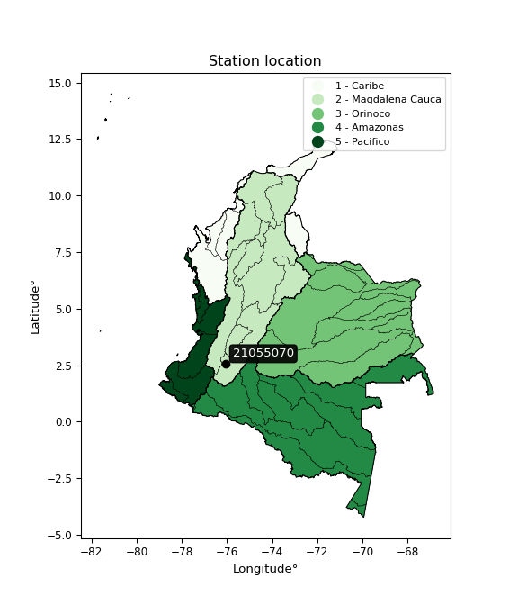

<div align="center">


</div>

# PMP Station (Rain, Pmax24h): 21055070

Probable Maximum Precipitation (PMP) is the greatest amount of rainfall for a specific duration that is meteorologically possible for a given location, acting as a "worst-case" scenario for extreme storms, crucial for designing safety-critical infrastructure like bridges, river deviations, dams, spillways, and nuclear plants to prevent catastrophic failure. PMP is calculated by hydrologists using meteorological data to determine the upper limit of extreme rainfall, often leading to the Probable Maximum Flood (PMF) for flood control design, and is increasingly being studied for climate change impacts.

<div align="center">

</img>

</div>


## A. General information


### 1. General running parameters

• app_version: _v20260103_. • runtime: _2026-01-03 07:24:50.581521_. • Python version: _3.14.0_. • SciPy version: _1.16.3_. • Pandas version: _2.3.3_. • NumPy version: _2.3.5_. • Stations dataset (station_dataset_file): _dataset/pmax24h_in/automatic_colombia_2003_2024.csv_. • Stations catalog (station_catalog_file): _dataset/CNE.xls_. • Minimum year to eval til year_max (date_min): _1900_. • Maximum year to eval since year_min (date_max): _2024_. • Creates, save and include plots into reports (create_plot): _False_. • Plot only fit distributions with Δo > Δ (plot_only_fit): _True_. • Eval low extreme values, if False, evaluates high extreme values (low_extreme): _False_. • Eval every SciPy distribution as logarithmic (pdist_logarithmic_on): _True_. • Standard deviation normalized (ddof): _1.0_. • Return periods to eval in years (Tr): _[2, 2.33, 5, 10, 15, 20, 25, 50, 75, 100, 200, 250, 500, 750, 1000]_. • Minimum data sample per station, 0 means any (minimum_sample): _5_. • Z-Score maximum threshold to adjust a value, 0 means disable (zscore_max): _3.5_. • Z-Score minimum threshold to adjust a value, 0 means disable (zscore_min): _-2.5_. • Avoid zeros, e.g. rain = 0 (avoid_zeros): _True_. • Avoid null values (avoid_nans): _True_. [:file_folder:Dataset file.](../../dataset/pmax24h_in/automatic_colombia_2003_2024.csv)

> Delta Degrees of Freedom (DDOF): is a parameter used in the formulas for calculating variance and standard deviation. When ddof=0, the divisor is $N$ (the total number of observations) and this is used when your data set is the entire population. When ddof=1, the divisor is $N-1$ and this is used when your data set is a sample drawn from a larger population. Using $N-1$ provides an unbiased estimate of the population variance (known as Bessel´s correction).


### 2. Station info and location

|   id |   CODIGO | NOMBRE                | CATEGORIA               | TECNOLOGIA                | ESTADO           | FECHA_INSTALACION   |   FECHA_SUSPENSION |   ALTITUD |   LATITUD |   LONGITUD | DEPARTAMENTO   | MUNICIPIO   | AREA_OPERATIVA                    | ENTIDAD                                                     | AREA_HIDROGRAFICA   | ZONA_HIDROGRAFICA   | SUBZONA_HIDROGRAFICA   |   CORRIENTE | Catalogo   |   Version |
|-----:|---------:|:----------------------|:------------------------|:--------------------------|:-----------------|:--------------------|-------------------:|----------:|----------:|-----------:|:---------------|:------------|:----------------------------------|:------------------------------------------------------------|:--------------------|:--------------------|:-----------------------|------------:|:-----------|----------:|
|    0 | 21055070 | INZA - AUT [21055070] | Climatológica Principal | Automática con Telemetría | En Mantenimiento | 11/11/2005          |                nan |      1800 |   2.54819 |   -76.0639 | Cauca          | Inzá        | Area Operativa 04 - Huila-Caquetá | INSTITUTO DE HIDROLOGIA METEOROLOGIA Y ESTUDIOS AMBIENTALES | Magdalena Cauca     | Alto Magdalena      | Río Páez               |         nan | CNE_IDEAM  |  20251226 |

<div align="center">

Dynamic map: [:earth_americas:Google](http://maps.google.com/maps?q=2.548194444,-76.06394444) [:earth_americas:OSM](https://www.openstreetmap.org/#map=18/2.548194444/-76.06394444&layers=P) [:earth_americas:Bing](https://www.bing.com/maps?cp=2.548194444~-76.06394444&lvl=18) [:earth_americas:Apple](https://maps.apple.com/frame?center=2.548194444%2C-76.06394444&span=0.003%2C0.006)

</div>


<div align="center">

```geojson
{
  "type": "Feature",
  "geometry": {
    "type": "Point", 
    "coordinates": [-76.06394444, 2.548194444]
  }, 
  "properties": {
    "Name": "21055070"
  }
}
```

</div>


### 3. Discrete values table and plot

<div align="center">

|               |           0 |           1 |           2 |           3 |           4 |           5 |          6 |           7 |           8 |         9 |          10 |         11 |         12 |          13 |          14 |           15 |         16 |         17 |         18 |
|:--------------|------------:|------------:|------------:|------------:|------------:|------------:|-----------:|------------:|------------:|----------:|------------:|-----------:|-----------:|------------:|------------:|-------------:|-----------:|-----------:|-----------:|
| Date          | 2005        | 2006        | 2007        | 2008        | 2009        | 2010        | 2011       | 2012        | 2013        | 2014      | 2015        | 2016       | 2017       | 2018        | 2019        | 2020         | 2021       | 2022       | 2023       |
| Value         |   32.6      |   53.2      |   56.9      |   55.5      |   23.6      |   42.5      |   46.9     |   55.9      |   43.8      |   50.4    |   43        |   83.2     |   49.8     |   37.5      |   47.8      |   39.2       |    0.2     |    0.7     |    0.1     |
| Value_initial |   32.6      |   53.2      |   56.9      |   55.5      |   23.6      |   42.5      |   46.9     |   55.9      |   43.8      |   50.4    |   43        |   83.2     |   49.8     |   37.5      |   47.8      |   39.2       |    0.2     |    0.7     |    0.1     |
| count         |   19        |   19        |   19        |   19        |   19        |   19        |   19       |   19        |   19        |   19      |   19        |   19       |   19       |   19        |   19        |   19         |   19       |   19       |   19       |
| mean          |   40.1474   |   40.1474   |   40.1474   |   40.1474   |   40.1474   |   40.1474   |   40.1474  |   40.1474   |   40.1474   |   40.1474 |   40.1474   |   40.1474  |   40.1474  |   40.1474   |   40.1474   |   40.1474    |   40.1474  |   40.1474  |   40.1474  |
| std           |   21.3597   |   21.3597   |   21.3597   |   21.3597   |   21.3597   |   21.3597   |   21.3597  |   21.3597   |   21.3597   |   21.3597 |   21.3597   |   21.3597  |   21.3597  |   21.3597   |   21.3597   |   21.3597    |   21.3597  |   21.3597  |   21.3597  |
| zscore        |   -0.353347 |    0.611088 |    0.784312 |    0.718768 |   -0.774702 |    0.110144 |    0.31614 |    0.737495 |    0.171006 |    0.48   |    0.133552 |    2.01561 |    0.45191 |   -0.123942 |    0.358275 |   -0.0443532 |   -1.87023 |   -1.84682 |   -1.87491 |


</div>


> The initial value (value_initial) correspond to the initial obtained or null completed value, and value (value) is adjusted only when the initial value is outside the valid range definite through the Z-Score value. If Z-Score is active, values out of range or outliers are replaced with the station mean value


### 4. Active continuous probability distributions from SciPy (44 of 104 available)

A Probability Density Function (PDF) describes the relative likelihood of a continuous random variable falling within a specific range, where the total area under its curve equals 1, and the area over any interval gives the actual probability for that range. Unlike discrete probabilities (like rolling a die), a PDF shows density, not direct probability for a single point (which is zero), with higher points indicating higher likelihood, often visualized as a bell curve for normal distributions.

A log of a probability density function (log-PDF) is simply the logarithm of the PDF´s value, denoted as $log(f(x))$, useful for converting multiplication of probabilities into addition, improving numerical stability with tiny numbers, and connecting to information theory concepts like entropy. Instead of dealing with very small probabilities (e.g., 0.000001), log-PDFs use negative numbers (e.g., $log(0.00001) ≈ -11.51$ that are easier for computers to handle, preventing underflow errors and simplifying complex calculations. In this study, each active probability distribution from SciPy is also evaluated in the $log$ form.

[scipy.stats](https://docs.scipy.org/doc/scipy/reference/stats.html) is a Python´s powerful submodule within the SciPy library for comprehensive statistical analysis, offering over 130 probability distributions (like Normal, Poisson), functions for descriptive stats (mean, variance), hypothesis testing (t-tests, chi-square), random variable generation, and statistical tests, making it essential for data science, modeling, and research. It provides tools to explore, model, and draw conclusions from data efficiently, working seamlessly with NumPy.

<div align="center">

|   id | p_dist             |   n_parameter | fit_method   | label                                                                       | active   | ref                                                                                                        |
|-----:|:-------------------|--------------:|:-------------|:----------------------------------------------------------------------------|:---------|:-----------------------------------------------------------------------------------------------------------|
|    0 | alpha              |             3 | MLE          | Alpha                                                                       | True     | [:mortar_board:](https://docs.scipy.org/doc/scipy/reference/generated/scipy.stats.alpha.html)              |
|    1 | betaprime          |             4 | MLE          | Beta prime                                                                  | True     | [:mortar_board:](https://docs.scipy.org/doc/scipy/reference/generated/scipy.stats.betaprime.html)          |
|    2 | chi2               |             3 | MLE          | Chi²                                                                        | True     | [:mortar_board:](https://docs.scipy.org/doc/scipy/reference/generated/scipy.stats.chi2.html)               |
|    3 | crystalball        |             4 | MLE          | Crystalball                                                                 | True     | [:mortar_board:](https://docs.scipy.org/doc/scipy/reference/generated/scipy.stats.crystalball.html)        |
|    4 | erlang             |             3 | MLE          | Erlang                                                                      | True     | [:mortar_board:](https://docs.scipy.org/doc/scipy/reference/generated/scipy.stats.erlang.html)             |
|    5 | expon              |             2 | MLE          | Exponential                                                                 | True     | [:mortar_board:](https://docs.scipy.org/doc/scipy/reference/generated/scipy.stats.expon.html)              |
|    6 | exponnorm          |             3 | MLE          | Exponentially modified Normal                                               | True     | [:mortar_board:](https://docs.scipy.org/doc/scipy/reference/generated/scipy.stats.exponnorm.html)          |
|    7 | f                  |             4 | MLE          | F                                                                           | True     | [:mortar_board:](https://docs.scipy.org/doc/scipy/reference/generated/scipy.stats.f.html)                  |
|    8 | fatiguelife        |             3 | MLE          | Fatigue-life (Birnbaum-Saunders)                                            | True     | [:mortar_board:](https://docs.scipy.org/doc/scipy/reference/generated/scipy.stats.fatiguelife.html)        |
|    9 | fisk               |             3 | MLE          | Fisk                                                                        | True     | [:mortar_board:](https://docs.scipy.org/doc/scipy/reference/generated/scipy.stats.fisk.html)               |
|   10 | gamma              |             3 | MLE          | Gamma                                                                       | True     | [:mortar_board:](https://docs.scipy.org/doc/scipy/reference/generated/scipy.stats.gamma.html)              |
|   11 | genexpon           |             5 | MLE          | Generalized exponential                                                     | True     | [:mortar_board:](https://docs.scipy.org/doc/scipy/reference/generated/scipy.stats.genexpon.html)           |
|   12 | genlogistic        |             3 | MLE          | Generalized logistic                                                        | True     | [:mortar_board:](https://docs.scipy.org/doc/scipy/reference/generated/scipy.stats.genlogistic.html)        |
|   13 | gibrat             |             2 | MM           | Gibrat                                                                      | True     | [:mortar_board:](https://docs.scipy.org/doc/scipy/reference/generated/scipy.stats.gibrat.html)             |
|   14 | gompertz           |             3 | MLE          | Gompertz (or truncated Gumbel)                                              | True     | [:mortar_board:](https://docs.scipy.org/doc/scipy/reference/generated/scipy.stats.gompertz.html)           |
|   15 | gumbel_l           |             2 | MM           | Gumbel Left Skew                                                            | True     | [:mortar_board:](https://docs.scipy.org/doc/scipy/reference/generated/scipy.stats.gumbel_l.html)           |
|   16 | gumbel_r           |             2 | MM           | Gumbel Right Skew                                                           | True     | [:mortar_board:](https://docs.scipy.org/doc/scipy/reference/generated/scipy.stats.gumbel_r.html)           |
|   17 | halflogistic       |             2 | MM           | Half-logistic                                                               | True     | [:mortar_board:](https://docs.scipy.org/doc/scipy/reference/generated/scipy.stats.halflogistic.html)       |
|   18 | halfnorm           |             2 | MM           | Half Normal                                                                 | True     | [:mortar_board:](https://docs.scipy.org/doc/scipy/reference/generated/scipy.stats.halfnorm.html)           |
|   19 | hypsecant          |             2 | MM           | hyperbolic secant                                                           | True     | [:mortar_board:](https://docs.scipy.org/doc/scipy/reference/generated/scipy.stats.hypsecant.html)          |
|   20 | invgamma           |             3 | MLE          | Inverted gamma                                                              | True     | [:mortar_board:](https://docs.scipy.org/doc/scipy/reference/generated/scipy.stats.invgamma.html)           |
|   21 | invgauss           |             3 | MLE          | Inverse Gaussian                                                            | True     | [:mortar_board:](https://docs.scipy.org/doc/scipy/reference/generated/scipy.stats.invgauss.html)           |
|   22 | invweibull         |             3 | MLE          | Inverted Weibull                                                            | True     | [:mortar_board:](https://docs.scipy.org/doc/scipy/reference/generated/scipy.stats.invweibull.html)         |
|   23 | johnsonsu          |             4 | MLE          | Johnson Su                                                                  | True     | [:mortar_board:](https://docs.scipy.org/doc/scipy/reference/generated/scipy.stats.johnsonsu.html)          |
|   24 | kstwobign          |             2 | MLE          | Limiting distribution of scaled Kolmogorov-Smirnov two-sided test statistic | True     | [:mortar_board:](https://docs.scipy.org/doc/scipy/reference/generated/scipy.stats.kstwobign.html)          |
|   25 | laplace            |             2 | MM           | Laplace                                                                     | True     | [:mortar_board:](https://docs.scipy.org/doc/scipy/reference/generated/scipy.stats.laplace.html)            |
|   26 | laplace_asymmetric |             3 | MLE          | Asymmetric Laplace                                                          | True     | [:mortar_board:](https://docs.scipy.org/doc/scipy/reference/generated/scipy.stats.laplace_asymmetric.html) |
|   27 | loggamma           |             3 | MLE          | Log gamma                                                                   | True     | [:mortar_board:](https://docs.scipy.org/doc/scipy/reference/generated/scipy.stats.loggamma.html)           |
|   28 | logistic           |             2 | MM           | Logistic (or Sech-squared)                                                  | True     | [:mortar_board:](https://docs.scipy.org/doc/scipy/reference/generated/scipy.stats.logistic.html)           |
|   29 | lognorm            |             3 | MLE          | Log Normal                                                                  | True     | [:mortar_board:](https://docs.scipy.org/doc/scipy/reference/generated/scipy.stats.lognorm.html)            |
|   30 | maxwell            |             2 | MM           | Maxwell                                                                     | True     | [:mortar_board:](https://docs.scipy.org/doc/scipy/reference/generated/scipy.stats.maxwell.html)            |
|   31 | mielke             |             4 | MLE          | Mielke Beta-Kappa / Dagum                                                   | True     | [:mortar_board:](https://docs.scipy.org/doc/scipy/reference/generated/scipy.stats.mielke.html)             |
|   32 | moyal              |             2 | MM           | Moyal                                                                       | True     | [:mortar_board:](https://docs.scipy.org/doc/scipy/reference/generated/scipy.stats.moyal.html)              |
|   33 | nakagami           |             3 | MLE          | Nakagami                                                                    | True     | [:mortar_board:](https://docs.scipy.org/doc/scipy/reference/generated/scipy.stats.nakagami.html)           |
|   34 | ncf                |             5 | MLE          | Non-central F distribution                                                  | True     | [:mortar_board:](https://docs.scipy.org/doc/scipy/reference/generated/scipy.stats.ncf.html)                |
|   35 | nct                |             4 | MLE          | Non-central Student’s t                                                     | True     | [:mortar_board:](https://docs.scipy.org/doc/scipy/reference/generated/scipy.stats.nct.html)                |
|   36 | norm               |             2 | MM           | Normal                                                                      | True     | [:mortar_board:](https://docs.scipy.org/doc/scipy/reference/generated/scipy.stats.norm.html)               |
|   37 | pearson3           |             3 | MM           | Pearson type III                                                            | True     | [:mortar_board:](https://docs.scipy.org/doc/scipy/reference/generated/scipy.stats.pearson3.html)           |
|   38 | rayleigh           |             2 | MM           | Rayleigh                                                                    | True     | [:mortar_board:](https://docs.scipy.org/doc/scipy/reference/generated/scipy.stats.rayleigh.html)           |
|   39 | rice               |             3 | MLE          | Rice                                                                        | True     | [:mortar_board:](https://docs.scipy.org/doc/scipy/reference/generated/scipy.stats.rice.html)               |
|   40 | t                  |             3 | MLE          | Student’s t                                                                 | True     | [:mortar_board:](https://docs.scipy.org/doc/scipy/reference/generated/scipy.stats.t.html)                  |
|   41 | truncnorm          |             4 | MLE          | Truncated normal                                                            | True     | [:mortar_board:](https://docs.scipy.org/doc/scipy/reference/generated/scipy.stats.truncnorm.html)          |
|   42 | wald               |             2 | MM           | Wald                                                                        | True     | [:mortar_board:](https://docs.scipy.org/doc/scipy/reference/generated/scipy.stats.wald.html)               |
|   43 | weibull_min        |             3 | MLE          | Weibull minimum                                                             | True     | [:mortar_board:](https://docs.scipy.org/doc/scipy/reference/generated/scipy.stats.weibull_min.html)        |

</div>

> **n_parameter:** # arguments & localization & scale.
>
> **Fit methods:** (MLE) maximum likelihood, (MM) L-moments.
>
>**Inactive** (With the only purpose of prevent loops, zero divisions, infinite values, over high estimated values or horizontal trending for recurrence intervals estimations, the follow distributions were disabled.)**:** foldnorm, gennorm, norminvgauss, powernorm, powerlognorm, skewnorm, genextreme, anglit, arcsine, argus, beta, bradford, burr, burr12, cauchy, cosine, halfcauchy, foldcauchy, skewcauchy, wrapcauchy, dgamma, gengamma, exponweib, exponpow, truncexpon, gausshyper, genhalflogistic, genhyperbolic, geninvgauss, halfgennorm, johnsonsb, kappa4, kappa3, ksone, kstwo, loglaplace, levy, levy_l, levy_stable, ncx2, pareto, genpareto, truncpareto, lomax, powerlaw, rdist, rel_breitwigner, recipinvgauss, semicircular, studentized_range, trapezoid, triang, truncweibull_min, tukeylambda, uniform, loguniform, vonmises, vonmises_line, weibull_max, dweibull, 


## B. Probability distributions vs. Empirical distributions

A continuous probability distribution (CPD) describes probabilities for variables that can take any value within a range (like rain any time), unlike discrete variables with specific outcomes (like temperature). It uses a Probability Density Function (PDF), a curve where the total area under it equals 1, and the probability of the variable falling within an interval (a to b) is found by calculating the area under the curve between those points. A key feature is that the probability of hitting any single exact value is zero, so probabilities are always expressed for ranges, e.g., $P(a ≤ X ≤ b)$.

<div align="center">

Distributions parameters from station values
|    |   station | p_dist                |   n |               loc |            scale | shape                  | shape1                | shape2                 | shape3   |
|---:|----------:|:----------------------|----:|------------------:|-----------------:|:-----------------------|:----------------------|:-----------------------|:---------|
|  0 |  21055070 | alpha                 |  19 |    -305.346       |   5433.35        | 15.806972788513988     |                       |                        |          |
|  1 |  21055070 | betaprime             |  19 |    -658.415       |  54618.4         | 1116.8500696453802     | 87322.85001876217     |                        |          |
|  2 |  21055070 | chi2                  |  19 |    -178.489       |      1.08038     | 201.78958469868076     |                       |                        |          |
|  3 |  21055070 | crystalball           |  19 |      40.1474      |     20.79        | 2554.1252612868047     | 4179.621047470062     |                        |          |
|  4 |  21055070 | erlang                |  19 |    -319.439       |      1.25911     | 285.2556380685146      |                       |                        |          |
|  5 |  21055070 | expon                 |  19 |       0.1         |     40.0474      |                        |                       |                        |          |
|  6 |  21055070 | exponnorm             |  19 |      40.1313      |     20.7899      | 0.0007686397167790043  |                       |                        |          |
|  7 |  21055070 | f                     |  19 |  -10631.9         |  10672.1         | 769329.1100072529      | 1660407.8276106347    |                        |          |
|  8 |  21055070 | fatiguelife           |  19 |   -2145.27        |   2185.18        | 0.009503730934085942   |                       |                        |          |
|  9 |  21055070 | fisk                  |  19 |      -9.83817e+08 |      9.83817e+08 | 88000694.36313984      |                       |                        |          |
| 10 |  21055070 | gamma                 |  19 |    -349.661       |      1.21354     | 321.30068586500136     |                       |                        |          |
| 11 |  21055070 | genexpon              |  19 |       0.099963    |      1.81141     | 0.0451235303677196     | 9.381582513610038e-09 | 0.7012617565648294     |          |
| 12 |  21055070 | genlogistic           |  19 |      53.6604      |      6.49131     | 0.3815525471735688     |                       |                        |          |
| 13 |  21055070 | gibrat                |  19 |      24.2872      |      9.61968     |                        |                       |                        |          |
| 14 |  21055070 | gompertz              |  19 |      23.5982      |     17.9792      | 0.2377929093023903     |                       |                        |          |
| 15 |  21055070 | gumbel_l              |  19 |      49.504       |     16.2099      |                        |                       |                        |          |
| 16 |  21055070 | gumbel_r              |  19 |      30.7908      |     16.2099      |                        |                       |                        |          |
| 17 |  21055070 | halflogistic          |  19 |      15.5064      |     17.7747      |                        |                       |                        |          |
| 18 |  21055070 | halfnorm              |  19 |      12.6296      |     34.4884      |                        |                       |                        |          |
| 19 |  21055070 | hypsecant             |  19 |      40.1474      |     13.2353      |                        |                       |                        |          |
| 20 |  21055070 | invgamma              |  19 |    -244.729       |  49514           | 175.05405063458113     |                       |                        |          |
| 21 |  21055070 | invgauss              |  19 |    -101.246       |   5075.22        | 0.027757320719551865   |                       |                        |          |
| 22 |  21055070 | invweibull            |  19 | -155939           | 155967           | 7056.777152900346      |                       |                        |          |
| 23 |  21055070 | johnsonsu             |  19 |      51.1897      |      8.14334     | 0.5860862611326298     | 0.8351672833931278    |                        |          |
| 24 |  21055070 | kstwobign             |  19 |     -50.2312      |    103.371       |                        |                       |                        |          |
| 25 |  21055070 | laplace               |  19 |      40.1474      |     14.7007      |                        |                       |                        |          |
| 26 |  21055070 | laplace_asymmetric    |  19 |      49.8         |     13.0391      | 1.4364429298133925     |                       |                        |          |
| 27 |  21055070 | loggamma              |  19 |      -6.87382     |     38.3281      | 3.898213872446017      |                       |                        |          |
| 28 |  21055070 | logistic              |  19 |      40.1474      |     11.4621      |                        |                       |                        |          |
| 29 |  21055070 | lognorm               |  19 |      -1.67772e+07 |      1.67773e+07 | 1.2391757410274065e-06 |                       |                        |          |
| 30 |  21055070 | maxwell               |  19 |      -9.11611     |     30.8713      |                        |                       |                        |          |
| 31 |  21055070 | mielke                |  19 |       0.1         |     63.1872      | 0.6956685874582875     | 5.512160631889694     |                        |          |
| 32 |  21055070 | moyal                 |  19 |      28.2583      |      9.35877     |                        |                       |                        |          |
| 33 |  21055070 | nakagami              |  19 |       0.1         |     58.855       | 0.31229078972897273    |                       |                        |          |
| 34 |  21055070 | ncf                   |  19 |       0.1         |      7.61491     | 0.884260492022215      | 13.37203285127401     | 4.194902801402299      |          |
| 35 |  21055070 | nct                   |  19 |    2106.51        |     20.7863      | 10097258.351317108     | -99.40992431342579    |                        |          |
| 36 |  21055070 | norm                  |  19 |      40.1474      |     20.79        |                        |                       |                        |          |
| 37 |  21055070 | pearson3              |  19 |      40.1474      |     20.7899      | -0.569709188591041     |                       |                        |          |
| 38 |  21055070 | rayleigh              |  19 |       0.37492     |     31.7338      |                        |                       |                        |          |
| 39 |  21055070 | rice                  |  19 |     -13.9336      |     22.4395      | 2.160295322345455      |                       |                        |          |
| 40 |  21055070 | t                     |  19 |      45.6982      |     10.0282      | 1.6118124469608586     |                       |                        |          |
| 41 |  21055070 | truncnorm             |  19 |      -4.00607     |     10.7208      | -0.5132209772268207    | 8.134322886516422     |                        |          |
| 42 |  21055070 | wald                  |  19 |      19.3574      |     20.79        |                        |                       |                        |          |
| 43 |  21055070 | weibull_min           |  19 |     -72.438       |    120.878       | 6.41187816070693       |                       |                        |          |
| 44 |  21055070 | logalpha              |  19 |      -2.96311     |      1.77928     | 2.326993123757785e-08  |                       |                        |          |
| 45 |  21055070 | logbetaprime          |  19 |      -2.30259     |      2.40364     | 0.7565170840345573     | 0.7140697701175003    |                        |          |
| 46 |  21055070 | logchi2               |  19 |      -2.30259     |      1.56362     | 0.8001795218282843     |                       |                        |          |
| 47 |  21055070 | logcrystalball        |  19 |       2.99894     |      1.95682     | 5430.434903350799      | 44.93362312833429     |                        |          |
| 48 |  21055070 | logerlang             |  19 |     -23.4621      |      0.174565    | 151.31118662589975     |                       |                        |          |
| 49 |  21055070 | logexpon              |  19 |      -2.30259     |      5.30152     |                        |                       |                        |          |
| 50 |  21055070 | logexponnorm          |  19 |       2.99768     |      1.95681     | 0.0006432876869526522  |                       |                        |          |
| 51 |  21055070 | logf                  |  19 |      -2.30259     |      1.13452     | 1.0514310058422414     | 1.0602848135207497    |                        |          |
| 52 |  21055070 | logfatiguelife        |  19 |   -1430.95        |   1433.96        | 0.0013627937163140065  |                       |                        |          |
| 53 |  21055070 | logfisk               |  19 |      -2.30259     |      1.91166     | 0.8017136885841241     |                       |                        |          |
| 54 |  21055070 | loggamma              |  19 |     -31.4938      |      0.127958    | 269.51013151606946     |                       |                        |          |
| 55 |  21055070 | loggenexpon           |  19 |      -2.30651     |      0.17941     | 0.005378721807804542   | 4.8922912185432805    | 0.00034785835046055764 |          |
| 56 |  21055070 | loggenlogistic        |  19 |       4.23852     |      0.0991194   | 0.07911866096077125    |                       |                        |          |
| 57 |  21055070 | loggibrat             |  19 |       1.50614     |      0.905433    |                        |                       |                        |          |
| 58 |  21055070 | loggompertz           |  19 |      -2.30259     |      2.07136     | 0.06405125981753335    |                       |                        |          |
| 59 |  21055070 | loggumbel_l           |  19 |       3.87961     |      1.52572     |                        |                       |                        |          |
| 60 |  21055070 | loggumbel_r           |  19 |       2.11827     |      1.52572     |                        |                       |                        |          |
| 61 |  21055070 | loghalflogistic       |  19 |       0.679679    |      1.673       |                        |                       |                        |          |
| 62 |  21055070 | loghalfnorm           |  19 |       0.408911    |      3.24613     |                        |                       |                        |          |
| 63 |  21055070 | loghypsecant          |  19 |       2.99894     |      1.24575     |                        |                       |                        |          |
| 64 |  21055070 | loginvgamma           |  19 |     -50.6304      |  35238.4         | 658.8653821199114      |                       |                        |          |
| 65 |  21055070 | loginvgauss           |  19 |     -19.4928      |   2351.12        | 0.009525680260186725   |                       |                        |          |
| 66 |  21055070 | loginvweibull         |  19 | -183330           | 183332           | 72518.98194282647      |                       |                        |          |
| 67 |  21055070 | logjohnsonsu          |  19 |       3.98835     |      0.0709375   | 0.8513355844075605     | 0.5099391868793004    |                        |          |
| 68 |  21055070 | logkstwobign          |  19 |      -7.37231     |     11.8848      |                        |                       |                        |          |
| 69 |  21055070 | loglaplace            |  19 |       2.99894     |      1.38368     |                        |                       |                        |          |
| 70 |  21055070 | loglaplace_asymmetric |  19 |       4.02356     |      0.455361    | 2.6302061847960783     |                       |                        |          |
| 71 |  21055070 | logloggamma           |  19 |       4.36559     |      0.136685    | 0.10435754147837453    |                       |                        |          |
| 72 |  21055070 | loglogistic           |  19 |       2.99894     |      1.07885     |                        |                       |                        |          |
| 73 |  21055070 | loglognorm            |  19 |   -1244.73        |   1247.72        | 0.001568079024443064   |                       |                        |          |
| 74 |  21055070 | logmaxwell            |  19 |      -1.63787     |      2.90569     |                        |                       |                        |          |
| 75 |  21055070 | logmielke             |  19 |      -2.11754e+08 |      2.11754e+08 | 63553518.72378667      | 215750442.19181317    |                        |          |
| 76 |  21055070 | logmoyal              |  19 |       1.8799      |      0.880877    |                        |                       |                        |          |
| 77 |  21055070 | lognakagami           |  19 |   -2145.38        |   2148.38        | 299974.8635543741      |                       |                        |          |
| 78 |  21055070 | logncf                |  19 |      -2.30259     |      1.03129     | 1.0205148211152206     | 1.1349224362435408    | 1.0846518189191245     |          |
| 79 |  21055070 | lognct                |  19 |    -122.309       |      1.90566     | 35183.806348435144     | 65.75465298223807     |                        |          |
| 80 |  21055070 | lognorm               |  19 |       2.99894     |      1.95682     |                        |                       |                        |          |
| 81 |  21055070 | logpearson3           |  19 |       2.99895     |      1.9568      | -1.9161740692996356    |                       |                        |          |
| 82 |  21055070 | lograyleigh           |  19 |      -0.744616    |      2.98691     |                        |                       |                        |          |
| 83 |  21055070 | logrice               |  19 |    -890.093       |      1.95686     | 456.3900296807145      |                       |                        |          |
| 84 |  21055070 | logt                  |  19 |       3.85893     |      0.149188    | 0.7153541624864256     |                       |                        |          |
| 85 |  21055070 | logtruncnorm          |  19 |       2.62167     |      6.71603     | -1.6387085054312194    | 0.2679527352849296    |                        |          |
| 86 |  21055070 | logwald               |  19 |       1.04215     |      1.9568      |                        |                       |                        |          |
| 87 |  21055070 | logweibull_min        |  19 |      -2.30259     |      1.60135     | 0.557961133475523      |                       |                        |          |

</div>

> **loc** (Location parameter): This shifts the distribution along the x-axis. For many common distributions, like the normal (Gaussian) distribution, loc represents the mean $μ$. For others, like the uniform distribution, it might represent the minimum value, or for the beta distribution, the left end of the support interval.
>
> **scale** (Scale parameter): This determines the width or spread of the distribution. For the normal distribution, scale represents the standard deviation $σ$. For a uniform distribution, it defines the length of the interval (from $loc$ to $loc + scale$).
>
> **shape** (Shape parameters): Refers to parameters that define the specific form of a probability distribution, distinct from its location (loc) and scale (scale). These parameters are required arguments for most distribution functions. For example, a normal (Gaussian) distribution is fully defined by its location (mean) and scale (standard deviation), so it has no specific shape parameters beyond loc and scale. However, other distributions have intrinsic properties that need specification, as Gamma distribution that takes a shape parameter, often named $a$ or $alpha$.


### 0. Cumulative distribution values - CDF (88 evaluated)

Cumulative Distribution Function (CDF), denoted as $F$<sub>$X$</sub>$(x)$, is a function that gives the probability that a random variable $X$ will take a value less than or equal to a specific value, $x$ (i.e., $(P(X≥x)$. It essentially "accumulates" probabilities from a given point up to the far right (positive infinity), providing a complete picture of the distribution´s probabilities for both discrete (like rain) and continuous (like temperature) variables, helping to find probabilities over ranges or above certain values. Each station is evaluated separately ordering the $x$ values ascending, calculating the CDF and PDF values for the activated distributions and their logarithmic forms.

<div align="center">

CDF ordered by x ascending and calculating $log(f(x))$ separately
|   id |   Station |   date |    x |   count |    mean |     std |     zscore |   Value_initial |   station |   m |     alpha |   alpha_pdf |   betaprime |   betaprime_pdf |      chi2 |   chi2_pdf |   crystalball |   crystalball_pdf |    erlang |   erlang_pdf |      expon |   expon_pdf |   exponnorm |   exponnorm_pdf |         f |      f_pdf |   fatiguelife |   fatiguelife_pdf |      fisk |   fisk_pdf |     gamma |   gamma_pdf |    genexpon |   genexpon_pdf |   genlogistic |   genlogistic_pdf |   gibrat |   gibrat_pdf |    gompertz |   gompertz_pdf |   gumbel_l |   gumbel_l_pdf |   gumbel_r |   gumbel_r_pdf |   halflogistic |   halflogistic_pdf |   halfnorm |   halfnorm_pdf |   hypsecant |   hypsecant_pdf |   invgamma |   invgamma_pdf |   invgauss |   invgauss_pdf |   invweibull |   invweibull_pdf |   johnsonsu |   johnsonsu_pdf |   kstwobign |   kstwobign_pdf |   laplace |   laplace_pdf |   laplace_asymmetric |   laplace_asymmetric_pdf |   loggamma |   loggamma_pdf |   logistic |   logistic_pdf |    lognorm |   lognorm_pdf |    maxwell |   maxwell_pdf |      mielke |   mielke_pdf |       moyal |   moyal_pdf |    nakagami |   nakagami_pdf |         ncf |       ncf_pdf |       nct |    nct_pdf |      norm |   norm_pdf |   pearson3 |   pearson3_pdf |    rayleigh |   rayleigh_pdf |      rice |   rice_pdf |         t |      t_pdf |   truncnorm |   truncnorm_pdf |      wald |   wald_pdf |   weibull_min |   weibull_min_pdf |   logalpha |   logalpha_pdf |   logbetaprime |   logbetaprime_pdf |     logchi2 |   logchi2_pdf |   logcrystalball |   logcrystalball_pdf |   logerlang |   logerlang_pdf |   logexpon |   logexpon_pdf |   logexponnorm |   logexponnorm_pdf |        logf |    logf_pdf |   logfatiguelife |   logfatiguelife_pdf |     logfisk |   logfisk_pdf |   loggenexpon |   loggenexpon_pdf |   loggenlogistic |   loggenlogistic_pdf |   loggibrat |   loggibrat_pdf |   loggompertz |   loggompertz_pdf |   loggumbel_l |   loggumbel_l_pdf |   loggumbel_r |   loggumbel_r_pdf |   loghalflogistic |   loghalflogistic_pdf |   loghalfnorm |   loghalfnorm_pdf |   loghypsecant |   loghypsecant_pdf |   loginvgamma |   loginvgamma_pdf |   loginvgauss |   loginvgauss_pdf |   loginvweibull |   loginvweibull_pdf |   logjohnsonsu |   logjohnsonsu_pdf |   logkstwobign |   logkstwobign_pdf |   loglaplace |   loglaplace_pdf |   loglaplace_asymmetric |   loglaplace_asymmetric_pdf |   logloggamma |   logloggamma_pdf |   loglogistic |   loglogistic_pdf |   loglognorm |   loglognorm_pdf |   logmaxwell |   logmaxwell_pdf |   logmielke |   logmielke_pdf |    logmoyal |   logmoyal_pdf |   lognakagami |   lognakagami_pdf |      logncf |   logncf_pdf |     lognct |   lognct_pdf |   logpearson3 |   logpearson3_pdf |   lograyleigh |   lograyleigh_pdf |    logrice |   logrice_pdf |      logt |   logt_pdf |   logtruncnorm |   logtruncnorm_pdf |   logwald |   logwald_pdf |   logweibull_min |   logweibull_min_pdf |
|-----:|----------:|-------:|-----:|--------:|--------:|--------:|-----------:|----------------:|----------:|----:|----------:|------------:|------------:|----------------:|----------:|-----------:|--------------:|------------------:|----------:|-------------:|-----------:|------------:|------------:|----------------:|----------:|-----------:|--------------:|------------------:|----------:|-----------:|----------:|------------:|------------:|---------------:|--------------:|------------------:|---------:|-------------:|------------:|---------------:|-----------:|---------------:|-----------:|---------------:|---------------:|-------------------:|-----------:|---------------:|------------:|----------------:|-----------:|---------------:|-----------:|---------------:|-------------:|-----------------:|------------:|----------------:|------------:|----------------:|----------:|--------------:|---------------------:|-------------------------:|-----------:|---------------:|-----------:|---------------:|-----------:|--------------:|-----------:|--------------:|------------:|-------------:|------------:|------------:|------------:|---------------:|------------:|--------------:|----------:|-----------:|----------:|-----------:|-----------:|---------------:|------------:|---------------:|----------:|-----------:|----------:|-----------:|------------:|----------------:|----------:|-----------:|--------------:|------------------:|-----------:|---------------:|---------------:|-------------------:|------------:|--------------:|-----------------:|---------------------:|------------:|----------------:|-----------:|---------------:|---------------:|-------------------:|------------:|------------:|-----------------:|---------------------:|------------:|--------------:|--------------:|------------------:|-----------------:|---------------------:|------------:|----------------:|--------------:|------------------:|--------------:|------------------:|--------------:|------------------:|------------------:|----------------------:|--------------:|------------------:|---------------:|-------------------:|--------------:|------------------:|--------------:|------------------:|----------------:|--------------------:|---------------:|-------------------:|---------------:|-------------------:|-------------:|-----------------:|------------------------:|----------------------------:|--------------:|------------------:|--------------:|------------------:|-------------:|-----------------:|-------------:|-----------------:|------------:|----------------:|------------:|---------------:|--------------:|------------------:|------------:|-------------:|-----------:|-------------:|--------------:|------------------:|--------------:|------------------:|-----------:|--------------:|----------:|-----------:|---------------:|-------------------:|----------:|--------------:|-----------------:|---------------------:|
|    0 |  21055070 |   2023 |  0.1 |      19 | 40.1474 | 21.3597 | -1.87491   |             0.1 |  21055070 |   1 | 0.023782  |  0.00326388 |   0.0266774 |      0.00305291 | 0.0283744 | 0.00342175 |     0.0270345 |        0.00300135 | 0.0276232 |   0.00323047 | 0          |  0.0249704  |   0.0270345 |      0.00300136 | 0.0268649 | 0.00299187 |     0.0265235 |        0.00301212 | 0.022541  | 0.0019708  | 0.0290857 |  0.00327852 | 9.22194e-07 |     0.0249107  |     0.0429238 |       0.00252236  | 0        |   0          | 0           |    0           |  0.0463558 |    0.0027924   | 0.00130505 |    0.000534707 |       0        |         0          |   0        |     0          |   0.030864  |      0.00232829 |  0.0237454 |     0.00317524 |  0.0280732 |     0.00387948 |    0.0280318 |       0.00453428 |   0.0627922 |      0.0019926  |   0.0282877 |      0.00528756 | 0.0328001 |    0.00223119 |            0.0474216 |              0.00253186  | 0.00412202 |     0.00647872 |  0.0294865 |     0.00249667 | 0.0033717  |    0.00519377 | 0.00688993 |    0.00220302 | 5.22729e-10 | 126.536      | 6.75165e-06 | 7.64054e-06 | 1.80149e-12 | 81077.4        | 2.81228e-06 | 2845.79       | 0.0270428 | 0.00300185 | 0.0270345 | 0.00300135 |  0.0402643 |     0.00312253 | 0           |    0           | 0.0213199 | 0.0033582  | 0.0331896 | 0.00111138 |    0.495965 |     0.0496774   | 0         | 0          |     0.0371338 |        0.00322067 | 0.00706521 |      0.0864415 |    9.43321e-13 |       1606.97      | 5.14578e-07 |   4.63594e+08 |       0.0033717  |           0.00519377 |  0.00461516 |       0.0072776 |   0        |      0.188625  |     0.00337155 |         0.00519359 | 5.16882e-09 | 6.11888e+06 |       0.00322382 |           0.00501374 | 2.92453e-13 |   527.966     |   0.000118061 |         0.030184  |       0.00540076 |           0.00431097 |    0        |       0         |    1.3841e-07 |         0.0309224 |     0.0172377 |         0.0112001 |   1.33796e-08 |       1.58985e-07 |          0        |              0        |      0        |          0        |     0.00902875 |         0.00724668 |    0.00391335 |         0.0063837 |    0.00375819 |        0.00674451 |      0.00545212 |           0.0112402 |      0.036787  |         0.00652385 |     0.00667767 |          0.0165433 |    0.0108389 |       0.00783337 |              0.00444063 |                  0.00370765 |    0.00647788 |        0.00494578 |    0.00728917 |        0.00670718 |   0.00331669 |       0.00514012 |  0           |      0           |    0.117827 |       0.0353384 | 6.54932e-27 |    4.32522e-25 |    0.00342967 |         0.0052663 | 5.49083e-09 |  6.30895e+06 | 0.0034066  |   0.00524933 |     0.0239704 |         0.0125462 |    0          |         0         | 0.00337233 |    0.00519454 | 0.0216882 | 0.00251735 |       0.326271 |          0.0818033 |  0        |     0         |      2.08829e-09 |          2.62376e+06 |
|    1 |  21055070 |   2021 |  0.2 |      19 | 40.1474 | 21.3597 | -1.87023   |             0.2 |  21055070 |   2 | 0.0241102 |  0.00329953 |   0.0269841 |      0.00308187 | 0.0287182 | 0.0034549  |     0.027336  |        0.00302925 | 0.0279478 |   0.00326138 | 0.00249393 |  0.0249082  |   0.027336  |      0.00302926 | 0.0271655 | 0.00301976 |     0.0268261 |        0.00304066 | 0.0227389 | 0.0019877  | 0.0294151 |  0.00330869 | 0.00248889  |     0.0248487  |     0.0431768 |       0.00253722  | 0        |   0          | 0           |    0           |  0.0466358 |    0.00280885  | 0.00135946 |    0.000553574 |       0        |         0          |   0        |     0          |   0.0310977 |      0.00234586 |  0.0240647 |     0.00320932 |  0.0284632 |     0.0039201  |    0.0284879 |       0.00458724 |   0.0629919 |      0.00200135 |   0.0288197 |      0.00535276 | 0.033024  |    0.00224642 |            0.0476754 |              0.00254541  | 0.011428   |     0.0156866  |  0.0297372 |     0.00251724 | 0.00926046 |    0.0127356  | 0.00711252 |    0.0022489  | 0.0112639   |   0.0783597  | 7.55624e-06 | 8.46384e-06 | 0.0144559   |     0.0902889  | 0.0140657   |    0.0631792  | 0.0273443 | 0.00302976 | 0.027336  | 0.00302925 |  0.0405776 |     0.00314403 | 0           |    0           | 0.0216574 | 0.00339086 | 0.033301  | 0.00111731 |    0.500924 |     0.0494981   | 0         | 0          |     0.037457  |        0.00324368 | 0.188706   |      0.326586  |    0.250309    |          0.221238  | 0.580149    |   0.285252    |       0.00926046 |           0.0127356  |  0.0127808  |       0.0174454 |   0.122558 |      0.165507  |     0.00926014 |         0.0127353  | 0.420528    | 0.230941    |       0.00893809 |           0.0124031  | 0.307182    |     0.246155  |   0.0331751   |         0.0645939 |       0.00939164 |           0.00749656 |    0        |       0         |    0.0251347  |         0.0421257 |     0.0270159 |         0.0174656 |   1.00271e-05 |       7.56455e-05 |          0        |              0        |      0        |          0        |     0.0157476  |         0.0126359  |    0.0112395  |         0.0159088 |    0.0117726  |        0.017734   |      0.0190266  |           0.0298186 |      0.0418394 |         0.00814106 |     0.0272072  |          0.0448227 |    0.0178872 |       0.0129273  |              0.0079211  |                  0.00661364 |    0.0109968  |        0.0083959  |    0.0137678  |        0.0125858  |   0.00916153 |       0.0126651  |  2.49055e-07 |      2.62822e-05 |    0.145044 |       0.04347   | 4.2569e-13  |    1.29237e-11 |    0.00938902 |         0.0128701 | 0.303891    |  0.2057      | 0.00935566 |   0.0128601  |     0.0344437 |         0.0179983 |    0          |         0         | 0.00926183 |    0.012737   | 0.0236205 | 0.00308892 |       0.385066 |          0.0877652 |  0        |     0         |      0.465673    |          0.269574    |
|    2 |  21055070 |   2022 |  0.7 |      19 | 40.1474 | 21.3597 | -1.84682   |             0.7 |  21055070 |   3 | 0.0258052 |  0.00348155 |   0.0285618 |      0.00322964 | 0.0304877 | 0.0036238  |     0.028886  |        0.00317161 | 0.0296177 |   0.003419   | 0.0148706  |  0.0245991  |   0.028886  |      0.00317162 | 0.0287107 | 0.00316204 |     0.0283827 |        0.00318628 | 0.0237542 | 0.0020743  | 0.0311077 |  0.0034624  | 0.0148362   |     0.0245411  |     0.0444642 |       0.00261281  | 0        |   0          | 0           |    0           |  0.0480611 |    0.00289251  | 0.00166127 |    0.000655923 |       0        |         0          |   0        |     0          |   0.0322929 |      0.00243572 |  0.0257126 |     0.00338336 |  0.0304746 |     0.00412676 |    0.0308485 |       0.0048562  |   0.0640036 |      0.00204588 |   0.0315782 |      0.00568193 | 0.0341665 |    0.00232414 |            0.0489653 |              0.00261428  | 0.0517124  |     0.0539952  |  0.031022  |     0.00262252 | 0.0431881  |    0.0468604  | 0.0082954  |    0.00248427 | 0.0391765   |   0.0454231  | 1.3044e-05  | 1.38814e-05 | 0.0442651   |     0.0460775  | 0.032149    |    0.0258578  | 0.0288946 | 0.00317211 | 0.028886  | 0.00317161 |  0.0421769 |     0.00325336 | 5.24679e-05 |    0.000322792 | 0.0233941 | 0.00355668 | 0.0338672 | 0.00114759 |    0.525439 |     0.0485478   | 0         | 0          |     0.0391079 |        0.00336059 | 0.494828   |      0.165539  |    0.438405    |          0.104411  | 0.792615    |   0.102876    |       0.0431881  |           0.0468604  |  0.0567436  |       0.0580695 |   0.307223 |      0.130675  |     0.0431871  |         0.0468598  | 0.589111    | 0.0817472   |       0.0422351  |           0.046193   | 0.503559    |     0.102995  |   0.146862    |         0.113362  |       0.0255285  |           0.0203773  |    0        |       0         |    0.0950057  |         0.0715996 |     0.0603535 |         0.0383388 |   0.00632072  |       0.0209786   |          0        |              0        |      0        |          0        |     0.0429914  |         0.0344056  |    0.0528227  |         0.0561596 |    0.0585955  |        0.0628793  |      0.0894801  |           0.0854348 |      0.0547378 |         0.0130046  |     0.123146   |          0.106738  |    0.0442329 |       0.0319676  |              0.022545   |                  0.0188237  |    0.028619   |        0.0218502  |    0.0426819  |        0.0378738  |   0.0430192  |       0.0468452  |  0.0215141   |      0.0484398   |    0.211019 |       0.0630108 | 0.000372078 |    0.0028618   |    0.0435624  |         0.0471054 | 0.472135    |  0.090709    | 0.0435519  |   0.047164   |     0.0662051 |         0.0344613 |    0.00839896 |         0.0431178 | 0.043192   |    0.046863   | 0.0284503 | 0.00482507 |       0.501044 |          0.097007  |  0        |     0         |      0.672042    |          0.104839    |
|    3 |  21055070 |   2009 | 23.6 |      19 | 40.1474 | 21.3597 | -0.774702  |            23.6 |  21055070 |   4 | 0.238713  |  0.0155641  |   0.216752  |      0.0141829  | 0.236141  | 0.014931   |     0.213036  |        0.0139795  | 0.22653   |   0.014597   | 0.443899   |  0.0138861  |   0.213037  |      0.0139796  | 0.212613  | 0.0139654  |     0.215291  |        0.0141867  | 0.158746  | 0.0119454  | 0.224259  |  0.0141675  | 0.443119    |     0.0138723  |     0.170227  |       0.00990919  | 0        |   0          | 2.44509e-05 |    0.013227    |  0.183145  |    0.0101941   | 0.21049    |    0.0202352   |       0.223818 |         0.0267207  |   0.249583 |     0.0219936  |   0.177595  |      0.0127329  |  0.23314   |     0.015352   |  0.259421  |     0.0156604  |    0.291067  |       0.0162542  |   0.151614  |      0.00681763 |   0.312572  |      0.0162435  | 0.162226  |    0.0110353  |            0.166293  |              0.00887845  | 0.540079   |     0.188319   |  0.190979  |     0.0134797  | 0.533053   |    0.203173   | 0.228496   |    0.0165548  | 0.502265    |   0.014805   | 0.199639    | 0.0240196   | 0.432382    |     0.0110629  | 0.353456    |    0.0123624  | 0.213048  | 0.0139789  | 0.213036  | 0.0139795  |  0.201541  |     0.0117925  | 0.234953    |    0.0176441   | 0.22207   | 0.0144875  | 0.0940949 | 0.00559153 |    0.9928   |     0.00194168  | 0.0674507 | 0.0440844  |     0.204499  |        0.0121508  | 0.771414   |      0.0362858 |    0.645396    |          0.0339671 | 0.955062    |   0.0179795   |       0.533053   |           0.203173   |  0.549535   |       0.183351  |   0.643213 |      0.067299  |     0.533052   |         0.203174   | 0.736369    | 0.0224527   |       0.530646   |           0.203523   | 0.698874    |     0.0308794 |   0.613827    |         0.122626  |       0.423205   |           0.337802   |    0.726814 |       0.200944  |    0.564622   |         0.188244  |     0.464461  |         0.219197  |   0.603628    |       0.199715    |          0.630143 |              0.180192 |      0.603497 |          0.17158  |     0.541356   |         0.253363   |    0.553441   |         0.188289  |    0.566001   |        0.178172   |      0.548664   |           0.130275  |      0.224963  |         0.184213   |     0.588088   |          0.119538  |    0.555342  |       0.321359   |              0.425285   |                  0.355087   |    0.419869   |        0.320522   |    0.537541   |        0.230422   |   0.53334    |       0.203164   |  0.564487    |      0.191498    |    0.577956 |       0.146491  | 0.628949    |    0.194727    |    0.533223   |         0.202699  | 0.649387    |  0.0289626   | 0.533277   |   0.202457   |     0.405207  |         0.204789  |    0.57471    |         0.18619   | 0.533056   |    0.203169   | 0.102293  | 0.102775   |       0.86736  |          0.106686  |  0.699233 |     0.180333  |      0.862393    |          0.0278707   |
|    4 |  21055070 |   2005 | 32.6 |      19 | 40.1474 | 21.3597 | -0.353347  |            32.6 |  21055070 |   5 | 0.393363  |  0.0182972  |   0.363047  |      0.0179666  | 0.386291  | 0.018008   |     0.358291  |        0.0179655  | 0.375343  |   0.0180749  | 0.555826   |  0.0110912  |   0.358293  |      0.0179655  | 0.357712  | 0.0179448  |     0.362244  |        0.0181137  | 0.296806  | 0.0186689  | 0.368688  |  0.0175666  | 0.554964    |     0.0110862  |     0.285788  |       0.0161679   | 0.441956 |   0.0474823  | 0.143181    |    0.0186965   |  0.297043  |    0.0152848   | 0.408857   |    0.022559    |       0.446917 |         0.0225114  |   0.437443 |     0.019564   |   0.327592  |      0.0206077  |  0.387132  |     0.0183835  |  0.410816  |     0.0175079  |    0.439829  |       0.016345   |   0.23588   |      0.0126719  |   0.457969  |      0.0157179  | 0.299228  |    0.0203547  |            0.26888   |              0.0143556   | 0.600034   |     0.182164   |  0.341085  |     0.0196077  | 0.597949   |    0.197697   | 0.390704   |    0.0189398  | 0.627687    |   0.0131003  | 0.427789    | 0.0246835   | 0.523881    |     0.0093599  | 0.458203    |    0.0108789  | 0.358295  | 0.0179642  | 0.358291  | 0.0179655  |  0.327956  |     0.0162404  | 0.402858    |    0.0191085   | 0.369549  | 0.0179229  | 0.173551  | 0.0133694  |    0.999541 |     0.000157154 | 0.473344  | 0.0340369  |     0.333902  |        0.0165213  | 0.782572   |      0.0328757 |    0.655975    |          0.0315706 | 0.960487    |   0.0156655   |       0.597949   |           0.197697   |  0.607773   |       0.176569  |   0.664306 |      0.0633204 |     0.597949   |         0.197698   | 0.743345    | 0.0207753   |       0.595679   |           0.198182   | 0.708477    |     0.0286136 |   0.652429    |         0.116241  |       0.547682   |           0.436952   |    0.78275  |       0.148601  |    0.625703   |         0.18915   |     0.537799  |         0.233795  |   0.664668    |       0.177945    |          0.684858 |              0.158688 |      0.656568 |          0.156916 |     0.620998   |         0.237278   |    0.613176   |         0.180849  |    0.622276   |        0.169687   |      0.589631   |           0.123207  |      0.306938  |         0.351907   |     0.625624   |          0.112777  |    0.647933  |       0.254443   |              0.556964   |                  0.465031   |    0.537251   |        0.409596   |    0.610615   |        0.220387   |   0.598222   |       0.197614   |  0.624653    |      0.180433    |    0.62586  |       0.149568  | 0.687502    |    0.168017    |    0.597967   |         0.197231  | 0.658411    |  0.0269443   | 0.597936   |   0.196953   |     0.476806  |         0.239234  |    0.632955   |         0.173982  | 0.597952   |    0.197693   | 0.156883  | 0.279974   |       0.901746 |          0.106151  |  0.751115 |     0.142664  |      0.871001    |          0.025472    |
|    5 |  21055070 |   2018 | 37.5 |      19 | 40.1474 | 21.3597 | -0.123942  |            37.5 |  21055070 |   6 | 0.483734  |  0.0184254  |   0.453729  |      0.0188847  | 0.476019  | 0.018457   |     0.449336  |        0.0190342  | 0.466006  |   0.0187676  | 0.60698    |  0.00981389 |   0.449338  |      0.0190343  | 0.448649  | 0.0190111  |     0.453828  |        0.0191023  | 0.395498  | 0.0213852  | 0.456974  |  0.018318   | 0.606102    |     0.0098123  |     0.375199  |       0.0203646   | 0.624521 |   0.0287105  | 0.242278    |    0.0217141   |  0.37927   |    0.0182605   | 0.516299   |    0.0210557   |       0.550206 |         0.0196142  |   0.529167 |     0.017838   |   0.436751  |      0.0235768  |  0.478363  |     0.0186855  |  0.496468  |     0.0173178  |    0.517861  |       0.0154177  |   0.311261  |      0.0185302  |   0.532705  |      0.0147282  | 0.4176    |    0.0284068  |            0.349281  |              0.0186483   | 0.625279   |     0.178281   |  0.442514  |     0.0215227  | 0.625365   |    0.193722   | 0.483664   |    0.0188461  | 0.689595    |   0.0121521  | 0.541638    | 0.0215959   | 0.567869    |     0.00860923 | 0.509409    |    0.0100209  | 0.449333  | 0.0190329  | 0.449336  | 0.0190342  |  0.412671  |     0.0182477  | 0.495568    |    0.0185963   | 0.459608  | 0.0186824  | 0.258388  | 0.0218187  |    0.999922 |     2.97299e-05 | 0.612046  | 0.0233213  |     0.419747  |        0.0184198  | 0.787082   |      0.0315434 |    0.660328    |          0.0306145 | 0.962617    |   0.0147662   |       0.625365   |           0.193722   |  0.632223   |       0.172541  |   0.673056 |      0.0616698 |     0.625365   |         0.193723   | 0.746208    | 0.0201118   |       0.623166   |           0.194255   | 0.71242     |     0.0277131 |   0.668501    |         0.113292  |       0.612376   |           0.487814   |    0.802312 |       0.131247  |    0.652126   |         0.188092  |     0.570845  |         0.237945  |   0.688908    |       0.168261    |          0.706447 |              0.149711 |      0.678091 |          0.150492 |     0.653483   |         0.226384   |    0.6382     |         0.176451  |    0.645722   |        0.165102   |      0.606655   |           0.119934  |      0.36661   |         0.517602   |     0.641205   |          0.109754  |    0.681818  |       0.229953   |              0.626041   |                  0.522706   |    0.597711   |        0.454524   |    0.640997   |        0.213301   |   0.625624   |       0.193611   |  0.649525    |      0.174721    |    0.646834 |       0.149897  | 0.710255    |    0.157036    |    0.625318   |         0.193271  | 0.662127    |  0.0261402   | 0.625248   |   0.192986   |     0.511443  |         0.255624  |    0.656904   |         0.168015  | 0.625367   |    0.193718   | 0.211934  | 0.551054   |       0.91659  |          0.105844  |  0.770143 |     0.129387  |      0.874501    |          0.0245204   |
|    6 |  21055070 |   2020 | 39.2 |      19 | 40.1474 | 21.3597 | -0.0443532 |            39.2 |  21055070 |   7 | 0.514921  |  0.0182464  |   0.485923  |      0.0189696  | 0.507355  | 0.0183909  |     0.481827  |        0.0191693  | 0.497936  |   0.0187762  | 0.623314   |  0.00940601 |   0.481829  |      0.0191693  | 0.4811    | 0.019146   |     0.486408  |        0.0192052  | 0.432368  | 0.0219529  | 0.488169  |  0.0183634  | 0.622434    |     0.00940544 |     0.411056  |       0.0218107   | 0.669456 |   0.0243004  | 0.280022    |    0.0226786   |  0.411151  |    0.019238    | 0.551424   |    0.0202491   |       0.582672 |         0.0185796  |   0.558947 |     0.0171942  |   0.477235  |      0.0239886  |  0.510036  |     0.0185579  |  0.525712  |     0.0170726  |    0.543713  |       0.0149889  |   0.345005  |      0.0212305  |   0.557394  |      0.014314   | 0.468794  |    0.0318892  |            0.382467  |              0.0204201   | 0.633153   |     0.176911   |  0.479349  |     0.0217738  | 0.633922   |    0.192275   | 0.51551    |    0.0186021  | 0.709952    |   0.0117946  | 0.57729     | 0.0203406   | 0.582298    |     0.00836806 | 0.526192    |    0.00972384 | 0.481822  | 0.0191679  | 0.481827  | 0.0191693  |  0.444171  |     0.0187963  | 0.52689     |    0.0182402   | 0.491421  | 0.0187262  | 0.298478  | 0.0253662  |    0.99996  |     1.58896e-05 | 0.649284  | 0.0205573  |     0.451499  |        0.0189196  | 0.788471   |      0.0311382 |    0.661679    |          0.0303214 | 0.963266    |   0.0144934   |       0.633922   |           0.192275   |  0.639842   |       0.171141  |   0.675779 |      0.0611562 |     0.633922   |         0.192276   | 0.747095    | 0.019909    |       0.631747   |           0.192822   | 0.713643    |     0.0274374 |   0.673503    |         0.112339  |       0.634378   |           0.504762   |    0.80802  |       0.126286  |    0.660454   |         0.187562  |     0.581417  |         0.238926  |   0.6963      |       0.165196    |          0.713023 |              0.146921 |      0.684718 |          0.148456 |     0.663436   |         0.222569   |    0.645989   |         0.174925  |    0.653008   |        0.16355    |      0.611949   |           0.118877  |      0.391272  |         0.598057   |     0.646049   |          0.108788  |    0.691852  |       0.222702   |              0.64965    |                  0.542418   |    0.618191   |        0.469379   |    0.650398   |        0.210762   |   0.634176   |       0.192156   |  0.657229    |      0.172815    |    0.653479 |       0.149859  | 0.717142    |    0.153653    |    0.633855   |         0.19183   | 0.663281    |  0.0258938   | 0.633773   |   0.191544   |     0.522895  |         0.260999  |    0.664309   |         0.166057  | 0.633924   |    0.192271   | 0.239842  | 0.717982   |       0.92128  |          0.105738  |  0.775793 |     0.125504  |      0.875582    |          0.0242294   |
|    7 |  21055070 |   2010 | 42.5 |      19 | 40.1474 | 21.3597 |  0.110144  |            42.5 |  21055070 |   8 | 0.574175  |  0.0176039  |   0.54834   |      0.018782   | 0.567427  | 0.0179498  |     0.545049  |        0.0190667  | 0.559487  |   0.0184543  | 0.65311    |  0.008662   |   0.545051  |      0.0190667  | 0.544246  | 0.0190443  |     0.549642  |        0.0190386  | 0.505745  | 0.0223591  | 0.548502  |  0.0181331  | 0.652231    |     0.00866319 |     0.487292  |       0.02429     | 0.738366 |   0.0178672  | 0.357656    |    0.0243095   |  0.477514  |    0.020924    | 0.615322   |    0.0184336   |       0.64068  |         0.0165834  |   0.613565 |     0.0158993  |   0.556285  |      0.0236751  |  0.570457  |     0.0179942  |  0.580969  |     0.0163703  |    0.591658  |       0.0140482  |   0.425056  |      0.0274822  |   0.603211  |      0.0134407  | 0.573943  |    0.028982   |            0.456154  |              0.0243542   | 0.647346   |     0.17425    |  0.551134  |     0.0215829  | 0.64935    |    0.189414   | 0.57576    |    0.017857   | 0.747656    |   0.0110424  | 0.640315    | 0.0178582   | 0.609171    |     0.00792289 | 0.557337    |    0.00915413 | 0.545039  | 0.0190655  | 0.545049  | 0.0190667  |  0.507586  |     0.0195663  | 0.585658    |    0.0173323   | 0.552935  | 0.0184831  | 0.393125  | 0.0316851  |    0.99999  |     4.38309e-06 | 0.709666  | 0.016245   |     0.515145  |        0.0195801  | 0.790959   |      0.030419  |    0.664109    |          0.0297985 | 0.964418    |   0.0140101   |       0.64935    |           0.189414   |  0.653567   |       0.168444  |   0.680685 |      0.0602309 |     0.649349   |         0.189415   | 0.748689    | 0.0195479   |       0.647219   |           0.189986   | 0.71584     |     0.0269459 |   0.682512    |         0.11058   |       0.676442   |           0.536087   |    0.81788  |       0.117829  |    0.675567   |         0.186345  |     0.600787  |         0.240267  |   0.709427    |       0.159626    |          0.724695 |              0.141906 |      0.696568 |          0.144745 |     0.681133   |         0.215252   |    0.660011   |         0.171989  |    0.666109   |        0.160608   |      0.621479   |           0.11693   |      0.447455  |         0.809406   |     0.654771   |          0.10702   |    0.709337  |       0.210066   |              0.695005   |                  0.580287   |    0.657237   |        0.496805   |    0.667236   |        0.205804   |   0.649593   |       0.18928    |  0.671053    |      0.169231    |    0.665583 |       0.149605  | 0.729316    |    0.147609    |    0.649247   |         0.188982  | 0.665356    |  0.0254543   | 0.649141   |   0.188695   |     0.544394  |         0.271023  |    0.677585   |         0.162411  | 0.649351   |    0.18941    | 0.316362  | 1.22724    |       0.929818 |          0.105532  |  0.785663 |     0.118788  |      0.877519    |          0.0237107   |
|    8 |  21055070 |   2015 | 43   |      19 | 40.1474 | 21.3597 |  0.133552  |            43   |  21055070 |   9 | 0.582946  |  0.0174755  |   0.557714  |      0.0187137  | 0.576377  | 0.0178489  |     0.554568  |        0.0190094  | 0.568693  |   0.018368   | 0.657414   |  0.00855453 |   0.55457   |      0.0190094  | 0.553755  | 0.0189873  |     0.559145  |        0.0189717  | 0.51692   | 0.0223364  | 0.557552  |  0.0180625  | 0.656535    |     0.00855595 |     0.499516  |       0.0245999   | 0.747102 |   0.0170855  | 0.369864    |    0.02452     |  0.488032  |    0.0211451   | 0.624466   |    0.0181393   |       0.648897 |         0.0162853  |   0.621464 |     0.0156993  |   0.568081  |      0.0235021  |  0.579425  |     0.0178751  |  0.589122  |     0.0162407  |    0.598644  |       0.0138961  |   0.439054  |      0.0285116  |   0.609897  |      0.0133023  | 0.58819   |    0.0280129  |            0.468495  |              0.0250131   | 0.649382   |     0.173848   |  0.5619    |     0.0214767  | 0.651562   |    0.188977   | 0.584653   |    0.017716   | 0.753147    |   0.010921   | 0.649151    | 0.0174865   | 0.613116    |     0.00785783 | 0.561893    |    0.0090689  | 0.554558  | 0.0190082  | 0.554568  | 0.0190094  |  0.517389  |     0.0196444  | 0.594284    |    0.0171729   | 0.562158  | 0.0184094  | 0.409152  | 0.0324072  |    0.999992 |     3.57638e-06 | 0.717649  | 0.0156928  |     0.52495   |        0.0196401  | 0.791314   |      0.030317  |    0.664457    |          0.029724  | 0.964581    |   0.0139417   |       0.651562   |           0.188977   |  0.655535   |       0.168039  |   0.681388 |      0.0600982 |     0.651562   |         0.188978   | 0.748918    | 0.0194966   |       0.649439   |           0.189552   | 0.716155    |     0.0268759 |   0.683804    |         0.110324  |       0.682738   |           0.540593   |    0.819252 |       0.116664  |    0.677745   |         0.186142  |     0.603598  |         0.240411  |   0.711289    |       0.158822    |          0.726351 |              0.141188 |      0.698257 |          0.144209 |     0.683644   |         0.214159   |    0.66202    |         0.171549  |    0.667985   |        0.16017    |      0.622845   |           0.116646  |      0.457156  |         0.849953   |     0.656021   |          0.106764  |    0.711783  |       0.208297   |              0.701826   |                  0.585981   |    0.663071   |        0.500768   |    0.669639   |        0.205054   |   0.651805   |       0.188841   |  0.673029    |      0.168702    |    0.667333 |       0.149548  | 0.731038    |    0.146748    |    0.651455   |         0.188547  | 0.665653    |  0.0253918   | 0.651346   |   0.18826    |     0.547572  |         0.272497  |    0.679481   |         0.161876  | 0.651564   |    0.188973   | 0.331292  | 1.32671    |       0.931052 |          0.105501  |  0.787047 |     0.117854  |      0.877796    |          0.023637    |
|    9 |  21055070 |   2013 | 43.8 |      19 | 40.1474 | 21.3597 |  0.171006  |            43.8 |  21055070 |  10 | 0.596839  |  0.0172548  |   0.572635  |      0.0185833  | 0.590586  | 0.0176699  |     0.569732  |        0.0188953  | 0.583326  |   0.0182101  | 0.664189   |  0.00838534 |   0.569734  |      0.0188953  | 0.568901  | 0.0188738  |     0.574273  |        0.0188426  | 0.53476   | 0.022254   | 0.571951  |  0.0179308  | 0.663312    |     0.00838713 |     0.519378  |       0.0250454   | 0.760298 |   0.0159209  | 0.389607    |    0.0248325   |  0.505082  |    0.021475    | 0.638787   |    0.0176617   |       0.661736 |         0.015812   |   0.633895 |     0.0153777  |   0.586752  |      0.0231624  |  0.593643  |     0.0176675  |  0.602028  |     0.0160219  |    0.609662  |       0.0136488  |   0.462525  |      0.0301654  |   0.620449  |      0.0130784  | 0.610002  |    0.0265292  |            0.488939  |              0.0261046   | 0.65258    |     0.173205   |  0.579     |     0.0212665  | 0.655039   |    0.188277   | 0.598731   |    0.0174764  | 0.761804    |   0.0107227  | 0.662904    | 0.0168976   | 0.619361    |     0.00775492 | 0.569094    |    0.00893324 | 0.569721  | 0.0188941  | 0.569732  | 0.0188953  |  0.533147  |     0.0197462  | 0.607917    |    0.0169073   | 0.576832  | 0.0182718  | 0.435474  | 0.0333496  |    0.999994 |     2.57123e-06 | 0.729865  | 0.0148564  |     0.540693  |        0.0197124  | 0.791871   |      0.0301572 |    0.665004    |          0.0296072 | 0.964837    |   0.0138345   |       0.655039   |           0.188277   |  0.658626   |       0.167393  |   0.682494 |      0.0598896 |     0.655039   |         0.188277   | 0.749276    | 0.0194161   |       0.652926   |           0.188856   | 0.71665     |     0.0267663 |   0.685834    |         0.109918  |       0.692768   |           0.547635   |    0.821385 |       0.114858  |    0.681174   |         0.185808  |     0.608032  |         0.240612  |   0.714205    |       0.157558    |          0.728943 |              0.140061 |      0.700908 |          0.143363 |     0.687576   |         0.212421   |    0.665175   |         0.170846  |    0.670931   |        0.159475   |      0.624991   |           0.116197  |      0.473463  |         0.920817   |     0.657986   |          0.106359  |    0.715598  |       0.205541   |              0.712711   |                  0.59507    |    0.67236    |        0.506985   |    0.673407   |        0.203856   |   0.655279   |       0.188137   |  0.676131    |      0.167862    |    0.670089 |       0.149448  | 0.73373     |    0.145399    |    0.654924   |         0.187849  | 0.66612     |  0.0252936   | 0.65481    |   0.187562   |     0.552617  |         0.274833  |    0.682457   |         0.161029  | 0.655041   |    0.188273   | 0.357262  | 1.49224    |       0.932997 |          0.105451  |  0.789206 |     0.116399  |      0.878231    |          0.0235213   |
|   10 |  21055070 |   2011 | 46.9 |      19 | 40.1474 | 21.3597 |  0.31614   |            46.9 |  21055070 |  11 | 0.648817  |  0.0162396  |   0.629191  |      0.0178445  | 0.64407   | 0.0167881  |     0.627335  |        0.0182032  | 0.638581  |   0.0173841  | 0.689203   |  0.00776073 |   0.627337  |      0.0182032  | 0.626441  | 0.018185   |     0.631627  |        0.0180969  | 0.602659  | 0.0214194  | 0.626506  |  0.0172135  | 0.688334    |     0.00776383 |     0.598872  |       0.0260182   | 0.803643 |   0.012244   | 0.468097    |    0.0257114   |  0.573268  |    0.0224187   | 0.690616   |    0.015771    |       0.707968 |         0.0140307  |   0.679621 |     0.0141207  |   0.655782  |      0.0212269  |  0.646957  |     0.016684   |  0.650247  |     0.0150584  |    0.650446  |       0.0126561  |   0.565252  |      0.0357141  |   0.659621  |      0.0121894  | 0.68415   |    0.0214854  |            0.576945  |              0.0308033   | 0.664341   |     0.170734   |  0.643165  |     0.0200228  | 0.667823   |    0.185556   | 0.651302   |    0.0164044  | 0.793799    |   0.0099063  | 0.711849    | 0.0147072   | 0.642798    |     0.00736917 | 0.595983    |    0.00841698 | 0.62732   | 0.0182023  | 0.627335  | 0.0182032  |  0.594649  |     0.0198544  | 0.65861     |    0.0157722   | 0.6324    | 0.0175233  | 0.541089  | 0.0339256  |    0.999999 |     6.79198e-07 | 0.771456  | 0.0120931  |     0.601907  |        0.0197008  | 0.793914   |      0.0295753 |    0.667014    |          0.0291802 | 0.96577     |   0.0134448   |       0.667823   |           0.185556   |  0.669989   |       0.164918  |   0.686563 |      0.059122  |     0.667822   |         0.185557   | 0.750594    | 0.0191223   |       0.66575    |           0.186154   | 0.718466    |     0.0263656 |   0.693298    |         0.108402  |       0.731081   |           0.572425   |    0.829018 |       0.108455  |    0.693834   |         0.184418  |     0.624504  |         0.241067  |   0.72482     |       0.152892    |          0.738379 |              0.135923 |      0.710604 |          0.14023  |     0.701878   |         0.205828   |    0.676767   |         0.168158  |    0.681747   |        0.156837   |      0.63288    |           0.114524  |      0.547819  |         1.28447    |     0.665207   |          0.104855  |    0.729312  |       0.19563    |              0.754588   |                  0.630035   |    0.707804   |        0.529412   |    0.687192   |        0.199248   |   0.668052   |       0.185406   |  0.687503    |      0.164692    |    0.680293 |       0.148962  | 0.743504    |    0.140469    |    0.667678   |         0.185142  | 0.667838    |  0.024935    | 0.667544   |   0.184856   |     0.57171   |         0.283626  |    0.693361   |         0.15785   | 0.667824   |    0.185553   | 0.478391  | 1.97257    |       0.940201 |          0.105261  |  0.796986 |     0.111191  |      0.879825    |          0.023099    |
|   11 |  21055070 |   2019 | 47.8 |      19 | 40.1474 | 21.3597 |  0.358275  |            47.8 |  21055070 |  12 | 0.663282  |  0.0159038  |   0.645128  |      0.0175653  | 0.659043  | 0.0164816  |     0.643598  |        0.0179322  | 0.654095  |   0.0170859  | 0.69611    |  0.00758826 |   0.6436    |      0.0179322  | 0.642689  | 0.0179153  |     0.647788  |        0.0178121  | 0.621768  | 0.0210358  | 0.641881  |  0.0169482  | 0.695244    |     0.0075917  |     0.622303  |       0.0260265   | 0.814268 |   0.0113804  | 0.491305    |    0.0258518   |  0.593519  |    0.022574    | 0.704562   |    0.0152205   |       0.720371 |         0.0135323  |   0.692165 |     0.0137546  |   0.674573  |      0.0205229  |  0.661825  |     0.0163516  |  0.663661  |     0.0147494  |    0.661704  |       0.0123614  |   0.597844  |      0.0366312  |   0.670474  |      0.0119273  | 0.702907  |    0.0202094  |            0.605345  |              0.0323196   | 0.66758    |     0.170022   |  0.660976  |     0.0195502  | 0.671342   |    0.184767   | 0.66591    |    0.0160563  | 0.802602    |   0.00965566 | 0.724813    | 0.0141047   | 0.649381    |     0.00726077 | 0.603492    |    0.0082702  | 0.643583  | 0.0179314  | 0.643598  | 0.0179322  |  0.612495  |     0.0197957  | 0.672646    |    0.0154163   | 0.648048  | 0.0172462  | 0.571297  | 0.0331367  |    0.999999 |     4.54304e-07 | 0.78203   | 0.0114124  |     0.619598  |        0.0196065  | 0.794474   |      0.0294165 |    0.667567    |          0.0290633 | 0.966024    |   0.0133386   |       0.671342   |           0.184767   |  0.673118   |       0.16421   |   0.687685 |      0.0589104 |     0.671342   |         0.184768   | 0.750957    | 0.0190419   |       0.669281   |           0.185369   | 0.718966    |     0.026256  |   0.695355    |         0.107978  |       0.742022   |           0.578657   |    0.831064 |       0.106755  |    0.697335   |         0.18399   |     0.629086  |         0.24111   |   0.727714    |       0.151601    |          0.740952 |              0.134785 |      0.713262 |          0.139361 |     0.705772   |         0.20396    |    0.679956   |         0.167388  |    0.684721   |        0.156088   |      0.635053   |           0.114056  |      0.573519  |         1.42288    |     0.667197   |          0.104436  |    0.733005  |       0.19296    |              0.76666    |                  0.640114   |    0.717923   |        0.535337   |    0.690967   |        0.197925   |   0.671569   |       0.184614   |  0.690625    |      0.163796    |    0.683123 |       0.148795  | 0.746161    |    0.13912     |    0.67119    |         0.184357  | 0.668311    |  0.0248368   | 0.671051   |   0.184071   |     0.577125  |         0.286105  |    0.696353   |         0.156957  | 0.671343   |    0.184764   | 0.516061  | 1.97821    |       0.942202 |          0.105206  |  0.799086 |     0.109795  |      0.880263    |          0.0229834   |
|   12 |  21055070 |   2017 | 49.8 |      19 | 40.1474 | 21.3597 |  0.45191   |            49.8 |  21055070 |  13 | 0.694302  |  0.0151045  |   0.679565  |      0.0168522  | 0.691271  | 0.0157314  |     0.678781  |        0.0172285  | 0.68754   |   0.0163414  | 0.710914   |  0.00721861 |   0.678783  |      0.0172284  | 0.677841  | 0.0172149  |     0.682703  |        0.0170812  | 0.662835  | 0.0199903  | 0.675124  |  0.0162774  | 0.710055    |     0.00722274 |     0.673981  |       0.0255303   | 0.835312 |   0.00971782 | 0.543157    |    0.0259484   |  0.638839  |    0.022691    | 0.73379    |    0.0140119   |       0.746355 |         0.0124603  |   0.718861 |     0.012943   |   0.713941  |      0.0188193  |  0.693741  |     0.015551   |  0.692444  |     0.014026   |    0.685768  |       0.0117026  |   0.671566  |      0.036542   |   0.693744  |      0.0113425  | 0.740697  |    0.0176388  |            0.673562  |              0.0359617   | 0.674517   |     0.168455   |  0.698915  |     0.018359   | 0.67888    |    0.183018   | 0.697212   |    0.0152356  | 0.821341    |   0.00907951 | 0.751731    | 0.0128274   | 0.663666    |     0.0070252  | 0.61971     |    0.00794958 | 0.678764  | 0.0172277  | 0.678781  | 0.0172285  |  0.651839  |     0.0195134  | 0.702662    |    0.0145933   | 0.681859  | 0.016545   | 0.63484   | 0.0301682  |    1        |     1.8125e-07  | 0.803468  | 0.0100611  |     0.658486  |        0.019246   | 0.795673   |      0.0290783 |    0.668753    |          0.0288136 | 0.966567    |   0.0131127   |       0.67888    |           0.183018   |  0.679817   |       0.162651  |   0.69009  |      0.0584567 |     0.67888    |         0.183019   | 0.751734    | 0.0188706   |       0.676844   |           0.18363    | 0.720038    |     0.026022  |   0.699762    |         0.107059  |       0.76599    |           0.590387   |    0.835366 |       0.103201  |    0.704857   |         0.183003  |     0.638969  |         0.241076  |   0.733871    |       0.148832    |          0.746426 |              0.132352 |      0.718936 |          0.137487 |     0.714049   |         0.19989    |    0.686783   |         0.165698  |    0.691085   |        0.15445    |      0.639707   |           0.113044  |      0.638956  |         1.78188    |     0.671459   |          0.103531  |    0.740798  |       0.187328   |              0.793351   |                  0.6624     |    0.740117   |        0.547346   |    0.69902    |        0.195014   |   0.679101   |       0.182859   |  0.697299    |      0.161844    |    0.689214 |       0.148386  | 0.751805    |    0.136245    |    0.678711   |         0.182616  | 0.669324    |  0.0246272   | 0.67856    |   0.182332   |     0.588963  |         0.291502  |    0.702746   |         0.155017  | 0.678881   |    0.183014   | 0.593558  | 1.75918    |       0.946511 |          0.105085  |  0.803526 |     0.106856  |      0.8812      |          0.0227369   |
|   13 |  21055070 |   2014 | 50.4 |      19 | 40.1474 | 21.3597 |  0.48      |            50.4 |  21055070 |  14 | 0.703289  |  0.0148526  |   0.689606  |      0.0166154  | 0.700637  | 0.0154898  |     0.689048  |        0.0169921  | 0.697272  |   0.0160982  | 0.715213   |  0.00711126 |   0.68905   |      0.0169921  | 0.6881    | 0.0169796  |     0.692879  |        0.0168378  | 0.674723  | 0.0196314  | 0.684825  |  0.0160562  | 0.714356    |     0.00711559 |     0.689214  |       0.0252383   | 0.84101  |   0.00927918 | 0.558717    |    0.0259151   |  0.652446  |    0.0226595   | 0.74209    |    0.0136555   |       0.753737 |         0.0121487  |   0.726554 |     0.0127006  |   0.725072  |      0.0182843  |  0.702995  |     0.0152963  |  0.700793  |     0.0138007  |    0.692731  |       0.0115048  |   0.693297  |      0.0358445  |   0.700497  |      0.011167   | 0.751067  |    0.0169334  |            0.694441  |              0.0336616   | 0.676532   |     0.167988   |  0.709814  |     0.0179704  | 0.681069   |    0.182495   | 0.706276   |    0.0149786  | 0.826736    |   0.00890214 | 0.759317    | 0.0124614   | 0.66786     |     0.0069559  | 0.624452    |    0.00785495 | 0.68903   | 0.0169914  | 0.689048  | 0.0169921  |  0.663511  |     0.0193874  | 0.711342    |    0.0143393   | 0.691717  | 0.0163136  | 0.652607  | 0.0290434  |    1        |     1.3665e-07  | 0.809394  | 0.00969464 |     0.669989  |        0.0190971  | 0.796021   |      0.0289806 |    0.669098    |          0.0287414 | 0.966723    |   0.0130475   |       0.681069   |           0.182495   |  0.681762   |       0.162189  |   0.69079  |      0.0583248 |     0.681069   |         0.182496   | 0.75196     | 0.018821    |       0.67904    |           0.18311    | 0.720349    |     0.0259542 |   0.701043    |         0.106789  |       0.773078   |           0.593229   |    0.836596 |       0.102191  |    0.707047   |         0.182699  |     0.641856  |         0.241033  |   0.735649    |       0.148026    |          0.748007 |              0.131646 |      0.720579 |          0.136941 |     0.716436   |         0.19869    |    0.688764   |         0.165196  |    0.692932   |        0.153966   |      0.641059   |           0.112748  |      0.660973  |         1.89457    |     0.672697   |          0.103267  |    0.743032  |       0.185714   |              0.801324   |                  0.669057   |    0.746691   |        0.550597   |    0.70135    |        0.194149   |   0.681287   |       0.182335   |  0.699233    |      0.161269    |    0.69099  |       0.148254  | 0.753431    |    0.135413    |    0.680895   |         0.182096  | 0.669619    |  0.0245665   | 0.680741   |   0.181812   |     0.592463  |         0.293092  |    0.7046     |         0.154447  | 0.681069   |    0.182491   | 0.614025  | 1.65739    |       0.94777  |          0.105049  |  0.804801 |     0.106016  |      0.881471    |          0.0226656   |
|   14 |  21055070 |   2006 | 53.2 |      19 | 40.1474 | 21.3597 |  0.611088  |            53.2 |  21055070 |  15 | 0.743172  |  0.0136222  |   0.73446   |      0.0153927  | 0.742345  | 0.0142811  |     0.734943  |        0.0157566  | 0.740653  |   0.0148629  | 0.734444   |  0.00663105 |   0.734946  |      0.0157566  | 0.733969  | 0.01575    |     0.738304  |        0.0155766  | 0.727124  | 0.0177478  | 0.728229  |  0.0149206  | 0.733601    |     0.00663619 |     0.757112  |       0.02304     | 0.864437 |   0.00753086 | 0.630646    |    0.0253463   |  0.715238  |    0.0220662   | 0.77805    |    0.0120459   |       0.785785 |         0.0107609  |   0.760544 |     0.0115819  |   0.772721  |      0.0157498  |  0.74409   |     0.0140404  |  0.737923  |     0.0127129  |    0.723657  |       0.0105883  |   0.785299  |      0.0290696  |   0.730622  |      0.0103526  | 0.794239  |    0.0139967  |            0.775543  |              0.0247271   | 0.685556   |     0.165833   |  0.757453  |     0.0160283  | 0.690871   |    0.180068   | 0.746485   |    0.0137302  | 0.850482    |   0.0080543  | 0.791927    | 0.010861    | 0.686892    |     0.00664026 | 0.645837    |    0.00742334 | 0.734925  | 0.0157562  | 0.734943  | 0.0157566  |  0.716716  |     0.0185479  | 0.749801    |    0.0131245   | 0.735769  | 0.0151244  | 0.72592   | 0.023256   |    1        |     3.50892e-08 | 0.834354  | 0.00818578 |     0.72224   |        0.0181586  | 0.797576   |      0.0285454 |    0.670643    |          0.0284185 | 0.967421    |   0.0127575   |       0.690871   |           0.180068   |  0.690474   |       0.160058  |   0.693927 |      0.057733  |     0.69087    |         0.180069   | 0.752971    | 0.0185997   |       0.688875   |           0.180695   | 0.721744    |     0.0256519 |   0.706783    |         0.105567  |       0.805408   |           0.601179   |    0.842001 |       0.0977804 |    0.716886   |         0.181232  |     0.654879  |         0.240647  |   0.743554    |       0.144407    |          0.755039 |              0.128487 |      0.727916 |          0.134477 |     0.727031   |         0.193234   |    0.697634   |         0.162887  |    0.701197   |        0.151751   |      0.647119   |           0.111405  |      0.773157  |         2.12325    |     0.678248   |          0.102072  |    0.752879  |       0.178597   |              0.838327   |                  0.699952   |    0.776819   |        0.563213   |    0.71174    |        0.190171   |   0.69108    |       0.179901   |  0.707882    |      0.158645    |    0.698988 |       0.147587  | 0.760652    |    0.131707    |    0.690676   |         0.179681  | 0.67094     |  0.0242956   | 0.690506   |   0.179401   |     0.608505  |         0.300337  |    0.71288    |         0.151858  | 0.690871   |    0.180065   | 0.690513  | 1.18084    |       0.953445 |          0.104883  |  0.810432 |     0.102322  |      0.882688    |          0.0223472   |
|   15 |  21055070 |   2008 | 55.5 |      19 | 40.1474 | 21.3597 |  0.718768  |            55.5 |  21055070 |  16 | 0.773296  |  0.0125681  |   0.768591  |      0.0142726  | 0.773974  | 0.0132139  |     0.769884  |        0.0146096  | 0.773574  |   0.0137532  | 0.749266   |  0.00626094 |   0.769886  |      0.0146096  | 0.7689    | 0.0146084  |     0.772815  |        0.0144178  | 0.765991  | 0.0160335  | 0.761371  |  0.0138863  | 0.748435    |     0.00626666 |     0.807166  |       0.0203832   | 0.880406 |   0.00639363 | 0.687882    |    0.0243415   |  0.764864  |    0.0209984   | 0.804313   |    0.0108053   |       0.809306 |         0.00970546 |   0.786146 |     0.0106842  |   0.806601  |      0.0137298  |  0.775137  |     0.0129515  |  0.766107  |     0.0117922  |    0.74716   |       0.00985178 |   0.843689  |      0.0217197  |   0.753673  |      0.00969429 | 0.824039  |    0.0119696  |            0.825782  |              0.0191925   | 0.692538   |     0.164094   |  0.792395  |     0.0143521  | 0.69845    |    0.178096   | 0.776845   |    0.012666   | 0.868191    |   0.00734471 | 0.815525    | 0.00967823  | 0.701875    |     0.00639    | 0.662516    |    0.00708165 | 0.769864  | 0.0146095  | 0.769884  | 0.0146096  |  0.758289  |     0.0175594  | 0.778819    |    0.0121075   | 0.769323  | 0.0140398  | 0.774052  | 0.0186888  |    1        |     1.09147e-08 | 0.851965  | 0.00715636 |     0.762838  |        0.0171039  | 0.798777   |      0.0282115 |    0.671841    |          0.0281699 | 0.967956    |   0.0125354   |       0.69845    |           0.178096   |  0.697212   |       0.158346  |   0.696361 |      0.0572739 |     0.69845    |         0.178097   | 0.753755    | 0.0184295   |       0.696482   |           0.178731   | 0.722825    |     0.0254191 |   0.711231    |         0.104604  |       0.830847   |           0.59945    |    0.846069 |       0.0944929 |    0.72453    |         0.179979  |     0.665054  |         0.240122  |   0.749606    |       0.1416      |          0.760426 |              0.126047 |      0.733567 |          0.132554 |     0.735119   |         0.188924   |    0.704489   |         0.161033  |    0.707583   |        0.149984   |      0.651812   |           0.11035   |      0.852669  |         1.54018    |     0.682548   |          0.101135  |    0.760324  |       0.173217   |              0.868482   |                  0.725129   |    0.800808   |        0.569797   |    0.719722   |        0.186979   |   0.698653   |       0.177923   |  0.714553    |      0.156563    |    0.705222 |       0.146983  | 0.766166    |    0.128861    |    0.69824    |         0.177719  | 0.671964    |  0.0240868   | 0.698058   |   0.177441   |     0.621339  |         0.306086  |    0.719264   |         0.149813  | 0.698451   |    0.178093   | 0.733963  | 0.887318   |       0.957881 |          0.104747  |  0.814704 |     0.0995398 |      0.883629    |          0.0221023   |
|   16 |  21055070 |   2012 | 55.9 |      19 | 40.1474 | 21.3597 |  0.737495  |            55.9 |  21055070 |  17 | 0.778286  |  0.0123828  |   0.77426   |      0.0140699  | 0.779222  | 0.0130238  |     0.775686  |        0.0144009  | 0.779036  |   0.013554   | 0.751758   |  0.00619872 |   0.775688  |      0.0144008  | 0.774702  | 0.0144006  |     0.778541  |        0.0142079  | 0.772343  | 0.0157276  | 0.766889  |  0.0136994  | 0.75093     |     0.00620453 |     0.815216  |       0.0198663   | 0.882928 |   0.00621831 | 0.697574    |    0.0241163   |  0.773216  |    0.0207585   | 0.808594   |    0.010598    |       0.813153 |         0.00952989 |   0.790389 |     0.0105306  |   0.812025  |      0.0133913  |  0.780279  |     0.012759   |  0.770792  |     0.011631   |    0.751075  |       0.00972579 |   0.852132  |      0.0205021  |   0.757529  |      0.00958121 | 0.828762  |    0.0116483  |            0.833293  |              0.0183652   | 0.693716   |     0.163795   |  0.798078  |     0.0140593  | 0.699728   |    0.177755   | 0.781874   |    0.0124791  | 0.871104    |   0.00722121 | 0.819357    | 0.00948439  | 0.704423    |     0.00634726 | 0.665337    |    0.00702345 | 0.775666  | 0.0144007  | 0.775686  | 0.0144009  |  0.765274  |     0.0173617  | 0.783626    |    0.0119302   | 0.7749    | 0.0138438  | 0.781381  | 0.0179585  |    1        |     8.86682e-09 | 0.854795  | 0.00699377 |     0.769638  |        0.0168965  | 0.798979   |      0.0281554 |    0.672043    |          0.028128  | 0.968046    |   0.0124981   |       0.699728   |           0.177755   |  0.698348   |       0.158051  |   0.696772 |      0.0571964 |     0.699728   |         0.177756   | 0.753887    | 0.0184009   |       0.697764   |           0.178392   | 0.723007    |     0.02538   |   0.711982    |         0.10444   |       0.835148   |           0.598232   |    0.846746 |       0.0939489 |    0.725822   |         0.179757  |     0.666778  |         0.240013  |   0.750622    |       0.141125    |          0.761329 |              0.125636 |      0.734518 |          0.132228 |     0.736473   |         0.188191   |    0.705644   |         0.160714  |    0.708659   |        0.149681   |      0.652603   |           0.110171  |      0.863262  |         1.41029    |     0.683274   |          0.100977  |    0.761564  |       0.17232    |              0.873705   |                  0.72949    |    0.804903   |        0.570533   |    0.721063   |        0.186431   |   0.699929   |       0.177582   |  0.715676    |      0.156207    |    0.706277 |       0.146873  | 0.76709     |    0.128383    |    0.699515   |         0.17738   | 0.672137    |  0.0240517   | 0.699331   |   0.177103   |     0.62354   |         0.307067  |    0.720339   |         0.149465  | 0.699728   |    0.177752   | 0.740186  | 0.846247   |       0.958633 |          0.104724  |  0.815417 |     0.099077  |      0.883787    |          0.0220611   |
|   17 |  21055070 |   2007 | 56.9 |      19 | 40.1474 | 21.3597 |  0.784312  |            56.9 |  21055070 |  18 | 0.790437  |  0.0119185  |   0.788073  |      0.013555   | 0.792006  | 0.0125442  |     0.789822  |        0.0138694  | 0.792339  |   0.0130501  | 0.75788    |  0.00604585 |   0.789824  |      0.0138694  | 0.788839  | 0.0138715  |     0.792483  |        0.0136745  | 0.787687  | 0.014959   | 0.780352  |  0.013225   | 0.757057    |     0.00605188 |     0.834418  |       0.0185278   | 0.888937 |   0.00580558 | 0.721384    |    0.0234883   |  0.793648  |    0.0200902   | 0.818937   |    0.0100914   |       0.822468 |         0.00910134 |   0.800729 |     0.0101501  |   0.825001  |      0.012566   |  0.792797  |     0.0122758  |  0.782221  |     0.0112279  |    0.760645  |       0.009414   |   0.871184  |      0.0176514  |   0.766969  |      0.00930061 | 0.840023  |    0.0108822  |            0.850682  |              0.0164494   | 0.696613   |     0.16305    |  0.811772  |     0.0133307  | 0.702872   |    0.176907   | 0.794119   |    0.0120112  | 0.878172    |   0.00691335 | 0.828605    | 0.00901477  | 0.710717    |     0.00624139 | 0.672288    |    0.00687953 | 0.789802  | 0.0138694  | 0.789822  | 0.0138694  |  0.782376  |     0.0168359  | 0.795335    |    0.0114879   | 0.788495  | 0.013346   | 0.798465  | 0.0162333  |    1        |     5.24223e-09 | 0.861593  | 0.00660648 |     0.786265  |        0.0163496  | 0.799477   |      0.0280176 |    0.672541    |          0.0280251 | 0.968267    |   0.0124066   |       0.702872   |           0.176907   |  0.701144   |       0.15732   |   0.697784 |      0.0570054 |     0.702872   |         0.176908   | 0.754213    | 0.0183306   |       0.700919   |           0.177546   | 0.723456    |     0.0252837 |   0.71383     |         0.104035  |       0.845719   |           0.59387    |    0.8484   |       0.0926223 |    0.729004   |         0.179198  |     0.671031  |         0.239719  |   0.753113    |       0.139958    |          0.763548 |              0.124625 |      0.736855 |          0.131424 |     0.739794   |         0.186377   |    0.708487   |         0.159923  |    0.711306   |        0.148931   |      0.654553   |           0.109728  |      0.885573  |         1.11423    |     0.685061   |          0.100584  |    0.7646    |       0.170126   |              0.885999   |                  0.658478   |    0.815032   |        0.571786   |    0.724356   |        0.185071   |   0.703071   |       0.176731   |  0.718438    |      0.155327    |    0.708879 |       0.146594  | 0.769356    |    0.127208    |    0.702652   |         0.176536  | 0.672562    |  0.0239654   | 0.702464   |   0.17626    |     0.629006  |         0.309498  |    0.722981   |         0.148603  | 0.702873   |    0.176903   | 0.754358  | 0.754594   |       0.96049  |          0.104666  |  0.817163 |     0.0979456 |      0.884178    |          0.0219598   |
|   18 |  21055070 |   2016 | 83.2 |      19 | 40.1474 | 21.3597 |  2.01561   |            83.2 |  21055070 |  19 | 0.965863  |  0.00272449 |   0.978058  |      0.0023911  | 0.97286   | 0.00255535 |     0.980813  |        0.00224827 | 0.976517  |   0.00241699 | 0.874449   |  0.00313506 |   0.980813  |      0.00224823 | 0.980434  | 0.00227509 |     0.980505  |        0.00223717 | 0.974999  | 0.00218037 | 0.972873  |  0.00268374 | 0.873825    |     0.00314312 |     0.996     |       0.000611793 | 0.965026 |   0.0013108  | 0.998177    |    0.000663728 |  0.999663  |    0.000166378 | 0.961335   |    0.00233856  |       0.956597 |         0.00238887 |   0.959264 |     0.00285155 |   0.975398  |      0.00185694 |  0.97022   |     0.00259848 |  0.956417  |     0.00304259 |    0.92011   |       0.00346503 |   0.989867  |      0.0006817  |   0.928582  |      0.00356668 | 0.973264  |    0.00181867 |            0.991762  |              0.000907534 | 0.755324   |     0.145542   |  0.977159  |     0.00194724 | 0.766341   |    0.156545   | 0.969931   |    0.00264273 | 0.975125    |   0.00147702 | 0.957641    | 0.00226096  | 0.842175    |     0.00388311 | 0.810792    |    0.00390581 | 0.980807  | 0.0022488  | 0.980813  | 0.00224827 |  0.995666  |     0.001132   | 0.966828    |    0.00272832  | 0.97754   | 0.002432   | 0.955419  | 0.00177135 |    1        |     2.29079e-16 | 0.955889  | 0.0017739  |     0.99363   |        0.0013269  | 0.809592   |      0.0252902 |    0.682788    |          0.0259562 | 0.97263     |   0.0106104   |       0.766341   |           0.156545   |  0.757763   |       0.140333  |   0.718686 |      0.0530629 |     0.766341   |         0.156546   | 0.760904    | 0.0169238   |       0.764641   |           0.15723    | 0.732688    |     0.0233528 |   0.751687    |         0.0951973 |       0.988443   |           0.107806   |    0.878848 |       0.0690853 |    0.794316   |         0.163393  |     0.759777  |         0.224551  |   0.801689    |       0.116142    |          0.80695  |              0.104254 |      0.783555 |          0.114504 |     0.803261   |         0.148063   |    0.765846   |         0.141623  |    0.764718   |        0.131974   |      0.69443    |           0.100168  |      0.983435  |         0.0479332  |     0.721682   |          0.0921936 |    0.821125  |       0.129275   |              0.9873     |                  0.0733536  |    0.988144   |        0.186705   |    0.788908   |        0.154361   |   0.766466   |       0.156343   |  0.773772    |      0.135765    |    0.763045 |       0.137571  | 0.813173    |    0.104086    |    0.765999   |         0.156281  | 0.681332    |  0.0222305   | 0.765713   |   0.156051   |     0.756743  |         0.363176  |    0.775882   |         0.12977   | 0.76634    |    0.156542   | 0.8811    | 0.146642   |       1        |          0.103256  |  0.850225 |     0.0770988 |      0.892128    |          0.0199333   |


</div>

An Empirical Distribution Function (EDF) is a step-function estimate of a true cumulative distribution function (CDF) based on observed sample data, representing the proportion of data points less than or equal to a given value. It is calculated by ordering your data and jumping up by $1/n$ (where $n$ is sample size) at each unique data point, allowing analysis without assuming an underlying population distribution, and it gets closer to the true CDF as the sample size grows. For the empirical probability calculations, the parameter $m$ correspond to the order number which means the position of the $x$ values in an ascending order list.


### 1. Empirical - EDF California (1923)

California´s estimates the true probability distribution of water-related data (like rainfall, streamflow) using observed samples, crucial for risk assessment.

<div align="center">


$P=m/n$


</div>


**1.1. Empirical values**

<div align="center">

|                | 0                   | 1                   | 2                   | 3                   | 4                  | 5                  | 6                  | 7                   | 8                   | 9                  | 10                 | 11                | 12                 | 13                 | 14                 | 15                 | 16                 | 17                 | 18             |
|:---------------|:--------------------|:--------------------|:--------------------|:--------------------|:-------------------|:-------------------|:-------------------|:--------------------|:--------------------|:-------------------|:-------------------|:------------------|:-------------------|:-------------------|:-------------------|:-------------------|:-------------------|:-------------------|:---------------|
| date           | 2023                | 2021                | 2022                | 2009                | 2005               | 2018               | 2020               | 2010                | 2015                | 2013               | 2011               | 2019              | 2017               | 2014               | 2006               | 2008               | 2012               | 2007               | 2016           |
| x              | 0.1                 | 0.2                 | 0.7                 | 23.6                | 32.6               | 37.5               | 39.2               | 42.5                | 43.0                | 43.8               | 46.9               | 47.8              | 49.8               | 50.4               | 53.2               | 55.5               | 55.9               | 56.9               | 83.2           |
| m              | 1                   | 2                   | 3                   | 4                   | 5                  | 6                  | 7                  | 8                   | 9                   | 10                 | 11                 | 12                | 13                 | 14                 | 15                 | 16                 | 17                 | 18                 | 19             |
| empirical_dist | edf_california      | edf_california      | edf_california      | edf_california      | edf_california     | edf_california     | edf_california     | edf_california      | edf_california      | edf_california     | edf_california     | edf_california    | edf_california     | edf_california     | edf_california     | edf_california     | edf_california     | edf_california     | edf_california |
| empirical      | 0.05263157894736842 | 0.10526315789473684 | 0.15789473684210525 | 0.21052631578947367 | 0.2631578947368421 | 0.3157894736842105 | 0.3684210526315789 | 0.42105263157894735 | 0.47368421052631576 | 0.5263157894736842 | 0.5789473684210527 | 0.631578947368421 | 0.6842105263157895 | 0.7368421052631579 | 0.7894736842105263 | 0.8421052631578947 | 0.8947368421052632 | 0.9473684210526315 | 1.0            |
| empirical_tr   | 1.0555555555555556  | 1.1176470588235294  | 1.1875              | 1.2666666666666666  | 1.357142857142857  | 1.4615384615384615 | 1.5833333333333335 | 1.7272727272727273  | 1.8999999999999997  | 2.111111111111111  | 2.375              | 2.714285714285714 | 3.166666666666667  | 3.7999999999999994 | 4.75               | 6.333333333333331  | 9.5                | 18.999999999999982 | inf            |

</div>


**1.2. Kolmogorov-Smirnov fit test (sorted by Δ)**


<div align="center">

|                | 0                   | 1                   | 2                   | 3                   | 4                   | 5                   | 6                   | 7                   | 8                   | 9                   | 10                  | 11                  | 12                  | 13                  | 14                  | 15                  | 16                  | 17                  | 18                  | 19                  | 20                  | 21                  | 22                  | 23                  | 24                  | 25                  | 26                  | 27                  | 28                  | 29                  | 30                  | 31                  | 32                  | 33                  | 34                  | 35                  | 36                  | 37                  | 38                  | 39                  | 40                  | 41                  | 42                  | 43                  | 44                    | 45                  | 46                  | 47                  | 48                  | 49                  | 50                  | 51                  | 52                  | 53                  | 54                  | 55                  | 56                  | 57                  | 58                  | 59                  | 60                  | 61                  | 62                  | 63                  | 64                  | 65                  | 66                  | 67                  | 68                  | 69                  | 70                  | 71                  | 72                  | 73                  | 74                  | 75                  | 76                  | 77                  | 78                  | 79                  | 80                  | 81                  | 82                  | 83                  | 84                  | 85                  | 86                  | 87                  |
|:---------------|:--------------------|:--------------------|:--------------------|:--------------------|:--------------------|:--------------------|:--------------------|:--------------------|:--------------------|:--------------------|:--------------------|:--------------------|:--------------------|:--------------------|:--------------------|:--------------------|:--------------------|:--------------------|:--------------------|:--------------------|:--------------------|:--------------------|:--------------------|:--------------------|:--------------------|:--------------------|:--------------------|:--------------------|:--------------------|:--------------------|:--------------------|:--------------------|:--------------------|:--------------------|:--------------------|:--------------------|:--------------------|:--------------------|:--------------------|:--------------------|:--------------------|:--------------------|:--------------------|:--------------------|:----------------------|:--------------------|:--------------------|:--------------------|:--------------------|:--------------------|:--------------------|:--------------------|:--------------------|:--------------------|:--------------------|:--------------------|:--------------------|:--------------------|:--------------------|:--------------------|:--------------------|:--------------------|:--------------------|:--------------------|:--------------------|:--------------------|:--------------------|:--------------------|:--------------------|:--------------------|:--------------------|:--------------------|:--------------------|:--------------------|:--------------------|:--------------------|:--------------------|:--------------------|:--------------------|:--------------------|:--------------------|:--------------------|:--------------------|:--------------------|:--------------------|:--------------------|:--------------------|:--------------------|
| station        | 21055070            | 21055070            | 21055070            | 21055070            | 21055070            | 21055070            | 21055070            | 21055070            | 21055070            | 21055070            | 21055070            | 21055070            | 21055070            | 21055070            | 21055070            | 21055070            | 21055070            | 21055070            | 21055070            | 21055070            | 21055070            | 21055070            | 21055070            | 21055070            | 21055070            | 21055070            | 21055070            | 21055070            | 21055070            | 21055070            | 21055070            | 21055070            | 21055070            | 21055070            | 21055070            | 21055070            | 21055070            | 21055070            | 21055070            | 21055070            | 21055070            | 21055070            | 21055070            | 21055070            | 21055070              | 21055070            | 21055070            | 21055070            | 21055070            | 21055070            | 21055070            | 21055070            | 21055070            | 21055070            | 21055070            | 21055070            | 21055070            | 21055070            | 21055070            | 21055070            | 21055070            | 21055070            | 21055070            | 21055070            | 21055070            | 21055070            | 21055070            | 21055070            | 21055070            | 21055070            | 21055070            | 21055070            | 21055070            | 21055070            | 21055070            | 21055070            | 21055070            | 21055070            | 21055070            | 21055070            | 21055070            | 21055070            | 21055070            | 21055070            | 21055070            | 21055070            | 21055070            | 21055070            |
| empirical_dist | edf_california      | edf_california      | edf_california      | edf_california      | edf_california      | edf_california      | edf_california      | edf_california      | edf_california      | edf_california      | edf_california      | edf_california      | edf_california      | edf_california      | edf_california      | edf_california      | edf_california      | edf_california      | edf_california      | edf_california      | edf_california      | edf_california      | edf_california      | edf_california      | edf_california      | edf_california      | edf_california      | edf_california      | edf_california      | edf_california      | edf_california      | edf_california      | edf_california      | edf_california      | edf_california      | edf_california      | edf_california      | edf_california      | edf_california      | edf_california      | edf_california      | edf_california      | edf_california      | edf_california      | edf_california        | edf_california      | edf_california      | edf_california      | edf_california      | edf_california      | edf_california      | edf_california      | edf_california      | edf_california      | edf_california      | edf_california      | edf_california      | edf_california      | edf_california      | edf_california      | edf_california      | edf_california      | edf_california      | edf_california      | edf_california      | edf_california      | edf_california      | edf_california      | edf_california      | edf_california      | edf_california      | edf_california      | edf_california      | edf_california      | edf_california      | edf_california      | edf_california      | edf_california      | edf_california      | edf_california      | edf_california      | edf_california      | edf_california      | edf_california      | edf_california      | edf_california      | edf_california      | edf_california      |
| p_dist         | johnsonsu           | logjohnsonsu        | laplace_asymmetric  | genlogistic         | hypsecant           | logistic            | t                   | laplace             | gumbel_l            | fatiguelife         | erlang              | exponnorm           | crystalball         | norm                | nct                 | f                   | rice                | betaprime           | fisk                | chi2                | weibull_min         | invgamma            | pearson3            | gamma               | maxwell             | alpha               | rayleigh            | invgauss            | logt                | gumbel_r            | invweibull          | halfnorm            | kstwobign           | moyal               | gompertz            | halflogistic        | nakagami            | ncf                 | loggumbel_l         | logloggamma         | genexpon            | expon               | wald                | loggenlogistic      | loglaplace_asymmetric | gibrat              | logpearson3         | logfatiguelife      | lognct              | logexponnorm        | lognorm             | lognorm             | logcrystalball      | logrice             | lognakagami         | loglognorm          | loggamma            | loggamma            | loginvweibull       | logerlang           | loglogistic         | loginvgamma         | loghypsecant        | loginvgauss         | logmaxwell          | loggompertz         | logmielke           | lograyleigh         | mielke              | logkstwobign        | loglaplace          | loghalfnorm         | loggumbel_r         | loggenexpon         | loghalflogistic     | logmoyal            | logexpon            | logbetaprime        | logncf              | logfisk             | logwald             | loggibrat           | logf                | logalpha            | logweibull_min      | logtruncnorm        | logchi2             | truncnorm           |
| delta          | 0.09389108922603037 | 0.10315690623309476 | 0.10892945936691181 | 0.1134305093836753  | 0.13523269103585833 | 0.13559626038610062 | 0.14890368792508635 | 0.1528904276110068  | 0.15372014095377384 | 0.15488572711086135 | 0.1550297841283086  | 0.15754445477038959 | 0.15754637767888136 | 0.15754639053808717 | 0.15756614174860017 | 0.15852941771886042 | 0.15887296415157148 | 0.15929537165019658 | 0.1596817292990973  | 0.16022907986736146 | 0.16110377479510463 | 0.16257356660444827 | 0.16499248081078421 | 0.16701681745340557 | 0.16787481788335407 | 0.1679446891813975  | 0.17977809691501268 | 0.18067838382461643 | 0.1930102231715326  | 0.20050973423784668 | 0.2020713652386159  | 0.21337709705661168 | 0.21691506246805936 | 0.2258489477395661  | 0.22598453812214736 | 0.23441697044702026 | 0.26072349153095836 | 0.27508030894910807 | 0.27633735729511344 | 0.28192172549693384 | 0.2918058231875175  | 0.2926681343943783  | 0.2962568915622532  | 0.2965860333517967  | 0.31025154082243644   | 0.3173131708329603  | 0.3183621282250516  | 0.33252060961425717 | 0.3347781844926186  | 0.33479087242377276 | 0.3347914934709801  | 0.3347914934709801  | 0.33479149453552365 | 0.3347937967454649  | 0.3348086748549319  | 0.33506417881980194 | 0.33687658089927336 | 0.33687658089927336 | 0.33813775960617565 | 0.34461535025841356 | 0.34745757081044054 | 0.35001792700262563 | 0.3578397282075308  | 0.3591181228541545  | 0.36149509669085894 | 0.3625449824192348  | 0.3674298311214569  | 0.3697970500478514  | 0.373805323495079   | 0.37756172672886534 | 0.3847747589294716  | 0.3934100702007756  | 0.40151020670435195 | 0.40330094551183093 | 0.4217000082415408  | 0.4243440206572134  | 0.43268641587217616 | 0.43486964813415563 | 0.43886030880103677 | 0.48834813679532485 | 0.4887065354990704  | 0.5195917067354783  | 0.5258422385476624  | 0.5608877021499344  | 0.6518666033746385  | 0.6568331889487007  | 0.7445358055016699  | 0.7822738259156571  |
| deltao         | 0.31564497164100014 | 0.31564497164100014 | 0.31564497164100014 | 0.31564497164100014 | 0.31564497164100014 | 0.31564497164100014 | 0.31564497164100014 | 0.31564497164100014 | 0.31564497164100014 | 0.31564497164100014 | 0.31564497164100014 | 0.31564497164100014 | 0.31564497164100014 | 0.31564497164100014 | 0.31564497164100014 | 0.31564497164100014 | 0.31564497164100014 | 0.31564497164100014 | 0.31564497164100014 | 0.31564497164100014 | 0.31564497164100014 | 0.31564497164100014 | 0.31564497164100014 | 0.31564497164100014 | 0.31564497164100014 | 0.31564497164100014 | 0.31564497164100014 | 0.31564497164100014 | 0.31564497164100014 | 0.31564497164100014 | 0.31564497164100014 | 0.31564497164100014 | 0.31564497164100014 | 0.31564497164100014 | 0.31564497164100014 | 0.31564497164100014 | 0.31564497164100014 | 0.31564497164100014 | 0.31564497164100014 | 0.31564497164100014 | 0.31564497164100014 | 0.31564497164100014 | 0.31564497164100014 | 0.31564497164100014 | 0.31564497164100014   | 0.31564497164100014 | 0.31564497164100014 | 0.31564497164100014 | 0.31564497164100014 | 0.31564497164100014 | 0.31564497164100014 | 0.31564497164100014 | 0.31564497164100014 | 0.31564497164100014 | 0.31564497164100014 | 0.31564497164100014 | 0.31564497164100014 | 0.31564497164100014 | 0.31564497164100014 | 0.31564497164100014 | 0.31564497164100014 | 0.31564497164100014 | 0.31564497164100014 | 0.31564497164100014 | 0.31564497164100014 | 0.31564497164100014 | 0.31564497164100014 | 0.31564497164100014 | 0.31564497164100014 | 0.31564497164100014 | 0.31564497164100014 | 0.31564497164100014 | 0.31564497164100014 | 0.31564497164100014 | 0.31564497164100014 | 0.31564497164100014 | 0.31564497164100014 | 0.31564497164100014 | 0.31564497164100014 | 0.31564497164100014 | 0.31564497164100014 | 0.31564497164100014 | 0.31564497164100014 | 0.31564497164100014 | 0.31564497164100014 | 0.31564497164100014 | 0.31564497164100014 | 0.31564497164100014 |
| eval           | Δo > Δ              | Δo > Δ              | Δo > Δ              | Δo > Δ              | Δo > Δ              | Δo > Δ              | Δo > Δ              | Δo > Δ              | Δo > Δ              | Δo > Δ              | Δo > Δ              | Δo > Δ              | Δo > Δ              | Δo > Δ              | Δo > Δ              | Δo > Δ              | Δo > Δ              | Δo > Δ              | Δo > Δ              | Δo > Δ              | Δo > Δ              | Δo > Δ              | Δo > Δ              | Δo > Δ              | Δo > Δ              | Δo > Δ              | Δo > Δ              | Δo > Δ              | Δo > Δ              | Δo > Δ              | Δo > Δ              | Δo > Δ              | Δo > Δ              | Δo > Δ              | Δo > Δ              | Δo > Δ              | Δo > Δ              | Δo > Δ              | Δo > Δ              | Δo > Δ              | Δo > Δ              | Δo > Δ              | Δo > Δ              | Δo > Δ              | Δo > Δ                | Δo <= Δ             | Δo <= Δ             | Δo <= Δ             | Δo <= Δ             | Δo <= Δ             | Δo <= Δ             | Δo <= Δ             | Δo <= Δ             | Δo <= Δ             | Δo <= Δ             | Δo <= Δ             | Δo <= Δ             | Δo <= Δ             | Δo <= Δ             | Δo <= Δ             | Δo <= Δ             | Δo <= Δ             | Δo <= Δ             | Δo <= Δ             | Δo <= Δ             | Δo <= Δ             | Δo <= Δ             | Δo <= Δ             | Δo <= Δ             | Δo <= Δ             | Δo <= Δ             | Δo <= Δ             | Δo <= Δ             | Δo <= Δ             | Δo <= Δ             | Δo <= Δ             | Δo <= Δ             | Δo <= Δ             | Δo <= Δ             | Δo <= Δ             | Δo <= Δ             | Δo <= Δ             | Δo <= Δ             | Δo <= Δ             | Δo <= Δ             | Δo <= Δ             | Δo <= Δ             | Δo <= Δ             |
| fit            | 1                   | 1                   | 1                   | 1                   | 1                   | 1                   | 1                   | 1                   | 1                   | 1                   | 1                   | 1                   | 1                   | 1                   | 1                   | 1                   | 1                   | 1                   | 1                   | 1                   | 1                   | 1                   | 1                   | 1                   | 1                   | 1                   | 1                   | 1                   | 1                   | 1                   | 1                   | 1                   | 1                   | 1                   | 1                   | 1                   | 1                   | 1                   | 1                   | 1                   | 1                   | 1                   | 1                   | 1                   | 1                     | 0                   | 0                   | 0                   | 0                   | 0                   | 0                   | 0                   | 0                   | 0                   | 0                   | 0                   | 0                   | 0                   | 0                   | 0                   | 0                   | 0                   | 0                   | 0                   | 0                   | 0                   | 0                   | 0                   | 0                   | 0                   | 0                   | 0                   | 0                   | 0                   | 0                   | 0                   | 0                   | 0                   | 0                   | 0                   | 0                   | 0                   | 0                   | 0                   | 0                   | 0                   | 0                   | 0                   |
| n              | 19                  | 19                  | 19                  | 19                  | 19                  | 19                  | 19                  | 19                  | 19                  | 19                  | 19                  | 19                  | 19                  | 19                  | 19                  | 19                  | 19                  | 19                  | 19                  | 19                  | 19                  | 19                  | 19                  | 19                  | 19                  | 19                  | 19                  | 19                  | 19                  | 19                  | 19                  | 19                  | 19                  | 19                  | 19                  | 19                  | 19                  | 19                  | 19                  | 19                  | 19                  | 19                  | 19                  | 19                  | 19                    | 19                  | 19                  | 19                  | 19                  | 19                  | 19                  | 19                  | 19                  | 19                  | 19                  | 19                  | 19                  | 19                  | 19                  | 19                  | 19                  | 19                  | 19                  | 19                  | 19                  | 19                  | 19                  | 19                  | 19                  | 19                  | 19                  | 19                  | 19                  | 19                  | 19                  | 19                  | 19                  | 19                  | 19                  | 19                  | 19                  | 19                  | 19                  | 19                  | 19                  | 19                  | 19                  | 19                  |
| best_fit       | 1                   | 0                   | 0                   | 0                   | 0                   | 0                   | 0                   | 0                   | 0                   | 0                   | 0                   | 0                   | 0                   | 0                   | 0                   | 0                   | 0                   | 0                   | 0                   | 0                   | 0                   | 0                   | 0                   | 0                   | 0                   | 0                   | 0                   | 0                   | 0                   | 0                   | 0                   | 0                   | 0                   | 0                   | 0                   | 0                   | 0                   | 0                   | 0                   | 0                   | 0                   | 0                   | 0                   | 0                   | 0                     | 0                   | 0                   | 0                   | 0                   | 0                   | 0                   | 0                   | 0                   | 0                   | 0                   | 0                   | 0                   | 0                   | 0                   | 0                   | 0                   | 0                   | 0                   | 0                   | 0                   | 0                   | 0                   | 0                   | 0                   | 0                   | 0                   | 0                   | 0                   | 0                   | 0                   | 0                   | 0                   | 0                   | 0                   | 0                   | 0                   | 0                   | 0                   | 0                   | 0                   | 0                   | 0                   | 0                   |
| best_fit_sort  | 1                   | 2                   | 3                   | 4                   | 5                   | 6                   | 7                   | 8                   | 9                   | 10                  | 11                  | 12                  | 13                  | 14                  | 15                  | 16                  | 17                  | 18                  | 19                  | 20                  | 21                  | 22                  | 23                  | 24                  | 25                  | 26                  | 27                  | 28                  | 29                  | 30                  | 31                  | 32                  | 33                  | 34                  | 35                  | 36                  | 37                  | 38                  | 39                  | 40                  | 41                  | 42                  | 43                  | 44                  | 45                    | 46                  | 47                  | 48                  | 49                  | 50                  | 51                  | 52                  | 53                  | 54                  | 55                  | 56                  | 57                  | 58                  | 59                  | 60                  | 61                  | 62                  | 63                  | 64                  | 65                  | 66                  | 67                  | 68                  | 69                  | 70                  | 71                  | 72                  | 73                  | 74                  | 75                  | 76                  | 77                  | 78                  | 79                  | 80                  | 81                  | 82                  | 83                  | 84                  | 85                  | 86                  | 87                  | 88                  |

</div>


**1.3. Best fit**

<div align="center">

|   id |   station | empirical_dist   | p_dist    |     delta |   deltao | eval   |   fit |   n |   best_fit |   best_fit_sort |
|-----:|----------:|:-----------------|:----------|----------:|---------:|:-------|------:|----:|-----------:|----------------:|
|    0 |  21055070 | edf_california   | johnsonsu | 0.0938911 | 0.315645 | Δo > Δ |     1 |  19 |          1 |               1 |

</div>


### 2. Empirical - EDF Hazen (1930)

Hazen method for plotting positions is a formula used to estimate the empirical cumulative probability distribution of flood events or other hydrological data. This formula often results in biased estimations, particularly when extrapolating to extreme events (high return periods).

<div align="center">


$P=(m-0.5)/n$


</div>


**2.1. Empirical values**

<div align="center">

|                | 0                   | 1                   | 2                   | 3                   | 4                   | 5                  | 6                   | 7                   | 8                  | 9         | 10                 | 11                 | 12                 | 13                 | 14                 | 15                 | 16                | 17                 | 18                 |
|:---------------|:--------------------|:--------------------|:--------------------|:--------------------|:--------------------|:-------------------|:--------------------|:--------------------|:-------------------|:----------|:-------------------|:-------------------|:-------------------|:-------------------|:-------------------|:-------------------|:------------------|:-------------------|:-------------------|
| date           | 2023                | 2021                | 2022                | 2009                | 2005                | 2018               | 2020                | 2010                | 2015               | 2013      | 2011               | 2019               | 2017               | 2014               | 2006               | 2008               | 2012              | 2007               | 2016               |
| x              | 0.1                 | 0.2                 | 0.7                 | 23.6                | 32.6                | 37.5               | 39.2                | 42.5                | 43.0               | 43.8      | 46.9               | 47.8               | 49.8               | 50.4               | 53.2               | 55.5               | 55.9              | 56.9               | 83.2               |
| m              | 1                   | 2                   | 3                   | 4                   | 5                   | 6                  | 7                   | 8                   | 9                  | 10        | 11                 | 12                 | 13                 | 14                 | 15                 | 16                 | 17                | 18                 | 19                 |
| empirical_dist | edf_hazen           | edf_hazen           | edf_hazen           | edf_hazen           | edf_hazen           | edf_hazen          | edf_hazen           | edf_hazen           | edf_hazen          | edf_hazen | edf_hazen          | edf_hazen          | edf_hazen          | edf_hazen          | edf_hazen          | edf_hazen          | edf_hazen         | edf_hazen          | edf_hazen          |
| empirical      | 0.02631578947368421 | 0.07894736842105263 | 0.13157894736842105 | 0.18421052631578946 | 0.23684210526315788 | 0.2894736842105263 | 0.34210526315789475 | 0.39473684210526316 | 0.4473684210526316 | 0.5       | 0.5526315789473685 | 0.6052631578947368 | 0.6578947368421053 | 0.7105263157894737 | 0.7631578947368421 | 0.8157894736842105 | 0.868421052631579 | 0.9210526315789473 | 0.9736842105263158 |
| empirical_tr   | 1.027027027027027   | 1.0857142857142856  | 1.1515151515151514  | 1.2258064516129032  | 1.3103448275862069  | 1.4074074074074074 | 1.5199999999999998  | 1.6521739130434783  | 1.8095238095238098 | 2.0       | 2.235294117647059  | 2.533333333333333  | 2.9230769230769234 | 3.4545454545454546 | 4.222222222222223  | 5.428571428571428  | 7.600000000000002 | 12.666666666666663 | 38.00000000000004  |

</div>


**2.2. Kolmogorov-Smirnov fit test (sorted by Δ)**


<div align="center">

|                | 0                   | 1                   | 2                   | 3                   | 4                   | 5                   | 6                   | 7                   | 8                   | 9                   | 10                  | 11                  | 12                  | 13                  | 14                  | 15                  | 16                  | 17                  | 18                  | 19                  | 20                  | 21                  | 22                  | 23                  | 24                  | 25                  | 26                  | 27                  | 28                  | 29                  | 30                  | 31                  | 32                  | 33                  | 34                  | 35                  | 36                  | 37                  | 38                  | 39                  | 40                  | 41                  | 42                  | 43                  | 44                  | 45                    | 46                  | 47                  | 48                  | 49                  | 50                  | 51                  | 52                  | 53                  | 54                  | 55                  | 56                  | 57                  | 58                  | 59                  | 60                  | 61                  | 62                  | 63                  | 64                  | 65                  | 66                  | 67                  | 68                  | 69                  | 70                  | 71                  | 72                  | 73                  | 74                  | 75                  | 76                  | 77                  | 78                  | 79                  | 80                  | 81                  | 82                  | 83                  | 84                  | 85                  | 86                  | 87                  |
|:---------------|:--------------------|:--------------------|:--------------------|:--------------------|:--------------------|:--------------------|:--------------------|:--------------------|:--------------------|:--------------------|:--------------------|:--------------------|:--------------------|:--------------------|:--------------------|:--------------------|:--------------------|:--------------------|:--------------------|:--------------------|:--------------------|:--------------------|:--------------------|:--------------------|:--------------------|:--------------------|:--------------------|:--------------------|:--------------------|:--------------------|:--------------------|:--------------------|:--------------------|:--------------------|:--------------------|:--------------------|:--------------------|:--------------------|:--------------------|:--------------------|:--------------------|:--------------------|:--------------------|:--------------------|:--------------------|:----------------------|:--------------------|:--------------------|:--------------------|:--------------------|:--------------------|:--------------------|:--------------------|:--------------------|:--------------------|:--------------------|:--------------------|:--------------------|:--------------------|:--------------------|:--------------------|:--------------------|:--------------------|:--------------------|:--------------------|:--------------------|:--------------------|:--------------------|:--------------------|:--------------------|:--------------------|:--------------------|:--------------------|:--------------------|:--------------------|:--------------------|:--------------------|:--------------------|:--------------------|:--------------------|:--------------------|:--------------------|:--------------------|:--------------------|:--------------------|:--------------------|:--------------------|:--------------------|
| station        | 21055070            | 21055070            | 21055070            | 21055070            | 21055070            | 21055070            | 21055070            | 21055070            | 21055070            | 21055070            | 21055070            | 21055070            | 21055070            | 21055070            | 21055070            | 21055070            | 21055070            | 21055070            | 21055070            | 21055070            | 21055070            | 21055070            | 21055070            | 21055070            | 21055070            | 21055070            | 21055070            | 21055070            | 21055070            | 21055070            | 21055070            | 21055070            | 21055070            | 21055070            | 21055070            | 21055070            | 21055070            | 21055070            | 21055070            | 21055070            | 21055070            | 21055070            | 21055070            | 21055070            | 21055070            | 21055070              | 21055070            | 21055070            | 21055070            | 21055070            | 21055070            | 21055070            | 21055070            | 21055070            | 21055070            | 21055070            | 21055070            | 21055070            | 21055070            | 21055070            | 21055070            | 21055070            | 21055070            | 21055070            | 21055070            | 21055070            | 21055070            | 21055070            | 21055070            | 21055070            | 21055070            | 21055070            | 21055070            | 21055070            | 21055070            | 21055070            | 21055070            | 21055070            | 21055070            | 21055070            | 21055070            | 21055070            | 21055070            | 21055070            | 21055070            | 21055070            | 21055070            | 21055070            |
| empirical_dist | edf_hazen           | edf_hazen           | edf_hazen           | edf_hazen           | edf_hazen           | edf_hazen           | edf_hazen           | edf_hazen           | edf_hazen           | edf_hazen           | edf_hazen           | edf_hazen           | edf_hazen           | edf_hazen           | edf_hazen           | edf_hazen           | edf_hazen           | edf_hazen           | edf_hazen           | edf_hazen           | edf_hazen           | edf_hazen           | edf_hazen           | edf_hazen           | edf_hazen           | edf_hazen           | edf_hazen           | edf_hazen           | edf_hazen           | edf_hazen           | edf_hazen           | edf_hazen           | edf_hazen           | edf_hazen           | edf_hazen           | edf_hazen           | edf_hazen           | edf_hazen           | edf_hazen           | edf_hazen           | edf_hazen           | edf_hazen           | edf_hazen           | edf_hazen           | edf_hazen           | edf_hazen             | edf_hazen           | edf_hazen           | edf_hazen           | edf_hazen           | edf_hazen           | edf_hazen           | edf_hazen           | edf_hazen           | edf_hazen           | edf_hazen           | edf_hazen           | edf_hazen           | edf_hazen           | edf_hazen           | edf_hazen           | edf_hazen           | edf_hazen           | edf_hazen           | edf_hazen           | edf_hazen           | edf_hazen           | edf_hazen           | edf_hazen           | edf_hazen           | edf_hazen           | edf_hazen           | edf_hazen           | edf_hazen           | edf_hazen           | edf_hazen           | edf_hazen           | edf_hazen           | edf_hazen           | edf_hazen           | edf_hazen           | edf_hazen           | edf_hazen           | edf_hazen           | edf_hazen           | edf_hazen           | edf_hazen           | edf_hazen           |
| p_dist         | johnsonsu           | logjohnsonsu        | laplace_asymmetric  | genlogistic         | t                   | gumbel_l            | fisk                | weibull_min         | pearson3            | logistic            | f                   | nct                 | norm                | crystalball         | exponnorm           | hypsecant           | betaprime           | fatiguelife         | logt                | gamma               | rice                | erlang              | laplace             | chi2                | invgamma            | maxwell             | alpha               | gompertz            | rayleigh            | invgauss            | gumbel_r            | invweibull          | halfnorm            | kstwobign           | ncf                 | moyal               | halflogistic        | nakagami            | logpearson3         | loggumbel_l         | logloggamma         | genexpon            | expon               | wald                | loggenlogistic      | loglaplace_asymmetric | gibrat              | logfatiguelife      | lognct              | logexponnorm        | lognorm             | lognorm             | logcrystalball      | logrice             | lognakagami         | loglognorm          | loggamma            | loggamma            | loginvweibull       | logerlang           | loglogistic         | loginvgamma         | loghypsecant        | loginvgauss         | logmaxwell          | loggompertz         | logmielke           | lograyleigh         | mielke              | logkstwobign        | loglaplace          | loghalfnorm         | loggumbel_r         | loggenexpon         | loghalflogistic     | logmoyal            | logexpon            | logbetaprime        | logncf              | logfisk             | logwald             | loggibrat           | logf                | logalpha            | logweibull_min      | logtruncnorm        | logchi2             | truncnorm           |
| delta          | 0.06757529975234616 | 0.07713665006260567 | 0.0826136698932276  | 0.09255555028501072 | 0.12258789845140217 | 0.12740435148008966 | 0.13336593982541312 | 0.13478798532142044 | 0.13867669133710003 | 0.1563970132214122  | 0.15917520387467082 | 0.15985925454553096 | 0.15986244782993414 | 0.1598624641990284  | 0.1598642617717692  | 0.1615484805095425  | 0.16425566098104427 | 0.16435470401036073 | 0.16669443369784842 | 0.16750036792814355 | 0.1701340313501239  | 0.17653262996118918 | 0.17920621708469098 | 0.18654486934104564 | 0.18888935607813245 | 0.19419060735703825 | 0.19426047865508167 | 0.19966874864846318 | 0.20609388638869686 | 0.2069941732983006  | 0.22682552371153086 | 0.2283871547123001  | 0.23969288653029586 | 0.24323085194174354 | 0.24876451947542388 | 0.2521647372132503  | 0.26073275992070444 | 0.2870392810046426  | 0.29204633875136743 | 0.30095664318273385 | 0.308237514970618   | 0.31812161266120176 | 0.3189839238680625  | 0.3225726810359374  | 0.32290182282548086 | 0.3365673302961206    | 0.34362896030664447 | 0.3588363990879414  | 0.36109397396630283 | 0.361106661897457   | 0.3611072829446643  | 0.3611072829446643  | 0.3611072840092079  | 0.3611095862191491  | 0.3611244643286161  | 0.3613799682934862  | 0.3631923703729576  | 0.3631923703729576  | 0.36445354907985983 | 0.3709311397320978  | 0.3737733602841248  | 0.37633371647630987 | 0.38415551768121503 | 0.38543391232783875 | 0.3878108861645432  | 0.388860771892919   | 0.39374562059514107 | 0.39611283952153564 | 0.4001211129687632  | 0.4038775162025495  | 0.41109054840315584 | 0.41972585967445986 | 0.4278259961780362  | 0.4296167349855151  | 0.44801579771522504 | 0.4506598101308976  | 0.45900220534586034 | 0.4611854376078398  | 0.46517609827472095 | 0.514663926269009   | 0.5150223249727546  | 0.5459074962091625  | 0.5521580280213466  | 0.5872034916236186  | 0.6781823928483227  | 0.6831489784223849  | 0.770851594975354   | 0.8085896153893413  |
| deltao         | 0.31564497164100014 | 0.31564497164100014 | 0.31564497164100014 | 0.31564497164100014 | 0.31564497164100014 | 0.31564497164100014 | 0.31564497164100014 | 0.31564497164100014 | 0.31564497164100014 | 0.31564497164100014 | 0.31564497164100014 | 0.31564497164100014 | 0.31564497164100014 | 0.31564497164100014 | 0.31564497164100014 | 0.31564497164100014 | 0.31564497164100014 | 0.31564497164100014 | 0.31564497164100014 | 0.31564497164100014 | 0.31564497164100014 | 0.31564497164100014 | 0.31564497164100014 | 0.31564497164100014 | 0.31564497164100014 | 0.31564497164100014 | 0.31564497164100014 | 0.31564497164100014 | 0.31564497164100014 | 0.31564497164100014 | 0.31564497164100014 | 0.31564497164100014 | 0.31564497164100014 | 0.31564497164100014 | 0.31564497164100014 | 0.31564497164100014 | 0.31564497164100014 | 0.31564497164100014 | 0.31564497164100014 | 0.31564497164100014 | 0.31564497164100014 | 0.31564497164100014 | 0.31564497164100014 | 0.31564497164100014 | 0.31564497164100014 | 0.31564497164100014   | 0.31564497164100014 | 0.31564497164100014 | 0.31564497164100014 | 0.31564497164100014 | 0.31564497164100014 | 0.31564497164100014 | 0.31564497164100014 | 0.31564497164100014 | 0.31564497164100014 | 0.31564497164100014 | 0.31564497164100014 | 0.31564497164100014 | 0.31564497164100014 | 0.31564497164100014 | 0.31564497164100014 | 0.31564497164100014 | 0.31564497164100014 | 0.31564497164100014 | 0.31564497164100014 | 0.31564497164100014 | 0.31564497164100014 | 0.31564497164100014 | 0.31564497164100014 | 0.31564497164100014 | 0.31564497164100014 | 0.31564497164100014 | 0.31564497164100014 | 0.31564497164100014 | 0.31564497164100014 | 0.31564497164100014 | 0.31564497164100014 | 0.31564497164100014 | 0.31564497164100014 | 0.31564497164100014 | 0.31564497164100014 | 0.31564497164100014 | 0.31564497164100014 | 0.31564497164100014 | 0.31564497164100014 | 0.31564497164100014 | 0.31564497164100014 | 0.31564497164100014 |
| eval           | Δo > Δ              | Δo > Δ              | Δo > Δ              | Δo > Δ              | Δo > Δ              | Δo > Δ              | Δo > Δ              | Δo > Δ              | Δo > Δ              | Δo > Δ              | Δo > Δ              | Δo > Δ              | Δo > Δ              | Δo > Δ              | Δo > Δ              | Δo > Δ              | Δo > Δ              | Δo > Δ              | Δo > Δ              | Δo > Δ              | Δo > Δ              | Δo > Δ              | Δo > Δ              | Δo > Δ              | Δo > Δ              | Δo > Δ              | Δo > Δ              | Δo > Δ              | Δo > Δ              | Δo > Δ              | Δo > Δ              | Δo > Δ              | Δo > Δ              | Δo > Δ              | Δo > Δ              | Δo > Δ              | Δo > Δ              | Δo > Δ              | Δo > Δ              | Δo > Δ              | Δo > Δ              | Δo <= Δ             | Δo <= Δ             | Δo <= Δ             | Δo <= Δ             | Δo <= Δ               | Δo <= Δ             | Δo <= Δ             | Δo <= Δ             | Δo <= Δ             | Δo <= Δ             | Δo <= Δ             | Δo <= Δ             | Δo <= Δ             | Δo <= Δ             | Δo <= Δ             | Δo <= Δ             | Δo <= Δ             | Δo <= Δ             | Δo <= Δ             | Δo <= Δ             | Δo <= Δ             | Δo <= Δ             | Δo <= Δ             | Δo <= Δ             | Δo <= Δ             | Δo <= Δ             | Δo <= Δ             | Δo <= Δ             | Δo <= Δ             | Δo <= Δ             | Δo <= Δ             | Δo <= Δ             | Δo <= Δ             | Δo <= Δ             | Δo <= Δ             | Δo <= Δ             | Δo <= Δ             | Δo <= Δ             | Δo <= Δ             | Δo <= Δ             | Δo <= Δ             | Δo <= Δ             | Δo <= Δ             | Δo <= Δ             | Δo <= Δ             | Δo <= Δ             | Δo <= Δ             |
| fit            | 1                   | 1                   | 1                   | 1                   | 1                   | 1                   | 1                   | 1                   | 1                   | 1                   | 1                   | 1                   | 1                   | 1                   | 1                   | 1                   | 1                   | 1                   | 1                   | 1                   | 1                   | 1                   | 1                   | 1                   | 1                   | 1                   | 1                   | 1                   | 1                   | 1                   | 1                   | 1                   | 1                   | 1                   | 1                   | 1                   | 1                   | 1                   | 1                   | 1                   | 1                   | 0                   | 0                   | 0                   | 0                   | 0                     | 0                   | 0                   | 0                   | 0                   | 0                   | 0                   | 0                   | 0                   | 0                   | 0                   | 0                   | 0                   | 0                   | 0                   | 0                   | 0                   | 0                   | 0                   | 0                   | 0                   | 0                   | 0                   | 0                   | 0                   | 0                   | 0                   | 0                   | 0                   | 0                   | 0                   | 0                   | 0                   | 0                   | 0                   | 0                   | 0                   | 0                   | 0                   | 0                   | 0                   | 0                   | 0                   |
| n              | 19                  | 19                  | 19                  | 19                  | 19                  | 19                  | 19                  | 19                  | 19                  | 19                  | 19                  | 19                  | 19                  | 19                  | 19                  | 19                  | 19                  | 19                  | 19                  | 19                  | 19                  | 19                  | 19                  | 19                  | 19                  | 19                  | 19                  | 19                  | 19                  | 19                  | 19                  | 19                  | 19                  | 19                  | 19                  | 19                  | 19                  | 19                  | 19                  | 19                  | 19                  | 19                  | 19                  | 19                  | 19                  | 19                    | 19                  | 19                  | 19                  | 19                  | 19                  | 19                  | 19                  | 19                  | 19                  | 19                  | 19                  | 19                  | 19                  | 19                  | 19                  | 19                  | 19                  | 19                  | 19                  | 19                  | 19                  | 19                  | 19                  | 19                  | 19                  | 19                  | 19                  | 19                  | 19                  | 19                  | 19                  | 19                  | 19                  | 19                  | 19                  | 19                  | 19                  | 19                  | 19                  | 19                  | 19                  | 19                  |
| best_fit       | 1                   | 0                   | 0                   | 0                   | 0                   | 0                   | 0                   | 0                   | 0                   | 0                   | 0                   | 0                   | 0                   | 0                   | 0                   | 0                   | 0                   | 0                   | 0                   | 0                   | 0                   | 0                   | 0                   | 0                   | 0                   | 0                   | 0                   | 0                   | 0                   | 0                   | 0                   | 0                   | 0                   | 0                   | 0                   | 0                   | 0                   | 0                   | 0                   | 0                   | 0                   | 0                   | 0                   | 0                   | 0                   | 0                     | 0                   | 0                   | 0                   | 0                   | 0                   | 0                   | 0                   | 0                   | 0                   | 0                   | 0                   | 0                   | 0                   | 0                   | 0                   | 0                   | 0                   | 0                   | 0                   | 0                   | 0                   | 0                   | 0                   | 0                   | 0                   | 0                   | 0                   | 0                   | 0                   | 0                   | 0                   | 0                   | 0                   | 0                   | 0                   | 0                   | 0                   | 0                   | 0                   | 0                   | 0                   | 0                   |
| best_fit_sort  | 1                   | 2                   | 3                   | 4                   | 5                   | 6                   | 7                   | 8                   | 9                   | 10                  | 11                  | 12                  | 13                  | 14                  | 15                  | 16                  | 17                  | 18                  | 19                  | 20                  | 21                  | 22                  | 23                  | 24                  | 25                  | 26                  | 27                  | 28                  | 29                  | 30                  | 31                  | 32                  | 33                  | 34                  | 35                  | 36                  | 37                  | 38                  | 39                  | 40                  | 41                  | 42                  | 43                  | 44                  | 45                  | 46                    | 47                  | 48                  | 49                  | 50                  | 51                  | 52                  | 53                  | 54                  | 55                  | 56                  | 57                  | 58                  | 59                  | 60                  | 61                  | 62                  | 63                  | 64                  | 65                  | 66                  | 67                  | 68                  | 69                  | 70                  | 71                  | 72                  | 73                  | 74                  | 75                  | 76                  | 77                  | 78                  | 79                  | 80                  | 81                  | 82                  | 83                  | 84                  | 85                  | 86                  | 87                  | 88                  |

</div>


**2.3. Best fit**

<div align="center">

|   id |   station | empirical_dist   | p_dist    |     delta |   deltao | eval   |   fit |   n |   best_fit |   best_fit_sort |
|-----:|----------:|:-----------------|:----------|----------:|---------:|:-------|------:|----:|-----------:|----------------:|
|    0 |  21055070 | edf_hazen        | johnsonsu | 0.0675753 | 0.315645 | Δo > Δ |     1 |  19 |          1 |               1 |

</div>


### 3. Empirical - EDF Weibull (1939)

Weibull plotting position formula is an empirical method used to estimate the non-exceedance probability or plotting position for a set of observed data, is often recommended or widely used in practice, particularly in flood frequency analysis.

<div align="center">


$P=m/(n+1)$


</div>


**3.1. Empirical values**

<div align="center">

|                | 0                  | 1                  | 2                  | 3           | 4                  | 5                  | 6                  | 7                  | 8                  | 9           | 10                 | 11          | 12                | 13                | 14          | 15                | 16                | 17                 | 18                 |
|:---------------|:-------------------|:-------------------|:-------------------|:------------|:-------------------|:-------------------|:-------------------|:-------------------|:-------------------|:------------|:-------------------|:------------|:------------------|:------------------|:------------|:------------------|:------------------|:-------------------|:-------------------|
| date           | 2023               | 2021               | 2022               | 2009        | 2005               | 2018               | 2020               | 2010               | 2015               | 2013        | 2011               | 2019        | 2017              | 2014              | 2006        | 2008              | 2012              | 2007               | 2016               |
| x              | 0.1                | 0.2                | 0.7                | 23.6        | 32.6               | 37.5               | 39.2               | 42.5               | 43.0               | 43.8        | 46.9               | 47.8        | 49.8              | 50.4              | 53.2        | 55.5              | 55.9              | 56.9               | 83.2               |
| m              | 1                  | 2                  | 3                  | 4           | 5                  | 6                  | 7                  | 8                  | 9                  | 10          | 11                 | 12          | 13                | 14                | 15          | 16                | 17                | 18                 | 19                 |
| empirical_dist | edf_weibull        | edf_weibull        | edf_weibull        | edf_weibull | edf_weibull        | edf_weibull        | edf_weibull        | edf_weibull        | edf_weibull        | edf_weibull | edf_weibull        | edf_weibull | edf_weibull       | edf_weibull       | edf_weibull | edf_weibull       | edf_weibull       | edf_weibull        | edf_weibull        |
| empirical      | 0.05               | 0.1                | 0.15               | 0.2         | 0.25               | 0.3                | 0.35               | 0.4                | 0.45               | 0.5         | 0.55               | 0.6         | 0.65              | 0.7               | 0.75        | 0.8               | 0.85              | 0.9                | 0.95               |
| empirical_tr   | 1.0526315789473684 | 1.1111111111111112 | 1.1764705882352942 | 1.25        | 1.3333333333333333 | 1.4285714285714286 | 1.5384615384615383 | 1.6666666666666667 | 1.8181818181818181 | 2.0         | 2.2222222222222223 | 2.5         | 2.857142857142857 | 3.333333333333333 | 4.0         | 5.000000000000001 | 6.666666666666666 | 10.000000000000002 | 19.999999999999982 |

</div>


**3.2. Kolmogorov-Smirnov fit test (sorted by Δ)**


<div align="center">

|                | 0                   | 1                   | 2                   | 3                   | 4                   | 5                   | 6                   | 7                   | 8                   | 9                   | 10                  | 11                  | 12                  | 13                  | 14                  | 15                  | 16                  | 17                  | 18                  | 19                  | 20                  | 21                  | 22                  | 23                  | 24                  | 25                  | 26                  | 27                  | 28                  | 29                  | 30                  | 31                  | 32                  | 33                  | 34                  | 35                  | 36                  | 37                  | 38                  | 39                  | 40                  | 41                  | 42                  | 43                  | 44                  | 45                    | 46                  | 47                  | 48                  | 49                  | 50                  | 51                  | 52                  | 53                  | 54                  | 55                  | 56                  | 57                  | 58                  | 59                  | 60                  | 61                  | 62                  | 63                  | 64                  | 65                  | 66                  | 67                  | 68                  | 69                  | 70                  | 71                  | 72                  | 73                  | 74                  | 75                  | 76                  | 77                  | 78                  | 79                  | 80                  | 81                  | 82                  | 83                  | 84                  | 85                  | 86                  | 87                  |
|:---------------|:--------------------|:--------------------|:--------------------|:--------------------|:--------------------|:--------------------|:--------------------|:--------------------|:--------------------|:--------------------|:--------------------|:--------------------|:--------------------|:--------------------|:--------------------|:--------------------|:--------------------|:--------------------|:--------------------|:--------------------|:--------------------|:--------------------|:--------------------|:--------------------|:--------------------|:--------------------|:--------------------|:--------------------|:--------------------|:--------------------|:--------------------|:--------------------|:--------------------|:--------------------|:--------------------|:--------------------|:--------------------|:--------------------|:--------------------|:--------------------|:--------------------|:--------------------|:--------------------|:--------------------|:--------------------|:----------------------|:--------------------|:--------------------|:--------------------|:--------------------|:--------------------|:--------------------|:--------------------|:--------------------|:--------------------|:--------------------|:--------------------|:--------------------|:--------------------|:--------------------|:--------------------|:--------------------|:--------------------|:--------------------|:--------------------|:--------------------|:--------------------|:--------------------|:--------------------|:--------------------|:--------------------|:--------------------|:--------------------|:--------------------|:--------------------|:--------------------|:--------------------|:--------------------|:--------------------|:--------------------|:--------------------|:--------------------|:--------------------|:--------------------|:--------------------|:--------------------|:--------------------|:--------------------|
| station        | 21055070            | 21055070            | 21055070            | 21055070            | 21055070            | 21055070            | 21055070            | 21055070            | 21055070            | 21055070            | 21055070            | 21055070            | 21055070            | 21055070            | 21055070            | 21055070            | 21055070            | 21055070            | 21055070            | 21055070            | 21055070            | 21055070            | 21055070            | 21055070            | 21055070            | 21055070            | 21055070            | 21055070            | 21055070            | 21055070            | 21055070            | 21055070            | 21055070            | 21055070            | 21055070            | 21055070            | 21055070            | 21055070            | 21055070            | 21055070            | 21055070            | 21055070            | 21055070            | 21055070            | 21055070            | 21055070              | 21055070            | 21055070            | 21055070            | 21055070            | 21055070            | 21055070            | 21055070            | 21055070            | 21055070            | 21055070            | 21055070            | 21055070            | 21055070            | 21055070            | 21055070            | 21055070            | 21055070            | 21055070            | 21055070            | 21055070            | 21055070            | 21055070            | 21055070            | 21055070            | 21055070            | 21055070            | 21055070            | 21055070            | 21055070            | 21055070            | 21055070            | 21055070            | 21055070            | 21055070            | 21055070            | 21055070            | 21055070            | 21055070            | 21055070            | 21055070            | 21055070            | 21055070            |
| empirical_dist | edf_weibull         | edf_weibull         | edf_weibull         | edf_weibull         | edf_weibull         | edf_weibull         | edf_weibull         | edf_weibull         | edf_weibull         | edf_weibull         | edf_weibull         | edf_weibull         | edf_weibull         | edf_weibull         | edf_weibull         | edf_weibull         | edf_weibull         | edf_weibull         | edf_weibull         | edf_weibull         | edf_weibull         | edf_weibull         | edf_weibull         | edf_weibull         | edf_weibull         | edf_weibull         | edf_weibull         | edf_weibull         | edf_weibull         | edf_weibull         | edf_weibull         | edf_weibull         | edf_weibull         | edf_weibull         | edf_weibull         | edf_weibull         | edf_weibull         | edf_weibull         | edf_weibull         | edf_weibull         | edf_weibull         | edf_weibull         | edf_weibull         | edf_weibull         | edf_weibull         | edf_weibull           | edf_weibull         | edf_weibull         | edf_weibull         | edf_weibull         | edf_weibull         | edf_weibull         | edf_weibull         | edf_weibull         | edf_weibull         | edf_weibull         | edf_weibull         | edf_weibull         | edf_weibull         | edf_weibull         | edf_weibull         | edf_weibull         | edf_weibull         | edf_weibull         | edf_weibull         | edf_weibull         | edf_weibull         | edf_weibull         | edf_weibull         | edf_weibull         | edf_weibull         | edf_weibull         | edf_weibull         | edf_weibull         | edf_weibull         | edf_weibull         | edf_weibull         | edf_weibull         | edf_weibull         | edf_weibull         | edf_weibull         | edf_weibull         | edf_weibull         | edf_weibull         | edf_weibull         | edf_weibull         | edf_weibull         | edf_weibull         |
| p_dist         | johnsonsu           | logjohnsonsu        | laplace_asymmetric  | genlogistic         | gumbel_l            | t                   | pearson3            | weibull_min         | fisk                | logt                | f                   | nct                 | norm                | crystalball         | exponnorm           | logistic            | betaprime           | fatiguelife         | hypsecant           | gamma               | rice                | erlang              | laplace             | chi2                | invgamma            | maxwell             | alpha               | rayleigh            | invgauss            | gompertz            | gumbel_r            | invweibull          | ncf                 | halfnorm            | kstwobign           | moyal               | halflogistic        | logpearson3         | nakagami            | loggumbel_l         | logloggamma         | genexpon            | expon               | wald                | loggenlogistic      | loglaplace_asymmetric | gibrat              | logfatiguelife      | lognct              | logexponnorm        | lognorm             | lognorm             | logcrystalball      | logrice             | lognakagami         | loglognorm          | loginvweibull       | loggamma            | loggamma            | logerlang           | loglogistic         | loginvgamma         | loghypsecant        | loginvgauss         | logmaxwell          | loggompertz         | logmielke           | lograyleigh         | logkstwobign        | mielke              | loglaplace          | loghalfnorm         | loggenexpon         | loggumbel_r         | loghalflogistic     | logmoyal            | logexpon            | logbetaprime        | logncf              | logfisk             | logwald             | loggibrat           | logf                | logalpha            | logweibull_min      | logtruncnorm        | logchi2             | truncnorm           |
| delta          | 0.08599635238392511 | 0.0952621693909895  | 0.10103472252480655 | 0.10553577254157004 | 0.10635171990114234 | 0.11613279683187105 | 0.11762405975815271 | 0.11974700266376143 | 0.12624575589393283 | 0.1456418021189011  | 0.14864888808519716 | 0.1493329387560573  | 0.14933613204046048 | 0.14933614840955473 | 0.14933794598229555 | 0.15113385532667534 | 0.1537293451915706  | 0.15382838822088707 | 0.15628532261480566 | 0.15697405213866988 | 0.15960771556065023 | 0.16600631417171552 | 0.17394305918995412 | 0.17601855355157198 | 0.1783630402886588  | 0.18366429156756459 | 0.183734162865608   | 0.1955675705992232  | 0.19646785750882695 | 0.1999755491364462  | 0.2162992079220572  | 0.21786083892282643 | 0.22771188789647656 | 0.2291665707408222  | 0.23270453615226988 | 0.24163842142377662 | 0.2502064441312308  | 0.2709937071724201  | 0.27388138626780045 | 0.2877987484458917  | 0.29771119918114436 | 0.30610150086930205 | 0.3069797229153001  | 0.31204636524646373 | 0.3123755070360072  | 0.32604101450664696   | 0.3383658024119076  | 0.34567850435109926 | 0.3479360792294607  | 0.34794876716061485 | 0.3479493882078222  | 0.3479493882078222  | 0.34794938927236574 | 0.347951691482307   | 0.34796656959177397 | 0.34822207355664403 | 0.3486640753956493  | 0.35003447563611545 | 0.35003447563611545 | 0.35777324499525565 | 0.36061546554728263 | 0.3631758217394677  | 0.3709976229443729  | 0.3722760175909966  | 0.37465299142770103 | 0.37570287715607686 | 0.37795614691093055 | 0.3829549447846935  | 0.388088042518339   | 0.3895947971792895  | 0.3979326536663137  | 0.4065679649376177  | 0.4138272613013046  | 0.41466810144119404 | 0.4348579029783829  | 0.4375019153940555  | 0.4432127316616498  | 0.4453959639236293  | 0.44938662459051043 | 0.4988744525847985  | 0.501114566958752   | 0.5327496014723203  | 0.5363685543371361  | 0.571414017939408   | 0.6623929191641122  | 0.6673595047381744  | 0.7550621212911435  | 0.7928001417051307  |
| deltao         | 0.31564497164100014 | 0.31564497164100014 | 0.31564497164100014 | 0.31564497164100014 | 0.31564497164100014 | 0.31564497164100014 | 0.31564497164100014 | 0.31564497164100014 | 0.31564497164100014 | 0.31564497164100014 | 0.31564497164100014 | 0.31564497164100014 | 0.31564497164100014 | 0.31564497164100014 | 0.31564497164100014 | 0.31564497164100014 | 0.31564497164100014 | 0.31564497164100014 | 0.31564497164100014 | 0.31564497164100014 | 0.31564497164100014 | 0.31564497164100014 | 0.31564497164100014 | 0.31564497164100014 | 0.31564497164100014 | 0.31564497164100014 | 0.31564497164100014 | 0.31564497164100014 | 0.31564497164100014 | 0.31564497164100014 | 0.31564497164100014 | 0.31564497164100014 | 0.31564497164100014 | 0.31564497164100014 | 0.31564497164100014 | 0.31564497164100014 | 0.31564497164100014 | 0.31564497164100014 | 0.31564497164100014 | 0.31564497164100014 | 0.31564497164100014 | 0.31564497164100014 | 0.31564497164100014 | 0.31564497164100014 | 0.31564497164100014 | 0.31564497164100014   | 0.31564497164100014 | 0.31564497164100014 | 0.31564497164100014 | 0.31564497164100014 | 0.31564497164100014 | 0.31564497164100014 | 0.31564497164100014 | 0.31564497164100014 | 0.31564497164100014 | 0.31564497164100014 | 0.31564497164100014 | 0.31564497164100014 | 0.31564497164100014 | 0.31564497164100014 | 0.31564497164100014 | 0.31564497164100014 | 0.31564497164100014 | 0.31564497164100014 | 0.31564497164100014 | 0.31564497164100014 | 0.31564497164100014 | 0.31564497164100014 | 0.31564497164100014 | 0.31564497164100014 | 0.31564497164100014 | 0.31564497164100014 | 0.31564497164100014 | 0.31564497164100014 | 0.31564497164100014 | 0.31564497164100014 | 0.31564497164100014 | 0.31564497164100014 | 0.31564497164100014 | 0.31564497164100014 | 0.31564497164100014 | 0.31564497164100014 | 0.31564497164100014 | 0.31564497164100014 | 0.31564497164100014 | 0.31564497164100014 | 0.31564497164100014 | 0.31564497164100014 |
| eval           | Δo > Δ              | Δo > Δ              | Δo > Δ              | Δo > Δ              | Δo > Δ              | Δo > Δ              | Δo > Δ              | Δo > Δ              | Δo > Δ              | Δo > Δ              | Δo > Δ              | Δo > Δ              | Δo > Δ              | Δo > Δ              | Δo > Δ              | Δo > Δ              | Δo > Δ              | Δo > Δ              | Δo > Δ              | Δo > Δ              | Δo > Δ              | Δo > Δ              | Δo > Δ              | Δo > Δ              | Δo > Δ              | Δo > Δ              | Δo > Δ              | Δo > Δ              | Δo > Δ              | Δo > Δ              | Δo > Δ              | Δo > Δ              | Δo > Δ              | Δo > Δ              | Δo > Δ              | Δo > Δ              | Δo > Δ              | Δo > Δ              | Δo > Δ              | Δo > Δ              | Δo > Δ              | Δo > Δ              | Δo > Δ              | Δo > Δ              | Δo > Δ              | Δo <= Δ               | Δo <= Δ             | Δo <= Δ             | Δo <= Δ             | Δo <= Δ             | Δo <= Δ             | Δo <= Δ             | Δo <= Δ             | Δo <= Δ             | Δo <= Δ             | Δo <= Δ             | Δo <= Δ             | Δo <= Δ             | Δo <= Δ             | Δo <= Δ             | Δo <= Δ             | Δo <= Δ             | Δo <= Δ             | Δo <= Δ             | Δo <= Δ             | Δo <= Δ             | Δo <= Δ             | Δo <= Δ             | Δo <= Δ             | Δo <= Δ             | Δo <= Δ             | Δo <= Δ             | Δo <= Δ             | Δo <= Δ             | Δo <= Δ             | Δo <= Δ             | Δo <= Δ             | Δo <= Δ             | Δo <= Δ             | Δo <= Δ             | Δo <= Δ             | Δo <= Δ             | Δo <= Δ             | Δo <= Δ             | Δo <= Δ             | Δo <= Δ             | Δo <= Δ             | Δo <= Δ             |
| fit            | 1                   | 1                   | 1                   | 1                   | 1                   | 1                   | 1                   | 1                   | 1                   | 1                   | 1                   | 1                   | 1                   | 1                   | 1                   | 1                   | 1                   | 1                   | 1                   | 1                   | 1                   | 1                   | 1                   | 1                   | 1                   | 1                   | 1                   | 1                   | 1                   | 1                   | 1                   | 1                   | 1                   | 1                   | 1                   | 1                   | 1                   | 1                   | 1                   | 1                   | 1                   | 1                   | 1                   | 1                   | 1                   | 0                     | 0                   | 0                   | 0                   | 0                   | 0                   | 0                   | 0                   | 0                   | 0                   | 0                   | 0                   | 0                   | 0                   | 0                   | 0                   | 0                   | 0                   | 0                   | 0                   | 0                   | 0                   | 0                   | 0                   | 0                   | 0                   | 0                   | 0                   | 0                   | 0                   | 0                   | 0                   | 0                   | 0                   | 0                   | 0                   | 0                   | 0                   | 0                   | 0                   | 0                   | 0                   | 0                   |
| n              | 19                  | 19                  | 19                  | 19                  | 19                  | 19                  | 19                  | 19                  | 19                  | 19                  | 19                  | 19                  | 19                  | 19                  | 19                  | 19                  | 19                  | 19                  | 19                  | 19                  | 19                  | 19                  | 19                  | 19                  | 19                  | 19                  | 19                  | 19                  | 19                  | 19                  | 19                  | 19                  | 19                  | 19                  | 19                  | 19                  | 19                  | 19                  | 19                  | 19                  | 19                  | 19                  | 19                  | 19                  | 19                  | 19                    | 19                  | 19                  | 19                  | 19                  | 19                  | 19                  | 19                  | 19                  | 19                  | 19                  | 19                  | 19                  | 19                  | 19                  | 19                  | 19                  | 19                  | 19                  | 19                  | 19                  | 19                  | 19                  | 19                  | 19                  | 19                  | 19                  | 19                  | 19                  | 19                  | 19                  | 19                  | 19                  | 19                  | 19                  | 19                  | 19                  | 19                  | 19                  | 19                  | 19                  | 19                  | 19                  |
| best_fit       | 1                   | 0                   | 0                   | 0                   | 0                   | 0                   | 0                   | 0                   | 0                   | 0                   | 0                   | 0                   | 0                   | 0                   | 0                   | 0                   | 0                   | 0                   | 0                   | 0                   | 0                   | 0                   | 0                   | 0                   | 0                   | 0                   | 0                   | 0                   | 0                   | 0                   | 0                   | 0                   | 0                   | 0                   | 0                   | 0                   | 0                   | 0                   | 0                   | 0                   | 0                   | 0                   | 0                   | 0                   | 0                   | 0                     | 0                   | 0                   | 0                   | 0                   | 0                   | 0                   | 0                   | 0                   | 0                   | 0                   | 0                   | 0                   | 0                   | 0                   | 0                   | 0                   | 0                   | 0                   | 0                   | 0                   | 0                   | 0                   | 0                   | 0                   | 0                   | 0                   | 0                   | 0                   | 0                   | 0                   | 0                   | 0                   | 0                   | 0                   | 0                   | 0                   | 0                   | 0                   | 0                   | 0                   | 0                   | 0                   |
| best_fit_sort  | 1                   | 2                   | 3                   | 4                   | 5                   | 6                   | 7                   | 8                   | 9                   | 10                  | 11                  | 12                  | 13                  | 14                  | 15                  | 16                  | 17                  | 18                  | 19                  | 20                  | 21                  | 22                  | 23                  | 24                  | 25                  | 26                  | 27                  | 28                  | 29                  | 30                  | 31                  | 32                  | 33                  | 34                  | 35                  | 36                  | 37                  | 38                  | 39                  | 40                  | 41                  | 42                  | 43                  | 44                  | 45                  | 46                    | 47                  | 48                  | 49                  | 50                  | 51                  | 52                  | 53                  | 54                  | 55                  | 56                  | 57                  | 58                  | 59                  | 60                  | 61                  | 62                  | 63                  | 64                  | 65                  | 66                  | 67                  | 68                  | 69                  | 70                  | 71                  | 72                  | 73                  | 74                  | 75                  | 76                  | 77                  | 78                  | 79                  | 80                  | 81                  | 82                  | 83                  | 84                  | 85                  | 86                  | 87                  | 88                  |

</div>


**3.3. Best fit**

<div align="center">

|   id |   station | empirical_dist   | p_dist    |     delta |   deltao | eval   |   fit |   n |   best_fit |   best_fit_sort |
|-----:|----------:|:-----------------|:----------|----------:|---------:|:-------|------:|----:|-----------:|----------------:|
|    0 |  21055070 | edf_weibull      | johnsonsu | 0.0859964 | 0.315645 | Δo > Δ |     1 |  19 |          1 |               1 |

</div>


### 4. Empirical - EDF Beard (1943)

The Beard formula (or Beard´s plotting position formula) in hydrology is used to estimate the empirical non-exceedance probability _(P)_ of a flood event (or other extreme hydrological data point) within a given dataset.

<div align="center">


$P=(m-0.31)/(n+0.38)$


</div>


**4.1. Empirical values**

<div align="center">

|                | 0                   | 1                   | 2                  | 3                   | 4                   | 5                   | 6                  | 7                  | 8                  | 9         | 10                 | 11                 | 12                 | 13                 | 14                 | 15                 | 16                 | 17                 | 18                 |
|:---------------|:--------------------|:--------------------|:-------------------|:--------------------|:--------------------|:--------------------|:-------------------|:-------------------|:-------------------|:----------|:-------------------|:-------------------|:-------------------|:-------------------|:-------------------|:-------------------|:-------------------|:-------------------|:-------------------|
| date           | 2023                | 2021                | 2022               | 2009                | 2005                | 2018                | 2020               | 2010               | 2015               | 2013      | 2011               | 2019               | 2017               | 2014               | 2006               | 2008               | 2012               | 2007               | 2016               |
| x              | 0.1                 | 0.2                 | 0.7                | 23.6                | 32.6                | 37.5                | 39.2               | 42.5               | 43.0               | 43.8      | 46.9               | 47.8               | 49.8               | 50.4               | 53.2               | 55.5               | 55.9               | 56.9               | 83.2               |
| m              | 1                   | 2                   | 3                  | 4                   | 5                   | 6                   | 7                  | 8                  | 9                  | 10        | 11                 | 12                 | 13                 | 14                 | 15                 | 16                 | 17                 | 18                 | 19                 |
| empirical_dist | edf_beard           | edf_beard           | edf_beard          | edf_beard           | edf_beard           | edf_beard           | edf_beard          | edf_beard          | edf_beard          | edf_beard | edf_beard          | edf_beard          | edf_beard          | edf_beard          | edf_beard          | edf_beard          | edf_beard          | edf_beard          | edf_beard          |
| empirical      | 0.03560371517027864 | 0.08720330237358101 | 0.1388028895768834 | 0.19040247678018576 | 0.24200206398348817 | 0.29360165118679055 | 0.3452012383900929 | 0.3968008255933953 | 0.4484004127966976 | 0.5       | 0.5515995872033024 | 0.6031991744066048 | 0.6547987616099071 | 0.7063983488132095 | 0.7579979360165119 | 0.8095975232198143 | 0.8611971104231168 | 0.9127966976264191 | 0.9643962848297215 |
| empirical_tr   | 1.0369181380417336  | 1.0955342001130581  | 1.1611743559017376 | 1.2351816443594645  | 1.3192648059904697  | 1.4156318480642804  | 1.5271867612293144 | 1.6578272027373824 | 1.812909260991581  | 2.0       | 2.230149597238205  | 2.5201560468140443 | 2.896860986547085  | 3.40597539543058   | 4.132196162046909  | 5.252032520325204  | 7.204460966542758  | 11.467455621301793 | 28.086956521739243 |

</div>


**4.2. Kolmogorov-Smirnov fit test (sorted by Δ)**


<div align="center">

|                | 0                   | 1                   | 2                   | 3                   | 4                   | 5                   | 6                   | 7                   | 8                   | 9                   | 10                  | 11                  | 12                  | 13                  | 14                  | 15                  | 16                  | 17                  | 18                  | 19                  | 20                  | 21                  | 22                  | 23                  | 24                  | 25                  | 26                  | 27                  | 28                  | 29                  | 30                  | 31                  | 32                  | 33                  | 34                  | 35                  | 36                  | 37                  | 38                  | 39                  | 40                  | 41                  | 42                  | 43                  | 44                  | 45                    | 46                  | 47                  | 48                  | 49                  | 50                  | 51                  | 52                  | 53                  | 54                  | 55                  | 56                  | 57                  | 58                  | 59                  | 60                  | 61                  | 62                  | 63                  | 64                  | 65                  | 66                  | 67                  | 68                  | 69                  | 70                  | 71                  | 72                  | 73                  | 74                  | 75                  | 76                  | 77                  | 78                  | 79                  | 80                  | 81                  | 82                  | 83                  | 84                  | 85                  | 86                  | 87                  |
|:---------------|:--------------------|:--------------------|:--------------------|:--------------------|:--------------------|:--------------------|:--------------------|:--------------------|:--------------------|:--------------------|:--------------------|:--------------------|:--------------------|:--------------------|:--------------------|:--------------------|:--------------------|:--------------------|:--------------------|:--------------------|:--------------------|:--------------------|:--------------------|:--------------------|:--------------------|:--------------------|:--------------------|:--------------------|:--------------------|:--------------------|:--------------------|:--------------------|:--------------------|:--------------------|:--------------------|:--------------------|:--------------------|:--------------------|:--------------------|:--------------------|:--------------------|:--------------------|:--------------------|:--------------------|:--------------------|:----------------------|:--------------------|:--------------------|:--------------------|:--------------------|:--------------------|:--------------------|:--------------------|:--------------------|:--------------------|:--------------------|:--------------------|:--------------------|:--------------------|:--------------------|:--------------------|:--------------------|:--------------------|:--------------------|:--------------------|:--------------------|:--------------------|:--------------------|:--------------------|:--------------------|:--------------------|:--------------------|:--------------------|:--------------------|:--------------------|:--------------------|:--------------------|:--------------------|:--------------------|:--------------------|:--------------------|:--------------------|:--------------------|:--------------------|:--------------------|:--------------------|:--------------------|:--------------------|
| station        | 21055070            | 21055070            | 21055070            | 21055070            | 21055070            | 21055070            | 21055070            | 21055070            | 21055070            | 21055070            | 21055070            | 21055070            | 21055070            | 21055070            | 21055070            | 21055070            | 21055070            | 21055070            | 21055070            | 21055070            | 21055070            | 21055070            | 21055070            | 21055070            | 21055070            | 21055070            | 21055070            | 21055070            | 21055070            | 21055070            | 21055070            | 21055070            | 21055070            | 21055070            | 21055070            | 21055070            | 21055070            | 21055070            | 21055070            | 21055070            | 21055070            | 21055070            | 21055070            | 21055070            | 21055070            | 21055070              | 21055070            | 21055070            | 21055070            | 21055070            | 21055070            | 21055070            | 21055070            | 21055070            | 21055070            | 21055070            | 21055070            | 21055070            | 21055070            | 21055070            | 21055070            | 21055070            | 21055070            | 21055070            | 21055070            | 21055070            | 21055070            | 21055070            | 21055070            | 21055070            | 21055070            | 21055070            | 21055070            | 21055070            | 21055070            | 21055070            | 21055070            | 21055070            | 21055070            | 21055070            | 21055070            | 21055070            | 21055070            | 21055070            | 21055070            | 21055070            | 21055070            | 21055070            |
| empirical_dist | edf_beard           | edf_beard           | edf_beard           | edf_beard           | edf_beard           | edf_beard           | edf_beard           | edf_beard           | edf_beard           | edf_beard           | edf_beard           | edf_beard           | edf_beard           | edf_beard           | edf_beard           | edf_beard           | edf_beard           | edf_beard           | edf_beard           | edf_beard           | edf_beard           | edf_beard           | edf_beard           | edf_beard           | edf_beard           | edf_beard           | edf_beard           | edf_beard           | edf_beard           | edf_beard           | edf_beard           | edf_beard           | edf_beard           | edf_beard           | edf_beard           | edf_beard           | edf_beard           | edf_beard           | edf_beard           | edf_beard           | edf_beard           | edf_beard           | edf_beard           | edf_beard           | edf_beard           | edf_beard             | edf_beard           | edf_beard           | edf_beard           | edf_beard           | edf_beard           | edf_beard           | edf_beard           | edf_beard           | edf_beard           | edf_beard           | edf_beard           | edf_beard           | edf_beard           | edf_beard           | edf_beard           | edf_beard           | edf_beard           | edf_beard           | edf_beard           | edf_beard           | edf_beard           | edf_beard           | edf_beard           | edf_beard           | edf_beard           | edf_beard           | edf_beard           | edf_beard           | edf_beard           | edf_beard           | edf_beard           | edf_beard           | edf_beard           | edf_beard           | edf_beard           | edf_beard           | edf_beard           | edf_beard           | edf_beard           | edf_beard           | edf_beard           | edf_beard           |
| p_dist         | johnsonsu           | logjohnsonsu        | laplace_asymmetric  | genlogistic         | t                   | gumbel_l            | fisk                | weibull_min         | pearson3            | logistic            | f                   | nct                 | norm                | crystalball         | exponnorm           | logt                | hypsecant           | betaprime           | fatiguelife         | gamma               | rice                | erlang              | laplace             | chi2                | invgamma            | maxwell             | alpha               | gompertz            | rayleigh            | invgauss            | gumbel_r            | invweibull          | halfnorm            | kstwobign           | ncf                 | moyal               | halflogistic        | nakagami            | logpearson3         | loggumbel_l         | logloggamma         | genexpon            | expon               | wald                | loggenlogistic      | loglaplace_asymmetric | gibrat              | logfatiguelife      | lognct              | logexponnorm        | lognorm             | lognorm             | logcrystalball      | logrice             | lognakagami         | loglognorm          | loggamma            | loggamma            | loginvweibull       | logerlang           | loglogistic         | loginvgamma         | loghypsecant        | loginvgauss         | logmaxwell          | loggompertz         | logmielke           | lograyleigh         | mielke              | logkstwobign        | loglaplace          | loghalfnorm         | loggumbel_r         | loggenexpon         | loghalflogistic     | logmoyal            | logexpon            | logbetaprime        | logncf              | logfisk             | logwald             | loggibrat           | logf                | logalpha            | logweibull_min      | logtruncnorm        | logchi2             | truncnorm           |
| delta          | 0.0747992419608085  | 0.08406505896787289 | 0.08983761210168995 | 0.09433866211845343 | 0.11433196449887395 | 0.11914841752756145 | 0.1251100058728849  | 0.12653205136889223 | 0.13042075738457182 | 0.15433302973328006 | 0.1550472368984066  | 0.15573128756926674 | 0.15573448085366992 | 0.15573449722276417 | 0.155736294795505   | 0.1584384997453202  | 0.15948449702141038 | 0.16012769400478005 | 0.1602267370340965  | 0.16337240095187933 | 0.16600606437385967 | 0.17240466298492496 | 0.17714223359655884 | 0.18241690236478142 | 0.18476138910186823 | 0.19006264038077403 | 0.19013251167881745 | 0.19141281469593496 | 0.20196591941243264 | 0.2028662063220364  | 0.22269755673526664 | 0.22425918773603587 | 0.23556491955403164 | 0.23910288496547932 | 0.24050858552289567 | 0.24803677023698606 | 0.2566047929444402  | 0.2818793222843123  | 0.2837904047988392  | 0.29579668446240354 | 0.3041095479943538  | 0.31296165394087144 | 0.3138239651477322  | 0.3184447140596732  | 0.31877385584921664 | 0.3324393633198564    | 0.34156497681851233 | 0.3536764403676111  | 0.3559340152459725  | 0.3559467031771267  | 0.355947324224334   | 0.355947324224334   | 0.35594732528887757 | 0.3559496274988188  | 0.3559645056082858  | 0.35622000957315586 | 0.3580324116526273  | 0.3580324116526273  | 0.3582615986154636  | 0.3657711810117675  | 0.36861340156379446 | 0.37117375775597955 | 0.3789955589608847  | 0.38027395360750843 | 0.38265092744421286 | 0.3837008131725887  | 0.3875536701307448  | 0.3909528808012053  | 0.39599314599249896 | 0.3976855657381533  | 0.4059305896828255  | 0.41456590095412954 | 0.42266603745770587 | 0.42342478452111887 | 0.4428558389948947  | 0.4454998514105673  | 0.4528102548814641  | 0.45499348714344356 | 0.4589841478103247  | 0.5084719758046128  | 0.5091125029752639  | 0.5407475374888322  | 0.5459660775569504  | 0.5810115411592224  | 0.6719904423839265  | 0.6769570279579886  | 0.7646596445109578  | 0.802397664924945   |
| deltao         | 0.31564497164100014 | 0.31564497164100014 | 0.31564497164100014 | 0.31564497164100014 | 0.31564497164100014 | 0.31564497164100014 | 0.31564497164100014 | 0.31564497164100014 | 0.31564497164100014 | 0.31564497164100014 | 0.31564497164100014 | 0.31564497164100014 | 0.31564497164100014 | 0.31564497164100014 | 0.31564497164100014 | 0.31564497164100014 | 0.31564497164100014 | 0.31564497164100014 | 0.31564497164100014 | 0.31564497164100014 | 0.31564497164100014 | 0.31564497164100014 | 0.31564497164100014 | 0.31564497164100014 | 0.31564497164100014 | 0.31564497164100014 | 0.31564497164100014 | 0.31564497164100014 | 0.31564497164100014 | 0.31564497164100014 | 0.31564497164100014 | 0.31564497164100014 | 0.31564497164100014 | 0.31564497164100014 | 0.31564497164100014 | 0.31564497164100014 | 0.31564497164100014 | 0.31564497164100014 | 0.31564497164100014 | 0.31564497164100014 | 0.31564497164100014 | 0.31564497164100014 | 0.31564497164100014 | 0.31564497164100014 | 0.31564497164100014 | 0.31564497164100014   | 0.31564497164100014 | 0.31564497164100014 | 0.31564497164100014 | 0.31564497164100014 | 0.31564497164100014 | 0.31564497164100014 | 0.31564497164100014 | 0.31564497164100014 | 0.31564497164100014 | 0.31564497164100014 | 0.31564497164100014 | 0.31564497164100014 | 0.31564497164100014 | 0.31564497164100014 | 0.31564497164100014 | 0.31564497164100014 | 0.31564497164100014 | 0.31564497164100014 | 0.31564497164100014 | 0.31564497164100014 | 0.31564497164100014 | 0.31564497164100014 | 0.31564497164100014 | 0.31564497164100014 | 0.31564497164100014 | 0.31564497164100014 | 0.31564497164100014 | 0.31564497164100014 | 0.31564497164100014 | 0.31564497164100014 | 0.31564497164100014 | 0.31564497164100014 | 0.31564497164100014 | 0.31564497164100014 | 0.31564497164100014 | 0.31564497164100014 | 0.31564497164100014 | 0.31564497164100014 | 0.31564497164100014 | 0.31564497164100014 | 0.31564497164100014 | 0.31564497164100014 |
| eval           | Δo > Δ              | Δo > Δ              | Δo > Δ              | Δo > Δ              | Δo > Δ              | Δo > Δ              | Δo > Δ              | Δo > Δ              | Δo > Δ              | Δo > Δ              | Δo > Δ              | Δo > Δ              | Δo > Δ              | Δo > Δ              | Δo > Δ              | Δo > Δ              | Δo > Δ              | Δo > Δ              | Δo > Δ              | Δo > Δ              | Δo > Δ              | Δo > Δ              | Δo > Δ              | Δo > Δ              | Δo > Δ              | Δo > Δ              | Δo > Δ              | Δo > Δ              | Δo > Δ              | Δo > Δ              | Δo > Δ              | Δo > Δ              | Δo > Δ              | Δo > Δ              | Δo > Δ              | Δo > Δ              | Δo > Δ              | Δo > Δ              | Δo > Δ              | Δo > Δ              | Δo > Δ              | Δo > Δ              | Δo > Δ              | Δo <= Δ             | Δo <= Δ             | Δo <= Δ               | Δo <= Δ             | Δo <= Δ             | Δo <= Δ             | Δo <= Δ             | Δo <= Δ             | Δo <= Δ             | Δo <= Δ             | Δo <= Δ             | Δo <= Δ             | Δo <= Δ             | Δo <= Δ             | Δo <= Δ             | Δo <= Δ             | Δo <= Δ             | Δo <= Δ             | Δo <= Δ             | Δo <= Δ             | Δo <= Δ             | Δo <= Δ             | Δo <= Δ             | Δo <= Δ             | Δo <= Δ             | Δo <= Δ             | Δo <= Δ             | Δo <= Δ             | Δo <= Δ             | Δo <= Δ             | Δo <= Δ             | Δo <= Δ             | Δo <= Δ             | Δo <= Δ             | Δo <= Δ             | Δo <= Δ             | Δo <= Δ             | Δo <= Δ             | Δo <= Δ             | Δo <= Δ             | Δo <= Δ             | Δo <= Δ             | Δo <= Δ             | Δo <= Δ             | Δo <= Δ             |
| fit            | 1                   | 1                   | 1                   | 1                   | 1                   | 1                   | 1                   | 1                   | 1                   | 1                   | 1                   | 1                   | 1                   | 1                   | 1                   | 1                   | 1                   | 1                   | 1                   | 1                   | 1                   | 1                   | 1                   | 1                   | 1                   | 1                   | 1                   | 1                   | 1                   | 1                   | 1                   | 1                   | 1                   | 1                   | 1                   | 1                   | 1                   | 1                   | 1                   | 1                   | 1                   | 1                   | 1                   | 0                   | 0                   | 0                     | 0                   | 0                   | 0                   | 0                   | 0                   | 0                   | 0                   | 0                   | 0                   | 0                   | 0                   | 0                   | 0                   | 0                   | 0                   | 0                   | 0                   | 0                   | 0                   | 0                   | 0                   | 0                   | 0                   | 0                   | 0                   | 0                   | 0                   | 0                   | 0                   | 0                   | 0                   | 0                   | 0                   | 0                   | 0                   | 0                   | 0                   | 0                   | 0                   | 0                   | 0                   | 0                   |
| n              | 19                  | 19                  | 19                  | 19                  | 19                  | 19                  | 19                  | 19                  | 19                  | 19                  | 19                  | 19                  | 19                  | 19                  | 19                  | 19                  | 19                  | 19                  | 19                  | 19                  | 19                  | 19                  | 19                  | 19                  | 19                  | 19                  | 19                  | 19                  | 19                  | 19                  | 19                  | 19                  | 19                  | 19                  | 19                  | 19                  | 19                  | 19                  | 19                  | 19                  | 19                  | 19                  | 19                  | 19                  | 19                  | 19                    | 19                  | 19                  | 19                  | 19                  | 19                  | 19                  | 19                  | 19                  | 19                  | 19                  | 19                  | 19                  | 19                  | 19                  | 19                  | 19                  | 19                  | 19                  | 19                  | 19                  | 19                  | 19                  | 19                  | 19                  | 19                  | 19                  | 19                  | 19                  | 19                  | 19                  | 19                  | 19                  | 19                  | 19                  | 19                  | 19                  | 19                  | 19                  | 19                  | 19                  | 19                  | 19                  |
| best_fit       | 1                   | 0                   | 0                   | 0                   | 0                   | 0                   | 0                   | 0                   | 0                   | 0                   | 0                   | 0                   | 0                   | 0                   | 0                   | 0                   | 0                   | 0                   | 0                   | 0                   | 0                   | 0                   | 0                   | 0                   | 0                   | 0                   | 0                   | 0                   | 0                   | 0                   | 0                   | 0                   | 0                   | 0                   | 0                   | 0                   | 0                   | 0                   | 0                   | 0                   | 0                   | 0                   | 0                   | 0                   | 0                   | 0                     | 0                   | 0                   | 0                   | 0                   | 0                   | 0                   | 0                   | 0                   | 0                   | 0                   | 0                   | 0                   | 0                   | 0                   | 0                   | 0                   | 0                   | 0                   | 0                   | 0                   | 0                   | 0                   | 0                   | 0                   | 0                   | 0                   | 0                   | 0                   | 0                   | 0                   | 0                   | 0                   | 0                   | 0                   | 0                   | 0                   | 0                   | 0                   | 0                   | 0                   | 0                   | 0                   |
| best_fit_sort  | 1                   | 2                   | 3                   | 4                   | 5                   | 6                   | 7                   | 8                   | 9                   | 10                  | 11                  | 12                  | 13                  | 14                  | 15                  | 16                  | 17                  | 18                  | 19                  | 20                  | 21                  | 22                  | 23                  | 24                  | 25                  | 26                  | 27                  | 28                  | 29                  | 30                  | 31                  | 32                  | 33                  | 34                  | 35                  | 36                  | 37                  | 38                  | 39                  | 40                  | 41                  | 42                  | 43                  | 44                  | 45                  | 46                    | 47                  | 48                  | 49                  | 50                  | 51                  | 52                  | 53                  | 54                  | 55                  | 56                  | 57                  | 58                  | 59                  | 60                  | 61                  | 62                  | 63                  | 64                  | 65                  | 66                  | 67                  | 68                  | 69                  | 70                  | 71                  | 72                  | 73                  | 74                  | 75                  | 76                  | 77                  | 78                  | 79                  | 80                  | 81                  | 82                  | 83                  | 84                  | 85                  | 86                  | 87                  | 88                  |

</div>


**4.3. Best fit**

<div align="center">

|   id |   station | empirical_dist   | p_dist    |     delta |   deltao | eval   |   fit |   n |   best_fit |   best_fit_sort |
|-----:|----------:|:-----------------|:----------|----------:|---------:|:-------|------:|----:|-----------:|----------------:|
|    0 |  21055070 | edf_beard        | johnsonsu | 0.0747992 | 0.315645 | Δo > Δ |     1 |  19 |          1 |               1 |

</div>


### 5. Empirical - EDF Chegodayev (1955)

The Chegodayev formula is an empirical plotting position formula used in hydrological frequency analysis to estimate the exceedance probability or return period of a specific event from a set of observed data. It is primarily used for plotting observed data points on probability paper to fit a theoretical distribution, particularly for analyzing extreme events like maximum flood flows or rainfall intensities. The constant _b_ value in the generalized plotting position formula is 0.3.

<div align="center">


$P=(m-b)/(n+1-2b)$


</div>


**5.1. Empirical values**

<div align="center">

|                | 0                   | 1                   | 2                  | 3                  | 4                   | 5                   | 6                  | 7                  | 8                  | 9              | 10                 | 11                 | 12                 | 13                 | 14                 | 15                 | 16                 | 17                 | 18                 |
|:---------------|:--------------------|:--------------------|:-------------------|:-------------------|:--------------------|:--------------------|:-------------------|:-------------------|:-------------------|:---------------|:-------------------|:-------------------|:-------------------|:-------------------|:-------------------|:-------------------|:-------------------|:-------------------|:-------------------|
| date           | 2023                | 2021                | 2022               | 2009               | 2005                | 2018                | 2020               | 2010               | 2015               | 2013           | 2011               | 2019               | 2017               | 2014               | 2006               | 2008               | 2012               | 2007               | 2016               |
| x              | 0.1                 | 0.2                 | 0.7                | 23.6               | 32.6                | 37.5                | 39.2               | 42.5               | 43.0               | 43.8           | 46.9               | 47.8               | 49.8               | 50.4               | 53.2               | 55.5               | 55.9               | 56.9               | 83.2               |
| m              | 1                   | 2                   | 3                  | 4                  | 5                   | 6                   | 7                  | 8                  | 9                  | 10             | 11                 | 12                 | 13                 | 14                 | 15                 | 16                 | 17                 | 18                 | 19                 |
| empirical_dist | edf_chegodayev      | edf_chegodayev      | edf_chegodayev     | edf_chegodayev     | edf_chegodayev      | edf_chegodayev      | edf_chegodayev     | edf_chegodayev     | edf_chegodayev     | edf_chegodayev | edf_chegodayev     | edf_chegodayev     | edf_chegodayev     | edf_chegodayev     | edf_chegodayev     | edf_chegodayev     | edf_chegodayev     | edf_chegodayev     | edf_chegodayev     |
| empirical      | 0.03608247422680413 | 0.08762886597938145 | 0.1391752577319588 | 0.1907216494845361 | 0.24226804123711343 | 0.29381443298969073 | 0.3453608247422681 | 0.3969072164948454 | 0.4484536082474227 | 0.5            | 0.5515463917525774 | 0.6030927835051546 | 0.654639175257732  | 0.7061855670103093 | 0.7577319587628866 | 0.8092783505154639 | 0.8608247422680413 | 0.9123711340206185 | 0.9639175257731959 |
| empirical_tr   | 1.0374331550802138  | 1.096045197740113   | 1.1616766467065869 | 1.2356687898089171 | 1.3197278911564627  | 1.416058394160584   | 1.5275590551181104 | 1.6581196581196582 | 1.8130841121495327 | 2.0            | 2.2298850574712645 | 2.519480519480519  | 2.8955223880597014 | 3.403508771929825  | 4.127659574468085  | 5.243243243243244  | 7.185185185185188  | 11.41176470588235  | 27.714285714285726 |

</div>


**5.2. Kolmogorov-Smirnov fit test (sorted by Δ)**


<div align="center">

|                | 0                   | 1                   | 2                   | 3                   | 4                   | 5                   | 6                   | 7                   | 8                   | 9                   | 10                  | 11                  | 12                  | 13                  | 14                  | 15                  | 16                  | 17                  | 18                  | 19                  | 20                  | 21                  | 22                  | 23                  | 24                  | 25                  | 26                  | 27                  | 28                  | 29                  | 30                  | 31                  | 32                  | 33                  | 34                  | 35                  | 36                  | 37                  | 38                  | 39                  | 40                  | 41                  | 42                  | 43                  | 44                  | 45                    | 46                  | 47                  | 48                  | 49                  | 50                  | 51                  | 52                  | 53                  | 54                  | 55                  | 56                  | 57                  | 58                  | 59                  | 60                  | 61                  | 62                  | 63                  | 64                  | 65                  | 66                  | 67                  | 68                  | 69                  | 70                  | 71                  | 72                  | 73                  | 74                  | 75                  | 76                  | 77                  | 78                  | 79                  | 80                  | 81                  | 82                  | 83                  | 84                  | 85                  | 86                  | 87                  |
|:---------------|:--------------------|:--------------------|:--------------------|:--------------------|:--------------------|:--------------------|:--------------------|:--------------------|:--------------------|:--------------------|:--------------------|:--------------------|:--------------------|:--------------------|:--------------------|:--------------------|:--------------------|:--------------------|:--------------------|:--------------------|:--------------------|:--------------------|:--------------------|:--------------------|:--------------------|:--------------------|:--------------------|:--------------------|:--------------------|:--------------------|:--------------------|:--------------------|:--------------------|:--------------------|:--------------------|:--------------------|:--------------------|:--------------------|:--------------------|:--------------------|:--------------------|:--------------------|:--------------------|:--------------------|:--------------------|:----------------------|:--------------------|:--------------------|:--------------------|:--------------------|:--------------------|:--------------------|:--------------------|:--------------------|:--------------------|:--------------------|:--------------------|:--------------------|:--------------------|:--------------------|:--------------------|:--------------------|:--------------------|:--------------------|:--------------------|:--------------------|:--------------------|:--------------------|:--------------------|:--------------------|:--------------------|:--------------------|:--------------------|:--------------------|:--------------------|:--------------------|:--------------------|:--------------------|:--------------------|:--------------------|:--------------------|:--------------------|:--------------------|:--------------------|:--------------------|:--------------------|:--------------------|:--------------------|
| station        | 21055070            | 21055070            | 21055070            | 21055070            | 21055070            | 21055070            | 21055070            | 21055070            | 21055070            | 21055070            | 21055070            | 21055070            | 21055070            | 21055070            | 21055070            | 21055070            | 21055070            | 21055070            | 21055070            | 21055070            | 21055070            | 21055070            | 21055070            | 21055070            | 21055070            | 21055070            | 21055070            | 21055070            | 21055070            | 21055070            | 21055070            | 21055070            | 21055070            | 21055070            | 21055070            | 21055070            | 21055070            | 21055070            | 21055070            | 21055070            | 21055070            | 21055070            | 21055070            | 21055070            | 21055070            | 21055070              | 21055070            | 21055070            | 21055070            | 21055070            | 21055070            | 21055070            | 21055070            | 21055070            | 21055070            | 21055070            | 21055070            | 21055070            | 21055070            | 21055070            | 21055070            | 21055070            | 21055070            | 21055070            | 21055070            | 21055070            | 21055070            | 21055070            | 21055070            | 21055070            | 21055070            | 21055070            | 21055070            | 21055070            | 21055070            | 21055070            | 21055070            | 21055070            | 21055070            | 21055070            | 21055070            | 21055070            | 21055070            | 21055070            | 21055070            | 21055070            | 21055070            | 21055070            |
| empirical_dist | edf_chegodayev      | edf_chegodayev      | edf_chegodayev      | edf_chegodayev      | edf_chegodayev      | edf_chegodayev      | edf_chegodayev      | edf_chegodayev      | edf_chegodayev      | edf_chegodayev      | edf_chegodayev      | edf_chegodayev      | edf_chegodayev      | edf_chegodayev      | edf_chegodayev      | edf_chegodayev      | edf_chegodayev      | edf_chegodayev      | edf_chegodayev      | edf_chegodayev      | edf_chegodayev      | edf_chegodayev      | edf_chegodayev      | edf_chegodayev      | edf_chegodayev      | edf_chegodayev      | edf_chegodayev      | edf_chegodayev      | edf_chegodayev      | edf_chegodayev      | edf_chegodayev      | edf_chegodayev      | edf_chegodayev      | edf_chegodayev      | edf_chegodayev      | edf_chegodayev      | edf_chegodayev      | edf_chegodayev      | edf_chegodayev      | edf_chegodayev      | edf_chegodayev      | edf_chegodayev      | edf_chegodayev      | edf_chegodayev      | edf_chegodayev      | edf_chegodayev        | edf_chegodayev      | edf_chegodayev      | edf_chegodayev      | edf_chegodayev      | edf_chegodayev      | edf_chegodayev      | edf_chegodayev      | edf_chegodayev      | edf_chegodayev      | edf_chegodayev      | edf_chegodayev      | edf_chegodayev      | edf_chegodayev      | edf_chegodayev      | edf_chegodayev      | edf_chegodayev      | edf_chegodayev      | edf_chegodayev      | edf_chegodayev      | edf_chegodayev      | edf_chegodayev      | edf_chegodayev      | edf_chegodayev      | edf_chegodayev      | edf_chegodayev      | edf_chegodayev      | edf_chegodayev      | edf_chegodayev      | edf_chegodayev      | edf_chegodayev      | edf_chegodayev      | edf_chegodayev      | edf_chegodayev      | edf_chegodayev      | edf_chegodayev      | edf_chegodayev      | edf_chegodayev      | edf_chegodayev      | edf_chegodayev      | edf_chegodayev      | edf_chegodayev      | edf_chegodayev      |
| p_dist         | johnsonsu           | logjohnsonsu        | laplace_asymmetric  | genlogistic         | t                   | gumbel_l            | fisk                | weibull_min         | pearson3            | logistic            | f                   | nct                 | norm                | crystalball         | exponnorm           | logt                | hypsecant           | betaprime           | fatiguelife         | gamma               | rice                | erlang              | laplace             | chi2                | invgamma            | maxwell             | alpha               | gompertz            | rayleigh            | invgauss            | gumbel_r            | invweibull          | halfnorm            | kstwobign           | ncf                 | moyal               | halflogistic        | nakagami            | logpearson3         | loggumbel_l         | logloggamma         | genexpon            | expon               | wald                | loggenlogistic      | loglaplace_asymmetric | gibrat              | logfatiguelife      | lognct              | logexponnorm        | lognorm             | lognorm             | logcrystalball      | logrice             | lognakagami         | loglognorm          | loggamma            | loggamma            | loginvweibull       | logerlang           | loglogistic         | loginvgamma         | loghypsecant        | loginvgauss         | logmaxwell          | loggompertz         | logmielke           | lograyleigh         | mielke              | logkstwobign        | loglaplace          | loghalfnorm         | loggumbel_r         | loggenexpon         | loghalflogistic     | logmoyal            | logexpon            | logbetaprime        | logncf              | logfisk             | logwald             | loggibrat           | logf                | logalpha            | logweibull_min      | logtruncnorm        | logchi2             | truncnorm           |
| delta          | 0.07517161011588391 | 0.0844374271229483  | 0.09020998025676535 | 0.09471103027352884 | 0.11390640089307336 | 0.11872285392176085 | 0.1246844422670843  | 0.12610648776309163 | 0.12999519377877122 | 0.15422663883182997 | 0.15483445509550642 | 0.15551850576636655 | 0.15552169905076973 | 0.15552171541986398 | 0.1555235129926048  | 0.1580129361395196  | 0.15937810611996028 | 0.15991491220187987 | 0.16001395523119633 | 0.16315961914897914 | 0.1657932825709595  | 0.17219188118202478 | 0.17703584269510875 | 0.18220412056188123 | 0.18454860729896805 | 0.18984985857787384 | 0.18991972987591726 | 0.19098725109013437 | 0.20175313760953245 | 0.2026534245191362  | 0.22248477493236646 | 0.22404640593313568 | 0.23535213775113145 | 0.23889010316257914 | 0.24008302191709507 | 0.24782398843408587 | 0.25639201114154003 | 0.281613345030687   | 0.2833648411930386  | 0.2955307072087783  | 0.3038967661914536  | 0.3126956766872462  | 0.31355798789410694 | 0.318231932256773   | 0.31856107404631645 | 0.3322265815169562    | 0.34145858591706224 | 0.35341046311398583 | 0.35566803799234725 | 0.3556807259235014  | 0.35568134697070874 | 0.35568134697070874 | 0.3556813480352523  | 0.35568365024519355 | 0.35569852835466054 | 0.3559540323195306  | 0.357766434399002   | 0.357766434399002   | 0.35794242591111325 | 0.3655052037581422  | 0.3683474243101692  | 0.3709077805023543  | 0.37872958170725946 | 0.38000797635388317 | 0.3823849501905876  | 0.38343483591896343 | 0.3872344974263945  | 0.39068690354758007 | 0.3957803641895988  | 0.39736639303380294 | 0.40566461242920027 | 0.4142999237005043  | 0.4224000602040806  | 0.42310561181676853 | 0.44258986174126946 | 0.44523387415694204 | 0.45249108217711376 | 0.45467431443909323 | 0.45866497510597437 | 0.5081528031002625  | 0.5088465257216386  | 0.5404815602352069  | 0.5456469048526     | 0.580692368454872   | 0.6716712696795761  | 0.6766378552536383  | 0.7643404718066075  | 0.8020784922205947  |
| deltao         | 0.31564497164100014 | 0.31564497164100014 | 0.31564497164100014 | 0.31564497164100014 | 0.31564497164100014 | 0.31564497164100014 | 0.31564497164100014 | 0.31564497164100014 | 0.31564497164100014 | 0.31564497164100014 | 0.31564497164100014 | 0.31564497164100014 | 0.31564497164100014 | 0.31564497164100014 | 0.31564497164100014 | 0.31564497164100014 | 0.31564497164100014 | 0.31564497164100014 | 0.31564497164100014 | 0.31564497164100014 | 0.31564497164100014 | 0.31564497164100014 | 0.31564497164100014 | 0.31564497164100014 | 0.31564497164100014 | 0.31564497164100014 | 0.31564497164100014 | 0.31564497164100014 | 0.31564497164100014 | 0.31564497164100014 | 0.31564497164100014 | 0.31564497164100014 | 0.31564497164100014 | 0.31564497164100014 | 0.31564497164100014 | 0.31564497164100014 | 0.31564497164100014 | 0.31564497164100014 | 0.31564497164100014 | 0.31564497164100014 | 0.31564497164100014 | 0.31564497164100014 | 0.31564497164100014 | 0.31564497164100014 | 0.31564497164100014 | 0.31564497164100014   | 0.31564497164100014 | 0.31564497164100014 | 0.31564497164100014 | 0.31564497164100014 | 0.31564497164100014 | 0.31564497164100014 | 0.31564497164100014 | 0.31564497164100014 | 0.31564497164100014 | 0.31564497164100014 | 0.31564497164100014 | 0.31564497164100014 | 0.31564497164100014 | 0.31564497164100014 | 0.31564497164100014 | 0.31564497164100014 | 0.31564497164100014 | 0.31564497164100014 | 0.31564497164100014 | 0.31564497164100014 | 0.31564497164100014 | 0.31564497164100014 | 0.31564497164100014 | 0.31564497164100014 | 0.31564497164100014 | 0.31564497164100014 | 0.31564497164100014 | 0.31564497164100014 | 0.31564497164100014 | 0.31564497164100014 | 0.31564497164100014 | 0.31564497164100014 | 0.31564497164100014 | 0.31564497164100014 | 0.31564497164100014 | 0.31564497164100014 | 0.31564497164100014 | 0.31564497164100014 | 0.31564497164100014 | 0.31564497164100014 | 0.31564497164100014 | 0.31564497164100014 |
| eval           | Δo > Δ              | Δo > Δ              | Δo > Δ              | Δo > Δ              | Δo > Δ              | Δo > Δ              | Δo > Δ              | Δo > Δ              | Δo > Δ              | Δo > Δ              | Δo > Δ              | Δo > Δ              | Δo > Δ              | Δo > Δ              | Δo > Δ              | Δo > Δ              | Δo > Δ              | Δo > Δ              | Δo > Δ              | Δo > Δ              | Δo > Δ              | Δo > Δ              | Δo > Δ              | Δo > Δ              | Δo > Δ              | Δo > Δ              | Δo > Δ              | Δo > Δ              | Δo > Δ              | Δo > Δ              | Δo > Δ              | Δo > Δ              | Δo > Δ              | Δo > Δ              | Δo > Δ              | Δo > Δ              | Δo > Δ              | Δo > Δ              | Δo > Δ              | Δo > Δ              | Δo > Δ              | Δo > Δ              | Δo > Δ              | Δo <= Δ             | Δo <= Δ             | Δo <= Δ               | Δo <= Δ             | Δo <= Δ             | Δo <= Δ             | Δo <= Δ             | Δo <= Δ             | Δo <= Δ             | Δo <= Δ             | Δo <= Δ             | Δo <= Δ             | Δo <= Δ             | Δo <= Δ             | Δo <= Δ             | Δo <= Δ             | Δo <= Δ             | Δo <= Δ             | Δo <= Δ             | Δo <= Δ             | Δo <= Δ             | Δo <= Δ             | Δo <= Δ             | Δo <= Δ             | Δo <= Δ             | Δo <= Δ             | Δo <= Δ             | Δo <= Δ             | Δo <= Δ             | Δo <= Δ             | Δo <= Δ             | Δo <= Δ             | Δo <= Δ             | Δo <= Δ             | Δo <= Δ             | Δo <= Δ             | Δo <= Δ             | Δo <= Δ             | Δo <= Δ             | Δo <= Δ             | Δo <= Δ             | Δo <= Δ             | Δo <= Δ             | Δo <= Δ             | Δo <= Δ             |
| fit            | 1                   | 1                   | 1                   | 1                   | 1                   | 1                   | 1                   | 1                   | 1                   | 1                   | 1                   | 1                   | 1                   | 1                   | 1                   | 1                   | 1                   | 1                   | 1                   | 1                   | 1                   | 1                   | 1                   | 1                   | 1                   | 1                   | 1                   | 1                   | 1                   | 1                   | 1                   | 1                   | 1                   | 1                   | 1                   | 1                   | 1                   | 1                   | 1                   | 1                   | 1                   | 1                   | 1                   | 0                   | 0                   | 0                     | 0                   | 0                   | 0                   | 0                   | 0                   | 0                   | 0                   | 0                   | 0                   | 0                   | 0                   | 0                   | 0                   | 0                   | 0                   | 0                   | 0                   | 0                   | 0                   | 0                   | 0                   | 0                   | 0                   | 0                   | 0                   | 0                   | 0                   | 0                   | 0                   | 0                   | 0                   | 0                   | 0                   | 0                   | 0                   | 0                   | 0                   | 0                   | 0                   | 0                   | 0                   | 0                   |
| n              | 19                  | 19                  | 19                  | 19                  | 19                  | 19                  | 19                  | 19                  | 19                  | 19                  | 19                  | 19                  | 19                  | 19                  | 19                  | 19                  | 19                  | 19                  | 19                  | 19                  | 19                  | 19                  | 19                  | 19                  | 19                  | 19                  | 19                  | 19                  | 19                  | 19                  | 19                  | 19                  | 19                  | 19                  | 19                  | 19                  | 19                  | 19                  | 19                  | 19                  | 19                  | 19                  | 19                  | 19                  | 19                  | 19                    | 19                  | 19                  | 19                  | 19                  | 19                  | 19                  | 19                  | 19                  | 19                  | 19                  | 19                  | 19                  | 19                  | 19                  | 19                  | 19                  | 19                  | 19                  | 19                  | 19                  | 19                  | 19                  | 19                  | 19                  | 19                  | 19                  | 19                  | 19                  | 19                  | 19                  | 19                  | 19                  | 19                  | 19                  | 19                  | 19                  | 19                  | 19                  | 19                  | 19                  | 19                  | 19                  |
| best_fit       | 1                   | 0                   | 0                   | 0                   | 0                   | 0                   | 0                   | 0                   | 0                   | 0                   | 0                   | 0                   | 0                   | 0                   | 0                   | 0                   | 0                   | 0                   | 0                   | 0                   | 0                   | 0                   | 0                   | 0                   | 0                   | 0                   | 0                   | 0                   | 0                   | 0                   | 0                   | 0                   | 0                   | 0                   | 0                   | 0                   | 0                   | 0                   | 0                   | 0                   | 0                   | 0                   | 0                   | 0                   | 0                   | 0                     | 0                   | 0                   | 0                   | 0                   | 0                   | 0                   | 0                   | 0                   | 0                   | 0                   | 0                   | 0                   | 0                   | 0                   | 0                   | 0                   | 0                   | 0                   | 0                   | 0                   | 0                   | 0                   | 0                   | 0                   | 0                   | 0                   | 0                   | 0                   | 0                   | 0                   | 0                   | 0                   | 0                   | 0                   | 0                   | 0                   | 0                   | 0                   | 0                   | 0                   | 0                   | 0                   |
| best_fit_sort  | 1                   | 2                   | 3                   | 4                   | 5                   | 6                   | 7                   | 8                   | 9                   | 10                  | 11                  | 12                  | 13                  | 14                  | 15                  | 16                  | 17                  | 18                  | 19                  | 20                  | 21                  | 22                  | 23                  | 24                  | 25                  | 26                  | 27                  | 28                  | 29                  | 30                  | 31                  | 32                  | 33                  | 34                  | 35                  | 36                  | 37                  | 38                  | 39                  | 40                  | 41                  | 42                  | 43                  | 44                  | 45                  | 46                    | 47                  | 48                  | 49                  | 50                  | 51                  | 52                  | 53                  | 54                  | 55                  | 56                  | 57                  | 58                  | 59                  | 60                  | 61                  | 62                  | 63                  | 64                  | 65                  | 66                  | 67                  | 68                  | 69                  | 70                  | 71                  | 72                  | 73                  | 74                  | 75                  | 76                  | 77                  | 78                  | 79                  | 80                  | 81                  | 82                  | 83                  | 84                  | 85                  | 86                  | 87                  | 88                  |

</div>


**5.3. Best fit**

<div align="center">

|   id |   station | empirical_dist   | p_dist    |     delta |   deltao | eval   |   fit |   n |   best_fit |   best_fit_sort |
|-----:|----------:|:-----------------|:----------|----------:|---------:|:-------|------:|----:|-----------:|----------------:|
|    0 |  21055070 | edf_chegodayev   | johnsonsu | 0.0751716 | 0.315645 | Δo > Δ |     1 |  19 |          1 |               1 |

</div>


### 6. Empirical - EDF Blom (1958)

The Blom formula is a specific "plotting position" formula used in hydrology and statistical analysis to estimate the empirical cumulative probability (or non-exceedance probability) of a data series. It is particularly recommended for data that are approximately normally distributed. The constant _a_ is set to 0.375 (or 3/8).

<div align="center">


$P=(m-a)/(n+1-2a)$


</div>


**6.1. Empirical values**

<div align="center">

|                | 0                    | 1                   | 2                   | 3                   | 4                   | 5                  | 6                   | 7                  | 8                   | 9        | 10                 | 11                 | 12                 | 13                 | 14                 | 15                 | 16                 | 17                 | 18                 |
|:---------------|:---------------------|:--------------------|:--------------------|:--------------------|:--------------------|:-------------------|:--------------------|:-------------------|:--------------------|:---------|:-------------------|:-------------------|:-------------------|:-------------------|:-------------------|:-------------------|:-------------------|:-------------------|:-------------------|
| date           | 2023                 | 2021                | 2022                | 2009                | 2005                | 2018               | 2020                | 2010               | 2015                | 2013     | 2011               | 2019               | 2017               | 2014               | 2006               | 2008               | 2012               | 2007               | 2016               |
| x              | 0.1                  | 0.2                 | 0.7                 | 23.6                | 32.6                | 37.5               | 39.2                | 42.5               | 43.0                | 43.8     | 46.9               | 47.8               | 49.8               | 50.4               | 53.2               | 55.5               | 55.9               | 56.9               | 83.2               |
| m              | 1                    | 2                   | 3                   | 4                   | 5                   | 6                  | 7                   | 8                  | 9                   | 10       | 11                 | 12                 | 13                 | 14                 | 15                 | 16                 | 17                 | 18                 | 19                 |
| empirical_dist | edf_blom             | edf_blom            | edf_blom            | edf_blom            | edf_blom            | edf_blom           | edf_blom            | edf_blom           | edf_blom            | edf_blom | edf_blom           | edf_blom           | edf_blom           | edf_blom           | edf_blom           | edf_blom           | edf_blom           | edf_blom           | edf_blom           |
| empirical      | 0.032467532467532464 | 0.08441558441558442 | 0.13636363636363635 | 0.18831168831168832 | 0.24025974025974026 | 0.2922077922077922 | 0.34415584415584416 | 0.3961038961038961 | 0.44805194805194803 | 0.5      | 0.551948051948052  | 0.6038961038961039 | 0.6558441558441559 | 0.7077922077922078 | 0.7597402597402597 | 0.8116883116883117 | 0.8636363636363636 | 0.9155844155844156 | 0.9675324675324676 |
| empirical_tr   | 1.0335570469798658   | 1.0921985815602837  | 1.1578947368421053  | 1.232               | 1.3162393162393162  | 1.4128440366972477 | 1.5247524752475246  | 1.6559139784946235 | 1.811764705882353   | 2.0      | 2.2318840579710146 | 2.5245901639344264 | 2.905660377358491  | 3.4222222222222216 | 4.162162162162161  | 5.310344827586206  | 7.333333333333334  | 11.84615384615385  | 30.800000000000043 |

</div>


**6.2. Kolmogorov-Smirnov fit test (sorted by Δ)**


<div align="center">

|                | 0                   | 1                   | 2                   | 3                   | 4                   | 5                   | 6                   | 7                   | 8                   | 9                   | 10                  | 11                  | 12                  | 13                  | 14                  | 15                  | 16                  | 17                  | 18                  | 19                  | 20                  | 21                  | 22                  | 23                  | 24                  | 25                  | 26                  | 27                  | 28                  | 29                  | 30                  | 31                  | 32                  | 33                  | 34                  | 35                  | 36                  | 37                  | 38                  | 39                  | 40                  | 41                  | 42                  | 43                  | 44                  | 45                    | 46                  | 47                  | 48                  | 49                  | 50                  | 51                  | 52                  | 53                  | 54                  | 55                  | 56                  | 57                  | 58                  | 59                  | 60                  | 61                  | 62                  | 63                  | 64                  | 65                  | 66                  | 67                  | 68                  | 69                  | 70                  | 71                  | 72                  | 73                  | 74                  | 75                  | 76                  | 77                  | 78                  | 79                  | 80                  | 81                  | 82                  | 83                  | 84                  | 85                  | 86                  | 87                  |
|:---------------|:--------------------|:--------------------|:--------------------|:--------------------|:--------------------|:--------------------|:--------------------|:--------------------|:--------------------|:--------------------|:--------------------|:--------------------|:--------------------|:--------------------|:--------------------|:--------------------|:--------------------|:--------------------|:--------------------|:--------------------|:--------------------|:--------------------|:--------------------|:--------------------|:--------------------|:--------------------|:--------------------|:--------------------|:--------------------|:--------------------|:--------------------|:--------------------|:--------------------|:--------------------|:--------------------|:--------------------|:--------------------|:--------------------|:--------------------|:--------------------|:--------------------|:--------------------|:--------------------|:--------------------|:--------------------|:----------------------|:--------------------|:--------------------|:--------------------|:--------------------|:--------------------|:--------------------|:--------------------|:--------------------|:--------------------|:--------------------|:--------------------|:--------------------|:--------------------|:--------------------|:--------------------|:--------------------|:--------------------|:--------------------|:--------------------|:--------------------|:--------------------|:--------------------|:--------------------|:--------------------|:--------------------|:--------------------|:--------------------|:--------------------|:--------------------|:--------------------|:--------------------|:--------------------|:--------------------|:--------------------|:--------------------|:--------------------|:--------------------|:--------------------|:--------------------|:--------------------|:--------------------|:--------------------|
| station        | 21055070            | 21055070            | 21055070            | 21055070            | 21055070            | 21055070            | 21055070            | 21055070            | 21055070            | 21055070            | 21055070            | 21055070            | 21055070            | 21055070            | 21055070            | 21055070            | 21055070            | 21055070            | 21055070            | 21055070            | 21055070            | 21055070            | 21055070            | 21055070            | 21055070            | 21055070            | 21055070            | 21055070            | 21055070            | 21055070            | 21055070            | 21055070            | 21055070            | 21055070            | 21055070            | 21055070            | 21055070            | 21055070            | 21055070            | 21055070            | 21055070            | 21055070            | 21055070            | 21055070            | 21055070            | 21055070              | 21055070            | 21055070            | 21055070            | 21055070            | 21055070            | 21055070            | 21055070            | 21055070            | 21055070            | 21055070            | 21055070            | 21055070            | 21055070            | 21055070            | 21055070            | 21055070            | 21055070            | 21055070            | 21055070            | 21055070            | 21055070            | 21055070            | 21055070            | 21055070            | 21055070            | 21055070            | 21055070            | 21055070            | 21055070            | 21055070            | 21055070            | 21055070            | 21055070            | 21055070            | 21055070            | 21055070            | 21055070            | 21055070            | 21055070            | 21055070            | 21055070            | 21055070            |
| empirical_dist | edf_blom            | edf_blom            | edf_blom            | edf_blom            | edf_blom            | edf_blom            | edf_blom            | edf_blom            | edf_blom            | edf_blom            | edf_blom            | edf_blom            | edf_blom            | edf_blom            | edf_blom            | edf_blom            | edf_blom            | edf_blom            | edf_blom            | edf_blom            | edf_blom            | edf_blom            | edf_blom            | edf_blom            | edf_blom            | edf_blom            | edf_blom            | edf_blom            | edf_blom            | edf_blom            | edf_blom            | edf_blom            | edf_blom            | edf_blom            | edf_blom            | edf_blom            | edf_blom            | edf_blom            | edf_blom            | edf_blom            | edf_blom            | edf_blom            | edf_blom            | edf_blom            | edf_blom            | edf_blom              | edf_blom            | edf_blom            | edf_blom            | edf_blom            | edf_blom            | edf_blom            | edf_blom            | edf_blom            | edf_blom            | edf_blom            | edf_blom            | edf_blom            | edf_blom            | edf_blom            | edf_blom            | edf_blom            | edf_blom            | edf_blom            | edf_blom            | edf_blom            | edf_blom            | edf_blom            | edf_blom            | edf_blom            | edf_blom            | edf_blom            | edf_blom            | edf_blom            | edf_blom            | edf_blom            | edf_blom            | edf_blom            | edf_blom            | edf_blom            | edf_blom            | edf_blom            | edf_blom            | edf_blom            | edf_blom            | edf_blom            | edf_blom            | edf_blom            |
| p_dist         | johnsonsu           | logjohnsonsu        | laplace_asymmetric  | genlogistic         | t                   | gumbel_l            | fisk                | weibull_min         | pearson3            | logistic            | f                   | nct                 | norm                | crystalball         | exponnorm           | hypsecant           | logt                | betaprime           | fatiguelife         | gamma               | rice                | erlang              | laplace             | chi2                | invgamma            | maxwell             | alpha               | gompertz            | rayleigh            | invgauss            | gumbel_r            | invweibull          | halfnorm            | kstwobign           | ncf                 | moyal               | halflogistic        | nakagami            | logpearson3         | loggumbel_l         | logloggamma         | genexpon            | expon               | wald                | loggenlogistic      | loglaplace_asymmetric | gibrat              | logfatiguelife      | lognct              | logexponnorm        | lognorm             | lognorm             | logcrystalball      | logrice             | lognakagami         | loglognorm          | loggamma            | loggamma            | loginvweibull       | logerlang           | loglogistic         | loginvgamma         | loghypsecant        | loginvgauss         | logmaxwell          | loggompertz         | logmielke           | lograyleigh         | mielke              | logkstwobign        | loglaplace          | loghalfnorm         | loggumbel_r         | loggenexpon         | loghalflogistic     | logmoyal            | logexpon            | logbetaprime        | logncf              | logfisk             | logwald             | loggibrat           | logf                | logalpha            | logweibull_min      | logtruncnorm        | logchi2             | truncnorm           |
| delta          | 0.07235998874756147 | 0.08162580575462586 | 0.08739835888844291 | 0.0918994089052064  | 0.11711968245687043 | 0.12193613548555793 | 0.12789772383088138 | 0.1293197693268887  | 0.1332084753425683  | 0.15502995922277923 | 0.15644109587740496 | 0.1571251465482651  | 0.15712833983266827 | 0.15712835620176252 | 0.15713015377450334 | 0.16018142651090955 | 0.1612262177033167  | 0.1615215529837784  | 0.16162059601309486 | 0.16476625993087768 | 0.16739992335285803 | 0.1737985219639233  | 0.17783916308605802 | 0.18381076134377977 | 0.1861552480808666  | 0.19145649935977238 | 0.1915263706578158  | 0.19420053265393145 | 0.203359778391431   | 0.20426006530103474 | 0.224091415714265   | 0.22565304671503422 | 0.23695877853303    | 0.24049674394447768 | 0.24329630348089215 | 0.2494306292159844  | 0.25799865192343857 | 0.28362164600806017 | 0.2865781227568357  | 0.2975390081861514  | 0.30550340697335215 | 0.3147039776646193  | 0.3155662888714801  | 0.3198385730386715  | 0.320167714828215   | 0.33383322229885476   | 0.3422619063080115  | 0.355418764091359   | 0.3576763389697204  | 0.35768902690087456 | 0.3576896479480819  | 0.3576896479480819  | 0.35768964901262545 | 0.3576919512225667  | 0.3577068293320337  | 0.35796233329690375 | 0.35977473537637517 | 0.35977473537637517 | 0.360352387083961   | 0.36751350473551536 | 0.37035572528754235 | 0.37291608147972743 | 0.3807378826846326  | 0.3820162773312563  | 0.38439325116796075 | 0.3854431368963366  | 0.38964445859924224 | 0.3926952045249532  | 0.3973870049714973  | 0.3997763542066507  | 0.4076729134065734  | 0.4163082246778774  | 0.42440836118145375 | 0.4255155729896163  | 0.4445981627186426  | 0.4472421751343152  | 0.4549010433499615  | 0.457084275611941   | 0.4610749362788221  | 0.5105627642731102  | 0.5109211629768557  | 0.54248986121258    | 0.5480568660254478  | 0.5831023296277198  | 0.6740812308524239  | 0.679047816426486   | 0.7667504329794552  | 0.8044884533934424  |
| deltao         | 0.31564497164100014 | 0.31564497164100014 | 0.31564497164100014 | 0.31564497164100014 | 0.31564497164100014 | 0.31564497164100014 | 0.31564497164100014 | 0.31564497164100014 | 0.31564497164100014 | 0.31564497164100014 | 0.31564497164100014 | 0.31564497164100014 | 0.31564497164100014 | 0.31564497164100014 | 0.31564497164100014 | 0.31564497164100014 | 0.31564497164100014 | 0.31564497164100014 | 0.31564497164100014 | 0.31564497164100014 | 0.31564497164100014 | 0.31564497164100014 | 0.31564497164100014 | 0.31564497164100014 | 0.31564497164100014 | 0.31564497164100014 | 0.31564497164100014 | 0.31564497164100014 | 0.31564497164100014 | 0.31564497164100014 | 0.31564497164100014 | 0.31564497164100014 | 0.31564497164100014 | 0.31564497164100014 | 0.31564497164100014 | 0.31564497164100014 | 0.31564497164100014 | 0.31564497164100014 | 0.31564497164100014 | 0.31564497164100014 | 0.31564497164100014 | 0.31564497164100014 | 0.31564497164100014 | 0.31564497164100014 | 0.31564497164100014 | 0.31564497164100014   | 0.31564497164100014 | 0.31564497164100014 | 0.31564497164100014 | 0.31564497164100014 | 0.31564497164100014 | 0.31564497164100014 | 0.31564497164100014 | 0.31564497164100014 | 0.31564497164100014 | 0.31564497164100014 | 0.31564497164100014 | 0.31564497164100014 | 0.31564497164100014 | 0.31564497164100014 | 0.31564497164100014 | 0.31564497164100014 | 0.31564497164100014 | 0.31564497164100014 | 0.31564497164100014 | 0.31564497164100014 | 0.31564497164100014 | 0.31564497164100014 | 0.31564497164100014 | 0.31564497164100014 | 0.31564497164100014 | 0.31564497164100014 | 0.31564497164100014 | 0.31564497164100014 | 0.31564497164100014 | 0.31564497164100014 | 0.31564497164100014 | 0.31564497164100014 | 0.31564497164100014 | 0.31564497164100014 | 0.31564497164100014 | 0.31564497164100014 | 0.31564497164100014 | 0.31564497164100014 | 0.31564497164100014 | 0.31564497164100014 | 0.31564497164100014 | 0.31564497164100014 |
| eval           | Δo > Δ              | Δo > Δ              | Δo > Δ              | Δo > Δ              | Δo > Δ              | Δo > Δ              | Δo > Δ              | Δo > Δ              | Δo > Δ              | Δo > Δ              | Δo > Δ              | Δo > Δ              | Δo > Δ              | Δo > Δ              | Δo > Δ              | Δo > Δ              | Δo > Δ              | Δo > Δ              | Δo > Δ              | Δo > Δ              | Δo > Δ              | Δo > Δ              | Δo > Δ              | Δo > Δ              | Δo > Δ              | Δo > Δ              | Δo > Δ              | Δo > Δ              | Δo > Δ              | Δo > Δ              | Δo > Δ              | Δo > Δ              | Δo > Δ              | Δo > Δ              | Δo > Δ              | Δo > Δ              | Δo > Δ              | Δo > Δ              | Δo > Δ              | Δo > Δ              | Δo > Δ              | Δo > Δ              | Δo > Δ              | Δo <= Δ             | Δo <= Δ             | Δo <= Δ               | Δo <= Δ             | Δo <= Δ             | Δo <= Δ             | Δo <= Δ             | Δo <= Δ             | Δo <= Δ             | Δo <= Δ             | Δo <= Δ             | Δo <= Δ             | Δo <= Δ             | Δo <= Δ             | Δo <= Δ             | Δo <= Δ             | Δo <= Δ             | Δo <= Δ             | Δo <= Δ             | Δo <= Δ             | Δo <= Δ             | Δo <= Δ             | Δo <= Δ             | Δo <= Δ             | Δo <= Δ             | Δo <= Δ             | Δo <= Δ             | Δo <= Δ             | Δo <= Δ             | Δo <= Δ             | Δo <= Δ             | Δo <= Δ             | Δo <= Δ             | Δo <= Δ             | Δo <= Δ             | Δo <= Δ             | Δo <= Δ             | Δo <= Δ             | Δo <= Δ             | Δo <= Δ             | Δo <= Δ             | Δo <= Δ             | Δo <= Δ             | Δo <= Δ             | Δo <= Δ             |
| fit            | 1                   | 1                   | 1                   | 1                   | 1                   | 1                   | 1                   | 1                   | 1                   | 1                   | 1                   | 1                   | 1                   | 1                   | 1                   | 1                   | 1                   | 1                   | 1                   | 1                   | 1                   | 1                   | 1                   | 1                   | 1                   | 1                   | 1                   | 1                   | 1                   | 1                   | 1                   | 1                   | 1                   | 1                   | 1                   | 1                   | 1                   | 1                   | 1                   | 1                   | 1                   | 1                   | 1                   | 0                   | 0                   | 0                     | 0                   | 0                   | 0                   | 0                   | 0                   | 0                   | 0                   | 0                   | 0                   | 0                   | 0                   | 0                   | 0                   | 0                   | 0                   | 0                   | 0                   | 0                   | 0                   | 0                   | 0                   | 0                   | 0                   | 0                   | 0                   | 0                   | 0                   | 0                   | 0                   | 0                   | 0                   | 0                   | 0                   | 0                   | 0                   | 0                   | 0                   | 0                   | 0                   | 0                   | 0                   | 0                   |
| n              | 19                  | 19                  | 19                  | 19                  | 19                  | 19                  | 19                  | 19                  | 19                  | 19                  | 19                  | 19                  | 19                  | 19                  | 19                  | 19                  | 19                  | 19                  | 19                  | 19                  | 19                  | 19                  | 19                  | 19                  | 19                  | 19                  | 19                  | 19                  | 19                  | 19                  | 19                  | 19                  | 19                  | 19                  | 19                  | 19                  | 19                  | 19                  | 19                  | 19                  | 19                  | 19                  | 19                  | 19                  | 19                  | 19                    | 19                  | 19                  | 19                  | 19                  | 19                  | 19                  | 19                  | 19                  | 19                  | 19                  | 19                  | 19                  | 19                  | 19                  | 19                  | 19                  | 19                  | 19                  | 19                  | 19                  | 19                  | 19                  | 19                  | 19                  | 19                  | 19                  | 19                  | 19                  | 19                  | 19                  | 19                  | 19                  | 19                  | 19                  | 19                  | 19                  | 19                  | 19                  | 19                  | 19                  | 19                  | 19                  |
| best_fit       | 1                   | 0                   | 0                   | 0                   | 0                   | 0                   | 0                   | 0                   | 0                   | 0                   | 0                   | 0                   | 0                   | 0                   | 0                   | 0                   | 0                   | 0                   | 0                   | 0                   | 0                   | 0                   | 0                   | 0                   | 0                   | 0                   | 0                   | 0                   | 0                   | 0                   | 0                   | 0                   | 0                   | 0                   | 0                   | 0                   | 0                   | 0                   | 0                   | 0                   | 0                   | 0                   | 0                   | 0                   | 0                   | 0                     | 0                   | 0                   | 0                   | 0                   | 0                   | 0                   | 0                   | 0                   | 0                   | 0                   | 0                   | 0                   | 0                   | 0                   | 0                   | 0                   | 0                   | 0                   | 0                   | 0                   | 0                   | 0                   | 0                   | 0                   | 0                   | 0                   | 0                   | 0                   | 0                   | 0                   | 0                   | 0                   | 0                   | 0                   | 0                   | 0                   | 0                   | 0                   | 0                   | 0                   | 0                   | 0                   |
| best_fit_sort  | 1                   | 2                   | 3                   | 4                   | 5                   | 6                   | 7                   | 8                   | 9                   | 10                  | 11                  | 12                  | 13                  | 14                  | 15                  | 16                  | 17                  | 18                  | 19                  | 20                  | 21                  | 22                  | 23                  | 24                  | 25                  | 26                  | 27                  | 28                  | 29                  | 30                  | 31                  | 32                  | 33                  | 34                  | 35                  | 36                  | 37                  | 38                  | 39                  | 40                  | 41                  | 42                  | 43                  | 44                  | 45                  | 46                    | 47                  | 48                  | 49                  | 50                  | 51                  | 52                  | 53                  | 54                  | 55                  | 56                  | 57                  | 58                  | 59                  | 60                  | 61                  | 62                  | 63                  | 64                  | 65                  | 66                  | 67                  | 68                  | 69                  | 70                  | 71                  | 72                  | 73                  | 74                  | 75                  | 76                  | 77                  | 78                  | 79                  | 80                  | 81                  | 82                  | 83                  | 84                  | 85                  | 86                  | 87                  | 88                  |

</div>


**6.3. Best fit**

<div align="center">

|   id |   station | empirical_dist   | p_dist    |   delta |   deltao | eval   |   fit |   n |   best_fit |   best_fit_sort |
|-----:|----------:|:-----------------|:----------|--------:|---------:|:-------|------:|----:|-----------:|----------------:|
|    0 |  21055070 | edf_blom         | johnsonsu | 0.07236 | 0.315645 | Δo > Δ |     1 |  19 |          1 |               1 |

</div>


### 7. Empirical - EDF Tukey (1962)

In hydrology, the Tukey formula is used as a plotting position formula to estimate the empirical probability or frequency of a flood event (or other hydrological data). The formula parameter is given as _c=0.333_ (or 1/3).

<div align="center">


$P=(m-c)/(n+1-2c)$


</div>


**7.1. Empirical values**

<div align="center">

|                | 0                    | 1                   | 2                   | 3                  | 4                  | 5                   | 6                  | 7                   | 8                  | 9         | 10                 | 11                 | 12                 | 13                 | 14                 | 15                 | 16                 | 17                 | 18                 |
|:---------------|:---------------------|:--------------------|:--------------------|:-------------------|:-------------------|:--------------------|:-------------------|:--------------------|:-------------------|:----------|:-------------------|:-------------------|:-------------------|:-------------------|:-------------------|:-------------------|:-------------------|:-------------------|:-------------------|
| date           | 2023                 | 2021                | 2022                | 2009               | 2005               | 2018                | 2020               | 2010                | 2015               | 2013      | 2011               | 2019               | 2017               | 2014               | 2006               | 2008               | 2012               | 2007               | 2016               |
| x              | 0.1                  | 0.2                 | 0.7                 | 23.6               | 32.6               | 37.5                | 39.2               | 42.5                | 43.0               | 43.8      | 46.9               | 47.8               | 49.8               | 50.4               | 53.2               | 55.5               | 55.9               | 56.9               | 83.2               |
| m              | 1                    | 2                   | 3                   | 4                  | 5                  | 6                   | 7                  | 8                   | 9                  | 10        | 11                 | 12                 | 13                 | 14                 | 15                 | 16                 | 17                 | 18                 | 19                 |
| empirical_dist | edf_tukey            | edf_tukey           | edf_tukey           | edf_tukey          | edf_tukey          | edf_tukey           | edf_tukey          | edf_tukey           | edf_tukey          | edf_tukey | edf_tukey          | edf_tukey          | edf_tukey          | edf_tukey          | edf_tukey          | edf_tukey          | edf_tukey          | edf_tukey          | edf_tukey          |
| empirical      | 0.034482758620689655 | 0.08620689655172414 | 0.13793103448275862 | 0.1896551724137931 | 0.2413793103448276 | 0.29310344827586204 | 0.3448275862068966 | 0.39655172413793105 | 0.4482758620689655 | 0.5       | 0.5517241379310345 | 0.603448275862069  | 0.6551724137931034 | 0.7068965517241379 | 0.7586206896551724 | 0.8103448275862069 | 0.8620689655172413 | 0.9137931034482759 | 0.9655172413793104 |
| empirical_tr   | 1.0357142857142856   | 1.0943396226415094  | 1.1600000000000001  | 1.2340425531914894 | 1.3181818181818183 | 1.4146341463414636  | 1.5263157894736843 | 1.6571428571428573  | 1.8125             | 2.0       | 2.230769230769231  | 2.5217391304347827 | 2.9                | 3.4117647058823524 | 4.142857142857142  | 5.272727272727272  | 7.249999999999997  | 11.600000000000007 | 29.000000000000036 |

</div>


**7.2. Kolmogorov-Smirnov fit test (sorted by Δ)**


<div align="center">

|                | 0                   | 1                   | 2                   | 3                   | 4                   | 5                   | 6                   | 7                   | 8                   | 9                   | 10                  | 11                  | 12                  | 13                  | 14                  | 15                  | 16                  | 17                  | 18                  | 19                  | 20                  | 21                  | 22                  | 23                  | 24                  | 25                  | 26                  | 27                  | 28                  | 29                  | 30                  | 31                  | 32                  | 33                  | 34                  | 35                  | 36                  | 37                  | 38                  | 39                  | 40                  | 41                  | 42                  | 43                  | 44                  | 45                    | 46                  | 47                  | 48                  | 49                  | 50                  | 51                  | 52                  | 53                  | 54                  | 55                  | 56                  | 57                  | 58                  | 59                  | 60                  | 61                  | 62                  | 63                  | 64                  | 65                  | 66                  | 67                  | 68                  | 69                  | 70                  | 71                  | 72                  | 73                  | 74                  | 75                  | 76                  | 77                  | 78                  | 79                  | 80                  | 81                  | 82                  | 83                  | 84                  | 85                  | 86                  | 87                  |
|:---------------|:--------------------|:--------------------|:--------------------|:--------------------|:--------------------|:--------------------|:--------------------|:--------------------|:--------------------|:--------------------|:--------------------|:--------------------|:--------------------|:--------------------|:--------------------|:--------------------|:--------------------|:--------------------|:--------------------|:--------------------|:--------------------|:--------------------|:--------------------|:--------------------|:--------------------|:--------------------|:--------------------|:--------------------|:--------------------|:--------------------|:--------------------|:--------------------|:--------------------|:--------------------|:--------------------|:--------------------|:--------------------|:--------------------|:--------------------|:--------------------|:--------------------|:--------------------|:--------------------|:--------------------|:--------------------|:----------------------|:--------------------|:--------------------|:--------------------|:--------------------|:--------------------|:--------------------|:--------------------|:--------------------|:--------------------|:--------------------|:--------------------|:--------------------|:--------------------|:--------------------|:--------------------|:--------------------|:--------------------|:--------------------|:--------------------|:--------------------|:--------------------|:--------------------|:--------------------|:--------------------|:--------------------|:--------------------|:--------------------|:--------------------|:--------------------|:--------------------|:--------------------|:--------------------|:--------------------|:--------------------|:--------------------|:--------------------|:--------------------|:--------------------|:--------------------|:--------------------|:--------------------|:--------------------|
| station        | 21055070            | 21055070            | 21055070            | 21055070            | 21055070            | 21055070            | 21055070            | 21055070            | 21055070            | 21055070            | 21055070            | 21055070            | 21055070            | 21055070            | 21055070            | 21055070            | 21055070            | 21055070            | 21055070            | 21055070            | 21055070            | 21055070            | 21055070            | 21055070            | 21055070            | 21055070            | 21055070            | 21055070            | 21055070            | 21055070            | 21055070            | 21055070            | 21055070            | 21055070            | 21055070            | 21055070            | 21055070            | 21055070            | 21055070            | 21055070            | 21055070            | 21055070            | 21055070            | 21055070            | 21055070            | 21055070              | 21055070            | 21055070            | 21055070            | 21055070            | 21055070            | 21055070            | 21055070            | 21055070            | 21055070            | 21055070            | 21055070            | 21055070            | 21055070            | 21055070            | 21055070            | 21055070            | 21055070            | 21055070            | 21055070            | 21055070            | 21055070            | 21055070            | 21055070            | 21055070            | 21055070            | 21055070            | 21055070            | 21055070            | 21055070            | 21055070            | 21055070            | 21055070            | 21055070            | 21055070            | 21055070            | 21055070            | 21055070            | 21055070            | 21055070            | 21055070            | 21055070            | 21055070            |
| empirical_dist | edf_tukey           | edf_tukey           | edf_tukey           | edf_tukey           | edf_tukey           | edf_tukey           | edf_tukey           | edf_tukey           | edf_tukey           | edf_tukey           | edf_tukey           | edf_tukey           | edf_tukey           | edf_tukey           | edf_tukey           | edf_tukey           | edf_tukey           | edf_tukey           | edf_tukey           | edf_tukey           | edf_tukey           | edf_tukey           | edf_tukey           | edf_tukey           | edf_tukey           | edf_tukey           | edf_tukey           | edf_tukey           | edf_tukey           | edf_tukey           | edf_tukey           | edf_tukey           | edf_tukey           | edf_tukey           | edf_tukey           | edf_tukey           | edf_tukey           | edf_tukey           | edf_tukey           | edf_tukey           | edf_tukey           | edf_tukey           | edf_tukey           | edf_tukey           | edf_tukey           | edf_tukey             | edf_tukey           | edf_tukey           | edf_tukey           | edf_tukey           | edf_tukey           | edf_tukey           | edf_tukey           | edf_tukey           | edf_tukey           | edf_tukey           | edf_tukey           | edf_tukey           | edf_tukey           | edf_tukey           | edf_tukey           | edf_tukey           | edf_tukey           | edf_tukey           | edf_tukey           | edf_tukey           | edf_tukey           | edf_tukey           | edf_tukey           | edf_tukey           | edf_tukey           | edf_tukey           | edf_tukey           | edf_tukey           | edf_tukey           | edf_tukey           | edf_tukey           | edf_tukey           | edf_tukey           | edf_tukey           | edf_tukey           | edf_tukey           | edf_tukey           | edf_tukey           | edf_tukey           | edf_tukey           | edf_tukey           | edf_tukey           |
| p_dist         | johnsonsu           | logjohnsonsu        | laplace_asymmetric  | genlogistic         | t                   | gumbel_l            | fisk                | weibull_min         | pearson3            | logistic            | f                   | nct                 | norm                | crystalball         | exponnorm           | logt                | hypsecant           | betaprime           | fatiguelife         | gamma               | rice                | erlang              | laplace             | chi2                | invgamma            | maxwell             | alpha               | gompertz            | rayleigh            | invgauss            | gumbel_r            | invweibull          | halfnorm            | kstwobign           | ncf                 | moyal               | halflogistic        | nakagami            | logpearson3         | loggumbel_l         | logloggamma         | genexpon            | expon               | wald                | loggenlogistic      | loglaplace_asymmetric | gibrat              | logfatiguelife      | lognct              | logexponnorm        | lognorm             | lognorm             | logcrystalball      | logrice             | lognakagami         | loglognorm          | loggamma            | loggamma            | loginvweibull       | logerlang           | loglogistic         | loginvgamma         | loghypsecant        | loginvgauss         | logmaxwell          | loggompertz         | logmielke           | lograyleigh         | mielke              | logkstwobign        | loglaplace          | loghalfnorm         | loggumbel_r         | loggenexpon         | loghalflogistic     | logmoyal            | logexpon            | logbetaprime        | logncf              | logfisk             | logwald             | loggibrat           | logf                | logalpha            | logweibull_min      | logtruncnorm        | logchi2             | truncnorm           |
| delta          | 0.07392738686668374 | 0.08319320387374812 | 0.08896575700756518 | 0.09346680702432866 | 0.11532837032073073 | 0.12014482334941823 | 0.12610641169474168 | 0.127528457190749   | 0.1314171632064286  | 0.1545821311887443  | 0.1555454398093351  | 0.15622949048019524 | 0.15623268376459842 | 0.15623270013369267 | 0.1562344977064335  | 0.159434905567177   | 0.15973359847687463 | 0.16062589691570855 | 0.160724939945025   | 0.16387060386280783 | 0.16650426728478818 | 0.17290286589585346 | 0.1773913350520231  | 0.18291510527570992 | 0.18525959201279674 | 0.19056084329170253 | 0.19063071458974595 | 0.19240922051779175 | 0.20246412232336114 | 0.2033644092329649  | 0.22319575964619515 | 0.22475739064696437 | 0.23606312246496014 | 0.23960108787640783 | 0.24150499134475245 | 0.24853497314791456 | 0.2571029958553687  | 0.28250207592297283 | 0.284786810620696   | 0.2964194381010641  | 0.3046077509052823  | 0.313584407579532   | 0.31444671878639274 | 0.3189429169706017  | 0.31927205876014514 | 0.3329375662307849    | 0.3418140782739766  | 0.35429919400627163 | 0.35655676888463306 | 0.3565694568157872  | 0.35657007786299455 | 0.35657007786299455 | 0.3565700789275381  | 0.35657238113747936 | 0.35658725924694634 | 0.3568427632118164  | 0.3586551652912878  | 0.3586551652912878  | 0.3590089029818562  | 0.366393934650428   | 0.369236155202455   | 0.3717965113946401  | 0.37961831259954526 | 0.380896707246169   | 0.3832736810828734  | 0.38432356681124924 | 0.38830097449713746 | 0.39157563443986587 | 0.39649134890342747 | 0.3984328701045459  | 0.40655334332148607 | 0.4151886545927901  | 0.4232887910963664  | 0.4241720888875115  | 0.44347859263355527 | 0.44612260504922785 | 0.45355755924785673 | 0.4557407915098362  | 0.45973145217671735 | 0.5092192801710054  | 0.5097352566139244  | 0.5413702911274927  | 0.546713381923343   | 0.5817588455256151  | 0.672737746750319   | 0.6777043323243812  | 0.7654069488773505  | 0.8031449692913377  |
| deltao         | 0.31564497164100014 | 0.31564497164100014 | 0.31564497164100014 | 0.31564497164100014 | 0.31564497164100014 | 0.31564497164100014 | 0.31564497164100014 | 0.31564497164100014 | 0.31564497164100014 | 0.31564497164100014 | 0.31564497164100014 | 0.31564497164100014 | 0.31564497164100014 | 0.31564497164100014 | 0.31564497164100014 | 0.31564497164100014 | 0.31564497164100014 | 0.31564497164100014 | 0.31564497164100014 | 0.31564497164100014 | 0.31564497164100014 | 0.31564497164100014 | 0.31564497164100014 | 0.31564497164100014 | 0.31564497164100014 | 0.31564497164100014 | 0.31564497164100014 | 0.31564497164100014 | 0.31564497164100014 | 0.31564497164100014 | 0.31564497164100014 | 0.31564497164100014 | 0.31564497164100014 | 0.31564497164100014 | 0.31564497164100014 | 0.31564497164100014 | 0.31564497164100014 | 0.31564497164100014 | 0.31564497164100014 | 0.31564497164100014 | 0.31564497164100014 | 0.31564497164100014 | 0.31564497164100014 | 0.31564497164100014 | 0.31564497164100014 | 0.31564497164100014   | 0.31564497164100014 | 0.31564497164100014 | 0.31564497164100014 | 0.31564497164100014 | 0.31564497164100014 | 0.31564497164100014 | 0.31564497164100014 | 0.31564497164100014 | 0.31564497164100014 | 0.31564497164100014 | 0.31564497164100014 | 0.31564497164100014 | 0.31564497164100014 | 0.31564497164100014 | 0.31564497164100014 | 0.31564497164100014 | 0.31564497164100014 | 0.31564497164100014 | 0.31564497164100014 | 0.31564497164100014 | 0.31564497164100014 | 0.31564497164100014 | 0.31564497164100014 | 0.31564497164100014 | 0.31564497164100014 | 0.31564497164100014 | 0.31564497164100014 | 0.31564497164100014 | 0.31564497164100014 | 0.31564497164100014 | 0.31564497164100014 | 0.31564497164100014 | 0.31564497164100014 | 0.31564497164100014 | 0.31564497164100014 | 0.31564497164100014 | 0.31564497164100014 | 0.31564497164100014 | 0.31564497164100014 | 0.31564497164100014 | 0.31564497164100014 | 0.31564497164100014 |
| eval           | Δo > Δ              | Δo > Δ              | Δo > Δ              | Δo > Δ              | Δo > Δ              | Δo > Δ              | Δo > Δ              | Δo > Δ              | Δo > Δ              | Δo > Δ              | Δo > Δ              | Δo > Δ              | Δo > Δ              | Δo > Δ              | Δo > Δ              | Δo > Δ              | Δo > Δ              | Δo > Δ              | Δo > Δ              | Δo > Δ              | Δo > Δ              | Δo > Δ              | Δo > Δ              | Δo > Δ              | Δo > Δ              | Δo > Δ              | Δo > Δ              | Δo > Δ              | Δo > Δ              | Δo > Δ              | Δo > Δ              | Δo > Δ              | Δo > Δ              | Δo > Δ              | Δo > Δ              | Δo > Δ              | Δo > Δ              | Δo > Δ              | Δo > Δ              | Δo > Δ              | Δo > Δ              | Δo > Δ              | Δo > Δ              | Δo <= Δ             | Δo <= Δ             | Δo <= Δ               | Δo <= Δ             | Δo <= Δ             | Δo <= Δ             | Δo <= Δ             | Δo <= Δ             | Δo <= Δ             | Δo <= Δ             | Δo <= Δ             | Δo <= Δ             | Δo <= Δ             | Δo <= Δ             | Δo <= Δ             | Δo <= Δ             | Δo <= Δ             | Δo <= Δ             | Δo <= Δ             | Δo <= Δ             | Δo <= Δ             | Δo <= Δ             | Δo <= Δ             | Δo <= Δ             | Δo <= Δ             | Δo <= Δ             | Δo <= Δ             | Δo <= Δ             | Δo <= Δ             | Δo <= Δ             | Δo <= Δ             | Δo <= Δ             | Δo <= Δ             | Δo <= Δ             | Δo <= Δ             | Δo <= Δ             | Δo <= Δ             | Δo <= Δ             | Δo <= Δ             | Δo <= Δ             | Δo <= Δ             | Δo <= Δ             | Δo <= Δ             | Δo <= Δ             | Δo <= Δ             |
| fit            | 1                   | 1                   | 1                   | 1                   | 1                   | 1                   | 1                   | 1                   | 1                   | 1                   | 1                   | 1                   | 1                   | 1                   | 1                   | 1                   | 1                   | 1                   | 1                   | 1                   | 1                   | 1                   | 1                   | 1                   | 1                   | 1                   | 1                   | 1                   | 1                   | 1                   | 1                   | 1                   | 1                   | 1                   | 1                   | 1                   | 1                   | 1                   | 1                   | 1                   | 1                   | 1                   | 1                   | 0                   | 0                   | 0                     | 0                   | 0                   | 0                   | 0                   | 0                   | 0                   | 0                   | 0                   | 0                   | 0                   | 0                   | 0                   | 0                   | 0                   | 0                   | 0                   | 0                   | 0                   | 0                   | 0                   | 0                   | 0                   | 0                   | 0                   | 0                   | 0                   | 0                   | 0                   | 0                   | 0                   | 0                   | 0                   | 0                   | 0                   | 0                   | 0                   | 0                   | 0                   | 0                   | 0                   | 0                   | 0                   |
| n              | 19                  | 19                  | 19                  | 19                  | 19                  | 19                  | 19                  | 19                  | 19                  | 19                  | 19                  | 19                  | 19                  | 19                  | 19                  | 19                  | 19                  | 19                  | 19                  | 19                  | 19                  | 19                  | 19                  | 19                  | 19                  | 19                  | 19                  | 19                  | 19                  | 19                  | 19                  | 19                  | 19                  | 19                  | 19                  | 19                  | 19                  | 19                  | 19                  | 19                  | 19                  | 19                  | 19                  | 19                  | 19                  | 19                    | 19                  | 19                  | 19                  | 19                  | 19                  | 19                  | 19                  | 19                  | 19                  | 19                  | 19                  | 19                  | 19                  | 19                  | 19                  | 19                  | 19                  | 19                  | 19                  | 19                  | 19                  | 19                  | 19                  | 19                  | 19                  | 19                  | 19                  | 19                  | 19                  | 19                  | 19                  | 19                  | 19                  | 19                  | 19                  | 19                  | 19                  | 19                  | 19                  | 19                  | 19                  | 19                  |
| best_fit       | 1                   | 0                   | 0                   | 0                   | 0                   | 0                   | 0                   | 0                   | 0                   | 0                   | 0                   | 0                   | 0                   | 0                   | 0                   | 0                   | 0                   | 0                   | 0                   | 0                   | 0                   | 0                   | 0                   | 0                   | 0                   | 0                   | 0                   | 0                   | 0                   | 0                   | 0                   | 0                   | 0                   | 0                   | 0                   | 0                   | 0                   | 0                   | 0                   | 0                   | 0                   | 0                   | 0                   | 0                   | 0                   | 0                     | 0                   | 0                   | 0                   | 0                   | 0                   | 0                   | 0                   | 0                   | 0                   | 0                   | 0                   | 0                   | 0                   | 0                   | 0                   | 0                   | 0                   | 0                   | 0                   | 0                   | 0                   | 0                   | 0                   | 0                   | 0                   | 0                   | 0                   | 0                   | 0                   | 0                   | 0                   | 0                   | 0                   | 0                   | 0                   | 0                   | 0                   | 0                   | 0                   | 0                   | 0                   | 0                   |
| best_fit_sort  | 1                   | 2                   | 3                   | 4                   | 5                   | 6                   | 7                   | 8                   | 9                   | 10                  | 11                  | 12                  | 13                  | 14                  | 15                  | 16                  | 17                  | 18                  | 19                  | 20                  | 21                  | 22                  | 23                  | 24                  | 25                  | 26                  | 27                  | 28                  | 29                  | 30                  | 31                  | 32                  | 33                  | 34                  | 35                  | 36                  | 37                  | 38                  | 39                  | 40                  | 41                  | 42                  | 43                  | 44                  | 45                  | 46                    | 47                  | 48                  | 49                  | 50                  | 51                  | 52                  | 53                  | 54                  | 55                  | 56                  | 57                  | 58                  | 59                  | 60                  | 61                  | 62                  | 63                  | 64                  | 65                  | 66                  | 67                  | 68                  | 69                  | 70                  | 71                  | 72                  | 73                  | 74                  | 75                  | 76                  | 77                  | 78                  | 79                  | 80                  | 81                  | 82                  | 83                  | 84                  | 85                  | 86                  | 87                  | 88                  |

</div>


**7.3. Best fit**

<div align="center">

|   id |   station | empirical_dist   | p_dist    |     delta |   deltao | eval   |   fit |   n |   best_fit |   best_fit_sort |
|-----:|----------:|:-----------------|:----------|----------:|---------:|:-------|------:|----:|-----------:|----------------:|
|    0 |  21055070 | edf_tukey        | johnsonsu | 0.0739274 | 0.315645 | Δo > Δ |     1 |  19 |          1 |               1 |

</div>


### 8. Empirical - EDF Gringorten (1963)

Gringorten plotting position formula is essential for estimating the probability and return periods of extreme events like floods and heavy rainfall. The constant _a=0.44_.

<div align="center">


$P=(m-a)/(n+1-2a)$


</div>


**8.1. Empirical values**

<div align="center">

|                | 0                    | 1                   | 2                   | 3                   | 4                   | 5                   | 6                  | 7                  | 8                  | 9              | 10                 | 11                | 12                 | 13                 | 14                 | 15                 | 16                 | 17                 | 18                 |
|:---------------|:---------------------|:--------------------|:--------------------|:--------------------|:--------------------|:--------------------|:-------------------|:-------------------|:-------------------|:---------------|:-------------------|:------------------|:-------------------|:-------------------|:-------------------|:-------------------|:-------------------|:-------------------|:-------------------|
| date           | 2023                 | 2021                | 2022                | 2009                | 2005                | 2018                | 2020               | 2010               | 2015               | 2013           | 2011               | 2019              | 2017               | 2014               | 2006               | 2008               | 2012               | 2007               | 2016               |
| x              | 0.1                  | 0.2                 | 0.7                 | 23.6                | 32.6                | 37.5                | 39.2               | 42.5               | 43.0               | 43.8           | 46.9               | 47.8              | 49.8               | 50.4               | 53.2               | 55.5               | 55.9               | 56.9               | 83.2               |
| m              | 1                    | 2                   | 3                   | 4                   | 5                   | 6                   | 7                  | 8                  | 9                  | 10             | 11                 | 12                | 13                 | 14                 | 15                 | 16                 | 17                 | 18                 | 19                 |
| empirical_dist | edf_gringorten       | edf_gringorten      | edf_gringorten      | edf_gringorten      | edf_gringorten      | edf_gringorten      | edf_gringorten     | edf_gringorten     | edf_gringorten     | edf_gringorten | edf_gringorten     | edf_gringorten    | edf_gringorten     | edf_gringorten     | edf_gringorten     | edf_gringorten     | edf_gringorten     | edf_gringorten     | edf_gringorten     |
| empirical      | 0.029288702928870293 | 0.08158995815899582 | 0.13389121338912133 | 0.18619246861924685 | 0.23849372384937234 | 0.29079497907949786 | 0.3430962343096234 | 0.3953974895397489 | 0.4476987447698745 | 0.5            | 0.5523012552301255 | 0.604602510460251 | 0.6569037656903766 | 0.7092050209205021 | 0.7615062761506276 | 0.8138075313807531 | 0.8661087866108785 | 0.918410041841004  | 0.9707112970711296 |
| empirical_tr   | 1.0301724137931034   | 1.0888382687927107  | 1.1545893719806763  | 1.2287917737789202  | 1.313186813186813   | 1.4100294985250739  | 1.522292993630573  | 1.6539792387543253 | 1.8106060606060606 | 2.0            | 2.2336448598130842 | 2.529100529100529 | 2.9146341463414633 | 3.4388489208633093 | 4.192982456140351  | 5.370786516853932  | 7.468749999999993  | 12.256410256410238 | 34.14285714285699  |

</div>


**8.2. Kolmogorov-Smirnov fit test (sorted by Δ)**


<div align="center">

|                | 0                   | 1                   | 2                   | 3                   | 4                   | 5                   | 6                   | 7                   | 8                   | 9                   | 10                  | 11                  | 12                  | 13                  | 14                  | 15                  | 16                  | 17                  | 18                  | 19                  | 20                  | 21                  | 22                  | 23                  | 24                  | 25                  | 26                  | 27                  | 28                  | 29                  | 30                  | 31                  | 32                  | 33                  | 34                  | 35                  | 36                  | 37                  | 38                  | 39                  | 40                  | 41                  | 42                  | 43                  | 44                  | 45                    | 46                  | 47                  | 48                  | 49                  | 50                  | 51                  | 52                  | 53                  | 54                  | 55                  | 56                  | 57                  | 58                  | 59                  | 60                  | 61                  | 62                  | 63                  | 64                  | 65                  | 66                  | 67                  | 68                  | 69                  | 70                  | 71                  | 72                  | 73                  | 74                  | 75                  | 76                  | 77                  | 78                  | 79                  | 80                  | 81                  | 82                  | 83                  | 84                  | 85                  | 86                  | 87                  |
|:---------------|:--------------------|:--------------------|:--------------------|:--------------------|:--------------------|:--------------------|:--------------------|:--------------------|:--------------------|:--------------------|:--------------------|:--------------------|:--------------------|:--------------------|:--------------------|:--------------------|:--------------------|:--------------------|:--------------------|:--------------------|:--------------------|:--------------------|:--------------------|:--------------------|:--------------------|:--------------------|:--------------------|:--------------------|:--------------------|:--------------------|:--------------------|:--------------------|:--------------------|:--------------------|:--------------------|:--------------------|:--------------------|:--------------------|:--------------------|:--------------------|:--------------------|:--------------------|:--------------------|:--------------------|:--------------------|:----------------------|:--------------------|:--------------------|:--------------------|:--------------------|:--------------------|:--------------------|:--------------------|:--------------------|:--------------------|:--------------------|:--------------------|:--------------------|:--------------------|:--------------------|:--------------------|:--------------------|:--------------------|:--------------------|:--------------------|:--------------------|:--------------------|:--------------------|:--------------------|:--------------------|:--------------------|:--------------------|:--------------------|:--------------------|:--------------------|:--------------------|:--------------------|:--------------------|:--------------------|:--------------------|:--------------------|:--------------------|:--------------------|:--------------------|:--------------------|:--------------------|:--------------------|:--------------------|
| station        | 21055070            | 21055070            | 21055070            | 21055070            | 21055070            | 21055070            | 21055070            | 21055070            | 21055070            | 21055070            | 21055070            | 21055070            | 21055070            | 21055070            | 21055070            | 21055070            | 21055070            | 21055070            | 21055070            | 21055070            | 21055070            | 21055070            | 21055070            | 21055070            | 21055070            | 21055070            | 21055070            | 21055070            | 21055070            | 21055070            | 21055070            | 21055070            | 21055070            | 21055070            | 21055070            | 21055070            | 21055070            | 21055070            | 21055070            | 21055070            | 21055070            | 21055070            | 21055070            | 21055070            | 21055070            | 21055070              | 21055070            | 21055070            | 21055070            | 21055070            | 21055070            | 21055070            | 21055070            | 21055070            | 21055070            | 21055070            | 21055070            | 21055070            | 21055070            | 21055070            | 21055070            | 21055070            | 21055070            | 21055070            | 21055070            | 21055070            | 21055070            | 21055070            | 21055070            | 21055070            | 21055070            | 21055070            | 21055070            | 21055070            | 21055070            | 21055070            | 21055070            | 21055070            | 21055070            | 21055070            | 21055070            | 21055070            | 21055070            | 21055070            | 21055070            | 21055070            | 21055070            | 21055070            |
| empirical_dist | edf_gringorten      | edf_gringorten      | edf_gringorten      | edf_gringorten      | edf_gringorten      | edf_gringorten      | edf_gringorten      | edf_gringorten      | edf_gringorten      | edf_gringorten      | edf_gringorten      | edf_gringorten      | edf_gringorten      | edf_gringorten      | edf_gringorten      | edf_gringorten      | edf_gringorten      | edf_gringorten      | edf_gringorten      | edf_gringorten      | edf_gringorten      | edf_gringorten      | edf_gringorten      | edf_gringorten      | edf_gringorten      | edf_gringorten      | edf_gringorten      | edf_gringorten      | edf_gringorten      | edf_gringorten      | edf_gringorten      | edf_gringorten      | edf_gringorten      | edf_gringorten      | edf_gringorten      | edf_gringorten      | edf_gringorten      | edf_gringorten      | edf_gringorten      | edf_gringorten      | edf_gringorten      | edf_gringorten      | edf_gringorten      | edf_gringorten      | edf_gringorten      | edf_gringorten        | edf_gringorten      | edf_gringorten      | edf_gringorten      | edf_gringorten      | edf_gringorten      | edf_gringorten      | edf_gringorten      | edf_gringorten      | edf_gringorten      | edf_gringorten      | edf_gringorten      | edf_gringorten      | edf_gringorten      | edf_gringorten      | edf_gringorten      | edf_gringorten      | edf_gringorten      | edf_gringorten      | edf_gringorten      | edf_gringorten      | edf_gringorten      | edf_gringorten      | edf_gringorten      | edf_gringorten      | edf_gringorten      | edf_gringorten      | edf_gringorten      | edf_gringorten      | edf_gringorten      | edf_gringorten      | edf_gringorten      | edf_gringorten      | edf_gringorten      | edf_gringorten      | edf_gringorten      | edf_gringorten      | edf_gringorten      | edf_gringorten      | edf_gringorten      | edf_gringorten      | edf_gringorten      | edf_gringorten      |
| p_dist         | johnsonsu           | logjohnsonsu        | laplace_asymmetric  | genlogistic         | t                   | gumbel_l            | fisk                | weibull_min         | pearson3            | logistic            | f                   | nct                 | norm                | crystalball         | exponnorm           | hypsecant           | betaprime           | fatiguelife         | logt                | gamma               | rice                | erlang              | laplace             | chi2                | invgamma            | maxwell             | alpha               | gompertz            | rayleigh            | invgauss            | gumbel_r            | invweibull          | halfnorm            | kstwobign           | ncf                 | moyal               | halflogistic        | nakagami            | logpearson3         | loggumbel_l         | logloggamma         | genexpon            | expon               | wald                | loggenlogistic      | loglaplace_asymmetric | gibrat              | logfatiguelife      | lognct              | logexponnorm        | lognorm             | lognorm             | logcrystalball      | logrice             | lognakagami         | loglognorm          | loggamma            | loggamma            | loginvweibull       | logerlang           | loglogistic         | loginvgamma         | loghypsecant        | loginvgauss         | logmaxwell          | loggompertz         | logmielke           | lograyleigh         | mielke              | logkstwobign        | loglaplace          | loghalfnorm         | loggumbel_r         | loggenexpon         | loghalflogistic     | logmoyal            | logexpon            | logbetaprime        | logncf              | logfisk             | logwald             | loggibrat           | logf                | logalpha            | logweibull_min      | logtruncnorm        | logchi2             | truncnorm           |
| delta          | 0.06988756577304645 | 0.07915338278011083 | 0.08492593591392789 | 0.09189490285052498 | 0.11994530871345888 | 0.12476176174214637 | 0.13072335008746983 | 0.13214539558347715 | 0.13603410159915674 | 0.15573636578692646 | 0.1578539090056993  | 0.15853795967655943 | 0.1585411529609626  | 0.15854116933005685 | 0.15854296690279768 | 0.16088783307505677 | 0.16293436611207274 | 0.1630334091413892  | 0.16405184395990513 | 0.166179073059172   | 0.16881273648115236 | 0.17521133509221765 | 0.17854556965020524 | 0.1852235744720741  | 0.18756806120916092 | 0.1928693124880667  | 0.19293918378611014 | 0.1970261589105199  | 0.20477259151972532 | 0.20567287842932908 | 0.22550422884255933 | 0.22706585984332855 | 0.23837159166132432 | 0.241909557072772   | 0.2461219297374806  | 0.25084344234427874 | 0.2594114650517329  | 0.2853876624184281  | 0.28940374901342414 | 0.29930502459651936 | 0.3069162201016465  | 0.31646999407498727 | 0.317332305281848   | 0.32125138616696586 | 0.3215805279565093  | 0.3352460354271491    | 0.34296831287215873 | 0.3571847805017269  | 0.35944235538008834 | 0.3594550433112425  | 0.35945566435844983 | 0.35945566435844983 | 0.3594556654229934  | 0.35945796763293464 | 0.3594728457424016  | 0.3597283497072717  | 0.3615407517867431  | 0.3615407517867431  | 0.36247160677640244 | 0.3692795211458833  | 0.3721217416979103  | 0.3746820978900954  | 0.38250389909500054 | 0.38378229374162426 | 0.3861592675783287  | 0.3872091533067045  | 0.3917636782916837  | 0.39446122093532116 | 0.39879981809979165 | 0.40189557389909214 | 0.40943892981694135 | 0.41807424108824537 | 0.4261743775918217  | 0.42763479268205773 | 0.44636417912901055 | 0.44900819154468313 | 0.45702026304240295 | 0.4592034953043824  | 0.46319415597126357 | 0.5126819839655516  | 0.5130403826692972  | 0.544255877622948   | 0.5501760857178892  | 0.5852215493201612  | 0.6762004505448653  | 0.6811670361189275  | 0.7688696526718967  | 0.8066076730858839  |
| deltao         | 0.31564497164100014 | 0.31564497164100014 | 0.31564497164100014 | 0.31564497164100014 | 0.31564497164100014 | 0.31564497164100014 | 0.31564497164100014 | 0.31564497164100014 | 0.31564497164100014 | 0.31564497164100014 | 0.31564497164100014 | 0.31564497164100014 | 0.31564497164100014 | 0.31564497164100014 | 0.31564497164100014 | 0.31564497164100014 | 0.31564497164100014 | 0.31564497164100014 | 0.31564497164100014 | 0.31564497164100014 | 0.31564497164100014 | 0.31564497164100014 | 0.31564497164100014 | 0.31564497164100014 | 0.31564497164100014 | 0.31564497164100014 | 0.31564497164100014 | 0.31564497164100014 | 0.31564497164100014 | 0.31564497164100014 | 0.31564497164100014 | 0.31564497164100014 | 0.31564497164100014 | 0.31564497164100014 | 0.31564497164100014 | 0.31564497164100014 | 0.31564497164100014 | 0.31564497164100014 | 0.31564497164100014 | 0.31564497164100014 | 0.31564497164100014 | 0.31564497164100014 | 0.31564497164100014 | 0.31564497164100014 | 0.31564497164100014 | 0.31564497164100014   | 0.31564497164100014 | 0.31564497164100014 | 0.31564497164100014 | 0.31564497164100014 | 0.31564497164100014 | 0.31564497164100014 | 0.31564497164100014 | 0.31564497164100014 | 0.31564497164100014 | 0.31564497164100014 | 0.31564497164100014 | 0.31564497164100014 | 0.31564497164100014 | 0.31564497164100014 | 0.31564497164100014 | 0.31564497164100014 | 0.31564497164100014 | 0.31564497164100014 | 0.31564497164100014 | 0.31564497164100014 | 0.31564497164100014 | 0.31564497164100014 | 0.31564497164100014 | 0.31564497164100014 | 0.31564497164100014 | 0.31564497164100014 | 0.31564497164100014 | 0.31564497164100014 | 0.31564497164100014 | 0.31564497164100014 | 0.31564497164100014 | 0.31564497164100014 | 0.31564497164100014 | 0.31564497164100014 | 0.31564497164100014 | 0.31564497164100014 | 0.31564497164100014 | 0.31564497164100014 | 0.31564497164100014 | 0.31564497164100014 | 0.31564497164100014 | 0.31564497164100014 |
| eval           | Δo > Δ              | Δo > Δ              | Δo > Δ              | Δo > Δ              | Δo > Δ              | Δo > Δ              | Δo > Δ              | Δo > Δ              | Δo > Δ              | Δo > Δ              | Δo > Δ              | Δo > Δ              | Δo > Δ              | Δo > Δ              | Δo > Δ              | Δo > Δ              | Δo > Δ              | Δo > Δ              | Δo > Δ              | Δo > Δ              | Δo > Δ              | Δo > Δ              | Δo > Δ              | Δo > Δ              | Δo > Δ              | Δo > Δ              | Δo > Δ              | Δo > Δ              | Δo > Δ              | Δo > Δ              | Δo > Δ              | Δo > Δ              | Δo > Δ              | Δo > Δ              | Δo > Δ              | Δo > Δ              | Δo > Δ              | Δo > Δ              | Δo > Δ              | Δo > Δ              | Δo > Δ              | Δo <= Δ             | Δo <= Δ             | Δo <= Δ             | Δo <= Δ             | Δo <= Δ               | Δo <= Δ             | Δo <= Δ             | Δo <= Δ             | Δo <= Δ             | Δo <= Δ             | Δo <= Δ             | Δo <= Δ             | Δo <= Δ             | Δo <= Δ             | Δo <= Δ             | Δo <= Δ             | Δo <= Δ             | Δo <= Δ             | Δo <= Δ             | Δo <= Δ             | Δo <= Δ             | Δo <= Δ             | Δo <= Δ             | Δo <= Δ             | Δo <= Δ             | Δo <= Δ             | Δo <= Δ             | Δo <= Δ             | Δo <= Δ             | Δo <= Δ             | Δo <= Δ             | Δo <= Δ             | Δo <= Δ             | Δo <= Δ             | Δo <= Δ             | Δo <= Δ             | Δo <= Δ             | Δo <= Δ             | Δo <= Δ             | Δo <= Δ             | Δo <= Δ             | Δo <= Δ             | Δo <= Δ             | Δo <= Δ             | Δo <= Δ             | Δo <= Δ             | Δo <= Δ             |
| fit            | 1                   | 1                   | 1                   | 1                   | 1                   | 1                   | 1                   | 1                   | 1                   | 1                   | 1                   | 1                   | 1                   | 1                   | 1                   | 1                   | 1                   | 1                   | 1                   | 1                   | 1                   | 1                   | 1                   | 1                   | 1                   | 1                   | 1                   | 1                   | 1                   | 1                   | 1                   | 1                   | 1                   | 1                   | 1                   | 1                   | 1                   | 1                   | 1                   | 1                   | 1                   | 0                   | 0                   | 0                   | 0                   | 0                     | 0                   | 0                   | 0                   | 0                   | 0                   | 0                   | 0                   | 0                   | 0                   | 0                   | 0                   | 0                   | 0                   | 0                   | 0                   | 0                   | 0                   | 0                   | 0                   | 0                   | 0                   | 0                   | 0                   | 0                   | 0                   | 0                   | 0                   | 0                   | 0                   | 0                   | 0                   | 0                   | 0                   | 0                   | 0                   | 0                   | 0                   | 0                   | 0                   | 0                   | 0                   | 0                   |
| n              | 19                  | 19                  | 19                  | 19                  | 19                  | 19                  | 19                  | 19                  | 19                  | 19                  | 19                  | 19                  | 19                  | 19                  | 19                  | 19                  | 19                  | 19                  | 19                  | 19                  | 19                  | 19                  | 19                  | 19                  | 19                  | 19                  | 19                  | 19                  | 19                  | 19                  | 19                  | 19                  | 19                  | 19                  | 19                  | 19                  | 19                  | 19                  | 19                  | 19                  | 19                  | 19                  | 19                  | 19                  | 19                  | 19                    | 19                  | 19                  | 19                  | 19                  | 19                  | 19                  | 19                  | 19                  | 19                  | 19                  | 19                  | 19                  | 19                  | 19                  | 19                  | 19                  | 19                  | 19                  | 19                  | 19                  | 19                  | 19                  | 19                  | 19                  | 19                  | 19                  | 19                  | 19                  | 19                  | 19                  | 19                  | 19                  | 19                  | 19                  | 19                  | 19                  | 19                  | 19                  | 19                  | 19                  | 19                  | 19                  |
| best_fit       | 1                   | 0                   | 0                   | 0                   | 0                   | 0                   | 0                   | 0                   | 0                   | 0                   | 0                   | 0                   | 0                   | 0                   | 0                   | 0                   | 0                   | 0                   | 0                   | 0                   | 0                   | 0                   | 0                   | 0                   | 0                   | 0                   | 0                   | 0                   | 0                   | 0                   | 0                   | 0                   | 0                   | 0                   | 0                   | 0                   | 0                   | 0                   | 0                   | 0                   | 0                   | 0                   | 0                   | 0                   | 0                   | 0                     | 0                   | 0                   | 0                   | 0                   | 0                   | 0                   | 0                   | 0                   | 0                   | 0                   | 0                   | 0                   | 0                   | 0                   | 0                   | 0                   | 0                   | 0                   | 0                   | 0                   | 0                   | 0                   | 0                   | 0                   | 0                   | 0                   | 0                   | 0                   | 0                   | 0                   | 0                   | 0                   | 0                   | 0                   | 0                   | 0                   | 0                   | 0                   | 0                   | 0                   | 0                   | 0                   |
| best_fit_sort  | 1                   | 2                   | 3                   | 4                   | 5                   | 6                   | 7                   | 8                   | 9                   | 10                  | 11                  | 12                  | 13                  | 14                  | 15                  | 16                  | 17                  | 18                  | 19                  | 20                  | 21                  | 22                  | 23                  | 24                  | 25                  | 26                  | 27                  | 28                  | 29                  | 30                  | 31                  | 32                  | 33                  | 34                  | 35                  | 36                  | 37                  | 38                  | 39                  | 40                  | 41                  | 42                  | 43                  | 44                  | 45                  | 46                    | 47                  | 48                  | 49                  | 50                  | 51                  | 52                  | 53                  | 54                  | 55                  | 56                  | 57                  | 58                  | 59                  | 60                  | 61                  | 62                  | 63                  | 64                  | 65                  | 66                  | 67                  | 68                  | 69                  | 70                  | 71                  | 72                  | 73                  | 74                  | 75                  | 76                  | 77                  | 78                  | 79                  | 80                  | 81                  | 82                  | 83                  | 84                  | 85                  | 86                  | 87                  | 88                  |

</div>


**8.3. Best fit**

<div align="center">

|   id |   station | empirical_dist   | p_dist    |     delta |   deltao | eval   |   fit |   n |   best_fit |   best_fit_sort |
|-----:|----------:|:-----------------|:----------|----------:|---------:|:-------|------:|----:|-----------:|----------------:|
|    0 |  21055070 | edf_gringorten   | johnsonsu | 0.0698876 | 0.315645 | Δo > Δ |     1 |  19 |          1 |               1 |

</div>


### 9. Empirical - EDF Filliben (1975)

The specific values of the constants (0.3175) (often denoted as $alpha$) and (0.365) are derived from a method proposed by James J. Filliben in a 1975 paper. This particular formula is the mean value of the $i$-th order statistic of the normal distribution and is considered a robust and effective plotting position formula for the normal probability plot correlation coefficient test for normality.

<div align="center">


$P=(m-0.3175)/(n+0.365)$


</div>


**9.1. Empirical values**

<div align="center">

|                | 0                   | 1                   | 2                  | 3                   | 4                   | 5                  | 6                  | 7                  | 8                  | 9            | 10                 | 11                 | 12                 | 13                 | 14                 | 15                 | 16                | 17                 | 18                 |
|:---------------|:--------------------|:--------------------|:-------------------|:--------------------|:--------------------|:-------------------|:-------------------|:-------------------|:-------------------|:-------------|:-------------------|:-------------------|:-------------------|:-------------------|:-------------------|:-------------------|:------------------|:-------------------|:-------------------|
| date           | 2023                | 2021                | 2022               | 2009                | 2005                | 2018               | 2020               | 2010               | 2015               | 2013         | 2011               | 2019               | 2017               | 2014               | 2006               | 2008               | 2012              | 2007               | 2016               |
| x              | 0.1                 | 0.2                 | 0.7                | 23.6                | 32.6                | 37.5               | 39.2               | 42.5               | 43.0               | 43.8         | 46.9               | 47.8               | 49.8               | 50.4               | 53.2               | 55.5               | 55.9              | 56.9               | 83.2               |
| m              | 1                   | 2                   | 3                  | 4                   | 5                   | 6                  | 7                  | 8                  | 9                  | 10           | 11                 | 12                 | 13                 | 14                 | 15                 | 16                 | 17                | 18                 | 19                 |
| empirical_dist | edf_filliben        | edf_filliben        | edf_filliben       | edf_filliben        | edf_filliben        | edf_filliben       | edf_filliben       | edf_filliben       | edf_filliben       | edf_filliben | edf_filliben       | edf_filliben       | edf_filliben       | edf_filliben       | edf_filliben       | edf_filliben       | edf_filliben      | edf_filliben       | edf_filliben       |
| empirical      | 0.03524399690162665 | 0.08688355280144593 | 0.1385231087012652 | 0.19016266460108444 | 0.24180222050090372 | 0.293441776400723  | 0.3450813323005423 | 0.3967208882003615 | 0.4483604441001807 | 0.5          | 0.5516395558998193 | 0.6032791117996386 | 0.6549186676994578 | 0.7065582235992771 | 0.7581977794990963 | 0.8098373353989156 | 0.861476891298735 | 0.9131164471985542 | 0.9647560030983735 |
| empirical_tr   | 1.0365315134484143  | 1.0951505726000283  | 1.1607972426195114 | 1.2348158775705405  | 1.3189170781542654  | 1.4153115293257812 | 1.5269071555292728 | 1.6576075326342818 | 1.8127779077931194 | 2.0          | 2.2303484019579614 | 2.5206638464041657 | 2.8978675645342316 | 3.407831060272768  | 4.135611318739989  | 5.258655804480651  | 7.219012115563846 | 11.509658246656779 | 28.373626373626497 |

</div>


**9.2. Kolmogorov-Smirnov fit test (sorted by Δ)**


<div align="center">

|                | 0                   | 1                   | 2                   | 3                   | 4                   | 5                   | 6                   | 7                   | 8                   | 9                   | 10                  | 11                  | 12                  | 13                  | 14                  | 15                  | 16                  | 17                  | 18                  | 19                  | 20                  | 21                  | 22                  | 23                  | 24                  | 25                  | 26                  | 27                  | 28                  | 29                  | 30                  | 31                  | 32                  | 33                  | 34                  | 35                  | 36                  | 37                  | 38                  | 39                  | 40                  | 41                  | 42                  | 43                  | 44                  | 45                    | 46                  | 47                  | 48                  | 49                  | 50                  | 51                  | 52                  | 53                  | 54                  | 55                  | 56                  | 57                  | 58                  | 59                  | 60                  | 61                  | 62                  | 63                  | 64                  | 65                  | 66                  | 67                  | 68                  | 69                  | 70                  | 71                  | 72                  | 73                  | 74                  | 75                  | 76                  | 77                  | 78                  | 79                  | 80                  | 81                  | 82                  | 83                  | 84                  | 85                  | 86                  | 87                  |
|:---------------|:--------------------|:--------------------|:--------------------|:--------------------|:--------------------|:--------------------|:--------------------|:--------------------|:--------------------|:--------------------|:--------------------|:--------------------|:--------------------|:--------------------|:--------------------|:--------------------|:--------------------|:--------------------|:--------------------|:--------------------|:--------------------|:--------------------|:--------------------|:--------------------|:--------------------|:--------------------|:--------------------|:--------------------|:--------------------|:--------------------|:--------------------|:--------------------|:--------------------|:--------------------|:--------------------|:--------------------|:--------------------|:--------------------|:--------------------|:--------------------|:--------------------|:--------------------|:--------------------|:--------------------|:--------------------|:----------------------|:--------------------|:--------------------|:--------------------|:--------------------|:--------------------|:--------------------|:--------------------|:--------------------|:--------------------|:--------------------|:--------------------|:--------------------|:--------------------|:--------------------|:--------------------|:--------------------|:--------------------|:--------------------|:--------------------|:--------------------|:--------------------|:--------------------|:--------------------|:--------------------|:--------------------|:--------------------|:--------------------|:--------------------|:--------------------|:--------------------|:--------------------|:--------------------|:--------------------|:--------------------|:--------------------|:--------------------|:--------------------|:--------------------|:--------------------|:--------------------|:--------------------|:--------------------|
| station        | 21055070            | 21055070            | 21055070            | 21055070            | 21055070            | 21055070            | 21055070            | 21055070            | 21055070            | 21055070            | 21055070            | 21055070            | 21055070            | 21055070            | 21055070            | 21055070            | 21055070            | 21055070            | 21055070            | 21055070            | 21055070            | 21055070            | 21055070            | 21055070            | 21055070            | 21055070            | 21055070            | 21055070            | 21055070            | 21055070            | 21055070            | 21055070            | 21055070            | 21055070            | 21055070            | 21055070            | 21055070            | 21055070            | 21055070            | 21055070            | 21055070            | 21055070            | 21055070            | 21055070            | 21055070            | 21055070              | 21055070            | 21055070            | 21055070            | 21055070            | 21055070            | 21055070            | 21055070            | 21055070            | 21055070            | 21055070            | 21055070            | 21055070            | 21055070            | 21055070            | 21055070            | 21055070            | 21055070            | 21055070            | 21055070            | 21055070            | 21055070            | 21055070            | 21055070            | 21055070            | 21055070            | 21055070            | 21055070            | 21055070            | 21055070            | 21055070            | 21055070            | 21055070            | 21055070            | 21055070            | 21055070            | 21055070            | 21055070            | 21055070            | 21055070            | 21055070            | 21055070            | 21055070            |
| empirical_dist | edf_filliben        | edf_filliben        | edf_filliben        | edf_filliben        | edf_filliben        | edf_filliben        | edf_filliben        | edf_filliben        | edf_filliben        | edf_filliben        | edf_filliben        | edf_filliben        | edf_filliben        | edf_filliben        | edf_filliben        | edf_filliben        | edf_filliben        | edf_filliben        | edf_filliben        | edf_filliben        | edf_filliben        | edf_filliben        | edf_filliben        | edf_filliben        | edf_filliben        | edf_filliben        | edf_filliben        | edf_filliben        | edf_filliben        | edf_filliben        | edf_filliben        | edf_filliben        | edf_filliben        | edf_filliben        | edf_filliben        | edf_filliben        | edf_filliben        | edf_filliben        | edf_filliben        | edf_filliben        | edf_filliben        | edf_filliben        | edf_filliben        | edf_filliben        | edf_filliben        | edf_filliben          | edf_filliben        | edf_filliben        | edf_filliben        | edf_filliben        | edf_filliben        | edf_filliben        | edf_filliben        | edf_filliben        | edf_filliben        | edf_filliben        | edf_filliben        | edf_filliben        | edf_filliben        | edf_filliben        | edf_filliben        | edf_filliben        | edf_filliben        | edf_filliben        | edf_filliben        | edf_filliben        | edf_filliben        | edf_filliben        | edf_filliben        | edf_filliben        | edf_filliben        | edf_filliben        | edf_filliben        | edf_filliben        | edf_filliben        | edf_filliben        | edf_filliben        | edf_filliben        | edf_filliben        | edf_filliben        | edf_filliben        | edf_filliben        | edf_filliben        | edf_filliben        | edf_filliben        | edf_filliben        | edf_filliben        | edf_filliben        |
| p_dist         | johnsonsu           | logjohnsonsu        | laplace_asymmetric  | genlogistic         | t                   | gumbel_l            | fisk                | weibull_min         | pearson3            | logistic            | f                   | nct                 | norm                | crystalball         | exponnorm           | logt                | hypsecant           | betaprime           | fatiguelife         | gamma               | rice                | erlang              | laplace             | chi2                | invgamma            | maxwell             | alpha               | gompertz            | rayleigh            | invgauss            | gumbel_r            | invweibull          | halfnorm            | kstwobign           | ncf                 | moyal               | halflogistic        | nakagami            | logpearson3         | loggumbel_l         | logloggamma         | genexpon            | expon               | wald                | loggenlogistic      | loglaplace_asymmetric | gibrat              | logfatiguelife      | lognct              | logexponnorm        | lognorm             | lognorm             | logcrystalball      | logrice             | lognakagami         | loglognorm          | loggamma            | loggamma            | loginvweibull       | logerlang           | loglogistic         | loginvgamma         | loghypsecant        | loginvgauss         | logmaxwell          | loggompertz         | logmielke           | lograyleigh         | mielke              | logkstwobign        | loglaplace          | loghalfnorm         | loggumbel_r         | loggenexpon         | loghalflogistic     | logmoyal            | logexpon            | logbetaprime        | logncf              | logfisk             | logwald             | loggibrat           | logf                | logalpha            | logweibull_min      | logtruncnorm        | logchi2             | truncnorm           |
| delta          | 0.07451946108519031 | 0.0837852780922547  | 0.08955783122607175 | 0.09405888124283523 | 0.11465171407100905 | 0.11946816709969654 | 0.12542975544502    | 0.12685180094102733 | 0.13074050695670691 | 0.15441296712631386 | 0.15520711168447415 | 0.1558911623553343  | 0.15589435563973747 | 0.15589437200883172 | 0.15589616958157254 | 0.1587582493174553  | 0.15956443441444418 | 0.1602875687908476  | 0.16038661182016406 | 0.16353227573794687 | 0.16616593915992722 | 0.1725645377709925  | 0.17722217098959264 | 0.18257677715084897 | 0.18492126388793578 | 0.19022251516684158 | 0.190292386464885   | 0.19173256426807006 | 0.20212579419850019 | 0.20302608110810394 | 0.2228574315213342  | 0.22441906252210342 | 0.2357247943400992  | 0.23926275975154687 | 0.24082833509503077 | 0.2481966450230536  | 0.25676466773050777 | 0.28207916576689673 | 0.2841101543709743  | 0.295996527944988   | 0.30426942278042135 | 0.3131614974234559  | 0.31402380863031665 | 0.3186045888457407  | 0.3189337306352842  | 0.33259923810592396   | 0.34164491421154614 | 0.35387628385019554 | 0.35613385872855696 | 0.3561465466597111  | 0.35614716770691845 | 0.35614716770691845 | 0.356147168771462   | 0.35614947098140326 | 0.35616434909087025 | 0.3564198530557403  | 0.35823225513521173 | 0.35823225513521173 | 0.3585014107945649  | 0.3659710244943519  | 0.3688132450463789  | 0.371373601238564   | 0.37919540244346917 | 0.3804737970900929  | 0.3828507709267973  | 0.38390065665517314 | 0.3877934823098461  | 0.3911527242837898  | 0.3961530207785665  | 0.3979253779172546  | 0.40613043316541    | 0.414765744436714   | 0.4228658809402903  | 0.42366459670022016 | 0.4430556824774792  | 0.44569969489315175 | 0.4530500670605654  | 0.45523329932254486 | 0.459223959989426   | 0.5087117879837141  | 0.5093123464578483  | 0.5409473809714166  | 0.5462058897360517  | 0.5812513533383237  | 0.6722302545630278  | 0.6771968401370899  | 0.7648994566900591  | 0.8026374771040463  |
| deltao         | 0.31564497164100014 | 0.31564497164100014 | 0.31564497164100014 | 0.31564497164100014 | 0.31564497164100014 | 0.31564497164100014 | 0.31564497164100014 | 0.31564497164100014 | 0.31564497164100014 | 0.31564497164100014 | 0.31564497164100014 | 0.31564497164100014 | 0.31564497164100014 | 0.31564497164100014 | 0.31564497164100014 | 0.31564497164100014 | 0.31564497164100014 | 0.31564497164100014 | 0.31564497164100014 | 0.31564497164100014 | 0.31564497164100014 | 0.31564497164100014 | 0.31564497164100014 | 0.31564497164100014 | 0.31564497164100014 | 0.31564497164100014 | 0.31564497164100014 | 0.31564497164100014 | 0.31564497164100014 | 0.31564497164100014 | 0.31564497164100014 | 0.31564497164100014 | 0.31564497164100014 | 0.31564497164100014 | 0.31564497164100014 | 0.31564497164100014 | 0.31564497164100014 | 0.31564497164100014 | 0.31564497164100014 | 0.31564497164100014 | 0.31564497164100014 | 0.31564497164100014 | 0.31564497164100014 | 0.31564497164100014 | 0.31564497164100014 | 0.31564497164100014   | 0.31564497164100014 | 0.31564497164100014 | 0.31564497164100014 | 0.31564497164100014 | 0.31564497164100014 | 0.31564497164100014 | 0.31564497164100014 | 0.31564497164100014 | 0.31564497164100014 | 0.31564497164100014 | 0.31564497164100014 | 0.31564497164100014 | 0.31564497164100014 | 0.31564497164100014 | 0.31564497164100014 | 0.31564497164100014 | 0.31564497164100014 | 0.31564497164100014 | 0.31564497164100014 | 0.31564497164100014 | 0.31564497164100014 | 0.31564497164100014 | 0.31564497164100014 | 0.31564497164100014 | 0.31564497164100014 | 0.31564497164100014 | 0.31564497164100014 | 0.31564497164100014 | 0.31564497164100014 | 0.31564497164100014 | 0.31564497164100014 | 0.31564497164100014 | 0.31564497164100014 | 0.31564497164100014 | 0.31564497164100014 | 0.31564497164100014 | 0.31564497164100014 | 0.31564497164100014 | 0.31564497164100014 | 0.31564497164100014 | 0.31564497164100014 | 0.31564497164100014 |
| eval           | Δo > Δ              | Δo > Δ              | Δo > Δ              | Δo > Δ              | Δo > Δ              | Δo > Δ              | Δo > Δ              | Δo > Δ              | Δo > Δ              | Δo > Δ              | Δo > Δ              | Δo > Δ              | Δo > Δ              | Δo > Δ              | Δo > Δ              | Δo > Δ              | Δo > Δ              | Δo > Δ              | Δo > Δ              | Δo > Δ              | Δo > Δ              | Δo > Δ              | Δo > Δ              | Δo > Δ              | Δo > Δ              | Δo > Δ              | Δo > Δ              | Δo > Δ              | Δo > Δ              | Δo > Δ              | Δo > Δ              | Δo > Δ              | Δo > Δ              | Δo > Δ              | Δo > Δ              | Δo > Δ              | Δo > Δ              | Δo > Δ              | Δo > Δ              | Δo > Δ              | Δo > Δ              | Δo > Δ              | Δo > Δ              | Δo <= Δ             | Δo <= Δ             | Δo <= Δ               | Δo <= Δ             | Δo <= Δ             | Δo <= Δ             | Δo <= Δ             | Δo <= Δ             | Δo <= Δ             | Δo <= Δ             | Δo <= Δ             | Δo <= Δ             | Δo <= Δ             | Δo <= Δ             | Δo <= Δ             | Δo <= Δ             | Δo <= Δ             | Δo <= Δ             | Δo <= Δ             | Δo <= Δ             | Δo <= Δ             | Δo <= Δ             | Δo <= Δ             | Δo <= Δ             | Δo <= Δ             | Δo <= Δ             | Δo <= Δ             | Δo <= Δ             | Δo <= Δ             | Δo <= Δ             | Δo <= Δ             | Δo <= Δ             | Δo <= Δ             | Δo <= Δ             | Δo <= Δ             | Δo <= Δ             | Δo <= Δ             | Δo <= Δ             | Δo <= Δ             | Δo <= Δ             | Δo <= Δ             | Δo <= Δ             | Δo <= Δ             | Δo <= Δ             | Δo <= Δ             |
| fit            | 1                   | 1                   | 1                   | 1                   | 1                   | 1                   | 1                   | 1                   | 1                   | 1                   | 1                   | 1                   | 1                   | 1                   | 1                   | 1                   | 1                   | 1                   | 1                   | 1                   | 1                   | 1                   | 1                   | 1                   | 1                   | 1                   | 1                   | 1                   | 1                   | 1                   | 1                   | 1                   | 1                   | 1                   | 1                   | 1                   | 1                   | 1                   | 1                   | 1                   | 1                   | 1                   | 1                   | 0                   | 0                   | 0                     | 0                   | 0                   | 0                   | 0                   | 0                   | 0                   | 0                   | 0                   | 0                   | 0                   | 0                   | 0                   | 0                   | 0                   | 0                   | 0                   | 0                   | 0                   | 0                   | 0                   | 0                   | 0                   | 0                   | 0                   | 0                   | 0                   | 0                   | 0                   | 0                   | 0                   | 0                   | 0                   | 0                   | 0                   | 0                   | 0                   | 0                   | 0                   | 0                   | 0                   | 0                   | 0                   |
| n              | 19                  | 19                  | 19                  | 19                  | 19                  | 19                  | 19                  | 19                  | 19                  | 19                  | 19                  | 19                  | 19                  | 19                  | 19                  | 19                  | 19                  | 19                  | 19                  | 19                  | 19                  | 19                  | 19                  | 19                  | 19                  | 19                  | 19                  | 19                  | 19                  | 19                  | 19                  | 19                  | 19                  | 19                  | 19                  | 19                  | 19                  | 19                  | 19                  | 19                  | 19                  | 19                  | 19                  | 19                  | 19                  | 19                    | 19                  | 19                  | 19                  | 19                  | 19                  | 19                  | 19                  | 19                  | 19                  | 19                  | 19                  | 19                  | 19                  | 19                  | 19                  | 19                  | 19                  | 19                  | 19                  | 19                  | 19                  | 19                  | 19                  | 19                  | 19                  | 19                  | 19                  | 19                  | 19                  | 19                  | 19                  | 19                  | 19                  | 19                  | 19                  | 19                  | 19                  | 19                  | 19                  | 19                  | 19                  | 19                  |
| best_fit       | 1                   | 0                   | 0                   | 0                   | 0                   | 0                   | 0                   | 0                   | 0                   | 0                   | 0                   | 0                   | 0                   | 0                   | 0                   | 0                   | 0                   | 0                   | 0                   | 0                   | 0                   | 0                   | 0                   | 0                   | 0                   | 0                   | 0                   | 0                   | 0                   | 0                   | 0                   | 0                   | 0                   | 0                   | 0                   | 0                   | 0                   | 0                   | 0                   | 0                   | 0                   | 0                   | 0                   | 0                   | 0                   | 0                     | 0                   | 0                   | 0                   | 0                   | 0                   | 0                   | 0                   | 0                   | 0                   | 0                   | 0                   | 0                   | 0                   | 0                   | 0                   | 0                   | 0                   | 0                   | 0                   | 0                   | 0                   | 0                   | 0                   | 0                   | 0                   | 0                   | 0                   | 0                   | 0                   | 0                   | 0                   | 0                   | 0                   | 0                   | 0                   | 0                   | 0                   | 0                   | 0                   | 0                   | 0                   | 0                   |
| best_fit_sort  | 1                   | 2                   | 3                   | 4                   | 5                   | 6                   | 7                   | 8                   | 9                   | 10                  | 11                  | 12                  | 13                  | 14                  | 15                  | 16                  | 17                  | 18                  | 19                  | 20                  | 21                  | 22                  | 23                  | 24                  | 25                  | 26                  | 27                  | 28                  | 29                  | 30                  | 31                  | 32                  | 33                  | 34                  | 35                  | 36                  | 37                  | 38                  | 39                  | 40                  | 41                  | 42                  | 43                  | 44                  | 45                  | 46                    | 47                  | 48                  | 49                  | 50                  | 51                  | 52                  | 53                  | 54                  | 55                  | 56                  | 57                  | 58                  | 59                  | 60                  | 61                  | 62                  | 63                  | 64                  | 65                  | 66                  | 67                  | 68                  | 69                  | 70                  | 71                  | 72                  | 73                  | 74                  | 75                  | 76                  | 77                  | 78                  | 79                  | 80                  | 81                  | 82                  | 83                  | 84                  | 85                  | 86                  | 87                  | 88                  |

</div>


**9.3. Best fit**

<div align="center">

|   id |   station | empirical_dist   | p_dist    |     delta |   deltao | eval   |   fit |   n |   best_fit |   best_fit_sort |
|-----:|----------:|:-----------------|:----------|----------:|---------:|:-------|------:|----:|-----------:|----------------:|
|    0 |  21055070 | edf_filliben     | johnsonsu | 0.0745195 | 0.315645 | Δo > Δ |     1 |  19 |          1 |               1 |

</div>


### 10. Empirical - EDF Jenkinson (1977)

The Jenkinson formula in hydrology is an empirical plotting position formula used to estimate the non-exceedance probability _(P)_ or return period _(T)_ of a given ordered observation within a sample. It is a widely used method in the frequency analysis of extreme events such as floods and rainfall, as it provides a distribution-free way to plot data. _a≈0.31_ and _b≈0.38_ are constants derived to approximate the median of the probability distribution for the given rank.

<div align="center">


$P=(m-a)/(n+b)$


</div>


**10.1. Empirical values**

<div align="center">

|                | 0                   | 1                   | 2                  | 3                   | 4                   | 5                   | 6                  | 7                  | 8                  | 9             | 10                 | 11                 | 12                 | 13                 | 14                 | 15                 | 16                 | 17                 | 18                 |
|:---------------|:--------------------|:--------------------|:-------------------|:--------------------|:--------------------|:--------------------|:-------------------|:-------------------|:-------------------|:--------------|:-------------------|:-------------------|:-------------------|:-------------------|:-------------------|:-------------------|:-------------------|:-------------------|:-------------------|
| date           | 2023                | 2021                | 2022               | 2009                | 2005                | 2018                | 2020               | 2010               | 2015               | 2013          | 2011               | 2019               | 2017               | 2014               | 2006               | 2008               | 2012               | 2007               | 2016               |
| x              | 0.1                 | 0.2                 | 0.7                | 23.6                | 32.6                | 37.5                | 39.2               | 42.5               | 43.0               | 43.8          | 46.9               | 47.8               | 49.8               | 50.4               | 53.2               | 55.5               | 55.9               | 56.9               | 83.2               |
| m              | 1                   | 2                   | 3                  | 4                   | 5                   | 6                   | 7                  | 8                  | 9                  | 10            | 11                 | 12                 | 13                 | 14                 | 15                 | 16                 | 17                 | 18                 | 19                 |
| empirical_dist | edf_jenkinson       | edf_jenkinson       | edf_jenkinson      | edf_jenkinson       | edf_jenkinson       | edf_jenkinson       | edf_jenkinson      | edf_jenkinson      | edf_jenkinson      | edf_jenkinson | edf_jenkinson      | edf_jenkinson      | edf_jenkinson      | edf_jenkinson      | edf_jenkinson      | edf_jenkinson      | edf_jenkinson      | edf_jenkinson      | edf_jenkinson      |
| empirical      | 0.03560371517027864 | 0.08720330237358101 | 0.1388028895768834 | 0.19040247678018576 | 0.24200206398348817 | 0.29360165118679055 | 0.3452012383900929 | 0.3968008255933953 | 0.4484004127966976 | 0.5           | 0.5515995872033024 | 0.6031991744066048 | 0.6547987616099071 | 0.7063983488132095 | 0.7579979360165119 | 0.8095975232198143 | 0.8611971104231168 | 0.9127966976264191 | 0.9643962848297215 |
| empirical_tr   | 1.0369181380417336  | 1.0955342001130581  | 1.1611743559017376 | 1.2351816443594645  | 1.3192648059904697  | 1.4156318480642804  | 1.5271867612293144 | 1.6578272027373824 | 1.812909260991581  | 2.0           | 2.230149597238205  | 2.5201560468140443 | 2.896860986547085  | 3.40597539543058   | 4.132196162046909  | 5.252032520325204  | 7.204460966542758  | 11.467455621301793 | 28.086956521739243 |

</div>


**10.2. Kolmogorov-Smirnov fit test (sorted by Δ)**


<div align="center">

|                | 0                   | 1                   | 2                   | 3                   | 4                   | 5                   | 6                   | 7                   | 8                   | 9                   | 10                  | 11                  | 12                  | 13                  | 14                  | 15                  | 16                  | 17                  | 18                  | 19                  | 20                  | 21                  | 22                  | 23                  | 24                  | 25                  | 26                  | 27                  | 28                  | 29                  | 30                  | 31                  | 32                  | 33                  | 34                  | 35                  | 36                  | 37                  | 38                  | 39                  | 40                  | 41                  | 42                  | 43                  | 44                  | 45                    | 46                  | 47                  | 48                  | 49                  | 50                  | 51                  | 52                  | 53                  | 54                  | 55                  | 56                  | 57                  | 58                  | 59                  | 60                  | 61                  | 62                  | 63                  | 64                  | 65                  | 66                  | 67                  | 68                  | 69                  | 70                  | 71                  | 72                  | 73                  | 74                  | 75                  | 76                  | 77                  | 78                  | 79                  | 80                  | 81                  | 82                  | 83                  | 84                  | 85                  | 86                  | 87                  |
|:---------------|:--------------------|:--------------------|:--------------------|:--------------------|:--------------------|:--------------------|:--------------------|:--------------------|:--------------------|:--------------------|:--------------------|:--------------------|:--------------------|:--------------------|:--------------------|:--------------------|:--------------------|:--------------------|:--------------------|:--------------------|:--------------------|:--------------------|:--------------------|:--------------------|:--------------------|:--------------------|:--------------------|:--------------------|:--------------------|:--------------------|:--------------------|:--------------------|:--------------------|:--------------------|:--------------------|:--------------------|:--------------------|:--------------------|:--------------------|:--------------------|:--------------------|:--------------------|:--------------------|:--------------------|:--------------------|:----------------------|:--------------------|:--------------------|:--------------------|:--------------------|:--------------------|:--------------------|:--------------------|:--------------------|:--------------------|:--------------------|:--------------------|:--------------------|:--------------------|:--------------------|:--------------------|:--------------------|:--------------------|:--------------------|:--------------------|:--------------------|:--------------------|:--------------------|:--------------------|:--------------------|:--------------------|:--------------------|:--------------------|:--------------------|:--------------------|:--------------------|:--------------------|:--------------------|:--------------------|:--------------------|:--------------------|:--------------------|:--------------------|:--------------------|:--------------------|:--------------------|:--------------------|:--------------------|
| station        | 21055070            | 21055070            | 21055070            | 21055070            | 21055070            | 21055070            | 21055070            | 21055070            | 21055070            | 21055070            | 21055070            | 21055070            | 21055070            | 21055070            | 21055070            | 21055070            | 21055070            | 21055070            | 21055070            | 21055070            | 21055070            | 21055070            | 21055070            | 21055070            | 21055070            | 21055070            | 21055070            | 21055070            | 21055070            | 21055070            | 21055070            | 21055070            | 21055070            | 21055070            | 21055070            | 21055070            | 21055070            | 21055070            | 21055070            | 21055070            | 21055070            | 21055070            | 21055070            | 21055070            | 21055070            | 21055070              | 21055070            | 21055070            | 21055070            | 21055070            | 21055070            | 21055070            | 21055070            | 21055070            | 21055070            | 21055070            | 21055070            | 21055070            | 21055070            | 21055070            | 21055070            | 21055070            | 21055070            | 21055070            | 21055070            | 21055070            | 21055070            | 21055070            | 21055070            | 21055070            | 21055070            | 21055070            | 21055070            | 21055070            | 21055070            | 21055070            | 21055070            | 21055070            | 21055070            | 21055070            | 21055070            | 21055070            | 21055070            | 21055070            | 21055070            | 21055070            | 21055070            | 21055070            |
| empirical_dist | edf_jenkinson       | edf_jenkinson       | edf_jenkinson       | edf_jenkinson       | edf_jenkinson       | edf_jenkinson       | edf_jenkinson       | edf_jenkinson       | edf_jenkinson       | edf_jenkinson       | edf_jenkinson       | edf_jenkinson       | edf_jenkinson       | edf_jenkinson       | edf_jenkinson       | edf_jenkinson       | edf_jenkinson       | edf_jenkinson       | edf_jenkinson       | edf_jenkinson       | edf_jenkinson       | edf_jenkinson       | edf_jenkinson       | edf_jenkinson       | edf_jenkinson       | edf_jenkinson       | edf_jenkinson       | edf_jenkinson       | edf_jenkinson       | edf_jenkinson       | edf_jenkinson       | edf_jenkinson       | edf_jenkinson       | edf_jenkinson       | edf_jenkinson       | edf_jenkinson       | edf_jenkinson       | edf_jenkinson       | edf_jenkinson       | edf_jenkinson       | edf_jenkinson       | edf_jenkinson       | edf_jenkinson       | edf_jenkinson       | edf_jenkinson       | edf_jenkinson         | edf_jenkinson       | edf_jenkinson       | edf_jenkinson       | edf_jenkinson       | edf_jenkinson       | edf_jenkinson       | edf_jenkinson       | edf_jenkinson       | edf_jenkinson       | edf_jenkinson       | edf_jenkinson       | edf_jenkinson       | edf_jenkinson       | edf_jenkinson       | edf_jenkinson       | edf_jenkinson       | edf_jenkinson       | edf_jenkinson       | edf_jenkinson       | edf_jenkinson       | edf_jenkinson       | edf_jenkinson       | edf_jenkinson       | edf_jenkinson       | edf_jenkinson       | edf_jenkinson       | edf_jenkinson       | edf_jenkinson       | edf_jenkinson       | edf_jenkinson       | edf_jenkinson       | edf_jenkinson       | edf_jenkinson       | edf_jenkinson       | edf_jenkinson       | edf_jenkinson       | edf_jenkinson       | edf_jenkinson       | edf_jenkinson       | edf_jenkinson       | edf_jenkinson       | edf_jenkinson       |
| p_dist         | johnsonsu           | logjohnsonsu        | laplace_asymmetric  | genlogistic         | t                   | gumbel_l            | fisk                | weibull_min         | pearson3            | logistic            | f                   | nct                 | norm                | crystalball         | exponnorm           | logt                | hypsecant           | betaprime           | fatiguelife         | gamma               | rice                | erlang              | laplace             | chi2                | invgamma            | maxwell             | alpha               | gompertz            | rayleigh            | invgauss            | gumbel_r            | invweibull          | halfnorm            | kstwobign           | ncf                 | moyal               | halflogistic        | nakagami            | logpearson3         | loggumbel_l         | logloggamma         | genexpon            | expon               | wald                | loggenlogistic      | loglaplace_asymmetric | gibrat              | logfatiguelife      | lognct              | logexponnorm        | lognorm             | lognorm             | logcrystalball      | logrice             | lognakagami         | loglognorm          | loggamma            | loggamma            | loginvweibull       | logerlang           | loglogistic         | loginvgamma         | loghypsecant        | loginvgauss         | logmaxwell          | loggompertz         | logmielke           | lograyleigh         | mielke              | logkstwobign        | loglaplace          | loghalfnorm         | loggumbel_r         | loggenexpon         | loghalflogistic     | logmoyal            | logexpon            | logbetaprime        | logncf              | logfisk             | logwald             | loggibrat           | logf                | logalpha            | logweibull_min      | logtruncnorm        | logchi2             | truncnorm           |
| delta          | 0.0747992419608085  | 0.08406505896787289 | 0.08983761210168995 | 0.09433866211845343 | 0.11433196449887395 | 0.11914841752756145 | 0.1251100058728849  | 0.12653205136889223 | 0.13042075738457182 | 0.15433302973328006 | 0.1550472368984066  | 0.15573128756926674 | 0.15573448085366992 | 0.15573449722276417 | 0.155736294795505   | 0.1584384997453202  | 0.15948449702141038 | 0.16012769400478005 | 0.1602267370340965  | 0.16337240095187933 | 0.16600606437385967 | 0.17240466298492496 | 0.17714223359655884 | 0.18241690236478142 | 0.18476138910186823 | 0.19006264038077403 | 0.19013251167881745 | 0.19141281469593496 | 0.20196591941243264 | 0.2028662063220364  | 0.22269755673526664 | 0.22425918773603587 | 0.23556491955403164 | 0.23910288496547932 | 0.24050858552289567 | 0.24803677023698606 | 0.2566047929444402  | 0.2818793222843123  | 0.2837904047988392  | 0.29579668446240354 | 0.3041095479943538  | 0.31296165394087144 | 0.3138239651477322  | 0.3184447140596732  | 0.31877385584921664 | 0.3324393633198564    | 0.34156497681851233 | 0.3536764403676111  | 0.3559340152459725  | 0.3559467031771267  | 0.355947324224334   | 0.355947324224334   | 0.35594732528887757 | 0.3559496274988188  | 0.3559645056082858  | 0.35622000957315586 | 0.3580324116526273  | 0.3580324116526273  | 0.3582615986154636  | 0.3657711810117675  | 0.36861340156379446 | 0.37117375775597955 | 0.3789955589608847  | 0.38027395360750843 | 0.38265092744421286 | 0.3837008131725887  | 0.3875536701307448  | 0.3909528808012053  | 0.39599314599249896 | 0.3976855657381533  | 0.4059305896828255  | 0.41456590095412954 | 0.42266603745770587 | 0.42342478452111887 | 0.4428558389948947  | 0.4454998514105673  | 0.4528102548814641  | 0.45499348714344356 | 0.4589841478103247  | 0.5084719758046128  | 0.5091125029752639  | 0.5407475374888322  | 0.5459660775569504  | 0.5810115411592224  | 0.6719904423839265  | 0.6769570279579886  | 0.7646596445109578  | 0.802397664924945   |
| deltao         | 0.31564497164100014 | 0.31564497164100014 | 0.31564497164100014 | 0.31564497164100014 | 0.31564497164100014 | 0.31564497164100014 | 0.31564497164100014 | 0.31564497164100014 | 0.31564497164100014 | 0.31564497164100014 | 0.31564497164100014 | 0.31564497164100014 | 0.31564497164100014 | 0.31564497164100014 | 0.31564497164100014 | 0.31564497164100014 | 0.31564497164100014 | 0.31564497164100014 | 0.31564497164100014 | 0.31564497164100014 | 0.31564497164100014 | 0.31564497164100014 | 0.31564497164100014 | 0.31564497164100014 | 0.31564497164100014 | 0.31564497164100014 | 0.31564497164100014 | 0.31564497164100014 | 0.31564497164100014 | 0.31564497164100014 | 0.31564497164100014 | 0.31564497164100014 | 0.31564497164100014 | 0.31564497164100014 | 0.31564497164100014 | 0.31564497164100014 | 0.31564497164100014 | 0.31564497164100014 | 0.31564497164100014 | 0.31564497164100014 | 0.31564497164100014 | 0.31564497164100014 | 0.31564497164100014 | 0.31564497164100014 | 0.31564497164100014 | 0.31564497164100014   | 0.31564497164100014 | 0.31564497164100014 | 0.31564497164100014 | 0.31564497164100014 | 0.31564497164100014 | 0.31564497164100014 | 0.31564497164100014 | 0.31564497164100014 | 0.31564497164100014 | 0.31564497164100014 | 0.31564497164100014 | 0.31564497164100014 | 0.31564497164100014 | 0.31564497164100014 | 0.31564497164100014 | 0.31564497164100014 | 0.31564497164100014 | 0.31564497164100014 | 0.31564497164100014 | 0.31564497164100014 | 0.31564497164100014 | 0.31564497164100014 | 0.31564497164100014 | 0.31564497164100014 | 0.31564497164100014 | 0.31564497164100014 | 0.31564497164100014 | 0.31564497164100014 | 0.31564497164100014 | 0.31564497164100014 | 0.31564497164100014 | 0.31564497164100014 | 0.31564497164100014 | 0.31564497164100014 | 0.31564497164100014 | 0.31564497164100014 | 0.31564497164100014 | 0.31564497164100014 | 0.31564497164100014 | 0.31564497164100014 | 0.31564497164100014 | 0.31564497164100014 |
| eval           | Δo > Δ              | Δo > Δ              | Δo > Δ              | Δo > Δ              | Δo > Δ              | Δo > Δ              | Δo > Δ              | Δo > Δ              | Δo > Δ              | Δo > Δ              | Δo > Δ              | Δo > Δ              | Δo > Δ              | Δo > Δ              | Δo > Δ              | Δo > Δ              | Δo > Δ              | Δo > Δ              | Δo > Δ              | Δo > Δ              | Δo > Δ              | Δo > Δ              | Δo > Δ              | Δo > Δ              | Δo > Δ              | Δo > Δ              | Δo > Δ              | Δo > Δ              | Δo > Δ              | Δo > Δ              | Δo > Δ              | Δo > Δ              | Δo > Δ              | Δo > Δ              | Δo > Δ              | Δo > Δ              | Δo > Δ              | Δo > Δ              | Δo > Δ              | Δo > Δ              | Δo > Δ              | Δo > Δ              | Δo > Δ              | Δo <= Δ             | Δo <= Δ             | Δo <= Δ               | Δo <= Δ             | Δo <= Δ             | Δo <= Δ             | Δo <= Δ             | Δo <= Δ             | Δo <= Δ             | Δo <= Δ             | Δo <= Δ             | Δo <= Δ             | Δo <= Δ             | Δo <= Δ             | Δo <= Δ             | Δo <= Δ             | Δo <= Δ             | Δo <= Δ             | Δo <= Δ             | Δo <= Δ             | Δo <= Δ             | Δo <= Δ             | Δo <= Δ             | Δo <= Δ             | Δo <= Δ             | Δo <= Δ             | Δo <= Δ             | Δo <= Δ             | Δo <= Δ             | Δo <= Δ             | Δo <= Δ             | Δo <= Δ             | Δo <= Δ             | Δo <= Δ             | Δo <= Δ             | Δo <= Δ             | Δo <= Δ             | Δo <= Δ             | Δo <= Δ             | Δo <= Δ             | Δo <= Δ             | Δo <= Δ             | Δo <= Δ             | Δo <= Δ             | Δo <= Δ             |
| fit            | 1                   | 1                   | 1                   | 1                   | 1                   | 1                   | 1                   | 1                   | 1                   | 1                   | 1                   | 1                   | 1                   | 1                   | 1                   | 1                   | 1                   | 1                   | 1                   | 1                   | 1                   | 1                   | 1                   | 1                   | 1                   | 1                   | 1                   | 1                   | 1                   | 1                   | 1                   | 1                   | 1                   | 1                   | 1                   | 1                   | 1                   | 1                   | 1                   | 1                   | 1                   | 1                   | 1                   | 0                   | 0                   | 0                     | 0                   | 0                   | 0                   | 0                   | 0                   | 0                   | 0                   | 0                   | 0                   | 0                   | 0                   | 0                   | 0                   | 0                   | 0                   | 0                   | 0                   | 0                   | 0                   | 0                   | 0                   | 0                   | 0                   | 0                   | 0                   | 0                   | 0                   | 0                   | 0                   | 0                   | 0                   | 0                   | 0                   | 0                   | 0                   | 0                   | 0                   | 0                   | 0                   | 0                   | 0                   | 0                   |
| n              | 19                  | 19                  | 19                  | 19                  | 19                  | 19                  | 19                  | 19                  | 19                  | 19                  | 19                  | 19                  | 19                  | 19                  | 19                  | 19                  | 19                  | 19                  | 19                  | 19                  | 19                  | 19                  | 19                  | 19                  | 19                  | 19                  | 19                  | 19                  | 19                  | 19                  | 19                  | 19                  | 19                  | 19                  | 19                  | 19                  | 19                  | 19                  | 19                  | 19                  | 19                  | 19                  | 19                  | 19                  | 19                  | 19                    | 19                  | 19                  | 19                  | 19                  | 19                  | 19                  | 19                  | 19                  | 19                  | 19                  | 19                  | 19                  | 19                  | 19                  | 19                  | 19                  | 19                  | 19                  | 19                  | 19                  | 19                  | 19                  | 19                  | 19                  | 19                  | 19                  | 19                  | 19                  | 19                  | 19                  | 19                  | 19                  | 19                  | 19                  | 19                  | 19                  | 19                  | 19                  | 19                  | 19                  | 19                  | 19                  |
| best_fit       | 1                   | 0                   | 0                   | 0                   | 0                   | 0                   | 0                   | 0                   | 0                   | 0                   | 0                   | 0                   | 0                   | 0                   | 0                   | 0                   | 0                   | 0                   | 0                   | 0                   | 0                   | 0                   | 0                   | 0                   | 0                   | 0                   | 0                   | 0                   | 0                   | 0                   | 0                   | 0                   | 0                   | 0                   | 0                   | 0                   | 0                   | 0                   | 0                   | 0                   | 0                   | 0                   | 0                   | 0                   | 0                   | 0                     | 0                   | 0                   | 0                   | 0                   | 0                   | 0                   | 0                   | 0                   | 0                   | 0                   | 0                   | 0                   | 0                   | 0                   | 0                   | 0                   | 0                   | 0                   | 0                   | 0                   | 0                   | 0                   | 0                   | 0                   | 0                   | 0                   | 0                   | 0                   | 0                   | 0                   | 0                   | 0                   | 0                   | 0                   | 0                   | 0                   | 0                   | 0                   | 0                   | 0                   | 0                   | 0                   |
| best_fit_sort  | 1                   | 2                   | 3                   | 4                   | 5                   | 6                   | 7                   | 8                   | 9                   | 10                  | 11                  | 12                  | 13                  | 14                  | 15                  | 16                  | 17                  | 18                  | 19                  | 20                  | 21                  | 22                  | 23                  | 24                  | 25                  | 26                  | 27                  | 28                  | 29                  | 30                  | 31                  | 32                  | 33                  | 34                  | 35                  | 36                  | 37                  | 38                  | 39                  | 40                  | 41                  | 42                  | 43                  | 44                  | 45                  | 46                    | 47                  | 48                  | 49                  | 50                  | 51                  | 52                  | 53                  | 54                  | 55                  | 56                  | 57                  | 58                  | 59                  | 60                  | 61                  | 62                  | 63                  | 64                  | 65                  | 66                  | 67                  | 68                  | 69                  | 70                  | 71                  | 72                  | 73                  | 74                  | 75                  | 76                  | 77                  | 78                  | 79                  | 80                  | 81                  | 82                  | 83                  | 84                  | 85                  | 86                  | 87                  | 88                  |

</div>


**10.3. Best fit**

<div align="center">

|   id |   station | empirical_dist   | p_dist    |     delta |   deltao | eval   |   fit |   n |   best_fit |   best_fit_sort |
|-----:|----------:|:-----------------|:----------|----------:|---------:|:-------|------:|----:|-----------:|----------------:|
|    0 |  21055070 | edf_jenkinson    | johnsonsu | 0.0747992 | 0.315645 | Δo > Δ |     1 |  19 |          1 |               1 |

</div>


### 11. Empirical - EDF Cunnane (1978)

Cunnane´s work in statistical hydrology has focused on the performance and evaluation of different probability distributions (such as GEV, Gumbel, Lognormal) for flood frequency estimation. _b_ is a constant, typically set to 0.4.

<div align="center">


$P=(m-b)/(n+1-2b)$


</div>


**11.1. Empirical values**

<div align="center">

|                | 0                 | 1                   | 2                   | 3                  | 4                   | 5                  | 6                  | 7                  | 8                  | 9           | 10                 | 11                 | 12                | 13                 | 14                 | 15                | 16                 | 17                 | 18                 |
|:---------------|:------------------|:--------------------|:--------------------|:-------------------|:--------------------|:-------------------|:-------------------|:-------------------|:-------------------|:------------|:-------------------|:-------------------|:------------------|:-------------------|:-------------------|:------------------|:-------------------|:-------------------|:-------------------|
| date           | 2023              | 2021                | 2022                | 2009               | 2005                | 2018               | 2020               | 2010               | 2015               | 2013        | 2011               | 2019               | 2017              | 2014               | 2006               | 2008              | 2012               | 2007               | 2016               |
| x              | 0.1               | 0.2                 | 0.7                 | 23.6               | 32.6                | 37.5               | 39.2               | 42.5               | 43.0               | 43.8        | 46.9               | 47.8               | 49.8              | 50.4               | 53.2               | 55.5              | 55.9               | 56.9               | 83.2               |
| m              | 1                 | 2                   | 3                   | 4                  | 5                   | 6                  | 7                  | 8                  | 9                  | 10          | 11                 | 12                 | 13                | 14                 | 15                 | 16                | 17                 | 18                 | 19                 |
| empirical_dist | edf_cunnane       | edf_cunnane         | edf_cunnane         | edf_cunnane        | edf_cunnane         | edf_cunnane        | edf_cunnane        | edf_cunnane        | edf_cunnane        | edf_cunnane | edf_cunnane        | edf_cunnane        | edf_cunnane       | edf_cunnane        | edf_cunnane        | edf_cunnane       | edf_cunnane        | edf_cunnane        | edf_cunnane        |
| empirical      | 0.03125           | 0.08333333333333334 | 0.13541666666666669 | 0.1875             | 0.23958333333333331 | 0.2916666666666667 | 0.34375            | 0.3958333333333333 | 0.4479166666666667 | 0.5         | 0.5520833333333334 | 0.6041666666666666 | 0.65625           | 0.7083333333333334 | 0.7604166666666666 | 0.8125            | 0.8645833333333335 | 0.9166666666666667 | 0.9687500000000001 |
| empirical_tr   | 1.032258064516129 | 1.090909090909091   | 1.1566265060240966  | 1.2307692307692308 | 1.3150684931506849  | 1.411764705882353  | 1.5238095238095237 | 1.6551724137931032 | 1.8113207547169814 | 2.0         | 2.2325581395348837 | 2.526315789473684  | 2.909090909090909 | 3.428571428571429  | 4.17391304347826   | 5.333333333333333 | 7.384615384615393  | 12.00000000000001  | 32.000000000000114 |

</div>


**11.2. Kolmogorov-Smirnov fit test (sorted by Δ)**


<div align="center">

|                | 0                   | 1                   | 2                   | 3                   | 4                   | 5                   | 6                   | 7                   | 8                   | 9                   | 10                  | 11                  | 12                  | 13                  | 14                  | 15                  | 16                  | 17                  | 18                  | 19                  | 20                  | 21                  | 22                  | 23                  | 24                  | 25                  | 26                  | 27                  | 28                  | 29                  | 30                  | 31                  | 32                  | 33                  | 34                  | 35                  | 36                  | 37                  | 38                  | 39                  | 40                  | 41                  | 42                  | 43                  | 44                  | 45                    | 46                  | 47                  | 48                  | 49                  | 50                  | 51                  | 52                  | 53                  | 54                  | 55                  | 56                  | 57                  | 58                  | 59                  | 60                  | 61                  | 62                  | 63                  | 64                  | 65                  | 66                  | 67                  | 68                  | 69                  | 70                  | 71                  | 72                  | 73                  | 74                  | 75                  | 76                  | 77                  | 78                  | 79                  | 80                  | 81                  | 82                  | 83                  | 84                  | 85                  | 86                  | 87                  |
|:---------------|:--------------------|:--------------------|:--------------------|:--------------------|:--------------------|:--------------------|:--------------------|:--------------------|:--------------------|:--------------------|:--------------------|:--------------------|:--------------------|:--------------------|:--------------------|:--------------------|:--------------------|:--------------------|:--------------------|:--------------------|:--------------------|:--------------------|:--------------------|:--------------------|:--------------------|:--------------------|:--------------------|:--------------------|:--------------------|:--------------------|:--------------------|:--------------------|:--------------------|:--------------------|:--------------------|:--------------------|:--------------------|:--------------------|:--------------------|:--------------------|:--------------------|:--------------------|:--------------------|:--------------------|:--------------------|:----------------------|:--------------------|:--------------------|:--------------------|:--------------------|:--------------------|:--------------------|:--------------------|:--------------------|:--------------------|:--------------------|:--------------------|:--------------------|:--------------------|:--------------------|:--------------------|:--------------------|:--------------------|:--------------------|:--------------------|:--------------------|:--------------------|:--------------------|:--------------------|:--------------------|:--------------------|:--------------------|:--------------------|:--------------------|:--------------------|:--------------------|:--------------------|:--------------------|:--------------------|:--------------------|:--------------------|:--------------------|:--------------------|:--------------------|:--------------------|:--------------------|:--------------------|:--------------------|
| station        | 21055070            | 21055070            | 21055070            | 21055070            | 21055070            | 21055070            | 21055070            | 21055070            | 21055070            | 21055070            | 21055070            | 21055070            | 21055070            | 21055070            | 21055070            | 21055070            | 21055070            | 21055070            | 21055070            | 21055070            | 21055070            | 21055070            | 21055070            | 21055070            | 21055070            | 21055070            | 21055070            | 21055070            | 21055070            | 21055070            | 21055070            | 21055070            | 21055070            | 21055070            | 21055070            | 21055070            | 21055070            | 21055070            | 21055070            | 21055070            | 21055070            | 21055070            | 21055070            | 21055070            | 21055070            | 21055070              | 21055070            | 21055070            | 21055070            | 21055070            | 21055070            | 21055070            | 21055070            | 21055070            | 21055070            | 21055070            | 21055070            | 21055070            | 21055070            | 21055070            | 21055070            | 21055070            | 21055070            | 21055070            | 21055070            | 21055070            | 21055070            | 21055070            | 21055070            | 21055070            | 21055070            | 21055070            | 21055070            | 21055070            | 21055070            | 21055070            | 21055070            | 21055070            | 21055070            | 21055070            | 21055070            | 21055070            | 21055070            | 21055070            | 21055070            | 21055070            | 21055070            | 21055070            |
| empirical_dist | edf_cunnane         | edf_cunnane         | edf_cunnane         | edf_cunnane         | edf_cunnane         | edf_cunnane         | edf_cunnane         | edf_cunnane         | edf_cunnane         | edf_cunnane         | edf_cunnane         | edf_cunnane         | edf_cunnane         | edf_cunnane         | edf_cunnane         | edf_cunnane         | edf_cunnane         | edf_cunnane         | edf_cunnane         | edf_cunnane         | edf_cunnane         | edf_cunnane         | edf_cunnane         | edf_cunnane         | edf_cunnane         | edf_cunnane         | edf_cunnane         | edf_cunnane         | edf_cunnane         | edf_cunnane         | edf_cunnane         | edf_cunnane         | edf_cunnane         | edf_cunnane         | edf_cunnane         | edf_cunnane         | edf_cunnane         | edf_cunnane         | edf_cunnane         | edf_cunnane         | edf_cunnane         | edf_cunnane         | edf_cunnane         | edf_cunnane         | edf_cunnane         | edf_cunnane           | edf_cunnane         | edf_cunnane         | edf_cunnane         | edf_cunnane         | edf_cunnane         | edf_cunnane         | edf_cunnane         | edf_cunnane         | edf_cunnane         | edf_cunnane         | edf_cunnane         | edf_cunnane         | edf_cunnane         | edf_cunnane         | edf_cunnane         | edf_cunnane         | edf_cunnane         | edf_cunnane         | edf_cunnane         | edf_cunnane         | edf_cunnane         | edf_cunnane         | edf_cunnane         | edf_cunnane         | edf_cunnane         | edf_cunnane         | edf_cunnane         | edf_cunnane         | edf_cunnane         | edf_cunnane         | edf_cunnane         | edf_cunnane         | edf_cunnane         | edf_cunnane         | edf_cunnane         | edf_cunnane         | edf_cunnane         | edf_cunnane         | edf_cunnane         | edf_cunnane         | edf_cunnane         | edf_cunnane         |
| p_dist         | johnsonsu           | logjohnsonsu        | laplace_asymmetric  | genlogistic         | t                   | gumbel_l            | fisk                | weibull_min         | pearson3            | logistic            | f                   | nct                 | norm                | crystalball         | exponnorm           | hypsecant           | betaprime           | fatiguelife         | logt                | gamma               | rice                | erlang              | laplace             | chi2                | invgamma            | maxwell             | alpha               | gompertz            | rayleigh            | invgauss            | gumbel_r            | invweibull          | halfnorm            | kstwobign           | ncf                 | moyal               | halflogistic        | nakagami            | logpearson3         | loggumbel_l         | logloggamma         | genexpon            | expon               | wald                | loggenlogistic      | loglaplace_asymmetric | gibrat              | logfatiguelife      | lognct              | logexponnorm        | lognorm             | lognorm             | logcrystalball      | logrice             | lognakagami         | loglognorm          | loggamma            | loggamma            | loginvweibull       | logerlang           | loglogistic         | loginvgamma         | loghypsecant        | loginvgauss         | logmaxwell          | loggompertz         | logmielke           | lograyleigh         | mielke              | logkstwobign        | loglaplace          | loghalfnorm         | loggumbel_r         | loggenexpon         | loghalflogistic     | logmoyal            | logexpon            | logbetaprime        | logncf              | logfisk             | logwald             | loggibrat           | logf                | logalpha            | logweibull_min      | logtruncnorm        | logchi2             | truncnorm           |
| delta          | 0.0714130190505918  | 0.08067883605765619 | 0.08645138919147324 | 0.09145905905694057 | 0.11820193353912156 | 0.12301838656780906 | 0.1289799749131325  | 0.13040202040913984 | 0.13429072642481943 | 0.15530052199334204 | 0.15698222141853047 | 0.1576662720893906  | 0.15766946537379378 | 0.15766948174288803 | 0.15767127931562885 | 0.16045198928147236 | 0.1620626785249039  | 0.16216172155422037 | 0.16230846878556782 | 0.1653073854720032  | 0.16794104889398354 | 0.17433964750504882 | 0.17810972585662083 | 0.18435188688490528 | 0.1866963736219921  | 0.1919976249008979  | 0.1920674961989413  | 0.19528278373618257 | 0.2039009039325565  | 0.20480119084216025 | 0.2246325412553905  | 0.22619417225615973 | 0.2374999040741555  | 0.24103786948560318 | 0.24437855456314328 | 0.24997175475710992 | 0.2585397774645641  | 0.28429805293446714 | 0.2876603738390868  | 0.2982154151125584  | 0.30604453251447766 | 0.3153803845910263  | 0.31624269579788705 | 0.32037969857979703 | 0.3207088403693405  | 0.33437434783998027   | 0.3425324690785743  | 0.35609517101776594 | 0.35835274589612737 | 0.35836543382728153 | 0.35836605487448886 | 0.35836605487448886 | 0.3583660559390324  | 0.35836835814897366 | 0.35838323625844065 | 0.3586387402233107  | 0.36045114230278213 | 0.36045114230278213 | 0.3611640753956493  | 0.36818991166192233 | 0.3710321322139493  | 0.3735924884061344  | 0.38141428961103957 | 0.3826926842576633  | 0.3850696580943677  | 0.38611954382274355 | 0.39045614691093056 | 0.3933716114513602  | 0.3979281305126228  | 0.400588042518339   | 0.4083493203329804  | 0.4169846316042844  | 0.4250847681078607  | 0.4263272613013046  | 0.4452745696450496  | 0.44791858206072216 | 0.45571273166164983 | 0.4578959639236293  | 0.46188662459051044 | 0.5113744525847985  | 0.5117328512885441  | 0.543166268138987   | 0.5488685543371361  | 0.5839140179394081  | 0.6748929191641122  | 0.6798595047381744  | 0.7675621212911435  | 0.8053001417051308  |
| deltao         | 0.31564497164100014 | 0.31564497164100014 | 0.31564497164100014 | 0.31564497164100014 | 0.31564497164100014 | 0.31564497164100014 | 0.31564497164100014 | 0.31564497164100014 | 0.31564497164100014 | 0.31564497164100014 | 0.31564497164100014 | 0.31564497164100014 | 0.31564497164100014 | 0.31564497164100014 | 0.31564497164100014 | 0.31564497164100014 | 0.31564497164100014 | 0.31564497164100014 | 0.31564497164100014 | 0.31564497164100014 | 0.31564497164100014 | 0.31564497164100014 | 0.31564497164100014 | 0.31564497164100014 | 0.31564497164100014 | 0.31564497164100014 | 0.31564497164100014 | 0.31564497164100014 | 0.31564497164100014 | 0.31564497164100014 | 0.31564497164100014 | 0.31564497164100014 | 0.31564497164100014 | 0.31564497164100014 | 0.31564497164100014 | 0.31564497164100014 | 0.31564497164100014 | 0.31564497164100014 | 0.31564497164100014 | 0.31564497164100014 | 0.31564497164100014 | 0.31564497164100014 | 0.31564497164100014 | 0.31564497164100014 | 0.31564497164100014 | 0.31564497164100014   | 0.31564497164100014 | 0.31564497164100014 | 0.31564497164100014 | 0.31564497164100014 | 0.31564497164100014 | 0.31564497164100014 | 0.31564497164100014 | 0.31564497164100014 | 0.31564497164100014 | 0.31564497164100014 | 0.31564497164100014 | 0.31564497164100014 | 0.31564497164100014 | 0.31564497164100014 | 0.31564497164100014 | 0.31564497164100014 | 0.31564497164100014 | 0.31564497164100014 | 0.31564497164100014 | 0.31564497164100014 | 0.31564497164100014 | 0.31564497164100014 | 0.31564497164100014 | 0.31564497164100014 | 0.31564497164100014 | 0.31564497164100014 | 0.31564497164100014 | 0.31564497164100014 | 0.31564497164100014 | 0.31564497164100014 | 0.31564497164100014 | 0.31564497164100014 | 0.31564497164100014 | 0.31564497164100014 | 0.31564497164100014 | 0.31564497164100014 | 0.31564497164100014 | 0.31564497164100014 | 0.31564497164100014 | 0.31564497164100014 | 0.31564497164100014 | 0.31564497164100014 |
| eval           | Δo > Δ              | Δo > Δ              | Δo > Δ              | Δo > Δ              | Δo > Δ              | Δo > Δ              | Δo > Δ              | Δo > Δ              | Δo > Δ              | Δo > Δ              | Δo > Δ              | Δo > Δ              | Δo > Δ              | Δo > Δ              | Δo > Δ              | Δo > Δ              | Δo > Δ              | Δo > Δ              | Δo > Δ              | Δo > Δ              | Δo > Δ              | Δo > Δ              | Δo > Δ              | Δo > Δ              | Δo > Δ              | Δo > Δ              | Δo > Δ              | Δo > Δ              | Δo > Δ              | Δo > Δ              | Δo > Δ              | Δo > Δ              | Δo > Δ              | Δo > Δ              | Δo > Δ              | Δo > Δ              | Δo > Δ              | Δo > Δ              | Δo > Δ              | Δo > Δ              | Δo > Δ              | Δo > Δ              | Δo <= Δ             | Δo <= Δ             | Δo <= Δ             | Δo <= Δ               | Δo <= Δ             | Δo <= Δ             | Δo <= Δ             | Δo <= Δ             | Δo <= Δ             | Δo <= Δ             | Δo <= Δ             | Δo <= Δ             | Δo <= Δ             | Δo <= Δ             | Δo <= Δ             | Δo <= Δ             | Δo <= Δ             | Δo <= Δ             | Δo <= Δ             | Δo <= Δ             | Δo <= Δ             | Δo <= Δ             | Δo <= Δ             | Δo <= Δ             | Δo <= Δ             | Δo <= Δ             | Δo <= Δ             | Δo <= Δ             | Δo <= Δ             | Δo <= Δ             | Δo <= Δ             | Δo <= Δ             | Δo <= Δ             | Δo <= Δ             | Δo <= Δ             | Δo <= Δ             | Δo <= Δ             | Δo <= Δ             | Δo <= Δ             | Δo <= Δ             | Δo <= Δ             | Δo <= Δ             | Δo <= Δ             | Δo <= Δ             | Δo <= Δ             | Δo <= Δ             |
| fit            | 1                   | 1                   | 1                   | 1                   | 1                   | 1                   | 1                   | 1                   | 1                   | 1                   | 1                   | 1                   | 1                   | 1                   | 1                   | 1                   | 1                   | 1                   | 1                   | 1                   | 1                   | 1                   | 1                   | 1                   | 1                   | 1                   | 1                   | 1                   | 1                   | 1                   | 1                   | 1                   | 1                   | 1                   | 1                   | 1                   | 1                   | 1                   | 1                   | 1                   | 1                   | 1                   | 0                   | 0                   | 0                   | 0                     | 0                   | 0                   | 0                   | 0                   | 0                   | 0                   | 0                   | 0                   | 0                   | 0                   | 0                   | 0                   | 0                   | 0                   | 0                   | 0                   | 0                   | 0                   | 0                   | 0                   | 0                   | 0                   | 0                   | 0                   | 0                   | 0                   | 0                   | 0                   | 0                   | 0                   | 0                   | 0                   | 0                   | 0                   | 0                   | 0                   | 0                   | 0                   | 0                   | 0                   | 0                   | 0                   |
| n              | 19                  | 19                  | 19                  | 19                  | 19                  | 19                  | 19                  | 19                  | 19                  | 19                  | 19                  | 19                  | 19                  | 19                  | 19                  | 19                  | 19                  | 19                  | 19                  | 19                  | 19                  | 19                  | 19                  | 19                  | 19                  | 19                  | 19                  | 19                  | 19                  | 19                  | 19                  | 19                  | 19                  | 19                  | 19                  | 19                  | 19                  | 19                  | 19                  | 19                  | 19                  | 19                  | 19                  | 19                  | 19                  | 19                    | 19                  | 19                  | 19                  | 19                  | 19                  | 19                  | 19                  | 19                  | 19                  | 19                  | 19                  | 19                  | 19                  | 19                  | 19                  | 19                  | 19                  | 19                  | 19                  | 19                  | 19                  | 19                  | 19                  | 19                  | 19                  | 19                  | 19                  | 19                  | 19                  | 19                  | 19                  | 19                  | 19                  | 19                  | 19                  | 19                  | 19                  | 19                  | 19                  | 19                  | 19                  | 19                  |
| best_fit       | 1                   | 0                   | 0                   | 0                   | 0                   | 0                   | 0                   | 0                   | 0                   | 0                   | 0                   | 0                   | 0                   | 0                   | 0                   | 0                   | 0                   | 0                   | 0                   | 0                   | 0                   | 0                   | 0                   | 0                   | 0                   | 0                   | 0                   | 0                   | 0                   | 0                   | 0                   | 0                   | 0                   | 0                   | 0                   | 0                   | 0                   | 0                   | 0                   | 0                   | 0                   | 0                   | 0                   | 0                   | 0                   | 0                     | 0                   | 0                   | 0                   | 0                   | 0                   | 0                   | 0                   | 0                   | 0                   | 0                   | 0                   | 0                   | 0                   | 0                   | 0                   | 0                   | 0                   | 0                   | 0                   | 0                   | 0                   | 0                   | 0                   | 0                   | 0                   | 0                   | 0                   | 0                   | 0                   | 0                   | 0                   | 0                   | 0                   | 0                   | 0                   | 0                   | 0                   | 0                   | 0                   | 0                   | 0                   | 0                   |
| best_fit_sort  | 1                   | 2                   | 3                   | 4                   | 5                   | 6                   | 7                   | 8                   | 9                   | 10                  | 11                  | 12                  | 13                  | 14                  | 15                  | 16                  | 17                  | 18                  | 19                  | 20                  | 21                  | 22                  | 23                  | 24                  | 25                  | 26                  | 27                  | 28                  | 29                  | 30                  | 31                  | 32                  | 33                  | 34                  | 35                  | 36                  | 37                  | 38                  | 39                  | 40                  | 41                  | 42                  | 43                  | 44                  | 45                  | 46                    | 47                  | 48                  | 49                  | 50                  | 51                  | 52                  | 53                  | 54                  | 55                  | 56                  | 57                  | 58                  | 59                  | 60                  | 61                  | 62                  | 63                  | 64                  | 65                  | 66                  | 67                  | 68                  | 69                  | 70                  | 71                  | 72                  | 73                  | 74                  | 75                  | 76                  | 77                  | 78                  | 79                  | 80                  | 81                  | 82                  | 83                  | 84                  | 85                  | 86                  | 87                  | 88                  |

</div>


**11.3. Best fit**

<div align="center">

|   id |   station | empirical_dist   | p_dist    |    delta |   deltao | eval   |   fit |   n |   best_fit |   best_fit_sort |
|-----:|----------:|:-----------------|:----------|---------:|---------:|:-------|------:|----:|-----------:|----------------:|
|    0 |  21055070 | edf_cunnane      | johnsonsu | 0.071413 | 0.315645 | Δo > Δ |     1 |  19 |          1 |               1 |

</div>


### 12. Empirical - EDF Adamowski (1981)

The Adamowski formula in hydrology refers to a specific plotting position formula used for estimating the non-parametric empirical distribution of hydrological events (like flood peaks) to calculate their return periods. This formula provides an alternative to traditional parametric methods (like the Gumbel or Log Pearson Type III distributions). 

<div align="center">


$P=(m-0.25)/(n+0.5)$


</div>


**12.1. Empirical values**

<div align="center">

|                | 0                    | 1                   | 2                   | 3                   | 4                   | 5                  | 6                   | 7                  | 8                   | 9             | 10                 | 11                 | 12                 | 13                 | 14                 | 15                 | 16                 | 17                 | 18                 |
|:---------------|:---------------------|:--------------------|:--------------------|:--------------------|:--------------------|:-------------------|:--------------------|:-------------------|:--------------------|:--------------|:-------------------|:-------------------|:-------------------|:-------------------|:-------------------|:-------------------|:-------------------|:-------------------|:-------------------|
| date           | 2023                 | 2021                | 2022                | 2009                | 2005                | 2018               | 2020                | 2010               | 2015                | 2013          | 2011               | 2019               | 2017               | 2014               | 2006               | 2008               | 2012               | 2007               | 2016               |
| x              | 0.1                  | 0.2                 | 0.7                 | 23.6                | 32.6                | 37.5               | 39.2                | 42.5               | 43.0                | 43.8          | 46.9               | 47.8               | 49.8               | 50.4               | 53.2               | 55.5               | 55.9               | 56.9               | 83.2               |
| m              | 1                    | 2                   | 3                   | 4                   | 5                   | 6                  | 7                   | 8                  | 9                   | 10            | 11                 | 12                 | 13                 | 14                 | 15                 | 16                 | 17                 | 18                 | 19                 |
| empirical_dist | edf_adamowski        | edf_adamowski       | edf_adamowski       | edf_adamowski       | edf_adamowski       | edf_adamowski      | edf_adamowski       | edf_adamowski      | edf_adamowski       | edf_adamowski | edf_adamowski      | edf_adamowski      | edf_adamowski      | edf_adamowski      | edf_adamowski      | edf_adamowski      | edf_adamowski      | edf_adamowski      | edf_adamowski      |
| empirical      | 0.038461538461538464 | 0.08974358974358974 | 0.14102564102564102 | 0.19230769230769232 | 0.24358974358974358 | 0.2948717948717949 | 0.34615384615384615 | 0.3974358974358974 | 0.44871794871794873 | 0.5           | 0.5512820512820513 | 0.6025641025641025 | 0.6538461538461539 | 0.7051282051282052 | 0.7564102564102564 | 0.8076923076923077 | 0.8589743589743589 | 0.9102564102564102 | 0.9615384615384616 |
| empirical_tr   | 1.04                 | 1.0985915492957747  | 1.164179104477612   | 1.2380952380952381  | 1.3220338983050848  | 1.4181818181818182 | 1.5294117647058822  | 1.6595744680851061 | 1.813953488372093   | 2.0           | 2.2285714285714286 | 2.5161290322580645 | 2.888888888888889  | 3.3913043478260874 | 4.105263157894736  | 5.2                | 7.090909090909088  | 11.14285714285714  | 26.000000000000018 |

</div>


**12.2. Kolmogorov-Smirnov fit test (sorted by Δ)**


<div align="center">

|                | 0                   | 1                   | 2                   | 3                   | 4                   | 5                   | 6                   | 7                   | 8                   | 9                   | 10                  | 11                  | 12                  | 13                  | 14                  | 15                  | 16                  | 17                  | 18                  | 19                  | 20                  | 21                  | 22                  | 23                  | 24                  | 25                  | 26                  | 27                  | 28                  | 29                  | 30                  | 31                  | 32                  | 33                  | 34                  | 35                  | 36                  | 37                  | 38                  | 39                  | 40                  | 41                  | 42                  | 43                  | 44                  | 45                    | 46                  | 47                  | 48                  | 49                  | 50                  | 51                  | 52                  | 53                  | 54                  | 55                  | 56                  | 57                  | 58                  | 59                  | 60                  | 61                  | 62                  | 63                  | 64                  | 65                  | 66                  | 67                  | 68                  | 69                  | 70                  | 71                  | 72                  | 73                  | 74                  | 75                  | 76                  | 77                  | 78                  | 79                  | 80                  | 81                  | 82                  | 83                  | 84                  | 85                  | 86                  | 87                  |
|:---------------|:--------------------|:--------------------|:--------------------|:--------------------|:--------------------|:--------------------|:--------------------|:--------------------|:--------------------|:--------------------|:--------------------|:--------------------|:--------------------|:--------------------|:--------------------|:--------------------|:--------------------|:--------------------|:--------------------|:--------------------|:--------------------|:--------------------|:--------------------|:--------------------|:--------------------|:--------------------|:--------------------|:--------------------|:--------------------|:--------------------|:--------------------|:--------------------|:--------------------|:--------------------|:--------------------|:--------------------|:--------------------|:--------------------|:--------------------|:--------------------|:--------------------|:--------------------|:--------------------|:--------------------|:--------------------|:----------------------|:--------------------|:--------------------|:--------------------|:--------------------|:--------------------|:--------------------|:--------------------|:--------------------|:--------------------|:--------------------|:--------------------|:--------------------|:--------------------|:--------------------|:--------------------|:--------------------|:--------------------|:--------------------|:--------------------|:--------------------|:--------------------|:--------------------|:--------------------|:--------------------|:--------------------|:--------------------|:--------------------|:--------------------|:--------------------|:--------------------|:--------------------|:--------------------|:--------------------|:--------------------|:--------------------|:--------------------|:--------------------|:--------------------|:--------------------|:--------------------|:--------------------|:--------------------|
| station        | 21055070            | 21055070            | 21055070            | 21055070            | 21055070            | 21055070            | 21055070            | 21055070            | 21055070            | 21055070            | 21055070            | 21055070            | 21055070            | 21055070            | 21055070            | 21055070            | 21055070            | 21055070            | 21055070            | 21055070            | 21055070            | 21055070            | 21055070            | 21055070            | 21055070            | 21055070            | 21055070            | 21055070            | 21055070            | 21055070            | 21055070            | 21055070            | 21055070            | 21055070            | 21055070            | 21055070            | 21055070            | 21055070            | 21055070            | 21055070            | 21055070            | 21055070            | 21055070            | 21055070            | 21055070            | 21055070              | 21055070            | 21055070            | 21055070            | 21055070            | 21055070            | 21055070            | 21055070            | 21055070            | 21055070            | 21055070            | 21055070            | 21055070            | 21055070            | 21055070            | 21055070            | 21055070            | 21055070            | 21055070            | 21055070            | 21055070            | 21055070            | 21055070            | 21055070            | 21055070            | 21055070            | 21055070            | 21055070            | 21055070            | 21055070            | 21055070            | 21055070            | 21055070            | 21055070            | 21055070            | 21055070            | 21055070            | 21055070            | 21055070            | 21055070            | 21055070            | 21055070            | 21055070            |
| empirical_dist | edf_adamowski       | edf_adamowski       | edf_adamowski       | edf_adamowski       | edf_adamowski       | edf_adamowski       | edf_adamowski       | edf_adamowski       | edf_adamowski       | edf_adamowski       | edf_adamowski       | edf_adamowski       | edf_adamowski       | edf_adamowski       | edf_adamowski       | edf_adamowski       | edf_adamowski       | edf_adamowski       | edf_adamowski       | edf_adamowski       | edf_adamowski       | edf_adamowski       | edf_adamowski       | edf_adamowski       | edf_adamowski       | edf_adamowski       | edf_adamowski       | edf_adamowski       | edf_adamowski       | edf_adamowski       | edf_adamowski       | edf_adamowski       | edf_adamowski       | edf_adamowski       | edf_adamowski       | edf_adamowski       | edf_adamowski       | edf_adamowski       | edf_adamowski       | edf_adamowski       | edf_adamowski       | edf_adamowski       | edf_adamowski       | edf_adamowski       | edf_adamowski       | edf_adamowski         | edf_adamowski       | edf_adamowski       | edf_adamowski       | edf_adamowski       | edf_adamowski       | edf_adamowski       | edf_adamowski       | edf_adamowski       | edf_adamowski       | edf_adamowski       | edf_adamowski       | edf_adamowski       | edf_adamowski       | edf_adamowski       | edf_adamowski       | edf_adamowski       | edf_adamowski       | edf_adamowski       | edf_adamowski       | edf_adamowski       | edf_adamowski       | edf_adamowski       | edf_adamowski       | edf_adamowski       | edf_adamowski       | edf_adamowski       | edf_adamowski       | edf_adamowski       | edf_adamowski       | edf_adamowski       | edf_adamowski       | edf_adamowski       | edf_adamowski       | edf_adamowski       | edf_adamowski       | edf_adamowski       | edf_adamowski       | edf_adamowski       | edf_adamowski       | edf_adamowski       | edf_adamowski       | edf_adamowski       |
| p_dist         | johnsonsu           | logjohnsonsu        | laplace_asymmetric  | genlogistic         | t                   | gumbel_l            | fisk                | weibull_min         | pearson3            | logistic            | f                   | nct                 | norm                | crystalball         | exponnorm           | logt                | hypsecant           | betaprime           | fatiguelife         | gamma               | rice                | erlang              | laplace             | chi2                | invgamma            | maxwell             | alpha               | gompertz            | rayleigh            | invgauss            | gumbel_r            | invweibull          | halfnorm            | kstwobign           | ncf                 | moyal               | halflogistic        | nakagami            | logpearson3         | loggumbel_l         | logloggamma         | genexpon            | expon               | wald                | loggenlogistic      | loglaplace_asymmetric | gibrat              | logfatiguelife      | lognct              | logexponnorm        | lognorm             | lognorm             | logcrystalball      | logrice             | lognakagami         | loglognorm          | loginvweibull       | loggamma            | loggamma            | logerlang           | loglogistic         | loginvgamma         | loghypsecant        | loginvgauss         | logmaxwell          | loggompertz         | logmielke           | lograyleigh         | mielke              | logkstwobign        | loglaplace          | loghalfnorm         | loggumbel_r         | loggenexpon         | loghalflogistic     | logmoyal            | logexpon            | logbetaprime        | logncf              | logfisk             | logwald             | loggibrat           | logf                | logalpha            | logweibull_min      | logtruncnorm        | logchi2             | truncnorm           |
| delta          | 0.07702199340956614 | 0.08628781041663053 | 0.09206036355044758 | 0.09656141356721107 | 0.11179167712886506 | 0.11660813015755256 | 0.12256971850287601 | 0.12487520779196654 | 0.12788047001456293 | 0.15369795789077795 | 0.15377709321340227 | 0.1544611438842624  | 0.1544643371686656  | 0.15446435353775984 | 0.15446615111050066 | 0.15589821237531132 | 0.15884942517890827 | 0.15885755031977572 | 0.15895659334909218 | 0.162102257266875   | 0.16473592068885534 | 0.17113451929992063 | 0.17650716175405673 | 0.1811467586797771  | 0.1834912454168639  | 0.1887924966957697  | 0.18886236799381312 | 0.1922832414441385  | 0.2006957757274283  | 0.20159606263703206 | 0.2214274130502623  | 0.22298904405103154 | 0.2342947758690273  | 0.237832741280475   | 0.23796829815288678 | 0.24676662655198173 | 0.2553346492594359  | 0.28029164267805684 | 0.2812501174288303  | 0.2942090048561481  | 0.30283940430934947 | 0.311373974334616   | 0.31223628554147675 | 0.31717457037466884 | 0.3175037121642123  | 0.3311692196348521    | 0.3409299049760102  | 0.35208876076135565 | 0.35434633563971707 | 0.35435902357087123 | 0.35435964461807856 | 0.35435964461807856 | 0.3543596456826221  | 0.35436194789256337 | 0.35437682600203035 | 0.3546323299669004  | 0.35635638308795703 | 0.35644473204637184 | 0.35644473204637184 | 0.36418350140551203 | 0.367025721957539   | 0.3695860781497241  | 0.37740787935462927 | 0.378686274001253   | 0.3810632478379574  | 0.38211313356633325 | 0.38564845460323827 | 0.3893652011949499  | 0.39472300230749463 | 0.3957803502106467  | 0.4043429100765701  | 0.4129782213478741  | 0.4210783578514504  | 0.4215195689936123  | 0.4412681593886393  | 0.44391217180431186 | 0.45090503935395754 | 0.453088271615937   | 0.45707893228281815 | 0.5065667602771062  | 0.5075248233690084  | 0.5391598578825767  | 0.5440608620294438  | 0.5791063256317158  | 0.6700852268564199  | 0.6750518124304821  | 0.7627544289834512  | 0.8004924493974385  |
| deltao         | 0.31564497164100014 | 0.31564497164100014 | 0.31564497164100014 | 0.31564497164100014 | 0.31564497164100014 | 0.31564497164100014 | 0.31564497164100014 | 0.31564497164100014 | 0.31564497164100014 | 0.31564497164100014 | 0.31564497164100014 | 0.31564497164100014 | 0.31564497164100014 | 0.31564497164100014 | 0.31564497164100014 | 0.31564497164100014 | 0.31564497164100014 | 0.31564497164100014 | 0.31564497164100014 | 0.31564497164100014 | 0.31564497164100014 | 0.31564497164100014 | 0.31564497164100014 | 0.31564497164100014 | 0.31564497164100014 | 0.31564497164100014 | 0.31564497164100014 | 0.31564497164100014 | 0.31564497164100014 | 0.31564497164100014 | 0.31564497164100014 | 0.31564497164100014 | 0.31564497164100014 | 0.31564497164100014 | 0.31564497164100014 | 0.31564497164100014 | 0.31564497164100014 | 0.31564497164100014 | 0.31564497164100014 | 0.31564497164100014 | 0.31564497164100014 | 0.31564497164100014 | 0.31564497164100014 | 0.31564497164100014 | 0.31564497164100014 | 0.31564497164100014   | 0.31564497164100014 | 0.31564497164100014 | 0.31564497164100014 | 0.31564497164100014 | 0.31564497164100014 | 0.31564497164100014 | 0.31564497164100014 | 0.31564497164100014 | 0.31564497164100014 | 0.31564497164100014 | 0.31564497164100014 | 0.31564497164100014 | 0.31564497164100014 | 0.31564497164100014 | 0.31564497164100014 | 0.31564497164100014 | 0.31564497164100014 | 0.31564497164100014 | 0.31564497164100014 | 0.31564497164100014 | 0.31564497164100014 | 0.31564497164100014 | 0.31564497164100014 | 0.31564497164100014 | 0.31564497164100014 | 0.31564497164100014 | 0.31564497164100014 | 0.31564497164100014 | 0.31564497164100014 | 0.31564497164100014 | 0.31564497164100014 | 0.31564497164100014 | 0.31564497164100014 | 0.31564497164100014 | 0.31564497164100014 | 0.31564497164100014 | 0.31564497164100014 | 0.31564497164100014 | 0.31564497164100014 | 0.31564497164100014 | 0.31564497164100014 | 0.31564497164100014 |
| eval           | Δo > Δ              | Δo > Δ              | Δo > Δ              | Δo > Δ              | Δo > Δ              | Δo > Δ              | Δo > Δ              | Δo > Δ              | Δo > Δ              | Δo > Δ              | Δo > Δ              | Δo > Δ              | Δo > Δ              | Δo > Δ              | Δo > Δ              | Δo > Δ              | Δo > Δ              | Δo > Δ              | Δo > Δ              | Δo > Δ              | Δo > Δ              | Δo > Δ              | Δo > Δ              | Δo > Δ              | Δo > Δ              | Δo > Δ              | Δo > Δ              | Δo > Δ              | Δo > Δ              | Δo > Δ              | Δo > Δ              | Δo > Δ              | Δo > Δ              | Δo > Δ              | Δo > Δ              | Δo > Δ              | Δo > Δ              | Δo > Δ              | Δo > Δ              | Δo > Δ              | Δo > Δ              | Δo > Δ              | Δo > Δ              | Δo <= Δ             | Δo <= Δ             | Δo <= Δ               | Δo <= Δ             | Δo <= Δ             | Δo <= Δ             | Δo <= Δ             | Δo <= Δ             | Δo <= Δ             | Δo <= Δ             | Δo <= Δ             | Δo <= Δ             | Δo <= Δ             | Δo <= Δ             | Δo <= Δ             | Δo <= Δ             | Δo <= Δ             | Δo <= Δ             | Δo <= Δ             | Δo <= Δ             | Δo <= Δ             | Δo <= Δ             | Δo <= Δ             | Δo <= Δ             | Δo <= Δ             | Δo <= Δ             | Δo <= Δ             | Δo <= Δ             | Δo <= Δ             | Δo <= Δ             | Δo <= Δ             | Δo <= Δ             | Δo <= Δ             | Δo <= Δ             | Δo <= Δ             | Δo <= Δ             | Δo <= Δ             | Δo <= Δ             | Δo <= Δ             | Δo <= Δ             | Δo <= Δ             | Δo <= Δ             | Δo <= Δ             | Δo <= Δ             | Δo <= Δ             |
| fit            | 1                   | 1                   | 1                   | 1                   | 1                   | 1                   | 1                   | 1                   | 1                   | 1                   | 1                   | 1                   | 1                   | 1                   | 1                   | 1                   | 1                   | 1                   | 1                   | 1                   | 1                   | 1                   | 1                   | 1                   | 1                   | 1                   | 1                   | 1                   | 1                   | 1                   | 1                   | 1                   | 1                   | 1                   | 1                   | 1                   | 1                   | 1                   | 1                   | 1                   | 1                   | 1                   | 1                   | 0                   | 0                   | 0                     | 0                   | 0                   | 0                   | 0                   | 0                   | 0                   | 0                   | 0                   | 0                   | 0                   | 0                   | 0                   | 0                   | 0                   | 0                   | 0                   | 0                   | 0                   | 0                   | 0                   | 0                   | 0                   | 0                   | 0                   | 0                   | 0                   | 0                   | 0                   | 0                   | 0                   | 0                   | 0                   | 0                   | 0                   | 0                   | 0                   | 0                   | 0                   | 0                   | 0                   | 0                   | 0                   |
| n              | 19                  | 19                  | 19                  | 19                  | 19                  | 19                  | 19                  | 19                  | 19                  | 19                  | 19                  | 19                  | 19                  | 19                  | 19                  | 19                  | 19                  | 19                  | 19                  | 19                  | 19                  | 19                  | 19                  | 19                  | 19                  | 19                  | 19                  | 19                  | 19                  | 19                  | 19                  | 19                  | 19                  | 19                  | 19                  | 19                  | 19                  | 19                  | 19                  | 19                  | 19                  | 19                  | 19                  | 19                  | 19                  | 19                    | 19                  | 19                  | 19                  | 19                  | 19                  | 19                  | 19                  | 19                  | 19                  | 19                  | 19                  | 19                  | 19                  | 19                  | 19                  | 19                  | 19                  | 19                  | 19                  | 19                  | 19                  | 19                  | 19                  | 19                  | 19                  | 19                  | 19                  | 19                  | 19                  | 19                  | 19                  | 19                  | 19                  | 19                  | 19                  | 19                  | 19                  | 19                  | 19                  | 19                  | 19                  | 19                  |
| best_fit       | 1                   | 0                   | 0                   | 0                   | 0                   | 0                   | 0                   | 0                   | 0                   | 0                   | 0                   | 0                   | 0                   | 0                   | 0                   | 0                   | 0                   | 0                   | 0                   | 0                   | 0                   | 0                   | 0                   | 0                   | 0                   | 0                   | 0                   | 0                   | 0                   | 0                   | 0                   | 0                   | 0                   | 0                   | 0                   | 0                   | 0                   | 0                   | 0                   | 0                   | 0                   | 0                   | 0                   | 0                   | 0                   | 0                     | 0                   | 0                   | 0                   | 0                   | 0                   | 0                   | 0                   | 0                   | 0                   | 0                   | 0                   | 0                   | 0                   | 0                   | 0                   | 0                   | 0                   | 0                   | 0                   | 0                   | 0                   | 0                   | 0                   | 0                   | 0                   | 0                   | 0                   | 0                   | 0                   | 0                   | 0                   | 0                   | 0                   | 0                   | 0                   | 0                   | 0                   | 0                   | 0                   | 0                   | 0                   | 0                   |
| best_fit_sort  | 1                   | 2                   | 3                   | 4                   | 5                   | 6                   | 7                   | 8                   | 9                   | 10                  | 11                  | 12                  | 13                  | 14                  | 15                  | 16                  | 17                  | 18                  | 19                  | 20                  | 21                  | 22                  | 23                  | 24                  | 25                  | 26                  | 27                  | 28                  | 29                  | 30                  | 31                  | 32                  | 33                  | 34                  | 35                  | 36                  | 37                  | 38                  | 39                  | 40                  | 41                  | 42                  | 43                  | 44                  | 45                  | 46                    | 47                  | 48                  | 49                  | 50                  | 51                  | 52                  | 53                  | 54                  | 55                  | 56                  | 57                  | 58                  | 59                  | 60                  | 61                  | 62                  | 63                  | 64                  | 65                  | 66                  | 67                  | 68                  | 69                  | 70                  | 71                  | 72                  | 73                  | 74                  | 75                  | 76                  | 77                  | 78                  | 79                  | 80                  | 81                  | 82                  | 83                  | 84                  | 85                  | 86                  | 87                  | 88                  |

</div>


**12.3. Best fit**

<div align="center">

|   id |   station | empirical_dist   | p_dist    |    delta |   deltao | eval   |   fit |   n |   best_fit |   best_fit_sort |
|-----:|----------:|:-----------------|:----------|---------:|---------:|:-------|------:|----:|-----------:|----------------:|
|    0 |  21055070 | edf_adamowski    | johnsonsu | 0.077022 | 0.315645 | Δo > Δ |     1 |  19 |          1 |               1 |

</div>


## C. Best fit & Estimate extreme values for specific return periods - Tr

Best fit in probability distribution analysis means finding the theoretical distribution (like Normal, Poisson, Exponential) that most accurately mirrors your real-world data´s patterns (shape, center, spread) for better predictions, using methods like visual checks (Q-Q plots), goodness-of-fit tests (Kolmogorov-Smirnov, Chi-Squared), and information criteria (AIC) to score and select the simplest, most representative model.


### 1. Best fit (ordered by delta Δ)

<div align="center">

|   id |   station | empirical_dist   | p_dist    |     delta |   deltao | eval   |   fit |   n |   best_fit |   best_fit_sort |
|-----:|----------:|:-----------------|:----------|----------:|---------:|:-------|------:|----:|-----------:|----------------:|
|    0 |  21055070 | edf_hazen        | johnsonsu | 0.0675753 | 0.315645 | Δo > Δ |     1 |  19 |          1 |               1 |
|    1 |  21055070 | edf_gringorten   | johnsonsu | 0.0698876 | 0.315645 | Δo > Δ |     1 |  19 |          1 |               2 |
|    2 |  21055070 | edf_cunnane      | johnsonsu | 0.071413  | 0.315645 | Δo > Δ |     1 |  19 |          1 |               3 |
|    3 |  21055070 | edf_blom         | johnsonsu | 0.07236   | 0.315645 | Δo > Δ |     1 |  19 |          1 |               4 |
|    4 |  21055070 | edf_tukey        | johnsonsu | 0.0739274 | 0.315645 | Δo > Δ |     1 |  19 |          1 |               5 |
|    5 |  21055070 | edf_filliben     | johnsonsu | 0.0745195 | 0.315645 | Δo > Δ |     1 |  19 |          1 |               6 |
|    6 |  21055070 | edf_beard        | johnsonsu | 0.0747992 | 0.315645 | Δo > Δ |     1 |  19 |          1 |               7 |
|    7 |  21055070 | edf_jenkinson    | johnsonsu | 0.0747992 | 0.315645 | Δo > Δ |     1 |  19 |          1 |               8 |
|    8 |  21055070 | edf_chegodayev   | johnsonsu | 0.0751716 | 0.315645 | Δo > Δ |     1 |  19 |          1 |               9 |
|    9 |  21055070 | edf_adamowski    | johnsonsu | 0.077022  | 0.315645 | Δo > Δ |     1 |  19 |          1 |              10 |
|   10 |  21055070 | edf_weibull      | johnsonsu | 0.0859964 | 0.315645 | Δo > Δ |     1 |  19 |          1 |              11 |
|   11 |  21055070 | edf_california   | johnsonsu | 0.0938911 | 0.315645 | Δo > Δ |     1 |  19 |          1 |              12 |

</div>

:file_folder:Tables: [bestfit_21055070.csv](table/bestfit_21055070.csv) | [extreme_21055070.csv](table/extreme_21055070.csv)


### 2. Extreme values

In hydrology, a return period (or recurrence interval $Tr$) is the statistical average time between extreme events like floods or droughts of a specific magnitude, indicating how rare an event is, with a 100-year flood, for example, having a 1% chance of occurring in any given year, not that it happens exactly every century. It is a key tool for infrastructure design (like bridges or dams) and risk assessment, calculated from historical data to determine the probability of future events, although it is important to remember it is statistical average, and events can cluster or be missed.

> risk_rate: assuming the return period as the project useful life.

|   id |      tr |   prob_l |     prob_g |    alpha |   betaprime |     chi2 |   crystalball |   erlang |    expon |   exponnorm |        f |   fatiguelife |     fisk |    gamma |   genexpon |   genlogistic |   gibrat |   gompertz |   gumbel_l |   gumbel_r |   halflogistic |   halfnorm |   hypsecant |   invgamma |   invgauss |   invweibull |   johnsonsu |   kstwobign |   laplace |   laplace_asymmetric |   loggamma |   logistic |   lognorm |   maxwell |   mielke |    moyal |   nakagami |      ncf |      nct |     norm |   pearson3 |   rayleigh |     rice |        t |   truncnorm |     wald |   weibull_min |         logalpha |      logbetaprime |       logchi2 |   logcrystalball |   logerlang |         logexpon |   logexponnorm |           logf |   logfatiguelife |         logfisk |   loggenexpon |   loggenlogistic |        loggibrat |   loggompertz |   loggumbel_l |   loggumbel_r |   loghalflogistic |   loghalfnorm |   loghypsecant |   loginvgamma |   loginvgauss |    loginvweibull |   logjohnsonsu |     logkstwobign |   loglaplace |   loglaplace_asymmetric |   logloggamma |   loglogistic |   loglognorm |   logmaxwell |   logmielke |    logmoyal |   lognakagami |         logncf |    lognct |   logpearson3 |   lograyleigh |   logrice |             logt |   logtruncnorm |          logwald |   logweibull_min |   station |   n |   risk_rate |
|-----:|--------:|---------:|-----------:|---------:|------------:|---------:|--------------:|---------:|---------:|------------:|---------:|--------------:|---------:|---------:|-----------:|--------------:|---------:|-----------:|-----------:|-----------:|---------------:|-----------:|------------:|-----------:|-----------:|-------------:|------------:|------------:|----------:|---------------------:|-----------:|-----------:|----------:|----------:|---------:|---------:|-----------:|---------:|---------:|---------:|-----------:|-----------:|---------:|---------:|------------:|---------:|--------------:|-----------------:|------------------:|--------------:|-----------------:|------------:|-----------------:|---------------:|---------------:|-----------------:|----------------:|--------------:|-----------------:|-----------------:|--------------:|--------------:|--------------:|------------------:|--------------:|---------------:|--------------:|--------------:|-----------------:|---------------:|-----------------:|-------------:|------------------------:|--------------:|--------------:|-------------:|-------------:|------------:|------------:|--------------:|---------------:|----------:|--------------:|--------------:|----------:|-----------------:|---------------:|-----------------:|-----------------:|----------:|----:|------------:|
|    0 |    2    | 0.5      | 0.5        |  38.3846 |     39.942  |  38.8004 |       40.1474 |  39.31   |  27.8587 |     40.1473 |  40.1864 |       39.9076 |  42.2431 |  39.8444 |    27.9252 |       43.0197 |  33.9068 |    48.1361 |    43.5628 |    36.7319 |        35.0339 |    35.8917 |     40.1474 |    38.66   |    37.7041 |      36.3515 |     44.9943 |     35.3161 |   40.1474 |              44.219  |    19.0977 |    40.1474 |   20.0642 |   38.3693 |  23.4471 |  35.6293 |    30.1041 |  36.5686 |  40.1477 |  40.1474 |    42.1116 |    37.7386 |  39.6582 |  45.6982 |    0.181335 |  33.4081 |       41.7243 |     0.722428     |      1.38408      |      0.157446 |          20.0642 |     18.0542 |      3.94382     |        20.0643 |    0.308666    |          20.3071 |    0.676428     |       9.81941 |          29.0834 |     11.1515      |       16.669  |       27.6717 |       14.5481 |           12.3995 |       13.4421 |        20.0642 |       17.8162 |       16.3981 |     16.4043      |        45.0022 |     11.7425      |      20.0642 |                 28.6482 |       29.6689 |       20.0642 |      20.0361 |      16.9724 |     13.6083 |     13.114  |       20.0399 |   0.975378     |   20.0309 |       35.8412 |       15.9939 |   20.0638 |    47.4144       |       0.692507 |     10.6401      |      0.229388    |  21055070 |  19 |    0.75     |
|    1 |    2.33 | 0.570815 | 0.429185   |  42.3094 |     43.7021 |  42.6889 |       43.8573 |  43.1156 |  33.9748 |     43.8572 |  43.9015 |       43.6167 |  45.4313 |  43.7367 |    34.056  |       45.8185 |  35.7862 |    50.8672 |    46.7906 |    40.1696 |        38.5684 |    39.8957 |     43.1165 |    42.5199 |    41.8826 |      41.039  |     47.0554 |     40.1456 |   42.3925 |              46.6999 |    27.8135 |    43.4161 |   28.4496 |   42.2237 |  28.3834 |  38.8835 |    37.8432 |  43.9931 |  43.8579 |  43.8573 |    45.7004 |    41.6501 |  43.4713 |  47.7855 |    1.65429  |  35.8408 |       45.3253 |     1.19218      |      4.11992      |      0.193683 |          28.4496 |     26.5207 |      8.86229     |        28.4497 |    0.567445    |          28.7818 |    1.5307       |      16.7607  |          34.3354 |     13.3093      |       24.3888 |       37.4953 |       20.1063 |           17.2935 |       19.5947 |        26.5332 |       25.892  |       24.2475 |     28.0416      |        47.7088 |     20.4599      |      24.7854 |                 33.5734 |       35.2985 |       27.2923 |      28.4096 |      24.395  |     22.4746 |     17.8139 |       28.438  |   3.01731      |   28.4371 |       46.7521 |       23.1124 |   28.4492 |    49.1773       |       1.41522  |     13.3779      |      0.327494    |  21055070 |  19 |    0.729209 |
|    2 |    5    | 0.8      | 0.2        |  57.7153 |     57.7953 |  57.5453 |       57.6446 |  57.494  |  64.5538 |     57.6445 |  57.7176 |       57.4558 |  57.7413 |  58.4283 |    64.7082 |       55.1522 |  46.606  |    60.4563 |    57.218  |    55.1046 |        54.5614 |    56.8283 |     55.0262 |    57.4937 |    58.5311 |      61.4055 |     53.7204 |     60.6602 |   53.6175 |              54.2472 |   115.191  |    56.0372 |  104.15   |   57.3944 |  47.5315 |  53.9574 |    73.3302 |  80.5174 |  57.6461 |  57.6446 |    57.9658 |    57.3093 |  57.7766 |  56.995  |    7.6134   |  49.4589 |       57.7529 |    57.9741       | 232713            |      0.753349 |         104.15   |    114.401  |    507.698       |       104.15   | 1672.17        |         105.278  | 4776.18         |     143.377   |          52.7233 |     36.8503      |       86.1616 |      100.051  |       82.0034 |           77.9158 |       96.4469 |        81.4004 |      107.131  |      110.234  |    287.998       |        53.8929 |    216.387       |      71.2924 |                 50.3003 |       55.4213 |       89.5271 |     104.092  |     101.726  |    109.901  |     73.6102 |      104.437  |   2.62604e+06  |  104.682  |       93.4795 |      100.915  |  104.152  |    61.3496       |      12.57     |     48.2006      |      4.28397     |  21055070 |  19 |    0.67232  |
|    3 |   10    | 0.9      | 0.1        |  68.7113 |     67.2489 |  67.7566 |       66.7908 |  67.2381 |  92.3125 |     66.7906 |  66.8914 |       66.6845 |  66.8073 |  68.3727 |    92.5334 |       61.097  |  58.9394 |    66.1849 |    63.0235 |    67.2689 |        67.8429 |    69.358  |     64.5365 |    68.0041 |    70.5995 |      77.9956 |     58.7822 |     76.2794 |   63.8073 |              60.5392 |   301.94   |    65.3322 |  246.337  |   68.0707 |  60.313  |  67.0816 |   100.924  | 114.858  |  66.7928 |  66.7908 |    65.2033 |    68.4746 |  67.3506 |  66.7872 |   11.8467   |  63.911  |       65.2319 | 72856            |      1.82742e+17  |      3.42586  |         246.337  |    310.471  |  20022.7         |       246.336  |    3.35036e+15 |         249.027  |    7.3472e+11   |     665.103   |          62.6093 |    117.65        |      176.633  |      172.796  |      257.677  |          271.976  |      313.663  |       199.241  |      282.514  |      317.836  |   1920.09        |        57.7171 |   1303.54        |     186.025  |                 58.2055 |       66.2087 |      214.737  |     246.521  |     277.875  |    284.422  |    253.173  |      247.569  |   4.45778e+25  |  248.721  |      120.421  |      288.646  |  246.343  |    97.4681       |      32.0682   |    187.848       |    126.069       |  21055070 |  19 |    0.651322 |
|    4 |   15    | 0.933333 | 0.0666667  |  74.4515 |     71.9976 |  72.9595 |       71.3549 |  72.1625 | 108.55   |     71.3547 |  71.472  |       71.3043 |  71.7468 |  73.3947 |   108.81   |       64.1664 |  67.4464 |    68.8474 |    65.6527 |    74.1319 |        75.3591 |    75.8784 |     69.9639 |    73.4308 |    76.9427 |      87.3564 |     62.0065 |     84.5713 |   69.7679 |              64.2197 |   491.464  |    70.3965 |  378.528  |   73.5486 |  67.0416 |  74.6983 |   115.45   | 136.005  |  71.3571 |  71.3549 |    68.5573 |    74.2275 |  72.1465 |  74.1367 |   14.0127   |  73.1914 |       68.7589 |     8.92557e+07  |      8.00775e+31  |      8.94313  |         378.528  |    515.391  | 171820           |       378.525  |    7.91131e+34 |         382.753  |    2.11359e+21  |    1467.85    |          67.0714 |    262.021       |      245.091  |      221.314  |      491.604  |          551.782  |      579.424  |       332.076  |      462.241  |      548.221  |   5599.9         |        60.6584 |   3381.85        |     326.006  |                 62.4382 |       70.7474 |      345.878  |     379.143  |     465.339  |    459.24   |    518.521  |      380.863  |   1.25088e+54  |  383.159  |      130.618  |      496.055  |  378.541  |   170.264        |      43.9401   |    449.948       |   1401.58        |  21055070 |  19 |    0.644736 |
|    5 |   20    | 0.95     | 0.05       |  78.3071 |     75.1188 |  76.4057 |       74.3438 |  75.4097 | 120.071  |     74.3436 |  74.4726 |       74.3348 |  75.1609 |  76.705  |   120.359  |       66.2453 |  74.1195 |    70.5226 |    67.2892 |    78.9372 |        80.6251 |    80.2257 |     73.7927 |    77.0525 |    81.2159 |      93.9109 |     64.5094 |     90.1571 |   73.997  |              66.8311 |   677.693  |    73.8968 |  501.506  |   77.1841 |  71.7167 |  80.0926 |   125.165  | 151.595  |  74.3462 |  74.3438 |    70.6633 |    78.0513 |  75.2927 |  80.4051 |   15.4461   |  80.1072 |       70.9997 |     1.08665e+11  |      4.68778e+48  |     18.093    |         501.506  |    720.515  | 789660           |       501.502  |    1.02726e+61 |         507.219  |    4.73467e+31  |    2485.06    |          69.9387 |    491.035       |      300.712  |      258.17   |      772.757  |          905.788  |      872.364  |       476.155  |      640.102  |      788.254  |  11848.5         |        63.3706 |   6427.75        |     485.401  |                 65.6268 |       73.4555 |      480.845  |     502.649  |     655.205  |    633.345  |    861.527  |      504.992  |   7.66663e+90  |  508.532  |      136.025  |      710.945  |  501.526  |   321.65         |      51.4818   |    862.696       |   9313.07        |  21055070 |  19 |    0.641514 |
|    6 |   25    | 0.96     | 0.04       |  81.1957 |     77.4221 |  78.9624 |       76.5441 |  77.8114 | 129.008  |     76.5439 |  76.6819 |       76.5684 |  77.7726 |  79.1528 |   129.316  |       67.8183 |  79.6826 |    71.7224 |    68.4538 |    82.6386 |        84.6823 |    83.4602 |     76.7559 |    79.7536 |    84.4227 |      98.9598 |     66.6002 |     94.341  |   77.2774 |              68.8567 |   859.519  |    76.5746 |  616.902  |   79.8831 |  75.344  |  84.2737 |   132.404  | 164.057  |  76.5466 |  76.5441 |    72.1684 |    80.8923 |  77.6114 |  86.0156 |   16.5078   |  85.6466 |       72.616  |     1.31967e+14  |      1.65904e+67  |     31.6077   |         616.902  |    923.516  |      2.57757e+06 |       616.897  |    4.41329e+93 |         624.055  |    5.35905e+42  |    3675.32    |          72.056  |    828.924       |      347.915  |      288.078  |     1094.82   |         1327.01   |     1182.81   |       629.326  |      814.731  |     1033.06   |  21104.4         |        65.9688 |  10398.5         |     660.988  |                 68.2117 |       75.3296 |      618.676  |     618.631  |     844.702  |    806.758  |   1276.97   |      621.55   |   2.81959e+135 |  626.382  |      139.392  |      928.899  |  616.929  |   649.351        |      56.6344   |   1453.08        |  44867.9         |  21055070 |  19 |    0.639603 |
|    7 |   50    | 0.98     | 0.02       |  89.7134 |     84.0448 |  86.3767 |       82.8447 |  84.7425 | 156.766  |     82.8445 |  83.0108 |       82.9767 |  85.7523 |  86.2136 |   157.142  |       72.5621 |  99.2926 |    75.0083 |    71.6151 |    94.0407 |        97.1833 |    92.8617 |     85.943  |    87.6566 |    93.8983 |     114.514  |     74.0905 |    106.627  |   87.4672 |              75.1486 |  1706.87   |    84.7558 | 1116.27   |   87.7106 |  86.9135 |  97.2536 |   153.462  | 205.06   |  82.8476 |  82.8447 |    76.2715 |    89.1392 |  84.2618 | 108.94   |   19.574    | 103.733  |       77.0957 |     3.44732e+29  |      3.57555e+180 |    188.135    |        1116.27   |   1894.03   |      1.01655e+08 |      1116.26   |  inf           |        1130.05   |    3.29648e+105 |   11454.5     |          78.3282 |   5249.44        |      517.364  |      387.913  |     3202.06   |         4303.99   |     2865.61   |      1494.23   |     1637.93   |     2274.83   | 124938           |        78.2473 |  42700.3         |    1724.73   |                 76.9087 |       80.2082 |     1336.26   |    1121.29   |    1764.7    |   1666.27   |   4332.74   |     1126.59   | inf            | 1138.03   |      146.491  |     2018.74   | 1116.33   | 47083.9          |      68.5987   |   7972.48        |      1.03917e+07 |  21055070 |  19 |    0.63583  |
|    8 |   75    | 0.986667 | 0.0133333  |  94.4404 |     87.6148 |  90.4121 |       86.2255 |  88.4941 | 173.004  |     86.2253 |  86.4081 |       86.4228 |  90.361  |  90.0337 |   173.418  |       75.2741 | 112.537  |    76.6844 |    73.2137 |   100.668  |       104.45   |    97.9795 |     91.3119 |    92.0024 |    99.1647 |     123.556  |     79.2885 |    113.387  |   93.4278 |              78.8292 |  2474.65   |    89.481  | 1534.49   |   91.9663 |  94.0642 | 104.844  |   164.927  | 230.823  |  86.2285 |  86.2255 |    78.3492 |    93.6258 |  87.8362 | 127.496  |   21.2327   | 114.862  |       79.4134 |     8.96072e+44  |    inf            |    549.658    |        1534.49   |   2797.4    |      8.72328e+08 |      1534.47   |  inf           |        1554.21   |    1.35193e+177 |   21269.4     |          81.9271 |  18260.6         |      632.631  |      450.9    |     5974.97   |         8529.31   |     4638.91   |      2476.75   |     2393.59   |     3506.68   | 351236           |        90.1608 |  92886.7         |    3022.57   |                 82.5014 |       82.5689 |     2084.7    |    1542.96   |    2634.09   |   2517.49   |   8851.9    |     1550.12   | inf            | 1568.04   |      149.012  |     3079.53   | 1534.59   |     9.09504e+06  |      73.1449   |  22726.2         |      3.68607e+08 |  21055070 |  19 |    0.634587 |
|    9 |  100    | 0.99     | 0.01       |  97.7021 |     90.0359 |  93.1642 |       88.512  |  91.0446 | 184.525  |     88.5118 |  88.7063 |       88.7566 |  93.6149 |  92.6299 |   184.967  |       77.1813 | 122.797  |    77.7854 |    74.2593 |   105.359  |       109.593  |   101.466  |     95.1203 |    94.9844 |   102.8    |     129.955  |     83.3963 |    118.018  |   97.6569 |              81.4406 |  3185.6    |    92.8171 | 1902.98   |   94.8651 |  99.3728 | 110.229  |   172.735  | 249.975  |  88.5151 |  88.5121 |    79.7066 |    96.6824 |  90.2559 | 143.735  |   22.3591   | 122.977  |       80.9488 |     2.3263e+60   |    inf            |   1188.41     |        1902.98   |   3648.36   |      4.00909e+09 |      1902.95   |  inf           |        1928.16   |    1.25282e+255 |   32429.8     |          84.4936 |  47964.2         |      721.7    |      497.534  |     9291.22   |        13840.6    |     6440.65   |      3544.53   |     3099.53   |     4716.49   | 729994           |       102.125  | 158201           |    4500.4    |                 86.7145 |       84.0782 |     2853.73   |    1914.89   |    3460.36   |   3363.31   |  14694.8    |     1923.59   | inf            | 1947.74   |      150.318  |     4106.12   | 1903.1    |     3.75146e+09  |      75.5341   |  48777.2         |      5.48305e+09 |  21055070 |  19 |    0.633968 |
|   10 |  200    | 0.995    | 0.005      | 105.302  |     95.5474 |  99.4749 |       93.6988 |  96.8687 | 212.284  |     93.6985 |  93.9212 |       94.0594 | 101.42   |  98.5564 |   212.792  |       81.7401 | 150.711  |    80.1904 |    76.5321 |   116.635  |       121.958  |   109.44   |    104.295  |   101.879  |   111.269  |     145.341  |     94.9157 |    128.686  |  107.847  |              87.7325 |  5671.47   |   100.82   | 3100.65   |  101.497  | 113.139  | 123.203  |   190.579  | 299.365  |  93.7021 |  93.6988 |    82.645  |   103.676  |  95.7503 | 196.941  |   24.9261   | 143.189  |       84.3399 |     1.05345e+122 |    inf            |   7844.35     |        3100.65   |   6700.41   |      1.58111e+11 |      3100.59   |  inf           |        3144.75   |  inf            |   85177.6     |          90.816  | 663670           |      961.326  |      616.209  |    26855.2    |        44320      |    13642      |      8406.21   |     5602.25   |     9342.2    |      4.23794e+06 |       153.044  | 539322           |   11743      |                 97.7706 |       87.2727 |     6060.94   |    3125.69   |    6459.7    |   6713.57   |  49833.3    |     3138.85   | inf            | 3185.81   |      152.363  |     7930.96   | 3100.88   |     3.08819e+22  |      79.2709   | 326904           |      6.41161e+12 |  21055070 |  19 |    0.633042 |
|   11 |  250    | 0.996    | 0.004      | 107.682  |     97.2371 | 101.422  |       95.2838 |  98.6593 | 221.22   |     95.2836 |  95.5153 |       95.6824 | 103.926  | 100.378  |   221.75   |       83.2004 | 160.727  |    80.9008 |    77.2008 |   120.26   |       125.934  |   111.893  |    107.249  |   104.023  |   113.92   |     150.288  |     99.1639 |    131.987  |  111.127  |              89.7581 |  6772.13   |   103.389  | 3599.51   |  103.538  | 117.905  | 127.38   |   196.064  | 316.313  |  95.2872 |  95.2838 |    83.5048 |   105.829  |  97.4309 | 219.505  |   25.7134   | 149.875  |       85.3518 |     7.08511e+152 |    inf            |  14511        |        3599.51   |   8080.49   |      5.16099e+11 |      3599.45   |  inf           |        3651.92   |  inf            |  114679       |          92.9107 |      1.70357e+06 |     1046.04   |      656.24   |    37776.3    |        64430.8    |    17185.1    |     11100.2    |     6723.68   |    11548.2    |      7.45964e+06 |       181.125  | 788291           |   15990.9    |                101.622  |       88.1921 |     7719.01   |    3630.74   |    7828.19   |   8375.51   |  73833.5    |     3645.54   | inf            | 3702.9    |      152.791  |     9712.49   | 3599.79   |     1.28509e+30  |      80.041    | 613410           |      7.35325e+13 |  21055070 |  19 |    0.632858 |
|   12 |  500    | 0.998    | 0.002      | 114.905  |    102.263  | 107.25   |       99.9842 | 103.999  | 248.979  |     99.984  | 100.244  |      100.502  | 111.698  | 105.808  |   249.575  |       87.7234 | 195.34   |    82.9441 |    79.1178 |   131.513  |       138.272  |   119.207  |    116.423  |   110.485  |   121.956  |     165.643  |    114.267  |    141.88   |  121.317  |              96.0501 | 11494.1    |   111.357  | 5602.54   |  109.63   | 133.909  | 140.354  |   212.403  | 372.52   |  99.9878 |  99.9842 |    85.9521 |   112.253  | 102.418  | 313.195  |   28.0553   | 171.137  |       88.2891 |     9.73918e+306 |    inf            |  99993.6      |        5602.54   |  14140.3    |      2.0354e+13  |      5602.43   |  inf           |        5690.22   |  inf            |  278624       |          99.6542 |      4.4285e+07  |     1332.85   |      786.002  |   108936      |       205799      |    34207.6    |     26323.4    |    11601.7    |    21842.1    |      4.31421e+07 |       356.283  |      2.45852e+06 |   41725.5    |                114.578  |       90.7814 |    16340.6    |    5661.64   |   13889.1    |  16609.1    | 250378      |     5682.01   | inf            | 5785.14   |      153.678  |    17779.1    | 5603.02   |     4.00415e+76  |      81.6046   |      4.53791e+06 |      2.37825e+17 |  21055070 |  19 |    0.632489 |
|   13 |  750    | 0.998667 | 0.00133333 | 119.027  |    105.064  | 110.521  |      102.595  | 106.985  | 265.217  |    102.595  | 102.871  |      103.184  | 116.238  | 108.843  |   265.852  |       90.3633 | 218.231  |    84.0398 |    80.1423 |   138.09   |       145.485  |   123.293  |    121.789  |   114.143  |   126.535  |     174.62   |    124.583  |    147.438  |  127.277  |              99.7306 | 15450.9    |   116.012  | 7163.44   |  113.037  | 144.2    | 147.944  |   221.521  | 408.085  | 102.599  | 102.595  |    87.2467 |   115.845  | 105.191  | 389.817  |   29.3603   | 183.885  |       89.8812 |   inf            |    inf            | 312956        |        7163.44   |  19348      |      1.74664e+14 |      7163.29   |  inf           |        7280.33   |  inf            |  457843       |         103.788  |      3.81928e+08 |     1517.31   |      865.572  |   202330      |       405776      |    50251.1    |     43622.4    |    15753.5    |    31297.3    |      1.20358e+08 |       603.753  |      4.65783e+06 |   73123.2    |                122.91   |       92.1395 |    25325.4    |    7246.97   |   19140.4    |  24763      | 511478      |     7270.72   | inf            | 7412.97   |      153.989  |    24931.2    | 7164.08   |     5.53746e+133 |      82.1328   |      1.50644e+07 |      3.80479e+19 |  21055070 |  19 |    0.632366 |
|   14 | 1000    | 0.999    | 0.001      | 121.913  |    106.997  | 112.787  |      104.393  | 109.049  | 276.737  |    104.393  | 104.681  |      105.033  | 119.458  | 110.941  |   277.4    |       92.2346 | 235.749  |    84.7786 |    80.8319 |   142.756  |       150.601  |   126.115  |    125.597  |   116.69   |   129.735  |     180.988  |    132.636  |    151.288  |  131.507  |             102.342  | 18956.9    |   119.313  | 8484.18   |  115.392  | 151.962  | 153.328  |   227.813  | 434.613  | 104.397  | 104.393  |    88.1116 |   118.327  | 107.101  | 457.121  |   30.2603   | 193.055  |       90.9617 |   inf            |    inf            | 706408        |        8484.18   |  24037.2    |      8.02727e+14 |      8484      |  inf           |        8626.72   |  inf            |  645386       |         106.814  |      1.98631e+09 |     1655.7    |      923.613  |   313901      |       656794      |    65538      |     62424      |    19470.2    |    40187      |      2.49196e+08 |       943.509  |      7.2517e+06  |  108875      |                129.187  |       93.0444 |    34554.4    |    8589.85   |   23889.7    |  32865.5    | 849060      |     8615.91   | inf            | 8793.14   |      154.149  |    31492.8    | 8484.97   |     1.32446e+199 |      82.3983   |      3.57099e+07 |      1.62447e+21 |  21055070 |  19 |    0.632305 |

<sub>**APP DISCLAIMER**: NO WARRANTY - This software is provided by [github.com/rcfdtools](https://github.com/rcfdtools) "as is", without any express or implied warranty, including warranties of merchantability, fitness for a particular purpose, or non-infringement. There is no guarantee that the software will be error-free or operate without interruption. LIMITATION OF LIABILITY - Neither the authors nor copyright holders will be liable for claims or damages arising from the software or its use. You are responsible for determining if the software is appropriate for your use and assume all associated risks, including errors, legal compliance, and data loss. NO PROFESSIONAL ADVICE - The software provides general information and does not offer professional advice. It should not replace consultation with professional advisors.</sub>