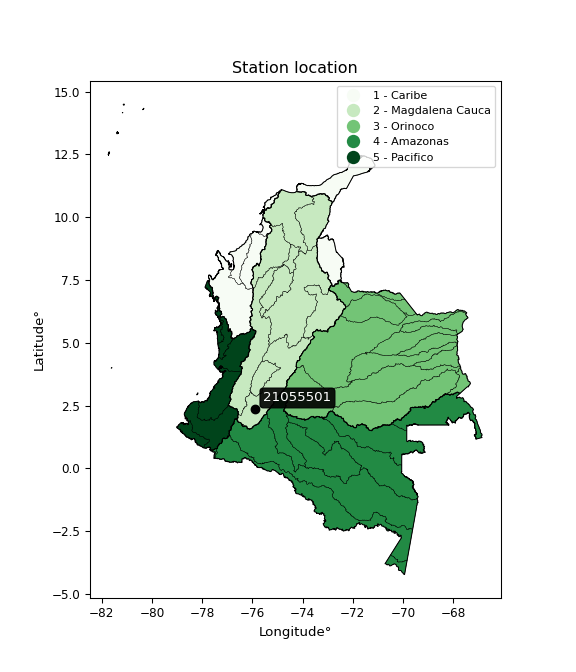

<div align="center">


</div>

# PMP Station (Rain, Pmax24h): 21055501

Probable Maximum Precipitation (PMP) is the greatest amount of rainfall for a specific duration that is meteorologically possible for a given location, acting as a "worst-case" scenario for extreme storms, crucial for designing safety-critical infrastructure like bridges, river deviations, dams, spillways, and nuclear plants to prevent catastrophic failure. PMP is calculated by hydrologists using meteorological data to determine the upper limit of extreme rainfall, often leading to the Probable Maximum Flood (PMF) for flood control design, and is increasingly being studied for climate change impacts. Probable Maximum Precipitation (PMP) is the theoretical upper limit of rainfall, a deterministic estimate for extreme events, while probability distributions (like GEV, Gumbel) describe the likelihood and frequency of various precipitation amounts, including rare ones, showing how often events occur, with PMP representing the extreme end of these distributions, used for critical infrastructure design to ensure safety against the worst conceivable weather, unlike standard statistical forecasts which cover typical probabilities.

The most common probability distributions in hydrology, used for analyzing floods, rainfall, and streamflow, include the Normal, Log-Normal, Gumbel, Gamma (including Log-Pearson Type III), and Generalized Extreme Value (GEV) distributions, often chosen based on the data´s skewness and whether modeling extremes or general conditions, with Gumbel and GEV popular for extreme events like floods, while the Normal distribution serves as a baseline, though often requiring transformations for skewed hydrological data. These distributions help in designing water infrastructure, managing water resources, and forecasting hydrologic events.

> Hydrological data often isn´t perfectly normal (it´s skewed), so different distributions are needed for different applications, such as: **Flood Frequency Analysis**: Using Gumbel, GEV, or Log-Pearson Type III for predicting extreme flood magnitudes and their return periods, **Rainfall Analysis**: Normal for annual totals, but Log-Normal, Weibull, or GEV for intensity or extreme daily rainfall, **Streamflow Modeling**: Gamma and Log-Normal for maximum flows, GEV for minimum flows, and Kappa for daily flows.

<div align="center">

</img>

</div>


## A. General information


### 1. General running parameters

• app_version: _v20260108_. • runtime: _2026-01-08 13:24:42.400241_. • Python version: _3.14.0_. • SciPy version: _1.16.3_. • Pandas version: _2.3.3_. • NumPy version: _2.3.5_. • Stations dataset (station_dataset_file): _dataset/pmax24h_in/automatic_colombia_2003_2024.csv_. • Stations catalog (station_catalog_file): _dataset/CNE.xls_. • Minimum year to eval til year_max (date_min): _1900_. • Maximum year to eval since year_min (date_max): _2024_. • Creates, save and include plots into reports (create_plot): _False_. • Plot only fit distributions with Δo > Δ (plot_only_fit): _True_. • Plot only simple graphs avoiding multiple CDFs and multiple Extreme values plots (plot_only_simple): _True_. • Eval low extreme values, if False, evaluates high extreme values (low_extreme): _False_. • Eval every SciPy distribution as logarithmic (pdist_logarithmic_on): _True_. • Standard deviation normalized (ddof): _1.0_. • Return periods to eval in years (Tr): _[2, 2.33, 5, 10, 15, 20, 25, 50, 75, 100, 200, 250, 500, 750, 1000]_. • Minimum data sample per station, 0 means any (minimum_sample): _5_. • Z-Score maximum threshold to adjust a value, 0 means disable (zscore_max): _3.5_. • Z-Score minimum threshold to adjust a value, 0 means disable (zscore_min): _-2.5_. • Avoid zeros, e.g. rain = 0 (avoid_zeros): _True_. • Avoid null values (avoid_nans): _True_. 

:file_folder:Table: [dataset.csv](../../dataset/pmax24h_in/automatic_colombia_2003_2024.csv)

> Delta Degrees of Freedom (DDOF): is a parameter used in the formulas for calculating variance and standard deviation. When ddof=0, the divisor is $N$ (the total number of observations) and this is used when your data set is the entire population. When ddof=1, the divisor is $N-1$ and this is used when your data set is a sample drawn from a larger population. Using $N-1$ provides an unbiased estimate of the population variance (known as Bessel´s correction).


### 2. Station info and location

|   id |   CODIGO | NOMBRE                          | CATEGORIA               | TECNOLOGIA                | ESTADO   | FECHA_INSTALACION   |   FECHA_SUSPENSION |   ALTITUD |   LATITUD |   LONGITUD | DEPARTAMENTO   | MUNICIPIO   | AREA_OPERATIVA                    | ENTIDAD                                    | AREA_HIDROGRAFICA   | ZONA_HIDROGRAFICA   | SUBZONA_HIDROGRAFICA   |   CORRIENTE | Catalogo   |   Version |
|-----:|---------:|:--------------------------------|:------------------------|:--------------------------|:---------|:--------------------|-------------------:|----------:|----------:|-----------:|:---------------|:------------|:----------------------------------|:-------------------------------------------|:--------------------|:--------------------|:-----------------------|------------:|:-----------|----------:|
|    0 | 21055501 | SIMON CAMPOS  - AUT  [21055501] | Climatológica Principal | Automática con Telemetría | Activa   | 22/07/2013          |                nan |      1754 |   2.34583 |   -75.8781 | Huila          | La Plata    | Area Operativa 04 - Huila-Caquetá | CENTRO NACIONAL DE INVESTIGACIONES DE CAFE | Magdalena Cauca     | Alto Magdalena      | Río Páez               |         nan | CNE_OE     |  20251226 |

<div align="center">

Dynamic map: [:earth_americas:Google](http://maps.google.com/maps?q=2.345830556,-75.87805556) [:earth_americas:OSM](https://www.openstreetmap.org/#map=18/2.345830556/-75.87805556&layers=P) [:earth_americas:Bing](https://www.bing.com/maps?cp=2.345830556~-75.87805556&lvl=18) [:earth_americas:Apple](https://maps.apple.com/frame?center=2.345830556%2C-75.87805556&span=0.003%2C0.006)

</div>


<div align="center">

```geojson
{
  "type": "Feature",
  "geometry": {
    "type": "Point", 
    "coordinates": [-75.87805556, 2.345830556]
  }, 
  "properties": {
    "Name": "21055501"
  }
}
```

</div>


### 3. Discrete values table and plot

<div align="center">

|               |          0 |           1 |         2 |          3 |          4 |           5 |           6 |           7 |
|:--------------|-----------:|------------:|----------:|-----------:|-----------:|------------:|------------:|------------:|
| Date          | 2016       | 2017        | 2018      | 2019       | 2020       | 2021        | 2022        | 2023        |
| Value         |   13.6     |   81.4      |   92.9    |   71.6     |   75.7     |   53.8      |   46.5      |   48.9      |
| Value_initial |   13.6     |   81.4      |   92.9    |   71.6     |   75.7     |   53.8      |   46.5      |   48.9      |
| count         |    8       |    8        |    8      |    8       |    8       |    8        |    8        |    8        |
| mean          |   60.55    |   60.55     |   60.55   |   60.55    |   60.55    |   60.55     |   60.55     |   60.55     |
| std           |   25.1165  |   25.1165   |   25.1165 |   25.1165  |   25.1165  |   25.1165   |   25.1165   |   25.1165   |
| zscore        |   -1.86929 |    0.830133 |    1.288  |    0.43995 |    0.60319 |   -0.268748 |   -0.559394 |   -0.463839 |


</div>


> The initial value (value_initial) correspond to the initial obtained or null completed value, and value (value) is adjusted only when the initial value is outside the valid range (outlier) definite through the Z-Score value. If Z-Score is active, values out of range or outliers are replaced with the station mean value. A Z-Score (or standard score) measures how many standard deviations a data point is from the mean of a dataset, indicating its relative position; positive scores mean above the mean, negative mean below, and a score of zero is exactly at the mean, allowing for comparison of values from different distributions. It´s calculated using the formula $z=(x–μ)/σ$, where $x$ is the data point, $μ$ is the mean, and $σ$ is the standard deviation, helping identify outliers and understand probability.
>
> <sub>**Note**: In this study, "completing" (filling gaps in) and "extending" (forecasting or lengthening the historical record) rainfall data series are avoided for certain critical analyses because they introduce artificial bias and uncertainty, which can distort the statistics of rare events (extremes), alter day-to-day variability, and compromise the integrity and homogeneity of the original data. Some reasons against Completing/Extending rainfall data are: **Distortion of Extremes and Variability**: The primary issue is that most gap-filling or extension methods rely on averaging or regression with nearby stations, which inherently smooths the data. Rainfall is highly variable in space and time, with a large percentage of zero values and occasional large storms. Infilling methods often underestimate the highest values and overestimate the lowest (zero) values, which severely distorts analyses focused on flood frequency, drought severity, and intensity-duration-frequency (IDF) curves, **Loss of Data Homogeneity**: Infilled or extended data are synthetic estimates, not actual measurements. Combining these estimates with observed data can violate the assumption of data homogeneity, which requires that the data properties do not change over time. Inhomogeneity can lead to incorrect conclusions about long-term trends or changes in climate patterns, **Propagation of Errors**: Errors and biases from the original data (e.g., wind-induced undercatch, instrument errors, site changes) or the data used for imputation can propagate through the analysis, leading to unreliable hydrological models and inaccurate predictions, **Compromised Statistical Integrity**: For statistical analyses, especially those involving the frequency of events, using artificial data can introduce time bias or autocorrelation that doesn´t exist in reality, making it difficult to assess the true probability of events, **Difficulty in Validation**: It is difficult to accurately validate the quality of filled or extended data, especially for past periods where ground-truth measurements are unavailable. The reliability of imputation techniques heavily depends on the density of the surrounding station network and the complexity of the local topography.</sub>


### 4. Active continuous probability distributions from SciPy (43 of 104 available)

A Probability Density Function (PDF) describes the relative likelihood of a continuous random variable falling within a specific range, where the total area under its curve equals 1, and the area over any interval gives the actual probability for that range. Unlike discrete probabilities (like rolling a die), a PDF shows density, not direct probability for a single point (which is zero), with higher points indicating higher likelihood, often visualized as a bell curve for normal distributions.

A log of a probability density function (log-PDF) is simply the logarithm of the PDF´s value, denoted as $log(f(x))$, useful for converting multiplication of probabilities into addition, improving numerical stability with tiny numbers, and connecting to information theory concepts like entropy. Instead of dealing with very small probabilities (e.g., 0.000001), log-PDFs use negative numbers (e.g., $log(0.00001) ≈ -11.51$ that are easier for computers to handle, preventing underflow errors and simplifying complex calculations. In this study, each active probability distribution from SciPy is also evaluated in the $log$ form.

[scipy.stats](https://docs.scipy.org/doc/scipy/reference/stats.html) is a Python´s powerful submodule within the SciPy library for comprehensive statistical analysis, offering over 130 probability distributions (like Normal, Poisson), functions for descriptive stats (mean, variance), hypothesis testing (t-tests, chi-square), random variable generation, and statistical tests, making it essential for data science, modeling, and research. It provides tools to explore, model, and draw conclusions from data efficiently, working seamlessly with NumPy.

<div align="center">

|   id | p_dist             |   n_parameter | fit_method   | label                                                                       | active   | ref                                                                                                        |
|-----:|:-------------------|--------------:|:-------------|:----------------------------------------------------------------------------|:---------|:-----------------------------------------------------------------------------------------------------------|
|    0 | alpha              |             3 | MLE          | Alpha                                                                       | True     | [:mortar_board:](https://docs.scipy.org/doc/scipy/reference/generated/scipy.stats.alpha.html)              |
|    1 | betaprime          |             4 | MLE          | Beta prime                                                                  | True     | [:mortar_board:](https://docs.scipy.org/doc/scipy/reference/generated/scipy.stats.betaprime.html)          |
|    2 | chi2               |             3 | MLE          | Chi²                                                                        | True     | [:mortar_board:](https://docs.scipy.org/doc/scipy/reference/generated/scipy.stats.chi2.html)               |
|    3 | crystalball        |             4 | MLE          | Crystalball                                                                 | True     | [:mortar_board:](https://docs.scipy.org/doc/scipy/reference/generated/scipy.stats.crystalball.html)        |
|    4 | erlang             |             3 | MLE          | Erlang                                                                      | True     | [:mortar_board:](https://docs.scipy.org/doc/scipy/reference/generated/scipy.stats.erlang.html)             |
|    5 | expon              |             2 | MLE          | Exponential                                                                 | True     | [:mortar_board:](https://docs.scipy.org/doc/scipy/reference/generated/scipy.stats.expon.html)              |
|    6 | exponnorm          |             3 | MLE          | Exponentially modified Normal                                               | True     | [:mortar_board:](https://docs.scipy.org/doc/scipy/reference/generated/scipy.stats.exponnorm.html)          |
|    7 | f                  |             4 | MLE          | F                                                                           | True     | [:mortar_board:](https://docs.scipy.org/doc/scipy/reference/generated/scipy.stats.f.html)                  |
|    8 | fatiguelife        |             3 | MLE          | Fatigue-life (Birnbaum-Saunders)                                            | True     | [:mortar_board:](https://docs.scipy.org/doc/scipy/reference/generated/scipy.stats.fatiguelife.html)        |
|    9 | fisk               |             3 | MLE          | Fisk                                                                        | True     | [:mortar_board:](https://docs.scipy.org/doc/scipy/reference/generated/scipy.stats.fisk.html)               |
|   10 | gamma              |             3 | MLE          | Gamma                                                                       | True     | [:mortar_board:](https://docs.scipy.org/doc/scipy/reference/generated/scipy.stats.gamma.html)              |
|   11 | genexpon           |             5 | MLE          | Generalized exponential                                                     | True     | [:mortar_board:](https://docs.scipy.org/doc/scipy/reference/generated/scipy.stats.genexpon.html)           |
|   12 | genlogistic        |             3 | MLE          | Generalized logistic                                                        | True     | [:mortar_board:](https://docs.scipy.org/doc/scipy/reference/generated/scipy.stats.genlogistic.html)        |
|   13 | gibrat             |             2 | MM           | Gibrat                                                                      | True     | [:mortar_board:](https://docs.scipy.org/doc/scipy/reference/generated/scipy.stats.gibrat.html)             |
|   14 | gompertz           |             3 | MLE          | Gompertz (or truncated Gumbel)                                              | True     | [:mortar_board:](https://docs.scipy.org/doc/scipy/reference/generated/scipy.stats.gompertz.html)           |
|   15 | gumbel_l           |             2 | MM           | Gumbel Left Skew                                                            | True     | [:mortar_board:](https://docs.scipy.org/doc/scipy/reference/generated/scipy.stats.gumbel_l.html)           |
|   16 | gumbel_r           |             2 | MM           | Gumbel Right Skew                                                           | True     | [:mortar_board:](https://docs.scipy.org/doc/scipy/reference/generated/scipy.stats.gumbel_r.html)           |
|   17 | halflogistic       |             2 | MM           | Half-logistic                                                               | True     | [:mortar_board:](https://docs.scipy.org/doc/scipy/reference/generated/scipy.stats.halflogistic.html)       |
|   18 | halfnorm           |             2 | MM           | Half Normal                                                                 | True     | [:mortar_board:](https://docs.scipy.org/doc/scipy/reference/generated/scipy.stats.halfnorm.html)           |
|   19 | hypsecant          |             2 | MM           | hyperbolic secant                                                           | True     | [:mortar_board:](https://docs.scipy.org/doc/scipy/reference/generated/scipy.stats.hypsecant.html)          |
|   20 | invgamma           |             3 | MLE          | Inverted gamma                                                              | True     | [:mortar_board:](https://docs.scipy.org/doc/scipy/reference/generated/scipy.stats.invgamma.html)           |
|   21 | invgauss           |             3 | MLE          | Inverse Gaussian                                                            | True     | [:mortar_board:](https://docs.scipy.org/doc/scipy/reference/generated/scipy.stats.invgauss.html)           |
|   22 | invweibull         |             3 | MLE          | Inverted Weibull                                                            | True     | [:mortar_board:](https://docs.scipy.org/doc/scipy/reference/generated/scipy.stats.invweibull.html)         |
|   23 | kstwobign          |             2 | MLE          | Limiting distribution of scaled Kolmogorov-Smirnov two-sided test statistic | True     | [:mortar_board:](https://docs.scipy.org/doc/scipy/reference/generated/scipy.stats.kstwobign.html)          |
|   24 | laplace            |             2 | MM           | Laplace                                                                     | True     | [:mortar_board:](https://docs.scipy.org/doc/scipy/reference/generated/scipy.stats.laplace.html)            |
|   25 | laplace_asymmetric |             3 | MLE          | Asymmetric Laplace                                                          | True     | [:mortar_board:](https://docs.scipy.org/doc/scipy/reference/generated/scipy.stats.laplace_asymmetric.html) |
|   26 | loggamma           |             3 | MLE          | Log gamma                                                                   | True     | [:mortar_board:](https://docs.scipy.org/doc/scipy/reference/generated/scipy.stats.loggamma.html)           |
|   27 | logistic           |             2 | MM           | Logistic (or Sech-squared)                                                  | True     | [:mortar_board:](https://docs.scipy.org/doc/scipy/reference/generated/scipy.stats.logistic.html)           |
|   28 | lognorm            |             3 | MLE          | Log Normal                                                                  | True     | [:mortar_board:](https://docs.scipy.org/doc/scipy/reference/generated/scipy.stats.lognorm.html)            |
|   29 | maxwell            |             2 | MM           | Maxwell                                                                     | True     | [:mortar_board:](https://docs.scipy.org/doc/scipy/reference/generated/scipy.stats.maxwell.html)            |
|   30 | mielke             |             4 | MLE          | Mielke Beta-Kappa / Dagum                                                   | True     | [:mortar_board:](https://docs.scipy.org/doc/scipy/reference/generated/scipy.stats.mielke.html)             |
|   31 | moyal              |             2 | MM           | Moyal                                                                       | True     | [:mortar_board:](https://docs.scipy.org/doc/scipy/reference/generated/scipy.stats.moyal.html)              |
|   32 | nakagami           |             3 | MLE          | Nakagami                                                                    | True     | [:mortar_board:](https://docs.scipy.org/doc/scipy/reference/generated/scipy.stats.nakagami.html)           |
|   33 | ncf                |             5 | MLE          | Non-central F distribution                                                  | True     | [:mortar_board:](https://docs.scipy.org/doc/scipy/reference/generated/scipy.stats.ncf.html)                |
|   34 | nct                |             4 | MLE          | Non-central Student’s t                                                     | True     | [:mortar_board:](https://docs.scipy.org/doc/scipy/reference/generated/scipy.stats.nct.html)                |
|   35 | norm               |             2 | MM           | Normal                                                                      | True     | [:mortar_board:](https://docs.scipy.org/doc/scipy/reference/generated/scipy.stats.norm.html)               |
|   36 | pearson3           |             3 | MM           | Pearson type III                                                            | True     | [:mortar_board:](https://docs.scipy.org/doc/scipy/reference/generated/scipy.stats.pearson3.html)           |
|   37 | rayleigh           |             2 | MM           | Rayleigh                                                                    | True     | [:mortar_board:](https://docs.scipy.org/doc/scipy/reference/generated/scipy.stats.rayleigh.html)           |
|   38 | rice               |             3 | MLE          | Rice                                                                        | True     | [:mortar_board:](https://docs.scipy.org/doc/scipy/reference/generated/scipy.stats.rice.html)               |
|   39 | t                  |             3 | MLE          | Student’s t                                                                 | True     | [:mortar_board:](https://docs.scipy.org/doc/scipy/reference/generated/scipy.stats.t.html)                  |
|   40 | truncnorm          |             4 | MLE          | Truncated normal                                                            | True     | [:mortar_board:](https://docs.scipy.org/doc/scipy/reference/generated/scipy.stats.truncnorm.html)          |
|   41 | wald               |             2 | MM           | Wald                                                                        | True     | [:mortar_board:](https://docs.scipy.org/doc/scipy/reference/generated/scipy.stats.wald.html)               |
|   42 | weibull_min        |             3 | MLE          | Weibull minimum                                                             | True     | [:mortar_board:](https://docs.scipy.org/doc/scipy/reference/generated/scipy.stats.weibull_min.html)        |

</div>

> **n_parameter:** # arguments & localization & scale.
>
> **Fit methods:** (MLE) maximum likelihood, (MM) L-moments.
>
>**Inactive** (With the only purpose of prevent loops, zero divisions, infinite values, over high estimated values or horizontal trending for recurrence intervals estimations, the follow distributions were disabled.)**:** foldnorm, gennorm, norminvgauss, powernorm, powerlognorm, skewnorm, genextreme, anglit, arcsine, argus, beta, bradford, burr, burr12, cauchy, cosine, halfcauchy, foldcauchy, skewcauchy, wrapcauchy, dgamma, gengamma, exponweib, exponpow, truncexpon, gausshyper, genhalflogistic, genhyperbolic, geninvgauss, halfgennorm, johnsonsb, johnsonsu, kappa4, kappa3, ksone, kstwo, loglaplace, levy, levy_l, levy_stable, ncx2, pareto, genpareto, truncpareto, lomax, powerlaw, rdist, rel_breitwigner, recipinvgauss, semicircular, studentized_range, trapezoid, triang, truncweibull_min, tukeylambda, uniform, loguniform, vonmises, vonmises_line, weibull_max, dweibull, 


## B. Probability (PDF) vs. Empirical (EDF) distributions functions

A continuous probability distribution (CPD) describes probabilities for variables that can take any value within a range (like rain any time), unlike discrete variables with specific outcomes (like temperature). It uses a Probability Density Function (PDF), a curve where the total area under it equals 1, and the probability of the variable falling within an interval (a to b) is found by calculating the area under the curve between those points. A key feature is that the probability of hitting any single exact value is zero, so probabilities are always expressed for ranges, e.g., $P(a ≤ X ≤ b)$.

<div align="center">

Distributions parameters from station values
|    |   station | p_dist                |   n |              loc |           scale | shape                  | shape1                | shape2                | shape3   |
|---:|----------:|:----------------------|----:|-----------------:|----------------:|:-----------------------|:----------------------|:----------------------|:---------|
|  0 |  21055501 | alpha                 |   8 |     -0.0932293   |    33.3781      | 2.4240540977684613e-11 |                       |                       |          |
|  1 |  21055501 | betaprime             |   8 |   -296.093       | 17320.2         | 225.2790238323118      | 10920.614677083004    |                       |          |
|  2 |  21055501 | chi2                  |   8 |   -249.831       |     0.946007    | 327.75846926515686     |                       |                       |          |
|  3 |  21055501 | crystalball           |   8 |     15.069       |    55.5197      | 11295.865577279219     | 653.7710116583991     |                       |          |
|  4 |  21055501 | erlang                |   8 |   -327.586       |     1.51502     | 256.04801201119676     |                       |                       |          |
|  5 |  21055501 | expon                 |   8 |     13.6         |    46.95        |                        |                       |                       |          |
|  6 |  21055501 | exponnorm             |   8 |     60.5344      |    23.4944      | 0.000666141905092583   |                       |                       |          |
|  7 |  21055501 | f                     |   8 | -11391           | 11451.5         | 627273.3295337644      | 1942572.5989310872    |                       |          |
|  8 |  21055501 | fatiguelife           |   8 |     13.6         |     0.000150682 | 523.7840292164628      |                       |                       |          |
|  9 |  21055501 | fisk                  |   8 |     -7.61231e+09 |     7.61231e+09 | 564843471.8568764      |                       |                       |          |
| 10 |  21055501 | gamma                 |   8 |   -336.862       |     1.4662      | 270.99065044553527     |                       |                       |          |
| 11 |  21055501 | genexpon              |   8 |     13.5981      |     2.19454     | 0.04674140449676256    | 5.648854041364031e-07 | 1.0241535924591902    |          |
| 12 |  21055501 | genlogistic           |   8 |     84.365       |     5.81789     | 0.2272068814974989     |                       |                       |          |
| 13 |  21055501 | gibrat                |   8 |     42.6268      |    10.871       |                        |                       |                       |          |
| 14 |  21055501 | gompertz              |   8 |    -51.9654      |    19.0561      | 0.0015327478504058292  |                       |                       |          |
| 15 |  21055501 | gumbel_l              |   8 |     71.1237      |    18.3184      |                        |                       |                       |          |
| 16 |  21055501 | gumbel_r              |   8 |     49.9763      |    18.3184      |                        |                       |                       |          |
| 17 |  21055501 | halflogistic          |   8 |     32.7038      |    20.0868      |                        |                       |                       |          |
| 18 |  21055501 | halfnorm              |   8 |     29.4528      |    38.9746      |                        |                       |                       |          |
| 19 |  21055501 | hypsecant             |   8 |     60.55        |    14.9569      |                        |                       |                       |          |
| 20 |  21055501 | invgamma              |   8 |   -221.699       | 37530.5         | 134.28074261174447     |                       |                       |          |
| 21 |  21055501 | invgauss              |   8 |    -72.1776      |  3271.6         | 0.04049201727655821    |                       |                       |          |
| 22 |  21055501 | invweibull            |   8 |     13.6         |     1.09622     | 0.05010341190384009    |                       |                       |          |
| 23 |  21055501 | kstwobign             |   8 |    -41.2264      |   116.49        |                        |                       |                       |          |
| 24 |  21055501 | laplace               |   8 |     60.55        |    16.613       |                        |                       |                       |          |
| 25 |  21055501 | laplace_asymmetric    |   8 |     53.8         |    18.9605      | 0.8377164696183004     |                       |                       |          |
| 26 |  21055501 | loggamma              |   8 |     75.9413      |    16.7299      | 0.8199531998738102     |                       |                       |          |
| 27 |  21055501 | logistic              |   8 |     60.55        |    12.9531      |                        |                       |                       |          |
| 28 |  21055501 | lognorm               |   8 |     13.6         |     0.447423    | 12.536854458936723     |                       |                       |          |
| 29 |  21055501 | maxwell               |   8 |      4.87836     |    34.887       |                        |                       |                       |          |
| 30 |  21055501 | mielke                |   8 |     -6.00995     |    99.1582      | 2.0436296060185644     | 1889.074883549246     |                       |          |
| 31 |  21055501 | moyal                 |   8 |     47.1144      |    10.5762      |                        |                       |                       |          |
| 32 |  21055501 | nakagami              |   8 |     46.5         |    27.1184      | 0.2912648914984944     |                       |                       |          |
| 33 |  21055501 | ncf                   |   8 |     -0.229248    |     7.03145e-06 | 2.697584672214311e-06  | 44.41907716044687     | 22.72126713496816     |          |
| 34 |  21055501 | nct                   |   8 |  -1263.09        |    23.4187      | 230960.49550044665     | 56.52041158996437     |                       |          |
| 35 |  21055501 | norm                  |   8 |     60.55        |    23.4943      |                        |                       |                       |          |
| 36 |  21055501 | pearson3              |   8 |     60.55        |    23.4943      | -0.5822643513221302    |                       |                       |          |
| 37 |  21055501 | rayleigh              |   8 |     15.604       |    35.8617      |                        |                       |                       |          |
| 38 |  21055501 | rice                  |   8 |     13.5908      |     3.76106     | 1.4556021693961392e-07 |                       |                       |          |
| 39 |  21055501 | t                     |   8 |     60.5492      |    23.4953      | 2467115.88454309       |                       |                       |          |
| 40 |  21055501 | truncnorm             |   8 |     67.5116      |    18.0102      | -180.95228436165326    | 1.4096641525686655    |                       |          |
| 41 |  21055501 | wald                  |   8 |     37.0557      |    23.4943      |                        |                       |                       |          |
| 42 |  21055501 | weibull_min           |   8 |   -628.098       |   699.397       | 36.409728172796925     |                       |                       |          |
| 43 |  21055501 | logalpha              |   8 |    -13.947       |   532.266       | 29.75704508651151      |                       |                       |          |
| 44 |  21055501 | logbetaprime          |   8 |    -10.532       |    38.0695      | 787.6383770679761      | 2068.7357921094112    |                       |          |
| 45 |  21055501 | logchi2               |   8 |      2.61007     |     0.982348    | 1.0774663135620899     |                       |                       |          |
| 46 |  21055501 | logcrystalball        |   8 |      3.98167     |     0.568952    | 9.223968495863616      | 245.43532480923108    |                       |          |
| 47 |  21055501 | logerlang             |   8 |     -5.15997     |     0.0388237   | 235.10199039463083     |                       |                       |          |
| 48 |  21055501 | logexpon              |   8 |      2.61007     |     1.3716      |                        |                       |                       |          |
| 49 |  21055501 | logexponnorm          |   8 |      3.98134     |     0.568949    | 0.0005819126001669696  |                       |                       |          |
| 50 |  21055501 | logf                  |   8 |  -1244.99        |  1248.97        | 25130160.71711354      | 15398549.765100868    |                       |          |
| 51 |  21055501 | logfatiguelife        |   8 |   -357.302       |   361.281       | 0.0015723254661091975  |                       |                       |          |
| 52 |  21055501 | logfisk               |   8 |     -4.3829e+07  |     4.3829e+07  | 155520795.60039756     |                       |                       |          |
| 53 |  21055501 | loggamma              |   8 |     -5.26391     |     0.0383772   | 240.8706168833926      |                       |                       |          |
| 54 |  21055501 | loggenexpon           |   8 |      2.60995     |     0.013078    | 0.0024876633035809973  | 2.6901388031016618    | 4.226994931020046e-05 |          |
| 55 |  21055501 | loggenlogistic        |   8 |      4.53155     |     1.95785e-06 | 3.5516745398167696e-06 |                       |                       |          |
| 56 |  21055501 | loggibrat             |   8 |      3.5476      |     0.263274    |                        |                       |                       |          |
| 57 |  21055501 | loggompertz           |   8 |      2.60931     |     0.36506     | 0.012651020705659174   |                       |                       |          |
| 58 |  21055501 | loggumbel_l           |   8 |      4.23773     |     0.44361     |                        |                       |                       |          |
| 59 |  21055501 | loggumbel_r           |   8 |      3.72561     |     0.44361     |                        |                       |                       |          |
| 60 |  21055501 | loghalflogistic       |   8 |      3.30738     |     0.486401    |                        |                       |                       |          |
| 61 |  21055501 | loghalfnorm           |   8 |      3.22856     |     0.94388     |                        |                       |                       |          |
| 62 |  21055501 | loghypsecant          |   8 |      3.98167     |     0.362206    |                        |                       |                       |          |
| 63 |  21055501 | loginvgamma           |   8 |    -12.7922      | 13345.1         | 796.6602058716844      |                       |                       |          |
| 64 |  21055501 | loginvgauss           |   8 |     -3.03011     |   850.702       | 0.00822485700540812    |                       |                       |          |
| 65 |  21055501 | loginvweibull         |   8 |     -3.28332e+07 |     3.28332e+07 | 46393363.834352        |                       |                       |          |
| 66 |  21055501 | logkstwobign          |   8 |      1.08244     |     3.32209     |                        |                       |                       |          |
| 67 |  21055501 | loglaplace            |   8 |      3.98167     |     0.40231     |                        |                       |                       |          |
| 68 |  21055501 | loglaplace_asymmetric |   8 |      4.39938     |     0.229163    | 2.2642868127085087     |                       |                       |          |
| 69 |  21055501 | logloggamma           |   8 |      4.53155     |     1.77373e-06 | 3.2397610661448917e-06 |                       |                       |          |
| 70 |  21055501 | loglogistic           |   8 |      3.98167     |     0.31368     |                        |                       |                       |          |
| 71 |  21055501 | loglognorm            |   8 |      2.61007     |     0.0176503   | 11.836378412063878     |                       |                       |          |
| 72 |  21055501 | logmaxwell            |   8 |      2.63345     |     0.844869    |                        |                       |                       |          |
| 73 |  21055501 | logmielke             |   8 |  -6442.13        |  6446.66        | 11693.272840797155     | 162328040.7786497     |                       |          |
| 74 |  21055501 | logmoyal              |   8 |      3.6563      |     0.256119    |                        |                       |                       |          |
| 75 |  21055501 | lognakagami           |   8 |      3.83945     |     0.371336    | 0.2688794863381482     |                       |                       |          |
| 76 |  21055501 | logncf                |   8 |     -2.83123     |     4.12052e-06 | 0.0003547122013958094  | 1088.6953851548924    | 585.5536884472626     |          |
| 77 |  21055501 | lognct                |   8 |    -31.7279      |     0.473595    | 5678.890306259229      | 75.38959095677359     |                       |          |
| 78 |  21055501 | lognorm               |   8 |      3.98167     |     0.568952    |                        |                       |                       |          |
| 79 |  21055501 | logpearson3           |   8 |      3.98167     |     0.568953    | -1.5471668096880837    |                       |                       |          |
| 80 |  21055501 | lograyleigh           |   8 |      2.89322     |     0.868455    |                        |                       |                       |          |
| 81 |  21055501 | logrice               |   8 |   -606.911       |     0.56867     | 1074.2483122874323     |                       |                       |          |
| 82 |  21055501 | logt                  |   8 |      4.15422     |     0.296808    | 2.1339744717557085     |                       |                       |          |
| 83 |  21055501 | logtruncnorm          |   8 |     -0.186683    |     1.4556      | 2.765963924880653      | 3.241427158761174     |                       |          |
| 84 |  21055501 | logwald               |   8 |      3.41267     |     0.568991    |                        |                       |                       |          |
| 85 |  21055501 | logweibull_min        |   8 |      2.61007     |     1.12172     | 0.8950055320294081     |                       |                       |          |

</div>

> **loc** (Location parameter): This shifts the distribution along the x-axis. For many common distributions, like the normal (Gaussian) distribution, loc represents the mean $μ$. For others, like the uniform distribution, it might represent the minimum value, or for the beta distribution, the left end of the support interval.
>
> **scale** (Scale parameter): This determines the width or spread of the distribution. For the normal distribution, scale represents the standard deviation $σ$. For a uniform distribution, it defines the length of the interval (from $loc$ to $loc + scale$).
>
> **shape** (Shape parameters): Refers to parameters that define the specific form of a probability distribution, distinct from its location (loc) and scale (scale). These parameters are required arguments for most distribution functions. For example, a normal (Gaussian) distribution is fully defined by its location (mean) and scale (standard deviation), so it has no specific shape parameters beyond loc and scale. However, other distributions have intrinsic properties that need specification, as Gamma distribution that takes a shape parameter, often named $a$ or $alpha$.


### 0. Cumulative distribution values - CDF (86 evaluated)

Cumulative Distribution Function (CDF), denoted as $F$<sub>$X$</sub>$(x)$, is a function that gives the probability that a random variable $X$ will take a value less than or equal to a specific value, $x$ (i.e., $(P(X≥x)$. It essentially "accumulates" probabilities from a given point up to the far right (positive infinity), providing a complete picture of the distribution´s probabilities for both discrete (like rain) and continuous (like temperature) variables, helping to find probabilities over ranges or above certain values. Each station is evaluated separately ordering the $x$ values ascending, calculating the CDF and PDF values for the activated distributions and their logarithmic forms.

<div align="center">

CDF ordered by x ascending and calculating $log(f(x))$ separately
|   id |   Station |   date |    x |   count |   mean |     std |    zscore |   Value_initial |   station |   m |     alpha |   alpha_pdf |   betaprime |   betaprime_pdf |     chi2 |   chi2_pdf |   crystalball |   crystalball_pdf |    erlang |   erlang_pdf |    expon |   expon_pdf |   exponnorm |   exponnorm_pdf |         f |      f_pdf |   fatiguelife |   fatiguelife_pdf |      fisk |   fisk_pdf |     gamma |   gamma_pdf |    genexpon |   genexpon_pdf |   genlogistic |   genlogistic_pdf |   gibrat |   gibrat_pdf |   gompertz |   gompertz_pdf |   gumbel_l |   gumbel_l_pdf |    gumbel_r |   gumbel_r_pdf |   halflogistic |   halflogistic_pdf |   halfnorm |   halfnorm_pdf |   hypsecant |   hypsecant_pdf |   invgamma |   invgamma_pdf |   invgauss |   invgauss_pdf |   invweibull |   invweibull_pdf |   kstwobign |   kstwobign_pdf |   laplace |   laplace_pdf |   laplace_asymmetric |   laplace_asymmetric_pdf |   loggamma |   loggamma_pdf |   logistic |   logistic_pdf |    lognorm |   lognorm_pdf |    maxwell |   maxwell_pdf |    mielke |   mielke_pdf |       moyal |   moyal_pdf |    nakagami |   nakagami_pdf |       ncf |    ncf_pdf |      nct |    nct_pdf |     norm |   norm_pdf |   pearson3 |   pearson3_pdf |   rayleigh |   rayleigh_pdf |        rice |    rice_pdf |         t |      t_pdf |   truncnorm |   truncnorm_pdf |     wald |   wald_pdf |   weibull_min |   weibull_min_pdf |   logalpha |   logalpha_pdf |   logbetaprime |   logbetaprime_pdf |     logchi2 |   logchi2_pdf |   logcrystalball |   logcrystalball_pdf |   logerlang |   logerlang_pdf |   logexpon |   logexpon_pdf |   logexponnorm |   logexponnorm_pdf |       logf |   logf_pdf |   logfatiguelife |   logfatiguelife_pdf |    logfisk |   logfisk_pdf |   loggenexpon |   loggenexpon_pdf |   loggenlogistic |   loggenlogistic_pdf |   loggibrat |   loggibrat_pdf |   loggompertz |   loggompertz_pdf |   loggumbel_l |   loggumbel_l_pdf |   loggumbel_r |   loggumbel_r_pdf |   loghalflogistic |   loghalflogistic_pdf |   loghalfnorm |   loghalfnorm_pdf |   loghypsecant |   loghypsecant_pdf |   loginvgamma |   loginvgamma_pdf |   loginvgauss |   loginvgauss_pdf |   loginvweibull |   loginvweibull_pdf |   logkstwobign |   logkstwobign_pdf |   loglaplace |   loglaplace_pdf |   loglaplace_asymmetric |   loglaplace_asymmetric_pdf |   logloggamma |   logloggamma_pdf |   loglogistic |   loglogistic_pdf |   loglognorm |   loglognorm_pdf |   logmaxwell |   logmaxwell_pdf |   logmielke |   logmielke_pdf |    logmoyal |   logmoyal_pdf |   lognakagami |   lognakagami_pdf |    logncf |   logncf_pdf |     lognct |   lognct_pdf |   logpearson3 |   logpearson3_pdf |   lograyleigh |   lograyleigh_pdf |    logrice |   logrice_pdf |      logt |   logt_pdf |   logtruncnorm |   logtruncnorm_pdf |   logwald |   logwald_pdf |   logweibull_min |   logweibull_min_pdf |
|-----:|----------:|-------:|-----:|--------:|-------:|--------:|----------:|----------------:|----------:|----:|----------:|------------:|------------:|----------------:|---------:|-----------:|--------------:|------------------:|----------:|-------------:|---------:|------------:|------------:|----------------:|----------:|-----------:|--------------:|------------------:|----------:|-----------:|----------:|------------:|------------:|---------------:|--------------:|------------------:|---------:|-------------:|-----------:|---------------:|-----------:|---------------:|------------:|---------------:|---------------:|-------------------:|-----------:|---------------:|------------:|----------------:|-----------:|---------------:|-----------:|---------------:|-------------:|-----------------:|------------:|----------------:|----------:|--------------:|---------------------:|-------------------------:|-----------:|---------------:|-----------:|---------------:|-----------:|--------------:|-----------:|--------------:|----------:|-------------:|------------:|------------:|------------:|---------------:|----------:|-----------:|---------:|-----------:|---------:|-----------:|-----------:|---------------:|-----------:|---------------:|------------:|------------:|----------:|-----------:|------------:|----------------:|---------:|-----------:|--------------:|------------------:|-----------:|---------------:|---------------:|-------------------:|------------:|--------------:|-----------------:|---------------------:|------------:|----------------:|-----------:|---------------:|---------------:|-------------------:|-----------:|-----------:|-----------------:|---------------------:|-----------:|--------------:|--------------:|------------------:|-----------------:|---------------------:|------------:|----------------:|--------------:|------------------:|--------------:|------------------:|--------------:|------------------:|------------------:|----------------------:|--------------:|------------------:|---------------:|-------------------:|--------------:|------------------:|--------------:|------------------:|----------------:|--------------------:|---------------:|-------------------:|-------------:|-----------------:|------------------------:|----------------------------:|--------------:|------------------:|--------------:|------------------:|-------------:|-----------------:|-------------:|-----------------:|------------:|----------------:|------------:|---------------:|--------------:|------------------:|----------:|-------------:|-----------:|-------------:|--------------:|------------------:|--------------:|------------------:|-----------:|--------------:|----------:|-----------:|---------------:|-------------------:|----------:|--------------:|-----------------:|---------------------:|
|    0 |  21055501 |   2016 | 13.6 |       8 |  60.55 | 25.1165 | -1.86929  |            13.6 |  21055501 |   1 | 0.0147867 |  0.00728058 |   0.0199482 |      0.00221469 | 0.02249  | 0.00246241 |      0.489446 |        0.00718308 | 0.0232969 |   0.00247598 | 0        |  0.0212993  |   0.0228396 |      0.00230565 | 0.0228652 | 0.0023133  |     0.0505682 |       4.17413e+08 | 0.0265011 | 0.0019143  | 0.0225769 |  0.00241734 | 4.11955e-05 |     0.0212981  |     0.0630647 |        0.00246286 | 0        |   0          |  0.0452449 |     0.00239656 |  0.0423509 |     0.00226226 | 0.000685955 |    0.000272784 |       0        |         0          |   0        |     0          |   0.0275647 |      0.00184064 |  0.0186833 |     0.00238476 |  0.0183758 |     0.00268638 |   0.00405144 |      6.29498e+11 |   0.0203062 |      0.00375513 | 0.0296216 |    0.00178304 |            0.0328192 |               0.00206624 | 0.00813258 |      0.0415762 |   0.025967 |     0.00195264 | 0.00796001 |     0.0383568 | 0.00407844 |    0.00138539 | 0.0364407 |   0.00379763 | 1.07967e-06 | 1.26127e-06 | 0           |     0          | 0.0118415 | 0.00255385 | 0.022847 | 0.00230687 | 0.022839 | 0.00230561 |  0.0360506 |     0.00249059 |   0        |     0          | 3.00048e-06 | 0.000651327 | 0.0228456 | 0.00230607 |  0.00149833 |     0.000272621 | 0        | 0          |     0.0425711 |        0.00236331 | 0.00841639 |      0.0444992 |       0.010297 |          0.0489422 | 4.19387e-09 |   5.08767e+06 |       0.00796001 |            0.0383568 |  0.00860099 |       0.0437136 |   0        |       0.729076 |     0.00795958 |          0.0383552 | 0.00821269 |  0.0392873 |        0.0078726 |            0.0381912 | 0.00534021 |     0.0188478 |   2.36444e-05 |          0.190296 |         0        |            0.0555686 |    0        |        0        |   2.62718e-05 |         0.0347257 |     0.0251767 |         0.0560335 |   4.27512e-06 |       0.000119141 |          0        |              0        |      0        |          0        |      0.0144286 |          0.0398217 |    0.00786145 |         0.0406853 |    0.00967746 |         0.0509831 |       0.0121334 |           0.0756381 |      0.0159455 |           0.111361 |    0.0165321 |        0.0410928 |               0.0266087 |                   0.0512801 |      0.029908 |         0.0546277 |     0.0124611 |         0.0392304 |   0.00407814 |      2.29321e+12 |     0        |         0        |   0.0306147 |        0.055547 | 1.26093e-14 |    1.48702e-12 |   0           |        0          | 0.0106671 |    0.0518378 | 0.00850848 |    0.0408505 |     0.0298767 |          0.059944 |      0        |          0        | 0.00793368 |     0.0382642 | 0.0152439 |  0.0198925 |    0           |           0        |  0        |      0        |      1.63966e-14 |            33.0453   |
|    1 |  21055501 |   2022 | 46.5 |       8 |  60.55 | 25.1165 | -0.559394 |            46.5 |  21055501 |   2 | 0.473762  |  0.00949114 |   0.274777  |      0.0142697  | 0.291381 | 0.0145968  |      0.714345 |        0.00612164 | 0.288905  |   0.0144392  | 0.503785 |  0.010569   |   0.274915  |      0.0142     | 0.275623  | 0.0142177  |     0.81383   |       0.00363318  | 0.238216  | 0.0134652  | 0.285994  |  0.0144285  | 0.503805    |     0.0105686  |     0.227846  |        0.00888486 | 0.151032 |   0.0604737  |  0.23458   |     0.0107994  |  0.229525  |     0.0109671  | 0.298504    |    0.0197005   |       0.330522 |         0.0221727  |   0.338174 |     0.0186044  |   0.237215  |      0.0144321  |  0.305048  |     0.0153425  |  0.326437  |     0.015199   |   0.430288   |      0.000552603 |   0.378015  |      0.0144382  | 0.214623  |    0.012919   |            0.260432  |               0.0163963  | 0.414602   |      0.661043  |   0.252621 |     0.0145759  | 0.401309   |     0.679621  | 0.299928   |    0.0159776  | 0.27276   |   0.0106155  | 0.303257    | 0.0228592   | 6.50873e-10 | 53361          | 0.342131  | 0.0151723  | 0.275004 | 0.0142012  | 0.274914 | 0.0142001  |  0.253868  |     0.012232   |   0.310038 |     0.0165755  | 1           | 5.51307e-17 | 0.274935  | 0.0142     |  0.132159   |     0.0121823   | 0.272605 | 0.0427023  |     0.235568  |        0.0110829  | 0.433157   |      0.66177   |       0.421933 |          0.649379  | 0.714557    |   0.205013    |       0.401309   |            0.679621  |  0.422919   |       0.663773  |   0.591929 |       0.297515 |     0.401306   |          0.679624  | 0.402362   |  0.676987  |        0.402831  |            0.681627  | 0.296326   |     0.739891  |   0.520846    |          0.482046 |         0        |            0.516878  |    0.541042 |        1.35968  |   0.298903    |         0.706281  |     0.334665  |         0.611122  |   0.461324    |       0.804548    |          0.498232 |              0.772783 |      0.482509 |          0.685587 |      0.378112  |          0.815162  |    0.415088   |         0.663205  |    0.437437   |         0.633138  |       0.45997   |           0.504738  |      0.503657  |           0.471778 |    0.351114  |        0.872744  |               0.284432  |                   0.548154  |      0.282484 |         0.515965  |     0.388558  |         0.757398  |   0.640021   |      0.0257095   |     0.435358 |         0.694721 |   0.284817  |        0.51667  | 0.484307    |    0.853046    |   7.35314e-09 |        8.9041e+06 | 0.422412  |    0.626079  | 0.405544   |    0.669922  |     0.311257  |          0.544003 |      0.447645 |          0.692979 | 0.401257   |     0.679936  | 0.197023  |  0.618021  |    2.87494e-05 |           2.66513  |  0.546457 |      1.03531  |      0.662262    |             0.266896 |
|    2 |  21055501 |   2023 | 48.9 |       8 |  60.55 | 25.1165 | -0.463839 |            48.9 |  21055501 |   3 | 0.495695  |  0.00879715 |   0.30995   |      0.0150207  | 0.327252 | 0.0152742  |      0.728854 |        0.00596807 | 0.324416  |   0.015133   | 0.528513 |  0.0100423  |   0.309996  |      0.015016   | 0.31074   | 0.0150287  |     0.822274  |       0.00340714  | 0.272019  | 0.0146937  | 0.321499  |  0.0151393  | 0.528532    |     0.0100419  |     0.250191  |        0.0097488  | 0.291224 |   0.0546739  |  0.261709  |     0.0118147  |  0.257141  |     0.0120542  | 0.346277    |    0.0200471   |       0.382646 |         0.0212474  |   0.382201 |     0.0180757  |   0.273898  |      0.0161348  |  0.342575  |     0.0159037  |  0.363304  |     0.0154979  |   0.431568   |      0.000514745 |   0.412509  |      0.0142897  | 0.24798   |    0.0149269  |            0.302911  |               0.0190708  | 0.448075   |      0.668401  |   0.289174 |     0.015869   | 0.435846   |     0.692102  | 0.338846   |    0.0164261  | 0.298845  |   0.0111224  | 0.358069    | 0.0227252   | 0.189072    |     0.0458107  | 0.378614  | 0.0152062  | 0.310086 | 0.0150164  | 0.309995 | 0.015016   |  0.284353  |     0.0131693  |   0.350151 |     0.0168245  | 1           | 1.81404e-19 | 0.310015  | 0.0150158  |  0.163694   |     0.0141056   | 0.368598 | 0.0371722  |     0.263393  |        0.0121105  | 0.466564   |      0.665086  |       0.454796 |          0.65589   | 0.72465     |   0.196165    |       0.435847   |            0.692102  |  0.456498   |       0.669916  |   0.60663  |       0.286797 |     0.435844   |          0.692105  | 0.436712   |  0.689179  |        0.437462  |            0.693825  | 0.33486    |     0.79032   |   0.544883    |          0.47303  |         0        |            0.566287  |    0.603393 |        1.12651  |   0.335995    |         0.767785  |     0.366447  |         0.651836  |   0.501233    |       0.780401    |          0.536113 |              0.732506 |      0.516406 |          0.661391 |      0.420098  |          0.851266  |    0.448663   |         0.670302  |    0.469351   |         0.634477  |       0.485154  |           0.495831  |      0.527133  |           0.461017 |    0.3979    |        0.989038  |               0.313399  |                   0.60398   |      0.309681 |         0.56564   |     0.427283  |         0.780134  |   0.641288   |      0.0246683   |     0.470252 |         0.691231 |   0.312042  |        0.566053 | 0.526116    |    0.807705    |   0.26537     |        2.82465    | 0.45405   |    0.630617  | 0.439553   |    0.680803  |     0.339688  |          0.586206 |      0.482311 |          0.68403  | 0.435811   |     0.692435  | 0.230918  |  0.730919  |    0.127914    |           2.42063  |  0.595038 |      0.899057 |      0.675403    |             0.255434 |
|    3 |  21055501 |   2021 | 53.8 |       8 |  60.55 | 25.1165 | -0.268748 |            53.8 |  21055501 |   4 | 0.535694  |  0.00756902 |   0.386537  |      0.0161392  | 0.40467  | 0.0162212  |      0.757289 |        0.0056336  | 0.401255  |   0.0161295  | 0.57524  |  0.00904708 |   0.38694   |      0.0162937  | 0.387718  | 0.0162943  |     0.837962  |       0.00300903  | 0.349595  | 0.0168718  | 0.398455  |  0.0161702  | 0.575257    |     0.00904671 |     0.302752  |        0.0117619  | 0.510938 |   0.0356919  |  0.32486   |     0.0139721  |  0.321865  |     0.0143786  | 0.444142    |    0.019678    |       0.481647 |         0.0191175  |   0.467829 |     0.0168429  |   0.36099   |      0.0192844  |  0.422343  |     0.0165371  |  0.439846  |     0.0156419  |   0.433928   |      0.000451524 |   0.481251  |      0.013714   | 0.333052  |    0.0200477  |            0.412376  |               0.0259625  | 0.512078   |      0.669162  |   0.372592 |     0.0180472  | 0.502528   |     0.701174  | 0.420592   |    0.0168248  | 0.355886  |   0.0121602  | 0.465995    | 0.021082    | 0.359929    |     0.0282557  | 0.452501  | 0.0148675  | 0.387029 | 0.0162924  | 0.38694  | 0.0162938  |  0.353368  |     0.0149627  |   0.432894 |     0.016843   | 1           | 4.31144e-25 | 0.386958  | 0.0162934  |  0.242464   |     0.0180061   | 0.523765 | 0.0266343  |     0.328     |        0.0142627  | 0.529894   |      0.658487  |       0.517557 |          0.655802  | 0.742633    |   0.180757    |       0.502528   |            0.701174  |  0.520534   |       0.668339  |   0.633086 |       0.267508 |     0.502526   |          0.701178  | 0.507533   |  0.697886  |        0.504279  |            0.702247  | 0.414006   |     0.860848  |   0.589128    |          0.453018 |         0        |            0.673399  |    0.694372 |        0.801047 |   0.414727    |         0.879092  |     0.432231  |         0.724466  |   0.572974    |       0.71932     |          0.602365 |              0.654971 |      0.577278 |          0.612992 |      0.503168  |          0.878765  |    0.51282    |         0.670435  |    0.529646   |         0.625948  |       0.531533  |           0.47466   |      0.570094  |           0.438282 |    0.504461  |        1.23173   |               0.376726  |                   0.726022  |      0.368695 |         0.67343   |     0.502873  |         0.796965  |   0.643558   |      0.0229044   |     0.535476 |         0.672184 |   0.371062  |        0.673107 | 0.598803    |    0.71359     |   0.46664     |        1.66544    | 0.514269  |    0.628162  | 0.505034   |    0.68751   |     0.399664  |          0.670715 |      0.546431 |          0.656737 | 0.502525   |     0.701522  | 0.311713  |  0.961386  |    0.338937    |           2.01002  |  0.670622 |      0.694504 |      0.698816    |             0.235225 |
|    4 |  21055501 |   2019 | 71.6 |       8 |  60.55 | 25.1165 |  0.43995  |            71.6 |  21055501 |   5 | 0.641525  |  0.00464919 |   0.673529  |      0.0147019  | 0.687844 | 0.0142612  |      0.845712 |        0.0042789  | 0.684802  |   0.014379   | 0.709269 |  0.00619235 |   0.680938  |      0.0152024  | 0.681341  | 0.0151664  |     0.88189   |       0.00201988  | 0.66818   | 0.0164516  | 0.683452  |  0.0144783  | 0.709281    |     0.0061921  |     0.593023  |        0.0208369  | 0.836525 |   0.00851625 |  0.632887  |     0.0193346  |  0.641685  |     0.0200756  | 0.735543    |    0.0123329   |       0.747914 |         0.010968   |   0.720482 |     0.0114083  |   0.716295  |      0.0165547  |  0.700348  |     0.013509   |  0.694565  |     0.0121836  |   0.440572   |      0.000311962 |   0.69475   |      0.0100421  | 0.7429    |    0.0154759  |            0.732359  |               0.0118249  | 0.693244   |      0.577481  |   0.701212 |     0.0161748  | 0.694519   |     0.616086  | 0.69912    |    0.0134347  | 0.606087  |   0.0159595  | 0.753335    | 0.0112825   | 0.70352     |     0.0134275  | 0.685953  | 0.0109145  | 0.680955 | 0.0151969  | 0.680939 | 0.0152024  |  0.653693  |     0.0172945  |   0.704489 |     0.0128667  | 1           | 9.03551e-52 | 0.680945  | 0.0152017  |  0.640601   |     0.0234473   | 0.804725 | 0.008834   |     0.637882  |        0.0191407  | 0.705637   |      0.552781  |       0.695126 |          0.566771  | 0.788666    |   0.143247    |       0.69452    |            0.616086  |  0.700575   |       0.57093   |   0.702105 |       0.217188 |     0.694518   |          0.616091  | 0.694216   |  0.613323  |        0.696262  |            0.614998  | 0.660778   |     0.795364  |   0.708187    |          0.376928 |         0        |            1.13098   |    0.843968 |        0.330801 |   0.694876    |         1.00272   |     0.659766  |         0.826883  |   0.746474    |       0.49202     |          0.757645 |              0.437884 |      0.730634 |          0.459314 |      0.730936  |          0.657492  |    0.69404    |         0.57665   |    0.696792   |         0.528265  |       0.655733  |           0.391005  |      0.684438  |           0.36033  |    0.756481  |        0.605302  |               0.653505  |                   1.25943   |      0.621434 |         1.13506   |     0.715588  |         0.64882   |   0.649488   |      0.0188498   |     0.711092 |         0.542192 |   0.623182  |        1.1304   | 0.763314    |    0.448265    |   0.784882    |        0.73097    | 0.68424   |    0.544215  | 0.692863   |    0.602511  |     0.628367  |          0.921003 |      0.715953 |          0.518925 | 0.694604   |     0.616316  | 0.635179  |  1.07488   |    0.775855    |           1.12307  |  0.812492 |      0.34727  |      0.758526    |             0.184889 |
|    5 |  21055501 |   2020 | 75.7 |       8 |  60.55 | 25.1165 |  0.60319  |            75.7 |  21055501 |   6 | 0.65966   |  0.00420753 |   0.731126  |      0.0133524  | 0.743538 | 0.0128713  |      0.862597 |        0.00395815 | 0.741028  |   0.0130104  | 0.733581 |  0.00567453 |   0.740482  |      0.0137928  | 0.740736  | 0.0137565  |     0.889832  |       0.00185762  | 0.731882  | 0.0145606  | 0.740074  |  0.0131032  | 0.733591    |     0.0056743  |     0.680723  |        0.0216924  | 0.867066 |   0.00649559 |  0.711485  |     0.0188427  |  0.723016  |     0.0194116  | 0.782274    |    0.010486    |       0.789559 |         0.00937422 |   0.764614 |     0.0101254  |   0.778233  |      0.0136563  |  0.752796  |     0.0120546  |  0.741959  |     0.0109265  |   0.441807   |      0.000291184 |   0.733993  |      0.00910294 | 0.799127  |    0.0120913  |            0.776704  |               0.00986569 | 0.724565   |      0.547012  |   0.763074 |     0.0139575  | 0.727932   |     0.583364  | 0.75131    |    0.0120064  | 0.673326  |   0.0168404  | 0.795733    | 0.00944317  | 0.754626    |     0.0115417  | 0.728409  | 0.00979668 | 0.740478 | 0.0137877  | 0.740484 | 0.0137929  |  0.72289   |     0.0163574  |   0.754413 |     0.011476   | 1           | 2.6638e-59  | 0.740486  | 0.0137922  |  0.733501   |     0.0216968   | 0.837217 | 0.00709363 |     0.715373  |        0.0185027  | 0.735558   |      0.521527  |       0.725881 |          0.537422  | 0.796471    |   0.137142    |       0.727933   |            0.583364  |  0.731511   |       0.539766  |   0.713957 |       0.208548 |     0.727931   |          0.583368  | 0.727485   |  0.580938  |        0.729604  |            0.581936  | 0.703568   |     0.740044  |   0.728717    |          0.360399 |         0        |            1.25119   |    0.861049 |        0.284197 |   0.749606    |         0.958453  |     0.705451  |         0.811591  |   0.772671    |       0.449209    |          0.78099  |              0.40096  |      0.755381 |          0.429591 |      0.765671  |          0.590078  |    0.725306   |         0.54587   |    0.725439   |         0.500372  |       0.677009  |           0.373147  |      0.704063  |           0.344561 |    0.787957  |        0.527063  |               0.727535  |                   1.4021    |      0.687964 |         1.25658   |     0.750297  |         0.597269  |   0.65052    |      0.0182188   |     0.740367 |         0.509063 |   0.689415  |        1.25053  | 0.787073    |    0.405669    |   0.822588    |        0.625471   | 0.713816  |    0.517708  | 0.725554   |    0.571044  |     0.680665  |          0.955753 |      0.743954 |          0.486673 | 0.728029   |     0.583551  | 0.691742  |  0.952873  |    0.834852    |           0.99818  |  0.830682 |      0.307073 |      0.768587    |             0.176573 |
|    6 |  21055501 |   2017 | 81.4 |       8 |  60.55 | 25.1165 |  0.830133 |            81.4 |  21055501 |   7 | 0.682113  |  0.00368749 |   0.801139  |      0.0111745  | 0.810781 | 0.0106936  |      0.883904 |        0.00351975 | 0.80909   |   0.0108374  | 0.764039 |  0.00502579 |   0.81258   |      0.0114533  | 0.812638  | 0.011422   |     0.899842  |       0.00165938  | 0.806455  | 0.0115817  | 0.808619  |  0.0109127  | 0.764049    |     0.00502559 |     0.80037   |        0.0195268  | 0.898248 |   0.00458395 |  0.813055  |     0.0164663  |  0.826641  |     0.016584   | 0.835363    |    0.00820337  |       0.837322 |         0.00744002 |   0.817418 |     0.0084217  |   0.845192  |      0.009947   |  0.815437  |     0.0099182  |  0.799164  |     0.00914958 |   0.443395   |      0.000266487 |   0.782249  |      0.00784029 | 0.857468  |    0.00857955 |            0.826416  |               0.0076693  | 0.762721   |      0.503544  |   0.833363 |     0.0107209  | 0.768577   |     0.535539  | 0.813833   |    0.00992679 | 0.772814  |   0.0180682  | 0.843262    | 0.00731391  | 0.813765    |     0.00927032 | 0.779916  | 0.00829109 | 0.812549 | 0.0114494  | 0.812581 | 0.0114533  |  0.810161  |     0.0140929  |   0.814201 |     0.00950564 | 1           | 1.24663e-70 | 0.812581  | 0.0114528  |  0.84686    |     0.0178712   | 0.872288 | 0.00531529 |     0.814654  |        0.0160319  | 0.771854   |      0.477999  |       0.763397 |          0.49553   | 0.806153    |   0.129666    |       0.768577   |            0.535539  |  0.769115   |       0.495643  |   0.728703 |       0.197796 |     0.768577   |          0.535542  | 0.767971   |  0.53362   |        0.770132  |            0.533751  | 0.75435    |     0.657531  |   0.754087    |          0.338496 |         0        |            1.42731   |    0.879828 |        0.235087 |   0.815879    |         0.859836  |     0.762987  |         0.769174  |   0.803346    |       0.396538    |          0.808447 |              0.356099 |      0.785184 |          0.391656 |      0.805372  |          0.504479  |    0.763366   |         0.502092  |    0.760373   |         0.461661  |       0.703251  |           0.349821  |      0.728334  |           0.324115 |    0.822967  |        0.440041  |               0.836788  |                   1.61265   |      0.785513 |         1.43476   |     0.791111  |         0.526825  |   0.651814   |      0.0174558   |     0.775707 |         0.464341 |   0.786448  |        1.42653  | 0.814658    |    0.355248    |   0.863536    |        0.505762   | 0.750053  |    0.480098  | 0.765377   |    0.525294  |     0.751157  |          0.981784 |      0.777734 |          0.443861 | 0.768685   |     0.535666  | 0.754542  |  0.776807  |    0.901965    |           0.854093 |  0.851318 |      0.262843 |      0.781031    |             0.166353 |
|    7 |  21055501 |   2018 | 92.9 |       8 |  60.55 | 25.1165 |  1.288    |            92.9 |  21055501 |   8 | 0.719647  |  0.00288751 |   0.903477  |      0.0067114  | 0.908237 | 0.00636308 |      0.919522 |        0.00268981 | 0.907955  |   0.00645521 | 0.815302 |  0.00393394 |   0.915732  |      0.00658041 | 0.915541  | 0.00656936 |     0.916975  |       0.00133511  | 0.907245  | 0.00624414 | 0.908092  |  0.00648572 | 0.815309    |     0.00393378 |     0.953947  |        0.0069813  | 0.937162 |   0.00245662 |  0.953463  |     0.00749491 |  0.962485  |     0.00672336 | 0.908446    |    0.00476182  |       0.904859 |         0.00451117 |   0.896457 |     0.00544123 |   0.927113  |      0.00483067 |  0.90584   |     0.00594691 |  0.885065  |     0.00590306 |   0.446223   |      0.000227502 |   0.858949  |      0.00557076 | 0.928669  |    0.00429371 |            0.895565  |               0.00461416 | 0.823685   |      0.418358  |   0.923965 |     0.00542373 | 0.833087   |     0.439561  | 0.904891   |    0.00603695 | 0.99488   |   0.0203769  | 0.908604    | 0.00430191  | 0.898574    |     0.00568381 | 0.859471  | 0.00564923 | 0.915676 | 0.00657996 | 0.915733 | 0.00658037 |  0.935798  |     0.00756002 |   0.902006 |     0.00588969 | 1           | 1.55641e-96 | 0.91573   | 0.00658029 |  1          |     0.00890794  | 0.91939  | 0.00310969 |     0.951529  |        0.00740881 | 0.829565   |      0.395111  |       0.823496 |          0.413245  | 0.822455    |   0.117312    |       0.833087   |            0.439561  |  0.828994   |       0.409979  |   0.753622 |       0.179629 |     0.833087   |          0.439564  | 0.832293   |  0.438638  |        0.834376  |            0.43739   | 0.830737   |     0.498945  |   0.796166    |          0.298376 |         0.999945 |            1.81397   |    0.906307 |        0.170033 |   0.91247     |         0.587054  |     0.856184  |         0.628685  |   0.849966    |       0.311466    |          0.850615 |              0.284184 |      0.832548 |          0.326006 |      0.862666  |          0.367506  |    0.824117   |         0.416637  |    0.816529   |         0.387912  |       0.74671   |           0.308172  |      0.768746  |           0.287739 |    0.872532  |        0.316839  |               0.955773  |                   0.436993  |      0.999954 |         1.82644   |     0.852321  |         0.40127   |   0.654037   |      0.0162169   |     0.831623 |         0.382139 |   0.999471  |        1.81172  | 0.856277    |    0.277525    |   0.918312    |        0.332123   | 0.808678  |    0.406462  | 0.828825   |    0.433843  |     0.879093  |          0.924135 |      0.831253 |          0.366551 | 0.833204   |     0.43958   | 0.837694  |  0.495957  |    1           |           0.638987 |  0.881711 |      0.200528 |      0.801872    |             0.149399 |


</div>

An Empirical Distribution Function (EDF) is a step-function estimate of a true cumulative distribution function (CDF) based on observed sample data, representing the proportion of data points less than or equal to a given value. It is calculated by ordering your data and jumping up by $1/n$ (where $n$ is sample size) at each unique data point, allowing analysis without assuming an underlying population distribution, and it gets closer to the true CDF as the sample size grows. For the empirical probability calculations, the parameter $m$ correspond to the order number which means the position of the $x$ values in an ascending order list.

The Kolmogorov-Smirnov (K-S) test is a non-parametric statistical test used to determine if a sample data set comes from a specific theoretical distribution (one-sample) or if two different samples come from the same underlying distribution (two-sample), by comparing their cumulative distribution functions (CDFs). It calculates the maximum vertical difference (D statistic) between these functions, with a small p-value indicating a significant difference and rejection of the null hypothesis (that the data/samples match).


### 1. EDF California (1923)

California´s estimates the true probability distribution of water-related data (like rainfall, streamflow) using observed samples, crucial for risk assessment.

<div align="center">


$P=m/n$


</div>


**1.1. Empirical values**

<div align="center">

|                | 0                  | 1                  | 2              | 3              | 4                  | 5              | 6              | 7              |
|:---------------|:-------------------|:-------------------|:---------------|:---------------|:-------------------|:---------------|:---------------|:---------------|
| date           | 2016               | 2022               | 2023           | 2021           | 2019               | 2020           | 2017           | 2018           |
| x              | 13.6               | 46.5               | 48.9           | 53.8           | 71.6               | 75.7           | 81.4           | 92.9           |
| m              | 1                  | 2                  | 3              | 4              | 5                  | 6              | 7              | 8              |
| empirical_dist | edf_california     | edf_california     | edf_california | edf_california | edf_california     | edf_california | edf_california | edf_california |
| empirical      | 0.125              | 0.25               | 0.375          | 0.5            | 0.625              | 0.75           | 0.875          | 1.0            |
| empirical_tr   | 1.1428571428571428 | 1.3333333333333333 | 1.6            | 2.0            | 2.6666666666666665 | 4.0            | 8.0            | inf            |

</div>


**1.2. Kolmogorov-Smirnov fit test (sorted by Δ)**


<div align="center">

|                | 0                   | 1                  | 2                   | 3                   | 4                   | 5                   | 6                   | 7                   | 8                   | 9                  | 10                  | 11                  | 12                  | 13                    | 14                  | 15                  | 16                  | 17                 | 18                 | 19                 | 20                  | 21                 | 22                  | 23                 | 24                  | 25                 | 26                 | 27                  | 28                  | 29                 | 30                  | 31                 | 32                 | 33                  | 34                 | 35                 | 36                 | 37                  | 38                  | 39                  | 40                 | 41                 | 42                  | 43                  | 44                  | 45                  | 46                  | 47                  | 48                  | 49                  | 50                  | 51                  | 52                  | 53                  | 54                 | 55                 | 56                  | 57                  | 58                  | 59                  | 60                 | 61                  | 62                  | 63                 | 64                 | 65                  | 66                  | 67                  | 68                 | 69                  | 70                 | 71                  | 72                  | 73                  | 74                 | 75                 | 76                 | 77                 | 78                  | 79                  | 80                  | 81                  | 82                 | 83                 | 84                 | 85                 |
|:---------------|:--------------------|:-------------------|:--------------------|:--------------------|:--------------------|:--------------------|:--------------------|:--------------------|:--------------------|:-------------------|:--------------------|:--------------------|:--------------------|:----------------------|:--------------------|:--------------------|:--------------------|:-------------------|:-------------------|:-------------------|:--------------------|:-------------------|:--------------------|:-------------------|:--------------------|:-------------------|:-------------------|:--------------------|:--------------------|:-------------------|:--------------------|:-------------------|:-------------------|:--------------------|:-------------------|:-------------------|:-------------------|:--------------------|:--------------------|:--------------------|:-------------------|:-------------------|:--------------------|:--------------------|:--------------------|:--------------------|:--------------------|:--------------------|:--------------------|:--------------------|:--------------------|:--------------------|:--------------------|:--------------------|:-------------------|:-------------------|:--------------------|:--------------------|:--------------------|:--------------------|:-------------------|:--------------------|:--------------------|:-------------------|:-------------------|:--------------------|:--------------------|:--------------------|:-------------------|:--------------------|:-------------------|:--------------------|:--------------------|:--------------------|:-------------------|:-------------------|:-------------------|:-------------------|:--------------------|:--------------------|:--------------------|:--------------------|:-------------------|:-------------------|:-------------------|:-------------------|
| station        | 21055501            | 21055501           | 21055501            | 21055501            | 21055501            | 21055501            | 21055501            | 21055501            | 21055501            | 21055501           | 21055501            | 21055501            | 21055501            | 21055501              | 21055501            | 21055501            | 21055501            | 21055501           | 21055501           | 21055501           | 21055501            | 21055501           | 21055501            | 21055501           | 21055501            | 21055501           | 21055501           | 21055501            | 21055501            | 21055501           | 21055501            | 21055501           | 21055501           | 21055501            | 21055501           | 21055501           | 21055501           | 21055501            | 21055501            | 21055501            | 21055501           | 21055501           | 21055501            | 21055501            | 21055501            | 21055501            | 21055501            | 21055501            | 21055501            | 21055501            | 21055501            | 21055501            | 21055501            | 21055501            | 21055501           | 21055501           | 21055501            | 21055501            | 21055501            | 21055501            | 21055501           | 21055501            | 21055501            | 21055501           | 21055501           | 21055501            | 21055501            | 21055501            | 21055501           | 21055501            | 21055501           | 21055501            | 21055501            | 21055501            | 21055501           | 21055501           | 21055501           | 21055501           | 21055501            | 21055501            | 21055501            | 21055501            | 21055501           | 21055501           | 21055501           | 21055501           |
| empirical_dist | edf_california      | edf_california     | edf_california      | edf_california      | edf_california      | edf_california      | edf_california      | edf_california      | edf_california      | edf_california     | edf_california      | edf_california      | edf_california      | edf_california        | edf_california      | edf_california      | edf_california      | edf_california     | edf_california     | edf_california     | edf_california      | edf_california     | edf_california      | edf_california     | edf_california      | edf_california     | edf_california     | edf_california      | edf_california      | edf_california     | edf_california      | edf_california     | edf_california     | edf_california      | edf_california     | edf_california     | edf_california     | edf_california      | edf_california      | edf_california      | edf_california     | edf_california     | edf_california      | edf_california      | edf_california      | edf_california      | edf_california      | edf_california      | edf_california      | edf_california      | edf_california      | edf_california      | edf_california      | edf_california      | edf_california     | edf_california     | edf_california      | edf_california      | edf_california      | edf_california      | edf_california     | edf_california      | edf_california      | edf_california     | edf_california     | edf_california      | edf_california      | edf_california      | edf_california     | edf_california      | edf_california     | edf_california      | edf_california      | edf_california      | edf_california     | edf_california     | edf_california     | edf_california     | edf_california      | edf_california      | edf_california      | edf_california      | edf_california     | edf_california     | edf_california     | edf_california     |
| p_dist         | erlang              | gamma              | chi2                | invgamma            | laplace_asymmetric  | f                   | nct                 | t                   | exponnorm           | norm               | betaprime           | invgauss            | maxwell             | loglaplace_asymmetric | logpearson3         | gumbel_r            | loggompertz         | rayleigh           | halfnorm           | halflogistic       | logistic            | moyal              | logmielke           | logloggamma        | loglaplace          | loghypsecant       | hypsecant          | ncf                 | kstwobign           | loggumbel_l        | mielke              | pearson3           | loglogistic        | fisk                | logfatiguelife     | logrice            | logcrystalball     | lognorm             | lognorm             | logexponnorm        | laplace            | logf               | logfisk             | lognct              | weibull_min         | logerlang           | gompertz            | loginvgamma         | loggamma            | loggamma            | logbetaprime        | gumbel_l            | wald                | logalpha            | logmaxwell         | loginvgauss        | logt                | logncf              | genlogistic         | lograyleigh         | loggumbel_r        | gibrat              | loghalfnorm         | logmoyal           | loghalflogistic    | logtruncnorm        | lognakagami         | nakagami            | loginvweibull      | logkstwobign        | expon              | genexpon            | truncnorm           | loggenexpon         | alpha              | loggibrat          | logwald            | logexpon           | loglognorm          | logweibull_min      | crystalball         | logchi2             | invweibull         | fatiguelife        | rice               | loggenlogistic     |
| delta          | 0.10170308442964231 | 0.1024230961949537 | 0.10251000015509437 | 0.10631670004774042 | 0.10735942842099044 | 0.11228176844923038 | 0.11297141350111217 | 0.11304159811456899 | 0.11305954663343365 | 0.113060079561773  | 0.11346261426160248 | 0.11493488862938761 | 0.12092156290538911 | 0.12327414795089897   | 0.12384294506841642 | 0.12431404459163879 | 0.12497372818533407 | 0.125              | 0.125              | 0.125              | 0.12740755303349316 | 0.1283351309295715 | 0.12893799708592496 | 0.1313051643919988 | 0.13148089812735075 | 0.1373341144988659 | 0.1390100892809782 | 0.14052901556215547 | 0.14105123097448524 | 0.1438161331836989 | 0.14411448292514822 | 0.146632122365894  | 0.1476793333650276 | 0.15040458963437087 | 0.1656238545914286 | 0.1667958227940245 | 0.1669129306234891 | 0.16691322636203165 | 0.16691322636203165 | 0.16691328242424464 | 0.1669477436566007 | 0.1677069456660807 | 0.16926341567229664 | 0.17117454423023581 | 0.17200023607637965 | 0.17291868760018103 | 0.17514037826021478 | 0.17588310742635027 | 0.17631484851522383 | 0.17631484851522383 | 0.17650442473390515 | 0.17813506637040555 | 0.17972535439095638 | 0.18315698341324382 | 0.1853580183538887 | 0.1874370514604498 | 0.18828735183716044 | 0.19132173278510378 | 0.19724831657990322 | 0.19764541055886942 | 0.2113235230622394 | 0.21152496891700823 | 0.23250870841854382 | 0.2343074194087328 | 0.2482324299106033 | 0.24997125058132408 | 0.24999999264686154 | 0.24999999934912723 | 0.2532899747304862 | 0.25365740966513683 | 0.2537847496461396 | 0.25380468425448677 | 0.25753637823140707 | 0.27084569211312814 | 0.2803526423958176 | 0.2910417405187893 | 0.2964570536002993 | 0.3419288754208696 | 0.39002082960633166 | 0.41226232026726495 | 0.46434517763914096 | 0.46455723480503563 | 0.5537766029341852 | 0.5638302015706564 | 0.75               | 0.875              |
| deltao         | 0.4472608134160001  | 0.4472608134160001 | 0.4472608134160001  | 0.4472608134160001  | 0.4472608134160001  | 0.4472608134160001  | 0.4472608134160001  | 0.4472608134160001  | 0.4472608134160001  | 0.4472608134160001 | 0.4472608134160001  | 0.4472608134160001  | 0.4472608134160001  | 0.4472608134160001    | 0.4472608134160001  | 0.4472608134160001  | 0.4472608134160001  | 0.4472608134160001 | 0.4472608134160001 | 0.4472608134160001 | 0.4472608134160001  | 0.4472608134160001 | 0.4472608134160001  | 0.4472608134160001 | 0.4472608134160001  | 0.4472608134160001 | 0.4472608134160001 | 0.4472608134160001  | 0.4472608134160001  | 0.4472608134160001 | 0.4472608134160001  | 0.4472608134160001 | 0.4472608134160001 | 0.4472608134160001  | 0.4472608134160001 | 0.4472608134160001 | 0.4472608134160001 | 0.4472608134160001  | 0.4472608134160001  | 0.4472608134160001  | 0.4472608134160001 | 0.4472608134160001 | 0.4472608134160001  | 0.4472608134160001  | 0.4472608134160001  | 0.4472608134160001  | 0.4472608134160001  | 0.4472608134160001  | 0.4472608134160001  | 0.4472608134160001  | 0.4472608134160001  | 0.4472608134160001  | 0.4472608134160001  | 0.4472608134160001  | 0.4472608134160001 | 0.4472608134160001 | 0.4472608134160001  | 0.4472608134160001  | 0.4472608134160001  | 0.4472608134160001  | 0.4472608134160001 | 0.4472608134160001  | 0.4472608134160001  | 0.4472608134160001 | 0.4472608134160001 | 0.4472608134160001  | 0.4472608134160001  | 0.4472608134160001  | 0.4472608134160001 | 0.4472608134160001  | 0.4472608134160001 | 0.4472608134160001  | 0.4472608134160001  | 0.4472608134160001  | 0.4472608134160001 | 0.4472608134160001 | 0.4472608134160001 | 0.4472608134160001 | 0.4472608134160001  | 0.4472608134160001  | 0.4472608134160001  | 0.4472608134160001  | 0.4472608134160001 | 0.4472608134160001 | 0.4472608134160001 | 0.4472608134160001 |
| eval           | Δo > Δ              | Δo > Δ             | Δo > Δ              | Δo > Δ              | Δo > Δ              | Δo > Δ              | Δo > Δ              | Δo > Δ              | Δo > Δ              | Δo > Δ             | Δo > Δ              | Δo > Δ              | Δo > Δ              | Δo > Δ                | Δo > Δ              | Δo > Δ              | Δo > Δ              | Δo > Δ             | Δo > Δ             | Δo > Δ             | Δo > Δ              | Δo > Δ             | Δo > Δ              | Δo > Δ             | Δo > Δ              | Δo > Δ             | Δo > Δ             | Δo > Δ              | Δo > Δ              | Δo > Δ             | Δo > Δ              | Δo > Δ             | Δo > Δ             | Δo > Δ              | Δo > Δ             | Δo > Δ             | Δo > Δ             | Δo > Δ              | Δo > Δ              | Δo > Δ              | Δo > Δ             | Δo > Δ             | Δo > Δ              | Δo > Δ              | Δo > Δ              | Δo > Δ              | Δo > Δ              | Δo > Δ              | Δo > Δ              | Δo > Δ              | Δo > Δ              | Δo > Δ              | Δo > Δ              | Δo > Δ              | Δo > Δ             | Δo > Δ             | Δo > Δ              | Δo > Δ              | Δo > Δ              | Δo > Δ              | Δo > Δ             | Δo > Δ              | Δo > Δ              | Δo > Δ             | Δo > Δ             | Δo > Δ              | Δo > Δ              | Δo > Δ              | Δo > Δ             | Δo > Δ              | Δo > Δ             | Δo > Δ              | Δo > Δ              | Δo > Δ              | Δo > Δ             | Δo > Δ             | Δo > Δ             | Δo > Δ             | Δo > Δ              | Δo > Δ              | Δo <= Δ             | Δo <= Δ             | Δo <= Δ            | Δo <= Δ            | Δo <= Δ            | Δo <= Δ            |
| fit            | 1                   | 1                  | 1                   | 1                   | 1                   | 1                   | 1                   | 1                   | 1                   | 1                  | 1                   | 1                   | 1                   | 1                     | 1                   | 1                   | 1                   | 1                  | 1                  | 1                  | 1                   | 1                  | 1                   | 1                  | 1                   | 1                  | 1                  | 1                   | 1                   | 1                  | 1                   | 1                  | 1                  | 1                   | 1                  | 1                  | 1                  | 1                   | 1                   | 1                   | 1                  | 1                  | 1                   | 1                   | 1                   | 1                   | 1                   | 1                   | 1                   | 1                   | 1                   | 1                   | 1                   | 1                   | 1                  | 1                  | 1                   | 1                   | 1                   | 1                   | 1                  | 1                   | 1                   | 1                  | 1                  | 1                   | 1                   | 1                   | 1                  | 1                   | 1                  | 1                   | 1                   | 1                   | 1                  | 1                  | 1                  | 1                  | 1                   | 1                   | 0                   | 0                   | 0                  | 0                  | 0                  | 0                  |
| n              | 8                   | 8                  | 8                   | 8                   | 8                   | 8                   | 8                   | 8                   | 8                   | 8                  | 8                   | 8                   | 8                   | 8                     | 8                   | 8                   | 8                   | 8                  | 8                  | 8                  | 8                   | 8                  | 8                   | 8                  | 8                   | 8                  | 8                  | 8                   | 8                   | 8                  | 8                   | 8                  | 8                  | 8                   | 8                  | 8                  | 8                  | 8                   | 8                   | 8                   | 8                  | 8                  | 8                   | 8                   | 8                   | 8                   | 8                   | 8                   | 8                   | 8                   | 8                   | 8                   | 8                   | 8                   | 8                  | 8                  | 8                   | 8                   | 8                   | 8                   | 8                  | 8                   | 8                   | 8                  | 8                  | 8                   | 8                   | 8                   | 8                  | 8                   | 8                  | 8                   | 8                   | 8                   | 8                  | 8                  | 8                  | 8                  | 8                   | 8                   | 8                   | 8                   | 8                  | 8                  | 8                  | 8                  |
| best_fit       | 1                   | 0                  | 0                   | 0                   | 0                   | 0                   | 0                   | 0                   | 0                   | 0                  | 0                   | 0                   | 0                   | 0                     | 0                   | 0                   | 0                   | 0                  | 0                  | 0                  | 0                   | 0                  | 0                   | 0                  | 0                   | 0                  | 0                  | 0                   | 0                   | 0                  | 0                   | 0                  | 0                  | 0                   | 0                  | 0                  | 0                  | 0                   | 0                   | 0                   | 0                  | 0                  | 0                   | 0                   | 0                   | 0                   | 0                   | 0                   | 0                   | 0                   | 0                   | 0                   | 0                   | 0                   | 0                  | 0                  | 0                   | 0                   | 0                   | 0                   | 0                  | 0                   | 0                   | 0                  | 0                  | 0                   | 0                   | 0                   | 0                  | 0                   | 0                  | 0                   | 0                   | 0                   | 0                  | 0                  | 0                  | 0                  | 0                   | 0                   | 0                   | 0                   | 0                  | 0                  | 0                  | 0                  |
| best_fit_sort  | 1                   | 2                  | 3                   | 4                   | 5                   | 6                   | 7                   | 8                   | 9                   | 10                 | 11                  | 12                  | 13                  | 14                    | 15                  | 16                  | 17                  | 18                 | 19                 | 20                 | 21                  | 22                 | 23                  | 24                 | 25                  | 26                 | 27                 | 28                  | 29                  | 30                 | 31                  | 32                 | 33                 | 34                  | 35                 | 36                 | 37                 | 38                  | 39                  | 40                  | 41                 | 42                 | 43                  | 44                  | 45                  | 46                  | 47                  | 48                  | 49                  | 50                  | 51                  | 52                  | 53                  | 54                  | 55                 | 56                 | 57                  | 58                  | 59                  | 60                  | 61                 | 62                  | 63                  | 64                 | 65                 | 66                  | 67                  | 68                  | 69                 | 70                  | 71                 | 72                  | 73                  | 74                  | 75                 | 76                 | 77                 | 78                 | 79                  | 80                  | 81                  | 82                  | 83                 | 84                 | 85                 | 86                 |

</div>


<div align="center">

</img>

</div>


**1.3. Best fit**

<div align="center">

|   id |   station | empirical_dist   | p_dist   |    delta |   deltao | eval   |   fit |   n |   best_fit |   best_fit_sort |
|-----:|----------:|:-----------------|:---------|---------:|---------:|:-------|------:|----:|-----------:|----------------:|
|    0 |  21055501 | edf_california   | erlang   | 0.101703 | 0.447261 | Δo > Δ |     1 |   8 |          1 |               1 |

</div>


### 2. EDF Hazen (1930)

Hazen method for plotting positions is a formula used to estimate the empirical cumulative probability distribution of flood events or other hydrological data. This formula often results in biased estimations, particularly when extrapolating to extreme events (high return periods).

<div align="center">


$P=(m-0.5)/n$


</div>


**2.1. Empirical values**

<div align="center">

|                | 0                  | 1                  | 2                  | 3                  | 4                  | 5         | 6                 | 7         |
|:---------------|:-------------------|:-------------------|:-------------------|:-------------------|:-------------------|:----------|:------------------|:----------|
| date           | 2016               | 2022               | 2023               | 2021               | 2019               | 2020      | 2017              | 2018      |
| x              | 13.6               | 46.5               | 48.9               | 53.8               | 71.6               | 75.7      | 81.4              | 92.9      |
| m              | 1                  | 2                  | 3                  | 4                  | 5                  | 6         | 7                 | 8         |
| empirical_dist | edf_hazen          | edf_hazen          | edf_hazen          | edf_hazen          | edf_hazen          | edf_hazen | edf_hazen         | edf_hazen |
| empirical      | 0.0625             | 0.1875             | 0.3125             | 0.4375             | 0.5625             | 0.6875    | 0.8125            | 0.9375    |
| empirical_tr   | 1.0666666666666667 | 1.2307692307692308 | 1.4545454545454546 | 1.7777777777777777 | 2.2857142857142856 | 3.2       | 5.333333333333333 | 16.0      |

</div>


**2.2. Kolmogorov-Smirnov fit test (sorted by Δ)**


<div align="center">

|                | 0                   | 1                   | 2                  | 3                     | 4                   | 5                   | 6                  | 7                   | 8                   | 9                   | 10                  | 11                  | 12                  | 13                  | 14                  | 15                  | 16                 | 17                  | 18                  | 19                  | 20                  | 21                  | 22                  | 23                  | 24                 | 25                  | 26                 | 27                 | 28                  | 29                  | 30                 | 31                 | 32                  | 33                  | 34                  | 35                  | 36                  | 37                 | 38                  | 39                 | 40                  | 41                  | 42                  | 43                  | 44                 | 45                  | 46                 | 47                 | 48                  | 49                  | 50                 | 51                 | 52                  | 53                  | 54                  | 55                  | 56                  | 57                  | 58                  | 59                  | 60                  | 61                 | 62                 | 63                 | 64                 | 65                 | 66                 | 67                  | 68                 | 69                 | 70                 | 71                  | 72                 | 73                  | 74                  | 75                 | 76                 | 77                 | 78                  | 79                  | 80                 | 81                 | 82                 | 83                 | 84                 | 85                 |
|:---------------|:--------------------|:--------------------|:-------------------|:----------------------|:--------------------|:--------------------|:-------------------|:--------------------|:--------------------|:--------------------|:--------------------|:--------------------|:--------------------|:--------------------|:--------------------|:--------------------|:-------------------|:--------------------|:--------------------|:--------------------|:--------------------|:--------------------|:--------------------|:--------------------|:-------------------|:--------------------|:-------------------|:-------------------|:--------------------|:--------------------|:-------------------|:-------------------|:--------------------|:--------------------|:--------------------|:--------------------|:--------------------|:-------------------|:--------------------|:-------------------|:--------------------|:--------------------|:--------------------|:--------------------|:-------------------|:--------------------|:-------------------|:-------------------|:--------------------|:--------------------|:-------------------|:-------------------|:--------------------|:--------------------|:--------------------|:--------------------|:--------------------|:--------------------|:--------------------|:--------------------|:--------------------|:-------------------|:-------------------|:-------------------|:-------------------|:-------------------|:-------------------|:--------------------|:-------------------|:-------------------|:-------------------|:--------------------|:-------------------|:--------------------|:--------------------|:-------------------|:-------------------|:-------------------|:--------------------|:--------------------|:-------------------|:-------------------|:-------------------|:-------------------|:-------------------|:-------------------|
| station        | 21055501            | 21055501            | 21055501           | 21055501              | 21055501            | 21055501            | 21055501           | 21055501            | 21055501            | 21055501            | 21055501            | 21055501            | 21055501            | 21055501            | 21055501            | 21055501            | 21055501           | 21055501            | 21055501            | 21055501            | 21055501            | 21055501            | 21055501            | 21055501            | 21055501           | 21055501            | 21055501           | 21055501           | 21055501            | 21055501            | 21055501           | 21055501           | 21055501            | 21055501            | 21055501            | 21055501            | 21055501            | 21055501           | 21055501            | 21055501           | 21055501            | 21055501            | 21055501            | 21055501            | 21055501           | 21055501            | 21055501           | 21055501           | 21055501            | 21055501            | 21055501           | 21055501           | 21055501            | 21055501            | 21055501            | 21055501            | 21055501            | 21055501            | 21055501            | 21055501            | 21055501            | 21055501           | 21055501           | 21055501           | 21055501           | 21055501           | 21055501           | 21055501            | 21055501           | 21055501           | 21055501           | 21055501            | 21055501           | 21055501            | 21055501            | 21055501           | 21055501           | 21055501           | 21055501            | 21055501            | 21055501           | 21055501           | 21055501           | 21055501           | 21055501           | 21055501           |
| empirical_dist | edf_hazen           | edf_hazen           | edf_hazen          | edf_hazen             | edf_hazen           | edf_hazen           | edf_hazen          | edf_hazen           | edf_hazen           | edf_hazen           | edf_hazen           | edf_hazen           | edf_hazen           | edf_hazen           | edf_hazen           | edf_hazen           | edf_hazen          | edf_hazen           | edf_hazen           | edf_hazen           | edf_hazen           | edf_hazen           | edf_hazen           | edf_hazen           | edf_hazen          | edf_hazen           | edf_hazen          | edf_hazen          | edf_hazen           | edf_hazen           | edf_hazen          | edf_hazen          | edf_hazen           | edf_hazen           | edf_hazen           | edf_hazen           | edf_hazen           | edf_hazen          | edf_hazen           | edf_hazen          | edf_hazen           | edf_hazen           | edf_hazen           | edf_hazen           | edf_hazen          | edf_hazen           | edf_hazen          | edf_hazen          | edf_hazen           | edf_hazen           | edf_hazen          | edf_hazen          | edf_hazen           | edf_hazen           | edf_hazen           | edf_hazen           | edf_hazen           | edf_hazen           | edf_hazen           | edf_hazen           | edf_hazen           | edf_hazen          | edf_hazen          | edf_hazen          | edf_hazen          | edf_hazen          | edf_hazen          | edf_hazen           | edf_hazen          | edf_hazen          | edf_hazen          | edf_hazen           | edf_hazen          | edf_hazen           | edf_hazen           | edf_hazen          | edf_hazen          | edf_hazen          | edf_hazen           | edf_hazen           | edf_hazen          | edf_hazen          | edf_hazen          | edf_hazen          | edf_hazen          | edf_hazen          |
| p_dist         | mielke              | pearson3            | logloggamma        | loglaplace_asymmetric | logmielke           | fisk                | logfisk            | weibull_min         | betaprime           | gompertz            | gumbel_l            | exponnorm           | norm                | t                   | nct                 | f                   | gamma              | erlang              | logpearson3         | chi2                | logt                | loggompertz         | genlogistic         | maxwell             | invgamma           | logistic            | invgauss           | rayleigh           | loggumbel_l         | hypsecant           | ncf                | halfnorm           | laplace_asymmetric  | gumbel_r            | laplace             | halflogistic        | nakagami            | kstwobign          | loghypsecant        | moyal              | loglaplace          | truncnorm           | loglogistic         | logtruncnorm        | logrice            | logexponnorm        | lognorm            | lognorm            | logcrystalball      | logf                | logfatiguelife     | lognct             | lognakagami         | loggamma            | loggamma            | loginvgamma         | logbetaprime        | logncf              | logerlang           | wald                | logalpha            | logmaxwell         | loginvgauss        | lograyleigh        | loginvweibull      | loggumbel_r        | gibrat             | alpha               | loghalfnorm        | logmoyal           | loghalflogistic    | logkstwobign        | expon              | genexpon            | loggenexpon         | loggibrat          | logwald            | logexpon           | loglognorm          | logweibull_min      | invweibull         | crystalball        | logchi2            | fatiguelife        | loggenlogistic     | rice               |
| delta          | 0.08525969092525432 | 0.09119314086804242 | 0.0949843967218138 | 0.09693156480235698   | 0.09731681657930696 | 0.10568017554445752 | 0.1088259536551921 | 0.10950023607637965 | 0.11102933884525945 | 0.11264037826021478 | 0.11563506637040555 | 0.11843809966278673 | 0.11843918372031026 | 0.11844500528329638 | 0.11845505416680746 | 0.11884099428081829 | 0.1209522820004415 | 0.12230184367513952 | 0.12375702817880452 | 0.12534400308532023 | 0.12578735183716044 | 0.13237606422637205 | 0.13474831657990322 | 0.13661981443834503 | 0.1378475601885829 | 0.13871247649027008 | 0.1389367989573035 | 0.1419894921493945 | 0.14716451686940546 | 0.15379477588409918 | 0.1546314053583691 | 0.1579818627574372 | 0.16985942842099044 | 0.17304343084380436 | 0.18039984514934826 | 0.18541384531200877 | 0.18749999934912723 | 0.1905154144298048 | 0.19061232018216506 | 0.1908351309295715 | 0.19398089812735075 | 0.19503637823140704 | 0.20105769332039386 | 0.21335451261433902 | 0.2137566744636913 | 0.21380602551597816 | 0.2138087887604962 | 0.2138087887604962 | 0.21380911266897012 | 0.21486229438170296 | 0.2153308268706532 | 0.2180443229925712 | 0.22238212007085434 | 0.22710237333041455 | 0.22710237333041455 | 0.22758847223956202 | 0.23443343437425662 | 0.23491165196993274 | 0.23541868760018103 | 0.24222535439095638 | 0.24565698341324382 | 0.2478580183538887 | 0.2499370514604498 | 0.2601454105588694 | 0.2724696406300065 | 0.2738235230622394 | 0.2740249689170082 | 0.28626184927625764 | 0.2950087084185438 | 0.2968074194087328 | 0.3107324299106033 | 0.31615740966513683 | 0.3162847496461396 | 0.31630468425448677 | 0.33334569211312814 | 0.3535417405187893 | 0.3589570536002993 | 0.4044288754208696 | 0.45252082960633166 | 0.47476232026726495 | 0.4912766029341852 | 0.526845177639141  | 0.5270572348050356 | 0.6263302015706564 | 0.8125             | 0.8125             |
| deltao         | 0.4472608134160001  | 0.4472608134160001  | 0.4472608134160001 | 0.4472608134160001    | 0.4472608134160001  | 0.4472608134160001  | 0.4472608134160001 | 0.4472608134160001  | 0.4472608134160001  | 0.4472608134160001  | 0.4472608134160001  | 0.4472608134160001  | 0.4472608134160001  | 0.4472608134160001  | 0.4472608134160001  | 0.4472608134160001  | 0.4472608134160001 | 0.4472608134160001  | 0.4472608134160001  | 0.4472608134160001  | 0.4472608134160001  | 0.4472608134160001  | 0.4472608134160001  | 0.4472608134160001  | 0.4472608134160001 | 0.4472608134160001  | 0.4472608134160001 | 0.4472608134160001 | 0.4472608134160001  | 0.4472608134160001  | 0.4472608134160001 | 0.4472608134160001 | 0.4472608134160001  | 0.4472608134160001  | 0.4472608134160001  | 0.4472608134160001  | 0.4472608134160001  | 0.4472608134160001 | 0.4472608134160001  | 0.4472608134160001 | 0.4472608134160001  | 0.4472608134160001  | 0.4472608134160001  | 0.4472608134160001  | 0.4472608134160001 | 0.4472608134160001  | 0.4472608134160001 | 0.4472608134160001 | 0.4472608134160001  | 0.4472608134160001  | 0.4472608134160001 | 0.4472608134160001 | 0.4472608134160001  | 0.4472608134160001  | 0.4472608134160001  | 0.4472608134160001  | 0.4472608134160001  | 0.4472608134160001  | 0.4472608134160001  | 0.4472608134160001  | 0.4472608134160001  | 0.4472608134160001 | 0.4472608134160001 | 0.4472608134160001 | 0.4472608134160001 | 0.4472608134160001 | 0.4472608134160001 | 0.4472608134160001  | 0.4472608134160001 | 0.4472608134160001 | 0.4472608134160001 | 0.4472608134160001  | 0.4472608134160001 | 0.4472608134160001  | 0.4472608134160001  | 0.4472608134160001 | 0.4472608134160001 | 0.4472608134160001 | 0.4472608134160001  | 0.4472608134160001  | 0.4472608134160001 | 0.4472608134160001 | 0.4472608134160001 | 0.4472608134160001 | 0.4472608134160001 | 0.4472608134160001 |
| eval           | Δo > Δ              | Δo > Δ              | Δo > Δ             | Δo > Δ                | Δo > Δ              | Δo > Δ              | Δo > Δ             | Δo > Δ              | Δo > Δ              | Δo > Δ              | Δo > Δ              | Δo > Δ              | Δo > Δ              | Δo > Δ              | Δo > Δ              | Δo > Δ              | Δo > Δ             | Δo > Δ              | Δo > Δ              | Δo > Δ              | Δo > Δ              | Δo > Δ              | Δo > Δ              | Δo > Δ              | Δo > Δ             | Δo > Δ              | Δo > Δ             | Δo > Δ             | Δo > Δ              | Δo > Δ              | Δo > Δ             | Δo > Δ             | Δo > Δ              | Δo > Δ              | Δo > Δ              | Δo > Δ              | Δo > Δ              | Δo > Δ             | Δo > Δ              | Δo > Δ             | Δo > Δ              | Δo > Δ              | Δo > Δ              | Δo > Δ              | Δo > Δ             | Δo > Δ              | Δo > Δ             | Δo > Δ             | Δo > Δ              | Δo > Δ              | Δo > Δ             | Δo > Δ             | Δo > Δ              | Δo > Δ              | Δo > Δ              | Δo > Δ              | Δo > Δ              | Δo > Δ              | Δo > Δ              | Δo > Δ              | Δo > Δ              | Δo > Δ             | Δo > Δ             | Δo > Δ             | Δo > Δ             | Δo > Δ             | Δo > Δ             | Δo > Δ              | Δo > Δ             | Δo > Δ             | Δo > Δ             | Δo > Δ              | Δo > Δ             | Δo > Δ              | Δo > Δ              | Δo > Δ             | Δo > Δ             | Δo > Δ             | Δo <= Δ             | Δo <= Δ             | Δo <= Δ            | Δo <= Δ            | Δo <= Δ            | Δo <= Δ            | Δo <= Δ            | Δo <= Δ            |
| fit            | 1                   | 1                   | 1                  | 1                     | 1                   | 1                   | 1                  | 1                   | 1                   | 1                   | 1                   | 1                   | 1                   | 1                   | 1                   | 1                   | 1                  | 1                   | 1                   | 1                   | 1                   | 1                   | 1                   | 1                   | 1                  | 1                   | 1                  | 1                  | 1                   | 1                   | 1                  | 1                  | 1                   | 1                   | 1                   | 1                   | 1                   | 1                  | 1                   | 1                  | 1                   | 1                   | 1                   | 1                   | 1                  | 1                   | 1                  | 1                  | 1                   | 1                   | 1                  | 1                  | 1                   | 1                   | 1                   | 1                   | 1                   | 1                   | 1                   | 1                   | 1                   | 1                  | 1                  | 1                  | 1                  | 1                  | 1                  | 1                   | 1                  | 1                  | 1                  | 1                   | 1                  | 1                   | 1                   | 1                  | 1                  | 1                  | 0                   | 0                   | 0                  | 0                  | 0                  | 0                  | 0                  | 0                  |
| n              | 8                   | 8                   | 8                  | 8                     | 8                   | 8                   | 8                  | 8                   | 8                   | 8                   | 8                   | 8                   | 8                   | 8                   | 8                   | 8                   | 8                  | 8                   | 8                   | 8                   | 8                   | 8                   | 8                   | 8                   | 8                  | 8                   | 8                  | 8                  | 8                   | 8                   | 8                  | 8                  | 8                   | 8                   | 8                   | 8                   | 8                   | 8                  | 8                   | 8                  | 8                   | 8                   | 8                   | 8                   | 8                  | 8                   | 8                  | 8                  | 8                   | 8                   | 8                  | 8                  | 8                   | 8                   | 8                   | 8                   | 8                   | 8                   | 8                   | 8                   | 8                   | 8                  | 8                  | 8                  | 8                  | 8                  | 8                  | 8                   | 8                  | 8                  | 8                  | 8                   | 8                  | 8                   | 8                   | 8                  | 8                  | 8                  | 8                   | 8                   | 8                  | 8                  | 8                  | 8                  | 8                  | 8                  |
| best_fit       | 1                   | 0                   | 0                  | 0                     | 0                   | 0                   | 0                  | 0                   | 0                   | 0                   | 0                   | 0                   | 0                   | 0                   | 0                   | 0                   | 0                  | 0                   | 0                   | 0                   | 0                   | 0                   | 0                   | 0                   | 0                  | 0                   | 0                  | 0                  | 0                   | 0                   | 0                  | 0                  | 0                   | 0                   | 0                   | 0                   | 0                   | 0                  | 0                   | 0                  | 0                   | 0                   | 0                   | 0                   | 0                  | 0                   | 0                  | 0                  | 0                   | 0                   | 0                  | 0                  | 0                   | 0                   | 0                   | 0                   | 0                   | 0                   | 0                   | 0                   | 0                   | 0                  | 0                  | 0                  | 0                  | 0                  | 0                  | 0                   | 0                  | 0                  | 0                  | 0                   | 0                  | 0                   | 0                   | 0                  | 0                  | 0                  | 0                   | 0                   | 0                  | 0                  | 0                  | 0                  | 0                  | 0                  |
| best_fit_sort  | 1                   | 2                   | 3                  | 4                     | 5                   | 6                   | 7                  | 8                   | 9                   | 10                  | 11                  | 12                  | 13                  | 14                  | 15                  | 16                  | 17                 | 18                  | 19                  | 20                  | 21                  | 22                  | 23                  | 24                  | 25                 | 26                  | 27                 | 28                 | 29                  | 30                  | 31                 | 32                 | 33                  | 34                  | 35                  | 36                  | 37                  | 38                 | 39                  | 40                 | 41                  | 42                  | 43                  | 44                  | 45                 | 46                  | 47                 | 48                 | 49                  | 50                  | 51                 | 52                 | 53                  | 54                  | 55                  | 56                  | 57                  | 58                  | 59                  | 60                  | 61                  | 62                 | 63                 | 64                 | 65                 | 66                 | 67                 | 68                  | 69                 | 70                 | 71                 | 72                  | 73                 | 74                  | 75                  | 76                 | 77                 | 78                 | 79                  | 80                  | 81                 | 82                 | 83                 | 84                 | 85                 | 86                 |

</div>


<div align="center">

</img>

</div>


**2.3. Best fit**

<div align="center">

|   id |   station | empirical_dist   | p_dist   |     delta |   deltao | eval   |   fit |   n |   best_fit |   best_fit_sort |
|-----:|----------:|:-----------------|:---------|----------:|---------:|:-------|------:|----:|-----------:|----------------:|
|    0 |  21055501 | edf_hazen        | mielke   | 0.0852597 | 0.447261 | Δo > Δ |     1 |   8 |          1 |               1 |

</div>


### 3. EDF Weibull (1939)

Weibull plotting position formula is an empirical method used to estimate the non-exceedance probability or plotting position for a set of observed data, is often recommended or widely used in practice, particularly in flood frequency analysis.

<div align="center">


$P=m/(n+1)$


</div>


**3.1. Empirical values**

<div align="center">

|                | 0                  | 1                  | 2                  | 3                  | 4                  | 5                  | 6                  | 7                  |
|:---------------|:-------------------|:-------------------|:-------------------|:-------------------|:-------------------|:-------------------|:-------------------|:-------------------|
| date           | 2016               | 2022               | 2023               | 2021               | 2019               | 2020               | 2017               | 2018               |
| x              | 13.6               | 46.5               | 48.9               | 53.8               | 71.6               | 75.7               | 81.4               | 92.9               |
| m              | 1                  | 2                  | 3                  | 4                  | 5                  | 6                  | 7                  | 8                  |
| empirical_dist | edf_weibull        | edf_weibull        | edf_weibull        | edf_weibull        | edf_weibull        | edf_weibull        | edf_weibull        | edf_weibull        |
| empirical      | 0.1111111111111111 | 0.2222222222222222 | 0.3333333333333333 | 0.4444444444444444 | 0.5555555555555556 | 0.6666666666666666 | 0.7777777777777778 | 0.8888888888888888 |
| empirical_tr   | 1.125              | 1.2857142857142856 | 1.4999999999999998 | 1.7999999999999998 | 2.25               | 2.9999999999999996 | 4.5                | 8.999999999999996  |

</div>


**3.2. Kolmogorov-Smirnov fit test (sorted by Δ)**


<div align="center">

|                | 0                   | 1                     | 2                   | 3                   | 4                   | 5                  | 6                   | 7                   | 8                   | 9                   | 10                  | 11                 | 12                  | 13                  | 14                  | 15                 | 16                  | 17                 | 18                  | 19                  | 20                  | 21                  | 22                  | 23                  | 24                  | 25                  | 26                  | 27                  | 28                 | 29                 | 30                 | 31                 | 32                  | 33                  | 34                  | 35                  | 36                  | 37                  | 38                  | 39                  | 40                  | 41                  | 42                  | 43                  | 44                 | 45                  | 46                 | 47                  | 48                  | 49                 | 50                  | 51                 | 52                  | 53                  | 54                  | 55                  | 56                 | 57                 | 58                 | 59                 | 60                  | 61                 | 62                  | 63                 | 64                  | 65                 | 66                  | 67                 | 68                 | 69                 | 70                  | 71                 | 72                 | 73                  | 74                  | 75                 | 76                  | 77                 | 78                  | 79                  | 80                 | 81                  | 82                 | 83                 | 84                 | 85                 |
|:---------------|:--------------------|:----------------------|:--------------------|:--------------------|:--------------------|:-------------------|:--------------------|:--------------------|:--------------------|:--------------------|:--------------------|:-------------------|:--------------------|:--------------------|:--------------------|:-------------------|:--------------------|:-------------------|:--------------------|:--------------------|:--------------------|:--------------------|:--------------------|:--------------------|:--------------------|:--------------------|:--------------------|:--------------------|:-------------------|:-------------------|:-------------------|:-------------------|:--------------------|:--------------------|:--------------------|:--------------------|:--------------------|:--------------------|:--------------------|:--------------------|:--------------------|:--------------------|:--------------------|:--------------------|:-------------------|:--------------------|:-------------------|:--------------------|:--------------------|:-------------------|:--------------------|:-------------------|:--------------------|:--------------------|:--------------------|:--------------------|:-------------------|:-------------------|:-------------------|:-------------------|:--------------------|:-------------------|:--------------------|:-------------------|:--------------------|:-------------------|:--------------------|:-------------------|:-------------------|:-------------------|:--------------------|:-------------------|:-------------------|:--------------------|:--------------------|:-------------------|:--------------------|:-------------------|:--------------------|:--------------------|:-------------------|:--------------------|:-------------------|:-------------------|:-------------------|:-------------------|
| station        | 21055501            | 21055501              | 21055501            | 21055501            | 21055501            | 21055501           | 21055501            | 21055501            | 21055501            | 21055501            | 21055501            | 21055501           | 21055501            | 21055501            | 21055501            | 21055501           | 21055501            | 21055501           | 21055501            | 21055501            | 21055501            | 21055501            | 21055501            | 21055501            | 21055501            | 21055501            | 21055501            | 21055501            | 21055501           | 21055501           | 21055501           | 21055501           | 21055501            | 21055501            | 21055501            | 21055501            | 21055501            | 21055501            | 21055501            | 21055501            | 21055501            | 21055501            | 21055501            | 21055501            | 21055501           | 21055501            | 21055501           | 21055501            | 21055501            | 21055501           | 21055501            | 21055501           | 21055501            | 21055501            | 21055501            | 21055501            | 21055501           | 21055501           | 21055501           | 21055501           | 21055501            | 21055501           | 21055501            | 21055501           | 21055501            | 21055501           | 21055501            | 21055501           | 21055501           | 21055501           | 21055501            | 21055501           | 21055501           | 21055501            | 21055501            | 21055501           | 21055501            | 21055501           | 21055501            | 21055501            | 21055501           | 21055501            | 21055501           | 21055501           | 21055501           | 21055501           |
| empirical_dist | edf_weibull         | edf_weibull           | edf_weibull         | edf_weibull         | edf_weibull         | edf_weibull        | edf_weibull         | edf_weibull         | edf_weibull         | edf_weibull         | edf_weibull         | edf_weibull        | edf_weibull         | edf_weibull         | edf_weibull         | edf_weibull        | edf_weibull         | edf_weibull        | edf_weibull         | edf_weibull         | edf_weibull         | edf_weibull         | edf_weibull         | edf_weibull         | edf_weibull         | edf_weibull         | edf_weibull         | edf_weibull         | edf_weibull        | edf_weibull        | edf_weibull        | edf_weibull        | edf_weibull         | edf_weibull         | edf_weibull         | edf_weibull         | edf_weibull         | edf_weibull         | edf_weibull         | edf_weibull         | edf_weibull         | edf_weibull         | edf_weibull         | edf_weibull         | edf_weibull        | edf_weibull         | edf_weibull        | edf_weibull         | edf_weibull         | edf_weibull        | edf_weibull         | edf_weibull        | edf_weibull         | edf_weibull         | edf_weibull         | edf_weibull         | edf_weibull        | edf_weibull        | edf_weibull        | edf_weibull        | edf_weibull         | edf_weibull        | edf_weibull         | edf_weibull        | edf_weibull         | edf_weibull        | edf_weibull         | edf_weibull        | edf_weibull        | edf_weibull        | edf_weibull         | edf_weibull        | edf_weibull        | edf_weibull         | edf_weibull         | edf_weibull        | edf_weibull         | edf_weibull        | edf_weibull         | edf_weibull         | edf_weibull        | edf_weibull         | edf_weibull        | edf_weibull        | edf_weibull        | edf_weibull        |
| p_dist         | logpearson3         | loglaplace_asymmetric | pearson3            | logfisk             | mielke              | logmielke          | logloggamma         | loggumbel_l         | fisk                | weibull_min         | betaprime           | gompertz           | gumbel_l            | exponnorm           | norm                | t                  | nct                 | f                  | gamma               | erlang              | ncf                 | chi2                | logt                | invgauss            | loggompertz         | genlogistic         | maxwell             | invgamma            | logistic           | rayleigh           | kstwobign          | hypsecant          | halfnorm            | loglogistic         | loghypsecant        | laplace_asymmetric  | logrice             | logexponnorm        | lognorm             | lognorm             | logcrystalball      | gumbel_r            | logf                | logfatiguelife      | lognct             | laplace             | halflogistic       | loggamma            | loggamma            | loginvgamma        | moyal               | logbetaprime       | logncf              | logerlang           | loglaplace          | truncnorm           | logalpha           | logmaxwell         | loginvgauss        | logtruncnorm       | nakagami            | lograyleigh        | lognakagami         | loginvweibull      | loggumbel_r         | wald               | alpha               | loghalfnorm        | logmoyal           | loghalflogistic    | gibrat              | logkstwobign       | expon              | genexpon            | loggenexpon         | loggibrat          | logwald             | logexpon           | loglognorm          | logweibull_min      | invweibull         | crystalball         | logchi2            | fatiguelife        | loggenlogistic     | rice               |
| delta          | 0.08903480595658231 | 0.09794949589937596   | 0.09813758531248684 | 0.10577090012124872 | 0.10599154047991088 | 0.1105823674693388 | 0.11106472964342273 | 0.11244229464718325 | 0.11262461998890194 | 0.11644468052082407 | 0.11797378328970387 | 0.1195848227046592 | 0.12257951081484997 | 0.12538254410723115 | 0.12538362816475468 | 0.1253894497277408 | 0.12539949861125188 | 0.1257854387252627 | 0.12789672644488592 | 0.12924628811958394 | 0.13039786494487848 | 0.13228844752976465 | 0.13273179628160486 | 0.13900945219097327 | 0.13932050867081647 | 0.14169276102434764 | 0.14356425888278945 | 0.14479200463302733 | 0.1456569209347145 | 0.1489339365938389 | 0.1557931922075826 | 0.1607392203285436 | 0.16492630720188162 | 0.16633547109817165 | 0.17538040437034275 | 0.17680387286543486 | 0.17903445224146908 | 0.17908380329375595 | 0.17908656653827398 | 0.17908656653827398 | 0.17908689044674792 | 0.17998787528824878 | 0.18014007215948075 | 0.18060860464843098 | 0.183322100770349  | 0.18734428959379268 | 0.1923582897564532 | 0.19238015110819234 | 0.19238015110819234 | 0.1928662500173398 | 0.19777957537401591 | 0.1997112121520344 | 0.20018942974771053 | 0.20069646537795882 | 0.20092534257179517 | 0.20198082267585146 | 0.2109347611910216 | 0.2131357961316665 | 0.2152148292382276 | 0.2221934728035463 | 0.22222222157134944 | 0.2254231883366472 | 0.22932656451529876 | 0.2377474184077843 | 0.23910130084001718 | 0.2491697988354008 | 0.25153962705403543 | 0.2602864861963216 | 0.2620851971865106 | 0.2760102076883811 | 0.28096941336145265 | 0.2814351874429146 | 0.2815625274239174 | 0.28158246203226456 | 0.29862346989090593 | 0.3188195182965671 | 0.32423483137807707 | 0.3697066531986474 | 0.41779860738410945 | 0.44004009804504274 | 0.442665491823074  | 0.49212295541691875 | 0.4923350125828134 | 0.5916079793484342 | 0.7777777777777778 | 0.7777777777777778 |
| deltao         | 0.4472608134160001  | 0.4472608134160001    | 0.4472608134160001  | 0.4472608134160001  | 0.4472608134160001  | 0.4472608134160001 | 0.4472608134160001  | 0.4472608134160001  | 0.4472608134160001  | 0.4472608134160001  | 0.4472608134160001  | 0.4472608134160001 | 0.4472608134160001  | 0.4472608134160001  | 0.4472608134160001  | 0.4472608134160001 | 0.4472608134160001  | 0.4472608134160001 | 0.4472608134160001  | 0.4472608134160001  | 0.4472608134160001  | 0.4472608134160001  | 0.4472608134160001  | 0.4472608134160001  | 0.4472608134160001  | 0.4472608134160001  | 0.4472608134160001  | 0.4472608134160001  | 0.4472608134160001 | 0.4472608134160001 | 0.4472608134160001 | 0.4472608134160001 | 0.4472608134160001  | 0.4472608134160001  | 0.4472608134160001  | 0.4472608134160001  | 0.4472608134160001  | 0.4472608134160001  | 0.4472608134160001  | 0.4472608134160001  | 0.4472608134160001  | 0.4472608134160001  | 0.4472608134160001  | 0.4472608134160001  | 0.4472608134160001 | 0.4472608134160001  | 0.4472608134160001 | 0.4472608134160001  | 0.4472608134160001  | 0.4472608134160001 | 0.4472608134160001  | 0.4472608134160001 | 0.4472608134160001  | 0.4472608134160001  | 0.4472608134160001  | 0.4472608134160001  | 0.4472608134160001 | 0.4472608134160001 | 0.4472608134160001 | 0.4472608134160001 | 0.4472608134160001  | 0.4472608134160001 | 0.4472608134160001  | 0.4472608134160001 | 0.4472608134160001  | 0.4472608134160001 | 0.4472608134160001  | 0.4472608134160001 | 0.4472608134160001 | 0.4472608134160001 | 0.4472608134160001  | 0.4472608134160001 | 0.4472608134160001 | 0.4472608134160001  | 0.4472608134160001  | 0.4472608134160001 | 0.4472608134160001  | 0.4472608134160001 | 0.4472608134160001  | 0.4472608134160001  | 0.4472608134160001 | 0.4472608134160001  | 0.4472608134160001 | 0.4472608134160001 | 0.4472608134160001 | 0.4472608134160001 |
| eval           | Δo > Δ              | Δo > Δ                | Δo > Δ              | Δo > Δ              | Δo > Δ              | Δo > Δ             | Δo > Δ              | Δo > Δ              | Δo > Δ              | Δo > Δ              | Δo > Δ              | Δo > Δ             | Δo > Δ              | Δo > Δ              | Δo > Δ              | Δo > Δ             | Δo > Δ              | Δo > Δ             | Δo > Δ              | Δo > Δ              | Δo > Δ              | Δo > Δ              | Δo > Δ              | Δo > Δ              | Δo > Δ              | Δo > Δ              | Δo > Δ              | Δo > Δ              | Δo > Δ             | Δo > Δ             | Δo > Δ             | Δo > Δ             | Δo > Δ              | Δo > Δ              | Δo > Δ              | Δo > Δ              | Δo > Δ              | Δo > Δ              | Δo > Δ              | Δo > Δ              | Δo > Δ              | Δo > Δ              | Δo > Δ              | Δo > Δ              | Δo > Δ             | Δo > Δ              | Δo > Δ             | Δo > Δ              | Δo > Δ              | Δo > Δ             | Δo > Δ              | Δo > Δ             | Δo > Δ              | Δo > Δ              | Δo > Δ              | Δo > Δ              | Δo > Δ             | Δo > Δ             | Δo > Δ             | Δo > Δ             | Δo > Δ              | Δo > Δ             | Δo > Δ              | Δo > Δ             | Δo > Δ              | Δo > Δ             | Δo > Δ              | Δo > Δ             | Δo > Δ             | Δo > Δ             | Δo > Δ              | Δo > Δ             | Δo > Δ             | Δo > Δ              | Δo > Δ              | Δo > Δ             | Δo > Δ              | Δo > Δ             | Δo > Δ              | Δo > Δ              | Δo > Δ             | Δo <= Δ             | Δo <= Δ            | Δo <= Δ            | Δo <= Δ            | Δo <= Δ            |
| fit            | 1                   | 1                     | 1                   | 1                   | 1                   | 1                  | 1                   | 1                   | 1                   | 1                   | 1                   | 1                  | 1                   | 1                   | 1                   | 1                  | 1                   | 1                  | 1                   | 1                   | 1                   | 1                   | 1                   | 1                   | 1                   | 1                   | 1                   | 1                   | 1                  | 1                  | 1                  | 1                  | 1                   | 1                   | 1                   | 1                   | 1                   | 1                   | 1                   | 1                   | 1                   | 1                   | 1                   | 1                   | 1                  | 1                   | 1                  | 1                   | 1                   | 1                  | 1                   | 1                  | 1                   | 1                   | 1                   | 1                   | 1                  | 1                  | 1                  | 1                  | 1                   | 1                  | 1                   | 1                  | 1                   | 1                  | 1                   | 1                  | 1                  | 1                  | 1                   | 1                  | 1                  | 1                   | 1                   | 1                  | 1                   | 1                  | 1                   | 1                   | 1                  | 0                   | 0                  | 0                  | 0                  | 0                  |
| n              | 8                   | 8                     | 8                   | 8                   | 8                   | 8                  | 8                   | 8                   | 8                   | 8                   | 8                   | 8                  | 8                   | 8                   | 8                   | 8                  | 8                   | 8                  | 8                   | 8                   | 8                   | 8                   | 8                   | 8                   | 8                   | 8                   | 8                   | 8                   | 8                  | 8                  | 8                  | 8                  | 8                   | 8                   | 8                   | 8                   | 8                   | 8                   | 8                   | 8                   | 8                   | 8                   | 8                   | 8                   | 8                  | 8                   | 8                  | 8                   | 8                   | 8                  | 8                   | 8                  | 8                   | 8                   | 8                   | 8                   | 8                  | 8                  | 8                  | 8                  | 8                   | 8                  | 8                   | 8                  | 8                   | 8                  | 8                   | 8                  | 8                  | 8                  | 8                   | 8                  | 8                  | 8                   | 8                   | 8                  | 8                   | 8                  | 8                   | 8                   | 8                  | 8                   | 8                  | 8                  | 8                  | 8                  |
| best_fit       | 1                   | 0                     | 0                   | 0                   | 0                   | 0                  | 0                   | 0                   | 0                   | 0                   | 0                   | 0                  | 0                   | 0                   | 0                   | 0                  | 0                   | 0                  | 0                   | 0                   | 0                   | 0                   | 0                   | 0                   | 0                   | 0                   | 0                   | 0                   | 0                  | 0                  | 0                  | 0                  | 0                   | 0                   | 0                   | 0                   | 0                   | 0                   | 0                   | 0                   | 0                   | 0                   | 0                   | 0                   | 0                  | 0                   | 0                  | 0                   | 0                   | 0                  | 0                   | 0                  | 0                   | 0                   | 0                   | 0                   | 0                  | 0                  | 0                  | 0                  | 0                   | 0                  | 0                   | 0                  | 0                   | 0                  | 0                   | 0                  | 0                  | 0                  | 0                   | 0                  | 0                  | 0                   | 0                   | 0                  | 0                   | 0                  | 0                   | 0                   | 0                  | 0                   | 0                  | 0                  | 0                  | 0                  |
| best_fit_sort  | 1                   | 2                     | 3                   | 4                   | 5                   | 6                  | 7                   | 8                   | 9                   | 10                  | 11                  | 12                 | 13                  | 14                  | 15                  | 16                 | 17                  | 18                 | 19                  | 20                  | 21                  | 22                  | 23                  | 24                  | 25                  | 26                  | 27                  | 28                  | 29                 | 30                 | 31                 | 32                 | 33                  | 34                  | 35                  | 36                  | 37                  | 38                  | 39                  | 40                  | 41                  | 42                  | 43                  | 44                  | 45                 | 46                  | 47                 | 48                  | 49                  | 50                 | 51                  | 52                 | 53                  | 54                  | 55                  | 56                  | 57                 | 58                 | 59                 | 60                 | 61                  | 62                 | 63                  | 64                 | 65                  | 66                 | 67                  | 68                 | 69                 | 70                 | 71                  | 72                 | 73                 | 74                  | 75                  | 76                 | 77                  | 78                 | 79                  | 80                  | 81                 | 82                  | 83                 | 84                 | 85                 | 86                 |

</div>


<div align="center">

</img>

</div>


**3.3. Best fit**

<div align="center">

|   id |   station | empirical_dist   | p_dist      |     delta |   deltao | eval   |   fit |   n |   best_fit |   best_fit_sort |
|-----:|----------:|:-----------------|:------------|----------:|---------:|:-------|------:|----:|-----------:|----------------:|
|    0 |  21055501 | edf_weibull      | logpearson3 | 0.0890348 | 0.447261 | Δo > Δ |     1 |   8 |          1 |               1 |

</div>


### 4. EDF Beard (1943)

The Beard formula (or Beard´s plotting position formula) in hydrology is used to estimate the empirical non-exceedance probability _(P)_ of a flood event (or other extreme hydrological data point) within a given dataset.

<div align="center">


$P=(m-0.31)/(n+0.38)$


</div>


**4.1. Empirical values**

<div align="center">

|                | 0                   | 1                   | 2                  | 3                   | 4                  | 5                  | 6                  | 7                  |
|:---------------|:--------------------|:--------------------|:-------------------|:--------------------|:-------------------|:-------------------|:-------------------|:-------------------|
| date           | 2016                | 2022                | 2023               | 2021                | 2019               | 2020               | 2017               | 2018               |
| x              | 13.6                | 46.5                | 48.9               | 53.8                | 71.6               | 75.7               | 81.4               | 92.9               |
| m              | 1                   | 2                   | 3                  | 4                   | 5                  | 6                  | 7                  | 8                  |
| empirical_dist | edf_beard           | edf_beard           | edf_beard          | edf_beard           | edf_beard          | edf_beard          | edf_beard          | edf_beard          |
| empirical      | 0.08233890214797135 | 0.20167064439140808 | 0.3210023866348448 | 0.44033412887828155 | 0.5596658711217184 | 0.6789976133651551 | 0.7983293556085919 | 0.9176610978520287 |
| empirical_tr   | 1.0897269180754225  | 1.2526158445440956  | 1.4727592267135323 | 1.7867803837953091  | 2.2710027100271004 | 3.115241635687732  | 4.958579881656804  | 12.144927536231886 |

</div>


**4.2. Kolmogorov-Smirnov fit test (sorted by Δ)**


<div align="center">

|                | 0                   | 1                   | 2                   | 3                     | 4                   | 5                  | 6                   | 7                   | 8                  | 9                   | 10                  | 11                 | 12                  | 13                  | 14                  | 15                  | 16                 | 17                  | 18                  | 19                  | 20                 | 21                  | 22                  | 23                  | 24                  | 25                  | 26                  | 27                 | 28                  | 29                 | 30                  | 31                 | 32                  | 33                  | 34                  | 35                  | 36                  | 37                  | 38                  | 39                 | 40                  | 41                 | 42                 | 43                  | 44                 | 45                 | 46                  | 47                  | 48                 | 49                 | 50                  | 51                  | 52                  | 53                  | 54                  | 55                  | 56                  | 57                  | 58                  | 59                  | 60                  | 61                  | 62                 | 63                  | 64                 | 65                 | 66                  | 67                  | 68                  | 69                 | 70                 | 71                  | 72                  | 73                 | 74                  | 75                 | 76                 | 77                 | 78                 | 79                  | 80                  | 81                 | 82                 | 83                 | 84                 | 85                 |
|:---------------|:--------------------|:--------------------|:--------------------|:----------------------|:--------------------|:-------------------|:--------------------|:--------------------|:-------------------|:--------------------|:--------------------|:-------------------|:--------------------|:--------------------|:--------------------|:--------------------|:-------------------|:--------------------|:--------------------|:--------------------|:-------------------|:--------------------|:--------------------|:--------------------|:--------------------|:--------------------|:--------------------|:-------------------|:--------------------|:-------------------|:--------------------|:-------------------|:--------------------|:--------------------|:--------------------|:--------------------|:--------------------|:--------------------|:--------------------|:-------------------|:--------------------|:-------------------|:-------------------|:--------------------|:-------------------|:-------------------|:--------------------|:--------------------|:-------------------|:-------------------|:--------------------|:--------------------|:--------------------|:--------------------|:--------------------|:--------------------|:--------------------|:--------------------|:--------------------|:--------------------|:--------------------|:--------------------|:-------------------|:--------------------|:-------------------|:-------------------|:--------------------|:--------------------|:--------------------|:-------------------|:-------------------|:--------------------|:--------------------|:-------------------|:--------------------|:-------------------|:-------------------|:-------------------|:-------------------|:--------------------|:--------------------|:-------------------|:-------------------|:-------------------|:-------------------|:-------------------|
| station        | 21055501            | 21055501            | 21055501            | 21055501              | 21055501            | 21055501           | 21055501            | 21055501            | 21055501           | 21055501            | 21055501            | 21055501           | 21055501            | 21055501            | 21055501            | 21055501            | 21055501           | 21055501            | 21055501            | 21055501            | 21055501           | 21055501            | 21055501            | 21055501            | 21055501            | 21055501            | 21055501            | 21055501           | 21055501            | 21055501           | 21055501            | 21055501           | 21055501            | 21055501            | 21055501            | 21055501            | 21055501            | 21055501            | 21055501            | 21055501           | 21055501            | 21055501           | 21055501           | 21055501            | 21055501           | 21055501           | 21055501            | 21055501            | 21055501           | 21055501           | 21055501            | 21055501            | 21055501            | 21055501            | 21055501            | 21055501            | 21055501            | 21055501            | 21055501            | 21055501            | 21055501            | 21055501            | 21055501           | 21055501            | 21055501           | 21055501           | 21055501            | 21055501            | 21055501            | 21055501           | 21055501           | 21055501            | 21055501            | 21055501           | 21055501            | 21055501           | 21055501           | 21055501           | 21055501           | 21055501            | 21055501            | 21055501           | 21055501           | 21055501           | 21055501           | 21055501           |
| empirical_dist | edf_beard           | edf_beard           | edf_beard           | edf_beard             | edf_beard           | edf_beard          | edf_beard           | edf_beard           | edf_beard          | edf_beard           | edf_beard           | edf_beard          | edf_beard           | edf_beard           | edf_beard           | edf_beard           | edf_beard          | edf_beard           | edf_beard           | edf_beard           | edf_beard          | edf_beard           | edf_beard           | edf_beard           | edf_beard           | edf_beard           | edf_beard           | edf_beard          | edf_beard           | edf_beard          | edf_beard           | edf_beard          | edf_beard           | edf_beard           | edf_beard           | edf_beard           | edf_beard           | edf_beard           | edf_beard           | edf_beard          | edf_beard           | edf_beard          | edf_beard          | edf_beard           | edf_beard          | edf_beard          | edf_beard           | edf_beard           | edf_beard          | edf_beard          | edf_beard           | edf_beard           | edf_beard           | edf_beard           | edf_beard           | edf_beard           | edf_beard           | edf_beard           | edf_beard           | edf_beard           | edf_beard           | edf_beard           | edf_beard          | edf_beard           | edf_beard          | edf_beard          | edf_beard           | edf_beard           | edf_beard           | edf_beard          | edf_beard          | edf_beard           | edf_beard           | edf_beard          | edf_beard           | edf_beard          | edf_beard          | edf_beard          | edf_beard          | edf_beard           | edf_beard           | edf_beard          | edf_beard          | edf_beard          | edf_beard          | edf_beard          |
| p_dist         | logloggamma         | logmielke           | mielke              | loglaplace_asymmetric | pearson3            | logfisk            | fisk                | logpearson3         | weibull_min        | betaprime           | gompertz            | gumbel_l           | exponnorm           | norm                | t                   | nct                 | f                  | gamma               | erlang              | chi2                | logt               | loggumbel_l         | invgauss            | loggompertz         | genlogistic         | maxwell             | ncf                 | invgamma           | logistic            | rayleigh           | hypsecant           | halfnorm           | laplace_asymmetric  | gumbel_r            | kstwobign           | loghypsecant        | laplace             | loglogistic         | halflogistic        | moyal              | loglaplace          | truncnorm          | logrice            | logexponnorm        | lognorm            | lognorm            | logcrystalball      | logf                | logfatiguelife     | nakagami           | lognct              | loggamma            | loggamma            | loginvgamma         | logtruncnorm        | logbetaprime        | logncf              | logerlang           | lognakagami         | logalpha            | logmaxwell          | loginvgauss         | wald               | lograyleigh         | loginvweibull      | loggumbel_r        | alpha               | gibrat              | loghalfnorm         | logmoyal           | loghalflogistic    | logkstwobign        | expon               | genexpon           | loggenexpon         | loggibrat          | logwald            | logexpon           | loglognorm         | logweibull_min      | invweibull          | crystalball        | logchi2            | fatiguelife        | loggenlogistic     | rice               |
| delta          | 0.08229252068028292 | 0.08314617218789888 | 0.08444861180342977 | 0.09383918033321315   | 0.09402726974632403 | 0.1011124713809084 | 0.10851430442273913 | 0.10958638378739644 | 0.1123343649546612 | 0.11386346772354106 | 0.11547450713849633 | 0.1184691952486871 | 0.12127222854106834 | 0.12127331259859186 | 0.12127913416157798 | 0.12128918304508907 | 0.1216751231590999 | 0.12378641087872311 | 0.12513597255342113 | 0.12817813196360184 | 0.128621480715442  | 0.13299387247799738 | 0.13489913662481046 | 0.13521019310465365 | 0.13758244545818477 | 0.13945394331662664 | 0.14046076096696103 | 0.1406816890668645 | 0.14154660536855168 | 0.1448236210276761 | 0.15662890476238078 | 0.1608159916357188 | 0.17269355729927205 | 0.17587755972208596 | 0.17634477003839671 | 0.17644167579075698 | 0.18323397402762986 | 0.18688704892898578 | 0.18824797419029038 | 0.1936692598078531 | 0.19681502700563236 | 0.1978705071096886 | 0.1995860300722832 | 0.19963538112457008 | 0.1996381443690881 | 0.1996381443690881 | 0.19963846827756204 | 0.20069164999029487 | 0.2011601824792451 | 0.2016706437405353 | 0.20387367860116312 | 0.21293172893900647 | 0.21293172893900647 | 0.21341782784815394 | 0.21618864149262063 | 0.22026278998284854 | 0.22074100757852466 | 0.22124804320877295 | 0.22521624894913594 | 0.23148633902183574 | 0.23368737396248063 | 0.23576640706904173 | 0.245059483269238  | 0.24597476616746133 | 0.2582989962385984 | 0.2596528786708313 | 0.27209120488484956 | 0.27685909779528983 | 0.28083806402713574 | 0.2826367750173247 | 0.2965617855191952 | 0.30198676527372875 | 0.30211410525473154 | 0.3021340398630787 | 0.31917504772172006 | 0.3393710961273812 | 0.3447864092088912 | 0.3902582310294615 | 0.4383501852149236 | 0.46059167587585687 | 0.47143770078621383 | 0.5126745332477329 | 0.5128865904136275 | 0.6121595571792484 | 0.7983293556085919 | 0.798329355608592  |
| deltao         | 0.4472608134160001  | 0.4472608134160001  | 0.4472608134160001  | 0.4472608134160001    | 0.4472608134160001  | 0.4472608134160001 | 0.4472608134160001  | 0.4472608134160001  | 0.4472608134160001 | 0.4472608134160001  | 0.4472608134160001  | 0.4472608134160001 | 0.4472608134160001  | 0.4472608134160001  | 0.4472608134160001  | 0.4472608134160001  | 0.4472608134160001 | 0.4472608134160001  | 0.4472608134160001  | 0.4472608134160001  | 0.4472608134160001 | 0.4472608134160001  | 0.4472608134160001  | 0.4472608134160001  | 0.4472608134160001  | 0.4472608134160001  | 0.4472608134160001  | 0.4472608134160001 | 0.4472608134160001  | 0.4472608134160001 | 0.4472608134160001  | 0.4472608134160001 | 0.4472608134160001  | 0.4472608134160001  | 0.4472608134160001  | 0.4472608134160001  | 0.4472608134160001  | 0.4472608134160001  | 0.4472608134160001  | 0.4472608134160001 | 0.4472608134160001  | 0.4472608134160001 | 0.4472608134160001 | 0.4472608134160001  | 0.4472608134160001 | 0.4472608134160001 | 0.4472608134160001  | 0.4472608134160001  | 0.4472608134160001 | 0.4472608134160001 | 0.4472608134160001  | 0.4472608134160001  | 0.4472608134160001  | 0.4472608134160001  | 0.4472608134160001  | 0.4472608134160001  | 0.4472608134160001  | 0.4472608134160001  | 0.4472608134160001  | 0.4472608134160001  | 0.4472608134160001  | 0.4472608134160001  | 0.4472608134160001 | 0.4472608134160001  | 0.4472608134160001 | 0.4472608134160001 | 0.4472608134160001  | 0.4472608134160001  | 0.4472608134160001  | 0.4472608134160001 | 0.4472608134160001 | 0.4472608134160001  | 0.4472608134160001  | 0.4472608134160001 | 0.4472608134160001  | 0.4472608134160001 | 0.4472608134160001 | 0.4472608134160001 | 0.4472608134160001 | 0.4472608134160001  | 0.4472608134160001  | 0.4472608134160001 | 0.4472608134160001 | 0.4472608134160001 | 0.4472608134160001 | 0.4472608134160001 |
| eval           | Δo > Δ              | Δo > Δ              | Δo > Δ              | Δo > Δ                | Δo > Δ              | Δo > Δ             | Δo > Δ              | Δo > Δ              | Δo > Δ             | Δo > Δ              | Δo > Δ              | Δo > Δ             | Δo > Δ              | Δo > Δ              | Δo > Δ              | Δo > Δ              | Δo > Δ             | Δo > Δ              | Δo > Δ              | Δo > Δ              | Δo > Δ             | Δo > Δ              | Δo > Δ              | Δo > Δ              | Δo > Δ              | Δo > Δ              | Δo > Δ              | Δo > Δ             | Δo > Δ              | Δo > Δ             | Δo > Δ              | Δo > Δ             | Δo > Δ              | Δo > Δ              | Δo > Δ              | Δo > Δ              | Δo > Δ              | Δo > Δ              | Δo > Δ              | Δo > Δ             | Δo > Δ              | Δo > Δ             | Δo > Δ             | Δo > Δ              | Δo > Δ             | Δo > Δ             | Δo > Δ              | Δo > Δ              | Δo > Δ             | Δo > Δ             | Δo > Δ              | Δo > Δ              | Δo > Δ              | Δo > Δ              | Δo > Δ              | Δo > Δ              | Δo > Δ              | Δo > Δ              | Δo > Δ              | Δo > Δ              | Δo > Δ              | Δo > Δ              | Δo > Δ             | Δo > Δ              | Δo > Δ             | Δo > Δ             | Δo > Δ              | Δo > Δ              | Δo > Δ              | Δo > Δ             | Δo > Δ             | Δo > Δ              | Δo > Δ              | Δo > Δ             | Δo > Δ              | Δo > Δ             | Δo > Δ             | Δo > Δ             | Δo > Δ             | Δo <= Δ             | Δo <= Δ             | Δo <= Δ            | Δo <= Δ            | Δo <= Δ            | Δo <= Δ            | Δo <= Δ            |
| fit            | 1                   | 1                   | 1                   | 1                     | 1                   | 1                  | 1                   | 1                   | 1                  | 1                   | 1                   | 1                  | 1                   | 1                   | 1                   | 1                   | 1                  | 1                   | 1                   | 1                   | 1                  | 1                   | 1                   | 1                   | 1                   | 1                   | 1                   | 1                  | 1                   | 1                  | 1                   | 1                  | 1                   | 1                   | 1                   | 1                   | 1                   | 1                   | 1                   | 1                  | 1                   | 1                  | 1                  | 1                   | 1                  | 1                  | 1                   | 1                   | 1                  | 1                  | 1                   | 1                   | 1                   | 1                   | 1                   | 1                   | 1                   | 1                   | 1                   | 1                   | 1                   | 1                   | 1                  | 1                   | 1                  | 1                  | 1                   | 1                   | 1                   | 1                  | 1                  | 1                   | 1                   | 1                  | 1                   | 1                  | 1                  | 1                  | 1                  | 0                   | 0                   | 0                  | 0                  | 0                  | 0                  | 0                  |
| n              | 8                   | 8                   | 8                   | 8                     | 8                   | 8                  | 8                   | 8                   | 8                  | 8                   | 8                   | 8                  | 8                   | 8                   | 8                   | 8                   | 8                  | 8                   | 8                   | 8                   | 8                  | 8                   | 8                   | 8                   | 8                   | 8                   | 8                   | 8                  | 8                   | 8                  | 8                   | 8                  | 8                   | 8                   | 8                   | 8                   | 8                   | 8                   | 8                   | 8                  | 8                   | 8                  | 8                  | 8                   | 8                  | 8                  | 8                   | 8                   | 8                  | 8                  | 8                   | 8                   | 8                   | 8                   | 8                   | 8                   | 8                   | 8                   | 8                   | 8                   | 8                   | 8                   | 8                  | 8                   | 8                  | 8                  | 8                   | 8                   | 8                   | 8                  | 8                  | 8                   | 8                   | 8                  | 8                   | 8                  | 8                  | 8                  | 8                  | 8                   | 8                   | 8                  | 8                  | 8                  | 8                  | 8                  |
| best_fit       | 1                   | 0                   | 0                   | 0                     | 0                   | 0                  | 0                   | 0                   | 0                  | 0                   | 0                   | 0                  | 0                   | 0                   | 0                   | 0                   | 0                  | 0                   | 0                   | 0                   | 0                  | 0                   | 0                   | 0                   | 0                   | 0                   | 0                   | 0                  | 0                   | 0                  | 0                   | 0                  | 0                   | 0                   | 0                   | 0                   | 0                   | 0                   | 0                   | 0                  | 0                   | 0                  | 0                  | 0                   | 0                  | 0                  | 0                   | 0                   | 0                  | 0                  | 0                   | 0                   | 0                   | 0                   | 0                   | 0                   | 0                   | 0                   | 0                   | 0                   | 0                   | 0                   | 0                  | 0                   | 0                  | 0                  | 0                   | 0                   | 0                   | 0                  | 0                  | 0                   | 0                   | 0                  | 0                   | 0                  | 0                  | 0                  | 0                  | 0                   | 0                   | 0                  | 0                  | 0                  | 0                  | 0                  |
| best_fit_sort  | 1                   | 2                   | 3                   | 4                     | 5                   | 6                  | 7                   | 8                   | 9                  | 10                  | 11                  | 12                 | 13                  | 14                  | 15                  | 16                  | 17                 | 18                  | 19                  | 20                  | 21                 | 22                  | 23                  | 24                  | 25                  | 26                  | 27                  | 28                 | 29                  | 30                 | 31                  | 32                 | 33                  | 34                  | 35                  | 36                  | 37                  | 38                  | 39                  | 40                 | 41                  | 42                 | 43                 | 44                  | 45                 | 46                 | 47                  | 48                  | 49                 | 50                 | 51                  | 52                  | 53                  | 54                  | 55                  | 56                  | 57                  | 58                  | 59                  | 60                  | 61                  | 62                  | 63                 | 64                  | 65                 | 66                 | 67                  | 68                  | 69                  | 70                 | 71                 | 72                  | 73                  | 74                 | 75                  | 76                 | 77                 | 78                 | 79                 | 80                  | 81                  | 82                 | 83                 | 84                 | 85                 | 86                 |

</div>


<div align="center">

</img>

</div>


**4.3. Best fit**

<div align="center">

|   id |   station | empirical_dist   | p_dist      |     delta |   deltao | eval   |   fit |   n |   best_fit |   best_fit_sort |
|-----:|----------:|:-----------------|:------------|----------:|---------:|:-------|------:|----:|-----------:|----------------:|
|    0 |  21055501 | edf_beard        | logloggamma | 0.0822925 | 0.447261 | Δo > Δ |     1 |   8 |          1 |               1 |

</div>


### 5. EDF Chegodayev (1955)

The Chegodayev formula is an empirical plotting position formula used in hydrological frequency analysis to estimate the exceedance probability or return period of a specific event from a set of observed data. It is primarily used for plotting observed data points on probability paper to fit a theoretical distribution, particularly for analyzing extreme events like maximum flood flows or rainfall intensities. The constant _b_ value in the generalized plotting position formula is 0.3.

<div align="center">


$P=(m-b)/(n+1-2b)$


</div>


**5.1. Empirical values**

<div align="center">

|                | 0                   | 1                   | 2                   | 3                   | 4                  | 5                  | 6                  | 7                  |
|:---------------|:--------------------|:--------------------|:--------------------|:--------------------|:-------------------|:-------------------|:-------------------|:-------------------|
| date           | 2016                | 2022                | 2023                | 2021                | 2019               | 2020               | 2017               | 2018               |
| x              | 13.6                | 46.5                | 48.9                | 53.8                | 71.6               | 75.7               | 81.4               | 92.9               |
| m              | 1                   | 2                   | 3                   | 4                   | 5                  | 6                  | 7                  | 8                  |
| empirical_dist | edf_chegodayev      | edf_chegodayev      | edf_chegodayev      | edf_chegodayev      | edf_chegodayev     | edf_chegodayev     | edf_chegodayev     | edf_chegodayev     |
| empirical      | 0.08333333333333333 | 0.20238095238095236 | 0.32142857142857145 | 0.44047619047619047 | 0.5595238095238095 | 0.6785714285714286 | 0.7976190476190476 | 0.9166666666666666 |
| empirical_tr   | 1.090909090909091   | 1.253731343283582   | 1.4736842105263157  | 1.7872340425531914  | 2.27027027027027   | 3.1111111111111116 | 4.941176470588234  | 11.999999999999995 |

</div>


**5.2. Kolmogorov-Smirnov fit test (sorted by Δ)**


<div align="center">

|                | 0                   | 1                   | 2                   | 3                     | 4                   | 5                   | 6                   | 7                   | 8                   | 9                   | 10                  | 11                  | 12                 | 13                  | 14                  | 15                  | 16                  | 17                  | 18                 | 19                 | 20                 | 21                 | 22                  | 23                 | 24                  | 25                 | 26                  | 27                  | 28                  | 29                  | 30                  | 31                  | 32                 | 33                  | 34                 | 35                  | 36                  | 37                 | 38                  | 39                  | 40                  | 41                 | 42                  | 43                 | 44                  | 45                  | 46                  | 47                 | 48                  | 49                  | 50                  | 51                 | 52                 | 53                  | 54                  | 55                  | 56                 | 57                  | 58                 | 59                  | 60                  | 61                  | 62                  | 63                  | 64                 | 65                 | 66                 | 67                 | 68                  | 69                  | 70                 | 71                 | 72                 | 73                  | 74                 | 75                  | 76                  | 77                  | 78                  | 79                 | 80                 | 81                 | 82                 | 83                 | 84                 | 85                 |
|:---------------|:--------------------|:--------------------|:--------------------|:----------------------|:--------------------|:--------------------|:--------------------|:--------------------|:--------------------|:--------------------|:--------------------|:--------------------|:-------------------|:--------------------|:--------------------|:--------------------|:--------------------|:--------------------|:-------------------|:-------------------|:-------------------|:-------------------|:--------------------|:-------------------|:--------------------|:-------------------|:--------------------|:--------------------|:--------------------|:--------------------|:--------------------|:--------------------|:-------------------|:--------------------|:-------------------|:--------------------|:--------------------|:-------------------|:--------------------|:--------------------|:--------------------|:-------------------|:--------------------|:-------------------|:--------------------|:--------------------|:--------------------|:-------------------|:--------------------|:--------------------|:--------------------|:-------------------|:-------------------|:--------------------|:--------------------|:--------------------|:-------------------|:--------------------|:-------------------|:--------------------|:--------------------|:--------------------|:--------------------|:--------------------|:-------------------|:-------------------|:-------------------|:-------------------|:--------------------|:--------------------|:-------------------|:-------------------|:-------------------|:--------------------|:-------------------|:--------------------|:--------------------|:--------------------|:--------------------|:-------------------|:-------------------|:-------------------|:-------------------|:-------------------|:-------------------|:-------------------|
| station        | 21055501            | 21055501            | 21055501            | 21055501              | 21055501            | 21055501            | 21055501            | 21055501            | 21055501            | 21055501            | 21055501            | 21055501            | 21055501           | 21055501            | 21055501            | 21055501            | 21055501            | 21055501            | 21055501           | 21055501           | 21055501           | 21055501           | 21055501            | 21055501           | 21055501            | 21055501           | 21055501            | 21055501            | 21055501            | 21055501            | 21055501            | 21055501            | 21055501           | 21055501            | 21055501           | 21055501            | 21055501            | 21055501           | 21055501            | 21055501            | 21055501            | 21055501           | 21055501            | 21055501           | 21055501            | 21055501            | 21055501            | 21055501           | 21055501            | 21055501            | 21055501            | 21055501           | 21055501           | 21055501            | 21055501            | 21055501            | 21055501           | 21055501            | 21055501           | 21055501            | 21055501            | 21055501            | 21055501            | 21055501            | 21055501           | 21055501           | 21055501           | 21055501           | 21055501            | 21055501            | 21055501           | 21055501           | 21055501           | 21055501            | 21055501           | 21055501            | 21055501            | 21055501            | 21055501            | 21055501           | 21055501           | 21055501           | 21055501           | 21055501           | 21055501           | 21055501           |
| empirical_dist | edf_chegodayev      | edf_chegodayev      | edf_chegodayev      | edf_chegodayev        | edf_chegodayev      | edf_chegodayev      | edf_chegodayev      | edf_chegodayev      | edf_chegodayev      | edf_chegodayev      | edf_chegodayev      | edf_chegodayev      | edf_chegodayev     | edf_chegodayev      | edf_chegodayev      | edf_chegodayev      | edf_chegodayev      | edf_chegodayev      | edf_chegodayev     | edf_chegodayev     | edf_chegodayev     | edf_chegodayev     | edf_chegodayev      | edf_chegodayev     | edf_chegodayev      | edf_chegodayev     | edf_chegodayev      | edf_chegodayev      | edf_chegodayev      | edf_chegodayev      | edf_chegodayev      | edf_chegodayev      | edf_chegodayev     | edf_chegodayev      | edf_chegodayev     | edf_chegodayev      | edf_chegodayev      | edf_chegodayev     | edf_chegodayev      | edf_chegodayev      | edf_chegodayev      | edf_chegodayev     | edf_chegodayev      | edf_chegodayev     | edf_chegodayev      | edf_chegodayev      | edf_chegodayev      | edf_chegodayev     | edf_chegodayev      | edf_chegodayev      | edf_chegodayev      | edf_chegodayev     | edf_chegodayev     | edf_chegodayev      | edf_chegodayev      | edf_chegodayev      | edf_chegodayev     | edf_chegodayev      | edf_chegodayev     | edf_chegodayev      | edf_chegodayev      | edf_chegodayev      | edf_chegodayev      | edf_chegodayev      | edf_chegodayev     | edf_chegodayev     | edf_chegodayev     | edf_chegodayev     | edf_chegodayev      | edf_chegodayev      | edf_chegodayev     | edf_chegodayev     | edf_chegodayev     | edf_chegodayev      | edf_chegodayev     | edf_chegodayev      | edf_chegodayev      | edf_chegodayev      | edf_chegodayev      | edf_chegodayev     | edf_chegodayev     | edf_chegodayev     | edf_chegodayev     | edf_chegodayev     | edf_chegodayev     | edf_chegodayev     |
| p_dist         | logmielke           | logloggamma         | mielke              | loglaplace_asymmetric | pearson3            | logfisk             | fisk                | logpearson3         | weibull_min         | betaprime           | gompertz            | gumbel_l            | exponnorm          | norm                | t                   | nct                 | f                   | gamma               | erlang             | chi2               | logt               | loggumbel_l        | invgauss            | loggompertz        | genlogistic         | maxwell            | ncf                 | invgamma            | logistic            | rayleigh            | hypsecant           | halfnorm            | laplace_asymmetric | kstwobign           | loghypsecant       | gumbel_r            | laplace             | loglogistic        | halflogistic        | moyal               | loglaplace          | truncnorm          | logrice             | logexponnorm       | lognorm             | lognorm             | logcrystalball      | logf               | logfatiguelife      | nakagami            | lognct              | loggamma           | loggamma           | loginvgamma         | logtruncnorm        | logbetaprime        | logncf             | logerlang           | lognakagami        | logalpha            | logmaxwell          | loginvgauss         | wald                | lograyleigh         | loginvweibull      | loggumbel_r        | alpha              | gibrat             | loghalfnorm         | logmoyal            | loghalflogistic    | logkstwobign       | expon              | genexpon            | loggenexpon        | loggibrat           | logwald             | logexpon            | loglognorm          | logweibull_min     | invweibull         | crystalball        | logchi2            | fatiguelife        | loggenlogistic     | rice               |
| delta          | 0.08280458969156101 | 0.08328695186564494 | 0.08459067340133869 | 0.093981241931122     | 0.09416933134423289 | 0.10125453297881726 | 0.10865636602064799 | 0.10887607579785216 | 0.11247642655257012 | 0.11400552932144992 | 0.11561656873640525 | 0.11861125684659601 | 0.1214142901389772 | 0.12141537419650072 | 0.12142119575948684 | 0.12143124464299793 | 0.12181718475700876 | 0.12392847247663197 | 0.12527803415133   | 0.1283201935615107 | 0.1287635423133509 | 0.1322835644884531 | 0.13504119822271932 | 0.1353522547025625 | 0.13772450705609368 | 0.1395960049145355 | 0.13975045297741676 | 0.14082375066477337 | 0.14168866696646054 | 0.14496568262558496 | 0.15677096636028964 | 0.16095805323362766 | 0.1728356188971809 | 0.17563446204885244 | 0.1757313678012127 | 0.17601962131999482 | 0.18337603562553872 | 0.1861767409394415 | 0.18839003578819924 | 0.19381132140576196 | 0.19695708860354122 | 0.1980125687075975 | 0.19887572208273893 | 0.1989250731350258 | 0.19892783637954384 | 0.19892783637954384 | 0.19892816028801777 | 0.1999813420007506 | 0.20044987448970084 | 0.20238095173007958 | 0.20316337061161885 | 0.2122214209494622 | 0.2122214209494622 | 0.21270751985860967 | 0.21633070309052949 | 0.21955248199330427 | 0.2200306995889804 | 0.22053773521922868 | 0.2253583105470448 | 0.23077603103229147 | 0.23297706597293635 | 0.23505609907949745 | 0.24520154486714685 | 0.24526445817791706 | 0.2575886882490541 | 0.258942570681287  | 0.2713808968953053 | 0.2770011593931987 | 0.28012775603759144 | 0.28192646702778046 | 0.2958514775296509 | 0.3012764572841845 | 0.3014037972651873 | 0.30142373187353444 | 0.3184647397321758 | 0.33866078813783695 | 0.34407610121934695 | 0.38954792303991725 | 0.43763987722537934 | 0.4598813678863126 | 0.4704432696008518 | 0.5119642252581886 | 0.5121762824240833 | 0.6114492491897041 | 0.7976190476190476 | 0.7976190476190477 |
| deltao         | 0.4472608134160001  | 0.4472608134160001  | 0.4472608134160001  | 0.4472608134160001    | 0.4472608134160001  | 0.4472608134160001  | 0.4472608134160001  | 0.4472608134160001  | 0.4472608134160001  | 0.4472608134160001  | 0.4472608134160001  | 0.4472608134160001  | 0.4472608134160001 | 0.4472608134160001  | 0.4472608134160001  | 0.4472608134160001  | 0.4472608134160001  | 0.4472608134160001  | 0.4472608134160001 | 0.4472608134160001 | 0.4472608134160001 | 0.4472608134160001 | 0.4472608134160001  | 0.4472608134160001 | 0.4472608134160001  | 0.4472608134160001 | 0.4472608134160001  | 0.4472608134160001  | 0.4472608134160001  | 0.4472608134160001  | 0.4472608134160001  | 0.4472608134160001  | 0.4472608134160001 | 0.4472608134160001  | 0.4472608134160001 | 0.4472608134160001  | 0.4472608134160001  | 0.4472608134160001 | 0.4472608134160001  | 0.4472608134160001  | 0.4472608134160001  | 0.4472608134160001 | 0.4472608134160001  | 0.4472608134160001 | 0.4472608134160001  | 0.4472608134160001  | 0.4472608134160001  | 0.4472608134160001 | 0.4472608134160001  | 0.4472608134160001  | 0.4472608134160001  | 0.4472608134160001 | 0.4472608134160001 | 0.4472608134160001  | 0.4472608134160001  | 0.4472608134160001  | 0.4472608134160001 | 0.4472608134160001  | 0.4472608134160001 | 0.4472608134160001  | 0.4472608134160001  | 0.4472608134160001  | 0.4472608134160001  | 0.4472608134160001  | 0.4472608134160001 | 0.4472608134160001 | 0.4472608134160001 | 0.4472608134160001 | 0.4472608134160001  | 0.4472608134160001  | 0.4472608134160001 | 0.4472608134160001 | 0.4472608134160001 | 0.4472608134160001  | 0.4472608134160001 | 0.4472608134160001  | 0.4472608134160001  | 0.4472608134160001  | 0.4472608134160001  | 0.4472608134160001 | 0.4472608134160001 | 0.4472608134160001 | 0.4472608134160001 | 0.4472608134160001 | 0.4472608134160001 | 0.4472608134160001 |
| eval           | Δo > Δ              | Δo > Δ              | Δo > Δ              | Δo > Δ                | Δo > Δ              | Δo > Δ              | Δo > Δ              | Δo > Δ              | Δo > Δ              | Δo > Δ              | Δo > Δ              | Δo > Δ              | Δo > Δ             | Δo > Δ              | Δo > Δ              | Δo > Δ              | Δo > Δ              | Δo > Δ              | Δo > Δ             | Δo > Δ             | Δo > Δ             | Δo > Δ             | Δo > Δ              | Δo > Δ             | Δo > Δ              | Δo > Δ             | Δo > Δ              | Δo > Δ              | Δo > Δ              | Δo > Δ              | Δo > Δ              | Δo > Δ              | Δo > Δ             | Δo > Δ              | Δo > Δ             | Δo > Δ              | Δo > Δ              | Δo > Δ             | Δo > Δ              | Δo > Δ              | Δo > Δ              | Δo > Δ             | Δo > Δ              | Δo > Δ             | Δo > Δ              | Δo > Δ              | Δo > Δ              | Δo > Δ             | Δo > Δ              | Δo > Δ              | Δo > Δ              | Δo > Δ             | Δo > Δ             | Δo > Δ              | Δo > Δ              | Δo > Δ              | Δo > Δ             | Δo > Δ              | Δo > Δ             | Δo > Δ              | Δo > Δ              | Δo > Δ              | Δo > Δ              | Δo > Δ              | Δo > Δ             | Δo > Δ             | Δo > Δ             | Δo > Δ             | Δo > Δ              | Δo > Δ              | Δo > Δ             | Δo > Δ             | Δo > Δ             | Δo > Δ              | Δo > Δ             | Δo > Δ              | Δo > Δ              | Δo > Δ              | Δo > Δ              | Δo <= Δ            | Δo <= Δ            | Δo <= Δ            | Δo <= Δ            | Δo <= Δ            | Δo <= Δ            | Δo <= Δ            |
| fit            | 1                   | 1                   | 1                   | 1                     | 1                   | 1                   | 1                   | 1                   | 1                   | 1                   | 1                   | 1                   | 1                  | 1                   | 1                   | 1                   | 1                   | 1                   | 1                  | 1                  | 1                  | 1                  | 1                   | 1                  | 1                   | 1                  | 1                   | 1                   | 1                   | 1                   | 1                   | 1                   | 1                  | 1                   | 1                  | 1                   | 1                   | 1                  | 1                   | 1                   | 1                   | 1                  | 1                   | 1                  | 1                   | 1                   | 1                   | 1                  | 1                   | 1                   | 1                   | 1                  | 1                  | 1                   | 1                   | 1                   | 1                  | 1                   | 1                  | 1                   | 1                   | 1                   | 1                   | 1                   | 1                  | 1                  | 1                  | 1                  | 1                   | 1                   | 1                  | 1                  | 1                  | 1                   | 1                  | 1                   | 1                   | 1                   | 1                   | 0                  | 0                  | 0                  | 0                  | 0                  | 0                  | 0                  |
| n              | 8                   | 8                   | 8                   | 8                     | 8                   | 8                   | 8                   | 8                   | 8                   | 8                   | 8                   | 8                   | 8                  | 8                   | 8                   | 8                   | 8                   | 8                   | 8                  | 8                  | 8                  | 8                  | 8                   | 8                  | 8                   | 8                  | 8                   | 8                   | 8                   | 8                   | 8                   | 8                   | 8                  | 8                   | 8                  | 8                   | 8                   | 8                  | 8                   | 8                   | 8                   | 8                  | 8                   | 8                  | 8                   | 8                   | 8                   | 8                  | 8                   | 8                   | 8                   | 8                  | 8                  | 8                   | 8                   | 8                   | 8                  | 8                   | 8                  | 8                   | 8                   | 8                   | 8                   | 8                   | 8                  | 8                  | 8                  | 8                  | 8                   | 8                   | 8                  | 8                  | 8                  | 8                   | 8                  | 8                   | 8                   | 8                   | 8                   | 8                  | 8                  | 8                  | 8                  | 8                  | 8                  | 8                  |
| best_fit       | 1                   | 0                   | 0                   | 0                     | 0                   | 0                   | 0                   | 0                   | 0                   | 0                   | 0                   | 0                   | 0                  | 0                   | 0                   | 0                   | 0                   | 0                   | 0                  | 0                  | 0                  | 0                  | 0                   | 0                  | 0                   | 0                  | 0                   | 0                   | 0                   | 0                   | 0                   | 0                   | 0                  | 0                   | 0                  | 0                   | 0                   | 0                  | 0                   | 0                   | 0                   | 0                  | 0                   | 0                  | 0                   | 0                   | 0                   | 0                  | 0                   | 0                   | 0                   | 0                  | 0                  | 0                   | 0                   | 0                   | 0                  | 0                   | 0                  | 0                   | 0                   | 0                   | 0                   | 0                   | 0                  | 0                  | 0                  | 0                  | 0                   | 0                   | 0                  | 0                  | 0                  | 0                   | 0                  | 0                   | 0                   | 0                   | 0                   | 0                  | 0                  | 0                  | 0                  | 0                  | 0                  | 0                  |
| best_fit_sort  | 1                   | 2                   | 3                   | 4                     | 5                   | 6                   | 7                   | 8                   | 9                   | 10                  | 11                  | 12                  | 13                 | 14                  | 15                  | 16                  | 17                  | 18                  | 19                 | 20                 | 21                 | 22                 | 23                  | 24                 | 25                  | 26                 | 27                  | 28                  | 29                  | 30                  | 31                  | 32                  | 33                 | 34                  | 35                 | 36                  | 37                  | 38                 | 39                  | 40                  | 41                  | 42                 | 43                  | 44                 | 45                  | 46                  | 47                  | 48                 | 49                  | 50                  | 51                  | 52                 | 53                 | 54                  | 55                  | 56                  | 57                 | 58                  | 59                 | 60                  | 61                  | 62                  | 63                  | 64                  | 65                 | 66                 | 67                 | 68                 | 69                  | 70                  | 71                 | 72                 | 73                 | 74                  | 75                 | 76                  | 77                  | 78                  | 79                  | 80                 | 81                 | 82                 | 83                 | 84                 | 85                 | 86                 |

</div>


<div align="center">

</img>

</div>


**5.3. Best fit**

<div align="center">

|   id |   station | empirical_dist   | p_dist    |     delta |   deltao | eval   |   fit |   n |   best_fit |   best_fit_sort |
|-----:|----------:|:-----------------|:----------|----------:|---------:|:-------|------:|----:|-----------:|----------------:|
|    0 |  21055501 | edf_chegodayev   | logmielke | 0.0828046 | 0.447261 | Δo > Δ |     1 |   8 |          1 |               1 |

</div>


### 6. EDF Blom (1958)

The Blom formula is a specific "plotting position" formula used in hydrology and statistical analysis to estimate the empirical cumulative probability (or non-exceedance probability) of a data series. It is particularly recommended for data that are approximately normally distributed. The constant _a_ is set to 0.375 (or 3/8).

<div align="center">


$P=(m-a)/(n+1-2a)$


</div>


**6.1. Empirical values**

<div align="center">

|                | 0                   | 1                   | 2                  | 3                  | 4                  | 5                  | 6                 | 7                  |
|:---------------|:--------------------|:--------------------|:-------------------|:-------------------|:-------------------|:-------------------|:------------------|:-------------------|
| date           | 2016                | 2022                | 2023               | 2021               | 2019               | 2020               | 2017              | 2018               |
| x              | 13.6                | 46.5                | 48.9               | 53.8               | 71.6               | 75.7               | 81.4              | 92.9               |
| m              | 1                   | 2                   | 3                  | 4                  | 5                  | 6                  | 7                 | 8                  |
| empirical_dist | edf_blom            | edf_blom            | edf_blom           | edf_blom           | edf_blom           | edf_blom           | edf_blom          | edf_blom           |
| empirical      | 0.07575757575757576 | 0.19696969696969696 | 0.3181818181818182 | 0.4393939393939394 | 0.5606060606060606 | 0.6818181818181818 | 0.803030303030303 | 0.9242424242424242 |
| empirical_tr   | 1.0819672131147542  | 1.2452830188679247  | 1.4666666666666666 | 1.783783783783784  | 2.275862068965517  | 3.1428571428571423 | 5.076923076923076 | 13.199999999999992 |

</div>


**6.2. Kolmogorov-Smirnov fit test (sorted by Δ)**


<div align="center">

|                | 0                   | 1                   | 2                  | 3                     | 4                   | 5                   | 6                   | 7                   | 8                  | 9                   | 10                  | 11                  | 12                  | 13                  | 14                  | 15                  | 16                  | 17                  | 18                  | 19                  | 20                  | 21                 | 22                 | 23                 | 24                 | 25                  | 26                  | 27                  | 28                  | 29                  | 30                  | 31                  | 32                 | 33                 | 34                  | 35                 | 36                 | 37                  | 38                 | 39                  | 40                 | 41                  | 42                 | 43                  | 44                 | 45                  | 46                  | 47                  | 48                 | 49                  | 50                  | 51                  | 52                 | 53                 | 54                  | 55                 | 56                  | 57                  | 58                  | 59                  | 60                  | 61                  | 62                  | 63                  | 64                  | 65                  | 66                 | 67                 | 68                  | 69                 | 70                  | 71                 | 72                  | 73                 | 74                 | 75                 | 76                 | 77                 | 78                 | 79                 | 80                 | 81                 | 82                 | 83                 | 84                 | 85                 |
|:---------------|:--------------------|:--------------------|:-------------------|:----------------------|:--------------------|:--------------------|:--------------------|:--------------------|:-------------------|:--------------------|:--------------------|:--------------------|:--------------------|:--------------------|:--------------------|:--------------------|:--------------------|:--------------------|:--------------------|:--------------------|:--------------------|:-------------------|:-------------------|:-------------------|:-------------------|:--------------------|:--------------------|:--------------------|:--------------------|:--------------------|:--------------------|:--------------------|:-------------------|:-------------------|:--------------------|:-------------------|:-------------------|:--------------------|:-------------------|:--------------------|:-------------------|:--------------------|:-------------------|:--------------------|:-------------------|:--------------------|:--------------------|:--------------------|:-------------------|:--------------------|:--------------------|:--------------------|:-------------------|:-------------------|:--------------------|:-------------------|:--------------------|:--------------------|:--------------------|:--------------------|:--------------------|:--------------------|:--------------------|:--------------------|:--------------------|:--------------------|:-------------------|:-------------------|:--------------------|:-------------------|:--------------------|:-------------------|:--------------------|:-------------------|:-------------------|:-------------------|:-------------------|:-------------------|:-------------------|:-------------------|:-------------------|:-------------------|:-------------------|:-------------------|:-------------------|:-------------------|
| station        | 21055501            | 21055501            | 21055501           | 21055501              | 21055501            | 21055501            | 21055501            | 21055501            | 21055501           | 21055501            | 21055501            | 21055501            | 21055501            | 21055501            | 21055501            | 21055501            | 21055501            | 21055501            | 21055501            | 21055501            | 21055501            | 21055501           | 21055501           | 21055501           | 21055501           | 21055501            | 21055501            | 21055501            | 21055501            | 21055501            | 21055501            | 21055501            | 21055501           | 21055501           | 21055501            | 21055501           | 21055501           | 21055501            | 21055501           | 21055501            | 21055501           | 21055501            | 21055501           | 21055501            | 21055501           | 21055501            | 21055501            | 21055501            | 21055501           | 21055501            | 21055501            | 21055501            | 21055501           | 21055501           | 21055501            | 21055501           | 21055501            | 21055501            | 21055501            | 21055501            | 21055501            | 21055501            | 21055501            | 21055501            | 21055501            | 21055501            | 21055501           | 21055501           | 21055501            | 21055501           | 21055501            | 21055501           | 21055501            | 21055501           | 21055501           | 21055501           | 21055501           | 21055501           | 21055501           | 21055501           | 21055501           | 21055501           | 21055501           | 21055501           | 21055501           | 21055501           |
| empirical_dist | edf_blom            | edf_blom            | edf_blom           | edf_blom              | edf_blom            | edf_blom            | edf_blom            | edf_blom            | edf_blom           | edf_blom            | edf_blom            | edf_blom            | edf_blom            | edf_blom            | edf_blom            | edf_blom            | edf_blom            | edf_blom            | edf_blom            | edf_blom            | edf_blom            | edf_blom           | edf_blom           | edf_blom           | edf_blom           | edf_blom            | edf_blom            | edf_blom            | edf_blom            | edf_blom            | edf_blom            | edf_blom            | edf_blom           | edf_blom           | edf_blom            | edf_blom           | edf_blom           | edf_blom            | edf_blom           | edf_blom            | edf_blom           | edf_blom            | edf_blom           | edf_blom            | edf_blom           | edf_blom            | edf_blom            | edf_blom            | edf_blom           | edf_blom            | edf_blom            | edf_blom            | edf_blom           | edf_blom           | edf_blom            | edf_blom           | edf_blom            | edf_blom            | edf_blom            | edf_blom            | edf_blom            | edf_blom            | edf_blom            | edf_blom            | edf_blom            | edf_blom            | edf_blom           | edf_blom           | edf_blom            | edf_blom           | edf_blom            | edf_blom           | edf_blom            | edf_blom           | edf_blom           | edf_blom           | edf_blom           | edf_blom           | edf_blom           | edf_blom           | edf_blom           | edf_blom           | edf_blom           | edf_blom           | edf_blom           | edf_blom           |
| p_dist         | mielke              | logloggamma         | logmielke          | loglaplace_asymmetric | pearson3            | logfisk             | fisk                | weibull_min         | betaprime          | logpearson3         | gompertz            | gumbel_l            | exponnorm           | norm                | t                   | nct                 | f                   | gamma               | erlang              | chi2                | logt                | invgauss           | loggompertz        | genlogistic        | loggumbel_l        | maxwell             | invgamma            | logistic            | rayleigh            | ncf                 | hypsecant           | halfnorm            | laplace_asymmetric | gumbel_r           | kstwobign           | loghypsecant       | laplace            | halflogistic        | loglogistic        | moyal               | loglaplace         | truncnorm           | nakagami           | logrice             | logexponnorm       | lognorm             | lognorm             | logcrystalball      | logf               | logfatiguelife      | lognct              | logtruncnorm        | loggamma           | loggamma           | loginvgamma         | lognakagami        | logbetaprime        | logncf              | logerlang           | logalpha            | logmaxwell          | loginvgauss         | wald                | lograyleigh         | loginvweibull       | loggumbel_r         | gibrat             | alpha              | loghalfnorm         | logmoyal           | loghalflogistic     | logkstwobign       | expon               | genexpon           | loggenexpon        | loggibrat          | logwald            | logexpon           | loglognorm         | logweibull_min     | invweibull         | crystalball        | logchi2            | fatiguelife        | loggenlogistic     | rice               |
| delta          | 0.08350842231908762 | 0.08551469975211684 | 0.08784711960961   | 0.09289899084887099   | 0.09308708026198187 | 0.10017228189656624 | 0.10757411493839697 | 0.11139417547031905 | 0.1129232782391989 | 0.11428733120910756 | 0.11453431765415417 | 0.11752900576434494 | 0.12033203905672618 | 0.12033312311424971 | 0.12033894467723583 | 0.12034899356074691 | 0.12073493367475774 | 0.12284622139438095 | 0.12419578306907897 | 0.12723794247925968 | 0.12768129123109984 | 0.1339589471404683 | 0.1342700036203115 | 0.1366422559738426 | 0.1376948198997085 | 0.13851375383228448 | 0.13974149958252235 | 0.14060641588420952 | 0.14388343154333394 | 0.14516170838867215 | 0.15568871527803863 | 0.15987580215137664 | 0.1717533678149299 | 0.1749373702377438 | 0.18104571746010784 | 0.1811426232124681 | 0.1822937845432877 | 0.18730778470594822 | 0.1915879963506969 | 0.19272907032351094 | 0.1958748375212902 | 0.19693031762534643 | 0.1969696963188242 | 0.20428697749399433 | 0.2043363285462812 | 0.20433909179079923 | 0.20433909179079923 | 0.20433941569927316 | 0.205392597412006  | 0.20586112990095623 | 0.20857462602287424 | 0.21524845200827847 | 0.2176326763607176 | 0.2176326763607176 | 0.21811877526986506 | 0.2242760594647938 | 0.22496373740455966 | 0.22544195500023578 | 0.22594899063048407 | 0.23618728644354686 | 0.23838832138419175 | 0.24046735449075285 | 0.24411929378489583 | 0.25067571358917246 | 0.26299994366030954 | 0.26435382609254243 | 0.2759189083109477 | 0.2767921523065607 | 0.28553901144884686 | 0.2873377224390358 | 0.30126273294090633 | 0.3066877126954399 | 0.30681505267644266 | 0.3068349872847898 | 0.3238759951434312 | 0.3440720435490923 | 0.3494873566306023 | 0.3949591784511726 | 0.4430511326366347 | 0.465292623297568  | 0.4780190271766094 | 0.5173754806694439 | 0.5175875378353387 | 0.6168605046009594 | 0.803030303030303  | 0.803030303030303  |
| deltao         | 0.4472608134160001  | 0.4472608134160001  | 0.4472608134160001 | 0.4472608134160001    | 0.4472608134160001  | 0.4472608134160001  | 0.4472608134160001  | 0.4472608134160001  | 0.4472608134160001 | 0.4472608134160001  | 0.4472608134160001  | 0.4472608134160001  | 0.4472608134160001  | 0.4472608134160001  | 0.4472608134160001  | 0.4472608134160001  | 0.4472608134160001  | 0.4472608134160001  | 0.4472608134160001  | 0.4472608134160001  | 0.4472608134160001  | 0.4472608134160001 | 0.4472608134160001 | 0.4472608134160001 | 0.4472608134160001 | 0.4472608134160001  | 0.4472608134160001  | 0.4472608134160001  | 0.4472608134160001  | 0.4472608134160001  | 0.4472608134160001  | 0.4472608134160001  | 0.4472608134160001 | 0.4472608134160001 | 0.4472608134160001  | 0.4472608134160001 | 0.4472608134160001 | 0.4472608134160001  | 0.4472608134160001 | 0.4472608134160001  | 0.4472608134160001 | 0.4472608134160001  | 0.4472608134160001 | 0.4472608134160001  | 0.4472608134160001 | 0.4472608134160001  | 0.4472608134160001  | 0.4472608134160001  | 0.4472608134160001 | 0.4472608134160001  | 0.4472608134160001  | 0.4472608134160001  | 0.4472608134160001 | 0.4472608134160001 | 0.4472608134160001  | 0.4472608134160001 | 0.4472608134160001  | 0.4472608134160001  | 0.4472608134160001  | 0.4472608134160001  | 0.4472608134160001  | 0.4472608134160001  | 0.4472608134160001  | 0.4472608134160001  | 0.4472608134160001  | 0.4472608134160001  | 0.4472608134160001 | 0.4472608134160001 | 0.4472608134160001  | 0.4472608134160001 | 0.4472608134160001  | 0.4472608134160001 | 0.4472608134160001  | 0.4472608134160001 | 0.4472608134160001 | 0.4472608134160001 | 0.4472608134160001 | 0.4472608134160001 | 0.4472608134160001 | 0.4472608134160001 | 0.4472608134160001 | 0.4472608134160001 | 0.4472608134160001 | 0.4472608134160001 | 0.4472608134160001 | 0.4472608134160001 |
| eval           | Δo > Δ              | Δo > Δ              | Δo > Δ             | Δo > Δ                | Δo > Δ              | Δo > Δ              | Δo > Δ              | Δo > Δ              | Δo > Δ             | Δo > Δ              | Δo > Δ              | Δo > Δ              | Δo > Δ              | Δo > Δ              | Δo > Δ              | Δo > Δ              | Δo > Δ              | Δo > Δ              | Δo > Δ              | Δo > Δ              | Δo > Δ              | Δo > Δ             | Δo > Δ             | Δo > Δ             | Δo > Δ             | Δo > Δ              | Δo > Δ              | Δo > Δ              | Δo > Δ              | Δo > Δ              | Δo > Δ              | Δo > Δ              | Δo > Δ             | Δo > Δ             | Δo > Δ              | Δo > Δ             | Δo > Δ             | Δo > Δ              | Δo > Δ             | Δo > Δ              | Δo > Δ             | Δo > Δ              | Δo > Δ             | Δo > Δ              | Δo > Δ             | Δo > Δ              | Δo > Δ              | Δo > Δ              | Δo > Δ             | Δo > Δ              | Δo > Δ              | Δo > Δ              | Δo > Δ             | Δo > Δ             | Δo > Δ              | Δo > Δ             | Δo > Δ              | Δo > Δ              | Δo > Δ              | Δo > Δ              | Δo > Δ              | Δo > Δ              | Δo > Δ              | Δo > Δ              | Δo > Δ              | Δo > Δ              | Δo > Δ             | Δo > Δ             | Δo > Δ              | Δo > Δ             | Δo > Δ              | Δo > Δ             | Δo > Δ              | Δo > Δ             | Δo > Δ             | Δo > Δ             | Δo > Δ             | Δo > Δ             | Δo > Δ             | Δo <= Δ            | Δo <= Δ            | Δo <= Δ            | Δo <= Δ            | Δo <= Δ            | Δo <= Δ            | Δo <= Δ            |
| fit            | 1                   | 1                   | 1                  | 1                     | 1                   | 1                   | 1                   | 1                   | 1                  | 1                   | 1                   | 1                   | 1                   | 1                   | 1                   | 1                   | 1                   | 1                   | 1                   | 1                   | 1                   | 1                  | 1                  | 1                  | 1                  | 1                   | 1                   | 1                   | 1                   | 1                   | 1                   | 1                   | 1                  | 1                  | 1                   | 1                  | 1                  | 1                   | 1                  | 1                   | 1                  | 1                   | 1                  | 1                   | 1                  | 1                   | 1                   | 1                   | 1                  | 1                   | 1                   | 1                   | 1                  | 1                  | 1                   | 1                  | 1                   | 1                   | 1                   | 1                   | 1                   | 1                   | 1                   | 1                   | 1                   | 1                   | 1                  | 1                  | 1                   | 1                  | 1                   | 1                  | 1                   | 1                  | 1                  | 1                  | 1                  | 1                  | 1                  | 0                  | 0                  | 0                  | 0                  | 0                  | 0                  | 0                  |
| n              | 8                   | 8                   | 8                  | 8                     | 8                   | 8                   | 8                   | 8                   | 8                  | 8                   | 8                   | 8                   | 8                   | 8                   | 8                   | 8                   | 8                   | 8                   | 8                   | 8                   | 8                   | 8                  | 8                  | 8                  | 8                  | 8                   | 8                   | 8                   | 8                   | 8                   | 8                   | 8                   | 8                  | 8                  | 8                   | 8                  | 8                  | 8                   | 8                  | 8                   | 8                  | 8                   | 8                  | 8                   | 8                  | 8                   | 8                   | 8                   | 8                  | 8                   | 8                   | 8                   | 8                  | 8                  | 8                   | 8                  | 8                   | 8                   | 8                   | 8                   | 8                   | 8                   | 8                   | 8                   | 8                   | 8                   | 8                  | 8                  | 8                   | 8                  | 8                   | 8                  | 8                   | 8                  | 8                  | 8                  | 8                  | 8                  | 8                  | 8                  | 8                  | 8                  | 8                  | 8                  | 8                  | 8                  |
| best_fit       | 1                   | 0                   | 0                  | 0                     | 0                   | 0                   | 0                   | 0                   | 0                  | 0                   | 0                   | 0                   | 0                   | 0                   | 0                   | 0                   | 0                   | 0                   | 0                   | 0                   | 0                   | 0                  | 0                  | 0                  | 0                  | 0                   | 0                   | 0                   | 0                   | 0                   | 0                   | 0                   | 0                  | 0                  | 0                   | 0                  | 0                  | 0                   | 0                  | 0                   | 0                  | 0                   | 0                  | 0                   | 0                  | 0                   | 0                   | 0                   | 0                  | 0                   | 0                   | 0                   | 0                  | 0                  | 0                   | 0                  | 0                   | 0                   | 0                   | 0                   | 0                   | 0                   | 0                   | 0                   | 0                   | 0                   | 0                  | 0                  | 0                   | 0                  | 0                   | 0                  | 0                   | 0                  | 0                  | 0                  | 0                  | 0                  | 0                  | 0                  | 0                  | 0                  | 0                  | 0                  | 0                  | 0                  |
| best_fit_sort  | 1                   | 2                   | 3                  | 4                     | 5                   | 6                   | 7                   | 8                   | 9                  | 10                  | 11                  | 12                  | 13                  | 14                  | 15                  | 16                  | 17                  | 18                  | 19                  | 20                  | 21                  | 22                 | 23                 | 24                 | 25                 | 26                  | 27                  | 28                  | 29                  | 30                  | 31                  | 32                  | 33                 | 34                 | 35                  | 36                 | 37                 | 38                  | 39                 | 40                  | 41                 | 42                  | 43                 | 44                  | 45                 | 46                  | 47                  | 48                  | 49                 | 50                  | 51                  | 52                  | 53                 | 54                 | 55                  | 56                 | 57                  | 58                  | 59                  | 60                  | 61                  | 62                  | 63                  | 64                  | 65                  | 66                  | 67                 | 68                 | 69                  | 70                 | 71                  | 72                 | 73                  | 74                 | 75                 | 76                 | 77                 | 78                 | 79                 | 80                 | 81                 | 82                 | 83                 | 84                 | 85                 | 86                 |

</div>


<div align="center">

</img>

</div>


**6.3. Best fit**

<div align="center">

|   id |   station | empirical_dist   | p_dist   |     delta |   deltao | eval   |   fit |   n |   best_fit |   best_fit_sort |
|-----:|----------:|:-----------------|:---------|----------:|---------:|:-------|------:|----:|-----------:|----------------:|
|    0 |  21055501 | edf_blom         | mielke   | 0.0835084 | 0.447261 | Δo > Δ |     1 |   8 |          1 |               1 |

</div>


### 7. EDF Tukey (1962)

In hydrology, the Tukey formula is used as a plotting position formula to estimate the empirical probability or frequency of a flood event (or other hydrological data). The formula parameter is given as _c=0.333_ (or 1/3).

<div align="center">


$P=(m-c)/(n+1-2c)$


</div>


**7.1. Empirical values**

<div align="center">

|                | 0                  | 1         | 2                  | 3                  | 4                 | 5                  | 6                 | 7                  |
|:---------------|:-------------------|:----------|:-------------------|:-------------------|:------------------|:-------------------|:------------------|:-------------------|
| date           | 2016               | 2022      | 2023               | 2021               | 2019              | 2020               | 2017              | 2018               |
| x              | 13.6               | 46.5      | 48.9               | 53.8               | 71.6              | 75.7               | 81.4              | 92.9               |
| m              | 1                  | 2         | 3                  | 4                  | 5                 | 6                  | 7                 | 8                  |
| empirical_dist | edf_tukey          | edf_tukey | edf_tukey          | edf_tukey          | edf_tukey         | edf_tukey          | edf_tukey         | edf_tukey          |
| empirical      | 0.08               | 0.2       | 0.32               | 0.44               | 0.56              | 0.68               | 0.8               | 0.92               |
| empirical_tr   | 1.0869565217391304 | 1.25      | 1.4705882352941178 | 1.7857142857142856 | 2.272727272727273 | 3.1250000000000004 | 5.000000000000001 | 12.500000000000007 |

</div>


**7.2. Kolmogorov-Smirnov fit test (sorted by Δ)**


<div align="center">

|                | 0                   | 1                   | 2                   | 3                     | 4                   | 5                   | 6                   | 7                  | 8                   | 9                  | 10                  | 11                  | 12                  | 13                 | 14                  | 15                  | 16                  | 17                  | 18                  | 19                  | 20                  | 21                 | 22                  | 23                 | 24                  | 25                  | 26                  | 27                  | 28                 | 29                  | 30                  | 31                  | 32                 | 33                 | 34                  | 35                  | 36                 | 37                  | 38                  | 39                  | 40                 | 41                  | 42                  | 43                  | 44                  | 45                  | 46                  | 47                 | 48                  | 49                  | 50                 | 51                  | 52                  | 53                 | 54                  | 55                 | 56                  | 57                  | 58                  | 59                 | 60                 | 61                 | 62                  | 63                 | 64                 | 65                 | 66                  | 67                 | 68                 | 69                 | 70                 | 71                 | 72                 | 73                  | 74                  | 75                  | 76                  | 77                  | 78                  | 79                  | 80                 | 81                 | 82                 | 83                 | 84                 | 85                 |
|:---------------|:--------------------|:--------------------|:--------------------|:----------------------|:--------------------|:--------------------|:--------------------|:-------------------|:--------------------|:-------------------|:--------------------|:--------------------|:--------------------|:-------------------|:--------------------|:--------------------|:--------------------|:--------------------|:--------------------|:--------------------|:--------------------|:-------------------|:--------------------|:-------------------|:--------------------|:--------------------|:--------------------|:--------------------|:-------------------|:--------------------|:--------------------|:--------------------|:-------------------|:-------------------|:--------------------|:--------------------|:-------------------|:--------------------|:--------------------|:--------------------|:-------------------|:--------------------|:--------------------|:--------------------|:--------------------|:--------------------|:--------------------|:-------------------|:--------------------|:--------------------|:-------------------|:--------------------|:--------------------|:-------------------|:--------------------|:-------------------|:--------------------|:--------------------|:--------------------|:-------------------|:-------------------|:-------------------|:--------------------|:-------------------|:-------------------|:-------------------|:--------------------|:-------------------|:-------------------|:-------------------|:-------------------|:-------------------|:-------------------|:--------------------|:--------------------|:--------------------|:--------------------|:--------------------|:--------------------|:--------------------|:-------------------|:-------------------|:-------------------|:-------------------|:-------------------|:-------------------|
| station        | 21055501            | 21055501            | 21055501            | 21055501              | 21055501            | 21055501            | 21055501            | 21055501           | 21055501            | 21055501           | 21055501            | 21055501            | 21055501            | 21055501           | 21055501            | 21055501            | 21055501            | 21055501            | 21055501            | 21055501            | 21055501            | 21055501           | 21055501            | 21055501           | 21055501            | 21055501            | 21055501            | 21055501            | 21055501           | 21055501            | 21055501            | 21055501            | 21055501           | 21055501           | 21055501            | 21055501            | 21055501           | 21055501            | 21055501            | 21055501            | 21055501           | 21055501            | 21055501            | 21055501            | 21055501            | 21055501            | 21055501            | 21055501           | 21055501            | 21055501            | 21055501           | 21055501            | 21055501            | 21055501           | 21055501            | 21055501           | 21055501            | 21055501            | 21055501            | 21055501           | 21055501           | 21055501           | 21055501            | 21055501           | 21055501           | 21055501           | 21055501            | 21055501           | 21055501           | 21055501           | 21055501           | 21055501           | 21055501           | 21055501            | 21055501            | 21055501            | 21055501            | 21055501            | 21055501            | 21055501            | 21055501           | 21055501           | 21055501           | 21055501           | 21055501           | 21055501           |
| empirical_dist | edf_tukey           | edf_tukey           | edf_tukey           | edf_tukey             | edf_tukey           | edf_tukey           | edf_tukey           | edf_tukey          | edf_tukey           | edf_tukey          | edf_tukey           | edf_tukey           | edf_tukey           | edf_tukey          | edf_tukey           | edf_tukey           | edf_tukey           | edf_tukey           | edf_tukey           | edf_tukey           | edf_tukey           | edf_tukey          | edf_tukey           | edf_tukey          | edf_tukey           | edf_tukey           | edf_tukey           | edf_tukey           | edf_tukey          | edf_tukey           | edf_tukey           | edf_tukey           | edf_tukey          | edf_tukey          | edf_tukey           | edf_tukey           | edf_tukey          | edf_tukey           | edf_tukey           | edf_tukey           | edf_tukey          | edf_tukey           | edf_tukey           | edf_tukey           | edf_tukey           | edf_tukey           | edf_tukey           | edf_tukey          | edf_tukey           | edf_tukey           | edf_tukey          | edf_tukey           | edf_tukey           | edf_tukey          | edf_tukey           | edf_tukey          | edf_tukey           | edf_tukey           | edf_tukey           | edf_tukey          | edf_tukey          | edf_tukey          | edf_tukey           | edf_tukey          | edf_tukey          | edf_tukey          | edf_tukey           | edf_tukey          | edf_tukey          | edf_tukey          | edf_tukey          | edf_tukey          | edf_tukey          | edf_tukey           | edf_tukey           | edf_tukey           | edf_tukey           | edf_tukey           | edf_tukey           | edf_tukey           | edf_tukey          | edf_tukey          | edf_tukey          | edf_tukey          | edf_tukey          | edf_tukey          |
| p_dist         | logloggamma         | mielke              | logmielke           | loglaplace_asymmetric | pearson3            | logfisk             | fisk                | logpearson3        | weibull_min         | betaprime          | gompertz            | gumbel_l            | exponnorm           | norm               | t                   | nct                 | f                   | gamma               | erlang              | chi2                | logt                | invgauss           | loggumbel_l         | loggompertz        | genlogistic         | maxwell             | invgamma            | logistic            | ncf                | rayleigh            | hypsecant           | halfnorm            | laplace_asymmetric | gumbel_r           | kstwobign           | loghypsecant        | laplace            | halflogistic        | loglogistic         | moyal               | loglaplace         | truncnorm           | nakagami            | logrice             | logexponnorm        | lognorm             | lognorm             | logcrystalball     | logf                | logfatiguelife      | lognct             | loggamma            | loggamma            | loginvgamma        | logtruncnorm        | logbetaprime       | logncf              | logerlang           | lognakagami         | logalpha           | logmaxwell         | loginvgauss        | wald                | lograyleigh        | loginvweibull      | loggumbel_r        | alpha               | gibrat             | loghalfnorm        | logmoyal           | loghalflogistic    | logkstwobign       | expon              | genexpon            | loggenexpon         | loggibrat           | logwald             | logexpon            | loglognorm          | logweibull_min      | invweibull         | crystalball        | logchi2            | fatiguelife        | loggenlogistic     | rice               |
| delta          | 0.08248439672181379 | 0.08411448292514823 | 0.08481681657930695 | 0.09350505145493149   | 0.09369314086804237 | 0.10077834250262674 | 0.10818017554445747 | 0.1112570281788045 | 0.11200023607637966 | 0.1135293388452594 | 0.11514037826021478 | 0.11813506637040555 | 0.12093809966278668 | 0.1209391837203102 | 0.12094500528329633 | 0.12095505416680741 | 0.12134099428081824 | 0.12345228200044145 | 0.12480184367513947 | 0.12784400308532018 | 0.12828735183716045 | 0.1345650077465288 | 0.13466451686940545 | 0.134876064226372  | 0.13724831657990322 | 0.13911981443834498 | 0.14034756018858285 | 0.14121247649027002 | 0.1421314053583691 | 0.14448949214939444 | 0.15629477588409912 | 0.16048186275743714 | 0.1723594284209904 | 0.1755434308438043 | 0.17801541442980479 | 0.17811232018216505 | 0.1828998451493482 | 0.18791384531200872 | 0.18855769332039385 | 0.19333513092957144 | 0.1964808981273507 | 0.19753637823140704 | 0.19999999934912724 | 0.20125667446369128 | 0.20130602551597815 | 0.20130878876049618 | 0.20130878876049618 | 0.2013091126689701 | 0.20236229438170295 | 0.20283082687065318 | 0.2055443229925712 | 0.21460237333041454 | 0.21460237333041454 | 0.215088472239562  | 0.21585451261433897 | 0.2219334343742566 | 0.22241165196993273 | 0.22291868760018102 | 0.22488212007085429 | 0.2331569834132438 | 0.2353580183538887 | 0.2374370514604498 | 0.24472535439095633 | 0.2476454105588694 | 0.2599696406300065 | 0.2613235230622394 | 0.27376184927625763 | 0.2765249689170082 | 0.2825087084185438 | 0.2843074194087328 | 0.2982324299106033 | 0.3036574096651368 | 0.3037847496461396 | 0.30380468425448676 | 0.32084569211312813 | 0.34104174051878927 | 0.34645705360029927 | 0.39192887542086957 | 0.44002082960633165 | 0.46226232026726494 | 0.4737766029341852 | 0.514345177639141  | 0.5145572348050356 | 0.6138302015706565 | 0.8                | 0.8                |
| deltao         | 0.4472608134160001  | 0.4472608134160001  | 0.4472608134160001  | 0.4472608134160001    | 0.4472608134160001  | 0.4472608134160001  | 0.4472608134160001  | 0.4472608134160001 | 0.4472608134160001  | 0.4472608134160001 | 0.4472608134160001  | 0.4472608134160001  | 0.4472608134160001  | 0.4472608134160001 | 0.4472608134160001  | 0.4472608134160001  | 0.4472608134160001  | 0.4472608134160001  | 0.4472608134160001  | 0.4472608134160001  | 0.4472608134160001  | 0.4472608134160001 | 0.4472608134160001  | 0.4472608134160001 | 0.4472608134160001  | 0.4472608134160001  | 0.4472608134160001  | 0.4472608134160001  | 0.4472608134160001 | 0.4472608134160001  | 0.4472608134160001  | 0.4472608134160001  | 0.4472608134160001 | 0.4472608134160001 | 0.4472608134160001  | 0.4472608134160001  | 0.4472608134160001 | 0.4472608134160001  | 0.4472608134160001  | 0.4472608134160001  | 0.4472608134160001 | 0.4472608134160001  | 0.4472608134160001  | 0.4472608134160001  | 0.4472608134160001  | 0.4472608134160001  | 0.4472608134160001  | 0.4472608134160001 | 0.4472608134160001  | 0.4472608134160001  | 0.4472608134160001 | 0.4472608134160001  | 0.4472608134160001  | 0.4472608134160001 | 0.4472608134160001  | 0.4472608134160001 | 0.4472608134160001  | 0.4472608134160001  | 0.4472608134160001  | 0.4472608134160001 | 0.4472608134160001 | 0.4472608134160001 | 0.4472608134160001  | 0.4472608134160001 | 0.4472608134160001 | 0.4472608134160001 | 0.4472608134160001  | 0.4472608134160001 | 0.4472608134160001 | 0.4472608134160001 | 0.4472608134160001 | 0.4472608134160001 | 0.4472608134160001 | 0.4472608134160001  | 0.4472608134160001  | 0.4472608134160001  | 0.4472608134160001  | 0.4472608134160001  | 0.4472608134160001  | 0.4472608134160001  | 0.4472608134160001 | 0.4472608134160001 | 0.4472608134160001 | 0.4472608134160001 | 0.4472608134160001 | 0.4472608134160001 |
| eval           | Δo > Δ              | Δo > Δ              | Δo > Δ              | Δo > Δ                | Δo > Δ              | Δo > Δ              | Δo > Δ              | Δo > Δ             | Δo > Δ              | Δo > Δ             | Δo > Δ              | Δo > Δ              | Δo > Δ              | Δo > Δ             | Δo > Δ              | Δo > Δ              | Δo > Δ              | Δo > Δ              | Δo > Δ              | Δo > Δ              | Δo > Δ              | Δo > Δ             | Δo > Δ              | Δo > Δ             | Δo > Δ              | Δo > Δ              | Δo > Δ              | Δo > Δ              | Δo > Δ             | Δo > Δ              | Δo > Δ              | Δo > Δ              | Δo > Δ             | Δo > Δ             | Δo > Δ              | Δo > Δ              | Δo > Δ             | Δo > Δ              | Δo > Δ              | Δo > Δ              | Δo > Δ             | Δo > Δ              | Δo > Δ              | Δo > Δ              | Δo > Δ              | Δo > Δ              | Δo > Δ              | Δo > Δ             | Δo > Δ              | Δo > Δ              | Δo > Δ             | Δo > Δ              | Δo > Δ              | Δo > Δ             | Δo > Δ              | Δo > Δ             | Δo > Δ              | Δo > Δ              | Δo > Δ              | Δo > Δ             | Δo > Δ             | Δo > Δ             | Δo > Δ              | Δo > Δ             | Δo > Δ             | Δo > Δ             | Δo > Δ              | Δo > Δ             | Δo > Δ             | Δo > Δ             | Δo > Δ             | Δo > Δ             | Δo > Δ             | Δo > Δ              | Δo > Δ              | Δo > Δ              | Δo > Δ              | Δo > Δ              | Δo > Δ              | Δo <= Δ             | Δo <= Δ            | Δo <= Δ            | Δo <= Δ            | Δo <= Δ            | Δo <= Δ            | Δo <= Δ            |
| fit            | 1                   | 1                   | 1                   | 1                     | 1                   | 1                   | 1                   | 1                  | 1                   | 1                  | 1                   | 1                   | 1                   | 1                  | 1                   | 1                   | 1                   | 1                   | 1                   | 1                   | 1                   | 1                  | 1                   | 1                  | 1                   | 1                   | 1                   | 1                   | 1                  | 1                   | 1                   | 1                   | 1                  | 1                  | 1                   | 1                   | 1                  | 1                   | 1                   | 1                   | 1                  | 1                   | 1                   | 1                   | 1                   | 1                   | 1                   | 1                  | 1                   | 1                   | 1                  | 1                   | 1                   | 1                  | 1                   | 1                  | 1                   | 1                   | 1                   | 1                  | 1                  | 1                  | 1                   | 1                  | 1                  | 1                  | 1                   | 1                  | 1                  | 1                  | 1                  | 1                  | 1                  | 1                   | 1                   | 1                   | 1                   | 1                   | 1                   | 0                   | 0                  | 0                  | 0                  | 0                  | 0                  | 0                  |
| n              | 8                   | 8                   | 8                   | 8                     | 8                   | 8                   | 8                   | 8                  | 8                   | 8                  | 8                   | 8                   | 8                   | 8                  | 8                   | 8                   | 8                   | 8                   | 8                   | 8                   | 8                   | 8                  | 8                   | 8                  | 8                   | 8                   | 8                   | 8                   | 8                  | 8                   | 8                   | 8                   | 8                  | 8                  | 8                   | 8                   | 8                  | 8                   | 8                   | 8                   | 8                  | 8                   | 8                   | 8                   | 8                   | 8                   | 8                   | 8                  | 8                   | 8                   | 8                  | 8                   | 8                   | 8                  | 8                   | 8                  | 8                   | 8                   | 8                   | 8                  | 8                  | 8                  | 8                   | 8                  | 8                  | 8                  | 8                   | 8                  | 8                  | 8                  | 8                  | 8                  | 8                  | 8                   | 8                   | 8                   | 8                   | 8                   | 8                   | 8                   | 8                  | 8                  | 8                  | 8                  | 8                  | 8                  |
| best_fit       | 1                   | 0                   | 0                   | 0                     | 0                   | 0                   | 0                   | 0                  | 0                   | 0                  | 0                   | 0                   | 0                   | 0                  | 0                   | 0                   | 0                   | 0                   | 0                   | 0                   | 0                   | 0                  | 0                   | 0                  | 0                   | 0                   | 0                   | 0                   | 0                  | 0                   | 0                   | 0                   | 0                  | 0                  | 0                   | 0                   | 0                  | 0                   | 0                   | 0                   | 0                  | 0                   | 0                   | 0                   | 0                   | 0                   | 0                   | 0                  | 0                   | 0                   | 0                  | 0                   | 0                   | 0                  | 0                   | 0                  | 0                   | 0                   | 0                   | 0                  | 0                  | 0                  | 0                   | 0                  | 0                  | 0                  | 0                   | 0                  | 0                  | 0                  | 0                  | 0                  | 0                  | 0                   | 0                   | 0                   | 0                   | 0                   | 0                   | 0                   | 0                  | 0                  | 0                  | 0                  | 0                  | 0                  |
| best_fit_sort  | 1                   | 2                   | 3                   | 4                     | 5                   | 6                   | 7                   | 8                  | 9                   | 10                 | 11                  | 12                  | 13                  | 14                 | 15                  | 16                  | 17                  | 18                  | 19                  | 20                  | 21                  | 22                 | 23                  | 24                 | 25                  | 26                  | 27                  | 28                  | 29                 | 30                  | 31                  | 32                  | 33                 | 34                 | 35                  | 36                  | 37                 | 38                  | 39                  | 40                  | 41                 | 42                  | 43                  | 44                  | 45                  | 46                  | 47                  | 48                 | 49                  | 50                  | 51                 | 52                  | 53                  | 54                 | 55                  | 56                 | 57                  | 58                  | 59                  | 60                 | 61                 | 62                 | 63                  | 64                 | 65                 | 66                 | 67                  | 68                 | 69                 | 70                 | 71                 | 72                 | 73                 | 74                  | 75                  | 76                  | 77                  | 78                  | 79                  | 80                  | 81                 | 82                 | 83                 | 84                 | 85                 | 86                 |

</div>


<div align="center">

</img>

</div>


**7.3. Best fit**

<div align="center">

|   id |   station | empirical_dist   | p_dist      |     delta |   deltao | eval   |   fit |   n |   best_fit |   best_fit_sort |
|-----:|----------:|:-----------------|:------------|----------:|---------:|:-------|------:|----:|-----------:|----------------:|
|    0 |  21055501 | edf_tukey        | logloggamma | 0.0824844 | 0.447261 | Δo > Δ |     1 |   8 |          1 |               1 |

</div>


### 8. EDF Gringorten (1963)

Gringorten plotting position formula is essential for estimating the probability and return periods of extreme events like floods and heavy rainfall. The constant _a=0.44_.

<div align="center">


$P=(m-a)/(n+1-2a)$


</div>


**8.1. Empirical values**

<div align="center">

|                | 0                   | 1                   | 2                  | 3                  | 4                  | 5                  | 6                  | 7                  |
|:---------------|:--------------------|:--------------------|:-------------------|:-------------------|:-------------------|:-------------------|:-------------------|:-------------------|
| date           | 2016                | 2022                | 2023               | 2021               | 2019               | 2020               | 2017               | 2018               |
| x              | 13.6                | 46.5                | 48.9               | 53.8               | 71.6               | 75.7               | 81.4               | 92.9               |
| m              | 1                   | 2                   | 3                  | 4                  | 5                  | 6                  | 7                  | 8                  |
| empirical_dist | edf_gringorten      | edf_gringorten      | edf_gringorten     | edf_gringorten     | edf_gringorten     | edf_gringorten     | edf_gringorten     | edf_gringorten     |
| empirical      | 0.06896551724137932 | 0.19211822660098524 | 0.3152709359605912 | 0.4384236453201971 | 0.5615763546798029 | 0.6847290640394089 | 0.8078817733990148 | 0.9310344827586208 |
| empirical_tr   | 1.0740740740740742  | 1.2378048780487805  | 1.460431654676259  | 1.780701754385965  | 2.2808988764044944 | 3.1718750000000004 | 5.205128205128205  | 14.500000000000018 |

</div>


**8.2. Kolmogorov-Smirnov fit test (sorted by Δ)**


<div align="center">

|                | 0                   | 1                   | 2                   | 3                     | 4                   | 5                   | 6                   | 7                   | 8                   | 9                  | 10                  | 11                  | 12                 | 13                  | 14                  | 15                  | 16                  | 17                  | 18                  | 19                 | 20                  | 21                 | 22                  | 23                  | 24                 | 25                  | 26                  | 27                  | 28                  | 29                  | 30                  | 31                  | 32                 | 33                  | 34                  | 35                  | 36                  | 37                  | 38                  | 39                  | 40                  | 41                  | 42                  | 43                  | 44                  | 45                  | 46                  | 47                 | 48                  | 49                  | 50                  | 51                  | 52                  | 53                  | 54                 | 55                 | 56                  | 57                 | 58                 | 59                 | 60                  | 61                  | 62                  | 63                 | 64                  | 65                  | 66                 | 67                  | 68                  | 69                 | 70                 | 71                 | 72                 | 73                  | 74                  | 75                 | 76                  | 77                 | 78                  | 79                  | 80                  | 81                 | 82                 | 83                 | 84                 | 85                 |
|:---------------|:--------------------|:--------------------|:--------------------|:----------------------|:--------------------|:--------------------|:--------------------|:--------------------|:--------------------|:-------------------|:--------------------|:--------------------|:-------------------|:--------------------|:--------------------|:--------------------|:--------------------|:--------------------|:--------------------|:-------------------|:--------------------|:-------------------|:--------------------|:--------------------|:-------------------|:--------------------|:--------------------|:--------------------|:--------------------|:--------------------|:--------------------|:--------------------|:-------------------|:--------------------|:--------------------|:--------------------|:--------------------|:--------------------|:--------------------|:--------------------|:--------------------|:--------------------|:--------------------|:--------------------|:--------------------|:--------------------|:--------------------|:-------------------|:--------------------|:--------------------|:--------------------|:--------------------|:--------------------|:--------------------|:-------------------|:-------------------|:--------------------|:-------------------|:-------------------|:-------------------|:--------------------|:--------------------|:--------------------|:-------------------|:--------------------|:--------------------|:-------------------|:--------------------|:--------------------|:-------------------|:-------------------|:-------------------|:-------------------|:--------------------|:--------------------|:-------------------|:--------------------|:-------------------|:--------------------|:--------------------|:--------------------|:-------------------|:-------------------|:-------------------|:-------------------|:-------------------|
| station        | 21055501            | 21055501            | 21055501            | 21055501              | 21055501            | 21055501            | 21055501            | 21055501            | 21055501            | 21055501           | 21055501            | 21055501            | 21055501           | 21055501            | 21055501            | 21055501            | 21055501            | 21055501            | 21055501            | 21055501           | 21055501            | 21055501           | 21055501            | 21055501            | 21055501           | 21055501            | 21055501            | 21055501            | 21055501            | 21055501            | 21055501            | 21055501            | 21055501           | 21055501            | 21055501            | 21055501            | 21055501            | 21055501            | 21055501            | 21055501            | 21055501            | 21055501            | 21055501            | 21055501            | 21055501            | 21055501            | 21055501            | 21055501           | 21055501            | 21055501            | 21055501            | 21055501            | 21055501            | 21055501            | 21055501           | 21055501           | 21055501            | 21055501           | 21055501           | 21055501           | 21055501            | 21055501            | 21055501            | 21055501           | 21055501            | 21055501            | 21055501           | 21055501            | 21055501            | 21055501           | 21055501           | 21055501           | 21055501           | 21055501            | 21055501            | 21055501           | 21055501            | 21055501           | 21055501            | 21055501            | 21055501            | 21055501           | 21055501           | 21055501           | 21055501           | 21055501           |
| empirical_dist | edf_gringorten      | edf_gringorten      | edf_gringorten      | edf_gringorten        | edf_gringorten      | edf_gringorten      | edf_gringorten      | edf_gringorten      | edf_gringorten      | edf_gringorten     | edf_gringorten      | edf_gringorten      | edf_gringorten     | edf_gringorten      | edf_gringorten      | edf_gringorten      | edf_gringorten      | edf_gringorten      | edf_gringorten      | edf_gringorten     | edf_gringorten      | edf_gringorten     | edf_gringorten      | edf_gringorten      | edf_gringorten     | edf_gringorten      | edf_gringorten      | edf_gringorten      | edf_gringorten      | edf_gringorten      | edf_gringorten      | edf_gringorten      | edf_gringorten     | edf_gringorten      | edf_gringorten      | edf_gringorten      | edf_gringorten      | edf_gringorten      | edf_gringorten      | edf_gringorten      | edf_gringorten      | edf_gringorten      | edf_gringorten      | edf_gringorten      | edf_gringorten      | edf_gringorten      | edf_gringorten      | edf_gringorten     | edf_gringorten      | edf_gringorten      | edf_gringorten      | edf_gringorten      | edf_gringorten      | edf_gringorten      | edf_gringorten     | edf_gringorten     | edf_gringorten      | edf_gringorten     | edf_gringorten     | edf_gringorten     | edf_gringorten      | edf_gringorten      | edf_gringorten      | edf_gringorten     | edf_gringorten      | edf_gringorten      | edf_gringorten     | edf_gringorten      | edf_gringorten      | edf_gringorten     | edf_gringorten     | edf_gringorten     | edf_gringorten     | edf_gringorten      | edf_gringorten      | edf_gringorten     | edf_gringorten      | edf_gringorten     | edf_gringorten      | edf_gringorten      | edf_gringorten      | edf_gringorten     | edf_gringorten     | edf_gringorten     | edf_gringorten     | edf_gringorten     |
| p_dist         | mielke              | logloggamma         | pearson3            | loglaplace_asymmetric | logmielke           | logfisk             | fisk                | weibull_min         | betaprime           | gompertz           | gumbel_l            | logpearson3         | exponnorm          | norm                | t                   | nct                 | f                   | gamma               | erlang              | chi2               | logt                | loggompertz        | invgauss            | genlogistic         | maxwell            | invgamma            | logistic            | loggumbel_l         | rayleigh            | ncf                 | hypsecant           | halfnorm            | laplace_asymmetric | gumbel_r            | laplace             | kstwobign           | loghypsecant        | halflogistic        | moyal               | nakagami            | loglaplace          | truncnorm           | loglogistic         | logrice             | logexponnorm        | lognorm             | lognorm             | logcrystalball     | logf                | logfatiguelife      | lognct              | logtruncnorm        | loggamma            | loggamma            | loginvgamma        | lognakagami        | logbetaprime        | logncf             | logerlang          | logalpha           | wald                | logmaxwell          | loginvgauss         | lograyleigh        | loginvweibull       | loggumbel_r         | gibrat             | alpha               | loghalfnorm         | logmoyal           | loghalflogistic    | logkstwobign       | expon              | genexpon            | loggenexpon         | loggibrat          | logwald             | logexpon           | loglognorm          | logweibull_min      | invweibull          | crystalball        | logchi2            | fatiguelife        | loggenlogistic     | rice               |
| delta          | 0.08253812824534534 | 0.09036617012082857 | 0.09211678618823949 | 0.09231333820137175   | 0.09269858997832173 | 0.10420772705420686 | 0.10660382086465459 | 0.11042388139657677 | 0.11195298416545651 | 0.1135640235804119 | 0.11655871169060267 | 0.11913880157781928 | 0.1193617449829838 | 0.11936282904050732 | 0.11936865060349344 | 0.11937869948700452 | 0.11976463960101535 | 0.12187592732063857 | 0.12322548899533659 | 0.1262676484055173 | 0.12671099715735756 | 0.1332997095465691 | 0.13431857235631825 | 0.13567196190010034 | 0.1375434597585421 | 0.13877120550877997 | 0.13963612181046714 | 0.14254629026842022 | 0.14291313746959156 | 0.15001317875738387 | 0.15471842120429624 | 0.15890550807763426 | 0.1707830737411875 | 0.17396707616400142 | 0.18132349046954532 | 0.18589718782881956 | 0.18599409358117983 | 0.18633749063220584 | 0.19175877624976856 | 0.19211822595011246 | 0.19490454344754782 | 0.19596002355160416 | 0.19643946671940862 | 0.20913844786270605 | 0.20918779891499292 | 0.20919056215951096 | 0.20919056215951096 | 0.2091908860679849 | 0.21024406778071772 | 0.21071260026966795 | 0.21342609639158597 | 0.21427815793453608 | 0.22248414672942932 | 0.22248414672942932 | 0.2229702456385768 | 0.2233057653910514 | 0.22981520777327138 | 0.2302934253689475 | 0.2308004609991958 | 0.2410387568122586 | 0.24314899971115345 | 0.24323979175290347 | 0.24531882485946457 | 0.2555271839578842 | 0.26785141402902124 | 0.26920529646125413 | 0.2749486142372053 | 0.28164362267527243 | 0.29039048181755855 | 0.2921891928077476 | 0.306114203309618  | 0.3115391830641516 | 0.3116665230451544 | 0.31168645765350156 | 0.32872746551214294 | 0.3489235139178041 | 0.35433882699931407 | 0.3998106488198844 | 0.44790260300534646 | 0.47014409366627974 | 0.48481108569280595 | 0.5222269510381558 | 0.5224390082040504 | 0.6217119749696712 | 0.8078817733990148 | 0.8078817733990148 |
| deltao         | 0.4472608134160001  | 0.4472608134160001  | 0.4472608134160001  | 0.4472608134160001    | 0.4472608134160001  | 0.4472608134160001  | 0.4472608134160001  | 0.4472608134160001  | 0.4472608134160001  | 0.4472608134160001 | 0.4472608134160001  | 0.4472608134160001  | 0.4472608134160001 | 0.4472608134160001  | 0.4472608134160001  | 0.4472608134160001  | 0.4472608134160001  | 0.4472608134160001  | 0.4472608134160001  | 0.4472608134160001 | 0.4472608134160001  | 0.4472608134160001 | 0.4472608134160001  | 0.4472608134160001  | 0.4472608134160001 | 0.4472608134160001  | 0.4472608134160001  | 0.4472608134160001  | 0.4472608134160001  | 0.4472608134160001  | 0.4472608134160001  | 0.4472608134160001  | 0.4472608134160001 | 0.4472608134160001  | 0.4472608134160001  | 0.4472608134160001  | 0.4472608134160001  | 0.4472608134160001  | 0.4472608134160001  | 0.4472608134160001  | 0.4472608134160001  | 0.4472608134160001  | 0.4472608134160001  | 0.4472608134160001  | 0.4472608134160001  | 0.4472608134160001  | 0.4472608134160001  | 0.4472608134160001 | 0.4472608134160001  | 0.4472608134160001  | 0.4472608134160001  | 0.4472608134160001  | 0.4472608134160001  | 0.4472608134160001  | 0.4472608134160001 | 0.4472608134160001 | 0.4472608134160001  | 0.4472608134160001 | 0.4472608134160001 | 0.4472608134160001 | 0.4472608134160001  | 0.4472608134160001  | 0.4472608134160001  | 0.4472608134160001 | 0.4472608134160001  | 0.4472608134160001  | 0.4472608134160001 | 0.4472608134160001  | 0.4472608134160001  | 0.4472608134160001 | 0.4472608134160001 | 0.4472608134160001 | 0.4472608134160001 | 0.4472608134160001  | 0.4472608134160001  | 0.4472608134160001 | 0.4472608134160001  | 0.4472608134160001 | 0.4472608134160001  | 0.4472608134160001  | 0.4472608134160001  | 0.4472608134160001 | 0.4472608134160001 | 0.4472608134160001 | 0.4472608134160001 | 0.4472608134160001 |
| eval           | Δo > Δ              | Δo > Δ              | Δo > Δ              | Δo > Δ                | Δo > Δ              | Δo > Δ              | Δo > Δ              | Δo > Δ              | Δo > Δ              | Δo > Δ             | Δo > Δ              | Δo > Δ              | Δo > Δ             | Δo > Δ              | Δo > Δ              | Δo > Δ              | Δo > Δ              | Δo > Δ              | Δo > Δ              | Δo > Δ             | Δo > Δ              | Δo > Δ             | Δo > Δ              | Δo > Δ              | Δo > Δ             | Δo > Δ              | Δo > Δ              | Δo > Δ              | Δo > Δ              | Δo > Δ              | Δo > Δ              | Δo > Δ              | Δo > Δ             | Δo > Δ              | Δo > Δ              | Δo > Δ              | Δo > Δ              | Δo > Δ              | Δo > Δ              | Δo > Δ              | Δo > Δ              | Δo > Δ              | Δo > Δ              | Δo > Δ              | Δo > Δ              | Δo > Δ              | Δo > Δ              | Δo > Δ             | Δo > Δ              | Δo > Δ              | Δo > Δ              | Δo > Δ              | Δo > Δ              | Δo > Δ              | Δo > Δ             | Δo > Δ             | Δo > Δ              | Δo > Δ             | Δo > Δ             | Δo > Δ             | Δo > Δ              | Δo > Δ              | Δo > Δ              | Δo > Δ             | Δo > Δ              | Δo > Δ              | Δo > Δ             | Δo > Δ              | Δo > Δ              | Δo > Δ             | Δo > Δ             | Δo > Δ             | Δo > Δ             | Δo > Δ              | Δo > Δ              | Δo > Δ             | Δo > Δ              | Δo > Δ             | Δo <= Δ             | Δo <= Δ             | Δo <= Δ             | Δo <= Δ            | Δo <= Δ            | Δo <= Δ            | Δo <= Δ            | Δo <= Δ            |
| fit            | 1                   | 1                   | 1                   | 1                     | 1                   | 1                   | 1                   | 1                   | 1                   | 1                  | 1                   | 1                   | 1                  | 1                   | 1                   | 1                   | 1                   | 1                   | 1                   | 1                  | 1                   | 1                  | 1                   | 1                   | 1                  | 1                   | 1                   | 1                   | 1                   | 1                   | 1                   | 1                   | 1                  | 1                   | 1                   | 1                   | 1                   | 1                   | 1                   | 1                   | 1                   | 1                   | 1                   | 1                   | 1                   | 1                   | 1                   | 1                  | 1                   | 1                   | 1                   | 1                   | 1                   | 1                   | 1                  | 1                  | 1                   | 1                  | 1                  | 1                  | 1                   | 1                   | 1                   | 1                  | 1                   | 1                   | 1                  | 1                   | 1                   | 1                  | 1                  | 1                  | 1                  | 1                   | 1                   | 1                  | 1                   | 1                  | 0                   | 0                   | 0                   | 0                  | 0                  | 0                  | 0                  | 0                  |
| n              | 8                   | 8                   | 8                   | 8                     | 8                   | 8                   | 8                   | 8                   | 8                   | 8                  | 8                   | 8                   | 8                  | 8                   | 8                   | 8                   | 8                   | 8                   | 8                   | 8                  | 8                   | 8                  | 8                   | 8                   | 8                  | 8                   | 8                   | 8                   | 8                   | 8                   | 8                   | 8                   | 8                  | 8                   | 8                   | 8                   | 8                   | 8                   | 8                   | 8                   | 8                   | 8                   | 8                   | 8                   | 8                   | 8                   | 8                   | 8                  | 8                   | 8                   | 8                   | 8                   | 8                   | 8                   | 8                  | 8                  | 8                   | 8                  | 8                  | 8                  | 8                   | 8                   | 8                   | 8                  | 8                   | 8                   | 8                  | 8                   | 8                   | 8                  | 8                  | 8                  | 8                  | 8                   | 8                   | 8                  | 8                   | 8                  | 8                   | 8                   | 8                   | 8                  | 8                  | 8                  | 8                  | 8                  |
| best_fit       | 1                   | 0                   | 0                   | 0                     | 0                   | 0                   | 0                   | 0                   | 0                   | 0                  | 0                   | 0                   | 0                  | 0                   | 0                   | 0                   | 0                   | 0                   | 0                   | 0                  | 0                   | 0                  | 0                   | 0                   | 0                  | 0                   | 0                   | 0                   | 0                   | 0                   | 0                   | 0                   | 0                  | 0                   | 0                   | 0                   | 0                   | 0                   | 0                   | 0                   | 0                   | 0                   | 0                   | 0                   | 0                   | 0                   | 0                   | 0                  | 0                   | 0                   | 0                   | 0                   | 0                   | 0                   | 0                  | 0                  | 0                   | 0                  | 0                  | 0                  | 0                   | 0                   | 0                   | 0                  | 0                   | 0                   | 0                  | 0                   | 0                   | 0                  | 0                  | 0                  | 0                  | 0                   | 0                   | 0                  | 0                   | 0                  | 0                   | 0                   | 0                   | 0                  | 0                  | 0                  | 0                  | 0                  |
| best_fit_sort  | 1                   | 2                   | 3                   | 4                     | 5                   | 6                   | 7                   | 8                   | 9                   | 10                 | 11                  | 12                  | 13                 | 14                  | 15                  | 16                  | 17                  | 18                  | 19                  | 20                 | 21                  | 22                 | 23                  | 24                  | 25                 | 26                  | 27                  | 28                  | 29                  | 30                  | 31                  | 32                  | 33                 | 34                  | 35                  | 36                  | 37                  | 38                  | 39                  | 40                  | 41                  | 42                  | 43                  | 44                  | 45                  | 46                  | 47                  | 48                 | 49                  | 50                  | 51                  | 52                  | 53                  | 54                  | 55                 | 56                 | 57                  | 58                 | 59                 | 60                 | 61                  | 62                  | 63                  | 64                 | 65                  | 66                  | 67                 | 68                  | 69                  | 70                 | 71                 | 72                 | 73                 | 74                  | 75                  | 76                 | 77                  | 78                 | 79                  | 80                  | 81                  | 82                 | 83                 | 84                 | 85                 | 86                 |

</div>


<div align="center">

</img>

</div>


**8.3. Best fit**

<div align="center">

|   id |   station | empirical_dist   | p_dist   |     delta |   deltao | eval   |   fit |   n |   best_fit |   best_fit_sort |
|-----:|----------:|:-----------------|:---------|----------:|---------:|:-------|------:|----:|-----------:|----------------:|
|    0 |  21055501 | edf_gringorten   | mielke   | 0.0825381 | 0.447261 | Δo > Δ |     1 |   8 |          1 |               1 |

</div>


### 9. EDF Filliben (1975)

The specific values of the constants (0.3175) (often denoted as $alpha$) and (0.365) are derived from a method proposed by James J. Filliben in a 1975 paper. This particular formula is the mean value of the $i$-th order statistic of the normal distribution and is considered a robust and effective plotting position formula for the normal probability plot correlation coefficient test for normality.

<div align="center">


$P=(m-0.3175)/(n+0.365)$


</div>


**9.1. Empirical values**

<div align="center">

|                | 0                  | 1                   | 2                  | 3                   | 4                  | 5                  | 6                  | 7                  |
|:---------------|:-------------------|:--------------------|:-------------------|:--------------------|:-------------------|:-------------------|:-------------------|:-------------------|
| date           | 2016               | 2022                | 2023               | 2021                | 2019               | 2020               | 2017               | 2018               |
| x              | 13.6               | 46.5                | 48.9               | 53.8                | 71.6               | 75.7               | 81.4               | 92.9               |
| m              | 1                  | 2                   | 3                  | 4                   | 5                  | 6                  | 7                  | 8                  |
| empirical_dist | edf_filliben       | edf_filliben        | edf_filliben       | edf_filliben        | edf_filliben       | edf_filliben       | edf_filliben       | edf_filliben       |
| empirical      | 0.0815899581589958 | 0.20113568439928273 | 0.3206814106395696 | 0.44022713687985654 | 0.5597728631201434 | 0.6793185893604303 | 0.7988643156007172 | 0.9184100418410042 |
| empirical_tr   | 1.0888382687927107 | 1.2517770295548074  | 1.4720633523977125 | 1.7864388681260008  | 2.271554650373387  | 3.118359739049394  | 4.971768202080237  | 12.256410256410254 |

</div>


**9.2. Kolmogorov-Smirnov fit test (sorted by Δ)**


<div align="center">

|                | 0                  | 1                   | 2                   | 3                     | 4                   | 5                   | 6                   | 7                   | 8                  | 9                   | 10                  | 11                  | 12                  | 13                  | 14                  | 15                  | 16                  | 17                 | 18                  | 19                  | 20                  | 21                  | 22                  | 23                  | 24                  | 25                  | 26                 | 27                  | 28                  | 29                 | 30                  | 31                 | 32                  | 33                  | 34                  | 35                  | 36                  | 37                  | 38                  | 39                 | 40                  | 41                  | 42                  | 43                  | 44                  | 45                  | 46                 | 47                  | 48                  | 49                  | 50                  | 51                  | 52                  | 53                 | 54                  | 55                 | 56                  | 57                 | 58                  | 59                 | 60                  | 61                  | 62                  | 63                 | 64                 | 65                 | 66                 | 67                 | 68                 | 69                  | 70                 | 71                 | 72                  | 73                 | 74                 | 75                  | 76                 | 77                 | 78                 | 79                 | 80                  | 81                 | 82                 | 83                 | 84                 | 85                 |
|:---------------|:-------------------|:--------------------|:--------------------|:----------------------|:--------------------|:--------------------|:--------------------|:--------------------|:-------------------|:--------------------|:--------------------|:--------------------|:--------------------|:--------------------|:--------------------|:--------------------|:--------------------|:-------------------|:--------------------|:--------------------|:--------------------|:--------------------|:--------------------|:--------------------|:--------------------|:--------------------|:-------------------|:--------------------|:--------------------|:-------------------|:--------------------|:-------------------|:--------------------|:--------------------|:--------------------|:--------------------|:--------------------|:--------------------|:--------------------|:-------------------|:--------------------|:--------------------|:--------------------|:--------------------|:--------------------|:--------------------|:-------------------|:--------------------|:--------------------|:--------------------|:--------------------|:--------------------|:--------------------|:-------------------|:--------------------|:-------------------|:--------------------|:-------------------|:--------------------|:-------------------|:--------------------|:--------------------|:--------------------|:-------------------|:-------------------|:-------------------|:-------------------|:-------------------|:-------------------|:--------------------|:-------------------|:-------------------|:--------------------|:-------------------|:-------------------|:--------------------|:-------------------|:-------------------|:-------------------|:-------------------|:--------------------|:-------------------|:-------------------|:-------------------|:-------------------|:-------------------|
| station        | 21055501           | 21055501            | 21055501            | 21055501              | 21055501            | 21055501            | 21055501            | 21055501            | 21055501           | 21055501            | 21055501            | 21055501            | 21055501            | 21055501            | 21055501            | 21055501            | 21055501            | 21055501           | 21055501            | 21055501            | 21055501            | 21055501            | 21055501            | 21055501            | 21055501            | 21055501            | 21055501           | 21055501            | 21055501            | 21055501           | 21055501            | 21055501           | 21055501            | 21055501            | 21055501            | 21055501            | 21055501            | 21055501            | 21055501            | 21055501           | 21055501            | 21055501            | 21055501            | 21055501            | 21055501            | 21055501            | 21055501           | 21055501            | 21055501            | 21055501            | 21055501            | 21055501            | 21055501            | 21055501           | 21055501            | 21055501           | 21055501            | 21055501           | 21055501            | 21055501           | 21055501            | 21055501            | 21055501            | 21055501           | 21055501           | 21055501           | 21055501           | 21055501           | 21055501           | 21055501            | 21055501           | 21055501           | 21055501            | 21055501           | 21055501           | 21055501            | 21055501           | 21055501           | 21055501           | 21055501           | 21055501            | 21055501           | 21055501           | 21055501           | 21055501           | 21055501           |
| empirical_dist | edf_filliben       | edf_filliben        | edf_filliben        | edf_filliben          | edf_filliben        | edf_filliben        | edf_filliben        | edf_filliben        | edf_filliben       | edf_filliben        | edf_filliben        | edf_filliben        | edf_filliben        | edf_filliben        | edf_filliben        | edf_filliben        | edf_filliben        | edf_filliben       | edf_filliben        | edf_filliben        | edf_filliben        | edf_filliben        | edf_filliben        | edf_filliben        | edf_filliben        | edf_filliben        | edf_filliben       | edf_filliben        | edf_filliben        | edf_filliben       | edf_filliben        | edf_filliben       | edf_filliben        | edf_filliben        | edf_filliben        | edf_filliben        | edf_filliben        | edf_filliben        | edf_filliben        | edf_filliben       | edf_filliben        | edf_filliben        | edf_filliben        | edf_filliben        | edf_filliben        | edf_filliben        | edf_filliben       | edf_filliben        | edf_filliben        | edf_filliben        | edf_filliben        | edf_filliben        | edf_filliben        | edf_filliben       | edf_filliben        | edf_filliben       | edf_filliben        | edf_filliben       | edf_filliben        | edf_filliben       | edf_filliben        | edf_filliben        | edf_filliben        | edf_filliben       | edf_filliben       | edf_filliben       | edf_filliben       | edf_filliben       | edf_filliben       | edf_filliben        | edf_filliben       | edf_filliben       | edf_filliben        | edf_filliben       | edf_filliben       | edf_filliben        | edf_filliben       | edf_filliben       | edf_filliben       | edf_filliben       | edf_filliben        | edf_filliben       | edf_filliben       | edf_filliben       | edf_filliben       | edf_filliben       |
| p_dist         | logloggamma        | logmielke           | mielke              | loglaplace_asymmetric | pearson3            | logfisk             | fisk                | logpearson3         | weibull_min        | betaprime           | gompertz            | gumbel_l            | exponnorm           | norm                | t                   | nct                 | f                   | gamma              | erlang              | chi2                | logt                | loggumbel_l         | invgauss            | loggompertz         | genlogistic         | maxwell             | invgamma           | ncf                 | logistic            | rayleigh           | hypsecant           | halfnorm           | laplace_asymmetric  | gumbel_r            | kstwobign           | loghypsecant        | laplace             | loglogistic         | halflogistic        | moyal              | loglaplace          | truncnorm           | logrice             | logexponnorm        | lognorm             | lognorm             | logcrystalball     | nakagami            | logf                | logfatiguelife      | lognct              | loggamma            | loggamma            | loginvgamma        | logtruncnorm        | logbetaprime       | logncf              | logerlang          | lognakagami         | logalpha           | logmaxwell          | loginvgauss         | wald                | lograyleigh        | loginvweibull      | loggumbel_r        | alpha              | gibrat             | loghalfnorm        | logmoyal            | loghalflogistic    | logkstwobign       | expon               | genexpon           | loggenexpon        | loggibrat           | logwald            | logexpon           | loglognorm         | logweibull_min     | invweibull          | crystalball        | logchi2            | fatiguelife        | loggenlogistic     | rice               |
| delta          | 0.0815435766913074 | 0.08368113218002424 | 0.08434161980500476 | 0.09373218833478814   | 0.09392027774789902 | 0.10100547938248339 | 0.10840731242431412 | 0.11012134377952179 | 0.1122273729562362 | 0.11375647572511605 | 0.11536751514007132 | 0.11836220325026209 | 0.12116523654264333 | 0.12116632060016685 | 0.12117214216315297 | 0.12118219104666406 | 0.12156813116067489 | 0.1236794188802981 | 0.12502898055499612 | 0.12807113996517683 | 0.12851448871701698 | 0.13352883247012273 | 0.13479214462638545 | 0.13510320110622864 | 0.13747545345975976 | 0.13934695131820163 | 0.1405746970684395 | 0.14099572095908638 | 0.14143961337012667 | 0.1447166290292511 | 0.15652191276395577 | 0.1607089996372938 | 0.17258656530084704 | 0.17577056772366095 | 0.17687973003052207 | 0.17697663578288234 | 0.18312698202920485 | 0.18742200892111113 | 0.18814098219186537 | 0.1935622678094281 | 0.19670803500720735 | 0.19776351511126358 | 0.20012099006440856 | 0.20017034111669543 | 0.20017310436121347 | 0.20017310436121347 | 0.2001734282696874 | 0.20113568374840995 | 0.20122660998242023 | 0.20169514247137046 | 0.20440863859328848 | 0.21346668893113183 | 0.21346668893113183 | 0.2139527878402793 | 0.21608164949419562 | 0.2207977499749739 | 0.22127596757065002 | 0.2217830032008983 | 0.22510925695071093 | 0.2320212990139611 | 0.23422233395460598 | 0.23630136706116708 | 0.24495249127081298 | 0.2465097261595867 | 0.2588339562307238 | 0.2601878386629567 | 0.2726261648769749 | 0.2767521057968648 | 0.2813730240192611 | 0.28317173500945003 | 0.2970967455113206 | 0.3025217252658541 | 0.30264906524685686 | 0.302668999855204  | 0.3197100077138454 | 0.33990605611950653 | 0.3453213692010165 | 0.3907931910215868 | 0.4388851452070489 | 0.4611266358679822 | 0.47218664477518935 | 0.5132094932398582 | 0.5134215504057529 | 0.6126945171713737 | 0.7988643156007172 | 0.7988643156007172 |
| deltao         | 0.4472608134160001 | 0.4472608134160001  | 0.4472608134160001  | 0.4472608134160001    | 0.4472608134160001  | 0.4472608134160001  | 0.4472608134160001  | 0.4472608134160001  | 0.4472608134160001 | 0.4472608134160001  | 0.4472608134160001  | 0.4472608134160001  | 0.4472608134160001  | 0.4472608134160001  | 0.4472608134160001  | 0.4472608134160001  | 0.4472608134160001  | 0.4472608134160001 | 0.4472608134160001  | 0.4472608134160001  | 0.4472608134160001  | 0.4472608134160001  | 0.4472608134160001  | 0.4472608134160001  | 0.4472608134160001  | 0.4472608134160001  | 0.4472608134160001 | 0.4472608134160001  | 0.4472608134160001  | 0.4472608134160001 | 0.4472608134160001  | 0.4472608134160001 | 0.4472608134160001  | 0.4472608134160001  | 0.4472608134160001  | 0.4472608134160001  | 0.4472608134160001  | 0.4472608134160001  | 0.4472608134160001  | 0.4472608134160001 | 0.4472608134160001  | 0.4472608134160001  | 0.4472608134160001  | 0.4472608134160001  | 0.4472608134160001  | 0.4472608134160001  | 0.4472608134160001 | 0.4472608134160001  | 0.4472608134160001  | 0.4472608134160001  | 0.4472608134160001  | 0.4472608134160001  | 0.4472608134160001  | 0.4472608134160001 | 0.4472608134160001  | 0.4472608134160001 | 0.4472608134160001  | 0.4472608134160001 | 0.4472608134160001  | 0.4472608134160001 | 0.4472608134160001  | 0.4472608134160001  | 0.4472608134160001  | 0.4472608134160001 | 0.4472608134160001 | 0.4472608134160001 | 0.4472608134160001 | 0.4472608134160001 | 0.4472608134160001 | 0.4472608134160001  | 0.4472608134160001 | 0.4472608134160001 | 0.4472608134160001  | 0.4472608134160001 | 0.4472608134160001 | 0.4472608134160001  | 0.4472608134160001 | 0.4472608134160001 | 0.4472608134160001 | 0.4472608134160001 | 0.4472608134160001  | 0.4472608134160001 | 0.4472608134160001 | 0.4472608134160001 | 0.4472608134160001 | 0.4472608134160001 |
| eval           | Δo > Δ             | Δo > Δ              | Δo > Δ              | Δo > Δ                | Δo > Δ              | Δo > Δ              | Δo > Δ              | Δo > Δ              | Δo > Δ             | Δo > Δ              | Δo > Δ              | Δo > Δ              | Δo > Δ              | Δo > Δ              | Δo > Δ              | Δo > Δ              | Δo > Δ              | Δo > Δ             | Δo > Δ              | Δo > Δ              | Δo > Δ              | Δo > Δ              | Δo > Δ              | Δo > Δ              | Δo > Δ              | Δo > Δ              | Δo > Δ             | Δo > Δ              | Δo > Δ              | Δo > Δ             | Δo > Δ              | Δo > Δ             | Δo > Δ              | Δo > Δ              | Δo > Δ              | Δo > Δ              | Δo > Δ              | Δo > Δ              | Δo > Δ              | Δo > Δ             | Δo > Δ              | Δo > Δ              | Δo > Δ              | Δo > Δ              | Δo > Δ              | Δo > Δ              | Δo > Δ             | Δo > Δ              | Δo > Δ              | Δo > Δ              | Δo > Δ              | Δo > Δ              | Δo > Δ              | Δo > Δ             | Δo > Δ              | Δo > Δ             | Δo > Δ              | Δo > Δ             | Δo > Δ              | Δo > Δ             | Δo > Δ              | Δo > Δ              | Δo > Δ              | Δo > Δ             | Δo > Δ             | Δo > Δ             | Δo > Δ             | Δo > Δ             | Δo > Δ             | Δo > Δ              | Δo > Δ             | Δo > Δ             | Δo > Δ              | Δo > Δ             | Δo > Δ             | Δo > Δ              | Δo > Δ             | Δo > Δ             | Δo > Δ             | Δo <= Δ            | Δo <= Δ             | Δo <= Δ            | Δo <= Δ            | Δo <= Δ            | Δo <= Δ            | Δo <= Δ            |
| fit            | 1                  | 1                   | 1                   | 1                     | 1                   | 1                   | 1                   | 1                   | 1                  | 1                   | 1                   | 1                   | 1                   | 1                   | 1                   | 1                   | 1                   | 1                  | 1                   | 1                   | 1                   | 1                   | 1                   | 1                   | 1                   | 1                   | 1                  | 1                   | 1                   | 1                  | 1                   | 1                  | 1                   | 1                   | 1                   | 1                   | 1                   | 1                   | 1                   | 1                  | 1                   | 1                   | 1                   | 1                   | 1                   | 1                   | 1                  | 1                   | 1                   | 1                   | 1                   | 1                   | 1                   | 1                  | 1                   | 1                  | 1                   | 1                  | 1                   | 1                  | 1                   | 1                   | 1                   | 1                  | 1                  | 1                  | 1                  | 1                  | 1                  | 1                   | 1                  | 1                  | 1                   | 1                  | 1                  | 1                   | 1                  | 1                  | 1                  | 0                  | 0                   | 0                  | 0                  | 0                  | 0                  | 0                  |
| n              | 8                  | 8                   | 8                   | 8                     | 8                   | 8                   | 8                   | 8                   | 8                  | 8                   | 8                   | 8                   | 8                   | 8                   | 8                   | 8                   | 8                   | 8                  | 8                   | 8                   | 8                   | 8                   | 8                   | 8                   | 8                   | 8                   | 8                  | 8                   | 8                   | 8                  | 8                   | 8                  | 8                   | 8                   | 8                   | 8                   | 8                   | 8                   | 8                   | 8                  | 8                   | 8                   | 8                   | 8                   | 8                   | 8                   | 8                  | 8                   | 8                   | 8                   | 8                   | 8                   | 8                   | 8                  | 8                   | 8                  | 8                   | 8                  | 8                   | 8                  | 8                   | 8                   | 8                   | 8                  | 8                  | 8                  | 8                  | 8                  | 8                  | 8                   | 8                  | 8                  | 8                   | 8                  | 8                  | 8                   | 8                  | 8                  | 8                  | 8                  | 8                   | 8                  | 8                  | 8                  | 8                  | 8                  |
| best_fit       | 1                  | 0                   | 0                   | 0                     | 0                   | 0                   | 0                   | 0                   | 0                  | 0                   | 0                   | 0                   | 0                   | 0                   | 0                   | 0                   | 0                   | 0                  | 0                   | 0                   | 0                   | 0                   | 0                   | 0                   | 0                   | 0                   | 0                  | 0                   | 0                   | 0                  | 0                   | 0                  | 0                   | 0                   | 0                   | 0                   | 0                   | 0                   | 0                   | 0                  | 0                   | 0                   | 0                   | 0                   | 0                   | 0                   | 0                  | 0                   | 0                   | 0                   | 0                   | 0                   | 0                   | 0                  | 0                   | 0                  | 0                   | 0                  | 0                   | 0                  | 0                   | 0                   | 0                   | 0                  | 0                  | 0                  | 0                  | 0                  | 0                  | 0                   | 0                  | 0                  | 0                   | 0                  | 0                  | 0                   | 0                  | 0                  | 0                  | 0                  | 0                   | 0                  | 0                  | 0                  | 0                  | 0                  |
| best_fit_sort  | 1                  | 2                   | 3                   | 4                     | 5                   | 6                   | 7                   | 8                   | 9                  | 10                  | 11                  | 12                  | 13                  | 14                  | 15                  | 16                  | 17                  | 18                 | 19                  | 20                  | 21                  | 22                  | 23                  | 24                  | 25                  | 26                  | 27                 | 28                  | 29                  | 30                 | 31                  | 32                 | 33                  | 34                  | 35                  | 36                  | 37                  | 38                  | 39                  | 40                 | 41                  | 42                  | 43                  | 44                  | 45                  | 46                  | 47                 | 48                  | 49                  | 50                  | 51                  | 52                  | 53                  | 54                 | 55                  | 56                 | 57                  | 58                 | 59                  | 60                 | 61                  | 62                  | 63                  | 64                 | 65                 | 66                 | 67                 | 68                 | 69                 | 70                  | 71                 | 72                 | 73                  | 74                 | 75                 | 76                  | 77                 | 78                 | 79                 | 80                 | 81                  | 82                 | 83                 | 84                 | 85                 | 86                 |

</div>


<div align="center">

</img>

</div>


**9.3. Best fit**

<div align="center">

|   id |   station | empirical_dist   | p_dist      |     delta |   deltao | eval   |   fit |   n |   best_fit |   best_fit_sort |
|-----:|----------:|:-----------------|:------------|----------:|---------:|:-------|------:|----:|-----------:|----------------:|
|    0 |  21055501 | edf_filliben     | logloggamma | 0.0815436 | 0.447261 | Δo > Δ |     1 |   8 |          1 |               1 |

</div>


### 10. EDF Jenkinson (1977)

The Jenkinson formula in hydrology is an empirical plotting position formula used to estimate the non-exceedance probability _(P)_ or return period _(T)_ of a given ordered observation within a sample. It is a widely used method in the frequency analysis of extreme events such as floods and rainfall, as it provides a distribution-free way to plot data. _a≈0.31_ and _b≈0.38_ are constants derived to approximate the median of the probability distribution for the given rank.

<div align="center">


$P=(m-a)/(n+b)$


</div>


**10.1. Empirical values**

<div align="center">

|                | 0                   | 1                   | 2                  | 3                   | 4                  | 5                  | 6                  | 7                  |
|:---------------|:--------------------|:--------------------|:-------------------|:--------------------|:-------------------|:-------------------|:-------------------|:-------------------|
| date           | 2016                | 2022                | 2023               | 2021                | 2019               | 2020               | 2017               | 2018               |
| x              | 13.6                | 46.5                | 48.9               | 53.8                | 71.6               | 75.7               | 81.4               | 92.9               |
| m              | 1                   | 2                   | 3                  | 4                   | 5                  | 6                  | 7                  | 8                  |
| empirical_dist | edf_jenkinson       | edf_jenkinson       | edf_jenkinson      | edf_jenkinson       | edf_jenkinson      | edf_jenkinson      | edf_jenkinson      | edf_jenkinson      |
| empirical      | 0.08233890214797135 | 0.20167064439140808 | 0.3210023866348448 | 0.44033412887828155 | 0.5596658711217184 | 0.6789976133651551 | 0.7983293556085919 | 0.9176610978520287 |
| empirical_tr   | 1.0897269180754225  | 1.2526158445440956  | 1.4727592267135323 | 1.7867803837953091  | 2.2710027100271004 | 3.115241635687732  | 4.958579881656804  | 12.144927536231886 |

</div>


**10.2. Kolmogorov-Smirnov fit test (sorted by Δ)**


<div align="center">

|                | 0                   | 1                   | 2                   | 3                     | 4                   | 5                  | 6                   | 7                   | 8                  | 9                   | 10                  | 11                 | 12                  | 13                  | 14                  | 15                  | 16                 | 17                  | 18                  | 19                  | 20                 | 21                  | 22                  | 23                  | 24                  | 25                  | 26                  | 27                 | 28                  | 29                 | 30                  | 31                 | 32                  | 33                  | 34                  | 35                  | 36                  | 37                  | 38                  | 39                 | 40                  | 41                 | 42                 | 43                  | 44                 | 45                 | 46                  | 47                  | 48                 | 49                 | 50                  | 51                  | 52                  | 53                  | 54                  | 55                  | 56                  | 57                  | 58                  | 59                  | 60                  | 61                  | 62                 | 63                  | 64                 | 65                 | 66                  | 67                  | 68                  | 69                 | 70                 | 71                  | 72                  | 73                 | 74                  | 75                 | 76                 | 77                 | 78                 | 79                  | 80                  | 81                 | 82                 | 83                 | 84                 | 85                 |
|:---------------|:--------------------|:--------------------|:--------------------|:----------------------|:--------------------|:-------------------|:--------------------|:--------------------|:-------------------|:--------------------|:--------------------|:-------------------|:--------------------|:--------------------|:--------------------|:--------------------|:-------------------|:--------------------|:--------------------|:--------------------|:-------------------|:--------------------|:--------------------|:--------------------|:--------------------|:--------------------|:--------------------|:-------------------|:--------------------|:-------------------|:--------------------|:-------------------|:--------------------|:--------------------|:--------------------|:--------------------|:--------------------|:--------------------|:--------------------|:-------------------|:--------------------|:-------------------|:-------------------|:--------------------|:-------------------|:-------------------|:--------------------|:--------------------|:-------------------|:-------------------|:--------------------|:--------------------|:--------------------|:--------------------|:--------------------|:--------------------|:--------------------|:--------------------|:--------------------|:--------------------|:--------------------|:--------------------|:-------------------|:--------------------|:-------------------|:-------------------|:--------------------|:--------------------|:--------------------|:-------------------|:-------------------|:--------------------|:--------------------|:-------------------|:--------------------|:-------------------|:-------------------|:-------------------|:-------------------|:--------------------|:--------------------|:-------------------|:-------------------|:-------------------|:-------------------|:-------------------|
| station        | 21055501            | 21055501            | 21055501            | 21055501              | 21055501            | 21055501           | 21055501            | 21055501            | 21055501           | 21055501            | 21055501            | 21055501           | 21055501            | 21055501            | 21055501            | 21055501            | 21055501           | 21055501            | 21055501            | 21055501            | 21055501           | 21055501            | 21055501            | 21055501            | 21055501            | 21055501            | 21055501            | 21055501           | 21055501            | 21055501           | 21055501            | 21055501           | 21055501            | 21055501            | 21055501            | 21055501            | 21055501            | 21055501            | 21055501            | 21055501           | 21055501            | 21055501           | 21055501           | 21055501            | 21055501           | 21055501           | 21055501            | 21055501            | 21055501           | 21055501           | 21055501            | 21055501            | 21055501            | 21055501            | 21055501            | 21055501            | 21055501            | 21055501            | 21055501            | 21055501            | 21055501            | 21055501            | 21055501           | 21055501            | 21055501           | 21055501           | 21055501            | 21055501            | 21055501            | 21055501           | 21055501           | 21055501            | 21055501            | 21055501           | 21055501            | 21055501           | 21055501           | 21055501           | 21055501           | 21055501            | 21055501            | 21055501           | 21055501           | 21055501           | 21055501           | 21055501           |
| empirical_dist | edf_jenkinson       | edf_jenkinson       | edf_jenkinson       | edf_jenkinson         | edf_jenkinson       | edf_jenkinson      | edf_jenkinson       | edf_jenkinson       | edf_jenkinson      | edf_jenkinson       | edf_jenkinson       | edf_jenkinson      | edf_jenkinson       | edf_jenkinson       | edf_jenkinson       | edf_jenkinson       | edf_jenkinson      | edf_jenkinson       | edf_jenkinson       | edf_jenkinson       | edf_jenkinson      | edf_jenkinson       | edf_jenkinson       | edf_jenkinson       | edf_jenkinson       | edf_jenkinson       | edf_jenkinson       | edf_jenkinson      | edf_jenkinson       | edf_jenkinson      | edf_jenkinson       | edf_jenkinson      | edf_jenkinson       | edf_jenkinson       | edf_jenkinson       | edf_jenkinson       | edf_jenkinson       | edf_jenkinson       | edf_jenkinson       | edf_jenkinson      | edf_jenkinson       | edf_jenkinson      | edf_jenkinson      | edf_jenkinson       | edf_jenkinson      | edf_jenkinson      | edf_jenkinson       | edf_jenkinson       | edf_jenkinson      | edf_jenkinson      | edf_jenkinson       | edf_jenkinson       | edf_jenkinson       | edf_jenkinson       | edf_jenkinson       | edf_jenkinson       | edf_jenkinson       | edf_jenkinson       | edf_jenkinson       | edf_jenkinson       | edf_jenkinson       | edf_jenkinson       | edf_jenkinson      | edf_jenkinson       | edf_jenkinson      | edf_jenkinson      | edf_jenkinson       | edf_jenkinson       | edf_jenkinson       | edf_jenkinson      | edf_jenkinson      | edf_jenkinson       | edf_jenkinson       | edf_jenkinson      | edf_jenkinson       | edf_jenkinson      | edf_jenkinson      | edf_jenkinson      | edf_jenkinson      | edf_jenkinson       | edf_jenkinson       | edf_jenkinson      | edf_jenkinson      | edf_jenkinson      | edf_jenkinson      | edf_jenkinson      |
| p_dist         | logloggamma         | logmielke           | mielke              | loglaplace_asymmetric | pearson3            | logfisk            | fisk                | logpearson3         | weibull_min        | betaprime           | gompertz            | gumbel_l           | exponnorm           | norm                | t                   | nct                 | f                  | gamma               | erlang              | chi2                | logt               | loggumbel_l         | invgauss            | loggompertz         | genlogistic         | maxwell             | ncf                 | invgamma           | logistic            | rayleigh           | hypsecant           | halfnorm           | laplace_asymmetric  | gumbel_r            | kstwobign           | loghypsecant        | laplace             | loglogistic         | halflogistic        | moyal              | loglaplace          | truncnorm          | logrice            | logexponnorm        | lognorm            | lognorm            | logcrystalball      | logf                | logfatiguelife     | nakagami           | lognct              | loggamma            | loggamma            | loginvgamma         | logtruncnorm        | logbetaprime        | logncf              | logerlang           | lognakagami         | logalpha            | logmaxwell          | loginvgauss         | wald               | lograyleigh         | loginvweibull      | loggumbel_r        | alpha               | gibrat              | loghalfnorm         | logmoyal           | loghalflogistic    | logkstwobign        | expon               | genexpon           | loggenexpon         | loggibrat          | logwald            | logexpon           | loglognorm         | logweibull_min      | invweibull          | crystalball        | logchi2            | fatiguelife        | loggenlogistic     | rice               |
| delta          | 0.08229252068028292 | 0.08314617218789888 | 0.08444861180342977 | 0.09383918033321315   | 0.09402726974632403 | 0.1011124713809084 | 0.10851430442273913 | 0.10958638378739644 | 0.1123343649546612 | 0.11386346772354106 | 0.11547450713849633 | 0.1184691952486871 | 0.12127222854106834 | 0.12127331259859186 | 0.12127913416157798 | 0.12128918304508907 | 0.1216751231590999 | 0.12378641087872311 | 0.12513597255342113 | 0.12817813196360184 | 0.128621480715442  | 0.13299387247799738 | 0.13489913662481046 | 0.13521019310465365 | 0.13758244545818477 | 0.13945394331662664 | 0.14046076096696103 | 0.1406816890668645 | 0.14154660536855168 | 0.1448236210276761 | 0.15662890476238078 | 0.1608159916357188 | 0.17269355729927205 | 0.17587755972208596 | 0.17634477003839671 | 0.17644167579075698 | 0.18323397402762986 | 0.18688704892898578 | 0.18824797419029038 | 0.1936692598078531 | 0.19681502700563236 | 0.1978705071096886 | 0.1995860300722832 | 0.19963538112457008 | 0.1996381443690881 | 0.1996381443690881 | 0.19963846827756204 | 0.20069164999029487 | 0.2011601824792451 | 0.2016706437405353 | 0.20387367860116312 | 0.21293172893900647 | 0.21293172893900647 | 0.21341782784815394 | 0.21618864149262063 | 0.22026278998284854 | 0.22074100757852466 | 0.22124804320877295 | 0.22521624894913594 | 0.23148633902183574 | 0.23368737396248063 | 0.23576640706904173 | 0.245059483269238  | 0.24597476616746133 | 0.2582989962385984 | 0.2596528786708313 | 0.27209120488484956 | 0.27685909779528983 | 0.28083806402713574 | 0.2826367750173247 | 0.2965617855191952 | 0.30198676527372875 | 0.30211410525473154 | 0.3021340398630787 | 0.31917504772172006 | 0.3393710961273812 | 0.3447864092088912 | 0.3902582310294615 | 0.4383501852149236 | 0.46059167587585687 | 0.47143770078621383 | 0.5126745332477329 | 0.5128865904136275 | 0.6121595571792484 | 0.7983293556085919 | 0.798329355608592  |
| deltao         | 0.4472608134160001  | 0.4472608134160001  | 0.4472608134160001  | 0.4472608134160001    | 0.4472608134160001  | 0.4472608134160001 | 0.4472608134160001  | 0.4472608134160001  | 0.4472608134160001 | 0.4472608134160001  | 0.4472608134160001  | 0.4472608134160001 | 0.4472608134160001  | 0.4472608134160001  | 0.4472608134160001  | 0.4472608134160001  | 0.4472608134160001 | 0.4472608134160001  | 0.4472608134160001  | 0.4472608134160001  | 0.4472608134160001 | 0.4472608134160001  | 0.4472608134160001  | 0.4472608134160001  | 0.4472608134160001  | 0.4472608134160001  | 0.4472608134160001  | 0.4472608134160001 | 0.4472608134160001  | 0.4472608134160001 | 0.4472608134160001  | 0.4472608134160001 | 0.4472608134160001  | 0.4472608134160001  | 0.4472608134160001  | 0.4472608134160001  | 0.4472608134160001  | 0.4472608134160001  | 0.4472608134160001  | 0.4472608134160001 | 0.4472608134160001  | 0.4472608134160001 | 0.4472608134160001 | 0.4472608134160001  | 0.4472608134160001 | 0.4472608134160001 | 0.4472608134160001  | 0.4472608134160001  | 0.4472608134160001 | 0.4472608134160001 | 0.4472608134160001  | 0.4472608134160001  | 0.4472608134160001  | 0.4472608134160001  | 0.4472608134160001  | 0.4472608134160001  | 0.4472608134160001  | 0.4472608134160001  | 0.4472608134160001  | 0.4472608134160001  | 0.4472608134160001  | 0.4472608134160001  | 0.4472608134160001 | 0.4472608134160001  | 0.4472608134160001 | 0.4472608134160001 | 0.4472608134160001  | 0.4472608134160001  | 0.4472608134160001  | 0.4472608134160001 | 0.4472608134160001 | 0.4472608134160001  | 0.4472608134160001  | 0.4472608134160001 | 0.4472608134160001  | 0.4472608134160001 | 0.4472608134160001 | 0.4472608134160001 | 0.4472608134160001 | 0.4472608134160001  | 0.4472608134160001  | 0.4472608134160001 | 0.4472608134160001 | 0.4472608134160001 | 0.4472608134160001 | 0.4472608134160001 |
| eval           | Δo > Δ              | Δo > Δ              | Δo > Δ              | Δo > Δ                | Δo > Δ              | Δo > Δ             | Δo > Δ              | Δo > Δ              | Δo > Δ             | Δo > Δ              | Δo > Δ              | Δo > Δ             | Δo > Δ              | Δo > Δ              | Δo > Δ              | Δo > Δ              | Δo > Δ             | Δo > Δ              | Δo > Δ              | Δo > Δ              | Δo > Δ             | Δo > Δ              | Δo > Δ              | Δo > Δ              | Δo > Δ              | Δo > Δ              | Δo > Δ              | Δo > Δ             | Δo > Δ              | Δo > Δ             | Δo > Δ              | Δo > Δ             | Δo > Δ              | Δo > Δ              | Δo > Δ              | Δo > Δ              | Δo > Δ              | Δo > Δ              | Δo > Δ              | Δo > Δ             | Δo > Δ              | Δo > Δ             | Δo > Δ             | Δo > Δ              | Δo > Δ             | Δo > Δ             | Δo > Δ              | Δo > Δ              | Δo > Δ             | Δo > Δ             | Δo > Δ              | Δo > Δ              | Δo > Δ              | Δo > Δ              | Δo > Δ              | Δo > Δ              | Δo > Δ              | Δo > Δ              | Δo > Δ              | Δo > Δ              | Δo > Δ              | Δo > Δ              | Δo > Δ             | Δo > Δ              | Δo > Δ             | Δo > Δ             | Δo > Δ              | Δo > Δ              | Δo > Δ              | Δo > Δ             | Δo > Δ             | Δo > Δ              | Δo > Δ              | Δo > Δ             | Δo > Δ              | Δo > Δ             | Δo > Δ             | Δo > Δ             | Δo > Δ             | Δo <= Δ             | Δo <= Δ             | Δo <= Δ            | Δo <= Δ            | Δo <= Δ            | Δo <= Δ            | Δo <= Δ            |
| fit            | 1                   | 1                   | 1                   | 1                     | 1                   | 1                  | 1                   | 1                   | 1                  | 1                   | 1                   | 1                  | 1                   | 1                   | 1                   | 1                   | 1                  | 1                   | 1                   | 1                   | 1                  | 1                   | 1                   | 1                   | 1                   | 1                   | 1                   | 1                  | 1                   | 1                  | 1                   | 1                  | 1                   | 1                   | 1                   | 1                   | 1                   | 1                   | 1                   | 1                  | 1                   | 1                  | 1                  | 1                   | 1                  | 1                  | 1                   | 1                   | 1                  | 1                  | 1                   | 1                   | 1                   | 1                   | 1                   | 1                   | 1                   | 1                   | 1                   | 1                   | 1                   | 1                   | 1                  | 1                   | 1                  | 1                  | 1                   | 1                   | 1                   | 1                  | 1                  | 1                   | 1                   | 1                  | 1                   | 1                  | 1                  | 1                  | 1                  | 0                   | 0                   | 0                  | 0                  | 0                  | 0                  | 0                  |
| n              | 8                   | 8                   | 8                   | 8                     | 8                   | 8                  | 8                   | 8                   | 8                  | 8                   | 8                   | 8                  | 8                   | 8                   | 8                   | 8                   | 8                  | 8                   | 8                   | 8                   | 8                  | 8                   | 8                   | 8                   | 8                   | 8                   | 8                   | 8                  | 8                   | 8                  | 8                   | 8                  | 8                   | 8                   | 8                   | 8                   | 8                   | 8                   | 8                   | 8                  | 8                   | 8                  | 8                  | 8                   | 8                  | 8                  | 8                   | 8                   | 8                  | 8                  | 8                   | 8                   | 8                   | 8                   | 8                   | 8                   | 8                   | 8                   | 8                   | 8                   | 8                   | 8                   | 8                  | 8                   | 8                  | 8                  | 8                   | 8                   | 8                   | 8                  | 8                  | 8                   | 8                   | 8                  | 8                   | 8                  | 8                  | 8                  | 8                  | 8                   | 8                   | 8                  | 8                  | 8                  | 8                  | 8                  |
| best_fit       | 1                   | 0                   | 0                   | 0                     | 0                   | 0                  | 0                   | 0                   | 0                  | 0                   | 0                   | 0                  | 0                   | 0                   | 0                   | 0                   | 0                  | 0                   | 0                   | 0                   | 0                  | 0                   | 0                   | 0                   | 0                   | 0                   | 0                   | 0                  | 0                   | 0                  | 0                   | 0                  | 0                   | 0                   | 0                   | 0                   | 0                   | 0                   | 0                   | 0                  | 0                   | 0                  | 0                  | 0                   | 0                  | 0                  | 0                   | 0                   | 0                  | 0                  | 0                   | 0                   | 0                   | 0                   | 0                   | 0                   | 0                   | 0                   | 0                   | 0                   | 0                   | 0                   | 0                  | 0                   | 0                  | 0                  | 0                   | 0                   | 0                   | 0                  | 0                  | 0                   | 0                   | 0                  | 0                   | 0                  | 0                  | 0                  | 0                  | 0                   | 0                   | 0                  | 0                  | 0                  | 0                  | 0                  |
| best_fit_sort  | 1                   | 2                   | 3                   | 4                     | 5                   | 6                  | 7                   | 8                   | 9                  | 10                  | 11                  | 12                 | 13                  | 14                  | 15                  | 16                  | 17                 | 18                  | 19                  | 20                  | 21                 | 22                  | 23                  | 24                  | 25                  | 26                  | 27                  | 28                 | 29                  | 30                 | 31                  | 32                 | 33                  | 34                  | 35                  | 36                  | 37                  | 38                  | 39                  | 40                 | 41                  | 42                 | 43                 | 44                  | 45                 | 46                 | 47                  | 48                  | 49                 | 50                 | 51                  | 52                  | 53                  | 54                  | 55                  | 56                  | 57                  | 58                  | 59                  | 60                  | 61                  | 62                  | 63                 | 64                  | 65                 | 66                 | 67                  | 68                  | 69                  | 70                 | 71                 | 72                  | 73                  | 74                 | 75                  | 76                 | 77                 | 78                 | 79                 | 80                  | 81                  | 82                 | 83                 | 84                 | 85                 | 86                 |

</div>


<div align="center">

</img>

</div>


**10.3. Best fit**

<div align="center">

|   id |   station | empirical_dist   | p_dist      |     delta |   deltao | eval   |   fit |   n |   best_fit |   best_fit_sort |
|-----:|----------:|:-----------------|:------------|----------:|---------:|:-------|------:|----:|-----------:|----------------:|
|    0 |  21055501 | edf_jenkinson    | logloggamma | 0.0822925 | 0.447261 | Δo > Δ |     1 |   8 |          1 |               1 |

</div>


### 11. EDF Cunnane (1978)

Cunnane´s work in statistical hydrology has focused on the performance and evaluation of different probability distributions (such as GEV, Gumbel, Lognormal) for flood frequency estimation. _b_ is a constant, typically set to 0.4.

<div align="center">


$P=(m-b)/(n+1-2b)$


</div>


**11.1. Empirical values**

<div align="center">

|                | 0                   | 1                   | 2                  | 3                  | 4                  | 5                  | 6                  | 7                  |
|:---------------|:--------------------|:--------------------|:-------------------|:-------------------|:-------------------|:-------------------|:-------------------|:-------------------|
| date           | 2016                | 2022                | 2023               | 2021               | 2019               | 2020               | 2017               | 2018               |
| x              | 13.6                | 46.5                | 48.9               | 53.8               | 71.6               | 75.7               | 81.4               | 92.9               |
| m              | 1                   | 2                   | 3                  | 4                  | 5                  | 6                  | 7                  | 8                  |
| empirical_dist | edf_cunnane         | edf_cunnane         | edf_cunnane        | edf_cunnane        | edf_cunnane        | edf_cunnane        | edf_cunnane        | edf_cunnane        |
| empirical      | 0.07317073170731708 | 0.19512195121951223 | 0.3170731707317074 | 0.4390243902439025 | 0.5609756097560976 | 0.6829268292682927 | 0.8048780487804879 | 0.926829268292683  |
| empirical_tr   | 1.0789473684210527  | 1.2424242424242424  | 1.4642857142857144 | 1.782608695652174  | 2.277777777777778  | 3.153846153846154  | 5.125000000000001  | 13.666666666666675 |

</div>


**11.2. Kolmogorov-Smirnov fit test (sorted by Δ)**


<div align="center">

|                | 0                   | 1                   | 2                   | 3                     | 4                  | 5                   | 6                  | 7                   | 8                   | 9                   | 10                  | 11                  | 12                  | 13                  | 14                  | 15                  | 16                  | 17                  | 18                 | 19                  | 20                  | 21                  | 22                  | 23                 | 24                  | 25                 | 26                  | 27                  | 28                  | 29                  | 30                  | 31                  | 32                  | 33                  | 34                  | 35                  | 36                  | 37                  | 38                  | 39                  | 40                  | 41                  | 42                  | 43                  | 44                  | 45                  | 46                  | 47                 | 48                  | 49                  | 50                  | 51                 | 52                  | 53                  | 54                 | 55                  | 56                 | 57                  | 58                 | 59                 | 60                  | 61                  | 62                  | 63                  | 64                 | 65                 | 66                 | 67                 | 68                 | 69                  | 70                 | 71                 | 72                  | 73                 | 74                 | 75                 | 76                 | 77                 | 78                 | 79                 | 80                  | 81                 | 82                 | 83                 | 84                 | 85                 |
|:---------------|:--------------------|:--------------------|:--------------------|:----------------------|:-------------------|:--------------------|:-------------------|:--------------------|:--------------------|:--------------------|:--------------------|:--------------------|:--------------------|:--------------------|:--------------------|:--------------------|:--------------------|:--------------------|:-------------------|:--------------------|:--------------------|:--------------------|:--------------------|:-------------------|:--------------------|:-------------------|:--------------------|:--------------------|:--------------------|:--------------------|:--------------------|:--------------------|:--------------------|:--------------------|:--------------------|:--------------------|:--------------------|:--------------------|:--------------------|:--------------------|:--------------------|:--------------------|:--------------------|:--------------------|:--------------------|:--------------------|:--------------------|:-------------------|:--------------------|:--------------------|:--------------------|:-------------------|:--------------------|:--------------------|:-------------------|:--------------------|:-------------------|:--------------------|:-------------------|:-------------------|:--------------------|:--------------------|:--------------------|:--------------------|:-------------------|:-------------------|:-------------------|:-------------------|:-------------------|:--------------------|:-------------------|:-------------------|:--------------------|:-------------------|:-------------------|:-------------------|:-------------------|:-------------------|:-------------------|:-------------------|:--------------------|:-------------------|:-------------------|:-------------------|:-------------------|:-------------------|
| station        | 21055501            | 21055501            | 21055501            | 21055501              | 21055501           | 21055501            | 21055501           | 21055501            | 21055501            | 21055501            | 21055501            | 21055501            | 21055501            | 21055501            | 21055501            | 21055501            | 21055501            | 21055501            | 21055501           | 21055501            | 21055501            | 21055501            | 21055501            | 21055501           | 21055501            | 21055501           | 21055501            | 21055501            | 21055501            | 21055501            | 21055501            | 21055501            | 21055501            | 21055501            | 21055501            | 21055501            | 21055501            | 21055501            | 21055501            | 21055501            | 21055501            | 21055501            | 21055501            | 21055501            | 21055501            | 21055501            | 21055501            | 21055501           | 21055501            | 21055501            | 21055501            | 21055501           | 21055501            | 21055501            | 21055501           | 21055501            | 21055501           | 21055501            | 21055501           | 21055501           | 21055501            | 21055501            | 21055501            | 21055501            | 21055501           | 21055501           | 21055501           | 21055501           | 21055501           | 21055501            | 21055501           | 21055501           | 21055501            | 21055501           | 21055501           | 21055501           | 21055501           | 21055501           | 21055501           | 21055501           | 21055501            | 21055501           | 21055501           | 21055501           | 21055501           | 21055501           |
| empirical_dist | edf_cunnane         | edf_cunnane         | edf_cunnane         | edf_cunnane           | edf_cunnane        | edf_cunnane         | edf_cunnane        | edf_cunnane         | edf_cunnane         | edf_cunnane         | edf_cunnane         | edf_cunnane         | edf_cunnane         | edf_cunnane         | edf_cunnane         | edf_cunnane         | edf_cunnane         | edf_cunnane         | edf_cunnane        | edf_cunnane         | edf_cunnane         | edf_cunnane         | edf_cunnane         | edf_cunnane        | edf_cunnane         | edf_cunnane        | edf_cunnane         | edf_cunnane         | edf_cunnane         | edf_cunnane         | edf_cunnane         | edf_cunnane         | edf_cunnane         | edf_cunnane         | edf_cunnane         | edf_cunnane         | edf_cunnane         | edf_cunnane         | edf_cunnane         | edf_cunnane         | edf_cunnane         | edf_cunnane         | edf_cunnane         | edf_cunnane         | edf_cunnane         | edf_cunnane         | edf_cunnane         | edf_cunnane        | edf_cunnane         | edf_cunnane         | edf_cunnane         | edf_cunnane        | edf_cunnane         | edf_cunnane         | edf_cunnane        | edf_cunnane         | edf_cunnane        | edf_cunnane         | edf_cunnane        | edf_cunnane        | edf_cunnane         | edf_cunnane         | edf_cunnane         | edf_cunnane         | edf_cunnane        | edf_cunnane        | edf_cunnane        | edf_cunnane        | edf_cunnane        | edf_cunnane         | edf_cunnane        | edf_cunnane        | edf_cunnane         | edf_cunnane        | edf_cunnane        | edf_cunnane        | edf_cunnane        | edf_cunnane        | edf_cunnane        | edf_cunnane        | edf_cunnane         | edf_cunnane        | edf_cunnane        | edf_cunnane        | edf_cunnane        | edf_cunnane        |
| p_dist         | mielke              | logloggamma         | logmielke           | loglaplace_asymmetric | pearson3           | logfisk             | fisk               | weibull_min         | betaprime           | gompertz            | logpearson3         | gumbel_l            | exponnorm           | norm                | t                   | nct                 | f                   | gamma               | erlang             | chi2                | logt                | invgauss            | loggompertz         | genlogistic        | maxwell             | invgamma           | loggumbel_l         | logistic            | rayleigh            | ncf                 | hypsecant           | halfnorm            | laplace_asymmetric  | gumbel_r            | laplace             | kstwobign           | loghypsecant        | halflogistic        | moyal               | loglogistic         | nakagami            | loglaplace          | truncnorm           | logrice             | logexponnorm        | lognorm             | lognorm             | logcrystalball     | logf                | logfatiguelife      | lognct              | logtruncnorm       | loggamma            | loggamma            | loginvgamma        | lognakagami         | logbetaprime       | logncf              | logerlang          | logalpha           | logmaxwell          | loginvgauss         | wald                | lograyleigh         | loginvweibull      | loggumbel_r        | gibrat             | alpha              | loghalfnorm        | logmoyal            | loghalflogistic    | logkstwobign       | expon               | genexpon           | loggenexpon        | loggibrat          | logwald            | logexpon           | loglognorm         | logweibull_min     | invweibull          | crystalball        | logchi2            | fatiguelife        | rice               | loggenlogistic     |
| delta          | 0.08313887316905072 | 0.08736244550230157 | 0.08969486535979473 | 0.09252944169883393   | 0.0927175311119448 | 0.10120400243567987 | 0.1072045657883599 | 0.11102462632028215 | 0.11255372908916184 | 0.11416476850411728 | 0.11613507695929229 | 0.11715945661430804 | 0.11996248990668912 | 0.11996357396421264 | 0.11996939552719876 | 0.11997944441070985 | 0.12036538452472068 | 0.12247667224434389 | 0.1238262339190419 | 0.12686839332922262 | 0.12731174208106294 | 0.13358939799043124 | 0.13390045447027443 | 0.1362727068238057 | 0.13814420468224742 | 0.1393719504324853 | 0.13954256564989323 | 0.14023686673417246 | 0.14351388239329688 | 0.14700945413885688 | 0.15531916612800156 | 0.15950625300133958 | 0.17138381866489283 | 0.17456782108770674 | 0.18192423539325064 | 0.18289346321029257 | 0.18299036896265283 | 0.18693823555591116 | 0.19235952117347388 | 0.19343574210088163 | 0.19512195056863946 | 0.19550528837125314 | 0.19656076847530954 | 0.20613472324417906 | 0.20618407429646593 | 0.20618683754098396 | 0.20618683754098396 | 0.2061871614494579 | 0.20724034316219073 | 0.20770887565114096 | 0.21042237177305897 | 0.2148789028582414 | 0.21948042211090232 | 0.21948042211090232 | 0.2199665210200498 | 0.22390651031475672 | 0.2268114831547444 | 0.22728970075042051 | 0.2277967363806688 | 0.2380350321937316 | 0.24023606713437648 | 0.24231510024093758 | 0.24374974463485877 | 0.25252345933935716 | 0.2648476894104943 | 0.2662015718427272 | 0.2755493591609106 | 0.2786398980567454 | 0.2873867571990316 | 0.28918546818922053 | 0.3031104786910911 | 0.3085354584456246 | 0.30866279842662736 | 0.3086827330349745 | 0.3257237408936159 | 0.345919789299277  | 0.351335102380787  | 0.3968069242013573 | 0.4448988783868194 | 0.4671403690477527 | 0.48060587122686815 | 0.5192232264196287 | 0.5194352835855234 | 0.6187082503511442 | 0.8048780487804877 | 0.8048780487804879 |
| deltao         | 0.4472608134160001  | 0.4472608134160001  | 0.4472608134160001  | 0.4472608134160001    | 0.4472608134160001 | 0.4472608134160001  | 0.4472608134160001 | 0.4472608134160001  | 0.4472608134160001  | 0.4472608134160001  | 0.4472608134160001  | 0.4472608134160001  | 0.4472608134160001  | 0.4472608134160001  | 0.4472608134160001  | 0.4472608134160001  | 0.4472608134160001  | 0.4472608134160001  | 0.4472608134160001 | 0.4472608134160001  | 0.4472608134160001  | 0.4472608134160001  | 0.4472608134160001  | 0.4472608134160001 | 0.4472608134160001  | 0.4472608134160001 | 0.4472608134160001  | 0.4472608134160001  | 0.4472608134160001  | 0.4472608134160001  | 0.4472608134160001  | 0.4472608134160001  | 0.4472608134160001  | 0.4472608134160001  | 0.4472608134160001  | 0.4472608134160001  | 0.4472608134160001  | 0.4472608134160001  | 0.4472608134160001  | 0.4472608134160001  | 0.4472608134160001  | 0.4472608134160001  | 0.4472608134160001  | 0.4472608134160001  | 0.4472608134160001  | 0.4472608134160001  | 0.4472608134160001  | 0.4472608134160001 | 0.4472608134160001  | 0.4472608134160001  | 0.4472608134160001  | 0.4472608134160001 | 0.4472608134160001  | 0.4472608134160001  | 0.4472608134160001 | 0.4472608134160001  | 0.4472608134160001 | 0.4472608134160001  | 0.4472608134160001 | 0.4472608134160001 | 0.4472608134160001  | 0.4472608134160001  | 0.4472608134160001  | 0.4472608134160001  | 0.4472608134160001 | 0.4472608134160001 | 0.4472608134160001 | 0.4472608134160001 | 0.4472608134160001 | 0.4472608134160001  | 0.4472608134160001 | 0.4472608134160001 | 0.4472608134160001  | 0.4472608134160001 | 0.4472608134160001 | 0.4472608134160001 | 0.4472608134160001 | 0.4472608134160001 | 0.4472608134160001 | 0.4472608134160001 | 0.4472608134160001  | 0.4472608134160001 | 0.4472608134160001 | 0.4472608134160001 | 0.4472608134160001 | 0.4472608134160001 |
| eval           | Δo > Δ              | Δo > Δ              | Δo > Δ              | Δo > Δ                | Δo > Δ             | Δo > Δ              | Δo > Δ             | Δo > Δ              | Δo > Δ              | Δo > Δ              | Δo > Δ              | Δo > Δ              | Δo > Δ              | Δo > Δ              | Δo > Δ              | Δo > Δ              | Δo > Δ              | Δo > Δ              | Δo > Δ             | Δo > Δ              | Δo > Δ              | Δo > Δ              | Δo > Δ              | Δo > Δ             | Δo > Δ              | Δo > Δ             | Δo > Δ              | Δo > Δ              | Δo > Δ              | Δo > Δ              | Δo > Δ              | Δo > Δ              | Δo > Δ              | Δo > Δ              | Δo > Δ              | Δo > Δ              | Δo > Δ              | Δo > Δ              | Δo > Δ              | Δo > Δ              | Δo > Δ              | Δo > Δ              | Δo > Δ              | Δo > Δ              | Δo > Δ              | Δo > Δ              | Δo > Δ              | Δo > Δ             | Δo > Δ              | Δo > Δ              | Δo > Δ              | Δo > Δ             | Δo > Δ              | Δo > Δ              | Δo > Δ             | Δo > Δ              | Δo > Δ             | Δo > Δ              | Δo > Δ             | Δo > Δ             | Δo > Δ              | Δo > Δ              | Δo > Δ              | Δo > Δ              | Δo > Δ             | Δo > Δ             | Δo > Δ             | Δo > Δ             | Δo > Δ             | Δo > Δ              | Δo > Δ             | Δo > Δ             | Δo > Δ              | Δo > Δ             | Δo > Δ             | Δo > Δ             | Δo > Δ             | Δo > Δ             | Δo > Δ             | Δo <= Δ            | Δo <= Δ             | Δo <= Δ            | Δo <= Δ            | Δo <= Δ            | Δo <= Δ            | Δo <= Δ            |
| fit            | 1                   | 1                   | 1                   | 1                     | 1                  | 1                   | 1                  | 1                   | 1                   | 1                   | 1                   | 1                   | 1                   | 1                   | 1                   | 1                   | 1                   | 1                   | 1                  | 1                   | 1                   | 1                   | 1                   | 1                  | 1                   | 1                  | 1                   | 1                   | 1                   | 1                   | 1                   | 1                   | 1                   | 1                   | 1                   | 1                   | 1                   | 1                   | 1                   | 1                   | 1                   | 1                   | 1                   | 1                   | 1                   | 1                   | 1                   | 1                  | 1                   | 1                   | 1                   | 1                  | 1                   | 1                   | 1                  | 1                   | 1                  | 1                   | 1                  | 1                  | 1                   | 1                   | 1                   | 1                   | 1                  | 1                  | 1                  | 1                  | 1                  | 1                   | 1                  | 1                  | 1                   | 1                  | 1                  | 1                  | 1                  | 1                  | 1                  | 0                  | 0                   | 0                  | 0                  | 0                  | 0                  | 0                  |
| n              | 8                   | 8                   | 8                   | 8                     | 8                  | 8                   | 8                  | 8                   | 8                   | 8                   | 8                   | 8                   | 8                   | 8                   | 8                   | 8                   | 8                   | 8                   | 8                  | 8                   | 8                   | 8                   | 8                   | 8                  | 8                   | 8                  | 8                   | 8                   | 8                   | 8                   | 8                   | 8                   | 8                   | 8                   | 8                   | 8                   | 8                   | 8                   | 8                   | 8                   | 8                   | 8                   | 8                   | 8                   | 8                   | 8                   | 8                   | 8                  | 8                   | 8                   | 8                   | 8                  | 8                   | 8                   | 8                  | 8                   | 8                  | 8                   | 8                  | 8                  | 8                   | 8                   | 8                   | 8                   | 8                  | 8                  | 8                  | 8                  | 8                  | 8                   | 8                  | 8                  | 8                   | 8                  | 8                  | 8                  | 8                  | 8                  | 8                  | 8                  | 8                   | 8                  | 8                  | 8                  | 8                  | 8                  |
| best_fit       | 1                   | 0                   | 0                   | 0                     | 0                  | 0                   | 0                  | 0                   | 0                   | 0                   | 0                   | 0                   | 0                   | 0                   | 0                   | 0                   | 0                   | 0                   | 0                  | 0                   | 0                   | 0                   | 0                   | 0                  | 0                   | 0                  | 0                   | 0                   | 0                   | 0                   | 0                   | 0                   | 0                   | 0                   | 0                   | 0                   | 0                   | 0                   | 0                   | 0                   | 0                   | 0                   | 0                   | 0                   | 0                   | 0                   | 0                   | 0                  | 0                   | 0                   | 0                   | 0                  | 0                   | 0                   | 0                  | 0                   | 0                  | 0                   | 0                  | 0                  | 0                   | 0                   | 0                   | 0                   | 0                  | 0                  | 0                  | 0                  | 0                  | 0                   | 0                  | 0                  | 0                   | 0                  | 0                  | 0                  | 0                  | 0                  | 0                  | 0                  | 0                   | 0                  | 0                  | 0                  | 0                  | 0                  |
| best_fit_sort  | 1                   | 2                   | 3                   | 4                     | 5                  | 6                   | 7                  | 8                   | 9                   | 10                  | 11                  | 12                  | 13                  | 14                  | 15                  | 16                  | 17                  | 18                  | 19                 | 20                  | 21                  | 22                  | 23                  | 24                 | 25                  | 26                 | 27                  | 28                  | 29                  | 30                  | 31                  | 32                  | 33                  | 34                  | 35                  | 36                  | 37                  | 38                  | 39                  | 40                  | 41                  | 42                  | 43                  | 44                  | 45                  | 46                  | 47                  | 48                 | 49                  | 50                  | 51                  | 52                 | 53                  | 54                  | 55                 | 56                  | 57                 | 58                  | 59                 | 60                 | 61                  | 62                  | 63                  | 64                  | 65                 | 66                 | 67                 | 68                 | 69                 | 70                  | 71                 | 72                 | 73                  | 74                 | 75                 | 76                 | 77                 | 78                 | 79                 | 80                 | 81                  | 82                 | 83                 | 84                 | 85                 | 86                 |

</div>


<div align="center">

</img>

</div>


**11.3. Best fit**

<div align="center">

|   id |   station | empirical_dist   | p_dist   |     delta |   deltao | eval   |   fit |   n |   best_fit |   best_fit_sort |
|-----:|----------:|:-----------------|:---------|----------:|---------:|:-------|------:|----:|-----------:|----------------:|
|    0 |  21055501 | edf_cunnane      | mielke   | 0.0831389 | 0.447261 | Δo > Δ |     1 |   8 |          1 |               1 |

</div>


### 12. EDF Adamowski (1981)

The Adamowski formula in hydrology refers to a specific plotting position formula used for estimating the non-parametric empirical distribution of hydrological events (like flood peaks) to calculate their return periods. This formula provides an alternative to traditional parametric methods (like the Gumbel or Log Pearson Type III distributions). 

<div align="center">


$P=(m-0.25)/(n+0.5)$


</div>


**12.1. Empirical values**

<div align="center">

|                | 0                   | 1                   | 2                  | 3                  | 4                  | 5                  | 6                  | 7                  |
|:---------------|:--------------------|:--------------------|:-------------------|:-------------------|:-------------------|:-------------------|:-------------------|:-------------------|
| date           | 2016                | 2022                | 2023               | 2021               | 2019               | 2020               | 2017               | 2018               |
| x              | 13.6                | 46.5                | 48.9               | 53.8               | 71.6               | 75.7               | 81.4               | 92.9               |
| m              | 1                   | 2                   | 3                  | 4                  | 5                  | 6                  | 7                  | 8                  |
| empirical_dist | edf_adamowski       | edf_adamowski       | edf_adamowski      | edf_adamowski      | edf_adamowski      | edf_adamowski      | edf_adamowski      | edf_adamowski      |
| empirical      | 0.08823529411764706 | 0.20588235294117646 | 0.3235294117647059 | 0.4411764705882353 | 0.5588235294117647 | 0.6764705882352942 | 0.7941176470588235 | 0.9117647058823529 |
| empirical_tr   | 1.096774193548387   | 1.259259259259259   | 1.4782608695652173 | 1.7894736842105263 | 2.2666666666666666 | 3.0909090909090913 | 4.857142857142856  | 11.33333333333333  |

</div>


**12.2. Kolmogorov-Smirnov fit test (sorted by Δ)**


<div align="center">

|                | 0                  | 1                   | 2                   | 3                     | 4                  | 5                   | 6                   | 7                  | 8                   | 9                   | 10                  | 11                  | 12                  | 13                  | 14                  | 15                  | 16                  | 17                  | 18                 | 19                 | 20                 | 21                  | 22                  | 23                  | 24                  | 25                 | 26                  | 27                 | 28                  | 29                  | 30                  | 31                  | 32                  | 33                 | 34                  | 35                  | 36                 | 37                  | 38                  | 39                  | 40                  | 41                 | 42                  | 43                  | 44                  | 45                 | 46                  | 47                  | 48                  | 49                  | 50                 | 51                 | 52                 | 53                  | 54                  | 55                  | 56                 | 57                  | 58                  | 59                  | 60                  | 61                  | 62                  | 63                  | 64                  | 65                  | 66                 | 67                  | 68                 | 69                 | 70                  | 71                 | 72                  | 73                 | 74                 | 75                 | 76                 | 77                 | 78                 | 79                 | 80                 | 81                 | 82                 | 83                 | 84                 | 85                 |
|:---------------|:-------------------|:--------------------|:--------------------|:----------------------|:-------------------|:--------------------|:--------------------|:-------------------|:--------------------|:--------------------|:--------------------|:--------------------|:--------------------|:--------------------|:--------------------|:--------------------|:--------------------|:--------------------|:-------------------|:-------------------|:-------------------|:--------------------|:--------------------|:--------------------|:--------------------|:-------------------|:--------------------|:-------------------|:--------------------|:--------------------|:--------------------|:--------------------|:--------------------|:-------------------|:--------------------|:--------------------|:-------------------|:--------------------|:--------------------|:--------------------|:--------------------|:-------------------|:--------------------|:--------------------|:--------------------|:-------------------|:--------------------|:--------------------|:--------------------|:--------------------|:-------------------|:-------------------|:-------------------|:--------------------|:--------------------|:--------------------|:-------------------|:--------------------|:--------------------|:--------------------|:--------------------|:--------------------|:--------------------|:--------------------|:--------------------|:--------------------|:-------------------|:--------------------|:-------------------|:-------------------|:--------------------|:-------------------|:--------------------|:-------------------|:-------------------|:-------------------|:-------------------|:-------------------|:-------------------|:-------------------|:-------------------|:-------------------|:-------------------|:-------------------|:-------------------|:-------------------|
| station        | 21055501           | 21055501            | 21055501            | 21055501              | 21055501           | 21055501            | 21055501            | 21055501           | 21055501            | 21055501            | 21055501            | 21055501            | 21055501            | 21055501            | 21055501            | 21055501            | 21055501            | 21055501            | 21055501           | 21055501           | 21055501           | 21055501            | 21055501            | 21055501            | 21055501            | 21055501           | 21055501            | 21055501           | 21055501            | 21055501            | 21055501            | 21055501            | 21055501            | 21055501           | 21055501            | 21055501            | 21055501           | 21055501            | 21055501            | 21055501            | 21055501            | 21055501           | 21055501            | 21055501            | 21055501            | 21055501           | 21055501            | 21055501            | 21055501            | 21055501            | 21055501           | 21055501           | 21055501           | 21055501            | 21055501            | 21055501            | 21055501           | 21055501            | 21055501            | 21055501            | 21055501            | 21055501            | 21055501            | 21055501            | 21055501            | 21055501            | 21055501           | 21055501            | 21055501           | 21055501           | 21055501            | 21055501           | 21055501            | 21055501           | 21055501           | 21055501           | 21055501           | 21055501           | 21055501           | 21055501           | 21055501           | 21055501           | 21055501           | 21055501           | 21055501           | 21055501           |
| empirical_dist | edf_adamowski      | edf_adamowski       | edf_adamowski       | edf_adamowski         | edf_adamowski      | edf_adamowski       | edf_adamowski       | edf_adamowski      | edf_adamowski       | edf_adamowski       | edf_adamowski       | edf_adamowski       | edf_adamowski       | edf_adamowski       | edf_adamowski       | edf_adamowski       | edf_adamowski       | edf_adamowski       | edf_adamowski      | edf_adamowski      | edf_adamowski      | edf_adamowski       | edf_adamowski       | edf_adamowski       | edf_adamowski       | edf_adamowski      | edf_adamowski       | edf_adamowski      | edf_adamowski       | edf_adamowski       | edf_adamowski       | edf_adamowski       | edf_adamowski       | edf_adamowski      | edf_adamowski       | edf_adamowski       | edf_adamowski      | edf_adamowski       | edf_adamowski       | edf_adamowski       | edf_adamowski       | edf_adamowski      | edf_adamowski       | edf_adamowski       | edf_adamowski       | edf_adamowski      | edf_adamowski       | edf_adamowski       | edf_adamowski       | edf_adamowski       | edf_adamowski      | edf_adamowski      | edf_adamowski      | edf_adamowski       | edf_adamowski       | edf_adamowski       | edf_adamowski      | edf_adamowski       | edf_adamowski       | edf_adamowski       | edf_adamowski       | edf_adamowski       | edf_adamowski       | edf_adamowski       | edf_adamowski       | edf_adamowski       | edf_adamowski      | edf_adamowski       | edf_adamowski      | edf_adamowski      | edf_adamowski       | edf_adamowski      | edf_adamowski       | edf_adamowski      | edf_adamowski      | edf_adamowski      | edf_adamowski      | edf_adamowski      | edf_adamowski      | edf_adamowski      | edf_adamowski      | edf_adamowski      | edf_adamowski      | edf_adamowski      | edf_adamowski      | edf_adamowski      |
| p_dist         | mielke             | logmielke           | logloggamma         | loglaplace_asymmetric | pearson3           | logfisk             | logpearson3         | fisk               | weibull_min         | betaprime           | gompertz            | gumbel_l            | exponnorm           | norm                | t                   | nct                 | f                   | gamma               | erlang             | loggumbel_l        | chi2               | logt                | invgauss            | loggompertz         | ncf                 | genlogistic        | maxwell             | invgamma           | logistic            | rayleigh            | hypsecant           | halfnorm            | kstwobign           | loghypsecant       | laplace_asymmetric  | gumbel_r            | loglogistic        | laplace             | halflogistic        | moyal               | logrice             | logexponnorm       | lognorm             | lognorm             | logcrystalball      | logf               | logfatiguelife      | loglaplace          | truncnorm           | lognct              | nakagami           | loggamma           | loggamma           | loginvgamma         | logbetaprime        | logncf              | logtruncnorm       | logerlang           | lognakagami         | logalpha            | logmaxwell          | loginvgauss         | lograyleigh         | wald                | loginvweibull       | loggumbel_r         | alpha              | loghalfnorm         | gibrat             | logmoyal           | loghalflogistic     | logkstwobign       | expon               | genexpon           | loggenexpon        | loggibrat          | logwald            | logexpon           | loglognorm         | logweibull_min     | invweibull         | crystalball        | logchi2            | fatiguelife        | loggenlogistic     | rice               |
| delta          | 0.0852909535133835 | 0.08770655047587472 | 0.08818891264995865 | 0.09468152204316682   | 0.0948696114562777 | 0.10195481309086207 | 0.10537467523762806 | 0.1093566461326928 | 0.11317670666461493 | 0.11470580943349473 | 0.11631684884845006 | 0.11931153695864083 | 0.12211457025102201 | 0.12211565430854554 | 0.12212147587153166 | 0.12213152475504274 | 0.12251746486905357 | 0.12462875258867678 | 0.1259783142633748 | 0.128782163928229  | 0.1290204736735555 | 0.12946382242539572 | 0.13574147833476413 | 0.13605253481460733 | 0.13624905241719265 | 0.1384247871681385 | 0.14029628502658031 | 0.1415240307768182 | 0.14238894707850536 | 0.14566596273762977 | 0.15747124647233446 | 0.16165833334567248 | 0.17213306148862834 | 0.1722299672409886 | 0.17353589900922572 | 0.17671990143203964 | 0.1826753403792174 | 0.18407631573758354 | 0.18909031590024405 | 0.19451160151780678 | 0.19537432152251483 | 0.1954236725748017 | 0.19542643581931973 | 0.19542643581931973 | 0.19542675972779366 | 0.1964799414405265 | 0.19694847392947673 | 0.19765736871558603 | 0.19871284881964232 | 0.19966197005139474 | 0.2058823522903037 | 0.2087200203892381 | 0.2087200203892381 | 0.20920611929838556 | 0.21605108143308016 | 0.21652929902875628 | 0.2170309832025743 | 0.21703633465900457 | 0.22605859065908962 | 0.22727463047206736 | 0.22947566541271225 | 0.23155469851927335 | 0.24176305761769296 | 0.24590182497919166 | 0.25408728768883004 | 0.25544117012106293 | 0.2678794963350812 | 0.27662635547736736 | 0.2777014395052435 | 0.2784250664675563 | 0.29235007696942683 | 0.2977750567239604 | 0.29790239670496316 | 0.2979223313133103 | 0.3149633391719517 | 0.3351593875776128 | 0.3405747006591228 | 0.3860465224796931 | 0.4341384766651552 | 0.4563799673260885 | 0.4655413088165381 | 0.5084628246979646 | 0.5086748818638591 | 0.60794784862948   | 0.7941176470588235 | 0.7941176470588236 |
| deltao         | 0.4472608134160001 | 0.4472608134160001  | 0.4472608134160001  | 0.4472608134160001    | 0.4472608134160001 | 0.4472608134160001  | 0.4472608134160001  | 0.4472608134160001 | 0.4472608134160001  | 0.4472608134160001  | 0.4472608134160001  | 0.4472608134160001  | 0.4472608134160001  | 0.4472608134160001  | 0.4472608134160001  | 0.4472608134160001  | 0.4472608134160001  | 0.4472608134160001  | 0.4472608134160001 | 0.4472608134160001 | 0.4472608134160001 | 0.4472608134160001  | 0.4472608134160001  | 0.4472608134160001  | 0.4472608134160001  | 0.4472608134160001 | 0.4472608134160001  | 0.4472608134160001 | 0.4472608134160001  | 0.4472608134160001  | 0.4472608134160001  | 0.4472608134160001  | 0.4472608134160001  | 0.4472608134160001 | 0.4472608134160001  | 0.4472608134160001  | 0.4472608134160001 | 0.4472608134160001  | 0.4472608134160001  | 0.4472608134160001  | 0.4472608134160001  | 0.4472608134160001 | 0.4472608134160001  | 0.4472608134160001  | 0.4472608134160001  | 0.4472608134160001 | 0.4472608134160001  | 0.4472608134160001  | 0.4472608134160001  | 0.4472608134160001  | 0.4472608134160001 | 0.4472608134160001 | 0.4472608134160001 | 0.4472608134160001  | 0.4472608134160001  | 0.4472608134160001  | 0.4472608134160001 | 0.4472608134160001  | 0.4472608134160001  | 0.4472608134160001  | 0.4472608134160001  | 0.4472608134160001  | 0.4472608134160001  | 0.4472608134160001  | 0.4472608134160001  | 0.4472608134160001  | 0.4472608134160001 | 0.4472608134160001  | 0.4472608134160001 | 0.4472608134160001 | 0.4472608134160001  | 0.4472608134160001 | 0.4472608134160001  | 0.4472608134160001 | 0.4472608134160001 | 0.4472608134160001 | 0.4472608134160001 | 0.4472608134160001 | 0.4472608134160001 | 0.4472608134160001 | 0.4472608134160001 | 0.4472608134160001 | 0.4472608134160001 | 0.4472608134160001 | 0.4472608134160001 | 0.4472608134160001 |
| eval           | Δo > Δ             | Δo > Δ              | Δo > Δ              | Δo > Δ                | Δo > Δ             | Δo > Δ              | Δo > Δ              | Δo > Δ             | Δo > Δ              | Δo > Δ              | Δo > Δ              | Δo > Δ              | Δo > Δ              | Δo > Δ              | Δo > Δ              | Δo > Δ              | Δo > Δ              | Δo > Δ              | Δo > Δ             | Δo > Δ             | Δo > Δ             | Δo > Δ              | Δo > Δ              | Δo > Δ              | Δo > Δ              | Δo > Δ             | Δo > Δ              | Δo > Δ             | Δo > Δ              | Δo > Δ              | Δo > Δ              | Δo > Δ              | Δo > Δ              | Δo > Δ             | Δo > Δ              | Δo > Δ              | Δo > Δ             | Δo > Δ              | Δo > Δ              | Δo > Δ              | Δo > Δ              | Δo > Δ             | Δo > Δ              | Δo > Δ              | Δo > Δ              | Δo > Δ             | Δo > Δ              | Δo > Δ              | Δo > Δ              | Δo > Δ              | Δo > Δ             | Δo > Δ             | Δo > Δ             | Δo > Δ              | Δo > Δ              | Δo > Δ              | Δo > Δ             | Δo > Δ              | Δo > Δ              | Δo > Δ              | Δo > Δ              | Δo > Δ              | Δo > Δ              | Δo > Δ              | Δo > Δ              | Δo > Δ              | Δo > Δ             | Δo > Δ              | Δo > Δ             | Δo > Δ             | Δo > Δ              | Δo > Δ             | Δo > Δ              | Δo > Δ             | Δo > Δ             | Δo > Δ             | Δo > Δ             | Δo > Δ             | Δo > Δ             | Δo <= Δ            | Δo <= Δ            | Δo <= Δ            | Δo <= Δ            | Δo <= Δ            | Δo <= Δ            | Δo <= Δ            |
| fit            | 1                  | 1                   | 1                   | 1                     | 1                  | 1                   | 1                   | 1                  | 1                   | 1                   | 1                   | 1                   | 1                   | 1                   | 1                   | 1                   | 1                   | 1                   | 1                  | 1                  | 1                  | 1                   | 1                   | 1                   | 1                   | 1                  | 1                   | 1                  | 1                   | 1                   | 1                   | 1                   | 1                   | 1                  | 1                   | 1                   | 1                  | 1                   | 1                   | 1                   | 1                   | 1                  | 1                   | 1                   | 1                   | 1                  | 1                   | 1                   | 1                   | 1                   | 1                  | 1                  | 1                  | 1                   | 1                   | 1                   | 1                  | 1                   | 1                   | 1                   | 1                   | 1                   | 1                   | 1                   | 1                   | 1                   | 1                  | 1                   | 1                  | 1                  | 1                   | 1                  | 1                   | 1                  | 1                  | 1                  | 1                  | 1                  | 1                  | 0                  | 0                  | 0                  | 0                  | 0                  | 0                  | 0                  |
| n              | 8                  | 8                   | 8                   | 8                     | 8                  | 8                   | 8                   | 8                  | 8                   | 8                   | 8                   | 8                   | 8                   | 8                   | 8                   | 8                   | 8                   | 8                   | 8                  | 8                  | 8                  | 8                   | 8                   | 8                   | 8                   | 8                  | 8                   | 8                  | 8                   | 8                   | 8                   | 8                   | 8                   | 8                  | 8                   | 8                   | 8                  | 8                   | 8                   | 8                   | 8                   | 8                  | 8                   | 8                   | 8                   | 8                  | 8                   | 8                   | 8                   | 8                   | 8                  | 8                  | 8                  | 8                   | 8                   | 8                   | 8                  | 8                   | 8                   | 8                   | 8                   | 8                   | 8                   | 8                   | 8                   | 8                   | 8                  | 8                   | 8                  | 8                  | 8                   | 8                  | 8                   | 8                  | 8                  | 8                  | 8                  | 8                  | 8                  | 8                  | 8                  | 8                  | 8                  | 8                  | 8                  | 8                  |
| best_fit       | 1                  | 0                   | 0                   | 0                     | 0                  | 0                   | 0                   | 0                  | 0                   | 0                   | 0                   | 0                   | 0                   | 0                   | 0                   | 0                   | 0                   | 0                   | 0                  | 0                  | 0                  | 0                   | 0                   | 0                   | 0                   | 0                  | 0                   | 0                  | 0                   | 0                   | 0                   | 0                   | 0                   | 0                  | 0                   | 0                   | 0                  | 0                   | 0                   | 0                   | 0                   | 0                  | 0                   | 0                   | 0                   | 0                  | 0                   | 0                   | 0                   | 0                   | 0                  | 0                  | 0                  | 0                   | 0                   | 0                   | 0                  | 0                   | 0                   | 0                   | 0                   | 0                   | 0                   | 0                   | 0                   | 0                   | 0                  | 0                   | 0                  | 0                  | 0                   | 0                  | 0                   | 0                  | 0                  | 0                  | 0                  | 0                  | 0                  | 0                  | 0                  | 0                  | 0                  | 0                  | 0                  | 0                  |
| best_fit_sort  | 1                  | 2                   | 3                   | 4                     | 5                  | 6                   | 7                   | 8                  | 9                   | 10                  | 11                  | 12                  | 13                  | 14                  | 15                  | 16                  | 17                  | 18                  | 19                 | 20                 | 21                 | 22                  | 23                  | 24                  | 25                  | 26                 | 27                  | 28                 | 29                  | 30                  | 31                  | 32                  | 33                  | 34                 | 35                  | 36                  | 37                 | 38                  | 39                  | 40                  | 41                  | 42                 | 43                  | 44                  | 45                  | 46                 | 47                  | 48                  | 49                  | 50                  | 51                 | 52                 | 53                 | 54                  | 55                  | 56                  | 57                 | 58                  | 59                  | 60                  | 61                  | 62                  | 63                  | 64                  | 65                  | 66                  | 67                 | 68                  | 69                 | 70                 | 71                  | 72                 | 73                  | 74                 | 75                 | 76                 | 77                 | 78                 | 79                 | 80                 | 81                 | 82                 | 83                 | 84                 | 85                 | 86                 |

</div>


<div align="center">

</img>

</div>


**12.3. Best fit**

<div align="center">

|   id |   station | empirical_dist   | p_dist   |    delta |   deltao | eval   |   fit |   n |   best_fit |   best_fit_sort |
|-----:|----------:|:-----------------|:---------|---------:|---------:|:-------|------:|----:|-----------:|----------------:|
|    0 |  21055501 | edf_adamowski    | mielke   | 0.085291 | 0.447261 | Δo > Δ |     1 |   8 |          1 |               1 |

</div>


## C. Best fit & Estimate extreme values for specific return periods - Tr

Best fit in probability distribution analysis means finding the theoretical distribution (like Normal, Poisson, Exponential) that most accurately mirrors your real-world data´s patterns (shape, center, spread) for better predictions, using methods like visual checks (Q-Q plots), goodness-of-fit tests (Kolmogorov-Smirnov, Chi-Squared), and information criteria (AIC) to score and select the simplest, most representative model.


### 1. Best fit (ordered by delta Δ)

:file_folder:Table: [bestfit_21055501.csv](table/bestfit_21055501.csv)

<div align="center">

|   id |   station | empirical_dist   | p_dist      |     delta |   deltao | eval   |   fit |   n |   best_fit |   best_fit_sort |
|-----:|----------:|:-----------------|:------------|----------:|---------:|:-------|------:|----:|-----------:|----------------:|
|    0 |  21055501 | edf_filliben     | logloggamma | 0.0815436 | 0.447261 | Δo > Δ |     1 |   8 |          1 |               1 |
|    1 |  21055501 | edf_jenkinson    | logloggamma | 0.0822925 | 0.447261 | Δo > Δ |     1 |   8 |          1 |               2 |
|    2 |  21055501 | edf_beard        | logloggamma | 0.0822925 | 0.447261 | Δo > Δ |     1 |   8 |          1 |               3 |
|    3 |  21055501 | edf_tukey        | logloggamma | 0.0824844 | 0.447261 | Δo > Δ |     1 |   8 |          1 |               4 |
|    4 |  21055501 | edf_gringorten   | mielke      | 0.0825381 | 0.447261 | Δo > Δ |     1 |   8 |          1 |               5 |
|    5 |  21055501 | edf_chegodayev   | logmielke   | 0.0828046 | 0.447261 | Δo > Δ |     1 |   8 |          1 |               6 |
|    6 |  21055501 | edf_cunnane      | mielke      | 0.0831389 | 0.447261 | Δo > Δ |     1 |   8 |          1 |               7 |
|    7 |  21055501 | edf_blom         | mielke      | 0.0835084 | 0.447261 | Δo > Δ |     1 |   8 |          1 |               8 |
|    8 |  21055501 | edf_hazen        | mielke      | 0.0852597 | 0.447261 | Δo > Δ |     1 |   8 |          1 |               9 |
|    9 |  21055501 | edf_adamowski    | mielke      | 0.085291  | 0.447261 | Δo > Δ |     1 |   8 |          1 |              10 |
|   10 |  21055501 | edf_weibull      | logpearson3 | 0.0890348 | 0.447261 | Δo > Δ |     1 |   8 |          1 |              11 |
|   11 |  21055501 | edf_california   | erlang      | 0.101703  | 0.447261 | Δo > Δ |     1 |   8 |          1 |              12 |

</div>


### 2. Extreme values and % difference analysis

In hydrology, a return period (or recurrence interval $Tr$) is the statistical average time between extreme events like floods or droughts of a specific magnitude, indicating how rare an event is, with a 100-year flood, for example, having a 1% chance of occurring in any given year, not that it happens exactly every century. It is a key tool for infrastructure design (like bridges or dams) and risk assessment, calculated from historical data to determine the probability of future events, although it is important to remember it is statistical average, and events can cluster or be missed.

> risk_rate: assuming the return period as the project useful life.

:file_folder:Table: [extreme_21055501.csv](table/extreme_21055501.csv), all PDFs.  
:file_folder:Table: [extremepdiff_21055501.csv](table/extremepdiff_21055501.csv), % difference between bestfit and most used PDFs in Hydrology.

<div align="center">

Extreme values table for only best fit PDFs
|   id |      tr |   prob_l |     prob_g |      alpha |   betaprime |     chi2 |   crystalball |   erlang |    expon |   exponnorm |        f |   fatiguelife |     fisk |    gamma |   genexpon |   genlogistic |   gibrat |   gompertz |   gumbel_l |   gumbel_r |   halflogistic |   halfnorm |   hypsecant |   invgamma |   invgauss |       invweibull |   kstwobign |   laplace |   laplace_asymmetric |   loggamma |   logistic |   lognorm |   maxwell |   mielke |    moyal |   nakagami |      ncf |      nct |     norm |   pearson3 |   rayleigh |    rice |        t |   truncnorm |     wald |   weibull_min |   logalpha |   logbetaprime |     logchi2 |   logcrystalball |   logerlang |    logexpon |   logexponnorm |    logf |   logfatiguelife |   logfisk |   loggenexpon |   loggenlogistic |   loggibrat |   loggompertz |   loggumbel_l |   loggumbel_r |   loghalflogistic |   loghalfnorm |   loghypsecant |   loginvgamma |   loginvgauss |   loginvweibull |   logkstwobign |   loglaplace |   loglaplace_asymmetric |   logloggamma |   loglogistic |     loglognorm |   logmaxwell |   logmielke |   logmoyal |   lognakagami |   logncf |   lognct |   logpearson3 |   lograyleigh |   logrice |       logt |   logtruncnorm |   logwald |   logweibull_min |   station |   n |   risk_rate |
|-----:|--------:|---------:|-----------:|-----------:|------------:|---------:|--------------:|---------:|---------:|------------:|---------:|--------------:|---------:|---------:|-----------:|--------------:|---------:|-----------:|-----------:|-----------:|---------------:|-----------:|------------:|-----------:|-----------:|-----------------:|------------:|----------:|---------------------:|-----------:|-----------:|----------:|----------:|---------:|---------:|-----------:|---------:|---------:|---------:|-----------:|-----------:|--------:|---------:|------------:|---------:|--------------:|-----------:|---------------:|------------:|-----------------:|------------:|------------:|---------------:|--------:|-----------------:|----------:|--------------:|-----------------:|------------:|--------------:|--------------:|--------------:|------------------:|--------------:|---------------:|--------------:|--------------:|----------------:|---------------:|-------------:|------------------------:|--------------:|--------------:|---------------:|-------------:|------------:|-----------:|--------------:|---------:|---------:|--------------:|--------------:|----------:|-----------:|---------------:|----------:|-----------------:|----------:|----:|------------:|
|    0 |    2    | 0.5      | 0.5        |    49.3932 |     60.6831 |  59.6003 |       15.069  |  59.8269 |  46.1433 |     60.55   |  60.5076 |       13.6002 |  62.1667 |  59.9746 |    46.1414 |       66.8982 |  53.4978 |    64.5889 |    64.4097 |    56.6903 |        54.7714 |    55.7407 |     60.55   |    58.4887 |    57.6755 |   1661.06        |     55.1778 |   60.55   |              57.4548 |    52.8385 |    60.55   |   53.6064 |   58.5406 |  64.6262 |  55.4442 |    59.5642 |  57.0433 |  60.5458 |  60.55   |    62.8182 |    57.8279 | 18.0191 |  60.5492 |     65.7182 |  52.9341 |       64.294  |    51.4224 |        52.3808 |     22.7162 |          53.6064 |     52.1754 |     35.191  |        53.6066 |  53.557 |          53.4732 |   59.3343 |       44.5457 |         inf      |     45.1898 |       58.994  |       58.8586 |       48.8228 |           46.6066 |       47.7125 |        53.6064 |       52.7822 |       51.3239 |         50.3955 |        46.1415 |      53.6064 |                 62.3128 |       63.5648 |       53.6064 |  13.8422       |      51.0602 |      0      |    47.3716 |       54.9305 |  52.5936 |  53.4075 |       61.6855 |       50.1867 |   53.6067 |    63.7023 |        58.7056 |   44.577  |          28.6417 |  21055501 |   8 |    0.75     |
|    1 |    2.33 | 0.570815 | 0.429185   |    58.7901 |     64.9886 |  63.9375 |       24.9765 |  64.1658 |  53.3135 |     64.7426 |  64.7052 |       14.9167 |  66.01   |  64.2942 |    53.3116 |       70.5233 |  55.6216 |    68.3758 |    68.0573 |    60.5751 |        58.7657 |    60.2656 |     63.9053 |    62.8527 |    62.399  | 113535           |     60.6202 |   63.0872 |              60.9115 |    58.7829 |    64.2439 |   59.3349 |   62.8964 |  69.3561 |  59.1217 |    63.1628 |  62.1379 |  64.7394 |  64.7426 |    66.8692 |    62.2482 | 18.4827 |  64.7419 |     68.6654 |  55.6832 |       68.091  |    57.2821 |        58.3913 |     27.1988 |          59.3349 |     58.0418 |     43.3914 |        59.3351 |  59.309 |          59.1789 |   64.2998 |       51.689  |         inf      |     47.575  |       63.367  |       64.2943 |       53.639  |           51.3397 |       53.2382 |        58.144  |       58.709  |       57.4969 |         58.5565 |        53.8887 |      57.0033 |                 66.7462 |       68.3457 |       58.6228 |  15.7364       |      56.7407 |      0      |    51.784  |       57.7232 |  58.9243 |  59.2387 |       67.1493 |       55.857  |   59.3323 |    67.6147 |        61.3334 |   47.646  |          34.4823 |  21055501 |   8 |    0.729209 |
|    2 |    5    | 0.8      | 0.2        |   131.655  |     81.2983 |  80.4098 |       61.7955 |  80.5737 |  89.1631 |     80.3234 |  80.3157 |       42.8822 |  80.8495 |  80.6212 |    89.1613 |       81.3811 |  67.8488 |    80.6178 |    79.8412 |    77.4529 |        76.839  |    79.4007 |     77.3643 |    79.887  |    81.4915 |      1.09981e+13 |     83.7383 |   75.7723 |              78.1938 |    87.9896 |    78.5068 |   86.5317 |   80.0405 |  82.8914 |  76.1565 |    79.957  |  83.9188 |  80.3256 |  80.3233 |    80.6876 |    79.9443 | 20.3386 |  80.3233 |     78.9072 |  71.0728 |       80.5004 |    86.5481 |        87.9661 |     77.6934 |          86.5316 |     86.8696 |    123.664  |        86.5317 |  86.657 |          86.2786 |   87.6958 |       94.1093 |         inf      |     63.9708 |       79.9352 |       85.5272 |       80.7209 |           79.5279 |       84.6215 |        80.5479 |       87.8879 |       89.1351 |        112.398  |       104.189  |      77.5018 |                 79.523  |       82.2185 |       82.8077 |   4.35909e+163 |      85.9421 |      0      |    78.2261 |       73.1412 |  90.9657 |  87.2116 |       85.5477 |       85.7415 |   86.5116 |    86.8526 |        73.1928 |   69.1658 |          91.7491 |  21055501 |   8 |    0.67232  |
|    3 |   10    | 0.9      | 0.1        |   265.526  |     92.3889 |  91.6477 |       86.2204 |  91.7062 | 121.706  |     90.6593 |  90.681  |       81.4953 |  91.7783 |  91.692  |   121.705  |       87.4349 |  81.7865 |    87.4372 |    86.4019 |    91.1995 |        91.8481 |    93.5603 |     88.1116 |    91.9415 |    95.578  |      3.51556e+19 |    101.34   |   87.2876 |              93.8822 |   115.71   |    89.0108 |  111.142  |   92.1056 |  88.1657 |  90.9878 |    93.1524 | 101.219  |  90.6665 |  90.6592 |    88.8177 |    92.562  | 21.6619 |  90.6596 |     84.5979 |  87.4048 |       87.505  |   115.018  |       116.068  |    227.91   |         111.142  |    114.236  |    319.991  |       111.142  | 111.449 |         110.819  |  110.213  |      144.586  |         inf      |     89.6552 |       91.0222 |      100.255  |      112.606  |          114.383  |      119.236  |       104.493  |      115.68   |      120.979  |        191.164  |       172.117  |     102.428  |                 85.5375 |       87.695  |      106.793  | inf            |     115.107  |      0      |   112.03   |       88.3132 | 122.623  | 112.886  |       95.063  |      116.384  |  111.103  |   109.808  |        81.2134 |  102.723  |         234.723  |  21055501 |   8 |    0.651322 |
|    4 |   15    | 0.933333 | 0.0666667  |   398.919  |     98.005  |  97.349  |       98.4088 |  97.336  | 140.743  |     95.8172 |  95.8564 |      106.749  |  97.7328 |  97.2886 |   140.741  |       90.3934 |  91.4    |    90.5262 |    89.373  |    98.9553 |       100.342  |   100.929  |     94.245  |    98.1967 |   103.057  |      1.64391e+23 |    110.684  |   94.0236 |             103.059  |   132.906  |    94.7339 |  125.929  |   98.2961 |  89.8566 |  99.5953 |   100.115  | 110.839  |  95.8273 |  95.817  |    92.578  |    99.0632 | 22.3437 |  95.8176 |     86.912  |  97.8924 |       90.6999 |   132.996  |       133.505  |    441.391  |         125.928  |    131.215  |    558.038  |       125.928  | 126.361 |         125.572  |  124.827  |      180.469  |         inf      |    113.159  |       96.5457 |      107.734  |      135.872  |          140.503  |      142.53   |       121.225  |      132.97   |      141.533  |        257.951  |       224.675  |     120.576  |                 89.1206 |       89.4586 |      122.669  | inf            |     133.724  |      0      |   137.994  |       97.5781 | 142.791  | 128.456  |       98.8501 |      136.229  |  125.876  |   128.727  |        84.5759 |  132.427  |         413.363  |  21055501 |   8 |    0.644736 |
|    5 |   20    | 0.95     | 0.05       |   532.195  |    101.712  | 101.117  |      106.391  | 101.05   | 154.25   |     99.1949 |  99.2467 |      125.446  | 101.848  | 100.98   |   154.248  |       92.3547 |  98.9411 |    92.449  |    91.2225 |   104.386  |       106.293  |   105.842  |     98.5719 |   102.383  |   108.122  |      6.10149e+25 |    116.979  |   98.8028 |             109.571  |   145.628  |    98.6896 |  136.662  |  102.404  |  90.6905 | 105.691  |   104.775  | 117.53   |  99.2071 |  99.1947 |    94.9363 |   103.384  | 22.7969 |  99.1955 |     88.1988 | 105.708  |       92.6958 |   146.445  |       146.408  |    712.704  |         136.662  |    143.779  |    827.998  |       136.662  | 137.193 |         136.285  |  136.046  |      209.146  |         inf      |    135.833  |      100.154  |      112.669  |      154.968  |          162.282  |      160.538  |       134.616  |      145.786  |      157.11   |        318.164  |       268.853  |     135.371  |                 91.7536 |       90.3297 |      135.001  | inf            |     147.713  |     90.336  |   159.946  |      104.321  | 157.952  | 139.821  |      100.984  |      151.257  |  136.599  |   146.19   |        86.4324 |  160.021  |         621.434  |  21055501 |   8 |    0.641514 |
|    6 |   25    | 0.96     | 0.04       |   665.424  |    104.457  | 103.907  |      112.267  | 103.797  | 164.726  |    101.681  | 101.743  |      140.302  | 104.997  | 103.71   |   164.724  |       93.8217 | 105.228  |    93.8174 |    92.5385 |   108.568  |       110.878  |   109.497  |    101.921  |   105.511  |   111.937  |      5.81661e+27 |    121.694  |  102.51   |             114.621  |   155.82   |   101.716  |  145.144  |  105.455  |  91.1872 | 110.416  |   108.248  | 122.665  | 101.695  | 101.681  |    96.6205 |   106.595  | 23.1336 | 101.682  |     89.0243 | 111.968  |       94.1195 |   157.307  |       156.744  |   1038.51   |         145.144  |    153.844  |   1124.48   |       145.143  | 145.756 |         144.753  |  145.304  |      233.379  |         inf      |    158.171  |      102.805  |      116.317  |      171.488  |          181.338  |      175.397  |       145.988  |      156.067  |      169.804  |        373.966  |       307.546  |     148.086  |                 93.8493 |       90.8491 |      145.265  | inf            |     159.036  |     90.8591 |   179.336  |      109.648  | 170.235  | 148.838  |      102.387  |      163.486  |  145.073  |   162.981  |        87.6109 |  186.217  |         855.318  |  21055501 |   8 |    0.639603 |
|    7 |   50    | 0.98     | 0.02       |  1331.36   |    112.385  | 111.979  |      129.093  | 111.729  | 197.269  |    108.802  | 108.894  |      187.966  | 114.616  | 111.591  |   197.268  |       98.184  | 127.389  |    97.5322 |    96.111  |   121.454  |       125.005  |   120.121  |    112.303  |   114.693  |   123.275  |      7.27366e+33 |    135.539  |  114.025  |             130.31   |   189.432  |   110.961  |  172.458  |  114.3    |  92.1729 | 125.085  |   118.353  | 138.42   | 108.82   | 108.801  |   101.205  |   115.915  | 24.111  | 108.803  |     90.8273 | 132.407  |       97.9983 |   193.661  |       190.829  |   3417.63   |         172.458  |    187.044  |   2909.67   |       172.457  | 173.354 |         172.036  |  177.68   |      320.905  |         inf      |    270.526  |      110.363  |      126.828  |      234.288  |          255.302  |      226.864  |       187.718  |      190.063  |      212.966  |        615.216  |       456.445  |     195.714  |                100.669  |       91.8805 |      181.718  | inf            |     197.029  |     91.8978 |   255.82   |      126.754  | 211.564  | 178.072  |      105.666  |      204.879  |  172.359  |   245.232  |        90.131  |  305.485  |        2344.33   |  21055501 |   8 |    0.63583  |
|    8 |   75    | 0.986667 | 0.0133333  |  1997.2    |    116.683  | 116.36   |      138.121  | 116.025  | 216.306  |    112.622  | 112.732  |      216.671  | 120.172  | 115.858  |   216.304  |      100.65   | 142.356  |    99.4107 |    97.9176 |   128.943  |       133.217  |   125.905  |    118.37   |   119.76   |   129.618  |      2.54454e+37 |    143.157  |  120.761  |             139.487  |   210.575  |   116.301  |  189.175  |  119.11   |  92.4991 | 133.662  |   123.854  | 147.563  | 112.644  | 112.622  |   103.523  |   120.985  | 24.6428 | 112.623  |     91.4832 | 144.984  |       99.9677 |   216.925  |       212.264  |   6945.13   |         189.175  |    207.93   |   5074.23   |       189.174  | 190.259 |         188.743  |  199.57   |      381.667  |         inf      |    388.716  |      114.396  |      132.5    |      280.877  |          311.469  |      260.972  |       217.429  |      211.515  |      241.078  |        821.654  |       567.197  |     230.391  |                104.886  |       92.2221 |      206.803  | inf            |     221.367  |     92.2419 |   314.882  |      137.164  | 238.158  | 196.105  |      107.02   |      231.645  |  189.058  |   331.654  |        91.0243 |  414.261  |        4271.13   |  21055501 |   8 |    0.634587 |
|    9 |  100    | 0.99     | 0.01       |  2663.02   |    119.607  | 119.342  |      144.227  | 118.946  | 229.813  |    115.206  | 115.329  |      237.325  | 124.094  | 118.759  |   229.811  |      102.377  | 153.951  |   100.64   |    99.0992 |   134.244  |       139.029  |   129.845  |    122.674  |   123.245  |   134.011  |      8.20003e+39 |    148.376  |  125.54   |             145.998  |   226.286  |   120.071  |  201.391  |  122.385  |  92.6618 | 139.748  |   127.6    | 154.041  | 115.23   | 115.206  |   105.036  |   124.439  | 25.005  | 115.207  |     91.8234 | 154.153  |      101.259  |   234.403  |       228.19   |  11537.7    |         201.391  |    223.453  |   7528.97   |       201.39   | 202.619 |         200.956  |  216.629  |      429.547  |         inf      |    514.734  |      117.114  |      136.347  |      319.348  |          358.541  |      287.1    |       241.313  |      227.489  |      262.426  |       1008.39   |       658.228  |     258.66   |                107.985  |       92.3926 |      226.572  | inf            |     239.643  |     92.4136 |   364.881  |      144.737  | 258.2    | 209.346  |      107.793  |      251.856  |  201.26   |   425.699  |        91.4818 |  517.275  |        6563.77   |  21055501 |   8 |    0.633968 |
|   10 |  200    | 0.995    | 0.005      |  5326.24   |    126.292  | 126.167  |      158.078  | 125.619  | 262.356  |    121.068  | 121.221  |      287.884  | 133.504  | 125.385  |   262.354  |      106.49   | 185.495  |   103.311  |   101.668  |   146.987  |       153.003  |   138.856  |    133.042  |   131.326  |   144.296  |      8.78609e+45 |    160.397  |  137.056  |             161.686  |   266.725  |   129.115  |  232.106  |  129.88   |  92.9059 | 154.41   |   136.161  | 169.673  | 121.096  | 121.067  |   108.306  |   132.343  | 25.834  | 121.069  |     92.3506 | 176.995  |      104.073  |   280.099  |       269.169  |  39696.7    |         232.105  |    263.413  |  19481.7    |       232.104  | 233.717 |         231.678  |  263.737  |      563.003  |         inf      |   1105      |      123.248  |      145.096  |      434.8    |          502.91   |      357.116  |       310.188  |      268.725  |      319.071  |       1649.85   |       927.389  |     341.851  |                115.833  |       92.6478 |      282.046  | inf            |     287.335  |     92.6706 |   520.42   |      163.647  | 310.812  | 242.858  |      109.182  |      304.984  |  231.938  |   904.379  |        92.1821 |  899.419  |       18719      |  21055501 |   8 |    0.633042 |
|   11 |  250    | 0.996    | 0.004      |  6657.84   |    128.349  | 128.269  |      162.311  | 127.671  | 272.833  |    122.859  | 123.022  |      304.361  | 136.525  | 127.422  |   272.831  |      107.804  | 196.814  |   104.096  |   102.423  |   151.084  |       157.495  |   141.628  |    136.38   |   133.845  |   147.528  |      7.62686e+47 |    164.117  |  140.763  |             166.737  |   280.562  |   132.018  |  242.395  |  132.187  |  92.9553 | 159.13   |   138.792  | 174.725  | 122.889  | 122.859  |   109.261  |   134.776  | 26.0891 | 122.86   |     92.4586 | 184.551  |      104.903  |   295.96   |       283.186  |  59284.2    |         242.395  |    277.088  |  26457.5    |       242.394  | 244.141 |         241.976  |  280.934  |      611.921  |         inf      |   1453.48   |      125.114  |      147.776  |      480.149  |          560.703  |      381.914  |       336.3    |      282.874  |      338.991  |       1932.78   |      1031.19   |     373.959  |                118.478  |       92.6987 |      302.591  | inf            |     303.845  |     92.722  |   583.439  |      169.939  | 329.134  | 254.152  |      109.518  |      323.492  |  242.215  |  1218.4    |        92.3243 | 1080.04   |       26323.4    |  21055501 |   8 |    0.632858 |
|   12 |  500    | 0.998    | 0.002      | 13315.8    |    134.488  | 134.547  |      174.864  | 133.792  | 305.376  |    128.171  | 128.365  |      356.049  | 145.893  | 133.499  |   305.374  |      111.868  | 235.929  |   106.349  |   104.59   |   163.8    |       171.438  |   149.893  |    146.747  |   141.457  |   157.364  |      7.92883e+53 |    175.266  |  152.278  |             182.425  |   326.258  |   141.022  |  275.67   |  139.071  |  93.0601 | 173.792  |   146.628  | 190.522  | 128.206  | 128.17   |   111.978  |   142.035  | 26.8504 | 128.172  |     92.6774 | 208.578  |      107.288  |   349.115  |       329.461  | 207822      |         275.67   |    322.256  |  68460.8    |       275.668  | 277.873 |         275.291  |  341.733  |      784.692  |          92.8003 |   3748.17   |      130.621  |      155.736  |      653.295  |          785.898  |      466.55   |       432.279  |      329.736  |      406.619  |       3158.89   |      1417.17   |     494.233  |                127.088  |       92.8006 |      376.319  | inf            |     358.968  |     92.8246 |   832.138  |      190.146  | 390.73   | 290.892  |      110.313  |      385.665  |  275.448  |  3841.92   |        92.6107 | 1932.66   |       76672      |  21055501 |   8 |    0.632489 |
|   13 |  750    | 0.998667 | 0.00133333 | 19973.8    |    137.925  | 138.064  |      181.837  | 137.216  | 324.412  |    131.122  | 131.333  |      386.589  | 151.366  | 136.897  |   324.411  |      114.237  | 261.798  |   107.554  |   105.747  |   171.233  |       179.589  |   154.511  |    152.812  |   145.778  |   162.991  |      2.61011e+57 |    181.529  |  159.014  |             191.602  |   354.994  |   146.283  |  296.09   |  142.921  |  93.1016 | 182.368  |   151      | 199.853  | 131.159  | 131.121  |   113.412  |   146.094  | 27.2761 | 131.123  |     92.7512 | 222.985  |      108.565  |   383.127  |       358.548  | 435113      |         296.09   |    350.665  | 119390      |       296.088  | 298.587 |         295.747  |  383.173  |      901.818  |          92.8345 |   7012.97   |      133.664  |      160.164  |      782.149  |          957.386  |      521.752  |       500.663  |      359.308  |      450.534  |       4209.77   |      1694.3    |     581.802  |                132.412  |       92.8345 |      427.448  | inf            |     394.051  |     92.8588 |  1024.23   |      202.444  | 430.271  | 313.594  |      110.645  |      425.502  |  295.841  |  9119.8    |        92.7068 | 2739.54   |      144248      |  21055501 |   8 |    0.632366 |
|   14 | 1000    | 0.999    | 0.001      | 26631.7    |    140.302  | 140.498  |      186.638  | 139.583  | 337.919  |    133.153  | 133.378  |      408.373  | 155.248  | 139.246  |   337.917  |      115.916  | 281.594  |   108.364  |   106.527  |   176.506  |       185.371  |   157.7    |    157.115  |   148.793  |   166.935  |      8.1606e+59  |    185.868  |  163.793  |             198.114  |   376.33   |   150.014  |  311.022  |  145.583  |  93.1262 | 188.453  |   154.017  | 206.523  | 133.193  | 133.153  |   114.37   |   148.899  | 27.5703 | 133.155  |     92.7882 | 233.347  |      109.426  |   408.659  |       380.137  | 736492      |         311.021  |    371.76   | 177147      |       311.02   | 313.741 |         310.711  |  415.572  |      992.846  |          92.8516 |  11327      |      135.752  |      163.215  |      888.681  |         1101.27   |      563.642  |       555.647  |      381.313  |      483.802  |       5160.97   |      1917.48   |     653.189  |                136.324  |       92.8515 |      467.864  | inf            |     420.283  |     92.8758 |  1186.84   |      211.389  | 460.01   | 330.265  |      110.836  |      455.412  |  310.752  | 18741.2    |        92.755  | 3521.04   |      226496      |  21055501 |   8 |    0.632305 |


</div>


<div align="center">

</img>

</div>


<sub>**APP DISCLAIMER**: NO WARRANTY - This software is provided by [github.com/rcfdtools](https://github.com/rcfdtools) "as is", without any express or implied warranty, including warranties of merchantability, fitness for a particular purpose, or non-infringement. There is no guarantee that the software will be error-free or operate without interruption. LIMITATION OF LIABILITY - Neither the authors nor copyright holders will be liable for claims or damages arising from the software or its use. You are responsible for determining if the software is appropriate for your use and assume all associated risks, including errors, legal compliance, and data loss. NO PROFESSIONAL ADVICE - The software provides general information and does not offer professional advice. It should not replace consultation with professional advisors.</sub>