<div align="center">


</div>

# Station (rain, Pmax24h): 21057050

Probable Maximum Precipitation (PMP) is the greatest amount of rainfall for a specific duration that is meteorologically possible for a given location, acting as a "worst-case" scenario for extreme storms, crucial for designing safety-critical infrastructure like bridges, river deviations, dams, spillways, and nuclear plants to prevent catastrophic failure. PMP is calculated by hydrologists using meteorological data to determine the upper limit of extreme rainfall, often leading to the Probable Maximum Flood (PMF) for flood control design, and is increasingly being studied for climate change impacts.

<div align="center">

</img>

</div>


## A. General information


### 1. General running parameters

• app_version: _v20251225_. • runtime: _2025-12-26 14:29:50.888910_. • Python version: _3.14.0_. • SciPy version: _1.16.3_. • Pandas version: _2.3.3_. • NumPy version: _2.3.5_. • Stations dataset (station_dataset_file): _dataset/pmax24h_in/automatic_colombia.csv_. • Stations catalog (station_catalog_file): _dataset/CNE_IDEAM.xls_. • Plot only fit distributions with Δo > Δ (plot_only_fit): _True_. • Eval low extreme values, if False, evaluates high extreme values (low_extreme): _False_. • Eval every SciPy distribution as logarithmic (pdist_logarithmic_on): _True_. • Standard deviation normalized (ddof): _1.0_. • Return periods to eval in years (Tr): _[2, 2.33, 5, 10, 15, 20, 25, 50, 75, 100, 200, 250, 500, 750, 1000]_. • Minimum data sample per station, 0 means any (minimum_sample): _5_. • Z-Score threshold to adjust a value, 0 means disable (zscore): _3.5_. • Avoid zeros, e.g. rain = 0 (avoid_zeros): _True_. • Avoid null values (avoid_nans): _True_. [:file_folder:Dataset file.](../../dataset/pmax24h_in/automatic_colombia.csv)


### 2. Station info and location

|   id |   CODIGO | NOMBRE                           | CATEGORIA    | TECNOLOGIA                              | ESTADO           | FECHA_INSTALACION   |   FECHA_SUSPENSION |   ALTITUD |   LATITUD |   LONGITUD | DEPARTAMENTO   | MUNICIPIO   | AREA_OPERATIVA                    | ENTIDAD                                                     | AREA_HIDROGRAFICA   | ZONA_HIDROGRAFICA   | SUBZONA_HIDROGRAFICA   | CORRIENTE   | OBSERVACION                                                                                   |   SUBRED | Catalogo   |
|-----:|---------:|:---------------------------------|:-------------|:----------------------------------------|:-----------------|:--------------------|-------------------:|----------:|----------:|-----------:|:---------------|:------------|:----------------------------------|:------------------------------------------------------------|:--------------------|:--------------------|:-----------------------|:------------|:----------------------------------------------------------------------------------------------|---------:|:-----------|
|    0 | 21057050 | VEGA EL SALADO  - AUT [21057050] | Limnigráfica | Automática con Telemetría, Convencional | En Mantenimiento | 15/06/1971          |                nan |      1150 |   2.33144 |   -75.9422 | Huila          | La Plata    | Area Operativa 04 - Huila-Caquetá | INSTITUTO DE HIDROLOGIA METEOROLOGIA Y ESTUDIOS AMBIENTALES | Magdalena Cauca     | Alto Magdalena      | Río Páez               | La Plata    | Actualizado Tecnologia y Tipo de Transmision por solicitud del coordinador del AO. (01022023) |      nan | CNE_IDEAM  |

<div align="center">

Map location in: [:earth_americas:Google](http://maps.google.com/maps?q=2.331444444,-75.94216667) [:earth_americas:OSM](https://www.openstreetmap.org/#map=18/2.331444444/-75.94216667&layers=P) [:earth_americas:Bing](https://www.bing.com/maps?cp=2.331444444~-75.94216667&lvl=18) [:earth_americas:Apple](https://maps.apple.com/frame?center=2.331444444%2C-75.94216667&span=0.003%2C0.006)

</div>


<div align="center">

```geojson
{
  "type": "Feature",
  "geometry": {
    "type": "Point", 
    "coordinates": [-75.94216667, 2.331444444]
  }, 
  "properties": {
    "Name": "21057050"
  }
}
```

</div>


### 3. Discrete values table and plot

|               |          0 |          1 |          2 |           3 |           4 |           5 |          6 |           7 |           8 |
|:--------------|-----------:|-----------:|-----------:|------------:|------------:|------------:|-----------:|------------:|------------:|
| Date          | 2006       | 2007       | 2008       | 2009        | 2019        | 2020        | 2021       | 2024        | 2025        |
| Value         |  739       |  413.8     |  623.5     |  141.1      |   54.6      |   50.4      |   42.8     |   97.6      |   44        |
| Value_initial |  739       |  413.8     |  623.5     |  141.1      |   54.6      |   50.4      |   42.8     |   97.6      |   44        |
| count         |    9       |    9       |    9       |    9        |    9        |    9        |    9       |    9        |    9        |
| mean          |  245.2     |  245.2     |  245.2     |  245.2      |  245.2      |  245.2      |  245.2     |  245.2      |  245.2      |
| std           |  274.709   |  274.709   |  274.709   |  274.709    |  274.709    |  274.709    |  274.709   |  274.709    |  274.709    |
| zscore        |    1.79754 |    0.61374 |    1.37709 |   -0.378946 |   -0.693825 |   -0.709114 |   -0.73678 |   -0.537296 |   -0.732411 |

<div align="center">

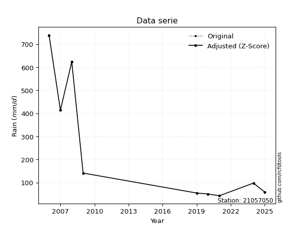</img>

</div>

> If Z-Score is active, values out of range or outliers are replaced with the station mean value.


### 4. Active continuous probability distributions from SciPy (45 of 104 available)

[scipy.stats](https://docs.scipy.org/doc/scipy/reference/stats.html) is a Python´s powerful submodule within the SciPy library for comprehensive statistical analysis, offering over 130 probability distributions (like Normal, Poisson), functions for descriptive stats (mean, variance), hypothesis testing (t-tests, chi-square), random variable generation, and statistical tests, making it essential for data science, modeling, and research. It provides tools to explore, model, and draw conclusions from data efficiently, working seamlessly with NumPy.

<div align="center">

|   id | p_dist             |   n_parameter | fit_method   | label                                                                       | active   | ref                                                                                                        |
|-----:|:-------------------|--------------:|:-------------|:----------------------------------------------------------------------------|:---------|:-----------------------------------------------------------------------------------------------------------|
|    0 | alpha              |             3 | MLE          | Alpha                                                                       | True     | [:mortar_board:](https://docs.scipy.org/doc/scipy/reference/generated/scipy.stats.alpha.html)              |
|    1 | betaprime          |             4 | MLE          | Beta prime                                                                  | True     | [:mortar_board:](https://docs.scipy.org/doc/scipy/reference/generated/scipy.stats.betaprime.html)          |
|    2 | chi2               |             3 | MLE          | Chi²                                                                        | True     | [:mortar_board:](https://docs.scipy.org/doc/scipy/reference/generated/scipy.stats.chi2.html)               |
|    3 | crystalball        |             4 | MLE          | Crystalball                                                                 | True     | [:mortar_board:](https://docs.scipy.org/doc/scipy/reference/generated/scipy.stats.crystalball.html)        |
|    4 | erlang             |             3 | MLE          | Erlang                                                                      | True     | [:mortar_board:](https://docs.scipy.org/doc/scipy/reference/generated/scipy.stats.erlang.html)             |
|    5 | expon              |             2 | MLE          | Exponential                                                                 | True     | [:mortar_board:](https://docs.scipy.org/doc/scipy/reference/generated/scipy.stats.expon.html)              |
|    6 | exponnorm          |             3 | MLE          | Exponentially modified Normal                                               | True     | [:mortar_board:](https://docs.scipy.org/doc/scipy/reference/generated/scipy.stats.exponnorm.html)          |
|    7 | f                  |             4 | MLE          | F                                                                           | True     | [:mortar_board:](https://docs.scipy.org/doc/scipy/reference/generated/scipy.stats.f.html)                  |
|    8 | fatiguelife        |             3 | MLE          | Fatigue-life (Birnbaum-Saunders)                                            | True     | [:mortar_board:](https://docs.scipy.org/doc/scipy/reference/generated/scipy.stats.fatiguelife.html)        |
|    9 | fisk               |             3 | MLE          | Fisk                                                                        | True     | [:mortar_board:](https://docs.scipy.org/doc/scipy/reference/generated/scipy.stats.fisk.html)               |
|   10 | gamma              |             3 | MLE          | Gamma                                                                       | True     | [:mortar_board:](https://docs.scipy.org/doc/scipy/reference/generated/scipy.stats.gamma.html)              |
|   11 | genexpon           |             5 | MLE          | Generalized exponential                                                     | True     | [:mortar_board:](https://docs.scipy.org/doc/scipy/reference/generated/scipy.stats.genexpon.html)           |
|   12 | genlogistic        |             3 | MLE          | Generalized logistic                                                        | True     | [:mortar_board:](https://docs.scipy.org/doc/scipy/reference/generated/scipy.stats.genlogistic.html)        |
|   13 | gibrat             |             2 | MM           | Gibrat                                                                      | True     | [:mortar_board:](https://docs.scipy.org/doc/scipy/reference/generated/scipy.stats.gibrat.html)             |
|   14 | gompertz           |             3 | MLE          | Gompertz (or truncated Gumbel)                                              | True     | [:mortar_board:](https://docs.scipy.org/doc/scipy/reference/generated/scipy.stats.gompertz.html)           |
|   15 | gumbel_l           |             2 | MM           | Gumbel Left Skew                                                            | True     | [:mortar_board:](https://docs.scipy.org/doc/scipy/reference/generated/scipy.stats.gumbel_l.html)           |
|   16 | gumbel_r           |             2 | MM           | Gumbel Right Skew                                                           | True     | [:mortar_board:](https://docs.scipy.org/doc/scipy/reference/generated/scipy.stats.gumbel_r.html)           |
|   17 | halflogistic       |             2 | MM           | Half-logistic                                                               | True     | [:mortar_board:](https://docs.scipy.org/doc/scipy/reference/generated/scipy.stats.halflogistic.html)       |
|   18 | halfnorm           |             2 | MM           | Half Normal                                                                 | True     | [:mortar_board:](https://docs.scipy.org/doc/scipy/reference/generated/scipy.stats.halfnorm.html)           |
|   19 | hypsecant          |             2 | MM           | hyperbolic secant                                                           | True     | [:mortar_board:](https://docs.scipy.org/doc/scipy/reference/generated/scipy.stats.hypsecant.html)          |
|   20 | invgamma           |             3 | MLE          | Inverted gamma                                                              | True     | [:mortar_board:](https://docs.scipy.org/doc/scipy/reference/generated/scipy.stats.invgamma.html)           |
|   21 | invgauss           |             3 | MLE          | Inverse Gaussian                                                            | True     | [:mortar_board:](https://docs.scipy.org/doc/scipy/reference/generated/scipy.stats.invgauss.html)           |
|   22 | invweibull         |             3 | MLE          | Inverted Weibull                                                            | True     | [:mortar_board:](https://docs.scipy.org/doc/scipy/reference/generated/scipy.stats.invweibull.html)         |
|   23 | johnsonsu          |             4 | MLE          | Johnson Su                                                                  | True     | [:mortar_board:](https://docs.scipy.org/doc/scipy/reference/generated/scipy.stats.johnsonsu.html)          |
|   24 | kstwobign          |             2 | MLE          | Limiting distribution of scaled Kolmogorov-Smirnov two-sided test statistic | True     | [:mortar_board:](https://docs.scipy.org/doc/scipy/reference/generated/scipy.stats.kstwobign.html)          |
|   25 | laplace            |             2 | MM           | Laplace                                                                     | True     | [:mortar_board:](https://docs.scipy.org/doc/scipy/reference/generated/scipy.stats.laplace.html)            |
|   26 | laplace_asymmetric |             3 | MLE          | Asymmetric Laplace                                                          | True     | [:mortar_board:](https://docs.scipy.org/doc/scipy/reference/generated/scipy.stats.laplace_asymmetric.html) |
|   27 | loggamma           |             3 | MLE          | Log gamma                                                                   | True     | [:mortar_board:](https://docs.scipy.org/doc/scipy/reference/generated/scipy.stats.loggamma.html)           |
|   28 | logistic           |             2 | MM           | Logistic (or Sech-squared)                                                  | True     | [:mortar_board:](https://docs.scipy.org/doc/scipy/reference/generated/scipy.stats.logistic.html)           |
|   29 | lognorm            |             3 | MLE          | Log Normal                                                                  | True     | [:mortar_board:](https://docs.scipy.org/doc/scipy/reference/generated/scipy.stats.lognorm.html)            |
|   30 | maxwell            |             2 | MM           | Maxwell                                                                     | True     | [:mortar_board:](https://docs.scipy.org/doc/scipy/reference/generated/scipy.stats.maxwell.html)            |
|   31 | mielke             |             4 | MLE          | Mielke Beta-Kappa / Dagum                                                   | True     | [:mortar_board:](https://docs.scipy.org/doc/scipy/reference/generated/scipy.stats.mielke.html)             |
|   32 | moyal              |             2 | MM           | Moyal                                                                       | True     | [:mortar_board:](https://docs.scipy.org/doc/scipy/reference/generated/scipy.stats.moyal.html)              |
|   33 | nakagami           |             3 | MLE          | Nakagami                                                                    | True     | [:mortar_board:](https://docs.scipy.org/doc/scipy/reference/generated/scipy.stats.nakagami.html)           |
|   34 | ncf                |             5 | MLE          | Non-central F distribution                                                  | True     | [:mortar_board:](https://docs.scipy.org/doc/scipy/reference/generated/scipy.stats.ncf.html)                |
|   35 | nct                |             4 | MLE          | Non-central Student’s t                                                     | True     | [:mortar_board:](https://docs.scipy.org/doc/scipy/reference/generated/scipy.stats.nct.html)                |
|   36 | norm               |             2 | MM           | Normal                                                                      | True     | [:mortar_board:](https://docs.scipy.org/doc/scipy/reference/generated/scipy.stats.norm.html)               |
|   37 | pareto             |             3 | MLE          | Pareto                                                                      | True     | [:mortar_board:](https://docs.scipy.org/doc/scipy/reference/generated/scipy.stats.pareto.html)             |
|   38 | pearson3           |             3 | MM           | Pearson type III                                                            | True     | [:mortar_board:](https://docs.scipy.org/doc/scipy/reference/generated/scipy.stats.pearson3.html)           |
|   39 | rayleigh           |             2 | MM           | Rayleigh                                                                    | True     | [:mortar_board:](https://docs.scipy.org/doc/scipy/reference/generated/scipy.stats.rayleigh.html)           |
|   40 | rice               |             3 | MLE          | Rice                                                                        | True     | [:mortar_board:](https://docs.scipy.org/doc/scipy/reference/generated/scipy.stats.rice.html)               |
|   41 | t                  |             3 | MLE          | Student’s t                                                                 | True     | [:mortar_board:](https://docs.scipy.org/doc/scipy/reference/generated/scipy.stats.t.html)                  |
|   42 | truncnorm          |             4 | MLE          | Truncated normal                                                            | True     | [:mortar_board:](https://docs.scipy.org/doc/scipy/reference/generated/scipy.stats.truncnorm.html)          |
|   43 | wald               |             2 | MM           | Wald                                                                        | True     | [:mortar_board:](https://docs.scipy.org/doc/scipy/reference/generated/scipy.stats.wald.html)               |
|   44 | weibull_min        |             3 | MLE          | Weibull minimum                                                             | True     | [:mortar_board:](https://docs.scipy.org/doc/scipy/reference/generated/scipy.stats.weibull_min.html)        |

</div>

> **n_parameter:** # arguments & localization & scale.
>
> **Fit methods:** (MLE) maximum likelihood, (MM) L-moments.
>
>**Inactive:** foldnorm, gennorm, norminvgauss, powernorm, powerlognorm, skewnorm, genextreme, anglit, arcsine, argus, beta, bradford, burr, burr12, cauchy, cosine, halfcauchy, foldcauchy, skewcauchy, wrapcauchy, dgamma, gengamma, exponweib, exponpow, truncexpon, gausshyper, genhalflogistic, genhyperbolic, geninvgauss, halfgennorm, johnsonsb, kappa4, kappa3, ksone, kstwo, loglaplace, levy, levy_l, levy_stable, ncx2, genpareto, truncpareto, lomax, powerlaw, rdist, rel_breitwigner, recipinvgauss, semicircular, studentized_range, trapezoid, triang, truncweibull_min, tukeylambda, uniform, loguniform, vonmises, vonmises_line, weibull_max, dweibull, 


## B. Probability distributions vs. Empirical distributions

A continuous probability distribution (CPD) describes probabilities for variables that can take any value within a range (like rain any time), unlike discrete variables with specific outcomes (like temperature). It uses a Probability Density Function (PDF), a curve where the total area under it equals 1, and the probability of the variable falling within an interval (a to b) is found by calculating the area under the curve between those points. A key feature is that the probability of hitting any single exact value is zero, so probabilities are always expressed for ranges, e.g., $P(a ≤ X ≤ b)$.

<div align="center">

Distributions parameters
|    |   station | p_dist                |   n |               loc |           scale | shape                  | shape1                | shape2               | shape3   |
|---:|----------:|:----------------------|----:|------------------:|----------------:|:-----------------------|:----------------------|:---------------------|:---------|
|  0 |  21057050 | alpha                 |   9 |      22.7389      |    35.2329      | 1.0280320970844819e-10 |                       |                      |          |
|  1 |  21057050 | betaprime             |   9 |       1.55278     |     0.278027    | 376.6674794824737      | 1.2816233656416451    |                      |          |
|  2 |  21057050 | chi2                  |   9 |      42.8         |     6.11457     | 0.42905947849311965    |                       |                      |          |
|  3 |  21057050 | crystalball           |   9 |      -0.211221    |   356.735       | 4.556294793492377      | 2.2063027220645726    |                      |          |
|  4 |  21057050 | erlang                |   9 |      42.8         |   153.069       | 0.4408948761147258     |                       |                      |          |
|  5 |  21057050 | expon                 |   9 |      42.8         |   202.4         |                        |                       |                      |          |
|  6 |  21057050 | exponnorm             |   9 |      42.5865      |     0.0625128   | 3228.9771401702355     |                       |                      |          |
|  7 |  21057050 | f                     |   9 |      42.8         |     3.57802     | 0.4529626378775391     | 0.5093872818473123    |                      |          |
|  8 |  21057050 | fatiguelife           |   9 |      42.8         |     0.000213646 | 934.2101083138193      |                       |                      |          |
|  9 |  21057050 | fisk                  |   9 |      42.8         |   103.963       | 0.6008932645290563     |                       |                      |          |
| 10 |  21057050 | gamma                 |   9 |      42.8         |   134.95        | 0.4823670452195805     |                       |                      |          |
| 11 |  21057050 | genexpon              |   9 |      42.8         |   442.087       | 2.1842253099234807     | 8.421079856698366e-13 | 2.7429851708406376   |          |
| 12 |  21057050 | genlogistic           |   9 |   -1154.95        |   167.835       | 2124.378895066534      |                       |                      |          |
| 13 |  21057050 | gibrat                |   9 |      47.6171      |   119.84        |                        |                       |                      |          |
| 14 |  21057050 | gompertz              |   9 |      42.8         |     6.0608e+14  | 2811885922732.177      |                       |                      |          |
| 15 |  21057050 | gumbel_l              |   9 |     361.763       |   201.94        |                        |                       |                      |          |
| 16 |  21057050 | gumbel_r              |   9 |     128.637       |   201.94        |                        |                       |                      |          |
| 17 |  21057050 | halflogistic          |   9 |     -61.773       |   221.434       |                        |                       |                      |          |
| 18 |  21057050 | halfnorm              |   9 |     -97.6121      |   429.651       |                        |                       |                      |          |
| 19 |  21057050 | hypsecant             |   9 |     245.2         |   164.883       |                        |                       |                      |          |
| 20 |  21057050 | invgamma              |   9 |      41.8603      |     1.71535     | 0.3356281776636635     |                       |                      |          |
| 21 |  21057050 | invgauss              |   9 |      39.999       |    11.8297      | 17.346258937329594     |                       |                      |          |
| 22 |  21057050 | invweibull            |   9 |      42.8         |     3.59767     | 0.09552200226868557    |                       |                      |          |
| 23 |  21057050 | johnsonsu             |   9 |      42.8         |     2.24618e-11 | -1.762911218122508     | 0.09890636934800223   |                      |          |
| 24 |  21057050 | kstwobign             |   9 |    -466.797       |   820.668       |                        |                       |                      |          |
| 25 |  21057050 | laplace               |   9 |     245.2         |   183.139       |                        |                       |                      |          |
| 26 |  21057050 | laplace_asymmetric    |   9 |      42.8         |     0.000165447 | 8.174244257963253e-07  |                       |                      |          |
| 27 |  21057050 | loggamma              |   9 |  -84375.4         | 11259.5         | 1836.2644466036554     |                       |                      |          |
| 28 |  21057050 | logistic              |   9 |     245.2         |   142.793       |                        |                       |                      |          |
| 29 |  21057050 | lognorm               |   9 |      42.8         |     0.9479      | 11.67600992798         |                       |                      |          |
| 30 |  21057050 | maxwell               |   9 |    -368.517       |   384.59        |                        |                       |                      |          |
| 31 |  21057050 | mielke                |   9 |      -0.395715    |     1.02824     | 221.42390316189358     | 1.1994467452936242    |                      |          |
| 32 |  21057050 | moyal                 |   9 |      97.0882      |   116.59        |                        |                       |                      |          |
| 33 |  21057050 | nakagami              |   9 |      42.8         |   497.602       | 0.21640177913056075    |                       |                      |          |
| 34 |  21057050 | ncf                   |   9 |       0.303766    |    84.4322      | 213.82431387072825     | 2.4385102961936775    | 4.44711194416907e-11 |          |
| 35 |  21057050 | nct                   |   9 |      -0.128822    |     2.1905      | 0.9337186873290229     | 31.17140975923968     |                      |          |
| 36 |  21057050 | norm                  |   9 |     245.2         |   258.998       |                        |                       |                      |          |
| 37 |  21057050 | pareto                |   9 |      38.636       |     4.16402     | 0.3902857414113406     |                       |                      |          |
| 38 |  21057050 | pearson3              |   9 |     245.2         |   258.998       | 0.9224870444489326     |                       |                      |          |
| 39 |  21057050 | rayleigh              |   9 |    -250.279       |   395.335       |                        |                       |                      |          |
| 40 |  21057050 | rice                  |   9 |    -150.215       |   334.24        | 0.0005699061269390771  |                       |                      |          |
| 41 |  21057050 | t                     |   9 |      48.6412      |     9.07519     | 0.3752216721019193     |                       |                      |          |
| 42 |  21057050 | truncnorm             |   9 | -475192           | 11103.7         | 42.79950988061687      | 42.86220987735689     |                      |          |
| 43 |  21057050 | wald                  |   9 |     -13.7982      |   258.998       |                        |                       |                      |          |
| 44 |  21057050 | weibull_min           |   9 |      42.8         |   202.788       | 0.42044123965177305    |                       |                      |          |
| 45 |  21057050 | logalpha              |   9 |       3.4993      |     0.481897    | 4.714205320721094e-07  |                       |                      |          |
| 46 |  21057050 | logbetaprime          |   9 |       1.40674     |     0.156066    | 237.06727001810134     | 11.772458491127885    |                      |          |
| 47 |  21057050 | logchi2               |   9 |       3.75654     |     0.951403    | 1.0677071259054238     |                       |                      |          |
| 48 |  21057050 | logcrystalball        |   9 |       4.89524     |     1.10347     | 7.6242816004886205     | 2384.063550027639     |                      |          |
| 49 |  21057050 | logerlang             |   9 |       3.75654     |     0.99404     | 0.6717711182668991     |                       |                      |          |
| 50 |  21057050 | logexpon              |   9 |       3.75654     |     1.1387      |                        |                       |                      |          |
| 51 |  21057050 | logexponnorm          |   9 |       3.75551     |     0.000353947 | 3212.8630516029816     |                       |                      |          |
| 52 |  21057050 | logf                  |   9 |       3.75654     |     0.787052    | 0.9238401846682119     | 5.6057525990449815    |                      |          |
| 53 |  21057050 | logfatiguelife        |   9 |       3.75654     |     5.72534e-06 | 476.306161506863       |                       |                      |          |
| 54 |  21057050 | logfisk               |   9 |       3.75654     |     0.10725     | 0.696455511858586      |                       |                      |          |
| 55 |  21057050 | loggamma              |   9 |       3.75654     |     1.11669     | 0.2215593577560029     |                       |                      |          |
| 56 |  21057050 | loggenexpon           |   9 |       3.75654     |     2.54405     | 2.200919863487969      | 0.9792946880214183    | 0.0803345581375092   |          |
| 57 |  21057050 | loggenlogistic        |   9 |      -1.6339      |     0.837146    | 1314.469778095572      |                       |                      |          |
| 58 |  21057050 | loggibrat             |   9 |       4.05344     |     0.510576    |                        |                       |                      |          |
| 59 |  21057050 | loggompertz           |   9 |       3.75654     |    17.8065      | 14.683240071829296     |                       |                      |          |
| 60 |  21057050 | loggumbel_l           |   9 |       5.39186     |     0.860371    |                        |                       |                      |          |
| 61 |  21057050 | loggumbel_r           |   9 |       4.39862     |     0.860371    |                        |                       |                      |          |
| 62 |  21057050 | loghalflogistic       |   9 |       3.58737     |     0.943427    |                        |                       |                      |          |
| 63 |  21057050 | loghalfnorm           |   9 |       3.43468     |     1.83054     |                        |                       |                      |          |
| 64 |  21057050 | loghypsecant          |   9 |       4.89524     |     0.70249     |                        |                       |                      |          |
| 65 |  21057050 | loginvgamma           |   9 |       3.65278     |     0.281796    | 0.8403066521256155     |                       |                      |          |
| 66 |  21057050 | loginvgauss           |   9 |       3.67226     |     0.382347    | 3.1985840984370864     |                       |                      |          |
| 67 |  21057050 | loginvweibull         |   9 |       3.72472     |     0.218686    | 0.6346178290875517     |                       |                      |          |
| 68 |  21057050 | logjohnsonsu          |   9 |       6.55464e+07 |     1.09193e+07 | 151354467.05251032     | 60730381.02732008     |                      |          |
| 69 |  21057050 | logkstwobign          |   9 |       1.5052      |     3.87768     |                        |                       |                      |          |
| 70 |  21057050 | loglaplace            |   9 |       4.89524     |     0.780271    |                        |                       |                      |          |
| 71 |  21057050 | loglaplace_asymmetric |   9 |       3.75654     |     0.0113679   | 0.009991651824782309   |                       |                      |          |
| 72 |  21057050 | logloggamma           |   9 |    -225.313       |    33.7439      | 918.531985446687       |                       |                      |          |
| 73 |  21057050 | loglogistic           |   9 |       4.89524     |     0.608374    |                        |                       |                      |          |
| 74 |  21057050 | loglognorm            |   9 |       3.75654     |     0.0126545   | 11.04919957280147      |                       |                      |          |
| 75 |  21057050 | logmaxwell            |   9 |       2.28048     |     1.63856     |                        |                       |                      |          |
| 76 |  21057050 | logmielke             |   9 |       2.92809     |     0.163522    | 219.0041355085758      | 2.2718267074248804    |                      |          |
| 77 |  21057050 | logmoyal              |   9 |       4.2642      |     0.496736    |                        |                       |                      |          |
| 78 |  21057050 | lognakagami           |   9 |       3.75654     |     1.0258      | 0.08337082875340313    |                       |                      |          |
| 79 |  21057050 | logncf                |   9 |       0.148395    |     1.28049     | 71.88066349845766      | 52.960484270045235    | 183.30325192657838   |          |
| 80 |  21057050 | lognct                |   9 |      -0.222762    |     0.121329    | 12.631861466375057     | 39.61884970401002     |                      |          |
| 81 |  21057050 | lognorm               |   9 |       4.89524     |     1.10347     |                        |                       |                      |          |
| 82 |  21057050 | logpareto             |   9 |       3.75646     |     7.80875e-05 | 0.12554381799490785    |                       |                      |          |
| 83 |  21057050 | logpearson3           |   9 |       4.89524     |     1.10347     | 0.4608978710068167     |                       |                      |          |
| 84 |  21057050 | lograyleigh           |   9 |       2.78424     |     1.68434     |                        |                       |                      |          |
| 85 |  21057050 | logrice               |   9 |       3.07023     |     1.50803     | 0.0008358008804122748  |                       |                      |          |
| 86 |  21057050 | logt                  |   9 |       4.89524     |     1.10347     | 25809396211.170258     |                       |                      |          |
| 87 |  21057050 | logtruncnorm          |   9 |     -14.5187      |     4.82881     | 3.784621352272464      | 38.99983919293033     |                      |          |
| 88 |  21057050 | logwald               |   9 |       3.7918      |     1.10344     |                        |                       |                      |          |
| 89 |  21057050 | logweibull_min        |   9 |       3.75654     |     0.981327    | 0.22855098986249361    |                       |                      |          |

</div>

> **loc** (Location parameter): This shifts the distribution along the x-axis. For many common distributions, like the normal (Gaussian) distribution, loc represents the mean $μ$. For others, like the uniform distribution, it might represent the minimum value, or for the beta distribution, the left end of the support interval.
>
> **scale** (Scale parameter): This determines the width or spread of the distribution. For the normal distribution, scale represents the standard deviation $σ$. For a uniform distribution, it defines the length of the interval (from $loc$ to $loc + scale$).
>
> **shape** (Shape parameters): Refers to parameters that define the specific form of a probability distribution, distinct from its location (loc) and scale (scale). These parameters are required arguments for most distribution functions. For example, a normal (Gaussian) distribution is fully defined by its location (mean) and scale (standard deviation), so it has no specific shape parameters beyond loc and scale. However, other distributions have intrinsic properties that need specification, as Gamma distribution that takes a shape parameter, often named $a$ or $alpha$.


### 0. Cumulative distribution values - CDF (90 evaluated)

> Ordered by x ascending and calculating $log(f(x))$ separately. 

|   id |   Station |   date |     x |   count |   mean |     std |    zscore |   Value_initial |   station |   m |     alpha |   alpha_pdf |   betaprime |   betaprime_pdf |        chi2 |    chi2_pdf |   crystalball |   crystalball_pdf |      erlang |   erlang_pdf |      expon |   expon_pdf |   exponnorm |   exponnorm_pdf |         f |           f_pdf |   fatiguelife |   fatiguelife_pdf |        fisk |     fisk_pdf |       gamma |   gamma_pdf |    genexpon |   genexpon_pdf |   genlogistic |   genlogistic_pdf |     gibrat |   gibrat_pdf |    gompertz |   gompertz_pdf |   gumbel_l |   gumbel_l_pdf |   gumbel_r |   gumbel_r_pdf |   halflogistic |   halflogistic_pdf |   halfnorm |   halfnorm_pdf |   hypsecant |   hypsecant_pdf |   invgamma |   invgamma_pdf |   invgauss |   invgauss_pdf |   invweibull |   invweibull_pdf |   johnsonsu |   johnsonsu_pdf |   kstwobign |   kstwobign_pdf |   laplace |   laplace_pdf |   laplace_asymmetric |   laplace_asymmetric_pdf |   loggamma |   loggamma_pdf |   logistic |   logistic_pdf |   lognorm |   lognorm_pdf |   maxwell |   maxwell_pdf |   mielke |   mielke_pdf |    moyal |   moyal_pdf |    nakagami |   nakagami_pdf |      ncf |     ncf_pdf |      nct |     nct_pdf |     norm |    norm_pdf |      pareto |   pareto_pdf |   pearson3 |   pearson3_pdf |   rayleigh |   rayleigh_pdf |     rice |    rice_pdf |        t |       t_pdf |   truncnorm |   truncnorm_pdf |      wald |    wald_pdf |   weibull_min |   weibull_min_pdf |   logalpha |   logalpha_pdf |   logbetaprime |   logbetaprime_pdf |    logchi2 |   logchi2_pdf |   logcrystalball |   logcrystalball_pdf |   logerlang |   logerlang_pdf |   logexpon |   logexpon_pdf |   logexponnorm |   logexponnorm_pdf |        logf |      logf_pdf |   logfatiguelife |   logfatiguelife_pdf |     logfisk |    logfisk_pdf |   loggenexpon |   loggenexpon_pdf |   loggenlogistic |   loggenlogistic_pdf |   loggibrat |   loggibrat_pdf |   loggompertz |   loggompertz_pdf |   loggumbel_l |   loggumbel_l_pdf |   loggumbel_r |   loggumbel_r_pdf |   loghalflogistic |   loghalflogistic_pdf |   loghalfnorm |   loghalfnorm_pdf |   loghypsecant |   loghypsecant_pdf |   loginvgamma |   loginvgamma_pdf |   loginvgauss |   loginvgauss_pdf |   loginvweibull |   loginvweibull_pdf |   logjohnsonsu |   logjohnsonsu_pdf |   logkstwobign |   logkstwobign_pdf |   loglaplace |   loglaplace_pdf |   loglaplace_asymmetric |   loglaplace_asymmetric_pdf |   logloggamma |   logloggamma_pdf |   loglogistic |   loglogistic_pdf |   loglognorm |   loglognorm_pdf |   logmaxwell |   logmaxwell_pdf |   logmielke |   logmielke_pdf |   logmoyal |   logmoyal_pdf |   lognakagami |   lognakagami_pdf |   logncf |   logncf_pdf |   lognct |   lognct_pdf |   logpareto |   logpareto_pdf |   logpearson3 |   logpearson3_pdf |   lograyleigh |   lograyleigh_pdf |   logrice |   logrice_pdf |     logt |   logt_pdf |   logtruncnorm |   logtruncnorm_pdf |    logwald |   logwald_pdf |   logweibull_min |   logweibull_min_pdf |
|-----:|----------:|-------:|------:|--------:|-------:|--------:|----------:|----------------:|----------:|----:|----------:|------------:|------------:|----------------:|------------:|------------:|--------------:|------------------:|------------:|-------------:|-----------:|------------:|------------:|----------------:|----------:|----------------:|--------------:|------------------:|------------:|-------------:|------------:|------------:|------------:|---------------:|--------------:|------------------:|-----------:|-------------:|------------:|---------------:|-----------:|---------------:|-----------:|---------------:|---------------:|-------------------:|-----------:|---------------:|------------:|----------------:|-----------:|---------------:|-----------:|---------------:|-------------:|-----------------:|------------:|----------------:|------------:|----------------:|----------:|--------------:|---------------------:|-------------------------:|-----------:|---------------:|-----------:|---------------:|----------:|--------------:|----------:|--------------:|---------:|-------------:|---------:|------------:|------------:|---------------:|---------:|------------:|---------:|------------:|---------:|------------:|------------:|-------------:|-----------:|---------------:|-----------:|---------------:|---------:|------------:|---------:|------------:|------------:|----------------:|----------:|------------:|--------------:|------------------:|-----------:|---------------:|---------------:|-------------------:|-----------:|--------------:|-----------------:|---------------------:|------------:|----------------:|-----------:|---------------:|---------------:|-------------------:|------------:|--------------:|-----------------:|---------------------:|------------:|---------------:|--------------:|------------------:|-----------------:|---------------------:|------------:|----------------:|--------------:|------------------:|--------------:|------------------:|--------------:|------------------:|------------------:|----------------------:|--------------:|------------------:|---------------:|-------------------:|--------------:|------------------:|--------------:|------------------:|----------------:|--------------------:|---------------:|-------------------:|---------------:|-------------------:|-------------:|-----------------:|------------------------:|----------------------------:|--------------:|------------------:|--------------:|------------------:|-------------:|-----------------:|-------------:|-----------------:|------------:|----------------:|-----------:|---------------:|--------------:|------------------:|---------:|-------------:|---------:|-------------:|------------:|----------------:|--------------:|------------------:|--------------:|------------------:|----------:|--------------:|---------:|-----------:|---------------:|-------------------:|-----------:|--------------:|-----------------:|---------------------:|
|    0 |  21057050 |   2021 |  42.8 |       9 |  245.2 | 274.709 | -0.73678  |            42.8 |  21057050 |   1 | 0.0790406 | 0.0149412   |    0.125196 |     0.00701918  | 0.000589264 | 1.77913e+10 |      0.547985 |       0.00111021  | 7.10237e-08 |  4.40705e+06 | 0          | 0.00494071  |  0.00105713 |     0.0049473   | 0.0104399 | 27089.3         |     0.0285632 |       9.18557e+08 | 4.94029e-06 | 19.3314      | 1.58642e-08 | 1.07698e+06 | 1.69912e-14 |    0.00494071  |      0.184637 |       0.00185775  | 0          |  0           | 2.83502e-15 |    0.00463946  |   0.186232 |    0.000830449 |   0.216604 |    0.00164076  |       0.231834 |        0.00213665  |   0.256184 |    0.00176049  |    0.181459 |     0.00104188  |  0.0319934 |    0.0789064   |  0.0422243 |    0.0375144   |  2.70192e-05 | 377181           |   0.0399793 |     3.76523e+08 |    0.164618 |     0.00174411  |  0.165577 |   0.000904106 |          6.73239e-13 |              0.00494071  | 0.00042417 |    2.11622e+11 |   0.195064 |    0.00109959  |  0.151053 |      0.212283 |  0.233492 |   0.00133944  |      nan |          nan | 0.206895 | 0.00194733  | 4.02263e-08 |    2.45025e+06 | 0.129375 | 0.00672842  | 0.114193 | 0.00814221  | 0.217262 | 0.00113502  | 1.11022e-16 |  0.0937281   |   0.22891  |    0.00157539  |   0.240272 |    0.00142466  | 0.153579 | 0.00146238  | 0.367684 | 0.0163295   | 6.54845e-08 |     0.00413839  | 0.081071  | 0.00372831  |   1.20628e-07 |       7.13781e+06 |  0.061022  |      1.00499   |       0.134506 |          0.336221  | 5.0878e-09 |    6.1162e+06 |         0.151053 |             0.212283 | 5.39989e-11 |   81683.9       |   0        |      0.878196  |    0.000900784 |          0.876907  | 7.87189e-05 | 19330.9       |        0.0426437 |          9.16302e+09 | 9.61457e-11 | 150783         |   8.67563e-11 |         0.865123  |         0.122613 |            0.307144  |    0        |       0         |   1.06197e-14 |         0.8246    |      0.138829 |         0.149601  |      0.121342 |         0.297462  |         0.0894172 |             0.525745  |      0.139572 |         0.429188  |       0.124265 |          0.172432  |     0.0480701 |         1.31573   |     0.0449826 |         1.41103   |       0.0334279 |           2.26579   |       0.149008 |           0.212149 |       0.111104 |          0.311889  |     0.116192 |        0.148913  |             0.000100071 |                   0.878851  |      0.15327  |          0.210022 |      0.133344 |         0.189955  |   0.00252449 |      1.59565e+12 |     0.153284 |         0.26336  |   0.0919521 |       0.594385  |  0.0955229 |      0.333666  |    0.00232705 |       8.73734e+11 | 0.142082 |    0.283219  | 0.129227 |    0.297758  |    0        |    1607.73      |      0.14713  |          0.250136 |      0.153475 |          0.290124 | 0.0983786 |     0.272099  | 0.151053 |   0.212283 |    1.81513e-09 |          0.83265   | 0          |     0         |      0.000311148 |          1.60108e+11 |
|    1 |  21057050 |   2025 |  44   |       9 |  245.2 | 274.709 | -0.732411 |            44   |  21057050 |   2 | 0.0974885 | 0.0157542   |    0.133646 |     0.00706222  | 0.653371    | 0.107707    |      0.549317 |       0.00110976  | 0.132811    |  0.0485316   | 0.00591131 | 0.00491151  |  0.00697814 |     0.00491954  | 0.421644  |     0.071893    |     0.531964  |       0.0132947   | 0.0641029   |  0.0300415   | 0.115368    | 0.0460972   | 0.00591131  |    0.00491151  |      0.186872 |       0.00186685  | 0          |  0           | 0.00555189  |    0.00461371  |   0.18723  |    0.000834373 |   0.218576 |    0.00164589  |       0.234396 |        0.00213395  |   0.258296 |    0.00175887  |    0.182713 |     0.00104828  |  0.12918   |    0.0731827   |  0.0905629 |    0.0413905   |  0.329369    |      0.0291175   |   0.773006  |     0.024843    |    0.166716 |     0.00175239  |  0.166666 |   0.00091005  |          0.00591131  |              0.0049115   | 0.480666   |    3.774       |   0.196387 |    0.00110523  |  0.156999 |      0.217776 |  0.235101 |   0.00134277  |      nan |          nan | 0.209235 | 0.0019532   | 0.0578445   |    0.0208627   | 0.137466 | 0.00675549  | 0.124016 | 0.00822353  | 0.218627 | 0.00113912  | 0.0941061   |  0.0659128   |   0.230803 |    0.00157902  |   0.241983 |    0.00142727  | 0.155337 | 0.00146841  | 0.388805 | 0.0189311   | 0.00495467  |     0.00411929  | 0.0855763 | 0.0037798   |   0.109253    |       0.0361072   |  0.0907394 |      1.133     |       0.14395  |          0.34677   | 0.11707    |    2.23888    |         0.156999 |             0.217776 | 0.0986561   |       2.35714   |   0.023991 |      0.857127  |    0.0249015   |          0.857468  | 0.16004     |     2.6392    |        0.55799   |          1.0416      | 0.280086    |      5.07862   |   0.0236426   |         0.844997  |         0.131258 |            0.318135  |    0        |       0         |   0.0225608   |         0.807249  |      0.143023 |         0.153735  |      0.129713 |         0.307925  |         0.103935  |             0.524258  |      0.151423 |         0.428     |       0.12912  |          0.178804  |     0.0876013 |         1.50845   |     0.0873631 |         1.60887   |       0.10177   |           2.4816    |       0.154952 |           0.217733 |       0.119886 |          0.323168  |     0.120384 |        0.154284  |             0.0241087   |                   0.857749  |      0.159151 |          0.215356 |      0.138685 |         0.196345  |   0.528199   |      1.30249     |     0.160647 |         0.269158 |   0.108945  |       0.633613  |  0.104975  |      0.349861  |    0.464386   |       2.80014     | 0.150025 |    0.291254  | 0.137593 |    0.307302  |    0.521571 |       2.16605   |      0.154137 |          0.256685 |      0.161573 |          0.295521 | 0.106022  |     0.280662  | 0.156999 |   0.217775 |    0.0227762   |          0.814786  | 0          |     0         |      0.357448    |          2.34907     |
|    2 |  21057050 |   2020 |  50.4 |       9 |  245.2 | 274.709 | -0.709114 |            50.4 |  21057050 |   3 | 0.202758  | 0.0163249   |    0.179059 |     0.00707603  | 0.895196    | 0.0149727   |      0.556411 |       0.00110711  | 0.29591     |  0.0165832   | 0.0368532  | 0.00475863  |  0.0379693  |     0.00476601  | 0.588873  |     0.0117345   |     0.579996  |       0.00519211  | 0.17195     |  0.0112575   | 0.276772    | 0.0169093   | 0.0368532   |    0.00475863  |      0.198971 |       0.0019134   | 8.4061e-05 |  0.000120819 | 0.0346455   |    0.00447873  |   0.192638 |    0.00085551  |   0.229194 |    0.00167201  |       0.248006 |        0.00211912  |   0.269525 |    0.00175006  |    0.189532 |     0.00108276  |  0.377562  |    0.0210138   |  0.302954  |    0.0245026   |  0.394138    |      0.00461225  |   0.824163  |     0.00336485  |    0.178068 |     0.00179462  |  0.172593 |   0.000942414 |          0.0368531   |              0.00475863  | 0.69748    |    0.838079    |   0.203557 |    0.00113536  |  0.188402 |      0.244645 |  0.243751 |   0.00136007  |      nan |          nan | 0.22183  | 0.00198205  | 0.12859     |    0.00732262  | 0.180733 | 0.00672127  | 0.177043 | 0.00824856  | 0.225987 | 0.00116084  | 0.333248    |  0.0221203   |   0.240968 |    0.00159741  |   0.251161 |    0.00144066  | 0.164836 | 0.00149975  | 0.546853 | 0.0255051   | 0.0309956   |     0.00401892  | 0.110489  | 0.00398745  |   0.222284    |       0.010816    |  0.252009  |      1.12729   |       0.194197 |          0.391045  | 0.294957   |    0.910589   |         0.188402 |             0.244645 | 0.308447    |       1.14754   |   0.133717 |      0.760766  |    0.134663    |          0.760948  | 0.353437    |     0.926233  |        0.638603  |          0.406526    | 0.572842    |      1.04261   |   0.132005    |         0.752643  |         0.177868 |            0.366633  |    0        |       0         |   0.126637    |         0.726816  |      0.165342 |         0.175332  |      0.174783 |         0.354334  |         0.17448   |             0.513848  |      0.209084 |         0.420821  |       0.155663 |          0.21286   |     0.281448  |         1.21507   |     0.287232  |         1.22475   |       0.341463  |           1.19242   |       0.186381 |           0.245083 |       0.167182 |          0.371258  |     0.143269 |        0.183615  |             0.133909    |                   0.761241  |      0.190174 |          0.241482 |      0.167558 |         0.22927   |   0.591559   |      0.215052    |     0.199031 |         0.295518 |   0.203557  |       0.736045  |  0.157341  |      0.417878  |    0.624426   |       0.635746    | 0.192102 |    0.327439  | 0.182284 |    0.349457  |    0.617117 |       0.293942  |      0.191105 |          0.287265 |      0.203353 |          0.318929 | 0.146801  |     0.318808  | 0.188402 |   0.244644 |    0.127719    |          0.732112  | 0.00866311 |     0.316517  |      0.485151    |          0.477926    |
|    3 |  21057050 |   2019 |  54.6 |       9 |  245.2 | 274.709 | -0.693825 |            54.6 |  21057050 |   4 | 0.268801  | 0.0150254   |    0.208531 |     0.0069442   | 0.94007     | 0.00751738  |      0.561057 |       0.00110519  | 0.356303    |  0.0126161   | 0.0566335  | 0.0046609   |  0.0577797  |     0.00466786  | 0.62723   |     0.00719798  |     0.599309  |       0.00412016  | 0.212904    |  0.0085335   | 0.338824    | 0.0130529   | 0.0566335   |    0.0046609   |      0.207068 |       0.00194209  | 0.00223674 |  0.00100492  | 0.0532741   |    0.0043923   |   0.196261 |    0.000869571 |   0.236251 |    0.00168801  |       0.256886 |        0.002109    |   0.276863 |    0.0017441   |    0.194128 |     0.00110573  |  0.447109  |    0.0131596   |  0.389512  |    0.0173395   |  0.409533    |      0.00295961  |   0.835186  |     0.00207915  |    0.185661 |     0.00182057  |  0.176597 |   0.000964277 |          0.0566334   |              0.0046609   | 0.752667   |    0.572017    |   0.208367 |    0.00115517  |  0.208608 |      0.260157 |  0.249486 |   0.00137099  |      nan |          nan | 0.23019  | 0.00199875  | 0.15556     |    0.00570509  | 0.208696 | 0.00658279  | 0.211246 | 0.00801591  | 0.230892 | 0.00117493  | 0.408142    |  0.0144697   |   0.247701 |    0.0016086   |   0.257229 |    0.00144894  | 0.171177 | 0.00151952  | 0.634223 | 0.0160941   | 0.0477392   |     0.00395438  | 0.127424  | 0.00407085  |   0.261012    |       0.00796432  |  0.33586   |      0.965076  |       0.226317 |          0.410693  | 0.359735   |    0.725044   |         0.208608 |             0.260157 | 0.390883    |       0.928926  |   0.19252  |      0.709125  |    0.193477    |          0.709229  | 0.418039    |     0.709228  |        0.667478  |          0.322963    | 0.639005    |      0.659793  |   0.190237    |         0.702932  |         0.208179 |            0.39003   |    0        |       0         |   0.18304     |         0.68294   |      0.179921 |         0.189065  |      0.204077 |         0.376966  |         0.215284  |             0.50542   |      0.242562 |         0.415573  |       0.173578 |          0.235024  |     0.36796   |         0.956663  |     0.374227  |         0.961734  |       0.421455  |           0.839403  |       0.206633 |           0.260896 |       0.197815 |          0.393338  |     0.158747 |        0.203451  |             0.192747    |                   0.709526  |      0.21011  |          0.2566   |      0.18672  |         0.249609  |   0.605508   |      0.143065    |     0.223242 |         0.309202 |   0.26282   |       0.739189  |  0.192026  |      0.447383  |    0.667202   |       0.454911    | 0.219059 |    0.345705  | 0.211099 |    0.369964  |    0.635797 |       0.187719  |      0.214765 |          0.303701 |      0.229347 |          0.330266 | 0.173107  |     0.338082  | 0.208607 |   0.260156 |    0.1845      |          0.687114  | 0.0538614  |     0.771078  |      0.516739    |          0.329857    |
|    4 |  21057050 |   2024 |  97.6 |       9 |  245.2 | 274.709 | -0.537296 |            97.6 |  21057050 |   5 | 0.637895  | 0.00449031  |    0.451481 |     0.00433466  | 0.999289    | 6.68611e-05 |      0.608029 |       0.00107706  | 0.646791    |  0.00403699  | 0.237194   | 0.00376881  |  0.238559   |     0.00377226  | 0.742071  |     0.00116672  |     0.706133  |       0.00170365  | 0.404974    |  0.00264229  | 0.64501     | 0.00428664  | 0.237194    |    0.00376881  |      0.295555 |       0.00214585  | 0.190929   |  0.00544545  | 0.224496    |    0.00359792  |   0.23687  |    0.00102156  |   0.311569 |    0.0017992   |       0.345095 |        0.0019891   |   0.350423 |    0.00167493  |    0.246908 |     0.00135176  |  0.654427  |    0.00203334  |  0.687368  |    0.00297631  |  0.462578    |      0.000621625 |   0.870074  |     0.000381659 |    0.268446 |     0.00200565  |  0.223333 |   0.00121947  |          0.237193    |              0.0037688   | 0.910907   |    0.131595    |   0.262375 |    0.00135535  |  0.387867 |      0.347158 |  0.310535 |   0.00146207  |      nan |          nan | 0.318373 | 0.00207539  | 0.302232    |    0.00238184  | 0.439798 | 0.00416157  | 0.472415 | 0.00430397  | 0.284377 | 0.00130945  | 0.644572    |  0.0023526   |   0.318747 |    0.00168422  |   0.321021 |    0.00151131  | 0.24032  | 0.00168516  | 0.821885 | 0.001355    | 0.204433    |     0.00335036  | 0.300359  | 0.00374348  |   0.438348    |       0.00248583  |  0.655923  |      0.297626  |       0.477184 |          0.417709  | 0.624908   |    0.302632   |         0.387867 |             0.347158 | 0.720542    |       0.347037  |   0.515158 |      0.425787  |    0.516061    |          0.425559  | 0.659605    |     0.257364  |        0.78717   |          0.140357    | 0.805395    |      0.132419  |   0.511907    |         0.427088  |         0.456406 |            0.427506  |    0.512963 |       0.755972  |   0.50129     |         0.430722  |      0.322684 |         0.306721  |      0.445261 |         0.418724  |         0.482734  |             0.40648   |      0.468786 |         0.358281  |       0.362088 |          0.411249  |     0.659465  |         0.260383  |     0.67505   |         0.280885  |       0.65667   |           0.204714  |       0.386938 |           0.349863 |       0.444712 |          0.422487  |     0.334195 |        0.428306  |             0.515503    |                   0.425843  |      0.386841 |          0.342661 |      0.37362  |         0.384678  |   0.647284   |      0.04078     |     0.421549 |         0.358235 |   0.605409  |       0.416536  |  0.467194  |      0.448296  |    0.814601   |       0.156776    | 0.4411   |    0.393566  | 0.446332 |    0.408685  |    0.687488 |       0.0475899 |      0.415262 |          0.36922  |      0.433852 |          0.358537 | 0.394524  |     0.402199  | 0.387866 |   0.347157 |    0.503531    |          0.430075  | 0.525271   |     0.564885  |      0.617467    |          0.101916    |
|    5 |  21057050 |   2009 | 141.1 |       9 |  245.2 | 274.709 | -0.378946 |           141.1 |  21057050 |   6 | 0.765953  | 0.00191968  |    0.598254 |     0.00259743  | 0.999986    | 1.2051e-06  |      0.653994 |       0.00103393  | 0.776129    |  0.00219155  | 0.384716   | 0.00303994  |  0.386176   |     0.00304095  | 0.77706   |     0.000568828 |     0.766105  |       0.00113197  | 0.491586    |  0.00152778  | 0.781652    | 0.0022949   | 0.384716    |    0.00303994  |      0.390368 |       0.00218741  | 0.40192    |  0.00413791  | 0.366224    |    0.00294038  |   0.28488  |    0.0011874   |   0.390569 |    0.00181833  |       0.428525 |        0.00184336  |   0.421512 |    0.00159145  |    0.311191 |     0.00160074  |  0.714294  |    0.00095382  |  0.773184  |    0.00132961  |  0.482349    |      0.000341736 |   0.881899  |     0.00019902  |    0.35722  |     0.0020549   |  0.28321  |   0.00154642  |          0.384716    |              0.00303994  | 0.946773   |    0.0709483   |   0.325408 |    0.00153731  |  0.519599 |      0.361098 |  0.375414 |   0.00151409  |      nan |          nan | 0.407672 | 0.00201097  | 0.388799    |    0.00169999  | 0.582033 | 0.00254374  | 0.612123 | 0.00237883  | 0.343867 | 0.0014208   | 0.713523    |  0.00109119  |   0.392444 |    0.00169375  |   0.3874   |    0.00153407  | 0.316016 | 0.00178358  | 0.859547 | 0.000568805 | 0.338609    |     0.00283309  | 0.444929  | 0.0029096   |   0.521703    |       0.00150878  |  0.73966   |      0.173012  |       0.618875 |          0.346488  | 0.717827   |    0.209878   |         0.519599 |             0.361098 | 0.821192    |       0.212156  |   0.649231 |      0.308044  |    0.650036    |          0.307747  | 0.736976    |     0.171317  |        0.831054  |          0.101241    | 0.842608    |      0.0774259 |   0.646748    |         0.310634  |         0.603464 |            0.364013  |    0.713091 |       0.380097  |   0.638462    |         0.31878   |      0.450084 |         0.382212  |      0.590278 |         0.361671  |         0.618078  |             0.327518  |      0.592052 |         0.309502  |       0.524549 |          0.451769  |     0.733079  |         0.153393  |     0.755735  |         0.170851  |       0.715273  |           0.124194  |       0.519763 |           0.364158 |       0.590812 |          0.364948  |     0.533572 |        0.597777  |             0.649577    |                   0.308001  |      0.517147 |          0.358097 |      0.522271 |         0.410116  |   0.659628   |      0.0278102   |     0.551762 |         0.342857 |   0.727638  |       0.259591  |  0.615885  |      0.355277  |    0.862602   |       0.10863     | 0.580381 |    0.355565  | 0.588483 |    0.356356  |    0.701656 |       0.0313956 |      0.550056 |          0.355482 |      0.562322 |          0.334043 | 0.539966  |     0.380148  | 0.519598 |   0.361098 |    0.640237    |          0.317072  | 0.687007   |     0.336054  |      0.648533    |          0.07041     |
|    6 |  21057050 |   2007 | 413.8 |       9 |  245.2 | 274.709 |  0.61374  |           413.8 |  21057050 |   7 | 0.928211  | 0.000183078 |    0.86993  |     0.000360764 | 1           | 8.78058e-17 |      0.877089 |       0.000570282 | 0.9772      |  0.000175602 | 0.840068   | 0.00079018  |  0.841029   |     0.00078756  | 0.840585  |     0.000108988 |     0.920814  |       0.000280441 | 0.682316    |  0.000351079 | 0.982033    | 0.000152963 | 0.840068    |    0.00079018  |      0.830858 |       0.000917259 | 0.867997   |  0.000583838 | 0.821156    |    0.00082974  |   0.725809 |    0.00175688  |   0.78378  |    0.000945577 |       0.790906 |        0.00084555  |   0.76607  |    0.000914469 |    0.780193 |     0.00122966  |  0.816042  |    0.000165426 |  0.903575  |    0.000187844 |  0.526126    |      8.69961e-05 |   0.905896  |     4.47455e-05 |    0.800236 |     0.00104163  |  0.800862 |   0.00108736  |          0.840067    |              0.000790181 | 0.985808   |    0.0164125   |   0.765079 |    0.0012587   |  0.847124 |      0.213982 |  0.753036 |   0.00108443  |      nan |          nan | 0.797089 | 0.000851182 | 0.677542    |    0.000715649 | 0.855922 | 0.000378412 | 0.853517 | 0.000327569 | 0.742467 | 0.00124622  | 0.827374    |  0.000179584 |   0.772253 |    0.000974871 |   0.756063 |    0.0010365   | 0.759191 | 0.00121576  | 0.916081 | 8.62196e-05 | 0.816619    |     0.000989776 | 0.838236  | 0.000638658 |   0.724489    |       0.0004025   |  0.848707  |      0.0591693 |       0.869511 |          0.136798  | 0.866556   |    0.0883606  |         0.847124 |             0.213982 | 0.947832    |       0.0582039 |   0.863644 |      0.119747  |    0.864128    |          0.119481  | 0.856068    |     0.0705638 |        0.906857  |          0.0485168   | 0.893356    |      0.029245  |   0.863766    |         0.121485  |         0.869604 |            0.145126  |    0.91169  |       0.0811967 |   0.864028    |         0.127359  |      0.8761   |         0.300728  |      0.859886 |         0.15087   |         0.859677  |             0.138302  |      0.84301  |         0.16011   |       0.874252 |          0.174383  |     0.832192  |         0.0556838 |     0.868111  |         0.0637588 |       0.798839  |           0.0494903 |       0.849167 |           0.213878 |       0.867982 |          0.15861   |     0.882527 |        0.150554  |             0.863888    |                   0.119634  |      0.844902 |          0.216473 |      0.865023 |         0.191919  |   0.68069    |      0.0142522   |     0.843853 |         0.186714 |   0.886287  |       0.0784249 |  0.865117  |      0.134469  |    0.94092    |       0.0473317   | 0.858104 |    0.161484  | 0.857344 |    0.152217  |    0.724788 |       0.015228  |      0.84818  |          0.184896 |      0.84299  |          0.179378 | 0.853399  |     0.1905    | 0.847123 |   0.213982 |    0.863886    |          0.125965  | 0.888098   |     0.0968837 |      0.702139    |          0.0363398   |
|    7 |  21057050 |   2008 | 623.5 |       9 |  245.2 | 274.709 |  1.37709  |           623.5 |  21057050 |   8 | 0.953233  | 7.77567e-05 |    0.919528 |     0.000153829 | 1           | 2.20592e-24 |      0.959802 |       0.000242536 | 0.995264    |  3.47349e-05 | 0.943248   | 0.000280393 |  0.943748   |     0.00027868  | 0.857722  |     6.22376e-05 |     0.961197  |       0.000127744 | 0.737624    |  0.000200265 | 0.996858    | 2.56456e-05 | 0.943248    |    0.000280393 |      0.948267 |       0.000300122 | 0.941763   |  0.00020207  | 0.932399    |    0.000313631 |   0.97414  |    0.000468058 |   0.917368 |    0.000391799 |       0.913347 |        0.00037437  |   0.906724 |    0.000454087 |    0.936028 |     0.000385378 |  0.84161   |    9.11952e-05 |  0.931325  |    9.40528e-05 |  0.540473    |      5.47041e-05 |   0.913119  |     2.69414e-05 |    0.941397 |     0.000379455 |  0.936631 |   0.000346013 |          0.943248    |              0.000280394 | 0.991102   |    0.00999031  |   0.933967 |    0.000431902 |  0.918598 |      0.136506 |  0.916194 |   0.000495703 |      nan |          nan | 0.916687 | 0.000355991 | 0.79922     |    0.000466215 | 0.908593 | 0.0001657   | 0.899869 | 0.000149346 | 0.927941 | 0.000530083 | 0.854841    |  9.68663e-05 |   0.91445  |    0.000428894 |   0.913061 |    0.000486057 | 0.931386 | 0.0004752   | 0.929219 | 4.61976e-05 | 0.958929    |     0.000440706 | 0.925247  | 0.000258685 |   0.789093    |       0.000237656 |  0.869628  |      0.0440066 |       0.91533  |          0.0896842 | 0.897924   |    0.0659268  |         0.918598 |             0.136506 | 0.966883    |       0.0364889 |   0.904871 |      0.083542  |    0.905254    |          0.0833164 | 0.881319    |     0.0536492 |        0.924512  |          0.0381316   | 0.903886    |      0.0225867 |   0.905571    |         0.0846408 |         0.917943 |            0.0938806 |    0.938234 |       0.0511585 |   0.907797    |         0.0883741 |      0.965369 |         0.135364  |      0.910523 |         0.0992001 |         0.906829  |             0.0941574 |      0.898834 |         0.113729  |       0.929213 |          0.0999376 |     0.852075  |         0.0422611 |     0.890829  |         0.0481274 |       0.81677   |           0.0387032 |       0.920368 |           0.135398 |       0.921127 |          0.103425  |     0.930537 |        0.0890239 |             0.90507     |                   0.083438  |      0.917408 |          0.138851 |      0.926322 |         0.112183  |   0.686042   |      0.0119848   |     0.907524 |         0.12574  |   0.912991  |       0.0538082 |  0.910482  |      0.0897277 |    0.957697   |       0.0350953   | 0.912303 |    0.105787  | 0.908507 |    0.100345  |    0.730467 |       0.0126314 |      0.910546 |          0.121726 |      0.904577 |          0.122806 | 0.917067  |     0.122717  | 0.918597 |   0.136507 |    0.907182    |          0.0874613 | 0.92075    |     0.0649279 |      0.715776    |          0.0305056   |
|    8 |  21057050 |   2006 | 739   |       9 |  245.2 | 274.709 |  1.79754  |           739   |  21057050 |   9 | 0.960768  | 5.47293e-05 |    0.934362 |     0.000107087 | 1           | 1.51337e-28 |      0.980875 |       0.000130668 | 0.997955    |  1.47576e-05 | 0.967926   | 0.000158466 |  0.968258   |     0.000157254 | 0.864131  |     4.95957e-05 |     0.973339  |       8.5593e-05  | 0.758167    |  0.00015825  | 0.998768    | 9.92049e-06 | 0.967926    |    0.000158466 |      0.973661 |       0.000154849 | 0.960159   |  0.000124237 | 0.960442    |    0.000183526 |   0.99846  |    4.93952e-05 |   0.952486 |    0.000229606 |       0.947644 |        0.000230252 |   0.948488 |    0.000278933 |    0.968167 |     0.00019274  |  0.850934  |    7.16334e-05 |  0.940737  |    7.06967e-05 |  0.546216    |      4.53213e-05 |   0.915922  |     2.19265e-05 |    0.973337 |     0.000190945 |  0.966273 |   0.000184161 |          0.967926    |              0.000158467 | 0.992641   |    0.00817879  |   0.969473 |    0.000207257 |  0.939395 |      0.108804 |  0.959669 |   0.000272191 |      nan |          nan | 0.949173 | 0.000217679 | 0.847301    |    0.000369763 | 0.924657 | 0.000116622 | 0.914515 | 0.000107696 | 0.971712 | 0.000250193 | 0.8647      |  7.53974e-05 |   0.952921 |    0.000250458 |   0.956324 |    0.000276459 | 0.970954 | 0.000231192 | 0.933918 | 3.59153e-05 | 0.999999    |     0.000282191 | 0.949337  | 0.00016633  |   0.813567    |       0.000189113 |  0.876703  |      0.039379  |       0.929284 |          0.0749454 | 0.908491   |    0.0585896  |         0.939395 |             0.108804 | 0.972527    |       0.0301399 |   0.91806  |      0.0719593 |    0.918406    |          0.0717507 | 0.889964    |     0.04822   |        0.93069   |          0.0346351   | 0.907544    |      0.0205136 |   0.918927    |         0.072823  |         0.932497 |            0.0778479 |    0.946196 |       0.0428408 |   0.921717    |         0.0757511 |      0.983385 |         0.0791264 |      0.92595  |         0.0827986 |         0.921586  |             0.0798576 |      0.916739 |         0.0972536 |       0.944336 |          0.078835  |     0.858895  |         0.0381146 |     0.898582  |         0.043233  |       0.823052  |           0.0353106 |       0.940958 |           0.107505 |       0.937126 |          0.0852958 |     0.944133 |        0.0716001 |             0.918242    |                   0.0718607 |      0.938577 |          0.110811 |      0.94326  |         0.0879725 |   0.688014   |      0.0112393   |     0.927026 |         0.10417  |   0.921498  |       0.0465244 |  0.924511  |      0.075758  |    0.963302   |       0.0309504   | 0.9287   |    0.0876405 | 0.924116 |    0.0837834 |    0.73254  |       0.0117865 |      0.929354 |          0.100079 |      0.923712 |          0.10275  | 0.935916  |     0.0996161 | 0.939394 |   0.108805 |    0.920963    |          0.0750274 | 0.930954   |     0.0554464 |      0.720793    |          0.0285783   |

An Empirical Distribution Function (EDF) is a step-function estimate of a true cumulative distribution function (CDF) based on observed sample data, representing the proportion of data points less than or equal to a given value. It is calculated by ordering your data and jumping up by $1/n$ (where $n$ is sample size) at each unique data point, allowing analysis without assuming an underlying population distribution, and it gets closer to the true CDF as the sample size grows.


### 1. Empirical - EDF California (1923)

California´s estimates the true probability distribution of water-related data (like rainfall, streamflow) using observed samples, crucial for risk assessment.

<div align="center">


$P=m/n$


</div>


**1.1. Empirical values**

<div align="center">

|                | 0                  | 1                  | 2                  | 3                  | 4                  | 5                  | 6                  | 7                  | 8              |
|:---------------|:-------------------|:-------------------|:-------------------|:-------------------|:-------------------|:-------------------|:-------------------|:-------------------|:---------------|
| date           | 2021               | 2025               | 2020               | 2019               | 2024               | 2009               | 2007               | 2008               | 2006           |
| x              | 42.8               | 44.0               | 50.4               | 54.6               | 97.6               | 141.1              | 413.8              | 623.5              | 739.0          |
| m              | 1                  | 2                  | 3                  | 4                  | 5                  | 6                  | 7                  | 8                  | 9              |
| empirical_dist | edf_california     | edf_california     | edf_california     | edf_california     | edf_california     | edf_california     | edf_california     | edf_california     | edf_california |
| empirical      | 0.1111111111111111 | 0.2222222222222222 | 0.3333333333333333 | 0.4444444444444444 | 0.5555555555555556 | 0.6666666666666666 | 0.7777777777777778 | 0.8888888888888888 | 1.0            |
| empirical_tr   | 1.125              | 1.2857142857142856 | 1.4999999999999998 | 1.7999999999999998 | 2.25               | 2.9999999999999996 | 4.5                | 8.999999999999996  | inf            |

</div>


**1.2. Kolmogorov-Smirnov fit test (sorted by Δ)**


<div align="center">

|                | 0                   | 1                   | 2                   | 3                   | 4                   | 5                   | 6                   | 7                   | 8                   | 9                   | 10                  | 11                  | 12                  | 13                  | 14                  | 15                  | 16                  | 17                  | 18                  | 19                  | 20                  | 21                  | 22                  | 23                  | 24                  | 25                  | 26                  | 27                  | 28                  | 29                  | 30                  | 31                  | 32                  | 33                  | 34                  | 35                  | 36                  | 37                  | 38                  | 39                  | 40                    | 41                  | 42                  | 43                  | 44                  | 45                  | 46                  | 47                  | 48                  | 49                  | 50                  | 51                  | 52                  | 53                  | 54                  | 55                  | 56                  | 57                  | 58                  | 59                  | 60                  | 61                  | 62                  | 63                  | 64                  | 65                  | 66                  | 67                  | 68                  | 69                  | 70                  | 71                  | 72                  | 73                  | 74                  | 75                  | 76                  | 77                  | 78                  | 79                  | 80                  | 81                  | 82                  | 83                  | 84                  | 85                  | 86                  | 87                  | 88                  | 89                  |
|:---------------|:--------------------|:--------------------|:--------------------|:--------------------|:--------------------|:--------------------|:--------------------|:--------------------|:--------------------|:--------------------|:--------------------|:--------------------|:--------------------|:--------------------|:--------------------|:--------------------|:--------------------|:--------------------|:--------------------|:--------------------|:--------------------|:--------------------|:--------------------|:--------------------|:--------------------|:--------------------|:--------------------|:--------------------|:--------------------|:--------------------|:--------------------|:--------------------|:--------------------|:--------------------|:--------------------|:--------------------|:--------------------|:--------------------|:--------------------|:--------------------|:----------------------|:--------------------|:--------------------|:--------------------|:--------------------|:--------------------|:--------------------|:--------------------|:--------------------|:--------------------|:--------------------|:--------------------|:--------------------|:--------------------|:--------------------|:--------------------|:--------------------|:--------------------|:--------------------|:--------------------|:--------------------|:--------------------|:--------------------|:--------------------|:--------------------|:--------------------|:--------------------|:--------------------|:--------------------|:--------------------|:--------------------|:--------------------|:--------------------|:--------------------|:--------------------|:--------------------|:--------------------|:--------------------|:--------------------|:--------------------|:--------------------|:--------------------|:--------------------|:--------------------|:--------------------|:--------------------|:--------------------|:--------------------|:--------------------|:--------------------|
| station        | 21057050            | 21057050            | 21057050            | 21057050            | 21057050            | 21057050            | 21057050            | 21057050            | 21057050            | 21057050            | 21057050            | 21057050            | 21057050            | 21057050            | 21057050            | 21057050            | 21057050            | 21057050            | 21057050            | 21057050            | 21057050            | 21057050            | 21057050            | 21057050            | 21057050            | 21057050            | 21057050            | 21057050            | 21057050            | 21057050            | 21057050            | 21057050            | 21057050            | 21057050            | 21057050            | 21057050            | 21057050            | 21057050            | 21057050            | 21057050            | 21057050              | 21057050            | 21057050            | 21057050            | 21057050            | 21057050            | 21057050            | 21057050            | 21057050            | 21057050            | 21057050            | 21057050            | 21057050            | 21057050            | 21057050            | 21057050            | 21057050            | 21057050            | 21057050            | 21057050            | 21057050            | 21057050            | 21057050            | 21057050            | 21057050            | 21057050            | 21057050            | 21057050            | 21057050            | 21057050            | 21057050            | 21057050            | 21057050            | 21057050            | 21057050            | 21057050            | 21057050            | 21057050            | 21057050            | 21057050            | 21057050            | 21057050            | 21057050            | 21057050            | 21057050            | 21057050            | 21057050            | 21057050            | 21057050            | 21057050            |
| empirical_dist | edf_california      | edf_california      | edf_california      | edf_california      | edf_california      | edf_california      | edf_california      | edf_california      | edf_california      | edf_california      | edf_california      | edf_california      | edf_california      | edf_california      | edf_california      | edf_california      | edf_california      | edf_california      | edf_california      | edf_california      | edf_california      | edf_california      | edf_california      | edf_california      | edf_california      | edf_california      | edf_california      | edf_california      | edf_california      | edf_california      | edf_california      | edf_california      | edf_california      | edf_california      | edf_california      | edf_california      | edf_california      | edf_california      | edf_california      | edf_california      | edf_california        | edf_california      | edf_california      | edf_california      | edf_california      | edf_california      | edf_california      | edf_california      | edf_california      | edf_california      | edf_california      | edf_california      | edf_california      | edf_california      | edf_california      | edf_california      | edf_california      | edf_california      | edf_california      | edf_california      | edf_california      | edf_california      | edf_california      | edf_california      | edf_california      | edf_california      | edf_california      | edf_california      | edf_california      | edf_california      | edf_california      | edf_california      | edf_california      | edf_california      | edf_california      | edf_california      | edf_california      | edf_california      | edf_california      | edf_california      | edf_california      | edf_california      | edf_california      | edf_california      | edf_california      | edf_california      | edf_california      | edf_california      | edf_california      | edf_california      |
| p_dist         | logf                | logchi2             | logalpha            | invgauss            | loginvgauss         | pareto              | loginvgamma         | invgamma            | logerlang           | alpha               | loginvweibull       | logmielke           | weibull_min         | erlang              | loghalfnorm         | gamma               | lograyleigh         | logbetaprime        | logmaxwell          | logncf              | loghalflogistic     | logpearson3         | nct                 | lognct              | logloggamma         | ncf                 | lognorm             | lognorm             | logcrystalball      | logt                | betaprime           | loggenlogistic      | logjohnsonsu        | halflogistic        | loggumbel_r         | fisk                | halfnorm            | logkstwobign        | logfisk             | logexponnorm        | loglaplace_asymmetric | logexpon            | logmoyal            | loggenexpon         | f                   | loglogistic         | moyal               | logtruncnorm        | loggompertz         | loggumbel_l         | t                   | loghypsecant        | logrice             | pearson3            | gumbel_r            | genlogistic         | logweibull_min      | rayleigh            | loglaplace          | nakagami            | lognakagami         | maxwell             | logpareto           | kstwobign           | fatiguelife         | loglognorm          | wald                | norm                | logfatiguelife      | logistic            | rice                | hypsecant           | loggamma            | loggamma            | gumbel_l            | laplace             | exponnorm           | genexpon            | expon               | laplace_asymmetric  | logwald             | gompertz            | truncnorm           | crystalball         | gibrat              | loggibrat           | invweibull          | johnsonsu           | chi2                | mielke              |
| delta          | 0.11103239216757042 | 0.11111110602331307 | 0.13148285649181948 | 0.1318124145400299  | 0.1348590848621719  | 0.13529999783116775 | 0.14110486836209268 | 0.1490655919381445  | 0.17005416280254904 | 0.17564344932625137 | 0.17694772368132272 | 0.18162412848034887 | 0.18643305059627346 | 0.19942267466329588 | 0.2018819669605904  | 0.20425563411830683 | 0.2150974625099271  | 0.2181275720762629  | 0.22120229720531104 | 0.22538560094883586 | 0.22916078260155628 | 0.22967906511455605 | 0.23319821882836778 | 0.23334518559543635 | 0.23433419810334224 | 0.2357486426732811  | 0.23583681918252142 | 0.23583681918252142 | 0.23583682205297252 | 0.23583756113243215 | 0.23591335739377384 | 0.2362659427933109  | 0.23781118737175838 | 0.23814152667908772 | 0.24036778263345437 | 0.24183266557381788 | 0.24515440961099932 | 0.24662981691100302 | 0.24983960112478276 | 0.25096742596348354 | 0.2516975091438257    | 0.25192448859180416 | 0.25241872375062924 | 0.254207799693391   | 0.25553989226953583 | 0.25772461782021044 | 0.2589944794739899  | 0.2599442751836303  | 0.2614040163425573  | 0.2645235456643743  | 0.26632897526135824 | 0.27086664510743774 | 0.27133714778061685 | 0.27422232784023187 | 0.2760973182963616  | 0.27629884912250996 | 0.2792071407656104  | 0.2792666865939041  | 0.28569765203641473 | 0.2888847725601367  | 0.2910925199202267  | 0.2912522144896642  | 0.29934844255865267 | 0.3094468687131521  | 0.3097421560628669  | 0.311986254462587   | 0.3170204232148571  | 0.32280012572237926 | 0.33576798921294937 | 0.3412582629756754  | 0.35065097504496445 | 0.35547566943726616 | 0.36414698711350174 | 0.36414698711350174 | 0.3817867266914649  | 0.3834567121929414  | 0.3866647330256856  | 0.38781095084702827 | 0.3878109664847966  | 0.3878110226354058  | 0.3905830082549006  | 0.39117033083249975 | 0.3967052737922052  | 0.43687373882733155 | 0.4422077056135141  | 0.4444444444444444  | 0.4537835175888878  | 0.5507840143063049  | 0.5618623885404823  | nan                 |
| deltao         | 0.41761268023100007 | 0.41761268023100007 | 0.41761268023100007 | 0.41761268023100007 | 0.41761268023100007 | 0.41761268023100007 | 0.41761268023100007 | 0.41761268023100007 | 0.41761268023100007 | 0.41761268023100007 | 0.41761268023100007 | 0.41761268023100007 | 0.41761268023100007 | 0.41761268023100007 | 0.41761268023100007 | 0.41761268023100007 | 0.41761268023100007 | 0.41761268023100007 | 0.41761268023100007 | 0.41761268023100007 | 0.41761268023100007 | 0.41761268023100007 | 0.41761268023100007 | 0.41761268023100007 | 0.41761268023100007 | 0.41761268023100007 | 0.41761268023100007 | 0.41761268023100007 | 0.41761268023100007 | 0.41761268023100007 | 0.41761268023100007 | 0.41761268023100007 | 0.41761268023100007 | 0.41761268023100007 | 0.41761268023100007 | 0.41761268023100007 | 0.41761268023100007 | 0.41761268023100007 | 0.41761268023100007 | 0.41761268023100007 | 0.41761268023100007   | 0.41761268023100007 | 0.41761268023100007 | 0.41761268023100007 | 0.41761268023100007 | 0.41761268023100007 | 0.41761268023100007 | 0.41761268023100007 | 0.41761268023100007 | 0.41761268023100007 | 0.41761268023100007 | 0.41761268023100007 | 0.41761268023100007 | 0.41761268023100007 | 0.41761268023100007 | 0.41761268023100007 | 0.41761268023100007 | 0.41761268023100007 | 0.41761268023100007 | 0.41761268023100007 | 0.41761268023100007 | 0.41761268023100007 | 0.41761268023100007 | 0.41761268023100007 | 0.41761268023100007 | 0.41761268023100007 | 0.41761268023100007 | 0.41761268023100007 | 0.41761268023100007 | 0.41761268023100007 | 0.41761268023100007 | 0.41761268023100007 | 0.41761268023100007 | 0.41761268023100007 | 0.41761268023100007 | 0.41761268023100007 | 0.41761268023100007 | 0.41761268023100007 | 0.41761268023100007 | 0.41761268023100007 | 0.41761268023100007 | 0.41761268023100007 | 0.41761268023100007 | 0.41761268023100007 | 0.41761268023100007 | 0.41761268023100007 | 0.41761268023100007 | 0.41761268023100007 | 0.41761268023100007 | 0.41761268023100007 |
| eval           | Δo > Δ              | Δo > Δ              | Δo > Δ              | Δo > Δ              | Δo > Δ              | Δo > Δ              | Δo > Δ              | Δo > Δ              | Δo > Δ              | Δo > Δ              | Δo > Δ              | Δo > Δ              | Δo > Δ              | Δo > Δ              | Δo > Δ              | Δo > Δ              | Δo > Δ              | Δo > Δ              | Δo > Δ              | Δo > Δ              | Δo > Δ              | Δo > Δ              | Δo > Δ              | Δo > Δ              | Δo > Δ              | Δo > Δ              | Δo > Δ              | Δo > Δ              | Δo > Δ              | Δo > Δ              | Δo > Δ              | Δo > Δ              | Δo > Δ              | Δo > Δ              | Δo > Δ              | Δo > Δ              | Δo > Δ              | Δo > Δ              | Δo > Δ              | Δo > Δ              | Δo > Δ                | Δo > Δ              | Δo > Δ              | Δo > Δ              | Δo > Δ              | Δo > Δ              | Δo > Δ              | Δo > Δ              | Δo > Δ              | Δo > Δ              | Δo > Δ              | Δo > Δ              | Δo > Δ              | Δo > Δ              | Δo > Δ              | Δo > Δ              | Δo > Δ              | Δo > Δ              | Δo > Δ              | Δo > Δ              | Δo > Δ              | Δo > Δ              | Δo > Δ              | Δo > Δ              | Δo > Δ              | Δo > Δ              | Δo > Δ              | Δo > Δ              | Δo > Δ              | Δo > Δ              | Δo > Δ              | Δo > Δ              | Δo > Δ              | Δo > Δ              | Δo > Δ              | Δo > Δ              | Δo > Δ              | Δo > Δ              | Δo > Δ              | Δo > Δ              | Δo > Δ              | Δo > Δ              | Δo > Δ              | Δo <= Δ             | Δo <= Δ             | Δo <= Δ             | Δo <= Δ             | Δo <= Δ             | Δo <= Δ             | Δo <= Δ             |
| fit            | 1                   | 1                   | 1                   | 1                   | 1                   | 1                   | 1                   | 1                   | 1                   | 1                   | 1                   | 1                   | 1                   | 1                   | 1                   | 1                   | 1                   | 1                   | 1                   | 1                   | 1                   | 1                   | 1                   | 1                   | 1                   | 1                   | 1                   | 1                   | 1                   | 1                   | 1                   | 1                   | 1                   | 1                   | 1                   | 1                   | 1                   | 1                   | 1                   | 1                   | 1                     | 1                   | 1                   | 1                   | 1                   | 1                   | 1                   | 1                   | 1                   | 1                   | 1                   | 1                   | 1                   | 1                   | 1                   | 1                   | 1                   | 1                   | 1                   | 1                   | 1                   | 1                   | 1                   | 1                   | 1                   | 1                   | 1                   | 1                   | 1                   | 1                   | 1                   | 1                   | 1                   | 1                   | 1                   | 1                   | 1                   | 1                   | 1                   | 1                   | 1                   | 1                   | 1                   | 0                   | 0                   | 0                   | 0                   | 0                   | 0                   | 0                   |
| n              | 9                   | 9                   | 9                   | 9                   | 9                   | 9                   | 9                   | 9                   | 9                   | 9                   | 9                   | 9                   | 9                   | 9                   | 9                   | 9                   | 9                   | 9                   | 9                   | 9                   | 9                   | 9                   | 9                   | 9                   | 9                   | 9                   | 9                   | 9                   | 9                   | 9                   | 9                   | 9                   | 9                   | 9                   | 9                   | 9                   | 9                   | 9                   | 9                   | 9                   | 9                     | 9                   | 9                   | 9                   | 9                   | 9                   | 9                   | 9                   | 9                   | 9                   | 9                   | 9                   | 9                   | 9                   | 9                   | 9                   | 9                   | 9                   | 9                   | 9                   | 9                   | 9                   | 9                   | 9                   | 9                   | 9                   | 9                   | 9                   | 9                   | 9                   | 9                   | 9                   | 9                   | 9                   | 9                   | 9                   | 9                   | 9                   | 9                   | 9                   | 9                   | 9                   | 9                   | 9                   | 9                   | 9                   | 9                   | 9                   | 9                   | 9                   |
| best_fit       | 1                   | 0                   | 0                   | 0                   | 0                   | 0                   | 0                   | 0                   | 0                   | 0                   | 0                   | 0                   | 0                   | 0                   | 0                   | 0                   | 0                   | 0                   | 0                   | 0                   | 0                   | 0                   | 0                   | 0                   | 0                   | 0                   | 0                   | 0                   | 0                   | 0                   | 0                   | 0                   | 0                   | 0                   | 0                   | 0                   | 0                   | 0                   | 0                   | 0                   | 0                     | 0                   | 0                   | 0                   | 0                   | 0                   | 0                   | 0                   | 0                   | 0                   | 0                   | 0                   | 0                   | 0                   | 0                   | 0                   | 0                   | 0                   | 0                   | 0                   | 0                   | 0                   | 0                   | 0                   | 0                   | 0                   | 0                   | 0                   | 0                   | 0                   | 0                   | 0                   | 0                   | 0                   | 0                   | 0                   | 0                   | 0                   | 0                   | 0                   | 0                   | 0                   | 0                   | 0                   | 0                   | 0                   | 0                   | 0                   | 0                   | 0                   |
| best_fit_sort  | 1                   | 2                   | 3                   | 4                   | 5                   | 6                   | 7                   | 8                   | 9                   | 10                  | 11                  | 12                  | 13                  | 14                  | 15                  | 16                  | 17                  | 18                  | 19                  | 20                  | 21                  | 22                  | 23                  | 24                  | 25                  | 26                  | 27                  | 28                  | 29                  | 30                  | 31                  | 32                  | 33                  | 34                  | 35                  | 36                  | 37                  | 38                  | 39                  | 40                  | 41                    | 42                  | 43                  | 44                  | 45                  | 46                  | 47                  | 48                  | 49                  | 50                  | 51                  | 52                  | 53                  | 54                  | 55                  | 56                  | 57                  | 58                  | 59                  | 60                  | 61                  | 62                  | 63                  | 64                  | 65                  | 66                  | 67                  | 68                  | 69                  | 70                  | 71                  | 72                  | 73                  | 74                  | 75                  | 76                  | 77                  | 78                  | 79                  | 80                  | 81                  | 82                  | 83                  | 84                  | 85                  | 86                  | 87                  | 88                  | 89                  | 90                  |

</div>


<div align="center">

</img>

</div>


**1.3. Best fit**

<div align="center">

|   id |   station | empirical_dist   | p_dist   |    delta |   deltao | eval   |   fit |   n |   best_fit |   best_fit_sort |
|-----:|----------:|:-----------------|:---------|---------:|---------:|:-------|------:|----:|-----------:|----------------:|
|    0 |  21057050 | edf_california   | logf     | 0.111032 | 0.417613 | Δo > Δ |     1 |   9 |          1 |               1 |

</div>


<div align="center">

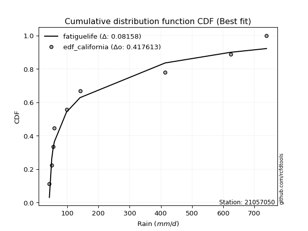</img>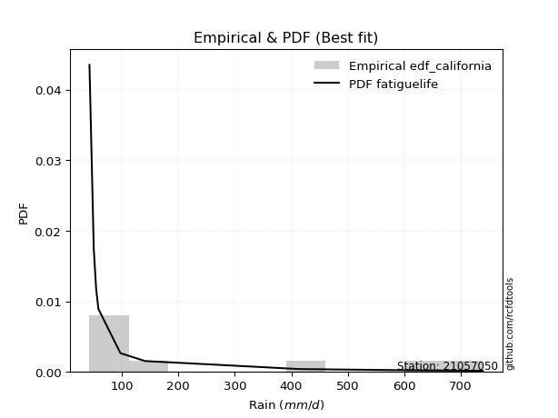</img>

</div>


### 2. Empirical - EDF Hazen (1930)

Hazen method for plotting positions is a formula used to estimate the empirical cumulative probability distribution of flood events or other hydrological data. This formula often results in biased estimations, particularly when extrapolating to extreme events (high return periods).

<div align="center">


$P=(m-0.5)/n$


</div>


**2.1. Empirical values**

<div align="center">

|                | 0                   | 1                   | 2                  | 3                  | 4         | 5                  | 6                  | 7                  | 8                  |
|:---------------|:--------------------|:--------------------|:-------------------|:-------------------|:----------|:-------------------|:-------------------|:-------------------|:-------------------|
| date           | 2021                | 2025                | 2020               | 2019               | 2024      | 2009               | 2007               | 2008               | 2006               |
| x              | 42.8                | 44.0                | 50.4               | 54.6               | 97.6      | 141.1              | 413.8              | 623.5              | 739.0              |
| m              | 1                   | 2                   | 3                  | 4                  | 5         | 6                  | 7                  | 8                  | 9                  |
| empirical_dist | edf_hazen           | edf_hazen           | edf_hazen          | edf_hazen          | edf_hazen | edf_hazen          | edf_hazen          | edf_hazen          | edf_hazen          |
| empirical      | 0.05555555555555555 | 0.16666666666666666 | 0.2777777777777778 | 0.3888888888888889 | 0.5       | 0.6111111111111112 | 0.7222222222222222 | 0.8333333333333334 | 0.9444444444444444 |
| empirical_tr   | 1.0588235294117647  | 1.2                 | 1.3846153846153846 | 1.6363636363636362 | 2.0       | 2.5714285714285716 | 3.5999999999999996 | 6.000000000000002  | 17.999999999999993 |

</div>


**2.2. Kolmogorov-Smirnov fit test (sorted by Δ)**


<div align="center">

|                | 0                   | 1                   | 2                   | 3                   | 4                   | 5                   | 6                   | 7                   | 8                   | 9                   | 10                  | 11                  | 12                  | 13                  | 14                  | 15                  | 16                  | 17                  | 18                  | 19                  | 20                  | 21                  | 22                  | 23                  | 24                  | 25                  | 26                  | 27                  | 28                  | 29                  | 30                  | 31                  | 32                  | 33                  | 34                    | 35                  | 36                  | 37                  | 38                  | 39                  | 40                  | 41                  | 42                  | 43                  | 44                  | 45                  | 46                  | 47                  | 48                  | 49                  | 50                  | 51                  | 52                  | 53                  | 54                  | 55                  | 56                  | 57                  | 58                  | 59                  | 60                  | 61                  | 62                  | 63                  | 64                  | 65                  | 66                  | 67                  | 68                  | 69                  | 70                  | 71                  | 72                  | 73                  | 74                  | 75                  | 76                  | 77                  | 78                  | 79                  | 80                  | 81                  | 82                  | 83                  | 84                  | 85                  | 86                  | 87                  | 88                  | 89                  |
|:---------------|:--------------------|:--------------------|:--------------------|:--------------------|:--------------------|:--------------------|:--------------------|:--------------------|:--------------------|:--------------------|:--------------------|:--------------------|:--------------------|:--------------------|:--------------------|:--------------------|:--------------------|:--------------------|:--------------------|:--------------------|:--------------------|:--------------------|:--------------------|:--------------------|:--------------------|:--------------------|:--------------------|:--------------------|:--------------------|:--------------------|:--------------------|:--------------------|:--------------------|:--------------------|:----------------------|:--------------------|:--------------------|:--------------------|:--------------------|:--------------------|:--------------------|:--------------------|:--------------------|:--------------------|:--------------------|:--------------------|:--------------------|:--------------------|:--------------------|:--------------------|:--------------------|:--------------------|:--------------------|:--------------------|:--------------------|:--------------------|:--------------------|:--------------------|:--------------------|:--------------------|:--------------------|:--------------------|:--------------------|:--------------------|:--------------------|:--------------------|:--------------------|:--------------------|:--------------------|:--------------------|:--------------------|:--------------------|:--------------------|:--------------------|:--------------------|:--------------------|:--------------------|:--------------------|:--------------------|:--------------------|:--------------------|:--------------------|:--------------------|:--------------------|:--------------------|:--------------------|:--------------------|:--------------------|:--------------------|:--------------------|
| station        | 21057050            | 21057050            | 21057050            | 21057050            | 21057050            | 21057050            | 21057050            | 21057050            | 21057050            | 21057050            | 21057050            | 21057050            | 21057050            | 21057050            | 21057050            | 21057050            | 21057050            | 21057050            | 21057050            | 21057050            | 21057050            | 21057050            | 21057050            | 21057050            | 21057050            | 21057050            | 21057050            | 21057050            | 21057050            | 21057050            | 21057050            | 21057050            | 21057050            | 21057050            | 21057050              | 21057050            | 21057050            | 21057050            | 21057050            | 21057050            | 21057050            | 21057050            | 21057050            | 21057050            | 21057050            | 21057050            | 21057050            | 21057050            | 21057050            | 21057050            | 21057050            | 21057050            | 21057050            | 21057050            | 21057050            | 21057050            | 21057050            | 21057050            | 21057050            | 21057050            | 21057050            | 21057050            | 21057050            | 21057050            | 21057050            | 21057050            | 21057050            | 21057050            | 21057050            | 21057050            | 21057050            | 21057050            | 21057050            | 21057050            | 21057050            | 21057050            | 21057050            | 21057050            | 21057050            | 21057050            | 21057050            | 21057050            | 21057050            | 21057050            | 21057050            | 21057050            | 21057050            | 21057050            | 21057050            | 21057050            |
| empirical_dist | edf_hazen           | edf_hazen           | edf_hazen           | edf_hazen           | edf_hazen           | edf_hazen           | edf_hazen           | edf_hazen           | edf_hazen           | edf_hazen           | edf_hazen           | edf_hazen           | edf_hazen           | edf_hazen           | edf_hazen           | edf_hazen           | edf_hazen           | edf_hazen           | edf_hazen           | edf_hazen           | edf_hazen           | edf_hazen           | edf_hazen           | edf_hazen           | edf_hazen           | edf_hazen           | edf_hazen           | edf_hazen           | edf_hazen           | edf_hazen           | edf_hazen           | edf_hazen           | edf_hazen           | edf_hazen           | edf_hazen             | edf_hazen           | edf_hazen           | edf_hazen           | edf_hazen           | edf_hazen           | edf_hazen           | edf_hazen           | edf_hazen           | edf_hazen           | edf_hazen           | edf_hazen           | edf_hazen           | edf_hazen           | edf_hazen           | edf_hazen           | edf_hazen           | edf_hazen           | edf_hazen           | edf_hazen           | edf_hazen           | edf_hazen           | edf_hazen           | edf_hazen           | edf_hazen           | edf_hazen           | edf_hazen           | edf_hazen           | edf_hazen           | edf_hazen           | edf_hazen           | edf_hazen           | edf_hazen           | edf_hazen           | edf_hazen           | edf_hazen           | edf_hazen           | edf_hazen           | edf_hazen           | edf_hazen           | edf_hazen           | edf_hazen           | edf_hazen           | edf_hazen           | edf_hazen           | edf_hazen           | edf_hazen           | edf_hazen           | edf_hazen           | edf_hazen           | edf_hazen           | edf_hazen           | edf_hazen           | edf_hazen           | edf_hazen           | edf_hazen           |
| p_dist         | weibull_min         | logchi2             | pareto              | loghalfnorm         | invgamma            | logalpha            | loginvweibull       | loginvgamma         | lograyleigh         | logf                | logbetaprime        | logmielke           | logmaxwell          | logncf              | loghalflogistic     | logpearson3         | loginvgauss         | nct                 | lognct              | logloggamma         | ncf                 | lognorm             | lognorm             | logcrystalball      | logt                | betaprime           | loggenlogistic      | logjohnsonsu        | halflogistic        | loggumbel_r         | fisk                | invgauss            | logkstwobign        | logexponnorm        | loglaplace_asymmetric | logexpon            | logmoyal            | loggenexpon         | halfnorm            | loglogistic         | moyal               | logtruncnorm        | loggompertz         | alpha               | loggumbel_l         | loghypsecant        | logrice             | pearson3            | gumbel_r            | genlogistic         | logweibull_min      | rayleigh            | logerlang           | loglaplace          | nakagami            | maxwell             | kstwobign           | erlang              | gamma               | wald                | norm                | logistic            | rice                | hypsecant           | logfisk             | f                   | t                   | gumbel_l            | laplace             | exponnorm           | genexpon            | expon               | laplace_asymmetric  | logwald             | gompertz            | truncnorm           | lognakagami         | logpareto           | loglognorm          | fatiguelife         | gibrat              | loggibrat           | logfatiguelife      | invweibull          | loggamma            | loggamma            | crystalball         | johnsonsu           | chi2                | mielke              |
| delta          | 0.13087749504071788 | 0.1443336662111404  | 0.1445715319296096  | 0.14632641140503488 | 0.15442683720935313 | 0.1559226995167523  | 0.1566701105507904  | 0.15946496046549308 | 0.15954190695437157 | 0.15960506152282294 | 0.16257201652070738 | 0.16406511927335876 | 0.1656467416497555  | 0.16983004539328034 | 0.17360522704600076 | 0.17412350955900052 | 0.17505024448857343 | 0.17764266327281225 | 0.17778963003988082 | 0.17877864254778672 | 0.18019308711772558 | 0.1802812636269659  | 0.1802812636269659  | 0.180281266497417   | 0.18028200557687662 | 0.1803578018382183  | 0.18071038723775537 | 0.18225563181620286 | 0.18258597112353225 | 0.18481222707789885 | 0.1862771100182623  | 0.18736797009558548 | 0.1910742613554475  | 0.195411870407928   | 0.1961419535882702    | 0.19636893303624864 | 0.1968631681950737  | 0.1986522441378355  | 0.20062890241596024 | 0.20216906226465492 | 0.20343892391843443 | 0.20438871962807478 | 0.20584846078700172 | 0.2059890375061617  | 0.2089679901088188  | 0.21531108955188225 | 0.21578159222506132 | 0.2186667722846764  | 0.2205417627408061  | 0.2207432935669545  | 0.2236515852100548  | 0.2237111310383486  | 0.22560971835810462 | 0.23014209648085918 | 0.2333292170045812  | 0.23569665893410874 | 0.2538913131575966  | 0.25497823021885146 | 0.2598111896738624  | 0.26146486765930166 | 0.2672445701668238  | 0.28570270742011994 | 0.295095419489409   | 0.2999201138817107  | 0.30539515668033834 | 0.31109544782509135 | 0.3218845308169138  | 0.32623117113590944 | 0.32790115663738595 | 0.3311091774701301  | 0.33225539529147274 | 0.3322554109292411  | 0.33225546707985026 | 0.3350274526993451  | 0.33561477527694417 | 0.3411497182366497  | 0.34664807547578225 | 0.35490399811420825 | 0.36153277918048154 | 0.3652977116184225  | 0.38665215005795855 | 0.3888888888888889  | 0.39132354476850495 | 0.3982279620333322  | 0.41970254266905727 | 0.41970254266905727 | 0.4924292943828871  | 0.6063395698618604  | 0.6174179440960379  | nan                 |
| deltao         | 0.41761268023100007 | 0.41761268023100007 | 0.41761268023100007 | 0.41761268023100007 | 0.41761268023100007 | 0.41761268023100007 | 0.41761268023100007 | 0.41761268023100007 | 0.41761268023100007 | 0.41761268023100007 | 0.41761268023100007 | 0.41761268023100007 | 0.41761268023100007 | 0.41761268023100007 | 0.41761268023100007 | 0.41761268023100007 | 0.41761268023100007 | 0.41761268023100007 | 0.41761268023100007 | 0.41761268023100007 | 0.41761268023100007 | 0.41761268023100007 | 0.41761268023100007 | 0.41761268023100007 | 0.41761268023100007 | 0.41761268023100007 | 0.41761268023100007 | 0.41761268023100007 | 0.41761268023100007 | 0.41761268023100007 | 0.41761268023100007 | 0.41761268023100007 | 0.41761268023100007 | 0.41761268023100007 | 0.41761268023100007   | 0.41761268023100007 | 0.41761268023100007 | 0.41761268023100007 | 0.41761268023100007 | 0.41761268023100007 | 0.41761268023100007 | 0.41761268023100007 | 0.41761268023100007 | 0.41761268023100007 | 0.41761268023100007 | 0.41761268023100007 | 0.41761268023100007 | 0.41761268023100007 | 0.41761268023100007 | 0.41761268023100007 | 0.41761268023100007 | 0.41761268023100007 | 0.41761268023100007 | 0.41761268023100007 | 0.41761268023100007 | 0.41761268023100007 | 0.41761268023100007 | 0.41761268023100007 | 0.41761268023100007 | 0.41761268023100007 | 0.41761268023100007 | 0.41761268023100007 | 0.41761268023100007 | 0.41761268023100007 | 0.41761268023100007 | 0.41761268023100007 | 0.41761268023100007 | 0.41761268023100007 | 0.41761268023100007 | 0.41761268023100007 | 0.41761268023100007 | 0.41761268023100007 | 0.41761268023100007 | 0.41761268023100007 | 0.41761268023100007 | 0.41761268023100007 | 0.41761268023100007 | 0.41761268023100007 | 0.41761268023100007 | 0.41761268023100007 | 0.41761268023100007 | 0.41761268023100007 | 0.41761268023100007 | 0.41761268023100007 | 0.41761268023100007 | 0.41761268023100007 | 0.41761268023100007 | 0.41761268023100007 | 0.41761268023100007 | 0.41761268023100007 |
| eval           | Δo > Δ              | Δo > Δ              | Δo > Δ              | Δo > Δ              | Δo > Δ              | Δo > Δ              | Δo > Δ              | Δo > Δ              | Δo > Δ              | Δo > Δ              | Δo > Δ              | Δo > Δ              | Δo > Δ              | Δo > Δ              | Δo > Δ              | Δo > Δ              | Δo > Δ              | Δo > Δ              | Δo > Δ              | Δo > Δ              | Δo > Δ              | Δo > Δ              | Δo > Δ              | Δo > Δ              | Δo > Δ              | Δo > Δ              | Δo > Δ              | Δo > Δ              | Δo > Δ              | Δo > Δ              | Δo > Δ              | Δo > Δ              | Δo > Δ              | Δo > Δ              | Δo > Δ                | Δo > Δ              | Δo > Δ              | Δo > Δ              | Δo > Δ              | Δo > Δ              | Δo > Δ              | Δo > Δ              | Δo > Δ              | Δo > Δ              | Δo > Δ              | Δo > Δ              | Δo > Δ              | Δo > Δ              | Δo > Δ              | Δo > Δ              | Δo > Δ              | Δo > Δ              | Δo > Δ              | Δo > Δ              | Δo > Δ              | Δo > Δ              | Δo > Δ              | Δo > Δ              | Δo > Δ              | Δo > Δ              | Δo > Δ              | Δo > Δ              | Δo > Δ              | Δo > Δ              | Δo > Δ              | Δo > Δ              | Δo > Δ              | Δo > Δ              | Δo > Δ              | Δo > Δ              | Δo > Δ              | Δo > Δ              | Δo > Δ              | Δo > Δ              | Δo > Δ              | Δo > Δ              | Δo > Δ              | Δo > Δ              | Δo > Δ              | Δo > Δ              | Δo > Δ              | Δo > Δ              | Δo > Δ              | Δo > Δ              | Δo <= Δ             | Δo <= Δ             | Δo <= Δ             | Δo <= Δ             | Δo <= Δ             | Δo <= Δ             |
| fit            | 1                   | 1                   | 1                   | 1                   | 1                   | 1                   | 1                   | 1                   | 1                   | 1                   | 1                   | 1                   | 1                   | 1                   | 1                   | 1                   | 1                   | 1                   | 1                   | 1                   | 1                   | 1                   | 1                   | 1                   | 1                   | 1                   | 1                   | 1                   | 1                   | 1                   | 1                   | 1                   | 1                   | 1                   | 1                     | 1                   | 1                   | 1                   | 1                   | 1                   | 1                   | 1                   | 1                   | 1                   | 1                   | 1                   | 1                   | 1                   | 1                   | 1                   | 1                   | 1                   | 1                   | 1                   | 1                   | 1                   | 1                   | 1                   | 1                   | 1                   | 1                   | 1                   | 1                   | 1                   | 1                   | 1                   | 1                   | 1                   | 1                   | 1                   | 1                   | 1                   | 1                   | 1                   | 1                   | 1                   | 1                   | 1                   | 1                   | 1                   | 1                   | 1                   | 1                   | 1                   | 0                   | 0                   | 0                   | 0                   | 0                   | 0                   |
| n              | 9                   | 9                   | 9                   | 9                   | 9                   | 9                   | 9                   | 9                   | 9                   | 9                   | 9                   | 9                   | 9                   | 9                   | 9                   | 9                   | 9                   | 9                   | 9                   | 9                   | 9                   | 9                   | 9                   | 9                   | 9                   | 9                   | 9                   | 9                   | 9                   | 9                   | 9                   | 9                   | 9                   | 9                   | 9                     | 9                   | 9                   | 9                   | 9                   | 9                   | 9                   | 9                   | 9                   | 9                   | 9                   | 9                   | 9                   | 9                   | 9                   | 9                   | 9                   | 9                   | 9                   | 9                   | 9                   | 9                   | 9                   | 9                   | 9                   | 9                   | 9                   | 9                   | 9                   | 9                   | 9                   | 9                   | 9                   | 9                   | 9                   | 9                   | 9                   | 9                   | 9                   | 9                   | 9                   | 9                   | 9                   | 9                   | 9                   | 9                   | 9                   | 9                   | 9                   | 9                   | 9                   | 9                   | 9                   | 9                   | 9                   | 9                   |
| best_fit       | 1                   | 0                   | 0                   | 0                   | 0                   | 0                   | 0                   | 0                   | 0                   | 0                   | 0                   | 0                   | 0                   | 0                   | 0                   | 0                   | 0                   | 0                   | 0                   | 0                   | 0                   | 0                   | 0                   | 0                   | 0                   | 0                   | 0                   | 0                   | 0                   | 0                   | 0                   | 0                   | 0                   | 0                   | 0                     | 0                   | 0                   | 0                   | 0                   | 0                   | 0                   | 0                   | 0                   | 0                   | 0                   | 0                   | 0                   | 0                   | 0                   | 0                   | 0                   | 0                   | 0                   | 0                   | 0                   | 0                   | 0                   | 0                   | 0                   | 0                   | 0                   | 0                   | 0                   | 0                   | 0                   | 0                   | 0                   | 0                   | 0                   | 0                   | 0                   | 0                   | 0                   | 0                   | 0                   | 0                   | 0                   | 0                   | 0                   | 0                   | 0                   | 0                   | 0                   | 0                   | 0                   | 0                   | 0                   | 0                   | 0                   | 0                   |
| best_fit_sort  | 1                   | 2                   | 3                   | 4                   | 5                   | 6                   | 7                   | 8                   | 9                   | 10                  | 11                  | 12                  | 13                  | 14                  | 15                  | 16                  | 17                  | 18                  | 19                  | 20                  | 21                  | 22                  | 23                  | 24                  | 25                  | 26                  | 27                  | 28                  | 29                  | 30                  | 31                  | 32                  | 33                  | 34                  | 35                    | 36                  | 37                  | 38                  | 39                  | 40                  | 41                  | 42                  | 43                  | 44                  | 45                  | 46                  | 47                  | 48                  | 49                  | 50                  | 51                  | 52                  | 53                  | 54                  | 55                  | 56                  | 57                  | 58                  | 59                  | 60                  | 61                  | 62                  | 63                  | 64                  | 65                  | 66                  | 67                  | 68                  | 69                  | 70                  | 71                  | 72                  | 73                  | 74                  | 75                  | 76                  | 77                  | 78                  | 79                  | 80                  | 81                  | 82                  | 83                  | 84                  | 85                  | 86                  | 87                  | 88                  | 89                  | 90                  |

</div>


<div align="center">

</img>

</div>


**2.3. Best fit**

<div align="center">

|   id |   station | empirical_dist   | p_dist      |    delta |   deltao | eval   |   fit |   n |   best_fit |   best_fit_sort |
|-----:|----------:|:-----------------|:------------|---------:|---------:|:-------|------:|----:|-----------:|----------------:|
|    0 |  21057050 | edf_hazen        | weibull_min | 0.130877 | 0.417613 | Δo > Δ |     1 |   9 |          1 |               1 |

</div>


<div align="center">

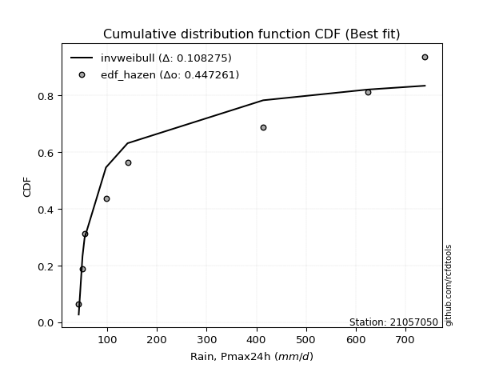</img>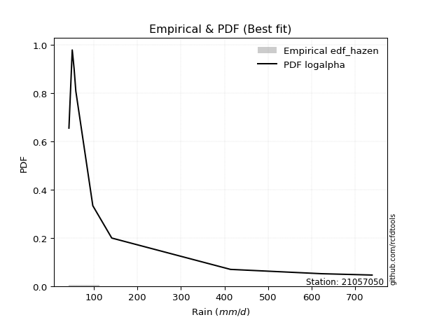</img>

</div>


### 3. Empirical - EDF Weibull (1939)

Weibull plotting position formula is an empirical method used to estimate the non-exceedance probability or plotting position for a set of observed data, is often recommended or widely used in practice, particularly in flood frequency analysis.

<div align="center">


$P=m/(n+1)$


</div>


**3.1. Empirical values**

<div align="center">

|                | 0                  | 1           | 2                  | 3                  | 4           | 5           | 6                 | 7                 | 8                  |
|:---------------|:-------------------|:------------|:-------------------|:-------------------|:------------|:------------|:------------------|:------------------|:-------------------|
| date           | 2021               | 2025        | 2020               | 2019               | 2024        | 2009        | 2007              | 2008              | 2006               |
| x              | 42.8               | 44.0        | 50.4               | 54.6               | 97.6        | 141.1       | 413.8             | 623.5             | 739.0              |
| m              | 1                  | 2           | 3                  | 4                  | 5           | 6           | 7                 | 8                 | 9                  |
| empirical_dist | edf_weibull        | edf_weibull | edf_weibull        | edf_weibull        | edf_weibull | edf_weibull | edf_weibull       | edf_weibull       | edf_weibull        |
| empirical      | 0.1                | 0.2         | 0.3                | 0.4                | 0.5         | 0.6         | 0.7               | 0.8               | 0.9                |
| empirical_tr   | 1.1111111111111112 | 1.25        | 1.4285714285714286 | 1.6666666666666667 | 2.0         | 2.5         | 3.333333333333333 | 5.000000000000001 | 10.000000000000002 |

</div>


**3.2. Kolmogorov-Smirnov fit test (sorted by Δ)**


<div align="center">

|                | 0                   | 1                   | 2                   | 3                   | 4                   | 5                   | 6                   | 7                   | 8                   | 9                   | 10                  | 11                  | 12                  | 13                  | 14                  | 15                  | 16                  | 17                  | 18                  | 19                  | 20                  | 21                  | 22                  | 23                  | 24                  | 25                  | 26                  | 27                  | 28                  | 29                  | 30                  | 31                  | 32                  | 33                  | 34                  | 35                  | 36                  | 37                    | 38                  | 39                  | 40                  | 41                  | 42                  | 43                  | 44                  | 45                  | 46                  | 47                  | 48                  | 49                  | 50                  | 51                  | 52                  | 53                  | 54                  | 55                  | 56                  | 57                  | 58                  | 59                  | 60                  | 61                  | 62                  | 63                  | 64                  | 65                  | 66                  | 67                  | 68                  | 69                  | 70                  | 71                  | 72                  | 73                  | 74                  | 75                  | 76                  | 77                  | 78                  | 79                  | 80                  | 81                  | 82                  | 83                  | 84                  | 85                  | 86                  | 87                  | 88                  | 89                  |
|:---------------|:--------------------|:--------------------|:--------------------|:--------------------|:--------------------|:--------------------|:--------------------|:--------------------|:--------------------|:--------------------|:--------------------|:--------------------|:--------------------|:--------------------|:--------------------|:--------------------|:--------------------|:--------------------|:--------------------|:--------------------|:--------------------|:--------------------|:--------------------|:--------------------|:--------------------|:--------------------|:--------------------|:--------------------|:--------------------|:--------------------|:--------------------|:--------------------|:--------------------|:--------------------|:--------------------|:--------------------|:--------------------|:----------------------|:--------------------|:--------------------|:--------------------|:--------------------|:--------------------|:--------------------|:--------------------|:--------------------|:--------------------|:--------------------|:--------------------|:--------------------|:--------------------|:--------------------|:--------------------|:--------------------|:--------------------|:--------------------|:--------------------|:--------------------|:--------------------|:--------------------|:--------------------|:--------------------|:--------------------|:--------------------|:--------------------|:--------------------|:--------------------|:--------------------|:--------------------|:--------------------|:--------------------|:--------------------|:--------------------|:--------------------|:--------------------|:--------------------|:--------------------|:--------------------|:--------------------|:--------------------|:--------------------|:--------------------|:--------------------|:--------------------|:--------------------|:--------------------|:--------------------|:--------------------|:--------------------|:--------------------|
| station        | 21057050            | 21057050            | 21057050            | 21057050            | 21057050            | 21057050            | 21057050            | 21057050            | 21057050            | 21057050            | 21057050            | 21057050            | 21057050            | 21057050            | 21057050            | 21057050            | 21057050            | 21057050            | 21057050            | 21057050            | 21057050            | 21057050            | 21057050            | 21057050            | 21057050            | 21057050            | 21057050            | 21057050            | 21057050            | 21057050            | 21057050            | 21057050            | 21057050            | 21057050            | 21057050            | 21057050            | 21057050            | 21057050              | 21057050            | 21057050            | 21057050            | 21057050            | 21057050            | 21057050            | 21057050            | 21057050            | 21057050            | 21057050            | 21057050            | 21057050            | 21057050            | 21057050            | 21057050            | 21057050            | 21057050            | 21057050            | 21057050            | 21057050            | 21057050            | 21057050            | 21057050            | 21057050            | 21057050            | 21057050            | 21057050            | 21057050            | 21057050            | 21057050            | 21057050            | 21057050            | 21057050            | 21057050            | 21057050            | 21057050            | 21057050            | 21057050            | 21057050            | 21057050            | 21057050            | 21057050            | 21057050            | 21057050            | 21057050            | 21057050            | 21057050            | 21057050            | 21057050            | 21057050            | 21057050            | 21057050            |
| empirical_dist | edf_weibull         | edf_weibull         | edf_weibull         | edf_weibull         | edf_weibull         | edf_weibull         | edf_weibull         | edf_weibull         | edf_weibull         | edf_weibull         | edf_weibull         | edf_weibull         | edf_weibull         | edf_weibull         | edf_weibull         | edf_weibull         | edf_weibull         | edf_weibull         | edf_weibull         | edf_weibull         | edf_weibull         | edf_weibull         | edf_weibull         | edf_weibull         | edf_weibull         | edf_weibull         | edf_weibull         | edf_weibull         | edf_weibull         | edf_weibull         | edf_weibull         | edf_weibull         | edf_weibull         | edf_weibull         | edf_weibull         | edf_weibull         | edf_weibull         | edf_weibull           | edf_weibull         | edf_weibull         | edf_weibull         | edf_weibull         | edf_weibull         | edf_weibull         | edf_weibull         | edf_weibull         | edf_weibull         | edf_weibull         | edf_weibull         | edf_weibull         | edf_weibull         | edf_weibull         | edf_weibull         | edf_weibull         | edf_weibull         | edf_weibull         | edf_weibull         | edf_weibull         | edf_weibull         | edf_weibull         | edf_weibull         | edf_weibull         | edf_weibull         | edf_weibull         | edf_weibull         | edf_weibull         | edf_weibull         | edf_weibull         | edf_weibull         | edf_weibull         | edf_weibull         | edf_weibull         | edf_weibull         | edf_weibull         | edf_weibull         | edf_weibull         | edf_weibull         | edf_weibull         | edf_weibull         | edf_weibull         | edf_weibull         | edf_weibull         | edf_weibull         | edf_weibull         | edf_weibull         | edf_weibull         | edf_weibull         | edf_weibull         | edf_weibull         | edf_weibull         |
| p_dist         | weibull_min         | pareto              | invgamma            | logalpha            | loginvweibull       | loghalfnorm         | loginvgamma         | logf                | logchi2             | lograyleigh         | halflogistic        | logbetaprime        | loginvgauss         | logmaxwell          | halfnorm            | logncf              | loghalflogistic     | logweibull_min      | logpearson3         | logmielke           | fisk                | nct                 | lognct              | logloggamma         | ncf                 | lognorm             | lognorm             | logcrystalball      | logt                | betaprime           | loggenlogistic      | moyal               | logjohnsonsu        | loggumbel_r         | logkstwobign        | invgauss            | logexponnorm        | loglaplace_asymmetric | logexpon            | pearson3            | logmoyal            | gumbel_r            | genlogistic         | loggenexpon         | rayleigh            | loglogistic         | logtruncnorm        | loggompertz         | loggumbel_l         | maxwell             | loghypsecant        | logrice             | alpha               | loglaplace          | kstwobign           | nakagami            | logerlang           | norm                | wald                | logistic            | erlang              | gamma               | rice                | hypsecant           | f                   | logfisk             | gumbel_l            | laplace             | logpareto           | t                   | lognakagami         | loglognorm          | fatiguelife         | exponnorm           | genexpon            | expon               | laplace_asymmetric  | logwald             | gompertz            | truncnorm           | invweibull          | logfatiguelife      | gibrat              | loggibrat           | loggamma            | loggamma            | crystalball         | johnsonsu           | chi2                | mielke              |
| delta          | 0.13898765873754587 | 0.1445715319296096  | 0.15442683720935313 | 0.1559226995167523  | 0.1566701105507904  | 0.157437522516146   | 0.15946496046549308 | 0.15960506152282294 | 0.16655588843336266 | 0.1706530180654827  | 0.17147486001242107 | 0.1736831276318185  | 0.17505024448857343 | 0.17675785276086664 | 0.17848774294433267 | 0.18094115650439146 | 0.1847163381571119  | 0.1851514514303298  | 0.18523462067011165 | 0.18628734149558102 | 0.18709563438849955 | 0.18875377438392338 | 0.18890074115099195 | 0.18988975365889785 | 0.1913041982288367  | 0.19139237473807702 | 0.19139237473807702 | 0.19139237760852812 | 0.19139311668798775 | 0.19146891294932944 | 0.1918214983488665  | 0.19232781280732325 | 0.19336674292731398 | 0.19592333818900998 | 0.20218537246655863 | 0.20357500325738487 | 0.20652298151903914 | 0.20725306469938132   | 0.20748004414735977 | 0.20755566117356522 | 0.20797427930618484 | 0.20943065162969493 | 0.2096321824558433  | 0.20976335524894663 | 0.21260001992723743 | 0.21328017337576605 | 0.2154998307391859  | 0.21695957189811285 | 0.22007910121992993 | 0.22458554782299756 | 0.22642220066299337 | 0.22689270333617245 | 0.22821125972838396 | 0.2412532075919703  | 0.24278020204648543 | 0.24444032811569233 | 0.24783194058032687 | 0.2561334590557126  | 0.27257597877041273 | 0.27459159630900876 | 0.2772004524410737  | 0.28203341189608466 | 0.2839843083782978  | 0.2888090027705995  | 0.28887322560286915 | 0.30539515668033834 | 0.31512006002479825 | 0.31679004552627477 | 0.32157066478087487 | 0.3218845308169138  | 0.32442585325356005 | 0.32819944584714816 | 0.3319643782850891  | 0.3422202885812412  | 0.34336650640258387 | 0.34336652204035223 | 0.3433665781909614  | 0.3461385638104562  | 0.34672588638805535 | 0.3522608293477608  | 0.3537835175888878  | 0.35799021143517157 | 0.3977632611690697  | 0.4                 | 0.4109071948756984  | 0.4109071948756984  | 0.4479848499384427  | 0.5730062365285271  | 0.5951957218738158  | nan                 |
| deltao         | 0.41761268023100007 | 0.41761268023100007 | 0.41761268023100007 | 0.41761268023100007 | 0.41761268023100007 | 0.41761268023100007 | 0.41761268023100007 | 0.41761268023100007 | 0.41761268023100007 | 0.41761268023100007 | 0.41761268023100007 | 0.41761268023100007 | 0.41761268023100007 | 0.41761268023100007 | 0.41761268023100007 | 0.41761268023100007 | 0.41761268023100007 | 0.41761268023100007 | 0.41761268023100007 | 0.41761268023100007 | 0.41761268023100007 | 0.41761268023100007 | 0.41761268023100007 | 0.41761268023100007 | 0.41761268023100007 | 0.41761268023100007 | 0.41761268023100007 | 0.41761268023100007 | 0.41761268023100007 | 0.41761268023100007 | 0.41761268023100007 | 0.41761268023100007 | 0.41761268023100007 | 0.41761268023100007 | 0.41761268023100007 | 0.41761268023100007 | 0.41761268023100007 | 0.41761268023100007   | 0.41761268023100007 | 0.41761268023100007 | 0.41761268023100007 | 0.41761268023100007 | 0.41761268023100007 | 0.41761268023100007 | 0.41761268023100007 | 0.41761268023100007 | 0.41761268023100007 | 0.41761268023100007 | 0.41761268023100007 | 0.41761268023100007 | 0.41761268023100007 | 0.41761268023100007 | 0.41761268023100007 | 0.41761268023100007 | 0.41761268023100007 | 0.41761268023100007 | 0.41761268023100007 | 0.41761268023100007 | 0.41761268023100007 | 0.41761268023100007 | 0.41761268023100007 | 0.41761268023100007 | 0.41761268023100007 | 0.41761268023100007 | 0.41761268023100007 | 0.41761268023100007 | 0.41761268023100007 | 0.41761268023100007 | 0.41761268023100007 | 0.41761268023100007 | 0.41761268023100007 | 0.41761268023100007 | 0.41761268023100007 | 0.41761268023100007 | 0.41761268023100007 | 0.41761268023100007 | 0.41761268023100007 | 0.41761268023100007 | 0.41761268023100007 | 0.41761268023100007 | 0.41761268023100007 | 0.41761268023100007 | 0.41761268023100007 | 0.41761268023100007 | 0.41761268023100007 | 0.41761268023100007 | 0.41761268023100007 | 0.41761268023100007 | 0.41761268023100007 | 0.41761268023100007 |
| eval           | Δo > Δ              | Δo > Δ              | Δo > Δ              | Δo > Δ              | Δo > Δ              | Δo > Δ              | Δo > Δ              | Δo > Δ              | Δo > Δ              | Δo > Δ              | Δo > Δ              | Δo > Δ              | Δo > Δ              | Δo > Δ              | Δo > Δ              | Δo > Δ              | Δo > Δ              | Δo > Δ              | Δo > Δ              | Δo > Δ              | Δo > Δ              | Δo > Δ              | Δo > Δ              | Δo > Δ              | Δo > Δ              | Δo > Δ              | Δo > Δ              | Δo > Δ              | Δo > Δ              | Δo > Δ              | Δo > Δ              | Δo > Δ              | Δo > Δ              | Δo > Δ              | Δo > Δ              | Δo > Δ              | Δo > Δ              | Δo > Δ                | Δo > Δ              | Δo > Δ              | Δo > Δ              | Δo > Δ              | Δo > Δ              | Δo > Δ              | Δo > Δ              | Δo > Δ              | Δo > Δ              | Δo > Δ              | Δo > Δ              | Δo > Δ              | Δo > Δ              | Δo > Δ              | Δo > Δ              | Δo > Δ              | Δo > Δ              | Δo > Δ              | Δo > Δ              | Δo > Δ              | Δo > Δ              | Δo > Δ              | Δo > Δ              | Δo > Δ              | Δo > Δ              | Δo > Δ              | Δo > Δ              | Δo > Δ              | Δo > Δ              | Δo > Δ              | Δo > Δ              | Δo > Δ              | Δo > Δ              | Δo > Δ              | Δo > Δ              | Δo > Δ              | Δo > Δ              | Δo > Δ              | Δo > Δ              | Δo > Δ              | Δo > Δ              | Δo > Δ              | Δo > Δ              | Δo > Δ              | Δo > Δ              | Δo > Δ              | Δo > Δ              | Δo > Δ              | Δo <= Δ             | Δo <= Δ             | Δo <= Δ             | Δo <= Δ             |
| fit            | 1                   | 1                   | 1                   | 1                   | 1                   | 1                   | 1                   | 1                   | 1                   | 1                   | 1                   | 1                   | 1                   | 1                   | 1                   | 1                   | 1                   | 1                   | 1                   | 1                   | 1                   | 1                   | 1                   | 1                   | 1                   | 1                   | 1                   | 1                   | 1                   | 1                   | 1                   | 1                   | 1                   | 1                   | 1                   | 1                   | 1                   | 1                     | 1                   | 1                   | 1                   | 1                   | 1                   | 1                   | 1                   | 1                   | 1                   | 1                   | 1                   | 1                   | 1                   | 1                   | 1                   | 1                   | 1                   | 1                   | 1                   | 1                   | 1                   | 1                   | 1                   | 1                   | 1                   | 1                   | 1                   | 1                   | 1                   | 1                   | 1                   | 1                   | 1                   | 1                   | 1                   | 1                   | 1                   | 1                   | 1                   | 1                   | 1                   | 1                   | 1                   | 1                   | 1                   | 1                   | 1                   | 1                   | 0                   | 0                   | 0                   | 0                   |
| n              | 9                   | 9                   | 9                   | 9                   | 9                   | 9                   | 9                   | 9                   | 9                   | 9                   | 9                   | 9                   | 9                   | 9                   | 9                   | 9                   | 9                   | 9                   | 9                   | 9                   | 9                   | 9                   | 9                   | 9                   | 9                   | 9                   | 9                   | 9                   | 9                   | 9                   | 9                   | 9                   | 9                   | 9                   | 9                   | 9                   | 9                   | 9                     | 9                   | 9                   | 9                   | 9                   | 9                   | 9                   | 9                   | 9                   | 9                   | 9                   | 9                   | 9                   | 9                   | 9                   | 9                   | 9                   | 9                   | 9                   | 9                   | 9                   | 9                   | 9                   | 9                   | 9                   | 9                   | 9                   | 9                   | 9                   | 9                   | 9                   | 9                   | 9                   | 9                   | 9                   | 9                   | 9                   | 9                   | 9                   | 9                   | 9                   | 9                   | 9                   | 9                   | 9                   | 9                   | 9                   | 9                   | 9                   | 9                   | 9                   | 9                   | 9                   |
| best_fit       | 1                   | 0                   | 0                   | 0                   | 0                   | 0                   | 0                   | 0                   | 0                   | 0                   | 0                   | 0                   | 0                   | 0                   | 0                   | 0                   | 0                   | 0                   | 0                   | 0                   | 0                   | 0                   | 0                   | 0                   | 0                   | 0                   | 0                   | 0                   | 0                   | 0                   | 0                   | 0                   | 0                   | 0                   | 0                   | 0                   | 0                   | 0                     | 0                   | 0                   | 0                   | 0                   | 0                   | 0                   | 0                   | 0                   | 0                   | 0                   | 0                   | 0                   | 0                   | 0                   | 0                   | 0                   | 0                   | 0                   | 0                   | 0                   | 0                   | 0                   | 0                   | 0                   | 0                   | 0                   | 0                   | 0                   | 0                   | 0                   | 0                   | 0                   | 0                   | 0                   | 0                   | 0                   | 0                   | 0                   | 0                   | 0                   | 0                   | 0                   | 0                   | 0                   | 0                   | 0                   | 0                   | 0                   | 0                   | 0                   | 0                   | 0                   |
| best_fit_sort  | 1                   | 2                   | 3                   | 4                   | 5                   | 6                   | 7                   | 8                   | 9                   | 10                  | 11                  | 12                  | 13                  | 14                  | 15                  | 16                  | 17                  | 18                  | 19                  | 20                  | 21                  | 22                  | 23                  | 24                  | 25                  | 26                  | 27                  | 28                  | 29                  | 30                  | 31                  | 32                  | 33                  | 34                  | 35                  | 36                  | 37                  | 38                    | 39                  | 40                  | 41                  | 42                  | 43                  | 44                  | 45                  | 46                  | 47                  | 48                  | 49                  | 50                  | 51                  | 52                  | 53                  | 54                  | 55                  | 56                  | 57                  | 58                  | 59                  | 60                  | 61                  | 62                  | 63                  | 64                  | 65                  | 66                  | 67                  | 68                  | 69                  | 70                  | 71                  | 72                  | 73                  | 74                  | 75                  | 76                  | 77                  | 78                  | 79                  | 80                  | 81                  | 82                  | 83                  | 84                  | 85                  | 86                  | 87                  | 88                  | 89                  | 90                  |

</div>


<div align="center">

</img>

</div>


**3.3. Best fit**

<div align="center">

|   id |   station | empirical_dist   | p_dist      |    delta |   deltao | eval   |   fit |   n |   best_fit |   best_fit_sort |
|-----:|----------:|:-----------------|:------------|---------:|---------:|:-------|------:|----:|-----------:|----------------:|
|    0 |  21057050 | edf_weibull      | weibull_min | 0.138988 | 0.417613 | Δo > Δ |     1 |   9 |          1 |               1 |

</div>


<div align="center">

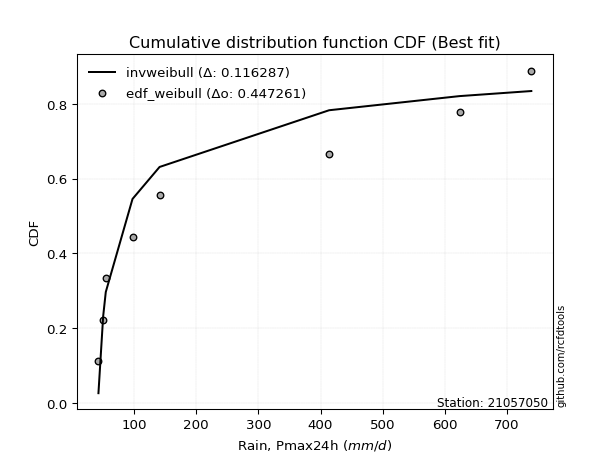</img>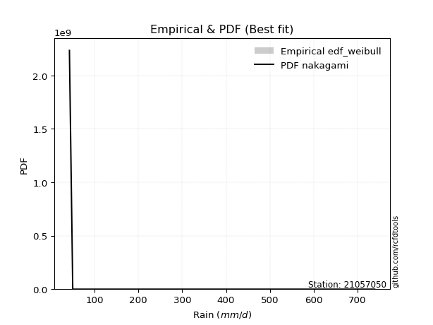</img>

</div>


### 4. Empirical - EDF Beard (1943)

The Beard formula (or Beard´s plotting position formula) in hydrology is used to estimate the empirical non-exceedance probability _(P)_ of a flood event (or other extreme hydrological data point) within a given dataset.

<div align="center">


$P=(m-0.31)/(n+0.38)$


</div>


**4.1. Empirical values**

<div align="center">

|                | 0                   | 1                   | 2                  | 3                   | 4         | 5                  | 6                  | 7                  | 8                  |
|:---------------|:--------------------|:--------------------|:-------------------|:--------------------|:----------|:-------------------|:-------------------|:-------------------|:-------------------|
| date           | 2021                | 2025                | 2020               | 2019                | 2024      | 2009               | 2007               | 2008               | 2006               |
| x              | 42.8                | 44.0                | 50.4               | 54.6                | 97.6      | 141.1              | 413.8              | 623.5              | 739.0              |
| m              | 1                   | 2                   | 3                  | 4                   | 5         | 6                  | 7                  | 8                  | 9                  |
| empirical_dist | edf_beard           | edf_beard           | edf_beard          | edf_beard           | edf_beard | edf_beard          | edf_beard          | edf_beard          | edf_beard          |
| empirical      | 0.07356076759061833 | 0.18017057569296374 | 0.2867803837953091 | 0.39339019189765456 | 0.5       | 0.6066098081023454 | 0.7132196162046908 | 0.8198294243070362 | 0.9264392324093815 |
| empirical_tr   | 1.0794016110471807  | 1.2197659297789336  | 1.4020926756352765 | 1.6485061511423549  | 2.0       | 2.542005420054201  | 3.486988847583642  | 5.550295857988164  | 13.5942028985507   |

</div>


**4.2. Kolmogorov-Smirnov fit test (sorted by Δ)**


<div align="center">

|                | 0                   | 1                   | 2                   | 3                   | 4                   | 5                   | 6                   | 7                   | 8                   | 9                   | 10                  | 11                  | 12                  | 13                  | 14                  | 15                  | 16                  | 17                  | 18                  | 19                  | 20                  | 21                  | 22                  | 23                  | 24                  | 25                  | 26                  | 27                  | 28                  | 29                  | 30                  | 31                  | 32                  | 33                  | 34                  | 35                  | 36                    | 37                  | 38                  | 39                  | 40                  | 41                  | 42                  | 43                  | 44                  | 45                  | 46                  | 47                  | 48                  | 49                  | 50                  | 51                  | 52                  | 53                  | 54                  | 55                  | 56                  | 57                  | 58                  | 59                  | 60                  | 61                  | 62                  | 63                  | 64                  | 65                  | 66                  | 67                  | 68                  | 69                  | 70                  | 71                  | 72                  | 73                  | 74                  | 75                  | 76                  | 77                  | 78                  | 79                  | 80                  | 81                  | 82                  | 83                  | 84                  | 85                  | 86                  | 87                  | 88                  | 89                  |
|:---------------|:--------------------|:--------------------|:--------------------|:--------------------|:--------------------|:--------------------|:--------------------|:--------------------|:--------------------|:--------------------|:--------------------|:--------------------|:--------------------|:--------------------|:--------------------|:--------------------|:--------------------|:--------------------|:--------------------|:--------------------|:--------------------|:--------------------|:--------------------|:--------------------|:--------------------|:--------------------|:--------------------|:--------------------|:--------------------|:--------------------|:--------------------|:--------------------|:--------------------|:--------------------|:--------------------|:--------------------|:----------------------|:--------------------|:--------------------|:--------------------|:--------------------|:--------------------|:--------------------|:--------------------|:--------------------|:--------------------|:--------------------|:--------------------|:--------------------|:--------------------|:--------------------|:--------------------|:--------------------|:--------------------|:--------------------|:--------------------|:--------------------|:--------------------|:--------------------|:--------------------|:--------------------|:--------------------|:--------------------|:--------------------|:--------------------|:--------------------|:--------------------|:--------------------|:--------------------|:--------------------|:--------------------|:--------------------|:--------------------|:--------------------|:--------------------|:--------------------|:--------------------|:--------------------|:--------------------|:--------------------|:--------------------|:--------------------|:--------------------|:--------------------|:--------------------|:--------------------|:--------------------|:--------------------|:--------------------|:--------------------|
| station        | 21057050            | 21057050            | 21057050            | 21057050            | 21057050            | 21057050            | 21057050            | 21057050            | 21057050            | 21057050            | 21057050            | 21057050            | 21057050            | 21057050            | 21057050            | 21057050            | 21057050            | 21057050            | 21057050            | 21057050            | 21057050            | 21057050            | 21057050            | 21057050            | 21057050            | 21057050            | 21057050            | 21057050            | 21057050            | 21057050            | 21057050            | 21057050            | 21057050            | 21057050            | 21057050            | 21057050            | 21057050              | 21057050            | 21057050            | 21057050            | 21057050            | 21057050            | 21057050            | 21057050            | 21057050            | 21057050            | 21057050            | 21057050            | 21057050            | 21057050            | 21057050            | 21057050            | 21057050            | 21057050            | 21057050            | 21057050            | 21057050            | 21057050            | 21057050            | 21057050            | 21057050            | 21057050            | 21057050            | 21057050            | 21057050            | 21057050            | 21057050            | 21057050            | 21057050            | 21057050            | 21057050            | 21057050            | 21057050            | 21057050            | 21057050            | 21057050            | 21057050            | 21057050            | 21057050            | 21057050            | 21057050            | 21057050            | 21057050            | 21057050            | 21057050            | 21057050            | 21057050            | 21057050            | 21057050            | 21057050            |
| empirical_dist | edf_beard           | edf_beard           | edf_beard           | edf_beard           | edf_beard           | edf_beard           | edf_beard           | edf_beard           | edf_beard           | edf_beard           | edf_beard           | edf_beard           | edf_beard           | edf_beard           | edf_beard           | edf_beard           | edf_beard           | edf_beard           | edf_beard           | edf_beard           | edf_beard           | edf_beard           | edf_beard           | edf_beard           | edf_beard           | edf_beard           | edf_beard           | edf_beard           | edf_beard           | edf_beard           | edf_beard           | edf_beard           | edf_beard           | edf_beard           | edf_beard           | edf_beard           | edf_beard             | edf_beard           | edf_beard           | edf_beard           | edf_beard           | edf_beard           | edf_beard           | edf_beard           | edf_beard           | edf_beard           | edf_beard           | edf_beard           | edf_beard           | edf_beard           | edf_beard           | edf_beard           | edf_beard           | edf_beard           | edf_beard           | edf_beard           | edf_beard           | edf_beard           | edf_beard           | edf_beard           | edf_beard           | edf_beard           | edf_beard           | edf_beard           | edf_beard           | edf_beard           | edf_beard           | edf_beard           | edf_beard           | edf_beard           | edf_beard           | edf_beard           | edf_beard           | edf_beard           | edf_beard           | edf_beard           | edf_beard           | edf_beard           | edf_beard           | edf_beard           | edf_beard           | edf_beard           | edf_beard           | edf_beard           | edf_beard           | edf_beard           | edf_beard           | edf_beard           | edf_beard           | edf_beard           |
| p_dist         | weibull_min         | pareto              | loghalfnorm         | logchi2             | invgamma            | logalpha            | loginvweibull       | loginvgamma         | logf                | lograyleigh         | logbetaprime        | logmaxwell          | logmielke           | logncf              | loginvgauss         | halflogistic        | loghalflogistic     | logpearson3         | fisk                | nct                 | lognct              | logloggamma         | ncf                 | lognorm             | lognorm             | logcrystalball      | logt                | betaprime           | halfnorm            | loggenlogistic      | logjohnsonsu        | loggumbel_r         | invgauss            | logkstwobign        | moyal               | logexponnorm        | loglaplace_asymmetric | logexpon            | logmoyal            | loggenexpon         | logweibull_min      | loglogistic         | logtruncnorm        | loggompertz         | loggumbel_l         | pearson3            | alpha               | gumbel_r            | genlogistic         | rayleigh            | loghypsecant        | logrice             | maxwell             | logerlang           | loglaplace          | nakagami            | kstwobign           | norm                | erlang              | wald                | gamma               | logistic            | rice                | hypsecant           | f                   | logfisk             | gumbel_l            | t                   | laplace             | exponnorm           | genexpon            | expon               | laplace_asymmetric  | lognakagami         | logwald             | gompertz            | logpareto           | truncnorm           | loglognorm          | fatiguelife         | logfatiguelife      | invweibull          | gibrat              | loggibrat           | loggamma            | loggamma            | crystalball         | johnsonsu           | chi2                | mielke              |
| delta          | 0.1323778506352004  | 0.1445715319296096  | 0.15082771441380055 | 0.15333627222867185 | 0.15442683720935313 | 0.1559226995167523  | 0.1566701105507904  | 0.15946496046549308 | 0.15960506152282294 | 0.16404320996313723 | 0.16707331952947305 | 0.17014804465852118 | 0.1730677252908902  | 0.174331348402046   | 0.17505024448857343 | 0.17808466811476653 | 0.17810653005476643 | 0.1786248125677662  | 0.1804858262861541  | 0.18214396628157792 | 0.1822909330486465  | 0.1832799455565524  | 0.18469439012649125 | 0.18478256663573156 | 0.18478256663573156 | 0.18478256950618266 | 0.1847833085856423  | 0.18485910484698398 | 0.18509755104667813 | 0.18521169024652104 | 0.18675693482496852 | 0.18931353008666452 | 0.19035538705269406 | 0.19557556436421317 | 0.1989376209096687  | 0.19991317341669368 | 0.20064325659703586   | 0.2008702360450143  | 0.20136447120383938 | 0.20315354714660117 | 0.2056463731749919  | 0.2066703652734206  | 0.20889002263684045 | 0.2103497637957674  | 0.21346929311758447 | 0.21416546927591068 | 0.21499164352369315 | 0.2160404597320404  | 0.21624199055818877 | 0.2192098280295829  | 0.2198123925606479  | 0.220282895233827   | 0.23119535592534302 | 0.23461232437563606 | 0.23464339948962484 | 0.23783052001334687 | 0.2493900101488309  | 0.26274326715805807 | 0.2639808362363829  | 0.26596617066806727 | 0.26881379569139385 | 0.2812014044113542  | 0.29059411648064326 | 0.29541881087294497 | 0.30209284180756    | 0.30539515668033834 | 0.3217298681271437  | 0.3218845308169138  | 0.3233998536286202  | 0.33561048047889575 | 0.3367566983002384  | 0.33675671393800677 | 0.33675677008861593 | 0.3376454694582509  | 0.33952875570811075 | 0.3401160782857099  | 0.34140008908791114 | 0.34565102124541536 | 0.34802887015418443 | 0.3517938025921254  | 0.37781963574220784 | 0.3802227499982693  | 0.3911534530667242  | 0.39339019189765456 | 0.4109071948756984  | 0.4109071948756984  | 0.4744240823478243  | 0.5928356608355634  | 0.6084153380785066  | nan                 |
| deltao         | 0.41761268023100007 | 0.41761268023100007 | 0.41761268023100007 | 0.41761268023100007 | 0.41761268023100007 | 0.41761268023100007 | 0.41761268023100007 | 0.41761268023100007 | 0.41761268023100007 | 0.41761268023100007 | 0.41761268023100007 | 0.41761268023100007 | 0.41761268023100007 | 0.41761268023100007 | 0.41761268023100007 | 0.41761268023100007 | 0.41761268023100007 | 0.41761268023100007 | 0.41761268023100007 | 0.41761268023100007 | 0.41761268023100007 | 0.41761268023100007 | 0.41761268023100007 | 0.41761268023100007 | 0.41761268023100007 | 0.41761268023100007 | 0.41761268023100007 | 0.41761268023100007 | 0.41761268023100007 | 0.41761268023100007 | 0.41761268023100007 | 0.41761268023100007 | 0.41761268023100007 | 0.41761268023100007 | 0.41761268023100007 | 0.41761268023100007 | 0.41761268023100007   | 0.41761268023100007 | 0.41761268023100007 | 0.41761268023100007 | 0.41761268023100007 | 0.41761268023100007 | 0.41761268023100007 | 0.41761268023100007 | 0.41761268023100007 | 0.41761268023100007 | 0.41761268023100007 | 0.41761268023100007 | 0.41761268023100007 | 0.41761268023100007 | 0.41761268023100007 | 0.41761268023100007 | 0.41761268023100007 | 0.41761268023100007 | 0.41761268023100007 | 0.41761268023100007 | 0.41761268023100007 | 0.41761268023100007 | 0.41761268023100007 | 0.41761268023100007 | 0.41761268023100007 | 0.41761268023100007 | 0.41761268023100007 | 0.41761268023100007 | 0.41761268023100007 | 0.41761268023100007 | 0.41761268023100007 | 0.41761268023100007 | 0.41761268023100007 | 0.41761268023100007 | 0.41761268023100007 | 0.41761268023100007 | 0.41761268023100007 | 0.41761268023100007 | 0.41761268023100007 | 0.41761268023100007 | 0.41761268023100007 | 0.41761268023100007 | 0.41761268023100007 | 0.41761268023100007 | 0.41761268023100007 | 0.41761268023100007 | 0.41761268023100007 | 0.41761268023100007 | 0.41761268023100007 | 0.41761268023100007 | 0.41761268023100007 | 0.41761268023100007 | 0.41761268023100007 | 0.41761268023100007 |
| eval           | Δo > Δ              | Δo > Δ              | Δo > Δ              | Δo > Δ              | Δo > Δ              | Δo > Δ              | Δo > Δ              | Δo > Δ              | Δo > Δ              | Δo > Δ              | Δo > Δ              | Δo > Δ              | Δo > Δ              | Δo > Δ              | Δo > Δ              | Δo > Δ              | Δo > Δ              | Δo > Δ              | Δo > Δ              | Δo > Δ              | Δo > Δ              | Δo > Δ              | Δo > Δ              | Δo > Δ              | Δo > Δ              | Δo > Δ              | Δo > Δ              | Δo > Δ              | Δo > Δ              | Δo > Δ              | Δo > Δ              | Δo > Δ              | Δo > Δ              | Δo > Δ              | Δo > Δ              | Δo > Δ              | Δo > Δ                | Δo > Δ              | Δo > Δ              | Δo > Δ              | Δo > Δ              | Δo > Δ              | Δo > Δ              | Δo > Δ              | Δo > Δ              | Δo > Δ              | Δo > Δ              | Δo > Δ              | Δo > Δ              | Δo > Δ              | Δo > Δ              | Δo > Δ              | Δo > Δ              | Δo > Δ              | Δo > Δ              | Δo > Δ              | Δo > Δ              | Δo > Δ              | Δo > Δ              | Δo > Δ              | Δo > Δ              | Δo > Δ              | Δo > Δ              | Δo > Δ              | Δo > Δ              | Δo > Δ              | Δo > Δ              | Δo > Δ              | Δo > Δ              | Δo > Δ              | Δo > Δ              | Δo > Δ              | Δo > Δ              | Δo > Δ              | Δo > Δ              | Δo > Δ              | Δo > Δ              | Δo > Δ              | Δo > Δ              | Δo > Δ              | Δo > Δ              | Δo > Δ              | Δo > Δ              | Δo > Δ              | Δo > Δ              | Δo > Δ              | Δo <= Δ             | Δo <= Δ             | Δo <= Δ             | Δo <= Δ             |
| fit            | 1                   | 1                   | 1                   | 1                   | 1                   | 1                   | 1                   | 1                   | 1                   | 1                   | 1                   | 1                   | 1                   | 1                   | 1                   | 1                   | 1                   | 1                   | 1                   | 1                   | 1                   | 1                   | 1                   | 1                   | 1                   | 1                   | 1                   | 1                   | 1                   | 1                   | 1                   | 1                   | 1                   | 1                   | 1                   | 1                   | 1                     | 1                   | 1                   | 1                   | 1                   | 1                   | 1                   | 1                   | 1                   | 1                   | 1                   | 1                   | 1                   | 1                   | 1                   | 1                   | 1                   | 1                   | 1                   | 1                   | 1                   | 1                   | 1                   | 1                   | 1                   | 1                   | 1                   | 1                   | 1                   | 1                   | 1                   | 1                   | 1                   | 1                   | 1                   | 1                   | 1                   | 1                   | 1                   | 1                   | 1                   | 1                   | 1                   | 1                   | 1                   | 1                   | 1                   | 1                   | 1                   | 1                   | 0                   | 0                   | 0                   | 0                   |
| n              | 9                   | 9                   | 9                   | 9                   | 9                   | 9                   | 9                   | 9                   | 9                   | 9                   | 9                   | 9                   | 9                   | 9                   | 9                   | 9                   | 9                   | 9                   | 9                   | 9                   | 9                   | 9                   | 9                   | 9                   | 9                   | 9                   | 9                   | 9                   | 9                   | 9                   | 9                   | 9                   | 9                   | 9                   | 9                   | 9                   | 9                     | 9                   | 9                   | 9                   | 9                   | 9                   | 9                   | 9                   | 9                   | 9                   | 9                   | 9                   | 9                   | 9                   | 9                   | 9                   | 9                   | 9                   | 9                   | 9                   | 9                   | 9                   | 9                   | 9                   | 9                   | 9                   | 9                   | 9                   | 9                   | 9                   | 9                   | 9                   | 9                   | 9                   | 9                   | 9                   | 9                   | 9                   | 9                   | 9                   | 9                   | 9                   | 9                   | 9                   | 9                   | 9                   | 9                   | 9                   | 9                   | 9                   | 9                   | 9                   | 9                   | 9                   |
| best_fit       | 1                   | 0                   | 0                   | 0                   | 0                   | 0                   | 0                   | 0                   | 0                   | 0                   | 0                   | 0                   | 0                   | 0                   | 0                   | 0                   | 0                   | 0                   | 0                   | 0                   | 0                   | 0                   | 0                   | 0                   | 0                   | 0                   | 0                   | 0                   | 0                   | 0                   | 0                   | 0                   | 0                   | 0                   | 0                   | 0                   | 0                     | 0                   | 0                   | 0                   | 0                   | 0                   | 0                   | 0                   | 0                   | 0                   | 0                   | 0                   | 0                   | 0                   | 0                   | 0                   | 0                   | 0                   | 0                   | 0                   | 0                   | 0                   | 0                   | 0                   | 0                   | 0                   | 0                   | 0                   | 0                   | 0                   | 0                   | 0                   | 0                   | 0                   | 0                   | 0                   | 0                   | 0                   | 0                   | 0                   | 0                   | 0                   | 0                   | 0                   | 0                   | 0                   | 0                   | 0                   | 0                   | 0                   | 0                   | 0                   | 0                   | 0                   |
| best_fit_sort  | 1                   | 2                   | 3                   | 4                   | 5                   | 6                   | 7                   | 8                   | 9                   | 10                  | 11                  | 12                  | 13                  | 14                  | 15                  | 16                  | 17                  | 18                  | 19                  | 20                  | 21                  | 22                  | 23                  | 24                  | 25                  | 26                  | 27                  | 28                  | 29                  | 30                  | 31                  | 32                  | 33                  | 34                  | 35                  | 36                  | 37                    | 38                  | 39                  | 40                  | 41                  | 42                  | 43                  | 44                  | 45                  | 46                  | 47                  | 48                  | 49                  | 50                  | 51                  | 52                  | 53                  | 54                  | 55                  | 56                  | 57                  | 58                  | 59                  | 60                  | 61                  | 62                  | 63                  | 64                  | 65                  | 66                  | 67                  | 68                  | 69                  | 70                  | 71                  | 72                  | 73                  | 74                  | 75                  | 76                  | 77                  | 78                  | 79                  | 80                  | 81                  | 82                  | 83                  | 84                  | 85                  | 86                  | 87                  | 88                  | 89                  | 90                  |

</div>


<div align="center">

</img>

</div>


**4.3. Best fit**

<div align="center">

|   id |   station | empirical_dist   | p_dist      |    delta |   deltao | eval   |   fit |   n |   best_fit |   best_fit_sort |
|-----:|----------:|:-----------------|:------------|---------:|---------:|:-------|------:|----:|-----------:|----------------:|
|    0 |  21057050 | edf_beard        | weibull_min | 0.132378 | 0.417613 | Δo > Δ |     1 |   9 |          1 |               1 |

</div>


<div align="center">

</img></img>

</div>


### 5. Empirical - EDF Chegodayev (1955)

The Chegodayev formula is an empirical plotting position formula used in hydrological frequency analysis to estimate the exceedance probability or return period of a specific event from a set of observed data. It is primarily used for plotting observed data points on probability paper to fit a theoretical distribution, particularly for analyzing extreme events like maximum flood flows or rainfall intensities. The constant _b_ value in the generalized plotting position formula is 0.3.

<div align="center">


$P=(m-b)/(n+1-2b)$


</div>


**5.1. Empirical values**

<div align="center">

|                | 0                   | 1                   | 2                  | 3                   | 4              | 5                  | 6                  | 7                  | 8                  |
|:---------------|:--------------------|:--------------------|:-------------------|:--------------------|:---------------|:-------------------|:-------------------|:-------------------|:-------------------|
| date           | 2021                | 2025                | 2020               | 2019                | 2024           | 2009               | 2007               | 2008               | 2006               |
| x              | 42.8                | 44.0                | 50.4               | 54.6                | 97.6           | 141.1              | 413.8              | 623.5              | 739.0              |
| m              | 1                   | 2                   | 3                  | 4                   | 5              | 6                  | 7                  | 8                  | 9                  |
| empirical_dist | edf_chegodayev      | edf_chegodayev      | edf_chegodayev     | edf_chegodayev      | edf_chegodayev | edf_chegodayev     | edf_chegodayev     | edf_chegodayev     | edf_chegodayev     |
| empirical      | 0.07446808510638298 | 0.18085106382978722 | 0.2872340425531915 | 0.39361702127659576 | 0.5            | 0.6063829787234043 | 0.7127659574468085 | 0.8191489361702128 | 0.9255319148936169 |
| empirical_tr   | 1.0804597701149425  | 1.2207792207792207  | 1.4029850746268657 | 1.6491228070175437  | 2.0            | 2.540540540540541  | 3.481481481481481  | 5.529411764705883  | 13.428571428571399 |

</div>


**5.2. Kolmogorov-Smirnov fit test (sorted by Δ)**


<div align="center">

|                | 0                   | 1                   | 2                   | 3                   | 4                   | 5                   | 6                   | 7                   | 8                   | 9                   | 10                  | 11                  | 12                  | 13                  | 14                  | 15                  | 16                  | 17                  | 18                  | 19                  | 20                  | 21                  | 22                  | 23                  | 24                  | 25                  | 26                  | 27                  | 28                  | 29                  | 30                  | 31                  | 32                  | 33                  | 34                  | 35                  | 36                    | 37                  | 38                  | 39                  | 40                  | 41                  | 42                  | 43                  | 44                  | 45                  | 46                  | 47                  | 48                  | 49                  | 50                  | 51                  | 52                  | 53                  | 54                  | 55                  | 56                  | 57                  | 58                  | 59                  | 60                  | 61                  | 62                  | 63                  | 64                  | 65                  | 66                  | 67                  | 68                  | 69                  | 70                  | 71                  | 72                  | 73                  | 74                  | 75                  | 76                  | 77                  | 78                  | 79                  | 80                  | 81                  | 82                  | 83                  | 84                  | 85                  | 86                  | 87                  | 88                  | 89                  |
|:---------------|:--------------------|:--------------------|:--------------------|:--------------------|:--------------------|:--------------------|:--------------------|:--------------------|:--------------------|:--------------------|:--------------------|:--------------------|:--------------------|:--------------------|:--------------------|:--------------------|:--------------------|:--------------------|:--------------------|:--------------------|:--------------------|:--------------------|:--------------------|:--------------------|:--------------------|:--------------------|:--------------------|:--------------------|:--------------------|:--------------------|:--------------------|:--------------------|:--------------------|:--------------------|:--------------------|:--------------------|:----------------------|:--------------------|:--------------------|:--------------------|:--------------------|:--------------------|:--------------------|:--------------------|:--------------------|:--------------------|:--------------------|:--------------------|:--------------------|:--------------------|:--------------------|:--------------------|:--------------------|:--------------------|:--------------------|:--------------------|:--------------------|:--------------------|:--------------------|:--------------------|:--------------------|:--------------------|:--------------------|:--------------------|:--------------------|:--------------------|:--------------------|:--------------------|:--------------------|:--------------------|:--------------------|:--------------------|:--------------------|:--------------------|:--------------------|:--------------------|:--------------------|:--------------------|:--------------------|:--------------------|:--------------------|:--------------------|:--------------------|:--------------------|:--------------------|:--------------------|:--------------------|:--------------------|:--------------------|:--------------------|
| station        | 21057050            | 21057050            | 21057050            | 21057050            | 21057050            | 21057050            | 21057050            | 21057050            | 21057050            | 21057050            | 21057050            | 21057050            | 21057050            | 21057050            | 21057050            | 21057050            | 21057050            | 21057050            | 21057050            | 21057050            | 21057050            | 21057050            | 21057050            | 21057050            | 21057050            | 21057050            | 21057050            | 21057050            | 21057050            | 21057050            | 21057050            | 21057050            | 21057050            | 21057050            | 21057050            | 21057050            | 21057050              | 21057050            | 21057050            | 21057050            | 21057050            | 21057050            | 21057050            | 21057050            | 21057050            | 21057050            | 21057050            | 21057050            | 21057050            | 21057050            | 21057050            | 21057050            | 21057050            | 21057050            | 21057050            | 21057050            | 21057050            | 21057050            | 21057050            | 21057050            | 21057050            | 21057050            | 21057050            | 21057050            | 21057050            | 21057050            | 21057050            | 21057050            | 21057050            | 21057050            | 21057050            | 21057050            | 21057050            | 21057050            | 21057050            | 21057050            | 21057050            | 21057050            | 21057050            | 21057050            | 21057050            | 21057050            | 21057050            | 21057050            | 21057050            | 21057050            | 21057050            | 21057050            | 21057050            | 21057050            |
| empirical_dist | edf_chegodayev      | edf_chegodayev      | edf_chegodayev      | edf_chegodayev      | edf_chegodayev      | edf_chegodayev      | edf_chegodayev      | edf_chegodayev      | edf_chegodayev      | edf_chegodayev      | edf_chegodayev      | edf_chegodayev      | edf_chegodayev      | edf_chegodayev      | edf_chegodayev      | edf_chegodayev      | edf_chegodayev      | edf_chegodayev      | edf_chegodayev      | edf_chegodayev      | edf_chegodayev      | edf_chegodayev      | edf_chegodayev      | edf_chegodayev      | edf_chegodayev      | edf_chegodayev      | edf_chegodayev      | edf_chegodayev      | edf_chegodayev      | edf_chegodayev      | edf_chegodayev      | edf_chegodayev      | edf_chegodayev      | edf_chegodayev      | edf_chegodayev      | edf_chegodayev      | edf_chegodayev        | edf_chegodayev      | edf_chegodayev      | edf_chegodayev      | edf_chegodayev      | edf_chegodayev      | edf_chegodayev      | edf_chegodayev      | edf_chegodayev      | edf_chegodayev      | edf_chegodayev      | edf_chegodayev      | edf_chegodayev      | edf_chegodayev      | edf_chegodayev      | edf_chegodayev      | edf_chegodayev      | edf_chegodayev      | edf_chegodayev      | edf_chegodayev      | edf_chegodayev      | edf_chegodayev      | edf_chegodayev      | edf_chegodayev      | edf_chegodayev      | edf_chegodayev      | edf_chegodayev      | edf_chegodayev      | edf_chegodayev      | edf_chegodayev      | edf_chegodayev      | edf_chegodayev      | edf_chegodayev      | edf_chegodayev      | edf_chegodayev      | edf_chegodayev      | edf_chegodayev      | edf_chegodayev      | edf_chegodayev      | edf_chegodayev      | edf_chegodayev      | edf_chegodayev      | edf_chegodayev      | edf_chegodayev      | edf_chegodayev      | edf_chegodayev      | edf_chegodayev      | edf_chegodayev      | edf_chegodayev      | edf_chegodayev      | edf_chegodayev      | edf_chegodayev      | edf_chegodayev      | edf_chegodayev      |
| p_dist         | weibull_min         | pareto              | loghalfnorm         | logchi2             | invgamma            | logalpha            | loginvweibull       | loginvgamma         | logf                | lograyleigh         | logbetaprime        | logmaxwell          | logmielke           | logncf              | loginvgauss         | halflogistic        | loghalflogistic     | logpearson3         | fisk                | nct                 | lognct              | logloggamma         | halfnorm            | ncf                 | lognorm             | lognorm             | logcrystalball      | logt                | betaprime           | loggenlogistic      | logjohnsonsu        | loggumbel_r         | invgauss            | logkstwobign        | moyal               | logexponnorm        | loglaplace_asymmetric | logexpon            | logmoyal            | loggenexpon         | logweibull_min      | loglogistic         | logtruncnorm        | loggompertz         | loggumbel_l         | pearson3            | alpha               | gumbel_r            | genlogistic         | rayleigh            | loghypsecant        | logrice             | maxwell             | loglaplace          | logerlang           | nakagami            | kstwobign           | norm                | erlang              | wald                | gamma               | logistic            | rice                | hypsecant           | f                   | logfisk             | gumbel_l            | t                   | laplace             | exponnorm           | genexpon            | expon               | laplace_asymmetric  | lognakagami         | logwald             | gompertz            | logpareto           | truncnorm           | loglognorm          | fatiguelife         | logfatiguelife      | invweibull          | gibrat              | loggibrat           | loggamma            | loggamma            | crystalball         | johnsonsu           | chi2                | mielke              |
| delta          | 0.1326046800141416  | 0.1445715319296096  | 0.15105454379274175 | 0.15378993098655414 | 0.15442683720935313 | 0.1559226995167523  | 0.1566701105507904  | 0.15946496046549308 | 0.15960506152282294 | 0.16427003934207843 | 0.16730014890841424 | 0.17037487403746238 | 0.1735213840487725  | 0.1745581777809872  | 0.17505024448857343 | 0.1778578387358254  | 0.17833335943370762 | 0.17885164194670738 | 0.18071265566509528 | 0.1823707956605191  | 0.1825177624275877  | 0.18350677493549358 | 0.184870721667737   | 0.18492121950543244 | 0.18500939601467276 | 0.18500939601467276 | 0.18500939888512385 | 0.1850101379645835  | 0.18508593422592517 | 0.18543851962546223 | 0.18698376420390972 | 0.1895403594656057  | 0.19080904581057634 | 0.19580239374315436 | 0.19871079153072757 | 0.20014000279563487 | 0.20087008597597705   | 0.2010970654239555  | 0.20159130058278057 | 0.20338037652554236 | 0.20473905565922723 | 0.20689719465236178 | 0.20911685201578165 | 0.2105765931747086  | 0.21369612249652567 | 0.21393863989696954 | 0.21544530228157543 | 0.21581363035309925 | 0.21601516117924763 | 0.21898299865064175 | 0.2200392219395891  | 0.2205097246127682  | 0.23096852654640188 | 0.23487022886856604 | 0.23506598313351834 | 0.23805734939228806 | 0.24916318076988975 | 0.26251643777911693 | 0.2644344949942652  | 0.2661930000470085  | 0.26926745444927613 | 0.2809745750324131  | 0.2903672871017021  | 0.29519198149400383 | 0.30163918304967763 | 0.30539515668033834 | 0.3215030387482026  | 0.3218845308169138  | 0.3231730242496791  | 0.33583730985783694 | 0.3369835276791796  | 0.33698354331694796 | 0.3369835994675571  | 0.3371918107003685  | 0.33975558508705195 | 0.34034290766465103 | 0.34071960095108766 | 0.34587785062435655 | 0.34734838201736096 | 0.3511133144553019  | 0.37713914760538436 | 0.37931543248250466 | 0.3913802824456654  | 0.39361702127659576 | 0.4109071948756984  | 0.4109071948756984  | 0.4735167648320597  | 0.5921551726987399  | 0.6079616793206242  | nan                 |
| deltao         | 0.41761268023100007 | 0.41761268023100007 | 0.41761268023100007 | 0.41761268023100007 | 0.41761268023100007 | 0.41761268023100007 | 0.41761268023100007 | 0.41761268023100007 | 0.41761268023100007 | 0.41761268023100007 | 0.41761268023100007 | 0.41761268023100007 | 0.41761268023100007 | 0.41761268023100007 | 0.41761268023100007 | 0.41761268023100007 | 0.41761268023100007 | 0.41761268023100007 | 0.41761268023100007 | 0.41761268023100007 | 0.41761268023100007 | 0.41761268023100007 | 0.41761268023100007 | 0.41761268023100007 | 0.41761268023100007 | 0.41761268023100007 | 0.41761268023100007 | 0.41761268023100007 | 0.41761268023100007 | 0.41761268023100007 | 0.41761268023100007 | 0.41761268023100007 | 0.41761268023100007 | 0.41761268023100007 | 0.41761268023100007 | 0.41761268023100007 | 0.41761268023100007   | 0.41761268023100007 | 0.41761268023100007 | 0.41761268023100007 | 0.41761268023100007 | 0.41761268023100007 | 0.41761268023100007 | 0.41761268023100007 | 0.41761268023100007 | 0.41761268023100007 | 0.41761268023100007 | 0.41761268023100007 | 0.41761268023100007 | 0.41761268023100007 | 0.41761268023100007 | 0.41761268023100007 | 0.41761268023100007 | 0.41761268023100007 | 0.41761268023100007 | 0.41761268023100007 | 0.41761268023100007 | 0.41761268023100007 | 0.41761268023100007 | 0.41761268023100007 | 0.41761268023100007 | 0.41761268023100007 | 0.41761268023100007 | 0.41761268023100007 | 0.41761268023100007 | 0.41761268023100007 | 0.41761268023100007 | 0.41761268023100007 | 0.41761268023100007 | 0.41761268023100007 | 0.41761268023100007 | 0.41761268023100007 | 0.41761268023100007 | 0.41761268023100007 | 0.41761268023100007 | 0.41761268023100007 | 0.41761268023100007 | 0.41761268023100007 | 0.41761268023100007 | 0.41761268023100007 | 0.41761268023100007 | 0.41761268023100007 | 0.41761268023100007 | 0.41761268023100007 | 0.41761268023100007 | 0.41761268023100007 | 0.41761268023100007 | 0.41761268023100007 | 0.41761268023100007 | 0.41761268023100007 |
| eval           | Δo > Δ              | Δo > Δ              | Δo > Δ              | Δo > Δ              | Δo > Δ              | Δo > Δ              | Δo > Δ              | Δo > Δ              | Δo > Δ              | Δo > Δ              | Δo > Δ              | Δo > Δ              | Δo > Δ              | Δo > Δ              | Δo > Δ              | Δo > Δ              | Δo > Δ              | Δo > Δ              | Δo > Δ              | Δo > Δ              | Δo > Δ              | Δo > Δ              | Δo > Δ              | Δo > Δ              | Δo > Δ              | Δo > Δ              | Δo > Δ              | Δo > Δ              | Δo > Δ              | Δo > Δ              | Δo > Δ              | Δo > Δ              | Δo > Δ              | Δo > Δ              | Δo > Δ              | Δo > Δ              | Δo > Δ                | Δo > Δ              | Δo > Δ              | Δo > Δ              | Δo > Δ              | Δo > Δ              | Δo > Δ              | Δo > Δ              | Δo > Δ              | Δo > Δ              | Δo > Δ              | Δo > Δ              | Δo > Δ              | Δo > Δ              | Δo > Δ              | Δo > Δ              | Δo > Δ              | Δo > Δ              | Δo > Δ              | Δo > Δ              | Δo > Δ              | Δo > Δ              | Δo > Δ              | Δo > Δ              | Δo > Δ              | Δo > Δ              | Δo > Δ              | Δo > Δ              | Δo > Δ              | Δo > Δ              | Δo > Δ              | Δo > Δ              | Δo > Δ              | Δo > Δ              | Δo > Δ              | Δo > Δ              | Δo > Δ              | Δo > Δ              | Δo > Δ              | Δo > Δ              | Δo > Δ              | Δo > Δ              | Δo > Δ              | Δo > Δ              | Δo > Δ              | Δo > Δ              | Δo > Δ              | Δo > Δ              | Δo > Δ              | Δo > Δ              | Δo <= Δ             | Δo <= Δ             | Δo <= Δ             | Δo <= Δ             |
| fit            | 1                   | 1                   | 1                   | 1                   | 1                   | 1                   | 1                   | 1                   | 1                   | 1                   | 1                   | 1                   | 1                   | 1                   | 1                   | 1                   | 1                   | 1                   | 1                   | 1                   | 1                   | 1                   | 1                   | 1                   | 1                   | 1                   | 1                   | 1                   | 1                   | 1                   | 1                   | 1                   | 1                   | 1                   | 1                   | 1                   | 1                     | 1                   | 1                   | 1                   | 1                   | 1                   | 1                   | 1                   | 1                   | 1                   | 1                   | 1                   | 1                   | 1                   | 1                   | 1                   | 1                   | 1                   | 1                   | 1                   | 1                   | 1                   | 1                   | 1                   | 1                   | 1                   | 1                   | 1                   | 1                   | 1                   | 1                   | 1                   | 1                   | 1                   | 1                   | 1                   | 1                   | 1                   | 1                   | 1                   | 1                   | 1                   | 1                   | 1                   | 1                   | 1                   | 1                   | 1                   | 1                   | 1                   | 0                   | 0                   | 0                   | 0                   |
| n              | 9                   | 9                   | 9                   | 9                   | 9                   | 9                   | 9                   | 9                   | 9                   | 9                   | 9                   | 9                   | 9                   | 9                   | 9                   | 9                   | 9                   | 9                   | 9                   | 9                   | 9                   | 9                   | 9                   | 9                   | 9                   | 9                   | 9                   | 9                   | 9                   | 9                   | 9                   | 9                   | 9                   | 9                   | 9                   | 9                   | 9                     | 9                   | 9                   | 9                   | 9                   | 9                   | 9                   | 9                   | 9                   | 9                   | 9                   | 9                   | 9                   | 9                   | 9                   | 9                   | 9                   | 9                   | 9                   | 9                   | 9                   | 9                   | 9                   | 9                   | 9                   | 9                   | 9                   | 9                   | 9                   | 9                   | 9                   | 9                   | 9                   | 9                   | 9                   | 9                   | 9                   | 9                   | 9                   | 9                   | 9                   | 9                   | 9                   | 9                   | 9                   | 9                   | 9                   | 9                   | 9                   | 9                   | 9                   | 9                   | 9                   | 9                   |
| best_fit       | 1                   | 0                   | 0                   | 0                   | 0                   | 0                   | 0                   | 0                   | 0                   | 0                   | 0                   | 0                   | 0                   | 0                   | 0                   | 0                   | 0                   | 0                   | 0                   | 0                   | 0                   | 0                   | 0                   | 0                   | 0                   | 0                   | 0                   | 0                   | 0                   | 0                   | 0                   | 0                   | 0                   | 0                   | 0                   | 0                   | 0                     | 0                   | 0                   | 0                   | 0                   | 0                   | 0                   | 0                   | 0                   | 0                   | 0                   | 0                   | 0                   | 0                   | 0                   | 0                   | 0                   | 0                   | 0                   | 0                   | 0                   | 0                   | 0                   | 0                   | 0                   | 0                   | 0                   | 0                   | 0                   | 0                   | 0                   | 0                   | 0                   | 0                   | 0                   | 0                   | 0                   | 0                   | 0                   | 0                   | 0                   | 0                   | 0                   | 0                   | 0                   | 0                   | 0                   | 0                   | 0                   | 0                   | 0                   | 0                   | 0                   | 0                   |
| best_fit_sort  | 1                   | 2                   | 3                   | 4                   | 5                   | 6                   | 7                   | 8                   | 9                   | 10                  | 11                  | 12                  | 13                  | 14                  | 15                  | 16                  | 17                  | 18                  | 19                  | 20                  | 21                  | 22                  | 23                  | 24                  | 25                  | 26                  | 27                  | 28                  | 29                  | 30                  | 31                  | 32                  | 33                  | 34                  | 35                  | 36                  | 37                    | 38                  | 39                  | 40                  | 41                  | 42                  | 43                  | 44                  | 45                  | 46                  | 47                  | 48                  | 49                  | 50                  | 51                  | 52                  | 53                  | 54                  | 55                  | 56                  | 57                  | 58                  | 59                  | 60                  | 61                  | 62                  | 63                  | 64                  | 65                  | 66                  | 67                  | 68                  | 69                  | 70                  | 71                  | 72                  | 73                  | 74                  | 75                  | 76                  | 77                  | 78                  | 79                  | 80                  | 81                  | 82                  | 83                  | 84                  | 85                  | 86                  | 87                  | 88                  | 89                  | 90                  |

</div>


<div align="center">

</img>

</div>


**5.3. Best fit**

<div align="center">

|   id |   station | empirical_dist   | p_dist      |    delta |   deltao | eval   |   fit |   n |   best_fit |   best_fit_sort |
|-----:|----------:|:-----------------|:------------|---------:|---------:|:-------|------:|----:|-----------:|----------------:|
|    0 |  21057050 | edf_chegodayev   | weibull_min | 0.132605 | 0.417613 | Δo > Δ |     1 |   9 |          1 |               1 |

</div>


<div align="center">

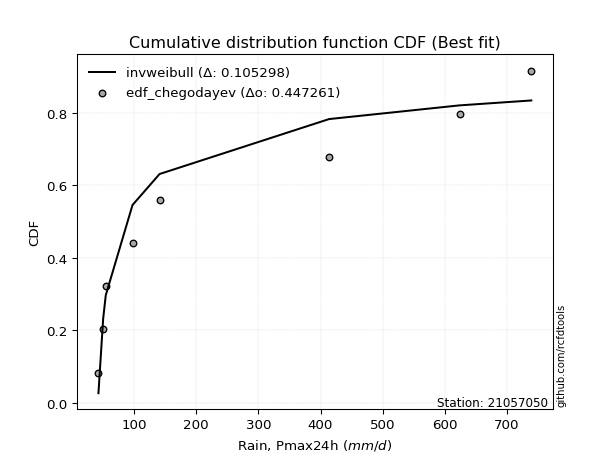</img>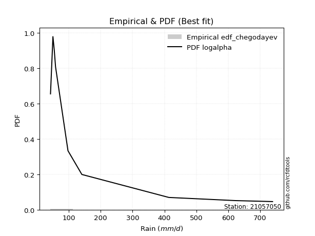</img>

</div>


### 6. Empirical - EDF Blom (1958)

The Blom formula is a specific "plotting position" formula used in hydrology and statistical analysis to estimate the empirical cumulative probability (or non-exceedance probability) of a data series. It is particularly recommended for data that are approximately normally distributed. The constant _a_ is set to 0.375 (or 3/8).

<div align="center">


$P=(m-a)/(n+1-2a)$


</div>


**6.1. Empirical values**

<div align="center">

|                | 0                   | 1                   | 2                   | 3                  | 4        | 5                  | 6                  | 7                  | 8                  |
|:---------------|:--------------------|:--------------------|:--------------------|:-------------------|:---------|:-------------------|:-------------------|:-------------------|:-------------------|
| date           | 2021                | 2025                | 2020                | 2019               | 2024     | 2009               | 2007               | 2008               | 2006               |
| x              | 42.8                | 44.0                | 50.4                | 54.6               | 97.6     | 141.1              | 413.8              | 623.5              | 739.0              |
| m              | 1                   | 2                   | 3                   | 4                  | 5        | 6                  | 7                  | 8                  | 9                  |
| empirical_dist | edf_blom            | edf_blom            | edf_blom            | edf_blom           | edf_blom | edf_blom           | edf_blom           | edf_blom           | edf_blom           |
| empirical      | 0.06756756756756757 | 0.17567567567567569 | 0.28378378378378377 | 0.3918918918918919 | 0.5      | 0.6081081081081081 | 0.7162162162162162 | 0.8243243243243243 | 0.9324324324324325 |
| empirical_tr   | 1.072463768115942   | 1.2131147540983607  | 1.3962264150943395  | 1.6444444444444444 | 2.0      | 2.5517241379310347 | 3.523809523809524  | 5.6923076923076925 | 14.800000000000006 |

</div>


**6.2. Kolmogorov-Smirnov fit test (sorted by Δ)**


<div align="center">

|                | 0                   | 1                   | 2                   | 3                   | 4                   | 5                   | 6                   | 7                   | 8                   | 9                   | 10                  | 11                  | 12                  | 13                  | 14                  | 15                  | 16                  | 17                  | 18                  | 19                  | 20                  | 21                  | 22                  | 23                  | 24                  | 25                  | 26                  | 27                  | 28                  | 29                  | 30                  | 31                  | 32                  | 33                  | 34                  | 35                    | 36                  | 37                  | 38                  | 39                  | 40                  | 41                  | 42                  | 43                  | 44                  | 45                  | 46                  | 47                  | 48                  | 49                  | 50                  | 51                  | 52                  | 53                  | 54                  | 55                  | 56                  | 57                  | 58                  | 59                  | 60                  | 61                  | 62                  | 63                  | 64                  | 65                  | 66                  | 67                  | 68                  | 69                  | 70                  | 71                  | 72                  | 73                  | 74                  | 75                  | 76                  | 77                  | 78                  | 79                  | 80                  | 81                  | 82                  | 83                  | 84                  | 85                  | 86                  | 87                  | 88                  | 89                  |
|:---------------|:--------------------|:--------------------|:--------------------|:--------------------|:--------------------|:--------------------|:--------------------|:--------------------|:--------------------|:--------------------|:--------------------|:--------------------|:--------------------|:--------------------|:--------------------|:--------------------|:--------------------|:--------------------|:--------------------|:--------------------|:--------------------|:--------------------|:--------------------|:--------------------|:--------------------|:--------------------|:--------------------|:--------------------|:--------------------|:--------------------|:--------------------|:--------------------|:--------------------|:--------------------|:--------------------|:----------------------|:--------------------|:--------------------|:--------------------|:--------------------|:--------------------|:--------------------|:--------------------|:--------------------|:--------------------|:--------------------|:--------------------|:--------------------|:--------------------|:--------------------|:--------------------|:--------------------|:--------------------|:--------------------|:--------------------|:--------------------|:--------------------|:--------------------|:--------------------|:--------------------|:--------------------|:--------------------|:--------------------|:--------------------|:--------------------|:--------------------|:--------------------|:--------------------|:--------------------|:--------------------|:--------------------|:--------------------|:--------------------|:--------------------|:--------------------|:--------------------|:--------------------|:--------------------|:--------------------|:--------------------|:--------------------|:--------------------|:--------------------|:--------------------|:--------------------|:--------------------|:--------------------|:--------------------|:--------------------|:--------------------|
| station        | 21057050            | 21057050            | 21057050            | 21057050            | 21057050            | 21057050            | 21057050            | 21057050            | 21057050            | 21057050            | 21057050            | 21057050            | 21057050            | 21057050            | 21057050            | 21057050            | 21057050            | 21057050            | 21057050            | 21057050            | 21057050            | 21057050            | 21057050            | 21057050            | 21057050            | 21057050            | 21057050            | 21057050            | 21057050            | 21057050            | 21057050            | 21057050            | 21057050            | 21057050            | 21057050            | 21057050              | 21057050            | 21057050            | 21057050            | 21057050            | 21057050            | 21057050            | 21057050            | 21057050            | 21057050            | 21057050            | 21057050            | 21057050            | 21057050            | 21057050            | 21057050            | 21057050            | 21057050            | 21057050            | 21057050            | 21057050            | 21057050            | 21057050            | 21057050            | 21057050            | 21057050            | 21057050            | 21057050            | 21057050            | 21057050            | 21057050            | 21057050            | 21057050            | 21057050            | 21057050            | 21057050            | 21057050            | 21057050            | 21057050            | 21057050            | 21057050            | 21057050            | 21057050            | 21057050            | 21057050            | 21057050            | 21057050            | 21057050            | 21057050            | 21057050            | 21057050            | 21057050            | 21057050            | 21057050            | 21057050            |
| empirical_dist | edf_blom            | edf_blom            | edf_blom            | edf_blom            | edf_blom            | edf_blom            | edf_blom            | edf_blom            | edf_blom            | edf_blom            | edf_blom            | edf_blom            | edf_blom            | edf_blom            | edf_blom            | edf_blom            | edf_blom            | edf_blom            | edf_blom            | edf_blom            | edf_blom            | edf_blom            | edf_blom            | edf_blom            | edf_blom            | edf_blom            | edf_blom            | edf_blom            | edf_blom            | edf_blom            | edf_blom            | edf_blom            | edf_blom            | edf_blom            | edf_blom            | edf_blom              | edf_blom            | edf_blom            | edf_blom            | edf_blom            | edf_blom            | edf_blom            | edf_blom            | edf_blom            | edf_blom            | edf_blom            | edf_blom            | edf_blom            | edf_blom            | edf_blom            | edf_blom            | edf_blom            | edf_blom            | edf_blom            | edf_blom            | edf_blom            | edf_blom            | edf_blom            | edf_blom            | edf_blom            | edf_blom            | edf_blom            | edf_blom            | edf_blom            | edf_blom            | edf_blom            | edf_blom            | edf_blom            | edf_blom            | edf_blom            | edf_blom            | edf_blom            | edf_blom            | edf_blom            | edf_blom            | edf_blom            | edf_blom            | edf_blom            | edf_blom            | edf_blom            | edf_blom            | edf_blom            | edf_blom            | edf_blom            | edf_blom            | edf_blom            | edf_blom            | edf_blom            | edf_blom            | edf_blom            |
| p_dist         | weibull_min         | pareto              | loghalfnorm         | logchi2             | invgamma            | logalpha            | loginvweibull       | loginvgamma         | logf                | lograyleigh         | logbetaprime        | logmaxwell          | logmielke           | logncf              | loginvgauss         | loghalflogistic     | logpearson3         | fisk                | halflogistic        | nct                 | lognct              | logloggamma         | ncf                 | lognorm             | lognorm             | logcrystalball      | logt                | betaprime           | loggenlogistic      | logjohnsonsu        | invgauss            | loggumbel_r         | halfnorm            | logkstwobign        | logexponnorm        | loglaplace_asymmetric | logexpon            | logmoyal            | moyal               | loggenexpon         | loglogistic         | logtruncnorm        | loggompertz         | logweibull_min      | loggumbel_l         | alpha               | pearson3            | gumbel_r            | genlogistic         | loghypsecant        | logrice             | rayleigh            | logerlang           | maxwell             | loglaplace          | nakagami            | kstwobign           | erlang              | norm                | wald                | gamma               | logistic            | rice                | hypsecant           | f                   | logfisk             | t                   | gumbel_l            | laplace             | exponnorm           | genexpon            | expon               | laplace_asymmetric  | logwald             | gompertz            | lognakagami         | truncnorm           | logpareto           | loglognorm          | fatiguelife         | logfatiguelife      | invweibull          | gibrat              | loggibrat           | loggamma            | loggamma            | crystalball         | johnsonsu           | chi2                | mielke              |
| delta          | 0.13087955062943774 | 0.1445715319296096  | 0.14932941440803787 | 0.1503396722171464  | 0.15442683720935313 | 0.1559226995167523  | 0.1566701105507904  | 0.15946496046549308 | 0.15960506152282294 | 0.16254490995737456 | 0.16557501952371037 | 0.1686497446527585  | 0.17007112527936474 | 0.17283304839628333 | 0.17505024448857343 | 0.17660823004900375 | 0.1771265125620035  | 0.1789875262803914  | 0.1795829681205292  | 0.18064566627581524 | 0.18079263304288382 | 0.1817816455507897  | 0.18319609012072857 | 0.18328426662996888 | 0.18328426662996888 | 0.18328426950041998 | 0.18328500857987962 | 0.1833608048412213  | 0.18371339024075836 | 0.18525863481920585 | 0.18736797009558548 | 0.18781523008090184 | 0.18861689040394822 | 0.1940772643584505  | 0.198414873410931   | 0.19914495659127318   | 0.19937193603925163 | 0.1998661711980767  | 0.2004359209154314  | 0.2016552471408385  | 0.2051720652676579  | 0.20739172263107777 | 0.20885146379000472 | 0.21163957319804283 | 0.2119709931118218  | 0.2119950435121677  | 0.21566376928167336 | 0.21753875973780307 | 0.21774029056395144 | 0.21831409255488524 | 0.21878459522806432 | 0.22070812803534556 | 0.2316157243641106  | 0.2326936559311057  | 0.23314509948386217 | 0.2363322200075842  | 0.25088831015459356 | 0.26098423622485745 | 0.26424156716382075 | 0.2644678706623046  | 0.2658171956798684  | 0.2826997044171169  | 0.29209241648640594 | 0.29691711087870765 | 0.30508944181908537 | 0.30539515668033834 | 0.3218845308169138  | 0.3232281681329064  | 0.3248981536343829  | 0.33411218047313307 | 0.33525839829447573 | 0.3352584139322441  | 0.33525847008285325 | 0.3380304557023481  | 0.3386177782799472  | 0.34064206946977627 | 0.3441527212396527  | 0.3458949891051992  | 0.3525237701714725  | 0.3562887026094135  | 0.3823145357594959  | 0.38621595002132025 | 0.38965515306096155 | 0.3918918918918919  | 0.4136965366630513  | 0.4136965366630513  | 0.4804172823708751  | 0.5973305608528514  | 0.6114119380900319  | nan                 |
| deltao         | 0.41761268023100007 | 0.41761268023100007 | 0.41761268023100007 | 0.41761268023100007 | 0.41761268023100007 | 0.41761268023100007 | 0.41761268023100007 | 0.41761268023100007 | 0.41761268023100007 | 0.41761268023100007 | 0.41761268023100007 | 0.41761268023100007 | 0.41761268023100007 | 0.41761268023100007 | 0.41761268023100007 | 0.41761268023100007 | 0.41761268023100007 | 0.41761268023100007 | 0.41761268023100007 | 0.41761268023100007 | 0.41761268023100007 | 0.41761268023100007 | 0.41761268023100007 | 0.41761268023100007 | 0.41761268023100007 | 0.41761268023100007 | 0.41761268023100007 | 0.41761268023100007 | 0.41761268023100007 | 0.41761268023100007 | 0.41761268023100007 | 0.41761268023100007 | 0.41761268023100007 | 0.41761268023100007 | 0.41761268023100007 | 0.41761268023100007   | 0.41761268023100007 | 0.41761268023100007 | 0.41761268023100007 | 0.41761268023100007 | 0.41761268023100007 | 0.41761268023100007 | 0.41761268023100007 | 0.41761268023100007 | 0.41761268023100007 | 0.41761268023100007 | 0.41761268023100007 | 0.41761268023100007 | 0.41761268023100007 | 0.41761268023100007 | 0.41761268023100007 | 0.41761268023100007 | 0.41761268023100007 | 0.41761268023100007 | 0.41761268023100007 | 0.41761268023100007 | 0.41761268023100007 | 0.41761268023100007 | 0.41761268023100007 | 0.41761268023100007 | 0.41761268023100007 | 0.41761268023100007 | 0.41761268023100007 | 0.41761268023100007 | 0.41761268023100007 | 0.41761268023100007 | 0.41761268023100007 | 0.41761268023100007 | 0.41761268023100007 | 0.41761268023100007 | 0.41761268023100007 | 0.41761268023100007 | 0.41761268023100007 | 0.41761268023100007 | 0.41761268023100007 | 0.41761268023100007 | 0.41761268023100007 | 0.41761268023100007 | 0.41761268023100007 | 0.41761268023100007 | 0.41761268023100007 | 0.41761268023100007 | 0.41761268023100007 | 0.41761268023100007 | 0.41761268023100007 | 0.41761268023100007 | 0.41761268023100007 | 0.41761268023100007 | 0.41761268023100007 | 0.41761268023100007 |
| eval           | Δo > Δ              | Δo > Δ              | Δo > Δ              | Δo > Δ              | Δo > Δ              | Δo > Δ              | Δo > Δ              | Δo > Δ              | Δo > Δ              | Δo > Δ              | Δo > Δ              | Δo > Δ              | Δo > Δ              | Δo > Δ              | Δo > Δ              | Δo > Δ              | Δo > Δ              | Δo > Δ              | Δo > Δ              | Δo > Δ              | Δo > Δ              | Δo > Δ              | Δo > Δ              | Δo > Δ              | Δo > Δ              | Δo > Δ              | Δo > Δ              | Δo > Δ              | Δo > Δ              | Δo > Δ              | Δo > Δ              | Δo > Δ              | Δo > Δ              | Δo > Δ              | Δo > Δ              | Δo > Δ                | Δo > Δ              | Δo > Δ              | Δo > Δ              | Δo > Δ              | Δo > Δ              | Δo > Δ              | Δo > Δ              | Δo > Δ              | Δo > Δ              | Δo > Δ              | Δo > Δ              | Δo > Δ              | Δo > Δ              | Δo > Δ              | Δo > Δ              | Δo > Δ              | Δo > Δ              | Δo > Δ              | Δo > Δ              | Δo > Δ              | Δo > Δ              | Δo > Δ              | Δo > Δ              | Δo > Δ              | Δo > Δ              | Δo > Δ              | Δo > Δ              | Δo > Δ              | Δo > Δ              | Δo > Δ              | Δo > Δ              | Δo > Δ              | Δo > Δ              | Δo > Δ              | Δo > Δ              | Δo > Δ              | Δo > Δ              | Δo > Δ              | Δo > Δ              | Δo > Δ              | Δo > Δ              | Δo > Δ              | Δo > Δ              | Δo > Δ              | Δo > Δ              | Δo > Δ              | Δo > Δ              | Δo > Δ              | Δo > Δ              | Δo > Δ              | Δo <= Δ             | Δo <= Δ             | Δo <= Δ             | Δo <= Δ             |
| fit            | 1                   | 1                   | 1                   | 1                   | 1                   | 1                   | 1                   | 1                   | 1                   | 1                   | 1                   | 1                   | 1                   | 1                   | 1                   | 1                   | 1                   | 1                   | 1                   | 1                   | 1                   | 1                   | 1                   | 1                   | 1                   | 1                   | 1                   | 1                   | 1                   | 1                   | 1                   | 1                   | 1                   | 1                   | 1                   | 1                     | 1                   | 1                   | 1                   | 1                   | 1                   | 1                   | 1                   | 1                   | 1                   | 1                   | 1                   | 1                   | 1                   | 1                   | 1                   | 1                   | 1                   | 1                   | 1                   | 1                   | 1                   | 1                   | 1                   | 1                   | 1                   | 1                   | 1                   | 1                   | 1                   | 1                   | 1                   | 1                   | 1                   | 1                   | 1                   | 1                   | 1                   | 1                   | 1                   | 1                   | 1                   | 1                   | 1                   | 1                   | 1                   | 1                   | 1                   | 1                   | 1                   | 1                   | 0                   | 0                   | 0                   | 0                   |
| n              | 9                   | 9                   | 9                   | 9                   | 9                   | 9                   | 9                   | 9                   | 9                   | 9                   | 9                   | 9                   | 9                   | 9                   | 9                   | 9                   | 9                   | 9                   | 9                   | 9                   | 9                   | 9                   | 9                   | 9                   | 9                   | 9                   | 9                   | 9                   | 9                   | 9                   | 9                   | 9                   | 9                   | 9                   | 9                   | 9                     | 9                   | 9                   | 9                   | 9                   | 9                   | 9                   | 9                   | 9                   | 9                   | 9                   | 9                   | 9                   | 9                   | 9                   | 9                   | 9                   | 9                   | 9                   | 9                   | 9                   | 9                   | 9                   | 9                   | 9                   | 9                   | 9                   | 9                   | 9                   | 9                   | 9                   | 9                   | 9                   | 9                   | 9                   | 9                   | 9                   | 9                   | 9                   | 9                   | 9                   | 9                   | 9                   | 9                   | 9                   | 9                   | 9                   | 9                   | 9                   | 9                   | 9                   | 9                   | 9                   | 9                   | 9                   |
| best_fit       | 1                   | 0                   | 0                   | 0                   | 0                   | 0                   | 0                   | 0                   | 0                   | 0                   | 0                   | 0                   | 0                   | 0                   | 0                   | 0                   | 0                   | 0                   | 0                   | 0                   | 0                   | 0                   | 0                   | 0                   | 0                   | 0                   | 0                   | 0                   | 0                   | 0                   | 0                   | 0                   | 0                   | 0                   | 0                   | 0                     | 0                   | 0                   | 0                   | 0                   | 0                   | 0                   | 0                   | 0                   | 0                   | 0                   | 0                   | 0                   | 0                   | 0                   | 0                   | 0                   | 0                   | 0                   | 0                   | 0                   | 0                   | 0                   | 0                   | 0                   | 0                   | 0                   | 0                   | 0                   | 0                   | 0                   | 0                   | 0                   | 0                   | 0                   | 0                   | 0                   | 0                   | 0                   | 0                   | 0                   | 0                   | 0                   | 0                   | 0                   | 0                   | 0                   | 0                   | 0                   | 0                   | 0                   | 0                   | 0                   | 0                   | 0                   |
| best_fit_sort  | 1                   | 2                   | 3                   | 4                   | 5                   | 6                   | 7                   | 8                   | 9                   | 10                  | 11                  | 12                  | 13                  | 14                  | 15                  | 16                  | 17                  | 18                  | 19                  | 20                  | 21                  | 22                  | 23                  | 24                  | 25                  | 26                  | 27                  | 28                  | 29                  | 30                  | 31                  | 32                  | 33                  | 34                  | 35                  | 36                    | 37                  | 38                  | 39                  | 40                  | 41                  | 42                  | 43                  | 44                  | 45                  | 46                  | 47                  | 48                  | 49                  | 50                  | 51                  | 52                  | 53                  | 54                  | 55                  | 56                  | 57                  | 58                  | 59                  | 60                  | 61                  | 62                  | 63                  | 64                  | 65                  | 66                  | 67                  | 68                  | 69                  | 70                  | 71                  | 72                  | 73                  | 74                  | 75                  | 76                  | 77                  | 78                  | 79                  | 80                  | 81                  | 82                  | 83                  | 84                  | 85                  | 86                  | 87                  | 88                  | 89                  | 90                  |

</div>


<div align="center">

</img>

</div>


**6.3. Best fit**

<div align="center">

|   id |   station | empirical_dist   | p_dist      |   delta |   deltao | eval   |   fit |   n |   best_fit |   best_fit_sort |
|-----:|----------:|:-----------------|:------------|--------:|---------:|:-------|------:|----:|-----------:|----------------:|
|    0 |  21057050 | edf_blom         | weibull_min | 0.13088 | 0.417613 | Δo > Δ |     1 |   9 |          1 |               1 |

</div>


<div align="center">

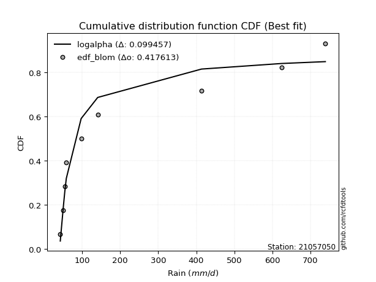</img>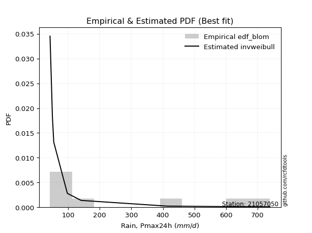</img>

</div>


### 7. Empirical - EDF Tukey (1962)

In hydrology, the Tukey formula is used as a plotting position formula to estimate the empirical probability or frequency of a flood event (or other hydrological data). The formula parameter is given as _c=0.333_ (or 1/3).

<div align="center">


$P=(m-c)/(n+1-2c)$


</div>


**7.1. Empirical values**

<div align="center">

|                | 0                   | 1                   | 2                  | 3                   | 4         | 5                  | 6                  | 7                  | 8                  |
|:---------------|:--------------------|:--------------------|:-------------------|:--------------------|:----------|:-------------------|:-------------------|:-------------------|:-------------------|
| date           | 2021                | 2025                | 2020               | 2019                | 2024      | 2009               | 2007               | 2008               | 2006               |
| x              | 42.8                | 44.0                | 50.4               | 54.6                | 97.6      | 141.1              | 413.8              | 623.5              | 739.0              |
| m              | 1                   | 2                   | 3                  | 4                   | 5         | 6                  | 7                  | 8                  | 9                  |
| empirical_dist | edf_tukey           | edf_tukey           | edf_tukey          | edf_tukey           | edf_tukey | edf_tukey          | edf_tukey          | edf_tukey          | edf_tukey          |
| empirical      | 0.07142857142857142 | 0.17857142857142858 | 0.2857142857142857 | 0.39285714285714285 | 0.5       | 0.6071428571428571 | 0.7142857142857143 | 0.8214285714285714 | 0.9285714285714286 |
| empirical_tr   | 1.0769230769230769  | 1.2173913043478262  | 1.4                | 1.6470588235294117  | 2.0       | 2.545454545454545  | 3.5                | 5.599999999999999  | 14.000000000000007 |

</div>


**7.2. Kolmogorov-Smirnov fit test (sorted by Δ)**


<div align="center">

|                | 0                   | 1                   | 2                   | 3                   | 4                   | 5                   | 6                   | 7                   | 8                   | 9                   | 10                  | 11                  | 12                  | 13                  | 14                  | 15                  | 16                  | 17                  | 18                  | 19                  | 20                  | 21                  | 22                  | 23                  | 24                  | 25                  | 26                  | 27                  | 28                  | 29                  | 30                  | 31                  | 32                  | 33                  | 34                  | 35                  | 36                    | 37                  | 38                  | 39                  | 40                  | 41                  | 42                  | 43                  | 44                  | 45                  | 46                  | 47                  | 48                  | 49                  | 50                  | 51                  | 52                  | 53                  | 54                  | 55                  | 56                  | 57                  | 58                  | 59                  | 60                  | 61                  | 62                  | 63                  | 64                  | 65                  | 66                  | 67                  | 68                  | 69                  | 70                  | 71                  | 72                  | 73                  | 74                  | 75                  | 76                  | 77                  | 78                  | 79                  | 80                  | 81                  | 82                  | 83                  | 84                  | 85                  | 86                  | 87                  | 88                  | 89                  |
|:---------------|:--------------------|:--------------------|:--------------------|:--------------------|:--------------------|:--------------------|:--------------------|:--------------------|:--------------------|:--------------------|:--------------------|:--------------------|:--------------------|:--------------------|:--------------------|:--------------------|:--------------------|:--------------------|:--------------------|:--------------------|:--------------------|:--------------------|:--------------------|:--------------------|:--------------------|:--------------------|:--------------------|:--------------------|:--------------------|:--------------------|:--------------------|:--------------------|:--------------------|:--------------------|:--------------------|:--------------------|:----------------------|:--------------------|:--------------------|:--------------------|:--------------------|:--------------------|:--------------------|:--------------------|:--------------------|:--------------------|:--------------------|:--------------------|:--------------------|:--------------------|:--------------------|:--------------------|:--------------------|:--------------------|:--------------------|:--------------------|:--------------------|:--------------------|:--------------------|:--------------------|:--------------------|:--------------------|:--------------------|:--------------------|:--------------------|:--------------------|:--------------------|:--------------------|:--------------------|:--------------------|:--------------------|:--------------------|:--------------------|:--------------------|:--------------------|:--------------------|:--------------------|:--------------------|:--------------------|:--------------------|:--------------------|:--------------------|:--------------------|:--------------------|:--------------------|:--------------------|:--------------------|:--------------------|:--------------------|:--------------------|
| station        | 21057050            | 21057050            | 21057050            | 21057050            | 21057050            | 21057050            | 21057050            | 21057050            | 21057050            | 21057050            | 21057050            | 21057050            | 21057050            | 21057050            | 21057050            | 21057050            | 21057050            | 21057050            | 21057050            | 21057050            | 21057050            | 21057050            | 21057050            | 21057050            | 21057050            | 21057050            | 21057050            | 21057050            | 21057050            | 21057050            | 21057050            | 21057050            | 21057050            | 21057050            | 21057050            | 21057050            | 21057050              | 21057050            | 21057050            | 21057050            | 21057050            | 21057050            | 21057050            | 21057050            | 21057050            | 21057050            | 21057050            | 21057050            | 21057050            | 21057050            | 21057050            | 21057050            | 21057050            | 21057050            | 21057050            | 21057050            | 21057050            | 21057050            | 21057050            | 21057050            | 21057050            | 21057050            | 21057050            | 21057050            | 21057050            | 21057050            | 21057050            | 21057050            | 21057050            | 21057050            | 21057050            | 21057050            | 21057050            | 21057050            | 21057050            | 21057050            | 21057050            | 21057050            | 21057050            | 21057050            | 21057050            | 21057050            | 21057050            | 21057050            | 21057050            | 21057050            | 21057050            | 21057050            | 21057050            | 21057050            |
| empirical_dist | edf_tukey           | edf_tukey           | edf_tukey           | edf_tukey           | edf_tukey           | edf_tukey           | edf_tukey           | edf_tukey           | edf_tukey           | edf_tukey           | edf_tukey           | edf_tukey           | edf_tukey           | edf_tukey           | edf_tukey           | edf_tukey           | edf_tukey           | edf_tukey           | edf_tukey           | edf_tukey           | edf_tukey           | edf_tukey           | edf_tukey           | edf_tukey           | edf_tukey           | edf_tukey           | edf_tukey           | edf_tukey           | edf_tukey           | edf_tukey           | edf_tukey           | edf_tukey           | edf_tukey           | edf_tukey           | edf_tukey           | edf_tukey           | edf_tukey             | edf_tukey           | edf_tukey           | edf_tukey           | edf_tukey           | edf_tukey           | edf_tukey           | edf_tukey           | edf_tukey           | edf_tukey           | edf_tukey           | edf_tukey           | edf_tukey           | edf_tukey           | edf_tukey           | edf_tukey           | edf_tukey           | edf_tukey           | edf_tukey           | edf_tukey           | edf_tukey           | edf_tukey           | edf_tukey           | edf_tukey           | edf_tukey           | edf_tukey           | edf_tukey           | edf_tukey           | edf_tukey           | edf_tukey           | edf_tukey           | edf_tukey           | edf_tukey           | edf_tukey           | edf_tukey           | edf_tukey           | edf_tukey           | edf_tukey           | edf_tukey           | edf_tukey           | edf_tukey           | edf_tukey           | edf_tukey           | edf_tukey           | edf_tukey           | edf_tukey           | edf_tukey           | edf_tukey           | edf_tukey           | edf_tukey           | edf_tukey           | edf_tukey           | edf_tukey           | edf_tukey           |
| p_dist         | weibull_min         | pareto              | loghalfnorm         | logchi2             | invgamma            | logalpha            | loginvweibull       | loginvgamma         | logf                | lograyleigh         | logbetaprime        | logmaxwell          | logmielke           | logncf              | loginvgauss         | loghalflogistic     | logpearson3         | halflogistic        | fisk                | nct                 | lognct              | logloggamma         | ncf                 | lognorm             | lognorm             | logcrystalball      | logt                | betaprime           | loggenlogistic      | halfnorm            | logjohnsonsu        | loggumbel_r         | invgauss            | logkstwobign        | logexponnorm        | moyal               | loglaplace_asymmetric | logexpon            | logmoyal            | loggenexpon         | loglogistic         | logweibull_min      | logtruncnorm        | loggompertz         | loggumbel_l         | alpha               | pearson3            | gumbel_r            | genlogistic         | loghypsecant        | rayleigh            | logrice             | maxwell             | logerlang           | loglaplace          | nakagami            | kstwobign           | erlang              | norm                | wald                | gamma               | logistic            | rice                | hypsecant           | f                   | logfisk             | t                   | gumbel_l            | laplace             | exponnorm           | genexpon            | expon               | laplace_asymmetric  | lognakagami         | logwald             | gompertz            | logpareto           | truncnorm           | loglognorm          | fatiguelife         | logfatiguelife      | invweibull          | gibrat              | loggibrat           | loggamma            | loggamma            | crystalball         | johnsonsu           | chi2                | mielke              |
| delta          | 0.1318448015946887  | 0.1445715319296096  | 0.15029466537328884 | 0.15227017414764832 | 0.15442683720935313 | 0.1559226995167523  | 0.1566701105507904  | 0.15946496046549308 | 0.15960506152282294 | 0.16351016092262552 | 0.16654027048896133 | 0.16961499561800947 | 0.17200162720986667 | 0.1737982993615343  | 0.17505024448857343 | 0.1775734810142547  | 0.17809176352725448 | 0.1786177171552782  | 0.17995277724564238 | 0.1816109172410662  | 0.18175788400813478 | 0.18274689651604067 | 0.18416134108597954 | 0.18424951759521985 | 0.18424951759521985 | 0.18424952046567095 | 0.18425025954513058 | 0.18432605580647227 | 0.18467864120600933 | 0.1856306000871898  | 0.1862238857844568  | 0.1887804810461528  | 0.18928928897167052 | 0.19504251532370145 | 0.19938012437618197 | 0.19947066995018037 | 0.20011020755652414   | 0.2003371870045026  | 0.20083142216332767 | 0.20262049810608945 | 0.20613731623290887 | 0.20777856933703898 | 0.20835697359632874 | 0.20981671475525568 | 0.21293624407707276 | 0.21392554544266962 | 0.21469851831642234 | 0.21657350877255205 | 0.21677503959870043 | 0.2192793435201362  | 0.21974287707009454 | 0.21974984619331528 | 0.23172840496585467 | 0.23354622629461252 | 0.23411035044911313 | 0.23729747097283516 | 0.24992305918934254 | 0.2629147381553594  | 0.2632763161985697  | 0.2654331216275556  | 0.2677476976103703  | 0.2817344534518659  | 0.2911271655211549  | 0.2959518599134566  | 0.30315893988858345 | 0.30539515668033834 | 0.3218845308169138  | 0.32226291716765537 | 0.3239329026691319  | 0.33507743143838403 | 0.3362236492597267  | 0.33622366489749506 | 0.3362237210481042  | 0.33871156753927434 | 0.33899570666759904 | 0.3395830292451981  | 0.3429992362094463  | 0.34511797220490364 | 0.34962801727571957 | 0.35339294971366053 | 0.379418782863743   | 0.3823549461603164  | 0.3906204040262125  | 0.39285714285714285 | 0.41176603473254936 | 0.41176603473254936 | 0.47655627850987126 | 0.5944348079570985  | 0.60948143615953    | nan                 |
| deltao         | 0.41761268023100007 | 0.41761268023100007 | 0.41761268023100007 | 0.41761268023100007 | 0.41761268023100007 | 0.41761268023100007 | 0.41761268023100007 | 0.41761268023100007 | 0.41761268023100007 | 0.41761268023100007 | 0.41761268023100007 | 0.41761268023100007 | 0.41761268023100007 | 0.41761268023100007 | 0.41761268023100007 | 0.41761268023100007 | 0.41761268023100007 | 0.41761268023100007 | 0.41761268023100007 | 0.41761268023100007 | 0.41761268023100007 | 0.41761268023100007 | 0.41761268023100007 | 0.41761268023100007 | 0.41761268023100007 | 0.41761268023100007 | 0.41761268023100007 | 0.41761268023100007 | 0.41761268023100007 | 0.41761268023100007 | 0.41761268023100007 | 0.41761268023100007 | 0.41761268023100007 | 0.41761268023100007 | 0.41761268023100007 | 0.41761268023100007 | 0.41761268023100007   | 0.41761268023100007 | 0.41761268023100007 | 0.41761268023100007 | 0.41761268023100007 | 0.41761268023100007 | 0.41761268023100007 | 0.41761268023100007 | 0.41761268023100007 | 0.41761268023100007 | 0.41761268023100007 | 0.41761268023100007 | 0.41761268023100007 | 0.41761268023100007 | 0.41761268023100007 | 0.41761268023100007 | 0.41761268023100007 | 0.41761268023100007 | 0.41761268023100007 | 0.41761268023100007 | 0.41761268023100007 | 0.41761268023100007 | 0.41761268023100007 | 0.41761268023100007 | 0.41761268023100007 | 0.41761268023100007 | 0.41761268023100007 | 0.41761268023100007 | 0.41761268023100007 | 0.41761268023100007 | 0.41761268023100007 | 0.41761268023100007 | 0.41761268023100007 | 0.41761268023100007 | 0.41761268023100007 | 0.41761268023100007 | 0.41761268023100007 | 0.41761268023100007 | 0.41761268023100007 | 0.41761268023100007 | 0.41761268023100007 | 0.41761268023100007 | 0.41761268023100007 | 0.41761268023100007 | 0.41761268023100007 | 0.41761268023100007 | 0.41761268023100007 | 0.41761268023100007 | 0.41761268023100007 | 0.41761268023100007 | 0.41761268023100007 | 0.41761268023100007 | 0.41761268023100007 | 0.41761268023100007 |
| eval           | Δo > Δ              | Δo > Δ              | Δo > Δ              | Δo > Δ              | Δo > Δ              | Δo > Δ              | Δo > Δ              | Δo > Δ              | Δo > Δ              | Δo > Δ              | Δo > Δ              | Δo > Δ              | Δo > Δ              | Δo > Δ              | Δo > Δ              | Δo > Δ              | Δo > Δ              | Δo > Δ              | Δo > Δ              | Δo > Δ              | Δo > Δ              | Δo > Δ              | Δo > Δ              | Δo > Δ              | Δo > Δ              | Δo > Δ              | Δo > Δ              | Δo > Δ              | Δo > Δ              | Δo > Δ              | Δo > Δ              | Δo > Δ              | Δo > Δ              | Δo > Δ              | Δo > Δ              | Δo > Δ              | Δo > Δ                | Δo > Δ              | Δo > Δ              | Δo > Δ              | Δo > Δ              | Δo > Δ              | Δo > Δ              | Δo > Δ              | Δo > Δ              | Δo > Δ              | Δo > Δ              | Δo > Δ              | Δo > Δ              | Δo > Δ              | Δo > Δ              | Δo > Δ              | Δo > Δ              | Δo > Δ              | Δo > Δ              | Δo > Δ              | Δo > Δ              | Δo > Δ              | Δo > Δ              | Δo > Δ              | Δo > Δ              | Δo > Δ              | Δo > Δ              | Δo > Δ              | Δo > Δ              | Δo > Δ              | Δo > Δ              | Δo > Δ              | Δo > Δ              | Δo > Δ              | Δo > Δ              | Δo > Δ              | Δo > Δ              | Δo > Δ              | Δo > Δ              | Δo > Δ              | Δo > Δ              | Δo > Δ              | Δo > Δ              | Δo > Δ              | Δo > Δ              | Δo > Δ              | Δo > Δ              | Δo > Δ              | Δo > Δ              | Δo > Δ              | Δo <= Δ             | Δo <= Δ             | Δo <= Δ             | Δo <= Δ             |
| fit            | 1                   | 1                   | 1                   | 1                   | 1                   | 1                   | 1                   | 1                   | 1                   | 1                   | 1                   | 1                   | 1                   | 1                   | 1                   | 1                   | 1                   | 1                   | 1                   | 1                   | 1                   | 1                   | 1                   | 1                   | 1                   | 1                   | 1                   | 1                   | 1                   | 1                   | 1                   | 1                   | 1                   | 1                   | 1                   | 1                   | 1                     | 1                   | 1                   | 1                   | 1                   | 1                   | 1                   | 1                   | 1                   | 1                   | 1                   | 1                   | 1                   | 1                   | 1                   | 1                   | 1                   | 1                   | 1                   | 1                   | 1                   | 1                   | 1                   | 1                   | 1                   | 1                   | 1                   | 1                   | 1                   | 1                   | 1                   | 1                   | 1                   | 1                   | 1                   | 1                   | 1                   | 1                   | 1                   | 1                   | 1                   | 1                   | 1                   | 1                   | 1                   | 1                   | 1                   | 1                   | 1                   | 1                   | 0                   | 0                   | 0                   | 0                   |
| n              | 9                   | 9                   | 9                   | 9                   | 9                   | 9                   | 9                   | 9                   | 9                   | 9                   | 9                   | 9                   | 9                   | 9                   | 9                   | 9                   | 9                   | 9                   | 9                   | 9                   | 9                   | 9                   | 9                   | 9                   | 9                   | 9                   | 9                   | 9                   | 9                   | 9                   | 9                   | 9                   | 9                   | 9                   | 9                   | 9                   | 9                     | 9                   | 9                   | 9                   | 9                   | 9                   | 9                   | 9                   | 9                   | 9                   | 9                   | 9                   | 9                   | 9                   | 9                   | 9                   | 9                   | 9                   | 9                   | 9                   | 9                   | 9                   | 9                   | 9                   | 9                   | 9                   | 9                   | 9                   | 9                   | 9                   | 9                   | 9                   | 9                   | 9                   | 9                   | 9                   | 9                   | 9                   | 9                   | 9                   | 9                   | 9                   | 9                   | 9                   | 9                   | 9                   | 9                   | 9                   | 9                   | 9                   | 9                   | 9                   | 9                   | 9                   |
| best_fit       | 1                   | 0                   | 0                   | 0                   | 0                   | 0                   | 0                   | 0                   | 0                   | 0                   | 0                   | 0                   | 0                   | 0                   | 0                   | 0                   | 0                   | 0                   | 0                   | 0                   | 0                   | 0                   | 0                   | 0                   | 0                   | 0                   | 0                   | 0                   | 0                   | 0                   | 0                   | 0                   | 0                   | 0                   | 0                   | 0                   | 0                     | 0                   | 0                   | 0                   | 0                   | 0                   | 0                   | 0                   | 0                   | 0                   | 0                   | 0                   | 0                   | 0                   | 0                   | 0                   | 0                   | 0                   | 0                   | 0                   | 0                   | 0                   | 0                   | 0                   | 0                   | 0                   | 0                   | 0                   | 0                   | 0                   | 0                   | 0                   | 0                   | 0                   | 0                   | 0                   | 0                   | 0                   | 0                   | 0                   | 0                   | 0                   | 0                   | 0                   | 0                   | 0                   | 0                   | 0                   | 0                   | 0                   | 0                   | 0                   | 0                   | 0                   |
| best_fit_sort  | 1                   | 2                   | 3                   | 4                   | 5                   | 6                   | 7                   | 8                   | 9                   | 10                  | 11                  | 12                  | 13                  | 14                  | 15                  | 16                  | 17                  | 18                  | 19                  | 20                  | 21                  | 22                  | 23                  | 24                  | 25                  | 26                  | 27                  | 28                  | 29                  | 30                  | 31                  | 32                  | 33                  | 34                  | 35                  | 36                  | 37                    | 38                  | 39                  | 40                  | 41                  | 42                  | 43                  | 44                  | 45                  | 46                  | 47                  | 48                  | 49                  | 50                  | 51                  | 52                  | 53                  | 54                  | 55                  | 56                  | 57                  | 58                  | 59                  | 60                  | 61                  | 62                  | 63                  | 64                  | 65                  | 66                  | 67                  | 68                  | 69                  | 70                  | 71                  | 72                  | 73                  | 74                  | 75                  | 76                  | 77                  | 78                  | 79                  | 80                  | 81                  | 82                  | 83                  | 84                  | 85                  | 86                  | 87                  | 88                  | 89                  | 90                  |

</div>


<div align="center">

</img>

</div>


**7.3. Best fit**

<div align="center">

|   id |   station | empirical_dist   | p_dist      |    delta |   deltao | eval   |   fit |   n |   best_fit |   best_fit_sort |
|-----:|----------:|:-----------------|:------------|---------:|---------:|:-------|------:|----:|-----------:|----------------:|
|    0 |  21057050 | edf_tukey        | weibull_min | 0.131845 | 0.417613 | Δo > Δ |     1 |   9 |          1 |               1 |

</div>


<div align="center">

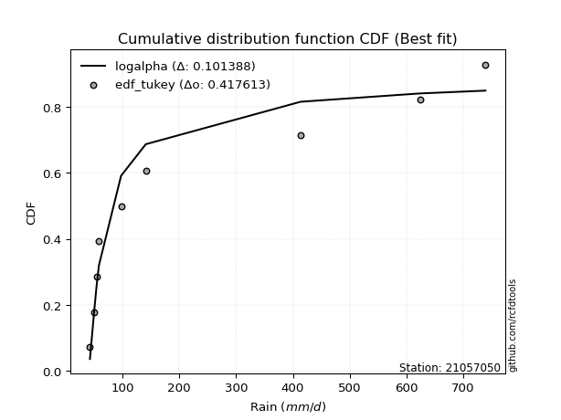</img>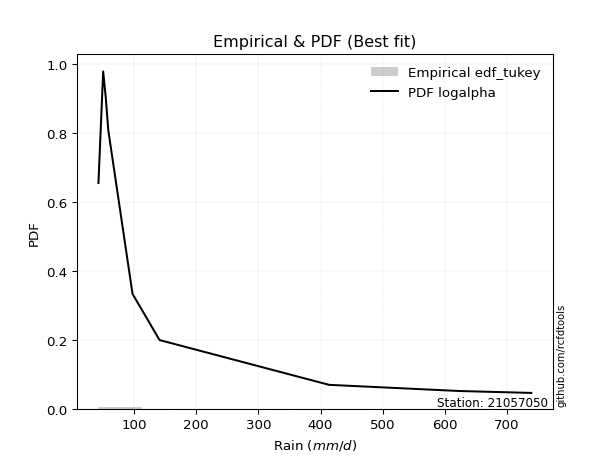</img>

</div>


### 8. Empirical - EDF Gringorten (1963)

Gringorten plotting position formula is essential for estimating the probability and return periods of extreme events like floods and heavy rainfall. The constant _a=0.44_.

<div align="center">


$P=(m-a)/(n+1-2a)$


</div>


**8.1. Empirical values**

<div align="center">

|                | 0                    | 1                  | 2                   | 3                  | 4              | 5                  | 6                  | 7                  | 8                  |
|:---------------|:---------------------|:-------------------|:--------------------|:-------------------|:---------------|:-------------------|:-------------------|:-------------------|:-------------------|
| date           | 2021                 | 2025               | 2020                | 2019               | 2024           | 2009               | 2007               | 2008               | 2006               |
| x              | 42.8                 | 44.0               | 50.4                | 54.6               | 97.6           | 141.1              | 413.8              | 623.5              | 739.0              |
| m              | 1                    | 2                  | 3                   | 4                  | 5              | 6                  | 7                  | 8                  | 9                  |
| empirical_dist | edf_gringorten       | edf_gringorten     | edf_gringorten      | edf_gringorten     | edf_gringorten | edf_gringorten     | edf_gringorten     | edf_gringorten     | edf_gringorten     |
| empirical      | 0.061403508771929835 | 0.1710526315789474 | 0.28070175438596495 | 0.3903508771929825 | 0.5            | 0.6096491228070176 | 0.7192982456140351 | 0.8289473684210527 | 0.9385964912280703 |
| empirical_tr   | 1.0654205607476634   | 1.2063492063492063 | 1.3902439024390243  | 1.6402877697841727 | 2.0            | 2.561797752808989  | 3.5625             | 5.846153846153847  | 16.285714285714324 |

</div>


**8.2. Kolmogorov-Smirnov fit test (sorted by Δ)**


<div align="center">

|                | 0                   | 1                   | 2                   | 3                   | 4                   | 5                   | 6                   | 7                   | 8                   | 9                   | 10                  | 11                  | 12                  | 13                  | 14                  | 15                  | 16                  | 17                  | 18                  | 19                  | 20                  | 21                  | 22                  | 23                  | 24                  | 25                  | 26                  | 27                  | 28                  | 29                  | 30                  | 31                  | 32                  | 33                  | 34                  | 35                    | 36                  | 37                  | 38                  | 39                  | 40                  | 41                  | 42                  | 43                  | 44                  | 45                  | 46                  | 47                  | 48                  | 49                  | 50                  | 51                  | 52                  | 53                  | 54                  | 55                  | 56                  | 57                  | 58                  | 59                  | 60                  | 61                  | 62                  | 63                  | 64                  | 65                  | 66                  | 67                  | 68                  | 69                  | 70                  | 71                  | 72                  | 73                  | 74                  | 75                  | 76                  | 77                  | 78                  | 79                  | 80                  | 81                  | 82                  | 83                  | 84                  | 85                  | 86                  | 87                  | 88                  | 89                  |
|:---------------|:--------------------|:--------------------|:--------------------|:--------------------|:--------------------|:--------------------|:--------------------|:--------------------|:--------------------|:--------------------|:--------------------|:--------------------|:--------------------|:--------------------|:--------------------|:--------------------|:--------------------|:--------------------|:--------------------|:--------------------|:--------------------|:--------------------|:--------------------|:--------------------|:--------------------|:--------------------|:--------------------|:--------------------|:--------------------|:--------------------|:--------------------|:--------------------|:--------------------|:--------------------|:--------------------|:----------------------|:--------------------|:--------------------|:--------------------|:--------------------|:--------------------|:--------------------|:--------------------|:--------------------|:--------------------|:--------------------|:--------------------|:--------------------|:--------------------|:--------------------|:--------------------|:--------------------|:--------------------|:--------------------|:--------------------|:--------------------|:--------------------|:--------------------|:--------------------|:--------------------|:--------------------|:--------------------|:--------------------|:--------------------|:--------------------|:--------------------|:--------------------|:--------------------|:--------------------|:--------------------|:--------------------|:--------------------|:--------------------|:--------------------|:--------------------|:--------------------|:--------------------|:--------------------|:--------------------|:--------------------|:--------------------|:--------------------|:--------------------|:--------------------|:--------------------|:--------------------|:--------------------|:--------------------|:--------------------|:--------------------|
| station        | 21057050            | 21057050            | 21057050            | 21057050            | 21057050            | 21057050            | 21057050            | 21057050            | 21057050            | 21057050            | 21057050            | 21057050            | 21057050            | 21057050            | 21057050            | 21057050            | 21057050            | 21057050            | 21057050            | 21057050            | 21057050            | 21057050            | 21057050            | 21057050            | 21057050            | 21057050            | 21057050            | 21057050            | 21057050            | 21057050            | 21057050            | 21057050            | 21057050            | 21057050            | 21057050            | 21057050              | 21057050            | 21057050            | 21057050            | 21057050            | 21057050            | 21057050            | 21057050            | 21057050            | 21057050            | 21057050            | 21057050            | 21057050            | 21057050            | 21057050            | 21057050            | 21057050            | 21057050            | 21057050            | 21057050            | 21057050            | 21057050            | 21057050            | 21057050            | 21057050            | 21057050            | 21057050            | 21057050            | 21057050            | 21057050            | 21057050            | 21057050            | 21057050            | 21057050            | 21057050            | 21057050            | 21057050            | 21057050            | 21057050            | 21057050            | 21057050            | 21057050            | 21057050            | 21057050            | 21057050            | 21057050            | 21057050            | 21057050            | 21057050            | 21057050            | 21057050            | 21057050            | 21057050            | 21057050            | 21057050            |
| empirical_dist | edf_gringorten      | edf_gringorten      | edf_gringorten      | edf_gringorten      | edf_gringorten      | edf_gringorten      | edf_gringorten      | edf_gringorten      | edf_gringorten      | edf_gringorten      | edf_gringorten      | edf_gringorten      | edf_gringorten      | edf_gringorten      | edf_gringorten      | edf_gringorten      | edf_gringorten      | edf_gringorten      | edf_gringorten      | edf_gringorten      | edf_gringorten      | edf_gringorten      | edf_gringorten      | edf_gringorten      | edf_gringorten      | edf_gringorten      | edf_gringorten      | edf_gringorten      | edf_gringorten      | edf_gringorten      | edf_gringorten      | edf_gringorten      | edf_gringorten      | edf_gringorten      | edf_gringorten      | edf_gringorten        | edf_gringorten      | edf_gringorten      | edf_gringorten      | edf_gringorten      | edf_gringorten      | edf_gringorten      | edf_gringorten      | edf_gringorten      | edf_gringorten      | edf_gringorten      | edf_gringorten      | edf_gringorten      | edf_gringorten      | edf_gringorten      | edf_gringorten      | edf_gringorten      | edf_gringorten      | edf_gringorten      | edf_gringorten      | edf_gringorten      | edf_gringorten      | edf_gringorten      | edf_gringorten      | edf_gringorten      | edf_gringorten      | edf_gringorten      | edf_gringorten      | edf_gringorten      | edf_gringorten      | edf_gringorten      | edf_gringorten      | edf_gringorten      | edf_gringorten      | edf_gringorten      | edf_gringorten      | edf_gringorten      | edf_gringorten      | edf_gringorten      | edf_gringorten      | edf_gringorten      | edf_gringorten      | edf_gringorten      | edf_gringorten      | edf_gringorten      | edf_gringorten      | edf_gringorten      | edf_gringorten      | edf_gringorten      | edf_gringorten      | edf_gringorten      | edf_gringorten      | edf_gringorten      | edf_gringorten      | edf_gringorten      |
| p_dist         | weibull_min         | pareto              | logchi2             | loghalfnorm         | invgamma            | logalpha            | loginvweibull       | loginvgamma         | logf                | lograyleigh         | logbetaprime        | logmielke           | logmaxwell          | logncf              | loginvgauss         | loghalflogistic     | logpearson3         | nct                 | lognct              | logloggamma         | fisk                | halflogistic        | ncf                 | lognorm             | lognorm             | logcrystalball      | logt                | betaprime           | loggenlogistic      | logjohnsonsu        | loggumbel_r         | invgauss            | logkstwobign        | halfnorm            | logexponnorm        | loglaplace_asymmetric | logexpon            | logmoyal            | loggenexpon         | moyal               | loglogistic         | logtruncnorm        | loggompertz         | alpha               | loggumbel_l         | loghypsecant        | pearson3            | logrice             | logweibull_min      | gumbel_r            | genlogistic         | rayleigh            | logerlang           | loglaplace          | maxwell             | nakagami            | kstwobign           | erlang              | gamma               | wald                | norm                | logistic            | rice                | hypsecant           | logfisk             | f                   | t                   | gumbel_l            | laplace             | exponnorm           | genexpon            | expon               | laplace_asymmetric  | logwald             | gompertz            | truncnorm           | lognakagami         | logpareto           | loglognorm          | fatiguelife         | logfatiguelife      | gibrat              | loggibrat           | invweibull          | loggamma            | loggamma            | crystalball         | johnsonsu           | chi2                | mielke              |
| delta          | 0.12933853593052835 | 0.1445715319296096  | 0.14725764281932752 | 0.1477883997091285  | 0.15442683720935313 | 0.1559226995167523  | 0.1566701105507904  | 0.15946496046549308 | 0.15960506152282294 | 0.16100389525846517 | 0.164034004824801   | 0.16698909588154587 | 0.16710872995384912 | 0.17129203369737395 | 0.17505024448857343 | 0.17506721535009437 | 0.17558549786309413 | 0.17910465157690586 | 0.17925161834397443 | 0.18024063085188033 | 0.1804291568018882  | 0.18112398281943864 | 0.1816550754218192  | 0.1817432519310595  | 0.1817432519310595  | 0.1817432548015106  | 0.18174399388097023 | 0.18181979014231192 | 0.18217237554184898 | 0.18371762012029647 | 0.18627421538199246 | 0.18736797009558548 | 0.1925362496595411  | 0.19478094919958594 | 0.19687385871202162 | 0.1976039418923638    | 0.19783092134034225 | 0.19832515649916732 | 0.2001142324419291  | 0.20197693561434082 | 0.20363105056874853 | 0.2058507079321684  | 0.20731044909109533 | 0.20891301411434882 | 0.21042997841291242 | 0.21677307785597585 | 0.2172047839805828  | 0.21724358052915493 | 0.2178036319936807  | 0.2190797744367125  | 0.21928130526286088 | 0.222249142734255   | 0.22853369496629172 | 0.23160408478495279 | 0.23423467063001513 | 0.2347912053086748  | 0.252429324853503   | 0.25790220682703857 | 0.2627351662820495  | 0.26292685596339527 | 0.2657825818627302  | 0.28424071911602633 | 0.2936334311853154  | 0.2984581255776171  | 0.30539515668033834 | 0.3081714712169042  | 0.3218845308169138  | 0.32476918283181583 | 0.32643916833329234 | 0.3325711657742237  | 0.33371738359556635 | 0.3337173992333347  | 0.3337174553839439  | 0.3364894410034387  | 0.3370767635810378  | 0.3426117065407433  | 0.3437240988675951  | 0.3505180332019275  | 0.3571468142682008  | 0.36091174670614173 | 0.3869375798562242  | 0.38811413836205216 | 0.3903508771929825  | 0.3923800088169581  | 0.4167785660608701  | 0.4167785660608701  | 0.4865813411665128  | 0.6019536049495797  | 0.6144939674878507  | nan                 |
| deltao         | 0.41761268023100007 | 0.41761268023100007 | 0.41761268023100007 | 0.41761268023100007 | 0.41761268023100007 | 0.41761268023100007 | 0.41761268023100007 | 0.41761268023100007 | 0.41761268023100007 | 0.41761268023100007 | 0.41761268023100007 | 0.41761268023100007 | 0.41761268023100007 | 0.41761268023100007 | 0.41761268023100007 | 0.41761268023100007 | 0.41761268023100007 | 0.41761268023100007 | 0.41761268023100007 | 0.41761268023100007 | 0.41761268023100007 | 0.41761268023100007 | 0.41761268023100007 | 0.41761268023100007 | 0.41761268023100007 | 0.41761268023100007 | 0.41761268023100007 | 0.41761268023100007 | 0.41761268023100007 | 0.41761268023100007 | 0.41761268023100007 | 0.41761268023100007 | 0.41761268023100007 | 0.41761268023100007 | 0.41761268023100007 | 0.41761268023100007   | 0.41761268023100007 | 0.41761268023100007 | 0.41761268023100007 | 0.41761268023100007 | 0.41761268023100007 | 0.41761268023100007 | 0.41761268023100007 | 0.41761268023100007 | 0.41761268023100007 | 0.41761268023100007 | 0.41761268023100007 | 0.41761268023100007 | 0.41761268023100007 | 0.41761268023100007 | 0.41761268023100007 | 0.41761268023100007 | 0.41761268023100007 | 0.41761268023100007 | 0.41761268023100007 | 0.41761268023100007 | 0.41761268023100007 | 0.41761268023100007 | 0.41761268023100007 | 0.41761268023100007 | 0.41761268023100007 | 0.41761268023100007 | 0.41761268023100007 | 0.41761268023100007 | 0.41761268023100007 | 0.41761268023100007 | 0.41761268023100007 | 0.41761268023100007 | 0.41761268023100007 | 0.41761268023100007 | 0.41761268023100007 | 0.41761268023100007 | 0.41761268023100007 | 0.41761268023100007 | 0.41761268023100007 | 0.41761268023100007 | 0.41761268023100007 | 0.41761268023100007 | 0.41761268023100007 | 0.41761268023100007 | 0.41761268023100007 | 0.41761268023100007 | 0.41761268023100007 | 0.41761268023100007 | 0.41761268023100007 | 0.41761268023100007 | 0.41761268023100007 | 0.41761268023100007 | 0.41761268023100007 | 0.41761268023100007 |
| eval           | Δo > Δ              | Δo > Δ              | Δo > Δ              | Δo > Δ              | Δo > Δ              | Δo > Δ              | Δo > Δ              | Δo > Δ              | Δo > Δ              | Δo > Δ              | Δo > Δ              | Δo > Δ              | Δo > Δ              | Δo > Δ              | Δo > Δ              | Δo > Δ              | Δo > Δ              | Δo > Δ              | Δo > Δ              | Δo > Δ              | Δo > Δ              | Δo > Δ              | Δo > Δ              | Δo > Δ              | Δo > Δ              | Δo > Δ              | Δo > Δ              | Δo > Δ              | Δo > Δ              | Δo > Δ              | Δo > Δ              | Δo > Δ              | Δo > Δ              | Δo > Δ              | Δo > Δ              | Δo > Δ                | Δo > Δ              | Δo > Δ              | Δo > Δ              | Δo > Δ              | Δo > Δ              | Δo > Δ              | Δo > Δ              | Δo > Δ              | Δo > Δ              | Δo > Δ              | Δo > Δ              | Δo > Δ              | Δo > Δ              | Δo > Δ              | Δo > Δ              | Δo > Δ              | Δo > Δ              | Δo > Δ              | Δo > Δ              | Δo > Δ              | Δo > Δ              | Δo > Δ              | Δo > Δ              | Δo > Δ              | Δo > Δ              | Δo > Δ              | Δo > Δ              | Δo > Δ              | Δo > Δ              | Δo > Δ              | Δo > Δ              | Δo > Δ              | Δo > Δ              | Δo > Δ              | Δo > Δ              | Δo > Δ              | Δo > Δ              | Δo > Δ              | Δo > Δ              | Δo > Δ              | Δo > Δ              | Δo > Δ              | Δo > Δ              | Δo > Δ              | Δo > Δ              | Δo > Δ              | Δo > Δ              | Δo > Δ              | Δo > Δ              | Δo > Δ              | Δo <= Δ             | Δo <= Δ             | Δo <= Δ             | Δo <= Δ             |
| fit            | 1                   | 1                   | 1                   | 1                   | 1                   | 1                   | 1                   | 1                   | 1                   | 1                   | 1                   | 1                   | 1                   | 1                   | 1                   | 1                   | 1                   | 1                   | 1                   | 1                   | 1                   | 1                   | 1                   | 1                   | 1                   | 1                   | 1                   | 1                   | 1                   | 1                   | 1                   | 1                   | 1                   | 1                   | 1                   | 1                     | 1                   | 1                   | 1                   | 1                   | 1                   | 1                   | 1                   | 1                   | 1                   | 1                   | 1                   | 1                   | 1                   | 1                   | 1                   | 1                   | 1                   | 1                   | 1                   | 1                   | 1                   | 1                   | 1                   | 1                   | 1                   | 1                   | 1                   | 1                   | 1                   | 1                   | 1                   | 1                   | 1                   | 1                   | 1                   | 1                   | 1                   | 1                   | 1                   | 1                   | 1                   | 1                   | 1                   | 1                   | 1                   | 1                   | 1                   | 1                   | 1                   | 1                   | 0                   | 0                   | 0                   | 0                   |
| n              | 9                   | 9                   | 9                   | 9                   | 9                   | 9                   | 9                   | 9                   | 9                   | 9                   | 9                   | 9                   | 9                   | 9                   | 9                   | 9                   | 9                   | 9                   | 9                   | 9                   | 9                   | 9                   | 9                   | 9                   | 9                   | 9                   | 9                   | 9                   | 9                   | 9                   | 9                   | 9                   | 9                   | 9                   | 9                   | 9                     | 9                   | 9                   | 9                   | 9                   | 9                   | 9                   | 9                   | 9                   | 9                   | 9                   | 9                   | 9                   | 9                   | 9                   | 9                   | 9                   | 9                   | 9                   | 9                   | 9                   | 9                   | 9                   | 9                   | 9                   | 9                   | 9                   | 9                   | 9                   | 9                   | 9                   | 9                   | 9                   | 9                   | 9                   | 9                   | 9                   | 9                   | 9                   | 9                   | 9                   | 9                   | 9                   | 9                   | 9                   | 9                   | 9                   | 9                   | 9                   | 9                   | 9                   | 9                   | 9                   | 9                   | 9                   |
| best_fit       | 1                   | 0                   | 0                   | 0                   | 0                   | 0                   | 0                   | 0                   | 0                   | 0                   | 0                   | 0                   | 0                   | 0                   | 0                   | 0                   | 0                   | 0                   | 0                   | 0                   | 0                   | 0                   | 0                   | 0                   | 0                   | 0                   | 0                   | 0                   | 0                   | 0                   | 0                   | 0                   | 0                   | 0                   | 0                   | 0                     | 0                   | 0                   | 0                   | 0                   | 0                   | 0                   | 0                   | 0                   | 0                   | 0                   | 0                   | 0                   | 0                   | 0                   | 0                   | 0                   | 0                   | 0                   | 0                   | 0                   | 0                   | 0                   | 0                   | 0                   | 0                   | 0                   | 0                   | 0                   | 0                   | 0                   | 0                   | 0                   | 0                   | 0                   | 0                   | 0                   | 0                   | 0                   | 0                   | 0                   | 0                   | 0                   | 0                   | 0                   | 0                   | 0                   | 0                   | 0                   | 0                   | 0                   | 0                   | 0                   | 0                   | 0                   |
| best_fit_sort  | 1                   | 2                   | 3                   | 4                   | 5                   | 6                   | 7                   | 8                   | 9                   | 10                  | 11                  | 12                  | 13                  | 14                  | 15                  | 16                  | 17                  | 18                  | 19                  | 20                  | 21                  | 22                  | 23                  | 24                  | 25                  | 26                  | 27                  | 28                  | 29                  | 30                  | 31                  | 32                  | 33                  | 34                  | 35                  | 36                    | 37                  | 38                  | 39                  | 40                  | 41                  | 42                  | 43                  | 44                  | 45                  | 46                  | 47                  | 48                  | 49                  | 50                  | 51                  | 52                  | 53                  | 54                  | 55                  | 56                  | 57                  | 58                  | 59                  | 60                  | 61                  | 62                  | 63                  | 64                  | 65                  | 66                  | 67                  | 68                  | 69                  | 70                  | 71                  | 72                  | 73                  | 74                  | 75                  | 76                  | 77                  | 78                  | 79                  | 80                  | 81                  | 82                  | 83                  | 84                  | 85                  | 86                  | 87                  | 88                  | 89                  | 90                  |

</div>


<div align="center">

</img>

</div>


**8.3. Best fit**

<div align="center">

|   id |   station | empirical_dist   | p_dist      |    delta |   deltao | eval   |   fit |   n |   best_fit |   best_fit_sort |
|-----:|----------:|:-----------------|:------------|---------:|---------:|:-------|------:|----:|-----------:|----------------:|
|    0 |  21057050 | edf_gringorten   | weibull_min | 0.129339 | 0.417613 | Δo > Δ |     1 |   9 |          1 |               1 |

</div>


<div align="center">

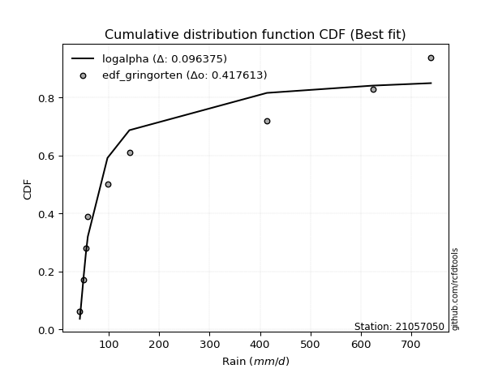</img></img>

</div>


### 9. Empirical - EDF Filliben (1975)

The specific values of the constants (0.3175) (often denoted as $alpha$) and (0.365) are derived from a method proposed by James J. Filliben in a 1975 paper. This particular formula is the mean value of the $i$-th order statistic of the normal distribution and is considered a robust and effective plotting position formula for the normal probability plot correlation coefficient test for normality.

<div align="center">


$P=(m-0.3175)/(n+0.365)$


</div>


**9.1. Empirical values**

<div align="center">

|                | 0                   | 1                  | 2                   | 3                   | 4            | 5                  | 6                  | 7                  | 8                  |
|:---------------|:--------------------|:-------------------|:--------------------|:--------------------|:-------------|:-------------------|:-------------------|:-------------------|:-------------------|
| date           | 2021                | 2025               | 2020                | 2019                | 2024         | 2009               | 2007               | 2008               | 2006               |
| x              | 42.8                | 44.0               | 50.4                | 54.6                | 97.6         | 141.1              | 413.8              | 623.5              | 739.0              |
| m              | 1                   | 2                  | 3                   | 4                   | 5            | 6                  | 7                  | 8                  | 9                  |
| empirical_dist | edf_filliben        | edf_filliben       | edf_filliben        | edf_filliben        | edf_filliben | edf_filliben       | edf_filliben       | edf_filliben       | edf_filliben       |
| empirical      | 0.07287773625200214 | 0.1796583021890016 | 0.28643886812600106 | 0.39321943406300053 | 0.5          | 0.6067805659369995 | 0.7135611318739989 | 0.8203416978109984 | 0.9271222637479978 |
| empirical_tr   | 1.0786063921681543  | 1.219004230393752  | 1.401421623643846   | 1.6480422349318082  | 2.0          | 2.5431093007467753 | 3.491146318732526  | 5.566121842496286  | 13.721611721611705 |

</div>


**9.2. Kolmogorov-Smirnov fit test (sorted by Δ)**


<div align="center">

|                | 0                   | 1                   | 2                   | 3                   | 4                   | 5                   | 6                   | 7                   | 8                   | 9                   | 10                  | 11                  | 12                  | 13                  | 14                  | 15                  | 16                  | 17                  | 18                  | 19                  | 20                  | 21                  | 22                  | 23                  | 24                  | 25                  | 26                  | 27                  | 28                  | 29                  | 30                  | 31                  | 32                  | 33                  | 34                  | 35                  | 36                    | 37                  | 38                  | 39                  | 40                  | 41                  | 42                  | 43                  | 44                  | 45                  | 46                  | 47                  | 48                  | 49                  | 50                  | 51                  | 52                  | 53                  | 54                  | 55                  | 56                  | 57                  | 58                  | 59                  | 60                  | 61                  | 62                  | 63                  | 64                  | 65                  | 66                  | 67                  | 68                  | 69                  | 70                  | 71                  | 72                  | 73                  | 74                  | 75                  | 76                  | 77                  | 78                  | 79                  | 80                  | 81                  | 82                  | 83                  | 84                  | 85                  | 86                  | 87                  | 88                  | 89                  |
|:---------------|:--------------------|:--------------------|:--------------------|:--------------------|:--------------------|:--------------------|:--------------------|:--------------------|:--------------------|:--------------------|:--------------------|:--------------------|:--------------------|:--------------------|:--------------------|:--------------------|:--------------------|:--------------------|:--------------------|:--------------------|:--------------------|:--------------------|:--------------------|:--------------------|:--------------------|:--------------------|:--------------------|:--------------------|:--------------------|:--------------------|:--------------------|:--------------------|:--------------------|:--------------------|:--------------------|:--------------------|:----------------------|:--------------------|:--------------------|:--------------------|:--------------------|:--------------------|:--------------------|:--------------------|:--------------------|:--------------------|:--------------------|:--------------------|:--------------------|:--------------------|:--------------------|:--------------------|:--------------------|:--------------------|:--------------------|:--------------------|:--------------------|:--------------------|:--------------------|:--------------------|:--------------------|:--------------------|:--------------------|:--------------------|:--------------------|:--------------------|:--------------------|:--------------------|:--------------------|:--------------------|:--------------------|:--------------------|:--------------------|:--------------------|:--------------------|:--------------------|:--------------------|:--------------------|:--------------------|:--------------------|:--------------------|:--------------------|:--------------------|:--------------------|:--------------------|:--------------------|:--------------------|:--------------------|:--------------------|:--------------------|
| station        | 21057050            | 21057050            | 21057050            | 21057050            | 21057050            | 21057050            | 21057050            | 21057050            | 21057050            | 21057050            | 21057050            | 21057050            | 21057050            | 21057050            | 21057050            | 21057050            | 21057050            | 21057050            | 21057050            | 21057050            | 21057050            | 21057050            | 21057050            | 21057050            | 21057050            | 21057050            | 21057050            | 21057050            | 21057050            | 21057050            | 21057050            | 21057050            | 21057050            | 21057050            | 21057050            | 21057050            | 21057050              | 21057050            | 21057050            | 21057050            | 21057050            | 21057050            | 21057050            | 21057050            | 21057050            | 21057050            | 21057050            | 21057050            | 21057050            | 21057050            | 21057050            | 21057050            | 21057050            | 21057050            | 21057050            | 21057050            | 21057050            | 21057050            | 21057050            | 21057050            | 21057050            | 21057050            | 21057050            | 21057050            | 21057050            | 21057050            | 21057050            | 21057050            | 21057050            | 21057050            | 21057050            | 21057050            | 21057050            | 21057050            | 21057050            | 21057050            | 21057050            | 21057050            | 21057050            | 21057050            | 21057050            | 21057050            | 21057050            | 21057050            | 21057050            | 21057050            | 21057050            | 21057050            | 21057050            | 21057050            |
| empirical_dist | edf_filliben        | edf_filliben        | edf_filliben        | edf_filliben        | edf_filliben        | edf_filliben        | edf_filliben        | edf_filliben        | edf_filliben        | edf_filliben        | edf_filliben        | edf_filliben        | edf_filliben        | edf_filliben        | edf_filliben        | edf_filliben        | edf_filliben        | edf_filliben        | edf_filliben        | edf_filliben        | edf_filliben        | edf_filliben        | edf_filliben        | edf_filliben        | edf_filliben        | edf_filliben        | edf_filliben        | edf_filliben        | edf_filliben        | edf_filliben        | edf_filliben        | edf_filliben        | edf_filliben        | edf_filliben        | edf_filliben        | edf_filliben        | edf_filliben          | edf_filliben        | edf_filliben        | edf_filliben        | edf_filliben        | edf_filliben        | edf_filliben        | edf_filliben        | edf_filliben        | edf_filliben        | edf_filliben        | edf_filliben        | edf_filliben        | edf_filliben        | edf_filliben        | edf_filliben        | edf_filliben        | edf_filliben        | edf_filliben        | edf_filliben        | edf_filliben        | edf_filliben        | edf_filliben        | edf_filliben        | edf_filliben        | edf_filliben        | edf_filliben        | edf_filliben        | edf_filliben        | edf_filliben        | edf_filliben        | edf_filliben        | edf_filliben        | edf_filliben        | edf_filliben        | edf_filliben        | edf_filliben        | edf_filliben        | edf_filliben        | edf_filliben        | edf_filliben        | edf_filliben        | edf_filliben        | edf_filliben        | edf_filliben        | edf_filliben        | edf_filliben        | edf_filliben        | edf_filliben        | edf_filliben        | edf_filliben        | edf_filliben        | edf_filliben        | edf_filliben        |
| p_dist         | weibull_min         | pareto              | loghalfnorm         | logchi2             | invgamma            | logalpha            | loginvweibull       | loginvgamma         | logf                | lograyleigh         | logbetaprime        | logmaxwell          | logmielke           | logncf              | loginvgauss         | loghalflogistic     | halflogistic        | logpearson3         | fisk                | nct                 | lognct              | logloggamma         | ncf                 | lognorm             | lognorm             | logcrystalball      | logt                | betaprime           | loggenlogistic      | halfnorm            | logjohnsonsu        | loggumbel_r         | invgauss            | logkstwobign        | moyal               | logexponnorm        | loglaplace_asymmetric | logexpon            | logmoyal            | loggenexpon         | logweibull_min      | loglogistic         | logtruncnorm        | loggompertz         | loggumbel_l         | pearson3            | alpha               | gumbel_r            | genlogistic         | rayleigh            | loghypsecant        | logrice             | maxwell             | logerlang           | loglaplace          | nakagami            | kstwobign           | norm                | erlang              | wald                | gamma               | logistic            | rice                | hypsecant           | f                   | logfisk             | t                   | gumbel_l            | laplace             | exponnorm           | genexpon            | expon               | laplace_asymmetric  | lognakagami         | logwald             | gompertz            | logpareto           | truncnorm           | loglognorm          | fatiguelife         | logfatiguelife      | invweibull          | gibrat              | loggibrat           | loggamma            | loggamma            | crystalball         | johnsonsu           | chi2                | mielke              |
| delta          | 0.13220709280054638 | 0.1445715319296096  | 0.15065695657914652 | 0.15299475655936368 | 0.15442683720935313 | 0.1559226995167523  | 0.1566701105507904  | 0.15946496046549308 | 0.15960506152282294 | 0.1638724521284832  | 0.166902561694819   | 0.16997728682386715 | 0.17272620962158203 | 0.17416059056739197 | 0.17505024448857343 | 0.1779357722201124  | 0.17825542594942057 | 0.17845405473311216 | 0.18031506845150005 | 0.18197320844692388 | 0.18212017521399246 | 0.18310918772189835 | 0.18452363229183721 | 0.18461180880107753 | 0.18461180880107753 | 0.18461181167152863 | 0.18461255075098826 | 0.18468834701232995 | 0.185040932411867   | 0.18526830888133217 | 0.1865861769903145  | 0.18914277225201048 | 0.19001387138338588 | 0.19540480652955913 | 0.19910837874432274 | 0.19974241558203965 | 0.20047249876238182   | 0.20069947821036027 | 0.20119371336918535 | 0.20298278931194713 | 0.20632940451360815 | 0.20649960743876655 | 0.20871926480218642 | 0.21017900596111336 | 0.21329853528293044 | 0.21433622711056471 | 0.21465012785438498 | 0.21621121756669442 | 0.2164127483928428  | 0.21938058586423692 | 0.21964163472599388 | 0.22011213739917296 | 0.23136611375999705 | 0.23427080870632788 | 0.2344726416549708  | 0.23765976217869283 | 0.24956076798348492 | 0.2629140249927121  | 0.26363932056707473 | 0.26579541283341324 | 0.2684722800220857  | 0.28137216224600825 | 0.2907648743152973  | 0.295589568707599   | 0.3024343574768681  | 0.30539515668033834 | 0.3218845308169138  | 0.32190062596179775 | 0.32357061146327426 | 0.3354397226442417  | 0.3365859404655844  | 0.33658595610335273 | 0.3365860122539619  | 0.337986985127559   | 0.3393579978734567  | 0.33994532045105585 | 0.3419123625918733  | 0.3454802634107613  | 0.3485411436581466  | 0.35230607609608755 | 0.37833190924617    | 0.3809057813368856  | 0.3909826952320702  | 0.39321943406300053 | 0.411041452320834   | 0.411041452320834   | 0.47510711368644054 | 0.5933479343395255  | 0.6087568537478146  | nan                 |
| deltao         | 0.41761268023100007 | 0.41761268023100007 | 0.41761268023100007 | 0.41761268023100007 | 0.41761268023100007 | 0.41761268023100007 | 0.41761268023100007 | 0.41761268023100007 | 0.41761268023100007 | 0.41761268023100007 | 0.41761268023100007 | 0.41761268023100007 | 0.41761268023100007 | 0.41761268023100007 | 0.41761268023100007 | 0.41761268023100007 | 0.41761268023100007 | 0.41761268023100007 | 0.41761268023100007 | 0.41761268023100007 | 0.41761268023100007 | 0.41761268023100007 | 0.41761268023100007 | 0.41761268023100007 | 0.41761268023100007 | 0.41761268023100007 | 0.41761268023100007 | 0.41761268023100007 | 0.41761268023100007 | 0.41761268023100007 | 0.41761268023100007 | 0.41761268023100007 | 0.41761268023100007 | 0.41761268023100007 | 0.41761268023100007 | 0.41761268023100007 | 0.41761268023100007   | 0.41761268023100007 | 0.41761268023100007 | 0.41761268023100007 | 0.41761268023100007 | 0.41761268023100007 | 0.41761268023100007 | 0.41761268023100007 | 0.41761268023100007 | 0.41761268023100007 | 0.41761268023100007 | 0.41761268023100007 | 0.41761268023100007 | 0.41761268023100007 | 0.41761268023100007 | 0.41761268023100007 | 0.41761268023100007 | 0.41761268023100007 | 0.41761268023100007 | 0.41761268023100007 | 0.41761268023100007 | 0.41761268023100007 | 0.41761268023100007 | 0.41761268023100007 | 0.41761268023100007 | 0.41761268023100007 | 0.41761268023100007 | 0.41761268023100007 | 0.41761268023100007 | 0.41761268023100007 | 0.41761268023100007 | 0.41761268023100007 | 0.41761268023100007 | 0.41761268023100007 | 0.41761268023100007 | 0.41761268023100007 | 0.41761268023100007 | 0.41761268023100007 | 0.41761268023100007 | 0.41761268023100007 | 0.41761268023100007 | 0.41761268023100007 | 0.41761268023100007 | 0.41761268023100007 | 0.41761268023100007 | 0.41761268023100007 | 0.41761268023100007 | 0.41761268023100007 | 0.41761268023100007 | 0.41761268023100007 | 0.41761268023100007 | 0.41761268023100007 | 0.41761268023100007 | 0.41761268023100007 |
| eval           | Δo > Δ              | Δo > Δ              | Δo > Δ              | Δo > Δ              | Δo > Δ              | Δo > Δ              | Δo > Δ              | Δo > Δ              | Δo > Δ              | Δo > Δ              | Δo > Δ              | Δo > Δ              | Δo > Δ              | Δo > Δ              | Δo > Δ              | Δo > Δ              | Δo > Δ              | Δo > Δ              | Δo > Δ              | Δo > Δ              | Δo > Δ              | Δo > Δ              | Δo > Δ              | Δo > Δ              | Δo > Δ              | Δo > Δ              | Δo > Δ              | Δo > Δ              | Δo > Δ              | Δo > Δ              | Δo > Δ              | Δo > Δ              | Δo > Δ              | Δo > Δ              | Δo > Δ              | Δo > Δ              | Δo > Δ                | Δo > Δ              | Δo > Δ              | Δo > Δ              | Δo > Δ              | Δo > Δ              | Δo > Δ              | Δo > Δ              | Δo > Δ              | Δo > Δ              | Δo > Δ              | Δo > Δ              | Δo > Δ              | Δo > Δ              | Δo > Δ              | Δo > Δ              | Δo > Δ              | Δo > Δ              | Δo > Δ              | Δo > Δ              | Δo > Δ              | Δo > Δ              | Δo > Δ              | Δo > Δ              | Δo > Δ              | Δo > Δ              | Δo > Δ              | Δo > Δ              | Δo > Δ              | Δo > Δ              | Δo > Δ              | Δo > Δ              | Δo > Δ              | Δo > Δ              | Δo > Δ              | Δo > Δ              | Δo > Δ              | Δo > Δ              | Δo > Δ              | Δo > Δ              | Δo > Δ              | Δo > Δ              | Δo > Δ              | Δo > Δ              | Δo > Δ              | Δo > Δ              | Δo > Δ              | Δo > Δ              | Δo > Δ              | Δo > Δ              | Δo <= Δ             | Δo <= Δ             | Δo <= Δ             | Δo <= Δ             |
| fit            | 1                   | 1                   | 1                   | 1                   | 1                   | 1                   | 1                   | 1                   | 1                   | 1                   | 1                   | 1                   | 1                   | 1                   | 1                   | 1                   | 1                   | 1                   | 1                   | 1                   | 1                   | 1                   | 1                   | 1                   | 1                   | 1                   | 1                   | 1                   | 1                   | 1                   | 1                   | 1                   | 1                   | 1                   | 1                   | 1                   | 1                     | 1                   | 1                   | 1                   | 1                   | 1                   | 1                   | 1                   | 1                   | 1                   | 1                   | 1                   | 1                   | 1                   | 1                   | 1                   | 1                   | 1                   | 1                   | 1                   | 1                   | 1                   | 1                   | 1                   | 1                   | 1                   | 1                   | 1                   | 1                   | 1                   | 1                   | 1                   | 1                   | 1                   | 1                   | 1                   | 1                   | 1                   | 1                   | 1                   | 1                   | 1                   | 1                   | 1                   | 1                   | 1                   | 1                   | 1                   | 1                   | 1                   | 0                   | 0                   | 0                   | 0                   |
| n              | 9                   | 9                   | 9                   | 9                   | 9                   | 9                   | 9                   | 9                   | 9                   | 9                   | 9                   | 9                   | 9                   | 9                   | 9                   | 9                   | 9                   | 9                   | 9                   | 9                   | 9                   | 9                   | 9                   | 9                   | 9                   | 9                   | 9                   | 9                   | 9                   | 9                   | 9                   | 9                   | 9                   | 9                   | 9                   | 9                   | 9                     | 9                   | 9                   | 9                   | 9                   | 9                   | 9                   | 9                   | 9                   | 9                   | 9                   | 9                   | 9                   | 9                   | 9                   | 9                   | 9                   | 9                   | 9                   | 9                   | 9                   | 9                   | 9                   | 9                   | 9                   | 9                   | 9                   | 9                   | 9                   | 9                   | 9                   | 9                   | 9                   | 9                   | 9                   | 9                   | 9                   | 9                   | 9                   | 9                   | 9                   | 9                   | 9                   | 9                   | 9                   | 9                   | 9                   | 9                   | 9                   | 9                   | 9                   | 9                   | 9                   | 9                   |
| best_fit       | 1                   | 0                   | 0                   | 0                   | 0                   | 0                   | 0                   | 0                   | 0                   | 0                   | 0                   | 0                   | 0                   | 0                   | 0                   | 0                   | 0                   | 0                   | 0                   | 0                   | 0                   | 0                   | 0                   | 0                   | 0                   | 0                   | 0                   | 0                   | 0                   | 0                   | 0                   | 0                   | 0                   | 0                   | 0                   | 0                   | 0                     | 0                   | 0                   | 0                   | 0                   | 0                   | 0                   | 0                   | 0                   | 0                   | 0                   | 0                   | 0                   | 0                   | 0                   | 0                   | 0                   | 0                   | 0                   | 0                   | 0                   | 0                   | 0                   | 0                   | 0                   | 0                   | 0                   | 0                   | 0                   | 0                   | 0                   | 0                   | 0                   | 0                   | 0                   | 0                   | 0                   | 0                   | 0                   | 0                   | 0                   | 0                   | 0                   | 0                   | 0                   | 0                   | 0                   | 0                   | 0                   | 0                   | 0                   | 0                   | 0                   | 0                   |
| best_fit_sort  | 1                   | 2                   | 3                   | 4                   | 5                   | 6                   | 7                   | 8                   | 9                   | 10                  | 11                  | 12                  | 13                  | 14                  | 15                  | 16                  | 17                  | 18                  | 19                  | 20                  | 21                  | 22                  | 23                  | 24                  | 25                  | 26                  | 27                  | 28                  | 29                  | 30                  | 31                  | 32                  | 33                  | 34                  | 35                  | 36                  | 37                    | 38                  | 39                  | 40                  | 41                  | 42                  | 43                  | 44                  | 45                  | 46                  | 47                  | 48                  | 49                  | 50                  | 51                  | 52                  | 53                  | 54                  | 55                  | 56                  | 57                  | 58                  | 59                  | 60                  | 61                  | 62                  | 63                  | 64                  | 65                  | 66                  | 67                  | 68                  | 69                  | 70                  | 71                  | 72                  | 73                  | 74                  | 75                  | 76                  | 77                  | 78                  | 79                  | 80                  | 81                  | 82                  | 83                  | 84                  | 85                  | 86                  | 87                  | 88                  | 89                  | 90                  |

</div>


<div align="center">

</img>

</div>


**9.3. Best fit**

<div align="center">

|   id |   station | empirical_dist   | p_dist      |    delta |   deltao | eval   |   fit |   n |   best_fit |   best_fit_sort |
|-----:|----------:|:-----------------|:------------|---------:|---------:|:-------|------:|----:|-----------:|----------------:|
|    0 |  21057050 | edf_filliben     | weibull_min | 0.132207 | 0.417613 | Δo > Δ |     1 |   9 |          1 |               1 |

</div>


<div align="center">

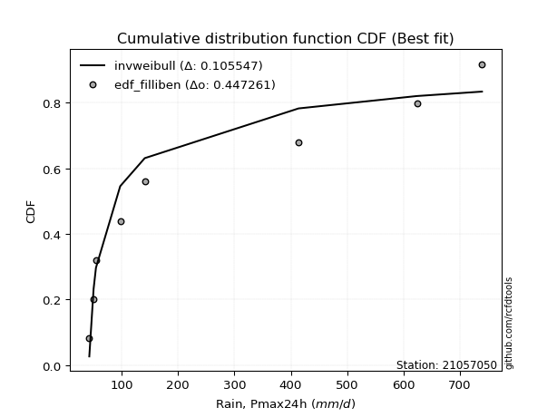</img></img>

</div>


### 10. Empirical - EDF Jenkinson (1977)

The Jenkinson formula in hydrology is an empirical plotting position formula used to estimate the non-exceedance probability _(P)_ or return period _(T)_ of a given ordered observation within a sample. It is a widely used method in the frequency analysis of extreme events such as floods and rainfall, as it provides a distribution-free way to plot data. _a≈0.31_ and _b≈0.38_ are constants derived to approximate the median of the probability distribution for the given rank.

<div align="center">


$P=(m-a)/(n+b)$


</div>


**10.1. Empirical values**

<div align="center">

|                | 0                   | 1                   | 2                  | 3                   | 4             | 5                  | 6                  | 7                  | 8                  |
|:---------------|:--------------------|:--------------------|:-------------------|:--------------------|:--------------|:-------------------|:-------------------|:-------------------|:-------------------|
| date           | 2021                | 2025                | 2020               | 2019                | 2024          | 2009               | 2007               | 2008               | 2006               |
| x              | 42.8                | 44.0                | 50.4               | 54.6                | 97.6          | 141.1              | 413.8              | 623.5              | 739.0              |
| m              | 1                   | 2                   | 3                  | 4                   | 5             | 6                  | 7                  | 8                  | 9                  |
| empirical_dist | edf_jenkinson       | edf_jenkinson       | edf_jenkinson      | edf_jenkinson       | edf_jenkinson | edf_jenkinson      | edf_jenkinson      | edf_jenkinson      | edf_jenkinson      |
| empirical      | 0.07356076759061833 | 0.18017057569296374 | 0.2867803837953091 | 0.39339019189765456 | 0.5           | 0.6066098081023454 | 0.7132196162046908 | 0.8198294243070362 | 0.9264392324093815 |
| empirical_tr   | 1.0794016110471807  | 1.2197659297789336  | 1.4020926756352765 | 1.6485061511423549  | 2.0           | 2.542005420054201  | 3.486988847583642  | 5.550295857988164  | 13.5942028985507   |

</div>


**10.2. Kolmogorov-Smirnov fit test (sorted by Δ)**


<div align="center">

|                | 0                   | 1                   | 2                   | 3                   | 4                   | 5                   | 6                   | 7                   | 8                   | 9                   | 10                  | 11                  | 12                  | 13                  | 14                  | 15                  | 16                  | 17                  | 18                  | 19                  | 20                  | 21                  | 22                  | 23                  | 24                  | 25                  | 26                  | 27                  | 28                  | 29                  | 30                  | 31                  | 32                  | 33                  | 34                  | 35                  | 36                    | 37                  | 38                  | 39                  | 40                  | 41                  | 42                  | 43                  | 44                  | 45                  | 46                  | 47                  | 48                  | 49                  | 50                  | 51                  | 52                  | 53                  | 54                  | 55                  | 56                  | 57                  | 58                  | 59                  | 60                  | 61                  | 62                  | 63                  | 64                  | 65                  | 66                  | 67                  | 68                  | 69                  | 70                  | 71                  | 72                  | 73                  | 74                  | 75                  | 76                  | 77                  | 78                  | 79                  | 80                  | 81                  | 82                  | 83                  | 84                  | 85                  | 86                  | 87                  | 88                  | 89                  |
|:---------------|:--------------------|:--------------------|:--------------------|:--------------------|:--------------------|:--------------------|:--------------------|:--------------------|:--------------------|:--------------------|:--------------------|:--------------------|:--------------------|:--------------------|:--------------------|:--------------------|:--------------------|:--------------------|:--------------------|:--------------------|:--------------------|:--------------------|:--------------------|:--------------------|:--------------------|:--------------------|:--------------------|:--------------------|:--------------------|:--------------------|:--------------------|:--------------------|:--------------------|:--------------------|:--------------------|:--------------------|:----------------------|:--------------------|:--------------------|:--------------------|:--------------------|:--------------------|:--------------------|:--------------------|:--------------------|:--------------------|:--------------------|:--------------------|:--------------------|:--------------------|:--------------------|:--------------------|:--------------------|:--------------------|:--------------------|:--------------------|:--------------------|:--------------------|:--------------------|:--------------------|:--------------------|:--------------------|:--------------------|:--------------------|:--------------------|:--------------------|:--------------------|:--------------------|:--------------------|:--------------------|:--------------------|:--------------------|:--------------------|:--------------------|:--------------------|:--------------------|:--------------------|:--------------------|:--------------------|:--------------------|:--------------------|:--------------------|:--------------------|:--------------------|:--------------------|:--------------------|:--------------------|:--------------------|:--------------------|:--------------------|
| station        | 21057050            | 21057050            | 21057050            | 21057050            | 21057050            | 21057050            | 21057050            | 21057050            | 21057050            | 21057050            | 21057050            | 21057050            | 21057050            | 21057050            | 21057050            | 21057050            | 21057050            | 21057050            | 21057050            | 21057050            | 21057050            | 21057050            | 21057050            | 21057050            | 21057050            | 21057050            | 21057050            | 21057050            | 21057050            | 21057050            | 21057050            | 21057050            | 21057050            | 21057050            | 21057050            | 21057050            | 21057050              | 21057050            | 21057050            | 21057050            | 21057050            | 21057050            | 21057050            | 21057050            | 21057050            | 21057050            | 21057050            | 21057050            | 21057050            | 21057050            | 21057050            | 21057050            | 21057050            | 21057050            | 21057050            | 21057050            | 21057050            | 21057050            | 21057050            | 21057050            | 21057050            | 21057050            | 21057050            | 21057050            | 21057050            | 21057050            | 21057050            | 21057050            | 21057050            | 21057050            | 21057050            | 21057050            | 21057050            | 21057050            | 21057050            | 21057050            | 21057050            | 21057050            | 21057050            | 21057050            | 21057050            | 21057050            | 21057050            | 21057050            | 21057050            | 21057050            | 21057050            | 21057050            | 21057050            | 21057050            |
| empirical_dist | edf_jenkinson       | edf_jenkinson       | edf_jenkinson       | edf_jenkinson       | edf_jenkinson       | edf_jenkinson       | edf_jenkinson       | edf_jenkinson       | edf_jenkinson       | edf_jenkinson       | edf_jenkinson       | edf_jenkinson       | edf_jenkinson       | edf_jenkinson       | edf_jenkinson       | edf_jenkinson       | edf_jenkinson       | edf_jenkinson       | edf_jenkinson       | edf_jenkinson       | edf_jenkinson       | edf_jenkinson       | edf_jenkinson       | edf_jenkinson       | edf_jenkinson       | edf_jenkinson       | edf_jenkinson       | edf_jenkinson       | edf_jenkinson       | edf_jenkinson       | edf_jenkinson       | edf_jenkinson       | edf_jenkinson       | edf_jenkinson       | edf_jenkinson       | edf_jenkinson       | edf_jenkinson         | edf_jenkinson       | edf_jenkinson       | edf_jenkinson       | edf_jenkinson       | edf_jenkinson       | edf_jenkinson       | edf_jenkinson       | edf_jenkinson       | edf_jenkinson       | edf_jenkinson       | edf_jenkinson       | edf_jenkinson       | edf_jenkinson       | edf_jenkinson       | edf_jenkinson       | edf_jenkinson       | edf_jenkinson       | edf_jenkinson       | edf_jenkinson       | edf_jenkinson       | edf_jenkinson       | edf_jenkinson       | edf_jenkinson       | edf_jenkinson       | edf_jenkinson       | edf_jenkinson       | edf_jenkinson       | edf_jenkinson       | edf_jenkinson       | edf_jenkinson       | edf_jenkinson       | edf_jenkinson       | edf_jenkinson       | edf_jenkinson       | edf_jenkinson       | edf_jenkinson       | edf_jenkinson       | edf_jenkinson       | edf_jenkinson       | edf_jenkinson       | edf_jenkinson       | edf_jenkinson       | edf_jenkinson       | edf_jenkinson       | edf_jenkinson       | edf_jenkinson       | edf_jenkinson       | edf_jenkinson       | edf_jenkinson       | edf_jenkinson       | edf_jenkinson       | edf_jenkinson       | edf_jenkinson       |
| p_dist         | weibull_min         | pareto              | loghalfnorm         | logchi2             | invgamma            | logalpha            | loginvweibull       | loginvgamma         | logf                | lograyleigh         | logbetaprime        | logmaxwell          | logmielke           | logncf              | loginvgauss         | halflogistic        | loghalflogistic     | logpearson3         | fisk                | nct                 | lognct              | logloggamma         | ncf                 | lognorm             | lognorm             | logcrystalball      | logt                | betaprime           | halfnorm            | loggenlogistic      | logjohnsonsu        | loggumbel_r         | invgauss            | logkstwobign        | moyal               | logexponnorm        | loglaplace_asymmetric | logexpon            | logmoyal            | loggenexpon         | logweibull_min      | loglogistic         | logtruncnorm        | loggompertz         | loggumbel_l         | pearson3            | alpha               | gumbel_r            | genlogistic         | rayleigh            | loghypsecant        | logrice             | maxwell             | logerlang           | loglaplace          | nakagami            | kstwobign           | norm                | erlang              | wald                | gamma               | logistic            | rice                | hypsecant           | f                   | logfisk             | gumbel_l            | t                   | laplace             | exponnorm           | genexpon            | expon               | laplace_asymmetric  | lognakagami         | logwald             | gompertz            | logpareto           | truncnorm           | loglognorm          | fatiguelife         | logfatiguelife      | invweibull          | gibrat              | loggibrat           | loggamma            | loggamma            | crystalball         | johnsonsu           | chi2                | mielke              |
| delta          | 0.1323778506352004  | 0.1445715319296096  | 0.15082771441380055 | 0.15333627222867185 | 0.15442683720935313 | 0.1559226995167523  | 0.1566701105507904  | 0.15946496046549308 | 0.15960506152282294 | 0.16404320996313723 | 0.16707331952947305 | 0.17014804465852118 | 0.1730677252908902  | 0.174331348402046   | 0.17505024448857343 | 0.17808466811476653 | 0.17810653005476643 | 0.1786248125677662  | 0.1804858262861541  | 0.18214396628157792 | 0.1822909330486465  | 0.1832799455565524  | 0.18469439012649125 | 0.18478256663573156 | 0.18478256663573156 | 0.18478256950618266 | 0.1847833085856423  | 0.18485910484698398 | 0.18509755104667813 | 0.18521169024652104 | 0.18675693482496852 | 0.18931353008666452 | 0.19035538705269406 | 0.19557556436421317 | 0.1989376209096687  | 0.19991317341669368 | 0.20064325659703586   | 0.2008702360450143  | 0.20136447120383938 | 0.20315354714660117 | 0.2056463731749919  | 0.2066703652734206  | 0.20889002263684045 | 0.2103497637957674  | 0.21346929311758447 | 0.21416546927591068 | 0.21499164352369315 | 0.2160404597320404  | 0.21624199055818877 | 0.2192098280295829  | 0.2198123925606479  | 0.220282895233827   | 0.23119535592534302 | 0.23461232437563606 | 0.23464339948962484 | 0.23783052001334687 | 0.2493900101488309  | 0.26274326715805807 | 0.2639808362363829  | 0.26596617066806727 | 0.26881379569139385 | 0.2812014044113542  | 0.29059411648064326 | 0.29541881087294497 | 0.30209284180756    | 0.30539515668033834 | 0.3217298681271437  | 0.3218845308169138  | 0.3233998536286202  | 0.33561048047889575 | 0.3367566983002384  | 0.33675671393800677 | 0.33675677008861593 | 0.3376454694582509  | 0.33952875570811075 | 0.3401160782857099  | 0.34140008908791114 | 0.34565102124541536 | 0.34802887015418443 | 0.3517938025921254  | 0.37781963574220784 | 0.3802227499982693  | 0.3911534530667242  | 0.39339019189765456 | 0.4109071948756984  | 0.4109071948756984  | 0.4744240823478243  | 0.5928356608355634  | 0.6084153380785066  | nan                 |
| deltao         | 0.41761268023100007 | 0.41761268023100007 | 0.41761268023100007 | 0.41761268023100007 | 0.41761268023100007 | 0.41761268023100007 | 0.41761268023100007 | 0.41761268023100007 | 0.41761268023100007 | 0.41761268023100007 | 0.41761268023100007 | 0.41761268023100007 | 0.41761268023100007 | 0.41761268023100007 | 0.41761268023100007 | 0.41761268023100007 | 0.41761268023100007 | 0.41761268023100007 | 0.41761268023100007 | 0.41761268023100007 | 0.41761268023100007 | 0.41761268023100007 | 0.41761268023100007 | 0.41761268023100007 | 0.41761268023100007 | 0.41761268023100007 | 0.41761268023100007 | 0.41761268023100007 | 0.41761268023100007 | 0.41761268023100007 | 0.41761268023100007 | 0.41761268023100007 | 0.41761268023100007 | 0.41761268023100007 | 0.41761268023100007 | 0.41761268023100007 | 0.41761268023100007   | 0.41761268023100007 | 0.41761268023100007 | 0.41761268023100007 | 0.41761268023100007 | 0.41761268023100007 | 0.41761268023100007 | 0.41761268023100007 | 0.41761268023100007 | 0.41761268023100007 | 0.41761268023100007 | 0.41761268023100007 | 0.41761268023100007 | 0.41761268023100007 | 0.41761268023100007 | 0.41761268023100007 | 0.41761268023100007 | 0.41761268023100007 | 0.41761268023100007 | 0.41761268023100007 | 0.41761268023100007 | 0.41761268023100007 | 0.41761268023100007 | 0.41761268023100007 | 0.41761268023100007 | 0.41761268023100007 | 0.41761268023100007 | 0.41761268023100007 | 0.41761268023100007 | 0.41761268023100007 | 0.41761268023100007 | 0.41761268023100007 | 0.41761268023100007 | 0.41761268023100007 | 0.41761268023100007 | 0.41761268023100007 | 0.41761268023100007 | 0.41761268023100007 | 0.41761268023100007 | 0.41761268023100007 | 0.41761268023100007 | 0.41761268023100007 | 0.41761268023100007 | 0.41761268023100007 | 0.41761268023100007 | 0.41761268023100007 | 0.41761268023100007 | 0.41761268023100007 | 0.41761268023100007 | 0.41761268023100007 | 0.41761268023100007 | 0.41761268023100007 | 0.41761268023100007 | 0.41761268023100007 |
| eval           | Δo > Δ              | Δo > Δ              | Δo > Δ              | Δo > Δ              | Δo > Δ              | Δo > Δ              | Δo > Δ              | Δo > Δ              | Δo > Δ              | Δo > Δ              | Δo > Δ              | Δo > Δ              | Δo > Δ              | Δo > Δ              | Δo > Δ              | Δo > Δ              | Δo > Δ              | Δo > Δ              | Δo > Δ              | Δo > Δ              | Δo > Δ              | Δo > Δ              | Δo > Δ              | Δo > Δ              | Δo > Δ              | Δo > Δ              | Δo > Δ              | Δo > Δ              | Δo > Δ              | Δo > Δ              | Δo > Δ              | Δo > Δ              | Δo > Δ              | Δo > Δ              | Δo > Δ              | Δo > Δ              | Δo > Δ                | Δo > Δ              | Δo > Δ              | Δo > Δ              | Δo > Δ              | Δo > Δ              | Δo > Δ              | Δo > Δ              | Δo > Δ              | Δo > Δ              | Δo > Δ              | Δo > Δ              | Δo > Δ              | Δo > Δ              | Δo > Δ              | Δo > Δ              | Δo > Δ              | Δo > Δ              | Δo > Δ              | Δo > Δ              | Δo > Δ              | Δo > Δ              | Δo > Δ              | Δo > Δ              | Δo > Δ              | Δo > Δ              | Δo > Δ              | Δo > Δ              | Δo > Δ              | Δo > Δ              | Δo > Δ              | Δo > Δ              | Δo > Δ              | Δo > Δ              | Δo > Δ              | Δo > Δ              | Δo > Δ              | Δo > Δ              | Δo > Δ              | Δo > Δ              | Δo > Δ              | Δo > Δ              | Δo > Δ              | Δo > Δ              | Δo > Δ              | Δo > Δ              | Δo > Δ              | Δo > Δ              | Δo > Δ              | Δo > Δ              | Δo <= Δ             | Δo <= Δ             | Δo <= Δ             | Δo <= Δ             |
| fit            | 1                   | 1                   | 1                   | 1                   | 1                   | 1                   | 1                   | 1                   | 1                   | 1                   | 1                   | 1                   | 1                   | 1                   | 1                   | 1                   | 1                   | 1                   | 1                   | 1                   | 1                   | 1                   | 1                   | 1                   | 1                   | 1                   | 1                   | 1                   | 1                   | 1                   | 1                   | 1                   | 1                   | 1                   | 1                   | 1                   | 1                     | 1                   | 1                   | 1                   | 1                   | 1                   | 1                   | 1                   | 1                   | 1                   | 1                   | 1                   | 1                   | 1                   | 1                   | 1                   | 1                   | 1                   | 1                   | 1                   | 1                   | 1                   | 1                   | 1                   | 1                   | 1                   | 1                   | 1                   | 1                   | 1                   | 1                   | 1                   | 1                   | 1                   | 1                   | 1                   | 1                   | 1                   | 1                   | 1                   | 1                   | 1                   | 1                   | 1                   | 1                   | 1                   | 1                   | 1                   | 1                   | 1                   | 0                   | 0                   | 0                   | 0                   |
| n              | 9                   | 9                   | 9                   | 9                   | 9                   | 9                   | 9                   | 9                   | 9                   | 9                   | 9                   | 9                   | 9                   | 9                   | 9                   | 9                   | 9                   | 9                   | 9                   | 9                   | 9                   | 9                   | 9                   | 9                   | 9                   | 9                   | 9                   | 9                   | 9                   | 9                   | 9                   | 9                   | 9                   | 9                   | 9                   | 9                   | 9                     | 9                   | 9                   | 9                   | 9                   | 9                   | 9                   | 9                   | 9                   | 9                   | 9                   | 9                   | 9                   | 9                   | 9                   | 9                   | 9                   | 9                   | 9                   | 9                   | 9                   | 9                   | 9                   | 9                   | 9                   | 9                   | 9                   | 9                   | 9                   | 9                   | 9                   | 9                   | 9                   | 9                   | 9                   | 9                   | 9                   | 9                   | 9                   | 9                   | 9                   | 9                   | 9                   | 9                   | 9                   | 9                   | 9                   | 9                   | 9                   | 9                   | 9                   | 9                   | 9                   | 9                   |
| best_fit       | 1                   | 0                   | 0                   | 0                   | 0                   | 0                   | 0                   | 0                   | 0                   | 0                   | 0                   | 0                   | 0                   | 0                   | 0                   | 0                   | 0                   | 0                   | 0                   | 0                   | 0                   | 0                   | 0                   | 0                   | 0                   | 0                   | 0                   | 0                   | 0                   | 0                   | 0                   | 0                   | 0                   | 0                   | 0                   | 0                   | 0                     | 0                   | 0                   | 0                   | 0                   | 0                   | 0                   | 0                   | 0                   | 0                   | 0                   | 0                   | 0                   | 0                   | 0                   | 0                   | 0                   | 0                   | 0                   | 0                   | 0                   | 0                   | 0                   | 0                   | 0                   | 0                   | 0                   | 0                   | 0                   | 0                   | 0                   | 0                   | 0                   | 0                   | 0                   | 0                   | 0                   | 0                   | 0                   | 0                   | 0                   | 0                   | 0                   | 0                   | 0                   | 0                   | 0                   | 0                   | 0                   | 0                   | 0                   | 0                   | 0                   | 0                   |
| best_fit_sort  | 1                   | 2                   | 3                   | 4                   | 5                   | 6                   | 7                   | 8                   | 9                   | 10                  | 11                  | 12                  | 13                  | 14                  | 15                  | 16                  | 17                  | 18                  | 19                  | 20                  | 21                  | 22                  | 23                  | 24                  | 25                  | 26                  | 27                  | 28                  | 29                  | 30                  | 31                  | 32                  | 33                  | 34                  | 35                  | 36                  | 37                    | 38                  | 39                  | 40                  | 41                  | 42                  | 43                  | 44                  | 45                  | 46                  | 47                  | 48                  | 49                  | 50                  | 51                  | 52                  | 53                  | 54                  | 55                  | 56                  | 57                  | 58                  | 59                  | 60                  | 61                  | 62                  | 63                  | 64                  | 65                  | 66                  | 67                  | 68                  | 69                  | 70                  | 71                  | 72                  | 73                  | 74                  | 75                  | 76                  | 77                  | 78                  | 79                  | 80                  | 81                  | 82                  | 83                  | 84                  | 85                  | 86                  | 87                  | 88                  | 89                  | 90                  |

</div>


<div align="center">

</img>

</div>


**10.3. Best fit**

<div align="center">

|   id |   station | empirical_dist   | p_dist      |    delta |   deltao | eval   |   fit |   n |   best_fit |   best_fit_sort |
|-----:|----------:|:-----------------|:------------|---------:|---------:|:-------|------:|----:|-----------:|----------------:|
|    0 |  21057050 | edf_jenkinson    | weibull_min | 0.132378 | 0.417613 | Δo > Δ |     1 |   9 |          1 |               1 |

</div>


<div align="center">

</img></img>

</div>


### 11. Empirical - EDF Cunnane (1978)

Cunnane´s work in statistical hydrology has focused on the performance and evaluation of different probability distributions (such as GEV, Gumbel, Lognormal) for flood frequency estimation. _b_ is a constant, typically set to 0.4.

<div align="center">


$P=(m-b)/(n+1-2b)$


</div>


**11.1. Empirical values**

<div align="center">

|                | 0                   | 1                  | 2                   | 3                  | 4           | 5                  | 6                 | 7                  | 8                  |
|:---------------|:--------------------|:-------------------|:--------------------|:-------------------|:------------|:-------------------|:------------------|:-------------------|:-------------------|
| date           | 2021                | 2025               | 2020                | 2019               | 2024        | 2009               | 2007              | 2008               | 2006               |
| x              | 42.8                | 44.0               | 50.4                | 54.6               | 97.6        | 141.1              | 413.8             | 623.5              | 739.0              |
| m              | 1                   | 2                  | 3                   | 4                  | 5           | 6                  | 7                 | 8                  | 9                  |
| empirical_dist | edf_cunnane         | edf_cunnane        | edf_cunnane         | edf_cunnane        | edf_cunnane | edf_cunnane        | edf_cunnane       | edf_cunnane        | edf_cunnane        |
| empirical      | 0.06521739130434782 | 0.1739130434782609 | 0.28260869565217395 | 0.391304347826087  | 0.5         | 0.6086956521739131 | 0.717391304347826 | 0.8260869565217391 | 0.9347826086956522 |
| empirical_tr   | 1.069767441860465   | 1.2105263157894737 | 1.393939393939394   | 1.6428571428571428 | 2.0         | 2.555555555555556  | 3.538461538461538 | 5.75               | 15.333333333333343 |

</div>


**11.2. Kolmogorov-Smirnov fit test (sorted by Δ)**


<div align="center">

|                | 0                   | 1                   | 2                   | 3                   | 4                   | 5                   | 6                   | 7                   | 8                   | 9                   | 10                  | 11                  | 12                  | 13                  | 14                  | 15                  | 16                  | 17                  | 18                  | 19                  | 20                  | 21                  | 22                  | 23                  | 24                  | 25                  | 26                  | 27                  | 28                  | 29                  | 30                  | 31                  | 32                  | 33                  | 34                  | 35                    | 36                  | 37                  | 38                  | 39                  | 40                  | 41                  | 42                  | 43                  | 44                  | 45                  | 46                  | 47                  | 48                  | 49                  | 50                  | 51                  | 52                  | 53                  | 54                  | 55                  | 56                  | 57                  | 58                  | 59                  | 60                  | 61                  | 62                  | 63                  | 64                  | 65                  | 66                  | 67                  | 68                  | 69                  | 70                  | 71                  | 72                  | 73                  | 74                  | 75                  | 76                  | 77                  | 78                  | 79                  | 80                  | 81                  | 82                  | 83                  | 84                  | 85                  | 86                  | 87                  | 88                  | 89                  |
|:---------------|:--------------------|:--------------------|:--------------------|:--------------------|:--------------------|:--------------------|:--------------------|:--------------------|:--------------------|:--------------------|:--------------------|:--------------------|:--------------------|:--------------------|:--------------------|:--------------------|:--------------------|:--------------------|:--------------------|:--------------------|:--------------------|:--------------------|:--------------------|:--------------------|:--------------------|:--------------------|:--------------------|:--------------------|:--------------------|:--------------------|:--------------------|:--------------------|:--------------------|:--------------------|:--------------------|:----------------------|:--------------------|:--------------------|:--------------------|:--------------------|:--------------------|:--------------------|:--------------------|:--------------------|:--------------------|:--------------------|:--------------------|:--------------------|:--------------------|:--------------------|:--------------------|:--------------------|:--------------------|:--------------------|:--------------------|:--------------------|:--------------------|:--------------------|:--------------------|:--------------------|:--------------------|:--------------------|:--------------------|:--------------------|:--------------------|:--------------------|:--------------------|:--------------------|:--------------------|:--------------------|:--------------------|:--------------------|:--------------------|:--------------------|:--------------------|:--------------------|:--------------------|:--------------------|:--------------------|:--------------------|:--------------------|:--------------------|:--------------------|:--------------------|:--------------------|:--------------------|:--------------------|:--------------------|:--------------------|:--------------------|
| station        | 21057050            | 21057050            | 21057050            | 21057050            | 21057050            | 21057050            | 21057050            | 21057050            | 21057050            | 21057050            | 21057050            | 21057050            | 21057050            | 21057050            | 21057050            | 21057050            | 21057050            | 21057050            | 21057050            | 21057050            | 21057050            | 21057050            | 21057050            | 21057050            | 21057050            | 21057050            | 21057050            | 21057050            | 21057050            | 21057050            | 21057050            | 21057050            | 21057050            | 21057050            | 21057050            | 21057050              | 21057050            | 21057050            | 21057050            | 21057050            | 21057050            | 21057050            | 21057050            | 21057050            | 21057050            | 21057050            | 21057050            | 21057050            | 21057050            | 21057050            | 21057050            | 21057050            | 21057050            | 21057050            | 21057050            | 21057050            | 21057050            | 21057050            | 21057050            | 21057050            | 21057050            | 21057050            | 21057050            | 21057050            | 21057050            | 21057050            | 21057050            | 21057050            | 21057050            | 21057050            | 21057050            | 21057050            | 21057050            | 21057050            | 21057050            | 21057050            | 21057050            | 21057050            | 21057050            | 21057050            | 21057050            | 21057050            | 21057050            | 21057050            | 21057050            | 21057050            | 21057050            | 21057050            | 21057050            | 21057050            |
| empirical_dist | edf_cunnane         | edf_cunnane         | edf_cunnane         | edf_cunnane         | edf_cunnane         | edf_cunnane         | edf_cunnane         | edf_cunnane         | edf_cunnane         | edf_cunnane         | edf_cunnane         | edf_cunnane         | edf_cunnane         | edf_cunnane         | edf_cunnane         | edf_cunnane         | edf_cunnane         | edf_cunnane         | edf_cunnane         | edf_cunnane         | edf_cunnane         | edf_cunnane         | edf_cunnane         | edf_cunnane         | edf_cunnane         | edf_cunnane         | edf_cunnane         | edf_cunnane         | edf_cunnane         | edf_cunnane         | edf_cunnane         | edf_cunnane         | edf_cunnane         | edf_cunnane         | edf_cunnane         | edf_cunnane           | edf_cunnane         | edf_cunnane         | edf_cunnane         | edf_cunnane         | edf_cunnane         | edf_cunnane         | edf_cunnane         | edf_cunnane         | edf_cunnane         | edf_cunnane         | edf_cunnane         | edf_cunnane         | edf_cunnane         | edf_cunnane         | edf_cunnane         | edf_cunnane         | edf_cunnane         | edf_cunnane         | edf_cunnane         | edf_cunnane         | edf_cunnane         | edf_cunnane         | edf_cunnane         | edf_cunnane         | edf_cunnane         | edf_cunnane         | edf_cunnane         | edf_cunnane         | edf_cunnane         | edf_cunnane         | edf_cunnane         | edf_cunnane         | edf_cunnane         | edf_cunnane         | edf_cunnane         | edf_cunnane         | edf_cunnane         | edf_cunnane         | edf_cunnane         | edf_cunnane         | edf_cunnane         | edf_cunnane         | edf_cunnane         | edf_cunnane         | edf_cunnane         | edf_cunnane         | edf_cunnane         | edf_cunnane         | edf_cunnane         | edf_cunnane         | edf_cunnane         | edf_cunnane         | edf_cunnane         | edf_cunnane         |
| p_dist         | weibull_min         | pareto              | loghalfnorm         | logchi2             | invgamma            | logalpha            | loginvweibull       | loginvgamma         | logf                | lograyleigh         | logbetaprime        | logmaxwell          | logmielke           | logncf              | loginvgauss         | loghalflogistic     | logpearson3         | fisk                | nct                 | halflogistic        | lognct              | logloggamma         | ncf                 | lognorm             | lognorm             | logcrystalball      | logt                | betaprime           | loggenlogistic      | logjohnsonsu        | loggumbel_r         | invgauss            | halfnorm            | logkstwobign        | logexponnorm        | loglaplace_asymmetric | logexpon            | logmoyal            | moyal               | loggenexpon         | loglogistic         | logtruncnorm        | loggompertz         | alpha               | loggumbel_l         | logweibull_min      | pearson3            | loghypsecant        | gumbel_r            | logrice             | genlogistic         | rayleigh            | logerlang           | loglaplace          | maxwell             | nakagami            | kstwobign           | erlang              | wald                | gamma               | norm                | logistic            | rice                | hypsecant           | logfisk             | f                   | t                   | gumbel_l            | laplace             | exponnorm           | genexpon            | expon               | laplace_asymmetric  | logwald             | gompertz            | lognakagami         | truncnorm           | logpareto           | loglognorm          | fatiguelife         | logfatiguelife      | invweibull          | gibrat              | loggibrat           | loggamma            | loggamma            | crystalball         | johnsonsu           | chi2                | mielke              |
| delta          | 0.13029200656363282 | 0.1445715319296096  | 0.14874187034223296 | 0.14916458408553657 | 0.15442683720935313 | 0.1559226995167523  | 0.1566701105507904  | 0.15946496046549308 | 0.15960506152282294 | 0.16195736589156964 | 0.16498747545790546 | 0.1680622005869536  | 0.16889603714775492 | 0.17224550433047842 | 0.17505024448857343 | 0.17602068598319884 | 0.1765389684961986  | 0.1783999822145865  | 0.18005812221001033 | 0.18017051218633418 | 0.1802050889770789  | 0.1811941014849848  | 0.18260854605492366 | 0.18269672256416397 | 0.18269672256416397 | 0.18269672543461507 | 0.1826974645140747  | 0.1827732607754164  | 0.18312584617495345 | 0.18467109075340093 | 0.18722768601509693 | 0.18736797009558548 | 0.19096706666716795 | 0.19348972029264558 | 0.1978273293451261  | 0.19855741252546827   | 0.19878439197344672 | 0.1992786271322718  | 0.20102346498123635 | 0.20106770307503358 | 0.204584521201853   | 0.20680417856527286 | 0.2082639197241998  | 0.21081995538055787 | 0.21138344904601689 | 0.2139897494612626  | 0.21625131334747832 | 0.21772654848908032 | 0.21812630380360803 | 0.2181970511622594  | 0.2183278346297564  | 0.22129567210115053 | 0.23044063623250077 | 0.23255755541805725 | 0.23328119999691066 | 0.23574467594177928 | 0.25147585422039853 | 0.2598091480932476  | 0.26388032659649974 | 0.26464210754825856 | 0.2648291112296257  | 0.28328724848292186 | 0.2926799605522109  | 0.2975046549445126  | 0.30539515668033834 | 0.3062645299506952  | 0.3218845308169138  | 0.32381571219871136 | 0.32548569770018787 | 0.33352463640732816 | 0.3346708542286708  | 0.3346708698664392  | 0.33467092601704834 | 0.33744291163654316 | 0.33803023421414224 | 0.3418171576013861  | 0.34356517717384777 | 0.347657621302614   | 0.3542864023688873  | 0.35805133480682827 | 0.3840771679569107  | 0.38856612628454    | 0.38906760899515663 | 0.391304347826087   | 0.4148716247946611  | 0.4148716247946611  | 0.4827674586340948  | 0.5990931930502662  | 0.6125870262216417  | nan                 |
| deltao         | 0.41761268023100007 | 0.41761268023100007 | 0.41761268023100007 | 0.41761268023100007 | 0.41761268023100007 | 0.41761268023100007 | 0.41761268023100007 | 0.41761268023100007 | 0.41761268023100007 | 0.41761268023100007 | 0.41761268023100007 | 0.41761268023100007 | 0.41761268023100007 | 0.41761268023100007 | 0.41761268023100007 | 0.41761268023100007 | 0.41761268023100007 | 0.41761268023100007 | 0.41761268023100007 | 0.41761268023100007 | 0.41761268023100007 | 0.41761268023100007 | 0.41761268023100007 | 0.41761268023100007 | 0.41761268023100007 | 0.41761268023100007 | 0.41761268023100007 | 0.41761268023100007 | 0.41761268023100007 | 0.41761268023100007 | 0.41761268023100007 | 0.41761268023100007 | 0.41761268023100007 | 0.41761268023100007 | 0.41761268023100007 | 0.41761268023100007   | 0.41761268023100007 | 0.41761268023100007 | 0.41761268023100007 | 0.41761268023100007 | 0.41761268023100007 | 0.41761268023100007 | 0.41761268023100007 | 0.41761268023100007 | 0.41761268023100007 | 0.41761268023100007 | 0.41761268023100007 | 0.41761268023100007 | 0.41761268023100007 | 0.41761268023100007 | 0.41761268023100007 | 0.41761268023100007 | 0.41761268023100007 | 0.41761268023100007 | 0.41761268023100007 | 0.41761268023100007 | 0.41761268023100007 | 0.41761268023100007 | 0.41761268023100007 | 0.41761268023100007 | 0.41761268023100007 | 0.41761268023100007 | 0.41761268023100007 | 0.41761268023100007 | 0.41761268023100007 | 0.41761268023100007 | 0.41761268023100007 | 0.41761268023100007 | 0.41761268023100007 | 0.41761268023100007 | 0.41761268023100007 | 0.41761268023100007 | 0.41761268023100007 | 0.41761268023100007 | 0.41761268023100007 | 0.41761268023100007 | 0.41761268023100007 | 0.41761268023100007 | 0.41761268023100007 | 0.41761268023100007 | 0.41761268023100007 | 0.41761268023100007 | 0.41761268023100007 | 0.41761268023100007 | 0.41761268023100007 | 0.41761268023100007 | 0.41761268023100007 | 0.41761268023100007 | 0.41761268023100007 | 0.41761268023100007 |
| eval           | Δo > Δ              | Δo > Δ              | Δo > Δ              | Δo > Δ              | Δo > Δ              | Δo > Δ              | Δo > Δ              | Δo > Δ              | Δo > Δ              | Δo > Δ              | Δo > Δ              | Δo > Δ              | Δo > Δ              | Δo > Δ              | Δo > Δ              | Δo > Δ              | Δo > Δ              | Δo > Δ              | Δo > Δ              | Δo > Δ              | Δo > Δ              | Δo > Δ              | Δo > Δ              | Δo > Δ              | Δo > Δ              | Δo > Δ              | Δo > Δ              | Δo > Δ              | Δo > Δ              | Δo > Δ              | Δo > Δ              | Δo > Δ              | Δo > Δ              | Δo > Δ              | Δo > Δ              | Δo > Δ                | Δo > Δ              | Δo > Δ              | Δo > Δ              | Δo > Δ              | Δo > Δ              | Δo > Δ              | Δo > Δ              | Δo > Δ              | Δo > Δ              | Δo > Δ              | Δo > Δ              | Δo > Δ              | Δo > Δ              | Δo > Δ              | Δo > Δ              | Δo > Δ              | Δo > Δ              | Δo > Δ              | Δo > Δ              | Δo > Δ              | Δo > Δ              | Δo > Δ              | Δo > Δ              | Δo > Δ              | Δo > Δ              | Δo > Δ              | Δo > Δ              | Δo > Δ              | Δo > Δ              | Δo > Δ              | Δo > Δ              | Δo > Δ              | Δo > Δ              | Δo > Δ              | Δo > Δ              | Δo > Δ              | Δo > Δ              | Δo > Δ              | Δo > Δ              | Δo > Δ              | Δo > Δ              | Δo > Δ              | Δo > Δ              | Δo > Δ              | Δo > Δ              | Δo > Δ              | Δo > Δ              | Δo > Δ              | Δo > Δ              | Δo > Δ              | Δo <= Δ             | Δo <= Δ             | Δo <= Δ             | Δo <= Δ             |
| fit            | 1                   | 1                   | 1                   | 1                   | 1                   | 1                   | 1                   | 1                   | 1                   | 1                   | 1                   | 1                   | 1                   | 1                   | 1                   | 1                   | 1                   | 1                   | 1                   | 1                   | 1                   | 1                   | 1                   | 1                   | 1                   | 1                   | 1                   | 1                   | 1                   | 1                   | 1                   | 1                   | 1                   | 1                   | 1                   | 1                     | 1                   | 1                   | 1                   | 1                   | 1                   | 1                   | 1                   | 1                   | 1                   | 1                   | 1                   | 1                   | 1                   | 1                   | 1                   | 1                   | 1                   | 1                   | 1                   | 1                   | 1                   | 1                   | 1                   | 1                   | 1                   | 1                   | 1                   | 1                   | 1                   | 1                   | 1                   | 1                   | 1                   | 1                   | 1                   | 1                   | 1                   | 1                   | 1                   | 1                   | 1                   | 1                   | 1                   | 1                   | 1                   | 1                   | 1                   | 1                   | 1                   | 1                   | 0                   | 0                   | 0                   | 0                   |
| n              | 9                   | 9                   | 9                   | 9                   | 9                   | 9                   | 9                   | 9                   | 9                   | 9                   | 9                   | 9                   | 9                   | 9                   | 9                   | 9                   | 9                   | 9                   | 9                   | 9                   | 9                   | 9                   | 9                   | 9                   | 9                   | 9                   | 9                   | 9                   | 9                   | 9                   | 9                   | 9                   | 9                   | 9                   | 9                   | 9                     | 9                   | 9                   | 9                   | 9                   | 9                   | 9                   | 9                   | 9                   | 9                   | 9                   | 9                   | 9                   | 9                   | 9                   | 9                   | 9                   | 9                   | 9                   | 9                   | 9                   | 9                   | 9                   | 9                   | 9                   | 9                   | 9                   | 9                   | 9                   | 9                   | 9                   | 9                   | 9                   | 9                   | 9                   | 9                   | 9                   | 9                   | 9                   | 9                   | 9                   | 9                   | 9                   | 9                   | 9                   | 9                   | 9                   | 9                   | 9                   | 9                   | 9                   | 9                   | 9                   | 9                   | 9                   |
| best_fit       | 1                   | 0                   | 0                   | 0                   | 0                   | 0                   | 0                   | 0                   | 0                   | 0                   | 0                   | 0                   | 0                   | 0                   | 0                   | 0                   | 0                   | 0                   | 0                   | 0                   | 0                   | 0                   | 0                   | 0                   | 0                   | 0                   | 0                   | 0                   | 0                   | 0                   | 0                   | 0                   | 0                   | 0                   | 0                   | 0                     | 0                   | 0                   | 0                   | 0                   | 0                   | 0                   | 0                   | 0                   | 0                   | 0                   | 0                   | 0                   | 0                   | 0                   | 0                   | 0                   | 0                   | 0                   | 0                   | 0                   | 0                   | 0                   | 0                   | 0                   | 0                   | 0                   | 0                   | 0                   | 0                   | 0                   | 0                   | 0                   | 0                   | 0                   | 0                   | 0                   | 0                   | 0                   | 0                   | 0                   | 0                   | 0                   | 0                   | 0                   | 0                   | 0                   | 0                   | 0                   | 0                   | 0                   | 0                   | 0                   | 0                   | 0                   |
| best_fit_sort  | 1                   | 2                   | 3                   | 4                   | 5                   | 6                   | 7                   | 8                   | 9                   | 10                  | 11                  | 12                  | 13                  | 14                  | 15                  | 16                  | 17                  | 18                  | 19                  | 20                  | 21                  | 22                  | 23                  | 24                  | 25                  | 26                  | 27                  | 28                  | 29                  | 30                  | 31                  | 32                  | 33                  | 34                  | 35                  | 36                    | 37                  | 38                  | 39                  | 40                  | 41                  | 42                  | 43                  | 44                  | 45                  | 46                  | 47                  | 48                  | 49                  | 50                  | 51                  | 52                  | 53                  | 54                  | 55                  | 56                  | 57                  | 58                  | 59                  | 60                  | 61                  | 62                  | 63                  | 64                  | 65                  | 66                  | 67                  | 68                  | 69                  | 70                  | 71                  | 72                  | 73                  | 74                  | 75                  | 76                  | 77                  | 78                  | 79                  | 80                  | 81                  | 82                  | 83                  | 84                  | 85                  | 86                  | 87                  | 88                  | 89                  | 90                  |

</div>


<div align="center">

</img>

</div>


**11.3. Best fit**

<div align="center">

|   id |   station | empirical_dist   | p_dist      |    delta |   deltao | eval   |   fit |   n |   best_fit |   best_fit_sort |
|-----:|----------:|:-----------------|:------------|---------:|---------:|:-------|------:|----:|-----------:|----------------:|
|    0 |  21057050 | edf_cunnane      | weibull_min | 0.130292 | 0.417613 | Δo > Δ |     1 |   9 |          1 |               1 |

</div>


<div align="center">

</img></img>

</div>


### 12. Empirical - EDF Adamowski (1981)

The Adamowski formula in hydrology refers to a specific plotting position formula used for estimating the non-parametric empirical distribution of hydrological events (like flood peaks) to calculate their return periods. This formula provides an alternative to traditional parametric methods (like the Gumbel or Log Pearson Type III distributions). 

<div align="center">


$P=(m-0.25)/(n+0.5)$


</div>


**12.1. Empirical values**

<div align="center">

|                | 0                   | 1                   | 2                  | 3                   | 4             | 5                  | 6                  | 7                  | 8                  |
|:---------------|:--------------------|:--------------------|:-------------------|:--------------------|:--------------|:-------------------|:-------------------|:-------------------|:-------------------|
| date           | 2021                | 2025                | 2020               | 2019                | 2024          | 2009               | 2007               | 2008               | 2006               |
| x              | 42.8                | 44.0                | 50.4               | 54.6                | 97.6          | 141.1              | 413.8              | 623.5              | 739.0              |
| m              | 1                   | 2                   | 3                  | 4                   | 5             | 6                  | 7                  | 8                  | 9                  |
| empirical_dist | edf_adamowski       | edf_adamowski       | edf_adamowski      | edf_adamowski       | edf_adamowski | edf_adamowski      | edf_adamowski      | edf_adamowski      | edf_adamowski      |
| empirical      | 0.07894736842105263 | 0.18421052631578946 | 0.2894736842105263 | 0.39473684210526316 | 0.5           | 0.6052631578947368 | 0.7105263157894737 | 0.8157894736842105 | 0.9210526315789473 |
| empirical_tr   | 1.0857142857142856  | 1.2258064516129032  | 1.4074074074074074 | 1.6521739130434783  | 2.0           | 2.533333333333333  | 3.4545454545454546 | 5.428571428571428  | 12.666666666666663 |

</div>


**12.2. Kolmogorov-Smirnov fit test (sorted by Δ)**


<div align="center">

|                | 0                   | 1                   | 2                   | 3                   | 4                   | 5                   | 6                   | 7                   | 8                   | 9                   | 10                  | 11                  | 12                  | 13                  | 14                  | 15                  | 16                  | 17                  | 18                  | 19                  | 20                  | 21                  | 22                  | 23                  | 24                  | 25                  | 26                  | 27                  | 28                  | 29                  | 30                  | 31                  | 32                  | 33                  | 34                  | 35                  | 36                  | 37                    | 38                  | 39                  | 40                  | 41                  | 42                  | 43                  | 44                  | 45                  | 46                  | 47                  | 48                  | 49                  | 50                  | 51                  | 52                  | 53                  | 54                  | 55                  | 56                  | 57                  | 58                  | 59                  | 60                  | 61                  | 62                  | 63                  | 64                  | 65                  | 66                  | 67                  | 68                  | 69                  | 70                  | 71                  | 72                  | 73                  | 74                  | 75                  | 76                  | 77                  | 78                  | 79                  | 80                  | 81                  | 82                  | 83                  | 84                  | 85                  | 86                  | 87                  | 88                  | 89                  |
|:---------------|:--------------------|:--------------------|:--------------------|:--------------------|:--------------------|:--------------------|:--------------------|:--------------------|:--------------------|:--------------------|:--------------------|:--------------------|:--------------------|:--------------------|:--------------------|:--------------------|:--------------------|:--------------------|:--------------------|:--------------------|:--------------------|:--------------------|:--------------------|:--------------------|:--------------------|:--------------------|:--------------------|:--------------------|:--------------------|:--------------------|:--------------------|:--------------------|:--------------------|:--------------------|:--------------------|:--------------------|:--------------------|:----------------------|:--------------------|:--------------------|:--------------------|:--------------------|:--------------------|:--------------------|:--------------------|:--------------------|:--------------------|:--------------------|:--------------------|:--------------------|:--------------------|:--------------------|:--------------------|:--------------------|:--------------------|:--------------------|:--------------------|:--------------------|:--------------------|:--------------------|:--------------------|:--------------------|:--------------------|:--------------------|:--------------------|:--------------------|:--------------------|:--------------------|:--------------------|:--------------------|:--------------------|:--------------------|:--------------------|:--------------------|:--------------------|:--------------------|:--------------------|:--------------------|:--------------------|:--------------------|:--------------------|:--------------------|:--------------------|:--------------------|:--------------------|:--------------------|:--------------------|:--------------------|:--------------------|:--------------------|
| station        | 21057050            | 21057050            | 21057050            | 21057050            | 21057050            | 21057050            | 21057050            | 21057050            | 21057050            | 21057050            | 21057050            | 21057050            | 21057050            | 21057050            | 21057050            | 21057050            | 21057050            | 21057050            | 21057050            | 21057050            | 21057050            | 21057050            | 21057050            | 21057050            | 21057050            | 21057050            | 21057050            | 21057050            | 21057050            | 21057050            | 21057050            | 21057050            | 21057050            | 21057050            | 21057050            | 21057050            | 21057050            | 21057050              | 21057050            | 21057050            | 21057050            | 21057050            | 21057050            | 21057050            | 21057050            | 21057050            | 21057050            | 21057050            | 21057050            | 21057050            | 21057050            | 21057050            | 21057050            | 21057050            | 21057050            | 21057050            | 21057050            | 21057050            | 21057050            | 21057050            | 21057050            | 21057050            | 21057050            | 21057050            | 21057050            | 21057050            | 21057050            | 21057050            | 21057050            | 21057050            | 21057050            | 21057050            | 21057050            | 21057050            | 21057050            | 21057050            | 21057050            | 21057050            | 21057050            | 21057050            | 21057050            | 21057050            | 21057050            | 21057050            | 21057050            | 21057050            | 21057050            | 21057050            | 21057050            | 21057050            |
| empirical_dist | edf_adamowski       | edf_adamowski       | edf_adamowski       | edf_adamowski       | edf_adamowski       | edf_adamowski       | edf_adamowski       | edf_adamowski       | edf_adamowski       | edf_adamowski       | edf_adamowski       | edf_adamowski       | edf_adamowski       | edf_adamowski       | edf_adamowski       | edf_adamowski       | edf_adamowski       | edf_adamowski       | edf_adamowski       | edf_adamowski       | edf_adamowski       | edf_adamowski       | edf_adamowski       | edf_adamowski       | edf_adamowski       | edf_adamowski       | edf_adamowski       | edf_adamowski       | edf_adamowski       | edf_adamowski       | edf_adamowski       | edf_adamowski       | edf_adamowski       | edf_adamowski       | edf_adamowski       | edf_adamowski       | edf_adamowski       | edf_adamowski         | edf_adamowski       | edf_adamowski       | edf_adamowski       | edf_adamowski       | edf_adamowski       | edf_adamowski       | edf_adamowski       | edf_adamowski       | edf_adamowski       | edf_adamowski       | edf_adamowski       | edf_adamowski       | edf_adamowski       | edf_adamowski       | edf_adamowski       | edf_adamowski       | edf_adamowski       | edf_adamowski       | edf_adamowski       | edf_adamowski       | edf_adamowski       | edf_adamowski       | edf_adamowski       | edf_adamowski       | edf_adamowski       | edf_adamowski       | edf_adamowski       | edf_adamowski       | edf_adamowski       | edf_adamowski       | edf_adamowski       | edf_adamowski       | edf_adamowski       | edf_adamowski       | edf_adamowski       | edf_adamowski       | edf_adamowski       | edf_adamowski       | edf_adamowski       | edf_adamowski       | edf_adamowski       | edf_adamowski       | edf_adamowski       | edf_adamowski       | edf_adamowski       | edf_adamowski       | edf_adamowski       | edf_adamowski       | edf_adamowski       | edf_adamowski       | edf_adamowski       | edf_adamowski       |
| p_dist         | weibull_min         | pareto              | loghalfnorm         | invgamma            | logalpha            | logchi2             | loginvweibull       | loginvgamma         | logf                | lograyleigh         | logbetaprime        | logmaxwell          | loginvgauss         | logncf              | logmielke           | halflogistic        | loghalflogistic     | logpearson3         | fisk                | nct                 | lognct              | halfnorm            | logloggamma         | ncf                 | lognorm             | lognorm             | logcrystalball      | logt                | betaprime           | loggenlogistic      | logjohnsonsu        | loggumbel_r         | invgauss            | logkstwobign        | moyal               | logweibull_min      | logexponnorm        | loglaplace_asymmetric | logexpon            | logmoyal            | loggenexpon         | loglogistic         | logtruncnorm        | loggompertz         | pearson3            | gumbel_r            | loggumbel_l         | genlogistic         | alpha               | rayleigh            | loghypsecant        | logrice             | maxwell             | loglaplace          | logerlang           | nakagami            | kstwobign           | norm                | erlang              | wald                | gamma               | logistic            | rice                | hypsecant           | f                   | logfisk             | gumbel_l            | t                   | laplace             | lognakagami         | exponnorm           | logpareto           | genexpon            | expon               | laplace_asymmetric  | logwald             | gompertz            | loglognorm          | truncnorm           | fatiguelife         | logfatiguelife      | invweibull          | gibrat              | loggibrat           | loggamma            | loggamma            | crystalball         | johnsonsu           | chi2                | mielke              |
| delta          | 0.133724500842809   | 0.1445715319296096  | 0.15217436462140915 | 0.15442683720935313 | 0.1559226995167523  | 0.15602957264388895 | 0.1566701105507904  | 0.15946496046549308 | 0.15960506152282294 | 0.16538986017074583 | 0.16841996973708165 | 0.17149469486612978 | 0.17505024448857343 | 0.1756779986096546  | 0.1757610257061073  | 0.17673801790715793 | 0.17945318026237503 | 0.1799714627753748  | 0.1818324764937627  | 0.18349061648918652 | 0.1836375832562551  | 0.18375090083906953 | 0.184626595764161   | 0.18604104033409985 | 0.18612921684334016 | 0.18612921684334016 | 0.18612921971379126 | 0.1861299587932509  | 0.18620575505459258 | 0.18655834045412964 | 0.18810358503257713 | 0.19066018029427312 | 0.19304868746791115 | 0.19692221457182177 | 0.1975909707020601  | 0.20025977234455772 | 0.20125982362430228 | 0.20198990680464446   | 0.2022168862526229  | 0.20271112141144798 | 0.20450019735420977 | 0.2080170154810292  | 0.21023667284444905 | 0.211696414003376   | 0.21281881906830208 | 0.2146938095244318  | 0.21481594332519308 | 0.21489534035058017 | 0.21768494393891025 | 0.21786317782197429 | 0.22115904276825651 | 0.2216295454414356  | 0.22984870571773441 | 0.23599004969723344 | 0.23730562479085315 | 0.23917717022095547 | 0.24804335994122229 | 0.26139661695044947 | 0.2666741366516     | 0.26731282087567587 | 0.27150709610661095 | 0.2798547542037456  | 0.28924746627303466 | 0.29407216066533637 | 0.2993995413923428  | 0.30539515668033834 | 0.3203832179195351  | 0.3218845308169138  | 0.3220532034210116  | 0.3349521690430337  | 0.33695713068650435 | 0.3373601384650854  | 0.338103348507847   | 0.33810336414561537 | 0.33810342029622453 | 0.34087540591571935 | 0.3414627284933185  | 0.3439889195313587  | 0.34699767145302396 | 0.34775385196929964 | 0.3737796851193821  | 0.37483614916783514 | 0.3925001032743328  | 0.39473684210526316 | 0.4109071948756984  | 0.4109071948756984  | 0.46903748151739    | 0.5887957102127376  | 0.6057220376632894  | nan                 |
| deltao         | 0.41761268023100007 | 0.41761268023100007 | 0.41761268023100007 | 0.41761268023100007 | 0.41761268023100007 | 0.41761268023100007 | 0.41761268023100007 | 0.41761268023100007 | 0.41761268023100007 | 0.41761268023100007 | 0.41761268023100007 | 0.41761268023100007 | 0.41761268023100007 | 0.41761268023100007 | 0.41761268023100007 | 0.41761268023100007 | 0.41761268023100007 | 0.41761268023100007 | 0.41761268023100007 | 0.41761268023100007 | 0.41761268023100007 | 0.41761268023100007 | 0.41761268023100007 | 0.41761268023100007 | 0.41761268023100007 | 0.41761268023100007 | 0.41761268023100007 | 0.41761268023100007 | 0.41761268023100007 | 0.41761268023100007 | 0.41761268023100007 | 0.41761268023100007 | 0.41761268023100007 | 0.41761268023100007 | 0.41761268023100007 | 0.41761268023100007 | 0.41761268023100007 | 0.41761268023100007   | 0.41761268023100007 | 0.41761268023100007 | 0.41761268023100007 | 0.41761268023100007 | 0.41761268023100007 | 0.41761268023100007 | 0.41761268023100007 | 0.41761268023100007 | 0.41761268023100007 | 0.41761268023100007 | 0.41761268023100007 | 0.41761268023100007 | 0.41761268023100007 | 0.41761268023100007 | 0.41761268023100007 | 0.41761268023100007 | 0.41761268023100007 | 0.41761268023100007 | 0.41761268023100007 | 0.41761268023100007 | 0.41761268023100007 | 0.41761268023100007 | 0.41761268023100007 | 0.41761268023100007 | 0.41761268023100007 | 0.41761268023100007 | 0.41761268023100007 | 0.41761268023100007 | 0.41761268023100007 | 0.41761268023100007 | 0.41761268023100007 | 0.41761268023100007 | 0.41761268023100007 | 0.41761268023100007 | 0.41761268023100007 | 0.41761268023100007 | 0.41761268023100007 | 0.41761268023100007 | 0.41761268023100007 | 0.41761268023100007 | 0.41761268023100007 | 0.41761268023100007 | 0.41761268023100007 | 0.41761268023100007 | 0.41761268023100007 | 0.41761268023100007 | 0.41761268023100007 | 0.41761268023100007 | 0.41761268023100007 | 0.41761268023100007 | 0.41761268023100007 | 0.41761268023100007 |
| eval           | Δo > Δ              | Δo > Δ              | Δo > Δ              | Δo > Δ              | Δo > Δ              | Δo > Δ              | Δo > Δ              | Δo > Δ              | Δo > Δ              | Δo > Δ              | Δo > Δ              | Δo > Δ              | Δo > Δ              | Δo > Δ              | Δo > Δ              | Δo > Δ              | Δo > Δ              | Δo > Δ              | Δo > Δ              | Δo > Δ              | Δo > Δ              | Δo > Δ              | Δo > Δ              | Δo > Δ              | Δo > Δ              | Δo > Δ              | Δo > Δ              | Δo > Δ              | Δo > Δ              | Δo > Δ              | Δo > Δ              | Δo > Δ              | Δo > Δ              | Δo > Δ              | Δo > Δ              | Δo > Δ              | Δo > Δ              | Δo > Δ                | Δo > Δ              | Δo > Δ              | Δo > Δ              | Δo > Δ              | Δo > Δ              | Δo > Δ              | Δo > Δ              | Δo > Δ              | Δo > Δ              | Δo > Δ              | Δo > Δ              | Δo > Δ              | Δo > Δ              | Δo > Δ              | Δo > Δ              | Δo > Δ              | Δo > Δ              | Δo > Δ              | Δo > Δ              | Δo > Δ              | Δo > Δ              | Δo > Δ              | Δo > Δ              | Δo > Δ              | Δo > Δ              | Δo > Δ              | Δo > Δ              | Δo > Δ              | Δo > Δ              | Δo > Δ              | Δo > Δ              | Δo > Δ              | Δo > Δ              | Δo > Δ              | Δo > Δ              | Δo > Δ              | Δo > Δ              | Δo > Δ              | Δo > Δ              | Δo > Δ              | Δo > Δ              | Δo > Δ              | Δo > Δ              | Δo > Δ              | Δo > Δ              | Δo > Δ              | Δo > Δ              | Δo > Δ              | Δo <= Δ             | Δo <= Δ             | Δo <= Δ             | Δo <= Δ             |
| fit            | 1                   | 1                   | 1                   | 1                   | 1                   | 1                   | 1                   | 1                   | 1                   | 1                   | 1                   | 1                   | 1                   | 1                   | 1                   | 1                   | 1                   | 1                   | 1                   | 1                   | 1                   | 1                   | 1                   | 1                   | 1                   | 1                   | 1                   | 1                   | 1                   | 1                   | 1                   | 1                   | 1                   | 1                   | 1                   | 1                   | 1                   | 1                     | 1                   | 1                   | 1                   | 1                   | 1                   | 1                   | 1                   | 1                   | 1                   | 1                   | 1                   | 1                   | 1                   | 1                   | 1                   | 1                   | 1                   | 1                   | 1                   | 1                   | 1                   | 1                   | 1                   | 1                   | 1                   | 1                   | 1                   | 1                   | 1                   | 1                   | 1                   | 1                   | 1                   | 1                   | 1                   | 1                   | 1                   | 1                   | 1                   | 1                   | 1                   | 1                   | 1                   | 1                   | 1                   | 1                   | 1                   | 1                   | 0                   | 0                   | 0                   | 0                   |
| n              | 9                   | 9                   | 9                   | 9                   | 9                   | 9                   | 9                   | 9                   | 9                   | 9                   | 9                   | 9                   | 9                   | 9                   | 9                   | 9                   | 9                   | 9                   | 9                   | 9                   | 9                   | 9                   | 9                   | 9                   | 9                   | 9                   | 9                   | 9                   | 9                   | 9                   | 9                   | 9                   | 9                   | 9                   | 9                   | 9                   | 9                   | 9                     | 9                   | 9                   | 9                   | 9                   | 9                   | 9                   | 9                   | 9                   | 9                   | 9                   | 9                   | 9                   | 9                   | 9                   | 9                   | 9                   | 9                   | 9                   | 9                   | 9                   | 9                   | 9                   | 9                   | 9                   | 9                   | 9                   | 9                   | 9                   | 9                   | 9                   | 9                   | 9                   | 9                   | 9                   | 9                   | 9                   | 9                   | 9                   | 9                   | 9                   | 9                   | 9                   | 9                   | 9                   | 9                   | 9                   | 9                   | 9                   | 9                   | 9                   | 9                   | 9                   |
| best_fit       | 1                   | 0                   | 0                   | 0                   | 0                   | 0                   | 0                   | 0                   | 0                   | 0                   | 0                   | 0                   | 0                   | 0                   | 0                   | 0                   | 0                   | 0                   | 0                   | 0                   | 0                   | 0                   | 0                   | 0                   | 0                   | 0                   | 0                   | 0                   | 0                   | 0                   | 0                   | 0                   | 0                   | 0                   | 0                   | 0                   | 0                   | 0                     | 0                   | 0                   | 0                   | 0                   | 0                   | 0                   | 0                   | 0                   | 0                   | 0                   | 0                   | 0                   | 0                   | 0                   | 0                   | 0                   | 0                   | 0                   | 0                   | 0                   | 0                   | 0                   | 0                   | 0                   | 0                   | 0                   | 0                   | 0                   | 0                   | 0                   | 0                   | 0                   | 0                   | 0                   | 0                   | 0                   | 0                   | 0                   | 0                   | 0                   | 0                   | 0                   | 0                   | 0                   | 0                   | 0                   | 0                   | 0                   | 0                   | 0                   | 0                   | 0                   |
| best_fit_sort  | 1                   | 2                   | 3                   | 4                   | 5                   | 6                   | 7                   | 8                   | 9                   | 10                  | 11                  | 12                  | 13                  | 14                  | 15                  | 16                  | 17                  | 18                  | 19                  | 20                  | 21                  | 22                  | 23                  | 24                  | 25                  | 26                  | 27                  | 28                  | 29                  | 30                  | 31                  | 32                  | 33                  | 34                  | 35                  | 36                  | 37                  | 38                    | 39                  | 40                  | 41                  | 42                  | 43                  | 44                  | 45                  | 46                  | 47                  | 48                  | 49                  | 50                  | 51                  | 52                  | 53                  | 54                  | 55                  | 56                  | 57                  | 58                  | 59                  | 60                  | 61                  | 62                  | 63                  | 64                  | 65                  | 66                  | 67                  | 68                  | 69                  | 70                  | 71                  | 72                  | 73                  | 74                  | 75                  | 76                  | 77                  | 78                  | 79                  | 80                  | 81                  | 82                  | 83                  | 84                  | 85                  | 86                  | 87                  | 88                  | 89                  | 90                  |

</div>


<div align="center">

</img>

</div>


**12.3. Best fit**

<div align="center">

|   id |   station | empirical_dist   | p_dist      |    delta |   deltao | eval   |   fit |   n |   best_fit |   best_fit_sort |
|-----:|----------:|:-----------------|:------------|---------:|---------:|:-------|------:|----:|-----------:|----------------:|
|    0 |  21057050 | edf_adamowski    | weibull_min | 0.133725 | 0.417613 | Δo > Δ |     1 |   9 |          1 |               1 |

</div>


<div align="center">

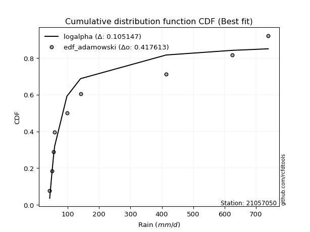</img></img>

</div>


## C. Best fit & Estimate extreme values for specific return periods - Tr


### 1. Best fit (ordered by delta Δ)

<div align="center">

|   id |   station | empirical_dist   | p_dist      |    delta |   deltao | eval   |   fit |   n |   best_fit |   best_fit_sort |
|-----:|----------:|:-----------------|:------------|---------:|---------:|:-------|------:|----:|-----------:|----------------:|
|    0 |  21057050 | edf_california   | logf        | 0.111032 | 0.417613 | Δo > Δ |     1 |   9 |          1 |               1 |
|    1 |  21057050 | edf_gringorten   | weibull_min | 0.129339 | 0.417613 | Δo > Δ |     1 |   9 |          1 |               2 |
|    2 |  21057050 | edf_cunnane      | weibull_min | 0.130292 | 0.417613 | Δo > Δ |     1 |   9 |          1 |               3 |
|    3 |  21057050 | edf_hazen        | weibull_min | 0.130877 | 0.417613 | Δo > Δ |     1 |   9 |          1 |               4 |
|    4 |  21057050 | edf_blom         | weibull_min | 0.13088  | 0.417613 | Δo > Δ |     1 |   9 |          1 |               5 |
|    5 |  21057050 | edf_tukey        | weibull_min | 0.131845 | 0.417613 | Δo > Δ |     1 |   9 |          1 |               6 |
|    6 |  21057050 | edf_filliben     | weibull_min | 0.132207 | 0.417613 | Δo > Δ |     1 |   9 |          1 |               7 |
|    7 |  21057050 | edf_jenkinson    | weibull_min | 0.132378 | 0.417613 | Δo > Δ |     1 |   9 |          1 |               8 |
|    8 |  21057050 | edf_beard        | weibull_min | 0.132378 | 0.417613 | Δo > Δ |     1 |   9 |          1 |               9 |
|    9 |  21057050 | edf_chegodayev   | weibull_min | 0.132605 | 0.417613 | Δo > Δ |     1 |   9 |          1 |              10 |
|   10 |  21057050 | edf_adamowski    | weibull_min | 0.133725 | 0.417613 | Δo > Δ |     1 |   9 |          1 |              11 |
|   11 |  21057050 | edf_weibull      | weibull_min | 0.138988 | 0.417613 | Δo > Δ |     1 |   9 |          1 |              12 |

</div>

:file_folder:Tables: [bestfit_21057050.csv](table/bestfit_21057050.csv) | [extreme_21057050.csv](table/extreme_21057050.csv)


### 2. Extreme values

In hydrology, a return period (or recurrence interval $Tr$) is the statistical average time between extreme events like floods or droughts of a specific magnitude, indicating how rare an event is, with a 100-year flood, for example, having a 1% chance of occurring in any given year, not that it happens exactly every century. It is a key tool for infrastructure design (like bridges or dams) and risk assessment, calculated from historical data to determine the probability of future events, although it is important to remember it is statistical average, and events can cluster or be missed.

> risk_rate: assuming the return period as the project useful life.

|   id |      tr |   prob_l |     prob_g |      alpha |   betaprime |    chi2 |   crystalball |   erlang |    expon |   exponnorm |               f |   fatiguelife |             fisk |    gamma |   genexpon |   genlogistic |   gibrat |   gompertz |   gumbel_l |   gumbel_r |   halflogistic |   halfnorm |   hypsecant |         invgamma |   invgauss |     invweibull |        johnsonsu |   kstwobign |   laplace |   laplace_asymmetric |   loggamma |   logistic |   lognorm |   maxwell |    mielke |    moyal |   nakagami |       ncf |       nct |     norm |           pareto |   pearson3 |   rayleigh |     rice |                t |   truncnorm |     wald |   weibull_min |          logalpha |   logbetaprime |          logchi2 |   logcrystalball |   logerlang |   logexpon |   logexponnorm |             logf |   logfatiguelife |         logfisk |   loggenexpon |   loggenlogistic |        loggibrat |   loggompertz |   loggumbel_l |   loggumbel_r |   loghalflogistic |   loghalfnorm |   loghypsecant |      loginvgamma |      loginvgauss |    loginvweibull |   logjohnsonsu |   logkstwobign |   loglaplace |   loglaplace_asymmetric |   logloggamma |   loglogistic |    loglognorm |   logmaxwell |        logmielke |   logmoyal |   lognakagami |    logncf |    lognct |     logpareto |   logpearson3 |   lograyleigh |   logrice |     logt |   logtruncnorm |     logwald |    logweibull_min |   station |   n |   risk_rate |
|-----:|--------:|---------:|-----------:|-----------:|------------:|--------:|--------------:|---------:|---------:|------------:|----------------:|--------------:|-----------------:|---------:|-----------:|--------------:|---------:|-----------:|-----------:|-----------:|---------------:|-----------:|------------:|-----------------:|-----------:|---------------:|-----------------:|------------:|----------:|---------------------:|-----------:|-----------:|----------:|----------:|----------:|---------:|-----------:|----------:|----------:|---------:|-----------------:|-----------:|-----------:|---------:|-----------------:|------------:|---------:|--------------:|------------------:|---------------:|-----------------:|-----------------:|------------:|-----------:|---------------:|-----------------:|-----------------:|----------------:|--------------:|-----------------:|-----------------:|--------------:|--------------:|--------------:|------------------:|--------------:|---------------:|-----------------:|-----------------:|-----------------:|---------------:|---------------:|-------------:|------------------------:|--------------:|--------------:|--------------:|-------------:|-----------------:|-----------:|--------------:|----------:|----------:|--------------:|--------------:|--------------:|----------:|---------:|---------------:|------------:|------------------:|----------:|----:|------------:|
|    0 |    2    | 0.5      | 0.5        |    74.9753 |     109.645 | 43.1255 |      -0.21228 |  70.022  |  183.093 |     182.5   |    45.6749      |       42.8002 |    146.763       |  71.4667 |    183.093 |       192.357 |  167.457 |    192.202 |    287.749 |    202.651 |        181.497 |    192.183 |     245.2   |     59.5218      |    62.9328 |  209.673       |     42.8006      |     212.366 |   245.2   |              183.093 |    44.2435 |    245.2   |   133.652 |   223.049 |   107.63  |  188.914 |    219.946 |   113.465 |   104.338 |  245.2   |     63.2294      |    205.921 |    215.192 |  243.323 |     48.6412      |     205.422 |  161.243 |       127.611 |     67.6103       |        103.137 |     69.7726      |          133.652 |     62.5228 |     94.238 |        94.0427 |     62.6021      |     42.8002      |    47.6455      |       94.9478 |          108.247 |     95.9677      |       97.3085 |       160.215 |       111.492 |           101.883 |       106.629 |        133.652 |    65.0371       |     64.2091      |    61.2118       |        133.653 |        111.527 |      133.652 |                 94.1644 |       134.505 |       133.652 |  43.3451      |      121.615 |     78.3545      |    105.154 |       44.6838 |   113.561 |   111.539 |  43.6401      |       122.823 |       117.612 |   127.204 |  133.652 |        96.8046 |     93.4616 |     52.1407       |  21057050 |   9 |    0.75     |
|    1 |    2.33 | 0.570815 | 0.429185   |    84.8944 |     131.111 | 43.4153 |      63.4475  |  81.3869 |  214.004 |     213.327 |    49.0171      |       48.7381 |    209.906       |  82.5214 |    214.004 |       227.956 |  190.87  |    225.12  |    327.96  |    245.477 |        225.53  |    242.065 |     282.189 |     70.4643      |    71.4579 | 1579.52        |     42.8038      |     250.707 |   273.169 |              214.004 |    45.5175 |    285.922 |   162.74  |   271.067 |   128.562 |  229.455 |    285.738 |   136.79  |   125.384 |  291.418 |     75.0075      |    251.475 |    263.921 |  284.521 |     51.3772      |     239.611 |  191.549 |       178.987 |     77.4342       |        123.513 |     82.9396      |          162.74  |     69.8969 |    112.138 |       111.879  |     73.502       |     44.608       |    50.3027      |      113.038  |          129.282 |    106.034       |      116.033  |       190.155 |       133.81  |           122.907 |       131.878 |        156.464 |    74.8469       |     73.1917      |    71.4458       |        162.471 |        133.678 |      150.566 |                112.034  |       164.042 |       158.973 |  46.8728      |      149.223 |     90.1926      |    124.98  |       47.0817 |   137.375 |   134.358 |  45.7107      |       149.654 |       144.748 |   153.189 |  162.74  |       115.392  |    106.343  |     68.6014       |  21057050 |   9 |    0.729209 |
|    2 |    5    | 0.8      | 0.2        |   161.809  |     281.763 | 46.3792 |     300.024   | 152.774  |  368.55  |     367.456 |   194.172       |      174.874  |   1087.09        | 149.525  |    368.55  |       382.605 |  325.661 |    389.702 |    457.863 |    431.535 |        424.768 |    453.008 |     430.558 |    331.499       |   164.632  |    2.37442e+07 |     45.8678      |     413.573 |   413.009 |              368.551 |    60.2828 |    443.153 |   338.302 |   460.061 |   277.819 |  417.244 |    625.176 |   304.143 |   295.177 |  463.178 |    295.931       |    443.721 |    459     |  449.453 |     84.477       |     397.531 |  361.202 |       671.736 |    221.721        |        273.958 |    227.848       |          338.302 |    128.446  |    267.522 |       266.597  |    221.574       |    107.403       |    93.8338      |      268.711  |          279.613 |    188.3         |      272.756  |       330.727 |       295.634 |           287.232 |       323.956 |        294.406 |   256.703        |    191.603       |   423.695        |        335.669 |        288.583 |      273.196 |                267.077  |       341.887 |       310.636 |   4.99651e+61 |      333.838 |    198.524       |    278.17  |       89.3443 |   303.426 |   299.861 |   1.44564e+14 |       327.255 |       332.334 |   322.408 |  338.303 |       271.958  |    219.084  | 112275            |  21057050 |   9 |    0.67232  |
|    3 |   10    | 0.9      | 0.1        |   303.118  |     518.918 | 50.7307 |     456.963   | 230.034  |  508.843 |     507.369 |  2365.93        |      349.036  |   4069.23        | 220.221  |    508.843 |       508.557 |  479.308 |    539.104 |    530.188 |    583.076 |        590.227 |    609.101 |     549.036 |   2335.11        |   395.487  |    6.1292e+10  |    304.948       |     537.575 |   539.951 |              508.844 |    90.362  |    558.949 |   549.709 |   593.065 |   519.851 |  580.743 |    907.877 |   575.712 |   624.377 |  577.12  |   1558.27        |    592.079 |    598.096 |  567.053 |    277.471       |     515.679 |  541.244 |      1516.99  |   1531.78         |        532.768 |    643.668       |          549.709 |    232.518  |    589.036 |       586.384  |    923.189       |    361.34        |   529.299       |      584.858  |          524.089 |    362.363       |      572.754  |       450.084 |       563.839 |           581.28  |       629.955 |        487.718 |  3570.34         |    763.893       | 81444.7          |        543.204 |        518.476 |      469.202 |                587.664  |       554.851 |       508.758 | inf           |      588.352 |    501.011       |    558.26  |      211.88   |   558.793 |   574.857 | inf           |       573.983 |       601.1   |   548.072 |  549.711 |       576.008  |    471.778  |      1.0374e+18   |  21057050 |   9 |    0.651322 |
|    4 |   15    | 0.933333 | 0.0666667  |   443.924  |     729.525 | 53.7592 |     535.279   | 278.453  |  590.909 |     589.213 | 11463.4         |      462.941  |   8442.31        | 264.113  |    590.909 |       579.618 |  585.287 |    626.499 |    562.941 |    668.575 |        683.862 |    690.332 |     616.65  |   7720.5         |   645.485  |    5.15631e+12 |   2455.56        |     603.405 |   614.208 |              590.91  |   119.555  |    622.039 |   700.391 |   661.308 |   740.136 |  675.63  |   1059     |   822.129 |   965.052 |  633.979 |   4333.25        |    672.567 |    669.765 |  627.646 |    722.978       |     571.096 |  656.858 |      2210.98  |  10509.7          |        781.282 |   1218.74        |          700.391 |    332.442  |    934.667 |       929.887  |   2620.65        |    798.948       |  4912.76        |      918.569  |          747.032 |    569.162       |      871.763  |       517.486 |       811.624 |           866.244 |       890.455 |        650.544 | 65179.4          |   2166.26        |     1.08411e+08  |        690.693 |        707.645 |      643.812 |                932.126  |       705.895 |       665.655 | inf           |      786.88  |    983.037       |    836.392 |      355.584  |   780.399 |   830.8   | inf           |       769.727 |       815.749 |   720.389 |  700.394 |       883.514  |    772.069  |      8.84057e+34  |  21057050 |   9 |    0.644736 |
|    5 |   20    | 0.95     | 0.05       |   584.606  |     924.78  | 56.0672 |     586.566   | 313.85   |  649.136 |     647.283 | 35383.2         |      547.273  |  14005.4         | 296.075  |    649.136 |       629.372 |  668.419 |    688.506 |    583.329 |    728.438 |        749.465 |    744.489 |     664.348 |  18137.7         |   892.724  |    1.14849e+14 |  10365.5         |     647.75  |   666.894 |              649.137 |   147.913  |    665.646 |   820.802 |   706.598 |   947.798 |  742.831 |   1160.47  |  1053.75  |  1313.81  |  671.214 |   9013.85        |    727.654 |    717.401 |  667.92  |   1500.27        |     603.992 |  743.014 |      2799.45  |  71986.1          |       1025.36  |   1936.23        |          820.802 |    429.857  |   1296.95  |      1289.76   |   6107.66        |   1437.65        | 66831           |     1263.47   |          957.456 |    811.065       |     1167.54   |       564.447 |      1047.42  |          1145.59  |      1121.55  |        797.14  |     1.44317e+06  |   5018.12        |     7.17762e+11  |        808.356 |        872.598 |      805.833 |               1293.07   |       826.191 |       801.559 | inf           |      954.356 |   1708.11        |   1113.66  |      508.76   |   982.517 |  1076.5   | inf           |       937.268 |       999.306 |   863.939 |  820.805 |      1191.19   |   1114.47   |      2.81811e+53  |  21057050 |   9 |    0.641514 |
|    6 |   25    | 0.96     | 0.04       |   725.239  |    1109.41  | 57.9332 |     624.32    | 341.802  |  694.3   |     692.325 | 84917.7         |      614.279  |  20640.2         | 321.257  |    694.3   |       667.696 |  737.723 |    736.603 |    597.837 |    774.549 |        800.009 |    784.784 |     701.263 |  35225.2         |  1130.52   |    1.25395e+15 |  30138.2         |     680.967 |   707.76  |              694.301 |   175.648  |    699.004 |   922.479 |   740.222 |  1146.66  |  794.919 |   1236.19  |  1275     |  1668.8   |  698.624 |  15936.9         |    769.42  |    752.793 |  697.844 |   2679.71        |     625.941 |  812.023 |      3313.13  | 492736            |       1267.19  |   2785.86        |          922.479 |    525.513  |   1672.15  |      1662.31   |  12582.7         |   2292.81        |     1.25243e+06 |     1616.55   |         1159.14  |   1089.65        |     1459.73   |       600.437 |      1274.8   |          1420.86  |      1331.62  |        932.909 |     3.72019e+07  |  10169.8         |     1.94853e+16  |        907.598 |       1020.88  |      959.093 |               1666.79   |       927.513 |       923.973 | inf           |     1101.35  |   2753.57        |   1390.38  |      666.883  |  1171.25  |  1315.53  | inf           |      1086.12  |      1161.95  |   988.817 |  922.483 |      1498.01   |   1495.38   |      3.88716e+72  |  21057050 |   9 |    0.639603 |
|    7 |   50    | 0.98     | 0.02       |  1428.18   |    1938.03  | 64.0682 |     732.433   | 430.858  |  834.593 |     832.238 |     1.29042e+06 |      829.263  |  67602.2         | 401.23   |    834.593 |       785.752 |  982.02  |    886.006 |    637.22  |    916.595 |        955.744 |    901.906 |     815.715 | 277544           |  2156.18   |    1.9785e+18  | 644566           |     778.506 |   834.703 |              834.594 |   308.756  |    800.925 |  1288.82  |   837.736 |  2061.62  |  956.62  |   1456.75  |  2287.56  |  3506.79  |  777.117 |  93936.8         |    894.792 |    855.532 |  784.705 |  16736.7         |     676.354 | 1037.34  |      5243.24  |      7.38119e+09  |       2468.43  |   8811.21        |         1288.82  |    987.964  |   3681.78  |      3656.27   | 181361           |  10251.1         |     1.19585e+14 |     3459.85   |         2088.7   |   3085.4         |     2871.06   |       710.131 |      2334.92  |          2758.74  |      2193.28  |       1519.19  |     2.11604e+15  | 120914           |     1.16516e+46  |       1264.47  |       1618.57  |     1647.2   |               3667.52   |      1290.82  |      1426.42  | inf           |     1668.62  |  16861.9         |   2769.06  |     1479.09   |  1997.94  |  2457.44  | inf           |      1675.62  |      1800.06  |  1463.24  | 1288.83  |      3011.15   |   3905.22   |      1.57483e+168 |  21057050 |   9 |    0.63583  |
|    8 |   75    | 0.986667 | 0.0133333  |  2131.02   |    2676.04  | 67.847  |     790.443   | 484.211  |  916.66  |     914.082 |     6.34022e+06 |      958.736  | 134206           | 449.003  |    916.659 |       854.371 | 1147.02  |    973.401 |    657.135 |    999.157 |       1046.27  |    965.663 |     882.599 | 928856           |  2968.52   |    1.42945e+20 |      3.33638e+06 |     832.172 |   908.959 |              916.66  |   436.796  |    859.791 |  1542.14  |   890.753 |  2899.17  | 1051.18  |   1576.85  |  3208.66  |  5414.04  |  819.234 | 265403           |    965.63  |    911.426 |  831.961 |  49219.1         |     695.602 | 1175.99  |      6618     |      1.10422e+14  |       3678.07  |  17490.9         |         1542.14  |   1435.08   |   5842.15  |      5798.12   |      1.21907e+06 |  25262.1         |     1.34096e+24 |     5382.98   |         2941.17  |   6231.74        |     4215.53   |       773.016 |      3319.24  |          4057.11  |      2877.82  |       2020.09  |     7.71324e+23  | 614830           |     1.87036e+86  |       1510.71  |       2085.72  |     2260.19  |               5817.24   |      1540.61  |      1833.02  | inf           |     2091.49  |  64514.7         |   4142.85  |     2286.55   |  2715.11  |  3555.99  | inf           |      2129.53  |      2284.06  |  1810.98  | 1542.14  |      4488.95   |   7049.9    |      1.17394e+258 |  21057050 |   9 |    0.634587 |
|    9 |  100    | 0.99     | 0.01       |  2833.84   |    3360.81  | 70.596  |     829.679   | 522.521  |  974.886 |     972.152 |     1.96177e+07 |     1051.9    | 217811           | 483.257  |    974.886 |       902.937 | 1274.84  |   1035.41  |    670.162 |   1057.59  |       1110.35  |   1009.1   |     930.044 |      2.18872e+06 |  3639.85   |    2.9565e+21  |      1.01441e+07 |     868.941 |   961.645 |              974.887 |   562.102  |    901.352 |  1741.13  |   926.865 |  3690.31  | 1118.27  |   1658.62  |  4075.03  |  7367.79  |  847.72  | 554618           |   1014.97  |    949.505 |  864.155 | 105895           |     705.79  | 1277.07  |      7708.3   |      1.65135e+18  |       4904.77  |  28575.4         |         1741.13  |   1873.07   |   8106.63  |      8042.02   |      5.64351e+06 |  48340.7         |     6.27944e+35 |     7356.01   |         3747.35  |  10742.7         |     5508.85   |       817.13  |      4257.57  |          5330.58  |      3462.82  |       2472.62  |     1.04458e+33  |      2.09229e+06 |     1.50189e+135 |       1703.9   |       2481.47  |     2828.98  |               8069.83   |      1736.12  |      2188.1   | inf           |     2439.35  | 195113           |   5513.55  |     3075.66   |  3369.7   |  4634.64  | inf           |      2511.44  |      2686.37  |  2094.1   | 1741.14  |      5936.16   |  10844.8    |    inf            |  21057050 |   9 |    0.633968 |
|   10 |  200    | 0.995    | 0.005      |  5645.06   |    5804.16  | 77.4102 |     918.678   | 616.118  | 1115.18  |    1112.07  |     2.98247e+08 |     1279.94   | 696038           | 566.81   |   1115.18  |      1019.69  | 1622.58  |   1184.81  |    698.476 |   1198.07  |       1264.39  |   1108.43  |    1044.34  |      1.72623e+07 |  5564.14   |    4.30166e+24 |      1.26379e+08 |     953.629 |  1088.59  |             1115.18  |  1049.86   |   1001.05  |  2292.93  |  1009.48  |  6591.34  | 1279.9   |   1845.33  |  7230.85  | 15479.1   |  912.335 |      3.27548e+06 |   1131.21  |   1036.63  |  937.82  | 671400           |     721.865 | 1528.87  |     10742.5   |      8.25292e+34  |      10002.7   |  94415.8         |         2292.93  |   3573.54   |  17849.4   |     17688.5    |      4.67437e+08 | 236707           |     5.45095e+94 |    15541.2    |         6708.81  |  47265.5         |    10329.7    |       921.894 |      7746.39  |         10275.5   |      5287.32  |       4023.9   |     2.4435e+73   |      4.95259e+07 |   inf            |       2238.7   |       3702.5   |     4858.65  |              17756.5    |      2275.33  |      3346.09  | inf           |     3468.54  |      5.37169e+06 |  10977.5   |     6044.07   |  5651.66  |  8880.31  | inf           |      3682.25  |      3893.89  |  2919.7   | 2292.94  |     11494.4    |  31704.3    |    inf            |  21057050 |   9 |    0.633042 |
|   11 |  250    | 0.996    | 0.004      |  7050.65   |    6916.55  | 79.6527 |     945.876   | 646.583  | 1160.34  |    1157.11  |     7.16264e+08 |     1354.25   |      1.01071e+06 | 593.972  |   1160.34  |      1057.23  | 1747.35  |   1232.91  |    706.806 |   1243.24  |       1313.91  |   1138.99  |    1081.14  |      3.35615e+07 |  6269.55   |    4.47145e+25 |      2.73178e+08 |     979.839 |  1129.45  |             1160.34  |  1289.34   |   1033.05  |  2494.18  |  1034.92  |  7942.48  | 1331.93  |   1902.67  |  8692.46  | 19657.8   |  932.081 |      5.80201e+06 |   1167.93  |   1063.45  |  960.495 |      1.21686e+06 |     725.203 | 1612.17  |     11845.5   |      1.8447e+43   |      12662.5   | 139169           |         2494.18  |   4404.4    |  23013.1   |     22797.9    |      2.48995e+09 | 397238           |     1.2169e+130 |    19746.8    |         8090.14  |  80428.5         |    12588.4    |       955.203 |      9390     |         12689.2   |      6022.58  |       4706.82  |     1.76437e+95  |      1.45288e+08 |   inf            |       2433.47  |       4190.61  |     5782.71  |              22888.4    |      2471.03  |      3834.96  | inf           |     3865.49  |      1.97156e+07 |  13702     |     7433.24   |  6671.96  | 10994.1   | inf           |      4148.86  |      4365.25  |  3234.22  | 2494.19  |     14168.2    |  45211.6    |    inf            |  21057050 |   9 |    0.632858 |
|   12 |  500    | 0.998    | 0.002      | 14078.6    |   11910.8   | 86.7425 |    1026.53    | 742.076  | 1300.64  |    1297.02  |     1.08894e+10 |     1587.39   |      3.21392e+06 | 679.023  |   1300.64  |      1173.73  | 2178.56  |   1382.31  |    730.688 |   1383.41  |       1467.62  |   1230.11  |    1195.43  |      2.64701e+08 |  8697.56   |    6.40365e+28 |      2.68662e+09 |    1058.38  |  1256.4   |             1300.64  |  2468.24   |   1132.32  |  3200.94  |  1110.81  | 14167.9   | 1493.56  |   2073.32  | 15383.3   | 41298.7   |  990.639 |      3.42675e+07 |   1280.18  |   1143.48  | 1028.15  |      7.7179e+06  |     732.012 | 1877.05  |     15679.3   |      1.02894e+85  |      26925.8   | 468343           |         3200.94  |   8455.33   |  50670.7   |     50144.3    |      1.15341e+12 |      2.01545e+06 |   inf           |    41391.4    |        14465.3   | 504980           |    22951.9    |      1057.51  |     17062.3   |         24425.6   |      8879.27  |       7659.51  |     2.32358e+215 |      4.80015e+09 |   inf            |       3116.47  |       6073.68  |     9931.53  |              50362.5    |      3154.77  |      5853.69  | inf           |     5341.05  |      2.80108e+09 |  27280.3   |    13731.5    | 11172.1   | 21665.3   | inf           |      5948.89  |      6138.74  |  4388.75  | 3200.95  |     26845.5    | 139746      |    inf            |  21057050 |   9 |    0.632489 |
|   13 |  750    | 0.998667 | 0.00133333 | 21106.6    |   16359.8   | 90.9647 |    1071.34    | 798.46   | 1382.7   |    1378.87  |     5.35041e+10 |     1725.14   |      6.31778e+06 | 729.189  |   1382.7   |      1241.84  | 2463.73  |   1469.7   |    743.451 |   1465.36  |       1557.48  |   1281.01  |    1262.28  |      8.85966e+08 | 10266.6    |    4.48134e+30 |      9.56531e+09 |    1102.51  |  1330.65  |             1382.7   |  3633.06   |   1190.31  |  3676.78  |  1153.25  | 19871.9   | 1588.11  |   2168.44  | 21470.8   | 63757.1   | 1023.17  |      9.68429e+07 |   1344.71  |   1188.23  | 1065.99  |      2.27403e+07 |     734.322 | 2035.86  |     18215.7   |      5.73845e+126 |      42564.8   | 957329           |         3676.78  |  12404.2    |  80402.9   |     79518.8    |      9.061e+13   |      5.26142e+06 |   inf           |    63647      |        20317.1   |      1.70189e+06 |    32316.5    |      1116.61  |     24191.7   |         35818.8   |     11029.7   |      10183.7   |   inf            |      4.09004e+10 |   inf            |       3575.58  |       7481.63  |    13627.5   |              79882.6    |      3612.35  |      7494.38  | inf           |     6399.79  |      1.11237e+11 |  40812.2   |    19306.3    | 15115     | 32595.8   | inf           |      7298.39  |      7428.12  |  5205.64  | 3676.79  |     38740.4    | 274905      |    inf            |  21057050 |   9 |    0.632366 |
|   14 | 1000    | 0.999    | 0.001      | 28134.5    |   20488.1   | 93.9892 |    1102.18    | 838.668  | 1440.93  |    1436.93  |     1.65551e+11 |     1823.4    |      1.0203e+07  | 764.944  |   1440.93  |      1290.15  | 2681.96  |   1531.71  |    752.041 |   1523.49  |       1621.22  |   1316.17  |    1309.72  |      2.08771e+09 | 11438.6    |    9.12271e+31 |      2.29299e+10 |    1133.07  |  1383.34  |             1440.93  |  4791.92   |   1231.44  |  4044.9   |  1182.59  | 25261.9   | 1655.19  |   2234.03  | 27196.8   | 86763.4   | 1045.56  |      2.0239e+08  |   1390.05  |   1219.15  | 1092.13  |      4.89518e+07 |     735.484 | 2150.1   |     20150.6   |      3.20025e+168 |      59377.7   |      1.59303e+06 |         4044.9   |  16291.2    | 111568     |    110293      |      3.01054e+15 |      1.0432e+07  |   inf           |    86271.1    |        25853.3   |      4.31244e+06 |    41035.2    |      1158.23  |     30990.1   |         46994.9   |     12811.8   |      12464.4   |   inf            |      1.94317e+11 |   inf            |       3930.41  |       8644.18  |    17056.9   |             110815      |      3964.99  |      8929.63  | inf           |     7251.85  |      2.32604e+12 |  54314.2   |    24406.4    | 18741.8   | 43802.4   | inf           |      8416.51  |      8474.17  |  5857.37  | 4044.92  |     50104.1    | 447254      |    inf            |  21057050 |   9 |    0.632305 |

<div align="center">

</img>

</div>


<div align="center">

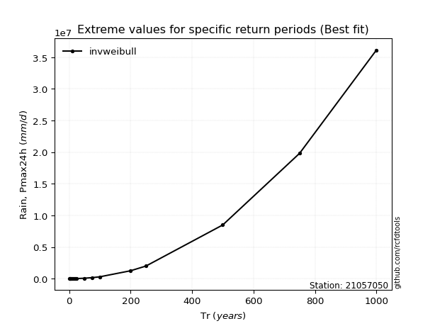</img>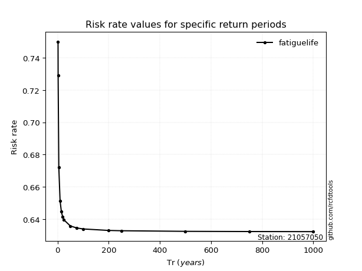</img>

</div>


<sub>**APP DISCLAIMER**: NO WARRANTY - This software is provided by [github.com/rcfdtools](https://github.com/rcfdtools) "as is", without any express or implied warranty, including warranties of merchantability, fitness for a particular purpose, or non-infringement. There is no guarantee that the software will be error-free or operate without interruption. LIMITATION OF LIABILITY - Neither the authors nor copyright holders will be liable for claims or damages arising from the software or its use. You are responsible for determining if the software is appropriate for your use and assume all associated risks, including errors, legal compliance, and data loss. NO PROFESSIONAL ADVICE - The software provides general information and does not offer professional advice. It should not replace consultation with professional advisors.</sub>