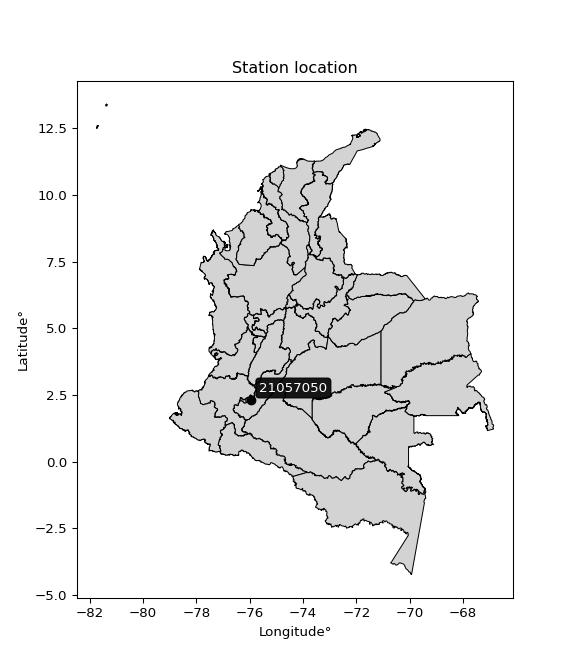

<div align="center">


</div>

# PMP Station (Rain, Pmax24h): 21057050

Probable Maximum Precipitation (PMP) is the greatest amount of rainfall for a specific duration that is meteorologically possible for a given location, acting as a "worst-case" scenario for extreme storms, crucial for designing safety-critical infrastructure like bridges, river deviations, dams, spillways, and nuclear plants to prevent catastrophic failure. PMP is calculated by hydrologists using meteorological data to determine the upper limit of extreme rainfall, often leading to the Probable Maximum Flood (PMF) for flood control design, and is increasingly being studied for climate change impacts. Probable Maximum Precipitation (PMP) is the theoretical upper limit of rainfall, a deterministic estimate for extreme events, while probability distributions (like GEV, Gumbel) describe the likelihood and frequency of various precipitation amounts, including rare ones, showing how often events occur, with PMP representing the extreme end of these distributions, used for critical infrastructure design to ensure safety against the worst conceivable weather, unlike standard statistical forecasts which cover typical probabilities.

The most common probability distributions in hydrology, used for analyzing floods, rainfall, and streamflow, include the Normal, Log-Normal, Gumbel, Gamma (including Log-Pearson Type III), and Generalized Extreme Value (GEV) distributions, often chosen based on the data´s skewness and whether modeling extremes or general conditions, with Gumbel and GEV popular for extreme events like floods, while the Normal distribution serves as a baseline, though often requiring transformations for skewed hydrological data. These distributions help in designing water infrastructure, managing water resources, and forecasting hydrologic events.

> Hydrological data often isn´t perfectly normal (it´s skewed), so different distributions are needed for different applications, such as: **Flood Frequency Analysis**: Using Gumbel, GEV, or Log-Pearson Type III for predicting extreme flood magnitudes and their return periods, **Rainfall Analysis**: Normal for annual totals, but Log-Normal, Weibull, or GEV for intensity or extreme daily rainfall, **Streamflow Modeling**: Gamma and Log-Normal for maximum flows, GEV for minimum flows, and Kappa for daily flows.

<div align="center">

</img>

</div>


## A. General information


### 1. General running parameters

• app_version: _v20260108_. • runtime: _2026-01-09 11:32:22.148588_. • Python version: _3.14.0_. • SciPy version: _1.16.3_. • Pandas version: _2.3.3_. • NumPy version: _2.3.5_. • Stations dataset (station_dataset_file): _dataset/pmax24h_in/automatic_colombia_2003_2024.csv_. • Stations catalog (station_catalog_file): _dataset/CNE.xls_. • Minimum year to eval til year_max (date_min): _1900_. • Maximum year to eval since year_min (date_max): _2024_. • Creates, save and include plots into reports (create_plot): _False_. • Plot only fit distributions with Δo > Δ (plot_only_fit): _True_. • Plot only simple graphs avoiding multiple CDFs and multiple Extreme values plots (plot_only_simple): _True_. • Eval low extreme values, if False, evaluates high extreme values (low_extreme): _False_. • Eval every SciPy distribution as logarithmic (pdist_logarithmic_on): _True_. • Standard deviation normalized (ddof): _1.0_. • Return periods to eval in years (Tr): _[2, 2.33, 5, 10, 15, 20, 25, 50, 75, 100, 200, 250, 500, 750, 1000]_. • Minimum data sample per station, 0 means any (minimum_sample): _5_. • Z-Score maximum threshold to adjust a value, 0 means disable (zscore_max): _3.5_. • Z-Score minimum threshold to adjust a value, 0 means disable (zscore_min): _-2.5_. • Avoid zeros, e.g. rain = 0 (avoid_zeros): _True_. • Avoid null values (avoid_nans): _True_. 

:file_folder:Table: [dataset.csv](../../dataset/pmax24h_in/automatic_colombia_2003_2024.csv)

> Delta Degrees of Freedom (DDOF): is a parameter used in the formulas for calculating variance and standard deviation. When ddof=0, the divisor is $N$ (the total number of observations) and this is used when your data set is the entire population. When ddof=1, the divisor is $N-1$ and this is used when your data set is a sample drawn from a larger population. Using $N-1$ provides an unbiased estimate of the population variance (known as Bessel´s correction).


### 2. Station info and location

|   id |   CODIGO | NOMBRE                           | CATEGORIA    | TECNOLOGIA                              | ESTADO           | FECHA_INSTALACION   |   FECHA_SUSPENSION |   ALTITUD |   LATITUD |   LONGITUD | DEPARTAMENTO   | MUNICIPIO   | AREA_OPERATIVA                    | ENTIDAD                                                     | AREA_HIDROGRAFICA   | ZONA_HIDROGRAFICA   | SUBZONA_HIDROGRAFICA   | CORRIENTE   | Catalogo   |   Version |
|-----:|---------:|:---------------------------------|:-------------|:----------------------------------------|:-----------------|:--------------------|-------------------:|----------:|----------:|-----------:|:---------------|:------------|:----------------------------------|:------------------------------------------------------------|:--------------------|:--------------------|:-----------------------|:------------|:-----------|----------:|
|    0 | 21057050 | VEGA EL SALADO  - AUT [21057050] | Limnigráfica | Automática con Telemetría, Convencional | En Mantenimiento | 15/06/1971          |                nan |      1150 |   2.33144 |   -75.9422 | Huila          | La Plata    | Area Operativa 04 - Huila-Caquetá | INSTITUTO DE HIDROLOGIA METEOROLOGIA Y ESTUDIOS AMBIENTALES | Magdalena Cauca     | Alto Magdalena      | Río Páez               | La Plata    | CNE_IDEAM  |  20251226 |

<div align="center">

Dynamic map: [:earth_americas:Google](http://maps.google.com/maps?q=2.331444444,-75.94216667) [:earth_americas:OSM](https://www.openstreetmap.org/#map=18/2.331444444/-75.94216667&layers=P) [:earth_americas:Bing](https://www.bing.com/maps?cp=2.331444444~-75.94216667&lvl=18) [:earth_americas:Apple](https://maps.apple.com/frame?center=2.331444444%2C-75.94216667&span=0.003%2C0.006)

</div>


<div align="center">

```geojson
{
  "type": "Feature",
  "geometry": {
    "type": "Point", 
    "coordinates": [-75.94216667, 2.331444444]
  }, 
  "properties": {
    "Name": "21057050"
  }
}
```

</div>


### 3. Discrete values table and plot

<div align="center">

|               |          0 |           1 |          2 |           3 |           4 |           5 |           6 |           7 |
|:--------------|-----------:|------------:|-----------:|------------:|------------:|------------:|------------:|------------:|
| Date          | 2006       | 2007        | 2008       | 2009        | 2019        | 2020        | 2021        | 2024        |
| Value         |  739       |  413.8      |  623.5     |  141.1      |   54.6      |   50.4      |   42.8      |   97.6      |
| Value_initial |  739       |  413.8      |  623.5     |  141.1      |   54.6      |   50.4      |   42.8      |   97.6      |
| count         |    8       |    8        |    8       |    8        |    8        |    8        |    8        |    8        |
| mean          |  270.35    |  270.35     |  270.35    |  270.35     |  270.35     |  270.35     |  270.35     |  270.35     |
| std           |  282.382   |  282.382    |  282.382   |  282.382    |  282.382    |  282.382    |  282.382    |  282.382    |
| zscore        |    1.65963 |    0.507999 |    1.25061 |   -0.457713 |   -0.764035 |   -0.778908 |   -0.805822 |   -0.611759 |


</div>


> The initial value (value_initial) correspond to the initial obtained or null completed value, and value (value) is adjusted only when the initial value is outside the valid range (outlier) definite through the Z-Score value. If Z-Score is active, values out of range or outliers are replaced with the station mean value. A Z-Score (or standard score) measures how many standard deviations a data point is from the mean of a dataset, indicating its relative position; positive scores mean above the mean, negative mean below, and a score of zero is exactly at the mean, allowing for comparison of values from different distributions. It´s calculated using the formula $z=(x–μ)/σ$, where $x$ is the data point, $μ$ is the mean, and $σ$ is the standard deviation, helping identify outliers and understand probability.
>
> <sub>**Note**: In this study, "completing" (filling gaps in) and "extending" (forecasting or lengthening the historical record) rainfall data series are avoided for certain critical analyses because they introduce artificial bias and uncertainty, which can distort the statistics of rare events (extremes), alter day-to-day variability, and compromise the integrity and homogeneity of the original data. Some reasons against Completing/Extending rainfall data are: **Distortion of Extremes and Variability**: The primary issue is that most gap-filling or extension methods rely on averaging or regression with nearby stations, which inherently smooths the data. Rainfall is highly variable in space and time, with a large percentage of zero values and occasional large storms. Infilling methods often underestimate the highest values and overestimate the lowest (zero) values, which severely distorts analyses focused on flood frequency, drought severity, and intensity-duration-frequency (IDF) curves, **Loss of Data Homogeneity**: Infilled or extended data are synthetic estimates, not actual measurements. Combining these estimates with observed data can violate the assumption of data homogeneity, which requires that the data properties do not change over time. Inhomogeneity can lead to incorrect conclusions about long-term trends or changes in climate patterns, **Propagation of Errors**: Errors and biases from the original data (e.g., wind-induced undercatch, instrument errors, site changes) or the data used for imputation can propagate through the analysis, leading to unreliable hydrological models and inaccurate predictions, **Compromised Statistical Integrity**: For statistical analyses, especially those involving the frequency of events, using artificial data can introduce time bias or autocorrelation that doesn´t exist in reality, making it difficult to assess the true probability of events, **Difficulty in Validation**: It is difficult to accurately validate the quality of filled or extended data, especially for past periods where ground-truth measurements are unavailable. The reliability of imputation techniques heavily depends on the density of the surrounding station network and the complexity of the local topography.</sub>


### 4. Active continuous probability distributions from SciPy (45 of 104 available)

A Probability Density Function (PDF) describes the relative likelihood of a continuous random variable falling within a specific range, where the total area under its curve equals 1, and the area over any interval gives the actual probability for that range. Unlike discrete probabilities (like rolling a die), a PDF shows density, not direct probability for a single point (which is zero), with higher points indicating higher likelihood, often visualized as a bell curve for normal distributions.

A log of a probability density function (log-PDF) is simply the logarithm of the PDF´s value, denoted as $log(f(x))$, useful for converting multiplication of probabilities into addition, improving numerical stability with tiny numbers, and connecting to information theory concepts like entropy. Instead of dealing with very small probabilities (e.g., 0.000001), log-PDFs use negative numbers (e.g., $log(0.00001) ≈ -11.51$ that are easier for computers to handle, preventing underflow errors and simplifying complex calculations. In this study, each active probability distribution from SciPy is also evaluated in the $log$ form.

[scipy.stats](https://docs.scipy.org/doc/scipy/reference/stats.html) is a Python´s powerful submodule within the SciPy library for comprehensive statistical analysis, offering over 130 probability distributions (like Normal, Poisson), functions for descriptive stats (mean, variance), hypothesis testing (t-tests, chi-square), random variable generation, and statistical tests, making it essential for data science, modeling, and research. It provides tools to explore, model, and draw conclusions from data efficiently, working seamlessly with NumPy.

<div align="center">

|   id | p_dist             |   n_parameter | fit_method   | label                                                                       | active   | ref                                                                                                        |
|-----:|:-------------------|--------------:|:-------------|:----------------------------------------------------------------------------|:---------|:-----------------------------------------------------------------------------------------------------------|
|    0 | alpha              |             3 | MLE          | Alpha                                                                       | True     | [:mortar_board:](https://docs.scipy.org/doc/scipy/reference/generated/scipy.stats.alpha.html)              |
|    1 | betaprime          |             4 | MLE          | Beta prime                                                                  | True     | [:mortar_board:](https://docs.scipy.org/doc/scipy/reference/generated/scipy.stats.betaprime.html)          |
|    2 | chi2               |             3 | MLE          | Chi²                                                                        | True     | [:mortar_board:](https://docs.scipy.org/doc/scipy/reference/generated/scipy.stats.chi2.html)               |
|    3 | crystalball        |             4 | MLE          | Crystalball                                                                 | True     | [:mortar_board:](https://docs.scipy.org/doc/scipy/reference/generated/scipy.stats.crystalball.html)        |
|    4 | dweibull           |             3 | MLE          | Double Weibull                                                              | True     | [:mortar_board:](https://docs.scipy.org/doc/scipy/reference/generated/scipy.stats.dweibull.html)           |
|    5 | erlang             |             3 | MLE          | Erlang                                                                      | True     | [:mortar_board:](https://docs.scipy.org/doc/scipy/reference/generated/scipy.stats.erlang.html)             |
|    6 | expon              |             2 | MLE          | Exponential                                                                 | True     | [:mortar_board:](https://docs.scipy.org/doc/scipy/reference/generated/scipy.stats.expon.html)              |
|    7 | exponnorm          |             3 | MLE          | Exponentially modified Normal                                               | True     | [:mortar_board:](https://docs.scipy.org/doc/scipy/reference/generated/scipy.stats.exponnorm.html)          |
|    8 | f                  |             4 | MLE          | F                                                                           | True     | [:mortar_board:](https://docs.scipy.org/doc/scipy/reference/generated/scipy.stats.f.html)                  |
|    9 | fatiguelife        |             3 | MLE          | Fatigue-life (Birnbaum-Saunders)                                            | True     | [:mortar_board:](https://docs.scipy.org/doc/scipy/reference/generated/scipy.stats.fatiguelife.html)        |
|   10 | fisk               |             3 | MLE          | Fisk                                                                        | True     | [:mortar_board:](https://docs.scipy.org/doc/scipy/reference/generated/scipy.stats.fisk.html)               |
|   11 | gamma              |             3 | MLE          | Gamma                                                                       | True     | [:mortar_board:](https://docs.scipy.org/doc/scipy/reference/generated/scipy.stats.gamma.html)              |
|   12 | genexpon           |             5 | MLE          | Generalized exponential                                                     | True     | [:mortar_board:](https://docs.scipy.org/doc/scipy/reference/generated/scipy.stats.genexpon.html)           |
|   13 | genlogistic        |             3 | MLE          | Generalized logistic                                                        | True     | [:mortar_board:](https://docs.scipy.org/doc/scipy/reference/generated/scipy.stats.genlogistic.html)        |
|   14 | gibrat             |             2 | MM           | Gibrat                                                                      | True     | [:mortar_board:](https://docs.scipy.org/doc/scipy/reference/generated/scipy.stats.gibrat.html)             |
|   15 | gompertz           |             3 | MLE          | Gompertz (or truncated Gumbel)                                              | True     | [:mortar_board:](https://docs.scipy.org/doc/scipy/reference/generated/scipy.stats.gompertz.html)           |
|   16 | gumbel_l           |             2 | MM           | Gumbel Left Skew                                                            | True     | [:mortar_board:](https://docs.scipy.org/doc/scipy/reference/generated/scipy.stats.gumbel_l.html)           |
|   17 | gumbel_r           |             2 | MM           | Gumbel Right Skew                                                           | True     | [:mortar_board:](https://docs.scipy.org/doc/scipy/reference/generated/scipy.stats.gumbel_r.html)           |
|   18 | halflogistic       |             2 | MM           | Half-logistic                                                               | True     | [:mortar_board:](https://docs.scipy.org/doc/scipy/reference/generated/scipy.stats.halflogistic.html)       |
|   19 | halfnorm           |             2 | MM           | Half Normal                                                                 | True     | [:mortar_board:](https://docs.scipy.org/doc/scipy/reference/generated/scipy.stats.halfnorm.html)           |
|   20 | hypsecant          |             2 | MM           | hyperbolic secant                                                           | True     | [:mortar_board:](https://docs.scipy.org/doc/scipy/reference/generated/scipy.stats.hypsecant.html)          |
|   21 | invgamma           |             3 | MLE          | Inverted gamma                                                              | True     | [:mortar_board:](https://docs.scipy.org/doc/scipy/reference/generated/scipy.stats.invgamma.html)           |
|   22 | invgauss           |             3 | MLE          | Inverse Gaussian                                                            | True     | [:mortar_board:](https://docs.scipy.org/doc/scipy/reference/generated/scipy.stats.invgauss.html)           |
|   23 | invweibull         |             3 | MLE          | Inverted Weibull                                                            | True     | [:mortar_board:](https://docs.scipy.org/doc/scipy/reference/generated/scipy.stats.invweibull.html)         |
|   24 | kappa4             |             4 | MLE          | Kappa 4                                                                     | True     | [:mortar_board:](https://docs.scipy.org/doc/scipy/reference/generated/scipy.stats.kappa4.html)             |
|   25 | kstwobign          |             2 | MLE          | Limiting distribution of scaled Kolmogorov-Smirnov two-sided test statistic | True     | [:mortar_board:](https://docs.scipy.org/doc/scipy/reference/generated/scipy.stats.kstwobign.html)          |
|   26 | laplace            |             2 | MM           | Laplace                                                                     | True     | [:mortar_board:](https://docs.scipy.org/doc/scipy/reference/generated/scipy.stats.laplace.html)            |
|   27 | laplace_asymmetric |             3 | MLE          | Asymmetric Laplace                                                          | True     | [:mortar_board:](https://docs.scipy.org/doc/scipy/reference/generated/scipy.stats.laplace_asymmetric.html) |
|   28 | loggamma           |             3 | MLE          | Log gamma                                                                   | True     | [:mortar_board:](https://docs.scipy.org/doc/scipy/reference/generated/scipy.stats.loggamma.html)           |
|   29 | logistic           |             2 | MM           | Logistic (or Sech-squared)                                                  | True     | [:mortar_board:](https://docs.scipy.org/doc/scipy/reference/generated/scipy.stats.logistic.html)           |
|   30 | lognorm            |             3 | MLE          | Log Normal                                                                  | True     | [:mortar_board:](https://docs.scipy.org/doc/scipy/reference/generated/scipy.stats.lognorm.html)            |
|   31 | maxwell            |             2 | MM           | Maxwell                                                                     | True     | [:mortar_board:](https://docs.scipy.org/doc/scipy/reference/generated/scipy.stats.maxwell.html)            |
|   32 | mielke             |             4 | MLE          | Mielke Beta-Kappa / Dagum                                                   | True     | [:mortar_board:](https://docs.scipy.org/doc/scipy/reference/generated/scipy.stats.mielke.html)             |
|   33 | moyal              |             2 | MM           | Moyal                                                                       | True     | [:mortar_board:](https://docs.scipy.org/doc/scipy/reference/generated/scipy.stats.moyal.html)              |
|   34 | nakagami           |             3 | MLE          | Nakagami                                                                    | True     | [:mortar_board:](https://docs.scipy.org/doc/scipy/reference/generated/scipy.stats.nakagami.html)           |
|   35 | ncf                |             5 | MLE          | Non-central F distribution                                                  | True     | [:mortar_board:](https://docs.scipy.org/doc/scipy/reference/generated/scipy.stats.ncf.html)                |
|   36 | nct                |             4 | MLE          | Non-central Student’s t                                                     | True     | [:mortar_board:](https://docs.scipy.org/doc/scipy/reference/generated/scipy.stats.nct.html)                |
|   37 | norm               |             2 | MM           | Normal                                                                      | True     | [:mortar_board:](https://docs.scipy.org/doc/scipy/reference/generated/scipy.stats.norm.html)               |
|   38 | pearson3           |             3 | MM           | Pearson type III                                                            | True     | [:mortar_board:](https://docs.scipy.org/doc/scipy/reference/generated/scipy.stats.pearson3.html)           |
|   39 | rayleigh           |             2 | MM           | Rayleigh                                                                    | True     | [:mortar_board:](https://docs.scipy.org/doc/scipy/reference/generated/scipy.stats.rayleigh.html)           |
|   40 | rice               |             3 | MLE          | Rice                                                                        | True     | [:mortar_board:](https://docs.scipy.org/doc/scipy/reference/generated/scipy.stats.rice.html)               |
|   41 | t                  |             3 | MLE          | Student’s t                                                                 | True     | [:mortar_board:](https://docs.scipy.org/doc/scipy/reference/generated/scipy.stats.t.html)                  |
|   42 | truncnorm          |             4 | MLE          | Truncated normal                                                            | True     | [:mortar_board:](https://docs.scipy.org/doc/scipy/reference/generated/scipy.stats.truncnorm.html)          |
|   43 | wald               |             2 | MM           | Wald                                                                        | True     | [:mortar_board:](https://docs.scipy.org/doc/scipy/reference/generated/scipy.stats.wald.html)               |
|   44 | weibull_min        |             3 | MLE          | Weibull minimum                                                             | True     | [:mortar_board:](https://docs.scipy.org/doc/scipy/reference/generated/scipy.stats.weibull_min.html)        |

</div>

> **n_parameter:** # arguments & localization & scale.
>
> **Fit methods:** (MLE) maximum likelihood, (MM) L-moments.
>
>**Inactive** (With the only purpose of prevent loops, zero divisions, infinite values, over high estimated values or horizontal trending for recurrence intervals estimations, the follow distributions were disabled.)**:** foldnorm, gennorm, norminvgauss, powernorm, powerlognorm, skewnorm, genextreme, anglit, arcsine, argus, beta, bradford, burr, burr12, cauchy, cosine, halfcauchy, foldcauchy, skewcauchy, wrapcauchy, dgamma, gengamma, exponweib, exponpow, truncexpon, gausshyper, genhalflogistic, genhyperbolic, geninvgauss, halfgennorm, johnsonsb, johnsonsu, kappa3, ksone, kstwo, loglaplace, levy, levy_l, levy_stable, ncx2, pareto, genpareto, truncpareto, lomax, powerlaw, rdist, rel_breitwigner, recipinvgauss, semicircular, studentized_range, trapezoid, triang, truncweibull_min, tukeylambda, uniform, loguniform, vonmises, vonmises_line, weibull_max, 


## B. Probability (PDF) vs. Empirical (EDF) distributions functions

A continuous probability distribution (CPD) describes probabilities for variables that can take any value within a range (like rain any time), unlike discrete variables with specific outcomes (like temperature). It uses a Probability Density Function (PDF), a curve where the total area under it equals 1, and the probability of the variable falling within an interval (a to b) is found by calculating the area under the curve between those points. A key feature is that the probability of hitting any single exact value is zero, so probabilities are always expressed for ranges, e.g., $P(a ≤ X ≤ b)$.

<div align="center">

Distributions parameters from station values
|    |   station | p_dist                |   n |             loc |           scale | shape                  | shape1                 | shape2                 | shape3   |
|---:|----------:|:----------------------|----:|----------------:|----------------:|:-----------------------|:-----------------------|:-----------------------|:---------|
|  0 |  21057050 | alpha                 |   8 |      -0.202042  |    74.8027      | 2.7969898773626226e-11 |                        |                        |          |
|  1 |  21057050 | betaprime             |   8 |      -0.361079  |     0.73006     | 156.25937922564714     | 1.188099307878913      |                        |          |
|  2 |  21057050 | chi2                  |   8 |      42.8       |     6.14234     | 0.4030614389813054     |                        |                        |          |
|  3 |  21057050 | crystalball           |   8 |     267.264     |   265.3         | 1346.971199455922      | 2752.3750158398884     |                        |          |
|  4 |  21057050 | dweibull              |   8 |     329.938     |   285.262       | 3.285514716096823      |                        |                        |          |
|  5 |  21057050 | erlang                |   8 |      42.8       |   171.392       | 0.48242313158681116    |                        |                        |          |
|  6 |  21057050 | expon                 |   8 |      42.8       |   227.55        |                        |                        |                        |          |
|  7 |  21057050 | exponnorm             |   8 |      42.6157    |     0.0594579   | 3812.6373632309096     |                        |                        |          |
|  8 |  21057050 | f                     |   8 |      38.2589    |    20.2084      | 2929.8295152771493     | 0.9862807922617378     |                        |          |
|  9 |  21057050 | fatiguelife           |   8 |      42.8       |     0.000543596 | 646.6629162773286      |                        |                        |          |
| 10 |  21057050 | fisk                  |   8 |      42.8       |    55.0918      | 0.8661566224524841     |                        |                        |          |
| 11 |  21057050 | gamma                 |   8 |      42.8       |   116.316       | 0.9080976476486996     |                        |                        |          |
| 12 |  21057050 | genexpon              |   8 |      42.8       |   773.708       | 3.4001650786907156     | 1.6666551072917495e-12 | 0.6419829010445921     |          |
| 13 |  21057050 | genlogistic           |   8 |   -1243.34      |   181.561       | 2159.690684458152      |                        |                        |          |
| 14 |  21057050 | gibrat                |   8 |      68.841     |   122.221       |                        |                        |                        |          |
| 15 |  21057050 | gompertz              |   8 |      42.8       |     1.09692e+11 | 409754939.11926556     |                        |                        |          |
| 16 |  21057050 | gumbel_l              |   8 |     389.229     |   205.953       |                        |                        |                        |          |
| 17 |  21057050 | gumbel_r              |   8 |     151.471     |   205.953       |                        |                        |                        |          |
| 18 |  21057050 | halflogistic          |   8 |     -42.7227    |   225.834       |                        |                        |                        |          |
| 19 |  21057050 | halfnorm              |   8 |     -79.2739    |   438.189       |                        |                        |                        |          |
| 20 |  21057050 | hypsecant             |   8 |     270.35      |   168.16        |                        |                        |                        |          |
| 21 |  21057050 | invgamma              |   8 |      38.2555    |     9.96385     | 0.4931404011277367     |                        |                        |          |
| 22 |  21057050 | invgauss              |   8 |      36.5713    |    27.988       | 8.352854180927489      |                        |                        |          |
| 23 |  21057050 | invweibull            |   8 |      41.4706    |    19.693       | 0.4789207105935578     |                        |                        |          |
| 24 |  21057050 | kappa4                |   8 |     -26.4143    |   766.415       | 1.0992633692699814     | 0.9978093746873178     |                        |          |
| 25 |  21057050 | kstwobign             |   8 |    -483.236     |   865.63        |                        |                        |                        |          |
| 26 |  21057050 | laplace               |   8 |     270.35      |   186.778       |                        |                        |                        |          |
| 27 |  21057050 | laplace_asymmetric    |   8 |      42.8       |     0.0494986   | 0.00021762382312271242 |                        |                        |          |
| 28 |  21057050 | loggamma              |   8 |  -79006.9       | 10754           | 1590.8608929195043     |                        |                        |          |
| 29 |  21057050 | logistic              |   8 |     270.35      |   145.631       |                        |                        |                        |          |
| 30 |  21057050 | lognorm               |   8 |      42.8       |     0.920365    | 12.383962934417557     |                        |                        |          |
| 31 |  21057050 | maxwell               |   8 |    -355.562     |   392.232       |                        |                        |                        |          |
| 32 |  21057050 | mielke                |   8 |      -0.353169  |     1.18871     | 163.81576315185015     | 1.1441204927387245     |                        |          |
| 33 |  21057050 | moyal                 |   8 |     119.295     |   118.907       |                        |                        |                        |          |
| 34 |  21057050 | nakagami              |   8 |      42.8       |   330.065       | 0.16495008562428481    |                        |                        |          |
| 35 |  21057050 | ncf                   |   8 |      -0.971301  |    97.078       | 226.91825648582557     | 2.3966043856066968     | 1.0626630780972962e-07 |          |
| 36 |  21057050 | nct                   |   8 |       2.52019   |     3.08178     | 0.902000716239688      | 22.737802422901396     |                        |          |
| 37 |  21057050 | norm                  |   8 |     270.35      |   264.145       |                        |                        |                        |          |
| 38 |  21057050 | pearson3              |   8 |     270.35      |   264.145       | 0.7470551772123728     |                        |                        |          |
| 39 |  21057050 | rayleigh              |   8 |    -234.974     |   403.19        |                        |                        |                        |          |
| 40 |  21057050 | rice                  |   8 |    -143.445     |   347.13        | 0.0008847851647071974  |                        |                        |          |
| 41 |  21057050 | t                     |   8 |      51.3708    |    10.0219      | 0.3508910133895417     |                        |                        |          |
| 42 |  21057050 | truncnorm             |   8 | -484630         | 11324.2         | 42.799765067723925     | 42.86124514946527      |                        |          |
| 43 |  21057050 | wald                  |   8 |       6.20543   |   264.145       |                        |                        |                        |          |
| 44 |  21057050 | weibull_min           |   8 |      42.8       |   306.958       | 0.6347526471742357     |                        |                        |          |
| 45 |  21057050 | logalpha              |   8 |       0.687179  |    16.8108      | 4.115826563915615      |                        |                        |          |
| 46 |  21057050 | logbetaprime          |   8 |       3.19509   |     0.0792039   | 40.78624092710194      | 2.6101933584847488     |                        |          |
| 47 |  21057050 | logchi2               |   8 |       3.75654   |     0.951403    | 1.0677071259054238     |                        |                        |          |
| 48 |  21057050 | logcrystalball        |   8 |       5.03412   |     1.09374     | 40.558243491019226     | 12.069785113088725     |                        |          |
| 49 |  21057050 | logdweibull           |   8 |       5.31742   |     1.18873     | 3.197662296797575      |                        |                        |          |
| 50 |  21057050 | logerlang             |   8 |       3.75654   |     1.09039     | 0.7576321502417134     |                        |                        |          |
| 51 |  21057050 | logexpon              |   8 |       3.75654   |     1.27758     |                        |                        |                        |          |
| 52 |  21057050 | logexponnorm          |   8 |       4.82769   |     1.07415     | 0.19218422842950034    |                        |                        |          |
| 53 |  21057050 | logf                  |   8 |       3.75654   |     0.967987    | 0.9852190077349603     | 5.717318543007676      |                        |          |
| 54 |  21057050 | logfatiguelife        |   8 |       3.67504   |     0.668142    | 1.3816586613100301     |                        |                        |          |
| 55 |  21057050 | logfisk               |   8 |       3.75654   |     0.492907    | 0.8901122244644091     |                        |                        |          |
| 56 |  21057050 | loggamma              |   8 |       3.75654   |     1.30104     | 0.5369668698133996     |                        |                        |          |
| 57 |  21057050 | loggenexpon           |   8 |       3.75654   |     1.91631     | 1.498668579498689      | 3.798880884267283e-06  | 1.9476086936145462     |          |
| 58 |  21057050 | loggenlogistic        |   8 |      -1.41017   |     0.877766    | 847.5584237569146      |                        |                        |          |
| 59 |  21057050 | loggibrat             |   8 |       4.19971   |     0.506091    |                        |                        |                        |          |
| 60 |  21057050 | loggompertz           |   8 |       3.75654   |     3.67421     | 2.0830516010197875     |                        |                        |          |
| 61 |  21057050 | loggumbel_l           |   8 |       5.52636   |     0.852783    |                        |                        |                        |          |
| 62 |  21057050 | loggumbel_r           |   8 |       4.54188   |     0.852783    |                        |                        |                        |          |
| 63 |  21057050 | loghalflogistic       |   8 |       3.73779   |     0.935106    |                        |                        |                        |          |
| 64 |  21057050 | loghalfnorm           |   8 |       3.58644   |     1.8144      |                        |                        |                        |          |
| 65 |  21057050 | loghypsecant          |   8 |       5.03412   |     0.696294    |                        |                        |                        |          |
| 66 |  21057050 | loginvgamma           |   8 |       3.21739   |     2.78544     | 2.3775707790410636     |                        |                        |          |
| 67 |  21057050 | loginvgauss           |   8 |       3.53374   |     1.20799     | 1.2420437234324164     |                        |                        |          |
| 68 |  21057050 | loginvweibull         |   8 |       3.12317   |     1.1521      | 1.761351689351482      |                        |                        |          |
| 69 |  21057050 | logkappa4             |   8 |       3.35133   |     3.42407     | 1.1305074735577119     | 1.0522744097134344     |                        |          |
| 70 |  21057050 | logkstwobign          |   8 |       1.51493   |     4.01754     |                        |                        |                        |          |
| 71 |  21057050 | loglaplace            |   8 |       5.03412   |     0.773388    |                        |                        |                        |          |
| 72 |  21057050 | loglaplace_asymmetric |   8 |       3.75654   |     0.00068535  | 0.0005365532178901899  |                        |                        |          |
| 73 |  21057050 | logloggamma           |   8 |    -198.803     |    30.6758      | 769.1685707369254      |                        |                        |          |
| 74 |  21057050 | loglogistic           |   8 |       5.03412   |     0.603008    |                        |                        |                        |          |
| 75 |  21057050 | loglognorm            |   8 |       3.75654   |     0.0114765   | 11.715779512840165     |                        |                        |          |
| 76 |  21057050 | logmaxwell            |   8 |       2.44242   |     1.6241      |                        |                        |                        |          |
| 77 |  21057050 | logmielke             |   8 |       2.67608   |     0.328194    | 106.38463688326902     | 2.3498601918226187     |                        |          |
| 78 |  21057050 | logmoyal              |   8 |       4.40865   |     0.492354    |                        |                        |                        |          |
| 79 |  21057050 | lognakagami           |   8 |       3.75654   |     1.77389     | 0.08311495570735225    |                        |                        |          |
| 80 |  21057050 | logncf                |   8 |       0.288668  |     4.64531     | 64.33064909990154      | 96.1527016069754       | 2.708363801744362e-09  |          |
| 81 |  21057050 | lognct                |   8 |       0.0266608 |     0.132905    | 11.64204460729173      | 35.20366732335094      |                        |          |
| 82 |  21057050 | lognorm               |   8 |       5.03412   |     1.09374     |                        |                        |                        |          |
| 83 |  21057050 | logpearson3           |   8 |       5.03412   |     1.09374     | 0.28049405215393164    |                        |                        |          |
| 84 |  21057050 | lograyleigh           |   8 |       2.94174   |     1.66948     |                        |                        |                        |          |
| 85 |  21057050 | logrice               |   8 |       3.15306   |     1.45632     | 0.4820907833559523     |                        |                        |          |
| 86 |  21057050 | logt                  |   8 |       5.03412   |     1.09373     | 13996461868.236479     |                        |                        |          |
| 87 |  21057050 | logtruncnorm          |   8 |      -0.222406  |     2.3408      | 2.0519855763626857     | 5.223626535829922      |                        |          |
| 88 |  21057050 | logwald               |   8 |       3.94037   |     1.09374     |                        |                        |                        |          |
| 89 |  21057050 | logweibull_min        |   8 |       3.75654   |     0.876464    | 0.6425327814015258     |                        |                        |          |

</div>

> **loc** (Location parameter): This shifts the distribution along the x-axis. For many common distributions, like the normal (Gaussian) distribution, loc represents the mean $μ$. For others, like the uniform distribution, it might represent the minimum value, or for the beta distribution, the left end of the support interval.
>
> **scale** (Scale parameter): This determines the width or spread of the distribution. For the normal distribution, scale represents the standard deviation $σ$. For a uniform distribution, it defines the length of the interval (from $loc$ to $loc + scale$).
>
> **shape** (Shape parameters): Refers to parameters that define the specific form of a probability distribution, distinct from its location (loc) and scale (scale). These parameters are required arguments for most distribution functions. For example, a normal (Gaussian) distribution is fully defined by its location (mean) and scale (standard deviation), so it has no specific shape parameters beyond loc and scale. However, other distributions have intrinsic properties that need specification, as Gamma distribution that takes a shape parameter, often named $a$ or $alpha$.


### 0. Cumulative distribution values - CDF (90 evaluated)

Cumulative Distribution Function (CDF), denoted as $F$<sub>$X$</sub>$(x)$, is a function that gives the probability that a random variable $X$ will take a value less than or equal to a specific value, $x$ (i.e., $(P(X≥x)$. It essentially "accumulates" probabilities from a given point up to the far right (positive infinity), providing a complete picture of the distribution´s probabilities for both discrete (like rain) and continuous (like temperature) variables, helping to find probabilities over ranges or above certain values. Each station is evaluated separately ordering the $x$ values ascending, calculating the CDF and PDF values for the activated distributions and their logarithmic forms.

<div align="center">

CDF ordered by x ascending and calculating $log(f(x))$ separately
|   id |   Station |   date |     x |   count |   mean |     std |    zscore |   Value_initial |   station |   m |     alpha |   alpha_pdf |   betaprime |   betaprime_pdf |        chi2 |    chi2_pdf |   crystalball |   crystalball_pdf |   dweibull |   dweibull_pdf |      erlang |       erlang_pdf |     expon |   expon_pdf |   exponnorm |   exponnorm_pdf |         f |       f_pdf |   fatiguelife |   fatiguelife_pdf |        fisk |    fisk_pdf |       gamma |   gamma_pdf |    genexpon |   genexpon_pdf |   genlogistic |   genlogistic_pdf |    gibrat |   gibrat_pdf |    gompertz |   gompertz_pdf |   gumbel_l |   gumbel_l_pdf |   gumbel_r |   gumbel_r_pdf |   halflogistic |   halflogistic_pdf |   halfnorm |   halfnorm_pdf |   hypsecant |   hypsecant_pdf |   invgamma |   invgamma_pdf |   invgauss |   invgauss_pdf |   invweibull |   invweibull_pdf |      kappa4 |   kappa4_pdf |   kstwobign |   kstwobign_pdf |   laplace |   laplace_pdf |   laplace_asymmetric |   laplace_asymmetric_pdf |   loggamma |   loggamma_pdf |   logistic |   logistic_pdf |   lognorm |   lognorm_pdf |   maxwell |   maxwell_pdf |      mielke |   mielke_pdf |    moyal |   moyal_pdf |    nakagami |   nakagami_pdf |      ncf |     ncf_pdf |       nct |     nct_pdf |     norm |    norm_pdf |   pearson3 |   pearson3_pdf |   rayleigh |   rayleigh_pdf |     rice |    rice_pdf |        t |       t_pdf |   truncnorm |   truncnorm_pdf |      wald |    wald_pdf |   weibull_min |   weibull_min_pdf |   logalpha |   logalpha_pdf |   logbetaprime |   logbetaprime_pdf |    logchi2 |   logchi2_pdf |   logcrystalball |   logcrystalball_pdf |   logdweibull |   logdweibull_pdf |   logerlang |   logerlang_pdf |   logexpon |   logexpon_pdf |   logexponnorm |   logexponnorm_pdf |        logf |   logf_pdf |   logfatiguelife |   logfatiguelife_pdf |     logfisk |   logfisk_pdf |   loggenexpon |   loggenexpon_pdf |   loggenlogistic |   loggenlogistic_pdf |   loggibrat |   loggibrat_pdf |   loggompertz |   loggompertz_pdf |   loggumbel_l |   loggumbel_l_pdf |   loggumbel_r |   loggumbel_r_pdf |   loghalflogistic |   loghalflogistic_pdf |   loghalfnorm |   loghalfnorm_pdf |   loghypsecant |   loghypsecant_pdf |   loginvgamma |   loginvgamma_pdf |   loginvgauss |   loginvgauss_pdf |   loginvweibull |   loginvweibull_pdf |   logkappa4 |   logkappa4_pdf |   logkstwobign |   logkstwobign_pdf |   loglaplace |   loglaplace_pdf |   loglaplace_asymmetric |   loglaplace_asymmetric_pdf |   logloggamma |   logloggamma_pdf |   loglogistic |   loglogistic_pdf |   loglognorm |   loglognorm_pdf |   logmaxwell |   logmaxwell_pdf |   logmielke |   logmielke_pdf |   logmoyal |   logmoyal_pdf |   lognakagami |   lognakagami_pdf |   logncf |   logncf_pdf |    lognct |   lognct_pdf |   logpearson3 |   logpearson3_pdf |   lograyleigh |   lograyleigh_pdf |   logrice |   logrice_pdf |     logt |   logt_pdf |   logtruncnorm |   logtruncnorm_pdf |     logwald |   logwald_pdf |   logweibull_min |   logweibull_min_pdf |
|-----:|----------:|-------:|------:|--------:|-------:|--------:|----------:|----------------:|----------:|----:|----------:|------------:|------------:|----------------:|------------:|------------:|--------------:|------------------:|-----------:|---------------:|------------:|-----------------:|----------:|------------:|------------:|----------------:|----------:|------------:|--------------:|------------------:|------------:|------------:|------------:|------------:|------------:|---------------:|--------------:|------------------:|----------:|-------------:|------------:|---------------:|-----------:|---------------:|-----------:|---------------:|---------------:|-------------------:|-----------:|---------------:|------------:|----------------:|-----------:|---------------:|-----------:|---------------:|-------------:|-----------------:|------------:|-------------:|------------:|----------------:|----------:|--------------:|---------------------:|-------------------------:|-----------:|---------------:|-----------:|---------------:|----------:|--------------:|----------:|--------------:|------------:|-------------:|---------:|------------:|------------:|---------------:|---------:|------------:|----------:|------------:|---------:|------------:|-----------:|---------------:|-----------:|---------------:|---------:|------------:|---------:|------------:|------------:|----------------:|----------:|------------:|--------------:|------------------:|-----------:|---------------:|---------------:|-------------------:|-----------:|--------------:|-----------------:|---------------------:|--------------:|------------------:|------------:|----------------:|-----------:|---------------:|---------------:|-------------------:|------------:|-----------:|-----------------:|---------------------:|------------:|--------------:|--------------:|------------------:|-----------------:|---------------------:|------------:|----------------:|--------------:|------------------:|--------------:|------------------:|--------------:|------------------:|------------------:|----------------------:|--------------:|------------------:|---------------:|-------------------:|--------------:|------------------:|--------------:|------------------:|----------------:|--------------------:|------------:|----------------:|---------------:|-------------------:|-------------:|-----------------:|------------------------:|----------------------------:|--------------:|------------------:|--------------:|------------------:|-------------:|-----------------:|-------------:|-----------------:|------------:|----------------:|-----------:|---------------:|--------------:|------------------:|---------:|-------------:|----------:|-------------:|--------------:|------------------:|--------------:|------------------:|----------:|--------------:|---------:|-----------:|---------------:|-------------------:|------------:|--------------:|-----------------:|---------------------:|
|    0 |  21057050 |   2021 |  42.8 |       8 | 270.35 | 282.382 | -0.805822 |            42.8 |  21057050 |   1 | 0.0819442 | 0.00710903  |   0.0999195 |     0.00569296  | 0.000925528 | 2.62507e+10 |      0.198755 |       0.00105131  |   0.17998  |    0.0021042   | 1.41066e-08 | 957767           | 0         | 0.00439464  | 0.000812558 |     0.00440342  | 0.0355008 | 0.0201361   |      0.077628 |       1.60448e+08 | 9.00559e-11 | 0.560782    | 1.95761e-15 | 0.25019     | 7.00082e-14 |    0.00439464  |      0.16359  |       0.00163051  | 0         |  0           | 6.34964e-11 |    0.00373551  |   0.169715 |    0.000749792 |   0.183609 |    0.00151106  |       0.187118 |        0.00213649  |   0.219439 |    0.00175156  |    0.160992 |     0.000917077 |  0.0355008 |    0.0201361   |  0.0383072 |    0.0161575   |    0.0263519 |      0.0345195   | 3.06273e-15 |   0.0359868  |    0.146062 |     0.00157756  |  0.147868 |   0.000791676 |          4.76009e-08 |              0.00439657  | 2.4691e-07 | 256707         |   0.173286 |    0.000983708 |  0.121386 |      0.184381 |  0.206369 |    0.00125279 |   0.0971751 |   0.00595759 | 0.167767 | 0.00178737  | 2.53973e-06 |    1.17918e+08 | 0.100886 | 0.00564759  | 0.0865918 | 0.00742824  | 0.194492 | 0.00104213  |   0.198272 |    0.00136661  |   0.211261 |    0.00134774  | 0.134052 | 0.00133842  | 0.344453 | 0.0112755   |  7.1461e-08 |     0.00407383  | 0.0185299 | 0.00201149  |   2.75791e-11 |    2463.73        |  0.0867337 |      0.281899  |      0.0590177 |          0.407937  | 5.0878e-09 |    6.1162e+06 |         0.121386 |             0.184381 |     0.0458535 |          0.224429 | 2.37564e-12 |    4052.94      |   0        |      0.78273   |       0.121147 |           0.184978 | 1.15078e-07 | 4.1178e+06 |        0.0344092 |            1.08701   | 4.05508e-14 |    81.2782    |   8.54362e-08 |         0.782059  |        0.0952891 |            0.25485   |    0        |       0         |   7.45583e-11 |          0.566939 |      0.117956 |          0.12982  |     0.0811395 |         0.238969  |         0.0100265 |             0.534645  |     0.0746919 |          0.437824 |       0.10078  |          0.142332  |     0.0574819 |         0.428885  |     0.0424404 |         0.584031  |       0.0567821 |           0.452961  |  0.00708111 |        0.560925 |      0.0853956 |           0.263841 |    0.0958403 |        0.123923  |             3.71198e-07 |                   0.782889  |      0.12567  |          0.184208 |      0.107295 |          0.158841 |   0.00419421 |      2.37573e+12 |     0.116195 |         0.231846 |   0.0690619 |       0.389831  |   0.052486 |      0.239728  |    0.00216393 |       8.09994e+11 | 0.105688 |     0.225043 | 0.0969801 |    0.254148  |      0.116764 |          0.202193 |      0.112281 |          0.259517 | 0.0736108 |      0.234811 | 0.121385 |   0.184381 |    0           |           0        | 0           |    0          |      1.48693e-10 |       215138         |
|    1 |  21057050 |   2020 |  50.4 |       8 | 270.35 | 282.382 | -0.778908 |            50.4 |  21057050 |   2 | 0.13934   | 0.00781633  |   0.144265  |     0.0059117   | 0.901597    | 0.0141282   |      0.206842 |       0.00107666  |   0.196182 |    0.00215723  | 0.247536    |      0.0152484   | 0.0328477 | 0.00425028  | 0.0337557   |     0.00426238  | 0.196985  | 0.0182997   |      0.572536 |       0.00471986  | 0.152422    | 0.0147235   | 0.0843925   | 0.00974254  | 0.0328477   |    0.00425029  |      0.176188 |       0.00168414  | 0         |  0           | 0.0279907   |    0.00363095  |   0.1755   |    0.000772558 |   0.195238 |    0.00154855  |       0.203302 |        0.0021225   |   0.232718 |    0.00174286  |    0.168101 |     0.000953827 |  0.196985  |    0.0182998   |  0.174138  |    0.0167569   |    0.232118  |      0.0181825   | 0.0163901   |   0.00196183 |    0.158249 |     0.0016288   |  0.154009 |   0.000824553 |          0.0328619   |              0.00425209  | 0.354067   |      1.07111   |   0.18089  |    0.00101743  |  0.154186 |      0.217109 |  0.215977 |    0.00127546 |   0.143847  |   0.00624526 | 0.18154  | 0.00183619  | 0.230635    |    0.0100107   | 0.144855 | 0.00586014  | 0.145756  | 0.00795689  | 0.20251  | 0.00106784  |   0.208764 |    0.00139413  |   0.221576 |    0.0013665   | 0.14437  | 0.00137644  | 0.476714 | 0.0237028   |  0.0305207  |     0.00395847  | 0.0368494 | 0.00277896  |   0.0911647   |       0.00725596  |  0.139132  |      0.356512  |      0.139298  |          0.553116  | 0.294957   |    0.910589   |         0.154187 |             0.217109 |     0.0934326 |          0.358615 | 0.241971    |       1.02886   |   0.120094 |      0.688729  |       0.154062 |           0.217909 | 0.307587    | 0.868982   |        0.224487  |            0.998783  | 0.272396    |     1.07931   |   0.119997    |         0.688214  |        0.142007  |            0.315416  |    0        |       0         |   0.0904088   |          0.539142 |      0.141038 |          0.153132 |     0.125743  |         0.305741  |         0.097118  |             0.529656  |     0.145858  |          0.432384 |       0.126817 |          0.177351  |     0.142322  |         0.583305  |     0.160032  |         0.771204  |       0.147422  |           0.623869  |  0.0807119  |        0.409501 |      0.133922  |           0.3277   |    0.118395  |        0.153087  |             0.120117    |                   0.688851  |      0.158353 |          0.215831 |      0.136153 |          0.195048 |   0.58968    |      0.203041    |     0.157167 |         0.268821 |   0.144375  |       0.516719  |   0.100477 |      0.34538   |    0.570836   |       0.580156    | 0.146259 |     0.270873 | 0.143343  |    0.311757  |      0.152849 |          0.239253 |      0.157749 |          0.295619 | 0.116187  |      0.28479  | 0.154186 |   0.217109 |    0           |           0        | 0           |    0          |      0.288172    |            0.951157  |
|    2 |  21057050 |   2019 |  54.6 |       8 | 270.35 | 282.382 | -0.764035 |            54.6 |  21057050 |   3 | 0.172265  | 0.00782875  |   0.169081  |     0.00589246  | 0.943854    | 0.00706391  |      0.211393 |       0.00109054  |   0.205293 |    0.00218064  | 0.303671    |      0.0118492   | 0.0505351 | 0.00417255  | 0.0514929   |     0.00418414  | 0.265521  | 0.0145012   |      0.59011  |       0.00375294  | 0.208389    | 0.0121088   | 0.123726    | 0.00902466  | 0.0505351   |    0.00417256  |      0.183321 |       0.00171229  | 0         |  0           | 0.0431216   |    0.00357443  |   0.178771 |    0.000785346 |   0.201783 |    0.00156816  |       0.2122   |        0.00211432  |   0.240027 |    0.00173784  |    0.17215  |     0.000974549 |  0.265521  |    0.0145012   |  0.239181  |    0.0142343   |    0.296921  |      0.0131517   | 0.0244565   |   0.0018854  |    0.165146 |     0.00165551  |  0.157511 |   0.000843305 |          0.0505568   |              0.00417429  | 0.429604   |      0.837465  |   0.185203 |    0.0010362   |  0.172212 |      0.233287 |  0.22136  |    0.00128756 |   0.170087  |   0.00623439 | 0.189304 | 0.0018608   | 0.266656    |    0.00745373  | 0.169456 | 0.00584221  | 0.179064  | 0.00787282  | 0.207025 | 0.00108193  |   0.21465  |    0.00140866  |   0.227336 |    0.00137635  | 0.150194 | 0.00139669  | 0.573378 | 0.020254    |  0.047015   |     0.00389613  | 0.0492559 | 0.00311835  |   0.118726    |       0.00599148  |  0.168884  |      0.385979  |      0.184847  |          0.580909  | 0.359735   |    0.725044   |         0.172213 |             0.233287 |     0.124657  |          0.420291 | 0.317461    |       0.868005  |   0.17353  |      0.646903  |       0.172155 |           0.234173 | 0.368764    | 0.677904   |        0.297021  |            0.821411  | 0.348026    |     0.82946   |   0.173395    |         0.646454  |        0.168311  |            0.341327  |    0        |       0         |   0.133007    |          0.52521  |      0.153793 |          0.165703 |     0.151413  |         0.335172  |         0.139312  |             0.524322  |     0.180316  |          0.428474 |       0.141786 |          0.196962  |     0.190174  |         0.607749  |     0.220919  |         0.744273  |       0.19841   |           0.644614  |  0.112764   |        0.392603 |      0.16121   |           0.353459 |    0.131305  |        0.169779  |             0.173562    |                   0.647009  |      0.176254 |          0.23146  |      0.152533 |          0.214369 |   0.602854   |      0.135171    |     0.179351 |         0.28529  |   0.187055  |       0.546374  |   0.129947 |      0.389851  |    0.609898   |       0.415764    | 0.168786 |     0.291794 | 0.169298  |    0.336282  |      0.172712 |          0.256974 |      0.182022 |          0.31059  | 0.139852  |      0.306151 | 0.172212 |   0.233287 |    0           |           0        | 4.92238e-05 |    0.00791901 |      0.355405    |            0.746942  |
|    3 |  21057050 |   2024 |  97.6 |       8 | 270.35 | 282.382 | -0.611759 |            97.6 |  21057050 |   4 | 0.444368  | 0.00465731  |   0.387889  |     0.00412753  | 0.999333    | 6.25733e-05 |      0.261244 |       0.00122564  |   0.300385 |    0.00216442  | 0.589524    |      0.00416446  | 0.214022  | 0.00345409  | 0.215376    |     0.0034612   | 0.556546  | 0.00328902  |      0.688282 |       0.00158428  | 0.49885     | 0.00395142  | 0.42226     | 0.0054149   | 0.214022    |    0.00345409  |      0.262142 |       0.00193249  | 0.0739649 |  0.00487018  | 0.185113    |    0.00304402  |   0.21548  |    0.000924433 |   0.272813 |    0.00172067  |       0.301052 |        0.00201335  |   0.313528 |    0.00167841  |    0.218844 |     0.00120128  |  0.556546  |    0.00328902  |  0.558122  |    0.00390586  |    0.545775  |      0.00281991  | 0.0988655   |   0.00164105 |    0.241187 |     0.00186037  |  0.198287 |   0.00106162  |          0.214105    |              0.00345524  | 0.718706   |      0.304683  |   0.233935 |    0.00123058  |  0.339292 |      0.33474  |  0.279117 |    0.00139305 | nan         | nan          | 0.27329  | 0.00201703  | 0.442278    |    0.00265217  | 0.386982 | 0.00411622  | 0.443987  | 0.00444059  | 0.256557 | 0.00121953  |   0.277988 |    0.0015283   |   0.288368 |    0.00145587  | 0.21423  | 0.00157184  | 0.80166  | 0.00149137  |  0.201643   |     0.00331168  | 0.214837  | 0.00399965  |   0.284646    |       0.00277563  |  0.420115  |      0.433467  |      0.493171  |          0.430165  | 0.624908   |    0.302632   |         0.339292 |             0.33474  |     0.402706  |          0.378339 | 0.650197    |       0.379153  |   0.475461 |      0.410573  |       0.33983  |           0.335721 | 0.60846     | 0.266018   |        0.587506  |            0.314667  | 0.61248     |     0.256286  |   0.475171    |         0.410448  |        0.398568  |            0.417463  |    0.388406 |       1.00541   |   0.40781     |          0.420179 |      0.281068 |          0.278194 |     0.384698  |         0.430943  |         0.422557  |             0.439226  |     0.416365  |          0.378424 |       0.306053 |          0.374883  |     0.503098  |         0.424505  |     0.543443  |         0.388216  |       0.516473  |           0.412334  |  0.324209   |        0.346368 |      0.394904  |           0.416901 |    0.278262  |        0.359796  |             0.47553     |                   0.410602  |      0.341304 |          0.330066 |      0.320466 |          0.361135 |   0.642381   |      0.0386483   |     0.370531 |         0.357958 |   0.486418  |       0.42904   |   0.401167 |      0.478214  |    0.746021   |       0.147964    | 0.370728 |     0.383046 | 0.39504   |    0.409245  |      0.353568 |          0.353581 |      0.382449 |          0.363185 | 0.348546  |      0.391639 | 0.339292 |   0.334741 |    6.74664e-09 |           1.03356  | 0.435449    |    0.70292    |      0.617631    |            0.286525  |
|    4 |  21057050 |   2009 | 141.1 |       8 | 270.35 | 282.382 | -0.457713 |           141.1 |  21057050 |   5 | 0.596541  | 0.0025984   |   0.532384  |     0.00264379  | 0.999987    | 1.13743e-06 |      0.317197 |       0.00134297  |   0.386352 |    0.00173332  | 0.726441    |      0.00238773  | 0.350786  | 0.00285306  | 0.352374    |     0.00285686  | 0.654128  | 0.00155362  |      0.744601 |       0.00107495  | 0.622817    | 0.00206993  | 0.613413    | 0.00353062  | 0.350786    |    0.00285306  |      0.348647 |       0.00202289  | 0.299591  |  0.00480878  | 0.307329    |    0.00258748  |   0.259001 |    0.00107849  |   0.349363 |    0.00178393  |       0.38591  |        0.00188429  |   0.38498  |    0.00160456  |    0.276389 |     0.00144473  |  0.654129  |    0.00155362  |  0.675799  |    0.0018957   |    0.631253  |      0.00139599  | 0.168218    |   0.00155648 |    0.324369 |     0.00194473  |  0.250288 |   0.00134003  |          0.350909    |              0.00285377  | 0.808482   |      0.193415  |   0.291622 |    0.00141851  |  0.469155 |      0.363661 |  0.341375 |    0.00146307 | nan         | nan          | 0.361564 | 0.00201892  | 0.535547    |    0.00177488  | 0.531368 | 0.00264672  | 0.588649  | 0.0024705   | 0.312309 | 0.00133991  |   0.34609  |    0.00159344  |   0.35274  |    0.00149738  | 0.285348 | 0.00168757  | 0.842648 | 0.000613792 |  0.33448    |     0.00280954  | 0.37429   | 0.00327365  |   0.384548    |       0.00192905  |  0.568191  |      0.363762  |      0.626899  |          0.30141   | 0.717827   |    0.209878   |         0.469155 |             0.363661 |     0.488376  |          0.09983  | 0.763597    |       0.247232  |   0.60692  |      0.307675  |       0.469969 |           0.364109 | 0.689723    | 0.183015   |        0.682797  |            0.212983  | 0.687127    |     0.160411  |   0.606606    |         0.307658  |        0.546313  |            0.37614   |    0.652853 |       0.492543  |   0.550232    |          0.352801 |      0.398546 |          0.35857  |     0.537917  |         0.391115  |         0.570245  |             0.360826  |     0.547486  |          0.331636 |       0.461398 |          0.453791  |     0.633833  |         0.292212  |     0.660871  |         0.259944  |       0.641332  |           0.274754  |  0.449632   |        0.335226 |      0.542074  |           0.375035 |    0.448163  |        0.57948   |             0.606995    |                   0.307679  |      0.469432 |          0.359227 |      0.464963 |          0.412552 |   0.654087   |      0.026388    |     0.503165 |         0.355626 |   0.62073   |       0.304353  |   0.563669 |      0.396018  |    0.792111   |       0.10661     | 0.51183  |     0.374486 | 0.540323  |    0.371316  |      0.487689 |          0.367041 |      0.514772 |          0.349535 | 0.49285   |      0.384232 | 0.469155 |   0.363662 |    0.324306    |           0.738965 | 0.635349    |    0.410257   |      0.704491    |            0.194033  |
|    5 |  21057050 |   2007 | 413.8 |       8 | 270.35 | 282.382 |  0.507999 |           413.8 |  21057050 |   6 | 0.856617  | 0.000342581 |   0.829547  |     0.000429501 | 1           | 9.00986e-17 |      0.709643 |       0.001291    |   0.508877 |    0.000344662 | 0.964515    |      0.000244588 | 0.804151  | 0.000860686 | 0.805515    |     0.000857929 | 0.813165  | 0.000241011 |      0.899292 |       0.000303722 | 0.839152    | 0.000315122 | 0.965926    | 0.000299675 | 0.804151    |    0.000860686 |      0.790814 |       0.00102218  | 0.85027   |  0.000675092 | 0.749895    |    0.00093427  |   0.675903 |    0.00177305  |   0.755946 |    0.00102695  |       0.766071 |        0.000914687 |   0.739519 |    0.000966779 |    0.743563 |     0.00136528  |  0.813165  |    0.000241011 |  0.869088  |    0.000284068 |    0.782953  |      0.000246419 | 0.562838    |   0.0013788  |    0.76688  |     0.00111097  |  0.768035 |   0.00124193  |          0.804291    |              0.000860448 | 0.931457   |      0.0628159 |   0.728105 |    0.00135939  |  0.817614 |      0.241898 |  0.721587 |    0.00114315 | nan         | nan          | 0.771929 | 0.000932473 | 0.80851     |    0.000600466 | 0.829605 | 0.000431481 | 0.840891  | 0.000345797 | 0.706461 | 0.00130324  |   0.73667  |    0.00108966  |   0.725994 |    0.00109354  | 0.724311 | 0.00127492  | 0.903548 | 9.33668e-05 |  0.812559   |     0.00100186  | 0.819142  | 0.000716118 |   0.67626     |       0.00062469  |  0.833162  |      0.147504  |      0.828712  |          0.109986  | 0.866556   |    0.0883606  |         0.817614 |             0.241898 |     0.586798  |          0.355854 | 0.920831    |       0.0788697 |   0.830668 |      0.132541  |       0.817865 |           0.240819 | 0.821116    | 0.0807873  |        0.834369  |            0.0922911 | 0.795587    |     0.0638022 |   0.83041     |         0.132629  |        0.837354  |            0.169318  |    0.900252 |       0.0959512 |   0.831285    |          0.177365 |      0.833923 |          0.34963  |     0.838962  |         0.172744  |         0.840588  |             0.156887  |     0.821122  |          0.178172 |       0.849543 |          0.208126  |     0.828182  |         0.105826  |     0.837231  |         0.10029   |       0.821633  |           0.0979654 |  0.803151   |        0.327411 |      0.839304  |           0.179344 |    0.86122   |        0.179444  |             0.830729    |                   0.13252   |      0.816119 |          0.242987 |      0.83806  |          0.225063 |   0.674095   |      0.0135556   |     0.818196 |         0.209768 |   0.824935  |       0.111149  |   0.846471 |      0.153975  |    0.875064   |       0.0565318   | 0.827465 |     0.197076 | 0.83097   |    0.17145   |      0.820382 |          0.221188 |      0.81838  |          0.20094  | 0.824772  |      0.213626 | 0.817615 |   0.241898 |    0.810668    |           0.240827 | 0.874618    |    0.111722   |      0.841582    |            0.0826622 |
|    6 |  21057050 |   2008 | 623.5 |       8 | 270.35 | 282.382 |  1.25061  |           623.5 |  21057050 |   7 | 0.904536  | 0.000152328 |   0.889981  |     0.000192361 | 1           | 2.43181e-24 |      0.910327 |       0.00061045  |   0.833367 |    0.00204922  | 0.991305    |      5.70638e-05 | 0.922072  | 0.000342467 | 0.922884    |     0.00034018  | 0.84941   | 0.000125451 |      0.945012 |       0.000153063 | 0.884933    | 0.000151881 | 0.994572    | 4.74028e-05 | 0.922072    |    0.000342467 |      0.928722 |       0.00037824  | 0.934799  |  0.000229146 | 0.885732    |    0.000426849 |   0.955797 |    0.000669416 |   0.903869 |    0.000443573 |       0.900532 |        0.000418542 |   0.891245 |    0.000503184 |    0.922435 |     0.000456708 |  0.84941   |    0.000125451 |  0.910874  |    0.000140569 |    0.820737  |      0.000133415 | 0.845522    |   0.00132125 |    0.923937 |     0.000449304 |  0.92452  |   0.000404114 |          0.922159    |              0.000342233 | 0.952739   |      0.0424442 |   0.918712 |    0.000512807 |  0.899928 |      0.160542 |  0.899088 |    0.00056229 | nan         | nan          | 0.904474 | 0.000399759 | 0.903079    |    0.000328754 | 0.890287 | 0.000193003 | 0.890027  | 0.000159106 | 0.909382 | 0.000617913 |   0.900303 |    0.000506384 |   0.896352 |    0.000547354 | 0.9129   | 0.000554368 | 0.917824 | 5.03961e-05 |  0.957595   |     0.000453171 | 0.916407  | 0.000288406 |   0.776604    |       0.000365995 |  0.883244  |      0.0998362 |      0.866879  |          0.0783921 | 0.897924   |    0.0659268  |         0.899928 |             0.160542 |     0.780159  |          0.516707 | 0.947265    |       0.0520164 |   0.877149 |      0.0961589 |       0.899782 |           0.159758 | 0.850308    | 0.0626586  |        0.867578  |            0.0709146 | 0.818585    |     0.0493446 |   0.876929    |         0.0962493 |        0.894693  |            0.113413  |    0.931303 |       0.059195  |   0.893061    |          0.125693 |      0.945168 |          0.186686 |     0.897115  |         0.114216  |         0.894177  |             0.107179  |     0.883624  |          0.128188 |       0.915407 |          0.120065  |     0.86498   |         0.0757839 |     0.872609  |         0.0739829 |       0.855842  |           0.0708483 |  0.939277   |        0.340957 |      0.900433  |           0.121366 |    0.918321  |        0.105612  |             0.877202    |                   0.0961375 |      0.899043 |          0.162205 |      0.910824 |          0.134698 |   0.679187   |      0.0114067   |     0.890531 |         0.144594 |   0.863475  |       0.0791008 |   0.898397 |      0.102622  |    0.896126   |       0.0466529   | 0.894364 |     0.131825 | 0.889237  |    0.115695  |      0.895746 |          0.148174 |      0.888035 |          0.140345 | 0.897502  |      0.143201 | 0.899929 |   0.160542 |    0.889179    |           0.148603 | 0.912027    |    0.0738799  |      0.87127     |            0.0632987 |
|    7 |  21057050 |   2006 | 739   |       8 | 270.35 | 282.382 |  1.65963  |           739   |  21057050 |   8 | 0.919397  | 0.000108669 |   0.908707  |     0.000136518 | 1           | 1.73703e-28 |      0.962308 |       0.000309465 |   0.980966 |    0.000499665 | 0.9959      |      2.64799e-05 | 0.953091  | 0.000206148 | 0.953669    |     0.000204378 | 0.862081  | 9.61379e-05 |      0.959945 |       0.000108429 | 0.899991    | 0.00011198  | 0.998018    | 1.7271e-05  | 0.953091    |    0.000206148 |      0.961614 |       0.000207307 | 0.955592  |  0.000139938 | 0.925775    |    0.000277266 |   0.995766 |    0.000112335 |   0.943946 |    0.000264394 |       0.939144 |        0.000261273 |   0.938154 |    0.000318453 |    0.960828 |     0.000232361 |  0.862081  |    9.61378e-05 |  0.924878  |    0.000104646 |    0.834312  |      0.000103768 | 0.996549    |   0.00128911 |    0.962899 |     0.000242059 |  0.95933  |   0.000217743 |          0.953154    |              0.000205961 | 0.959407   |      0.0362009 |   0.961509 |    0.000254133 |  0.924574 |      0.129984 |  0.949385 |    0.00032268 | nan         | nan          | 0.941137 | 0.000247068 | 0.935244    |    0.000232863 | 0.909068 | 0.000136863 | 0.905662  | 0.000115214 | 0.961986 | 0.000312984 |   0.94589  |    0.000297181 |   0.945944 |    0.000323873 | 0.960489 | 0.000289348 | 0.922958 | 3.93119e-05 |  0.999996   |     0.000292704 | 0.943256  | 0.000185338 |   0.813946    |       0.000285274 |  0.898908  |      0.0849177 |      0.87935   |          0.068635  | 0.908491   |    0.0585896  |         0.924573 |             0.129984 |     0.862633  |          0.440645 | 0.955391    |       0.0438507 |   0.892451 |      0.0841817 |       0.924312 |           0.129412 | 0.860443    | 0.0567431  |        0.879021  |            0.0638981 | 0.826574    |     0.0447903 |   0.892246    |         0.0842704 |        0.912389  |            0.0952999 |    0.940482 |       0.0492073 |   0.912834    |          0.107302 |      0.971097 |          0.120109 |     0.914887  |         0.0954325 |         0.91098   |             0.0909604 |     0.903855  |          0.110171 |       0.933577 |          0.0947043 |     0.87705   |         0.0665184 |     0.884457  |         0.0656523 |       0.867155  |           0.062521  |  1          |        1.81152  |      0.919353  |           0.101716 |    0.934434  |        0.0847773 |             0.8925      |                   0.0841607 |      0.923964 |          0.131537 |      0.931219 |          0.106217 |   0.681064   |      0.0106998   |     0.913054 |         0.12085  |   0.876056  |       0.069227  |   0.914435 |      0.0865602 |    0.903759   |       0.0432344   | 0.914833 |     0.109549 | 0.907315  |    0.0974992 |      0.918649 |          0.121847 |      0.909984 |          0.11832  | 0.919672  |      0.118182 | 0.924574 |   0.129984 |    0.911978    |           0.120559 | 0.923611    |    0.0627954  |      0.881481    |            0.0570103 |


</div>

An Empirical Distribution Function (EDF) is a step-function estimate of a true cumulative distribution function (CDF) based on observed sample data, representing the proportion of data points less than or equal to a given value. It is calculated by ordering your data and jumping up by $1/n$ (where $n$ is sample size) at each unique data point, allowing analysis without assuming an underlying population distribution, and it gets closer to the true CDF as the sample size grows. For the empirical probability calculations, the parameter $m$ correspond to the order number which means the position of the $x$ values in an ascending order list.

The Kolmogorov-Smirnov (K-S) test is a non-parametric statistical test used to determine if a sample data set comes from a specific theoretical distribution (one-sample) or if two different samples come from the same underlying distribution (two-sample), by comparing their cumulative distribution functions (CDFs). It calculates the maximum vertical difference (D statistic) between these functions, with a small p-value indicating a significant difference and rejection of the null hypothesis (that the data/samples match).


### 1. EDF California (1923)

California´s estimates the true probability distribution of water-related data (like rainfall, streamflow) using observed samples, crucial for risk assessment.

<div align="center">


$P=m/n$


</div>


**1.1. Empirical values**

<div align="center">

|                | 0                  | 1                  | 2              | 3              | 4                  | 5              | 6              | 7              |
|:---------------|:-------------------|:-------------------|:---------------|:---------------|:-------------------|:---------------|:---------------|:---------------|
| date           | 2021               | 2020               | 2019           | 2024           | 2009               | 2007           | 2008           | 2006           |
| x              | 42.8               | 50.4               | 54.6           | 97.6           | 141.1              | 413.8          | 623.5          | 739.0          |
| m              | 1                  | 2                  | 3              | 4              | 5                  | 6              | 7              | 8              |
| empirical_dist | edf_california     | edf_california     | edf_california | edf_california | edf_california     | edf_california | edf_california | edf_california |
| empirical      | 0.125              | 0.25               | 0.375          | 0.5            | 0.625              | 0.75           | 0.875          | 1.0            |
| empirical_tr   | 1.1428571428571428 | 1.3333333333333333 | 1.6            | 2.0            | 2.6666666666666665 | 4.0            | 8.0            | inf            |

</div>


**1.2. Kolmogorov-Smirnov fit test (sorted by Δ)**


<div align="center">

|                | 0                   | 1                   | 2                   | 3                   | 4                   | 5                   | 6                   | 7                  | 8                  | 9                  | 10                 | 11                  | 12                 | 13                  | 14                  | 15                  | 16                  | 17                  | 18                  | 19                 | 20                  | 21                  | 22                    | 23                 | 24                  | 25                  | 26                 | 27                 | 28                  | 29                  | 30                  | 31                 | 32                  | 33                  | 34                  | 35                  | 36                  | 37                 | 38                 | 39                  | 40                  | 41                  | 42                  | 43                  | 44                  | 45                  | 46                  | 47                  | 48                 | 49                  | 50                 | 51                  | 52                  | 53                  | 54                  | 55                 | 56                 | 57                  | 58                  | 59                  | 60                  | 61                 | 62                 | 63                  | 64                  | 65                 | 66                 | 67                 | 68                 | 69                 | 70                 | 71                  | 72                 | 73                  | 74                 | 75                 | 76                  | 77                  | 78                 | 79                  | 80                 | 81                 | 82                 | 83                  | 84                  | 85                 | 86                  | 87                 | 88                 | 89                 |
|:---------------|:--------------------|:--------------------|:--------------------|:--------------------|:--------------------|:--------------------|:--------------------|:-------------------|:-------------------|:-------------------|:-------------------|:--------------------|:-------------------|:--------------------|:--------------------|:--------------------|:--------------------|:--------------------|:--------------------|:-------------------|:--------------------|:--------------------|:----------------------|:-------------------|:--------------------|:--------------------|:-------------------|:-------------------|:--------------------|:--------------------|:--------------------|:-------------------|:--------------------|:--------------------|:--------------------|:--------------------|:--------------------|:-------------------|:-------------------|:--------------------|:--------------------|:--------------------|:--------------------|:--------------------|:--------------------|:--------------------|:--------------------|:--------------------|:-------------------|:--------------------|:-------------------|:--------------------|:--------------------|:--------------------|:--------------------|:-------------------|:-------------------|:--------------------|:--------------------|:--------------------|:--------------------|:-------------------|:-------------------|:--------------------|:--------------------|:-------------------|:-------------------|:-------------------|:-------------------|:-------------------|:-------------------|:--------------------|:-------------------|:--------------------|:-------------------|:-------------------|:--------------------|:--------------------|:-------------------|:--------------------|:-------------------|:-------------------|:-------------------|:--------------------|:--------------------|:-------------------|:--------------------|:-------------------|:-------------------|:-------------------|
| station        | 21057050            | 21057050            | 21057050            | 21057050            | 21057050            | 21057050            | 21057050            | 21057050           | 21057050           | 21057050           | 21057050           | 21057050            | 21057050           | 21057050            | 21057050            | 21057050            | 21057050            | 21057050            | 21057050            | 21057050           | 21057050            | 21057050            | 21057050              | 21057050           | 21057050            | 21057050            | 21057050           | 21057050           | 21057050            | 21057050            | 21057050            | 21057050           | 21057050            | 21057050            | 21057050            | 21057050            | 21057050            | 21057050           | 21057050           | 21057050            | 21057050            | 21057050            | 21057050            | 21057050            | 21057050            | 21057050            | 21057050            | 21057050            | 21057050           | 21057050            | 21057050           | 21057050            | 21057050            | 21057050            | 21057050            | 21057050           | 21057050           | 21057050            | 21057050            | 21057050            | 21057050            | 21057050           | 21057050           | 21057050            | 21057050            | 21057050           | 21057050           | 21057050           | 21057050           | 21057050           | 21057050           | 21057050            | 21057050           | 21057050            | 21057050           | 21057050           | 21057050            | 21057050            | 21057050           | 21057050            | 21057050           | 21057050           | 21057050           | 21057050            | 21057050            | 21057050           | 21057050            | 21057050           | 21057050           | 21057050           |
| empirical_dist | edf_california      | edf_california      | edf_california      | edf_california      | edf_california      | edf_california      | edf_california      | edf_california     | edf_california     | edf_california     | edf_california     | edf_california      | edf_california     | edf_california      | edf_california      | edf_california      | edf_california      | edf_california      | edf_california      | edf_california     | edf_california      | edf_california      | edf_california        | edf_california     | edf_california      | edf_california      | edf_california     | edf_california     | edf_california      | edf_california      | edf_california      | edf_california     | edf_california      | edf_california      | edf_california      | edf_california      | edf_california      | edf_california     | edf_california     | edf_california      | edf_california      | edf_california      | edf_california      | edf_california      | edf_california      | edf_california      | edf_california      | edf_california      | edf_california     | edf_california      | edf_california     | edf_california      | edf_california      | edf_california      | edf_california      | edf_california     | edf_california     | edf_california      | edf_california      | edf_california      | edf_california      | edf_california     | edf_california     | edf_california      | edf_california      | edf_california     | edf_california     | edf_california     | edf_california     | edf_california     | edf_california     | edf_california      | edf_california     | edf_california      | edf_california     | edf_california     | edf_california      | edf_california      | edf_california     | edf_california      | edf_california     | edf_california     | edf_california     | edf_california      | edf_california      | edf_california     | edf_california      | edf_california     | edf_california     | edf_california     |
| p_dist         | logfatiguelife      | nakagami            | logchi2             | logweibull_min      | invgauss            | invgamma            | f                   | logf               | loginvgauss        | invweibull         | fisk               | logerlang           | logfisk            | loginvweibull       | loginvgamma         | logmielke           | logbetaprime        | lograyleigh         | loghalfnorm         | logmaxwell         | nct                 | logloggamma         | loglaplace_asymmetric | logexpon           | loggenexpon         | logpearson3         | alpha              | logcrystalball     | lognorm             | lognorm             | logt                | logexponnorm       | mielke              | ncf                 | lognct              | betaprime           | logalpha            | logncf             | loggenlogistic     | logkstwobign        | erlang              | loggamma            | loggamma            | loglogistic         | loggumbel_r         | loggumbel_l         | loghypsecant        | logrice             | loghalflogistic    | halflogistic        | halfnorm           | dweibull            | loggompertz         | loglaplace          | logmoyal            | logdweibull        | gamma              | weibull_min         | logkappa4           | moyal               | rayleigh            | gumbel_r           | genlogistic        | pearson3            | maxwell             | kstwobign          | t                  | crystalball        | norm               | lognakagami        | fatiguelife        | exponnorm           | laplace_asymmetric | genexpon            | expon              | wald               | truncnorm           | gompertz            | logistic           | rice                | loglognorm         | hypsecant          | gumbel_l           | laplace             | logwald             | loggibrat          | gibrat              | kappa4             | logtruncnorm       | chi2               |
| delta          | 0.12097866415314185 | 0.12499746026722307 | 0.12499999491220197 | 0.12499999985130664 | 0.13581894163066985 | 0.13791864453213531 | 0.13791876935952407 | 0.1395569117548794 | 0.1540810569941296 | 0.1656875903727295 | 0.1666108107022317 | 0.17083138331253822 | 0.1734257027385493 | 0.17659047003738798 | 0.18482599158033675 | 0.18794480027569838 | 0.19015286245514607 | 0.19297755744951778 | 0.19468374960233648 | 0.1956485270942462 | 0.19593556290159012 | 0.19874556449345082 | 0.20143785648832213   | 0.2014701121198289 | 0.20160512781678958 | 0.20228812626839154 | 0.2027350148218178 | 0.2027874375228796 | 0.20278787671018045 | 0.20278787671018045 | 0.20278832893706245 | 0.2028449907146565 | 0.20491338152401933 | 0.20554417138790024 | 0.20570242081813217 | 0.20591891282940208 | 0.20611595982372377 | 0.206213676800678  | 0.2066892480117673 | 0.21378970031852604 | 0.21451512688669183 | 0.21870630820045311 | 0.21870630820045311 | 0.22246741758291855 | 0.22358728014107668 | 0.22645422341186539 | 0.23321389722365518 | 0.23514844136355223 | 0.2356881036398099 | 0.23908952012932727 | 0.2400203602209    | 0.24112327546162704 | 0.24199308243447074 | 0.24369456192356093 | 0.24505290349577857 | 0.2503429437343726 | 0.251273805367672  | 0.25627430135065477 | 0.26223556790658076 | 0.26343609551443814 | 0.27225987909695504 | 0.2756374544713326 | 0.2763527337945344 | 0.27890977366110575 | 0.28362462019768325 | 0.3006311627625677 | 0.3016604993711235 | 0.3078028485352714 | 0.312690780664936  | 0.3208360880301079 | 0.3225363017028289 | 0.32350711756059936 | 0.3244432180029685 | 0.32446487922120276 | 0.3244648823913826 | 0.3257440812607201 | 0.32798495049802995 | 0.33187836488866346 | 0.333378104747754  | 0.33965195058628617 | 0.33967999562079   | 0.348610808585964  | 0.3659991235629369 | 0.37471214866342367 | 0.37495077624773887 | 0.375              | 0.42603508600410545 | 0.4567817901835233 | 0.4999999932533619 | 0.6515967613887669 |
| deltao         | 0.4472608134160001  | 0.4472608134160001  | 0.4472608134160001  | 0.4472608134160001  | 0.4472608134160001  | 0.4472608134160001  | 0.4472608134160001  | 0.4472608134160001 | 0.4472608134160001 | 0.4472608134160001 | 0.4472608134160001 | 0.4472608134160001  | 0.4472608134160001 | 0.4472608134160001  | 0.4472608134160001  | 0.4472608134160001  | 0.4472608134160001  | 0.4472608134160001  | 0.4472608134160001  | 0.4472608134160001 | 0.4472608134160001  | 0.4472608134160001  | 0.4472608134160001    | 0.4472608134160001 | 0.4472608134160001  | 0.4472608134160001  | 0.4472608134160001 | 0.4472608134160001 | 0.4472608134160001  | 0.4472608134160001  | 0.4472608134160001  | 0.4472608134160001 | 0.4472608134160001  | 0.4472608134160001  | 0.4472608134160001  | 0.4472608134160001  | 0.4472608134160001  | 0.4472608134160001 | 0.4472608134160001 | 0.4472608134160001  | 0.4472608134160001  | 0.4472608134160001  | 0.4472608134160001  | 0.4472608134160001  | 0.4472608134160001  | 0.4472608134160001  | 0.4472608134160001  | 0.4472608134160001  | 0.4472608134160001 | 0.4472608134160001  | 0.4472608134160001 | 0.4472608134160001  | 0.4472608134160001  | 0.4472608134160001  | 0.4472608134160001  | 0.4472608134160001 | 0.4472608134160001 | 0.4472608134160001  | 0.4472608134160001  | 0.4472608134160001  | 0.4472608134160001  | 0.4472608134160001 | 0.4472608134160001 | 0.4472608134160001  | 0.4472608134160001  | 0.4472608134160001 | 0.4472608134160001 | 0.4472608134160001 | 0.4472608134160001 | 0.4472608134160001 | 0.4472608134160001 | 0.4472608134160001  | 0.4472608134160001 | 0.4472608134160001  | 0.4472608134160001 | 0.4472608134160001 | 0.4472608134160001  | 0.4472608134160001  | 0.4472608134160001 | 0.4472608134160001  | 0.4472608134160001 | 0.4472608134160001 | 0.4472608134160001 | 0.4472608134160001  | 0.4472608134160001  | 0.4472608134160001 | 0.4472608134160001  | 0.4472608134160001 | 0.4472608134160001 | 0.4472608134160001 |
| eval           | Δo > Δ              | Δo > Δ              | Δo > Δ              | Δo > Δ              | Δo > Δ              | Δo > Δ              | Δo > Δ              | Δo > Δ             | Δo > Δ             | Δo > Δ             | Δo > Δ             | Δo > Δ              | Δo > Δ             | Δo > Δ              | Δo > Δ              | Δo > Δ              | Δo > Δ              | Δo > Δ              | Δo > Δ              | Δo > Δ             | Δo > Δ              | Δo > Δ              | Δo > Δ                | Δo > Δ             | Δo > Δ              | Δo > Δ              | Δo > Δ             | Δo > Δ             | Δo > Δ              | Δo > Δ              | Δo > Δ              | Δo > Δ             | Δo > Δ              | Δo > Δ              | Δo > Δ              | Δo > Δ              | Δo > Δ              | Δo > Δ             | Δo > Δ             | Δo > Δ              | Δo > Δ              | Δo > Δ              | Δo > Δ              | Δo > Δ              | Δo > Δ              | Δo > Δ              | Δo > Δ              | Δo > Δ              | Δo > Δ             | Δo > Δ              | Δo > Δ             | Δo > Δ              | Δo > Δ              | Δo > Δ              | Δo > Δ              | Δo > Δ             | Δo > Δ             | Δo > Δ              | Δo > Δ              | Δo > Δ              | Δo > Δ              | Δo > Δ             | Δo > Δ             | Δo > Δ              | Δo > Δ              | Δo > Δ             | Δo > Δ             | Δo > Δ             | Δo > Δ             | Δo > Δ             | Δo > Δ             | Δo > Δ              | Δo > Δ             | Δo > Δ              | Δo > Δ             | Δo > Δ             | Δo > Δ              | Δo > Δ              | Δo > Δ             | Δo > Δ              | Δo > Δ             | Δo > Δ             | Δo > Δ             | Δo > Δ              | Δo > Δ              | Δo > Δ             | Δo > Δ              | Δo <= Δ            | Δo <= Δ            | Δo <= Δ            |
| fit            | 1                   | 1                   | 1                   | 1                   | 1                   | 1                   | 1                   | 1                  | 1                  | 1                  | 1                  | 1                   | 1                  | 1                   | 1                   | 1                   | 1                   | 1                   | 1                   | 1                  | 1                   | 1                   | 1                     | 1                  | 1                   | 1                   | 1                  | 1                  | 1                   | 1                   | 1                   | 1                  | 1                   | 1                   | 1                   | 1                   | 1                   | 1                  | 1                  | 1                   | 1                   | 1                   | 1                   | 1                   | 1                   | 1                   | 1                   | 1                   | 1                  | 1                   | 1                  | 1                   | 1                   | 1                   | 1                   | 1                  | 1                  | 1                   | 1                   | 1                   | 1                   | 1                  | 1                  | 1                   | 1                   | 1                  | 1                  | 1                  | 1                  | 1                  | 1                  | 1                   | 1                  | 1                   | 1                  | 1                  | 1                   | 1                   | 1                  | 1                   | 1                  | 1                  | 1                  | 1                   | 1                   | 1                  | 1                   | 0                  | 0                  | 0                  |
| n              | 8                   | 8                   | 8                   | 8                   | 8                   | 8                   | 8                   | 8                  | 8                  | 8                  | 8                  | 8                   | 8                  | 8                   | 8                   | 8                   | 8                   | 8                   | 8                   | 8                  | 8                   | 8                   | 8                     | 8                  | 8                   | 8                   | 8                  | 8                  | 8                   | 8                   | 8                   | 8                  | 8                   | 8                   | 8                   | 8                   | 8                   | 8                  | 8                  | 8                   | 8                   | 8                   | 8                   | 8                   | 8                   | 8                   | 8                   | 8                   | 8                  | 8                   | 8                  | 8                   | 8                   | 8                   | 8                   | 8                  | 8                  | 8                   | 8                   | 8                   | 8                   | 8                  | 8                  | 8                   | 8                   | 8                  | 8                  | 8                  | 8                  | 8                  | 8                  | 8                   | 8                  | 8                   | 8                  | 8                  | 8                   | 8                   | 8                  | 8                   | 8                  | 8                  | 8                  | 8                   | 8                   | 8                  | 8                   | 8                  | 8                  | 8                  |
| best_fit       | 1                   | 0                   | 0                   | 0                   | 0                   | 0                   | 0                   | 0                  | 0                  | 0                  | 0                  | 0                   | 0                  | 0                   | 0                   | 0                   | 0                   | 0                   | 0                   | 0                  | 0                   | 0                   | 0                     | 0                  | 0                   | 0                   | 0                  | 0                  | 0                   | 0                   | 0                   | 0                  | 0                   | 0                   | 0                   | 0                   | 0                   | 0                  | 0                  | 0                   | 0                   | 0                   | 0                   | 0                   | 0                   | 0                   | 0                   | 0                   | 0                  | 0                   | 0                  | 0                   | 0                   | 0                   | 0                   | 0                  | 0                  | 0                   | 0                   | 0                   | 0                   | 0                  | 0                  | 0                   | 0                   | 0                  | 0                  | 0                  | 0                  | 0                  | 0                  | 0                   | 0                  | 0                   | 0                  | 0                  | 0                   | 0                   | 0                  | 0                   | 0                  | 0                  | 0                  | 0                   | 0                   | 0                  | 0                   | 0                  | 0                  | 0                  |
| best_fit_sort  | 1                   | 2                   | 3                   | 4                   | 5                   | 6                   | 7                   | 8                  | 9                  | 10                 | 11                 | 12                  | 13                 | 14                  | 15                  | 16                  | 17                  | 18                  | 19                  | 20                 | 21                  | 22                  | 23                    | 24                 | 25                  | 26                  | 27                 | 28                 | 29                  | 30                  | 31                  | 32                 | 33                  | 34                  | 35                  | 36                  | 37                  | 38                 | 39                 | 40                  | 41                  | 42                  | 43                  | 44                  | 45                  | 46                  | 47                  | 48                  | 49                 | 50                  | 51                 | 52                  | 53                  | 54                  | 55                  | 56                 | 57                 | 58                  | 59                  | 60                  | 61                  | 62                 | 63                 | 64                  | 65                  | 66                 | 67                 | 68                 | 69                 | 70                 | 71                 | 72                  | 73                 | 74                  | 75                 | 76                 | 77                  | 78                  | 79                 | 80                  | 81                 | 82                 | 83                 | 84                  | 85                  | 86                 | 87                  | 88                 | 89                 | 90                 |

</div>


**1.3. Best fit**

<div align="center">

|   id |   station | empirical_dist   | p_dist         |    delta |   deltao | eval   |   fit |   n |   best_fit |   best_fit_sort |
|-----:|----------:|:-----------------|:---------------|---------:|---------:|:-------|------:|----:|-----------:|----------------:|
|    0 |  21057050 | edf_california   | logfatiguelife | 0.120979 | 0.447261 | Δo > Δ |     1 |   8 |          1 |               1 |

</div>


### 2. EDF Hazen (1930)

Hazen method for plotting positions is a formula used to estimate the empirical cumulative probability distribution of flood events or other hydrological data. This formula often results in biased estimations, particularly when extrapolating to extreme events (high return periods).

<div align="center">


$P=(m-0.5)/n$


</div>


**2.1. Empirical values**

<div align="center">

|                | 0                  | 1                  | 2                  | 3                  | 4                  | 5         | 6                 | 7         |
|:---------------|:-------------------|:-------------------|:-------------------|:-------------------|:-------------------|:----------|:------------------|:----------|
| date           | 2021               | 2020               | 2019               | 2024               | 2009               | 2007      | 2008              | 2006      |
| x              | 42.8               | 50.4               | 54.6               | 97.6               | 141.1              | 413.8     | 623.5             | 739.0     |
| m              | 1                  | 2                  | 3                  | 4                  | 5                  | 6         | 7                 | 8         |
| empirical_dist | edf_hazen          | edf_hazen          | edf_hazen          | edf_hazen          | edf_hazen          | edf_hazen | edf_hazen         | edf_hazen |
| empirical      | 0.0625             | 0.1875             | 0.3125             | 0.4375             | 0.5625             | 0.6875    | 0.8125            | 0.9375    |
| empirical_tr   | 1.0666666666666667 | 1.2307692307692308 | 1.4545454545454546 | 1.7777777777777777 | 2.2857142857142856 | 3.2       | 5.333333333333333 | 16.0      |

</div>


**2.2. Kolmogorov-Smirnov fit test (sorted by Δ)**


<div align="center">

|                | 0                   | 1                  | 2                   | 3                  | 4                   | 5                  | 6                  | 7                  | 8                   | 9                   | 10                  | 11                 | 12                  | 13                  | 14                  | 15                 | 16                  | 17                  | 18                  | 19                  | 20                  | 21                  | 22                    | 23                  | 24                  | 25                 | 26                 | 27                  | 28                 | 29                  | 30                 | 31                  | 32                  | 33                  | 34                  | 35                  | 36                 | 37                  | 38                 | 39                  | 40                 | 41                  | 42                  | 43                 | 44                  | 45                  | 46                  | 47                  | 48                  | 49                  | 50                  | 51                 | 52                 | 53                  | 54                  | 55                  | 56                 | 57                 | 58                  | 59                  | 60                  | 61                  | 62                 | 63                 | 64                  | 65                 | 66                  | 67                 | 68                 | 69                  | 70                  | 71                 | 72                  | 73                  | 74                 | 75                 | 76                 | 77                 | 78                 | 79                  | 80                  | 81                 | 82                  | 83                 | 84                 | 85                 | 86                 | 87                 | 88                 | 89                 |
|:---------------|:--------------------|:-------------------|:--------------------|:-------------------|:--------------------|:-------------------|:-------------------|:-------------------|:--------------------|:--------------------|:--------------------|:-------------------|:--------------------|:--------------------|:--------------------|:-------------------|:--------------------|:--------------------|:--------------------|:--------------------|:--------------------|:--------------------|:----------------------|:--------------------|:--------------------|:-------------------|:-------------------|:--------------------|:-------------------|:--------------------|:-------------------|:--------------------|:--------------------|:--------------------|:--------------------|:--------------------|:-------------------|:--------------------|:-------------------|:--------------------|:-------------------|:--------------------|:--------------------|:-------------------|:--------------------|:--------------------|:--------------------|:--------------------|:--------------------|:--------------------|:--------------------|:-------------------|:-------------------|:--------------------|:--------------------|:--------------------|:-------------------|:-------------------|:--------------------|:--------------------|:--------------------|:--------------------|:-------------------|:-------------------|:--------------------|:-------------------|:--------------------|:-------------------|:-------------------|:--------------------|:--------------------|:-------------------|:--------------------|:--------------------|:-------------------|:-------------------|:-------------------|:-------------------|:-------------------|:--------------------|:--------------------|:-------------------|:--------------------|:-------------------|:-------------------|:-------------------|:-------------------|:-------------------|:-------------------|:-------------------|
| station        | 21057050            | 21057050           | 21057050            | 21057050           | 21057050            | 21057050           | 21057050           | 21057050           | 21057050            | 21057050            | 21057050            | 21057050           | 21057050            | 21057050            | 21057050            | 21057050           | 21057050            | 21057050            | 21057050            | 21057050            | 21057050            | 21057050            | 21057050              | 21057050            | 21057050            | 21057050           | 21057050           | 21057050            | 21057050           | 21057050            | 21057050           | 21057050            | 21057050            | 21057050            | 21057050            | 21057050            | 21057050           | 21057050            | 21057050           | 21057050            | 21057050           | 21057050            | 21057050            | 21057050           | 21057050            | 21057050            | 21057050            | 21057050            | 21057050            | 21057050            | 21057050            | 21057050           | 21057050           | 21057050            | 21057050            | 21057050            | 21057050           | 21057050           | 21057050            | 21057050            | 21057050            | 21057050            | 21057050           | 21057050           | 21057050            | 21057050           | 21057050            | 21057050           | 21057050           | 21057050            | 21057050            | 21057050           | 21057050            | 21057050            | 21057050           | 21057050           | 21057050           | 21057050           | 21057050           | 21057050            | 21057050            | 21057050           | 21057050            | 21057050           | 21057050           | 21057050           | 21057050           | 21057050           | 21057050           | 21057050           |
| empirical_dist | edf_hazen           | edf_hazen          | edf_hazen           | edf_hazen          | edf_hazen           | edf_hazen          | edf_hazen          | edf_hazen          | edf_hazen           | edf_hazen           | edf_hazen           | edf_hazen          | edf_hazen           | edf_hazen           | edf_hazen           | edf_hazen          | edf_hazen           | edf_hazen           | edf_hazen           | edf_hazen           | edf_hazen           | edf_hazen           | edf_hazen             | edf_hazen           | edf_hazen           | edf_hazen          | edf_hazen          | edf_hazen           | edf_hazen          | edf_hazen           | edf_hazen          | edf_hazen           | edf_hazen           | edf_hazen           | edf_hazen           | edf_hazen           | edf_hazen          | edf_hazen           | edf_hazen          | edf_hazen           | edf_hazen          | edf_hazen           | edf_hazen           | edf_hazen          | edf_hazen           | edf_hazen           | edf_hazen           | edf_hazen           | edf_hazen           | edf_hazen           | edf_hazen           | edf_hazen          | edf_hazen          | edf_hazen           | edf_hazen           | edf_hazen           | edf_hazen          | edf_hazen          | edf_hazen           | edf_hazen           | edf_hazen           | edf_hazen           | edf_hazen          | edf_hazen          | edf_hazen           | edf_hazen          | edf_hazen           | edf_hazen          | edf_hazen          | edf_hazen           | edf_hazen           | edf_hazen          | edf_hazen           | edf_hazen           | edf_hazen          | edf_hazen          | edf_hazen          | edf_hazen          | edf_hazen          | edf_hazen           | edf_hazen           | edf_hazen          | edf_hazen           | edf_hazen          | edf_hazen          | edf_hazen          | edf_hazen          | edf_hazen          | edf_hazen          | edf_hazen          |
| p_dist         | invweibull          | nakagami           | f                   | invgamma           | lograyleigh         | logmaxwell         | loghalfnorm        | loginvweibull      | logloggamma         | logmielke           | logpearson3         | logcrystalball     | lognorm             | lognorm             | logt                | logexponnorm       | loginvgamma         | logbetaprime        | mielke              | loggenexpon         | ncf                 | logexpon            | loglaplace_asymmetric | betaprime           | lognct              | logncf             | logalpha           | loginvgauss         | loggenlogistic     | logfatiguelife      | fisk               | logkstwobign        | nct                 | loglogistic         | loggumbel_r         | loggumbel_l         | alpha              | loghypsecant        | logf               | logrice             | loghalflogistic    | logfisk             | halflogistic        | halfnorm           | dweibull            | loggompertz         | logweibull_min      | loglaplace          | invgauss            | logmoyal            | logchi2             | logdweibull        | weibull_min        | logkappa4           | moyal               | rayleigh            | gumbel_r           | genlogistic        | pearson3            | maxwell             | logerlang           | kstwobign           | crystalball        | norm               | exponnorm           | laplace_asymmetric | genexpon            | expon              | wald               | truncnorm           | gompertz            | logistic           | erlang              | rice                | gamma              | loggamma           | loggamma           | hypsecant          | gumbel_l           | laplace             | logwald             | loggibrat          | gibrat              | t                  | lognakagami        | fatiguelife        | kappa4             | loglognorm         | logtruncnorm       | chi2               |
| delta          | 0.10827461295076679 | 0.1210101379036208 | 0.12566517684756495 | 0.1256653431334972 | 0.13087964232438054 | 0.1331485270942462 | 0.1336221857374481 | 0.1341327308769359 | 0.13624556449345082 | 0.13743484327505784 | 0.13978812626839154 | 0.1402874375228796 | 0.14028787671018045 | 0.14028787671018045 | 0.14028832893706245 | 0.1403449907146565 | 0.14068168900343403 | 0.14121241143763918 | 0.14241338152401933 | 0.14291023468785813 | 0.14304417138790024 | 0.14316790905169396 | 0.14322895519336898   | 0.14341891282940208 | 0.14347028754071023 | 0.143713676800678  | 0.1456619522628787 | 0.14973090836935488 | 0.1498540692093132 | 0.15000562183582278 | 0.1516523195052929 | 0.15180375142656222 | 0.15339125216089322 | 0.15996741758291855 | 0.16108728014107668 | 0.16395422341186539 | 0.1691172080693759 | 0.17071389722365518 | 0.1709598835345313 | 0.17264844136355223 | 0.1731881036398099 | 0.17498049121512538 | 0.17658952012932727 | 0.1775203602209    | 0.17862327546162704 | 0.17949308243447074 | 0.18013139176409187 | 0.18119456192356093 | 0.18158835162429088 | 0.18255290349577857 | 0.18740826232033836 | 0.1878429437343726 | 0.1937743013506548 | 0.19973556790658073 | 0.20093609551443814 | 0.20975987909695504 | 0.2131374544713326 | 0.2138527337945344 | 0.21640977366110575 | 0.22112462019768325 | 0.23333138331253822 | 0.23813116276256768 | 0.2453028485352714 | 0.250190780664936  | 0.26100711756059936 | 0.2619432180029685 | 0.26196487922120276 | 0.2619648823913826 | 0.2632440812607201 | 0.26548495049802995 | 0.26937836488866346 | 0.270878104747754  | 0.27701512688669183 | 0.27715195058628617 | 0.2784261658621878 | 0.2812063082004531 | 0.2812063082004531 | 0.286110808585964  | 0.3034991235629369 | 0.31221214866342367 | 0.31245077624773887 | 0.3125             | 0.36353508600410545 | 0.3641604993711235 | 0.3833360880301079 | 0.3850363017028289 | 0.3942817901835233 | 0.40217999562079   | 0.4374999932533619 | 0.7140967613887669 |
| deltao         | 0.4472608134160001  | 0.4472608134160001 | 0.4472608134160001  | 0.4472608134160001 | 0.4472608134160001  | 0.4472608134160001 | 0.4472608134160001 | 0.4472608134160001 | 0.4472608134160001  | 0.4472608134160001  | 0.4472608134160001  | 0.4472608134160001 | 0.4472608134160001  | 0.4472608134160001  | 0.4472608134160001  | 0.4472608134160001 | 0.4472608134160001  | 0.4472608134160001  | 0.4472608134160001  | 0.4472608134160001  | 0.4472608134160001  | 0.4472608134160001  | 0.4472608134160001    | 0.4472608134160001  | 0.4472608134160001  | 0.4472608134160001 | 0.4472608134160001 | 0.4472608134160001  | 0.4472608134160001 | 0.4472608134160001  | 0.4472608134160001 | 0.4472608134160001  | 0.4472608134160001  | 0.4472608134160001  | 0.4472608134160001  | 0.4472608134160001  | 0.4472608134160001 | 0.4472608134160001  | 0.4472608134160001 | 0.4472608134160001  | 0.4472608134160001 | 0.4472608134160001  | 0.4472608134160001  | 0.4472608134160001 | 0.4472608134160001  | 0.4472608134160001  | 0.4472608134160001  | 0.4472608134160001  | 0.4472608134160001  | 0.4472608134160001  | 0.4472608134160001  | 0.4472608134160001 | 0.4472608134160001 | 0.4472608134160001  | 0.4472608134160001  | 0.4472608134160001  | 0.4472608134160001 | 0.4472608134160001 | 0.4472608134160001  | 0.4472608134160001  | 0.4472608134160001  | 0.4472608134160001  | 0.4472608134160001 | 0.4472608134160001 | 0.4472608134160001  | 0.4472608134160001 | 0.4472608134160001  | 0.4472608134160001 | 0.4472608134160001 | 0.4472608134160001  | 0.4472608134160001  | 0.4472608134160001 | 0.4472608134160001  | 0.4472608134160001  | 0.4472608134160001 | 0.4472608134160001 | 0.4472608134160001 | 0.4472608134160001 | 0.4472608134160001 | 0.4472608134160001  | 0.4472608134160001  | 0.4472608134160001 | 0.4472608134160001  | 0.4472608134160001 | 0.4472608134160001 | 0.4472608134160001 | 0.4472608134160001 | 0.4472608134160001 | 0.4472608134160001 | 0.4472608134160001 |
| eval           | Δo > Δ              | Δo > Δ             | Δo > Δ              | Δo > Δ             | Δo > Δ              | Δo > Δ             | Δo > Δ             | Δo > Δ             | Δo > Δ              | Δo > Δ              | Δo > Δ              | Δo > Δ             | Δo > Δ              | Δo > Δ              | Δo > Δ              | Δo > Δ             | Δo > Δ              | Δo > Δ              | Δo > Δ              | Δo > Δ              | Δo > Δ              | Δo > Δ              | Δo > Δ                | Δo > Δ              | Δo > Δ              | Δo > Δ             | Δo > Δ             | Δo > Δ              | Δo > Δ             | Δo > Δ              | Δo > Δ             | Δo > Δ              | Δo > Δ              | Δo > Δ              | Δo > Δ              | Δo > Δ              | Δo > Δ             | Δo > Δ              | Δo > Δ             | Δo > Δ              | Δo > Δ             | Δo > Δ              | Δo > Δ              | Δo > Δ             | Δo > Δ              | Δo > Δ              | Δo > Δ              | Δo > Δ              | Δo > Δ              | Δo > Δ              | Δo > Δ              | Δo > Δ             | Δo > Δ             | Δo > Δ              | Δo > Δ              | Δo > Δ              | Δo > Δ             | Δo > Δ             | Δo > Δ              | Δo > Δ              | Δo > Δ              | Δo > Δ              | Δo > Δ             | Δo > Δ             | Δo > Δ              | Δo > Δ             | Δo > Δ              | Δo > Δ             | Δo > Δ             | Δo > Δ              | Δo > Δ              | Δo > Δ             | Δo > Δ              | Δo > Δ              | Δo > Δ             | Δo > Δ             | Δo > Δ             | Δo > Δ             | Δo > Δ             | Δo > Δ              | Δo > Δ              | Δo > Δ             | Δo > Δ              | Δo > Δ             | Δo > Δ             | Δo > Δ             | Δo > Δ             | Δo > Δ             | Δo > Δ             | Δo <= Δ            |
| fit            | 1                   | 1                  | 1                   | 1                  | 1                   | 1                  | 1                  | 1                  | 1                   | 1                   | 1                   | 1                  | 1                   | 1                   | 1                   | 1                  | 1                   | 1                   | 1                   | 1                   | 1                   | 1                   | 1                     | 1                   | 1                   | 1                  | 1                  | 1                   | 1                  | 1                   | 1                  | 1                   | 1                   | 1                   | 1                   | 1                   | 1                  | 1                   | 1                  | 1                   | 1                  | 1                   | 1                   | 1                  | 1                   | 1                   | 1                   | 1                   | 1                   | 1                   | 1                   | 1                  | 1                  | 1                   | 1                   | 1                   | 1                  | 1                  | 1                   | 1                   | 1                   | 1                   | 1                  | 1                  | 1                   | 1                  | 1                   | 1                  | 1                  | 1                   | 1                   | 1                  | 1                   | 1                   | 1                  | 1                  | 1                  | 1                  | 1                  | 1                   | 1                   | 1                  | 1                   | 1                  | 1                  | 1                  | 1                  | 1                  | 1                  | 0                  |
| n              | 8                   | 8                  | 8                   | 8                  | 8                   | 8                  | 8                  | 8                  | 8                   | 8                   | 8                   | 8                  | 8                   | 8                   | 8                   | 8                  | 8                   | 8                   | 8                   | 8                   | 8                   | 8                   | 8                     | 8                   | 8                   | 8                  | 8                  | 8                   | 8                  | 8                   | 8                  | 8                   | 8                   | 8                   | 8                   | 8                   | 8                  | 8                   | 8                  | 8                   | 8                  | 8                   | 8                   | 8                  | 8                   | 8                   | 8                   | 8                   | 8                   | 8                   | 8                   | 8                  | 8                  | 8                   | 8                   | 8                   | 8                  | 8                  | 8                   | 8                   | 8                   | 8                   | 8                  | 8                  | 8                   | 8                  | 8                   | 8                  | 8                  | 8                   | 8                   | 8                  | 8                   | 8                   | 8                  | 8                  | 8                  | 8                  | 8                  | 8                   | 8                   | 8                  | 8                   | 8                  | 8                  | 8                  | 8                  | 8                  | 8                  | 8                  |
| best_fit       | 1                   | 0                  | 0                   | 0                  | 0                   | 0                  | 0                  | 0                  | 0                   | 0                   | 0                   | 0                  | 0                   | 0                   | 0                   | 0                  | 0                   | 0                   | 0                   | 0                   | 0                   | 0                   | 0                     | 0                   | 0                   | 0                  | 0                  | 0                   | 0                  | 0                   | 0                  | 0                   | 0                   | 0                   | 0                   | 0                   | 0                  | 0                   | 0                  | 0                   | 0                  | 0                   | 0                   | 0                  | 0                   | 0                   | 0                   | 0                   | 0                   | 0                   | 0                   | 0                  | 0                  | 0                   | 0                   | 0                   | 0                  | 0                  | 0                   | 0                   | 0                   | 0                   | 0                  | 0                  | 0                   | 0                  | 0                   | 0                  | 0                  | 0                   | 0                   | 0                  | 0                   | 0                   | 0                  | 0                  | 0                  | 0                  | 0                  | 0                   | 0                   | 0                  | 0                   | 0                  | 0                  | 0                  | 0                  | 0                  | 0                  | 0                  |
| best_fit_sort  | 1                   | 2                  | 3                   | 4                  | 5                   | 6                  | 7                  | 8                  | 9                   | 10                  | 11                  | 12                 | 13                  | 14                  | 15                  | 16                 | 17                  | 18                  | 19                  | 20                  | 21                  | 22                  | 23                    | 24                  | 25                  | 26                 | 27                 | 28                  | 29                 | 30                  | 31                 | 32                  | 33                  | 34                  | 35                  | 36                  | 37                 | 38                  | 39                 | 40                  | 41                 | 42                  | 43                  | 44                 | 45                  | 46                  | 47                  | 48                  | 49                  | 50                  | 51                  | 52                 | 53                 | 54                  | 55                  | 56                  | 57                 | 58                 | 59                  | 60                  | 61                  | 62                  | 63                 | 64                 | 65                  | 66                 | 67                  | 68                 | 69                 | 70                  | 71                  | 72                 | 73                  | 74                  | 75                 | 76                 | 77                 | 78                 | 79                 | 80                  | 81                  | 82                 | 83                  | 84                 | 85                 | 86                 | 87                 | 88                 | 89                 | 90                 |

</div>


**2.3. Best fit**

<div align="center">

|   id |   station | empirical_dist   | p_dist     |    delta |   deltao | eval   |   fit |   n |   best_fit |   best_fit_sort |
|-----:|----------:|:-----------------|:-----------|---------:|---------:|:-------|------:|----:|-----------:|----------------:|
|    0 |  21057050 | edf_hazen        | invweibull | 0.108275 | 0.447261 | Δo > Δ |     1 |   8 |          1 |               1 |

</div>


### 3. EDF Weibull (1939)

Weibull plotting position formula is an empirical method used to estimate the non-exceedance probability or plotting position for a set of observed data, is often recommended or widely used in practice, particularly in flood frequency analysis.

<div align="center">


$P=m/(n+1)$


</div>


**3.1. Empirical values**

<div align="center">

|                | 0                  | 1                  | 2                  | 3                  | 4                  | 5                  | 6                  | 7                  |
|:---------------|:-------------------|:-------------------|:-------------------|:-------------------|:-------------------|:-------------------|:-------------------|:-------------------|
| date           | 2021               | 2020               | 2019               | 2024               | 2009               | 2007               | 2008               | 2006               |
| x              | 42.8               | 50.4               | 54.6               | 97.6               | 141.1              | 413.8              | 623.5              | 739.0              |
| m              | 1                  | 2                  | 3                  | 4                  | 5                  | 6                  | 7                  | 8                  |
| empirical_dist | edf_weibull        | edf_weibull        | edf_weibull        | edf_weibull        | edf_weibull        | edf_weibull        | edf_weibull        | edf_weibull        |
| empirical      | 0.1111111111111111 | 0.2222222222222222 | 0.3333333333333333 | 0.4444444444444444 | 0.5555555555555556 | 0.6666666666666666 | 0.7777777777777778 | 0.8888888888888888 |
| empirical_tr   | 1.125              | 1.2857142857142856 | 1.4999999999999998 | 1.7999999999999998 | 2.25               | 2.9999999999999996 | 4.5                | 8.999999999999996  |

</div>


**3.2. Kolmogorov-Smirnov fit test (sorted by Δ)**


<div align="center">

|                | 0                   | 1                   | 2                   | 3                   | 4                  | 5                   | 6                   | 7                   | 8                   | 9                  | 10                  | 11                 | 12                  | 13                  | 14                  | 15                  | 16                 | 17                  | 18                  | 19                 | 20                  | 21                  | 22                  | 23                    | 24                 | 25                 | 26                  | 27                  | 28                 | 29                  | 30                 | 31                  | 32                  | 33                 | 34                  | 35                  | 36                 | 37                 | 38                  | 39                 | 40                  | 41                 | 42                  | 43                 | 44                  | 45                  | 46                  | 47                 | 48                  | 49                  | 50                  | 51                  | 52                 | 53                  | 54                  | 55                  | 56                  | 57                  | 58                 | 59                  | 60                  | 61                  | 62                  | 63                 | 64                  | 65                  | 66                 | 67                 | 68                 | 69                  | 70                 | 71                 | 72                  | 73                 | 74                  | 75                  | 76                 | 77                 | 78                 | 79                  | 80                 | 81                 | 82                  | 83                  | 84                  | 85                 | 86                  | 87                  | 88                  | 89                 |
|:---------------|:--------------------|:--------------------|:--------------------|:--------------------|:-------------------|:--------------------|:--------------------|:--------------------|:--------------------|:-------------------|:--------------------|:-------------------|:--------------------|:--------------------|:--------------------|:--------------------|:-------------------|:--------------------|:--------------------|:-------------------|:--------------------|:--------------------|:--------------------|:----------------------|:-------------------|:-------------------|:--------------------|:--------------------|:-------------------|:--------------------|:-------------------|:--------------------|:--------------------|:-------------------|:--------------------|:--------------------|:-------------------|:-------------------|:--------------------|:-------------------|:--------------------|:-------------------|:--------------------|:-------------------|:--------------------|:--------------------|:--------------------|:-------------------|:--------------------|:--------------------|:--------------------|:--------------------|:-------------------|:--------------------|:--------------------|:--------------------|:--------------------|:--------------------|:-------------------|:--------------------|:--------------------|:--------------------|:--------------------|:-------------------|:--------------------|:--------------------|:-------------------|:-------------------|:-------------------|:--------------------|:-------------------|:-------------------|:--------------------|:-------------------|:--------------------|:--------------------|:-------------------|:-------------------|:-------------------|:--------------------|:-------------------|:-------------------|:--------------------|:--------------------|:--------------------|:-------------------|:--------------------|:--------------------|:--------------------|:-------------------|
| station        | 21057050            | 21057050            | 21057050            | 21057050            | 21057050           | 21057050            | 21057050            | 21057050            | 21057050            | 21057050           | 21057050            | 21057050           | 21057050            | 21057050            | 21057050            | 21057050            | 21057050           | 21057050            | 21057050            | 21057050           | 21057050            | 21057050            | 21057050            | 21057050              | 21057050           | 21057050           | 21057050            | 21057050            | 21057050           | 21057050            | 21057050           | 21057050            | 21057050            | 21057050           | 21057050            | 21057050            | 21057050           | 21057050           | 21057050            | 21057050           | 21057050            | 21057050           | 21057050            | 21057050           | 21057050            | 21057050            | 21057050            | 21057050           | 21057050            | 21057050            | 21057050            | 21057050            | 21057050           | 21057050            | 21057050            | 21057050            | 21057050            | 21057050            | 21057050           | 21057050            | 21057050            | 21057050            | 21057050            | 21057050           | 21057050            | 21057050            | 21057050           | 21057050           | 21057050           | 21057050            | 21057050           | 21057050           | 21057050            | 21057050           | 21057050            | 21057050            | 21057050           | 21057050           | 21057050           | 21057050            | 21057050           | 21057050           | 21057050            | 21057050            | 21057050            | 21057050           | 21057050            | 21057050            | 21057050            | 21057050           |
| empirical_dist | edf_weibull         | edf_weibull         | edf_weibull         | edf_weibull         | edf_weibull        | edf_weibull         | edf_weibull         | edf_weibull         | edf_weibull         | edf_weibull        | edf_weibull         | edf_weibull        | edf_weibull         | edf_weibull         | edf_weibull         | edf_weibull         | edf_weibull        | edf_weibull         | edf_weibull         | edf_weibull        | edf_weibull         | edf_weibull         | edf_weibull         | edf_weibull           | edf_weibull        | edf_weibull        | edf_weibull         | edf_weibull         | edf_weibull        | edf_weibull         | edf_weibull        | edf_weibull         | edf_weibull         | edf_weibull        | edf_weibull         | edf_weibull         | edf_weibull        | edf_weibull        | edf_weibull         | edf_weibull        | edf_weibull         | edf_weibull        | edf_weibull         | edf_weibull        | edf_weibull         | edf_weibull         | edf_weibull         | edf_weibull        | edf_weibull         | edf_weibull         | edf_weibull         | edf_weibull         | edf_weibull        | edf_weibull         | edf_weibull         | edf_weibull         | edf_weibull         | edf_weibull         | edf_weibull        | edf_weibull         | edf_weibull         | edf_weibull         | edf_weibull         | edf_weibull        | edf_weibull         | edf_weibull         | edf_weibull        | edf_weibull        | edf_weibull        | edf_weibull         | edf_weibull        | edf_weibull        | edf_weibull         | edf_weibull        | edf_weibull         | edf_weibull         | edf_weibull        | edf_weibull        | edf_weibull        | edf_weibull         | edf_weibull        | edf_weibull        | edf_weibull         | edf_weibull         | edf_weibull         | edf_weibull        | edf_weibull         | edf_weibull         | edf_weibull         | edf_weibull        |
| p_dist         | invweibull          | nakagami            | f                   | invgamma            | lograyleigh        | logmaxwell          | loghalfnorm         | loginvweibull       | logloggamma         | logmielke          | logpearson3         | logcrystalball     | lognorm             | lognorm             | logt                | logexponnorm        | loginvgamma        | logbetaprime        | mielke              | loggenexpon        | ncf                 | logexpon            | logf                | loglaplace_asymmetric | betaprime          | lognct             | logncf              | logalpha            | logfatiguelife     | logfisk             | dweibull           | halflogistic        | loginvgauss         | halfnorm           | loggenlogistic      | fisk                | logkstwobign       | nct                | logweibull_min      | loggumbel_l        | loglogistic         | loggumbel_r        | alpha               | loghypsecant       | logrice             | moyal               | loghalflogistic     | logchi2            | loggompertz         | loglaplace          | invgauss            | rayleigh            | logmoyal           | gumbel_r            | genlogistic         | logdweibull         | pearson3            | maxwell             | weibull_min        | logkappa4           | kstwobign           | crystalball         | norm                | logerlang          | logistic            | rice                | loggamma           | loggamma           | hypsecant          | exponnorm           | laplace_asymmetric | genexpon           | expon               | wald               | truncnorm           | gompertz            | gumbel_l           | erlang             | gamma              | laplace             | logwald            | loggibrat          | lognakagami         | fatiguelife         | t                   | loglognorm         | gibrat              | kappa4              | logtruncnorm        | chi2               |
| delta          | 0.11628654250565407 | 0.14184347123695418 | 0.14649851018089832 | 0.14649867646683057 | 0.1517129756577139 | 0.15398186042757953 | 0.15445551907078148 | 0.15496606421026926 | 0.15707889782678414 | 0.1582681766083912 | 0.16062145960172486 | 0.1611207708562129 | 0.16112121004351376 | 0.16112121004351376 | 0.16112166227039576 | 0.16117832404798982 | 0.1615150223367674 | 0.16204574477097256 | 0.16324671485735265 | 0.1637435680211915 | 0.16387750472123355 | 0.16400124238502733 | 0.16401543909008687 | 0.16406228852670235   | 0.1642522461627354 | 0.1643036208740436 | 0.16454701013401132 | 0.16649528559621207 | 0.1677022495461501 | 0.16803604677068096 | 0.1692032599764614 | 0.16964507568488285 | 0.17056424170268825 | 0.1705759157764556 | 0.17068740254264658 | 0.17248565283862627 | 0.1726370847598956 | 0.1742245854942266 | 0.17491513731972796 | 0.1795404835522393 | 0.18080075091625186 | 0.18192061347441   | 0.18995054140270928 | 0.1915472305569885 | 0.19348177469688554 | 0.19399165106999372 | 0.19402143697314322 | 0.199889221766696  | 0.20032641576780405 | 0.20202789525689424 | 0.20242168495762425 | 0.20281543465251062 | 0.2033862368291119 | 0.20619301002688817 | 0.20690828935008998 | 0.20867627706770592 | 0.20946532921666133 | 0.21418017575323883 | 0.2146076346839881 | 0.22056890123991404 | 0.23118671831812326 | 0.23835840409082698 | 0.24324633622049158 | 0.2541647166458716 | 0.26393366030330956 | 0.27020750614184175 | 0.2742618637560087 | 0.2742618637560087 | 0.2791663641415196 | 0.28184045089393267 | 0.2827765513363018 | 0.2827982125545361 | 0.28279821572471586 | 0.2840774145940534 | 0.28631828383136326 | 0.29021169822199677 | 0.2965546791184925 | 0.2978484602200252 | 0.2992594991955212 | 0.30526770421897925 | 0.3332841095810722 | 0.3333333333333333 | 0.34861386580788567 | 0.35031407948060667 | 0.35721605492667907 | 0.3674577733985678 | 0.37047953044854987 | 0.38733734573907885 | 0.44444443769780634 | 0.6793745391665447 |
| deltao         | 0.4472608134160001  | 0.4472608134160001  | 0.4472608134160001  | 0.4472608134160001  | 0.4472608134160001 | 0.4472608134160001  | 0.4472608134160001  | 0.4472608134160001  | 0.4472608134160001  | 0.4472608134160001 | 0.4472608134160001  | 0.4472608134160001 | 0.4472608134160001  | 0.4472608134160001  | 0.4472608134160001  | 0.4472608134160001  | 0.4472608134160001 | 0.4472608134160001  | 0.4472608134160001  | 0.4472608134160001 | 0.4472608134160001  | 0.4472608134160001  | 0.4472608134160001  | 0.4472608134160001    | 0.4472608134160001 | 0.4472608134160001 | 0.4472608134160001  | 0.4472608134160001  | 0.4472608134160001 | 0.4472608134160001  | 0.4472608134160001 | 0.4472608134160001  | 0.4472608134160001  | 0.4472608134160001 | 0.4472608134160001  | 0.4472608134160001  | 0.4472608134160001 | 0.4472608134160001 | 0.4472608134160001  | 0.4472608134160001 | 0.4472608134160001  | 0.4472608134160001 | 0.4472608134160001  | 0.4472608134160001 | 0.4472608134160001  | 0.4472608134160001  | 0.4472608134160001  | 0.4472608134160001 | 0.4472608134160001  | 0.4472608134160001  | 0.4472608134160001  | 0.4472608134160001  | 0.4472608134160001 | 0.4472608134160001  | 0.4472608134160001  | 0.4472608134160001  | 0.4472608134160001  | 0.4472608134160001  | 0.4472608134160001 | 0.4472608134160001  | 0.4472608134160001  | 0.4472608134160001  | 0.4472608134160001  | 0.4472608134160001 | 0.4472608134160001  | 0.4472608134160001  | 0.4472608134160001 | 0.4472608134160001 | 0.4472608134160001 | 0.4472608134160001  | 0.4472608134160001 | 0.4472608134160001 | 0.4472608134160001  | 0.4472608134160001 | 0.4472608134160001  | 0.4472608134160001  | 0.4472608134160001 | 0.4472608134160001 | 0.4472608134160001 | 0.4472608134160001  | 0.4472608134160001 | 0.4472608134160001 | 0.4472608134160001  | 0.4472608134160001  | 0.4472608134160001  | 0.4472608134160001 | 0.4472608134160001  | 0.4472608134160001  | 0.4472608134160001  | 0.4472608134160001 |
| eval           | Δo > Δ              | Δo > Δ              | Δo > Δ              | Δo > Δ              | Δo > Δ             | Δo > Δ              | Δo > Δ              | Δo > Δ              | Δo > Δ              | Δo > Δ             | Δo > Δ              | Δo > Δ             | Δo > Δ              | Δo > Δ              | Δo > Δ              | Δo > Δ              | Δo > Δ             | Δo > Δ              | Δo > Δ              | Δo > Δ             | Δo > Δ              | Δo > Δ              | Δo > Δ              | Δo > Δ                | Δo > Δ             | Δo > Δ             | Δo > Δ              | Δo > Δ              | Δo > Δ             | Δo > Δ              | Δo > Δ             | Δo > Δ              | Δo > Δ              | Δo > Δ             | Δo > Δ              | Δo > Δ              | Δo > Δ             | Δo > Δ             | Δo > Δ              | Δo > Δ             | Δo > Δ              | Δo > Δ             | Δo > Δ              | Δo > Δ             | Δo > Δ              | Δo > Δ              | Δo > Δ              | Δo > Δ             | Δo > Δ              | Δo > Δ              | Δo > Δ              | Δo > Δ              | Δo > Δ             | Δo > Δ              | Δo > Δ              | Δo > Δ              | Δo > Δ              | Δo > Δ              | Δo > Δ             | Δo > Δ              | Δo > Δ              | Δo > Δ              | Δo > Δ              | Δo > Δ             | Δo > Δ              | Δo > Δ              | Δo > Δ             | Δo > Δ             | Δo > Δ             | Δo > Δ              | Δo > Δ             | Δo > Δ             | Δo > Δ              | Δo > Δ             | Δo > Δ              | Δo > Δ              | Δo > Δ             | Δo > Δ             | Δo > Δ             | Δo > Δ              | Δo > Δ             | Δo > Δ             | Δo > Δ              | Δo > Δ              | Δo > Δ              | Δo > Δ             | Δo > Δ              | Δo > Δ              | Δo > Δ              | Δo <= Δ            |
| fit            | 1                   | 1                   | 1                   | 1                   | 1                  | 1                   | 1                   | 1                   | 1                   | 1                  | 1                   | 1                  | 1                   | 1                   | 1                   | 1                   | 1                  | 1                   | 1                   | 1                  | 1                   | 1                   | 1                   | 1                     | 1                  | 1                  | 1                   | 1                   | 1                  | 1                   | 1                  | 1                   | 1                   | 1                  | 1                   | 1                   | 1                  | 1                  | 1                   | 1                  | 1                   | 1                  | 1                   | 1                  | 1                   | 1                   | 1                   | 1                  | 1                   | 1                   | 1                   | 1                   | 1                  | 1                   | 1                   | 1                   | 1                   | 1                   | 1                  | 1                   | 1                   | 1                   | 1                   | 1                  | 1                   | 1                   | 1                  | 1                  | 1                  | 1                   | 1                  | 1                  | 1                   | 1                  | 1                   | 1                   | 1                  | 1                  | 1                  | 1                   | 1                  | 1                  | 1                   | 1                   | 1                   | 1                  | 1                   | 1                   | 1                   | 0                  |
| n              | 8                   | 8                   | 8                   | 8                   | 8                  | 8                   | 8                   | 8                   | 8                   | 8                  | 8                   | 8                  | 8                   | 8                   | 8                   | 8                   | 8                  | 8                   | 8                   | 8                  | 8                   | 8                   | 8                   | 8                     | 8                  | 8                  | 8                   | 8                   | 8                  | 8                   | 8                  | 8                   | 8                   | 8                  | 8                   | 8                   | 8                  | 8                  | 8                   | 8                  | 8                   | 8                  | 8                   | 8                  | 8                   | 8                   | 8                   | 8                  | 8                   | 8                   | 8                   | 8                   | 8                  | 8                   | 8                   | 8                   | 8                   | 8                   | 8                  | 8                   | 8                   | 8                   | 8                   | 8                  | 8                   | 8                   | 8                  | 8                  | 8                  | 8                   | 8                  | 8                  | 8                   | 8                  | 8                   | 8                   | 8                  | 8                  | 8                  | 8                   | 8                  | 8                  | 8                   | 8                   | 8                   | 8                  | 8                   | 8                   | 8                   | 8                  |
| best_fit       | 1                   | 0                   | 0                   | 0                   | 0                  | 0                   | 0                   | 0                   | 0                   | 0                  | 0                   | 0                  | 0                   | 0                   | 0                   | 0                   | 0                  | 0                   | 0                   | 0                  | 0                   | 0                   | 0                   | 0                     | 0                  | 0                  | 0                   | 0                   | 0                  | 0                   | 0                  | 0                   | 0                   | 0                  | 0                   | 0                   | 0                  | 0                  | 0                   | 0                  | 0                   | 0                  | 0                   | 0                  | 0                   | 0                   | 0                   | 0                  | 0                   | 0                   | 0                   | 0                   | 0                  | 0                   | 0                   | 0                   | 0                   | 0                   | 0                  | 0                   | 0                   | 0                   | 0                   | 0                  | 0                   | 0                   | 0                  | 0                  | 0                  | 0                   | 0                  | 0                  | 0                   | 0                  | 0                   | 0                   | 0                  | 0                  | 0                  | 0                   | 0                  | 0                  | 0                   | 0                   | 0                   | 0                  | 0                   | 0                   | 0                   | 0                  |
| best_fit_sort  | 1                   | 2                   | 3                   | 4                   | 5                  | 6                   | 7                   | 8                   | 9                   | 10                 | 11                  | 12                 | 13                  | 14                  | 15                  | 16                  | 17                 | 18                  | 19                  | 20                 | 21                  | 22                  | 23                  | 24                    | 25                 | 26                 | 27                  | 28                  | 29                 | 30                  | 31                 | 32                  | 33                  | 34                 | 35                  | 36                  | 37                 | 38                 | 39                  | 40                 | 41                  | 42                 | 43                  | 44                 | 45                  | 46                  | 47                  | 48                 | 49                  | 50                  | 51                  | 52                  | 53                 | 54                  | 55                  | 56                  | 57                  | 58                  | 59                 | 60                  | 61                  | 62                  | 63                  | 64                 | 65                  | 66                  | 67                 | 68                 | 69                 | 70                  | 71                 | 72                 | 73                  | 74                 | 75                  | 76                  | 77                 | 78                 | 79                 | 80                  | 81                 | 82                 | 83                  | 84                  | 85                  | 86                 | 87                  | 88                  | 89                  | 90                 |

</div>


**3.3. Best fit**

<div align="center">

|   id |   station | empirical_dist   | p_dist     |    delta |   deltao | eval   |   fit |   n |   best_fit |   best_fit_sort |
|-----:|----------:|:-----------------|:-----------|---------:|---------:|:-------|------:|----:|-----------:|----------------:|
|    0 |  21057050 | edf_weibull      | invweibull | 0.116287 | 0.447261 | Δo > Δ |     1 |   8 |          1 |               1 |

</div>


### 4. EDF Beard (1943)

The Beard formula (or Beard´s plotting position formula) in hydrology is used to estimate the empirical non-exceedance probability _(P)_ of a flood event (or other extreme hydrological data point) within a given dataset.

<div align="center">


$P=(m-0.31)/(n+0.38)$


</div>


**4.1. Empirical values**

<div align="center">

|                | 0                   | 1                   | 2                  | 3                   | 4                  | 5                  | 6                  | 7                  |
|:---------------|:--------------------|:--------------------|:-------------------|:--------------------|:-------------------|:-------------------|:-------------------|:-------------------|
| date           | 2021                | 2020                | 2019               | 2024                | 2009               | 2007               | 2008               | 2006               |
| x              | 42.8                | 50.4                | 54.6               | 97.6                | 141.1              | 413.8              | 623.5              | 739.0              |
| m              | 1                   | 2                   | 3                  | 4                   | 5                  | 6                  | 7                  | 8                  |
| empirical_dist | edf_beard           | edf_beard           | edf_beard          | edf_beard           | edf_beard          | edf_beard          | edf_beard          | edf_beard          |
| empirical      | 0.08233890214797135 | 0.20167064439140808 | 0.3210023866348448 | 0.44033412887828155 | 0.5596658711217184 | 0.6789976133651551 | 0.7983293556085919 | 0.9176610978520287 |
| empirical_tr   | 1.0897269180754225  | 1.2526158445440956  | 1.4727592267135323 | 1.7867803837953091  | 2.2710027100271004 | 3.115241635687732  | 4.958579881656804  | 12.144927536231886 |

</div>


**4.2. Kolmogorov-Smirnov fit test (sorted by Δ)**


<div align="center">

|                | 0                   | 1                   | 2                   | 3                   | 4                   | 5                   | 6                   | 7                   | 8                   | 9                   | 10                  | 11                 | 12                  | 13                  | 14                  | 15                  | 16                  | 17                 | 18                  | 19                  | 20                  | 21                 | 22                    | 23                 | 24                  | 25                  | 26                  | 27                  | 28                 | 29                  | 30                  | 31                  | 32                  | 33                 | 34                  | 35                  | 36                 | 37                  | 38                  | 39                  | 40                 | 41                  | 42                  | 43                 | 44                  | 45                  | 46                  | 47                  | 48                  | 49                 | 50                 | 51                  | 52                  | 53                 | 54                  | 55                  | 56                  | 57                 | 58                  | 59                  | 60                  | 61                  | 62                 | 63                 | 64                 | 65                  | 66                 | 67                 | 68                 | 69                 | 70                  | 71                  | 72                 | 73                  | 74                  | 75                 | 76                  | 77                  | 78                 | 79                  | 80                 | 81                 | 82                  | 83                 | 84                 | 85                 | 86                 | 87                  | 88                  | 89                 |
|:---------------|:--------------------|:--------------------|:--------------------|:--------------------|:--------------------|:--------------------|:--------------------|:--------------------|:--------------------|:--------------------|:--------------------|:-------------------|:--------------------|:--------------------|:--------------------|:--------------------|:--------------------|:-------------------|:--------------------|:--------------------|:--------------------|:-------------------|:----------------------|:-------------------|:--------------------|:--------------------|:--------------------|:--------------------|:-------------------|:--------------------|:--------------------|:--------------------|:--------------------|:-------------------|:--------------------|:--------------------|:-------------------|:--------------------|:--------------------|:--------------------|:-------------------|:--------------------|:--------------------|:-------------------|:--------------------|:--------------------|:--------------------|:--------------------|:--------------------|:-------------------|:-------------------|:--------------------|:--------------------|:-------------------|:--------------------|:--------------------|:--------------------|:-------------------|:--------------------|:--------------------|:--------------------|:--------------------|:-------------------|:-------------------|:-------------------|:--------------------|:-------------------|:-------------------|:-------------------|:-------------------|:--------------------|:--------------------|:-------------------|:--------------------|:--------------------|:-------------------|:--------------------|:--------------------|:-------------------|:--------------------|:-------------------|:-------------------|:--------------------|:-------------------|:-------------------|:-------------------|:-------------------|:--------------------|:--------------------|:-------------------|
| station        | 21057050            | 21057050            | 21057050            | 21057050            | 21057050            | 21057050            | 21057050            | 21057050            | 21057050            | 21057050            | 21057050            | 21057050           | 21057050            | 21057050            | 21057050            | 21057050            | 21057050            | 21057050           | 21057050            | 21057050            | 21057050            | 21057050           | 21057050              | 21057050           | 21057050            | 21057050            | 21057050            | 21057050            | 21057050           | 21057050            | 21057050            | 21057050            | 21057050            | 21057050           | 21057050            | 21057050            | 21057050           | 21057050            | 21057050            | 21057050            | 21057050           | 21057050            | 21057050            | 21057050           | 21057050            | 21057050            | 21057050            | 21057050            | 21057050            | 21057050           | 21057050           | 21057050            | 21057050            | 21057050           | 21057050            | 21057050            | 21057050            | 21057050           | 21057050            | 21057050            | 21057050            | 21057050            | 21057050           | 21057050           | 21057050           | 21057050            | 21057050           | 21057050           | 21057050           | 21057050           | 21057050            | 21057050            | 21057050           | 21057050            | 21057050            | 21057050           | 21057050            | 21057050            | 21057050           | 21057050            | 21057050           | 21057050           | 21057050            | 21057050           | 21057050           | 21057050           | 21057050           | 21057050            | 21057050            | 21057050           |
| empirical_dist | edf_beard           | edf_beard           | edf_beard           | edf_beard           | edf_beard           | edf_beard           | edf_beard           | edf_beard           | edf_beard           | edf_beard           | edf_beard           | edf_beard          | edf_beard           | edf_beard           | edf_beard           | edf_beard           | edf_beard           | edf_beard          | edf_beard           | edf_beard           | edf_beard           | edf_beard          | edf_beard             | edf_beard          | edf_beard           | edf_beard           | edf_beard           | edf_beard           | edf_beard          | edf_beard           | edf_beard           | edf_beard           | edf_beard           | edf_beard          | edf_beard           | edf_beard           | edf_beard          | edf_beard           | edf_beard           | edf_beard           | edf_beard          | edf_beard           | edf_beard           | edf_beard          | edf_beard           | edf_beard           | edf_beard           | edf_beard           | edf_beard           | edf_beard          | edf_beard          | edf_beard           | edf_beard           | edf_beard          | edf_beard           | edf_beard           | edf_beard           | edf_beard          | edf_beard           | edf_beard           | edf_beard           | edf_beard           | edf_beard          | edf_beard          | edf_beard          | edf_beard           | edf_beard          | edf_beard          | edf_beard          | edf_beard          | edf_beard           | edf_beard           | edf_beard          | edf_beard           | edf_beard           | edf_beard          | edf_beard           | edf_beard           | edf_beard          | edf_beard           | edf_beard          | edf_beard          | edf_beard           | edf_beard          | edf_beard          | edf_beard          | edf_beard          | edf_beard           | edf_beard           | edf_beard          |
| p_dist         | invweibull          | nakagami            | f                   | invgamma            | lograyleigh         | logmaxwell          | loghalfnorm         | loginvweibull       | logloggamma         | logmielke           | logpearson3         | logcrystalball     | lognorm             | lognorm             | logt                | logexponnorm        | loginvgamma         | logbetaprime       | mielke              | loggenexpon         | ncf                 | logexpon           | loglaplace_asymmetric | betaprime          | lognct              | logncf              | logalpha            | logfatiguelife      | loginvgauss        | loggenlogistic      | fisk                | logkstwobign        | nct                 | loggumbel_l        | logf                | loglogistic         | loggumbel_r        | logfisk             | dweibull            | halflogistic        | halfnorm           | logweibull_min      | alpha               | loghypsecant       | logrice             | loghalflogistic     | logchi2             | loggompertz         | loglaplace          | invgauss           | logmoyal           | logdweibull         | moyal               | weibull_min        | rayleigh            | logkappa4           | gumbel_r            | genlogistic        | pearson3            | maxwell             | kstwobign           | logerlang           | crystalball        | norm               | logistic           | exponnorm           | laplace_asymmetric | genexpon           | expon              | wald               | truncnorm           | rice                | gompertz           | loggamma            | loggamma            | hypsecant          | erlang              | gamma               | gumbel_l           | laplace             | logwald            | loggibrat          | t                   | gibrat             | lognakagami        | fatiguelife        | loglognorm         | kappa4              | logtruncnorm        | chi2               |
| delta          | 0.10544048407248524 | 0.12951252453846573 | 0.13416756348240988 | 0.13416772976834213 | 0.13938202895922547 | 0.14165091372909103 | 0.14212457237229303 | 0.14263511751178082 | 0.14474795112829564 | 0.14593722990990277 | 0.14829051290323636 | 0.1487898241577244 | 0.14879026334502526 | 0.14879026334502526 | 0.14879071557190726 | 0.14884737734950132 | 0.14918407563827896 | 0.1497147980724841 | 0.15091576815886415 | 0.15141262132270306 | 0.15154655802274505 | 0.1516702956865389 | 0.1517313418282139    | 0.1519212994642469 | 0.15197267417555516 | 0.15221606343552282 | 0.15416433889772363 | 0.15537130284766165 | 0.1582332950041998 | 0.15835645584415814 | 0.16015470614013783 | 0.16030613806140714 | 0.16189363879573815 | 0.1672095368537508 | 0.16812575465624974 | 0.16846980421776336 | 0.1695896667759215 | 0.17214636233684383 | 0.17331357554262422 | 0.17375539125104567 | 0.1746862313426184 | 0.17729726288581033 | 0.17761959470422084 | 0.1792162838585    | 0.18115082799839705 | 0.18169049027465473 | 0.18755827506820755 | 0.18799546906931555 | 0.18969694855840574 | 0.1900907382591358 | 0.1910552901306234 | 0.19634533036921742 | 0.19810196663615653 | 0.2022766879854996 | 0.20692575021867343 | 0.20823795454142555 | 0.21030332559305098 | 0.2110186049162528 | 0.21357564478282415 | 0.21829049131940165 | 0.23529703388428608 | 0.24183376994738315 | 0.2424687196569898 | 0.2473566517866544 | 0.2680439758694724 | 0.26950950419544417 | 0.2704456046378133 | 0.2704672658560476 | 0.2704672690262274 | 0.2717464678955649 | 0.27398733713287476 | 0.27431782170800456 | 0.2778807515235083 | 0.27837217932217156 | 0.27837217932217156 | 0.2832766797076824 | 0.28551751352153676 | 0.28692855249703275 | 0.3006649946846553 | 0.30937801978514207 | 0.3209531628825837 | 0.3210023866348448 | 0.36132637049284194 | 0.366369214882387  | 0.3691654436386998 | 0.3708656573114208 | 0.3880093512293819 | 0.39144766130524167 | 0.44033412213164347 | 0.6999261169973587 |
| deltao         | 0.4472608134160001  | 0.4472608134160001  | 0.4472608134160001  | 0.4472608134160001  | 0.4472608134160001  | 0.4472608134160001  | 0.4472608134160001  | 0.4472608134160001  | 0.4472608134160001  | 0.4472608134160001  | 0.4472608134160001  | 0.4472608134160001 | 0.4472608134160001  | 0.4472608134160001  | 0.4472608134160001  | 0.4472608134160001  | 0.4472608134160001  | 0.4472608134160001 | 0.4472608134160001  | 0.4472608134160001  | 0.4472608134160001  | 0.4472608134160001 | 0.4472608134160001    | 0.4472608134160001 | 0.4472608134160001  | 0.4472608134160001  | 0.4472608134160001  | 0.4472608134160001  | 0.4472608134160001 | 0.4472608134160001  | 0.4472608134160001  | 0.4472608134160001  | 0.4472608134160001  | 0.4472608134160001 | 0.4472608134160001  | 0.4472608134160001  | 0.4472608134160001 | 0.4472608134160001  | 0.4472608134160001  | 0.4472608134160001  | 0.4472608134160001 | 0.4472608134160001  | 0.4472608134160001  | 0.4472608134160001 | 0.4472608134160001  | 0.4472608134160001  | 0.4472608134160001  | 0.4472608134160001  | 0.4472608134160001  | 0.4472608134160001 | 0.4472608134160001 | 0.4472608134160001  | 0.4472608134160001  | 0.4472608134160001 | 0.4472608134160001  | 0.4472608134160001  | 0.4472608134160001  | 0.4472608134160001 | 0.4472608134160001  | 0.4472608134160001  | 0.4472608134160001  | 0.4472608134160001  | 0.4472608134160001 | 0.4472608134160001 | 0.4472608134160001 | 0.4472608134160001  | 0.4472608134160001 | 0.4472608134160001 | 0.4472608134160001 | 0.4472608134160001 | 0.4472608134160001  | 0.4472608134160001  | 0.4472608134160001 | 0.4472608134160001  | 0.4472608134160001  | 0.4472608134160001 | 0.4472608134160001  | 0.4472608134160001  | 0.4472608134160001 | 0.4472608134160001  | 0.4472608134160001 | 0.4472608134160001 | 0.4472608134160001  | 0.4472608134160001 | 0.4472608134160001 | 0.4472608134160001 | 0.4472608134160001 | 0.4472608134160001  | 0.4472608134160001  | 0.4472608134160001 |
| eval           | Δo > Δ              | Δo > Δ              | Δo > Δ              | Δo > Δ              | Δo > Δ              | Δo > Δ              | Δo > Δ              | Δo > Δ              | Δo > Δ              | Δo > Δ              | Δo > Δ              | Δo > Δ             | Δo > Δ              | Δo > Δ              | Δo > Δ              | Δo > Δ              | Δo > Δ              | Δo > Δ             | Δo > Δ              | Δo > Δ              | Δo > Δ              | Δo > Δ             | Δo > Δ                | Δo > Δ             | Δo > Δ              | Δo > Δ              | Δo > Δ              | Δo > Δ              | Δo > Δ             | Δo > Δ              | Δo > Δ              | Δo > Δ              | Δo > Δ              | Δo > Δ             | Δo > Δ              | Δo > Δ              | Δo > Δ             | Δo > Δ              | Δo > Δ              | Δo > Δ              | Δo > Δ             | Δo > Δ              | Δo > Δ              | Δo > Δ             | Δo > Δ              | Δo > Δ              | Δo > Δ              | Δo > Δ              | Δo > Δ              | Δo > Δ             | Δo > Δ             | Δo > Δ              | Δo > Δ              | Δo > Δ             | Δo > Δ              | Δo > Δ              | Δo > Δ              | Δo > Δ             | Δo > Δ              | Δo > Δ              | Δo > Δ              | Δo > Δ              | Δo > Δ             | Δo > Δ             | Δo > Δ             | Δo > Δ              | Δo > Δ             | Δo > Δ             | Δo > Δ             | Δo > Δ             | Δo > Δ              | Δo > Δ              | Δo > Δ             | Δo > Δ              | Δo > Δ              | Δo > Δ             | Δo > Δ              | Δo > Δ              | Δo > Δ             | Δo > Δ              | Δo > Δ             | Δo > Δ             | Δo > Δ              | Δo > Δ             | Δo > Δ             | Δo > Δ             | Δo > Δ             | Δo > Δ              | Δo > Δ              | Δo <= Δ            |
| fit            | 1                   | 1                   | 1                   | 1                   | 1                   | 1                   | 1                   | 1                   | 1                   | 1                   | 1                   | 1                  | 1                   | 1                   | 1                   | 1                   | 1                   | 1                  | 1                   | 1                   | 1                   | 1                  | 1                     | 1                  | 1                   | 1                   | 1                   | 1                   | 1                  | 1                   | 1                   | 1                   | 1                   | 1                  | 1                   | 1                   | 1                  | 1                   | 1                   | 1                   | 1                  | 1                   | 1                   | 1                  | 1                   | 1                   | 1                   | 1                   | 1                   | 1                  | 1                  | 1                   | 1                   | 1                  | 1                   | 1                   | 1                   | 1                  | 1                   | 1                   | 1                   | 1                   | 1                  | 1                  | 1                  | 1                   | 1                  | 1                  | 1                  | 1                  | 1                   | 1                   | 1                  | 1                   | 1                   | 1                  | 1                   | 1                   | 1                  | 1                   | 1                  | 1                  | 1                   | 1                  | 1                  | 1                  | 1                  | 1                   | 1                   | 0                  |
| n              | 8                   | 8                   | 8                   | 8                   | 8                   | 8                   | 8                   | 8                   | 8                   | 8                   | 8                   | 8                  | 8                   | 8                   | 8                   | 8                   | 8                   | 8                  | 8                   | 8                   | 8                   | 8                  | 8                     | 8                  | 8                   | 8                   | 8                   | 8                   | 8                  | 8                   | 8                   | 8                   | 8                   | 8                  | 8                   | 8                   | 8                  | 8                   | 8                   | 8                   | 8                  | 8                   | 8                   | 8                  | 8                   | 8                   | 8                   | 8                   | 8                   | 8                  | 8                  | 8                   | 8                   | 8                  | 8                   | 8                   | 8                   | 8                  | 8                   | 8                   | 8                   | 8                   | 8                  | 8                  | 8                  | 8                   | 8                  | 8                  | 8                  | 8                  | 8                   | 8                   | 8                  | 8                   | 8                   | 8                  | 8                   | 8                   | 8                  | 8                   | 8                  | 8                  | 8                   | 8                  | 8                  | 8                  | 8                  | 8                   | 8                   | 8                  |
| best_fit       | 1                   | 0                   | 0                   | 0                   | 0                   | 0                   | 0                   | 0                   | 0                   | 0                   | 0                   | 0                  | 0                   | 0                   | 0                   | 0                   | 0                   | 0                  | 0                   | 0                   | 0                   | 0                  | 0                     | 0                  | 0                   | 0                   | 0                   | 0                   | 0                  | 0                   | 0                   | 0                   | 0                   | 0                  | 0                   | 0                   | 0                  | 0                   | 0                   | 0                   | 0                  | 0                   | 0                   | 0                  | 0                   | 0                   | 0                   | 0                   | 0                   | 0                  | 0                  | 0                   | 0                   | 0                  | 0                   | 0                   | 0                   | 0                  | 0                   | 0                   | 0                   | 0                   | 0                  | 0                  | 0                  | 0                   | 0                  | 0                  | 0                  | 0                  | 0                   | 0                   | 0                  | 0                   | 0                   | 0                  | 0                   | 0                   | 0                  | 0                   | 0                  | 0                  | 0                   | 0                  | 0                  | 0                  | 0                  | 0                   | 0                   | 0                  |
| best_fit_sort  | 1                   | 2                   | 3                   | 4                   | 5                   | 6                   | 7                   | 8                   | 9                   | 10                  | 11                  | 12                 | 13                  | 14                  | 15                  | 16                  | 17                  | 18                 | 19                  | 20                  | 21                  | 22                 | 23                    | 24                 | 25                  | 26                  | 27                  | 28                  | 29                 | 30                  | 31                  | 32                  | 33                  | 34                 | 35                  | 36                  | 37                 | 38                  | 39                  | 40                  | 41                 | 42                  | 43                  | 44                 | 45                  | 46                  | 47                  | 48                  | 49                  | 50                 | 51                 | 52                  | 53                  | 54                 | 55                  | 56                  | 57                  | 58                 | 59                  | 60                  | 61                  | 62                  | 63                 | 64                 | 65                 | 66                  | 67                 | 68                 | 69                 | 70                 | 71                  | 72                  | 73                 | 74                  | 75                  | 76                 | 77                  | 78                  | 79                 | 80                  | 81                 | 82                 | 83                  | 84                 | 85                 | 86                 | 87                 | 88                  | 89                  | 90                 |

</div>


**4.3. Best fit**

<div align="center">

|   id |   station | empirical_dist   | p_dist     |   delta |   deltao | eval   |   fit |   n |   best_fit |   best_fit_sort |
|-----:|----------:|:-----------------|:-----------|--------:|---------:|:-------|------:|----:|-----------:|----------------:|
|    0 |  21057050 | edf_beard        | invweibull | 0.10544 | 0.447261 | Δo > Δ |     1 |   8 |          1 |               1 |

</div>


### 5. EDF Chegodayev (1955)

The Chegodayev formula is an empirical plotting position formula used in hydrological frequency analysis to estimate the exceedance probability or return period of a specific event from a set of observed data. It is primarily used for plotting observed data points on probability paper to fit a theoretical distribution, particularly for analyzing extreme events like maximum flood flows or rainfall intensities. The constant _b_ value in the generalized plotting position formula is 0.3.

<div align="center">


$P=(m-b)/(n+1-2b)$


</div>


**5.1. Empirical values**

<div align="center">

|                | 0                   | 1                   | 2                   | 3                   | 4                  | 5                  | 6                  | 7                  |
|:---------------|:--------------------|:--------------------|:--------------------|:--------------------|:-------------------|:-------------------|:-------------------|:-------------------|
| date           | 2021                | 2020                | 2019                | 2024                | 2009               | 2007               | 2008               | 2006               |
| x              | 42.8                | 50.4                | 54.6                | 97.6                | 141.1              | 413.8              | 623.5              | 739.0              |
| m              | 1                   | 2                   | 3                   | 4                   | 5                  | 6                  | 7                  | 8                  |
| empirical_dist | edf_chegodayev      | edf_chegodayev      | edf_chegodayev      | edf_chegodayev      | edf_chegodayev     | edf_chegodayev     | edf_chegodayev     | edf_chegodayev     |
| empirical      | 0.08333333333333333 | 0.20238095238095236 | 0.32142857142857145 | 0.44047619047619047 | 0.5595238095238095 | 0.6785714285714286 | 0.7976190476190476 | 0.9166666666666666 |
| empirical_tr   | 1.090909090909091   | 1.253731343283582   | 1.4736842105263157  | 1.7872340425531914  | 2.27027027027027   | 3.1111111111111116 | 4.941176470588234  | 11.999999999999995 |

</div>


**5.2. Kolmogorov-Smirnov fit test (sorted by Δ)**


<div align="center">

|                | 0                   | 1                  | 2                   | 3                  | 4                   | 5                   | 6                  | 7                  | 8                   | 9                   | 10                 | 11                  | 12                 | 13                 | 14                 | 15                  | 16                  | 17                  | 18                  | 19                  | 20                 | 21                  | 22                    | 23                  | 24                  | 25                  | 26                 | 27                  | 28                  | 29                 | 30                 | 31                 | 32                  | 33                  | 34                  | 35                 | 36                  | 37                 | 38                  | 39                 | 40                  | 41                 | 42                 | 43                  | 44                  | 45                  | 46                  | 47                 | 48                  | 49                  | 50                  | 51                  | 52                  | 53                  | 54                  | 55                  | 56                  | 57                  | 58                 | 59                 | 60                  | 61                  | 62                  | 63                  | 64                 | 65                 | 66                  | 67                 | 68                 | 69                 | 70                 | 71                 | 72                  | 73                  | 74                 | 75                  | 76                  | 77                 | 78                  | 79                 | 80                 | 81                  | 82                 | 83                 | 84                  | 85                  | 86                  | 87                 | 88                 | 89                 |
|:---------------|:--------------------|:-------------------|:--------------------|:-------------------|:--------------------|:--------------------|:-------------------|:-------------------|:--------------------|:--------------------|:-------------------|:--------------------|:-------------------|:-------------------|:-------------------|:--------------------|:--------------------|:--------------------|:--------------------|:--------------------|:-------------------|:--------------------|:----------------------|:--------------------|:--------------------|:--------------------|:-------------------|:--------------------|:--------------------|:-------------------|:-------------------|:-------------------|:--------------------|:--------------------|:--------------------|:-------------------|:--------------------|:-------------------|:--------------------|:-------------------|:--------------------|:-------------------|:-------------------|:--------------------|:--------------------|:--------------------|:--------------------|:-------------------|:--------------------|:--------------------|:--------------------|:--------------------|:--------------------|:--------------------|:--------------------|:--------------------|:--------------------|:--------------------|:-------------------|:-------------------|:--------------------|:--------------------|:--------------------|:--------------------|:-------------------|:-------------------|:--------------------|:-------------------|:-------------------|:-------------------|:-------------------|:-------------------|:--------------------|:--------------------|:-------------------|:--------------------|:--------------------|:-------------------|:--------------------|:-------------------|:-------------------|:--------------------|:-------------------|:-------------------|:--------------------|:--------------------|:--------------------|:-------------------|:-------------------|:-------------------|
| station        | 21057050            | 21057050           | 21057050            | 21057050           | 21057050            | 21057050            | 21057050           | 21057050           | 21057050            | 21057050            | 21057050           | 21057050            | 21057050           | 21057050           | 21057050           | 21057050            | 21057050            | 21057050            | 21057050            | 21057050            | 21057050           | 21057050            | 21057050              | 21057050            | 21057050            | 21057050            | 21057050           | 21057050            | 21057050            | 21057050           | 21057050           | 21057050           | 21057050            | 21057050            | 21057050            | 21057050           | 21057050            | 21057050           | 21057050            | 21057050           | 21057050            | 21057050           | 21057050           | 21057050            | 21057050            | 21057050            | 21057050            | 21057050           | 21057050            | 21057050            | 21057050            | 21057050            | 21057050            | 21057050            | 21057050            | 21057050            | 21057050            | 21057050            | 21057050           | 21057050           | 21057050            | 21057050            | 21057050            | 21057050            | 21057050           | 21057050           | 21057050            | 21057050           | 21057050           | 21057050           | 21057050           | 21057050           | 21057050            | 21057050            | 21057050           | 21057050            | 21057050            | 21057050           | 21057050            | 21057050           | 21057050           | 21057050            | 21057050           | 21057050           | 21057050            | 21057050            | 21057050            | 21057050           | 21057050           | 21057050           |
| empirical_dist | edf_chegodayev      | edf_chegodayev     | edf_chegodayev      | edf_chegodayev     | edf_chegodayev      | edf_chegodayev      | edf_chegodayev     | edf_chegodayev     | edf_chegodayev      | edf_chegodayev      | edf_chegodayev     | edf_chegodayev      | edf_chegodayev     | edf_chegodayev     | edf_chegodayev     | edf_chegodayev      | edf_chegodayev      | edf_chegodayev      | edf_chegodayev      | edf_chegodayev      | edf_chegodayev     | edf_chegodayev      | edf_chegodayev        | edf_chegodayev      | edf_chegodayev      | edf_chegodayev      | edf_chegodayev     | edf_chegodayev      | edf_chegodayev      | edf_chegodayev     | edf_chegodayev     | edf_chegodayev     | edf_chegodayev      | edf_chegodayev      | edf_chegodayev      | edf_chegodayev     | edf_chegodayev      | edf_chegodayev     | edf_chegodayev      | edf_chegodayev     | edf_chegodayev      | edf_chegodayev     | edf_chegodayev     | edf_chegodayev      | edf_chegodayev      | edf_chegodayev      | edf_chegodayev      | edf_chegodayev     | edf_chegodayev      | edf_chegodayev      | edf_chegodayev      | edf_chegodayev      | edf_chegodayev      | edf_chegodayev      | edf_chegodayev      | edf_chegodayev      | edf_chegodayev      | edf_chegodayev      | edf_chegodayev     | edf_chegodayev     | edf_chegodayev      | edf_chegodayev      | edf_chegodayev      | edf_chegodayev      | edf_chegodayev     | edf_chegodayev     | edf_chegodayev      | edf_chegodayev     | edf_chegodayev     | edf_chegodayev     | edf_chegodayev     | edf_chegodayev     | edf_chegodayev      | edf_chegodayev      | edf_chegodayev     | edf_chegodayev      | edf_chegodayev      | edf_chegodayev     | edf_chegodayev      | edf_chegodayev     | edf_chegodayev     | edf_chegodayev      | edf_chegodayev     | edf_chegodayev     | edf_chegodayev      | edf_chegodayev      | edf_chegodayev      | edf_chegodayev     | edf_chegodayev     | edf_chegodayev     |
| p_dist         | invweibull          | nakagami           | f                   | invgamma           | lograyleigh         | logmaxwell          | loghalfnorm        | loginvweibull      | logloggamma         | logmielke           | logpearson3        | logcrystalball      | lognorm            | lognorm            | logt               | logexponnorm        | loginvgamma         | logbetaprime        | mielke              | loggenexpon         | ncf                | logexpon            | loglaplace_asymmetric | betaprime           | lognct              | logncf              | logalpha           | logfatiguelife      | loginvgauss         | loggenlogistic     | fisk               | logkstwobign       | nct                 | loggumbel_l         | logf                | loglogistic        | loggumbel_r         | logfisk            | dweibull            | halflogistic       | halfnorm            | logweibull_min     | alpha              | loghypsecant        | logrice             | loghalflogistic     | logchi2             | loggompertz        | loglaplace          | invgauss            | logmoyal            | logdweibull         | moyal               | weibull_min         | rayleigh            | logkappa4           | gumbel_r            | genlogistic         | pearson3           | maxwell            | kstwobign           | logerlang           | crystalball         | norm                | logistic           | exponnorm          | laplace_asymmetric  | genexpon           | expon              | wald               | rice               | truncnorm          | loggamma            | loggamma            | gompertz           | hypsecant           | erlang              | gamma              | gumbel_l            | laplace            | logwald            | loggibrat           | t                  | gibrat             | lognakagami         | fatiguelife         | loglognorm          | kappa4             | logtruncnorm       | chi2               |
| delta          | 0.10529842247457633 | 0.1299387093321922 | 0.13459374827613635 | 0.1345939145620686 | 0.13980821375295194 | 0.14207709852281766 | 0.1425507571660195 | 0.1430613023055073 | 0.14517413592202227 | 0.14636341470362924 | 0.148716697696963  | 0.14921600895145104 | 0.1492164481387519 | 0.1492164481387519 | 0.1492169003656339 | 0.14927356214322796 | 0.14961026043200543 | 0.15014098286621058 | 0.15134195295259079 | 0.15183880611642953 | 0.1519727428164717 | 0.15209648048026536 | 0.15215752662194038   | 0.15234748425797354 | 0.15239885896928163 | 0.15264224822924946 | 0.1545905236914501 | 0.15579748764138812 | 0.15865947979792627 | 0.1587826406378846 | 0.1605808909338643 | 0.1607323228551336 | 0.16231982358946462 | 0.16763572164747745 | 0.16798369305834082 | 0.16889598901149   | 0.17001585156964813 | 0.1720043007389349 | 0.17317151394471536 | 0.1736133296531368 | 0.17454416974470954 | 0.1771552012879014 | 0.1780457794979473 | 0.17964246865222663 | 0.18157701279212368 | 0.18211667506838136 | 0.18798445986193402 | 0.1884216538630422 | 0.19012313335213238 | 0.19051692305286227 | 0.19148147492435003 | 0.19677151516294406 | 0.19795990503824767 | 0.20270287277922625 | 0.20678368862076457 | 0.20866413933515218 | 0.21016126399514212 | 0.21087654331834393 | 0.2134335831849153 | 0.2181484297214928 | 0.23515497228637722 | 0.24225995474110962 | 0.24232665805908093 | 0.24721459018874553 | 0.2679019142715635 | 0.2699356889891708 | 0.27087178943153994 | 0.2708934506497742 | 0.270893453819954  | 0.2721726526892915 | 0.2741757601100957 | 0.2744135219266014 | 0.27823011772426265 | 0.27823011772426265 | 0.2783069363172349 | 0.28313461810977353 | 0.28594369831526323 | 0.2873547372907592 | 0.30052293308674644 | 0.3092359581872332 | 0.3213793476763103 | 0.32142857142857145 | 0.361184308894933  | 0.3665112764802959 | 0.36845513564915555 | 0.37015534932187655 | 0.38729904323983766 | 0.3913055997073328 | 0.4404761837295524 | 0.6992158090078145 |
| deltao         | 0.4472608134160001  | 0.4472608134160001 | 0.4472608134160001  | 0.4472608134160001 | 0.4472608134160001  | 0.4472608134160001  | 0.4472608134160001 | 0.4472608134160001 | 0.4472608134160001  | 0.4472608134160001  | 0.4472608134160001 | 0.4472608134160001  | 0.4472608134160001 | 0.4472608134160001 | 0.4472608134160001 | 0.4472608134160001  | 0.4472608134160001  | 0.4472608134160001  | 0.4472608134160001  | 0.4472608134160001  | 0.4472608134160001 | 0.4472608134160001  | 0.4472608134160001    | 0.4472608134160001  | 0.4472608134160001  | 0.4472608134160001  | 0.4472608134160001 | 0.4472608134160001  | 0.4472608134160001  | 0.4472608134160001 | 0.4472608134160001 | 0.4472608134160001 | 0.4472608134160001  | 0.4472608134160001  | 0.4472608134160001  | 0.4472608134160001 | 0.4472608134160001  | 0.4472608134160001 | 0.4472608134160001  | 0.4472608134160001 | 0.4472608134160001  | 0.4472608134160001 | 0.4472608134160001 | 0.4472608134160001  | 0.4472608134160001  | 0.4472608134160001  | 0.4472608134160001  | 0.4472608134160001 | 0.4472608134160001  | 0.4472608134160001  | 0.4472608134160001  | 0.4472608134160001  | 0.4472608134160001  | 0.4472608134160001  | 0.4472608134160001  | 0.4472608134160001  | 0.4472608134160001  | 0.4472608134160001  | 0.4472608134160001 | 0.4472608134160001 | 0.4472608134160001  | 0.4472608134160001  | 0.4472608134160001  | 0.4472608134160001  | 0.4472608134160001 | 0.4472608134160001 | 0.4472608134160001  | 0.4472608134160001 | 0.4472608134160001 | 0.4472608134160001 | 0.4472608134160001 | 0.4472608134160001 | 0.4472608134160001  | 0.4472608134160001  | 0.4472608134160001 | 0.4472608134160001  | 0.4472608134160001  | 0.4472608134160001 | 0.4472608134160001  | 0.4472608134160001 | 0.4472608134160001 | 0.4472608134160001  | 0.4472608134160001 | 0.4472608134160001 | 0.4472608134160001  | 0.4472608134160001  | 0.4472608134160001  | 0.4472608134160001 | 0.4472608134160001 | 0.4472608134160001 |
| eval           | Δo > Δ              | Δo > Δ             | Δo > Δ              | Δo > Δ             | Δo > Δ              | Δo > Δ              | Δo > Δ             | Δo > Δ             | Δo > Δ              | Δo > Δ              | Δo > Δ             | Δo > Δ              | Δo > Δ             | Δo > Δ             | Δo > Δ             | Δo > Δ              | Δo > Δ              | Δo > Δ              | Δo > Δ              | Δo > Δ              | Δo > Δ             | Δo > Δ              | Δo > Δ                | Δo > Δ              | Δo > Δ              | Δo > Δ              | Δo > Δ             | Δo > Δ              | Δo > Δ              | Δo > Δ             | Δo > Δ             | Δo > Δ             | Δo > Δ              | Δo > Δ              | Δo > Δ              | Δo > Δ             | Δo > Δ              | Δo > Δ             | Δo > Δ              | Δo > Δ             | Δo > Δ              | Δo > Δ             | Δo > Δ             | Δo > Δ              | Δo > Δ              | Δo > Δ              | Δo > Δ              | Δo > Δ             | Δo > Δ              | Δo > Δ              | Δo > Δ              | Δo > Δ              | Δo > Δ              | Δo > Δ              | Δo > Δ              | Δo > Δ              | Δo > Δ              | Δo > Δ              | Δo > Δ             | Δo > Δ             | Δo > Δ              | Δo > Δ              | Δo > Δ              | Δo > Δ              | Δo > Δ             | Δo > Δ             | Δo > Δ              | Δo > Δ             | Δo > Δ             | Δo > Δ             | Δo > Δ             | Δo > Δ             | Δo > Δ              | Δo > Δ              | Δo > Δ             | Δo > Δ              | Δo > Δ              | Δo > Δ             | Δo > Δ              | Δo > Δ             | Δo > Δ             | Δo > Δ              | Δo > Δ             | Δo > Δ             | Δo > Δ              | Δo > Δ              | Δo > Δ              | Δo > Δ             | Δo > Δ             | Δo <= Δ            |
| fit            | 1                   | 1                  | 1                   | 1                  | 1                   | 1                   | 1                  | 1                  | 1                   | 1                   | 1                  | 1                   | 1                  | 1                  | 1                  | 1                   | 1                   | 1                   | 1                   | 1                   | 1                  | 1                   | 1                     | 1                   | 1                   | 1                   | 1                  | 1                   | 1                   | 1                  | 1                  | 1                  | 1                   | 1                   | 1                   | 1                  | 1                   | 1                  | 1                   | 1                  | 1                   | 1                  | 1                  | 1                   | 1                   | 1                   | 1                   | 1                  | 1                   | 1                   | 1                   | 1                   | 1                   | 1                   | 1                   | 1                   | 1                   | 1                   | 1                  | 1                  | 1                   | 1                   | 1                   | 1                   | 1                  | 1                  | 1                   | 1                  | 1                  | 1                  | 1                  | 1                  | 1                   | 1                   | 1                  | 1                   | 1                   | 1                  | 1                   | 1                  | 1                  | 1                   | 1                  | 1                  | 1                   | 1                   | 1                   | 1                  | 1                  | 0                  |
| n              | 8                   | 8                  | 8                   | 8                  | 8                   | 8                   | 8                  | 8                  | 8                   | 8                   | 8                  | 8                   | 8                  | 8                  | 8                  | 8                   | 8                   | 8                   | 8                   | 8                   | 8                  | 8                   | 8                     | 8                   | 8                   | 8                   | 8                  | 8                   | 8                   | 8                  | 8                  | 8                  | 8                   | 8                   | 8                   | 8                  | 8                   | 8                  | 8                   | 8                  | 8                   | 8                  | 8                  | 8                   | 8                   | 8                   | 8                   | 8                  | 8                   | 8                   | 8                   | 8                   | 8                   | 8                   | 8                   | 8                   | 8                   | 8                   | 8                  | 8                  | 8                   | 8                   | 8                   | 8                   | 8                  | 8                  | 8                   | 8                  | 8                  | 8                  | 8                  | 8                  | 8                   | 8                   | 8                  | 8                   | 8                   | 8                  | 8                   | 8                  | 8                  | 8                   | 8                  | 8                  | 8                   | 8                   | 8                   | 8                  | 8                  | 8                  |
| best_fit       | 1                   | 0                  | 0                   | 0                  | 0                   | 0                   | 0                  | 0                  | 0                   | 0                   | 0                  | 0                   | 0                  | 0                  | 0                  | 0                   | 0                   | 0                   | 0                   | 0                   | 0                  | 0                   | 0                     | 0                   | 0                   | 0                   | 0                  | 0                   | 0                   | 0                  | 0                  | 0                  | 0                   | 0                   | 0                   | 0                  | 0                   | 0                  | 0                   | 0                  | 0                   | 0                  | 0                  | 0                   | 0                   | 0                   | 0                   | 0                  | 0                   | 0                   | 0                   | 0                   | 0                   | 0                   | 0                   | 0                   | 0                   | 0                   | 0                  | 0                  | 0                   | 0                   | 0                   | 0                   | 0                  | 0                  | 0                   | 0                  | 0                  | 0                  | 0                  | 0                  | 0                   | 0                   | 0                  | 0                   | 0                   | 0                  | 0                   | 0                  | 0                  | 0                   | 0                  | 0                  | 0                   | 0                   | 0                   | 0                  | 0                  | 0                  |
| best_fit_sort  | 1                   | 2                  | 3                   | 4                  | 5                   | 6                   | 7                  | 8                  | 9                   | 10                  | 11                 | 12                  | 13                 | 14                 | 15                 | 16                  | 17                  | 18                  | 19                  | 20                  | 21                 | 22                  | 23                    | 24                  | 25                  | 26                  | 27                 | 28                  | 29                  | 30                 | 31                 | 32                 | 33                  | 34                  | 35                  | 36                 | 37                  | 38                 | 39                  | 40                 | 41                  | 42                 | 43                 | 44                  | 45                  | 46                  | 47                  | 48                 | 49                  | 50                  | 51                  | 52                  | 53                  | 54                  | 55                  | 56                  | 57                  | 58                  | 59                 | 60                 | 61                  | 62                  | 63                  | 64                  | 65                 | 66                 | 67                  | 68                 | 69                 | 70                 | 71                 | 72                 | 73                  | 74                  | 75                 | 76                  | 77                  | 78                 | 79                  | 80                 | 81                 | 82                  | 83                 | 84                 | 85                  | 86                  | 87                  | 88                 | 89                 | 90                 |

</div>


**5.3. Best fit**

<div align="center">

|   id |   station | empirical_dist   | p_dist     |    delta |   deltao | eval   |   fit |   n |   best_fit |   best_fit_sort |
|-----:|----------:|:-----------------|:-----------|---------:|---------:|:-------|------:|----:|-----------:|----------------:|
|    0 |  21057050 | edf_chegodayev   | invweibull | 0.105298 | 0.447261 | Δo > Δ |     1 |   8 |          1 |               1 |

</div>


### 6. EDF Blom (1958)

The Blom formula is a specific "plotting position" formula used in hydrology and statistical analysis to estimate the empirical cumulative probability (or non-exceedance probability) of a data series. It is particularly recommended for data that are approximately normally distributed. The constant _a_ is set to 0.375 (or 3/8).

<div align="center">


$P=(m-a)/(n+1-2a)$


</div>


**6.1. Empirical values**

<div align="center">

|                | 0                   | 1                   | 2                  | 3                  | 4                  | 5                  | 6                 | 7                  |
|:---------------|:--------------------|:--------------------|:-------------------|:-------------------|:-------------------|:-------------------|:------------------|:-------------------|
| date           | 2021                | 2020                | 2019               | 2024               | 2009               | 2007               | 2008              | 2006               |
| x              | 42.8                | 50.4                | 54.6               | 97.6               | 141.1              | 413.8              | 623.5             | 739.0              |
| m              | 1                   | 2                   | 3                  | 4                  | 5                  | 6                  | 7                 | 8                  |
| empirical_dist | edf_blom            | edf_blom            | edf_blom           | edf_blom           | edf_blom           | edf_blom           | edf_blom          | edf_blom           |
| empirical      | 0.07575757575757576 | 0.19696969696969696 | 0.3181818181818182 | 0.4393939393939394 | 0.5606060606060606 | 0.6818181818181818 | 0.803030303030303 | 0.9242424242424242 |
| empirical_tr   | 1.0819672131147542  | 1.2452830188679247  | 1.4666666666666666 | 1.783783783783784  | 2.275862068965517  | 3.1428571428571423 | 5.076923076923076 | 13.199999999999992 |

</div>


**6.2. Kolmogorov-Smirnov fit test (sorted by Δ)**


<div align="center">

|                | 0                  | 1                   | 2                   | 3                   | 4                   | 5                  | 6                   | 7                   | 8                  | 9                   | 10                  | 11                  | 12                  | 13                  | 14                  | 15                  | 16                  | 17                  | 18                 | 19                  | 20                  | 21                 | 22                    | 23                  | 24                  | 25                  | 26                  | 27                  | 28                 | 29                  | 30                  | 31                  | 32                  | 33                  | 34                  | 35                  | 36                 | 37                  | 38                  | 39                  | 40                  | 41                  | 42                  | 43                  | 44                 | 45                 | 46                 | 47                  | 48                 | 49                 | 50                  | 51                  | 52                 | 53                  | 54                 | 55                 | 56                  | 57                  | 58                 | 59                 | 60                  | 61                  | 62                  | 63                  | 64                  | 65                  | 66                  | 67                 | 68                  | 69                  | 70                 | 71                  | 72                 | 73                 | 74                 | 75                  | 76                  | 77                  | 78                  | 79                 | 80                  | 81                 | 82                 | 83                  | 84                 | 85                 | 86                 | 87                 | 88                 | 89                 |
|:---------------|:-------------------|:--------------------|:--------------------|:--------------------|:--------------------|:-------------------|:--------------------|:--------------------|:-------------------|:--------------------|:--------------------|:--------------------|:--------------------|:--------------------|:--------------------|:--------------------|:--------------------|:--------------------|:-------------------|:--------------------|:--------------------|:-------------------|:----------------------|:--------------------|:--------------------|:--------------------|:--------------------|:--------------------|:-------------------|:--------------------|:--------------------|:--------------------|:--------------------|:--------------------|:--------------------|:--------------------|:-------------------|:--------------------|:--------------------|:--------------------|:--------------------|:--------------------|:--------------------|:--------------------|:-------------------|:-------------------|:-------------------|:--------------------|:-------------------|:-------------------|:--------------------|:--------------------|:-------------------|:--------------------|:-------------------|:-------------------|:--------------------|:--------------------|:-------------------|:-------------------|:--------------------|:--------------------|:--------------------|:--------------------|:--------------------|:--------------------|:--------------------|:-------------------|:--------------------|:--------------------|:-------------------|:--------------------|:-------------------|:-------------------|:-------------------|:--------------------|:--------------------|:--------------------|:--------------------|:-------------------|:--------------------|:-------------------|:-------------------|:--------------------|:-------------------|:-------------------|:-------------------|:-------------------|:-------------------|:-------------------|
| station        | 21057050           | 21057050            | 21057050            | 21057050            | 21057050            | 21057050           | 21057050            | 21057050            | 21057050           | 21057050            | 21057050            | 21057050            | 21057050            | 21057050            | 21057050            | 21057050            | 21057050            | 21057050            | 21057050           | 21057050            | 21057050            | 21057050           | 21057050              | 21057050            | 21057050            | 21057050            | 21057050            | 21057050            | 21057050           | 21057050            | 21057050            | 21057050            | 21057050            | 21057050            | 21057050            | 21057050            | 21057050           | 21057050            | 21057050            | 21057050            | 21057050            | 21057050            | 21057050            | 21057050            | 21057050           | 21057050           | 21057050           | 21057050            | 21057050           | 21057050           | 21057050            | 21057050            | 21057050           | 21057050            | 21057050           | 21057050           | 21057050            | 21057050            | 21057050           | 21057050           | 21057050            | 21057050            | 21057050            | 21057050            | 21057050            | 21057050            | 21057050            | 21057050           | 21057050            | 21057050            | 21057050           | 21057050            | 21057050           | 21057050           | 21057050           | 21057050            | 21057050            | 21057050            | 21057050            | 21057050           | 21057050            | 21057050           | 21057050           | 21057050            | 21057050           | 21057050           | 21057050           | 21057050           | 21057050           | 21057050           |
| empirical_dist | edf_blom           | edf_blom            | edf_blom            | edf_blom            | edf_blom            | edf_blom           | edf_blom            | edf_blom            | edf_blom           | edf_blom            | edf_blom            | edf_blom            | edf_blom            | edf_blom            | edf_blom            | edf_blom            | edf_blom            | edf_blom            | edf_blom           | edf_blom            | edf_blom            | edf_blom           | edf_blom              | edf_blom            | edf_blom            | edf_blom            | edf_blom            | edf_blom            | edf_blom           | edf_blom            | edf_blom            | edf_blom            | edf_blom            | edf_blom            | edf_blom            | edf_blom            | edf_blom           | edf_blom            | edf_blom            | edf_blom            | edf_blom            | edf_blom            | edf_blom            | edf_blom            | edf_blom           | edf_blom           | edf_blom           | edf_blom            | edf_blom           | edf_blom           | edf_blom            | edf_blom            | edf_blom           | edf_blom            | edf_blom           | edf_blom           | edf_blom            | edf_blom            | edf_blom           | edf_blom           | edf_blom            | edf_blom            | edf_blom            | edf_blom            | edf_blom            | edf_blom            | edf_blom            | edf_blom           | edf_blom            | edf_blom            | edf_blom           | edf_blom            | edf_blom           | edf_blom           | edf_blom           | edf_blom            | edf_blom            | edf_blom            | edf_blom            | edf_blom           | edf_blom            | edf_blom           | edf_blom           | edf_blom            | edf_blom           | edf_blom           | edf_blom           | edf_blom           | edf_blom           | edf_blom           |
| p_dist         | invweibull         | nakagami            | f                   | invgamma            | lograyleigh         | logmaxwell         | loghalfnorm         | loginvweibull       | logloggamma        | logmielke           | logpearson3         | logcrystalball      | lognorm             | lognorm             | logt                | logexponnorm        | loginvgamma         | logbetaprime        | mielke             | loggenexpon         | ncf                 | logexpon           | loglaplace_asymmetric | betaprime           | lognct              | logncf              | logalpha            | logfatiguelife      | loginvgauss        | loggenlogistic      | fisk                | logkstwobign        | nct                 | loggumbel_l         | loglogistic         | loggumbel_r         | logf               | logfisk             | dweibull            | halflogistic        | alpha               | halfnorm            | loghypsecant        | logweibull_min      | logrice            | loghalflogistic    | loggompertz        | logchi2             | loglaplace         | invgauss           | logmoyal            | logdweibull         | moyal              | weibull_min         | logkappa4          | rayleigh           | gumbel_r            | genlogistic         | pearson3           | maxwell            | kstwobign           | logerlang           | crystalball         | norm                | exponnorm           | laplace_asymmetric  | genexpon            | expon              | wald                | logistic            | truncnorm          | gompertz            | rice               | loggamma           | loggamma           | erlang              | gamma               | hypsecant           | gumbel_l            | laplace            | logwald             | loggibrat          | t                  | gibrat              | lognakagami        | fatiguelife        | kappa4             | loglognorm         | logtruncnorm       | chi2               |
| delta          | 0.1063806735568274 | 0.12669195608543904 | 0.13134699502938318 | 0.13134716131531543 | 0.13656146050619877 | 0.1388303452760644 | 0.13930400391926634 | 0.13981454905875412 | 0.141927382675269  | 0.14311666145687607 | 0.14546994445020972 | 0.14596925570469776 | 0.14596969489199862 | 0.14596969489199862 | 0.14597014711888062 | 0.14602680889647468 | 0.14636350718525226 | 0.14689422961945742 | 0.1480951997058375 | 0.14859205286967636 | 0.14872598956971841 | 0.1488497272335122 | 0.1489107733751872    | 0.14910073101122026 | 0.14915210572252846 | 0.14939549498249619 | 0.15134377044469693 | 0.15255073439463496 | 0.1554127265511731 | 0.15553588739113144 | 0.15733413768711113 | 0.15748556960838045 | 0.15907307034271145 | 0.16438896840072417 | 0.16564923576473672 | 0.16676909832289485 | 0.1690659441405919 | 0.17308655182118599 | 0.17425376502696638 | 0.17469558073538782 | 0.17479902625119415 | 0.17562642082696056 | 0.17639571540547336 | 0.17823745237015248 | 0.1783302595453704 | 0.1788699218216281 | 0.1851749006162889 | 0.18551432292639897 | 0.1868763801053791 | 0.1872701698061091 | 0.18823472167759675 | 0.19352476191619078 | 0.1990421561204987 | 0.19945611953247297 | 0.2054173860883989 | 0.2078659397030156 | 0.21124351507739314 | 0.21195879440059495 | 0.2145158342671663 | 0.2192306808037438 | 0.23623722336862824 | 0.23901320149435645 | 0.24340890914133195 | 0.24829684127099655 | 0.26668893574241753 | 0.26762503618478667 | 0.26764669740302094 | 0.2676467005732007 | 0.26892589944253825 | 0.26898416535381453 | 0.2711667686798481 | 0.27506018307048163 | 0.2752580111923467 | 0.2793123688065137 | 0.2793123688065137 | 0.28269694506851006 | 0.28410798404400606 | 0.28421686919202455 | 0.30160518416899745 | 0.3103182092694842 | 0.31813259442955705 | 0.3181818181818182 | 0.3622665599771841 | 0.36542902539804484 | 0.3738663910604109 | 0.3755666047331319 | 0.3923878507895838 | 0.392710298651093  | 0.4393939326473013 | 0.70462706441907   |
| deltao         | 0.4472608134160001 | 0.4472608134160001  | 0.4472608134160001  | 0.4472608134160001  | 0.4472608134160001  | 0.4472608134160001 | 0.4472608134160001  | 0.4472608134160001  | 0.4472608134160001 | 0.4472608134160001  | 0.4472608134160001  | 0.4472608134160001  | 0.4472608134160001  | 0.4472608134160001  | 0.4472608134160001  | 0.4472608134160001  | 0.4472608134160001  | 0.4472608134160001  | 0.4472608134160001 | 0.4472608134160001  | 0.4472608134160001  | 0.4472608134160001 | 0.4472608134160001    | 0.4472608134160001  | 0.4472608134160001  | 0.4472608134160001  | 0.4472608134160001  | 0.4472608134160001  | 0.4472608134160001 | 0.4472608134160001  | 0.4472608134160001  | 0.4472608134160001  | 0.4472608134160001  | 0.4472608134160001  | 0.4472608134160001  | 0.4472608134160001  | 0.4472608134160001 | 0.4472608134160001  | 0.4472608134160001  | 0.4472608134160001  | 0.4472608134160001  | 0.4472608134160001  | 0.4472608134160001  | 0.4472608134160001  | 0.4472608134160001 | 0.4472608134160001 | 0.4472608134160001 | 0.4472608134160001  | 0.4472608134160001 | 0.4472608134160001 | 0.4472608134160001  | 0.4472608134160001  | 0.4472608134160001 | 0.4472608134160001  | 0.4472608134160001 | 0.4472608134160001 | 0.4472608134160001  | 0.4472608134160001  | 0.4472608134160001 | 0.4472608134160001 | 0.4472608134160001  | 0.4472608134160001  | 0.4472608134160001  | 0.4472608134160001  | 0.4472608134160001  | 0.4472608134160001  | 0.4472608134160001  | 0.4472608134160001 | 0.4472608134160001  | 0.4472608134160001  | 0.4472608134160001 | 0.4472608134160001  | 0.4472608134160001 | 0.4472608134160001 | 0.4472608134160001 | 0.4472608134160001  | 0.4472608134160001  | 0.4472608134160001  | 0.4472608134160001  | 0.4472608134160001 | 0.4472608134160001  | 0.4472608134160001 | 0.4472608134160001 | 0.4472608134160001  | 0.4472608134160001 | 0.4472608134160001 | 0.4472608134160001 | 0.4472608134160001 | 0.4472608134160001 | 0.4472608134160001 |
| eval           | Δo > Δ             | Δo > Δ              | Δo > Δ              | Δo > Δ              | Δo > Δ              | Δo > Δ             | Δo > Δ              | Δo > Δ              | Δo > Δ             | Δo > Δ              | Δo > Δ              | Δo > Δ              | Δo > Δ              | Δo > Δ              | Δo > Δ              | Δo > Δ              | Δo > Δ              | Δo > Δ              | Δo > Δ             | Δo > Δ              | Δo > Δ              | Δo > Δ             | Δo > Δ                | Δo > Δ              | Δo > Δ              | Δo > Δ              | Δo > Δ              | Δo > Δ              | Δo > Δ             | Δo > Δ              | Δo > Δ              | Δo > Δ              | Δo > Δ              | Δo > Δ              | Δo > Δ              | Δo > Δ              | Δo > Δ             | Δo > Δ              | Δo > Δ              | Δo > Δ              | Δo > Δ              | Δo > Δ              | Δo > Δ              | Δo > Δ              | Δo > Δ             | Δo > Δ             | Δo > Δ             | Δo > Δ              | Δo > Δ             | Δo > Δ             | Δo > Δ              | Δo > Δ              | Δo > Δ             | Δo > Δ              | Δo > Δ             | Δo > Δ             | Δo > Δ              | Δo > Δ              | Δo > Δ             | Δo > Δ             | Δo > Δ              | Δo > Δ              | Δo > Δ              | Δo > Δ              | Δo > Δ              | Δo > Δ              | Δo > Δ              | Δo > Δ             | Δo > Δ              | Δo > Δ              | Δo > Δ             | Δo > Δ              | Δo > Δ             | Δo > Δ             | Δo > Δ             | Δo > Δ              | Δo > Δ              | Δo > Δ              | Δo > Δ              | Δo > Δ             | Δo > Δ              | Δo > Δ             | Δo > Δ             | Δo > Δ              | Δo > Δ             | Δo > Δ             | Δo > Δ             | Δo > Δ             | Δo > Δ             | Δo <= Δ            |
| fit            | 1                  | 1                   | 1                   | 1                   | 1                   | 1                  | 1                   | 1                   | 1                  | 1                   | 1                   | 1                   | 1                   | 1                   | 1                   | 1                   | 1                   | 1                   | 1                  | 1                   | 1                   | 1                  | 1                     | 1                   | 1                   | 1                   | 1                   | 1                   | 1                  | 1                   | 1                   | 1                   | 1                   | 1                   | 1                   | 1                   | 1                  | 1                   | 1                   | 1                   | 1                   | 1                   | 1                   | 1                   | 1                  | 1                  | 1                  | 1                   | 1                  | 1                  | 1                   | 1                   | 1                  | 1                   | 1                  | 1                  | 1                   | 1                   | 1                  | 1                  | 1                   | 1                   | 1                   | 1                   | 1                   | 1                   | 1                   | 1                  | 1                   | 1                   | 1                  | 1                   | 1                  | 1                  | 1                  | 1                   | 1                   | 1                   | 1                   | 1                  | 1                   | 1                  | 1                  | 1                   | 1                  | 1                  | 1                  | 1                  | 1                  | 0                  |
| n              | 8                  | 8                   | 8                   | 8                   | 8                   | 8                  | 8                   | 8                   | 8                  | 8                   | 8                   | 8                   | 8                   | 8                   | 8                   | 8                   | 8                   | 8                   | 8                  | 8                   | 8                   | 8                  | 8                     | 8                   | 8                   | 8                   | 8                   | 8                   | 8                  | 8                   | 8                   | 8                   | 8                   | 8                   | 8                   | 8                   | 8                  | 8                   | 8                   | 8                   | 8                   | 8                   | 8                   | 8                   | 8                  | 8                  | 8                  | 8                   | 8                  | 8                  | 8                   | 8                   | 8                  | 8                   | 8                  | 8                  | 8                   | 8                   | 8                  | 8                  | 8                   | 8                   | 8                   | 8                   | 8                   | 8                   | 8                   | 8                  | 8                   | 8                   | 8                  | 8                   | 8                  | 8                  | 8                  | 8                   | 8                   | 8                   | 8                   | 8                  | 8                   | 8                  | 8                  | 8                   | 8                  | 8                  | 8                  | 8                  | 8                  | 8                  |
| best_fit       | 1                  | 0                   | 0                   | 0                   | 0                   | 0                  | 0                   | 0                   | 0                  | 0                   | 0                   | 0                   | 0                   | 0                   | 0                   | 0                   | 0                   | 0                   | 0                  | 0                   | 0                   | 0                  | 0                     | 0                   | 0                   | 0                   | 0                   | 0                   | 0                  | 0                   | 0                   | 0                   | 0                   | 0                   | 0                   | 0                   | 0                  | 0                   | 0                   | 0                   | 0                   | 0                   | 0                   | 0                   | 0                  | 0                  | 0                  | 0                   | 0                  | 0                  | 0                   | 0                   | 0                  | 0                   | 0                  | 0                  | 0                   | 0                   | 0                  | 0                  | 0                   | 0                   | 0                   | 0                   | 0                   | 0                   | 0                   | 0                  | 0                   | 0                   | 0                  | 0                   | 0                  | 0                  | 0                  | 0                   | 0                   | 0                   | 0                   | 0                  | 0                   | 0                  | 0                  | 0                   | 0                  | 0                  | 0                  | 0                  | 0                  | 0                  |
| best_fit_sort  | 1                  | 2                   | 3                   | 4                   | 5                   | 6                  | 7                   | 8                   | 9                  | 10                  | 11                  | 12                  | 13                  | 14                  | 15                  | 16                  | 17                  | 18                  | 19                 | 20                  | 21                  | 22                 | 23                    | 24                  | 25                  | 26                  | 27                  | 28                  | 29                 | 30                  | 31                  | 32                  | 33                  | 34                  | 35                  | 36                  | 37                 | 38                  | 39                  | 40                  | 41                  | 42                  | 43                  | 44                  | 45                 | 46                 | 47                 | 48                  | 49                 | 50                 | 51                  | 52                  | 53                 | 54                  | 55                 | 56                 | 57                  | 58                  | 59                 | 60                 | 61                  | 62                  | 63                  | 64                  | 65                  | 66                  | 67                  | 68                 | 69                  | 70                  | 71                 | 72                  | 73                 | 74                 | 75                 | 76                  | 77                  | 78                  | 79                  | 80                 | 81                  | 82                 | 83                 | 84                  | 85                 | 86                 | 87                 | 88                 | 89                 | 90                 |

</div>


**6.3. Best fit**

<div align="center">

|   id |   station | empirical_dist   | p_dist     |    delta |   deltao | eval   |   fit |   n |   best_fit |   best_fit_sort |
|-----:|----------:|:-----------------|:-----------|---------:|---------:|:-------|------:|----:|-----------:|----------------:|
|    0 |  21057050 | edf_blom         | invweibull | 0.106381 | 0.447261 | Δo > Δ |     1 |   8 |          1 |               1 |

</div>


### 7. EDF Tukey (1962)

In hydrology, the Tukey formula is used as a plotting position formula to estimate the empirical probability or frequency of a flood event (or other hydrological data). The formula parameter is given as _c=0.333_ (or 1/3).

<div align="center">


$P=(m-c)/(n+1-2c)$


</div>


**7.1. Empirical values**

<div align="center">

|                | 0                  | 1         | 2                  | 3                  | 4                 | 5                  | 6                 | 7                  |
|:---------------|:-------------------|:----------|:-------------------|:-------------------|:------------------|:-------------------|:------------------|:-------------------|
| date           | 2021               | 2020      | 2019               | 2024               | 2009              | 2007               | 2008              | 2006               |
| x              | 42.8               | 50.4      | 54.6               | 97.6               | 141.1             | 413.8              | 623.5             | 739.0              |
| m              | 1                  | 2         | 3                  | 4                  | 5                 | 6                  | 7                 | 8                  |
| empirical_dist | edf_tukey          | edf_tukey | edf_tukey          | edf_tukey          | edf_tukey         | edf_tukey          | edf_tukey         | edf_tukey          |
| empirical      | 0.08               | 0.2       | 0.32               | 0.44               | 0.56              | 0.68               | 0.8               | 0.92               |
| empirical_tr   | 1.0869565217391304 | 1.25      | 1.4705882352941178 | 1.7857142857142856 | 2.272727272727273 | 3.1250000000000004 | 5.000000000000001 | 12.500000000000007 |

</div>


**7.2. Kolmogorov-Smirnov fit test (sorted by Δ)**


<div align="center">

|                | 0                   | 1                   | 2                  | 3                   | 4                  | 5                   | 6                   | 7                   | 8                   | 9                  | 10                  | 11                 | 12                  | 13                  | 14                  | 15                 | 16                  | 17                  | 18                  | 19                  | 20                  | 21                  | 22                    | 23                 | 24                  | 25                  | 26                  | 27                  | 28                  | 29                  | 30                  | 31                  | 32                  | 33                 | 34                  | 35                  | 36                  | 37                  | 38                  | 39                  | 40                  | 41                  | 42                  | 43                 | 44                  | 45                  | 46                  | 47                  | 48                  | 49                  | 50                  | 51                 | 52                 | 53                 | 54                  | 55                 | 56                  | 57                  | 58                 | 59                 | 60                  | 61                  | 62                  | 63                  | 64                  | 65                  | 66                 | 67                  | 68                  | 69                 | 70                  | 71                 | 72                  | 73                 | 74                 | 75                  | 76                 | 77                 | 78                  | 79                 | 80                 | 81                 | 82                 | 83                  | 84                  | 85                  | 86                 | 87                 | 88                 | 89                 |
|:---------------|:--------------------|:--------------------|:-------------------|:--------------------|:-------------------|:--------------------|:--------------------|:--------------------|:--------------------|:-------------------|:--------------------|:-------------------|:--------------------|:--------------------|:--------------------|:-------------------|:--------------------|:--------------------|:--------------------|:--------------------|:--------------------|:--------------------|:----------------------|:-------------------|:--------------------|:--------------------|:--------------------|:--------------------|:--------------------|:--------------------|:--------------------|:--------------------|:--------------------|:-------------------|:--------------------|:--------------------|:--------------------|:--------------------|:--------------------|:--------------------|:--------------------|:--------------------|:--------------------|:-------------------|:--------------------|:--------------------|:--------------------|:--------------------|:--------------------|:--------------------|:--------------------|:-------------------|:-------------------|:-------------------|:--------------------|:-------------------|:--------------------|:--------------------|:-------------------|:-------------------|:--------------------|:--------------------|:--------------------|:--------------------|:--------------------|:--------------------|:-------------------|:--------------------|:--------------------|:-------------------|:--------------------|:-------------------|:--------------------|:-------------------|:-------------------|:--------------------|:-------------------|:-------------------|:--------------------|:-------------------|:-------------------|:-------------------|:-------------------|:--------------------|:--------------------|:--------------------|:-------------------|:-------------------|:-------------------|:-------------------|
| station        | 21057050            | 21057050            | 21057050           | 21057050            | 21057050           | 21057050            | 21057050            | 21057050            | 21057050            | 21057050           | 21057050            | 21057050           | 21057050            | 21057050            | 21057050            | 21057050           | 21057050            | 21057050            | 21057050            | 21057050            | 21057050            | 21057050            | 21057050              | 21057050           | 21057050            | 21057050            | 21057050            | 21057050            | 21057050            | 21057050            | 21057050            | 21057050            | 21057050            | 21057050           | 21057050            | 21057050            | 21057050            | 21057050            | 21057050            | 21057050            | 21057050            | 21057050            | 21057050            | 21057050           | 21057050            | 21057050            | 21057050            | 21057050            | 21057050            | 21057050            | 21057050            | 21057050           | 21057050           | 21057050           | 21057050            | 21057050           | 21057050            | 21057050            | 21057050           | 21057050           | 21057050            | 21057050            | 21057050            | 21057050            | 21057050            | 21057050            | 21057050           | 21057050            | 21057050            | 21057050           | 21057050            | 21057050           | 21057050            | 21057050           | 21057050           | 21057050            | 21057050           | 21057050           | 21057050            | 21057050           | 21057050           | 21057050           | 21057050           | 21057050            | 21057050            | 21057050            | 21057050           | 21057050           | 21057050           | 21057050           |
| empirical_dist | edf_tukey           | edf_tukey           | edf_tukey          | edf_tukey           | edf_tukey          | edf_tukey           | edf_tukey           | edf_tukey           | edf_tukey           | edf_tukey          | edf_tukey           | edf_tukey          | edf_tukey           | edf_tukey           | edf_tukey           | edf_tukey          | edf_tukey           | edf_tukey           | edf_tukey           | edf_tukey           | edf_tukey           | edf_tukey           | edf_tukey             | edf_tukey          | edf_tukey           | edf_tukey           | edf_tukey           | edf_tukey           | edf_tukey           | edf_tukey           | edf_tukey           | edf_tukey           | edf_tukey           | edf_tukey          | edf_tukey           | edf_tukey           | edf_tukey           | edf_tukey           | edf_tukey           | edf_tukey           | edf_tukey           | edf_tukey           | edf_tukey           | edf_tukey          | edf_tukey           | edf_tukey           | edf_tukey           | edf_tukey           | edf_tukey           | edf_tukey           | edf_tukey           | edf_tukey          | edf_tukey          | edf_tukey          | edf_tukey           | edf_tukey          | edf_tukey           | edf_tukey           | edf_tukey          | edf_tukey          | edf_tukey           | edf_tukey           | edf_tukey           | edf_tukey           | edf_tukey           | edf_tukey           | edf_tukey          | edf_tukey           | edf_tukey           | edf_tukey          | edf_tukey           | edf_tukey          | edf_tukey           | edf_tukey          | edf_tukey          | edf_tukey           | edf_tukey          | edf_tukey          | edf_tukey           | edf_tukey          | edf_tukey          | edf_tukey          | edf_tukey          | edf_tukey           | edf_tukey           | edf_tukey           | edf_tukey          | edf_tukey          | edf_tukey          | edf_tukey          |
| p_dist         | invweibull          | nakagami            | f                  | invgamma            | lograyleigh        | logmaxwell          | loghalfnorm         | loginvweibull       | logloggamma         | logmielke          | logpearson3         | logcrystalball     | lognorm             | lognorm             | logt                | logexponnorm       | loginvgamma         | logbetaprime        | mielke              | loggenexpon         | ncf                 | logexpon            | loglaplace_asymmetric | betaprime          | lognct              | logncf              | logalpha            | logfatiguelife      | loginvgauss         | loggenlogistic      | fisk                | logkstwobign        | nct                 | loggumbel_l        | loglogistic         | logf                | loggumbel_r         | logfisk             | dweibull            | halflogistic        | halfnorm            | alpha               | logweibull_min      | loghypsecant       | logrice             | loghalflogistic     | logchi2             | loggompertz         | loglaplace          | invgauss            | logmoyal            | logdweibull        | moyal              | weibull_min        | logkappa4           | rayleigh           | gumbel_r            | genlogistic         | pearson3           | maxwell            | kstwobign           | logerlang           | crystalball         | norm                | logistic            | exponnorm           | laplace_asymmetric | genexpon            | expon               | wald               | truncnorm           | rice               | gompertz            | loggamma           | loggamma           | hypsecant           | erlang             | gamma              | gumbel_l            | laplace            | logwald            | loggibrat          | t                  | gibrat              | lognakagami         | fatiguelife         | loglognorm         | kappa4             | logtruncnorm       | chi2               |
| delta          | 0.10577461295076679 | 0.12851013790362076 | 0.1331651768475649 | 0.13316534313349715 | 0.1383796423243805 | 0.14064852709424622 | 0.14112218573744806 | 0.14163273087693584 | 0.14374556449345083 | 0.1449348432750578 | 0.14728812626839155 | 0.1477874375228796 | 0.14778787671018045 | 0.14778787671018045 | 0.14778832893706245 | 0.1478449907146565 | 0.14818168900343398 | 0.14871241143763914 | 0.14991338152401934 | 0.15041023468785808 | 0.15054417138790024 | 0.15066790905169392 | 0.15072895519336893   | 0.1509189128294021 | 0.15097028754071018 | 0.15121367680067802 | 0.15316195226287865 | 0.15436891621281668 | 0.15723090836935483 | 0.15735406920931316 | 0.15915231950529285 | 0.15930375142656217 | 0.16089125216089317 | 0.166207150218906  | 0.16746741758291855 | 0.16845988353453129 | 0.16858728014107668 | 0.17248049121512538 | 0.17364770442090588 | 0.17408952012932732 | 0.17502036022090006 | 0.17661720806937586 | 0.17763139176409187 | 0.1782138972236552 | 0.18014844136355224 | 0.18068810363980992 | 0.18655588843336257 | 0.18699308243447074 | 0.18869456192356093 | 0.18908835162429083 | 0.19005290349577858 | 0.1953429437343726 | 0.1984360955144382 | 0.2012743013506548 | 0.20723556790658074 | 0.2072598790969551 | 0.21063745447133264 | 0.21135273379453445 | 0.2139097736611058 | 0.2186246201976833 | 0.23563116276256774 | 0.24083138331253817 | 0.24280284853527145 | 0.24769078066493605 | 0.26837810474775403 | 0.26850711756059936 | 0.2694432180029685 | 0.26946487922120277 | 0.26946488239138255 | 0.2707440812607201 | 0.27298495049802995 | 0.2746519505862862 | 0.27687836488866346 | 0.2787063082004531 | 0.2787063082004531 | 0.28361080858596405 | 0.2845151268866918 | 0.2859261658621878 | 0.30099912356293695 | 0.3097121486634237 | 0.3199507762477389 | 0.32               | 0.3616604993711235 | 0.36603508600410545 | 0.37083608803010787 | 0.37253630170282886 | 0.38967999562079   | 0.3917817901835233 | 0.4399999932533619 | 0.7015967613887668 |
| deltao         | 0.4472608134160001  | 0.4472608134160001  | 0.4472608134160001 | 0.4472608134160001  | 0.4472608134160001 | 0.4472608134160001  | 0.4472608134160001  | 0.4472608134160001  | 0.4472608134160001  | 0.4472608134160001 | 0.4472608134160001  | 0.4472608134160001 | 0.4472608134160001  | 0.4472608134160001  | 0.4472608134160001  | 0.4472608134160001 | 0.4472608134160001  | 0.4472608134160001  | 0.4472608134160001  | 0.4472608134160001  | 0.4472608134160001  | 0.4472608134160001  | 0.4472608134160001    | 0.4472608134160001 | 0.4472608134160001  | 0.4472608134160001  | 0.4472608134160001  | 0.4472608134160001  | 0.4472608134160001  | 0.4472608134160001  | 0.4472608134160001  | 0.4472608134160001  | 0.4472608134160001  | 0.4472608134160001 | 0.4472608134160001  | 0.4472608134160001  | 0.4472608134160001  | 0.4472608134160001  | 0.4472608134160001  | 0.4472608134160001  | 0.4472608134160001  | 0.4472608134160001  | 0.4472608134160001  | 0.4472608134160001 | 0.4472608134160001  | 0.4472608134160001  | 0.4472608134160001  | 0.4472608134160001  | 0.4472608134160001  | 0.4472608134160001  | 0.4472608134160001  | 0.4472608134160001 | 0.4472608134160001 | 0.4472608134160001 | 0.4472608134160001  | 0.4472608134160001 | 0.4472608134160001  | 0.4472608134160001  | 0.4472608134160001 | 0.4472608134160001 | 0.4472608134160001  | 0.4472608134160001  | 0.4472608134160001  | 0.4472608134160001  | 0.4472608134160001  | 0.4472608134160001  | 0.4472608134160001 | 0.4472608134160001  | 0.4472608134160001  | 0.4472608134160001 | 0.4472608134160001  | 0.4472608134160001 | 0.4472608134160001  | 0.4472608134160001 | 0.4472608134160001 | 0.4472608134160001  | 0.4472608134160001 | 0.4472608134160001 | 0.4472608134160001  | 0.4472608134160001 | 0.4472608134160001 | 0.4472608134160001 | 0.4472608134160001 | 0.4472608134160001  | 0.4472608134160001  | 0.4472608134160001  | 0.4472608134160001 | 0.4472608134160001 | 0.4472608134160001 | 0.4472608134160001 |
| eval           | Δo > Δ              | Δo > Δ              | Δo > Δ             | Δo > Δ              | Δo > Δ             | Δo > Δ              | Δo > Δ              | Δo > Δ              | Δo > Δ              | Δo > Δ             | Δo > Δ              | Δo > Δ             | Δo > Δ              | Δo > Δ              | Δo > Δ              | Δo > Δ             | Δo > Δ              | Δo > Δ              | Δo > Δ              | Δo > Δ              | Δo > Δ              | Δo > Δ              | Δo > Δ                | Δo > Δ             | Δo > Δ              | Δo > Δ              | Δo > Δ              | Δo > Δ              | Δo > Δ              | Δo > Δ              | Δo > Δ              | Δo > Δ              | Δo > Δ              | Δo > Δ             | Δo > Δ              | Δo > Δ              | Δo > Δ              | Δo > Δ              | Δo > Δ              | Δo > Δ              | Δo > Δ              | Δo > Δ              | Δo > Δ              | Δo > Δ             | Δo > Δ              | Δo > Δ              | Δo > Δ              | Δo > Δ              | Δo > Δ              | Δo > Δ              | Δo > Δ              | Δo > Δ             | Δo > Δ             | Δo > Δ             | Δo > Δ              | Δo > Δ             | Δo > Δ              | Δo > Δ              | Δo > Δ             | Δo > Δ             | Δo > Δ              | Δo > Δ              | Δo > Δ              | Δo > Δ              | Δo > Δ              | Δo > Δ              | Δo > Δ             | Δo > Δ              | Δo > Δ              | Δo > Δ             | Δo > Δ              | Δo > Δ             | Δo > Δ              | Δo > Δ             | Δo > Δ             | Δo > Δ              | Δo > Δ             | Δo > Δ             | Δo > Δ              | Δo > Δ             | Δo > Δ             | Δo > Δ             | Δo > Δ             | Δo > Δ              | Δo > Δ              | Δo > Δ              | Δo > Δ             | Δo > Δ             | Δo > Δ             | Δo <= Δ            |
| fit            | 1                   | 1                   | 1                  | 1                   | 1                  | 1                   | 1                   | 1                   | 1                   | 1                  | 1                   | 1                  | 1                   | 1                   | 1                   | 1                  | 1                   | 1                   | 1                   | 1                   | 1                   | 1                   | 1                     | 1                  | 1                   | 1                   | 1                   | 1                   | 1                   | 1                   | 1                   | 1                   | 1                   | 1                  | 1                   | 1                   | 1                   | 1                   | 1                   | 1                   | 1                   | 1                   | 1                   | 1                  | 1                   | 1                   | 1                   | 1                   | 1                   | 1                   | 1                   | 1                  | 1                  | 1                  | 1                   | 1                  | 1                   | 1                   | 1                  | 1                  | 1                   | 1                   | 1                   | 1                   | 1                   | 1                   | 1                  | 1                   | 1                   | 1                  | 1                   | 1                  | 1                   | 1                  | 1                  | 1                   | 1                  | 1                  | 1                   | 1                  | 1                  | 1                  | 1                  | 1                   | 1                   | 1                   | 1                  | 1                  | 1                  | 0                  |
| n              | 8                   | 8                   | 8                  | 8                   | 8                  | 8                   | 8                   | 8                   | 8                   | 8                  | 8                   | 8                  | 8                   | 8                   | 8                   | 8                  | 8                   | 8                   | 8                   | 8                   | 8                   | 8                   | 8                     | 8                  | 8                   | 8                   | 8                   | 8                   | 8                   | 8                   | 8                   | 8                   | 8                   | 8                  | 8                   | 8                   | 8                   | 8                   | 8                   | 8                   | 8                   | 8                   | 8                   | 8                  | 8                   | 8                   | 8                   | 8                   | 8                   | 8                   | 8                   | 8                  | 8                  | 8                  | 8                   | 8                  | 8                   | 8                   | 8                  | 8                  | 8                   | 8                   | 8                   | 8                   | 8                   | 8                   | 8                  | 8                   | 8                   | 8                  | 8                   | 8                  | 8                   | 8                  | 8                  | 8                   | 8                  | 8                  | 8                   | 8                  | 8                  | 8                  | 8                  | 8                   | 8                   | 8                   | 8                  | 8                  | 8                  | 8                  |
| best_fit       | 1                   | 0                   | 0                  | 0                   | 0                  | 0                   | 0                   | 0                   | 0                   | 0                  | 0                   | 0                  | 0                   | 0                   | 0                   | 0                  | 0                   | 0                   | 0                   | 0                   | 0                   | 0                   | 0                     | 0                  | 0                   | 0                   | 0                   | 0                   | 0                   | 0                   | 0                   | 0                   | 0                   | 0                  | 0                   | 0                   | 0                   | 0                   | 0                   | 0                   | 0                   | 0                   | 0                   | 0                  | 0                   | 0                   | 0                   | 0                   | 0                   | 0                   | 0                   | 0                  | 0                  | 0                  | 0                   | 0                  | 0                   | 0                   | 0                  | 0                  | 0                   | 0                   | 0                   | 0                   | 0                   | 0                   | 0                  | 0                   | 0                   | 0                  | 0                   | 0                  | 0                   | 0                  | 0                  | 0                   | 0                  | 0                  | 0                   | 0                  | 0                  | 0                  | 0                  | 0                   | 0                   | 0                   | 0                  | 0                  | 0                  | 0                  |
| best_fit_sort  | 1                   | 2                   | 3                  | 4                   | 5                  | 6                   | 7                   | 8                   | 9                   | 10                 | 11                  | 12                 | 13                  | 14                  | 15                  | 16                 | 17                  | 18                  | 19                  | 20                  | 21                  | 22                  | 23                    | 24                 | 25                  | 26                  | 27                  | 28                  | 29                  | 30                  | 31                  | 32                  | 33                  | 34                 | 35                  | 36                  | 37                  | 38                  | 39                  | 40                  | 41                  | 42                  | 43                  | 44                 | 45                  | 46                  | 47                  | 48                  | 49                  | 50                  | 51                  | 52                 | 53                 | 54                 | 55                  | 56                 | 57                  | 58                  | 59                 | 60                 | 61                  | 62                  | 63                  | 64                  | 65                  | 66                  | 67                 | 68                  | 69                  | 70                 | 71                  | 72                 | 73                  | 74                 | 75                 | 76                  | 77                 | 78                 | 79                  | 80                 | 81                 | 82                 | 83                 | 84                  | 85                  | 86                  | 87                 | 88                 | 89                 | 90                 |

</div>


**7.3. Best fit**

<div align="center">

|   id |   station | empirical_dist   | p_dist     |    delta |   deltao | eval   |   fit |   n |   best_fit |   best_fit_sort |
|-----:|----------:|:-----------------|:-----------|---------:|---------:|:-------|------:|----:|-----------:|----------------:|
|    0 |  21057050 | edf_tukey        | invweibull | 0.105775 | 0.447261 | Δo > Δ |     1 |   8 |          1 |               1 |

</div>


### 8. EDF Gringorten (1963)

Gringorten plotting position formula is essential for estimating the probability and return periods of extreme events like floods and heavy rainfall. The constant _a=0.44_.

<div align="center">


$P=(m-a)/(n+1-2a)$


</div>


**8.1. Empirical values**

<div align="center">

|                | 0                   | 1                   | 2                  | 3                  | 4                  | 5                  | 6                  | 7                  |
|:---------------|:--------------------|:--------------------|:-------------------|:-------------------|:-------------------|:-------------------|:-------------------|:-------------------|
| date           | 2021                | 2020                | 2019               | 2024               | 2009               | 2007               | 2008               | 2006               |
| x              | 42.8                | 50.4                | 54.6               | 97.6               | 141.1              | 413.8              | 623.5              | 739.0              |
| m              | 1                   | 2                   | 3                  | 4                  | 5                  | 6                  | 7                  | 8                  |
| empirical_dist | edf_gringorten      | edf_gringorten      | edf_gringorten     | edf_gringorten     | edf_gringorten     | edf_gringorten     | edf_gringorten     | edf_gringorten     |
| empirical      | 0.06896551724137932 | 0.19211822660098524 | 0.3152709359605912 | 0.4384236453201971 | 0.5615763546798029 | 0.6847290640394089 | 0.8078817733990148 | 0.9310344827586208 |
| empirical_tr   | 1.0740740740740742  | 1.2378048780487805  | 1.460431654676259  | 1.780701754385965  | 2.2808988764044944 | 3.1718750000000004 | 5.205128205128205  | 14.500000000000018 |

</div>


**8.2. Kolmogorov-Smirnov fit test (sorted by Δ)**


<div align="center">

|                | 0                   | 1                   | 2                   | 3                   | 4                   | 5                  | 6                  | 7                   | 8                  | 9                   | 10                  | 11                  | 12                  | 13                  | 14                  | 15                 | 16                 | 17                  | 18                  | 19                 | 20                  | 21                  | 22                    | 23                  | 24                 | 25                 | 26                  | 27                 | 28                  | 29                 | 30                  | 31                 | 32                 | 33                  | 34                  | 35                  | 36                  | 37                 | 38                  | 39                  | 40                  | 41                 | 42                  | 43                 | 44                  | 45                  | 46                  | 47                  | 48                  | 49                  | 50                  | 51                 | 52                  | 53                  | 54                  | 55                  | 56                  | 57                  | 58                 | 59                 | 60                 | 61                  | 62                  | 63                  | 64                  | 65                 | 66                  | 67                 | 68                  | 69                  | 70                 | 71                  | 72                 | 73                 | 74                 | 75                 | 76                 | 77                  | 78                  | 79                 | 80                  | 81                 | 82                  | 83                  | 84                  | 85                  | 86                 | 87                 | 88                  | 89                 |
|:---------------|:--------------------|:--------------------|:--------------------|:--------------------|:--------------------|:-------------------|:-------------------|:--------------------|:-------------------|:--------------------|:--------------------|:--------------------|:--------------------|:--------------------|:--------------------|:-------------------|:-------------------|:--------------------|:--------------------|:-------------------|:--------------------|:--------------------|:----------------------|:--------------------|:-------------------|:-------------------|:--------------------|:-------------------|:--------------------|:-------------------|:--------------------|:-------------------|:-------------------|:--------------------|:--------------------|:--------------------|:--------------------|:-------------------|:--------------------|:--------------------|:--------------------|:-------------------|:--------------------|:-------------------|:--------------------|:--------------------|:--------------------|:--------------------|:--------------------|:--------------------|:--------------------|:-------------------|:--------------------|:--------------------|:--------------------|:--------------------|:--------------------|:--------------------|:-------------------|:-------------------|:-------------------|:--------------------|:--------------------|:--------------------|:--------------------|:-------------------|:--------------------|:-------------------|:--------------------|:--------------------|:-------------------|:--------------------|:-------------------|:-------------------|:-------------------|:-------------------|:-------------------|:--------------------|:--------------------|:-------------------|:--------------------|:-------------------|:--------------------|:--------------------|:--------------------|:--------------------|:-------------------|:-------------------|:--------------------|:-------------------|
| station        | 21057050            | 21057050            | 21057050            | 21057050            | 21057050            | 21057050           | 21057050           | 21057050            | 21057050           | 21057050            | 21057050            | 21057050            | 21057050            | 21057050            | 21057050            | 21057050           | 21057050           | 21057050            | 21057050            | 21057050           | 21057050            | 21057050            | 21057050              | 21057050            | 21057050           | 21057050           | 21057050            | 21057050           | 21057050            | 21057050           | 21057050            | 21057050           | 21057050           | 21057050            | 21057050            | 21057050            | 21057050            | 21057050           | 21057050            | 21057050            | 21057050            | 21057050           | 21057050            | 21057050           | 21057050            | 21057050            | 21057050            | 21057050            | 21057050            | 21057050            | 21057050            | 21057050           | 21057050            | 21057050            | 21057050            | 21057050            | 21057050            | 21057050            | 21057050           | 21057050           | 21057050           | 21057050            | 21057050            | 21057050            | 21057050            | 21057050           | 21057050            | 21057050           | 21057050            | 21057050            | 21057050           | 21057050            | 21057050           | 21057050           | 21057050           | 21057050           | 21057050           | 21057050            | 21057050            | 21057050           | 21057050            | 21057050           | 21057050            | 21057050            | 21057050            | 21057050            | 21057050           | 21057050           | 21057050            | 21057050           |
| empirical_dist | edf_gringorten      | edf_gringorten      | edf_gringorten      | edf_gringorten      | edf_gringorten      | edf_gringorten     | edf_gringorten     | edf_gringorten      | edf_gringorten     | edf_gringorten      | edf_gringorten      | edf_gringorten      | edf_gringorten      | edf_gringorten      | edf_gringorten      | edf_gringorten     | edf_gringorten     | edf_gringorten      | edf_gringorten      | edf_gringorten     | edf_gringorten      | edf_gringorten      | edf_gringorten        | edf_gringorten      | edf_gringorten     | edf_gringorten     | edf_gringorten      | edf_gringorten     | edf_gringorten      | edf_gringorten     | edf_gringorten      | edf_gringorten     | edf_gringorten     | edf_gringorten      | edf_gringorten      | edf_gringorten      | edf_gringorten      | edf_gringorten     | edf_gringorten      | edf_gringorten      | edf_gringorten      | edf_gringorten     | edf_gringorten      | edf_gringorten     | edf_gringorten      | edf_gringorten      | edf_gringorten      | edf_gringorten      | edf_gringorten      | edf_gringorten      | edf_gringorten      | edf_gringorten     | edf_gringorten      | edf_gringorten      | edf_gringorten      | edf_gringorten      | edf_gringorten      | edf_gringorten      | edf_gringorten     | edf_gringorten     | edf_gringorten     | edf_gringorten      | edf_gringorten      | edf_gringorten      | edf_gringorten      | edf_gringorten     | edf_gringorten      | edf_gringorten     | edf_gringorten      | edf_gringorten      | edf_gringorten     | edf_gringorten      | edf_gringorten     | edf_gringorten     | edf_gringorten     | edf_gringorten     | edf_gringorten     | edf_gringorten      | edf_gringorten      | edf_gringorten     | edf_gringorten      | edf_gringorten     | edf_gringorten      | edf_gringorten      | edf_gringorten      | edf_gringorten      | edf_gringorten     | edf_gringorten     | edf_gringorten      | edf_gringorten     |
| p_dist         | invweibull          | nakagami            | f                   | invgamma            | lograyleigh         | logmaxwell         | loghalfnorm        | loginvweibull       | logloggamma        | logmielke           | logpearson3         | logcrystalball      | lognorm             | lognorm             | logt                | logexponnorm       | loginvgamma        | logbetaprime        | mielke              | loggenexpon        | ncf                 | logexpon            | loglaplace_asymmetric | betaprime           | lognct             | logncf             | logalpha            | logfatiguelife     | loginvgauss         | loggenlogistic     | fisk                | logkstwobign       | nct                | loglogistic         | loggumbel_l         | loggumbel_r         | logf                | alpha              | loghypsecant        | logfisk             | logrice             | halflogistic       | dweibull            | loghalflogistic    | halfnorm            | logweibull_min      | loggompertz         | loglaplace          | invgauss            | logmoyal            | logchi2             | logdweibull        | weibull_min         | moyal               | logkappa4           | rayleigh            | gumbel_r            | genlogistic         | pearson3           | maxwell            | logerlang          | kstwobign           | crystalball         | norm                | exponnorm           | laplace_asymmetric | genexpon            | expon              | wald                | truncnorm           | logistic           | gompertz            | rice               | erlang             | loggamma           | loggamma           | gamma              | hypsecant           | gumbel_l            | laplace            | logwald             | loggibrat          | t                   | gibrat              | lognakagami         | fatiguelife         | kappa4             | loglognorm         | logtruncnorm        | chi2               |
| delta          | 0.10735096763056967 | 0.12378107386421189 | 0.12843611280815603 | 0.12843627909408828 | 0.13365057828497162 | 0.1359194630548374 | 0.1363931216980392 | 0.13690366683752697 | 0.139016500454042  | 0.14020577923564892 | 0.14255906222898274 | 0.14305837348347078 | 0.14305881267077164 | 0.14305881267077164 | 0.14305926489765364 | 0.1431159266752477 | 0.1434526249640251 | 0.14398334739823027 | 0.14518431748461053 | 0.1456811706484492 | 0.14581510734849143 | 0.14593884501228505 | 0.14599989115396006   | 0.14618984878999328 | 0.1462412235013013 | 0.1464846127612692 | 0.14843288822346978 | 0.1496398521734078 | 0.15250184432994596 | 0.1526250051699043 | 0.15442325546588398 | 0.1545746873871533 | 0.1561621881214843 | 0.16273835354350974 | 0.16303057809166832 | 0.16385821610166787 | 0.17003623821433417 | 0.171888144029967  | 0.17348483318424637 | 0.17405684589492826 | 0.17541937732414342 | 0.1756658748091302 | 0.17585233950103596 | 0.1759590396004011 | 0.17659671490070294 | 0.17920774644389476 | 0.18226401839506193 | 0.18396549788415212 | 0.18435928758488196 | 0.18532383945636977 | 0.18648461700014124 | 0.1906138796949638 | 0.19654523731124598 | 0.20001245019424108 | 0.20250650386717192 | 0.20883623377675797 | 0.21221380915113552 | 0.21292908847433734 | 0.2154861283409087 | 0.2202009748774862 | 0.2361023192731293 | 0.23720751744237062 | 0.24437920321507434 | 0.24926713534473893 | 0.26377805352119055 | 0.2647141539635597 | 0.26473581518179395 | 0.2647358183519738 | 0.26601501722131127 | 0.26825588645862114 | 0.2699544594275569 | 0.27214930084925465 | 0.2762283052660891 | 0.2797860628472829 | 0.280282662880256  | 0.280282662880256  | 0.2811971018227789 | 0.28518716326576693 | 0.30257547824273984 | 0.3112885033432266 | 0.31522171220833006 | 0.3152709359605912 | 0.36323685405092637 | 0.36445873132430257 | 0.37871786142912267 | 0.38041807510184367 | 0.3933581448633262 | 0.3975617690198048 | 0.43842363857355904 | 0.7094785347877817 |
| deltao         | 0.4472608134160001  | 0.4472608134160001  | 0.4472608134160001  | 0.4472608134160001  | 0.4472608134160001  | 0.4472608134160001 | 0.4472608134160001 | 0.4472608134160001  | 0.4472608134160001 | 0.4472608134160001  | 0.4472608134160001  | 0.4472608134160001  | 0.4472608134160001  | 0.4472608134160001  | 0.4472608134160001  | 0.4472608134160001 | 0.4472608134160001 | 0.4472608134160001  | 0.4472608134160001  | 0.4472608134160001 | 0.4472608134160001  | 0.4472608134160001  | 0.4472608134160001    | 0.4472608134160001  | 0.4472608134160001 | 0.4472608134160001 | 0.4472608134160001  | 0.4472608134160001 | 0.4472608134160001  | 0.4472608134160001 | 0.4472608134160001  | 0.4472608134160001 | 0.4472608134160001 | 0.4472608134160001  | 0.4472608134160001  | 0.4472608134160001  | 0.4472608134160001  | 0.4472608134160001 | 0.4472608134160001  | 0.4472608134160001  | 0.4472608134160001  | 0.4472608134160001 | 0.4472608134160001  | 0.4472608134160001 | 0.4472608134160001  | 0.4472608134160001  | 0.4472608134160001  | 0.4472608134160001  | 0.4472608134160001  | 0.4472608134160001  | 0.4472608134160001  | 0.4472608134160001 | 0.4472608134160001  | 0.4472608134160001  | 0.4472608134160001  | 0.4472608134160001  | 0.4472608134160001  | 0.4472608134160001  | 0.4472608134160001 | 0.4472608134160001 | 0.4472608134160001 | 0.4472608134160001  | 0.4472608134160001  | 0.4472608134160001  | 0.4472608134160001  | 0.4472608134160001 | 0.4472608134160001  | 0.4472608134160001 | 0.4472608134160001  | 0.4472608134160001  | 0.4472608134160001 | 0.4472608134160001  | 0.4472608134160001 | 0.4472608134160001 | 0.4472608134160001 | 0.4472608134160001 | 0.4472608134160001 | 0.4472608134160001  | 0.4472608134160001  | 0.4472608134160001 | 0.4472608134160001  | 0.4472608134160001 | 0.4472608134160001  | 0.4472608134160001  | 0.4472608134160001  | 0.4472608134160001  | 0.4472608134160001 | 0.4472608134160001 | 0.4472608134160001  | 0.4472608134160001 |
| eval           | Δo > Δ              | Δo > Δ              | Δo > Δ              | Δo > Δ              | Δo > Δ              | Δo > Δ             | Δo > Δ             | Δo > Δ              | Δo > Δ             | Δo > Δ              | Δo > Δ              | Δo > Δ              | Δo > Δ              | Δo > Δ              | Δo > Δ              | Δo > Δ             | Δo > Δ             | Δo > Δ              | Δo > Δ              | Δo > Δ             | Δo > Δ              | Δo > Δ              | Δo > Δ                | Δo > Δ              | Δo > Δ             | Δo > Δ             | Δo > Δ              | Δo > Δ             | Δo > Δ              | Δo > Δ             | Δo > Δ              | Δo > Δ             | Δo > Δ             | Δo > Δ              | Δo > Δ              | Δo > Δ              | Δo > Δ              | Δo > Δ             | Δo > Δ              | Δo > Δ              | Δo > Δ              | Δo > Δ             | Δo > Δ              | Δo > Δ             | Δo > Δ              | Δo > Δ              | Δo > Δ              | Δo > Δ              | Δo > Δ              | Δo > Δ              | Δo > Δ              | Δo > Δ             | Δo > Δ              | Δo > Δ              | Δo > Δ              | Δo > Δ              | Δo > Δ              | Δo > Δ              | Δo > Δ             | Δo > Δ             | Δo > Δ             | Δo > Δ              | Δo > Δ              | Δo > Δ              | Δo > Δ              | Δo > Δ             | Δo > Δ              | Δo > Δ             | Δo > Δ              | Δo > Δ              | Δo > Δ             | Δo > Δ              | Δo > Δ             | Δo > Δ             | Δo > Δ             | Δo > Δ             | Δo > Δ             | Δo > Δ              | Δo > Δ              | Δo > Δ             | Δo > Δ              | Δo > Δ             | Δo > Δ              | Δo > Δ              | Δo > Δ              | Δo > Δ              | Δo > Δ             | Δo > Δ             | Δo > Δ              | Δo <= Δ            |
| fit            | 1                   | 1                   | 1                   | 1                   | 1                   | 1                  | 1                  | 1                   | 1                  | 1                   | 1                   | 1                   | 1                   | 1                   | 1                   | 1                  | 1                  | 1                   | 1                   | 1                  | 1                   | 1                   | 1                     | 1                   | 1                  | 1                  | 1                   | 1                  | 1                   | 1                  | 1                   | 1                  | 1                  | 1                   | 1                   | 1                   | 1                   | 1                  | 1                   | 1                   | 1                   | 1                  | 1                   | 1                  | 1                   | 1                   | 1                   | 1                   | 1                   | 1                   | 1                   | 1                  | 1                   | 1                   | 1                   | 1                   | 1                   | 1                   | 1                  | 1                  | 1                  | 1                   | 1                   | 1                   | 1                   | 1                  | 1                   | 1                  | 1                   | 1                   | 1                  | 1                   | 1                  | 1                  | 1                  | 1                  | 1                  | 1                   | 1                   | 1                  | 1                   | 1                  | 1                   | 1                   | 1                   | 1                   | 1                  | 1                  | 1                   | 0                  |
| n              | 8                   | 8                   | 8                   | 8                   | 8                   | 8                  | 8                  | 8                   | 8                  | 8                   | 8                   | 8                   | 8                   | 8                   | 8                   | 8                  | 8                  | 8                   | 8                   | 8                  | 8                   | 8                   | 8                     | 8                   | 8                  | 8                  | 8                   | 8                  | 8                   | 8                  | 8                   | 8                  | 8                  | 8                   | 8                   | 8                   | 8                   | 8                  | 8                   | 8                   | 8                   | 8                  | 8                   | 8                  | 8                   | 8                   | 8                   | 8                   | 8                   | 8                   | 8                   | 8                  | 8                   | 8                   | 8                   | 8                   | 8                   | 8                   | 8                  | 8                  | 8                  | 8                   | 8                   | 8                   | 8                   | 8                  | 8                   | 8                  | 8                   | 8                   | 8                  | 8                   | 8                  | 8                  | 8                  | 8                  | 8                  | 8                   | 8                   | 8                  | 8                   | 8                  | 8                   | 8                   | 8                   | 8                   | 8                  | 8                  | 8                   | 8                  |
| best_fit       | 1                   | 0                   | 0                   | 0                   | 0                   | 0                  | 0                  | 0                   | 0                  | 0                   | 0                   | 0                   | 0                   | 0                   | 0                   | 0                  | 0                  | 0                   | 0                   | 0                  | 0                   | 0                   | 0                     | 0                   | 0                  | 0                  | 0                   | 0                  | 0                   | 0                  | 0                   | 0                  | 0                  | 0                   | 0                   | 0                   | 0                   | 0                  | 0                   | 0                   | 0                   | 0                  | 0                   | 0                  | 0                   | 0                   | 0                   | 0                   | 0                   | 0                   | 0                   | 0                  | 0                   | 0                   | 0                   | 0                   | 0                   | 0                   | 0                  | 0                  | 0                  | 0                   | 0                   | 0                   | 0                   | 0                  | 0                   | 0                  | 0                   | 0                   | 0                  | 0                   | 0                  | 0                  | 0                  | 0                  | 0                  | 0                   | 0                   | 0                  | 0                   | 0                  | 0                   | 0                   | 0                   | 0                   | 0                  | 0                  | 0                   | 0                  |
| best_fit_sort  | 1                   | 2                   | 3                   | 4                   | 5                   | 6                  | 7                  | 8                   | 9                  | 10                  | 11                  | 12                  | 13                  | 14                  | 15                  | 16                 | 17                 | 18                  | 19                  | 20                 | 21                  | 22                  | 23                    | 24                  | 25                 | 26                 | 27                  | 28                 | 29                  | 30                 | 31                  | 32                 | 33                 | 34                  | 35                  | 36                  | 37                  | 38                 | 39                  | 40                  | 41                  | 42                 | 43                  | 44                 | 45                  | 46                  | 47                  | 48                  | 49                  | 50                  | 51                  | 52                 | 53                  | 54                  | 55                  | 56                  | 57                  | 58                  | 59                 | 60                 | 61                 | 62                  | 63                  | 64                  | 65                  | 66                 | 67                  | 68                 | 69                  | 70                  | 71                 | 72                  | 73                 | 74                 | 75                 | 76                 | 77                 | 78                  | 79                  | 80                 | 81                  | 82                 | 83                  | 84                  | 85                  | 86                  | 87                 | 88                 | 89                  | 90                 |

</div>


**8.3. Best fit**

<div align="center">

|   id |   station | empirical_dist   | p_dist     |    delta |   deltao | eval   |   fit |   n |   best_fit |   best_fit_sort |
|-----:|----------:|:-----------------|:-----------|---------:|---------:|:-------|------:|----:|-----------:|----------------:|
|    0 |  21057050 | edf_gringorten   | invweibull | 0.107351 | 0.447261 | Δo > Δ |     1 |   8 |          1 |               1 |

</div>


### 9. EDF Filliben (1975)

The specific values of the constants (0.3175) (often denoted as $alpha$) and (0.365) are derived from a method proposed by James J. Filliben in a 1975 paper. This particular formula is the mean value of the $i$-th order statistic of the normal distribution and is considered a robust and effective plotting position formula for the normal probability plot correlation coefficient test for normality.

<div align="center">


$P=(m-0.3175)/(n+0.365)$


</div>


**9.1. Empirical values**

<div align="center">

|                | 0                  | 1                   | 2                  | 3                   | 4                  | 5                  | 6                  | 7                  |
|:---------------|:-------------------|:--------------------|:-------------------|:--------------------|:-------------------|:-------------------|:-------------------|:-------------------|
| date           | 2021               | 2020                | 2019               | 2024                | 2009               | 2007               | 2008               | 2006               |
| x              | 42.8               | 50.4                | 54.6               | 97.6                | 141.1              | 413.8              | 623.5              | 739.0              |
| m              | 1                  | 2                   | 3                  | 4                   | 5                  | 6                  | 7                  | 8                  |
| empirical_dist | edf_filliben       | edf_filliben        | edf_filliben       | edf_filliben        | edf_filliben       | edf_filliben       | edf_filliben       | edf_filliben       |
| empirical      | 0.0815899581589958 | 0.20113568439928273 | 0.3206814106395696 | 0.44022713687985654 | 0.5597728631201434 | 0.6793185893604303 | 0.7988643156007172 | 0.9184100418410042 |
| empirical_tr   | 1.0888382687927107 | 1.2517770295548074  | 1.4720633523977125 | 1.7864388681260008  | 2.271554650373387  | 3.118359739049394  | 4.971768202080237  | 12.256410256410254 |

</div>


**9.2. Kolmogorov-Smirnov fit test (sorted by Δ)**


<div align="center">

|                | 0                   | 1                   | 2                   | 3                   | 4                   | 5                   | 6                   | 7                   | 8                   | 9                  | 10                  | 11                 | 12                  | 13                  | 14                  | 15                  | 16                 | 17                  | 18                  | 19                 | 20                  | 21                  | 22                    | 23                 | 24                 | 25                  | 26                  | 27                 | 28                  | 29                 | 30                  | 31                 | 32                 | 33                  | 34                  | 35                  | 36                 | 37                  | 38                  | 39                  | 40                 | 41                 | 42                  | 43                 | 44                  | 45                  | 46                 | 47                  | 48                  | 49                  | 50                 | 51                  | 52                  | 53                 | 54                  | 55                  | 56                 | 57                 | 58                  | 59                  | 60                 | 61                 | 62                 | 63                 | 64                 | 65                 | 66                 | 67                 | 68                  | 69                 | 70                  | 71                  | 72                 | 73                 | 74                 | 75                 | 76                 | 77                 | 78                 | 79                 | 80                 | 81                 | 82                  | 83                 | 84                 | 85                 | 86                  | 87                 | 88                  | 89                 |
|:---------------|:--------------------|:--------------------|:--------------------|:--------------------|:--------------------|:--------------------|:--------------------|:--------------------|:--------------------|:-------------------|:--------------------|:-------------------|:--------------------|:--------------------|:--------------------|:--------------------|:-------------------|:--------------------|:--------------------|:-------------------|:--------------------|:--------------------|:----------------------|:-------------------|:-------------------|:--------------------|:--------------------|:-------------------|:--------------------|:-------------------|:--------------------|:-------------------|:-------------------|:--------------------|:--------------------|:--------------------|:-------------------|:--------------------|:--------------------|:--------------------|:-------------------|:-------------------|:--------------------|:-------------------|:--------------------|:--------------------|:-------------------|:--------------------|:--------------------|:--------------------|:-------------------|:--------------------|:--------------------|:-------------------|:--------------------|:--------------------|:-------------------|:-------------------|:--------------------|:--------------------|:-------------------|:-------------------|:-------------------|:-------------------|:-------------------|:-------------------|:-------------------|:-------------------|:--------------------|:-------------------|:--------------------|:--------------------|:-------------------|:-------------------|:-------------------|:-------------------|:-------------------|:-------------------|:-------------------|:-------------------|:-------------------|:-------------------|:--------------------|:-------------------|:-------------------|:-------------------|:--------------------|:-------------------|:--------------------|:-------------------|
| station        | 21057050            | 21057050            | 21057050            | 21057050            | 21057050            | 21057050            | 21057050            | 21057050            | 21057050            | 21057050           | 21057050            | 21057050           | 21057050            | 21057050            | 21057050            | 21057050            | 21057050           | 21057050            | 21057050            | 21057050           | 21057050            | 21057050            | 21057050              | 21057050           | 21057050           | 21057050            | 21057050            | 21057050           | 21057050            | 21057050           | 21057050            | 21057050           | 21057050           | 21057050            | 21057050            | 21057050            | 21057050           | 21057050            | 21057050            | 21057050            | 21057050           | 21057050           | 21057050            | 21057050           | 21057050            | 21057050            | 21057050           | 21057050            | 21057050            | 21057050            | 21057050           | 21057050            | 21057050            | 21057050           | 21057050            | 21057050            | 21057050           | 21057050           | 21057050            | 21057050            | 21057050           | 21057050           | 21057050           | 21057050           | 21057050           | 21057050           | 21057050           | 21057050           | 21057050            | 21057050           | 21057050            | 21057050            | 21057050           | 21057050           | 21057050           | 21057050           | 21057050           | 21057050           | 21057050           | 21057050           | 21057050           | 21057050           | 21057050            | 21057050           | 21057050           | 21057050           | 21057050            | 21057050           | 21057050            | 21057050           |
| empirical_dist | edf_filliben        | edf_filliben        | edf_filliben        | edf_filliben        | edf_filliben        | edf_filliben        | edf_filliben        | edf_filliben        | edf_filliben        | edf_filliben       | edf_filliben        | edf_filliben       | edf_filliben        | edf_filliben        | edf_filliben        | edf_filliben        | edf_filliben       | edf_filliben        | edf_filliben        | edf_filliben       | edf_filliben        | edf_filliben        | edf_filliben          | edf_filliben       | edf_filliben       | edf_filliben        | edf_filliben        | edf_filliben       | edf_filliben        | edf_filliben       | edf_filliben        | edf_filliben       | edf_filliben       | edf_filliben        | edf_filliben        | edf_filliben        | edf_filliben       | edf_filliben        | edf_filliben        | edf_filliben        | edf_filliben       | edf_filliben       | edf_filliben        | edf_filliben       | edf_filliben        | edf_filliben        | edf_filliben       | edf_filliben        | edf_filliben        | edf_filliben        | edf_filliben       | edf_filliben        | edf_filliben        | edf_filliben       | edf_filliben        | edf_filliben        | edf_filliben       | edf_filliben       | edf_filliben        | edf_filliben        | edf_filliben       | edf_filliben       | edf_filliben       | edf_filliben       | edf_filliben       | edf_filliben       | edf_filliben       | edf_filliben       | edf_filliben        | edf_filliben       | edf_filliben        | edf_filliben        | edf_filliben       | edf_filliben       | edf_filliben       | edf_filliben       | edf_filliben       | edf_filliben       | edf_filliben       | edf_filliben       | edf_filliben       | edf_filliben       | edf_filliben        | edf_filliben       | edf_filliben       | edf_filliben       | edf_filliben        | edf_filliben       | edf_filliben        | edf_filliben       |
| p_dist         | invweibull          | nakagami            | f                   | invgamma            | lograyleigh         | logmaxwell          | loghalfnorm         | loginvweibull       | logloggamma         | logmielke          | logpearson3         | logcrystalball     | lognorm             | lognorm             | logt                | logexponnorm        | loginvgamma        | logbetaprime        | mielke              | loggenexpon        | ncf                 | logexpon            | loglaplace_asymmetric | betaprime          | lognct             | logncf              | logalpha            | logfatiguelife     | loginvgauss         | loggenlogistic     | fisk                | logkstwobign       | nct                | loggumbel_l         | loglogistic         | logf                | loggumbel_r        | logfisk             | dweibull            | halflogistic        | halfnorm           | alpha              | logweibull_min      | loghypsecant       | logrice             | loghalflogistic     | logchi2            | loggompertz         | loglaplace          | invgauss            | logmoyal           | logdweibull         | moyal               | weibull_min        | rayleigh            | logkappa4           | gumbel_r           | genlogistic        | pearson3            | maxwell             | kstwobign          | logerlang          | crystalball        | norm               | logistic           | exponnorm          | laplace_asymmetric | genexpon           | expon               | wald               | truncnorm           | rice                | gompertz           | loggamma           | loggamma           | hypsecant          | erlang             | gamma              | gumbel_l           | laplace            | logwald            | loggibrat          | t                   | gibrat             | lognakagami        | fatiguelife        | loglognorm          | kappa4             | logtruncnorm        | chi2               |
| delta          | 0.10554747607091025 | 0.12919154854319048 | 0.13384658748713463 | 0.13384675377306687 | 0.13906105296395022 | 0.14132993773381583 | 0.14180359637701778 | 0.14231414151650557 | 0.14442697513302044 | 0.1456162539146275 | 0.14796953690796116 | 0.1484688481624492 | 0.14846928734975007 | 0.14846928734975007 | 0.14846973957663206 | 0.14852640135422612 | 0.1488630996430037 | 0.14939382207720886 | 0.15059479216358895 | 0.1510916453274278 | 0.15122558202746986 | 0.15134931969126364 | 0.15141036583293865   | 0.1516003234689717 | 0.1516516981802799 | 0.15189508744024763 | 0.15384336290244838 | 0.1550503268523864 | 0.15791231900892455 | 0.1580354798488829 | 0.15983373014486257 | 0.1599851620661319 | 0.1615726628004629 | 0.16688856085847562 | 0.16814882822248817 | 0.16823274665467475 | 0.1692686907806463 | 0.17225335433526884 | 0.17342056754104923 | 0.17386238324947068 | 0.1747932233410434 | 0.1772986187089456 | 0.17740425488423534 | 0.1788953078632248 | 0.18082985200312185 | 0.18136951427937953 | 0.1872372990729323 | 0.18767449307404035 | 0.18937597256313055 | 0.18976976226386055 | 0.1907343141353482 | 0.19602435437394222 | 0.19820895863458154 | 0.2019557119902244 | 0.20703274221709844 | 0.20791697854615035 | 0.210410317591476  | 0.2111255969146778 | 0.21368263678124916 | 0.21839748331782666 | 0.2354040258827111 | 0.2415127939521079 | 0.2425757116554148 | 0.2474636437850794 | 0.2681509678678974 | 0.269188528200169  | 0.2701246286425381 | 0.2701462898607724 | 0.27014629303095217 | 0.2714254919002897 | 0.27366636113759957 | 0.27442481370642957 | 0.2775597755282331 | 0.2784791713205966 | 0.2784791713205966 | 0.2833836717061074 | 0.2851965375262615 | 0.2866075765017575 | 0.3007719866830803 | 0.3094850117835671 | 0.3206321868873085 | 0.3206814106395696 | 0.36143336249126695 | 0.366262222883962  | 0.3697004036308251 | 0.3714006173035461 | 0.38854431122150723 | 0.3915546533036667 | 0.44022713013321846 | 0.7004610769894841 |
| deltao         | 0.4472608134160001  | 0.4472608134160001  | 0.4472608134160001  | 0.4472608134160001  | 0.4472608134160001  | 0.4472608134160001  | 0.4472608134160001  | 0.4472608134160001  | 0.4472608134160001  | 0.4472608134160001 | 0.4472608134160001  | 0.4472608134160001 | 0.4472608134160001  | 0.4472608134160001  | 0.4472608134160001  | 0.4472608134160001  | 0.4472608134160001 | 0.4472608134160001  | 0.4472608134160001  | 0.4472608134160001 | 0.4472608134160001  | 0.4472608134160001  | 0.4472608134160001    | 0.4472608134160001 | 0.4472608134160001 | 0.4472608134160001  | 0.4472608134160001  | 0.4472608134160001 | 0.4472608134160001  | 0.4472608134160001 | 0.4472608134160001  | 0.4472608134160001 | 0.4472608134160001 | 0.4472608134160001  | 0.4472608134160001  | 0.4472608134160001  | 0.4472608134160001 | 0.4472608134160001  | 0.4472608134160001  | 0.4472608134160001  | 0.4472608134160001 | 0.4472608134160001 | 0.4472608134160001  | 0.4472608134160001 | 0.4472608134160001  | 0.4472608134160001  | 0.4472608134160001 | 0.4472608134160001  | 0.4472608134160001  | 0.4472608134160001  | 0.4472608134160001 | 0.4472608134160001  | 0.4472608134160001  | 0.4472608134160001 | 0.4472608134160001  | 0.4472608134160001  | 0.4472608134160001 | 0.4472608134160001 | 0.4472608134160001  | 0.4472608134160001  | 0.4472608134160001 | 0.4472608134160001 | 0.4472608134160001 | 0.4472608134160001 | 0.4472608134160001 | 0.4472608134160001 | 0.4472608134160001 | 0.4472608134160001 | 0.4472608134160001  | 0.4472608134160001 | 0.4472608134160001  | 0.4472608134160001  | 0.4472608134160001 | 0.4472608134160001 | 0.4472608134160001 | 0.4472608134160001 | 0.4472608134160001 | 0.4472608134160001 | 0.4472608134160001 | 0.4472608134160001 | 0.4472608134160001 | 0.4472608134160001 | 0.4472608134160001  | 0.4472608134160001 | 0.4472608134160001 | 0.4472608134160001 | 0.4472608134160001  | 0.4472608134160001 | 0.4472608134160001  | 0.4472608134160001 |
| eval           | Δo > Δ              | Δo > Δ              | Δo > Δ              | Δo > Δ              | Δo > Δ              | Δo > Δ              | Δo > Δ              | Δo > Δ              | Δo > Δ              | Δo > Δ             | Δo > Δ              | Δo > Δ             | Δo > Δ              | Δo > Δ              | Δo > Δ              | Δo > Δ              | Δo > Δ             | Δo > Δ              | Δo > Δ              | Δo > Δ             | Δo > Δ              | Δo > Δ              | Δo > Δ                | Δo > Δ             | Δo > Δ             | Δo > Δ              | Δo > Δ              | Δo > Δ             | Δo > Δ              | Δo > Δ             | Δo > Δ              | Δo > Δ             | Δo > Δ             | Δo > Δ              | Δo > Δ              | Δo > Δ              | Δo > Δ             | Δo > Δ              | Δo > Δ              | Δo > Δ              | Δo > Δ             | Δo > Δ             | Δo > Δ              | Δo > Δ             | Δo > Δ              | Δo > Δ              | Δo > Δ             | Δo > Δ              | Δo > Δ              | Δo > Δ              | Δo > Δ             | Δo > Δ              | Δo > Δ              | Δo > Δ             | Δo > Δ              | Δo > Δ              | Δo > Δ             | Δo > Δ             | Δo > Δ              | Δo > Δ              | Δo > Δ             | Δo > Δ             | Δo > Δ             | Δo > Δ             | Δo > Δ             | Δo > Δ             | Δo > Δ             | Δo > Δ             | Δo > Δ              | Δo > Δ             | Δo > Δ              | Δo > Δ              | Δo > Δ             | Δo > Δ             | Δo > Δ             | Δo > Δ             | Δo > Δ             | Δo > Δ             | Δo > Δ             | Δo > Δ             | Δo > Δ             | Δo > Δ             | Δo > Δ              | Δo > Δ             | Δo > Δ             | Δo > Δ             | Δo > Δ              | Δo > Δ             | Δo > Δ              | Δo <= Δ            |
| fit            | 1                   | 1                   | 1                   | 1                   | 1                   | 1                   | 1                   | 1                   | 1                   | 1                  | 1                   | 1                  | 1                   | 1                   | 1                   | 1                   | 1                  | 1                   | 1                   | 1                  | 1                   | 1                   | 1                     | 1                  | 1                  | 1                   | 1                   | 1                  | 1                   | 1                  | 1                   | 1                  | 1                  | 1                   | 1                   | 1                   | 1                  | 1                   | 1                   | 1                   | 1                  | 1                  | 1                   | 1                  | 1                   | 1                   | 1                  | 1                   | 1                   | 1                   | 1                  | 1                   | 1                   | 1                  | 1                   | 1                   | 1                  | 1                  | 1                   | 1                   | 1                  | 1                  | 1                  | 1                  | 1                  | 1                  | 1                  | 1                  | 1                   | 1                  | 1                   | 1                   | 1                  | 1                  | 1                  | 1                  | 1                  | 1                  | 1                  | 1                  | 1                  | 1                  | 1                   | 1                  | 1                  | 1                  | 1                   | 1                  | 1                   | 0                  |
| n              | 8                   | 8                   | 8                   | 8                   | 8                   | 8                   | 8                   | 8                   | 8                   | 8                  | 8                   | 8                  | 8                   | 8                   | 8                   | 8                   | 8                  | 8                   | 8                   | 8                  | 8                   | 8                   | 8                     | 8                  | 8                  | 8                   | 8                   | 8                  | 8                   | 8                  | 8                   | 8                  | 8                  | 8                   | 8                   | 8                   | 8                  | 8                   | 8                   | 8                   | 8                  | 8                  | 8                   | 8                  | 8                   | 8                   | 8                  | 8                   | 8                   | 8                   | 8                  | 8                   | 8                   | 8                  | 8                   | 8                   | 8                  | 8                  | 8                   | 8                   | 8                  | 8                  | 8                  | 8                  | 8                  | 8                  | 8                  | 8                  | 8                   | 8                  | 8                   | 8                   | 8                  | 8                  | 8                  | 8                  | 8                  | 8                  | 8                  | 8                  | 8                  | 8                  | 8                   | 8                  | 8                  | 8                  | 8                   | 8                  | 8                   | 8                  |
| best_fit       | 1                   | 0                   | 0                   | 0                   | 0                   | 0                   | 0                   | 0                   | 0                   | 0                  | 0                   | 0                  | 0                   | 0                   | 0                   | 0                   | 0                  | 0                   | 0                   | 0                  | 0                   | 0                   | 0                     | 0                  | 0                  | 0                   | 0                   | 0                  | 0                   | 0                  | 0                   | 0                  | 0                  | 0                   | 0                   | 0                   | 0                  | 0                   | 0                   | 0                   | 0                  | 0                  | 0                   | 0                  | 0                   | 0                   | 0                  | 0                   | 0                   | 0                   | 0                  | 0                   | 0                   | 0                  | 0                   | 0                   | 0                  | 0                  | 0                   | 0                   | 0                  | 0                  | 0                  | 0                  | 0                  | 0                  | 0                  | 0                  | 0                   | 0                  | 0                   | 0                   | 0                  | 0                  | 0                  | 0                  | 0                  | 0                  | 0                  | 0                  | 0                  | 0                  | 0                   | 0                  | 0                  | 0                  | 0                   | 0                  | 0                   | 0                  |
| best_fit_sort  | 1                   | 2                   | 3                   | 4                   | 5                   | 6                   | 7                   | 8                   | 9                   | 10                 | 11                  | 12                 | 13                  | 14                  | 15                  | 16                  | 17                 | 18                  | 19                  | 20                 | 21                  | 22                  | 23                    | 24                 | 25                 | 26                  | 27                  | 28                 | 29                  | 30                 | 31                  | 32                 | 33                 | 34                  | 35                  | 36                  | 37                 | 38                  | 39                  | 40                  | 41                 | 42                 | 43                  | 44                 | 45                  | 46                  | 47                 | 48                  | 49                  | 50                  | 51                 | 52                  | 53                  | 54                 | 55                  | 56                  | 57                 | 58                 | 59                  | 60                  | 61                 | 62                 | 63                 | 64                 | 65                 | 66                 | 67                 | 68                 | 69                  | 70                 | 71                  | 72                  | 73                 | 74                 | 75                 | 76                 | 77                 | 78                 | 79                 | 80                 | 81                 | 82                 | 83                  | 84                 | 85                 | 86                 | 87                  | 88                 | 89                  | 90                 |

</div>


**9.3. Best fit**

<div align="center">

|   id |   station | empirical_dist   | p_dist     |    delta |   deltao | eval   |   fit |   n |   best_fit |   best_fit_sort |
|-----:|----------:|:-----------------|:-----------|---------:|---------:|:-------|------:|----:|-----------:|----------------:|
|    0 |  21057050 | edf_filliben     | invweibull | 0.105547 | 0.447261 | Δo > Δ |     1 |   8 |          1 |               1 |

</div>


### 10. EDF Jenkinson (1977)

The Jenkinson formula in hydrology is an empirical plotting position formula used to estimate the non-exceedance probability _(P)_ or return period _(T)_ of a given ordered observation within a sample. It is a widely used method in the frequency analysis of extreme events such as floods and rainfall, as it provides a distribution-free way to plot data. _a≈0.31_ and _b≈0.38_ are constants derived to approximate the median of the probability distribution for the given rank.

<div align="center">


$P=(m-a)/(n+b)$


</div>


**10.1. Empirical values**

<div align="center">

|                | 0                   | 1                   | 2                  | 3                   | 4                  | 5                  | 6                  | 7                  |
|:---------------|:--------------------|:--------------------|:-------------------|:--------------------|:-------------------|:-------------------|:-------------------|:-------------------|
| date           | 2021                | 2020                | 2019               | 2024                | 2009               | 2007               | 2008               | 2006               |
| x              | 42.8                | 50.4                | 54.6               | 97.6                | 141.1              | 413.8              | 623.5              | 739.0              |
| m              | 1                   | 2                   | 3                  | 4                   | 5                  | 6                  | 7                  | 8                  |
| empirical_dist | edf_jenkinson       | edf_jenkinson       | edf_jenkinson      | edf_jenkinson       | edf_jenkinson      | edf_jenkinson      | edf_jenkinson      | edf_jenkinson      |
| empirical      | 0.08233890214797135 | 0.20167064439140808 | 0.3210023866348448 | 0.44033412887828155 | 0.5596658711217184 | 0.6789976133651551 | 0.7983293556085919 | 0.9176610978520287 |
| empirical_tr   | 1.0897269180754225  | 1.2526158445440956  | 1.4727592267135323 | 1.7867803837953091  | 2.2710027100271004 | 3.115241635687732  | 4.958579881656804  | 12.144927536231886 |

</div>


**10.2. Kolmogorov-Smirnov fit test (sorted by Δ)**


<div align="center">

|                | 0                   | 1                   | 2                   | 3                   | 4                   | 5                   | 6                   | 7                   | 8                   | 9                   | 10                  | 11                 | 12                  | 13                  | 14                  | 15                  | 16                  | 17                 | 18                  | 19                  | 20                  | 21                 | 22                    | 23                 | 24                  | 25                  | 26                  | 27                  | 28                 | 29                  | 30                  | 31                  | 32                  | 33                 | 34                  | 35                  | 36                 | 37                  | 38                  | 39                  | 40                 | 41                  | 42                  | 43                 | 44                  | 45                  | 46                  | 47                  | 48                  | 49                 | 50                 | 51                  | 52                  | 53                 | 54                  | 55                  | 56                  | 57                 | 58                  | 59                  | 60                  | 61                  | 62                 | 63                 | 64                 | 65                  | 66                 | 67                 | 68                 | 69                 | 70                  | 71                  | 72                 | 73                  | 74                  | 75                 | 76                  | 77                  | 78                 | 79                  | 80                 | 81                 | 82                  | 83                 | 84                 | 85                 | 86                 | 87                  | 88                  | 89                 |
|:---------------|:--------------------|:--------------------|:--------------------|:--------------------|:--------------------|:--------------------|:--------------------|:--------------------|:--------------------|:--------------------|:--------------------|:-------------------|:--------------------|:--------------------|:--------------------|:--------------------|:--------------------|:-------------------|:--------------------|:--------------------|:--------------------|:-------------------|:----------------------|:-------------------|:--------------------|:--------------------|:--------------------|:--------------------|:-------------------|:--------------------|:--------------------|:--------------------|:--------------------|:-------------------|:--------------------|:--------------------|:-------------------|:--------------------|:--------------------|:--------------------|:-------------------|:--------------------|:--------------------|:-------------------|:--------------------|:--------------------|:--------------------|:--------------------|:--------------------|:-------------------|:-------------------|:--------------------|:--------------------|:-------------------|:--------------------|:--------------------|:--------------------|:-------------------|:--------------------|:--------------------|:--------------------|:--------------------|:-------------------|:-------------------|:-------------------|:--------------------|:-------------------|:-------------------|:-------------------|:-------------------|:--------------------|:--------------------|:-------------------|:--------------------|:--------------------|:-------------------|:--------------------|:--------------------|:-------------------|:--------------------|:-------------------|:-------------------|:--------------------|:-------------------|:-------------------|:-------------------|:-------------------|:--------------------|:--------------------|:-------------------|
| station        | 21057050            | 21057050            | 21057050            | 21057050            | 21057050            | 21057050            | 21057050            | 21057050            | 21057050            | 21057050            | 21057050            | 21057050           | 21057050            | 21057050            | 21057050            | 21057050            | 21057050            | 21057050           | 21057050            | 21057050            | 21057050            | 21057050           | 21057050              | 21057050           | 21057050            | 21057050            | 21057050            | 21057050            | 21057050           | 21057050            | 21057050            | 21057050            | 21057050            | 21057050           | 21057050            | 21057050            | 21057050           | 21057050            | 21057050            | 21057050            | 21057050           | 21057050            | 21057050            | 21057050           | 21057050            | 21057050            | 21057050            | 21057050            | 21057050            | 21057050           | 21057050           | 21057050            | 21057050            | 21057050           | 21057050            | 21057050            | 21057050            | 21057050           | 21057050            | 21057050            | 21057050            | 21057050            | 21057050           | 21057050           | 21057050           | 21057050            | 21057050           | 21057050           | 21057050           | 21057050           | 21057050            | 21057050            | 21057050           | 21057050            | 21057050            | 21057050           | 21057050            | 21057050            | 21057050           | 21057050            | 21057050           | 21057050           | 21057050            | 21057050           | 21057050           | 21057050           | 21057050           | 21057050            | 21057050            | 21057050           |
| empirical_dist | edf_jenkinson       | edf_jenkinson       | edf_jenkinson       | edf_jenkinson       | edf_jenkinson       | edf_jenkinson       | edf_jenkinson       | edf_jenkinson       | edf_jenkinson       | edf_jenkinson       | edf_jenkinson       | edf_jenkinson      | edf_jenkinson       | edf_jenkinson       | edf_jenkinson       | edf_jenkinson       | edf_jenkinson       | edf_jenkinson      | edf_jenkinson       | edf_jenkinson       | edf_jenkinson       | edf_jenkinson      | edf_jenkinson         | edf_jenkinson      | edf_jenkinson       | edf_jenkinson       | edf_jenkinson       | edf_jenkinson       | edf_jenkinson      | edf_jenkinson       | edf_jenkinson       | edf_jenkinson       | edf_jenkinson       | edf_jenkinson      | edf_jenkinson       | edf_jenkinson       | edf_jenkinson      | edf_jenkinson       | edf_jenkinson       | edf_jenkinson       | edf_jenkinson      | edf_jenkinson       | edf_jenkinson       | edf_jenkinson      | edf_jenkinson       | edf_jenkinson       | edf_jenkinson       | edf_jenkinson       | edf_jenkinson       | edf_jenkinson      | edf_jenkinson      | edf_jenkinson       | edf_jenkinson       | edf_jenkinson      | edf_jenkinson       | edf_jenkinson       | edf_jenkinson       | edf_jenkinson      | edf_jenkinson       | edf_jenkinson       | edf_jenkinson       | edf_jenkinson       | edf_jenkinson      | edf_jenkinson      | edf_jenkinson      | edf_jenkinson       | edf_jenkinson      | edf_jenkinson      | edf_jenkinson      | edf_jenkinson      | edf_jenkinson       | edf_jenkinson       | edf_jenkinson      | edf_jenkinson       | edf_jenkinson       | edf_jenkinson      | edf_jenkinson       | edf_jenkinson       | edf_jenkinson      | edf_jenkinson       | edf_jenkinson      | edf_jenkinson      | edf_jenkinson       | edf_jenkinson      | edf_jenkinson      | edf_jenkinson      | edf_jenkinson      | edf_jenkinson       | edf_jenkinson       | edf_jenkinson      |
| p_dist         | invweibull          | nakagami            | f                   | invgamma            | lograyleigh         | logmaxwell          | loghalfnorm         | loginvweibull       | logloggamma         | logmielke           | logpearson3         | logcrystalball     | lognorm             | lognorm             | logt                | logexponnorm        | loginvgamma         | logbetaprime       | mielke              | loggenexpon         | ncf                 | logexpon           | loglaplace_asymmetric | betaprime          | lognct              | logncf              | logalpha            | logfatiguelife      | loginvgauss        | loggenlogistic      | fisk                | logkstwobign        | nct                 | loggumbel_l        | logf                | loglogistic         | loggumbel_r        | logfisk             | dweibull            | halflogistic        | halfnorm           | logweibull_min      | alpha               | loghypsecant       | logrice             | loghalflogistic     | logchi2             | loggompertz         | loglaplace          | invgauss           | logmoyal           | logdweibull         | moyal               | weibull_min        | rayleigh            | logkappa4           | gumbel_r            | genlogistic        | pearson3            | maxwell             | kstwobign           | logerlang           | crystalball        | norm               | logistic           | exponnorm           | laplace_asymmetric | genexpon           | expon              | wald               | truncnorm           | rice                | gompertz           | loggamma            | loggamma            | hypsecant          | erlang              | gamma               | gumbel_l           | laplace             | logwald            | loggibrat          | t                   | gibrat             | lognakagami        | fatiguelife        | loglognorm         | kappa4              | logtruncnorm        | chi2               |
| delta          | 0.10544048407248524 | 0.12951252453846573 | 0.13416756348240988 | 0.13416772976834213 | 0.13938202895922547 | 0.14165091372909103 | 0.14212457237229303 | 0.14263511751178082 | 0.14474795112829564 | 0.14593722990990277 | 0.14829051290323636 | 0.1487898241577244 | 0.14879026334502526 | 0.14879026334502526 | 0.14879071557190726 | 0.14884737734950132 | 0.14918407563827896 | 0.1497147980724841 | 0.15091576815886415 | 0.15141262132270306 | 0.15154655802274505 | 0.1516702956865389 | 0.1517313418282139    | 0.1519212994642469 | 0.15197267417555516 | 0.15221606343552282 | 0.15416433889772363 | 0.15537130284766165 | 0.1582332950041998 | 0.15835645584415814 | 0.16015470614013783 | 0.16030613806140714 | 0.16189363879573815 | 0.1672095368537508 | 0.16812575465624974 | 0.16846980421776336 | 0.1695896667759215 | 0.17214636233684383 | 0.17331357554262422 | 0.17375539125104567 | 0.1746862313426184 | 0.17729726288581033 | 0.17761959470422084 | 0.1792162838585    | 0.18115082799839705 | 0.18169049027465473 | 0.18755827506820755 | 0.18799546906931555 | 0.18969694855840574 | 0.1900907382591358 | 0.1910552901306234 | 0.19634533036921742 | 0.19810196663615653 | 0.2022766879854996 | 0.20692575021867343 | 0.20823795454142555 | 0.21030332559305098 | 0.2110186049162528 | 0.21357564478282415 | 0.21829049131940165 | 0.23529703388428608 | 0.24183376994738315 | 0.2424687196569898 | 0.2473566517866544 | 0.2680439758694724 | 0.26950950419544417 | 0.2704456046378133 | 0.2704672658560476 | 0.2704672690262274 | 0.2717464678955649 | 0.27398733713287476 | 0.27431782170800456 | 0.2778807515235083 | 0.27837217932217156 | 0.27837217932217156 | 0.2832766797076824 | 0.28551751352153676 | 0.28692855249703275 | 0.3006649946846553 | 0.30937801978514207 | 0.3209531628825837 | 0.3210023866348448 | 0.36132637049284194 | 0.366369214882387  | 0.3691654436386998 | 0.3708656573114208 | 0.3880093512293819 | 0.39144766130524167 | 0.44033412213164347 | 0.6999261169973587 |
| deltao         | 0.4472608134160001  | 0.4472608134160001  | 0.4472608134160001  | 0.4472608134160001  | 0.4472608134160001  | 0.4472608134160001  | 0.4472608134160001  | 0.4472608134160001  | 0.4472608134160001  | 0.4472608134160001  | 0.4472608134160001  | 0.4472608134160001 | 0.4472608134160001  | 0.4472608134160001  | 0.4472608134160001  | 0.4472608134160001  | 0.4472608134160001  | 0.4472608134160001 | 0.4472608134160001  | 0.4472608134160001  | 0.4472608134160001  | 0.4472608134160001 | 0.4472608134160001    | 0.4472608134160001 | 0.4472608134160001  | 0.4472608134160001  | 0.4472608134160001  | 0.4472608134160001  | 0.4472608134160001 | 0.4472608134160001  | 0.4472608134160001  | 0.4472608134160001  | 0.4472608134160001  | 0.4472608134160001 | 0.4472608134160001  | 0.4472608134160001  | 0.4472608134160001 | 0.4472608134160001  | 0.4472608134160001  | 0.4472608134160001  | 0.4472608134160001 | 0.4472608134160001  | 0.4472608134160001  | 0.4472608134160001 | 0.4472608134160001  | 0.4472608134160001  | 0.4472608134160001  | 0.4472608134160001  | 0.4472608134160001  | 0.4472608134160001 | 0.4472608134160001 | 0.4472608134160001  | 0.4472608134160001  | 0.4472608134160001 | 0.4472608134160001  | 0.4472608134160001  | 0.4472608134160001  | 0.4472608134160001 | 0.4472608134160001  | 0.4472608134160001  | 0.4472608134160001  | 0.4472608134160001  | 0.4472608134160001 | 0.4472608134160001 | 0.4472608134160001 | 0.4472608134160001  | 0.4472608134160001 | 0.4472608134160001 | 0.4472608134160001 | 0.4472608134160001 | 0.4472608134160001  | 0.4472608134160001  | 0.4472608134160001 | 0.4472608134160001  | 0.4472608134160001  | 0.4472608134160001 | 0.4472608134160001  | 0.4472608134160001  | 0.4472608134160001 | 0.4472608134160001  | 0.4472608134160001 | 0.4472608134160001 | 0.4472608134160001  | 0.4472608134160001 | 0.4472608134160001 | 0.4472608134160001 | 0.4472608134160001 | 0.4472608134160001  | 0.4472608134160001  | 0.4472608134160001 |
| eval           | Δo > Δ              | Δo > Δ              | Δo > Δ              | Δo > Δ              | Δo > Δ              | Δo > Δ              | Δo > Δ              | Δo > Δ              | Δo > Δ              | Δo > Δ              | Δo > Δ              | Δo > Δ             | Δo > Δ              | Δo > Δ              | Δo > Δ              | Δo > Δ              | Δo > Δ              | Δo > Δ             | Δo > Δ              | Δo > Δ              | Δo > Δ              | Δo > Δ             | Δo > Δ                | Δo > Δ             | Δo > Δ              | Δo > Δ              | Δo > Δ              | Δo > Δ              | Δo > Δ             | Δo > Δ              | Δo > Δ              | Δo > Δ              | Δo > Δ              | Δo > Δ             | Δo > Δ              | Δo > Δ              | Δo > Δ             | Δo > Δ              | Δo > Δ              | Δo > Δ              | Δo > Δ             | Δo > Δ              | Δo > Δ              | Δo > Δ             | Δo > Δ              | Δo > Δ              | Δo > Δ              | Δo > Δ              | Δo > Δ              | Δo > Δ             | Δo > Δ             | Δo > Δ              | Δo > Δ              | Δo > Δ             | Δo > Δ              | Δo > Δ              | Δo > Δ              | Δo > Δ             | Δo > Δ              | Δo > Δ              | Δo > Δ              | Δo > Δ              | Δo > Δ             | Δo > Δ             | Δo > Δ             | Δo > Δ              | Δo > Δ             | Δo > Δ             | Δo > Δ             | Δo > Δ             | Δo > Δ              | Δo > Δ              | Δo > Δ             | Δo > Δ              | Δo > Δ              | Δo > Δ             | Δo > Δ              | Δo > Δ              | Δo > Δ             | Δo > Δ              | Δo > Δ             | Δo > Δ             | Δo > Δ              | Δo > Δ             | Δo > Δ             | Δo > Δ             | Δo > Δ             | Δo > Δ              | Δo > Δ              | Δo <= Δ            |
| fit            | 1                   | 1                   | 1                   | 1                   | 1                   | 1                   | 1                   | 1                   | 1                   | 1                   | 1                   | 1                  | 1                   | 1                   | 1                   | 1                   | 1                   | 1                  | 1                   | 1                   | 1                   | 1                  | 1                     | 1                  | 1                   | 1                   | 1                   | 1                   | 1                  | 1                   | 1                   | 1                   | 1                   | 1                  | 1                   | 1                   | 1                  | 1                   | 1                   | 1                   | 1                  | 1                   | 1                   | 1                  | 1                   | 1                   | 1                   | 1                   | 1                   | 1                  | 1                  | 1                   | 1                   | 1                  | 1                   | 1                   | 1                   | 1                  | 1                   | 1                   | 1                   | 1                   | 1                  | 1                  | 1                  | 1                   | 1                  | 1                  | 1                  | 1                  | 1                   | 1                   | 1                  | 1                   | 1                   | 1                  | 1                   | 1                   | 1                  | 1                   | 1                  | 1                  | 1                   | 1                  | 1                  | 1                  | 1                  | 1                   | 1                   | 0                  |
| n              | 8                   | 8                   | 8                   | 8                   | 8                   | 8                   | 8                   | 8                   | 8                   | 8                   | 8                   | 8                  | 8                   | 8                   | 8                   | 8                   | 8                   | 8                  | 8                   | 8                   | 8                   | 8                  | 8                     | 8                  | 8                   | 8                   | 8                   | 8                   | 8                  | 8                   | 8                   | 8                   | 8                   | 8                  | 8                   | 8                   | 8                  | 8                   | 8                   | 8                   | 8                  | 8                   | 8                   | 8                  | 8                   | 8                   | 8                   | 8                   | 8                   | 8                  | 8                  | 8                   | 8                   | 8                  | 8                   | 8                   | 8                   | 8                  | 8                   | 8                   | 8                   | 8                   | 8                  | 8                  | 8                  | 8                   | 8                  | 8                  | 8                  | 8                  | 8                   | 8                   | 8                  | 8                   | 8                   | 8                  | 8                   | 8                   | 8                  | 8                   | 8                  | 8                  | 8                   | 8                  | 8                  | 8                  | 8                  | 8                   | 8                   | 8                  |
| best_fit       | 1                   | 0                   | 0                   | 0                   | 0                   | 0                   | 0                   | 0                   | 0                   | 0                   | 0                   | 0                  | 0                   | 0                   | 0                   | 0                   | 0                   | 0                  | 0                   | 0                   | 0                   | 0                  | 0                     | 0                  | 0                   | 0                   | 0                   | 0                   | 0                  | 0                   | 0                   | 0                   | 0                   | 0                  | 0                   | 0                   | 0                  | 0                   | 0                   | 0                   | 0                  | 0                   | 0                   | 0                  | 0                   | 0                   | 0                   | 0                   | 0                   | 0                  | 0                  | 0                   | 0                   | 0                  | 0                   | 0                   | 0                   | 0                  | 0                   | 0                   | 0                   | 0                   | 0                  | 0                  | 0                  | 0                   | 0                  | 0                  | 0                  | 0                  | 0                   | 0                   | 0                  | 0                   | 0                   | 0                  | 0                   | 0                   | 0                  | 0                   | 0                  | 0                  | 0                   | 0                  | 0                  | 0                  | 0                  | 0                   | 0                   | 0                  |
| best_fit_sort  | 1                   | 2                   | 3                   | 4                   | 5                   | 6                   | 7                   | 8                   | 9                   | 10                  | 11                  | 12                 | 13                  | 14                  | 15                  | 16                  | 17                  | 18                 | 19                  | 20                  | 21                  | 22                 | 23                    | 24                 | 25                  | 26                  | 27                  | 28                  | 29                 | 30                  | 31                  | 32                  | 33                  | 34                 | 35                  | 36                  | 37                 | 38                  | 39                  | 40                  | 41                 | 42                  | 43                  | 44                 | 45                  | 46                  | 47                  | 48                  | 49                  | 50                 | 51                 | 52                  | 53                  | 54                 | 55                  | 56                  | 57                  | 58                 | 59                  | 60                  | 61                  | 62                  | 63                 | 64                 | 65                 | 66                  | 67                 | 68                 | 69                 | 70                 | 71                  | 72                  | 73                 | 74                  | 75                  | 76                 | 77                  | 78                  | 79                 | 80                  | 81                 | 82                 | 83                  | 84                 | 85                 | 86                 | 87                 | 88                  | 89                  | 90                 |

</div>


**10.3. Best fit**

<div align="center">

|   id |   station | empirical_dist   | p_dist     |   delta |   deltao | eval   |   fit |   n |   best_fit |   best_fit_sort |
|-----:|----------:|:-----------------|:-----------|--------:|---------:|:-------|------:|----:|-----------:|----------------:|
|    0 |  21057050 | edf_jenkinson    | invweibull | 0.10544 | 0.447261 | Δo > Δ |     1 |   8 |          1 |               1 |

</div>


### 11. EDF Cunnane (1978)

Cunnane´s work in statistical hydrology has focused on the performance and evaluation of different probability distributions (such as GEV, Gumbel, Lognormal) for flood frequency estimation. _b_ is a constant, typically set to 0.4.

<div align="center">


$P=(m-b)/(n+1-2b)$


</div>


**11.1. Empirical values**

<div align="center">

|                | 0                   | 1                   | 2                  | 3                  | 4                  | 5                  | 6                  | 7                  |
|:---------------|:--------------------|:--------------------|:-------------------|:-------------------|:-------------------|:-------------------|:-------------------|:-------------------|
| date           | 2021                | 2020                | 2019               | 2024               | 2009               | 2007               | 2008               | 2006               |
| x              | 42.8                | 50.4                | 54.6               | 97.6               | 141.1              | 413.8              | 623.5              | 739.0              |
| m              | 1                   | 2                   | 3                  | 4                  | 5                  | 6                  | 7                  | 8                  |
| empirical_dist | edf_cunnane         | edf_cunnane         | edf_cunnane        | edf_cunnane        | edf_cunnane        | edf_cunnane        | edf_cunnane        | edf_cunnane        |
| empirical      | 0.07317073170731708 | 0.19512195121951223 | 0.3170731707317074 | 0.4390243902439025 | 0.5609756097560976 | 0.6829268292682927 | 0.8048780487804879 | 0.926829268292683  |
| empirical_tr   | 1.0789473684210527  | 1.2424242424242424  | 1.4642857142857144 | 1.782608695652174  | 2.277777777777778  | 3.153846153846154  | 5.125000000000001  | 13.666666666666675 |

</div>


**11.2. Kolmogorov-Smirnov fit test (sorted by Δ)**


<div align="center">

|                | 0                  | 1                   | 2                   | 3                   | 4                  | 5                  | 6                   | 7                   | 8                  | 9                  | 10                  | 11                  | 12                  | 13                  | 14                  | 15                  | 16                 | 17                  | 18                 | 19                 | 20                  | 21                  | 22                    | 23                  | 24                 | 25                  | 26                  | 27                 | 28                  | 29                  | 30                  | 31                  | 32                 | 33                  | 34                  | 35                  | 36                 | 37                  | 38                  | 39                  | 40                  | 41                  | 42                  | 43                 | 44                  | 45                  | 46                 | 47                 | 48                  | 49                  | 50                  | 51                  | 52                  | 53                  | 54                 | 55                  | 56                 | 57                  | 58                  | 59                  | 60                 | 61                 | 62                  | 63                 | 64                  | 65                  | 66                  | 67                 | 68                  | 69                 | 70                 | 71                  | 72                 | 73                 | 74                 | 75                 | 76                 | 77                 | 78                 | 79                 | 80                  | 81                 | 82                 | 83                  | 84                 | 85                 | 86                 | 87                  | 88                 | 89                 |
|:---------------|:-------------------|:--------------------|:--------------------|:--------------------|:-------------------|:-------------------|:--------------------|:--------------------|:-------------------|:-------------------|:--------------------|:--------------------|:--------------------|:--------------------|:--------------------|:--------------------|:-------------------|:--------------------|:-------------------|:-------------------|:--------------------|:--------------------|:----------------------|:--------------------|:-------------------|:--------------------|:--------------------|:-------------------|:--------------------|:--------------------|:--------------------|:--------------------|:-------------------|:--------------------|:--------------------|:--------------------|:-------------------|:--------------------|:--------------------|:--------------------|:--------------------|:--------------------|:--------------------|:-------------------|:--------------------|:--------------------|:-------------------|:-------------------|:--------------------|:--------------------|:--------------------|:--------------------|:--------------------|:--------------------|:-------------------|:--------------------|:-------------------|:--------------------|:--------------------|:--------------------|:-------------------|:-------------------|:--------------------|:-------------------|:--------------------|:--------------------|:--------------------|:-------------------|:--------------------|:-------------------|:-------------------|:--------------------|:-------------------|:-------------------|:-------------------|:-------------------|:-------------------|:-------------------|:-------------------|:-------------------|:--------------------|:-------------------|:-------------------|:--------------------|:-------------------|:-------------------|:-------------------|:--------------------|:-------------------|:-------------------|
| station        | 21057050           | 21057050            | 21057050            | 21057050            | 21057050           | 21057050           | 21057050            | 21057050            | 21057050           | 21057050           | 21057050            | 21057050            | 21057050            | 21057050            | 21057050            | 21057050            | 21057050           | 21057050            | 21057050           | 21057050           | 21057050            | 21057050            | 21057050              | 21057050            | 21057050           | 21057050            | 21057050            | 21057050           | 21057050            | 21057050            | 21057050            | 21057050            | 21057050           | 21057050            | 21057050            | 21057050            | 21057050           | 21057050            | 21057050            | 21057050            | 21057050            | 21057050            | 21057050            | 21057050           | 21057050            | 21057050            | 21057050           | 21057050           | 21057050            | 21057050            | 21057050            | 21057050            | 21057050            | 21057050            | 21057050           | 21057050            | 21057050           | 21057050            | 21057050            | 21057050            | 21057050           | 21057050           | 21057050            | 21057050           | 21057050            | 21057050            | 21057050            | 21057050           | 21057050            | 21057050           | 21057050           | 21057050            | 21057050           | 21057050           | 21057050           | 21057050           | 21057050           | 21057050           | 21057050           | 21057050           | 21057050            | 21057050           | 21057050           | 21057050            | 21057050           | 21057050           | 21057050           | 21057050            | 21057050           | 21057050           |
| empirical_dist | edf_cunnane        | edf_cunnane         | edf_cunnane         | edf_cunnane         | edf_cunnane        | edf_cunnane        | edf_cunnane         | edf_cunnane         | edf_cunnane        | edf_cunnane        | edf_cunnane         | edf_cunnane         | edf_cunnane         | edf_cunnane         | edf_cunnane         | edf_cunnane         | edf_cunnane        | edf_cunnane         | edf_cunnane        | edf_cunnane        | edf_cunnane         | edf_cunnane         | edf_cunnane           | edf_cunnane         | edf_cunnane        | edf_cunnane         | edf_cunnane         | edf_cunnane        | edf_cunnane         | edf_cunnane         | edf_cunnane         | edf_cunnane         | edf_cunnane        | edf_cunnane         | edf_cunnane         | edf_cunnane         | edf_cunnane        | edf_cunnane         | edf_cunnane         | edf_cunnane         | edf_cunnane         | edf_cunnane         | edf_cunnane         | edf_cunnane        | edf_cunnane         | edf_cunnane         | edf_cunnane        | edf_cunnane        | edf_cunnane         | edf_cunnane         | edf_cunnane         | edf_cunnane         | edf_cunnane         | edf_cunnane         | edf_cunnane        | edf_cunnane         | edf_cunnane        | edf_cunnane         | edf_cunnane         | edf_cunnane         | edf_cunnane        | edf_cunnane        | edf_cunnane         | edf_cunnane        | edf_cunnane         | edf_cunnane         | edf_cunnane         | edf_cunnane        | edf_cunnane         | edf_cunnane        | edf_cunnane        | edf_cunnane         | edf_cunnane        | edf_cunnane        | edf_cunnane        | edf_cunnane        | edf_cunnane        | edf_cunnane        | edf_cunnane        | edf_cunnane        | edf_cunnane         | edf_cunnane        | edf_cunnane        | edf_cunnane         | edf_cunnane        | edf_cunnane        | edf_cunnane        | edf_cunnane         | edf_cunnane        | edf_cunnane        |
| p_dist         | invweibull         | nakagami            | f                   | invgamma            | lograyleigh        | logmaxwell         | loghalfnorm         | loginvweibull       | logloggamma        | logmielke          | logpearson3         | logcrystalball      | lognorm             | lognorm             | logt                | logexponnorm        | loginvgamma        | logbetaprime        | mielke             | loggenexpon        | ncf                 | logexpon            | loglaplace_asymmetric | betaprime           | lognct             | logncf              | logalpha            | logfatiguelife     | loginvgauss         | loggenlogistic      | fisk                | logkstwobign        | nct                | loggumbel_l         | loglogistic         | loggumbel_r         | logf               | logfisk             | alpha               | dweibull            | halflogistic        | loghypsecant        | halfnorm            | logrice            | loghalflogistic     | logweibull_min      | loggompertz        | loglaplace         | logchi2             | invgauss            | logmoyal            | logdweibull         | weibull_min         | moyal               | logkappa4          | rayleigh            | gumbel_r           | genlogistic         | pearson3            | maxwell             | kstwobign          | logerlang          | crystalball         | norm               | exponnorm           | laplace_asymmetric  | genexpon            | expon              | wald                | logistic           | truncnorm          | gompertz            | rice               | loggamma           | loggamma           | erlang             | gamma              | hypsecant          | gumbel_l           | laplace            | logwald             | loggibrat          | t                  | gibrat              | lognakagami        | fatiguelife        | kappa4             | loglognorm          | logtruncnorm       | chi2               |
| delta          | 0.1067502227068643 | 0.12558330863532807 | 0.13023834757927222 | 0.13023851386520446 | 0.1354528130560878 | 0.1377216978259536 | 0.13819535646915537 | 0.13870590160864316 | 0.1408187352251582 | 0.1420080140067651 | 0.14436129700009892 | 0.14486060825458696 | 0.14486104744188782 | 0.14486104744188782 | 0.14486149966876982 | 0.14491816144636388 | 0.1452548597351413 | 0.14578558216934645 | 0.1469865522557267 | 0.1474834054195654 | 0.14761734211960761 | 0.14774107978340123 | 0.14780212592507624   | 0.14799208356110946 | 0.1480434582724175 | 0.14828684753238539 | 0.15023512299458597 | 0.151442086944524  | 0.15430407910106214 | 0.15442723994102048 | 0.15622549023700016 | 0.15637692215826948 | 0.1579644228926005 | 0.16328032095061337 | 0.16454058831462592 | 0.16566045087278405 | 0.1694354932906288 | 0.17345610097122288 | 0.17369037880108318 | 0.17462331417700344 | 0.17506512988542489 | 0.17528706795536256 | 0.17599596997699762 | 0.1772216120952596 | 0.17776127437151729 | 0.17860700152018938 | 0.1840662531661781 | 0.1857677326552683 | 0.18588387207643586 | 0.18616152235599814 | 0.18712607422748595 | 0.19241611446607998 | 0.19834747208236217 | 0.19941170527053576 | 0.2043087386382881 | 0.20823548885305265 | 0.2116130642274302 | 0.21232834355063201 | 0.21488538341720337 | 0.21960022995378087 | 0.2366067725186653 | 0.2379045540442455 | 0.24377845829136902 | 0.2486663904210336 | 0.26558028829230673 | 0.26651638873467587 | 0.26653804995291014 | 0.26653805312309   | 0.26781725199242745 | 0.2693537145038516 | 0.2700581212297373 | 0.27395153562037083 | 0.2756275603423838 | 0.2796819179565506 | 0.2796819179565506 | 0.2815882976183991 | 0.2829993365938951 | 0.2845864183420616 | 0.3019747333190345 | 0.3106877584195213 | 0.31702394697944625 | 0.3170731707317074 | 0.362636109127221  | 0.36505947624800794 | 0.3757141368105956 | 0.3774143504833166 | 0.3927573999396209 | 0.39455804440127773 | 0.4390243834972644 | 0.7064748101692546 |
| deltao         | 0.4472608134160001 | 0.4472608134160001  | 0.4472608134160001  | 0.4472608134160001  | 0.4472608134160001 | 0.4472608134160001 | 0.4472608134160001  | 0.4472608134160001  | 0.4472608134160001 | 0.4472608134160001 | 0.4472608134160001  | 0.4472608134160001  | 0.4472608134160001  | 0.4472608134160001  | 0.4472608134160001  | 0.4472608134160001  | 0.4472608134160001 | 0.4472608134160001  | 0.4472608134160001 | 0.4472608134160001 | 0.4472608134160001  | 0.4472608134160001  | 0.4472608134160001    | 0.4472608134160001  | 0.4472608134160001 | 0.4472608134160001  | 0.4472608134160001  | 0.4472608134160001 | 0.4472608134160001  | 0.4472608134160001  | 0.4472608134160001  | 0.4472608134160001  | 0.4472608134160001 | 0.4472608134160001  | 0.4472608134160001  | 0.4472608134160001  | 0.4472608134160001 | 0.4472608134160001  | 0.4472608134160001  | 0.4472608134160001  | 0.4472608134160001  | 0.4472608134160001  | 0.4472608134160001  | 0.4472608134160001 | 0.4472608134160001  | 0.4472608134160001  | 0.4472608134160001 | 0.4472608134160001 | 0.4472608134160001  | 0.4472608134160001  | 0.4472608134160001  | 0.4472608134160001  | 0.4472608134160001  | 0.4472608134160001  | 0.4472608134160001 | 0.4472608134160001  | 0.4472608134160001 | 0.4472608134160001  | 0.4472608134160001  | 0.4472608134160001  | 0.4472608134160001 | 0.4472608134160001 | 0.4472608134160001  | 0.4472608134160001 | 0.4472608134160001  | 0.4472608134160001  | 0.4472608134160001  | 0.4472608134160001 | 0.4472608134160001  | 0.4472608134160001 | 0.4472608134160001 | 0.4472608134160001  | 0.4472608134160001 | 0.4472608134160001 | 0.4472608134160001 | 0.4472608134160001 | 0.4472608134160001 | 0.4472608134160001 | 0.4472608134160001 | 0.4472608134160001 | 0.4472608134160001  | 0.4472608134160001 | 0.4472608134160001 | 0.4472608134160001  | 0.4472608134160001 | 0.4472608134160001 | 0.4472608134160001 | 0.4472608134160001  | 0.4472608134160001 | 0.4472608134160001 |
| eval           | Δo > Δ             | Δo > Δ              | Δo > Δ              | Δo > Δ              | Δo > Δ             | Δo > Δ             | Δo > Δ              | Δo > Δ              | Δo > Δ             | Δo > Δ             | Δo > Δ              | Δo > Δ              | Δo > Δ              | Δo > Δ              | Δo > Δ              | Δo > Δ              | Δo > Δ             | Δo > Δ              | Δo > Δ             | Δo > Δ             | Δo > Δ              | Δo > Δ              | Δo > Δ                | Δo > Δ              | Δo > Δ             | Δo > Δ              | Δo > Δ              | Δo > Δ             | Δo > Δ              | Δo > Δ              | Δo > Δ              | Δo > Δ              | Δo > Δ             | Δo > Δ              | Δo > Δ              | Δo > Δ              | Δo > Δ             | Δo > Δ              | Δo > Δ              | Δo > Δ              | Δo > Δ              | Δo > Δ              | Δo > Δ              | Δo > Δ             | Δo > Δ              | Δo > Δ              | Δo > Δ             | Δo > Δ             | Δo > Δ              | Δo > Δ              | Δo > Δ              | Δo > Δ              | Δo > Δ              | Δo > Δ              | Δo > Δ             | Δo > Δ              | Δo > Δ             | Δo > Δ              | Δo > Δ              | Δo > Δ              | Δo > Δ             | Δo > Δ             | Δo > Δ              | Δo > Δ             | Δo > Δ              | Δo > Δ              | Δo > Δ              | Δo > Δ             | Δo > Δ              | Δo > Δ             | Δo > Δ             | Δo > Δ              | Δo > Δ             | Δo > Δ             | Δo > Δ             | Δo > Δ             | Δo > Δ             | Δo > Δ             | Δo > Δ             | Δo > Δ             | Δo > Δ              | Δo > Δ             | Δo > Δ             | Δo > Δ              | Δo > Δ             | Δo > Δ             | Δo > Δ             | Δo > Δ              | Δo > Δ             | Δo <= Δ            |
| fit            | 1                  | 1                   | 1                   | 1                   | 1                  | 1                  | 1                   | 1                   | 1                  | 1                  | 1                   | 1                   | 1                   | 1                   | 1                   | 1                   | 1                  | 1                   | 1                  | 1                  | 1                   | 1                   | 1                     | 1                   | 1                  | 1                   | 1                   | 1                  | 1                   | 1                   | 1                   | 1                   | 1                  | 1                   | 1                   | 1                   | 1                  | 1                   | 1                   | 1                   | 1                   | 1                   | 1                   | 1                  | 1                   | 1                   | 1                  | 1                  | 1                   | 1                   | 1                   | 1                   | 1                   | 1                   | 1                  | 1                   | 1                  | 1                   | 1                   | 1                   | 1                  | 1                  | 1                   | 1                  | 1                   | 1                   | 1                   | 1                  | 1                   | 1                  | 1                  | 1                   | 1                  | 1                  | 1                  | 1                  | 1                  | 1                  | 1                  | 1                  | 1                   | 1                  | 1                  | 1                   | 1                  | 1                  | 1                  | 1                   | 1                  | 0                  |
| n              | 8                  | 8                   | 8                   | 8                   | 8                  | 8                  | 8                   | 8                   | 8                  | 8                  | 8                   | 8                   | 8                   | 8                   | 8                   | 8                   | 8                  | 8                   | 8                  | 8                  | 8                   | 8                   | 8                     | 8                   | 8                  | 8                   | 8                   | 8                  | 8                   | 8                   | 8                   | 8                   | 8                  | 8                   | 8                   | 8                   | 8                  | 8                   | 8                   | 8                   | 8                   | 8                   | 8                   | 8                  | 8                   | 8                   | 8                  | 8                  | 8                   | 8                   | 8                   | 8                   | 8                   | 8                   | 8                  | 8                   | 8                  | 8                   | 8                   | 8                   | 8                  | 8                  | 8                   | 8                  | 8                   | 8                   | 8                   | 8                  | 8                   | 8                  | 8                  | 8                   | 8                  | 8                  | 8                  | 8                  | 8                  | 8                  | 8                  | 8                  | 8                   | 8                  | 8                  | 8                   | 8                  | 8                  | 8                  | 8                   | 8                  | 8                  |
| best_fit       | 1                  | 0                   | 0                   | 0                   | 0                  | 0                  | 0                   | 0                   | 0                  | 0                  | 0                   | 0                   | 0                   | 0                   | 0                   | 0                   | 0                  | 0                   | 0                  | 0                  | 0                   | 0                   | 0                     | 0                   | 0                  | 0                   | 0                   | 0                  | 0                   | 0                   | 0                   | 0                   | 0                  | 0                   | 0                   | 0                   | 0                  | 0                   | 0                   | 0                   | 0                   | 0                   | 0                   | 0                  | 0                   | 0                   | 0                  | 0                  | 0                   | 0                   | 0                   | 0                   | 0                   | 0                   | 0                  | 0                   | 0                  | 0                   | 0                   | 0                   | 0                  | 0                  | 0                   | 0                  | 0                   | 0                   | 0                   | 0                  | 0                   | 0                  | 0                  | 0                   | 0                  | 0                  | 0                  | 0                  | 0                  | 0                  | 0                  | 0                  | 0                   | 0                  | 0                  | 0                   | 0                  | 0                  | 0                  | 0                   | 0                  | 0                  |
| best_fit_sort  | 1                  | 2                   | 3                   | 4                   | 5                  | 6                  | 7                   | 8                   | 9                  | 10                 | 11                  | 12                  | 13                  | 14                  | 15                  | 16                  | 17                 | 18                  | 19                 | 20                 | 21                  | 22                  | 23                    | 24                  | 25                 | 26                  | 27                  | 28                 | 29                  | 30                  | 31                  | 32                  | 33                 | 34                  | 35                  | 36                  | 37                 | 38                  | 39                  | 40                  | 41                  | 42                  | 43                  | 44                 | 45                  | 46                  | 47                 | 48                 | 49                  | 50                  | 51                  | 52                  | 53                  | 54                  | 55                 | 56                  | 57                 | 58                  | 59                  | 60                  | 61                 | 62                 | 63                  | 64                 | 65                  | 66                  | 67                  | 68                 | 69                  | 70                 | 71                 | 72                  | 73                 | 74                 | 75                 | 76                 | 77                 | 78                 | 79                 | 80                 | 81                  | 82                 | 83                 | 84                  | 85                 | 86                 | 87                 | 88                  | 89                 | 90                 |

</div>


**11.3. Best fit**

<div align="center">

|   id |   station | empirical_dist   | p_dist     |   delta |   deltao | eval   |   fit |   n |   best_fit |   best_fit_sort |
|-----:|----------:|:-----------------|:-----------|--------:|---------:|:-------|------:|----:|-----------:|----------------:|
|    0 |  21057050 | edf_cunnane      | invweibull | 0.10675 | 0.447261 | Δo > Δ |     1 |   8 |          1 |               1 |

</div>


### 12. EDF Adamowski (1981)

The Adamowski formula in hydrology refers to a specific plotting position formula used for estimating the non-parametric empirical distribution of hydrological events (like flood peaks) to calculate their return periods. This formula provides an alternative to traditional parametric methods (like the Gumbel or Log Pearson Type III distributions). 

<div align="center">


$P=(m-0.25)/(n+0.5)$


</div>


**12.1. Empirical values**

<div align="center">

|                | 0                   | 1                   | 2                  | 3                  | 4                  | 5                  | 6                  | 7                  |
|:---------------|:--------------------|:--------------------|:-------------------|:-------------------|:-------------------|:-------------------|:-------------------|:-------------------|
| date           | 2021                | 2020                | 2019               | 2024               | 2009               | 2007               | 2008               | 2006               |
| x              | 42.8                | 50.4                | 54.6               | 97.6               | 141.1              | 413.8              | 623.5              | 739.0              |
| m              | 1                   | 2                   | 3                  | 4                  | 5                  | 6                  | 7                  | 8                  |
| empirical_dist | edf_adamowski       | edf_adamowski       | edf_adamowski      | edf_adamowski      | edf_adamowski      | edf_adamowski      | edf_adamowski      | edf_adamowski      |
| empirical      | 0.08823529411764706 | 0.20588235294117646 | 0.3235294117647059 | 0.4411764705882353 | 0.5588235294117647 | 0.6764705882352942 | 0.7941176470588235 | 0.9117647058823529 |
| empirical_tr   | 1.096774193548387   | 1.259259259259259   | 1.4782608695652173 | 1.7894736842105263 | 2.2666666666666666 | 3.0909090909090913 | 4.857142857142856  | 11.33333333333333  |

</div>


**12.2. Kolmogorov-Smirnov fit test (sorted by Δ)**


<div align="center">

|                | 0                   | 1                   | 2                  | 3                   | 4                   | 5                  | 6                   | 7                   | 8                   | 9                   | 10                  | 11                 | 12                  | 13                  | 14                  | 15                 | 16                  | 17                  | 18                  | 19                  | 20                  | 21                 | 22                    | 23                  | 24                  | 25                 | 26                  | 27                  | 28                  | 29                  | 30                  | 31                  | 32                  | 33                 | 34                 | 35                  | 36                 | 37                  | 38                  | 39                 | 40                  | 41                 | 42                  | 43                  | 44                  | 45                 | 46                  | 47                  | 48                  | 49                  | 50                  | 51                  | 52                 | 53                 | 54                  | 55                 | 56                  | 57                  | 58                  | 59                  | 60                 | 61                  | 62                  | 63                  | 64                 | 65                  | 66                 | 67                  | 68                  | 69                 | 70                 | 71                  | 72                  | 73                  | 74                  | 75                 | 76                 | 77                  | 78                 | 79                 | 80                  | 81                 | 82                 | 83                 | 84                 | 85                 | 86                 | 87                 | 88                 | 89                 |
|:---------------|:--------------------|:--------------------|:-------------------|:--------------------|:--------------------|:-------------------|:--------------------|:--------------------|:--------------------|:--------------------|:--------------------|:-------------------|:--------------------|:--------------------|:--------------------|:-------------------|:--------------------|:--------------------|:--------------------|:--------------------|:--------------------|:-------------------|:----------------------|:--------------------|:--------------------|:-------------------|:--------------------|:--------------------|:--------------------|:--------------------|:--------------------|:--------------------|:--------------------|:-------------------|:-------------------|:--------------------|:-------------------|:--------------------|:--------------------|:-------------------|:--------------------|:-------------------|:--------------------|:--------------------|:--------------------|:-------------------|:--------------------|:--------------------|:--------------------|:--------------------|:--------------------|:--------------------|:-------------------|:-------------------|:--------------------|:-------------------|:--------------------|:--------------------|:--------------------|:--------------------|:-------------------|:--------------------|:--------------------|:--------------------|:-------------------|:--------------------|:-------------------|:--------------------|:--------------------|:-------------------|:-------------------|:--------------------|:--------------------|:--------------------|:--------------------|:-------------------|:-------------------|:--------------------|:-------------------|:-------------------|:--------------------|:-------------------|:-------------------|:-------------------|:-------------------|:-------------------|:-------------------|:-------------------|:-------------------|:-------------------|
| station        | 21057050            | 21057050            | 21057050           | 21057050            | 21057050            | 21057050           | 21057050            | 21057050            | 21057050            | 21057050            | 21057050            | 21057050           | 21057050            | 21057050            | 21057050            | 21057050           | 21057050            | 21057050            | 21057050            | 21057050            | 21057050            | 21057050           | 21057050              | 21057050            | 21057050            | 21057050           | 21057050            | 21057050            | 21057050            | 21057050            | 21057050            | 21057050            | 21057050            | 21057050           | 21057050           | 21057050            | 21057050           | 21057050            | 21057050            | 21057050           | 21057050            | 21057050           | 21057050            | 21057050            | 21057050            | 21057050           | 21057050            | 21057050            | 21057050            | 21057050            | 21057050            | 21057050            | 21057050           | 21057050           | 21057050            | 21057050           | 21057050            | 21057050            | 21057050            | 21057050            | 21057050           | 21057050            | 21057050            | 21057050            | 21057050           | 21057050            | 21057050           | 21057050            | 21057050            | 21057050           | 21057050           | 21057050            | 21057050            | 21057050            | 21057050            | 21057050           | 21057050           | 21057050            | 21057050           | 21057050           | 21057050            | 21057050           | 21057050           | 21057050           | 21057050           | 21057050           | 21057050           | 21057050           | 21057050           | 21057050           |
| empirical_dist | edf_adamowski       | edf_adamowski       | edf_adamowski      | edf_adamowski       | edf_adamowski       | edf_adamowski      | edf_adamowski       | edf_adamowski       | edf_adamowski       | edf_adamowski       | edf_adamowski       | edf_adamowski      | edf_adamowski       | edf_adamowski       | edf_adamowski       | edf_adamowski      | edf_adamowski       | edf_adamowski       | edf_adamowski       | edf_adamowski       | edf_adamowski       | edf_adamowski      | edf_adamowski         | edf_adamowski       | edf_adamowski       | edf_adamowski      | edf_adamowski       | edf_adamowski       | edf_adamowski       | edf_adamowski       | edf_adamowski       | edf_adamowski       | edf_adamowski       | edf_adamowski      | edf_adamowski      | edf_adamowski       | edf_adamowski      | edf_adamowski       | edf_adamowski       | edf_adamowski      | edf_adamowski       | edf_adamowski      | edf_adamowski       | edf_adamowski       | edf_adamowski       | edf_adamowski      | edf_adamowski       | edf_adamowski       | edf_adamowski       | edf_adamowski       | edf_adamowski       | edf_adamowski       | edf_adamowski      | edf_adamowski      | edf_adamowski       | edf_adamowski      | edf_adamowski       | edf_adamowski       | edf_adamowski       | edf_adamowski       | edf_adamowski      | edf_adamowski       | edf_adamowski       | edf_adamowski       | edf_adamowski      | edf_adamowski       | edf_adamowski      | edf_adamowski       | edf_adamowski       | edf_adamowski      | edf_adamowski      | edf_adamowski       | edf_adamowski       | edf_adamowski       | edf_adamowski       | edf_adamowski      | edf_adamowski      | edf_adamowski       | edf_adamowski      | edf_adamowski      | edf_adamowski       | edf_adamowski      | edf_adamowski      | edf_adamowski      | edf_adamowski      | edf_adamowski      | edf_adamowski      | edf_adamowski      | edf_adamowski      | edf_adamowski      |
| p_dist         | invweibull          | nakagami            | f                  | invgamma            | lograyleigh         | logmaxwell         | loghalfnorm         | loginvweibull       | logloggamma         | logmielke           | logpearson3         | logcrystalball     | lognorm             | lognorm             | logt                | logexponnorm       | loginvgamma         | logbetaprime        | mielke              | loggenexpon         | ncf                 | logexpon           | loglaplace_asymmetric | betaprime           | lognct              | logncf             | logalpha            | logfatiguelife      | loginvgauss         | loggenlogistic      | fisk                | logkstwobign        | nct                 | logf               | loggumbel_l        | loglogistic         | logfisk            | loggumbel_r         | dweibull            | halflogistic       | halfnorm            | logweibull_min     | alpha               | loghypsecant        | logrice             | loghalflogistic    | logchi2             | loggompertz         | loglaplace          | invgauss            | logmoyal            | moyal               | logdweibull        | weibull_min        | rayleigh            | gumbel_r           | genlogistic         | logkappa4           | pearson3            | maxwell             | kstwobign          | crystalball         | logerlang           | norm                | logistic           | exponnorm           | laplace_asymmetric | genexpon            | expon               | rice               | wald               | truncnorm           | loggamma            | loggamma            | gompertz            | hypsecant          | erlang             | gamma               | gumbel_l           | laplace            | logwald             | loggibrat          | t                  | lognakagami        | fatiguelife        | gibrat             | loglognorm         | kappa4             | logtruncnorm       | chi2               |
| delta          | 0.10648262093702654 | 0.13203954966832665 | 0.1366945886122708 | 0.13669475489820304 | 0.14190905408908638 | 0.1441779388589521 | 0.14465159750215395 | 0.14516214264164173 | 0.14727497625815672 | 0.14846425503976368 | 0.15081753803309744 | 0.1513168492875855 | 0.15131728847488635 | 0.15131728847488635 | 0.15131774070176834 | 0.1513744024793624 | 0.15171110076813987 | 0.15224182320234503 | 0.15344279328872523 | 0.15393964645256397 | 0.15407358315260614 | 0.1541973208163998 | 0.15425836695807482   | 0.15444832459410798 | 0.15449969930541607 | 0.1547430885653839 | 0.15669136402758455 | 0.15789832797752257 | 0.16076032013406072 | 0.16088348097401906 | 0.16268173126999874 | 0.16283316319126806 | 0.16442066392559906 | 0.167283412946296  | 0.1697365619836119 | 0.17099682934762445 | 0.1713040206268901 | 0.17211669190578258 | 0.17247123383267055 | 0.172913049541092  | 0.17384388963266473 | 0.1764549211758566 | 0.18014661983408176 | 0.18174330898836108 | 0.18367785312825813 | 0.1842175154045158 | 0.19008530019806846 | 0.19052249419917663 | 0.19222397368826682 | 0.19261776338899672 | 0.19358231526048447 | 0.19725962492620286 | 0.1988723554990785 | 0.2048037131153607 | 0.20608340850871976 | 0.2094609838830973 | 0.21017626320629912 | 0.21076497967128663 | 0.21273330307287047 | 0.21744814960944797 | 0.2344546921743324 | 0.24162637794703612 | 0.24436079507724406 | 0.24651431007670072 | 0.2672016341595187 | 0.27203652932530525 | 0.2729726297676744 | 0.27299429098590866 | 0.27299429415608845 | 0.2734754799980509 | 0.274273493025426  | 0.27651436226273585 | 0.27752983761221783 | 0.27752983761221783 | 0.28040777665336936 | 0.2824343379977287 | 0.2880445386513977 | 0.28945557762689367 | 0.2998226529747016 | 0.3085356780751884 | 0.32348018801244477 | 0.3235294117647059 | 0.3604840287828882 | 0.3649537350889314 | 0.3666539487616524 | 0.3672115565923407 | 0.3837976426796135 | 0.390605319595288  | 0.4411764638415972 | 0.6957144084475904 |
| deltao         | 0.4472608134160001  | 0.4472608134160001  | 0.4472608134160001 | 0.4472608134160001  | 0.4472608134160001  | 0.4472608134160001 | 0.4472608134160001  | 0.4472608134160001  | 0.4472608134160001  | 0.4472608134160001  | 0.4472608134160001  | 0.4472608134160001 | 0.4472608134160001  | 0.4472608134160001  | 0.4472608134160001  | 0.4472608134160001 | 0.4472608134160001  | 0.4472608134160001  | 0.4472608134160001  | 0.4472608134160001  | 0.4472608134160001  | 0.4472608134160001 | 0.4472608134160001    | 0.4472608134160001  | 0.4472608134160001  | 0.4472608134160001 | 0.4472608134160001  | 0.4472608134160001  | 0.4472608134160001  | 0.4472608134160001  | 0.4472608134160001  | 0.4472608134160001  | 0.4472608134160001  | 0.4472608134160001 | 0.4472608134160001 | 0.4472608134160001  | 0.4472608134160001 | 0.4472608134160001  | 0.4472608134160001  | 0.4472608134160001 | 0.4472608134160001  | 0.4472608134160001 | 0.4472608134160001  | 0.4472608134160001  | 0.4472608134160001  | 0.4472608134160001 | 0.4472608134160001  | 0.4472608134160001  | 0.4472608134160001  | 0.4472608134160001  | 0.4472608134160001  | 0.4472608134160001  | 0.4472608134160001 | 0.4472608134160001 | 0.4472608134160001  | 0.4472608134160001 | 0.4472608134160001  | 0.4472608134160001  | 0.4472608134160001  | 0.4472608134160001  | 0.4472608134160001 | 0.4472608134160001  | 0.4472608134160001  | 0.4472608134160001  | 0.4472608134160001 | 0.4472608134160001  | 0.4472608134160001 | 0.4472608134160001  | 0.4472608134160001  | 0.4472608134160001 | 0.4472608134160001 | 0.4472608134160001  | 0.4472608134160001  | 0.4472608134160001  | 0.4472608134160001  | 0.4472608134160001 | 0.4472608134160001 | 0.4472608134160001  | 0.4472608134160001 | 0.4472608134160001 | 0.4472608134160001  | 0.4472608134160001 | 0.4472608134160001 | 0.4472608134160001 | 0.4472608134160001 | 0.4472608134160001 | 0.4472608134160001 | 0.4472608134160001 | 0.4472608134160001 | 0.4472608134160001 |
| eval           | Δo > Δ              | Δo > Δ              | Δo > Δ             | Δo > Δ              | Δo > Δ              | Δo > Δ             | Δo > Δ              | Δo > Δ              | Δo > Δ              | Δo > Δ              | Δo > Δ              | Δo > Δ             | Δo > Δ              | Δo > Δ              | Δo > Δ              | Δo > Δ             | Δo > Δ              | Δo > Δ              | Δo > Δ              | Δo > Δ              | Δo > Δ              | Δo > Δ             | Δo > Δ                | Δo > Δ              | Δo > Δ              | Δo > Δ             | Δo > Δ              | Δo > Δ              | Δo > Δ              | Δo > Δ              | Δo > Δ              | Δo > Δ              | Δo > Δ              | Δo > Δ             | Δo > Δ             | Δo > Δ              | Δo > Δ             | Δo > Δ              | Δo > Δ              | Δo > Δ             | Δo > Δ              | Δo > Δ             | Δo > Δ              | Δo > Δ              | Δo > Δ              | Δo > Δ             | Δo > Δ              | Δo > Δ              | Δo > Δ              | Δo > Δ              | Δo > Δ              | Δo > Δ              | Δo > Δ             | Δo > Δ             | Δo > Δ              | Δo > Δ             | Δo > Δ              | Δo > Δ              | Δo > Δ              | Δo > Δ              | Δo > Δ             | Δo > Δ              | Δo > Δ              | Δo > Δ              | Δo > Δ             | Δo > Δ              | Δo > Δ             | Δo > Δ              | Δo > Δ              | Δo > Δ             | Δo > Δ             | Δo > Δ              | Δo > Δ              | Δo > Δ              | Δo > Δ              | Δo > Δ             | Δo > Δ             | Δo > Δ              | Δo > Δ             | Δo > Δ             | Δo > Δ              | Δo > Δ             | Δo > Δ             | Δo > Δ             | Δo > Δ             | Δo > Δ             | Δo > Δ             | Δo > Δ             | Δo > Δ             | Δo <= Δ            |
| fit            | 1                   | 1                   | 1                  | 1                   | 1                   | 1                  | 1                   | 1                   | 1                   | 1                   | 1                   | 1                  | 1                   | 1                   | 1                   | 1                  | 1                   | 1                   | 1                   | 1                   | 1                   | 1                  | 1                     | 1                   | 1                   | 1                  | 1                   | 1                   | 1                   | 1                   | 1                   | 1                   | 1                   | 1                  | 1                  | 1                   | 1                  | 1                   | 1                   | 1                  | 1                   | 1                  | 1                   | 1                   | 1                   | 1                  | 1                   | 1                   | 1                   | 1                   | 1                   | 1                   | 1                  | 1                  | 1                   | 1                  | 1                   | 1                   | 1                   | 1                   | 1                  | 1                   | 1                   | 1                   | 1                  | 1                   | 1                  | 1                   | 1                   | 1                  | 1                  | 1                   | 1                   | 1                   | 1                   | 1                  | 1                  | 1                   | 1                  | 1                  | 1                   | 1                  | 1                  | 1                  | 1                  | 1                  | 1                  | 1                  | 1                  | 0                  |
| n              | 8                   | 8                   | 8                  | 8                   | 8                   | 8                  | 8                   | 8                   | 8                   | 8                   | 8                   | 8                  | 8                   | 8                   | 8                   | 8                  | 8                   | 8                   | 8                   | 8                   | 8                   | 8                  | 8                     | 8                   | 8                   | 8                  | 8                   | 8                   | 8                   | 8                   | 8                   | 8                   | 8                   | 8                  | 8                  | 8                   | 8                  | 8                   | 8                   | 8                  | 8                   | 8                  | 8                   | 8                   | 8                   | 8                  | 8                   | 8                   | 8                   | 8                   | 8                   | 8                   | 8                  | 8                  | 8                   | 8                  | 8                   | 8                   | 8                   | 8                   | 8                  | 8                   | 8                   | 8                   | 8                  | 8                   | 8                  | 8                   | 8                   | 8                  | 8                  | 8                   | 8                   | 8                   | 8                   | 8                  | 8                  | 8                   | 8                  | 8                  | 8                   | 8                  | 8                  | 8                  | 8                  | 8                  | 8                  | 8                  | 8                  | 8                  |
| best_fit       | 1                   | 0                   | 0                  | 0                   | 0                   | 0                  | 0                   | 0                   | 0                   | 0                   | 0                   | 0                  | 0                   | 0                   | 0                   | 0                  | 0                   | 0                   | 0                   | 0                   | 0                   | 0                  | 0                     | 0                   | 0                   | 0                  | 0                   | 0                   | 0                   | 0                   | 0                   | 0                   | 0                   | 0                  | 0                  | 0                   | 0                  | 0                   | 0                   | 0                  | 0                   | 0                  | 0                   | 0                   | 0                   | 0                  | 0                   | 0                   | 0                   | 0                   | 0                   | 0                   | 0                  | 0                  | 0                   | 0                  | 0                   | 0                   | 0                   | 0                   | 0                  | 0                   | 0                   | 0                   | 0                  | 0                   | 0                  | 0                   | 0                   | 0                  | 0                  | 0                   | 0                   | 0                   | 0                   | 0                  | 0                  | 0                   | 0                  | 0                  | 0                   | 0                  | 0                  | 0                  | 0                  | 0                  | 0                  | 0                  | 0                  | 0                  |
| best_fit_sort  | 1                   | 2                   | 3                  | 4                   | 5                   | 6                  | 7                   | 8                   | 9                   | 10                  | 11                  | 12                 | 13                  | 14                  | 15                  | 16                 | 17                  | 18                  | 19                  | 20                  | 21                  | 22                 | 23                    | 24                  | 25                  | 26                 | 27                  | 28                  | 29                  | 30                  | 31                  | 32                  | 33                  | 34                 | 35                 | 36                  | 37                 | 38                  | 39                  | 40                 | 41                  | 42                 | 43                  | 44                  | 45                  | 46                 | 47                  | 48                  | 49                  | 50                  | 51                  | 52                  | 53                 | 54                 | 55                  | 56                 | 57                  | 58                  | 59                  | 60                  | 61                 | 62                  | 63                  | 64                  | 65                 | 66                  | 67                 | 68                  | 69                  | 70                 | 71                 | 72                  | 73                  | 74                  | 75                  | 76                 | 77                 | 78                  | 79                 | 80                 | 81                  | 82                 | 83                 | 84                 | 85                 | 86                 | 87                 | 88                 | 89                 | 90                 |

</div>


**12.3. Best fit**

<div align="center">

|   id |   station | empirical_dist   | p_dist     |    delta |   deltao | eval   |   fit |   n |   best_fit |   best_fit_sort |
|-----:|----------:|:-----------------|:-----------|---------:|---------:|:-------|------:|----:|-----------:|----------------:|
|    0 |  21057050 | edf_adamowski    | invweibull | 0.106483 | 0.447261 | Δo > Δ |     1 |   8 |          1 |               1 |

</div>


## C. Best fit & Estimate extreme values for specific return periods - Tr

Best fit in probability distribution analysis means finding the theoretical distribution (like Normal, Poisson, Exponential) that most accurately mirrors your real-world data´s patterns (shape, center, spread) for better predictions, using methods like visual checks (Q-Q plots), goodness-of-fit tests (Kolmogorov-Smirnov, Chi-Squared), and information criteria (AIC) to score and select the simplest, most representative model.


### 1. Best fit (ordered by delta Δ)

:file_folder:Table: [bestfit_21057050.csv](table/bestfit_21057050.csv)

<div align="center">

|   id |   station | empirical_dist   | p_dist         |    delta |   deltao | eval   |   fit |   n |   best_fit |   best_fit_sort |
|-----:|----------:|:-----------------|:---------------|---------:|---------:|:-------|------:|----:|-----------:|----------------:|
|    0 |  21057050 | edf_chegodayev   | invweibull     | 0.105298 | 0.447261 | Δo > Δ |     1 |   8 |          1 |               1 |
|    1 |  21057050 | edf_jenkinson    | invweibull     | 0.10544  | 0.447261 | Δo > Δ |     1 |   8 |          1 |               2 |
|    2 |  21057050 | edf_beard        | invweibull     | 0.10544  | 0.447261 | Δo > Δ |     1 |   8 |          1 |               3 |
|    3 |  21057050 | edf_filliben     | invweibull     | 0.105547 | 0.447261 | Δo > Δ |     1 |   8 |          1 |               4 |
|    4 |  21057050 | edf_tukey        | invweibull     | 0.105775 | 0.447261 | Δo > Δ |     1 |   8 |          1 |               5 |
|    5 |  21057050 | edf_blom         | invweibull     | 0.106381 | 0.447261 | Δo > Δ |     1 |   8 |          1 |               6 |
|    6 |  21057050 | edf_adamowski    | invweibull     | 0.106483 | 0.447261 | Δo > Δ |     1 |   8 |          1 |               7 |
|    7 |  21057050 | edf_cunnane      | invweibull     | 0.10675  | 0.447261 | Δo > Δ |     1 |   8 |          1 |               8 |
|    8 |  21057050 | edf_gringorten   | invweibull     | 0.107351 | 0.447261 | Δo > Δ |     1 |   8 |          1 |               9 |
|    9 |  21057050 | edf_hazen        | invweibull     | 0.108275 | 0.447261 | Δo > Δ |     1 |   8 |          1 |              10 |
|   10 |  21057050 | edf_weibull      | invweibull     | 0.116287 | 0.447261 | Δo > Δ |     1 |   8 |          1 |              11 |
|   11 |  21057050 | edf_california   | logfatiguelife | 0.120979 | 0.447261 | Δo > Δ |     1 |   8 |          1 |              12 |

</div>


### 2. Extreme values and % difference analysis

In hydrology, a return period (or recurrence interval $Tr$) is the statistical average time between extreme events like floods or droughts of a specific magnitude, indicating how rare an event is, with a 100-year flood, for example, having a 1% chance of occurring in any given year, not that it happens exactly every century. It is a key tool for infrastructure design (like bridges or dams) and risk assessment, calculated from historical data to determine the probability of future events, although it is important to remember it is statistical average, and events can cluster or be missed.

The extreme value porcentage difference is evaluated as $pdiff = 1 - (ETrBf / ETr) * 100$, where _ETrBf_ correspond to the bestfit extreme value for a specific recurrence interval and _ETr_ correspond to the extreme value for one of the most used PDFsused in hydrology.

> risk_rate: assuming the return period as the project useful life.

:file_folder:Table: [extreme_21057050.csv](table/extreme_21057050.csv), all PDFs.  
:file_folder:Table: [extremepdiff_21057050.csv](table/extremepdiff_21057050.csv), % difference between bestfit and most used PDFs in Hydrology.

<div align="center">

Extreme values table for only best fit PDFs
|   id |      tr |   prob_l |     prob_g |     alpha |   betaprime |    chi2 |   crystalball |   dweibull |   erlang |    expon |   exponnorm |                f |   fatiguelife |        fisk |   gamma |   genexpon |   genlogistic |   gibrat |   gompertz |   gumbel_l |   gumbel_r |   halflogistic |   halfnorm |   hypsecant |         invgamma |   invgauss |       invweibull |   kappa4 |   kstwobign |   laplace |   laplace_asymmetric |   loggamma |   logistic |   lognorm |   maxwell |    mielke |    moyal |   nakagami |       ncf |        nct |     norm |   pearson3 |   rayleigh |     rice |                t |   truncnorm |     wald |   weibull_min |         logalpha |     logbetaprime |          logchi2 |   logcrystalball |   logdweibull |   logerlang |   logexpon |   logexponnorm |             logf |   logfatiguelife |           logfisk |   loggenexpon |   loggenlogistic |        loggibrat |   loggompertz |   loggumbel_l |   loggumbel_r |   loghalflogistic |   loghalfnorm |   loghypsecant |      loginvgamma |      loginvgauss |    loginvweibull |   logkappa4 |   logkstwobign |   loglaplace |   loglaplace_asymmetric |   logloggamma |   loglogistic |    loglognorm |   logmaxwell |        logmielke |   logmoyal |      lognakagami |    logncf |    lognct |   logpearson3 |   lograyleigh |   logrice |     logt |   logtruncnorm |    logwald |   logweibull_min |   station |   n |   risk_rate |
|-----:|--------:|---------:|-----------:|----------:|------------:|--------:|--------------:|-----------:|---------:|---------:|------------:|-----------------:|--------------:|------------:|--------:|-----------:|--------------:|---------:|-----------:|-----------:|-----------:|---------------:|-----------:|------------:|-----------------:|-----------:|-----------------:|---------:|------------:|----------:|---------------------:|-----------:|-----------:|----------:|----------:|----------:|---------:|-----------:|----------:|-----------:|---------:|-----------:|-----------:|---------:|-----------------:|------------:|---------:|--------------:|-----------------:|-----------------:|-----------------:|-----------------:|--------------:|------------:|-----------:|---------------:|-----------------:|-----------------:|------------------:|--------------:|-----------------:|-----------------:|--------------:|--------------:|--------------:|------------------:|--------------:|---------------:|-----------------:|-----------------:|-----------------:|------------:|---------------:|-------------:|------------------------:|--------------:|--------------:|--------------:|-------------:|-----------------:|-----------:|-----------------:|----------:|----------:|--------------:|--------------:|----------:|---------:|---------------:|-----------:|-----------------:|----------:|----:|------------:|
|    0 |    2    | 0.5      | 0.5        |   110.701 |     129.536 | 43.0621 |       267.264 |    329.938 |  79.2158 |  200.526 |     199.746 |     83.2201      |       42.8005 |     97.8918 | 113.115 |    200.526 |       217.156 |  191.062 |    228.356 |    313.745 |    226.955 |        205.382 |    216.28  |     270.35  |     83.22        |    84.7584 |     83.803       |  368.494 |     233.137 |   270.35  |              200.456 |    59.9937 |    270.35  |   153.564 |   247.759 |   124.844 |  212.946 |    122.454 |   129.887 |    111.54  |  270.35  |    237.747 |    239.746 |  265.27  |     51.3708      |     207.746 |  184.725 |       215.111 |    118.107       |     99.1733      |     69.7726      |          153.564 |       203.858 |     70.7804 |    103.761 |        153.209 |     70.2125      |     76.9523      |     70.0665       |       103.84  |          125.136 |    110.587       |       122.971 |       183.791 |       128.308 |           117.343 |       122.76  |        153.564 |     96.8928      |     87.8532      |     93.8572      |     164.093 |        126.436 |      153.564 |                 103.742 |       153.601 |       153.564 |  43.294       |      139.851 |    100.784       |    121.077 |     46.0708      |   136.727 |   126.869 |       145.918 |       135.287 |   143.755 |  153.564 |        184.814 |    107.723 |     70.2453      |  21057050 |   8 |    0.75     |
|    1 |    2.33 | 0.570815 | 0.429185   |   131.76  |     156.757 | 43.3142 |       314.606 |    490.947 |  93.2575 |  235.277 |     234.367 |    102.158       |       50.0399 |    119.373  | 129.682 |    235.277 |       255.666 |  214.94  |    269.24  |    354.754 |    270.633 |        250.289 |    267.153 |     308.074 |    102.158       |   100.965  |    107.386       |  419.59  |     273.579 |   298.875 |              235.193 |    67.5668 |    311.881 |   186.661 |   296.731 |   150.402 |  254.292 |    162.423 |   157.176 |    134.182 |  317.487 |    284.645 |    289.443 |  308.056 |     54.4742      |     242.341 |  215.633 |       278.603 |    142.124       |    118.942       |     82.9396      |          186.661 |       394.616 |     81.0196 |    126.116 |        186.215 |     85.6247      |     92.7101      |     84.4024       |       126.233 |          150.75  |    122.08        |       149.711 |       217.807 |       153.744 |           141.323 |       151.544 |        179.526 |    116.117       |    105.045       |    112.538       |     203.305 |        152.542 |      172.816 |                 126.088 |       187.084 |       182.378 |  46.9643      |      171.289 |    121.175       |    143.686 |     50.3982      |   165.746 |   153.413 |       177.524 |       166.197 |   173.749 |  186.661 |        211.088 |    122.431 |     84.0983      |  21057050 |   8 |    0.729209 |
|    2 |    5    | 0.8      | 0.2        |   295.056 |     354.386 | 46.0753 |       490.545 |    607.71  | 178.361  |  409.028 |     407.461 |    364.495       |      203.816  |    315.811  | 214.051 |    409.028 |       422.962 |  352.41  |    473.648 |    487.239 |    460.388 |        453.486 |    482.287 |     459.391 |    364.495       |   253.377  |    492.793       |  589.15  |     445.368 |   441.493 |              408.867 |   135.192  |    472.237 |   385.534 |   489.48  |   337.287 |  445.812 |    399.915 |   354.527 |    320.716 |  492.66  |    477.789 |    488.399 |  479.349 |     96.5042      |     401.552 |  388.657 |       692.446 |    337.45        |    327.064       |    227.848       |          385.534 |       648.133 |    165.714  |    334.529 |        385.04  |    325.151       |    296.968       |    444.163        |       335.119 |          338.501 |    215.703       |       350.689 |       376.977 |       337.309 |           327.806 |       369.326 |        335.921 |    325.612       |    298.851       |    337.97        |     409.836 |        338.574 |      311.926 |                 334.389 |       387.895 |       354.272 |   1.24968e+97 |      380.491 |    337.148       |    317.554 |    152.261       |   362.813 |   350.041 |       378.64  |       378.791 |   370.462 |  385.533 |        396.298 |    250.632 |    269.004       |  21057050 |   8 |    0.67232  |
|    3 |   10    | 0.9      | 0.1        |   595.07  |     680.352 | 50.2882 |       607.259 |    659.66  | 268.152  |  566.753 |     564.592 |   1389.32        |      416.141  |    739.081  | 291.844 |    566.753 |       559.215 |  509.11  |    659.205 |    561     |    614.94  |        622.232 |    641.482 |     580.223 |   1389.32        |   553.656  |   2204.13        |  664.88  |     576.164 |   570.958 |              566.523 |   275.454  |    590.333 |   623.779 |   625.127 |   650.471 |  612.56  |    614.259 |   678.272 |    692.779 |  608.865 |    622.902 |    630.259 |  601.484 |    378.336       |     519.73  |  572.276 |      1184.94  |    748.623       |   1039.55        |    643.668       |          623.78  |       809.897 |    327.573  |    811.004 |        624.35  |   1777.12        |   1064.94        |  14401            |       813.051 |          654.119 |    412.718       |       659.835 |       511.632 |       639.67  |           659.279 |       713.979 |        554.019 |   1100.2         |    956.748       |   1418.11        |     554.931 |        621.284 |      533.169 |                 810.52  |       627.202 |       577.704 | inf           |      667.229 |   1103.19        |    633.396 |    678.574       |   651.39  |   687.45  |       641.961 |       681.558 |   634.58  |  623.777 |        672.908 |    536.088 |   1060.23        |  21057050 |   8 |    0.651322 |
|    4 |   15    | 0.933333 | 0.0666667  |   894.014 |     979.566 | 53.2574 |       665.501 |    682.998 | 323.899  |  659.017 |     656.507 |   3121.16        |      555.006  |   1202.44   | 337.65  |    659.017 |       636.087 |  617.194 |    767.748 |    594.405 |    702.137 |        717.728 |    724.327 |     649.181 |   3121.16        |   828.309  |   5276.53        |  690.346 |     645.601 |   646.69  |              658.746 |   426.533  |    654.677 |   793.068 |   694.726 |   942.021 |  709.333 |    730.897 |   974.307 |   1085.57  |  666.854 |    700.549 |    703.351 |  664.414 |   1089.81        |     574.75  |  690.188 |      1517.46  |   1231.63        |   2362.42        |   1218.74        |          793.069 |       895.448 |    491.915  |   1361.42  |        795.084 |   6100.12        |   2383.8         | 606206            |      1365.47  |          948.556 |    645.689       |       913.135 |       587.528 |       917.825 |           979.031 |      1006.15  |        737.105 |   2662.63        |   2057.07        |   4360.64        |     612.703 |        857.529 |      729.544 |                1360.47  |       796.418 |       754.074 | inf           |      890.087 |   2595.87        |    945.584 |   1663.39        |   891.425 |  1009.53  |       841.916 |       922.45  |   836.896 |  793.066 |        902.982 |    873.524 |   2664.89        |  21057050 |   8 |    0.644736 |
|    5 |   20    | 0.95     | 0.05       |  1192.69  |    1262.9   | 55.5312 |       703.643 |    697.635 | 364.493  |  724.479 |     721.722 |   5568.31        |      657.818  |   1692.64   | 370.247 |    724.479 |       689.911 |  701.979 |    844.761 |    615.198 |    763.191 |        784.635 |    779.56  |     697.827 |   5568.3         |  1073.6    |   9763.17        |  703.123 |     692.376 |   700.423 |              724.18  |   585.639  |    699.15  |   928.113 |   740.916 |  1220.81  |  777.869 |    809.578 |  1253.94  |   1492.9   |  704.829 |    753.321 |    751.934 |  706.242 |   2408.83        |     607.251 |  778.056 |      1771.7   |   1790.08        |   4576.01        |   1936.23        |          928.114 |       953.747 |    658.105  |   1966.13  |        931.661 |  16527.9         |   4302.82        |      3.03132e+07  |      1972.59  |         1230.48  |    917.259       |      1131.31  |       640.353 |      1181.82  |          1291.56  |      1264.7   |        901.59  |   5479.55        |   3663.57        |  11430.1         |     643.337 |       1065.44  |      911.334 |                1964.61  |       930.95  |       906.543 | inf           |     1077.69  |   5215.56        |   1255.88  |   3093.6         |  1103.9   |  1324.16  |      1008.33  |      1128     |  1005.68  |  928.109 |       1105.64  |   1256.86  |   5382.21        |  21057050 |   8 |    0.641514 |
|    6 |   25    | 0.96     | 0.04       |  1491.27  |    1535.04  | 57.3744 |       731.72  |    708.134 | 396.475  |  775.255 |     772.307 |   8736.59        |      739.506  |   2203.41   | 395.576 |    775.255 |       731.369 |  772.659 |    904.497 |    629.994 |    810.218 |        836.183 |    820.655 |     735.476 |   8736.58        |  1293.77   |  15701.9         |  710.804 |     727.412 |   742.102 |              774.934 |   751.304  |    733.172 |  1042.01  |   775.208 |  1490.59  |  830.992 |    868.399 |  1522.04  |   1911.47  |  732.784 |    793.149 |    788.029 |  737.319 |   4504.11        |     628.862 |  848.436 |      1978.89  |   2426.69        |   8041.27        |   2785.86        |         1042.01  |       997.93  |    825.798  |   2614.71  |       1047.1   |  38649.4         |   6863.62        |      1.72736e+09  |      2623.93  |         1503.56  |   1229.13        |      1324.93  |       680.813 |      1435.88  |          1598.86  |      1499.3   |       1053.69  |  10202.7         |   5836.32        |  27040           |     662.223 |       1253.57  |     1083     |                2612.53  |      1044.12  |      1043.68  | inf           |     1242.11  |   9510.09        |   1564.86  |   4943.89        |  1297.71  |  1634.42  |      1153.15  |      1309.84  |  1152.63  | 1042     |       1289.42  |   1682.09  |   9535.45        |  21057050 |   8 |    0.639603 |
|    7 |   50    | 0.98     | 0.02       |  2983.68  |    2793.66  | 63.4553 |       812.123 |    737.104 | 498.046  |  932.981 |     929.437 |  35529.6         |     1001.6    |   4968.43   | 474.465 |    932.981 |       859.08  | 1021.81  |   1090.05  |    670.16  |    955.086 |        995.013 |    940.105 |     852.201 |  35529.5         |  2144.33   |  68065.9         |  726.205 |     830.295 |   871.567 |              932.59  |  1652.55   |    837.118 |  1451.54  |   874.66  |  2757.01  |  995.907 |   1039.99  |  2757.61  |   4119.72  |  812.837 |    911.856 |    892.809 |  827.53  |  32153.2         |     678.239 | 1078.23  |      2675.24  |   6891.28        |  64689           |   8811.21        |         1451.54  |      1130.96  |   1680.67   |   6338.88  |       1463.93  | 878446           |  30454.1         |      3.89662e+18  |      6366.07  |         2787.85  |   3448.67        |      2080.91  |       804     |      2615.95  |          3086.24  |      2458.62  |       1708.5   | 106108           |  27133.4         | 874416           |     700.874 |       2020.81  |     1851.14  |                6332.46  |      1449.06  |      1605.06  | inf           |     1875.01  |  91460.8         |   3097.68  |  19650.8         |  2107.05  |  3158.77  |      1704.91  |      2021.34  |  1711.52  | 1451.53  |       2044.49  |   4355.92  |  64856.6         |  21057050 |   8 |    0.63583  |
|    8 |   75    | 0.986667 | 0.0133333  |  4475.88  |    3951.69  | 67.2115 |       855.264 |    752.076 | 558.721  | 1025.24  |    1021.35  |  80808.2         |     1159.44   |   7970.79   | 520.73  |   1025.24  |       933.311 | 1190.09  |   1198.6   |    690.471 |   1039.29  |       1087.34  |   1005.13  |     920.415 |  80808           |  2754.08   | 159782           |  731.352 |     886.901 |   947.299 |             1024.81  |  2642.2    |    897.153 |  1734.08  |   928.73  |  3941.45  | 1092.35  |   1133.46  |  3890.14  |   6456.63  |  855.79  |    978.425 |    949.814 |  876.608 | 101997           |     696.985 | 1219.63  |      3117.71  |  13834.1         | 289414           |  17490.9         |         1734.09  |      1206.62  |   2554.88   |  10641     |       1753.01  |      8.09803e+06 |  74428.4         |      3.80693e+28  |     10691.4   |         3991.42  |   6922.57        |      2646.56  |       874.541 |      3707.23  |          4523.33  |      3218.26  |       2266.12  | 591479           |  70520           |      1.37955e+07 |     713.876 |       2627.98  |     2532.95  |               10629.1   |      1726.82  |      2058.03  | inf           |     2345.5   | 482333           |   4618.07  |  41796           |  2770.78  |  4672.98  |      2111.59  |      2559.47  |  2121.48  | 1734.07  |       2648.89  |   7822.8   | 218560           |  21057050 |   8 |    0.634587 |
|    9 |  100    | 0.99     | 0.01       |  5968.03  |    5048.94  | 69.9478 |       884.443 |    762.005 | 602.226  | 1090.71  |    1086.57  | 144788           |     1273.02   |  11137.1    | 553.598 |   1090.71  |       985.849 | 1320.45  |   1275.61  |    703.756 |   1098.88  |       1152.69  |   1049.43  |     968.802 | 144788           |  3233.33   | 292333           |  733.929 |     925.685 |  1001.03  |             1090.25  |  3697.14   |    939.54  |  1955.75  |   965.56  |  5075.85  | 1160.77  |   1197.08  |  4960.61  |   8881.3   |  884.842 |   1024.6   |    988.65  |  910.044 | 231487           |     706.882 | 1322.73  |      3446.62  |  23805.8         | 972481           |  28575.4         |         1955.75  |      1259.62  |   3442.84   |  15367.5   |       1980.59  |      4.81102e+07 | 141421           |      1.00934e+39  |     15445.1   |         5145.6   |  11876.6         |      3110.55  |       923.997 |      4744.8   |          5928.84  |      3866.14  |       2768.83  |      2.41855e+06 | 141996           |      1.48718e+08 |     720.35  |       3146.27  |     3164.12  |               15349.1   |      1943.9   |      2452.87  | inf           |     2731.9   |      1.88755e+06 |   6130.52  |  69855.6         |  3353.7   |  6193.15  |      2444.33  |      3005.99  |  2455.34  | 1955.74  |       3169.44  |  11988.3   | 538478           |  21057050 |   8 |    0.633968 |
|   10 |  200    | 0.995    | 0.005      | 11936.5   |    9090.51  | 76.7402 |       950.63  |    783.998 | 708.343  | 1248.43  |    1243.7   | 590332           |     1551.03   |  24884      | 632.916 |   1248.43  |      1112.15  | 1675.1   |   1461.17  |    732.632 |   1242.16  |       1309.79  |   1150.74  |    1085.37  | 590331           |  4531.93   |      1.24931e+06 |  737.799 |    1015.01  |  1130.5   |             1247.9   |  8376.51   |   1041.22  |  2569.32  |  1049.82  |  9323.84  | 1325.61  |   1342.26  |  8888.92  |  19149.2   |  950.741 |   1132.81  |   1077.51  |  986.549 |      1.66858e+06 |     722.459 | 1579.53  |      4288     | 108438           |      3.31329e+07 |  94415.8         |         2569.32  |      1385.59  |   7087.01   |  37255.6   |       2613.92  |      8.02635e+09 | 678864           |      3.28457e+83  |     37472.2   |         9476.12  |  51579           |      4468.78  |      1041.35  |      8587.43  |         11362.8   |      5881.16  |       4486.62  |      1.57978e+08 | 820004           |      2.97517e+11 |     729.944 |       4762.67  |     5408.36  |               37204.5   |      2541.46  |      3736.95  | inf           |     3872.47  |      1.09114e+08 |  12132     | 225157           |  5264.73  | 12400.8   |      3423.41  |      4342.92  |  3428.97  | 2569.3   |       4817.56  |  34718.5   |      5.38145e+06 |  21057050 |   8 |    0.633042 |
|   11 |  250    | 0.996    | 0.004      | 14920.7   |   10979.7   | 78.9778 |       970.857 |    790.585 | 742.84   | 1299.21  |    1294.28  | 928120           |     1641.63   |  32220.9    | 658.482 |   1299.21  |      1152.76  | 1802.35  |   1520.9   |    741.129 |   1288.22  |       1360.3   |   1181.9   |    1122.9   | 928118           |  4989.22   |      1.99283e+06 |  738.575 |    1042.66  |  1172.17  |             1298.66  | 10923.5    |   1073.86  |  2792.75  |  1075.76  | 11336.8   | 1378.68  |   1386.82  | 10719.5   |  24523.2   |  970.88  |   1166.84  |   1104.86  | 1010.1   |      3.15154e+06 |     725.688 | 1664.49  |      4573.06  | 190844           |      1.27725e+08 | 139169           |         2792.76  |      1425.75  |   8948.9    |  49545.3   |       2845.72  |      5.53955e+10 |      1.13124e+06 |      9.23516e+106 |     49845.5   |        11531.5   |  87359.6         |      4985.55  |      1078.64  |     10391.8   |         14005.8   |      6691.3   |       5240.83  |      8.02578e+08 |      1.46854e+06 |      6.97015e+12 |     731.83  |       5414.68  |     6427.1   |               49474.4   |      2757.97  |      4277.77  | inf           |     4311.53  |      5.30214e+08 |  15113.4   | 322212           |  6073.76  | 15590.2   |      3799.82  |      4863.74  |  3799.82  | 2792.73  |       5491.79  |  49355.8   |      1.17231e+07 |  21057050 |   8 |    0.632858 |
|   12 |  500    | 0.998    | 0.002      | 29841.7   |   19719.1   | 86.0581 |      1030.84  |    809.782 | 850.859  | 1456.93  |    1451.41  |      3.78467e+06 |     1925.85   |  71841      | 737.982 |   1456.93  |      1278.79  | 2242.13  |   1706.46  |    765.485 |   1431.18  |       1517.06  |   1274.83  |    1239.46  |      3.78466e+06 |  6515.56   |      8.49049e+06 |  740.127 |    1125.5   |  1301.64  |             1456.31  | 25058.7    |   1175.1   |  3576.24  |  1153.16  | 20796.6   | 1543.52  |   1519.3   | 19158.4   |  52879.7   | 1030.6   |   1270.46  |   1186.48  | 1080.37  |      2.27205e+07 |     732.266 | 1934.62  |      5500.83  |      1.5239e+06  |      1.90796e+10 | 468343           |         3576.25  |      1549.65  |  18510.2    | 120114     |       3663.1   |      6.48315e+13 |      5.60667e+06 |      4.34736e+231 |    120933     |        21208.2   | 539718           |      6869.23  |      1193.1   |     18783.5   |         26804.6   |      9831.46  |       8491.96  |      3.72172e+11 |      9.42888e+06 |      2.46587e+18 |     735.533 |       7953.54  |    10985.7   |              119920     |      3513.12  |      6505.29  | inf           |     5940.39  |      2.10581e+11 |  29908.2   | 933034           |  9418.72  | 32349.7   |      5197.08  |      6819.21  |  5160.57  | 3576.22  |       8160.18  | 151050     |      1.47188e+08 |  21057050 |   8 |    0.632489 |
|   13 |  750    | 0.998667 | 0.00133333 | 44762.7   |   27761.1   | 90.278  |      1064.16  |    820.244 | 914.573  | 1549.2   |    1543.33  |      8.61206e+06 |     2093.79   | 114792      | 784.537 |   1549.2   |      1352.47  | 2532.97  |   1815     |    778.502 |   1514.76  |       1608.7   |   1326.74  |    1307.64  |      8.61204e+06 |  7474.38   |      1.98115e+07 |  740.645 |    1172.05  |  1377.37  |             1548.54  | 40869      |   1234.24  |  4102.85  |  1196.45  | 29650.4   | 1639.94  |   1593.07  | 26894.6   |  82890.4   | 1063.78  |   1329.77  |   1232.11  | 1119.66  |      7.21535e+07 |     734.496 | 2096.59  |      6072.28  |      6.88446e+06 |      7.02675e+11 | 957329           |         4102.86  |      1621.71  |  28355.1    | 201633     |       4216.25  |      9.65743e+15 |      1.44254e+07 |    inf            |    203099     |        30282.9   |      1.79966e+06 |      8185.33  |      1259.17  |     26550.2   |         39175     |     12189.2   |      11262.1   |      3.39399e+13 |      2.88669e+07 |      6.39368e+22 |     736.735 |       9871.21  |    15031.9   |              201288     |      4017.52  |      8310.48  | inf           |     7106.59  |      1.73312e+13 |  44585     |      1.68367e+06 | 12138     | 50307.7   |      6199.78  |      8237.65  |  6122.73  | 4102.82  |      10213.8   | 295382     |      6.97469e+08 |  21057050 |   8 |    0.632366 |
|   14 | 1000    | 0.999    | 0.001      | 59683.7   |   35381.2   | 93.3021 |      1087.1   |    827.368 | 959.984  | 1614.66  |    1608.54  |      1.54333e+07 |     2213.57   | 160058      | 817.589 |   1614.66  |      1404.73  | 2755.53  |   1892.01  |    787.262 |   1574.04  |       1673.71  |   1362.6   |    1356.02  |      1.54333e+07 |  8180.68   |      3.61363e+07 |  740.904 |    1204.29  |  1431.1   |             1613.97  | 57903.2    |   1276.18  |  4509.84  |  1226.37  | 38132.6   | 1708.36  |   1643.91  | 34207     | 114029     | 1086.62  |   1371.33  |   1263.65  | 1146.81  |      1.63802e+08 |     735.618 | 2213.1   |      6490.19  |      2.38744e+07 |      1.30296e+13 |      1.59303e+06 |         4509.85  |      1672.72  |  38395.2    | 291193     |       4645.71  |      5.3114e+17  |      2.83001e+07 |    inf            |    293402     |        38987.7   |      4.52308e+06 |      9224.2   |      1305.68  |     33937.1   |         51275.3   |     14139.9   |      13759.9   |      1.37537e+15 |      6.46564e+07 |      4.1097e+26  |     737.326 |      11464.6   |    18777.6   |              290673     |      4405.79  |      9886.73  | inf           |     8043.87  |      6.49551e+14 |  59185.7   |      2.52709e+06 | 14516     | 69303.9   |      7007.64  |      9386.79  |  6889.97  | 4509.81  |      11940.7   | 478517     |      2.17347e+09 |  21057050 |   8 |    0.632305 |


</div>


<sub>**APP DISCLAIMER**: NO WARRANTY - This software is provided by [github.com/rcfdtools](https://github.com/rcfdtools) "as is", without any express or implied warranty, including warranties of merchantability, fitness for a particular purpose, or non-infringement. There is no guarantee that the software will be error-free or operate without interruption. LIMITATION OF LIABILITY - Neither the authors nor copyright holders will be liable for claims or damages arising from the software or its use. You are responsible for determining if the software is appropriate for your use and assume all associated risks, including errors, legal compliance, and data loss. NO PROFESSIONAL ADVICE - The software provides general information and does not offer professional advice. It should not replace consultation with professional advisors.</sub>