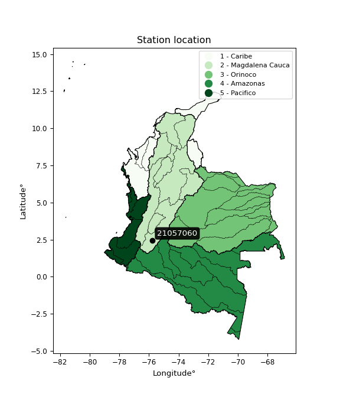

<div align="center">


</div>

# PMP Station (Rain, Pmax24h): 21057060

Probable Maximum Precipitation (PMP) is the greatest amount of rainfall for a specific duration that is meteorologically possible for a given location, acting as a "worst-case" scenario for extreme storms, crucial for designing safety-critical infrastructure like bridges, river deviations, dams, spillways, and nuclear plants to prevent catastrophic failure. PMP is calculated by hydrologists using meteorological data to determine the upper limit of extreme rainfall, often leading to the Probable Maximum Flood (PMF) for flood control design, and is increasingly being studied for climate change impacts. Probable Maximum Precipitation (PMP) is the theoretical upper limit of rainfall, a deterministic estimate for extreme events, while probability distributions (like GEV, Gumbel) describe the likelihood and frequency of various precipitation amounts, including rare ones, showing how often events occur, with PMP representing the extreme end of these distributions, used for critical infrastructure design to ensure safety against the worst conceivable weather, unlike standard statistical forecasts which cover typical probabilities.

The most common probability distributions in hydrology, used for analyzing floods, rainfall, and streamflow, include the Normal, Log-Normal, Gumbel, Gamma (including Log-Pearson Type III), and Generalized Extreme Value (GEV) distributions, often chosen based on the data´s skewness and whether modeling extremes or general conditions, with Gumbel and GEV popular for extreme events like floods, while the Normal distribution serves as a baseline, though often requiring transformations for skewed hydrological data. These distributions help in designing water infrastructure, managing water resources, and forecasting hydrologic events.

> Hydrological data often isn´t perfectly normal (it´s skewed), so different distributions are needed for different applications, such as: **Flood Frequency Analysis**: Using Gumbel, GEV, or Log-Pearson Type III for predicting extreme flood magnitudes and their return periods, **Rainfall Analysis**: Normal for annual totals, but Log-Normal, Weibull, or GEV for intensity or extreme daily rainfall, **Streamflow Modeling**: Gamma and Log-Normal for maximum flows, GEV for minimum flows, and Kappa for daily flows.

<div align="center">

</img>

</div>


## A. General information


### 1. General running parameters

• app_version: _v20260108_. • runtime: _2026-01-09 11:32:22.148588_. • Python version: _3.14.0_. • SciPy version: _1.16.3_. • Pandas version: _2.3.3_. • NumPy version: _2.3.5_. • Stations dataset (station_dataset_file): _dataset/pmax24h_in/automatic_colombia_2003_2024.csv_. • Stations catalog (station_catalog_file): _dataset/CNE.xls_. • Minimum year to eval til year_max (date_min): _1900_. • Maximum year to eval since year_min (date_max): _2024_. • Creates, save and include plots into reports (create_plot): _False_. • Plot only fit distributions with Δo > Δ (plot_only_fit): _True_. • Plot only simple graphs avoiding multiple CDFs and multiple Extreme values plots (plot_only_simple): _True_. • Eval low extreme values, if False, evaluates high extreme values (low_extreme): _False_. • Eval every SciPy distribution as logarithmic (pdist_logarithmic_on): _True_. • Standard deviation normalized (ddof): _1.0_. • Return periods to eval in years (Tr): _[2, 2.33, 5, 10, 15, 20, 25, 50, 75, 100, 200, 250, 500, 750, 1000]_. • Minimum data sample per station, 0 means any (minimum_sample): _5_. • Z-Score maximum threshold to adjust a value, 0 means disable (zscore_max): _3.5_. • Z-Score minimum threshold to adjust a value, 0 means disable (zscore_min): _-2.5_. • Avoid zeros, e.g. rain = 0 (avoid_zeros): _True_. • Avoid null values (avoid_nans): _True_. 

:file_folder:Table: [dataset.csv](../../dataset/pmax24h_in/automatic_colombia_2003_2024.csv)

> Delta Degrees of Freedom (DDOF): is a parameter used in the formulas for calculating variance and standard deviation. When ddof=0, the divisor is $N$ (the total number of observations) and this is used when your data set is the entire population. When ddof=1, the divisor is $N-1$ and this is used when your data set is a sample drawn from a larger population. Using $N-1$ provides an unbiased estimate of the population variance (known as Bessel´s correction).


### 2. Station info and location

|   id |   CODIGO | NOMBRE                  | CATEGORIA    | TECNOLOGIA                              | ESTADO   | FECHA_INSTALACION   |   FECHA_SUSPENSION |   ALTITUD |   LATITUD |   LONGITUD | DEPARTAMENTO   | MUNICIPIO   | AREA_OPERATIVA                    | ENTIDAD                                                     | AREA_HIDROGRAFICA   | ZONA_HIDROGRAFICA   | SUBZONA_HIDROGRAFICA   | CORRIENTE   | Catalogo   |   Version |
|-----:|---------:|:------------------------|:-------------|:----------------------------------------|:---------|:--------------------|-------------------:|----------:|----------:|-----------:|:---------------|:------------|:----------------------------------|:------------------------------------------------------------|:--------------------|:--------------------|:-----------------------|:------------|:-----------|----------:|
|    0 | 21057060 | PAICOL - AUT [21057060] | Limnigráfica | Automática con Telemetría, Convencional | Activa   | 15/07/1971          |                nan |       788 |      2.46 |     -75.76 | Huila          | Tesalia     | Area Operativa 04 - Huila-Caquetá | INSTITUTO DE HIDROLOGIA METEOROLOGIA Y ESTUDIOS AMBIENTALES | Magdalena Cauca     | Alto Magdalena      | Río Páez               | Paez        | CNE_IDEAM  |  20251226 |

<div align="center">

Dynamic map: [:earth_americas:Google](http://maps.google.com/maps?q=2.46,-75.76) [:earth_americas:OSM](https://www.openstreetmap.org/#map=18/2.46/-75.76&layers=P) [:earth_americas:Bing](https://www.bing.com/maps?cp=2.46~-75.76&lvl=18) [:earth_americas:Apple](https://maps.apple.com/frame?center=2.46%2C-75.76&span=0.003%2C0.006)

</div>


<div align="center">

```geojson
{
  "type": "Feature",
  "geometry": {
    "type": "Point", 
    "coordinates": [-75.76, 2.46]
  }, 
  "properties": {
    "Name": "21057060"
  }
}
```

</div>


### 3. Discrete values table and plot

<div align="center">

|               |          0 |            1 |           2 |           3 |           4 |          5 |          6 |
|:--------------|-----------:|-------------:|------------:|------------:|------------:|-----------:|-----------:|
| Date          | 2012       | 2019         | 2020        | 2021        | 2022        | 2023       | 2024       |
| Value         |  204       |  107.4       |   68.6      |   51.2      |   78.6      |   42       |  194       |
| Value_initial |  204       |  107.4       |   68.6      |   51.2      |   78.6      |   42       |  194       |
| count         |    7       |    7         |    7        |    7        |    7        |    7       |    7       |
| mean          |  106.543   |  106.543     |  106.543    |  106.543    |  106.543    |  106.543   |  106.543   |
| std           |   66.5788  |   66.5788    |   66.5788   |   66.5788   |   66.5788   |   66.5788  |   66.5788  |
| zscore        |    1.46379 |    0.0128741 |   -0.569894 |   -0.831238 |   -0.419696 |   -0.96942 |    1.31359 |


</div>


> The initial value (value_initial) correspond to the initial obtained or null completed value, and value (value) is adjusted only when the initial value is outside the valid range (outlier) definite through the Z-Score value. If Z-Score is active, values out of range or outliers are replaced with the station mean value. A Z-Score (or standard score) measures how many standard deviations a data point is from the mean of a dataset, indicating its relative position; positive scores mean above the mean, negative mean below, and a score of zero is exactly at the mean, allowing for comparison of values from different distributions. It´s calculated using the formula $z=(x–μ)/σ$, where $x$ is the data point, $μ$ is the mean, and $σ$ is the standard deviation, helping identify outliers and understand probability.
>
> <sub>**Note**: In this study, "completing" (filling gaps in) and "extending" (forecasting or lengthening the historical record) rainfall data series are avoided for certain critical analyses because they introduce artificial bias and uncertainty, which can distort the statistics of rare events (extremes), alter day-to-day variability, and compromise the integrity and homogeneity of the original data. Some reasons against Completing/Extending rainfall data are: **Distortion of Extremes and Variability**: The primary issue is that most gap-filling or extension methods rely on averaging or regression with nearby stations, which inherently smooths the data. Rainfall is highly variable in space and time, with a large percentage of zero values and occasional large storms. Infilling methods often underestimate the highest values and overestimate the lowest (zero) values, which severely distorts analyses focused on flood frequency, drought severity, and intensity-duration-frequency (IDF) curves, **Loss of Data Homogeneity**: Infilled or extended data are synthetic estimates, not actual measurements. Combining these estimates with observed data can violate the assumption of data homogeneity, which requires that the data properties do not change over time. Inhomogeneity can lead to incorrect conclusions about long-term trends or changes in climate patterns, **Propagation of Errors**: Errors and biases from the original data (e.g., wind-induced undercatch, instrument errors, site changes) or the data used for imputation can propagate through the analysis, leading to unreliable hydrological models and inaccurate predictions, **Compromised Statistical Integrity**: For statistical analyses, especially those involving the frequency of events, using artificial data can introduce time bias or autocorrelation that doesn´t exist in reality, making it difficult to assess the true probability of events, **Difficulty in Validation**: It is difficult to accurately validate the quality of filled or extended data, especially for past periods where ground-truth measurements are unavailable. The reliability of imputation techniques heavily depends on the density of the surrounding station network and the complexity of the local topography.</sub>


### 4. Active continuous probability distributions from SciPy (45 of 104 available)

A Probability Density Function (PDF) describes the relative likelihood of a continuous random variable falling within a specific range, where the total area under its curve equals 1, and the area over any interval gives the actual probability for that range. Unlike discrete probabilities (like rolling a die), a PDF shows density, not direct probability for a single point (which is zero), with higher points indicating higher likelihood, often visualized as a bell curve for normal distributions.

A log of a probability density function (log-PDF) is simply the logarithm of the PDF´s value, denoted as $log(f(x))$, useful for converting multiplication of probabilities into addition, improving numerical stability with tiny numbers, and connecting to information theory concepts like entropy. Instead of dealing with very small probabilities (e.g., 0.000001), log-PDFs use negative numbers (e.g., $log(0.00001) ≈ -11.51$ that are easier for computers to handle, preventing underflow errors and simplifying complex calculations. In this study, each active probability distribution from SciPy is also evaluated in the $log$ form.

[scipy.stats](https://docs.scipy.org/doc/scipy/reference/stats.html) is a Python´s powerful submodule within the SciPy library for comprehensive statistical analysis, offering over 130 probability distributions (like Normal, Poisson), functions for descriptive stats (mean, variance), hypothesis testing (t-tests, chi-square), random variable generation, and statistical tests, making it essential for data science, modeling, and research. It provides tools to explore, model, and draw conclusions from data efficiently, working seamlessly with NumPy.

<div align="center">

|   id | p_dist             |   n_parameter | fit_method   | label                                                                       | active   | ref                                                                                                        |
|-----:|:-------------------|--------------:|:-------------|:----------------------------------------------------------------------------|:---------|:-----------------------------------------------------------------------------------------------------------|
|    0 | alpha              |             3 | MLE          | Alpha                                                                       | True     | [:mortar_board:](https://docs.scipy.org/doc/scipy/reference/generated/scipy.stats.alpha.html)              |
|    1 | betaprime          |             4 | MLE          | Beta prime                                                                  | True     | [:mortar_board:](https://docs.scipy.org/doc/scipy/reference/generated/scipy.stats.betaprime.html)          |
|    2 | chi2               |             3 | MLE          | Chi²                                                                        | True     | [:mortar_board:](https://docs.scipy.org/doc/scipy/reference/generated/scipy.stats.chi2.html)               |
|    3 | crystalball        |             4 | MLE          | Crystalball                                                                 | True     | [:mortar_board:](https://docs.scipy.org/doc/scipy/reference/generated/scipy.stats.crystalball.html)        |
|    4 | dweibull           |             3 | MLE          | Double Weibull                                                              | True     | [:mortar_board:](https://docs.scipy.org/doc/scipy/reference/generated/scipy.stats.dweibull.html)           |
|    5 | erlang             |             3 | MLE          | Erlang                                                                      | True     | [:mortar_board:](https://docs.scipy.org/doc/scipy/reference/generated/scipy.stats.erlang.html)             |
|    6 | expon              |             2 | MLE          | Exponential                                                                 | True     | [:mortar_board:](https://docs.scipy.org/doc/scipy/reference/generated/scipy.stats.expon.html)              |
|    7 | exponnorm          |             3 | MLE          | Exponentially modified Normal                                               | True     | [:mortar_board:](https://docs.scipy.org/doc/scipy/reference/generated/scipy.stats.exponnorm.html)          |
|    8 | f                  |             4 | MLE          | F                                                                           | True     | [:mortar_board:](https://docs.scipy.org/doc/scipy/reference/generated/scipy.stats.f.html)                  |
|    9 | fatiguelife        |             3 | MLE          | Fatigue-life (Birnbaum-Saunders)                                            | True     | [:mortar_board:](https://docs.scipy.org/doc/scipy/reference/generated/scipy.stats.fatiguelife.html)        |
|   10 | fisk               |             3 | MLE          | Fisk                                                                        | True     | [:mortar_board:](https://docs.scipy.org/doc/scipy/reference/generated/scipy.stats.fisk.html)               |
|   11 | gamma              |             3 | MLE          | Gamma                                                                       | True     | [:mortar_board:](https://docs.scipy.org/doc/scipy/reference/generated/scipy.stats.gamma.html)              |
|   12 | genexpon           |             5 | MLE          | Generalized exponential                                                     | True     | [:mortar_board:](https://docs.scipy.org/doc/scipy/reference/generated/scipy.stats.genexpon.html)           |
|   13 | genlogistic        |             3 | MLE          | Generalized logistic                                                        | True     | [:mortar_board:](https://docs.scipy.org/doc/scipy/reference/generated/scipy.stats.genlogistic.html)        |
|   14 | gibrat             |             2 | MM           | Gibrat                                                                      | True     | [:mortar_board:](https://docs.scipy.org/doc/scipy/reference/generated/scipy.stats.gibrat.html)             |
|   15 | gompertz           |             3 | MLE          | Gompertz (or truncated Gumbel)                                              | True     | [:mortar_board:](https://docs.scipy.org/doc/scipy/reference/generated/scipy.stats.gompertz.html)           |
|   16 | gumbel_l           |             2 | MM           | Gumbel Left Skew                                                            | True     | [:mortar_board:](https://docs.scipy.org/doc/scipy/reference/generated/scipy.stats.gumbel_l.html)           |
|   17 | gumbel_r           |             2 | MM           | Gumbel Right Skew                                                           | True     | [:mortar_board:](https://docs.scipy.org/doc/scipy/reference/generated/scipy.stats.gumbel_r.html)           |
|   18 | halflogistic       |             2 | MM           | Half-logistic                                                               | True     | [:mortar_board:](https://docs.scipy.org/doc/scipy/reference/generated/scipy.stats.halflogistic.html)       |
|   19 | halfnorm           |             2 | MM           | Half Normal                                                                 | True     | [:mortar_board:](https://docs.scipy.org/doc/scipy/reference/generated/scipy.stats.halfnorm.html)           |
|   20 | hypsecant          |             2 | MM           | hyperbolic secant                                                           | True     | [:mortar_board:](https://docs.scipy.org/doc/scipy/reference/generated/scipy.stats.hypsecant.html)          |
|   21 | invgamma           |             3 | MLE          | Inverted gamma                                                              | True     | [:mortar_board:](https://docs.scipy.org/doc/scipy/reference/generated/scipy.stats.invgamma.html)           |
|   22 | invgauss           |             3 | MLE          | Inverse Gaussian                                                            | True     | [:mortar_board:](https://docs.scipy.org/doc/scipy/reference/generated/scipy.stats.invgauss.html)           |
|   23 | invweibull         |             3 | MLE          | Inverted Weibull                                                            | True     | [:mortar_board:](https://docs.scipy.org/doc/scipy/reference/generated/scipy.stats.invweibull.html)         |
|   24 | kappa4             |             4 | MLE          | Kappa 4                                                                     | True     | [:mortar_board:](https://docs.scipy.org/doc/scipy/reference/generated/scipy.stats.kappa4.html)             |
|   25 | kstwobign          |             2 | MLE          | Limiting distribution of scaled Kolmogorov-Smirnov two-sided test statistic | True     | [:mortar_board:](https://docs.scipy.org/doc/scipy/reference/generated/scipy.stats.kstwobign.html)          |
|   26 | laplace            |             2 | MM           | Laplace                                                                     | True     | [:mortar_board:](https://docs.scipy.org/doc/scipy/reference/generated/scipy.stats.laplace.html)            |
|   27 | laplace_asymmetric |             3 | MLE          | Asymmetric Laplace                                                          | True     | [:mortar_board:](https://docs.scipy.org/doc/scipy/reference/generated/scipy.stats.laplace_asymmetric.html) |
|   28 | loggamma           |             3 | MLE          | Log gamma                                                                   | True     | [:mortar_board:](https://docs.scipy.org/doc/scipy/reference/generated/scipy.stats.loggamma.html)           |
|   29 | logistic           |             2 | MM           | Logistic (or Sech-squared)                                                  | True     | [:mortar_board:](https://docs.scipy.org/doc/scipy/reference/generated/scipy.stats.logistic.html)           |
|   30 | lognorm            |             3 | MLE          | Log Normal                                                                  | True     | [:mortar_board:](https://docs.scipy.org/doc/scipy/reference/generated/scipy.stats.lognorm.html)            |
|   31 | maxwell            |             2 | MM           | Maxwell                                                                     | True     | [:mortar_board:](https://docs.scipy.org/doc/scipy/reference/generated/scipy.stats.maxwell.html)            |
|   32 | mielke             |             4 | MLE          | Mielke Beta-Kappa / Dagum                                                   | True     | [:mortar_board:](https://docs.scipy.org/doc/scipy/reference/generated/scipy.stats.mielke.html)             |
|   33 | moyal              |             2 | MM           | Moyal                                                                       | True     | [:mortar_board:](https://docs.scipy.org/doc/scipy/reference/generated/scipy.stats.moyal.html)              |
|   34 | nakagami           |             3 | MLE          | Nakagami                                                                    | True     | [:mortar_board:](https://docs.scipy.org/doc/scipy/reference/generated/scipy.stats.nakagami.html)           |
|   35 | ncf                |             5 | MLE          | Non-central F distribution                                                  | True     | [:mortar_board:](https://docs.scipy.org/doc/scipy/reference/generated/scipy.stats.ncf.html)                |
|   36 | nct                |             4 | MLE          | Non-central Student’s t                                                     | True     | [:mortar_board:](https://docs.scipy.org/doc/scipy/reference/generated/scipy.stats.nct.html)                |
|   37 | norm               |             2 | MM           | Normal                                                                      | True     | [:mortar_board:](https://docs.scipy.org/doc/scipy/reference/generated/scipy.stats.norm.html)               |
|   38 | pearson3           |             3 | MM           | Pearson type III                                                            | True     | [:mortar_board:](https://docs.scipy.org/doc/scipy/reference/generated/scipy.stats.pearson3.html)           |
|   39 | rayleigh           |             2 | MM           | Rayleigh                                                                    | True     | [:mortar_board:](https://docs.scipy.org/doc/scipy/reference/generated/scipy.stats.rayleigh.html)           |
|   40 | rice               |             3 | MLE          | Rice                                                                        | True     | [:mortar_board:](https://docs.scipy.org/doc/scipy/reference/generated/scipy.stats.rice.html)               |
|   41 | t                  |             3 | MLE          | Student’s t                                                                 | True     | [:mortar_board:](https://docs.scipy.org/doc/scipy/reference/generated/scipy.stats.t.html)                  |
|   42 | truncnorm          |             4 | MLE          | Truncated normal                                                            | True     | [:mortar_board:](https://docs.scipy.org/doc/scipy/reference/generated/scipy.stats.truncnorm.html)          |
|   43 | wald               |             2 | MM           | Wald                                                                        | True     | [:mortar_board:](https://docs.scipy.org/doc/scipy/reference/generated/scipy.stats.wald.html)               |
|   44 | weibull_min        |             3 | MLE          | Weibull minimum                                                             | True     | [:mortar_board:](https://docs.scipy.org/doc/scipy/reference/generated/scipy.stats.weibull_min.html)        |

</div>

> **n_parameter:** # arguments & localization & scale.
>
> **Fit methods:** (MLE) maximum likelihood, (MM) L-moments.
>
>**Inactive** (With the only purpose of prevent loops, zero divisions, infinite values, over high estimated values or horizontal trending for recurrence intervals estimations, the follow distributions were disabled.)**:** foldnorm, gennorm, norminvgauss, powernorm, powerlognorm, skewnorm, genextreme, anglit, arcsine, argus, beta, bradford, burr, burr12, cauchy, cosine, halfcauchy, foldcauchy, skewcauchy, wrapcauchy, dgamma, gengamma, exponweib, exponpow, truncexpon, gausshyper, genhalflogistic, genhyperbolic, geninvgauss, halfgennorm, johnsonsb, johnsonsu, kappa3, ksone, kstwo, loglaplace, levy, levy_l, levy_stable, ncx2, pareto, genpareto, truncpareto, lomax, powerlaw, rdist, rel_breitwigner, recipinvgauss, semicircular, studentized_range, trapezoid, triang, truncweibull_min, tukeylambda, uniform, loguniform, vonmises, vonmises_line, weibull_max, 


## B. Probability (PDF) vs. Empirical (EDF) distributions functions

A continuous probability distribution (CPD) describes probabilities for variables that can take any value within a range (like rain any time), unlike discrete variables with specific outcomes (like temperature). It uses a Probability Density Function (PDF), a curve where the total area under it equals 1, and the probability of the variable falling within an interval (a to b) is found by calculating the area under the curve between those points. A key feature is that the probability of hitting any single exact value is zero, so probabilities are always expressed for ranges, e.g., $P(a ≤ X ≤ b)$.

<div align="center">

Distributions parameters from station values
|    |   station | p_dist                |   n |              loc |          scale | shape                 | shape1             | shape2                | shape3   |
|---:|----------:|:----------------------|----:|-----------------:|---------------:|:----------------------|:-------------------|:----------------------|:---------|
|  0 |  21057060 | alpha                 |   7 |     24.7778      |   34.4962      | 1.028725343740873e-09 |                    |                       |          |
|  1 |  21057060 | betaprime             |   7 |     -0.752816    |    1.51941     | 186.956321204289      | 3.591079483243302  |                       |          |
|  2 |  21057060 | chi2                  |   7 |     42           |   36.2362      | 1.029574657770346     |                    |                       |          |
|  3 |  21057060 | crystalball           |   7 |    106.543       |   61.64        | 9233.958776124779     | 1632.4251576069487 |                       |          |
|  4 |  21057060 | dweibull              |   7 |     97.6924      |   57.5949      | 1.5183288423671417    |                    |                       |          |
|  5 |  21057060 | erlang                |   7 |     42           |   54.2139      | 0.55727827051214      |                    |                       |          |
|  6 |  21057060 | expon                 |   7 |     42           |   64.5429      |                       |                    |                       |          |
|  7 |  21057060 | exponnorm             |   7 |     41.9407      |    0.018751    | 3435.501100885256     |                    |                       |          |
|  8 |  21057060 | f                     |   7 |     33.8403      |   38.8622      | 5.634471355430037     | 3.064031420123002  |                       |          |
|  9 |  21057060 | fatiguelife           |   7 |     42           |    6.36203e-05 | 920.1839021252613     |                    |                       |          |
| 10 |  21057060 | fisk                  |   7 |     42           |   43.75        | 0.9472994109625088    |                    |                       |          |
| 11 |  21057060 | gamma                 |   7 |     42           |   81.1253      | 0.4245574795218364    |                    |                       |          |
| 12 |  21057060 | genexpon              |   7 |     41.9944      |    3.29569     | 0.048641288294062585  | 3.7491301803926014 | 3.418450010664293e-05 |          |
| 13 |  21057060 | genlogistic           |   7 |   -258.62        |   44.3952      | 1973.7343507050768    |                    |                       |          |
| 14 |  21057060 | gibrat                |   7 |     59.5192      |   28.5213      |                       |                    |                       |          |
| 15 |  21057060 | gompertz              |   7 |     42           |  778.11        | 11.116384149809292    |                    |                       |          |
| 16 |  21057060 | gumbel_l              |   7 |    134.284       |   48.0605      |                       |                    |                       |          |
| 17 |  21057060 | gumbel_r              |   7 |     78.8016      |   48.0605      |                       |                    |                       |          |
| 18 |  21057060 | halflogistic          |   7 |     33.4851      |   52.7         |                       |                    |                       |          |
| 19 |  21057060 | halfnorm              |   7 |     24.9556      |  102.254       |                       |                    |                       |          |
| 20 |  21057060 | hypsecant             |   7 |    106.543       |   39.2413      |                       |                    |                       |          |
| 21 |  21057060 | invgamma              |   7 |     22.5422      |   88.583       | 1.8851239074674189    |                    |                       |          |
| 22 |  21057060 | invgauss              |   7 |     31.5935      |   55.0546      | 1.361362781944383     |                    |                       |          |
| 23 |  21057060 | invweibull            |   7 |     42           |    1.59352     | 0.06667885757273365   |                    |                       |          |
| 24 |  21057060 | kappa4                |   7 |     -0.262821    |  190.523       | 1.280985157957426     | 0.905697715336576  |                       |          |
| 25 |  21057060 | kstwobign             |   7 |    -76.7345      |  210.382       |                       |                    |                       |          |
| 26 |  21057060 | laplace               |   7 |    106.543       |   43.5861      |                       |                    |                       |          |
| 27 |  21057060 | laplace_asymmetric    |   7 |     42           |    0.10451     | 0.0016216851476899934 |                    |                       |          |
| 28 |  21057060 | loggamma              |   7 | -19346.4         | 2612.65        | 1712.8725652470093    |                    |                       |          |
| 29 |  21057060 | logistic              |   7 |    106.543       |   33.9839      |                       |                    |                       |          |
| 30 |  21057060 | lognorm               |   7 |     42           |    0.269213    | 12.797968930414932    |                    |                       |          |
| 31 |  21057060 | maxwell               |   7 |    -39.5181      |   91.5302      |                       |                    |                       |          |
| 32 |  21057060 | mielke                |   7 |     -0.675212    |    4.98568     | 561.3946159339089     | 2.1185950429473017 |                       |          |
| 33 |  21057060 | moyal                 |   7 |     71.2931      |   27.7478      |                       |                    |                       |          |
| 34 |  21057060 | nakagami              |   7 |     42           |   76.1833      | 0.17707380373128323   |                    |                       |          |
| 35 |  21057060 | ncf                   |   7 |     -0.0921969   |    1.18826e-05 | 5.36706108496659e-07  | 15.809869931562162 | 3.655785689173781     |          |
| 36 |  21057060 | nct                   |   7 |     -0.245691    |    1.32623     | 2.1617560342842133    | 52.453441360725606 |                       |          |
| 37 |  21057060 | norm                  |   7 |    106.543       |   61.64        |                       |                    |                       |          |
| 38 |  21057060 | pearson3              |   7 |    106.543       |   61.6401      | 0.6586290867726781    |                    |                       |          |
| 39 |  21057060 | rayleigh              |   7 |    -11.3781      |   94.0873      |                       |                    |                       |          |
| 40 |  21057060 | rice                  |   7 |      6.91984     |   82.8379      | 0.0007174718474312386 |                    |                       |          |
| 41 |  21057060 | t                     |   7 |    106.563       |   61.6409      | 544718.8524277174     |                    |                       |          |
| 42 |  21057060 | truncnorm             |   7 |    106.543       |   61.64        | -2666.9467361454567   | 8043.529037121576  |                       |          |
| 43 |  21057060 | wald                  |   7 |     44.9028      |   61.64        |                       |                    |                       |          |
| 44 |  21057060 | weibull_min           |   7 |     42           |   65.6438      | 0.8897135233503438    |                    |                       |          |
| 45 |  21057060 | logalpha              |   7 |      0.165572    |   32.9677      | 7.729698693629976     |                    |                       |          |
| 46 |  21057060 | logbetaprime          |   7 |     -2.52316     |    4.18182     | 403.6999717651295     | 241.16876958335308 |                       |          |
| 47 |  21057060 | logchi2               |   7 |      3.73767     |    0.959211    | 0.3530700327091599    |                    |                       |          |
| 48 |  21057060 | logcrystalball        |   7 |      4.50409     |    0.570932    | 124.68140964502484    | 48.23441432462545  |                       |          |
| 49 |  21057060 | logdweibull           |   7 |      4.54119     |    0.570155    | 1.9635111748349736    |                    |                       |          |
| 50 |  21057060 | logerlang             |   7 |      3.73767     |    0.806272    | 0.9128754432247429    |                    |                       |          |
| 51 |  21057060 | logexpon              |   7 |      3.73767     |    0.766418    |                       |                    |                       |          |
| 52 |  21057060 | logexponnorm          |   7 |      4.39126     |    0.559711    | 0.2015712966312523    |                    |                       |          |
| 53 |  21057060 | logf                  |   7 |      3.73767     |    0.812192    | 1.134977580158507     | 230.7090349405319  |                       |          |
| 54 |  21057060 | logfatiguelife        |   7 |      3.25812     |    1.10133     | 0.5114354165891062    |                    |                       |          |
| 55 |  21057060 | logfisk               |   7 |      3.30131     |    1.08293     | 3.162850818386149     |                    |                       |          |
| 56 |  21057060 | loggamma              |   7 |      3.73767     |    0.690859    | 0.5702390453332431    |                    |                       |          |
| 57 |  21057060 | loggenexpon           |   7 |      3.73767     |    1.08483     | 1.0795270060916469    | 0.913151914705526  | 0.9111570139008134    |          |
| 58 |  21057060 | loggenlogistic        |   7 |      1.20197     |    0.476662    | 571.2294940657124     |                    |                       |          |
| 59 |  21057060 | loggibrat             |   7 |      4.06853     |    0.264179    |                       |                    |                       |          |
| 60 |  21057060 | loggompertz           |   7 |      3.73767     |    1.26801     | 0.9756825031665691    |                    |                       |          |
| 61 |  21057060 | loggumbel_l           |   7 |      4.76104     |    0.445154    |                       |                    |                       |          |
| 62 |  21057060 | loggumbel_r           |   7 |      4.24714     |    0.445154    |                       |                    |                       |          |
| 63 |  21057060 | loghalflogistic       |   7 |      3.82735     |    0.48816     |                       |                    |                       |          |
| 64 |  21057060 | loghalfnorm           |   7 |      3.74845     |    0.947059    |                       |                    |                       |          |
| 65 |  21057060 | loghypsecant          |   7 |      4.50409     |    0.363466    |                       |                    |                       |          |
| 66 |  21057060 | loginvgamma           |   7 |      2.20025     |   35.3806      | 16.337553787163294    |                    |                       |          |
| 67 |  21057060 | loginvgauss           |   7 |      3.12741     |    6.49938     | 0.21181705627013714   |                    |                       |          |
| 68 |  21057060 | loginvweibull         |   7 |     -1.61805e+07 |    1.61805e+07 | 33910136.062818795    |                    |                       |          |
| 69 |  21057060 | logkappa4             |   7 |      3.72519     |    1.79099     | 1.0058857119082778    | 1.1243334719412472 |                       |          |
| 70 |  21057060 | logkstwobign          |   7 |      2.57817     |    2.20165     |                       |                    |                       |          |
| 71 |  21057060 | loglaplace            |   7 |      4.50409     |    0.40371     |                       |                    |                       |          |
| 72 |  21057060 | loglaplace_asymmetric |   7 |      4.22829     |    0.436762    | 0.7327931967769555    |                    |                       |          |
| 73 |  21057060 | logloggamma           |   7 |   -132.827       |   19.4984      | 1145.4058828469583    |                    |                       |          |
| 74 |  21057060 | loglogistic           |   7 |      4.50409     |    0.314771    |                       |                    |                       |          |
| 75 |  21057060 | loglognorm            |   7 |      3.73767     |    0.00483097  | 12.272706432064247    |                    |                       |          |
| 76 |  21057060 | logmaxwell            |   7 |      3.15122     |    0.847784    |                       |                    |                       |          |
| 77 |  21057060 | logmielke             |   7 |  -2215.51        | 2217.45        | 576973.7959893211     | 4673.488410092907  |                       |          |
| 78 |  21057060 | logmoyal              |   7 |      4.17759     |    0.25701     |                       |                    |                       |          |
| 79 |  21057060 | lognakagami           |   7 |      3.73767     |    1.30468     | 0.1754316926503537    |                    |                       |          |
| 80 |  21057060 | logncf                |   7 |      2.34005     |    1.38129     | 203.7740900113111     | 32.67862284289602  | 96.41845313219626     |          |
| 81 |  21057060 | lognct                |   7 |     -0.313289    |    0.153724    | 40.1209070194452      | 30.737439005358937 |                       |          |
| 82 |  21057060 | lognorm               |   7 |      4.50409     |    0.570932    |                       |                    |                       |          |
| 83 |  21057060 | logpearson3           |   7 |      4.50409     |    0.570931    | 0.2553680748278849    |                    |                       |          |
| 84 |  21057060 | lograyleigh           |   7 |      3.41186     |    0.87147     |                       |                    |                       |          |
| 85 |  21057060 | logrice               |   7 |      3.47222     |    0.753908    | 0.6684565505582437    |                    |                       |          |
| 86 |  21057060 | logt                  |   7 |      4.50409     |    0.570932    | 8748108141.183895     |                    |                       |          |
| 87 |  21057060 | logtruncnorm          |   7 |      0.123746    |    1.95737     | 1.8463143774643913    | 8.695111283227593  |                       |          |
| 88 |  21057060 | logwald               |   7 |      3.93315     |    0.570931    |                       |                    |                       |          |
| 89 |  21057060 | logweibull_min        |   7 |      3.73767     |    0.322018    | 0.7958378186001348    |                    |                       |          |

</div>

> **loc** (Location parameter): This shifts the distribution along the x-axis. For many common distributions, like the normal (Gaussian) distribution, loc represents the mean $μ$. For others, like the uniform distribution, it might represent the minimum value, or for the beta distribution, the left end of the support interval.
>
> **scale** (Scale parameter): This determines the width or spread of the distribution. For the normal distribution, scale represents the standard deviation $σ$. For a uniform distribution, it defines the length of the interval (from $loc$ to $loc + scale$).
>
> **shape** (Shape parameters): Refers to parameters that define the specific form of a probability distribution, distinct from its location (loc) and scale (scale). These parameters are required arguments for most distribution functions. For example, a normal (Gaussian) distribution is fully defined by its location (mean) and scale (standard deviation), so it has no specific shape parameters beyond loc and scale. However, other distributions have intrinsic properties that need specification, as Gamma distribution that takes a shape parameter, often named $a$ or $alpha$.


### 0. Cumulative distribution values - CDF (90 evaluated)

Cumulative Distribution Function (CDF), denoted as $F$<sub>$X$</sub>$(x)$, is a function that gives the probability that a random variable $X$ will take a value less than or equal to a specific value, $x$ (i.e., $(P(X≥x)$. It essentially "accumulates" probabilities from a given point up to the far right (positive infinity), providing a complete picture of the distribution´s probabilities for both discrete (like rain) and continuous (like temperature) variables, helping to find probabilities over ranges or above certain values. Each station is evaluated separately ordering the $x$ values ascending, calculating the CDF and PDF values for the activated distributions and their logarithmic forms.

<div align="center">

CDF ordered by x ascending and calculating $log(f(x))$ separately
|   id |   Station |   date |     x |   count |    mean |     std |     zscore |   Value_initial |   station |   m |    alpha |   alpha_pdf |   betaprime |   betaprime_pdf |        chi2 |         chi2_pdf |   crystalball |   crystalball_pdf |   dweibull |   dweibull_pdf |      erlang |       erlang_pdf |    expon |   expon_pdf |   exponnorm |   exponnorm_pdf |         f |       f_pdf |   fatiguelife |   fatiguelife_pdf |        fisk |   fisk_pdf |       gamma |   gamma_pdf |    genexpon |   genexpon_pdf |   genlogistic |   genlogistic_pdf |   gibrat |   gibrat_pdf |    gompertz |   gompertz_pdf |   gumbel_l |   gumbel_l_pdf |   gumbel_r |   gumbel_r_pdf |   halflogistic |   halflogistic_pdf |   halfnorm |   halfnorm_pdf |   hypsecant |   hypsecant_pdf |   invgamma |   invgamma_pdf |   invgauss |   invgauss_pdf |   invweibull |   invweibull_pdf |      kappa4 |   kappa4_pdf |   kstwobign |   kstwobign_pdf |   laplace |   laplace_pdf |   laplace_asymmetric |   laplace_asymmetric_pdf |    loggamma |   loggamma_pdf |   logistic |   logistic_pdf |   lognorm |   lognorm_pdf |   maxwell |   maxwell_pdf |   mielke |   mielke_pdf |     moyal |   moyal_pdf |    nakagami |   nakagami_pdf |      ncf |    ncf_pdf |       nct |     nct_pdf |     norm |   norm_pdf |   pearson3 |   pearson3_pdf |   rayleigh |   rayleigh_pdf |      rice |   rice_pdf |        t |      t_pdf |   truncnorm |   truncnorm_pdf |       wald |   wald_pdf |   weibull_min |   weibull_min_pdf |   logalpha |   logalpha_pdf |   logbetaprime |   logbetaprime_pdf |    logchi2 |   logchi2_pdf |   logcrystalball |   logcrystalball_pdf |   logdweibull |   logdweibull_pdf |   logerlang |   logerlang_pdf |   logexpon |   logexpon_pdf |   logexponnorm |   logexponnorm_pdf |        logf |    logf_pdf |   logfatiguelife |   logfatiguelife_pdf |   logfisk |   logfisk_pdf |   loggenexpon |   loggenexpon_pdf |   loggenlogistic |   loggenlogistic_pdf |   loggibrat |   loggibrat_pdf |   loggompertz |   loggompertz_pdf |   loggumbel_l |   loggumbel_l_pdf |   loggumbel_r |   loggumbel_r_pdf |   loghalflogistic |   loghalflogistic_pdf |   loghalfnorm |   loghalfnorm_pdf |   loghypsecant |   loghypsecant_pdf |   loginvgamma |   loginvgamma_pdf |   loginvgauss |   loginvgauss_pdf |   loginvweibull |   loginvweibull_pdf |   logkappa4 |   logkappa4_pdf |   logkstwobign |   logkstwobign_pdf |   loglaplace |   loglaplace_pdf |   loglaplace_asymmetric |   loglaplace_asymmetric_pdf |   logloggamma |   logloggamma_pdf |   loglogistic |   loglogistic_pdf |   loglognorm |   loglognorm_pdf |   logmaxwell |   logmaxwell_pdf |   logmielke |   logmielke_pdf |   logmoyal |   logmoyal_pdf |   lognakagami |   lognakagami_pdf |    logncf |   logncf_pdf |    lognct |   lognct_pdf |   logpearson3 |   logpearson3_pdf |   lograyleigh |   lograyleigh_pdf |   logrice |   logrice_pdf |      logt |   logt_pdf |   logtruncnorm |   logtruncnorm_pdf |     logwald |   logwald_pdf |   logweibull_min |   logweibull_min_pdf |
|-----:|----------:|-------:|------:|--------:|--------:|--------:|-----------:|----------------:|----------:|----:|---------:|------------:|------------:|----------------:|------------:|-----------------:|--------------:|------------------:|-----------:|---------------:|------------:|-----------------:|---------:|------------:|------------:|----------------:|----------:|------------:|--------------:|------------------:|------------:|-----------:|------------:|------------:|------------:|---------------:|--------------:|------------------:|---------:|-------------:|------------:|---------------:|-----------:|---------------:|-----------:|---------------:|---------------:|-------------------:|-----------:|---------------:|------------:|----------------:|-----------:|---------------:|-----------:|---------------:|-------------:|-----------------:|------------:|-------------:|------------:|----------------:|----------:|--------------:|---------------------:|-------------------------:|------------:|---------------:|-----------:|---------------:|----------:|--------------:|----------:|--------------:|---------:|-------------:|----------:|------------:|------------:|---------------:|---------:|-----------:|----------:|------------:|---------:|-----------:|-----------:|---------------:|-----------:|---------------:|----------:|-----------:|---------:|-----------:|------------:|----------------:|-----------:|-----------:|--------------:|------------------:|-----------:|---------------:|---------------:|-------------------:|-----------:|--------------:|-----------------:|---------------------:|--------------:|------------------:|------------:|----------------:|-----------:|---------------:|---------------:|-------------------:|------------:|------------:|-----------------:|---------------------:|----------:|--------------:|--------------:|------------------:|-----------------:|---------------------:|------------:|----------------:|--------------:|------------------:|--------------:|------------------:|--------------:|------------------:|------------------:|----------------------:|--------------:|------------------:|---------------:|-------------------:|--------------:|------------------:|--------------:|------------------:|----------------:|--------------------:|------------:|----------------:|---------------:|-------------------:|-------------:|-----------------:|------------------------:|----------------------------:|--------------:|------------------:|--------------:|------------------:|-------------:|-----------------:|-------------:|-----------------:|------------:|----------------:|-----------:|---------------:|--------------:|------------------:|----------:|-------------:|----------:|-------------:|--------------:|------------------:|--------------:|------------------:|----------:|--------------:|----------:|-----------:|---------------:|-------------------:|------------:|--------------:|-----------------:|---------------------:|
|    0 |  21057060 |   2023 |  42   |       7 | 106.543 | 66.5788 | -0.96942   |            42   |  21057060 |   1 | 0.045176 | 0.0124833   |    0.074753 |      0.00754237 | 6.47383e-09 | 469028           |      0.147528 |        0.00374081 |   0.193317 |     0.0050083  | 1.58456e-09 | 124277           | 0        |  0.0154936  | 0.000919867 |      0.0154969  | 0.0536906 | 0.0127131   |      0.112552 |       2.27065e+09 | 5.08231e-14 | 0.118873   | 1.71834e-07 | 1.02673e+07 | 8.28069e-05 |     0.0147579  |      0.104283 |        0.00530715 | 0        |  0           | 1.98961e-14 |     0.0142864  |   0.136346 |     0.00263411 |   0.116418 |     0.00520936 |      0.0806113 |         0.00942601 |   0.132383 |     0.00769528 |    0.12141  |      0.00301947 |  0.0501605 |    0.00985924  |  0.0429458 |    0.0123999   |  0.000116795 |      9.92464e+09 | 3.50803e-13 |  16.2018     |   0.0923414 |      0.00524682 |  0.113726 |    0.00260923 |          2.71438e-06 |               0.015517   | 2.24466e-08 | 588223         |   0.130197 |     0.00333233 | 0.0897334 |      0.283805 |  0.148906 |    0.00465067 |      nan |          nan | 0.0900227 |  0.00579227 | 1.67433e-06 |    8.34515e+07 | 0.416272 | 0.00534351 | 0.0623034 | 0.00842608  | 0.147528 | 0.00374081 |   0.138734 |     0.00476757 |   0.148647 |     0.00513346 | 0.0857648 | 0.0046737  | 0.147458 | 0.00373956 |    0.147528 |      0.00374081 | 0          | 0          |   6.24003e-15 |        0.781352   |   0.06687  |       0.334877 |      0.0832151 |           0.303057 | 0.00187832 |   7.46674e+11 |        0.0897337 |             0.283805 |     0.0703303 |          0.337092 | 2.51005e-09 |        7.78179  |   0        |       1.30477  |      0.0893536 |           0.284555 | 2.63088e-09 | 1.68096e+06 |        0.0471714 |             0.436575 | 0.0534092 |      0.366447 |   3.48011e-10 |          0.995107 |        0.0614882 |             0.358886 |    0        |       0         |   1.26612e-08 |          0.769457 |     0.0954958 |          0.203938 |     0.0432482 |          0.30514  |          0        |              0        |      0        |          0        |      0.0769116 |           0.209553 |     0.0607338 |          0.354969 |     0.0502318 |          0.409553 |       0.0610461 |            0.357728 |  0.00117324 |        0.581479 |      0.0556959 |           0.37928  |    0.0749012 |         0.185532 |               0.0754314 |                    0.235682 |     0.0929167 |          0.284824 |     0.0805541 |          0.235299 |   0.00722458 |      3.67649e+12 |    0.0764135 |         0.354519 |   0.0614443 |        0.356915 |  0.0186041 |       0.229094 |   2.97887e-06 |       2.35353e+09 | 0.0607174 |     0.355034 | 0.0734967 |     0.321901 |     0.0830878 |          0.303881 |     0.0674996 |          0.400042 | 0.0484014 |      0.355954 | 0.0897335 |   0.283805 |    6.47257e-09 |           1.14328  | 0           |   0           |      1.49116e-12 |          2672.26     |
|    1 |  21057060 |   2021 |  51.2 |       7 | 106.543 | 66.5788 | -0.831238  |            51.2 |  21057060 |   2 | 0.191696 | 0.0168128   |    0.156091 |      0.00984838 | 0.37351     |      0.019206    |      0.184636 |        0.00432515 |   0.242787 |     0.00572798 | 0.394268    |      0.0213891   | 0.132848 |  0.0134353  | 0.133883    |      0.013445   | 0.189836  | 0.0152816   |      0.66029  |       0.00822683  | 0.185864    | 0.0155809  | 0.433178    | 0.0184503   | 0.127477    |     0.0129724  |      0.159179 |        0.00658611 | 0        |  0           | 0.123847    |     0.0126659  |   0.162646 |     0.00309271 |   0.169331 |     0.006257   |      0.166508  |         0.00922461 |   0.202557 |     0.00755012 |    0.152397 |      0.00373691 |  0.164874  |    0.0139136   |  0.182959  |    0.0158581   |  0.410791    |      0.00264881  | 0.111582    |   0.00944012 |   0.146628  |      0.00650124 |  0.140453 |    0.00322242 |          0.133038    |               0.0134527  | 0.498115    |      1.1904    |   0.164036 |     0.00403509 | 0.159753  |      0.425735 |  0.194474 |    0.00523992 |      nan |          nan | 0.150918  |  0.00736144 | 0.376374    |    0.0144565   | 0.463794 | 0.00498688 | 0.157546  | 0.0117207   | 0.184636 | 0.00432515 |   0.186019 |     0.00549211 |   0.19843  |     0.00566632 | 0.13313   | 0.00559377 | 0.184554 | 0.0043239  |    0.184636 |      0.00432515 | 0.00456874 | 0.00383425 |   0.159758    |        0.0141443  |   0.155137 |       0.552995 |      0.159061  |           0.46386  | 0.713344   |   0.582192    |        0.159753  |             0.425735 |     0.1623    |          0.592231 | 0.256196    |        1.03579  |   0.227742 |       1.00762  |      0.159629  |           0.427543 | 0.347637    | 0.910723    |        0.168771  |             0.748337 | 0.155623  |      0.655096 |   0.189603    |          0.910977 |        0.158473  |             0.61147  |    0        |       0         |   0.152068    |          0.762754 |     0.144967  |          0.300821 |     0.133613  |          0.604145 |          0.110566 |              1.01173  |      0.15677  |          0.826171 |      0.131387  |           0.351305 |     0.156195  |          0.600312 |     0.163608  |          0.705317 |       0.157835  |            0.610692 |  0.114731   |        0.574448 |      0.158451  |           0.640719 |    0.122339  |         0.303037 |               0.140062  |                    0.437616 |     0.162768  |          0.422894 |     0.141172  |          0.385176 |   0.618898   |      0.156772    |    0.164047  |         0.525223 |   0.157976  |        0.609278 |  0.109418  |       0.689983 |   0.410875    |       0.725329    | 0.156178  |     0.600191 | 0.156368  |     0.513889 |     0.15913   |          0.464962 |     0.165303  |          0.575777 | 0.140573  |      0.56295  | 0.159753  |   0.425735 |    0.206217    |           0.9436   | 1.65404e-49 |   7.09261e-45 |      0.493003    |             1.3837   |
|    2 |  21057060 |   2020 |  68.6 |       7 | 106.543 | 66.5788 | -0.569894  |            68.6 |  21057060 |   3 | 0.431173 | 0.0105139   |    0.336498 |      0.0102202  | 0.597685    |      0.00902482  |      0.269094 |        0.00535511 |   0.350751 |     0.00648995 | 0.641031    |      0.00969773  | 0.337761 |  0.0102604  | 0.338894    |      0.0102626  | 0.418175  | 0.0106574   |      0.758877 |       0.00411666  | 0.384295    | 0.00842642 | 0.640308    | 0.00808204  | 0.327565    |     0.0101356  |      0.288798 |        0.00807706 | 0.12621  |  0.0228221   | 0.320629    |     0.0100433  |   0.225043 |     0.00411093 |   0.290406 |     0.00747141 |      0.321356  |         0.00850787 |   0.330491 |     0.00712359 |    0.231329 |      0.00538966 |  0.392696  |    0.0113784   |  0.417208  |    0.0108667   |  0.436545    |      0.000907024 | 0.254438    |   0.0073985  |   0.273528  |      0.00784885 |  0.209365 |    0.00480349 |          0.338177    |               0.0102696  | 0.729557    |      0.527823  |   0.246662 |     0.00546788 | 0.314526  |      0.621806 |  0.293364 |    0.00605422 |      nan |          nan | 0.293844  |  0.00869918 | 0.546612    |    0.00714515  | 0.544749 | 0.00432333 | 0.364913  | 0.011164    | 0.269094 | 0.00535511 |   0.290855 |     0.00645787 |   0.30322  |     0.00629513 | 0.242102  | 0.00681237 | 0.268992 | 0.005354   |    0.269094 |      0.00535511 | 0.254839   | 0.0165873  |   0.360882    |        0.00956983 |   0.350128 |       0.739915 |      0.325753  |           0.657326 | 0.819543   |   0.236838    |        0.314526  |             0.621806 |     0.367518  |          0.709958 | 0.499679    |        0.665838 |   0.472787 |       0.687892 |      0.315051  |           0.624089 | 0.542394    | 0.501166    |        0.402025  |             0.781226 | 0.379473  |      0.80343  |   0.430351    |          0.728801 |        0.368641  |             0.771108 |    0.307511 |       2.20041   |   0.369318    |          0.714551 |     0.260788  |          0.501777 |     0.35231   |          0.825659 |          0.38904  |              0.869231 |      0.387614 |          0.740999 |      0.278783  |           0.672648 |     0.363046  |          0.763121 |     0.390551  |          0.782136 |       0.367874  |            0.770982 |  0.284406   |        0.586611 |      0.37198   |           0.76474  |    0.252511  |         0.625478 |               0.349376  |                    1.09161  |     0.315945  |          0.614397 |     0.293971  |          0.659374 |   0.646726   |      0.0617222   |    0.343794  |         0.677775 |   0.367846  |        0.771413 |  0.364897  |       0.932939 |   0.563101    |       0.394278    | 0.362932  |     0.762629 | 0.339431  |     0.707726 |     0.326151  |          0.658459 |     0.355215  |          0.693154 | 0.332652  |      0.717778 | 0.314526  |   0.621806 |    0.444899    |           0.697467 | 0.379676    |   1.50018     |      0.75293     |             0.560312 |
|    3 |  21057060 |   2022 |  78.6 |       7 | 106.543 | 66.5788 | -0.419696  |            78.6 |  21057060 |   4 | 0.521569 | 0.00773726  |    0.434056 |      0.00922072 | 0.675599    |      0.00673384  |      0.325158 |        0.00584014 |   0.414707 |     0.00616839 | 0.723487    |      0.00700167  | 0.432812 |  0.00878777 | 0.433951    |      0.00878697 | 0.512172  | 0.00824732  |      0.795106 |       0.00319842  | 0.45784     | 0.00642462 | 0.709564    | 0.00594609  | 0.421993    |     0.00878046 |      0.370985 |        0.0082841  | 0.343853 |  0.0192854   | 0.41455     |     0.00876679 |   0.269421 |     0.00477193 |   0.366337 |     0.00765443 |      0.403678  |         0.00794159 |   0.40015  |     0.00679977 |    0.290374 |      0.00641527 |  0.494846  |    0.00909679  |  0.513296  |    0.00846681  |  0.44423     |      0.000656685 | 0.325522    |   0.00685117 |   0.353188  |      0.00801733 |  0.263357 |    0.00604224 |          0.433302    |               0.00879351 | 0.791413    |      0.390172  |   0.305289 |     0.00624082 | 0.403338  |      0.678144 |  0.355335 |    0.00631328 |      nan |          nan | 0.380686  |  0.00858273 | 0.610266    |    0.00570325  | 0.586155 | 0.00396086 | 0.468171  | 0.00945179  | 0.325158 | 0.00584014 |   0.356952 |     0.00672527 |   0.366997 |     0.006434   | 0.312283  | 0.00718374 | 0.325046 | 0.00583922 |    0.325158 |      0.00584014 | 0.404566   | 0.0132685  |   0.44825     |        0.00797591 |   0.451455 |       0.740485 |      0.418377  |           0.697418 | 0.847638   |   0.180343    |        0.403339  |             0.678143 |     0.452251  |          0.50408  | 0.582158    |        0.550564 |   0.558555 |       0.575984 |      0.40414   |           0.679842 | 0.604039    | 0.409868    |        0.503473  |             0.7051   | 0.485365  |      0.743169 |   0.523366    |          0.638495 |        0.472245  |             0.742818 |    0.545068 |       1.33987   |   0.464045    |          0.676018 |     0.336492  |          0.611431 |     0.463723  |          0.800524 |          0.500556 |              0.76762  |      0.484538 |          0.681895 |      0.380549  |           0.814817 |     0.465994  |          0.74132  |     0.493137  |          0.719546 |       0.471477  |            0.742934 |  0.364748   |        0.594456 |      0.47413   |           0.729607 |    0.353728  |         0.876194 |               0.482184  |                    0.868784 |     0.403715  |          0.670492 |     0.390821  |          0.756359 |   0.654111   |      0.0479491   |    0.437428  |         0.692259 |   0.471557  |        0.74401  |  0.48685   |       0.847548 |   0.612188    |       0.33112     | 0.465811  |     0.740814 | 0.437621  |     0.727334 |     0.418934  |          0.698621 |     0.449713  |          0.690166 | 0.431237  |      0.724669 | 0.403338  |   0.678144 |    0.533147    |           0.601396 | 0.549521    |   1.02315     |      0.817097    |             0.394572 |
|    4 |  21057060 |   2019 | 107.4 |       7 | 106.543 | 66.5788 |  0.0128741 |           107.4 |  21057060 |   5 | 0.6763   | 0.00369543  |    0.648962 |      0.00578671 | 0.814468    |      0.00341473  |      0.505547 |        0.0064715  |   0.532391 |     0.00489842 | 0.861281    |      0.00318334  | 0.636974 |  0.00562458 | 0.638013    |      0.00561925 | 0.683191  | 0.00420216  |      0.864733 |       0.00183145  | 0.594076    | 0.00349298 | 0.831338    | 0.00298529  | 0.628631    |     0.00576757 |      0.595483 |        0.00695228 | 0.697793 |  0.00728566  | 0.622702    |     0.00586287 |   0.435358 |     0.00671504 |   0.576065 |     0.00661083 |      0.605179  |         0.00601288 |   0.579911 |     0.00563764 |    0.506952 |      0.00810968 |  0.685842  |    0.00470242  |  0.691827  |    0.00448463  |  0.458128    |      0.000364611 | 0.507666    |   0.00589328 |   0.572188  |      0.00690177 |  0.509737 |    0.0112482  |          0.637532    |               0.00562444 | 0.881434    |      0.208717  |   0.506305 |     0.00735525 | 0.618708  |      0.667589 |  0.538368 |    0.00619339 |      nan |          nan | 0.601866  |  0.00654656 | 0.739836    |    0.00358411  | 0.686415 | 0.00303224 | 0.67441   | 0.00521829  | 0.505547 | 0.0064715  |   0.549297 |     0.00638407 |   0.549257 |     0.00604788 | 0.520807  | 0.00701669 | 0.50542  | 0.00647143 |    0.505547 |      0.0064715  | 0.673592   | 0.00633884 |   0.630903    |        0.00500467 |   0.663268 |       0.591418 |      0.632372  |           0.641212 | 0.891539   |   0.109866    |        0.618708  |             0.667589 |     0.52884   |          0.40601  | 0.722184    |        0.360872 |   0.706253 |       0.383272 |      0.619658  |           0.66672  | 0.709221    | 0.276672    |        0.690078  |             0.49016  | 0.680446  |      0.500074 |   0.692074    |          0.447812 |        0.677152  |             0.55365  |    0.797748 |       0.463541  |   0.657056    |          0.553321 |     0.562706  |          0.812545 |     0.683101  |          0.584828 |          0.701277 |              0.520537 |      0.672912 |          0.521214 |      0.645676  |           0.785638 |     0.672416  |          0.562951 |     0.685853  |          0.510394 |       0.676484  |            0.554118 |  0.553936   |        0.619575 |      0.676304  |           0.553264 |    0.67384   |         0.807908 |               0.693311  |                    0.514558 |     0.617228  |          0.664204 |     0.633655  |          0.737476 |   0.666177   |      0.0315733   |    0.643514  |         0.603781 | nan         |      nan        |  0.704829  |       0.547297 |   0.700322    |       0.242187    | 0.672112  |     0.562727 | 0.652043  |     0.61681  |     0.633348  |          0.642656 |     0.65112   |          0.580977 | 0.644468  |      0.617879 | 0.618708  |   0.667589 |    0.69128     |           0.42031  | 0.765658    |   0.454091    |      0.904003    |             0.190687 |
|    5 |  21057060 |   2024 | 194   |       7 | 106.543 | 66.5788 |  1.31359   |           194   |  21057060 |   6 | 0.83847  | 0.000941397 |    0.902109 |      0.00126193 | 0.957621    |      0.000686571 |      0.922027 |        0.00236542 |   0.943635 |     0.00193963 | 0.978621    |      0.000443606 | 0.905109 |  0.0014702  | 0.905624    |      0.00146503 | 0.866854  | 0.00102512  |      0.953499 |       0.000537749 | 0.764904    | 0.00112072 | 0.958238    | 0.000631858 | 0.907423    |     0.00153227 |      0.928939 |        0.00154234 | 0.939522 |  0.000891321 | 0.909114    |     0.00157855 |   0.968705 |     0.00225579 |   0.913022 |     0.00172867 |      0.909204  |         0.00164467 |   0.901705 |     0.00198975 |    0.931719 |      0.0017267  |  0.885175  |    0.00104713  |  0.893225  |    0.00113546  |  0.478107    |      0.000154767 | 0.940946    |   0.00408564 |   0.927122  |      0.00178287 |  0.932773 |    0.00154239 |          0.905447    |               0.00146718 | 0.956701    |      0.0718929 |   0.929136 |     0.00193747 | 0.909513  |      0.285573 |  0.910691 |    0.00219019 |      nan |          nan | 0.912744  |  0.00156603 | 0.926452    |    0.0011705   | 0.863264 | 0.0012862  | 0.893853  | 0.00110418  | 0.922027 | 0.00236542 |   0.911478 |     0.00201744 |   0.907672 |     0.00214203 | 0.921931  | 0.00212838 | 0.921977 | 0.00236653 |    0.922027 |      0.00236542 | 0.922385   | 0.00113479 |   0.878851    |        0.00149678 |   0.897663 |       0.226017 |      0.903511  |           0.266936 | 0.93729    |   0.0539913   |        0.909513  |             0.285574 |     0.900064  |          0.434774 | 0.870353    |        0.166101 |   0.864196 |       0.177193 |      0.909304  |           0.283995 | 0.829902    | 0.148335    |        0.883736  |             0.198987 | 0.868412  |      0.183787 |   0.875784    |          0.199246 |        0.893338  |             0.211366 |    0.934847 |       0.105914  |   0.898294    |          0.261589 |     0.955939  |          0.309032 |     0.903963  |          0.205031 |          0.900612 |              0.19348  |      0.891363 |          0.232616 |      0.922532  |           0.211039 |     0.89352   |          0.215885 |     0.886839  |          0.203536 |       0.892977  |            0.211838 |  0.953753   |        0.818485 |      0.898929  |           0.224245 |    0.924606  |         0.186753 |               0.886277  |                    0.190802 |     0.908679  |          0.288647 |     0.918821  |          0.236963 |   0.680529   |      0.0190294   |    0.899208  |         0.259908 | nan         |      nan        |  0.904559  |       0.184788 |   0.813922    |       0.151741    | 0.893246  |     0.216109 | 0.902316  |     0.241831 |     0.904968  |          0.266626 |     0.896468  |          0.253015 | 0.902622  |      0.258001 | 0.909513  |   0.285573 |    0.867579    |           0.198882 | 0.916469    |   0.133319    |      0.96847     |             0.056687 |
|    6 |  21057060 |   2012 | 204   |       7 | 106.543 | 66.5788 |  1.46379   |           204   |  21057060 |   7 | 0.847368 | 0.000841168 |    0.913779 |      0.00107768 | 0.963938    |      0.000579874 |      0.943069 |        0.0018545  |   0.960409 |     0.001434   | 0.982617    |      0.000358624 | 0.918729 |  0.00125919 | 0.919194    |      0.00125438 | 0.876493  | 0.000906066 |      0.958554 |       0.000474716 | 0.775584    | 0.00101778 | 0.964076    | 0.000538471 | 0.921591    |     0.00130701 |      0.942852 |        0.00124973 | 0.947651 |  0.000740391 | 0.92369     |     0.00134253 |   0.985957 |     0.00124642 |   0.928763 |     0.00142815 |      0.924303  |         0.00138202 |   0.920049 |     0.00168464 |    0.946998 |      0.00134443 |  0.894965  |    0.000914822 |  0.903875  |    0.000998237 |  0.479605    |      0.000145051 | 0.979894    |   0.00365102 |   0.943195  |      0.0014411  |  0.946556 |    0.00122618 |          0.919038    |               0.0012563  | 0.960163    |      0.0659261 |   0.946229 |     0.00149718 | 0.923037  |      0.252865 |  0.930559 |    0.00179167 |      nan |          nan | 0.927087  |  0.00131018 | 0.937394    |    0.00102069  | 0.875504 | 0.00116388 | 0.904124  | 0.000954703 | 0.943069 | 0.0018545  |   0.929791 |     0.00165403 |   0.927201 |     0.00177118 | 0.940991  | 0.00169473 | 0.943029 | 0.00185548 |    0.943069 |      0.0018545  | 0.93284    | 0.0009617  |   0.892885    |        0.00131414 |   0.908468 |       0.204195 |      0.91621   |           0.238674 | 0.939933   |   0.0512138   |        0.923036  |             0.252865 |     0.920275  |          0.369933 | 0.878435    |        0.155624 |   0.872817 |       0.165945 |      0.922754  |           0.251553 | 0.837177    | 0.141251    |        0.893335  |             0.183192 | 0.877269  |      0.16885  |   0.885434    |          0.184871 |        0.903478  |             0.192376 |    0.939901 |       0.0954519 |   0.910859    |          0.238541 |     0.969663  |          0.238211 |     0.91376   |          0.185125 |          0.909898 |              0.17626  |      0.902565 |          0.213329 |      0.932456  |           0.18444  |     0.903868  |          0.196155 |     0.896641  |          0.186733 |       0.90314   |            0.192828 |  1          |       32.4513   |      0.909689  |           0.204139 |    0.933432  |         0.164891 |               0.895474  |                    0.175372 |     0.922354  |          0.255783 |     0.929962  |          0.20692  |   0.68147    |      0.0184014   |    0.911627  |         0.234508 | nan         |      nan        |  0.913413  |       0.167788 |   0.821409    |       0.146215    | 0.903606  |     0.196388 | 0.913847  |     0.217297 |     0.917646  |          0.238148 |     0.908587  |          0.229447 | 0.914933  |      0.232137 | 0.923036  |   0.252865 |    0.877244    |           0.185843 | 0.922871    |   0.121637    |      0.971185    |             0.051464 |


</div>

An Empirical Distribution Function (EDF) is a step-function estimate of a true cumulative distribution function (CDF) based on observed sample data, representing the proportion of data points less than or equal to a given value. It is calculated by ordering your data and jumping up by $1/n$ (where $n$ is sample size) at each unique data point, allowing analysis without assuming an underlying population distribution, and it gets closer to the true CDF as the sample size grows. For the empirical probability calculations, the parameter $m$ correspond to the order number which means the position of the $x$ values in an ascending order list.

The Kolmogorov-Smirnov (K-S) test is a non-parametric statistical test used to determine if a sample data set comes from a specific theoretical distribution (one-sample) or if two different samples come from the same underlying distribution (two-sample), by comparing their cumulative distribution functions (CDFs). It calculates the maximum vertical difference (D statistic) between these functions, with a small p-value indicating a significant difference and rejection of the null hypothesis (that the data/samples match).


### 1. EDF California (1923)

California´s estimates the true probability distribution of water-related data (like rainfall, streamflow) using observed samples, crucial for risk assessment.

<div align="center">


$P=m/n$


</div>


**1.1. Empirical values**

<div align="center">

|                | 0                   | 1                  | 2                   | 3                  | 4                  | 5                  | 6              |
|:---------------|:--------------------|:-------------------|:--------------------|:-------------------|:-------------------|:-------------------|:---------------|
| date           | 2023                | 2021               | 2020                | 2022               | 2019               | 2024               | 2012           |
| x              | 42.0                | 51.2               | 68.6                | 78.6               | 107.4              | 194.0              | 204.0          |
| m              | 1                   | 2                  | 3                   | 4                  | 5                  | 6                  | 7              |
| empirical_dist | edf_california      | edf_california     | edf_california      | edf_california     | edf_california     | edf_california     | edf_california |
| empirical      | 0.14285714285714285 | 0.2857142857142857 | 0.42857142857142855 | 0.5714285714285714 | 0.7142857142857143 | 0.8571428571428571 | 1.0            |
| empirical_tr   | 1.1666666666666665  | 1.4                | 1.75                | 2.333333333333333  | 3.5                | 6.999999999999997  | inf            |

</div>


**1.2. Kolmogorov-Smirnov fit test (sorted by Δ)**


<div align="center">

|                | 0                   | 1                   | 2                   | 3                   | 4                   | 5                   | 6                   | 7                   | 8                   | 9                   | 10                  | 11                  | 12                  | 13                  | 14                  | 15                  | 16                  | 17                  | 18                  | 19                  | 20                  | 21                  | 22                  | 23                  | 24                  | 25                  | 26                  | 27                    | 28                  | 29                  | 30                  | 31                  | 32                  | 33                  | 34                  | 35                  | 36                  | 37                  | 38                  | 39                  | 40                  | 41                  | 42                  | 43                  | 44                  | 45                  | 46                  | 47                  | 48                  | 49                  | 50                  | 51                  | 52                  | 53                  | 54                  | 55                  | 56                  | 57                  | 58                  | 59                  | 60                  | 61                  | 62                  | 63                  | 64                  | 65                  | 66                  | 67                  | 68                  | 69                  | 70                  | 71                  | 72                  | 73                  | 74                  | 75                  | 76                  | 77                  | 78                  | 79                  | 80                  | 81                  | 82                  | 83                  | 84                  | 85                  | 86                  | 87                  | 88                  | 89                  |
|:---------------|:--------------------|:--------------------|:--------------------|:--------------------|:--------------------|:--------------------|:--------------------|:--------------------|:--------------------|:--------------------|:--------------------|:--------------------|:--------------------|:--------------------|:--------------------|:--------------------|:--------------------|:--------------------|:--------------------|:--------------------|:--------------------|:--------------------|:--------------------|:--------------------|:--------------------|:--------------------|:--------------------|:----------------------|:--------------------|:--------------------|:--------------------|:--------------------|:--------------------|:--------------------|:--------------------|:--------------------|:--------------------|:--------------------|:--------------------|:--------------------|:--------------------|:--------------------|:--------------------|:--------------------|:--------------------|:--------------------|:--------------------|:--------------------|:--------------------|:--------------------|:--------------------|:--------------------|:--------------------|:--------------------|:--------------------|:--------------------|:--------------------|:--------------------|:--------------------|:--------------------|:--------------------|:--------------------|:--------------------|:--------------------|:--------------------|:--------------------|:--------------------|:--------------------|:--------------------|:--------------------|:--------------------|:--------------------|:--------------------|:--------------------|:--------------------|:--------------------|:--------------------|:--------------------|:--------------------|:--------------------|:--------------------|:--------------------|:--------------------|:--------------------|:--------------------|:--------------------|:--------------------|:--------------------|:--------------------|:--------------------|
| station        | 21057060            | 21057060            | 21057060            | 21057060            | 21057060            | 21057060            | 21057060            | 21057060            | 21057060            | 21057060            | 21057060            | 21057060            | 21057060            | 21057060            | 21057060            | 21057060            | 21057060            | 21057060            | 21057060            | 21057060            | 21057060            | 21057060            | 21057060            | 21057060            | 21057060            | 21057060            | 21057060            | 21057060              | 21057060            | 21057060            | 21057060            | 21057060            | 21057060            | 21057060            | 21057060            | 21057060            | 21057060            | 21057060            | 21057060            | 21057060            | 21057060            | 21057060            | 21057060            | 21057060            | 21057060            | 21057060            | 21057060            | 21057060            | 21057060            | 21057060            | 21057060            | 21057060            | 21057060            | 21057060            | 21057060            | 21057060            | 21057060            | 21057060            | 21057060            | 21057060            | 21057060            | 21057060            | 21057060            | 21057060            | 21057060            | 21057060            | 21057060            | 21057060            | 21057060            | 21057060            | 21057060            | 21057060            | 21057060            | 21057060            | 21057060            | 21057060            | 21057060            | 21057060            | 21057060            | 21057060            | 21057060            | 21057060            | 21057060            | 21057060            | 21057060            | 21057060            | 21057060            | 21057060            | 21057060            | 21057060            |
| empirical_dist | edf_california      | edf_california      | edf_california      | edf_california      | edf_california      | edf_california      | edf_california      | edf_california      | edf_california      | edf_california      | edf_california      | edf_california      | edf_california      | edf_california      | edf_california      | edf_california      | edf_california      | edf_california      | edf_california      | edf_california      | edf_california      | edf_california      | edf_california      | edf_california      | edf_california      | edf_california      | edf_california      | edf_california        | edf_california      | edf_california      | edf_california      | edf_california      | edf_california      | edf_california      | edf_california      | edf_california      | edf_california      | edf_california      | edf_california      | edf_california      | edf_california      | edf_california      | edf_california      | edf_california      | edf_california      | edf_california      | edf_california      | edf_california      | edf_california      | edf_california      | edf_california      | edf_california      | edf_california      | edf_california      | edf_california      | edf_california      | edf_california      | edf_california      | edf_california      | edf_california      | edf_california      | edf_california      | edf_california      | edf_california      | edf_california      | edf_california      | edf_california      | edf_california      | edf_california      | edf_california      | edf_california      | edf_california      | edf_california      | edf_california      | edf_california      | edf_california      | edf_california      | edf_california      | edf_california      | edf_california      | edf_california      | edf_california      | edf_california      | edf_california      | edf_california      | edf_california      | edf_california      | edf_california      | edf_california      | edf_california      |
| p_dist         | invgauss            | logfatiguelife      | invgamma            | lograyleigh         | loginvgauss         | f                   | loggenlogistic      | logkstwobign        | logmielke           | loginvweibull       | nct                 | loginvgamma         | logncf              | logfisk             | logalpha            | lognct              | logmaxwell          | betaprime           | nakagami            | loggompertz         | logtruncnorm        | logerlang           | loggenexpon         | weibull_min         | loghalfnorm         | logexpon            | logrice             | loglaplace_asymmetric | exponnorm           | loggumbel_r         | logpearson3         | alpha               | laplace_asymmetric  | expon               | logbetaprime        | genexpon            | gompertz            | logf                | logexponnorm        | logloggamma         | halflogistic        | logcrystalball      | lognorm             | lognorm             | logt                | chi2                | halfnorm            | loghalflogistic     | logmoyal            | lognakagami         | loglogistic         | dweibull            | logdweibull         | moyal               | loghypsecant        | genlogistic         | rayleigh            | gumbel_r            | logkappa4           | gamma               | erlang              | pearson3            | maxwell             | loglaplace          | kstwobign           | fisk                | loggumbel_l         | kappa4              | truncnorm           | norm                | crystalball         | t                   | rice                | logistic            | ncf                 | hypsecant           | wald                | loggibrat           | logwald             | loggamma            | loggamma            | gumbel_l            | gibrat              | laplace             | logweibull_min      | loglognorm          | fatiguelife         | logchi2             | invweibull          | mielke              |
| delta          | 0.10275526003259544 | 0.11694313512686888 | 0.1208403808106408  | 0.12171517375034557 | 0.12210609865129157 | 0.12350742775894885 | 0.12724108218340116 | 0.1272631356422149  | 0.12773841097504096 | 0.12787887796830189 | 0.12816807248918166 | 0.12951888171362125 | 0.12953633454107175 | 0.13009111861116596 | 0.13057762695780145 | 0.13380707969237637 | 0.13400039339417025 | 0.13737261308848137 | 0.1428554685319189  | 0.14285713019599247 | 0.14285713638456882 | 0.14285714034709543 | 0.1428571425091315  | 0.1428571428571366  | 0.14285714285714285 | 0.14285714285714285 | 0.14514160553840005 | 0.14565263755284322   | 0.15183163440918968 | 0.15210110018398515 | 0.15249492418399824 | 0.1526316039942196  | 0.15267652218162464 | 0.15286633172566286 | 0.15305149742610147 | 0.15823731423884804 | 0.16186694013791988 | 0.16282258570302433 | 0.16728821514906705 | 0.1677131660411353  | 0.1677508553361109  | 0.16808996851367386 | 0.16809012000921764 | 0.16809012000921764 | 0.16809014480263584 | 0.16911345566346708 | 0.17127825751743248 | 0.17514815304264592 | 0.17629632284788274 | 0.17859089866320477 | 0.18060802589680713 | 0.18189442034098147 | 0.18544523188050166 | 0.19074298626155495 | 0.1908796584900989  | 0.200443878487707   | 0.20443205697266092 | 0.2050919808600541  | 0.2066803970943198  | 0.21173629835182722 | 0.21245952265866525 | 0.214476589789516   | 0.2160937501249538  | 0.21770050534029395 | 0.2182408742192049  | 0.22441613181639386 | 0.23493651351819406 | 0.24590649760781874 | 0.24627055022554678 | 0.24627055303476275 | 0.24627056182941537 | 0.24638300552624026 | 0.2591458764912254  | 0.26613962455515866 | 0.2734152169239471  | 0.28105467450832056 | 0.28114554386782853 | 0.2857142857142857  | 0.2857142857142857  | 0.30098540459114315 | 0.30098540459114315 | 0.3020079108128399  | 0.3023613900372879  | 0.30807110548946665 | 0.3243586902473469  | 0.33318377539208266 | 0.37457592291290365 | 0.4276296126013812  | 0.5203953075159242  | nan                 |
| deltao         | 0.48442053926100004 | 0.48442053926100004 | 0.48442053926100004 | 0.48442053926100004 | 0.48442053926100004 | 0.48442053926100004 | 0.48442053926100004 | 0.48442053926100004 | 0.48442053926100004 | 0.48442053926100004 | 0.48442053926100004 | 0.48442053926100004 | 0.48442053926100004 | 0.48442053926100004 | 0.48442053926100004 | 0.48442053926100004 | 0.48442053926100004 | 0.48442053926100004 | 0.48442053926100004 | 0.48442053926100004 | 0.48442053926100004 | 0.48442053926100004 | 0.48442053926100004 | 0.48442053926100004 | 0.48442053926100004 | 0.48442053926100004 | 0.48442053926100004 | 0.48442053926100004   | 0.48442053926100004 | 0.48442053926100004 | 0.48442053926100004 | 0.48442053926100004 | 0.48442053926100004 | 0.48442053926100004 | 0.48442053926100004 | 0.48442053926100004 | 0.48442053926100004 | 0.48442053926100004 | 0.48442053926100004 | 0.48442053926100004 | 0.48442053926100004 | 0.48442053926100004 | 0.48442053926100004 | 0.48442053926100004 | 0.48442053926100004 | 0.48442053926100004 | 0.48442053926100004 | 0.48442053926100004 | 0.48442053926100004 | 0.48442053926100004 | 0.48442053926100004 | 0.48442053926100004 | 0.48442053926100004 | 0.48442053926100004 | 0.48442053926100004 | 0.48442053926100004 | 0.48442053926100004 | 0.48442053926100004 | 0.48442053926100004 | 0.48442053926100004 | 0.48442053926100004 | 0.48442053926100004 | 0.48442053926100004 | 0.48442053926100004 | 0.48442053926100004 | 0.48442053926100004 | 0.48442053926100004 | 0.48442053926100004 | 0.48442053926100004 | 0.48442053926100004 | 0.48442053926100004 | 0.48442053926100004 | 0.48442053926100004 | 0.48442053926100004 | 0.48442053926100004 | 0.48442053926100004 | 0.48442053926100004 | 0.48442053926100004 | 0.48442053926100004 | 0.48442053926100004 | 0.48442053926100004 | 0.48442053926100004 | 0.48442053926100004 | 0.48442053926100004 | 0.48442053926100004 | 0.48442053926100004 | 0.48442053926100004 | 0.48442053926100004 | 0.48442053926100004 | 0.48442053926100004 |
| eval           | Δo > Δ              | Δo > Δ              | Δo > Δ              | Δo > Δ              | Δo > Δ              | Δo > Δ              | Δo > Δ              | Δo > Δ              | Δo > Δ              | Δo > Δ              | Δo > Δ              | Δo > Δ              | Δo > Δ              | Δo > Δ              | Δo > Δ              | Δo > Δ              | Δo > Δ              | Δo > Δ              | Δo > Δ              | Δo > Δ              | Δo > Δ              | Δo > Δ              | Δo > Δ              | Δo > Δ              | Δo > Δ              | Δo > Δ              | Δo > Δ              | Δo > Δ                | Δo > Δ              | Δo > Δ              | Δo > Δ              | Δo > Δ              | Δo > Δ              | Δo > Δ              | Δo > Δ              | Δo > Δ              | Δo > Δ              | Δo > Δ              | Δo > Δ              | Δo > Δ              | Δo > Δ              | Δo > Δ              | Δo > Δ              | Δo > Δ              | Δo > Δ              | Δo > Δ              | Δo > Δ              | Δo > Δ              | Δo > Δ              | Δo > Δ              | Δo > Δ              | Δo > Δ              | Δo > Δ              | Δo > Δ              | Δo > Δ              | Δo > Δ              | Δo > Δ              | Δo > Δ              | Δo > Δ              | Δo > Δ              | Δo > Δ              | Δo > Δ              | Δo > Δ              | Δo > Δ              | Δo > Δ              | Δo > Δ              | Δo > Δ              | Δo > Δ              | Δo > Δ              | Δo > Δ              | Δo > Δ              | Δo > Δ              | Δo > Δ              | Δo > Δ              | Δo > Δ              | Δo > Δ              | Δo > Δ              | Δo > Δ              | Δo > Δ              | Δo > Δ              | Δo > Δ              | Δo > Δ              | Δo > Δ              | Δo > Δ              | Δo > Δ              | Δo > Δ              | Δo > Δ              | Δo > Δ              | Δo <= Δ             | Δo <= Δ             |
| fit            | 1                   | 1                   | 1                   | 1                   | 1                   | 1                   | 1                   | 1                   | 1                   | 1                   | 1                   | 1                   | 1                   | 1                   | 1                   | 1                   | 1                   | 1                   | 1                   | 1                   | 1                   | 1                   | 1                   | 1                   | 1                   | 1                   | 1                   | 1                     | 1                   | 1                   | 1                   | 1                   | 1                   | 1                   | 1                   | 1                   | 1                   | 1                   | 1                   | 1                   | 1                   | 1                   | 1                   | 1                   | 1                   | 1                   | 1                   | 1                   | 1                   | 1                   | 1                   | 1                   | 1                   | 1                   | 1                   | 1                   | 1                   | 1                   | 1                   | 1                   | 1                   | 1                   | 1                   | 1                   | 1                   | 1                   | 1                   | 1                   | 1                   | 1                   | 1                   | 1                   | 1                   | 1                   | 1                   | 1                   | 1                   | 1                   | 1                   | 1                   | 1                   | 1                   | 1                   | 1                   | 1                   | 1                   | 1                   | 1                   | 0                   | 0                   |
| n              | 7                   | 7                   | 7                   | 7                   | 7                   | 7                   | 7                   | 7                   | 7                   | 7                   | 7                   | 7                   | 7                   | 7                   | 7                   | 7                   | 7                   | 7                   | 7                   | 7                   | 7                   | 7                   | 7                   | 7                   | 7                   | 7                   | 7                   | 7                     | 7                   | 7                   | 7                   | 7                   | 7                   | 7                   | 7                   | 7                   | 7                   | 7                   | 7                   | 7                   | 7                   | 7                   | 7                   | 7                   | 7                   | 7                   | 7                   | 7                   | 7                   | 7                   | 7                   | 7                   | 7                   | 7                   | 7                   | 7                   | 7                   | 7                   | 7                   | 7                   | 7                   | 7                   | 7                   | 7                   | 7                   | 7                   | 7                   | 7                   | 7                   | 7                   | 7                   | 7                   | 7                   | 7                   | 7                   | 7                   | 7                   | 7                   | 7                   | 7                   | 7                   | 7                   | 7                   | 7                   | 7                   | 7                   | 7                   | 7                   | 7                   | 7                   |
| best_fit       | 1                   | 0                   | 0                   | 0                   | 0                   | 0                   | 0                   | 0                   | 0                   | 0                   | 0                   | 0                   | 0                   | 0                   | 0                   | 0                   | 0                   | 0                   | 0                   | 0                   | 0                   | 0                   | 0                   | 0                   | 0                   | 0                   | 0                   | 0                     | 0                   | 0                   | 0                   | 0                   | 0                   | 0                   | 0                   | 0                   | 0                   | 0                   | 0                   | 0                   | 0                   | 0                   | 0                   | 0                   | 0                   | 0                   | 0                   | 0                   | 0                   | 0                   | 0                   | 0                   | 0                   | 0                   | 0                   | 0                   | 0                   | 0                   | 0                   | 0                   | 0                   | 0                   | 0                   | 0                   | 0                   | 0                   | 0                   | 0                   | 0                   | 0                   | 0                   | 0                   | 0                   | 0                   | 0                   | 0                   | 0                   | 0                   | 0                   | 0                   | 0                   | 0                   | 0                   | 0                   | 0                   | 0                   | 0                   | 0                   | 0                   | 0                   |
| best_fit_sort  | 1                   | 2                   | 3                   | 4                   | 5                   | 6                   | 7                   | 8                   | 9                   | 10                  | 11                  | 12                  | 13                  | 14                  | 15                  | 16                  | 17                  | 18                  | 19                  | 20                  | 21                  | 22                  | 23                  | 24                  | 25                  | 26                  | 27                  | 28                    | 29                  | 30                  | 31                  | 32                  | 33                  | 34                  | 35                  | 36                  | 37                  | 38                  | 39                  | 40                  | 41                  | 42                  | 43                  | 44                  | 45                  | 46                  | 47                  | 48                  | 49                  | 50                  | 51                  | 52                  | 53                  | 54                  | 55                  | 56                  | 57                  | 58                  | 59                  | 60                  | 61                  | 62                  | 63                  | 64                  | 65                  | 66                  | 67                  | 68                  | 69                  | 70                  | 71                  | 72                  | 73                  | 74                  | 75                  | 76                  | 77                  | 78                  | 79                  | 80                  | 81                  | 82                  | 83                  | 84                  | 85                  | 86                  | 87                  | 88                  | 89                  | 90                  |

</div>


**1.3. Best fit**

<div align="center">

|   id |   station | empirical_dist   | p_dist   |    delta |   deltao | eval   |   fit |   n |   best_fit |   best_fit_sort |
|-----:|----------:|:-----------------|:---------|---------:|---------:|:-------|------:|----:|-----------:|----------------:|
|    0 |  21057060 | edf_california   | invgauss | 0.102755 | 0.484421 | Δo > Δ |     1 |   7 |          1 |               1 |

</div>


### 2. EDF Hazen (1930)

Hazen method for plotting positions is a formula used to estimate the empirical cumulative probability distribution of flood events or other hydrological data. This formula often results in biased estimations, particularly when extrapolating to extreme events (high return periods).

<div align="center">


$P=(m-0.5)/n$


</div>


**2.1. Empirical values**

<div align="center">

|                | 0                   | 1                   | 2                   | 3         | 4                  | 5                  | 6                  |
|:---------------|:--------------------|:--------------------|:--------------------|:----------|:-------------------|:-------------------|:-------------------|
| date           | 2023                | 2021                | 2020                | 2022      | 2019               | 2024               | 2012               |
| x              | 42.0                | 51.2                | 68.6                | 78.6      | 107.4              | 194.0              | 204.0              |
| m              | 1                   | 2                   | 3                   | 4         | 5                  | 6                  | 7                  |
| empirical_dist | edf_hazen           | edf_hazen           | edf_hazen           | edf_hazen | edf_hazen          | edf_hazen          | edf_hazen          |
| empirical      | 0.07142857142857142 | 0.21428571428571427 | 0.35714285714285715 | 0.5       | 0.6428571428571429 | 0.7857142857142857 | 0.9285714285714286 |
| empirical_tr   | 1.0769230769230769  | 1.2727272727272727  | 1.5555555555555558  | 2.0       | 2.8000000000000003 | 4.666666666666666  | 14.000000000000007 |

</div>


**2.2. Kolmogorov-Smirnov fit test (sorted by Δ)**


<div align="center">

|                | 0                   | 1                   | 2                   | 3                   | 4                   | 5                   | 6                   | 7                   | 8                   | 9                     | 10                  | 11                  | 12                  | 13                  | 14                  | 15                  | 16                  | 17                  | 18                  | 19                  | 20                  | 21                  | 22                  | 23                  | 24                  | 25                  | 26                  | 27                  | 28                  | 29                  | 30                  | 31                  | 32                  | 33                  | 34                  | 35                  | 36                  | 37                  | 38                  | 39                  | 40                  | 41                  | 42                  | 43                  | 44                  | 45                  | 46                  | 47                  | 48                  | 49                  | 50                  | 51                  | 52                  | 53                  | 54                  | 55                  | 56                  | 57                  | 58                  | 59                  | 60                  | 61                  | 62                  | 63                  | 64                  | 65                  | 66                  | 67                  | 68                  | 69                  | 70                  | 71                  | 72                  | 73                  | 74                  | 75                  | 76                  | 77                  | 78                  | 79                  | 80                  | 81                  | 82                  | 83                  | 84                  | 85                  | 86                  | 87                  | 88                  | 89                  |
|:---------------|:--------------------|:--------------------|:--------------------|:--------------------|:--------------------|:--------------------|:--------------------|:--------------------|:--------------------|:----------------------|:--------------------|:--------------------|:--------------------|:--------------------|:--------------------|:--------------------|:--------------------|:--------------------|:--------------------|:--------------------|:--------------------|:--------------------|:--------------------|:--------------------|:--------------------|:--------------------|:--------------------|:--------------------|:--------------------|:--------------------|:--------------------|:--------------------|:--------------------|:--------------------|:--------------------|:--------------------|:--------------------|:--------------------|:--------------------|:--------------------|:--------------------|:--------------------|:--------------------|:--------------------|:--------------------|:--------------------|:--------------------|:--------------------|:--------------------|:--------------------|:--------------------|:--------------------|:--------------------|:--------------------|:--------------------|:--------------------|:--------------------|:--------------------|:--------------------|:--------------------|:--------------------|:--------------------|:--------------------|:--------------------|:--------------------|:--------------------|:--------------------|:--------------------|:--------------------|:--------------------|:--------------------|:--------------------|:--------------------|:--------------------|:--------------------|:--------------------|:--------------------|:--------------------|:--------------------|:--------------------|:--------------------|:--------------------|:--------------------|:--------------------|:--------------------|:--------------------|:--------------------|:--------------------|:--------------------|:--------------------|
| station        | 21057060            | 21057060            | 21057060            | 21057060            | 21057060            | 21057060            | 21057060            | 21057060            | 21057060            | 21057060              | 21057060            | 21057060            | 21057060            | 21057060            | 21057060            | 21057060            | 21057060            | 21057060            | 21057060            | 21057060            | 21057060            | 21057060            | 21057060            | 21057060            | 21057060            | 21057060            | 21057060            | 21057060            | 21057060            | 21057060            | 21057060            | 21057060            | 21057060            | 21057060            | 21057060            | 21057060            | 21057060            | 21057060            | 21057060            | 21057060            | 21057060            | 21057060            | 21057060            | 21057060            | 21057060            | 21057060            | 21057060            | 21057060            | 21057060            | 21057060            | 21057060            | 21057060            | 21057060            | 21057060            | 21057060            | 21057060            | 21057060            | 21057060            | 21057060            | 21057060            | 21057060            | 21057060            | 21057060            | 21057060            | 21057060            | 21057060            | 21057060            | 21057060            | 21057060            | 21057060            | 21057060            | 21057060            | 21057060            | 21057060            | 21057060            | 21057060            | 21057060            | 21057060            | 21057060            | 21057060            | 21057060            | 21057060            | 21057060            | 21057060            | 21057060            | 21057060            | 21057060            | 21057060            | 21057060            | 21057060            |
| empirical_dist | edf_hazen           | edf_hazen           | edf_hazen           | edf_hazen           | edf_hazen           | edf_hazen           | edf_hazen           | edf_hazen           | edf_hazen           | edf_hazen             | edf_hazen           | edf_hazen           | edf_hazen           | edf_hazen           | edf_hazen           | edf_hazen           | edf_hazen           | edf_hazen           | edf_hazen           | edf_hazen           | edf_hazen           | edf_hazen           | edf_hazen           | edf_hazen           | edf_hazen           | edf_hazen           | edf_hazen           | edf_hazen           | edf_hazen           | edf_hazen           | edf_hazen           | edf_hazen           | edf_hazen           | edf_hazen           | edf_hazen           | edf_hazen           | edf_hazen           | edf_hazen           | edf_hazen           | edf_hazen           | edf_hazen           | edf_hazen           | edf_hazen           | edf_hazen           | edf_hazen           | edf_hazen           | edf_hazen           | edf_hazen           | edf_hazen           | edf_hazen           | edf_hazen           | edf_hazen           | edf_hazen           | edf_hazen           | edf_hazen           | edf_hazen           | edf_hazen           | edf_hazen           | edf_hazen           | edf_hazen           | edf_hazen           | edf_hazen           | edf_hazen           | edf_hazen           | edf_hazen           | edf_hazen           | edf_hazen           | edf_hazen           | edf_hazen           | edf_hazen           | edf_hazen           | edf_hazen           | edf_hazen           | edf_hazen           | edf_hazen           | edf_hazen           | edf_hazen           | edf_hazen           | edf_hazen           | edf_hazen           | edf_hazen           | edf_hazen           | edf_hazen           | edf_hazen           | edf_hazen           | edf_hazen           | edf_hazen           | edf_hazen           | edf_hazen           | edf_hazen           |
| p_dist         | logmielke           | f                   | alpha               | logfisk             | logtruncnorm        | loggenexpon         | weibull_min         | logfatiguelife      | invgamma            | loglaplace_asymmetric | loginvgauss         | loghalfnorm         | loginvweibull       | invgauss            | logncf              | loggenlogistic      | loginvgamma         | nct                 | lograyleigh         | logalpha            | loggompertz         | logkstwobign        | logmaxwell          | logdweibull         | loghalflogistic     | logexpon            | halfnorm            | betaprime           | lognct              | logrice             | logbetaprime        | loggumbel_r         | logmoyal            | logpearson3         | expon               | laplace_asymmetric  | exponnorm           | genexpon            | logloggamma         | gompertz            | halflogistic        | logexponnorm        | logcrystalball      | logt                | lognorm             | lognorm             | moyal               | rayleigh            | loglogistic         | gumbel_r            | loghypsecant        | logerlang           | pearson3            | genlogistic         | maxwell             | loglaplace          | kstwobign           | fisk                | dweibull            | logkappa4           | loggumbel_l         | kappa4              | truncnorm           | norm                | crystalball         | t                   | logf                | rice                | nakagami            | logistic            | lognakagami         | hypsecant           | wald                | loggibrat           | logwald             | gumbel_l            | gibrat              | laplace             | chi2                | gamma               | erlang              | ncf                 | loggamma            | loggamma            | logweibull_min      | loglognorm          | fatiguelife         | invweibull          | logchi2             | mielke              |
| delta          | 0.05630983954646954 | 0.08113929964479094 | 0.0812030325656482  | 0.08269816451992573 | 0.08775640738356444 | 0.09006991763015904 | 0.09313704721122407 | 0.09802169662630511 | 0.0994612073331056  | 0.10056305871024562   | 0.10112437505685046 | 0.10564837700942242 | 0.10726296397814628 | 0.10751042256905818 | 0.10753147427506282 | 0.10762378809266804 | 0.10780557587473694 | 0.10813876953270929 | 0.11075394017899509 | 0.11194904931707039 | 0.11257985540300819 | 0.11321477812661662 | 0.11349346181059738 | 0.11434982070274147 | 0.11489741202798298 | 0.11564420630584221 | 0.11599023689608767 | 0.11639492035995502 | 0.11660193756109505 | 0.11690798550319681 | 0.11779666978489489 | 0.11824865343878943 | 0.11884470194625696 | 0.1192535997187335  | 0.1193945181005045  | 0.11973311833753442 | 0.11990953088042722 | 0.12170824031150917 | 0.12296484313298506 | 0.12339925145036623 | 0.12348928594631614 | 0.12358931620867031 | 0.12379843502557919 | 0.1237986106336697  | 0.12379873472250569 | 0.12379873472250569 | 0.12702926053278685 | 0.13300348554408953 | 0.13310653092321267 | 0.1336634094314827  | 0.13681751134349351 | 0.14253628287422948 | 0.1430480183609446  | 0.1432250299037846  | 0.1446651786963824  | 0.14627193391172255 | 0.1468123027906335  | 0.15298756038782246 | 0.15792105220109842 | 0.16803873311342998 | 0.17022464519732006 | 0.17447792617924734 | 0.17484197879697538 | 0.17484198160619135 | 0.17484199040084397 | 0.17495443409766887 | 0.1852512339249392  | 0.187717305062654   | 0.1894692841507239  | 0.19471105312658726 | 0.20595835088611653 | 0.20962610307974916 | 0.20971697243925713 | 0.21428571428571427 | 0.21428571428571427 | 0.2305793393842685  | 0.2309328186087165  | 0.23664253406089525 | 0.24054202709203848 | 0.2831648697803986  | 0.28388809408723664 | 0.3448437883525185  | 0.37241397601971454 | 0.37241397601971454 | 0.3957872616759183  | 0.40461234682065406 | 0.44600449434147504 | 0.4489667360873529  | 0.4990581840299526  | nan                 |
| deltao         | 0.48442053926100004 | 0.48442053926100004 | 0.48442053926100004 | 0.48442053926100004 | 0.48442053926100004 | 0.48442053926100004 | 0.48442053926100004 | 0.48442053926100004 | 0.48442053926100004 | 0.48442053926100004   | 0.48442053926100004 | 0.48442053926100004 | 0.48442053926100004 | 0.48442053926100004 | 0.48442053926100004 | 0.48442053926100004 | 0.48442053926100004 | 0.48442053926100004 | 0.48442053926100004 | 0.48442053926100004 | 0.48442053926100004 | 0.48442053926100004 | 0.48442053926100004 | 0.48442053926100004 | 0.48442053926100004 | 0.48442053926100004 | 0.48442053926100004 | 0.48442053926100004 | 0.48442053926100004 | 0.48442053926100004 | 0.48442053926100004 | 0.48442053926100004 | 0.48442053926100004 | 0.48442053926100004 | 0.48442053926100004 | 0.48442053926100004 | 0.48442053926100004 | 0.48442053926100004 | 0.48442053926100004 | 0.48442053926100004 | 0.48442053926100004 | 0.48442053926100004 | 0.48442053926100004 | 0.48442053926100004 | 0.48442053926100004 | 0.48442053926100004 | 0.48442053926100004 | 0.48442053926100004 | 0.48442053926100004 | 0.48442053926100004 | 0.48442053926100004 | 0.48442053926100004 | 0.48442053926100004 | 0.48442053926100004 | 0.48442053926100004 | 0.48442053926100004 | 0.48442053926100004 | 0.48442053926100004 | 0.48442053926100004 | 0.48442053926100004 | 0.48442053926100004 | 0.48442053926100004 | 0.48442053926100004 | 0.48442053926100004 | 0.48442053926100004 | 0.48442053926100004 | 0.48442053926100004 | 0.48442053926100004 | 0.48442053926100004 | 0.48442053926100004 | 0.48442053926100004 | 0.48442053926100004 | 0.48442053926100004 | 0.48442053926100004 | 0.48442053926100004 | 0.48442053926100004 | 0.48442053926100004 | 0.48442053926100004 | 0.48442053926100004 | 0.48442053926100004 | 0.48442053926100004 | 0.48442053926100004 | 0.48442053926100004 | 0.48442053926100004 | 0.48442053926100004 | 0.48442053926100004 | 0.48442053926100004 | 0.48442053926100004 | 0.48442053926100004 | 0.48442053926100004 |
| eval           | Δo > Δ              | Δo > Δ              | Δo > Δ              | Δo > Δ              | Δo > Δ              | Δo > Δ              | Δo > Δ              | Δo > Δ              | Δo > Δ              | Δo > Δ                | Δo > Δ              | Δo > Δ              | Δo > Δ              | Δo > Δ              | Δo > Δ              | Δo > Δ              | Δo > Δ              | Δo > Δ              | Δo > Δ              | Δo > Δ              | Δo > Δ              | Δo > Δ              | Δo > Δ              | Δo > Δ              | Δo > Δ              | Δo > Δ              | Δo > Δ              | Δo > Δ              | Δo > Δ              | Δo > Δ              | Δo > Δ              | Δo > Δ              | Δo > Δ              | Δo > Δ              | Δo > Δ              | Δo > Δ              | Δo > Δ              | Δo > Δ              | Δo > Δ              | Δo > Δ              | Δo > Δ              | Δo > Δ              | Δo > Δ              | Δo > Δ              | Δo > Δ              | Δo > Δ              | Δo > Δ              | Δo > Δ              | Δo > Δ              | Δo > Δ              | Δo > Δ              | Δo > Δ              | Δo > Δ              | Δo > Δ              | Δo > Δ              | Δo > Δ              | Δo > Δ              | Δo > Δ              | Δo > Δ              | Δo > Δ              | Δo > Δ              | Δo > Δ              | Δo > Δ              | Δo > Δ              | Δo > Δ              | Δo > Δ              | Δo > Δ              | Δo > Δ              | Δo > Δ              | Δo > Δ              | Δo > Δ              | Δo > Δ              | Δo > Δ              | Δo > Δ              | Δo > Δ              | Δo > Δ              | Δo > Δ              | Δo > Δ              | Δo > Δ              | Δo > Δ              | Δo > Δ              | Δo > Δ              | Δo > Δ              | Δo > Δ              | Δo > Δ              | Δo > Δ              | Δo > Δ              | Δo > Δ              | Δo <= Δ             | Δo <= Δ             |
| fit            | 1                   | 1                   | 1                   | 1                   | 1                   | 1                   | 1                   | 1                   | 1                   | 1                     | 1                   | 1                   | 1                   | 1                   | 1                   | 1                   | 1                   | 1                   | 1                   | 1                   | 1                   | 1                   | 1                   | 1                   | 1                   | 1                   | 1                   | 1                   | 1                   | 1                   | 1                   | 1                   | 1                   | 1                   | 1                   | 1                   | 1                   | 1                   | 1                   | 1                   | 1                   | 1                   | 1                   | 1                   | 1                   | 1                   | 1                   | 1                   | 1                   | 1                   | 1                   | 1                   | 1                   | 1                   | 1                   | 1                   | 1                   | 1                   | 1                   | 1                   | 1                   | 1                   | 1                   | 1                   | 1                   | 1                   | 1                   | 1                   | 1                   | 1                   | 1                   | 1                   | 1                   | 1                   | 1                   | 1                   | 1                   | 1                   | 1                   | 1                   | 1                   | 1                   | 1                   | 1                   | 1                   | 1                   | 1                   | 1                   | 0                   | 0                   |
| n              | 7                   | 7                   | 7                   | 7                   | 7                   | 7                   | 7                   | 7                   | 7                   | 7                     | 7                   | 7                   | 7                   | 7                   | 7                   | 7                   | 7                   | 7                   | 7                   | 7                   | 7                   | 7                   | 7                   | 7                   | 7                   | 7                   | 7                   | 7                   | 7                   | 7                   | 7                   | 7                   | 7                   | 7                   | 7                   | 7                   | 7                   | 7                   | 7                   | 7                   | 7                   | 7                   | 7                   | 7                   | 7                   | 7                   | 7                   | 7                   | 7                   | 7                   | 7                   | 7                   | 7                   | 7                   | 7                   | 7                   | 7                   | 7                   | 7                   | 7                   | 7                   | 7                   | 7                   | 7                   | 7                   | 7                   | 7                   | 7                   | 7                   | 7                   | 7                   | 7                   | 7                   | 7                   | 7                   | 7                   | 7                   | 7                   | 7                   | 7                   | 7                   | 7                   | 7                   | 7                   | 7                   | 7                   | 7                   | 7                   | 7                   | 7                   |
| best_fit       | 1                   | 0                   | 0                   | 0                   | 0                   | 0                   | 0                   | 0                   | 0                   | 0                     | 0                   | 0                   | 0                   | 0                   | 0                   | 0                   | 0                   | 0                   | 0                   | 0                   | 0                   | 0                   | 0                   | 0                   | 0                   | 0                   | 0                   | 0                   | 0                   | 0                   | 0                   | 0                   | 0                   | 0                   | 0                   | 0                   | 0                   | 0                   | 0                   | 0                   | 0                   | 0                   | 0                   | 0                   | 0                   | 0                   | 0                   | 0                   | 0                   | 0                   | 0                   | 0                   | 0                   | 0                   | 0                   | 0                   | 0                   | 0                   | 0                   | 0                   | 0                   | 0                   | 0                   | 0                   | 0                   | 0                   | 0                   | 0                   | 0                   | 0                   | 0                   | 0                   | 0                   | 0                   | 0                   | 0                   | 0                   | 0                   | 0                   | 0                   | 0                   | 0                   | 0                   | 0                   | 0                   | 0                   | 0                   | 0                   | 0                   | 0                   |
| best_fit_sort  | 1                   | 2                   | 3                   | 4                   | 5                   | 6                   | 7                   | 8                   | 9                   | 10                    | 11                  | 12                  | 13                  | 14                  | 15                  | 16                  | 17                  | 18                  | 19                  | 20                  | 21                  | 22                  | 23                  | 24                  | 25                  | 26                  | 27                  | 28                  | 29                  | 30                  | 31                  | 32                  | 33                  | 34                  | 35                  | 36                  | 37                  | 38                  | 39                  | 40                  | 41                  | 42                  | 43                  | 44                  | 45                  | 46                  | 47                  | 48                  | 49                  | 50                  | 51                  | 52                  | 53                  | 54                  | 55                  | 56                  | 57                  | 58                  | 59                  | 60                  | 61                  | 62                  | 63                  | 64                  | 65                  | 66                  | 67                  | 68                  | 69                  | 70                  | 71                  | 72                  | 73                  | 74                  | 75                  | 76                  | 77                  | 78                  | 79                  | 80                  | 81                  | 82                  | 83                  | 84                  | 85                  | 86                  | 87                  | 88                  | 89                  | 90                  |

</div>


**2.3. Best fit**

<div align="center">

|   id |   station | empirical_dist   | p_dist    |     delta |   deltao | eval   |   fit |   n |   best_fit |   best_fit_sort |
|-----:|----------:|:-----------------|:----------|----------:|---------:|:-------|------:|----:|-----------:|----------------:|
|    0 |  21057060 | edf_hazen        | logmielke | 0.0563098 | 0.484421 | Δo > Δ |     1 |   7 |          1 |               1 |

</div>


### 3. EDF Weibull (1939)

Weibull plotting position formula is an empirical method used to estimate the non-exceedance probability or plotting position for a set of observed data, is often recommended or widely used in practice, particularly in flood frequency analysis.

<div align="center">


$P=m/(n+1)$


</div>


**3.1. Empirical values**

<div align="center">

|                | 0                  | 1                  | 2           | 3           | 4                  | 5           | 6           |
|:---------------|:-------------------|:-------------------|:------------|:------------|:-------------------|:------------|:------------|
| date           | 2023               | 2021               | 2020        | 2022        | 2019               | 2024        | 2012        |
| x              | 42.0               | 51.2               | 68.6        | 78.6        | 107.4              | 194.0       | 204.0       |
| m              | 1                  | 2                  | 3           | 4           | 5                  | 6           | 7           |
| empirical_dist | edf_weibull        | edf_weibull        | edf_weibull | edf_weibull | edf_weibull        | edf_weibull | edf_weibull |
| empirical      | 0.125              | 0.25               | 0.375       | 0.5         | 0.625              | 0.75        | 0.875       |
| empirical_tr   | 1.1428571428571428 | 1.3333333333333333 | 1.6         | 2.0         | 2.6666666666666665 | 4.0         | 8.0         |

</div>


**3.2. Kolmogorov-Smirnov fit test (sorted by Δ)**


<div align="center">

|                | 0                   | 1                   | 2                   | 3                   | 4                   | 5                   | 6                   | 7                   | 8                   | 9                   | 10                  | 11                  | 12                    | 13                  | 14                  | 15                  | 16                  | 17                  | 18                  | 19                  | 20                  | 21                  | 22                  | 23                  | 24                  | 25                  | 26                  | 27                  | 28                  | 29                  | 30                  | 31                  | 32                  | 33                  | 34                  | 35                  | 36                  | 37                  | 38                  | 39                  | 40                  | 41                  | 42                  | 43                  | 44                  | 45                  | 46                  | 47                  | 48                  | 49                  | 50                  | 51                  | 52                  | 53                  | 54                  | 55                  | 56                  | 57                  | 58                  | 59                  | 60                  | 61                  | 62                  | 63                  | 64                  | 65                  | 66                  | 67                  | 68                  | 69                  | 70                  | 71                  | 72                  | 73                  | 74                  | 75                  | 76                  | 77                  | 78                  | 79                  | 80                  | 81                  | 82                  | 83                  | 84                  | 85                  | 86                  | 87                  | 88                  | 89                  |
|:---------------|:--------------------|:--------------------|:--------------------|:--------------------|:--------------------|:--------------------|:--------------------|:--------------------|:--------------------|:--------------------|:--------------------|:--------------------|:----------------------|:--------------------|:--------------------|:--------------------|:--------------------|:--------------------|:--------------------|:--------------------|:--------------------|:--------------------|:--------------------|:--------------------|:--------------------|:--------------------|:--------------------|:--------------------|:--------------------|:--------------------|:--------------------|:--------------------|:--------------------|:--------------------|:--------------------|:--------------------|:--------------------|:--------------------|:--------------------|:--------------------|:--------------------|:--------------------|:--------------------|:--------------------|:--------------------|:--------------------|:--------------------|:--------------------|:--------------------|:--------------------|:--------------------|:--------------------|:--------------------|:--------------------|:--------------------|:--------------------|:--------------------|:--------------------|:--------------------|:--------------------|:--------------------|:--------------------|:--------------------|:--------------------|:--------------------|:--------------------|:--------------------|:--------------------|:--------------------|:--------------------|:--------------------|:--------------------|:--------------------|:--------------------|:--------------------|:--------------------|:--------------------|:--------------------|:--------------------|:--------------------|:--------------------|:--------------------|:--------------------|:--------------------|:--------------------|:--------------------|:--------------------|:--------------------|:--------------------|:--------------------|
| station        | 21057060            | 21057060            | 21057060            | 21057060            | 21057060            | 21057060            | 21057060            | 21057060            | 21057060            | 21057060            | 21057060            | 21057060            | 21057060              | 21057060            | 21057060            | 21057060            | 21057060            | 21057060            | 21057060            | 21057060            | 21057060            | 21057060            | 21057060            | 21057060            | 21057060            | 21057060            | 21057060            | 21057060            | 21057060            | 21057060            | 21057060            | 21057060            | 21057060            | 21057060            | 21057060            | 21057060            | 21057060            | 21057060            | 21057060            | 21057060            | 21057060            | 21057060            | 21057060            | 21057060            | 21057060            | 21057060            | 21057060            | 21057060            | 21057060            | 21057060            | 21057060            | 21057060            | 21057060            | 21057060            | 21057060            | 21057060            | 21057060            | 21057060            | 21057060            | 21057060            | 21057060            | 21057060            | 21057060            | 21057060            | 21057060            | 21057060            | 21057060            | 21057060            | 21057060            | 21057060            | 21057060            | 21057060            | 21057060            | 21057060            | 21057060            | 21057060            | 21057060            | 21057060            | 21057060            | 21057060            | 21057060            | 21057060            | 21057060            | 21057060            | 21057060            | 21057060            | 21057060            | 21057060            | 21057060            | 21057060            |
| empirical_dist | edf_weibull         | edf_weibull         | edf_weibull         | edf_weibull         | edf_weibull         | edf_weibull         | edf_weibull         | edf_weibull         | edf_weibull         | edf_weibull         | edf_weibull         | edf_weibull         | edf_weibull           | edf_weibull         | edf_weibull         | edf_weibull         | edf_weibull         | edf_weibull         | edf_weibull         | edf_weibull         | edf_weibull         | edf_weibull         | edf_weibull         | edf_weibull         | edf_weibull         | edf_weibull         | edf_weibull         | edf_weibull         | edf_weibull         | edf_weibull         | edf_weibull         | edf_weibull         | edf_weibull         | edf_weibull         | edf_weibull         | edf_weibull         | edf_weibull         | edf_weibull         | edf_weibull         | edf_weibull         | edf_weibull         | edf_weibull         | edf_weibull         | edf_weibull         | edf_weibull         | edf_weibull         | edf_weibull         | edf_weibull         | edf_weibull         | edf_weibull         | edf_weibull         | edf_weibull         | edf_weibull         | edf_weibull         | edf_weibull         | edf_weibull         | edf_weibull         | edf_weibull         | edf_weibull         | edf_weibull         | edf_weibull         | edf_weibull         | edf_weibull         | edf_weibull         | edf_weibull         | edf_weibull         | edf_weibull         | edf_weibull         | edf_weibull         | edf_weibull         | edf_weibull         | edf_weibull         | edf_weibull         | edf_weibull         | edf_weibull         | edf_weibull         | edf_weibull         | edf_weibull         | edf_weibull         | edf_weibull         | edf_weibull         | edf_weibull         | edf_weibull         | edf_weibull         | edf_weibull         | edf_weibull         | edf_weibull         | edf_weibull         | edf_weibull         | edf_weibull         |
| p_dist         | alpha               | logmielke           | f                   | logfisk             | logtruncnorm        | logerlang           | fisk                | logexpon            | loggenexpon         | weibull_min         | logfatiguelife      | invgamma            | loglaplace_asymmetric | loginvgauss         | loghalfnorm         | loginvweibull       | invgauss            | logncf              | loggenlogistic      | loginvgamma         | nct                 | lograyleigh         | logalpha            | loggompertz         | logkstwobign        | logmaxwell          | logdweibull         | loghalflogistic     | halfnorm            | betaprime           | lognct              | logrice             | logbetaprime        | loggumbel_r         | logmoyal            | logpearson3         | expon               | laplace_asymmetric  | exponnorm           | genexpon            | rayleigh            | logloggamma         | gompertz            | halflogistic        | logexponnorm        | logcrystalball      | logt                | lognorm             | lognorm             | maxwell             | pearson3            | moyal               | gumbel_r            | logf                | loglogistic         | loghypsecant        | loglaplace          | truncnorm           | norm                | crystalball         | t                   | nakagami            | kstwobign           | genlogistic         | rice                | lognakagami         | kappa4              | dweibull            | logistic            | logkappa4           | loggumbel_l         | hypsecant           | chi2                | gumbel_l            | laplace             | wald                | gibrat              | loggibrat           | logwald             | gamma               | erlang              | ncf                 | loggamma            | loggamma            | loglognorm          | logweibull_min      | invweibull          | fatiguelife         | logchi2             | mielke              |
| delta          | 0.08846956863598854 | 0.09202412526075526 | 0.11685358535907664 | 0.11841245023421143 | 0.12499999352742597 | 0.12499999748995258 | 0.12499999999994918 | 0.125               | 0.12578420334444473 | 0.12885133292550977 | 0.1337359823405908  | 0.1351754930473913  | 0.13627734442453132   | 0.13683866077113616 | 0.14136266272370812 | 0.14297724969243197 | 0.14322470828334388 | 0.14324575998934852 | 0.14333807380695374 | 0.14351986158902263 | 0.143853055246995   | 0.1464682258932808  | 0.1476633350313561  | 0.1482941411172939  | 0.14892906384090232 | 0.14920774752488308 | 0.15006410641702717 | 0.15061169774226868 | 0.15170452261037337 | 0.15210920607424072 | 0.15231622327538075 | 0.1526222712174825  | 0.1535109554991806  | 0.15396293915307513 | 0.15455898766054266 | 0.1549678854330192  | 0.1551088038147902  | 0.15544740405182012 | 0.15562381659471292 | 0.15742252602579487 | 0.15767197958121415 | 0.15867912884727076 | 0.15911353716465193 | 0.15920357166060184 | 0.159303601922956   | 0.1595127207398649  | 0.1595128963479554  | 0.1595130204367914  | 0.1595130204367914  | 0.16069090887767867 | 0.1614777728029354  | 0.16274354624707255 | 0.16302175282365972 | 0.16739409106779635 | 0.16882081663749837 | 0.1725317970577792  | 0.17460608151213808 | 0.17484197879697538 | 0.17484198160619135 | 0.17484199040084397 | 0.17495443409766887 | 0.17645227226024762 | 0.1771219070557235  | 0.1789393156180703  | 0.187717305062654   | 0.18810120802897368 | 0.19094566832360216 | 0.19363533791538412 | 0.19471105312658726 | 0.20375301882771568 | 0.20593893091160576 | 0.20962610307974916 | 0.22268488423489563 | 0.2305793393842685  | 0.23664253406089525 | 0.24543125815354286 | 0.25                | 0.25                | 0.25                | 0.26530772692325577 | 0.2660309512300938  | 0.29127235978108995 | 0.3545568331625717  | 0.3545568331625717  | 0.36889806110636836 | 0.3779301188187755  | 0.3953953075159243  | 0.41029020862718935 | 0.4633438983156669  | nan                 |
| deltao         | 0.48442053926100004 | 0.48442053926100004 | 0.48442053926100004 | 0.48442053926100004 | 0.48442053926100004 | 0.48442053926100004 | 0.48442053926100004 | 0.48442053926100004 | 0.48442053926100004 | 0.48442053926100004 | 0.48442053926100004 | 0.48442053926100004 | 0.48442053926100004   | 0.48442053926100004 | 0.48442053926100004 | 0.48442053926100004 | 0.48442053926100004 | 0.48442053926100004 | 0.48442053926100004 | 0.48442053926100004 | 0.48442053926100004 | 0.48442053926100004 | 0.48442053926100004 | 0.48442053926100004 | 0.48442053926100004 | 0.48442053926100004 | 0.48442053926100004 | 0.48442053926100004 | 0.48442053926100004 | 0.48442053926100004 | 0.48442053926100004 | 0.48442053926100004 | 0.48442053926100004 | 0.48442053926100004 | 0.48442053926100004 | 0.48442053926100004 | 0.48442053926100004 | 0.48442053926100004 | 0.48442053926100004 | 0.48442053926100004 | 0.48442053926100004 | 0.48442053926100004 | 0.48442053926100004 | 0.48442053926100004 | 0.48442053926100004 | 0.48442053926100004 | 0.48442053926100004 | 0.48442053926100004 | 0.48442053926100004 | 0.48442053926100004 | 0.48442053926100004 | 0.48442053926100004 | 0.48442053926100004 | 0.48442053926100004 | 0.48442053926100004 | 0.48442053926100004 | 0.48442053926100004 | 0.48442053926100004 | 0.48442053926100004 | 0.48442053926100004 | 0.48442053926100004 | 0.48442053926100004 | 0.48442053926100004 | 0.48442053926100004 | 0.48442053926100004 | 0.48442053926100004 | 0.48442053926100004 | 0.48442053926100004 | 0.48442053926100004 | 0.48442053926100004 | 0.48442053926100004 | 0.48442053926100004 | 0.48442053926100004 | 0.48442053926100004 | 0.48442053926100004 | 0.48442053926100004 | 0.48442053926100004 | 0.48442053926100004 | 0.48442053926100004 | 0.48442053926100004 | 0.48442053926100004 | 0.48442053926100004 | 0.48442053926100004 | 0.48442053926100004 | 0.48442053926100004 | 0.48442053926100004 | 0.48442053926100004 | 0.48442053926100004 | 0.48442053926100004 | 0.48442053926100004 |
| eval           | Δo > Δ              | Δo > Δ              | Δo > Δ              | Δo > Δ              | Δo > Δ              | Δo > Δ              | Δo > Δ              | Δo > Δ              | Δo > Δ              | Δo > Δ              | Δo > Δ              | Δo > Δ              | Δo > Δ                | Δo > Δ              | Δo > Δ              | Δo > Δ              | Δo > Δ              | Δo > Δ              | Δo > Δ              | Δo > Δ              | Δo > Δ              | Δo > Δ              | Δo > Δ              | Δo > Δ              | Δo > Δ              | Δo > Δ              | Δo > Δ              | Δo > Δ              | Δo > Δ              | Δo > Δ              | Δo > Δ              | Δo > Δ              | Δo > Δ              | Δo > Δ              | Δo > Δ              | Δo > Δ              | Δo > Δ              | Δo > Δ              | Δo > Δ              | Δo > Δ              | Δo > Δ              | Δo > Δ              | Δo > Δ              | Δo > Δ              | Δo > Δ              | Δo > Δ              | Δo > Δ              | Δo > Δ              | Δo > Δ              | Δo > Δ              | Δo > Δ              | Δo > Δ              | Δo > Δ              | Δo > Δ              | Δo > Δ              | Δo > Δ              | Δo > Δ              | Δo > Δ              | Δo > Δ              | Δo > Δ              | Δo > Δ              | Δo > Δ              | Δo > Δ              | Δo > Δ              | Δo > Δ              | Δo > Δ              | Δo > Δ              | Δo > Δ              | Δo > Δ              | Δo > Δ              | Δo > Δ              | Δo > Δ              | Δo > Δ              | Δo > Δ              | Δo > Δ              | Δo > Δ              | Δo > Δ              | Δo > Δ              | Δo > Δ              | Δo > Δ              | Δo > Δ              | Δo > Δ              | Δo > Δ              | Δo > Δ              | Δo > Δ              | Δo > Δ              | Δo > Δ              | Δo > Δ              | Δo > Δ              | Δo <= Δ             |
| fit            | 1                   | 1                   | 1                   | 1                   | 1                   | 1                   | 1                   | 1                   | 1                   | 1                   | 1                   | 1                   | 1                     | 1                   | 1                   | 1                   | 1                   | 1                   | 1                   | 1                   | 1                   | 1                   | 1                   | 1                   | 1                   | 1                   | 1                   | 1                   | 1                   | 1                   | 1                   | 1                   | 1                   | 1                   | 1                   | 1                   | 1                   | 1                   | 1                   | 1                   | 1                   | 1                   | 1                   | 1                   | 1                   | 1                   | 1                   | 1                   | 1                   | 1                   | 1                   | 1                   | 1                   | 1                   | 1                   | 1                   | 1                   | 1                   | 1                   | 1                   | 1                   | 1                   | 1                   | 1                   | 1                   | 1                   | 1                   | 1                   | 1                   | 1                   | 1                   | 1                   | 1                   | 1                   | 1                   | 1                   | 1                   | 1                   | 1                   | 1                   | 1                   | 1                   | 1                   | 1                   | 1                   | 1                   | 1                   | 1                   | 1                   | 0                   |
| n              | 7                   | 7                   | 7                   | 7                   | 7                   | 7                   | 7                   | 7                   | 7                   | 7                   | 7                   | 7                   | 7                     | 7                   | 7                   | 7                   | 7                   | 7                   | 7                   | 7                   | 7                   | 7                   | 7                   | 7                   | 7                   | 7                   | 7                   | 7                   | 7                   | 7                   | 7                   | 7                   | 7                   | 7                   | 7                   | 7                   | 7                   | 7                   | 7                   | 7                   | 7                   | 7                   | 7                   | 7                   | 7                   | 7                   | 7                   | 7                   | 7                   | 7                   | 7                   | 7                   | 7                   | 7                   | 7                   | 7                   | 7                   | 7                   | 7                   | 7                   | 7                   | 7                   | 7                   | 7                   | 7                   | 7                   | 7                   | 7                   | 7                   | 7                   | 7                   | 7                   | 7                   | 7                   | 7                   | 7                   | 7                   | 7                   | 7                   | 7                   | 7                   | 7                   | 7                   | 7                   | 7                   | 7                   | 7                   | 7                   | 7                   | 7                   |
| best_fit       | 1                   | 0                   | 0                   | 0                   | 0                   | 0                   | 0                   | 0                   | 0                   | 0                   | 0                   | 0                   | 0                     | 0                   | 0                   | 0                   | 0                   | 0                   | 0                   | 0                   | 0                   | 0                   | 0                   | 0                   | 0                   | 0                   | 0                   | 0                   | 0                   | 0                   | 0                   | 0                   | 0                   | 0                   | 0                   | 0                   | 0                   | 0                   | 0                   | 0                   | 0                   | 0                   | 0                   | 0                   | 0                   | 0                   | 0                   | 0                   | 0                   | 0                   | 0                   | 0                   | 0                   | 0                   | 0                   | 0                   | 0                   | 0                   | 0                   | 0                   | 0                   | 0                   | 0                   | 0                   | 0                   | 0                   | 0                   | 0                   | 0                   | 0                   | 0                   | 0                   | 0                   | 0                   | 0                   | 0                   | 0                   | 0                   | 0                   | 0                   | 0                   | 0                   | 0                   | 0                   | 0                   | 0                   | 0                   | 0                   | 0                   | 0                   |
| best_fit_sort  | 1                   | 2                   | 3                   | 4                   | 5                   | 6                   | 7                   | 8                   | 9                   | 10                  | 11                  | 12                  | 13                    | 14                  | 15                  | 16                  | 17                  | 18                  | 19                  | 20                  | 21                  | 22                  | 23                  | 24                  | 25                  | 26                  | 27                  | 28                  | 29                  | 30                  | 31                  | 32                  | 33                  | 34                  | 35                  | 36                  | 37                  | 38                  | 39                  | 40                  | 41                  | 42                  | 43                  | 44                  | 45                  | 46                  | 47                  | 48                  | 49                  | 50                  | 51                  | 52                  | 53                  | 54                  | 55                  | 56                  | 57                  | 58                  | 59                  | 60                  | 61                  | 62                  | 63                  | 64                  | 65                  | 66                  | 67                  | 68                  | 69                  | 70                  | 71                  | 72                  | 73                  | 74                  | 75                  | 76                  | 77                  | 78                  | 79                  | 80                  | 81                  | 82                  | 83                  | 84                  | 85                  | 86                  | 87                  | 88                  | 89                  | 90                  |

</div>


**3.3. Best fit**

<div align="center">

|   id |   station | empirical_dist   | p_dist   |     delta |   deltao | eval   |   fit |   n |   best_fit |   best_fit_sort |
|-----:|----------:|:-----------------|:---------|----------:|---------:|:-------|------:|----:|-----------:|----------------:|
|    0 |  21057060 | edf_weibull      | alpha    | 0.0884696 | 0.484421 | Δo > Δ |     1 |   7 |          1 |               1 |

</div>


### 4. EDF Beard (1943)

The Beard formula (or Beard´s plotting position formula) in hydrology is used to estimate the empirical non-exceedance probability _(P)_ of a flood event (or other extreme hydrological data point) within a given dataset.

<div align="center">


$P=(m-0.31)/(n+0.38)$


</div>


**4.1. Empirical values**

<div align="center">

|                | 0                   | 1                   | 2                   | 3         | 4                  | 5                  | 6                  |
|:---------------|:--------------------|:--------------------|:--------------------|:----------|:-------------------|:-------------------|:-------------------|
| date           | 2023                | 2021                | 2020                | 2022      | 2019               | 2024               | 2012               |
| x              | 42.0                | 51.2                | 68.6                | 78.6      | 107.4              | 194.0              | 204.0              |
| m              | 1                   | 2                   | 3                   | 4         | 5                  | 6                  | 7                  |
| empirical_dist | edf_beard           | edf_beard           | edf_beard           | edf_beard | edf_beard          | edf_beard          | edf_beard          |
| empirical      | 0.09349593495934959 | 0.22899728997289973 | 0.36449864498644985 | 0.5       | 0.6355013550135502 | 0.7710027100271003 | 0.9065040650406505 |
| empirical_tr   | 1.1031390134529149  | 1.29701230228471    | 1.5735607675906182  | 2.0       | 2.743494423791822  | 4.366863905325444  | 10.695652173913055 |

</div>


**4.2. Kolmogorov-Smirnov fit test (sorted by Δ)**


<div align="center">

|                | 0                   | 1                   | 2                   | 3                   | 4                   | 5                   | 6                   | 7                   | 8                   | 9                   | 10                    | 11                  | 12                  | 13                  | 14                  | 15                  | 16                  | 17                  | 18                  | 19                  | 20                  | 21                  | 22                  | 23                  | 24                  | 25                  | 26                  | 27                  | 28                  | 29                  | 30                  | 31                  | 32                  | 33                  | 34                  | 35                  | 36                  | 37                  | 38                  | 39                  | 40                  | 41                  | 42                  | 43                  | 44                  | 45                  | 46                  | 47                  | 48                  | 49                  | 50                  | 51                  | 52                  | 53                  | 54                  | 55                  | 56                  | 57                  | 58                  | 59                  | 60                  | 61                  | 62                  | 63                  | 64                  | 65                  | 66                  | 67                  | 68                  | 69                  | 70                  | 71                  | 72                  | 73                  | 74                  | 75                  | 76                  | 77                  | 78                  | 79                  | 80                  | 81                  | 82                  | 83                  | 84                  | 85                  | 86                  | 87                  | 88                  | 89                  |
|:---------------|:--------------------|:--------------------|:--------------------|:--------------------|:--------------------|:--------------------|:--------------------|:--------------------|:--------------------|:--------------------|:----------------------|:--------------------|:--------------------|:--------------------|:--------------------|:--------------------|:--------------------|:--------------------|:--------------------|:--------------------|:--------------------|:--------------------|:--------------------|:--------------------|:--------------------|:--------------------|:--------------------|:--------------------|:--------------------|:--------------------|:--------------------|:--------------------|:--------------------|:--------------------|:--------------------|:--------------------|:--------------------|:--------------------|:--------------------|:--------------------|:--------------------|:--------------------|:--------------------|:--------------------|:--------------------|:--------------------|:--------------------|:--------------------|:--------------------|:--------------------|:--------------------|:--------------------|:--------------------|:--------------------|:--------------------|:--------------------|:--------------------|:--------------------|:--------------------|:--------------------|:--------------------|:--------------------|:--------------------|:--------------------|:--------------------|:--------------------|:--------------------|:--------------------|:--------------------|:--------------------|:--------------------|:--------------------|:--------------------|:--------------------|:--------------------|:--------------------|:--------------------|:--------------------|:--------------------|:--------------------|:--------------------|:--------------------|:--------------------|:--------------------|:--------------------|:--------------------|:--------------------|:--------------------|:--------------------|:--------------------|
| station        | 21057060            | 21057060            | 21057060            | 21057060            | 21057060            | 21057060            | 21057060            | 21057060            | 21057060            | 21057060            | 21057060              | 21057060            | 21057060            | 21057060            | 21057060            | 21057060            | 21057060            | 21057060            | 21057060            | 21057060            | 21057060            | 21057060            | 21057060            | 21057060            | 21057060            | 21057060            | 21057060            | 21057060            | 21057060            | 21057060            | 21057060            | 21057060            | 21057060            | 21057060            | 21057060            | 21057060            | 21057060            | 21057060            | 21057060            | 21057060            | 21057060            | 21057060            | 21057060            | 21057060            | 21057060            | 21057060            | 21057060            | 21057060            | 21057060            | 21057060            | 21057060            | 21057060            | 21057060            | 21057060            | 21057060            | 21057060            | 21057060            | 21057060            | 21057060            | 21057060            | 21057060            | 21057060            | 21057060            | 21057060            | 21057060            | 21057060            | 21057060            | 21057060            | 21057060            | 21057060            | 21057060            | 21057060            | 21057060            | 21057060            | 21057060            | 21057060            | 21057060            | 21057060            | 21057060            | 21057060            | 21057060            | 21057060            | 21057060            | 21057060            | 21057060            | 21057060            | 21057060            | 21057060            | 21057060            | 21057060            |
| empirical_dist | edf_beard           | edf_beard           | edf_beard           | edf_beard           | edf_beard           | edf_beard           | edf_beard           | edf_beard           | edf_beard           | edf_beard           | edf_beard             | edf_beard           | edf_beard           | edf_beard           | edf_beard           | edf_beard           | edf_beard           | edf_beard           | edf_beard           | edf_beard           | edf_beard           | edf_beard           | edf_beard           | edf_beard           | edf_beard           | edf_beard           | edf_beard           | edf_beard           | edf_beard           | edf_beard           | edf_beard           | edf_beard           | edf_beard           | edf_beard           | edf_beard           | edf_beard           | edf_beard           | edf_beard           | edf_beard           | edf_beard           | edf_beard           | edf_beard           | edf_beard           | edf_beard           | edf_beard           | edf_beard           | edf_beard           | edf_beard           | edf_beard           | edf_beard           | edf_beard           | edf_beard           | edf_beard           | edf_beard           | edf_beard           | edf_beard           | edf_beard           | edf_beard           | edf_beard           | edf_beard           | edf_beard           | edf_beard           | edf_beard           | edf_beard           | edf_beard           | edf_beard           | edf_beard           | edf_beard           | edf_beard           | edf_beard           | edf_beard           | edf_beard           | edf_beard           | edf_beard           | edf_beard           | edf_beard           | edf_beard           | edf_beard           | edf_beard           | edf_beard           | edf_beard           | edf_beard           | edf_beard           | edf_beard           | edf_beard           | edf_beard           | edf_beard           | edf_beard           | edf_beard           | edf_beard           |
| p_dist         | alpha               | logmielke           | f                   | logtruncnorm        | logfisk             | loggenexpon         | weibull_min         | logexpon            | logfatiguelife      | invgamma            | loglaplace_asymmetric | loginvgauss         | loghalfnorm         | loginvweibull       | invgauss            | logncf              | loggenlogistic      | loginvgamma         | nct                 | lograyleigh         | logalpha            | loggompertz         | logkstwobign        | logmaxwell          | logdweibull         | loghalflogistic     | halfnorm            | fisk                | betaprime           | lognct              | logrice             | logbetaprime        | loggumbel_r         | logmoyal            | logpearson3         | expon               | laplace_asymmetric  | exponnorm           | logerlang           | genexpon            | rayleigh            | logloggamma         | gompertz            | halflogistic        | logexponnorm        | logcrystalball      | logt                | lognorm             | lognorm             | moyal               | gumbel_r            | pearson3            | maxwell             | loglogistic         | loghypsecant        | loglaplace          | kstwobign           | genlogistic         | dweibull            | kappa4              | truncnorm           | norm                | crystalball         | t                   | logf                | nakagami            | logkappa4           | loggumbel_l         | rice                | logistic            | lognakagami         | hypsecant           | wald                | loggibrat           | logwald             | gumbel_l            | chi2                | laplace             | gibrat              | gamma               | erlang              | ncf                 | loggamma            | loggamma            | logweibull_min      | loglognorm          | invweibull          | fatiguelife         | logchi2             | mielke              |
| delta          | 0.06746685860888824 | 0.07102141523365499 | 0.09585087533197634 | 0.09657617990236123 | 0.09740974020711113 | 0.10478149331734443 | 0.10784862289840946 | 0.10828841846224951 | 0.1127332723134905  | 0.11417278302029099 | 0.11527463439743102   | 0.11583595074403585 | 0.12035995269660782 | 0.12197453966533167 | 0.12222199825624358 | 0.12224304996224822 | 0.12233536377985343 | 0.12251715156192233 | 0.12285034521989469 | 0.1254655158661805  | 0.1266606250042558  | 0.12729143109019359 | 0.12792635381380202 | 0.12820503749778278 | 0.12906139638992686 | 0.12960898771516838 | 0.13070181258327307 | 0.13092019685704437 | 0.13110649604714042 | 0.13131351324828044 | 0.1316195611903822  | 0.1325082454720803  | 0.13296022912597483 | 0.13355627763344236 | 0.1339651754059189  | 0.1341060937876899  | 0.1344446940247198  | 0.13462110656761261 | 0.13518049503063678 | 0.13641981599869457 | 0.13666926955411385 | 0.13767641882017045 | 0.13811082713755163 | 0.13820086163350154 | 0.1383008918958557  | 0.1385100107127646  | 0.1385101863208551  | 0.13851031040969108 | 0.13851031040969108 | 0.14174083621997224 | 0.1420190427965594  | 0.1430480183609446  | 0.1446651786963824  | 0.14781810661039807 | 0.1515290870306789  | 0.15360337148503778 | 0.1561191970286232  | 0.15793660559097    | 0.17263262788828382 | 0.17447792617924734 | 0.17484197879697538 | 0.17484198160619135 | 0.17484199040084397 | 0.17495443409766887 | 0.1778954460813465  | 0.1821134963071312  | 0.18275030880061538 | 0.18493622088450545 | 0.187717305062654   | 0.19471105312658726 | 0.19860256304252383 | 0.20962610307974916 | 0.22442854812644258 | 0.22899728997289973 | 0.22899728997289973 | 0.2305793393842685  | 0.23318623924844578 | 0.23664253406089525 | 0.2382886064523092  | 0.2758090819368059  | 0.27653230624364394 | 0.32277642482174035 | 0.36505818817612185 | 0.36505818817612185 | 0.3884314738323256  | 0.38990077113346866 | 0.4268993725565748  | 0.43129291865428965 | 0.4843466083427672  | nan                 |
| deltao         | 0.48442053926100004 | 0.48442053926100004 | 0.48442053926100004 | 0.48442053926100004 | 0.48442053926100004 | 0.48442053926100004 | 0.48442053926100004 | 0.48442053926100004 | 0.48442053926100004 | 0.48442053926100004 | 0.48442053926100004   | 0.48442053926100004 | 0.48442053926100004 | 0.48442053926100004 | 0.48442053926100004 | 0.48442053926100004 | 0.48442053926100004 | 0.48442053926100004 | 0.48442053926100004 | 0.48442053926100004 | 0.48442053926100004 | 0.48442053926100004 | 0.48442053926100004 | 0.48442053926100004 | 0.48442053926100004 | 0.48442053926100004 | 0.48442053926100004 | 0.48442053926100004 | 0.48442053926100004 | 0.48442053926100004 | 0.48442053926100004 | 0.48442053926100004 | 0.48442053926100004 | 0.48442053926100004 | 0.48442053926100004 | 0.48442053926100004 | 0.48442053926100004 | 0.48442053926100004 | 0.48442053926100004 | 0.48442053926100004 | 0.48442053926100004 | 0.48442053926100004 | 0.48442053926100004 | 0.48442053926100004 | 0.48442053926100004 | 0.48442053926100004 | 0.48442053926100004 | 0.48442053926100004 | 0.48442053926100004 | 0.48442053926100004 | 0.48442053926100004 | 0.48442053926100004 | 0.48442053926100004 | 0.48442053926100004 | 0.48442053926100004 | 0.48442053926100004 | 0.48442053926100004 | 0.48442053926100004 | 0.48442053926100004 | 0.48442053926100004 | 0.48442053926100004 | 0.48442053926100004 | 0.48442053926100004 | 0.48442053926100004 | 0.48442053926100004 | 0.48442053926100004 | 0.48442053926100004 | 0.48442053926100004 | 0.48442053926100004 | 0.48442053926100004 | 0.48442053926100004 | 0.48442053926100004 | 0.48442053926100004 | 0.48442053926100004 | 0.48442053926100004 | 0.48442053926100004 | 0.48442053926100004 | 0.48442053926100004 | 0.48442053926100004 | 0.48442053926100004 | 0.48442053926100004 | 0.48442053926100004 | 0.48442053926100004 | 0.48442053926100004 | 0.48442053926100004 | 0.48442053926100004 | 0.48442053926100004 | 0.48442053926100004 | 0.48442053926100004 | 0.48442053926100004 |
| eval           | Δo > Δ              | Δo > Δ              | Δo > Δ              | Δo > Δ              | Δo > Δ              | Δo > Δ              | Δo > Δ              | Δo > Δ              | Δo > Δ              | Δo > Δ              | Δo > Δ                | Δo > Δ              | Δo > Δ              | Δo > Δ              | Δo > Δ              | Δo > Δ              | Δo > Δ              | Δo > Δ              | Δo > Δ              | Δo > Δ              | Δo > Δ              | Δo > Δ              | Δo > Δ              | Δo > Δ              | Δo > Δ              | Δo > Δ              | Δo > Δ              | Δo > Δ              | Δo > Δ              | Δo > Δ              | Δo > Δ              | Δo > Δ              | Δo > Δ              | Δo > Δ              | Δo > Δ              | Δo > Δ              | Δo > Δ              | Δo > Δ              | Δo > Δ              | Δo > Δ              | Δo > Δ              | Δo > Δ              | Δo > Δ              | Δo > Δ              | Δo > Δ              | Δo > Δ              | Δo > Δ              | Δo > Δ              | Δo > Δ              | Δo > Δ              | Δo > Δ              | Δo > Δ              | Δo > Δ              | Δo > Δ              | Δo > Δ              | Δo > Δ              | Δo > Δ              | Δo > Δ              | Δo > Δ              | Δo > Δ              | Δo > Δ              | Δo > Δ              | Δo > Δ              | Δo > Δ              | Δo > Δ              | Δo > Δ              | Δo > Δ              | Δo > Δ              | Δo > Δ              | Δo > Δ              | Δo > Δ              | Δo > Δ              | Δo > Δ              | Δo > Δ              | Δo > Δ              | Δo > Δ              | Δo > Δ              | Δo > Δ              | Δo > Δ              | Δo > Δ              | Δo > Δ              | Δo > Δ              | Δo > Δ              | Δo > Δ              | Δo > Δ              | Δo > Δ              | Δo > Δ              | Δo > Δ              | Δo > Δ              | Δo <= Δ             |
| fit            | 1                   | 1                   | 1                   | 1                   | 1                   | 1                   | 1                   | 1                   | 1                   | 1                   | 1                     | 1                   | 1                   | 1                   | 1                   | 1                   | 1                   | 1                   | 1                   | 1                   | 1                   | 1                   | 1                   | 1                   | 1                   | 1                   | 1                   | 1                   | 1                   | 1                   | 1                   | 1                   | 1                   | 1                   | 1                   | 1                   | 1                   | 1                   | 1                   | 1                   | 1                   | 1                   | 1                   | 1                   | 1                   | 1                   | 1                   | 1                   | 1                   | 1                   | 1                   | 1                   | 1                   | 1                   | 1                   | 1                   | 1                   | 1                   | 1                   | 1                   | 1                   | 1                   | 1                   | 1                   | 1                   | 1                   | 1                   | 1                   | 1                   | 1                   | 1                   | 1                   | 1                   | 1                   | 1                   | 1                   | 1                   | 1                   | 1                   | 1                   | 1                   | 1                   | 1                   | 1                   | 1                   | 1                   | 1                   | 1                   | 1                   | 0                   |
| n              | 7                   | 7                   | 7                   | 7                   | 7                   | 7                   | 7                   | 7                   | 7                   | 7                   | 7                     | 7                   | 7                   | 7                   | 7                   | 7                   | 7                   | 7                   | 7                   | 7                   | 7                   | 7                   | 7                   | 7                   | 7                   | 7                   | 7                   | 7                   | 7                   | 7                   | 7                   | 7                   | 7                   | 7                   | 7                   | 7                   | 7                   | 7                   | 7                   | 7                   | 7                   | 7                   | 7                   | 7                   | 7                   | 7                   | 7                   | 7                   | 7                   | 7                   | 7                   | 7                   | 7                   | 7                   | 7                   | 7                   | 7                   | 7                   | 7                   | 7                   | 7                   | 7                   | 7                   | 7                   | 7                   | 7                   | 7                   | 7                   | 7                   | 7                   | 7                   | 7                   | 7                   | 7                   | 7                   | 7                   | 7                   | 7                   | 7                   | 7                   | 7                   | 7                   | 7                   | 7                   | 7                   | 7                   | 7                   | 7                   | 7                   | 7                   |
| best_fit       | 1                   | 0                   | 0                   | 0                   | 0                   | 0                   | 0                   | 0                   | 0                   | 0                   | 0                     | 0                   | 0                   | 0                   | 0                   | 0                   | 0                   | 0                   | 0                   | 0                   | 0                   | 0                   | 0                   | 0                   | 0                   | 0                   | 0                   | 0                   | 0                   | 0                   | 0                   | 0                   | 0                   | 0                   | 0                   | 0                   | 0                   | 0                   | 0                   | 0                   | 0                   | 0                   | 0                   | 0                   | 0                   | 0                   | 0                   | 0                   | 0                   | 0                   | 0                   | 0                   | 0                   | 0                   | 0                   | 0                   | 0                   | 0                   | 0                   | 0                   | 0                   | 0                   | 0                   | 0                   | 0                   | 0                   | 0                   | 0                   | 0                   | 0                   | 0                   | 0                   | 0                   | 0                   | 0                   | 0                   | 0                   | 0                   | 0                   | 0                   | 0                   | 0                   | 0                   | 0                   | 0                   | 0                   | 0                   | 0                   | 0                   | 0                   |
| best_fit_sort  | 1                   | 2                   | 3                   | 4                   | 5                   | 6                   | 7                   | 8                   | 9                   | 10                  | 11                    | 12                  | 13                  | 14                  | 15                  | 16                  | 17                  | 18                  | 19                  | 20                  | 21                  | 22                  | 23                  | 24                  | 25                  | 26                  | 27                  | 28                  | 29                  | 30                  | 31                  | 32                  | 33                  | 34                  | 35                  | 36                  | 37                  | 38                  | 39                  | 40                  | 41                  | 42                  | 43                  | 44                  | 45                  | 46                  | 47                  | 48                  | 49                  | 50                  | 51                  | 52                  | 53                  | 54                  | 55                  | 56                  | 57                  | 58                  | 59                  | 60                  | 61                  | 62                  | 63                  | 64                  | 65                  | 66                  | 67                  | 68                  | 69                  | 70                  | 71                  | 72                  | 73                  | 74                  | 75                  | 76                  | 77                  | 78                  | 79                  | 80                  | 81                  | 82                  | 83                  | 84                  | 85                  | 86                  | 87                  | 88                  | 89                  | 90                  |

</div>


**4.3. Best fit**

<div align="center">

|   id |   station | empirical_dist   | p_dist   |     delta |   deltao | eval   |   fit |   n |   best_fit |   best_fit_sort |
|-----:|----------:|:-----------------|:---------|----------:|---------:|:-------|------:|----:|-----------:|----------------:|
|    0 |  21057060 | edf_beard        | alpha    | 0.0674669 | 0.484421 | Δo > Δ |     1 |   7 |          1 |               1 |

</div>


### 5. EDF Chegodayev (1955)

The Chegodayev formula is an empirical plotting position formula used in hydrological frequency analysis to estimate the exceedance probability or return period of a specific event from a set of observed data. It is primarily used for plotting observed data points on probability paper to fit a theoretical distribution, particularly for analyzing extreme events like maximum flood flows or rainfall intensities. The constant _b_ value in the generalized plotting position formula is 0.3.

<div align="center">


$P=(m-b)/(n+1-2b)$


</div>


**5.1. Empirical values**

<div align="center">

|                | 0                   | 1                   | 2                   | 3              | 4                  | 5                  | 6                  |
|:---------------|:--------------------|:--------------------|:--------------------|:---------------|:-------------------|:-------------------|:-------------------|
| date           | 2023                | 2021                | 2020                | 2022           | 2019               | 2024               | 2012               |
| x              | 42.0                | 51.2                | 68.6                | 78.6           | 107.4              | 194.0              | 204.0              |
| m              | 1                   | 2                   | 3                   | 4              | 5                  | 6                  | 7                  |
| empirical_dist | edf_chegodayev      | edf_chegodayev      | edf_chegodayev      | edf_chegodayev | edf_chegodayev     | edf_chegodayev     | edf_chegodayev     |
| empirical      | 0.09459459459459459 | 0.22972972972972971 | 0.36486486486486486 | 0.5            | 0.6351351351351351 | 0.7702702702702703 | 0.9054054054054054 |
| empirical_tr   | 1.1044776119402986  | 1.2982456140350878  | 1.574468085106383   | 2.0            | 2.7407407407407405 | 4.352941176470589  | 10.571428571428568 |

</div>


**5.2. Kolmogorov-Smirnov fit test (sorted by Δ)**


<div align="center">

|                | 0                   | 1                   | 2                   | 3                   | 4                   | 5                   | 6                   | 7                   | 8                   | 9                   | 10                    | 11                  | 12                  | 13                  | 14                  | 15                  | 16                  | 17                  | 18                  | 19                  | 20                  | 21                  | 22                  | 23                  | 24                  | 25                  | 26                  | 27                  | 28                  | 29                  | 30                  | 31                  | 32                  | 33                  | 34                  | 35                  | 36                  | 37                  | 38                  | 39                  | 40                  | 41                  | 42                  | 43                  | 44                  | 45                  | 46                  | 47                  | 48                  | 49                  | 50                  | 51                  | 52                  | 53                  | 54                  | 55                  | 56                  | 57                  | 58                  | 59                  | 60                  | 61                  | 62                  | 63                  | 64                  | 65                  | 66                  | 67                  | 68                  | 69                  | 70                  | 71                  | 72                  | 73                  | 74                  | 75                  | 76                  | 77                  | 78                  | 79                  | 80                  | 81                  | 82                  | 83                  | 84                  | 85                  | 86                  | 87                  | 88                  | 89                  |
|:---------------|:--------------------|:--------------------|:--------------------|:--------------------|:--------------------|:--------------------|:--------------------|:--------------------|:--------------------|:--------------------|:----------------------|:--------------------|:--------------------|:--------------------|:--------------------|:--------------------|:--------------------|:--------------------|:--------------------|:--------------------|:--------------------|:--------------------|:--------------------|:--------------------|:--------------------|:--------------------|:--------------------|:--------------------|:--------------------|:--------------------|:--------------------|:--------------------|:--------------------|:--------------------|:--------------------|:--------------------|:--------------------|:--------------------|:--------------------|:--------------------|:--------------------|:--------------------|:--------------------|:--------------------|:--------------------|:--------------------|:--------------------|:--------------------|:--------------------|:--------------------|:--------------------|:--------------------|:--------------------|:--------------------|:--------------------|:--------------------|:--------------------|:--------------------|:--------------------|:--------------------|:--------------------|:--------------------|:--------------------|:--------------------|:--------------------|:--------------------|:--------------------|:--------------------|:--------------------|:--------------------|:--------------------|:--------------------|:--------------------|:--------------------|:--------------------|:--------------------|:--------------------|:--------------------|:--------------------|:--------------------|:--------------------|:--------------------|:--------------------|:--------------------|:--------------------|:--------------------|:--------------------|:--------------------|:--------------------|:--------------------|
| station        | 21057060            | 21057060            | 21057060            | 21057060            | 21057060            | 21057060            | 21057060            | 21057060            | 21057060            | 21057060            | 21057060              | 21057060            | 21057060            | 21057060            | 21057060            | 21057060            | 21057060            | 21057060            | 21057060            | 21057060            | 21057060            | 21057060            | 21057060            | 21057060            | 21057060            | 21057060            | 21057060            | 21057060            | 21057060            | 21057060            | 21057060            | 21057060            | 21057060            | 21057060            | 21057060            | 21057060            | 21057060            | 21057060            | 21057060            | 21057060            | 21057060            | 21057060            | 21057060            | 21057060            | 21057060            | 21057060            | 21057060            | 21057060            | 21057060            | 21057060            | 21057060            | 21057060            | 21057060            | 21057060            | 21057060            | 21057060            | 21057060            | 21057060            | 21057060            | 21057060            | 21057060            | 21057060            | 21057060            | 21057060            | 21057060            | 21057060            | 21057060            | 21057060            | 21057060            | 21057060            | 21057060            | 21057060            | 21057060            | 21057060            | 21057060            | 21057060            | 21057060            | 21057060            | 21057060            | 21057060            | 21057060            | 21057060            | 21057060            | 21057060            | 21057060            | 21057060            | 21057060            | 21057060            | 21057060            | 21057060            |
| empirical_dist | edf_chegodayev      | edf_chegodayev      | edf_chegodayev      | edf_chegodayev      | edf_chegodayev      | edf_chegodayev      | edf_chegodayev      | edf_chegodayev      | edf_chegodayev      | edf_chegodayev      | edf_chegodayev        | edf_chegodayev      | edf_chegodayev      | edf_chegodayev      | edf_chegodayev      | edf_chegodayev      | edf_chegodayev      | edf_chegodayev      | edf_chegodayev      | edf_chegodayev      | edf_chegodayev      | edf_chegodayev      | edf_chegodayev      | edf_chegodayev      | edf_chegodayev      | edf_chegodayev      | edf_chegodayev      | edf_chegodayev      | edf_chegodayev      | edf_chegodayev      | edf_chegodayev      | edf_chegodayev      | edf_chegodayev      | edf_chegodayev      | edf_chegodayev      | edf_chegodayev      | edf_chegodayev      | edf_chegodayev      | edf_chegodayev      | edf_chegodayev      | edf_chegodayev      | edf_chegodayev      | edf_chegodayev      | edf_chegodayev      | edf_chegodayev      | edf_chegodayev      | edf_chegodayev      | edf_chegodayev      | edf_chegodayev      | edf_chegodayev      | edf_chegodayev      | edf_chegodayev      | edf_chegodayev      | edf_chegodayev      | edf_chegodayev      | edf_chegodayev      | edf_chegodayev      | edf_chegodayev      | edf_chegodayev      | edf_chegodayev      | edf_chegodayev      | edf_chegodayev      | edf_chegodayev      | edf_chegodayev      | edf_chegodayev      | edf_chegodayev      | edf_chegodayev      | edf_chegodayev      | edf_chegodayev      | edf_chegodayev      | edf_chegodayev      | edf_chegodayev      | edf_chegodayev      | edf_chegodayev      | edf_chegodayev      | edf_chegodayev      | edf_chegodayev      | edf_chegodayev      | edf_chegodayev      | edf_chegodayev      | edf_chegodayev      | edf_chegodayev      | edf_chegodayev      | edf_chegodayev      | edf_chegodayev      | edf_chegodayev      | edf_chegodayev      | edf_chegodayev      | edf_chegodayev      | edf_chegodayev      |
| p_dist         | alpha               | logmielke           | f                   | logtruncnorm        | logfisk             | loggenexpon         | logexpon            | weibull_min         | logfatiguelife      | invgamma            | loglaplace_asymmetric | loginvgauss         | loghalfnorm         | loginvweibull       | invgauss            | logncf              | loggenlogistic      | loginvgamma         | nct                 | lograyleigh         | logalpha            | loggompertz         | logkstwobign        | logmaxwell          | logdweibull         | fisk                | loghalflogistic     | halfnorm            | betaprime           | lognct              | logrice             | logbetaprime        | loggumbel_r         | logmoyal            | logpearson3         | logerlang           | expon               | laplace_asymmetric  | exponnorm           | genexpon            | rayleigh            | logloggamma         | gompertz            | halflogistic        | logexponnorm        | logcrystalball      | logt                | lognorm             | lognorm             | moyal               | gumbel_r            | pearson3            | maxwell             | loglogistic         | loghypsecant        | loglaplace          | kstwobign           | genlogistic         | dweibull            | kappa4              | truncnorm           | norm                | crystalball         | t                   | logf                | nakagami            | logkappa4           | loggumbel_l         | rice                | logistic            | lognakagami         | hypsecant           | wald                | loggibrat           | logwald             | gumbel_l            | chi2                | laplace             | gibrat              | gamma               | erlang              | ncf                 | loggamma            | loggamma            | logweibull_min      | loglognorm          | invweibull          | fatiguelife         | logchi2             | mielke              |
| delta          | 0.06819929836571825 | 0.07175385499048498 | 0.09658331508880635 | 0.09730861965919124 | 0.09814217996394115 | 0.10551393307417445 | 0.1079221985838345  | 0.10858106265523948 | 0.11346571207032052 | 0.11490522277712101 | 0.11600707415426104   | 0.11656839050086587 | 0.12109239245343784 | 0.12270697942216169 | 0.1229544380130736  | 0.12297548971907823 | 0.12306780353668345 | 0.12324959131875235 | 0.1235827849767247  | 0.1261979556230105  | 0.1273930647610858  | 0.1280238708470236  | 0.12865879357063204 | 0.1289374772546128  | 0.12979383614675688 | 0.12982153722179923 | 0.1303414274719984  | 0.13143425234010309 | 0.13183893580397044 | 0.13204595300511046 | 0.13235200094721222 | 0.1332406852289103  | 0.13369266888280484 | 0.13428871739027237 | 0.13469761516274892 | 0.13481427515222177 | 0.1348385335445199  | 0.13517713378154983 | 0.13535354632444263 | 0.1371522557555246  | 0.13740170931094386 | 0.13840885857700047 | 0.13884326689438165 | 0.13893330139033155 | 0.13903333165268572 | 0.1392424504695946  | 0.13924262607768512 | 0.1392427501665211  | 0.1392427501665211  | 0.14247327597680226 | 0.14275148255338943 | 0.1430480183609446  | 0.1446651786963824  | 0.1485505463672281  | 0.15226152678750893 | 0.1543358112418678  | 0.15685163678545322 | 0.15866904534780002 | 0.17336506764511384 | 0.17447792617924734 | 0.17484197879697538 | 0.17484198160619135 | 0.17484199040084397 | 0.17495443409766887 | 0.1775292262029315  | 0.1817472764287162  | 0.1834827485574454  | 0.18566866064133547 | 0.187717305062654   | 0.19471105312658726 | 0.19823634316410882 | 0.20962610307974916 | 0.22516098788327257 | 0.22972972972972971 | 0.22972972972972971 | 0.2305793393842685  | 0.23282001937003077 | 0.23664253406089525 | 0.2386548263307242  | 0.2754428620583909  | 0.27616608636522894 | 0.3216777651864954  | 0.36469196829770684 | 0.36469196829770684 | 0.3880652539539106  | 0.38916833137663864 | 0.42580071292132965 | 0.43056047889745963 | 0.4836141685859372  | nan                 |
| deltao         | 0.48442053926100004 | 0.48442053926100004 | 0.48442053926100004 | 0.48442053926100004 | 0.48442053926100004 | 0.48442053926100004 | 0.48442053926100004 | 0.48442053926100004 | 0.48442053926100004 | 0.48442053926100004 | 0.48442053926100004   | 0.48442053926100004 | 0.48442053926100004 | 0.48442053926100004 | 0.48442053926100004 | 0.48442053926100004 | 0.48442053926100004 | 0.48442053926100004 | 0.48442053926100004 | 0.48442053926100004 | 0.48442053926100004 | 0.48442053926100004 | 0.48442053926100004 | 0.48442053926100004 | 0.48442053926100004 | 0.48442053926100004 | 0.48442053926100004 | 0.48442053926100004 | 0.48442053926100004 | 0.48442053926100004 | 0.48442053926100004 | 0.48442053926100004 | 0.48442053926100004 | 0.48442053926100004 | 0.48442053926100004 | 0.48442053926100004 | 0.48442053926100004 | 0.48442053926100004 | 0.48442053926100004 | 0.48442053926100004 | 0.48442053926100004 | 0.48442053926100004 | 0.48442053926100004 | 0.48442053926100004 | 0.48442053926100004 | 0.48442053926100004 | 0.48442053926100004 | 0.48442053926100004 | 0.48442053926100004 | 0.48442053926100004 | 0.48442053926100004 | 0.48442053926100004 | 0.48442053926100004 | 0.48442053926100004 | 0.48442053926100004 | 0.48442053926100004 | 0.48442053926100004 | 0.48442053926100004 | 0.48442053926100004 | 0.48442053926100004 | 0.48442053926100004 | 0.48442053926100004 | 0.48442053926100004 | 0.48442053926100004 | 0.48442053926100004 | 0.48442053926100004 | 0.48442053926100004 | 0.48442053926100004 | 0.48442053926100004 | 0.48442053926100004 | 0.48442053926100004 | 0.48442053926100004 | 0.48442053926100004 | 0.48442053926100004 | 0.48442053926100004 | 0.48442053926100004 | 0.48442053926100004 | 0.48442053926100004 | 0.48442053926100004 | 0.48442053926100004 | 0.48442053926100004 | 0.48442053926100004 | 0.48442053926100004 | 0.48442053926100004 | 0.48442053926100004 | 0.48442053926100004 | 0.48442053926100004 | 0.48442053926100004 | 0.48442053926100004 | 0.48442053926100004 |
| eval           | Δo > Δ              | Δo > Δ              | Δo > Δ              | Δo > Δ              | Δo > Δ              | Δo > Δ              | Δo > Δ              | Δo > Δ              | Δo > Δ              | Δo > Δ              | Δo > Δ                | Δo > Δ              | Δo > Δ              | Δo > Δ              | Δo > Δ              | Δo > Δ              | Δo > Δ              | Δo > Δ              | Δo > Δ              | Δo > Δ              | Δo > Δ              | Δo > Δ              | Δo > Δ              | Δo > Δ              | Δo > Δ              | Δo > Δ              | Δo > Δ              | Δo > Δ              | Δo > Δ              | Δo > Δ              | Δo > Δ              | Δo > Δ              | Δo > Δ              | Δo > Δ              | Δo > Δ              | Δo > Δ              | Δo > Δ              | Δo > Δ              | Δo > Δ              | Δo > Δ              | Δo > Δ              | Δo > Δ              | Δo > Δ              | Δo > Δ              | Δo > Δ              | Δo > Δ              | Δo > Δ              | Δo > Δ              | Δo > Δ              | Δo > Δ              | Δo > Δ              | Δo > Δ              | Δo > Δ              | Δo > Δ              | Δo > Δ              | Δo > Δ              | Δo > Δ              | Δo > Δ              | Δo > Δ              | Δo > Δ              | Δo > Δ              | Δo > Δ              | Δo > Δ              | Δo > Δ              | Δo > Δ              | Δo > Δ              | Δo > Δ              | Δo > Δ              | Δo > Δ              | Δo > Δ              | Δo > Δ              | Δo > Δ              | Δo > Δ              | Δo > Δ              | Δo > Δ              | Δo > Δ              | Δo > Δ              | Δo > Δ              | Δo > Δ              | Δo > Δ              | Δo > Δ              | Δo > Δ              | Δo > Δ              | Δo > Δ              | Δo > Δ              | Δo > Δ              | Δo > Δ              | Δo > Δ              | Δo > Δ              | Δo <= Δ             |
| fit            | 1                   | 1                   | 1                   | 1                   | 1                   | 1                   | 1                   | 1                   | 1                   | 1                   | 1                     | 1                   | 1                   | 1                   | 1                   | 1                   | 1                   | 1                   | 1                   | 1                   | 1                   | 1                   | 1                   | 1                   | 1                   | 1                   | 1                   | 1                   | 1                   | 1                   | 1                   | 1                   | 1                   | 1                   | 1                   | 1                   | 1                   | 1                   | 1                   | 1                   | 1                   | 1                   | 1                   | 1                   | 1                   | 1                   | 1                   | 1                   | 1                   | 1                   | 1                   | 1                   | 1                   | 1                   | 1                   | 1                   | 1                   | 1                   | 1                   | 1                   | 1                   | 1                   | 1                   | 1                   | 1                   | 1                   | 1                   | 1                   | 1                   | 1                   | 1                   | 1                   | 1                   | 1                   | 1                   | 1                   | 1                   | 1                   | 1                   | 1                   | 1                   | 1                   | 1                   | 1                   | 1                   | 1                   | 1                   | 1                   | 1                   | 0                   |
| n              | 7                   | 7                   | 7                   | 7                   | 7                   | 7                   | 7                   | 7                   | 7                   | 7                   | 7                     | 7                   | 7                   | 7                   | 7                   | 7                   | 7                   | 7                   | 7                   | 7                   | 7                   | 7                   | 7                   | 7                   | 7                   | 7                   | 7                   | 7                   | 7                   | 7                   | 7                   | 7                   | 7                   | 7                   | 7                   | 7                   | 7                   | 7                   | 7                   | 7                   | 7                   | 7                   | 7                   | 7                   | 7                   | 7                   | 7                   | 7                   | 7                   | 7                   | 7                   | 7                   | 7                   | 7                   | 7                   | 7                   | 7                   | 7                   | 7                   | 7                   | 7                   | 7                   | 7                   | 7                   | 7                   | 7                   | 7                   | 7                   | 7                   | 7                   | 7                   | 7                   | 7                   | 7                   | 7                   | 7                   | 7                   | 7                   | 7                   | 7                   | 7                   | 7                   | 7                   | 7                   | 7                   | 7                   | 7                   | 7                   | 7                   | 7                   |
| best_fit       | 1                   | 0                   | 0                   | 0                   | 0                   | 0                   | 0                   | 0                   | 0                   | 0                   | 0                     | 0                   | 0                   | 0                   | 0                   | 0                   | 0                   | 0                   | 0                   | 0                   | 0                   | 0                   | 0                   | 0                   | 0                   | 0                   | 0                   | 0                   | 0                   | 0                   | 0                   | 0                   | 0                   | 0                   | 0                   | 0                   | 0                   | 0                   | 0                   | 0                   | 0                   | 0                   | 0                   | 0                   | 0                   | 0                   | 0                   | 0                   | 0                   | 0                   | 0                   | 0                   | 0                   | 0                   | 0                   | 0                   | 0                   | 0                   | 0                   | 0                   | 0                   | 0                   | 0                   | 0                   | 0                   | 0                   | 0                   | 0                   | 0                   | 0                   | 0                   | 0                   | 0                   | 0                   | 0                   | 0                   | 0                   | 0                   | 0                   | 0                   | 0                   | 0                   | 0                   | 0                   | 0                   | 0                   | 0                   | 0                   | 0                   | 0                   |
| best_fit_sort  | 1                   | 2                   | 3                   | 4                   | 5                   | 6                   | 7                   | 8                   | 9                   | 10                  | 11                    | 12                  | 13                  | 14                  | 15                  | 16                  | 17                  | 18                  | 19                  | 20                  | 21                  | 22                  | 23                  | 24                  | 25                  | 26                  | 27                  | 28                  | 29                  | 30                  | 31                  | 32                  | 33                  | 34                  | 35                  | 36                  | 37                  | 38                  | 39                  | 40                  | 41                  | 42                  | 43                  | 44                  | 45                  | 46                  | 47                  | 48                  | 49                  | 50                  | 51                  | 52                  | 53                  | 54                  | 55                  | 56                  | 57                  | 58                  | 59                  | 60                  | 61                  | 62                  | 63                  | 64                  | 65                  | 66                  | 67                  | 68                  | 69                  | 70                  | 71                  | 72                  | 73                  | 74                  | 75                  | 76                  | 77                  | 78                  | 79                  | 80                  | 81                  | 82                  | 83                  | 84                  | 85                  | 86                  | 87                  | 88                  | 89                  | 90                  |

</div>


**5.3. Best fit**

<div align="center">

|   id |   station | empirical_dist   | p_dist   |     delta |   deltao | eval   |   fit |   n |   best_fit |   best_fit_sort |
|-----:|----------:|:-----------------|:---------|----------:|---------:|:-------|------:|----:|-----------:|----------------:|
|    0 |  21057060 | edf_chegodayev   | alpha    | 0.0681993 | 0.484421 | Δo > Δ |     1 |   7 |          1 |               1 |

</div>


### 6. EDF Blom (1958)

The Blom formula is a specific "plotting position" formula used in hydrology and statistical analysis to estimate the empirical cumulative probability (or non-exceedance probability) of a data series. It is particularly recommended for data that are approximately normally distributed. The constant _a_ is set to 0.375 (or 3/8).

<div align="center">


$P=(m-a)/(n+1-2a)$


</div>


**6.1. Empirical values**

<div align="center">

|                | 0                   | 1                   | 2                  | 3        | 4                  | 5                  | 6                  |
|:---------------|:--------------------|:--------------------|:-------------------|:---------|:-------------------|:-------------------|:-------------------|
| date           | 2023                | 2021                | 2020               | 2022     | 2019               | 2024               | 2012               |
| x              | 42.0                | 51.2                | 68.6               | 78.6     | 107.4              | 194.0              | 204.0              |
| m              | 1                   | 2                   | 3                  | 4        | 5                  | 6                  | 7                  |
| empirical_dist | edf_blom            | edf_blom            | edf_blom           | edf_blom | edf_blom           | edf_blom           | edf_blom           |
| empirical      | 0.08620689655172414 | 0.22413793103448276 | 0.3620689655172414 | 0.5      | 0.6379310344827587 | 0.7758620689655172 | 0.9137931034482759 |
| empirical_tr   | 1.0943396226415094  | 1.288888888888889   | 1.5675675675675675 | 2.0      | 2.7619047619047623 | 4.461538461538462  | 11.600000000000007 |

</div>


**6.2. Kolmogorov-Smirnov fit test (sorted by Δ)**


<div align="center">

|                | 0                   | 1                   | 2                   | 3                   | 4                   | 5                   | 6                   | 7                   | 8                   | 9                     | 10                  | 11                  | 12                  | 13                  | 14                  | 15                  | 16                  | 17                  | 18                  | 19                  | 20                  | 21                  | 22                  | 23                  | 24                  | 25                  | 26                  | 27                  | 28                  | 29                  | 30                  | 31                  | 32                  | 33                  | 34                  | 35                  | 36                  | 37                  | 38                  | 39                  | 40                  | 41                  | 42                  | 43                  | 44                  | 45                  | 46                  | 47                  | 48                  | 49                  | 50                  | 51                  | 52                  | 53                  | 54                  | 55                  | 56                  | 57                  | 58                  | 59                  | 60                  | 61                  | 62                  | 63                  | 64                  | 65                  | 66                  | 67                  | 68                  | 69                  | 70                  | 71                  | 72                  | 73                  | 74                  | 75                  | 76                  | 77                  | 78                  | 79                  | 80                  | 81                  | 82                  | 83                  | 84                  | 85                  | 86                  | 87                  | 88                  | 89                  |
|:---------------|:--------------------|:--------------------|:--------------------|:--------------------|:--------------------|:--------------------|:--------------------|:--------------------|:--------------------|:----------------------|:--------------------|:--------------------|:--------------------|:--------------------|:--------------------|:--------------------|:--------------------|:--------------------|:--------------------|:--------------------|:--------------------|:--------------------|:--------------------|:--------------------|:--------------------|:--------------------|:--------------------|:--------------------|:--------------------|:--------------------|:--------------------|:--------------------|:--------------------|:--------------------|:--------------------|:--------------------|:--------------------|:--------------------|:--------------------|:--------------------|:--------------------|:--------------------|:--------------------|:--------------------|:--------------------|:--------------------|:--------------------|:--------------------|:--------------------|:--------------------|:--------------------|:--------------------|:--------------------|:--------------------|:--------------------|:--------------------|:--------------------|:--------------------|:--------------------|:--------------------|:--------------------|:--------------------|:--------------------|:--------------------|:--------------------|:--------------------|:--------------------|:--------------------|:--------------------|:--------------------|:--------------------|:--------------------|:--------------------|:--------------------|:--------------------|:--------------------|:--------------------|:--------------------|:--------------------|:--------------------|:--------------------|:--------------------|:--------------------|:--------------------|:--------------------|:--------------------|:--------------------|:--------------------|:--------------------|:--------------------|
| station        | 21057060            | 21057060            | 21057060            | 21057060            | 21057060            | 21057060            | 21057060            | 21057060            | 21057060            | 21057060              | 21057060            | 21057060            | 21057060            | 21057060            | 21057060            | 21057060            | 21057060            | 21057060            | 21057060            | 21057060            | 21057060            | 21057060            | 21057060            | 21057060            | 21057060            | 21057060            | 21057060            | 21057060            | 21057060            | 21057060            | 21057060            | 21057060            | 21057060            | 21057060            | 21057060            | 21057060            | 21057060            | 21057060            | 21057060            | 21057060            | 21057060            | 21057060            | 21057060            | 21057060            | 21057060            | 21057060            | 21057060            | 21057060            | 21057060            | 21057060            | 21057060            | 21057060            | 21057060            | 21057060            | 21057060            | 21057060            | 21057060            | 21057060            | 21057060            | 21057060            | 21057060            | 21057060            | 21057060            | 21057060            | 21057060            | 21057060            | 21057060            | 21057060            | 21057060            | 21057060            | 21057060            | 21057060            | 21057060            | 21057060            | 21057060            | 21057060            | 21057060            | 21057060            | 21057060            | 21057060            | 21057060            | 21057060            | 21057060            | 21057060            | 21057060            | 21057060            | 21057060            | 21057060            | 21057060            | 21057060            |
| empirical_dist | edf_blom            | edf_blom            | edf_blom            | edf_blom            | edf_blom            | edf_blom            | edf_blom            | edf_blom            | edf_blom            | edf_blom              | edf_blom            | edf_blom            | edf_blom            | edf_blom            | edf_blom            | edf_blom            | edf_blom            | edf_blom            | edf_blom            | edf_blom            | edf_blom            | edf_blom            | edf_blom            | edf_blom            | edf_blom            | edf_blom            | edf_blom            | edf_blom            | edf_blom            | edf_blom            | edf_blom            | edf_blom            | edf_blom            | edf_blom            | edf_blom            | edf_blom            | edf_blom            | edf_blom            | edf_blom            | edf_blom            | edf_blom            | edf_blom            | edf_blom            | edf_blom            | edf_blom            | edf_blom            | edf_blom            | edf_blom            | edf_blom            | edf_blom            | edf_blom            | edf_blom            | edf_blom            | edf_blom            | edf_blom            | edf_blom            | edf_blom            | edf_blom            | edf_blom            | edf_blom            | edf_blom            | edf_blom            | edf_blom            | edf_blom            | edf_blom            | edf_blom            | edf_blom            | edf_blom            | edf_blom            | edf_blom            | edf_blom            | edf_blom            | edf_blom            | edf_blom            | edf_blom            | edf_blom            | edf_blom            | edf_blom            | edf_blom            | edf_blom            | edf_blom            | edf_blom            | edf_blom            | edf_blom            | edf_blom            | edf_blom            | edf_blom            | edf_blom            | edf_blom            | edf_blom            |
| p_dist         | logmielke           | alpha               | f                   | logtruncnorm        | logfisk             | loggenexpon         | weibull_min         | logfatiguelife      | invgamma            | loglaplace_asymmetric | logexpon            | loginvgauss         | loghalfnorm         | loginvweibull       | invgauss            | logncf              | loggenlogistic      | loginvgamma         | nct                 | lograyleigh         | logalpha            | loggompertz         | logkstwobign        | logmaxwell          | logdweibull         | loghalflogistic     | halfnorm            | betaprime           | lognct              | logrice             | logbetaprime        | loggumbel_r         | logmoyal            | logpearson3         | expon               | laplace_asymmetric  | exponnorm           | genexpon            | logloggamma         | rayleigh            | gompertz            | halflogistic        | logexponnorm        | logcrystalball      | logt                | lognorm             | lognorm             | moyal               | gumbel_r            | logerlang           | fisk                | loglogistic         | pearson3            | maxwell             | loghypsecant        | loglaplace          | kstwobign           | genlogistic         | dweibull            | kappa4              | truncnorm           | norm                | crystalball         | t                   | logkappa4           | loggumbel_l         | logf                | nakagami            | rice                | logistic            | lognakagami         | hypsecant           | wald                | loggibrat           | logwald             | gumbel_l            | chi2                | gibrat              | laplace             | gamma               | erlang              | ncf                 | loggamma            | loggamma            | logweibull_min      | loglognorm          | invweibull          | fatiguelife         | logchi2             | mielke              |
| delta          | 0.06616205629523803 | 0.0691040706475155  | 0.0909915163935594  | 0.09171682096394429 | 0.09255038126869419 | 0.0999221343789275  | 0.10298926395999253 | 0.10787391337507357 | 0.10931342408187406 | 0.11041527545901408   | 0.11071809793145798 | 0.11097659180561892 | 0.11550059375819088 | 0.11711518072691474 | 0.11736263931782664 | 0.11738369102383128 | 0.1174760048414365  | 0.1176577926235054  | 0.11799098628147775 | 0.12060615692776355 | 0.12180126606583885 | 0.12243207215177665 | 0.12306699487538508 | 0.12334567855936585 | 0.12420203745150993 | 0.12474962877675144 | 0.12584245364485613 | 0.12624713710872348 | 0.1264541543098635  | 0.12676020225196527 | 0.12764888653366335 | 0.1281008701875579  | 0.12869691869502542 | 0.12910581646750197 | 0.12924673484927296 | 0.12958533508630288 | 0.12976174762919568 | 0.13156045706027764 | 0.13281705988175352 | 0.13300348554408953 | 0.1332514681991347  | 0.1333415026950846  | 0.13344153295743877 | 0.13365065177434765 | 0.13365082738243816 | 0.13365095147127415 | 0.13365095147127415 | 0.1368814772815553  | 0.13715968385814248 | 0.13761017449984525 | 0.13820923526466977 | 0.14295874767198113 | 0.1430480183609446  | 0.1446651786963824  | 0.14666972809226198 | 0.14874401254662084 | 0.15125983809020627 | 0.15307724665255307 | 0.16777326894986688 | 0.17447792617924734 | 0.17484197879697538 | 0.17484198160619135 | 0.17484199040084397 | 0.17495443409766887 | 0.17789094986219844 | 0.18007686194608852 | 0.18032512555055497 | 0.18454317577633966 | 0.187717305062654   | 0.19471105312658726 | 0.2010322425117323  | 0.20962610307974916 | 0.21956918918802562 | 0.22413793103448276 | 0.22413793103448276 | 0.2305793393842685  | 0.23561591871765425 | 0.23585892698310074 | 0.23664253406089525 | 0.2782387614060144  | 0.2789619857128524  | 0.3300654632293658  | 0.3674878676453303  | 0.3674878676453303  | 0.3908611533015341  | 0.3947601300718856  | 0.4341884109642002  | 0.4361522775927066  | 0.48920596728118415 | nan                 |
| deltao         | 0.48442053926100004 | 0.48442053926100004 | 0.48442053926100004 | 0.48442053926100004 | 0.48442053926100004 | 0.48442053926100004 | 0.48442053926100004 | 0.48442053926100004 | 0.48442053926100004 | 0.48442053926100004   | 0.48442053926100004 | 0.48442053926100004 | 0.48442053926100004 | 0.48442053926100004 | 0.48442053926100004 | 0.48442053926100004 | 0.48442053926100004 | 0.48442053926100004 | 0.48442053926100004 | 0.48442053926100004 | 0.48442053926100004 | 0.48442053926100004 | 0.48442053926100004 | 0.48442053926100004 | 0.48442053926100004 | 0.48442053926100004 | 0.48442053926100004 | 0.48442053926100004 | 0.48442053926100004 | 0.48442053926100004 | 0.48442053926100004 | 0.48442053926100004 | 0.48442053926100004 | 0.48442053926100004 | 0.48442053926100004 | 0.48442053926100004 | 0.48442053926100004 | 0.48442053926100004 | 0.48442053926100004 | 0.48442053926100004 | 0.48442053926100004 | 0.48442053926100004 | 0.48442053926100004 | 0.48442053926100004 | 0.48442053926100004 | 0.48442053926100004 | 0.48442053926100004 | 0.48442053926100004 | 0.48442053926100004 | 0.48442053926100004 | 0.48442053926100004 | 0.48442053926100004 | 0.48442053926100004 | 0.48442053926100004 | 0.48442053926100004 | 0.48442053926100004 | 0.48442053926100004 | 0.48442053926100004 | 0.48442053926100004 | 0.48442053926100004 | 0.48442053926100004 | 0.48442053926100004 | 0.48442053926100004 | 0.48442053926100004 | 0.48442053926100004 | 0.48442053926100004 | 0.48442053926100004 | 0.48442053926100004 | 0.48442053926100004 | 0.48442053926100004 | 0.48442053926100004 | 0.48442053926100004 | 0.48442053926100004 | 0.48442053926100004 | 0.48442053926100004 | 0.48442053926100004 | 0.48442053926100004 | 0.48442053926100004 | 0.48442053926100004 | 0.48442053926100004 | 0.48442053926100004 | 0.48442053926100004 | 0.48442053926100004 | 0.48442053926100004 | 0.48442053926100004 | 0.48442053926100004 | 0.48442053926100004 | 0.48442053926100004 | 0.48442053926100004 | 0.48442053926100004 |
| eval           | Δo > Δ              | Δo > Δ              | Δo > Δ              | Δo > Δ              | Δo > Δ              | Δo > Δ              | Δo > Δ              | Δo > Δ              | Δo > Δ              | Δo > Δ                | Δo > Δ              | Δo > Δ              | Δo > Δ              | Δo > Δ              | Δo > Δ              | Δo > Δ              | Δo > Δ              | Δo > Δ              | Δo > Δ              | Δo > Δ              | Δo > Δ              | Δo > Δ              | Δo > Δ              | Δo > Δ              | Δo > Δ              | Δo > Δ              | Δo > Δ              | Δo > Δ              | Δo > Δ              | Δo > Δ              | Δo > Δ              | Δo > Δ              | Δo > Δ              | Δo > Δ              | Δo > Δ              | Δo > Δ              | Δo > Δ              | Δo > Δ              | Δo > Δ              | Δo > Δ              | Δo > Δ              | Δo > Δ              | Δo > Δ              | Δo > Δ              | Δo > Δ              | Δo > Δ              | Δo > Δ              | Δo > Δ              | Δo > Δ              | Δo > Δ              | Δo > Δ              | Δo > Δ              | Δo > Δ              | Δo > Δ              | Δo > Δ              | Δo > Δ              | Δo > Δ              | Δo > Δ              | Δo > Δ              | Δo > Δ              | Δo > Δ              | Δo > Δ              | Δo > Δ              | Δo > Δ              | Δo > Δ              | Δo > Δ              | Δo > Δ              | Δo > Δ              | Δo > Δ              | Δo > Δ              | Δo > Δ              | Δo > Δ              | Δo > Δ              | Δo > Δ              | Δo > Δ              | Δo > Δ              | Δo > Δ              | Δo > Δ              | Δo > Δ              | Δo > Δ              | Δo > Δ              | Δo > Δ              | Δo > Δ              | Δo > Δ              | Δo > Δ              | Δo > Δ              | Δo > Δ              | Δo > Δ              | Δo <= Δ             | Δo <= Δ             |
| fit            | 1                   | 1                   | 1                   | 1                   | 1                   | 1                   | 1                   | 1                   | 1                   | 1                     | 1                   | 1                   | 1                   | 1                   | 1                   | 1                   | 1                   | 1                   | 1                   | 1                   | 1                   | 1                   | 1                   | 1                   | 1                   | 1                   | 1                   | 1                   | 1                   | 1                   | 1                   | 1                   | 1                   | 1                   | 1                   | 1                   | 1                   | 1                   | 1                   | 1                   | 1                   | 1                   | 1                   | 1                   | 1                   | 1                   | 1                   | 1                   | 1                   | 1                   | 1                   | 1                   | 1                   | 1                   | 1                   | 1                   | 1                   | 1                   | 1                   | 1                   | 1                   | 1                   | 1                   | 1                   | 1                   | 1                   | 1                   | 1                   | 1                   | 1                   | 1                   | 1                   | 1                   | 1                   | 1                   | 1                   | 1                   | 1                   | 1                   | 1                   | 1                   | 1                   | 1                   | 1                   | 1                   | 1                   | 1                   | 1                   | 0                   | 0                   |
| n              | 7                   | 7                   | 7                   | 7                   | 7                   | 7                   | 7                   | 7                   | 7                   | 7                     | 7                   | 7                   | 7                   | 7                   | 7                   | 7                   | 7                   | 7                   | 7                   | 7                   | 7                   | 7                   | 7                   | 7                   | 7                   | 7                   | 7                   | 7                   | 7                   | 7                   | 7                   | 7                   | 7                   | 7                   | 7                   | 7                   | 7                   | 7                   | 7                   | 7                   | 7                   | 7                   | 7                   | 7                   | 7                   | 7                   | 7                   | 7                   | 7                   | 7                   | 7                   | 7                   | 7                   | 7                   | 7                   | 7                   | 7                   | 7                   | 7                   | 7                   | 7                   | 7                   | 7                   | 7                   | 7                   | 7                   | 7                   | 7                   | 7                   | 7                   | 7                   | 7                   | 7                   | 7                   | 7                   | 7                   | 7                   | 7                   | 7                   | 7                   | 7                   | 7                   | 7                   | 7                   | 7                   | 7                   | 7                   | 7                   | 7                   | 7                   |
| best_fit       | 1                   | 0                   | 0                   | 0                   | 0                   | 0                   | 0                   | 0                   | 0                   | 0                     | 0                   | 0                   | 0                   | 0                   | 0                   | 0                   | 0                   | 0                   | 0                   | 0                   | 0                   | 0                   | 0                   | 0                   | 0                   | 0                   | 0                   | 0                   | 0                   | 0                   | 0                   | 0                   | 0                   | 0                   | 0                   | 0                   | 0                   | 0                   | 0                   | 0                   | 0                   | 0                   | 0                   | 0                   | 0                   | 0                   | 0                   | 0                   | 0                   | 0                   | 0                   | 0                   | 0                   | 0                   | 0                   | 0                   | 0                   | 0                   | 0                   | 0                   | 0                   | 0                   | 0                   | 0                   | 0                   | 0                   | 0                   | 0                   | 0                   | 0                   | 0                   | 0                   | 0                   | 0                   | 0                   | 0                   | 0                   | 0                   | 0                   | 0                   | 0                   | 0                   | 0                   | 0                   | 0                   | 0                   | 0                   | 0                   | 0                   | 0                   |
| best_fit_sort  | 1                   | 2                   | 3                   | 4                   | 5                   | 6                   | 7                   | 8                   | 9                   | 10                    | 11                  | 12                  | 13                  | 14                  | 15                  | 16                  | 17                  | 18                  | 19                  | 20                  | 21                  | 22                  | 23                  | 24                  | 25                  | 26                  | 27                  | 28                  | 29                  | 30                  | 31                  | 32                  | 33                  | 34                  | 35                  | 36                  | 37                  | 38                  | 39                  | 40                  | 41                  | 42                  | 43                  | 44                  | 45                  | 46                  | 47                  | 48                  | 49                  | 50                  | 51                  | 52                  | 53                  | 54                  | 55                  | 56                  | 57                  | 58                  | 59                  | 60                  | 61                  | 62                  | 63                  | 64                  | 65                  | 66                  | 67                  | 68                  | 69                  | 70                  | 71                  | 72                  | 73                  | 74                  | 75                  | 76                  | 77                  | 78                  | 79                  | 80                  | 81                  | 82                  | 83                  | 84                  | 85                  | 86                  | 87                  | 88                  | 89                  | 90                  |

</div>


**6.3. Best fit**

<div align="center">

|   id |   station | empirical_dist   | p_dist    |     delta |   deltao | eval   |   fit |   n |   best_fit |   best_fit_sort |
|-----:|----------:|:-----------------|:----------|----------:|---------:|:-------|------:|----:|-----------:|----------------:|
|    0 |  21057060 | edf_blom         | logmielke | 0.0661621 | 0.484421 | Δo > Δ |     1 |   7 |          1 |               1 |

</div>


### 7. EDF Tukey (1962)

In hydrology, the Tukey formula is used as a plotting position formula to estimate the empirical probability or frequency of a flood event (or other hydrological data). The formula parameter is given as _c=0.333_ (or 1/3).

<div align="center">


$P=(m-c)/(n+1-2c)$


</div>


**7.1. Empirical values**

<div align="center">

|                | 0                   | 1                   | 2                   | 3         | 4                  | 5                  | 6                  |
|:---------------|:--------------------|:--------------------|:--------------------|:----------|:-------------------|:-------------------|:-------------------|
| date           | 2023                | 2021                | 2020                | 2022      | 2019               | 2024               | 2012               |
| x              | 42.0                | 51.2                | 68.6                | 78.6      | 107.4              | 194.0              | 204.0              |
| m              | 1                   | 2                   | 3                   | 4         | 5                  | 6                  | 7                  |
| empirical_dist | edf_tukey           | edf_tukey           | edf_tukey           | edf_tukey | edf_tukey          | edf_tukey          | edf_tukey          |
| empirical      | 0.09090909090909091 | 0.22727272727272727 | 0.36363636363636365 | 0.5       | 0.6363636363636364 | 0.7727272727272727 | 0.9090909090909091 |
| empirical_tr   | 1.1                 | 1.2941176470588236  | 1.5714285714285714  | 2.0       | 2.75               | 4.3999999999999995 | 10.999999999999996 |

</div>


**7.2. Kolmogorov-Smirnov fit test (sorted by Δ)**


<div align="center">

|                | 0                   | 1                   | 2                   | 3                   | 4                   | 5                   | 6                   | 7                   | 8                   | 9                   | 10                    | 11                  | 12                  | 13                  | 14                  | 15                  | 16                  | 17                  | 18                  | 19                  | 20                  | 21                  | 22                  | 23                  | 24                  | 25                  | 26                  | 27                  | 28                  | 29                  | 30                  | 31                  | 32                  | 33                  | 34                  | 35                  | 36                  | 37                  | 38                  | 39                  | 40                  | 41                  | 42                  | 43                  | 44                  | 45                  | 46                  | 47                  | 48                  | 49                  | 50                  | 51                  | 52                  | 53                  | 54                  | 55                  | 56                  | 57                  | 58                  | 59                  | 60                  | 61                  | 62                  | 63                  | 64                  | 65                  | 66                  | 67                  | 68                  | 69                  | 70                  | 71                  | 72                  | 73                  | 74                  | 75                  | 76                  | 77                  | 78                  | 79                  | 80                  | 81                  | 82                  | 83                  | 84                  | 85                  | 86                  | 87                  | 88                  | 89                  |
|:---------------|:--------------------|:--------------------|:--------------------|:--------------------|:--------------------|:--------------------|:--------------------|:--------------------|:--------------------|:--------------------|:----------------------|:--------------------|:--------------------|:--------------------|:--------------------|:--------------------|:--------------------|:--------------------|:--------------------|:--------------------|:--------------------|:--------------------|:--------------------|:--------------------|:--------------------|:--------------------|:--------------------|:--------------------|:--------------------|:--------------------|:--------------------|:--------------------|:--------------------|:--------------------|:--------------------|:--------------------|:--------------------|:--------------------|:--------------------|:--------------------|:--------------------|:--------------------|:--------------------|:--------------------|:--------------------|:--------------------|:--------------------|:--------------------|:--------------------|:--------------------|:--------------------|:--------------------|:--------------------|:--------------------|:--------------------|:--------------------|:--------------------|:--------------------|:--------------------|:--------------------|:--------------------|:--------------------|:--------------------|:--------------------|:--------------------|:--------------------|:--------------------|:--------------------|:--------------------|:--------------------|:--------------------|:--------------------|:--------------------|:--------------------|:--------------------|:--------------------|:--------------------|:--------------------|:--------------------|:--------------------|:--------------------|:--------------------|:--------------------|:--------------------|:--------------------|:--------------------|:--------------------|:--------------------|:--------------------|:--------------------|
| station        | 21057060            | 21057060            | 21057060            | 21057060            | 21057060            | 21057060            | 21057060            | 21057060            | 21057060            | 21057060            | 21057060              | 21057060            | 21057060            | 21057060            | 21057060            | 21057060            | 21057060            | 21057060            | 21057060            | 21057060            | 21057060            | 21057060            | 21057060            | 21057060            | 21057060            | 21057060            | 21057060            | 21057060            | 21057060            | 21057060            | 21057060            | 21057060            | 21057060            | 21057060            | 21057060            | 21057060            | 21057060            | 21057060            | 21057060            | 21057060            | 21057060            | 21057060            | 21057060            | 21057060            | 21057060            | 21057060            | 21057060            | 21057060            | 21057060            | 21057060            | 21057060            | 21057060            | 21057060            | 21057060            | 21057060            | 21057060            | 21057060            | 21057060            | 21057060            | 21057060            | 21057060            | 21057060            | 21057060            | 21057060            | 21057060            | 21057060            | 21057060            | 21057060            | 21057060            | 21057060            | 21057060            | 21057060            | 21057060            | 21057060            | 21057060            | 21057060            | 21057060            | 21057060            | 21057060            | 21057060            | 21057060            | 21057060            | 21057060            | 21057060            | 21057060            | 21057060            | 21057060            | 21057060            | 21057060            | 21057060            |
| empirical_dist | edf_tukey           | edf_tukey           | edf_tukey           | edf_tukey           | edf_tukey           | edf_tukey           | edf_tukey           | edf_tukey           | edf_tukey           | edf_tukey           | edf_tukey             | edf_tukey           | edf_tukey           | edf_tukey           | edf_tukey           | edf_tukey           | edf_tukey           | edf_tukey           | edf_tukey           | edf_tukey           | edf_tukey           | edf_tukey           | edf_tukey           | edf_tukey           | edf_tukey           | edf_tukey           | edf_tukey           | edf_tukey           | edf_tukey           | edf_tukey           | edf_tukey           | edf_tukey           | edf_tukey           | edf_tukey           | edf_tukey           | edf_tukey           | edf_tukey           | edf_tukey           | edf_tukey           | edf_tukey           | edf_tukey           | edf_tukey           | edf_tukey           | edf_tukey           | edf_tukey           | edf_tukey           | edf_tukey           | edf_tukey           | edf_tukey           | edf_tukey           | edf_tukey           | edf_tukey           | edf_tukey           | edf_tukey           | edf_tukey           | edf_tukey           | edf_tukey           | edf_tukey           | edf_tukey           | edf_tukey           | edf_tukey           | edf_tukey           | edf_tukey           | edf_tukey           | edf_tukey           | edf_tukey           | edf_tukey           | edf_tukey           | edf_tukey           | edf_tukey           | edf_tukey           | edf_tukey           | edf_tukey           | edf_tukey           | edf_tukey           | edf_tukey           | edf_tukey           | edf_tukey           | edf_tukey           | edf_tukey           | edf_tukey           | edf_tukey           | edf_tukey           | edf_tukey           | edf_tukey           | edf_tukey           | edf_tukey           | edf_tukey           | edf_tukey           | edf_tukey           |
| p_dist         | alpha               | logmielke           | f                   | logtruncnorm        | logfisk             | loggenexpon         | weibull_min         | logexpon            | logfatiguelife      | invgamma            | loglaplace_asymmetric | loginvgauss         | loghalfnorm         | loginvweibull       | invgauss            | logncf              | loggenlogistic      | loginvgamma         | nct                 | lograyleigh         | logalpha            | loggompertz         | logkstwobign        | logmaxwell          | logdweibull         | loghalflogistic     | halfnorm            | betaprime           | lognct              | logrice             | logbetaprime        | loggumbel_r         | logmoyal            | logpearson3         | expon               | laplace_asymmetric  | exponnorm           | fisk                | genexpon            | rayleigh            | logloggamma         | logerlang           | gompertz            | halflogistic        | logexponnorm        | logcrystalball      | logt                | lognorm             | lognorm             | moyal               | gumbel_r            | pearson3            | maxwell             | loglogistic         | loghypsecant        | loglaplace          | kstwobign           | genlogistic         | dweibull            | kappa4              | truncnorm           | norm                | crystalball         | t                   | logf                | logkappa4           | nakagami            | loggumbel_l         | rice                | logistic            | lognakagami         | hypsecant           | wald                | loggibrat           | logwald             | gumbel_l            | chi2                | laplace             | gibrat              | gamma               | erlang              | ncf                 | loggamma            | loggamma            | logweibull_min      | loglognorm          | invweibull          | fatiguelife         | logchi2             | mielke              |
| delta          | 0.06753667252839324 | 0.06929685253348253 | 0.09412631263180393 | 0.09485161720218882 | 0.09568517750693872 | 0.10305693061717203 | 0.10612406019823706 | 0.10915069981233572 | 0.1110087096133181  | 0.11244822032011859 | 0.11355007169725861   | 0.11411138804386345 | 0.11863538999643541 | 0.12024997696515927 | 0.12049743555607118 | 0.12051848726207581 | 0.12061080107968103 | 0.12079258886174993 | 0.12112578251972228 | 0.12374095316600808 | 0.12493606230408338 | 0.12556686839002118 | 0.1262017911136296  | 0.12648047479761038 | 0.12733683368975446 | 0.12788442501499597 | 0.12897724988310066 | 0.12938193334696801 | 0.12958895054810804 | 0.1298949984902098  | 0.13078368277190788 | 0.13123566642580242 | 0.13183171493326995 | 0.1322406127057465  | 0.1323815310875175  | 0.1327201313245474  | 0.1328965438674402  | 0.13350704090730292 | 0.13469525329852217 | 0.13494470685394144 | 0.13595185611999805 | 0.13604277638072299 | 0.13638626443737922 | 0.13647629893332913 | 0.1365763291956833  | 0.13678544801259218 | 0.1367856236206827  | 0.13678574770951868 | 0.13678574770951868 | 0.14001627351979984 | 0.140294480096387   | 0.1430480183609446  | 0.1446651786963824  | 0.14609354391022566 | 0.1498045243305065  | 0.15187880878486537 | 0.1543946343284508  | 0.1562120428907976  | 0.1709080651881114  | 0.17447792617924734 | 0.17484197879697538 | 0.17484198160619135 | 0.17484199040084397 | 0.17495443409766887 | 0.1787577274314327  | 0.18102574610044297 | 0.1829757776572174  | 0.18321165818433305 | 0.187717305062654   | 0.19471105312658726 | 0.19946484439261003 | 0.20962610307974916 | 0.22270398542627012 | 0.22727272727272727 | 0.22727272727272727 | 0.2305793393842685  | 0.23404852059853198 | 0.23664253406089525 | 0.237426325102223   | 0.2766713632868921  | 0.27739458759373015 | 0.32536326887199907 | 0.36592046952620805 | 0.36592046952620805 | 0.3892937551824118  | 0.39162533383364106 | 0.42948621660683334 | 0.43301748135446205 | 0.4860711710429396  | nan                 |
| deltao         | 0.48442053926100004 | 0.48442053926100004 | 0.48442053926100004 | 0.48442053926100004 | 0.48442053926100004 | 0.48442053926100004 | 0.48442053926100004 | 0.48442053926100004 | 0.48442053926100004 | 0.48442053926100004 | 0.48442053926100004   | 0.48442053926100004 | 0.48442053926100004 | 0.48442053926100004 | 0.48442053926100004 | 0.48442053926100004 | 0.48442053926100004 | 0.48442053926100004 | 0.48442053926100004 | 0.48442053926100004 | 0.48442053926100004 | 0.48442053926100004 | 0.48442053926100004 | 0.48442053926100004 | 0.48442053926100004 | 0.48442053926100004 | 0.48442053926100004 | 0.48442053926100004 | 0.48442053926100004 | 0.48442053926100004 | 0.48442053926100004 | 0.48442053926100004 | 0.48442053926100004 | 0.48442053926100004 | 0.48442053926100004 | 0.48442053926100004 | 0.48442053926100004 | 0.48442053926100004 | 0.48442053926100004 | 0.48442053926100004 | 0.48442053926100004 | 0.48442053926100004 | 0.48442053926100004 | 0.48442053926100004 | 0.48442053926100004 | 0.48442053926100004 | 0.48442053926100004 | 0.48442053926100004 | 0.48442053926100004 | 0.48442053926100004 | 0.48442053926100004 | 0.48442053926100004 | 0.48442053926100004 | 0.48442053926100004 | 0.48442053926100004 | 0.48442053926100004 | 0.48442053926100004 | 0.48442053926100004 | 0.48442053926100004 | 0.48442053926100004 | 0.48442053926100004 | 0.48442053926100004 | 0.48442053926100004 | 0.48442053926100004 | 0.48442053926100004 | 0.48442053926100004 | 0.48442053926100004 | 0.48442053926100004 | 0.48442053926100004 | 0.48442053926100004 | 0.48442053926100004 | 0.48442053926100004 | 0.48442053926100004 | 0.48442053926100004 | 0.48442053926100004 | 0.48442053926100004 | 0.48442053926100004 | 0.48442053926100004 | 0.48442053926100004 | 0.48442053926100004 | 0.48442053926100004 | 0.48442053926100004 | 0.48442053926100004 | 0.48442053926100004 | 0.48442053926100004 | 0.48442053926100004 | 0.48442053926100004 | 0.48442053926100004 | 0.48442053926100004 | 0.48442053926100004 |
| eval           | Δo > Δ              | Δo > Δ              | Δo > Δ              | Δo > Δ              | Δo > Δ              | Δo > Δ              | Δo > Δ              | Δo > Δ              | Δo > Δ              | Δo > Δ              | Δo > Δ                | Δo > Δ              | Δo > Δ              | Δo > Δ              | Δo > Δ              | Δo > Δ              | Δo > Δ              | Δo > Δ              | Δo > Δ              | Δo > Δ              | Δo > Δ              | Δo > Δ              | Δo > Δ              | Δo > Δ              | Δo > Δ              | Δo > Δ              | Δo > Δ              | Δo > Δ              | Δo > Δ              | Δo > Δ              | Δo > Δ              | Δo > Δ              | Δo > Δ              | Δo > Δ              | Δo > Δ              | Δo > Δ              | Δo > Δ              | Δo > Δ              | Δo > Δ              | Δo > Δ              | Δo > Δ              | Δo > Δ              | Δo > Δ              | Δo > Δ              | Δo > Δ              | Δo > Δ              | Δo > Δ              | Δo > Δ              | Δo > Δ              | Δo > Δ              | Δo > Δ              | Δo > Δ              | Δo > Δ              | Δo > Δ              | Δo > Δ              | Δo > Δ              | Δo > Δ              | Δo > Δ              | Δo > Δ              | Δo > Δ              | Δo > Δ              | Δo > Δ              | Δo > Δ              | Δo > Δ              | Δo > Δ              | Δo > Δ              | Δo > Δ              | Δo > Δ              | Δo > Δ              | Δo > Δ              | Δo > Δ              | Δo > Δ              | Δo > Δ              | Δo > Δ              | Δo > Δ              | Δo > Δ              | Δo > Δ              | Δo > Δ              | Δo > Δ              | Δo > Δ              | Δo > Δ              | Δo > Δ              | Δo > Δ              | Δo > Δ              | Δo > Δ              | Δo > Δ              | Δo > Δ              | Δo > Δ              | Δo <= Δ             | Δo <= Δ             |
| fit            | 1                   | 1                   | 1                   | 1                   | 1                   | 1                   | 1                   | 1                   | 1                   | 1                   | 1                     | 1                   | 1                   | 1                   | 1                   | 1                   | 1                   | 1                   | 1                   | 1                   | 1                   | 1                   | 1                   | 1                   | 1                   | 1                   | 1                   | 1                   | 1                   | 1                   | 1                   | 1                   | 1                   | 1                   | 1                   | 1                   | 1                   | 1                   | 1                   | 1                   | 1                   | 1                   | 1                   | 1                   | 1                   | 1                   | 1                   | 1                   | 1                   | 1                   | 1                   | 1                   | 1                   | 1                   | 1                   | 1                   | 1                   | 1                   | 1                   | 1                   | 1                   | 1                   | 1                   | 1                   | 1                   | 1                   | 1                   | 1                   | 1                   | 1                   | 1                   | 1                   | 1                   | 1                   | 1                   | 1                   | 1                   | 1                   | 1                   | 1                   | 1                   | 1                   | 1                   | 1                   | 1                   | 1                   | 1                   | 1                   | 0                   | 0                   |
| n              | 7                   | 7                   | 7                   | 7                   | 7                   | 7                   | 7                   | 7                   | 7                   | 7                   | 7                     | 7                   | 7                   | 7                   | 7                   | 7                   | 7                   | 7                   | 7                   | 7                   | 7                   | 7                   | 7                   | 7                   | 7                   | 7                   | 7                   | 7                   | 7                   | 7                   | 7                   | 7                   | 7                   | 7                   | 7                   | 7                   | 7                   | 7                   | 7                   | 7                   | 7                   | 7                   | 7                   | 7                   | 7                   | 7                   | 7                   | 7                   | 7                   | 7                   | 7                   | 7                   | 7                   | 7                   | 7                   | 7                   | 7                   | 7                   | 7                   | 7                   | 7                   | 7                   | 7                   | 7                   | 7                   | 7                   | 7                   | 7                   | 7                   | 7                   | 7                   | 7                   | 7                   | 7                   | 7                   | 7                   | 7                   | 7                   | 7                   | 7                   | 7                   | 7                   | 7                   | 7                   | 7                   | 7                   | 7                   | 7                   | 7                   | 7                   |
| best_fit       | 1                   | 0                   | 0                   | 0                   | 0                   | 0                   | 0                   | 0                   | 0                   | 0                   | 0                     | 0                   | 0                   | 0                   | 0                   | 0                   | 0                   | 0                   | 0                   | 0                   | 0                   | 0                   | 0                   | 0                   | 0                   | 0                   | 0                   | 0                   | 0                   | 0                   | 0                   | 0                   | 0                   | 0                   | 0                   | 0                   | 0                   | 0                   | 0                   | 0                   | 0                   | 0                   | 0                   | 0                   | 0                   | 0                   | 0                   | 0                   | 0                   | 0                   | 0                   | 0                   | 0                   | 0                   | 0                   | 0                   | 0                   | 0                   | 0                   | 0                   | 0                   | 0                   | 0                   | 0                   | 0                   | 0                   | 0                   | 0                   | 0                   | 0                   | 0                   | 0                   | 0                   | 0                   | 0                   | 0                   | 0                   | 0                   | 0                   | 0                   | 0                   | 0                   | 0                   | 0                   | 0                   | 0                   | 0                   | 0                   | 0                   | 0                   |
| best_fit_sort  | 1                   | 2                   | 3                   | 4                   | 5                   | 6                   | 7                   | 8                   | 9                   | 10                  | 11                    | 12                  | 13                  | 14                  | 15                  | 16                  | 17                  | 18                  | 19                  | 20                  | 21                  | 22                  | 23                  | 24                  | 25                  | 26                  | 27                  | 28                  | 29                  | 30                  | 31                  | 32                  | 33                  | 34                  | 35                  | 36                  | 37                  | 38                  | 39                  | 40                  | 41                  | 42                  | 43                  | 44                  | 45                  | 46                  | 47                  | 48                  | 49                  | 50                  | 51                  | 52                  | 53                  | 54                  | 55                  | 56                  | 57                  | 58                  | 59                  | 60                  | 61                  | 62                  | 63                  | 64                  | 65                  | 66                  | 67                  | 68                  | 69                  | 70                  | 71                  | 72                  | 73                  | 74                  | 75                  | 76                  | 77                  | 78                  | 79                  | 80                  | 81                  | 82                  | 83                  | 84                  | 85                  | 86                  | 87                  | 88                  | 89                  | 90                  |

</div>


**7.3. Best fit**

<div align="center">

|   id |   station | empirical_dist   | p_dist   |     delta |   deltao | eval   |   fit |   n |   best_fit |   best_fit_sort |
|-----:|----------:|:-----------------|:---------|----------:|---------:|:-------|------:|----:|-----------:|----------------:|
|    0 |  21057060 | edf_tukey        | alpha    | 0.0675367 | 0.484421 | Δo > Δ |     1 |   7 |          1 |               1 |

</div>


### 8. EDF Gringorten (1963)

Gringorten plotting position formula is essential for estimating the probability and return periods of extreme events like floods and heavy rainfall. The constant _a=0.44_.

<div align="center">


$P=(m-a)/(n+1-2a)$


</div>


**8.1. Empirical values**

<div align="center">

|                | 0                   | 1                   | 2                  | 3              | 4                  | 5                  | 6                  |
|:---------------|:--------------------|:--------------------|:-------------------|:---------------|:-------------------|:-------------------|:-------------------|
| date           | 2023                | 2021                | 2020               | 2022           | 2019               | 2024               | 2012               |
| x              | 42.0                | 51.2                | 68.6               | 78.6           | 107.4              | 194.0              | 204.0              |
| m              | 1                   | 2                   | 3                  | 4              | 5                  | 6                  | 7                  |
| empirical_dist | edf_gringorten      | edf_gringorten      | edf_gringorten     | edf_gringorten | edf_gringorten     | edf_gringorten     | edf_gringorten     |
| empirical      | 0.07865168539325844 | 0.21910112359550563 | 0.3595505617977528 | 0.5            | 0.6404494382022471 | 0.7808988764044943 | 0.9213483146067415 |
| empirical_tr   | 1.0853658536585364  | 1.2805755395683454  | 1.5614035087719298 | 2.0            | 2.781249999999999  | 4.564102564102562  | 12.714285714285701 |

</div>


**8.2. Kolmogorov-Smirnov fit test (sorted by Δ)**


<div align="center">

|                | 0                   | 1                   | 2                   | 3                   | 4                   | 5                   | 6                   | 7                   | 8                   | 9                     | 10                  | 11                  | 12                  | 13                  | 14                  | 15                  | 16                  | 17                  | 18                  | 19                  | 20                  | 21                  | 22                  | 23                  | 24                  | 25                  | 26                  | 27                  | 28                  | 29                  | 30                  | 31                  | 32                  | 33                  | 34                  | 35                  | 36                  | 37                  | 38                  | 39                  | 40                  | 41                  | 42                  | 43                  | 44                  | 45                  | 46                  | 47                  | 48                  | 49                  | 50                  | 51                  | 52                  | 53                  | 54                  | 55                  | 56                  | 57                  | 58                  | 59                  | 60                  | 61                  | 62                  | 63                  | 64                  | 65                  | 66                  | 67                  | 68                  | 69                  | 70                  | 71                  | 72                  | 73                  | 74                  | 75                  | 76                  | 77                  | 78                  | 79                  | 80                  | 81                  | 82                  | 83                  | 84                  | 85                  | 86                  | 87                  | 88                  | 89                  |
|:---------------|:--------------------|:--------------------|:--------------------|:--------------------|:--------------------|:--------------------|:--------------------|:--------------------|:--------------------|:----------------------|:--------------------|:--------------------|:--------------------|:--------------------|:--------------------|:--------------------|:--------------------|:--------------------|:--------------------|:--------------------|:--------------------|:--------------------|:--------------------|:--------------------|:--------------------|:--------------------|:--------------------|:--------------------|:--------------------|:--------------------|:--------------------|:--------------------|:--------------------|:--------------------|:--------------------|:--------------------|:--------------------|:--------------------|:--------------------|:--------------------|:--------------------|:--------------------|:--------------------|:--------------------|:--------------------|:--------------------|:--------------------|:--------------------|:--------------------|:--------------------|:--------------------|:--------------------|:--------------------|:--------------------|:--------------------|:--------------------|:--------------------|:--------------------|:--------------------|:--------------------|:--------------------|:--------------------|:--------------------|:--------------------|:--------------------|:--------------------|:--------------------|:--------------------|:--------------------|:--------------------|:--------------------|:--------------------|:--------------------|:--------------------|:--------------------|:--------------------|:--------------------|:--------------------|:--------------------|:--------------------|:--------------------|:--------------------|:--------------------|:--------------------|:--------------------|:--------------------|:--------------------|:--------------------|:--------------------|:--------------------|
| station        | 21057060            | 21057060            | 21057060            | 21057060            | 21057060            | 21057060            | 21057060            | 21057060            | 21057060            | 21057060              | 21057060            | 21057060            | 21057060            | 21057060            | 21057060            | 21057060            | 21057060            | 21057060            | 21057060            | 21057060            | 21057060            | 21057060            | 21057060            | 21057060            | 21057060            | 21057060            | 21057060            | 21057060            | 21057060            | 21057060            | 21057060            | 21057060            | 21057060            | 21057060            | 21057060            | 21057060            | 21057060            | 21057060            | 21057060            | 21057060            | 21057060            | 21057060            | 21057060            | 21057060            | 21057060            | 21057060            | 21057060            | 21057060            | 21057060            | 21057060            | 21057060            | 21057060            | 21057060            | 21057060            | 21057060            | 21057060            | 21057060            | 21057060            | 21057060            | 21057060            | 21057060            | 21057060            | 21057060            | 21057060            | 21057060            | 21057060            | 21057060            | 21057060            | 21057060            | 21057060            | 21057060            | 21057060            | 21057060            | 21057060            | 21057060            | 21057060            | 21057060            | 21057060            | 21057060            | 21057060            | 21057060            | 21057060            | 21057060            | 21057060            | 21057060            | 21057060            | 21057060            | 21057060            | 21057060            | 21057060            |
| empirical_dist | edf_gringorten      | edf_gringorten      | edf_gringorten      | edf_gringorten      | edf_gringorten      | edf_gringorten      | edf_gringorten      | edf_gringorten      | edf_gringorten      | edf_gringorten        | edf_gringorten      | edf_gringorten      | edf_gringorten      | edf_gringorten      | edf_gringorten      | edf_gringorten      | edf_gringorten      | edf_gringorten      | edf_gringorten      | edf_gringorten      | edf_gringorten      | edf_gringorten      | edf_gringorten      | edf_gringorten      | edf_gringorten      | edf_gringorten      | edf_gringorten      | edf_gringorten      | edf_gringorten      | edf_gringorten      | edf_gringorten      | edf_gringorten      | edf_gringorten      | edf_gringorten      | edf_gringorten      | edf_gringorten      | edf_gringorten      | edf_gringorten      | edf_gringorten      | edf_gringorten      | edf_gringorten      | edf_gringorten      | edf_gringorten      | edf_gringorten      | edf_gringorten      | edf_gringorten      | edf_gringorten      | edf_gringorten      | edf_gringorten      | edf_gringorten      | edf_gringorten      | edf_gringorten      | edf_gringorten      | edf_gringorten      | edf_gringorten      | edf_gringorten      | edf_gringorten      | edf_gringorten      | edf_gringorten      | edf_gringorten      | edf_gringorten      | edf_gringorten      | edf_gringorten      | edf_gringorten      | edf_gringorten      | edf_gringorten      | edf_gringorten      | edf_gringorten      | edf_gringorten      | edf_gringorten      | edf_gringorten      | edf_gringorten      | edf_gringorten      | edf_gringorten      | edf_gringorten      | edf_gringorten      | edf_gringorten      | edf_gringorten      | edf_gringorten      | edf_gringorten      | edf_gringorten      | edf_gringorten      | edf_gringorten      | edf_gringorten      | edf_gringorten      | edf_gringorten      | edf_gringorten      | edf_gringorten      | edf_gringorten      | edf_gringorten      |
| p_dist         | logmielke           | alpha               | f                   | logtruncnorm        | logfisk             | loggenexpon         | weibull_min         | logfatiguelife      | invgamma            | loglaplace_asymmetric | loginvgauss         | loghalfnorm         | loginvweibull       | invgauss            | logncf              | loggenlogistic      | loginvgamma         | nct                 | logexpon            | lograyleigh         | logalpha            | loggompertz         | logkstwobign        | logmaxwell          | logdweibull         | loghalflogistic     | halfnorm            | betaprime           | lognct              | logrice             | logbetaprime        | loggumbel_r         | logmoyal            | logpearson3         | expon               | laplace_asymmetric  | exponnorm           | genexpon            | logloggamma         | gompertz            | halflogistic        | logexponnorm        | logcrystalball      | logt                | lognorm             | lognorm             | moyal               | rayleigh            | gumbel_r            | loglogistic         | logerlang           | loghypsecant        | pearson3            | maxwell             | fisk                | loglaplace          | kstwobign           | genlogistic         | dweibull            | logkappa4           | kappa4              | truncnorm           | norm                | crystalball         | t                   | loggumbel_l         | logf                | nakagami            | rice                | logistic            | lognakagami         | hypsecant           | wald                | loggibrat           | logwald             | gumbel_l            | gibrat              | laplace             | chi2                | gamma               | erlang              | ncf                 | loggamma            | loggamma            | logweibull_min      | loglognorm          | fatiguelife         | invweibull          | logchi2             | mielke              |
| delta          | 0.06112524885626089 | 0.07397991860096109 | 0.08595470895458235 | 0.08668001352496724 | 0.08751357382971714 | 0.09488532693995044 | 0.09795245652101547 | 0.10283710593609652 | 0.104276616642897   | 0.10537846802003703   | 0.10593978436664186 | 0.11046378631921383 | 0.11207837328793768 | 0.11232583187884959 | 0.11234688358485423 | 0.11243919740245945 | 0.11262098518452834 | 0.1129541788425007  | 0.11323650165094656 | 0.1155693494887865  | 0.1167644586268618  | 0.1173952647127996  | 0.11803018743640803 | 0.11830887112038879 | 0.11916523001253287 | 0.11971282133777439 | 0.12080564620587908 | 0.12121032966974643 | 0.12141734687088646 | 0.12172339481298822 | 0.1226120790946863  | 0.12306406274858084 | 0.12366011125604837 | 0.12406900902852491 | 0.1242099274102959  | 0.12454852764732582 | 0.12472494019021862 | 0.12652364962130058 | 0.12778025244277647 | 0.12821466076015764 | 0.12830469525610755 | 0.12840472551846172 | 0.1286138443353706  | 0.1286140199434611  | 0.1286141440322971  | 0.1286141440322971  | 0.13184466984257825 | 0.13300348554408953 | 0.1336634094314827  | 0.13792194023300408 | 0.14012857821933383 | 0.14163292065328492 | 0.1430480183609446  | 0.1446651786963824  | 0.14576444642313535 | 0.14627193391172255 | 0.1468123027906335  | 0.148040439213576   | 0.16273646151088983 | 0.1728541424232214  | 0.17447792617924734 | 0.17484197879697538 | 0.17484198160619135 | 0.17484199040084397 | 0.17495443409766887 | 0.17504005450711146 | 0.18284352927004355 | 0.18706157949582825 | 0.187717305062654   | 0.19471105312658726 | 0.20355064623122088 | 0.20962610307974916 | 0.21453238174904848 | 0.21910112359550563 | 0.21910112359550563 | 0.2305793393842685  | 0.23334052326361215 | 0.23664253406089525 | 0.23813432243714283 | 0.28075716512550297 | 0.281480389432341   | 0.3376206743878315  | 0.3700062713648189  | 0.3700062713648189  | 0.3933795570210227  | 0.39979693751086276 | 0.44118908503168375 | 0.44174362212266577 | 0.4942427747201613  | nan                 |
| deltao         | 0.48442053926100004 | 0.48442053926100004 | 0.48442053926100004 | 0.48442053926100004 | 0.48442053926100004 | 0.48442053926100004 | 0.48442053926100004 | 0.48442053926100004 | 0.48442053926100004 | 0.48442053926100004   | 0.48442053926100004 | 0.48442053926100004 | 0.48442053926100004 | 0.48442053926100004 | 0.48442053926100004 | 0.48442053926100004 | 0.48442053926100004 | 0.48442053926100004 | 0.48442053926100004 | 0.48442053926100004 | 0.48442053926100004 | 0.48442053926100004 | 0.48442053926100004 | 0.48442053926100004 | 0.48442053926100004 | 0.48442053926100004 | 0.48442053926100004 | 0.48442053926100004 | 0.48442053926100004 | 0.48442053926100004 | 0.48442053926100004 | 0.48442053926100004 | 0.48442053926100004 | 0.48442053926100004 | 0.48442053926100004 | 0.48442053926100004 | 0.48442053926100004 | 0.48442053926100004 | 0.48442053926100004 | 0.48442053926100004 | 0.48442053926100004 | 0.48442053926100004 | 0.48442053926100004 | 0.48442053926100004 | 0.48442053926100004 | 0.48442053926100004 | 0.48442053926100004 | 0.48442053926100004 | 0.48442053926100004 | 0.48442053926100004 | 0.48442053926100004 | 0.48442053926100004 | 0.48442053926100004 | 0.48442053926100004 | 0.48442053926100004 | 0.48442053926100004 | 0.48442053926100004 | 0.48442053926100004 | 0.48442053926100004 | 0.48442053926100004 | 0.48442053926100004 | 0.48442053926100004 | 0.48442053926100004 | 0.48442053926100004 | 0.48442053926100004 | 0.48442053926100004 | 0.48442053926100004 | 0.48442053926100004 | 0.48442053926100004 | 0.48442053926100004 | 0.48442053926100004 | 0.48442053926100004 | 0.48442053926100004 | 0.48442053926100004 | 0.48442053926100004 | 0.48442053926100004 | 0.48442053926100004 | 0.48442053926100004 | 0.48442053926100004 | 0.48442053926100004 | 0.48442053926100004 | 0.48442053926100004 | 0.48442053926100004 | 0.48442053926100004 | 0.48442053926100004 | 0.48442053926100004 | 0.48442053926100004 | 0.48442053926100004 | 0.48442053926100004 | 0.48442053926100004 |
| eval           | Δo > Δ              | Δo > Δ              | Δo > Δ              | Δo > Δ              | Δo > Δ              | Δo > Δ              | Δo > Δ              | Δo > Δ              | Δo > Δ              | Δo > Δ                | Δo > Δ              | Δo > Δ              | Δo > Δ              | Δo > Δ              | Δo > Δ              | Δo > Δ              | Δo > Δ              | Δo > Δ              | Δo > Δ              | Δo > Δ              | Δo > Δ              | Δo > Δ              | Δo > Δ              | Δo > Δ              | Δo > Δ              | Δo > Δ              | Δo > Δ              | Δo > Δ              | Δo > Δ              | Δo > Δ              | Δo > Δ              | Δo > Δ              | Δo > Δ              | Δo > Δ              | Δo > Δ              | Δo > Δ              | Δo > Δ              | Δo > Δ              | Δo > Δ              | Δo > Δ              | Δo > Δ              | Δo > Δ              | Δo > Δ              | Δo > Δ              | Δo > Δ              | Δo > Δ              | Δo > Δ              | Δo > Δ              | Δo > Δ              | Δo > Δ              | Δo > Δ              | Δo > Δ              | Δo > Δ              | Δo > Δ              | Δo > Δ              | Δo > Δ              | Δo > Δ              | Δo > Δ              | Δo > Δ              | Δo > Δ              | Δo > Δ              | Δo > Δ              | Δo > Δ              | Δo > Δ              | Δo > Δ              | Δo > Δ              | Δo > Δ              | Δo > Δ              | Δo > Δ              | Δo > Δ              | Δo > Δ              | Δo > Δ              | Δo > Δ              | Δo > Δ              | Δo > Δ              | Δo > Δ              | Δo > Δ              | Δo > Δ              | Δo > Δ              | Δo > Δ              | Δo > Δ              | Δo > Δ              | Δo > Δ              | Δo > Δ              | Δo > Δ              | Δo > Δ              | Δo > Δ              | Δo > Δ              | Δo <= Δ             | Δo <= Δ             |
| fit            | 1                   | 1                   | 1                   | 1                   | 1                   | 1                   | 1                   | 1                   | 1                   | 1                     | 1                   | 1                   | 1                   | 1                   | 1                   | 1                   | 1                   | 1                   | 1                   | 1                   | 1                   | 1                   | 1                   | 1                   | 1                   | 1                   | 1                   | 1                   | 1                   | 1                   | 1                   | 1                   | 1                   | 1                   | 1                   | 1                   | 1                   | 1                   | 1                   | 1                   | 1                   | 1                   | 1                   | 1                   | 1                   | 1                   | 1                   | 1                   | 1                   | 1                   | 1                   | 1                   | 1                   | 1                   | 1                   | 1                   | 1                   | 1                   | 1                   | 1                   | 1                   | 1                   | 1                   | 1                   | 1                   | 1                   | 1                   | 1                   | 1                   | 1                   | 1                   | 1                   | 1                   | 1                   | 1                   | 1                   | 1                   | 1                   | 1                   | 1                   | 1                   | 1                   | 1                   | 1                   | 1                   | 1                   | 1                   | 1                   | 0                   | 0                   |
| n              | 7                   | 7                   | 7                   | 7                   | 7                   | 7                   | 7                   | 7                   | 7                   | 7                     | 7                   | 7                   | 7                   | 7                   | 7                   | 7                   | 7                   | 7                   | 7                   | 7                   | 7                   | 7                   | 7                   | 7                   | 7                   | 7                   | 7                   | 7                   | 7                   | 7                   | 7                   | 7                   | 7                   | 7                   | 7                   | 7                   | 7                   | 7                   | 7                   | 7                   | 7                   | 7                   | 7                   | 7                   | 7                   | 7                   | 7                   | 7                   | 7                   | 7                   | 7                   | 7                   | 7                   | 7                   | 7                   | 7                   | 7                   | 7                   | 7                   | 7                   | 7                   | 7                   | 7                   | 7                   | 7                   | 7                   | 7                   | 7                   | 7                   | 7                   | 7                   | 7                   | 7                   | 7                   | 7                   | 7                   | 7                   | 7                   | 7                   | 7                   | 7                   | 7                   | 7                   | 7                   | 7                   | 7                   | 7                   | 7                   | 7                   | 7                   |
| best_fit       | 1                   | 0                   | 0                   | 0                   | 0                   | 0                   | 0                   | 0                   | 0                   | 0                     | 0                   | 0                   | 0                   | 0                   | 0                   | 0                   | 0                   | 0                   | 0                   | 0                   | 0                   | 0                   | 0                   | 0                   | 0                   | 0                   | 0                   | 0                   | 0                   | 0                   | 0                   | 0                   | 0                   | 0                   | 0                   | 0                   | 0                   | 0                   | 0                   | 0                   | 0                   | 0                   | 0                   | 0                   | 0                   | 0                   | 0                   | 0                   | 0                   | 0                   | 0                   | 0                   | 0                   | 0                   | 0                   | 0                   | 0                   | 0                   | 0                   | 0                   | 0                   | 0                   | 0                   | 0                   | 0                   | 0                   | 0                   | 0                   | 0                   | 0                   | 0                   | 0                   | 0                   | 0                   | 0                   | 0                   | 0                   | 0                   | 0                   | 0                   | 0                   | 0                   | 0                   | 0                   | 0                   | 0                   | 0                   | 0                   | 0                   | 0                   |
| best_fit_sort  | 1                   | 2                   | 3                   | 4                   | 5                   | 6                   | 7                   | 8                   | 9                   | 10                    | 11                  | 12                  | 13                  | 14                  | 15                  | 16                  | 17                  | 18                  | 19                  | 20                  | 21                  | 22                  | 23                  | 24                  | 25                  | 26                  | 27                  | 28                  | 29                  | 30                  | 31                  | 32                  | 33                  | 34                  | 35                  | 36                  | 37                  | 38                  | 39                  | 40                  | 41                  | 42                  | 43                  | 44                  | 45                  | 46                  | 47                  | 48                  | 49                  | 50                  | 51                  | 52                  | 53                  | 54                  | 55                  | 56                  | 57                  | 58                  | 59                  | 60                  | 61                  | 62                  | 63                  | 64                  | 65                  | 66                  | 67                  | 68                  | 69                  | 70                  | 71                  | 72                  | 73                  | 74                  | 75                  | 76                  | 77                  | 78                  | 79                  | 80                  | 81                  | 82                  | 83                  | 84                  | 85                  | 86                  | 87                  | 88                  | 89                  | 90                  |

</div>


**8.3. Best fit**

<div align="center">

|   id |   station | empirical_dist   | p_dist    |     delta |   deltao | eval   |   fit |   n |   best_fit |   best_fit_sort |
|-----:|----------:|:-----------------|:----------|----------:|---------:|:-------|------:|----:|-----------:|----------------:|
|    0 |  21057060 | edf_gringorten   | logmielke | 0.0611252 | 0.484421 | Δo > Δ |     1 |   7 |          1 |               1 |

</div>


### 9. EDF Filliben (1975)

The specific values of the constants (0.3175) (often denoted as $alpha$) and (0.365) are derived from a method proposed by James J. Filliben in a 1975 paper. This particular formula is the mean value of the $i$-th order statistic of the normal distribution and is considered a robust and effective plotting position formula for the normal probability plot correlation coefficient test for normality.

<div align="center">


$P=(m-0.3175)/(n+0.365)$


</div>


**9.1. Empirical values**

<div align="center">

|                | 0                   | 1                   | 2                   | 3            | 4                  | 5                  | 6                  |
|:---------------|:--------------------|:--------------------|:--------------------|:-------------|:-------------------|:-------------------|:-------------------|
| date           | 2023                | 2021                | 2020                | 2022         | 2019               | 2024               | 2012               |
| x              | 42.0                | 51.2                | 68.6                | 78.6         | 107.4              | 194.0              | 204.0              |
| m              | 1                   | 2                   | 3                   | 4            | 5                  | 6                  | 7                  |
| empirical_dist | edf_filliben        | edf_filliben        | edf_filliben        | edf_filliben | edf_filliben       | edf_filliben       | edf_filliben       |
| empirical      | 0.09266802443991853 | 0.22844534962661237 | 0.36422267481330617 | 0.5          | 0.6357773251866938 | 0.7715546503733877 | 0.9073319755600815 |
| empirical_tr   | 1.1021324354657687  | 1.2960844698636163  | 1.5728777362520021  | 2.0          | 2.7455731593662627 | 4.377414561664191  | 10.791208791208794 |

</div>


**9.2. Kolmogorov-Smirnov fit test (sorted by Δ)**


<div align="center">

|                | 0                   | 1                   | 2                   | 3                   | 4                   | 5                   | 6                   | 7                   | 8                   | 9                   | 10                    | 11                  | 12                  | 13                  | 14                  | 15                  | 16                  | 17                  | 18                  | 19                  | 20                  | 21                  | 22                  | 23                  | 24                  | 25                  | 26                  | 27                  | 28                  | 29                  | 30                  | 31                  | 32                  | 33                  | 34                  | 35                  | 36                  | 37                  | 38                  | 39                  | 40                  | 41                  | 42                  | 43                  | 44                  | 45                  | 46                  | 47                  | 48                  | 49                  | 50                  | 51                  | 52                  | 53                  | 54                  | 55                  | 56                  | 57                  | 58                  | 59                  | 60                  | 61                  | 62                  | 63                  | 64                  | 65                  | 66                  | 67                  | 68                  | 69                  | 70                  | 71                  | 72                  | 73                  | 74                  | 75                  | 76                  | 77                  | 78                  | 79                  | 80                  | 81                  | 82                  | 83                  | 84                  | 85                  | 86                  | 87                  | 88                  | 89                  |
|:---------------|:--------------------|:--------------------|:--------------------|:--------------------|:--------------------|:--------------------|:--------------------|:--------------------|:--------------------|:--------------------|:----------------------|:--------------------|:--------------------|:--------------------|:--------------------|:--------------------|:--------------------|:--------------------|:--------------------|:--------------------|:--------------------|:--------------------|:--------------------|:--------------------|:--------------------|:--------------------|:--------------------|:--------------------|:--------------------|:--------------------|:--------------------|:--------------------|:--------------------|:--------------------|:--------------------|:--------------------|:--------------------|:--------------------|:--------------------|:--------------------|:--------------------|:--------------------|:--------------------|:--------------------|:--------------------|:--------------------|:--------------------|:--------------------|:--------------------|:--------------------|:--------------------|:--------------------|:--------------------|:--------------------|:--------------------|:--------------------|:--------------------|:--------------------|:--------------------|:--------------------|:--------------------|:--------------------|:--------------------|:--------------------|:--------------------|:--------------------|:--------------------|:--------------------|:--------------------|:--------------------|:--------------------|:--------------------|:--------------------|:--------------------|:--------------------|:--------------------|:--------------------|:--------------------|:--------------------|:--------------------|:--------------------|:--------------------|:--------------------|:--------------------|:--------------------|:--------------------|:--------------------|:--------------------|:--------------------|:--------------------|
| station        | 21057060            | 21057060            | 21057060            | 21057060            | 21057060            | 21057060            | 21057060            | 21057060            | 21057060            | 21057060            | 21057060              | 21057060            | 21057060            | 21057060            | 21057060            | 21057060            | 21057060            | 21057060            | 21057060            | 21057060            | 21057060            | 21057060            | 21057060            | 21057060            | 21057060            | 21057060            | 21057060            | 21057060            | 21057060            | 21057060            | 21057060            | 21057060            | 21057060            | 21057060            | 21057060            | 21057060            | 21057060            | 21057060            | 21057060            | 21057060            | 21057060            | 21057060            | 21057060            | 21057060            | 21057060            | 21057060            | 21057060            | 21057060            | 21057060            | 21057060            | 21057060            | 21057060            | 21057060            | 21057060            | 21057060            | 21057060            | 21057060            | 21057060            | 21057060            | 21057060            | 21057060            | 21057060            | 21057060            | 21057060            | 21057060            | 21057060            | 21057060            | 21057060            | 21057060            | 21057060            | 21057060            | 21057060            | 21057060            | 21057060            | 21057060            | 21057060            | 21057060            | 21057060            | 21057060            | 21057060            | 21057060            | 21057060            | 21057060            | 21057060            | 21057060            | 21057060            | 21057060            | 21057060            | 21057060            | 21057060            |
| empirical_dist | edf_filliben        | edf_filliben        | edf_filliben        | edf_filliben        | edf_filliben        | edf_filliben        | edf_filliben        | edf_filliben        | edf_filliben        | edf_filliben        | edf_filliben          | edf_filliben        | edf_filliben        | edf_filliben        | edf_filliben        | edf_filliben        | edf_filliben        | edf_filliben        | edf_filliben        | edf_filliben        | edf_filliben        | edf_filliben        | edf_filliben        | edf_filliben        | edf_filliben        | edf_filliben        | edf_filliben        | edf_filliben        | edf_filliben        | edf_filliben        | edf_filliben        | edf_filliben        | edf_filliben        | edf_filliben        | edf_filliben        | edf_filliben        | edf_filliben        | edf_filliben        | edf_filliben        | edf_filliben        | edf_filliben        | edf_filliben        | edf_filliben        | edf_filliben        | edf_filliben        | edf_filliben        | edf_filliben        | edf_filliben        | edf_filliben        | edf_filliben        | edf_filliben        | edf_filliben        | edf_filliben        | edf_filliben        | edf_filliben        | edf_filliben        | edf_filliben        | edf_filliben        | edf_filliben        | edf_filliben        | edf_filliben        | edf_filliben        | edf_filliben        | edf_filliben        | edf_filliben        | edf_filliben        | edf_filliben        | edf_filliben        | edf_filliben        | edf_filliben        | edf_filliben        | edf_filliben        | edf_filliben        | edf_filliben        | edf_filliben        | edf_filliben        | edf_filliben        | edf_filliben        | edf_filliben        | edf_filliben        | edf_filliben        | edf_filliben        | edf_filliben        | edf_filliben        | edf_filliben        | edf_filliben        | edf_filliben        | edf_filliben        | edf_filliben        | edf_filliben        |
| p_dist         | alpha               | logmielke           | f                   | logtruncnorm        | logfisk             | loggenexpon         | weibull_min         | logexpon            | logfatiguelife      | invgamma            | loglaplace_asymmetric | loginvgauss         | loghalfnorm         | loginvweibull       | invgauss            | logncf              | loggenlogistic      | loginvgamma         | nct                 | lograyleigh         | logalpha            | loggompertz         | logkstwobign        | logmaxwell          | logdweibull         | loghalflogistic     | halfnorm            | betaprime           | lognct              | logrice             | fisk                | logbetaprime        | loggumbel_r         | logmoyal            | logpearson3         | expon               | laplace_asymmetric  | exponnorm           | logerlang           | genexpon            | rayleigh            | logloggamma         | gompertz            | halflogistic        | logexponnorm        | logcrystalball      | logt                | lognorm             | lognorm             | moyal               | gumbel_r            | pearson3            | maxwell             | loglogistic         | loghypsecant        | loglaplace          | kstwobign           | genlogistic         | dweibull            | kappa4              | truncnorm           | norm                | crystalball         | t                   | logf                | logkappa4           | nakagami            | loggumbel_l         | rice                | logistic            | lognakagami         | hypsecant           | wald                | loggibrat           | logwald             | gumbel_l            | chi2                | laplace             | gibrat              | gamma               | erlang              | ncf                 | loggamma            | loggamma            | logweibull_min      | loglognorm          | invweibull          | fatiguelife         | logchi2             | mielke              |
| delta          | 0.06695036135145072 | 0.07046947488736763 | 0.09529893498568898 | 0.09602423955607386 | 0.09685779986082377 | 0.10422955297105707 | 0.1072966825521221  | 0.1085643886353932  | 0.11218133196720315 | 0.11362084267400363 | 0.11472269405114366   | 0.1152840103977485  | 0.11980801235032046 | 0.12142259931904431 | 0.12167005790995622 | 0.12169110961596086 | 0.12178342343356607 | 0.12196521121563497 | 0.12229840487360732 | 0.12491357551989313 | 0.12610868465796843 | 0.12673949074390622 | 0.12737441346751466 | 0.12765309715149542 | 0.1285094560436395  | 0.12905704736888102 | 0.1301498722369857  | 0.13055455570085306 | 0.13076157290199308 | 0.13106762084409485 | 0.13174810737647535 | 0.13195630512579293 | 0.13240828877968747 | 0.133004337287155   | 0.13341323505963154 | 0.13355415344140253 | 0.13389275367843245 | 0.13406916622132525 | 0.13545646520378046 | 0.1358678756524072  | 0.1361173292078265  | 0.1371244784738831  | 0.13755888679126427 | 0.13764892128721418 | 0.13774895154956834 | 0.13795807036647723 | 0.13795824597456774 | 0.13795837006340372 | 0.13795837006340372 | 0.14118889587368488 | 0.14146710245027205 | 0.1430480183609446  | 0.1446651786963824  | 0.1472661662641107  | 0.15097714668439155 | 0.15305143113875042 | 0.15556725668233584 | 0.15738466524468264 | 0.17208068754199646 | 0.17447792617924734 | 0.17484197879697538 | 0.17484198160619135 | 0.17484199040084397 | 0.17495443409766887 | 0.17817141625449018 | 0.18219836845432802 | 0.18238946648027488 | 0.1843842805382181  | 0.187717305062654   | 0.19471105312658726 | 0.1988785332156675  | 0.20962610307974916 | 0.22387660778015522 | 0.22844534962661237 | 0.22844534962661237 | 0.2305793393842685  | 0.23346220942158946 | 0.23664253406089525 | 0.23801263627916552 | 0.2760850521099496  | 0.2768082764167876  | 0.3236043353411714  | 0.3653341583492655  | 0.3653341583492655  | 0.3887074440054693  | 0.390452711479756   | 0.42772728307600577 | 0.431844859000577   | 0.4848985486890546  | nan                 |
| deltao         | 0.48442053926100004 | 0.48442053926100004 | 0.48442053926100004 | 0.48442053926100004 | 0.48442053926100004 | 0.48442053926100004 | 0.48442053926100004 | 0.48442053926100004 | 0.48442053926100004 | 0.48442053926100004 | 0.48442053926100004   | 0.48442053926100004 | 0.48442053926100004 | 0.48442053926100004 | 0.48442053926100004 | 0.48442053926100004 | 0.48442053926100004 | 0.48442053926100004 | 0.48442053926100004 | 0.48442053926100004 | 0.48442053926100004 | 0.48442053926100004 | 0.48442053926100004 | 0.48442053926100004 | 0.48442053926100004 | 0.48442053926100004 | 0.48442053926100004 | 0.48442053926100004 | 0.48442053926100004 | 0.48442053926100004 | 0.48442053926100004 | 0.48442053926100004 | 0.48442053926100004 | 0.48442053926100004 | 0.48442053926100004 | 0.48442053926100004 | 0.48442053926100004 | 0.48442053926100004 | 0.48442053926100004 | 0.48442053926100004 | 0.48442053926100004 | 0.48442053926100004 | 0.48442053926100004 | 0.48442053926100004 | 0.48442053926100004 | 0.48442053926100004 | 0.48442053926100004 | 0.48442053926100004 | 0.48442053926100004 | 0.48442053926100004 | 0.48442053926100004 | 0.48442053926100004 | 0.48442053926100004 | 0.48442053926100004 | 0.48442053926100004 | 0.48442053926100004 | 0.48442053926100004 | 0.48442053926100004 | 0.48442053926100004 | 0.48442053926100004 | 0.48442053926100004 | 0.48442053926100004 | 0.48442053926100004 | 0.48442053926100004 | 0.48442053926100004 | 0.48442053926100004 | 0.48442053926100004 | 0.48442053926100004 | 0.48442053926100004 | 0.48442053926100004 | 0.48442053926100004 | 0.48442053926100004 | 0.48442053926100004 | 0.48442053926100004 | 0.48442053926100004 | 0.48442053926100004 | 0.48442053926100004 | 0.48442053926100004 | 0.48442053926100004 | 0.48442053926100004 | 0.48442053926100004 | 0.48442053926100004 | 0.48442053926100004 | 0.48442053926100004 | 0.48442053926100004 | 0.48442053926100004 | 0.48442053926100004 | 0.48442053926100004 | 0.48442053926100004 | 0.48442053926100004 |
| eval           | Δo > Δ              | Δo > Δ              | Δo > Δ              | Δo > Δ              | Δo > Δ              | Δo > Δ              | Δo > Δ              | Δo > Δ              | Δo > Δ              | Δo > Δ              | Δo > Δ                | Δo > Δ              | Δo > Δ              | Δo > Δ              | Δo > Δ              | Δo > Δ              | Δo > Δ              | Δo > Δ              | Δo > Δ              | Δo > Δ              | Δo > Δ              | Δo > Δ              | Δo > Δ              | Δo > Δ              | Δo > Δ              | Δo > Δ              | Δo > Δ              | Δo > Δ              | Δo > Δ              | Δo > Δ              | Δo > Δ              | Δo > Δ              | Δo > Δ              | Δo > Δ              | Δo > Δ              | Δo > Δ              | Δo > Δ              | Δo > Δ              | Δo > Δ              | Δo > Δ              | Δo > Δ              | Δo > Δ              | Δo > Δ              | Δo > Δ              | Δo > Δ              | Δo > Δ              | Δo > Δ              | Δo > Δ              | Δo > Δ              | Δo > Δ              | Δo > Δ              | Δo > Δ              | Δo > Δ              | Δo > Δ              | Δo > Δ              | Δo > Δ              | Δo > Δ              | Δo > Δ              | Δo > Δ              | Δo > Δ              | Δo > Δ              | Δo > Δ              | Δo > Δ              | Δo > Δ              | Δo > Δ              | Δo > Δ              | Δo > Δ              | Δo > Δ              | Δo > Δ              | Δo > Δ              | Δo > Δ              | Δo > Δ              | Δo > Δ              | Δo > Δ              | Δo > Δ              | Δo > Δ              | Δo > Δ              | Δo > Δ              | Δo > Δ              | Δo > Δ              | Δo > Δ              | Δo > Δ              | Δo > Δ              | Δo > Δ              | Δo > Δ              | Δo > Δ              | Δo > Δ              | Δo > Δ              | Δo <= Δ             | Δo <= Δ             |
| fit            | 1                   | 1                   | 1                   | 1                   | 1                   | 1                   | 1                   | 1                   | 1                   | 1                   | 1                     | 1                   | 1                   | 1                   | 1                   | 1                   | 1                   | 1                   | 1                   | 1                   | 1                   | 1                   | 1                   | 1                   | 1                   | 1                   | 1                   | 1                   | 1                   | 1                   | 1                   | 1                   | 1                   | 1                   | 1                   | 1                   | 1                   | 1                   | 1                   | 1                   | 1                   | 1                   | 1                   | 1                   | 1                   | 1                   | 1                   | 1                   | 1                   | 1                   | 1                   | 1                   | 1                   | 1                   | 1                   | 1                   | 1                   | 1                   | 1                   | 1                   | 1                   | 1                   | 1                   | 1                   | 1                   | 1                   | 1                   | 1                   | 1                   | 1                   | 1                   | 1                   | 1                   | 1                   | 1                   | 1                   | 1                   | 1                   | 1                   | 1                   | 1                   | 1                   | 1                   | 1                   | 1                   | 1                   | 1                   | 1                   | 0                   | 0                   |
| n              | 7                   | 7                   | 7                   | 7                   | 7                   | 7                   | 7                   | 7                   | 7                   | 7                   | 7                     | 7                   | 7                   | 7                   | 7                   | 7                   | 7                   | 7                   | 7                   | 7                   | 7                   | 7                   | 7                   | 7                   | 7                   | 7                   | 7                   | 7                   | 7                   | 7                   | 7                   | 7                   | 7                   | 7                   | 7                   | 7                   | 7                   | 7                   | 7                   | 7                   | 7                   | 7                   | 7                   | 7                   | 7                   | 7                   | 7                   | 7                   | 7                   | 7                   | 7                   | 7                   | 7                   | 7                   | 7                   | 7                   | 7                   | 7                   | 7                   | 7                   | 7                   | 7                   | 7                   | 7                   | 7                   | 7                   | 7                   | 7                   | 7                   | 7                   | 7                   | 7                   | 7                   | 7                   | 7                   | 7                   | 7                   | 7                   | 7                   | 7                   | 7                   | 7                   | 7                   | 7                   | 7                   | 7                   | 7                   | 7                   | 7                   | 7                   |
| best_fit       | 1                   | 0                   | 0                   | 0                   | 0                   | 0                   | 0                   | 0                   | 0                   | 0                   | 0                     | 0                   | 0                   | 0                   | 0                   | 0                   | 0                   | 0                   | 0                   | 0                   | 0                   | 0                   | 0                   | 0                   | 0                   | 0                   | 0                   | 0                   | 0                   | 0                   | 0                   | 0                   | 0                   | 0                   | 0                   | 0                   | 0                   | 0                   | 0                   | 0                   | 0                   | 0                   | 0                   | 0                   | 0                   | 0                   | 0                   | 0                   | 0                   | 0                   | 0                   | 0                   | 0                   | 0                   | 0                   | 0                   | 0                   | 0                   | 0                   | 0                   | 0                   | 0                   | 0                   | 0                   | 0                   | 0                   | 0                   | 0                   | 0                   | 0                   | 0                   | 0                   | 0                   | 0                   | 0                   | 0                   | 0                   | 0                   | 0                   | 0                   | 0                   | 0                   | 0                   | 0                   | 0                   | 0                   | 0                   | 0                   | 0                   | 0                   |
| best_fit_sort  | 1                   | 2                   | 3                   | 4                   | 5                   | 6                   | 7                   | 8                   | 9                   | 10                  | 11                    | 12                  | 13                  | 14                  | 15                  | 16                  | 17                  | 18                  | 19                  | 20                  | 21                  | 22                  | 23                  | 24                  | 25                  | 26                  | 27                  | 28                  | 29                  | 30                  | 31                  | 32                  | 33                  | 34                  | 35                  | 36                  | 37                  | 38                  | 39                  | 40                  | 41                  | 42                  | 43                  | 44                  | 45                  | 46                  | 47                  | 48                  | 49                  | 50                  | 51                  | 52                  | 53                  | 54                  | 55                  | 56                  | 57                  | 58                  | 59                  | 60                  | 61                  | 62                  | 63                  | 64                  | 65                  | 66                  | 67                  | 68                  | 69                  | 70                  | 71                  | 72                  | 73                  | 74                  | 75                  | 76                  | 77                  | 78                  | 79                  | 80                  | 81                  | 82                  | 83                  | 84                  | 85                  | 86                  | 87                  | 88                  | 89                  | 90                  |

</div>


**9.3. Best fit**

<div align="center">

|   id |   station | empirical_dist   | p_dist   |     delta |   deltao | eval   |   fit |   n |   best_fit |   best_fit_sort |
|-----:|----------:|:-----------------|:---------|----------:|---------:|:-------|------:|----:|-----------:|----------------:|
|    0 |  21057060 | edf_filliben     | alpha    | 0.0669504 | 0.484421 | Δo > Δ |     1 |   7 |          1 |               1 |

</div>


### 10. EDF Jenkinson (1977)

The Jenkinson formula in hydrology is an empirical plotting position formula used to estimate the non-exceedance probability _(P)_ or return period _(T)_ of a given ordered observation within a sample. It is a widely used method in the frequency analysis of extreme events such as floods and rainfall, as it provides a distribution-free way to plot data. _a≈0.31_ and _b≈0.38_ are constants derived to approximate the median of the probability distribution for the given rank.

<div align="center">


$P=(m-a)/(n+b)$


</div>


**10.1. Empirical values**

<div align="center">

|                | 0                   | 1                   | 2                   | 3             | 4                  | 5                  | 6                  |
|:---------------|:--------------------|:--------------------|:--------------------|:--------------|:-------------------|:-------------------|:-------------------|
| date           | 2023                | 2021                | 2020                | 2022          | 2019               | 2024               | 2012               |
| x              | 42.0                | 51.2                | 68.6                | 78.6          | 107.4              | 194.0              | 204.0              |
| m              | 1                   | 2                   | 3                   | 4             | 5                  | 6                  | 7                  |
| empirical_dist | edf_jenkinson       | edf_jenkinson       | edf_jenkinson       | edf_jenkinson | edf_jenkinson      | edf_jenkinson      | edf_jenkinson      |
| empirical      | 0.09349593495934959 | 0.22899728997289973 | 0.36449864498644985 | 0.5           | 0.6355013550135502 | 0.7710027100271003 | 0.9065040650406505 |
| empirical_tr   | 1.1031390134529149  | 1.29701230228471    | 1.5735607675906182  | 2.0           | 2.743494423791822  | 4.366863905325444  | 10.695652173913055 |

</div>


**10.2. Kolmogorov-Smirnov fit test (sorted by Δ)**


<div align="center">

|                | 0                   | 1                   | 2                   | 3                   | 4                   | 5                   | 6                   | 7                   | 8                   | 9                   | 10                    | 11                  | 12                  | 13                  | 14                  | 15                  | 16                  | 17                  | 18                  | 19                  | 20                  | 21                  | 22                  | 23                  | 24                  | 25                  | 26                  | 27                  | 28                  | 29                  | 30                  | 31                  | 32                  | 33                  | 34                  | 35                  | 36                  | 37                  | 38                  | 39                  | 40                  | 41                  | 42                  | 43                  | 44                  | 45                  | 46                  | 47                  | 48                  | 49                  | 50                  | 51                  | 52                  | 53                  | 54                  | 55                  | 56                  | 57                  | 58                  | 59                  | 60                  | 61                  | 62                  | 63                  | 64                  | 65                  | 66                  | 67                  | 68                  | 69                  | 70                  | 71                  | 72                  | 73                  | 74                  | 75                  | 76                  | 77                  | 78                  | 79                  | 80                  | 81                  | 82                  | 83                  | 84                  | 85                  | 86                  | 87                  | 88                  | 89                  |
|:---------------|:--------------------|:--------------------|:--------------------|:--------------------|:--------------------|:--------------------|:--------------------|:--------------------|:--------------------|:--------------------|:----------------------|:--------------------|:--------------------|:--------------------|:--------------------|:--------------------|:--------------------|:--------------------|:--------------------|:--------------------|:--------------------|:--------------------|:--------------------|:--------------------|:--------------------|:--------------------|:--------------------|:--------------------|:--------------------|:--------------------|:--------------------|:--------------------|:--------------------|:--------------------|:--------------------|:--------------------|:--------------------|:--------------------|:--------------------|:--------------------|:--------------------|:--------------------|:--------------------|:--------------------|:--------------------|:--------------------|:--------------------|:--------------------|:--------------------|:--------------------|:--------------------|:--------------------|:--------------------|:--------------------|:--------------------|:--------------------|:--------------------|:--------------------|:--------------------|:--------------------|:--------------------|:--------------------|:--------------------|:--------------------|:--------------------|:--------------------|:--------------------|:--------------------|:--------------------|:--------------------|:--------------------|:--------------------|:--------------------|:--------------------|:--------------------|:--------------------|:--------------------|:--------------------|:--------------------|:--------------------|:--------------------|:--------------------|:--------------------|:--------------------|:--------------------|:--------------------|:--------------------|:--------------------|:--------------------|:--------------------|
| station        | 21057060            | 21057060            | 21057060            | 21057060            | 21057060            | 21057060            | 21057060            | 21057060            | 21057060            | 21057060            | 21057060              | 21057060            | 21057060            | 21057060            | 21057060            | 21057060            | 21057060            | 21057060            | 21057060            | 21057060            | 21057060            | 21057060            | 21057060            | 21057060            | 21057060            | 21057060            | 21057060            | 21057060            | 21057060            | 21057060            | 21057060            | 21057060            | 21057060            | 21057060            | 21057060            | 21057060            | 21057060            | 21057060            | 21057060            | 21057060            | 21057060            | 21057060            | 21057060            | 21057060            | 21057060            | 21057060            | 21057060            | 21057060            | 21057060            | 21057060            | 21057060            | 21057060            | 21057060            | 21057060            | 21057060            | 21057060            | 21057060            | 21057060            | 21057060            | 21057060            | 21057060            | 21057060            | 21057060            | 21057060            | 21057060            | 21057060            | 21057060            | 21057060            | 21057060            | 21057060            | 21057060            | 21057060            | 21057060            | 21057060            | 21057060            | 21057060            | 21057060            | 21057060            | 21057060            | 21057060            | 21057060            | 21057060            | 21057060            | 21057060            | 21057060            | 21057060            | 21057060            | 21057060            | 21057060            | 21057060            |
| empirical_dist | edf_jenkinson       | edf_jenkinson       | edf_jenkinson       | edf_jenkinson       | edf_jenkinson       | edf_jenkinson       | edf_jenkinson       | edf_jenkinson       | edf_jenkinson       | edf_jenkinson       | edf_jenkinson         | edf_jenkinson       | edf_jenkinson       | edf_jenkinson       | edf_jenkinson       | edf_jenkinson       | edf_jenkinson       | edf_jenkinson       | edf_jenkinson       | edf_jenkinson       | edf_jenkinson       | edf_jenkinson       | edf_jenkinson       | edf_jenkinson       | edf_jenkinson       | edf_jenkinson       | edf_jenkinson       | edf_jenkinson       | edf_jenkinson       | edf_jenkinson       | edf_jenkinson       | edf_jenkinson       | edf_jenkinson       | edf_jenkinson       | edf_jenkinson       | edf_jenkinson       | edf_jenkinson       | edf_jenkinson       | edf_jenkinson       | edf_jenkinson       | edf_jenkinson       | edf_jenkinson       | edf_jenkinson       | edf_jenkinson       | edf_jenkinson       | edf_jenkinson       | edf_jenkinson       | edf_jenkinson       | edf_jenkinson       | edf_jenkinson       | edf_jenkinson       | edf_jenkinson       | edf_jenkinson       | edf_jenkinson       | edf_jenkinson       | edf_jenkinson       | edf_jenkinson       | edf_jenkinson       | edf_jenkinson       | edf_jenkinson       | edf_jenkinson       | edf_jenkinson       | edf_jenkinson       | edf_jenkinson       | edf_jenkinson       | edf_jenkinson       | edf_jenkinson       | edf_jenkinson       | edf_jenkinson       | edf_jenkinson       | edf_jenkinson       | edf_jenkinson       | edf_jenkinson       | edf_jenkinson       | edf_jenkinson       | edf_jenkinson       | edf_jenkinson       | edf_jenkinson       | edf_jenkinson       | edf_jenkinson       | edf_jenkinson       | edf_jenkinson       | edf_jenkinson       | edf_jenkinson       | edf_jenkinson       | edf_jenkinson       | edf_jenkinson       | edf_jenkinson       | edf_jenkinson       | edf_jenkinson       |
| p_dist         | alpha               | logmielke           | f                   | logtruncnorm        | logfisk             | loggenexpon         | weibull_min         | logexpon            | logfatiguelife      | invgamma            | loglaplace_asymmetric | loginvgauss         | loghalfnorm         | loginvweibull       | invgauss            | logncf              | loggenlogistic      | loginvgamma         | nct                 | lograyleigh         | logalpha            | loggompertz         | logkstwobign        | logmaxwell          | logdweibull         | loghalflogistic     | halfnorm            | fisk                | betaprime           | lognct              | logrice             | logbetaprime        | loggumbel_r         | logmoyal            | logpearson3         | expon               | laplace_asymmetric  | exponnorm           | logerlang           | genexpon            | rayleigh            | logloggamma         | gompertz            | halflogistic        | logexponnorm        | logcrystalball      | logt                | lognorm             | lognorm             | moyal               | gumbel_r            | pearson3            | maxwell             | loglogistic         | loghypsecant        | loglaplace          | kstwobign           | genlogistic         | dweibull            | kappa4              | truncnorm           | norm                | crystalball         | t                   | logf                | nakagami            | logkappa4           | loggumbel_l         | rice                | logistic            | lognakagami         | hypsecant           | wald                | loggibrat           | logwald             | gumbel_l            | chi2                | laplace             | gibrat              | gamma               | erlang              | ncf                 | loggamma            | loggamma            | logweibull_min      | loglognorm          | invweibull          | fatiguelife         | logchi2             | mielke              |
| delta          | 0.06746685860888824 | 0.07102141523365499 | 0.09585087533197634 | 0.09657617990236123 | 0.09740974020711113 | 0.10478149331734443 | 0.10784862289840946 | 0.10828841846224951 | 0.1127332723134905  | 0.11417278302029099 | 0.11527463439743102   | 0.11583595074403585 | 0.12035995269660782 | 0.12197453966533167 | 0.12222199825624358 | 0.12224304996224822 | 0.12233536377985343 | 0.12251715156192233 | 0.12285034521989469 | 0.1254655158661805  | 0.1266606250042558  | 0.12729143109019359 | 0.12792635381380202 | 0.12820503749778278 | 0.12906139638992686 | 0.12960898771516838 | 0.13070181258327307 | 0.13092019685704437 | 0.13110649604714042 | 0.13131351324828044 | 0.1316195611903822  | 0.1325082454720803  | 0.13296022912597483 | 0.13355627763344236 | 0.1339651754059189  | 0.1341060937876899  | 0.1344446940247198  | 0.13462110656761261 | 0.13518049503063678 | 0.13641981599869457 | 0.13666926955411385 | 0.13767641882017045 | 0.13811082713755163 | 0.13820086163350154 | 0.1383008918958557  | 0.1385100107127646  | 0.1385101863208551  | 0.13851031040969108 | 0.13851031040969108 | 0.14174083621997224 | 0.1420190427965594  | 0.1430480183609446  | 0.1446651786963824  | 0.14781810661039807 | 0.1515290870306789  | 0.15360337148503778 | 0.1561191970286232  | 0.15793660559097    | 0.17263262788828382 | 0.17447792617924734 | 0.17484197879697538 | 0.17484198160619135 | 0.17484199040084397 | 0.17495443409766887 | 0.1778954460813465  | 0.1821134963071312  | 0.18275030880061538 | 0.18493622088450545 | 0.187717305062654   | 0.19471105312658726 | 0.19860256304252383 | 0.20962610307974916 | 0.22442854812644258 | 0.22899728997289973 | 0.22899728997289973 | 0.2305793393842685  | 0.23318623924844578 | 0.23664253406089525 | 0.2382886064523092  | 0.2758090819368059  | 0.27653230624364394 | 0.32277642482174035 | 0.36505818817612185 | 0.36505818817612185 | 0.3884314738323256  | 0.38990077113346866 | 0.4268993725565748  | 0.43129291865428965 | 0.4843466083427672  | nan                 |
| deltao         | 0.48442053926100004 | 0.48442053926100004 | 0.48442053926100004 | 0.48442053926100004 | 0.48442053926100004 | 0.48442053926100004 | 0.48442053926100004 | 0.48442053926100004 | 0.48442053926100004 | 0.48442053926100004 | 0.48442053926100004   | 0.48442053926100004 | 0.48442053926100004 | 0.48442053926100004 | 0.48442053926100004 | 0.48442053926100004 | 0.48442053926100004 | 0.48442053926100004 | 0.48442053926100004 | 0.48442053926100004 | 0.48442053926100004 | 0.48442053926100004 | 0.48442053926100004 | 0.48442053926100004 | 0.48442053926100004 | 0.48442053926100004 | 0.48442053926100004 | 0.48442053926100004 | 0.48442053926100004 | 0.48442053926100004 | 0.48442053926100004 | 0.48442053926100004 | 0.48442053926100004 | 0.48442053926100004 | 0.48442053926100004 | 0.48442053926100004 | 0.48442053926100004 | 0.48442053926100004 | 0.48442053926100004 | 0.48442053926100004 | 0.48442053926100004 | 0.48442053926100004 | 0.48442053926100004 | 0.48442053926100004 | 0.48442053926100004 | 0.48442053926100004 | 0.48442053926100004 | 0.48442053926100004 | 0.48442053926100004 | 0.48442053926100004 | 0.48442053926100004 | 0.48442053926100004 | 0.48442053926100004 | 0.48442053926100004 | 0.48442053926100004 | 0.48442053926100004 | 0.48442053926100004 | 0.48442053926100004 | 0.48442053926100004 | 0.48442053926100004 | 0.48442053926100004 | 0.48442053926100004 | 0.48442053926100004 | 0.48442053926100004 | 0.48442053926100004 | 0.48442053926100004 | 0.48442053926100004 | 0.48442053926100004 | 0.48442053926100004 | 0.48442053926100004 | 0.48442053926100004 | 0.48442053926100004 | 0.48442053926100004 | 0.48442053926100004 | 0.48442053926100004 | 0.48442053926100004 | 0.48442053926100004 | 0.48442053926100004 | 0.48442053926100004 | 0.48442053926100004 | 0.48442053926100004 | 0.48442053926100004 | 0.48442053926100004 | 0.48442053926100004 | 0.48442053926100004 | 0.48442053926100004 | 0.48442053926100004 | 0.48442053926100004 | 0.48442053926100004 | 0.48442053926100004 |
| eval           | Δo > Δ              | Δo > Δ              | Δo > Δ              | Δo > Δ              | Δo > Δ              | Δo > Δ              | Δo > Δ              | Δo > Δ              | Δo > Δ              | Δo > Δ              | Δo > Δ                | Δo > Δ              | Δo > Δ              | Δo > Δ              | Δo > Δ              | Δo > Δ              | Δo > Δ              | Δo > Δ              | Δo > Δ              | Δo > Δ              | Δo > Δ              | Δo > Δ              | Δo > Δ              | Δo > Δ              | Δo > Δ              | Δo > Δ              | Δo > Δ              | Δo > Δ              | Δo > Δ              | Δo > Δ              | Δo > Δ              | Δo > Δ              | Δo > Δ              | Δo > Δ              | Δo > Δ              | Δo > Δ              | Δo > Δ              | Δo > Δ              | Δo > Δ              | Δo > Δ              | Δo > Δ              | Δo > Δ              | Δo > Δ              | Δo > Δ              | Δo > Δ              | Δo > Δ              | Δo > Δ              | Δo > Δ              | Δo > Δ              | Δo > Δ              | Δo > Δ              | Δo > Δ              | Δo > Δ              | Δo > Δ              | Δo > Δ              | Δo > Δ              | Δo > Δ              | Δo > Δ              | Δo > Δ              | Δo > Δ              | Δo > Δ              | Δo > Δ              | Δo > Δ              | Δo > Δ              | Δo > Δ              | Δo > Δ              | Δo > Δ              | Δo > Δ              | Δo > Δ              | Δo > Δ              | Δo > Δ              | Δo > Δ              | Δo > Δ              | Δo > Δ              | Δo > Δ              | Δo > Δ              | Δo > Δ              | Δo > Δ              | Δo > Δ              | Δo > Δ              | Δo > Δ              | Δo > Δ              | Δo > Δ              | Δo > Δ              | Δo > Δ              | Δo > Δ              | Δo > Δ              | Δo > Δ              | Δo > Δ              | Δo <= Δ             |
| fit            | 1                   | 1                   | 1                   | 1                   | 1                   | 1                   | 1                   | 1                   | 1                   | 1                   | 1                     | 1                   | 1                   | 1                   | 1                   | 1                   | 1                   | 1                   | 1                   | 1                   | 1                   | 1                   | 1                   | 1                   | 1                   | 1                   | 1                   | 1                   | 1                   | 1                   | 1                   | 1                   | 1                   | 1                   | 1                   | 1                   | 1                   | 1                   | 1                   | 1                   | 1                   | 1                   | 1                   | 1                   | 1                   | 1                   | 1                   | 1                   | 1                   | 1                   | 1                   | 1                   | 1                   | 1                   | 1                   | 1                   | 1                   | 1                   | 1                   | 1                   | 1                   | 1                   | 1                   | 1                   | 1                   | 1                   | 1                   | 1                   | 1                   | 1                   | 1                   | 1                   | 1                   | 1                   | 1                   | 1                   | 1                   | 1                   | 1                   | 1                   | 1                   | 1                   | 1                   | 1                   | 1                   | 1                   | 1                   | 1                   | 1                   | 0                   |
| n              | 7                   | 7                   | 7                   | 7                   | 7                   | 7                   | 7                   | 7                   | 7                   | 7                   | 7                     | 7                   | 7                   | 7                   | 7                   | 7                   | 7                   | 7                   | 7                   | 7                   | 7                   | 7                   | 7                   | 7                   | 7                   | 7                   | 7                   | 7                   | 7                   | 7                   | 7                   | 7                   | 7                   | 7                   | 7                   | 7                   | 7                   | 7                   | 7                   | 7                   | 7                   | 7                   | 7                   | 7                   | 7                   | 7                   | 7                   | 7                   | 7                   | 7                   | 7                   | 7                   | 7                   | 7                   | 7                   | 7                   | 7                   | 7                   | 7                   | 7                   | 7                   | 7                   | 7                   | 7                   | 7                   | 7                   | 7                   | 7                   | 7                   | 7                   | 7                   | 7                   | 7                   | 7                   | 7                   | 7                   | 7                   | 7                   | 7                   | 7                   | 7                   | 7                   | 7                   | 7                   | 7                   | 7                   | 7                   | 7                   | 7                   | 7                   |
| best_fit       | 1                   | 0                   | 0                   | 0                   | 0                   | 0                   | 0                   | 0                   | 0                   | 0                   | 0                     | 0                   | 0                   | 0                   | 0                   | 0                   | 0                   | 0                   | 0                   | 0                   | 0                   | 0                   | 0                   | 0                   | 0                   | 0                   | 0                   | 0                   | 0                   | 0                   | 0                   | 0                   | 0                   | 0                   | 0                   | 0                   | 0                   | 0                   | 0                   | 0                   | 0                   | 0                   | 0                   | 0                   | 0                   | 0                   | 0                   | 0                   | 0                   | 0                   | 0                   | 0                   | 0                   | 0                   | 0                   | 0                   | 0                   | 0                   | 0                   | 0                   | 0                   | 0                   | 0                   | 0                   | 0                   | 0                   | 0                   | 0                   | 0                   | 0                   | 0                   | 0                   | 0                   | 0                   | 0                   | 0                   | 0                   | 0                   | 0                   | 0                   | 0                   | 0                   | 0                   | 0                   | 0                   | 0                   | 0                   | 0                   | 0                   | 0                   |
| best_fit_sort  | 1                   | 2                   | 3                   | 4                   | 5                   | 6                   | 7                   | 8                   | 9                   | 10                  | 11                    | 12                  | 13                  | 14                  | 15                  | 16                  | 17                  | 18                  | 19                  | 20                  | 21                  | 22                  | 23                  | 24                  | 25                  | 26                  | 27                  | 28                  | 29                  | 30                  | 31                  | 32                  | 33                  | 34                  | 35                  | 36                  | 37                  | 38                  | 39                  | 40                  | 41                  | 42                  | 43                  | 44                  | 45                  | 46                  | 47                  | 48                  | 49                  | 50                  | 51                  | 52                  | 53                  | 54                  | 55                  | 56                  | 57                  | 58                  | 59                  | 60                  | 61                  | 62                  | 63                  | 64                  | 65                  | 66                  | 67                  | 68                  | 69                  | 70                  | 71                  | 72                  | 73                  | 74                  | 75                  | 76                  | 77                  | 78                  | 79                  | 80                  | 81                  | 82                  | 83                  | 84                  | 85                  | 86                  | 87                  | 88                  | 89                  | 90                  |

</div>


**10.3. Best fit**

<div align="center">

|   id |   station | empirical_dist   | p_dist   |     delta |   deltao | eval   |   fit |   n |   best_fit |   best_fit_sort |
|-----:|----------:|:-----------------|:---------|----------:|---------:|:-------|------:|----:|-----------:|----------------:|
|    0 |  21057060 | edf_jenkinson    | alpha    | 0.0674669 | 0.484421 | Δo > Δ |     1 |   7 |          1 |               1 |

</div>


### 11. EDF Cunnane (1978)

Cunnane´s work in statistical hydrology has focused on the performance and evaluation of different probability distributions (such as GEV, Gumbel, Lognormal) for flood frequency estimation. _b_ is a constant, typically set to 0.4.

<div align="center">


$P=(m-b)/(n+1-2b)$


</div>


**11.1. Empirical values**

<div align="center">

|                | 0                   | 1                   | 2                  | 3           | 4                  | 5                  | 6                  |
|:---------------|:--------------------|:--------------------|:-------------------|:------------|:-------------------|:-------------------|:-------------------|
| date           | 2023                | 2021                | 2020               | 2022        | 2019               | 2024               | 2012               |
| x              | 42.0                | 51.2                | 68.6               | 78.6        | 107.4              | 194.0              | 204.0              |
| m              | 1                   | 2                   | 3                  | 4           | 5                  | 6                  | 7                  |
| empirical_dist | edf_cunnane         | edf_cunnane         | edf_cunnane        | edf_cunnane | edf_cunnane        | edf_cunnane        | edf_cunnane        |
| empirical      | 0.08333333333333333 | 0.22222222222222224 | 0.3611111111111111 | 0.5         | 0.6388888888888888 | 0.7777777777777777 | 0.9166666666666666 |
| empirical_tr   | 1.090909090909091   | 1.2857142857142856  | 1.565217391304348  | 2.0         | 2.7692307692307687 | 4.499999999999998  | 11.999999999999995 |

</div>


**11.2. Kolmogorov-Smirnov fit test (sorted by Δ)**


<div align="center">

|                | 0                   | 1                   | 2                   | 3                   | 4                   | 5                   | 6                   | 7                   | 8                   | 9                     | 10                  | 11                  | 12                  | 13                  | 14                  | 15                  | 16                  | 17                  | 18                  | 19                  | 20                  | 21                  | 22                  | 23                  | 24                  | 25                  | 26                  | 27                  | 28                  | 29                  | 30                  | 31                  | 32                  | 33                  | 34                  | 35                  | 36                  | 37                  | 38                  | 39                  | 40                  | 41                  | 42                  | 43                  | 44                  | 45                  | 46                  | 47                  | 48                  | 49                  | 50                  | 51                  | 52                  | 53                  | 54                  | 55                  | 56                  | 57                  | 58                  | 59                  | 60                  | 61                  | 62                  | 63                  | 64                  | 65                  | 66                  | 67                  | 68                  | 69                  | 70                  | 71                  | 72                  | 73                  | 74                  | 75                  | 76                  | 77                  | 78                  | 79                  | 80                  | 81                  | 82                  | 83                  | 84                  | 85                  | 86                  | 87                  | 88                  | 89                  |
|:---------------|:--------------------|:--------------------|:--------------------|:--------------------|:--------------------|:--------------------|:--------------------|:--------------------|:--------------------|:----------------------|:--------------------|:--------------------|:--------------------|:--------------------|:--------------------|:--------------------|:--------------------|:--------------------|:--------------------|:--------------------|:--------------------|:--------------------|:--------------------|:--------------------|:--------------------|:--------------------|:--------------------|:--------------------|:--------------------|:--------------------|:--------------------|:--------------------|:--------------------|:--------------------|:--------------------|:--------------------|:--------------------|:--------------------|:--------------------|:--------------------|:--------------------|:--------------------|:--------------------|:--------------------|:--------------------|:--------------------|:--------------------|:--------------------|:--------------------|:--------------------|:--------------------|:--------------------|:--------------------|:--------------------|:--------------------|:--------------------|:--------------------|:--------------------|:--------------------|:--------------------|:--------------------|:--------------------|:--------------------|:--------------------|:--------------------|:--------------------|:--------------------|:--------------------|:--------------------|:--------------------|:--------------------|:--------------------|:--------------------|:--------------------|:--------------------|:--------------------|:--------------------|:--------------------|:--------------------|:--------------------|:--------------------|:--------------------|:--------------------|:--------------------|:--------------------|:--------------------|:--------------------|:--------------------|:--------------------|:--------------------|
| station        | 21057060            | 21057060            | 21057060            | 21057060            | 21057060            | 21057060            | 21057060            | 21057060            | 21057060            | 21057060              | 21057060            | 21057060            | 21057060            | 21057060            | 21057060            | 21057060            | 21057060            | 21057060            | 21057060            | 21057060            | 21057060            | 21057060            | 21057060            | 21057060            | 21057060            | 21057060            | 21057060            | 21057060            | 21057060            | 21057060            | 21057060            | 21057060            | 21057060            | 21057060            | 21057060            | 21057060            | 21057060            | 21057060            | 21057060            | 21057060            | 21057060            | 21057060            | 21057060            | 21057060            | 21057060            | 21057060            | 21057060            | 21057060            | 21057060            | 21057060            | 21057060            | 21057060            | 21057060            | 21057060            | 21057060            | 21057060            | 21057060            | 21057060            | 21057060            | 21057060            | 21057060            | 21057060            | 21057060            | 21057060            | 21057060            | 21057060            | 21057060            | 21057060            | 21057060            | 21057060            | 21057060            | 21057060            | 21057060            | 21057060            | 21057060            | 21057060            | 21057060            | 21057060            | 21057060            | 21057060            | 21057060            | 21057060            | 21057060            | 21057060            | 21057060            | 21057060            | 21057060            | 21057060            | 21057060            | 21057060            |
| empirical_dist | edf_cunnane         | edf_cunnane         | edf_cunnane         | edf_cunnane         | edf_cunnane         | edf_cunnane         | edf_cunnane         | edf_cunnane         | edf_cunnane         | edf_cunnane           | edf_cunnane         | edf_cunnane         | edf_cunnane         | edf_cunnane         | edf_cunnane         | edf_cunnane         | edf_cunnane         | edf_cunnane         | edf_cunnane         | edf_cunnane         | edf_cunnane         | edf_cunnane         | edf_cunnane         | edf_cunnane         | edf_cunnane         | edf_cunnane         | edf_cunnane         | edf_cunnane         | edf_cunnane         | edf_cunnane         | edf_cunnane         | edf_cunnane         | edf_cunnane         | edf_cunnane         | edf_cunnane         | edf_cunnane         | edf_cunnane         | edf_cunnane         | edf_cunnane         | edf_cunnane         | edf_cunnane         | edf_cunnane         | edf_cunnane         | edf_cunnane         | edf_cunnane         | edf_cunnane         | edf_cunnane         | edf_cunnane         | edf_cunnane         | edf_cunnane         | edf_cunnane         | edf_cunnane         | edf_cunnane         | edf_cunnane         | edf_cunnane         | edf_cunnane         | edf_cunnane         | edf_cunnane         | edf_cunnane         | edf_cunnane         | edf_cunnane         | edf_cunnane         | edf_cunnane         | edf_cunnane         | edf_cunnane         | edf_cunnane         | edf_cunnane         | edf_cunnane         | edf_cunnane         | edf_cunnane         | edf_cunnane         | edf_cunnane         | edf_cunnane         | edf_cunnane         | edf_cunnane         | edf_cunnane         | edf_cunnane         | edf_cunnane         | edf_cunnane         | edf_cunnane         | edf_cunnane         | edf_cunnane         | edf_cunnane         | edf_cunnane         | edf_cunnane         | edf_cunnane         | edf_cunnane         | edf_cunnane         | edf_cunnane         | edf_cunnane         |
| p_dist         | logmielke           | alpha               | f                   | logtruncnorm        | logfisk             | loggenexpon         | weibull_min         | logfatiguelife      | invgamma            | loglaplace_asymmetric | loginvgauss         | logexpon            | loghalfnorm         | loginvweibull       | invgauss            | logncf              | loggenlogistic      | loginvgamma         | nct                 | lograyleigh         | logalpha            | loggompertz         | logkstwobign        | logmaxwell          | logdweibull         | loghalflogistic     | halfnorm            | betaprime           | lognct              | logrice             | logbetaprime        | loggumbel_r         | logmoyal            | logpearson3         | expon               | laplace_asymmetric  | exponnorm           | genexpon            | logloggamma         | gompertz            | halflogistic        | logexponnorm        | logcrystalball      | logt                | lognorm             | lognorm             | rayleigh            | moyal               | gumbel_r            | logerlang           | loglogistic         | fisk                | pearson3            | maxwell             | loghypsecant        | loglaplace          | kstwobign           | genlogistic         | dweibull            | kappa4              | truncnorm           | norm                | crystalball         | t                   | logkappa4           | loggumbel_l         | logf                | nakagami            | rice                | logistic            | lognakagami         | hypsecant           | wald                | loggibrat           | logwald             | gumbel_l            | gibrat              | chi2                | laplace             | gamma               | erlang              | ncf                 | loggamma            | loggamma            | logweibull_min      | loglognorm          | invweibull          | fatiguelife         | logchi2             | mielke              |
| delta          | 0.0642463474829775  | 0.07006192505364578 | 0.08907580758129896 | 0.08980111215168385 | 0.09063467245643375 | 0.09800642556666705 | 0.10107355514773209 | 0.10595820456281313 | 0.10739771526961361 | 0.10849956664675364   | 0.10906088299335848 | 0.11167595233758826 | 0.11358488494593044 | 0.1151994719146543  | 0.1154469305055662  | 0.11546798221157084 | 0.11556029602917606 | 0.11574208381124496 | 0.11607527746921731 | 0.11869044811550311 | 0.11988555725357841 | 0.12051636333951621 | 0.12115128606312464 | 0.1214299697471054  | 0.12228632863924949 | 0.122833919964491   | 0.12392674483259569 | 0.12433142829646304 | 0.12453844549760307 | 0.12484449343970483 | 0.1257331777214029  | 0.12618516137529745 | 0.12678120988276498 | 0.12719010765524152 | 0.12733102603701252 | 0.12766962627404244 | 0.12784603881693524 | 0.1296447482480172  | 0.13090135106949308 | 0.13133575938687425 | 0.13142579388282416 | 0.13152582414517833 | 0.1317349429620872  | 0.13173511857017772 | 0.1317352426590137  | 0.1317352426590137  | 0.13300348554408953 | 0.13496576846929487 | 0.13524397504588204 | 0.13856802890597553 | 0.1410430388597207  | 0.1410827984830605  | 0.1430480183609446  | 0.1446651786963824  | 0.14475401928000153 | 0.1468283037343604  | 0.14934412927794583 | 0.15116153784029263 | 0.16585756013760644 | 0.17447792617924734 | 0.17484197879697538 | 0.17484198160619135 | 0.17484199040084397 | 0.17495443409766887 | 0.175975241049938   | 0.17816115313382808 | 0.18128297995668524 | 0.18550103018246994 | 0.187717305062654   | 0.19471105312658726 | 0.20199009691786257 | 0.20962610307974916 | 0.2176534803757651  | 0.22222222222222224 | 0.22222222222222224 | 0.2305793393842685  | 0.23490107257697046 | 0.23657377312378453 | 0.23664253406089525 | 0.27919661581214467 | 0.2799198401189827  | 0.33293902644775664 | 0.3684457220514606  | 0.3684457220514606  | 0.39181900770766437 | 0.39667583888414615 | 0.4370619741825909  | 0.43806798640496714 | 0.4911216760934447  | nan                 |
| deltao         | 0.48442053926100004 | 0.48442053926100004 | 0.48442053926100004 | 0.48442053926100004 | 0.48442053926100004 | 0.48442053926100004 | 0.48442053926100004 | 0.48442053926100004 | 0.48442053926100004 | 0.48442053926100004   | 0.48442053926100004 | 0.48442053926100004 | 0.48442053926100004 | 0.48442053926100004 | 0.48442053926100004 | 0.48442053926100004 | 0.48442053926100004 | 0.48442053926100004 | 0.48442053926100004 | 0.48442053926100004 | 0.48442053926100004 | 0.48442053926100004 | 0.48442053926100004 | 0.48442053926100004 | 0.48442053926100004 | 0.48442053926100004 | 0.48442053926100004 | 0.48442053926100004 | 0.48442053926100004 | 0.48442053926100004 | 0.48442053926100004 | 0.48442053926100004 | 0.48442053926100004 | 0.48442053926100004 | 0.48442053926100004 | 0.48442053926100004 | 0.48442053926100004 | 0.48442053926100004 | 0.48442053926100004 | 0.48442053926100004 | 0.48442053926100004 | 0.48442053926100004 | 0.48442053926100004 | 0.48442053926100004 | 0.48442053926100004 | 0.48442053926100004 | 0.48442053926100004 | 0.48442053926100004 | 0.48442053926100004 | 0.48442053926100004 | 0.48442053926100004 | 0.48442053926100004 | 0.48442053926100004 | 0.48442053926100004 | 0.48442053926100004 | 0.48442053926100004 | 0.48442053926100004 | 0.48442053926100004 | 0.48442053926100004 | 0.48442053926100004 | 0.48442053926100004 | 0.48442053926100004 | 0.48442053926100004 | 0.48442053926100004 | 0.48442053926100004 | 0.48442053926100004 | 0.48442053926100004 | 0.48442053926100004 | 0.48442053926100004 | 0.48442053926100004 | 0.48442053926100004 | 0.48442053926100004 | 0.48442053926100004 | 0.48442053926100004 | 0.48442053926100004 | 0.48442053926100004 | 0.48442053926100004 | 0.48442053926100004 | 0.48442053926100004 | 0.48442053926100004 | 0.48442053926100004 | 0.48442053926100004 | 0.48442053926100004 | 0.48442053926100004 | 0.48442053926100004 | 0.48442053926100004 | 0.48442053926100004 | 0.48442053926100004 | 0.48442053926100004 | 0.48442053926100004 |
| eval           | Δo > Δ              | Δo > Δ              | Δo > Δ              | Δo > Δ              | Δo > Δ              | Δo > Δ              | Δo > Δ              | Δo > Δ              | Δo > Δ              | Δo > Δ                | Δo > Δ              | Δo > Δ              | Δo > Δ              | Δo > Δ              | Δo > Δ              | Δo > Δ              | Δo > Δ              | Δo > Δ              | Δo > Δ              | Δo > Δ              | Δo > Δ              | Δo > Δ              | Δo > Δ              | Δo > Δ              | Δo > Δ              | Δo > Δ              | Δo > Δ              | Δo > Δ              | Δo > Δ              | Δo > Δ              | Δo > Δ              | Δo > Δ              | Δo > Δ              | Δo > Δ              | Δo > Δ              | Δo > Δ              | Δo > Δ              | Δo > Δ              | Δo > Δ              | Δo > Δ              | Δo > Δ              | Δo > Δ              | Δo > Δ              | Δo > Δ              | Δo > Δ              | Δo > Δ              | Δo > Δ              | Δo > Δ              | Δo > Δ              | Δo > Δ              | Δo > Δ              | Δo > Δ              | Δo > Δ              | Δo > Δ              | Δo > Δ              | Δo > Δ              | Δo > Δ              | Δo > Δ              | Δo > Δ              | Δo > Δ              | Δo > Δ              | Δo > Δ              | Δo > Δ              | Δo > Δ              | Δo > Δ              | Δo > Δ              | Δo > Δ              | Δo > Δ              | Δo > Δ              | Δo > Δ              | Δo > Δ              | Δo > Δ              | Δo > Δ              | Δo > Δ              | Δo > Δ              | Δo > Δ              | Δo > Δ              | Δo > Δ              | Δo > Δ              | Δo > Δ              | Δo > Δ              | Δo > Δ              | Δo > Δ              | Δo > Δ              | Δo > Δ              | Δo > Δ              | Δo > Δ              | Δo > Δ              | Δo <= Δ             | Δo <= Δ             |
| fit            | 1                   | 1                   | 1                   | 1                   | 1                   | 1                   | 1                   | 1                   | 1                   | 1                     | 1                   | 1                   | 1                   | 1                   | 1                   | 1                   | 1                   | 1                   | 1                   | 1                   | 1                   | 1                   | 1                   | 1                   | 1                   | 1                   | 1                   | 1                   | 1                   | 1                   | 1                   | 1                   | 1                   | 1                   | 1                   | 1                   | 1                   | 1                   | 1                   | 1                   | 1                   | 1                   | 1                   | 1                   | 1                   | 1                   | 1                   | 1                   | 1                   | 1                   | 1                   | 1                   | 1                   | 1                   | 1                   | 1                   | 1                   | 1                   | 1                   | 1                   | 1                   | 1                   | 1                   | 1                   | 1                   | 1                   | 1                   | 1                   | 1                   | 1                   | 1                   | 1                   | 1                   | 1                   | 1                   | 1                   | 1                   | 1                   | 1                   | 1                   | 1                   | 1                   | 1                   | 1                   | 1                   | 1                   | 1                   | 1                   | 0                   | 0                   |
| n              | 7                   | 7                   | 7                   | 7                   | 7                   | 7                   | 7                   | 7                   | 7                   | 7                     | 7                   | 7                   | 7                   | 7                   | 7                   | 7                   | 7                   | 7                   | 7                   | 7                   | 7                   | 7                   | 7                   | 7                   | 7                   | 7                   | 7                   | 7                   | 7                   | 7                   | 7                   | 7                   | 7                   | 7                   | 7                   | 7                   | 7                   | 7                   | 7                   | 7                   | 7                   | 7                   | 7                   | 7                   | 7                   | 7                   | 7                   | 7                   | 7                   | 7                   | 7                   | 7                   | 7                   | 7                   | 7                   | 7                   | 7                   | 7                   | 7                   | 7                   | 7                   | 7                   | 7                   | 7                   | 7                   | 7                   | 7                   | 7                   | 7                   | 7                   | 7                   | 7                   | 7                   | 7                   | 7                   | 7                   | 7                   | 7                   | 7                   | 7                   | 7                   | 7                   | 7                   | 7                   | 7                   | 7                   | 7                   | 7                   | 7                   | 7                   |
| best_fit       | 1                   | 0                   | 0                   | 0                   | 0                   | 0                   | 0                   | 0                   | 0                   | 0                     | 0                   | 0                   | 0                   | 0                   | 0                   | 0                   | 0                   | 0                   | 0                   | 0                   | 0                   | 0                   | 0                   | 0                   | 0                   | 0                   | 0                   | 0                   | 0                   | 0                   | 0                   | 0                   | 0                   | 0                   | 0                   | 0                   | 0                   | 0                   | 0                   | 0                   | 0                   | 0                   | 0                   | 0                   | 0                   | 0                   | 0                   | 0                   | 0                   | 0                   | 0                   | 0                   | 0                   | 0                   | 0                   | 0                   | 0                   | 0                   | 0                   | 0                   | 0                   | 0                   | 0                   | 0                   | 0                   | 0                   | 0                   | 0                   | 0                   | 0                   | 0                   | 0                   | 0                   | 0                   | 0                   | 0                   | 0                   | 0                   | 0                   | 0                   | 0                   | 0                   | 0                   | 0                   | 0                   | 0                   | 0                   | 0                   | 0                   | 0                   |
| best_fit_sort  | 1                   | 2                   | 3                   | 4                   | 5                   | 6                   | 7                   | 8                   | 9                   | 10                    | 11                  | 12                  | 13                  | 14                  | 15                  | 16                  | 17                  | 18                  | 19                  | 20                  | 21                  | 22                  | 23                  | 24                  | 25                  | 26                  | 27                  | 28                  | 29                  | 30                  | 31                  | 32                  | 33                  | 34                  | 35                  | 36                  | 37                  | 38                  | 39                  | 40                  | 41                  | 42                  | 43                  | 44                  | 45                  | 46                  | 47                  | 48                  | 49                  | 50                  | 51                  | 52                  | 53                  | 54                  | 55                  | 56                  | 57                  | 58                  | 59                  | 60                  | 61                  | 62                  | 63                  | 64                  | 65                  | 66                  | 67                  | 68                  | 69                  | 70                  | 71                  | 72                  | 73                  | 74                  | 75                  | 76                  | 77                  | 78                  | 79                  | 80                  | 81                  | 82                  | 83                  | 84                  | 85                  | 86                  | 87                  | 88                  | 89                  | 90                  |

</div>


**11.3. Best fit**

<div align="center">

|   id |   station | empirical_dist   | p_dist    |     delta |   deltao | eval   |   fit |   n |   best_fit |   best_fit_sort |
|-----:|----------:|:-----------------|:----------|----------:|---------:|:-------|------:|----:|-----------:|----------------:|
|    0 |  21057060 | edf_cunnane      | logmielke | 0.0642463 | 0.484421 | Δo > Δ |     1 |   7 |          1 |               1 |

</div>


### 12. EDF Adamowski (1981)

The Adamowski formula in hydrology refers to a specific plotting position formula used for estimating the non-parametric empirical distribution of hydrological events (like flood peaks) to calculate their return periods. This formula provides an alternative to traditional parametric methods (like the Gumbel or Log Pearson Type III distributions). 

<div align="center">


$P=(m-0.25)/(n+0.5)$


</div>


**12.1. Empirical values**

<div align="center">

|                | 0                  | 1                   | 2                   | 3             | 4                  | 5                  | 6                  |
|:---------------|:-------------------|:--------------------|:--------------------|:--------------|:-------------------|:-------------------|:-------------------|
| date           | 2023               | 2021                | 2020                | 2022          | 2019               | 2024               | 2012               |
| x              | 42.0               | 51.2                | 68.6                | 78.6          | 107.4              | 194.0              | 204.0              |
| m              | 1                  | 2                   | 3                   | 4             | 5                  | 6                  | 7                  |
| empirical_dist | edf_adamowski      | edf_adamowski       | edf_adamowski       | edf_adamowski | edf_adamowski      | edf_adamowski      | edf_adamowski      |
| empirical      | 0.1                | 0.23333333333333334 | 0.36666666666666664 | 0.5           | 0.6333333333333333 | 0.7666666666666667 | 0.9                |
| empirical_tr   | 1.1111111111111112 | 1.3043478260869565  | 1.5789473684210527  | 2.0           | 2.727272727272727  | 4.2857142857142865 | 10.000000000000002 |

</div>


**12.2. Kolmogorov-Smirnov fit test (sorted by Δ)**


<div align="center">

|                | 0                   | 1                   | 2                   | 3                   | 4                   | 5                   | 6                   | 7                   | 8                   | 9                   | 10                    | 11                  | 12                  | 13                  | 14                  | 15                  | 16                  | 17                  | 18                  | 19                  | 20                  | 21                  | 22                  | 23                  | 24                  | 25                  | 26                  | 27                  | 28                  | 29                  | 30                  | 31                  | 32                  | 33                  | 34                  | 35                  | 36                  | 37                  | 38                  | 39                  | 40                  | 41                  | 42                  | 43                  | 44                  | 45                  | 46                  | 47                  | 48                  | 49                  | 50                  | 51                  | 52                  | 53                  | 54                  | 55                  | 56                  | 57                  | 58                  | 59                  | 60                  | 61                  | 62                  | 63                  | 64                  | 65                  | 66                  | 67                  | 68                  | 69                  | 70                  | 71                  | 72                  | 73                  | 74                  | 75                  | 76                  | 77                  | 78                  | 79                  | 80                  | 81                  | 82                  | 83                  | 84                  | 85                  | 86                  | 87                  | 88                  | 89                  |
|:---------------|:--------------------|:--------------------|:--------------------|:--------------------|:--------------------|:--------------------|:--------------------|:--------------------|:--------------------|:--------------------|:----------------------|:--------------------|:--------------------|:--------------------|:--------------------|:--------------------|:--------------------|:--------------------|:--------------------|:--------------------|:--------------------|:--------------------|:--------------------|:--------------------|:--------------------|:--------------------|:--------------------|:--------------------|:--------------------|:--------------------|:--------------------|:--------------------|:--------------------|:--------------------|:--------------------|:--------------------|:--------------------|:--------------------|:--------------------|:--------------------|:--------------------|:--------------------|:--------------------|:--------------------|:--------------------|:--------------------|:--------------------|:--------------------|:--------------------|:--------------------|:--------------------|:--------------------|:--------------------|:--------------------|:--------------------|:--------------------|:--------------------|:--------------------|:--------------------|:--------------------|:--------------------|:--------------------|:--------------------|:--------------------|:--------------------|:--------------------|:--------------------|:--------------------|:--------------------|:--------------------|:--------------------|:--------------------|:--------------------|:--------------------|:--------------------|:--------------------|:--------------------|:--------------------|:--------------------|:--------------------|:--------------------|:--------------------|:--------------------|:--------------------|:--------------------|:--------------------|:--------------------|:--------------------|:--------------------|:--------------------|
| station        | 21057060            | 21057060            | 21057060            | 21057060            | 21057060            | 21057060            | 21057060            | 21057060            | 21057060            | 21057060            | 21057060              | 21057060            | 21057060            | 21057060            | 21057060            | 21057060            | 21057060            | 21057060            | 21057060            | 21057060            | 21057060            | 21057060            | 21057060            | 21057060            | 21057060            | 21057060            | 21057060            | 21057060            | 21057060            | 21057060            | 21057060            | 21057060            | 21057060            | 21057060            | 21057060            | 21057060            | 21057060            | 21057060            | 21057060            | 21057060            | 21057060            | 21057060            | 21057060            | 21057060            | 21057060            | 21057060            | 21057060            | 21057060            | 21057060            | 21057060            | 21057060            | 21057060            | 21057060            | 21057060            | 21057060            | 21057060            | 21057060            | 21057060            | 21057060            | 21057060            | 21057060            | 21057060            | 21057060            | 21057060            | 21057060            | 21057060            | 21057060            | 21057060            | 21057060            | 21057060            | 21057060            | 21057060            | 21057060            | 21057060            | 21057060            | 21057060            | 21057060            | 21057060            | 21057060            | 21057060            | 21057060            | 21057060            | 21057060            | 21057060            | 21057060            | 21057060            | 21057060            | 21057060            | 21057060            | 21057060            |
| empirical_dist | edf_adamowski       | edf_adamowski       | edf_adamowski       | edf_adamowski       | edf_adamowski       | edf_adamowski       | edf_adamowski       | edf_adamowski       | edf_adamowski       | edf_adamowski       | edf_adamowski         | edf_adamowski       | edf_adamowski       | edf_adamowski       | edf_adamowski       | edf_adamowski       | edf_adamowski       | edf_adamowski       | edf_adamowski       | edf_adamowski       | edf_adamowski       | edf_adamowski       | edf_adamowski       | edf_adamowski       | edf_adamowski       | edf_adamowski       | edf_adamowski       | edf_adamowski       | edf_adamowski       | edf_adamowski       | edf_adamowski       | edf_adamowski       | edf_adamowski       | edf_adamowski       | edf_adamowski       | edf_adamowski       | edf_adamowski       | edf_adamowski       | edf_adamowski       | edf_adamowski       | edf_adamowski       | edf_adamowski       | edf_adamowski       | edf_adamowski       | edf_adamowski       | edf_adamowski       | edf_adamowski       | edf_adamowski       | edf_adamowski       | edf_adamowski       | edf_adamowski       | edf_adamowski       | edf_adamowski       | edf_adamowski       | edf_adamowski       | edf_adamowski       | edf_adamowski       | edf_adamowski       | edf_adamowski       | edf_adamowski       | edf_adamowski       | edf_adamowski       | edf_adamowski       | edf_adamowski       | edf_adamowski       | edf_adamowski       | edf_adamowski       | edf_adamowski       | edf_adamowski       | edf_adamowski       | edf_adamowski       | edf_adamowski       | edf_adamowski       | edf_adamowski       | edf_adamowski       | edf_adamowski       | edf_adamowski       | edf_adamowski       | edf_adamowski       | edf_adamowski       | edf_adamowski       | edf_adamowski       | edf_adamowski       | edf_adamowski       | edf_adamowski       | edf_adamowski       | edf_adamowski       | edf_adamowski       | edf_adamowski       | edf_adamowski       |
| p_dist         | alpha               | logmielke           | f                   | logtruncnorm        | logfisk             | logexpon            | loggenexpon         | weibull_min         | logfatiguelife      | invgamma            | loglaplace_asymmetric | loginvgauss         | fisk                | loghalfnorm         | loginvweibull       | invgauss            | logncf              | loggenlogistic      | loginvgamma         | nct                 | lograyleigh         | logalpha            | loggompertz         | logkstwobign        | logmaxwell          | logerlang           | logdweibull         | loghalflogistic     | halfnorm            | betaprime           | lognct              | logrice             | logbetaprime        | loggumbel_r         | logmoyal            | logpearson3         | expon               | laplace_asymmetric  | exponnorm           | genexpon            | rayleigh            | logloggamma         | gompertz            | halflogistic        | logexponnorm        | logcrystalball      | logt                | lognorm             | lognorm             | maxwell             | pearson3            | moyal               | gumbel_r            | loglogistic         | loghypsecant        | loglaplace          | kstwobign           | genlogistic         | kappa4              | truncnorm           | norm                | crystalball         | t                   | logf                | dweibull            | nakagami            | logkappa4           | rice                | loggumbel_l         | logistic            | lognakagami         | hypsecant           | wald                | gumbel_l            | chi2                | loggibrat           | logwald             | laplace             | gibrat              | gamma               | erlang              | ncf                 | loggamma            | loggamma            | loglognorm          | logweibull_min      | invweibull          | fatiguelife         | logchi2             | mielke              |
| delta          | 0.07180290196932182 | 0.0753574585940886  | 0.10018691869240992 | 0.10091222326279481 | 0.10174578356754471 | 0.10612039678203272 | 0.10911753667777802 | 0.11218466625884305 | 0.11706931567392409 | 0.11850882638072457 | 0.1196106777578646    | 0.12017199410446944 | 0.12441613181639388 | 0.1246959960570414  | 0.12631058302576526 | 0.12655804161667716 | 0.1265790933226818  | 0.12667140714028702 | 0.12685319492235592 | 0.12718638858032827 | 0.12980155922661407 | 0.13099666836468937 | 0.13162747445062717 | 0.1322623971742356  | 0.13254108085821636 | 0.13301247335042    | 0.13339743975036045 | 0.13394503107560196 | 0.13503785594370665 | 0.135442539407574   | 0.13564955660871403 | 0.1359556045508158  | 0.13684428883251387 | 0.1372962724864084  | 0.13789232099387594 | 0.13830121876635249 | 0.13844213714812348 | 0.1387807373851534  | 0.1389571499280462  | 0.14075585935912815 | 0.14100531291454743 | 0.14201246218060404 | 0.1424468704979852  | 0.14253690499393512 | 0.1426369352562893  | 0.14284605407319817 | 0.14284622968128868 | 0.14284635377012467 | 0.14284635377012467 | 0.1446651786963824  | 0.14481110613626869 | 0.14607687958040583 | 0.146355086156993   | 0.15215414997083165 | 0.1558651303911125  | 0.15793941484547136 | 0.16045524038905679 | 0.1622726489514036  | 0.17447792617924734 | 0.17484197879697538 | 0.17484198160619135 | 0.17484199040084397 | 0.17495443409766887 | 0.1757274244011297  | 0.1769686712487174  | 0.1799454746269144  | 0.18708635216104896 | 0.187717305062654   | 0.18927226424493904 | 0.19471105312658726 | 0.19643454136230704 | 0.20962610307974916 | 0.2287645914868762  | 0.2305793393842685  | 0.231018217568229   | 0.23333333333333334 | 0.23333333333333334 | 0.23664253406089525 | 0.240456628132526   | 0.27364106025658913 | 0.27436428456342715 | 0.3162723597810899  | 0.36289016649590505 | 0.36289016649590505 | 0.385564727773035   | 0.38626345215210883 | 0.4203953075159243  | 0.426956875293856   | 0.4800105649823336  | nan                 |
| deltao         | 0.48442053926100004 | 0.48442053926100004 | 0.48442053926100004 | 0.48442053926100004 | 0.48442053926100004 | 0.48442053926100004 | 0.48442053926100004 | 0.48442053926100004 | 0.48442053926100004 | 0.48442053926100004 | 0.48442053926100004   | 0.48442053926100004 | 0.48442053926100004 | 0.48442053926100004 | 0.48442053926100004 | 0.48442053926100004 | 0.48442053926100004 | 0.48442053926100004 | 0.48442053926100004 | 0.48442053926100004 | 0.48442053926100004 | 0.48442053926100004 | 0.48442053926100004 | 0.48442053926100004 | 0.48442053926100004 | 0.48442053926100004 | 0.48442053926100004 | 0.48442053926100004 | 0.48442053926100004 | 0.48442053926100004 | 0.48442053926100004 | 0.48442053926100004 | 0.48442053926100004 | 0.48442053926100004 | 0.48442053926100004 | 0.48442053926100004 | 0.48442053926100004 | 0.48442053926100004 | 0.48442053926100004 | 0.48442053926100004 | 0.48442053926100004 | 0.48442053926100004 | 0.48442053926100004 | 0.48442053926100004 | 0.48442053926100004 | 0.48442053926100004 | 0.48442053926100004 | 0.48442053926100004 | 0.48442053926100004 | 0.48442053926100004 | 0.48442053926100004 | 0.48442053926100004 | 0.48442053926100004 | 0.48442053926100004 | 0.48442053926100004 | 0.48442053926100004 | 0.48442053926100004 | 0.48442053926100004 | 0.48442053926100004 | 0.48442053926100004 | 0.48442053926100004 | 0.48442053926100004 | 0.48442053926100004 | 0.48442053926100004 | 0.48442053926100004 | 0.48442053926100004 | 0.48442053926100004 | 0.48442053926100004 | 0.48442053926100004 | 0.48442053926100004 | 0.48442053926100004 | 0.48442053926100004 | 0.48442053926100004 | 0.48442053926100004 | 0.48442053926100004 | 0.48442053926100004 | 0.48442053926100004 | 0.48442053926100004 | 0.48442053926100004 | 0.48442053926100004 | 0.48442053926100004 | 0.48442053926100004 | 0.48442053926100004 | 0.48442053926100004 | 0.48442053926100004 | 0.48442053926100004 | 0.48442053926100004 | 0.48442053926100004 | 0.48442053926100004 | 0.48442053926100004 |
| eval           | Δo > Δ              | Δo > Δ              | Δo > Δ              | Δo > Δ              | Δo > Δ              | Δo > Δ              | Δo > Δ              | Δo > Δ              | Δo > Δ              | Δo > Δ              | Δo > Δ                | Δo > Δ              | Δo > Δ              | Δo > Δ              | Δo > Δ              | Δo > Δ              | Δo > Δ              | Δo > Δ              | Δo > Δ              | Δo > Δ              | Δo > Δ              | Δo > Δ              | Δo > Δ              | Δo > Δ              | Δo > Δ              | Δo > Δ              | Δo > Δ              | Δo > Δ              | Δo > Δ              | Δo > Δ              | Δo > Δ              | Δo > Δ              | Δo > Δ              | Δo > Δ              | Δo > Δ              | Δo > Δ              | Δo > Δ              | Δo > Δ              | Δo > Δ              | Δo > Δ              | Δo > Δ              | Δo > Δ              | Δo > Δ              | Δo > Δ              | Δo > Δ              | Δo > Δ              | Δo > Δ              | Δo > Δ              | Δo > Δ              | Δo > Δ              | Δo > Δ              | Δo > Δ              | Δo > Δ              | Δo > Δ              | Δo > Δ              | Δo > Δ              | Δo > Δ              | Δo > Δ              | Δo > Δ              | Δo > Δ              | Δo > Δ              | Δo > Δ              | Δo > Δ              | Δo > Δ              | Δo > Δ              | Δo > Δ              | Δo > Δ              | Δo > Δ              | Δo > Δ              | Δo > Δ              | Δo > Δ              | Δo > Δ              | Δo > Δ              | Δo > Δ              | Δo > Δ              | Δo > Δ              | Δo > Δ              | Δo > Δ              | Δo > Δ              | Δo > Δ              | Δo > Δ              | Δo > Δ              | Δo > Δ              | Δo > Δ              | Δo > Δ              | Δo > Δ              | Δo > Δ              | Δo > Δ              | Δo > Δ              | Δo <= Δ             |
| fit            | 1                   | 1                   | 1                   | 1                   | 1                   | 1                   | 1                   | 1                   | 1                   | 1                   | 1                     | 1                   | 1                   | 1                   | 1                   | 1                   | 1                   | 1                   | 1                   | 1                   | 1                   | 1                   | 1                   | 1                   | 1                   | 1                   | 1                   | 1                   | 1                   | 1                   | 1                   | 1                   | 1                   | 1                   | 1                   | 1                   | 1                   | 1                   | 1                   | 1                   | 1                   | 1                   | 1                   | 1                   | 1                   | 1                   | 1                   | 1                   | 1                   | 1                   | 1                   | 1                   | 1                   | 1                   | 1                   | 1                   | 1                   | 1                   | 1                   | 1                   | 1                   | 1                   | 1                   | 1                   | 1                   | 1                   | 1                   | 1                   | 1                   | 1                   | 1                   | 1                   | 1                   | 1                   | 1                   | 1                   | 1                   | 1                   | 1                   | 1                   | 1                   | 1                   | 1                   | 1                   | 1                   | 1                   | 1                   | 1                   | 1                   | 0                   |
| n              | 7                   | 7                   | 7                   | 7                   | 7                   | 7                   | 7                   | 7                   | 7                   | 7                   | 7                     | 7                   | 7                   | 7                   | 7                   | 7                   | 7                   | 7                   | 7                   | 7                   | 7                   | 7                   | 7                   | 7                   | 7                   | 7                   | 7                   | 7                   | 7                   | 7                   | 7                   | 7                   | 7                   | 7                   | 7                   | 7                   | 7                   | 7                   | 7                   | 7                   | 7                   | 7                   | 7                   | 7                   | 7                   | 7                   | 7                   | 7                   | 7                   | 7                   | 7                   | 7                   | 7                   | 7                   | 7                   | 7                   | 7                   | 7                   | 7                   | 7                   | 7                   | 7                   | 7                   | 7                   | 7                   | 7                   | 7                   | 7                   | 7                   | 7                   | 7                   | 7                   | 7                   | 7                   | 7                   | 7                   | 7                   | 7                   | 7                   | 7                   | 7                   | 7                   | 7                   | 7                   | 7                   | 7                   | 7                   | 7                   | 7                   | 7                   |
| best_fit       | 1                   | 0                   | 0                   | 0                   | 0                   | 0                   | 0                   | 0                   | 0                   | 0                   | 0                     | 0                   | 0                   | 0                   | 0                   | 0                   | 0                   | 0                   | 0                   | 0                   | 0                   | 0                   | 0                   | 0                   | 0                   | 0                   | 0                   | 0                   | 0                   | 0                   | 0                   | 0                   | 0                   | 0                   | 0                   | 0                   | 0                   | 0                   | 0                   | 0                   | 0                   | 0                   | 0                   | 0                   | 0                   | 0                   | 0                   | 0                   | 0                   | 0                   | 0                   | 0                   | 0                   | 0                   | 0                   | 0                   | 0                   | 0                   | 0                   | 0                   | 0                   | 0                   | 0                   | 0                   | 0                   | 0                   | 0                   | 0                   | 0                   | 0                   | 0                   | 0                   | 0                   | 0                   | 0                   | 0                   | 0                   | 0                   | 0                   | 0                   | 0                   | 0                   | 0                   | 0                   | 0                   | 0                   | 0                   | 0                   | 0                   | 0                   |
| best_fit_sort  | 1                   | 2                   | 3                   | 4                   | 5                   | 6                   | 7                   | 8                   | 9                   | 10                  | 11                    | 12                  | 13                  | 14                  | 15                  | 16                  | 17                  | 18                  | 19                  | 20                  | 21                  | 22                  | 23                  | 24                  | 25                  | 26                  | 27                  | 28                  | 29                  | 30                  | 31                  | 32                  | 33                  | 34                  | 35                  | 36                  | 37                  | 38                  | 39                  | 40                  | 41                  | 42                  | 43                  | 44                  | 45                  | 46                  | 47                  | 48                  | 49                  | 50                  | 51                  | 52                  | 53                  | 54                  | 55                  | 56                  | 57                  | 58                  | 59                  | 60                  | 61                  | 62                  | 63                  | 64                  | 65                  | 66                  | 67                  | 68                  | 69                  | 70                  | 71                  | 72                  | 73                  | 74                  | 75                  | 76                  | 77                  | 78                  | 79                  | 80                  | 81                  | 82                  | 83                  | 84                  | 85                  | 86                  | 87                  | 88                  | 89                  | 90                  |

</div>


**12.3. Best fit**

<div align="center">

|   id |   station | empirical_dist   | p_dist   |     delta |   deltao | eval   |   fit |   n |   best_fit |   best_fit_sort |
|-----:|----------:|:-----------------|:---------|----------:|---------:|:-------|------:|----:|-----------:|----------------:|
|    0 |  21057060 | edf_adamowski    | alpha    | 0.0718029 | 0.484421 | Δo > Δ |     1 |   7 |          1 |               1 |

</div>


## C. Best fit & Estimate extreme values for specific return periods - Tr

Best fit in probability distribution analysis means finding the theoretical distribution (like Normal, Poisson, Exponential) that most accurately mirrors your real-world data´s patterns (shape, center, spread) for better predictions, using methods like visual checks (Q-Q plots), goodness-of-fit tests (Kolmogorov-Smirnov, Chi-Squared), and information criteria (AIC) to score and select the simplest, most representative model.


### 1. Best fit (ordered by delta Δ)

:file_folder:Table: [bestfit_21057060.csv](table/bestfit_21057060.csv)

<div align="center">

|   id |   station | empirical_dist   | p_dist    |     delta |   deltao | eval   |   fit |   n |   best_fit |   best_fit_sort |
|-----:|----------:|:-----------------|:----------|----------:|---------:|:-------|------:|----:|-----------:|----------------:|
|    0 |  21057060 | edf_hazen        | logmielke | 0.0563098 | 0.484421 | Δo > Δ |     1 |   7 |          1 |               1 |
|    1 |  21057060 | edf_gringorten   | logmielke | 0.0611252 | 0.484421 | Δo > Δ |     1 |   7 |          1 |               2 |
|    2 |  21057060 | edf_cunnane      | logmielke | 0.0642463 | 0.484421 | Δo > Δ |     1 |   7 |          1 |               3 |
|    3 |  21057060 | edf_blom         | logmielke | 0.0661621 | 0.484421 | Δo > Δ |     1 |   7 |          1 |               4 |
|    4 |  21057060 | edf_filliben     | alpha     | 0.0669504 | 0.484421 | Δo > Δ |     1 |   7 |          1 |               5 |
|    5 |  21057060 | edf_jenkinson    | alpha     | 0.0674669 | 0.484421 | Δo > Δ |     1 |   7 |          1 |               6 |
|    6 |  21057060 | edf_beard        | alpha     | 0.0674669 | 0.484421 | Δo > Δ |     1 |   7 |          1 |               7 |
|    7 |  21057060 | edf_tukey        | alpha     | 0.0675367 | 0.484421 | Δo > Δ |     1 |   7 |          1 |               8 |
|    8 |  21057060 | edf_chegodayev   | alpha     | 0.0681993 | 0.484421 | Δo > Δ |     1 |   7 |          1 |               9 |
|    9 |  21057060 | edf_adamowski    | alpha     | 0.0718029 | 0.484421 | Δo > Δ |     1 |   7 |          1 |              10 |
|   10 |  21057060 | edf_weibull      | alpha     | 0.0884696 | 0.484421 | Δo > Δ |     1 |   7 |          1 |              11 |
|   11 |  21057060 | edf_california   | invgauss  | 0.102755  | 0.484421 | Δo > Δ |     1 |   7 |          1 |              12 |

</div>


### 2. Extreme values and % difference analysis

In hydrology, a return period (or recurrence interval $Tr$) is the statistical average time between extreme events like floods or droughts of a specific magnitude, indicating how rare an event is, with a 100-year flood, for example, having a 1% chance of occurring in any given year, not that it happens exactly every century. It is a key tool for infrastructure design (like bridges or dams) and risk assessment, calculated from historical data to determine the probability of future events, although it is important to remember it is statistical average, and events can cluster or be missed.

The extreme value porcentage difference is evaluated as $pdiff = 1 - (ETrBf / ETr) * 100$, where _ETrBf_ correspond to the bestfit extreme value for a specific recurrence interval and _ETr_ correspond to the extreme value for one of the most used PDFsused in hydrology.

> risk_rate: assuming the return period as the project useful life.

:file_folder:Table: [extreme_21057060.csv](table/extreme_21057060.csv), all PDFs.  
:file_folder:Table: [extremepdiff_21057060.csv](table/extremepdiff_21057060.csv), % difference between bestfit and most used PDFs in Hydrology.

<div align="center">

Extreme values table for only best fit PDFs
|   id |      tr |   prob_l |     prob_g |      alpha |   betaprime |     chi2 |   crystalball |   dweibull |   erlang |    expon |   exponnorm |         f |   fatiguelife |      fisk |    gamma |   genexpon |   genlogistic |   gibrat |   gompertz |   gumbel_l |   gumbel_r |   halflogistic |   halfnorm |   hypsecant |   invgamma |   invgauss |     invweibull |   kappa4 |   kstwobign |   laplace |   laplace_asymmetric |   loggamma |   logistic |   lognorm |   maxwell |    mielke |    moyal |   nakagami |      ncf |       nct |    norm |   pearson3 |   rayleigh |    rice |       t |   truncnorm |     wald |   weibull_min |   logalpha |   logbetaprime |    logchi2 |   logcrystalball |   logdweibull |   logerlang |   logexpon |   logexponnorm |        logf |   logfatiguelife |     logfisk |   loggenexpon |   loggenlogistic |   loggibrat |   loggompertz |   loggumbel_l |   loggumbel_r |   loghalflogistic |   loghalfnorm |   loghypsecant |   loginvgamma |   loginvgauss |   loginvweibull |   logkappa4 |   logkstwobign |   loglaplace |   loglaplace_asymmetric |   logloggamma |   loglogistic |    loglognorm |   logmaxwell |   logmielke |   logmoyal |   lognakagami |    logncf |   lognct |   logpearson3 |   lograyleigh |   logrice |     logt |   logtruncnorm |   logwald |   logweibull_min |   station |   n |   risk_rate |
|-----:|--------:|---------:|-----------:|-----------:|------------:|---------:|--------------:|-----------:|---------:|---------:|------------:|----------:|--------------:|----------:|---------:|-----------:|--------------:|---------:|-----------:|-----------:|-----------:|---------------:|-----------:|------------:|-----------:|-----------:|---------------:|---------:|------------:|----------:|---------------------:|-----------:|-----------:|----------:|----------:|----------:|---------:|-----------:|---------:|----------:|--------:|-----------:|-----------:|--------:|--------:|------------:|---------:|--------------:|-----------:|---------------:|-----------:|-----------------:|--------------:|------------:|-----------:|---------------:|------------:|-----------------:|------------:|--------------:|-----------------:|------------:|--------------:|--------------:|--------------:|------------------:|--------------:|---------------:|--------------:|--------------:|----------------:|------------:|---------------:|-------------:|------------------------:|--------------:|--------------:|--------------:|-------------:|------------:|-----------:|--------------:|----------:|---------:|--------------:|--------------:|----------:|---------:|---------------:|----------:|-----------------:|----------:|----:|------------:|
|    0 |    2    | 0.5      | 0.5        |    75.922  |     86.1247 |  59.4094 |       106.543 |    97.6924 |  57.0431 |  86.7377 |     86.5927 |   77.1512 |       42.0001 |    85.75  |  55.3512 |    88.1086 |        94.5   |  88.0405 |    89.0654 |    116.669 |    96.4164 |         91.382 |    93.9252 |     106.543 |    79.1703 |    77.059  |  430.633       |  106.103 |     97.3723 |   106.543 |              86.6698 |    51.2814 |    106.543 |   90.3858 |   101.271 |   81.8098 |  93.1472 |    62.6062 |  58.6772 |   82.0805 | 106.543 |    99.8217 |    99.4012 | 104.454 | 106.563 |     106.543 |  86.5617 |       85.4799 |    83.9848 |        88.3065 |    43.0436 |          90.3858 |        93.802 |     68.6331 |    71.4437 |        90.2606 |     63.3744 |          78.2146 |     80.177  |       75.826  |          81.625  |     76.15   |       82.9522 |       99.2739 |       82.2935 |           78.5431 |       80.4171 |        90.3858 |       82.334  |       79.3562 |         81.7106 |     98.3863 |        81.467  |      90.3858 |                 80.2574 |       90.4669 |       90.3858 |  42.2034      |      86.0783 |     81.6967 |    79.839  |       59.4719 |   82.3576 |  85.683  |       88.218  |       84.6004 |   86.5052 |  90.3858 |        74.5048 |   75.1144 |          51.4621 |  21057060 |   7 |    0.75     |
|    1 |    2.33 | 0.570815 | 0.429185   |    85.6337 |     95.2938 |  65.759  |       117.543 |   114.399  |  62.1783 |  96.5948 |     96.4308 |   86.4332 |       43.7156 |   101.118 |  61.119  |    98.0503 |       103.917 |  93.6125 |    99.0634 |    126.239 |   106.609  |        101.861 |   105.797  |     115.346 |    87.893  |    86.0153 | 9392.49        |  118.36  |    107.201  |   113.199 |              96.5119 |    54.8286 |    116.234 |  100.08   |   112.699 |   90.5049 | 102.796  |    72.1393 |  74.7923 |   90.8165 | 117.543 |   110.804  |   110.998  | 114.664 | 117.562 |     117.543 |  93.7743 |       96.3857 |    92.891  |        97.8452 |    44.2694 |         100.08   |       116.763 |     77.0194 |    80.3151 |        99.9362 |     72.7951 |          86.8917 |     88.8026 |       84.9223 |          90.3128 |     80.1834 |       92.6935 |      108.475  |       90.4411 |           86.5496 |       89.7635 |        98.0644 |       91.1225 |       88.0463 |         90.412  |    110.359  |        90.2929 |      96.1339 |                 87.9057 |      100.255  |       98.8747 |  43.8528      |      95.6894 |     90.3786 |    87.3025 |       69.9746 |   91.1568 |  94.8007 |       97.7239 |       94.1938 |   95.8347 | 100.08   |        83.8723 |   80.3039 |          54.522  |  21057060 |   7 |    0.729209 |
|    2 |    5    | 0.8      | 0.2        |   160.94   |    142.89   | 103.344  |       158.42  |   152.065  |  91.776  | 145.878  |    145.619  |  147.469  |       80.1575 |   231.031 |  97.9383 |   146.664  |       144.824 | 125.692  |   147.211  |    157.155 |   150.889  |        149.279 |   156      |     150.657 |   140.997  |   139.455  |    9.37144e+09 |  162.444 |    148.953  |   146.48  |             145.72   |    80.3917 |    153.655 |  146.144  |   157.678 |  140.221  | 147.488  |   126.42   | 154.004  |  140.482  | 158.42  |   155.487  |   157.426  | 155.541 | 158.441 |     158.42  | 134.151  |      154.069  |   141.424  |       145.348  |    63.607  |         146.145  |       161.825 |    138.453  |   144.196  |       146.028  |    161.43   |         140.666  |    145.464  |      143.282  |         140.133  |    107.927  |      144.49   |      144.442  |      136.298  |          134.282  |      142.901  |       136.005  |      140.908  |      140.523  |        140.331  |    157.197  |       139.769  |     130.844  |                138.569  |      146.632  |      139.834  |   6.88276e+65 |     145.144  |    140.101  |   132.071  |      177.522  |  141.028  | 142.383  |      144.916  |      144.805  |  144.027  | 146.145  |       146.504  |  116.722  |          75.4321 |  21057060 |   7 |    0.67232  |
|    3 |   10    | 0.9      | 0.1        |   299.295  |    192.351  | 142.325  |       185.538 |   176.488  | 121.874  | 190.615  |    190.271  |  234.829  |      130.474  |   486.946 | 138.239  |   189.333  |       178.141 | 162.259  |   188.479  |    174.368 |   186.955  |        188.657 |   193.149  |     178.854 |   209.712  |   200.211  |    7.23618e+14 |  184.301 |    180.741  |   176.692 |             190.39   |   118.386  |    181.213 |  187.873  |   189.333 |  200.131  | 186.4    |   174.243  | 227.619  |  199.809  | 185.538 |   188.6    |   190.53   | 184.687 | 185.559 |     185.538 | 177      |      209.613  |   196.037  |       191.5    |   116.508  |         187.873  |       193.971 |    237.657  |   245.283  |       187.969  |    362.982  |         211.8    |    237.585  |      221.848  |         200.405  |    151.435  |      195.277  |      169.408  |      190.356  |          193.389  |      201.587  |       176.595  |      200.089  |      207.762  |        200.754  |    181.005  |       194.933  |     173.094  |                209.454  |      188.44   |      180.496  | inf           |     194.594  |    200.168  |   189.379  |      404.15   |  200.352  | 192.169  |      190.489  |      196.764  |  192.058  | 187.873  |       233.254  |  173.587  |         105.218  |  21057060 |   7 |    0.651322 |
|    4 |   15    | 0.933333 | 0.0666667  |   437.156  |    225.249  | 166.371  |       199.07  |   189.056  | 140.302  | 216.785  |    216.391  |  307.249  |      163.383  |   751.362 | 163.6    |   213.7    |       196.937 | 187.482  |   211.642  |    182.163 |   207.304  |        210.942 |   212.482  |     194.946 |   262.866  |   240.621  |    4.14105e+17 |  192.15  |    197.617  |   194.365 |             216.52   |   149.968  |    196.228 |  212.96   |   205.574 |  244.559  | 208.983  |   200.127  | 272.416  |  243.53   | 199.07  |   206.19   |   207.587  | 199.705 | 199.091 |     199.07  | 204.515  |      243.132  |   234.747  |       220.663  |   180.784  |         212.96   |       211.831 |    326.636  |   334.678  |       213.276  |    596.794  |         267.645  |    328.895  |      283.693  |         245.223  |    191.288  |      226.395  |      182.092  |      229.836  |          237.728  |      241.114  |       204.979  |      243.684  |      259.485  |        245.697  |    189.105  |       232.586  |     203.878  |                266.712  |      213.484  |      207.428  | inf           |     226.184  |    244.797  |   233.439  |      631.035  |  244.071  | 225.437  |      219.136  |      230.44   |  222.567  | 212.96   |       301.642  |  223.976  |         129.495  |  21057060 |   7 |    0.644736 |
|    5 |   20    | 0.95     | 0.05       |   574.897  |    250.711  | 183.834  |       207.932 |   197.45   | 153.642  | 235.353  |    234.923  |  371.498  |      187.747  |  1021.2   | 182.173  |   230.739  |       210.098 | 207.267  |   227.668  |    187.016 |   221.551  |        226.555 |   225.371  |     206.298 |   308.024  |   271.25   |    3.53111e+19 |  196.236 |    208.985  |   206.904 |             235.06   |   177.941  |    206.606 |  231.178  |   216.353 |  281.395  | 224.976  |   217.563  | 305.176  |  279.64   | 207.932 |   218.1    |   218.924  | 209.686 | 207.953 |     207.932 | 225.02   |      267.301  |   266.019  |       242.499  |   254.044  |         231.178  |       224.323 |    409.573  |   417.236  |       231.698  |    855.922  |         315.531  |    423.517  |      336.704  |         282.443  |    229.761  |      249.045  |      190.462  |      262.259  |          274.72   |      271.686  |       227.705  |      279.757  |      303.299  |        283.029  |    193.108  |       261.97   |     228.987  |                316.598  |      231.628  |      228.357  | inf           |     249.931  |    281.842  |   270.713  |      851.986  |  280.259  | 251.259  |      240.512  |      255.954  |  245.406  | 231.178  |       359.895  |  270.821  |         150.798  |  21057060 |   7 |    0.641514 |
|    6 |   25    | 0.96     | 0.04       |   712.589  |    271.803  | 197.57   |       214.455 |   203.716  | 164.115  | 249.755  |    249.298  |  430.305  |      207.106  |  1295.07  | 196.853  |   243.818  |       220.235 | 223.76   |   239.875  |    190.468 |   232.525  |        238.584 |   234.961  |     215.083 |   348.063  |   296.043  |    1.08426e+21 |  198.758 |    217.501  |   216.629 |             249.441  |   203.498  |    214.546 |  245.577  |   224.355 |  313.497  | 237.373  |   230.591  | 331.206  |  311.022  | 214.455 |   227.068  |   227.347  | 217.102 | 214.477 |     214.455 | 241.443  |      286.248  |   292.794  |       260.147  |   335.273  |         245.577  |       233.958 |    488.297  |   495.057  |       246.286  |   1136.51   |         358.28   |    522.799  |      383.988  |         314.921  |    267.686  |      266.92   |      196.652  |      290.318  |          307.102  |      296.921  |       247.009  |      311.193  |      342.075  |        315.609  |    195.473  |       286.386  |     250.573  |                361.634  |      245.944  |      245.782  | inf           |     269.16   |    314.157  |   303.651  |     1066.24   |  311.8    | 272.697  |      257.741  |      276.723  |  263.837  | 245.577  |       411.449  |  315.317  |         170.154  |  21057060 |   7 |    0.639603 |
|    7 |   50    | 0.98     | 0.02       |  1400.83   |    345.83   | 241.098  |       233.136 |   222.077  | 197.216  | 294.493  |    293.95   |  678.372  |      269.217  |  2703.97  | 243.69   |   283.716  |       251.463 | 281.902  |   276.617  |    199.841 |   266.331  |        275.648 |   262.835  |     242.322 |   507.205  |   378.252  |    4.13587e+25 |  204.029 |    242.505  |   246.841 |             294.111  |   310.908  |    238.802 |  291.966  |   247.563 |  437.218  | 275.857  |   268.579  | 415.907  |  431.35   | 233.136 |   253.692  |   251.798  | 238.63  | 233.158 |     233.136 | 295.067  |      346.108  |   393.027  |       319.322  |   843.379  |         291.967  |       263.825 |    844.209  |   842.112  |       293.451  |   2791.84   |         530.388  |   1105.47   |      573.825  |         440.371  |    458.678  |      324.042  |      214.487  |      397.065  |          432.898  |      384.381  |       317.895  |      432.761  |      495.756  |        441.482  |    200.043  |       372.044  |     331.484  |                546.626  |      291.927  |      307.698  | inf           |     333.708  |    438.903  |   433.691  |     2050.89   |  433.823  | 348.25   |      315.217  |      347.059  |  325.327  | 291.966  |       613.967  |  518.147  |         250.937  |  21057060 |   7 |    0.63583  |
|    8 |   75    | 0.986667 | 0.0133333  |  2088.98   |    395.956  | 267.046  |       243.16  |   232.186  | 216.901  | 320.663  |    320.07   |  884.821  |      306.623  |  4155.39  | 271.785  |   306.569  |       269.614 | 321.171  |   297.332  |    204.581 |   285.98   |        297.193 |   278.009  |     258.24  |   631.2    |   429.58   |    1.90314e+28 |  205.891 |    256.263  |   264.514 |             320.241  |   399.962  |    252.812 |  320.371  |   260.181 |  530.43   | 298.361  |   289.27   | 468.426  |  521.499  | 243.16  |   268.561  |   265.101  | 250.342 | 243.182 |     243.16  | 328.064  |      381.755  |   466.469  |       357.282  |  1496.61   |         320.371  |       281.377 |   1163.78   |  1149.03   |       322.459  |   4773.76   |         666.444  |   1852.07   |      723.273  |         535.126  |    659.893  |      358.499  |      224.113  |      476.324  |          528.517  |      442.381  |       368.397  |      525.155  |      615.203  |        536.583  |    201.483  |       429.656  |     390.438  |                696.057  |      319.981  |      350.333  | inf           |     375.078  |    533.068  |   534.204  |     2928.72   |  526.605  | 399.672  |      351.856  |      392.566  |  364.443  | 320.371  |       768.321  |  703.377  |         317.673  |  21057060 |   7 |    0.634587 |
|    9 |  100    | 0.99     | 0.01       |  2777.1    |    435.015  | 285.633  |       249.939 |   239.125  | 230.984  | 339.231  |    338.602  | 1068.19   |      333.538  |  5634.88  | 291.971  |   322.578  |       282.461 | 351.59   |   311.703  |    207.681 |   299.887  |        312.442 |   288.346  |     269.532 |   736.789  |   467.276  |    1.45939e+30 |  206.854 |    265.689  |   277.053 |             338.781  |   478.908  |    262.703 |  341.133  |   268.775 |  608.16   | 314.328  |   303.353  | 507.143  |  596.411  | 249.939 |   278.851  |   274.163  | 258.321 | 249.961 |     249.939 | 352.123  |      407.303  |   526.845  |       385.85   |  2275.63   |         341.134  |       293.909 |   1461.89   |  1432.47   |       343.725  |   7013.68   |         783.396  |   2782.46   |      851.328  |         614.269  |    874.667  |      383.383  |      230.642  |      541.807  |          608.702  |      486.827  |       409.013  |      602.892  |      716.808  |        616.029  |    202.175  |       474.199  |     438.521  |                826.25   |      340.441  |      383.945  | inf           |     406.157  |    611.689  |   619.345  |     3732.46   |  604.69   | 439.882  |      379.317  |      426.941  |  393.686  | 341.133  |       897.255  |  878.951  |         376.852  |  21057060 |   7 |    0.633968 |
|   10 |  200    | 0.995    | 0.005      |  5529.54   |    542.754  | 330.917  |       265.317 |   255.167  | 265.248  | 383.969  |    383.254  | 1680.94   |      399.42   | 11729.5   | 341.321  |   360.479  |       313.345 | 434.352  |   345.274  |    214.42  |   333.321  |        349.104 |   311.987  |     296.734 |  1068.22   |   561.962  |    4.95656e+34 |  208.365 |    287.399  |   307.264 |             383.45   |   742.189  |    286.43  |  393.354  |   288.438 |  844.812  | 352.795  |   335.496  | 605.799  |  823.335  | 265.317 |   302.896  |   294.899  | 276.578 | 265.34  |     265.317 | 412.049  |      469.655  |   707.864  |       460.743  |  6460.78   |         393.355  |       324.474 |   2534.54   |  2436.69   |       397.452  |  17943.6    |        1155.68   |   8731.35   |     1256.79   |         855.794  |   1882.62   |      444.737  |      245.496  |      738.475  |          854.845  |      605.996  |       526.212  |      843.989  |     1035.41   |        858.541  |    203.161  |       595.158  |     580.122  |               1248.91   |      391.734  |      478.314  | inf           |     487.291  |    851.499  |   884.448  |     6491.98   |  846.97   | 551.403  |      450.865  |      517.346  |  469.504  | 393.354  |      1287.87   | 1531.17   |         575.112  |  21057060 |   7 |    0.633042 |
|   11 |  250    | 0.996    | 0.004      |  6905.74   |    582.033  | 345.625  |       270.017 |   260.152  | 276.364  | 398.371  |    397.629  | 1944.92   |      420.892  | 14849.6   | 357.393  |   372.488  |       323.274 | 464.047  |   355.78   |    216.402 |   344.07   |        360.89  |   319.26   |     305.491 |  1203.56   |   593.489  |    1.41851e+36 |  208.682 |    294.118  |   316.99  |             397.831  |   855.506  |    294.048 |  410.854  |   294.491 |  938.946  | 365.179  |   345.363  | 639.281  |  913.207  | 270.017 |   310.44   |   301.282  | 282.198 | 270.039 |     270.017 | 431.874  |      489.951  |   779.224  |       486.806  |  9118.53   |         410.855  |       334.446 |   3026.41   |  2891.17   |       415.534  |  24362.3    |        1309.58   |  13342      |     1423.56   |         952.065  |   2478.65   |      464.889  |      250.046  |      815.779  |          953.457  |      648.223  |       570.671  |      941.851  |     1165.47   |        955.226  |    203.347  |       638.511  |     634.809  |               1426.57   |      408.873  |      513.28   | inf           |     515.391  |    947.046  |   991.942  |     7694.1    |  945.348  | 592.276  |      475.621  |      548.855  |  495.596  | 410.854  |      1441.81   | 1839.81   |         661.025  |  21057060 |   7 |    0.632858 |
|   12 |  500    | 0.998    | 0.002      | 13786.8    |    720.664  | 391.646  |       283.953 |   275.158  | 311.117  | 443.109  |    442.281  | 3059.21   |      488.247  | 30886.7   | 407.792  |   409.225  |       354.09  | 566.672  |   387.54   |    222.086 |   377.431  |        397.471 |   340.946  |     332.691 |  1742.27   |   694.254  |    4.70964e+40 |  209.342 |    314.253  |   347.202 |             442.501  |  1333.8    |    317.672 |  467.463  |   312.552 | 1303.24   | 403.646  |   374.708  | 749.093  | 1259.4    | 283.953 |   333.356  |   320.328  | 298.966 | 283.976 |     283.953 | 494.913  |      553.631  |  1054.55   |       574.407  | 27180.2    |         467.464  |       365.901 |   5253.33   |  4917.99   |       474.298  |  63585.8    |        1930.5    |  61209.4    |     2092.46   |        1325.45   |   6412.71   |      528.655  |      263.562  |     1111.15   |         1338.02   |      792.41   |       734.178  |     1331.35   |     1683.23   |       1330.31   |    203.7    |       788.278  |     839.792  |               2156.32   |      464.147  |      638.829  | inf           |     609.243  |   1317.46   |  1416.52   |    12752.5    | 1337.07   | 737.41   |      558.318  |      654.739  |  582.183  | 467.464  |      2027.76   | 3298.76   |        1027.97   |  21057060 |   7 |    0.632489 |
|   13 |  750    | 0.998667 | 0.00133333 | 20667.7    |    814.959  | 418.771  |       291.695 |   283.637  | 331.582  | 469.278  |    468.4    | 3986.9    |      528.044  | 47397.9   | 437.563  |   430.334  |       372.106 | 634.541  |   405.535  |    225.124 |   396.934  |        418.857 |   353.06   |     348.602 |  2162.41   |   754.982  |    2.07037e+43 |  209.574 |    325.564  |   364.874 |             468.631  |  1732.35   |    331.474 |  502.215  |   322.654 | 1578.51   | 426.147  |   391.052  | 817.671  | 1519.65   | 291.695 |   346.44   |   330.978  | 308.342 | 291.718 |     291.695 | 532.709  |      591.298  |  1263.28   |       630.659  | 52171.7    |         502.216  |       384.67  |   7255.75   |  6710.38   |       510.581  | 112136      |        2422.22   | 176296      |     2618.48   |        1608.31   |  12024.3    |      566.738  |      271.083  |     1331.14   |         1631.16   |      886.5    |       850.756  |     1636.96   |     2087.35   |       1614.53   |    203.81   |       887.336  |     989.149  |               2745.8    |      497.96   |      725.946  | inf           |     669      |   1597.94   |  1744.76   |    16897.1    | 1644.57   | 836.885  |      611.029  |      722.618  |  636.901  | 502.215  |      2459.92   | 4681.54   |        1338.96   |  21057060 |   7 |    0.632366 |
|   14 | 1000    | 0.999    | 0.001      | 27548.7    |    888.583  | 438.096  |       297.025 |   289.533  | 346.154  | 487.846  |    486.933  | 4810.99   |      556.431  | 64224.5   | 458.798  |   445.148  |       384.885 | 686.479  |   418.054  |    227.168 |   410.768  |        434.027 |   361.427  |     359.891 |  2520.31   |   798.783  |    1.55193e+45 |  209.694 |    333.4    |   377.413 |             487.171  |  2086.79   |    341.262 |  527.632  |   329.636 | 1808.33   | 442.112  |   402.319  | 868.401  | 1736.21   | 297.025 |   355.596  |   338.337  | 314.822 | 297.048 |     297.025 | 559.897  |      618.199  |  1438.69   |       672.986  | 83282.1    |         527.633  |       398.164 |   9125.29   |  8365.71   |       537.22   | 168139      |        2845.27   | 407114      |     3068.92   |        1844.83   |  19452.9    |      594.092  |      276.265  |     1513.12   |         1877.25   |      957.925  |       944.531  |     1899.4    |     2431.9    |       1852.23   |    203.862  |       963.171  |    1110.97   |               3259.38   |      522.635  |      794.835  | inf           |     713.694  |   1832.4    |  2022.82   |    20514.5    | 1908.7    | 914.964  |      650.5    |      773.594  |  677.631  | 527.632  |      2813.98   | 6022.19   |        1619.27   |  21057060 |   7 |    0.632305 |


</div>


<sub>**APP DISCLAIMER**: NO WARRANTY - This software is provided by [github.com/rcfdtools](https://github.com/rcfdtools) "as is", without any express or implied warranty, including warranties of merchantability, fitness for a particular purpose, or non-infringement. There is no guarantee that the software will be error-free or operate without interruption. LIMITATION OF LIABILITY - Neither the authors nor copyright holders will be liable for claims or damages arising from the software or its use. You are responsible for determining if the software is appropriate for your use and assume all associated risks, including errors, legal compliance, and data loss. NO PROFESSIONAL ADVICE - The software provides general information and does not offer professional advice. It should not replace consultation with professional advisors.</sub>