<div align="center">


</div>

# PMax24h Station (Rain): 21057060

Maximum Precipitation in 24 hours (PMax24h) is the greatest amount of rainfall for a specific duration that is meteorologically possible for a given location, acting as a "worst-case" scenario for extreme storms, crucial for designing safety-critical infrastructure like bridges, river deviations, dams, spillways, and nuclear plants to prevent catastrophic failure. The PMax24h is related with the Probable Maximum Precipitation (PMP) and it is calculated by hydrologists using meteorological data to determine the upper limit of extreme rainfall, often leading to the Probable Maximum Flood (PMF) for flood control design, and is increasingly being studied for climate change impacts. Probable Maximum Precipitation (PMP) is the theoretical upper limit of rainfall, a deterministic estimate for extreme events, while probability distributions (like GEV, Gumbel) describe the likelihood and frequency of various precipitation amounts, including rare ones, showing how often events occur, with PMP representing the extreme end of these distributions, used for critical infrastructure design to ensure safety against the worst conceivable weather, unlike standard statistical forecasts which cover typical probabilities.

The most common probability distributions in hydrology, used for analyzing floods, rainfall, and streamflow, include the Normal, Log-Normal, Gumbel, Gamma (including Log-Pearson Type III), and Generalized Extreme Value (GEV) distributions, often chosen based on the data´s skewness and whether modeling extremes or general conditions, with Gumbel and GEV popular for extreme events like floods, while the Normal distribution serves as a baseline, though often requiring transformations for skewed hydrological data. These distributions help in designing water infrastructure, managing water resources, and forecasting hydrologic events.

> Hydrological data often isn´t perfectly normal (it´s skewed), so different distributions are needed for different applications, such as: **Flood Frequency Analysis**: Using Gumbel, GEV, or Log-Pearson Type III for predicting extreme flood magnitudes and their return periods, **Rainfall Analysis**: Normal for annual totals, but Log-Normal, Weibull, or GEV for intensity or extreme daily rainfall, **Streamflow Modeling**: Gamma and Log-Normal for maximum flows, GEV for minimum flows, and Kappa for daily flows.

<div align="center">

</img>

</div>


## A. General information


### 1. General running parameters

• app_version: _v20260312_. • runtime: _2026-03-12 07:15:23.203550_. • Python version: _3.14.0_. • SciPy version: _1.16.3_. • Pandas version: _2.3.3_. • NumPy version: _2.3.5_. • Stations dataset (station_dataset_file): _dataset/pmax24h_in/automatic_colombia_2003_2025.csv_. • Stations catalog (station_catalog_file): _dataset/CNE.xls_. • Minimum year to eval til year_max (date_min): _1900_. • Maximum year to eval since year_min (date_max): _2025_. • Creates, save and include plots into reports (create_plot): _True_. • Plot only fit distributions with Δo > Δ (plot_only_fit): _True_. • Plot only simple graphs avoiding multiple CDFs and multiple Extreme values plots (plot_only_simple): _True_. • Eval low extreme values, if False, evaluates high extreme values (low_extreme): _False_. • Eval every SciPy distribution as logarithmic (pdist_logarithmic_on): _True_. • Standard deviation normalized (ddof): _1.0_. • Return periods to eval in years (Tr): _[2, 2.33, 5, 10, 15, 20, 25, 50, 75, 100, 200, 250, 500, 750, 1000]_. • Minimum data sample per station, 0 means any (minimum_sample): _5_. • Z-Score maximum threshold to adjust a value, 0 means disable (zscore_max): _3.5_. • Z-Score minimum threshold to adjust a value, 0 means disable (zscore_min): _-2.5_. • Avoid zeros, e.g. rain = 0 (avoid_zeros): _True_. • Avoid null values (avoid_nans): _True_. 

:file_folder:Table: [dataset.csv](../../dataset/pmax24h_in/automatic_colombia_2003_2025.csv)

> Delta Degrees of Freedom (DDOF): is a parameter used in the formulas for calculating variance and standard deviation. When ddof=0, the divisor is $N$ (the total number of observations) and this is used when your data set is the entire population. When ddof=1, the divisor is $N-1$ and this is used when your data set is a sample drawn from a larger population. Using $N-1$ provides an unbiased estimate of the population variance (known as Bessel´s correction).


### 2. Station info and location

|   id |   CODIGO | NOMBRE                  | CATEGORIA    | TECNOLOGIA                              | ESTADO   | FECHA_INSTALACION   |   FECHA_SUSPENSION |   ALTITUD |   LATITUD |   LONGITUD | DEPARTAMENTO   | MUNICIPIO   | AREA_OPERATIVA                    | ENTIDAD                                                     | AREA_HIDROGRAFICA   | ZONA_HIDROGRAFICA   | SUBZONA_HIDROGRAFICA   | CORRIENTE   | Catalogo   |   Version |
|-----:|---------:|:------------------------|:-------------|:----------------------------------------|:---------|:--------------------|-------------------:|----------:|----------:|-----------:|:---------------|:------------|:----------------------------------|:------------------------------------------------------------|:--------------------|:--------------------|:-----------------------|:------------|:-----------|----------:|
|    0 | 21057060 | PAICOL - AUT [21057060] | Limnigráfica | Automática con Telemetría, Convencional | Activa   | 15/07/1971          |                nan |       788 |      2.46 |     -75.76 | Huila          | Tesalia     | Area Operativa 04 - Huila-Caquetá | INSTITUTO DE HIDROLOGIA METEOROLOGIA Y ESTUDIOS AMBIENTALES | Magdalena Cauca     | Alto Magdalena      | Río Páez               | Paez        | CNE_IDEAM  |  20251226 |

<div align="center">

Dynamic map: [:earth_americas:Google](http://maps.google.com/maps?q=2.46,-75.76) [:earth_americas:OSM](https://www.openstreetmap.org/#map=18/2.46/-75.76&layers=P) [:earth_americas:Bing](https://www.bing.com/maps?cp=2.46~-75.76&lvl=18) [:earth_americas:Apple](https://maps.apple.com/frame?center=2.46%2C-75.76&span=0.003%2C0.006)

</div>


<div align="center">

```geojson
{
  "type": "Feature",
  "geometry": {
    "type": "Point", 
    "coordinates": [-75.76, 2.46]
  }, 
  "properties": {
    "Name": "21057060"
  }
}
```

</div>


### 3. Discrete values table and plot

<div align="center">

|               |          0 |            1 |           2 |           3 |           4 |          5 |          6 |           7 |
|:--------------|-----------:|-------------:|------------:|------------:|------------:|-----------:|-----------:|------------:|
| Date          | 2012       | 2019         | 2020        | 2021        | 2022        | 2023       | 2024       | 2025        |
| Value         |  204       |  107.4       |   68.6      |   51.2      |   78.6      |   42       |  194       |   96        |
| Value_initial |  204       |  107.4       |   68.6      |   51.2      |   78.6      |   42       |  194       |   96        |
| count         |    8       |    8         |    8        |    8        |    8        |    8       |    8       |    8        |
| mean          |  105.225   |  105.225     |  105.225    |  105.225    |  105.225    |  105.225   |  105.225   |  105.225    |
| std           |   61.7526  |   61.7526    |   61.7526   |   61.7526   |   61.7526   |   61.7526  |   61.7526  |   61.7526   |
| zscore        |    1.59953 |    0.0352212 |   -0.593092 |   -0.874861 |   -0.431156 |   -1.02384 |    1.43759 |   -0.149386 |


</div>


<div align="center">

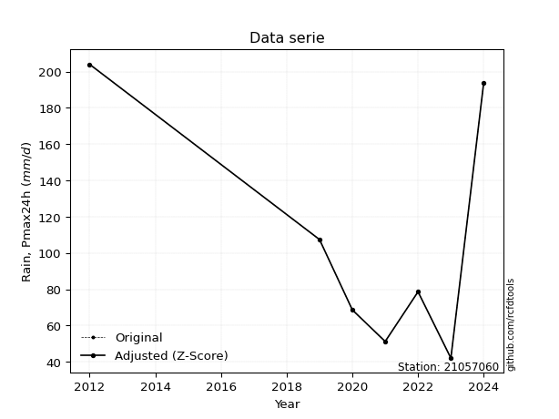</img>

</div>


> The initial value (value_initial) correspond to the initial obtained or null completed value, and value (value) is adjusted only when the initial value is outside the valid range (outlier) definite through the Z-Score value. If Z-Score is active, values out of range or outliers are replaced with the station mean value. A Z-Score (or standard score) measures how many standard deviations a data point is from the mean of a dataset, indicating its relative position; positive scores mean above the mean, negative mean below, and a score of zero is exactly at the mean, allowing for comparison of values from different distributions. It´s calculated using the formula $z=(x–μ)/σ$, where $x$ is the data point, $μ$ is the mean, and $σ$ is the standard deviation, helping identify outliers and understand probability.
>
> <sub>**Note**: In this study, "completing" (filling gaps in) and "extending" (forecasting or lengthening the historical record) rainfall data series are avoided for certain critical analyses because they introduce artificial bias and uncertainty, which can distort the statistics of rare events (extremes), alter day-to-day variability, and compromise the integrity and homogeneity of the original data. Some reasons against Completing/Extending rainfall data are: **Distortion of Extremes and Variability**: The primary issue is that most gap-filling or extension methods rely on averaging or regression with nearby stations, which inherently smooths the data. Rainfall is highly variable in space and time, with a large percentage of zero values and occasional large storms. Infilling methods often underestimate the highest values and overestimate the lowest (zero) values, which severely distorts analyses focused on flood frequency, drought severity, and intensity-duration-frequency (IDF) curves, **Loss of Data Homogeneity**: Infilled or extended data are synthetic estimates, not actual measurements. Combining these estimates with observed data can violate the assumption of data homogeneity, which requires that the data properties do not change over time. Inhomogeneity can lead to incorrect conclusions about long-term trends or changes in climate patterns, **Propagation of Errors**: Errors and biases from the original data (e.g., wind-induced undercatch, instrument errors, site changes) or the data used for imputation can propagate through the analysis, leading to unreliable hydrological models and inaccurate predictions, **Compromised Statistical Integrity**: For statistical analyses, especially those involving the frequency of events, using artificial data can introduce time bias or autocorrelation that doesn´t exist in reality, making it difficult to assess the true probability of events, **Difficulty in Validation**: It is difficult to accurately validate the quality of filled or extended data, especially for past periods where ground-truth measurements are unavailable. The reliability of imputation techniques heavily depends on the density of the surrounding station network and the complexity of the local topography.</sub>


### 4. Active continuous probability distributions from SciPy (80 of 104 available)

A Probability Density Function (PDF) describes the relative likelihood of a continuous random variable falling within a specific range, where the total area under its curve equals 1, and the area over any interval gives the actual probability for that range. Unlike discrete probabilities (like rolling a die), a PDF shows density, not direct probability for a single point (which is zero), with higher points indicating higher likelihood, often visualized as a bell curve for normal distributions.

A log of a probability density function (log-PDF) is simply the logarithm of the PDF´s value, denoted as $log(f(x))$, useful for converting multiplication of probabilities into addition, improving numerical stability with tiny numbers, and connecting to information theory concepts like entropy. Instead of dealing with very small probabilities (e.g., 0.000001), log-PDFs use negative numbers (e.g., $log(0.00001) ≈ -11.51$ that are easier for computers to handle, preventing underflow errors and simplifying complex calculations. In this study, each active probability distribution from SciPy is also evaluated in the $log$ form.

[scipy.stats](https://docs.scipy.org/doc/scipy/reference/stats.html) is a Python´s powerful submodule within the SciPy library for comprehensive statistical analysis, offering over 130 probability distributions (like Normal, Poisson, etc.), functions for descriptive stats (mean, variance), hypothesis testing (t-tests, chi-square), random variable generation, and statistical tests, making it essential for data science, modeling, and research. It provides tools to explore, model, and draw conclusions from data efficiently, working seamlessly with [NumPy](https://numpy.org/).

<div align="center">

|   id | p_dist           |   n_parameter | fit_method   | label                                                                       | active   | ref                                                                                                      |
|-----:|:-----------------|--------------:|:-------------|:----------------------------------------------------------------------------|:---------|:---------------------------------------------------------------------------------------------------------|
|    0 | alpha            |             3 | MLE          | Alpha                                                                       | True     | [:mortar_board:](https://docs.scipy.org/doc/scipy/reference/generated/scipy.stats.alpha.html)            |
|    1 | anglit           |             2 | MM           | Anglit                                                                      | True     | [:mortar_board:](https://docs.scipy.org/doc/scipy/reference/generated/scipy.stats.anglit.html)           |
|    2 | arcsine          |             2 | MM           | Arcsine                                                                     | True     | [:mortar_board:](https://docs.scipy.org/doc/scipy/reference/generated/scipy.stats.arcsine.html)          |
|    3 | argus            |             3 | MLE          | Argus                                                                       | True     | [:mortar_board:](https://docs.scipy.org/doc/scipy/reference/generated/scipy.stats.argus.html)            |
|    4 | beta             |             4 | MLE          | Beta                                                                        | True     | [:mortar_board:](https://docs.scipy.org/doc/scipy/reference/generated/scipy.stats.beta.html)             |
|    5 | betaprime        |             4 | MLE          | Beta prime                                                                  | True     | [:mortar_board:](https://docs.scipy.org/doc/scipy/reference/generated/scipy.stats.betaprime.html)        |
|    6 | bradford         |             3 | MLE          | Bradford                                                                    | True     | [:mortar_board:](https://docs.scipy.org/doc/scipy/reference/generated/scipy.stats.bradford.html)         |
|    7 | burr             |             4 | MLE          | Burr (Type III)                                                             | True     | [:mortar_board:](https://docs.scipy.org/doc/scipy/reference/generated/scipy.stats.burr.html)             |
|    8 | burr12           |             4 | MLE          | Burr (Type III) 12                                                          | True     | [:mortar_board:](https://docs.scipy.org/doc/scipy/reference/generated/scipy.stats.burr12.html)           |
|    9 | cosine           |             2 | MLE          | Cosine                                                                      | True     | [:mortar_board:](https://docs.scipy.org/doc/scipy/reference/generated/scipy.stats.cosine.html)           |
|   10 | crystalball      |             4 | MLE          | Crystalball                                                                 | True     | [:mortar_board:](https://docs.scipy.org/doc/scipy/reference/generated/scipy.stats.crystalball.html)      |
|   11 | dgamma           |             3 | MLE          | Double gamma                                                                | True     | [:mortar_board:](https://docs.scipy.org/doc/scipy/reference/generated/scipy.stats.dgamma.html)           |
|   12 | dweibull         |             3 | MLE          | Double Weibull                                                              | True     | [:mortar_board:](https://docs.scipy.org/doc/scipy/reference/generated/scipy.stats.dweibull.html)         |
|   13 | erlang           |             3 | MLE          | Erlang                                                                      | True     | [:mortar_board:](https://docs.scipy.org/doc/scipy/reference/generated/scipy.stats.erlang.html)           |
|   14 | exponnorm        |             3 | MLE          | Exponentially modified Normal                                               | True     | [:mortar_board:](https://docs.scipy.org/doc/scipy/reference/generated/scipy.stats.exponnorm.html)        |
|   15 | exponpow         |             3 | MLE          | Exponential power                                                           | True     | [:mortar_board:](https://docs.scipy.org/doc/scipy/reference/generated/scipy.stats.exponpow.html)         |
|   16 | exponweib        |             4 | MLE          | Exponentiated Weibull                                                       | True     | [:mortar_board:](https://docs.scipy.org/doc/scipy/reference/generated/scipy.stats.exponweib.html)        |
|   17 | f                |             4 | MLE          | F                                                                           | True     | [:mortar_board:](https://docs.scipy.org/doc/scipy/reference/generated/scipy.stats.f.html)                |
|   18 | fatiguelife      |             3 | MLE          | Fatigue-life (Birnbaum-Saunders)                                            | True     | [:mortar_board:](https://docs.scipy.org/doc/scipy/reference/generated/scipy.stats.fatiguelife.html)      |
|   19 | foldnorm         |             3 | MM           | Fold Normal                                                                 | True     | [:mortar_board:](https://docs.scipy.org/doc/scipy/reference/generated/scipy.stats.foldnorm.html)         |
|   20 | gamma            |             3 | MLE          | Gamma                                                                       | True     | [:mortar_board:](https://docs.scipy.org/doc/scipy/reference/generated/scipy.stats.gamma.html)            |
|   21 | gausshyper       |             6 | MLE          | Gauss hypergeometric                                                        | True     | [:mortar_board:](https://docs.scipy.org/doc/scipy/reference/generated/scipy.stats.gausshyper.html)       |
|   22 | genexpon         |             5 | MLE          | Generalized exponential                                                     | True     | [:mortar_board:](https://docs.scipy.org/doc/scipy/reference/generated/scipy.stats.genexpon.html)         |
|   23 | genextreme       |             3 | MLE          | Generalized exponential                                                     | True     | [:mortar_board:](https://docs.scipy.org/doc/scipy/reference/generated/scipy.stats.genextreme.html)       |
|   24 | gengamma         |             4 | MLE          | Generalized gamma                                                           | True     | [:mortar_board:](https://docs.scipy.org/doc/scipy/reference/generated/scipy.stats.gengamma.html)         |
|   25 | genhalflogistic  |             3 | MLE          | Generalized half-logistic                                                   | True     | [:mortar_board:](https://docs.scipy.org/doc/scipy/reference/generated/scipy.stats.genhalflogistic.html)  |
|   26 | genlogistic      |             3 | MLE          | Generalized logistic                                                        | True     | [:mortar_board:](https://docs.scipy.org/doc/scipy/reference/generated/scipy.stats.genlogistic.html)      |
|   27 | gennorm          |             3 | MLE          | Generalized Normal                                                          | True     | [:mortar_board:](https://docs.scipy.org/doc/scipy/reference/generated/scipy.stats.gennorm.html)          |
|   28 | genpareto        |             3 | MLE          | Generalized Pareto                                                          | True     | [:mortar_board:](https://docs.scipy.org/doc/scipy/reference/generated/scipy.stats.genpareto.html)        |
|   29 | gompertz         |             3 | MLE          | Gompertz (or truncated Gumbel)                                              | True     | [:mortar_board:](https://docs.scipy.org/doc/scipy/reference/generated/scipy.stats.gompertz.html)         |
|   30 | gumbel_l         |             2 | MM           | Gumbel Left Skew                                                            | True     | [:mortar_board:](https://docs.scipy.org/doc/scipy/reference/generated/scipy.stats.gumbel_l.html)         |
|   31 | gumbel_r         |             2 | MM           | Gumbel Right Skew                                                           | True     | [:mortar_board:](https://docs.scipy.org/doc/scipy/reference/generated/scipy.stats.gumbel_r.html)         |
|   32 | halfgennorm      |             3 | MLE          | Upper half of a generalized normal                                          | True     | [:mortar_board:](https://docs.scipy.org/doc/scipy/reference/generated/scipy.stats.halfgennorm.html)      |
|   33 | halflogistic     |             2 | MM           | Half-logistic                                                               | True     | [:mortar_board:](https://docs.scipy.org/doc/scipy/reference/generated/scipy.stats.halflogistic.html)     |
|   34 | halfnorm         |             2 | MM           | Half Normal                                                                 | True     | [:mortar_board:](https://docs.scipy.org/doc/scipy/reference/generated/scipy.stats.halfnorm.html)         |
|   35 | hypsecant        |             2 | MM           | hyperbolic secant                                                           | True     | [:mortar_board:](https://docs.scipy.org/doc/scipy/reference/generated/scipy.stats.hypsecant.html)        |
|   36 | invgamma         |             3 | MLE          | Inverted gamma                                                              | True     | [:mortar_board:](https://docs.scipy.org/doc/scipy/reference/generated/scipy.stats.invgamma.html)         |
|   37 | invgauss         |             3 | MLE          | Inverse Gaussian                                                            | True     | [:mortar_board:](https://docs.scipy.org/doc/scipy/reference/generated/scipy.stats.invgauss.html)         |
|   38 | invweibull       |             3 | MLE          | Inverted Weibull                                                            | True     | [:mortar_board:](https://docs.scipy.org/doc/scipy/reference/generated/scipy.stats.invweibull.html)       |
|   39 | johnsonsb        |             4 | MLE          | Johnson SB                                                                  | True     | [:mortar_board:](https://docs.scipy.org/doc/scipy/reference/generated/scipy.stats.johnsonsb.html)        |
|   40 | johnsonsu        |             4 | MLE          | Johnson Su                                                                  | True     | [:mortar_board:](https://docs.scipy.org/doc/scipy/reference/generated/scipy.stats.johnsonsu.html)        |
|   41 | kappa3           |             3 | MLE          | Kappa 3                                                                     | True     | [:mortar_board:](https://docs.scipy.org/doc/scipy/reference/generated/scipy.stats.kappa3.html)           |
|   42 | kappa4           |             4 | MLE          | Kappa 4                                                                     | True     | [:mortar_board:](https://docs.scipy.org/doc/scipy/reference/generated/scipy.stats.kappa4.html)           |
|   43 | ksone            |             3 | MLE          | Kolmogorov-Smirnov one-sided test statistic distribution                    | True     | [:mortar_board:](https://docs.scipy.org/doc/scipy/reference/generated/scipy.stats.ksone.html)            |
|   44 | kstwobign        |             2 | MLE          | Limiting distribution of scaled Kolmogorov-Smirnov two-sided test statistic | True     | [:mortar_board:](https://docs.scipy.org/doc/scipy/reference/generated/scipy.stats.kstwobign.html)        |
|   45 | laplace          |             2 | MM           | Laplace                                                                     | True     | [:mortar_board:](https://docs.scipy.org/doc/scipy/reference/generated/scipy.stats.laplace.html)          |
|   46 | levy_l           |             2 | MLE          | Left-skewed Levy                                                            | True     | [:mortar_board:](https://docs.scipy.org/doc/scipy/reference/generated/scipy.stats.levy_l.html)           |
|   47 | loggamma         |             3 | MLE          | Log gamma                                                                   | True     | [:mortar_board:](https://docs.scipy.org/doc/scipy/reference/generated/scipy.stats.loggamma.html)         |
|   48 | logistic         |             2 | MM           | Logistic (or Sech-squared)                                                  | True     | [:mortar_board:](https://docs.scipy.org/doc/scipy/reference/generated/scipy.stats.logistic.html)         |
|   49 | loglaplace       |             3 | MLE          | Log-Laplace                                                                 | True     | [:mortar_board:](https://docs.scipy.org/doc/scipy/reference/generated/scipy.stats.loglaplace.html)       |
|   50 | lomax            |             3 | MLE          | Lomax (Pareto of the second kind)                                           | True     | [:mortar_board:](https://docs.scipy.org/doc/scipy/reference/generated/scipy.stats.lomax.html)            |
|   51 | maxwell          |             2 | MM           | Maxwell                                                                     | True     | [:mortar_board:](https://docs.scipy.org/doc/scipy/reference/generated/scipy.stats.maxwell.html)          |
|   52 | mielke           |             4 | MLE          | Mielke Beta-Kappa / Dagum                                                   | True     | [:mortar_board:](https://docs.scipy.org/doc/scipy/reference/generated/scipy.stats.mielke.html)           |
|   53 | moyal            |             2 | MM           | Moyal                                                                       | True     | [:mortar_board:](https://docs.scipy.org/doc/scipy/reference/generated/scipy.stats.moyal.html)            |
|   54 | nakagami         |             3 | MLE          | Nakagami                                                                    | True     | [:mortar_board:](https://docs.scipy.org/doc/scipy/reference/generated/scipy.stats.nakagami.html)         |
|   55 | ncf              |             5 | MLE          | Non-central F distribution                                                  | True     | [:mortar_board:](https://docs.scipy.org/doc/scipy/reference/generated/scipy.stats.ncf.html)              |
|   56 | nct              |             4 | MLE          | Non-central Student’s t                                                     | True     | [:mortar_board:](https://docs.scipy.org/doc/scipy/reference/generated/scipy.stats.nct.html)              |
|   57 | norm             |             2 | MM           | Normal                                                                      | True     | [:mortar_board:](https://docs.scipy.org/doc/scipy/reference/generated/scipy.stats.norm.html)             |
|   58 | pearson3         |             3 | MM           | Pearson type III                                                            | True     | [:mortar_board:](https://docs.scipy.org/doc/scipy/reference/generated/scipy.stats.pearson3.html)         |
|   59 | powerlaw         |             3 | MLE          | Power-function                                                              | True     | [:mortar_board:](https://docs.scipy.org/doc/scipy/reference/generated/scipy.stats.powerlaw.html)         |
|   60 | rayleigh         |             2 | MM           | Rayleigh                                                                    | True     | [:mortar_board:](https://docs.scipy.org/doc/scipy/reference/generated/scipy.stats.rayleigh.html)         |
|   61 | rdist            |             3 | MLE          | R-distributed (symmetric beta)                                              | True     | [:mortar_board:](https://docs.scipy.org/doc/scipy/reference/generated/scipy.stats.rdist.html)            |
|   62 | rice             |             3 | MLE          | Rice                                                                        | True     | [:mortar_board:](https://docs.scipy.org/doc/scipy/reference/generated/scipy.stats.rice.html)             |
|   63 | semicircular     |             2 | MM           | Semicircular                                                                | True     | [:mortar_board:](https://docs.scipy.org/doc/scipy/reference/generated/scipy.stats.semicircular.html)     |
|   64 | skewnorm         |             3 | MLE          | Skew normal                                                                 | True     | [:mortar_board:](https://docs.scipy.org/doc/scipy/reference/generated/scipy.stats.skewnorm.html)         |
|   65 | t                |             3 | MLE          | Student’s t                                                                 | True     | [:mortar_board:](https://docs.scipy.org/doc/scipy/reference/generated/scipy.stats.t.html)                |
|   66 | trapezoid        |             4 | MLE          | Trapezoid                                                                   | True     | [:mortar_board:](https://docs.scipy.org/doc/scipy/reference/generated/scipy.stats.trapezoid.html)        |
|   67 | triang           |             3 | MLE          | Triangular                                                                  | True     | [:mortar_board:](https://docs.scipy.org/doc/scipy/reference/generated/scipy.stats.triang.html)           |
|   68 | truncexpon       |             3 | MLE          | Truncated exponential                                                       | True     | [:mortar_board:](https://docs.scipy.org/doc/scipy/reference/generated/scipy.stats.truncexpon.html)       |
|   69 | truncnorm        |             4 | MLE          | Truncated normal                                                            | True     | [:mortar_board:](https://docs.scipy.org/doc/scipy/reference/generated/scipy.stats.truncnorm.html)        |
|   70 | truncpareto      |             4 | MLE          | Upper truncated Pareto                                                      | True     | [:mortar_board:](https://docs.scipy.org/doc/scipy/reference/generated/scipy.stats.truncpareto.html)      |
|   71 | truncweibull_min |             5 | MLE          | Doubly truncated Weibull minimum                                            | True     | [:mortar_board:](https://docs.scipy.org/doc/scipy/reference/generated/scipy.stats.truncweibull_min.html) |
|   72 | tukeylambda      |             3 | MLE          | Tukey-Lamdba                                                                | True     | [:mortar_board:](https://docs.scipy.org/doc/scipy/reference/generated/scipy.stats.tukeylambda.html)      |
|   73 | uniform          |             2 | MLE          | Uniform                                                                     | True     | [:mortar_board:](https://docs.scipy.org/doc/scipy/reference/generated/scipy.stats.uniform.html)          |
|   74 | vonmises         |             3 | MLE          | Von Mises                                                                   | True     | [:mortar_board:](https://docs.scipy.org/doc/scipy/reference/generated/scipy.stats.vonmises.html)         |
|   75 | vonmises_line    |             3 | MLE          | Von Mises line                                                              | True     | [:mortar_board:](https://docs.scipy.org/doc/scipy/reference/generated/scipy.stats.vonmises_line.html)    |
|   76 | wald             |             2 | MM           | Wald                                                                        | True     | [:mortar_board:](https://docs.scipy.org/doc/scipy/reference/generated/scipy.stats.wald.html)             |
|   77 | weibull_max      |             3 | MLE          | Weibull maximum                                                             | True     | [:mortar_board:](https://docs.scipy.org/doc/scipy/reference/generated/scipy.stats.weibull_max.html)      |
|   78 | weibull_min      |             3 | MLE          | Weibull minimum                                                             | True     | [:mortar_board:](https://docs.scipy.org/doc/scipy/reference/generated/scipy.stats.weibull_min.html)      |
|   79 | wrapcauchy       |             3 | MLE          | Wrapped  Cauchy                                                             | True     | [:mortar_board:](https://docs.scipy.org/doc/scipy/reference/generated/scipy.stats.wrapcauchy.html)       |

</div>

> **n_parameter:** # arguments & localization & scale.
>
> **Fit methods:** (MLE) maximum likelihood, (MM) L-moments.
>
>**Inactive** (With the only purpose of prevent loops, zero divisions, infinite values, over high estimated values or horizontal trending for recurrence intervals estimations, the follow distributions were disabled.)**:** lognorm, norminvgauss, powernorm, powerlognorm, cauchy, halfcauchy, foldcauchy, skewcauchy, chi2, expon, fisk, genhyperbolic, geninvgauss, gibrat, kstwo, laplace_asymmetric, levy, levy_stable, ncx2, pareto, rel_breitwigner, recipinvgauss, studentized_range, loguniform, 


## B. Probability (PDF) vs. Empirical (EDF) distributions functions

A continuous probability distribution (CPD) describes probabilities for variables that can take any value within a range (like rain any time), unlike discrete variables with specific outcomes (like temperature). It uses a Probability Density Function (PDF), a curve where the total area under it equals 1, and the probability of the variable falling within an interval (a to b) is found by calculating the area under the curve between those points. A key feature is that the probability of hitting any single exact value is zero, so probabilities are always expressed for ranges, e.g., $P(a ≤ X ≤ b)$.

<div align="center">

Distributions parameters from station values
|     |   station | p_dist              |   n |              loc |          scale | shape                  | shape1                | shape2                | shape3             |
|----:|----------:|:--------------------|----:|-----------------:|---------------:|:-----------------------|:----------------------|:----------------------|:-------------------|
|   0 |  21057060 | alpha               |   8 |    -35.0906      |  335.864       | 2.7704195603204567     |                       |                       |                    |
|   1 |  21057060 | anglit              |   8 |    105.225       |  168.984       |                        |                       |                       |                    |
|   2 |  21057060 | arcsine             |   8 |     23.5339      |  163.382       |                        |                       |                       |                    |
|   3 |  21057060 | argus               |   8 |    -16.2416      |  231.04        | 8.908029993390838e-08  |                       |                       |                    |
|   4 |  21057060 | beta                |   8 |     28.1706      |  175.829       | 0.2679931215858369     | 0.5255615791231056    |                       |                    |
|   5 |  21057060 | betaprime           |   8 |     -0.763351    |    1.66272     | 196.32027350110837     | 4.030808192077306     |                       |                    |
|   6 |  21057060 | bradford            |   8 |     41.9999      |  162           | 0.32506605146534273    |                       |                       |                    |
|   7 |  21057060 | burr                |   8 |     -0.98825     |    5.08625     | 2.209485190877345      | 342.28738270127053    |                       |                    |
|   8 |  21057060 | burr12              |   8 |     -1.24699     |   42.891       | 453.37562983901387     | 0.0028702597747034975 |                       |                    |
|   9 |  21057060 | cosine              |   8 |    111.295       |   47.3202      |                        |                       |                       |                    |
|  10 |  21057060 | crystalball         |   8 |    105.225       |   57.7643      | 8810.928451651587      | 2797.0346257868705    |                       |                    |
|  11 |  21057060 | dgamma              |   8 |     88.3607      |   33.9693      | 1.328405029585287      |                       |                       |                    |
|  12 |  21057060 | dweibull            |   8 |     89.3771      |   47.6387      | 1.156016222838091      |                       |                       |                    |
|  13 |  21057060 | erlang              |   8 |     42           |   59.0655      | 0.47143116574365845    |                       |                       |                    |
|  14 |  21057060 | exponnorm           |   8 |     41.9437      |    0.0180088   | 3518.2637519692344     |                       |                       |                    |
|  15 |  21057060 | exponpow            |   8 |     42           |  138.198       | 0.6732884885652395     |                       |                       |                    |
|  16 |  21057060 | exponweib           |   8 |     42           |    0.288641    | 1.6250609177703927     | 0.18649786757901687   |                       |                    |
|  17 |  21057060 | f                   |   8 |     -1.07512     |   81.4509      | 336.934035880552       | 8.133821256300465     |                       |                    |
|  18 |  21057060 | fatiguelife         |   8 |     42           |    8.28853e-05 | 985.4568054173894      |                       |                       |                    |
|  19 |  21057060 | foldnorm            |   8 |     23.1741      |   74.9275      | 0.8907964735776075     |                       |                       |                    |
|  20 |  21057060 | gamma               |   8 |     42           |   65.333       | 0.6417528652725557     |                       |                       |                    |
|  21 |  21057060 | gausshyper          |   8 |     18.4603      |  185.54        | 1.2146588688617386     | 0.7185176348459089    | 1.0817878465119084    | 1.0877418053128944 |
|  22 |  21057060 | genexpon            |   8 |     41.9983      |    7.96687     | 0.1137869340586678     | 3.3067064077193193    | 0.0005096120339068452 |                    |
|  23 |  21057060 | genextreme          |   8 |     43.3169      |    9.36289     | -7.11000849244749      |                       |                       |                    |
|  24 |  21057060 | gengamma            |   8 |     42           |    0.473661    | 1.434059120274615      | 0.1732353757985205    |                       |                    |
|  25 |  21057060 | genhalflogistic     |   8 |     25.6689      |  188.088       | 1.0547144354715663     |                       |                       |                    |
|  26 |  21057060 | genlogistic         |   8 |   -225.495       |   41.3012      | 1594.5953367067978     |                       |                       |                    |
|  27 |  21057060 | gennorm             |   8 |    123           |   81.0001      | 13540244.16837902      |                       |                       |                    |
|  28 |  21057060 | genpareto           |   8 |     -1.65363     |  391.589       | -1.9041203042375705    |                       |                       |                    |
|  29 |  21057060 | gompertz            |   8 |     42           |  412.464       | 5.632555585466557      |                       |                       |                    |
|  30 |  21057060 | gumbel_l            |   8 |    131.222       |   45.0386      |                        |                       |                       |                    |
|  31 |  21057060 | gumbel_r            |   8 |     79.228       |   45.0386      |                        |                       |                       |                    |
|  32 |  21057060 | halfgennorm         |   8 |     42           |    0.500402    | 0.28834055701020456    |                       |                       |                    |
|  33 |  21057060 | halflogistic        |   8 |     36.7609      |   49.3864      |                        |                       |                       |                    |
|  34 |  21057060 | halfnorm            |   8 |     28.7677      |   95.825       |                        |                       |                       |                    |
|  35 |  21057060 | hypsecant           |   8 |    105.225       |   36.7739      |                        |                       |                       |                    |
|  36 |  21057060 | invgamma            |   8 |     12.7703      |  179.042       | 2.8347960705389883     |                       |                       |                    |
|  37 |  21057060 | invgauss            |   8 |     27.2736      |   89.4458      | 0.8714935573888933     |                       |                       |                    |
|  38 |  21057060 | invweibull          |   8 |     42           |    1.76979     | 0.0707218588481748     |                       |                       |                    |
|  39 |  21057060 | johnsonsb           |   8 |     41.9932      |  162.007       | 0.669572744344576      | 0.10666960684544058   |                       |                    |
|  40 |  21057060 | johnsonsu           |   8 |     33.2675      |    0.279583    | -6.1287561097269005    | 1.046809443265389     |                       |                    |
|  41 |  21057060 | kappa3              |   8 |     42           |  165.293       | 499.28199140694596     |                       |                       |                    |
|  42 |  21057060 | kappa4              |   8 |      4.73085     |  200.503       | 1.2284195917287368     | 1.0036744358512781    |                       |                    |
|  43 |  21057060 | ksone               |   8 |      5.1743      |  200.101       | 1.0                    |                       |                       |                    |
|  44 |  21057060 | kstwobign           |   8 |    -66.9147      |  197.991       |                        |                       |                       |                    |
|  45 |  21057060 | laplace             |   8 |    105.225       |   40.8455      |                        |                       |                       |                    |
|  46 |  21057060 | levy_l              |   8 |    212.018       |   35.5622      |                        |                       |                       |                    |
|  47 |  21057060 | loggamma            |   8 | -12452.1         | 1831.4         | 950.5425137366792      |                       |                       |                    |
|  48 |  21057060 | logistic            |   8 |    105.225       |   31.8471      |                        |                       |                       |                    |
|  49 |  21057060 | loglaplace          |   8 |     -0.221984    |   78.822       | 2.252410271443569      |                       |                       |                    |
|  50 |  21057060 | lomax               |   8 |     42           |    2.43003e+08 | 2342776.326488994      |                       |                       |                    |
|  51 |  21057060 | maxwell             |   8 |    -31.6521      |   85.775       |                        |                       |                       |                    |
|  52 |  21057060 | mielke              |   8 |     -0.793717    |    5.98522     | 517.1304397950004      | 2.204813619312203     |                       |                    |
|  53 |  21057060 | moyal               |   8 |     72.1917      |   26.0031      |                        |                       |                       |                    |
|  54 |  21057060 | nakagami            |   8 |     42           |   88.7482      | 0.4111733980961998     |                       |                       |                    |
|  55 |  21057060 | ncf                 |   8 |     -0.00859379  |    1.61808e-07 | 1.2934751743681858e-08 | 2.9751176854660075    | 6.565702696816722     |                    |
|  56 |  21057060 | nct                 |   8 |     -0.176124    |    1.65133     | 2.3512501535212937     | 43.40211643292079     |                       |                    |
|  57 |  21057060 | norm                |   8 |    105.225       |   57.7643      |                        |                       |                       |                    |
|  58 |  21057060 | pearson3            |   8 |    105.225       |   57.7643      | 0.7679450259895537     |                       |                       |                    |
|  59 |  21057060 | powerlaw            |   8 |     42           |  162           | 0.17430127278609192    |                       |                       |                    |
|  60 |  21057060 | rayleigh            |   8 |     -5.28148     |   88.1714      |                        |                       |                       |                    |
|  61 |  21057060 | rdist               |   8 |     27.8188      |   79.5812      | 1.1783121962808585     |                       |                       |                    |
|  62 |  21057060 | rice                |   8 |     11.6987      |   77.7299      | 0.00107721528878303    |                       |                       |                    |
|  63 |  21057060 | semicircular        |   8 |    105.225       |  115.529       |                        |                       |                       |                    |
|  64 |  21057060 | skewnorm            |   8 |     42           |   85.6385      | 42938738.05150889      |                       |                       |                    |
|  65 |  21057060 | t                   |   8 |    105.224       |   57.7589      | 6773356.830731453      |                       |                       |                    |
|  66 |  21057060 | trapezoid           |   8 |     25.8         |  194.4         | 1.0                    | 1.0                   |                       |                    |
|  67 |  21057060 | triang              |   8 |    -31.3249      |  235.367       | 0.9999999999994857     |                       |                       |                    |
|  68 |  21057060 | truncexpon          |   8 |     42           |  150.002       | 1.0799870892274048     |                       |                       |                    |
|  69 |  21057060 | truncnorm           |   8 |    105.225       |   57.7643      | -2216.024875267537     | 6254.529164917247     |                       |                    |
|  70 |  21057060 | truncpareto         |   8 |     41.9826      |    0.017369    | 0.14348111840449473    | 9327.987595557403     |                       |                    |
|  71 |  21057060 | truncweibull_min    |   8 |     30.2056      |  164.129       | 1.1585971999731792     | 0.0003501844028100941 | 1.058886303018673     |                    |
|  72 |  21057060 | tukeylambda         |   8 |    123.809       |   99.7055      | 1.2187569245722534     |                       |                       |                    |
|  73 |  21057060 | uniform             |   8 |     42           |  162           |                        |                       |                       |                    |
|  74 |  21057060 | vonmises            |   8 |      0.688182    |    1           | 0.1465441340612569     |                       |                       |                    |
|  75 |  21057060 | vonmises_line       |   8 |    123.609       |   25.9771      | 3.915346340138156e-06  |                       |                       |                    |
|  76 |  21057060 | wald                |   8 |     47.4607      |   57.7643      |                        |                       |                       |                    |
|  77 |  21057060 | weibull_max         |   8 |    204           |    1.65159     | 0.2293976943111046     |                       |                       |                    |
|  78 |  21057060 | weibull_min         |   8 |     42           |   56.2829      | 0.5004052054108785     |                       |                       |                    |
|  79 |  21057060 | wrapcauchy          |   8 |     41.9997      |   25.7831      | 0.4872011903011668     |                       |                       |                    |
|  80 |  21057060 | logalpha            |   8 |     -1.48122     |   67.3663      | 11.330015233062959     |                       |                       |                    |
|  81 |  21057060 | loganglit           |   8 |      4.51162     |    1.56342     |                        |                       |                       |                    |
|  82 |  21057060 | logarcsine          |   8 |      3.75581     |    1.51161     |                        |                       |                       |                    |
|  83 |  21057060 | logargus            |   8 |      3.34799     |    2.08287     | 0.00011292202048076433 |                       |                       |                    |
|  84 |  21057060 | logbeta             |   8 |      3.73767     |    1.74001     | 0.9133761768780406     | 1.2338191447190954    |                       |                    |
|  85 |  21057060 | logbetaprime        |   8 |     -3.48507     |    6.32837     | 490.6751265905384      | 389.3249524597834     |                       |                    |
|  86 |  21057060 | logbradford         |   8 |      3.73764     |    1.58048     | 1.0919643338352205     |                       |                       |                    |
|  87 |  21057060 | logburr             |   8 |    -12.2362      |   14.0892      | 36.76013549474947      | 313.91634156599025    |                       |                    |
|  88 |  21057060 | logburr12           |   8 |     -0.066153    |    4.55144     | 14.190899474461858     | 1.0278887617610124    |                       |                    |
|  89 |  21057060 | logcosine           |   8 |      4.52749     |    0.436554    |                        |                       |                       |                    |
|  90 |  21057060 | logcrystalball      |   8 |      4.51162     |    0.534429    | 7.814753035472965      | 129.16803342571455    |                       |                    |
|  91 |  21057060 | logdgamma           |   8 |      4.46587     |    0.250555    | 1.7764707893796796     |                       |                       |                    |
|  92 |  21057060 | logdweibull         |   8 |      4.47124     |    0.491999    | 1.4663930502113187     |                       |                       |                    |
|  93 |  21057060 | logerlang           |   8 |      3.55136     |    0.376369    | 2.5518627456988385     |                       |                       |                    |
|  94 |  21057060 | logexponnorm        |   8 |      4.40009     |    0.522708    | 0.2133723869842944     |                       |                       |                    |
|  95 |  21057060 | logexponpow         |   8 |      3.73767     |    1.23815     | 0.9588457979258571     |                       |                       |                    |
|  96 |  21057060 | logexponweib        |   8 |      3.73767     |    1.67955     | 0.1597241058761167     | 1.153248814590989     |                       |                    |
|  97 |  21057060 | logf                |   8 |      3.5451      |    0.959619    | 5.262908062048808      | 269.43374652011903    |                       |                    |
|  98 |  21057060 | logfatiguelife      |   8 |      2.56409     |    1.87243     | 0.283177867888009      |                       |                       |                    |
|  99 |  21057060 | logfoldnorm         |   8 |      3.44835     |    0.559901    | 1.8754810810031866     |                       |                       |                    |
| 100 |  21057060 | loggamma            |   8 |      3.55409     |    0.378491    | 2.529892410746033      |                       |                       |                    |
| 101 |  21057060 | loggausshyper       |   8 |      3.72172     |    1.5964      | 1.0544849247160153     | 0.8962964403049398    | 1.1738516154059602    | 0.9142913998568878 |
| 102 |  21057060 | loggenexpon         |   8 |      3.73767     |    0.921499    | 0.7398645784102995     | 1.0666192818545541    | 0.9744683090262374    |                    |
| 103 |  21057060 | loggenextreme       |   8 |      4.31207     |    0.503024    | 0.23716536237677177    |                       |                       |                    |
| 104 |  21057060 | loggengamma         |   8 |      3.73767     |    0.91425     | 0.2089584664704056     | 1.113922486533071     |                       |                    |
| 105 |  21057060 | loggenhalflogistic  |   8 |      3.53581     |    1.87369     | 1.0512723844222371     |                       |                       |                    |
| 106 |  21057060 | loggenlogistic      |   8 |      1.71435     |    0.458407    | 254.12919458386853     |                       |                       |                    |
| 107 |  21057060 | loggennorm          |   8 |      4.52789     |    0.790226    | 13204778.171543945     |                       |                       |                    |
| 108 |  21057060 | loggenpareto        |   8 |     -0.0219327   |   19.1888      | -3.5933640817421897    |                       |                       |                    |
| 109 |  21057060 | loggompertz         |   8 |      3.73767     |    0.95665     | 0.6137231761975759     |                       |                       |                    |
| 110 |  21057060 | loggumbel_l         |   8 |      4.75214     |    0.416693    |                        |                       |                       |                    |
| 111 |  21057060 | loggumbel_r         |   8 |      4.2711      |    0.416693    |                        |                       |                       |                    |
| 112 |  21057060 | loghalfgennorm      |   8 |      3.73767     |    1.5805      | 296539.7763832917      |                       |                       |                    |
| 113 |  21057060 | loghalflogistic     |   8 |      3.87816     |    0.45694     |                        |                       |                       |                    |
| 114 |  21057060 | loghalfnorm         |   8 |      3.80425     |    0.886556    |                        |                       |                       |                    |
| 115 |  21057060 | loghypsecant        |   8 |      4.51162     |    0.340228    |                        |                       |                       |                    |
| 116 |  21057060 | loginvgamma         |   8 |      1.0901      |  138.004       | 41.32740253497207      |                       |                       |                    |
| 117 |  21057060 | loginvgauss         |   8 |      2.4841      |   27.122       | 0.07475555185668038    |                       |                       |                    |
| 118 |  21057060 | loginvweibull       |   8 |     -2.07748e+07 |    2.07748e+07 | 45442833.54282273      |                       |                       |                    |
| 119 |  21057060 | logjohnsonsb        |   8 |      3.73767     |    1.58047     | 0.44164840316869836    | 0.08109374344153747   |                       |                    |
| 120 |  21057060 | logjohnsonsu        |   8 |      1.5452e+07  |    7.34996e+06 | 47520595.94875089      | 31925538.60012708     |                       |                    |
| 121 |  21057060 | logkappa3           |   8 |      3.73767     |    1.57963     | 3996.7676044921986     |                       |                       |                    |
| 122 |  21057060 | logkappa4           |   8 |      3.67633     |    1.75487     | 1.0166981149199898     | 1.0688719918360154    |                       |                    |
| 123 |  21057060 | logksone            |   8 |      3.58596     |    1.85132     | 1.0                    |                       |                       |                    |
| 124 |  21057060 | logkstwobign        |   8 |      2.64937     |    2.13037     |                        |                       |                       |                    |
| 125 |  21057060 | loglaplace          |   8 |      4.51162     |    0.377899    |                        |                       |                       |                    |
| 126 |  21057060 | loglevy_l           |   8 |      5.3751      |    0.244589    |                        |                       |                       |                    |
| 127 |  21057060 | logloggamma         |   8 |   -139.218       |   19.9156      | 1362.722868581784      |                       |                       |                    |
| 128 |  21057060 | loglogistic         |   8 |      4.51162     |    0.294646    |                        |                       |                       |                    |
| 129 |  21057060 | logloglaplace       |   8 |     -0.00292044  |    4.36729     | 10.136300568983689     |                       |                       |                    |
| 130 |  21057060 | loglomax            |   8 |      3.73767     |   12.1147      | 16.05110164942808      |                       |                       |                    |
| 131 |  21057060 | logmaxwell          |   8 |      3.24525     |    0.793582    |                        |                       |                       |                    |
| 132 |  21057060 | logmielke           |   8 |     -7.56929e+06 |    7.5693e+06  | 748749038.9311507      | 16654308.420054343    |                       |                    |
| 133 |  21057060 | logmoyal            |   8 |      4.206       |    0.240578    |                        |                       |                       |                    |
| 134 |  21057060 | lognakagami         |   8 |      3.73767     |    1.14365     | 0.08845603241546504    |                       |                       |                    |
| 135 |  21057060 | logncf              |   8 |      1.67831     |    0.905583    | 83.27641127210813      | 89.16986669927002     | 171.47420914766585    |                    |
| 136 |  21057060 | lognct              |   8 |      0.15355     |    0.138466    | 36.706633911485724     | 30.832616225006866    |                       |                    |
| 137 |  21057060 | lognorm             |   8 |      4.51162     |    0.534429    |                        |                       |                       |                    |
| 138 |  21057060 | logpearson3         |   8 |      4.51162     |    0.534429    | 0.23029168538980224    |                       |                       |                    |
| 139 |  21057060 | logpowerlaw         |   8 |      3.73767     |    1.58045     | 0.19426444635811152    |                       |                       |                    |
| 140 |  21057060 | lograyleigh         |   8 |      3.48923     |    0.815753    |                        |                       |                       |                    |
| 141 |  21057060 | logrdist            |   8 |      4.53779     |    0.800124    | 1.1871292221490704     |                       |                       |                    |
| 142 |  21057060 | logrice             |   8 |      3.50754     |    0.689299    | 0.8502890153836578     |                       |                       |                    |
| 143 |  21057060 | logsemicircular     |   8 |      4.51162     |    1.06886     |                        |                       |                       |                    |
| 144 |  21057060 | logskewnorm         |   8 |      3.73767     |    0.94029     | 1400038.9397059064     |                       |                       |                    |
| 145 |  21057060 | logt                |   8 |      4.51162     |    0.534434    | 111779877.78325313     |                       |                       |                    |
| 146 |  21057060 | logtrapezoid        |   8 |      3.57962     |    1.89654     | 1.0                    | 1.0                   |                       |                    |
| 147 |  21057060 | logtriang           |   8 |      3.22694     |    2.09118     | 0.9999999306560223     |                       |                       |                    |
| 148 |  21057060 | logtruncexpon       |   8 |      3.73766     |    1.87114     | 0.8446475615237637     |                       |                       |                    |
| 149 |  21057060 | logtruncnorm        |   8 |     -0.106585    |    2.12637     | 1.8078910809756195     | 2.5511602655357777    |                       |                    |
| 150 |  21057060 | logtruncpareto      |   8 |     -3.71341     |    7.45108     | 1.8628648055435154e-07 | 1.212110207573299     |                       |                    |
| 151 |  21057060 | logtruncweibull_min |   8 |      3.73608     |    1.58423     | 0.799501285236899      | 0.0010003604135757989 | 0.998616114947922     |                    |
| 152 |  21057060 | logtukeylambda      |   8 |      4.52797     |    0.838785    | 1.0613502929263272     |                       |                       |                    |
| 153 |  21057060 | loguniform          |   8 |      3.73767     |    1.58045     |                        |                       |                       |                    |
| 154 |  21057060 | logvonmises         |   8 |     -1.77806     |    1           | 3.9988043673152482     |                       |                       |                    |
| 155 |  21057060 | logvonmises_line    |   8 |      4.52789     |    0.251538    | 1.9593619059944864e-05 |                       |                       |                    |
| 156 |  21057060 | logwald             |   8 |      3.97717     |    0.534443    |                        |                       |                       |                    |
| 157 |  21057060 | logweibull_max      |   8 |      5.31812     |    0.666733    | 0.2231894271280415     |                       |                       |                    |
| 158 |  21057060 | logweibull_min      |   8 |      3.64333     |    0.961333    | 1.5700696549807773     |                       |                       |                    |
| 159 |  21057060 | logwrapcauchy       |   8 |      3.73767     |    0.251536    | 0.5000000000000001     |                       |                       |                    |

</div>

> **loc** (Location parameter): This shifts the distribution along the x-axis. For many common distributions, like the normal (Gaussian) distribution, loc represents the mean $μ$. For others, like the uniform distribution, it might represent the minimum value, or for the beta distribution, the left end of the support interval.
>
> **scale** (Scale parameter): This determines the width or spread of the distribution. For the normal distribution, scale represents the standard deviation $σ$. For a uniform distribution, it defines the length of the interval (from $loc$ to $loc + scale$).
>
> **shape** (Shape parameters): Refers to parameters that define the specific form of a probability distribution, distinct from its location (loc) and scale (scale). These parameters are required arguments for most distribution functions. For example, a normal (Gaussian) distribution is fully defined by its location (mean) and scale (standard deviation), so it has no specific shape parameters beyond loc and scale. However, other distributions have intrinsic properties that need specification, as Gamma distribution that takes a shape parameter, often named $a$ or $alpha$.


### 0. Cumulative distribution values - CDF (160 evaluated)

Cumulative Distribution Function (CDF), denoted as $F$<sub>$X$</sub>$(x)$, is a function that gives the probability that a random variable $X$ will take a value less than or equal to a specific value, $x$ (i.e., $(P(X≥x)$. It essentially "accumulates" probabilities from a given point up to the far right (positive infinity), providing a complete picture of the distribution´s probabilities for both discrete (like rain) and continuous (like temperature) variables, helping to find probabilities over ranges or above certain values. Each station is evaluated separately ordering the $x$ values ascending, calculating the CDF and PDF values for the activated distributions and their logarithmic forms.

<div align="center">

CDF ordered by x ascending and calculating $log(f(x))$ separately
|   id |   Station |   date |     x |   count |    mean |     std |     zscore |   Value_initial |   station |   m |     alpha |   alpha_pdf |   anglit |   anglit_pdf |   arcsine |   arcsine_pdf |     argus |   argus_pdf |     beta |       beta_pdf |   betaprime |   betaprime_pdf |    bradford |   bradford_pdf |      burr |    burr_pdf |    burr12 |   burr12_pdf |   cosine |   cosine_pdf |   crystalball |   crystalball_pdf |   dgamma |   dgamma_pdf |   dweibull |   dweibull_pdf |      erlang |   erlang_pdf |   exponnorm |   exponnorm_pdf |    exponpow |   exponpow_pdf |   exponweib |   exponweib_pdf |         f |      f_pdf |   fatiguelife |   fatiguelife_pdf |   foldnorm |   foldnorm_pdf |       gamma |      gamma_pdf |   gausshyper |   gausshyper_pdf |    genexpon |   genexpon_pdf |   genextreme |   genextreme_pdf |    gengamma |   gengamma_pdf |   genhalflogistic |   genhalflogistic_pdf |   genlogistic |   genlogistic_pdf |     gennorm |   gennorm_pdf |   genpareto |   genpareto_pdf |    gompertz |   gompertz_pdf |   gumbel_l |   gumbel_l_pdf |   gumbel_r |   gumbel_r_pdf |   halfgennorm |   halfgennorm_pdf |   halflogistic |   halflogistic_pdf |   halfnorm |   halfnorm_pdf |   hypsecant |   hypsecant_pdf |   invgamma |   invgamma_pdf |   invgauss |   invgauss_pdf |   invweibull |   invweibull_pdf |   johnsonsb |   johnsonsb_pdf |   johnsonsu |   johnsonsu_pdf |      kappa3 |   kappa3_pdf |      kappa4 |   kappa4_pdf |    ksone |   ksone_pdf |   kstwobign |   kstwobign_pdf |   laplace |   laplace_pdf |   levy_l |   levy_l_pdf |   loggamma |   loggamma_pdf |   logistic |   logistic_pdf |   loglaplace |   loglaplace_pdf |       lomax |   lomax_pdf |   maxwell |   maxwell_pdf |   mielke |   mielke_pdf |     moyal |   moyal_pdf |    nakagami |   nakagami_pdf |      ncf |    ncf_pdf |       nct |     nct_pdf |     norm |   norm_pdf |   pearson3 |   pearson3_pdf |   powerlaw |   powerlaw_pdf |   rayleigh |   rayleigh_pdf |    rdist |     rdist_pdf |      rice |   rice_pdf |   semicircular |   semicircular_pdf |   skewnorm |   skewnorm_pdf |        t |      t_pdf |   trapezoid |   trapezoid_pdf |    triang |   triang_pdf |   truncexpon |   truncexpon_pdf |   truncnorm |   truncnorm_pdf |   truncpareto |   truncpareto_pdf |   truncweibull_min |   truncweibull_min_pdf |   tukeylambda |   tukeylambda_pdf |   uniform |   uniform_pdf |   vonmises |   vonmises_pdf |   vonmises_line |   vonmises_line_pdf |        wald |    wald_pdf |   weibull_max |   weibull_max_pdf |   weibull_min |   weibull_min_pdf |   wrapcauchy |   wrapcauchy_pdf |   logalpha |   logalpha_pdf |   loganglit |   loganglit_pdf |   logarcsine |   logarcsine_pdf |   logargus |   logargus_pdf |    logbeta |   logbeta_pdf |   logbetaprime |   logbetaprime_pdf |   logbradford |   logbradford_pdf |   logburr |   logburr_pdf |   logburr12 |   logburr12_pdf |   logcosine |   logcosine_pdf |   logcrystalball |   logcrystalball_pdf |   logdgamma |   logdgamma_pdf |   logdweibull |   logdweibull_pdf |   logerlang |   logerlang_pdf |   logexponnorm |   logexponnorm_pdf |   logexponpow |   logexponpow_pdf |   logexponweib |   logexponweib_pdf |      logf |   logf_pdf |   logfatiguelife |   logfatiguelife_pdf |   logfoldnorm |   logfoldnorm_pdf |   loggausshyper |   loggausshyper_pdf |   loggenexpon |   loggenexpon_pdf |   loggenextreme |   loggenextreme_pdf |   loggengamma |   loggengamma_pdf |   loggenhalflogistic |   loggenhalflogistic_pdf |   loggenlogistic |   loggenlogistic_pdf |   loggennorm |   loggennorm_pdf |   loggenpareto |   loggenpareto_pdf |   loggompertz |   loggompertz_pdf |   loggumbel_l |   loggumbel_l_pdf |   loggumbel_r |   loggumbel_r_pdf |   loghalfgennorm |   loghalfgennorm_pdf |   loghalflogistic |   loghalflogistic_pdf |   loghalfnorm |   loghalfnorm_pdf |   loghypsecant |   loghypsecant_pdf |   loginvgamma |   loginvgamma_pdf |   loginvgauss |   loginvgauss_pdf |   loginvweibull |   loginvweibull_pdf |   logjohnsonsb |   logjohnsonsb_pdf |   logjohnsonsu |   logjohnsonsu_pdf |   logkappa3 |   logkappa3_pdf |   logkappa4 |   logkappa4_pdf |   logksone |   logksone_pdf |   logkstwobign |   logkstwobign_pdf |   loglevy_l |   loglevy_l_pdf |   logloggamma |   logloggamma_pdf |   loglogistic |   loglogistic_pdf |   logloglaplace |   logloglaplace_pdf |    loglomax |   loglomax_pdf |   logmaxwell |   logmaxwell_pdf |   logmielke |   logmielke_pdf |   logmoyal |   logmoyal_pdf |   lognakagami |   lognakagami_pdf |    logncf |   logncf_pdf |    lognct |   lognct_pdf |   lognorm |   lognorm_pdf |   logpearson3 |   logpearson3_pdf |   logpowerlaw |   logpowerlaw_pdf |   lograyleigh |   lograyleigh_pdf |    logrdist |   logrdist_pdf |   logrice |   logrice_pdf |   logsemicircular |   logsemicircular_pdf |   logskewnorm |   logskewnorm_pdf |      logt |   logt_pdf |   logtrapezoid |   logtrapezoid_pdf |   logtriang |   logtriang_pdf |   logtruncexpon |   logtruncexpon_pdf |   logtruncnorm |   logtruncnorm_pdf |   logtruncpareto |   logtruncpareto_pdf |   logtruncweibull_min |   logtruncweibull_min_pdf |   logtukeylambda |   logtukeylambda_pdf |   loguniform |   loguniform_pdf |   logvonmises |   logvonmises_pdf |   logvonmises_line |   logvonmises_line_pdf |   logwald |   logwald_pdf |   logweibull_max |   logweibull_max_pdf |   logweibull_min |   logweibull_min_pdf |   logwrapcauchy |   logwrapcauchy_pdf |
|-----:|----------:|-------:|------:|--------:|--------:|--------:|-----------:|----------------:|----------:|----:|----------:|------------:|---------:|-------------:|----------:|--------------:|----------:|------------:|---------:|---------------:|------------:|----------------:|------------:|---------------:|----------:|------------:|----------:|-------------:|---------:|-------------:|--------------:|------------------:|---------:|-------------:|-----------:|---------------:|------------:|-------------:|------------:|----------------:|------------:|---------------:|------------:|----------------:|----------:|-----------:|--------------:|------------------:|-----------:|---------------:|------------:|---------------:|-------------:|-----------------:|------------:|---------------:|-------------:|-----------------:|------------:|---------------:|------------------:|----------------------:|--------------:|------------------:|------------:|--------------:|------------:|----------------:|------------:|---------------:|-----------:|---------------:|-----------:|---------------:|--------------:|------------------:|---------------:|-------------------:|-----------:|---------------:|------------:|----------------:|-----------:|---------------:|-----------:|---------------:|-------------:|-----------------:|------------:|----------------:|------------:|----------------:|------------:|-------------:|------------:|-------------:|---------:|------------:|------------:|----------------:|----------:|--------------:|---------:|-------------:|-----------:|---------------:|-----------:|---------------:|-------------:|-----------------:|------------:|------------:|----------:|--------------:|---------:|-------------:|----------:|------------:|------------:|---------------:|---------:|-----------:|----------:|------------:|---------:|-----------:|-----------:|---------------:|-----------:|---------------:|-----------:|---------------:|---------:|--------------:|----------:|-----------:|---------------:|-------------------:|-----------:|---------------:|---------:|-----------:|------------:|----------------:|----------:|-------------:|-------------:|-----------------:|------------:|----------------:|--------------:|------------------:|-------------------:|-----------------------:|--------------:|------------------:|----------:|--------------:|-----------:|---------------:|----------------:|--------------------:|------------:|------------:|--------------:|------------------:|--------------:|------------------:|-------------:|-----------------:|-----------:|---------------:|------------:|----------------:|-------------:|-----------------:|-----------:|---------------:|-----------:|--------------:|---------------:|-------------------:|--------------:|------------------:|----------:|--------------:|------------:|----------------:|------------:|----------------:|-----------------:|---------------------:|------------:|----------------:|--------------:|------------------:|------------:|----------------:|---------------:|-------------------:|--------------:|------------------:|---------------:|-------------------:|----------:|-----------:|-----------------:|---------------------:|--------------:|------------------:|----------------:|--------------------:|--------------:|------------------:|----------------:|--------------------:|--------------:|------------------:|---------------------:|-------------------------:|-----------------:|---------------------:|-------------:|-----------------:|---------------:|-------------------:|--------------:|------------------:|--------------:|------------------:|--------------:|------------------:|-----------------:|---------------------:|------------------:|----------------------:|--------------:|------------------:|---------------:|-------------------:|--------------:|------------------:|--------------:|------------------:|----------------:|--------------------:|---------------:|-------------------:|---------------:|-------------------:|------------:|----------------:|------------:|----------------:|-----------:|---------------:|---------------:|-------------------:|------------:|----------------:|--------------:|------------------:|--------------:|------------------:|----------------:|--------------------:|------------:|---------------:|-------------:|-----------------:|------------:|----------------:|-----------:|---------------:|--------------:|------------------:|----------:|-------------:|----------:|-------------:|----------:|--------------:|--------------:|------------------:|--------------:|------------------:|--------------:|------------------:|------------:|---------------:|----------:|--------------:|------------------:|----------------------:|--------------:|------------------:|----------:|-----------:|---------------:|-------------------:|------------:|----------------:|----------------:|--------------------:|---------------:|-------------------:|-----------------:|---------------------:|----------------------:|--------------------------:|-----------------:|---------------------:|-------------:|-----------------:|--------------:|------------------:|-------------------:|-----------------------:|----------:|--------------:|-----------------:|---------------------:|-----------------:|---------------------:|----------------:|--------------------:|
|    0 |  21057060 |   2023 |  42   |       8 | 105.225 | 61.7526 | -1.02384   |            42   |  21057060 |   1 | 0.0564903 | 0.00642465  | 0.159804 |   0.0043368  |  0.218277 |    0.00615325 | 0.0937893 |  0.00316756 | 0.391978 |     0.00783307 |    0.059032 |      0.00670401 | 9.88233e-07 |     0.00712912 | 0.0473364 | 0.00738874  | 0.0107634 |  0.0290802   | 0.108681 |   0.00372058 |      0.13686  |        0.00379408 | 0.186638 |  0.00466006  |   0.18511  |    0.00448809  | 3.52921e-08 |  2.34156e+06 | 0.000888186 |      0.0157549  | 1.07861e-11 |  1022.05       | 7.49141e-05 |     3.19071e+09 | 0.0593788 | 0.00668633 |     0.0314797 |       2.66705e+09 |   0.134519 |     0.00711325 | 6.33348e-11 | 5720.31        |    0.0893253 |       0.00440943 | 2.40215e-05 |     0.0142822  |  0.000300588 |    756.186       | 0.000288894 |    1.0084e+10  |         0.0455001 |            0.00292025 |     0.0861155 |        0.00510877 | 5.18076e-07 |    0.00617283 |    0.117773 |      0.00286003 | 1.35843e-15 |     0.0136559  |   0.12884  |    0.00266791  |   0.101725 |     0.00516201 |   5.10281e-15 |       0.179533    |      0.0529924 |         0.0100958  |   0.109829 |     0.00824747 |    0.11288  |      0.00300563 |  0.0471765 |    0.00738097  |  0.0396213 |     0.00905505 |  2.96389e-05 |      3.07582e+09 |    0.34249  |     5.77415     |    0.035907 |      0.00945431 | 1.85985e-07 |   0.00597505 | 1.02826e-13 |   4.62272    | 0.184035 |  0.00499747 |    0.077282 |      0.00507607 |  0.106347 |    0.00260363 | 0.352579 |  0.000966586 |  0.0331479 |       0.396009 |   0.120759 |     0.00333393 |    0.0644939 |         0.170665 | 2.33245e-09 |  0.00964094 |  0.135604 |    0.00474377 |      nan |          nan | 0.0739369 |  0.00555363 | 4.53474e-14 |     5.24829    | 0.30098  | 0.00588229 | 0.0473247 | 0.00725595  | 0.13686  | 0.00379409 |   0.121349 |     0.00504324 | 0.00140862 |    3.45544e+10 |   0.133921 |     0.00526736 | 0.563725 |    0.00453362 | 0.0731681 | 0.00464821 |       0.16987  |         0.00461205 |   0        |     0.0093169  | 0.136841 | 0.00379407 |  0.00694444 |     0.000857339 | 0.0970534 |   0.00264722 |   8.5694e-08 |       0.0100948  |    0.13686  |      0.00379409 |      0        |      11.307       |          0.0702751 |             0.00675571 |   7.10543e-15 |        0.0100215  | 0         |    0.00617284 |    7.06476 |       0.138925 |     1.02166e-06 |          0.00612671 | 0           | 0           |     0.0570783 |       0.000231429 |   1.10704e-08 |  779644           |  5.03498e-06 |       0.0179022  |  0.0572639 |       0.284034 |   0.0819667 |        0.350915 |     0        |         0        |  0.0520413 |       0.26471  | 6.9738e-15 |     14.3433   |      0.0713366 |           0.278715 |   2.48328e-05 |          0.936038 | 0.0453888 |      0.32143  |   0.0746193 |        0.257877 |    0.057403 |        0.278476 |        0.0737832 |             0.261585 |   0.0846832 |        0.269979 |     0.0829546 |          0.297875 |   0.0332713 |        0.39422  |      0.0732939 |           0.262109 |   1.55002e-15 |          3.34669  |      0.0013507 |        5.60249e+11 | 0.0334931 |   0.39229  |        0.0479765 |             0.308492 |     0.0787407 |          0.323828 |       0.0106011 |            0.697469 |    2.0227e-10 |          0.802893 |       0.0641172 |            0.275529 |   0.000297669 |       1.56019e+11 |            0.0571066 |                 0.299954 |        0.0469442 |             0.311365 |  5.36653e-07 |          0.63273 |       0.287394 |        0.125478    |   8.25541e-11 |          0.641534 |     0.0839044 |          0.192664 |     0.0274011 |          0.236544 |          0       |             0.632711 |          0        |              0        |      0        |          0        |      0.0652266 |           0.190375 |     0.0544627 |          0.289817 |     0.0486759 |          0.306034 |       0.0462673 |            0.311036 |     0.00690487 |        3.51572e+12 |      0.0743681 |           0.262413 | 2.57522e-08 |        0.631748 |   0.0201562 |        0.609726 |  0.0819462 |       0.540156 |      0.0434226 |           0.33734  |    0.300865 |       0.0873872 |     0.0769115 |          0.264    |     0.0674391 |          0.213446 |        0.104011 |            0.28185  | 5.63731e-12 |       1.32492  |    0.0566824 |         0.319325 |   0.0475899 |        0.308296 | 0.00812627 |       0.132179 |    0.00158476 |       6.31323e+11 | 0.0548325 |     0.289214 | 0.0559872 |     0.28649  | 0.0737832 |      0.261585 |     0.0669899 |          0.274422 |    0.00095265 |       4.16732e+11 |     0.0453188 |          0.356427 | 2.32518e-10 |  776833        | 0.0381405 |      0.325585 |          0.083293 |              0.410793 |   2.57464e-06 |          0.848549 | 0.0737848 |   0.261587 |     0.00694444 |          0.0878793 |   0.0596478 |        0.23358  |     4.36016e-06 |            0.937121 |    2.34846e-06 |           1.22244  |         0        |             0.697685 |           1.72618e-09 |                  3.19861  |      7.10543e-15 |             1.04992  |     0        |         0.632731 |       1.07531 |          0.250583 |        3.24843e-06 |               0.632715 |  0        |      0        |         0.297473 |          0.0509328   |        0.0257868 |             0.4236   |        0        |            1.89819  |
|    1 |  21057060 |   2021 |  51.2 |       8 | 105.225 | 61.7526 | -0.874861  |            51.2 |  21057060 |   2 | 0.131335  | 0.009618    | 0.201639 |   0.00474867 |  0.269991 |    0.0051947  | 0.12505   |  0.00362524 | 0.451944 |     0.0055444  |    0.13493  |      0.00952983 | 0.0649908   |     0.0069999  | 0.136634  | 0.0114806   | 0.230292  |  0.0190979   | 0.145871 |   0.00435996 |      0.174826 |        0.00445971 | 0.234118 |  0.00568152  |   0.230541 |    0.00540444  | 0.447532    |  0.0206074   | 0.135921    |      0.0136377  | 0.16061     |     0.011646   | 0.770095    |     0.00843791  | 0.134976  | 0.00948699 |     0.632347  |       0.00692301  |   0.199698 |     0.00705151 | 0.299515    |    0.0191585   |    0.130725  |       0.00457646 | 0.124138    |     0.0127234  |  0.467302    |      0.00543499  | 0.6796      |    0.00834555  |         0.0731176 |            0.00308591 |     0.140476  |        0.00667159 | 0.5         |    0.00617283 |    0.14445  |      0.00294054 | 0.119306    |     0.0122979  |   0.15565  |    0.00317182  |   0.155171 |     0.00641935 |   0.301632    |       0.0177301   |      0.145153  |         0.00991093 |   0.18509  |     0.00810142 |    0.143998 |      0.00378356 |  0.135098  |    0.0112001   |  0.147208  |     0.0131356  |  0.41067     |      0.00280952  |    0.644278 |     0.00457655  |    0.147491 |      0.0134565  | 0.0549706   |   0.00597505 | 0.0962857   |   0.00852068 | 0.230012 |  0.00499747 |    0.131202 |      0.00659043 |  0.133212 |    0.00326136 | 0.361822 |  0.00104444  |  0.147815  |       0.718934 |   0.154938 |     0.00411127 |    0.10893   |         0.288252 | 0.0848768   |  0.00882265 |  0.182544 |    0.00544333 |      nan |          nan | 0.134325  |  0.00748831 | 0.121188    |     0.0107986  | 0.352752 | 0.00536999 | 0.134973  | 0.0112936   | 0.174826 | 0.00445971 |   0.172043 |     0.00594877 | 0.606552   |    0.0114916   |   0.185496 |     0.00591757 | 0.60589  |    0.00464296 | 0.121138  | 0.00574587 |       0.213533 |         0.00487085 |   0.085551 |     0.00926329 | 0.174806 | 0.00445982 |  0.0170716  |     0.00134422  | 0.122936  |   0.00297936 |   0.0900813  |       0.00949423 |    0.174826 |      0.00445971 |      0.812384 |       0.00866065  |          0.134194  |             0.00707702 |   0.0639651   |        0.00653962 | 0.0567901 |    0.00617284 |    8.54508 |       0.182479 |     0.0563668   |          0.00612672 | 0.000223913 | 0.000487873 |     0.0592978 |       0.000251507 |   0.332359    |       0.0146711   |  0.153386    |       0.0145143  |  0.134324  |       0.496745 |   0.164079  |        0.473765 |     0.224246 |         0.650284 |  0.117031  |       0.389918 | 0.165239   |      0.750576 |      0.143146  |           0.449592 |   0.17379     |          0.823365 | 0.139532  |      0.622694 |   0.142291  |        0.433653 |    0.128787 |        0.44246  |        0.140615  |             0.417717 |   0.156208  |        0.465157 |     0.16115   |          0.499661 |   0.147453  |        0.716613 |      0.14037   |           0.419669 |   0.171616    |          0.822023 |      0.669985  |        0.596973    | 0.147487  |   0.717304 |        0.134913  |             0.565507 |     0.154436  |          0.446435 |       0.154614  |            0.718928 |    0.165937   |          0.852101 |       0.136541  |            0.459026 |   0.741925    |       0.74924     |            0.12027   |                 0.339078 |        0.13672   |             0.591146 |  0.5         |          0.63273 |       0.31346  |        0.138209    |   0.131667    |          0.685211 |     0.131481  |          0.293816 |     0.106856  |          0.573466 |          0       |             0.632711 |          0.062917 |              1.0899   |      0.117905 |          0.890138 |      0.115864  |           0.333077 |     0.133993  |          0.514727 |     0.134653  |          0.559086 |       0.136324  |            0.594221 |     0.611828   |        0.179352    |      0.14131   |           0.417914 | 0.12513     |        0.631748 |   0.13891   |        0.595502 |  0.188935  |       0.540156 |      0.140822  |           0.631364 |    0.319825 |       0.104948  |     0.143852  |          0.416149 |     0.124066  |          0.368826 |        0.175476 |            0.451594 | 0.229184    |       1.00484  |    0.140294  |         0.5213   |   0.136309  |        0.584624 | 0.0794938  |       0.624909 |    0.618753   |       0.551312    | 0.134035  |     0.512124 | 0.134108  |     0.504494 | 0.140615  |      0.417717 |     0.13855   |          0.451777 |    0.668007   |       0.655172    |     0.139123  |          0.577642 | 0.202525    |       0.627953 | 0.126418  |      0.554394 |          0.174406 |              0.501767 |   0.16684     |          0.829932 | 0.140617  |   0.417717 |     0.0352579  |          0.198014  |   0.114884  |        0.324168 |     0.176133    |            0.842992 |    0.222533    |           1.02851  |         0.136386 |             0.679619 |           0.270502    |                  1.00619  |      0.129255    |             0.636321 |     0.125325 |         0.632731 |       1.14002 |          0.409058 |        0.125325    |               0.632719 |  0        |      0        |         0.308284 |          0.05857     |        0.143011  |             0.710163 |        0.284754 |            0.871789 |
|    2 |  21057060 |   2020 |  68.6 |       8 | 105.225 | 61.7526 | -0.593092  |            68.6 |  21057060 |   3 | 0.320545  | 0.0111973   | 0.289987 |   0.00537041 |  0.352017 |    0.00435917 | 0.195291  |  0.0044351  | 0.53157  |     0.00388913 |    0.317357 |      0.0106529  | 0.184748    |     0.00676788 | 0.348033  | 0.0116452   | 0.469839  |  0.00987733  | 0.231507 |   0.0054481  |      0.263027 |        0.00564879 | 0.350966 |  0.00770631  |   0.340845 |    0.0072667   | 0.67687     |  0.00875721  | 0.343422    |      0.0103627  | 0.32336     |     0.00785354 | 0.845979    |     0.00242922  | 0.316707  | 0.0106241  |     0.717307  |       0.0036543   |   0.320812 |     0.00684935 | 0.536927    |    0.0100349   |    0.21202   |       0.00474749 | 0.322488    |     0.0101547  |  0.519312    |      0.00179922  | 0.758588    |    0.00268103  |         0.129824  |            0.00344219 |     0.275766  |        0.00859778 | 0.5         |    0.00617283 |    0.197082 |      0.00311428 | 0.312858    |     0.0100086  |   0.2204   |    0.00430964  |   0.281917 |     0.00792535 |   0.500771    |       0.00773708  |      0.311627  |         0.00914106 |   0.322354 |     0.00763732 |    0.225254 |      0.00562678 |  0.341123  |    0.0114243   |  0.365665  |     0.011184   |  0.437977    |      0.000961362 |    0.690058 |     0.00169219  |    0.367921 |      0.0111654  | 0.158936    |   0.00597505 | 0.228556    |   0.00699697 | 0.316968 |  0.00499747 |    0.263054 |      0.0082828  |  0.203963 |    0.00499351 | 0.381486 |  0.00122364  |  0.378028  |       0.792642 |   0.240484 |     0.00573526 |    0.236244  |         0.625151 | 0.226205    |  0.0074601  |  0.286488 |    0.00641817 |      nan |          nan | 0.283943  |  0.00925908 | 0.287442    |     0.00865627 | 0.437931 | 0.00443917 | 0.344887  | 0.0116719   | 0.263027 | 0.00564879 |   0.286667 |     0.00708598 | 0.729856   |    0.00478251  |   0.296061 |     0.00668983 | 0.689876 |    0.00507039 | 0.235047  | 0.00720412 |       0.301612 |         0.00522626 |   0.243902 |     0.00887813 | 0.263011 | 0.00564915 |  0.0484725  |     0.00226507  | 0.180242  |   0.00360754 |   0.246059   |       0.00845439 |    0.263027 |      0.00564879 |      0.890914 |       0.00257579  |          0.258157  |             0.00709307 |   0.173314    |        0.00611276 | 0.164198  |    0.00617284 |   11.2865  |       0.166864 |     0.162972    |          0.00612673 | 0.235766    | 0.0180121   |     0.0640617 |       0.000298244 |   0.497048    |       0.00650261  |  0.326099    |       0.00638633 |  0.319551  |       0.738586 |   0.322719  |        0.598069 |     0.377688 |         0.45428  |  0.25559   |       0.551697 | 0.370342   |      0.660552 |      0.310051  |           0.674564 |   0.395497    |          0.699075 | 0.360442  |      0.819858 |   0.311759  |        0.712408 |    0.290187 |        0.646821 |        0.298004  |             0.648618 |   0.3448    |        0.801727 |     0.350478  |          0.75165  |   0.377347  |        0.79274  |      0.298537  |           0.651543 |   0.399082    |          0.729646 |      0.782228  |        0.259592    | 0.377985  |   0.795054 |        0.338506  |             0.777536 |     0.314194  |          0.637648 |       0.355776  |            0.655937 |    0.404734   |          0.756833 |       0.308065  |            0.693697 |   0.873004    |       0.271845    |            0.229773  |                 0.413372 |        0.34887   |             0.799768 |  0.5         |          0.63273 |       0.35742  |        0.164085    |   0.337164    |          0.71016  |     0.24758   |          0.51365  |     0.330156  |          0.878046 |          0       |             0.632711 |          0.365416 |              0.948124 |      0.367564 |          0.802706 |      0.261131  |           0.684277 |     0.324532  |          0.751845 |     0.336701  |          0.774895 |       0.349652  |            0.803696 |     0.646886   |        0.0890676   |      0.298538  |           0.647285 | 0.30995     |        0.631748 |   0.313068  |        0.596547 |  0.346959  |       0.540156 |      0.35792   |           0.791558 |    0.35579  |       0.144404  |     0.299848  |          0.641212 |     0.276561  |          0.679034 |        0.362763 |            0.869035 | 0.47124     |       0.6733   |    0.325667  |         0.716312 |   0.34717   |        0.798684 | 0.339717   |       1.0037   |    0.725653   |       0.257775    | 0.323726  |     0.749467 | 0.32162   |     0.7442   | 0.298004  |      0.648618 |     0.307572  |          0.6859   |    0.796723   |       0.315466    |     0.336623  |          0.736761 | 0.358587    |       0.477667 | 0.320572  |      0.738723 |          0.333246 |              0.574301 |   0.398177    |          0.740557 | 0.298006  |   0.648614 |     0.116982   |          0.360685  |   0.229292  |        0.457967 |     0.40444     |            0.720977 |    0.486515    |           0.784344 |         0.331502 |             0.654584 |           0.511076    |                  0.686198 |      0.313342    |             0.624685 |     0.310432 |         0.632731 |       1.29754 |          0.660165 |        0.310431    |               0.632732 |  0.337902 |      1.71854  |         0.327616 |          0.0748706   |        0.367715  |             0.777975 |        0.429289 |            0.292814 |
|    3 |  21057060 |   2022 |  78.6 |       8 | 105.225 | 61.7526 | -0.431156  |            78.6 |  21057060 |   4 | 0.428293  | 0.0102214   | 0.345035 |   0.00562634 |  0.394325 |    0.00412156 | 0.241796  |  0.00486044 | 0.568005 |     0.00343082 |    0.420016 |      0.00977814 | 0.25179     |     0.00664137 | 0.456201  | 0.00992822  | 0.554561  |  0.00725954  | 0.288612 |   0.00595534 |      0.322426 |        0.00621037 | 0.431582 |  0.00820536  |   0.417882 |    0.00804186  | 0.750845    |  0.00624566  | 0.439286    |      0.00884972 | 0.39649     |     0.00683026 | 0.865871    |     0.00163939  | 0.419166  | 0.00976633 |     0.749945  |       0.0029277   |   0.388465 |     0.00667312 | 0.624712    |    0.00768042  |    0.25981   |       0.00480816 | 0.417563    |     0.00888399 |  0.534464    |      0.00128671  | 0.780966    |    0.00188161  |         0.165399  |            0.00367698 |     0.363755  |        0.00890384 | 0.5         |    0.00617283 |    0.228792 |      0.00322983 | 0.407053    |     0.00884855 |   0.267192 |    0.00505809  |   0.36275  |     0.00816729 |   0.567136    |       0.0057141   |      0.39995   |         0.00850477 |   0.39696  |     0.00727339 |    0.287379 |      0.00679556 |  0.447987  |    0.00988534  |  0.467808  |     0.00926896 |  0.446122    |      0.000695805 |    0.704792 |     0.00129933  |    0.469517 |      0.00918522 | 0.218687    |   0.00597505 | 0.296391    |   0.00659552 | 0.366942 |  0.00499747 |    0.347471 |      0.00851974 |  0.260541 |    0.0063787  | 0.394342 |  0.00135114  |  0.482226  |       0.732976 |   0.302373 |     0.00662362 |    0.338647  |         0.896132 | 0.297323    |  0.00677446 |  0.352379 |    0.00672774 |      nan |          nan | 0.37666   |  0.00917601 | 0.370184    |     0.00791369 | 0.479916 | 0.00396653 | 0.45377   | 0.0100341   | 0.322426 | 0.00621037 |   0.359069 |     0.00734667 | 0.771606   |    0.00367464  |   0.363982 |     0.00686246 | 0.74275  |    0.00554601 | 0.309537  | 0.00764537 |       0.354592 |         0.00536216 |   0.330896 |     0.00850372 | 0.322415 | 0.00621086 |  0.0737692  |     0.00279429  | 0.218122  |   0.00396857 |   0.327847   |       0.00790915 |    0.322426 |      0.00621037 |      0.912289 |       0.0017886   |          0.32843   |             0.0069496  |   0.233846    |        0.0060018  | 0.225926  |    0.00617284 |   12.9133  |       0.140602 |     0.224239    |          0.00612673 | 0.398312    | 0.0143284   |     0.0672077 |       0.000331947 |   0.553476    |       0.00492223  |  0.378512    |       0.00431676 |  0.422976  |       0.771791 |   0.406372  |        0.62831  |     0.437587 |         0.429381 |  0.334984  |       0.613478 | 0.458084   |      0.629488 |      0.405988  |           0.728166 |   0.487435    |          0.653209 | 0.470328  |      0.784678 |   0.414181  |        0.782318 |    0.382441 |        0.703988 |        0.391457  |             0.71868  |   0.452624  |        0.713024 |     0.449462  |          0.6572   |   0.48161   |        0.733771 |      0.392352  |           0.720956 |   0.494874    |          0.677045 |      0.813407  |        0.202775    | 0.482503  |   0.735119 |        0.444821  |             0.775197 |     0.405162  |          0.693886 |       0.443164  |            0.628923 |    0.502517   |          0.678446 |       0.406538  |            0.745823 |   0.904188    |       0.192617    |            0.288918  |                 0.457052 |        0.457034  |             0.779451 |  0.5         |          0.63273 |       0.380834 |        0.180664    |   0.433286    |          0.699987 |     0.325863  |          0.637944 |     0.44958   |          0.862537 |          0       |             0.632711 |          0.486927 |              0.834794 |      0.472478 |          0.737151 |      0.366347  |           0.85431  |     0.429126  |          0.775438 |     0.442877  |          0.775746 |       0.458274  |            0.782184 |     0.658214   |        0.0787237   |      0.391767  |           0.716778 | 0.395918    |        0.631748 |   0.394425  |        0.599379 |  0.420463  |       0.540156 |      0.464012  |           0.759554 |    0.377229 |       0.172039  |     0.39222   |          0.710486 |     0.3776    |          0.797629 |        0.5      |            1.16048  | 0.55495     |       0.560654 |    0.425249  |         0.739736 |   0.455398  |        0.781292 | 0.471812   |       0.921049 |    0.757143   |       0.208579    | 0.428089  |     0.774498 | 0.425523  |     0.773083 | 0.391457  |      0.71868  |     0.405166  |          0.740798 |    0.835526   |       0.258996    |     0.437553  |          0.739682 | 0.421939    |       0.456047 | 0.422623  |      0.753875 |          0.412576 |              0.589928 |   0.49491     |          0.679541 | 0.391458  |   0.718674 |     0.171212   |          0.436351  |   0.295847  |        0.520203 |     0.499068    |            0.670405 |    0.586513    |           0.687002 |         0.419823 |             0.643557 |           0.598368    |                  0.600394 |      0.398202    |             0.622754 |     0.396534 |         0.632731 |       1.39321 |          0.738924 |        0.396533    |               0.632737 |  0.531077 |      1.1487   |         0.338516 |          0.0858067   |        0.470917  |             0.733429 |        0.464392 |            0.231937 |
|    4 |  21057060 |   2025 |  96   |       8 | 105.225 | 61.7526 | -0.149386  |            96   |  21057060 |   5 | 0.584154  | 0.00765108  | 0.445517 |   0.0058825  |  0.463978 |    0.00392159 | 0.332226  |  0.00551372 | 0.6232   |     0.00296444 |    0.571253 |      0.0075652  | 0.36551     |     0.00643216 | 0.602152  | 0.00695303  | 0.655354  |  0.00461186  | 0.398005 |   0.00655255 |      0.436558 |        0.00681887 | 0.551139 |  0.00805876  |   0.548569 |    0.00805198  | 0.835792    |  0.00378755  | 0.573936    |      0.00672453 | 0.503863    |     0.00558874 | 0.888069    |     0.00100204  | 0.570386  | 0.00757245 |     0.793626  |       0.00216336  |   0.501091 |     0.00624617 | 0.734072    |    0.00511927  |    0.34424   |       0.00489519 | 0.555118    |     0.00699077 |  0.552589    |      0.000853682 | 0.807096    |    0.00121143  |         0.233367  |            0.00415041 |     0.514959  |        0.00827313 | 0.5         |    0.00617283 |    0.286981 |      0.00346723 | 0.545186    |     0.00707965 |   0.367118 |    0.00642838  |   0.502036 |     0.00768107 |   0.647968    |       0.00379541  |      0.536872  |         0.00720611 |   0.517081 |     0.0065098  |    0.420974 |      0.00839047 |  0.595121  |    0.00710119  |  0.604197  |     0.00656215 |  0.456       |      0.000468964 |    0.724295 |     0.000989848 |    0.603945 |      0.00642977 | 0.322653    |   0.00597505 | 0.406869    |   0.00613843 | 0.453898 |  0.00499747 |    0.492528 |      0.00799429 |  0.398919 |    0.00976652 | 0.420178 |  0.00163325  |  0.616494  |       0.605602 |   0.428086 |     0.00768761 |    0.565117  |         1.15079  | 0.405842    |  0.00572824 |  0.470961 |    0.00680732 |      nan |          nan | 0.526946  |  0.00794597 | 0.498016    |     0.0068019  | 0.542632 | 0.00326781 | 0.60193   | 0.00708413  | 0.436558 | 0.00681887 |   0.486431 |     0.00717176 | 0.825728   |    0.00266529  |   0.483016 |     0.00673522 | 0.853694 |    0.00770877 | 0.444627  | 0.00774895 |       0.44922  |         0.0054929  |   0.47167  |     0.00763718 | 0.436558 | 0.0068195  |  0.130401   |     0.00371513  | 0.29264   |   0.00459675 |   0.457784   |       0.00704291 |    0.436558 |      0.00681887 |      0.937055 |       0.00114668  |          0.446277  |             0.0065769  |   0.337205    |        0.00589171 | 0.333333  |    0.00617284 |   15.69    |       0.169973 |     0.330844    |          0.00612675 | 0.595951    | 0.00883098  |     0.073607  |       0.000407907 |   0.624499    |       0.00340832  |  0.437451    |       0.00272973 |  0.574137  |       0.722591 |   0.533701  |        0.638169 |     0.522225 |         0.422182 |  0.465076  |       0.682794 | 0.57967    |      0.586764 |      0.552794  |           0.723356 |   0.612142    |          0.595768 | 0.615122  |      0.653516 |   0.570757  |        0.758288 |    0.526863 |        0.727843 |        0.539297  |             0.742858 |   0.545239  |        0.704956 |     0.541693  |          0.628437 |   0.616085  |        0.606766 |      0.540457  |           0.743078 |   0.621539    |          0.587552 |      0.848284  |        0.150348    | 0.617072  |   0.606397 |        0.59222   |             0.685781 |     0.546805  |          0.708003 |       0.56543   |            0.595141 |    0.625695   |          0.553027 |       0.556389  |            0.736032 |   0.935077    |       0.122847    |            0.38788   |                 0.536048 |        0.602629  |             0.665128 |  0.5         |          0.63273 |       0.42008  |        0.214105    |   0.569419    |          0.655489 |     0.471228  |          0.808587 |     0.609739  |          0.723921 |          0       |             0.632711 |          0.635653 |              0.652104 |      0.608754 |          0.623184 |      0.549135  |           0.924453 |     0.579649  |          0.71349  |     0.590739  |          0.68942  |       0.604214  |            0.665888 |     0.673332   |        0.0741812   |      0.539192  |           0.740747 | 0.522253    |        0.631748 |   0.514884  |        0.605834 |  0.528481  |       0.540156 |      0.605742  |           0.649649 |    0.41717  |       0.232427  |     0.538557  |          0.736583 |     0.54462   |          0.841718 |        0.682403 |            0.704855 | 0.653382    |       0.429906 |    0.570365  |         0.697838 |   0.601599  |        0.668852 | 0.634898   |       0.703468 |    0.793914   |       0.162831    | 0.578653  |     0.714744 | 0.576328  |     0.718164 | 0.539297  |      0.742858 |     0.554346  |          0.73373  |    0.881709   |       0.207196    |     0.580419  |          0.677886 | 0.511877    |       0.447415 | 0.569692  |      0.704242 |          0.531393 |              0.594882 |   0.620695    |          0.576546 | 0.539297  |   0.742853 |     0.26959    |          0.547545  |   0.40902   |        0.611662 |     0.626217    |            0.602452 |    0.710992    |           0.561253 |         0.546952 |             0.628009 |           0.708398    |                  0.504796 |      0.522628    |             0.622032 |     0.523065 |         0.632731 |       1.54542 |          0.763362 |        0.523066    |               0.63274  |  0.704719 |      0.645333 |         0.357806 |          0.108887    |        0.607391  |             0.625745 |        0.5077   |            0.211898 |
|    5 |  21057060 |   2019 | 107.4 |       8 | 105.225 | 61.7526 |  0.0352212 |           107.4 |  21057060 |   6 | 0.662168  | 0.00607607  | 0.51287  |   0.00591577 |  0.508476 |    0.00389789 | 0.397173  |  0.00587007 | 0.655923 |     0.00278959 |    0.649403 |      0.00617367 | 0.438091    |     0.00630209 | 0.67242   | 0.00543687  | 0.70165   |  0.00357345  | 0.473813 |   0.00671533 |      0.515018 |        0.00690149 | 0.64345  |  0.00777615  |   0.638769 |    0.00753233  | 0.873137    |  0.00282208  | 0.644095    |      0.00561722 | 0.563915    |     0.0049643  | 0.89815     |     0.000781989 | 0.648651  | 0.00618585 |     0.816309  |       0.0018314   |   0.570278 |     0.00588078 | 0.785823    |    0.00401446  |    0.400381  |       0.00495552 | 0.628722    |     0.00594613 |  0.56137     |      0.000697042 | 0.819449    |    0.000971622 |         0.282715  |            0.00451523 |     0.604343  |        0.00736799 | 0.5         |    0.00617283 |    0.327553 |      0.00365584 | 0.620079    |     0.00607958 |   0.445251 |    0.00725776  |   0.585675 |     0.00695692 |   0.68673     |       0.00304896  |      0.613907  |         0.0063086  |   0.588116 |     0.00594626 |    0.518816 |      0.00864075 |  0.667351  |    0.00562461  |  0.671261  |     0.00525821 |  0.460843    |      0.000386066 |    0.73499  |     0.000895882 |    0.669438 |      0.00511728 | 0.390768    |   0.00597505 | 0.47559     |   0.00592587 | 0.510869 |  0.00499747 |    0.579669 |      0.0072603  |  0.525928 |    0.0116065  | 0.440126 |  0.00187577  |  0.680142  |       0.528947 |   0.517067 |     0.00784086 |    0.676842  |         0.855145 | 0.467684    |  0.00513203 |  0.547407 |    0.0065696  |      nan |          nan | 0.611357  |  0.0068517  | 0.571666    |     0.00612339 | 0.577668 | 0.00288833 | 0.673599  | 0.00554962  | 0.515018 | 0.00690149 |   0.565817 |     0.00672016 | 0.853761   |    0.00227541  |   0.558077 |     0.00640536 | 1        | 9081.98       | 0.531365  | 0.00742295 |       0.511985 |         0.00550952 |   0.55494  |     0.00696035 | 0.515024 | 0.00690213 |  0.176193   |     0.00431845  | 0.347389  |   0.00500832 |   0.535098   |       0.00652749 |    0.515018 |      0.00690149 |      0.948754 |       0.000921191 |          0.519621  |             0.00628634 |   0.404138    |        0.00585452 | 0.403704  |    0.00617284 |   17.4812  |       0.183148 |     0.400689    |          0.00612676 | 0.682709    | 0.00652944  |     0.0786225 |       0.000474812 |   0.659732    |       0.00280668  |  0.465877    |       0.00230902 |  0.651723  |       0.656872 |   0.604719  |        0.625438 |     0.570029 |         0.431555 |  0.543191  |       0.707555 | 0.644173   |      0.562812 |      0.631757  |           0.679724 |   0.677397    |          0.567753 | 0.683507  |      0.56496  |   0.652138  |        0.686894 |    0.607647 |        0.708091 |        0.621198  |             0.711764 |   0.633476  |        0.813071 |     0.621213  |          0.751061 |   0.679863  |        0.530083 |      0.622308  |           0.71067  |   0.684397    |          0.532307 |      0.86396   |        0.129841    | 0.680765  |   0.528971 |        0.665027  |             0.610099 |     0.624789  |          0.677542 |       0.63132   |            0.579702 |    0.683859   |          0.484173 |       0.636637  |            0.69009  |   0.947359    |       0.0972335   |            0.451008  |                 0.590546 |        0.672621  |             0.581439 |  0.5         |          0.63273 |       0.445519 |        0.240518    |   0.640796    |          0.614883 |     0.565741  |          0.869277 |     0.685279  |          0.62153  |          0       |             0.632711 |          0.703215 |              0.553124 |      0.67485  |          0.554638 |      0.648602  |           0.835463 |     0.655968  |          0.643865 |     0.663994  |          0.614322 |       0.67424   |            0.581335 |     0.681725   |        0.0759162   |      0.620868  |           0.709913 | 0.593142    |        0.631748 |   0.583138  |        0.610888 |  0.589093  |       0.540156 |      0.674435  |           0.574019 |    0.445968 |       0.283666  |     0.619874  |          0.707706 |     0.636404  |          0.785328 |        0.75167  |            0.537911 | 0.698236    |       0.371058 |    0.645764  |         0.64306  |   0.672011  |        0.58512  | 0.706865   |       0.581048 |    0.81113    |       0.144683    | 0.655162  |     0.645923 | 0.653309  |     0.650745 | 0.621198  |      0.711764 |     0.634324  |          0.687334 |    0.903783   |       0.187       |     0.653285  |          0.618627 | 0.562315    |       0.4528   | 0.645687  |      0.647499 |          0.597848 |              0.588473 |   0.68197     |          0.515437 | 0.621197  |   0.711759 |     0.334532   |          0.60994   |   0.480535  |        0.662982 |     0.691833    |            0.567385 |    0.770431    |           0.499126 |         0.616949 |             0.61961  |           0.762569    |                  0.461748 |      0.592453    |             0.622619 |     0.594065 |         0.632731 |       1.62925 |          0.724966 |        0.594067    |               0.632738 |  0.767345 |      0.480815 |         0.371039 |          0.127975    |        0.673686  |             0.555311 |        0.532191 |            0.228108 |
|    6 |  21057060 |   2024 | 194   |       8 | 105.225 | 61.7526 |  1.43759   |           194   |  21057060 |   7 | 0.906479  | 0.00109356  | 0.933884 |   0.00294093 |  1        |    0          | 0.928706  |  0.00489948 | 0.911859 |     0.00476477 |    0.912455 |      0.00123952 | 0.945786    |     0.00546293 | 0.897195  | 0.0011027   | 0.860858  |  0.000927369 | 0.934835 |   0.00277124 |      0.937835 |        0.00212016 | 0.960514 |  0.00106655  |   0.958253 |    0.00114535  | 0.978776    |  0.000417083 | 0.909272    |      0.00143195 | 0.851072    |     0.00204272 | 0.935742    |     0.000250443 | 0.912509  | 0.00124327 |     0.915308  |       0.000701495 |   0.916836 |     0.00206388 | 0.953902    |    0.000788403 |    0.890549  |       0.00795133 | 0.915979    |     0.00153747 |  0.59882     |      0.000284136 | 0.869197    |    0.000356281 |         0.877731  |            0.0108839  |     0.939998  |        0.00140828 | 0.5         |    0.00617283 |    0.795652 |      0.0107319  | 0.918716    |     0.00160461 |   0.982233 |    0.00158993  |   0.924766 |     0.00160596 |   0.836872    |       0.000992821 |      0.920444  |         0.00154681 |   0.915349 |     0.0018829  |    0.943206 |      0.00153624 |  0.902939  |    0.00114961  |  0.904591  |     0.00123763 |  0.481985    |      0.000163671 |    0.831436 |     0.00286126  |    0.894071 |      0.00119182 | 0.908207    |   0.00597505 | 0.946538    |   0.0051052  | 0.94365  |  0.00499747 |    0.937969 |      0.00165134 |  0.943107 |    0.00139289 | 0.83994  |  0.0115946   |  0.889794  |       0.211882 |   0.941999 |     0.00171561 |    0.932411  |         0.178854 | 0.76902     |  0.00222687 |  0.925535 |    0.00202256 |      nan |          nan | 0.923428  |  0.00146784 | 0.906513    |     0.00197279 | 0.745701 | 0.00127825 | 0.901924  | 0.00110196  | 0.937835 | 0.00212016 |   0.923939 |     0.00182153 | 0.988956   |    0.00113405  |   0.922243 |     0.00199321 | 1        |    0          | 0.936088  | 0.00192838 |       0.935487 |         0.00352639 |   0.924086 |     0.00192839 | 0.937854 | 0.00211985 |  0.748617   |     0.00890151  | 0.916487  |   0.0081348  |   0.96455    |       0.00366452 |    0.937835 |      0.00212016 |      0.996614 |       0.000351242 |          0.961547  |             0.00396438 |   0.920344    |        0.00644174 | 0.938272  |    0.00617284 |   31.2433  |       0.160728 |     0.931265    |          0.00612672 | 0.930159    | 0.00107309  |     0.220576  |       0.0076482   |   0.806799    |       0.00104567  |  0.835196    |       0.0140385  |  0.911243  |       0.237695 |   0.911711  |        0.362941 |     1        |         0        |  0.941678  |       0.514847 | 0.93327    |      0.394404 |      0.913752  |           0.263651 |   0.977319    |          0.455007 | 0.897957  |      0.202939 |   0.910826  |        0.22064  |    0.927829 |        0.319063 |        0.921471  |             0.274295 |   0.933215  |        0.216756 |     0.934149  |          0.245731 |   0.889942  |        0.212165 |      0.921155  |           0.272589 |   0.909704    |          0.236012 |      0.919844  |        0.0683484   | 0.889844  |   0.210683 |        0.904014  |             0.226199 |     0.915313  |          0.277154 |       0.965842  |            0.6143   |    0.880231   |          0.207306 |       0.923108  |            0.267263 |   0.981545    |       0.03174     |            0.935057  |                 1.18917  |        0.896517  |             0.213593 |  0.5         |          0.63273 |       0.727041 |        1.51133     |   0.91149     |          0.281113 |     0.968174  |          0.263309 |     0.912616  |          0.200266 |          0       |             0.632711 |          0.908811 |              0.190465 |      0.901239 |          0.230363 |      0.931314  |           0.200319 |     0.909146  |          0.233709 |     0.90471   |          0.227141 |       0.897507  |            0.21229  |     0.763816   |        0.513356    |      0.920878  |           0.275074 | 0.966694    |        0.631748 |   0.961663  |        0.713836 |  0.908486  |       0.540156 |      0.902554  |           0.224809 |    0.869006 |       1.79608   |     0.920664  |          0.277302 |     0.928681  |          0.224788 |        0.925661 |            0.142961 | 0.851801    |       0.174333 |    0.910177  |         0.253756 |   0.897119  |        0.214039 | 0.912376   |       0.181377 |    0.877599   |       0.0876871   | 0.909528  |     0.234705 | 0.910003  |     0.236248 | 0.921471  |      0.274295 |     0.916614  |          0.259599 |    0.993741   |       0.12616     |     0.907169  |          0.248119 | 0.892112    |       0.924593 | 0.91176   |      0.254919 |          0.909341 |              0.420912 |   0.89634     |          0.225739 | 0.92147   |   0.274298 |     0.792393   |          0.938725  |   0.952507  |        0.933412 |     0.979486    |            0.413654 |    0.987463    |           0.256897 |         0.970989 |             0.578817 |           0.984874    |                  0.305777 |      0.965943    |             0.65845  |     0.968198 |         0.632731 |       1.9235  |          0.253885 |        0.968196    |               0.632715 |  0.922117 |      0.1314   |         0.570299 |          1.4222      |        0.897613  |             0.225518 |        0.907013 |            1.75825  |
|    7 |  21057060 |   2012 | 204   |       8 | 105.225 | 61.7526 |  1.59953   |           204   |  21057060 |   8 | 0.916543  | 0.000925081 | 0.960189 |   0.002314   |  1        |    0          | 0.972417  |  0.00373989 | 1        | 43468.8        |    0.923855 |      0.00104674 | 1           |     0.0053802  | 0.907434  | 0.000949925 | 0.869615  |  0.000826669 | 0.959106 |   0.00208994 |      0.956364 |        0.00160072 | 0.969887 |  0.000818527 |   0.968333 |    0.000881266 | 0.98255     |  0.000340462 | 0.922519    |      0.00122288 | 0.870392    |     0.0018244  | 0.938137    |     0.000229045 | 0.923942  | 0.00104961 |     0.922002  |       0.000638574 |   0.935588 |     0.00169334 | 0.961131    |    0.000661243 |    1         |     106.198      | 0.930121    |     0.00129706 |  0.601565    |      0.00026543  | 0.872623    |    0.00032953  |         1         |            0.0715038  |     0.952589  |        0.00112026 | 0.999999    |    0.00617283 |    1        |  96111.9        | 0.933438    |     0.00134623 |   0.993477 |    0.000728851 |   0.93928  |     0.00130638 |   0.846333    |       0.000901605 |      0.93455   |         0.0012819  |   0.932551 |     0.00156428 |    0.95668  |      0.00117438 |  0.913587  |    0.000985227 |  0.916104  |     0.00106973 |  0.483569    |      0.00015338  |    0.999997 |     4.4431e+07  |    0.905181 |      0.00103484 | 0.967958    |   0.00597505 | 0.997441    |   0.00510102 | 0.993625 |  0.00499747 |    0.952709 |      0.00130725 |  0.955462 |    0.00109041 | 0.964793 |  0.011408    |  0.899986  |       0.193923 |   0.956956 |     0.0012934  |    0.940829  |         0.15658  | 0.790248    |  0.0020222  |  0.943657 |    0.00161218 |      nan |          nan | 0.936791  |  0.00121286 | 0.924624    |     0.00165567 | 0.757977 | 0.00117875 | 0.912137  | 0.000945674 | 0.956364 | 0.00160072 |   0.94035  |     0.00147055 | 1          |    0.00107593  |   0.940211 |     0.00160953 | 1        |    0          | 0.953124  | 0.00149195 |       0.967585 |         0.00285805 |   0.941466 |     0.00155677 | 0.95638  | 0.0016004  |  0.840278   |     0.00943073  | 0.99964   |   0.00849583 |   1          |       0.00342818 |    0.956364 |      0.00160072 |      1        |       0.000326564 |          1         |             0.0037279  |   0.987634    |        0.00726879 | 1         |    0.00617284 |   32.8758  |       0.144384 |     0.992533    |          0.00612671 | 0.940009    | 0.000902627 |     0.999185  |       3.28944e+09 |   0.81682     |       0.000960372 |  1           |       0.0179022  |  0.922521  |       0.211438 |   0.92909   |        0.328351 |     1        |         0        |  0.965819  |       0.442133 | 0.952473   |      0.368908 |      0.926221  |           0.232878 |   0.999998    |          0.447454 | 0.907676  |      0.184092 |   0.921268  |        0.195303 |    0.942825 |        0.277811 |        0.934362  |             0.239057 |   0.943317  |        0.18593  |     0.94556   |          0.209031 |   0.900147  |        0.194145 |      0.933968  |           0.237716 |   0.921016    |          0.214275 |      0.923198  |        0.0651257   | 0.899978  |   0.192786 |        0.914808  |             0.203597 |     0.928402  |          0.244003 |       1         |           19.0637   |    0.890244   |          0.19128  |       0.935724  |            0.235093 |   0.983071    |       0.0290123   |            1         |                 6.4042   |        0.906743  |             0.193604 |  1           |          0.63273 |       0.999956 |        1.03341e+10 |   0.92487     |          0.251488 |     0.979543  |          0.190947 |     0.922148  |          0.179364 |          0.99997 |             0.632661 |          0.91792  |              0.172258 |      0.912286 |          0.209443 |      0.940688  |           0.173322 |     0.920253  |          0.208632 |     0.915543  |          0.204245 |       0.907669  |            0.192341 |     0.915189   |      779.072       |      0.933809  |           0.239924 | 0.998446    |        0.630486 |   1         |        6.07825  |  0.935636  |       0.540156 |      0.91332   |           0.203831 |    0.961717 |       1.69605   |     0.933701  |          0.241884 |     0.939185  |          0.193847 |        0.93248  |            0.128623 | 0.860294    |       0.163739 |    0.922234  |         0.226339 |   0.907363  |        0.193867 | 0.921038   |       0.163573 |    0.881925   |       0.0844871   | 0.920681  |     0.209407 | 0.921222  |     0.210547 | 0.934362  |      0.239057 |     0.928874  |          0.228648 |    1          |       0.122917    |     0.918993  |          0.222636 | 0.94929     |       1.52516  | 0.923866  |      0.227099 |          0.929759 |              0.390867 |   0.907201    |          0.206637 | 0.93436   |   0.239059 |     0.840278   |          0.966672  |   1         |        0.956399 |     1           |            0.40269  |    0.999996    |           0.241931 |         1        |             0.575596 |           1           |                  0.296168 |      0.999884    |             0.757626 |     1        |         0.632731 |       1.9354  |          0.220176 |        0.999998    |               0.632715 |  0.928412 |      0.119305 |         0.999522 |          1.20205e+11 |        0.908432  |             0.205221 |        1        |            1.89819  |


</div>

An Empirical Distribution Function (EDF) is a step-function estimate of a true cumulative distribution function (CDF) based on observed sample data, representing the proportion of data points less than or equal to a given value. It is calculated by ordering your data and jumping up by $1/n$ (where $n$ is sample size) at each unique data point, allowing analysis without assuming an underlying population distribution, and it gets closer to the true CDF as the sample size grows. For the empirical probability calculations, the parameter $m$ correspond to the order number which means the position of the $x$ values in an ascending order list.

The Kolmogorov-Smirnov (K-S) test is a non-parametric statistical test used to determine if a sample data set comes from a specific theoretical distribution (one-sample) or if two different samples come from the same underlying distribution (two-sample), by comparing their cumulative distribution functions (CDFs). It calculates the maximum vertical difference (D statistic) between these functions, with a small p-value indicating a significant difference and rejection of the null hypothesis (that the data/samples match).


### 1. EDF California (1923)

California´s estimates the true probability distribution of water-related data (like rainfall, streamflow) using observed samples, crucial for risk assessment.

<div align="center">


$P=m/n$


</div>


**1.1. Empirical values**

<div align="center">

|                | 0                  | 1                  | 2              | 3              | 4                  | 5              | 6              | 7              |
|:---------------|:-------------------|:-------------------|:---------------|:---------------|:-------------------|:---------------|:---------------|:---------------|
| date           | 2023               | 2021               | 2020           | 2022           | 2025               | 2019           | 2024           | 2012           |
| x              | 42.0               | 51.2               | 68.6           | 78.6           | 96.0               | 107.4          | 194.0          | 204.0          |
| m              | 1                  | 2                  | 3              | 4              | 5                  | 6              | 7              | 8              |
| empirical_dist | edf_california     | edf_california     | edf_california | edf_california | edf_california     | edf_california | edf_california | edf_california |
| empirical      | 0.125              | 0.25               | 0.375          | 0.5            | 0.625              | 0.75           | 0.875          | 1.0            |
| empirical_tr   | 1.1428571428571428 | 1.3333333333333333 | 1.6            | 2.0            | 2.6666666666666665 | 4.0            | 8.0            | inf            |

</div>


**1.2. Kolmogorov-Smirnov fit test (sorted by Δ)**


<div align="center">

|                | 0                  | 1                   | 2                   | 3                   | 4                   | 5                   | 6                   | 7                   | 8                  | 9                   | 10                 | 11                  | 12                  | 13                  | 14                  | 15                  | 16                  | 17                  | 18                  | 19                  | 20                  | 21                  | 22                  | 23                 | 24                  | 25                  | 26                  | 27                  | 28                  | 29                  | 30                 | 31                  | 32                  | 33                  | 34                  | 35                 | 36                  | 37                 | 38                  | 39                  | 40                  | 41                  | 42                  | 43                  | 44                  | 45                  | 46                  | 47                  | 48                  | 49                  | 50                  | 51                  | 52                 | 53                  | 54                  | 55                 | 56                  | 57                 | 58                  | 59                  | 60                  | 61                  | 62                  | 63                  | 64                  | 65                 | 66                  | 67                  | 68                  | 69                  | 70                 | 71                 | 72                  | 73                 | 74                  | 75                  | 76                  | 77                  | 78                  | 79                  | 80                  | 81                 | 82                  | 83                 | 84                 | 85                  | 86                  | 87                  | 88                  | 89                  | 90                  | 91                  | 92                  | 93                 | 94                 | 95                  | 96                  | 97                 | 98                  | 99                  | 100                 | 101                 | 102                 | 103                 | 104                 | 105                 | 106                 | 107                 | 108                | 109                | 110                 | 111                | 112                 | 113                | 114                 | 115                | 116                | 117                | 118                 | 119                | 120                 | 121                 | 122                 | 123                 | 124                 | 125                | 126                 | 127                 | 128                 | 129                 | 130                 | 131                | 132                | 133                | 134                | 135                 | 136                | 137                | 138                 | 139                 | 140                | 141                | 142                 | 143                 | 144                 | 145                 | 146                 | 147                | 148                 | 149                 | 150                 | 151                | 152                | 153                | 154                | 155                | 156                | 157                | 158                | 159                |
|:---------------|:-------------------|:--------------------|:--------------------|:--------------------|:--------------------|:--------------------|:--------------------|:--------------------|:-------------------|:--------------------|:-------------------|:--------------------|:--------------------|:--------------------|:--------------------|:--------------------|:--------------------|:--------------------|:--------------------|:--------------------|:--------------------|:--------------------|:--------------------|:-------------------|:--------------------|:--------------------|:--------------------|:--------------------|:--------------------|:--------------------|:-------------------|:--------------------|:--------------------|:--------------------|:--------------------|:-------------------|:--------------------|:-------------------|:--------------------|:--------------------|:--------------------|:--------------------|:--------------------|:--------------------|:--------------------|:--------------------|:--------------------|:--------------------|:--------------------|:--------------------|:--------------------|:--------------------|:-------------------|:--------------------|:--------------------|:-------------------|:--------------------|:-------------------|:--------------------|:--------------------|:--------------------|:--------------------|:--------------------|:--------------------|:--------------------|:-------------------|:--------------------|:--------------------|:--------------------|:--------------------|:-------------------|:-------------------|:--------------------|:-------------------|:--------------------|:--------------------|:--------------------|:--------------------|:--------------------|:--------------------|:--------------------|:-------------------|:--------------------|:-------------------|:-------------------|:--------------------|:--------------------|:--------------------|:--------------------|:--------------------|:--------------------|:--------------------|:--------------------|:-------------------|:-------------------|:--------------------|:--------------------|:-------------------|:--------------------|:--------------------|:--------------------|:--------------------|:--------------------|:--------------------|:--------------------|:--------------------|:--------------------|:--------------------|:-------------------|:-------------------|:--------------------|:-------------------|:--------------------|:-------------------|:--------------------|:-------------------|:-------------------|:-------------------|:--------------------|:-------------------|:--------------------|:--------------------|:--------------------|:--------------------|:--------------------|:-------------------|:--------------------|:--------------------|:--------------------|:--------------------|:--------------------|:-------------------|:-------------------|:-------------------|:-------------------|:--------------------|:-------------------|:-------------------|:--------------------|:--------------------|:-------------------|:-------------------|:--------------------|:--------------------|:--------------------|:--------------------|:--------------------|:-------------------|:--------------------|:--------------------|:--------------------|:-------------------|:-------------------|:-------------------|:-------------------|:-------------------|:-------------------|:-------------------|:-------------------|:-------------------|
| station        | 21057060           | 21057060            | 21057060            | 21057060            | 21057060            | 21057060            | 21057060            | 21057060            | 21057060           | 21057060            | 21057060           | 21057060            | 21057060            | 21057060            | 21057060            | 21057060            | 21057060            | 21057060            | 21057060            | 21057060            | 21057060            | 21057060            | 21057060            | 21057060           | 21057060            | 21057060            | 21057060            | 21057060            | 21057060            | 21057060            | 21057060           | 21057060            | 21057060            | 21057060            | 21057060            | 21057060           | 21057060            | 21057060           | 21057060            | 21057060            | 21057060            | 21057060            | 21057060            | 21057060            | 21057060            | 21057060            | 21057060            | 21057060            | 21057060            | 21057060            | 21057060            | 21057060            | 21057060           | 21057060            | 21057060            | 21057060           | 21057060            | 21057060           | 21057060            | 21057060            | 21057060            | 21057060            | 21057060            | 21057060            | 21057060            | 21057060           | 21057060            | 21057060            | 21057060            | 21057060            | 21057060           | 21057060           | 21057060            | 21057060           | 21057060            | 21057060            | 21057060            | 21057060            | 21057060            | 21057060            | 21057060            | 21057060           | 21057060            | 21057060           | 21057060           | 21057060            | 21057060            | 21057060            | 21057060            | 21057060            | 21057060            | 21057060            | 21057060            | 21057060           | 21057060           | 21057060            | 21057060            | 21057060           | 21057060            | 21057060            | 21057060            | 21057060            | 21057060            | 21057060            | 21057060            | 21057060            | 21057060            | 21057060            | 21057060           | 21057060           | 21057060            | 21057060           | 21057060            | 21057060           | 21057060            | 21057060           | 21057060           | 21057060           | 21057060            | 21057060           | 21057060            | 21057060            | 21057060            | 21057060            | 21057060            | 21057060           | 21057060            | 21057060            | 21057060            | 21057060            | 21057060            | 21057060           | 21057060           | 21057060           | 21057060           | 21057060            | 21057060           | 21057060           | 21057060            | 21057060            | 21057060           | 21057060           | 21057060            | 21057060            | 21057060            | 21057060            | 21057060            | 21057060           | 21057060            | 21057060            | 21057060            | 21057060           | 21057060           | 21057060           | 21057060           | 21057060           | 21057060           | 21057060           | 21057060           | 21057060           |
| empirical_dist | edf_california     | edf_california      | edf_california      | edf_california      | edf_california      | edf_california      | edf_california      | edf_california      | edf_california     | edf_california      | edf_california     | edf_california      | edf_california      | edf_california      | edf_california      | edf_california      | edf_california      | edf_california      | edf_california      | edf_california      | edf_california      | edf_california      | edf_california      | edf_california     | edf_california      | edf_california      | edf_california      | edf_california      | edf_california      | edf_california      | edf_california     | edf_california      | edf_california      | edf_california      | edf_california      | edf_california     | edf_california      | edf_california     | edf_california      | edf_california      | edf_california      | edf_california      | edf_california      | edf_california      | edf_california      | edf_california      | edf_california      | edf_california      | edf_california      | edf_california      | edf_california      | edf_california      | edf_california     | edf_california      | edf_california      | edf_california     | edf_california      | edf_california     | edf_california      | edf_california      | edf_california      | edf_california      | edf_california      | edf_california      | edf_california      | edf_california     | edf_california      | edf_california      | edf_california      | edf_california      | edf_california     | edf_california     | edf_california      | edf_california     | edf_california      | edf_california      | edf_california      | edf_california      | edf_california      | edf_california      | edf_california      | edf_california     | edf_california      | edf_california     | edf_california     | edf_california      | edf_california      | edf_california      | edf_california      | edf_california      | edf_california      | edf_california      | edf_california      | edf_california     | edf_california     | edf_california      | edf_california      | edf_california     | edf_california      | edf_california      | edf_california      | edf_california      | edf_california      | edf_california      | edf_california      | edf_california      | edf_california      | edf_california      | edf_california     | edf_california     | edf_california      | edf_california     | edf_california      | edf_california     | edf_california      | edf_california     | edf_california     | edf_california     | edf_california      | edf_california     | edf_california      | edf_california      | edf_california      | edf_california      | edf_california      | edf_california     | edf_california      | edf_california      | edf_california      | edf_california      | edf_california      | edf_california     | edf_california     | edf_california     | edf_california     | edf_california      | edf_california     | edf_california     | edf_california      | edf_california      | edf_california     | edf_california     | edf_california      | edf_california      | edf_california      | edf_california      | edf_california      | edf_california     | edf_california      | edf_california      | edf_california      | edf_california     | edf_california     | edf_california     | edf_california     | edf_california     | edf_california     | edf_california     | edf_california     | edf_california     |
| p_dist         | logloglaplace      | loggamma            | loggamma            | johnsonsu           | logf                | logerlang           | invgauss            | dgamma              | logweibull_min     | logburr12           | logkstwobign       | logmaxwell          | logburr             | lograyleigh         | dweibull            | loggenlogistic      | burr                | loggenextreme       | loginvweibull       | logmielke           | invgamma            | f                   | nct                 | betaprime          | logfatiguelife      | loginvgauss         | logalpha            | logpearson3         | lognct              | logncf              | loginvgamma        | logdgamma           | logbetaprime        | alpha               | loggausshyper       | logrice            | exponnorm           | logbradford        | logtruncexpon       | logskewnorm         | logtruncnorm        | loggenexpon         | loggompertz         | logbeta             | logexponpow         | logfoldnorm         | genexpon            | loglogistic         | logexponnorm        | logdweibull         | logcrystalball      | lognorm             | logt               | logjohnsonsu        | logloggamma         | burr12             | gompertz            | loghalfnorm        | logtruncpareto      | loghypsecant        | logtruncweibull_min | halflogistic        | moyal               | loglomax            | logcosine           | loggumbel_r        | loganglit           | genlogistic         | logsemicircular     | halfgennorm         | logvonmises_line   | loguniform         | logkappa3           | logtukeylambda     | logksone            | loglaplace          | loglaplace          | halfnorm            | gamma               | gumbel_r            | logkappa4           | kstwobign          | logmoyal            | nakagami           | foldnorm           | logarcsine          | weibull_min         | pearson3            | loggumbel_l         | exponpow            | loghalflogistic     | logrdist            | rayleigh            | skewnorm           | maxwell            | logargus            | truncexpon          | logwrapcauchy      | rice                | truncweibull_min    | hypsecant           | logistic            | t                   | truncnorm           | norm                | crystalball         | anglit              | semicircular        | ksone              | laplace            | arcsine             | ncf                | wald                | logwald            | beta                | logtriang          | kappa4             | cosine             | lomax               | wrapcauchy         | loggenhalflogistic  | erlang              | loglevy_l           | loggenpareto        | gumbel_l            | levy_l             | bradford            | tukeylambda         | uniform             | vonmises_line       | gausshyper          | argus              | powerlaw           | kappa3             | logjohnsonsb       | lognakagami         | gennorm            | loggennorm         | logweibull_max      | fatiguelife         | johnsonsb          | genextreme         | triang              | logtrapezoid        | logexponweib        | logpowerlaw         | genpareto           | gengamma           | rdist               | genhalflogistic     | loggengamma         | invweibull         | exponweib          | truncpareto        | trapezoid          | weibull_max        | loghalfgennorm     | logvonmises        | vonmises           | mielke             |
| delta          | 0.0745241137652137 | 0.10218450002138432 | 0.10218450002138432 | 0.10250851947754436 | 0.10251273916646858 | 0.10254699232078532 | 0.10279159094512447 | 0.10655003565102861 | 0.10698949240482   | 0.10770940514804483 | 0.109177724362024  | 0.10970576055172987 | 0.11046770093612557 | 0.11087675628762816 | 0.11123111373856032 | 0.11328020183189363 | 0.11336614247171692 | 0.11345929076800707 | 0.11367563021453489 | 0.11369080431229839 | 0.11490216613949095 | 0.11502416171446583 | 0.11502662515169654 | 0.1150699727994183 | 0.11508720239663711 | 0.11534653076223439 | 0.11567551867148418 | 0.11567563630798061 | 0.11589212574971042 | 0.11596531375592828 | 0.1160069361195269 | 0.11652389500730409 | 0.11824294851648043 | 0.11866484973555436 | 0.11867986709910217 | 0.1235824248861625 | 0.12411181417639716 | 0.1249751672438429 | 0.12499563984353736 | 0.12499742536265379 | 0.12499765153773419 | 0.12499999979773047 | 0.12499999991744588 | 0.12499999999999302 | 0.12499999999999845 | 0.12521097927191327 | 0.12586181744428454 | 0.12593434102728135 | 0.12769182855446048 | 0.12878734821993865 | 0.12880202543810804 | 0.12880202593347334 | 0.1288029804023897 | 0.12913175163323287 | 0.13012610179548922 | 0.1303853791809888 | 0.13069352649737456 | 0.132095351651933  | 0.13305120096613898 | 0.13413615197674578 | 0.1360762309455713  | 0.13609304595484872 | 0.13864300793290096 | 0.13970604569936962 | 0.14235319517438538 | 0.1431439602230531 | 0.14528141971336972 | 0.14565738503412873 | 0.15215176044474887 | 0.15366711775721098 | 0.1559331879940532 | 0.1559348029461438 | 0.15685766131396017 | 0.1575468566781737 | 0.16090659328668855 | 0.16135313766151305 | 0.16135313766151305 | 0.16188429890267098 | 0.16192714910931838 | 0.16432475672448354 | 0.16686230568387117 | 0.1703311478286027 | 0.17050620930910249 | 0.1783344374246706 | 0.1797217537357476 | 0.17997141014382334 | 0.18317971533244548 | 0.18418289651792163 | 0.18425866358771148 | 0.18608478021425734 | 0.18708299920322657 | 0.18768549443646132 | 0.19192327777908147 | 0.1950604944801595 | 0.2025932263104483 | 0.20680891535189683 | 0.21490177664499854 | 0.2178093405673125 | 0.21863536391316374 | 0.23037946499405892 | 0.23118445978379076 | 0.23293288001403845 | 0.23497567823453547 | 0.23498216716506737 | 0.23498216942422034 | 0.23498218986328778 | 0.23713035258586623 | 0.23801538146285883 | 0.2391305111320653 | 0.2394585518642896 | 0.24152410977209582 | 0.2420230670355712 | 0.24977608666135323 | 0.25               | 0.26697757588897647 | 0.2694652015108241 | 0.2744104228547192 | 0.2761868011996734 | 0.28231638772100076 | 0.2841234663783528 | 0.29899212055478375 | 0.30186966403325877 | 0.30403243265680135 | 0.30448101946485967 | 0.30474941685501755 | 0.3098735986778174 | 0.31190933846863683 | 0.34586241904393233 | 0.34629629629629627 | 0.34931066243432507 | 0.34961910798120976 | 0.3528268676590285 | 0.3565521768842357 | 0.3592317754884804 | 0.3618281448489653 | 0.36875304409189413 | 0.375              | 0.375              | 0.37896058162671814 | 0.38234684930383345 | 0.394278084593111  | 0.3984345220540879 | 0.40261057969468333 | 0.41546770988791093 | 0.41998539294653814 | 0.42172279673426605 | 0.42244742724136425 | 0.4295998969682444 | 0.43872531878996446 | 0.46728548027556394 | 0.49800388932835316 | 0.5164312306726637 | 0.5200948676824735 | 0.5623839055900871 | 0.5738073464410913 | 0.6713775104387065 | 0.875              | 1.048495999385336  | 31.875768128216393 | nan                |
| deltao         | 0.4472608134160001 | 0.4472608134160001  | 0.4472608134160001  | 0.4472608134160001  | 0.4472608134160001  | 0.4472608134160001  | 0.4472608134160001  | 0.4472608134160001  | 0.4472608134160001 | 0.4472608134160001  | 0.4472608134160001 | 0.4472608134160001  | 0.4472608134160001  | 0.4472608134160001  | 0.4472608134160001  | 0.4472608134160001  | 0.4472608134160001  | 0.4472608134160001  | 0.4472608134160001  | 0.4472608134160001  | 0.4472608134160001  | 0.4472608134160001  | 0.4472608134160001  | 0.4472608134160001 | 0.4472608134160001  | 0.4472608134160001  | 0.4472608134160001  | 0.4472608134160001  | 0.4472608134160001  | 0.4472608134160001  | 0.4472608134160001 | 0.4472608134160001  | 0.4472608134160001  | 0.4472608134160001  | 0.4472608134160001  | 0.4472608134160001 | 0.4472608134160001  | 0.4472608134160001 | 0.4472608134160001  | 0.4472608134160001  | 0.4472608134160001  | 0.4472608134160001  | 0.4472608134160001  | 0.4472608134160001  | 0.4472608134160001  | 0.4472608134160001  | 0.4472608134160001  | 0.4472608134160001  | 0.4472608134160001  | 0.4472608134160001  | 0.4472608134160001  | 0.4472608134160001  | 0.4472608134160001 | 0.4472608134160001  | 0.4472608134160001  | 0.4472608134160001 | 0.4472608134160001  | 0.4472608134160001 | 0.4472608134160001  | 0.4472608134160001  | 0.4472608134160001  | 0.4472608134160001  | 0.4472608134160001  | 0.4472608134160001  | 0.4472608134160001  | 0.4472608134160001 | 0.4472608134160001  | 0.4472608134160001  | 0.4472608134160001  | 0.4472608134160001  | 0.4472608134160001 | 0.4472608134160001 | 0.4472608134160001  | 0.4472608134160001 | 0.4472608134160001  | 0.4472608134160001  | 0.4472608134160001  | 0.4472608134160001  | 0.4472608134160001  | 0.4472608134160001  | 0.4472608134160001  | 0.4472608134160001 | 0.4472608134160001  | 0.4472608134160001 | 0.4472608134160001 | 0.4472608134160001  | 0.4472608134160001  | 0.4472608134160001  | 0.4472608134160001  | 0.4472608134160001  | 0.4472608134160001  | 0.4472608134160001  | 0.4472608134160001  | 0.4472608134160001 | 0.4472608134160001 | 0.4472608134160001  | 0.4472608134160001  | 0.4472608134160001 | 0.4472608134160001  | 0.4472608134160001  | 0.4472608134160001  | 0.4472608134160001  | 0.4472608134160001  | 0.4472608134160001  | 0.4472608134160001  | 0.4472608134160001  | 0.4472608134160001  | 0.4472608134160001  | 0.4472608134160001 | 0.4472608134160001 | 0.4472608134160001  | 0.4472608134160001 | 0.4472608134160001  | 0.4472608134160001 | 0.4472608134160001  | 0.4472608134160001 | 0.4472608134160001 | 0.4472608134160001 | 0.4472608134160001  | 0.4472608134160001 | 0.4472608134160001  | 0.4472608134160001  | 0.4472608134160001  | 0.4472608134160001  | 0.4472608134160001  | 0.4472608134160001 | 0.4472608134160001  | 0.4472608134160001  | 0.4472608134160001  | 0.4472608134160001  | 0.4472608134160001  | 0.4472608134160001 | 0.4472608134160001 | 0.4472608134160001 | 0.4472608134160001 | 0.4472608134160001  | 0.4472608134160001 | 0.4472608134160001 | 0.4472608134160001  | 0.4472608134160001  | 0.4472608134160001 | 0.4472608134160001 | 0.4472608134160001  | 0.4472608134160001  | 0.4472608134160001  | 0.4472608134160001  | 0.4472608134160001  | 0.4472608134160001 | 0.4472608134160001  | 0.4472608134160001  | 0.4472608134160001  | 0.4472608134160001 | 0.4472608134160001 | 0.4472608134160001 | 0.4472608134160001 | 0.4472608134160001 | 0.4472608134160001 | 0.4472608134160001 | 0.4472608134160001 | 0.4472608134160001 |
| eval           | Δo > Δ             | Δo > Δ              | Δo > Δ              | Δo > Δ              | Δo > Δ              | Δo > Δ              | Δo > Δ              | Δo > Δ              | Δo > Δ             | Δo > Δ              | Δo > Δ             | Δo > Δ              | Δo > Δ              | Δo > Δ              | Δo > Δ              | Δo > Δ              | Δo > Δ              | Δo > Δ              | Δo > Δ              | Δo > Δ              | Δo > Δ              | Δo > Δ              | Δo > Δ              | Δo > Δ             | Δo > Δ              | Δo > Δ              | Δo > Δ              | Δo > Δ              | Δo > Δ              | Δo > Δ              | Δo > Δ             | Δo > Δ              | Δo > Δ              | Δo > Δ              | Δo > Δ              | Δo > Δ             | Δo > Δ              | Δo > Δ             | Δo > Δ              | Δo > Δ              | Δo > Δ              | Δo > Δ              | Δo > Δ              | Δo > Δ              | Δo > Δ              | Δo > Δ              | Δo > Δ              | Δo > Δ              | Δo > Δ              | Δo > Δ              | Δo > Δ              | Δo > Δ              | Δo > Δ             | Δo > Δ              | Δo > Δ              | Δo > Δ             | Δo > Δ              | Δo > Δ             | Δo > Δ              | Δo > Δ              | Δo > Δ              | Δo > Δ              | Δo > Δ              | Δo > Δ              | Δo > Δ              | Δo > Δ             | Δo > Δ              | Δo > Δ              | Δo > Δ              | Δo > Δ              | Δo > Δ             | Δo > Δ             | Δo > Δ              | Δo > Δ             | Δo > Δ              | Δo > Δ              | Δo > Δ              | Δo > Δ              | Δo > Δ              | Δo > Δ              | Δo > Δ              | Δo > Δ             | Δo > Δ              | Δo > Δ             | Δo > Δ             | Δo > Δ              | Δo > Δ              | Δo > Δ              | Δo > Δ              | Δo > Δ              | Δo > Δ              | Δo > Δ              | Δo > Δ              | Δo > Δ             | Δo > Δ             | Δo > Δ              | Δo > Δ              | Δo > Δ             | Δo > Δ              | Δo > Δ              | Δo > Δ              | Δo > Δ              | Δo > Δ              | Δo > Δ              | Δo > Δ              | Δo > Δ              | Δo > Δ              | Δo > Δ              | Δo > Δ             | Δo > Δ             | Δo > Δ              | Δo > Δ             | Δo > Δ              | Δo > Δ             | Δo > Δ              | Δo > Δ             | Δo > Δ             | Δo > Δ             | Δo > Δ              | Δo > Δ             | Δo > Δ              | Δo > Δ              | Δo > Δ              | Δo > Δ              | Δo > Δ              | Δo > Δ             | Δo > Δ              | Δo > Δ              | Δo > Δ              | Δo > Δ              | Δo > Δ              | Δo > Δ             | Δo > Δ             | Δo > Δ             | Δo > Δ             | Δo > Δ              | Δo > Δ             | Δo > Δ             | Δo > Δ              | Δo > Δ              | Δo > Δ             | Δo > Δ             | Δo > Δ              | Δo > Δ              | Δo > Δ              | Δo > Δ              | Δo > Δ              | Δo > Δ             | Δo > Δ              | Δo <= Δ             | Δo <= Δ             | Δo <= Δ            | Δo <= Δ            | Δo <= Δ            | Δo <= Δ            | Δo <= Δ            | Δo <= Δ            | Δo <= Δ            | Δo <= Δ            | Δo <= Δ            |
| fit            | 1                  | 1                   | 1                   | 1                   | 1                   | 1                   | 1                   | 1                   | 1                  | 1                   | 1                  | 1                   | 1                   | 1                   | 1                   | 1                   | 1                   | 1                   | 1                   | 1                   | 1                   | 1                   | 1                   | 1                  | 1                   | 1                   | 1                   | 1                   | 1                   | 1                   | 1                  | 1                   | 1                   | 1                   | 1                   | 1                  | 1                   | 1                  | 1                   | 1                   | 1                   | 1                   | 1                   | 1                   | 1                   | 1                   | 1                   | 1                   | 1                   | 1                   | 1                   | 1                   | 1                  | 1                   | 1                   | 1                  | 1                   | 1                  | 1                   | 1                   | 1                   | 1                   | 1                   | 1                   | 1                   | 1                  | 1                   | 1                   | 1                   | 1                   | 1                  | 1                  | 1                   | 1                  | 1                   | 1                   | 1                   | 1                   | 1                   | 1                   | 1                   | 1                  | 1                   | 1                  | 1                  | 1                   | 1                   | 1                   | 1                   | 1                   | 1                   | 1                   | 1                   | 1                  | 1                  | 1                   | 1                   | 1                  | 1                   | 1                   | 1                   | 1                   | 1                   | 1                   | 1                   | 1                   | 1                   | 1                   | 1                  | 1                  | 1                   | 1                  | 1                   | 1                  | 1                   | 1                  | 1                  | 1                  | 1                   | 1                  | 1                   | 1                   | 1                   | 1                   | 1                   | 1                  | 1                   | 1                   | 1                   | 1                   | 1                   | 1                  | 1                  | 1                  | 1                  | 1                   | 1                  | 1                  | 1                   | 1                   | 1                  | 1                  | 1                   | 1                   | 1                   | 1                   | 1                   | 1                  | 1                   | 0                   | 0                   | 0                  | 0                  | 0                  | 0                  | 0                  | 0                  | 0                  | 0                  | 0                  |
| n              | 8                  | 8                   | 8                   | 8                   | 8                   | 8                   | 8                   | 8                   | 8                  | 8                   | 8                  | 8                   | 8                   | 8                   | 8                   | 8                   | 8                   | 8                   | 8                   | 8                   | 8                   | 8                   | 8                   | 8                  | 8                   | 8                   | 8                   | 8                   | 8                   | 8                   | 8                  | 8                   | 8                   | 8                   | 8                   | 8                  | 8                   | 8                  | 8                   | 8                   | 8                   | 8                   | 8                   | 8                   | 8                   | 8                   | 8                   | 8                   | 8                   | 8                   | 8                   | 8                   | 8                  | 8                   | 8                   | 8                  | 8                   | 8                  | 8                   | 8                   | 8                   | 8                   | 8                   | 8                   | 8                   | 8                  | 8                   | 8                   | 8                   | 8                   | 8                  | 8                  | 8                   | 8                  | 8                   | 8                   | 8                   | 8                   | 8                   | 8                   | 8                   | 8                  | 8                   | 8                  | 8                  | 8                   | 8                   | 8                   | 8                   | 8                   | 8                   | 8                   | 8                   | 8                  | 8                  | 8                   | 8                   | 8                  | 8                   | 8                   | 8                   | 8                   | 8                   | 8                   | 8                   | 8                   | 8                   | 8                   | 8                  | 8                  | 8                   | 8                  | 8                   | 8                  | 8                   | 8                  | 8                  | 8                  | 8                   | 8                  | 8                   | 8                   | 8                   | 8                   | 8                   | 8                  | 8                   | 8                   | 8                   | 8                   | 8                   | 8                  | 8                  | 8                  | 8                  | 8                   | 8                  | 8                  | 8                   | 8                   | 8                  | 8                  | 8                   | 8                   | 8                   | 8                   | 8                   | 8                  | 8                   | 8                   | 8                   | 8                  | 8                  | 8                  | 8                  | 8                  | 8                  | 8                  | 8                  | 8                  |
| best_fit       | 1                  | 0                   | 0                   | 0                   | 0                   | 0                   | 0                   | 0                   | 0                  | 0                   | 0                  | 0                   | 0                   | 0                   | 0                   | 0                   | 0                   | 0                   | 0                   | 0                   | 0                   | 0                   | 0                   | 0                  | 0                   | 0                   | 0                   | 0                   | 0                   | 0                   | 0                  | 0                   | 0                   | 0                   | 0                   | 0                  | 0                   | 0                  | 0                   | 0                   | 0                   | 0                   | 0                   | 0                   | 0                   | 0                   | 0                   | 0                   | 0                   | 0                   | 0                   | 0                   | 0                  | 0                   | 0                   | 0                  | 0                   | 0                  | 0                   | 0                   | 0                   | 0                   | 0                   | 0                   | 0                   | 0                  | 0                   | 0                   | 0                   | 0                   | 0                  | 0                  | 0                   | 0                  | 0                   | 0                   | 0                   | 0                   | 0                   | 0                   | 0                   | 0                  | 0                   | 0                  | 0                  | 0                   | 0                   | 0                   | 0                   | 0                   | 0                   | 0                   | 0                   | 0                  | 0                  | 0                   | 0                   | 0                  | 0                   | 0                   | 0                   | 0                   | 0                   | 0                   | 0                   | 0                   | 0                   | 0                   | 0                  | 0                  | 0                   | 0                  | 0                   | 0                  | 0                   | 0                  | 0                  | 0                  | 0                   | 0                  | 0                   | 0                   | 0                   | 0                   | 0                   | 0                  | 0                   | 0                   | 0                   | 0                   | 0                   | 0                  | 0                  | 0                  | 0                  | 0                   | 0                  | 0                  | 0                   | 0                   | 0                  | 0                  | 0                   | 0                   | 0                   | 0                   | 0                   | 0                  | 0                   | 0                   | 0                   | 0                  | 0                  | 0                  | 0                  | 0                  | 0                  | 0                  | 0                  | 0                  |
| best_fit_sort  | 1                  | 2                   | 3                   | 4                   | 5                   | 6                   | 7                   | 8                   | 9                  | 10                  | 11                 | 12                  | 13                  | 14                  | 15                  | 16                  | 17                  | 18                  | 19                  | 20                  | 21                  | 22                  | 23                  | 24                 | 25                  | 26                  | 27                  | 28                  | 29                  | 30                  | 31                 | 32                  | 33                  | 34                  | 35                  | 36                 | 37                  | 38                 | 39                  | 40                  | 41                  | 42                  | 43                  | 44                  | 45                  | 46                  | 47                  | 48                  | 49                  | 50                  | 51                  | 52                  | 53                 | 54                  | 55                  | 56                 | 57                  | 58                 | 59                  | 60                  | 61                  | 62                  | 63                  | 64                  | 65                  | 66                 | 67                  | 68                  | 69                  | 70                  | 71                 | 72                 | 73                  | 74                 | 75                  | 76                  | 77                  | 78                  | 79                  | 80                  | 81                  | 82                 | 83                  | 84                 | 85                 | 86                  | 87                  | 88                  | 89                  | 90                  | 91                  | 92                  | 93                  | 94                 | 95                 | 96                  | 97                  | 98                 | 99                  | 100                 | 101                 | 102                 | 103                 | 104                 | 105                 | 106                 | 107                 | 108                 | 109                | 110                | 111                 | 112                | 113                 | 114                | 115                 | 116                | 117                | 118                | 119                 | 120                | 121                 | 122                 | 123                 | 124                 | 125                 | 126                | 127                 | 128                 | 129                 | 130                 | 131                 | 132                | 133                | 134                | 135                | 136                 | 137                | 138                | 139                 | 140                 | 141                | 142                | 143                 | 144                 | 145                 | 146                 | 147                 | 148                | 149                 | 150                 | 151                 | 152                | 153                | 154                | 155                | 156                | 157                | 158                | 159                | 160                |

</div>


**1.3. Best fit**

<div align="center">

|   id |   station | empirical_dist   | p_dist        |     delta |   deltao | eval   |   fit |   n |   best_fit |   best_fit_sort |
|-----:|----------:|:-----------------|:--------------|----------:|---------:|:-------|------:|----:|-----------:|----------------:|
|    0 |  21057060 | edf_california   | logloglaplace | 0.0745241 | 0.447261 | Δo > Δ |     1 |   8 |          1 |               1 |

</div>


<div align="center">

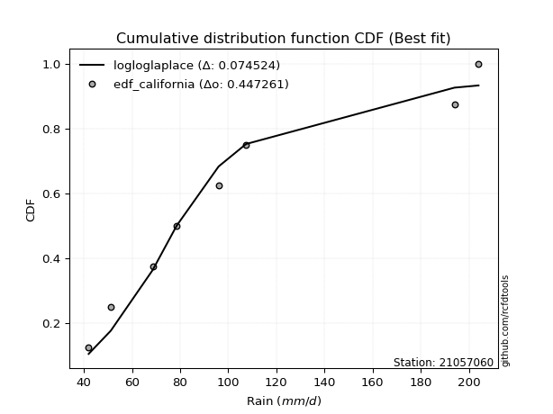</img>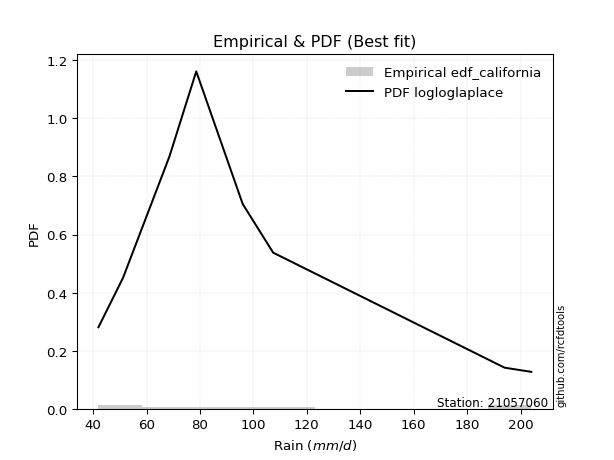</img>

</div>


### 2. EDF Hazen (1930)

Hazen method for plotting positions is a formula used to estimate the empirical cumulative probability distribution of flood events or other hydrological data. This formula often results in biased estimations, particularly when extrapolating to extreme events (high return periods).

<div align="center">


$P=(m-0.5)/n$


</div>


**2.1. Empirical values**

<div align="center">

|                | 0                  | 1                  | 2                  | 3                  | 4                  | 5         | 6                 | 7         |
|:---------------|:-------------------|:-------------------|:-------------------|:-------------------|:-------------------|:----------|:------------------|:----------|
| date           | 2023               | 2021               | 2020               | 2022               | 2025               | 2019      | 2024              | 2012      |
| x              | 42.0               | 51.2               | 68.6               | 78.6               | 96.0               | 107.4     | 194.0             | 204.0     |
| m              | 1                  | 2                  | 3                  | 4                  | 5                  | 6         | 7                 | 8         |
| empirical_dist | edf_hazen          | edf_hazen          | edf_hazen          | edf_hazen          | edf_hazen          | edf_hazen | edf_hazen         | edf_hazen |
| empirical      | 0.0625             | 0.1875             | 0.3125             | 0.4375             | 0.5625             | 0.6875    | 0.8125            | 0.9375    |
| empirical_tr   | 1.0666666666666667 | 1.2307692307692308 | 1.4545454545454546 | 1.7777777777777777 | 2.2857142857142856 | 3.2       | 5.333333333333333 | 16.0      |

</div>


**2.2. Kolmogorov-Smirnov fit test (sorted by Δ)**


<div align="center">

|                | 0                   | 1                   | 2                   | 3                   | 4                   | 5                   | 6                   | 7                   | 8                   | 9                   | 10                  | 11                  | 12                  | 13                  | 14                  | 15                 | 16                  | 17                  | 18                  | 19                  | 20                  | 21                  | 22                 | 23                  | 24                  | 25                  | 26                  | 27                  | 28                  | 29                  | 30                  | 31                  | 32                  | 33                  | 34                  | 35                  | 36                  | 37                  | 38                  | 39                  | 40                  | 41                  | 42                  | 43                  | 44                  | 45                  | 46                  | 47                  | 48                  | 49                  | 50                 | 51                  | 52                  | 53                  | 54                 | 55                  | 56                  | 57                 | 58                  | 59                  | 60                  | 61                  | 62                  | 63                  | 64                  | 65                  | 66                  | 67                  | 68                  | 69                  | 70                  | 71                  | 72                  | 73                 | 74                 | 75                  | 76                  | 77                 | 78                  | 79                  | 80                 | 81                 | 82                  | 83                 | 84                  | 85                  | 86                  | 87                  | 88                 | 89                  | 90                 | 91                  | 92                 | 93                  | 94                  | 95                  | 96                  | 97                  | 98                  | 99                  | 100                 | 101                 | 102                 | 103                | 104                | 105                 | 106                 | 107                | 108                | 109                | 110                 | 111                 | 112                | 113                 | 114                 | 115                 | 116                 | 117                 | 118                 | 119                 | 120                 | 121                 | 122                 | 123                 | 124                 | 125                 | 126                 | 127                 | 128                | 129                | 130                | 131                | 132                | 133                 | 134                 | 135                | 136                 | 137                 | 138                 | 139                 | 140                 | 141                | 142                | 143                 | 144                 | 145                 | 146                | 147                 | 148                 | 149                | 150                | 151                | 152                | 153                | 154                | 155                | 156                | 157                | 158                | 159                |
|:---------------|:--------------------|:--------------------|:--------------------|:--------------------|:--------------------|:--------------------|:--------------------|:--------------------|:--------------------|:--------------------|:--------------------|:--------------------|:--------------------|:--------------------|:--------------------|:-------------------|:--------------------|:--------------------|:--------------------|:--------------------|:--------------------|:--------------------|:-------------------|:--------------------|:--------------------|:--------------------|:--------------------|:--------------------|:--------------------|:--------------------|:--------------------|:--------------------|:--------------------|:--------------------|:--------------------|:--------------------|:--------------------|:--------------------|:--------------------|:--------------------|:--------------------|:--------------------|:--------------------|:--------------------|:--------------------|:--------------------|:--------------------|:--------------------|:--------------------|:--------------------|:-------------------|:--------------------|:--------------------|:--------------------|:-------------------|:--------------------|:--------------------|:-------------------|:--------------------|:--------------------|:--------------------|:--------------------|:--------------------|:--------------------|:--------------------|:--------------------|:--------------------|:--------------------|:--------------------|:--------------------|:--------------------|:--------------------|:--------------------|:-------------------|:-------------------|:--------------------|:--------------------|:-------------------|:--------------------|:--------------------|:-------------------|:-------------------|:--------------------|:-------------------|:--------------------|:--------------------|:--------------------|:--------------------|:-------------------|:--------------------|:-------------------|:--------------------|:-------------------|:--------------------|:--------------------|:--------------------|:--------------------|:--------------------|:--------------------|:--------------------|:--------------------|:--------------------|:--------------------|:-------------------|:-------------------|:--------------------|:--------------------|:-------------------|:-------------------|:-------------------|:--------------------|:--------------------|:-------------------|:--------------------|:--------------------|:--------------------|:--------------------|:--------------------|:--------------------|:--------------------|:--------------------|:--------------------|:--------------------|:--------------------|:--------------------|:--------------------|:--------------------|:--------------------|:-------------------|:-------------------|:-------------------|:-------------------|:-------------------|:--------------------|:--------------------|:-------------------|:--------------------|:--------------------|:--------------------|:--------------------|:--------------------|:-------------------|:-------------------|:--------------------|:--------------------|:--------------------|:-------------------|:--------------------|:--------------------|:-------------------|:-------------------|:-------------------|:-------------------|:-------------------|:-------------------|:-------------------|:-------------------|:-------------------|:-------------------|:-------------------|
| station        | 21057060            | 21057060            | 21057060            | 21057060            | 21057060            | 21057060            | 21057060            | 21057060            | 21057060            | 21057060            | 21057060            | 21057060            | 21057060            | 21057060            | 21057060            | 21057060           | 21057060            | 21057060            | 21057060            | 21057060            | 21057060            | 21057060            | 21057060           | 21057060            | 21057060            | 21057060            | 21057060            | 21057060            | 21057060            | 21057060            | 21057060            | 21057060            | 21057060            | 21057060            | 21057060            | 21057060            | 21057060            | 21057060            | 21057060            | 21057060            | 21057060            | 21057060            | 21057060            | 21057060            | 21057060            | 21057060            | 21057060            | 21057060            | 21057060            | 21057060            | 21057060           | 21057060            | 21057060            | 21057060            | 21057060           | 21057060            | 21057060            | 21057060           | 21057060            | 21057060            | 21057060            | 21057060            | 21057060            | 21057060            | 21057060            | 21057060            | 21057060            | 21057060            | 21057060            | 21057060            | 21057060            | 21057060            | 21057060            | 21057060           | 21057060           | 21057060            | 21057060            | 21057060           | 21057060            | 21057060            | 21057060           | 21057060           | 21057060            | 21057060           | 21057060            | 21057060            | 21057060            | 21057060            | 21057060           | 21057060            | 21057060           | 21057060            | 21057060           | 21057060            | 21057060            | 21057060            | 21057060            | 21057060            | 21057060            | 21057060            | 21057060            | 21057060            | 21057060            | 21057060           | 21057060           | 21057060            | 21057060            | 21057060           | 21057060           | 21057060           | 21057060            | 21057060            | 21057060           | 21057060            | 21057060            | 21057060            | 21057060            | 21057060            | 21057060            | 21057060            | 21057060            | 21057060            | 21057060            | 21057060            | 21057060            | 21057060            | 21057060            | 21057060            | 21057060           | 21057060           | 21057060           | 21057060           | 21057060           | 21057060            | 21057060            | 21057060           | 21057060            | 21057060            | 21057060            | 21057060            | 21057060            | 21057060           | 21057060           | 21057060            | 21057060            | 21057060            | 21057060           | 21057060            | 21057060            | 21057060           | 21057060           | 21057060           | 21057060           | 21057060           | 21057060           | 21057060           | 21057060           | 21057060           | 21057060           | 21057060           |
| empirical_dist | edf_hazen           | edf_hazen           | edf_hazen           | edf_hazen           | edf_hazen           | edf_hazen           | edf_hazen           | edf_hazen           | edf_hazen           | edf_hazen           | edf_hazen           | edf_hazen           | edf_hazen           | edf_hazen           | edf_hazen           | edf_hazen          | edf_hazen           | edf_hazen           | edf_hazen           | edf_hazen           | edf_hazen           | edf_hazen           | edf_hazen          | edf_hazen           | edf_hazen           | edf_hazen           | edf_hazen           | edf_hazen           | edf_hazen           | edf_hazen           | edf_hazen           | edf_hazen           | edf_hazen           | edf_hazen           | edf_hazen           | edf_hazen           | edf_hazen           | edf_hazen           | edf_hazen           | edf_hazen           | edf_hazen           | edf_hazen           | edf_hazen           | edf_hazen           | edf_hazen           | edf_hazen           | edf_hazen           | edf_hazen           | edf_hazen           | edf_hazen           | edf_hazen          | edf_hazen           | edf_hazen           | edf_hazen           | edf_hazen          | edf_hazen           | edf_hazen           | edf_hazen          | edf_hazen           | edf_hazen           | edf_hazen           | edf_hazen           | edf_hazen           | edf_hazen           | edf_hazen           | edf_hazen           | edf_hazen           | edf_hazen           | edf_hazen           | edf_hazen           | edf_hazen           | edf_hazen           | edf_hazen           | edf_hazen          | edf_hazen          | edf_hazen           | edf_hazen           | edf_hazen          | edf_hazen           | edf_hazen           | edf_hazen          | edf_hazen          | edf_hazen           | edf_hazen          | edf_hazen           | edf_hazen           | edf_hazen           | edf_hazen           | edf_hazen          | edf_hazen           | edf_hazen          | edf_hazen           | edf_hazen          | edf_hazen           | edf_hazen           | edf_hazen           | edf_hazen           | edf_hazen           | edf_hazen           | edf_hazen           | edf_hazen           | edf_hazen           | edf_hazen           | edf_hazen          | edf_hazen          | edf_hazen           | edf_hazen           | edf_hazen          | edf_hazen          | edf_hazen          | edf_hazen           | edf_hazen           | edf_hazen          | edf_hazen           | edf_hazen           | edf_hazen           | edf_hazen           | edf_hazen           | edf_hazen           | edf_hazen           | edf_hazen           | edf_hazen           | edf_hazen           | edf_hazen           | edf_hazen           | edf_hazen           | edf_hazen           | edf_hazen           | edf_hazen          | edf_hazen          | edf_hazen          | edf_hazen          | edf_hazen          | edf_hazen           | edf_hazen           | edf_hazen          | edf_hazen           | edf_hazen           | edf_hazen           | edf_hazen           | edf_hazen           | edf_hazen          | edf_hazen          | edf_hazen           | edf_hazen           | edf_hazen           | edf_hazen          | edf_hazen           | edf_hazen           | edf_hazen          | edf_hazen          | edf_hazen          | edf_hazen          | edf_hazen          | edf_hazen          | edf_hazen          | edf_hazen          | edf_hazen          | edf_hazen          | edf_hazen          |
| p_dist         | loggamma            | loggamma            | logf                | logerlang           | johnsonsu           | loggenlogistic      | logmielke           | burr                | loginvweibull       | logweibull_min      | logburr             | logskewnorm         | loghalfnorm         | nct                 | logkstwobign        | invgamma           | logfatiguelife      | invgauss            | loginvgauss         | loggenexpon         | alpha               | lograyleigh         | loginvgamma        | exponnorm           | logsemicircular     | logncf              | logexponpow         | lognct              | logmaxwell          | logburr12           | logksone            | logalpha            | loggompertz         | loganglit           | logrice             | betaprime           | f                   | loggumbel_r         | logbetaprime        | logfoldnorm         | halfnorm            | genexpon            | logpearson3         | gompertz            | halflogistic        | logmoyal            | logloggamma         | logjohnsonsu        | logexponnorm        | logt                | logcrystalball     | lognorm             | loggenextreme       | moyal               | gumbel_r           | logcosine           | nakagami            | loglogistic        | foldnorm            | loghypsecant        | logloglaplace       | loglaplace          | loglaplace          | logdgamma           | logbeta             | logdweibull         | pearson3            | exponpow            | loghalflogistic     | logrdist            | kstwobign           | genlogistic         | rayleigh            | skewnorm           | maxwell            | logargus            | dweibull            | dgamma             | logkappa4           | truncexpon          | loggausshyper      | logtukeylambda     | logkappa3           | logwrapcauchy      | loggumbel_l         | logvonmises_line    | loguniform          | rice                | burr12             | logtruncpareto      | loglomax           | logbradford         | logtruncexpon      | truncweibull_min    | hypsecant           | logistic            | t                   | truncnorm           | norm                | crystalball         | anglit              | logtruncnorm        | semicircular        | ksone              | laplace            | weibull_min         | wald                | logwald            | logarcsine         | arcsine            | halfgennorm         | logtruncweibull_min | logtriang          | kappa4              | cosine              | lomax               | wrapcauchy          | gamma               | loggenhalflogistic  | ncf                 | loglevy_l           | loggenpareto        | gumbel_l            | bradford            | tukeylambda         | uniform             | vonmises_line       | gausshyper          | levy_l             | argus              | kappa3             | gennorm            | loggennorm         | logweibull_max      | beta                | genextreme         | triang              | logtrapezoid        | genpareto           | erlang              | genhalflogistic     | powerlaw           | logjohnsonsb       | lognakagami         | fatiguelife         | invweibull          | johnsonsb          | logexponweib        | logpowerlaw         | gengamma           | rdist              | trapezoid          | loggengamma        | exponweib          | weibull_max        | truncpareto        | loghalfgennorm     | logvonmises        | vonmises           | mielke             |
| delta          | 0.07729369287418719 | 0.07729369287418719 | 0.07734395539339523 | 0.07744201161244568 | 0.08157073866463604 | 0.08401691643128828 | 0.08461940633583487 | 0.08469504244075254 | 0.08500708037105398 | 0.08511324321484048 | 0.08545672257708425 | 0.08567744317963427 | 0.08873900926187783 | 0.08942427852112156 | 0.09005404457361721 | 0.0904390338915918 | 0.09151432547214244 | 0.09209058195962871 | 0.09221017843722856 | 0.09223379812974042 | 0.09397906623504937 | 0.09466942123282951 | 0.0966455058679887 | 0.09677243538486979 | 0.09684058531247541 | 0.09702844010471834 | 0.09720436472790595 | 0.09750294561607309 | 0.09767699216440906 | 0.09832609002272041 | 0.09840659328668855 | 0.09874345511442018 | 0.09898956656465263 | 0.09921103964232547 | 0.09926036193871624 | 0.09995450615522594 | 0.10000888700774113 | 0.10011614727868745 | 0.10125196292991445 | 0.10281342193635734 | 0.10284862039229781 | 0.10347861897739241 | 0.10411414903080951 | 0.10621591354174953 | 0.10794420529000781 | 0.10800620930910247 | 0.10816357266970611 | 0.10837756314511915 | 0.10865483591797975 | 0.10896977137402497 | 0.1089714089272319 | 0.10897140906937886 | 0.11060837945580937 | 0.11092782224621567 | 0.1122660941321374 | 0.11532864827733347 | 0.11583443742467059 | 0.1161805738726468 | 0.11722175373574761 | 0.11881406955898699 | 0.11990279523662073 | 0.11991126457208479 | 0.11991126457208479 | 0.12071478151473536 | 0.12076963245245864 | 0.12164906912153062 | 0.12168289651792163 | 0.12358478021425734 | 0.12458299920322659 | 0.12518549443646132 | 0.12546902099977764 | 0.12749784818108556 | 0.12942327777908147 | 0.1325604944801595 | 0.1400932263104483 | 0.14430891535189683 | 0.14575275946629396 | 0.1480141905282455 | 0.14916286520338484 | 0.15240177664499854 | 0.1533421710641788 | 0.1534425581901857 | 0.15419370157099854 | 0.1553093405673125 | 0.15567407816987133 | 0.15569615054155617 | 0.15569777731834722 | 0.15613536391316374 | 0.1573386871568918 | 0.15848870927315573 | 0.1587396148667597 | 0.16481914721424917 | 0.1669857613845952 | 0.16787946499405892 | 0.16868445978379076 | 0.17043288001403845 | 0.17247567823453547 | 0.17248216716506737 | 0.17248216942422034 | 0.17248218986328778 | 0.17463035258586623 | 0.17496326763233316 | 0.17551538146285883 | 0.1766305111320653 | 0.1769585518642896 | 0.18454751542729164 | 0.18727608666135323 | 0.1875             | 0.1875             | 0.1875             | 0.18827117231754342 | 0.1985762309455713  | 0.2069652015108241 | 0.21191042285471923 | 0.21368680119967343 | 0.21981638772100076 | 0.22162346637835278 | 0.22442714910931838 | 0.23649212055478375 | 0.23848040976334295 | 0.24153243265680135 | 0.24198101946485967 | 0.24224941685501755 | 0.24940933846863683 | 0.28336241904393233 | 0.28379629629629627 | 0.28681066243432507 | 0.28711910798120976 | 0.2900787855482445 | 0.2903268676590285 | 0.2967317754884804 | 0.3125             | 0.3125             | 0.31646058162671814 | 0.32947757588897647 | 0.3359345220540879 | 0.34011057969468333 | 0.35296770988791093 | 0.35994742724136425 | 0.36436966403325877 | 0.40478548027556394 | 0.4190521768842357 | 0.4243281448489653 | 0.43125304409189413 | 0.44484684930383345 | 0.45393123067266367 | 0.456778084593111  | 0.48248539294653814 | 0.48422279673426605 | 0.4920998969682444 | 0.5012253187899645 | 0.5113073464410913 | 0.5605038893283532 | 0.5825948676824735 | 0.6088775104387065 | 0.6248839055900871 | 0.8125             | 1.110995999385336  | 31.938268128216393 | nan                |
| deltao         | 0.4472608134160001  | 0.4472608134160001  | 0.4472608134160001  | 0.4472608134160001  | 0.4472608134160001  | 0.4472608134160001  | 0.4472608134160001  | 0.4472608134160001  | 0.4472608134160001  | 0.4472608134160001  | 0.4472608134160001  | 0.4472608134160001  | 0.4472608134160001  | 0.4472608134160001  | 0.4472608134160001  | 0.4472608134160001 | 0.4472608134160001  | 0.4472608134160001  | 0.4472608134160001  | 0.4472608134160001  | 0.4472608134160001  | 0.4472608134160001  | 0.4472608134160001 | 0.4472608134160001  | 0.4472608134160001  | 0.4472608134160001  | 0.4472608134160001  | 0.4472608134160001  | 0.4472608134160001  | 0.4472608134160001  | 0.4472608134160001  | 0.4472608134160001  | 0.4472608134160001  | 0.4472608134160001  | 0.4472608134160001  | 0.4472608134160001  | 0.4472608134160001  | 0.4472608134160001  | 0.4472608134160001  | 0.4472608134160001  | 0.4472608134160001  | 0.4472608134160001  | 0.4472608134160001  | 0.4472608134160001  | 0.4472608134160001  | 0.4472608134160001  | 0.4472608134160001  | 0.4472608134160001  | 0.4472608134160001  | 0.4472608134160001  | 0.4472608134160001 | 0.4472608134160001  | 0.4472608134160001  | 0.4472608134160001  | 0.4472608134160001 | 0.4472608134160001  | 0.4472608134160001  | 0.4472608134160001 | 0.4472608134160001  | 0.4472608134160001  | 0.4472608134160001  | 0.4472608134160001  | 0.4472608134160001  | 0.4472608134160001  | 0.4472608134160001  | 0.4472608134160001  | 0.4472608134160001  | 0.4472608134160001  | 0.4472608134160001  | 0.4472608134160001  | 0.4472608134160001  | 0.4472608134160001  | 0.4472608134160001  | 0.4472608134160001 | 0.4472608134160001 | 0.4472608134160001  | 0.4472608134160001  | 0.4472608134160001 | 0.4472608134160001  | 0.4472608134160001  | 0.4472608134160001 | 0.4472608134160001 | 0.4472608134160001  | 0.4472608134160001 | 0.4472608134160001  | 0.4472608134160001  | 0.4472608134160001  | 0.4472608134160001  | 0.4472608134160001 | 0.4472608134160001  | 0.4472608134160001 | 0.4472608134160001  | 0.4472608134160001 | 0.4472608134160001  | 0.4472608134160001  | 0.4472608134160001  | 0.4472608134160001  | 0.4472608134160001  | 0.4472608134160001  | 0.4472608134160001  | 0.4472608134160001  | 0.4472608134160001  | 0.4472608134160001  | 0.4472608134160001 | 0.4472608134160001 | 0.4472608134160001  | 0.4472608134160001  | 0.4472608134160001 | 0.4472608134160001 | 0.4472608134160001 | 0.4472608134160001  | 0.4472608134160001  | 0.4472608134160001 | 0.4472608134160001  | 0.4472608134160001  | 0.4472608134160001  | 0.4472608134160001  | 0.4472608134160001  | 0.4472608134160001  | 0.4472608134160001  | 0.4472608134160001  | 0.4472608134160001  | 0.4472608134160001  | 0.4472608134160001  | 0.4472608134160001  | 0.4472608134160001  | 0.4472608134160001  | 0.4472608134160001  | 0.4472608134160001 | 0.4472608134160001 | 0.4472608134160001 | 0.4472608134160001 | 0.4472608134160001 | 0.4472608134160001  | 0.4472608134160001  | 0.4472608134160001 | 0.4472608134160001  | 0.4472608134160001  | 0.4472608134160001  | 0.4472608134160001  | 0.4472608134160001  | 0.4472608134160001 | 0.4472608134160001 | 0.4472608134160001  | 0.4472608134160001  | 0.4472608134160001  | 0.4472608134160001 | 0.4472608134160001  | 0.4472608134160001  | 0.4472608134160001 | 0.4472608134160001 | 0.4472608134160001 | 0.4472608134160001 | 0.4472608134160001 | 0.4472608134160001 | 0.4472608134160001 | 0.4472608134160001 | 0.4472608134160001 | 0.4472608134160001 | 0.4472608134160001 |
| eval           | Δo > Δ              | Δo > Δ              | Δo > Δ              | Δo > Δ              | Δo > Δ              | Δo > Δ              | Δo > Δ              | Δo > Δ              | Δo > Δ              | Δo > Δ              | Δo > Δ              | Δo > Δ              | Δo > Δ              | Δo > Δ              | Δo > Δ              | Δo > Δ             | Δo > Δ              | Δo > Δ              | Δo > Δ              | Δo > Δ              | Δo > Δ              | Δo > Δ              | Δo > Δ             | Δo > Δ              | Δo > Δ              | Δo > Δ              | Δo > Δ              | Δo > Δ              | Δo > Δ              | Δo > Δ              | Δo > Δ              | Δo > Δ              | Δo > Δ              | Δo > Δ              | Δo > Δ              | Δo > Δ              | Δo > Δ              | Δo > Δ              | Δo > Δ              | Δo > Δ              | Δo > Δ              | Δo > Δ              | Δo > Δ              | Δo > Δ              | Δo > Δ              | Δo > Δ              | Δo > Δ              | Δo > Δ              | Δo > Δ              | Δo > Δ              | Δo > Δ             | Δo > Δ              | Δo > Δ              | Δo > Δ              | Δo > Δ             | Δo > Δ              | Δo > Δ              | Δo > Δ             | Δo > Δ              | Δo > Δ              | Δo > Δ              | Δo > Δ              | Δo > Δ              | Δo > Δ              | Δo > Δ              | Δo > Δ              | Δo > Δ              | Δo > Δ              | Δo > Δ              | Δo > Δ              | Δo > Δ              | Δo > Δ              | Δo > Δ              | Δo > Δ             | Δo > Δ             | Δo > Δ              | Δo > Δ              | Δo > Δ             | Δo > Δ              | Δo > Δ              | Δo > Δ             | Δo > Δ             | Δo > Δ              | Δo > Δ             | Δo > Δ              | Δo > Δ              | Δo > Δ              | Δo > Δ              | Δo > Δ             | Δo > Δ              | Δo > Δ             | Δo > Δ              | Δo > Δ             | Δo > Δ              | Δo > Δ              | Δo > Δ              | Δo > Δ              | Δo > Δ              | Δo > Δ              | Δo > Δ              | Δo > Δ              | Δo > Δ              | Δo > Δ              | Δo > Δ             | Δo > Δ             | Δo > Δ              | Δo > Δ              | Δo > Δ             | Δo > Δ             | Δo > Δ             | Δo > Δ              | Δo > Δ              | Δo > Δ             | Δo > Δ              | Δo > Δ              | Δo > Δ              | Δo > Δ              | Δo > Δ              | Δo > Δ              | Δo > Δ              | Δo > Δ              | Δo > Δ              | Δo > Δ              | Δo > Δ              | Δo > Δ              | Δo > Δ              | Δo > Δ              | Δo > Δ              | Δo > Δ             | Δo > Δ             | Δo > Δ             | Δo > Δ             | Δo > Δ             | Δo > Δ              | Δo > Δ              | Δo > Δ             | Δo > Δ              | Δo > Δ              | Δo > Δ              | Δo > Δ              | Δo > Δ              | Δo > Δ             | Δo > Δ             | Δo > Δ              | Δo > Δ              | Δo <= Δ             | Δo <= Δ            | Δo <= Δ             | Δo <= Δ             | Δo <= Δ            | Δo <= Δ            | Δo <= Δ            | Δo <= Δ            | Δo <= Δ            | Δo <= Δ            | Δo <= Δ            | Δo <= Δ            | Δo <= Δ            | Δo <= Δ            | Δo <= Δ            |
| fit            | 1                   | 1                   | 1                   | 1                   | 1                   | 1                   | 1                   | 1                   | 1                   | 1                   | 1                   | 1                   | 1                   | 1                   | 1                   | 1                  | 1                   | 1                   | 1                   | 1                   | 1                   | 1                   | 1                  | 1                   | 1                   | 1                   | 1                   | 1                   | 1                   | 1                   | 1                   | 1                   | 1                   | 1                   | 1                   | 1                   | 1                   | 1                   | 1                   | 1                   | 1                   | 1                   | 1                   | 1                   | 1                   | 1                   | 1                   | 1                   | 1                   | 1                   | 1                  | 1                   | 1                   | 1                   | 1                  | 1                   | 1                   | 1                  | 1                   | 1                   | 1                   | 1                   | 1                   | 1                   | 1                   | 1                   | 1                   | 1                   | 1                   | 1                   | 1                   | 1                   | 1                   | 1                  | 1                  | 1                   | 1                   | 1                  | 1                   | 1                   | 1                  | 1                  | 1                   | 1                  | 1                   | 1                   | 1                   | 1                   | 1                  | 1                   | 1                  | 1                   | 1                  | 1                   | 1                   | 1                   | 1                   | 1                   | 1                   | 1                   | 1                   | 1                   | 1                   | 1                  | 1                  | 1                   | 1                   | 1                  | 1                  | 1                  | 1                   | 1                   | 1                  | 1                   | 1                   | 1                   | 1                   | 1                   | 1                   | 1                   | 1                   | 1                   | 1                   | 1                   | 1                   | 1                   | 1                   | 1                   | 1                  | 1                  | 1                  | 1                  | 1                  | 1                   | 1                   | 1                  | 1                   | 1                   | 1                   | 1                   | 1                   | 1                  | 1                  | 1                   | 1                   | 0                   | 0                  | 0                   | 0                   | 0                  | 0                  | 0                  | 0                  | 0                  | 0                  | 0                  | 0                  | 0                  | 0                  | 0                  |
| n              | 8                   | 8                   | 8                   | 8                   | 8                   | 8                   | 8                   | 8                   | 8                   | 8                   | 8                   | 8                   | 8                   | 8                   | 8                   | 8                  | 8                   | 8                   | 8                   | 8                   | 8                   | 8                   | 8                  | 8                   | 8                   | 8                   | 8                   | 8                   | 8                   | 8                   | 8                   | 8                   | 8                   | 8                   | 8                   | 8                   | 8                   | 8                   | 8                   | 8                   | 8                   | 8                   | 8                   | 8                   | 8                   | 8                   | 8                   | 8                   | 8                   | 8                   | 8                  | 8                   | 8                   | 8                   | 8                  | 8                   | 8                   | 8                  | 8                   | 8                   | 8                   | 8                   | 8                   | 8                   | 8                   | 8                   | 8                   | 8                   | 8                   | 8                   | 8                   | 8                   | 8                   | 8                  | 8                  | 8                   | 8                   | 8                  | 8                   | 8                   | 8                  | 8                  | 8                   | 8                  | 8                   | 8                   | 8                   | 8                   | 8                  | 8                   | 8                  | 8                   | 8                  | 8                   | 8                   | 8                   | 8                   | 8                   | 8                   | 8                   | 8                   | 8                   | 8                   | 8                  | 8                  | 8                   | 8                   | 8                  | 8                  | 8                  | 8                   | 8                   | 8                  | 8                   | 8                   | 8                   | 8                   | 8                   | 8                   | 8                   | 8                   | 8                   | 8                   | 8                   | 8                   | 8                   | 8                   | 8                   | 8                  | 8                  | 8                  | 8                  | 8                  | 8                   | 8                   | 8                  | 8                   | 8                   | 8                   | 8                   | 8                   | 8                  | 8                  | 8                   | 8                   | 8                   | 8                  | 8                   | 8                   | 8                  | 8                  | 8                  | 8                  | 8                  | 8                  | 8                  | 8                  | 8                  | 8                  | 8                  |
| best_fit       | 1                   | 1                   | 0                   | 0                   | 0                   | 0                   | 0                   | 0                   | 0                   | 0                   | 0                   | 0                   | 0                   | 0                   | 0                   | 0                  | 0                   | 0                   | 0                   | 0                   | 0                   | 0                   | 0                  | 0                   | 0                   | 0                   | 0                   | 0                   | 0                   | 0                   | 0                   | 0                   | 0                   | 0                   | 0                   | 0                   | 0                   | 0                   | 0                   | 0                   | 0                   | 0                   | 0                   | 0                   | 0                   | 0                   | 0                   | 0                   | 0                   | 0                   | 0                  | 0                   | 0                   | 0                   | 0                  | 0                   | 0                   | 0                  | 0                   | 0                   | 0                   | 0                   | 0                   | 0                   | 0                   | 0                   | 0                   | 0                   | 0                   | 0                   | 0                   | 0                   | 0                   | 0                  | 0                  | 0                   | 0                   | 0                  | 0                   | 0                   | 0                  | 0                  | 0                   | 0                  | 0                   | 0                   | 0                   | 0                   | 0                  | 0                   | 0                  | 0                   | 0                  | 0                   | 0                   | 0                   | 0                   | 0                   | 0                   | 0                   | 0                   | 0                   | 0                   | 0                  | 0                  | 0                   | 0                   | 0                  | 0                  | 0                  | 0                   | 0                   | 0                  | 0                   | 0                   | 0                   | 0                   | 0                   | 0                   | 0                   | 0                   | 0                   | 0                   | 0                   | 0                   | 0                   | 0                   | 0                   | 0                  | 0                  | 0                  | 0                  | 0                  | 0                   | 0                   | 0                  | 0                   | 0                   | 0                   | 0                   | 0                   | 0                  | 0                  | 0                   | 0                   | 0                   | 0                  | 0                   | 0                   | 0                  | 0                  | 0                  | 0                  | 0                  | 0                  | 0                  | 0                  | 0                  | 0                  | 0                  |
| best_fit_sort  | 1                   | 2                   | 3                   | 4                   | 5                   | 6                   | 7                   | 8                   | 9                   | 10                  | 11                  | 12                  | 13                  | 14                  | 15                  | 16                 | 17                  | 18                  | 19                  | 20                  | 21                  | 22                  | 23                 | 24                  | 25                  | 26                  | 27                  | 28                  | 29                  | 30                  | 31                  | 32                  | 33                  | 34                  | 35                  | 36                  | 37                  | 38                  | 39                  | 40                  | 41                  | 42                  | 43                  | 44                  | 45                  | 46                  | 47                  | 48                  | 49                  | 50                  | 51                 | 52                  | 53                  | 54                  | 55                 | 56                  | 57                  | 58                 | 59                  | 60                  | 61                  | 62                  | 63                  | 64                  | 65                  | 66                  | 67                  | 68                  | 69                  | 70                  | 71                  | 72                  | 73                  | 74                 | 75                 | 76                  | 77                  | 78                 | 79                  | 80                  | 81                 | 82                 | 83                  | 84                 | 85                  | 86                  | 87                  | 88                  | 89                 | 90                  | 91                 | 92                  | 93                 | 94                  | 95                  | 96                  | 97                  | 98                  | 99                  | 100                 | 101                 | 102                 | 103                 | 104                | 105                | 106                 | 107                 | 108                | 109                | 110                | 111                 | 112                 | 113                | 114                 | 115                 | 116                 | 117                 | 118                 | 119                 | 120                 | 121                 | 122                 | 123                 | 124                 | 125                 | 126                 | 127                 | 128                 | 129                | 130                | 131                | 132                | 133                | 134                 | 135                 | 136                | 137                 | 138                 | 139                 | 140                 | 141                 | 142                | 143                | 144                 | 145                 | 146                 | 147                | 148                 | 149                 | 150                | 151                | 152                | 153                | 154                | 155                | 156                | 157                | 158                | 159                | 160                |

</div>


**2.3. Best fit**

<div align="center">

|   id |   station | empirical_dist   | p_dist   |     delta |   deltao | eval   |   fit |   n |   best_fit |   best_fit_sort |
|-----:|----------:|:-----------------|:---------|----------:|---------:|:-------|------:|----:|-----------:|----------------:|
|    0 |  21057060 | edf_hazen        | loggamma | 0.0772937 | 0.447261 | Δo > Δ |     1 |   8 |          1 |               1 |
|    1 |  21057060 | edf_hazen        | loggamma | 0.0772937 | 0.447261 | Δo > Δ |     1 |   8 |          1 |               2 |

</div>


<div align="center">

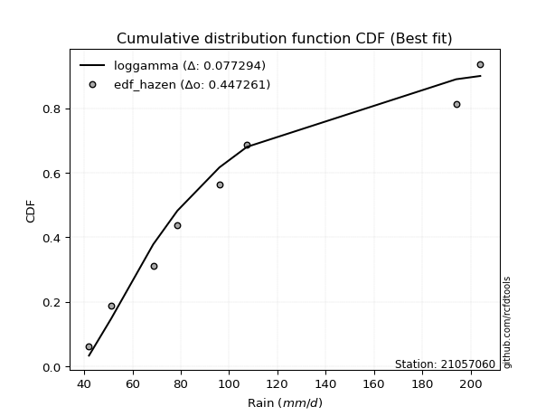</img>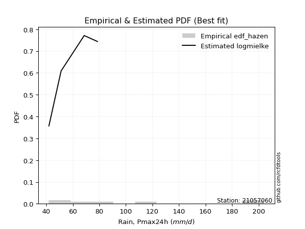</img>

</div>


### 3. EDF Weibull (1939)

Weibull plotting position formula is an empirical method used to estimate the non-exceedance probability or plotting position for a set of observed data, is often recommended or widely used in practice, particularly in flood frequency analysis.

<div align="center">


$P=m/(n+1)$


</div>


**3.1. Empirical values**

<div align="center">

|                | 0                  | 1                  | 2                  | 3                  | 4                  | 5                  | 6                  | 7                  |
|:---------------|:-------------------|:-------------------|:-------------------|:-------------------|:-------------------|:-------------------|:-------------------|:-------------------|
| date           | 2023               | 2021               | 2020               | 2022               | 2025               | 2019               | 2024               | 2012               |
| x              | 42.0               | 51.2               | 68.6               | 78.6               | 96.0               | 107.4              | 194.0              | 204.0              |
| m              | 1                  | 2                  | 3                  | 4                  | 5                  | 6                  | 7                  | 8                  |
| empirical_dist | edf_weibull        | edf_weibull        | edf_weibull        | edf_weibull        | edf_weibull        | edf_weibull        | edf_weibull        | edf_weibull        |
| empirical      | 0.1111111111111111 | 0.2222222222222222 | 0.3333333333333333 | 0.4444444444444444 | 0.5555555555555556 | 0.6666666666666666 | 0.7777777777777778 | 0.8888888888888888 |
| empirical_tr   | 1.125              | 1.2857142857142856 | 1.4999999999999998 | 1.7999999999999998 | 2.25               | 2.9999999999999996 | 4.5                | 8.999999999999996  |

</div>


**3.2. Kolmogorov-Smirnov fit test (sorted by Δ)**


<div align="center">

|                | 0                   | 1                   | 2                  | 3                  | 4                   | 5                   | 6                   | 7                   | 8                  | 9                   | 10                  | 11                  | 12                  | 13                 | 14                  | 15                  | 16                  | 17                  | 18                 | 19                  | 20                  | 21                  | 22                  | 23                  | 24                  | 25                 | 26                 | 27                 | 28                  | 29                  | 30                  | 31                 | 32                  | 33                  | 34                  | 35                  | 36                  | 37                  | 38                  | 39                  | 40                  | 41                  | 42                  | 43                 | 44                  | 45                  | 46                  | 47                  | 48                  | 49                  | 50                  | 51                  | 52                 | 53                  | 54                  | 55                  | 56                  | 57                 | 58                  | 59                  | 60                  | 61                  | 62                  | 63                  | 64                 | 65                 | 66                  | 67                  | 68                 | 69                 | 70                 | 71                 | 72                  | 73                  | 74                 | 75                  | 76                  | 77                 | 78                  | 79                  | 80                  | 81                  | 82                 | 83                  | 84                  | 85                  | 86                 | 87                  | 88                 | 89                  | 90                 | 91                  | 92                 | 93                  | 94                  | 95                  | 96                  | 97                  | 98                 | 99                  | 100                 | 101                 | 102                 | 103                 | 104                 | 105                 | 106                 | 107                 | 108                | 109                 | 110                 | 111                | 112                 | 113                 | 114                 | 115                 | 116                 | 117                | 118                 | 119                 | 120                | 121                | 122                | 123                 | 124                | 125                 | 126                | 127                | 128                | 129                | 130                 | 131                | 132                | 133                 | 134                 | 135                 | 136                 | 137                 | 138                | 139                 | 140                 | 141                | 142                 | 143                | 144                | 145                 | 146                 | 147                 | 148                 | 149                | 150                 | 151                | 152                | 153                | 154                | 155                | 156                | 157                | 158                | 159                |
|:---------------|:--------------------|:--------------------|:-------------------|:-------------------|:--------------------|:--------------------|:--------------------|:--------------------|:-------------------|:--------------------|:--------------------|:--------------------|:--------------------|:-------------------|:--------------------|:--------------------|:--------------------|:--------------------|:-------------------|:--------------------|:--------------------|:--------------------|:--------------------|:--------------------|:--------------------|:-------------------|:-------------------|:-------------------|:--------------------|:--------------------|:--------------------|:-------------------|:--------------------|:--------------------|:--------------------|:--------------------|:--------------------|:--------------------|:--------------------|:--------------------|:--------------------|:--------------------|:--------------------|:-------------------|:--------------------|:--------------------|:--------------------|:--------------------|:--------------------|:--------------------|:--------------------|:--------------------|:-------------------|:--------------------|:--------------------|:--------------------|:--------------------|:-------------------|:--------------------|:--------------------|:--------------------|:--------------------|:--------------------|:--------------------|:-------------------|:-------------------|:--------------------|:--------------------|:-------------------|:-------------------|:-------------------|:-------------------|:--------------------|:--------------------|:-------------------|:--------------------|:--------------------|:-------------------|:--------------------|:--------------------|:--------------------|:--------------------|:-------------------|:--------------------|:--------------------|:--------------------|:-------------------|:--------------------|:-------------------|:--------------------|:-------------------|:--------------------|:-------------------|:--------------------|:--------------------|:--------------------|:--------------------|:--------------------|:-------------------|:--------------------|:--------------------|:--------------------|:--------------------|:--------------------|:--------------------|:--------------------|:--------------------|:--------------------|:-------------------|:--------------------|:--------------------|:-------------------|:--------------------|:--------------------|:--------------------|:--------------------|:--------------------|:-------------------|:--------------------|:--------------------|:-------------------|:-------------------|:-------------------|:--------------------|:-------------------|:--------------------|:-------------------|:-------------------|:-------------------|:-------------------|:--------------------|:-------------------|:-------------------|:--------------------|:--------------------|:--------------------|:--------------------|:--------------------|:-------------------|:--------------------|:--------------------|:-------------------|:--------------------|:-------------------|:-------------------|:--------------------|:--------------------|:--------------------|:--------------------|:-------------------|:--------------------|:-------------------|:-------------------|:-------------------|:-------------------|:-------------------|:-------------------|:-------------------|:-------------------|:-------------------|
| station        | 21057060            | 21057060            | 21057060           | 21057060           | 21057060            | 21057060            | 21057060            | 21057060            | 21057060           | 21057060            | 21057060            | 21057060            | 21057060            | 21057060           | 21057060            | 21057060            | 21057060            | 21057060            | 21057060           | 21057060            | 21057060            | 21057060            | 21057060            | 21057060            | 21057060            | 21057060           | 21057060           | 21057060           | 21057060            | 21057060            | 21057060            | 21057060           | 21057060            | 21057060            | 21057060            | 21057060            | 21057060            | 21057060            | 21057060            | 21057060            | 21057060            | 21057060            | 21057060            | 21057060           | 21057060            | 21057060            | 21057060            | 21057060            | 21057060            | 21057060            | 21057060            | 21057060            | 21057060           | 21057060            | 21057060            | 21057060            | 21057060            | 21057060           | 21057060            | 21057060            | 21057060            | 21057060            | 21057060            | 21057060            | 21057060           | 21057060           | 21057060            | 21057060            | 21057060           | 21057060           | 21057060           | 21057060           | 21057060            | 21057060            | 21057060           | 21057060            | 21057060            | 21057060           | 21057060            | 21057060            | 21057060            | 21057060            | 21057060           | 21057060            | 21057060            | 21057060            | 21057060           | 21057060            | 21057060           | 21057060            | 21057060           | 21057060            | 21057060           | 21057060            | 21057060            | 21057060            | 21057060            | 21057060            | 21057060           | 21057060            | 21057060            | 21057060            | 21057060            | 21057060            | 21057060            | 21057060            | 21057060            | 21057060            | 21057060           | 21057060            | 21057060            | 21057060           | 21057060            | 21057060            | 21057060            | 21057060            | 21057060            | 21057060           | 21057060            | 21057060            | 21057060           | 21057060           | 21057060           | 21057060            | 21057060           | 21057060            | 21057060           | 21057060           | 21057060           | 21057060           | 21057060            | 21057060           | 21057060           | 21057060            | 21057060            | 21057060            | 21057060            | 21057060            | 21057060           | 21057060            | 21057060            | 21057060           | 21057060            | 21057060           | 21057060           | 21057060            | 21057060            | 21057060            | 21057060            | 21057060           | 21057060            | 21057060           | 21057060           | 21057060           | 21057060           | 21057060           | 21057060           | 21057060           | 21057060           | 21057060           |
| empirical_dist | edf_weibull         | edf_weibull         | edf_weibull        | edf_weibull        | edf_weibull         | edf_weibull         | edf_weibull         | edf_weibull         | edf_weibull        | edf_weibull         | edf_weibull         | edf_weibull         | edf_weibull         | edf_weibull        | edf_weibull         | edf_weibull         | edf_weibull         | edf_weibull         | edf_weibull        | edf_weibull         | edf_weibull         | edf_weibull         | edf_weibull         | edf_weibull         | edf_weibull         | edf_weibull        | edf_weibull        | edf_weibull        | edf_weibull         | edf_weibull         | edf_weibull         | edf_weibull        | edf_weibull         | edf_weibull         | edf_weibull         | edf_weibull         | edf_weibull         | edf_weibull         | edf_weibull         | edf_weibull         | edf_weibull         | edf_weibull         | edf_weibull         | edf_weibull        | edf_weibull         | edf_weibull         | edf_weibull         | edf_weibull         | edf_weibull         | edf_weibull         | edf_weibull         | edf_weibull         | edf_weibull        | edf_weibull         | edf_weibull         | edf_weibull         | edf_weibull         | edf_weibull        | edf_weibull         | edf_weibull         | edf_weibull         | edf_weibull         | edf_weibull         | edf_weibull         | edf_weibull        | edf_weibull        | edf_weibull         | edf_weibull         | edf_weibull        | edf_weibull        | edf_weibull        | edf_weibull        | edf_weibull         | edf_weibull         | edf_weibull        | edf_weibull         | edf_weibull         | edf_weibull        | edf_weibull         | edf_weibull         | edf_weibull         | edf_weibull         | edf_weibull        | edf_weibull         | edf_weibull         | edf_weibull         | edf_weibull        | edf_weibull         | edf_weibull        | edf_weibull         | edf_weibull        | edf_weibull         | edf_weibull        | edf_weibull         | edf_weibull         | edf_weibull         | edf_weibull         | edf_weibull         | edf_weibull        | edf_weibull         | edf_weibull         | edf_weibull         | edf_weibull         | edf_weibull         | edf_weibull         | edf_weibull         | edf_weibull         | edf_weibull         | edf_weibull        | edf_weibull         | edf_weibull         | edf_weibull        | edf_weibull         | edf_weibull         | edf_weibull         | edf_weibull         | edf_weibull         | edf_weibull        | edf_weibull         | edf_weibull         | edf_weibull        | edf_weibull        | edf_weibull        | edf_weibull         | edf_weibull        | edf_weibull         | edf_weibull        | edf_weibull        | edf_weibull        | edf_weibull        | edf_weibull         | edf_weibull        | edf_weibull        | edf_weibull         | edf_weibull         | edf_weibull         | edf_weibull         | edf_weibull         | edf_weibull        | edf_weibull         | edf_weibull         | edf_weibull        | edf_weibull         | edf_weibull        | edf_weibull        | edf_weibull         | edf_weibull         | edf_weibull         | edf_weibull         | edf_weibull        | edf_weibull         | edf_weibull        | edf_weibull        | edf_weibull        | edf_weibull        | edf_weibull        | edf_weibull        | edf_weibull        | edf_weibull        | edf_weibull        |
| p_dist         | loggenexpon         | exponpow            | loggamma           | loggamma           | logf                | logerlang           | logrdist            | johnsonsu           | logskewnorm        | loggenlogistic      | logmielke           | burr                | loginvweibull       | logweibull_min     | logburr             | loghalfnorm         | nct                 | logkstwobign        | invgamma           | logfatiguelife      | invgauss            | loginvgauss         | alpha               | nakagami            | lograyleigh         | logksone           | loginvgamma        | exponnorm          | logsemicircular     | logncf              | logexponpow         | lognct             | logmaxwell          | logburr12           | logalpha            | loggompertz         | loganglit           | logrice             | logwrapcauchy       | betaprime           | f                   | loggumbel_r         | logbetaprime        | burr12             | logfoldnorm         | halfnorm            | loglomax            | genexpon            | logpearson3         | foldnorm            | gompertz            | halflogistic        | logmoyal           | logloggamma         | logjohnsonsu        | logexponnorm        | logt                | logcrystalball     | lognorm             | rayleigh            | loggenextreme       | moyal               | pearson3            | skewnorm            | gumbel_r           | maxwell            | logloglaplace       | logcosine           | loglogistic        | loghypsecant       | loglaplace         | loglaplace         | logdgamma           | logbeta             | anglit             | logdweibull         | semicircular        | rice               | loghalflogistic     | crystalball         | norm                | truncnorm           | t                  | kstwobign           | genlogistic         | weibull_min         | logargus           | logistic            | hypsecant          | ksone               | halfgennorm        | dweibull            | dgamma             | truncweibull_min    | logkappa4           | laplace             | logtriang           | truncexpon          | loggausshyper      | logtukeylambda      | logkappa3           | ncf                 | loggumbel_l         | logvonmises_line    | loguniform          | kappa4              | cosine              | logtruncpareto      | lomax              | logbradford         | wrapcauchy          | logtruncexpon      | gamma               | logtruncweibull_min | logtruncnorm        | loggenhalflogistic  | loglevy_l           | loggenpareto       | gumbel_l            | wald                | logarcsine         | arcsine            | logwald            | bradford            | levy_l             | tukeylambda         | uniform            | vonmises_line      | gausshyper         | argus              | kappa3              | gennorm            | loggennorm         | beta                | genextreme          | logweibull_max      | triang              | logtrapezoid        | genpareto          | erlang              | genhalflogistic     | logjohnsonsb       | powerlaw            | lognakagami        | invweibull         | fatiguelife         | johnsonsb           | logexponweib        | rdist               | gengamma           | logpowerlaw         | trapezoid          | loggengamma        | exponweib          | weibull_max        | truncpareto        | loghalfgennorm     | logvonmises        | vonmises           | mielke             |
| delta          | 0.11111111090884157 | 0.11111111110032504 | 0.1120159150964094 | 0.1120159150964094 | 0.11206617761561743 | 0.11216423383466789 | 0.11433385507722704 | 0.11629296088685825 | 0.1185617429600162 | 0.11873913865351049 | 0.11934162855805708 | 0.11941726466297475 | 0.11972930259327619 | 0.1198354654370627 | 0.12017894479930646 | 0.12346123148410004 | 0.12414650074334377 | 0.12477626679583942 | 0.125161256113814  | 0.12623654769436465 | 0.12681280418185092 | 0.12693240065945077 | 0.12870128845727158 | 0.12873510393038556 | 0.12939164345505172 | 0.1307086775822044 | 0.1313677280902109 | 0.131494657607092  | 0.13156280753469762 | 0.13175066232694055 | 0.13192658695012816 | 0.1322251678382953 | 0.13239921438663127 | 0.13304831224494262 | 0.13346567733664239 | 0.13371178878687484 | 0.13393326186454768 | 0.13398258416093844 | 0.13447600723397912 | 0.13467672837744815 | 0.13473110922996334 | 0.13483836950090966 | 0.13597418515213666 | 0.1365053538235585 | 0.13753564415857955 | 0.13757084261452002 | 0.13790628153342638 | 0.13820084119961462 | 0.13883637125303172 | 0.13905821841272237 | 0.14093813576397174 | 0.14266642751223002 | 0.1427284315313247 | 0.14288579489192832 | 0.14309978536734136 | 0.14337705814020196 | 0.14369199359624718 | 0.1436936311494541 | 0.14369363129160106 | 0.14446478186514655 | 0.14533060167803158 | 0.14565004446843788 | 0.14616073974378774 | 0.14630843651256809 | 0.1469883163543596 | 0.1477572404262264 | 0.14788366716501733 | 0.15005087049955568 | 0.150902796094869  | 0.1535362917812092 | 0.154633486794307  | 0.154633486794307  | 0.15543700373695757 | 0.15549185467468085 | 0.1561062541220406 | 0.15637129134375283 | 0.15770878922574472 | 0.1583106527411512 | 0.15930522142544878 | 0.16005705828386074 | 0.16005706198089031 | 0.16005706277498366 | 0.1600761973742778 | 0.16019124322199985 | 0.16222007040330777 | 0.16371418209395833 | 0.1639005999657438 | 0.16422076104374417 | 0.1654278008062383 | 0.16587227934907256 | 0.1674378389842101 | 0.18047498168851617 | 0.1827364127504677 | 0.18376904380307357 | 0.18388508742560705 | 0.18390299630873402 | 0.18613186817749072 | 0.18677183688919907 | 0.188064393286401  | 0.18816478041240792 | 0.18891592379322075 | 0.18986929865223184 | 0.19039630039209354 | 0.19041837276377838 | 0.19041999954056943 | 0.19107708952138586 | 0.19285346786634006 | 0.19321093149537794 | 0.1989830543876674 | 0.19954136943647138 | 0.20079013304501941 | 0.2017079836068174 | 0.20359381577598507 | 0.20709644156128315 | 0.20968548985455537 | 0.21565878722145038 | 0.22069909932346798 | 0.2211476861315263 | 0.22141608352168418 | 0.22199830888357544 | 0.2222222222222222 | 0.2222222222222222 | 0.2222222222222222 | 0.22857600513530346 | 0.2414676744371334 | 0.26252908571059896 | 0.2629629629629629 | 0.2659773291009917 | 0.2662857746478764 | 0.2694935343256951 | 0.27589844215514703 | 0.2777777777777778 | 0.2777777777777778 | 0.28086646477786537 | 0.28732341094297675 | 0.29562724829338477 | 0.31927724636134996 | 0.33213437655457756 | 0.3391140939080309 | 0.34353633069992545 | 0.38395214694223057 | 0.3896059226267431 | 0.39652303796576943 | 0.3965308218696719 | 0.4053201195615525 | 0.41012462708161124 | 0.42205586237088877 | 0.44889457654931547 | 0.45261420767885335 | 0.4573776747460222 | 0.46338946340093273 | 0.4904740131077579 | 0.5396705559950199 | 0.5478726454602513 | 0.5880441771053733 | 0.5901616833678649 | 0.7777777777777778 | 1.145718221607558  | 31.986879239327504 | nan                |
| deltao         | 0.4472608134160001  | 0.4472608134160001  | 0.4472608134160001 | 0.4472608134160001 | 0.4472608134160001  | 0.4472608134160001  | 0.4472608134160001  | 0.4472608134160001  | 0.4472608134160001 | 0.4472608134160001  | 0.4472608134160001  | 0.4472608134160001  | 0.4472608134160001  | 0.4472608134160001 | 0.4472608134160001  | 0.4472608134160001  | 0.4472608134160001  | 0.4472608134160001  | 0.4472608134160001 | 0.4472608134160001  | 0.4472608134160001  | 0.4472608134160001  | 0.4472608134160001  | 0.4472608134160001  | 0.4472608134160001  | 0.4472608134160001 | 0.4472608134160001 | 0.4472608134160001 | 0.4472608134160001  | 0.4472608134160001  | 0.4472608134160001  | 0.4472608134160001 | 0.4472608134160001  | 0.4472608134160001  | 0.4472608134160001  | 0.4472608134160001  | 0.4472608134160001  | 0.4472608134160001  | 0.4472608134160001  | 0.4472608134160001  | 0.4472608134160001  | 0.4472608134160001  | 0.4472608134160001  | 0.4472608134160001 | 0.4472608134160001  | 0.4472608134160001  | 0.4472608134160001  | 0.4472608134160001  | 0.4472608134160001  | 0.4472608134160001  | 0.4472608134160001  | 0.4472608134160001  | 0.4472608134160001 | 0.4472608134160001  | 0.4472608134160001  | 0.4472608134160001  | 0.4472608134160001  | 0.4472608134160001 | 0.4472608134160001  | 0.4472608134160001  | 0.4472608134160001  | 0.4472608134160001  | 0.4472608134160001  | 0.4472608134160001  | 0.4472608134160001 | 0.4472608134160001 | 0.4472608134160001  | 0.4472608134160001  | 0.4472608134160001 | 0.4472608134160001 | 0.4472608134160001 | 0.4472608134160001 | 0.4472608134160001  | 0.4472608134160001  | 0.4472608134160001 | 0.4472608134160001  | 0.4472608134160001  | 0.4472608134160001 | 0.4472608134160001  | 0.4472608134160001  | 0.4472608134160001  | 0.4472608134160001  | 0.4472608134160001 | 0.4472608134160001  | 0.4472608134160001  | 0.4472608134160001  | 0.4472608134160001 | 0.4472608134160001  | 0.4472608134160001 | 0.4472608134160001  | 0.4472608134160001 | 0.4472608134160001  | 0.4472608134160001 | 0.4472608134160001  | 0.4472608134160001  | 0.4472608134160001  | 0.4472608134160001  | 0.4472608134160001  | 0.4472608134160001 | 0.4472608134160001  | 0.4472608134160001  | 0.4472608134160001  | 0.4472608134160001  | 0.4472608134160001  | 0.4472608134160001  | 0.4472608134160001  | 0.4472608134160001  | 0.4472608134160001  | 0.4472608134160001 | 0.4472608134160001  | 0.4472608134160001  | 0.4472608134160001 | 0.4472608134160001  | 0.4472608134160001  | 0.4472608134160001  | 0.4472608134160001  | 0.4472608134160001  | 0.4472608134160001 | 0.4472608134160001  | 0.4472608134160001  | 0.4472608134160001 | 0.4472608134160001 | 0.4472608134160001 | 0.4472608134160001  | 0.4472608134160001 | 0.4472608134160001  | 0.4472608134160001 | 0.4472608134160001 | 0.4472608134160001 | 0.4472608134160001 | 0.4472608134160001  | 0.4472608134160001 | 0.4472608134160001 | 0.4472608134160001  | 0.4472608134160001  | 0.4472608134160001  | 0.4472608134160001  | 0.4472608134160001  | 0.4472608134160001 | 0.4472608134160001  | 0.4472608134160001  | 0.4472608134160001 | 0.4472608134160001  | 0.4472608134160001 | 0.4472608134160001 | 0.4472608134160001  | 0.4472608134160001  | 0.4472608134160001  | 0.4472608134160001  | 0.4472608134160001 | 0.4472608134160001  | 0.4472608134160001 | 0.4472608134160001 | 0.4472608134160001 | 0.4472608134160001 | 0.4472608134160001 | 0.4472608134160001 | 0.4472608134160001 | 0.4472608134160001 | 0.4472608134160001 |
| eval           | Δo > Δ              | Δo > Δ              | Δo > Δ             | Δo > Δ             | Δo > Δ              | Δo > Δ              | Δo > Δ              | Δo > Δ              | Δo > Δ             | Δo > Δ              | Δo > Δ              | Δo > Δ              | Δo > Δ              | Δo > Δ             | Δo > Δ              | Δo > Δ              | Δo > Δ              | Δo > Δ              | Δo > Δ             | Δo > Δ              | Δo > Δ              | Δo > Δ              | Δo > Δ              | Δo > Δ              | Δo > Δ              | Δo > Δ             | Δo > Δ             | Δo > Δ             | Δo > Δ              | Δo > Δ              | Δo > Δ              | Δo > Δ             | Δo > Δ              | Δo > Δ              | Δo > Δ              | Δo > Δ              | Δo > Δ              | Δo > Δ              | Δo > Δ              | Δo > Δ              | Δo > Δ              | Δo > Δ              | Δo > Δ              | Δo > Δ             | Δo > Δ              | Δo > Δ              | Δo > Δ              | Δo > Δ              | Δo > Δ              | Δo > Δ              | Δo > Δ              | Δo > Δ              | Δo > Δ             | Δo > Δ              | Δo > Δ              | Δo > Δ              | Δo > Δ              | Δo > Δ             | Δo > Δ              | Δo > Δ              | Δo > Δ              | Δo > Δ              | Δo > Δ              | Δo > Δ              | Δo > Δ             | Δo > Δ             | Δo > Δ              | Δo > Δ              | Δo > Δ             | Δo > Δ             | Δo > Δ             | Δo > Δ             | Δo > Δ              | Δo > Δ              | Δo > Δ             | Δo > Δ              | Δo > Δ              | Δo > Δ             | Δo > Δ              | Δo > Δ              | Δo > Δ              | Δo > Δ              | Δo > Δ             | Δo > Δ              | Δo > Δ              | Δo > Δ              | Δo > Δ             | Δo > Δ              | Δo > Δ             | Δo > Δ              | Δo > Δ             | Δo > Δ              | Δo > Δ             | Δo > Δ              | Δo > Δ              | Δo > Δ              | Δo > Δ              | Δo > Δ              | Δo > Δ             | Δo > Δ              | Δo > Δ              | Δo > Δ              | Δo > Δ              | Δo > Δ              | Δo > Δ              | Δo > Δ              | Δo > Δ              | Δo > Δ              | Δo > Δ             | Δo > Δ              | Δo > Δ              | Δo > Δ             | Δo > Δ              | Δo > Δ              | Δo > Δ              | Δo > Δ              | Δo > Δ              | Δo > Δ             | Δo > Δ              | Δo > Δ              | Δo > Δ             | Δo > Δ             | Δo > Δ             | Δo > Δ              | Δo > Δ             | Δo > Δ              | Δo > Δ             | Δo > Δ             | Δo > Δ             | Δo > Δ             | Δo > Δ              | Δo > Δ             | Δo > Δ             | Δo > Δ              | Δo > Δ              | Δo > Δ              | Δo > Δ              | Δo > Δ              | Δo > Δ             | Δo > Δ              | Δo > Δ              | Δo > Δ             | Δo > Δ              | Δo > Δ             | Δo > Δ             | Δo > Δ              | Δo > Δ              | Δo <= Δ             | Δo <= Δ             | Δo <= Δ            | Δo <= Δ             | Δo <= Δ            | Δo <= Δ            | Δo <= Δ            | Δo <= Δ            | Δo <= Δ            | Δo <= Δ            | Δo <= Δ            | Δo <= Δ            | Δo <= Δ            |
| fit            | 1                   | 1                   | 1                  | 1                  | 1                   | 1                   | 1                   | 1                   | 1                  | 1                   | 1                   | 1                   | 1                   | 1                  | 1                   | 1                   | 1                   | 1                   | 1                  | 1                   | 1                   | 1                   | 1                   | 1                   | 1                   | 1                  | 1                  | 1                  | 1                   | 1                   | 1                   | 1                  | 1                   | 1                   | 1                   | 1                   | 1                   | 1                   | 1                   | 1                   | 1                   | 1                   | 1                   | 1                  | 1                   | 1                   | 1                   | 1                   | 1                   | 1                   | 1                   | 1                   | 1                  | 1                   | 1                   | 1                   | 1                   | 1                  | 1                   | 1                   | 1                   | 1                   | 1                   | 1                   | 1                  | 1                  | 1                   | 1                   | 1                  | 1                  | 1                  | 1                  | 1                   | 1                   | 1                  | 1                   | 1                   | 1                  | 1                   | 1                   | 1                   | 1                   | 1                  | 1                   | 1                   | 1                   | 1                  | 1                   | 1                  | 1                   | 1                  | 1                   | 1                  | 1                   | 1                   | 1                   | 1                   | 1                   | 1                  | 1                   | 1                   | 1                   | 1                   | 1                   | 1                   | 1                   | 1                   | 1                   | 1                  | 1                   | 1                   | 1                  | 1                   | 1                   | 1                   | 1                   | 1                   | 1                  | 1                   | 1                   | 1                  | 1                  | 1                  | 1                   | 1                  | 1                   | 1                  | 1                  | 1                  | 1                  | 1                   | 1                  | 1                  | 1                   | 1                   | 1                   | 1                   | 1                   | 1                  | 1                   | 1                   | 1                  | 1                   | 1                  | 1                  | 1                   | 1                   | 0                   | 0                   | 0                  | 0                   | 0                  | 0                  | 0                  | 0                  | 0                  | 0                  | 0                  | 0                  | 0                  |
| n              | 8                   | 8                   | 8                  | 8                  | 8                   | 8                   | 8                   | 8                   | 8                  | 8                   | 8                   | 8                   | 8                   | 8                  | 8                   | 8                   | 8                   | 8                   | 8                  | 8                   | 8                   | 8                   | 8                   | 8                   | 8                   | 8                  | 8                  | 8                  | 8                   | 8                   | 8                   | 8                  | 8                   | 8                   | 8                   | 8                   | 8                   | 8                   | 8                   | 8                   | 8                   | 8                   | 8                   | 8                  | 8                   | 8                   | 8                   | 8                   | 8                   | 8                   | 8                   | 8                   | 8                  | 8                   | 8                   | 8                   | 8                   | 8                  | 8                   | 8                   | 8                   | 8                   | 8                   | 8                   | 8                  | 8                  | 8                   | 8                   | 8                  | 8                  | 8                  | 8                  | 8                   | 8                   | 8                  | 8                   | 8                   | 8                  | 8                   | 8                   | 8                   | 8                   | 8                  | 8                   | 8                   | 8                   | 8                  | 8                   | 8                  | 8                   | 8                  | 8                   | 8                  | 8                   | 8                   | 8                   | 8                   | 8                   | 8                  | 8                   | 8                   | 8                   | 8                   | 8                   | 8                   | 8                   | 8                   | 8                   | 8                  | 8                   | 8                   | 8                  | 8                   | 8                   | 8                   | 8                   | 8                   | 8                  | 8                   | 8                   | 8                  | 8                  | 8                  | 8                   | 8                  | 8                   | 8                  | 8                  | 8                  | 8                  | 8                   | 8                  | 8                  | 8                   | 8                   | 8                   | 8                   | 8                   | 8                  | 8                   | 8                   | 8                  | 8                   | 8                  | 8                  | 8                   | 8                   | 8                   | 8                   | 8                  | 8                   | 8                  | 8                  | 8                  | 8                  | 8                  | 8                  | 8                  | 8                  | 8                  |
| best_fit       | 1                   | 0                   | 0                  | 0                  | 0                   | 0                   | 0                   | 0                   | 0                  | 0                   | 0                   | 0                   | 0                   | 0                  | 0                   | 0                   | 0                   | 0                   | 0                  | 0                   | 0                   | 0                   | 0                   | 0                   | 0                   | 0                  | 0                  | 0                  | 0                   | 0                   | 0                   | 0                  | 0                   | 0                   | 0                   | 0                   | 0                   | 0                   | 0                   | 0                   | 0                   | 0                   | 0                   | 0                  | 0                   | 0                   | 0                   | 0                   | 0                   | 0                   | 0                   | 0                   | 0                  | 0                   | 0                   | 0                   | 0                   | 0                  | 0                   | 0                   | 0                   | 0                   | 0                   | 0                   | 0                  | 0                  | 0                   | 0                   | 0                  | 0                  | 0                  | 0                  | 0                   | 0                   | 0                  | 0                   | 0                   | 0                  | 0                   | 0                   | 0                   | 0                   | 0                  | 0                   | 0                   | 0                   | 0                  | 0                   | 0                  | 0                   | 0                  | 0                   | 0                  | 0                   | 0                   | 0                   | 0                   | 0                   | 0                  | 0                   | 0                   | 0                   | 0                   | 0                   | 0                   | 0                   | 0                   | 0                   | 0                  | 0                   | 0                   | 0                  | 0                   | 0                   | 0                   | 0                   | 0                   | 0                  | 0                   | 0                   | 0                  | 0                  | 0                  | 0                   | 0                  | 0                   | 0                  | 0                  | 0                  | 0                  | 0                   | 0                  | 0                  | 0                   | 0                   | 0                   | 0                   | 0                   | 0                  | 0                   | 0                   | 0                  | 0                   | 0                  | 0                  | 0                   | 0                   | 0                   | 0                   | 0                  | 0                   | 0                  | 0                  | 0                  | 0                  | 0                  | 0                  | 0                  | 0                  | 0                  |
| best_fit_sort  | 1                   | 2                   | 3                  | 4                  | 5                   | 6                   | 7                   | 8                   | 9                  | 10                  | 11                  | 12                  | 13                  | 14                 | 15                  | 16                  | 17                  | 18                  | 19                 | 20                  | 21                  | 22                  | 23                  | 24                  | 25                  | 26                 | 27                 | 28                 | 29                  | 30                  | 31                  | 32                 | 33                  | 34                  | 35                  | 36                  | 37                  | 38                  | 39                  | 40                  | 41                  | 42                  | 43                  | 44                 | 45                  | 46                  | 47                  | 48                  | 49                  | 50                  | 51                  | 52                  | 53                 | 54                  | 55                  | 56                  | 57                  | 58                 | 59                  | 60                  | 61                  | 62                  | 63                  | 64                  | 65                 | 66                 | 67                  | 68                  | 69                 | 70                 | 71                 | 72                 | 73                  | 74                  | 75                 | 76                  | 77                  | 78                 | 79                  | 80                  | 81                  | 82                  | 83                 | 84                  | 85                  | 86                  | 87                 | 88                  | 89                 | 90                  | 91                 | 92                  | 93                 | 94                  | 95                  | 96                  | 97                  | 98                  | 99                 | 100                 | 101                 | 102                 | 103                 | 104                 | 105                 | 106                 | 107                 | 108                 | 109                | 110                 | 111                 | 112                | 113                 | 114                 | 115                 | 116                 | 117                 | 118                | 119                 | 120                 | 121                | 122                | 123                | 124                 | 125                | 126                 | 127                | 128                | 129                | 130                | 131                 | 132                | 133                | 134                 | 135                 | 136                 | 137                 | 138                 | 139                | 140                 | 141                 | 142                | 143                 | 144                | 145                | 146                 | 147                 | 148                 | 149                 | 150                | 151                 | 152                | 153                | 154                | 155                | 156                | 157                | 158                | 159                | 160                |

</div>


**3.3. Best fit**

<div align="center">

|   id |   station | empirical_dist   | p_dist      |    delta |   deltao | eval   |   fit |   n |   best_fit |   best_fit_sort |
|-----:|----------:|:-----------------|:------------|---------:|---------:|:-------|------:|----:|-----------:|----------------:|
|    0 |  21057060 | edf_weibull      | loggenexpon | 0.111111 | 0.447261 | Δo > Δ |     1 |   8 |          1 |               1 |

</div>


<div align="center">

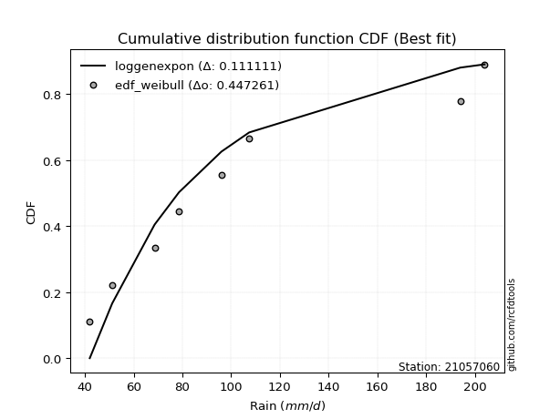</img>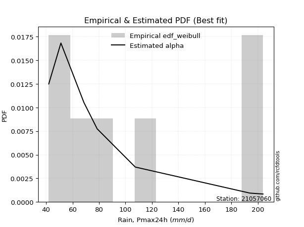</img>

</div>


### 4. EDF Beard (1943)

The Beard formula (or Beard´s plotting position formula) in hydrology is used to estimate the empirical non-exceedance probability _(P)_ of a flood event (or other extreme hydrological data point) within a given dataset.

<div align="center">


$P=(m-0.31)/(n+0.38)$


</div>


**4.1. Empirical values**

<div align="center">

|                | 0                   | 1                   | 2                  | 3                   | 4                  | 5                  | 6                  | 7                  |
|:---------------|:--------------------|:--------------------|:-------------------|:--------------------|:-------------------|:-------------------|:-------------------|:-------------------|
| date           | 2023                | 2021                | 2020               | 2022                | 2025               | 2019               | 2024               | 2012               |
| x              | 42.0                | 51.2                | 68.6               | 78.6                | 96.0               | 107.4              | 194.0              | 204.0              |
| m              | 1                   | 2                   | 3                  | 4                   | 5                  | 6                  | 7                  | 8                  |
| empirical_dist | edf_beard           | edf_beard           | edf_beard          | edf_beard           | edf_beard          | edf_beard          | edf_beard          | edf_beard          |
| empirical      | 0.08233890214797135 | 0.20167064439140808 | 0.3210023866348448 | 0.44033412887828155 | 0.5596658711217184 | 0.6789976133651551 | 0.7983293556085919 | 0.9176610978520287 |
| empirical_tr   | 1.0897269180754225  | 1.2526158445440956  | 1.4727592267135323 | 1.7867803837953091  | 2.2710027100271004 | 3.115241635687732  | 4.958579881656804  | 12.144927536231886 |

</div>


**4.2. Kolmogorov-Smirnov fit test (sorted by Δ)**


<div align="center">

|                | 0                  | 1                   | 2                   | 3                   | 4                   | 5                   | 6                   | 7                   | 8                  | 9                   | 10                  | 11                  | 12                  | 13                  | 14                 | 15                  | 16                  | 17                  | 18                  | 19                 | 20                  | 21                  | 22                  | 23                  | 24                  | 25                  | 26                  | 27                  | 28                  | 29                  | 30                 | 31                  | 32                  | 33                  | 34                  | 35                  | 36                  | 37                  | 38                  | 39                  | 40                  | 41                  | 42                  | 43                  | 44                  | 45                  | 46                 | 47                  | 48                  | 49                  | 50                  | 51                  | 52                  | 53                  | 54                  | 55                 | 56                  | 57                  | 58                 | 59                  | 60                 | 61                  | 62                  | 63                 | 64                  | 65                  | 66                  | 67                  | 68                  | 69                 | 70                  | 71                  | 72                  | 73                  | 74                 | 75                  | 76                  | 77                 | 78                 | 79                  | 80                 | 81                  | 82                  | 83                  | 84                 | 85                  | 86                  | 87                  | 88                  | 89                  | 90                 | 91                 | 92                 | 93                  | 94                  | 95                  | 96                  | 97                  | 98                 | 99                  | 100                 | 101                 | 102                | 103                | 104                 | 105                 | 106                | 107                 | 108                 | 109                | 110                 | 111                 | 112                 | 113                | 114                | 115                 | 116                 | 117                 | 118                | 119                 | 120                 | 121                 | 122                 | 123                | 124                 | 125                | 126                 | 127                 | 128                 | 129                 | 130                 | 131                | 132                | 133                | 134                | 135                 | 136                | 137                | 138                | 139                 | 140                | 141                 | 142                | 143                 | 144                 | 145                | 146                | 147                 | 148                 | 149                | 150                | 151                | 152                | 153                | 154                | 155                | 156                | 157                | 158                | 159                |
|:---------------|:-------------------|:--------------------|:--------------------|:--------------------|:--------------------|:--------------------|:--------------------|:--------------------|:-------------------|:--------------------|:--------------------|:--------------------|:--------------------|:--------------------|:-------------------|:--------------------|:--------------------|:--------------------|:--------------------|:-------------------|:--------------------|:--------------------|:--------------------|:--------------------|:--------------------|:--------------------|:--------------------|:--------------------|:--------------------|:--------------------|:-------------------|:--------------------|:--------------------|:--------------------|:--------------------|:--------------------|:--------------------|:--------------------|:--------------------|:--------------------|:--------------------|:--------------------|:--------------------|:--------------------|:--------------------|:--------------------|:-------------------|:--------------------|:--------------------|:--------------------|:--------------------|:--------------------|:--------------------|:--------------------|:--------------------|:-------------------|:--------------------|:--------------------|:-------------------|:--------------------|:-------------------|:--------------------|:--------------------|:-------------------|:--------------------|:--------------------|:--------------------|:--------------------|:--------------------|:-------------------|:--------------------|:--------------------|:--------------------|:--------------------|:-------------------|:--------------------|:--------------------|:-------------------|:-------------------|:--------------------|:-------------------|:--------------------|:--------------------|:--------------------|:-------------------|:--------------------|:--------------------|:--------------------|:--------------------|:--------------------|:-------------------|:-------------------|:-------------------|:--------------------|:--------------------|:--------------------|:--------------------|:--------------------|:-------------------|:--------------------|:--------------------|:--------------------|:-------------------|:-------------------|:--------------------|:--------------------|:-------------------|:--------------------|:--------------------|:-------------------|:--------------------|:--------------------|:--------------------|:-------------------|:-------------------|:--------------------|:--------------------|:--------------------|:-------------------|:--------------------|:--------------------|:--------------------|:--------------------|:-------------------|:--------------------|:-------------------|:--------------------|:--------------------|:--------------------|:--------------------|:--------------------|:-------------------|:-------------------|:-------------------|:-------------------|:--------------------|:-------------------|:-------------------|:-------------------|:--------------------|:-------------------|:--------------------|:-------------------|:--------------------|:--------------------|:-------------------|:-------------------|:--------------------|:--------------------|:-------------------|:-------------------|:-------------------|:-------------------|:-------------------|:-------------------|:-------------------|:-------------------|:-------------------|:-------------------|:-------------------|
| station        | 21057060           | 21057060            | 21057060            | 21057060            | 21057060            | 21057060            | 21057060            | 21057060            | 21057060           | 21057060            | 21057060            | 21057060            | 21057060            | 21057060            | 21057060           | 21057060            | 21057060            | 21057060            | 21057060            | 21057060           | 21057060            | 21057060            | 21057060            | 21057060            | 21057060            | 21057060            | 21057060            | 21057060            | 21057060            | 21057060            | 21057060           | 21057060            | 21057060            | 21057060            | 21057060            | 21057060            | 21057060            | 21057060            | 21057060            | 21057060            | 21057060            | 21057060            | 21057060            | 21057060            | 21057060            | 21057060            | 21057060           | 21057060            | 21057060            | 21057060            | 21057060            | 21057060            | 21057060            | 21057060            | 21057060            | 21057060           | 21057060            | 21057060            | 21057060           | 21057060            | 21057060           | 21057060            | 21057060            | 21057060           | 21057060            | 21057060            | 21057060            | 21057060            | 21057060            | 21057060           | 21057060            | 21057060            | 21057060            | 21057060            | 21057060           | 21057060            | 21057060            | 21057060           | 21057060           | 21057060            | 21057060           | 21057060            | 21057060            | 21057060            | 21057060           | 21057060            | 21057060            | 21057060            | 21057060            | 21057060            | 21057060           | 21057060           | 21057060           | 21057060            | 21057060            | 21057060            | 21057060            | 21057060            | 21057060           | 21057060            | 21057060            | 21057060            | 21057060           | 21057060           | 21057060            | 21057060            | 21057060           | 21057060            | 21057060            | 21057060           | 21057060            | 21057060            | 21057060            | 21057060           | 21057060           | 21057060            | 21057060            | 21057060            | 21057060           | 21057060            | 21057060            | 21057060            | 21057060            | 21057060           | 21057060            | 21057060           | 21057060            | 21057060            | 21057060            | 21057060            | 21057060            | 21057060           | 21057060           | 21057060           | 21057060           | 21057060            | 21057060           | 21057060           | 21057060           | 21057060            | 21057060           | 21057060            | 21057060           | 21057060            | 21057060            | 21057060           | 21057060           | 21057060            | 21057060            | 21057060           | 21057060           | 21057060           | 21057060           | 21057060           | 21057060           | 21057060           | 21057060           | 21057060           | 21057060           | 21057060           |
| empirical_dist | edf_beard          | edf_beard           | edf_beard           | edf_beard           | edf_beard           | edf_beard           | edf_beard           | edf_beard           | edf_beard          | edf_beard           | edf_beard           | edf_beard           | edf_beard           | edf_beard           | edf_beard          | edf_beard           | edf_beard           | edf_beard           | edf_beard           | edf_beard          | edf_beard           | edf_beard           | edf_beard           | edf_beard           | edf_beard           | edf_beard           | edf_beard           | edf_beard           | edf_beard           | edf_beard           | edf_beard          | edf_beard           | edf_beard           | edf_beard           | edf_beard           | edf_beard           | edf_beard           | edf_beard           | edf_beard           | edf_beard           | edf_beard           | edf_beard           | edf_beard           | edf_beard           | edf_beard           | edf_beard           | edf_beard          | edf_beard           | edf_beard           | edf_beard           | edf_beard           | edf_beard           | edf_beard           | edf_beard           | edf_beard           | edf_beard          | edf_beard           | edf_beard           | edf_beard          | edf_beard           | edf_beard          | edf_beard           | edf_beard           | edf_beard          | edf_beard           | edf_beard           | edf_beard           | edf_beard           | edf_beard           | edf_beard          | edf_beard           | edf_beard           | edf_beard           | edf_beard           | edf_beard          | edf_beard           | edf_beard           | edf_beard          | edf_beard          | edf_beard           | edf_beard          | edf_beard           | edf_beard           | edf_beard           | edf_beard          | edf_beard           | edf_beard           | edf_beard           | edf_beard           | edf_beard           | edf_beard          | edf_beard          | edf_beard          | edf_beard           | edf_beard           | edf_beard           | edf_beard           | edf_beard           | edf_beard          | edf_beard           | edf_beard           | edf_beard           | edf_beard          | edf_beard          | edf_beard           | edf_beard           | edf_beard          | edf_beard           | edf_beard           | edf_beard          | edf_beard           | edf_beard           | edf_beard           | edf_beard          | edf_beard          | edf_beard           | edf_beard           | edf_beard           | edf_beard          | edf_beard           | edf_beard           | edf_beard           | edf_beard           | edf_beard          | edf_beard           | edf_beard          | edf_beard           | edf_beard           | edf_beard           | edf_beard           | edf_beard           | edf_beard          | edf_beard          | edf_beard          | edf_beard          | edf_beard           | edf_beard          | edf_beard          | edf_beard          | edf_beard           | edf_beard          | edf_beard           | edf_beard          | edf_beard           | edf_beard           | edf_beard          | edf_beard          | edf_beard           | edf_beard           | edf_beard          | edf_beard          | edf_beard          | edf_beard          | edf_beard          | edf_beard          | edf_beard          | edf_beard          | edf_beard          | edf_beard          | edf_beard          |
| p_dist         | loggenexpon        | loggamma            | loggamma            | logf                | logerlang           | johnsonsu           | logskewnorm         | loggenlogistic      | logmielke          | burr                | loginvweibull       | logweibull_min      | logburr             | loghalfnorm         | nct                | logkstwobign        | invgamma            | logfatiguelife      | invgauss            | loginvgauss        | alpha               | nakagami            | lograyleigh         | logksone            | loginvgamma         | exponnorm           | logsemicircular     | logncf              | logexponpow         | lognct              | logmaxwell         | logburr12           | logalpha            | loggompertz         | loganglit           | logrice             | betaprime           | f                   | loggumbel_r         | exponpow            | logbetaprime        | logrdist            | logfoldnorm         | halfnorm            | genexpon            | logpearson3         | foldnorm           | gompertz            | halflogistic        | logmoyal            | logloggamma         | logjohnsonsu        | logexponnorm        | logt                | logcrystalball      | lognorm            | rayleigh            | loggenextreme       | moyal              | pearson3            | skewnorm           | gumbel_r            | logloglaplace       | logcosine          | loglogistic         | maxwell             | loghypsecant        | loglaplace          | loglaplace          | logdgamma          | logbeta             | logdweibull         | loghalflogistic     | kstwobign           | genlogistic        | logargus            | logwrapcauchy       | rice               | burr12             | loglomax            | dweibull           | hypsecant           | logistic            | dgamma              | truncweibull_min   | logkappa4           | t                   | truncnorm           | norm                | crystalball         | anglit             | truncexpon         | semicircular       | loggausshyper       | logtukeylambda      | ksone               | logkappa3           | loggumbel_l         | logvonmises_line   | loguniform          | logtruncpareto      | weibull_min         | logbradford        | halfgennorm        | laplace             | logtruncexpon       | logtruncnorm       | logtruncweibull_min | logtriang           | wald               | logwald             | arcsine             | logarcsine          | kappa4             | cosine             | lomax               | wrapcauchy          | gamma               | ncf                | loggenhalflogistic  | loglevy_l           | loggenpareto        | gumbel_l            | bradford           | levy_l              | tukeylambda        | uniform             | vonmises_line       | gausshyper          | argus               | kappa3              | gennorm            | loggennorm         | logweibull_max     | beta               | genextreme          | triang             | logtrapezoid       | genpareto          | erlang              | genhalflogistic    | powerlaw            | logjohnsonsb       | lognakagami         | fatiguelife         | invweibull         | johnsonsb          | logexponweib        | logpowerlaw         | gengamma           | rdist              | trapezoid          | loggengamma        | exponweib          | weibull_max        | truncpareto        | loghalfgennorm     | logvonmises        | vonmises           | mielke             |
| delta          | 0.0837314114948956 | 0.09146433726559533 | 0.09146433726559533 | 0.09151459978480336 | 0.09161265600385382 | 0.09574138305604418 | 0.09801016512920213 | 0.09818756082269642 | 0.098790050727243  | 0.09886568683216068 | 0.09917772476246212 | 0.09928388760624862 | 0.09962736696849239 | 0.10290965365328597 | 0.1035949229125297 | 0.10422468896502535 | 0.10460967828299994 | 0.10568496986355058 | 0.10626122635103685 | 0.1063808228286367 | 0.10814971062645751 | 0.10818352609957149 | 0.10884006562423765 | 0.11015709975139032 | 0.11081615025939684 | 0.11094307977627793 | 0.11101122970388355 | 0.11119908449612648 | 0.11137500911931408 | 0.11167359000748123 | 0.1118476365558172 | 0.11249673441412855 | 0.11291409950582831 | 0.11316021095606077 | 0.11338168403373361 | 0.11343100633012437 | 0.11412515054663408 | 0.11417953139914927 | 0.11428679167009559 | 0.11508239357941241 | 0.11542260732132259 | 0.11668310780161639 | 0.11698406632776548 | 0.11701926478370595 | 0.11764926336880055 | 0.11828479342221765 | 0.1185066405819083 | 0.12038655793315767 | 0.12211484968141595 | 0.12217685370051055 | 0.12233421706111425 | 0.12254820753652729 | 0.12282548030938789 | 0.12314041576543311 | 0.12314205331864003 | 0.123142053460787  | 0.12391320403433248 | 0.12477902384721751 | 0.1250984666376238 | 0.12560916191297367 | 0.125756858681754  | 0.12643673852354553 | 0.12733208933420326 | 0.1294992926687416 | 0.13035121826405494 | 0.13159083967560337 | 0.13298471395039513 | 0.13408190896349292 | 0.13408190896349292 | 0.1348854259061435 | 0.13494027684386678 | 0.13581971351293876 | 0.13875364359463466 | 0.13963966539118577 | 0.1416684925724937 | 0.14334902213492973 | 0.14680695393246757 | 0.1476329772783188 | 0.148836300522047  | 0.15023722823191488 | 0.1599234038577021 | 0.16018207314894584 | 0.16193049337919352 | 0.16218483491965363 | 0.1632174659722595 | 0.16333350959479298 | 0.16397329159969054 | 0.16397978053022244 | 0.16397978278937542 | 0.16397980322844286 | 0.1661279659510213 | 0.166220259058385  | 0.1670129948280139 | 0.16751281545558694 | 0.16761320258159385 | 0.16812812449722037 | 0.16836434596240668 | 0.16984472256127947 | 0.1698667949329643 | 0.16986842170975536 | 0.17265935366456386 | 0.17604512879244683 | 0.1789897916056573 | 0.1797687856826986 | 0.17979268074257115 | 0.18115640577600334 | 0.1891339120237413 | 0.1900738443107265  | 0.19846281487597917 | 0.2014467310527613 | 0.20167064439140808 | 0.20167064439140814 | 0.20167064439140814 | 0.2034080362198743 | 0.2051844145648285 | 0.21131400108615583 | 0.21312107974350786 | 0.21592476247447356 | 0.2186415076153716 | 0.22798973391993882 | 0.23303004602195643 | 0.23347863283001474 | 0.23374703022017262 | 0.2409069518337919 | 0.27023988340027316 | 0.2748600324090874 | 0.27529390966145134 | 0.27830827579948014 | 0.27861672134636484 | 0.28182448102418356 | 0.28822938885363547 | 0.2983293556085919 | 0.2983293556085919 | 0.3079581949918732 | 0.3096386737410051 | 0.31609561990611657 | 0.3316081930598384 | 0.344465323253066  | 0.3514450406065193 | 0.35586727739841395 | 0.396283093640719  | 0.40885398466425793 | 0.4101575004575572 | 0.41708239970048605 | 0.43067620491242536 | 0.4340923285246923 | 0.4426074402017029 | 0.46831474855513006 | 0.47572041009942123 | 0.4779292525768363 | 0.4813864166419931 | 0.5028049598062463 | 0.5520015026935083 | 0.5684242232910655 | 0.6003751238038617 | 0.610713261198679  | 0.7983293556085919 | 1.125166643776744  | 31.958107030364364 | nan                |
| deltao         | 0.4472608134160001 | 0.4472608134160001  | 0.4472608134160001  | 0.4472608134160001  | 0.4472608134160001  | 0.4472608134160001  | 0.4472608134160001  | 0.4472608134160001  | 0.4472608134160001 | 0.4472608134160001  | 0.4472608134160001  | 0.4472608134160001  | 0.4472608134160001  | 0.4472608134160001  | 0.4472608134160001 | 0.4472608134160001  | 0.4472608134160001  | 0.4472608134160001  | 0.4472608134160001  | 0.4472608134160001 | 0.4472608134160001  | 0.4472608134160001  | 0.4472608134160001  | 0.4472608134160001  | 0.4472608134160001  | 0.4472608134160001  | 0.4472608134160001  | 0.4472608134160001  | 0.4472608134160001  | 0.4472608134160001  | 0.4472608134160001 | 0.4472608134160001  | 0.4472608134160001  | 0.4472608134160001  | 0.4472608134160001  | 0.4472608134160001  | 0.4472608134160001  | 0.4472608134160001  | 0.4472608134160001  | 0.4472608134160001  | 0.4472608134160001  | 0.4472608134160001  | 0.4472608134160001  | 0.4472608134160001  | 0.4472608134160001  | 0.4472608134160001  | 0.4472608134160001 | 0.4472608134160001  | 0.4472608134160001  | 0.4472608134160001  | 0.4472608134160001  | 0.4472608134160001  | 0.4472608134160001  | 0.4472608134160001  | 0.4472608134160001  | 0.4472608134160001 | 0.4472608134160001  | 0.4472608134160001  | 0.4472608134160001 | 0.4472608134160001  | 0.4472608134160001 | 0.4472608134160001  | 0.4472608134160001  | 0.4472608134160001 | 0.4472608134160001  | 0.4472608134160001  | 0.4472608134160001  | 0.4472608134160001  | 0.4472608134160001  | 0.4472608134160001 | 0.4472608134160001  | 0.4472608134160001  | 0.4472608134160001  | 0.4472608134160001  | 0.4472608134160001 | 0.4472608134160001  | 0.4472608134160001  | 0.4472608134160001 | 0.4472608134160001 | 0.4472608134160001  | 0.4472608134160001 | 0.4472608134160001  | 0.4472608134160001  | 0.4472608134160001  | 0.4472608134160001 | 0.4472608134160001  | 0.4472608134160001  | 0.4472608134160001  | 0.4472608134160001  | 0.4472608134160001  | 0.4472608134160001 | 0.4472608134160001 | 0.4472608134160001 | 0.4472608134160001  | 0.4472608134160001  | 0.4472608134160001  | 0.4472608134160001  | 0.4472608134160001  | 0.4472608134160001 | 0.4472608134160001  | 0.4472608134160001  | 0.4472608134160001  | 0.4472608134160001 | 0.4472608134160001 | 0.4472608134160001  | 0.4472608134160001  | 0.4472608134160001 | 0.4472608134160001  | 0.4472608134160001  | 0.4472608134160001 | 0.4472608134160001  | 0.4472608134160001  | 0.4472608134160001  | 0.4472608134160001 | 0.4472608134160001 | 0.4472608134160001  | 0.4472608134160001  | 0.4472608134160001  | 0.4472608134160001 | 0.4472608134160001  | 0.4472608134160001  | 0.4472608134160001  | 0.4472608134160001  | 0.4472608134160001 | 0.4472608134160001  | 0.4472608134160001 | 0.4472608134160001  | 0.4472608134160001  | 0.4472608134160001  | 0.4472608134160001  | 0.4472608134160001  | 0.4472608134160001 | 0.4472608134160001 | 0.4472608134160001 | 0.4472608134160001 | 0.4472608134160001  | 0.4472608134160001 | 0.4472608134160001 | 0.4472608134160001 | 0.4472608134160001  | 0.4472608134160001 | 0.4472608134160001  | 0.4472608134160001 | 0.4472608134160001  | 0.4472608134160001  | 0.4472608134160001 | 0.4472608134160001 | 0.4472608134160001  | 0.4472608134160001  | 0.4472608134160001 | 0.4472608134160001 | 0.4472608134160001 | 0.4472608134160001 | 0.4472608134160001 | 0.4472608134160001 | 0.4472608134160001 | 0.4472608134160001 | 0.4472608134160001 | 0.4472608134160001 | 0.4472608134160001 |
| eval           | Δo > Δ             | Δo > Δ              | Δo > Δ              | Δo > Δ              | Δo > Δ              | Δo > Δ              | Δo > Δ              | Δo > Δ              | Δo > Δ             | Δo > Δ              | Δo > Δ              | Δo > Δ              | Δo > Δ              | Δo > Δ              | Δo > Δ             | Δo > Δ              | Δo > Δ              | Δo > Δ              | Δo > Δ              | Δo > Δ             | Δo > Δ              | Δo > Δ              | Δo > Δ              | Δo > Δ              | Δo > Δ              | Δo > Δ              | Δo > Δ              | Δo > Δ              | Δo > Δ              | Δo > Δ              | Δo > Δ             | Δo > Δ              | Δo > Δ              | Δo > Δ              | Δo > Δ              | Δo > Δ              | Δo > Δ              | Δo > Δ              | Δo > Δ              | Δo > Δ              | Δo > Δ              | Δo > Δ              | Δo > Δ              | Δo > Δ              | Δo > Δ              | Δo > Δ              | Δo > Δ             | Δo > Δ              | Δo > Δ              | Δo > Δ              | Δo > Δ              | Δo > Δ              | Δo > Δ              | Δo > Δ              | Δo > Δ              | Δo > Δ             | Δo > Δ              | Δo > Δ              | Δo > Δ             | Δo > Δ              | Δo > Δ             | Δo > Δ              | Δo > Δ              | Δo > Δ             | Δo > Δ              | Δo > Δ              | Δo > Δ              | Δo > Δ              | Δo > Δ              | Δo > Δ             | Δo > Δ              | Δo > Δ              | Δo > Δ              | Δo > Δ              | Δo > Δ             | Δo > Δ              | Δo > Δ              | Δo > Δ             | Δo > Δ             | Δo > Δ              | Δo > Δ             | Δo > Δ              | Δo > Δ              | Δo > Δ              | Δo > Δ             | Δo > Δ              | Δo > Δ              | Δo > Δ              | Δo > Δ              | Δo > Δ              | Δo > Δ             | Δo > Δ             | Δo > Δ             | Δo > Δ              | Δo > Δ              | Δo > Δ              | Δo > Δ              | Δo > Δ              | Δo > Δ             | Δo > Δ              | Δo > Δ              | Δo > Δ              | Δo > Δ             | Δo > Δ             | Δo > Δ              | Δo > Δ              | Δo > Δ             | Δo > Δ              | Δo > Δ              | Δo > Δ             | Δo > Δ              | Δo > Δ              | Δo > Δ              | Δo > Δ             | Δo > Δ             | Δo > Δ              | Δo > Δ              | Δo > Δ              | Δo > Δ             | Δo > Δ              | Δo > Δ              | Δo > Δ              | Δo > Δ              | Δo > Δ             | Δo > Δ              | Δo > Δ             | Δo > Δ              | Δo > Δ              | Δo > Δ              | Δo > Δ              | Δo > Δ              | Δo > Δ             | Δo > Δ             | Δo > Δ             | Δo > Δ             | Δo > Δ              | Δo > Δ             | Δo > Δ             | Δo > Δ             | Δo > Δ              | Δo > Δ             | Δo > Δ              | Δo > Δ             | Δo > Δ              | Δo > Δ              | Δo > Δ             | Δo > Δ             | Δo <= Δ             | Δo <= Δ             | Δo <= Δ            | Δo <= Δ            | Δo <= Δ            | Δo <= Δ            | Δo <= Δ            | Δo <= Δ            | Δo <= Δ            | Δo <= Δ            | Δo <= Δ            | Δo <= Δ            | Δo <= Δ            |
| fit            | 1                  | 1                   | 1                   | 1                   | 1                   | 1                   | 1                   | 1                   | 1                  | 1                   | 1                   | 1                   | 1                   | 1                   | 1                  | 1                   | 1                   | 1                   | 1                   | 1                  | 1                   | 1                   | 1                   | 1                   | 1                   | 1                   | 1                   | 1                   | 1                   | 1                   | 1                  | 1                   | 1                   | 1                   | 1                   | 1                   | 1                   | 1                   | 1                   | 1                   | 1                   | 1                   | 1                   | 1                   | 1                   | 1                   | 1                  | 1                   | 1                   | 1                   | 1                   | 1                   | 1                   | 1                   | 1                   | 1                  | 1                   | 1                   | 1                  | 1                   | 1                  | 1                   | 1                   | 1                  | 1                   | 1                   | 1                   | 1                   | 1                   | 1                  | 1                   | 1                   | 1                   | 1                   | 1                  | 1                   | 1                   | 1                  | 1                  | 1                   | 1                  | 1                   | 1                   | 1                   | 1                  | 1                   | 1                   | 1                   | 1                   | 1                   | 1                  | 1                  | 1                  | 1                   | 1                   | 1                   | 1                   | 1                   | 1                  | 1                   | 1                   | 1                   | 1                  | 1                  | 1                   | 1                   | 1                  | 1                   | 1                   | 1                  | 1                   | 1                   | 1                   | 1                  | 1                  | 1                   | 1                   | 1                   | 1                  | 1                   | 1                   | 1                   | 1                   | 1                  | 1                   | 1                  | 1                   | 1                   | 1                   | 1                   | 1                   | 1                  | 1                  | 1                  | 1                  | 1                   | 1                  | 1                  | 1                  | 1                   | 1                  | 1                   | 1                  | 1                   | 1                   | 1                  | 1                  | 0                   | 0                   | 0                  | 0                  | 0                  | 0                  | 0                  | 0                  | 0                  | 0                  | 0                  | 0                  | 0                  |
| n              | 8                  | 8                   | 8                   | 8                   | 8                   | 8                   | 8                   | 8                   | 8                  | 8                   | 8                   | 8                   | 8                   | 8                   | 8                  | 8                   | 8                   | 8                   | 8                   | 8                  | 8                   | 8                   | 8                   | 8                   | 8                   | 8                   | 8                   | 8                   | 8                   | 8                   | 8                  | 8                   | 8                   | 8                   | 8                   | 8                   | 8                   | 8                   | 8                   | 8                   | 8                   | 8                   | 8                   | 8                   | 8                   | 8                   | 8                  | 8                   | 8                   | 8                   | 8                   | 8                   | 8                   | 8                   | 8                   | 8                  | 8                   | 8                   | 8                  | 8                   | 8                  | 8                   | 8                   | 8                  | 8                   | 8                   | 8                   | 8                   | 8                   | 8                  | 8                   | 8                   | 8                   | 8                   | 8                  | 8                   | 8                   | 8                  | 8                  | 8                   | 8                  | 8                   | 8                   | 8                   | 8                  | 8                   | 8                   | 8                   | 8                   | 8                   | 8                  | 8                  | 8                  | 8                   | 8                   | 8                   | 8                   | 8                   | 8                  | 8                   | 8                   | 8                   | 8                  | 8                  | 8                   | 8                   | 8                  | 8                   | 8                   | 8                  | 8                   | 8                   | 8                   | 8                  | 8                  | 8                   | 8                   | 8                   | 8                  | 8                   | 8                   | 8                   | 8                   | 8                  | 8                   | 8                  | 8                   | 8                   | 8                   | 8                   | 8                   | 8                  | 8                  | 8                  | 8                  | 8                   | 8                  | 8                  | 8                  | 8                   | 8                  | 8                   | 8                  | 8                   | 8                   | 8                  | 8                  | 8                   | 8                   | 8                  | 8                  | 8                  | 8                  | 8                  | 8                  | 8                  | 8                  | 8                  | 8                  | 8                  |
| best_fit       | 1                  | 0                   | 0                   | 0                   | 0                   | 0                   | 0                   | 0                   | 0                  | 0                   | 0                   | 0                   | 0                   | 0                   | 0                  | 0                   | 0                   | 0                   | 0                   | 0                  | 0                   | 0                   | 0                   | 0                   | 0                   | 0                   | 0                   | 0                   | 0                   | 0                   | 0                  | 0                   | 0                   | 0                   | 0                   | 0                   | 0                   | 0                   | 0                   | 0                   | 0                   | 0                   | 0                   | 0                   | 0                   | 0                   | 0                  | 0                   | 0                   | 0                   | 0                   | 0                   | 0                   | 0                   | 0                   | 0                  | 0                   | 0                   | 0                  | 0                   | 0                  | 0                   | 0                   | 0                  | 0                   | 0                   | 0                   | 0                   | 0                   | 0                  | 0                   | 0                   | 0                   | 0                   | 0                  | 0                   | 0                   | 0                  | 0                  | 0                   | 0                  | 0                   | 0                   | 0                   | 0                  | 0                   | 0                   | 0                   | 0                   | 0                   | 0                  | 0                  | 0                  | 0                   | 0                   | 0                   | 0                   | 0                   | 0                  | 0                   | 0                   | 0                   | 0                  | 0                  | 0                   | 0                   | 0                  | 0                   | 0                   | 0                  | 0                   | 0                   | 0                   | 0                  | 0                  | 0                   | 0                   | 0                   | 0                  | 0                   | 0                   | 0                   | 0                   | 0                  | 0                   | 0                  | 0                   | 0                   | 0                   | 0                   | 0                   | 0                  | 0                  | 0                  | 0                  | 0                   | 0                  | 0                  | 0                  | 0                   | 0                  | 0                   | 0                  | 0                   | 0                   | 0                  | 0                  | 0                   | 0                   | 0                  | 0                  | 0                  | 0                  | 0                  | 0                  | 0                  | 0                  | 0                  | 0                  | 0                  |
| best_fit_sort  | 1                  | 2                   | 3                   | 4                   | 5                   | 6                   | 7                   | 8                   | 9                  | 10                  | 11                  | 12                  | 13                  | 14                  | 15                 | 16                  | 17                  | 18                  | 19                  | 20                 | 21                  | 22                  | 23                  | 24                  | 25                  | 26                  | 27                  | 28                  | 29                  | 30                  | 31                 | 32                  | 33                  | 34                  | 35                  | 36                  | 37                  | 38                  | 39                  | 40                  | 41                  | 42                  | 43                  | 44                  | 45                  | 46                  | 47                 | 48                  | 49                  | 50                  | 51                  | 52                  | 53                  | 54                  | 55                  | 56                 | 57                  | 58                  | 59                 | 60                  | 61                 | 62                  | 63                  | 64                 | 65                  | 66                  | 67                  | 68                  | 69                  | 70                 | 71                  | 72                  | 73                  | 74                  | 75                 | 76                  | 77                  | 78                 | 79                 | 80                  | 81                 | 82                  | 83                  | 84                  | 85                 | 86                  | 87                  | 88                  | 89                  | 90                  | 91                 | 92                 | 93                 | 94                  | 95                  | 96                  | 97                  | 98                  | 99                 | 100                 | 101                 | 102                 | 103                | 104                | 105                 | 106                 | 107                | 108                 | 109                 | 110                | 111                 | 112                 | 113                 | 114                | 115                | 116                 | 117                 | 118                 | 119                | 120                 | 121                 | 122                 | 123                 | 124                | 125                 | 126                | 127                 | 128                 | 129                 | 130                 | 131                 | 132                | 133                | 134                | 135                | 136                 | 137                | 138                | 139                | 140                 | 141                | 142                 | 143                | 144                 | 145                 | 146                | 147                | 148                 | 149                 | 150                | 151                | 152                | 153                | 154                | 155                | 156                | 157                | 158                | 159                | 160                |

</div>


**4.3. Best fit**

<div align="center">

|   id |   station | empirical_dist   | p_dist      |     delta |   deltao | eval   |   fit |   n |   best_fit |   best_fit_sort |
|-----:|----------:|:-----------------|:------------|----------:|---------:|:-------|------:|----:|-----------:|----------------:|
|    0 |  21057060 | edf_beard        | loggenexpon | 0.0837314 | 0.447261 | Δo > Δ |     1 |   8 |          1 |               1 |

</div>


<div align="center">

</img>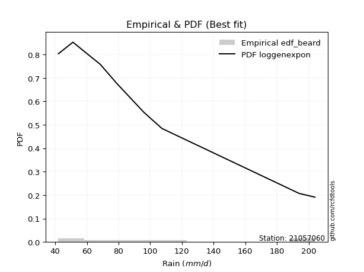</img>

</div>


### 5. EDF Chegodayev (1955)

The Chegodayev formula is an empirical plotting position formula used in hydrological frequency analysis to estimate the exceedance probability or return period of a specific event from a set of observed data. It is primarily used for plotting observed data points on probability paper to fit a theoretical distribution, particularly for analyzing extreme events like maximum flood flows or rainfall intensities. The constant _b_ value in the generalized plotting position formula is 0.3.

<div align="center">


$P=(m-b)/(n+1-2b)$


</div>


**5.1. Empirical values**

<div align="center">

|                | 0                   | 1                   | 2                   | 3                   | 4                  | 5                  | 6                  | 7                  |
|:---------------|:--------------------|:--------------------|:--------------------|:--------------------|:-------------------|:-------------------|:-------------------|:-------------------|
| date           | 2023                | 2021                | 2020                | 2022                | 2025               | 2019               | 2024               | 2012               |
| x              | 42.0                | 51.2                | 68.6                | 78.6                | 96.0               | 107.4              | 194.0              | 204.0              |
| m              | 1                   | 2                   | 3                   | 4                   | 5                  | 6                  | 7                  | 8                  |
| empirical_dist | edf_chegodayev      | edf_chegodayev      | edf_chegodayev      | edf_chegodayev      | edf_chegodayev     | edf_chegodayev     | edf_chegodayev     | edf_chegodayev     |
| empirical      | 0.08333333333333333 | 0.20238095238095236 | 0.32142857142857145 | 0.44047619047619047 | 0.5595238095238095 | 0.6785714285714286 | 0.7976190476190476 | 0.9166666666666666 |
| empirical_tr   | 1.090909090909091   | 1.253731343283582   | 1.4736842105263157  | 1.7872340425531914  | 2.27027027027027   | 3.1111111111111116 | 4.941176470588234  | 11.999999999999995 |

</div>


**5.2. Kolmogorov-Smirnov fit test (sorted by Δ)**


<div align="center">

|                | 0                  | 1                   | 2                   | 3                   | 4                   | 5                   | 6                   | 7                   | 8                   | 9                   | 10                  | 11                  | 12                 | 13                  | 14                 | 15                  | 16                  | 17                  | 18                  | 19                 | 20                  | 21                  | 22                  | 23                  | 24                  | 25                  | 26                  | 27                  | 28                  | 29                  | 30                 | 31                  | 32                  | 33                  | 34                  | 35                  | 36                  | 37                  | 38                  | 39                  | 40                  | 41                  | 42                  | 43                  | 44                  | 45                  | 46                 | 47                  | 48                  | 49                  | 50                  | 51                  | 52                  | 53                  | 54                  | 55                 | 56                  | 57                 | 58                 | 59                  | 60                  | 61                  | 62                  | 63                 | 64                  | 65                 | 66                  | 67                  | 68                  | 69                 | 70                  | 71                  | 72                  | 73                  | 74                 | 75                  | 76                 | 77                  | 78                  | 79                  | 80                  | 81                 | 82                  | 83                  | 84                  | 85                  | 86                  | 87                  | 88                 | 89                  | 90                  | 91                  | 92                 | 93                 | 94                  | 95                  | 96                  | 97                  | 98                 | 99                  | 100                 | 101                | 102                 | 103                | 104                 | 105                 | 106                 | 107                | 108                | 109                | 110                 | 111                 | 112                 | 113                 | 114                 | 115                 | 116                | 117                 | 118                 | 119                 | 120                 | 121                 | 122                 | 123                 | 124                | 125                 | 126                 | 127                | 128                 | 129                | 130                | 131                 | 132                 | 133                 | 134                 | 135                 | 136                 | 137                 | 138                 | 139                | 140                 | 141                | 142                | 143                | 144                | 145                | 146                 | 147                | 148                | 149                | 150                 | 151                | 152                | 153                | 154                | 155                | 156                | 157                | 158                | 159                |
|:---------------|:-------------------|:--------------------|:--------------------|:--------------------|:--------------------|:--------------------|:--------------------|:--------------------|:--------------------|:--------------------|:--------------------|:--------------------|:-------------------|:--------------------|:-------------------|:--------------------|:--------------------|:--------------------|:--------------------|:-------------------|:--------------------|:--------------------|:--------------------|:--------------------|:--------------------|:--------------------|:--------------------|:--------------------|:--------------------|:--------------------|:-------------------|:--------------------|:--------------------|:--------------------|:--------------------|:--------------------|:--------------------|:--------------------|:--------------------|:--------------------|:--------------------|:--------------------|:--------------------|:--------------------|:--------------------|:--------------------|:-------------------|:--------------------|:--------------------|:--------------------|:--------------------|:--------------------|:--------------------|:--------------------|:--------------------|:-------------------|:--------------------|:-------------------|:-------------------|:--------------------|:--------------------|:--------------------|:--------------------|:-------------------|:--------------------|:-------------------|:--------------------|:--------------------|:--------------------|:-------------------|:--------------------|:--------------------|:--------------------|:--------------------|:-------------------|:--------------------|:-------------------|:--------------------|:--------------------|:--------------------|:--------------------|:-------------------|:--------------------|:--------------------|:--------------------|:--------------------|:--------------------|:--------------------|:-------------------|:--------------------|:--------------------|:--------------------|:-------------------|:-------------------|:--------------------|:--------------------|:--------------------|:--------------------|:-------------------|:--------------------|:--------------------|:-------------------|:--------------------|:-------------------|:--------------------|:--------------------|:--------------------|:-------------------|:-------------------|:-------------------|:--------------------|:--------------------|:--------------------|:--------------------|:--------------------|:--------------------|:-------------------|:--------------------|:--------------------|:--------------------|:--------------------|:--------------------|:--------------------|:--------------------|:-------------------|:--------------------|:--------------------|:-------------------|:--------------------|:-------------------|:-------------------|:--------------------|:--------------------|:--------------------|:--------------------|:--------------------|:--------------------|:--------------------|:--------------------|:-------------------|:--------------------|:-------------------|:-------------------|:-------------------|:-------------------|:-------------------|:--------------------|:-------------------|:-------------------|:-------------------|:--------------------|:-------------------|:-------------------|:-------------------|:-------------------|:-------------------|:-------------------|:-------------------|:-------------------|:-------------------|
| station        | 21057060           | 21057060            | 21057060            | 21057060            | 21057060            | 21057060            | 21057060            | 21057060            | 21057060            | 21057060            | 21057060            | 21057060            | 21057060           | 21057060            | 21057060           | 21057060            | 21057060            | 21057060            | 21057060            | 21057060           | 21057060            | 21057060            | 21057060            | 21057060            | 21057060            | 21057060            | 21057060            | 21057060            | 21057060            | 21057060            | 21057060           | 21057060            | 21057060            | 21057060            | 21057060            | 21057060            | 21057060            | 21057060            | 21057060            | 21057060            | 21057060            | 21057060            | 21057060            | 21057060            | 21057060            | 21057060            | 21057060           | 21057060            | 21057060            | 21057060            | 21057060            | 21057060            | 21057060            | 21057060            | 21057060            | 21057060           | 21057060            | 21057060           | 21057060           | 21057060            | 21057060            | 21057060            | 21057060            | 21057060           | 21057060            | 21057060           | 21057060            | 21057060            | 21057060            | 21057060           | 21057060            | 21057060            | 21057060            | 21057060            | 21057060           | 21057060            | 21057060           | 21057060            | 21057060            | 21057060            | 21057060            | 21057060           | 21057060            | 21057060            | 21057060            | 21057060            | 21057060            | 21057060            | 21057060           | 21057060            | 21057060            | 21057060            | 21057060           | 21057060           | 21057060            | 21057060            | 21057060            | 21057060            | 21057060           | 21057060            | 21057060            | 21057060           | 21057060            | 21057060           | 21057060            | 21057060            | 21057060            | 21057060           | 21057060           | 21057060           | 21057060            | 21057060            | 21057060            | 21057060            | 21057060            | 21057060            | 21057060           | 21057060            | 21057060            | 21057060            | 21057060            | 21057060            | 21057060            | 21057060            | 21057060           | 21057060            | 21057060            | 21057060           | 21057060            | 21057060           | 21057060           | 21057060            | 21057060            | 21057060            | 21057060            | 21057060            | 21057060            | 21057060            | 21057060            | 21057060           | 21057060            | 21057060           | 21057060           | 21057060           | 21057060           | 21057060           | 21057060            | 21057060           | 21057060           | 21057060           | 21057060            | 21057060           | 21057060           | 21057060           | 21057060           | 21057060           | 21057060           | 21057060           | 21057060           | 21057060           |
| empirical_dist | edf_chegodayev     | edf_chegodayev      | edf_chegodayev      | edf_chegodayev      | edf_chegodayev      | edf_chegodayev      | edf_chegodayev      | edf_chegodayev      | edf_chegodayev      | edf_chegodayev      | edf_chegodayev      | edf_chegodayev      | edf_chegodayev     | edf_chegodayev      | edf_chegodayev     | edf_chegodayev      | edf_chegodayev      | edf_chegodayev      | edf_chegodayev      | edf_chegodayev     | edf_chegodayev      | edf_chegodayev      | edf_chegodayev      | edf_chegodayev      | edf_chegodayev      | edf_chegodayev      | edf_chegodayev      | edf_chegodayev      | edf_chegodayev      | edf_chegodayev      | edf_chegodayev     | edf_chegodayev      | edf_chegodayev      | edf_chegodayev      | edf_chegodayev      | edf_chegodayev      | edf_chegodayev      | edf_chegodayev      | edf_chegodayev      | edf_chegodayev      | edf_chegodayev      | edf_chegodayev      | edf_chegodayev      | edf_chegodayev      | edf_chegodayev      | edf_chegodayev      | edf_chegodayev     | edf_chegodayev      | edf_chegodayev      | edf_chegodayev      | edf_chegodayev      | edf_chegodayev      | edf_chegodayev      | edf_chegodayev      | edf_chegodayev      | edf_chegodayev     | edf_chegodayev      | edf_chegodayev     | edf_chegodayev     | edf_chegodayev      | edf_chegodayev      | edf_chegodayev      | edf_chegodayev      | edf_chegodayev     | edf_chegodayev      | edf_chegodayev     | edf_chegodayev      | edf_chegodayev      | edf_chegodayev      | edf_chegodayev     | edf_chegodayev      | edf_chegodayev      | edf_chegodayev      | edf_chegodayev      | edf_chegodayev     | edf_chegodayev      | edf_chegodayev     | edf_chegodayev      | edf_chegodayev      | edf_chegodayev      | edf_chegodayev      | edf_chegodayev     | edf_chegodayev      | edf_chegodayev      | edf_chegodayev      | edf_chegodayev      | edf_chegodayev      | edf_chegodayev      | edf_chegodayev     | edf_chegodayev      | edf_chegodayev      | edf_chegodayev      | edf_chegodayev     | edf_chegodayev     | edf_chegodayev      | edf_chegodayev      | edf_chegodayev      | edf_chegodayev      | edf_chegodayev     | edf_chegodayev      | edf_chegodayev      | edf_chegodayev     | edf_chegodayev      | edf_chegodayev     | edf_chegodayev      | edf_chegodayev      | edf_chegodayev      | edf_chegodayev     | edf_chegodayev     | edf_chegodayev     | edf_chegodayev      | edf_chegodayev      | edf_chegodayev      | edf_chegodayev      | edf_chegodayev      | edf_chegodayev      | edf_chegodayev     | edf_chegodayev      | edf_chegodayev      | edf_chegodayev      | edf_chegodayev      | edf_chegodayev      | edf_chegodayev      | edf_chegodayev      | edf_chegodayev     | edf_chegodayev      | edf_chegodayev      | edf_chegodayev     | edf_chegodayev      | edf_chegodayev     | edf_chegodayev     | edf_chegodayev      | edf_chegodayev      | edf_chegodayev      | edf_chegodayev      | edf_chegodayev      | edf_chegodayev      | edf_chegodayev      | edf_chegodayev      | edf_chegodayev     | edf_chegodayev      | edf_chegodayev     | edf_chegodayev     | edf_chegodayev     | edf_chegodayev     | edf_chegodayev     | edf_chegodayev      | edf_chegodayev     | edf_chegodayev     | edf_chegodayev     | edf_chegodayev      | edf_chegodayev     | edf_chegodayev     | edf_chegodayev     | edf_chegodayev     | edf_chegodayev     | edf_chegodayev     | edf_chegodayev     | edf_chegodayev     | edf_chegodayev     |
| p_dist         | loggenexpon        | loggamma            | loggamma            | logf                | logerlang           | johnsonsu           | logskewnorm         | loggenlogistic      | logmielke           | burr                | loginvweibull       | logweibull_min      | logburr            | loghalfnorm         | nct                | logkstwobign        | invgamma            | logfatiguelife      | invgauss            | loginvgauss        | alpha               | nakagami            | lograyleigh         | logksone            | loginvgamma         | exponnorm           | logsemicircular     | logncf              | logexponpow         | lognct              | logmaxwell         | logburr12           | logalpha            | loggompertz         | loganglit           | logrice             | exponpow            | betaprime           | f                   | loggumbel_r         | logbetaprime        | logrdist            | logfoldnorm         | halfnorm            | genexpon            | logpearson3         | foldnorm           | gompertz            | halflogistic        | logmoyal            | logloggamma         | logjohnsonsu        | logexponnorm        | logt                | logcrystalball      | lognorm            | rayleigh            | loggenextreme      | moyal              | pearson3            | skewnorm            | gumbel_r            | logloglaplace       | logcosine          | loglogistic         | maxwell            | loghypsecant        | loglaplace          | loglaplace          | logdgamma          | logbeta             | logdweibull         | loghalflogistic     | kstwobign           | genlogistic        | logargus            | logwrapcauchy      | rice                | burr12              | loglomax            | hypsecant           | dweibull           | logistic            | dgamma              | t                   | truncnorm           | norm                | crystalball         | truncweibull_min   | logkappa4           | anglit              | semicircular        | truncexpon         | ksone              | loggausshyper       | logtukeylambda      | logkappa3           | loggumbel_l         | logvonmises_line   | loguniform          | logtruncpareto      | weibull_min        | halfgennorm         | logbradford        | laplace             | logtruncexpon       | logtruncweibull_min | logtruncnorm       | logtriang          | wald               | logwald             | arcsine             | logarcsine          | kappa4              | cosine              | lomax               | wrapcauchy         | gamma               | ncf                 | loggenhalflogistic  | loglevy_l           | loggenpareto        | gumbel_l            | bradford            | levy_l             | tukeylambda         | uniform             | vonmises_line      | gausshyper          | argus              | kappa3             | gennorm             | loggennorm          | logweibull_max      | beta                | genextreme          | triang              | logtrapezoid        | genpareto           | erlang             | genhalflogistic     | powerlaw           | logjohnsonsb       | lognakagami        | fatiguelife        | invweibull         | johnsonsb           | logexponweib       | logpowerlaw        | gengamma           | rdist               | trapezoid          | loggengamma        | exponweib          | weibull_max        | truncpareto        | loghalfgennorm     | logvonmises        | vonmises           | mielke             |
| delta          | 0.0833333331310638 | 0.09217464525513963 | 0.09217464525513963 | 0.09222490777434766 | 0.09232296399339812 | 0.09645169104558848 | 0.09872047311874643 | 0.09889786881224072 | 0.09950035871678731 | 0.09957599482170498 | 0.09988803275200642 | 0.09999419559579292 | 0.1003376749580367 | 0.10361996164283027 | 0.104305230902074  | 0.10493499695456965 | 0.10531998627254424 | 0.10639527785309488 | 0.10697153434058115 | 0.107091130818181  | 0.10886001861600181 | 0.10889383408911579 | 0.10955037361378195 | 0.11086740774093462 | 0.11152645824894114 | 0.11165338776582223 | 0.11172153769342785 | 0.11190939248567078 | 0.11208531710885838 | 0.11238389799702553 | 0.1125579445453615 | 0.11320704240367285 | 0.11362440749537261 | 0.11387051894560507 | 0.11409199202327791 | 0.11414131431966867 | 0.11465620878568594 | 0.11483545853617838 | 0.11488983938869357 | 0.11499709965963989 | 0.11613291531086689 | 0.11625692300788992 | 0.11769437431730978 | 0.11772957277325025 | 0.11835957135834485 | 0.11899510141176195 | 0.1192169485714526 | 0.12109686592270197 | 0.12282515767096025 | 0.12288716169005483 | 0.12304452505065855 | 0.12325851552607159 | 0.12353578829893219 | 0.12385072375497741 | 0.12385236130818433 | 0.1238523614503313 | 0.12462351202387678 | 0.1254893318367618 | 0.1258087746271681 | 0.12631946990251797 | 0.12646716667129831 | 0.12714704651308983 | 0.12804239732374756 | 0.1302096006582859 | 0.13106152625359924 | 0.1311646548818769 | 0.13369502193993943 | 0.13479221695303722 | 0.13479221695303722 | 0.1355957338956878 | 0.13565058483341108 | 0.13653002150248306 | 0.13946395158417896 | 0.14034997338073008 | 0.142378800562038  | 0.14405933012447403 | 0.1463807691387411 | 0.14720679248459234 | 0.14841011572832036 | 0.14981104343818824 | 0.15975588835521937 | 0.1606337118472464 | 0.16150430858546705 | 0.16289514290919793 | 0.16354710680596407 | 0.16355359573649597 | 0.16355359799564895 | 0.16355361843471639 | 0.1639277739618038 | 0.16404381758433728 | 0.16570178115729484 | 0.16658681003428744 | 0.1669305670479293 | 0.1677019397034939 | 0.16822312344513124 | 0.16832351057113815 | 0.16907465395195098 | 0.17055503055082377 | 0.1705771029225086 | 0.17057872969929966 | 0.17336966165410816 | 0.1756189439987202 | 0.17934260088897197 | 0.1797000995952016 | 0.17993474234048007 | 0.18186671376554764 | 0.18964765951699986 | 0.1898442200132856 | 0.1980366300822527 | 0.2021570390423056 | 0.20238095238095236 | 0.20238095238095244 | 0.20238095238095244 | 0.20298185142614783 | 0.20475822977110203 | 0.21088781629242936 | 0.2126948949497814 | 0.21549857768074693 | 0.21764707643000963 | 0.22756354912621235 | 0.23260386122822996 | 0.23305244803628827 | 0.23332084542644616 | 0.24048076704006544 | 0.2692454522149112 | 0.27443384761536094 | 0.27486772486772487 | 0.2778820910057537 | 0.27819053655263837 | 0.2813982962304571 | 0.287803204059909  | 0.29761904761904767 | 0.29761904761904767 | 0.30753201019814674 | 0.30864424255564316 | 0.31510118872075454 | 0.33118200826611194 | 0.34403913845933953 | 0.35101885581279285 | 0.3554410926046873 | 0.39585690884699254 | 0.4084277998705313 | 0.409447192468013  | 0.4163720917109418 | 0.4299658969228811 | 0.4330978973393303 | 0.44189713221215865 | 0.4676044405655858 | 0.4752942253056946 | 0.4772189445872921 | 0.48039198545663114 | 0.5023787750125199 | 0.5515753178997818 | 0.5677139153015212 | 0.5999489390101351 | 0.6100029532091348 | 0.7976190476190476 | 1.1258769517662883 | 31.959101461549725 | nan                |
| deltao         | 0.4472608134160001 | 0.4472608134160001  | 0.4472608134160001  | 0.4472608134160001  | 0.4472608134160001  | 0.4472608134160001  | 0.4472608134160001  | 0.4472608134160001  | 0.4472608134160001  | 0.4472608134160001  | 0.4472608134160001  | 0.4472608134160001  | 0.4472608134160001 | 0.4472608134160001  | 0.4472608134160001 | 0.4472608134160001  | 0.4472608134160001  | 0.4472608134160001  | 0.4472608134160001  | 0.4472608134160001 | 0.4472608134160001  | 0.4472608134160001  | 0.4472608134160001  | 0.4472608134160001  | 0.4472608134160001  | 0.4472608134160001  | 0.4472608134160001  | 0.4472608134160001  | 0.4472608134160001  | 0.4472608134160001  | 0.4472608134160001 | 0.4472608134160001  | 0.4472608134160001  | 0.4472608134160001  | 0.4472608134160001  | 0.4472608134160001  | 0.4472608134160001  | 0.4472608134160001  | 0.4472608134160001  | 0.4472608134160001  | 0.4472608134160001  | 0.4472608134160001  | 0.4472608134160001  | 0.4472608134160001  | 0.4472608134160001  | 0.4472608134160001  | 0.4472608134160001 | 0.4472608134160001  | 0.4472608134160001  | 0.4472608134160001  | 0.4472608134160001  | 0.4472608134160001  | 0.4472608134160001  | 0.4472608134160001  | 0.4472608134160001  | 0.4472608134160001 | 0.4472608134160001  | 0.4472608134160001 | 0.4472608134160001 | 0.4472608134160001  | 0.4472608134160001  | 0.4472608134160001  | 0.4472608134160001  | 0.4472608134160001 | 0.4472608134160001  | 0.4472608134160001 | 0.4472608134160001  | 0.4472608134160001  | 0.4472608134160001  | 0.4472608134160001 | 0.4472608134160001  | 0.4472608134160001  | 0.4472608134160001  | 0.4472608134160001  | 0.4472608134160001 | 0.4472608134160001  | 0.4472608134160001 | 0.4472608134160001  | 0.4472608134160001  | 0.4472608134160001  | 0.4472608134160001  | 0.4472608134160001 | 0.4472608134160001  | 0.4472608134160001  | 0.4472608134160001  | 0.4472608134160001  | 0.4472608134160001  | 0.4472608134160001  | 0.4472608134160001 | 0.4472608134160001  | 0.4472608134160001  | 0.4472608134160001  | 0.4472608134160001 | 0.4472608134160001 | 0.4472608134160001  | 0.4472608134160001  | 0.4472608134160001  | 0.4472608134160001  | 0.4472608134160001 | 0.4472608134160001  | 0.4472608134160001  | 0.4472608134160001 | 0.4472608134160001  | 0.4472608134160001 | 0.4472608134160001  | 0.4472608134160001  | 0.4472608134160001  | 0.4472608134160001 | 0.4472608134160001 | 0.4472608134160001 | 0.4472608134160001  | 0.4472608134160001  | 0.4472608134160001  | 0.4472608134160001  | 0.4472608134160001  | 0.4472608134160001  | 0.4472608134160001 | 0.4472608134160001  | 0.4472608134160001  | 0.4472608134160001  | 0.4472608134160001  | 0.4472608134160001  | 0.4472608134160001  | 0.4472608134160001  | 0.4472608134160001 | 0.4472608134160001  | 0.4472608134160001  | 0.4472608134160001 | 0.4472608134160001  | 0.4472608134160001 | 0.4472608134160001 | 0.4472608134160001  | 0.4472608134160001  | 0.4472608134160001  | 0.4472608134160001  | 0.4472608134160001  | 0.4472608134160001  | 0.4472608134160001  | 0.4472608134160001  | 0.4472608134160001 | 0.4472608134160001  | 0.4472608134160001 | 0.4472608134160001 | 0.4472608134160001 | 0.4472608134160001 | 0.4472608134160001 | 0.4472608134160001  | 0.4472608134160001 | 0.4472608134160001 | 0.4472608134160001 | 0.4472608134160001  | 0.4472608134160001 | 0.4472608134160001 | 0.4472608134160001 | 0.4472608134160001 | 0.4472608134160001 | 0.4472608134160001 | 0.4472608134160001 | 0.4472608134160001 | 0.4472608134160001 |
| eval           | Δo > Δ             | Δo > Δ              | Δo > Δ              | Δo > Δ              | Δo > Δ              | Δo > Δ              | Δo > Δ              | Δo > Δ              | Δo > Δ              | Δo > Δ              | Δo > Δ              | Δo > Δ              | Δo > Δ             | Δo > Δ              | Δo > Δ             | Δo > Δ              | Δo > Δ              | Δo > Δ              | Δo > Δ              | Δo > Δ             | Δo > Δ              | Δo > Δ              | Δo > Δ              | Δo > Δ              | Δo > Δ              | Δo > Δ              | Δo > Δ              | Δo > Δ              | Δo > Δ              | Δo > Δ              | Δo > Δ             | Δo > Δ              | Δo > Δ              | Δo > Δ              | Δo > Δ              | Δo > Δ              | Δo > Δ              | Δo > Δ              | Δo > Δ              | Δo > Δ              | Δo > Δ              | Δo > Δ              | Δo > Δ              | Δo > Δ              | Δo > Δ              | Δo > Δ              | Δo > Δ             | Δo > Δ              | Δo > Δ              | Δo > Δ              | Δo > Δ              | Δo > Δ              | Δo > Δ              | Δo > Δ              | Δo > Δ              | Δo > Δ             | Δo > Δ              | Δo > Δ             | Δo > Δ             | Δo > Δ              | Δo > Δ              | Δo > Δ              | Δo > Δ              | Δo > Δ             | Δo > Δ              | Δo > Δ             | Δo > Δ              | Δo > Δ              | Δo > Δ              | Δo > Δ             | Δo > Δ              | Δo > Δ              | Δo > Δ              | Δo > Δ              | Δo > Δ             | Δo > Δ              | Δo > Δ             | Δo > Δ              | Δo > Δ              | Δo > Δ              | Δo > Δ              | Δo > Δ             | Δo > Δ              | Δo > Δ              | Δo > Δ              | Δo > Δ              | Δo > Δ              | Δo > Δ              | Δo > Δ             | Δo > Δ              | Δo > Δ              | Δo > Δ              | Δo > Δ             | Δo > Δ             | Δo > Δ              | Δo > Δ              | Δo > Δ              | Δo > Δ              | Δo > Δ             | Δo > Δ              | Δo > Δ              | Δo > Δ             | Δo > Δ              | Δo > Δ             | Δo > Δ              | Δo > Δ              | Δo > Δ              | Δo > Δ             | Δo > Δ             | Δo > Δ             | Δo > Δ              | Δo > Δ              | Δo > Δ              | Δo > Δ              | Δo > Δ              | Δo > Δ              | Δo > Δ             | Δo > Δ              | Δo > Δ              | Δo > Δ              | Δo > Δ              | Δo > Δ              | Δo > Δ              | Δo > Δ              | Δo > Δ             | Δo > Δ              | Δo > Δ              | Δo > Δ             | Δo > Δ              | Δo > Δ             | Δo > Δ             | Δo > Δ              | Δo > Δ              | Δo > Δ              | Δo > Δ              | Δo > Δ              | Δo > Δ              | Δo > Δ              | Δo > Δ              | Δo > Δ             | Δo > Δ              | Δo > Δ             | Δo > Δ             | Δo > Δ             | Δo > Δ             | Δo > Δ             | Δo > Δ              | Δo <= Δ            | Δo <= Δ            | Δo <= Δ            | Δo <= Δ             | Δo <= Δ            | Δo <= Δ            | Δo <= Δ            | Δo <= Δ            | Δo <= Δ            | Δo <= Δ            | Δo <= Δ            | Δo <= Δ            | Δo <= Δ            |
| fit            | 1                  | 1                   | 1                   | 1                   | 1                   | 1                   | 1                   | 1                   | 1                   | 1                   | 1                   | 1                   | 1                  | 1                   | 1                  | 1                   | 1                   | 1                   | 1                   | 1                  | 1                   | 1                   | 1                   | 1                   | 1                   | 1                   | 1                   | 1                   | 1                   | 1                   | 1                  | 1                   | 1                   | 1                   | 1                   | 1                   | 1                   | 1                   | 1                   | 1                   | 1                   | 1                   | 1                   | 1                   | 1                   | 1                   | 1                  | 1                   | 1                   | 1                   | 1                   | 1                   | 1                   | 1                   | 1                   | 1                  | 1                   | 1                  | 1                  | 1                   | 1                   | 1                   | 1                   | 1                  | 1                   | 1                  | 1                   | 1                   | 1                   | 1                  | 1                   | 1                   | 1                   | 1                   | 1                  | 1                   | 1                  | 1                   | 1                   | 1                   | 1                   | 1                  | 1                   | 1                   | 1                   | 1                   | 1                   | 1                   | 1                  | 1                   | 1                   | 1                   | 1                  | 1                  | 1                   | 1                   | 1                   | 1                   | 1                  | 1                   | 1                   | 1                  | 1                   | 1                  | 1                   | 1                   | 1                   | 1                  | 1                  | 1                  | 1                   | 1                   | 1                   | 1                   | 1                   | 1                   | 1                  | 1                   | 1                   | 1                   | 1                   | 1                   | 1                   | 1                   | 1                  | 1                   | 1                   | 1                  | 1                   | 1                  | 1                  | 1                   | 1                   | 1                   | 1                   | 1                   | 1                   | 1                   | 1                   | 1                  | 1                   | 1                  | 1                  | 1                  | 1                  | 1                  | 1                   | 0                  | 0                  | 0                  | 0                   | 0                  | 0                  | 0                  | 0                  | 0                  | 0                  | 0                  | 0                  | 0                  |
| n              | 8                  | 8                   | 8                   | 8                   | 8                   | 8                   | 8                   | 8                   | 8                   | 8                   | 8                   | 8                   | 8                  | 8                   | 8                  | 8                   | 8                   | 8                   | 8                   | 8                  | 8                   | 8                   | 8                   | 8                   | 8                   | 8                   | 8                   | 8                   | 8                   | 8                   | 8                  | 8                   | 8                   | 8                   | 8                   | 8                   | 8                   | 8                   | 8                   | 8                   | 8                   | 8                   | 8                   | 8                   | 8                   | 8                   | 8                  | 8                   | 8                   | 8                   | 8                   | 8                   | 8                   | 8                   | 8                   | 8                  | 8                   | 8                  | 8                  | 8                   | 8                   | 8                   | 8                   | 8                  | 8                   | 8                  | 8                   | 8                   | 8                   | 8                  | 8                   | 8                   | 8                   | 8                   | 8                  | 8                   | 8                  | 8                   | 8                   | 8                   | 8                   | 8                  | 8                   | 8                   | 8                   | 8                   | 8                   | 8                   | 8                  | 8                   | 8                   | 8                   | 8                  | 8                  | 8                   | 8                   | 8                   | 8                   | 8                  | 8                   | 8                   | 8                  | 8                   | 8                  | 8                   | 8                   | 8                   | 8                  | 8                  | 8                  | 8                   | 8                   | 8                   | 8                   | 8                   | 8                   | 8                  | 8                   | 8                   | 8                   | 8                   | 8                   | 8                   | 8                   | 8                  | 8                   | 8                   | 8                  | 8                   | 8                  | 8                  | 8                   | 8                   | 8                   | 8                   | 8                   | 8                   | 8                   | 8                   | 8                  | 8                   | 8                  | 8                  | 8                  | 8                  | 8                  | 8                   | 8                  | 8                  | 8                  | 8                   | 8                  | 8                  | 8                  | 8                  | 8                  | 8                  | 8                  | 8                  | 8                  |
| best_fit       | 1                  | 0                   | 0                   | 0                   | 0                   | 0                   | 0                   | 0                   | 0                   | 0                   | 0                   | 0                   | 0                  | 0                   | 0                  | 0                   | 0                   | 0                   | 0                   | 0                  | 0                   | 0                   | 0                   | 0                   | 0                   | 0                   | 0                   | 0                   | 0                   | 0                   | 0                  | 0                   | 0                   | 0                   | 0                   | 0                   | 0                   | 0                   | 0                   | 0                   | 0                   | 0                   | 0                   | 0                   | 0                   | 0                   | 0                  | 0                   | 0                   | 0                   | 0                   | 0                   | 0                   | 0                   | 0                   | 0                  | 0                   | 0                  | 0                  | 0                   | 0                   | 0                   | 0                   | 0                  | 0                   | 0                  | 0                   | 0                   | 0                   | 0                  | 0                   | 0                   | 0                   | 0                   | 0                  | 0                   | 0                  | 0                   | 0                   | 0                   | 0                   | 0                  | 0                   | 0                   | 0                   | 0                   | 0                   | 0                   | 0                  | 0                   | 0                   | 0                   | 0                  | 0                  | 0                   | 0                   | 0                   | 0                   | 0                  | 0                   | 0                   | 0                  | 0                   | 0                  | 0                   | 0                   | 0                   | 0                  | 0                  | 0                  | 0                   | 0                   | 0                   | 0                   | 0                   | 0                   | 0                  | 0                   | 0                   | 0                   | 0                   | 0                   | 0                   | 0                   | 0                  | 0                   | 0                   | 0                  | 0                   | 0                  | 0                  | 0                   | 0                   | 0                   | 0                   | 0                   | 0                   | 0                   | 0                   | 0                  | 0                   | 0                  | 0                  | 0                  | 0                  | 0                  | 0                   | 0                  | 0                  | 0                  | 0                   | 0                  | 0                  | 0                  | 0                  | 0                  | 0                  | 0                  | 0                  | 0                  |
| best_fit_sort  | 1                  | 2                   | 3                   | 4                   | 5                   | 6                   | 7                   | 8                   | 9                   | 10                  | 11                  | 12                  | 13                 | 14                  | 15                 | 16                  | 17                  | 18                  | 19                  | 20                 | 21                  | 22                  | 23                  | 24                  | 25                  | 26                  | 27                  | 28                  | 29                  | 30                  | 31                 | 32                  | 33                  | 34                  | 35                  | 36                  | 37                  | 38                  | 39                  | 40                  | 41                  | 42                  | 43                  | 44                  | 45                  | 46                  | 47                 | 48                  | 49                  | 50                  | 51                  | 52                  | 53                  | 54                  | 55                  | 56                 | 57                  | 58                 | 59                 | 60                  | 61                  | 62                  | 63                  | 64                 | 65                  | 66                 | 67                  | 68                  | 69                  | 70                 | 71                  | 72                  | 73                  | 74                  | 75                 | 76                  | 77                 | 78                  | 79                  | 80                  | 81                  | 82                 | 83                  | 84                  | 85                  | 86                  | 87                  | 88                  | 89                 | 90                  | 91                  | 92                  | 93                 | 94                 | 95                  | 96                  | 97                  | 98                  | 99                 | 100                 | 101                 | 102                | 103                 | 104                | 105                 | 106                 | 107                 | 108                | 109                | 110                | 111                 | 112                 | 113                 | 114                 | 115                 | 116                 | 117                | 118                 | 119                 | 120                 | 121                 | 122                 | 123                 | 124                 | 125                | 126                 | 127                 | 128                | 129                 | 130                | 131                | 132                 | 133                 | 134                 | 135                 | 136                 | 137                 | 138                 | 139                 | 140                | 141                 | 142                | 143                | 144                | 145                | 146                | 147                 | 148                | 149                | 150                | 151                 | 152                | 153                | 154                | 155                | 156                | 157                | 158                | 159                | 160                |

</div>


**5.3. Best fit**

<div align="center">

|   id |   station | empirical_dist   | p_dist      |     delta |   deltao | eval   |   fit |   n |   best_fit |   best_fit_sort |
|-----:|----------:|:-----------------|:------------|----------:|---------:|:-------|------:|----:|-----------:|----------------:|
|    0 |  21057060 | edf_chegodayev   | loggenexpon | 0.0833333 | 0.447261 | Δo > Δ |     1 |   8 |          1 |               1 |

</div>


<div align="center">

</img></img>

</div>


### 6. EDF Blom (1958)

The Blom formula is a specific "plotting position" formula used in hydrology and statistical analysis to estimate the empirical cumulative probability (or non-exceedance probability) of a data series. It is particularly recommended for data that are approximately normally distributed. The constant _a_ is set to 0.375 (or 3/8).

<div align="center">


$P=(m-a)/(n+1-2a)$


</div>


**6.1. Empirical values**

<div align="center">

|                | 0                   | 1                   | 2                  | 3                  | 4                  | 5                  | 6                 | 7                  |
|:---------------|:--------------------|:--------------------|:-------------------|:-------------------|:-------------------|:-------------------|:------------------|:-------------------|
| date           | 2023                | 2021                | 2020               | 2022               | 2025               | 2019               | 2024              | 2012               |
| x              | 42.0                | 51.2                | 68.6               | 78.6               | 96.0               | 107.4              | 194.0             | 204.0              |
| m              | 1                   | 2                   | 3                  | 4                  | 5                  | 6                  | 7                 | 8                  |
| empirical_dist | edf_blom            | edf_blom            | edf_blom           | edf_blom           | edf_blom           | edf_blom           | edf_blom          | edf_blom           |
| empirical      | 0.07575757575757576 | 0.19696969696969696 | 0.3181818181818182 | 0.4393939393939394 | 0.5606060606060606 | 0.6818181818181818 | 0.803030303030303 | 0.9242424242424242 |
| empirical_tr   | 1.0819672131147542  | 1.2452830188679247  | 1.4666666666666666 | 1.783783783783784  | 2.275862068965517  | 3.1428571428571423 | 5.076923076923076 | 13.199999999999992 |

</div>


**6.2. Kolmogorov-Smirnov fit test (sorted by Δ)**


<div align="center">

|                | 0                   | 1                   | 2                   | 3                   | 4                  | 5                   | 6                   | 7                  | 8                   | 9                   | 10                 | 11                 | 12                  | 13                  | 14                  | 15                  | 16                  | 17                  | 18                  | 19                  | 20                  | 21                  | 22                 | 23                  | 24                  | 25                  | 26                  | 27                  | 28                 | 29                  | 30                  | 31                  | 32                  | 33                  | 34                  | 35                  | 36                  | 37                  | 38                  | 39                  | 40                  | 41                  | 42                  | 43                  | 44                  | 45                  | 46                  | 47                  | 48                  | 49                  | 50                  | 51                  | 52                  | 53                  | 54                  | 55                  | 56                  | 57                  | 58                  | 59                  | 60                  | 61                  | 62                  | 63                  | 64                  | 65                 | 66                 | 67                 | 68                  | 69                  | 70                  | 71                  | 72                  | 73                  | 74                  | 75                 | 76                  | 77                 | 78                  | 79                  | 80                  | 81                 | 82                  | 83                  | 84                 | 85                  | 86                  | 87                  | 88                  | 89                 | 90                  | 91                  | 92                  | 93                  | 94                  | 95                 | 96                  | 97                  | 98                 | 99                 | 100                 | 101                | 102                 | 103                | 104                 | 105                 | 106                 | 107                 | 108                | 109                 | 110                 | 111                 | 112                 | 113                | 114                | 115                 | 116                 | 117                | 118                | 119                 | 120                 | 121                 | 122                 | 123                | 124                 | 125                | 126                 | 127                 | 128                 | 129                 | 130                 | 131                 | 132                 | 133                | 134                | 135                | 136                | 137                | 138                | 139                | 140                | 141                 | 142                 | 143                 | 144                | 145                 | 146                | 147                | 148                 | 149                 | 150                | 151                | 152                | 153                | 154                | 155                | 156                | 157                | 158                | 159                |
|:---------------|:--------------------|:--------------------|:--------------------|:--------------------|:-------------------|:--------------------|:--------------------|:-------------------|:--------------------|:--------------------|:-------------------|:-------------------|:--------------------|:--------------------|:--------------------|:--------------------|:--------------------|:--------------------|:--------------------|:--------------------|:--------------------|:--------------------|:-------------------|:--------------------|:--------------------|:--------------------|:--------------------|:--------------------|:-------------------|:--------------------|:--------------------|:--------------------|:--------------------|:--------------------|:--------------------|:--------------------|:--------------------|:--------------------|:--------------------|:--------------------|:--------------------|:--------------------|:--------------------|:--------------------|:--------------------|:--------------------|:--------------------|:--------------------|:--------------------|:--------------------|:--------------------|:--------------------|:--------------------|:--------------------|:--------------------|:--------------------|:--------------------|:--------------------|:--------------------|:--------------------|:--------------------|:--------------------|:--------------------|:--------------------|:--------------------|:-------------------|:-------------------|:-------------------|:--------------------|:--------------------|:--------------------|:--------------------|:--------------------|:--------------------|:--------------------|:-------------------|:--------------------|:-------------------|:--------------------|:--------------------|:--------------------|:-------------------|:--------------------|:--------------------|:-------------------|:--------------------|:--------------------|:--------------------|:--------------------|:-------------------|:--------------------|:--------------------|:--------------------|:--------------------|:--------------------|:-------------------|:--------------------|:--------------------|:-------------------|:-------------------|:--------------------|:-------------------|:--------------------|:-------------------|:--------------------|:--------------------|:--------------------|:--------------------|:-------------------|:--------------------|:--------------------|:--------------------|:--------------------|:-------------------|:-------------------|:--------------------|:--------------------|:-------------------|:-------------------|:--------------------|:--------------------|:--------------------|:--------------------|:-------------------|:--------------------|:-------------------|:--------------------|:--------------------|:--------------------|:--------------------|:--------------------|:--------------------|:--------------------|:-------------------|:-------------------|:-------------------|:-------------------|:-------------------|:-------------------|:-------------------|:-------------------|:--------------------|:--------------------|:--------------------|:-------------------|:--------------------|:-------------------|:-------------------|:--------------------|:--------------------|:-------------------|:-------------------|:-------------------|:-------------------|:-------------------|:-------------------|:-------------------|:-------------------|:-------------------|:-------------------|
| station        | 21057060            | 21057060            | 21057060            | 21057060            | 21057060           | 21057060            | 21057060            | 21057060           | 21057060            | 21057060            | 21057060           | 21057060           | 21057060            | 21057060            | 21057060            | 21057060            | 21057060            | 21057060            | 21057060            | 21057060            | 21057060            | 21057060            | 21057060           | 21057060            | 21057060            | 21057060            | 21057060            | 21057060            | 21057060           | 21057060            | 21057060            | 21057060            | 21057060            | 21057060            | 21057060            | 21057060            | 21057060            | 21057060            | 21057060            | 21057060            | 21057060            | 21057060            | 21057060            | 21057060            | 21057060            | 21057060            | 21057060            | 21057060            | 21057060            | 21057060            | 21057060            | 21057060            | 21057060            | 21057060            | 21057060            | 21057060            | 21057060            | 21057060            | 21057060            | 21057060            | 21057060            | 21057060            | 21057060            | 21057060            | 21057060            | 21057060           | 21057060           | 21057060           | 21057060            | 21057060            | 21057060            | 21057060            | 21057060            | 21057060            | 21057060            | 21057060           | 21057060            | 21057060           | 21057060            | 21057060            | 21057060            | 21057060           | 21057060            | 21057060            | 21057060           | 21057060            | 21057060            | 21057060            | 21057060            | 21057060           | 21057060            | 21057060            | 21057060            | 21057060            | 21057060            | 21057060           | 21057060            | 21057060            | 21057060           | 21057060           | 21057060            | 21057060           | 21057060            | 21057060           | 21057060            | 21057060            | 21057060            | 21057060            | 21057060           | 21057060            | 21057060            | 21057060            | 21057060            | 21057060           | 21057060           | 21057060            | 21057060            | 21057060           | 21057060           | 21057060            | 21057060            | 21057060            | 21057060            | 21057060           | 21057060            | 21057060           | 21057060            | 21057060            | 21057060            | 21057060            | 21057060            | 21057060            | 21057060            | 21057060           | 21057060           | 21057060           | 21057060           | 21057060           | 21057060           | 21057060           | 21057060           | 21057060            | 21057060            | 21057060            | 21057060           | 21057060            | 21057060           | 21057060           | 21057060            | 21057060            | 21057060           | 21057060           | 21057060           | 21057060           | 21057060           | 21057060           | 21057060           | 21057060           | 21057060           | 21057060           |
| empirical_dist | edf_blom            | edf_blom            | edf_blom            | edf_blom            | edf_blom           | edf_blom            | edf_blom            | edf_blom           | edf_blom            | edf_blom            | edf_blom           | edf_blom           | edf_blom            | edf_blom            | edf_blom            | edf_blom            | edf_blom            | edf_blom            | edf_blom            | edf_blom            | edf_blom            | edf_blom            | edf_blom           | edf_blom            | edf_blom            | edf_blom            | edf_blom            | edf_blom            | edf_blom           | edf_blom            | edf_blom            | edf_blom            | edf_blom            | edf_blom            | edf_blom            | edf_blom            | edf_blom            | edf_blom            | edf_blom            | edf_blom            | edf_blom            | edf_blom            | edf_blom            | edf_blom            | edf_blom            | edf_blom            | edf_blom            | edf_blom            | edf_blom            | edf_blom            | edf_blom            | edf_blom            | edf_blom            | edf_blom            | edf_blom            | edf_blom            | edf_blom            | edf_blom            | edf_blom            | edf_blom            | edf_blom            | edf_blom            | edf_blom            | edf_blom            | edf_blom            | edf_blom           | edf_blom           | edf_blom           | edf_blom            | edf_blom            | edf_blom            | edf_blom            | edf_blom            | edf_blom            | edf_blom            | edf_blom           | edf_blom            | edf_blom           | edf_blom            | edf_blom            | edf_blom            | edf_blom           | edf_blom            | edf_blom            | edf_blom           | edf_blom            | edf_blom            | edf_blom            | edf_blom            | edf_blom           | edf_blom            | edf_blom            | edf_blom            | edf_blom            | edf_blom            | edf_blom           | edf_blom            | edf_blom            | edf_blom           | edf_blom           | edf_blom            | edf_blom           | edf_blom            | edf_blom           | edf_blom            | edf_blom            | edf_blom            | edf_blom            | edf_blom           | edf_blom            | edf_blom            | edf_blom            | edf_blom            | edf_blom           | edf_blom           | edf_blom            | edf_blom            | edf_blom           | edf_blom           | edf_blom            | edf_blom            | edf_blom            | edf_blom            | edf_blom           | edf_blom            | edf_blom           | edf_blom            | edf_blom            | edf_blom            | edf_blom            | edf_blom            | edf_blom            | edf_blom            | edf_blom           | edf_blom           | edf_blom           | edf_blom           | edf_blom           | edf_blom           | edf_blom           | edf_blom           | edf_blom            | edf_blom            | edf_blom            | edf_blom           | edf_blom            | edf_blom           | edf_blom           | edf_blom            | edf_blom            | edf_blom           | edf_blom           | edf_blom           | edf_blom           | edf_blom           | edf_blom           | edf_blom           | edf_blom           | edf_blom           | edf_blom           |
| p_dist         | loggenexpon         | loggamma            | loggamma            | logf                | logerlang          | johnsonsu           | logskewnorm         | loggenlogistic     | logmielke           | burr                | loginvweibull      | logweibull_min     | logburr             | loghalfnorm         | nct                 | logkstwobign        | invgamma            | logfatiguelife      | invgauss            | loginvgauss         | alpha               | lograyleigh         | logksone           | loginvgamma         | exponnorm           | logsemicircular     | logncf              | logexponpow         | lognct             | logmaxwell          | logburr12           | logalpha            | loggompertz         | loganglit           | logrice             | betaprime           | f                   | loggumbel_r         | nakagami            | logbetaprime        | logfoldnorm         | halfnorm            | genexpon            | logpearson3         | foldnorm            | gompertz            | halflogistic        | logmoyal            | logloggamma         | logjohnsonsu        | exponpow            | logexponnorm        | logt                | logcrystalball      | lognorm             | logrdist            | loggenextreme       | moyal               | pearson3            | gumbel_r            | logloglaplace       | rayleigh            | logcosine           | loglogistic         | skewnorm            | loghypsecant       | loglaplace         | loglaplace         | logdgamma           | logbeta             | logdweibull         | loghalflogistic     | maxwell             | kstwobign           | genlogistic         | logargus           | logwrapcauchy       | rice               | burr12              | loglomax            | dweibull            | dgamma             | logkappa4           | truncexpon          | truncweibull_min   | loggausshyper       | logtukeylambda      | hypsecant           | logkappa3           | logistic           | loggumbel_l         | logvonmises_line    | loguniform          | t                   | truncnorm           | norm               | crystalball         | logtruncpareto      | anglit             | semicircular       | ksone               | logbradford        | logtruncexpon       | laplace            | weibull_min         | halfgennorm         | logtruncnorm        | logtruncweibull_min | wald               | logwald             | logarcsine          | arcsine             | logtriang           | kappa4             | cosine             | lomax               | wrapcauchy          | gamma              | ncf                | loggenhalflogistic  | loglevy_l           | loggenpareto        | gumbel_l            | bradford           | levy_l              | tukeylambda        | uniform             | vonmises_line       | gausshyper          | argus               | kappa3              | gennorm             | loggennorm          | logweibull_max     | beta               | genextreme         | triang             | logtrapezoid       | genpareto          | erlang             | genhalflogistic    | powerlaw            | logjohnsonsb        | lognakagami         | fatiguelife        | invweibull          | johnsonsb          | logexponweib       | logpowerlaw         | gengamma            | rdist              | trapezoid          | loggengamma        | exponweib          | weibull_max        | truncpareto        | loghalfgennorm     | logvonmises        | vonmises           | mielke             |
| delta          | 0.08655197994792224 | 0.08676338984388421 | 0.08676338984388421 | 0.08681365236309224 | 0.0869117085821427 | 0.09104043563433306 | 0.09330921770749101 | 0.0934866134009853 | 0.09408910330553188 | 0.09416473941044956 | 0.094476777340751  | 0.0945829401845375 | 0.09492641954678127 | 0.09820870623157485 | 0.09889397549081858 | 0.09952374154331423 | 0.09990873086128882 | 0.10098402244183946 | 0.10156027892932573 | 0.10167987540692558 | 0.10344876320474639 | 0.10413911820252653 | 0.1054561523296792 | 0.10611520283768572 | 0.10624213235456681 | 0.10631028228217243 | 0.10649813707441536 | 0.10667406169760296 | 0.1069726425857701 | 0.10714668913410608 | 0.10779578699241743 | 0.10821315208411719 | 0.10845926353434965 | 0.10868073661202249 | 0.10873005890841325 | 0.10942420312492296 | 0.10947858397743815 | 0.10958584424838447 | 0.11015261924285236 | 0.11072165989961147 | 0.11228311890605436 | 0.11231831736199482 | 0.11294831594708943 | 0.11358384600050653 | 0.11380569316019717 | 0.11568561051144655 | 0.11741390225970483 | 0.11747590627879943 | 0.11763326963940313 | 0.11784726011481617 | 0.11790296203243911 | 0.11812453288767677 | 0.11843946834372199 | 0.11844110589692891 | 0.11844110603907587 | 0.11950367625464309 | 0.12007807642550639 | 0.12039751921591269 | 0.12090821449126254 | 0.12173579110183441 | 0.12263114191249214 | 0.12374145959726324 | 0.12479834524703048 | 0.12565027084234381 | 0.12687867629834126 | 0.128283766528684  | 0.1293809615417818 | 0.1293809615417818 | 0.13018447848443238 | 0.13023932942215566 | 0.13111876609122763 | 0.13405269617292354 | 0.13441140812863006 | 0.13493871796947465 | 0.13696754515078258 | 0.1386480747132186 | 0.14962752238549426 | 0.1504535457313455 | 0.15165686897507363 | 0.15305779668494152 | 0.15522245643599097 | 0.1574838874979425 | 0.15863256217308186 | 0.16151931163667388 | 0.1621976468122407 | 0.16281186803387582 | 0.16291225515988272 | 0.16300264160197253 | 0.16366339854069556 | 0.1647510618322202 | 0.16514377513956835 | 0.16516584751125318 | 0.16516747428804424 | 0.16679386005271724 | 0.16680034898324914 | 0.1668003512424021 | 0.16680037168146955 | 0.16795840624285274 | 0.168948534404048  | 0.1698335632810406 | 0.17094869295024706 | 0.1742888441839462 | 0.17645545835429222 | 0.178852491258229  | 0.17886569724547347 | 0.18258935413572525 | 0.18443296460203018 | 0.19289441276375313 | 0.1967457836310502 | 0.19696969696969696 | 0.19696969696969702 | 0.19696969696969702 | 0.20128338332900586 | 0.206228604672901  | 0.2080049830178552 | 0.21413456953918253 | 0.21594164819653455 | 0.2187453309275002 | 0.2252228340057672 | 0.23081030237296551 | 0.23585061447498312 | 0.23629920128304144 | 0.23656759867319932 | 0.2437275202868186 | 0.27682120979066877 | 0.2776806008621141 | 0.27811447811447804 | 0.28112884425250684 | 0.28143728979939153 | 0.28464504947721025 | 0.29104995730666217 | 0.30303030303030304 | 0.30303030303030304 | 0.3107787634448999 | 0.3162200001314007 | 0.3226769462965121 | 0.3344287615128651 | 0.3472858917060927 | 0.354265609059546  | 0.3586878458514406 | 0.3991036620937457 | 0.41167455311728457 | 0.41485844787926834 | 0.42178334712219717 | 0.4353771523341365 | 0.44067365491508786 | 0.447308387623414  | 0.4730156959768412 | 0.47854097855244787 | 0.48263019999854745 | 0.4879677430323887 | 0.505625528259273  | 0.554822071146535  | 0.5731251707127765 | 0.6031956922568884 | 0.6154142086203902 | 0.803030303030303  | 1.120465696355033  | 31.951525703973967 | nan                |
| deltao         | 0.4472608134160001  | 0.4472608134160001  | 0.4472608134160001  | 0.4472608134160001  | 0.4472608134160001 | 0.4472608134160001  | 0.4472608134160001  | 0.4472608134160001 | 0.4472608134160001  | 0.4472608134160001  | 0.4472608134160001 | 0.4472608134160001 | 0.4472608134160001  | 0.4472608134160001  | 0.4472608134160001  | 0.4472608134160001  | 0.4472608134160001  | 0.4472608134160001  | 0.4472608134160001  | 0.4472608134160001  | 0.4472608134160001  | 0.4472608134160001  | 0.4472608134160001 | 0.4472608134160001  | 0.4472608134160001  | 0.4472608134160001  | 0.4472608134160001  | 0.4472608134160001  | 0.4472608134160001 | 0.4472608134160001  | 0.4472608134160001  | 0.4472608134160001  | 0.4472608134160001  | 0.4472608134160001  | 0.4472608134160001  | 0.4472608134160001  | 0.4472608134160001  | 0.4472608134160001  | 0.4472608134160001  | 0.4472608134160001  | 0.4472608134160001  | 0.4472608134160001  | 0.4472608134160001  | 0.4472608134160001  | 0.4472608134160001  | 0.4472608134160001  | 0.4472608134160001  | 0.4472608134160001  | 0.4472608134160001  | 0.4472608134160001  | 0.4472608134160001  | 0.4472608134160001  | 0.4472608134160001  | 0.4472608134160001  | 0.4472608134160001  | 0.4472608134160001  | 0.4472608134160001  | 0.4472608134160001  | 0.4472608134160001  | 0.4472608134160001  | 0.4472608134160001  | 0.4472608134160001  | 0.4472608134160001  | 0.4472608134160001  | 0.4472608134160001  | 0.4472608134160001 | 0.4472608134160001 | 0.4472608134160001 | 0.4472608134160001  | 0.4472608134160001  | 0.4472608134160001  | 0.4472608134160001  | 0.4472608134160001  | 0.4472608134160001  | 0.4472608134160001  | 0.4472608134160001 | 0.4472608134160001  | 0.4472608134160001 | 0.4472608134160001  | 0.4472608134160001  | 0.4472608134160001  | 0.4472608134160001 | 0.4472608134160001  | 0.4472608134160001  | 0.4472608134160001 | 0.4472608134160001  | 0.4472608134160001  | 0.4472608134160001  | 0.4472608134160001  | 0.4472608134160001 | 0.4472608134160001  | 0.4472608134160001  | 0.4472608134160001  | 0.4472608134160001  | 0.4472608134160001  | 0.4472608134160001 | 0.4472608134160001  | 0.4472608134160001  | 0.4472608134160001 | 0.4472608134160001 | 0.4472608134160001  | 0.4472608134160001 | 0.4472608134160001  | 0.4472608134160001 | 0.4472608134160001  | 0.4472608134160001  | 0.4472608134160001  | 0.4472608134160001  | 0.4472608134160001 | 0.4472608134160001  | 0.4472608134160001  | 0.4472608134160001  | 0.4472608134160001  | 0.4472608134160001 | 0.4472608134160001 | 0.4472608134160001  | 0.4472608134160001  | 0.4472608134160001 | 0.4472608134160001 | 0.4472608134160001  | 0.4472608134160001  | 0.4472608134160001  | 0.4472608134160001  | 0.4472608134160001 | 0.4472608134160001  | 0.4472608134160001 | 0.4472608134160001  | 0.4472608134160001  | 0.4472608134160001  | 0.4472608134160001  | 0.4472608134160001  | 0.4472608134160001  | 0.4472608134160001  | 0.4472608134160001 | 0.4472608134160001 | 0.4472608134160001 | 0.4472608134160001 | 0.4472608134160001 | 0.4472608134160001 | 0.4472608134160001 | 0.4472608134160001 | 0.4472608134160001  | 0.4472608134160001  | 0.4472608134160001  | 0.4472608134160001 | 0.4472608134160001  | 0.4472608134160001 | 0.4472608134160001 | 0.4472608134160001  | 0.4472608134160001  | 0.4472608134160001 | 0.4472608134160001 | 0.4472608134160001 | 0.4472608134160001 | 0.4472608134160001 | 0.4472608134160001 | 0.4472608134160001 | 0.4472608134160001 | 0.4472608134160001 | 0.4472608134160001 |
| eval           | Δo > Δ              | Δo > Δ              | Δo > Δ              | Δo > Δ              | Δo > Δ             | Δo > Δ              | Δo > Δ              | Δo > Δ             | Δo > Δ              | Δo > Δ              | Δo > Δ             | Δo > Δ             | Δo > Δ              | Δo > Δ              | Δo > Δ              | Δo > Δ              | Δo > Δ              | Δo > Δ              | Δo > Δ              | Δo > Δ              | Δo > Δ              | Δo > Δ              | Δo > Δ             | Δo > Δ              | Δo > Δ              | Δo > Δ              | Δo > Δ              | Δo > Δ              | Δo > Δ             | Δo > Δ              | Δo > Δ              | Δo > Δ              | Δo > Δ              | Δo > Δ              | Δo > Δ              | Δo > Δ              | Δo > Δ              | Δo > Δ              | Δo > Δ              | Δo > Δ              | Δo > Δ              | Δo > Δ              | Δo > Δ              | Δo > Δ              | Δo > Δ              | Δo > Δ              | Δo > Δ              | Δo > Δ              | Δo > Δ              | Δo > Δ              | Δo > Δ              | Δo > Δ              | Δo > Δ              | Δo > Δ              | Δo > Δ              | Δo > Δ              | Δo > Δ              | Δo > Δ              | Δo > Δ              | Δo > Δ              | Δo > Δ              | Δo > Δ              | Δo > Δ              | Δo > Δ              | Δo > Δ              | Δo > Δ             | Δo > Δ             | Δo > Δ             | Δo > Δ              | Δo > Δ              | Δo > Δ              | Δo > Δ              | Δo > Δ              | Δo > Δ              | Δo > Δ              | Δo > Δ             | Δo > Δ              | Δo > Δ             | Δo > Δ              | Δo > Δ              | Δo > Δ              | Δo > Δ             | Δo > Δ              | Δo > Δ              | Δo > Δ             | Δo > Δ              | Δo > Δ              | Δo > Δ              | Δo > Δ              | Δo > Δ             | Δo > Δ              | Δo > Δ              | Δo > Δ              | Δo > Δ              | Δo > Δ              | Δo > Δ             | Δo > Δ              | Δo > Δ              | Δo > Δ             | Δo > Δ             | Δo > Δ              | Δo > Δ             | Δo > Δ              | Δo > Δ             | Δo > Δ              | Δo > Δ              | Δo > Δ              | Δo > Δ              | Δo > Δ             | Δo > Δ              | Δo > Δ              | Δo > Δ              | Δo > Δ              | Δo > Δ             | Δo > Δ             | Δo > Δ              | Δo > Δ              | Δo > Δ             | Δo > Δ             | Δo > Δ              | Δo > Δ              | Δo > Δ              | Δo > Δ              | Δo > Δ             | Δo > Δ              | Δo > Δ             | Δo > Δ              | Δo > Δ              | Δo > Δ              | Δo > Δ              | Δo > Δ              | Δo > Δ              | Δo > Δ              | Δo > Δ             | Δo > Δ             | Δo > Δ             | Δo > Δ             | Δo > Δ             | Δo > Δ             | Δo > Δ             | Δo > Δ             | Δo > Δ              | Δo > Δ              | Δo > Δ              | Δo > Δ             | Δo > Δ              | Δo <= Δ            | Δo <= Δ            | Δo <= Δ             | Δo <= Δ             | Δo <= Δ            | Δo <= Δ            | Δo <= Δ            | Δo <= Δ            | Δo <= Δ            | Δo <= Δ            | Δo <= Δ            | Δo <= Δ            | Δo <= Δ            | Δo <= Δ            |
| fit            | 1                   | 1                   | 1                   | 1                   | 1                  | 1                   | 1                   | 1                  | 1                   | 1                   | 1                  | 1                  | 1                   | 1                   | 1                   | 1                   | 1                   | 1                   | 1                   | 1                   | 1                   | 1                   | 1                  | 1                   | 1                   | 1                   | 1                   | 1                   | 1                  | 1                   | 1                   | 1                   | 1                   | 1                   | 1                   | 1                   | 1                   | 1                   | 1                   | 1                   | 1                   | 1                   | 1                   | 1                   | 1                   | 1                   | 1                   | 1                   | 1                   | 1                   | 1                   | 1                   | 1                   | 1                   | 1                   | 1                   | 1                   | 1                   | 1                   | 1                   | 1                   | 1                   | 1                   | 1                   | 1                   | 1                  | 1                  | 1                  | 1                   | 1                   | 1                   | 1                   | 1                   | 1                   | 1                   | 1                  | 1                   | 1                  | 1                   | 1                   | 1                   | 1                  | 1                   | 1                   | 1                  | 1                   | 1                   | 1                   | 1                   | 1                  | 1                   | 1                   | 1                   | 1                   | 1                   | 1                  | 1                   | 1                   | 1                  | 1                  | 1                   | 1                  | 1                   | 1                  | 1                   | 1                   | 1                   | 1                   | 1                  | 1                   | 1                   | 1                   | 1                   | 1                  | 1                  | 1                   | 1                   | 1                  | 1                  | 1                   | 1                   | 1                   | 1                   | 1                  | 1                   | 1                  | 1                   | 1                   | 1                   | 1                   | 1                   | 1                   | 1                   | 1                  | 1                  | 1                  | 1                  | 1                  | 1                  | 1                  | 1                  | 1                   | 1                   | 1                   | 1                  | 1                   | 0                  | 0                  | 0                   | 0                   | 0                  | 0                  | 0                  | 0                  | 0                  | 0                  | 0                  | 0                  | 0                  | 0                  |
| n              | 8                   | 8                   | 8                   | 8                   | 8                  | 8                   | 8                   | 8                  | 8                   | 8                   | 8                  | 8                  | 8                   | 8                   | 8                   | 8                   | 8                   | 8                   | 8                   | 8                   | 8                   | 8                   | 8                  | 8                   | 8                   | 8                   | 8                   | 8                   | 8                  | 8                   | 8                   | 8                   | 8                   | 8                   | 8                   | 8                   | 8                   | 8                   | 8                   | 8                   | 8                   | 8                   | 8                   | 8                   | 8                   | 8                   | 8                   | 8                   | 8                   | 8                   | 8                   | 8                   | 8                   | 8                   | 8                   | 8                   | 8                   | 8                   | 8                   | 8                   | 8                   | 8                   | 8                   | 8                   | 8                   | 8                  | 8                  | 8                  | 8                   | 8                   | 8                   | 8                   | 8                   | 8                   | 8                   | 8                  | 8                   | 8                  | 8                   | 8                   | 8                   | 8                  | 8                   | 8                   | 8                  | 8                   | 8                   | 8                   | 8                   | 8                  | 8                   | 8                   | 8                   | 8                   | 8                   | 8                  | 8                   | 8                   | 8                  | 8                  | 8                   | 8                  | 8                   | 8                  | 8                   | 8                   | 8                   | 8                   | 8                  | 8                   | 8                   | 8                   | 8                   | 8                  | 8                  | 8                   | 8                   | 8                  | 8                  | 8                   | 8                   | 8                   | 8                   | 8                  | 8                   | 8                  | 8                   | 8                   | 8                   | 8                   | 8                   | 8                   | 8                   | 8                  | 8                  | 8                  | 8                  | 8                  | 8                  | 8                  | 8                  | 8                   | 8                   | 8                   | 8                  | 8                   | 8                  | 8                  | 8                   | 8                   | 8                  | 8                  | 8                  | 8                  | 8                  | 8                  | 8                  | 8                  | 8                  | 8                  |
| best_fit       | 1                   | 0                   | 0                   | 0                   | 0                  | 0                   | 0                   | 0                  | 0                   | 0                   | 0                  | 0                  | 0                   | 0                   | 0                   | 0                   | 0                   | 0                   | 0                   | 0                   | 0                   | 0                   | 0                  | 0                   | 0                   | 0                   | 0                   | 0                   | 0                  | 0                   | 0                   | 0                   | 0                   | 0                   | 0                   | 0                   | 0                   | 0                   | 0                   | 0                   | 0                   | 0                   | 0                   | 0                   | 0                   | 0                   | 0                   | 0                   | 0                   | 0                   | 0                   | 0                   | 0                   | 0                   | 0                   | 0                   | 0                   | 0                   | 0                   | 0                   | 0                   | 0                   | 0                   | 0                   | 0                   | 0                  | 0                  | 0                  | 0                   | 0                   | 0                   | 0                   | 0                   | 0                   | 0                   | 0                  | 0                   | 0                  | 0                   | 0                   | 0                   | 0                  | 0                   | 0                   | 0                  | 0                   | 0                   | 0                   | 0                   | 0                  | 0                   | 0                   | 0                   | 0                   | 0                   | 0                  | 0                   | 0                   | 0                  | 0                  | 0                   | 0                  | 0                   | 0                  | 0                   | 0                   | 0                   | 0                   | 0                  | 0                   | 0                   | 0                   | 0                   | 0                  | 0                  | 0                   | 0                   | 0                  | 0                  | 0                   | 0                   | 0                   | 0                   | 0                  | 0                   | 0                  | 0                   | 0                   | 0                   | 0                   | 0                   | 0                   | 0                   | 0                  | 0                  | 0                  | 0                  | 0                  | 0                  | 0                  | 0                  | 0                   | 0                   | 0                   | 0                  | 0                   | 0                  | 0                  | 0                   | 0                   | 0                  | 0                  | 0                  | 0                  | 0                  | 0                  | 0                  | 0                  | 0                  | 0                  |
| best_fit_sort  | 1                   | 2                   | 3                   | 4                   | 5                  | 6                   | 7                   | 8                  | 9                   | 10                  | 11                 | 12                 | 13                  | 14                  | 15                  | 16                  | 17                  | 18                  | 19                  | 20                  | 21                  | 22                  | 23                 | 24                  | 25                  | 26                  | 27                  | 28                  | 29                 | 30                  | 31                  | 32                  | 33                  | 34                  | 35                  | 36                  | 37                  | 38                  | 39                  | 40                  | 41                  | 42                  | 43                  | 44                  | 45                  | 46                  | 47                  | 48                  | 49                  | 50                  | 51                  | 52                  | 53                  | 54                  | 55                  | 56                  | 57                  | 58                  | 59                  | 60                  | 61                  | 62                  | 63                  | 64                  | 65                  | 66                 | 67                 | 68                 | 69                  | 70                  | 71                  | 72                  | 73                  | 74                  | 75                  | 76                 | 77                  | 78                 | 79                  | 80                  | 81                  | 82                 | 83                  | 84                  | 85                 | 86                  | 87                  | 88                  | 89                  | 90                 | 91                  | 92                  | 93                  | 94                  | 95                  | 96                 | 97                  | 98                  | 99                 | 100                | 101                 | 102                | 103                 | 104                | 105                 | 106                 | 107                 | 108                 | 109                | 110                 | 111                 | 112                 | 113                 | 114                | 115                | 116                 | 117                 | 118                | 119                | 120                 | 121                 | 122                 | 123                 | 124                | 125                 | 126                | 127                 | 128                 | 129                 | 130                 | 131                 | 132                 | 133                 | 134                | 135                | 136                | 137                | 138                | 139                | 140                | 141                | 142                 | 143                 | 144                 | 145                | 146                 | 147                | 148                | 149                 | 150                 | 151                | 152                | 153                | 154                | 155                | 156                | 157                | 158                | 159                | 160                |

</div>


**6.3. Best fit**

<div align="center">

|   id |   station | empirical_dist   | p_dist      |    delta |   deltao | eval   |   fit |   n |   best_fit |   best_fit_sort |
|-----:|----------:|:-----------------|:------------|---------:|---------:|:-------|------:|----:|-----------:|----------------:|
|    0 |  21057060 | edf_blom         | loggenexpon | 0.086552 | 0.447261 | Δo > Δ |     1 |   8 |          1 |               1 |

</div>


<div align="center">

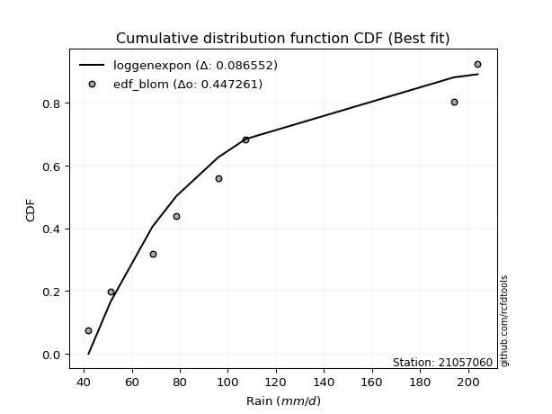</img></img>

</div>


### 7. EDF Tukey (1962)

In hydrology, the Tukey formula is used as a plotting position formula to estimate the empirical probability or frequency of a flood event (or other hydrological data). The formula parameter is given as _c=0.333_ (or 1/3).

<div align="center">


$P=(m-c)/(n+1-2c)$


</div>


**7.1. Empirical values**

<div align="center">

|                | 0                  | 1         | 2                  | 3                  | 4                 | 5                  | 6                 | 7                  |
|:---------------|:-------------------|:----------|:-------------------|:-------------------|:------------------|:-------------------|:------------------|:-------------------|
| date           | 2023               | 2021      | 2020               | 2022               | 2025              | 2019               | 2024              | 2012               |
| x              | 42.0               | 51.2      | 68.6               | 78.6               | 96.0              | 107.4              | 194.0             | 204.0              |
| m              | 1                  | 2         | 3                  | 4                  | 5                 | 6                  | 7                 | 8                  |
| empirical_dist | edf_tukey          | edf_tukey | edf_tukey          | edf_tukey          | edf_tukey         | edf_tukey          | edf_tukey         | edf_tukey          |
| empirical      | 0.08               | 0.2       | 0.32               | 0.44               | 0.56              | 0.68               | 0.8               | 0.92               |
| empirical_tr   | 1.0869565217391304 | 1.25      | 1.4705882352941178 | 1.7857142857142856 | 2.272727272727273 | 3.1250000000000004 | 5.000000000000001 | 12.500000000000007 |

</div>


**7.2. Kolmogorov-Smirnov fit test (sorted by Δ)**


<div align="center">

|                | 0                   | 1                   | 2                   | 3                   | 4                   | 5                  | 6                   | 7                   | 8                   | 9                  | 10                  | 11                  | 12                  | 13                  | 14                  | 15                  | 16                  | 17                 | 18                  | 19                  | 20                  | 21                  | 22                  | 23                  | 24                  | 25                  | 26                  | 27                 | 28                 | 29                  | 30                  | 31                  | 32                  | 33                  | 34                  | 35                  | 36                 | 37                  | 38                 | 39                  | 40                 | 41                  | 42                  | 43                  | 44                  | 45                  | 46                  | 47                  | 48                  | 49                  | 50                  | 51                 | 52                  | 53                  | 54                  | 55                  | 56                 | 57                  | 58                  | 59                  | 60                  | 61                  | 62                  | 63                  | 64                  | 65                  | 66                  | 67                  | 68                  | 69                  | 70                 | 71                  | 72                  | 73                 | 74                  | 75                  | 76                  | 77                 | 78                 | 79                 | 80                 | 81                  | 82                 | 83                  | 84                 | 85                 | 86                  | 87                  | 88                  | 89                 | 90                  | 91                  | 92                  | 93                 | 94                  | 95                  | 96                 | 97                  | 98                  | 99                  | 100                 | 101                 | 102                 | 103                | 104                 | 105                 | 106                 | 107                 | 108                 | 109                 | 110                 | 111                 | 112                | 113                 | 114                 | 115                | 116                 | 117                 | 118                 | 119                | 120                | 121                 | 122                | 123                 | 124                | 125                | 126                | 127                | 128                | 129                 | 130                 | 131                 | 132                 | 133                | 134                 | 135                 | 136                | 137                | 138                | 139                 | 140                | 141                 | 142                | 143                | 144                 | 145                | 146                 | 147                | 148                 | 149                | 150                 | 151                | 152                | 153                | 154                | 155                | 156                | 157                | 158                | 159                |
|:---------------|:--------------------|:--------------------|:--------------------|:--------------------|:--------------------|:-------------------|:--------------------|:--------------------|:--------------------|:-------------------|:--------------------|:--------------------|:--------------------|:--------------------|:--------------------|:--------------------|:--------------------|:-------------------|:--------------------|:--------------------|:--------------------|:--------------------|:--------------------|:--------------------|:--------------------|:--------------------|:--------------------|:-------------------|:-------------------|:--------------------|:--------------------|:--------------------|:--------------------|:--------------------|:--------------------|:--------------------|:-------------------|:--------------------|:-------------------|:--------------------|:-------------------|:--------------------|:--------------------|:--------------------|:--------------------|:--------------------|:--------------------|:--------------------|:--------------------|:--------------------|:--------------------|:-------------------|:--------------------|:--------------------|:--------------------|:--------------------|:-------------------|:--------------------|:--------------------|:--------------------|:--------------------|:--------------------|:--------------------|:--------------------|:--------------------|:--------------------|:--------------------|:--------------------|:--------------------|:--------------------|:-------------------|:--------------------|:--------------------|:-------------------|:--------------------|:--------------------|:--------------------|:-------------------|:-------------------|:-------------------|:-------------------|:--------------------|:-------------------|:--------------------|:-------------------|:-------------------|:--------------------|:--------------------|:--------------------|:-------------------|:--------------------|:--------------------|:--------------------|:-------------------|:--------------------|:--------------------|:-------------------|:--------------------|:--------------------|:--------------------|:--------------------|:--------------------|:--------------------|:-------------------|:--------------------|:--------------------|:--------------------|:--------------------|:--------------------|:--------------------|:--------------------|:--------------------|:-------------------|:--------------------|:--------------------|:-------------------|:--------------------|:--------------------|:--------------------|:-------------------|:-------------------|:--------------------|:-------------------|:--------------------|:-------------------|:-------------------|:-------------------|:-------------------|:-------------------|:--------------------|:--------------------|:--------------------|:--------------------|:-------------------|:--------------------|:--------------------|:-------------------|:-------------------|:-------------------|:--------------------|:-------------------|:--------------------|:-------------------|:-------------------|:--------------------|:-------------------|:--------------------|:-------------------|:--------------------|:-------------------|:--------------------|:-------------------|:-------------------|:-------------------|:-------------------|:-------------------|:-------------------|:-------------------|:-------------------|:-------------------|
| station        | 21057060            | 21057060            | 21057060            | 21057060            | 21057060            | 21057060           | 21057060            | 21057060            | 21057060            | 21057060           | 21057060            | 21057060            | 21057060            | 21057060            | 21057060            | 21057060            | 21057060            | 21057060           | 21057060            | 21057060            | 21057060            | 21057060            | 21057060            | 21057060            | 21057060            | 21057060            | 21057060            | 21057060           | 21057060           | 21057060            | 21057060            | 21057060            | 21057060            | 21057060            | 21057060            | 21057060            | 21057060           | 21057060            | 21057060           | 21057060            | 21057060           | 21057060            | 21057060            | 21057060            | 21057060            | 21057060            | 21057060            | 21057060            | 21057060            | 21057060            | 21057060            | 21057060           | 21057060            | 21057060            | 21057060            | 21057060            | 21057060           | 21057060            | 21057060            | 21057060            | 21057060            | 21057060            | 21057060            | 21057060            | 21057060            | 21057060            | 21057060            | 21057060            | 21057060            | 21057060            | 21057060           | 21057060            | 21057060            | 21057060           | 21057060            | 21057060            | 21057060            | 21057060           | 21057060           | 21057060           | 21057060           | 21057060            | 21057060           | 21057060            | 21057060           | 21057060           | 21057060            | 21057060            | 21057060            | 21057060           | 21057060            | 21057060            | 21057060            | 21057060           | 21057060            | 21057060            | 21057060           | 21057060            | 21057060            | 21057060            | 21057060            | 21057060            | 21057060            | 21057060           | 21057060            | 21057060            | 21057060            | 21057060            | 21057060            | 21057060            | 21057060            | 21057060            | 21057060           | 21057060            | 21057060            | 21057060           | 21057060            | 21057060            | 21057060            | 21057060           | 21057060           | 21057060            | 21057060           | 21057060            | 21057060           | 21057060           | 21057060           | 21057060           | 21057060           | 21057060            | 21057060            | 21057060            | 21057060            | 21057060           | 21057060            | 21057060            | 21057060           | 21057060           | 21057060           | 21057060            | 21057060           | 21057060            | 21057060           | 21057060           | 21057060            | 21057060           | 21057060            | 21057060           | 21057060            | 21057060           | 21057060            | 21057060           | 21057060           | 21057060           | 21057060           | 21057060           | 21057060           | 21057060           | 21057060           | 21057060           |
| empirical_dist | edf_tukey           | edf_tukey           | edf_tukey           | edf_tukey           | edf_tukey           | edf_tukey          | edf_tukey           | edf_tukey           | edf_tukey           | edf_tukey          | edf_tukey           | edf_tukey           | edf_tukey           | edf_tukey           | edf_tukey           | edf_tukey           | edf_tukey           | edf_tukey          | edf_tukey           | edf_tukey           | edf_tukey           | edf_tukey           | edf_tukey           | edf_tukey           | edf_tukey           | edf_tukey           | edf_tukey           | edf_tukey          | edf_tukey          | edf_tukey           | edf_tukey           | edf_tukey           | edf_tukey           | edf_tukey           | edf_tukey           | edf_tukey           | edf_tukey          | edf_tukey           | edf_tukey          | edf_tukey           | edf_tukey          | edf_tukey           | edf_tukey           | edf_tukey           | edf_tukey           | edf_tukey           | edf_tukey           | edf_tukey           | edf_tukey           | edf_tukey           | edf_tukey           | edf_tukey          | edf_tukey           | edf_tukey           | edf_tukey           | edf_tukey           | edf_tukey          | edf_tukey           | edf_tukey           | edf_tukey           | edf_tukey           | edf_tukey           | edf_tukey           | edf_tukey           | edf_tukey           | edf_tukey           | edf_tukey           | edf_tukey           | edf_tukey           | edf_tukey           | edf_tukey          | edf_tukey           | edf_tukey           | edf_tukey          | edf_tukey           | edf_tukey           | edf_tukey           | edf_tukey          | edf_tukey          | edf_tukey          | edf_tukey          | edf_tukey           | edf_tukey          | edf_tukey           | edf_tukey          | edf_tukey          | edf_tukey           | edf_tukey           | edf_tukey           | edf_tukey          | edf_tukey           | edf_tukey           | edf_tukey           | edf_tukey          | edf_tukey           | edf_tukey           | edf_tukey          | edf_tukey           | edf_tukey           | edf_tukey           | edf_tukey           | edf_tukey           | edf_tukey           | edf_tukey          | edf_tukey           | edf_tukey           | edf_tukey           | edf_tukey           | edf_tukey           | edf_tukey           | edf_tukey           | edf_tukey           | edf_tukey          | edf_tukey           | edf_tukey           | edf_tukey          | edf_tukey           | edf_tukey           | edf_tukey           | edf_tukey          | edf_tukey          | edf_tukey           | edf_tukey          | edf_tukey           | edf_tukey          | edf_tukey          | edf_tukey          | edf_tukey          | edf_tukey          | edf_tukey           | edf_tukey           | edf_tukey           | edf_tukey           | edf_tukey          | edf_tukey           | edf_tukey           | edf_tukey          | edf_tukey          | edf_tukey          | edf_tukey           | edf_tukey          | edf_tukey           | edf_tukey          | edf_tukey          | edf_tukey           | edf_tukey          | edf_tukey           | edf_tukey          | edf_tukey           | edf_tukey          | edf_tukey           | edf_tukey          | edf_tukey          | edf_tukey          | edf_tukey          | edf_tukey          | edf_tukey          | edf_tukey          | edf_tukey          | edf_tukey          |
| p_dist         | loggenexpon         | loggamma            | loggamma            | logf                | logerlang           | johnsonsu          | logskewnorm         | loggenlogistic      | logmielke           | burr               | loginvweibull       | logweibull_min      | logburr             | loghalfnorm         | nct                 | logkstwobign        | invgamma            | logfatiguelife     | invgauss            | loginvgauss         | alpha               | lograyleigh         | nakagami            | logksone            | loginvgamma         | exponnorm           | logsemicircular     | logncf             | logexponpow        | lognct              | logmaxwell          | logburr12           | logalpha            | loggompertz         | loganglit           | logrice             | betaprime          | f                   | loggumbel_r        | logbetaprime        | logfoldnorm        | halfnorm            | genexpon            | exponpow            | logpearson3         | foldnorm            | logrdist            | gompertz            | halflogistic        | logmoyal            | logloggamma         | logjohnsonsu       | logexponnorm        | logt                | logcrystalball      | lognorm             | rayleigh           | loggenextreme       | moyal               | pearson3            | gumbel_r            | skewnorm            | logloglaplace       | logcosine           | loglogistic         | loghypsecant        | loglaplace          | loglaplace          | maxwell             | logdgamma           | logbeta            | logdweibull         | loghalflogistic     | kstwobign          | genlogistic         | logargus            | logwrapcauchy       | rice               | burr12             | loglomax           | dweibull           | dgamma              | hypsecant          | truncweibull_min    | logkappa4          | logistic           | truncexpon          | t                   | truncnorm           | norm               | crystalball         | loggausshyper       | logtukeylambda      | logkappa3          | anglit              | semicircular        | loggumbel_l        | logvonmises_line    | loguniform          | ksone               | logtruncpareto      | weibull_min         | logbradford         | laplace            | logtruncexpon       | halfgennorm         | logtruncnorm        | logtruncweibull_min | logtriang           | wald                | logarcsine          | arcsine             | logwald            | kappa4              | cosine              | lomax              | wrapcauchy          | gamma               | ncf                 | loggenhalflogistic | loglevy_l          | loggenpareto        | gumbel_l           | bradford            | levy_l             | tukeylambda        | uniform            | vonmises_line      | gausshyper         | argus               | kappa3              | gennorm             | loggennorm          | logweibull_max     | beta                | genextreme          | triang             | logtrapezoid       | genpareto          | erlang              | genhalflogistic    | powerlaw            | logjohnsonsb       | lognakagami        | fatiguelife         | invweibull         | johnsonsb           | logexponweib       | logpowerlaw         | gengamma           | rdist               | trapezoid          | loggengamma        | exponweib          | weibull_max        | truncpareto        | loghalfgennorm     | logvonmises        | vonmises           | mielke             |
| delta          | 0.08473379812974041 | 0.08979369287418715 | 0.08979369287418715 | 0.08984395539339518 | 0.08994201161244564 | 0.094070738664636  | 0.09633952073779395 | 0.09651691643128824 | 0.09711940633583482 | 0.0971950424407525 | 0.09750708037105393 | 0.09761324321484044 | 0.09795672257708421 | 0.10123900926187779 | 0.10192427852112151 | 0.10255404457361716 | 0.10293903389159176 | 0.1040143254721424 | 0.10459058195962867 | 0.10471017843722852 | 0.10647906623504932 | 0.10716942123282946 | 0.10833443742467064 | 0.10848645535998214 | 0.10914550586798866 | 0.10927243538486975 | 0.10934058531247537 | 0.1095284401047183 | 0.1097043647279059 | 0.11000294561607304 | 0.11017699216440902 | 0.11082609002272037 | 0.11124345511442013 | 0.11148956656465259 | 0.11171103964232543 | 0.11176036193871619 | 0.1124545061552259 | 0.11250888700774109 | 0.1126161472786874 | 0.11375196292991441 | 0.1153134219363573 | 0.11534862039229776 | 0.11597861897739237 | 0.11608478021425739 | 0.11661414903080947 | 0.11683599619050011 | 0.11768549443646137 | 0.11871591354174948 | 0.12044420529000777 | 0.12050620930910248 | 0.12066357266970607 | 0.1208775631451191 | 0.12115483591797971 | 0.12146977137402493 | 0.12147140892723185 | 0.12147140906937881 | 0.1222425596429243 | 0.12310837945580932 | 0.12342782224621562 | 0.12393851752156548 | 0.12476609413213735 | 0.12506049448015955 | 0.12566144494279508 | 0.12782864827733342 | 0.12868057387264675 | 0.13131406955898695 | 0.13241126457208474 | 0.13241126457208474 | 0.13259322631044834 | 0.13321478151473531 | 0.1332696324524586 | 0.13414906912153057 | 0.13708299920322659 | 0.1379690209997776 | 0.13999784818108552 | 0.14167837774352154 | 0.14780934056731254 | 0.1486353639131638 | 0.1498386871568918 | 0.1512396148667597 | 0.1582527594662939 | 0.16051419052824545 | 0.1611844597837908 | 0.16154682158085132 | 0.1616628652033848 | 0.1629328800140385 | 0.16454961466697682 | 0.16497567823453552 | 0.16498216716506742 | 0.1649821694242204 | 0.16498218986328783 | 0.16584217106417876 | 0.16594255819018566 | 0.1666937015709985 | 0.16713035258586628 | 0.16801538146285888 | 0.1681740781698713 | 0.16819615054155612 | 0.16819777731834717 | 0.16913051113206534 | 0.17098870927315568 | 0.17704751542729164 | 0.17731914721424913 | 0.1794585518642896 | 0.17948576138459515 | 0.18077117231754342 | 0.18746326763233312 | 0.1910762309455713  | 0.19946520151082414 | 0.19977608666135324 | 0.19999999999999996 | 0.19999999999999996 | 0.2                | 0.20441042285471928 | 0.20618680119967348 | 0.2123163877210008 | 0.21412346637835283 | 0.21692714910931837 | 0.22098040976334293 | 0.2289921205547838 | 0.2340324326568014 | 0.23448101946485972 | 0.2347494168550176 | 0.24190933846863688 | 0.2725787855482445 | 0.2758624190439324 | 0.2762962962962963 | 0.2793106624343251 | 0.2796191079812098 | 0.28282686765902854 | 0.28923177548848045 | 0.30000000000000004 | 0.30000000000000004 | 0.3089605816267182 | 0.31197757588897645 | 0.31843452205408795 | 0.3326105796946834 | 0.345467709887911  | 0.3524474272413643 | 0.35686966403325876 | 0.397285480275564  | 0.40985637129910274 | 0.4118281448489653 | 0.4187530440918941 | 0.43234684930383344 | 0.4364312306726637 | 0.44427808459311097 | 0.4699853929465381 | 0.47672279673426604 | 0.4795998969682444 | 0.48372531878996444 | 0.5038073464410913 | 0.5530038893283531 | 0.5700948676824735 | 0.6013775104387067 | 0.612383905590087  | 0.8                | 1.123495999385336  | 31.95576812821639  | nan                |
| deltao         | 0.4472608134160001  | 0.4472608134160001  | 0.4472608134160001  | 0.4472608134160001  | 0.4472608134160001  | 0.4472608134160001 | 0.4472608134160001  | 0.4472608134160001  | 0.4472608134160001  | 0.4472608134160001 | 0.4472608134160001  | 0.4472608134160001  | 0.4472608134160001  | 0.4472608134160001  | 0.4472608134160001  | 0.4472608134160001  | 0.4472608134160001  | 0.4472608134160001 | 0.4472608134160001  | 0.4472608134160001  | 0.4472608134160001  | 0.4472608134160001  | 0.4472608134160001  | 0.4472608134160001  | 0.4472608134160001  | 0.4472608134160001  | 0.4472608134160001  | 0.4472608134160001 | 0.4472608134160001 | 0.4472608134160001  | 0.4472608134160001  | 0.4472608134160001  | 0.4472608134160001  | 0.4472608134160001  | 0.4472608134160001  | 0.4472608134160001  | 0.4472608134160001 | 0.4472608134160001  | 0.4472608134160001 | 0.4472608134160001  | 0.4472608134160001 | 0.4472608134160001  | 0.4472608134160001  | 0.4472608134160001  | 0.4472608134160001  | 0.4472608134160001  | 0.4472608134160001  | 0.4472608134160001  | 0.4472608134160001  | 0.4472608134160001  | 0.4472608134160001  | 0.4472608134160001 | 0.4472608134160001  | 0.4472608134160001  | 0.4472608134160001  | 0.4472608134160001  | 0.4472608134160001 | 0.4472608134160001  | 0.4472608134160001  | 0.4472608134160001  | 0.4472608134160001  | 0.4472608134160001  | 0.4472608134160001  | 0.4472608134160001  | 0.4472608134160001  | 0.4472608134160001  | 0.4472608134160001  | 0.4472608134160001  | 0.4472608134160001  | 0.4472608134160001  | 0.4472608134160001 | 0.4472608134160001  | 0.4472608134160001  | 0.4472608134160001 | 0.4472608134160001  | 0.4472608134160001  | 0.4472608134160001  | 0.4472608134160001 | 0.4472608134160001 | 0.4472608134160001 | 0.4472608134160001 | 0.4472608134160001  | 0.4472608134160001 | 0.4472608134160001  | 0.4472608134160001 | 0.4472608134160001 | 0.4472608134160001  | 0.4472608134160001  | 0.4472608134160001  | 0.4472608134160001 | 0.4472608134160001  | 0.4472608134160001  | 0.4472608134160001  | 0.4472608134160001 | 0.4472608134160001  | 0.4472608134160001  | 0.4472608134160001 | 0.4472608134160001  | 0.4472608134160001  | 0.4472608134160001  | 0.4472608134160001  | 0.4472608134160001  | 0.4472608134160001  | 0.4472608134160001 | 0.4472608134160001  | 0.4472608134160001  | 0.4472608134160001  | 0.4472608134160001  | 0.4472608134160001  | 0.4472608134160001  | 0.4472608134160001  | 0.4472608134160001  | 0.4472608134160001 | 0.4472608134160001  | 0.4472608134160001  | 0.4472608134160001 | 0.4472608134160001  | 0.4472608134160001  | 0.4472608134160001  | 0.4472608134160001 | 0.4472608134160001 | 0.4472608134160001  | 0.4472608134160001 | 0.4472608134160001  | 0.4472608134160001 | 0.4472608134160001 | 0.4472608134160001 | 0.4472608134160001 | 0.4472608134160001 | 0.4472608134160001  | 0.4472608134160001  | 0.4472608134160001  | 0.4472608134160001  | 0.4472608134160001 | 0.4472608134160001  | 0.4472608134160001  | 0.4472608134160001 | 0.4472608134160001 | 0.4472608134160001 | 0.4472608134160001  | 0.4472608134160001 | 0.4472608134160001  | 0.4472608134160001 | 0.4472608134160001 | 0.4472608134160001  | 0.4472608134160001 | 0.4472608134160001  | 0.4472608134160001 | 0.4472608134160001  | 0.4472608134160001 | 0.4472608134160001  | 0.4472608134160001 | 0.4472608134160001 | 0.4472608134160001 | 0.4472608134160001 | 0.4472608134160001 | 0.4472608134160001 | 0.4472608134160001 | 0.4472608134160001 | 0.4472608134160001 |
| eval           | Δo > Δ              | Δo > Δ              | Δo > Δ              | Δo > Δ              | Δo > Δ              | Δo > Δ             | Δo > Δ              | Δo > Δ              | Δo > Δ              | Δo > Δ             | Δo > Δ              | Δo > Δ              | Δo > Δ              | Δo > Δ              | Δo > Δ              | Δo > Δ              | Δo > Δ              | Δo > Δ             | Δo > Δ              | Δo > Δ              | Δo > Δ              | Δo > Δ              | Δo > Δ              | Δo > Δ              | Δo > Δ              | Δo > Δ              | Δo > Δ              | Δo > Δ             | Δo > Δ             | Δo > Δ              | Δo > Δ              | Δo > Δ              | Δo > Δ              | Δo > Δ              | Δo > Δ              | Δo > Δ              | Δo > Δ             | Δo > Δ              | Δo > Δ             | Δo > Δ              | Δo > Δ             | Δo > Δ              | Δo > Δ              | Δo > Δ              | Δo > Δ              | Δo > Δ              | Δo > Δ              | Δo > Δ              | Δo > Δ              | Δo > Δ              | Δo > Δ              | Δo > Δ             | Δo > Δ              | Δo > Δ              | Δo > Δ              | Δo > Δ              | Δo > Δ             | Δo > Δ              | Δo > Δ              | Δo > Δ              | Δo > Δ              | Δo > Δ              | Δo > Δ              | Δo > Δ              | Δo > Δ              | Δo > Δ              | Δo > Δ              | Δo > Δ              | Δo > Δ              | Δo > Δ              | Δo > Δ             | Δo > Δ              | Δo > Δ              | Δo > Δ             | Δo > Δ              | Δo > Δ              | Δo > Δ              | Δo > Δ             | Δo > Δ             | Δo > Δ             | Δo > Δ             | Δo > Δ              | Δo > Δ             | Δo > Δ              | Δo > Δ             | Δo > Δ             | Δo > Δ              | Δo > Δ              | Δo > Δ              | Δo > Δ             | Δo > Δ              | Δo > Δ              | Δo > Δ              | Δo > Δ             | Δo > Δ              | Δo > Δ              | Δo > Δ             | Δo > Δ              | Δo > Δ              | Δo > Δ              | Δo > Δ              | Δo > Δ              | Δo > Δ              | Δo > Δ             | Δo > Δ              | Δo > Δ              | Δo > Δ              | Δo > Δ              | Δo > Δ              | Δo > Δ              | Δo > Δ              | Δo > Δ              | Δo > Δ             | Δo > Δ              | Δo > Δ              | Δo > Δ             | Δo > Δ              | Δo > Δ              | Δo > Δ              | Δo > Δ             | Δo > Δ             | Δo > Δ              | Δo > Δ             | Δo > Δ              | Δo > Δ             | Δo > Δ             | Δo > Δ             | Δo > Δ             | Δo > Δ             | Δo > Δ              | Δo > Δ              | Δo > Δ              | Δo > Δ              | Δo > Δ             | Δo > Δ              | Δo > Δ              | Δo > Δ             | Δo > Δ             | Δo > Δ             | Δo > Δ              | Δo > Δ             | Δo > Δ              | Δo > Δ             | Δo > Δ             | Δo > Δ              | Δo > Δ             | Δo > Δ              | Δo <= Δ            | Δo <= Δ             | Δo <= Δ            | Δo <= Δ             | Δo <= Δ            | Δo <= Δ            | Δo <= Δ            | Δo <= Δ            | Δo <= Δ            | Δo <= Δ            | Δo <= Δ            | Δo <= Δ            | Δo <= Δ            |
| fit            | 1                   | 1                   | 1                   | 1                   | 1                   | 1                  | 1                   | 1                   | 1                   | 1                  | 1                   | 1                   | 1                   | 1                   | 1                   | 1                   | 1                   | 1                  | 1                   | 1                   | 1                   | 1                   | 1                   | 1                   | 1                   | 1                   | 1                   | 1                  | 1                  | 1                   | 1                   | 1                   | 1                   | 1                   | 1                   | 1                   | 1                  | 1                   | 1                  | 1                   | 1                  | 1                   | 1                   | 1                   | 1                   | 1                   | 1                   | 1                   | 1                   | 1                   | 1                   | 1                  | 1                   | 1                   | 1                   | 1                   | 1                  | 1                   | 1                   | 1                   | 1                   | 1                   | 1                   | 1                   | 1                   | 1                   | 1                   | 1                   | 1                   | 1                   | 1                  | 1                   | 1                   | 1                  | 1                   | 1                   | 1                   | 1                  | 1                  | 1                  | 1                  | 1                   | 1                  | 1                   | 1                  | 1                  | 1                   | 1                   | 1                   | 1                  | 1                   | 1                   | 1                   | 1                  | 1                   | 1                   | 1                  | 1                   | 1                   | 1                   | 1                   | 1                   | 1                   | 1                  | 1                   | 1                   | 1                   | 1                   | 1                   | 1                   | 1                   | 1                   | 1                  | 1                   | 1                   | 1                  | 1                   | 1                   | 1                   | 1                  | 1                  | 1                   | 1                  | 1                   | 1                  | 1                  | 1                  | 1                  | 1                  | 1                   | 1                   | 1                   | 1                   | 1                  | 1                   | 1                   | 1                  | 1                  | 1                  | 1                   | 1                  | 1                   | 1                  | 1                  | 1                   | 1                  | 1                   | 0                  | 0                   | 0                  | 0                   | 0                  | 0                  | 0                  | 0                  | 0                  | 0                  | 0                  | 0                  | 0                  |
| n              | 8                   | 8                   | 8                   | 8                   | 8                   | 8                  | 8                   | 8                   | 8                   | 8                  | 8                   | 8                   | 8                   | 8                   | 8                   | 8                   | 8                   | 8                  | 8                   | 8                   | 8                   | 8                   | 8                   | 8                   | 8                   | 8                   | 8                   | 8                  | 8                  | 8                   | 8                   | 8                   | 8                   | 8                   | 8                   | 8                   | 8                  | 8                   | 8                  | 8                   | 8                  | 8                   | 8                   | 8                   | 8                   | 8                   | 8                   | 8                   | 8                   | 8                   | 8                   | 8                  | 8                   | 8                   | 8                   | 8                   | 8                  | 8                   | 8                   | 8                   | 8                   | 8                   | 8                   | 8                   | 8                   | 8                   | 8                   | 8                   | 8                   | 8                   | 8                  | 8                   | 8                   | 8                  | 8                   | 8                   | 8                   | 8                  | 8                  | 8                  | 8                  | 8                   | 8                  | 8                   | 8                  | 8                  | 8                   | 8                   | 8                   | 8                  | 8                   | 8                   | 8                   | 8                  | 8                   | 8                   | 8                  | 8                   | 8                   | 8                   | 8                   | 8                   | 8                   | 8                  | 8                   | 8                   | 8                   | 8                   | 8                   | 8                   | 8                   | 8                   | 8                  | 8                   | 8                   | 8                  | 8                   | 8                   | 8                   | 8                  | 8                  | 8                   | 8                  | 8                   | 8                  | 8                  | 8                  | 8                  | 8                  | 8                   | 8                   | 8                   | 8                   | 8                  | 8                   | 8                   | 8                  | 8                  | 8                  | 8                   | 8                  | 8                   | 8                  | 8                  | 8                   | 8                  | 8                   | 8                  | 8                   | 8                  | 8                   | 8                  | 8                  | 8                  | 8                  | 8                  | 8                  | 8                  | 8                  | 8                  |
| best_fit       | 1                   | 0                   | 0                   | 0                   | 0                   | 0                  | 0                   | 0                   | 0                   | 0                  | 0                   | 0                   | 0                   | 0                   | 0                   | 0                   | 0                   | 0                  | 0                   | 0                   | 0                   | 0                   | 0                   | 0                   | 0                   | 0                   | 0                   | 0                  | 0                  | 0                   | 0                   | 0                   | 0                   | 0                   | 0                   | 0                   | 0                  | 0                   | 0                  | 0                   | 0                  | 0                   | 0                   | 0                   | 0                   | 0                   | 0                   | 0                   | 0                   | 0                   | 0                   | 0                  | 0                   | 0                   | 0                   | 0                   | 0                  | 0                   | 0                   | 0                   | 0                   | 0                   | 0                   | 0                   | 0                   | 0                   | 0                   | 0                   | 0                   | 0                   | 0                  | 0                   | 0                   | 0                  | 0                   | 0                   | 0                   | 0                  | 0                  | 0                  | 0                  | 0                   | 0                  | 0                   | 0                  | 0                  | 0                   | 0                   | 0                   | 0                  | 0                   | 0                   | 0                   | 0                  | 0                   | 0                   | 0                  | 0                   | 0                   | 0                   | 0                   | 0                   | 0                   | 0                  | 0                   | 0                   | 0                   | 0                   | 0                   | 0                   | 0                   | 0                   | 0                  | 0                   | 0                   | 0                  | 0                   | 0                   | 0                   | 0                  | 0                  | 0                   | 0                  | 0                   | 0                  | 0                  | 0                  | 0                  | 0                  | 0                   | 0                   | 0                   | 0                   | 0                  | 0                   | 0                   | 0                  | 0                  | 0                  | 0                   | 0                  | 0                   | 0                  | 0                  | 0                   | 0                  | 0                   | 0                  | 0                   | 0                  | 0                   | 0                  | 0                  | 0                  | 0                  | 0                  | 0                  | 0                  | 0                  | 0                  |
| best_fit_sort  | 1                   | 2                   | 3                   | 4                   | 5                   | 6                  | 7                   | 8                   | 9                   | 10                 | 11                  | 12                  | 13                  | 14                  | 15                  | 16                  | 17                  | 18                 | 19                  | 20                  | 21                  | 22                  | 23                  | 24                  | 25                  | 26                  | 27                  | 28                 | 29                 | 30                  | 31                  | 32                  | 33                  | 34                  | 35                  | 36                  | 37                 | 38                  | 39                 | 40                  | 41                 | 42                  | 43                  | 44                  | 45                  | 46                  | 47                  | 48                  | 49                  | 50                  | 51                  | 52                 | 53                  | 54                  | 55                  | 56                  | 57                 | 58                  | 59                  | 60                  | 61                  | 62                  | 63                  | 64                  | 65                  | 66                  | 67                  | 68                  | 69                  | 70                  | 71                 | 72                  | 73                  | 74                 | 75                  | 76                  | 77                  | 78                 | 79                 | 80                 | 81                 | 82                  | 83                 | 84                  | 85                 | 86                 | 87                  | 88                  | 89                  | 90                 | 91                  | 92                  | 93                  | 94                 | 95                  | 96                  | 97                 | 98                  | 99                  | 100                 | 101                 | 102                 | 103                 | 104                | 105                 | 106                 | 107                 | 108                 | 109                 | 110                 | 111                 | 112                 | 113                | 114                 | 115                 | 116                | 117                 | 118                 | 119                 | 120                | 121                | 122                 | 123                | 124                 | 125                | 126                | 127                | 128                | 129                | 130                 | 131                 | 132                 | 133                 | 134                | 135                 | 136                 | 137                | 138                | 139                | 140                 | 141                | 142                 | 143                | 144                | 145                 | 146                | 147                 | 148                | 149                 | 150                | 151                 | 152                | 153                | 154                | 155                | 156                | 157                | 158                | 159                | 160                |

</div>


**7.3. Best fit**

<div align="center">

|   id |   station | empirical_dist   | p_dist      |     delta |   deltao | eval   |   fit |   n |   best_fit |   best_fit_sort |
|-----:|----------:|:-----------------|:------------|----------:|---------:|:-------|------:|----:|-----------:|----------------:|
|    0 |  21057060 | edf_tukey        | loggenexpon | 0.0847338 | 0.447261 | Δo > Δ |     1 |   8 |          1 |               1 |

</div>


<div align="center">

</img></img>

</div>


### 8. EDF Gringorten (1963)

Gringorten plotting position formula is essential for estimating the probability and return periods of extreme events like floods and heavy rainfall. The constant _a=0.44_.

<div align="center">


$P=(m-a)/(n+1-2a)$


</div>


**8.1. Empirical values**

<div align="center">

|                | 0                   | 1                   | 2                  | 3                  | 4                  | 5                  | 6                  | 7                  |
|:---------------|:--------------------|:--------------------|:-------------------|:-------------------|:-------------------|:-------------------|:-------------------|:-------------------|
| date           | 2023                | 2021                | 2020               | 2022               | 2025               | 2019               | 2024               | 2012               |
| x              | 42.0                | 51.2                | 68.6               | 78.6               | 96.0               | 107.4              | 194.0              | 204.0              |
| m              | 1                   | 2                   | 3                  | 4                  | 5                  | 6                  | 7                  | 8                  |
| empirical_dist | edf_gringorten      | edf_gringorten      | edf_gringorten     | edf_gringorten     | edf_gringorten     | edf_gringorten     | edf_gringorten     | edf_gringorten     |
| empirical      | 0.06896551724137932 | 0.19211822660098524 | 0.3152709359605912 | 0.4384236453201971 | 0.5615763546798029 | 0.6847290640394089 | 0.8078817733990148 | 0.9310344827586208 |
| empirical_tr   | 1.0740740740740742  | 1.2378048780487805  | 1.460431654676259  | 1.780701754385965  | 2.2808988764044944 | 3.1718750000000004 | 5.205128205128205  | 14.500000000000018 |

</div>


**8.2. Kolmogorov-Smirnov fit test (sorted by Δ)**


<div align="center">

|                | 0                  | 1                  | 2                   | 3                   | 4                   | 5                  | 6                   | 7                   | 8                   | 9                   | 10                  | 11                  | 12                  | 13                  | 14                  | 15                  | 16                  | 17                  | 18                  | 19                  | 20                  | 21                  | 22                  | 23                  | 24                 | 25                  | 26                  | 27                  | 28                 | 29                  | 30                  | 31                  | 32                  | 33                  | 34                  | 35                  | 36                  | 37                  | 38                  | 39                  | 40                  | 41                  | 42                  | 43                  | 44                  | 45                  | 46                  | 47                  | 48                  | 49                  | 50                  | 51                 | 52                  | 53                  | 54                  | 55                  | 56                 | 57                  | 58                  | 59                 | 60                  | 61                 | 62                  | 63                 | 64                 | 65                 | 66                  | 67                  | 68                  | 69                 | 70                  | 71                  | 72                  | 73                  | 74                 | 75                  | 76                  | 77                 | 78                 | 79                  | 80                  | 81                  | 82                 | 83                  | 84                 | 85                  | 86                  | 87                  | 88                  | 89                  | 90                  | 91                  | 92                  | 93                  | 94                  | 95                 | 96                 | 97                  | 98                 | 99                 | 100                 | 101                 | 102                | 103                 | 104                 | 105                 | 106                 | 107                 | 108                | 109                | 110                 | 111                 | 112                | 113                 | 114                 | 115                 | 116                | 117                | 118                | 119                 | 120                 | 121                | 122                 | 123                 | 124                 | 125                | 126                | 127                | 128                | 129                | 130                | 131                | 132                | 133                 | 134                 | 135                | 136                 | 137                 | 138                 | 139                | 140                 | 141                 | 142                | 143                | 144                 | 145                 | 146                 | 147                 | 148                 | 149                | 150                | 151                | 152                | 153                | 154                | 155                | 156                | 157                | 158                | 159                |
|:---------------|:-------------------|:-------------------|:--------------------|:--------------------|:--------------------|:-------------------|:--------------------|:--------------------|:--------------------|:--------------------|:--------------------|:--------------------|:--------------------|:--------------------|:--------------------|:--------------------|:--------------------|:--------------------|:--------------------|:--------------------|:--------------------|:--------------------|:--------------------|:--------------------|:-------------------|:--------------------|:--------------------|:--------------------|:-------------------|:--------------------|:--------------------|:--------------------|:--------------------|:--------------------|:--------------------|:--------------------|:--------------------|:--------------------|:--------------------|:--------------------|:--------------------|:--------------------|:--------------------|:--------------------|:--------------------|:--------------------|:--------------------|:--------------------|:--------------------|:--------------------|:--------------------|:-------------------|:--------------------|:--------------------|:--------------------|:--------------------|:-------------------|:--------------------|:--------------------|:-------------------|:--------------------|:-------------------|:--------------------|:-------------------|:-------------------|:-------------------|:--------------------|:--------------------|:--------------------|:-------------------|:--------------------|:--------------------|:--------------------|:--------------------|:-------------------|:--------------------|:--------------------|:-------------------|:-------------------|:--------------------|:--------------------|:--------------------|:-------------------|:--------------------|:-------------------|:--------------------|:--------------------|:--------------------|:--------------------|:--------------------|:--------------------|:--------------------|:--------------------|:--------------------|:--------------------|:-------------------|:-------------------|:--------------------|:-------------------|:-------------------|:--------------------|:--------------------|:-------------------|:--------------------|:--------------------|:--------------------|:--------------------|:--------------------|:-------------------|:-------------------|:--------------------|:--------------------|:-------------------|:--------------------|:--------------------|:--------------------|:-------------------|:-------------------|:-------------------|:--------------------|:--------------------|:-------------------|:--------------------|:--------------------|:--------------------|:-------------------|:-------------------|:-------------------|:-------------------|:-------------------|:-------------------|:-------------------|:-------------------|:--------------------|:--------------------|:-------------------|:--------------------|:--------------------|:--------------------|:-------------------|:--------------------|:--------------------|:-------------------|:-------------------|:--------------------|:--------------------|:--------------------|:--------------------|:--------------------|:-------------------|:-------------------|:-------------------|:-------------------|:-------------------|:-------------------|:-------------------|:-------------------|:-------------------|:-------------------|:-------------------|
| station        | 21057060           | 21057060           | 21057060            | 21057060            | 21057060            | 21057060           | 21057060            | 21057060            | 21057060            | 21057060            | 21057060            | 21057060            | 21057060            | 21057060            | 21057060            | 21057060            | 21057060            | 21057060            | 21057060            | 21057060            | 21057060            | 21057060            | 21057060            | 21057060            | 21057060           | 21057060            | 21057060            | 21057060            | 21057060           | 21057060            | 21057060            | 21057060            | 21057060            | 21057060            | 21057060            | 21057060            | 21057060            | 21057060            | 21057060            | 21057060            | 21057060            | 21057060            | 21057060            | 21057060            | 21057060            | 21057060            | 21057060            | 21057060            | 21057060            | 21057060            | 21057060            | 21057060           | 21057060            | 21057060            | 21057060            | 21057060            | 21057060           | 21057060            | 21057060            | 21057060           | 21057060            | 21057060           | 21057060            | 21057060           | 21057060           | 21057060           | 21057060            | 21057060            | 21057060            | 21057060           | 21057060            | 21057060            | 21057060            | 21057060            | 21057060           | 21057060            | 21057060            | 21057060           | 21057060           | 21057060            | 21057060            | 21057060            | 21057060           | 21057060            | 21057060           | 21057060            | 21057060            | 21057060            | 21057060            | 21057060            | 21057060            | 21057060            | 21057060            | 21057060            | 21057060            | 21057060           | 21057060           | 21057060            | 21057060           | 21057060           | 21057060            | 21057060            | 21057060           | 21057060            | 21057060            | 21057060            | 21057060            | 21057060            | 21057060           | 21057060           | 21057060            | 21057060            | 21057060           | 21057060            | 21057060            | 21057060            | 21057060           | 21057060           | 21057060           | 21057060            | 21057060            | 21057060           | 21057060            | 21057060            | 21057060            | 21057060           | 21057060           | 21057060           | 21057060           | 21057060           | 21057060           | 21057060           | 21057060           | 21057060            | 21057060            | 21057060           | 21057060            | 21057060            | 21057060            | 21057060           | 21057060            | 21057060            | 21057060           | 21057060           | 21057060            | 21057060            | 21057060            | 21057060            | 21057060            | 21057060           | 21057060           | 21057060           | 21057060           | 21057060           | 21057060           | 21057060           | 21057060           | 21057060           | 21057060           | 21057060           |
| empirical_dist | edf_gringorten     | edf_gringorten     | edf_gringorten      | edf_gringorten      | edf_gringorten      | edf_gringorten     | edf_gringorten      | edf_gringorten      | edf_gringorten      | edf_gringorten      | edf_gringorten      | edf_gringorten      | edf_gringorten      | edf_gringorten      | edf_gringorten      | edf_gringorten      | edf_gringorten      | edf_gringorten      | edf_gringorten      | edf_gringorten      | edf_gringorten      | edf_gringorten      | edf_gringorten      | edf_gringorten      | edf_gringorten     | edf_gringorten      | edf_gringorten      | edf_gringorten      | edf_gringorten     | edf_gringorten      | edf_gringorten      | edf_gringorten      | edf_gringorten      | edf_gringorten      | edf_gringorten      | edf_gringorten      | edf_gringorten      | edf_gringorten      | edf_gringorten      | edf_gringorten      | edf_gringorten      | edf_gringorten      | edf_gringorten      | edf_gringorten      | edf_gringorten      | edf_gringorten      | edf_gringorten      | edf_gringorten      | edf_gringorten      | edf_gringorten      | edf_gringorten      | edf_gringorten     | edf_gringorten      | edf_gringorten      | edf_gringorten      | edf_gringorten      | edf_gringorten     | edf_gringorten      | edf_gringorten      | edf_gringorten     | edf_gringorten      | edf_gringorten     | edf_gringorten      | edf_gringorten     | edf_gringorten     | edf_gringorten     | edf_gringorten      | edf_gringorten      | edf_gringorten      | edf_gringorten     | edf_gringorten      | edf_gringorten      | edf_gringorten      | edf_gringorten      | edf_gringorten     | edf_gringorten      | edf_gringorten      | edf_gringorten     | edf_gringorten     | edf_gringorten      | edf_gringorten      | edf_gringorten      | edf_gringorten     | edf_gringorten      | edf_gringorten     | edf_gringorten      | edf_gringorten      | edf_gringorten      | edf_gringorten      | edf_gringorten      | edf_gringorten      | edf_gringorten      | edf_gringorten      | edf_gringorten      | edf_gringorten      | edf_gringorten     | edf_gringorten     | edf_gringorten      | edf_gringorten     | edf_gringorten     | edf_gringorten      | edf_gringorten      | edf_gringorten     | edf_gringorten      | edf_gringorten      | edf_gringorten      | edf_gringorten      | edf_gringorten      | edf_gringorten     | edf_gringorten     | edf_gringorten      | edf_gringorten      | edf_gringorten     | edf_gringorten      | edf_gringorten      | edf_gringorten      | edf_gringorten     | edf_gringorten     | edf_gringorten     | edf_gringorten      | edf_gringorten      | edf_gringorten     | edf_gringorten      | edf_gringorten      | edf_gringorten      | edf_gringorten     | edf_gringorten     | edf_gringorten     | edf_gringorten     | edf_gringorten     | edf_gringorten     | edf_gringorten     | edf_gringorten     | edf_gringorten      | edf_gringorten      | edf_gringorten     | edf_gringorten      | edf_gringorten      | edf_gringorten      | edf_gringorten     | edf_gringorten      | edf_gringorten      | edf_gringorten     | edf_gringorten     | edf_gringorten      | edf_gringorten      | edf_gringorten      | edf_gringorten      | edf_gringorten      | edf_gringorten     | edf_gringorten     | edf_gringorten     | edf_gringorten     | edf_gringorten     | edf_gringorten     | edf_gringorten     | edf_gringorten     | edf_gringorten     | edf_gringorten     | edf_gringorten     |
| p_dist         | loggamma           | loggamma           | logf                | logerlang           | johnsonsu           | logskewnorm        | loggenlogistic      | logmielke           | burr                | loggenexpon         | loginvweibull       | logweibull_min      | logburr             | loghalfnorm         | nct                 | logkstwobign        | invgamma            | logfatiguelife      | invgauss            | loginvgauss         | alpha               | lograyleigh         | logksone            | loginvgamma         | exponnorm          | logsemicircular     | logncf              | logexponpow         | lognct             | logmaxwell          | logburr12           | logalpha            | loggompertz         | loganglit           | logrice             | betaprime           | f                   | loggumbel_r         | logbetaprime        | logfoldnorm         | halfnorm            | genexpon            | logpearson3         | gompertz            | halflogistic        | logmoyal            | logloggamma         | logjohnsonsu        | nakagami            | logexponnorm        | logt                | logcrystalball     | lognorm             | foldnorm            | loggenextreme       | moyal               | gumbel_r           | pearson3            | logcosine           | loglogistic        | exponpow            | logloglaplace      | logrdist            | loghypsecant       | loglaplace         | loglaplace         | logdgamma           | logbeta             | logdweibull         | rayleigh           | loghalflogistic     | skewnorm            | kstwobign           | genlogistic         | maxwell            | logargus            | dweibull            | logwrapcauchy      | dgamma             | rice                | logkappa4           | burr12              | loglomax           | truncexpon          | loggausshyper      | logtukeylambda      | logkappa3           | loggumbel_l         | logvonmises_line    | loguniform          | logtruncpareto      | truncweibull_min    | hypsecant           | logistic            | logbradford         | t                  | truncnorm          | norm                | crystalball        | logtruncexpon      | anglit              | semicircular        | ksone              | laplace             | logtruncnorm        | weibull_min         | halfgennorm         | wald                | logarcsine         | arcsine            | logwald             | logtruncweibull_min | logtriang          | kappa4              | cosine              | lomax               | wrapcauchy         | gamma              | ncf                | loggenhalflogistic  | loglevy_l           | loggenpareto       | gumbel_l            | bradford            | tukeylambda         | uniform            | levy_l             | vonmises_line      | gausshyper         | argus              | kappa3             | gennorm            | loggennorm         | logweibull_max      | beta                | genextreme         | triang              | logtrapezoid        | genpareto           | erlang             | genhalflogistic     | powerlaw            | logjohnsonsb       | lognakagami        | fatiguelife         | invweibull          | johnsonsb           | logexponweib        | logpowerlaw         | gengamma           | rdist              | trapezoid          | loggengamma        | exponweib          | weibull_max        | truncpareto        | loghalfgennorm     | logvonmises        | vonmises           | mielke             |
| delta          | 0.0819119194751724 | 0.0819119194751724 | 0.08196218199438043 | 0.08206023821343089 | 0.08618896526562125 | 0.0884577473387792 | 0.08863514303227349 | 0.08923763293682008 | 0.08931326904173775 | 0.08946286216914923 | 0.08962530697203919 | 0.08973146981582569 | 0.09007494917806946 | 0.09335723586286304 | 0.09404250512210677 | 0.09467227117460242 | 0.09505726049257701 | 0.09613255207312765 | 0.09670880856061392 | 0.09682840503821377 | 0.09859729283603458 | 0.09928764783381472 | 0.10060468196096739 | 0.10126373246897391 | 0.101390661985855  | 0.10145881191346062 | 0.10164666670570355 | 0.10182259132889115 | 0.1021211722170583 | 0.10229521876539427 | 0.10294431662370562 | 0.10336168171540538 | 0.10360779316563784 | 0.10382926624331068 | 0.10387858853970144 | 0.10457273275621115 | 0.10462711360872634 | 0.10473437387967266 | 0.10587018953089966 | 0.10743164853734255 | 0.10746684699328302 | 0.10809684557837762 | 0.10873237563179472 | 0.11083414014273474 | 0.11256243189099302 | 0.11262443591008771 | 0.11278179927069132 | 0.11299578974610436 | 0.11306350146407951 | 0.11327306251896496 | 0.11358799797501018 | 0.1135896355282171 | 0.11358963567036406 | 0.11445081777515653 | 0.11522660605679458 | 0.11554604884720088 | 0.1168843207331226 | 0.11891196055733055 | 0.11994687487831868 | 0.120798800473632  | 0.12081384425366626 | 0.1208264405568178 | 0.12241455847587024 | 0.1234322961599722 | 0.12452949117307   | 0.12452949117307   | 0.12533300811572057 | 0.12538785905344385 | 0.12626729572251583 | 0.1266523418184904 | 0.12920122580421184 | 0.12978955851956842 | 0.13008724760076285 | 0.13211607478207077 | 0.1373222903498572 | 0.14153797939130575 | 0.15037098606727917 | 0.1525384046067214 | 0.1526324171292307 | 0.15336442795257266 | 0.15378109180437005 | 0.15456775119630062 | 0.1559686789061685 | 0.15666784126796207 | 0.157960397665164  | 0.15806078479117092 | 0.15881192817198375 | 0.16029230477085654 | 0.16031437714254138 | 0.16031600391933243 | 0.16310693587414093 | 0.16510852903346784 | 0.16591352382319968 | 0.16766194405344736 | 0.16943737381523438 | 0.1697047422739444 | 0.1697112312044763 | 0.16971123346362926 | 0.1697112539026967 | 0.1716039879855804 | 0.17185941662527515 | 0.17274444550226775 | 0.1738595751714742 | 0.17788219718448672 | 0.17958149423331837 | 0.18177657946670045 | 0.18550023635695223 | 0.19189431326233847 | 0.1921182266009852 | 0.1921182266009852 | 0.19211822660098524 | 0.19580529498498012 | 0.204194265550233  | 0.20913948689412815 | 0.21091586523908235 | 0.21704545176040968 | 0.2188525304177617 | 0.2216562131487272 | 0.2320148925219636 | 0.23372118459419267 | 0.23876149669621027 | 0.2392100835042686 | 0.23947848089442647 | 0.24663840250804575 | 0.28059148308334125 | 0.2810253603357052 | 0.2836132683068652 | 0.284039726473734  | 0.2843481720206187 | 0.2875559316984374 | 0.2939608395278893 | 0.3078817733990148 | 0.3078817733990148 | 0.31368964566612706 | 0.32301205864759713 | 0.3294690048127087 | 0.33733964373409225 | 0.35019677392731985 | 0.35717649128077317 | 0.3615987280726676 | 0.40201454431497285 | 0.41458543533851155 | 0.4197099182479801 | 0.4266348174909089 | 0.44022862270284824 | 0.44746571343128444 | 0.45215985799212577 | 0.47786716634555293 | 0.48145186077367486 | 0.4874816703672592 | 0.4947598015485851 | 0.5085364104805001 | 0.557732953367762  | 0.5779766410814883 | 0.6061065744781156 | 0.6202656789891019 | 0.8078817733990148 | 1.115614225986321  | 31.944733645457774 | nan                |
| deltao         | 0.4472608134160001 | 0.4472608134160001 | 0.4472608134160001  | 0.4472608134160001  | 0.4472608134160001  | 0.4472608134160001 | 0.4472608134160001  | 0.4472608134160001  | 0.4472608134160001  | 0.4472608134160001  | 0.4472608134160001  | 0.4472608134160001  | 0.4472608134160001  | 0.4472608134160001  | 0.4472608134160001  | 0.4472608134160001  | 0.4472608134160001  | 0.4472608134160001  | 0.4472608134160001  | 0.4472608134160001  | 0.4472608134160001  | 0.4472608134160001  | 0.4472608134160001  | 0.4472608134160001  | 0.4472608134160001 | 0.4472608134160001  | 0.4472608134160001  | 0.4472608134160001  | 0.4472608134160001 | 0.4472608134160001  | 0.4472608134160001  | 0.4472608134160001  | 0.4472608134160001  | 0.4472608134160001  | 0.4472608134160001  | 0.4472608134160001  | 0.4472608134160001  | 0.4472608134160001  | 0.4472608134160001  | 0.4472608134160001  | 0.4472608134160001  | 0.4472608134160001  | 0.4472608134160001  | 0.4472608134160001  | 0.4472608134160001  | 0.4472608134160001  | 0.4472608134160001  | 0.4472608134160001  | 0.4472608134160001  | 0.4472608134160001  | 0.4472608134160001  | 0.4472608134160001 | 0.4472608134160001  | 0.4472608134160001  | 0.4472608134160001  | 0.4472608134160001  | 0.4472608134160001 | 0.4472608134160001  | 0.4472608134160001  | 0.4472608134160001 | 0.4472608134160001  | 0.4472608134160001 | 0.4472608134160001  | 0.4472608134160001 | 0.4472608134160001 | 0.4472608134160001 | 0.4472608134160001  | 0.4472608134160001  | 0.4472608134160001  | 0.4472608134160001 | 0.4472608134160001  | 0.4472608134160001  | 0.4472608134160001  | 0.4472608134160001  | 0.4472608134160001 | 0.4472608134160001  | 0.4472608134160001  | 0.4472608134160001 | 0.4472608134160001 | 0.4472608134160001  | 0.4472608134160001  | 0.4472608134160001  | 0.4472608134160001 | 0.4472608134160001  | 0.4472608134160001 | 0.4472608134160001  | 0.4472608134160001  | 0.4472608134160001  | 0.4472608134160001  | 0.4472608134160001  | 0.4472608134160001  | 0.4472608134160001  | 0.4472608134160001  | 0.4472608134160001  | 0.4472608134160001  | 0.4472608134160001 | 0.4472608134160001 | 0.4472608134160001  | 0.4472608134160001 | 0.4472608134160001 | 0.4472608134160001  | 0.4472608134160001  | 0.4472608134160001 | 0.4472608134160001  | 0.4472608134160001  | 0.4472608134160001  | 0.4472608134160001  | 0.4472608134160001  | 0.4472608134160001 | 0.4472608134160001 | 0.4472608134160001  | 0.4472608134160001  | 0.4472608134160001 | 0.4472608134160001  | 0.4472608134160001  | 0.4472608134160001  | 0.4472608134160001 | 0.4472608134160001 | 0.4472608134160001 | 0.4472608134160001  | 0.4472608134160001  | 0.4472608134160001 | 0.4472608134160001  | 0.4472608134160001  | 0.4472608134160001  | 0.4472608134160001 | 0.4472608134160001 | 0.4472608134160001 | 0.4472608134160001 | 0.4472608134160001 | 0.4472608134160001 | 0.4472608134160001 | 0.4472608134160001 | 0.4472608134160001  | 0.4472608134160001  | 0.4472608134160001 | 0.4472608134160001  | 0.4472608134160001  | 0.4472608134160001  | 0.4472608134160001 | 0.4472608134160001  | 0.4472608134160001  | 0.4472608134160001 | 0.4472608134160001 | 0.4472608134160001  | 0.4472608134160001  | 0.4472608134160001  | 0.4472608134160001  | 0.4472608134160001  | 0.4472608134160001 | 0.4472608134160001 | 0.4472608134160001 | 0.4472608134160001 | 0.4472608134160001 | 0.4472608134160001 | 0.4472608134160001 | 0.4472608134160001 | 0.4472608134160001 | 0.4472608134160001 | 0.4472608134160001 |
| eval           | Δo > Δ             | Δo > Δ             | Δo > Δ              | Δo > Δ              | Δo > Δ              | Δo > Δ             | Δo > Δ              | Δo > Δ              | Δo > Δ              | Δo > Δ              | Δo > Δ              | Δo > Δ              | Δo > Δ              | Δo > Δ              | Δo > Δ              | Δo > Δ              | Δo > Δ              | Δo > Δ              | Δo > Δ              | Δo > Δ              | Δo > Δ              | Δo > Δ              | Δo > Δ              | Δo > Δ              | Δo > Δ             | Δo > Δ              | Δo > Δ              | Δo > Δ              | Δo > Δ             | Δo > Δ              | Δo > Δ              | Δo > Δ              | Δo > Δ              | Δo > Δ              | Δo > Δ              | Δo > Δ              | Δo > Δ              | Δo > Δ              | Δo > Δ              | Δo > Δ              | Δo > Δ              | Δo > Δ              | Δo > Δ              | Δo > Δ              | Δo > Δ              | Δo > Δ              | Δo > Δ              | Δo > Δ              | Δo > Δ              | Δo > Δ              | Δo > Δ              | Δo > Δ             | Δo > Δ              | Δo > Δ              | Δo > Δ              | Δo > Δ              | Δo > Δ             | Δo > Δ              | Δo > Δ              | Δo > Δ             | Δo > Δ              | Δo > Δ             | Δo > Δ              | Δo > Δ             | Δo > Δ             | Δo > Δ             | Δo > Δ              | Δo > Δ              | Δo > Δ              | Δo > Δ             | Δo > Δ              | Δo > Δ              | Δo > Δ              | Δo > Δ              | Δo > Δ             | Δo > Δ              | Δo > Δ              | Δo > Δ             | Δo > Δ             | Δo > Δ              | Δo > Δ              | Δo > Δ              | Δo > Δ             | Δo > Δ              | Δo > Δ             | Δo > Δ              | Δo > Δ              | Δo > Δ              | Δo > Δ              | Δo > Δ              | Δo > Δ              | Δo > Δ              | Δo > Δ              | Δo > Δ              | Δo > Δ              | Δo > Δ             | Δo > Δ             | Δo > Δ              | Δo > Δ             | Δo > Δ             | Δo > Δ              | Δo > Δ              | Δo > Δ             | Δo > Δ              | Δo > Δ              | Δo > Δ              | Δo > Δ              | Δo > Δ              | Δo > Δ             | Δo > Δ             | Δo > Δ              | Δo > Δ              | Δo > Δ             | Δo > Δ              | Δo > Δ              | Δo > Δ              | Δo > Δ             | Δo > Δ             | Δo > Δ             | Δo > Δ              | Δo > Δ              | Δo > Δ             | Δo > Δ              | Δo > Δ              | Δo > Δ              | Δo > Δ             | Δo > Δ             | Δo > Δ             | Δo > Δ             | Δo > Δ             | Δo > Δ             | Δo > Δ             | Δo > Δ             | Δo > Δ              | Δo > Δ              | Δo > Δ             | Δo > Δ              | Δo > Δ              | Δo > Δ              | Δo > Δ             | Δo > Δ              | Δo > Δ              | Δo > Δ             | Δo > Δ             | Δo > Δ              | Δo <= Δ             | Δo <= Δ             | Δo <= Δ             | Δo <= Δ             | Δo <= Δ            | Δo <= Δ            | Δo <= Δ            | Δo <= Δ            | Δo <= Δ            | Δo <= Δ            | Δo <= Δ            | Δo <= Δ            | Δo <= Δ            | Δo <= Δ            | Δo <= Δ            |
| fit            | 1                  | 1                  | 1                   | 1                   | 1                   | 1                  | 1                   | 1                   | 1                   | 1                   | 1                   | 1                   | 1                   | 1                   | 1                   | 1                   | 1                   | 1                   | 1                   | 1                   | 1                   | 1                   | 1                   | 1                   | 1                  | 1                   | 1                   | 1                   | 1                  | 1                   | 1                   | 1                   | 1                   | 1                   | 1                   | 1                   | 1                   | 1                   | 1                   | 1                   | 1                   | 1                   | 1                   | 1                   | 1                   | 1                   | 1                   | 1                   | 1                   | 1                   | 1                   | 1                  | 1                   | 1                   | 1                   | 1                   | 1                  | 1                   | 1                   | 1                  | 1                   | 1                  | 1                   | 1                  | 1                  | 1                  | 1                   | 1                   | 1                   | 1                  | 1                   | 1                   | 1                   | 1                   | 1                  | 1                   | 1                   | 1                  | 1                  | 1                   | 1                   | 1                   | 1                  | 1                   | 1                  | 1                   | 1                   | 1                   | 1                   | 1                   | 1                   | 1                   | 1                   | 1                   | 1                   | 1                  | 1                  | 1                   | 1                  | 1                  | 1                   | 1                   | 1                  | 1                   | 1                   | 1                   | 1                   | 1                   | 1                  | 1                  | 1                   | 1                   | 1                  | 1                   | 1                   | 1                   | 1                  | 1                  | 1                  | 1                   | 1                   | 1                  | 1                   | 1                   | 1                   | 1                  | 1                  | 1                  | 1                  | 1                  | 1                  | 1                  | 1                  | 1                   | 1                   | 1                  | 1                   | 1                   | 1                   | 1                  | 1                   | 1                   | 1                  | 1                  | 1                   | 0                   | 0                   | 0                   | 0                   | 0                  | 0                  | 0                  | 0                  | 0                  | 0                  | 0                  | 0                  | 0                  | 0                  | 0                  |
| n              | 8                  | 8                  | 8                   | 8                   | 8                   | 8                  | 8                   | 8                   | 8                   | 8                   | 8                   | 8                   | 8                   | 8                   | 8                   | 8                   | 8                   | 8                   | 8                   | 8                   | 8                   | 8                   | 8                   | 8                   | 8                  | 8                   | 8                   | 8                   | 8                  | 8                   | 8                   | 8                   | 8                   | 8                   | 8                   | 8                   | 8                   | 8                   | 8                   | 8                   | 8                   | 8                   | 8                   | 8                   | 8                   | 8                   | 8                   | 8                   | 8                   | 8                   | 8                   | 8                  | 8                   | 8                   | 8                   | 8                   | 8                  | 8                   | 8                   | 8                  | 8                   | 8                  | 8                   | 8                  | 8                  | 8                  | 8                   | 8                   | 8                   | 8                  | 8                   | 8                   | 8                   | 8                   | 8                  | 8                   | 8                   | 8                  | 8                  | 8                   | 8                   | 8                   | 8                  | 8                   | 8                  | 8                   | 8                   | 8                   | 8                   | 8                   | 8                   | 8                   | 8                   | 8                   | 8                   | 8                  | 8                  | 8                   | 8                  | 8                  | 8                   | 8                   | 8                  | 8                   | 8                   | 8                   | 8                   | 8                   | 8                  | 8                  | 8                   | 8                   | 8                  | 8                   | 8                   | 8                   | 8                  | 8                  | 8                  | 8                   | 8                   | 8                  | 8                   | 8                   | 8                   | 8                  | 8                  | 8                  | 8                  | 8                  | 8                  | 8                  | 8                  | 8                   | 8                   | 8                  | 8                   | 8                   | 8                   | 8                  | 8                   | 8                   | 8                  | 8                  | 8                   | 8                   | 8                   | 8                   | 8                   | 8                  | 8                  | 8                  | 8                  | 8                  | 8                  | 8                  | 8                  | 8                  | 8                  | 8                  |
| best_fit       | 1                  | 1                  | 0                   | 0                   | 0                   | 0                  | 0                   | 0                   | 0                   | 0                   | 0                   | 0                   | 0                   | 0                   | 0                   | 0                   | 0                   | 0                   | 0                   | 0                   | 0                   | 0                   | 0                   | 0                   | 0                  | 0                   | 0                   | 0                   | 0                  | 0                   | 0                   | 0                   | 0                   | 0                   | 0                   | 0                   | 0                   | 0                   | 0                   | 0                   | 0                   | 0                   | 0                   | 0                   | 0                   | 0                   | 0                   | 0                   | 0                   | 0                   | 0                   | 0                  | 0                   | 0                   | 0                   | 0                   | 0                  | 0                   | 0                   | 0                  | 0                   | 0                  | 0                   | 0                  | 0                  | 0                  | 0                   | 0                   | 0                   | 0                  | 0                   | 0                   | 0                   | 0                   | 0                  | 0                   | 0                   | 0                  | 0                  | 0                   | 0                   | 0                   | 0                  | 0                   | 0                  | 0                   | 0                   | 0                   | 0                   | 0                   | 0                   | 0                   | 0                   | 0                   | 0                   | 0                  | 0                  | 0                   | 0                  | 0                  | 0                   | 0                   | 0                  | 0                   | 0                   | 0                   | 0                   | 0                   | 0                  | 0                  | 0                   | 0                   | 0                  | 0                   | 0                   | 0                   | 0                  | 0                  | 0                  | 0                   | 0                   | 0                  | 0                   | 0                   | 0                   | 0                  | 0                  | 0                  | 0                  | 0                  | 0                  | 0                  | 0                  | 0                   | 0                   | 0                  | 0                   | 0                   | 0                   | 0                  | 0                   | 0                   | 0                  | 0                  | 0                   | 0                   | 0                   | 0                   | 0                   | 0                  | 0                  | 0                  | 0                  | 0                  | 0                  | 0                  | 0                  | 0                  | 0                  | 0                  |
| best_fit_sort  | 1                  | 2                  | 3                   | 4                   | 5                   | 6                  | 7                   | 8                   | 9                   | 10                  | 11                  | 12                  | 13                  | 14                  | 15                  | 16                  | 17                  | 18                  | 19                  | 20                  | 21                  | 22                  | 23                  | 24                  | 25                 | 26                  | 27                  | 28                  | 29                 | 30                  | 31                  | 32                  | 33                  | 34                  | 35                  | 36                  | 37                  | 38                  | 39                  | 40                  | 41                  | 42                  | 43                  | 44                  | 45                  | 46                  | 47                  | 48                  | 49                  | 50                  | 51                  | 52                 | 53                  | 54                  | 55                  | 56                  | 57                 | 58                  | 59                  | 60                 | 61                  | 62                 | 63                  | 64                 | 65                 | 66                 | 67                  | 68                  | 69                  | 70                 | 71                  | 72                  | 73                  | 74                  | 75                 | 76                  | 77                  | 78                 | 79                 | 80                  | 81                  | 82                  | 83                 | 84                  | 85                 | 86                  | 87                  | 88                  | 89                  | 90                  | 91                  | 92                  | 93                  | 94                  | 95                  | 96                 | 97                 | 98                  | 99                 | 100                | 101                 | 102                 | 103                | 104                 | 105                 | 106                 | 107                 | 108                 | 109                | 110                | 111                 | 112                 | 113                | 114                 | 115                 | 116                 | 117                | 118                | 119                | 120                 | 121                 | 122                | 123                 | 124                 | 125                 | 126                | 127                | 128                | 129                | 130                | 131                | 132                | 133                | 134                 | 135                 | 136                | 137                 | 138                 | 139                 | 140                | 141                 | 142                 | 143                | 144                | 145                 | 146                 | 147                 | 148                 | 149                 | 150                | 151                | 152                | 153                | 154                | 155                | 156                | 157                | 158                | 159                | 160                |

</div>


**8.3. Best fit**

<div align="center">

|   id |   station | empirical_dist   | p_dist   |     delta |   deltao | eval   |   fit |   n |   best_fit |   best_fit_sort |
|-----:|----------:|:-----------------|:---------|----------:|---------:|:-------|------:|----:|-----------:|----------------:|
|    0 |  21057060 | edf_gringorten   | loggamma | 0.0819119 | 0.447261 | Δo > Δ |     1 |   8 |          1 |               1 |
|    1 |  21057060 | edf_gringorten   | loggamma | 0.0819119 | 0.447261 | Δo > Δ |     1 |   8 |          1 |               2 |

</div>


<div align="center">

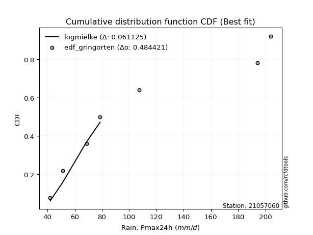</img>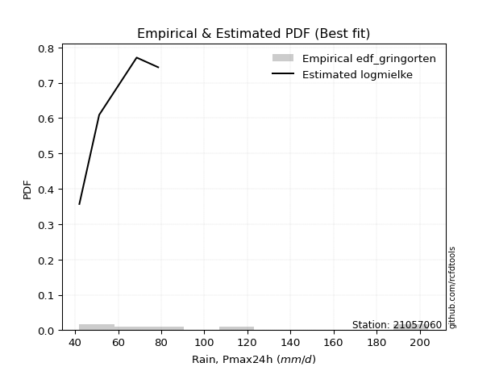</img>

</div>


### 9. EDF Filliben (1975)

The specific values of the constants (0.3175) (often denoted as $alpha$) and (0.365) are derived from a method proposed by James J. Filliben in a 1975 paper. This particular formula is the mean value of the $i$-th order statistic of the normal distribution and is considered a robust and effective plotting position formula for the normal probability plot correlation coefficient test for normality.

<div align="center">


$P=(m-0.3175)/(n+0.365)$


</div>


**9.1. Empirical values**

<div align="center">

|                | 0                  | 1                   | 2                  | 3                   | 4                  | 5                  | 6                  | 7                  |
|:---------------|:-------------------|:--------------------|:-------------------|:--------------------|:-------------------|:-------------------|:-------------------|:-------------------|
| date           | 2023               | 2021                | 2020               | 2022                | 2025               | 2019               | 2024               | 2012               |
| x              | 42.0               | 51.2                | 68.6               | 78.6                | 96.0               | 107.4              | 194.0              | 204.0              |
| m              | 1                  | 2                   | 3                  | 4                   | 5                  | 6                  | 7                  | 8                  |
| empirical_dist | edf_filliben       | edf_filliben        | edf_filliben       | edf_filliben        | edf_filliben       | edf_filliben       | edf_filliben       | edf_filliben       |
| empirical      | 0.0815899581589958 | 0.20113568439928273 | 0.3206814106395696 | 0.44022713687985654 | 0.5597728631201434 | 0.6793185893604303 | 0.7988643156007172 | 0.9184100418410042 |
| empirical_tr   | 1.0888382687927107 | 1.2517770295548074  | 1.4720633523977125 | 1.7864388681260008  | 2.271554650373387  | 3.118359739049394  | 4.971768202080237  | 12.256410256410254 |

</div>


**9.2. Kolmogorov-Smirnov fit test (sorted by Δ)**


<div align="center">

|                | 0                  | 1                   | 2                   | 3                   | 4                   | 5                  | 6                   | 7                   | 8                   | 9                  | 10                  | 11                  | 12                  | 13                  | 14                  | 15                  | 16                  | 17                 | 18                  | 19                  | 20                  | 21                  | 22                  | 23                  | 24                  | 25                  | 26                  | 27                 | 28                 | 29                  | 30                  | 31                  | 32                  | 33                  | 34                  | 35                  | 36                 | 37                  | 38                 | 39                 | 40                  | 41                 | 42                  | 43                  | 44                  | 45                  | 46                  | 47                  | 48                  | 49                 | 50                  | 51                 | 52                  | 53                  | 54                  | 55                  | 56                 | 57                  | 58                  | 59                  | 60                  | 61                  | 62                  | 63                  | 64                  | 65                  | 66                  | 67                  | 68                  | 69                 | 70                 | 71                  | 72                  | 73                 | 74                  | 75                  | 76                  | 77                  | 78                 | 79                  | 80                 | 81                 | 82                  | 83                  | 84                  | 85                 | 86                 | 87                 | 88                  | 89                 | 90                  | 91                  | 92                  | 93                  | 94                  | 95                 | 96                  | 97                 | 98                  | 99                  | 100                 | 101                 | 102                 | 103                 | 104                | 105                 | 106                 | 107                 | 108                 | 109                 | 110                 | 111                 | 112                 | 113                 | 114                 | 115                 | 116                | 117                 | 118                 | 119                 | 120                 | 121                | 122                 | 123                 | 124                | 125                 | 126                | 127                | 128                | 129                | 130                | 131                 | 132                 | 133                 | 134                | 135                | 136                 | 137                 | 138                | 139                 | 140                 | 141                | 142                 | 143                | 144                | 145                 | 146                | 147                | 148                 | 149                 | 150                | 151                | 152                | 153                | 154                | 155                | 156                | 157                | 158                | 159                |
|:---------------|:-------------------|:--------------------|:--------------------|:--------------------|:--------------------|:-------------------|:--------------------|:--------------------|:--------------------|:-------------------|:--------------------|:--------------------|:--------------------|:--------------------|:--------------------|:--------------------|:--------------------|:-------------------|:--------------------|:--------------------|:--------------------|:--------------------|:--------------------|:--------------------|:--------------------|:--------------------|:--------------------|:-------------------|:-------------------|:--------------------|:--------------------|:--------------------|:--------------------|:--------------------|:--------------------|:--------------------|:-------------------|:--------------------|:-------------------|:-------------------|:--------------------|:-------------------|:--------------------|:--------------------|:--------------------|:--------------------|:--------------------|:--------------------|:--------------------|:-------------------|:--------------------|:-------------------|:--------------------|:--------------------|:--------------------|:--------------------|:-------------------|:--------------------|:--------------------|:--------------------|:--------------------|:--------------------|:--------------------|:--------------------|:--------------------|:--------------------|:--------------------|:--------------------|:--------------------|:-------------------|:-------------------|:--------------------|:--------------------|:-------------------|:--------------------|:--------------------|:--------------------|:--------------------|:-------------------|:--------------------|:-------------------|:-------------------|:--------------------|:--------------------|:--------------------|:-------------------|:-------------------|:-------------------|:--------------------|:-------------------|:--------------------|:--------------------|:--------------------|:--------------------|:--------------------|:-------------------|:--------------------|:-------------------|:--------------------|:--------------------|:--------------------|:--------------------|:--------------------|:--------------------|:-------------------|:--------------------|:--------------------|:--------------------|:--------------------|:--------------------|:--------------------|:--------------------|:--------------------|:--------------------|:--------------------|:--------------------|:-------------------|:--------------------|:--------------------|:--------------------|:--------------------|:-------------------|:--------------------|:--------------------|:-------------------|:--------------------|:-------------------|:-------------------|:-------------------|:-------------------|:-------------------|:--------------------|:--------------------|:--------------------|:-------------------|:-------------------|:--------------------|:--------------------|:-------------------|:--------------------|:--------------------|:-------------------|:--------------------|:-------------------|:-------------------|:--------------------|:-------------------|:-------------------|:--------------------|:--------------------|:-------------------|:-------------------|:-------------------|:-------------------|:-------------------|:-------------------|:-------------------|:-------------------|:-------------------|:-------------------|
| station        | 21057060           | 21057060            | 21057060            | 21057060            | 21057060            | 21057060           | 21057060            | 21057060            | 21057060            | 21057060           | 21057060            | 21057060            | 21057060            | 21057060            | 21057060            | 21057060            | 21057060            | 21057060           | 21057060            | 21057060            | 21057060            | 21057060            | 21057060            | 21057060            | 21057060            | 21057060            | 21057060            | 21057060           | 21057060           | 21057060            | 21057060            | 21057060            | 21057060            | 21057060            | 21057060            | 21057060            | 21057060           | 21057060            | 21057060           | 21057060           | 21057060            | 21057060           | 21057060            | 21057060            | 21057060            | 21057060            | 21057060            | 21057060            | 21057060            | 21057060           | 21057060            | 21057060           | 21057060            | 21057060            | 21057060            | 21057060            | 21057060           | 21057060            | 21057060            | 21057060            | 21057060            | 21057060            | 21057060            | 21057060            | 21057060            | 21057060            | 21057060            | 21057060            | 21057060            | 21057060           | 21057060           | 21057060            | 21057060            | 21057060           | 21057060            | 21057060            | 21057060            | 21057060            | 21057060           | 21057060            | 21057060           | 21057060           | 21057060            | 21057060            | 21057060            | 21057060           | 21057060           | 21057060           | 21057060            | 21057060           | 21057060            | 21057060            | 21057060            | 21057060            | 21057060            | 21057060           | 21057060            | 21057060           | 21057060            | 21057060            | 21057060            | 21057060            | 21057060            | 21057060            | 21057060           | 21057060            | 21057060            | 21057060            | 21057060            | 21057060            | 21057060            | 21057060            | 21057060            | 21057060            | 21057060            | 21057060            | 21057060           | 21057060            | 21057060            | 21057060            | 21057060            | 21057060           | 21057060            | 21057060            | 21057060           | 21057060            | 21057060           | 21057060           | 21057060           | 21057060           | 21057060           | 21057060            | 21057060            | 21057060            | 21057060           | 21057060           | 21057060            | 21057060            | 21057060           | 21057060            | 21057060            | 21057060           | 21057060            | 21057060           | 21057060           | 21057060            | 21057060           | 21057060           | 21057060            | 21057060            | 21057060           | 21057060           | 21057060           | 21057060           | 21057060           | 21057060           | 21057060           | 21057060           | 21057060           | 21057060           |
| empirical_dist | edf_filliben       | edf_filliben        | edf_filliben        | edf_filliben        | edf_filliben        | edf_filliben       | edf_filliben        | edf_filliben        | edf_filliben        | edf_filliben       | edf_filliben        | edf_filliben        | edf_filliben        | edf_filliben        | edf_filliben        | edf_filliben        | edf_filliben        | edf_filliben       | edf_filliben        | edf_filliben        | edf_filliben        | edf_filliben        | edf_filliben        | edf_filliben        | edf_filliben        | edf_filliben        | edf_filliben        | edf_filliben       | edf_filliben       | edf_filliben        | edf_filliben        | edf_filliben        | edf_filliben        | edf_filliben        | edf_filliben        | edf_filliben        | edf_filliben       | edf_filliben        | edf_filliben       | edf_filliben       | edf_filliben        | edf_filliben       | edf_filliben        | edf_filliben        | edf_filliben        | edf_filliben        | edf_filliben        | edf_filliben        | edf_filliben        | edf_filliben       | edf_filliben        | edf_filliben       | edf_filliben        | edf_filliben        | edf_filliben        | edf_filliben        | edf_filliben       | edf_filliben        | edf_filliben        | edf_filliben        | edf_filliben        | edf_filliben        | edf_filliben        | edf_filliben        | edf_filliben        | edf_filliben        | edf_filliben        | edf_filliben        | edf_filliben        | edf_filliben       | edf_filliben       | edf_filliben        | edf_filliben        | edf_filliben       | edf_filliben        | edf_filliben        | edf_filliben        | edf_filliben        | edf_filliben       | edf_filliben        | edf_filliben       | edf_filliben       | edf_filliben        | edf_filliben        | edf_filliben        | edf_filliben       | edf_filliben       | edf_filliben       | edf_filliben        | edf_filliben       | edf_filliben        | edf_filliben        | edf_filliben        | edf_filliben        | edf_filliben        | edf_filliben       | edf_filliben        | edf_filliben       | edf_filliben        | edf_filliben        | edf_filliben        | edf_filliben        | edf_filliben        | edf_filliben        | edf_filliben       | edf_filliben        | edf_filliben        | edf_filliben        | edf_filliben        | edf_filliben        | edf_filliben        | edf_filliben        | edf_filliben        | edf_filliben        | edf_filliben        | edf_filliben        | edf_filliben       | edf_filliben        | edf_filliben        | edf_filliben        | edf_filliben        | edf_filliben       | edf_filliben        | edf_filliben        | edf_filliben       | edf_filliben        | edf_filliben       | edf_filliben       | edf_filliben       | edf_filliben       | edf_filliben       | edf_filliben        | edf_filliben        | edf_filliben        | edf_filliben       | edf_filliben       | edf_filliben        | edf_filliben        | edf_filliben       | edf_filliben        | edf_filliben        | edf_filliben       | edf_filliben        | edf_filliben       | edf_filliben       | edf_filliben        | edf_filliben       | edf_filliben       | edf_filliben        | edf_filliben        | edf_filliben       | edf_filliben       | edf_filliben       | edf_filliben       | edf_filliben       | edf_filliben       | edf_filliben       | edf_filliben       | edf_filliben       | edf_filliben       |
| p_dist         | loggenexpon        | loggamma            | loggamma            | logf                | logerlang           | johnsonsu          | logskewnorm         | loggenlogistic      | logmielke           | burr               | loginvweibull       | logweibull_min      | logburr             | loghalfnorm         | nct                 | logkstwobign        | invgamma            | logfatiguelife     | invgauss            | loginvgauss         | alpha               | nakagami            | lograyleigh         | logksone            | loginvgamma         | exponnorm           | logsemicircular     | logncf             | logexponpow        | lognct              | logmaxwell          | logburr12           | logalpha            | loggompertz         | loganglit           | logrice             | betaprime          | f                   | loggumbel_r        | logbetaprime       | exponpow            | logfoldnorm        | halfnorm            | logrdist            | genexpon            | logpearson3         | foldnorm            | gompertz            | halflogistic        | logmoyal           | logloggamma         | logjohnsonsu       | logexponnorm        | logt                | logcrystalball      | lognorm             | rayleigh           | loggenextreme       | moyal               | pearson3            | skewnorm            | gumbel_r            | logloglaplace       | logcosine           | loglogistic         | maxwell             | loghypsecant        | loglaplace          | loglaplace          | logdgamma          | logbeta            | logdweibull         | loghalflogistic     | kstwobign          | genlogistic         | logargus            | logwrapcauchy       | rice                | burr12             | loglomax            | dweibull           | hypsecant          | dgamma              | logistic            | truncweibull_min    | logkappa4          | t                  | truncnorm          | norm                | crystalball        | truncexpon          | anglit              | loggausshyper       | logtukeylambda      | semicircular        | logkappa3          | ksone               | loggumbel_l        | logvonmises_line    | loguniform          | logtruncpareto      | weibull_min         | logbradford         | laplace             | halfgennorm        | logtruncexpon       | logtruncnorm        | logtruncweibull_min | logtriang           | wald                | logwald             | arcsine             | logarcsine          | kappa4              | cosine              | lomax               | wrapcauchy         | gamma               | ncf                 | loggenhalflogistic  | loglevy_l           | loggenpareto       | gumbel_l            | bradford            | levy_l             | tukeylambda         | uniform            | vonmises_line      | gausshyper         | argus              | kappa3             | gennorm             | loggennorm          | logweibull_max      | beta               | genextreme         | triang              | logtrapezoid        | genpareto          | erlang              | genhalflogistic     | powerlaw           | logjohnsonsb        | lognakagami        | fatiguelife        | invweibull          | johnsonsb          | logexponweib       | logpowerlaw         | gengamma            | rdist              | trapezoid          | loggengamma        | exponweib          | weibull_max        | truncpareto        | loghalfgennorm     | logvonmises        | vonmises           | mielke             |
| delta          | 0.0840523874901708 | 0.09092937727346995 | 0.09092937727346995 | 0.09097963979267798 | 0.09107769601172844 | 0.0952064230639188 | 0.09747520513707675 | 0.09765260083057103 | 0.09825509073511762 | 0.0983307268400353 | 0.09864276477033673 | 0.09874892761412324 | 0.09909240697636701 | 0.10237469366116059 | 0.10305996292040431 | 0.10368972897289996 | 0.10407471829087456 | 0.1051500098714252 | 0.10572626635891147 | 0.10584586283651132 | 0.10761475063433212 | 0.10765302678510091 | 0.10830510563211226 | 0.10962213975926494 | 0.11028119026727146 | 0.11040811978415255 | 0.11047626971175817 | 0.1106641245040011 | 0.1108400491271887 | 0.11113863001535584 | 0.11131267656369181 | 0.11196177442200317 | 0.11237913951370293 | 0.11262525096393539 | 0.11284672404160823 | 0.11289604633799899 | 0.1135901905545087 | 0.11364457140702389 | 0.1137518316779702 | 0.1148876473291972 | 0.11540336957468766 | 0.1164491063356401 | 0.11648430479158056 | 0.11700408379689164 | 0.11711430337667517 | 0.11774983343009227 | 0.11797168058978291 | 0.11985159794103228 | 0.12157988968929057 | 0.1216418937083852 | 0.12179925706898886 | 0.1220132475444019 | 0.12229052031726251 | 0.12260545577330773 | 0.12260709332651465 | 0.12260709346866161 | 0.1233782440422071 | 0.12424406385509212 | 0.12456350664549842 | 0.12507420192084828 | 0.12522189868962863 | 0.12590177853142015 | 0.12679712934207787 | 0.12896433267661622 | 0.12981625827192955 | 0.13191181567087862 | 0.13244975395826974 | 0.13354694897136754 | 0.13354694897136754 | 0.1343504659140181 | 0.1344053168517414 | 0.13528475352081337 | 0.13821868360250933 | 0.1391047053990604 | 0.14113353258036831 | 0.14281406214280434 | 0.14712792992774282 | 0.14795395327359406 | 0.1491572765173222 | 0.15055820422719007 | 0.1593884438655767 | 0.1605030491442211 | 0.16164987492752825 | 0.16225146937446877 | 0.16268250598013412 | 0.1627985496026676 | 0.1642942675949658 | 0.1643007565254977 | 0.16430075878465067 | 0.1643007792237181 | 0.16568529906625962 | 0.16644894194629656 | 0.16697785546346156 | 0.16707824258946846 | 0.16733397082328916 | 0.1678293859702813 | 0.16844910049249562 | 0.1693097625691541 | 0.16933183494083892 | 0.16933346171762997 | 0.17212439367243848 | 0.17636610478772202 | 0.17845483161353193 | 0.17968568874414614 | 0.1800897616779738 | 0.18062144578387795 | 0.18859895203161592 | 0.1903948203060017  | 0.19878379087125442 | 0.20091177106063596 | 0.20113568439928273 | 0.20113568439928275 | 0.20113568439928275 | 0.20372901221514955 | 0.20550539056010375 | 0.21163497708143109 | 0.2134420557387831 | 0.21624573846974876 | 0.21939045160434714 | 0.22831070991521407 | 0.23335102201723168 | 0.23379960882529   | 0.23406800621544788 | 0.24122792782906716 | 0.2709888273892487 | 0.27518100840436266 | 0.2756148856567266 | 0.2786292517947554 | 0.2789376973416401 | 0.2821454570194588 | 0.2885503648489107 | 0.29886431560071725 | 0.29886431560071725 | 0.30827917098714847 | 0.3103876177299807 | 0.3168445638950921 | 0.33192916905511366 | 0.34478629924834125 | 0.3517660166017946 | 0.35618825339368915 | 0.39660406963599426 | 0.4091749606595331 | 0.41069246044968255 | 0.4176173596926114 | 0.4312111649045507 | 0.43484127251366783 | 0.4431424001938282 | 0.4688497085472554 | 0.47604138609469643 | 0.47846421256896166 | 0.4821353606309686 | 0.5031259358015217 | 0.5523224786887835 | 0.5689591832831907 | 0.6006960997991369 | 0.6112482211908044 | 0.7988643156007172 | 1.1246316837846186 | 31.95735808637539  | nan                |
| deltao         | 0.4472608134160001 | 0.4472608134160001  | 0.4472608134160001  | 0.4472608134160001  | 0.4472608134160001  | 0.4472608134160001 | 0.4472608134160001  | 0.4472608134160001  | 0.4472608134160001  | 0.4472608134160001 | 0.4472608134160001  | 0.4472608134160001  | 0.4472608134160001  | 0.4472608134160001  | 0.4472608134160001  | 0.4472608134160001  | 0.4472608134160001  | 0.4472608134160001 | 0.4472608134160001  | 0.4472608134160001  | 0.4472608134160001  | 0.4472608134160001  | 0.4472608134160001  | 0.4472608134160001  | 0.4472608134160001  | 0.4472608134160001  | 0.4472608134160001  | 0.4472608134160001 | 0.4472608134160001 | 0.4472608134160001  | 0.4472608134160001  | 0.4472608134160001  | 0.4472608134160001  | 0.4472608134160001  | 0.4472608134160001  | 0.4472608134160001  | 0.4472608134160001 | 0.4472608134160001  | 0.4472608134160001 | 0.4472608134160001 | 0.4472608134160001  | 0.4472608134160001 | 0.4472608134160001  | 0.4472608134160001  | 0.4472608134160001  | 0.4472608134160001  | 0.4472608134160001  | 0.4472608134160001  | 0.4472608134160001  | 0.4472608134160001 | 0.4472608134160001  | 0.4472608134160001 | 0.4472608134160001  | 0.4472608134160001  | 0.4472608134160001  | 0.4472608134160001  | 0.4472608134160001 | 0.4472608134160001  | 0.4472608134160001  | 0.4472608134160001  | 0.4472608134160001  | 0.4472608134160001  | 0.4472608134160001  | 0.4472608134160001  | 0.4472608134160001  | 0.4472608134160001  | 0.4472608134160001  | 0.4472608134160001  | 0.4472608134160001  | 0.4472608134160001 | 0.4472608134160001 | 0.4472608134160001  | 0.4472608134160001  | 0.4472608134160001 | 0.4472608134160001  | 0.4472608134160001  | 0.4472608134160001  | 0.4472608134160001  | 0.4472608134160001 | 0.4472608134160001  | 0.4472608134160001 | 0.4472608134160001 | 0.4472608134160001  | 0.4472608134160001  | 0.4472608134160001  | 0.4472608134160001 | 0.4472608134160001 | 0.4472608134160001 | 0.4472608134160001  | 0.4472608134160001 | 0.4472608134160001  | 0.4472608134160001  | 0.4472608134160001  | 0.4472608134160001  | 0.4472608134160001  | 0.4472608134160001 | 0.4472608134160001  | 0.4472608134160001 | 0.4472608134160001  | 0.4472608134160001  | 0.4472608134160001  | 0.4472608134160001  | 0.4472608134160001  | 0.4472608134160001  | 0.4472608134160001 | 0.4472608134160001  | 0.4472608134160001  | 0.4472608134160001  | 0.4472608134160001  | 0.4472608134160001  | 0.4472608134160001  | 0.4472608134160001  | 0.4472608134160001  | 0.4472608134160001  | 0.4472608134160001  | 0.4472608134160001  | 0.4472608134160001 | 0.4472608134160001  | 0.4472608134160001  | 0.4472608134160001  | 0.4472608134160001  | 0.4472608134160001 | 0.4472608134160001  | 0.4472608134160001  | 0.4472608134160001 | 0.4472608134160001  | 0.4472608134160001 | 0.4472608134160001 | 0.4472608134160001 | 0.4472608134160001 | 0.4472608134160001 | 0.4472608134160001  | 0.4472608134160001  | 0.4472608134160001  | 0.4472608134160001 | 0.4472608134160001 | 0.4472608134160001  | 0.4472608134160001  | 0.4472608134160001 | 0.4472608134160001  | 0.4472608134160001  | 0.4472608134160001 | 0.4472608134160001  | 0.4472608134160001 | 0.4472608134160001 | 0.4472608134160001  | 0.4472608134160001 | 0.4472608134160001 | 0.4472608134160001  | 0.4472608134160001  | 0.4472608134160001 | 0.4472608134160001 | 0.4472608134160001 | 0.4472608134160001 | 0.4472608134160001 | 0.4472608134160001 | 0.4472608134160001 | 0.4472608134160001 | 0.4472608134160001 | 0.4472608134160001 |
| eval           | Δo > Δ             | Δo > Δ              | Δo > Δ              | Δo > Δ              | Δo > Δ              | Δo > Δ             | Δo > Δ              | Δo > Δ              | Δo > Δ              | Δo > Δ             | Δo > Δ              | Δo > Δ              | Δo > Δ              | Δo > Δ              | Δo > Δ              | Δo > Δ              | Δo > Δ              | Δo > Δ             | Δo > Δ              | Δo > Δ              | Δo > Δ              | Δo > Δ              | Δo > Δ              | Δo > Δ              | Δo > Δ              | Δo > Δ              | Δo > Δ              | Δo > Δ             | Δo > Δ             | Δo > Δ              | Δo > Δ              | Δo > Δ              | Δo > Δ              | Δo > Δ              | Δo > Δ              | Δo > Δ              | Δo > Δ             | Δo > Δ              | Δo > Δ             | Δo > Δ             | Δo > Δ              | Δo > Δ             | Δo > Δ              | Δo > Δ              | Δo > Δ              | Δo > Δ              | Δo > Δ              | Δo > Δ              | Δo > Δ              | Δo > Δ             | Δo > Δ              | Δo > Δ             | Δo > Δ              | Δo > Δ              | Δo > Δ              | Δo > Δ              | Δo > Δ             | Δo > Δ              | Δo > Δ              | Δo > Δ              | Δo > Δ              | Δo > Δ              | Δo > Δ              | Δo > Δ              | Δo > Δ              | Δo > Δ              | Δo > Δ              | Δo > Δ              | Δo > Δ              | Δo > Δ             | Δo > Δ             | Δo > Δ              | Δo > Δ              | Δo > Δ             | Δo > Δ              | Δo > Δ              | Δo > Δ              | Δo > Δ              | Δo > Δ             | Δo > Δ              | Δo > Δ             | Δo > Δ             | Δo > Δ              | Δo > Δ              | Δo > Δ              | Δo > Δ             | Δo > Δ             | Δo > Δ             | Δo > Δ              | Δo > Δ             | Δo > Δ              | Δo > Δ              | Δo > Δ              | Δo > Δ              | Δo > Δ              | Δo > Δ             | Δo > Δ              | Δo > Δ             | Δo > Δ              | Δo > Δ              | Δo > Δ              | Δo > Δ              | Δo > Δ              | Δo > Δ              | Δo > Δ             | Δo > Δ              | Δo > Δ              | Δo > Δ              | Δo > Δ              | Δo > Δ              | Δo > Δ              | Δo > Δ              | Δo > Δ              | Δo > Δ              | Δo > Δ              | Δo > Δ              | Δo > Δ             | Δo > Δ              | Δo > Δ              | Δo > Δ              | Δo > Δ              | Δo > Δ             | Δo > Δ              | Δo > Δ              | Δo > Δ             | Δo > Δ              | Δo > Δ             | Δo > Δ             | Δo > Δ             | Δo > Δ             | Δo > Δ             | Δo > Δ              | Δo > Δ              | Δo > Δ              | Δo > Δ             | Δo > Δ             | Δo > Δ              | Δo > Δ              | Δo > Δ             | Δo > Δ              | Δo > Δ              | Δo > Δ             | Δo > Δ              | Δo > Δ             | Δo > Δ             | Δo > Δ              | Δo > Δ             | Δo <= Δ            | Δo <= Δ             | Δo <= Δ             | Δo <= Δ            | Δo <= Δ            | Δo <= Δ            | Δo <= Δ            | Δo <= Δ            | Δo <= Δ            | Δo <= Δ            | Δo <= Δ            | Δo <= Δ            | Δo <= Δ            |
| fit            | 1                  | 1                   | 1                   | 1                   | 1                   | 1                  | 1                   | 1                   | 1                   | 1                  | 1                   | 1                   | 1                   | 1                   | 1                   | 1                   | 1                   | 1                  | 1                   | 1                   | 1                   | 1                   | 1                   | 1                   | 1                   | 1                   | 1                   | 1                  | 1                  | 1                   | 1                   | 1                   | 1                   | 1                   | 1                   | 1                   | 1                  | 1                   | 1                  | 1                  | 1                   | 1                  | 1                   | 1                   | 1                   | 1                   | 1                   | 1                   | 1                   | 1                  | 1                   | 1                  | 1                   | 1                   | 1                   | 1                   | 1                  | 1                   | 1                   | 1                   | 1                   | 1                   | 1                   | 1                   | 1                   | 1                   | 1                   | 1                   | 1                   | 1                  | 1                  | 1                   | 1                   | 1                  | 1                   | 1                   | 1                   | 1                   | 1                  | 1                   | 1                  | 1                  | 1                   | 1                   | 1                   | 1                  | 1                  | 1                  | 1                   | 1                  | 1                   | 1                   | 1                   | 1                   | 1                   | 1                  | 1                   | 1                  | 1                   | 1                   | 1                   | 1                   | 1                   | 1                   | 1                  | 1                   | 1                   | 1                   | 1                   | 1                   | 1                   | 1                   | 1                   | 1                   | 1                   | 1                   | 1                  | 1                   | 1                   | 1                   | 1                   | 1                  | 1                   | 1                   | 1                  | 1                   | 1                  | 1                  | 1                  | 1                  | 1                  | 1                   | 1                   | 1                   | 1                  | 1                  | 1                   | 1                   | 1                  | 1                   | 1                   | 1                  | 1                   | 1                  | 1                  | 1                   | 1                  | 0                  | 0                   | 0                   | 0                  | 0                  | 0                  | 0                  | 0                  | 0                  | 0                  | 0                  | 0                  | 0                  |
| n              | 8                  | 8                   | 8                   | 8                   | 8                   | 8                  | 8                   | 8                   | 8                   | 8                  | 8                   | 8                   | 8                   | 8                   | 8                   | 8                   | 8                   | 8                  | 8                   | 8                   | 8                   | 8                   | 8                   | 8                   | 8                   | 8                   | 8                   | 8                  | 8                  | 8                   | 8                   | 8                   | 8                   | 8                   | 8                   | 8                   | 8                  | 8                   | 8                  | 8                  | 8                   | 8                  | 8                   | 8                   | 8                   | 8                   | 8                   | 8                   | 8                   | 8                  | 8                   | 8                  | 8                   | 8                   | 8                   | 8                   | 8                  | 8                   | 8                   | 8                   | 8                   | 8                   | 8                   | 8                   | 8                   | 8                   | 8                   | 8                   | 8                   | 8                  | 8                  | 8                   | 8                   | 8                  | 8                   | 8                   | 8                   | 8                   | 8                  | 8                   | 8                  | 8                  | 8                   | 8                   | 8                   | 8                  | 8                  | 8                  | 8                   | 8                  | 8                   | 8                   | 8                   | 8                   | 8                   | 8                  | 8                   | 8                  | 8                   | 8                   | 8                   | 8                   | 8                   | 8                   | 8                  | 8                   | 8                   | 8                   | 8                   | 8                   | 8                   | 8                   | 8                   | 8                   | 8                   | 8                   | 8                  | 8                   | 8                   | 8                   | 8                   | 8                  | 8                   | 8                   | 8                  | 8                   | 8                  | 8                  | 8                  | 8                  | 8                  | 8                   | 8                   | 8                   | 8                  | 8                  | 8                   | 8                   | 8                  | 8                   | 8                   | 8                  | 8                   | 8                  | 8                  | 8                   | 8                  | 8                  | 8                   | 8                   | 8                  | 8                  | 8                  | 8                  | 8                  | 8                  | 8                  | 8                  | 8                  | 8                  |
| best_fit       | 1                  | 0                   | 0                   | 0                   | 0                   | 0                  | 0                   | 0                   | 0                   | 0                  | 0                   | 0                   | 0                   | 0                   | 0                   | 0                   | 0                   | 0                  | 0                   | 0                   | 0                   | 0                   | 0                   | 0                   | 0                   | 0                   | 0                   | 0                  | 0                  | 0                   | 0                   | 0                   | 0                   | 0                   | 0                   | 0                   | 0                  | 0                   | 0                  | 0                  | 0                   | 0                  | 0                   | 0                   | 0                   | 0                   | 0                   | 0                   | 0                   | 0                  | 0                   | 0                  | 0                   | 0                   | 0                   | 0                   | 0                  | 0                   | 0                   | 0                   | 0                   | 0                   | 0                   | 0                   | 0                   | 0                   | 0                   | 0                   | 0                   | 0                  | 0                  | 0                   | 0                   | 0                  | 0                   | 0                   | 0                   | 0                   | 0                  | 0                   | 0                  | 0                  | 0                   | 0                   | 0                   | 0                  | 0                  | 0                  | 0                   | 0                  | 0                   | 0                   | 0                   | 0                   | 0                   | 0                  | 0                   | 0                  | 0                   | 0                   | 0                   | 0                   | 0                   | 0                   | 0                  | 0                   | 0                   | 0                   | 0                   | 0                   | 0                   | 0                   | 0                   | 0                   | 0                   | 0                   | 0                  | 0                   | 0                   | 0                   | 0                   | 0                  | 0                   | 0                   | 0                  | 0                   | 0                  | 0                  | 0                  | 0                  | 0                  | 0                   | 0                   | 0                   | 0                  | 0                  | 0                   | 0                   | 0                  | 0                   | 0                   | 0                  | 0                   | 0                  | 0                  | 0                   | 0                  | 0                  | 0                   | 0                   | 0                  | 0                  | 0                  | 0                  | 0                  | 0                  | 0                  | 0                  | 0                  | 0                  |
| best_fit_sort  | 1                  | 2                   | 3                   | 4                   | 5                   | 6                  | 7                   | 8                   | 9                   | 10                 | 11                  | 12                  | 13                  | 14                  | 15                  | 16                  | 17                  | 18                 | 19                  | 20                  | 21                  | 22                  | 23                  | 24                  | 25                  | 26                  | 27                  | 28                 | 29                 | 30                  | 31                  | 32                  | 33                  | 34                  | 35                  | 36                  | 37                 | 38                  | 39                 | 40                 | 41                  | 42                 | 43                  | 44                  | 45                  | 46                  | 47                  | 48                  | 49                  | 50                 | 51                  | 52                 | 53                  | 54                  | 55                  | 56                  | 57                 | 58                  | 59                  | 60                  | 61                  | 62                  | 63                  | 64                  | 65                  | 66                  | 67                  | 68                  | 69                  | 70                 | 71                 | 72                  | 73                  | 74                 | 75                  | 76                  | 77                  | 78                  | 79                 | 80                  | 81                 | 82                 | 83                  | 84                  | 85                  | 86                 | 87                 | 88                 | 89                  | 90                 | 91                  | 92                  | 93                  | 94                  | 95                  | 96                 | 97                  | 98                 | 99                  | 100                 | 101                 | 102                 | 103                 | 104                 | 105                | 106                 | 107                 | 108                 | 109                 | 110                 | 111                 | 112                 | 113                 | 114                 | 115                 | 116                 | 117                | 118                 | 119                 | 120                 | 121                 | 122                | 123                 | 124                 | 125                | 126                 | 127                | 128                | 129                | 130                | 131                | 132                 | 133                 | 134                 | 135                | 136                | 137                 | 138                 | 139                | 140                 | 141                 | 142                | 143                 | 144                | 145                | 146                 | 147                | 148                | 149                 | 150                 | 151                | 152                | 153                | 154                | 155                | 156                | 157                | 158                | 159                | 160                |

</div>


**9.3. Best fit**

<div align="center">

|   id |   station | empirical_dist   | p_dist      |     delta |   deltao | eval   |   fit |   n |   best_fit |   best_fit_sort |
|-----:|----------:|:-----------------|:------------|----------:|---------:|:-------|------:|----:|-----------:|----------------:|
|    0 |  21057060 | edf_filliben     | loggenexpon | 0.0840524 | 0.447261 | Δo > Δ |     1 |   8 |          1 |               1 |

</div>


<div align="center">

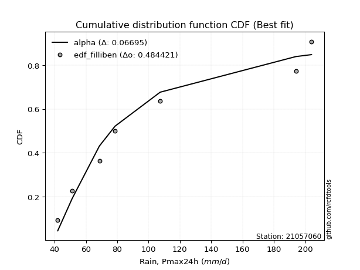</img></img>

</div>


### 10. EDF Jenkinson (1977)

The Jenkinson formula in hydrology is an empirical plotting position formula used to estimate the non-exceedance probability _(P)_ or return period _(T)_ of a given ordered observation within a sample. It is a widely used method in the frequency analysis of extreme events such as floods and rainfall, as it provides a distribution-free way to plot data. _a≈0.31_ and _b≈0.38_ are constants derived to approximate the median of the probability distribution for the given rank.

<div align="center">


$P=(m-a)/(n+b)$


</div>


**10.1. Empirical values**

<div align="center">

|                | 0                   | 1                   | 2                  | 3                   | 4                  | 5                  | 6                  | 7                  |
|:---------------|:--------------------|:--------------------|:-------------------|:--------------------|:-------------------|:-------------------|:-------------------|:-------------------|
| date           | 2023                | 2021                | 2020               | 2022                | 2025               | 2019               | 2024               | 2012               |
| x              | 42.0                | 51.2                | 68.6               | 78.6                | 96.0               | 107.4              | 194.0              | 204.0              |
| m              | 1                   | 2                   | 3                  | 4                   | 5                  | 6                  | 7                  | 8                  |
| empirical_dist | edf_jenkinson       | edf_jenkinson       | edf_jenkinson      | edf_jenkinson       | edf_jenkinson      | edf_jenkinson      | edf_jenkinson      | edf_jenkinson      |
| empirical      | 0.08233890214797135 | 0.20167064439140808 | 0.3210023866348448 | 0.44033412887828155 | 0.5596658711217184 | 0.6789976133651551 | 0.7983293556085919 | 0.9176610978520287 |
| empirical_tr   | 1.0897269180754225  | 1.2526158445440956  | 1.4727592267135323 | 1.7867803837953091  | 2.2710027100271004 | 3.115241635687732  | 4.958579881656804  | 12.144927536231886 |

</div>


**10.2. Kolmogorov-Smirnov fit test (sorted by Δ)**


<div align="center">

|                | 0                  | 1                   | 2                   | 3                   | 4                   | 5                   | 6                   | 7                   | 8                  | 9                   | 10                  | 11                  | 12                  | 13                  | 14                 | 15                  | 16                  | 17                  | 18                  | 19                 | 20                  | 21                  | 22                  | 23                  | 24                  | 25                  | 26                  | 27                  | 28                  | 29                  | 30                 | 31                  | 32                  | 33                  | 34                  | 35                  | 36                  | 37                  | 38                  | 39                  | 40                  | 41                  | 42                  | 43                  | 44                  | 45                  | 46                 | 47                  | 48                  | 49                  | 50                  | 51                  | 52                  | 53                  | 54                  | 55                 | 56                  | 57                  | 58                 | 59                  | 60                 | 61                  | 62                  | 63                 | 64                  | 65                  | 66                  | 67                  | 68                  | 69                 | 70                  | 71                  | 72                  | 73                  | 74                 | 75                  | 76                  | 77                 | 78                 | 79                  | 80                 | 81                  | 82                  | 83                  | 84                 | 85                  | 86                  | 87                  | 88                  | 89                  | 90                 | 91                 | 92                 | 93                  | 94                  | 95                  | 96                  | 97                  | 98                 | 99                  | 100                 | 101                 | 102                | 103                | 104                 | 105                 | 106                | 107                 | 108                 | 109                | 110                 | 111                 | 112                 | 113                | 114                | 115                 | 116                 | 117                 | 118                | 119                 | 120                 | 121                 | 122                 | 123                | 124                 | 125                | 126                 | 127                 | 128                 | 129                 | 130                 | 131                | 132                | 133                | 134                | 135                 | 136                | 137                | 138                | 139                 | 140                | 141                 | 142                | 143                 | 144                 | 145                | 146                | 147                 | 148                 | 149                | 150                | 151                | 152                | 153                | 154                | 155                | 156                | 157                | 158                | 159                |
|:---------------|:-------------------|:--------------------|:--------------------|:--------------------|:--------------------|:--------------------|:--------------------|:--------------------|:-------------------|:--------------------|:--------------------|:--------------------|:--------------------|:--------------------|:-------------------|:--------------------|:--------------------|:--------------------|:--------------------|:-------------------|:--------------------|:--------------------|:--------------------|:--------------------|:--------------------|:--------------------|:--------------------|:--------------------|:--------------------|:--------------------|:-------------------|:--------------------|:--------------------|:--------------------|:--------------------|:--------------------|:--------------------|:--------------------|:--------------------|:--------------------|:--------------------|:--------------------|:--------------------|:--------------------|:--------------------|:--------------------|:-------------------|:--------------------|:--------------------|:--------------------|:--------------------|:--------------------|:--------------------|:--------------------|:--------------------|:-------------------|:--------------------|:--------------------|:-------------------|:--------------------|:-------------------|:--------------------|:--------------------|:-------------------|:--------------------|:--------------------|:--------------------|:--------------------|:--------------------|:-------------------|:--------------------|:--------------------|:--------------------|:--------------------|:-------------------|:--------------------|:--------------------|:-------------------|:-------------------|:--------------------|:-------------------|:--------------------|:--------------------|:--------------------|:-------------------|:--------------------|:--------------------|:--------------------|:--------------------|:--------------------|:-------------------|:-------------------|:-------------------|:--------------------|:--------------------|:--------------------|:--------------------|:--------------------|:-------------------|:--------------------|:--------------------|:--------------------|:-------------------|:-------------------|:--------------------|:--------------------|:-------------------|:--------------------|:--------------------|:-------------------|:--------------------|:--------------------|:--------------------|:-------------------|:-------------------|:--------------------|:--------------------|:--------------------|:-------------------|:--------------------|:--------------------|:--------------------|:--------------------|:-------------------|:--------------------|:-------------------|:--------------------|:--------------------|:--------------------|:--------------------|:--------------------|:-------------------|:-------------------|:-------------------|:-------------------|:--------------------|:-------------------|:-------------------|:-------------------|:--------------------|:-------------------|:--------------------|:-------------------|:--------------------|:--------------------|:-------------------|:-------------------|:--------------------|:--------------------|:-------------------|:-------------------|:-------------------|:-------------------|:-------------------|:-------------------|:-------------------|:-------------------|:-------------------|:-------------------|:-------------------|
| station        | 21057060           | 21057060            | 21057060            | 21057060            | 21057060            | 21057060            | 21057060            | 21057060            | 21057060           | 21057060            | 21057060            | 21057060            | 21057060            | 21057060            | 21057060           | 21057060            | 21057060            | 21057060            | 21057060            | 21057060           | 21057060            | 21057060            | 21057060            | 21057060            | 21057060            | 21057060            | 21057060            | 21057060            | 21057060            | 21057060            | 21057060           | 21057060            | 21057060            | 21057060            | 21057060            | 21057060            | 21057060            | 21057060            | 21057060            | 21057060            | 21057060            | 21057060            | 21057060            | 21057060            | 21057060            | 21057060            | 21057060           | 21057060            | 21057060            | 21057060            | 21057060            | 21057060            | 21057060            | 21057060            | 21057060            | 21057060           | 21057060            | 21057060            | 21057060           | 21057060            | 21057060           | 21057060            | 21057060            | 21057060           | 21057060            | 21057060            | 21057060            | 21057060            | 21057060            | 21057060           | 21057060            | 21057060            | 21057060            | 21057060            | 21057060           | 21057060            | 21057060            | 21057060           | 21057060           | 21057060            | 21057060           | 21057060            | 21057060            | 21057060            | 21057060           | 21057060            | 21057060            | 21057060            | 21057060            | 21057060            | 21057060           | 21057060           | 21057060           | 21057060            | 21057060            | 21057060            | 21057060            | 21057060            | 21057060           | 21057060            | 21057060            | 21057060            | 21057060           | 21057060           | 21057060            | 21057060            | 21057060           | 21057060            | 21057060            | 21057060           | 21057060            | 21057060            | 21057060            | 21057060           | 21057060           | 21057060            | 21057060            | 21057060            | 21057060           | 21057060            | 21057060            | 21057060            | 21057060            | 21057060           | 21057060            | 21057060           | 21057060            | 21057060            | 21057060            | 21057060            | 21057060            | 21057060           | 21057060           | 21057060           | 21057060           | 21057060            | 21057060           | 21057060           | 21057060           | 21057060            | 21057060           | 21057060            | 21057060           | 21057060            | 21057060            | 21057060           | 21057060           | 21057060            | 21057060            | 21057060           | 21057060           | 21057060           | 21057060           | 21057060           | 21057060           | 21057060           | 21057060           | 21057060           | 21057060           | 21057060           |
| empirical_dist | edf_jenkinson      | edf_jenkinson       | edf_jenkinson       | edf_jenkinson       | edf_jenkinson       | edf_jenkinson       | edf_jenkinson       | edf_jenkinson       | edf_jenkinson      | edf_jenkinson       | edf_jenkinson       | edf_jenkinson       | edf_jenkinson       | edf_jenkinson       | edf_jenkinson      | edf_jenkinson       | edf_jenkinson       | edf_jenkinson       | edf_jenkinson       | edf_jenkinson      | edf_jenkinson       | edf_jenkinson       | edf_jenkinson       | edf_jenkinson       | edf_jenkinson       | edf_jenkinson       | edf_jenkinson       | edf_jenkinson       | edf_jenkinson       | edf_jenkinson       | edf_jenkinson      | edf_jenkinson       | edf_jenkinson       | edf_jenkinson       | edf_jenkinson       | edf_jenkinson       | edf_jenkinson       | edf_jenkinson       | edf_jenkinson       | edf_jenkinson       | edf_jenkinson       | edf_jenkinson       | edf_jenkinson       | edf_jenkinson       | edf_jenkinson       | edf_jenkinson       | edf_jenkinson      | edf_jenkinson       | edf_jenkinson       | edf_jenkinson       | edf_jenkinson       | edf_jenkinson       | edf_jenkinson       | edf_jenkinson       | edf_jenkinson       | edf_jenkinson      | edf_jenkinson       | edf_jenkinson       | edf_jenkinson      | edf_jenkinson       | edf_jenkinson      | edf_jenkinson       | edf_jenkinson       | edf_jenkinson      | edf_jenkinson       | edf_jenkinson       | edf_jenkinson       | edf_jenkinson       | edf_jenkinson       | edf_jenkinson      | edf_jenkinson       | edf_jenkinson       | edf_jenkinson       | edf_jenkinson       | edf_jenkinson      | edf_jenkinson       | edf_jenkinson       | edf_jenkinson      | edf_jenkinson      | edf_jenkinson       | edf_jenkinson      | edf_jenkinson       | edf_jenkinson       | edf_jenkinson       | edf_jenkinson      | edf_jenkinson       | edf_jenkinson       | edf_jenkinson       | edf_jenkinson       | edf_jenkinson       | edf_jenkinson      | edf_jenkinson      | edf_jenkinson      | edf_jenkinson       | edf_jenkinson       | edf_jenkinson       | edf_jenkinson       | edf_jenkinson       | edf_jenkinson      | edf_jenkinson       | edf_jenkinson       | edf_jenkinson       | edf_jenkinson      | edf_jenkinson      | edf_jenkinson       | edf_jenkinson       | edf_jenkinson      | edf_jenkinson       | edf_jenkinson       | edf_jenkinson      | edf_jenkinson       | edf_jenkinson       | edf_jenkinson       | edf_jenkinson      | edf_jenkinson      | edf_jenkinson       | edf_jenkinson       | edf_jenkinson       | edf_jenkinson      | edf_jenkinson       | edf_jenkinson       | edf_jenkinson       | edf_jenkinson       | edf_jenkinson      | edf_jenkinson       | edf_jenkinson      | edf_jenkinson       | edf_jenkinson       | edf_jenkinson       | edf_jenkinson       | edf_jenkinson       | edf_jenkinson      | edf_jenkinson      | edf_jenkinson      | edf_jenkinson      | edf_jenkinson       | edf_jenkinson      | edf_jenkinson      | edf_jenkinson      | edf_jenkinson       | edf_jenkinson      | edf_jenkinson       | edf_jenkinson      | edf_jenkinson       | edf_jenkinson       | edf_jenkinson      | edf_jenkinson      | edf_jenkinson       | edf_jenkinson       | edf_jenkinson      | edf_jenkinson      | edf_jenkinson      | edf_jenkinson      | edf_jenkinson      | edf_jenkinson      | edf_jenkinson      | edf_jenkinson      | edf_jenkinson      | edf_jenkinson      | edf_jenkinson      |
| p_dist         | loggenexpon        | loggamma            | loggamma            | logf                | logerlang           | johnsonsu           | logskewnorm         | loggenlogistic      | logmielke          | burr                | loginvweibull       | logweibull_min      | logburr             | loghalfnorm         | nct                | logkstwobign        | invgamma            | logfatiguelife      | invgauss            | loginvgauss        | alpha               | nakagami            | lograyleigh         | logksone            | loginvgamma         | exponnorm           | logsemicircular     | logncf              | logexponpow         | lognct              | logmaxwell         | logburr12           | logalpha            | loggompertz         | loganglit           | logrice             | betaprime           | f                   | loggumbel_r         | exponpow            | logbetaprime        | logrdist            | logfoldnorm         | halfnorm            | genexpon            | logpearson3         | foldnorm           | gompertz            | halflogistic        | logmoyal            | logloggamma         | logjohnsonsu        | logexponnorm        | logt                | logcrystalball      | lognorm            | rayleigh            | loggenextreme       | moyal              | pearson3            | skewnorm           | gumbel_r            | logloglaplace       | logcosine          | loglogistic         | maxwell             | loghypsecant        | loglaplace          | loglaplace          | logdgamma          | logbeta             | logdweibull         | loghalflogistic     | kstwobign           | genlogistic        | logargus            | logwrapcauchy       | rice               | burr12             | loglomax            | dweibull           | hypsecant           | logistic            | dgamma              | truncweibull_min   | logkappa4           | t                   | truncnorm           | norm                | crystalball         | anglit             | truncexpon         | semicircular       | loggausshyper       | logtukeylambda      | ksone               | logkappa3           | loggumbel_l         | logvonmises_line   | loguniform          | logtruncpareto      | weibull_min         | logbradford        | halfgennorm        | laplace             | logtruncexpon       | logtruncnorm       | logtruncweibull_min | logtriang           | wald               | logwald             | arcsine             | logarcsine          | kappa4             | cosine             | lomax               | wrapcauchy          | gamma               | ncf                | loggenhalflogistic  | loglevy_l           | loggenpareto        | gumbel_l            | bradford           | levy_l              | tukeylambda        | uniform             | vonmises_line       | gausshyper          | argus               | kappa3              | gennorm            | loggennorm         | logweibull_max     | beta               | genextreme          | triang             | logtrapezoid       | genpareto          | erlang              | genhalflogistic    | powerlaw            | logjohnsonsb       | lognakagami         | fatiguelife         | invweibull         | johnsonsb          | logexponweib        | logpowerlaw         | gengamma           | rdist              | trapezoid          | loggengamma        | exponweib          | weibull_max        | truncpareto        | loghalfgennorm     | logvonmises        | vonmises           | mielke             |
| delta          | 0.0837314114948956 | 0.09146433726559533 | 0.09146433726559533 | 0.09151459978480336 | 0.09161265600385382 | 0.09574138305604418 | 0.09801016512920213 | 0.09818756082269642 | 0.098790050727243  | 0.09886568683216068 | 0.09917772476246212 | 0.09928388760624862 | 0.09962736696849239 | 0.10290965365328597 | 0.1035949229125297 | 0.10422468896502535 | 0.10460967828299994 | 0.10568496986355058 | 0.10626122635103685 | 0.1063808228286367 | 0.10814971062645751 | 0.10818352609957149 | 0.10884006562423765 | 0.11015709975139032 | 0.11081615025939684 | 0.11094307977627793 | 0.11101122970388355 | 0.11119908449612648 | 0.11137500911931408 | 0.11167359000748123 | 0.1118476365558172 | 0.11249673441412855 | 0.11291409950582831 | 0.11316021095606077 | 0.11338168403373361 | 0.11343100633012437 | 0.11412515054663408 | 0.11417953139914927 | 0.11428679167009559 | 0.11508239357941241 | 0.11542260732132259 | 0.11668310780161639 | 0.11698406632776548 | 0.11701926478370595 | 0.11764926336880055 | 0.11828479342221765 | 0.1185066405819083 | 0.12038655793315767 | 0.12211484968141595 | 0.12217685370051055 | 0.12233421706111425 | 0.12254820753652729 | 0.12282548030938789 | 0.12314041576543311 | 0.12314205331864003 | 0.123142053460787  | 0.12391320403433248 | 0.12477902384721751 | 0.1250984666376238 | 0.12560916191297367 | 0.125756858681754  | 0.12643673852354553 | 0.12733208933420326 | 0.1294992926687416 | 0.13035121826405494 | 0.13159083967560337 | 0.13298471395039513 | 0.13408190896349292 | 0.13408190896349292 | 0.1348854259061435 | 0.13494027684386678 | 0.13581971351293876 | 0.13875364359463466 | 0.13963966539118577 | 0.1416684925724937 | 0.14334902213492973 | 0.14680695393246757 | 0.1476329772783188 | 0.148836300522047  | 0.15023722823191488 | 0.1599234038577021 | 0.16018207314894584 | 0.16193049337919352 | 0.16218483491965363 | 0.1632174659722595 | 0.16333350959479298 | 0.16397329159969054 | 0.16397978053022244 | 0.16397978278937542 | 0.16397980322844286 | 0.1661279659510213 | 0.166220259058385  | 0.1670129948280139 | 0.16751281545558694 | 0.16761320258159385 | 0.16812812449722037 | 0.16836434596240668 | 0.16984472256127947 | 0.1698667949329643 | 0.16986842170975536 | 0.17265935366456386 | 0.17604512879244683 | 0.1789897916056573 | 0.1797687856826986 | 0.17979268074257115 | 0.18115640577600334 | 0.1891339120237413 | 0.1900738443107265  | 0.19846281487597917 | 0.2014467310527613 | 0.20167064439140808 | 0.20167064439140814 | 0.20167064439140814 | 0.2034080362198743 | 0.2051844145648285 | 0.21131400108615583 | 0.21312107974350786 | 0.21592476247447356 | 0.2186415076153716 | 0.22798973391993882 | 0.23303004602195643 | 0.23347863283001474 | 0.23374703022017262 | 0.2409069518337919 | 0.27023988340027316 | 0.2748600324090874 | 0.27529390966145134 | 0.27830827579948014 | 0.27861672134636484 | 0.28182448102418356 | 0.28822938885363547 | 0.2983293556085919 | 0.2983293556085919 | 0.3079581949918732 | 0.3096386737410051 | 0.31609561990611657 | 0.3316081930598384 | 0.344465323253066  | 0.3514450406065193 | 0.35586727739841395 | 0.396283093640719  | 0.40885398466425793 | 0.4101575004575572 | 0.41708239970048605 | 0.43067620491242536 | 0.4340923285246923 | 0.4426074402017029 | 0.46831474855513006 | 0.47572041009942123 | 0.4779292525768363 | 0.4813864166419931 | 0.5028049598062463 | 0.5520015026935083 | 0.5684242232910655 | 0.6003751238038617 | 0.610713261198679  | 0.7983293556085919 | 1.125166643776744  | 31.958107030364364 | nan                |
| deltao         | 0.4472608134160001 | 0.4472608134160001  | 0.4472608134160001  | 0.4472608134160001  | 0.4472608134160001  | 0.4472608134160001  | 0.4472608134160001  | 0.4472608134160001  | 0.4472608134160001 | 0.4472608134160001  | 0.4472608134160001  | 0.4472608134160001  | 0.4472608134160001  | 0.4472608134160001  | 0.4472608134160001 | 0.4472608134160001  | 0.4472608134160001  | 0.4472608134160001  | 0.4472608134160001  | 0.4472608134160001 | 0.4472608134160001  | 0.4472608134160001  | 0.4472608134160001  | 0.4472608134160001  | 0.4472608134160001  | 0.4472608134160001  | 0.4472608134160001  | 0.4472608134160001  | 0.4472608134160001  | 0.4472608134160001  | 0.4472608134160001 | 0.4472608134160001  | 0.4472608134160001  | 0.4472608134160001  | 0.4472608134160001  | 0.4472608134160001  | 0.4472608134160001  | 0.4472608134160001  | 0.4472608134160001  | 0.4472608134160001  | 0.4472608134160001  | 0.4472608134160001  | 0.4472608134160001  | 0.4472608134160001  | 0.4472608134160001  | 0.4472608134160001  | 0.4472608134160001 | 0.4472608134160001  | 0.4472608134160001  | 0.4472608134160001  | 0.4472608134160001  | 0.4472608134160001  | 0.4472608134160001  | 0.4472608134160001  | 0.4472608134160001  | 0.4472608134160001 | 0.4472608134160001  | 0.4472608134160001  | 0.4472608134160001 | 0.4472608134160001  | 0.4472608134160001 | 0.4472608134160001  | 0.4472608134160001  | 0.4472608134160001 | 0.4472608134160001  | 0.4472608134160001  | 0.4472608134160001  | 0.4472608134160001  | 0.4472608134160001  | 0.4472608134160001 | 0.4472608134160001  | 0.4472608134160001  | 0.4472608134160001  | 0.4472608134160001  | 0.4472608134160001 | 0.4472608134160001  | 0.4472608134160001  | 0.4472608134160001 | 0.4472608134160001 | 0.4472608134160001  | 0.4472608134160001 | 0.4472608134160001  | 0.4472608134160001  | 0.4472608134160001  | 0.4472608134160001 | 0.4472608134160001  | 0.4472608134160001  | 0.4472608134160001  | 0.4472608134160001  | 0.4472608134160001  | 0.4472608134160001 | 0.4472608134160001 | 0.4472608134160001 | 0.4472608134160001  | 0.4472608134160001  | 0.4472608134160001  | 0.4472608134160001  | 0.4472608134160001  | 0.4472608134160001 | 0.4472608134160001  | 0.4472608134160001  | 0.4472608134160001  | 0.4472608134160001 | 0.4472608134160001 | 0.4472608134160001  | 0.4472608134160001  | 0.4472608134160001 | 0.4472608134160001  | 0.4472608134160001  | 0.4472608134160001 | 0.4472608134160001  | 0.4472608134160001  | 0.4472608134160001  | 0.4472608134160001 | 0.4472608134160001 | 0.4472608134160001  | 0.4472608134160001  | 0.4472608134160001  | 0.4472608134160001 | 0.4472608134160001  | 0.4472608134160001  | 0.4472608134160001  | 0.4472608134160001  | 0.4472608134160001 | 0.4472608134160001  | 0.4472608134160001 | 0.4472608134160001  | 0.4472608134160001  | 0.4472608134160001  | 0.4472608134160001  | 0.4472608134160001  | 0.4472608134160001 | 0.4472608134160001 | 0.4472608134160001 | 0.4472608134160001 | 0.4472608134160001  | 0.4472608134160001 | 0.4472608134160001 | 0.4472608134160001 | 0.4472608134160001  | 0.4472608134160001 | 0.4472608134160001  | 0.4472608134160001 | 0.4472608134160001  | 0.4472608134160001  | 0.4472608134160001 | 0.4472608134160001 | 0.4472608134160001  | 0.4472608134160001  | 0.4472608134160001 | 0.4472608134160001 | 0.4472608134160001 | 0.4472608134160001 | 0.4472608134160001 | 0.4472608134160001 | 0.4472608134160001 | 0.4472608134160001 | 0.4472608134160001 | 0.4472608134160001 | 0.4472608134160001 |
| eval           | Δo > Δ             | Δo > Δ              | Δo > Δ              | Δo > Δ              | Δo > Δ              | Δo > Δ              | Δo > Δ              | Δo > Δ              | Δo > Δ             | Δo > Δ              | Δo > Δ              | Δo > Δ              | Δo > Δ              | Δo > Δ              | Δo > Δ             | Δo > Δ              | Δo > Δ              | Δo > Δ              | Δo > Δ              | Δo > Δ             | Δo > Δ              | Δo > Δ              | Δo > Δ              | Δo > Δ              | Δo > Δ              | Δo > Δ              | Δo > Δ              | Δo > Δ              | Δo > Δ              | Δo > Δ              | Δo > Δ             | Δo > Δ              | Δo > Δ              | Δo > Δ              | Δo > Δ              | Δo > Δ              | Δo > Δ              | Δo > Δ              | Δo > Δ              | Δo > Δ              | Δo > Δ              | Δo > Δ              | Δo > Δ              | Δo > Δ              | Δo > Δ              | Δo > Δ              | Δo > Δ             | Δo > Δ              | Δo > Δ              | Δo > Δ              | Δo > Δ              | Δo > Δ              | Δo > Δ              | Δo > Δ              | Δo > Δ              | Δo > Δ             | Δo > Δ              | Δo > Δ              | Δo > Δ             | Δo > Δ              | Δo > Δ             | Δo > Δ              | Δo > Δ              | Δo > Δ             | Δo > Δ              | Δo > Δ              | Δo > Δ              | Δo > Δ              | Δo > Δ              | Δo > Δ             | Δo > Δ              | Δo > Δ              | Δo > Δ              | Δo > Δ              | Δo > Δ             | Δo > Δ              | Δo > Δ              | Δo > Δ             | Δo > Δ             | Δo > Δ              | Δo > Δ             | Δo > Δ              | Δo > Δ              | Δo > Δ              | Δo > Δ             | Δo > Δ              | Δo > Δ              | Δo > Δ              | Δo > Δ              | Δo > Δ              | Δo > Δ             | Δo > Δ             | Δo > Δ             | Δo > Δ              | Δo > Δ              | Δo > Δ              | Δo > Δ              | Δo > Δ              | Δo > Δ             | Δo > Δ              | Δo > Δ              | Δo > Δ              | Δo > Δ             | Δo > Δ             | Δo > Δ              | Δo > Δ              | Δo > Δ             | Δo > Δ              | Δo > Δ              | Δo > Δ             | Δo > Δ              | Δo > Δ              | Δo > Δ              | Δo > Δ             | Δo > Δ             | Δo > Δ              | Δo > Δ              | Δo > Δ              | Δo > Δ             | Δo > Δ              | Δo > Δ              | Δo > Δ              | Δo > Δ              | Δo > Δ             | Δo > Δ              | Δo > Δ             | Δo > Δ              | Δo > Δ              | Δo > Δ              | Δo > Δ              | Δo > Δ              | Δo > Δ             | Δo > Δ             | Δo > Δ             | Δo > Δ             | Δo > Δ              | Δo > Δ             | Δo > Δ             | Δo > Δ             | Δo > Δ              | Δo > Δ             | Δo > Δ              | Δo > Δ             | Δo > Δ              | Δo > Δ              | Δo > Δ             | Δo > Δ             | Δo <= Δ             | Δo <= Δ             | Δo <= Δ            | Δo <= Δ            | Δo <= Δ            | Δo <= Δ            | Δo <= Δ            | Δo <= Δ            | Δo <= Δ            | Δo <= Δ            | Δo <= Δ            | Δo <= Δ            | Δo <= Δ            |
| fit            | 1                  | 1                   | 1                   | 1                   | 1                   | 1                   | 1                   | 1                   | 1                  | 1                   | 1                   | 1                   | 1                   | 1                   | 1                  | 1                   | 1                   | 1                   | 1                   | 1                  | 1                   | 1                   | 1                   | 1                   | 1                   | 1                   | 1                   | 1                   | 1                   | 1                   | 1                  | 1                   | 1                   | 1                   | 1                   | 1                   | 1                   | 1                   | 1                   | 1                   | 1                   | 1                   | 1                   | 1                   | 1                   | 1                   | 1                  | 1                   | 1                   | 1                   | 1                   | 1                   | 1                   | 1                   | 1                   | 1                  | 1                   | 1                   | 1                  | 1                   | 1                  | 1                   | 1                   | 1                  | 1                   | 1                   | 1                   | 1                   | 1                   | 1                  | 1                   | 1                   | 1                   | 1                   | 1                  | 1                   | 1                   | 1                  | 1                  | 1                   | 1                  | 1                   | 1                   | 1                   | 1                  | 1                   | 1                   | 1                   | 1                   | 1                   | 1                  | 1                  | 1                  | 1                   | 1                   | 1                   | 1                   | 1                   | 1                  | 1                   | 1                   | 1                   | 1                  | 1                  | 1                   | 1                   | 1                  | 1                   | 1                   | 1                  | 1                   | 1                   | 1                   | 1                  | 1                  | 1                   | 1                   | 1                   | 1                  | 1                   | 1                   | 1                   | 1                   | 1                  | 1                   | 1                  | 1                   | 1                   | 1                   | 1                   | 1                   | 1                  | 1                  | 1                  | 1                  | 1                   | 1                  | 1                  | 1                  | 1                   | 1                  | 1                   | 1                  | 1                   | 1                   | 1                  | 1                  | 0                   | 0                   | 0                  | 0                  | 0                  | 0                  | 0                  | 0                  | 0                  | 0                  | 0                  | 0                  | 0                  |
| n              | 8                  | 8                   | 8                   | 8                   | 8                   | 8                   | 8                   | 8                   | 8                  | 8                   | 8                   | 8                   | 8                   | 8                   | 8                  | 8                   | 8                   | 8                   | 8                   | 8                  | 8                   | 8                   | 8                   | 8                   | 8                   | 8                   | 8                   | 8                   | 8                   | 8                   | 8                  | 8                   | 8                   | 8                   | 8                   | 8                   | 8                   | 8                   | 8                   | 8                   | 8                   | 8                   | 8                   | 8                   | 8                   | 8                   | 8                  | 8                   | 8                   | 8                   | 8                   | 8                   | 8                   | 8                   | 8                   | 8                  | 8                   | 8                   | 8                  | 8                   | 8                  | 8                   | 8                   | 8                  | 8                   | 8                   | 8                   | 8                   | 8                   | 8                  | 8                   | 8                   | 8                   | 8                   | 8                  | 8                   | 8                   | 8                  | 8                  | 8                   | 8                  | 8                   | 8                   | 8                   | 8                  | 8                   | 8                   | 8                   | 8                   | 8                   | 8                  | 8                  | 8                  | 8                   | 8                   | 8                   | 8                   | 8                   | 8                  | 8                   | 8                   | 8                   | 8                  | 8                  | 8                   | 8                   | 8                  | 8                   | 8                   | 8                  | 8                   | 8                   | 8                   | 8                  | 8                  | 8                   | 8                   | 8                   | 8                  | 8                   | 8                   | 8                   | 8                   | 8                  | 8                   | 8                  | 8                   | 8                   | 8                   | 8                   | 8                   | 8                  | 8                  | 8                  | 8                  | 8                   | 8                  | 8                  | 8                  | 8                   | 8                  | 8                   | 8                  | 8                   | 8                   | 8                  | 8                  | 8                   | 8                   | 8                  | 8                  | 8                  | 8                  | 8                  | 8                  | 8                  | 8                  | 8                  | 8                  | 8                  |
| best_fit       | 1                  | 0                   | 0                   | 0                   | 0                   | 0                   | 0                   | 0                   | 0                  | 0                   | 0                   | 0                   | 0                   | 0                   | 0                  | 0                   | 0                   | 0                   | 0                   | 0                  | 0                   | 0                   | 0                   | 0                   | 0                   | 0                   | 0                   | 0                   | 0                   | 0                   | 0                  | 0                   | 0                   | 0                   | 0                   | 0                   | 0                   | 0                   | 0                   | 0                   | 0                   | 0                   | 0                   | 0                   | 0                   | 0                   | 0                  | 0                   | 0                   | 0                   | 0                   | 0                   | 0                   | 0                   | 0                   | 0                  | 0                   | 0                   | 0                  | 0                   | 0                  | 0                   | 0                   | 0                  | 0                   | 0                   | 0                   | 0                   | 0                   | 0                  | 0                   | 0                   | 0                   | 0                   | 0                  | 0                   | 0                   | 0                  | 0                  | 0                   | 0                  | 0                   | 0                   | 0                   | 0                  | 0                   | 0                   | 0                   | 0                   | 0                   | 0                  | 0                  | 0                  | 0                   | 0                   | 0                   | 0                   | 0                   | 0                  | 0                   | 0                   | 0                   | 0                  | 0                  | 0                   | 0                   | 0                  | 0                   | 0                   | 0                  | 0                   | 0                   | 0                   | 0                  | 0                  | 0                   | 0                   | 0                   | 0                  | 0                   | 0                   | 0                   | 0                   | 0                  | 0                   | 0                  | 0                   | 0                   | 0                   | 0                   | 0                   | 0                  | 0                  | 0                  | 0                  | 0                   | 0                  | 0                  | 0                  | 0                   | 0                  | 0                   | 0                  | 0                   | 0                   | 0                  | 0                  | 0                   | 0                   | 0                  | 0                  | 0                  | 0                  | 0                  | 0                  | 0                  | 0                  | 0                  | 0                  | 0                  |
| best_fit_sort  | 1                  | 2                   | 3                   | 4                   | 5                   | 6                   | 7                   | 8                   | 9                  | 10                  | 11                  | 12                  | 13                  | 14                  | 15                 | 16                  | 17                  | 18                  | 19                  | 20                 | 21                  | 22                  | 23                  | 24                  | 25                  | 26                  | 27                  | 28                  | 29                  | 30                  | 31                 | 32                  | 33                  | 34                  | 35                  | 36                  | 37                  | 38                  | 39                  | 40                  | 41                  | 42                  | 43                  | 44                  | 45                  | 46                  | 47                 | 48                  | 49                  | 50                  | 51                  | 52                  | 53                  | 54                  | 55                  | 56                 | 57                  | 58                  | 59                 | 60                  | 61                 | 62                  | 63                  | 64                 | 65                  | 66                  | 67                  | 68                  | 69                  | 70                 | 71                  | 72                  | 73                  | 74                  | 75                 | 76                  | 77                  | 78                 | 79                 | 80                  | 81                 | 82                  | 83                  | 84                  | 85                 | 86                  | 87                  | 88                  | 89                  | 90                  | 91                 | 92                 | 93                 | 94                  | 95                  | 96                  | 97                  | 98                  | 99                 | 100                 | 101                 | 102                 | 103                | 104                | 105                 | 106                 | 107                | 108                 | 109                 | 110                | 111                 | 112                 | 113                 | 114                | 115                | 116                 | 117                 | 118                 | 119                | 120                 | 121                 | 122                 | 123                 | 124                | 125                 | 126                | 127                 | 128                 | 129                 | 130                 | 131                 | 132                | 133                | 134                | 135                | 136                 | 137                | 138                | 139                | 140                 | 141                | 142                 | 143                | 144                 | 145                 | 146                | 147                | 148                 | 149                 | 150                | 151                | 152                | 153                | 154                | 155                | 156                | 157                | 158                | 159                | 160                |

</div>


**10.3. Best fit**

<div align="center">

|   id |   station | empirical_dist   | p_dist      |     delta |   deltao | eval   |   fit |   n |   best_fit |   best_fit_sort |
|-----:|----------:|:-----------------|:------------|----------:|---------:|:-------|------:|----:|-----------:|----------------:|
|    0 |  21057060 | edf_jenkinson    | loggenexpon | 0.0837314 | 0.447261 | Δo > Δ |     1 |   8 |          1 |               1 |

</div>


<div align="center">

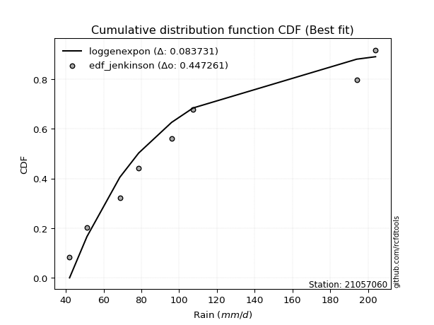</img>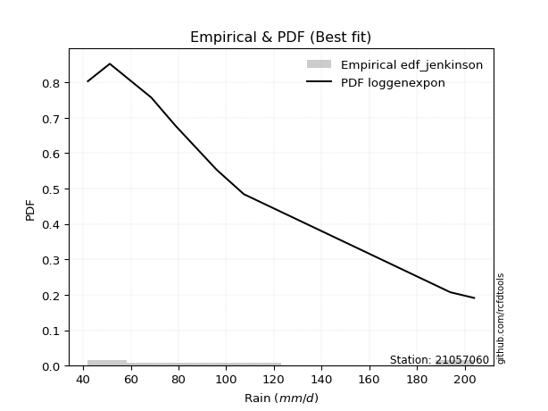</img>

</div>


### 11. EDF Cunnane (1978)

Cunnane´s work in statistical hydrology has focused on the performance and evaluation of different probability distributions (such as GEV, Gumbel, Lognormal) for flood frequency estimation. _b_ is a constant, typically set to 0.4.

<div align="center">


$P=(m-b)/(n+1-2b)$


</div>


**11.1. Empirical values**

<div align="center">

|                | 0                   | 1                   | 2                  | 3                  | 4                  | 5                  | 6                  | 7                  |
|:---------------|:--------------------|:--------------------|:-------------------|:-------------------|:-------------------|:-------------------|:-------------------|:-------------------|
| date           | 2023                | 2021                | 2020               | 2022               | 2025               | 2019               | 2024               | 2012               |
| x              | 42.0                | 51.2                | 68.6               | 78.6               | 96.0               | 107.4              | 194.0              | 204.0              |
| m              | 1                   | 2                   | 3                  | 4                  | 5                  | 6                  | 7                  | 8                  |
| empirical_dist | edf_cunnane         | edf_cunnane         | edf_cunnane        | edf_cunnane        | edf_cunnane        | edf_cunnane        | edf_cunnane        | edf_cunnane        |
| empirical      | 0.07317073170731708 | 0.19512195121951223 | 0.3170731707317074 | 0.4390243902439025 | 0.5609756097560976 | 0.6829268292682927 | 0.8048780487804879 | 0.926829268292683  |
| empirical_tr   | 1.0789473684210527  | 1.2424242424242424  | 1.4642857142857144 | 1.782608695652174  | 2.277777777777778  | 3.153846153846154  | 5.125000000000001  | 13.666666666666675 |

</div>


**11.2. Kolmogorov-Smirnov fit test (sorted by Δ)**


<div align="center">

|                | 0                   | 1                   | 2                   | 3                   | 4                   | 5                   | 6                   | 7                   | 8                   | 9                   | 10                  | 11                  | 12                 | 13                  | 14                 | 15                  | 16                  | 17                  | 18                  | 19                  | 20                  | 21                  | 22                  | 23                  | 24                  | 25                  | 26                  | 27                  | 28                  | 29                 | 30                  | 31                  | 32                  | 33                  | 34                  | 35                  | 36                  | 37                 | 38                 | 39                  | 40                  | 41                  | 42                  | 43                  | 44                  | 45                  | 46                  | 47                 | 48                  | 49                 | 50                 | 51                  | 52                  | 53                 | 54                  | 55                  | 56                  | 57                  | 58                  | 59                  | 60                  | 61                  | 62                  | 63                 | 64                  | 65                  | 66                  | 67                  | 68                 | 69                 | 70                  | 71                  | 72                  | 73                 | 74                  | 75                  | 76                  | 77                  | 78                  | 79                 | 80                  | 81                  | 82                 | 83                 | 84                  | 85                  | 86                 | 87                  | 88                  | 89                 | 90                  | 91                 | 92                  | 93                  | 94                 | 95                 | 96                  | 97                  | 98                  | 99                  | 100                 | 101                 | 102                 | 103                | 104                 | 105                | 106                 | 107                 | 108                 | 109                 | 110                 | 111                 | 112                 | 113                 | 114                 | 115                | 116                 | 117                | 118                 | 119                 | 120                | 121                | 122                | 123                 | 124                 | 125                | 126                 | 127                | 128                | 129                | 130                 | 131                 | 132                 | 133                | 134                | 135                | 136                 | 137                 | 138                | 139                | 140                 | 141                 | 142                 | 143                | 144                | 145                 | 146                | 147                | 148                 | 149                 | 150                | 151                | 152                | 153                | 154                | 155                | 156                | 157                | 158                | 159                |
|:---------------|:--------------------|:--------------------|:--------------------|:--------------------|:--------------------|:--------------------|:--------------------|:--------------------|:--------------------|:--------------------|:--------------------|:--------------------|:-------------------|:--------------------|:-------------------|:--------------------|:--------------------|:--------------------|:--------------------|:--------------------|:--------------------|:--------------------|:--------------------|:--------------------|:--------------------|:--------------------|:--------------------|:--------------------|:--------------------|:-------------------|:--------------------|:--------------------|:--------------------|:--------------------|:--------------------|:--------------------|:--------------------|:-------------------|:-------------------|:--------------------|:--------------------|:--------------------|:--------------------|:--------------------|:--------------------|:--------------------|:--------------------|:-------------------|:--------------------|:-------------------|:-------------------|:--------------------|:--------------------|:-------------------|:--------------------|:--------------------|:--------------------|:--------------------|:--------------------|:--------------------|:--------------------|:--------------------|:--------------------|:-------------------|:--------------------|:--------------------|:--------------------|:--------------------|:-------------------|:-------------------|:--------------------|:--------------------|:--------------------|:-------------------|:--------------------|:--------------------|:--------------------|:--------------------|:--------------------|:-------------------|:--------------------|:--------------------|:-------------------|:-------------------|:--------------------|:--------------------|:-------------------|:--------------------|:--------------------|:-------------------|:--------------------|:-------------------|:--------------------|:--------------------|:-------------------|:-------------------|:--------------------|:--------------------|:--------------------|:--------------------|:--------------------|:--------------------|:--------------------|:-------------------|:--------------------|:-------------------|:--------------------|:--------------------|:--------------------|:--------------------|:--------------------|:--------------------|:--------------------|:--------------------|:--------------------|:-------------------|:--------------------|:-------------------|:--------------------|:--------------------|:-------------------|:-------------------|:-------------------|:--------------------|:--------------------|:-------------------|:--------------------|:-------------------|:-------------------|:-------------------|:--------------------|:--------------------|:--------------------|:-------------------|:-------------------|:-------------------|:--------------------|:--------------------|:-------------------|:-------------------|:--------------------|:--------------------|:--------------------|:-------------------|:-------------------|:--------------------|:-------------------|:-------------------|:--------------------|:--------------------|:-------------------|:-------------------|:-------------------|:-------------------|:-------------------|:-------------------|:-------------------|:-------------------|:-------------------|:-------------------|
| station        | 21057060            | 21057060            | 21057060            | 21057060            | 21057060            | 21057060            | 21057060            | 21057060            | 21057060            | 21057060            | 21057060            | 21057060            | 21057060           | 21057060            | 21057060           | 21057060            | 21057060            | 21057060            | 21057060            | 21057060            | 21057060            | 21057060            | 21057060            | 21057060            | 21057060            | 21057060            | 21057060            | 21057060            | 21057060            | 21057060           | 21057060            | 21057060            | 21057060            | 21057060            | 21057060            | 21057060            | 21057060            | 21057060           | 21057060           | 21057060            | 21057060            | 21057060            | 21057060            | 21057060            | 21057060            | 21057060            | 21057060            | 21057060           | 21057060            | 21057060           | 21057060           | 21057060            | 21057060            | 21057060           | 21057060            | 21057060            | 21057060            | 21057060            | 21057060            | 21057060            | 21057060            | 21057060            | 21057060            | 21057060           | 21057060            | 21057060            | 21057060            | 21057060            | 21057060           | 21057060           | 21057060            | 21057060            | 21057060            | 21057060           | 21057060            | 21057060            | 21057060            | 21057060            | 21057060            | 21057060           | 21057060            | 21057060            | 21057060           | 21057060           | 21057060            | 21057060            | 21057060           | 21057060            | 21057060            | 21057060           | 21057060            | 21057060           | 21057060            | 21057060            | 21057060           | 21057060           | 21057060            | 21057060            | 21057060            | 21057060            | 21057060            | 21057060            | 21057060            | 21057060           | 21057060            | 21057060           | 21057060            | 21057060            | 21057060            | 21057060            | 21057060            | 21057060            | 21057060            | 21057060            | 21057060            | 21057060           | 21057060            | 21057060           | 21057060            | 21057060            | 21057060           | 21057060           | 21057060           | 21057060            | 21057060            | 21057060           | 21057060            | 21057060           | 21057060           | 21057060           | 21057060            | 21057060            | 21057060            | 21057060           | 21057060           | 21057060           | 21057060            | 21057060            | 21057060           | 21057060           | 21057060            | 21057060            | 21057060            | 21057060           | 21057060           | 21057060            | 21057060           | 21057060           | 21057060            | 21057060            | 21057060           | 21057060           | 21057060           | 21057060           | 21057060           | 21057060           | 21057060           | 21057060           | 21057060           | 21057060           |
| empirical_dist | edf_cunnane         | edf_cunnane         | edf_cunnane         | edf_cunnane         | edf_cunnane         | edf_cunnane         | edf_cunnane         | edf_cunnane         | edf_cunnane         | edf_cunnane         | edf_cunnane         | edf_cunnane         | edf_cunnane        | edf_cunnane         | edf_cunnane        | edf_cunnane         | edf_cunnane         | edf_cunnane         | edf_cunnane         | edf_cunnane         | edf_cunnane         | edf_cunnane         | edf_cunnane         | edf_cunnane         | edf_cunnane         | edf_cunnane         | edf_cunnane         | edf_cunnane         | edf_cunnane         | edf_cunnane        | edf_cunnane         | edf_cunnane         | edf_cunnane         | edf_cunnane         | edf_cunnane         | edf_cunnane         | edf_cunnane         | edf_cunnane        | edf_cunnane        | edf_cunnane         | edf_cunnane         | edf_cunnane         | edf_cunnane         | edf_cunnane         | edf_cunnane         | edf_cunnane         | edf_cunnane         | edf_cunnane        | edf_cunnane         | edf_cunnane        | edf_cunnane        | edf_cunnane         | edf_cunnane         | edf_cunnane        | edf_cunnane         | edf_cunnane         | edf_cunnane         | edf_cunnane         | edf_cunnane         | edf_cunnane         | edf_cunnane         | edf_cunnane         | edf_cunnane         | edf_cunnane        | edf_cunnane         | edf_cunnane         | edf_cunnane         | edf_cunnane         | edf_cunnane        | edf_cunnane        | edf_cunnane         | edf_cunnane         | edf_cunnane         | edf_cunnane        | edf_cunnane         | edf_cunnane         | edf_cunnane         | edf_cunnane         | edf_cunnane         | edf_cunnane        | edf_cunnane         | edf_cunnane         | edf_cunnane        | edf_cunnane        | edf_cunnane         | edf_cunnane         | edf_cunnane        | edf_cunnane         | edf_cunnane         | edf_cunnane        | edf_cunnane         | edf_cunnane        | edf_cunnane         | edf_cunnane         | edf_cunnane        | edf_cunnane        | edf_cunnane         | edf_cunnane         | edf_cunnane         | edf_cunnane         | edf_cunnane         | edf_cunnane         | edf_cunnane         | edf_cunnane        | edf_cunnane         | edf_cunnane        | edf_cunnane         | edf_cunnane         | edf_cunnane         | edf_cunnane         | edf_cunnane         | edf_cunnane         | edf_cunnane         | edf_cunnane         | edf_cunnane         | edf_cunnane        | edf_cunnane         | edf_cunnane        | edf_cunnane         | edf_cunnane         | edf_cunnane        | edf_cunnane        | edf_cunnane        | edf_cunnane         | edf_cunnane         | edf_cunnane        | edf_cunnane         | edf_cunnane        | edf_cunnane        | edf_cunnane        | edf_cunnane         | edf_cunnane         | edf_cunnane         | edf_cunnane        | edf_cunnane        | edf_cunnane        | edf_cunnane         | edf_cunnane         | edf_cunnane        | edf_cunnane        | edf_cunnane         | edf_cunnane         | edf_cunnane         | edf_cunnane        | edf_cunnane        | edf_cunnane         | edf_cunnane        | edf_cunnane        | edf_cunnane         | edf_cunnane         | edf_cunnane        | edf_cunnane        | edf_cunnane        | edf_cunnane        | edf_cunnane        | edf_cunnane        | edf_cunnane        | edf_cunnane        | edf_cunnane        | edf_cunnane        |
| p_dist         | loggamma            | loggamma            | logf                | logerlang           | loggenexpon         | johnsonsu           | logskewnorm         | loggenlogistic      | logmielke           | burr                | loginvweibull       | logweibull_min      | logburr            | loghalfnorm         | nct                | logkstwobign        | invgamma            | logfatiguelife      | invgauss            | loginvgauss         | alpha               | lograyleigh         | logksone            | loginvgamma         | exponnorm           | logsemicircular     | logncf              | logexponpow         | lognct              | logmaxwell         | logburr12           | logalpha            | loggompertz         | loganglit           | logrice             | betaprime           | f                   | loggumbel_r        | logbetaprime       | logfoldnorm         | halfnorm            | genexpon            | nakagami            | logpearson3         | foldnorm            | gompertz            | halflogistic        | logmoyal           | logloggamma         | logjohnsonsu       | logexponnorm       | logt                | logcrystalball      | lognorm            | loggenextreme       | moyal               | exponpow            | pearson3            | gumbel_r            | logrdist            | logloglaplace       | logcosine           | loglogistic         | rayleigh           | loghypsecant        | loglaplace          | loglaplace          | skewnorm            | logdgamma          | logbeta            | logdweibull         | loghalflogistic     | kstwobign           | genlogistic        | maxwell             | logargus            | logwrapcauchy       | rice                | burr12              | dweibull           | loglomax            | dgamma              | logkappa4          | truncexpon         | loggausshyper       | logtukeylambda      | logkappa3          | loggumbel_l         | truncweibull_min    | logvonmises_line   | loguniform          | hypsecant          | logistic            | logtruncpareto      | t                  | truncnorm          | norm                | crystalball         | anglit              | semicircular        | ksone               | logbradford         | logtruncexpon       | laplace            | weibull_min         | logtruncnorm       | halfgennorm         | logtruncweibull_min | wald                | arcsine             | logarcsine          | logwald             | logtriang           | kappa4              | cosine              | lomax              | wrapcauchy          | gamma              | ncf                 | loggenhalflogistic  | loglevy_l          | loggenpareto       | gumbel_l           | bradford            | tukeylambda         | uniform            | levy_l              | vonmises_line      | gausshyper         | argus              | kappa3              | gennorm             | loggennorm          | logweibull_max     | beta               | genextreme         | triang              | logtrapezoid        | genpareto          | erlang             | genhalflogistic     | powerlaw            | logjohnsonsb        | lognakagami        | fatiguelife        | invweibull          | johnsonsb          | logexponweib       | logpowerlaw         | gengamma            | rdist              | trapezoid          | loggengamma        | exponweib          | weibull_max        | truncpareto        | loghalfgennorm     | logvonmises        | vonmises           | mielke             |
| delta          | 0.08491564409369934 | 0.08491564409369934 | 0.08496590661290737 | 0.08506396283195783 | 0.08766062739803304 | 0.08919268988414819 | 0.09146147195730614 | 0.09163886765080043 | 0.09224135755534701 | 0.09231699366026469 | 0.09262903159056612 | 0.09273519443435263 | 0.0930786737965964 | 0.09636096048138998 | 0.0970462297406337 | 0.09767599579312936 | 0.09806098511110395 | 0.09913627669165459 | 0.09971253317914086 | 0.09983212965674071 | 0.10160101745456152 | 0.10229137245234166 | 0.10360840657949433 | 0.10426745708750085 | 0.10439438660438194 | 0.10446253653198756 | 0.10465039132423049 | 0.10482631594741809 | 0.10512489683558524 | 0.1052989433839212 | 0.10594804124223256 | 0.10636540633393232 | 0.10661151778416478 | 0.10683299086183762 | 0.10688231315822838 | 0.10757645737473809 | 0.10763083822725328 | 0.1077380984981996 | 0.1088739141494266 | 0.11043537315586949 | 0.11047057161180995 | 0.11110057019690456 | 0.11126126669296332 | 0.11173610025032166 | 0.11264858300404035 | 0.11383786476126168 | 0.11556615650951996 | 0.1156281605286147 | 0.11578552388921826 | 0.1159995143646313 | 0.1162767871374919 | 0.11659172259353712 | 0.11659336014674404 | 0.116593360288891  | 0.11823033067532152 | 0.11854977346572781 | 0.11901160948255007 | 0.11906046874107767 | 0.11988804535164954 | 0.12061232370475405 | 0.12142718548052311 | 0.12295059949684561 | 0.12380252509215894 | 0.1248501070473742 | 0.12643602077849914 | 0.12753321579159693 | 0.12753321579159693 | 0.12798732374845223 | 0.1283367327342475 | 0.1283915836719708 | 0.12927102034104276 | 0.13220495042273883 | 0.13309097221928978 | 0.1351197994005977 | 0.13552005557874103 | 0.13973574462018956 | 0.15073616983560523 | 0.15156219318145647 | 0.15276551642518443 | 0.1533747106858061 | 0.15416644413505232 | 0.15563614174775764 | 0.156784816422897  | 0.159671565886489  | 0.16096412228369095 | 0.16106450940969785 | 0.1618156527905107 | 0.16329602938938348 | 0.16330629426235166 | 0.1633181017610683 | 0.16331972853785937 | 0.1641112890520835 | 0.16585970928233118 | 0.16611066049266787 | 0.1679025075028282 | 0.1679089964333601 | 0.16790899869251308 | 0.16790901913158052 | 0.17005718185415897 | 0.17094221073115157 | 0.17205734040035803 | 0.17244109843376132 | 0.17460771260410735 | 0.1784829421081921 | 0.17997434469558427 | 0.1825852188518453 | 0.18369800158583605 | 0.19400306021386393 | 0.19489803788086546 | 0.19512195121951215 | 0.19512195121951215 | 0.19512195121951223 | 0.20239203077911683 | 0.20733725212301196 | 0.20911363046796616 | 0.2152432169892935 | 0.21705029564664552 | 0.219853978377611  | 0.22780967805602587 | 0.23191894982307648 | 0.2369592619250941 | 0.2374078487331524 | 0.2376762461233103 | 0.24483616773692957 | 0.27878924831222507 | 0.279223125564589  | 0.27940805384092743 | 0.2822374917026178 | 0.2825459372495025 | 0.2857536969273212 | 0.29215860475677313 | 0.30487804878048785 | 0.30487804878048785 | 0.3118874108950109 | 0.3188068441816594 | 0.3252637903467709 | 0.33553740896297607 | 0.34839453915620366 | 0.355374256509657  | 0.3597964933015514 | 0.40021230954385667 | 0.41278320056739537 | 0.41670619362945305 | 0.4236310928723819 | 0.4372248980843212 | 0.44326049896534664 | 0.4491561333735987 | 0.4748634417270259 | 0.47964962600255867 | 0.48447794574873215 | 0.4905545870826474 | 0.506734175709384  | 0.5559307185966458 | 0.5749729164629612 | 0.6043043397069994 | 0.6172619543705749 | 0.8048780487804879 | 1.1186179506048481 | 31.94893885992371  | nan                |
| deltao         | 0.4472608134160001  | 0.4472608134160001  | 0.4472608134160001  | 0.4472608134160001  | 0.4472608134160001  | 0.4472608134160001  | 0.4472608134160001  | 0.4472608134160001  | 0.4472608134160001  | 0.4472608134160001  | 0.4472608134160001  | 0.4472608134160001  | 0.4472608134160001 | 0.4472608134160001  | 0.4472608134160001 | 0.4472608134160001  | 0.4472608134160001  | 0.4472608134160001  | 0.4472608134160001  | 0.4472608134160001  | 0.4472608134160001  | 0.4472608134160001  | 0.4472608134160001  | 0.4472608134160001  | 0.4472608134160001  | 0.4472608134160001  | 0.4472608134160001  | 0.4472608134160001  | 0.4472608134160001  | 0.4472608134160001 | 0.4472608134160001  | 0.4472608134160001  | 0.4472608134160001  | 0.4472608134160001  | 0.4472608134160001  | 0.4472608134160001  | 0.4472608134160001  | 0.4472608134160001 | 0.4472608134160001 | 0.4472608134160001  | 0.4472608134160001  | 0.4472608134160001  | 0.4472608134160001  | 0.4472608134160001  | 0.4472608134160001  | 0.4472608134160001  | 0.4472608134160001  | 0.4472608134160001 | 0.4472608134160001  | 0.4472608134160001 | 0.4472608134160001 | 0.4472608134160001  | 0.4472608134160001  | 0.4472608134160001 | 0.4472608134160001  | 0.4472608134160001  | 0.4472608134160001  | 0.4472608134160001  | 0.4472608134160001  | 0.4472608134160001  | 0.4472608134160001  | 0.4472608134160001  | 0.4472608134160001  | 0.4472608134160001 | 0.4472608134160001  | 0.4472608134160001  | 0.4472608134160001  | 0.4472608134160001  | 0.4472608134160001 | 0.4472608134160001 | 0.4472608134160001  | 0.4472608134160001  | 0.4472608134160001  | 0.4472608134160001 | 0.4472608134160001  | 0.4472608134160001  | 0.4472608134160001  | 0.4472608134160001  | 0.4472608134160001  | 0.4472608134160001 | 0.4472608134160001  | 0.4472608134160001  | 0.4472608134160001 | 0.4472608134160001 | 0.4472608134160001  | 0.4472608134160001  | 0.4472608134160001 | 0.4472608134160001  | 0.4472608134160001  | 0.4472608134160001 | 0.4472608134160001  | 0.4472608134160001 | 0.4472608134160001  | 0.4472608134160001  | 0.4472608134160001 | 0.4472608134160001 | 0.4472608134160001  | 0.4472608134160001  | 0.4472608134160001  | 0.4472608134160001  | 0.4472608134160001  | 0.4472608134160001  | 0.4472608134160001  | 0.4472608134160001 | 0.4472608134160001  | 0.4472608134160001 | 0.4472608134160001  | 0.4472608134160001  | 0.4472608134160001  | 0.4472608134160001  | 0.4472608134160001  | 0.4472608134160001  | 0.4472608134160001  | 0.4472608134160001  | 0.4472608134160001  | 0.4472608134160001 | 0.4472608134160001  | 0.4472608134160001 | 0.4472608134160001  | 0.4472608134160001  | 0.4472608134160001 | 0.4472608134160001 | 0.4472608134160001 | 0.4472608134160001  | 0.4472608134160001  | 0.4472608134160001 | 0.4472608134160001  | 0.4472608134160001 | 0.4472608134160001 | 0.4472608134160001 | 0.4472608134160001  | 0.4472608134160001  | 0.4472608134160001  | 0.4472608134160001 | 0.4472608134160001 | 0.4472608134160001 | 0.4472608134160001  | 0.4472608134160001  | 0.4472608134160001 | 0.4472608134160001 | 0.4472608134160001  | 0.4472608134160001  | 0.4472608134160001  | 0.4472608134160001 | 0.4472608134160001 | 0.4472608134160001  | 0.4472608134160001 | 0.4472608134160001 | 0.4472608134160001  | 0.4472608134160001  | 0.4472608134160001 | 0.4472608134160001 | 0.4472608134160001 | 0.4472608134160001 | 0.4472608134160001 | 0.4472608134160001 | 0.4472608134160001 | 0.4472608134160001 | 0.4472608134160001 | 0.4472608134160001 |
| eval           | Δo > Δ              | Δo > Δ              | Δo > Δ              | Δo > Δ              | Δo > Δ              | Δo > Δ              | Δo > Δ              | Δo > Δ              | Δo > Δ              | Δo > Δ              | Δo > Δ              | Δo > Δ              | Δo > Δ             | Δo > Δ              | Δo > Δ             | Δo > Δ              | Δo > Δ              | Δo > Δ              | Δo > Δ              | Δo > Δ              | Δo > Δ              | Δo > Δ              | Δo > Δ              | Δo > Δ              | Δo > Δ              | Δo > Δ              | Δo > Δ              | Δo > Δ              | Δo > Δ              | Δo > Δ             | Δo > Δ              | Δo > Δ              | Δo > Δ              | Δo > Δ              | Δo > Δ              | Δo > Δ              | Δo > Δ              | Δo > Δ             | Δo > Δ             | Δo > Δ              | Δo > Δ              | Δo > Δ              | Δo > Δ              | Δo > Δ              | Δo > Δ              | Δo > Δ              | Δo > Δ              | Δo > Δ             | Δo > Δ              | Δo > Δ             | Δo > Δ             | Δo > Δ              | Δo > Δ              | Δo > Δ             | Δo > Δ              | Δo > Δ              | Δo > Δ              | Δo > Δ              | Δo > Δ              | Δo > Δ              | Δo > Δ              | Δo > Δ              | Δo > Δ              | Δo > Δ             | Δo > Δ              | Δo > Δ              | Δo > Δ              | Δo > Δ              | Δo > Δ             | Δo > Δ             | Δo > Δ              | Δo > Δ              | Δo > Δ              | Δo > Δ             | Δo > Δ              | Δo > Δ              | Δo > Δ              | Δo > Δ              | Δo > Δ              | Δo > Δ             | Δo > Δ              | Δo > Δ              | Δo > Δ             | Δo > Δ             | Δo > Δ              | Δo > Δ              | Δo > Δ             | Δo > Δ              | Δo > Δ              | Δo > Δ             | Δo > Δ              | Δo > Δ             | Δo > Δ              | Δo > Δ              | Δo > Δ             | Δo > Δ             | Δo > Δ              | Δo > Δ              | Δo > Δ              | Δo > Δ              | Δo > Δ              | Δo > Δ              | Δo > Δ              | Δo > Δ             | Δo > Δ              | Δo > Δ             | Δo > Δ              | Δo > Δ              | Δo > Δ              | Δo > Δ              | Δo > Δ              | Δo > Δ              | Δo > Δ              | Δo > Δ              | Δo > Δ              | Δo > Δ             | Δo > Δ              | Δo > Δ             | Δo > Δ              | Δo > Δ              | Δo > Δ             | Δo > Δ             | Δo > Δ             | Δo > Δ              | Δo > Δ              | Δo > Δ             | Δo > Δ              | Δo > Δ             | Δo > Δ             | Δo > Δ             | Δo > Δ              | Δo > Δ              | Δo > Δ              | Δo > Δ             | Δo > Δ             | Δo > Δ             | Δo > Δ              | Δo > Δ              | Δo > Δ             | Δo > Δ             | Δo > Δ              | Δo > Δ              | Δo > Δ              | Δo > Δ             | Δo > Δ             | Δo > Δ              | Δo <= Δ            | Δo <= Δ            | Δo <= Δ             | Δo <= Δ             | Δo <= Δ            | Δo <= Δ            | Δo <= Δ            | Δo <= Δ            | Δo <= Δ            | Δo <= Δ            | Δo <= Δ            | Δo <= Δ            | Δo <= Δ            | Δo <= Δ            |
| fit            | 1                   | 1                   | 1                   | 1                   | 1                   | 1                   | 1                   | 1                   | 1                   | 1                   | 1                   | 1                   | 1                  | 1                   | 1                  | 1                   | 1                   | 1                   | 1                   | 1                   | 1                   | 1                   | 1                   | 1                   | 1                   | 1                   | 1                   | 1                   | 1                   | 1                  | 1                   | 1                   | 1                   | 1                   | 1                   | 1                   | 1                   | 1                  | 1                  | 1                   | 1                   | 1                   | 1                   | 1                   | 1                   | 1                   | 1                   | 1                  | 1                   | 1                  | 1                  | 1                   | 1                   | 1                  | 1                   | 1                   | 1                   | 1                   | 1                   | 1                   | 1                   | 1                   | 1                   | 1                  | 1                   | 1                   | 1                   | 1                   | 1                  | 1                  | 1                   | 1                   | 1                   | 1                  | 1                   | 1                   | 1                   | 1                   | 1                   | 1                  | 1                   | 1                   | 1                  | 1                  | 1                   | 1                   | 1                  | 1                   | 1                   | 1                  | 1                   | 1                  | 1                   | 1                   | 1                  | 1                  | 1                   | 1                   | 1                   | 1                   | 1                   | 1                   | 1                   | 1                  | 1                   | 1                  | 1                   | 1                   | 1                   | 1                   | 1                   | 1                   | 1                   | 1                   | 1                   | 1                  | 1                   | 1                  | 1                   | 1                   | 1                  | 1                  | 1                  | 1                   | 1                   | 1                  | 1                   | 1                  | 1                  | 1                  | 1                   | 1                   | 1                   | 1                  | 1                  | 1                  | 1                   | 1                   | 1                  | 1                  | 1                   | 1                   | 1                   | 1                  | 1                  | 1                   | 0                  | 0                  | 0                   | 0                   | 0                  | 0                  | 0                  | 0                  | 0                  | 0                  | 0                  | 0                  | 0                  | 0                  |
| n              | 8                   | 8                   | 8                   | 8                   | 8                   | 8                   | 8                   | 8                   | 8                   | 8                   | 8                   | 8                   | 8                  | 8                   | 8                  | 8                   | 8                   | 8                   | 8                   | 8                   | 8                   | 8                   | 8                   | 8                   | 8                   | 8                   | 8                   | 8                   | 8                   | 8                  | 8                   | 8                   | 8                   | 8                   | 8                   | 8                   | 8                   | 8                  | 8                  | 8                   | 8                   | 8                   | 8                   | 8                   | 8                   | 8                   | 8                   | 8                  | 8                   | 8                  | 8                  | 8                   | 8                   | 8                  | 8                   | 8                   | 8                   | 8                   | 8                   | 8                   | 8                   | 8                   | 8                   | 8                  | 8                   | 8                   | 8                   | 8                   | 8                  | 8                  | 8                   | 8                   | 8                   | 8                  | 8                   | 8                   | 8                   | 8                   | 8                   | 8                  | 8                   | 8                   | 8                  | 8                  | 8                   | 8                   | 8                  | 8                   | 8                   | 8                  | 8                   | 8                  | 8                   | 8                   | 8                  | 8                  | 8                   | 8                   | 8                   | 8                   | 8                   | 8                   | 8                   | 8                  | 8                   | 8                  | 8                   | 8                   | 8                   | 8                   | 8                   | 8                   | 8                   | 8                   | 8                   | 8                  | 8                   | 8                  | 8                   | 8                   | 8                  | 8                  | 8                  | 8                   | 8                   | 8                  | 8                   | 8                  | 8                  | 8                  | 8                   | 8                   | 8                   | 8                  | 8                  | 8                  | 8                   | 8                   | 8                  | 8                  | 8                   | 8                   | 8                   | 8                  | 8                  | 8                   | 8                  | 8                  | 8                   | 8                   | 8                  | 8                  | 8                  | 8                  | 8                  | 8                  | 8                  | 8                  | 8                  | 8                  |
| best_fit       | 1                   | 1                   | 0                   | 0                   | 0                   | 0                   | 0                   | 0                   | 0                   | 0                   | 0                   | 0                   | 0                  | 0                   | 0                  | 0                   | 0                   | 0                   | 0                   | 0                   | 0                   | 0                   | 0                   | 0                   | 0                   | 0                   | 0                   | 0                   | 0                   | 0                  | 0                   | 0                   | 0                   | 0                   | 0                   | 0                   | 0                   | 0                  | 0                  | 0                   | 0                   | 0                   | 0                   | 0                   | 0                   | 0                   | 0                   | 0                  | 0                   | 0                  | 0                  | 0                   | 0                   | 0                  | 0                   | 0                   | 0                   | 0                   | 0                   | 0                   | 0                   | 0                   | 0                   | 0                  | 0                   | 0                   | 0                   | 0                   | 0                  | 0                  | 0                   | 0                   | 0                   | 0                  | 0                   | 0                   | 0                   | 0                   | 0                   | 0                  | 0                   | 0                   | 0                  | 0                  | 0                   | 0                   | 0                  | 0                   | 0                   | 0                  | 0                   | 0                  | 0                   | 0                   | 0                  | 0                  | 0                   | 0                   | 0                   | 0                   | 0                   | 0                   | 0                   | 0                  | 0                   | 0                  | 0                   | 0                   | 0                   | 0                   | 0                   | 0                   | 0                   | 0                   | 0                   | 0                  | 0                   | 0                  | 0                   | 0                   | 0                  | 0                  | 0                  | 0                   | 0                   | 0                  | 0                   | 0                  | 0                  | 0                  | 0                   | 0                   | 0                   | 0                  | 0                  | 0                  | 0                   | 0                   | 0                  | 0                  | 0                   | 0                   | 0                   | 0                  | 0                  | 0                   | 0                  | 0                  | 0                   | 0                   | 0                  | 0                  | 0                  | 0                  | 0                  | 0                  | 0                  | 0                  | 0                  | 0                  |
| best_fit_sort  | 1                   | 2                   | 3                   | 4                   | 5                   | 6                   | 7                   | 8                   | 9                   | 10                  | 11                  | 12                  | 13                 | 14                  | 15                 | 16                  | 17                  | 18                  | 19                  | 20                  | 21                  | 22                  | 23                  | 24                  | 25                  | 26                  | 27                  | 28                  | 29                  | 30                 | 31                  | 32                  | 33                  | 34                  | 35                  | 36                  | 37                  | 38                 | 39                 | 40                  | 41                  | 42                  | 43                  | 44                  | 45                  | 46                  | 47                  | 48                 | 49                  | 50                 | 51                 | 52                  | 53                  | 54                 | 55                  | 56                  | 57                  | 58                  | 59                  | 60                  | 61                  | 62                  | 63                  | 64                 | 65                  | 66                  | 67                  | 68                  | 69                 | 70                 | 71                  | 72                  | 73                  | 74                 | 75                  | 76                  | 77                  | 78                  | 79                  | 80                 | 81                  | 82                  | 83                 | 84                 | 85                  | 86                  | 87                 | 88                  | 89                  | 90                 | 91                  | 92                 | 93                  | 94                  | 95                 | 96                 | 97                  | 98                  | 99                  | 100                 | 101                 | 102                 | 103                 | 104                | 105                 | 106                | 107                 | 108                 | 109                 | 110                 | 111                 | 112                 | 113                 | 114                 | 115                 | 116                | 117                 | 118                | 119                 | 120                 | 121                | 122                | 123                | 124                 | 125                 | 126                | 127                 | 128                | 129                | 130                | 131                 | 132                 | 133                 | 134                | 135                | 136                | 137                 | 138                 | 139                | 140                | 141                 | 142                 | 143                 | 144                | 145                | 146                 | 147                | 148                | 149                 | 150                 | 151                | 152                | 153                | 154                | 155                | 156                | 157                | 158                | 159                | 160                |

</div>


**11.3. Best fit**

<div align="center">

|   id |   station | empirical_dist   | p_dist   |     delta |   deltao | eval   |   fit |   n |   best_fit |   best_fit_sort |
|-----:|----------:|:-----------------|:---------|----------:|---------:|:-------|------:|----:|-----------:|----------------:|
|    0 |  21057060 | edf_cunnane      | loggamma | 0.0849156 | 0.447261 | Δo > Δ |     1 |   8 |          1 |               1 |
|    1 |  21057060 | edf_cunnane      | loggamma | 0.0849156 | 0.447261 | Δo > Δ |     1 |   8 |          1 |               2 |

</div>


<div align="center">

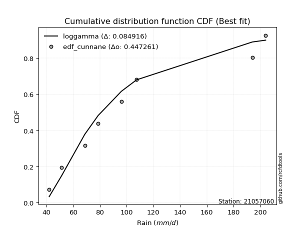</img>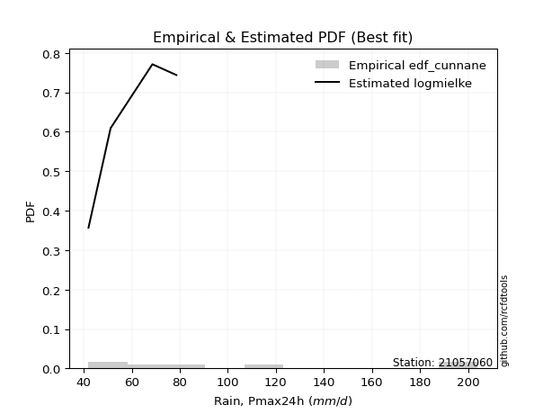</img>

</div>


### 12. EDF Adamowski (1981)

The Adamowski formula in hydrology refers to a specific plotting position formula used for estimating the non-parametric empirical distribution of hydrological events (like flood peaks) to calculate their return periods. This formula provides an alternative to traditional parametric methods (like the Gumbel or Log Pearson Type III distributions). 

<div align="center">


$P=(m-0.25)/(n+0.5)$


</div>


**12.1. Empirical values**

<div align="center">

|                | 0                   | 1                   | 2                  | 3                  | 4                  | 5                  | 6                  | 7                  |
|:---------------|:--------------------|:--------------------|:-------------------|:-------------------|:-------------------|:-------------------|:-------------------|:-------------------|
| date           | 2023                | 2021                | 2020               | 2022               | 2025               | 2019               | 2024               | 2012               |
| x              | 42.0                | 51.2                | 68.6               | 78.6               | 96.0               | 107.4              | 194.0              | 204.0              |
| m              | 1                   | 2                   | 3                  | 4                  | 5                  | 6                  | 7                  | 8                  |
| empirical_dist | edf_adamowski       | edf_adamowski       | edf_adamowski      | edf_adamowski      | edf_adamowski      | edf_adamowski      | edf_adamowski      | edf_adamowski      |
| empirical      | 0.08823529411764706 | 0.20588235294117646 | 0.3235294117647059 | 0.4411764705882353 | 0.5588235294117647 | 0.6764705882352942 | 0.7941176470588235 | 0.9117647058823529 |
| empirical_tr   | 1.096774193548387   | 1.259259259259259   | 1.4782608695652173 | 1.7894736842105263 | 2.2666666666666666 | 3.0909090909090913 | 4.857142857142856  | 11.33333333333333  |

</div>


**12.2. Kolmogorov-Smirnov fit test (sorted by Δ)**


<div align="center">

|                | 0                   | 1                   | 2                   | 3                   | 4                  | 5                   | 6                   | 7                  | 8                   | 9                   | 10                 | 11                 | 12                  | 13                  | 14                  | 15                  | 16                  | 17                  | 18                  | 19                  | 20                  | 21                  | 22                 | 23                  | 24                  | 25                 | 26                  | 27                  | 28                  | 29                  | 30                  | 31                 | 32                  | 33                  | 34                  | 35                  | 36                  | 37                  | 38                  | 39                  | 40                  | 41                  | 42                  | 43                  | 44                  | 45                  | 46                  | 47                  | 48                  | 49                  | 50                  | 51                  | 52                  | 53                 | 54                 | 55                  | 56                  | 57                  | 58                  | 59                  | 60                 | 61                 | 62                 | 63                  | 64                  | 65                 | 66                 | 67                 | 68                 | 69                  | 70                  | 71                  | 72                  | 73                  | 74                  | 75                 | 76                  | 77                 | 78                 | 79                 | 80                  | 81                 | 82                  | 83                  | 84                 | 85                  | 86                 | 87                  | 88                 | 89                  | 90                 | 91                  | 92                  | 93                  | 94                  | 95                  | 96                  | 97                  | 98                  | 99                  | 100                 | 101                 | 102                 | 103                 | 104                | 105                 | 106                 | 107                 | 108                 | 109                 | 110                 | 111                | 112                 | 113                 | 114                 | 115                 | 116                 | 117                 | 118                 | 119                | 120                | 121                 | 122                | 123                | 124                 | 125                | 126                | 127                | 128                | 129                 | 130                 | 131                 | 132                 | 133                | 134                | 135                 | 136                | 137                | 138                | 139                 | 140                | 141                 | 142                 | 143                | 144                | 145                | 146                | 147                | 148                 | 149                 | 150                | 151                | 152                | 153                | 154                | 155                | 156                | 157                | 158                | 159                |
|:---------------|:--------------------|:--------------------|:--------------------|:--------------------|:-------------------|:--------------------|:--------------------|:-------------------|:--------------------|:--------------------|:-------------------|:-------------------|:--------------------|:--------------------|:--------------------|:--------------------|:--------------------|:--------------------|:--------------------|:--------------------|:--------------------|:--------------------|:-------------------|:--------------------|:--------------------|:-------------------|:--------------------|:--------------------|:--------------------|:--------------------|:--------------------|:-------------------|:--------------------|:--------------------|:--------------------|:--------------------|:--------------------|:--------------------|:--------------------|:--------------------|:--------------------|:--------------------|:--------------------|:--------------------|:--------------------|:--------------------|:--------------------|:--------------------|:--------------------|:--------------------|:--------------------|:--------------------|:--------------------|:-------------------|:-------------------|:--------------------|:--------------------|:--------------------|:--------------------|:--------------------|:-------------------|:-------------------|:-------------------|:--------------------|:--------------------|:-------------------|:-------------------|:-------------------|:-------------------|:--------------------|:--------------------|:--------------------|:--------------------|:--------------------|:--------------------|:-------------------|:--------------------|:-------------------|:-------------------|:-------------------|:--------------------|:-------------------|:--------------------|:--------------------|:-------------------|:--------------------|:-------------------|:--------------------|:-------------------|:--------------------|:-------------------|:--------------------|:--------------------|:--------------------|:--------------------|:--------------------|:--------------------|:--------------------|:--------------------|:--------------------|:--------------------|:--------------------|:--------------------|:--------------------|:-------------------|:--------------------|:--------------------|:--------------------|:--------------------|:--------------------|:--------------------|:-------------------|:--------------------|:--------------------|:--------------------|:--------------------|:--------------------|:--------------------|:--------------------|:-------------------|:-------------------|:--------------------|:-------------------|:-------------------|:--------------------|:-------------------|:-------------------|:-------------------|:-------------------|:--------------------|:--------------------|:--------------------|:--------------------|:-------------------|:-------------------|:--------------------|:-------------------|:-------------------|:-------------------|:--------------------|:-------------------|:--------------------|:--------------------|:-------------------|:-------------------|:-------------------|:-------------------|:-------------------|:--------------------|:--------------------|:-------------------|:-------------------|:-------------------|:-------------------|:-------------------|:-------------------|:-------------------|:-------------------|:-------------------|:-------------------|
| station        | 21057060            | 21057060            | 21057060            | 21057060            | 21057060           | 21057060            | 21057060            | 21057060           | 21057060            | 21057060            | 21057060           | 21057060           | 21057060            | 21057060            | 21057060            | 21057060            | 21057060            | 21057060            | 21057060            | 21057060            | 21057060            | 21057060            | 21057060           | 21057060            | 21057060            | 21057060           | 21057060            | 21057060            | 21057060            | 21057060            | 21057060            | 21057060           | 21057060            | 21057060            | 21057060            | 21057060            | 21057060            | 21057060            | 21057060            | 21057060            | 21057060            | 21057060            | 21057060            | 21057060            | 21057060            | 21057060            | 21057060            | 21057060            | 21057060            | 21057060            | 21057060            | 21057060            | 21057060            | 21057060           | 21057060           | 21057060            | 21057060            | 21057060            | 21057060            | 21057060            | 21057060           | 21057060           | 21057060           | 21057060            | 21057060            | 21057060           | 21057060           | 21057060           | 21057060           | 21057060            | 21057060            | 21057060            | 21057060            | 21057060            | 21057060            | 21057060           | 21057060            | 21057060           | 21057060           | 21057060           | 21057060            | 21057060           | 21057060            | 21057060            | 21057060           | 21057060            | 21057060           | 21057060            | 21057060           | 21057060            | 21057060           | 21057060            | 21057060            | 21057060            | 21057060            | 21057060            | 21057060            | 21057060            | 21057060            | 21057060            | 21057060            | 21057060            | 21057060            | 21057060            | 21057060           | 21057060            | 21057060            | 21057060            | 21057060            | 21057060            | 21057060            | 21057060           | 21057060            | 21057060            | 21057060            | 21057060            | 21057060            | 21057060            | 21057060            | 21057060           | 21057060           | 21057060            | 21057060           | 21057060           | 21057060            | 21057060           | 21057060           | 21057060           | 21057060           | 21057060            | 21057060            | 21057060            | 21057060            | 21057060           | 21057060           | 21057060            | 21057060           | 21057060           | 21057060           | 21057060            | 21057060           | 21057060            | 21057060            | 21057060           | 21057060           | 21057060           | 21057060           | 21057060           | 21057060            | 21057060            | 21057060           | 21057060           | 21057060           | 21057060           | 21057060           | 21057060           | 21057060           | 21057060           | 21057060           | 21057060           |
| empirical_dist | edf_adamowski       | edf_adamowski       | edf_adamowski       | edf_adamowski       | edf_adamowski      | edf_adamowski       | edf_adamowski       | edf_adamowski      | edf_adamowski       | edf_adamowski       | edf_adamowski      | edf_adamowski      | edf_adamowski       | edf_adamowski       | edf_adamowski       | edf_adamowski       | edf_adamowski       | edf_adamowski       | edf_adamowski       | edf_adamowski       | edf_adamowski       | edf_adamowski       | edf_adamowski      | edf_adamowski       | edf_adamowski       | edf_adamowski      | edf_adamowski       | edf_adamowski       | edf_adamowski       | edf_adamowski       | edf_adamowski       | edf_adamowski      | edf_adamowski       | edf_adamowski       | edf_adamowski       | edf_adamowski       | edf_adamowski       | edf_adamowski       | edf_adamowski       | edf_adamowski       | edf_adamowski       | edf_adamowski       | edf_adamowski       | edf_adamowski       | edf_adamowski       | edf_adamowski       | edf_adamowski       | edf_adamowski       | edf_adamowski       | edf_adamowski       | edf_adamowski       | edf_adamowski       | edf_adamowski       | edf_adamowski      | edf_adamowski      | edf_adamowski       | edf_adamowski       | edf_adamowski       | edf_adamowski       | edf_adamowski       | edf_adamowski      | edf_adamowski      | edf_adamowski      | edf_adamowski       | edf_adamowski       | edf_adamowski      | edf_adamowski      | edf_adamowski      | edf_adamowski      | edf_adamowski       | edf_adamowski       | edf_adamowski       | edf_adamowski       | edf_adamowski       | edf_adamowski       | edf_adamowski      | edf_adamowski       | edf_adamowski      | edf_adamowski      | edf_adamowski      | edf_adamowski       | edf_adamowski      | edf_adamowski       | edf_adamowski       | edf_adamowski      | edf_adamowski       | edf_adamowski      | edf_adamowski       | edf_adamowski      | edf_adamowski       | edf_adamowski      | edf_adamowski       | edf_adamowski       | edf_adamowski       | edf_adamowski       | edf_adamowski       | edf_adamowski       | edf_adamowski       | edf_adamowski       | edf_adamowski       | edf_adamowski       | edf_adamowski       | edf_adamowski       | edf_adamowski       | edf_adamowski      | edf_adamowski       | edf_adamowski       | edf_adamowski       | edf_adamowski       | edf_adamowski       | edf_adamowski       | edf_adamowski      | edf_adamowski       | edf_adamowski       | edf_adamowski       | edf_adamowski       | edf_adamowski       | edf_adamowski       | edf_adamowski       | edf_adamowski      | edf_adamowski      | edf_adamowski       | edf_adamowski      | edf_adamowski      | edf_adamowski       | edf_adamowski      | edf_adamowski      | edf_adamowski      | edf_adamowski      | edf_adamowski       | edf_adamowski       | edf_adamowski       | edf_adamowski       | edf_adamowski      | edf_adamowski      | edf_adamowski       | edf_adamowski      | edf_adamowski      | edf_adamowski      | edf_adamowski       | edf_adamowski      | edf_adamowski       | edf_adamowski       | edf_adamowski      | edf_adamowski      | edf_adamowski      | edf_adamowski      | edf_adamowski      | edf_adamowski       | edf_adamowski       | edf_adamowski      | edf_adamowski      | edf_adamowski      | edf_adamowski      | edf_adamowski      | edf_adamowski      | edf_adamowski      | edf_adamowski      | edf_adamowski      | edf_adamowski      |
| p_dist         | loggenexpon         | loggamma            | loggamma            | logf                | logerlang          | johnsonsu           | logskewnorm         | loggenlogistic     | logmielke           | burr                | loginvweibull      | logweibull_min     | logburr             | loghalfnorm         | nct                 | logkstwobign        | invgamma            | logfatiguelife      | invgauss            | loginvgauss         | alpha               | nakagami            | exponpow           | lograyleigh         | logrdist            | logksone           | loginvgamma         | exponnorm           | logsemicircular     | logncf              | logexponpow         | lognct             | logmaxwell          | logburr12           | logalpha            | loggompertz         | loganglit           | logrice             | betaprime           | f                   | loggumbel_r         | logbetaprime        | logfoldnorm         | halfnorm            | genexpon            | logpearson3         | foldnorm            | gompertz            | halflogistic        | logmoyal            | logloggamma         | logjohnsonsu        | logexponnorm        | logt               | logcrystalball     | lognorm             | rayleigh            | loggenextreme       | moyal               | pearson3            | skewnorm           | gumbel_r           | maxwell            | logloglaplace       | logcosine           | loglogistic        | loghypsecant       | loglaplace         | loglaplace         | logdgamma           | logbeta             | logdweibull         | loghalflogistic     | kstwobign           | logwrapcauchy       | rice               | genlogistic         | burr12             | logargus           | loglomax           | hypsecant           | logistic           | t                   | truncnorm           | norm               | crystalball         | anglit             | dweibull            | semicircular       | ksone               | dgamma             | truncweibull_min    | logkappa4           | truncexpon          | loggausshyper       | logtukeylambda      | logkappa3           | weibull_min         | loggumbel_l         | logvonmises_line    | loguniform          | logtruncpareto      | halfgennorm         | laplace             | logbradford        | logtruncexpon       | logtruncweibull_min | logtruncnorm        | logtriang           | kappa4              | cosine              | wald               | logwald             | arcsine             | logarcsine          | lomax               | wrapcauchy          | ncf                 | gamma               | loggenhalflogistic | loglevy_l          | loggenpareto        | gumbel_l           | bradford           | levy_l              | tukeylambda        | uniform            | vonmises_line      | gausshyper         | argus               | kappa3              | gennorm             | loggennorm          | beta               | logweibull_max     | genextreme          | triang             | logtrapezoid       | genpareto          | erlang              | genhalflogistic    | logjohnsonsb        | powerlaw            | lognakagami        | fatiguelife        | invweibull         | johnsonsb          | logexponweib       | logpowerlaw         | gengamma            | rdist              | trapezoid          | loggengamma        | exponweib          | weibull_max        | truncpareto        | loghalfgennorm     | logvonmises        | vonmises           | mielke             |
| delta          | 0.08823529391537753 | 0.09567604581536371 | 0.09567604581536371 | 0.09572630833457174 | 0.0958243645536222 | 0.09995309160581256 | 0.10222187367897051 | 0.1023992693724648 | 0.10300175927701138 | 0.10307739538192906 | 0.1033894333122305 | 0.103495596156017  | 0.10383907551826077 | 0.10712136220305435 | 0.10780663146229807 | 0.10843639751479373 | 0.10882138683276832 | 0.10989667841331896 | 0.11047293490080523 | 0.11059253137840508 | 0.11236141917622589 | 0.11239523464933987 | 0.1125553684495515 | 0.11305177417400603 | 0.11415608267175548 | 0.1143688083011587 | 0.11502785880916522 | 0.11515478832604631 | 0.11522293825365193 | 0.11541079304589485 | 0.11558671766908246 | 0.1158852985572496 | 0.11605934510558558 | 0.11670844296389693 | 0.11712580805559669 | 0.11737191950582915 | 0.11759339258350199 | 0.11764271487989275 | 0.11833685909640246 | 0.11839123994891765 | 0.11849850021986397 | 0.11963431587109097 | 0.12119577487753386 | 0.12123097333347432 | 0.12186097191856893 | 0.12249650197198603 | 0.12271834913167667 | 0.12459826648292605 | 0.12632655823118433 | 0.12638856225027895 | 0.12654592561088263 | 0.12675991608629567 | 0.12703718885915627 | 0.1273521243152015 | 0.1273537618684084 | 0.12735376201055537 | 0.12812491258410086 | 0.12899073239698589 | 0.12931017518739218 | 0.12982087046274204 | 0.1299685672315224 | 0.1306484470733139 | 0.1314173711451807 | 0.13154379788397164 | 0.13371100121850998 | 0.1345629268138233 | 0.1371964225001635 | 0.1382936175132613 | 0.1382936175132613 | 0.13909713445591187 | 0.13915198539363516 | 0.14003142206270713 | 0.14296535214440304 | 0.14385137394095415 | 0.14427992880260665 | 0.1451059521484579 | 0.14588020112226208 | 0.1463092753921859 | 0.1475607306846981 | 0.1477102031020538 | 0.15765504801908492 | 0.1594034682493326 | 0.16144626646982962 | 0.16145275540036153 | 0.1614527576595145 | 0.16145277809858194 | 0.1636009408211604 | 0.16413511240747047 | 0.164485969698153  | 0.16560109936735945 | 0.166396543469422  | 0.16742917452202788 | 0.16754521814456136 | 0.17043196760815338 | 0.17172452400535532 | 0.17182491113136222 | 0.17257605451217506 | 0.17351810366258574 | 0.17405643111104785 | 0.17407850348273268 | 0.17408013025952374 | 0.17687106221433224 | 0.17724176055283752 | 0.18063502245252488 | 0.1832015001554257 | 0.18536811432577172 | 0.19075657228023746 | 0.19334562057350968 | 0.19593578974611825 | 0.20088101109001338 | 0.20265738943496758 | 0.2056584396025297 | 0.20588235294117646 | 0.20588235294117652 | 0.20588235294117652 | 0.20878697595629492 | 0.21059405461364694 | 0.21274511564569587 | 0.21339773734461248 | 0.2254627087900779 | 0.2305030208920955 | 0.23095160770015383 | 0.2312200050903117 | 0.238379926703931  | 0.26434349143059743 | 0.2723330072792265 | 0.2727668845315904 | 0.2757812506696192 | 0.2760896962165039 | 0.27929745589432264 | 0.28570236372377456 | 0.29411764705882354 | 0.29411764705882354 | 0.3037422817713294 | 0.3054311698620123 | 0.31019922793644084 | 0.3290811679299775 | 0.3419382981232051 | 0.3489180154766584 | 0.35334025226855287 | 0.3937560685108581 | 0.40594579190778884 | 0.40632695953439685 | 0.4128706911507177 | 0.426464496362657  | 0.4281959365550166 | 0.4383957316519345 | 0.4641030400053617 | 0.47319338496956015 | 0.47371754402706795 | 0.4754900246723174 | 0.5002779346763855 | 0.5494744775636473 | 0.5642125147412971 | 0.5978480986740007 | 0.6065015526489106 | 0.7941176470588235 | 1.1293783523265124 | 31.96400342233404  | nan                |
| deltao         | 0.4472608134160001  | 0.4472608134160001  | 0.4472608134160001  | 0.4472608134160001  | 0.4472608134160001 | 0.4472608134160001  | 0.4472608134160001  | 0.4472608134160001 | 0.4472608134160001  | 0.4472608134160001  | 0.4472608134160001 | 0.4472608134160001 | 0.4472608134160001  | 0.4472608134160001  | 0.4472608134160001  | 0.4472608134160001  | 0.4472608134160001  | 0.4472608134160001  | 0.4472608134160001  | 0.4472608134160001  | 0.4472608134160001  | 0.4472608134160001  | 0.4472608134160001 | 0.4472608134160001  | 0.4472608134160001  | 0.4472608134160001 | 0.4472608134160001  | 0.4472608134160001  | 0.4472608134160001  | 0.4472608134160001  | 0.4472608134160001  | 0.4472608134160001 | 0.4472608134160001  | 0.4472608134160001  | 0.4472608134160001  | 0.4472608134160001  | 0.4472608134160001  | 0.4472608134160001  | 0.4472608134160001  | 0.4472608134160001  | 0.4472608134160001  | 0.4472608134160001  | 0.4472608134160001  | 0.4472608134160001  | 0.4472608134160001  | 0.4472608134160001  | 0.4472608134160001  | 0.4472608134160001  | 0.4472608134160001  | 0.4472608134160001  | 0.4472608134160001  | 0.4472608134160001  | 0.4472608134160001  | 0.4472608134160001 | 0.4472608134160001 | 0.4472608134160001  | 0.4472608134160001  | 0.4472608134160001  | 0.4472608134160001  | 0.4472608134160001  | 0.4472608134160001 | 0.4472608134160001 | 0.4472608134160001 | 0.4472608134160001  | 0.4472608134160001  | 0.4472608134160001 | 0.4472608134160001 | 0.4472608134160001 | 0.4472608134160001 | 0.4472608134160001  | 0.4472608134160001  | 0.4472608134160001  | 0.4472608134160001  | 0.4472608134160001  | 0.4472608134160001  | 0.4472608134160001 | 0.4472608134160001  | 0.4472608134160001 | 0.4472608134160001 | 0.4472608134160001 | 0.4472608134160001  | 0.4472608134160001 | 0.4472608134160001  | 0.4472608134160001  | 0.4472608134160001 | 0.4472608134160001  | 0.4472608134160001 | 0.4472608134160001  | 0.4472608134160001 | 0.4472608134160001  | 0.4472608134160001 | 0.4472608134160001  | 0.4472608134160001  | 0.4472608134160001  | 0.4472608134160001  | 0.4472608134160001  | 0.4472608134160001  | 0.4472608134160001  | 0.4472608134160001  | 0.4472608134160001  | 0.4472608134160001  | 0.4472608134160001  | 0.4472608134160001  | 0.4472608134160001  | 0.4472608134160001 | 0.4472608134160001  | 0.4472608134160001  | 0.4472608134160001  | 0.4472608134160001  | 0.4472608134160001  | 0.4472608134160001  | 0.4472608134160001 | 0.4472608134160001  | 0.4472608134160001  | 0.4472608134160001  | 0.4472608134160001  | 0.4472608134160001  | 0.4472608134160001  | 0.4472608134160001  | 0.4472608134160001 | 0.4472608134160001 | 0.4472608134160001  | 0.4472608134160001 | 0.4472608134160001 | 0.4472608134160001  | 0.4472608134160001 | 0.4472608134160001 | 0.4472608134160001 | 0.4472608134160001 | 0.4472608134160001  | 0.4472608134160001  | 0.4472608134160001  | 0.4472608134160001  | 0.4472608134160001 | 0.4472608134160001 | 0.4472608134160001  | 0.4472608134160001 | 0.4472608134160001 | 0.4472608134160001 | 0.4472608134160001  | 0.4472608134160001 | 0.4472608134160001  | 0.4472608134160001  | 0.4472608134160001 | 0.4472608134160001 | 0.4472608134160001 | 0.4472608134160001 | 0.4472608134160001 | 0.4472608134160001  | 0.4472608134160001  | 0.4472608134160001 | 0.4472608134160001 | 0.4472608134160001 | 0.4472608134160001 | 0.4472608134160001 | 0.4472608134160001 | 0.4472608134160001 | 0.4472608134160001 | 0.4472608134160001 | 0.4472608134160001 |
| eval           | Δo > Δ              | Δo > Δ              | Δo > Δ              | Δo > Δ              | Δo > Δ             | Δo > Δ              | Δo > Δ              | Δo > Δ             | Δo > Δ              | Δo > Δ              | Δo > Δ             | Δo > Δ             | Δo > Δ              | Δo > Δ              | Δo > Δ              | Δo > Δ              | Δo > Δ              | Δo > Δ              | Δo > Δ              | Δo > Δ              | Δo > Δ              | Δo > Δ              | Δo > Δ             | Δo > Δ              | Δo > Δ              | Δo > Δ             | Δo > Δ              | Δo > Δ              | Δo > Δ              | Δo > Δ              | Δo > Δ              | Δo > Δ             | Δo > Δ              | Δo > Δ              | Δo > Δ              | Δo > Δ              | Δo > Δ              | Δo > Δ              | Δo > Δ              | Δo > Δ              | Δo > Δ              | Δo > Δ              | Δo > Δ              | Δo > Δ              | Δo > Δ              | Δo > Δ              | Δo > Δ              | Δo > Δ              | Δo > Δ              | Δo > Δ              | Δo > Δ              | Δo > Δ              | Δo > Δ              | Δo > Δ             | Δo > Δ             | Δo > Δ              | Δo > Δ              | Δo > Δ              | Δo > Δ              | Δo > Δ              | Δo > Δ             | Δo > Δ             | Δo > Δ             | Δo > Δ              | Δo > Δ              | Δo > Δ             | Δo > Δ             | Δo > Δ             | Δo > Δ             | Δo > Δ              | Δo > Δ              | Δo > Δ              | Δo > Δ              | Δo > Δ              | Δo > Δ              | Δo > Δ             | Δo > Δ              | Δo > Δ             | Δo > Δ             | Δo > Δ             | Δo > Δ              | Δo > Δ             | Δo > Δ              | Δo > Δ              | Δo > Δ             | Δo > Δ              | Δo > Δ             | Δo > Δ              | Δo > Δ             | Δo > Δ              | Δo > Δ             | Δo > Δ              | Δo > Δ              | Δo > Δ              | Δo > Δ              | Δo > Δ              | Δo > Δ              | Δo > Δ              | Δo > Δ              | Δo > Δ              | Δo > Δ              | Δo > Δ              | Δo > Δ              | Δo > Δ              | Δo > Δ             | Δo > Δ              | Δo > Δ              | Δo > Δ              | Δo > Δ              | Δo > Δ              | Δo > Δ              | Δo > Δ             | Δo > Δ              | Δo > Δ              | Δo > Δ              | Δo > Δ              | Δo > Δ              | Δo > Δ              | Δo > Δ              | Δo > Δ             | Δo > Δ             | Δo > Δ              | Δo > Δ             | Δo > Δ             | Δo > Δ              | Δo > Δ             | Δo > Δ             | Δo > Δ             | Δo > Δ             | Δo > Δ              | Δo > Δ              | Δo > Δ              | Δo > Δ              | Δo > Δ             | Δo > Δ             | Δo > Δ              | Δo > Δ             | Δo > Δ             | Δo > Δ             | Δo > Δ              | Δo > Δ             | Δo > Δ              | Δo > Δ              | Δo > Δ             | Δo > Δ             | Δo > Δ             | Δo > Δ             | Δo <= Δ            | Δo <= Δ             | Δo <= Δ             | Δo <= Δ            | Δo <= Δ            | Δo <= Δ            | Δo <= Δ            | Δo <= Δ            | Δo <= Δ            | Δo <= Δ            | Δo <= Δ            | Δo <= Δ            | Δo <= Δ            |
| fit            | 1                   | 1                   | 1                   | 1                   | 1                  | 1                   | 1                   | 1                  | 1                   | 1                   | 1                  | 1                  | 1                   | 1                   | 1                   | 1                   | 1                   | 1                   | 1                   | 1                   | 1                   | 1                   | 1                  | 1                   | 1                   | 1                  | 1                   | 1                   | 1                   | 1                   | 1                   | 1                  | 1                   | 1                   | 1                   | 1                   | 1                   | 1                   | 1                   | 1                   | 1                   | 1                   | 1                   | 1                   | 1                   | 1                   | 1                   | 1                   | 1                   | 1                   | 1                   | 1                   | 1                   | 1                  | 1                  | 1                   | 1                   | 1                   | 1                   | 1                   | 1                  | 1                  | 1                  | 1                   | 1                   | 1                  | 1                  | 1                  | 1                  | 1                   | 1                   | 1                   | 1                   | 1                   | 1                   | 1                  | 1                   | 1                  | 1                  | 1                  | 1                   | 1                  | 1                   | 1                   | 1                  | 1                   | 1                  | 1                   | 1                  | 1                   | 1                  | 1                   | 1                   | 1                   | 1                   | 1                   | 1                   | 1                   | 1                   | 1                   | 1                   | 1                   | 1                   | 1                   | 1                  | 1                   | 1                   | 1                   | 1                   | 1                   | 1                   | 1                  | 1                   | 1                   | 1                   | 1                   | 1                   | 1                   | 1                   | 1                  | 1                  | 1                   | 1                  | 1                  | 1                   | 1                  | 1                  | 1                  | 1                  | 1                   | 1                   | 1                   | 1                   | 1                  | 1                  | 1                   | 1                  | 1                  | 1                  | 1                   | 1                  | 1                   | 1                   | 1                  | 1                  | 1                  | 1                  | 0                  | 0                   | 0                   | 0                  | 0                  | 0                  | 0                  | 0                  | 0                  | 0                  | 0                  | 0                  | 0                  |
| n              | 8                   | 8                   | 8                   | 8                   | 8                  | 8                   | 8                   | 8                  | 8                   | 8                   | 8                  | 8                  | 8                   | 8                   | 8                   | 8                   | 8                   | 8                   | 8                   | 8                   | 8                   | 8                   | 8                  | 8                   | 8                   | 8                  | 8                   | 8                   | 8                   | 8                   | 8                   | 8                  | 8                   | 8                   | 8                   | 8                   | 8                   | 8                   | 8                   | 8                   | 8                   | 8                   | 8                   | 8                   | 8                   | 8                   | 8                   | 8                   | 8                   | 8                   | 8                   | 8                   | 8                   | 8                  | 8                  | 8                   | 8                   | 8                   | 8                   | 8                   | 8                  | 8                  | 8                  | 8                   | 8                   | 8                  | 8                  | 8                  | 8                  | 8                   | 8                   | 8                   | 8                   | 8                   | 8                   | 8                  | 8                   | 8                  | 8                  | 8                  | 8                   | 8                  | 8                   | 8                   | 8                  | 8                   | 8                  | 8                   | 8                  | 8                   | 8                  | 8                   | 8                   | 8                   | 8                   | 8                   | 8                   | 8                   | 8                   | 8                   | 8                   | 8                   | 8                   | 8                   | 8                  | 8                   | 8                   | 8                   | 8                   | 8                   | 8                   | 8                  | 8                   | 8                   | 8                   | 8                   | 8                   | 8                   | 8                   | 8                  | 8                  | 8                   | 8                  | 8                  | 8                   | 8                  | 8                  | 8                  | 8                  | 8                   | 8                   | 8                   | 8                   | 8                  | 8                  | 8                   | 8                  | 8                  | 8                  | 8                   | 8                  | 8                   | 8                   | 8                  | 8                  | 8                  | 8                  | 8                  | 8                   | 8                   | 8                  | 8                  | 8                  | 8                  | 8                  | 8                  | 8                  | 8                  | 8                  | 8                  |
| best_fit       | 1                   | 0                   | 0                   | 0                   | 0                  | 0                   | 0                   | 0                  | 0                   | 0                   | 0                  | 0                  | 0                   | 0                   | 0                   | 0                   | 0                   | 0                   | 0                   | 0                   | 0                   | 0                   | 0                  | 0                   | 0                   | 0                  | 0                   | 0                   | 0                   | 0                   | 0                   | 0                  | 0                   | 0                   | 0                   | 0                   | 0                   | 0                   | 0                   | 0                   | 0                   | 0                   | 0                   | 0                   | 0                   | 0                   | 0                   | 0                   | 0                   | 0                   | 0                   | 0                   | 0                   | 0                  | 0                  | 0                   | 0                   | 0                   | 0                   | 0                   | 0                  | 0                  | 0                  | 0                   | 0                   | 0                  | 0                  | 0                  | 0                  | 0                   | 0                   | 0                   | 0                   | 0                   | 0                   | 0                  | 0                   | 0                  | 0                  | 0                  | 0                   | 0                  | 0                   | 0                   | 0                  | 0                   | 0                  | 0                   | 0                  | 0                   | 0                  | 0                   | 0                   | 0                   | 0                   | 0                   | 0                   | 0                   | 0                   | 0                   | 0                   | 0                   | 0                   | 0                   | 0                  | 0                   | 0                   | 0                   | 0                   | 0                   | 0                   | 0                  | 0                   | 0                   | 0                   | 0                   | 0                   | 0                   | 0                   | 0                  | 0                  | 0                   | 0                  | 0                  | 0                   | 0                  | 0                  | 0                  | 0                  | 0                   | 0                   | 0                   | 0                   | 0                  | 0                  | 0                   | 0                  | 0                  | 0                  | 0                   | 0                  | 0                   | 0                   | 0                  | 0                  | 0                  | 0                  | 0                  | 0                   | 0                   | 0                  | 0                  | 0                  | 0                  | 0                  | 0                  | 0                  | 0                  | 0                  | 0                  |
| best_fit_sort  | 1                   | 2                   | 3                   | 4                   | 5                  | 6                   | 7                   | 8                  | 9                   | 10                  | 11                 | 12                 | 13                  | 14                  | 15                  | 16                  | 17                  | 18                  | 19                  | 20                  | 21                  | 22                  | 23                 | 24                  | 25                  | 26                 | 27                  | 28                  | 29                  | 30                  | 31                  | 32                 | 33                  | 34                  | 35                  | 36                  | 37                  | 38                  | 39                  | 40                  | 41                  | 42                  | 43                  | 44                  | 45                  | 46                  | 47                  | 48                  | 49                  | 50                  | 51                  | 52                  | 53                  | 54                 | 55                 | 56                  | 57                  | 58                  | 59                  | 60                  | 61                 | 62                 | 63                 | 64                  | 65                  | 66                 | 67                 | 68                 | 69                 | 70                  | 71                  | 72                  | 73                  | 74                  | 75                  | 76                 | 77                  | 78                 | 79                 | 80                 | 81                  | 82                 | 83                  | 84                  | 85                 | 86                  | 87                 | 88                  | 89                 | 90                  | 91                 | 92                  | 93                  | 94                  | 95                  | 96                  | 97                  | 98                  | 99                  | 100                 | 101                 | 102                 | 103                 | 104                 | 105                | 106                 | 107                 | 108                 | 109                 | 110                 | 111                 | 112                | 113                 | 114                 | 115                 | 116                 | 117                 | 118                 | 119                 | 120                | 121                | 122                 | 123                | 124                | 125                 | 126                | 127                | 128                | 129                | 130                 | 131                 | 132                 | 133                 | 134                | 135                | 136                 | 137                | 138                | 139                | 140                 | 141                | 142                 | 143                 | 144                | 145                | 146                | 147                | 148                | 149                 | 150                 | 151                | 152                | 153                | 154                | 155                | 156                | 157                | 158                | 159                | 160                |

</div>


**12.3. Best fit**

<div align="center">

|   id |   station | empirical_dist   | p_dist      |     delta |   deltao | eval   |   fit |   n |   best_fit |   best_fit_sort |
|-----:|----------:|:-----------------|:------------|----------:|---------:|:-------|------:|----:|-----------:|----------------:|
|    0 |  21057060 | edf_adamowski    | loggenexpon | 0.0882353 | 0.447261 | Δo > Δ |     1 |   8 |          1 |               1 |

</div>


<div align="center">

</img>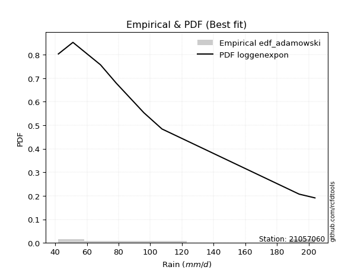</img>

</div>


## C. Best fit & Estimate extreme values for specific return periods - Tr

Best fit in probability distribution analysis means finding the theoretical distribution (like Normal, Poisson, Exponential, etc.) that most accurately mirrors your real-world data´s patterns (shape, center, spread) for better predictions, using methods like visual checks (Q-Q plots), goodness-of-fit tests (Kolmogorov-Smirnov, Chi-Squared), and information criteria (AIC) to score and select the simplest, most representative model.


### 1. Best fit (ordered by delta Δ)

:file_folder:Table: [bestfit_21057060.csv](table/bestfit_21057060.csv)

<div align="center">

|   id |   station | empirical_dist   | p_dist        |     delta |   deltao | eval   |   fit |   n |   best_fit |   best_fit_sort |
|-----:|----------:|:-----------------|:--------------|----------:|---------:|:-------|------:|----:|-----------:|----------------:|
|    0 |  21057060 | edf_california   | logloglaplace | 0.0745241 | 0.447261 | Δo > Δ |     1 |   8 |          1 |               1 |
|    1 |  21057060 | edf_hazen        | loggamma      | 0.0772937 | 0.447261 | Δo > Δ |     1 |   8 |          1 |               2 |
|    2 |  21057060 | edf_hazen        | loggamma      | 0.0772937 | 0.447261 | Δo > Δ |     1 |   8 |          1 |               3 |
|    3 |  21057060 | edf_gringorten   | loggamma      | 0.0819119 | 0.447261 | Δo > Δ |     1 |   8 |          1 |               4 |
|    4 |  21057060 | edf_gringorten   | loggamma      | 0.0819119 | 0.447261 | Δo > Δ |     1 |   8 |          1 |               5 |
|    5 |  21057060 | edf_chegodayev   | loggenexpon   | 0.0833333 | 0.447261 | Δo > Δ |     1 |   8 |          1 |               6 |
|    6 |  21057060 | edf_jenkinson    | loggenexpon   | 0.0837314 | 0.447261 | Δo > Δ |     1 |   8 |          1 |               7 |
|    7 |  21057060 | edf_beard        | loggenexpon   | 0.0837314 | 0.447261 | Δo > Δ |     1 |   8 |          1 |               8 |
|    8 |  21057060 | edf_filliben     | loggenexpon   | 0.0840524 | 0.447261 | Δo > Δ |     1 |   8 |          1 |               9 |
|    9 |  21057060 | edf_tukey        | loggenexpon   | 0.0847338 | 0.447261 | Δo > Δ |     1 |   8 |          1 |              10 |
|   10 |  21057060 | edf_cunnane      | loggamma      | 0.0849156 | 0.447261 | Δo > Δ |     1 |   8 |          1 |              11 |
|   11 |  21057060 | edf_cunnane      | loggamma      | 0.0849156 | 0.447261 | Δo > Δ |     1 |   8 |          1 |              12 |
|   12 |  21057060 | edf_blom         | loggenexpon   | 0.086552  | 0.447261 | Δo > Δ |     1 |   8 |          1 |              13 |
|   13 |  21057060 | edf_adamowski    | loggenexpon   | 0.0882353 | 0.447261 | Δo > Δ |     1 |   8 |          1 |              14 |
|   14 |  21057060 | edf_weibull      | loggenexpon   | 0.111111  | 0.447261 | Δo > Δ |     1 |   8 |          1 |              15 |

</div>


### 2. Extreme values and % difference analysis

In hydrology, a return period (or recurrence interval $Tr$) is the statistical average time between extreme events like floods or droughts of a specific magnitude, indicating how rare an event is, with a 100-year flood, for example, having a 1% chance of occurring in any given year, not that it happens exactly every century. It is a key tool for infrastructure design (like bridges or dams) and risk assessment, calculated from historical data to determine the probability of future events, although it is important to remember it is statistical average, and events can cluster or be missed.

The extreme value porcentage difference is evaluated as $pdiff = 1 - (ETrBf / ETr) * 100$, where _ETrBf_ correspond to the bestfit extreme value for a specific recurrence interval and _ETr_ correspond to the extreme value for one of the most used PDFsused in hydrology.

> risk_rate: assuming the return period as the project useful life.

:file_folder:Table: [extreme_21057060.csv](table/extreme_21057060.csv), all PDFs.  
:file_folder:Table: [extremepdiff_21057060.csv](table/extremepdiff_21057060.csv), % difference between bestfit and most used PDFs in Hydrology.

<div align="center">

Extreme values table for only best fit PDFs
|   id |      tr |   prob_l |     prob_g |     alpha |   anglit |   arcsine |   argus |     beta |   betaprime |   bradford |      burr |   burr12 |   cosine |   crystalball |   dgamma |   dweibull |   erlang |   exponnorm |   exponpow |   exponweib |        f |   fatiguelife |   foldnorm |   gamma |   gausshyper |   genexpon |      genextreme |   gengamma |   genhalflogistic |   genlogistic |   gennorm |   genpareto |   gompertz |   gumbel_l |   gumbel_r |   halfgennorm |   halflogistic |   halfnorm |   hypsecant |   invgamma |   invgauss |     invweibull |   johnsonsb |   johnsonsu |   kappa3 |   kappa4 |   ksone |   kstwobign |   laplace |   levy_l |   loggamma |   logistic |   loglaplace |   lomax |   maxwell |    mielke |    moyal |   nakagami |        ncf |       nct |    norm |   pearson3 |   powerlaw |   rayleigh |    rdist |    rice |   semicircular |   skewnorm |       t |   trapezoid |   triang |   truncexpon |   truncnorm |   truncpareto |   truncweibull_min |   tukeylambda |   uniform |   vonmises |   vonmises_line |     wald |   weibull_max |   weibull_min |   wrapcauchy |   logalpha |   loganglit |   logarcsine |   logargus |   logbeta |   logbetaprime |   logbradford |   logburr |   logburr12 |   logcosine |   logcrystalball |   logdgamma |   logdweibull |   logerlang |   logexponnorm |   logexponpow |   logexponweib |      logf |   logfatiguelife |   logfoldnorm |   loggausshyper |   loggenexpon |   loggenextreme |   loggengamma |   loggenhalflogistic |   loggenlogistic |   loggennorm |   loggenpareto |   loggompertz |   loggumbel_l |   loggumbel_r |   loghalfgennorm |   loghalflogistic |   loghalfnorm |   loghypsecant |   loginvgamma |   loginvgauss |   loginvweibull |   logjohnsonsb |   logjohnsonsu |   logkappa3 |   logkappa4 |   logksone |   logkstwobign |   loglevy_l |   logloggamma |   loglogistic |   logloglaplace |   loglomax |   logmaxwell |   logmielke |   logmoyal |   lognakagami |   logncf |   lognct |   lognorm |   logpearson3 |   logpowerlaw |   lograyleigh |   logrdist |   logrice |   logsemicircular |   logskewnorm |     logt |   logtrapezoid |   logtriang |   logtruncexpon |   logtruncnorm |   logtruncpareto |   logtruncweibull_min |   logtukeylambda |   loguniform |   logvonmises |   logvonmises_line |   logwald |   logweibull_max |   logweibull_min |   logwrapcauchy |   station |   n |   risk_rate |
|-----:|--------:|---------:|-----------:|----------:|---------:|----------:|--------:|---------:|------------:|-----------:|----------:|---------:|---------:|--------------:|---------:|-----------:|---------:|------------:|-----------:|------------:|---------:|--------------:|-----------:|--------:|-------------:|-----------:|----------------:|-----------:|------------------:|--------------:|----------:|------------:|-----------:|-----------:|-----------:|--------------:|---------------:|-----------:|------------:|-----------:|-----------:|---------------:|------------:|------------:|---------:|---------:|--------:|------------:|----------:|---------:|-----------:|-----------:|-------------:|--------:|----------:|----------:|---------:|-----------:|-----------:|----------:|--------:|-----------:|-----------:|-----------:|---------:|--------:|---------------:|-----------:|--------:|------------:|---------:|-------------:|------------:|--------------:|-------------------:|--------------:|----------:|-----------:|----------------:|---------:|--------------:|--------------:|-------------:|-----------:|------------:|-------------:|-----------:|----------:|---------------:|--------------:|----------:|------------:|------------:|-----------------:|------------:|--------------:|------------:|---------------:|--------------:|---------------:|----------:|-----------------:|--------------:|----------------:|--------------:|----------------:|--------------:|---------------------:|-----------------:|-------------:|---------------:|--------------:|--------------:|--------------:|-----------------:|------------------:|--------------:|---------------:|--------------:|--------------:|----------------:|---------------:|---------------:|------------:|------------:|-----------:|---------------:|------------:|--------------:|--------------:|----------------:|-----------:|-------------:|------------:|-----------:|--------------:|---------:|---------:|----------:|--------------:|--------------:|--------------:|-----------:|----------:|------------------:|--------------:|---------:|---------------:|------------:|----------------:|---------------:|-----------------:|----------------------:|-----------------:|-------------:|--------------:|-------------------:|----------:|-----------------:|-----------------:|----------------:|----------:|----:|------------:|
|    0 |    2    | 0.5      | 0.5        |   85.9884 |  105.225 |   105.225 | 124.302 |  60.9664 |     87.2419 |    117.31  |   83.2076 |  71.8157 |  111.295 |       105.225 |  88.3607 |    89.3771 |  54.0015 |     85.8612 |    95.3113 |     42.39   |  87.3454 |       42.0001 |    95.8254 |  65.106 |      127.24  |    88.5199 |    59.835       |    42.9015 |           148.024 |       94.2046 |       123 |     149.054 |    89.8697 |    114.715 |    95.7352 |       68.5005 |        91.0174 |    93.4007 |     105.225 |    84.1205 |    82.1976 |  357.235       |     42.297  |     82.0363 |  125.681 |  111.543 | 105.225 |     96.9377 |   105.225 |  133.849 |    80.5478 |    105.225 |      91.0692 | 113.896 |   100.285 |   83.1538 |  92.6716 |    96.2921 |    83.8132 |   83.4143 | 105.225 |    97.8998 |    45.037  |    98.5324 |  27.8188 | 103.219 |        105.225 |    99.7622 | 105.224 |     163.262 |  135.105 |      102.117 |     105.225 |       42.3955 |            104.299 |       123.809 |   123     |   0.688182 |         123.609 |  86.5002 |       203.666 |       69.0573 |      123     |    86.8872 |     91.0692 |      91.0692 |    100.989 |   84.0778 |        89.3115 |       80.1337 |   81.6675 |     87.6302 |     92.5256 |          91.0692 |     86.9964 |       87.4647 |     80.6145 |        90.9314 |       79.1988 |        43.6796 |   80.5112 |          84.48   |       89.8871 |         86.1384 |       78.3094 |         89.0013 |       43.3863 |              116.345 |          83.1235 |      92.5635 |        131.066 |       86.5524 |       99.4265 |       83.4145 |          41.9999 |           79.8512 |       81.6322 |        91.0692 |       86.1849 |       84.6876 |         82.9725 |        42.286  |        91.0683 |      42     |     93.6685 |    91.0692 |        82.4677 |     126.15  |       91.1168 |       91.0692 |         78.6    |    71.6856 |      87.0004 |     83.2892 |    81.0833 |       44.5669 |  86.3068 |  86.6    |   91.0692 |       89.2217 |       43.915  |       85.6013 |    93.4843 |   87.1704 |           91.0692 |       79.1926 |  91.0692 |        137.096 |     110.568 |         78.7094 |        69.7996 |          89.1145 |               67.5107 |          92.5704 |      92.5635 |      0.168966 |            92.5634 |   76.5827 |          179.301 |          81.8202 |         92.5635 |  21057060 |   8 |    0.75     |
|    1 |    2.33 | 0.570815 | 0.429185   |   94.2852 |  117.232 |   123.25  | 135.441 |  79.4228 |     95.9422 |    128.859 |   91.6977 |  80.9138 |  121.866 |       115.533 |  98.4134 |    98.7528 |  58.7231 |     95.5376 |   108.8    |     42.8823 |  96.0568 |       44.5634 |   107.491  |  72.149 |      140.944 |    98.2816 |   122.561       |    44.2733 |           158.615 |      102.965  |       123 |     162.918 |    99.7095 |    123.683 |   105.287  |       79.2497 |       100.838  |   104.526  |     113.475 |    92.6902 |    91.1529 | 6365.6         |     43.5989 |     91.1007 |  137.533 |  123.814 | 119.395 |    106.188  |   111.463 |  155.121 |    89.2876 |    114.307 |      96.4797 | 129.737 |   110.994 |   91.6414 | 101.713  |   107.261  |   105.057  |   91.8    | 115.533 |   108.146  |    48.4936 |   109.4    |  43.5615 | 112.799 |        118.103 |   109.705  | 115.531 |     172.674 |  146.501 |      112.974 |     115.533 |       42.7293 |            115.69  |       135.937 |   134.472 |   1.07595  |         135.168 |  93.2593 |       203.867 |       82.2809 |      152.941 |    95.5604 |    101.769  |     107.596  |    111.658 |   94.566  |        98.434  |       89.6604 |   89.9292 |     96.0074 |    102.004  |         100.182  |     99.3578 |      100.266  |     89.3546 |       100.024  |       88.3065 |        45.5475 |   89.2193 |          93.0889 |       99.3258 |         96.8737 |       87.3709 |         97.9081 |       44.5221 |              129.346 |          91.6213 |      92.5635 |        157.994 |       96.2049 |      108.028  |       91.1213 |          41.9999 |           87.4466 |       90.4821 |        98.2921 |       94.8241 |       93.2984 |         91.4198 |        44.5634 |       100.209  |      42     |    105.254  |   103.827  |        91.0982 |     146.025 |      100.318  |       99.0522 |         83.9877 |    80.9004 |      96.062  |     91.7785 |    88.158  |       47.6146 |  94.9571 |  95.2679 |  100.182  |       98.1897 |       45.8712 |       94.656  |   109.432  |   96.1533 |          102.592  |       88.3272 | 100.182  |        150.281 |     122.349 |         87.7574 |        76.844  |          99.7268 |               75.1465 |         103.731  |     103.525  |      0.185368 |           103.525  |   81.5248 |          194.07  |          90.6903 |        124.943  |  21057060 |   8 |    0.729209 |
|    2 |    5    | 0.8      | 0.2        |  138.324  |  159.596 |   171.314 | 171.172 | 161.087  |    140.141  |    167.854 |  139.685  | 146.492  |  159.962 |       153.841 | 131.942  |   133.546  |  87.5925 |    143.917  |   171.894  |     55.6706 | 140.242  |       99.0148 |   154.102  | 111.067 |      181.188 |   144.87   | 56420.1         |    90.4889 |           186.43  |      141.023  |       123 |     194.401 |   145.666  |    152.655 |   146.783  |      162.6    |       145.274  |   151.572  |     146.565 |   139.453  |   139.993  |    2.87657e+09 |    177.077  |    142.239  |  175.89  |  165.744 | 165.255 |    145.48   |   142.651 |  190.365 |   140.901  |    149.374 |     128.752  | 208.938 |   153.145 |  139.637  | 143.596  |   154.919  |   245.661  |  138.393  | 153.841 |   150.465  |    87.0322 |   152.909  |  88.2796 | 151.156 |        162.049 |   151.75   | 153.835 |     199.677 |  179.194 |      154.72  |     153.841 |       49.8889 |            157.493 |       174.632 |   171.6   |   2.43005  |         172.575 | 131.097  |       203.998 |      187.677  |      191.342 |   140.011  |    150.604  |     167.852  |    154.094 |  144.153  |       142.847  |      134.636  |  137.555  |    138.793  |    144.96   |         142.795  |    135.809  |      139.04   |    140.907  |       142.668  |      137.427  |        73.8264 |  140.725  |         139.645  |      143.978  |        144.764  |      143.225  |        140.748  |       56.2988 |              170.918 |         139.815  |      92.5635 |        200.674 |      143.885  |      141.237  |      133.769  |          41.9999 |          131.916  |      139.829  |       133.499  |      139.818  |      139.643  |        139.306  |       201.708  |       142.978  |      42     |    152.136  |   158.7    |       139.035  |     186.08  |      143.24   |      137.014  |        118.814  |   150.716  |     141.879  |    139.747  |   129.882  |       99.7346 | 139.875  | 140.038  |  142.795  |      141.796  |       69.3225 |      141.569  |   171.375  |  141.603  |          154.061  |      140.148  | 142.795  |        195.575 |     163.588 |        131.319  |       114.177  |         145.075  |              116.774  |         149.667  |     148.715  |      0.262578 |           148.714  |  115.698  |          203.836 |         140.474  |        181.016  |  21057060 |   8 |    0.67232  |
|    3 |   10    | 0.9      | 0.1        |  188.358  |  183.574 |   182.918 | 188.402 | 191.381  |    184.734  |    185.672 |  196.594  | inf      |  182.978 |       179.253 | 159.088  |   161.279  | 118.246  |    187.835  |   221.992  |    109.823  | 184.724  |      174.198  |   186.403  | 149.393 |      195.17  |   184.42   |     1.17033e+07 |   322.136  |           196.011 |      172.018  |       123 |     201.435 |   183.367  |    168.786 |   180.581  |      287.067  |       182.176  |   186.386  |     172.989 |   191.494  |   190.389  |    1.16724e+14 |    203.479  |    199.16   |  192.626 |  184.925 | 185.266 |    175.397  |   170.963 |  198.874 |   204.014  |    175.2   |     167.306  | 280.834 |   182.809 |  196.598  | 180.061  |   190.788  |   449.478  |  192.277  | 179.253 |   182.363  |   130.511  |   183.931  | 101.37   | 178.504 |        184.599 |   182.863  | 179.245 |     210.224 |  191.964 |      177.345 |     179.253 |       72.4107 |            179.159 |       190.816 |   187.8   |   3.10745  |         188.897 | 171.252  |       204     |      340.003  |      198.247 |   185.476  |    188.01   |     186.874  |    179.989 |  178.937  |       184.689  |      164.463  |  195.983  |    185.206  |    179.252  |         180.642  |    170.979  |      172.752  |    203.845  |       180.74   |      186.462  |       150.322  |  204.023  |         190.648  |      184.191  |        173.244  |      215.154  |        179.335  |       76.9515 |              188.191 |         197.242  |      92.5635 |        203.722 |      186.538  |      163.969  |      182.876  |          41.9999 |          185.601  |      192.965  |       170.472  |      186.853  |      190.101  |        196.318  |       203.993  |       180.997  |     174.563 |    177.354  |   190.976  |       191.832  |     197.295 |      181.205  |      173.995  |        166.65   |   272.164  |     186.685  |    196.664  |   181.998  |      257.363  | 186.603  | 186.308  |  180.642  |      182.79   |      105.268  |      188.633  |   195.622  |  185.662  |          189.801  |      197.217  | 180.643  |        216.771 |     183.242 |        161.571  |       145.646  |         171.751  |              150.32   |         175.219  |     174.178  |      0.333538 |           174.178  |  167.754  |          203.994 |         196.085  |        193.223  |  21057060 |   8 |    0.651322 |
|    4 |   15    | 0.933333 | 0.0666667  |  225.423  |  193.813 |   185.131 | 194.953 | 198.054  |    213.811  |    191.724 |  238.332  | inf      |  193.462 |       191.934 | 174.464  |   176.705  | 137.321  |    213.525  |   248.504  |    184.79   | 213.685  |      223.369  |   202.687  | 172.568 |      198.957 |   206.531  |     2.37494e+08 |   669.476  |           198.885 |      189.505  |       123 |     202.815 |   203.922  |    176.091 |   199.65   |      384.647  |       203.06   |   204.503  |     188.069 |   227.761  |   222.294  |    4.64638e+16 |    203.933  |    237.868  |  198.205 |  191.417 | 191.936 |    191.278  |   187.525 |  201.445 |   250.642  |    189.271 |     195.01   | 322.891 |   198.029 |  238.394  | 201.224  |   209.53   |   620.156  |  231.103  | 191.934 |   199.46   |   151.046  |   199.916  | 104.355  | 192.596 |        193.392 |   199.054  | 191.925 |     213.608 |  196.061 |      185.715 |     191.934 |       92.8631 |            187.032 |       196.005 |   193.2   |   3.34494  |         194.338 | 197.037  |       204     |      454.087  |      200.227 |   215.436  |    206.692  |     190.74   |    190.938 |  194.031  |       210.592  |      176.397  |  240.072  |    218.137  |    197.456  |         203.13   |    194.106  |      193.36   |    250.293  |       203.458  |      216.851  |       241.388  |  251.038  |         225.738  |      208.281  |        183.665  |      270.278  |        201.963  |       94.6666 |              193.719 |         239.498  |      92.5635 |        203.935 |      211.278  |      175.434  |      218.161  |          41.9999 |          225.161  |      228.177  |       195.995  |      218.3    |      224.677  |        238.244  |       204.003  |       203.597  |     184.021 |    186.298  |   203.132  |       227.581  |     200.814 |      203.691  |      198.187  |        205.368  |   389.218  |     214.914  |    238.437  |   221.36   |      451.016  | 217.727  | 217.007  |  203.13   |      208.124  |      127.189  |      218.697  |   201.661  |  213.157  |          205.889  |      235.587  | 203.131  |        224.047 |     190.036 |        174.075  |       160.708  |         181.824  |              165.32   |         184.536  |     183.599  |      0.377452 |           183.6    |  212.953  |          203.999 |         234.278  |        196.868  |  21057060 |   8 |    0.644736 |
|    5 |   20    | 0.95     | 0.05       |  256.757  |  199.836 |   185.91  | 198.548 | 200.536  |    236.044  |    194.772 |  272.698  | inf      |  199.909 |       200.239 | 185.232  |   187.392  | 151.226  |    231.752  |   266.231  |    270.346  | 235.811  |      259.775  |   213.384  | 189.255 |      200.614 |   221.81   |     1.95443e+09 |  1082.53   |           200.258 |      201.748  |       123 |     203.315 |   217.909  |    180.638 |   213.002  |      466.076  |       217.691  |   216.581  |     198.708 |   256.641  |   245.907  |    3.07282e+18 |    203.983  |    267.989  |  200.995 |  194.678 | 195.271 |    201.977  |   199.275 |  202.761 |   289.059  |    198.997 |     217.405  | 352.731 |   208.131 |  272.821  | 216.212  |   222.039  |   772.583  |  262.724  | 200.239 |   211.09   |   162.701  |   210.54   | 105.528  | 201.962 |        198.27  |   209.848  | 200.229 |     215.278 |  198.083 |      190.081 |     200.239 |      108.769  |            191.113 |       198.537 |   195.9   |   3.46526  |         197.058 | 216.252  |       204     |      546.209  |      201.187 |   238.508  |    218.537  |     192.12   |    197.228 |  202.644  |       229.751  |      182.805  |  277.108  |    244.944  |    209.557  |         219.352  |    211.923  |      208.543  |    288.536  |       219.893  |      239.114  |       342.147  |  289.933  |         253.439  |      225.74   |        188.967  |      316.793  |        217.992  |      110.443  |              196.418 |         274.363  |      92.5635 |        203.977 |      228.75   |      182.972  |      246.844  |          41.9999 |          257.802  |      255.155  |       216.266  |      242.725  |      251.907  |        272.821  |       204.003  |       219.905  |     188.941 |    190.826  |   209.498  |       255.347  |     202.64  |      219.881  |      216.846  |        239.41   |   504.462  |     235.967  |    272.852  |   254.285  |      664.025  | 241.844  | 240.741  |  219.352  |      226.841  |      141.368  |      241.286  |   204.095  |  233.531  |          215.392  |      265.231  | 219.354  |        227.726 |     193.479 |        180.892  |       169.574  |         187.105  |              173.783  |         189.335  |     188.5    |      0.410164 |           188.5    |  254.387  |          204     |         264.259  |        198.658  |  21057060 |   8 |    0.641514 |
|    6 |   25    | 0.96     | 0.04       |  284.75   |  203.918 |   186.272 | 200.867 | 201.727  |    254.302  |    196.607 |  302.497  | inf      |  204.431 |       206.352 | 193.521  |   195.557  | 162.187  |    245.89   |   279.42   |    361.829  | 253.97   |      288.7    |   221.272  | 202.315 |      201.516 |   233.443  |     9.91046e+09 |  1535.94   |           201.059 |      211.179  |       123 |     203.552 |   228.44   |    183.874 |   223.286  |      536.632  |       228.964  |   225.568  |     206.941 |   281.065  |   264.739  |    7.75781e+19 |    203.994  |    292.96   |  202.668 |  196.64  | 197.272 |    209.991  |   208.39  |  203.587 |   322.341  |    206.437 |     236.533  | 375.876 |   215.63  |  302.68   | 227.829  |   231.351  |   912.786  |  289.927  | 206.352 |   219.872  |   170.175  |   218.433  | 106.117  | 208.921 |        201.434 |   217.88   | 206.342 |     216.272 |  199.287 |      192.764 |     206.352 |      121.022  |            193.61  |       200.029 |   197.52  |   3.53782  |         198.69  | 231.643  |       204     |      624.053  |      201.755 |   257.559  |    226.948  |     192.764  |    201.394 |  208.275  |       245.102  |      186.8    |  309.731  |    268.08   |    218.483  |         232.116  |    226.637  |      220.682  |    321.651  |       232.853  |      256.764  |       450.366  |  323.741  |         276.71   |      239.521  |        192.15   |      357.824  |        230.381  |      124.862  |              198.012 |         304.641  |      92.5635 |        203.99  |      242.261  |      188.532  |      271.484  |          41.9999 |          286.144  |      277.276  |       233.384  |      263.018  |      274.744  |        302.84   |       204.003  |       232.739  |     191.955 |    193.548  |   213.412  |       278.342  |     203.795 |      232.6    |      232.298  |        270.475  |   618.866  |     252.92   |    302.706  |   283.139  |      889.04   | 261.841  | 260.393  |  232.116  |      241.823  |      151.197  |      259.566  |   205.332  |  249.857  |          221.791  |      289.683  | 232.118  |        229.947 |     195.561 |        185.181  |       175.42   |         190.356  |              179.212  |         192.253  |     191.503  |      0.4366   |           191.503  |  293.317  |          204     |         289.299  |        199.726  |  21057060 |   8 |    0.639603 |
|    7 |   50    | 0.98     | 0.02       |  400.932  |  213.966 |   186.755 | 206.124 | 203.389  |    317.39   |    200.293 |  416.269  | inf      |  216.27  |       223.858 | 218.994  |   220.339  | 197.025  |    289.808  |   317.62   |    849.617  | 316.64   |      381.506  |   243.898  | 243.404 |      203.052 |   268.463  |     1.47262e+12 |  4059.31   |           202.599 |      240.231  |       123 |     203.88  |   259.538  |    192.657 |   254.966  |      800.132  |       263.697  |   251.69   |     232.467 |   370.047  |   325.84   |    1.61905e+24 |    204      |    380.159  |  206.015 |  200.571 | 201.274 |    233.523  |   236.702 |  205.447 |   448.863  |    229.168 |     307.363  | 447.772 |   237.378 |  416.732  | 263.893  |   258.428  |  1509.79   |  392.302  | 223.858 |   246.07   |   186.27   |   241.347  | 107.004  | 229.121 |        208.663 |   241.225  | 223.847 |     218.246 |  201.677 |      198.277 |     223.858 |      154.105  |            198.722 |       202.933 |   200.76  |   3.68357  |         201.954 | 281.895  |       204     |      901.448  |      202.882 |   324.085  |    249.057  |     193.627  |    211.168 |  221.056  |       295.784  |      195.148  |  438.309  |    356.337  |    243.699  |         272.927  |    278.003  |      260.644  |    447.423  |       274.461  |      313.6    |      1067.84   |  453.147  |         360.408  |      283.816  |        198.413  |      519.3    |        268.368  |      185.153  |              201.119 |         420.565  |      92.5635 |        203.999 |      284.021  |      204.493  |      363.947  |          41.9999 |          394.595  |      353.078  |       295.553  |      334.644  |      356.633  |        417.705  |       204.003  |       273.787  |     198.129 |    198.948  |   221.462  |       358.544  |     206.419 |      273.162  |      286.67   |        402.115  |  1189.43   |     309.293  |    416.78   |   395.282  |     2096.4    | 332.182  | 329.344  |  272.927  |      291.203  |      174.516  |      320.861  |   207.219  |  303.666  |          237.131  |      374.319  | 272.929  |        234.418 |     199.757 |        194.241  |       188.537  |         197.047  |              190.947  |         198.159  |     197.653  |      0.52604  |           197.653  |  466.936  |          204     |         378.103  |        201.859  |  21057060 |   8 |    0.63583  |
|    8 |   75    | 0.986667 | 0.0133333  |  499.4    |  218.388 |   186.844 | 208.209 | 203.717  |    359.355  |    201.526 |  501.086  | inf      |  221.924 |       233.252 | 233.745  |   234.493  | 217.852  |    315.498  |   338.263  |   1340.34   | 358.273  |      437.398  |   256.056  | 267.736 |      203.46  |   288.232  |     2.69489e+13 |  6693.83   |           203.09  |      257.117  |       123 |     203.945 |   276.698  |    197.099 |   273.38   |      987.801  |       283.888  |   265.91   |     247.384 |   432.91   |   363.213  |    5.24726e+26 |    204      |    438.456  |  207.132 |  201.882 | 202.608 |    246.47   |   253.263 |  206.212 |   542.486  |    242.297 |     358.258  | 489.829 |   249.203 |  501.802  | 284.983  |   273.168  |  2011.81   |  467.41   | 233.252 |   260.775  |   191.993  |   253.813  | 107.201  | 240.111 |        211.55  |   253.933  | 233.239 |     218.9   |  202.468 |      200.16  |     233.252 |      168.471  |            200.462 |       203.867 |   201.84  |   3.73228  |         203.043 | 312.818  |       204     |     1088.67   |      203.255 |   368.922  |    259.458  |     193.788  |    215.175 |  226.012  |       327.729  |      198.041  |  537.975  |    422.65   |    256.748  |         297.707  |    312.567  |      285.765  |    540.396  |       299.857  |      348.177  |      1769.82   |  549.74   |         418.631  |      310.87   |        200.422  |      643.713  |        290.049  |      234.643  |              202.121 |         507.259  |      92.5635 |        204     |      308.318  |      213.071  |      431.545  |          41.9999 |          475.643  |      402.722  |       339.292  |      383.498  |      413.408  |        503.551  |       204.003  |       298.72   |     200.231 |    200.71   |   224.213  |       412.14   |     207.507 |      297.715  |      323.693  |        513.678  |  1766.39   |     345.049  |    501.905  |   480.448  |     3350.31   | 379.958  | 376.055  |  297.707  |      322.261  |      183.571  |      360.086  |   207.644  |  337.443  |          243.552  |      430.368  | 297.71   |        235.917 |     201.166 |        197.413  |       193.4    |         199.335  |              195.143  |         200.138  |     199.746  |      0.584762 |           199.747  |  621.597  |          204     |         438.666  |        202.571  |  21057060 |   8 |    0.634587 |
|    9 |  100    | 0.99     | 0.01       |  589.982  |  221.018 |   186.876 | 209.372 | 203.836  |    391.693  |    202.144 |  571.342  | inf      |  225.468 |       239.605 | 244.159  |   244.405  | 232.79   |    333.725  |   352.243  |   1817.07   | 390.33   |      477.614  |   264.283  | 285.108 |      203.638 |   301.965  |     2.10888e+14 |  9306.54   |           203.329 |      269.068  |       123 |     203.968 |   288.454  |    200.004 |   286.412  |     1137.12   |       298.178  |   275.597  |     257.966 |   483.219  |   390.38   |    3.13971e+28 |    204      |    483.345  |  207.691 |  202.538 | 203.275 |    255.341  |   265.014 |  206.659 |   619.566  |    251.566 |     399.402  | 519.669 |   257.257 |  572.29   | 299.945  |   283.209  |  2460.71   |  529.003  | 239.605 |   270.98   |   194.923  |   262.306  | 107.278  | 247.598 |        213.167 |   262.59   | 239.592 |     219.226 |  202.863 |      201.111 |     239.605 |      176.436  |            201.34  |       204.324 |   202.38  |   3.75664  |         203.587 | 335.363  |       204     |     1232.68   |      203.441 |   403.784  |    265.848  |     193.844  |    217.445 |  228.709  |       351.51   |      199.509  |  622.787  |    478.151  |    265.281  |         315.73   |    339.39   |      304.44   |    616.89   |       318.394  |      373.272  |      2528.57   |  629.75   |         464.751  |      330.615  |        201.396  |      748.901  |        305.105  |      278.148  |              202.612 |         579.214  |      92.5635 |        204     |      325.504  |      218.876  |      486.846  |          41.9999 |          542.88   |      440.482  |       374.189  |      421.76   |      458.289  |        574.771  |       204.003  |       316.858  |     201.291 |    201.576  |   225.6    |       453.417  |     208.146 |      315.539  |      352.678  |        614.84   |  2352.89   |     371.742  |    572.46   |   551.779  |     4609.45   | 417.272  | 412.484  |  315.73   |      345.349  |      188.375  |      389.52   |   207.811  |  362.494  |          247.223  |      473.283  | 315.733  |        236.668 |     201.873 |        199.029  |       195.937  |         200.49   |              197.297  |         201.125  |     200.801  |      0.630023 |           200.802  |  765.774  |          204     |         485.942  |        202.928  |  21057060 |   8 |    0.633968 |
|   10 |  200    | 0.995    | 0.005      |  920.189  |  225.986 |   186.906 | 211.395 | 203.956  |    479.485  |    203.071 |  783.14   | inf      |  232.673 |       254.016 | 269.104  |   267.9    | 269.243  |    377.643  |   383.917  |   3565.51   | 477.256  |      576.056  |   282.954  | 327.271 |      203.862 |   334.134  |     2.96583e+16 | 19152.3    |           203.678 |      297.8    |       123 |     203.991 |   315.475  |    206.319 |   317.744  |     1555.99   |       332.534  |   297.752  |     283.458 |   627.419  |   457.81   |    5.87316e+32 |    204      |    604.471  |  208.554 |  203.521 | 204.275 |    275.772  |   293.326 |  207.505 |   849.502  |    273.802 |     519.002  | 591.565 |   275.683 |  784.891  | 335.994  |   306.167  |  3975.78   |  712.016  | 254.016 |   294.912  |   199.408  |   281.738  | 107.362  | 264.729 |        215.986 |   282.39   | 254.001 |     219.713 |  203.453 |      202.549 |     254.016 |      189.484  |            202.664 |       204.992 |   203.19  |   3.79321  |         204.403 | 391.522  |       204     |     1617.72   |      203.721 |   499.751  |    278.351  |     193.898  |    221.446 |  233.196  |       412.906  |      201.738  |  889.714  |    649.367  |    283.514  |         360.762  |    412.92   |      352.563  |    844.863  |       364.951  |      435.564  |      5921.94   |  870.772  |         594.909  |      380.178  |        202.793  |     1075.59   |        340.021  |      421.116  |              203.331 |         796.776  |      92.5635 |        204     |      366.748  |      232.045  |      650.555  |          41.9999 |          746.027  |      540.689  |       473.717  |      528.149  |      584.584  |        789.976  |       204.003  |       362.19   |     202.89  |    202.841  |   227.698  |       564.904  |     209.361 |      359.948  |      433.232  |        968.784  |  4796.66   |     440.839  |    785.361  |   770.215  |     9537.13   | 520.598  | 513.168  |  360.762  |      404.829  |      195.95   |      466.241  |   207.996  |  426.744  |          253.756  |      588.215  | 360.766  |        237.797 |     202.935 |        201.491  |       199.881  |         202.236  |              200.603  |         202.598  |     202.394  |      0.754777 |           202.395  | 1287.52   |          204     |         616.223  |        203.463  |  21057060 |   8 |    0.633042 |
|   11 |  250    | 0.996    | 0.004      | 1076.57   |  227.25  |   186.91  | 211.869 | 203.971  |    511.04   |    203.257 |  866.666  | inf      |  234.649 |       258.42  | 277.098  |   275.359  | 281.097  |    391.781  |   393.569  |   4359.35   | 508.469  |      608.138  |   288.662  | 340.924 |      203.899 |   344.231  |     1.45455e+17 | 23713.3    |           203.746 |      307.037  |       123 |     203.994 |   323.811  |    208.177 |   327.817  |     1709.67   |       343.579  |   304.568  |     291.664 |   681.812  |   480.058  |    1.38756e+34 |    204      |    647.625  |  208.742 |  203.717 | 204.475 |    282.095  |   302.44  |  207.725 |   939.258  |    280.94  |     564.665  | 614.711 |   281.355 |  868.77   | 347.599  |   313.227  |  4634.06   |  783.29   | 258.42  |   302.443  |   200.317  |   287.72   | 107.374  | 270.002 |        216.648 |   288.481  | 258.405 |     219.811 |  203.571 |      202.838 |     258.42  |      192.264  |            202.931 |       205.122 |   203.352 |   3.80052  |         204.566 | 410.101  |       204     |     1753.13   |      203.777 |   534.706  |    281.626  |     193.905  |    222.393 |  234.193  |       433.98   |      202.188  |  999.258  |    718.653  |    288.728  |         375.765  |    439.574  |      369.055  |    933.777  |       380.541  |      456.145  |      7765.43   |  965.721  |         643.312  |      396.758  |        203.058  |     1207.78   |        350.799  |      481.804  |              203.471 |         882.797  |      92.5635 |        204     |      379.98   |      236.068  |      714.096  |          41.9999 |          826.296  |      575.882  |       511.083  |      567.238  |      631.433  |        875.018  |       204.003  |       377.296  |     203.212 |    203.086  |   228.12   |       604.675  |     209.679 |      374.706  |      462.81   |       1129.08   |  6072.94   |     464.591  |    869.392  |   857.514  |    11916.2    | 558.417  | 549.964  |  375.765  |      425.204  |      197.521  |      492.771  |   208.022  |  448.647  |          255.313  |      628.901  | 375.769  |        238.023 |     203.148 |        201.989  |       200.69   |         202.588  |              201.275  |         202.89   |     202.714  |      0.800853 |           202.715  | 1529      |          204     |         663.566  |        203.571  |  21057060 |   8 |    0.632858 |
|   12 |  500    | 0.998    | 0.002      | 1830.33   |  230.385 |   186.914 | 212.957 | 203.992  |    620.793  |    203.628 | 1186.94   | inf      |  239.905 |       271.48  | 301.832  |   298.242  | 318.225  |    435.699  |   422.062  |   7798.81   | 616.911  |      708.781  |   305.592  | 383.54  |      203.961 |   374.863  |     2.02371e+19 | 43872.8    |           203.878 |      335.706  |       123 |     203.999 |   348.677  |    213.503 |   359.08   |     2249.93   |       377.861  |   324.889  |     317.154 |   880.73   |   550.64   |    2.54063e+38 |    204      |    795.734  |  209.182 |  204.11  | 204.875 |    301.045  |   330.752 |  208.294 |  1279.23   |    303.079 |     733.753  | 686.607 |   298.281 | 1190.54   | 383.647  |   334.272  |  7438.93   | 1052.97   | 271.48  |   325.384  |   202.15   |   305.568  | 107.392  | 285.736 |        218.17  |   306.643  | 271.464 |     220.006 |  203.807 |      203.418 |     271.48  |      198.006  |            203.464 |       205.377 |   203.676 |   3.81515  |         204.892 | 469.175  |       204     |     2209.3    |      203.888 |   658.115  |    289.914  |     193.913  |    224.586 |  236.37   |       503.836  |      203.092  | 1439.33   |    994.08   |    303.075  |         424.026  |    533.056  |      423.631  |   1270.26   |       430.968  |      521.632  |     17849.1    | 1329.22   |         817.59   |      450.301  |        203.565  |     1728.78   |        382.667  |      733.652  |              203.745 |        1213.54   |      92.5635 |        204     |      420.952  |      247.993  |      953.619  |         203.366  |         1134.72   |      695.003  |       647.011  |      706.434  |      799.683  |       1201.81   |       204.003  |       425.901  |     203.856 |    203.564  |   228.967  |       741.431  |     210.501 |      422.057  |      568.012  |       1857.25   | 12909.5    |     543.35   |   1191.89   |  1196.97   |    23073.7    | 692.534  | 680.275  |  424.026  |      492.599  |      200.721  |      581.243  |   208.061  |  520.668  |          258.936  |      767.687  | 424.031  |        238.476 |     203.574 |        202.991  |       202.332  |         203.293  |              202.63   |         203.469  |     203.356  |      0.969538 |           203.357  | 2641.05   |          204     |         829.583  |        203.785  |  21057060 |   8 |    0.632489 |
|   13 |  750    | 0.998667 | 0.00133333 | 2567.12   |  231.773 |   186.915 | 213.394 | 203.996  |    694.194  |    203.752 | 1426.43   | inf      |  242.452 |       278.735 | 316.244  |   311.446  | 340.13   |    461.389  |   437.785  |  10672.5    | 689.347  |      768.244  |   314.998  | 408.595 |      203.978 |   392.3    |     3.62402e+20 | 61055.3    |           203.92  |      352.466  |       123 |     203.999 |   362.558  |    216.35  |   377.357  |     2612.64   |       397.902  |   336.242  |     332.064 |  1021.67   |   592.866  |    7.88687e+40 |    204      |    892.93   |  209.381 |  204.24  | 205.009 |    311.69   |   347.313 |  208.564 |  1529.69   |    316.013 |     855.253  | 728.664 |   307.748 | 1431.28   | 404.734  |   346.023  |  9798.46   | 1251.64   | 278.735 |   338.522  |   202.765  |   315.548  | 107.396  | 294.535 |        218.783 |   316.789  | 278.718 |     220.07  |  203.885 |      203.612 |     278.735 |      199.975  |            203.643 |       205.46  |   203.784 |   3.82002  |         205.001 | 504.595  |       204     |     2501.08   |      203.926 |   742.195  |    293.661  |     193.915  |    225.474 |  237.184  |       547.974  |      203.394  | 1787.34   |   1210.29   |    310.282  |         453.464  |    596.168  |      458.047  |   1517.9    |       461.941  |      560.991  |     28852.1    | 1600.51   |         938.819  |      483.106  |        203.723  |     2130.63   |        400.113  |      939.32   |              203.833 |        1461.65   |      92.5635 |        204     |      444.834  |      254.611  |     1129.3    |         203.58   |         1365.89   |      771.973  |       742.717  |      802.176  |      916.381  |       1446.79   |       204.003  |       455.558  |     204.071 |    203.717  |   229.249  |       831.409  |     210.892 |      450.853  |      640.217  |       2525.41   | 20377.4    |     593.086  |   1433.29   |  1454.83   |    33303.7    | 784.327  | 769.342  |  453.464  |      535.071  |      201.805  |      637.469  |   208.07   |  565.71   |          260.408  |      858.153  | 453.47   |        238.627 |     203.716 |        203.326  |       202.886  |         203.528  |              203.085  |         203.66   |     203.571  |      1.0924   |           203.571  | 3665.21   |          204     |         941.373  |        203.857  |  21057060 |   8 |    0.632366 |
|   14 | 1000    | 0.999    | 0.001      | 3298.23   |  232.6   |   186.916 | 213.64  | 203.998  |    750.895  |    203.814 | 1625.05   | inf      |  244.059 |       283.73  | 326.447  |   320.74   | 355.745  |    479.616  |   448.56   |  13194.3    | 745.258  |      810.661  |   321.475  | 426.421 |      203.985 |   404.471  |     2.80557e+21 | 76311.9    |           203.941 |      364.354  |       123 |     204     |   372.13   |    218.266 |   390.321  |     2892.11   |       412.118  |   344.082  |     342.644 |  1134.59   |   623.205  |    4.61902e+42 |    204      |    966.959  |  209.508 |  204.305 | 205.076 |    319.064  |   359.064 |  208.734 |  1735.31   |    325.185 |     953.474  | 758.503 |   314.291 | 1631      | 419.695  |   354.137  | 11908.5    | 1414.84   | 283.73  |   347.733  |   203.073  |   322.445  | 107.398  | 300.615 |        219.128 |   323.796  | 283.713 |     220.103 |  203.925 |      203.709 |     283.73  |      200.971  |            203.732 |       205.501 |   203.838 |   3.82246  |         205.056 | 530.074  |       204     |     2719.26   |      203.944 |   807.968  |    295.917  |     193.915  |    225.973 |  237.621  |       580.852  |      203.546  | 2087.12   |   1396.22   |    314.916  |         474.913  |    645.203  |      483.651  |   1721.07   |       484.612  |      589.37   |     40450      | 1825.18   |        1034.79   |      507.072  |        203.799  |     2470.55   |        411.937  |     1119.72   |              203.877 |        1667.82   |      92.5635 |        204     |      461.743  |      259.164  |     1273.22   |         203.687  |         1557.9    |      830.052  |       819.089  |      877.504  |     1008.6    |       1650.27   |       204.003  |       477.169  |     204.18  |    203.792  |   229.391  |       900.072  |     211.138 |      471.793  |      696.92   |       3164.56   | 28370.8    |     630.098  |   1633.63   |  1670.81   |    42870.2    | 856.314  | 839.141  |  474.913  |      566.652  |      202.35   |      679.471  |   208.074  |  599.026  |          261.239  |      926.781  | 474.919  |        238.702 |     203.787 |        203.494  |       203.164  |         203.646  |              203.313  |         203.754  |     203.678  |      1.19453  |           203.679  | 4639.54   |          204     |        1027.96   |        203.893  |  21057060 |   8 |    0.632305 |


</div>


<div align="center">

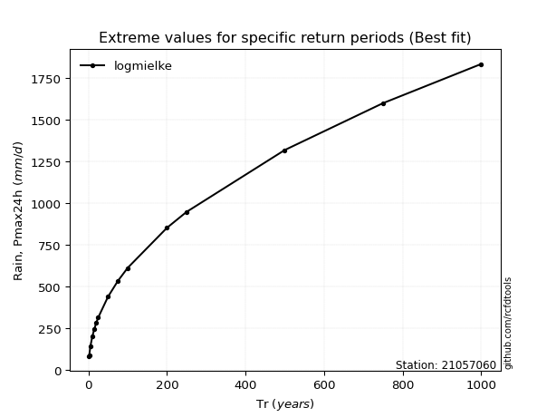</img>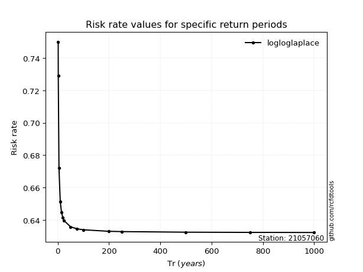</img>

</div>


<sub>**APP DISCLAIMER**: NO WARRANTY - This software is provided by [github.com/rcfdtools](https://github.com/rcfdtools) "as is", without any express or implied warranty, including warranties of merchantability, fitness for a particular purpose, or non-infringement. There is no guarantee that the software will be error-free or operate without interruption. LIMITATION OF LIABILITY - Neither the authors nor copyright holders will be liable for claims or damages arising from the software or its use. You are responsible for determining if the software is appropriate for your use and assume all associated risks, including errors, legal compliance, and data loss. NO PROFESSIONAL ADVICE - The software provides general information and does not offer professional advice. It should not replace consultation with professional advisors.</sub>