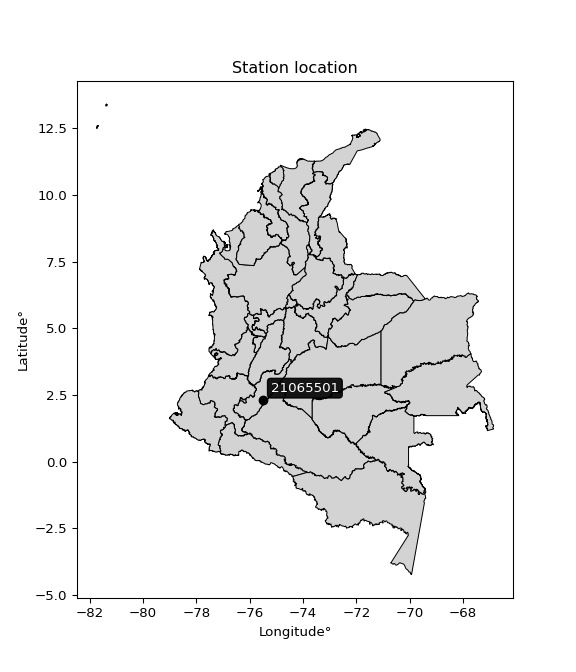

<div align="center">


</div>

# PMax24h Station (Rain, Pmax24h): 21065501

Maximum Precipitation in 24 hours (PMax24h) is the greatest amount of rainfall for a specific duration that is meteorologically possible for a given location, acting as a "worst-case" scenario for extreme storms, crucial for designing safety-critical infrastructure like bridges, river deviations, dams, spillways, and nuclear plants to prevent catastrophic failure. The PMax24h is related with the Probable Maximum Precipitation (PMP) and it is calculated by hydrologists using meteorological data to determine the upper limit of extreme rainfall, often leading to the Probable Maximum Flood (PMF) for flood control design, and is increasingly being studied for climate change impacts. Probable Maximum Precipitation (PMP) is the theoretical upper limit of rainfall, a deterministic estimate for extreme events, while probability distributions (like GEV, Gumbel) describe the likelihood and frequency of various precipitation amounts, including rare ones, showing how often events occur, with PMP representing the extreme end of these distributions, used for critical infrastructure design to ensure safety against the worst conceivable weather, unlike standard statistical forecasts which cover typical probabilities.

The most common probability distributions in hydrology, used for analyzing floods, rainfall, and streamflow, include the Normal, Log-Normal, Gumbel, Gamma (including Log-Pearson Type III), and Generalized Extreme Value (GEV) distributions, often chosen based on the data´s skewness and whether modeling extremes or general conditions, with Gumbel and GEV popular for extreme events like floods, while the Normal distribution serves as a baseline, though often requiring transformations for skewed hydrological data. These distributions help in designing water infrastructure, managing water resources, and forecasting hydrologic events.

> Hydrological data often isn´t perfectly normal (it´s skewed), so different distributions are needed for different applications, such as: **Flood Frequency Analysis**: Using Gumbel, GEV, or Log-Pearson Type III for predicting extreme flood magnitudes and their return periods, **Rainfall Analysis**: Normal for annual totals, but Log-Normal, Weibull, or GEV for intensity or extreme daily rainfall, **Streamflow Modeling**: Gamma and Log-Normal for maximum flows, GEV for minimum flows, and Kappa for daily flows.

<div align="center">

</img>

</div>


## A. General information


### 1. General running parameters

• app_version: _v20260225_. • runtime: _2026-02-27 14:50:08.749431_. • Python version: _3.14.0_. • SciPy version: _1.16.3_. • Pandas version: _2.3.3_. • NumPy version: _2.3.5_. • Stations dataset (station_dataset_file): _dataset/pmax24h_in/automatic_colombia_2003_2025.csv_. • Stations catalog (station_catalog_file): _dataset/CNE.xls_. • Minimum year to eval til year_max (date_min): _1900_. • Maximum year to eval since year_min (date_max): _2025_. • Creates, save and include plots into reports (create_plot): _False_. • Plot only fit distributions with Δo > Δ (plot_only_fit): _True_. • Plot only simple graphs avoiding multiple CDFs and multiple Extreme values plots (plot_only_simple): _False_. • Eval low extreme values, if False, evaluates high extreme values (low_extreme): _False_. • Eval every SciPy distribution as logarithmic (pdist_logarithmic_on): _True_. • Standard deviation normalized (ddof): _1.0_. • Return periods to eval in years (Tr): _[2, 2.33, 5, 10, 15, 20, 25, 50, 75, 100, 200, 250, 500, 750, 1000]_. • Minimum data sample per station, 0 means any (minimum_sample): _5_. • Z-Score maximum threshold to adjust a value, 0 means disable (zscore_max): _3.5_. • Z-Score minimum threshold to adjust a value, 0 means disable (zscore_min): _-2.5_. • Avoid zeros, e.g. rain = 0 (avoid_zeros): _True_. • Avoid null values (avoid_nans): _True_. 

:file_folder:Table: [dataset.csv](../../dataset/pmax24h_in/automatic_colombia_2003_2025.csv)

> Delta Degrees of Freedom (DDOF): is a parameter used in the formulas for calculating variance and standard deviation. When ddof=0, the divisor is $N$ (the total number of observations) and this is used when your data set is the entire population. When ddof=1, the divisor is $N-1$ and this is used when your data set is a sample drawn from a larger population. Using $N-1$ provides an unbiased estimate of the population variance (known as Bessel´s correction).


### 2. Station info and location

|   id |   CODIGO | NOMBRE                            | CATEGORIA               | TECNOLOGIA                | ESTADO   | FECHA_INSTALACION   |   FECHA_SUSPENSION |   ALTITUD |   LATITUD |   LONGITUD | DEPARTAMENTO   | MUNICIPIO   | AREA_OPERATIVA                    | ENTIDAD                                    | AREA_HIDROGRAFICA   | ZONA_HIDROGRAFICA   | SUBZONA_HIDROGRAFICA         |   CORRIENTE | Catalogo   |   Version |
|-----:|---------:|:----------------------------------|:------------------------|:--------------------------|:---------|:--------------------|-------------------:|----------:|----------:|-----------:|:---------------|:------------|:----------------------------------|:-------------------------------------------|:--------------------|:--------------------|:-----------------------------|------------:|:-----------|----------:|
|    0 | 21065501 | JORGE VILLAMIL  - AUT  [21065501] | Climatológica Principal | Automática con Telemetría | Activa   | 21/07/2013          |                nan |      1420 |   2.32555 |   -75.5097 | Huila          | Gigante     | Area Operativa 04 - Huila-Caquetá | CENTRO NACIONAL DE INVESTIGACIONES DE CAFE | Magdalena Cauca     | Alto Magdalena      | Ríos directos Magdalena (md) |         nan | CNE_OE     |  20251226 |

<div align="center">

Dynamic map: [:earth_americas:Google](http://maps.google.com/maps?q=2.325552778,-75.50972222) [:earth_americas:OSM](https://www.openstreetmap.org/#map=18/2.325552778/-75.50972222&layers=P) [:earth_americas:Bing](https://www.bing.com/maps?cp=2.325552778~-75.50972222&lvl=18) [:earth_americas:Apple](https://maps.apple.com/frame?center=2.325552778%2C-75.50972222&span=0.003%2C0.006)

</div>


<div align="center">

```geojson
{
  "type": "Feature",
  "geometry": {
    "type": "Point", 
    "coordinates": [-75.50972222, 2.325552778]
  }, 
  "properties": {
    "Name": "21065501"
  }
}
```

</div>


### 3. Discrete values table and plot

<div align="center">

|               |          0 |           1 |           2 |           3 |           4 |          5 |
|:--------------|-----------:|------------:|------------:|------------:|------------:|-----------:|
| Date          | 2018       | 2019        | 2020        | 2021        | 2022        | 2023       |
| Value         |   63.5     |   56.8      |   31.9      |   38.5      |   33.3      |   89.9     |
| Value_initial |   63.5     |   56.8      |   31.9      |   38.5      |   33.3      |   89.9     |
| count         |    6       |    6        |    6        |    6        |    6        |    6       |
| mean          |   52.3167  |   52.3167   |   52.3167   |   52.3167   |   52.3167   |   52.3167  |
| std           |   22.4813  |   22.4813   |   22.4813   |   22.4813   |   22.4813   |   22.4813  |
| zscore        |    0.49745 |    0.199425 |   -0.908161 |   -0.614584 |   -0.845888 |    1.67176 |


</div>


> The initial value (value_initial) correspond to the initial obtained or null completed value, and value (value) is adjusted only when the initial value is outside the valid range (outlier) definite through the Z-Score value. If Z-Score is active, values out of range or outliers are replaced with the station mean value. A Z-Score (or standard score) measures how many standard deviations a data point is from the mean of a dataset, indicating its relative position; positive scores mean above the mean, negative mean below, and a score of zero is exactly at the mean, allowing for comparison of values from different distributions. It´s calculated using the formula $z=(x–μ)/σ$, where $x$ is the data point, $μ$ is the mean, and $σ$ is the standard deviation, helping identify outliers and understand probability.
>
> <sub>**Note**: In this study, "completing" (filling gaps in) and "extending" (forecasting or lengthening the historical record) rainfall data series are avoided for certain critical analyses because they introduce artificial bias and uncertainty, which can distort the statistics of rare events (extremes), alter day-to-day variability, and compromise the integrity and homogeneity of the original data. Some reasons against Completing/Extending rainfall data are: **Distortion of Extremes and Variability**: The primary issue is that most gap-filling or extension methods rely on averaging or regression with nearby stations, which inherently smooths the data. Rainfall is highly variable in space and time, with a large percentage of zero values and occasional large storms. Infilling methods often underestimate the highest values and overestimate the lowest (zero) values, which severely distorts analyses focused on flood frequency, drought severity, and intensity-duration-frequency (IDF) curves, **Loss of Data Homogeneity**: Infilled or extended data are synthetic estimates, not actual measurements. Combining these estimates with observed data can violate the assumption of data homogeneity, which requires that the data properties do not change over time. Inhomogeneity can lead to incorrect conclusions about long-term trends or changes in climate patterns, **Propagation of Errors**: Errors and biases from the original data (e.g., wind-induced undercatch, instrument errors, site changes) or the data used for imputation can propagate through the analysis, leading to unreliable hydrological models and inaccurate predictions, **Compromised Statistical Integrity**: For statistical analyses, especially those involving the frequency of events, using artificial data can introduce time bias or autocorrelation that doesn´t exist in reality, making it difficult to assess the true probability of events, **Difficulty in Validation**: It is difficult to accurately validate the quality of filled or extended data, especially for past periods where ground-truth measurements are unavailable. The reliability of imputation techniques heavily depends on the density of the surrounding station network and the complexity of the local topography.</sub>


### 4. Active continuous probability distributions from SciPy (80 of 104 available)

A Probability Density Function (PDF) describes the relative likelihood of a continuous random variable falling within a specific range, where the total area under its curve equals 1, and the area over any interval gives the actual probability for that range. Unlike discrete probabilities (like rolling a die), a PDF shows density, not direct probability for a single point (which is zero), with higher points indicating higher likelihood, often visualized as a bell curve for normal distributions.

A log of a probability density function (log-PDF) is simply the logarithm of the PDF´s value, denoted as $log(f(x))$, useful for converting multiplication of probabilities into addition, improving numerical stability with tiny numbers, and connecting to information theory concepts like entropy. Instead of dealing with very small probabilities (e.g., 0.000001), log-PDFs use negative numbers (e.g., $log(0.00001) ≈ -11.51$ that are easier for computers to handle, preventing underflow errors and simplifying complex calculations. In this study, each active probability distribution from SciPy is also evaluated in the $log$ form.

[scipy.stats](https://docs.scipy.org/doc/scipy/reference/stats.html) is a Python´s powerful submodule within the SciPy library for comprehensive statistical analysis, offering over 130 probability distributions (like Normal, Poisson, etc.), functions for descriptive stats (mean, variance), hypothesis testing (t-tests, chi-square), random variable generation, and statistical tests, making it essential for data science, modeling, and research. It provides tools to explore, model, and draw conclusions from data efficiently, working seamlessly with [NumPy](https://numpy.org/).

<div align="center">

|   id | p_dist           |   n_parameter | fit_method   | label                                                                       | active   | ref                                                                                                      |
|-----:|:-----------------|--------------:|:-------------|:----------------------------------------------------------------------------|:---------|:---------------------------------------------------------------------------------------------------------|
|    0 | alpha            |             3 | MLE          | Alpha                                                                       | True     | [:mortar_board:](https://docs.scipy.org/doc/scipy/reference/generated/scipy.stats.alpha.html)            |
|    1 | anglit           |             2 | MM           | Anglit                                                                      | True     | [:mortar_board:](https://docs.scipy.org/doc/scipy/reference/generated/scipy.stats.anglit.html)           |
|    2 | arcsine          |             2 | MM           | Arcsine                                                                     | True     | [:mortar_board:](https://docs.scipy.org/doc/scipy/reference/generated/scipy.stats.arcsine.html)          |
|    3 | argus            |             3 | MLE          | Argus                                                                       | True     | [:mortar_board:](https://docs.scipy.org/doc/scipy/reference/generated/scipy.stats.argus.html)            |
|    4 | beta             |             4 | MLE          | Beta                                                                        | True     | [:mortar_board:](https://docs.scipy.org/doc/scipy/reference/generated/scipy.stats.beta.html)             |
|    5 | betaprime        |             4 | MLE          | Beta prime                                                                  | True     | [:mortar_board:](https://docs.scipy.org/doc/scipy/reference/generated/scipy.stats.betaprime.html)        |
|    6 | bradford         |             3 | MLE          | Bradford                                                                    | True     | [:mortar_board:](https://docs.scipy.org/doc/scipy/reference/generated/scipy.stats.bradford.html)         |
|    7 | burr             |             4 | MLE          | Burr (Type III)                                                             | True     | [:mortar_board:](https://docs.scipy.org/doc/scipy/reference/generated/scipy.stats.burr.html)             |
|    8 | burr12           |             4 | MLE          | Burr (Type III) 12                                                          | True     | [:mortar_board:](https://docs.scipy.org/doc/scipy/reference/generated/scipy.stats.burr12.html)           |
|    9 | cosine           |             2 | MLE          | Cosine                                                                      | True     | [:mortar_board:](https://docs.scipy.org/doc/scipy/reference/generated/scipy.stats.cosine.html)           |
|   10 | crystalball      |             4 | MLE          | Crystalball                                                                 | True     | [:mortar_board:](https://docs.scipy.org/doc/scipy/reference/generated/scipy.stats.crystalball.html)      |
|   11 | dgamma           |             3 | MLE          | Double gamma                                                                | True     | [:mortar_board:](https://docs.scipy.org/doc/scipy/reference/generated/scipy.stats.dgamma.html)           |
|   12 | dweibull         |             3 | MLE          | Double Weibull                                                              | True     | [:mortar_board:](https://docs.scipy.org/doc/scipy/reference/generated/scipy.stats.dweibull.html)         |
|   13 | erlang           |             3 | MLE          | Erlang                                                                      | True     | [:mortar_board:](https://docs.scipy.org/doc/scipy/reference/generated/scipy.stats.erlang.html)           |
|   14 | exponnorm        |             3 | MLE          | Exponentially modified Normal                                               | True     | [:mortar_board:](https://docs.scipy.org/doc/scipy/reference/generated/scipy.stats.exponnorm.html)        |
|   15 | exponpow         |             3 | MLE          | Exponential power                                                           | True     | [:mortar_board:](https://docs.scipy.org/doc/scipy/reference/generated/scipy.stats.exponpow.html)         |
|   16 | exponweib        |             4 | MLE          | Exponentiated Weibull                                                       | True     | [:mortar_board:](https://docs.scipy.org/doc/scipy/reference/generated/scipy.stats.exponweib.html)        |
|   17 | f                |             4 | MLE          | F                                                                           | True     | [:mortar_board:](https://docs.scipy.org/doc/scipy/reference/generated/scipy.stats.f.html)                |
|   18 | fatiguelife      |             3 | MLE          | Fatigue-life (Birnbaum-Saunders)                                            | True     | [:mortar_board:](https://docs.scipy.org/doc/scipy/reference/generated/scipy.stats.fatiguelife.html)      |
|   19 | foldnorm         |             3 | MM           | Fold Normal                                                                 | True     | [:mortar_board:](https://docs.scipy.org/doc/scipy/reference/generated/scipy.stats.foldnorm.html)         |
|   20 | gamma            |             3 | MLE          | Gamma                                                                       | True     | [:mortar_board:](https://docs.scipy.org/doc/scipy/reference/generated/scipy.stats.gamma.html)            |
|   21 | gausshyper       |             6 | MLE          | Gauss hypergeometric                                                        | True     | [:mortar_board:](https://docs.scipy.org/doc/scipy/reference/generated/scipy.stats.gausshyper.html)       |
|   22 | genexpon         |             5 | MLE          | Generalized exponential                                                     | True     | [:mortar_board:](https://docs.scipy.org/doc/scipy/reference/generated/scipy.stats.genexpon.html)         |
|   23 | genextreme       |             3 | MLE          | Generalized exponential                                                     | True     | [:mortar_board:](https://docs.scipy.org/doc/scipy/reference/generated/scipy.stats.genextreme.html)       |
|   24 | gengamma         |             4 | MLE          | Generalized gamma                                                           | True     | [:mortar_board:](https://docs.scipy.org/doc/scipy/reference/generated/scipy.stats.gengamma.html)         |
|   25 | genhalflogistic  |             3 | MLE          | Generalized half-logistic                                                   | True     | [:mortar_board:](https://docs.scipy.org/doc/scipy/reference/generated/scipy.stats.genhalflogistic.html)  |
|   26 | genlogistic      |             3 | MLE          | Generalized logistic                                                        | True     | [:mortar_board:](https://docs.scipy.org/doc/scipy/reference/generated/scipy.stats.genlogistic.html)      |
|   27 | gennorm          |             3 | MLE          | Generalized Normal                                                          | True     | [:mortar_board:](https://docs.scipy.org/doc/scipy/reference/generated/scipy.stats.gennorm.html)          |
|   28 | genpareto        |             3 | MLE          | Generalized Pareto                                                          | True     | [:mortar_board:](https://docs.scipy.org/doc/scipy/reference/generated/scipy.stats.genpareto.html)        |
|   29 | gompertz         |             3 | MLE          | Gompertz (or truncated Gumbel)                                              | True     | [:mortar_board:](https://docs.scipy.org/doc/scipy/reference/generated/scipy.stats.gompertz.html)         |
|   30 | gumbel_l         |             2 | MM           | Gumbel Left Skew                                                            | True     | [:mortar_board:](https://docs.scipy.org/doc/scipy/reference/generated/scipy.stats.gumbel_l.html)         |
|   31 | gumbel_r         |             2 | MM           | Gumbel Right Skew                                                           | True     | [:mortar_board:](https://docs.scipy.org/doc/scipy/reference/generated/scipy.stats.gumbel_r.html)         |
|   32 | halfgennorm      |             3 | MLE          | Upper half of a generalized normal                                          | True     | [:mortar_board:](https://docs.scipy.org/doc/scipy/reference/generated/scipy.stats.halfgennorm.html)      |
|   33 | halflogistic     |             2 | MM           | Half-logistic                                                               | True     | [:mortar_board:](https://docs.scipy.org/doc/scipy/reference/generated/scipy.stats.halflogistic.html)     |
|   34 | halfnorm         |             2 | MM           | Half Normal                                                                 | True     | [:mortar_board:](https://docs.scipy.org/doc/scipy/reference/generated/scipy.stats.halfnorm.html)         |
|   35 | hypsecant        |             2 | MM           | hyperbolic secant                                                           | True     | [:mortar_board:](https://docs.scipy.org/doc/scipy/reference/generated/scipy.stats.hypsecant.html)        |
|   36 | invgamma         |             3 | MLE          | Inverted gamma                                                              | True     | [:mortar_board:](https://docs.scipy.org/doc/scipy/reference/generated/scipy.stats.invgamma.html)         |
|   37 | invgauss         |             3 | MLE          | Inverse Gaussian                                                            | True     | [:mortar_board:](https://docs.scipy.org/doc/scipy/reference/generated/scipy.stats.invgauss.html)         |
|   38 | invweibull       |             3 | MLE          | Inverted Weibull                                                            | True     | [:mortar_board:](https://docs.scipy.org/doc/scipy/reference/generated/scipy.stats.invweibull.html)       |
|   39 | johnsonsb        |             4 | MLE          | Johnson SB                                                                  | True     | [:mortar_board:](https://docs.scipy.org/doc/scipy/reference/generated/scipy.stats.johnsonsb.html)        |
|   40 | johnsonsu        |             4 | MLE          | Johnson Su                                                                  | True     | [:mortar_board:](https://docs.scipy.org/doc/scipy/reference/generated/scipy.stats.johnsonsu.html)        |
|   41 | kappa3           |             3 | MLE          | Kappa 3                                                                     | True     | [:mortar_board:](https://docs.scipy.org/doc/scipy/reference/generated/scipy.stats.kappa3.html)           |
|   42 | kappa4           |             4 | MLE          | Kappa 4                                                                     | True     | [:mortar_board:](https://docs.scipy.org/doc/scipy/reference/generated/scipy.stats.kappa4.html)           |
|   43 | ksone            |             3 | MLE          | Kolmogorov-Smirnov one-sided test statistic distribution                    | True     | [:mortar_board:](https://docs.scipy.org/doc/scipy/reference/generated/scipy.stats.ksone.html)            |
|   44 | kstwobign        |             2 | MLE          | Limiting distribution of scaled Kolmogorov-Smirnov two-sided test statistic | True     | [:mortar_board:](https://docs.scipy.org/doc/scipy/reference/generated/scipy.stats.kstwobign.html)        |
|   45 | laplace          |             2 | MM           | Laplace                                                                     | True     | [:mortar_board:](https://docs.scipy.org/doc/scipy/reference/generated/scipy.stats.laplace.html)          |
|   46 | levy_l           |             2 | MLE          | Left-skewed Levy                                                            | True     | [:mortar_board:](https://docs.scipy.org/doc/scipy/reference/generated/scipy.stats.levy_l.html)           |
|   47 | loggamma         |             3 | MLE          | Log gamma                                                                   | True     | [:mortar_board:](https://docs.scipy.org/doc/scipy/reference/generated/scipy.stats.loggamma.html)         |
|   48 | logistic         |             2 | MM           | Logistic (or Sech-squared)                                                  | True     | [:mortar_board:](https://docs.scipy.org/doc/scipy/reference/generated/scipy.stats.logistic.html)         |
|   49 | loglaplace       |             3 | MLE          | Log-Laplace                                                                 | True     | [:mortar_board:](https://docs.scipy.org/doc/scipy/reference/generated/scipy.stats.loglaplace.html)       |
|   50 | lomax            |             3 | MLE          | Lomax (Pareto of the second kind)                                           | True     | [:mortar_board:](https://docs.scipy.org/doc/scipy/reference/generated/scipy.stats.lomax.html)            |
|   51 | maxwell          |             2 | MM           | Maxwell                                                                     | True     | [:mortar_board:](https://docs.scipy.org/doc/scipy/reference/generated/scipy.stats.maxwell.html)          |
|   52 | mielke           |             4 | MLE          | Mielke Beta-Kappa / Dagum                                                   | True     | [:mortar_board:](https://docs.scipy.org/doc/scipy/reference/generated/scipy.stats.mielke.html)           |
|   53 | moyal            |             2 | MM           | Moyal                                                                       | True     | [:mortar_board:](https://docs.scipy.org/doc/scipy/reference/generated/scipy.stats.moyal.html)            |
|   54 | nakagami         |             3 | MLE          | Nakagami                                                                    | True     | [:mortar_board:](https://docs.scipy.org/doc/scipy/reference/generated/scipy.stats.nakagami.html)         |
|   55 | ncf              |             5 | MLE          | Non-central F distribution                                                  | True     | [:mortar_board:](https://docs.scipy.org/doc/scipy/reference/generated/scipy.stats.ncf.html)              |
|   56 | nct              |             4 | MLE          | Non-central Student’s t                                                     | True     | [:mortar_board:](https://docs.scipy.org/doc/scipy/reference/generated/scipy.stats.nct.html)              |
|   57 | norm             |             2 | MM           | Normal                                                                      | True     | [:mortar_board:](https://docs.scipy.org/doc/scipy/reference/generated/scipy.stats.norm.html)             |
|   58 | pearson3         |             3 | MM           | Pearson type III                                                            | True     | [:mortar_board:](https://docs.scipy.org/doc/scipy/reference/generated/scipy.stats.pearson3.html)         |
|   59 | powerlaw         |             3 | MLE          | Power-function                                                              | True     | [:mortar_board:](https://docs.scipy.org/doc/scipy/reference/generated/scipy.stats.powerlaw.html)         |
|   60 | rayleigh         |             2 | MM           | Rayleigh                                                                    | True     | [:mortar_board:](https://docs.scipy.org/doc/scipy/reference/generated/scipy.stats.rayleigh.html)         |
|   61 | rdist            |             3 | MLE          | R-distributed (symmetric beta)                                              | True     | [:mortar_board:](https://docs.scipy.org/doc/scipy/reference/generated/scipy.stats.rdist.html)            |
|   62 | rice             |             3 | MLE          | Rice                                                                        | True     | [:mortar_board:](https://docs.scipy.org/doc/scipy/reference/generated/scipy.stats.rice.html)             |
|   63 | semicircular     |             2 | MM           | Semicircular                                                                | True     | [:mortar_board:](https://docs.scipy.org/doc/scipy/reference/generated/scipy.stats.semicircular.html)     |
|   64 | skewnorm         |             3 | MLE          | Skew normal                                                                 | True     | [:mortar_board:](https://docs.scipy.org/doc/scipy/reference/generated/scipy.stats.skewnorm.html)         |
|   65 | t                |             3 | MLE          | Student’s t                                                                 | True     | [:mortar_board:](https://docs.scipy.org/doc/scipy/reference/generated/scipy.stats.t.html)                |
|   66 | trapezoid        |             4 | MLE          | Trapezoid                                                                   | True     | [:mortar_board:](https://docs.scipy.org/doc/scipy/reference/generated/scipy.stats.trapezoid.html)        |
|   67 | triang           |             3 | MLE          | Triangular                                                                  | True     | [:mortar_board:](https://docs.scipy.org/doc/scipy/reference/generated/scipy.stats.triang.html)           |
|   68 | truncexpon       |             3 | MLE          | Truncated exponential                                                       | True     | [:mortar_board:](https://docs.scipy.org/doc/scipy/reference/generated/scipy.stats.truncexpon.html)       |
|   69 | truncnorm        |             4 | MLE          | Truncated normal                                                            | True     | [:mortar_board:](https://docs.scipy.org/doc/scipy/reference/generated/scipy.stats.truncnorm.html)        |
|   70 | truncpareto      |             4 | MLE          | Upper truncated Pareto                                                      | True     | [:mortar_board:](https://docs.scipy.org/doc/scipy/reference/generated/scipy.stats.truncpareto.html)      |
|   71 | truncweibull_min |             5 | MLE          | Doubly truncated Weibull minimum                                            | True     | [:mortar_board:](https://docs.scipy.org/doc/scipy/reference/generated/scipy.stats.truncweibull_min.html) |
|   72 | tukeylambda      |             3 | MLE          | Tukey-Lamdba                                                                | True     | [:mortar_board:](https://docs.scipy.org/doc/scipy/reference/generated/scipy.stats.tukeylambda.html)      |
|   73 | uniform          |             2 | MLE          | Uniform                                                                     | True     | [:mortar_board:](https://docs.scipy.org/doc/scipy/reference/generated/scipy.stats.uniform.html)          |
|   74 | vonmises         |             3 | MLE          | Von Mises                                                                   | True     | [:mortar_board:](https://docs.scipy.org/doc/scipy/reference/generated/scipy.stats.vonmises.html)         |
|   75 | vonmises_line    |             3 | MLE          | Von Mises line                                                              | True     | [:mortar_board:](https://docs.scipy.org/doc/scipy/reference/generated/scipy.stats.vonmises_line.html)    |
|   76 | wald             |             2 | MM           | Wald                                                                        | True     | [:mortar_board:](https://docs.scipy.org/doc/scipy/reference/generated/scipy.stats.wald.html)             |
|   77 | weibull_max      |             3 | MLE          | Weibull maximum                                                             | True     | [:mortar_board:](https://docs.scipy.org/doc/scipy/reference/generated/scipy.stats.weibull_max.html)      |
|   78 | weibull_min      |             3 | MLE          | Weibull minimum                                                             | True     | [:mortar_board:](https://docs.scipy.org/doc/scipy/reference/generated/scipy.stats.weibull_min.html)      |
|   79 | wrapcauchy       |             3 | MLE          | Wrapped  Cauchy                                                             | True     | [:mortar_board:](https://docs.scipy.org/doc/scipy/reference/generated/scipy.stats.wrapcauchy.html)       |

</div>

> **n_parameter:** # arguments & localization & scale.
>
> **Fit methods:** (MLE) maximum likelihood, (MM) L-moments.
>
>**Inactive** (With the only purpose of prevent loops, zero divisions, infinite values, over high estimated values or horizontal trending for recurrence intervals estimations, the follow distributions were disabled.)**:** lognorm, norminvgauss, powernorm, powerlognorm, cauchy, halfcauchy, foldcauchy, skewcauchy, chi2, expon, fisk, genhyperbolic, geninvgauss, gibrat, kstwo, laplace_asymmetric, levy, levy_stable, ncx2, pareto, rel_breitwigner, recipinvgauss, studentized_range, loguniform, 


## B. Probability (PDF) vs. Empirical (EDF) distributions functions

A continuous probability distribution (CPD) describes probabilities for variables that can take any value within a range (like rain any time), unlike discrete variables with specific outcomes (like temperature). It uses a Probability Density Function (PDF), a curve where the total area under it equals 1, and the probability of the variable falling within an interval (a to b) is found by calculating the area under the curve between those points. A key feature is that the probability of hitting any single exact value is zero, so probabilities are always expressed for ranges, e.g., $P(a ≤ X ≤ b)$.

<div align="center">

Distributions parameters from station values
|     |   station | p_dist              |   n |             loc |          scale | shape                  | shape1                | shape2                | shape3             |
|----:|----------:|:--------------------|----:|----------------:|---------------:|:-----------------------|:----------------------|:----------------------|:-------------------|
|   0 |  21065501 | alpha               |   6 |     27.2606     |    8.45406     | 6.961988347594089e-08  |                       |                       |                    |
|   1 |  21065501 | anglit              |   6 |     52.3167     |   60.0366      |                        |                       |                       |                    |
|   2 |  21065501 | arcsine             |   6 |     23.2934     |   58.0465      |                        |                       |                       |                    |
|   3 |  21065501 | argus               |   6 |      7.37389    |   86.3856      | 4.542020490049827e-06  |                       |                       |                    |
|   4 |  21065501 | beta                |   6 |     31.9        |   65.4241      | 0.4673018921844226     | 0.9071816194280886    |                       |                    |
|   5 |  21065501 | betaprime           |   6 |     -0.499693   |    1.05665     | 347.6705617235394      | 7.9526647398513575    |                       |                    |
|   6 |  21065501 | bradford            |   6 |     31.9        |   58.0001      | 0.9264139997435386     |                       |                       |                    |
|   7 |  21065501 | burr                |   6 |     12.8527     |    5.8628      | 2.5026594572329373     | 45.313751187368524    |                       |                    |
|   8 |  21065501 | burr12              |   6 |     -4.14654    |   35.8585      | 736.1301451219299      | 0.0034664760017631357 |                       |                    |
|   9 |  21065501 | cosine              |   6 |     54.5781     |   17.1152      |                        |                       |                       |                    |
|  10 |  21065501 | crystalball         |   6 |     52.3167     |   20.5225      | 6689.760483992224      | 552.6265311039242     |                       |                    |
|  11 |  21065501 | dgamma              |   6 |     48.8899     |    4.94648     | 3.5884185580250185     |                       |                       |                    |
|  12 |  21065501 | dweibull            |   6 |     50.1336     |   20.1402      | 1.8316107063692746     |                       |                       |                    |
|  13 |  21065501 | erlang              |   6 |     31.9        |   19.7396      | 0.5670326936324002     |                       |                       |                    |
|  14 |  21065501 | exponnorm           |   6 |     31.8858     |    0.00425185  | 4780.018214118345      |                       |                       |                    |
|  15 |  21065501 | exponpow            |   6 |     31.9        |   37.4826      | 0.7007522991685016     |                       |                       |                    |
|  16 |  21065501 | exponweib           |   6 |     31.9        |   23.7185      | 0.4908675713613918     | 1.0079159064717422    |                       |                    |
|  17 |  21065501 | f                   |   6 |     31.8999     |    8.60118     | 1.0101828606454015     | 1.2682516078184254    |                       |                    |
|  18 |  21065501 | fatiguelife         |   6 |     31.9        |    5.84601e-06 | 1559.5389887982765     |                       |                       |                    |
|  19 |  21065501 | foldnorm            |   6 |     22.4038     |   25.7139      | 0.9951069483184958     |                       |                       |                    |
|  20 |  21065501 | gamma               |   6 |     31.9        |   14.0854      | 0.5157641918824646     |                       |                       |                    |
|  21 |  21065501 | gausshyper          |   6 |     30.4939     |   59.4061      | 0.9919978962110707     | 0.837387564650508     | 1.2214848010643284    | 1.0570088248688687 |
|  22 |  21065501 | genexpon            |   6 |     31.9        |   40.4064      | 1.9790956967622158     | 1.584676646842032     | 5.183715535558379e-11 |                    |
|  23 |  21065501 | genextreme          |   6 |     31.9709     |    0.299452    | -4.221746045894793     |                       |                       |                    |
|  24 |  21065501 | gengamma            |   6 |     31.9        |   30.5335      | 0.477957385973906      | 0.5794587517399404    |                       |                    |
|  25 |  21065501 | genhalflogistic     |   6 |     27.3793     |   66.0701      | 1.0567731057809242     |                       |                       |                    |
|  26 |  21065501 | genlogistic         |   6 |    -68.3352     |   15.0735      | 1598.7738039047258     |                       |                       |                    |
|  27 |  21065501 | gennorm             |   6 |     60.9        |   29           | 24705391.90120148      |                       |                       |                    |
|  28 |  21065501 | genpareto           |   6 |     -0.466968   |  141.297       | -1.5635961787650747    |                       |                       |                    |
|  29 |  21065501 | gompertz            |   6 |     31.8612     |  133.791       | 4.925762458791774      |                       |                       |                    |
|  30 |  21065501 | gumbel_l            |   6 |     61.5529     |   16.0014      |                        |                       |                       |                    |
|  31 |  21065501 | gumbel_r            |   6 |     43.0804     |   16.0014      |                        |                       |                       |                    |
|  32 |  21065501 | halfgennorm         |   6 |     31.9        |    0.477295    | 0.35013682635095356    |                       |                       |                    |
|  33 |  21065501 | halflogistic        |   6 |     27.9927     |   17.546       |                        |                       |                       |                    |
|  34 |  21065501 | halfnorm            |   6 |     25.1529     |   34.0448      |                        |                       |                       |                    |
|  35 |  21065501 | hypsecant           |   6 |     52.3167     |   13.0651      |                        |                       |                       |                    |
|  36 |  21065501 | invgamma            |   6 |     30.4716     |    3.43936     | 0.7241560435632373     |                       |                       |                    |
|  37 |  21065501 | invgauss            |   6 |     30.519      |    5.88841     | 3.7017870103346744     |                       |                       |                    |
|  38 |  21065501 | invweibull          |   6 |     31.9        |    1.71443     | 0.06523456440397568    |                       |                       |                    |
|  39 |  21065501 | johnsonsb           |   6 |     31.9        |   88.9194      | 1.0093107679112163     | 0.16657035370024226   |                       |                    |
|  40 |  21065501 | johnsonsu           |   6 |     31.9        |    7.63865e-15 | -1.2497051960397274    | 0.09397167579823829   |                       |                    |
|  41 |  21065501 | kappa3              |   6 |     31.8919     |   57.9173      | 1623.743225698006      |                       |                       |                    |
|  42 |  21065501 | kappa4              |   6 |     24.884      |   66.1431      | 1.1186419296977492     | 0.9975777620076873    |                       |                    |
|  43 |  21065501 | ksone               |   6 |     26.1        |   69.6         | 1.0                    |                       |                       |                    |
|  44 |  21065501 | kstwobign           |   6 |     -9.56179    |   70.9969      |                        |                       |                       |                    |
|  45 |  21065501 | laplace             |   6 |     52.3167     |   14.5116      |                        |                       |                       |                    |
|  46 |  21065501 | levy_l              |   6 |     93.9225     |   16.7099      |                        |                       |                       |                    |
|  47 |  21065501 | loggamma            |   6 |  -6652.39       |  894.373       | 1802.2745618067447     |                       |                       |                    |
|  48 |  21065501 | logistic            |   6 |     52.3167     |   11.3147      |                        |                       |                       |                    |
|  49 |  21065501 | loglaplace          |   6 |     -0.104964   |   38.605       | 2.9042100915585705     |                       |                       |                    |
|  50 |  21065501 | lomax               |   6 |     31.9        |    1.16983e+11 | 2798883003.3663893     |                       |                       |                    |
|  51 |  21065501 | maxwell             |   6 |      3.68686    |   30.4742      |                        |                       |                       |                    |
|  52 |  21065501 | mielke              |   6 |     -1.76017    |    8.14866     | 1006.527037344262      | 3.437368949509356     |                       |                    |
|  53 |  21065501 | moyal               |   6 |     40.5806     |    9.23839     |                        |                       |                       |                    |
|  54 |  21065501 | nakagami            |   6 |     31.9        |   35.2113      | 0.12876483072528583    |                       |                       |                    |
|  55 |  21065501 | ncf                 |   6 |     30.4727     |    1.95673     | 2026.466865955584      | 1.4483187715449968    | 2892.749664954142     |                    |
|  56 |  21065501 | nct                 |   6 |     -0.304357   |    0.920377    | 4.431370229814922      | 47.126380465224344    |                       |                    |
|  57 |  21065501 | norm                |   6 |     52.3167     |   20.5225      |                        |                       |                       |                    |
|  58 |  21065501 | pearson3            |   6 |     52.3167     |   20.5226      | 0.7047633765524628     |                       |                       |                    |
|  59 |  21065501 | powerlaw            |   6 |     31.9        |   58           | 0.13428312410716967    |                       |                       |                    |
|  60 |  21065501 | rayleigh            |   6 |     13.0558     |   31.3256      |                        |                       |                       |                    |
|  61 |  21065501 | rdist               |   6 |     27.4921     |   36.0079      | 1.009492349447402      |                       |                       |                    |
|  62 |  21065501 | rice                |   6 |     18.9422     |   27.7041      | 0.0005417983265668706  |                       |                       |                    |
|  63 |  21065501 | semicircular        |   6 |     52.3167     |   41.0451      |                        |                       |                       |                    |
|  64 |  21065501 | skewnorm            |   6 |     31.9        |   28.9466      | 38414827.21362029      |                       |                       |                    |
|  65 |  21065501 | t                   |   6 |     52.3167     |   20.5225      | 871652820.7035882      |                       |                       |                    |
|  66 |  21065501 | trapezoid           |   6 |     26.1        |   69.6         | 1.0                    | 1.0                   |                       |                    |
|  67 |  21065501 | triang              |   6 |      0.911727   |   88.9883      | 0.9999999998927196     |                       |                       |                    |
|  68 |  21065501 | truncexpon          |   6 |     31.9        |   61.2994      | 0.946176316042979      |                       |                       |                    |
|  69 |  21065501 | truncnorm           |   6 | -20913.4        |  656.594       | 31.899983770832797     | 93.26859149702446     |                       |                    |
|  70 |  21065501 | truncpareto         |   6 |     31.8556     |    0.0443579   | 7.227789233235311e-10  | 1308.5460558075492    |                       |                    |
|  71 |  21065501 | truncweibull_min    |   6 |     31.7819     |   89.7131      | 0.4151753791148452     | 0.0013167453532190747 | 0.6478218146982808    |                    |
|  72 |  21065501 | tukeylambda         |   6 |     50.163      |   23.7969      | 1.303008630701672      |                       |                       |                    |
|  73 |  21065501 | uniform             |   6 |     31.9        |   58           |                        |                       |                       |                    |
|  74 |  21065501 | vonmises            |   6 |      0.974892   |    1           | 2.7862606448737233     |                       |                       |                    |
|  75 |  21065501 | vonmises_line       |   6 |     62.4217     |    9.71537     | 1.4211236253954228e-06 |                       |                       |                    |
|  76 |  21065501 | wald                |   6 |     31.7941     |   20.5225      |                        |                       |                       |                    |
|  77 |  21065501 | weibull_max         |   6 |     89.9        |    1.55136     | 0.27628729892360165    |                       |                       |                    |
|  78 |  21065501 | weibull_min         |   6 |     31.9        |   22.2677      | 0.7054701769807095     |                       |                       |                    |
|  79 |  21065501 | wrapcauchy          |   6 |     31.8973     |    9.23142     | 0.7074410058502232     |                       |                       |                    |
|  80 |  21065501 | logalpha            |   6 |      2.24043    |    7.03229     | 4.503798804501921      |                       |                       |                    |
|  81 |  21065501 | loganglit           |   6 |      3.88468    |    1.10017     |                        |                       |                       |                    |
|  82 |  21065501 | logarcsine          |   6 |      3.35282    |    1.06372     |                        |                       |                       |                    |
|  83 |  21065501 | logargus            |   6 |      3.08074    |    1.48794     | 7.717714619600929e-07  |                       |                       |                    |
|  84 |  21065501 | logbeta             |   6 |      3.46261    |    1.04227     | 0.4671101217793582     | 0.6950838911548599    |                       |                    |
|  85 |  21065501 | logbetaprime        |   6 |     -0.889989   |    3.15269     | 401.95079651730157     | 266.55978113760943    |                       |                    |
|  86 |  21065501 | logbradford         |   6 |      3.46261    |    1.03611     | 117.76131928081787     |                       |                       |                    |
|  87 |  21065501 | logburr             |   6 |      0.545071   |    1.91447     | 10.909100881010517     | 224.08172768396463    |                       |                    |
|  88 |  21065501 | logburr12           |   6 |     -1.4498     |    4.89413     | 687.7483054640281      | 0.01720105632865814   |                       |                    |
|  89 |  21065501 | logcosine           |   6 |      3.90655    |    0.304216    |                        |                       |                       |                    |
|  90 |  21065501 | logcrystalball      |   6 |      3.88468    |    0.376075    | 161.4814679829265      | 68.71711743234539     |                       |                    |
|  91 |  21065501 | logdgamma           |   6 |      3.85443    |    0.0602069   | 5.731488561741691      |                       |                       |                    |
|  92 |  21065501 | logdweibull         |   6 |      3.87579    |    0.390592    | 2.481949977203441      |                       |                       |                    |
|  93 |  21065501 | logerlang           |   6 |      3.46261    |    0.441088    | 0.5148651166654608     |                       |                       |                    |
|  94 |  21065501 | logexponnorm        |   6 |      3.76221    |    0.355942    | 0.344076357299888      |                       |                       |                    |
|  95 |  21065501 | logexponpow         |   6 |      3.46261    |    1.22586     | 0.16128938686862326    |                       |                       |                    |
|  96 |  21065501 | logexponweib        |   6 |      3.46261    |    0.543008    | 0.10236453469682598    | 1.6557114287837031    |                       |                    |
|  97 |  21065501 | logf                |   6 |      3.34419    |    0.280676    | 597.4105316635928      | 3.207102407920609     |                       |                    |
|  98 |  21065501 | logfatiguelife      |   6 |      3.46261    |    1.18202e-06 | 649.5232052283343      |                       |                       |                    |
|  99 |  21065501 | logfoldnorm         |   6 |      3.21172    |    0.407882    | 1.603837561977096      |                       |                       |                    |
| 100 |  21065501 | loggamma            |   6 |      3.46261    |    0.322781    | 0.7755365966808656     |                       |                       |                    |
| 101 |  21065501 | loggausshyper       |   6 |      3.46261    |    1.12755     | 0.8663639579653303     | 1.277063608775109     | 0.9819736187757145    | 0.9208077862509205 |
| 102 |  21065501 | loggenexpon         |   6 |      3.46261    |    0.913286    | 2.0542264808479747     | 0.6354727178676361    | 0.46378889760394115   |                    |
| 103 |  21065501 | loggenextreme       |   6 |      3.57279    |    0.172894    | -1.0840366530233734    |                       |                       |                    |
| 104 |  21065501 | loggengamma         |   6 |      3.46261    |    0.742565    | 0.5249392374116564     | 1.3583284554826394    |                       |                    |
| 105 |  21065501 | loggenhalflogistic  |   6 |      3.37216    |    1.19102     | 1.0572410742240037     |                       |                       |                    |
| 106 |  21065501 | loggenlogistic      |   6 |      1.60302    |    0.30038     | 1091.2447766725334     |                       |                       |                    |
| 107 |  21065501 | loggennorm          |   6 |      3.98065    |    0.51806     | 409617.88086448424     |                       |                       |                    |
| 108 |  21065501 | loggenpareto        |   6 |     -0.00292586 |    9.08976     | -2.019217061561961     |                       |                       |                    |
| 109 |  21065501 | loggompertz         |   6 |      3.46261    |    1.72665     | 3.2447870383627024     |                       |                       |                    |
| 110 |  21065501 | loggumbel_l         |   6 |      4.05394    |    0.293224    |                        |                       |                       |                    |
| 111 |  21065501 | loggumbel_r         |   6 |      3.71543    |    0.293224    |                        |                       |                       |                    |
| 112 |  21065501 | loghalfgennorm      |   6 |      3.46261    |    0.000362587 | 0.23907066831037738    |                       |                       |                    |
| 113 |  21065501 | loghalflogistic     |   6 |      3.43895    |    0.32153     |                        |                       |                       |                    |
| 114 |  21065501 | loghalfnorm         |   6 |      3.38691    |    0.623869    |                        |                       |                       |                    |
| 115 |  21065501 | loghypsecant        |   6 |      3.88468    |    0.239417    |                        |                       |                       |                    |
| 116 |  21065501 | loginvgamma         |   6 |      3.3299     |    0.52272     | 1.7232530286233532     |                       |                       |                    |
| 117 |  21065501 | loginvgauss         |   6 |      3.40912    |    0.245478    | 1.9372813618854021     |                       |                       |                    |
| 118 |  21065501 | loginvweibull       |   6 |      3.41331    |    0.159473    | 0.9224263912849545     |                       |                       |                    |
| 119 |  21065501 | logjohnsonsb        |   6 |      3.46261    |    3.73375     | 0.7495096345391219     | 0.08008881658337536   |                       |                    |
| 120 |  21065501 | logjohnsonsu        |   6 |   4190.5        | 9477.21        | 11808.806706000743     | 27557.161183006203    |                       |                    |
| 121 |  21065501 | logkappa3           |   6 |      3.46121    |    1.03393     | 534.122890521872       |                       |                       |                    |
| 122 |  21065501 | logkappa4           |   6 |      3.30354    |    1.24864     | 1.1463653521615447     | 1.0333740298849312    |                       |                    |
| 123 |  21065501 | logksone            |   6 |      3.2333     |    1.30276     | 1.0                    |                       |                       |                    |
| 124 |  21065501 | logkstwobign        |   6 |      2.67798    |    1.37818     |                        |                       |                       |                    |
| 125 |  21065501 | loglaplace          |   6 |      3.88468    |    0.265925    |                        |                       |                       |                    |
| 126 |  21065501 | loglevy_l           |   6 |      4.55969    |    0.252875    |                        |                       |                       |                    |
| 127 |  21065501 | logloggamma         |   6 |    -91.6893     |   13.4027      | 1250.7310238539276     |                       |                       |                    |
| 128 |  21065501 | loglogistic         |   6 |      3.88468    |    0.207341    |                        |                       |                       |                    |
| 129 |  21065501 | logloglaplace       |   6 |     -0.130862   |    3.78153     | 11.656394506017925     |                       |                       |                    |
| 130 |  21065501 | loglomax            |   6 |      3.46261    |   17.0334      | 41.125119568115394     |                       |                       |                    |
| 131 |  21065501 | logmaxwell          |   6 |      2.99354    |    0.558439    |                        |                       |                       |                    |
| 132 |  21065501 | logmielke           |   6 |      3.46261    |    1.0467      | 0.15429721316642286    | 433.94598253763115    |                       |                    |
| 133 |  21065501 | logmoyal            |   6 |      3.66962    |    0.169293    |                        |                       |                       |                    |
| 134 |  21065501 | lognakagami         |   6 |      3.46261    |    0.827253    | 0.2503996984361283     |                       |                       |                    |
| 135 |  21065501 | logncf              |   6 |     -1.25229    |    5.11883     | 1137.9490569208756     | 564.4346143145691     | 9.544125987883432e-10 |                    |
| 136 |  21065501 | lognct              |   6 |      0.1266     |    0.0869699   | 55.27150848916943      | 42.62254491802657     |                       |                    |
| 137 |  21065501 | lognorm             |   6 |      3.88468    |    0.376075    |                        |                       |                       |                    |
| 138 |  21065501 | logpearson3         |   6 |      3.88468    |    0.376074    | 0.34972852397659493    |                       |                       |                    |
| 139 |  21065501 | logpowerlaw         |   6 |      3.46261    |    1.03609     | 0.1453844887373075     |                       |                       |                    |
| 140 |  21065501 | lograyleigh         |   6 |      3.16523    |    0.57404     |                        |                       |                       |                    |
| 141 |  21065501 | logrdist            |   6 |      4.5886     |    0.549066    | 1.0588161297518197     |                       |                       |                    |
| 142 |  21065501 | logrice             |   6 |      3.2413     |    0.512705    | 0.33581770297133       |                       |                       |                    |
| 143 |  21065501 | logsemicircular     |   6 |      3.88468    |    0.752149    |                        |                       |                       |                    |
| 144 |  21065501 | logskewnorm         |   6 |      3.46261    |    0.565312    | 51059157.695510626     |                       |                       |                    |
| 145 |  21065501 | logt                |   6 |      3.88468    |    0.376075    | 6681151547.920092      |                       |                       |                    |
| 146 |  21065501 | logtrapezoid        |   6 |      3.359      |    1.24331     | 1.0                    | 1.0                   |                       |                    |
| 147 |  21065501 | logtriang           |   6 |      2.97683    |    1.52186     | 0.999999993176445      |                       |                       |                    |
| 148 |  21065501 | logtruncexpon       |   6 |      3.4626     |    1.0887      | 0.9516883383327142     |                       |                       |                    |
| 149 |  21065501 | logtruncnorm        |   6 |     -2.65775    |    1.76801     | 3.461727182571635      | 4.047766132812285     |                       |                    |
| 150 |  21065501 | logtruncpareto      |   6 |      3.46161    |    0.000996721 | 0.0005553884295318866  | 1040.5001918062835    |                       |                    |
| 151 |  21065501 | logtruncweibull_min |   6 |      3.4605     |    1.11543     | 0.5058874381772811     | 0.0018891021147836176 | 0.9307589065733064    |                    |
| 152 |  21065501 | logtukeylambda      |   6 |      3.9711     |    0.635303    | 1.2041400405718572     |                       |                       |                    |
| 153 |  21065501 | loguniform          |   6 |      3.46261    |    1.03609     |                        |                       |                       |                    |
| 154 |  21065501 | logvonmises         |   6 |     -2.40173    |    1           | 7.49589691758913       |                       |                       |                    |
| 155 |  21065501 | logvonmises_line    |   6 |      3.99835    |    0.170534    | 5.539023132326237e-06  |                       |                       |                    |
| 156 |  21065501 | logwald             |   6 |      3.50865    |    0.37604     |                        |                       |                       |                    |
| 157 |  21065501 | logweibull_max      |   6 |      6.6469e+06 |    6.64689e+06 | 22104771.75028053      |                       |                       |                    |
| 158 |  21065501 | logweibull_min      |   6 |      3.46261    |    1.08045     | 0.16239486041792134    |                       |                       |                    |
| 159 |  21065501 | logwrapcauchy       |   6 |      3.46261    |    0.164899    | 0.525                  |                       |                       |                    |

</div>

> **loc** (Location parameter): This shifts the distribution along the x-axis. For many common distributions, like the normal (Gaussian) distribution, loc represents the mean $μ$. For others, like the uniform distribution, it might represent the minimum value, or for the beta distribution, the left end of the support interval.
>
> **scale** (Scale parameter): This determines the width or spread of the distribution. For the normal distribution, scale represents the standard deviation $σ$. For a uniform distribution, it defines the length of the interval (from $loc$ to $loc + scale$).
>
> **shape** (Shape parameters): Refers to parameters that define the specific form of a probability distribution, distinct from its location (loc) and scale (scale). These parameters are required arguments for most distribution functions. For example, a normal (Gaussian) distribution is fully defined by its location (mean) and scale (standard deviation), so it has no specific shape parameters beyond loc and scale. However, other distributions have intrinsic properties that need specification, as Gamma distribution that takes a shape parameter, often named $a$ or $alpha$.


### 0. Cumulative distribution values - CDF (160 evaluated)

Cumulative Distribution Function (CDF), denoted as $F$<sub>$X$</sub>$(x)$, is a function that gives the probability that a random variable $X$ will take a value less than or equal to a specific value, $x$ (i.e., $(P(X≥x)$. It essentially "accumulates" probabilities from a given point up to the far right (positive infinity), providing a complete picture of the distribution´s probabilities for both discrete (like rain) and continuous (like temperature) variables, helping to find probabilities over ranges or above certain values. Each station is evaluated separately ordering the $x$ values ascending, calculating the CDF and PDF values for the activated distributions and their logarithmic forms.

<div align="center">

CDF ordered by x ascending and calculating $log(f(x))$ separately
|   id |   Station |   date |    x |   count |    mean |     std |    zscore |   Value_initial |   station |   m |     alpha |   alpha_pdf |   anglit |   anglit_pdf |   arcsine |   arcsine_pdf |    argus |   argus_pdf |        beta |    beta_pdf |   betaprime |   betaprime_pdf |    bradford |   bradford_pdf |      burr |   burr_pdf |    burr12 |   burr12_pdf |   cosine |   cosine_pdf |   crystalball |   crystalball_pdf |   dgamma |   dgamma_pdf |   dweibull |   dweibull_pdf |      erlang |      erlang_pdf |   exponnorm |   exponnorm_pdf |    exponpow |   exponpow_pdf |   exponweib |   exponweib_pdf |          f |       f_pdf |   fatiguelife |   fatiguelife_pdf |   foldnorm |   foldnorm_pdf |       gamma |   gamma_pdf |   gausshyper |   gausshyper_pdf |    genexpon |   genexpon_pdf |   genextreme |   genextreme_pdf |    gengamma |   gengamma_pdf |   genhalflogistic |   genhalflogistic_pdf |   genlogistic |   genlogistic_pdf |     gennorm |   gennorm_pdf |   genpareto |   genpareto_pdf |   gompertz |   gompertz_pdf |   gumbel_l |   gumbel_l_pdf |   gumbel_r |   gumbel_r_pdf |   halfgennorm |   halfgennorm_pdf |   halflogistic |   halflogistic_pdf |   halfnorm |   halfnorm_pdf |   hypsecant |   hypsecant_pdf |   invgamma |   invgamma_pdf |   invgauss |   invgauss_pdf |   invweibull |   invweibull_pdf |   johnsonsb |   johnsonsb_pdf |   johnsonsu |   johnsonsu_pdf |      kappa3 |   kappa3_pdf |      kappa4 |   kappa4_pdf |     ksone |   ksone_pdf |   kstwobign |   kstwobign_pdf |   laplace |   laplace_pdf |   levy_l |   levy_l_pdf |    loggamma |   loggamma_pdf |   logistic |   logistic_pdf |   loglaplace |   loglaplace_pdf |       lomax |   lomax_pdf |   maxwell |   maxwell_pdf |   mielke |   mielke_pdf |    moyal |   moyal_pdf |    nakagami |   nakagami_pdf |      ncf |    ncf_pdf |      nct |    nct_pdf |     norm |   norm_pdf |   pearson3 |   pearson3_pdf |   powerlaw |   powerlaw_pdf |   rayleigh |   rayleigh_pdf |    rdist |       rdist_pdf |     rice |   rice_pdf |   semicircular |   semicircular_pdf |   skewnorm |   skewnorm_pdf |        t |      t_pdf |   trapezoid |   trapezoid_pdf |   triang |   triang_pdf |   truncexpon |   truncexpon_pdf |   truncnorm |   truncnorm_pdf |   truncpareto |   truncpareto_pdf |   truncweibull_min |   truncweibull_min_pdf |   tukeylambda |   tukeylambda_pdf |   uniform |   uniform_pdf |   vonmises |   vonmises_pdf |   vonmises_line |   vonmises_line_pdf |        wald |    wald_pdf |   weibull_max |   weibull_max_pdf |   weibull_min |   weibull_min_pdf |   wrapcauchy |   wrapcauchy_pdf |   logalpha |   logalpha_pdf |   loganglit |   loganglit_pdf |   logarcsine |   logarcsine_pdf |   logargus |   logargus_pdf |     logbeta |   logbeta_pdf |   logbetaprime |   logbetaprime_pdf |   logbradford |   logbradford_pdf |   logburr |   logburr_pdf |   logburr12 |   logburr12_pdf |   logcosine |   logcosine_pdf |   logcrystalball |   logcrystalball_pdf |   logdgamma |   logdgamma_pdf |   logdweibull |   logdweibull_pdf |   logerlang |   logerlang_pdf |   logexponnorm |   logexponnorm_pdf |   logexponpow |   logexponpow_pdf |   logexponweib |   logexponweib_pdf |      logf |   logf_pdf |   logfatiguelife |   logfatiguelife_pdf |   logfoldnorm |   logfoldnorm_pdf |   loggausshyper |   loggausshyper_pdf |   loggenexpon |   loggenexpon_pdf |   loggenextreme |   loggenextreme_pdf |   loggengamma |   loggengamma_pdf |   loggenhalflogistic |   loggenhalflogistic_pdf |   loggenlogistic |   loggenlogistic_pdf |   loggennorm |   loggennorm_pdf |   loggenpareto |   loggenpareto_pdf |   loggompertz |   loggompertz_pdf |   loggumbel_l |   loggumbel_l_pdf |   loggumbel_r |   loggumbel_r_pdf |   loghalfgennorm |   loghalfgennorm_pdf |   loghalflogistic |   loghalflogistic_pdf |   loghalfnorm |   loghalfnorm_pdf |   loghypsecant |   loghypsecant_pdf |   loginvgamma |   loginvgamma_pdf |   loginvgauss |   loginvgauss_pdf |   loginvweibull |   loginvweibull_pdf |   logjohnsonsb |   logjohnsonsb_pdf |   logjohnsonsu |   logjohnsonsu_pdf |   logkappa3 |   logkappa3_pdf |   logkappa4 |   logkappa4_pdf |   logksone |   logksone_pdf |   logkstwobign |   logkstwobign_pdf |   loglevy_l |   loglevy_l_pdf |   logloggamma |   logloggamma_pdf |   loglogistic |   loglogistic_pdf |   logloglaplace |   logloglaplace_pdf |    loglomax |   loglomax_pdf |   logmaxwell |   logmaxwell_pdf |   logmielke |   logmielke_pdf |   logmoyal |   logmoyal_pdf |   lognakagami |   lognakagami_pdf |   logncf |   logncf_pdf |   lognct |   lognct_pdf |   lognorm |   lognorm_pdf |   logpearson3 |   logpearson3_pdf |   logpowerlaw |   logpowerlaw_pdf |   lograyleigh |   lograyleigh_pdf |    logrdist |   logrdist_pdf |   logrice |   logrice_pdf |   logsemicircular |   logsemicircular_pdf |   logskewnorm |   logskewnorm_pdf |     logt |   logt_pdf |   logtrapezoid |   logtrapezoid_pdf |   logtriang |   logtriang_pdf |   logtruncexpon |   logtruncexpon_pdf |   logtruncnorm |   logtruncnorm_pdf |   logtruncpareto |   logtruncpareto_pdf |   logtruncweibull_min |   logtruncweibull_min_pdf |   logtukeylambda |   logtukeylambda_pdf |   loguniform |   loguniform_pdf |   logvonmises |   logvonmises_pdf |   logvonmises_line |   logvonmises_line_pdf |   logwald |   logwald_pdf |   logweibull_max |   logweibull_max_pdf |   logweibull_min |   logweibull_min_pdf |   logwrapcauchy |   logwrapcauchy_pdf |
|-----:|----------:|-------:|-----:|--------:|--------:|--------:|----------:|----------------:|----------:|----:|----------:|------------:|---------:|-------------:|----------:|--------------:|---------:|------------:|------------:|------------:|------------:|----------------:|------------:|---------------:|----------:|-----------:|----------:|-------------:|---------:|-------------:|--------------:|------------------:|---------:|-------------:|-----------:|---------------:|------------:|----------------:|------------:|----------------:|------------:|---------------:|------------:|----------------:|-----------:|------------:|--------------:|------------------:|-----------:|---------------:|------------:|------------:|-------------:|-----------------:|------------:|---------------:|-------------:|-----------------:|------------:|---------------:|------------------:|----------------------:|--------------:|------------------:|------------:|--------------:|------------:|----------------:|-----------:|---------------:|-----------:|---------------:|-----------:|---------------:|--------------:|------------------:|---------------:|-------------------:|-----------:|---------------:|------------:|----------------:|-----------:|---------------:|-----------:|---------------:|-------------:|-----------------:|------------:|----------------:|------------:|----------------:|------------:|-------------:|------------:|-------------:|----------:|------------:|------------:|----------------:|----------:|--------------:|---------:|-------------:|------------:|---------------:|-----------:|---------------:|-------------:|-----------------:|------------:|------------:|----------:|--------------:|---------:|-------------:|---------:|------------:|------------:|---------------:|---------:|-----------:|---------:|-----------:|---------:|-----------:|-----------:|---------------:|-----------:|---------------:|-----------:|---------------:|---------:|----------------:|---------:|-----------:|---------------:|-------------------:|-----------:|---------------:|---------:|-----------:|------------:|----------------:|---------:|-------------:|-------------:|-----------------:|------------:|----------------:|--------------:|------------------:|-------------------:|-----------------------:|--------------:|------------------:|----------:|--------------:|-----------:|---------------:|----------------:|--------------------:|------------:|------------:|--------------:|------------------:|--------------:|------------------:|-------------:|-----------------:|-----------:|---------------:|------------:|----------------:|-------------:|-----------------:|-----------:|---------------:|------------:|--------------:|---------------:|-------------------:|--------------:|------------------:|----------:|--------------:|------------:|----------------:|------------:|----------------:|-----------------:|---------------------:|------------:|----------------:|--------------:|------------------:|------------:|----------------:|---------------:|-------------------:|--------------:|------------------:|---------------:|-------------------:|----------:|-----------:|-----------------:|---------------------:|--------------:|------------------:|----------------:|--------------------:|--------------:|------------------:|----------------:|--------------------:|--------------:|------------------:|---------------------:|-------------------------:|-----------------:|---------------------:|-------------:|-----------------:|---------------:|-------------------:|--------------:|------------------:|--------------:|------------------:|--------------:|------------------:|-----------------:|---------------------:|------------------:|----------------------:|--------------:|------------------:|---------------:|-------------------:|--------------:|------------------:|--------------:|------------------:|----------------:|--------------------:|---------------:|-------------------:|---------------:|-------------------:|------------:|----------------:|------------:|----------------:|-----------:|---------------:|---------------:|-------------------:|------------:|----------------:|--------------:|------------------:|--------------:|------------------:|----------------:|--------------------:|------------:|---------------:|-------------:|-----------------:|------------:|----------------:|-----------:|---------------:|--------------:|------------------:|---------:|-------------:|---------:|-------------:|----------:|--------------:|--------------:|------------------:|--------------:|------------------:|--------------:|------------------:|------------:|---------------:|----------:|--------------:|------------------:|----------------------:|--------------:|------------------:|---------:|-----------:|---------------:|-------------------:|------------:|----------------:|----------------:|--------------------:|---------------:|-------------------:|-----------------:|---------------------:|----------------------:|--------------------------:|-----------------:|---------------------:|-------------:|-----------------:|--------------:|------------------:|-------------------:|-----------------------:|----------:|--------------:|-----------------:|---------------------:|-----------------:|---------------------:|----------------:|--------------------:|
|    0 |  21065501 |   2020 | 31.9 |       6 | 52.3167 | 22.4813 | -0.908161 |            31.9 |  21065501 |   1 | 0.0684226 |  0.0595722  | 0.185549 |   0.0129502  |  0.251638 |     0.0154311 | 0.118441 |  0.00945404 | 2.36805e-08 | 3.11479e+06 |    0.123368 |      0.0196207  | 4.38875e-07 |      0.0243611 | 0.0988395 | 0.0293     | 0.0133274 |   0.0683916  | 0.134743 |   0.0115615  |      0.159907 |        0.0118513  | 0.231023 |   0.0216576  |   0.21727  |     0.0181907  | 1.32646e-09 | 211710          | 0.000699203 |       0.0491483 | 5.91095e-12 |  1165.9        | 1.48171e-08 |     2.06344e+06 | 0.00215921 | 10.7259     |     0.0607005 |       9.29246e+10 |   0.179503 |     0.018872   | 1.01662e-08 | 1.47587e+06 |    0.0330837 |        0.0230361 | 2.92354e-11 |     0.0489797  |   0.00613466 |    100.799       | 4.36133e-05 |    3.39993e+09 |         0.035496  |            0.00814728 |      0.126435 |        0.0173351  | 3.25883e-07 |     0.0172414 |    0.246932 |      0.00830389 |  0.0014269 |     0.0367749  |   0.145076 |     0.00837449 |   0.133832 |     0.016821   |   7.37058e-12 |        0.417072   |       0.110887 |         0.0281461  |   0.157099 |     0.0229806  |    0.131514 |      0.00978212 |  0.0514883 |     0.0943939  |  0.0506763 |     0.0919037  |  0.000114423 |      1.90681e+10 | 6.45267e-08 |     1.65122e+07 |    0.105704 |     2.2478e+12  | 0.000139486 |    0.0171876 | 5.46432e-15 |    0.743916  | 0.0833333 |   0.0143678 |    0.11526  |      0.017332   |  0.122448 |    0.00843796 | 0.396276 |   0.00291789 | 3.22266e-12 |   5627.9       |   0.141311 |     0.0107243  |     0.102248 |         0.384501 | 6.86801e-11 |   0.0239255 |  0.164237 |    0.0146193  |      nan |          nan | 0.109668 |  0.0192162  | 6.20292e-05 |    4.49638e+09 | 0.051489 | 0.0943934  | 0.116203 | 0.0218973  | 0.159907 | 0.0118513  |   0.153577 |     0.0154188  | 0.00665098 |    2.51389e+11 |   0.165511 |     0.016025   | 0.539319 |      0.00896482 | 0.103612 | 0.0151335  |       0.196924 |         0.0134553  |  0         |     0.0275641  | 0.159906 | 0.0118513  |  0.00694444 |      0.00239464 | 0.121263 |   0.00782639 |  2.60018e-08 |        0.0266656 |   0         |      0.0486317  |   4.92277e-07 |        3.14126    |        5.48412e-12 |             0.416375   |   2.20268e-13 |         0.0420161 | 0         |     0.0172414 |    5.22281 |       0.451805 |     1.46436e-07 |           0.0163817 | 1.25308e-43 | 1.15291e-40 |     0.0658945 |       0.000853696 |   7.17145e-12 |     1424.05       |  0.000275101 |       0.10062    |   0.105626 |       0.859763 |    0.152905 |        0.654256 |     0.208214 |         0.983597 |  0.0971504 |       0.500107 | 5.31115e-08 |   5.58647e+07 |       0.130322 |           0.619509 |   1.24783e-06 |         23.7919   |  0.105386 |      0.882234 |   0.0443361 |        2.1366   |    0.109577 |        0.581368 |         0.130863 |             0.565087 |    0.16335  |        1.14457  |      0.158358 |          1.09369  | 2.14148e-08 |     2.48278e+07 |       0.129742 |           0.573443 |    0.00323247 |         1.174e+12 |     0.00277272 |        1.05821e+12 | 0.0652941 |   1.80625  |        0.0325762 |          8.15333e+10 |      0.148151 |          0.683327 |     7.42547e-14 |          144.887    |   4.43302e-12 |          2.24927  |       0.0521788 |            2.8826   |   1.57449e-11 |      25280.4      |            0.0395604 |                 0.45574  |         0.107223 |             0.796215 |  1.38949e-05 |         0.965133 |       0.516885 |        0.230924    |   1.69088e-11 |          1.87924  |      0.124623 |          0.397352 |     0.0936298 |          0.756259 |      2.35207e-10 |            85.9442   |         0.0367749 |              1.55296  |     0.0965764 |          1.26955  |       0.108153 |           0.443095 |     0.0674257 |          1.70547  |     0.0527128 |          2.62124  |       0.0521744 |            2.88288  |      0.0143647 |        6.58009e+12 |       0.13079  |           0.565013 |  0.00133241 |        0.955874 | 1.20908e-14 |       87.6169   |   0.176014 |       0.767601 |      0.0978818 |           0.824907 |    0.368845 |        0.155579 |      0.131985 |          0.558093 |      0.115509 |          0.492747 |        0.27589  |            0.894925 | 7.21621e-11 |       2.41437  |     0.128096 |         0.708391 |  0.00424706 |     1.47563e+12 |  0.0653264 |       0.794718 |    1.7573e-08 |       1.98171e+07 | 0.126746 |     0.610704 | 0.121058 |     0.654753 |  0.130863 |      0.565088 |      0.125866 |          0.636572 |    0.00583098 |       1.90893e+12 |      0.12557  |          0.789126 | 0           |    0           | 0.0842925 |      0.728773 |          0.162507 |              0.700572 |     0         |          1.41141  | 0.130863 |   0.565088 |     0.00694444 |           0.134051 |    0.101886 |        0.41948  |     3.24727e-06 |            1.49619  |    4.34734e-06 |           2.32545  |       8.8311e-10 |           144.69     |           1.72984e-09 |                 16.6924   |        0.0218226 |             1.0829   |    0         |         0.965165 |       1.13187 |          0.561188 |        1.82645e-06 |               0.933267 |  0        |      0        |         0.106762 |             0.794291 |       0.00316725 |          1.15637e+12 |        0        |            3.09869  |
|    1 |  21065501 |   2022 | 33.3 |       6 | 52.3167 | 22.4813 | -0.845888 |            33.3 |  21065501 |   2 | 0.161571  |  0.0694256  | 0.204015 |   0.0134245  |  0.272575 |     0.014518  | 0.132019 |  0.00994212 | 0.156749    | 0.0523925   |    0.152119 |      0.0213999  | 0.0337303   |      0.0238283 | 0.14287   | 0.0333057  | 0.104681  |   0.0610111  | 0.151442 |   0.0122909  |      0.177061 |        0.0126541  | 0.262329 |   0.0230069  |   0.243373 |     0.0190665  | 0.244236    |      0.0945228  | 0.067218    |       0.0458958 | 0.0997229   |     0.0497429  | 0.243134    |     0.0834666   | 0.253789   |  0.0835078  |     0.623159  |       0.0425609   |   0.205908 |     0.0188482  | 0.331536    | 0.114337    |    0.0648291 |        0.0223354 | 0.0662734   |     0.0457337  |   0.61056    |      0.0509642   | 0.455984    |    0.0804355   |         0.0470368 |            0.00834084 |      0.151873 |        0.0189781  | 0.5         |     0.0172414 |    0.258609 |      0.00837735 |  0.0518637 |     0.0352847  |   0.157241 |     0.00901014 |   0.158391 |     0.01824    |   0.207618    |        0.0971152  |       0.150097 |         0.0278545  |   0.189132 |     0.0227748  |    0.145898 |      0.0107802  |  0.193864  |     0.095723   |  0.188686  |     0.093253   |  0.363017    |      0.0171402   | 0.625697    |     0.045811    |    0.971392 |     0.0043905   | 0.0242021   |    0.0171876 | 0.0352074   |    0.0224803 | 0.103448  |   0.0143678 |    0.140672 |      0.0189366  |  0.13485  |    0.00929256 | 0.400425 |   0.00301017 | 0.213592    |      3.57537   |   0.157002 |     0.0116974  |     0.120172 |         0.451901 | 0.032941    |   0.0231374 |  0.185271 |    0.0154192  |      nan |          nan | 0.138086 |  0.0213256  | 0.355941    |    0.0654634   | 0.193863 | 0.0957223  | 0.148464 | 0.024103   | 0.177061 | 0.0126541  |   0.175872 |     0.0164176  | 0.60649    |    0.0581724   |   0.188458 |     0.0167422  | 0.551903 |      0.00901496 | 0.125668 | 0.016356   |       0.215968 |         0.0137451  |  0.0385748 |     0.0275318  | 0.177061 | 0.012654   |  0.0107015  |      0.00297265 | 0.132468 |   0.00817997 |  0.0369087   |        0.0260634 |   0.0658205 |      0.0454338  |   0.48534     |        0.0964722  |        0.210616    |             0.0829378  |   0.0454691   |         0.0304954 | 0.0241379 |     0.0172414 |    5.91461 |       0.214384 |     0.0229346   |           0.0163817 | 0.000586194 | 0.00281418  |     0.0671113 |       0.000884972 |   0.132395    |        0.0620894  |  0.133078    |       0.0845207  |   0.145762 |       1.00496  |    0.182035 |        0.70148  |     0.247415 |         0.85334  |  0.119743  |       0.551678 | 0.181854    |   1.99515     |       0.158666 |           0.700123 |   0.370904    |          4.04506  |  0.146616 |      1.03285  |   0.136758  |        2.06043  |    0.136113 |        0.653951 |         0.1567   |             0.638192 |    0.217058 |        1.34861  |      0.208312 |          1.22272  | 0.328983    |     3.6965      |       0.155986 |           0.648747 |    0.546335   |         1.77649   |     0.650014   |        2.54578     | 0.153864  |   2.20678  |        0.61542   |          1.30555     |      0.178445 |          0.727731 |     0.0951381   |            1.87363  |   0.0923831   |          2.0551   |       0.190738  |            3.15976  |   0.146642    |          2.40134  |            0.0595339 |                 0.474508 |         0.144336 |             0.929259 |  0.5         |         0.96514  |       0.52691  |        0.235912    |   0.0784777   |          1.77538  |      0.142812 |          0.450477 |     0.12929   |          0.902001 |      0.345494    |             3.79543  |         0.103215  |              1.5385   |     0.150835  |          1.25601  |       0.128875 |           0.523701 |     0.15072   |          2.08214  |     0.178891  |          2.93938  |       0.190746  |            3.15999  |      0.652778  |        0.696659    |       0.156625 |           0.638152 |  0.0423885  |        0.955874 | 0.0598577   |        1.21651  |   0.208983 |       0.767601 |      0.136361  |           0.962726 |    0.375714 |        0.16441  |      0.157481 |          0.629308 |      0.138416 |          0.575172 |        0.316873 |            1.01572  | 0.0983873   |       2.17136  |     0.160277 |         0.788921 |  0.610961   |     2.1948      |  0.104495  |       1.02424  |    0.177305   |       2.0662      | 0.154734 |     0.692357 | 0.151174 |     0.747016 |  0.1567   |      0.638192 |      0.155036 |          0.721332 |    0.629531   |       2.13088     |      0.161167 |          0.866339 | 0           |    0           | 0.117997  |      0.838235 |          0.193268 |              0.731012 |     0.0605637 |          1.40734  | 0.1567   |   0.638192 |     0.0138955  |           0.189622 |    0.1207   |        0.45657  |     0.0630155   |            1.43831  |    0.0957916   |           2.13725  |       0.545468   |             3.2746   |           0.238809    |                  3.14664  |        0.0664266 |             1.00838  |    0.0414552 |         0.965165 |       1.15757 |          0.635647 |        0.0400869   |               0.933267 |  0        |      0        |         0.143794 |             0.927405 |       0.446949   |          1.23853     |        0.126705 |            2.67827  |
|    2 |  21065501 |   2021 | 38.5 |       6 | 52.3167 | 22.4813 | -0.614584 |            38.5 |  21065501 |   3 | 0.451944  |  0.0402402  | 0.277903 |   0.0149231  |  0.342066 |     0.0124712 | 0.188277 |  0.0116725  | 0.324305    | 0.0231183   |    0.275005 |      0.0250925  | 0.152861    |      0.0220379 | 0.328285  | 0.0352469  | 0.3575    |   0.0384443  | 0.222018 |   0.014788   |      0.250396 |        0.0154973  | 0.386349 |   0.0230275  |   0.346765 |     0.0199798  | 0.537412    |      0.0371162  | 0.27779     |       0.035535  | 0.291496    |     0.0299494  | 0.497113    |     0.0323677   | 0.483009   |  0.0258695  |     0.752163  |       0.0163262   |   0.303514 |     0.0186625  | 0.656503    | 0.0373046   |    0.175405  |        0.0202934 | 0.276219    |     0.0354506  |   0.710546   |      0.00871413  | 0.651337    |    0.0205379   |         0.092404  |            0.00912643 |      0.263144 |        0.0232968  | 0.5         |     0.0172414 |    0.302924 |      0.00867346 |  0.221654  |     0.030114   |   0.210824 |     0.0116771  |   0.2641   |     0.021975   |   0.494413    |        0.0339518  |       0.290783 |         0.0260869  |   0.304976 |     0.0217027  |    0.212809 |      0.0151018  |  0.501007  |     0.0348238  |  0.499569  |     0.0370215  |  0.400188    |      0.0036225   | 0.722057    |     0.00914396  |    0.979689 |     0.00069847  | 0.113577    |    0.0171876 | 0.140794    |    0.0190672 | 0.178161  |   0.0143678 |    0.250826 |      0.0228802  |  0.192963 |    0.0132971  | 0.417056 |   0.00339936 | 0.559437    |      1.63736   |   0.227738 |     0.0155438  |     0.207383 |         0.779857 | 0.146072    |   0.0204307 |  0.272062 |    0.0177928  |      nan |          nan | 0.26306  |  0.0258358  | 0.530381    |    0.0206125   | 0.501006 | 0.0348238  | 0.286233 | 0.0277335  | 0.250396 | 0.0154973  |   0.269254 |     0.0192479  | 0.746883   |    0.015196    |   0.280985 |     0.0186435  | 0.599527 |      0.00934109 | 0.220565 | 0.0198616  |       0.289819 |         0.0146051  |  0.180359  |     0.0268568  | 0.250396 | 0.0154973  |  0.0317413  |      0.00511957 | 0.178418 |   0.00949328 |  0.166849    |        0.0239437 |   0.274591  |      0.035289   |   0.697988    |        0.0209712  |        0.450375    |             0.0297013  |   0.193188    |         0.0272048 | 0.113793  |     0.0172414 |    6.39228 |       0.601906 |     0.10812     |           0.0163817 | 0.194391    | 0.0520151   |     0.0720479 |       0.0010187   |   0.34561     |        0.0296613  |  0.363154    |       0.0199201  |   0.314602 |       1.25547  |    0.293642 |        0.827928 |     0.354976 |         0.666467 |  0.21178   |       0.71336  | 0.367825    |   0.952813    |       0.278496 |           0.938525 |   0.650576    |          1.0634   |  0.31945  |      1.27728  |   0.386444  |        1.42308  |    0.247489 |        0.871905 |         0.266878 |             0.874075 |    0.422392 |        1.17937  |      0.38756  |          1.08841  | 0.633934    |     1.29959     |       0.268096 |           0.88913  |    0.66512    |         0.444502  |     0.82825    |        0.683846    | 0.437926  |   1.55239  |        0.730421  |          0.539448    |      0.295176 |          0.877922 |     0.319718    |            1.32886  |   0.348862    |          1.50585  |       0.500093  |            1.3468   |   0.401748    |          1.37479  |            0.133499  |                 0.547734 |         0.302863 |             1.20369  |  0.5         |         0.96514  |       0.562505 |        0.25549     |   0.311581    |          1.44256  |      0.223344 |          0.669474 |     0.287311  |          1.22204  |      0.615694    |             1.00814  |         0.317824  |              1.39798  |     0.327535  |          1.1696   |       0.229103 |           0.876415 |     0.426661  |          1.55231  |     0.490271  |          1.4723   |       0.500107  |            1.34677  |      0.696481  |        0.156751    |       0.266807 |           0.874186 |  0.181087   |        0.955874 | 0.217499    |        1.01224  |   0.320363 |       0.767601 |      0.29839   |           1.21283  |    0.402104 |        0.201413 |      0.265997 |          0.860747 |      0.244402 |          0.890658 |        0.499984 |            1.54118  | 0.363353    |       1.52032  |     0.290857 |         0.989986 |  0.767299   |     0.62957     |  0.290239  |       1.42465  |    0.370527   |       0.976581    | 0.273843 |     0.93693  | 0.27955  |     1.00266  |  0.266878 |      0.874076 |      0.278424 |          0.96345  |    0.780284   |       0.603243    |      0.300612 |          1.03029  | 0           |    0           | 0.260177  |      1.08949  |          0.305166 |              0.804389 |     0.260603  |          1.33544  | 0.266878 |   0.874075 |     0.0550299  |           0.377355 |    0.196039 |        0.581869 |     0.258406    |            1.25884  |    0.365209    |           1.60008  |       0.755351   |             0.760628 |           0.509577    |                  1.25041  |        0.206451  |             0.937751 |    0.181501  |         0.965165 |       1.26791 |          0.879414 |        0.175505    |               0.93327  |  0.247866 |      2.73738  |         0.302098 |             1.20257  |       0.528962   |          0.306224    |        0.356072 |            0.834757 |
|    3 |  21065501 |   2019 | 56.8 |       6 | 52.3167 | 22.4813 |  0.199425 |            56.8 |  21065501 |   4 | 0.774728  |  0.00742018 | 0.574399 |   0.0164711  |  0.549368 |     0.0111006 | 0.448341 |  0.0162961  | 0.609105    | 0.0117976   |    0.678666 |      0.0162297  | 0.510693    |      0.0174292 | 0.746742  | 0.0123788  | 0.741666  |   0.0108162  | 0.541264 |   0.0185198  |      0.586464 |        0.0189809  | 0.561177 |   0.0187684  |   0.561822 |     0.0158894  | 0.867412    |      0.0082655  | 0.706494    |       0.0144414 | 0.673295    |     0.0146257  | 0.809488    |     0.00909012  | 0.702507   |  0.00591299 |     0.90714   |       0.00441648  |   0.624199 |     0.0156517  | 0.937175    | 0.00534911  |    0.501643  |        0.0158955 | 0.70465     |     0.0144661  |   0.779185   |      0.0018494   | 0.827096    |    0.00488091  |         0.292135  |            0.0130743  |      0.672591 |        0.0176951  | 0.5         |     0.0172414 |    0.473935 |      0.0101645  |  0.635531  |     0.0161681  |   0.524325 |     0.0220879  |   0.654251 |     0.017347   |   0.786089    |        0.00769219 |       0.675563 |         0.0154911  |   0.647408 |     0.0152143  |    0.607147 |      0.0229962  |  0.762476  |     0.00605174 |  0.793216  |     0.00715135 |  0.431783    |      0.000950028 | 0.802897    |     0.00257846  |    0.985077 |     0.000142287 | 0.42811     |    0.0171876 | 0.461214    |    0.0165462 | 0.441092  |   0.0143678 |    0.653383 |      0.0179626  |  0.63289  |    0.0252976  | 0.497726 |   0.005757   | 0.886977    |      0.381626  |   0.597784 |     0.0212501  |     0.7207   |         1.0503   | 0.448849    |   0.0131866 |  0.614145 |    0.0174152  |      nan |          nan | 0.677641 |  0.0164648  | 0.741601    |    0.00724404  | 0.762476 | 0.00605177 | 0.696814 | 0.0151106  | 0.586464 | 0.0189809  |   0.629359 |     0.017463   | 0.892663   |    0.00481404  |   0.622813 |     0.0168143  | 0.80418  |      0.0152372  | 0.606892 | 0.0193901  |       0.569399 |         0.0154175  |  0.610325  |     0.0190399  | 0.586464 | 0.0189809  |  0.194562   |      0.0126751  | 0.394435 |   0.0141151  |  0.545665    |        0.0177639 |   0.702294  |      0.0144951  |   0.882319    |        0.00558605 |        0.759507    |             0.0107479  |   0.672789    |         0.0262693 | 0.42931   |     0.0172414 |    9.13397 |       0.312339 |     0.407906    |           0.0163818 | 0.742685    | 0.0141729   |     0.097368  |       0.00189307  |   0.661088    |        0.0103896  |  0.487696    |       0.00309992 |   0.724087 |       0.726134 |    0.638903 |        0.873173 |     0.59404  |         0.625586 |  0.552814  |       0.993505 | 0.652617    |   0.630971    |       0.674688 |           0.922004 |   0.878833    |          0.357386 |  0.72932  |      0.718151 |   0.742752  |        0.554391 |    0.63695  |        0.997133 |         0.659743 |             0.974583 |    0.557035 |        1.02063  |      0.554583 |          0.780422 | 0.889987    |     0.312416    |       0.663601 |           0.967154 |    0.75932    |         0.144449  |     0.959683   |        0.154233    | 0.763624  |   0.418759 |        0.858948  |          0.208539    |      0.664703 |          0.894677 |     0.714754    |            0.777    |   0.741053    |          0.6282   |       0.753394  |            0.314253 |   0.753374    |          0.572167 |            0.400677  |                 0.864628 |         0.720782 |             0.785544 |  0.5         |         0.96514  |       0.677139 |        0.348231    |   0.723986    |          0.72448  |      0.614062 |          1.25311  |     0.71813   |          0.810901 |      0.80968     |             0.256214 |         0.732432  |              0.720838 |     0.704485  |          0.739975 |       0.692867 |           1.09285  |     0.76046   |          0.436198 |     0.786482  |          0.386821 |       0.753397  |            0.314237 |      0.730191  |        0.0542691   |       0.659766 |           0.974827 |  0.552805   |        0.955874 | 0.582403    |        0.893511 |   0.618866 |       0.767601 |      0.716845  |           0.804919 |    0.514352 |        0.419371 |      0.655407 |          0.975329 |      0.678493 |          1.05209  |        0.840244 |            0.446523 | 0.745856    |       0.593496 |     0.680323 |         0.867434 |  0.912186   |     0.24396     |  0.73735   |       0.747079 |    0.635899   |       0.500498    | 0.672684 |     0.933029 | 0.685156 |     0.896509 |  0.659744 |      0.974583 |      0.677337 |          0.910319 |    0.918401   |       0.231434    |      0.686476 |          0.83186  | 3.36323e-09 |    7.30219e+06 | 0.682283  |      0.913556 |          0.630136 |              0.828268 |     0.692533  |          0.838469 | 0.659743 |   0.974583 |     0.299604   |           0.88049  |    0.487609 |        0.917677 |     0.670053    |            0.880728 |    0.793555    |           0.712518 |       0.915985   |             0.248659 |           0.815434    |                  0.529497 |        0.562075  |             0.907797 |    0.556833  |         0.965165 |       1.66445 |          0.977047 |        0.538435    |               0.933277 |  0.792103 |      0.59558  |         0.720051 |             0.786461 |       0.594701   |          0.103033    |        0.517874 |            0.309439 |
|    4 |  21065501 |   2018 | 63.5 |       6 | 52.3167 | 22.4813 |  0.49745  |            63.5 |  21065501 |   5 | 0.815541  |  0.00499833 | 0.681996 |   0.0155139  |  0.62591  |     0.0118852 | 0.560717 |  0.0171521  | 0.683743    | 0.010567    |    0.772232 |      0.0118411  | 0.623214    |      0.0161896 | 0.814695  | 0.00823167 | 0.802032  |   0.00746779 | 0.662223 |   0.017363   |      0.707099 |        0.016757   | 0.714768 |   0.023709   |   0.688104 |     0.0201703  | 0.912069    |      0.00530951 | 0.78892     |       0.0103858 | 0.760317    |     0.0114521  | 0.860841    |     0.00642485  | 0.736335   |  0.00432006 |     0.931992  |       0.00309748  |   0.722027 |     0.0134722  | 0.964173    | 0.00296202  |    0.604851  |        0.0149637 | 0.787276    |     0.0104192  |   0.789928   |      0.00139629  | 0.85517     |    0.00360195  |         0.386695  |            0.015242   |      0.775456 |        0.0130816  | 0.5         |     0.0172414 |    0.544781 |      0.0110279  |  0.731283  |     0.0125326  |   0.676772 |     0.0228139  |   0.756449 |     0.0131951  |   0.829431    |        0.00543434 |       0.766519 |         0.0117533  |   0.739993 |     0.0124277  |    0.744231 |      0.0175369  |  0.79624   |     0.00420362 |  0.833242  |     0.00499239 |  0.437413    |      0.000746661 | 0.818621    |     0.002156    |    0.985901 |     0.000106769 | 0.543267    |    0.0171876 | 0.570603    |    0.0161251 | 0.537356  |   0.0143678 |    0.759881 |      0.0138491  |  0.768643 |    0.0159429  | 0.54138  |   0.00738471 | 0.922274    |      0.259649  |   0.72877  |     0.0174697  |     0.816359 |         0.690574 | 0.530481    |   0.0112335 |  0.722147 |    0.0146962  |      nan |          nan | 0.772386 |  0.0119792  | 0.785128    |    0.00583539  | 0.79624  | 0.00420364 | 0.782461 | 0.0106739  | 0.707099 | 0.016757   |   0.735502 |     0.0141463  | 0.921688   |    0.00391668  |   0.726529 |     0.014058   | 1        | 357020          | 0.725662 | 0.0159266  |       0.671286 |         0.0149234  |  0.725021  |     0.0151901  | 0.707099 | 0.0167571  |  0.288752   |      0.0154413  | 0.494675 |   0.0158073  |  0.658409    |        0.0159247 |   0.785172  |      0.0104632  |   0.915469    |        0.00440332 |        0.824559    |             0.00880227 |   0.852806    |         0.0277837 | 0.544828  |     0.0172414 |   10.3155  |       0.551211 |     0.517664    |           0.0163818 | 0.819493    | 0.00919557  |     0.112123  |       0.00256761  |   0.721988    |        0.00794504 |  0.507734    |       0.00301171 |   0.794787 |       0.547693 |    0.732755 |        0.804461 |     0.666962 |         0.69144  |  0.664753  |       1.00749  | 0.72237     |   0.624298    |       0.768835 |           0.761266 |   0.915312    |          0.300232 |  0.799223 |      0.541612 |   0.797215  |        0.42832  |    0.742483 |        0.886278 |         0.760606 |             0.825485 |    0.70803  |        1.49073  |      0.671321 |          1.24335  | 0.919501    |     0.222699    |       0.763247 |           0.811813 |    0.773985   |         0.119996  |     0.973943   |        0.104508    | 0.803909  |   0.31101  |        0.879995  |          0.170712    |      0.757705 |          0.766511 |     0.795436    |            0.671934 |   0.802743    |          0.484179 |       0.783925  |            0.238627 |   0.810021    |          0.448627 |            0.505015  |                 1.01339  |         0.797801 |             0.599912 |  0.5         |         0.96514  |       0.718691 |        0.400727    |   0.795999    |          0.571179 |      0.751567 |          1.17986  |     0.797424  |          0.615611 |      0.83487     |             0.199257 |         0.803123  |              0.552036 |     0.77936   |          0.604062 |       0.79781  |           0.788856 |     0.802431  |          0.323981 |     0.824087  |          0.293659 |       0.783927  |            0.238615 |      0.735791  |        0.0466478   |       0.760652 |           0.825632 |  0.659389   |        0.955874 | 0.681275    |        0.880866 |   0.704456 |       0.767601 |      0.796637  |           0.628872 |    0.568508 |        0.563591 |      0.756683 |          0.831772 |      0.783238 |          0.818828 |        0.882541 |            0.319751 | 0.803958    |       0.454932 |     0.768799 |         0.716369 |  0.937398   |     0.210097    |  0.809349  |       0.552238 |    0.687952   |       0.435185    | 0.767982 |     0.770571 | 0.775603 |     0.72299  |  0.760607 |      0.825485 |      0.76996  |          0.746669 |    0.9423     |       0.198996    |      0.771128 |          0.684702 | 0.197445    |    0.969096    | 0.774558  |      0.73916  |          0.72064  |              0.791551 |     0.776698  |          0.672384 | 0.760607 |   0.825485 |     0.405825   |           1.02475  |    0.595301 |        1.01396  |     0.763396    |            0.79499  |    0.864181    |           0.559987 |       0.941336   |             0.208422 |           0.870059    |                  0.453971 |        0.663632  |             0.914996 |    0.664453  |         0.965165 |       1.76504 |          0.818322 |        0.642499    |               0.933275 |  0.847396 |      0.410255 |         0.79718  |             0.600935 |       0.605218   |          0.0865526   |        0.555749 |            0.385579 |
|    5 |  21065501 |   2023 | 89.9 |       6 | 52.3167 | 22.4813 |  1.67176  |            89.9 |  21065501 |   6 | 0.89264   |  0.00170355 | 0.974809 |   0.00522033 |  1        |     0         | 0.974179 |  0.00980585 | 0.930381    | 0.00880211  |    0.941755 |      0.00291681 | 0.999999    |      0.0126459 | 0.930693  | 0.00216963 | 0.914603  |   0.00231709 | 0.968664 |   0.00489828 |      0.966474 |        0.00363434 | 0.988775 |   0.00164913 |   0.984544 |     0.00247498 | 0.98107     |      0.0010716  | 0.942414    |       0.0028334 | 0.94431     |     0.00355221 | 0.957228    |     0.00187293  | 0.810289   |  0.00184275 |     0.978293  |       0.000903548 |   0.948279 |     0.00413322 | 0.995657    | 0.000338755 |    1         |        3.7378    | 0.941623    |     0.00285931 |   0.815283   |      0.000679963 | 0.916747    |    0.00151005  |         1         |            0.217848   |      0.956828 |        0.00280133 | 1           |     0.0172414 |    1        |   3987.28       |  0.93111   |     0.00391382 |   0.997205 |     0.00102707 |   0.947799 |     0.00317559 |   0.9161      |        0.0019431  |       0.942963 |         0.00315797 |   0.942806 |     0.00384134 |    0.964181 |      0.00273583 |  0.864271  |     0.00159908 |  0.913164  |     0.00182568 |  0.451689    |      0.000403762 | 0.86738     |     0.00177142  |    0.987826 |     5.12399e-05 | 0.997014    |    0.0170537 | 0.980742    |    0.0150093 | 0.916667  |   0.0143678 |    0.960525 |      0.00311569 |  0.962485 |    0.00258514 | 0.958465 |   0.0253281  | 0.975342    |      0.0806808 |   0.965164 |     0.00297158 |     0.950319 |         0.186824 | 0.750346    |   0.0059731 |  0.954061 |    0.00383128 |      nan |          nan | 0.944748 |  0.00298554 | 0.894891    |    0.00290776  | 0.864271 | 0.00159908 | 0.934601 | 0.00271925 | 0.966474 | 0.00363434 |   0.950862 |     0.00356823 | 1          |    0.00231523  |   0.950649 |     0.00386463 | 1        |      0          | 0.962374 | 0.00347853 |       0.985486 |         0.00623441 |  0.954897  |     0.00370291 | 0.966474 | 0.00363434 |  0.840278   |      0.026341   | 0.999999 |   0.0224749  |  1           |        0.0103522 |   0.940664  |      0.00289359 |   1           |        0.00240058 |        1           |             0.0051305  |   1           |         0         | 1         |     0.0172414 |   14.925   |       0.191085 |     0.950143    |           0.0163817 | 0.945975    | 0.00225674  |     0.999868  |       2.5712e+09  |   0.859806    |        0.0033503  |  1           |       0.10062    |   0.917704 |       0.209434 |    0.949224 |        0.399104 |     1        |         0        |  0.972159  |       0.582337 | 0.984698    |   1.72518     |       0.942181 |           0.26921  |   0.999997    |          0.200338 |  0.921147 |      0.208725 |   0.900544  |        0.197792 |    0.957845 |        0.331219 |         0.948733 |             0.279762 |    0.982023 |        0.181788 |      0.979309 |          0.262574 | 0.96839     |     0.0830397   |       0.94714  |           0.274291 |    0.807277   |         0.0772739 |     0.994309   |        0.0271802   | 0.878179  |   0.144836 |        0.925267  |          0.0981991   |      0.939601 |          0.293581 |     0.975509    |            0.349633 |   0.917156    |          0.209922 |       0.843248  |            0.122188 |   0.91842     |          0.20418  |            1         |                12.2722   |         0.931457 |             0.220175 |  0.999987    |         0.965123 |       1        |        1.24355e+07 |   0.930606    |          0.237633 |      0.989513 |          0.163002 |     0.933171  |          0.220121 |      0.885578    |             0.106758 |         0.92858   |              0.214194 |     0.925265  |          0.261349 |       0.95111  |           0.203403 |     0.879584  |          0.149699 |     0.89602   |          0.144037 |       0.843247  |            0.122183 |      0.749485  |        0.0340351   |       0.948776 |           0.279657 |  0.991684   |        0.944803 | 0.98739     |        0.928472 |   0.971319 |       0.767601 |      0.939038  |           0.233729 |    0.958268 |        1.67553  |      0.947703 |          0.286345 |      0.950799 |          0.225622 |        0.952718 |            0.119048 | 0.911821    |       0.20069  |     0.936074 |         0.274593 |  0.998425   |     0.146923    |  0.93114   |       0.202868 |    0.811344   |       0.284955    | 0.942937 |     0.269679 | 0.938639 |     0.2568   |  0.948733 |      0.279761 |      0.940149 |          0.267639 |    1          |       0.14032     |      0.932664 |          0.272488 | 0.445554    |    0.610791    | 0.942079  |      0.262979 |          0.954085 |              0.488848 |     0.933165  |          0.26317  | 0.948733 |   0.279762 |     0.840278   |           1.47456  |    1        |        1.31418  |     0.999996    |            0.577666 |    0.999993    |           0.257573 |       1          |             0.138522 |           1           |                  0.310069 |        1         |             1.57202  |    1         |         0.965165 |       1.94866 |          0.26903  |        0.966958    |               0.933267 |  0.93583  |      0.149674 |         0.931152 |             0.22089  |       0.629616   |          0.0576593   |        1        |            3.09869  |


</div>

An Empirical Distribution Function (EDF) is a step-function estimate of a true cumulative distribution function (CDF) based on observed sample data, representing the proportion of data points less than or equal to a given value. It is calculated by ordering your data and jumping up by $1/n$ (where $n$ is sample size) at each unique data point, allowing analysis without assuming an underlying population distribution, and it gets closer to the true CDF as the sample size grows. For the empirical probability calculations, the parameter $m$ correspond to the order number which means the position of the $x$ values in an ascending order list.

The Kolmogorov-Smirnov (K-S) test is a non-parametric statistical test used to determine if a sample data set comes from a specific theoretical distribution (one-sample) or if two different samples come from the same underlying distribution (two-sample), by comparing their cumulative distribution functions (CDFs). It calculates the maximum vertical difference (D statistic) between these functions, with a small p-value indicating a significant difference and rejection of the null hypothesis (that the data/samples match).


### 1. EDF California (1923)

California´s estimates the true probability distribution of water-related data (like rainfall, streamflow) using observed samples, crucial for risk assessment.

<div align="center">


$P=m/n$


</div>


**1.1. Empirical values**

<div align="center">

|                | 0                   | 1                  | 2              | 3                  | 4                  | 5              |
|:---------------|:--------------------|:-------------------|:---------------|:-------------------|:-------------------|:---------------|
| date           | 2020                | 2022               | 2021           | 2019               | 2018               | 2023           |
| x              | 31.9                | 33.3               | 38.5           | 56.8               | 63.5               | 89.9           |
| m              | 1                   | 2                  | 3              | 4                  | 5                  | 6              |
| empirical_dist | edf_california      | edf_california     | edf_california | edf_california     | edf_california     | edf_california |
| empirical      | 0.16666666666666666 | 0.3333333333333333 | 0.5            | 0.6666666666666666 | 0.8333333333333334 | 1.0            |
| empirical_tr   | 1.2                 | 1.4999999999999998 | 2.0            | 2.9999999999999996 | 6.000000000000002  | inf            |

</div>


**1.2. Kolmogorov-Smirnov fit test (sorted by Δ)**


<div align="center">

|                | 0                  | 1                  | 2                   | 3                   | 4                   | 5                   | 6                 | 7                   | 8                   | 9                  | 10                  | 11                  | 12                 | 13                 | 14                  | 15                  | 16                  | 17                  | 18                  | 19                  | 20                  | 21                  | 22                  | 23                  | 24                  | 25                  | 26                  | 27                  | 28                  | 29                  | 30                 | 31                 | 32                  | 33                  | 34                  | 35                  | 36                  | 37                  | 38                 | 39                  | 40                  | 41                  | 42                  | 43                  | 44                  | 45                  | 46                  | 47                  | 48                  | 49                  | 50                  | 51                  | 52                 | 53                  | 54                  | 55                  | 56                 | 57                 | 58                  | 59                  | 60                  | 61                 | 62                  | 63                  | 64                  | 65                  | 66                  | 67                  | 68                  | 69                  | 70                  | 71                  | 72                 | 73                  | 74                  | 75                  | 76                 | 77                  | 78                  | 79                  | 80                  | 81                 | 82                  | 83                  | 84                  | 85                 | 86                  | 87                  | 88                 | 89                 | 90                | 91                  | 92                  | 93                  | 94                 | 95                 | 96                  | 97                 | 98                  | 99                 | 100                 | 101                | 102                | 103                 | 104                | 105                | 106                 | 107                 | 108                 | 109               | 110                 | 111                | 112                | 113                | 114                | 115                 | 116                | 117                 | 118                 | 119                | 120                | 121                 | 122                | 123                 | 124                 | 125                | 126                 | 127                 | 128                 | 129                | 130                 | 131                 | 132                 | 133                 | 134                 | 135                 | 136                | 137                 | 138                 | 139                | 140                | 141                | 142                | 143                | 144                | 145                 | 146                 | 147                 | 148                 | 149                | 150                | 151                 | 152               | 153                | 154                | 155                | 156                | 157                | 158                | 159            |
|:---------------|:-------------------|:-------------------|:--------------------|:--------------------|:--------------------|:--------------------|:------------------|:--------------------|:--------------------|:-------------------|:--------------------|:--------------------|:-------------------|:-------------------|:--------------------|:--------------------|:--------------------|:--------------------|:--------------------|:--------------------|:--------------------|:--------------------|:--------------------|:--------------------|:--------------------|:--------------------|:--------------------|:--------------------|:--------------------|:--------------------|:-------------------|:-------------------|:--------------------|:--------------------|:--------------------|:--------------------|:--------------------|:--------------------|:-------------------|:--------------------|:--------------------|:--------------------|:--------------------|:--------------------|:--------------------|:--------------------|:--------------------|:--------------------|:--------------------|:--------------------|:--------------------|:--------------------|:-------------------|:--------------------|:--------------------|:--------------------|:-------------------|:-------------------|:--------------------|:--------------------|:--------------------|:-------------------|:--------------------|:--------------------|:--------------------|:--------------------|:--------------------|:--------------------|:--------------------|:--------------------|:--------------------|:--------------------|:-------------------|:--------------------|:--------------------|:--------------------|:-------------------|:--------------------|:--------------------|:--------------------|:--------------------|:-------------------|:--------------------|:--------------------|:--------------------|:-------------------|:--------------------|:--------------------|:-------------------|:-------------------|:------------------|:--------------------|:--------------------|:--------------------|:-------------------|:-------------------|:--------------------|:-------------------|:--------------------|:-------------------|:--------------------|:-------------------|:-------------------|:--------------------|:-------------------|:-------------------|:--------------------|:--------------------|:--------------------|:------------------|:--------------------|:-------------------|:-------------------|:-------------------|:-------------------|:--------------------|:-------------------|:--------------------|:--------------------|:-------------------|:-------------------|:--------------------|:-------------------|:--------------------|:--------------------|:-------------------|:--------------------|:--------------------|:--------------------|:-------------------|:--------------------|:--------------------|:--------------------|:--------------------|:--------------------|:--------------------|:-------------------|:--------------------|:--------------------|:-------------------|:-------------------|:-------------------|:-------------------|:-------------------|:-------------------|:--------------------|:--------------------|:--------------------|:--------------------|:-------------------|:-------------------|:--------------------|:------------------|:-------------------|:-------------------|:-------------------|:-------------------|:-------------------|:-------------------|:---------------|
| station        | 21065501           | 21065501           | 21065501            | 21065501            | 21065501            | 21065501            | 21065501          | 21065501            | 21065501            | 21065501           | 21065501            | 21065501            | 21065501           | 21065501           | 21065501            | 21065501            | 21065501            | 21065501            | 21065501            | 21065501            | 21065501            | 21065501            | 21065501            | 21065501            | 21065501            | 21065501            | 21065501            | 21065501            | 21065501            | 21065501            | 21065501           | 21065501           | 21065501            | 21065501            | 21065501            | 21065501            | 21065501            | 21065501            | 21065501           | 21065501            | 21065501            | 21065501            | 21065501            | 21065501            | 21065501            | 21065501            | 21065501            | 21065501            | 21065501            | 21065501            | 21065501            | 21065501            | 21065501           | 21065501            | 21065501            | 21065501            | 21065501           | 21065501           | 21065501            | 21065501            | 21065501            | 21065501           | 21065501            | 21065501            | 21065501            | 21065501            | 21065501            | 21065501            | 21065501            | 21065501            | 21065501            | 21065501            | 21065501           | 21065501            | 21065501            | 21065501            | 21065501           | 21065501            | 21065501            | 21065501            | 21065501            | 21065501           | 21065501            | 21065501            | 21065501            | 21065501           | 21065501            | 21065501            | 21065501           | 21065501           | 21065501          | 21065501            | 21065501            | 21065501            | 21065501           | 21065501           | 21065501            | 21065501           | 21065501            | 21065501           | 21065501            | 21065501           | 21065501           | 21065501            | 21065501           | 21065501           | 21065501            | 21065501            | 21065501            | 21065501          | 21065501            | 21065501           | 21065501           | 21065501           | 21065501           | 21065501            | 21065501           | 21065501            | 21065501            | 21065501           | 21065501           | 21065501            | 21065501           | 21065501            | 21065501            | 21065501           | 21065501            | 21065501            | 21065501            | 21065501           | 21065501            | 21065501            | 21065501            | 21065501            | 21065501            | 21065501            | 21065501           | 21065501            | 21065501            | 21065501           | 21065501           | 21065501           | 21065501           | 21065501           | 21065501           | 21065501            | 21065501            | 21065501            | 21065501            | 21065501           | 21065501           | 21065501            | 21065501          | 21065501           | 21065501           | 21065501           | 21065501           | 21065501           | 21065501           | 21065501       |
| empirical_dist | edf_california     | edf_california     | edf_california      | edf_california      | edf_california      | edf_california      | edf_california    | edf_california      | edf_california      | edf_california     | edf_california      | edf_california      | edf_california     | edf_california     | edf_california      | edf_california      | edf_california      | edf_california      | edf_california      | edf_california      | edf_california      | edf_california      | edf_california      | edf_california      | edf_california      | edf_california      | edf_california      | edf_california      | edf_california      | edf_california      | edf_california     | edf_california     | edf_california      | edf_california      | edf_california      | edf_california      | edf_california      | edf_california      | edf_california     | edf_california      | edf_california      | edf_california      | edf_california      | edf_california      | edf_california      | edf_california      | edf_california      | edf_california      | edf_california      | edf_california      | edf_california      | edf_california      | edf_california     | edf_california      | edf_california      | edf_california      | edf_california     | edf_california     | edf_california      | edf_california      | edf_california      | edf_california     | edf_california      | edf_california      | edf_california      | edf_california      | edf_california      | edf_california      | edf_california      | edf_california      | edf_california      | edf_california      | edf_california     | edf_california      | edf_california      | edf_california      | edf_california     | edf_california      | edf_california      | edf_california      | edf_california      | edf_california     | edf_california      | edf_california      | edf_california      | edf_california     | edf_california      | edf_california      | edf_california     | edf_california     | edf_california    | edf_california      | edf_california      | edf_california      | edf_california     | edf_california     | edf_california      | edf_california     | edf_california      | edf_california     | edf_california      | edf_california     | edf_california     | edf_california      | edf_california     | edf_california     | edf_california      | edf_california      | edf_california      | edf_california    | edf_california      | edf_california     | edf_california     | edf_california     | edf_california     | edf_california      | edf_california     | edf_california      | edf_california      | edf_california     | edf_california     | edf_california      | edf_california     | edf_california      | edf_california      | edf_california     | edf_california      | edf_california      | edf_california      | edf_california     | edf_california      | edf_california      | edf_california      | edf_california      | edf_california      | edf_california      | edf_california     | edf_california      | edf_california      | edf_california     | edf_california     | edf_california     | edf_california     | edf_california     | edf_california     | edf_california      | edf_california      | edf_california      | edf_california      | edf_california     | edf_california     | edf_california      | edf_california    | edf_california     | edf_california     | edf_california     | edf_california     | edf_california     | edf_california     | edf_california |
| p_dist         | dgamma             | logdgamma          | invgamma            | ncf                 | invgauss            | dweibull            | loginvgauss       | loggenextreme       | loginvweibull       | logdweibull        | logarcsine          | nakagami            | gengamma           | logbeta            | exponweib           | logtruncweibull_min | loghalfgennorm      | halfgennorm         | truncweibull_min    | alpha               | logloglaplace       | beta                | logf                | logksone            | loghalfnorm         | loginvgamma         | loggengamma         | logburr             | logalpha            | lognakagami         | f                  | burr               | logsemicircular     | halfnorm            | foldnorm            | logburr12           | loggenlogistic      | logweibull_max      | lograyleigh        | erlang              | weibull_min         | logkstwobign        | logfoldnorm         | loganglit           | arcsine             | logmaxwell          | halflogistic        | semicircular        | logbradford         | loggumbel_r         | logexponpow         | nct                 | truncpareto        | rayleigh            | loggamma            | loggamma            | lognct             | logbetaprime       | logpearson3         | anglit              | logerlang           | betaprime          | logncf              | maxwell             | burr12              | logmoyal            | loghalflogistic     | pearson3            | logexponnorm        | lognorm             | logt                | logcrystalball      | logjohnsonsu       | exponpow            | logloggamma         | loglomax            | gumbel_r           | genlogistic         | moyal               | logtruncnorm        | loggausshyper       | logrice            | loggenexpon         | kstwobign           | crystalball         | norm               | t                   | logcosine           | loggompertz        | logtruncpareto     | loglogistic       | loglevy_l           | exponnorm           | genexpon            | truncnorm          | logtruncexpon      | gamma               | loghypsecant       | logistic            | logskewnorm        | powerlaw            | loggumbel_l        | genextreme         | logwrapcauchy       | logmielke          | cosine             | rice                | gompertz            | logfatiguelife      | logkappa4         | hypsecant           | logargus           | genpareto          | gumbel_l           | fatiguelife        | levy_l              | johnsonsb          | loglaplace          | loglaplace          | logtukeylambda     | logpowerlaw        | logtriang           | tukeylambda        | laplace             | argus               | loguniform         | logkappa3           | logjohnsonsb        | skewnorm            | ksone              | logvonmises_line    | gausshyper          | wrapcauchy          | logexponweib        | wald                | truncexpon          | logwald            | gennorm             | loggennorm          | triang             | bradford           | loggenpareto       | lomax              | kappa4             | loggenhalflogistic | logweibull_min      | rdist               | uniform             | kappa3              | vonmises_line      | logtrapezoid       | genhalflogistic     | trapezoid         | invweibull         | johnsonsu          | logrdist           | weibull_max        | logvonmises        | vonmises           | mielke         |
| delta          | 0.1185649983993241 | 0.1253036827565045 | 0.13946957836565385 | 0.13946997956214396 | 0.14464694653873444 | 0.15323480460613664 | 0.154441872905217 | 0.15675194992602914 | 0.15675293301876192 | 0.1620124784305682 | 0.16637098057653188 | 0.16660463750760382 | 0.1666230533664393 | 0.1666666135551758 | 0.16666665184953425 | 0.16666666493682186 | 0.16666666643145991 | 0.16666666665929608 | 0.16666666666118254 | 0.17176236362936242 | 0.17357719579029474 | 0.17658448204592128 | 0.17946908388825392 | 0.17963728768538823 | 0.18249793879527876 | 0.18261304217241128 | 0.18669133504086663 | 0.18671742372860964 | 0.18757119015309912 | 0.18865576618093005 | 0.1897114432141519 | 0.1904634215135274 | 0.19483440905432114 | 0.19502385858885146 | 0.19648582862079644 | 0.19657582257978257 | 0.19713681857489596 | 0.19790193096531766 | 0.1993884232878259 | 0.20074524850984543 | 0.20093856753891878 | 0.20160997107164563 | 0.20482394823860517 | 0.20635796970827153 | 0.20742327326801568 | 0.20914319481673604 | 0.20921716817027675 | 0.21018109853968914 | 0.21216675787312012 | 0.21268854628650052 | 0.21300184859388732 | 0.21376664381392857 | 0.2156520681867209 | 0.21901482712462622 | 0.22031073555454928 | 0.22031073555454928 | 0.2204501534549596 | 0.2215038008269818 | 0.22157561177486268 | 0.22209706697594528 | 0.22332011866653767 | 0.2249947195256321 | 0.22615664227234183 | 0.22793833739444797 | 0.22865205479343448 | 0.22883859494288145 | 0.23011859832794632 | 0.23074616316653546 | 0.23190358533969407 | 0.23312171282451788 | 0.23312194181908924 | 0.23312197042195282 | 0.2331925305158542 | 0.23361041868914328 | 0.23400315199526278 | 0.23494604602920705 | 0.2359003345846835 | 0.23685620268179003 | 0.23694034475772952 | 0.23754171617201533 | 0.23819527784106995 | 0.2398225591385827 | 0.24095026909661554 | 0.24917425646268532 | 0.24960378341721223 | 0.2496037857651826 | 0.24960421864275384 | 0.25251084154340314 | 0.2548556043819342 | 0.2553510221672892 | 0.255597868599332 | 0.26482485203818606 | 0.26611531530088767 | 0.26705989908195965 | 0.2675128325190621 | 0.2703178774755202 | 0.27050864101622485 | 0.2708971946536266 | 0.27226208796953966 | 0.2727696763845763 | 0.27315703612451053 | 0.2766558756822261 | 0.2772269870035076 | 0.27758450400407986 | 0.2776276615408478 | 0.2779821751641299 | 0.27943508452626675 | 0.28146958722155424 | 0.28208667510667756 | 0.282501193959758 | 0.28719123420409953 | 0.2882200464732245 | 0.2885520126560518 | 0.2891761126965906 | 0.2898255920335409 | 0.29195368487379525 | 0.2923635573567846 | 0.29261671256989175 | 0.29261671256989175 | 0.2935491087867561 | 0.2961980937838354 | 0.30396123136900854 | 0.3068119397321496 | 0.30703707090755267 | 0.31172340094067763 | 0.3184985079492054 | 0.31891332363696684 | 0.31944476735581145 | 0.31964113757197565 | 0.3218390804597701 | 0.32449509300915025 | 0.32459488308062423 | 0.32559900365150773 | 0.32825037896674036 | 0.33274713889511187 | 0.33315065280074624 | 0.3333333333333333 | 0.33333333333333337 | 0.33333333333333337 | 0.3386582938442092 | 0.3471388420609663 | 0.3502185152560626 | 0.3539279236965012 | 0.3592056940539933 | 0.3665005909173302 | 0.37038386993286165 | 0.37265260151769886 | 0.38620689655172413 | 0.38642251155897045 | 0.3918803553582312 | 0.4449700763702614 | 0.44663818373883685 | 0.544581516712908 | 0.5483105559384959 | 0.6380582942667401 | 0.6666666633034319 | 0.7212107011041847 | 0.9977809669454049 | 13.925008639801344 | nan            |
| deltao         | 0.530385761606     | 0.530385761606     | 0.530385761606      | 0.530385761606      | 0.530385761606      | 0.530385761606      | 0.530385761606    | 0.530385761606      | 0.530385761606      | 0.530385761606     | 0.530385761606      | 0.530385761606      | 0.530385761606     | 0.530385761606     | 0.530385761606      | 0.530385761606      | 0.530385761606      | 0.530385761606      | 0.530385761606      | 0.530385761606      | 0.530385761606      | 0.530385761606      | 0.530385761606      | 0.530385761606      | 0.530385761606      | 0.530385761606      | 0.530385761606      | 0.530385761606      | 0.530385761606      | 0.530385761606      | 0.530385761606     | 0.530385761606     | 0.530385761606      | 0.530385761606      | 0.530385761606      | 0.530385761606      | 0.530385761606      | 0.530385761606      | 0.530385761606     | 0.530385761606      | 0.530385761606      | 0.530385761606      | 0.530385761606      | 0.530385761606      | 0.530385761606      | 0.530385761606      | 0.530385761606      | 0.530385761606      | 0.530385761606      | 0.530385761606      | 0.530385761606      | 0.530385761606      | 0.530385761606     | 0.530385761606      | 0.530385761606      | 0.530385761606      | 0.530385761606     | 0.530385761606     | 0.530385761606      | 0.530385761606      | 0.530385761606      | 0.530385761606     | 0.530385761606      | 0.530385761606      | 0.530385761606      | 0.530385761606      | 0.530385761606      | 0.530385761606      | 0.530385761606      | 0.530385761606      | 0.530385761606      | 0.530385761606      | 0.530385761606     | 0.530385761606      | 0.530385761606      | 0.530385761606      | 0.530385761606     | 0.530385761606      | 0.530385761606      | 0.530385761606      | 0.530385761606      | 0.530385761606     | 0.530385761606      | 0.530385761606      | 0.530385761606      | 0.530385761606     | 0.530385761606      | 0.530385761606      | 0.530385761606     | 0.530385761606     | 0.530385761606    | 0.530385761606      | 0.530385761606      | 0.530385761606      | 0.530385761606     | 0.530385761606     | 0.530385761606      | 0.530385761606     | 0.530385761606      | 0.530385761606     | 0.530385761606      | 0.530385761606     | 0.530385761606     | 0.530385761606      | 0.530385761606     | 0.530385761606     | 0.530385761606      | 0.530385761606      | 0.530385761606      | 0.530385761606    | 0.530385761606      | 0.530385761606     | 0.530385761606     | 0.530385761606     | 0.530385761606     | 0.530385761606      | 0.530385761606     | 0.530385761606      | 0.530385761606      | 0.530385761606     | 0.530385761606     | 0.530385761606      | 0.530385761606     | 0.530385761606      | 0.530385761606      | 0.530385761606     | 0.530385761606      | 0.530385761606      | 0.530385761606      | 0.530385761606     | 0.530385761606      | 0.530385761606      | 0.530385761606      | 0.530385761606      | 0.530385761606      | 0.530385761606      | 0.530385761606     | 0.530385761606      | 0.530385761606      | 0.530385761606     | 0.530385761606     | 0.530385761606     | 0.530385761606     | 0.530385761606     | 0.530385761606     | 0.530385761606      | 0.530385761606      | 0.530385761606      | 0.530385761606      | 0.530385761606     | 0.530385761606     | 0.530385761606      | 0.530385761606    | 0.530385761606     | 0.530385761606     | 0.530385761606     | 0.530385761606     | 0.530385761606     | 0.530385761606     | 0.530385761606 |
| eval           | Δo > Δ             | Δo > Δ             | Δo > Δ              | Δo > Δ              | Δo > Δ              | Δo > Δ              | Δo > Δ            | Δo > Δ              | Δo > Δ              | Δo > Δ             | Δo > Δ              | Δo > Δ              | Δo > Δ             | Δo > Δ             | Δo > Δ              | Δo > Δ              | Δo > Δ              | Δo > Δ              | Δo > Δ              | Δo > Δ              | Δo > Δ              | Δo > Δ              | Δo > Δ              | Δo > Δ              | Δo > Δ              | Δo > Δ              | Δo > Δ              | Δo > Δ              | Δo > Δ              | Δo > Δ              | Δo > Δ             | Δo > Δ             | Δo > Δ              | Δo > Δ              | Δo > Δ              | Δo > Δ              | Δo > Δ              | Δo > Δ              | Δo > Δ             | Δo > Δ              | Δo > Δ              | Δo > Δ              | Δo > Δ              | Δo > Δ              | Δo > Δ              | Δo > Δ              | Δo > Δ              | Δo > Δ              | Δo > Δ              | Δo > Δ              | Δo > Δ              | Δo > Δ              | Δo > Δ             | Δo > Δ              | Δo > Δ              | Δo > Δ              | Δo > Δ             | Δo > Δ             | Δo > Δ              | Δo > Δ              | Δo > Δ              | Δo > Δ             | Δo > Δ              | Δo > Δ              | Δo > Δ              | Δo > Δ              | Δo > Δ              | Δo > Δ              | Δo > Δ              | Δo > Δ              | Δo > Δ              | Δo > Δ              | Δo > Δ             | Δo > Δ              | Δo > Δ              | Δo > Δ              | Δo > Δ             | Δo > Δ              | Δo > Δ              | Δo > Δ              | Δo > Δ              | Δo > Δ             | Δo > Δ              | Δo > Δ              | Δo > Δ              | Δo > Δ             | Δo > Δ              | Δo > Δ              | Δo > Δ             | Δo > Δ             | Δo > Δ            | Δo > Δ              | Δo > Δ              | Δo > Δ              | Δo > Δ             | Δo > Δ             | Δo > Δ              | Δo > Δ             | Δo > Δ              | Δo > Δ             | Δo > Δ              | Δo > Δ             | Δo > Δ             | Δo > Δ              | Δo > Δ             | Δo > Δ             | Δo > Δ              | Δo > Δ              | Δo > Δ              | Δo > Δ            | Δo > Δ              | Δo > Δ             | Δo > Δ             | Δo > Δ             | Δo > Δ             | Δo > Δ              | Δo > Δ             | Δo > Δ              | Δo > Δ              | Δo > Δ             | Δo > Δ             | Δo > Δ              | Δo > Δ             | Δo > Δ              | Δo > Δ              | Δo > Δ             | Δo > Δ              | Δo > Δ              | Δo > Δ              | Δo > Δ             | Δo > Δ              | Δo > Δ              | Δo > Δ              | Δo > Δ              | Δo > Δ              | Δo > Δ              | Δo > Δ             | Δo > Δ              | Δo > Δ              | Δo > Δ             | Δo > Δ             | Δo > Δ             | Δo > Δ             | Δo > Δ             | Δo > Δ             | Δo > Δ              | Δo > Δ              | Δo > Δ              | Δo > Δ              | Δo > Δ             | Δo > Δ             | Δo > Δ              | Δo <= Δ           | Δo <= Δ            | Δo <= Δ            | Δo <= Δ            | Δo <= Δ            | Δo <= Δ            | Δo <= Δ            | Δo <= Δ        |
| fit            | 1                  | 1                  | 1                   | 1                   | 1                   | 1                   | 1                 | 1                   | 1                   | 1                  | 1                   | 1                   | 1                  | 1                  | 1                   | 1                   | 1                   | 1                   | 1                   | 1                   | 1                   | 1                   | 1                   | 1                   | 1                   | 1                   | 1                   | 1                   | 1                   | 1                   | 1                  | 1                  | 1                   | 1                   | 1                   | 1                   | 1                   | 1                   | 1                  | 1                   | 1                   | 1                   | 1                   | 1                   | 1                   | 1                   | 1                   | 1                   | 1                   | 1                   | 1                   | 1                   | 1                  | 1                   | 1                   | 1                   | 1                  | 1                  | 1                   | 1                   | 1                   | 1                  | 1                   | 1                   | 1                   | 1                   | 1                   | 1                   | 1                   | 1                   | 1                   | 1                   | 1                  | 1                   | 1                   | 1                   | 1                  | 1                   | 1                   | 1                   | 1                   | 1                  | 1                   | 1                   | 1                   | 1                  | 1                   | 1                   | 1                  | 1                  | 1                 | 1                   | 1                   | 1                   | 1                  | 1                  | 1                   | 1                  | 1                   | 1                  | 1                   | 1                  | 1                  | 1                   | 1                  | 1                  | 1                   | 1                   | 1                   | 1                 | 1                   | 1                  | 1                  | 1                  | 1                  | 1                   | 1                  | 1                   | 1                   | 1                  | 1                  | 1                   | 1                  | 1                   | 1                   | 1                  | 1                   | 1                   | 1                   | 1                  | 1                   | 1                   | 1                   | 1                   | 1                   | 1                   | 1                  | 1                   | 1                   | 1                  | 1                  | 1                  | 1                  | 1                  | 1                  | 1                   | 1                   | 1                   | 1                   | 1                  | 1                  | 1                   | 0                 | 0                  | 0                  | 0                  | 0                  | 0                  | 0                  | 0              |
| n              | 6                  | 6                  | 6                   | 6                   | 6                   | 6                   | 6                 | 6                   | 6                   | 6                  | 6                   | 6                   | 6                  | 6                  | 6                   | 6                   | 6                   | 6                   | 6                   | 6                   | 6                   | 6                   | 6                   | 6                   | 6                   | 6                   | 6                   | 6                   | 6                   | 6                   | 6                  | 6                  | 6                   | 6                   | 6                   | 6                   | 6                   | 6                   | 6                  | 6                   | 6                   | 6                   | 6                   | 6                   | 6                   | 6                   | 6                   | 6                   | 6                   | 6                   | 6                   | 6                   | 6                  | 6                   | 6                   | 6                   | 6                  | 6                  | 6                   | 6                   | 6                   | 6                  | 6                   | 6                   | 6                   | 6                   | 6                   | 6                   | 6                   | 6                   | 6                   | 6                   | 6                  | 6                   | 6                   | 6                   | 6                  | 6                   | 6                   | 6                   | 6                   | 6                  | 6                   | 6                   | 6                   | 6                  | 6                   | 6                   | 6                  | 6                  | 6                 | 6                   | 6                   | 6                   | 6                  | 6                  | 6                   | 6                  | 6                   | 6                  | 6                   | 6                  | 6                  | 6                   | 6                  | 6                  | 6                   | 6                   | 6                   | 6                 | 6                   | 6                  | 6                  | 6                  | 6                  | 6                   | 6                  | 6                   | 6                   | 6                  | 6                  | 6                   | 6                  | 6                   | 6                   | 6                  | 6                   | 6                   | 6                   | 6                  | 6                   | 6                   | 6                   | 6                   | 6                   | 6                   | 6                  | 6                   | 6                   | 6                  | 6                  | 6                  | 6                  | 6                  | 6                  | 6                   | 6                   | 6                   | 6                   | 6                  | 6                  | 6                   | 6                 | 6                  | 6                  | 6                  | 6                  | 6                  | 6                  | 6              |
| best_fit       | 1                  | 0                  | 0                   | 0                   | 0                   | 0                   | 0                 | 0                   | 0                   | 0                  | 0                   | 0                   | 0                  | 0                  | 0                   | 0                   | 0                   | 0                   | 0                   | 0                   | 0                   | 0                   | 0                   | 0                   | 0                   | 0                   | 0                   | 0                   | 0                   | 0                   | 0                  | 0                  | 0                   | 0                   | 0                   | 0                   | 0                   | 0                   | 0                  | 0                   | 0                   | 0                   | 0                   | 0                   | 0                   | 0                   | 0                   | 0                   | 0                   | 0                   | 0                   | 0                   | 0                  | 0                   | 0                   | 0                   | 0                  | 0                  | 0                   | 0                   | 0                   | 0                  | 0                   | 0                   | 0                   | 0                   | 0                   | 0                   | 0                   | 0                   | 0                   | 0                   | 0                  | 0                   | 0                   | 0                   | 0                  | 0                   | 0                   | 0                   | 0                   | 0                  | 0                   | 0                   | 0                   | 0                  | 0                   | 0                   | 0                  | 0                  | 0                 | 0                   | 0                   | 0                   | 0                  | 0                  | 0                   | 0                  | 0                   | 0                  | 0                   | 0                  | 0                  | 0                   | 0                  | 0                  | 0                   | 0                   | 0                   | 0                 | 0                   | 0                  | 0                  | 0                  | 0                  | 0                   | 0                  | 0                   | 0                   | 0                  | 0                  | 0                   | 0                  | 0                   | 0                   | 0                  | 0                   | 0                   | 0                   | 0                  | 0                   | 0                   | 0                   | 0                   | 0                   | 0                   | 0                  | 0                   | 0                   | 0                  | 0                  | 0                  | 0                  | 0                  | 0                  | 0                   | 0                   | 0                   | 0                   | 0                  | 0                  | 0                   | 0                 | 0                  | 0                  | 0                  | 0                  | 0                  | 0                  | 0              |
| best_fit_sort  | 1                  | 2                  | 3                   | 4                   | 5                   | 6                   | 7                 | 8                   | 9                   | 10                 | 11                  | 12                  | 13                 | 14                 | 15                  | 16                  | 17                  | 18                  | 19                  | 20                  | 21                  | 22                  | 23                  | 24                  | 25                  | 26                  | 27                  | 28                  | 29                  | 30                  | 31                 | 32                 | 33                  | 34                  | 35                  | 36                  | 37                  | 38                  | 39                 | 40                  | 41                  | 42                  | 43                  | 44                  | 45                  | 46                  | 47                  | 48                  | 49                  | 50                  | 51                  | 52                  | 53                 | 54                  | 55                  | 56                  | 57                 | 58                 | 59                  | 60                  | 61                  | 62                 | 63                  | 64                  | 65                  | 66                  | 67                  | 68                  | 69                  | 70                  | 71                  | 72                  | 73                 | 74                  | 75                  | 76                  | 77                 | 78                  | 79                  | 80                  | 81                  | 82                 | 83                  | 84                  | 85                  | 86                 | 87                  | 88                  | 89                 | 90                 | 91                | 92                  | 93                  | 94                  | 95                 | 96                 | 97                  | 98                 | 99                  | 100                | 101                 | 102                | 103                | 104                 | 105                | 106                | 107                 | 108                 | 109                 | 110               | 111                 | 112                | 113                | 114                | 115                | 116                 | 117                | 118                 | 119                 | 120                | 121                | 122                 | 123                | 124                 | 125                 | 126                | 127                 | 128                 | 129                 | 130                | 131                 | 132                 | 133                 | 134                 | 135                 | 136                 | 137                | 138                 | 139                 | 140                | 141                | 142                | 143                | 144                | 145                | 146                 | 147                 | 148                 | 149                 | 150                | 151                | 152                 | 153               | 154                | 155                | 156                | 157                | 158                | 159                | 160            |

</div>


**1.3. Best fit**

<div align="center">

|   id |   station | empirical_dist   | p_dist   |    delta |   deltao | eval   |   fit |   n |   best_fit |   best_fit_sort |
|-----:|----------:|:-----------------|:---------|---------:|---------:|:-------|------:|----:|-----------:|----------------:|
|    0 |  21065501 | edf_california   | dgamma   | 0.118565 | 0.530386 | Δo > Δ |     1 |   6 |          1 |               1 |

</div>


### 2. EDF Hazen (1930)

Hazen method for plotting positions is a formula used to estimate the empirical cumulative probability distribution of flood events or other hydrological data. This formula often results in biased estimations, particularly when extrapolating to extreme events (high return periods).

<div align="center">


$P=(m-0.5)/n$


</div>


**2.1. Empirical values**

<div align="center">

|                | 0                   | 1                  | 2                  | 3                  | 4         | 5                  |
|:---------------|:--------------------|:-------------------|:-------------------|:-------------------|:----------|:-------------------|
| date           | 2020                | 2022               | 2021               | 2019               | 2018      | 2023               |
| x              | 31.9                | 33.3               | 38.5               | 56.8               | 63.5      | 89.9               |
| m              | 1                   | 2                  | 3                  | 4                  | 5         | 6                  |
| empirical_dist | edf_hazen           | edf_hazen          | edf_hazen          | edf_hazen          | edf_hazen | edf_hazen          |
| empirical      | 0.08333333333333333 | 0.25               | 0.4166666666666667 | 0.5833333333333334 | 0.75      | 0.9166666666666666 |
| empirical_tr   | 1.090909090909091   | 1.3333333333333333 | 1.7142857142857144 | 2.4000000000000004 | 4.0       | 11.999999999999995 |

</div>


**2.2. Kolmogorov-Smirnov fit test (sorted by Δ)**


<div align="center">

|                | 0                   | 1                   | 2                   | 3                   | 4                   | 5                   | 6                   | 7                   | 8                   | 9                  | 10                  | 11                  | 12                  | 13                  | 14                  | 15                  | 16                  | 17                  | 18                  | 19                  | 20                 | 21                  | 22                  | 23                 | 24                  | 25                 | 26                 | 27                  | 28                  | 29                  | 30                  | 31                 | 32                  | 33                  | 34                  | 35                  | 36                  | 37                  | 38                  | 39                  | 40                  | 41                 | 42                 | 43                  | 44                  | 45                 | 46                  | 47                 | 48                 | 49                  | 50                  | 51                  | 52                  | 53                 | 54                 | 55                 | 56                  | 57                | 58                  | 59                 | 60                  | 61                  | 62                  | 63                  | 64                  | 65                  | 66                 | 67                  | 68                  | 69                  | 70                 | 71                  | 72                  | 73                  | 74                  | 75                 | 76                 | 77                  | 78                  | 79                  | 80                  | 81                 | 82                 | 83                  | 84                  | 85                  | 86                  | 87                  | 88                  | 89                  | 90                 | 91                  | 92                  | 93                  | 94                  | 95                  | 96                 | 97                  | 98                  | 99                  | 100                 | 101                | 102                 | 103                 | 104                 | 105                 | 106                 | 107                 | 108                | 109                 | 110                 | 111                 | 112                 | 113                 | 114                 | 115            | 116            | 117            | 118                 | 119               | 120               | 121                | 122              | 123                 | 124                | 125                 | 126                | 127                | 128                 | 129                 | 130                | 131                 | 132                 | 133                 | 134                 | 135                | 136                 | 137                 | 138                | 139                 | 140                 | 141                | 142                | 143                | 144                | 145                 | 146                | 147                | 148                 | 149                | 150                 | 151                 | 152                | 153                | 154                | 155                | 156                | 157                | 158                | 159            |
|:---------------|:--------------------|:--------------------|:--------------------|:--------------------|:--------------------|:--------------------|:--------------------|:--------------------|:--------------------|:-------------------|:--------------------|:--------------------|:--------------------|:--------------------|:--------------------|:--------------------|:--------------------|:--------------------|:--------------------|:--------------------|:-------------------|:--------------------|:--------------------|:-------------------|:--------------------|:-------------------|:-------------------|:--------------------|:--------------------|:--------------------|:--------------------|:-------------------|:--------------------|:--------------------|:--------------------|:--------------------|:--------------------|:--------------------|:--------------------|:--------------------|:--------------------|:-------------------|:-------------------|:--------------------|:--------------------|:-------------------|:--------------------|:-------------------|:-------------------|:--------------------|:--------------------|:--------------------|:--------------------|:-------------------|:-------------------|:-------------------|:--------------------|:------------------|:--------------------|:-------------------|:--------------------|:--------------------|:--------------------|:--------------------|:--------------------|:--------------------|:-------------------|:--------------------|:--------------------|:--------------------|:-------------------|:--------------------|:--------------------|:--------------------|:--------------------|:-------------------|:-------------------|:--------------------|:--------------------|:--------------------|:--------------------|:-------------------|:-------------------|:--------------------|:--------------------|:--------------------|:--------------------|:--------------------|:--------------------|:--------------------|:-------------------|:--------------------|:--------------------|:--------------------|:--------------------|:--------------------|:-------------------|:--------------------|:--------------------|:--------------------|:--------------------|:-------------------|:--------------------|:--------------------|:--------------------|:--------------------|:--------------------|:--------------------|:-------------------|:--------------------|:--------------------|:--------------------|:--------------------|:--------------------|:--------------------|:---------------|:---------------|:---------------|:--------------------|:------------------|:------------------|:-------------------|:-----------------|:--------------------|:-------------------|:--------------------|:-------------------|:-------------------|:--------------------|:--------------------|:-------------------|:--------------------|:--------------------|:--------------------|:--------------------|:-------------------|:--------------------|:--------------------|:-------------------|:--------------------|:--------------------|:-------------------|:-------------------|:-------------------|:-------------------|:--------------------|:-------------------|:-------------------|:--------------------|:-------------------|:--------------------|:--------------------|:-------------------|:-------------------|:-------------------|:-------------------|:-------------------|:-------------------|:-------------------|:---------------|
| station        | 21065501            | 21065501            | 21065501            | 21065501            | 21065501            | 21065501            | 21065501            | 21065501            | 21065501            | 21065501           | 21065501            | 21065501            | 21065501            | 21065501            | 21065501            | 21065501            | 21065501            | 21065501            | 21065501            | 21065501            | 21065501           | 21065501            | 21065501            | 21065501           | 21065501            | 21065501           | 21065501           | 21065501            | 21065501            | 21065501            | 21065501            | 21065501           | 21065501            | 21065501            | 21065501            | 21065501            | 21065501            | 21065501            | 21065501            | 21065501            | 21065501            | 21065501           | 21065501           | 21065501            | 21065501            | 21065501           | 21065501            | 21065501           | 21065501           | 21065501            | 21065501            | 21065501            | 21065501            | 21065501           | 21065501           | 21065501           | 21065501            | 21065501          | 21065501            | 21065501           | 21065501            | 21065501            | 21065501            | 21065501            | 21065501            | 21065501            | 21065501           | 21065501            | 21065501            | 21065501            | 21065501           | 21065501            | 21065501            | 21065501            | 21065501            | 21065501           | 21065501           | 21065501            | 21065501            | 21065501            | 21065501            | 21065501           | 21065501           | 21065501            | 21065501            | 21065501            | 21065501            | 21065501            | 21065501            | 21065501            | 21065501           | 21065501            | 21065501            | 21065501            | 21065501            | 21065501            | 21065501           | 21065501            | 21065501            | 21065501            | 21065501            | 21065501           | 21065501            | 21065501            | 21065501            | 21065501            | 21065501            | 21065501            | 21065501           | 21065501            | 21065501            | 21065501            | 21065501            | 21065501            | 21065501            | 21065501       | 21065501       | 21065501       | 21065501            | 21065501          | 21065501          | 21065501           | 21065501         | 21065501            | 21065501           | 21065501            | 21065501           | 21065501           | 21065501            | 21065501            | 21065501           | 21065501            | 21065501            | 21065501            | 21065501            | 21065501           | 21065501            | 21065501            | 21065501           | 21065501            | 21065501            | 21065501           | 21065501           | 21065501           | 21065501           | 21065501            | 21065501           | 21065501           | 21065501            | 21065501           | 21065501            | 21065501            | 21065501           | 21065501           | 21065501           | 21065501           | 21065501           | 21065501           | 21065501           | 21065501       |
| empirical_dist | edf_hazen           | edf_hazen           | edf_hazen           | edf_hazen           | edf_hazen           | edf_hazen           | edf_hazen           | edf_hazen           | edf_hazen           | edf_hazen          | edf_hazen           | edf_hazen           | edf_hazen           | edf_hazen           | edf_hazen           | edf_hazen           | edf_hazen           | edf_hazen           | edf_hazen           | edf_hazen           | edf_hazen          | edf_hazen           | edf_hazen           | edf_hazen          | edf_hazen           | edf_hazen          | edf_hazen          | edf_hazen           | edf_hazen           | edf_hazen           | edf_hazen           | edf_hazen          | edf_hazen           | edf_hazen           | edf_hazen           | edf_hazen           | edf_hazen           | edf_hazen           | edf_hazen           | edf_hazen           | edf_hazen           | edf_hazen          | edf_hazen          | edf_hazen           | edf_hazen           | edf_hazen          | edf_hazen           | edf_hazen          | edf_hazen          | edf_hazen           | edf_hazen           | edf_hazen           | edf_hazen           | edf_hazen          | edf_hazen          | edf_hazen          | edf_hazen           | edf_hazen         | edf_hazen           | edf_hazen          | edf_hazen           | edf_hazen           | edf_hazen           | edf_hazen           | edf_hazen           | edf_hazen           | edf_hazen          | edf_hazen           | edf_hazen           | edf_hazen           | edf_hazen          | edf_hazen           | edf_hazen           | edf_hazen           | edf_hazen           | edf_hazen          | edf_hazen          | edf_hazen           | edf_hazen           | edf_hazen           | edf_hazen           | edf_hazen          | edf_hazen          | edf_hazen           | edf_hazen           | edf_hazen           | edf_hazen           | edf_hazen           | edf_hazen           | edf_hazen           | edf_hazen          | edf_hazen           | edf_hazen           | edf_hazen           | edf_hazen           | edf_hazen           | edf_hazen          | edf_hazen           | edf_hazen           | edf_hazen           | edf_hazen           | edf_hazen          | edf_hazen           | edf_hazen           | edf_hazen           | edf_hazen           | edf_hazen           | edf_hazen           | edf_hazen          | edf_hazen           | edf_hazen           | edf_hazen           | edf_hazen           | edf_hazen           | edf_hazen           | edf_hazen      | edf_hazen      | edf_hazen      | edf_hazen           | edf_hazen         | edf_hazen         | edf_hazen          | edf_hazen        | edf_hazen           | edf_hazen          | edf_hazen           | edf_hazen          | edf_hazen          | edf_hazen           | edf_hazen           | edf_hazen          | edf_hazen           | edf_hazen           | edf_hazen           | edf_hazen           | edf_hazen          | edf_hazen           | edf_hazen           | edf_hazen          | edf_hazen           | edf_hazen           | edf_hazen          | edf_hazen          | edf_hazen          | edf_hazen          | edf_hazen           | edf_hazen          | edf_hazen          | edf_hazen           | edf_hazen          | edf_hazen           | edf_hazen           | edf_hazen          | edf_hazen          | edf_hazen          | edf_hazen          | edf_hazen          | edf_hazen          | edf_hazen          | edf_hazen      |
| p_dist         | logdweibull         | logdgamma           | logbeta             | beta                | logksone            | lognakagami         | logsemicircular     | halfnorm            | foldnorm            | lograyleigh        | weibull_min         | f                   | loghalfnorm         | logfoldnorm         | loganglit           | logarcsine          | logmaxwell          | halflogistic        | semicircular        | nct                 | logkstwobign       | dweibull            | loggumbel_r         | rayleigh           | logweibull_max      | lognct             | loggenlogistic     | logbetaprime        | logpearson3         | anglit              | logalpha            | betaprime          | logncf              | maxwell             | logburr             | pearson3            | dgamma              | logexponnorm        | loghalflogistic     | lognorm             | logt                | logcrystalball     | logjohnsonsu       | exponpow            | logloggamma         | gumbel_r           | genlogistic         | moyal              | logmoyal           | loggausshyper       | logrice             | loggenexpon         | nakagami            | burr12             | logburr12          | loglomax           | burr                | kstwobign         | crystalball         | norm               | t                   | arcsine             | logcosine           | loggengamma         | loggenextreme       | loginvweibull       | loggompertz        | loglogistic         | truncweibull_min    | loginvgamma         | ncf                | invgamma            | logf                | exponnorm           | genexpon            | truncnorm          | logtruncexpon      | loghypsecant        | logistic            | logskewnorm         | alpha               | loggumbel_l        | logwrapcauchy      | cosine              | rice                | gompertz            | logkappa4           | halfgennorm         | loginvgauss         | hypsecant           | logargus           | genpareto           | gumbel_l            | loglaplace          | loglaplace          | invgauss            | logtukeylambda     | logtruncnorm        | logtriang           | tukeylambda         | laplace             | exponweib          | loghalfgennorm      | argus               | logtruncweibull_min | loguniform          | logkappa3           | skewnorm            | ksone              | logvonmises_line    | gausshyper          | wrapcauchy          | gengamma            | wald                | truncexpon          | logwald        | loggennorm     | gennorm        | triang              | logloglaplace     | bradford          | lomax              | kappa4           | loggenhalflogistic  | erlang             | loglevy_l           | logweibull_min     | logbradford        | logexponpow         | truncpareto         | uniform            | kappa3              | loggamma            | loggamma            | logerlang           | vonmises_line      | levy_l              | logtruncpareto      | gamma              | powerlaw            | genextreme          | logmielke          | logtrapezoid       | genhalflogistic    | logfatiguelife     | fatiguelife         | johnsonsb          | logpowerlaw        | logjohnsonsb        | logexponweib       | loggenpareto        | rdist               | trapezoid          | invweibull         | logrdist           | weibull_max        | johnsonsu          | logvonmises        | vonmises           | mielke         |
| delta          | 0.07867914509723484 | 0.08001667843202649 | 0.08333328022184248 | 0.09325114871258797 | 0.09630395435205491 | 0.10532243284759668 | 0.11150107572098783 | 0.11169052525551815 | 0.11315249528746313 | 0.1160550899544926 | 0.11760523420558547 | 0.11917370378950398 | 0.12115164052074379 | 0.12149061490527185 | 0.12302463637493821 | 0.12488043052772381 | 0.12580986148340273 | 0.12588383483694343 | 0.12684776520635582 | 0.13043331048059525 | 0.1335116277449898 | 0.13393648684400633 | 0.13479708433194337 | 0.1356814937912929 | 0.13671807152910076 | 0.1371168201216263 | 0.1374491271927375 | 0.13817046749364847 | 0.13824227844152936 | 0.13876373364261196 | 0.14075366803312517 | 0.1416613861922988 | 0.14282330893900852 | 0.14460500406111465 | 0.14598684967047248 | 0.14741282983320214 | 0.14768968758007267 | 0.14857025200636076 | 0.14909890866430076 | 0.14978837949118456 | 0.14978860848575593 | 0.1497886370886195 | 0.1498591971825209 | 0.15027708535580997 | 0.15066981866192947 | 0.1525670012513502 | 0.15352286934845671 | 0.1536070114243962 | 0.1540163230315862 | 0.15486194450773663 | 0.15648922580524938 | 0.15771980953802678 | 0.15826737705101057 | 0.1583327678344132 | 0.1594191317910857 | 0.1625230949409796 | 0.16340876528937243 | 0.165840923129352 | 0.16627045008387892 | 0.1662704524318493 | 0.16627088530942052 | 0.16830470058976182 | 0.16917750821006983 | 0.17004055673295193 | 0.17006059083717717 | 0.17006383867552732 | 0.1715222710486009 | 0.17226453526599864 | 0.17617370492286455 | 0.17712661044699318 | 0.1791423913717296 | 0.17914271942975846 | 0.18029108117539716 | 0.18278198196755435 | 0.18372656574862634 | 0.1841794991857288 | 0.1869845441421869 | 0.18756386132029326 | 0.18892875463620631 | 0.18943634305124296 | 0.19139494801560097 | 0.1933225423488928 | 0.1942511706707465 | 0.19464884183079656 | 0.19610175119293344 | 0.19813625388822095 | 0.19916786062642466 | 0.20275523909291804 | 0.20314855667396914 | 0.20385790087076625 | 0.2048867131398912 | 0.20521867932271842 | 0.20584277936325726 | 0.20928337923655843 | 0.20928337923655843 | 0.20988290888598604 | 0.2102157754534228 | 0.21022132194274623 | 0.22062789803567523 | 0.22347860639881628 | 0.22370373757421935 | 0.2261550872127519 | 0.22634705850101633 | 0.22839006760734432 | 0.2321001979087367  | 0.23516517461587208 | 0.23557999030363352 | 0.23630780423864234 | 0.2385057471264368 | 0.24116175967581693 | 0.24126154974729094 | 0.24226567031817436 | 0.24376255999691743 | 0.24941380556177856 | 0.24981731946741292 | 0.25           | 0.25           | 0.25           | 0.25532496051087583 | 0.256910529123628 | 0.263805508727633 | 0.2705945903631679 | 0.27587236072066 | 0.28316725758399686 | 0.2840785818431787 | 0.28551126496272067 | 0.2870505365995283 | 0.2955000912064534 | 0.29633518192722064 | 0.29898540152005415 | 0.3028735632183908 | 0.30308917822563713 | 0.30364406888788253 | 0.30364406888788253 | 0.30665345199987093 | 0.3085470220248979 | 0.31294296632673085 | 0.33868435550062254 | 0.3538419743495581 | 0.35649036945784385 | 0.36056032033684093 | 0.3609609948741811 | 0.3616367430369281 | 0.3633048504055035 | 0.3654200084400109 | 0.37315892536687423 | 0.3756968906901179 | 0.3795314271171687 | 0.40277810068914477 | 0.4115837123000737 | 0.43355184858939594 | 0.45598593485103217 | 0.4612481833795746 | 0.4649772226051625 | 0.5833333299700987 | 0.6378773677708514 | 0.7213916276000735 | 1.0811143002787382 | 14.008341973134678 | nan            |
| deltao         | 0.530385761606      | 0.530385761606      | 0.530385761606      | 0.530385761606      | 0.530385761606      | 0.530385761606      | 0.530385761606      | 0.530385761606      | 0.530385761606      | 0.530385761606     | 0.530385761606      | 0.530385761606      | 0.530385761606      | 0.530385761606      | 0.530385761606      | 0.530385761606      | 0.530385761606      | 0.530385761606      | 0.530385761606      | 0.530385761606      | 0.530385761606     | 0.530385761606      | 0.530385761606      | 0.530385761606     | 0.530385761606      | 0.530385761606     | 0.530385761606     | 0.530385761606      | 0.530385761606      | 0.530385761606      | 0.530385761606      | 0.530385761606     | 0.530385761606      | 0.530385761606      | 0.530385761606      | 0.530385761606      | 0.530385761606      | 0.530385761606      | 0.530385761606      | 0.530385761606      | 0.530385761606      | 0.530385761606     | 0.530385761606     | 0.530385761606      | 0.530385761606      | 0.530385761606     | 0.530385761606      | 0.530385761606     | 0.530385761606     | 0.530385761606      | 0.530385761606      | 0.530385761606      | 0.530385761606      | 0.530385761606     | 0.530385761606     | 0.530385761606     | 0.530385761606      | 0.530385761606    | 0.530385761606      | 0.530385761606     | 0.530385761606      | 0.530385761606      | 0.530385761606      | 0.530385761606      | 0.530385761606      | 0.530385761606      | 0.530385761606     | 0.530385761606      | 0.530385761606      | 0.530385761606      | 0.530385761606     | 0.530385761606      | 0.530385761606      | 0.530385761606      | 0.530385761606      | 0.530385761606     | 0.530385761606     | 0.530385761606      | 0.530385761606      | 0.530385761606      | 0.530385761606      | 0.530385761606     | 0.530385761606     | 0.530385761606      | 0.530385761606      | 0.530385761606      | 0.530385761606      | 0.530385761606      | 0.530385761606      | 0.530385761606      | 0.530385761606     | 0.530385761606      | 0.530385761606      | 0.530385761606      | 0.530385761606      | 0.530385761606      | 0.530385761606     | 0.530385761606      | 0.530385761606      | 0.530385761606      | 0.530385761606      | 0.530385761606     | 0.530385761606      | 0.530385761606      | 0.530385761606      | 0.530385761606      | 0.530385761606      | 0.530385761606      | 0.530385761606     | 0.530385761606      | 0.530385761606      | 0.530385761606      | 0.530385761606      | 0.530385761606      | 0.530385761606      | 0.530385761606 | 0.530385761606 | 0.530385761606 | 0.530385761606      | 0.530385761606    | 0.530385761606    | 0.530385761606     | 0.530385761606   | 0.530385761606      | 0.530385761606     | 0.530385761606      | 0.530385761606     | 0.530385761606     | 0.530385761606      | 0.530385761606      | 0.530385761606     | 0.530385761606      | 0.530385761606      | 0.530385761606      | 0.530385761606      | 0.530385761606     | 0.530385761606      | 0.530385761606      | 0.530385761606     | 0.530385761606      | 0.530385761606      | 0.530385761606     | 0.530385761606     | 0.530385761606     | 0.530385761606     | 0.530385761606      | 0.530385761606     | 0.530385761606     | 0.530385761606      | 0.530385761606     | 0.530385761606      | 0.530385761606      | 0.530385761606     | 0.530385761606     | 0.530385761606     | 0.530385761606     | 0.530385761606     | 0.530385761606     | 0.530385761606     | 0.530385761606 |
| eval           | Δo > Δ              | Δo > Δ              | Δo > Δ              | Δo > Δ              | Δo > Δ              | Δo > Δ              | Δo > Δ              | Δo > Δ              | Δo > Δ              | Δo > Δ             | Δo > Δ              | Δo > Δ              | Δo > Δ              | Δo > Δ              | Δo > Δ              | Δo > Δ              | Δo > Δ              | Δo > Δ              | Δo > Δ              | Δo > Δ              | Δo > Δ             | Δo > Δ              | Δo > Δ              | Δo > Δ             | Δo > Δ              | Δo > Δ             | Δo > Δ             | Δo > Δ              | Δo > Δ              | Δo > Δ              | Δo > Δ              | Δo > Δ             | Δo > Δ              | Δo > Δ              | Δo > Δ              | Δo > Δ              | Δo > Δ              | Δo > Δ              | Δo > Δ              | Δo > Δ              | Δo > Δ              | Δo > Δ             | Δo > Δ             | Δo > Δ              | Δo > Δ              | Δo > Δ             | Δo > Δ              | Δo > Δ             | Δo > Δ             | Δo > Δ              | Δo > Δ              | Δo > Δ              | Δo > Δ              | Δo > Δ             | Δo > Δ             | Δo > Δ             | Δo > Δ              | Δo > Δ            | Δo > Δ              | Δo > Δ             | Δo > Δ              | Δo > Δ              | Δo > Δ              | Δo > Δ              | Δo > Δ              | Δo > Δ              | Δo > Δ             | Δo > Δ              | Δo > Δ              | Δo > Δ              | Δo > Δ             | Δo > Δ              | Δo > Δ              | Δo > Δ              | Δo > Δ              | Δo > Δ             | Δo > Δ             | Δo > Δ              | Δo > Δ              | Δo > Δ              | Δo > Δ              | Δo > Δ             | Δo > Δ             | Δo > Δ              | Δo > Δ              | Δo > Δ              | Δo > Δ              | Δo > Δ              | Δo > Δ              | Δo > Δ              | Δo > Δ             | Δo > Δ              | Δo > Δ              | Δo > Δ              | Δo > Δ              | Δo > Δ              | Δo > Δ             | Δo > Δ              | Δo > Δ              | Δo > Δ              | Δo > Δ              | Δo > Δ             | Δo > Δ              | Δo > Δ              | Δo > Δ              | Δo > Δ              | Δo > Δ              | Δo > Δ              | Δo > Δ             | Δo > Δ              | Δo > Δ              | Δo > Δ              | Δo > Δ              | Δo > Δ              | Δo > Δ              | Δo > Δ         | Δo > Δ         | Δo > Δ         | Δo > Δ              | Δo > Δ            | Δo > Δ            | Δo > Δ             | Δo > Δ           | Δo > Δ              | Δo > Δ             | Δo > Δ              | Δo > Δ             | Δo > Δ             | Δo > Δ              | Δo > Δ              | Δo > Δ             | Δo > Δ              | Δo > Δ              | Δo > Δ              | Δo > Δ              | Δo > Δ             | Δo > Δ              | Δo > Δ              | Δo > Δ             | Δo > Δ              | Δo > Δ              | Δo > Δ             | Δo > Δ             | Δo > Δ             | Δo > Δ             | Δo > Δ              | Δo > Δ             | Δo > Δ             | Δo > Δ              | Δo > Δ             | Δo > Δ              | Δo > Δ              | Δo > Δ             | Δo > Δ             | Δo <= Δ            | Δo <= Δ            | Δo <= Δ            | Δo <= Δ            | Δo <= Δ            | Δo <= Δ        |
| fit            | 1                   | 1                   | 1                   | 1                   | 1                   | 1                   | 1                   | 1                   | 1                   | 1                  | 1                   | 1                   | 1                   | 1                   | 1                   | 1                   | 1                   | 1                   | 1                   | 1                   | 1                  | 1                   | 1                   | 1                  | 1                   | 1                  | 1                  | 1                   | 1                   | 1                   | 1                   | 1                  | 1                   | 1                   | 1                   | 1                   | 1                   | 1                   | 1                   | 1                   | 1                   | 1                  | 1                  | 1                   | 1                   | 1                  | 1                   | 1                  | 1                  | 1                   | 1                   | 1                   | 1                   | 1                  | 1                  | 1                  | 1                   | 1                 | 1                   | 1                  | 1                   | 1                   | 1                   | 1                   | 1                   | 1                   | 1                  | 1                   | 1                   | 1                   | 1                  | 1                   | 1                   | 1                   | 1                   | 1                  | 1                  | 1                   | 1                   | 1                   | 1                   | 1                  | 1                  | 1                   | 1                   | 1                   | 1                   | 1                   | 1                   | 1                   | 1                  | 1                   | 1                   | 1                   | 1                   | 1                   | 1                  | 1                   | 1                   | 1                   | 1                   | 1                  | 1                   | 1                   | 1                   | 1                   | 1                   | 1                   | 1                  | 1                   | 1                   | 1                   | 1                   | 1                   | 1                   | 1              | 1              | 1              | 1                   | 1                 | 1                 | 1                  | 1                | 1                   | 1                  | 1                   | 1                  | 1                  | 1                   | 1                   | 1                  | 1                   | 1                   | 1                   | 1                   | 1                  | 1                   | 1                   | 1                  | 1                   | 1                   | 1                  | 1                  | 1                  | 1                  | 1                   | 1                  | 1                  | 1                   | 1                  | 1                   | 1                   | 1                  | 1                  | 0                  | 0                  | 0                  | 0                  | 0                  | 0              |
| n              | 6                   | 6                   | 6                   | 6                   | 6                   | 6                   | 6                   | 6                   | 6                   | 6                  | 6                   | 6                   | 6                   | 6                   | 6                   | 6                   | 6                   | 6                   | 6                   | 6                   | 6                  | 6                   | 6                   | 6                  | 6                   | 6                  | 6                  | 6                   | 6                   | 6                   | 6                   | 6                  | 6                   | 6                   | 6                   | 6                   | 6                   | 6                   | 6                   | 6                   | 6                   | 6                  | 6                  | 6                   | 6                   | 6                  | 6                   | 6                  | 6                  | 6                   | 6                   | 6                   | 6                   | 6                  | 6                  | 6                  | 6                   | 6                 | 6                   | 6                  | 6                   | 6                   | 6                   | 6                   | 6                   | 6                   | 6                  | 6                   | 6                   | 6                   | 6                  | 6                   | 6                   | 6                   | 6                   | 6                  | 6                  | 6                   | 6                   | 6                   | 6                   | 6                  | 6                  | 6                   | 6                   | 6                   | 6                   | 6                   | 6                   | 6                   | 6                  | 6                   | 6                   | 6                   | 6                   | 6                   | 6                  | 6                   | 6                   | 6                   | 6                   | 6                  | 6                   | 6                   | 6                   | 6                   | 6                   | 6                   | 6                  | 6                   | 6                   | 6                   | 6                   | 6                   | 6                   | 6              | 6              | 6              | 6                   | 6                 | 6                 | 6                  | 6                | 6                   | 6                  | 6                   | 6                  | 6                  | 6                   | 6                   | 6                  | 6                   | 6                   | 6                   | 6                   | 6                  | 6                   | 6                   | 6                  | 6                   | 6                   | 6                  | 6                  | 6                  | 6                  | 6                   | 6                  | 6                  | 6                   | 6                  | 6                   | 6                   | 6                  | 6                  | 6                  | 6                  | 6                  | 6                  | 6                  | 6              |
| best_fit       | 1                   | 0                   | 0                   | 0                   | 0                   | 0                   | 0                   | 0                   | 0                   | 0                  | 0                   | 0                   | 0                   | 0                   | 0                   | 0                   | 0                   | 0                   | 0                   | 0                   | 0                  | 0                   | 0                   | 0                  | 0                   | 0                  | 0                  | 0                   | 0                   | 0                   | 0                   | 0                  | 0                   | 0                   | 0                   | 0                   | 0                   | 0                   | 0                   | 0                   | 0                   | 0                  | 0                  | 0                   | 0                   | 0                  | 0                   | 0                  | 0                  | 0                   | 0                   | 0                   | 0                   | 0                  | 0                  | 0                  | 0                   | 0                 | 0                   | 0                  | 0                   | 0                   | 0                   | 0                   | 0                   | 0                   | 0                  | 0                   | 0                   | 0                   | 0                  | 0                   | 0                   | 0                   | 0                   | 0                  | 0                  | 0                   | 0                   | 0                   | 0                   | 0                  | 0                  | 0                   | 0                   | 0                   | 0                   | 0                   | 0                   | 0                   | 0                  | 0                   | 0                   | 0                   | 0                   | 0                   | 0                  | 0                   | 0                   | 0                   | 0                   | 0                  | 0                   | 0                   | 0                   | 0                   | 0                   | 0                   | 0                  | 0                   | 0                   | 0                   | 0                   | 0                   | 0                   | 0              | 0              | 0              | 0                   | 0                 | 0                 | 0                  | 0                | 0                   | 0                  | 0                   | 0                  | 0                  | 0                   | 0                   | 0                  | 0                   | 0                   | 0                   | 0                   | 0                  | 0                   | 0                   | 0                  | 0                   | 0                   | 0                  | 0                  | 0                  | 0                  | 0                   | 0                  | 0                  | 0                   | 0                  | 0                   | 0                   | 0                  | 0                  | 0                  | 0                  | 0                  | 0                  | 0                  | 0              |
| best_fit_sort  | 1                   | 2                   | 3                   | 4                   | 5                   | 6                   | 7                   | 8                   | 9                   | 10                 | 11                  | 12                  | 13                  | 14                  | 15                  | 16                  | 17                  | 18                  | 19                  | 20                  | 21                 | 22                  | 23                  | 24                 | 25                  | 26                 | 27                 | 28                  | 29                  | 30                  | 31                  | 32                 | 33                  | 34                  | 35                  | 36                  | 37                  | 38                  | 39                  | 40                  | 41                  | 42                 | 43                 | 44                  | 45                  | 46                 | 47                  | 48                 | 49                 | 50                  | 51                  | 52                  | 53                  | 54                 | 55                 | 56                 | 57                  | 58                | 59                  | 60                 | 61                  | 62                  | 63                  | 64                  | 65                  | 66                  | 67                 | 68                  | 69                  | 70                  | 71                 | 72                  | 73                  | 74                  | 75                  | 76                 | 77                 | 78                  | 79                  | 80                  | 81                  | 82                 | 83                 | 84                  | 85                  | 86                  | 87                  | 88                  | 89                  | 90                  | 91                 | 92                  | 93                  | 94                  | 95                  | 96                  | 97                 | 98                  | 99                  | 100                 | 101                 | 102                | 103                 | 104                 | 105                 | 106                 | 107                 | 108                 | 109                | 110                 | 111                 | 112                 | 113                 | 114                 | 115                 | 116            | 117            | 118            | 119                 | 120               | 121               | 122                | 123              | 124                 | 125                | 126                 | 127                | 128                | 129                 | 130                 | 131                | 132                 | 133                 | 134                 | 135                 | 136                | 137                 | 138                 | 139                | 140                 | 141                 | 142                | 143                | 144                | 145                | 146                 | 147                | 148                | 149                 | 150                | 151                 | 152                 | 153                | 154                | 155                | 156                | 157                | 158                | 159                | 160            |

</div>


**2.3. Best fit**

<div align="center">

|   id |   station | empirical_dist   | p_dist      |     delta |   deltao | eval   |   fit |   n |   best_fit |   best_fit_sort |
|-----:|----------:|:-----------------|:------------|----------:|---------:|:-------|------:|----:|-----------:|----------------:|
|    0 |  21065501 | edf_hazen        | logdweibull | 0.0786791 | 0.530386 | Δo > Δ |     1 |   6 |          1 |               1 |

</div>


### 3. EDF Weibull (1939)

Weibull plotting position formula is an empirical method used to estimate the non-exceedance probability or plotting position for a set of observed data, is often recommended or widely used in practice, particularly in flood frequency analysis.

<div align="center">


$P=m/(n+1)$


</div>


**3.1. Empirical values**

<div align="center">

|                | 0                   | 1                  | 2                   | 3                  | 4                  | 5                  |
|:---------------|:--------------------|:-------------------|:--------------------|:-------------------|:-------------------|:-------------------|
| date           | 2020                | 2022               | 2021                | 2019               | 2018               | 2023               |
| x              | 31.9                | 33.3               | 38.5                | 56.8               | 63.5               | 89.9               |
| m              | 1                   | 2                  | 3                   | 4                  | 5                  | 6                  |
| empirical_dist | edf_weibull         | edf_weibull        | edf_weibull         | edf_weibull        | edf_weibull        | edf_weibull        |
| empirical      | 0.14285714285714285 | 0.2857142857142857 | 0.42857142857142855 | 0.5714285714285714 | 0.7142857142857143 | 0.8571428571428571 |
| empirical_tr   | 1.1666666666666665  | 1.4                | 1.75                | 2.333333333333333  | 3.5                | 6.999999999999997  |

</div>


**3.2. Kolmogorov-Smirnov fit test (sorted by Δ)**


<div align="center">

|                | 0                  | 1                  | 2                   | 3                   | 4                  | 5                 | 6                   | 7                   | 8                   | 9                   | 10                  | 11                  | 12                 | 13                 | 14                  | 15                  | 16                  | 17                | 18                  | 19                 | 20                 | 21                 | 22                  | 23                  | 24                  | 25                  | 26                  | 27                  | 28                  | 29                  | 30                  | 31                  | 32                  | 33                  | 34                  | 35                 | 36                  | 37                  | 38                | 39                  | 40                  | 41                 | 42                  | 43                  | 44                  | 45                  | 46                  | 47                  | 48                  | 49                  | 50                  | 51                  | 52                 | 53                  | 54                  | 55                  | 56                 | 57                  | 58                 | 59                  | 60                 | 61                  | 62                 | 63                 | 64                 | 65                  | 66                  | 67                  | 68                  | 69                  | 70                  | 71                  | 72                  | 73                  | 74                  | 75                  | 76                  | 77                  | 78                  | 79                  | 80                 | 81                 | 82                 | 83                 | 84               | 85                 | 86                 | 87                  | 88                  | 89                  | 90                  | 91                 | 92                 | 93                 | 94                  | 95                  | 96                 | 97                 | 98                  | 99                | 100                 | 101                 | 102                | 103                 | 104                 | 105                 | 106                | 107                | 108                 | 109                 | 110                 | 111                | 112                | 113                 | 114                 | 115                | 116                 | 117                | 118                | 119                 | 120                | 121                 | 122                 | 123                 | 124                 | 125                | 126                | 127                | 128                 | 129                 | 130                | 131                | 132               | 133                | 134                | 135                | 136                | 137                | 138                 | 139                | 140                 | 141                 | 142                | 143                | 144                 | 145                | 146                | 147                 | 148              | 149                | 150                 | 151                | 152                 | 153                | 154                | 155                | 156                | 157             | 158                | 159            |
|:---------------|:-------------------|:-------------------|:--------------------|:--------------------|:-------------------|:------------------|:--------------------|:--------------------|:--------------------|:--------------------|:--------------------|:--------------------|:-------------------|:-------------------|:--------------------|:--------------------|:--------------------|:------------------|:--------------------|:-------------------|:-------------------|:-------------------|:--------------------|:--------------------|:--------------------|:--------------------|:--------------------|:--------------------|:--------------------|:--------------------|:--------------------|:--------------------|:--------------------|:--------------------|:--------------------|:-------------------|:--------------------|:--------------------|:------------------|:--------------------|:--------------------|:-------------------|:--------------------|:--------------------|:--------------------|:--------------------|:--------------------|:--------------------|:--------------------|:--------------------|:--------------------|:--------------------|:-------------------|:--------------------|:--------------------|:--------------------|:-------------------|:--------------------|:-------------------|:--------------------|:-------------------|:--------------------|:-------------------|:-------------------|:-------------------|:--------------------|:--------------------|:--------------------|:--------------------|:--------------------|:--------------------|:--------------------|:--------------------|:--------------------|:--------------------|:--------------------|:--------------------|:--------------------|:--------------------|:--------------------|:-------------------|:-------------------|:-------------------|:-------------------|:-----------------|:-------------------|:-------------------|:--------------------|:--------------------|:--------------------|:--------------------|:-------------------|:-------------------|:-------------------|:--------------------|:--------------------|:-------------------|:-------------------|:--------------------|:------------------|:--------------------|:--------------------|:-------------------|:--------------------|:--------------------|:--------------------|:-------------------|:-------------------|:--------------------|:--------------------|:--------------------|:-------------------|:-------------------|:--------------------|:--------------------|:-------------------|:--------------------|:-------------------|:-------------------|:--------------------|:-------------------|:--------------------|:--------------------|:--------------------|:--------------------|:-------------------|:-------------------|:-------------------|:--------------------|:--------------------|:-------------------|:-------------------|:------------------|:-------------------|:-------------------|:-------------------|:-------------------|:-------------------|:--------------------|:-------------------|:--------------------|:--------------------|:-------------------|:-------------------|:--------------------|:-------------------|:-------------------|:--------------------|:-----------------|:-------------------|:--------------------|:-------------------|:--------------------|:-------------------|:-------------------|:-------------------|:-------------------|:----------------|:-------------------|:---------------|
| station        | 21065501           | 21065501           | 21065501            | 21065501            | 21065501           | 21065501          | 21065501            | 21065501            | 21065501            | 21065501            | 21065501            | 21065501            | 21065501           | 21065501           | 21065501            | 21065501            | 21065501            | 21065501          | 21065501            | 21065501           | 21065501           | 21065501           | 21065501            | 21065501            | 21065501            | 21065501            | 21065501            | 21065501            | 21065501            | 21065501            | 21065501            | 21065501            | 21065501            | 21065501            | 21065501            | 21065501           | 21065501            | 21065501            | 21065501          | 21065501            | 21065501            | 21065501           | 21065501            | 21065501            | 21065501            | 21065501            | 21065501            | 21065501            | 21065501            | 21065501            | 21065501            | 21065501            | 21065501           | 21065501            | 21065501            | 21065501            | 21065501           | 21065501            | 21065501           | 21065501            | 21065501           | 21065501            | 21065501           | 21065501           | 21065501           | 21065501            | 21065501            | 21065501            | 21065501            | 21065501            | 21065501            | 21065501            | 21065501            | 21065501            | 21065501            | 21065501            | 21065501            | 21065501            | 21065501            | 21065501            | 21065501           | 21065501           | 21065501           | 21065501           | 21065501         | 21065501           | 21065501           | 21065501            | 21065501            | 21065501            | 21065501            | 21065501           | 21065501           | 21065501           | 21065501            | 21065501            | 21065501           | 21065501           | 21065501            | 21065501          | 21065501            | 21065501            | 21065501           | 21065501            | 21065501            | 21065501            | 21065501           | 21065501           | 21065501            | 21065501            | 21065501            | 21065501           | 21065501           | 21065501            | 21065501            | 21065501           | 21065501            | 21065501           | 21065501           | 21065501            | 21065501           | 21065501            | 21065501            | 21065501            | 21065501            | 21065501           | 21065501           | 21065501           | 21065501            | 21065501            | 21065501           | 21065501           | 21065501          | 21065501           | 21065501           | 21065501           | 21065501           | 21065501           | 21065501            | 21065501           | 21065501            | 21065501            | 21065501           | 21065501           | 21065501            | 21065501           | 21065501           | 21065501            | 21065501         | 21065501           | 21065501            | 21065501           | 21065501            | 21065501           | 21065501           | 21065501           | 21065501           | 21065501        | 21065501           | 21065501       |
| empirical_dist | edf_weibull        | edf_weibull        | edf_weibull         | edf_weibull         | edf_weibull        | edf_weibull       | edf_weibull         | edf_weibull         | edf_weibull         | edf_weibull         | edf_weibull         | edf_weibull         | edf_weibull        | edf_weibull        | edf_weibull         | edf_weibull         | edf_weibull         | edf_weibull       | edf_weibull         | edf_weibull        | edf_weibull        | edf_weibull        | edf_weibull         | edf_weibull         | edf_weibull         | edf_weibull         | edf_weibull         | edf_weibull         | edf_weibull         | edf_weibull         | edf_weibull         | edf_weibull         | edf_weibull         | edf_weibull         | edf_weibull         | edf_weibull        | edf_weibull         | edf_weibull         | edf_weibull       | edf_weibull         | edf_weibull         | edf_weibull        | edf_weibull         | edf_weibull         | edf_weibull         | edf_weibull         | edf_weibull         | edf_weibull         | edf_weibull         | edf_weibull         | edf_weibull         | edf_weibull         | edf_weibull        | edf_weibull         | edf_weibull         | edf_weibull         | edf_weibull        | edf_weibull         | edf_weibull        | edf_weibull         | edf_weibull        | edf_weibull         | edf_weibull        | edf_weibull        | edf_weibull        | edf_weibull         | edf_weibull         | edf_weibull         | edf_weibull         | edf_weibull         | edf_weibull         | edf_weibull         | edf_weibull         | edf_weibull         | edf_weibull         | edf_weibull         | edf_weibull         | edf_weibull         | edf_weibull         | edf_weibull         | edf_weibull        | edf_weibull        | edf_weibull        | edf_weibull        | edf_weibull      | edf_weibull        | edf_weibull        | edf_weibull         | edf_weibull         | edf_weibull         | edf_weibull         | edf_weibull        | edf_weibull        | edf_weibull        | edf_weibull         | edf_weibull         | edf_weibull        | edf_weibull        | edf_weibull         | edf_weibull       | edf_weibull         | edf_weibull         | edf_weibull        | edf_weibull         | edf_weibull         | edf_weibull         | edf_weibull        | edf_weibull        | edf_weibull         | edf_weibull         | edf_weibull         | edf_weibull        | edf_weibull        | edf_weibull         | edf_weibull         | edf_weibull        | edf_weibull         | edf_weibull        | edf_weibull        | edf_weibull         | edf_weibull        | edf_weibull         | edf_weibull         | edf_weibull         | edf_weibull         | edf_weibull        | edf_weibull        | edf_weibull        | edf_weibull         | edf_weibull         | edf_weibull        | edf_weibull        | edf_weibull       | edf_weibull        | edf_weibull        | edf_weibull        | edf_weibull        | edf_weibull        | edf_weibull         | edf_weibull        | edf_weibull         | edf_weibull         | edf_weibull        | edf_weibull        | edf_weibull         | edf_weibull        | edf_weibull        | edf_weibull         | edf_weibull      | edf_weibull        | edf_weibull         | edf_weibull        | edf_weibull         | edf_weibull        | edf_weibull        | edf_weibull        | edf_weibull        | edf_weibull     | edf_weibull        | edf_weibull    |
| p_dist         | logksone           | logdweibull        | logsemicircular     | halfnorm            | logdgamma          | foldnorm          | dweibull            | lograyleigh         | dgamma              | logfoldnorm         | loghalfnorm         | loganglit           | logmaxwell         | halflogistic       | semicircular        | f                   | nct                 | logbeta           | beta                | lognakagami        | logarcsine         | arcsine            | rayleigh            | logweibull_max      | lognct              | logkstwobign        | loggenlogistic      | logbetaprime        | logpearson3         | anglit              | logalpha            | weibull_min         | betaprime           | logncf              | loggumbel_r         | maxwell            | logburr             | logwrapcauchy       | pearson3          | logexponnorm        | lognorm             | logt               | logcrystalball      | logjohnsonsu        | logloggamma         | gumbel_r            | genlogistic         | moyal               | logrice             | genpareto           | nakagami            | logburr12           | burr               | kstwobign           | crystalball         | norm                | t                  | burr12              | logcosine          | logmoyal            | loggengamma        | loggenextreme       | loginvweibull      | loghalflogistic    | loglogistic        | exponpow            | loglomax            | truncweibull_min    | loginvgamma         | loggausshyper       | ncf                 | invgamma            | logf                | loggenexpon         | loghypsecant        | logistic            | alpha               | loggumbel_l         | wrapcauchy          | cosine              | loggompertz        | rice               | loggennorm         | gennorm            | halfgennorm      | loginvgauss        | hypsecant          | logargus            | gumbel_l            | exponnorm           | genexpon            | truncnorm          | loglaplace         | loglaplace         | invgauss            | logtukeylambda      | logtruncnorm       | logtruncexpon      | logskewnorm         | logkappa4         | loglevy_l           | logweibull_min      | logtriang          | gompertz            | laplace             | exponweib           | loghalfgennorm     | tukeylambda        | argus               | logtruncweibull_min | loguniform          | logkappa3          | skewnorm           | triang              | ksone               | logvonmises_line   | gausshyper          | levy_l             | gengamma           | logexponpow         | truncexpon         | logloglaplace       | bradford            | lomax               | wald                | logwald            | kappa4             | loggenhalflogistic | erlang              | logbradford         | truncpareto        | uniform            | kappa3            | loggamma           | loggamma           | logerlang          | vonmises_line      | powerlaw           | genextreme          | logfatiguelife     | genhalflogistic     | fatiguelife         | johnsonsb          | logmielke          | logtruncpareto      | logpowerlaw        | gamma              | logjohnsonsb        | logtrapezoid     | loggenpareto       | rdist               | logexponweib       | invweibull          | trapezoid          | logrdist           | weibull_max        | johnsonsu          | logvonmises     | vonmises           | mielke         |
| delta          | 0.1141757147965412 | 0.1221657883027204 | 0.12340583762574969 | 0.12359528716028001 | 0.1248802401661383 | 0.125057257192225 | 0.12740106892004377 | 0.12795985185925446 | 0.13163192525277645 | 0.13339537681003372 | 0.13487889117623114 | 0.13492939827970007 | 0.1377146233881646 | 0.1377885967417053 | 0.13875252711111768 | 0.14069793272866643 | 0.14233807238535712 | 0.142857089745652 | 0.14285711917661695 | 0.1428571252841587 | 0.1428571428571429 | 0.1428571428571429 | 0.14758625569605477 | 0.14862283343386273 | 0.14902158202638816 | 0.14935376719025972 | 0.14935388909749947 | 0.15007522939841034 | 0.15014704034629123 | 0.15066849554737383 | 0.15265842993788714 | 0.15331951991987117 | 0.15356614809706065 | 0.15472807084377038 | 0.15642406511478887 | 0.1565097659658765 | 0.15789161157523446 | 0.15900900869520906 | 0.159317591737964 | 0.16047501391112262 | 0.16169314139594643 | 0.1616933703905178 | 0.16169339899338137 | 0.16176395908728275 | 0.16257458056669133 | 0.16447176315611206 | 0.16542763125321858 | 0.16551177332915806 | 0.16839398771001124 | 0.16950439360843272 | 0.17017213895577255 | 0.17132389369584766 | 0.1753135271941344 | 0.17774568503411386 | 0.17817521198864078 | 0.17817521433661115 | 0.1781756472141824 | 0.18103300717438686 | 0.1810822701148317 | 0.18121954732383383 | 0.1819453186377139 | 0.18196535274193915 | 0.1819686005802893 | 0.1824995507088987 | 0.1841692971707605 | 0.18599137107009567 | 0.18732699841015943 | 0.18807846682762652 | 0.18903137235175516 | 0.19057623022202233 | 0.19104715327649158 | 0.19104748133452043 | 0.19219584308015913 | 0.19333122147756793 | 0.19946862322505512 | 0.20083351654096818 | 0.20329970992036295 | 0.20522730425365465 | 0.20655138460388867 | 0.20655360373555842 | 0.2072365567628866 | 0.2080065130976953 | 0.2142857142857143 | 0.2142857142857143 | 0.21466000099768 | 0.2150533185787311 | 0.2157626627755281 | 0.21679147504465307 | 0.21774754126801912 | 0.21849626768184005 | 0.21944085146291203 | 0.2198937849000145 | 0.2211881411413203 | 0.2211881411413203 | 0.22178767079074801 | 0.22212053735818466 | 0.2221260838475082 | 0.2226988298564726 | 0.22515062876552866 | 0.225856552470162 | 0.22598745543891113 | 0.22752672707571875 | 0.2325326599404371 | 0.23385053960250665 | 0.23560849947898121 | 0.23805984911751388 | 0.2382518204057783 | 0.2402452012417352 | 0.24029482951210618 | 0.24400495981349868 | 0.24706993652063394 | 0.2474847522083954 | 0.2482125661434042 | 0.25015337144497213 | 0.25041050903119866 | 0.2530665215805788 | 0.25316631165205283 | 0.2534191568029213 | 0.2556673219016794 | 0.26062089621293494 | 0.2617220813721748 | 0.26881529102838997 | 0.27571027063239484 | 0.28249935226792977 | 0.28512809127606425 | 0.2857142857142857 | 0.2877771226254219 | 0.2950720194887587 | 0.29598334374794066 | 0.30740485311121535 | 0.3108901634248161 | 0.3147783251231527 | 0.314993940130399 | 0.3155488307926445 | 0.3155488307926445 | 0.3185582139046329 | 0.3204517839296598 | 0.3212341326329903 | 0.32484603462255524 | 0.3297057227257252 | 0.33616747037489597 | 0.33744463965258853 | 0.3399826049758322 | 0.3407572010622152 | 0.34455615001947604 | 0.3517125266439048 | 0.3657467362543201 | 0.36706381497485907 | 0.37354150494169 | 0.3740280390655864 | 0.39646212532722264 | 0.3996789503953118 | 0.40545341308135296 | 0.4255338976652889 | 0.5714285680653367 | 0.6021630820565657 | 0.6856773418857878 | 1.0930190621835 | 14.067865782658487 | nan            |
| deltao         | 0.530385761606     | 0.530385761606     | 0.530385761606      | 0.530385761606      | 0.530385761606     | 0.530385761606    | 0.530385761606      | 0.530385761606      | 0.530385761606      | 0.530385761606      | 0.530385761606      | 0.530385761606      | 0.530385761606     | 0.530385761606     | 0.530385761606      | 0.530385761606      | 0.530385761606      | 0.530385761606    | 0.530385761606      | 0.530385761606     | 0.530385761606     | 0.530385761606     | 0.530385761606      | 0.530385761606      | 0.530385761606      | 0.530385761606      | 0.530385761606      | 0.530385761606      | 0.530385761606      | 0.530385761606      | 0.530385761606      | 0.530385761606      | 0.530385761606      | 0.530385761606      | 0.530385761606      | 0.530385761606     | 0.530385761606      | 0.530385761606      | 0.530385761606    | 0.530385761606      | 0.530385761606      | 0.530385761606     | 0.530385761606      | 0.530385761606      | 0.530385761606      | 0.530385761606      | 0.530385761606      | 0.530385761606      | 0.530385761606      | 0.530385761606      | 0.530385761606      | 0.530385761606      | 0.530385761606     | 0.530385761606      | 0.530385761606      | 0.530385761606      | 0.530385761606     | 0.530385761606      | 0.530385761606     | 0.530385761606      | 0.530385761606     | 0.530385761606      | 0.530385761606     | 0.530385761606     | 0.530385761606     | 0.530385761606      | 0.530385761606      | 0.530385761606      | 0.530385761606      | 0.530385761606      | 0.530385761606      | 0.530385761606      | 0.530385761606      | 0.530385761606      | 0.530385761606      | 0.530385761606      | 0.530385761606      | 0.530385761606      | 0.530385761606      | 0.530385761606      | 0.530385761606     | 0.530385761606     | 0.530385761606     | 0.530385761606     | 0.530385761606   | 0.530385761606     | 0.530385761606     | 0.530385761606      | 0.530385761606      | 0.530385761606      | 0.530385761606      | 0.530385761606     | 0.530385761606     | 0.530385761606     | 0.530385761606      | 0.530385761606      | 0.530385761606     | 0.530385761606     | 0.530385761606      | 0.530385761606    | 0.530385761606      | 0.530385761606      | 0.530385761606     | 0.530385761606      | 0.530385761606      | 0.530385761606      | 0.530385761606     | 0.530385761606     | 0.530385761606      | 0.530385761606      | 0.530385761606      | 0.530385761606     | 0.530385761606     | 0.530385761606      | 0.530385761606      | 0.530385761606     | 0.530385761606      | 0.530385761606     | 0.530385761606     | 0.530385761606      | 0.530385761606     | 0.530385761606      | 0.530385761606      | 0.530385761606      | 0.530385761606      | 0.530385761606     | 0.530385761606     | 0.530385761606     | 0.530385761606      | 0.530385761606      | 0.530385761606     | 0.530385761606     | 0.530385761606    | 0.530385761606     | 0.530385761606     | 0.530385761606     | 0.530385761606     | 0.530385761606     | 0.530385761606      | 0.530385761606     | 0.530385761606      | 0.530385761606      | 0.530385761606     | 0.530385761606     | 0.530385761606      | 0.530385761606     | 0.530385761606     | 0.530385761606      | 0.530385761606   | 0.530385761606     | 0.530385761606      | 0.530385761606     | 0.530385761606      | 0.530385761606     | 0.530385761606     | 0.530385761606     | 0.530385761606     | 0.530385761606  | 0.530385761606     | 0.530385761606 |
| eval           | Δo > Δ             | Δo > Δ             | Δo > Δ              | Δo > Δ              | Δo > Δ             | Δo > Δ            | Δo > Δ              | Δo > Δ              | Δo > Δ              | Δo > Δ              | Δo > Δ              | Δo > Δ              | Δo > Δ             | Δo > Δ             | Δo > Δ              | Δo > Δ              | Δo > Δ              | Δo > Δ            | Δo > Δ              | Δo > Δ             | Δo > Δ             | Δo > Δ             | Δo > Δ              | Δo > Δ              | Δo > Δ              | Δo > Δ              | Δo > Δ              | Δo > Δ              | Δo > Δ              | Δo > Δ              | Δo > Δ              | Δo > Δ              | Δo > Δ              | Δo > Δ              | Δo > Δ              | Δo > Δ             | Δo > Δ              | Δo > Δ              | Δo > Δ            | Δo > Δ              | Δo > Δ              | Δo > Δ             | Δo > Δ              | Δo > Δ              | Δo > Δ              | Δo > Δ              | Δo > Δ              | Δo > Δ              | Δo > Δ              | Δo > Δ              | Δo > Δ              | Δo > Δ              | Δo > Δ             | Δo > Δ              | Δo > Δ              | Δo > Δ              | Δo > Δ             | Δo > Δ              | Δo > Δ             | Δo > Δ              | Δo > Δ             | Δo > Δ              | Δo > Δ             | Δo > Δ             | Δo > Δ             | Δo > Δ              | Δo > Δ              | Δo > Δ              | Δo > Δ              | Δo > Δ              | Δo > Δ              | Δo > Δ              | Δo > Δ              | Δo > Δ              | Δo > Δ              | Δo > Δ              | Δo > Δ              | Δo > Δ              | Δo > Δ              | Δo > Δ              | Δo > Δ             | Δo > Δ             | Δo > Δ             | Δo > Δ             | Δo > Δ           | Δo > Δ             | Δo > Δ             | Δo > Δ              | Δo > Δ              | Δo > Δ              | Δo > Δ              | Δo > Δ             | Δo > Δ             | Δo > Δ             | Δo > Δ              | Δo > Δ              | Δo > Δ             | Δo > Δ             | Δo > Δ              | Δo > Δ            | Δo > Δ              | Δo > Δ              | Δo > Δ             | Δo > Δ              | Δo > Δ              | Δo > Δ              | Δo > Δ             | Δo > Δ             | Δo > Δ              | Δo > Δ              | Δo > Δ              | Δo > Δ             | Δo > Δ             | Δo > Δ              | Δo > Δ              | Δo > Δ             | Δo > Δ              | Δo > Δ             | Δo > Δ             | Δo > Δ              | Δo > Δ             | Δo > Δ              | Δo > Δ              | Δo > Δ              | Δo > Δ              | Δo > Δ             | Δo > Δ             | Δo > Δ             | Δo > Δ              | Δo > Δ              | Δo > Δ             | Δo > Δ             | Δo > Δ            | Δo > Δ             | Δo > Δ             | Δo > Δ             | Δo > Δ             | Δo > Δ             | Δo > Δ              | Δo > Δ             | Δo > Δ              | Δo > Δ              | Δo > Δ             | Δo > Δ             | Δo > Δ              | Δo > Δ             | Δo > Δ             | Δo > Δ              | Δo > Δ           | Δo > Δ             | Δo > Δ              | Δo > Δ             | Δo > Δ              | Δo > Δ             | Δo <= Δ            | Δo <= Δ            | Δo <= Δ            | Δo <= Δ         | Δo <= Δ            | Δo <= Δ        |
| fit            | 1                  | 1                  | 1                   | 1                   | 1                  | 1                 | 1                   | 1                   | 1                   | 1                   | 1                   | 1                   | 1                  | 1                  | 1                   | 1                   | 1                   | 1                 | 1                   | 1                  | 1                  | 1                  | 1                   | 1                   | 1                   | 1                   | 1                   | 1                   | 1                   | 1                   | 1                   | 1                   | 1                   | 1                   | 1                   | 1                  | 1                   | 1                   | 1                 | 1                   | 1                   | 1                  | 1                   | 1                   | 1                   | 1                   | 1                   | 1                   | 1                   | 1                   | 1                   | 1                   | 1                  | 1                   | 1                   | 1                   | 1                  | 1                   | 1                  | 1                   | 1                  | 1                   | 1                  | 1                  | 1                  | 1                   | 1                   | 1                   | 1                   | 1                   | 1                   | 1                   | 1                   | 1                   | 1                   | 1                   | 1                   | 1                   | 1                   | 1                   | 1                  | 1                  | 1                  | 1                  | 1                | 1                  | 1                  | 1                   | 1                   | 1                   | 1                   | 1                  | 1                  | 1                  | 1                   | 1                   | 1                  | 1                  | 1                   | 1                 | 1                   | 1                   | 1                  | 1                   | 1                   | 1                   | 1                  | 1                  | 1                   | 1                   | 1                   | 1                  | 1                  | 1                   | 1                   | 1                  | 1                   | 1                  | 1                  | 1                   | 1                  | 1                   | 1                   | 1                   | 1                   | 1                  | 1                  | 1                  | 1                   | 1                   | 1                  | 1                  | 1                 | 1                  | 1                  | 1                  | 1                  | 1                  | 1                   | 1                  | 1                   | 1                   | 1                  | 1                  | 1                   | 1                  | 1                  | 1                   | 1                | 1                  | 1                   | 1                  | 1                   | 1                  | 0                  | 0                  | 0                  | 0               | 0                  | 0              |
| n              | 6                  | 6                  | 6                   | 6                   | 6                  | 6                 | 6                   | 6                   | 6                   | 6                   | 6                   | 6                   | 6                  | 6                  | 6                   | 6                   | 6                   | 6                 | 6                   | 6                  | 6                  | 6                  | 6                   | 6                   | 6                   | 6                   | 6                   | 6                   | 6                   | 6                   | 6                   | 6                   | 6                   | 6                   | 6                   | 6                  | 6                   | 6                   | 6                 | 6                   | 6                   | 6                  | 6                   | 6                   | 6                   | 6                   | 6                   | 6                   | 6                   | 6                   | 6                   | 6                   | 6                  | 6                   | 6                   | 6                   | 6                  | 6                   | 6                  | 6                   | 6                  | 6                   | 6                  | 6                  | 6                  | 6                   | 6                   | 6                   | 6                   | 6                   | 6                   | 6                   | 6                   | 6                   | 6                   | 6                   | 6                   | 6                   | 6                   | 6                   | 6                  | 6                  | 6                  | 6                  | 6                | 6                  | 6                  | 6                   | 6                   | 6                   | 6                   | 6                  | 6                  | 6                  | 6                   | 6                   | 6                  | 6                  | 6                   | 6                 | 6                   | 6                   | 6                  | 6                   | 6                   | 6                   | 6                  | 6                  | 6                   | 6                   | 6                   | 6                  | 6                  | 6                   | 6                   | 6                  | 6                   | 6                  | 6                  | 6                   | 6                  | 6                   | 6                   | 6                   | 6                   | 6                  | 6                  | 6                  | 6                   | 6                   | 6                  | 6                  | 6                 | 6                  | 6                  | 6                  | 6                  | 6                  | 6                   | 6                  | 6                   | 6                   | 6                  | 6                  | 6                   | 6                  | 6                  | 6                   | 6                | 6                  | 6                   | 6                  | 6                   | 6                  | 6                  | 6                  | 6                  | 6               | 6                  | 6              |
| best_fit       | 1                  | 0                  | 0                   | 0                   | 0                  | 0                 | 0                   | 0                   | 0                   | 0                   | 0                   | 0                   | 0                  | 0                  | 0                   | 0                   | 0                   | 0                 | 0                   | 0                  | 0                  | 0                  | 0                   | 0                   | 0                   | 0                   | 0                   | 0                   | 0                   | 0                   | 0                   | 0                   | 0                   | 0                   | 0                   | 0                  | 0                   | 0                   | 0                 | 0                   | 0                   | 0                  | 0                   | 0                   | 0                   | 0                   | 0                   | 0                   | 0                   | 0                   | 0                   | 0                   | 0                  | 0                   | 0                   | 0                   | 0                  | 0                   | 0                  | 0                   | 0                  | 0                   | 0                  | 0                  | 0                  | 0                   | 0                   | 0                   | 0                   | 0                   | 0                   | 0                   | 0                   | 0                   | 0                   | 0                   | 0                   | 0                   | 0                   | 0                   | 0                  | 0                  | 0                  | 0                  | 0                | 0                  | 0                  | 0                   | 0                   | 0                   | 0                   | 0                  | 0                  | 0                  | 0                   | 0                   | 0                  | 0                  | 0                   | 0                 | 0                   | 0                   | 0                  | 0                   | 0                   | 0                   | 0                  | 0                  | 0                   | 0                   | 0                   | 0                  | 0                  | 0                   | 0                   | 0                  | 0                   | 0                  | 0                  | 0                   | 0                  | 0                   | 0                   | 0                   | 0                   | 0                  | 0                  | 0                  | 0                   | 0                   | 0                  | 0                  | 0                 | 0                  | 0                  | 0                  | 0                  | 0                  | 0                   | 0                  | 0                   | 0                   | 0                  | 0                  | 0                   | 0                  | 0                  | 0                   | 0                | 0                  | 0                   | 0                  | 0                   | 0                  | 0                  | 0                  | 0                  | 0               | 0                  | 0              |
| best_fit_sort  | 1                  | 2                  | 3                   | 4                   | 5                  | 6                 | 7                   | 8                   | 9                   | 10                  | 11                  | 12                  | 13                 | 14                 | 15                  | 16                  | 17                  | 18                | 19                  | 20                 | 21                 | 22                 | 23                  | 24                  | 25                  | 26                  | 27                  | 28                  | 29                  | 30                  | 31                  | 32                  | 33                  | 34                  | 35                  | 36                 | 37                  | 38                  | 39                | 40                  | 41                  | 42                 | 43                  | 44                  | 45                  | 46                  | 47                  | 48                  | 49                  | 50                  | 51                  | 52                  | 53                 | 54                  | 55                  | 56                  | 57                 | 58                  | 59                 | 60                  | 61                 | 62                  | 63                 | 64                 | 65                 | 66                  | 67                  | 68                  | 69                  | 70                  | 71                  | 72                  | 73                  | 74                  | 75                  | 76                  | 77                  | 78                  | 79                  | 80                  | 81                 | 82                 | 83                 | 84                 | 85               | 86                 | 87                 | 88                  | 89                  | 90                  | 91                  | 92                 | 93                 | 94                 | 95                  | 96                  | 97                 | 98                 | 99                  | 100               | 101                 | 102                 | 103                | 104                 | 105                 | 106                 | 107                | 108                | 109                 | 110                 | 111                 | 112                | 113                | 114                 | 115                 | 116                | 117                 | 118                | 119                | 120                 | 121                | 122                 | 123                 | 124                 | 125                 | 126                | 127                | 128                | 129                 | 130                 | 131                | 132                | 133               | 134                | 135                | 136                | 137                | 138                | 139                 | 140                | 141                 | 142                 | 143                | 144                | 145                 | 146                | 147                | 148                 | 149              | 150                | 151                 | 152                | 153                 | 154                | 155                | 156                | 157                | 158             | 159                | 160            |

</div>


**3.3. Best fit**

<div align="center">

|   id |   station | empirical_dist   | p_dist   |    delta |   deltao | eval   |   fit |   n |   best_fit |   best_fit_sort |
|-----:|----------:|:-----------------|:---------|---------:|---------:|:-------|------:|----:|-----------:|----------------:|
|    0 |  21065501 | edf_weibull      | logksone | 0.114176 | 0.530386 | Δo > Δ |     1 |   6 |          1 |               1 |

</div>


### 4. EDF Beard (1943)

The Beard formula (or Beard´s plotting position formula) in hydrology is used to estimate the empirical non-exceedance probability _(P)_ of a flood event (or other extreme hydrological data point) within a given dataset.

<div align="center">


$P=(m-0.31)/(n+0.38)$


</div>


**4.1. Empirical values**

<div align="center">

|                | 0                   | 1                   | 2                  | 3                  | 4                  | 5                  |
|:---------------|:--------------------|:--------------------|:-------------------|:-------------------|:-------------------|:-------------------|
| date           | 2020                | 2022                | 2021               | 2019               | 2018               | 2023               |
| x              | 31.9                | 33.3                | 38.5               | 56.8               | 63.5               | 89.9               |
| m              | 1                   | 2                   | 3                  | 4                  | 5                  | 6                  |
| empirical_dist | edf_beard           | edf_beard           | edf_beard          | edf_beard          | edf_beard          | edf_beard          |
| empirical      | 0.10815047021943573 | 0.26489028213166144 | 0.4216300940438871 | 0.5783699059561128 | 0.7351097178683387 | 0.8918495297805643 |
| empirical_tr   | 1.1212653778558874  | 1.3603411513859276  | 1.7289972899728996 | 2.3717472118959106 | 3.7751479289940844 | 9.246376811594207  |

</div>


**4.2. Kolmogorov-Smirnov fit test (sorted by Δ)**


<div align="center">

|                | 0                   | 1                   | 2                   | 3                   | 4                   | 5                  | 6                   | 7                   | 8                   | 9                   | 10                  | 11                  | 12                  | 13                  | 14                  | 15                 | 16                  | 17                  | 18                  | 19                  | 20                 | 21                 | 22                  | 23                  | 24                  | 25                 | 26                  | 27                  | 28                  | 29                 | 30                 | 31                 | 32                  | 33                  | 34                  | 35                 | 36                  | 37                  | 38                 | 39                | 40                  | 41                  | 42                  | 43                 | 44                  | 45                  | 46                  | 47                  | 48                  | 49                  | 50                  | 51                  | 52                  | 53                 | 54                  | 55                  | 56                  | 57                  | 58                  | 59                  | 60                  | 61                  | 62                  | 63                  | 64                  | 65                  | 66                  | 67                  | 68                 | 69                  | 70                  | 71                | 72                 | 73                  | 74                 | 75                 | 76                  | 77                  | 78                 | 79                  | 80                  | 81                  | 82                | 83                  | 84                  | 85                 | 86                  | 87                 | 88                 | 89                 | 90                  | 91                 | 92                 | 93                  | 94                  | 95                 | 96                  | 97                  | 98                  | 99                  | 100                 | 101                | 102                 | 103                 | 104                 | 105                 | 106                 | 107                 | 108                 | 109                 | 110                 | 111                | 112                 | 113                 | 114                 | 115                 | 116                 | 117                 | 118                 | 119                 | 120              | 121                 | 122                | 123                 | 124                 | 125                | 126                | 127                | 128                 | 129                | 130                | 131                 | 132                | 133                | 134                | 135                | 136                 | 137                | 138                | 139                | 140                 | 141                 | 142                 | 143                | 144                 | 145                | 146                 | 147                 | 148                 | 149                 | 150                | 151                 | 152                | 153                 | 154                | 155              | 156               | 157                | 158               | 159            |
|:---------------|:--------------------|:--------------------|:--------------------|:--------------------|:--------------------|:-------------------|:--------------------|:--------------------|:--------------------|:--------------------|:--------------------|:--------------------|:--------------------|:--------------------|:--------------------|:-------------------|:--------------------|:--------------------|:--------------------|:--------------------|:-------------------|:-------------------|:--------------------|:--------------------|:--------------------|:-------------------|:--------------------|:--------------------|:--------------------|:-------------------|:-------------------|:-------------------|:--------------------|:--------------------|:--------------------|:-------------------|:--------------------|:--------------------|:-------------------|:------------------|:--------------------|:--------------------|:--------------------|:-------------------|:--------------------|:--------------------|:--------------------|:--------------------|:--------------------|:--------------------|:--------------------|:--------------------|:--------------------|:-------------------|:--------------------|:--------------------|:--------------------|:--------------------|:--------------------|:--------------------|:--------------------|:--------------------|:--------------------|:--------------------|:--------------------|:--------------------|:--------------------|:--------------------|:-------------------|:--------------------|:--------------------|:------------------|:-------------------|:--------------------|:-------------------|:-------------------|:--------------------|:--------------------|:-------------------|:--------------------|:--------------------|:--------------------|:------------------|:--------------------|:--------------------|:-------------------|:--------------------|:-------------------|:-------------------|:-------------------|:--------------------|:-------------------|:-------------------|:--------------------|:--------------------|:-------------------|:--------------------|:--------------------|:--------------------|:--------------------|:--------------------|:-------------------|:--------------------|:--------------------|:--------------------|:--------------------|:--------------------|:--------------------|:--------------------|:--------------------|:--------------------|:-------------------|:--------------------|:--------------------|:--------------------|:--------------------|:--------------------|:--------------------|:--------------------|:--------------------|:-----------------|:--------------------|:-------------------|:--------------------|:--------------------|:-------------------|:-------------------|:-------------------|:--------------------|:-------------------|:-------------------|:--------------------|:-------------------|:-------------------|:-------------------|:-------------------|:--------------------|:-------------------|:-------------------|:-------------------|:--------------------|:--------------------|:--------------------|:-------------------|:--------------------|:-------------------|:--------------------|:--------------------|:--------------------|:--------------------|:-------------------|:--------------------|:-------------------|:--------------------|:-------------------|:-----------------|:------------------|:-------------------|:------------------|:---------------|
| station        | 21065501            | 21065501            | 21065501            | 21065501            | 21065501            | 21065501           | 21065501            | 21065501            | 21065501            | 21065501            | 21065501            | 21065501            | 21065501            | 21065501            | 21065501            | 21065501           | 21065501            | 21065501            | 21065501            | 21065501            | 21065501           | 21065501           | 21065501            | 21065501            | 21065501            | 21065501           | 21065501            | 21065501            | 21065501            | 21065501           | 21065501           | 21065501           | 21065501            | 21065501            | 21065501            | 21065501           | 21065501            | 21065501            | 21065501           | 21065501          | 21065501            | 21065501            | 21065501            | 21065501           | 21065501            | 21065501            | 21065501            | 21065501            | 21065501            | 21065501            | 21065501            | 21065501            | 21065501            | 21065501           | 21065501            | 21065501            | 21065501            | 21065501            | 21065501            | 21065501            | 21065501            | 21065501            | 21065501            | 21065501            | 21065501            | 21065501            | 21065501            | 21065501            | 21065501           | 21065501            | 21065501            | 21065501          | 21065501           | 21065501            | 21065501           | 21065501           | 21065501            | 21065501            | 21065501           | 21065501            | 21065501            | 21065501            | 21065501          | 21065501            | 21065501            | 21065501           | 21065501            | 21065501           | 21065501           | 21065501           | 21065501            | 21065501           | 21065501           | 21065501            | 21065501            | 21065501           | 21065501            | 21065501            | 21065501            | 21065501            | 21065501            | 21065501           | 21065501            | 21065501            | 21065501            | 21065501            | 21065501            | 21065501            | 21065501            | 21065501            | 21065501            | 21065501           | 21065501            | 21065501            | 21065501            | 21065501            | 21065501            | 21065501            | 21065501            | 21065501            | 21065501         | 21065501            | 21065501           | 21065501            | 21065501            | 21065501           | 21065501           | 21065501           | 21065501            | 21065501           | 21065501           | 21065501            | 21065501           | 21065501           | 21065501           | 21065501           | 21065501            | 21065501           | 21065501           | 21065501           | 21065501            | 21065501            | 21065501            | 21065501           | 21065501            | 21065501           | 21065501            | 21065501            | 21065501            | 21065501            | 21065501           | 21065501            | 21065501           | 21065501            | 21065501           | 21065501         | 21065501          | 21065501           | 21065501          | 21065501       |
| empirical_dist | edf_beard           | edf_beard           | edf_beard           | edf_beard           | edf_beard           | edf_beard          | edf_beard           | edf_beard           | edf_beard           | edf_beard           | edf_beard           | edf_beard           | edf_beard           | edf_beard           | edf_beard           | edf_beard          | edf_beard           | edf_beard           | edf_beard           | edf_beard           | edf_beard          | edf_beard          | edf_beard           | edf_beard           | edf_beard           | edf_beard          | edf_beard           | edf_beard           | edf_beard           | edf_beard          | edf_beard          | edf_beard          | edf_beard           | edf_beard           | edf_beard           | edf_beard          | edf_beard           | edf_beard           | edf_beard          | edf_beard         | edf_beard           | edf_beard           | edf_beard           | edf_beard          | edf_beard           | edf_beard           | edf_beard           | edf_beard           | edf_beard           | edf_beard           | edf_beard           | edf_beard           | edf_beard           | edf_beard          | edf_beard           | edf_beard           | edf_beard           | edf_beard           | edf_beard           | edf_beard           | edf_beard           | edf_beard           | edf_beard           | edf_beard           | edf_beard           | edf_beard           | edf_beard           | edf_beard           | edf_beard          | edf_beard           | edf_beard           | edf_beard         | edf_beard          | edf_beard           | edf_beard          | edf_beard          | edf_beard           | edf_beard           | edf_beard          | edf_beard           | edf_beard           | edf_beard           | edf_beard         | edf_beard           | edf_beard           | edf_beard          | edf_beard           | edf_beard          | edf_beard          | edf_beard          | edf_beard           | edf_beard          | edf_beard          | edf_beard           | edf_beard           | edf_beard          | edf_beard           | edf_beard           | edf_beard           | edf_beard           | edf_beard           | edf_beard          | edf_beard           | edf_beard           | edf_beard           | edf_beard           | edf_beard           | edf_beard           | edf_beard           | edf_beard           | edf_beard           | edf_beard          | edf_beard           | edf_beard           | edf_beard           | edf_beard           | edf_beard           | edf_beard           | edf_beard           | edf_beard           | edf_beard        | edf_beard           | edf_beard          | edf_beard           | edf_beard           | edf_beard          | edf_beard          | edf_beard          | edf_beard           | edf_beard          | edf_beard          | edf_beard           | edf_beard          | edf_beard          | edf_beard          | edf_beard          | edf_beard           | edf_beard          | edf_beard          | edf_beard          | edf_beard           | edf_beard           | edf_beard           | edf_beard          | edf_beard           | edf_beard          | edf_beard           | edf_beard           | edf_beard           | edf_beard           | edf_beard          | edf_beard           | edf_beard          | edf_beard           | edf_beard          | edf_beard        | edf_beard         | edf_beard          | edf_beard         | edf_beard      |
| p_dist         | logdweibull         | logdgamma           | logksone            | logbeta             | beta                | lognakagami        | logarcsine          | dweibull            | logsemicircular     | halfnorm            | foldnorm            | lograyleigh         | dgamma              | f                   | loghalfnorm         | logfoldnorm        | loganglit           | logmaxwell          | halflogistic        | semicircular        | weibull_min        | nct                | logkstwobign        | loggumbel_r         | rayleigh            | logweibull_max     | lognct              | loggenlogistic      | logbetaprime        | logpearson3        | arcsine            | anglit             | logalpha            | betaprime           | logncf              | maxwell            | logburr             | pearson3            | logexponnorm       | lognorm           | logt                | logcrystalball      | logjohnsonsu        | logloggamma        | gumbel_r            | genlogistic         | moyal               | logmoyal            | logrice             | loghalflogistic     | nakagami            | burr12              | logburr12           | exponpow           | loglomax            | burr                | loggausshyper       | kstwobign           | crystalball         | norm                | t                   | loggenexpon         | logcosine           | loggengamma         | loggenextreme       | loginvweibull       | loglogistic         | logwrapcauchy       | truncweibull_min   | loginvgamma         | ncf                 | invgamma          | logf               | loggompertz         | genpareto          | loghypsecant       | logistic            | alpha               | exponnorm          | loggumbel_l         | genexpon            | truncnorm           | cosine            | rice                | logtruncexpon       | logskewnorm        | logkappa4           | halfgennorm        | loginvgauss        | hypsecant          | logargus            | gumbel_l           | gompertz           | loglaplace          | loglaplace          | invgauss           | logtukeylambda      | logtruncnorm        | logtriang           | wrapcauchy          | tukeylambda         | laplace            | exponweib           | loghalfgennorm      | argus               | gennorm             | loggennorm          | logtruncweibull_min | loguniform          | logkappa3           | skewnorm            | triang             | ksone               | logvonmises_line    | gausshyper          | gengamma            | truncexpon          | loglevy_l           | logloglaplace       | logweibull_min      | wald             | logwald             | bradford           | lomax               | kappa4              | logexponpow        | levy_l             | loggenhalflogistic | erlang              | logbradford        | truncpareto        | uniform             | kappa3             | loggamma           | loggamma           | logerlang          | vonmises_line       | logtruncpareto     | powerlaw           | genextreme         | logmielke           | genhalflogistic     | logfatiguelife      | fatiguelife        | gamma               | johnsonsb          | logpowerlaw         | logtrapezoid        | logjohnsonsb        | logexponweib        | loggenpareto       | rdist               | invweibull         | trapezoid           | logrdist           | weibull_max      | johnsonsu         | logvonmises        | vonmises          | mielke         |
| delta          | 0.08745911566501319 | 0.09017356752843109 | 0.10126738172927535 | 0.10815041710794489 | 0.10815044653890983 | 0.1081504526464516 | 0.10815047021943569 | 0.10911934995790391 | 0.11646450309820827 | 0.11665395263273859 | 0.11811592266468357 | 0.12101851733171304 | 0.12287255069397025 | 0.12413713116672453 | 0.12611506789796434 | 0.1264540422824923 | 0.12798806375215865 | 0.13077328886062317 | 0.13084726221416387 | 0.13181119258357626 | 0.1324955163372469 | 0.1353967378578157 | 0.13847505512221037 | 0.13976051170916393 | 0.14064492116851335 | 0.1416814989063213 | 0.14208024749884673 | 0.14241255456995805 | 0.14313389487086892 | 0.1432057058187498 | 0.1434875637036594 | 0.1437271610198324 | 0.14571709541034572 | 0.14662481356951923 | 0.14778673631622896 | 0.1495684314383351 | 0.15095027704769304 | 0.15237625721042258 | 0.1535336793835812 | 0.154751806868405 | 0.15475203586297637 | 0.15475206446583994 | 0.15482262455974133 | 0.1556332460391499 | 0.15753042862857064 | 0.15848629672567716 | 0.15857043880161664 | 0.16039554374120957 | 0.16145265318246982 | 0.16167554712627444 | 0.16323080442823112 | 0.16329619521163374 | 0.16438255916830624 | 0.1651673674874714 | 0.16748652231820016 | 0.16837219266659298 | 0.16975222663939807 | 0.17080435050657244 | 0.17123387746109936 | 0.17123387980906973 | 0.17123431268664097 | 0.17250721789494367 | 0.17414093558729027 | 0.17500398411017248 | 0.17502401821439773 | 0.17502726605274788 | 0.17722796264321908 | 0.17936088853908516 | 0.1811371323000851 | 0.18209003782421374 | 0.18410581874895016 | 0.184106146806979 | 0.1852545085526177 | 0.18641255318026234 | 0.1903283971910571 | 0.1925272886975137 | 0.19389218201342676 | 0.19635837539282153 | 0.1976722640992158 | 0.19828596972611323 | 0.19861684788028777 | 0.19906978131739023 | 0.199612269208017 | 0.20106517857015388 | 0.20187482627384834 | 0.2043266251829044 | 0.20503254888753775 | 0.2077186664701386 | 0.2081119840511897 | 0.2088213282479867 | 0.20985014051711165 | 0.2108062067404777 | 0.2130265360198824 | 0.21424680661377887 | 0.21424680661377887 | 0.2148463362632066 | 0.21517920283064323 | 0.21518474931996678 | 0.22559132541289567 | 0.22737538818651304 | 0.22844203377603672 | 0.2286671649514398 | 0.23111851458997246 | 0.23131048587823688 | 0.23335349498456476 | 0.23510971786833867 | 0.23510971786833867 | 0.23706362528595726 | 0.24012860199309252 | 0.24054341768085397 | 0.24127123161586278 | 0.2432120369174307 | 0.24346917450365724 | 0.24612518705303738 | 0.24622497712451138 | 0.24872598737413798 | 0.25478074684463337 | 0.26069412807661824 | 0.26187395650084855 | 0.26223339971342596 | 0.26430408769344 | 0.26489028213166144 | 0.2687689361048534 | 0.27555801774038835 | 0.28083578809788046 | 0.2814448997955592 | 0.2881258294406284 | 0.2881306849612173 | 0.28904200922039924 | 0.3004635185836739 | 0.3039488288972747 | 0.30783699059561126 | 0.3080526056028576 | 0.3086074962651031 | 0.3086074962651031 | 0.3116168793770915 | 0.31351044940211836 | 0.3376148154919346 | 0.3416000873261824 | 0.3456700382051795 | 0.34607071274251966 | 0.34841456827384215 | 0.35052972630834944 | 0.3582686432352128 | 0.35880540172677866 | 0.3608066085584565 | 0.36464114498550726 | 0.36660017041414855 | 0.38788781855748333 | 0.40662028492285324 | 0.4087347117032935 | 0.43116879796492974 | 0.4401600857190602 | 0.44635790124791325 | 0.5783699025928781 | 0.62298708563919 | 0.706501345468412 | 1.0860777276559586 | 14.03315911002078 | nan            |
| deltao         | 0.530385761606      | 0.530385761606      | 0.530385761606      | 0.530385761606      | 0.530385761606      | 0.530385761606     | 0.530385761606      | 0.530385761606      | 0.530385761606      | 0.530385761606      | 0.530385761606      | 0.530385761606      | 0.530385761606      | 0.530385761606      | 0.530385761606      | 0.530385761606     | 0.530385761606      | 0.530385761606      | 0.530385761606      | 0.530385761606      | 0.530385761606     | 0.530385761606     | 0.530385761606      | 0.530385761606      | 0.530385761606      | 0.530385761606     | 0.530385761606      | 0.530385761606      | 0.530385761606      | 0.530385761606     | 0.530385761606     | 0.530385761606     | 0.530385761606      | 0.530385761606      | 0.530385761606      | 0.530385761606     | 0.530385761606      | 0.530385761606      | 0.530385761606     | 0.530385761606    | 0.530385761606      | 0.530385761606      | 0.530385761606      | 0.530385761606     | 0.530385761606      | 0.530385761606      | 0.530385761606      | 0.530385761606      | 0.530385761606      | 0.530385761606      | 0.530385761606      | 0.530385761606      | 0.530385761606      | 0.530385761606     | 0.530385761606      | 0.530385761606      | 0.530385761606      | 0.530385761606      | 0.530385761606      | 0.530385761606      | 0.530385761606      | 0.530385761606      | 0.530385761606      | 0.530385761606      | 0.530385761606      | 0.530385761606      | 0.530385761606      | 0.530385761606      | 0.530385761606     | 0.530385761606      | 0.530385761606      | 0.530385761606    | 0.530385761606     | 0.530385761606      | 0.530385761606     | 0.530385761606     | 0.530385761606      | 0.530385761606      | 0.530385761606     | 0.530385761606      | 0.530385761606      | 0.530385761606      | 0.530385761606    | 0.530385761606      | 0.530385761606      | 0.530385761606     | 0.530385761606      | 0.530385761606     | 0.530385761606     | 0.530385761606     | 0.530385761606      | 0.530385761606     | 0.530385761606     | 0.530385761606      | 0.530385761606      | 0.530385761606     | 0.530385761606      | 0.530385761606      | 0.530385761606      | 0.530385761606      | 0.530385761606      | 0.530385761606     | 0.530385761606      | 0.530385761606      | 0.530385761606      | 0.530385761606      | 0.530385761606      | 0.530385761606      | 0.530385761606      | 0.530385761606      | 0.530385761606      | 0.530385761606     | 0.530385761606      | 0.530385761606      | 0.530385761606      | 0.530385761606      | 0.530385761606      | 0.530385761606      | 0.530385761606      | 0.530385761606      | 0.530385761606   | 0.530385761606      | 0.530385761606     | 0.530385761606      | 0.530385761606      | 0.530385761606     | 0.530385761606     | 0.530385761606     | 0.530385761606      | 0.530385761606     | 0.530385761606     | 0.530385761606      | 0.530385761606     | 0.530385761606     | 0.530385761606     | 0.530385761606     | 0.530385761606      | 0.530385761606     | 0.530385761606     | 0.530385761606     | 0.530385761606      | 0.530385761606      | 0.530385761606      | 0.530385761606     | 0.530385761606      | 0.530385761606     | 0.530385761606      | 0.530385761606      | 0.530385761606      | 0.530385761606      | 0.530385761606     | 0.530385761606      | 0.530385761606     | 0.530385761606      | 0.530385761606     | 0.530385761606   | 0.530385761606    | 0.530385761606     | 0.530385761606    | 0.530385761606 |
| eval           | Δo > Δ              | Δo > Δ              | Δo > Δ              | Δo > Δ              | Δo > Δ              | Δo > Δ             | Δo > Δ              | Δo > Δ              | Δo > Δ              | Δo > Δ              | Δo > Δ              | Δo > Δ              | Δo > Δ              | Δo > Δ              | Δo > Δ              | Δo > Δ             | Δo > Δ              | Δo > Δ              | Δo > Δ              | Δo > Δ              | Δo > Δ             | Δo > Δ             | Δo > Δ              | Δo > Δ              | Δo > Δ              | Δo > Δ             | Δo > Δ              | Δo > Δ              | Δo > Δ              | Δo > Δ             | Δo > Δ             | Δo > Δ             | Δo > Δ              | Δo > Δ              | Δo > Δ              | Δo > Δ             | Δo > Δ              | Δo > Δ              | Δo > Δ             | Δo > Δ            | Δo > Δ              | Δo > Δ              | Δo > Δ              | Δo > Δ             | Δo > Δ              | Δo > Δ              | Δo > Δ              | Δo > Δ              | Δo > Δ              | Δo > Δ              | Δo > Δ              | Δo > Δ              | Δo > Δ              | Δo > Δ             | Δo > Δ              | Δo > Δ              | Δo > Δ              | Δo > Δ              | Δo > Δ              | Δo > Δ              | Δo > Δ              | Δo > Δ              | Δo > Δ              | Δo > Δ              | Δo > Δ              | Δo > Δ              | Δo > Δ              | Δo > Δ              | Δo > Δ             | Δo > Δ              | Δo > Δ              | Δo > Δ            | Δo > Δ             | Δo > Δ              | Δo > Δ             | Δo > Δ             | Δo > Δ              | Δo > Δ              | Δo > Δ             | Δo > Δ              | Δo > Δ              | Δo > Δ              | Δo > Δ            | Δo > Δ              | Δo > Δ              | Δo > Δ             | Δo > Δ              | Δo > Δ             | Δo > Δ             | Δo > Δ             | Δo > Δ              | Δo > Δ             | Δo > Δ             | Δo > Δ              | Δo > Δ              | Δo > Δ             | Δo > Δ              | Δo > Δ              | Δo > Δ              | Δo > Δ              | Δo > Δ              | Δo > Δ             | Δo > Δ              | Δo > Δ              | Δo > Δ              | Δo > Δ              | Δo > Δ              | Δo > Δ              | Δo > Δ              | Δo > Δ              | Δo > Δ              | Δo > Δ             | Δo > Δ              | Δo > Δ              | Δo > Δ              | Δo > Δ              | Δo > Δ              | Δo > Δ              | Δo > Δ              | Δo > Δ              | Δo > Δ           | Δo > Δ              | Δo > Δ             | Δo > Δ              | Δo > Δ              | Δo > Δ             | Δo > Δ             | Δo > Δ             | Δo > Δ              | Δo > Δ             | Δo > Δ             | Δo > Δ              | Δo > Δ             | Δo > Δ             | Δo > Δ             | Δo > Δ             | Δo > Δ              | Δo > Δ             | Δo > Δ             | Δo > Δ             | Δo > Δ              | Δo > Δ              | Δo > Δ              | Δo > Δ             | Δo > Δ              | Δo > Δ             | Δo > Δ              | Δo > Δ              | Δo > Δ              | Δo > Δ              | Δo > Δ             | Δo > Δ              | Δo > Δ             | Δo > Δ              | Δo <= Δ            | Δo <= Δ          | Δo <= Δ           | Δo <= Δ            | Δo <= Δ           | Δo <= Δ        |
| fit            | 1                   | 1                   | 1                   | 1                   | 1                   | 1                  | 1                   | 1                   | 1                   | 1                   | 1                   | 1                   | 1                   | 1                   | 1                   | 1                  | 1                   | 1                   | 1                   | 1                   | 1                  | 1                  | 1                   | 1                   | 1                   | 1                  | 1                   | 1                   | 1                   | 1                  | 1                  | 1                  | 1                   | 1                   | 1                   | 1                  | 1                   | 1                   | 1                  | 1                 | 1                   | 1                   | 1                   | 1                  | 1                   | 1                   | 1                   | 1                   | 1                   | 1                   | 1                   | 1                   | 1                   | 1                  | 1                   | 1                   | 1                   | 1                   | 1                   | 1                   | 1                   | 1                   | 1                   | 1                   | 1                   | 1                   | 1                   | 1                   | 1                  | 1                   | 1                   | 1                 | 1                  | 1                   | 1                  | 1                  | 1                   | 1                   | 1                  | 1                   | 1                   | 1                   | 1                 | 1                   | 1                   | 1                  | 1                   | 1                  | 1                  | 1                  | 1                   | 1                  | 1                  | 1                   | 1                   | 1                  | 1                   | 1                   | 1                   | 1                   | 1                   | 1                  | 1                   | 1                   | 1                   | 1                   | 1                   | 1                   | 1                   | 1                   | 1                   | 1                  | 1                   | 1                   | 1                   | 1                   | 1                   | 1                   | 1                   | 1                   | 1                | 1                   | 1                  | 1                   | 1                   | 1                  | 1                  | 1                  | 1                   | 1                  | 1                  | 1                   | 1                  | 1                  | 1                  | 1                  | 1                   | 1                  | 1                  | 1                  | 1                   | 1                   | 1                   | 1                  | 1                   | 1                  | 1                   | 1                   | 1                   | 1                   | 1                  | 1                   | 1                  | 1                   | 0                  | 0                | 0                 | 0                  | 0                 | 0              |
| n              | 6                   | 6                   | 6                   | 6                   | 6                   | 6                  | 6                   | 6                   | 6                   | 6                   | 6                   | 6                   | 6                   | 6                   | 6                   | 6                  | 6                   | 6                   | 6                   | 6                   | 6                  | 6                  | 6                   | 6                   | 6                   | 6                  | 6                   | 6                   | 6                   | 6                  | 6                  | 6                  | 6                   | 6                   | 6                   | 6                  | 6                   | 6                   | 6                  | 6                 | 6                   | 6                   | 6                   | 6                  | 6                   | 6                   | 6                   | 6                   | 6                   | 6                   | 6                   | 6                   | 6                   | 6                  | 6                   | 6                   | 6                   | 6                   | 6                   | 6                   | 6                   | 6                   | 6                   | 6                   | 6                   | 6                   | 6                   | 6                   | 6                  | 6                   | 6                   | 6                 | 6                  | 6                   | 6                  | 6                  | 6                   | 6                   | 6                  | 6                   | 6                   | 6                   | 6                 | 6                   | 6                   | 6                  | 6                   | 6                  | 6                  | 6                  | 6                   | 6                  | 6                  | 6                   | 6                   | 6                  | 6                   | 6                   | 6                   | 6                   | 6                   | 6                  | 6                   | 6                   | 6                   | 6                   | 6                   | 6                   | 6                   | 6                   | 6                   | 6                  | 6                   | 6                   | 6                   | 6                   | 6                   | 6                   | 6                   | 6                   | 6                | 6                   | 6                  | 6                   | 6                   | 6                  | 6                  | 6                  | 6                   | 6                  | 6                  | 6                   | 6                  | 6                  | 6                  | 6                  | 6                   | 6                  | 6                  | 6                  | 6                   | 6                   | 6                   | 6                  | 6                   | 6                  | 6                   | 6                   | 6                   | 6                   | 6                  | 6                   | 6                  | 6                   | 6                  | 6                | 6                 | 6                  | 6                 | 6              |
| best_fit       | 1                   | 0                   | 0                   | 0                   | 0                   | 0                  | 0                   | 0                   | 0                   | 0                   | 0                   | 0                   | 0                   | 0                   | 0                   | 0                  | 0                   | 0                   | 0                   | 0                   | 0                  | 0                  | 0                   | 0                   | 0                   | 0                  | 0                   | 0                   | 0                   | 0                  | 0                  | 0                  | 0                   | 0                   | 0                   | 0                  | 0                   | 0                   | 0                  | 0                 | 0                   | 0                   | 0                   | 0                  | 0                   | 0                   | 0                   | 0                   | 0                   | 0                   | 0                   | 0                   | 0                   | 0                  | 0                   | 0                   | 0                   | 0                   | 0                   | 0                   | 0                   | 0                   | 0                   | 0                   | 0                   | 0                   | 0                   | 0                   | 0                  | 0                   | 0                   | 0                 | 0                  | 0                   | 0                  | 0                  | 0                   | 0                   | 0                  | 0                   | 0                   | 0                   | 0                 | 0                   | 0                   | 0                  | 0                   | 0                  | 0                  | 0                  | 0                   | 0                  | 0                  | 0                   | 0                   | 0                  | 0                   | 0                   | 0                   | 0                   | 0                   | 0                  | 0                   | 0                   | 0                   | 0                   | 0                   | 0                   | 0                   | 0                   | 0                   | 0                  | 0                   | 0                   | 0                   | 0                   | 0                   | 0                   | 0                   | 0                   | 0                | 0                   | 0                  | 0                   | 0                   | 0                  | 0                  | 0                  | 0                   | 0                  | 0                  | 0                   | 0                  | 0                  | 0                  | 0                  | 0                   | 0                  | 0                  | 0                  | 0                   | 0                   | 0                   | 0                  | 0                   | 0                  | 0                   | 0                   | 0                   | 0                   | 0                  | 0                   | 0                  | 0                   | 0                  | 0                | 0                 | 0                  | 0                 | 0              |
| best_fit_sort  | 1                   | 2                   | 3                   | 4                   | 5                   | 6                  | 7                   | 8                   | 9                   | 10                  | 11                  | 12                  | 13                  | 14                  | 15                  | 16                 | 17                  | 18                  | 19                  | 20                  | 21                 | 22                 | 23                  | 24                  | 25                  | 26                 | 27                  | 28                  | 29                  | 30                 | 31                 | 32                 | 33                  | 34                  | 35                  | 36                 | 37                  | 38                  | 39                 | 40                | 41                  | 42                  | 43                  | 44                 | 45                  | 46                  | 47                  | 48                  | 49                  | 50                  | 51                  | 52                  | 53                  | 54                 | 55                  | 56                  | 57                  | 58                  | 59                  | 60                  | 61                  | 62                  | 63                  | 64                  | 65                  | 66                  | 67                  | 68                  | 69                 | 70                  | 71                  | 72                | 73                 | 74                  | 75                 | 76                 | 77                  | 78                  | 79                 | 80                  | 81                  | 82                  | 83                | 84                  | 85                  | 86                 | 87                  | 88                 | 89                 | 90                 | 91                  | 92                 | 93                 | 94                  | 95                  | 96                 | 97                  | 98                  | 99                  | 100                 | 101                 | 102                | 103                 | 104                 | 105                 | 106                 | 107                 | 108                 | 109                 | 110                 | 111                 | 112                | 113                 | 114                 | 115                 | 116                 | 117                 | 118                 | 119                 | 120                 | 121              | 122                 | 123                | 124                 | 125                 | 126                | 127                | 128                | 129                 | 130                | 131                | 132                 | 133                | 134                | 135                | 136                | 137                 | 138                | 139                | 140                | 141                 | 142                 | 143                 | 144                | 145                 | 146                | 147                 | 148                 | 149                 | 150                 | 151                | 152                 | 153                | 154                 | 155                | 156              | 157               | 158                | 159               | 160            |

</div>


**4.3. Best fit**

<div align="center">

|   id |   station | empirical_dist   | p_dist      |     delta |   deltao | eval   |   fit |   n |   best_fit |   best_fit_sort |
|-----:|----------:|:-----------------|:------------|----------:|---------:|:-------|------:|----:|-----------:|----------------:|
|    0 |  21065501 | edf_beard        | logdweibull | 0.0874591 | 0.530386 | Δo > Δ |     1 |   6 |          1 |               1 |

</div>


### 5. EDF Chegodayev (1955)

The Chegodayev formula is an empirical plotting position formula used in hydrological frequency analysis to estimate the exceedance probability or return period of a specific event from a set of observed data. It is primarily used for plotting observed data points on probability paper to fit a theoretical distribution, particularly for analyzing extreme events like maximum flood flows or rainfall intensities. The constant _b_ value in the generalized plotting position formula is 0.3.

<div align="center">


$P=(m-b)/(n+1-2b)$


</div>


**5.1. Empirical values**

<div align="center">

|                | 0                   | 1                  | 2                  | 3                  | 4                 | 5                 |
|:---------------|:--------------------|:-------------------|:-------------------|:-------------------|:------------------|:------------------|
| date           | 2020                | 2022               | 2021               | 2019               | 2018              | 2023              |
| x              | 31.9                | 33.3               | 38.5               | 56.8               | 63.5              | 89.9              |
| m              | 1                   | 2                  | 3                  | 4                  | 5                 | 6                 |
| empirical_dist | edf_chegodayev      | edf_chegodayev     | edf_chegodayev     | edf_chegodayev     | edf_chegodayev    | edf_chegodayev    |
| empirical      | 0.10937499999999999 | 0.265625           | 0.421875           | 0.578125           | 0.734375          | 0.890625          |
| empirical_tr   | 1.1228070175438596  | 1.3617021276595744 | 1.7297297297297298 | 2.3703703703703702 | 3.764705882352941 | 9.142857142857142 |

</div>


**5.2. Kolmogorov-Smirnov fit test (sorted by Δ)**


<div align="center">

|                | 0                  | 1                  | 2                   | 3                   | 4                   | 5                   | 6                   | 7              | 8                   | 9                   | 10                  | 11                  | 12                | 13                  | 14                  | 15                  | 16                  | 17                  | 18                  | 19                  | 20                  | 21                  | 22                  | 23                  | 24                  | 25                  | 26                  | 27                 | 28                  | 29                 | 30                  | 31                  | 32                  | 33                 | 34                  | 35                  | 36                  | 37                  | 38                  | 39                  | 40                  | 41                  | 42                 | 43                  | 44                 | 45                  | 46                  | 47                  | 48                 | 49                | 50                  | 51                  | 52                  | 53                  | 54                  | 55                 | 56                  | 57                  | 58                  | 59                 | 60                  | 61                  | 62                  | 63                 | 64                  | 65                 | 66                  | 67                 | 68                  | 69                  | 70                  | 71                  | 72                  | 73                 | 74                  | 75                  | 76                  | 77                  | 78                  | 79                 | 80                  | 81                 | 82                  | 83                  | 84                 | 85                  | 86                 | 87                 | 88                 | 89                  | 90                  | 91                  | 92                  | 93                  | 94                  | 95                 | 96                 | 97                 | 98                  | 99                  | 100                | 101                 | 102                 | 103                | 104                 | 105            | 106            | 107                 | 108                | 109                 | 110                 | 111                 | 112                | 113                 | 114                 | 115                | 116                 | 117               | 118                 | 119                 | 120                 | 121            | 122                | 123                | 124                 | 125                | 126                 | 127                | 128                 | 129                 | 130                | 131                 | 132                 | 133                | 134                | 135                | 136                | 137                 | 138                 | 139                 | 140                 | 141                | 142                | 143                 | 144                | 145                | 146                | 147                | 148                 | 149                 | 150                 | 151                | 152                 | 153                | 154                | 155                | 156                | 157                | 158                | 159            |
|:---------------|:-------------------|:-------------------|:--------------------|:--------------------|:--------------------|:--------------------|:--------------------|:---------------|:--------------------|:--------------------|:--------------------|:--------------------|:------------------|:--------------------|:--------------------|:--------------------|:--------------------|:--------------------|:--------------------|:--------------------|:--------------------|:--------------------|:--------------------|:--------------------|:--------------------|:--------------------|:--------------------|:-------------------|:--------------------|:-------------------|:--------------------|:--------------------|:--------------------|:-------------------|:--------------------|:--------------------|:--------------------|:--------------------|:--------------------|:--------------------|:--------------------|:--------------------|:-------------------|:--------------------|:-------------------|:--------------------|:--------------------|:--------------------|:-------------------|:------------------|:--------------------|:--------------------|:--------------------|:--------------------|:--------------------|:-------------------|:--------------------|:--------------------|:--------------------|:-------------------|:--------------------|:--------------------|:--------------------|:-------------------|:--------------------|:-------------------|:--------------------|:-------------------|:--------------------|:--------------------|:--------------------|:--------------------|:--------------------|:-------------------|:--------------------|:--------------------|:--------------------|:--------------------|:--------------------|:-------------------|:--------------------|:-------------------|:--------------------|:--------------------|:-------------------|:--------------------|:-------------------|:-------------------|:-------------------|:--------------------|:--------------------|:--------------------|:--------------------|:--------------------|:--------------------|:-------------------|:-------------------|:-------------------|:--------------------|:--------------------|:-------------------|:--------------------|:--------------------|:-------------------|:--------------------|:---------------|:---------------|:--------------------|:-------------------|:--------------------|:--------------------|:--------------------|:-------------------|:--------------------|:--------------------|:-------------------|:--------------------|:------------------|:--------------------|:--------------------|:--------------------|:---------------|:-------------------|:-------------------|:--------------------|:-------------------|:--------------------|:-------------------|:--------------------|:--------------------|:-------------------|:--------------------|:--------------------|:-------------------|:-------------------|:-------------------|:-------------------|:--------------------|:--------------------|:--------------------|:--------------------|:-------------------|:-------------------|:--------------------|:-------------------|:-------------------|:-------------------|:-------------------|:--------------------|:--------------------|:--------------------|:-------------------|:--------------------|:-------------------|:-------------------|:-------------------|:-------------------|:-------------------|:-------------------|:---------------|
| station        | 21065501           | 21065501           | 21065501            | 21065501            | 21065501            | 21065501            | 21065501            | 21065501       | 21065501            | 21065501            | 21065501            | 21065501            | 21065501          | 21065501            | 21065501            | 21065501            | 21065501            | 21065501            | 21065501            | 21065501            | 21065501            | 21065501            | 21065501            | 21065501            | 21065501            | 21065501            | 21065501            | 21065501           | 21065501            | 21065501           | 21065501            | 21065501            | 21065501            | 21065501           | 21065501            | 21065501            | 21065501            | 21065501            | 21065501            | 21065501            | 21065501            | 21065501            | 21065501           | 21065501            | 21065501           | 21065501            | 21065501            | 21065501            | 21065501           | 21065501          | 21065501            | 21065501            | 21065501            | 21065501            | 21065501            | 21065501           | 21065501            | 21065501            | 21065501            | 21065501           | 21065501            | 21065501            | 21065501            | 21065501           | 21065501            | 21065501           | 21065501            | 21065501           | 21065501            | 21065501            | 21065501            | 21065501            | 21065501            | 21065501           | 21065501            | 21065501            | 21065501            | 21065501            | 21065501            | 21065501           | 21065501            | 21065501           | 21065501            | 21065501            | 21065501           | 21065501            | 21065501           | 21065501           | 21065501           | 21065501            | 21065501            | 21065501            | 21065501            | 21065501            | 21065501            | 21065501           | 21065501           | 21065501           | 21065501            | 21065501            | 21065501           | 21065501            | 21065501            | 21065501           | 21065501            | 21065501       | 21065501       | 21065501            | 21065501           | 21065501            | 21065501            | 21065501            | 21065501           | 21065501            | 21065501            | 21065501           | 21065501            | 21065501          | 21065501            | 21065501            | 21065501            | 21065501       | 21065501           | 21065501           | 21065501            | 21065501           | 21065501            | 21065501           | 21065501            | 21065501            | 21065501           | 21065501            | 21065501            | 21065501           | 21065501           | 21065501           | 21065501           | 21065501            | 21065501            | 21065501            | 21065501            | 21065501           | 21065501           | 21065501            | 21065501           | 21065501           | 21065501           | 21065501           | 21065501            | 21065501            | 21065501            | 21065501           | 21065501            | 21065501           | 21065501           | 21065501           | 21065501           | 21065501           | 21065501           | 21065501       |
| empirical_dist | edf_chegodayev     | edf_chegodayev     | edf_chegodayev      | edf_chegodayev      | edf_chegodayev      | edf_chegodayev      | edf_chegodayev      | edf_chegodayev | edf_chegodayev      | edf_chegodayev      | edf_chegodayev      | edf_chegodayev      | edf_chegodayev    | edf_chegodayev      | edf_chegodayev      | edf_chegodayev      | edf_chegodayev      | edf_chegodayev      | edf_chegodayev      | edf_chegodayev      | edf_chegodayev      | edf_chegodayev      | edf_chegodayev      | edf_chegodayev      | edf_chegodayev      | edf_chegodayev      | edf_chegodayev      | edf_chegodayev     | edf_chegodayev      | edf_chegodayev     | edf_chegodayev      | edf_chegodayev      | edf_chegodayev      | edf_chegodayev     | edf_chegodayev      | edf_chegodayev      | edf_chegodayev      | edf_chegodayev      | edf_chegodayev      | edf_chegodayev      | edf_chegodayev      | edf_chegodayev      | edf_chegodayev     | edf_chegodayev      | edf_chegodayev     | edf_chegodayev      | edf_chegodayev      | edf_chegodayev      | edf_chegodayev     | edf_chegodayev    | edf_chegodayev      | edf_chegodayev      | edf_chegodayev      | edf_chegodayev      | edf_chegodayev      | edf_chegodayev     | edf_chegodayev      | edf_chegodayev      | edf_chegodayev      | edf_chegodayev     | edf_chegodayev      | edf_chegodayev      | edf_chegodayev      | edf_chegodayev     | edf_chegodayev      | edf_chegodayev     | edf_chegodayev      | edf_chegodayev     | edf_chegodayev      | edf_chegodayev      | edf_chegodayev      | edf_chegodayev      | edf_chegodayev      | edf_chegodayev     | edf_chegodayev      | edf_chegodayev      | edf_chegodayev      | edf_chegodayev      | edf_chegodayev      | edf_chegodayev     | edf_chegodayev      | edf_chegodayev     | edf_chegodayev      | edf_chegodayev      | edf_chegodayev     | edf_chegodayev      | edf_chegodayev     | edf_chegodayev     | edf_chegodayev     | edf_chegodayev      | edf_chegodayev      | edf_chegodayev      | edf_chegodayev      | edf_chegodayev      | edf_chegodayev      | edf_chegodayev     | edf_chegodayev     | edf_chegodayev     | edf_chegodayev      | edf_chegodayev      | edf_chegodayev     | edf_chegodayev      | edf_chegodayev      | edf_chegodayev     | edf_chegodayev      | edf_chegodayev | edf_chegodayev | edf_chegodayev      | edf_chegodayev     | edf_chegodayev      | edf_chegodayev      | edf_chegodayev      | edf_chegodayev     | edf_chegodayev      | edf_chegodayev      | edf_chegodayev     | edf_chegodayev      | edf_chegodayev    | edf_chegodayev      | edf_chegodayev      | edf_chegodayev      | edf_chegodayev | edf_chegodayev     | edf_chegodayev     | edf_chegodayev      | edf_chegodayev     | edf_chegodayev      | edf_chegodayev     | edf_chegodayev      | edf_chegodayev      | edf_chegodayev     | edf_chegodayev      | edf_chegodayev      | edf_chegodayev     | edf_chegodayev     | edf_chegodayev     | edf_chegodayev     | edf_chegodayev      | edf_chegodayev      | edf_chegodayev      | edf_chegodayev      | edf_chegodayev     | edf_chegodayev     | edf_chegodayev      | edf_chegodayev     | edf_chegodayev     | edf_chegodayev     | edf_chegodayev     | edf_chegodayev      | edf_chegodayev      | edf_chegodayev      | edf_chegodayev     | edf_chegodayev      | edf_chegodayev     | edf_chegodayev     | edf_chegodayev     | edf_chegodayev     | edf_chegodayev     | edf_chegodayev     | edf_chegodayev |
| p_dist         | logdweibull        | logdgamma          | logksone            | dweibull            | logbeta             | beta                | lognakagami         | logarcsine     | logsemicircular     | halfnorm            | foldnorm            | lograyleigh         | dgamma            | f                   | loghalfnorm         | logfoldnorm         | loganglit           | logmaxwell          | halflogistic        | semicircular        | weibull_min         | nct                 | logkstwobign        | loggumbel_r         | rayleigh            | logweibull_max      | arcsine             | lognct             | loggenlogistic      | logbetaprime       | logpearson3         | anglit              | logalpha            | betaprime          | logncf              | maxwell             | logburr             | pearson3            | logexponnorm        | lognorm             | logt                | logcrystalball      | logjohnsonsu       | logloggamma         | gumbel_r           | genlogistic         | moyal               | logmoyal            | logrice            | loghalflogistic   | nakagami            | burr12              | logburr12           | exponpow            | loglomax            | burr               | loggausshyper       | kstwobign           | crystalball         | norm               | t                   | loggenexpon         | logcosine           | loggengamma        | loggenextreme       | loginvweibull      | loglogistic         | logwrapcauchy      | truncweibull_min    | loginvgamma         | ncf                 | invgamma            | logf                | loggompertz        | genpareto           | loghypsecant        | logistic            | alpha               | exponnorm           | loggumbel_l        | genexpon            | truncnorm          | cosine              | rice                | logtruncexpon      | logskewnorm         | logkappa4          | halfgennorm        | loginvgauss        | hypsecant           | logargus            | gumbel_l            | gompertz            | loglaplace          | loglaplace          | invgauss           | logtukeylambda     | logtruncnorm       | logtriang           | wrapcauchy          | tukeylambda        | laplace             | exponweib           | loghalfgennorm     | argus               | gennorm        | loggennorm     | logtruncweibull_min | loguniform         | logkappa3           | skewnorm            | triang              | ksone              | logvonmises_line    | gausshyper          | gengamma           | truncexpon          | loglevy_l         | logweibull_min      | logloglaplace       | wald                | logwald        | bradford           | lomax              | logexponpow         | kappa4             | levy_l              | loggenhalflogistic | erlang              | logbradford         | truncpareto        | uniform             | kappa3              | loggamma           | loggamma           | logerlang          | vonmises_line      | logtruncpareto      | powerlaw            | genextreme          | logmielke           | genhalflogistic    | logfatiguelife     | fatiguelife         | gamma              | johnsonsb          | logpowerlaw        | logtrapezoid       | logjohnsonsb        | logexponweib        | loggenpareto        | rdist              | invweibull          | trapezoid          | logrdist           | weibull_max        | johnsonsu          | logvonmises        | vonmises           | mielke         |
| delta          | 0.0886836454455775 | 0.0913980973089954 | 0.10151228768538823 | 0.10789482017733966 | 0.10937494688850914 | 0.10937497631947408 | 0.10937498242701585 | 0.109375       | 0.11670940905432114 | 0.11689885858885146 | 0.11836082862079644 | 0.12126342328782591 | 0.121648020913406 | 0.12438203712283735 | 0.12635997385407716 | 0.12669894823860517 | 0.12823296970827153 | 0.13101819481673604 | 0.13109216817027675 | 0.13205609853968914 | 0.13323023420558547 | 0.13564164381392857 | 0.13871996107832318 | 0.14000541766527674 | 0.14088982712462622 | 0.14192640486243413 | 0.14226303392309514 | 0.1423251534549596 | 0.14265746052607087 | 0.1433788008269818 | 0.14345061177486268 | 0.14397206697594528 | 0.14596200136645854 | 0.1468697195256321 | 0.14803164227234183 | 0.14981333739444797 | 0.15119518300380586 | 0.15262116316653546 | 0.15377858533969407 | 0.15499671282451788 | 0.15499694181908924 | 0.15499697042195282 | 0.1550675305158542 | 0.15587815199526278 | 0.1577753345846835 | 0.15873120268179003 | 0.15881534475772952 | 0.16113026160954813 | 0.1616975591385827 | 0.162410264994613 | 0.16347571038434394 | 0.16354110116774656 | 0.16462746512441906 | 0.16590208535580997 | 0.16773142827431298 | 0.1686170986227058 | 0.17048694450773663 | 0.17104925646268532 | 0.17147878341721223 | 0.1714787857651826 | 0.17147921864275384 | 0.17324193576328223 | 0.17438584154340314 | 0.1752488900662853 | 0.17526892417051054 | 0.1752721720088607 | 0.17747286859933195 | 0.1786261706707465 | 0.18138203825619792 | 0.18233494378032655 | 0.18435072470506297 | 0.18435105276309183 | 0.18549941450873053 | 0.1871472710486009 | 0.18959367932271842 | 0.19277219465362658 | 0.19413708796953963 | 0.19660328134893434 | 0.19840698196755435 | 0.1985308756822261 | 0.19935156574862634 | 0.1998044991857288 | 0.19985717516412987 | 0.20131008452626675 | 0.2026095441421869 | 0.20506134305124296 | 0.2057672667558763 | 0.2079635724262514 | 0.2083568900073025 | 0.20906623420409956 | 0.21009504647322452 | 0.21105111269659058 | 0.21376125388822095 | 0.21449171256989175 | 0.21449171256989175 | 0.2150912422193194 | 0.2154241087867561 | 0.2154296552760796 | 0.22583623136900854 | 0.22664067031817436 | 0.2286869397321496 | 0.22891207090755267 | 0.23136342054608527 | 0.2315553918343497 | 0.23359840094067763 | 0.234375       | 0.234375       | 0.23730853124207008 | 0.2403735079492054 | 0.24078832363696684 | 0.24151613757197565 | 0.24345694287354358 | 0.2437140804597701 | 0.24637009300915025 | 0.24646988308062426 | 0.2489708933302508 | 0.25502565280074624 | 0.259469598296054 | 0.26100886993286165 | 0.26211886245696137 | 0.26503880556177856 | 0.265625       | 0.2690138420609663 | 0.2758029236965012 | 0.28071018192722064 | 0.2810806940539933 | 0.28690129966006417 | 0.2883755909173302 | 0.28928691517651206 | 0.30070842453978675 | 0.3041937348533875 | 0.30808189655172413 | 0.30829751155897045 | 0.3088524022212159 | 0.3088524022212159 | 0.3118617853332043 | 0.3137553553582312 | 0.33785972144804743 | 0.34086536945784385 | 0.34493532033684093 | 0.34542374461498515 | 0.3476798504055035 | 0.3497950084400109 | 0.35753392536687423 | 0.3590503076828915 | 0.3600718906901179 | 0.3639064271171687 | 0.3668450763702614 | 0.38715310068914477 | 0.40637537896674036 | 0.40751018192272925 | 0.4299442681843655 | 0.43893555593849587 | 0.4456231833795746 | 0.5781249966367653 | 0.6222523677708514 | 0.7057666276000735 | 1.0863226336120715 | 14.034383639801344 | nan            |
| deltao         | 0.530385761606     | 0.530385761606     | 0.530385761606      | 0.530385761606      | 0.530385761606      | 0.530385761606      | 0.530385761606      | 0.530385761606 | 0.530385761606      | 0.530385761606      | 0.530385761606      | 0.530385761606      | 0.530385761606    | 0.530385761606      | 0.530385761606      | 0.530385761606      | 0.530385761606      | 0.530385761606      | 0.530385761606      | 0.530385761606      | 0.530385761606      | 0.530385761606      | 0.530385761606      | 0.530385761606      | 0.530385761606      | 0.530385761606      | 0.530385761606      | 0.530385761606     | 0.530385761606      | 0.530385761606     | 0.530385761606      | 0.530385761606      | 0.530385761606      | 0.530385761606     | 0.530385761606      | 0.530385761606      | 0.530385761606      | 0.530385761606      | 0.530385761606      | 0.530385761606      | 0.530385761606      | 0.530385761606      | 0.530385761606     | 0.530385761606      | 0.530385761606     | 0.530385761606      | 0.530385761606      | 0.530385761606      | 0.530385761606     | 0.530385761606    | 0.530385761606      | 0.530385761606      | 0.530385761606      | 0.530385761606      | 0.530385761606      | 0.530385761606     | 0.530385761606      | 0.530385761606      | 0.530385761606      | 0.530385761606     | 0.530385761606      | 0.530385761606      | 0.530385761606      | 0.530385761606     | 0.530385761606      | 0.530385761606     | 0.530385761606      | 0.530385761606     | 0.530385761606      | 0.530385761606      | 0.530385761606      | 0.530385761606      | 0.530385761606      | 0.530385761606     | 0.530385761606      | 0.530385761606      | 0.530385761606      | 0.530385761606      | 0.530385761606      | 0.530385761606     | 0.530385761606      | 0.530385761606     | 0.530385761606      | 0.530385761606      | 0.530385761606     | 0.530385761606      | 0.530385761606     | 0.530385761606     | 0.530385761606     | 0.530385761606      | 0.530385761606      | 0.530385761606      | 0.530385761606      | 0.530385761606      | 0.530385761606      | 0.530385761606     | 0.530385761606     | 0.530385761606     | 0.530385761606      | 0.530385761606      | 0.530385761606     | 0.530385761606      | 0.530385761606      | 0.530385761606     | 0.530385761606      | 0.530385761606 | 0.530385761606 | 0.530385761606      | 0.530385761606     | 0.530385761606      | 0.530385761606      | 0.530385761606      | 0.530385761606     | 0.530385761606      | 0.530385761606      | 0.530385761606     | 0.530385761606      | 0.530385761606    | 0.530385761606      | 0.530385761606      | 0.530385761606      | 0.530385761606 | 0.530385761606     | 0.530385761606     | 0.530385761606      | 0.530385761606     | 0.530385761606      | 0.530385761606     | 0.530385761606      | 0.530385761606      | 0.530385761606     | 0.530385761606      | 0.530385761606      | 0.530385761606     | 0.530385761606     | 0.530385761606     | 0.530385761606     | 0.530385761606      | 0.530385761606      | 0.530385761606      | 0.530385761606      | 0.530385761606     | 0.530385761606     | 0.530385761606      | 0.530385761606     | 0.530385761606     | 0.530385761606     | 0.530385761606     | 0.530385761606      | 0.530385761606      | 0.530385761606      | 0.530385761606     | 0.530385761606      | 0.530385761606     | 0.530385761606     | 0.530385761606     | 0.530385761606     | 0.530385761606     | 0.530385761606     | 0.530385761606 |
| eval           | Δo > Δ             | Δo > Δ             | Δo > Δ              | Δo > Δ              | Δo > Δ              | Δo > Δ              | Δo > Δ              | Δo > Δ         | Δo > Δ              | Δo > Δ              | Δo > Δ              | Δo > Δ              | Δo > Δ            | Δo > Δ              | Δo > Δ              | Δo > Δ              | Δo > Δ              | Δo > Δ              | Δo > Δ              | Δo > Δ              | Δo > Δ              | Δo > Δ              | Δo > Δ              | Δo > Δ              | Δo > Δ              | Δo > Δ              | Δo > Δ              | Δo > Δ             | Δo > Δ              | Δo > Δ             | Δo > Δ              | Δo > Δ              | Δo > Δ              | Δo > Δ             | Δo > Δ              | Δo > Δ              | Δo > Δ              | Δo > Δ              | Δo > Δ              | Δo > Δ              | Δo > Δ              | Δo > Δ              | Δo > Δ             | Δo > Δ              | Δo > Δ             | Δo > Δ              | Δo > Δ              | Δo > Δ              | Δo > Δ             | Δo > Δ            | Δo > Δ              | Δo > Δ              | Δo > Δ              | Δo > Δ              | Δo > Δ              | Δo > Δ             | Δo > Δ              | Δo > Δ              | Δo > Δ              | Δo > Δ             | Δo > Δ              | Δo > Δ              | Δo > Δ              | Δo > Δ             | Δo > Δ              | Δo > Δ             | Δo > Δ              | Δo > Δ             | Δo > Δ              | Δo > Δ              | Δo > Δ              | Δo > Δ              | Δo > Δ              | Δo > Δ             | Δo > Δ              | Δo > Δ              | Δo > Δ              | Δo > Δ              | Δo > Δ              | Δo > Δ             | Δo > Δ              | Δo > Δ             | Δo > Δ              | Δo > Δ              | Δo > Δ             | Δo > Δ              | Δo > Δ             | Δo > Δ             | Δo > Δ             | Δo > Δ              | Δo > Δ              | Δo > Δ              | Δo > Δ              | Δo > Δ              | Δo > Δ              | Δo > Δ             | Δo > Δ             | Δo > Δ             | Δo > Δ              | Δo > Δ              | Δo > Δ             | Δo > Δ              | Δo > Δ              | Δo > Δ             | Δo > Δ              | Δo > Δ         | Δo > Δ         | Δo > Δ              | Δo > Δ             | Δo > Δ              | Δo > Δ              | Δo > Δ              | Δo > Δ             | Δo > Δ              | Δo > Δ              | Δo > Δ             | Δo > Δ              | Δo > Δ            | Δo > Δ              | Δo > Δ              | Δo > Δ              | Δo > Δ         | Δo > Δ             | Δo > Δ             | Δo > Δ              | Δo > Δ             | Δo > Δ              | Δo > Δ             | Δo > Δ              | Δo > Δ              | Δo > Δ             | Δo > Δ              | Δo > Δ              | Δo > Δ             | Δo > Δ             | Δo > Δ             | Δo > Δ             | Δo > Δ              | Δo > Δ              | Δo > Δ              | Δo > Δ              | Δo > Δ             | Δo > Δ             | Δo > Δ              | Δo > Δ             | Δo > Δ             | Δo > Δ             | Δo > Δ             | Δo > Δ              | Δo > Δ              | Δo > Δ              | Δo > Δ             | Δo > Δ              | Δo > Δ             | Δo <= Δ            | Δo <= Δ            | Δo <= Δ            | Δo <= Δ            | Δo <= Δ            | Δo <= Δ        |
| fit            | 1                  | 1                  | 1                   | 1                   | 1                   | 1                   | 1                   | 1              | 1                   | 1                   | 1                   | 1                   | 1                 | 1                   | 1                   | 1                   | 1                   | 1                   | 1                   | 1                   | 1                   | 1                   | 1                   | 1                   | 1                   | 1                   | 1                   | 1                  | 1                   | 1                  | 1                   | 1                   | 1                   | 1                  | 1                   | 1                   | 1                   | 1                   | 1                   | 1                   | 1                   | 1                   | 1                  | 1                   | 1                  | 1                   | 1                   | 1                   | 1                  | 1                 | 1                   | 1                   | 1                   | 1                   | 1                   | 1                  | 1                   | 1                   | 1                   | 1                  | 1                   | 1                   | 1                   | 1                  | 1                   | 1                  | 1                   | 1                  | 1                   | 1                   | 1                   | 1                   | 1                   | 1                  | 1                   | 1                   | 1                   | 1                   | 1                   | 1                  | 1                   | 1                  | 1                   | 1                   | 1                  | 1                   | 1                  | 1                  | 1                  | 1                   | 1                   | 1                   | 1                   | 1                   | 1                   | 1                  | 1                  | 1                  | 1                   | 1                   | 1                  | 1                   | 1                   | 1                  | 1                   | 1              | 1              | 1                   | 1                  | 1                   | 1                   | 1                   | 1                  | 1                   | 1                   | 1                  | 1                   | 1                 | 1                   | 1                   | 1                   | 1              | 1                  | 1                  | 1                   | 1                  | 1                   | 1                  | 1                   | 1                   | 1                  | 1                   | 1                   | 1                  | 1                  | 1                  | 1                  | 1                   | 1                   | 1                   | 1                   | 1                  | 1                  | 1                   | 1                  | 1                  | 1                  | 1                  | 1                   | 1                   | 1                   | 1                  | 1                   | 1                  | 0                  | 0                  | 0                  | 0                  | 0                  | 0              |
| n              | 6                  | 6                  | 6                   | 6                   | 6                   | 6                   | 6                   | 6              | 6                   | 6                   | 6                   | 6                   | 6                 | 6                   | 6                   | 6                   | 6                   | 6                   | 6                   | 6                   | 6                   | 6                   | 6                   | 6                   | 6                   | 6                   | 6                   | 6                  | 6                   | 6                  | 6                   | 6                   | 6                   | 6                  | 6                   | 6                   | 6                   | 6                   | 6                   | 6                   | 6                   | 6                   | 6                  | 6                   | 6                  | 6                   | 6                   | 6                   | 6                  | 6                 | 6                   | 6                   | 6                   | 6                   | 6                   | 6                  | 6                   | 6                   | 6                   | 6                  | 6                   | 6                   | 6                   | 6                  | 6                   | 6                  | 6                   | 6                  | 6                   | 6                   | 6                   | 6                   | 6                   | 6                  | 6                   | 6                   | 6                   | 6                   | 6                   | 6                  | 6                   | 6                  | 6                   | 6                   | 6                  | 6                   | 6                  | 6                  | 6                  | 6                   | 6                   | 6                   | 6                   | 6                   | 6                   | 6                  | 6                  | 6                  | 6                   | 6                   | 6                  | 6                   | 6                   | 6                  | 6                   | 6              | 6              | 6                   | 6                  | 6                   | 6                   | 6                   | 6                  | 6                   | 6                   | 6                  | 6                   | 6                 | 6                   | 6                   | 6                   | 6              | 6                  | 6                  | 6                   | 6                  | 6                   | 6                  | 6                   | 6                   | 6                  | 6                   | 6                   | 6                  | 6                  | 6                  | 6                  | 6                   | 6                   | 6                   | 6                   | 6                  | 6                  | 6                   | 6                  | 6                  | 6                  | 6                  | 6                   | 6                   | 6                   | 6                  | 6                   | 6                  | 6                  | 6                  | 6                  | 6                  | 6                  | 6              |
| best_fit       | 1                  | 0                  | 0                   | 0                   | 0                   | 0                   | 0                   | 0              | 0                   | 0                   | 0                   | 0                   | 0                 | 0                   | 0                   | 0                   | 0                   | 0                   | 0                   | 0                   | 0                   | 0                   | 0                   | 0                   | 0                   | 0                   | 0                   | 0                  | 0                   | 0                  | 0                   | 0                   | 0                   | 0                  | 0                   | 0                   | 0                   | 0                   | 0                   | 0                   | 0                   | 0                   | 0                  | 0                   | 0                  | 0                   | 0                   | 0                   | 0                  | 0                 | 0                   | 0                   | 0                   | 0                   | 0                   | 0                  | 0                   | 0                   | 0                   | 0                  | 0                   | 0                   | 0                   | 0                  | 0                   | 0                  | 0                   | 0                  | 0                   | 0                   | 0                   | 0                   | 0                   | 0                  | 0                   | 0                   | 0                   | 0                   | 0                   | 0                  | 0                   | 0                  | 0                   | 0                   | 0                  | 0                   | 0                  | 0                  | 0                  | 0                   | 0                   | 0                   | 0                   | 0                   | 0                   | 0                  | 0                  | 0                  | 0                   | 0                   | 0                  | 0                   | 0                   | 0                  | 0                   | 0              | 0              | 0                   | 0                  | 0                   | 0                   | 0                   | 0                  | 0                   | 0                   | 0                  | 0                   | 0                 | 0                   | 0                   | 0                   | 0              | 0                  | 0                  | 0                   | 0                  | 0                   | 0                  | 0                   | 0                   | 0                  | 0                   | 0                   | 0                  | 0                  | 0                  | 0                  | 0                   | 0                   | 0                   | 0                   | 0                  | 0                  | 0                   | 0                  | 0                  | 0                  | 0                  | 0                   | 0                   | 0                   | 0                  | 0                   | 0                  | 0                  | 0                  | 0                  | 0                  | 0                  | 0              |
| best_fit_sort  | 1                  | 2                  | 3                   | 4                   | 5                   | 6                   | 7                   | 8              | 9                   | 10                  | 11                  | 12                  | 13                | 14                  | 15                  | 16                  | 17                  | 18                  | 19                  | 20                  | 21                  | 22                  | 23                  | 24                  | 25                  | 26                  | 27                  | 28                 | 29                  | 30                 | 31                  | 32                  | 33                  | 34                 | 35                  | 36                  | 37                  | 38                  | 39                  | 40                  | 41                  | 42                  | 43                 | 44                  | 45                 | 46                  | 47                  | 48                  | 49                 | 50                | 51                  | 52                  | 53                  | 54                  | 55                  | 56                 | 57                  | 58                  | 59                  | 60                 | 61                  | 62                  | 63                  | 64                 | 65                  | 66                 | 67                  | 68                 | 69                  | 70                  | 71                  | 72                  | 73                  | 74                 | 75                  | 76                  | 77                  | 78                  | 79                  | 80                 | 81                  | 82                 | 83                  | 84                  | 85                 | 86                  | 87                 | 88                 | 89                 | 90                  | 91                  | 92                  | 93                  | 94                  | 95                  | 96                 | 97                 | 98                 | 99                  | 100                 | 101                | 102                 | 103                 | 104                | 105                 | 106            | 107            | 108                 | 109                | 110                 | 111                 | 112                 | 113                | 114                 | 115                 | 116                | 117                 | 118               | 119                 | 120                 | 121                 | 122            | 123                | 124                | 125                 | 126                | 127                 | 128                | 129                 | 130                 | 131                | 132                 | 133                 | 134                | 135                | 136                | 137                | 138                 | 139                 | 140                 | 141                 | 142                | 143                | 144                 | 145                | 146                | 147                | 148                | 149                 | 150                 | 151                 | 152                | 153                 | 154                | 155                | 156                | 157                | 158                | 159                | 160            |

</div>


**5.3. Best fit**

<div align="center">

|   id |   station | empirical_dist   | p_dist      |     delta |   deltao | eval   |   fit |   n |   best_fit |   best_fit_sort |
|-----:|----------:|:-----------------|:------------|----------:|---------:|:-------|------:|----:|-----------:|----------------:|
|    0 |  21065501 | edf_chegodayev   | logdweibull | 0.0886836 | 0.530386 | Δo > Δ |     1 |   6 |          1 |               1 |

</div>


### 6. EDF Blom (1958)

The Blom formula is a specific "plotting position" formula used in hydrology and statistical analysis to estimate the empirical cumulative probability (or non-exceedance probability) of a data series. It is particularly recommended for data that are approximately normally distributed. The constant _a_ is set to 0.375 (or 3/8).

<div align="center">


$P=(m-a)/(n+1-2a)$


</div>


**6.1. Empirical values**

<div align="center">

|                | 0                  | 1                  | 2                  | 3                 | 4                 | 5                  |
|:---------------|:-------------------|:-------------------|:-------------------|:------------------|:------------------|:-------------------|
| date           | 2020               | 2022               | 2021               | 2019              | 2018              | 2023               |
| x              | 31.9               | 33.3               | 38.5               | 56.8              | 63.5              | 89.9               |
| m              | 1                  | 2                  | 3                  | 4                 | 5                 | 6                  |
| empirical_dist | edf_blom           | edf_blom           | edf_blom           | edf_blom          | edf_blom          | edf_blom           |
| empirical      | 0.1                | 0.26               | 0.42               | 0.58              | 0.74              | 0.9                |
| empirical_tr   | 1.1111111111111112 | 1.3513513513513513 | 1.7241379310344827 | 2.380952380952381 | 3.846153846153846 | 10.000000000000002 |

</div>


**6.2. Kolmogorov-Smirnov fit test (sorted by Δ)**


<div align="center">

|                | 0                   | 1                   | 2                   | 3                   | 4                   | 5                   | 6                   | 7                   | 8                   | 9                   | 10                  | 11                 | 12                  | 13                 | 14                  | 15                 | 16                  | 17                  | 18                  | 19                  | 20                  | 21                  | 22                  | 23                  | 24                 | 25                  | 26                 | 27                 | 28                  | 29                  | 30                  | 31                  | 32                 | 33                  | 34                  | 35                 | 36                  | 37                  | 38                  | 39                  | 40                  | 41                 | 42                 | 43                  | 44                 | 45                | 46               | 47                 | 48                 | 49                  | 50                  | 51                  | 52                 | 53                 | 54                  | 55                  | 56                  | 57                  | 58                 | 59                  | 60                 | 61                  | 62                  | 63                  | 64                  | 65                  | 66                  | 67                  | 68                 | 69                  | 70                | 71                  | 72                  | 73                  | 74                  | 75                 | 76                  | 77                  | 78                 | 79                  | 80                 | 81                 | 82                 | 83                  | 84                  | 85                  | 86                  | 87                  | 88                  | 89                  | 90                  | 91                 | 92                  | 93                  | 94                  | 95                  | 96                 | 97                  | 98                  | 99                  | 100                 | 101                 | 102                 | 103                 | 104                 | 105                 | 106                 | 107                 | 108                 | 109            | 110            | 111                | 112                 | 113                 | 114                 | 115                 | 116                | 117                 | 118            | 119                | 120                | 121               | 122                | 123                | 124                | 125                 | 126                 | 127                | 128                | 129                | 130                 | 131                | 132                 | 133                 | 134                 | 135                 | 136                | 137                | 138                 | 139                | 140                | 141                 | 142                 | 143                | 144                | 145                | 146                | 147                | 148                 | 149                | 150                | 151                | 152                | 153                 | 154                | 155                | 156                | 157                | 158                | 159            |
|:---------------|:--------------------|:--------------------|:--------------------|:--------------------|:--------------------|:--------------------|:--------------------|:--------------------|:--------------------|:--------------------|:--------------------|:-------------------|:--------------------|:-------------------|:--------------------|:-------------------|:--------------------|:--------------------|:--------------------|:--------------------|:--------------------|:--------------------|:--------------------|:--------------------|:-------------------|:--------------------|:-------------------|:-------------------|:--------------------|:--------------------|:--------------------|:--------------------|:-------------------|:--------------------|:--------------------|:-------------------|:--------------------|:--------------------|:--------------------|:--------------------|:--------------------|:-------------------|:-------------------|:--------------------|:-------------------|:------------------|:-----------------|:-------------------|:-------------------|:--------------------|:--------------------|:--------------------|:-------------------|:-------------------|:--------------------|:--------------------|:--------------------|:--------------------|:-------------------|:--------------------|:-------------------|:--------------------|:--------------------|:--------------------|:--------------------|:--------------------|:--------------------|:--------------------|:-------------------|:--------------------|:------------------|:--------------------|:--------------------|:--------------------|:--------------------|:-------------------|:--------------------|:--------------------|:-------------------|:--------------------|:-------------------|:-------------------|:-------------------|:--------------------|:--------------------|:--------------------|:--------------------|:--------------------|:--------------------|:--------------------|:--------------------|:-------------------|:--------------------|:--------------------|:--------------------|:--------------------|:-------------------|:--------------------|:--------------------|:--------------------|:--------------------|:--------------------|:--------------------|:--------------------|:--------------------|:--------------------|:--------------------|:--------------------|:--------------------|:---------------|:---------------|:-------------------|:--------------------|:--------------------|:--------------------|:--------------------|:-------------------|:--------------------|:---------------|:-------------------|:-------------------|:------------------|:-------------------|:-------------------|:-------------------|:--------------------|:--------------------|:-------------------|:-------------------|:-------------------|:--------------------|:-------------------|:--------------------|:--------------------|:--------------------|:--------------------|:-------------------|:-------------------|:--------------------|:-------------------|:-------------------|:--------------------|:--------------------|:-------------------|:-------------------|:-------------------|:-------------------|:-------------------|:--------------------|:-------------------|:-------------------|:-------------------|:-------------------|:--------------------|:-------------------|:-------------------|:-------------------|:-------------------|:-------------------|:---------------|
| station        | 21065501            | 21065501            | 21065501            | 21065501            | 21065501            | 21065501            | 21065501            | 21065501            | 21065501            | 21065501            | 21065501            | 21065501           | 21065501            | 21065501           | 21065501            | 21065501           | 21065501            | 21065501            | 21065501            | 21065501            | 21065501            | 21065501            | 21065501            | 21065501            | 21065501           | 21065501            | 21065501           | 21065501           | 21065501            | 21065501            | 21065501            | 21065501            | 21065501           | 21065501            | 21065501            | 21065501           | 21065501            | 21065501            | 21065501            | 21065501            | 21065501            | 21065501           | 21065501           | 21065501            | 21065501           | 21065501          | 21065501         | 21065501           | 21065501           | 21065501            | 21065501            | 21065501            | 21065501           | 21065501           | 21065501            | 21065501            | 21065501            | 21065501            | 21065501           | 21065501            | 21065501           | 21065501            | 21065501            | 21065501            | 21065501            | 21065501            | 21065501            | 21065501            | 21065501           | 21065501            | 21065501          | 21065501            | 21065501            | 21065501            | 21065501            | 21065501           | 21065501            | 21065501            | 21065501           | 21065501            | 21065501           | 21065501           | 21065501           | 21065501            | 21065501            | 21065501            | 21065501            | 21065501            | 21065501            | 21065501            | 21065501            | 21065501           | 21065501            | 21065501            | 21065501            | 21065501            | 21065501           | 21065501            | 21065501            | 21065501            | 21065501            | 21065501            | 21065501            | 21065501            | 21065501            | 21065501            | 21065501            | 21065501            | 21065501            | 21065501       | 21065501       | 21065501           | 21065501            | 21065501            | 21065501            | 21065501            | 21065501           | 21065501            | 21065501       | 21065501           | 21065501           | 21065501          | 21065501           | 21065501           | 21065501           | 21065501            | 21065501            | 21065501           | 21065501           | 21065501           | 21065501            | 21065501           | 21065501            | 21065501            | 21065501            | 21065501            | 21065501           | 21065501           | 21065501            | 21065501           | 21065501           | 21065501            | 21065501            | 21065501           | 21065501           | 21065501           | 21065501           | 21065501           | 21065501            | 21065501           | 21065501           | 21065501           | 21065501           | 21065501            | 21065501           | 21065501           | 21065501           | 21065501           | 21065501           | 21065501       |
| empirical_dist | edf_blom            | edf_blom            | edf_blom            | edf_blom            | edf_blom            | edf_blom            | edf_blom            | edf_blom            | edf_blom            | edf_blom            | edf_blom            | edf_blom           | edf_blom            | edf_blom           | edf_blom            | edf_blom           | edf_blom            | edf_blom            | edf_blom            | edf_blom            | edf_blom            | edf_blom            | edf_blom            | edf_blom            | edf_blom           | edf_blom            | edf_blom           | edf_blom           | edf_blom            | edf_blom            | edf_blom            | edf_blom            | edf_blom           | edf_blom            | edf_blom            | edf_blom           | edf_blom            | edf_blom            | edf_blom            | edf_blom            | edf_blom            | edf_blom           | edf_blom           | edf_blom            | edf_blom           | edf_blom          | edf_blom         | edf_blom           | edf_blom           | edf_blom            | edf_blom            | edf_blom            | edf_blom           | edf_blom           | edf_blom            | edf_blom            | edf_blom            | edf_blom            | edf_blom           | edf_blom            | edf_blom           | edf_blom            | edf_blom            | edf_blom            | edf_blom            | edf_blom            | edf_blom            | edf_blom            | edf_blom           | edf_blom            | edf_blom          | edf_blom            | edf_blom            | edf_blom            | edf_blom            | edf_blom           | edf_blom            | edf_blom            | edf_blom           | edf_blom            | edf_blom           | edf_blom           | edf_blom           | edf_blom            | edf_blom            | edf_blom            | edf_blom            | edf_blom            | edf_blom            | edf_blom            | edf_blom            | edf_blom           | edf_blom            | edf_blom            | edf_blom            | edf_blom            | edf_blom           | edf_blom            | edf_blom            | edf_blom            | edf_blom            | edf_blom            | edf_blom            | edf_blom            | edf_blom            | edf_blom            | edf_blom            | edf_blom            | edf_blom            | edf_blom       | edf_blom       | edf_blom           | edf_blom            | edf_blom            | edf_blom            | edf_blom            | edf_blom           | edf_blom            | edf_blom       | edf_blom           | edf_blom           | edf_blom          | edf_blom           | edf_blom           | edf_blom           | edf_blom            | edf_blom            | edf_blom           | edf_blom           | edf_blom           | edf_blom            | edf_blom           | edf_blom            | edf_blom            | edf_blom            | edf_blom            | edf_blom           | edf_blom           | edf_blom            | edf_blom           | edf_blom           | edf_blom            | edf_blom            | edf_blom           | edf_blom           | edf_blom           | edf_blom           | edf_blom           | edf_blom            | edf_blom           | edf_blom           | edf_blom           | edf_blom           | edf_blom            | edf_blom           | edf_blom           | edf_blom           | edf_blom           | edf_blom           | edf_blom       |
| p_dist         | logdweibull         | logdgamma           | logksone            | logbeta             | lognakagami         | beta                | logarcsine          | logsemicircular     | halfnorm            | foldnorm            | dweibull            | lograyleigh        | f                   | loghalfnorm        | logfoldnorm         | loganglit          | weibull_min         | logmaxwell          | halflogistic        | semicircular        | dgamma              | nct                 | logkstwobign        | loggumbel_r         | rayleigh           | logweibull_max      | lognct             | loggenlogistic     | logbetaprime        | logpearson3         | anglit              | logalpha            | betaprime          | logncf              | maxwell             | logburr            | pearson3            | arcsine             | logexponnorm        | lognorm             | logt                | logcrystalball     | logjohnsonsu       | logloggamma         | gumbel_r           | loghalflogistic   | genlogistic      | moyal              | logmoyal           | logrice             | exponpow            | nakagami            | burr12             | logburr12          | loggausshyper       | loglomax            | burr                | loggenexpon         | kstwobign          | crystalball         | norm               | t                   | logcosine           | loggengamma         | loggenextreme       | loginvweibull       | loglogistic         | truncweibull_min    | loginvgamma        | loggompertz         | ncf               | invgamma            | logf                | logwrapcauchy       | loghypsecant        | logistic           | exponnorm           | genexpon            | truncnorm          | alpha               | genpareto          | loggumbel_l        | logtruncexpon      | cosine              | rice                | logskewnorm         | logkappa4           | halfgennorm         | loginvgauss         | hypsecant           | gompertz            | logargus           | gumbel_l            | loglaplace          | loglaplace          | invgauss            | logtukeylambda     | logtruncnorm        | logtriang           | tukeylambda         | laplace             | exponweib           | loghalfgennorm      | argus               | wrapcauchy          | logtruncweibull_min | loguniform          | logkappa3           | skewnorm            | loggennorm     | gennorm        | ksone              | logvonmises_line    | gausshyper          | triang              | gengamma            | truncexpon         | wald                | logwald        | logloglaplace      | bradford           | loglevy_l         | logweibull_min     | lomax              | kappa4             | logexponpow         | loggenhalflogistic  | erlang             | levy_l             | logbradford        | truncpareto         | uniform            | kappa3              | loggamma            | loggamma            | logerlang           | vonmises_line      | logtruncpareto     | powerlaw            | genextreme         | logmielke          | genhalflogistic     | logfatiguelife      | gamma              | fatiguelife        | logtrapezoid       | johnsonsb          | logpowerlaw        | logjohnsonsb        | logexponweib       | loggenpareto       | rdist              | invweibull         | trapezoid           | logrdist           | weibull_max        | johnsonsu          | logvonmises        | vonmises           | mielke         |
| delta          | 0.07930864544557747 | 0.08202309730899537 | 0.09963728768538821 | 0.09999994688850916 | 0.09999998242701587 | 0.10325114871258798 | 0.10821376386105713 | 0.11483440905432113 | 0.11502385858885145 | 0.11648582862079643 | 0.11726982017733964 | 0.1193884232878259 | 0.12250703712283739 | 0.1244849738540772 | 0.12482394823860515 | 0.1263579697082715 | 0.12760523420558548 | 0.12914319481673603 | 0.12921716817027673 | 0.13018109853968912 | 0.13102302091340598 | 0.13376664381392855 | 0.13684496107832322 | 0.13813041766527678 | 0.1390148271246262 | 0.14005140486243417 | 0.1404501534549596 | 0.1407824605260709 | 0.14150380082698177 | 0.14157561177486266 | 0.14209706697594526 | 0.14408700136645858 | 0.1449947195256321 | 0.14615664227234182 | 0.14793833739444795 | 0.1493201830038059 | 0.15074616316653544 | 0.15163803392309513 | 0.15190358533969406 | 0.15312171282451786 | 0.15312194181908922 | 0.1531219704219528 | 0.1531925305158542 | 0.15400315199526277 | 0.1559003345846835 | 0.156785264994613 | 0.15685620268179 | 0.1569403447577295 | 0.1573496563649196 | 0.15982255913858268 | 0.16027708535580998 | 0.16160071038434398 | 0.1616661011677466 | 0.1627524651244191 | 0.16486194450773664 | 0.16585642827431302 | 0.16674209862270584 | 0.16761693576328224 | 0.1691742564626853 | 0.16960378341721222 | 0.1696037857651826 | 0.16960421864275382 | 0.17251084154340313 | 0.17337389006628534 | 0.17339392417051058 | 0.17339717200886073 | 0.17559786859933194 | 0.17950703825619796 | 0.1804599437803266 | 0.18152227104860091 | 0.182475724705063 | 0.18247605276309187 | 0.18362441450873057 | 0.18425117067074648 | 0.19089719465362656 | 0.1922620879695396 | 0.19278198196755436 | 0.19372656574862634 | 0.1941794991857288 | 0.19472828134893438 | 0.1952186793227184 | 0.1966558756822261 | 0.1969845441421869 | 0.19798217516412986 | 0.19943508452626674 | 0.19943634305124297 | 0.20250119395975796 | 0.20608857242625145 | 0.20648189000730255 | 0.20719123420409954 | 0.20813625388822096 | 0.2082200464732245 | 0.20917611269659056 | 0.21261671256989173 | 0.21261671256989173 | 0.21321624221931945 | 0.2135491087867561 | 0.21355465527607964 | 0.22396123136900853 | 0.22681193973214958 | 0.22703707090755265 | 0.22948842054608531 | 0.22968039183434974 | 0.23172340094067762 | 0.23226567031817436 | 0.23543353124207012 | 0.23849850794920538 | 0.23891332363696682 | 0.23964113757197564 | 0.24           | 0.24           | 0.2418390804597701 | 0.24449509300915023 | 0.24459488308062424 | 0.24532496051087582 | 0.24709589333025084 | 0.2531506528007462 | 0.25941380556177857 | 0.26           | 0.2602438624569614 | 0.2671388420609663 | 0.268844598296054 | 0.2703838699328617 | 0.2739279236965012 | 0.2792056940539933 | 0.28633518192722063 | 0.28650059091733016 | 0.2874119151765121 | 0.2962762996600642 | 0.2988334245397868 | 0.30231873485338756 | 0.3062068965517241 | 0.30642251155897043 | 0.30697740222121594 | 0.30697740222121594 | 0.30998678533320434 | 0.3118803553582312 | 0.3359847214480475 | 0.34649036945784384 | 0.3505603203368409 | 0.3509609948741811 | 0.35330485040550347 | 0.35542000844001087 | 0.3571753076828915 | 0.3631589253668742 | 0.3649700763702614 | 0.3656968906901179 | 0.3695314271171687 | 0.39277810068914476 | 0.4082503789667404 | 0.4168851819227293 | 0.4393192681843655 | 0.4483105559384959 | 0.45124818337957456 | 0.5799999966367653 | 0.6278773677708513 | 0.7113916276000735 | 1.0844476336120716 | 14.025008639801344 | nan            |
| deltao         | 0.530385761606      | 0.530385761606      | 0.530385761606      | 0.530385761606      | 0.530385761606      | 0.530385761606      | 0.530385761606      | 0.530385761606      | 0.530385761606      | 0.530385761606      | 0.530385761606      | 0.530385761606     | 0.530385761606      | 0.530385761606     | 0.530385761606      | 0.530385761606     | 0.530385761606      | 0.530385761606      | 0.530385761606      | 0.530385761606      | 0.530385761606      | 0.530385761606      | 0.530385761606      | 0.530385761606      | 0.530385761606     | 0.530385761606      | 0.530385761606     | 0.530385761606     | 0.530385761606      | 0.530385761606      | 0.530385761606      | 0.530385761606      | 0.530385761606     | 0.530385761606      | 0.530385761606      | 0.530385761606     | 0.530385761606      | 0.530385761606      | 0.530385761606      | 0.530385761606      | 0.530385761606      | 0.530385761606     | 0.530385761606     | 0.530385761606      | 0.530385761606     | 0.530385761606    | 0.530385761606   | 0.530385761606     | 0.530385761606     | 0.530385761606      | 0.530385761606      | 0.530385761606      | 0.530385761606     | 0.530385761606     | 0.530385761606      | 0.530385761606      | 0.530385761606      | 0.530385761606      | 0.530385761606     | 0.530385761606      | 0.530385761606     | 0.530385761606      | 0.530385761606      | 0.530385761606      | 0.530385761606      | 0.530385761606      | 0.530385761606      | 0.530385761606      | 0.530385761606     | 0.530385761606      | 0.530385761606    | 0.530385761606      | 0.530385761606      | 0.530385761606      | 0.530385761606      | 0.530385761606     | 0.530385761606      | 0.530385761606      | 0.530385761606     | 0.530385761606      | 0.530385761606     | 0.530385761606     | 0.530385761606     | 0.530385761606      | 0.530385761606      | 0.530385761606      | 0.530385761606      | 0.530385761606      | 0.530385761606      | 0.530385761606      | 0.530385761606      | 0.530385761606     | 0.530385761606      | 0.530385761606      | 0.530385761606      | 0.530385761606      | 0.530385761606     | 0.530385761606      | 0.530385761606      | 0.530385761606      | 0.530385761606      | 0.530385761606      | 0.530385761606      | 0.530385761606      | 0.530385761606      | 0.530385761606      | 0.530385761606      | 0.530385761606      | 0.530385761606      | 0.530385761606 | 0.530385761606 | 0.530385761606     | 0.530385761606      | 0.530385761606      | 0.530385761606      | 0.530385761606      | 0.530385761606     | 0.530385761606      | 0.530385761606 | 0.530385761606     | 0.530385761606     | 0.530385761606    | 0.530385761606     | 0.530385761606     | 0.530385761606     | 0.530385761606      | 0.530385761606      | 0.530385761606     | 0.530385761606     | 0.530385761606     | 0.530385761606      | 0.530385761606     | 0.530385761606      | 0.530385761606      | 0.530385761606      | 0.530385761606      | 0.530385761606     | 0.530385761606     | 0.530385761606      | 0.530385761606     | 0.530385761606     | 0.530385761606      | 0.530385761606      | 0.530385761606     | 0.530385761606     | 0.530385761606     | 0.530385761606     | 0.530385761606     | 0.530385761606      | 0.530385761606     | 0.530385761606     | 0.530385761606     | 0.530385761606     | 0.530385761606      | 0.530385761606     | 0.530385761606     | 0.530385761606     | 0.530385761606     | 0.530385761606     | 0.530385761606 |
| eval           | Δo > Δ              | Δo > Δ              | Δo > Δ              | Δo > Δ              | Δo > Δ              | Δo > Δ              | Δo > Δ              | Δo > Δ              | Δo > Δ              | Δo > Δ              | Δo > Δ              | Δo > Δ             | Δo > Δ              | Δo > Δ             | Δo > Δ              | Δo > Δ             | Δo > Δ              | Δo > Δ              | Δo > Δ              | Δo > Δ              | Δo > Δ              | Δo > Δ              | Δo > Δ              | Δo > Δ              | Δo > Δ             | Δo > Δ              | Δo > Δ             | Δo > Δ             | Δo > Δ              | Δo > Δ              | Δo > Δ              | Δo > Δ              | Δo > Δ             | Δo > Δ              | Δo > Δ              | Δo > Δ             | Δo > Δ              | Δo > Δ              | Δo > Δ              | Δo > Δ              | Δo > Δ              | Δo > Δ             | Δo > Δ             | Δo > Δ              | Δo > Δ             | Δo > Δ            | Δo > Δ           | Δo > Δ             | Δo > Δ             | Δo > Δ              | Δo > Δ              | Δo > Δ              | Δo > Δ             | Δo > Δ             | Δo > Δ              | Δo > Δ              | Δo > Δ              | Δo > Δ              | Δo > Δ             | Δo > Δ              | Δo > Δ             | Δo > Δ              | Δo > Δ              | Δo > Δ              | Δo > Δ              | Δo > Δ              | Δo > Δ              | Δo > Δ              | Δo > Δ             | Δo > Δ              | Δo > Δ            | Δo > Δ              | Δo > Δ              | Δo > Δ              | Δo > Δ              | Δo > Δ             | Δo > Δ              | Δo > Δ              | Δo > Δ             | Δo > Δ              | Δo > Δ             | Δo > Δ             | Δo > Δ             | Δo > Δ              | Δo > Δ              | Δo > Δ              | Δo > Δ              | Δo > Δ              | Δo > Δ              | Δo > Δ              | Δo > Δ              | Δo > Δ             | Δo > Δ              | Δo > Δ              | Δo > Δ              | Δo > Δ              | Δo > Δ             | Δo > Δ              | Δo > Δ              | Δo > Δ              | Δo > Δ              | Δo > Δ              | Δo > Δ              | Δo > Δ              | Δo > Δ              | Δo > Δ              | Δo > Δ              | Δo > Δ              | Δo > Δ              | Δo > Δ         | Δo > Δ         | Δo > Δ             | Δo > Δ              | Δo > Δ              | Δo > Δ              | Δo > Δ              | Δo > Δ             | Δo > Δ              | Δo > Δ         | Δo > Δ             | Δo > Δ             | Δo > Δ            | Δo > Δ             | Δo > Δ             | Δo > Δ             | Δo > Δ              | Δo > Δ              | Δo > Δ             | Δo > Δ             | Δo > Δ             | Δo > Δ              | Δo > Δ             | Δo > Δ              | Δo > Δ              | Δo > Δ              | Δo > Δ              | Δo > Δ             | Δo > Δ             | Δo > Δ              | Δo > Δ             | Δo > Δ             | Δo > Δ              | Δo > Δ              | Δo > Δ             | Δo > Δ             | Δo > Δ             | Δo > Δ             | Δo > Δ             | Δo > Δ              | Δo > Δ             | Δo > Δ             | Δo > Δ             | Δo > Δ             | Δo > Δ              | Δo <= Δ            | Δo <= Δ            | Δo <= Δ            | Δo <= Δ            | Δo <= Δ            | Δo <= Δ        |
| fit            | 1                   | 1                   | 1                   | 1                   | 1                   | 1                   | 1                   | 1                   | 1                   | 1                   | 1                   | 1                  | 1                   | 1                  | 1                   | 1                  | 1                   | 1                   | 1                   | 1                   | 1                   | 1                   | 1                   | 1                   | 1                  | 1                   | 1                  | 1                  | 1                   | 1                   | 1                   | 1                   | 1                  | 1                   | 1                   | 1                  | 1                   | 1                   | 1                   | 1                   | 1                   | 1                  | 1                  | 1                   | 1                  | 1                 | 1                | 1                  | 1                  | 1                   | 1                   | 1                   | 1                  | 1                  | 1                   | 1                   | 1                   | 1                   | 1                  | 1                   | 1                  | 1                   | 1                   | 1                   | 1                   | 1                   | 1                   | 1                   | 1                  | 1                   | 1                 | 1                   | 1                   | 1                   | 1                   | 1                  | 1                   | 1                   | 1                  | 1                   | 1                  | 1                  | 1                  | 1                   | 1                   | 1                   | 1                   | 1                   | 1                   | 1                   | 1                   | 1                  | 1                   | 1                   | 1                   | 1                   | 1                  | 1                   | 1                   | 1                   | 1                   | 1                   | 1                   | 1                   | 1                   | 1                   | 1                   | 1                   | 1                   | 1              | 1              | 1                  | 1                   | 1                   | 1                   | 1                   | 1                  | 1                   | 1              | 1                  | 1                  | 1                 | 1                  | 1                  | 1                  | 1                   | 1                   | 1                  | 1                  | 1                  | 1                   | 1                  | 1                   | 1                   | 1                   | 1                   | 1                  | 1                  | 1                   | 1                  | 1                  | 1                   | 1                   | 1                  | 1                  | 1                  | 1                  | 1                  | 1                   | 1                  | 1                  | 1                  | 1                  | 1                   | 0                  | 0                  | 0                  | 0                  | 0                  | 0              |
| n              | 6                   | 6                   | 6                   | 6                   | 6                   | 6                   | 6                   | 6                   | 6                   | 6                   | 6                   | 6                  | 6                   | 6                  | 6                   | 6                  | 6                   | 6                   | 6                   | 6                   | 6                   | 6                   | 6                   | 6                   | 6                  | 6                   | 6                  | 6                  | 6                   | 6                   | 6                   | 6                   | 6                  | 6                   | 6                   | 6                  | 6                   | 6                   | 6                   | 6                   | 6                   | 6                  | 6                  | 6                   | 6                  | 6                 | 6                | 6                  | 6                  | 6                   | 6                   | 6                   | 6                  | 6                  | 6                   | 6                   | 6                   | 6                   | 6                  | 6                   | 6                  | 6                   | 6                   | 6                   | 6                   | 6                   | 6                   | 6                   | 6                  | 6                   | 6                 | 6                   | 6                   | 6                   | 6                   | 6                  | 6                   | 6                   | 6                  | 6                   | 6                  | 6                  | 6                  | 6                   | 6                   | 6                   | 6                   | 6                   | 6                   | 6                   | 6                   | 6                  | 6                   | 6                   | 6                   | 6                   | 6                  | 6                   | 6                   | 6                   | 6                   | 6                   | 6                   | 6                   | 6                   | 6                   | 6                   | 6                   | 6                   | 6              | 6              | 6                  | 6                   | 6                   | 6                   | 6                   | 6                  | 6                   | 6              | 6                  | 6                  | 6                 | 6                  | 6                  | 6                  | 6                   | 6                   | 6                  | 6                  | 6                  | 6                   | 6                  | 6                   | 6                   | 6                   | 6                   | 6                  | 6                  | 6                   | 6                  | 6                  | 6                   | 6                   | 6                  | 6                  | 6                  | 6                  | 6                  | 6                   | 6                  | 6                  | 6                  | 6                  | 6                   | 6                  | 6                  | 6                  | 6                  | 6                  | 6              |
| best_fit       | 1                   | 0                   | 0                   | 0                   | 0                   | 0                   | 0                   | 0                   | 0                   | 0                   | 0                   | 0                  | 0                   | 0                  | 0                   | 0                  | 0                   | 0                   | 0                   | 0                   | 0                   | 0                   | 0                   | 0                   | 0                  | 0                   | 0                  | 0                  | 0                   | 0                   | 0                   | 0                   | 0                  | 0                   | 0                   | 0                  | 0                   | 0                   | 0                   | 0                   | 0                   | 0                  | 0                  | 0                   | 0                  | 0                 | 0                | 0                  | 0                  | 0                   | 0                   | 0                   | 0                  | 0                  | 0                   | 0                   | 0                   | 0                   | 0                  | 0                   | 0                  | 0                   | 0                   | 0                   | 0                   | 0                   | 0                   | 0                   | 0                  | 0                   | 0                 | 0                   | 0                   | 0                   | 0                   | 0                  | 0                   | 0                   | 0                  | 0                   | 0                  | 0                  | 0                  | 0                   | 0                   | 0                   | 0                   | 0                   | 0                   | 0                   | 0                   | 0                  | 0                   | 0                   | 0                   | 0                   | 0                  | 0                   | 0                   | 0                   | 0                   | 0                   | 0                   | 0                   | 0                   | 0                   | 0                   | 0                   | 0                   | 0              | 0              | 0                  | 0                   | 0                   | 0                   | 0                   | 0                  | 0                   | 0              | 0                  | 0                  | 0                 | 0                  | 0                  | 0                  | 0                   | 0                   | 0                  | 0                  | 0                  | 0                   | 0                  | 0                   | 0                   | 0                   | 0                   | 0                  | 0                  | 0                   | 0                  | 0                  | 0                   | 0                   | 0                  | 0                  | 0                  | 0                  | 0                  | 0                   | 0                  | 0                  | 0                  | 0                  | 0                   | 0                  | 0                  | 0                  | 0                  | 0                  | 0              |
| best_fit_sort  | 1                   | 2                   | 3                   | 4                   | 5                   | 6                   | 7                   | 8                   | 9                   | 10                  | 11                  | 12                 | 13                  | 14                 | 15                  | 16                 | 17                  | 18                  | 19                  | 20                  | 21                  | 22                  | 23                  | 24                  | 25                 | 26                  | 27                 | 28                 | 29                  | 30                  | 31                  | 32                  | 33                 | 34                  | 35                  | 36                 | 37                  | 38                  | 39                  | 40                  | 41                  | 42                 | 43                 | 44                  | 45                 | 46                | 47               | 48                 | 49                 | 50                  | 51                  | 52                  | 53                 | 54                 | 55                  | 56                  | 57                  | 58                  | 59                 | 60                  | 61                 | 62                  | 63                  | 64                  | 65                  | 66                  | 67                  | 68                  | 69                 | 70                  | 71                | 72                  | 73                  | 74                  | 75                  | 76                 | 77                  | 78                  | 79                 | 80                  | 81                 | 82                 | 83                 | 84                  | 85                  | 86                  | 87                  | 88                  | 89                  | 90                  | 91                  | 92                 | 93                  | 94                  | 95                  | 96                  | 97                 | 98                  | 99                  | 100                 | 101                 | 102                 | 103                 | 104                 | 105                 | 106                 | 107                 | 108                 | 109                 | 110            | 111            | 112                | 113                 | 114                 | 115                 | 116                 | 117                | 118                 | 119            | 120                | 121                | 122               | 123                | 124                | 125                | 126                 | 127                 | 128                | 129                | 130                | 131                 | 132                | 133                 | 134                 | 135                 | 136                 | 137                | 138                | 139                 | 140                | 141                | 142                 | 143                 | 144                | 145                | 146                | 147                | 148                | 149                 | 150                | 151                | 152                | 153                | 154                 | 155                | 156                | 157                | 158                | 159                | 160            |

</div>


**6.3. Best fit**

<div align="center">

|   id |   station | empirical_dist   | p_dist      |     delta |   deltao | eval   |   fit |   n |   best_fit |   best_fit_sort |
|-----:|----------:|:-----------------|:------------|----------:|---------:|:-------|------:|----:|-----------:|----------------:|
|    0 |  21065501 | edf_blom         | logdweibull | 0.0793086 | 0.530386 | Δo > Δ |     1 |   6 |          1 |               1 |

</div>


### 7. EDF Tukey (1962)

In hydrology, the Tukey formula is used as a plotting position formula to estimate the empirical probability or frequency of a flood event (or other hydrological data). The formula parameter is given as _c=0.333_ (or 1/3).

<div align="center">


$P=(m-c)/(n+1-2c)$


</div>


**7.1. Empirical values**

<div align="center">

|                | 0                   | 1                  | 2                   | 3                  | 4                  | 5                  |
|:---------------|:--------------------|:-------------------|:--------------------|:-------------------|:-------------------|:-------------------|
| date           | 2020                | 2022               | 2021                | 2019               | 2018               | 2023               |
| x              | 31.9                | 33.3               | 38.5                | 56.8               | 63.5               | 89.9               |
| m              | 1                   | 2                  | 3                   | 4                  | 5                  | 6                  |
| empirical_dist | edf_tukey           | edf_tukey          | edf_tukey           | edf_tukey          | edf_tukey          | edf_tukey          |
| empirical      | 0.10526315789473684 | 0.2631578947368421 | 0.42105263157894735 | 0.5789473684210527 | 0.7368421052631579 | 0.8947368421052632 |
| empirical_tr   | 1.1176470588235294  | 1.357142857142857  | 1.7272727272727273  | 2.375              | 3.7999999999999994 | 9.5                |

</div>


**7.2. Kolmogorov-Smirnov fit test (sorted by Δ)**


<div align="center">

|                | 0                   | 1                   | 2                   | 3                   | 4                  | 5                   | 6                   | 7                   | 8                   | 9                   | 10                  | 11                  | 12                 | 13                 | 14                  | 15                  | 16                  | 17                 | 18                 | 19                  | 20                  | 21                  | 22                  | 23                 | 24                  | 25                  | 26                  | 27                 | 28                  | 29                  | 30                  | 31                  | 32                  | 33                 | 34                  | 35                 | 36                 | 37                 | 38                  | 39                  | 40                  | 41                  | 42                  | 43                  | 44                  | 45                  | 46                  | 47                  | 48                 | 49                  | 50                 | 51                 | 52                  | 53                 | 54                  | 55                  | 56                  | 57                  | 58                  | 59                  | 60                  | 61                  | 62                 | 63                  | 64                 | 65                  | 66                 | 67                  | 68                  | 69                 | 70                  | 71                  | 72                  | 73                | 74                  | 75                  | 76                  | 77                 | 78                  | 79                  | 80                  | 81                  | 82                  | 83                | 84                 | 85                  | 86                  | 87                  | 88                  | 89                 | 90                  | 91                  | 92                  | 93                 | 94                 | 95                  | 96                  | 97                  | 98                 | 99                  | 100             | 101                 | 102                 | 103                 | 104                 | 105                 | 106                | 107                | 108                 | 109                 | 110               | 111                 | 112                 | 113                | 114                | 115                 | 116                | 117                | 118                 | 119                | 120                 | 121                | 122                 | 123                 | 124                | 125                 | 126                 | 127                | 128                 | 129                | 130                 | 131                | 132                | 133                 | 134                 | 135                 | 136                | 137                | 138                 | 139                 | 140               | 141                 | 142                | 143                | 144                 | 145                | 146                 | 147                | 148                | 149               | 150                | 151                 | 152                 | 153                | 154               | 155                | 156                | 157                | 158               | 159            |
|:---------------|:--------------------|:--------------------|:--------------------|:--------------------|:-------------------|:--------------------|:--------------------|:--------------------|:--------------------|:--------------------|:--------------------|:--------------------|:-------------------|:-------------------|:--------------------|:--------------------|:--------------------|:-------------------|:-------------------|:--------------------|:--------------------|:--------------------|:--------------------|:-------------------|:--------------------|:--------------------|:--------------------|:-------------------|:--------------------|:--------------------|:--------------------|:--------------------|:--------------------|:-------------------|:--------------------|:-------------------|:-------------------|:-------------------|:--------------------|:--------------------|:--------------------|:--------------------|:--------------------|:--------------------|:--------------------|:--------------------|:--------------------|:--------------------|:-------------------|:--------------------|:-------------------|:-------------------|:--------------------|:-------------------|:--------------------|:--------------------|:--------------------|:--------------------|:--------------------|:--------------------|:--------------------|:--------------------|:-------------------|:--------------------|:-------------------|:--------------------|:-------------------|:--------------------|:--------------------|:-------------------|:--------------------|:--------------------|:--------------------|:------------------|:--------------------|:--------------------|:--------------------|:-------------------|:--------------------|:--------------------|:--------------------|:--------------------|:--------------------|:------------------|:-------------------|:--------------------|:--------------------|:--------------------|:--------------------|:-------------------|:--------------------|:--------------------|:--------------------|:-------------------|:-------------------|:--------------------|:--------------------|:--------------------|:-------------------|:--------------------|:----------------|:--------------------|:--------------------|:--------------------|:--------------------|:--------------------|:-------------------|:-------------------|:--------------------|:--------------------|:------------------|:--------------------|:--------------------|:-------------------|:-------------------|:--------------------|:-------------------|:-------------------|:--------------------|:-------------------|:--------------------|:-------------------|:--------------------|:--------------------|:-------------------|:--------------------|:--------------------|:-------------------|:--------------------|:-------------------|:--------------------|:-------------------|:-------------------|:--------------------|:--------------------|:--------------------|:-------------------|:-------------------|:--------------------|:--------------------|:------------------|:--------------------|:-------------------|:-------------------|:--------------------|:-------------------|:--------------------|:-------------------|:-------------------|:------------------|:-------------------|:--------------------|:--------------------|:-------------------|:------------------|:-------------------|:-------------------|:-------------------|:------------------|:---------------|
| station        | 21065501            | 21065501            | 21065501            | 21065501            | 21065501           | 21065501            | 21065501            | 21065501            | 21065501            | 21065501            | 21065501            | 21065501            | 21065501           | 21065501           | 21065501            | 21065501            | 21065501            | 21065501           | 21065501           | 21065501            | 21065501            | 21065501            | 21065501            | 21065501           | 21065501            | 21065501            | 21065501            | 21065501           | 21065501            | 21065501            | 21065501            | 21065501            | 21065501            | 21065501           | 21065501            | 21065501           | 21065501           | 21065501           | 21065501            | 21065501            | 21065501            | 21065501            | 21065501            | 21065501            | 21065501            | 21065501            | 21065501            | 21065501            | 21065501           | 21065501            | 21065501           | 21065501           | 21065501            | 21065501           | 21065501            | 21065501            | 21065501            | 21065501            | 21065501            | 21065501            | 21065501            | 21065501            | 21065501           | 21065501            | 21065501           | 21065501            | 21065501           | 21065501            | 21065501            | 21065501           | 21065501            | 21065501            | 21065501            | 21065501          | 21065501            | 21065501            | 21065501            | 21065501           | 21065501            | 21065501            | 21065501            | 21065501            | 21065501            | 21065501          | 21065501           | 21065501            | 21065501            | 21065501            | 21065501            | 21065501           | 21065501            | 21065501            | 21065501            | 21065501           | 21065501           | 21065501            | 21065501            | 21065501            | 21065501           | 21065501            | 21065501        | 21065501            | 21065501            | 21065501            | 21065501            | 21065501            | 21065501           | 21065501           | 21065501            | 21065501            | 21065501          | 21065501            | 21065501            | 21065501           | 21065501           | 21065501            | 21065501           | 21065501           | 21065501            | 21065501           | 21065501            | 21065501           | 21065501            | 21065501            | 21065501           | 21065501            | 21065501            | 21065501           | 21065501            | 21065501           | 21065501            | 21065501           | 21065501           | 21065501            | 21065501            | 21065501            | 21065501           | 21065501           | 21065501            | 21065501            | 21065501          | 21065501            | 21065501           | 21065501           | 21065501            | 21065501           | 21065501            | 21065501           | 21065501           | 21065501          | 21065501           | 21065501            | 21065501            | 21065501           | 21065501          | 21065501           | 21065501           | 21065501           | 21065501          | 21065501       |
| empirical_dist | edf_tukey           | edf_tukey           | edf_tukey           | edf_tukey           | edf_tukey          | edf_tukey           | edf_tukey           | edf_tukey           | edf_tukey           | edf_tukey           | edf_tukey           | edf_tukey           | edf_tukey          | edf_tukey          | edf_tukey           | edf_tukey           | edf_tukey           | edf_tukey          | edf_tukey          | edf_tukey           | edf_tukey           | edf_tukey           | edf_tukey           | edf_tukey          | edf_tukey           | edf_tukey           | edf_tukey           | edf_tukey          | edf_tukey           | edf_tukey           | edf_tukey           | edf_tukey           | edf_tukey           | edf_tukey          | edf_tukey           | edf_tukey          | edf_tukey          | edf_tukey          | edf_tukey           | edf_tukey           | edf_tukey           | edf_tukey           | edf_tukey           | edf_tukey           | edf_tukey           | edf_tukey           | edf_tukey           | edf_tukey           | edf_tukey          | edf_tukey           | edf_tukey          | edf_tukey          | edf_tukey           | edf_tukey          | edf_tukey           | edf_tukey           | edf_tukey           | edf_tukey           | edf_tukey           | edf_tukey           | edf_tukey           | edf_tukey           | edf_tukey          | edf_tukey           | edf_tukey          | edf_tukey           | edf_tukey          | edf_tukey           | edf_tukey           | edf_tukey          | edf_tukey           | edf_tukey           | edf_tukey           | edf_tukey         | edf_tukey           | edf_tukey           | edf_tukey           | edf_tukey          | edf_tukey           | edf_tukey           | edf_tukey           | edf_tukey           | edf_tukey           | edf_tukey         | edf_tukey          | edf_tukey           | edf_tukey           | edf_tukey           | edf_tukey           | edf_tukey          | edf_tukey           | edf_tukey           | edf_tukey           | edf_tukey          | edf_tukey          | edf_tukey           | edf_tukey           | edf_tukey           | edf_tukey          | edf_tukey           | edf_tukey       | edf_tukey           | edf_tukey           | edf_tukey           | edf_tukey           | edf_tukey           | edf_tukey          | edf_tukey          | edf_tukey           | edf_tukey           | edf_tukey         | edf_tukey           | edf_tukey           | edf_tukey          | edf_tukey          | edf_tukey           | edf_tukey          | edf_tukey          | edf_tukey           | edf_tukey          | edf_tukey           | edf_tukey          | edf_tukey           | edf_tukey           | edf_tukey          | edf_tukey           | edf_tukey           | edf_tukey          | edf_tukey           | edf_tukey          | edf_tukey           | edf_tukey          | edf_tukey          | edf_tukey           | edf_tukey           | edf_tukey           | edf_tukey          | edf_tukey          | edf_tukey           | edf_tukey           | edf_tukey         | edf_tukey           | edf_tukey          | edf_tukey          | edf_tukey           | edf_tukey          | edf_tukey           | edf_tukey          | edf_tukey          | edf_tukey         | edf_tukey          | edf_tukey           | edf_tukey           | edf_tukey          | edf_tukey         | edf_tukey          | edf_tukey          | edf_tukey          | edf_tukey         | edf_tukey      |
| p_dist         | logdweibull         | logdgamma           | logksone            | logbeta             | lognakagami        | logarcsine          | beta                | dweibull            | logsemicircular     | halfnorm            | foldnorm            | lograyleigh         | f                  | loghalfnorm        | dgamma              | logfoldnorm         | loganglit           | logmaxwell         | halflogistic       | weibull_min         | semicircular        | nct                 | logkstwobign        | loggumbel_r        | rayleigh            | logweibull_max      | lognct              | loggenlogistic     | logbetaprime        | logpearson3         | anglit              | logalpha            | betaprime           | arcsine            | logncf              | maxwell            | logburr            | pearson3           | logexponnorm        | lognorm             | logt                | logcrystalball      | logjohnsonsu        | logloggamma         | gumbel_r            | genlogistic         | moyal               | logmoyal            | loghalflogistic    | logrice             | nakagami           | burr12             | exponpow            | logburr12          | loglomax            | burr                | loggausshyper       | kstwobign           | crystalball         | norm                | t                   | loggenexpon         | logcosine          | loggengamma         | loggenextreme      | loginvweibull       | loglogistic        | truncweibull_min    | logwrapcauchy       | loginvgamma        | ncf                 | invgamma            | logf                | loggompertz       | loghypsecant        | genpareto           | logistic            | alpha              | exponnorm           | genexpon            | truncnorm           | loggumbel_l         | cosine              | logtruncexpon     | rice               | logskewnorm         | logkappa4           | halfgennorm         | loginvgauss         | hypsecant          | logargus            | gumbel_l            | gompertz            | loglaplace         | loglaplace         | invgauss            | logtukeylambda      | logtruncnorm        | logtriang          | tukeylambda         | laplace         | wrapcauchy          | exponweib           | loghalfgennorm      | argus               | logtruncweibull_min | gennorm            | loggennorm         | loguniform          | logkappa3           | skewnorm          | triang              | ksone               | logvonmises_line   | gausshyper         | gengamma            | truncexpon         | logloglaplace      | wald                | logwald            | loglevy_l           | logweibull_min     | bradford            | lomax               | kappa4             | logexponpow         | loggenhalflogistic  | erlang             | levy_l              | logbradford        | truncpareto         | uniform            | kappa3             | loggamma            | loggamma            | logerlang           | vonmises_line      | logtruncpareto     | powerlaw            | genextreme          | logmielke         | genhalflogistic     | logfatiguelife     | gamma              | fatiguelife         | johnsonsb          | logtrapezoid        | logpowerlaw        | logjohnsonsb       | logexponweib      | loggenpareto       | rdist               | invweibull          | trapezoid          | logrdist          | weibull_max        | johnsonsu          | logvonmises        | vonmises          | mielke         |
| delta          | 0.08457180334031433 | 0.08728625520373223 | 0.10068991926433557 | 0.10526310478324599 | 0.1052631403217527 | 0.10526315789473684 | 0.10640904344943006 | 0.11200666228260281 | 0.11588704063326849 | 0.11607649016779881 | 0.11753846019974379 | 0.12044105486677326 | 0.1235596687017847 | 0.1255376054330245 | 0.12575986301866915 | 0.12587657981755251 | 0.12741060128721887 | 0.1301958263956834 | 0.1302697997492241 | 0.13076312894242756 | 0.13123373011863648 | 0.13481927539287591 | 0.13789759265727053 | 0.1391830492442241 | 0.14006745870357357 | 0.14110403644138148 | 0.14150278503390695 | 0.1418350921050182 | 0.14255643240592913 | 0.14262824335381002 | 0.14314969855489262 | 0.14513963294540588 | 0.14604735110457945 | 0.1463748760283583 | 0.14720927385128918 | 0.1489909689733953 | 0.1503728145827532 | 0.1517987947454828 | 0.15295621691864142 | 0.15417434440346522 | 0.15417457339803659 | 0.15417460200090016 | 0.15424516209480155 | 0.15505578357421013 | 0.15695296616363086 | 0.15790883426073737 | 0.15799297633667686 | 0.15866315634639022 | 0.1599431597314551 | 0.16087519071753004 | 0.1626533419632913 | 0.1627187327466939 | 0.16343498009265206 | 0.1638050967033664 | 0.16690905985326032 | 0.16779473020165314 | 0.16801983924457872 | 0.17022688804163266 | 0.17065641499615958 | 0.17065641734412995 | 0.17065685022170118 | 0.17077483050012432 | 0.1735634731223505 | 0.17442652164523265 | 0.1744465557494579 | 0.17444980358780804 | 0.1766505001782793 | 0.18055966983514526 | 0.18109327593390434 | 0.1815125753592739 | 0.18352835628401032 | 0.18352868434203917 | 0.18467704608767788 | 0.184680165785443 | 0.19194982623257392 | 0.19206078458587628 | 0.19331471954848697 | 0.1957809129278817 | 0.19593987670439644 | 0.19688446048546843 | 0.19733739392257088 | 0.19770850726117345 | 0.19903480674307722 | 0.200142438879029 | 0.2004877161052141 | 0.20259423778808505 | 0.20355382553870532 | 0.20714120400519875 | 0.20753452158624985 | 0.2082438657830469 | 0.20927267805217187 | 0.21022874427553792 | 0.21129414862506304 | 0.2136693441488391 | 0.2136693441488391 | 0.21426887379826676 | 0.21460174036570345 | 0.21460728685502695 | 0.2250138629479559 | 0.22786457131109694 | 0.2280897024865 | 0.22910777558133222 | 0.23054105212503262 | 0.23073302341329704 | 0.23277603251962498 | 0.23648616282101742 | 0.2368421052631579 | 0.2368421052631579 | 0.23955113952815274 | 0.23996595521591418 | 0.240693769150923 | 0.24263457445249093 | 0.24289171203871746 | 0.2455477245880976 | 0.2456475146595716 | 0.24814852490919814 | 0.2542032843796936 | 0.2612964940359087 | 0.26257170029862065 | 0.2631578947368421 | 0.26358144040131715 | 0.2651207120381248 | 0.26819147363991364 | 0.27498055527544857 | 0.2802583256329406 | 0.28317728719037855 | 0.28755322249627757 | 0.2884645467554594 | 0.29101314176532733 | 0.2998860561187341 | 0.30337136643233487 | 0.3072595281306715 | 0.3074751431379178 | 0.30803003380016325 | 0.30803003380016325 | 0.31103941691215165 | 0.3129329869371785 | 0.3370373530269948 | 0.34333247472100176 | 0.34740242559999884 | 0.347803100137339 | 0.35014695566866133 | 0.3522621137031688 | 0.3582279392618388 | 0.36000103063003214 | 0.3625389959532758 | 0.36602270794920877 | 0.3663735323803266 | 0.3896202059523027 | 0.407197747387793 | 0.4116220240279924 | 0.43405611028962865 | 0.44304739804375903 | 0.4480902886427324 | 0.578947365057818 | 0.6247194730340092 | 0.7082337328632313 | 1.0855002651910188 | 14.03027179769608 | nan            |
| deltao         | 0.530385761606      | 0.530385761606      | 0.530385761606      | 0.530385761606      | 0.530385761606     | 0.530385761606      | 0.530385761606      | 0.530385761606      | 0.530385761606      | 0.530385761606      | 0.530385761606      | 0.530385761606      | 0.530385761606     | 0.530385761606     | 0.530385761606      | 0.530385761606      | 0.530385761606      | 0.530385761606     | 0.530385761606     | 0.530385761606      | 0.530385761606      | 0.530385761606      | 0.530385761606      | 0.530385761606     | 0.530385761606      | 0.530385761606      | 0.530385761606      | 0.530385761606     | 0.530385761606      | 0.530385761606      | 0.530385761606      | 0.530385761606      | 0.530385761606      | 0.530385761606     | 0.530385761606      | 0.530385761606     | 0.530385761606     | 0.530385761606     | 0.530385761606      | 0.530385761606      | 0.530385761606      | 0.530385761606      | 0.530385761606      | 0.530385761606      | 0.530385761606      | 0.530385761606      | 0.530385761606      | 0.530385761606      | 0.530385761606     | 0.530385761606      | 0.530385761606     | 0.530385761606     | 0.530385761606      | 0.530385761606     | 0.530385761606      | 0.530385761606      | 0.530385761606      | 0.530385761606      | 0.530385761606      | 0.530385761606      | 0.530385761606      | 0.530385761606      | 0.530385761606     | 0.530385761606      | 0.530385761606     | 0.530385761606      | 0.530385761606     | 0.530385761606      | 0.530385761606      | 0.530385761606     | 0.530385761606      | 0.530385761606      | 0.530385761606      | 0.530385761606    | 0.530385761606      | 0.530385761606      | 0.530385761606      | 0.530385761606     | 0.530385761606      | 0.530385761606      | 0.530385761606      | 0.530385761606      | 0.530385761606      | 0.530385761606    | 0.530385761606     | 0.530385761606      | 0.530385761606      | 0.530385761606      | 0.530385761606      | 0.530385761606     | 0.530385761606      | 0.530385761606      | 0.530385761606      | 0.530385761606     | 0.530385761606     | 0.530385761606      | 0.530385761606      | 0.530385761606      | 0.530385761606     | 0.530385761606      | 0.530385761606  | 0.530385761606      | 0.530385761606      | 0.530385761606      | 0.530385761606      | 0.530385761606      | 0.530385761606     | 0.530385761606     | 0.530385761606      | 0.530385761606      | 0.530385761606    | 0.530385761606      | 0.530385761606      | 0.530385761606     | 0.530385761606     | 0.530385761606      | 0.530385761606     | 0.530385761606     | 0.530385761606      | 0.530385761606     | 0.530385761606      | 0.530385761606     | 0.530385761606      | 0.530385761606      | 0.530385761606     | 0.530385761606      | 0.530385761606      | 0.530385761606     | 0.530385761606      | 0.530385761606     | 0.530385761606      | 0.530385761606     | 0.530385761606     | 0.530385761606      | 0.530385761606      | 0.530385761606      | 0.530385761606     | 0.530385761606     | 0.530385761606      | 0.530385761606      | 0.530385761606    | 0.530385761606      | 0.530385761606     | 0.530385761606     | 0.530385761606      | 0.530385761606     | 0.530385761606      | 0.530385761606     | 0.530385761606     | 0.530385761606    | 0.530385761606     | 0.530385761606      | 0.530385761606      | 0.530385761606     | 0.530385761606    | 0.530385761606     | 0.530385761606     | 0.530385761606     | 0.530385761606    | 0.530385761606 |
| eval           | Δo > Δ              | Δo > Δ              | Δo > Δ              | Δo > Δ              | Δo > Δ             | Δo > Δ              | Δo > Δ              | Δo > Δ              | Δo > Δ              | Δo > Δ              | Δo > Δ              | Δo > Δ              | Δo > Δ             | Δo > Δ             | Δo > Δ              | Δo > Δ              | Δo > Δ              | Δo > Δ             | Δo > Δ             | Δo > Δ              | Δo > Δ              | Δo > Δ              | Δo > Δ              | Δo > Δ             | Δo > Δ              | Δo > Δ              | Δo > Δ              | Δo > Δ             | Δo > Δ              | Δo > Δ              | Δo > Δ              | Δo > Δ              | Δo > Δ              | Δo > Δ             | Δo > Δ              | Δo > Δ             | Δo > Δ             | Δo > Δ             | Δo > Δ              | Δo > Δ              | Δo > Δ              | Δo > Δ              | Δo > Δ              | Δo > Δ              | Δo > Δ              | Δo > Δ              | Δo > Δ              | Δo > Δ              | Δo > Δ             | Δo > Δ              | Δo > Δ             | Δo > Δ             | Δo > Δ              | Δo > Δ             | Δo > Δ              | Δo > Δ              | Δo > Δ              | Δo > Δ              | Δo > Δ              | Δo > Δ              | Δo > Δ              | Δo > Δ              | Δo > Δ             | Δo > Δ              | Δo > Δ             | Δo > Δ              | Δo > Δ             | Δo > Δ              | Δo > Δ              | Δo > Δ             | Δo > Δ              | Δo > Δ              | Δo > Δ              | Δo > Δ            | Δo > Δ              | Δo > Δ              | Δo > Δ              | Δo > Δ             | Δo > Δ              | Δo > Δ              | Δo > Δ              | Δo > Δ              | Δo > Δ              | Δo > Δ            | Δo > Δ             | Δo > Δ              | Δo > Δ              | Δo > Δ              | Δo > Δ              | Δo > Δ             | Δo > Δ              | Δo > Δ              | Δo > Δ              | Δo > Δ             | Δo > Δ             | Δo > Δ              | Δo > Δ              | Δo > Δ              | Δo > Δ             | Δo > Δ              | Δo > Δ          | Δo > Δ              | Δo > Δ              | Δo > Δ              | Δo > Δ              | Δo > Δ              | Δo > Δ             | Δo > Δ             | Δo > Δ              | Δo > Δ              | Δo > Δ            | Δo > Δ              | Δo > Δ              | Δo > Δ             | Δo > Δ             | Δo > Δ              | Δo > Δ             | Δo > Δ             | Δo > Δ              | Δo > Δ             | Δo > Δ              | Δo > Δ             | Δo > Δ              | Δo > Δ              | Δo > Δ             | Δo > Δ              | Δo > Δ              | Δo > Δ             | Δo > Δ              | Δo > Δ             | Δo > Δ              | Δo > Δ             | Δo > Δ             | Δo > Δ              | Δo > Δ              | Δo > Δ              | Δo > Δ             | Δo > Δ             | Δo > Δ              | Δo > Δ              | Δo > Δ            | Δo > Δ              | Δo > Δ             | Δo > Δ             | Δo > Δ              | Δo > Δ             | Δo > Δ              | Δo > Δ             | Δo > Δ             | Δo > Δ            | Δo > Δ             | Δo > Δ              | Δo > Δ              | Δo > Δ             | Δo <= Δ           | Δo <= Δ            | Δo <= Δ            | Δo <= Δ            | Δo <= Δ           | Δo <= Δ        |
| fit            | 1                   | 1                   | 1                   | 1                   | 1                  | 1                   | 1                   | 1                   | 1                   | 1                   | 1                   | 1                   | 1                  | 1                  | 1                   | 1                   | 1                   | 1                  | 1                  | 1                   | 1                   | 1                   | 1                   | 1                  | 1                   | 1                   | 1                   | 1                  | 1                   | 1                   | 1                   | 1                   | 1                   | 1                  | 1                   | 1                  | 1                  | 1                  | 1                   | 1                   | 1                   | 1                   | 1                   | 1                   | 1                   | 1                   | 1                   | 1                   | 1                  | 1                   | 1                  | 1                  | 1                   | 1                  | 1                   | 1                   | 1                   | 1                   | 1                   | 1                   | 1                   | 1                   | 1                  | 1                   | 1                  | 1                   | 1                  | 1                   | 1                   | 1                  | 1                   | 1                   | 1                   | 1                 | 1                   | 1                   | 1                   | 1                  | 1                   | 1                   | 1                   | 1                   | 1                   | 1                 | 1                  | 1                   | 1                   | 1                   | 1                   | 1                  | 1                   | 1                   | 1                   | 1                  | 1                  | 1                   | 1                   | 1                   | 1                  | 1                   | 1               | 1                   | 1                   | 1                   | 1                   | 1                   | 1                  | 1                  | 1                   | 1                   | 1                 | 1                   | 1                   | 1                  | 1                  | 1                   | 1                  | 1                  | 1                   | 1                  | 1                   | 1                  | 1                   | 1                   | 1                  | 1                   | 1                   | 1                  | 1                   | 1                  | 1                   | 1                  | 1                  | 1                   | 1                   | 1                   | 1                  | 1                  | 1                   | 1                   | 1                 | 1                   | 1                  | 1                  | 1                   | 1                  | 1                   | 1                  | 1                  | 1                 | 1                  | 1                   | 1                   | 1                  | 0                 | 0                  | 0                  | 0                  | 0                 | 0              |
| n              | 6                   | 6                   | 6                   | 6                   | 6                  | 6                   | 6                   | 6                   | 6                   | 6                   | 6                   | 6                   | 6                  | 6                  | 6                   | 6                   | 6                   | 6                  | 6                  | 6                   | 6                   | 6                   | 6                   | 6                  | 6                   | 6                   | 6                   | 6                  | 6                   | 6                   | 6                   | 6                   | 6                   | 6                  | 6                   | 6                  | 6                  | 6                  | 6                   | 6                   | 6                   | 6                   | 6                   | 6                   | 6                   | 6                   | 6                   | 6                   | 6                  | 6                   | 6                  | 6                  | 6                   | 6                  | 6                   | 6                   | 6                   | 6                   | 6                   | 6                   | 6                   | 6                   | 6                  | 6                   | 6                  | 6                   | 6                  | 6                   | 6                   | 6                  | 6                   | 6                   | 6                   | 6                 | 6                   | 6                   | 6                   | 6                  | 6                   | 6                   | 6                   | 6                   | 6                   | 6                 | 6                  | 6                   | 6                   | 6                   | 6                   | 6                  | 6                   | 6                   | 6                   | 6                  | 6                  | 6                   | 6                   | 6                   | 6                  | 6                   | 6               | 6                   | 6                   | 6                   | 6                   | 6                   | 6                  | 6                  | 6                   | 6                   | 6                 | 6                   | 6                   | 6                  | 6                  | 6                   | 6                  | 6                  | 6                   | 6                  | 6                   | 6                  | 6                   | 6                   | 6                  | 6                   | 6                   | 6                  | 6                   | 6                  | 6                   | 6                  | 6                  | 6                   | 6                   | 6                   | 6                  | 6                  | 6                   | 6                   | 6                 | 6                   | 6                  | 6                  | 6                   | 6                  | 6                   | 6                  | 6                  | 6                 | 6                  | 6                   | 6                   | 6                  | 6                 | 6                  | 6                  | 6                  | 6                 | 6              |
| best_fit       | 1                   | 0                   | 0                   | 0                   | 0                  | 0                   | 0                   | 0                   | 0                   | 0                   | 0                   | 0                   | 0                  | 0                  | 0                   | 0                   | 0                   | 0                  | 0                  | 0                   | 0                   | 0                   | 0                   | 0                  | 0                   | 0                   | 0                   | 0                  | 0                   | 0                   | 0                   | 0                   | 0                   | 0                  | 0                   | 0                  | 0                  | 0                  | 0                   | 0                   | 0                   | 0                   | 0                   | 0                   | 0                   | 0                   | 0                   | 0                   | 0                  | 0                   | 0                  | 0                  | 0                   | 0                  | 0                   | 0                   | 0                   | 0                   | 0                   | 0                   | 0                   | 0                   | 0                  | 0                   | 0                  | 0                   | 0                  | 0                   | 0                   | 0                  | 0                   | 0                   | 0                   | 0                 | 0                   | 0                   | 0                   | 0                  | 0                   | 0                   | 0                   | 0                   | 0                   | 0                 | 0                  | 0                   | 0                   | 0                   | 0                   | 0                  | 0                   | 0                   | 0                   | 0                  | 0                  | 0                   | 0                   | 0                   | 0                  | 0                   | 0               | 0                   | 0                   | 0                   | 0                   | 0                   | 0                  | 0                  | 0                   | 0                   | 0                 | 0                   | 0                   | 0                  | 0                  | 0                   | 0                  | 0                  | 0                   | 0                  | 0                   | 0                  | 0                   | 0                   | 0                  | 0                   | 0                   | 0                  | 0                   | 0                  | 0                   | 0                  | 0                  | 0                   | 0                   | 0                   | 0                  | 0                  | 0                   | 0                   | 0                 | 0                   | 0                  | 0                  | 0                   | 0                  | 0                   | 0                  | 0                  | 0                 | 0                  | 0                   | 0                   | 0                  | 0                 | 0                  | 0                  | 0                  | 0                 | 0              |
| best_fit_sort  | 1                   | 2                   | 3                   | 4                   | 5                  | 6                   | 7                   | 8                   | 9                   | 10                  | 11                  | 12                  | 13                 | 14                 | 15                  | 16                  | 17                  | 18                 | 19                 | 20                  | 21                  | 22                  | 23                  | 24                 | 25                  | 26                  | 27                  | 28                 | 29                  | 30                  | 31                  | 32                  | 33                  | 34                 | 35                  | 36                 | 37                 | 38                 | 39                  | 40                  | 41                  | 42                  | 43                  | 44                  | 45                  | 46                  | 47                  | 48                  | 49                 | 50                  | 51                 | 52                 | 53                  | 54                 | 55                  | 56                  | 57                  | 58                  | 59                  | 60                  | 61                  | 62                  | 63                 | 64                  | 65                 | 66                  | 67                 | 68                  | 69                  | 70                 | 71                  | 72                  | 73                  | 74                | 75                  | 76                  | 77                  | 78                 | 79                  | 80                  | 81                  | 82                  | 83                  | 84                | 85                 | 86                  | 87                  | 88                  | 89                  | 90                 | 91                  | 92                  | 93                  | 94                 | 95                 | 96                  | 97                  | 98                  | 99                 | 100                 | 101             | 102                 | 103                 | 104                 | 105                 | 106                 | 107                | 108                | 109                 | 110                 | 111               | 112                 | 113                 | 114                | 115                | 116                 | 117                | 118                | 119                 | 120                | 121                 | 122                | 123                 | 124                 | 125                | 126                 | 127                 | 128                | 129                 | 130                | 131                 | 132                | 133                | 134                 | 135                 | 136                 | 137                | 138                | 139                 | 140                 | 141               | 142                 | 143                | 144                | 145                 | 146                | 147                 | 148                | 149                | 150               | 151                | 152                 | 153                 | 154                | 155               | 156                | 157                | 158                | 159               | 160            |

</div>


**7.3. Best fit**

<div align="center">

|   id |   station | empirical_dist   | p_dist      |     delta |   deltao | eval   |   fit |   n |   best_fit |   best_fit_sort |
|-----:|----------:|:-----------------|:------------|----------:|---------:|:-------|------:|----:|-----------:|----------------:|
|    0 |  21065501 | edf_tukey        | logdweibull | 0.0845718 | 0.530386 | Δo > Δ |     1 |   6 |          1 |               1 |

</div>


### 8. EDF Gringorten (1963)

Gringorten plotting position formula is essential for estimating the probability and return periods of extreme events like floods and heavy rainfall. The constant _a=0.44_.

<div align="center">


$P=(m-a)/(n+1-2a)$


</div>


**8.1. Empirical values**

<div align="center">

|                | 0                   | 1                  | 2                   | 3                  | 4                  | 5                  |
|:---------------|:--------------------|:-------------------|:--------------------|:-------------------|:-------------------|:-------------------|
| date           | 2020                | 2022               | 2021                | 2019               | 2018               | 2023               |
| x              | 31.9                | 33.3               | 38.5                | 56.8               | 63.5               | 89.9               |
| m              | 1                   | 2                  | 3                   | 4                  | 5                  | 6                  |
| empirical_dist | edf_gringorten      | edf_gringorten     | edf_gringorten      | edf_gringorten     | edf_gringorten     | edf_gringorten     |
| empirical      | 0.09150326797385622 | 0.2549019607843137 | 0.41830065359477125 | 0.5816993464052288 | 0.7450980392156862 | 0.9084967320261437 |
| empirical_tr   | 1.1007194244604317  | 1.3421052631578947 | 1.7191011235955058  | 2.3906250000000004 | 3.9230769230769216 | 10.928571428571415 |

</div>


**8.2. Kolmogorov-Smirnov fit test (sorted by Δ)**


<div align="center">

|                | 0                   | 1                   | 2                   | 3                   | 4                   | 5                   | 6                  | 7                   | 8                  | 9                   | 10                  | 11                  | 12                  | 13                  | 14                  | 15                  | 16                  | 17                 | 18                | 19                 | 20                  | 21                  | 22                  | 23                  | 24                  | 25                  | 26                  | 27                  | 28                  | 29                  | 30                  | 31                  | 32                  | 33                 | 34                  | 35                  | 36                 | 37                  | 38                  | 39                 | 40                  | 41                  | 42                 | 43                  | 44                  | 45                  | 46                  | 47                  | 48                  | 49                  | 50                  | 51                  | 52                  | 53                  | 54                  | 55                  | 56                  | 57                | 58                  | 59                 | 60                  | 61                 | 62                 | 63                 | 64                  | 65                 | 66                 | 67                 | 68                  | 69                  | 70                  | 71                  | 72                  | 73                  | 74                  | 75                 | 76                  | 77                  | 78                  | 79                 | 80                  | 81                  | 82                  | 83                  | 84                | 85                 | 86                  | 87                  | 88                 | 89                 | 90                  | 91                  | 92                  | 93                | 94                | 95                 | 96                  | 97                 | 98                 | 99                  | 100                 | 101                 | 102                | 103                 | 104                 | 105                 | 106                | 107                 | 108                | 109                 | 110                | 111                | 112                | 113                | 114               | 115               | 116                | 117                 | 118                | 119                 | 120                 | 121                | 122                 | 123                | 124                | 125                | 126                 | 127                 | 128                 | 129                | 130                | 131                | 132                 | 133                | 134                | 135                | 136                | 137                 | 138                 | 139                | 140                | 141                | 142                 | 143                 | 144                | 145                | 146                | 147               | 148                 | 149                | 150                 | 151                 | 152                 | 153                 | 154                | 155                | 156                | 157                | 158              | 159            |
|:---------------|:--------------------|:--------------------|:--------------------|:--------------------|:--------------------|:--------------------|:-------------------|:--------------------|:-------------------|:--------------------|:--------------------|:--------------------|:--------------------|:--------------------|:--------------------|:--------------------|:--------------------|:-------------------|:------------------|:-------------------|:--------------------|:--------------------|:--------------------|:--------------------|:--------------------|:--------------------|:--------------------|:--------------------|:--------------------|:--------------------|:--------------------|:--------------------|:--------------------|:-------------------|:--------------------|:--------------------|:-------------------|:--------------------|:--------------------|:-------------------|:--------------------|:--------------------|:-------------------|:--------------------|:--------------------|:--------------------|:--------------------|:--------------------|:--------------------|:--------------------|:--------------------|:--------------------|:--------------------|:--------------------|:--------------------|:--------------------|:--------------------|:------------------|:--------------------|:-------------------|:--------------------|:-------------------|:-------------------|:-------------------|:--------------------|:-------------------|:-------------------|:-------------------|:--------------------|:--------------------|:--------------------|:--------------------|:--------------------|:--------------------|:--------------------|:-------------------|:--------------------|:--------------------|:--------------------|:-------------------|:--------------------|:--------------------|:--------------------|:--------------------|:------------------|:-------------------|:--------------------|:--------------------|:-------------------|:-------------------|:--------------------|:--------------------|:--------------------|:------------------|:------------------|:-------------------|:--------------------|:-------------------|:-------------------|:--------------------|:--------------------|:--------------------|:-------------------|:--------------------|:--------------------|:--------------------|:-------------------|:--------------------|:-------------------|:--------------------|:-------------------|:-------------------|:-------------------|:-------------------|:------------------|:------------------|:-------------------|:--------------------|:-------------------|:--------------------|:--------------------|:-------------------|:--------------------|:-------------------|:-------------------|:-------------------|:--------------------|:--------------------|:--------------------|:-------------------|:-------------------|:-------------------|:--------------------|:-------------------|:-------------------|:-------------------|:-------------------|:--------------------|:--------------------|:-------------------|:-------------------|:-------------------|:--------------------|:--------------------|:-------------------|:-------------------|:-------------------|:------------------|:--------------------|:-------------------|:--------------------|:--------------------|:--------------------|:--------------------|:-------------------|:-------------------|:-------------------|:-------------------|:-----------------|:---------------|
| station        | 21065501            | 21065501            | 21065501            | 21065501            | 21065501            | 21065501            | 21065501           | 21065501            | 21065501           | 21065501            | 21065501            | 21065501            | 21065501            | 21065501            | 21065501            | 21065501            | 21065501            | 21065501           | 21065501          | 21065501           | 21065501            | 21065501            | 21065501            | 21065501            | 21065501            | 21065501            | 21065501            | 21065501            | 21065501            | 21065501            | 21065501            | 21065501            | 21065501            | 21065501           | 21065501            | 21065501            | 21065501           | 21065501            | 21065501            | 21065501           | 21065501            | 21065501            | 21065501           | 21065501            | 21065501            | 21065501            | 21065501            | 21065501            | 21065501            | 21065501            | 21065501            | 21065501            | 21065501            | 21065501            | 21065501            | 21065501            | 21065501            | 21065501          | 21065501            | 21065501           | 21065501            | 21065501           | 21065501           | 21065501           | 21065501            | 21065501           | 21065501           | 21065501           | 21065501            | 21065501            | 21065501            | 21065501            | 21065501            | 21065501            | 21065501            | 21065501           | 21065501            | 21065501            | 21065501            | 21065501           | 21065501            | 21065501            | 21065501            | 21065501            | 21065501          | 21065501           | 21065501            | 21065501            | 21065501           | 21065501           | 21065501            | 21065501            | 21065501            | 21065501          | 21065501          | 21065501           | 21065501            | 21065501           | 21065501           | 21065501            | 21065501            | 21065501            | 21065501           | 21065501            | 21065501            | 21065501            | 21065501           | 21065501            | 21065501           | 21065501            | 21065501           | 21065501           | 21065501           | 21065501           | 21065501          | 21065501          | 21065501           | 21065501            | 21065501           | 21065501            | 21065501            | 21065501           | 21065501            | 21065501           | 21065501           | 21065501           | 21065501            | 21065501            | 21065501            | 21065501           | 21065501           | 21065501           | 21065501            | 21065501           | 21065501           | 21065501           | 21065501           | 21065501            | 21065501            | 21065501           | 21065501           | 21065501           | 21065501            | 21065501            | 21065501           | 21065501           | 21065501           | 21065501          | 21065501            | 21065501           | 21065501            | 21065501            | 21065501            | 21065501            | 21065501           | 21065501           | 21065501           | 21065501           | 21065501         | 21065501       |
| empirical_dist | edf_gringorten      | edf_gringorten      | edf_gringorten      | edf_gringorten      | edf_gringorten      | edf_gringorten      | edf_gringorten     | edf_gringorten      | edf_gringorten     | edf_gringorten      | edf_gringorten      | edf_gringorten      | edf_gringorten      | edf_gringorten      | edf_gringorten      | edf_gringorten      | edf_gringorten      | edf_gringorten     | edf_gringorten    | edf_gringorten     | edf_gringorten      | edf_gringorten      | edf_gringorten      | edf_gringorten      | edf_gringorten      | edf_gringorten      | edf_gringorten      | edf_gringorten      | edf_gringorten      | edf_gringorten      | edf_gringorten      | edf_gringorten      | edf_gringorten      | edf_gringorten     | edf_gringorten      | edf_gringorten      | edf_gringorten     | edf_gringorten      | edf_gringorten      | edf_gringorten     | edf_gringorten      | edf_gringorten      | edf_gringorten     | edf_gringorten      | edf_gringorten      | edf_gringorten      | edf_gringorten      | edf_gringorten      | edf_gringorten      | edf_gringorten      | edf_gringorten      | edf_gringorten      | edf_gringorten      | edf_gringorten      | edf_gringorten      | edf_gringorten      | edf_gringorten      | edf_gringorten    | edf_gringorten      | edf_gringorten     | edf_gringorten      | edf_gringorten     | edf_gringorten     | edf_gringorten     | edf_gringorten      | edf_gringorten     | edf_gringorten     | edf_gringorten     | edf_gringorten      | edf_gringorten      | edf_gringorten      | edf_gringorten      | edf_gringorten      | edf_gringorten      | edf_gringorten      | edf_gringorten     | edf_gringorten      | edf_gringorten      | edf_gringorten      | edf_gringorten     | edf_gringorten      | edf_gringorten      | edf_gringorten      | edf_gringorten      | edf_gringorten    | edf_gringorten     | edf_gringorten      | edf_gringorten      | edf_gringorten     | edf_gringorten     | edf_gringorten      | edf_gringorten      | edf_gringorten      | edf_gringorten    | edf_gringorten    | edf_gringorten     | edf_gringorten      | edf_gringorten     | edf_gringorten     | edf_gringorten      | edf_gringorten      | edf_gringorten      | edf_gringorten     | edf_gringorten      | edf_gringorten      | edf_gringorten      | edf_gringorten     | edf_gringorten      | edf_gringorten     | edf_gringorten      | edf_gringorten     | edf_gringorten     | edf_gringorten     | edf_gringorten     | edf_gringorten    | edf_gringorten    | edf_gringorten     | edf_gringorten      | edf_gringorten     | edf_gringorten      | edf_gringorten      | edf_gringorten     | edf_gringorten      | edf_gringorten     | edf_gringorten     | edf_gringorten     | edf_gringorten      | edf_gringorten      | edf_gringorten      | edf_gringorten     | edf_gringorten     | edf_gringorten     | edf_gringorten      | edf_gringorten     | edf_gringorten     | edf_gringorten     | edf_gringorten     | edf_gringorten      | edf_gringorten      | edf_gringorten     | edf_gringorten     | edf_gringorten     | edf_gringorten      | edf_gringorten      | edf_gringorten     | edf_gringorten     | edf_gringorten     | edf_gringorten    | edf_gringorten      | edf_gringorten     | edf_gringorten      | edf_gringorten      | edf_gringorten      | edf_gringorten      | edf_gringorten     | edf_gringorten     | edf_gringorten     | edf_gringorten     | edf_gringorten   | edf_gringorten |
| p_dist         | logdgamma           | logdweibull         | logbeta             | lognakagami         | logksone            | beta                | logsemicircular    | halfnorm            | foldnorm           | logarcsine          | lograyleigh         | f                   | weibull_min         | loghalfnorm         | logfoldnorm         | loganglit           | dweibull            | logmaxwell         | halflogistic      | semicircular       | nct                 | logkstwobign        | loggumbel_r         | rayleigh            | logweibull_max      | lognct              | loggenlogistic      | dgamma              | logbetaprime        | logpearson3         | anglit              | logalpha            | betaprime           | logncf             | maxwell             | logburr             | pearson3           | logexponnorm        | lognorm             | logt               | logcrystalball      | logjohnsonsu        | loghalflogistic    | logloggamma         | gumbel_r            | genlogistic         | exponpow            | moyal               | logmoyal            | logrice             | loggausshyper       | nakagami            | burr12              | arcsine             | logburr12           | loggenexpon         | loglomax            | burr              | kstwobign           | crystalball        | norm                | t                  | logcosine          | loggengamma        | loggenextreme       | loginvweibull      | loglogistic        | loggompertz        | truncweibull_min    | loginvgamma         | ncf                 | invgamma            | logf                | exponnorm           | genexpon            | truncnorm          | loghypsecant        | logwrapcauchy       | logistic            | logtruncexpon      | alpha               | logskewnorm         | loggumbel_l         | cosine              | rice              | genpareto          | logkappa4           | gompertz            | halfgennorm        | loginvgauss        | hypsecant           | logargus            | gumbel_l            | loglaplace        | loglaplace        | invgauss           | logtukeylambda      | logtruncnorm       | logtriang          | tukeylambda         | laplace             | exponweib           | loghalfgennorm     | argus               | logtruncweibull_min | loguniform          | logkappa3          | wrapcauchy          | skewnorm           | ksone               | logvonmises_line   | gausshyper         | loggennorm         | gennorm            | gengamma          | triang            | truncexpon         | wald                | logwald            | logloglaplace       | bradford            | lomax              | loglevy_l           | kappa4             | logweibull_min     | loggenhalflogistic | erlang              | logexponpow         | logbradford         | truncpareto        | uniform            | kappa3             | levy_l              | loggamma           | loggamma           | logerlang          | vonmises_line      | logtruncpareto      | powerlaw            | gamma              | genextreme         | logmielke          | genhalflogistic     | logfatiguelife      | logtrapezoid       | fatiguelife        | johnsonsb          | logpowerlaw       | logjohnsonsb        | logexponweib       | loggenpareto        | rdist               | trapezoid           | invweibull          | logrdist           | weibull_max        | johnsonsu          | logvonmises        | vonmises         | mielke         |
| delta          | 0.07352636528285172 | 0.07377718431292102 | 0.09150321486236537 | 0.09715249820707372 | 0.09793794128015948 | 0.09815310949690167 | 0.1131350626490924 | 0.11332451218362272 | 0.1147864822155677 | 0.11671049588720092 | 0.11768907688259717 | 0.12080769071760855 | 0.12250719498989918 | 0.12278562744884836 | 0.12312460183337642 | 0.12465862330304278 | 0.12576655220348343 | 0.1274438484115073 | 0.127517821765048 | 0.1284817521344604 | 0.13206729740869982 | 0.13514561467309438 | 0.13643107126004794 | 0.13731548071939748 | 0.13835205845720533 | 0.13875080704973086 | 0.13908311412084207 | 0.13951975293954977 | 0.13980445442175304 | 0.13987626536963393 | 0.14039772057071653 | 0.14238765496122974 | 0.14329537312040336 | 0.1444572958671131 | 0.14623899098921922 | 0.14762083659857705 | 0.1490468167613067 | 0.15020423893446533 | 0.15142236641928913 | 0.1514225954138605 | 0.15142262401672407 | 0.15149318411062546 | 0.1516872257789267 | 0.15230380559003404 | 0.15420098817945477 | 0.15515685627656128 | 0.15517904614012368 | 0.15524099835250077 | 0.15565030995969076 | 0.15812321273335395 | 0.15976390529205034 | 0.15990136397911514 | 0.15996675476251776 | 0.16013476594923892 | 0.16105311871919026 | 0.16251889654759594 | 0.16415708186908418 | 0.165042752217477 | 0.16747491005745657 | 0.1679044370119835 | 0.16790443935995386 | 0.1679048722375251 | 0.1708114951381744 | 0.1716745436610565 | 0.17169457776528174 | 0.1716978256036319 | 0.1738985221941032 | 0.1764242318329146 | 0.17780769185096912 | 0.17876059737509775 | 0.18077637829983417 | 0.18077670635786303 | 0.18192506810350173 | 0.18768394275186806 | 0.18862852653294004 | 0.1890814599700425 | 0.18919784824839783 | 0.18934920988643267 | 0.19056274156431088 | 0.1918865049265006 | 0.19302893494370554 | 0.19433830383555667 | 0.19495652927699736 | 0.19628282875890113 | 0.197735738121038 | 0.2003167185384046 | 0.20080184755452923 | 0.20303821467253466 | 0.2043892260210226 | 0.2047825436020737 | 0.20549188779887081 | 0.20652070006799578 | 0.20747676629136183 | 0.210917366164663 | 0.210917366164663 | 0.2115168958140906 | 0.21184976238152736 | 0.2118553088708508 | 0.2222618849637798 | 0.22511259332692085 | 0.22533772450232392 | 0.22778907414085647 | 0.2279810454291209 | 0.23002405453544889 | 0.23373418483684127 | 0.23679916154397665 | 0.2372139772317381 | 0.23736370953386055 | 0.2379417911667469 | 0.24013973405454137 | 0.2427957466039215 | 0.2428955366753955 | 0.2450980392156863 | 0.2450980392156863 | 0.245396546925022 | 0.250422999726562 | 0.2514513063955175 | 0.25431576634609226 | 0.2549019607843137 | 0.25854451605173256 | 0.26543949565573755 | 0.2722285772912725 | 0.27734133032219777 | 0.2775063476487646 | 0.2788806019590053 | 0.2848012445121014 | 0.28571256877128326 | 0.29143322114290693 | 0.29713407813455794 | 0.3006193884481587 | 0.3045075501464954 | 0.3047231651537417 | 0.30477303168620795 | 0.3052780558159871 | 0.3052780558159871 | 0.3082874389279755 | 0.3101810089530025 | 0.33705036857251797 | 0.35158840867353014 | 0.3554759612776627 | 0.3556583595525272 | 0.3560590340898674 | 0.35840288962118966 | 0.36051804765569717 | 0.3632707299650327 | 0.3682569645825605 | 0.3707949299058042 | 0.374629466332855 | 0.39787613990483106 | 0.4099497253719691 | 0.42538191394887304 | 0.44781600021050927 | 0.45634622259526075 | 0.45680728796463954 | 0.5816993430419941 | 0.6329754069865375 | 0.7164896668157598 | 1.0827482872068428 | 14.0165119077752 | nan            |
| deltao         | 0.530385761606      | 0.530385761606      | 0.530385761606      | 0.530385761606      | 0.530385761606      | 0.530385761606      | 0.530385761606     | 0.530385761606      | 0.530385761606     | 0.530385761606      | 0.530385761606      | 0.530385761606      | 0.530385761606      | 0.530385761606      | 0.530385761606      | 0.530385761606      | 0.530385761606      | 0.530385761606     | 0.530385761606    | 0.530385761606     | 0.530385761606      | 0.530385761606      | 0.530385761606      | 0.530385761606      | 0.530385761606      | 0.530385761606      | 0.530385761606      | 0.530385761606      | 0.530385761606      | 0.530385761606      | 0.530385761606      | 0.530385761606      | 0.530385761606      | 0.530385761606     | 0.530385761606      | 0.530385761606      | 0.530385761606     | 0.530385761606      | 0.530385761606      | 0.530385761606     | 0.530385761606      | 0.530385761606      | 0.530385761606     | 0.530385761606      | 0.530385761606      | 0.530385761606      | 0.530385761606      | 0.530385761606      | 0.530385761606      | 0.530385761606      | 0.530385761606      | 0.530385761606      | 0.530385761606      | 0.530385761606      | 0.530385761606      | 0.530385761606      | 0.530385761606      | 0.530385761606    | 0.530385761606      | 0.530385761606     | 0.530385761606      | 0.530385761606     | 0.530385761606     | 0.530385761606     | 0.530385761606      | 0.530385761606     | 0.530385761606     | 0.530385761606     | 0.530385761606      | 0.530385761606      | 0.530385761606      | 0.530385761606      | 0.530385761606      | 0.530385761606      | 0.530385761606      | 0.530385761606     | 0.530385761606      | 0.530385761606      | 0.530385761606      | 0.530385761606     | 0.530385761606      | 0.530385761606      | 0.530385761606      | 0.530385761606      | 0.530385761606    | 0.530385761606     | 0.530385761606      | 0.530385761606      | 0.530385761606     | 0.530385761606     | 0.530385761606      | 0.530385761606      | 0.530385761606      | 0.530385761606    | 0.530385761606    | 0.530385761606     | 0.530385761606      | 0.530385761606     | 0.530385761606     | 0.530385761606      | 0.530385761606      | 0.530385761606      | 0.530385761606     | 0.530385761606      | 0.530385761606      | 0.530385761606      | 0.530385761606     | 0.530385761606      | 0.530385761606     | 0.530385761606      | 0.530385761606     | 0.530385761606     | 0.530385761606     | 0.530385761606     | 0.530385761606    | 0.530385761606    | 0.530385761606     | 0.530385761606      | 0.530385761606     | 0.530385761606      | 0.530385761606      | 0.530385761606     | 0.530385761606      | 0.530385761606     | 0.530385761606     | 0.530385761606     | 0.530385761606      | 0.530385761606      | 0.530385761606      | 0.530385761606     | 0.530385761606     | 0.530385761606     | 0.530385761606      | 0.530385761606     | 0.530385761606     | 0.530385761606     | 0.530385761606     | 0.530385761606      | 0.530385761606      | 0.530385761606     | 0.530385761606     | 0.530385761606     | 0.530385761606      | 0.530385761606      | 0.530385761606     | 0.530385761606     | 0.530385761606     | 0.530385761606    | 0.530385761606      | 0.530385761606     | 0.530385761606      | 0.530385761606      | 0.530385761606      | 0.530385761606      | 0.530385761606     | 0.530385761606     | 0.530385761606     | 0.530385761606     | 0.530385761606   | 0.530385761606 |
| eval           | Δo > Δ              | Δo > Δ              | Δo > Δ              | Δo > Δ              | Δo > Δ              | Δo > Δ              | Δo > Δ             | Δo > Δ              | Δo > Δ             | Δo > Δ              | Δo > Δ              | Δo > Δ              | Δo > Δ              | Δo > Δ              | Δo > Δ              | Δo > Δ              | Δo > Δ              | Δo > Δ             | Δo > Δ            | Δo > Δ             | Δo > Δ              | Δo > Δ              | Δo > Δ              | Δo > Δ              | Δo > Δ              | Δo > Δ              | Δo > Δ              | Δo > Δ              | Δo > Δ              | Δo > Δ              | Δo > Δ              | Δo > Δ              | Δo > Δ              | Δo > Δ             | Δo > Δ              | Δo > Δ              | Δo > Δ             | Δo > Δ              | Δo > Δ              | Δo > Δ             | Δo > Δ              | Δo > Δ              | Δo > Δ             | Δo > Δ              | Δo > Δ              | Δo > Δ              | Δo > Δ              | Δo > Δ              | Δo > Δ              | Δo > Δ              | Δo > Δ              | Δo > Δ              | Δo > Δ              | Δo > Δ              | Δo > Δ              | Δo > Δ              | Δo > Δ              | Δo > Δ            | Δo > Δ              | Δo > Δ             | Δo > Δ              | Δo > Δ             | Δo > Δ             | Δo > Δ             | Δo > Δ              | Δo > Δ             | Δo > Δ             | Δo > Δ             | Δo > Δ              | Δo > Δ              | Δo > Δ              | Δo > Δ              | Δo > Δ              | Δo > Δ              | Δo > Δ              | Δo > Δ             | Δo > Δ              | Δo > Δ              | Δo > Δ              | Δo > Δ             | Δo > Δ              | Δo > Δ              | Δo > Δ              | Δo > Δ              | Δo > Δ            | Δo > Δ             | Δo > Δ              | Δo > Δ              | Δo > Δ             | Δo > Δ             | Δo > Δ              | Δo > Δ              | Δo > Δ              | Δo > Δ            | Δo > Δ            | Δo > Δ             | Δo > Δ              | Δo > Δ             | Δo > Δ             | Δo > Δ              | Δo > Δ              | Δo > Δ              | Δo > Δ             | Δo > Δ              | Δo > Δ              | Δo > Δ              | Δo > Δ             | Δo > Δ              | Δo > Δ             | Δo > Δ              | Δo > Δ             | Δo > Δ             | Δo > Δ             | Δo > Δ             | Δo > Δ            | Δo > Δ            | Δo > Δ             | Δo > Δ              | Δo > Δ             | Δo > Δ              | Δo > Δ              | Δo > Δ             | Δo > Δ              | Δo > Δ             | Δo > Δ             | Δo > Δ             | Δo > Δ              | Δo > Δ              | Δo > Δ              | Δo > Δ             | Δo > Δ             | Δo > Δ             | Δo > Δ              | Δo > Δ             | Δo > Δ             | Δo > Δ             | Δo > Δ             | Δo > Δ              | Δo > Δ              | Δo > Δ             | Δo > Δ             | Δo > Δ             | Δo > Δ              | Δo > Δ              | Δo > Δ             | Δo > Δ             | Δo > Δ             | Δo > Δ            | Δo > Δ              | Δo > Δ             | Δo > Δ              | Δo > Δ              | Δo > Δ              | Δo > Δ              | Δo <= Δ            | Δo <= Δ            | Δo <= Δ            | Δo <= Δ            | Δo <= Δ          | Δo <= Δ        |
| fit            | 1                   | 1                   | 1                   | 1                   | 1                   | 1                   | 1                  | 1                   | 1                  | 1                   | 1                   | 1                   | 1                   | 1                   | 1                   | 1                   | 1                   | 1                  | 1                 | 1                  | 1                   | 1                   | 1                   | 1                   | 1                   | 1                   | 1                   | 1                   | 1                   | 1                   | 1                   | 1                   | 1                   | 1                  | 1                   | 1                   | 1                  | 1                   | 1                   | 1                  | 1                   | 1                   | 1                  | 1                   | 1                   | 1                   | 1                   | 1                   | 1                   | 1                   | 1                   | 1                   | 1                   | 1                   | 1                   | 1                   | 1                   | 1                 | 1                   | 1                  | 1                   | 1                  | 1                  | 1                  | 1                   | 1                  | 1                  | 1                  | 1                   | 1                   | 1                   | 1                   | 1                   | 1                   | 1                   | 1                  | 1                   | 1                   | 1                   | 1                  | 1                   | 1                   | 1                   | 1                   | 1                 | 1                  | 1                   | 1                   | 1                  | 1                  | 1                   | 1                   | 1                   | 1                 | 1                 | 1                  | 1                   | 1                  | 1                  | 1                   | 1                   | 1                   | 1                  | 1                   | 1                   | 1                   | 1                  | 1                   | 1                  | 1                   | 1                  | 1                  | 1                  | 1                  | 1                 | 1                 | 1                  | 1                   | 1                  | 1                   | 1                   | 1                  | 1                   | 1                  | 1                  | 1                  | 1                   | 1                   | 1                   | 1                  | 1                  | 1                  | 1                   | 1                  | 1                  | 1                  | 1                  | 1                   | 1                   | 1                  | 1                  | 1                  | 1                   | 1                   | 1                  | 1                  | 1                  | 1                 | 1                   | 1                  | 1                   | 1                   | 1                   | 1                   | 0                  | 0                  | 0                  | 0                  | 0                | 0              |
| n              | 6                   | 6                   | 6                   | 6                   | 6                   | 6                   | 6                  | 6                   | 6                  | 6                   | 6                   | 6                   | 6                   | 6                   | 6                   | 6                   | 6                   | 6                  | 6                 | 6                  | 6                   | 6                   | 6                   | 6                   | 6                   | 6                   | 6                   | 6                   | 6                   | 6                   | 6                   | 6                   | 6                   | 6                  | 6                   | 6                   | 6                  | 6                   | 6                   | 6                  | 6                   | 6                   | 6                  | 6                   | 6                   | 6                   | 6                   | 6                   | 6                   | 6                   | 6                   | 6                   | 6                   | 6                   | 6                   | 6                   | 6                   | 6                 | 6                   | 6                  | 6                   | 6                  | 6                  | 6                  | 6                   | 6                  | 6                  | 6                  | 6                   | 6                   | 6                   | 6                   | 6                   | 6                   | 6                   | 6                  | 6                   | 6                   | 6                   | 6                  | 6                   | 6                   | 6                   | 6                   | 6                 | 6                  | 6                   | 6                   | 6                  | 6                  | 6                   | 6                   | 6                   | 6                 | 6                 | 6                  | 6                   | 6                  | 6                  | 6                   | 6                   | 6                   | 6                  | 6                   | 6                   | 6                   | 6                  | 6                   | 6                  | 6                   | 6                  | 6                  | 6                  | 6                  | 6                 | 6                 | 6                  | 6                   | 6                  | 6                   | 6                   | 6                  | 6                   | 6                  | 6                  | 6                  | 6                   | 6                   | 6                   | 6                  | 6                  | 6                  | 6                   | 6                  | 6                  | 6                  | 6                  | 6                   | 6                   | 6                  | 6                  | 6                  | 6                   | 6                   | 6                  | 6                  | 6                  | 6                 | 6                   | 6                  | 6                   | 6                   | 6                   | 6                   | 6                  | 6                  | 6                  | 6                  | 6                | 6              |
| best_fit       | 1                   | 0                   | 0                   | 0                   | 0                   | 0                   | 0                  | 0                   | 0                  | 0                   | 0                   | 0                   | 0                   | 0                   | 0                   | 0                   | 0                   | 0                  | 0                 | 0                  | 0                   | 0                   | 0                   | 0                   | 0                   | 0                   | 0                   | 0                   | 0                   | 0                   | 0                   | 0                   | 0                   | 0                  | 0                   | 0                   | 0                  | 0                   | 0                   | 0                  | 0                   | 0                   | 0                  | 0                   | 0                   | 0                   | 0                   | 0                   | 0                   | 0                   | 0                   | 0                   | 0                   | 0                   | 0                   | 0                   | 0                   | 0                 | 0                   | 0                  | 0                   | 0                  | 0                  | 0                  | 0                   | 0                  | 0                  | 0                  | 0                   | 0                   | 0                   | 0                   | 0                   | 0                   | 0                   | 0                  | 0                   | 0                   | 0                   | 0                  | 0                   | 0                   | 0                   | 0                   | 0                 | 0                  | 0                   | 0                   | 0                  | 0                  | 0                   | 0                   | 0                   | 0                 | 0                 | 0                  | 0                   | 0                  | 0                  | 0                   | 0                   | 0                   | 0                  | 0                   | 0                   | 0                   | 0                  | 0                   | 0                  | 0                   | 0                  | 0                  | 0                  | 0                  | 0                 | 0                 | 0                  | 0                   | 0                  | 0                   | 0                   | 0                  | 0                   | 0                  | 0                  | 0                  | 0                   | 0                   | 0                   | 0                  | 0                  | 0                  | 0                   | 0                  | 0                  | 0                  | 0                  | 0                   | 0                   | 0                  | 0                  | 0                  | 0                   | 0                   | 0                  | 0                  | 0                  | 0                 | 0                   | 0                  | 0                   | 0                   | 0                   | 0                   | 0                  | 0                  | 0                  | 0                  | 0                | 0              |
| best_fit_sort  | 1                   | 2                   | 3                   | 4                   | 5                   | 6                   | 7                  | 8                   | 9                  | 10                  | 11                  | 12                  | 13                  | 14                  | 15                  | 16                  | 17                  | 18                 | 19                | 20                 | 21                  | 22                  | 23                  | 24                  | 25                  | 26                  | 27                  | 28                  | 29                  | 30                  | 31                  | 32                  | 33                  | 34                 | 35                  | 36                  | 37                 | 38                  | 39                  | 40                 | 41                  | 42                  | 43                 | 44                  | 45                  | 46                  | 47                  | 48                  | 49                  | 50                  | 51                  | 52                  | 53                  | 54                  | 55                  | 56                  | 57                  | 58                | 59                  | 60                 | 61                  | 62                 | 63                 | 64                 | 65                  | 66                 | 67                 | 68                 | 69                  | 70                  | 71                  | 72                  | 73                  | 74                  | 75                  | 76                 | 77                  | 78                  | 79                  | 80                 | 81                  | 82                  | 83                  | 84                  | 85                | 86                 | 87                  | 88                  | 89                 | 90                 | 91                  | 92                  | 93                  | 94                | 95                | 96                 | 97                  | 98                 | 99                 | 100                 | 101                 | 102                 | 103                | 104                 | 105                 | 106                 | 107                | 108                 | 109                | 110                 | 111                | 112                | 113                | 114                | 115               | 116               | 117                | 118                 | 119                | 120                 | 121                 | 122                | 123                 | 124                | 125                | 126                | 127                 | 128                 | 129                 | 130                | 131                | 132                | 133                 | 134                | 135                | 136                | 137                | 138                 | 139                 | 140                | 141                | 142                | 143                 | 144                 | 145                | 146                | 147                | 148               | 149                 | 150                | 151                 | 152                 | 153                 | 154                 | 155                | 156                | 157                | 158                | 159              | 160            |

</div>


**8.3. Best fit**

<div align="center">

|   id |   station | empirical_dist   | p_dist    |     delta |   deltao | eval   |   fit |   n |   best_fit |   best_fit_sort |
|-----:|----------:|:-----------------|:----------|----------:|---------:|:-------|------:|----:|-----------:|----------------:|
|    0 |  21065501 | edf_gringorten   | logdgamma | 0.0735264 | 0.530386 | Δo > Δ |     1 |   6 |          1 |               1 |

</div>


### 9. EDF Filliben (1975)

The specific values of the constants (0.3175) (often denoted as $alpha$) and (0.365) are derived from a method proposed by James J. Filliben in a 1975 paper. This particular formula is the mean value of the $i$-th order statistic of the normal distribution and is considered a robust and effective plotting position formula for the normal probability plot correlation coefficient test for normality.

<div align="center">


$P=(m-0.3175)/(n+0.365)$


</div>


**9.1. Empirical values**

<div align="center">

|                | 0                   | 1                   | 2                  | 3                  | 4                  | 5                  |
|:---------------|:--------------------|:--------------------|:-------------------|:-------------------|:-------------------|:-------------------|
| date           | 2020                | 2022                | 2021               | 2019               | 2018               | 2023               |
| x              | 31.9                | 33.3                | 38.5               | 56.8               | 63.5               | 89.9               |
| m              | 1                   | 2                   | 3                  | 4                  | 5                  | 6                  |
| empirical_dist | edf_filliben        | edf_filliben        | edf_filliben       | edf_filliben       | edf_filliben       | edf_filliben       |
| empirical      | 0.10722702278083267 | 0.26433621366849963 | 0.4214454045561665 | 0.5785545954438335 | 0.7356637863315004 | 0.8927729772191673 |
| empirical_tr   | 1.1201055873295205  | 1.3593166043780034  | 1.7284453496266123 | 2.3727865796831313 | 3.783060921248143  | 9.326007326007321  |

</div>


**9.2. Kolmogorov-Smirnov fit test (sorted by Δ)**


<div align="center">

|                | 0                   | 1                   | 2                   | 3                   | 4                   | 5                   | 6                  | 7                   | 8                   | 9                   | 10                  | 11                  | 12                  | 13                  | 14                  | 15                 | 16                  | 17                  | 18                  | 19                  | 20                 | 21                 | 22                 | 23                  | 24                  | 25                  | 26                  | 27                 | 28                  | 29                 | 30                 | 31                  | 32                  | 33                  | 34                  | 35                 | 36                  | 37                  | 38                 | 39                 | 40                  | 41                  | 42                  | 43                 | 44                  | 45                  | 46                  | 47                  | 48                  | 49                  | 50                  | 51                  | 52                  | 53                 | 54                 | 55                  | 56                  | 57                  | 58                  | 59                  | 60                  | 61                  | 62                  | 63                  | 64                  | 65                  | 66                  | 67                 | 68                  | 69                  | 70                 | 71                  | 72                  | 73                  | 74                  | 75                 | 76                  | 77                  | 78                  | 79                  | 80                  | 81                  | 82                 | 83                  | 84                  | 85                 | 86                  | 87                  | 88                  | 89                  | 90                  | 91                 | 92                  | 93                  | 94                  | 95                  | 96                  | 97                  | 98                  | 99                 | 100                 | 101                | 102                | 103                 | 104                 | 105                 | 106                 | 107                 | 108                 | 109                 | 110                 | 111                | 112                 | 113                 | 114                 | 115                 | 116                 | 117                | 118                | 119                | 120                | 121                 | 122                | 123                 | 124                | 125               | 126                 | 127                | 128                | 129                 | 130                 | 131                 | 132               | 133                 | 134                 | 135                | 136                | 137                 | 138                | 139                | 140                 | 141                | 142                 | 143               | 144                | 145                | 146                 | 147                 | 148                 | 149                 | 150                 | 151                | 152                 | 153               | 154                | 155                | 156                | 157               | 158                | 159            |
|:---------------|:--------------------|:--------------------|:--------------------|:--------------------|:--------------------|:--------------------|:-------------------|:--------------------|:--------------------|:--------------------|:--------------------|:--------------------|:--------------------|:--------------------|:--------------------|:-------------------|:--------------------|:--------------------|:--------------------|:--------------------|:-------------------|:-------------------|:-------------------|:--------------------|:--------------------|:--------------------|:--------------------|:-------------------|:--------------------|:-------------------|:-------------------|:--------------------|:--------------------|:--------------------|:--------------------|:-------------------|:--------------------|:--------------------|:-------------------|:-------------------|:--------------------|:--------------------|:--------------------|:-------------------|:--------------------|:--------------------|:--------------------|:--------------------|:--------------------|:--------------------|:--------------------|:--------------------|:--------------------|:-------------------|:-------------------|:--------------------|:--------------------|:--------------------|:--------------------|:--------------------|:--------------------|:--------------------|:--------------------|:--------------------|:--------------------|:--------------------|:--------------------|:-------------------|:--------------------|:--------------------|:-------------------|:--------------------|:--------------------|:--------------------|:--------------------|:-------------------|:--------------------|:--------------------|:--------------------|:--------------------|:--------------------|:--------------------|:-------------------|:--------------------|:--------------------|:-------------------|:--------------------|:--------------------|:--------------------|:--------------------|:--------------------|:-------------------|:--------------------|:--------------------|:--------------------|:--------------------|:--------------------|:--------------------|:--------------------|:-------------------|:--------------------|:-------------------|:-------------------|:--------------------|:--------------------|:--------------------|:--------------------|:--------------------|:--------------------|:--------------------|:--------------------|:-------------------|:--------------------|:--------------------|:--------------------|:--------------------|:--------------------|:-------------------|:-------------------|:-------------------|:-------------------|:--------------------|:-------------------|:--------------------|:-------------------|:------------------|:--------------------|:-------------------|:-------------------|:--------------------|:--------------------|:--------------------|:------------------|:--------------------|:--------------------|:-------------------|:-------------------|:--------------------|:-------------------|:-------------------|:--------------------|:-------------------|:--------------------|:------------------|:-------------------|:-------------------|:--------------------|:--------------------|:--------------------|:--------------------|:--------------------|:-------------------|:--------------------|:------------------|:-------------------|:-------------------|:-------------------|:------------------|:-------------------|:---------------|
| station        | 21065501            | 21065501            | 21065501            | 21065501            | 21065501            | 21065501            | 21065501           | 21065501            | 21065501            | 21065501            | 21065501            | 21065501            | 21065501            | 21065501            | 21065501            | 21065501           | 21065501            | 21065501            | 21065501            | 21065501            | 21065501           | 21065501           | 21065501           | 21065501            | 21065501            | 21065501            | 21065501            | 21065501           | 21065501            | 21065501           | 21065501           | 21065501            | 21065501            | 21065501            | 21065501            | 21065501           | 21065501            | 21065501            | 21065501           | 21065501           | 21065501            | 21065501            | 21065501            | 21065501           | 21065501            | 21065501            | 21065501            | 21065501            | 21065501            | 21065501            | 21065501            | 21065501            | 21065501            | 21065501           | 21065501           | 21065501            | 21065501            | 21065501            | 21065501            | 21065501            | 21065501            | 21065501            | 21065501            | 21065501            | 21065501            | 21065501            | 21065501            | 21065501           | 21065501            | 21065501            | 21065501           | 21065501            | 21065501            | 21065501            | 21065501            | 21065501           | 21065501            | 21065501            | 21065501            | 21065501            | 21065501            | 21065501            | 21065501           | 21065501            | 21065501            | 21065501           | 21065501            | 21065501            | 21065501            | 21065501            | 21065501            | 21065501           | 21065501            | 21065501            | 21065501            | 21065501            | 21065501            | 21065501            | 21065501            | 21065501           | 21065501            | 21065501           | 21065501           | 21065501            | 21065501            | 21065501            | 21065501            | 21065501            | 21065501            | 21065501            | 21065501            | 21065501           | 21065501            | 21065501            | 21065501            | 21065501            | 21065501            | 21065501           | 21065501           | 21065501           | 21065501           | 21065501            | 21065501           | 21065501            | 21065501           | 21065501          | 21065501            | 21065501           | 21065501           | 21065501            | 21065501            | 21065501            | 21065501          | 21065501            | 21065501            | 21065501           | 21065501           | 21065501            | 21065501           | 21065501           | 21065501            | 21065501           | 21065501            | 21065501          | 21065501           | 21065501           | 21065501            | 21065501            | 21065501            | 21065501            | 21065501            | 21065501           | 21065501            | 21065501          | 21065501           | 21065501           | 21065501           | 21065501          | 21065501           | 21065501       |
| empirical_dist | edf_filliben        | edf_filliben        | edf_filliben        | edf_filliben        | edf_filliben        | edf_filliben        | edf_filliben       | edf_filliben        | edf_filliben        | edf_filliben        | edf_filliben        | edf_filliben        | edf_filliben        | edf_filliben        | edf_filliben        | edf_filliben       | edf_filliben        | edf_filliben        | edf_filliben        | edf_filliben        | edf_filliben       | edf_filliben       | edf_filliben       | edf_filliben        | edf_filliben        | edf_filliben        | edf_filliben        | edf_filliben       | edf_filliben        | edf_filliben       | edf_filliben       | edf_filliben        | edf_filliben        | edf_filliben        | edf_filliben        | edf_filliben       | edf_filliben        | edf_filliben        | edf_filliben       | edf_filliben       | edf_filliben        | edf_filliben        | edf_filliben        | edf_filliben       | edf_filliben        | edf_filliben        | edf_filliben        | edf_filliben        | edf_filliben        | edf_filliben        | edf_filliben        | edf_filliben        | edf_filliben        | edf_filliben       | edf_filliben       | edf_filliben        | edf_filliben        | edf_filliben        | edf_filliben        | edf_filliben        | edf_filliben        | edf_filliben        | edf_filliben        | edf_filliben        | edf_filliben        | edf_filliben        | edf_filliben        | edf_filliben       | edf_filliben        | edf_filliben        | edf_filliben       | edf_filliben        | edf_filliben        | edf_filliben        | edf_filliben        | edf_filliben       | edf_filliben        | edf_filliben        | edf_filliben        | edf_filliben        | edf_filliben        | edf_filliben        | edf_filliben       | edf_filliben        | edf_filliben        | edf_filliben       | edf_filliben        | edf_filliben        | edf_filliben        | edf_filliben        | edf_filliben        | edf_filliben       | edf_filliben        | edf_filliben        | edf_filliben        | edf_filliben        | edf_filliben        | edf_filliben        | edf_filliben        | edf_filliben       | edf_filliben        | edf_filliben       | edf_filliben       | edf_filliben        | edf_filliben        | edf_filliben        | edf_filliben        | edf_filliben        | edf_filliben        | edf_filliben        | edf_filliben        | edf_filliben       | edf_filliben        | edf_filliben        | edf_filliben        | edf_filliben        | edf_filliben        | edf_filliben       | edf_filliben       | edf_filliben       | edf_filliben       | edf_filliben        | edf_filliben       | edf_filliben        | edf_filliben       | edf_filliben      | edf_filliben        | edf_filliben       | edf_filliben       | edf_filliben        | edf_filliben        | edf_filliben        | edf_filliben      | edf_filliben        | edf_filliben        | edf_filliben       | edf_filliben       | edf_filliben        | edf_filliben       | edf_filliben       | edf_filliben        | edf_filliben       | edf_filliben        | edf_filliben      | edf_filliben       | edf_filliben       | edf_filliben        | edf_filliben        | edf_filliben        | edf_filliben        | edf_filliben        | edf_filliben       | edf_filliben        | edf_filliben      | edf_filliben       | edf_filliben       | edf_filliben       | edf_filliben      | edf_filliben       | edf_filliben   |
| p_dist         | logdweibull         | logdgamma           | logksone            | logbeta             | lognakagami         | logarcsine          | beta               | dweibull            | logsemicircular     | halfnorm            | foldnorm            | lograyleigh         | dgamma              | f                   | loghalfnorm         | logfoldnorm        | loganglit           | logmaxwell          | halflogistic        | semicircular        | weibull_min        | nct                | logkstwobign       | loggumbel_r         | rayleigh            | logweibull_max      | lognct              | loggenlogistic     | logbetaprime        | logpearson3        | anglit             | arcsine             | logalpha            | betaprime           | logncf              | maxwell            | logburr             | pearson3            | logexponnorm       | lognorm            | logt                | logcrystalball      | logjohnsonsu        | logloggamma        | gumbel_r            | genlogistic         | moyal               | logmoyal            | loghalflogistic     | logrice             | nakagami            | burr12              | logburr12           | exponpow           | loglomax           | burr                | loggausshyper       | kstwobign           | crystalball         | norm                | t                   | loggenexpon         | logcosine           | loggengamma         | loggenextreme       | loginvweibull       | loglogistic         | logwrapcauchy      | truncweibull_min    | loginvgamma         | ncf                | invgamma            | logf                | loggompertz         | genpareto           | loghypsecant       | logistic            | alpha               | exponnorm           | genexpon            | loggumbel_l         | truncnorm           | cosine             | rice                | logtruncexpon       | logskewnorm        | logkappa4           | halfgennorm         | loginvgauss         | hypsecant           | logargus            | gumbel_l           | gompertz            | loglaplace          | loglaplace          | invgauss            | logtukeylambda      | logtruncnorm        | logtriang           | wrapcauchy         | tukeylambda         | laplace            | exponweib          | loghalfgennorm      | argus               | gennorm             | loggennorm          | logtruncweibull_min | loguniform          | logkappa3           | skewnorm            | triang             | ksone               | logvonmises_line    | gausshyper          | gengamma            | truncexpon          | loglevy_l          | logloglaplace      | logweibull_min     | wald               | logwald             | bradford           | lomax               | kappa4             | logexponpow       | loggenhalflogistic  | erlang             | levy_l             | logbradford         | truncpareto         | uniform             | kappa3            | loggamma            | loggamma            | logerlang          | vonmises_line      | logtruncpareto      | powerlaw           | genextreme         | logmielke           | genhalflogistic    | logfatiguelife      | gamma             | fatiguelife        | johnsonsb          | logpowerlaw         | logtrapezoid        | logjohnsonsb        | logexponweib        | loggenpareto        | rdist              | invweibull          | trapezoid         | logrdist           | weibull_max        | johnsonsu          | logvonmises       | vonmises           | mielke         |
| delta          | 0.08653566822641023 | 0.08925012008982813 | 0.10108269224155475 | 0.10722696966934182 | 0.10722700520784853 | 0.10722702278083274 | 0.1075873623810876 | 0.11004279739650698 | 0.11627981361048767 | 0.11646926314501799 | 0.11793123317696297 | 0.12083382784399244 | 0.12379599813257332 | 0.12395244167900388 | 0.12593037841024368 | 0.1262693527947717 | 0.12780337426443805 | 0.13058859937290257 | 0.13066257272644327 | 0.13162650309585566 | 0.1319414478740851 | 0.1352120483700951 | 0.1382903656344897 | 0.13957582222144327 | 0.14046023168079275 | 0.14149680941860066 | 0.14189555801112613 | 0.1422278650822374 | 0.14294920538314831 | 0.1430210163310292 | 0.1435424715321118 | 0.14441101114226246 | 0.14553240592262506 | 0.14644012408179863 | 0.14760204682850836 | 0.1493837419506145 | 0.15076558755997238 | 0.15219156772270198 | 0.1533489898958606 | 0.1545671173806844 | 0.15456734637525577 | 0.15456737497811934 | 0.15463793507202073 | 0.1554485565514293 | 0.15734573914085004 | 0.15830160723795655 | 0.15838574931389604 | 0.15984147527804776 | 0.16112147866311263 | 0.16126796369474922 | 0.16304611494051047 | 0.16311150572391309 | 0.16419786968058558 | 0.1646132990243096 | 0.1673018328304795 | 0.16818750317887232 | 0.16919815817623626 | 0.17061966101885184 | 0.17104918797337876 | 0.17104919032134913 | 0.17104962319892036 | 0.17195314943178186 | 0.17395624609956967 | 0.17481929462245183 | 0.17483932872667707 | 0.17484257656502722 | 0.17704327315549848 | 0.1799149570022469 | 0.18095244281236444 | 0.18190534833649308 | 0.1839211292612295 | 0.18392145731925835 | 0.18506981906489706 | 0.18585848471710054 | 0.19088246565421885 | 0.1923425992097931 | 0.19370749252570615 | 0.19617368590510087 | 0.19711819563605398 | 0.19806277941712597 | 0.19810128023839263 | 0.19851571285422842 | 0.1994275797202964 | 0.20088048908243328 | 0.20132075781068653 | 0.2037725567197426 | 0.20447848042437594 | 0.20753397698241793 | 0.20792729456346903 | 0.20863663876026609 | 0.20966545102939105 | 0.2106215172527571 | 0.21247246755672058 | 0.21406211712605827 | 0.21406211712605827 | 0.21466164677548594 | 0.21499451334292263 | 0.21500005983224613 | 0.22540663592517507 | 0.2279294566496748 | 0.22825734428831612 | 0.2284824754637192 | 0.2309338251022518 | 0.23112579639051622 | 0.23316880549684416 | 0.23566378633150042 | 0.23566378633150042 | 0.2368789357982366  | 0.23994391250537192 | 0.24035872819313336 | 0.24108654212814218 | 0.2430273474297101 | 0.24328448501593664 | 0.24594049756531677 | 0.24604028763679078 | 0.24854129788641732 | 0.25459605735691276 | 0.2616175755152213 | 0.2616892670131279 | 0.2631568471520289 | 0.2637500192302782 | 0.26433621366849963 | 0.2685842466171328 | 0.27537332825266775 | 0.2806510986101598 | 0.281998968258721 | 0.28794599547349675 | 0.2888573197326786 | 0.2890492768792315 | 0.30027882909595327 | 0.30376413940955405 | 0.30765230110789066 | 0.307867916115137 | 0.30842280677738243 | 0.30842280677738243 | 0.3114321898893708 | 0.3133257599143977 | 0.33743012600421396 | 0.3421541557893442 | 0.3462241066683413 | 0.34662478120568146 | 0.3489686367370039 | 0.35108379477151125 | 0.358620712239058 | 0.3588227116983746 | 0.3613606770216183 | 0.36519521344866906 | 0.36641548092642795 | 0.38844188702064514 | 0.40680497441057384 | 0.40965815914189657 | 0.4320922454035328 | 0.44108353315766313 | 0.446911969711075 | 0.5785545920805988 | 0.6235411541023518 | 0.7070554139315739 | 1.085893038168238 | 14.032235662582178 | nan            |
| deltao         | 0.530385761606      | 0.530385761606      | 0.530385761606      | 0.530385761606      | 0.530385761606      | 0.530385761606      | 0.530385761606     | 0.530385761606      | 0.530385761606      | 0.530385761606      | 0.530385761606      | 0.530385761606      | 0.530385761606      | 0.530385761606      | 0.530385761606      | 0.530385761606     | 0.530385761606      | 0.530385761606      | 0.530385761606      | 0.530385761606      | 0.530385761606     | 0.530385761606     | 0.530385761606     | 0.530385761606      | 0.530385761606      | 0.530385761606      | 0.530385761606      | 0.530385761606     | 0.530385761606      | 0.530385761606     | 0.530385761606     | 0.530385761606      | 0.530385761606      | 0.530385761606      | 0.530385761606      | 0.530385761606     | 0.530385761606      | 0.530385761606      | 0.530385761606     | 0.530385761606     | 0.530385761606      | 0.530385761606      | 0.530385761606      | 0.530385761606     | 0.530385761606      | 0.530385761606      | 0.530385761606      | 0.530385761606      | 0.530385761606      | 0.530385761606      | 0.530385761606      | 0.530385761606      | 0.530385761606      | 0.530385761606     | 0.530385761606     | 0.530385761606      | 0.530385761606      | 0.530385761606      | 0.530385761606      | 0.530385761606      | 0.530385761606      | 0.530385761606      | 0.530385761606      | 0.530385761606      | 0.530385761606      | 0.530385761606      | 0.530385761606      | 0.530385761606     | 0.530385761606      | 0.530385761606      | 0.530385761606     | 0.530385761606      | 0.530385761606      | 0.530385761606      | 0.530385761606      | 0.530385761606     | 0.530385761606      | 0.530385761606      | 0.530385761606      | 0.530385761606      | 0.530385761606      | 0.530385761606      | 0.530385761606     | 0.530385761606      | 0.530385761606      | 0.530385761606     | 0.530385761606      | 0.530385761606      | 0.530385761606      | 0.530385761606      | 0.530385761606      | 0.530385761606     | 0.530385761606      | 0.530385761606      | 0.530385761606      | 0.530385761606      | 0.530385761606      | 0.530385761606      | 0.530385761606      | 0.530385761606     | 0.530385761606      | 0.530385761606     | 0.530385761606     | 0.530385761606      | 0.530385761606      | 0.530385761606      | 0.530385761606      | 0.530385761606      | 0.530385761606      | 0.530385761606      | 0.530385761606      | 0.530385761606     | 0.530385761606      | 0.530385761606      | 0.530385761606      | 0.530385761606      | 0.530385761606      | 0.530385761606     | 0.530385761606     | 0.530385761606     | 0.530385761606     | 0.530385761606      | 0.530385761606     | 0.530385761606      | 0.530385761606     | 0.530385761606    | 0.530385761606      | 0.530385761606     | 0.530385761606     | 0.530385761606      | 0.530385761606      | 0.530385761606      | 0.530385761606    | 0.530385761606      | 0.530385761606      | 0.530385761606     | 0.530385761606     | 0.530385761606      | 0.530385761606     | 0.530385761606     | 0.530385761606      | 0.530385761606     | 0.530385761606      | 0.530385761606    | 0.530385761606     | 0.530385761606     | 0.530385761606      | 0.530385761606      | 0.530385761606      | 0.530385761606      | 0.530385761606      | 0.530385761606     | 0.530385761606      | 0.530385761606    | 0.530385761606     | 0.530385761606     | 0.530385761606     | 0.530385761606    | 0.530385761606     | 0.530385761606 |
| eval           | Δo > Δ              | Δo > Δ              | Δo > Δ              | Δo > Δ              | Δo > Δ              | Δo > Δ              | Δo > Δ             | Δo > Δ              | Δo > Δ              | Δo > Δ              | Δo > Δ              | Δo > Δ              | Δo > Δ              | Δo > Δ              | Δo > Δ              | Δo > Δ             | Δo > Δ              | Δo > Δ              | Δo > Δ              | Δo > Δ              | Δo > Δ             | Δo > Δ             | Δo > Δ             | Δo > Δ              | Δo > Δ              | Δo > Δ              | Δo > Δ              | Δo > Δ             | Δo > Δ              | Δo > Δ             | Δo > Δ             | Δo > Δ              | Δo > Δ              | Δo > Δ              | Δo > Δ              | Δo > Δ             | Δo > Δ              | Δo > Δ              | Δo > Δ             | Δo > Δ             | Δo > Δ              | Δo > Δ              | Δo > Δ              | Δo > Δ             | Δo > Δ              | Δo > Δ              | Δo > Δ              | Δo > Δ              | Δo > Δ              | Δo > Δ              | Δo > Δ              | Δo > Δ              | Δo > Δ              | Δo > Δ             | Δo > Δ             | Δo > Δ              | Δo > Δ              | Δo > Δ              | Δo > Δ              | Δo > Δ              | Δo > Δ              | Δo > Δ              | Δo > Δ              | Δo > Δ              | Δo > Δ              | Δo > Δ              | Δo > Δ              | Δo > Δ             | Δo > Δ              | Δo > Δ              | Δo > Δ             | Δo > Δ              | Δo > Δ              | Δo > Δ              | Δo > Δ              | Δo > Δ             | Δo > Δ              | Δo > Δ              | Δo > Δ              | Δo > Δ              | Δo > Δ              | Δo > Δ              | Δo > Δ             | Δo > Δ              | Δo > Δ              | Δo > Δ             | Δo > Δ              | Δo > Δ              | Δo > Δ              | Δo > Δ              | Δo > Δ              | Δo > Δ             | Δo > Δ              | Δo > Δ              | Δo > Δ              | Δo > Δ              | Δo > Δ              | Δo > Δ              | Δo > Δ              | Δo > Δ             | Δo > Δ              | Δo > Δ             | Δo > Δ             | Δo > Δ              | Δo > Δ              | Δo > Δ              | Δo > Δ              | Δo > Δ              | Δo > Δ              | Δo > Δ              | Δo > Δ              | Δo > Δ             | Δo > Δ              | Δo > Δ              | Δo > Δ              | Δo > Δ              | Δo > Δ              | Δo > Δ             | Δo > Δ             | Δo > Δ             | Δo > Δ             | Δo > Δ              | Δo > Δ             | Δo > Δ              | Δo > Δ             | Δo > Δ            | Δo > Δ              | Δo > Δ             | Δo > Δ             | Δo > Δ              | Δo > Δ              | Δo > Δ              | Δo > Δ            | Δo > Δ              | Δo > Δ              | Δo > Δ             | Δo > Δ             | Δo > Δ              | Δo > Δ             | Δo > Δ             | Δo > Δ              | Δo > Δ             | Δo > Δ              | Δo > Δ            | Δo > Δ             | Δo > Δ             | Δo > Δ              | Δo > Δ              | Δo > Δ              | Δo > Δ              | Δo > Δ              | Δo > Δ             | Δo > Δ              | Δo > Δ            | Δo <= Δ            | Δo <= Δ            | Δo <= Δ            | Δo <= Δ           | Δo <= Δ            | Δo <= Δ        |
| fit            | 1                   | 1                   | 1                   | 1                   | 1                   | 1                   | 1                  | 1                   | 1                   | 1                   | 1                   | 1                   | 1                   | 1                   | 1                   | 1                  | 1                   | 1                   | 1                   | 1                   | 1                  | 1                  | 1                  | 1                   | 1                   | 1                   | 1                   | 1                  | 1                   | 1                  | 1                  | 1                   | 1                   | 1                   | 1                   | 1                  | 1                   | 1                   | 1                  | 1                  | 1                   | 1                   | 1                   | 1                  | 1                   | 1                   | 1                   | 1                   | 1                   | 1                   | 1                   | 1                   | 1                   | 1                  | 1                  | 1                   | 1                   | 1                   | 1                   | 1                   | 1                   | 1                   | 1                   | 1                   | 1                   | 1                   | 1                   | 1                  | 1                   | 1                   | 1                  | 1                   | 1                   | 1                   | 1                   | 1                  | 1                   | 1                   | 1                   | 1                   | 1                   | 1                   | 1                  | 1                   | 1                   | 1                  | 1                   | 1                   | 1                   | 1                   | 1                   | 1                  | 1                   | 1                   | 1                   | 1                   | 1                   | 1                   | 1                   | 1                  | 1                   | 1                  | 1                  | 1                   | 1                   | 1                   | 1                   | 1                   | 1                   | 1                   | 1                   | 1                  | 1                   | 1                   | 1                   | 1                   | 1                   | 1                  | 1                  | 1                  | 1                  | 1                   | 1                  | 1                   | 1                  | 1                 | 1                   | 1                  | 1                  | 1                   | 1                   | 1                   | 1                 | 1                   | 1                   | 1                  | 1                  | 1                   | 1                  | 1                  | 1                   | 1                  | 1                   | 1                 | 1                  | 1                  | 1                   | 1                   | 1                   | 1                   | 1                   | 1                  | 1                   | 1                 | 0                  | 0                  | 0                  | 0                 | 0                  | 0              |
| n              | 6                   | 6                   | 6                   | 6                   | 6                   | 6                   | 6                  | 6                   | 6                   | 6                   | 6                   | 6                   | 6                   | 6                   | 6                   | 6                  | 6                   | 6                   | 6                   | 6                   | 6                  | 6                  | 6                  | 6                   | 6                   | 6                   | 6                   | 6                  | 6                   | 6                  | 6                  | 6                   | 6                   | 6                   | 6                   | 6                  | 6                   | 6                   | 6                  | 6                  | 6                   | 6                   | 6                   | 6                  | 6                   | 6                   | 6                   | 6                   | 6                   | 6                   | 6                   | 6                   | 6                   | 6                  | 6                  | 6                   | 6                   | 6                   | 6                   | 6                   | 6                   | 6                   | 6                   | 6                   | 6                   | 6                   | 6                   | 6                  | 6                   | 6                   | 6                  | 6                   | 6                   | 6                   | 6                   | 6                  | 6                   | 6                   | 6                   | 6                   | 6                   | 6                   | 6                  | 6                   | 6                   | 6                  | 6                   | 6                   | 6                   | 6                   | 6                   | 6                  | 6                   | 6                   | 6                   | 6                   | 6                   | 6                   | 6                   | 6                  | 6                   | 6                  | 6                  | 6                   | 6                   | 6                   | 6                   | 6                   | 6                   | 6                   | 6                   | 6                  | 6                   | 6                   | 6                   | 6                   | 6                   | 6                  | 6                  | 6                  | 6                  | 6                   | 6                  | 6                   | 6                  | 6                 | 6                   | 6                  | 6                  | 6                   | 6                   | 6                   | 6                 | 6                   | 6                   | 6                  | 6                  | 6                   | 6                  | 6                  | 6                   | 6                  | 6                   | 6                 | 6                  | 6                  | 6                   | 6                   | 6                   | 6                   | 6                   | 6                  | 6                   | 6                 | 6                  | 6                  | 6                  | 6                 | 6                  | 6              |
| best_fit       | 1                   | 0                   | 0                   | 0                   | 0                   | 0                   | 0                  | 0                   | 0                   | 0                   | 0                   | 0                   | 0                   | 0                   | 0                   | 0                  | 0                   | 0                   | 0                   | 0                   | 0                  | 0                  | 0                  | 0                   | 0                   | 0                   | 0                   | 0                  | 0                   | 0                  | 0                  | 0                   | 0                   | 0                   | 0                   | 0                  | 0                   | 0                   | 0                  | 0                  | 0                   | 0                   | 0                   | 0                  | 0                   | 0                   | 0                   | 0                   | 0                   | 0                   | 0                   | 0                   | 0                   | 0                  | 0                  | 0                   | 0                   | 0                   | 0                   | 0                   | 0                   | 0                   | 0                   | 0                   | 0                   | 0                   | 0                   | 0                  | 0                   | 0                   | 0                  | 0                   | 0                   | 0                   | 0                   | 0                  | 0                   | 0                   | 0                   | 0                   | 0                   | 0                   | 0                  | 0                   | 0                   | 0                  | 0                   | 0                   | 0                   | 0                   | 0                   | 0                  | 0                   | 0                   | 0                   | 0                   | 0                   | 0                   | 0                   | 0                  | 0                   | 0                  | 0                  | 0                   | 0                   | 0                   | 0                   | 0                   | 0                   | 0                   | 0                   | 0                  | 0                   | 0                   | 0                   | 0                   | 0                   | 0                  | 0                  | 0                  | 0                  | 0                   | 0                  | 0                   | 0                  | 0                 | 0                   | 0                  | 0                  | 0                   | 0                   | 0                   | 0                 | 0                   | 0                   | 0                  | 0                  | 0                   | 0                  | 0                  | 0                   | 0                  | 0                   | 0                 | 0                  | 0                  | 0                   | 0                   | 0                   | 0                   | 0                   | 0                  | 0                   | 0                 | 0                  | 0                  | 0                  | 0                 | 0                  | 0              |
| best_fit_sort  | 1                   | 2                   | 3                   | 4                   | 5                   | 6                   | 7                  | 8                   | 9                   | 10                  | 11                  | 12                  | 13                  | 14                  | 15                  | 16                 | 17                  | 18                  | 19                  | 20                  | 21                 | 22                 | 23                 | 24                  | 25                  | 26                  | 27                  | 28                 | 29                  | 30                 | 31                 | 32                  | 33                  | 34                  | 35                  | 36                 | 37                  | 38                  | 39                 | 40                 | 41                  | 42                  | 43                  | 44                 | 45                  | 46                  | 47                  | 48                  | 49                  | 50                  | 51                  | 52                  | 53                  | 54                 | 55                 | 56                  | 57                  | 58                  | 59                  | 60                  | 61                  | 62                  | 63                  | 64                  | 65                  | 66                  | 67                  | 68                 | 69                  | 70                  | 71                 | 72                  | 73                  | 74                  | 75                  | 76                 | 77                  | 78                  | 79                  | 80                  | 81                  | 82                  | 83                 | 84                  | 85                  | 86                 | 87                  | 88                  | 89                  | 90                  | 91                  | 92                 | 93                  | 94                  | 95                  | 96                  | 97                  | 98                  | 99                  | 100                | 101                 | 102                | 103                | 104                 | 105                 | 106                 | 107                 | 108                 | 109                 | 110                 | 111                 | 112                | 113                 | 114                 | 115                 | 116                 | 117                 | 118                | 119                | 120                | 121                | 122                 | 123                | 124                 | 125                | 126               | 127                 | 128                | 129                | 130                 | 131                 | 132                 | 133               | 134                 | 135                 | 136                | 137                | 138                 | 139                | 140                | 141                 | 142                | 143                 | 144               | 145                | 146                | 147                 | 148                 | 149                 | 150                 | 151                 | 152                | 153                 | 154               | 155                | 156                | 157                | 158               | 159                | 160            |

</div>


**9.3. Best fit**

<div align="center">

|   id |   station | empirical_dist   | p_dist      |     delta |   deltao | eval   |   fit |   n |   best_fit |   best_fit_sort |
|-----:|----------:|:-----------------|:------------|----------:|---------:|:-------|------:|----:|-----------:|----------------:|
|    0 |  21065501 | edf_filliben     | logdweibull | 0.0865357 | 0.530386 | Δo > Δ |     1 |   6 |          1 |               1 |

</div>


### 10. EDF Jenkinson (1977)

The Jenkinson formula in hydrology is an empirical plotting position formula used to estimate the non-exceedance probability _(P)_ or return period _(T)_ of a given ordered observation within a sample. It is a widely used method in the frequency analysis of extreme events such as floods and rainfall, as it provides a distribution-free way to plot data. _a≈0.31_ and _b≈0.38_ are constants derived to approximate the median of the probability distribution for the given rank.

<div align="center">


$P=(m-a)/(n+b)$


</div>


**10.1. Empirical values**

<div align="center">

|                | 0                   | 1                   | 2                  | 3                  | 4                  | 5                  |
|:---------------|:--------------------|:--------------------|:-------------------|:-------------------|:-------------------|:-------------------|
| date           | 2020                | 2022                | 2021               | 2019               | 2018               | 2023               |
| x              | 31.9                | 33.3                | 38.5               | 56.8               | 63.5               | 89.9               |
| m              | 1                   | 2                   | 3                  | 4                  | 5                  | 6                  |
| empirical_dist | edf_jenkinson       | edf_jenkinson       | edf_jenkinson      | edf_jenkinson      | edf_jenkinson      | edf_jenkinson      |
| empirical      | 0.10815047021943573 | 0.26489028213166144 | 0.4216300940438871 | 0.5783699059561128 | 0.7351097178683387 | 0.8918495297805643 |
| empirical_tr   | 1.1212653778558874  | 1.3603411513859276  | 1.7289972899728996 | 2.3717472118959106 | 3.7751479289940844 | 9.246376811594207  |

</div>


**10.2. Kolmogorov-Smirnov fit test (sorted by Δ)**


<div align="center">

|                | 0                   | 1                   | 2                   | 3                   | 4                   | 5                  | 6                   | 7                   | 8                   | 9                   | 10                  | 11                  | 12                  | 13                  | 14                  | 15                 | 16                  | 17                  | 18                  | 19                  | 20                 | 21                 | 22                  | 23                  | 24                  | 25                 | 26                  | 27                  | 28                  | 29                 | 30                 | 31                 | 32                  | 33                  | 34                  | 35                 | 36                  | 37                  | 38                 | 39                | 40                  | 41                  | 42                  | 43                 | 44                  | 45                  | 46                  | 47                  | 48                  | 49                  | 50                  | 51                  | 52                  | 53                 | 54                  | 55                  | 56                  | 57                  | 58                  | 59                  | 60                  | 61                  | 62                  | 63                  | 64                  | 65                  | 66                  | 67                  | 68                 | 69                  | 70                  | 71                | 72                 | 73                  | 74                 | 75                 | 76                  | 77                  | 78                 | 79                  | 80                  | 81                  | 82                | 83                  | 84                  | 85                 | 86                  | 87                 | 88                 | 89                 | 90                  | 91                 | 92                 | 93                  | 94                  | 95                 | 96                  | 97                  | 98                  | 99                  | 100                 | 101                | 102                 | 103                 | 104                 | 105                 | 106                 | 107                 | 108                 | 109                 | 110                 | 111                | 112                 | 113                 | 114                 | 115                 | 116                 | 117                 | 118                 | 119                 | 120              | 121                 | 122                | 123                 | 124                 | 125                | 126                | 127                | 128                 | 129                | 130                | 131                 | 132                | 133                | 134                | 135                | 136                 | 137                | 138                | 139                | 140                 | 141                 | 142                 | 143                | 144                 | 145                | 146                 | 147                 | 148                 | 149                 | 150                | 151                 | 152                | 153                 | 154                | 155              | 156               | 157                | 158               | 159            |
|:---------------|:--------------------|:--------------------|:--------------------|:--------------------|:--------------------|:-------------------|:--------------------|:--------------------|:--------------------|:--------------------|:--------------------|:--------------------|:--------------------|:--------------------|:--------------------|:-------------------|:--------------------|:--------------------|:--------------------|:--------------------|:-------------------|:-------------------|:--------------------|:--------------------|:--------------------|:-------------------|:--------------------|:--------------------|:--------------------|:-------------------|:-------------------|:-------------------|:--------------------|:--------------------|:--------------------|:-------------------|:--------------------|:--------------------|:-------------------|:------------------|:--------------------|:--------------------|:--------------------|:-------------------|:--------------------|:--------------------|:--------------------|:--------------------|:--------------------|:--------------------|:--------------------|:--------------------|:--------------------|:-------------------|:--------------------|:--------------------|:--------------------|:--------------------|:--------------------|:--------------------|:--------------------|:--------------------|:--------------------|:--------------------|:--------------------|:--------------------|:--------------------|:--------------------|:-------------------|:--------------------|:--------------------|:------------------|:-------------------|:--------------------|:-------------------|:-------------------|:--------------------|:--------------------|:-------------------|:--------------------|:--------------------|:--------------------|:------------------|:--------------------|:--------------------|:-------------------|:--------------------|:-------------------|:-------------------|:-------------------|:--------------------|:-------------------|:-------------------|:--------------------|:--------------------|:-------------------|:--------------------|:--------------------|:--------------------|:--------------------|:--------------------|:-------------------|:--------------------|:--------------------|:--------------------|:--------------------|:--------------------|:--------------------|:--------------------|:--------------------|:--------------------|:-------------------|:--------------------|:--------------------|:--------------------|:--------------------|:--------------------|:--------------------|:--------------------|:--------------------|:-----------------|:--------------------|:-------------------|:--------------------|:--------------------|:-------------------|:-------------------|:-------------------|:--------------------|:-------------------|:-------------------|:--------------------|:-------------------|:-------------------|:-------------------|:-------------------|:--------------------|:-------------------|:-------------------|:-------------------|:--------------------|:--------------------|:--------------------|:-------------------|:--------------------|:-------------------|:--------------------|:--------------------|:--------------------|:--------------------|:-------------------|:--------------------|:-------------------|:--------------------|:-------------------|:-----------------|:------------------|:-------------------|:------------------|:---------------|
| station        | 21065501            | 21065501            | 21065501            | 21065501            | 21065501            | 21065501           | 21065501            | 21065501            | 21065501            | 21065501            | 21065501            | 21065501            | 21065501            | 21065501            | 21065501            | 21065501           | 21065501            | 21065501            | 21065501            | 21065501            | 21065501           | 21065501           | 21065501            | 21065501            | 21065501            | 21065501           | 21065501            | 21065501            | 21065501            | 21065501           | 21065501           | 21065501           | 21065501            | 21065501            | 21065501            | 21065501           | 21065501            | 21065501            | 21065501           | 21065501          | 21065501            | 21065501            | 21065501            | 21065501           | 21065501            | 21065501            | 21065501            | 21065501            | 21065501            | 21065501            | 21065501            | 21065501            | 21065501            | 21065501           | 21065501            | 21065501            | 21065501            | 21065501            | 21065501            | 21065501            | 21065501            | 21065501            | 21065501            | 21065501            | 21065501            | 21065501            | 21065501            | 21065501            | 21065501           | 21065501            | 21065501            | 21065501          | 21065501           | 21065501            | 21065501           | 21065501           | 21065501            | 21065501            | 21065501           | 21065501            | 21065501            | 21065501            | 21065501          | 21065501            | 21065501            | 21065501           | 21065501            | 21065501           | 21065501           | 21065501           | 21065501            | 21065501           | 21065501           | 21065501            | 21065501            | 21065501           | 21065501            | 21065501            | 21065501            | 21065501            | 21065501            | 21065501           | 21065501            | 21065501            | 21065501            | 21065501            | 21065501            | 21065501            | 21065501            | 21065501            | 21065501            | 21065501           | 21065501            | 21065501            | 21065501            | 21065501            | 21065501            | 21065501            | 21065501            | 21065501            | 21065501         | 21065501            | 21065501           | 21065501            | 21065501            | 21065501           | 21065501           | 21065501           | 21065501            | 21065501           | 21065501           | 21065501            | 21065501           | 21065501           | 21065501           | 21065501           | 21065501            | 21065501           | 21065501           | 21065501           | 21065501            | 21065501            | 21065501            | 21065501           | 21065501            | 21065501           | 21065501            | 21065501            | 21065501            | 21065501            | 21065501           | 21065501            | 21065501           | 21065501            | 21065501           | 21065501         | 21065501          | 21065501           | 21065501          | 21065501       |
| empirical_dist | edf_jenkinson       | edf_jenkinson       | edf_jenkinson       | edf_jenkinson       | edf_jenkinson       | edf_jenkinson      | edf_jenkinson       | edf_jenkinson       | edf_jenkinson       | edf_jenkinson       | edf_jenkinson       | edf_jenkinson       | edf_jenkinson       | edf_jenkinson       | edf_jenkinson       | edf_jenkinson      | edf_jenkinson       | edf_jenkinson       | edf_jenkinson       | edf_jenkinson       | edf_jenkinson      | edf_jenkinson      | edf_jenkinson       | edf_jenkinson       | edf_jenkinson       | edf_jenkinson      | edf_jenkinson       | edf_jenkinson       | edf_jenkinson       | edf_jenkinson      | edf_jenkinson      | edf_jenkinson      | edf_jenkinson       | edf_jenkinson       | edf_jenkinson       | edf_jenkinson      | edf_jenkinson       | edf_jenkinson       | edf_jenkinson      | edf_jenkinson     | edf_jenkinson       | edf_jenkinson       | edf_jenkinson       | edf_jenkinson      | edf_jenkinson       | edf_jenkinson       | edf_jenkinson       | edf_jenkinson       | edf_jenkinson       | edf_jenkinson       | edf_jenkinson       | edf_jenkinson       | edf_jenkinson       | edf_jenkinson      | edf_jenkinson       | edf_jenkinson       | edf_jenkinson       | edf_jenkinson       | edf_jenkinson       | edf_jenkinson       | edf_jenkinson       | edf_jenkinson       | edf_jenkinson       | edf_jenkinson       | edf_jenkinson       | edf_jenkinson       | edf_jenkinson       | edf_jenkinson       | edf_jenkinson      | edf_jenkinson       | edf_jenkinson       | edf_jenkinson     | edf_jenkinson      | edf_jenkinson       | edf_jenkinson      | edf_jenkinson      | edf_jenkinson       | edf_jenkinson       | edf_jenkinson      | edf_jenkinson       | edf_jenkinson       | edf_jenkinson       | edf_jenkinson     | edf_jenkinson       | edf_jenkinson       | edf_jenkinson      | edf_jenkinson       | edf_jenkinson      | edf_jenkinson      | edf_jenkinson      | edf_jenkinson       | edf_jenkinson      | edf_jenkinson      | edf_jenkinson       | edf_jenkinson       | edf_jenkinson      | edf_jenkinson       | edf_jenkinson       | edf_jenkinson       | edf_jenkinson       | edf_jenkinson       | edf_jenkinson      | edf_jenkinson       | edf_jenkinson       | edf_jenkinson       | edf_jenkinson       | edf_jenkinson       | edf_jenkinson       | edf_jenkinson       | edf_jenkinson       | edf_jenkinson       | edf_jenkinson      | edf_jenkinson       | edf_jenkinson       | edf_jenkinson       | edf_jenkinson       | edf_jenkinson       | edf_jenkinson       | edf_jenkinson       | edf_jenkinson       | edf_jenkinson    | edf_jenkinson       | edf_jenkinson      | edf_jenkinson       | edf_jenkinson       | edf_jenkinson      | edf_jenkinson      | edf_jenkinson      | edf_jenkinson       | edf_jenkinson      | edf_jenkinson      | edf_jenkinson       | edf_jenkinson      | edf_jenkinson      | edf_jenkinson      | edf_jenkinson      | edf_jenkinson       | edf_jenkinson      | edf_jenkinson      | edf_jenkinson      | edf_jenkinson       | edf_jenkinson       | edf_jenkinson       | edf_jenkinson      | edf_jenkinson       | edf_jenkinson      | edf_jenkinson       | edf_jenkinson       | edf_jenkinson       | edf_jenkinson       | edf_jenkinson      | edf_jenkinson       | edf_jenkinson      | edf_jenkinson       | edf_jenkinson      | edf_jenkinson    | edf_jenkinson     | edf_jenkinson      | edf_jenkinson     | edf_jenkinson  |
| p_dist         | logdweibull         | logdgamma           | logksone            | logbeta             | beta                | lognakagami        | logarcsine          | dweibull            | logsemicircular     | halfnorm            | foldnorm            | lograyleigh         | dgamma              | f                   | loghalfnorm         | logfoldnorm        | loganglit           | logmaxwell          | halflogistic        | semicircular        | weibull_min        | nct                | logkstwobign        | loggumbel_r         | rayleigh            | logweibull_max     | lognct              | loggenlogistic      | logbetaprime        | logpearson3        | arcsine            | anglit             | logalpha            | betaprime           | logncf              | maxwell            | logburr             | pearson3            | logexponnorm       | lognorm           | logt                | logcrystalball      | logjohnsonsu        | logloggamma        | gumbel_r            | genlogistic         | moyal               | logmoyal            | logrice             | loghalflogistic     | nakagami            | burr12              | logburr12           | exponpow           | loglomax            | burr                | loggausshyper       | kstwobign           | crystalball         | norm                | t                   | loggenexpon         | logcosine           | loggengamma         | loggenextreme       | loginvweibull       | loglogistic         | logwrapcauchy       | truncweibull_min   | loginvgamma         | ncf                 | invgamma          | logf               | loggompertz         | genpareto          | loghypsecant       | logistic            | alpha               | exponnorm          | loggumbel_l         | genexpon            | truncnorm           | cosine            | rice                | logtruncexpon       | logskewnorm        | logkappa4           | halfgennorm        | loginvgauss        | hypsecant          | logargus            | gumbel_l           | gompertz           | loglaplace          | loglaplace          | invgauss           | logtukeylambda      | logtruncnorm        | logtriang           | wrapcauchy          | tukeylambda         | laplace            | exponweib           | loghalfgennorm      | argus               | gennorm             | loggennorm          | logtruncweibull_min | loguniform          | logkappa3           | skewnorm            | triang             | ksone               | logvonmises_line    | gausshyper          | gengamma            | truncexpon          | loglevy_l           | logloglaplace       | logweibull_min      | wald             | logwald             | bradford           | lomax               | kappa4              | logexponpow        | levy_l             | loggenhalflogistic | erlang              | logbradford        | truncpareto        | uniform             | kappa3             | loggamma           | loggamma           | logerlang          | vonmises_line       | logtruncpareto     | powerlaw           | genextreme         | logmielke           | genhalflogistic     | logfatiguelife      | fatiguelife        | gamma               | johnsonsb          | logpowerlaw         | logtrapezoid        | logjohnsonsb        | logexponweib        | loggenpareto       | rdist               | invweibull         | trapezoid           | logrdist           | weibull_max      | johnsonsu         | logvonmises        | vonmises          | mielke         |
| delta          | 0.08745911566501319 | 0.09017356752843109 | 0.10126738172927535 | 0.10815041710794489 | 0.10815044653890983 | 0.1081504526464516 | 0.10815047021943569 | 0.10911934995790391 | 0.11646450309820827 | 0.11665395263273859 | 0.11811592266468357 | 0.12101851733171304 | 0.12287255069397025 | 0.12413713116672453 | 0.12611506789796434 | 0.1264540422824923 | 0.12798806375215865 | 0.13077328886062317 | 0.13084726221416387 | 0.13181119258357626 | 0.1324955163372469 | 0.1353967378578157 | 0.13847505512221037 | 0.13976051170916393 | 0.14064492116851335 | 0.1416814989063213 | 0.14208024749884673 | 0.14241255456995805 | 0.14313389487086892 | 0.1432057058187498 | 0.1434875637036594 | 0.1437271610198324 | 0.14571709541034572 | 0.14662481356951923 | 0.14778673631622896 | 0.1495684314383351 | 0.15095027704769304 | 0.15237625721042258 | 0.1535336793835812 | 0.154751806868405 | 0.15475203586297637 | 0.15475206446583994 | 0.15482262455974133 | 0.1556332460391499 | 0.15753042862857064 | 0.15848629672567716 | 0.15857043880161664 | 0.16039554374120957 | 0.16145265318246982 | 0.16167554712627444 | 0.16323080442823112 | 0.16329619521163374 | 0.16438255916830624 | 0.1651673674874714 | 0.16748652231820016 | 0.16837219266659298 | 0.16975222663939807 | 0.17080435050657244 | 0.17123387746109936 | 0.17123387980906973 | 0.17123431268664097 | 0.17250721789494367 | 0.17414093558729027 | 0.17500398411017248 | 0.17502401821439773 | 0.17502726605274788 | 0.17722796264321908 | 0.17936088853908516 | 0.1811371323000851 | 0.18209003782421374 | 0.18410581874895016 | 0.184106146806979 | 0.1852545085526177 | 0.18641255318026234 | 0.1903283971910571 | 0.1925272886975137 | 0.19389218201342676 | 0.19635837539282153 | 0.1976722640992158 | 0.19828596972611323 | 0.19861684788028777 | 0.19906978131739023 | 0.199612269208017 | 0.20106517857015388 | 0.20187482627384834 | 0.2043266251829044 | 0.20503254888753775 | 0.2077186664701386 | 0.2081119840511897 | 0.2088213282479867 | 0.20985014051711165 | 0.2108062067404777 | 0.2130265360198824 | 0.21424680661377887 | 0.21424680661377887 | 0.2148463362632066 | 0.21517920283064323 | 0.21518474931996678 | 0.22559132541289567 | 0.22737538818651304 | 0.22844203377603672 | 0.2286671649514398 | 0.23111851458997246 | 0.23131048587823688 | 0.23335349498456476 | 0.23510971786833867 | 0.23510971786833867 | 0.23706362528595726 | 0.24012860199309252 | 0.24054341768085397 | 0.24127123161586278 | 0.2432120369174307 | 0.24346917450365724 | 0.24612518705303738 | 0.24622497712451138 | 0.24872598737413798 | 0.25478074684463337 | 0.26069412807661824 | 0.26187395650084855 | 0.26223339971342596 | 0.26430408769344 | 0.26489028213166144 | 0.2687689361048534 | 0.27555801774038835 | 0.28083578809788046 | 0.2814448997955592 | 0.2881258294406284 | 0.2881306849612173 | 0.28904200922039924 | 0.3004635185836739 | 0.3039488288972747 | 0.30783699059561126 | 0.3080526056028576 | 0.3086074962651031 | 0.3086074962651031 | 0.3116168793770915 | 0.31351044940211836 | 0.3376148154919346 | 0.3416000873261824 | 0.3456700382051795 | 0.34607071274251966 | 0.34841456827384215 | 0.35052972630834944 | 0.3582686432352128 | 0.35880540172677866 | 0.3608066085584565 | 0.36464114498550726 | 0.36660017041414855 | 0.38788781855748333 | 0.40662028492285324 | 0.4087347117032935 | 0.43116879796492974 | 0.4401600857190602 | 0.44635790124791325 | 0.5783699025928781 | 0.62298708563919 | 0.706501345468412 | 1.0860777276559586 | 14.03315911002078 | nan            |
| deltao         | 0.530385761606      | 0.530385761606      | 0.530385761606      | 0.530385761606      | 0.530385761606      | 0.530385761606     | 0.530385761606      | 0.530385761606      | 0.530385761606      | 0.530385761606      | 0.530385761606      | 0.530385761606      | 0.530385761606      | 0.530385761606      | 0.530385761606      | 0.530385761606     | 0.530385761606      | 0.530385761606      | 0.530385761606      | 0.530385761606      | 0.530385761606     | 0.530385761606     | 0.530385761606      | 0.530385761606      | 0.530385761606      | 0.530385761606     | 0.530385761606      | 0.530385761606      | 0.530385761606      | 0.530385761606     | 0.530385761606     | 0.530385761606     | 0.530385761606      | 0.530385761606      | 0.530385761606      | 0.530385761606     | 0.530385761606      | 0.530385761606      | 0.530385761606     | 0.530385761606    | 0.530385761606      | 0.530385761606      | 0.530385761606      | 0.530385761606     | 0.530385761606      | 0.530385761606      | 0.530385761606      | 0.530385761606      | 0.530385761606      | 0.530385761606      | 0.530385761606      | 0.530385761606      | 0.530385761606      | 0.530385761606     | 0.530385761606      | 0.530385761606      | 0.530385761606      | 0.530385761606      | 0.530385761606      | 0.530385761606      | 0.530385761606      | 0.530385761606      | 0.530385761606      | 0.530385761606      | 0.530385761606      | 0.530385761606      | 0.530385761606      | 0.530385761606      | 0.530385761606     | 0.530385761606      | 0.530385761606      | 0.530385761606    | 0.530385761606     | 0.530385761606      | 0.530385761606     | 0.530385761606     | 0.530385761606      | 0.530385761606      | 0.530385761606     | 0.530385761606      | 0.530385761606      | 0.530385761606      | 0.530385761606    | 0.530385761606      | 0.530385761606      | 0.530385761606     | 0.530385761606      | 0.530385761606     | 0.530385761606     | 0.530385761606     | 0.530385761606      | 0.530385761606     | 0.530385761606     | 0.530385761606      | 0.530385761606      | 0.530385761606     | 0.530385761606      | 0.530385761606      | 0.530385761606      | 0.530385761606      | 0.530385761606      | 0.530385761606     | 0.530385761606      | 0.530385761606      | 0.530385761606      | 0.530385761606      | 0.530385761606      | 0.530385761606      | 0.530385761606      | 0.530385761606      | 0.530385761606      | 0.530385761606     | 0.530385761606      | 0.530385761606      | 0.530385761606      | 0.530385761606      | 0.530385761606      | 0.530385761606      | 0.530385761606      | 0.530385761606      | 0.530385761606   | 0.530385761606      | 0.530385761606     | 0.530385761606      | 0.530385761606      | 0.530385761606     | 0.530385761606     | 0.530385761606     | 0.530385761606      | 0.530385761606     | 0.530385761606     | 0.530385761606      | 0.530385761606     | 0.530385761606     | 0.530385761606     | 0.530385761606     | 0.530385761606      | 0.530385761606     | 0.530385761606     | 0.530385761606     | 0.530385761606      | 0.530385761606      | 0.530385761606      | 0.530385761606     | 0.530385761606      | 0.530385761606     | 0.530385761606      | 0.530385761606      | 0.530385761606      | 0.530385761606      | 0.530385761606     | 0.530385761606      | 0.530385761606     | 0.530385761606      | 0.530385761606     | 0.530385761606   | 0.530385761606    | 0.530385761606     | 0.530385761606    | 0.530385761606 |
| eval           | Δo > Δ              | Δo > Δ              | Δo > Δ              | Δo > Δ              | Δo > Δ              | Δo > Δ             | Δo > Δ              | Δo > Δ              | Δo > Δ              | Δo > Δ              | Δo > Δ              | Δo > Δ              | Δo > Δ              | Δo > Δ              | Δo > Δ              | Δo > Δ             | Δo > Δ              | Δo > Δ              | Δo > Δ              | Δo > Δ              | Δo > Δ             | Δo > Δ             | Δo > Δ              | Δo > Δ              | Δo > Δ              | Δo > Δ             | Δo > Δ              | Δo > Δ              | Δo > Δ              | Δo > Δ             | Δo > Δ             | Δo > Δ             | Δo > Δ              | Δo > Δ              | Δo > Δ              | Δo > Δ             | Δo > Δ              | Δo > Δ              | Δo > Δ             | Δo > Δ            | Δo > Δ              | Δo > Δ              | Δo > Δ              | Δo > Δ             | Δo > Δ              | Δo > Δ              | Δo > Δ              | Δo > Δ              | Δo > Δ              | Δo > Δ              | Δo > Δ              | Δo > Δ              | Δo > Δ              | Δo > Δ             | Δo > Δ              | Δo > Δ              | Δo > Δ              | Δo > Δ              | Δo > Δ              | Δo > Δ              | Δo > Δ              | Δo > Δ              | Δo > Δ              | Δo > Δ              | Δo > Δ              | Δo > Δ              | Δo > Δ              | Δo > Δ              | Δo > Δ             | Δo > Δ              | Δo > Δ              | Δo > Δ            | Δo > Δ             | Δo > Δ              | Δo > Δ             | Δo > Δ             | Δo > Δ              | Δo > Δ              | Δo > Δ             | Δo > Δ              | Δo > Δ              | Δo > Δ              | Δo > Δ            | Δo > Δ              | Δo > Δ              | Δo > Δ             | Δo > Δ              | Δo > Δ             | Δo > Δ             | Δo > Δ             | Δo > Δ              | Δo > Δ             | Δo > Δ             | Δo > Δ              | Δo > Δ              | Δo > Δ             | Δo > Δ              | Δo > Δ              | Δo > Δ              | Δo > Δ              | Δo > Δ              | Δo > Δ             | Δo > Δ              | Δo > Δ              | Δo > Δ              | Δo > Δ              | Δo > Δ              | Δo > Δ              | Δo > Δ              | Δo > Δ              | Δo > Δ              | Δo > Δ             | Δo > Δ              | Δo > Δ              | Δo > Δ              | Δo > Δ              | Δo > Δ              | Δo > Δ              | Δo > Δ              | Δo > Δ              | Δo > Δ           | Δo > Δ              | Δo > Δ             | Δo > Δ              | Δo > Δ              | Δo > Δ             | Δo > Δ             | Δo > Δ             | Δo > Δ              | Δo > Δ             | Δo > Δ             | Δo > Δ              | Δo > Δ             | Δo > Δ             | Δo > Δ             | Δo > Δ             | Δo > Δ              | Δo > Δ             | Δo > Δ             | Δo > Δ             | Δo > Δ              | Δo > Δ              | Δo > Δ              | Δo > Δ             | Δo > Δ              | Δo > Δ             | Δo > Δ              | Δo > Δ              | Δo > Δ              | Δo > Δ              | Δo > Δ             | Δo > Δ              | Δo > Δ             | Δo > Δ              | Δo <= Δ            | Δo <= Δ          | Δo <= Δ           | Δo <= Δ            | Δo <= Δ           | Δo <= Δ        |
| fit            | 1                   | 1                   | 1                   | 1                   | 1                   | 1                  | 1                   | 1                   | 1                   | 1                   | 1                   | 1                   | 1                   | 1                   | 1                   | 1                  | 1                   | 1                   | 1                   | 1                   | 1                  | 1                  | 1                   | 1                   | 1                   | 1                  | 1                   | 1                   | 1                   | 1                  | 1                  | 1                  | 1                   | 1                   | 1                   | 1                  | 1                   | 1                   | 1                  | 1                 | 1                   | 1                   | 1                   | 1                  | 1                   | 1                   | 1                   | 1                   | 1                   | 1                   | 1                   | 1                   | 1                   | 1                  | 1                   | 1                   | 1                   | 1                   | 1                   | 1                   | 1                   | 1                   | 1                   | 1                   | 1                   | 1                   | 1                   | 1                   | 1                  | 1                   | 1                   | 1                 | 1                  | 1                   | 1                  | 1                  | 1                   | 1                   | 1                  | 1                   | 1                   | 1                   | 1                 | 1                   | 1                   | 1                  | 1                   | 1                  | 1                  | 1                  | 1                   | 1                  | 1                  | 1                   | 1                   | 1                  | 1                   | 1                   | 1                   | 1                   | 1                   | 1                  | 1                   | 1                   | 1                   | 1                   | 1                   | 1                   | 1                   | 1                   | 1                   | 1                  | 1                   | 1                   | 1                   | 1                   | 1                   | 1                   | 1                   | 1                   | 1                | 1                   | 1                  | 1                   | 1                   | 1                  | 1                  | 1                  | 1                   | 1                  | 1                  | 1                   | 1                  | 1                  | 1                  | 1                  | 1                   | 1                  | 1                  | 1                  | 1                   | 1                   | 1                   | 1                  | 1                   | 1                  | 1                   | 1                   | 1                   | 1                   | 1                  | 1                   | 1                  | 1                   | 0                  | 0                | 0                 | 0                  | 0                 | 0              |
| n              | 6                   | 6                   | 6                   | 6                   | 6                   | 6                  | 6                   | 6                   | 6                   | 6                   | 6                   | 6                   | 6                   | 6                   | 6                   | 6                  | 6                   | 6                   | 6                   | 6                   | 6                  | 6                  | 6                   | 6                   | 6                   | 6                  | 6                   | 6                   | 6                   | 6                  | 6                  | 6                  | 6                   | 6                   | 6                   | 6                  | 6                   | 6                   | 6                  | 6                 | 6                   | 6                   | 6                   | 6                  | 6                   | 6                   | 6                   | 6                   | 6                   | 6                   | 6                   | 6                   | 6                   | 6                  | 6                   | 6                   | 6                   | 6                   | 6                   | 6                   | 6                   | 6                   | 6                   | 6                   | 6                   | 6                   | 6                   | 6                   | 6                  | 6                   | 6                   | 6                 | 6                  | 6                   | 6                  | 6                  | 6                   | 6                   | 6                  | 6                   | 6                   | 6                   | 6                 | 6                   | 6                   | 6                  | 6                   | 6                  | 6                  | 6                  | 6                   | 6                  | 6                  | 6                   | 6                   | 6                  | 6                   | 6                   | 6                   | 6                   | 6                   | 6                  | 6                   | 6                   | 6                   | 6                   | 6                   | 6                   | 6                   | 6                   | 6                   | 6                  | 6                   | 6                   | 6                   | 6                   | 6                   | 6                   | 6                   | 6                   | 6                | 6                   | 6                  | 6                   | 6                   | 6                  | 6                  | 6                  | 6                   | 6                  | 6                  | 6                   | 6                  | 6                  | 6                  | 6                  | 6                   | 6                  | 6                  | 6                  | 6                   | 6                   | 6                   | 6                  | 6                   | 6                  | 6                   | 6                   | 6                   | 6                   | 6                  | 6                   | 6                  | 6                   | 6                  | 6                | 6                 | 6                  | 6                 | 6              |
| best_fit       | 1                   | 0                   | 0                   | 0                   | 0                   | 0                  | 0                   | 0                   | 0                   | 0                   | 0                   | 0                   | 0                   | 0                   | 0                   | 0                  | 0                   | 0                   | 0                   | 0                   | 0                  | 0                  | 0                   | 0                   | 0                   | 0                  | 0                   | 0                   | 0                   | 0                  | 0                  | 0                  | 0                   | 0                   | 0                   | 0                  | 0                   | 0                   | 0                  | 0                 | 0                   | 0                   | 0                   | 0                  | 0                   | 0                   | 0                   | 0                   | 0                   | 0                   | 0                   | 0                   | 0                   | 0                  | 0                   | 0                   | 0                   | 0                   | 0                   | 0                   | 0                   | 0                   | 0                   | 0                   | 0                   | 0                   | 0                   | 0                   | 0                  | 0                   | 0                   | 0                 | 0                  | 0                   | 0                  | 0                  | 0                   | 0                   | 0                  | 0                   | 0                   | 0                   | 0                 | 0                   | 0                   | 0                  | 0                   | 0                  | 0                  | 0                  | 0                   | 0                  | 0                  | 0                   | 0                   | 0                  | 0                   | 0                   | 0                   | 0                   | 0                   | 0                  | 0                   | 0                   | 0                   | 0                   | 0                   | 0                   | 0                   | 0                   | 0                   | 0                  | 0                   | 0                   | 0                   | 0                   | 0                   | 0                   | 0                   | 0                   | 0                | 0                   | 0                  | 0                   | 0                   | 0                  | 0                  | 0                  | 0                   | 0                  | 0                  | 0                   | 0                  | 0                  | 0                  | 0                  | 0                   | 0                  | 0                  | 0                  | 0                   | 0                   | 0                   | 0                  | 0                   | 0                  | 0                   | 0                   | 0                   | 0                   | 0                  | 0                   | 0                  | 0                   | 0                  | 0                | 0                 | 0                  | 0                 | 0              |
| best_fit_sort  | 1                   | 2                   | 3                   | 4                   | 5                   | 6                  | 7                   | 8                   | 9                   | 10                  | 11                  | 12                  | 13                  | 14                  | 15                  | 16                 | 17                  | 18                  | 19                  | 20                  | 21                 | 22                 | 23                  | 24                  | 25                  | 26                 | 27                  | 28                  | 29                  | 30                 | 31                 | 32                 | 33                  | 34                  | 35                  | 36                 | 37                  | 38                  | 39                 | 40                | 41                  | 42                  | 43                  | 44                 | 45                  | 46                  | 47                  | 48                  | 49                  | 50                  | 51                  | 52                  | 53                  | 54                 | 55                  | 56                  | 57                  | 58                  | 59                  | 60                  | 61                  | 62                  | 63                  | 64                  | 65                  | 66                  | 67                  | 68                  | 69                 | 70                  | 71                  | 72                | 73                 | 74                  | 75                 | 76                 | 77                  | 78                  | 79                 | 80                  | 81                  | 82                  | 83                | 84                  | 85                  | 86                 | 87                  | 88                 | 89                 | 90                 | 91                  | 92                 | 93                 | 94                  | 95                  | 96                 | 97                  | 98                  | 99                  | 100                 | 101                 | 102                | 103                 | 104                 | 105                 | 106                 | 107                 | 108                 | 109                 | 110                 | 111                 | 112                | 113                 | 114                 | 115                 | 116                 | 117                 | 118                 | 119                 | 120                 | 121              | 122                 | 123                | 124                 | 125                 | 126                | 127                | 128                | 129                 | 130                | 131                | 132                 | 133                | 134                | 135                | 136                | 137                 | 138                | 139                | 140                | 141                 | 142                 | 143                 | 144                | 145                 | 146                | 147                 | 148                 | 149                 | 150                 | 151                | 152                 | 153                | 154                 | 155                | 156              | 157               | 158                | 159               | 160            |

</div>


**10.3. Best fit**

<div align="center">

|   id |   station | empirical_dist   | p_dist      |     delta |   deltao | eval   |   fit |   n |   best_fit |   best_fit_sort |
|-----:|----------:|:-----------------|:------------|----------:|---------:|:-------|------:|----:|-----------:|----------------:|
|    0 |  21065501 | edf_jenkinson    | logdweibull | 0.0874591 | 0.530386 | Δo > Δ |     1 |   6 |          1 |               1 |

</div>


### 11. EDF Cunnane (1978)

Cunnane´s work in statistical hydrology has focused on the performance and evaluation of different probability distributions (such as GEV, Gumbel, Lognormal) for flood frequency estimation. _b_ is a constant, typically set to 0.4.

<div align="center">


$P=(m-b)/(n+1-2b)$


</div>


**11.1. Empirical values**

<div align="center">

|                | 0                  | 1                   | 2                   | 3                  | 4                  | 5                  |
|:---------------|:-------------------|:--------------------|:--------------------|:-------------------|:-------------------|:-------------------|
| date           | 2020               | 2022                | 2021                | 2019               | 2018               | 2023               |
| x              | 31.9               | 33.3                | 38.5                | 56.8               | 63.5               | 89.9               |
| m              | 1                  | 2                   | 3                   | 4                  | 5                  | 6                  |
| empirical_dist | edf_cunnane        | edf_cunnane         | edf_cunnane         | edf_cunnane        | edf_cunnane        | edf_cunnane        |
| empirical      | 0.0967741935483871 | 0.25806451612903225 | 0.41935483870967744 | 0.5806451612903226 | 0.7419354838709676 | 0.9032258064516128 |
| empirical_tr   | 1.1071428571428572 | 1.3478260869565217  | 1.7222222222222225  | 2.384615384615385  | 3.8749999999999982 | 10.333333333333318 |

</div>


**11.2. Kolmogorov-Smirnov fit test (sorted by Δ)**


<div align="center">

|                | 0                   | 1                   | 2                   | 3                   | 4                   | 5                   | 6                   | 7                   | 8                  | 9                   | 10                  | 11                  | 12                  | 13                  | 14                 | 15                  | 16                  | 17                  | 18                  | 19                  | 20                | 21                 | 22                  | 23                  | 24                  | 25                 | 26                  | 27                  | 28                  | 29                  | 30                  | 31                  | 32                  | 33                  | 34                 | 35                  | 36                 | 37                 | 38                  | 39                  | 40                  | 41                  | 42                  | 43                  | 44                  | 45                  | 46                  | 47                  | 48                  | 49                  | 50                  | 51                  | 52                  | 53                  | 54                  | 55                  | 56                  | 57                  | 58                  | 59                  | 60                  | 61                  | 62                  | 63                  | 64                  | 65                  | 66                 | 67                 | 68                  | 69                  | 70                  | 71                 | 72                 | 73                  | 74                | 75                 | 76                  | 77                 | 78                  | 79                  | 80                  | 81                  | 82                  | 83                 | 84                 | 85                 | 86                  | 87                 | 88                 | 89                 | 90                | 91                  | 92                | 93                  | 94                  | 95                 | 96                  | 97                  | 98                  | 99                  | 100                | 101                 | 102                 | 103                 | 104               | 105                 | 106                 | 107                 | 108                | 109                 | 110                 | 111                 | 112                 | 113                | 114                 | 115                 | 116                | 117                | 118                 | 119                 | 120                | 121                 | 122                 | 123                | 124                 | 125                | 126                 | 127                | 128                | 129                 | 130                | 131                 | 132                | 133                | 134                | 135                | 136                 | 137                | 138                | 139                | 140                 | 141                | 142                 | 143                 | 144                 | 145               | 146                 | 147                 | 148                | 149                 | 150                 | 151                 | 152                 | 153                | 154                | 155               | 156                | 157                | 158                | 159            |
|:---------------|:--------------------|:--------------------|:--------------------|:--------------------|:--------------------|:--------------------|:--------------------|:--------------------|:-------------------|:--------------------|:--------------------|:--------------------|:--------------------|:--------------------|:-------------------|:--------------------|:--------------------|:--------------------|:--------------------|:--------------------|:------------------|:-------------------|:--------------------|:--------------------|:--------------------|:-------------------|:--------------------|:--------------------|:--------------------|:--------------------|:--------------------|:--------------------|:--------------------|:--------------------|:-------------------|:--------------------|:-------------------|:-------------------|:--------------------|:--------------------|:--------------------|:--------------------|:--------------------|:--------------------|:--------------------|:--------------------|:--------------------|:--------------------|:--------------------|:--------------------|:--------------------|:--------------------|:--------------------|:--------------------|:--------------------|:--------------------|:--------------------|:--------------------|:--------------------|:--------------------|:--------------------|:--------------------|:--------------------|:--------------------|:--------------------|:--------------------|:-------------------|:-------------------|:--------------------|:--------------------|:--------------------|:-------------------|:-------------------|:--------------------|:------------------|:-------------------|:--------------------|:-------------------|:--------------------|:--------------------|:--------------------|:--------------------|:--------------------|:-------------------|:-------------------|:-------------------|:--------------------|:-------------------|:-------------------|:-------------------|:------------------|:--------------------|:------------------|:--------------------|:--------------------|:-------------------|:--------------------|:--------------------|:--------------------|:--------------------|:-------------------|:--------------------|:--------------------|:--------------------|:------------------|:--------------------|:--------------------|:--------------------|:-------------------|:--------------------|:--------------------|:--------------------|:--------------------|:-------------------|:--------------------|:--------------------|:-------------------|:-------------------|:--------------------|:--------------------|:-------------------|:--------------------|:--------------------|:-------------------|:--------------------|:-------------------|:--------------------|:-------------------|:-------------------|:--------------------|:-------------------|:--------------------|:-------------------|:-------------------|:-------------------|:-------------------|:--------------------|:-------------------|:-------------------|:-------------------|:--------------------|:-------------------|:--------------------|:--------------------|:--------------------|:------------------|:--------------------|:--------------------|:-------------------|:--------------------|:--------------------|:--------------------|:--------------------|:-------------------|:-------------------|:------------------|:-------------------|:-------------------|:-------------------|:---------------|
| station        | 21065501            | 21065501            | 21065501            | 21065501            | 21065501            | 21065501            | 21065501            | 21065501            | 21065501           | 21065501            | 21065501            | 21065501            | 21065501            | 21065501            | 21065501           | 21065501            | 21065501            | 21065501            | 21065501            | 21065501            | 21065501          | 21065501           | 21065501            | 21065501            | 21065501            | 21065501           | 21065501            | 21065501            | 21065501            | 21065501            | 21065501            | 21065501            | 21065501            | 21065501            | 21065501           | 21065501            | 21065501           | 21065501           | 21065501            | 21065501            | 21065501            | 21065501            | 21065501            | 21065501            | 21065501            | 21065501            | 21065501            | 21065501            | 21065501            | 21065501            | 21065501            | 21065501            | 21065501            | 21065501            | 21065501            | 21065501            | 21065501            | 21065501            | 21065501            | 21065501            | 21065501            | 21065501            | 21065501            | 21065501            | 21065501            | 21065501            | 21065501           | 21065501           | 21065501            | 21065501            | 21065501            | 21065501           | 21065501           | 21065501            | 21065501          | 21065501           | 21065501            | 21065501           | 21065501            | 21065501            | 21065501            | 21065501            | 21065501            | 21065501           | 21065501           | 21065501           | 21065501            | 21065501           | 21065501           | 21065501           | 21065501          | 21065501            | 21065501          | 21065501            | 21065501            | 21065501           | 21065501            | 21065501            | 21065501            | 21065501            | 21065501           | 21065501            | 21065501            | 21065501            | 21065501          | 21065501            | 21065501            | 21065501            | 21065501           | 21065501            | 21065501            | 21065501            | 21065501            | 21065501           | 21065501            | 21065501            | 21065501           | 21065501           | 21065501            | 21065501            | 21065501           | 21065501            | 21065501            | 21065501           | 21065501            | 21065501           | 21065501            | 21065501           | 21065501           | 21065501            | 21065501           | 21065501            | 21065501           | 21065501           | 21065501           | 21065501           | 21065501            | 21065501           | 21065501           | 21065501           | 21065501            | 21065501           | 21065501            | 21065501            | 21065501            | 21065501          | 21065501            | 21065501            | 21065501           | 21065501            | 21065501            | 21065501            | 21065501            | 21065501           | 21065501           | 21065501          | 21065501           | 21065501           | 21065501           | 21065501       |
| empirical_dist | edf_cunnane         | edf_cunnane         | edf_cunnane         | edf_cunnane         | edf_cunnane         | edf_cunnane         | edf_cunnane         | edf_cunnane         | edf_cunnane        | edf_cunnane         | edf_cunnane         | edf_cunnane         | edf_cunnane         | edf_cunnane         | edf_cunnane        | edf_cunnane         | edf_cunnane         | edf_cunnane         | edf_cunnane         | edf_cunnane         | edf_cunnane       | edf_cunnane        | edf_cunnane         | edf_cunnane         | edf_cunnane         | edf_cunnane        | edf_cunnane         | edf_cunnane         | edf_cunnane         | edf_cunnane         | edf_cunnane         | edf_cunnane         | edf_cunnane         | edf_cunnane         | edf_cunnane        | edf_cunnane         | edf_cunnane        | edf_cunnane        | edf_cunnane         | edf_cunnane         | edf_cunnane         | edf_cunnane         | edf_cunnane         | edf_cunnane         | edf_cunnane         | edf_cunnane         | edf_cunnane         | edf_cunnane         | edf_cunnane         | edf_cunnane         | edf_cunnane         | edf_cunnane         | edf_cunnane         | edf_cunnane         | edf_cunnane         | edf_cunnane         | edf_cunnane         | edf_cunnane         | edf_cunnane         | edf_cunnane         | edf_cunnane         | edf_cunnane         | edf_cunnane         | edf_cunnane         | edf_cunnane         | edf_cunnane         | edf_cunnane        | edf_cunnane        | edf_cunnane         | edf_cunnane         | edf_cunnane         | edf_cunnane        | edf_cunnane        | edf_cunnane         | edf_cunnane       | edf_cunnane        | edf_cunnane         | edf_cunnane        | edf_cunnane         | edf_cunnane         | edf_cunnane         | edf_cunnane         | edf_cunnane         | edf_cunnane        | edf_cunnane        | edf_cunnane        | edf_cunnane         | edf_cunnane        | edf_cunnane        | edf_cunnane        | edf_cunnane       | edf_cunnane         | edf_cunnane       | edf_cunnane         | edf_cunnane         | edf_cunnane        | edf_cunnane         | edf_cunnane         | edf_cunnane         | edf_cunnane         | edf_cunnane        | edf_cunnane         | edf_cunnane         | edf_cunnane         | edf_cunnane       | edf_cunnane         | edf_cunnane         | edf_cunnane         | edf_cunnane        | edf_cunnane         | edf_cunnane         | edf_cunnane         | edf_cunnane         | edf_cunnane        | edf_cunnane         | edf_cunnane         | edf_cunnane        | edf_cunnane        | edf_cunnane         | edf_cunnane         | edf_cunnane        | edf_cunnane         | edf_cunnane         | edf_cunnane        | edf_cunnane         | edf_cunnane        | edf_cunnane         | edf_cunnane        | edf_cunnane        | edf_cunnane         | edf_cunnane        | edf_cunnane         | edf_cunnane        | edf_cunnane        | edf_cunnane        | edf_cunnane        | edf_cunnane         | edf_cunnane        | edf_cunnane        | edf_cunnane        | edf_cunnane         | edf_cunnane        | edf_cunnane         | edf_cunnane         | edf_cunnane         | edf_cunnane       | edf_cunnane         | edf_cunnane         | edf_cunnane        | edf_cunnane         | edf_cunnane         | edf_cunnane         | edf_cunnane         | edf_cunnane        | edf_cunnane        | edf_cunnane       | edf_cunnane        | edf_cunnane        | edf_cunnane        | edf_cunnane    |
| p_dist         | logdweibull         | logdgamma           | logbeta             | lognakagami         | logksone            | beta                | logarcsine          | logsemicircular     | halfnorm           | foldnorm            | lograyleigh         | dweibull            | f                   | loghalfnorm         | logfoldnorm        | weibull_min         | loganglit           | logmaxwell          | halflogistic        | semicircular        | nct               | dgamma             | logkstwobign        | loggumbel_r         | rayleigh            | logweibull_max     | lognct              | loggenlogistic      | logbetaprime        | logpearson3         | anglit              | logalpha            | betaprime           | logncf              | maxwell            | logburr             | pearson3           | logexponnorm       | lognorm             | logt                | logcrystalball      | logjohnsonsu        | logloggamma         | loghalflogistic     | arcsine             | gumbel_r            | genlogistic         | moyal               | logmoyal            | exponpow            | logrice             | nakagami            | burr12              | logburr12           | loggausshyper       | loglomax            | loggenexpon         | burr                | kstwobign           | crystalball         | norm                | t                   | logcosine           | loggengamma         | loggenextreme       | loginvweibull       | loglogistic        | truncweibull_min   | loggompertz         | loginvgamma         | ncf                 | invgamma           | logf               | logwrapcauchy       | loghypsecant      | exponnorm          | logistic            | genexpon           | truncnorm           | alpha               | logtruncexpon       | loggumbel_l         | genpareto           | cosine             | logskewnorm        | rice               | logkappa4           | halfgennorm        | loginvgauss        | gompertz           | hypsecant         | logargus            | gumbel_l          | loglaplace          | loglaplace          | invgauss           | logtukeylambda      | logtruncnorm        | logtriang           | tukeylambda         | laplace            | exponweib           | loghalfgennorm      | argus               | wrapcauchy        | logtruncweibull_min | loguniform          | logkappa3           | skewnorm           | ksone               | gennorm             | loggennorm          | logvonmises_line    | gausshyper         | gengamma            | triang              | truncexpon         | wald               | logwald             | logloglaplace       | bradford           | loglevy_l           | lomax               | logweibull_min     | kappa4              | loggenhalflogistic | erlang              | logexponpow        | logbradford        | levy_l              | truncpareto        | uniform             | kappa3             | loggamma           | loggamma           | logerlang          | vonmises_line       | logtruncpareto     | powerlaw           | genextreme         | logmielke           | genhalflogistic    | gamma               | logfatiguelife      | logtrapezoid        | fatiguelife       | johnsonsb           | logpowerlaw         | logjohnsonsb       | logexponweib        | loggenpareto        | rdist               | invweibull          | trapezoid          | logrdist           | weibull_max       | johnsonsu          | logvonmises        | vonmises           | mielke         |
| delta          | 0.07608283899396473 | 0.07879729085738263 | 0.09677414043689625 | 0.09677417597540296 | 0.09899212639506566 | 0.10131566484162022 | 0.11143957031267004 | 0.11418924776399858 | 0.1143786972985289 | 0.11584066733047388 | 0.11874326199750335 | 0.12049562662895255 | 0.12186187583251473 | 0.12383981256375454 | 0.1241787869482826 | 0.12566975033461772 | 0.12571280841794896 | 0.12849803352641348 | 0.12857200687995418 | 0.12953593724936657 | 0.133121482523606 | 0.1342488273650189 | 0.13619979978800056 | 0.13748525637495412 | 0.13836966583430366 | 0.1394062435721115 | 0.13980499216463704 | 0.14013729923574825 | 0.14085863953665922 | 0.14093045048454012 | 0.14145190568562271 | 0.14344184007613592 | 0.14434955823530954 | 0.14551148098201927 | 0.1472931761041254 | 0.14867502171348324 | 0.1501010018762129 | 0.1512584240493715 | 0.15247655153419531 | 0.15247678052876668 | 0.15247680913163025 | 0.15254736922553164 | 0.15335799070494022 | 0.15484978112364525 | 0.15486384037470804 | 0.15525517329436095 | 0.15621104139146746 | 0.15629518346740695 | 0.15670449507459694 | 0.15834160148484222 | 0.15917739784826013 | 0.16095554909402132 | 0.16102093987742394 | 0.16210730383409644 | 0.16292646063676888 | 0.16521126698399036 | 0.16568145189231448 | 0.16609693733238318 | 0.16852909517236275 | 0.16895862212688967 | 0.16895862447486004 | 0.16895905735243127 | 0.17186568025308058 | 0.17272872877596268 | 0.17274876288018792 | 0.17275201071853807 | 0.1749527073090094 | 0.1788618769658753 | 0.17958678717763316 | 0.17981478249000393 | 0.18183056341474035 | 0.1818308914727692 | 0.1829792532184079 | 0.18618665454171412 | 0.190252033363304 | 0.1908464980965866 | 0.19161692667921706 | 0.1917910818776586 | 0.19224401531476104 | 0.19408312005861172 | 0.19504906027121915 | 0.19601071439190354 | 0.19715416319368606 | 0.1973370138738073 | 0.1975008591802752 | 0.1987899232359442 | 0.20185603266943541 | 0.2054434111359288 | 0.2058367287169799 | 0.2062007700172532 | 0.206546072913777 | 0.20757488518290196 | 0.208530951406268 | 0.21197155127956918 | 0.21197155127956918 | 0.2125710809289968 | 0.21290394749643354 | 0.21290949398575698 | 0.22331607007868598 | 0.22616677844182703 | 0.2263919096172301 | 0.22884325925576265 | 0.22903523054402708 | 0.23107823965035507 | 0.234201154189142 | 0.23478836995174746 | 0.23785334665888283 | 0.23826816234664427 | 0.2389959762816531 | 0.24119391916944755 | 0.24193548387096775 | 0.24193548387096775 | 0.24384993171882768 | 0.2439497217903017 | 0.24645073203992818 | 0.24726044438184347 | 0.2525054915104237 | 0.2574783216908108 | 0.25806451612903225 | 0.25959870116663875 | 0.2664936807706437 | 0.27207040474766686 | 0.27328276240617866 | 0.2736096763844744 | 0.27856053276367077 | 0.2858554296270076 | 0.28676675388618944 | 0.2882706657981884 | 0.2981882632494641 | 0.29950210611167705 | 0.3016735735630649 | 0.30556173526140157 | 0.3057773502686479 | 0.3063322409308933 | 0.3063322409308933 | 0.3093416240428817 | 0.31123519406790867 | 0.3359961834576118 | 0.3484258533288116 | 0.3524958042078087 | 0.35289647874514884 | 0.3552403342764711 | 0.35653014639256886 | 0.35735549231097863 | 0.36432491507993886 | 0.365094409237842 | 0.36763237456108566 | 0.37146691098813645 | 0.3947135845601125 | 0.40889554025706293 | 0.42011098837434213 | 0.44254507463597836 | 0.45153636239010864 | 0.4531836672505422 | 0.5806451579270879 | 0.629812851641819 | 0.7133271114710412 | 1.0838024723217488 | 14.021782833349732 | nan            |
| deltao         | 0.530385761606      | 0.530385761606      | 0.530385761606      | 0.530385761606      | 0.530385761606      | 0.530385761606      | 0.530385761606      | 0.530385761606      | 0.530385761606     | 0.530385761606      | 0.530385761606      | 0.530385761606      | 0.530385761606      | 0.530385761606      | 0.530385761606     | 0.530385761606      | 0.530385761606      | 0.530385761606      | 0.530385761606      | 0.530385761606      | 0.530385761606    | 0.530385761606     | 0.530385761606      | 0.530385761606      | 0.530385761606      | 0.530385761606     | 0.530385761606      | 0.530385761606      | 0.530385761606      | 0.530385761606      | 0.530385761606      | 0.530385761606      | 0.530385761606      | 0.530385761606      | 0.530385761606     | 0.530385761606      | 0.530385761606     | 0.530385761606     | 0.530385761606      | 0.530385761606      | 0.530385761606      | 0.530385761606      | 0.530385761606      | 0.530385761606      | 0.530385761606      | 0.530385761606      | 0.530385761606      | 0.530385761606      | 0.530385761606      | 0.530385761606      | 0.530385761606      | 0.530385761606      | 0.530385761606      | 0.530385761606      | 0.530385761606      | 0.530385761606      | 0.530385761606      | 0.530385761606      | 0.530385761606      | 0.530385761606      | 0.530385761606      | 0.530385761606      | 0.530385761606      | 0.530385761606      | 0.530385761606      | 0.530385761606      | 0.530385761606     | 0.530385761606     | 0.530385761606      | 0.530385761606      | 0.530385761606      | 0.530385761606     | 0.530385761606     | 0.530385761606      | 0.530385761606    | 0.530385761606     | 0.530385761606      | 0.530385761606     | 0.530385761606      | 0.530385761606      | 0.530385761606      | 0.530385761606      | 0.530385761606      | 0.530385761606     | 0.530385761606     | 0.530385761606     | 0.530385761606      | 0.530385761606     | 0.530385761606     | 0.530385761606     | 0.530385761606    | 0.530385761606      | 0.530385761606    | 0.530385761606      | 0.530385761606      | 0.530385761606     | 0.530385761606      | 0.530385761606      | 0.530385761606      | 0.530385761606      | 0.530385761606     | 0.530385761606      | 0.530385761606      | 0.530385761606      | 0.530385761606    | 0.530385761606      | 0.530385761606      | 0.530385761606      | 0.530385761606     | 0.530385761606      | 0.530385761606      | 0.530385761606      | 0.530385761606      | 0.530385761606     | 0.530385761606      | 0.530385761606      | 0.530385761606     | 0.530385761606     | 0.530385761606      | 0.530385761606      | 0.530385761606     | 0.530385761606      | 0.530385761606      | 0.530385761606     | 0.530385761606      | 0.530385761606     | 0.530385761606      | 0.530385761606     | 0.530385761606     | 0.530385761606      | 0.530385761606     | 0.530385761606      | 0.530385761606     | 0.530385761606     | 0.530385761606     | 0.530385761606     | 0.530385761606      | 0.530385761606     | 0.530385761606     | 0.530385761606     | 0.530385761606      | 0.530385761606     | 0.530385761606      | 0.530385761606      | 0.530385761606      | 0.530385761606    | 0.530385761606      | 0.530385761606      | 0.530385761606     | 0.530385761606      | 0.530385761606      | 0.530385761606      | 0.530385761606      | 0.530385761606     | 0.530385761606     | 0.530385761606    | 0.530385761606     | 0.530385761606     | 0.530385761606     | 0.530385761606 |
| eval           | Δo > Δ              | Δo > Δ              | Δo > Δ              | Δo > Δ              | Δo > Δ              | Δo > Δ              | Δo > Δ              | Δo > Δ              | Δo > Δ             | Δo > Δ              | Δo > Δ              | Δo > Δ              | Δo > Δ              | Δo > Δ              | Δo > Δ             | Δo > Δ              | Δo > Δ              | Δo > Δ              | Δo > Δ              | Δo > Δ              | Δo > Δ            | Δo > Δ             | Δo > Δ              | Δo > Δ              | Δo > Δ              | Δo > Δ             | Δo > Δ              | Δo > Δ              | Δo > Δ              | Δo > Δ              | Δo > Δ              | Δo > Δ              | Δo > Δ              | Δo > Δ              | Δo > Δ             | Δo > Δ              | Δo > Δ             | Δo > Δ             | Δo > Δ              | Δo > Δ              | Δo > Δ              | Δo > Δ              | Δo > Δ              | Δo > Δ              | Δo > Δ              | Δo > Δ              | Δo > Δ              | Δo > Δ              | Δo > Δ              | Δo > Δ              | Δo > Δ              | Δo > Δ              | Δo > Δ              | Δo > Δ              | Δo > Δ              | Δo > Δ              | Δo > Δ              | Δo > Δ              | Δo > Δ              | Δo > Δ              | Δo > Δ              | Δo > Δ              | Δo > Δ              | Δo > Δ              | Δo > Δ              | Δo > Δ              | Δo > Δ             | Δo > Δ             | Δo > Δ              | Δo > Δ              | Δo > Δ              | Δo > Δ             | Δo > Δ             | Δo > Δ              | Δo > Δ            | Δo > Δ             | Δo > Δ              | Δo > Δ             | Δo > Δ              | Δo > Δ              | Δo > Δ              | Δo > Δ              | Δo > Δ              | Δo > Δ             | Δo > Δ             | Δo > Δ             | Δo > Δ              | Δo > Δ             | Δo > Δ             | Δo > Δ             | Δo > Δ            | Δo > Δ              | Δo > Δ            | Δo > Δ              | Δo > Δ              | Δo > Δ             | Δo > Δ              | Δo > Δ              | Δo > Δ              | Δo > Δ              | Δo > Δ             | Δo > Δ              | Δo > Δ              | Δo > Δ              | Δo > Δ            | Δo > Δ              | Δo > Δ              | Δo > Δ              | Δo > Δ             | Δo > Δ              | Δo > Δ              | Δo > Δ              | Δo > Δ              | Δo > Δ             | Δo > Δ              | Δo > Δ              | Δo > Δ             | Δo > Δ             | Δo > Δ              | Δo > Δ              | Δo > Δ             | Δo > Δ              | Δo > Δ              | Δo > Δ             | Δo > Δ              | Δo > Δ             | Δo > Δ              | Δo > Δ             | Δo > Δ             | Δo > Δ              | Δo > Δ             | Δo > Δ              | Δo > Δ             | Δo > Δ             | Δo > Δ             | Δo > Δ             | Δo > Δ              | Δo > Δ             | Δo > Δ             | Δo > Δ             | Δo > Δ              | Δo > Δ             | Δo > Δ              | Δo > Δ              | Δo > Δ              | Δo > Δ            | Δo > Δ              | Δo > Δ              | Δo > Δ             | Δo > Δ              | Δo > Δ              | Δo > Δ              | Δo > Δ              | Δo > Δ             | Δo <= Δ            | Δo <= Δ           | Δo <= Δ            | Δo <= Δ            | Δo <= Δ            | Δo <= Δ        |
| fit            | 1                   | 1                   | 1                   | 1                   | 1                   | 1                   | 1                   | 1                   | 1                  | 1                   | 1                   | 1                   | 1                   | 1                   | 1                  | 1                   | 1                   | 1                   | 1                   | 1                   | 1                 | 1                  | 1                   | 1                   | 1                   | 1                  | 1                   | 1                   | 1                   | 1                   | 1                   | 1                   | 1                   | 1                   | 1                  | 1                   | 1                  | 1                  | 1                   | 1                   | 1                   | 1                   | 1                   | 1                   | 1                   | 1                   | 1                   | 1                   | 1                   | 1                   | 1                   | 1                   | 1                   | 1                   | 1                   | 1                   | 1                   | 1                   | 1                   | 1                   | 1                   | 1                   | 1                   | 1                   | 1                   | 1                   | 1                  | 1                  | 1                   | 1                   | 1                   | 1                  | 1                  | 1                   | 1                 | 1                  | 1                   | 1                  | 1                   | 1                   | 1                   | 1                   | 1                   | 1                  | 1                  | 1                  | 1                   | 1                  | 1                  | 1                  | 1                 | 1                   | 1                 | 1                   | 1                   | 1                  | 1                   | 1                   | 1                   | 1                   | 1                  | 1                   | 1                   | 1                   | 1                 | 1                   | 1                   | 1                   | 1                  | 1                   | 1                   | 1                   | 1                   | 1                  | 1                   | 1                   | 1                  | 1                  | 1                   | 1                   | 1                  | 1                   | 1                   | 1                  | 1                   | 1                  | 1                   | 1                  | 1                  | 1                   | 1                  | 1                   | 1                  | 1                  | 1                  | 1                  | 1                   | 1                  | 1                  | 1                  | 1                   | 1                  | 1                   | 1                   | 1                   | 1                 | 1                   | 1                   | 1                  | 1                   | 1                   | 1                   | 1                   | 1                  | 0                  | 0                 | 0                  | 0                  | 0                  | 0              |
| n              | 6                   | 6                   | 6                   | 6                   | 6                   | 6                   | 6                   | 6                   | 6                  | 6                   | 6                   | 6                   | 6                   | 6                   | 6                  | 6                   | 6                   | 6                   | 6                   | 6                   | 6                 | 6                  | 6                   | 6                   | 6                   | 6                  | 6                   | 6                   | 6                   | 6                   | 6                   | 6                   | 6                   | 6                   | 6                  | 6                   | 6                  | 6                  | 6                   | 6                   | 6                   | 6                   | 6                   | 6                   | 6                   | 6                   | 6                   | 6                   | 6                   | 6                   | 6                   | 6                   | 6                   | 6                   | 6                   | 6                   | 6                   | 6                   | 6                   | 6                   | 6                   | 6                   | 6                   | 6                   | 6                   | 6                   | 6                  | 6                  | 6                   | 6                   | 6                   | 6                  | 6                  | 6                   | 6                 | 6                  | 6                   | 6                  | 6                   | 6                   | 6                   | 6                   | 6                   | 6                  | 6                  | 6                  | 6                   | 6                  | 6                  | 6                  | 6                 | 6                   | 6                 | 6                   | 6                   | 6                  | 6                   | 6                   | 6                   | 6                   | 6                  | 6                   | 6                   | 6                   | 6                 | 6                   | 6                   | 6                   | 6                  | 6                   | 6                   | 6                   | 6                   | 6                  | 6                   | 6                   | 6                  | 6                  | 6                   | 6                   | 6                  | 6                   | 6                   | 6                  | 6                   | 6                  | 6                   | 6                  | 6                  | 6                   | 6                  | 6                   | 6                  | 6                  | 6                  | 6                  | 6                   | 6                  | 6                  | 6                  | 6                   | 6                  | 6                   | 6                   | 6                   | 6                 | 6                   | 6                   | 6                  | 6                   | 6                   | 6                   | 6                   | 6                  | 6                  | 6                 | 6                  | 6                  | 6                  | 6              |
| best_fit       | 1                   | 0                   | 0                   | 0                   | 0                   | 0                   | 0                   | 0                   | 0                  | 0                   | 0                   | 0                   | 0                   | 0                   | 0                  | 0                   | 0                   | 0                   | 0                   | 0                   | 0                 | 0                  | 0                   | 0                   | 0                   | 0                  | 0                   | 0                   | 0                   | 0                   | 0                   | 0                   | 0                   | 0                   | 0                  | 0                   | 0                  | 0                  | 0                   | 0                   | 0                   | 0                   | 0                   | 0                   | 0                   | 0                   | 0                   | 0                   | 0                   | 0                   | 0                   | 0                   | 0                   | 0                   | 0                   | 0                   | 0                   | 0                   | 0                   | 0                   | 0                   | 0                   | 0                   | 0                   | 0                   | 0                   | 0                  | 0                  | 0                   | 0                   | 0                   | 0                  | 0                  | 0                   | 0                 | 0                  | 0                   | 0                  | 0                   | 0                   | 0                   | 0                   | 0                   | 0                  | 0                  | 0                  | 0                   | 0                  | 0                  | 0                  | 0                 | 0                   | 0                 | 0                   | 0                   | 0                  | 0                   | 0                   | 0                   | 0                   | 0                  | 0                   | 0                   | 0                   | 0                 | 0                   | 0                   | 0                   | 0                  | 0                   | 0                   | 0                   | 0                   | 0                  | 0                   | 0                   | 0                  | 0                  | 0                   | 0                   | 0                  | 0                   | 0                   | 0                  | 0                   | 0                  | 0                   | 0                  | 0                  | 0                   | 0                  | 0                   | 0                  | 0                  | 0                  | 0                  | 0                   | 0                  | 0                  | 0                  | 0                   | 0                  | 0                   | 0                   | 0                   | 0                 | 0                   | 0                   | 0                  | 0                   | 0                   | 0                   | 0                   | 0                  | 0                  | 0                 | 0                  | 0                  | 0                  | 0              |
| best_fit_sort  | 1                   | 2                   | 3                   | 4                   | 5                   | 6                   | 7                   | 8                   | 9                  | 10                  | 11                  | 12                  | 13                  | 14                  | 15                 | 16                  | 17                  | 18                  | 19                  | 20                  | 21                | 22                 | 23                  | 24                  | 25                  | 26                 | 27                  | 28                  | 29                  | 30                  | 31                  | 32                  | 33                  | 34                  | 35                 | 36                  | 37                 | 38                 | 39                  | 40                  | 41                  | 42                  | 43                  | 44                  | 45                  | 46                  | 47                  | 48                  | 49                  | 50                  | 51                  | 52                  | 53                  | 54                  | 55                  | 56                  | 57                  | 58                  | 59                  | 60                  | 61                  | 62                  | 63                  | 64                  | 65                  | 66                  | 67                 | 68                 | 69                  | 70                  | 71                  | 72                 | 73                 | 74                  | 75                | 76                 | 77                  | 78                 | 79                  | 80                  | 81                  | 82                  | 83                  | 84                 | 85                 | 86                 | 87                  | 88                 | 89                 | 90                 | 91                | 92                  | 93                | 94                  | 95                  | 96                 | 97                  | 98                  | 99                  | 100                 | 101                | 102                 | 103                 | 104                 | 105               | 106                 | 107                 | 108                 | 109                | 110                 | 111                 | 112                 | 113                 | 114                | 115                 | 116                 | 117                | 118                | 119                 | 120                 | 121                | 122                 | 123                 | 124                | 125                 | 126                | 127                 | 128                | 129                | 130                 | 131                | 132                 | 133                | 134                | 135                | 136                | 137                 | 138                | 139                | 140                | 141                 | 142                | 143                 | 144                 | 145                 | 146               | 147                 | 148                 | 149                | 150                 | 151                 | 152                 | 153                 | 154                | 155                | 156               | 157                | 158                | 159                | 160            |

</div>


**11.3. Best fit**

<div align="center">

|   id |   station | empirical_dist   | p_dist      |     delta |   deltao | eval   |   fit |   n |   best_fit |   best_fit_sort |
|-----:|----------:|:-----------------|:------------|----------:|---------:|:-------|------:|----:|-----------:|----------------:|
|    0 |  21065501 | edf_cunnane      | logdweibull | 0.0760828 | 0.530386 | Δo > Δ |     1 |   6 |          1 |               1 |

</div>


### 12. EDF Adamowski (1981)

The Adamowski formula in hydrology refers to a specific plotting position formula used for estimating the non-parametric empirical distribution of hydrological events (like flood peaks) to calculate their return periods. This formula provides an alternative to traditional parametric methods (like the Gumbel or Log Pearson Type III distributions). 

<div align="center">


$P=(m-0.25)/(n+0.5)$


</div>


**12.1. Empirical values**

<div align="center">

|                | 0                   | 1                  | 2                  | 3                  | 4                  | 5                  |
|:---------------|:--------------------|:-------------------|:-------------------|:-------------------|:-------------------|:-------------------|
| date           | 2020                | 2022               | 2021               | 2019               | 2018               | 2023               |
| x              | 31.9                | 33.3               | 38.5               | 56.8               | 63.5               | 89.9               |
| m              | 1                   | 2                  | 3                  | 4                  | 5                  | 6                  |
| empirical_dist | edf_adamowski       | edf_adamowski      | edf_adamowski      | edf_adamowski      | edf_adamowski      | edf_adamowski      |
| empirical      | 0.11538461538461539 | 0.2692307692307692 | 0.4230769230769231 | 0.5769230769230769 | 0.7307692307692307 | 0.8846153846153846 |
| empirical_tr   | 1.1304347826086958  | 1.3684210526315788 | 1.7333333333333334 | 2.3636363636363633 | 3.7142857142857135 | 8.666666666666664  |

</div>


**12.2. Kolmogorov-Smirnov fit test (sorted by Δ)**


<div align="center">

|                | 0                   | 1                   | 2                   | 3                  | 4                   | 5                   | 6                   | 7                   | 8                  | 9                   | 10                  | 11                  | 12                  | 13                  | 14                  | 15                  | 16                 | 17                  | 18                  | 19                 | 20                  | 21                 | 22                  | 23                 | 24                  | 25                 | 26                  | 27                  | 28                | 29                  | 30                  | 31                  | 32                  | 33                  | 34                 | 35                  | 36                  | 37                  | 38                  | 39                  | 40                 | 41                 | 42                  | 43                  | 44                  | 45                 | 46                 | 47                  | 48                  | 49                  | 50                 | 51                 | 52                  | 53                 | 54                  | 55                  | 56                 | 57                 | 58                  | 59                 | 60                  | 61                 | 62                  | 63                  | 64                  | 65                  | 66                  | 67                  | 68                  | 69                  | 70                 | 71                  | 72                  | 73                  | 74                  | 75                  | 76                 | 77                  | 78                  | 79                  | 80                  | 81                  | 82                  | 83                | 84                  | 85                  | 86                  | 87                  | 88                  | 89                  | 90                 | 91                  | 92                  | 93                  | 94                  | 95                  | 96                  | 97                  | 98                 | 99                  | 100                 | 101                 | 102                 | 103                 | 104                | 105                 | 106                | 107                 | 108                 | 109                | 110                 | 111                 | 112                 | 113                 | 114                 | 115                | 116                 | 117                 | 118                | 119                | 120                | 121                | 122                 | 123                | 124                | 125                 | 126                | 127                 | 128                | 129                | 130                 | 131                | 132                | 133                 | 134                 | 135                 | 136                | 137                 | 138                 | 139                | 140                | 141                | 142                 | 143               | 144                | 145                | 146                | 147                | 148                 | 149                 | 150                | 151                 | 152                 | 153                | 154                | 155                | 156                | 157                | 158               | 159            |
|:---------------|:--------------------|:--------------------|:--------------------|:-------------------|:--------------------|:--------------------|:--------------------|:--------------------|:-------------------|:--------------------|:--------------------|:--------------------|:--------------------|:--------------------|:--------------------|:--------------------|:-------------------|:--------------------|:--------------------|:-------------------|:--------------------|:-------------------|:--------------------|:-------------------|:--------------------|:-------------------|:--------------------|:--------------------|:------------------|:--------------------|:--------------------|:--------------------|:--------------------|:--------------------|:-------------------|:--------------------|:--------------------|:--------------------|:--------------------|:--------------------|:-------------------|:-------------------|:--------------------|:--------------------|:--------------------|:-------------------|:-------------------|:--------------------|:--------------------|:--------------------|:-------------------|:-------------------|:--------------------|:-------------------|:--------------------|:--------------------|:-------------------|:-------------------|:--------------------|:-------------------|:--------------------|:-------------------|:--------------------|:--------------------|:--------------------|:--------------------|:--------------------|:--------------------|:--------------------|:--------------------|:-------------------|:--------------------|:--------------------|:--------------------|:--------------------|:--------------------|:-------------------|:--------------------|:--------------------|:--------------------|:--------------------|:--------------------|:--------------------|:------------------|:--------------------|:--------------------|:--------------------|:--------------------|:--------------------|:--------------------|:-------------------|:--------------------|:--------------------|:--------------------|:--------------------|:--------------------|:--------------------|:--------------------|:-------------------|:--------------------|:--------------------|:--------------------|:--------------------|:--------------------|:-------------------|:--------------------|:-------------------|:--------------------|:--------------------|:-------------------|:--------------------|:--------------------|:--------------------|:--------------------|:--------------------|:-------------------|:--------------------|:--------------------|:-------------------|:-------------------|:-------------------|:-------------------|:--------------------|:-------------------|:-------------------|:--------------------|:-------------------|:--------------------|:-------------------|:-------------------|:--------------------|:-------------------|:-------------------|:--------------------|:--------------------|:--------------------|:-------------------|:--------------------|:--------------------|:-------------------|:-------------------|:-------------------|:--------------------|:------------------|:-------------------|:-------------------|:-------------------|:-------------------|:--------------------|:--------------------|:-------------------|:--------------------|:--------------------|:-------------------|:-------------------|:-------------------|:-------------------|:-------------------|:------------------|:---------------|
| station        | 21065501            | 21065501            | 21065501            | 21065501           | 21065501            | 21065501            | 21065501            | 21065501            | 21065501           | 21065501            | 21065501            | 21065501            | 21065501            | 21065501            | 21065501            | 21065501            | 21065501           | 21065501            | 21065501            | 21065501           | 21065501            | 21065501           | 21065501            | 21065501           | 21065501            | 21065501           | 21065501            | 21065501            | 21065501          | 21065501            | 21065501            | 21065501            | 21065501            | 21065501            | 21065501           | 21065501            | 21065501            | 21065501            | 21065501            | 21065501            | 21065501           | 21065501           | 21065501            | 21065501            | 21065501            | 21065501           | 21065501           | 21065501            | 21065501            | 21065501            | 21065501           | 21065501           | 21065501            | 21065501           | 21065501            | 21065501            | 21065501           | 21065501           | 21065501            | 21065501           | 21065501            | 21065501           | 21065501            | 21065501            | 21065501            | 21065501            | 21065501            | 21065501            | 21065501            | 21065501            | 21065501           | 21065501            | 21065501            | 21065501            | 21065501            | 21065501            | 21065501           | 21065501            | 21065501            | 21065501            | 21065501            | 21065501            | 21065501            | 21065501          | 21065501            | 21065501            | 21065501            | 21065501            | 21065501            | 21065501            | 21065501           | 21065501            | 21065501            | 21065501            | 21065501            | 21065501            | 21065501            | 21065501            | 21065501           | 21065501            | 21065501            | 21065501            | 21065501            | 21065501            | 21065501           | 21065501            | 21065501           | 21065501            | 21065501            | 21065501           | 21065501            | 21065501            | 21065501            | 21065501            | 21065501            | 21065501           | 21065501            | 21065501            | 21065501           | 21065501           | 21065501           | 21065501           | 21065501            | 21065501           | 21065501           | 21065501            | 21065501           | 21065501            | 21065501           | 21065501           | 21065501            | 21065501           | 21065501           | 21065501            | 21065501            | 21065501            | 21065501           | 21065501            | 21065501            | 21065501           | 21065501           | 21065501           | 21065501            | 21065501          | 21065501           | 21065501           | 21065501           | 21065501           | 21065501            | 21065501            | 21065501           | 21065501            | 21065501            | 21065501           | 21065501           | 21065501           | 21065501           | 21065501           | 21065501          | 21065501       |
| empirical_dist | edf_adamowski       | edf_adamowski       | edf_adamowski       | edf_adamowski      | edf_adamowski       | edf_adamowski       | edf_adamowski       | edf_adamowski       | edf_adamowski      | edf_adamowski       | edf_adamowski       | edf_adamowski       | edf_adamowski       | edf_adamowski       | edf_adamowski       | edf_adamowski       | edf_adamowski      | edf_adamowski       | edf_adamowski       | edf_adamowski      | edf_adamowski       | edf_adamowski      | edf_adamowski       | edf_adamowski      | edf_adamowski       | edf_adamowski      | edf_adamowski       | edf_adamowski       | edf_adamowski     | edf_adamowski       | edf_adamowski       | edf_adamowski       | edf_adamowski       | edf_adamowski       | edf_adamowski      | edf_adamowski       | edf_adamowski       | edf_adamowski       | edf_adamowski       | edf_adamowski       | edf_adamowski      | edf_adamowski      | edf_adamowski       | edf_adamowski       | edf_adamowski       | edf_adamowski      | edf_adamowski      | edf_adamowski       | edf_adamowski       | edf_adamowski       | edf_adamowski      | edf_adamowski      | edf_adamowski       | edf_adamowski      | edf_adamowski       | edf_adamowski       | edf_adamowski      | edf_adamowski      | edf_adamowski       | edf_adamowski      | edf_adamowski       | edf_adamowski      | edf_adamowski       | edf_adamowski       | edf_adamowski       | edf_adamowski       | edf_adamowski       | edf_adamowski       | edf_adamowski       | edf_adamowski       | edf_adamowski      | edf_adamowski       | edf_adamowski       | edf_adamowski       | edf_adamowski       | edf_adamowski       | edf_adamowski      | edf_adamowski       | edf_adamowski       | edf_adamowski       | edf_adamowski       | edf_adamowski       | edf_adamowski       | edf_adamowski     | edf_adamowski       | edf_adamowski       | edf_adamowski       | edf_adamowski       | edf_adamowski       | edf_adamowski       | edf_adamowski      | edf_adamowski       | edf_adamowski       | edf_adamowski       | edf_adamowski       | edf_adamowski       | edf_adamowski       | edf_adamowski       | edf_adamowski      | edf_adamowski       | edf_adamowski       | edf_adamowski       | edf_adamowski       | edf_adamowski       | edf_adamowski      | edf_adamowski       | edf_adamowski      | edf_adamowski       | edf_adamowski       | edf_adamowski      | edf_adamowski       | edf_adamowski       | edf_adamowski       | edf_adamowski       | edf_adamowski       | edf_adamowski      | edf_adamowski       | edf_adamowski       | edf_adamowski      | edf_adamowski      | edf_adamowski      | edf_adamowski      | edf_adamowski       | edf_adamowski      | edf_adamowski      | edf_adamowski       | edf_adamowski      | edf_adamowski       | edf_adamowski      | edf_adamowski      | edf_adamowski       | edf_adamowski      | edf_adamowski      | edf_adamowski       | edf_adamowski       | edf_adamowski       | edf_adamowski      | edf_adamowski       | edf_adamowski       | edf_adamowski      | edf_adamowski      | edf_adamowski      | edf_adamowski       | edf_adamowski     | edf_adamowski      | edf_adamowski      | edf_adamowski      | edf_adamowski      | edf_adamowski       | edf_adamowski       | edf_adamowski      | edf_adamowski       | edf_adamowski       | edf_adamowski      | edf_adamowski      | edf_adamowski      | edf_adamowski      | edf_adamowski      | edf_adamowski     | edf_adamowski  |
| p_dist         | logdweibull         | logdgamma           | dweibull            | logksone           | logbeta             | beta                | lognakagami         | logarcsine          | dgamma             | logsemicircular     | halfnorm            | foldnorm            | lograyleigh         | f                   | loghalfnorm         | logfoldnorm         | loganglit          | logmaxwell          | halflogistic        | semicircular       | arcsine             | weibull_min        | nct                 | logkstwobign       | loggumbel_r         | rayleigh           | logweibull_max      | lognct              | loggenlogistic    | logbetaprime        | logpearson3         | anglit              | logalpha            | betaprime           | logncf             | maxwell             | logburr             | pearson3            | logexponnorm        | lognorm             | logt               | logcrystalball     | logjohnsonsu        | logloggamma         | gumbel_r            | genlogistic        | moyal              | logrice             | nakagami            | logmoyal            | burr12             | logburr12          | loghalflogistic     | exponpow           | burr                | loglomax            | kstwobign          | crystalball        | norm                | t                  | loggausshyper       | logwrapcauchy      | logcosine           | loggengamma         | loggenextreme       | loginvweibull       | loggenexpon         | loglogistic         | truncweibull_min    | loginvgamma         | ncf                | invgamma            | genpareto           | logf                | loggompertz         | loghypsecant        | logistic           | alpha               | loggumbel_l         | cosine              | exponnorm           | rice                | genexpon            | truncnorm         | logtruncexpon       | logskewnorm         | halfgennorm         | logkappa4           | loginvgauss         | hypsecant           | logargus           | gumbel_l            | loglaplace          | loglaplace          | invgauss            | logtukeylambda      | logtruncnorm        | gompertz            | wrapcauchy         | logtriang           | tukeylambda         | laplace             | gennorm             | loggennorm          | exponweib          | loghalfgennorm      | argus              | logtruncweibull_min | loguniform          | logkappa3          | skewnorm            | triang              | ksone               | logvonmises_line    | gausshyper          | gengamma           | loglevy_l           | logweibull_min      | truncexpon         | logloglaplace      | wald               | logwald            | bradford            | lomax              | logexponpow        | levy_l              | kappa4             | loggenhalflogistic  | erlang             | logbradford        | truncpareto         | uniform            | kappa3             | loggamma            | loggamma            | logerlang           | vonmises_line      | powerlaw            | logtruncpareto      | genextreme         | genhalflogistic    | logmielke          | logfatiguelife      | fatiguelife       | johnsonsb          | gamma              | logpowerlaw        | logtrapezoid       | logjohnsonsb        | loggenpareto        | logexponweib       | rdist               | invweibull          | trapezoid          | logrdist           | weibull_max        | johnsonsu          | logvonmises        | vonmises          | mielke         |
| delta          | 0.09469326083019292 | 0.09740771269361082 | 0.10188520479272425 | 0.1027142107623113 | 0.11538456227312455 | 0.11538459170408949 | 0.11538459781163125 | 0.11538461538461542 | 0.1156384055287906 | 0.11791133213124422 | 0.11810078166577453 | 0.11956275169771952 | 0.12246534636474898 | 0.12558396019976048 | 0.12756189693100028 | 0.12790087131552824 | 0.1294348927851946 | 0.13222011789365912 | 0.13229409124719982 | 0.1332580216166122 | 0.13625341853847975 | 0.1368360034363547 | 0.13684356689085164 | 0.1399218841552463 | 0.14120734074219987 | 0.1420917502015493 | 0.14312832793935726 | 0.14352707653188268 | 0.143859383602994 | 0.14458072390390486 | 0.14465253485178575 | 0.14517399005286835 | 0.14716392444338167 | 0.14807164260255518 | 0.1492335653492649 | 0.15101526047137104 | 0.15239710608072898 | 0.15382308624345853 | 0.15498050841661715 | 0.15619863590144095 | 0.1561988648960123 | 0.1561988934988759 | 0.15626945359277727 | 0.15708007507218585 | 0.15897725766160659 | 0.1599331257587131 | 0.1600172678346526 | 0.16289948221550576 | 0.16467763346126707 | 0.16473603084031735 | 0.1647430242446697 | 0.1658293882013422 | 0.16601603422538222 | 0.1695078545865792 | 0.16981902169962892 | 0.17084348192664295 | 0.1722511795396084 | 0.1726807064941353 | 0.17268070884210568 | 0.1726811417196769 | 0.17409271373850585 | 0.1750204014399772 | 0.17558776462032621 | 0.17645081314320843 | 0.17647084724743367 | 0.17647409508578382 | 0.17684770499405145 | 0.17867479167625502 | 0.18258396133312105 | 0.18353686685724968 | 0.1855526477819861 | 0.18555297584001496 | 0.18598791009194915 | 0.18670133758565366 | 0.19075304027937012 | 0.19397411773054965 | 0.1953390110464627 | 0.19780520442585747 | 0.19973279875914918 | 0.20105909824105295 | 0.20201275119832357 | 0.20251200760318983 | 0.20295733497939555 | 0.203410268416498 | 0.20621531337295612 | 0.20866711228201218 | 0.20916549550317454 | 0.20937303598664553 | 0.20955881308422564 | 0.21026815728102263 | 0.2112969695501476 | 0.21225303577351365 | 0.21569363564681482 | 0.21569363564681482 | 0.21629316529624254 | 0.21662603186367918 | 0.21663157835300273 | 0.21736702311899017 | 0.2230349010874051 | 0.22703815444593162 | 0.22988886280907267 | 0.23011399398447574 | 0.23076923076923078 | 0.23076923076923078 | 0.2325653436230084 | 0.23275731491127283 | 0.2348003240176007 | 0.2385104543189932  | 0.24157543102612847 | 0.2419902467138899 | 0.24271806064889873 | 0.24465886595046665 | 0.24491600353669318 | 0.24757201608607332 | 0.24767180615754733 | 0.2501728164071739 | 0.25345998291143856 | 0.25499925454824623 | 0.2562275758776693 | 0.2633207855338845 | 0.2686445747925478 | 0.2692307692307692 | 0.27021576513788936 | 0.2770048467734243 | 0.2771044126964514 | 0.28089168427544875 | 0.2822826171309164 | 0.28957751399425324 | 0.2904888382534352 | 0.3019103476167099 | 0.30539565793031065 | 0.3092838196286472 | 0.3094994346358935 | 0.31005432529813903 | 0.31005432529813903 | 0.31306370841012743 | 0.3149572784351543 | 0.33725960022707463 | 0.33906164452497056 | 0.3413295511060717 | 0.3440740811747342 | 0.3442218215380621 | 0.34618923920924166 | 0.353928156136105 | 0.3564661214593487 | 0.3602522307598146 | 0.3603006578863995 | 0.3680469994471845 | 0.38354733145837555 | 0.40150056653811383 | 0.4051734558898173 | 0.42393465279975007 | 0.43292594055388045 | 0.4420174141488053 | 0.5769230735598422 | 0.6186465985400821 | 0.7021608583693042 | 1.0875245566889946 | 14.04039325518596 | nan            |
| deltao         | 0.530385761606      | 0.530385761606      | 0.530385761606      | 0.530385761606     | 0.530385761606      | 0.530385761606      | 0.530385761606      | 0.530385761606      | 0.530385761606     | 0.530385761606      | 0.530385761606      | 0.530385761606      | 0.530385761606      | 0.530385761606      | 0.530385761606      | 0.530385761606      | 0.530385761606     | 0.530385761606      | 0.530385761606      | 0.530385761606     | 0.530385761606      | 0.530385761606     | 0.530385761606      | 0.530385761606     | 0.530385761606      | 0.530385761606     | 0.530385761606      | 0.530385761606      | 0.530385761606    | 0.530385761606      | 0.530385761606      | 0.530385761606      | 0.530385761606      | 0.530385761606      | 0.530385761606     | 0.530385761606      | 0.530385761606      | 0.530385761606      | 0.530385761606      | 0.530385761606      | 0.530385761606     | 0.530385761606     | 0.530385761606      | 0.530385761606      | 0.530385761606      | 0.530385761606     | 0.530385761606     | 0.530385761606      | 0.530385761606      | 0.530385761606      | 0.530385761606     | 0.530385761606     | 0.530385761606      | 0.530385761606     | 0.530385761606      | 0.530385761606      | 0.530385761606     | 0.530385761606     | 0.530385761606      | 0.530385761606     | 0.530385761606      | 0.530385761606     | 0.530385761606      | 0.530385761606      | 0.530385761606      | 0.530385761606      | 0.530385761606      | 0.530385761606      | 0.530385761606      | 0.530385761606      | 0.530385761606     | 0.530385761606      | 0.530385761606      | 0.530385761606      | 0.530385761606      | 0.530385761606      | 0.530385761606     | 0.530385761606      | 0.530385761606      | 0.530385761606      | 0.530385761606      | 0.530385761606      | 0.530385761606      | 0.530385761606    | 0.530385761606      | 0.530385761606      | 0.530385761606      | 0.530385761606      | 0.530385761606      | 0.530385761606      | 0.530385761606     | 0.530385761606      | 0.530385761606      | 0.530385761606      | 0.530385761606      | 0.530385761606      | 0.530385761606      | 0.530385761606      | 0.530385761606     | 0.530385761606      | 0.530385761606      | 0.530385761606      | 0.530385761606      | 0.530385761606      | 0.530385761606     | 0.530385761606      | 0.530385761606     | 0.530385761606      | 0.530385761606      | 0.530385761606     | 0.530385761606      | 0.530385761606      | 0.530385761606      | 0.530385761606      | 0.530385761606      | 0.530385761606     | 0.530385761606      | 0.530385761606      | 0.530385761606     | 0.530385761606     | 0.530385761606     | 0.530385761606     | 0.530385761606      | 0.530385761606     | 0.530385761606     | 0.530385761606      | 0.530385761606     | 0.530385761606      | 0.530385761606     | 0.530385761606     | 0.530385761606      | 0.530385761606     | 0.530385761606     | 0.530385761606      | 0.530385761606      | 0.530385761606      | 0.530385761606     | 0.530385761606      | 0.530385761606      | 0.530385761606     | 0.530385761606     | 0.530385761606     | 0.530385761606      | 0.530385761606    | 0.530385761606     | 0.530385761606     | 0.530385761606     | 0.530385761606     | 0.530385761606      | 0.530385761606      | 0.530385761606     | 0.530385761606      | 0.530385761606      | 0.530385761606     | 0.530385761606     | 0.530385761606     | 0.530385761606     | 0.530385761606     | 0.530385761606    | 0.530385761606 |
| eval           | Δo > Δ              | Δo > Δ              | Δo > Δ              | Δo > Δ             | Δo > Δ              | Δo > Δ              | Δo > Δ              | Δo > Δ              | Δo > Δ             | Δo > Δ              | Δo > Δ              | Δo > Δ              | Δo > Δ              | Δo > Δ              | Δo > Δ              | Δo > Δ              | Δo > Δ             | Δo > Δ              | Δo > Δ              | Δo > Δ             | Δo > Δ              | Δo > Δ             | Δo > Δ              | Δo > Δ             | Δo > Δ              | Δo > Δ             | Δo > Δ              | Δo > Δ              | Δo > Δ            | Δo > Δ              | Δo > Δ              | Δo > Δ              | Δo > Δ              | Δo > Δ              | Δo > Δ             | Δo > Δ              | Δo > Δ              | Δo > Δ              | Δo > Δ              | Δo > Δ              | Δo > Δ             | Δo > Δ             | Δo > Δ              | Δo > Δ              | Δo > Δ              | Δo > Δ             | Δo > Δ             | Δo > Δ              | Δo > Δ              | Δo > Δ              | Δo > Δ             | Δo > Δ             | Δo > Δ              | Δo > Δ             | Δo > Δ              | Δo > Δ              | Δo > Δ             | Δo > Δ             | Δo > Δ              | Δo > Δ             | Δo > Δ              | Δo > Δ             | Δo > Δ              | Δo > Δ              | Δo > Δ              | Δo > Δ              | Δo > Δ              | Δo > Δ              | Δo > Δ              | Δo > Δ              | Δo > Δ             | Δo > Δ              | Δo > Δ              | Δo > Δ              | Δo > Δ              | Δo > Δ              | Δo > Δ             | Δo > Δ              | Δo > Δ              | Δo > Δ              | Δo > Δ              | Δo > Δ              | Δo > Δ              | Δo > Δ            | Δo > Δ              | Δo > Δ              | Δo > Δ              | Δo > Δ              | Δo > Δ              | Δo > Δ              | Δo > Δ             | Δo > Δ              | Δo > Δ              | Δo > Δ              | Δo > Δ              | Δo > Δ              | Δo > Δ              | Δo > Δ              | Δo > Δ             | Δo > Δ              | Δo > Δ              | Δo > Δ              | Δo > Δ              | Δo > Δ              | Δo > Δ             | Δo > Δ              | Δo > Δ             | Δo > Δ              | Δo > Δ              | Δo > Δ             | Δo > Δ              | Δo > Δ              | Δo > Δ              | Δo > Δ              | Δo > Δ              | Δo > Δ             | Δo > Δ              | Δo > Δ              | Δo > Δ             | Δo > Δ             | Δo > Δ             | Δo > Δ             | Δo > Δ              | Δo > Δ             | Δo > Δ             | Δo > Δ              | Δo > Δ             | Δo > Δ              | Δo > Δ             | Δo > Δ             | Δo > Δ              | Δo > Δ             | Δo > Δ             | Δo > Δ              | Δo > Δ              | Δo > Δ              | Δo > Δ             | Δo > Δ              | Δo > Δ              | Δo > Δ             | Δo > Δ             | Δo > Δ             | Δo > Δ              | Δo > Δ            | Δo > Δ             | Δo > Δ             | Δo > Δ             | Δo > Δ             | Δo > Δ              | Δo > Δ              | Δo > Δ             | Δo > Δ              | Δo > Δ              | Δo > Δ             | Δo <= Δ            | Δo <= Δ            | Δo <= Δ            | Δo <= Δ            | Δo <= Δ           | Δo <= Δ        |
| fit            | 1                   | 1                   | 1                   | 1                  | 1                   | 1                   | 1                   | 1                   | 1                  | 1                   | 1                   | 1                   | 1                   | 1                   | 1                   | 1                   | 1                  | 1                   | 1                   | 1                  | 1                   | 1                  | 1                   | 1                  | 1                   | 1                  | 1                   | 1                   | 1                 | 1                   | 1                   | 1                   | 1                   | 1                   | 1                  | 1                   | 1                   | 1                   | 1                   | 1                   | 1                  | 1                  | 1                   | 1                   | 1                   | 1                  | 1                  | 1                   | 1                   | 1                   | 1                  | 1                  | 1                   | 1                  | 1                   | 1                   | 1                  | 1                  | 1                   | 1                  | 1                   | 1                  | 1                   | 1                   | 1                   | 1                   | 1                   | 1                   | 1                   | 1                   | 1                  | 1                   | 1                   | 1                   | 1                   | 1                   | 1                  | 1                   | 1                   | 1                   | 1                   | 1                   | 1                   | 1                 | 1                   | 1                   | 1                   | 1                   | 1                   | 1                   | 1                  | 1                   | 1                   | 1                   | 1                   | 1                   | 1                   | 1                   | 1                  | 1                   | 1                   | 1                   | 1                   | 1                   | 1                  | 1                   | 1                  | 1                   | 1                   | 1                  | 1                   | 1                   | 1                   | 1                   | 1                   | 1                  | 1                   | 1                   | 1                  | 1                  | 1                  | 1                  | 1                   | 1                  | 1                  | 1                   | 1                  | 1                   | 1                  | 1                  | 1                   | 1                  | 1                  | 1                   | 1                   | 1                   | 1                  | 1                   | 1                   | 1                  | 1                  | 1                  | 1                   | 1                 | 1                  | 1                  | 1                  | 1                  | 1                   | 1                   | 1                  | 1                   | 1                   | 1                  | 0                  | 0                  | 0                  | 0                  | 0                 | 0              |
| n              | 6                   | 6                   | 6                   | 6                  | 6                   | 6                   | 6                   | 6                   | 6                  | 6                   | 6                   | 6                   | 6                   | 6                   | 6                   | 6                   | 6                  | 6                   | 6                   | 6                  | 6                   | 6                  | 6                   | 6                  | 6                   | 6                  | 6                   | 6                   | 6                 | 6                   | 6                   | 6                   | 6                   | 6                   | 6                  | 6                   | 6                   | 6                   | 6                   | 6                   | 6                  | 6                  | 6                   | 6                   | 6                   | 6                  | 6                  | 6                   | 6                   | 6                   | 6                  | 6                  | 6                   | 6                  | 6                   | 6                   | 6                  | 6                  | 6                   | 6                  | 6                   | 6                  | 6                   | 6                   | 6                   | 6                   | 6                   | 6                   | 6                   | 6                   | 6                  | 6                   | 6                   | 6                   | 6                   | 6                   | 6                  | 6                   | 6                   | 6                   | 6                   | 6                   | 6                   | 6                 | 6                   | 6                   | 6                   | 6                   | 6                   | 6                   | 6                  | 6                   | 6                   | 6                   | 6                   | 6                   | 6                   | 6                   | 6                  | 6                   | 6                   | 6                   | 6                   | 6                   | 6                  | 6                   | 6                  | 6                   | 6                   | 6                  | 6                   | 6                   | 6                   | 6                   | 6                   | 6                  | 6                   | 6                   | 6                  | 6                  | 6                  | 6                  | 6                   | 6                  | 6                  | 6                   | 6                  | 6                   | 6                  | 6                  | 6                   | 6                  | 6                  | 6                   | 6                   | 6                   | 6                  | 6                   | 6                   | 6                  | 6                  | 6                  | 6                   | 6                 | 6                  | 6                  | 6                  | 6                  | 6                   | 6                   | 6                  | 6                   | 6                   | 6                  | 6                  | 6                  | 6                  | 6                  | 6                 | 6              |
| best_fit       | 1                   | 0                   | 0                   | 0                  | 0                   | 0                   | 0                   | 0                   | 0                  | 0                   | 0                   | 0                   | 0                   | 0                   | 0                   | 0                   | 0                  | 0                   | 0                   | 0                  | 0                   | 0                  | 0                   | 0                  | 0                   | 0                  | 0                   | 0                   | 0                 | 0                   | 0                   | 0                   | 0                   | 0                   | 0                  | 0                   | 0                   | 0                   | 0                   | 0                   | 0                  | 0                  | 0                   | 0                   | 0                   | 0                  | 0                  | 0                   | 0                   | 0                   | 0                  | 0                  | 0                   | 0                  | 0                   | 0                   | 0                  | 0                  | 0                   | 0                  | 0                   | 0                  | 0                   | 0                   | 0                   | 0                   | 0                   | 0                   | 0                   | 0                   | 0                  | 0                   | 0                   | 0                   | 0                   | 0                   | 0                  | 0                   | 0                   | 0                   | 0                   | 0                   | 0                   | 0                 | 0                   | 0                   | 0                   | 0                   | 0                   | 0                   | 0                  | 0                   | 0                   | 0                   | 0                   | 0                   | 0                   | 0                   | 0                  | 0                   | 0                   | 0                   | 0                   | 0                   | 0                  | 0                   | 0                  | 0                   | 0                   | 0                  | 0                   | 0                   | 0                   | 0                   | 0                   | 0                  | 0                   | 0                   | 0                  | 0                  | 0                  | 0                  | 0                   | 0                  | 0                  | 0                   | 0                  | 0                   | 0                  | 0                  | 0                   | 0                  | 0                  | 0                   | 0                   | 0                   | 0                  | 0                   | 0                   | 0                  | 0                  | 0                  | 0                   | 0                 | 0                  | 0                  | 0                  | 0                  | 0                   | 0                   | 0                  | 0                   | 0                   | 0                  | 0                  | 0                  | 0                  | 0                  | 0                 | 0              |
| best_fit_sort  | 1                   | 2                   | 3                   | 4                  | 5                   | 6                   | 7                   | 8                   | 9                  | 10                  | 11                  | 12                  | 13                  | 14                  | 15                  | 16                  | 17                 | 18                  | 19                  | 20                 | 21                  | 22                 | 23                  | 24                 | 25                  | 26                 | 27                  | 28                  | 29                | 30                  | 31                  | 32                  | 33                  | 34                  | 35                 | 36                  | 37                  | 38                  | 39                  | 40                  | 41                 | 42                 | 43                  | 44                  | 45                  | 46                 | 47                 | 48                  | 49                  | 50                  | 51                 | 52                 | 53                  | 54                 | 55                  | 56                  | 57                 | 58                 | 59                  | 60                 | 61                  | 62                 | 63                  | 64                  | 65                  | 66                  | 67                  | 68                  | 69                  | 70                  | 71                 | 72                  | 73                  | 74                  | 75                  | 76                  | 77                 | 78                  | 79                  | 80                  | 81                  | 82                  | 83                  | 84                | 85                  | 86                  | 87                  | 88                  | 89                  | 90                  | 91                 | 92                  | 93                  | 94                  | 95                  | 96                  | 97                  | 98                  | 99                 | 100                 | 101                 | 102                 | 103                 | 104                 | 105                | 106                 | 107                | 108                 | 109                 | 110                | 111                 | 112                 | 113                 | 114                 | 115                 | 116                | 117                 | 118                 | 119                | 120                | 121                | 122                | 123                 | 124                | 125                | 126                 | 127                | 128                 | 129                | 130                | 131                 | 132                | 133                | 134                 | 135                 | 136                 | 137                | 138                 | 139                 | 140                | 141                | 142                | 143                 | 144               | 145                | 146                | 147                | 148                | 149                 | 150                 | 151                | 152                 | 153                 | 154                | 155                | 156                | 157                | 158                | 159               | 160            |

</div>


**12.3. Best fit**

<div align="center">

|   id |   station | empirical_dist   | p_dist      |     delta |   deltao | eval   |   fit |   n |   best_fit |   best_fit_sort |
|-----:|----------:|:-----------------|:------------|----------:|---------:|:-------|------:|----:|-----------:|----------------:|
|    0 |  21065501 | edf_adamowski    | logdweibull | 0.0946933 | 0.530386 | Δo > Δ |     1 |   6 |          1 |               1 |

</div>


## C. Best fit & Estimate extreme values for specific return periods - Tr

Best fit in probability distribution analysis means finding the theoretical distribution (like Normal, Poisson, Exponential, etc.) that most accurately mirrors your real-world data´s patterns (shape, center, spread) for better predictions, using methods like visual checks (Q-Q plots), goodness-of-fit tests (Kolmogorov-Smirnov, Chi-Squared), and information criteria (AIC) to score and select the simplest, most representative model.


### 1. Best fit (ordered by delta Δ)

:file_folder:Table: [bestfit_21065501.csv](table/bestfit_21065501.csv)

<div align="center">

|   id |   station | empirical_dist   | p_dist      |     delta |   deltao | eval   |   fit |   n |   best_fit |   best_fit_sort |
|-----:|----------:|:-----------------|:------------|----------:|---------:|:-------|------:|----:|-----------:|----------------:|
|    0 |  21065501 | edf_gringorten   | logdgamma   | 0.0735264 | 0.530386 | Δo > Δ |     1 |   6 |          1 |               1 |
|    1 |  21065501 | edf_cunnane      | logdweibull | 0.0760828 | 0.530386 | Δo > Δ |     1 |   6 |          1 |               2 |
|    2 |  21065501 | edf_hazen        | logdweibull | 0.0786791 | 0.530386 | Δo > Δ |     1 |   6 |          1 |               3 |
|    3 |  21065501 | edf_blom         | logdweibull | 0.0793086 | 0.530386 | Δo > Δ |     1 |   6 |          1 |               4 |
|    4 |  21065501 | edf_tukey        | logdweibull | 0.0845718 | 0.530386 | Δo > Δ |     1 |   6 |          1 |               5 |
|    5 |  21065501 | edf_filliben     | logdweibull | 0.0865357 | 0.530386 | Δo > Δ |     1 |   6 |          1 |               6 |
|    6 |  21065501 | edf_beard        | logdweibull | 0.0874591 | 0.530386 | Δo > Δ |     1 |   6 |          1 |               7 |
|    7 |  21065501 | edf_jenkinson    | logdweibull | 0.0874591 | 0.530386 | Δo > Δ |     1 |   6 |          1 |               8 |
|    8 |  21065501 | edf_chegodayev   | logdweibull | 0.0886836 | 0.530386 | Δo > Δ |     1 |   6 |          1 |               9 |
|    9 |  21065501 | edf_adamowski    | logdweibull | 0.0946933 | 0.530386 | Δo > Δ |     1 |   6 |          1 |              10 |
|   10 |  21065501 | edf_weibull      | logksone    | 0.114176  | 0.530386 | Δo > Δ |     1 |   6 |          1 |              11 |
|   11 |  21065501 | edf_california   | dgamma      | 0.118565  | 0.530386 | Δo > Δ |     1 |   6 |          1 |              12 |

</div>


### 2. Extreme values and % difference analysis

In hydrology, a return period (or recurrence interval $Tr$) is the statistical average time between extreme events like floods or droughts of a specific magnitude, indicating how rare an event is, with a 100-year flood, for example, having a 1% chance of occurring in any given year, not that it happens exactly every century. It is a key tool for infrastructure design (like bridges or dams) and risk assessment, calculated from historical data to determine the probability of future events, although it is important to remember it is statistical average, and events can cluster or be missed.

The extreme value porcentage difference is evaluated as $pdiff = 1 - (ETrBf / ETr) * 100$, where _ETrBf_ correspond to the bestfit extreme value for a specific recurrence interval and _ETr_ correspond to the extreme value for one of the most used PDFsused in hydrology.

> risk_rate: assuming the return period as the project useful life.

:file_folder:Table: [extreme_21065501.csv](table/extreme_21065501.csv), all PDFs.  
:file_folder:Table: [extremepdiff_21065501.csv](table/extremepdiff_21065501.csv), % difference between bestfit and most used PDFs in Hydrology.

<div align="center">

Extreme values table for only best fit PDFs
|   id |      tr |   prob_l |     prob_g |     alpha |   anglit |   arcsine |   argus |    beta |   betaprime |   bradford |     burr |   burr12 |   cosine |   crystalball |   dgamma |   dweibull |   erlang |   exponnorm |   exponpow |   exponweib |           f |   fatiguelife |   foldnorm |    gamma |   gausshyper |   genexpon |      genextreme |   gengamma |   genhalflogistic |   genlogistic |   gennorm |   genpareto |   gompertz |   gumbel_l |   gumbel_r |   halfgennorm |   halflogistic |   halfnorm |   hypsecant |   invgamma |   invgauss |      invweibull |   johnsonsb |   johnsonsu |   kappa3 |   kappa4 |   ksone |   kstwobign |   laplace |   levy_l |   loggamma |   logistic |   loglaplace |    lomax |   maxwell |   mielke |    moyal |   nakagami |        ncf |      nct |     norm |   pearson3 |   powerlaw |   rayleigh |   rdist |     rice |   semicircular |   skewnorm |        t |   trapezoid |   triang |   truncexpon |   truncnorm |   truncpareto |   truncweibull_min |   tukeylambda |   uniform |   vonmises |   vonmises_line |     wald |   weibull_max |   weibull_min |   wrapcauchy |   logalpha |   loganglit |   logarcsine |   logargus |   logbeta |   logbetaprime |   logbradford |   logburr |   logburr12 |   logcosine |   logcrystalball |   logdgamma |   logdweibull |   logerlang |   logexponnorm |      logexponpow |   logexponweib |             logf |   logfatiguelife |   logfoldnorm |   loggausshyper |   loggenexpon |   loggenextreme |   loggengamma |   loggenhalflogistic |   loggenlogistic |   loggennorm |   loggenpareto |   loggompertz |   loggumbel_l |   loggumbel_r |   loghalfgennorm |   loghalflogistic |   loghalfnorm |   loghypsecant |      loginvgamma |   loginvgauss |   loginvweibull |   logjohnsonsb |   logjohnsonsu |   logkappa3 |   logkappa4 |   logksone |   logkstwobign |   loglevy_l |   logloggamma |   loglogistic |   logloglaplace |   loglomax |   logmaxwell |   logmielke |   logmoyal |   lognakagami |   logncf |   lognct |   lognorm |   logpearson3 |   logpowerlaw |   lograyleigh |   logrdist |   logrice |   logsemicircular |   logskewnorm |     logt |   logtrapezoid |   logtriang |   logtruncexpon |   logtruncnorm |   logtruncpareto |   logtruncweibull_min |   logtukeylambda |   loguniform |   logvonmises |   logvonmises_line |   logwald |   logweibull_max |   logweibull_min |   logwrapcauchy |   station |   n |   risk_rate |
|-----:|--------:|---------:|-----------:|----------:|---------:|----------:|--------:|--------:|------------:|-----------:|---------:|---------:|---------:|--------------:|---------:|-----------:|---------:|------------:|-----------:|------------:|------------:|--------------:|-----------:|---------:|-------------:|-----------:|----------------:|-----------:|------------------:|--------------:|----------:|------------:|-----------:|-----------:|-----------:|--------------:|---------------:|-----------:|------------:|-----------:|-----------:|----------------:|------------:|------------:|---------:|---------:|--------:|------------:|----------:|---------:|-----------:|-----------:|-------------:|---------:|----------:|---------:|---------:|-----------:|-----------:|---------:|---------:|-----------:|-----------:|-----------:|--------:|---------:|---------------:|-----------:|---------:|------------:|---------:|-------------:|------------:|--------------:|-------------------:|--------------:|----------:|-----------:|----------------:|---------:|--------------:|--------------:|-------------:|-----------:|------------:|-------------:|-----------:|----------:|---------------:|--------------:|----------:|------------:|------------:|-----------------:|------------:|--------------:|------------:|---------------:|-----------------:|---------------:|-----------------:|-----------------:|--------------:|----------------:|--------------:|----------------:|--------------:|---------------------:|-----------------:|-------------:|---------------:|--------------:|--------------:|--------------:|-----------------:|------------------:|--------------:|---------------:|-----------------:|--------------:|----------------:|---------------:|---------------:|------------:|------------:|-----------:|---------------:|------------:|--------------:|--------------:|----------------:|-----------:|-------------:|------------:|-----------:|--------------:|---------:|---------:|----------:|--------------:|--------------:|--------------:|-----------:|----------:|------------------:|--------------:|---------:|---------------:|------------:|----------------:|---------------:|-----------------:|----------------------:|-----------------:|-------------:|--------------:|-------------------:|----------:|-----------------:|-----------------:|----------------:|----------:|----:|------------:|
|    0 |    2    | 0.5      | 0.5        |   39.7946 |  52.3167 |   52.3167 | 59.923  | 48.3894 |     47.6524 |    56.1886 |  43.9102 |  42.9036 |  54.5781 |       52.3167 |  48.8899 |    50.1336 |  37.5483 |     45.9733 |    46.9092 |     38.5896 |     39.1883 |       31.9    |    49.3192 |  35.2955 |      56.6967 |    46.0518 |    32.2332      |    33.9437 |           70.3199 |       48.3835 |      60.9 |     59.3282 |    49.476  |    55.6882 |    48.9451 |       38.6664 |        47.269  |    48.1157 |     52.3167 |    38.4711 |    38.5117 |   504.13        |     32.1072 |     31.9    |  31.8919 |  59.1557 | 60.9    |     49.1934 |   52.3167 |  57.1924 |    37.2244 |    52.3167 |      48.6515 |  60.871  |   50.5614 |  45.5361 |  47.8567 |    37.145  |    38.4712 |  46.6206 |  52.3167 |    49.9246 |    32.2324 |    49.9389 | 27.4921 |  51.5612 |        52.3167 |    51.4241 |  52.3167 |     75.3146 |  63.836  |      54.2818 |     46.1481 |       33.4602 |            40.3286 |       50.163  |   60.9    |   0.974892 |         62.4217 |  45.6641 |       89.4883 |       45.1448 |      60.8986 |    44.7838 |     48.6515 |      48.6514 |    53.8321 |   45.218  |        47.7521 |       34.8025 |   44.5306 |     42.0839 |     49.7272 |          48.6515 |     47.2018 |       48.2207 |     35.4667 |        48.4681 |     32.6419      |        32.1915 |     40.2039      |          31.9    |       47.7784 |         44.8384 |       43.12   |   38.4973       |       41.6566 |              63.1853 |          45.3405 |      53.5519 |        29.6121 |       44.5627 |       51.7521 |       45.7366 |     35.3415      |           44.3532 |       45.0467 |        48.6515 |     40.539       |       38.7592 |   38.4969       |        31.9103 |        48.6524 |     53.7473 |     51.8337 |    48.6515 |        45.537  |     54.8084 |       48.8244 |       48.6515 |         38.5004 |    42.6118 |      47.1116 |     31.9    |    44.8334 |       45.1022 |  47.9227 |  47.26   |   48.6515 |       47.5985 |       32.1822 |       46.5772 |    98.3569 |   47.5627 |           48.6515 |       46.7074 |  48.6515 |        69.2796 |     57.5673 |         47.5503 |        42.2259 |          32.9059 |               38.2103 |          53.0428 |      53.5519 |     0.0905607 |            54.5083 |   43.0685 |          45.3741 |     35.7196      |         53.5519 |  21065501 |   6 |    0.75     |
|    1 |    2.33 | 0.570815 | 0.429185   |   42.1746 |  56.5825 |   58.7204 | 64.088  | 53.6561 |     50.9264 |    60.3184 |  46.6765 |  45.8055 |  58.4017 |       55.9789 |  57.2986 |    57.3529 |  39.4492 |     49.0771 |    50.5413 |     41.0848 |     42.9003 |       32.3528 |    53.4852 |  36.532  |      61.2461 |    49.1698 |    32.7159      |    35.5019 |           74.0309 |       51.5809 |      60.9 |     65.8224 |    53.0639 |    58.8744 |    52.3386 |       41.1361 |        50.758  |    52.0683 |     55.2476 |    40.8901 |    40.7418 | 12222.6         |     32.5022 |     31.9    |  31.8919 |  63.5132 | 65.8288 |     52.5103 |   54.5329 |  67.188  |    38.7726 |    55.5434 |      50.668  |  67.2542 |   54.3663 |  48.5494 |  51.0691 |    40.6926 |    40.8901 |  49.7879 |  55.9789 |    53.5747 |    32.7914 |    53.8    | 35.3866 |  54.976  |        56.8919 |    54.7848 |  55.9789 |     78.6844 |  68.1445 |      58.2324 |     49.2861 |       34.523  |            43.5478 |       52.893  |   65.0073 |   1.08837  |         66.7446 |  48.0655 |       89.7089 |       49.4641 |      77.9317 |    47.7637 |     52.6073 |      54.7092 |    57.8359 |   50.055  |        51.0905 |       36.1721 |   47.4695 |     45.0194 |     53.2242 |          52.0286 |     57.5312 |       57.9153 |     36.8644 |        51.8198 |     33.837       |        32.5408 |     42.6849      |          32.4107 |       51.3696 |         48.1005 |       46.0055 |   40.9324       |       44.5685 |              67.5543 |          48.3236 |      53.5519 |        39.7604 |       47.5886 |       54.8638 |       48.6711 |     37.0107      |           47.2816 |       48.4305 |        51.336  |     43.077       |       40.9937 |   40.932        |        31.9954 |        52.0286 |     57.8804 |     56.0689 |    53.3534 |        48.5655 |     63.7589 |       52.238  |       51.615  |         40.4691 |    45.4485 |      50.5136 |     31.9    |    47.5518 |       50.3787 |  51.2463 |  50.5057 |   52.0286 |       50.9178 |       32.6064 |       49.9921 |   110.52   |   50.7541 |           52.9063 |       49.8757 |  52.0286 |        73.578  |     61.9692 |         51.0251 |        44.6832 |          33.5831 |               40.6204 |          57.3494 |      57.6288 |     0.0967756 |            58.8053 |   45.0058 |          48.3619 |     46.9009      |         65.8786 |  21065501 |   6 |    0.729209 |
|    2 |    5    | 0.8      | 0.2        |   60.63   |  71.6335 |   75.797  | 77.4478 | 75.2968 |     65.9947 |    75.0777 |  61.803  |  63.2298 |  72.1803 |       69.5889 |  67.3706 |    69.335  |  50.3451 |     64.5959 |    67.2159 |     55.7846 |     84.684  |       41.9713 |    69.8412 |  43.846  |      77.0481 |    64.7592 |    71.7974      |    51.9282 |           83.768  |       65.4705 |      60.9 |     82.6037 |    69.6872 |    69.1677 |    67.0815 |       58.7054 |        66.5453 |    68.783  |     67.0041 |    64.4144 |    57.7759 |     1.65907e+10 |     55.6968 |     31.9    |  78.4371 |  78.043  | 81.78   |     66.6001 |   65.6135 |  83.7483 |    48.0554 |    68.0021 |      62.0752 |  99.1686 |   69.3418 |  64.0255 |  65.9491 |    66.15   |    64.4145 |  65.2193 |  69.5889 |    68.5203 |    42.9089 |    69.2578 | 56.5232 |  68.6467 |        72.5052 |    68.9965 |  69.5889 |     88.3521 |  80.5053 |      73.1061 |     64.9684 |       45.6723 |            60.8123 |       61.5754 |   78.3    |   1.51801  |         80.7348 |  61.5085 |       89.8932 |       75.6154 |      87.6134 |    64.115  |     69.3151 |      74.8111 |    72.8006 |   71.7711 |        66.2792 |       47.2631 |   63.5913 |     63.9174 |     67.9943 |          66.7661 |     67.7767 |       70.3064 |     46.3408 |        66.5911 |     82.1913      |        37.0947 |     62.7192      |          45.4145 |       67.3036 |         63.9348 |       63.1437 |   68.3102       |       62.1302 |              80.5051 |          63.7343 |      53.5519 |        75.4988 |       63.9498 |       66.2528 |       63.7678 |     54.7843      |           63.1442 |       65.7873 |        63.6774 |     63.0298      |       58.9188 |   68.3099       |       543.763  |        66.7615 |     73.563  |     72.7122 |    71.9169 |        63.8427 |     81.9182 |       67.0849 |       64.8527 |         52.4534 |    62.9555 |      66.4645 |     40.8157 |    62.4581 |       86.4734 |  66.3243 |  65.7693 |   66.7661 |       66.2299 |       39.8798 |       66.3623 |   151.945  |   65.8154 |           70.4312 |       65.8304 |  66.7661 |        87.4483 |     76.5566 |         66.5588 |        57.3212 |          41.2438 |               55.2025 |          73.5828 |      73.0745 |     0.124011  |            75.1738 |   57.5763 |          63.8005 |      1.97288e+10 |         83.5379 |  21065501 |   6 |    0.67232  |
|    3 |   10    | 0.9      | 0.1        |   94.5371 |  80.1525 |   79.9194 | 83.8901 | 86.4392 |     79.2869 |    82.246  |  78.9532 |  84.2583 |  80.5049 |       78.6174 |  73.6752 |    76.2492 |  61.3793 |     78.6833 |    80.2152 |     70.7457 |    203.96   |       55.252  |    81.0232 |  51.428  |      84.0315 |    78.911  |   979.97        |    80.2461 |           87.116  |       76.7826 |      60.9 |     87.4316 |    83.1744 |    74.8986 |    79.0894 |       82.5845 |        79.6559 |    81.1515 |     76.392  |   122.153  |    83.4032 |     1.64354e+15 |    106.305  |     31.9019 |  84.2553 |  84.5609 | 88.74   |     77.3276 |   75.6722 |  87.7464 |    58.9012 |    77.1775 |      74.6397 | 128.14   |   79.8809 |  80.0806 |  78.9044 |    91.6965 |   122.153  |  80.0429 |  78.6174 |    79.6759 |    58.3651 |    80.2795 | 61.6887 |  78.3942 |        80.5166 |    79.5128 |  78.6174 |     92.1284 |  85.3335 |      80.9297 |     79.1941 |       60.1748 |            73.1404 |       65.1743 |   84.1    |   1.8205   |         86.8391 |  75.7746 |       89.8995 |      104.53   |      88.8732 |    83.3328 |     81.0262 |      80.6817 |    81.3443 |   82.7044 |        79.4272 |       60.4526 |   82.2245 |     89.6539 |     78.8377 |          78.7787 |     74.5427 |       77.3959 |     58.7499 |        78.8531 |   1282.16        |        44.4448 |    107.251       |          72.3571 |       80.5295 |         75.7002 |       83.4452 |  189.084        |       82.8309 |              85.5074 |          79.8502 |      53.5519 |        86.1104 |       80.5246 |       73.5889 |       79.463  |    104.541       |           80.2923 |       82.5233 |        75.6307 |    105.246       |       92.4847 |  189.095        |      1328.09   |        78.7695 |     81.6759 |     81.5185 |    81.9236 |        78.6229 |     87.0275 |       79.1262 |       76.7273 |         67.3944 |    85.0729 |      80.6239 |     54.1295 |    79.1941 |      133.719  |  79.3247 |  79.6595 |   78.7786 |       79.72   |       52.6971 |       81.2151 |   165.023  |   79.2014 |           81.5687 |       80.8391 |  78.7787 |        93.5508 |     83.1462 |         76.5582 |        68.0294 |          53.4475 |               68.0262 |          81.6842 |      81.0518 |     0.146573  |            83.676  |   74.7773 |          79.9511 |      1.88792e+81 |         86.9588 |  21065501 |   6 |    0.651322 |
|    4 |   15    | 0.933333 | 0.0666667  |  128.323  |  83.7903 |   80.7057 | 86.3393 | 90.2352 |     87.2157 |    84.7418 |  91.1498 | inf      |  84.2969 |       83.1228 |  76.9724 |    79.6576 |  68.1244 |     86.924  |    87.034  |     79.8196 |    364.698  |       63.9378 |    86.6382 |  56.1042 |      86.2354 |    87.1892 |  5695.7         |   102.81   |           88.1193 |       83.1647 |      60.9 |     88.5906 |    90.4763 |    77.4939 |    85.8641 |      100.287  |        87.0754 |    87.5881 |     81.7497 |   192.476  |   103.226  |     1.08252e+18 |    116.407  |     31.9197 |  86.1947 |  86.7563 | 91.06   |     83.0226 |   81.5562 |  88.9542 |    66.4914 |    82.1767 |      83.1375 | 145.087  |   85.2883 |  90.8098 |  86.4232 |   105.937  |   192.475  |  89.4392 |  83.1228 |    85.6246 |    66.5971 |    85.9584 | 62.6851 |  83.4165 |        83.6408 |    84.9855 |  83.1228 |     93.34   |  86.8826 |      83.7764 |     87.5112 |       67.8284 |            78.1632 |       66.32   |   86.0333 |   1.98132  |         88.8739 |  84.9357 |       89.8999 |      123.304  |      89.2279 |    97.7483 |     86.6118 |      81.8526 |    84.8493 |   85.9917 |        87.1591 |       67.6079 |   95.8141 |    110.308  |     84.3345 |          85.5588 |     78.2458 |       80.9446 |     68.0095 |        85.8826 |  22416           |        49.6576 |    166.078       |          98.1252 |       88.0728 |         81.042  |       97.9188 |  548.618        |       97.4002 |              87.0656 |          90.6797 |      53.5519 |        88.2087 |       90.9552 |       77.1734 |       89.9665 |    178.876       |           91.9859 |       92.8541 |        83.4327 |    158.255       |      126.614  |  548.707        |      1334.14   |        85.5468 |     84.5743 |     84.6595 |    85.5595 |        87.8134 |     88.6328 |       85.8988 |       84.0883 |         78.5892 |   101.697  |      89.0222 |     62.2976 |    90.893  |      168.533  |  86.9497 |  88.1264 |   85.5587 |       87.7388 |       60.7777 |       90.1221 |   167.824  |   87.1239 |           86.3749 |       89.9577 |  85.5588 |        95.5977 |     85.3785 |         80.5609 |        73.3363 |          61.1723 |               73.9852 |          84.4705 |      83.9    |     0.15953   |            86.7187 |   88.4445 |          90.8061 |      1.2087e+218 |         87.9611 |  21065501 |   6 |    0.644736 |
|    5 |   20    | 0.95     | 0.05       |  162.079  |  85.9303 |   80.9826 | 87.6837 | 92.1168 |     92.9648 |    86.0103 | 101.003  | inf      |  86.6288 |       86.0732 |  79.2035 |    81.8892 |  73.0039 |     92.7708 |    91.574  |     86.3401 |    560.049  |       70.3686 |    90.322  |  59.4999 |      87.2845 |    93.0627 | 19830.3         |   121.475  |           88.5979 |       87.6332 |      60.9 |     89.0649 |    95.4255 |    79.1094 |    90.6076 |      114.602  |        92.2737 |    91.8794 |     85.5292 |   272.473  |   119.412  |     1.01855e+20 |    118.903  |     31.9911 |  87.1644 |  87.8584 | 92.22   |     86.859  |   85.7309 |  89.5727 |    72.5134 |    85.632  |      89.7472 | 157.111  |   88.877  |  99.1484 |  91.748  |   115.604  |   272.471  |  96.5133 |  86.0732 |    89.6604 |    71.4856 |    89.733  | 63.0384 |  86.7547 |        85.3737 |    88.6342 |  86.0733 |     93.9377 |  87.6468 |      85.2509 |     93.4102 |       72.3991 |            80.8744 |       66.877  |   87      |   2.0918   |         89.8913 |  91.7626 |       89.9    |      137.367  |      89.3991 |   109.965  |     90.0757 |      82.269  |    86.837  |   87.4643 |        92.7147 |       72.0026 |  107.028  |    128.347  |     87.9037 |          90.3121 |     80.8242 |       83.2944 |     75.6362 |        90.864  | 330033           |        53.6613 |    243.809       |         122.951  |       93.3917 |         84.1687 |      109.553  | 1642.96         |      108.99   |              87.8189 |          99.125  |      53.5519 |        88.9499 |       98.6775 |       79.4922 |       98.1368 |    284.3         |          101.179  |      100.451  |        89.4161 |    225.184       |      161.521  | 1643.44         |      1334.49   |        90.298  |     86.0619 |     86.2625 |    87.4376 |        94.6026 |     89.4663 |       90.6369 |       89.5847 |         87.9311 |   115.55   |      95.0734 |     67.5777 |   100.209  |      196.806  |  92.4203 |  94.3477 |   90.312  |       93.5356 |       66.0676 |       96.5765 |   168.863  |   92.8214 |           89.1617 |       96.6018 |  90.3121 |        96.6239 |     86.5017 |         82.7164 |        76.5468 |          66.2801 |               77.4021 |          85.8658 |      85.3613 |     0.168732  |            88.2813 |  100.23   |          99.2723 |    inf           |         88.4503 |  21065501 |   6 |    0.641514 |
|    6 |   25    | 0.96     | 0.04       |  195.824  |  87.3805 |   81.1111 | 88.5506 | 93.2317 |     97.5096 |    86.7781 | 109.428  | inf      |  88.2642 |       88.2452 |  80.8855 |    83.5341 |  76.8333 |     97.306  |    94.9424 |     91.431  |    785.963  |       75.4781 |    93.0361 |  62.1708 |      87.8892 |    97.6185 | 51946.1         |   137.455  |           88.877  |       91.0752 |      60.9 |     89.3109 |    99.1423 |    80.259  |    94.2613 |      126.74   |        96.2787 |    95.0723 |     88.4543 |   360.533  |   133.134  |     3.37392e+21 |    119.794  |     32.1808 |  87.7462 |  88.5212 | 92.916  |     89.7326 |   88.9691 |  89.9609 |    77.5833 |    88.2753 |      95.234  | 166.437  |   91.5413 | 106.08   |  95.8754 |   122.849  |   360.53   | 102.261  |  88.2452 |    92.7028 |    74.696  |    92.5374 | 63.2031 |  89.235  |        86.4979 |    91.3489 |  88.2452 |     94.2938 |  88.1021 |      86.153  |     97.9848 |       75.4157 |            82.5694 |       67.2046 |   87.58   |   2.17642  |         90.5017 |  97.2307 |       89.9    |      148.673  |      89.5004 |   120.869  |     92.5015 |      82.4629 |    88.1434 |   88.27   |        97.0774 |       74.9609 |  116.794  |    144.718  |     90.4963 |          93.9791 |     82.8091 |       85.0412 |     82.2317 |        94.7392 |      3.98375e+06 |        56.9174 |    345.543       |         147.082  |       97.5114 |         86.2486 |      119.445  | 5039.87         |      118.761  |              88.261  |         106.163  |      53.5519 |        89.2934 |      104.849  |       81.1845 |      104.932  |    428.711       |          108.884  |      106.503  |        94.3398 |    309.12        |      197.255  | 5042.11         |      1334.54   |        93.9633 |     86.967  |     87.2324 |    88.5841 |       100.03   |     89.9934 |       94.2867 |       94.0308 |         96.1208 |   127.662  |      99.8303 |     71.2354 |   108.082  |      220.933  |  96.7114 |  99.3137 |   93.979  |       98.1068 |       69.7594 |      101.669  |   169.361  |   97.2934 |           91.0175 |      101.862  |  93.979  |        97.2405 |     87.1778 |         84.0635 |        78.7069 |          69.8722 |               79.6138 |          86.6998 |      86.2504 |     0.175904  |            89.2323 |  110.792  |         106.328  |    inf           |         88.7415 |  21065501 |   6 |    0.639603 |
|    7 |   50    | 0.98     | 0.02       |  364.493  |  90.9503 |   81.2827 | 90.5162 | 95.3996 |    112.192  |    88.3289 | 140.782  | inf      |  92.5464 |       94.4648 |  85.9021 |    88.2624 |  88.9292 |    111.393  |   104.659  |    107.362  |   2296.5    |       91.8718 |   100.816  |  70.6338 |      89.0153 |   111.77   |     1.01153e+06 |   195.327  |           89.4135 |      101.678  |      60.9 |     89.7007 |   110.07   |    83.3796 |   105.517  |      170.436  |       108.619  |   104.353  |     97.5232 |   893.273  |   181.806  |     1.62555e+26 |    120.651  |     38.9641 |  88.9098 |  89.8506 | 94.308  |     98.1708 |   99.0278 |  90.8349 |    95.8493 |    96.3513 |     114.51   | 195.408  |   99.2681 | 130.569  | 108.688  |   144.028  |   893.262  | 121.772  |  94.4648 |   101.754  |    81.7987 |   100.678  | 63.4247 |  96.4346 |        89.066  |    99.2397 |  94.4648 |     95.0005 |  89.0057 |      87.9979 |    112.188  |       82.139  |            86.1208 |       67.84   |   88.74   |   2.43947  |         91.7226 | 115.084  |       89.9    |      185.857  |      89.701  |   165.773  |     98.755  |      82.7226 |    91.1786 |   89.6402 |       111      |       81.7367 |  154.653  |    213.25   |     97.6533 |         105.325  |     88.9526 |       90.1403 |    107.176  |       106.925  |      1.01003e+11 |        67.7622 |   1473.46        |         261.373  |      110.342  |         91.0913 |      155.744  |    1.74342e+06  |      153.996  |              89.117  |         131.14   |      53.5519 |        89.75   |      125.012  |       85.9624 |      128.969  |   2113.18        |          136.513  |      126.247  |       111.396  |   1123.05        |      387.913  |    1.74587e+06  |      1334.56   |       105.303  |     88.8058 |     89.1818 |    90.9225 |       117.833  |     91.1917 |      105.549  |      109.029  |        128.169  |   174.597  |     115.015  |     79.9062 |   136.687  |      309.367  | 110.38   | 115.639  |  105.324  |      112.799  |       78.5926 |      118.026  |   170.059  |  111.526  |           95.4033 |      118.833  | 105.325  |        98.4758 |     88.5354 |         86.8881 |        83.6995 |          78.5646 |               84.4463 |          88.3468 |      88.0563 |     0.198545  |            91.1652 |  153.668  |         131.373  |    inf           |         89.3209 |  21065501 |   6 |    0.63583  |
|    8 |   75    | 0.986667 | 0.0133333  |  533.139  |  92.5214 |   81.3145 | 91.2957 | 96.0896 |    121.236  |    88.8503 | 163.49   | inf      |  94.5914 |       97.8021 |  88.723  |    90.8139 |  96.1186 |    119.634  |   109.888  |    116.731  |   4330.87   |      101.745  |   104.993  |  75.6787 |      89.3538 |   120.048  |     5.683e+06   |   234.844  |           89.5842 |      107.841  |      60.9 |     89.7943 |   116.071  |    84.9577 |   112.059  |      200.376  |       115.792  |   109.405  |    102.823  |  1542.32   |   214.127  |     8.56759e+28 |    120.756  |     71.764  |  89.2977 |  90.2951 | 94.772  |    102.813  |  104.912  |  91.1941 |   108.56   |   101.016  |     127.547  | 212.355  |  103.469  | 147.283  | 116.181  |   155.574  |  1542.3    | 134.504  |  97.8021 |   106.82   |    84.3826 |   105.107  | 63.4663 | 100.351  |        90.0919 |   103.535  |  97.8021 |     95.2344 |  89.3048 |      88.6254 |    120.492  |       84.6033 |            87.3545 |       68.0436 |   89.1267 |   2.59798  |         92.1296 | 126.07   |       89.9    |      208.956  |      89.7674 |   203.287  |    101.64   |      82.7709 |    92.4111 |   89.9997 |       119.452  |       84.2876 |  183.624  |    270.426  |    101.268  |         111.967  |     92.5636 |       92.944  |    125.512  |       114.211  |      2.22569e+14 |        74.569  |   4834.47        |         369.523  |      117.909  |         93.0252 |      181.537  |    7.86067e+08  |      178.491  |              89.391  |         148.276  |      53.5519 |        89.8338 |      137.491  |       88.4845 |      145.395  |   6901.15        |          155.69   |      138.493  |       122.757  |   3153.91        |      596.473  |    7.88121e+08  |      1334.56   |       111.942  |     89.4274 |     89.8299 |    91.7156 |       128.946  |     91.6887 |      112.122  |      118.758  |        152.899  |   210.207  |     124.219  |     83.271  |   156.804  |      371.606  | 118.659  | 125.902  |  111.967  |      121.787  |       82.0494 |      128.005  |   170.198  |  120.121  |           97.2138 |      129.232  | 111.967  |        98.8883 |     88.9895 |         87.8705 |        85.6094 |          82.0048 |               86.1902 |          88.8834 |      88.6666 |     0.212155  |            91.8187 |  187.935  |         148.559  |    inf           |         89.5138 |  21065501 |   6 |    0.634587 |
|    9 |  100    | 0.99     | 0.01       |  701.779  |  93.4556 |   81.3256 | 91.7309 | 96.4237 |    127.881  |    89.1119 | 181.956  | inf      |  95.8731 |      100.059  |  90.6843 |    92.5462 | 101.261  |    125.481  |   113.42   |    123.39   |   6803.11   |      108.849  |   107.819  |  79.2922 |      89.5123 |   125.922  |     1.92806e+07 |   265.368  |           89.6674 |      112.203  |      60.9 |     89.8326 |   120.172  |    85.9899 |   116.689  |      223.661  |       120.869  |   112.846  |    106.582  |  2280.7    |   238.594  |     7.23247e+30 |    120.787  |    160.394  |  89.4916 |  90.5176 | 95.004  |    105.994  |  109.086  |  91.4041 |   118.625  |   104.309  |     137.688  | 224.379  |  106.331  | 160.374  | 121.497  |   163.431  |  2280.67   | 144.205  | 100.059  |   110.33   |    85.7175 |   108.124  | 63.4809 | 103.02   |        90.6664 |   106.461  | 100.059  |     95.3511 |  89.454  |      88.9416 |    126.382  |       85.8803 |            87.981  |       68.1432 |   89.32   |   2.71458  |         92.333  | 134.08   |       89.9    |      225.909  |      89.8006 |   237.425  |    103.395  |      82.7878 |    93.1064 |   90.1543 |       125.605  |       85.6246 |  208.172  |    321.674  |    103.602  |         116.695  |     95.1445 |       94.8699 |    140.545  |       119.473  |      1.18435e+17 |        79.5934 |  13743.8         |         474.075  |      123.318  |         94.0945 |      202.229  |    4.23494e+11  |      197.847  |              89.5249 |         161.74   |      53.5519 |        89.863  |      146.647  |       90.1741 |      158.27   |  18108.5         |          170.87   |      147.509  |       131.512  |   7715.44        |      820.557  |    4.25182e+11  |      1334.56   |       116.668  |     89.7405 |     90.1522 |    92.1148 |       137.159  |     91.9805 |      116.792  |      126.146  |        173.943  |   240.062  |     130.907  |     85.0555 |   172.847  |      421.004  | 124.678  | 133.542  |  116.695  |      128.361  |       83.8889 |      135.282  |   170.248  |  126.351  |           98.2427 |      136.832  | 116.695  |        99.0946 |     89.2168 |         88.3697 |        86.6195 |          83.8445 |               87.0892 |          89.1474 |      88.9734 |     0.222021  |            92.1473 |  217.645  |         162.064  |    inf           |         89.6103 |  21065501 |   6 |    0.633968 |
|   10 |  200    | 0.995    | 0.005      | 1376.32   |  95.2205 |   81.3363 | 92.4872 | 96.9039 |    144.75   |    89.5054 | 236.149  | inf      |  98.4793 |      105.179  |  95.298  |    96.4968 | 113.768  |    139.568  |   121.401  |    139.457  |  20248.3    |      126.238  |   114.231  |  88.0958 |      89.7303 |   140.074  |     3.63585e+08 |   347.222  |           89.7885 |      122.689  |      60.9 |     89.8772 |   129.564  |    88.2334 |   127.821  |      287.006  |       133.075  |   120.718  |    115.639  |  5894.04   |   302.186  |     3.09466e+35 |    120.812  |   1859.46   |  89.7825 |  90.852  | 95.352  |    113.321  |  119.145  |  91.8018 |   147.007  |   112.209  |     165.556  | 253.35   |  112.877  | 196.743  | 134.304  |   181.35   |  5893.92   | 170.141  | 105.179  |   118.545  |    87.7749 |   115.028  | 63.4952 | 109.126  |        91.668  |   113.154  | 105.179  |     95.5258 |  89.6773 |      89.4189 |    140.566  |       87.8541 |            88.933  |       68.2888 |   89.61   |   3.01536  |         92.6383 | 154.032  |       89.9    |      268.566  |      89.8503 |   360.508  |    106.793  |      82.8041 |    94.3272 |   90.3452 |       141.016  |       87.7115 |  285.428  |    497.41   |    108.514  |         128.174  |    101.455  |       99.3329 |    185.147  |       132.534  |      7.34977e+24 |        92.3515 | 428422           |         872.394  |      136.528  |         95.9078 |      261.675  |    1.11423e+23  |      252.16   |              89.72   |         199.329  |      53.5519 |        89.8909 |      169.717  |       93.9587 |      194.084  | 296759           |          213.701  |      170.397  |       155.255  | 137496           |     1843.91   |    1.12604e+23  |      1334.56   |       128.14   |     90.2229 |     90.6307 |    92.7168 |       158.121  |     92.5359 |      128.099  |      145.795  |        240.522  |   331.865  |     147.592  |     87.8694 |   218.569  |      559.896  | 139.725  | 153.301  |  128.174  |      144.928  |       86.7981 |      153.526  |   170.299  |  141.841  |          100.062  |      155.938  | 128.174  |        99.4043 |     89.5582 |         89.1289 |        88.2109 |          86.7668 |               88.4728 |          89.5349 |      89.4355 |     0.246652  |            92.6423 |  313.705  |         199.772  |    inf           |         89.755  |  21065501 |   6 |    0.633042 |
|   11 |  250    | 0.996    | 0.004      | 1713.59   |  95.6697 |   81.3376 | 92.6642 | 96.9954 |    150.458  |    89.5842 | 257.024  | inf      |  99.1937 |      106.744  |  96.7546 |    97.7102 | 117.825  |    144.104  |   123.827  |    144.633  |  28777.8    |      131.905  |   116.191  |  90.9551 |      89.77   |   144.63   |     9.34663e+08 |   376.031  |           89.8119 |      126.06   |      60.9 |     89.8839 |   132.453  |    88.8935 |   131.399  |      309.647  |       136.999  |   123.139  |    118.555  |  8010.89   |   323.91   |     9.5393e+36  |    120.815  |   4145.5    |  89.8408 |  90.919  | 95.4216 |    115.588  |  122.383  |  91.9054 |   157.554  |   114.745  |     175.678  | 262.677  |  114.892  | 210.088  | 138.427  |   186.845  |  8010.72   | 179.341  | 106.744  |   121.126  |    88.1944 |   117.154  | 63.4969 | 111.005  |        91.903  |   115.213  | 106.744  |     95.5607 |  89.7219 |      89.5148 |    145.131  |       88.2574 |            89.1252 |       68.3172 |   89.668  |   3.1185   |         92.6993 | 160.633  |       89.9    |      282.818  |      89.8602 |   418.865  |    107.676  |      82.806  |    94.6152 |   90.3759 |       146.167  |       88.141  |  317.288  |    575.511  |    109.901  |         131.902  |    103.52   |      100.724  |    202.485  |       136.87   |      5.55964e+27 |        96.6555 |      1.85052e+06 |        1064.22   |      140.84   |         96.3181 |      284.124  |    9.19012e+28  |      272.224  |              89.7579 |         213.18   |      53.5519 |        89.8942 |      177.443  |       95.1021 |      207.238  | 852069           |          229.634  |      178.128  |       163.775  | 457532           |     2419.72   |    9.3224e+28   |      1334.56   |       131.866  |     90.3268 |     90.7251 |    92.8376 |       165.236  |     92.681  |      131.762  |      152.731  |        268.087  |   368.76   |     153.144  |     88.4529 |   235.723  |      611.15   | 144.746  | 160.103  |  131.902  |      150.495  |       87.4026 |      159.623  |   170.306  |  146.98   |          100.494  |      162.335  | 131.902  |        99.4662 |     89.6265 |         89.2822 |        88.5408 |          87.376  |               88.7547 |          89.6106 |      89.5282 |     0.254876  |            92.7416 |  354.036  |         213.669  |    inf           |         89.784  |  21065501 |   6 |    0.632858 |
|   12 |  500    | 0.998    | 0.002      | 3399.94   |  96.7835 |   81.3393 | 93.0711 | 97.1709 |    169.135  |    89.7421 | 335.075  | inf      | 101.095  |      111.384  | 101.205  |   101.325  | 130.505  |    158.191  |   130.975  |    160.711  |  85808.4    |      149.683  |   122.003  |  99.9015 |      89.8432 |   158.781  |     1.75132e+10 |   472.993  |           89.8577 |      136.523  |      60.9 |     89.8946 |   141.048  |    90.7858 |   142.507  |      387.258  |       149.179  |   130.359  |    127.611  | 20817.4    |   394.749  |     3.98812e+41 |    120.818  |  45647.8    |  89.9585 |  91.0531 | 95.5608 |    122.383  |  132.442  |  92.1727 |   195.506  |   122.61   |     211.236  | 291.648  |  120.906  | 257.495  | 151.235  |   203.171  | 20816.9    | 210.923  | 111.384  |   128.975  |    89.0417 |   123.495  | 63.4992 | 116.613  |        92.444  |   121.352  | 111.384  |     95.6304 |  89.811  |      89.7071 |    159.302  |       89.0728 |            89.5114 |       68.3729 |   89.784  |   3.44498  |         92.8214 | 181.621  |       89.9    |      328.611  |      89.8801 |   709.746  |    109.896  |      82.8086 |    95.2808 |   90.4271 |       162.805  |       89.0127 |  446.935  |    921.717  |    113.678  |         143.608  |    110.058  |      104.93   |    267.942  |       150.814  |      6.81595e+37 |       110.652  |      8.16719e+08 |        1985.27   |      154.446  |         97.2275 |      366.246  |    6.37108e+59  |      343.824  |              89.8318 |         262.603  |      53.5519 |        89.8986 |      202.36   |       98.4578 |      254.019  |      3.84669e+07 |          287.056  |      203.325  |       193.339  |      6.15072e+07 |     5799.76   |    6.60445e+59  |      1334.56   |       143.565  |     90.5683 |     90.9118 |    93.0798 |       188.533  |     93.0567 |      143.237  |      176.41   |        380.659  |   513.511  |     170.985  |     89.642  |   298.076  |      793.238  | 160.937  | 182.754  |  143.608  |      168.574  |       88.6351 |      179.292  |   170.315  |  163.437  |          101.495  |      183.012  | 143.608  |        99.5901 |     89.7632 |         89.5904 |        89.2131 |          88.6202 |               89.3237 |          89.7592 |      89.7139 |     0.281496  |            92.9406 |  520.073  |         263.264  |    inf           |         89.842  |  21065501 |   6 |    0.632489 |
|   13 |  750    | 0.998667 | 0.00133333 | 5086.28   |  97.2766 |   81.3397 | 93.2347 | 97.2261 |    180.77   |    89.7947 | 391.798  | inf      | 102.016  |      113.961  | 103.764  |   103.345  | 137.971  |    166.432  |   134.91   |    170.115  | 162616      |      160.187  |   125.232  | 105.174  |      89.865  |   167.059  |     9.71382e+10 |   534.865  |           89.8725 |      142.64   |      60.9 |     89.8971 |   145.831  |    91.7972 |   149      |      437.931  |       156.299  |   134.393  |    132.908  | 36420      |   438.282  |     2.00607e+44 |    120.819  | 173639      |  90.0002 |  91.0979 | 95.6072 |    126.2    |  138.326  |  92.2996 |   221.896  |   127.206  |     235.286  | 308.595  |  124.269  | 289.981  | 158.726  |   212.253  | 36418.9    | 231.738  | 113.961  |   133.462  |    89.3266 |   127.04   | 63.4996 | 119.749  |        92.6618 |   124.781  | 113.961  |     95.6536 |  89.8407 |      89.7713 |    167.588  |       89.3472 |            89.6407 |       68.3911 |   89.8227 |   3.62     |         92.8621 | 194.205  |       89.9    |      356.421  |      89.8867 |  1018.55   |    110.894  |      82.8091 |    95.5496 |   90.4403 |       173.014  |       89.3071 |  551.714  |   1230.05   |    115.555  |         150.554  |    113.978  |      107.32   |    316.038  |       159.345  |      3.40497e+44 |       119.292  |      1.20242e+11 |        2869.53   |      162.564  |         97.574  |      424.409  |    1.07186e+92  |      393.044  |              89.8556 |         296.645  |      53.5519 |        89.8994 |      217.569  |      100.3    |      286.116  |      5.36391e+08 |          327.064  |      218.923  |       213.049  |      3.11758e+09 |     9854.77   |    1.13926e+92  |      1334.56   |       150.507  |     90.6766 |     90.9729 |    93.1607 |       203.034  |     93.2355 |      150.027  |      191.908  |        471.944  |   624.888  |     181.855  |     90.049  |   341.94   |      917.405  | 170.853  | 197.166  |  150.554  |      179.731  |       89.0531 |      191.328  |   170.317  |  173.427  |          101.901  |      195.689  | 150.554  |        99.6315 |     89.8088 |         89.6935 |        89.4409 |          89.0428 |               89.515  |          89.8075 |      89.7759 |     0.297915  |            93.007  |  654.943  |         297.431  |    inf           |         89.8613 |  21065501 |   6 |    0.632366 |
|   14 | 1000    | 0.999    | 0.001      | 6772.62   |  97.5705 |   81.3398 | 93.3265 | 97.2527 |    189.366  |    89.8211 | 437.99   | inf      | 102.597  |      115.736  | 105.562  |   104.74   | 143.286  |    172.278  |   137.602  |    176.786  | 255956      |      167.68   |   127.455  | 108.931  |      89.8752 |   172.933  |     3.27458e+11 |   581.033  |           89.8797 |      146.979  |      60.9 |     89.8982 |   149.123  |    92.4778 |   153.606  |      476.323  |       161.35   |   137.178  |    136.667  | 54169.9    |   469.998  |     1.65455e+46 |    120.819  | 435755      |  90.0231 |  91.1203 | 95.6304 |    128.845  |  142.501  |  92.3793 |   242.787  |   130.464  |     253.992  | 320.619  |  126.594  | 315.464  | 164.042  |   218.509  | 54168.2    | 247.672  | 115.736  |   136.605  |    89.4695 |   129.491  | 63.4998 | 121.916  |        92.7841 |   127.149  | 115.736  |     95.6652 |  89.8555 |      89.8035 |    173.465  |       89.4849 |            89.7054 |       68.4    |   89.842  |   3.72652  |         92.8824 | 203.257  |       89.9    |      376.591  |      89.8901 |  1355.35   |    111.492  |      82.8093 |    95.7008 |   90.446  |       180.484  |       89.455  |  643.711  |   1518.74   |    116.755  |         155.531  |    116.807  |      108.988  |    355.485  |       165.583  |      4.33759e+49 |       125.634  |      9.7014e+12  |        3731.96   |      168.4    |         97.7617 |      470.98   |    1.54676e+125 |      431.68   |              89.8672 |         323.436  |      53.5519 |        89.8996 |      228.64   |      101.558  |      311.314  |      4.23868e+09 |          358.779  |      230.388  |       228.24   |      9.35852e+10 |    14462.8    |    1.68953e+125 |      1334.56   |       155.48   |     90.7452 |     91.0031 |    93.2012 |       213.729  |     93.348  |      154.883  |      203.718  |        552.234  |   719.119  |     189.769  |     90.2598 |   376.922  |     1014.21   | 178.099  | 207.958  |  155.53   |      187.924  |       89.2635 |      200.115  |   170.317  |  180.683  |          102.13   |      204.953  | 155.53   |        99.6521 |     89.8316 |         89.7452 |        89.5556 |          89.2556 |               89.611  |          89.8313 |      89.8069 |     0.309993  |            93.0402 |  773.102  |         324.322  |    inf           |         89.871  |  21065501 |   6 |    0.632305 |


</div>


<sub>**APP DISCLAIMER**: NO WARRANTY - This software is provided by [github.com/rcfdtools](https://github.com/rcfdtools) "as is", without any express or implied warranty, including warranties of merchantability, fitness for a particular purpose, or non-infringement. There is no guarantee that the software will be error-free or operate without interruption. LIMITATION OF LIABILITY - Neither the authors nor copyright holders will be liable for claims or damages arising from the software or its use. You are responsible for determining if the software is appropriate for your use and assume all associated risks, including errors, legal compliance, and data loss. NO PROFESSIONAL ADVICE - The software provides general information and does not offer professional advice. It should not replace consultation with professional advisors.</sub>